# Multi-UAV Navigation for Partially Observable Communication Coverage by Graph Reinforcement Learning

Zhenhui Ye , Ke Wang, Yining Chen, Xiaohong Jiang , and Guanghua Song

Abstract—In this paper, we aim to design a deep reinforcement learning (DRL) based control solution to navigating a swarm of unmanned aerial vehicles (UAVs) to fly around an unexplored target area under partial observation, which serves as Mobile Base Stations (MBSs) providing optimal communication coverage for the ground mobile users. To handle the information loss caused by the partial observability, we introduce a novel network architecture named Deep Recurrent Graph Network (DRGN), which could obtain extra spatial information through graph-convolution based inter-UAV communication, and utilize historical features with a recurrent unit. Based on DRGN and maximum-entropy learning, we propose a stochastic DRL policy named Soft Deep Recurrent Graph Network (SDRGN). In SDRGN, a heuristic reward function is elaborated, which is based on the local information of each UAV instead of the global information; thus, SDRGN reduces the training cost and enables distributed online learning. We conducted extensive experiments to design the structure of DRGN and examine the performance of SDRGN. The simulation results show that the proposed model outperforms four state-of-the-art DRL-based approaches and three heuristic baselines, and demonstrate the scalability, transferability, robustness, and interpretability of SDRGN.

Index Terms—UAV control, communication coverage, deep reinforcement learning, graph learning, stochastic policy

## 1 INTRODUCTION

onboard computers [1], robust flight control stacks [2], and Ad-hoc networks [3], it is feasible to control a largescale intelligent UAV swarm to complete complex tasks. Nowadays, the UAV swarm has been applied in various scenarios such as reconnaissance [4], transportation [5], power inspection [6], disaster relief [7]. Specifically, UAVs mounted mobile base stations (UAV-MBSs) can be deployed to improve the coverage and performance of communication services in a target area without enough existing communication infrastructure [8]. Compared with ground stations, UAV-MBSs could be quickly and dynamically deployed in emergent scenarios, such as a catastrophic natural disaster where cellular communication networks are disrupted [9], [10]. In recent years, UAV-MBSs is generally considered as a cost-efficient communication base station with high Quality-of-Services (QoS) [11], [12], [13].

The system modeling of the UAV-MBSs problem has been extensively studied by recent works [14], [15], [16]. In previous studies, each UAV is generally equipped with a network device such as WiFi, NB-IoT, or LoRA, which enables it to communicate with other UAVs and provide network access for ground users. Due to the constraints of maximum communication distance and high mobility, a centralized control policy is imnpractical in this problem, and the UAVs need to cooperate autonomously to provide better communication services for the ground users, as illustrated in Fig. 1. The goal of the multi-UAV system is to provide the ground users with a high coverage rate and ensure coverage fairness among the users in a energy-efficient manner.

Compared with previous works, our modeling of the problem is more practical and challenging. First, we consider the partially observable constraint to the problem, i.e., instead of being granted with global information, the policy can only observe the local situation within a limited distance. Second, instead of assuming that the ground users are evenly distributed [14], [15], we assume that the ground users are randomly distributed, which requires the policy to have a good robustness and exploration capability. Third, as it is typically infeasible to obtain global information in real tasks, we assume that the training samples of the model only consist of the information from itself and its interconnected neighbors. In other words, the policy is trained with only local information yet should achieve high performance in terms of the global metric. By contrast, the previous work [15] utilizes the global information in the training phase to help stabilize the convergence of the model.

Our intuition to solve this partially observable problem is to make use of the flying Ad-hoc network (FANET), where each pair of UAVs within the maximum communication distance are interconnected and could communicate with low latency. Taking into account the dynamic topology and graph characteristics of FANET, we regard each UAV as a node and each connection in FANET as an edge. Then we use the graph attention network (GAT) [17] as the convolutional kernel to extract adjacent information through the edges. The proposed communication mechanism between neighbors could alleviate the influence of partial observation at a low cost and we named it as GAT-based FANET (GAT-FANET). To further alleviate the information loss in the partially observable environment, we process the graph data with a memory unit based on gated recurrent unit (GRU) [18], which could record long-term historical information. Based on the intuition that a stochastic policy is more robust than a deterministic one in the partially observable environment, we design a multi-agent deep reinforcement learning (MADRL) algorithm named Soft Deep Recurrent Graph Network (SDRGN), which could learn a DRGN-based stochastic policy with soft Bellman function [19]. Finally, we design a heuristic reward function based on the local information obtained by each UAV individually. Experiments show that the policy trained with the designed reward function could effectively perform well in terms of the global metrics. As a result, SDRGN achieves better performance than previous works at a lower training cost and can be fine-tuned on-line in a distributed manner.

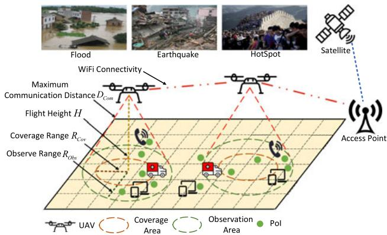  
Fig. 1. Partially observable multi-UAV navigation scenario.

The main contributions of this paper are as follows:

1) Based on simulations, we design a spatial-temporalaware network architecture named Deep Recurrent Graph Network (DRGN) for our partially observable environment, which could obtain spatial information with GAT-FANET and get historical information from the memory unit.

2) We propose a novel maximum-entropy reinforcement learning algorithm named SDRGN that could learn stochastic policies with the DRGN network. To our knowledge, this is the first work that learns a graph-based stochastic policy in the field of multi-UAV navigation.

3) As we assume that global information is not available during training, we design a heuristic reward function that only evaluates the local information but encourages the UAV swarm to perform well in terms of the global metric.

4) We conducted extensive simulations to validate the effectiveness of the heuristic reward function, and analyze several characteristics of SDRGN, including performance, scalability, transferability, robustness, and interpretability.

The rest of the paper is organized as follows. In Section 2, we review recent works related to multi-UAV navigation. The system model and problem statement are defined in Section 3. We describe our approach in Section 4. Experimental studies including network architecture evaluation and analysis are given in Section 5. Finally, we draw conclusions and prospect the future work in Section 6.

## 2 RELATED WORKS

## 2.1 UAV Deployment and UAV Ad-Hoc Network

Some recent works have made in-depth studies on the deployment of UAVs to make it more practical in real-world tasks. The authors in [20] proposed a multi-UAV control model that could increase the deployment coverage of UAVs with energy efficiency. [21] proposed a decentralized solution for multi-UAV deployment by adjusting a set of parameters that control the UAVs‘ behaviors and actions. [22] presented a method to minimize the deployment delay of the UAVs and the overall delay. [23] introduced a framework for optimizing the deployment and mobility of multiple UAVs to control the overall deployment with regard to the energy efficiency of the ground equipment.

With recent progress in Ad-hoc network [3], where all nodes within the communication range could establish connections, it is practical to design multi-UAV control methods with the assumption that the UAV could communicate with neighboring UAVs in low-latency. In recent years, Adhoc network for multi-UAV deployment, known as Flying Ad-hoc Network (FANET), has been proved to have better performance than other network structures [24], [25].

## 2.2 Cooperative Exploration and Path Planing

A control policy with high exploration efficiency is necessary when the UAV swarm is deployed in an unexplored environment under limited observation. The most widelyused exploration strategy may be -greedy, which has the probability of  to select actions randomly in each decision, and  often decays with the convergence of the policy. In recent years, many advanced methods have been proposed for multi-UAV cooperative exploration. For instance, [26] developed a game theory framework suitable for multi-UAV collaborative search and monitoring. [27] proposed a cooperative exploration strategy specialized for the UAV-UGV-combined system, which could minimize the total exploration distance under energy consumption and functional constraints. [28] used multi-UAV to build a slambased collaborative exploration system, which could reduce the amount of shared data by only exchanging the frontier points of the computed local grid map.

Before the emergence of deep learning, path planning for multi-UAV is mainly studied with heuristic methods and reinforcement learning (RL) methods. [29] proposed a multi-objective optimization algorithm for multi-UAV task assigning and path planning, in which genetic algorithm(GA) was adopted to minimize the inference time of the policy.

TABLE 1 List of Important Notations Used in the Paper
<table><tr><td>Notation</td><td>Explanation</td></tr><tr><td> $k , K$ </td><td>PoI index, the number of PoIs</td></tr><tr><td> $G _ { i }$ </td><td>Subgraph i, which consists of UAV i and its one-</td></tr><tr><td> $t , T$ </td><td>hop neighbors Timeslot index, the maximum timeslot of an</td></tr><tr><td> $i , N$ </td><td>episode UAV index, the number of UAV</td></tr><tr><td> $H$ </td><td>The fixed flight height of each UAV</td></tr><tr><td> $D _ { C o m }$ </td><td>Maximum communication distance</td></tr><tr><td> $R _ { O b s } , R _ { C o v }$ </td><td>Observation range, coverage range</td></tr><tr><td> $o _ { t } ^ { \ i } , o _ { i }$ </td><td>Local observation of UAV i at timeslot t</td></tr><tr><td> $\bar { \mathcal { O } } _ { t } ^ { i } , \mathcal { O } _ { i }$ </td><td>Observations of UAVs in  $G _ { i }$  at timeslot t</td></tr><tr><td> $a _ { t } ^ { \ i } , a _ { i }$ </td><td>Action of UAV i at timeslot t</td></tr><tr><td> $r _ { t } ^ { \ i } , r _ { i }$ </td><td>Reward of UAV i at timeslot t</td></tr><tr><td> $\mathbf { o } _ { \mathbf { t } } , \mathbf { a } _ { \mathbf { t } } , \mathbf { r } _ { \mathbf { t } }$ </td><td>Observations, actions, rewards of all UAVs at timeslot t</td></tr><tr><td> $h _ { t } ^ { i } , \mathcal { H } _ { t } ^ { i }$ </td><td>Hidden states of UAV&#x27;s GRU i at timeslot  $t ,$  hidden states of UAVs in  $G _ { i }$  at timeslot t</td></tr><tr><td> $c _ { t } , c _ { T }$ </td><td>Coverage index at timeslot  $t ,$  final coverage index at timeslot T</td></tr><tr><td> $f _ { t } , f _ { T }$ </td><td>Fairness index at timeslot  $t ,$  final fairness index at timeslot T</td></tr><tr><td> $e _ { t } , e _ { T }$ </td><td>Energy index at timeslot  $t ,$  final energy index at timeslot T</td></tr></table>

[30] designed a variety of path planning algorithms based on the information of each station according to a fixed station, to find a path suitable for the central UAV. [31] proposed the mean-field game (MFG) control theory to achieve fast positioning and low flight consumption, in which two partial differential equations are solved by machine learning methods. [32] treated the UAV swarm as an agent and achieves the optimal navigation with an on-policy RL method SARSA [33], which is a lightweight policy with linear time complexity.

## 2.3 DRL for Multi-UAV Navigation

Deep reinforcement learning (DRL) is a powerful tool that uses deep neural network (DNN) to learn RL policies to solve decision-making problems. Compared with the RLbased method which is more computationally light, the DRL-based approach could handle high-dimensional data and extract complicated features with DNN, which leads to better flexibility and performance. Recent advances in edge computing have significantly improved the computing power of the onboard computer, thus many works have tried to use DRL models to control the multi-UAV navigation in real-world-complexity tasks. Different from RL methods that typically treat the whole UAV swarm as a single agent [32], recent DRL-based works seek to control each UAV in a decentralized manner, hence their performance improves with the progress of multi-agent deep reinforcement learning (MADRL).

Independent Q-learning (IQL) [34] is probably the simplest and most commonly applied method in the MADRL field. It discomposes the multi-agent problem into multiple simultaneous single-agent tasks, by learning a decentralized Qlearning model for each agent. [35] designed UAV longitudinal and lateral Q-learning fuzzy controllers to solve the multi-UAV formation control problem. [36] handled the problem of the flocking of small fixed-wing UAVs with IQL, where the technique of parameter sharing among the DRL models of all UAVs is applied to speed up the model convergence.

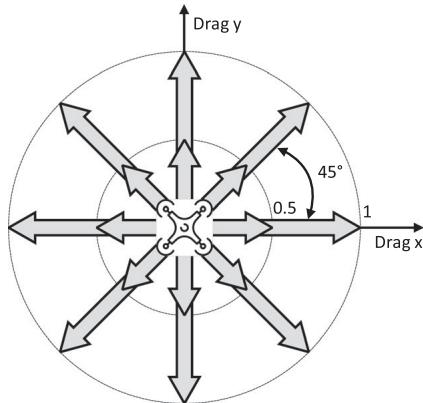  
Fig. 2. The action space of the UAV in our environment. Each gray arrow denotes one action with the corresponding drag. Note that there is also a zero-drag action omitted in the figure.

To address the environmental instability caused by training multiple policies simultaneously in IQL, [37] introduced the paradigm of centralized training and decentralized execution (CTDE), which trains each decentralized policy with a centralized critic network that is granted with a global state of the environment, then executes the policies in a decentralized manner. [38] proposed a CTDE MADRL model to provide secure communications by jointly optimizing the trajectory of UAV-MBSs, which applies self-attention mechanism [39] in MADDPG to improve the efficiency of the information aggregation among UAVs. [15] adopts MADDPG to handle the problem of navigating a group of UAVs as mobile base stations to provide long-term communication coverage for the ground mobile users in a target area.

Note that the CTDE approach requires global information in the training phase, which is normally infeasible in real-world tasks. To achieve fully decentralized training, DGN [40] utilized GAT [17] network to aggregate information from neighboring agents (instead of all agents). As is metioned in Section 2.1, with the development of FANET, it is much eaiser to achieve communications among adjacent UAVs, so it is practical to use GAT structure in the multi-UAV collaboration scenario. Most recently, [16] adopts DGN to solve the UAV-MBSs problem introduced by [15].

The differences between this paper and previous works are summarized as follows. [15] proposes the UAV-MBS problem and solves it with a CTDE approach, which assumes evenly distributed points of interest (PoIs) and requires global information during training. By contrast, we assume that the model could only obtain a partial observation in the training phase, and the PoIs are randomly distributed. [16] adopts DGN to the UAV-MBS problem, yet the network structure is not well-studied and its performance has no significant advantage over other model-free heuristic methods; whilst we design GAT-FANET, a network structure appropriate for the inter-UAV communication in the UAV-MBSs task, and introduce a memory unit for recording temporal information in the network. Besides, the works mentioned above handle July 05,2026 at 12:38:43 UTC from IEEE Xplore. Restrictions apply.

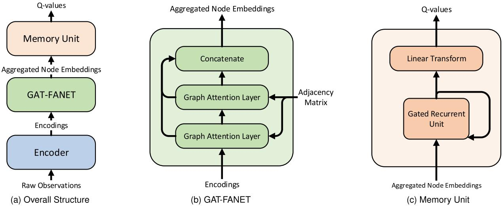  
Fig. 3. Network architecture of the proposed DRGN model. It consists of three modules: encoder, GAT-FANET, and the memory unit.

the UAV-MBSs problem with deterministic policies, while we propose to learn stochastic policies with the designed network structure. Experiments show that the stochastic method is more robust than previous deterministic policies in our partially observable environment. Further, [14], [15], [16] tested the algorithms with a relatively small UAV team (from 3 to 10), whilst we tested the model in environments with up to 40 UAVs, validating the better scalability of our proposed model.

## 3 SYSTEM MODEL AND PROBLEM STATEMENT

## 3.1 System Model

We introduce a scenario of multi-UAV navigation control for fair communication coverage under partial observation. A group of N UAVs navigate at a fixed altitude H and serve as mobile communication base stations to provide communication services to ground users. The simulation world is a continuous 2D map, as shown in Fig. 1, and we assume that the map size is $L \times L$ units. We set $D _ { C o m }$ as the maximum communication distance within which a UAV can communicate with other UAVs and ground users. As all UAVs fly at the same altitude, they are interconnected in the Ad-hoc network when their relative distance is less than $D _ { C o m } ,$ and a UAV can communicate with any ground user whose distance to the center of UAV on the 2D map is less than the observe range $R _ { O b s } = \sqrt { D _ { c o m } ^ { 2 } - H ^ { 2 } }$ . As real-world conditions might affect communication quality, we assume that a ground user can obtain a stable communication service from a UAV if its distance to the UAV on the 2D map is less than the coverage range $R _ { C o v } .$ . If the distance is more than $R _ { C o v }$ and less than $R _ { O b s } ,$ the ground user can be observed by the UAV but provided with an unstable communication service. Different from the prior works [37], [41] assuming that the ground users are evenly distributed, we use randomly distributed PoIs to represent the ground users.

Specifically, we consider a task where N UAVs navigate to cover K PoIs for T timeslots. At the beginning of each task, the position of PoIs and UAVs is randomly assigned. Since the UAV can only observe the PoI within a limited observe range, in order to cover more PoIs, the UAVs should cooperate to explore the distribution of PoIs and choose the trajectory that maximizes the teams’ interest in a decentralized manner.

Table 1 lists important notations used in this paper.

## 3.2 Observation Space and Action Space

For each UAV i at timeslot t, it could obtain a local observation oi from the environment. As depicted in Section 3.1, the UAV can observe the PoIs and other UAVs within the circles with the radius of $R _ { o b s }$ and $D _ { c o m }$ centered on itself, respectively.

As the number of PoIs and UAVs in the observation area dynamically changes during the task, to keep the dimension of observation space consistent, we transform the continuous circle observation area into discrete pixels, in which the value of each pixel indicates the number of PoI or UAV on that position. Specifically, the observation consists of 4 elements: PoI map $\mathbf { M } _ { P o I } ,$ UAV map $\mathbf { M } _ { U A V . }$ , the binary encoding of the current location ${ \bf e } _ { p o s } ,$ and the current velocity v. The PoI map and the UAV map are pixel maps in which each pixel records the number of PoI and UAV at the corresponding position in the circular observable area. Since we set 1 unit as the fundamental unit of the pixel map, the PoI map and UAV map are vectors of length $\lfloor \pi R _ { o b s } ^ { 2 } \rfloor$ and $\left\lfloor \pi D _ { c o m } ^ { 2 } \right\rfloor ,$ where denotes the floor operation. The binary encoding bcof location $\mathbf { e _ { p o s } }$ is a vector of length 2d that consist of the binary code of the UAV’s current position on the continuous world $( \lfloor x _ { t } ^ { i } , y _ { t } ^ { i } \rfloor )$ , where d is a hyper-parameter that meets the ðb ccondition that $2 ^ { d }$ is greater than the world size L. The velocity vector v is a 2D vector that indicates the normalized velocity. Therefore the observation is a vector of length $\left\lfloor \pi R _ { o b s } ^ { 2 } \right\rfloor + \left\lfloor \pi D _ { c o m } ^ { 2 } \right\rfloor + 2 d + 2$ , and could be represented as

$$
o _ { t } ^ { i } = ( \mathbf { M } _ { P o I } | \mathbf { M } _ { U A V } | \mathbf { e } _ { p o s } | \mathbf { v } ) ,\tag{1}
$$

where denotes the concatenation operation.

ðjÞThe UAV controls its movement by performing a certain drag to adjust the velocity. Hence we design the action as a 2D drag vector. Concretely, we evenly divide the 2D plane into 8 directions and set the maximum drag of the UAV to 1 unit. The UAV’s action space, which is shown in Fig. 2, consists of 17 actions, including 1 action of zero-drag, and 16 actions denoting the maximum-drag and half-drag for all 8 possible directions.

## 3.3 Evaluation Metrics and Problem Statement

We next introduce three global metrics to evaluate the performance of the UAV swarm, then state the goal of this problem. Following [15], we evaluate the performance of a policy from the perspectives of coverage, fairness, and energy consumption. The first metric is coverage index, which measures how every PoI was covered by any UAV in the past t time slots. At any time slot $t ,$ if the PoI k is in the coverage area of any UAV, we call it ”covered”, otherwise it is not covered. Specifically, the coverage index in timeslot t can be represented as

$$
c _ { t } = \frac { \Sigma _ { k = 1 } ^ { K } w _ { t } ( k ) } { K t } ,\tag{2}
$$

where $K$ is the number of PoI, $w _ { t } ( k )$ is the number of time-ð Þslot that a PoI k was covered until the timeslot $t ;$ thus, $c _ { t } \in$ 20; 1 always holds. We refer the coverage index at the last ½ timeslot $\dot { T }$ to final coverage index, denoted as $c _ { T } = c _ { t | t = T } ,$ to ¼ j ¼evaluate the performance of the UAV team in an episode.

However, the final coverage index could be high even when a small subset of PoIs are never covered, thus, fairness of coverage is very important in many critical circumstances. For instance, in case of earthquakes or storms, we hope that even an isolated PoI can have the opportunity to obtain communication services. Besides, as we consider a partially observable environment, we want to evaluate the exploration capability of the policy by verifying whether it could cover the remote/isolated PoIs. Therefore, following [15], we use Jain’s fairness index to describe the geographical fairness of the coverage of PoIs, as

$$
f _ { t } = \frac { ( \Sigma _ { k = 1 } ^ { K } w _ { t } ( k ) ) ^ { 2 } } { K \Sigma _ { k = 1 } ^ { K } \left( w _ { t } ( k ) \right) ^ { 2 } } .\tag{3}
$$

Obviously, $f _ { t } \in [ \frac { 1 } { K } , 1 ]$ always holds. Further, if all $w _ { t } ( k )$ are equal, $f _ { t }$ 2 ½  ð Þis the maximum value 1; if only 1 PoI is covered, $f _ { t }$ $\mathrm { i s } { \frac { 1 } { K } }$ . We refer the fairness index at the last timeslot $T$ as final fairness index, denoted as $f _ { T } = f _ { t | t = T } ,$ , to evaluate the cover-j ¼age fairness and the exploration level in an episode.

Lastly, following the previous work [14], we assume that the energy consumption is linear to the flight distance and define the energy consumption of each UAV as

$$
e _ { i } ^ { t } = e _ { 0 } + k \times l _ { i } ^ { t } ,\tag{4}
$$

where $e _ { 0 } = 0 . 5$ is the hovering energy consumption, $l _ { i } ^ { t } \in$ ¼ 20; 1 is the normalized flight distance in the last transition, ½and $k = 0 . 5$ is a co-efficient. We herein define the energy ¼index of the UAV swarm in a task by averaging all N UAVs in all $T$ timesteps

$$
e _ { t } = \frac { 1 } { t \times N } \sum _ { \tau = 1 } ^ { t } \sum _ { i = 1 } ^ { N } e _ { i } ^ { t } .\tag{5}
$$

We combine the three metrics and define the overall objective as coverage-fairness-energy (CFE) score, represented as

$$
C F E _ { t } = \frac { c _ { t } \times f _ { t } } { e _ { t } } .\tag{6}
$$

In a word, the goal of the problem is to learn a decentralized policy $\pi ^ { * }$ that could execute under partial observation pto maximize CFE score of the whole episode, that is

TABLE 2  
The Computational Complexity Analysis of DRGN on Each UAV
<table><tr><td>Module</td><td>Component</td><td>MACCs</td></tr><tr><td>Encoder</td><td>Fully connected layer Attention weights (Eq. (10))</td><td> $d _ { i n } \times d _ { h i d }$ </td></tr><tr><td></td><td>GAT layer Attention vector (Eq. (11)) Fully connected layer</td><td> $2 d _ { h i d } ^ { 2 } + d _ { h i d } \times n _ { n e i }$   $d _ { h i d } ^ { 2 } + d _ { h i d } \times n _ { n e i }$ </td></tr><tr><td>GAT-</td><td>Two GAT layers + skip</td><td> $d _ { h i d } ^ { 2 }$   $8 d _ { h i d } ^ { 2 } + 2 \ddot { d } _ { h i d } \times n _ { n e i }$ </td></tr><tr><td>FANET Memory</td><td>connection</td><td> $d _ { h i d } ^ { \prime } \times 4 d _ { h i d } = 1 2 d _ { h i d } ^ { 2 }$ </td></tr><tr><td>unit</td><td>GRU(Eq. (13)) Fully connected layer</td><td> $d _ { h i d } \times d _ { a c t }$ </td></tr></table>

The cost of activation function and bias are omitted for computing MACCs. The input dimension, hidden dimension, number of neighbors, and action dimension are represented by $d _ { i n } ,$ d , $n _ { n e i } ,$ and $d _ { a c t } ,$ respectively. Note that $d _ { h i d } ^ { \prime } = 3 d _ { h i d }$ is the output dimension after skip connection.

$$
\pi ^ { * } = \arg \operatorname* { m a x } _ { \pi } { \mathit { C F E } } _ { t \mid t = T } ,\tag{7}
$$

where $T$ is the last timeslot of the episode.

In addition to the above metrics, we add a constraint to the problem that the model will only be granted with local information as the training sample. It denotes that the learning objective, CFE score, cannot be obtained to formulate the objective function in the training phase. This setting is relevant to the keyword decentralized training (DT) in MADRL, which requires less training cost and brings possibilities for online learning after the model is deployed.

## 4 PROPOSED FULLY-DECENTRALIZED DRL SOLUTIONS FOR MULTI-UAV NAVIGATION

In this section, we present Soft Deep Recurrent Graph Network (SDRGN), a fully decentralized DRL-based multi-UAV control solution for partially observable communication coverage. In the solution, all UAVs share the same policy for path planning and control in a decentralized manner with Ad-hoc network communication. Different from previous works that adopt the CTDE framework [37], [42], [43] and therefore require global observation during the training phase, our approach only uses local information as the training sample and thus meets the partially observable constraints in both the training stage and the testing stage.

We first introduce a novel network architecture named Deep Recurrent Graph Network (DRGN), then show how to train a DRGN-structured stochastic policy with maximum-entropy learning, finally design a heuristic reward function to support the decentralized training.

## 4.1 Deep Recurrent Graph Network

The network architecture of Deep Recurrent Graph Network (DRGN) for MADRL is shown in Fig. 3.

First, DRGN applies an encoder to process the raw input

$$
e _ { i } = E N C ( o _ { i } ) ,\tag{8}
$$

where $o _ { i }$ and $e _ { i }$ is the local observation and its embedding for agent $i ,$ and ENC is the encoder function shared by all agents. We use a fully connected layer as the encoder.

Then, DRGN embeds the communication protocol into the network architecture with the graph convolution July 05,2026 at 12:38:43 UTC from IEEE Xplore. Restrictions apply.

mechanism. A UAV i is a node in the graph and has node embedding $e _ { i } .$ Node embeddings are passed through the edge between nodes so that each node can obtain information from itself and neighboring nodes. For convenience, we define $G _ { i }$ as the set of node i and its one-hop neighbors

$$
G _ { i } = \{ j | \forall j \ : \ : \ : s . t . \ : A ( i , j ) = 1 \} ,\tag{9}
$$

where A is the adjacency matrix of FANET. The observation and embedding of all UAVs in $G _ { i }$ could be represented as $\mathcal { O } _ { i } = \{ o _ { j } | \forall j \in G _ { i } \}$ and $\mathcal { E } _ { i } = \{ e _ { j } | \forall j \in G _ { i } \}$ , respectively.

¼ f j8 2 gIn a subgraph $G _ { i } ,$ E ¼ f j8 2 g the importance of each neighboring node to node i may be quite different. For example, when the UAV i does not find any PoI in its observation area, the neighboring UAV that observes the biggest number of PoIs should be of the greatest importance, while other nodes need less attention. To this end, we adopt graph attention (GAT) [44] as the convolution kernel to process the graph data, which utilizes self-attention mechanism [39] to decide the importance of each node in subgraph i by Eq. (10), and aggregate the neighboring information for node i by Eq. (11)

$$
\alpha _ { i j } = \frac { \exp ( ( W _ { K } e _ { j } ) ^ { T } \cdot W _ { Q } e _ { i } ) } { \sum _ { k \in G _ { i } } \exp ( ( W _ { K } e _ { k } ) ^ { T } \cdot W _ { Q } e _ { i } ) } ,\tag{10}
$$

$$
g _ { i } = G A T ( \mathcal { E } _ { i } ) = \Sigma _ { j \in G _ { i } } \alpha _ { i j } \cdot W _ { V } e _ { j } ,\tag{11}
$$

where $\alpha _ { i j }$ is the attention weight that determines the impor-atance of node j to node $i ,$ and $g _ { i }$ is the output embedding for node i after the information aggregation. $W _ { Q } , W _ { K } , W _ { V }$ are learnable matrices that map the embedding $e _ { i }$ into the query, key, value vector [39], respectively. Note that $j \in G _ { i }$ in 2Eq. (11) denotes that the self-attention operation is only executed between nodes interconnected in the graph. To improve the GAT’s expressive capability, we implement the self-attention mechanism with M heads, $\mathrm { i . e . , }$ execute M independent graph-attention kernels in parallel, and concatenate the outputs

$$
g _ { i } = C o n c a t _ { m = 1 } ^ { M } ( g _ { i } ^ { m } ) .\tag{12}
$$

Based on the simulation, we establish a high efficient GAT-based network structure to execute learnable communication among adjacent nodes in FANET, which is named GAT-FANET. We stack two GAT layers together to provide a two-hop perception field for each node. To illustrate, the node i in the second GAT layer could obtain its neighbor nodes’ embedding in the first GAT layer, which contains the information aggregated from the node that is two-hop to i. Note that the node i only communicates with its onehop neighbors. To accelerate the training process and prevent over-fitting, skip connections [45] are created over the two GAT layers. Specifically, the output of the encoder, the first and the second GAT layer are concatenated as the output of GAT-FANET, which is shown in Fig. 3b.

After GAT-FANET, each node i gets an embedding $g _ { i } ^ { \prime }$ that aggregates information from other nodes in its two-hop subgraph. Based on the intuition that storing history information could alleviate the information loss induced by the partially observable constraint, we design a memory unit for DRGN to record the historical graph embedding, which is shown in Fig. 3c. Specifically, we choose gated recurrent unit (GRU) [18] as the memory unit to utilize its long-term memory ability

$$
h _ { t } ^ { i } = G R U ( g _ { t } ^ { \prime i } | h _ { t - 1 } ^ { i } ) ,\tag{13}
$$

where $g _ { t } ^ { \prime i }$ is the node $i \prime \mathrm { s }$ embedding output from GAT-FANET, $h _ { t - 1 } ^ { i }$ is the hidden state of UAV i’s GRU in the last timeslot.

Finally, we use a linear transform to process the output of GRU to calculate the Q-values. For each agent, DRGN only takes the observation of the subgraph and the GRU’s last hidden state h as input and outputs the Q-values for all possible actions A in one forward propagation, i.e., $Q ( \bar { \mathbf { A } } | \mathcal { O } , h )$ $\mathcal { O } \times h  \mathbb { R } ^ { \mathbf { A } }$ ð jO Þ, which decreases the computational complexity.

 !The multiply-accumulate operations (MACCs) of DRGN on each UAV is presented in Table 2. It can be seen that GAT-FANET and memory unit occupy the main computational overhead of DRGN. For the sake of inference speed, we do not stack more GAT layers in GAT-FANET; in the memory unit, we parallelize the computations inside the GRU. The overall MACCs of DRGN is

$$
d _ { h i d } \times ( d _ { i n } + 2 n _ { n e i } + 2 0 d _ { h i d } + d _ { a c t } ) .\tag{14}
$$

## 4.2 Learn Maximum-Entropy Policies With DRGN

In this section, we present Soft Deep Recurrent Graph Network (SDRGN), a novel MADRL algorithm based on maximum-entropy theory to learn DRGN-structured stochastic policies for partially observable communication coverage.

As is mentioned in Section 4.1, DRGN is a neural network that maps from the state space to the action space. Inspired by soft Q-learning [19], instead of estimating the expected return value of each action like other communication-based MADRL algorithm [40], [46], we predict the probability distribution of all possible actions. Specifically, the unbounded output of DRGN is processed with a temperature-softmax

$$
P ( \mathbf { A } | \mathcal { O } , h ) = s o f t m a x \bigg ( \frac { Q ( \mathbf { A } | \mathcal { O } , h ) } { \alpha } \bigg ) ,\tag{15}
$$

where is a temperature hyper-parameter that is positively acorrelated with the degree of exploration.

The process of the UAVs interacting with the environment can be summarized as follows: At each timeslot, every UAV i obtains an observation $o _ { t } ^ { i }$ and calculates the probability for all actions. We use the multinomial sampling strategy to sample the action from the output probability distribution. After the actions executed, each agent will obtain a reward $r _ { i }$ and a new observation $o _ { t + 1 } ^ { i }$

þFollowing DQN [47], we use a target network for calculating the learning target of the model. The target network is a copy of the learned DRGN network. Its parameters are updated by directly copying the parameters of the trained model in every few iterations. We update the model by minimizing the squared temporal difference of the soft Bellman function [19]

$$
Q \_ l o s s = \frac { 1 } { S } \Sigma \Big ( r _ { t } + V ( \mathcal { O } _ { t + 1 } , h _ { t + 1 } ^ { i } ) - Q ( a _ { t } | \mathcal { O } _ { t } , h _ { t } ^ { i } ) \Big ) ^ { 2 } ,\tag{16}
$$

where $\mathcal { O } _ { t } = \{ o _ { t } ^ { j } | \forall j \in G _ { t } ^ { i } \}$ and $G _ { i }$ is the subgraph $i , h _ { t } ^ { i }$ is the O ¼ f j8 2 glast hidden states of agent i’s GRU, S is the size of mini-July 05,2026 at 12:38:43 UTC from IEEE Xplore. Restrictions apply.

batch and N is the number of UAVs in the sampled experience. The value function $V ( \mathcal { O } _ { t } , h _ { t } ^ { i } )$ is defined as

$$
V ( \mathcal { O } _ { t } , h _ { t } ^ { i } ) = \alpha \cdot \log \Sigma _ { a _ { t } \in \mathbf { A } } \mathrm { e x p } \Big ( \frac { Q ^ { \prime } ( a _ { t } | \mathcal { O } _ { t } , h _ { t } ^ { i } ) } { \alpha } \Big ) ,\tag{17}
$$

where $Q ^ { \prime }$ denotes the target network.

Algorithm 1. Training Procedure of SDRGN   
1: Initialize a DRGN network Q of parameters and target   
network $Q ^ { \prime }$ with parameters $\theta ^ { \prime }  \bar { \theta } .$   
2: Set global time step $T \gets 0$   
3: for episode = 1 max-episodes do   
!4: Randomly reassign the position of PoIs and UAVs.   
5: for local time step t 1 episode-length do   
6: $T \gets T + 1$   
7: þfor agent $i = 1$ to $N$ do   
8: ¼Obtain the observations $\mathcal { O } _ { t } ^ { i }$ of the subgraph $G _ { i } .$   
9: OSelect the action based on Eq. (15).   
10: Execute the action $a _ { t } ^ { i } ,$ then obtain the corresponding   
reward $r _ { t } ^ { i }$ and observations $\mathscr { O } _ { t + 1 } ^ { i } .$   
11: Obtain a experience $( \mathcal { O } _ { t } ^ { i } , \mathcal { H } _ { t } ^ { i } , a _ { t } ^ { i } , r _ { t } ^ { i } , \mathcal { O } _ { t + 1 } ^ { i } , \mathcal { H } _ { t + 1 } ^ { i } ) .$   
12: end for   
13: Integrate and store the experience of N agents as:   
$\left( \mathbf { o } _ { t } , \mathbf { h } _ { t } , A _ { t } , \mathbf { a } _ { t } , \mathbf { r } _ { t } , \mathbf { o } _ { t + 1 } , \mathbf { h } _ { t + 1 } , A _ { t + 1 } \right)$   
14: if T mod training-interval 0 then   
15: ¼Randomly sample S integrated experiences.   
16: for each integrated experience do   
17: Split it into N individual experiences using $A _ { t }$ and   
$A _ { t + 1 } .$   
18: þend for   
19: Use the $S \times N$ individual experiences to update the   
DRGN network based on Eq. (16).   
20: end if   
21: if T mod target-update-interval 0 then   
22: Update target network $Q ^ { \prime }$ ¼by: $\theta ^ { \prime }  \theta$   
23: end if   
24: end for   
25: end for

Based on Eq. (16), the tuple $( \mathcal { O } _ { t } ^ { i } , h _ { t } ^ { i } , a _ { t } ^ { i } , r _ { t } ^ { i } , \mathcal { O } _ { t + 1 } ^ { i } , h _ { t + 1 } ^ { i } )$ is a ðO O þ þ Þfundamental unit for training SDRGN model and we call it as an experience. According to the realistic situation, we propose two strategies for replaying the experience and training the model. The first training scheme is designed for circumstances in which centralized training is feasible. It integrates the experience of all agents in a timeslot into a tuple $\left( \mathbf { o } _ { t } , \mathbf { h } _ { t } , A _ { t } , \mathbf { a } _ { t } , \mathbf { r } _ { t } , \mathbf { o } _ { t + 1 } , \mathbf { h } _ { t + 1 } , A _ { t + 1 } \right)$ and resamples it as a ðwhole, where $A _ { t }$ þ þ þ Þis the adjacency matrix of FANET. In this way, we reduce memory usage by storing experiences without duplication. Besides, since the sampled experiences belong to the same timeslot, the stability of the training process is improved. After the centralized training, the learned policy can be executed in a distributed manner, which is similar to the centralized training and decentralized execution algorithms [37], [42], [43]. The second training method is designed for distributed training circumstances, e.g., online fine-tuning the model with the onboard computer during the task. This method is similar to other independent learning algorithms such as independent Q-learning [34], which stores the experience of each agent individually and resamples it randomly to train the model. Pseudocode for the centralized training process of SDRGN is presented in Algorithm 1, and the distributed training version is omitted for its simplicity.

## 4.3 The Heuristic Reward Function

As is mentioned in Section 3.3, the objective of the multi-UAV system is to maximize the global metric called CFE score, which is defined in Eq. (6). A very intuitive idea is to directly use this metric as the reward [15], i.e.,

$$
\boldsymbol { r } _ { i } ^ { t } = \boldsymbol { C } \boldsymbol { F } \boldsymbol { E } _ { t } .\tag{18}
$$

However, due to the partially observable settings of our problem, the global metrics are not available in the distributed training process. Besides, although we could obtain them in the centralized training phase, due to the partial observability constraint there is an information gap for the decentralized model to predict the global metric, which could induce an ultra-unstable training process. Therefore, we seek to design a reward function which only depends on the local information that can be obtained by the decentralized policy. We expect that the reward function could encourage the UAV swarm to achieve a better CFE score, which denotes a larger coverage index $c _ { t }$ and fairness index $f _ { t } ,$ , while minimizing the energy index $e _ { t } .$ As the objective of DRL is to maximize the expected return $R _ { T } ^ { i } = \boldsymbol { \Sigma } _ { i = 1 } ^ { \prime N } \boldsymbol { \Sigma } _ { t = 1 } ^ { T } \boldsymbol { \gamma } ^ { T - t } \boldsymbol { r } _ { t } ^ { i } ,$ ideally, we ¼expect to design a reward function $r _ { i }$ ¼ gthat meets

$$
\sum _ { i = 1 } ^ { N } \sum _ { t = 1 } ^ { T } \gamma ^ { T - t } r _ { t } ^ { i } \propto C F E _ { T } = \frac { c _ { T } \times f _ { T } } { e _ { T } } .\tag{19}
$$

As the desired reward function plays a similar role to the heuristic function in $\mathsf { A } ^ { * }$ algorithm, we name it as the heuristic reward function. The reward function mainly consists of individual term, teamwork term, and energy term.

The individual term $r _ { s e l f }$ is defined as the number of PoIs that are exclusively covered by the agent itself. Note that the PoIs occupied by multiple UAVs will not contribute to this term, which is supposed to encourage the UAVs to explore more PoIs in the map

$$
r _ { s e l f } = n _ { p o i } ^ { i } ,\tag{20}
$$

where $n _ { p o i } ^ { i }$ denotes the number of PoIs exclusively covered by the agent i.

The teamwork term $r _ { t e a m }$ is defined as the averaged number of PoIs covered by other UAVs in the one-hop adjacency graph $G _ { i }$ of the $\mathrm { \Delta } \mathrm { U A } \dot { \mathrm { V } } i ,$ which is expected to encourage the connectivity and cooperation among adjacent UAVs

$$
r _ { t e a m } ^ { i } = \frac { n _ { p o i } ^ { o n e h o p } } { n _ { o n e h o p } } ,\tag{21}
$$

where $n _ { o n e h o p }$ denotes the number of one-hop neighboring $\mathrm { U A V s } ,$ and $\dot { n } _ { p o i } ^ { o n e h o p }$ denotes the number of PoI covered by these one-hop neighbors.

The energy term $r _ { e n e r g y }$ is the energy consumption of UAV $i ,$ which is expected to reduce the energy consumption and improve the flight distance

$$
r _ { e n e r g y } = \frac { 1 } { e _ { i } ^ { t } } ,\tag{22}
$$

where $e _ { i } ^ { t }$ is UAV i’s energy consumption in the last timeslot, which is defined in Eq. (4).

The overall reward function could be represented as

$$
r _ { i } = ( r _ { s e l f } + 0 . 1 \times r _ { t e a m } ) \times r _ { e n e r g y } + p _ { i } ,\tag{23}
$$

where $p _ { i }$ is an additional term to penalize the UAV i when it flies outside the 2D map. Specifically, we define the penalty term p as

$$
p _ { i } = { \left\{ \begin{array} { l l } { - 1 } & { { \mathrm { U A V ~ f l i e s ~ o u t s i d e ~ t h e ~ m a p } } } \\ { 0 } & { { \mathrm { U A V ~ f l i e s ~ i n s i d e ~ t h e ~ m a p } } } \end{array} \right. } .\tag{24}
$$

TABLE 3
<table><tr><td>Algorithm</td><td>DT?</td><td>DE?</td><td>Ad-hoc?</td><td>Stochastic?</td></tr><tr><td>DQN</td><td>√</td><td>√</td><td>×</td><td>×</td></tr><tr><td>MAAC</td><td>×</td><td>√</td><td>×</td><td>√</td></tr><tr><td>CommNet</td><td>×</td><td>×</td><td>√</td><td>X</td></tr><tr><td>DGN</td><td>√</td><td>√</td><td>√</td><td>×</td></tr><tr><td>DRGN (ours)</td><td>√</td><td>√</td><td>√</td><td>×</td></tr><tr><td>SDRGN (ours)</td><td>√</td><td>√</td><td>√</td><td>√</td></tr></table>

Comparison of the Characteristics of Tested DRL Algorithms

DT means the capability of decentralized training, and DE means decentralized execution, Ad-hoc denotes whether communicate during execution. Stochastic means the stochastic policy.

## 5 EXPERIMENTS

## 5.1 Experimental Settings

We implement our model with Pytorch 1.4.0, on a Ubuntu 18.04 server with 1 NVIDIA A100 GPU and 1 Intel Core i9- 9900X @3.50GHz CPU. The simulation environment is implemented in Python and accelerated by Numba‘s JIT technique. The target region is set as a continuous map of 200 200 units with 120 randomly distributed PoIs. The distribution of PoIs for each episode is as follows: we first sample 3 major points from a uniform distribution. For each major point, we randomly generate 40 PoIs, whose position offset to the major point is sampled from Gaussian distribution. In the training phase, we deploy N 20 UAVs with a ¼parameter-shared DRL model in the simulation environment, and in the testing phase, the number of UAVs varies within 5; 10; 15; 20; 25; 30; 35; 40 . Without loss of generality, the coverage range $R _ { C o v }$ is 10 units and the observe range $R _ { O b s }$ is 13 units. The maximum communication distance $D _ { C o m }$ for FANET is 18 units. The maximum velocity of the UAV is 16 units. The length of each episode is 100, and when an episode ends, the positions of UAVs and PoIs will be reassigned randomly.

We set the learning rate to 1e-4 and use Adam [48] as the optimizer. The experience replay buffer size is 5e4, and the batch size is 128. The neuron number of all hidden layers is 256, and all attention kernels have 4 heads. The model is updated for 4 times in every 100 environmental timeslots. The target network is initialized with the same parameters as the learned network and is updated by copying the parameters of the model in every 500 environmental steps. The discounting factor $\gamma$ is 0.99, and the temperature gparameter for SDRGN and MAAC is 0.2. For deterministic apolicies, the exploration strategy is  greedy, in which the value of  is initially 0.9 and exponentially decays to 0.05 at around 30,000 episode. For stochastic models such as SDRGN and MAAC, the exploration strategy is $\epsilon -$ multinomial, and the  exponentially decays 0.

For each case, we train our models with 160,000 episodes. In every 100 episodes, an evaluation of the model is executed by running the frozen model with the minimum  for 100 episodes and calculating the averaged value of all global metrics.

We use the CFE score defined in Eq. (6) as the major metric for evaluation. Other global metrics such as coverage index, fairness index, and energy index are also considered.

## 5.2 DRL and Non-DRL Baselines

We compare SDRGN with four state-of-the-art DRL algorithms, including DQN [47], CommNet [46], MAAC [42], and DGN [40]. Besides, to verify the effectiveness of our maximum-entropy learning methods in Section 4.2, we also learn a DRGN-structured deterministic policy based on the same training settings as DGN. To distinguish it from SDRGN, we named it as DRGN. Discussions on the tested DRL baselines are as follows:

1) DQN is a simple yet strong DRL approach widely used in large-scale multi-agent tasks such as [49].

2) MAAC is a recent work that improves the scalability of MADDPG with the self-attention mechanism. Since our most relevant works [15] adopt MADDPG to control the multi-UAV navigation, we choose MAAC as the major object to compare with.

3) CommNet is a centralized approach that performs communication among all UAVs during training and execution. Thus we compare with it to show the superiority of our GAT-FANET based communication protocol.

4) DGN is a recently proposed algorithm that also adopts GAT as the building block of the communication structure, we compare with it to examine the necessity of the memory unit.

The analysis of the characteristics of all tested DRL algorithms are given in Table 3.

Meanwhile, we compare our approach with three non-DRL baselines as:

1) Random: At each timeslot t, all UAVs randomly select a action.

2) MB-Greedy: At each timeslot $t ,$ each UAV assumes that other UAVs choose ”zero-drag”, then tries all possible actions in a simulated environment to find the action $a _ { t } ^ { i }$ that could maximize the reward $r _ { t } ^ { i } .$ As a simulation environment is required that could estimate the reward of each action, this policy is named as Model-Based Greedy (MB-Greedy).

3) MB-GA: In this policy, the objective is to find a joint action a that maximizes the joint reward $\Sigma _ { i } r _ { t } ^ { i } .$ . As the joint action space is exponential to the number of UAVs, we adopted genetic algorithm (GA) to fit the near-optimal joint action at each timestep t. Since this policy also needs an environment model, we name it as Model-Based GA (MB-GA).

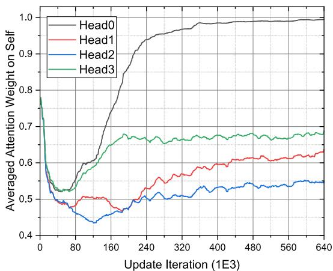  
Fig. 4. Graph attention weights on the self-node after 640,000 update iterations (160,000 episodes) of GAT-FANET.

Since the MG-Greedy and MB-GA policy would enumerate numerous possible actions at each timeslot to choose the best action with the biggest reward, they are considered as strong baselines that have near-optimal performance at the expense of the prohibitively slow inference speed.

## 5.3 Neural Network Convergence and Reward Function Effectiveness

As the multi-head GAT layer is the key element of GAT-FANET, its convergence is crucial to ensure the performance of the SDRGN model. Since GAT needs to calculate the attention weights of all nodes in a dynamic subgraph, we use GAT’s attention weight to the node itself as an indicator to judge whether it has converged. As shown in Fig. 4, each head of GAT converges to a certain value, and the difference between the value of different heads proves the necessity of using multiple heads.

We then show the convergence of all tested DRL methods by illustrating the trend of evaluation reward over the training phase, which is presented in Fig. 5. We also notice that SDRGN converges faster, better, and more stable than other DRL algorithms.

Regardless of the SDRGN’s superiority in terms of the reward, another question is that since we use the heuristic reward function that only evaluates local performance to train the DRL models, the model’s performance is not guaranteed in terms of global metrics. In other words, the heuristic reward function should meet Eq. (19). As can be seen in Fig. 6, as the episodic reward grows, the final coverage index and final fairness index are improved, and the final energy index is decreased, thus the effectiveness of the designed reward function is empirically demonstrated.

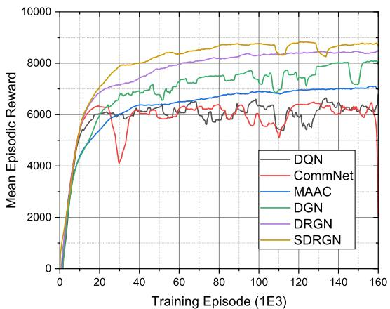  
Fig. 5. Evaluated episodic reward curves during the training phase.

To be more intuitive, we run a converged SDRGN model in the simulated environment for 1,600 timeslots, and show the trend of the global metrics during testing in Fig. 7. We observe that the coverage index and fairness index converge quickly to the maximum at around timeslot 400 and never falls. The initial energy index is close to the maximum value of 1, possibly since the UAVs need to explore the map to figure out the distribution of PoIs. Then it quickly drops to 0.7 at timeslot 100 and keeps decreasing slowly. As a result, the SDRGN policy distributedly controls each agent in the UAV swarm to optimize the global CFE score during the task. These curves indicate that we can learn a good strategy for multi-UAV navigation with our designed reward function.

## 5.4 Finding Appropriate Structure for GAT-FANET

Next, we present the experimental results trying to find an appropriate network structure for GAT-FANET. We try three structures as the communication structure and test them in DGN and DRGN: one GAT layer (one-hop), two stacked GAT layers (two-hop), and two stacked GAT layers with skip-connection (two-hop+SC). We adopt the CFE score as the metric, and the CFE score curves of DGN/DRGN with different GAT-FANET structures are shown in Fig. 8. There are two observations. First, stacking two GAT layers will slow down the convergence of the model in the early stages because it introduces more trainable parameters, but in the long run, it brings an improvement of performance, possibly since it enlarges the perception field of the UAV. Second, skip connection through the two GAT layers could slightly improve the performance and achieve a fast training process as it alleviates the gradient vanishing. Therefore, we adopt two-hop+SC as the structure of GAT-FANET for DGN, DRGN, and SDRGN, which is shown in Fig. 3b.

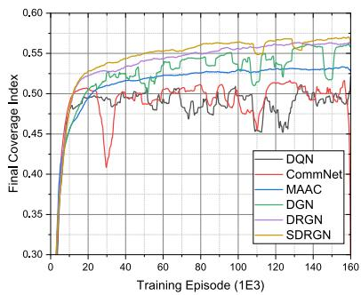  
(a) Final coverage index curves.

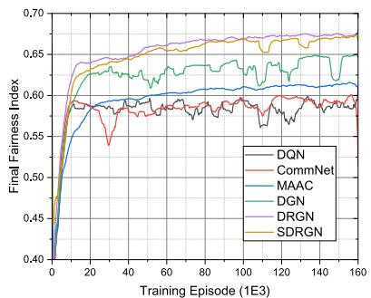  
(b) Final fairness index curves

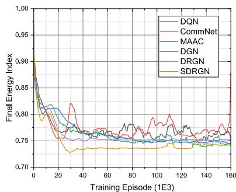  
(c) Final energy index curves.  
Fig. 6. The learning curves of final coverage index, final fairness index, and final energy index of the model during the training phase. Authorized licensed use limited to: Guangxi University. Downloaded on July 05,2026 at 12:38:43 UTC from IEEE Xplore. Restrictions apply.

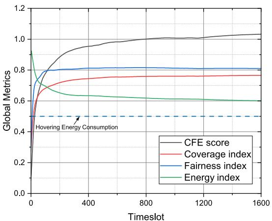  
Fig. 7. The curves of CFE score, coverage index, fairness index, and energy index over one testing episode of SDRGN.

## 5.5 Comparing With DRL and Non-DRL Baselines

In this section, we evaluate the performance of our proposed approach DRGN and SDRGN, then compare them with state-of-the-art DRL algorithms and non-DRL baselines described in Section 5.2. To make comparisons, for each DRL algorithm, we choose the best-learned model and test it in environments with 20 UAVs for 100 episodes.

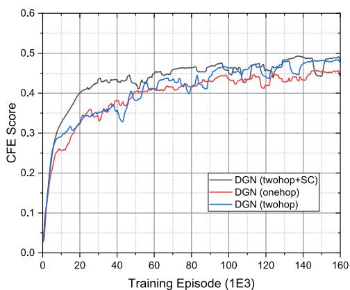  
(a) Leraning curves of DGNs.

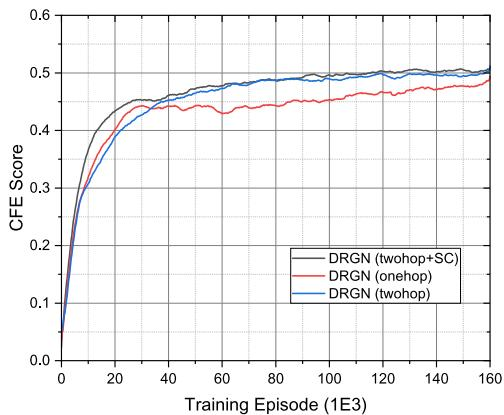  
(b) Learning curves of DRGNs.  
Fig. 8. Evaluated CFE score of DGN/DRGN with different communication structure during training phase.

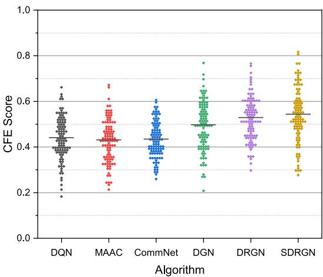  
Fig. 9. The evaluated CFE score by testing the DRL policies in the environment with 20 UAVs for 100 episodes.

We first compare DRGN and SDRGN with other DRL methods. It can be seen from Fig. 9 that, in terms of CFE score, DRGN outperforms all other DRL baselines, and SDRGN further improves the performance of DRGN.

Then, to better evaluate the performance of the learned policies, we analyze each component in CFE score, which is presented in Table 4, and make the following observations:

First, we observe that the policies with GAT-FANET (DGN, DRGN, and SDRGN) outperform other baselines from the aspects of coverage and fairness, which denotes that better cooperative exploration and path planning is achieved by graph-based communication. It also verifies that we can learn an effective communication protocol through the backpropagation of the proposed GAT-based network structure. Besides, we notice that CommNet, which is a communication-based DRL method, fails to achieve better coverage and fairness index than non-communication methods (DQN and MAAC), possibly due to the poor capacity of its communication protocol.

Second, by comparing the performance of DRGN and DGN, we know that DRGN improves coverage by 0.018 and fairness by 0.038 at the cost of 0.017 more energy overhead, resulting in a 0.031 improvement of CFE score, which proves the necessity of memory unit in our partially observable environment.

Third, we find that SDRGN decreases the energy consumption by 0.027 from DRGN, at the expense of slightly degraded coverage and fairness, and achieves the best CFE score. An interesting finding is that DQN achieves the lowest energy consumption in the DRL methods, which is intuitive since DQN cannot obtain extra information from other UAVs and its only solution to gain a higher reward is to cover the PoIs within the observation range and reduce its own energy consumption. The non-DRL methods such as MB-Greedy and MB-GA, also achieve a low energy consumption yet show no competence in terms of coverage and fairness, due to the fact that these policies decide the optimal action only based on the reward in the current step. This problem can be partially solved by considering July 05,2026 at 12:38:43 UTC from 1EEE Xplore. Restrictions apply.

TABLE 4  
The Global Metrics of DRL and Non-DRL Algorithms
<table><tr><td>Algorithm</td><td>CFE score</td><td>Coverage index</td><td>Fairness index</td><td>Energy index</td></tr><tr><td>Random</td><td> $0 . 1 1 0 7 \pm 0 . 0 3 0 4$ </td><td> $0 . 1 5 1 1 \pm 0 . 0 2 8 4$ </td><td> $0 . 6 5 6 7 \pm 0 . 0 7 9 4$ </td><td> $0 . 9 0 8 2 \pm 0 . 0 0 3 5$ </td></tr><tr><td>MB-Greedy</td><td> $0 . 2 7 3 6 \pm 0 . 1 1 6 2$ </td><td> $0 . 3 8 8 7 \pm 0 . 0 7 5 9$ </td><td> $0 . 4 1 4 2 \pm 0 . 0 8 6 4$ </td><td> $0 . 6 2 3 7 \pm 0 . 0 3 9 7$ </td></tr><tr><td>MB-GA</td><td> $0 . 3 9 4 2 \pm 0 . 1 0 4 6$ </td><td> $0 . 4 7 4 6 \pm 0 . 0 6 2 8$ </td><td> $0 . 5 8 0 4 \pm 0 . 0 7 7 6$ </td><td> $0 . 7 1 3 8 \pm 0 . 0 2 4 6$ </td></tr><tr><td>DQN</td><td> $0 . 4 4 0 7 \pm 0 . 0 9 4 7$ </td><td> $0 . 5 2 0 1 \pm 0 . 0 5 4 7$ </td><td> $0 . 6 0 5 7 \pm 0 . 0 6 0 2$ </td><td> $0 . 7 2 5 7 \pm 0 . 0 2 4 0$ </td></tr><tr><td>MAAC</td><td> $0 . 4 4 5 8 \pm 0 . 0 9 3 2$ </td><td> $0 . 5 3 0 6 \pm 0 . 0 5 2 5$ </td><td> $0 . 6 1 7 6 \pm 0 . 0 5 8 5$ </td><td> $0 . 7 4 5 2 \pm 0 . 0 2 3 3$ </td></tr><tr><td>CommNet</td><td> $0 . 4 3 4 8 \pm 0 . 0 7 8 3$ </td><td> $0 . 5 2 9 8 \pm 0 . 0 4 5 4$ </td><td> $0 . 6 1 8 6 \pm 0 . 0 4 9 5$ </td><td> $0 . 7 6 1 4 \pm 0 . 0 2 1 5$ </td></tr><tr><td>DGN</td><td> $0 . 4 9 7 5 \pm 0 . 1 0 6 6$ </td><td> $0 . 5 6 1 3 \pm 0 . 0 5 5 4$ </td><td> $0 . 6 4 7 1 \pm 0 . 0 6 2 6$ </td><td> $0 . 7 4 1 8 \pm 0 . 0 2 9 7$ </td></tr><tr><td>DRGN (ours)</td><td> $0 . 5 2 8 9 \pm 0 . 0 9 4 6$ </td><td> $0 . 5 7 9 3 \pm 0 . 0 4 9 5$ </td><td> $0 . 6 8 5 3 \pm 0 . 0 5 2 8$ </td><td> $0 . 7 5 8 5 \pm 0 . 0 2 9 1$ </td></tr><tr><td>SDRGN (ours)</td><td> $\mathbf { 0 . 5 4 3 6 \pm 0 . 1 2 1 0 }$ </td><td> $0 . 5 7 6 1 \pm 0 . 0 5 8 9$ </td><td> $0 . 6 7 8 3 \pm 0 . 0 6 7 0$ </td><td> $0 . 7 3 1 3 \pm 0 . 0 3 0 9$ </td></tr></table>

The best and second model is indicated by bold and underline, respectively.

multiple future steps with a heuristic search approach such as beam search, at the expense of prohibitively higher computation costs.

## 5.6 Scalability and Transfer-Ability

Although some previous works could effectively control the multi-UAV navigation, the scale of the UAV swarm is small, typically 3 to 10 [37], [41]. Such a small scale of UAVs could not meet the requirements of many realistic missions, hence the learned model needs to be tested with a larger group of UAVs. Moreover, in real-world tasks, due to emergencies such as energy shortage or being attacked, the number of UAVs may change dynamically. Therefore, it is necessary to compare the performance of the trained model under different UAV scales. To this end, we tested the performance of all DRL methods with the number of UAVs varying within [5,10,15,20,25,30,35,40].

We first compared the scalability and transferability of the DRL methods. During the training phase, there are consistently 20 UAVs in the environment; while in the testing phase, the scale of UAVs varies. For each case, we tested 100 episodes and calculated the averaged CFE score, as shown in Fig. 10. By experiments, we have two observations:

First, as the number of UAVs grows, the performance of DRGN and SDRGN increases linearly, validating their scalability. Besides, regardless of the number of UAVs, SDRGN consistently performs better than other DRL methods, verifying its good transferability.

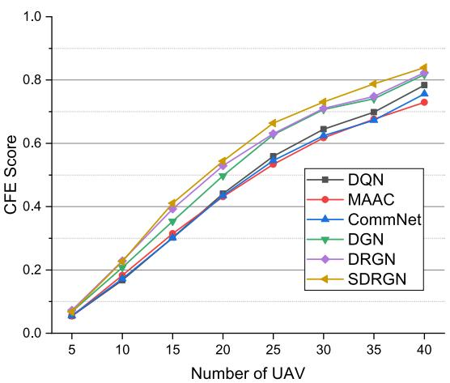  
Fig. 10. The evaluated CFE score by testing each best-learned DRL model in the environment with different number of UAV for 100 episodes. Authorized licensed use limited to: Guangxi University. Downloaded o

Second, when the number of UAV is greater than 20, the performance gap between DGN and DRGN is narrowed. This is partially due to the increased UAV density in the environment, which makes each UAV could obtain more information from GAT-FANET and the memory unit less necessary. By contrast, when the number of UAV is less than 20 and the UAV density is relatively low, the memory unit could greatly handle the information loss problem in the partially observable environment, and DRGN significantly outperforms DGN.

## 5.7 Robustness and Interpretability of GAT-FANET

After verifying the performance of SDRGN, we now dive deeper into the performance and the principle of GAT-FANET, which is a key element in SDRGN.

We first examine the robustness of GAT-FANET. In the training phase, we assume that the communication is reliable. However, in the real world, communications within the FANET can be interrupted for various reasons. Thus, we assume that the communication between adjacent nodes is interrupted with probability p, and tested the performance of DGN, DRGN, and SDRGN under different p. As can be seen from Fig. 11, the performance of each model deteriorates as the communication drop rate p grows. We also notice that the performance degradation of DGN is less than DRGN and SDRGN. Our insight towards this phenomenon is that the memory unit in DRGN and SDRGN takes the node embedding aggregated from GAT-FANET as the input, and the random communication drop may harm the timing correlation of the input samples. Nevertheless, when the communication is unavailable (i.e., p 1:0), the GAT-¼FANET based algorithms still outperform other DRL baselines (MAAC, DQN, and CommNet), and our proposed SDRGN still achieves the best performance, which demonstrates the robustness of GAT-FANET.

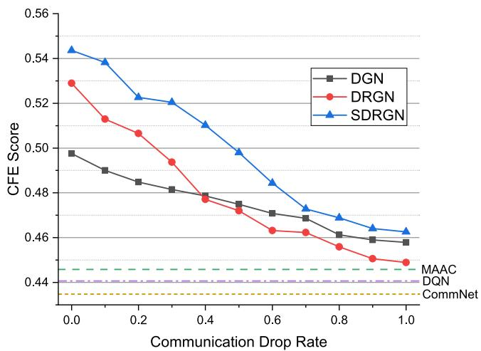  
Fig. 11. The evaluation results of testing DGN, DRGN, and SDRGN in the environment with 20 UAVs for 100 episodes, with the communication drop probability ranging from 0 to 1.

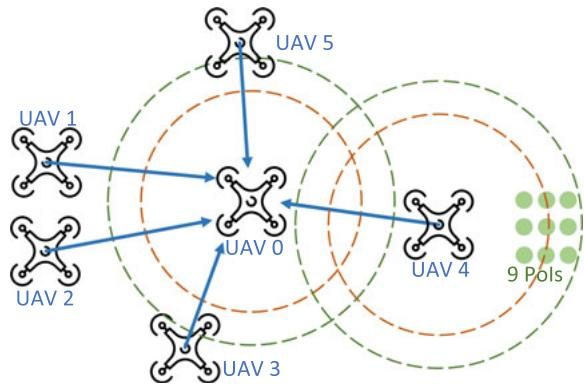  
(a) A screenshot of the intuitive example. The blue arrow denotes FANET connectivity. The brown circle and green circle represent the coverage range and observe range, respectively. The small green circles are the Pols.

<table><tr><td>head 0</td><td>0.33</td><td>0.00</td><td>0.43</td><td>0.22</td><td>0.00</td><td>0.02</td><td>1.00 -0.90 0.80 0.70</td></tr><tr><td>head 1</td><td>0.00</td><td>0.15</td><td>0.01</td><td>0.00</td><td>0.70</td><td>0.14</td><td>0.60 0.50</td></tr><tr><td>head 2</td><td>0.28</td><td>0.01</td><td>0.33</td><td>0.27</td><td>0.02</td><td>0.09</td><td>0.40 0.30</td></tr><tr><td>head 3</td><td>0.19</td><td>0.01</td><td>0.42</td><td>0.28</td><td>0.06</td><td>0.04</td><td>0.20 0.10</td></tr><tr><td></td><td>UAV 0</td><td>UAV 1</td><td>UAV 2</td><td>UAV 3</td><td>UAV 4</td><td>UAV 5</td><td>0.00</td></tr></table>

(b) The attention weights of UAV 0's GAT layer at the specific timeslot shown in (a).  
Fig. 12. An intuitive example to show the intrepretability of GAT-FANET.

We then consider the interpretability of GAT-FANET. To this end, we design an intuitive example as shown in Fig. 12a, in which each UAV is controlled by our GAT-FANET based policy. Due to the partial observability, UAV 0 cannot directly observe the PoIs around UAV 4. Since there are 5 neighboring UAVs connected with UAV 0 while only UAV 4 has observed the PoIs, the GAT-FANET of UAV 0 should learn to pay the most attention to UAV 4 to make the optimal action to move rightwards. To figure out whether the learned GAT-FANET has learned to extract valuable information from neighboring nodes, we visualize the attention weights of UAV 0’s GAT layer at the current timeslot, as shown in Fig. 12b. It can be seen that head 1 has 0.7 attention to UAV 4, while other neighboring UAVs only have 0.43 attention weight at most. This denotes that GAT-FANET has learned the ability to automatically identify the valuable neighbor.

TABLE 5  
The Inference Time of Several DRL-Based Policies on Jetson Nano
<table><tr><td>DRL policy</td><td>Mean (s)</td><td>STD (s)</td><td>FPS</td></tr><tr><td>DQN</td><td>0.0051</td><td>0.0021</td><td>196</td></tr><tr><td>DGN (onehop)</td><td>0.0116</td><td>0.0037</td><td>86</td></tr><tr><td>DRGN (onehop)</td><td>0.0136</td><td>0.0040</td><td>74</td></tr><tr><td>DRGN (twohop)</td><td>0.0224</td><td>0.0036</td><td>45</td></tr><tr><td>DRGN (twohop + SC)</td><td>0.0227</td><td>0.0037</td><td>44</td></tr><tr><td>SDRGN</td><td>0.0232</td><td>0.0037</td><td>43</td></tr></table>

STD denotes standard deviation, and FPS means frame per second.

## 5.8 Practicality of the DRL-Based Approach

Using DRL to control multi-UAV navigation in a distributed manner, especially using the neural networks to express the communication protocol among UAV as GAT-FANET does, requires more computation expense than RL priors [32] and may raise concerns about computing efficiency. We hereby examine whether the onboard computer could operate the proposed DRL-based policy in real-time.

Thankfully, with the development of edge computing, there are already many lightweight devices with high matrix computing capabilities and low energy costs. To validate the practicality of our DRL-based approach, we deployed several DRL policies on Jetson Nano, which is widely used in autonomous UAV control [50]. To figure out how each component in SDRGN affects the inference speed, we start with testing DQN and sequentially adding the proposed modules into the model. Each model is executed for 500,000 timeslots to calculate the mean and standard deviation of the inference time, and the results are shown in Table 5. Note that onehop and twohop denote adding one GAT layer and two stacked GAT layers, respectively. SC denotes the skip connection through the two GAT layers. DRGN adds a memory unit based on DGN, and SDRGN additionally executes multi-nominal sampling on the Qvalues.

Based on Table 5, we have the following insights: First, all tested DRL policies can be executed in real-time, which empirically prove the practicality of our DRL approach. Second, the GAT layer is the bottleneck of inference speed, hence we don’t stack more GAT layers in GAT-FANET to provide a larger perception field. We leave the inference acceleration of the GAT layer as a future work.

## 6 CONCLUSION

In this paper, UAV-MBSs is redefined as a partially observable problem, in which global information is not available during the training phase. To handle the information loss raised by partial observability, we introduce a spatial-temporal-aware network DRGN where a communication structure GAT-FANET is well designed based on network architecture search, and the memory unit is equipped with GRU to provide long-term memory capability. Inspired by maximum entropy learning, we propose a novel DRGNstructured stochastic policy named SDRGN, which shows better performance, scalability, transferability, robustness, and interpretability than previous DRL methods in our environment. Since our model is trained with a heuristic reward function that is based on local information obtained by each UAV individually, SDRGN reduces the training cost greatly and enables distributed online learning when the UAV swarm is on the mission. As for future work, we would like to speedup the inference time of the model and try to extend SDRGN to the actor-critic style to achieve continuous action space.

## REFERENCES

[1] A. A. Suzen, B. Duman, and B.€ Sen, “Benchmark analysis of¸ Jetson TX2, Jetson Nano and raspberry PI using deep-CNN,” in Proc. Int. Congr. Hum.-Comput. Interact. Optim. Robot. Appl., 2020, pp. 1–5.

[2] L. Meier, D. Honegger, and M. Pollefeys, “PX4: A node-based multithreaded open source robotics framework for deeply embedded platforms,” in Proc. IEEE Int. Conf. Robot. Autom., 2015, pp. 6235–6240.

[3] J. Wu and I. Stojmenovic, “Ad hoc networks,” Comput., vol. 37, no. 2, pp. 29–31, 2004.

[4] M. Bhaskaranand and J. D. Gibson, “Low-complexity video encoding for UAV reconnaissance and surveillance,” in Proc. Mil. Commun. Conf., 2011, pp. 1633–1638.

[5] H. Menouar, I. Guvenc, K. Akkaya, A. S. Uluagac, A. Kadri, and A. Tuncer, “UAV-enabled intelligent transportation systems for the smart city: Applications and challenges,” IEEE Commun. Mag., vol. 55, no. 3, pp. 22–28, Mar. 2017.

[6] Y. Zhang, X. Yuan, W. Li, and S. Chen, “Automatic power line inspection using UAV images,” Remote Sens., vol. 9, no. 8, 2017, Art. no. 824.

[7] S. ur Rahman, G.-H. Kim, Y.-Z. Cho, and A. Khan, “Positioning of UAVs for throughput maximization in software-defined disaster area UAV communication networks,” J. Commun. Netw., vol. 20, no. 5, pp. 452–463, Oct. 2018.

[8] M. Moradi, K. Sundaresan, E. Chai, S. Rangarajan, and Z. M. Mao, “SkyCore: Moving core to the edge for untethered and reliable UAV-based LTE networks,” in Proc. 24th Annu. Int. Conf. Mobile Comput. Netw., 2018, pp. 35–49.

[9] L. Zhong, K. Garlichs, S. Yamada, K. Takano, and Y. Ji, “Mission planning for UAV-based opportunistic disaster recovery networks,” in Proc. 15th IEEE Annu. Consum. Commun. Netw. Conf., 2018, pp. 1–6.

[10] Z. Li et al., “Energy efficient resource allocation for UAV-assisted space-air-ground internet of remote things networks,” IEEE Access, vol. 7, pp. 145 348–145 362, 2019.

[11] A. Merwaday and I. Guvenc, “UAV assisted heterogeneous networks for public safety communications,” in Proc. IEEE Wireless Commun. Netw. Conf. Workshops, 2015, pp. 329–334.

[12] M. Mozaffari, W. Saad, M. Bennis, and M. Debbah, “Unmanned aerial vehicle with underlaid device-to-device communications: Performance and tradeoffs,” IEEE Trans. Wireless Commun., vol. 15, no. 6, pp. 3949–3963, Jun. 2016.

[13] M. Alzenad, A. El-Keyi, and H. Yanikomeroglu, “3-D placement of an unmanned aerial vehicle base station for maximum coverage of users with different QoS requirements,” IEEE Wireless Commun. Lett., vol. 7, no. 1, pp. 38–41, Feb. 2018.

[14] C. H. Liu, Z. Chen, J. Tang, J. Xu, and C. Piao, “Energy-efficient UAV control for effective and fair communication coverage: A deep reinforcement learning approach,” IEEE J. Sel. Areas Commun., vol. 36, no. 9, pp. 2059–2070, Sep. 2018.

[15] C. H. Liu, X. Ma, X. Gao, and J. Tang, “Distributed energy-efficient multi-UAV navigation for long-term communication coverage by deep reinforcement learning,” IEEE Trans. Mobile Comput., vol. 19, no. 6, pp. 1274–1285, Jun. 2020

[16] A. Dai, R. Li, Z. Zhao, and H. Zhang, “Graph convolutional multiagent reinforcement learning for UAV coverage control,” in Proc. Int. Conf. Wireless Commun. Signal Process., 2020, pp. 1106–1111.

[17] L. Li, Z. Gan, Y. Cheng, and J. Liu, “Relation-aware graph attention network for visual question answering,” in Proc. IEEE/CVF Int. Conf. Comput. Vis., 2019, pp. 10312–10321.

[18] K. Cho et al., “Learning phrase representations using RNN encoder-decoder for statistical machine translation,” in Proc. 2014 Conf. Empirical Methods Natural Lang. Process., 2014, pp. 1724–1734.

[19] T. Haarnoja, H. Tang, P. Abbeel, and S. Levine, “Reinforcement learning with deep energy-based policies,” in Proc. 34th Int. Conf. Mach. Learn., 2017, pp. 1352–1361.

[20] L. Ruan et al., “Energy-efficient multi-UAV coverage deployment in UAV networks: A game-theoretic framework,” China Commun., vol. 15, no. 10, pp. 194–209, 2018.

[21] M. De Benedetti, F. D’Urso, G. Fortino, F. Messina, G. Pappalardo, and C. Santoro, “A fault-tolerant self-organizing flocking approach for UAV aerial survey,” J. Netw. Comput. Appl., vol. 96, pp. 14–30, 2017.

[22] X. Zhang and L. Duan, “Fast deployment of UAV networks for optimal wireless coverage,” IEEE Trans. Mobile Comput., vol. 18, no. 3, pp. 588–601, Mar. 2019.

[23] M. Mozaffari, W. Saad, M. Bennis, and M. Debbah, “Mobile unmanned aerial vehicles (UAVs) for energy-efficient internet of things communications,” IEEE Trans. Wireless Commun., vol. 16, no. 11, pp. 7574–7589, Nov. 2017.

[24] I. Bekmezci, O. K. Sahingoz, and S. Temel, “Flying ad-hoc net-¸ works (FANETs): A survey,” Ad Hoc Netw., vol. 11, no. 3, pp. 1254–1270, 2013.

[25] A. Joshi, S. Dhongdi, S. Kumar, and K. R. Anupama, “Simulation of multi-UAV ad-hoc network for disaster monitoring applications,” in Proc. Int. Conf. Inf. Netw., 2020, pp. 690–695.

[26] P. Li and H. Duan, “A potential game approach to multiple UAV cooperative search and surveillance,” Aerosp. Sci. Technol., vol. 68, pp. 403–415, 2017.

[27] F. Ropero, P. Munoz, and M. D. R-Moreno, “TERRA: A path plan-\~ ning algorithm for cooperative UGV–UAV exploration,” Eng. Appl. Artif. Intell., vol. 78, pp. 260–272, 2019.

[28] N. Mahdoui, V. Fr-emont, and E. Natalizio, “Communicating multi-UAV system for cooperative SLAM-based exploration,” J. Intell. Robot. Syst., vol. 98, no. 2, pp. 325–343, 2020.

[29] S. Hayat, E. Yanmaz, T. X. Brown, and C. Bettstetter, “Multi-objective UAV path planning for search and rescue,” in Proc. IEEE Int. Conf. Robot. Autom., 2017, pp. 5569–5574.

[30] S.-Y. Park, C. S. Shin, D. Jeong, and H. Lee, “DroneNetX: Network reconstruction through connectivity probing and relay deployment by multiple UAVs in ad hoc networks,” IEEE Trans. Veh. Technol., vol. 67, no. 11, pp. 11 192–11 207, Nov. 2018.

[31] H. Shiri, J. Park, and M. Bennis, “Massive autonomous UAV path planning: A neural network based mean-field game theoretic approach,” in Proc. IEEE Global Commun. Conf., 2019, pp. 1–6.

[32] P. A. Apostolopoulos, M. Torres, and E. E. Tsiropoulou, “Satisfaction-aware data offloading in surveillance systems,” in Proc. 14th Workshop Challenged Netw., 2019, pp. 21–26.

[33] G. A. Rummery and M. Niranjan, On-Line Q-Learning Using Connectionist Syst., vol. 37, Cambridge, U.K.: Univ. Cambridge, 1994.

[34] L. Busoniu, R. Babu¸ ska, and B. De Schutter, “Multi-agent reinforcement learning: An overview,” in Innovations Multi-Agent Syst. Applications-1, Berlin, Germany: Springer, 2010, pp. 183–221.

[35] P. Rui, “Multi-UAV formation maneuvering control based on Qlearning fuzzy controller,” in Proc. 2nd Int. Conf. Adv. Comput. Control, 2010, pp. 252–257.

[36] S.-M. Hung and S. N. Givigi, “A Q-learning approach to flocking IEEE Trans. Cybern. 47, no. 1, pp. 186–197, Jan. 2017.

[37] R. Lowe, Y. I. Wu, A. Tamar, J. Harb, O. P. Abbeel, and I. Mordatch, “Multi-agent actor-critic for mixed cooperative-competitive environments,” in Proc. Int. Conf. Neural Inf. Process. Syst., 2017, pp. 6379–6390.

[38] Y. Zhang, Z. Mou, F. Gao, J. Jiang, R. Ding, and Z. Han, “UAVenabled secure communications by multi-agent deep reinforcement learning,” IEEE Trans. Veh. Technol., vol. 69, no. 10, pp. 11 599–11 611, Oct. 2020.

[39] A. Vaswani et al., “Attention is all you need,” in Proc. Int. Conf. Neural Inf. Process. Syst., 2017, pp. 5998–6008.

[40] J. Jiang, C. Dun, T. Huang, and Z. Lu, “Graph convolutional reinforcement learning,” in Proc. Int. Conf. Learn. Representations, 2020.

[41] T. Lillicrap et al., “Continuous control with deep reinforcement learning,” in Proc. Int. Conf. Learn. Representations, 2016.

[42] S. Iqbal and F. Sha, “Actor-attention-critic for multi-agent reinforcement learning,” in Proc. 36th Int. Conf. Mach. Learn., 2019, pp. 2961–2970.

[43] J. Ackermann, V. Gabler, T. Osa, and M. Sugiyama, “Reducing overestimation bias in multi-agent domains using double centralized critics,” Adv. Neural Inf. Process. Syst., 2019.

[44] P. Velickovi-c, G. Cucurull, A. Casanova, A. Romero, P. Lio, and Y. Bengio, “Graph attention networks,” in Proc. Int. Conf. Learn. Representations, 2018.

[45] K. He, X. Zhang, S. Ren, and J. Sun, “Deep residual learning for image recognition,” in Proc. IEEE Conf. Comput. Vis. Pattern Recognit., 2016, pp. 770–778.

[46] S. Sukhbaatar, A. Szlam, and R. Fergus, “Learning multiagent communication with backpropagation,” in Proc. 30th Int. Conf. Neural Inf. Process. Syst., 2016, pp. 2252–2260.

[47] V. Mnih et al., “Human-level control through deep reinforcement learning,” Nature, vol. 518, no. 7540, pp. 529–533, 2015.

[48] D. P. Kingma and J. L. Ba, “Adam: A method for stochastic optimization,” in Proc. Int. Conf. Learn. Representations, 2015.

[49] T. Chu, J. Wang, L. Codeca, and Z. Li, “Multi-agent deep reinforcement learning for large-scale traffic signal control,” IEEE Trans. Intell. Transp. Syst., vol. 21, no. 3, pp. 1086–1095, Mar. 2020.

[50] W. Andrew, C. Greatwood, and T. Burghardt, “Aerial animal biometrics: Individual friesian cattle recovery and visual identification via an autonomous UAV with onboard deep inference,” in Proc. IEEE/RSJ Int. Conf. Intell. Robots Syst., 2019, pp. 237–243.

  
Zhenhui Ye received the BS degree from Zhejiang University, Hangzhou, China, in 2020. He is currently working toward the PhD degree in the College of Computer Science and Technology, Zhejiang University, Hangzhou, China. His research interests include practical reinforcement learning and deep learning in real-world applications.

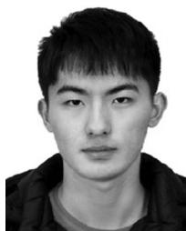  
Ke Wang received the BS degree from the Zhejiang University of Technology, Hangzhou, China, in 2020. He is currently working toward the PhD degree in aerospace information technology at Zhejiang University, Hangzhou, China. His research interests include multi-agent reinforcement learning and software-defined networking.

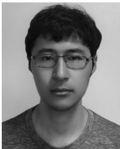

Yining Chen received the BSc degree from Sichuan University, Chengdu, China, in 2015. He is currently working toward the PhD degree at Zhejiang University, Hangzhou, China. His research interests include reinforcement learning and multi-robot system.

Xiaohong Jiang received the BSc and MSc degrees in computer science from Nanjing University, Nanjing, China, and the PhD degree from Zhejiang University, Hangzhou, China, in 2003. She is currently an associate professor with the College of Computer Science and Technology, Zhejiang University. Her research focuses on distributed systems, cloud computing, and data service.

Guanghua Song received the BS degree in computer science from the Nanjing University of Science and Technology, Nanjing, China, in 1989, and the MS and PhD degrees in computer science from Zhejiang University, Hangzhou, China, in 1992 and 2003, respectively. He is currently a full professor with the School of Aeronautics and Astronautics, Zhejiang University, China. His research interests include swarm intelligence, UAV intelligence, and aerospace information technology.

" For more information on this or any other computing topic, please visit our Digital Library at www.computer.org/csdl.