# Multi-User Task Offloading in UAV-Assisted LEO Satellite Edge Computing: A Game-Theoretic Approach

Ying Chen , Senior Member, IEEE, Jie Zhao , Yuan Wu , Senior Member, IEEE, Jiwei Huang , Senior Member, IEEE, and Xuemin Sherman Shen , Fellow, IEEE

Abstract—Unmanned Aerial Vehicle (UAV)-assisted Low Earth Orbit (LEO) satellite edge computing (ULSE) networks can address the challenge communications issues in areas with harsh terrain and achieve global wireless coverage to provide services for mobile user devices (MUDs). This paper studies the LEO-UAV task offloading problem where MUDs compete for limited resources in the ULSE networks. We formulate the optimization problem with the goal of minimizing the cost of all MUDs while meeting resource constraint and satellite coverage time constraint. We first theoretically prove that this problem is NP-hard. We then reformulate the problem as a LEO-UAV task offloading game (LUTO-Game), and show that there is at least one Nash equilibrium solution for the LUTO-Game. We propose a joint UAV and LEO satellite task offloading (JULTO) algorithm to obtain the Nash equilibrium offloading strategy, and analyze the performance of the worst-case offloading strategy obtained by the JULTO algorithm. Finally, extensive experiments, including convergence analysis and comparison experiments, are carried out to validate the effectiveness of our JULTO algorithm.

Index Terms—Game model, LEO satellite, Nash equilibrium, task offloading, UAV.

# I. INTRODUCTION

W ITH the rapid development of beyond 5G/6G commu-nication systems, the number of mobile user devices nication systems,the number of mobile user devices (MUDs) such as smartphones and tablets has surged. More and more computation-intensive and latency-sensitive applications

Received 25 January 2024; revised 25 August 2024; accepted 12 September 2024. Date of publication 24 September 2024; date of current version 4 December 2024. This work was supported in part by the National Natural Science Foundation of China under Grant 62472039, in part by Beijing Natural Science Foundation under Grant L232050, in part by the Project of Cultivation for young top-motch Talents of Beijing Municipal Institutions under Grant BPHR202203225, in part by the Young Elite Scientists Sponsorship Program by BAST under Grant BYESS2023031, and in part by the Science and Technology Development Fund of Macau SAR under Grant FDCT 0158/2022/A. Recommended for acceptance by M. Chen. (Corresponding authors: Yuan Wu; Jiwei Huang.)

Ying Chen and Jie Zhao are with the Beijing Information Science and Technology University, Beijing 100101, China (e-mail: chenying@bistu. edu.cn; zhaojie99723@bistu.edu.cn).

Yuan Wu is with the State Key Laboratory of Internet of Things for Smart City, University of Macau, Macau 999078, China (e-mail: yuanwu@um.edu.mo).

Jiwei Huang is with the China University of Petroleum, Beijing 102249, China (e-mail: huangjw@cup.edu.cn).

Xuemin Sherman Shen is with the University of Waterloo, Waterloo, ON N2L 3G1, Canada (e-mail: sshen@uwaterloo.ca).

Digital Object Identifier 10.1109/TMC.2024.3465591

(such as natural language processing, virtual reality, face recognition, etc.) are running on MUDs [1]. However, constrained by CPU and battery capacity, most MUDs cannot effectively handle computationally intensive applications all by themselves [2], [3], [4]. The framework of mobile edge computing (MEC) [5], [6], [7], [8] is considered as a viable solution, i.e., edge servers with computing resources are placed on network access points close to MUDs [9]. Then, MUDs can transmit task data to edge servers, thereby utilizing the computing resources of edge servers to process computing tasks [10], [11]. This reduces the application processing latency of MUDs, thereby improving users’ quality of experience (QoE) [12], [13].

Traditional MEC usually utilizes ground base stations as network access points, which however may not meet the ubiquitous connection requirements [14], [15]. On the one hand, it is difficult for ground network access points to completely cover some complex terrains, such as oceans, deserts, and remote mountainous areas. On the other hand, ground base stations are vulnerable to damage from natural disasters such as earthquakes, hurricanes, and tsunamis, resulting in communication interruptions. In recent years, Unmanned Aerial Vehicles (UAVs) have become popular because of their flexibility and low cost [16], [17], [18]. Low-altitude UAVs can be regarded as base stations to improve the performance of network systems [19], [20]. In addition, with the development of space communication networks, satellite technology has developed rapidly. The on-ground devices based on Low Earth Orbit (LEO) satellites can obtain better signal strength and lower latency, which has received extensive attention [21], [22], [23]. Therefore, deploying edge servers on UAV and LEO satellites can effectively solve communication and computing problems in areas with complex terrain and harsh environments which has drawn extensive attention from both academia and industry.

However, the problem of task offloading in ULSE network systems faces challenges. First, there are heterogeneous resources in the ULSE network, and the resources of UAVs and LEO satellites are limited. MUDs in the system need to compete for limited system resources to process tasks. Communication and computing resource allocation strategies face the challenges brought by complex and heterogeneous network environments and user competition. Second, in addition to resource constraints, the LEO satellite coverage time constraint should also be satisfied. For different MUDs, the upper bound of the coverage time with different LEO satellites are different. How to calculate the LEO satellite coverage time with different offloading decisions, and obtain the decisions that satisfy both the coverage time and resource constraints is a challenge. Besides, MUD has individual rationality, that is, it will not sacrifice its own benefits to reduce the cost of other MUDs. Therefore, achieving a balanced offloading strategy for all MUDs while minimizing the cost of all MUDs in the entire system is also a challenging problem. Finally, the solution space size of the problem increases with the network system scale, and the complexity of finding the optimal offloading strategy increases exponentially when the number of MUDs, UAVs, or LEO satellites increases.

This paper studies the multi-user task offloading problem in the ULSE networks. The optimization goal is to minimize the cost of MUDs. The problem is reformulated as a LEO-UAV task offloading game (LUTO-Game) model, and it is theoretically proved that there is at least one Nash equilibrium solution for the LUTO-Game. Then, we propose a joint UAV and LEO satellite task offloading (JULTO) algorithm to obtain the task offloading strategy and realize the balance of multi-MUD decision-making. Finally, we perform both theoretical analysis and experiments to evaluate the performance of the JULTO algorithm. The contributions of this paper are summarized as follows.

We propose a LEO-UAV task offloading framework which utilizes the edge computing resources of LEO satellites and UAVs. In this framework, satellites and UAVs with edge servers can handle the tasks of MUDs. The offloading decisions of MUDs are optimized with the objective of minimizing the total cost of MUDs. When MUDs offload tasks, they need to compete for limited transmission resources. For UAV edge computing, UAVs transmit energy to MUDs by applying wireless power transmission technology, and the resource constraint is considered. For LEO satellite edge computing, in addition to the restriction of resources, satellite coverage time constraint is also considered. The coverage time model for satellites in different situations is discussed.   
We prove that the formulated task offloading problem is NP-hard. Since MUDs are selfish, the multi-device and multi-server task offloading problem in the ULSE system is reformulated as the LUTO-Game model. The MUDs in the system are game participants, focusing on reducing their own costs. The desirable offloading strategy of the problem is defined as the Nash equilibrium solution of the LUTO-Game. Then, by defining a task offloading rule, the potential function is given, and the LUTO-Game is proved theoretically a potential game. Therefore, it can be determined that LUTO-Game has at least one feasible Nash equilibrium solution.   
The JULTO algorithm is proposed to obtain the Nash equilibrium strategy of the task offloading problem. The JULTO algorithm is implemented in a distributed manner, and the MUDs make offloading decisions in parallel. On the basis of the proposed JULTO algorithm, the price of anarchy (PoA) is defined, which is the ratio of the worst cost obtained by the Nash equilibrium unloading strategy

to the cost obtained by the centralized optimal strategy. According to the PoA, we theoretically analyze the performance of the JULTO algorithm.

Extensive experiments are carried out to evaluate the JULTO algorithm. The experiment results show that the JULTO algorithm can converge after a limited iteration number. When the scale of the problem expands, the problem’s solution space experiences exponential growth, and the growth rate of the iteration number required for the game to reach the Nash equilibrium state is lower than the linear speed. In addition, comparison experiments are conducted. The results show that the cost for the JULTO algorithm is lower than that obtained by other algorithms, which verifies the performance superiority of JULTO algorithm.

The subsequent sections of this paper are structured as follows. In Section II, related works are presented. Section III describes the ULSE system model, and formulates the task offloading problem. In Section IV, the problem is reformulated as the LUTO-Game model. Then, a theoretical analysis of the LUTO-Game is conducted. Section V proposes the distributed JULTO algorithm, and analyzes theoretically the JULTO’s performance. The experimental evaluation is given in Section VI. Finally, Section VII presents the paper’s conclusion.

# II. RELATED WORK

As a flexible and efficient mobile aerial platform, UAVs have attracted widespread attention in both civilian and military fields. [24] studied the problem of collecting data in the UAV wireless networks, using the maximum age of information (AoI) to measure information freshness. On this basis, [25] proposed a combined optimization objective of minimizing the maximum AoI. Liu et al. proposed an iteration-based trajectory planning and sensor node association strategy to obtain the optimal AoI solution. With the development of MEC, some related works have studied UAV computing architecture deploying edge servers. In [26], by jointly optimizing UAV position, transmission bandwidth, and CPU frequency, all devices’ computation delay was minimized. The joint optimization problem was solved by applying the successive convex approximation technique. In [27], Han et al. adopted optimal transportation theory and classical particle swarm optimization algorithm to conduct joint optimization of UAV deployment and user association, and finally realized the minimization of average delay. [28] jointly optimized resource allocation, equipment scheduling, and UAV trajectories. Han et al. proposed an iterative algorithm based on alternating optimization and convex optimization.

Because of the global coverage characteristics of LEO satellites, they can break through the geographical restrictions of communication and become an important part of future communication systems. For example, in [29], an ultra-dense LEO satellite network was considered. A pricing mechanism was designed based on Stackelberg game to incentivize ground and satellite operators’ data reloading. In addition, some studies have considered LEO satellites combined with MEC. In [22], Li et al. studied the MEC deployed on LEO satellites. Service scheduling and placement were optimized using mixed integer linear programming (MILP). However, they did not consider the coverage of LEO satellites. In our model, we further consider that users need to calculate the corresponding satellite coverage time and perform task offloading on the premise of meeting time constraints. In [30], the joint optimization problem of LEO satellite MEC network was studied. An algorithm based on Lagrangian Dual Decomposition (LDD) was proposed. [31] proposed a satellite MEC architecture based on federated learning and used the blockchain framework to achieve data privacy and security protection. [15] studied the task offloading problem based on LEO satellite MEC, and formulated the optimization problem as a partially observable Markov decision process. A multi-agent algorithm was proposed to achieve resource allocation in a collaborative manner. [32] considered a satellite-ground network using dual edge computing, with the optimization goal of cost minimization. A double-edged computing offloading algorithm was proposed to achieve computing resource allocation. [33] established a system model for satellite edge computing task offloading, and used queuing theory and game theory to optimize utility function.

The above works did not consider the resource limitations of satellite edge computing, i.e., it may not be sufficient to meet the needs of all types of user devices. Therefore, it is an effective method to combine UAVs and LEO satellites to form a Space-Air system. The Space-Air system can serve as a supplement to the ground network, overcoming the impact of harsh environments on communication conditions and providing various computation resources and reliable services for user devices. Therefore, we combine UAV edge computing and LEO satellite network to form a heterogeneous integrated air-groundspace network, aiming to make up for the shortcomings and limitations of a single type of edge server. Some similar works exist. For example, [2] studied the edge computing architecture of the Space-Air-Ground Integrated Network (SAGIN), jointly optimized task scheduling and resource allocation, and used learning-based methods to obtain the optimal flow strategy and UAV flight strategy, thereby minimizing system costs. [34] studied the task offloading problem in SAGIN. The optimization goal was to minimize UAVs’ energy consumption and maximize the number of tasks that meet the delay constraints. A solution method based on reinforcement learning was proposed to obtain the optimal offloading solution. Different from [2] and [34], we consider the coverage time constraints and computing resource constraints of different LEO satellites, as well as user competition for resources. A distributed method is proposed to obtain offloading decisions, which achieves multi-user optimization while balancing the performance and computation complexity of the method.

# III. SYSTEM MODEL AND PROBLEM FORMULATION

# A. Network Model

Fig. 1 shows the ULSE framework. There are N MUDs $( \mathbf { D } = \{ d _ { 1 } , \ldots , d _ { N } \} ) , M _ { 1 } \mathrm { U A V s } \left( \mathbf { U } = \{ u _ { 1 } , \ldots , u _ { M _ { 1 } } \} \right)$ , and M = 1LEO satellites $( { \bf S } = \{ s _ { 1 } , \ldots , s _ { M _ { 2 } } \} )$ = 1 in orbit. Each MUD $d _ { i } \in \mathbf { D }$ has one computation task $H _ { i } = ( B _ { i } , C _ { i } )$ that needs to be processed. $C _ { i }$ = ( )is the CPU cycles number required to complete $H _ { i } , \ B _ { i }$ is the size of $H _ { i }$ in bits. Ground base stations may not be available in areas with harsh terrain or disasters. In the ULSE networks, UAVs and LEO satellites are equipped with edge servers (ESs) that can process the tasks of MUDs. There are $c ^ { u }$ and $c ^ { L }$ wireless channels for UAVs and LEO satellites, respectively. Table I summarizes the paper’s main notations. Compared with MUDs, ESs have a larger computing capacity. Therefore, MUDs can transmit computation-intensive task data to ESs of UAVs or LEO satellites for processing. When channel resources are insufficient, MUDs have to complete their tasks locally. MUDs can choose an appropriate offloading decision to process computation tasks according to their own demand.

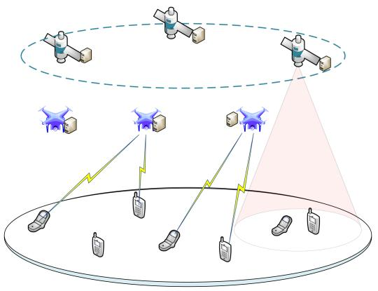

flowchart

Fig. 1. An ULSE scenario example.

The offloading decision of MUD $d _ { i }$ is represented by $o _ { i } \in$ $\{ ( 0 , 0 , 0 ) \bigcup ( a _ { i } , b _ { i } , c _ { i } ) \}$ }. When MUD $d _ { i }$ executes the task $H _ { i }$ (0 0 0) ( )locally, its decision is $o _ { i } = ( 0 , 0 , 0 ) . o _ { i } = ( a _ { i } , b _ { i } , c _ { i } )$ represents that MUD $d _ { i }$ = (0 0offloads the task $H _ { i }$ = (to ESs. $a _ { i }$ )represents the offloading way selected by MUD $d _ { i }$ . Specifically, if MUD $d _ { i }$ offloads the task to ESs of UAVs, $a _ { i } = 1$ . If MUD $d _ { i }$ offloads the task to ESs of LEO satellites, $a _ { i } = 2 , b _ { i }$ represents the UAV = 2or LEO satellite that is selected by MUD $d _ { i }$ for task processing. $c _ { i }$ represents the wireless channel that is selected by MUD $d _ { i }$ for task data transmission. When MUD $d _ { i }$ offloads the task to UAVs, i.e., $a _ { i } = 1$ , then $b _ { i } \in \{ 1 , \ldots , M _ { 1 } \}$ and $c _ { i } \in \{ 1 , \ldots , c ^ { u } \}$ . When MUD $d _ { i }$ 1 1 1offloads the task to LEO satellites, $\mathrm { i } . \mathrm { e } . , a _ { i } = 2$ , then $b _ { i } \in \{ 1 , \ldots , M _ { 2 } \}$ and $c _ { i } \in \{ 1 , \ldots , c ^ { L } \}$ = 2. In addition, the 1 2 1set of offloading decisions of all MUDs is called the offloading strategy denoted by $o = \{ o _ { 1 } , \ldots , o _ { N } \}$ .

= 1In traditional mobile edge computing, terrestrial base stations are used as network access points. When ground base stations are damaged by natural disasters such as tsunamis, hurricanes, and earthquakes, they may not meet the communication requirements of ground devices. Therefore, in this work, in order to cope with the communication and computing challenges in areas with complex terrain and harsh environments, a UAV-assisted LEO satellite edge computing network framework is proposed.

# B. Service Coverage Model

1) UAV Service Coverage: In UAV edge computing, each UAV serves a certain range of services, and only MUDs within the range of services can offload the computing task to the UAV edge server for processing. In Fig. 2, $( x _ { j } ^ { u a v } , y _ { j } ^ { u a v } )$ and $h _ { j } ^ { u a v }$ ( )represent the coordinates and flight altitude of the UAV $u _ { j } \in \mathbf { U } .$ respectively. $R ^ { u a v }$ represents the service coverage radius of the UAV $u _ { j } \in { \bf \dot { U } } . ( x _ { i } ^ { M U \hat { D } } , y _ { i } ^ { M U D } )$ represents the coordinates of the MUD $d _ { i } \in \mathbf { D }$ ( ). Therefore, if MUD $d _ { i }$ offloads the task $H _ { i }$ to the edge server of UAV $u _ { j }$ for processing, constraint (1) should be satisfied.

TABLE I KEY NOTATIONS 

<table><tr><td>Notations</td><td>Definitions</td></tr><tr><td> $N$ </td><td>the number of MUDs</td></tr><tr><td> $d_{i}$ </td><td>theithMUD</td></tr><tr><td> $\mathbf{D}$ </td><td>the MUD set</td></tr><tr><td> $\mathbf{U}$ </td><td>the UAV set</td></tr><tr><td> $H_{i}$ </td><td>the MUD  $d_{i}$ &#x27;s task</td></tr><tr><td> $B_{i}$ </td><td>the task  $H_{i}$ &#x27;s size</td></tr><tr><td> $M_{1}$ </td><td>the UAV number</td></tr><tr><td> $c^{u}$ </td><td>the channel number for UAVs</td></tr><tr><td> $\mathbf{S}$ </td><td>the LEO satellite set</td></tr><tr><td> $M_{2}$ </td><td>the LEO satellite number</td></tr><tr><td> $c^{L}$ </td><td>the channel number for LEO satellites</td></tr><tr><td> $f_{i}^{local}$ </td><td>the computing capability of  $d_{i}$ </td></tr><tr><td> $o_{i}$ </td><td>MUD  $d_{i}$ &#x27;s offloading decision,  $o_{i} \in \{(0,0,0)\bigcup(a_{i},b_{i},c_{i})\}$ </td></tr><tr><td> $L_{1}$ </td><td>the height of a low-orbit satellite&#x27;s orbit above the ground</td></tr><tr><td> $L$ </td><td>the distance from the MUD to the LEO satellite</td></tr><tr><td> $L_{2}$ </td><td>the earth&#x27;s radius</td></tr><tr><td> $L^{arc}$ </td><td>the maximum arc length of LEO satellite coverage</td></tr><tr><td> $T_{i}^{L}$ </td><td>the longest communication time between MUD and LEO satellite</td></tr><tr><td> $v_{L}$ </td><td>the velocity of the LEO satellite</td></tr><tr><td> $Dr_{i}$ </td><td>MUD  $d_{i}$ &#x27;s data rate</td></tr><tr><td> $W_{b_{i},c_{i}}$ </td><td>the channel bandwidth for MUD  $d_{i}$ </td></tr><tr><td> $\sigma^{2}$ </td><td>the background noise</td></tr><tr><td> $g_{i}^{b_{i},c_{i}}$ </td><td>the channel gain for MUD  $d_{i}$ </td></tr><tr><td> $f_{i,b_{i}}^{LEO}$ </td><td>the computing capability allocated by the ES of LEO satellite  $s_{b_{i}}$  to MUD  $d_{i}$ </td></tr><tr><td> $K_{o_{-i}}(o_{i})$ </td><td>the cost of MUD  $d_{i}$ </td></tr></table>

$$
\sqrt {(x _ {j} ^ {u a v} - x _ {i} ^ {M U D}) ^ {2} + (y _ {j} ^ {u a v} - y _ {i} ^ {M U D}) ^ {2}} \leq R ^ {u a v}. \quad (1)
$$

2) LEO Satellite Coverage Time: Generally, LEO satellites move continuously in orbit. MUDs and LEO satellites cannot guarantee communication at any time, and data transmission is limited by satellite coverage time. Specifically, in the ULSE networks, the position of the LEO satellite is variable. Therefore, there are constraints in communicating with LEO satellites.

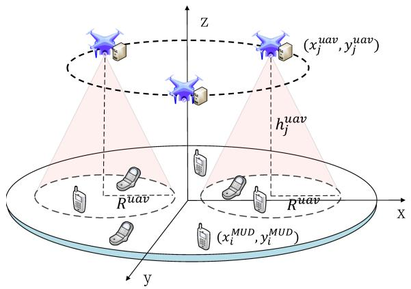

text_image

Z
(xj uav, yj uav)
hj uav
R uav
R uav
x
y
(xi MUD, yi MUD)

Fig. 2. The spatial configuration of the MUDs and UAVs.

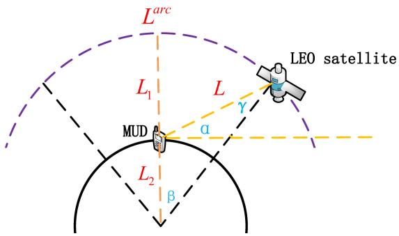

text_image

Larc
L1
L
γ
LEO satellite
MUD
α
L2
β

Fig. 3. The spatial configuration of the MUD and LEO satellite.

Generally speaking, MUDs can only transmit data within the coverage area of satellite signals.

In Fig. 3, $L _ { 1 }$ is the LEO satellite’s orbit height, $L _ { 2 }$ the earth’s 1 2radius, and α the minimum elevation angle from the MUD to the LEO satellite. $\beta$ is one-half of the LEO satellite coverage area’s geocentric angle. According to the Law of Sines, there is

$$
\begin{array}{l} \frac {\sin \gamma}{L _ {2}} = \frac {\sin (\alpha + \frac {\pi}{2})}{L _ {2} + L _ {1}} \\ \Rightarrow \frac {\cos (\beta + \alpha)}{L _ {2}} = \frac {\cos \alpha}{L _ {2} + L _ {1}} \\ \Rightarrow \cos (\beta + \alpha) = \frac {L _ {2}}{L _ {2} + L _ {1}} \cos \alpha \\ \Rightarrow \beta = \arccos \left(\frac {L _ {2}}{L _ {2} + L _ {1}} \cos \alpha\right) - \alpha . \tag {2} \\ \end{array}
$$

$L$ is the distance between the MUD and LEO satellites, there exists

$$
L = \frac {L _ {2} + L _ {1}}{\cos \alpha} \sin \beta . \tag {3}
$$

The maximum arc length $L ^ { a r c }$ of LEO satellite coverage is

$$
L ^ {a r c} = 2 \beta (L _ {1} + L _ {2}). \tag {4}
$$

For multiple MUDs and LEO satellites, there may be different elevation angles $\alpha _ { i , b _ { i } } , d _ { i } \in \mathbf { D } , s _ { b _ { i } } \in \mathbf { S }$ . There are two cases, as follows:

Case 1: $\begin{array} { r } { \alpha \le \alpha _ { i , b _ { i } } \le \frac { \pi } { 2 } . } \end{array}$

2According to (2), there exists

$$
\beta_ {i, b _ {i}} = \arccos \left(\frac {L _ {2}}{L _ {2} + L _ {1}} \cos \alpha_ {i, b _ {i}}\right) - \alpha_ {i, b _ {i}}. \tag {5}
$$

Therefore, the remaining coverage range is

$$
L _ {i, b _ {i}} ^ {r e} = (\beta + \beta_ {i, b _ {i}}) (L _ {1} + L _ {2}). \tag {6}
$$

Case 2: $\begin{array} { r } { \frac { \pi } { 2 } < \alpha _ { i , b _ { i } } < \pi - \alpha } \end{array}$

2 Similar to Case 1, there are

$$
\beta_ {i, b _ {i}} = \arccos \left(\frac {L _ {2}}{L _ {2} + L _ {1}} \cos (\pi - \alpha_ {i, b _ {i}})\right) - (\pi - \alpha_ {i, b _ {i}}), \tag {7}
$$

$$
L _ {i, b _ {i}} ^ {r e} = \left(\beta - \beta_ {i, b _ {i}}\right) \left(L _ {1} + L _ {2}\right). \tag {8}
$$

$v _ { L }$ denotes the speed of the LEO satellites. Based on the analysis of Case 1 and Case 2, the maximum communication time of MUD $d _ { i }$ and LEO satellite $b _ { i }$ is

$$
T _ {i} ^ {L} = \frac {L _ {i , b _ {i}} ^ {r e}}{v _ {L}}. \tag {9}
$$

# C. Communication Model

In the ULSE networks, UAVs and LEO satellites provide multiple available channels for MUDs to transmit task data. Each MUD can only transmit data to an ES through a wireless channel. The MUDs that select the same channel interfere with each other. Similar to the related works [35], [36], [37], the position change of the UAV and the energy consumption associated with UAV flight and hovering are beyond the scope of this paper. We investigate the offloading decision in the current state. In the optimization problem, the goal is to minimize the cost for all MUDs.

When MUDs communicate with UAVs or LEO satellites, the background noise variance is represented by $\sigma ^ { 2 }$ . Similar to [35], [38], [39], we consider that the Signal-to-Interferenceplus-Noise Ratio (SINR) of MUD communicating with a UAV or LEO satellite is

$$
\Gamma_ {i} = \frac {p _ {i} g _ {i} ^ {b _ {i} , c _ {i}}}{\sigma^ {2} + \sum_ {d _ {l} \neq d _ {i} \cap o _ {l} = o _ {i}} p _ {l} g _ {l} ^ {b _ {l} , c _ {l}}}. \tag {10}
$$

$p _ { i }$ is the transmission power of $d _ { i } , g _ { i } ^ { b _ { i } , c _ { i } }$ bi,ci is the channel gain between $d _ { i }$ and UAV $u _ { b _ { i } }$ or LEO $s _ { b _ { i } }$ on channel $c _ { i } .$ . The MUD $d _ { i } \mathrm { ' } s$ data rate is

$$
D r _ {i} = W _ {b _ {i}, c _ {i}} \log_ {2} (1 + \Gamma_ {i}), \tag {11}
$$

where $W _ { b _ { i } , c _ { i } }$ is the channel $c _ { i } \mathrm { ^ { * } s }$ bandwidth. When more MUDs select the same channel, the data rate of MUDs decreases.

The MUD communicates with UAV through line-of-sight links (LoS) and non-line-of-sight links (NLoS). As shown in $( x _ { i } ^ { M U D } , y _ { i } ^ { M U D } )$ is the coordinate position of MUD zontal coordinate position of UAV $d _ { i }$ $( x _ { j } ^ { u a v } , y _ { j } ^ { u a v } )$ $u _ { j }$ (and $h _ { j } ^ { u a v }$ )is the hovering height of $\mathrm { U A V } ~ u _ { j }$ . Referring to [40], when the MUD $d _ { i }$ communicates with the UAV $u _ { j }$ , the path loss is as follows:

$$
\begin{array}{l} L _ {i, j} ^ {\text { path }} = 2 0 \log_ {1 0} \left(\frac {4 \pi f _ {c} | | P _ {d _ {i}} - P _ {u _ {j}} | |}{c}\right) + L o S (\theta_ {i, j}) \eta_ {i} ^ {L o S} \\ + (1 - L o S (\theta_ {i, j})) \eta_ {i} ^ {N L o S}, \\ \end{array}
$$

where $f _ { c }$ represents the carrier frequency, v represents the speed of light. $\eta _ { i } ^ { \bar { L } o S }$ and $\eta _ { i } ^ { N L o S }$ indicate the path loss of LoS and ${ \mathrm { N L o S } } .$ , respectively. According to [41], $\underline { { L o S } } ( \theta _ { i , j } )$ indicates the LoS probability when the MUD $d _ { i }$ ( )communicates with UAV $u _ { j }$ .

$$
L o S (\theta_ {i, j}) = \frac {1}{1 + \mu_ {1} ^ {- \mu_ {2} (\theta_ {i , j} - \mu_ {1})}}
$$

$$
\theta_ {i, j} = \frac {1 8 0}{\pi} \arctan \left(\frac {h}{| | P _ {d _ {i}} - P _ {u _ {j}} | |)}\right)
$$

$$
| | P _ {d _ {i}} - P _ {u _ {j}} | |
$$

$$
= \sqrt {(x _ {i} ^ {M U D} - x _ {j} ^ {u a v}) ^ {2} + (y _ {i} ^ {M U D} - y _ {j} ^ {u a v}) ^ {2} + (h _ {j} ^ {u a v}) ^ {2}}
$$

$\mu _ { 1 }$ and $\mu _ { 2 }$ are the environment related parameters. $\theta _ { i , j }$ is the ele-1 2vation Angle of MUD di to UAV $u _ { j } . | | P _ { d _ { i } } - P _ { u _ { j } } |$ | is the distance between UAV $u _ { j }$ and MUD $d _ { i }$ , where $P _ { u _ { j } } = ( \hat { x _ { j } ^ { u a v } } , y _ { j } ^ { u a v } , h _ { j } ^ { u a v } )$ and $P _ { d _ { i } } = ( x _ { i } ^ { M \bar { U } D } , y _ { i } ^ { M U D } , 0 )$ = ( )represent the position coordinate of UAV $u _ { j }$ (and MUD $d _ { i } .$ 0), respectively. Therefore, when MUD $d _ { i }$ selects UAV edge computing, the channel gain is $g _ { i } ^ { b _ { i } , c _ { i } } =$ $1 0 ^ { - 0 . 1 L _ { i , j } ^ { p a t h } }$ .

0When the MUD $d _ { i }$ selects LEO satellite edge computing, the channel gain is $g _ { i } ^ { \check { b _ { i } } , c _ { i } } = G _ { i } ^ { b _ { i } } G _ { 1 } ^ { F a d } G _ { 2 } ^ { F a d } ( L _ { i , b _ { i } } ) ^ { C ^ { p a t h } }$ Cpath , where $G _ { i } ^ { b _ { i } }$ = 1 2 ( )Gbii is the antenna gain of MUD di against satellite sbi , $d _ { i }$ $s _ { b _ { i } } .$ $G _ { 1 } ^ { \cdot \cdot d } \sim \mathcal { C } \mathcal { N } ( 0 , 1 )$ is the complex Gaussian variable represent-1 (0 1)ing Rayleigh fading, $L _ { i , b _ { i } }$ is the distance between MUD $d _ { i }$ and LEO satellite $s _ { b _ { i } }$ , and $C ^ { p a t h }$ is the path exponent. Similar to [42], $\begin{array} { r } { G _ { 2 } ^ { F a d } = ( \frac { v } { 4 \pi L _ { i , b _ { i } } f _ { c } } ) ^ { 2 } A _ { i , b _ { i } } ^ { c r } } \end{array}$ 1 πLi,b fc is the fading including shadowing 2 4 fading, rain, water vapor and other fading, where $L _ { i , b _ { i } }$ is the distance between MUD $d _ { i }$ and LEO satellite $s _ { b _ { i } } , f _ { c }$ is the carrier frequency, $A _ { i , b _ { i } } ^ { c r } = 1 0 ^ { ( [ 3 \chi L _ { i , b _ { i } } ] / 1 0 L _ { 1 } ) }$ is the attenuation due to =clouds and rain with $L _ { 1 }$ the height of a LEO and $\chi$ the attenuation 1through the cloud and rain in dB/km.

# D. Computation Model

The computation task $H _ { i } , i \in [ 1 , N ]$ can be processed locally [1 ]or can be offloaded to UAVs or LEO satellites for remote processing through wireless channels.

1) Local Computing: MUD $d _ { i }$ executes computation task $H _ { i }$ locally. Different MUDs may have different computing capabilities (i.e. CPU cycles per second). The MUD $d _ { i } \mathrm { ' } s$ computing capability is denoted by $f _ { i } ^ { l o c a l }$ . The task $H _ { i } { ' } \mathrm { s }$ local computing delay is as follows:

$$
t _ {i} ^ {\text { local }} = \frac {C _ {i}}{f _ {i} ^ {\text { local }}}. \tag {12}
$$

Similar to [35], [43], the computing energy consumption is

$$
e _ {i} ^ {\text { local }} = l _ {i} ^ {e} C _ {i}, \tag {13}
$$

where $l _ { i } ^ { e }$ represents the energy consumed by MUD $d _ { i }$ per CPU cycle while processing the task locally. According to (12)

and (13), the cost of local computing can be obtained as

$$
K _ {i} ^ {\text { local }} = \lambda_ {i} ^ {t} t _ {i} ^ {\text { local }} + \lambda_ {i} ^ {e} e _ {i} ^ {\text { local }}, \tag {14}
$$

where $\lambda _ { i } ^ { t }$ and $\lambda _ { i } ^ { e }$ are weighted parameters of delay and energy consumption respectively. There are $\lambda _ { i } ^ { t } , \lambda _ { i } ^ { e } \in [ 0 , 1 ]$ and $\lambda _ { i } ^ { t } + \lambda _ { i } ^ { e } = 1$ [0 1]. In practice, MUDs can appropriately adjust the weighted parameters. When MUD $d _ { i }$ pays more attention to energy consumption, it can set $\lambda _ { i } ^ { t } < \lambda _ { i } ^ { e }$ . When MUD $d _ { i }$ pays more attention to latency, it can set $\lambda _ { i } ^ { t } > \lambda _ { i } ^ { e }$ .

2) Offloading to the UAVs: MUDs can offload tasks to the ESs of UAVs for processing. UAVs can provide MUDs with computing resources, and can also transfer energy to MUDs by applying wireless power transfer technology. When MUD $d _ { i }$ offloads the task to UAV $u _ { b _ { i } }$ , the task $H _ { i } { ' } \mathrm { s }$ data transmission delay is

$$
t _ {i} ^ {t r} = \frac {B _ {i}}{D r _ {i}}. \tag {15}
$$

The task computing delay is

$$
t _ {i} ^ {U A V} = \frac {C _ {i}}{f _ {i , b _ {i}} ^ {U A V}}, \tag {16}
$$

where $f _ { i , b _ { i } } ^ { U A V }$ denotes the computing capability (CPU cycles/second) obtained by MUD $d _ { i }$ on the edge server of UAV ubi . f Ubi $u _ { b _ { i } } . \ f _ { b _ { i } } ^ { U A V }$ is the computing capability of the UAV $u _ { b _ { i } }$ , there is dl∈D∩bl bi i $\sum _ { d _ { l } \in \mathbf { D } \cap b _ { l } = b _ { i } } f _ { l , b _ { i } } ^ { U A V } \leq f _ { b _ { i } } ^ { U A V }$ f UAVl,b ≤ f Ub . According to (15) and (16), =the total delay of MUD $d _ { i }$ offloading task $H _ { i }$ to UAV $u _ { b _ { i } }$ for processing is

$$
T _ {i} ^ {U A V} = t _ {i} ^ {t r} + t _ {i} ^ {U A V}. \tag {17}
$$

For UAV edge computing, the energy consumption of the MUD offloading task and the subsequent energy harvesting (EH) performed by the MUD as a receiver are considered. The energy consumption of MUD $d _ { i }$ is

$$
e _ {i} ^ {t r} = p _ {i} t _ {i} ^ {t r}. \tag {18}
$$

MUDs can obtain energy from the UAV through wireless power transfer technology after completing the task offloading. The EH of MUD $d _ { i }$ is

$$
e _ {i} ^ {e h} = \eta p ^ {u a v} g _ {i} ^ {b _ {i}, c _ {i}}, \tag {19}
$$

where $\eta$ is the energy transmission efficiency, and $p ^ { u a v }$ is the power of the UAV WPT. Therefore, the cost of MUD $d _ { i }$ offloading task to the UAV $u _ { b _ { i } }$ is

$$
K _ {i} ^ {U A V} = \lambda_ {i} ^ {t} T _ {i} ^ {U A V} + \lambda_ {i} ^ {e} (e _ {i} ^ {t r} - e _ {i} ^ {e h}). \tag {20}
$$

3) Offloading to the LEO Satellites: When MUD $d _ { i }$ offloads the task $H _ { i }$ to the LEO satellite $s _ { b _ { i } }$ , the computing delay is

$$
t _ {i} ^ {L E O} = \frac {C _ {i}}{f _ {i , b _ {i}} ^ {L E O}}, \tag {21}
$$

where $f _ { i , b _ { i } } ^ { L E O }$ denotes the computing capability obtained by MUD is the $d _ { i }$ on the edgEO satellite ver of LEO satellite computing capabilit $s _ { b _ { i } } . . . \ f _ { b _ { i } } ^ { L E O }$ $s _ { b _ { i } } \mathrm { ^ { \circ } s }$ dl∈D∩bl bi f LE l,bi $\begin{array} { r } { \sum _ { d _ { l } \in \mathbf { D } \cap b _ { l } = b _ { i } } f _ { l , b _ { i } } ^ { L E O } \leq f _ { b _ { i } } ^ { L \overleftarrow { E O } } } \end{array}$ ≤ f Lbi EO . In addition, the distance between =MUD and LEO satellites is relatively large. Therefore, MUDs suffer from propagation delays when communicating with LEO satellites. The propagation delay is

$$
t _ {i} ^ {p} = \frac {L _ {i , b _ {i}}}{v}, \tag {22}
$$

where $\boldsymbol { L } _ { i , b _ { i } }$ is the distance between MUD $d _ { i }$ and LEO satellite $s _ { b _ { i } }$ . Therefore, the delay for MUD $d _ { i }$ to offload task $H _ { i }$ to LEO satellite $s _ { b _ { i } }$ is

$$
T _ {i} ^ {L E O} = t _ {i} ^ {p} + t _ {i} ^ {t r} + t _ {i} ^ {L E O}. \tag {23}
$$

The cost of MUD $d _ { i }$ offloading task to the LEO satellite $s _ { b _ { i } }$ is

$$
K _ {i} ^ {L E O} = \lambda_ {i} ^ {t} T _ {i} ^ {L E O} + \lambda_ {i} ^ {e} e _ {i} ^ {t r}. \tag {24}
$$

# E. Problem Formulation

For each MUD $d _ { i } \in \mathbf { D }$ , the cost function is as follows.

$$
K _ {o _ {- i}} (o _ {i}) = \left\{ \begin{array}{l l} K _ {i} ^ {\text { local }}, & o _ {i} = (0, 0, 0) \\ K _ {i} ^ {\text { UAV }}, & o _ {i} = (1, b _ {i}, c _ {i}) \\ K _ {i} ^ {\text { LEO }}, & o _ {i} = (2, b _ {i}, c _ {i}) \end{array} \right., \tag {25}
$$

where $o _ { - i }$ represents the set of offloading decisions of all MUDs except MUD $d _ { i } .$ The MUDs are subject to some constraints in making decisions. The detailed problem formulation is as follows:

$$
\min \sum_ {d _ {i} \in \mathbf {D}} K _ {o _ {- i}} (o _ {i})
$$

$$
\text { s.t. } C _ {1}: T _ {i} ^ {L E O} \leq T _ {i} ^ {L}, \text { if } a _ {i} = 2
$$

$$
C _ {2}: K _ {o _ {- i}} (o _ {i}) \leq K _ {i} ^ {\text { l   o   c   a   l }}, \forall d _ {i} \in \mathbf {D}
$$

$$
C _ {3}: \sum_ {d _ {l} \in \mathbf {D} \cap b _ {l} = j _ {1}} f _ {l, j _ {1}} ^ {U A V} \leq f _ {j _ {1}} ^ {U A V}, \forall u _ {j _ {1}} \in \mathbf {U}
$$

$$
C _ {4}: \sum_ {d _ {l} \in \mathbf {D} \cap b _ {l} = j _ {2}} f _ {l, j _ {2}} ^ {L E O} \leq f _ {j _ {2}} ^ {L E O}, \forall s _ {j _ {2}} \in \mathbf {S}. \tag {26}
$$

$C _ { 1 }$ is the coverage time constraint when the MUDs offload tasks 1to the LEO satellites. $C _ { 2 }$ means that when the MUDs offload the 2tasks, the cost obtained should be lower than the cost of local computing; otherwise, the MUDs will not offload the tasks. $C _ { 3 }$ and $C _ { 4 }$ 3are the computing resource constraints of UAVs and LEO satellites, respectively.

Theorem 1: The problem (26) is NP-hard.

Proof: The problem can be proven to be NP-hard with the multiple Knapsack (MK) problem. In the MK problem, there are n items $\mathbb { I } = \{ i m _ { 1 } , \ldots , i m _ { n } \}$ and m backpacks $\mathbb { B } =$ $\{ b k _ { 1 } , \ldots , b k _ { m } \}$ = 1. The capacity of each knapsack $b k _ { j } \in b k \mathrm { i s } ~ c _ { j }$ . 1The income and weight of each item $i m _ { i } \in i m$ are $i e _ { i }$ and $w _ { i } .$ respectively. $q _ { i } = \{ q _ { i , 1 } , \dots , q _ { i , m } \}$ indicates the decision to the item imi. $q _ { i , j } = 1$ 1indicates that item $i m _ { i }$ is packed into the knapsack $b k _ { j }$ = 1, and $q _ { i } = 0$ indicates that it is not packed into any backpack. $I \{ \mathcal P \}$ = 0is a condition function. If $\mathcal { P }$ is true, $I \{ \mathcal { P } \} = 1$ . Otherwise, $I \{ \mathcal { P } \} = 0$ . The goal of the MK problem = 1 = 0is to maximize the overall income.

$$
\max \sum_ {i m _ {i} \in \mathbf {I m}} i e _ {i} I \{q _ {i} \neq 0 \}
$$

$$
\text { s.t. } \sum_ {i m _ {i} \in \mathbf {I m}} w _ {i} I \{q _ {i, j} = 1 \} \leq c _ {j}, \forall b k _ {j} \in \mathbb {B}.
$$

In the problem (26), there is a certain resource requirement for each MUD and a certain user capacity for each wireless channel. Thus, they can be seen as items and backpacks in the MK problem, respectively. The goal of problem (26) can be seen as a transformation of the goal of problem MK, and constraints $C _ { 3 }$ and $C _ { 4 }$ are equivalent to $\begin{array} { r } { \sum _ { i m _ { i } \in \mathbf { I m } } w _ { i } I \{ q _ { i , j } = 1 \} \le } \end{array}$ $c _ { j } , \forall b k _ { j } \in \mathbb { B }$ 4 = 1. Other constraints of problem (26) can be projected as weights into the MK problem. Therefore, the problem (26) can be transformed from the MK problem and is NP-hard. -

According to Theorem 1, it is difficult to obtain the optimal solution of problem (26) in polynomial time. The time complexity required to obtain the optimal solution through the centralized method is significant. Moreover, in problem (26), each MUD focuses on its own benefit and competes for the limited system resources. In other words, each MUD does not aim at reducing the overall cost at the expense of increasing its own cost. How to balance the benefits of the individual MUD and the benefits of overall MUDs is a challenge. Therefore, we propose a distributed approach based on game theory to solve this problem. With the distributed approach, different MUDs are allowed to make their own decisions and finally reach to an equilibrium state, i.e., the Nash equilibrium state. In other words, the balanced benefits of the individual MUD and the overall MUDs are achieved.

# IV. LEO-UAV TASK OFFLOADING GAME

In this section, the LEO-UAV task offloading Game (LUTO-Game) model is established, and the property of the game is analyzed theoretically.

# A. LUTO-Game Formulation

To solve this task offloading problem, the idea of game theory is used, each MUD has a certain degree of autonomy. We reformulate the problem as the LUTO-Game $G = ( \mathbf { D } , \{ O _ { i } \} _ { d _ { i } \in \mathbf { D } } , \{ K _ { o - i } ( o _ { i } ) \} _ { d _ { i } \in \mathbf { D } } )$ . D is a players set, = (and MUD $d _ { i } \in \mathbf { D }$ ( ) )makes the offloading decision $o _ { i } \in$ $\{ ( 0 , 0 , 0 ) \bigcup ( a _ { i } , b _ { i } , c _ { i } ) \}$ . $O _ { i }$ is the set of available offloading (0 0 0) (decisions, and $K _ { o _ { - i } } ( o _ { i } )$ is the cost of MUD $d _ { i }$ . All players ( )compete for limited resources and minimize their own costs. Definition 1 shows the detailed definition for the Nash Equilibrium (NE) solution of the LUTO-Game G.

Definition 1: If no MUD can change its decision to decrease $\mathrm { c o s t } , o ^ { * } = ( o _ { 1 } ^ { * } , o _ { 2 } ^ { * } , . . . , o _ { N } ^ { * } )$ can reach a Nash Equilibrium (NE) = ( 1 2for the LUTO-Game $\ddot { G } = ( \mathbf { D } , \{ O _ { i } \} _ { d _ { i } \in \mathbf { D } } , \{ K _ { o _ { - i } } ( o _ { i } ) \} _ { d _ { i } \in \mathbf { D } } )$ , i.e.,

$$
K _ {o _ {- i} ^ {*}} (o _ {i} ^ {*}) \leq K _ {o _ {- i} ^ {*}} (o _ {i}), \forall d _ {i} \in \mathbf {D}, \forall o _ {i} \in O _ {i}. \tag {27}
$$

Then, for a set of NE decisions, each participant’s decision is the best response decision to the other participants, described in detail in Property 1.

Property 1: For the offloading strategy $o ^ { * } = ( o _ { 1 } ^ { * } , o _ { 2 } ^ { * } , \ldots , o _ { N } ^ { * } )$ of the LUTO-Game G, MUD $d _ { i } \mathrm { ' } s$ = ( 1 2 offloading decision $o _ { i } ^ { * } \in O _ { i }$ is the best response to the other MUDs’ decisions $o _ { - i } ^ { * } .$

Proof: For MUD $d _ { i } ,$ , if $o _ { i } ^ { * } \in O _ { i }$ is not the best response decision, there must exist a decision $o _ { i } \in O _ { i }$ that can decrease its cost, i.e., $K _ { o _ { - i } ^ { * } } ( o _ { i } ^ { * } ) > K _ { o _ { - i } ^ { * } } ( o _ { i } )$ . This hypothesis conflicts with ((27). Therefore, $o _ { i } ^ { * }$ ( )is the MUD $d _ { i } \mathrm { ' } s$ best response decision. -

According to Property 1, the LUTO-Game allows each MUD to make the offloading decision. Therefore, the offloading strategy can be obtained in a distributed manner. This method can reduce complexity and improve efficiency.

# B. Analysis of LUTO-Game Solution

In order to solve the problem (26), a task offloading rule is proposed to optimize the total utility of MUDs in LUTO-Game. The offloading rule is designed based on the principle of overall cost reduction, i.e., the decision update of any MUD can reduce its own cost and the system cost. Suppose the current decision of MUD $d _ { i } \in \mathbf { D }$ is $o _ { i }$ and it wants to change to decision $o _ { i } ^ { \prime }$ to reduce cost. MUD $d _ { i }$ changing decisions will affect its own cost and the cost of other MUDs. The offloading rules are defined in Definition 2.

Definition 2: (Task Offloading Rule) After MUD $d _ { i }$ changes the decision, the amount of cost reduction is $\bigtriangleup K _ { i } = K _ { o _ { - i } } ( o _ { i } ) -$ $K _ { o _ { - i } } ( o _ { i } ^ { \prime } )$ =, and the impact on other MUDs is $\triangle K _ { - i } =$ $\begin{array} { r } { \sum _ { d _ { l } \neq d _ { i } } K _ { o _ { - l } ^ { \prime } } ( o _ { l } ) - \sum _ { d _ { l } \neq d _ { i } } K _ { o _ { - l } } ( o _ { l } ) } \end{array}$ . $d _ { i }$ =can change the de-=  ( ) = ( )cision if it reduces the overall cost after changing the decision, i.e.,

$$
\triangle K _ {i} > \triangle K _ {- i}. \tag {28}
$$

It guarantees that MUD reduces its own cost while reducing the overall cost. Then, we analyze the existence of NE in the LUTO-Game by proving that the game is a potential game. The definition of a potential game is as follows.

Definition 3: For a game problem, if there is a function $Y ( o _ { i } , o _ { - i } )$ that satisfies (29), then the game is a potential game.

$$
K _ {o _ {- i}} (o _ {i} ^ {\prime}) \leq K _ {o _ {- i}} (o _ {i}) \Rightarrow Y (o _ {i} ^ {\prime}, o _ {- i}) \leq Y (o _ {i}, o _ {- i}), \tag {29}
$$

where $d _ { i } \in \mathbf { D }$ and $o _ { i } , o _ { i } ^ { \prime } \in O _ { i }$ .

Theorem 2: The LUTO-Game is a potential game, and (30) gives the potential function.

$$
Y (o _ {i}, o _ {- i}) = \sum_ {d _ {i} \in \mathbf {D}} K _ {o _ {- i}} (o _ {i}) \tag {30}
$$

Proof: We assume that MUD $d _ { i } \in \mathbf { D }$ has two decisions $o _ { i }$ and $o _ { i } ^ { \prime } ,$ and $K _ { o _ { - i } } ( o _ { i } ) > K _ { o _ { - i } } ( o _ { i } ^ { \prime } )$ . According to Definition 2, there is

$$
\begin{array}{l} Y (o _ {i}, o _ {- i}) - Y (o _ {i} ^ {\prime}, o _ {- i}) \\ = \sum_ {d _ {i} \in \mathbf {D}} K _ {o _ {- i}} (o _ {i}) - \sum_ {d _ {i} \in \mathbf {D}} K _ {o _ {- i}} (o _ {i} ^ {\prime}) \\ = K _ {o _ {- i}} (o _ {i}) + \sum_ {d _ {l} \neq d _ {i}} K _ {o _ {- l}} (o _ {l}) \\ - K _ {o _ {- i}} \left(o _ {i} ^ {\prime}\right) - \sum_ {d _ {l} \neq d _ {i}} K _ {o _ {- l} ^ {\prime}} \left(o _ {l}\right) \\ = K _ {o _ {- i}} (o _ {i}) - K _ {o _ {- i}} (o _ {i} ^ {\prime}) \\ \end{array}
$$

$$
\begin{array}{l} - \left(\sum_ {d _ {l} \neq d _ {i}} K _ {o _ {- l} ^ {\prime}} (o _ {l}) - \sum_ {d _ {l} \neq d _ {i}} K _ {o _ {- l}} (o _ {l})\right) \\ = \triangle K _ {i} - \triangle K _ {- i} > 0 \tag {31} \\ \end{array}
$$

Therefore,

$$
K _ {o _ {- i}} (o _ {i}) > K _ {o _ {- i}} (o _ {i} ^ {\prime}) \Rightarrow Y (o _ {i}, o _ {- i}) > Y (o _ {i} ^ {\prime}, o _ {- i})
$$

and Theorem 2 holds.

# V. JOINT UAV AND LEO SATELLITE TASK OFFLOADING ALGORITHM

This section proposes the Joint UAV and LEO Satellite Task Offloading (JULTO) algorithm to solve the offloading problem for the ULSE network. The theoretical analysis for the JULTO algorithm is also given.

# A. Algorithm Design

Based on Theorem 2, the game has a limited improvement property (FIP [44]). As a result, the NE offloading strategy can be obtained by a limited iteration number. To find the LUTO-Game’s NE solutions, the JULTO algorithm is designed. The JULTO algorithm operates in an iterative manner, where each MUD makes offloading decisions independently. In each iteration, each MUD searches for the best decision and then competes with other MUDs for the chance to update the decision. Then, the winner of the participant competition gets an update opportunity and can update its decision. The algorithm continues to iterate until no MUD wants to change its decision further, at which point the algorithm terminates. Overall, the JULTO algorithm provides an efficient method for obtaining the NE solution based on FIP. By allowing MUDs to make offloading decisions independently and compete for update opportunities, the game can find solutions that satisfy the NE conditions. The details are illustrated in Algorithm 1.

First, the algorithm needs to set the necessary parameters. In the initial state, no MUD makes an offloading decision, and the decisions of all MUDs are initialized to (0,0,0). Next, each MUD updates its decision by iteration. The FIP guarantees the convergence of the JULTO algorithm, and finally reaches the Nash equilibrium state, that is, no MUD can change its offloading decision.

In each iteration, each MUD calculates the current delay and cost (Line 6). If the MUD $d _ { i } \in \mathbf { D }$ does not choose local computing, it is necessary to judge whether the utility at this time is better than that of local computing (Lines 7-8). In addition, if the $\mathrm { M U D } d _ { i } \in \mathbf { D }$ chooses to offload tasks to the satellite, it needs to check whether the satellite coverage time constraint is met at this time (Lines 9-10). Next, the total cost $\textstyle \sum _ { d _ { i } \in \mathbf { D } } K _ { o _ { - i } } ( o _ { i } )$ of all MUDs is calculated (Line 11). After that, each MUD $d _ { i } \in \mathbf { D }$ finds a new decision $o _ { i } ^ { \prime }$ that can reach the minimum $K _ { o _ { - i } } ( o _ { i } ^ { \prime } )$ in parallel (Lines 12-16). The new decision $o _ { i } ^ { \prime }$ of $\mathrm { { M U D } } d _ { i }$ ( )needs to be beneficial for both MUD $d _ { i }$ ’s cost and the overall system cost. Therefore, the new decision needs to be guaranteed to reduce the overall cost, i.e., $\begin{array} { r } { \sum _ { d _ { i } \in \mathbf { D } } K _ { o _ { - i } } ( o _ { i } ^ { \prime } ) < \bar { \sum } _ { d _ { i } \in \mathbf { D } } K _ { o _ { - i } } ( o _ { i } ) } \end{array}$ . The ( ) ( )MUD that wants to update the decision sends the new decision $o _ { i } ^ { \prime }$ Algorithm 1: Joint UAV and LEO Satellite Task Offloading (JULTO) Algorithm.

Input: ${ \bf D } = \{ d _ { 1 } , \ldots , d _ { N } \} , { \bf U } = \{ u _ { 1 } , \ldots , u _ { M _ { 1 } } \}$ $\mathbf { S } = \{ s _ { 1 } , \ldots , s _ { M _ { 2 } } \}$ and other parameters

Output: the task offloading strategy

# 1 Initialization:

2 $o = \{ o _ { 1 } , o _ { 2 } , . . . , o _ { N } \}$ , the decision of MUD $d _ { i } \in \mathbf { D }$ is $o _ { i } = ( a _ { i } , b _ { i } , c _ { i } ) = ( 0 , 0 , 0 )$

# 3 End Initialization

# 4 repeat

5 for each MUD $d_i \in D$ do
6 Calculate the delay $T_i$ and cost $K_{o_{-i}}(o_i)$ 7 if $a_i \neq 0$ and $K_{o_{-i}}(o_i) > K_i^{local}$ then
8 $o_i = (0,0,0)$ 9 if $a_i = 2$ and $T_i > T_i^L$ then
10 $o_i = (0,0,0)$ 11 Calculate $\sum_{d_i \in D} K_{o_{-i}}(o_i)$ 12 for each MUD $d_i \in D$ do
13 for each UAV $u_{j_1} \in U$ and LEO satellite $s_{j_2} \in S$ that MUD $d_i$ can select do
14 for each channel $c_{j_1}^u$ of UAV and $c_{j_2}^L$ of
LEO satellite do
15 Calculate the cost when $d_i$ 's task data
is offloaded by channel $c_{j_1}^u$ or $c_{j_2}^L$ 16 Find a new decision $o_i'$ that can reach the minimum $K_{o_{-i}}(o_i')$ 17 if $\sum_{d_i \in D} K_{o_{-i}}(o_i') < \sum_{d_i \in D} K_{o_{-i}}(o_i)$ and $o_i' \neq o_i$ then
18 Send $o_i'$ to the set of competing decisions
19 if $d_i$ is the winner then
20 Update $d_i$ 's decision to $o_i'$ 21 until no MUD wants to update the decision for cost reduction.;
22 return $o = \{o_1, \ldots, o_N\}$

to a set of competing decisions. Then, these MUDs compete for update opportunities (lines 17-18). In this paper, the competition determines the winner in a non-deterministic manner such as a random method. If MUD $d _ { i }$ becomes the winner, it will get an update opportunity and its decision $o _ { i }$ will be updated to $o _ { i } ^ { \prime }$ (Lines 19-20).

Finally, when no MUDs can change their decisions, the JULTO algorithm ends (Line 21). At this point, the system reaches an equilibrium state and the task offloading decisions of all MUDs constitute the NE solution of the problem. During the process, MUDs make their own task-offloading decisions in parallel. Therefore, the JULTO algorithm is a distributed algorithm.

# B. Convergence Analysis

After a finite number of iterations, the LUTO-Game will finally reach a Nash Equilibrium offloading strategy because of the FIP property. Next, we prove the upper bound of the number of iterations, as in Theorem 3.

Theorem 3: There is an upper limit on the number of iterations, which satisfies

$$
\begin{array}{l} R ^ {F I P} \leq N (\max \{t _ {m a x} ^ {l o c a l}, e _ {m a x} ^ {l o c a l} \} \\ - \min \{t _ {m i n} ^ {t r} + t _ {m i n} ^ {U A V}, e _ {m i n} ^ {t r} - e _ {m a x} ^ {e h} \}), \\ \end{array}
$$

$\begin{array} { r c l r c l } { { \mathrm { w h e r e } } } & { { t _ { m a x } ^ { l o c a l } } } & { { = } } & { { \frac { C _ { m a x } } { f _ { m i n } ^ { l o c a l } } , } } & { { e _ { m a x } ^ { l o c a l } } } & { { = } } & { { l _ { m a x } ^ { e } C _ { m a x } , } } & { { t _ { m i n } ^ { t r } } } & { { = } } & { { \frac { \textstyle 1 } { \textstyle 2 } } } \end{array}$ t max Cmax xCmax, fmin

$$
\frac {B _ {m i n}}{W _ {m a x} \log_ {2} (1 + \frac {p _ {m a x} g _ {m a x}}{\sigma^ {2}})}, \qquad t _ {m i n} ^ {U A V} = \frac {C _ {m i n}}{f _ {m a x} ^ {U A V}}, \qquad e _ {m i n} ^ {t r} =
$$

$$
\frac {p _ {m i n} B _ {m i n}}{W _ {m a x} \log_ {2} (1 + \frac {p _ {m a x} g _ {m a x}}{\sigma^ {2}})}, e _ {m a x} ^ {e h} = \eta p _ {m a x} g _ {m a x}, C _ {m i n} =
$$

$\{ C _ { 1 } , \dots , C _ { N } \} , \ l _ { m a x } ^ { e } = \operatorname* { m a x } \{ l _ { 1 } ^ { e } , \dots , l _ { N } ^ { e } \}$ $\{ f _ { 1 } ^ { l o c a l } , \ldots , f _ { N } ^ { l o c a l } \} , \quad B _ { m i n } = \operatorname * { m i n } \{ B _ { 1 } , \ldots , B _ { N } \} , \quad p _ { m i n } =$ 1 = min 1{p , . . . , pN }, pmax  {p , . . . , pN }, $W _ { m a x } =$ min $\left\{ W _ { j , k } , j \in \{ 1 , \dots , M _ { 1 } \} , k \in \{ 1 , \dots , c _ { j } ^ { u } \} \right\}$ =, gmax i max $\{ g _ { i } ^ { j , k } , d _ { i } \in \mathbf { D } , j \in \{ 1 , \dots , M _ { 1 } \} , k \in \{ 1 , \dots , c _ { j } ^ { u } \} \} , \quad f _ { m a x } ^ { U A V } =$ $\{ f _ { i , j } ^ { U A V } , d _ { i } \in \mathbf { D } , j \in \{ 1 , \dots , M _ { 1 } \} \}$ . fmax

1 1Proof: There are maximum cost and minimum cost for any MUD $d _ { i } \in \mathbf { D }$ . Based on the model of the problem, MUD $d _ { i }$ achieves the maximum cost when it chooses local processing. There is $K ( o _ { i } , o _ { - i } ) \leq \operatorname* { m a x } \{ K _ { i } ^ { l o c a l } \} = \operatorname* { m a x } \{ \lambda _ { i } ^ { \bar { t } } t _ { i } ^ { l o c a l } +$ $\lambda _ { i } ^ { e } e _ { i } ^ { l o c a l } \}$ (. According to $\lambda _ { i } ^ { t } + \lambda _ { i } ^ { e } = 1$ = max, we can obtain

$$
\begin{array}{l} K (o _ {i}, o _ {- i}) \leq \max \{t _ {m a x} ^ {l o c a l}, e _ {m a x} ^ {l o c a l} \} \\ \leq \max \left\{\frac {C _ {m a x}}{f _ {m i n} ^ {l o c a l}}, l _ {m a x} ^ {e} C _ {m a x} \right\}. \\ \end{array}
$$

The MUD $d _ { i }$ may obtain the minimum cost when it offloads the task to the UAV for processing. There exists $K ( o _ { i } , o _ { - i } ) \geq$ min $\{ K _ { i } ^ { U A V } \} = \operatorname* { m i n } \{ \lambda _ { i } ^ { \dag } T _ { i } ^ { U A V } + \bar { \lambda } _ { i } ^ { e } e _ { i } ^ { t r } \}$ ( ) . We can obtain (32) min = min +shown at the bottom of the this page.

If MUD $d _ { i }$ updates its decision from $o _ { i }$ to $o _ { i } ^ { \prime } , \ d _ { i } ^ { \ } \mathrm { s }$ cost decreases, $K _ { o _ { - i } } ( o _ { i } ^ { \prime } ) \le K _ { o _ { - i } } ( o _ { i } )$ . According to Definition 3, the (potential function $\phi _ { - a } ( a _ { i } )$ ( )meets

$$
Y (o _ {i}, o _ {- i}) - Y (o _ {i} ^ {\prime}, o _ {- i}) \geq 0.
$$

Therefore, the reduction of the potential function before and after each iteration is at least 1. Therefore, Theorem 3 is proved. -

# C. Price of Anarchy in Total Cost

Generally, there are many different Nash equilibrium states in the LUTO-Game. The Nash equilibrium solution obtained by the JULTO algorithm may not be the global optimal solution. For the problem (26), to evaluate the gap between the NE solution and the global optimal solution, we consider an important attribute: price of anarchy (PoA).

The PoA is a metric used in game theory to evaluate the efficiency of Nash equilibrium solutions. It measures the ratio between the worst outcome achievable by adopting a Nash equilibrium strategy and the outcome achievable by the optimal solution to the problem. PoA is the ratio between the utility of the least effective Nash equilibrium solution and the utility of the globally optimal solution, used to evaluate and measure the efficiency of LUTO-Game’s NE solution. In LUTO-Game, A represents the set of all Nash equilibrium solutions, $\hat { o } =$ $\big \{ \hat { o } _ { 1 } , \dotsc , \hat { o } _ { N } \big \}$ ˆ =represents a centralized optimal solution. The PoA ˆ1 ˆin the total cost is

$$
P O A _ {c o s t} = \frac {\max _ {o ^ {*} \in \mathbb {A}} \{\sum_ {d _ {i} \in \mathbf {D}} K _ {o _ {- i} ^ {*}} (o _ {i} ^ {*}) \}}{\sum_ {d _ {i} \in \mathbf {D}} K _ {\hat {o} _ {- i}} (\hat {o} _ {i})}. \tag {33}
$$

In the LUTO-Game, the PoA in total cost obtained by the JULTO algorithm is analyzed, and its upper and lower bounds can be given. Therefore, Theorem 4 can be obtained.

Theorem 4: The PoA of the LUTO-Game in total cost satisfies

$$
1 \leq P O A _ {c o s t} \leq \frac {\max \{t _ {m a x} ^ {l o c a l} , e _ {m a x} ^ {l o c a l} \}}{\min \{t _ {m i n} ^ {t r} + t _ {m i n} ^ {U A V} , e _ {m i n} ^ {t r} - e _ {m a x} ^ {e h} \}}.
$$

Proof: For any offloading strategy $o ^ { * } \in \mathbb { A }$ and optimal offloading strategy o, there exists $\begin{array} { r } { \sum _ { d _ { i } \in \mathbf { D } } K ( o _ { i } ^ { * } , o _ { - i } ^ { * } ) \ge } \end{array}$ $\textstyle \sum _ { d _ { i } \in \mathbf { D } } K ( \hat { o } _ { i } , \hat { o } _ { - i } )$ . Therefore, $\frac { \sum _ { d _ { i } \in \mathbf { D } } K ( o _ { i } ^ { * } , o _ { - i } ^ { * } ) } { \sum _ { d _ { i } \in \mathbf { D } } K ( \hat { o } _ { i } , \hat { o } _ { - i } ) } \geq 1$ .

(ˆ ˆ )There are maximum cost and minimum cost for any MUD $d _ { i } \in \mathbf { D }$ . We can obtain

$$
K (o _ {i}, o _ {- i}) \leq \max \left\{\frac {C _ {m a x}}{f _ {m i n} ^ {l o c a l}}, l _ {m a x} ^ {e} C _ {m a x} \right\}
$$

$$
K (o _ {i}, o _ {- i}) \geq \min \left\{t _ {m i n} ^ {t r} + t _ {m i n} ^ {U A V}, e _ {m i n} ^ {t r} - e _ {m a x} ^ {e h} \right\}.
$$

For offloading strategy $o ^ { * } \in \mathbb { A }$ , there are

$$
\sum_ {d _ {i} \in \mathbf {D}} K (o _ {i} ^ {*}, o _ {- i} ^ {*}) \leq N \max \left\{\frac {C _ {m a x}}{f _ {m i n} ^ {l o c a l}}, l _ {m a x} ^ {e} C _ {m a x} \right\}.
$$

The centralized optimal solution o satisfies

$$
\sum_ {d _ {i} \in \mathbf {D}} K (\hat {o} _ {i}, \hat {o} _ {- i}) \geq N \min \{t _ {m i n} ^ {t r} + t _ {m i n} ^ {U A V}, e _ {m i n} ^ {t r} - e _ {m a x} ^ {e h} \}.
$$

Therefore, Theorem 4 can be proved.

# D. Complexity Analysis

In each iteration, first, each MUD calculates its delay and cost (lines 5-11), with only a few basic mathematical operations, the time complexity of which can be viewed as $\mathcal { O } ( 1 )$ . (1)Each MUD then searches for its own optimal decision in parallel (lines 13-16) with a time complexity of $\mathcal { O } ( M _ { 1 } c ^ { u } +$ $M _ { 2 } c ^ { L } )$ ( 1 +. Therefore, the time complexity of each iteration is $\mathcal { O } ( 1 ) + \mathcal { O } ( M _ { 1 } c ^ { u } + M _ { 2 } c ^ { L } ) = \bar { \mathcal { O } ( M _ { 1 } c ^ { \dot { u } } + M _ { 2 } c ^ { L } ) }$ . Further, $R ^ { F I P } \leq N ( \operatorname* { m a x } \{ t _ { m a x } ^ { l o c a l } , e _ { m a x } ^ { l o c a l } \} - \operatorname* { m i n } \{ t _ { m i n } ^ { t r } +$ $t _ { m i n } ^ { U A V } , e _ { m i n } ^ { t r } - e _ { m a x } ^ { e h } \} )$

$$
K (o _ {i}, o _ {- i}) \geq \min \{T _ {m i n} ^ {U A V}, e _ {m i n} ^ {t r} \} = \min \{t _ {m i n} ^ {t r} + t _ {m i n} ^ {U A V}, e _ {m i n} ^ {t r} - e _ {m a x} ^ {e h} \}
$$

$$
\Rightarrow K \left(o _ {i}, o _ {- i}\right) \geq \min \left\{\frac {B _ {\text { min }}}{W _ {\text { max }} \log_ {2} \left(1 + \frac {p _ {\text { max }} g _ {\text { max }}}{\sigma^ {2}}\right)} + \frac {C _ {\text { min }}}{f _ {\text { max }} ^ {U A V}}, \frac {p _ {\text { min }} B _ {\text { min }}}{W _ {\text { max }} \log_ {2} \left(1 + \frac {p _ {\text { max }} g _ {\text { max }}}{\sigma^ {2}}\right)} - \eta p _ {\text { max }} g _ {\text { max }} \right\}. \tag {32}
$$

TABLE II EXPERIMENT SETTINGS (1) 

<table><tr><td>Parameter</td><td>Value</td></tr><tr><td>The height of the LEO satellites</td><td>784 km</td></tr><tr><td>The bandwidth of Channel</td><td>5 MHz</td></tr><tr><td>Data size  $B_i$  of task</td><td>3 MB~5 MB</td></tr><tr><td>The radius of the earth</td><td>6371 km</td></tr><tr><td>The computing capability allocated to MUD by UAV</td><td>10 GHz</td></tr><tr><td>The computing capability of MUD</td><td>2 GHz</td></tr><tr><td>The computing capability allocated to MUD by LEO satellite</td><td>10 GHz</td></tr></table>

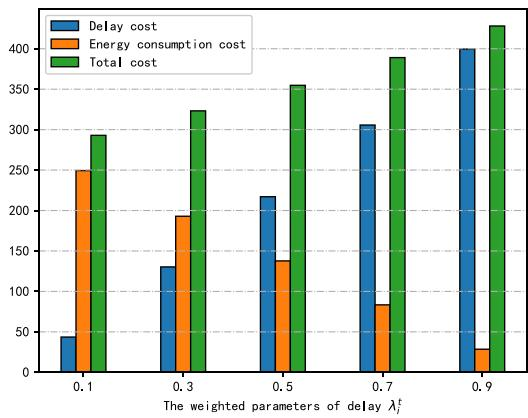

bar

| The weighted parameters of delay λi^t | Delay cost | Energy consumption cost | Total cost |
| ------------------------------------- | ---------- | ------------------------ | ---------- |
| 0.1                                   | 40         | 250                      | 295        |
| 0.3                                   | 130        | 195                      | 325        |
| 0.5                                   | 220        | 135                      | 355        |
| 0.7                                   | 310        | 85                       | 390        |
| 0.9                                   | 400        | 30                       | 425        |

Fig. 4. The total cost of MUDs with different weighted parameters.

the $\mathcal { O } ( N ( M _ { 1 } c ^ { u } + M _ { 2 } c ^ { L } ) ( \operatorname* { m a x } \{ t _ { m a x } ^ { l o c a l } , e _ { m a x } ^ { l o c a l } \} -$ {t trmin $\{ t _ { m i n } ^ { t r } + t _ { m i n } ^ { U A V } , e _ { m i n } ^ { t r } - e _ { m a x } ^ { e h } \} )$ t min , emin (tr

# VI. PERFORMANCE EVALUATION

# A. Parameter Configuration

We consider that multiple MUDs are randomly distributed in a certain area, and UAVs and LEO satellites carrying edge servers can provide MUDs with computing services. Each MUD generates a computing task that needs to be processed (task offloading or local computing). The task $H _ { i } { ' } s$ data size $B _ { i }$ is randomly set between 3 MB and 5 MB. The CPU cycle $C _ { i }$ required by task $H _ { i }$ can be obtained according to $C _ { i } = B _ { i } \nu ,$ , where $\nu = 1 0 0 0$ = =cycle/bit. The Table II shows the main parameter configuration. For MUD $d _ { i } \in \mathbf { D }$ , the transmission power pi 1000 mWatts, =and the computing capability is 2 GHz. The wireless channel bandwidth is 5 MHz [4]. For UAV $u _ { j _ { 1 } } \in \mathbf { U }$ , the computing capability $f _ { i , j _ { 1 } } ^ { U A V }$ fi,j1 allocated to the MUD di is 10 GHz. For LEO satellite $s _ { j _ { 2 } } \in \mathbf { S }$ , the satellite’s height is 784 km. The computing capability f LE i,j2 $\bar { f } _ { i , j _ { 2 } } ^ { L E O }$ allocated by the satellite $s _ { j _ { 2 } }$ to the MUD $d _ { i }$ is 10 GHz. The radius of the earth is 6371 km [39].

# B. Analysis of Parameter

Fig. 4 shows the MUDs’ total cost obtained by the JULTO algorithms with different weighted parameters of delay $\lambda _ { i } ^ { t }$ and

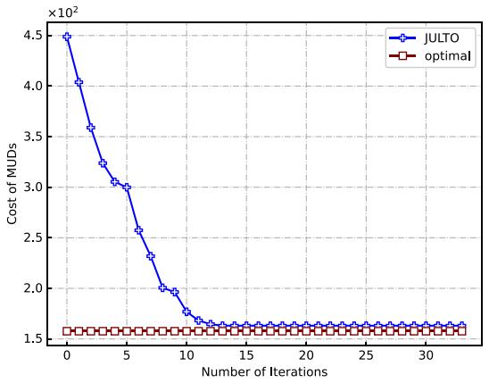  
Fig. 5. The JULTO algorithm’s convergence analysis.

TABLE III EXECUTION TIME WITH DIFFERENT NUMBERS OF MUDS 

<table><tr><td colspan="3">UAV number ( $M_1$ ) = 2, LEO satellitesnumber ( $M_2$ ) = 1, channel number of UAV( $c^u$ ) = 1, channel number of satellite ( $c^L$ ) = 1</td></tr><tr><td>Number ofMUDs (N)</td><td>Centralized method’sexecution time (ms)</td><td>JULTO method’sexecution time (ms)</td></tr><tr><td>5</td><td>60.84</td><td>0.33</td></tr><tr><td>6</td><td>386.97</td><td>0.56</td></tr><tr><td>7</td><td>2402.57</td><td>0.75</td></tr><tr><td>8</td><td>14560.04</td><td>1.09</td></tr><tr><td>9</td><td>87044.14</td><td>1.29</td></tr><tr><td>10</td><td>512096.68</td><td>1.78</td></tr></table>

energy consumption $( 1 - \lambda _ { i } ^ { t } )$ . We set $N = 5 0 , M _ { 1 } = 5 , M _ { 2 } =$ , $c ^ { u } = 3 ,$ , and $c ^ { L } = 3 .$ ) = 50 1 = 5 2 = It can be found that the total cost of 3 = 3 = 3MUDs increases with the increase in delay weight. Therefore, in the cost function, the delay cost plays a more important part in the cost.

Fig. 5 shows the JULTO algorithm’s convergence performance. The optimal algorithm is a centralized method and can obtain a globally optimal solution. The MUD number (N) is 10, the UAV number $( M _ { 1 } )$ is 3, the LEO satellite number $( M _ { 2 } )$ is 1, 1 2and the wireless channel numbers of UAVs and LEO satellites $( c ^ { u }$ and $c ^ { L } )$ are 1. In Fig. 5, before the 12th iteration, the total cost of MUD obtained by the JULTO algorithm gradually decreases. After 12 iterations, the total cost of MUD reaches a stable state. This verifies the JULTO algorithm is capable of reaching convergence. In addition, the total cost obtained by the JULTO algorithm is close to the optimal algorithm. This shows that the JULTO algorithm can achieve good performance after iteration.

Table III shows the execution time of the centralized method and our proposed JULTO method with different MUD numbers. The numbers of UAVs, LEO satellites, and wireless channels are 3, 1, and 1 respectively. As the number of MUDs increases, the execution time of centralized method and JULTO method increases. The execution time of the JULTO method is much shorter compared to the centralized method.

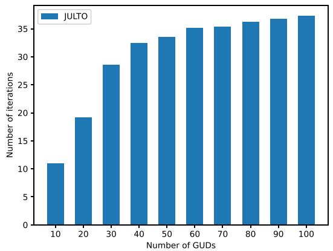

bar

| Number of GUDs | Number of iterations |
| -------------- | -------------------- |
| 10             | 11                   |
| 20             | 19                   |
| 30             | 28                   |
| 40             | 32                   |
| 50             | 33                   |
| 60             | 35                   |
| 70             | 35                   |
| 80             | 36                   |
| 90             | 36                   |
| 100            | 37                   |

Fig. 6. Iteration number versus MUD number.

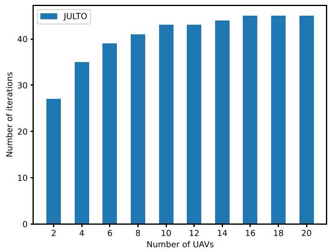

bar

| Number of UAVs | Number of iterations |
| -------------- | -------------------- |
| 2              | 27                   |
| 4              | 35                   |
| 6              | 39                   |
| 8              | 41                   |
| 10             | 43                   |
| 12             | 43                   |
| 14             | 44                   |
| 16             | 45                   |
| 18             | 45                   |
| 20             | 45                   |

Fig. 7. Iteration number versus UAV number.

Generally, the different hardware of the experiment machine may lead to different convergence times of the algorithm. Therefore, convergence time can be measured based on the number of iterations. Specifically, in order to evaluate the iteration number required for the JULTO method, we vary the number of MUDs, wireless channels, UAVs, and LEO satellites.

Fig. 6 shows the iteration numbers for the JULTO algorithm versus varying MUDs’ numbers. N is increasing from 10 to 100. $M _ { 1 }$ is 5, $M _ { 2 }$ is $3 , c ^ { u }$ is 3, and $c ^ { L }$ is 3. In Fig. 6, the number of iterations increases as the number of MUDs increases. In addition, the growth rate of the number of iterations gradually slows down. This shows that as N increases, the JULTO algorithm’s convergence time grows slower than linearly. This is because of the participant competition mechanism in JULTO’s algorithm. In particular, when N is small, there are enough resources to service MUDs. As the number of MUDs increases, the competition of MUDs for resources intensifies, so the JULTO algorithm needs more iterative processes to reach the equilibrium state. As N increases to a certain number, system resources are insufficient. At this point, the number of MUDs allocated to the edge server has been saturated, and if the number of MUDs continues to increase further, MUDs can only process tasks locally, without competing with other MUDs. Therefore, the algorithm does not need more iterations to reach the equilibrium state.

Figs. 7 and 8 respectively show the iteration number required by the JULTO algorithm versus $M _ { 1 }$ and $M _ { 2 }$ . In Fig. 7, the 1iteration number keeps increasing as $M _ { 1 }$ 2increases from 2 to 10. When $M _ { 1 }$ 1increases from 12 to 20, the iteration number 1changes little. Similarly, in Fig. 8, as $M _ { 2 }$ increases from 1 to 25, the iteration number keeps increasing. When $M _ { 2 }$ increases 2from 6 to 10, the iteration number does not increase significantly. This is because when $M _ { 1 }$ or $M _ { 2 }$ is small, MUD has more optional decisions as $M _ { 1 }$ 1or $M _ { 1 }$ 2increases. The JULTO algorithm needs more iterations to get the equilibrium solution. However, for a fixed number of MUDs, system resources become sufficient when UAVs or LEO satellites reach a certain number. Therefore, the iteration number does not increase significantly.

Fig. 9 shows the iteration number with different numbers of channels. N is 50, M is 5, M is 3, and $c ^ { u }$ and $c ^ { L }$ are increasing from 1 to 10. In Fig. 9, the iteration number increases as $c ^ { u }$ and $c ^ { L }$ increase. More wireless channels to choose from bring more strategies to MUDs. However, while the solution space’s size grows exponentially with the wireless channel number, the iteration number of the JULTO algorithm grows shorter than linearly.

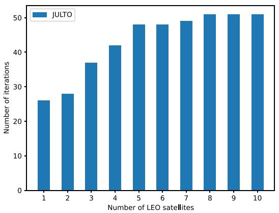

bar

| Number of LEO satellites | Number of iterations |
| ------------------------ | -------------------- |
| 1                        | 26                   |
| 2                        | 28                   |
| 3                        | 37                   |
| 4                        | 42                   |
| 5                        | 48                   |
| 6                        | 48                   |
| 7                        | 49                   |
| 8                        | 51                   |
| 9                        | 51                   |
| 10                       | 51                   |

Fig. 8. Iteration number versus LEO satellite number.

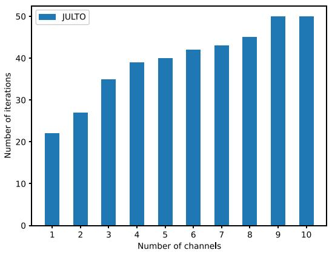

bar

| Number of channels | Number of iterations |
| ------------------ | -------------------- |
| 1                  | 22                   |
| 2                  | 27                   |
| 3                  | 35                   |
| 4                  | 39                   |
| 5                  | 40                   |
| 6                  | 42                   |
| 7                  | 43                   |
| 8                  | 45                   |
| 9                  | 50                   |
| 10                 | 50                   |

Fig. 9. Iteration number versus channel number.

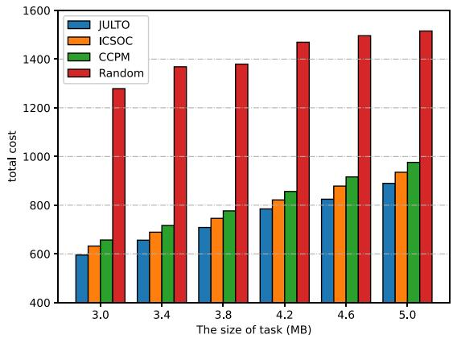

bar

| The size of task (MB) | JULTO | ICSOC | CCPM | Random |
| --------------------- | ----- | ----- | ---- | ------ |
| 3.0                   | 600   | 640   | 660  | 1280   |
| 3.4                   | 660   | 700   | 720  | 1380   |
| 3.8                   | 710   | 750   | 780  | 1390   |
| 4.2                   | 790   | 820   | 860  | 1470   |
| 4.6                   | 830   | 880   | 920  | 1500   |
| 5.0                   | 890   | 940   | 980  | 1520   |

Fig. 10. Total cost versus size of task.

# C. Comparison Experiments

We compare the JULTO algorithm with 3 other comparison methods to evaluate its performance. The comparison algorithms are shown below.

ICSOC: This method is an extension of the method of [45] to solve the offloading problem. Particularly, each MUD selfishly seeks to obtain the more resources to minimize its cost while satisfying the constraints.   
. CCPM: This method is extended from [46]. In this method, MUDs are ranked according to channel transmission conditions. Then, according to the sequence of the sorted MUDs, the decisions are updated to find the optimal decision.   
Random: In this method, each MUD makes a decision randomly. When the LEO satellite coverage time constraints are met, the MUD randomly selects a method (local computing, offloading tasks to UAVs or LEO satellites for processing). Otherwise, the MUD randomly chooses one of two ways to process the task (local computing or offloading the task to the drone).

Fig. 10 shows the MUDs’ total cost obtained by the four algorithms with different task sizes. N is 50, $M _ { 1 }$ is 5, $M _ { 2 }$ is $3 , c ^ { u }$ is 3, and $c ^ { L }$ 1 2is 3. The larger the task size, the larger the total cost of MUDs. This is because the task’s size becomes larger, and the MUDs’ cost required to process the task data increases. In addition, the proposed JULTO algorithm has a lower cost compared with the other comparison algorithms.

The Random algorithm randomly selects the offloading decision for each MUD, and ultimately cannot guarantee the lowest total cost. For the ICSOC method, MUDs greedily choose the decision that can give themselves the lowest cost, which may lead to conflicts between multiple MUDs and increase the total cost. In the CCPM method, MUDs are sorted according to the channel transmission conditions, and then appropriate decisions are selected according to the order. When all MUDs go through a round of decision selection, the CCPM method cannot further optimize the total cost. At this point, there may be some MUDs that can achieve lower costs by updating their decisions. For the JULTO method, through multiple rounds of iteration and competition among MUDs, the total cost will be relatively low until no MUD changes the decision. Therefore, for the utility

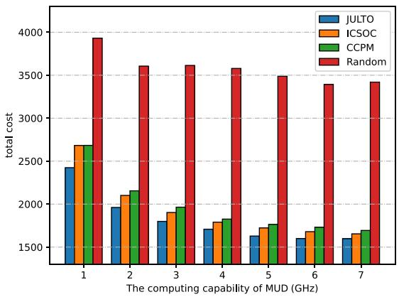

bar

| The computing capability of MUD (GHz) | JULTO  | ICSOC  | CCPM   | Random |
| ------------------------------------- | ------ | ------ | ------ | ------ |
| 1                                     | 2400   | 2650   | 2650   | 3900   |
| 2                                     | 1950   | 2100   | 2150   | 3600   |
| 3                                     | 1800   | 1900   | 1950   | 3600   |
| 4                                     | 1700   | 1800   | 1850   | 3550   |
| 5                                     | 1650   | 1750   | 1780   | 3450   |
| 6                                     | 1600   | 1700   | 1720   | 3400   |
| 7                                     | 1600   | 1650   | 1700   | 3400   |

Fig. 11. Total cost versus computing capability of MUD.

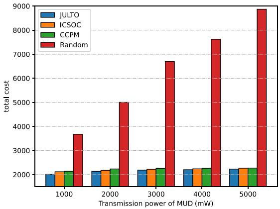

bar

| Transmission power of MUD (mW) | JULTO | ICSOC | CCPM | Random |
| ------------------------------ | ----- | ----- | ---- | ------ |
| 1000                           | 2000  | 2100  | 2150 | 3700   |
| 2000                           | 2150  | 2200  | 2250 | 5000   |
| 3000                           | 2250  | 2250  | 2300 | 6700   |
| 4000                           | 2300  | 2300  | 2350 | 7600   |
| 5000                           | 2350  | 2350  | 2400 | 8900   |

Fig. 12. Total cost versus transmission power.

comparison of these four methods, the proposed JULTO method can outperform other methods and is close to the optimal total cost.

Fig. 11 shows the total MUDs’ cost obtained by the four algorithms for different computing capabilities of MUDs. The total cost of MUDs decreases as the computing capability of MUDs increases. This is because the latency of task processing locally decreases as the processing power increases, causing the total cost of MUDs to increase. Moreover, in Fig. 11, it can be found that the utility achieved by the JULTO algorithm is better than the other three algorithms.

Fig. 12 shows the total cost of the MUDs obtained by the four algorithms when the transmission power is different. We can find that the higher the transmission power of the MUD, the higher the total cost. This is because increasing the transmit power results in increased energy consumption for MUDs offloading tasks to edge servers. Therefore, the total cost of all MUDs increases. Furthermore, in Fig. 12, the performance of the JULTO algorithm is better than the other three comparison algorithms, which reflects the performance superiority of JULTO.

In addition, to analyze the JULTO algorithm’s performance with different problem sizes, we establish three different experiment settings, which are listed in Table IV.

In Fig. 13, the four algorithms’ average cost with different MUD numbers are shown. N is 10 to 100, M is 5, M is 3, cu is 3, and $c ^ { L }$ is 3. All four algorithms’ average cost increases with N . In the experiment’s set, the edge server number and wireless channel number are fixed. More MUDs are added, leading to the exhaustion of communication and computing resources on the system. Therefore, the number of MUDs processing tasks locally increases, and the average cost gradually increases. In addition, In Fig. 13, compared with other comparison algorithms, the MUDs’ average cost implemented by the JULTO algorithm is lower.

TABLE IV EXPERIMENT SETTINGS (2) 

<table><tr><td>the MUD number (N)</td><td>the UAV number (M1)</td><td>the satellite number (M2)</td><td>the channel numbers (cu and cL)</td></tr><tr><td>10 ~ 100</td><td>5</td><td>3</td><td>3</td></tr><tr><td>50</td><td>2 ~ 20</td><td>3</td><td>3</td></tr><tr><td>50</td><td>5</td><td>1 ~ 10</td><td>3</td></tr><tr><td>50</td><td>5</td><td>3</td><td>1 ~ 10</td></tr></table>

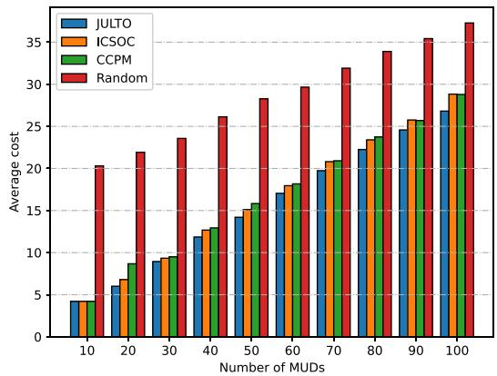

bar

| Number of MUDs | JULTO | ICSOC | CCPM | Random |
| -------------- | ----- | ----- | ---- | ------ |
| 10             | 4     | 4     | 0    | 20     |
| 20             | 6     | 7     | 9    | 22     |
| 30             | 9     | 9     | 10   | 24     |
| 40             | 12    | 13    | 13   | 26     |
| 50             | 14    | 15    | 16   | 28     |
| 60             | 17    | 18    | 18   | 30     |
| 70             | 20    | 21    | 21   | 32     |
| 80             | 23    | 24    | 24   | 34     |
| 90             | 25    | 26    | 26   | 35     |
| 100            | 27    | 29    | 29   | 37     |

Fig. 13. Average cost versus number of MUDs.

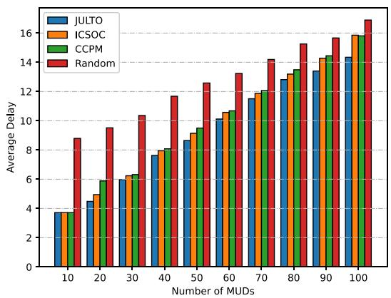

bar

| Number of MUDs | JULTO | ICSOC | CCPM | Random |
| -------------- | ----- | ----- | ---- | ------ |
| 10             | 3.8   | 3.8   | 3.8  | 8.8    |
| 20             | 4.5   | 5.0   | 6.0  | 9.5    |
| 30             | 6.0   | 6.5   | 6.5  | 10.5   |
| 40             | 7.8   | 8.0   | 8.0  | 11.8   |
| 50             | 8.8   | 9.2   | 9.5  | 12.7   |
| 60             | 10.2  | 10.5  | 10.8 | 13.3   |
| 70             | 11.5  | 12.0  | 12.2 | 14.2   |
| 80             | 12.8  | 13.2  | 13.5 | 15.3   |
| 90             | 13.5  | 14.2  | 14.5 | 15.7   |
| 100            | 14.3  | 14.8  | 15.8 | 16.8   |

Fig. 14. The average delay of MUDs with different numbers of MUDs.

Figs. 14 and 15 respectively give the average delay and energy consumption of the four algorithms under different MUD numbers. We vary the values of N from 10 to 100, and set $M _ { 1 } = 5$ , $M _ { 2 } = 3 , c ^ { u } = 3 , c ^ { L } = 3$ 1 = 5. The average delay and energy con-2 = 3 = 3 = 3sumption of all four algorithms increase when the value of N increases. This is because with more MUDs the communication and computing resources on the system tend to be insufficient. When the communication resources are insufficient, the interference of the MUD’s task data transmission increases, and the transmission delay and energy consumption of the MUD for task offloading increases. At the same time, since the resources are insufficient to support more MUDs to offload tasks, the number of MUDs for local task processing increases, and the average delay and energy consumption gradually increase. Nevertheless, compared with other comparison algorithms, the average delay and energy consumption of MUDs implemented by the JULTO algorithm are the lowest.

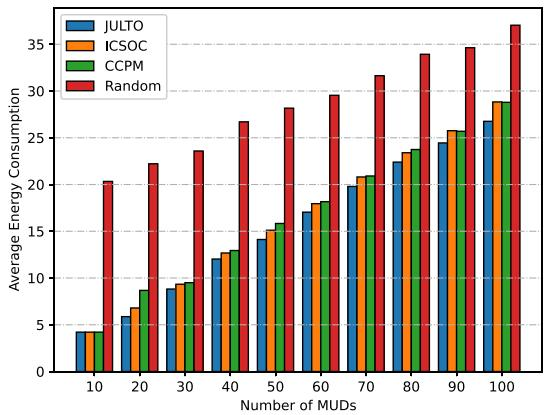

bar

| Number of MUDs | JULTO | ICSOC | CCPM | Random |
| -------------- | ----- | ----- | ---- | ------ |
| 10             | 4     | 4     | 4    | 20     |
| 20             | 6     | 7     | 9    | 22     |
| 30             | 9     | 10    | 10   | 24     |
| 40             | 12    | 13    | 13   | 27     |
| 50             | 14    | 15    | 16   | 28     |
| 60             | 17    | 18    | 18   | 30     |
| 70             | 20    | 21    | 21   | 32     |
| 80             | 23    | 24    | 24   | 34     |
| 90             | 25    | 26    | 26   | 35     |
| 100            | 27    | 29    | 29   | 37     |

Fig. 15. The average energy consumption of MUDs with different numbers of MUDs.

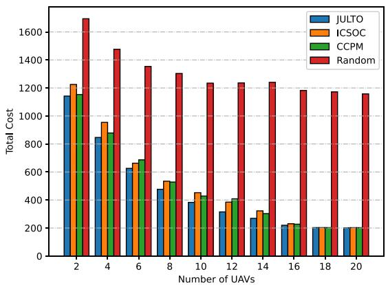

bar

| Number of UAVs | JULTO | ICSOC | CCPM | Random |
| -------------- | ----- | ----- | ---- | ------ |
| 2              | 1150  | 1230  | 1170 | 1680   |
| 4              | 850   | 970   | 890  | 1480   |
| 6              | 650   | 670   | 700  | 1360   |
| 8              | 500   | 540   | 550  | 1310   |
| 10             | 390   | 460   | 470  | 1250   |
| 12             | 320   | 400   | 420  | 1250   |
| 14             | 280   | 330   | 310  | 1250   |
| 16             | 230   | 240   | 240  | 1190   |
| 18             | 210   | 210   | 210  | 1180   |
| 20             | 200   | 200   | 200  | 1160   |

Fig. 16. Total cost versus number of UAVs.

Fig. 16 shows all MUDs’ total cost for the four algorithms when $M _ { 1 }$ is 2 to 20. N is 50, $M _ { 2 }$ is 3, $c ^ { u }$ is 3, and $c ^ { L }$ is 3. 1 2The total cost obtained by the four algorithms decreases with the increase in $M _ { 1 }$ . The reason is that as $M _ { 1 }$ increases, so do 1 1transmission resources and computing resources increase. More MUDs’ tasks can be offloaded to UAVs, and the total cost of all MUDs is reduced. However, the cost does not improve much when $M _ { 1 }$ exceeds 16. This is because increasing the number 1of UAVs does not improve MUDs’ utility when resources are sufficient. In addition, in Fig. 16, it is easy to see that the JULTO algorithm achieves a lower MUDs’ total cost than other comparison algorithms.

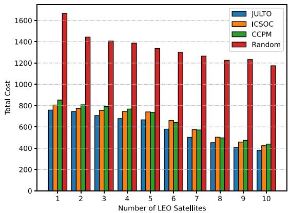

bar

| Number of LEO Satellites | JULTO | ICSOC | CCPM | Random |
| ------------------------ | ----- | ----- | ---- | ------ |
| 1                        | 750   | 820   | 850  | 1650   |
| 2                        | 730   | 760   | 810  | 1450   |
| 3                        | 710   | 750   | 800  | 1410   |
| 4                        | 680   | 740   | 770  | 1390   |
| 5                        | 660   | 730   | 750  | 1340   |
| 6                        | 580   | 660   | 640  | 1310   |
| 7                        | 500   | 580   | 570  | 1270   |
| 8                        | 450   | 510   | 500  | 1230   |
| 9                        | 410   | 460   | 470  | 1240   |
| 10                       | 380   | 430   | 440  | 1180   |

Fig. 17. Total cost versus number of LEO satellites.

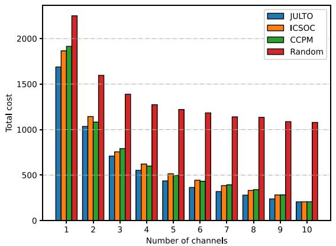

bar

| Number of channels | JULTO | ICSOC | CCPM | Random |
| ------------------ | ----- | ----- | ---- | ------ |
| 1                  | 1700  | 1850  | 1900 | 2250   |
| 2                  | 1050  | 1150  | 1100 | 1600   |
| 3                  | 700   | 750   | 800  | 1400   |
| 4                  | 550   | 600   | 650  | 1300   |
| 5                  | 450   | 500   | 550  | 1250   |
| 6                  | 350   | 450   | 450  | 1200   |
| 7                  | 300   | 350   | 400  | 1150   |
| 8                  | 250   | 300   | 350  | 1150   |
| 9                  | 200   | 250   | 300  | 1100   |
| 10                 | 200   | 250   | 250  | 1100   |

Fig. 18. Total cost versus number of channels.

Fig. 17 shows the total cost for the different algorithms when $M _ { 2 }$ is 1 to 10. N is 50, $M _ { 1 }$ is $5 , c ^ { u }$ is 3, and $c ^ { L }$ is 3. As $M _ { 2 }$ 2 1increases, more transmission resources and computing 2resources are provided, and more MUDs can offload tasks to LEO satellites. Therefore, we can see from Fig. 17 that the total cost decreases with increasing in $M _ { 2 }$ . In addition, it is easy to 2find that the JULTO algorithm achieves better performance than the other three comparison algorithms.

Fig. 18 shows the change in the total cost obtained by the four algorithms as $c ^ { u }$ and $c ^ { L }$ increase from 1 to 10. The total cost obtained by the four algorithms decreases as $c ^ { u }$ and $c ^ { L }$ increase. This is because $c ^ { u }$ and $c ^ { L }$ increase, leading to an increase in transmission resources and an increase in MUDs who choose task offloading increases. Thus, the total cost for all MUDs is reduced. When $c ^ { u }$ and $c ^ { L }$ are less than 9, the total cost obtained by the JULTO algorithm is lower than comparison algorithms. However, when $c ^ { u }$ and $c ^ { L }$ exceed 9, the costs of the three algorithms (JULTO, ICSOC and CCPM) do not have a large gap. This is because when resources are already sufficient, further increases of $c ^ { u }$ and $c ^ { L }$ do not affect the performance of all algorithms.

# VII. CONCLUSION

In this paper, the problem of task offloading in UAV-assisted LEO satellite edge computing networks is investigated. We formulate the task offloading problem with the goal of minimizing the total cost of MUDs while satisfying the satellite coverage constraints. We prove that the formulated task offloading problem is NP-hard. Then, we redefine it as the LUTO-Game model, propose the potential function, and prove that the LUTO-Game is a potential game. Next, a distributed JULTO algorithm is proposed to obtain the Nash equilibrium offloading strategy. We then perform the theoretical analysis for the utility of our JULTO algorithm in the worst-case. Finally, we conduct both convergence analysis and comparison experiments to verify the performance of the JULTO algorithm.

An important future research direction is to model the position changes, flight, and hovering of UAVs, taking into account the energy consumption of UAVs and satellites in optimization problems.

# REFERENCES

[1] H. Zhang, Y. Yang, B. Shang, and P. Zhang, “Joint resource allocation and multi-part collaborative task offloading in MEC systems,” IEEE Trans. Veh. Technol., vol. 71, no. 8, pp. 8877–8890, Aug. 2022.   
[2] N. Cheng et al., “Space/aerial-assisted computing offloading for IoT applications: A learning-based approach,” IEEE J. Sel. Areas Commun., vol. 37, no. 5, pp. 1117–1129, May 2019.   
[3] J. Mei, L. Dai, Z. Tong, X. Deng, and K. Li, “Throughput-aware dynamic task offloading under resource constant for MEC with energy harvesting devices,” IEEE Trans. Netw. Service Manag., vol. 20, no. 3, pp. 3460–3473, Sep. 2023.   
[4] D.-G. Zhang et al., “New computing tasks offloading method for MEC based on prospect theory framework,” IEEE Trans. Computat. Social Syst., vol. 11, no. 1, pp. 770–781, Feb. 2024.   
[5] C. W. Zaw, N. H. Tran, Z. Han, and C. S. Hong, “Radio and computing resource allocation in co-located edge computing: A generalized nash equilibrium model,” IEEE Trans. Mobile Comput., vol. 22, no. 4, pp. 2340–2352, Apr. 2023.   
[6] Y. Chen, J. Xu, Y. Wu, J. Gao, and L. Zhao, “Dynamic task offloading and resource allocation for NOMA-aided mobile edge computing: An energy efficient design,” IEEE Trans. Serv. Comput., vol. 17, no. 4, pp. 1492–1503, Jul./Aug. 2024.   
[7] W. Chu, X. Jia, Z. Yu, J. C. Lui, and Y. Lin, “Joint service caching, resource allocation and task offloading for MEC-based networks: A multi-layer optimization approach,” IEEE Trans. Mobile Comput., vol. 23, no. 4, pp. 2958–2975, Apr. 2023.   
[8] X. Gao, Y. Sun, H. Chen, X. Xu, and S. Cui, “Joint computing, pushing, and caching optimization for mobile edge computing networks via soft actorcritic learning,” IEEE Internet Things J., vol. 11, no. 6, pp. 9269–9281, Mar. 2024.   
[9] D. Wu, D. Zhang, M. Zhang, R. Zhang, F. Wang, and S. Cui, “ILCAS: Imitation learning-based configuration-adaptive streaming for live video analytics with cross-camera collaboration,” IEEE Trans. Mobile Comput., vol. 23, no. 6, pp. 6743–6757, Jun. 2024.   
[10] S. Duan et al., “MOTO: Mobility-aware online task offloading with adaptive load balancing in small-cell MEC,” IEEE Trans. Mobile Comput., vol. 23, no. 1, pp. 645–659, Jan. 2024.   
[11] J. Huang, B. Ma, Y. Wu, Y. Chen, and X. Shen, “A hierarchical incentive mechanism for federated learning,” IEEE Trans. Mobile Comput., early access, Jul. 04, 2024, doi: 10.1109/TMC.2024.3423399.   
[12] J. Huang, F. Liu, and J. Zhang, “Multi-dimensional QoS evaluation and optimization of mobile edge computing for IoT: A survey,” Chin. J. Electron., vol. 33, no. 5, pp. 1–16, 2024.   
[13] Y. Wu, K. Ni, C. Zhang, L. P. Qian, and D. H. K. Tsang, “NOMA-assisted multi-access mobile edge computing: A joint optimization of computation offloading and time allocation,” IEEE Trans. Veh. Technol., vol. 67, no. 12, pp. 12244–12258, Dec. 2018.   
[14] Y. Chen, K. Li, Y. Wu, J. Huang, and L. Zhao, “Energy efficient task offloading and resource allocation in air-ground integrated MEC systems: A distributed online approach,” IEEE Trans. Mobile Comput., vol. 23, no. 8, pp. 8129–8142, Aug. 2023.

[15] Y. Lyu, Z. Liu, R. Fan, C. Zhan, H. Hu, and J. An, “Optimal computation offloading in collaborative LEO-IoT enabled MEC: A multi-agent deep reinforcement learning approach,” IEEE Trans. Green Commun. Netw., vol. 7, no. 2, pp. 996–1011, Jun. 2023.   
[16] P. A. Apostolopoulos, G. Fragkos, E. E. Tsiropoulou, and S. Papavassiliou, “Data offloading in UAV-assisted multi-access edge computing systems under resource uncertainty,” IEEE Trans. Mobile Comput., vol. 22, no. 1, pp. 175–190, Jan. 2023.   
[17] M. Dai, Y. Wu, L. Qian, Z. Su, B. Lin, and N. Chen, “UAV-assisted multi-access computation offloading via hybrid NOMA and FDMA in marine networks,” IEEE Trans. Netw. Sci. Eng., vol. 10, no. 1, pp. 113–127, Jan./Feb. 2023.   
[18] Y. Zhang et al., “Packet-level throughput analysis and energy efficiency optimization for UAV-assisted IAB heterogeneous cellular networks,” IEEE Trans. Veh. Technol., vol. 72, no. 7, pp. 9511–9526, Jul. 2023.   
[19] J. Huang, M. Zhang, J. Wan, Y. Chen, and N. Zhang, “Joint data caching and computation offloading in UAV-assisted Internet of Vehicles via federated deep reinforcement learning,” IEEE Trans. Veh. Technol., early access, Jul. 18, 2024, doi: 10.1109/TVT.2024.3429507.   
[20] J. Ji, K. Zhu, and L. Cai, “Trajectory and communication design for cache- enabled UAVs in cellular networks: A deep reinforcement learning approach,” IEEE Trans. Mobile Comput., vol. 22, no. 10, pp. 6190–6204, Oct. 2023.   
[21] D. Han et al., “Two-timescale learning-based task offloading for remote IoT in integrated satellite–terrestrial networks,” IEEE Internet Things J., vol. 10, no. 12, pp. 10131–10145, Jun. 2023.   
[22] C. Li, Y. Zhang, X. Hao, and T. Huang, “Jointly optimized request dispatching and service placement for MEC in LEO network,” China Commun., vol. 17, no. 8, pp. 199–208, 2020.   
[23] Z. Zhai, Q. Wu, S. Yu, R. Li, F. Zhang, and X. Chen, “FedLEO: An offloading-assisted decentralized federated learning framework for low earth orbit satellite networks,” IEEE Trans. Mobile Comput., vol. 23, no. 5, pp. 5260–5279, May 2024.   
[24] P. Tong, J. Liu, X. Wang, B. Bai, and H. Dai, “UAV-enabled age-optimal data collection in wireless sensor networks,” in Proc. IEEE Int. Conf. Commun. Workshops, 2019, pp. 1–6.   
[25] J. Liu, P. Tong, X. Wang, B. Bai, and H. Dai, “UAV-aided data collection for information freshness in wireless sensor networks,” IEEE Trans. Wireless Commun., vol. 20, no. 4, pp. 2368–2382, Apr. 2021.   
[26] Q. Wu, M. Cui, G. Zhang, F. Wang, Q. Wu, and X. Chu, “Latency minimization for UAV-enabled URLLC-based mobile edge computing systems,” IEEE Trans. Wireless Commun., vol. 23, no. 4, pp. 3298–3311, Apr. 2024.   
[27] Z. Han, T. Zhou, T. Xu, and H. Hu, “Joint user association and deployment optimization for delay-minimized UAV-aided MEC networks,” IEEE Wireless Commun. Lett., vol. 12, no. 10, pp. 1791–1795, Oct. 2023.   
[28] M. Hua, Y. Wang, C. Li, Y. Huang, and L. Yang, “UAV-aided mobile edge computing systems with one by one access scheme,” IEEE Trans. Green Commun. Netw., vol. 3, no. 3, pp. 664–678, Sep. 2019.   
[29] R. Deng, B. Di, S. Chen, S. Sun, and L. Song, “Ultra-dense LEO satellite offloading for terrestrial networks: How much to pay the satellite operator?,” IEEE Trans. Wireless Commun., vol. 19, no. 10, pp. 6240–6254, Oct. 2020.   
[30] Y. Hao, Z. Song, Z. Zheng, Q. Zhang, and Z. Miao, “Joint communication, computing, and caching resource allocation in LEO satellite MEC networks,” IEEE Access, vol. 11, pp. 6708–6716, 2023.   
[31] Y. Jing, J. Wang, C. Jiang, and Y. Zhan, “Satellite MEC with federated learning: Architectures, technologies and challenges,” IEEE Netw., vol. 36, no. 5, pp. 106–112, Sep./Oct. 2022.   
[32] Y. Wang, J. Zhang, X. Zhang, P. Wang, and L. Liu, “A computation offloading strategy in satellite terrestrial networks with double edge computing,” in Proc. IEEE Int. Conf. Commun. Syst., 2018, pp. 450–455.   
[33] Y. Wang, J. Yang, X. Guo, and Z. Qu, “A game-theoretic approach to computation offloading in satellite edge computing,” IEEE Access, vol. 8, pp. 12510–12520, 2020.   
[34] S. Zhang, A. Liu, C. Han, X. Liang, X. Xu, and G. Wang, “Multi-agent reinforcement learning-based orbital edge offloading in sagin supporting internet of remote things,” IEEE Internet Things J., vol. 10, no. 23, pp. 20472–20483, Dec. 2023.   
[35] W. Lin, T. Huang, X. Li, F. Shi, X. Wang, and C.-H. Hsu, “Energy-efficient computation offloading for UAV-assisted MEC: A two-stage optimization scheme,” ACM Trans. Internet Technol., vol. 22, no. 1, pp. 1–23, 2021.

[36] H. Zhou, Z. Wang, G. Min, and H. Zhang, “UAV-aided computation offloading in mobile-edge computing networks: A Stackelberg game approach,” IEEE Internet Things J., vol. 10, no. 8, pp. 6622–6633, Apr. 2023.   
[37] M. Wang, L. Zhang, P. Gao, X. Yang, K. Wang, and K. Yang, “Stackelberggame-based intelligent offloading incentive mechanism for a multi-UAVassisted mobile-edge computing system,” IEEE Internet Things J., vol. 10, no. 17, pp. 15679–15689, Sep. 2023.   
[38] D. Wang, W. Wang, Y. Kang, and Z. Han, “Distributed data offloading in ultra-dense LEO satellite networks: A stackelberg mean-field game approach,” IEEE J. Sel. Topics Signal Process., vol. 17, no. 1, pp. 112–127, Jan. 2023.   
[39] Q. Tang, Z. Fei, B. Li, and Z. Han, “Computation offloading in LEO satellite networks with hybrid cloud and edge computing,” IEEE Internet Things J., vol. 8, no. 11, pp. 9164–9176, Jun. 2021.   
[40] H. Liao, Z. Zhou, X. Zhao, and Y. Wang, “Learning-based queue-aware task offloading and resource allocation for space–air–ground-integrated power IoT,” IEEE Internet Things J., vol. 8, no. 7, pp. 5250–5263, Apr. 2021.   
[41] Z. Yang, S. Bi, and Y.-J. A. Zhang, “Online trajectory and resource optimization for stochastic UAV-enabled MEC systems,” IEEE Trans. Wireless Commun., vol. 21, no. 7, pp. 5629–5643, Jul. 2022.   
[42] S. Wang et al., “Federated learning for task and resource allocation in wireless high-altitude balloon networks,” IEEE Internet Things J., vol. 8, no. 24, pp. 17460–17475, Dec. 2021.   
[43] Z. Ning et al., “Dynamic computation offloading and server deployment for UAV-enabled multi-access edge computing,” IEEE Trans. Mobile Comput., vol. 22, no. 5, pp. 2628–2644, May 2023.   
[44] D. Monderer and L. S. Shapley, “Potential games,” Games Econ. Behav., vol. 14, no. 1, pp. 124–143, 1996.   
[45] P. Lai et al., “Edge user allocation with dynamic qualityof service,” in Proc. Int. Conf. Serv.-Oriented Comput., 2019, pp. 86–101.   
[46] H. Zeng, X. Zhu, Y. Jiang, Z. Wei, and T. Wang, “A green coordinated multi-cell NOMA system with fuzzy logic based multi-criterion user mode selection and resource allocation,” IEEE J. Sel. Topics Signal Process., vol. 13, no. 3, pp. 480–495, Jun. 2019.

natural_image

Portrait photo of a woman with long dark hair wearing a suit jacket (no text or symbols visible)

Ying Chen (Senior Member, IEEE) received the PhD degree in computer science and technology from Tsinghua University, Beijing, China, in 2017. She was a joint PhD student with the University of Waterloo, Waterloo, ON, Canada from 2016 to 2017. She is a professor with the Computer School, Beijing Information Science and Technology University, Beijing. Her current research interests include Internet of Things, mobile edge computing, wireless networks and communications, machine learning, etc. She is the recipient of the Best Paper Award with IEEE

SmartIoT 2019, the 2016 Google PhD Fellowship Award, and the 2014 Google Anita Borg Award, 2022 Outstanding Contribution Award in 18th EAI CollaborateCom, respectively. She is/was the leading guest editor of Journal of Cloud Computing, TPC member of IEEE HPCC, and PC member of IEEE Cloud, CollaborateCom, IEEE CPSCom, CSS, etc. She is also the reviewer of several journals such as the IEEE Wireless Communications Magazine, IEEE Transactions on Dependable and Secure Computing, IEEE Internet of Things Journal, IEEE Transactions on Cloud Computing, IEEE Transactions on Services Computing.

natural_image

Portrait photo of a young man in a white collared shirt against a blue background (no text or symbols visible)

Jie Zhao received the MEng degree in computer science and technology from the Beijing Information Science and Technology University, China, in 2024. His current research interests include edge computing, Internet of Things, and Game theory.

natural_image

Portrait of a man wearing glasses and a light blue polo shirt (no text or symbols visible)

Yuan Wu (Senior Member, IEEE) received the PhD degree in electronic and computer engineering from the Hong Kong University of Science and Technology, in 2010. He is currently an associate professor with the State Key Laboratory of Internet of Things for Smart City, University of Macau, Macau, China, and also with the Department of Computer and Information Science, University of Macau. His research interests include resource management for wireless networks, mobile edge computing and edge intelligence, and integrated sensing and communications. He received the Best Paper Award from the IEEE ICC’2016, WCSP’2016, IEEE TCGCC’2017, IWCMC’2021, and WCNC’2023. He is currently on the editorial board of IEEE Transactions on Vehicular Technology, IEEE Transactions on Network Science and Engineering, and IEEE Internet of Things Journal.

natural_image

Portrait of a man wearing glasses and a suit with a red tie against a blue background (no text or symbols visible)

Jiwei Huang (Senior Member, IEEE) received the BEng and PhD degrees in computer science and technology from Tsinghua University, in 2009 and 2014, respectively. He was a visiting scholar with the Georgia Institute of Technology. He is currently a professor and the vice-dean with the College of Artificial Intelligence, China University of Petroleum, Beijing, China, and the Director of the Beijing Key Laboratory of Petroleum Data Mining. His research interests include services computing, Internet of Things, and edge computing. He has published one book and more

than 70 articles in international journals and conference proceedings, including the IEEE Transactions on Mobile Computing, IEEE Transactions on Services Computing, IEEE Transactions on Cloud Computing, IEEE Transactions on Vehicular Technology, ACM SIGMETRICS, IEEE ICWS, and IEEE SCC. He is currently on the editorial board of Chinese Journal of Electronics and Scientific Programming.

natural_image

Portrait photo of a middle-aged man in a light-colored collared shirt (no text or symbols visible)

Xuemin Sherman Shen (Fellow, IEEE) received the PhD degree in electrical engineering from Rutgers University, New Brunswick, NJ, USA, in 1990. He is a university professor with the Department of Electrical and Computer Engineering, University of Waterloo, Canada. His research focuses on network resource management, wireless network security, Internet of Things, 5G and beyond, and vehicular networks. He is a registered professional engineer of Ontario, Canada, an Engineering Institute of Canada fellow, a Canadian Academy of Engineering fellow, a Royal Society of Canada fellow, a Chinese Academy of Engineering Foreign member, and a distinguished lecturer of the IEEE Vehicular Technology Society and Communications Society. He received the Canadian Award for Telecommunications Research from the Canadian Society of Information Theory (CSIT), in 2021, the R.A. Fessenden Award in 2019 from IEEE, Canada, Award of Merit from the Federation of Chinese Canadian Professionals (Ontario), in 2019, James Evans Avant Garde Award in 2018 from the IEEE Vehicular Technology Society, Joseph LoCicero Award in 2015 and Education Award in 2017 from the IEEE Communications Society (ComSoc), and Technical Recognition Award from Wireless Communications Technical Committee (2019) and AHSN Technical Committee (2013). He has also received the Excellent Graduate Supervision Award in 2006 from the University of Waterloo and the Premier’s Research Excellence Award (PREA) in 2003 from the Province of Ontario, Canada. He served as the technical program committee chair/co-chair for IEEE Globecom’16, IEEE Infocom’14, IEEE VTC’10 Fall, IEEE Globecom’07, and the chair for the IEEE ComSoc Technical Committee on Wireless Communications. Dr. Shen is the president of the IEEE ComSoc. He was the vice president for Technical & Educational Activities, vice president for Publications, member-at-large on the Board of Governors, chair of the Distinguished Lecturer Selection Committee, and member of IEEE fellow Selection Committee of the ComSoc. He served as the editor-in-chief of the IEEE Internet of Things Journal, IEEE Network, and IET Communications.