# Multiobjective Optimization Approach for Reducing Hovering and Motion Energy Consumptions in UAV-Assisted Collaborative Beamforming

Shuang Liang , Minghao Yin , Member, IEEE, Geng Sun , Member, IEEE, and Jiahui Li , Student Member, IEEE

Abstract—Communications and networks of unmanned aerial vehicles (UAVs) are of paramount importance, owing to their flexible mobility and fast deployment. However, how to enhance the communication efficiency under the restricted on-board energy and transmit power is still one of the most critical problems. In this article, we consider a UAV-assisted communication scenario, in which a virtual antenna array (VAA) performed by a swarm of UAVs utilize collaborative beamforming (CB) to communicate with several faraway base stations (BSs). For achieving a superior transmission performance, we formulate a hovering and motion energy consumption multiobjective optimization problem (HMECMOP) of UAV-assisted CB to simultaneously minimize the total hovering and motion energy consumptions of UAVs by jointly optimizing the positions, excitation current weights of UAVs, and the order of communicating with different BSs. Moreover, the formulated HMECMOP is analyzed and proven as an NP-hard and classical hybrid multiobjective optimization problem (MOP) with a complex solution vector that contains continuous and discrete variables. Thus, we propose an improved multiobjective multiverse optimizer (IMOMVO), which uses the vertical and horizontal renewal strategy and nearest neighbor procedure (NNP) to solve the complex HMECMOP. Extensive simulations are carried out to demonstrate that the proposed

Manuscript received 14 July 2023; accepted 11 September 2023. Date of publication 15 September 2023; date of current version 6 February 2024. This work was supported in part by the National Natural Science Foundation of China under Grant 61872158, Grant 62002133, Grant 62172186, and Grant 62272194; in part by the Science and Technology Development Plan Project of Jilin Province under Grant 20230201087GX; in part by the Central Government funds for Guiding Local Scientific and Technological Development under Grant 2021Szvup047; in part by the Graduate Innovation Fund of Jilin University under Grant 2022028, Grant 2022155, and Grant 2023CX013; in part by the Fundamental Research Funds for the Central Universities under Grant 2412023QD030; and in part by the Fundamental Research Funds for the Central Universities, JLU under Grant 93K172023K14. (Corresponding authors: Geng Sun; Jiahui Li.)

Shuang Liang is with the School of Information Science and Technology, Northeast Normal University, Changchun 130117, China, and also with the Key Laboratory of Symbolic Computation and Knowledge Engineering of Ministry of Education, Jilin University, Changchun 130012, China (e-mail: liangshuang@nenu.edu.cn).

Minghao Yin is with the School of Information Science and Technology, Northeast Normal University, Changchun 130117, China (e-mail: ymh@ nenu.edu.cn).

Geng Sun is with the College of Computer Science and Technology and the Key Laboratory of Symbolic Computation and Knowledge Engineering of Ministry of Education, Jilin University, Changchun 130012, China (e-mail: sungeng@jlu.edu.cn).

Jiahui Li is with the College of Computer Science and Technology, Jilin University, Changchun 130012, China, and also with the Pillar of Engineering Systems and Design, Singapore University of Technology and Design, Singapore 487372 (e-mail: lijiahui0803@foxmail.com).

Digital Object Identifier 10.1109/JIOT.2023.3315708

algorithm can effectively reduce the energy consumption of UAVs communicating with multiple remote BSs so that improving the communication performance.

Index Terms—Collaborative beamforming (CB), energy efficiency, multiobjective optimization problem (MOP), unmanned aerial vehicle (UAV) communications.

# I. INTRODUCTION

HE FUTURE wireless communication and networks T based on unmanned aerial vehicles (UAVs) have been considered to be a promising paradigm for the emerging 5G/6G networks, since they have the advantages of flexible mobility, fast deployment, wide coverage, etc. UAVs can be utilized as aerial base stations (ABSs) and relays to give assistance to ground users [1]. Moreover, UAVs can also be used to aid information collection, especially for Internet of Things (IoT) applications. Moreover, UAVs can construct a temporary wireless network to provide emergency communication for various disaster rescue applications.

However, communication and network system carried out by UAVs faces several serious challenges. For example, the on-board energy capacity of a UAV is usually quite limited and the transmit power is restricted due to the size and weight constraints of the aircraft [2], [3], causing the UAV-based communications to be difficult for applying in some scenarios [4], e.g., deployments of UAVs for communicating with remote base stations (BSs). Therefore, enhancing the communication performance of the UAV networks such that saving the corresponding energy consumption is of great importance.

# A. Related Works

To overcome this issue, the existing works consider serval energy-efficient methods for deploying UAVs to communicate with remote receivers. For instance, Panda and Sen [5] proposed an energy-efficient 3-D deployment strategy to offer a guaranteed Quality of Service (QoS), and less energy consumption. Moreover, Namvar and Afghah [6] developed an effective approach for the 3-D positioning of the UAVs that leads to maximum coverage area with minimal power consumption. However, the mentioned works only focused on the access link with sensor nodes in the UAVs-assisted network without considering the uplink link for serving faraway BSs.

Likewise, Van Cuong et al. [7] proposed a multiple-UAV communication framework to jointly determined the trajectory, task assignment, user association, and rate allocation of UAVs by maximizing the sum-log-throughput of a single BS. In [8], multiple UAVs were employed as UAV relays between IoT devices and BS to enhance received signal strength at BS. In addition, Wang et al. [9] proposed a 3-hop NOMA UAV-aided communication network framework, where UAVs serve as aerial relays to support two groups of ground users. Despite the effectiveness of these works, they will also consume massive energy in flying and hovering. It is necessary to investigate a novel method for reducing motion and hovering communication energy simultaneously.

This article aims to utilize collaborative beamforming (CB) to achieve this goal since CB can improve the transmission ability significantly. Specifically, the utilization of a fleet of UAVs for CB has been proven to be a viable approach through various experimental deployments and results. In particular, Mohanti et al. [10], Alemdar et al. [11], and Mohanti et al. [12] proposed comprehensive algorithmic frameworks and system implementations for CB on UAV swarms. These studies conducted experimental tasks and successfully addressed the prerequisites of UAV-based CB, including time, phase, and frequency synchronization. Likewise, Garza et al. [13] proposed to design a 3-D antenna array consisting of UAVs to improve antenna directionality. Mozaffari et al. [14] used UAVs as an aerial antenna array that provides efficient wireless service. Moreover, Zhu et al. [15] formulated an optimization problem to improve the harvested power from the source node to the desired receiving node by using a joint optimization method. Zarbakhsh and Sebak [16] presented a UAV-tosatellite beam-forming antenna with multifunctional purposes. However, they overlook energy efficiency in both performing CB and transmission processes.

# B. Contributions

Different from these works, we aim to provide a multiobjective optimization approach to simultaneously minimize the energy expense of the hovering communications and position movement generated by constructing the virtual antenna array (VAA). The main contributions are as follows.

1) Considering a realistic situation of the UAV-assist data collection and transmission, in which the UAVs need to construct a VAA and utilize CB for communicating with several faraway BSs, we adopt the propulsion energy consumption and heuristic closed-form approximation energy consumption for the arbitrary 3-D trajectory of rotary-wing UAV, and then formulate a hovering and motion energy consumption multiobjective optimization problem (HMECMOP) for simultaneously minimizing the total hovering and motion energy consumptions of UAV elements over the entire communicate period. Moreover, the formulated optimization problem is proved as NP-hard.

2) We propose an improved multiobjective multiverse optimizer (IMOMVO) for finding the optimal policy of the positions, excitation current weights of UAV elements,

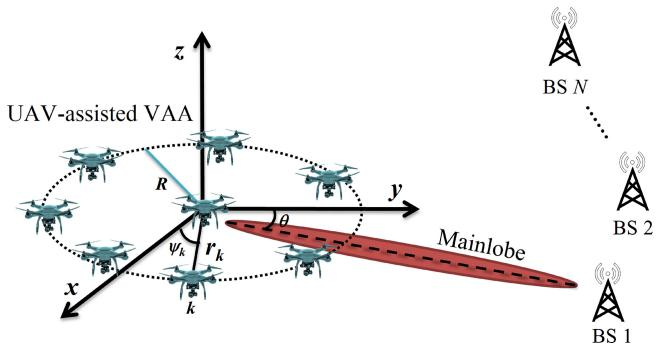

text_image

UAV-assisted VAA
z
y
x
R
ψk rk
k
θ
Mainlobe
BS N
BS 2
BS 1

Fig. 1. Illustration of a UAV-assisted VAA communication network.

and order of communication with BSs so that reducing hovering and motion energy consumption. The proposed algorithm is based on the vertical and horizontal renewal strategy to and nearest neighbor procedure (NNP), which can effectively solve the hybrid solution space problem, which contains continuous and discrete sections. Thus, the proposed optimizer is more suitable for solving the formulated HMECMOP.

3) We provide simulation results to validate the performance of the proposed method. Furthermore, a comparative study with several conventional communication methods, e.g., multihop communications, is carried out to further verify the effectiveness of the proposed CB-based approach. This study thus advances the literature on energy consumption suppression in communications and networks of UAV assisted, and is expected to inspire new solution methods for tackling similar problems.

# C. Paper Organizations

The remainder of this article is organized as follows. In Section II, the proposed UAV-assisted wireless network model, including several preliminaries, is elaborated. Afterward, we propose an HMECMOP of UAV-assisted CB and give the corresponding hardness analysis in Section III. Next, Section IV presents the algorithm. Then, simulation results and their inferences are focused in Section V. Finally, the conclusion is outlined in Section VI, followed by references.

# II. MODELS AND PRELIMINARIES

# A. System Models

As shown in Fig. 1, we consider an air-to-ground (A2G) wireless communication system in disaster-saving or agricultural data collection scenarios. Specifically, a set of rotarywing UAVs $( \mathcal { V } ~ = ~ \{ 1 , 2 , . . . , N _ { \mathrm { U A V } } \} )$ are dispatched for monitoring, sensing, or data collection. The data or tasks are not urgent or emergency, which means that UAVs can first cache the data and then backhaul them to data fusion centers. However, the terrestrial infrastructure is unavailable or inadequate due to natural disasters, remote or difficult-to-reach places, or temporary communication regions. In this case, we use UAVs to enable long-range data transmission with several remote BSs for data backup or data security [17]. Without loss of generality, the BSs are randomly distributed in the distance, labeled by $\mathcal { S } = \{ 1 , 2 , \dots , N _ { \mathrm { B S } } \}$ . Moreover, the locations of the Sith UAV and the jth BS can be expressed as $( x _ { i } ^ { U } , y _ { i } ^ { U } , z _ { i } ^ { U } )$ and $( x _ { j } ^ { \mathrm { B S } } , y _ { j } ^ { \mathrm { B S } } , 0 )$ i  i i  through the use of the 3-D Cartesian coordinate. Assume that each UAV is equipped with an omnidirectional antenna that operates at ISM frequency and acts as a flying user at about 100 m. Then, a group of UAVs will form a VAA, and communicate with BSs by utilizing CB.

Note that we consider the CB method for the scenario by considering the following motivations. First, approaching BSs and constructing multihop flying ad-hoc will consume massive energy consumption and need to bypass no-fly zones. Moreover, equipping UAVs with a directional antenna will increase the on-broad weight of UAVs and consume more costs.

In this case, the array factor (AF) of the VAA can be expressed [13], [18]

$$
\mathrm{AF} (\theta , \phi) = \sum_ {i = 1} ^ {N _ {\mathrm{UAV}}} I _ {i} e ^ {j \left[ k _ {c} \left(x _ {i} ^ {U} \sin \theta \cos \phi + y _ {i} ^ {U} \sin \theta \sin \phi + z _ {i} ^ {U} \cos \theta\right) \right]} \tag {1}
$$

where $\theta \in [ 0 , \pi ]$ is the elevation angle and $\phi \in [ - \pi , \pi ]$ is the azimuth angle, that is shown in Fig. 1. $k _ { c } = 2 \pi / \lambda$ represents the phase constant, where λ expresses the wavelength. $I _ { i }$ represents the ECW of the ith UAV. It can be seen that the locations and ECWs of UAVs in VAA are important factors for AF, which makes possible to improve CB by adjusting the locations and ECWs of UAVs.

Moreover, the influence of multipath can be effectively mitigated since the UAVs fly at high altitudes and they adopt CB for communications [14]. Besides, this work adopts the Lineof-Sight (LoS) propagation model as the A2G transmission model since the measurement experiments have demonstrated that when the UAV‘s altitude is above 85 m, the LoS link dominates the A2G wireless channels [19]. Denote $K _ { \mathrm { B S } _ { I } }$ j as the constant path loss coefficient, $d _ { \mathrm { B } S _ { j } }$ as the distance between the VAA and the jth BS, and $P _ { \mathrm { C B } _ { t } }$ as the total transmit power of the VAA. Thus, the transmission rate $R _ { \mathrm { B } S _ { j } }$ between the UAV-assisted VAA and the jth BS can be obtained as follows [4]:

$$
R _ {\mathrm{BS} _ {j}} = B \log_ {2} \left(1 + \frac {P _ {\mathrm{CB} _ {t}} K _ {\mathrm{BS} _ {j}} G _ {\mathrm{BS} _ {j}} d _ {\mathrm{BS} _ {j}} ^ {- \alpha}}{\sigma^ {2}}\right) \tag {2}
$$

where $\sigma ^ { 2 }$ indicates the noise power of a UAV. B represents the transmission bandwidth. Note that we do not allocate or optimize bandwidth, and thus B only depends on the device equipped with UAVs and can be seen as a constant. As such, if we adopt UAVs with large bandwidths, the transmission ability of VAA will increase, and vice versa. Moreover, $G _ { \mathrm { B S } _ { j } }$ is the beam gain generated by the VAA toward the jth BS location, and it can be expressed as follows [14]:

$$
\begin{array}{l} G _ {\mathrm{BS} _ {j}} \left(\boldsymbol {x} _ {j} ^ {\mathcal {V}}, \boldsymbol {y} _ {j} ^ {\mathcal {V}}, \boldsymbol {z} _ {j} ^ {\mathcal {V}}\right) \\ = \frac {4 \pi | A F (\theta_ {j} , \phi_ {j}) | ^ {2} w (\theta_ {j} , \phi_ {j}) ^ {2}}{\int_ {0} ^ {2 \pi} \int_ {0} ^ {\pi} | A F (\theta , \phi) | ^ {2} w (\theta , \phi) ^ {2} \sin \theta \mathrm{d} \theta \mathrm{d} \phi} \eta \tag {3} \\ \end{array}
$$

where $( \boldsymbol { x } _ { j } ^ { \nu } , \boldsymbol { y } _ { j } ^ { \nu } , \boldsymbol { z } _ { j } ^ { \nu } ) = \{ [ \boldsymbol { x } _ { i , j } ^ { U } ] _ { N _ { \mathrm { U A V } } \times 1 } , [ \boldsymbol { y } _ { i , j } ^ { U } ] _ { N _ { \mathrm { U A V } } \times 1 } , [ \boldsymbol { z } _ { i , j } ^ { U } ] _ { N _ { \mathrm { U A V } } \times 1 } \}$ (i ∈ V) represents the 3-D positions of all UAVs which are the component of a VAA, which communicate with the jth BS. $w ( \theta , \phi )$ is the magnitude of the far-field beam pattern obtained by each UAV [20]. By using CB, the VAA can ideally achieve a gain that scales with the square of the number of UAVs. To demonstrate, Fig. 2 shows the transmission rates of the VAA and a single UAV over 5 km. It is evident that the VAA achieves a favorable transmission rate.

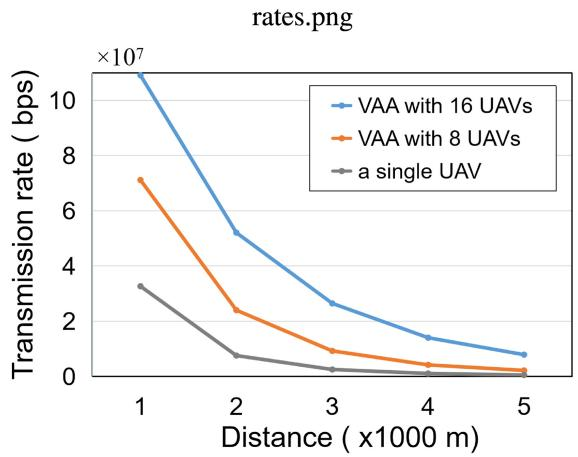

line

| Distance (x1000 m) | VAA with 16 UAVs | VAA with 8 UAVs | a single UAV |
| ------------------ | ---------------- | --------------- | ------------ |
| 1                  | 11.0e7           | 7.0e7           | 3.0e7        |
| 2                  | 5.0e7            | 2.5e7           | 1.0e7        |
| 3                  | 2.5e7            | 1.0e7           | 0.5e7        |
| 4                  | 1.5e7            | 0.5e7           | 0.2e7        |
| 5                  | 1.0e7            | 0.2e7           | 0.1e7        |

Fig. 2. Transmission rates obtained by VAA and single UAV.

Remark 1: Note that communication loss may not affect our considered model significantly. In CB, multiple UAVs work together to create high-gain directional antenna beams. The success of CB relies on the accurate and timely exchange of control information. According to [10], [11], and [12], control information for synchronization, beamforming coordination, and optimization is mainly exchanged among UAVs instead of the communication process from UAVs to BSs. As such, communication loss will not affect the CB preparation process but the CB transmission process. In the CB transmission process, robust error control mechanisms, and redundancy can be employed to mitigate the effect of communication loss.

# B. UAV Energy Consumption Model

As presented in [21], the energy consumption of a UAV is mainly composed of propulsion energy and communicationrelated energy, and the former occupies the dominant part. Generally, the former is usually four to five orders of magnitude larger than the latter [22]. Hence, the energy consumption caused by UAV communication is ignored in this work. By adopting a rotary-wing UAV with a velocity of $\nu _ { t }$ at time t, the propulsion energy consumption when it flies in a 2-D horizontal plane can be modeled as follows [23]:

$$
\begin{array}{l} E (T) = \int_ {0} ^ {T} P (v (t)) d t \\ = \int_ {0} ^ {T} \left(\underbrace {P _ {B} \left(1 + \frac {3 v (t) ^ {2}}{v _ {\text { tip }} ^ {2}}\right)} _ {\text { blade   profile }} + \underbrace {P _ {I} \left(\sqrt {1 + \frac {v (t) ^ {4}}{4 v _ {0} ^ {4}}} - \frac {v (t) ^ {2}}{2 v _ {0} ^ {2}}\right) ^ {1 / 2}} _ {\text { induced }} \right. \\ \left. + \underbrace {\frac {1}{2} d _ {0} \rho s A v (t) ^ {3}} _ {\text { parasite }}\right) d t \tag {4} \\ \end{array}
$$

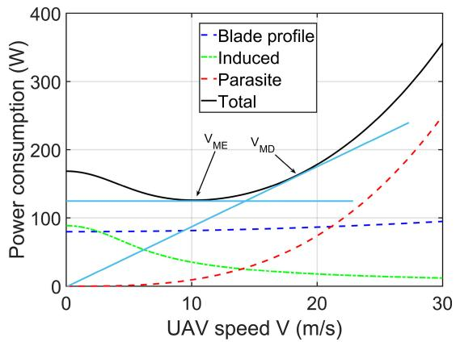

line

| UAV speed V (m/s) | Blade profile (W) | Induced (W) | Parasite (W) | Total (W) |
| ----------------- | ----------------- | ----------- | ------------ | --------- |
| 0                 | 80                | 90          | 0            | 170       |
| 10                | 80                | 40          | 10           | 130       |
| 20                | 80                | 20          | 100          | 180       |
| 30                | 80                | 10          | 250          | 360       |

Fig. 3. Propulsion power consumption versus speed V for rotary wing UAV.

where $\nu _ { \mathrm { t i p } }$ is the tip velocity of the rotor blade, v0 is the mean rotor induced velocity in hover, $d _ { 0 }$ and s are the fuselage drag ratio and rotor solidity, respectively. ρ and A are known as the air density and rotor disc area, respectively. According to (4), the propulsion energy consumption for a rotary-wing UAV includes blade profile, induced power, and parasite power, where the first two terms represent the energy to overcome the drag caused by the shape of the UAV while the last term is the energy consumed to resist the drag caused by the lift force. Note that all parameters are constants in (4) except for the velocity v(t) of a UAV.

Moreover, the typical power versus velocity curves according to (4) is shown in Fig. 3, together with the three individual power components and the convex approximation. Two particular UAV speeds that are of high practical interest are the maximum-endurance (ME) velocity and the maximumdistance (MD) velocity, which are expressed as $V _ { \mathrm { M E } }$ and $V _ { \mathrm { M D } }$ , respectively.

Definition 1 (ME Velocity): The ME velocity $V _ { \mathrm { M E } }$ is the optimal UAV velocity that maximizes the UAV endurance for any given onboard energy, which can be expressed as follows:

$$
V _ {\mathrm{ME}} = \arg \min _ {V \geq 0} P (V). \tag {5}
$$

Definition 2 (MD Velocity): The MD velocity $V _ { \mathrm { M D } }$ is the optimal UAV velocity that maximizes the total flight distance for any given onboard energy, which can be expressed as follows:

$$
V _ {\mathrm{MD}} = \arg \min _ {V \geq 0} E _ {0} (V) \triangleq \frac {P (V)}{V}. \tag {6}
$$

Remark 2: Note that $E _ { 0 } ( V )$ in Joule/meter (J/m) represents the UAV energy consumption per unit traveling distance. For rotary-wing UAVs, $V _ { \mathrm { M D } }$ can be obtained graphically based on the power-velocity curve P(V), by drawing a tangential line from the origin to the power curve that corresponds to the minimum slope (and, hence, power/velocity ratio), as illustrated in Fig. 3.

Remark 3: Note that, according to [23], the acceleration/deceleration of UAV horizontal flight only accounts for a small portion of the total operation time of UAV flight, thus the corresponding additional/less energy consumption is ignored in this work.

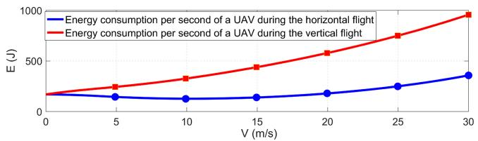

line

| V (m/s) | Energy consumption per second of a UAV during the horizontal flight (J) | Energy consumption per second of a UAV during the vertical flight (J) |
| ------- | ------------------------------------------------------------------ | ------------------------------------------------------------------- |
| 0       | 150                                                                | 150                                                                 |
| 5       | 125                                                                | 250                                                                 |
| 10      | 125                                                                | 350                                                                 |
| 15      | 150                                                                | 450                                                                 |
| 20      | 200                                                                | 600                                                                 |
| 25      | 250                                                                | 750                                                                 |
| 30      | 375                                                                | 950                                                                 |

Fig. 4. Horizontal and vertical flight energy consumption versus velocity V for rotary wing UAV.

In addition, in consideration of the arbitrary 3-D trajectory, $\mathrm { e . g . }$ , climbing and descending during UAV flight, the energy consumption with the heuristic closed-form approximation can be expressed as follows [1]:

$$
\begin{array}{l} E (T) \approx \int_ {0} ^ {T} P (v (t)) d t + \frac {1}{2} m _ {\mathrm{UAV}} \left(v (T) ^ {2} - v (0) ^ {2}\right) \\ + m _ {\mathrm{UAV}} g (h (T) - h (0)) \tag {7} \\ \end{array}
$$

where T represents the total flight duration. $m _ { \mathrm { U A V } }$ and g are the aircraft mass of a UAV and the gravitational acceleration, respectively.

Lemma 1: It can be seen from (4) and (7) that the energy consumption of a UAV flying in vertical direction per unit distance is greater than that in the horizontal direction at a uniform velocity.

Proof: Comparing (4) and (7), the latter contains more items that lead to additional energy consumption. To be more intuitive, the energy consumptions per unit time (s) under horizontal $( E _ { \mathrm { h o r } } )$ and vertical $( E _ { \mathrm { v e r } } )$ flight of a UAV at different velocities are shown in Fig. 4. It can be seen that $E _ { \mathrm { h o r } }$ is always higher than $E _ { \mathrm { h o r } }$ at different velocities [24]. ■

# C. Multiobjective Optimization Problem

Generally speaking, the optimization problem consisting of multiple minimization objectives [multiobjective optimization problem (MOP)] can be expressed as follows [25]:

$$
\min F = \left[ f _ {1} (v), f _ {2} (v), \dots , f _ {n} (v) \right] \tag {8}
$$

where v represents the vector of the optimization variables. N is the number of objective function. Therefore, $f _ { N } ( \nu )$ represents the Nth objective function.

Different from the single-objective optimization problem (SOP), the MOP cannot obtain a single optimal solution, instead of that, it is a nondominated set of the entire feasible decision space, which is called the paretooptimal set (PS). Moreover, the boundary defined by the set of all points mapped from PS is called the pareto-optimal front (PF) [25].

Remark 4: It is important to note that policymakers will pick one or more solutions from PF as the optimal solution according to the specific application requirements in many practical MOPs. In addition, the Pareto optimal solution is usually known as a nondominated solution until the theoretical Pareto optimal solution is determined.

# III. PROBLEM FORMULATION AND ANALYSIS

# A. Problem Formulation

This work considers that a fixed number of quadrotor UAVs hovering above a square monitor area $A _ { m }$ to perform sensing, data collection, or other works, which is shown in Fig. 1. Moreover, these UAVs need to communicate with remote BSs from time to time. Assume that, at a certain time, the UAV obtains some emergency data or the collected data reaches the upper limit of the catch, which means that it needs to transmit information immediately. However, the BSs are so far away that it would have been impossible for a single UAV to upload information to these BSs directly. Then, it is necessary to have some other UAVs help. Therefore, the UAVs need to hover at different positions to construct a VAA for the data transmission.

Due to the restrictions on the onboard energy of a UAV, the prime aim of UAV-assisted VAA is to transmit the collected data to remote BSs as soon as possible so that reducing the hovering energy consumption, which allows the UAVs to perform more tasks in one flight cycle. In achieving it, suitable positions and the optimal ECWs of different UAVs need to be setted up to get a better beam pattern, which has higher directivity and lower SLL, so as to improve the transmission ability. However, additional flights of the UAVs are required for constructing an appropriate VAA, which will raise the motion energy consumption of UAVs and reduce the lifetime of the UAV-assisted wireless networks. Therefore, the above factors need to be considered comprehensively since there are tradeoffs between them.

Remark 5: Calculated by (1)–(3), it can be considered that the beam pattern is the greatest important performance of a VAA since it affects the transmission rate directly. Specifically, more transmitted power will be concentrated in the direction of the mainlobe when the SLLs of VAA are suppressed so that improving the communication performance as a result of the enhancement of VAA directivity.

In addition, without losing generality, this work assumes that the UAVs require to upload the collected data to BSs located in different geographic positions for data aggregation, synchronization, or backup. These scenarios are common in emergency and communication cases [17], [26]. However, the mainlobe obtained by UAV-assisted VAA can only point to a certain BS, which means that every time the transmission task is accomplished, the VAA needs to be reconstructed for the next assignment.

Generally speaking, the positions and ECWs of UAV elements and communication sequence will influence the total energy consumption of the constructed UAV-assisted wireless network, and then impact network performance. Specially, in this work, the positions (i.e., x-axis coordinates, y-axis coordinates, and z-axis coordinates) are represented by $\mathbb { X } ^ { \mathcal { S } \times \mathcal { V } } = \{ x _ { i , i } ^ { U } | \forall i \in \mathcal { V } \forall j \in \mathcal { S } \} , \mathbb { Y } ^ { \mathcal { S } \times \mathcal { V } } = \{ y _ { i , i } ^ { U } | \forall i \in$ $\mathcal { V } _ { } \in \mathcal { S } \mathcal { Y } _ { } ^ { } \in \mathcal { S } \mathcal { Y } _ { } $ , and $\mathbb { Z } ^ { S \times \mathcal { V } } = \{ z _ { i , i } ^ { U } | \forall i \in \mathcal { V } \forall j \in \mathcal { S } \}$ . The ECWs and sequence of communicating with different BSs are represented as $\mathbb { I } ^ { S \times \mathcal { V } } \ = \ \{ I _ { i , j } | \forall i \ \in \ \mathcal { V } \forall j \ \in \ \mathcal { S } \}$ and $\mathbb { P } ^ { S \times 1 } = \{ P _ { 1 } , P _ { 2 } , \dotsc , P _ { N _ { \mathrm { B S } } } | j \in \tilde { \mathcal { B } } , P _ { j } \in \mathcal { S } \}$ . Thus, the decision variable (solution) with all decision dimensions can be defined as $\boldsymbol { X } = [ \mathbb { X } ^ { \boldsymbol { S } \times \mathcal { V } } , \mathbb { Y } ^ { \boldsymbol { S } \times \mathcal { V } } , \mathbb { Z } ^ { \boldsymbol { S } \times \mathcal { V } } , \mathbb { I } ^ { \boldsymbol { S } \times \mathcal { V } } , \mathbb { P } ^ { \boldsymbol { S } \times 1 } ]$ . The following sections detail the different optimization goals in the construction scenario.

Optimization Objective 1: The UAVs will hover to construct a VAA for communicating with the remote BSs, which is an energy-consuming mission. Given a certain amount of data and the fixed hovering power consumption of a UAV, the hovering energy consumption of UAVs will be reduced if the transmission tasks can be completed within a short time. Thus, the first objective function, in which the hovering energy consumption will be decreased, can be defined as follows:

$$
f _ {1} \left(\mathbb {X} ^ {\mathcal {S} \times \mathcal {V}}, \mathbb {Y} ^ {\mathcal {S} \times \mathcal {V}}, \mathbb {Z} ^ {\mathcal {S} \times \mathcal {V}}, \mathbb {I} ^ {\mathcal {S} \times \mathcal {V}}, \mathbb {P} ^ {\mathcal {S} \times 1}\right) = \sum_ {j = 1} ^ {N _ {\mathrm{BS}}} \sum_ {i = 1} ^ {N _ {\mathrm{UAV}}} E _ {i, j} ^ {\text { hov }} \tag {9}
$$

where Ehov $E _ { i , j } ^ { \mathrm { h o v } } = P _ { i } ( V _ { 0 } ) \cdot T _ { j } ^ { t r }$ i,j denotes the energy consumed by communication between the ith UAV and the jth BS, wherein $V _ { 0 } ~ = ~ 0$ is the hovering velocity. Moreover, $T _ { j } ^ { \mathrm { t r } }$ represents the cumulative time taken to execute transmit mission from UAV-assisted VAA to the jth BS, which can be calculated by $( D _ { j } ^ { \mathrm { { d a t a } } } / R _ { { \mathrm { B S } } _ { j } } )$ , and $D _ { j } ^ { \mathrm { d a t a } }$ is the total amount of data to be transmitted. As can be seen, we embed the transmission rate into this objective and thereby improve it.

Remark 6: Note that we omit the energy consumption of UAV-to-UAV communication due to the following reasons.

1) UAV-to-UAV communication occurs in the data-sharing step among UAVs. In this step, UAVs will coordinate to have the same data, thereby consuming communication energy. However, data sharing has mature energy-efficient methods [27] which can be embedded in our frameworks and only introduces negligible energy consumption.   
2) In UAV systems, propulsion energy consumption for hovering or moving is several orders of magnitude larger than that for communications [1]. Thus, compared with propulsion energy consumption, the energy consumption in UAV-to-UAV communication is too small and can be neglected.

Optimization Objective 2: To minimize the hovering energy consumption, it is necessary for UAVs to move to better locations and perform different VAAs to communicate with remote BSs. However, the flights of UAVs will consume additional energy and generate motion energy consumption. Therefore, to achieve minimal total energy consumption, the second objective function, in which the motion energy consumption of UAVs will be decreased, can be defined as follows:

$$
f _ {2} \left(\mathbb {X} ^ {\mathcal {S} \times \mathcal {V}}, \mathbb {Y} ^ {\mathcal {S} \times \mathcal {V}}, \mathbb {Z} ^ {\mathcal {S} \times \mathcal {V}}, \mathbb {P} ^ {\mathcal {S} \times 1}\right) = \sum_ {j = 1} ^ {N _ {\mathrm{BS}}} \sum_ {i = 1} ^ {N _ {\mathrm{UAV}}} E _ {i, j} ^ {\text { perf }} \tag {10}
$$

where Eperfi,j i $E _ { i , j } ^ { \mathrm { p e r f } }$ s the energy consumptions of the ith UAV for composing the UAV-assisted VAA to communicate with the jth BS. Moreover, different positions of UAVs in VAA will lead to different arrival times, which are the times for UAVs to fly to the designated location to communicate with the next BS. This means that the UAV that arrives first need to hover and wait until the VAA formation is completed. Thus, the Eperf $E _ { i , j } ^ { \mathrm { p e r f } }$ can be calculated as $P ( \nu h _ { i , j } ) { \cdot } T h _ { i , j } ^ { \mathrm { m o v e } } + P ( \nu \nu _ { i , j } )$ ·

$T \nu _ { i , j } ^ { \mathrm { m o v e } } + P ( V _ { 0 } ) \cdot ( T _ { j } ^ { \mathrm { p e r f } } - T h _ { i , j } ^ { \mathrm { m o v e } } - T \nu _ { i , j } ^ { \mathrm { m o v e } } )$ , in which $P ( \nu h _ { i , j } )$ and $P ( \nu \nu _ { i , j } )$ are the horizontal and vertical flight powers of the ith UAV for reaching the destination for serving jth BS, respectively. $T h _ { i , j } ^ { \mathrm { m o v e } } ~ = ~ ( D _ { h _ { i , j } } / V h _ { \mathrm { M D } } )$ and $T \nu _ { i , j } ^ { \mathrm { m o v e } } ~ = ~ ( D _ { \nu _ { i , j } } / V \nu _ { \mathrm { M D } } )$ are the time of the horizontal and vertical flights, wherein $D _ { h _ { i , j } }$ j and $D _ { \nu _ { i , j } }$ are the corresponding flights distance that can be determined by the 3-D spatial positions of UAV elements $( \mathbb { X } ^ { S \times \mathcal { V } } , \mathbb { Y } ^ { S \times \mathcal { V } } , \bar { \mathbb { Z } } ^ { S \times \mathcal { V } } )$ and order communicating with different $\mathbf { B } { \mathsf { S s \ } } ( \mathbb { P } ^ { S \times 1 } )$ . The $T _ { j } ^ { \mathrm { p e r f } } = \widetilde { \mathrm { M a x } } ( T h _ { i , j } ^ { \mathrm { m o v e } } + \overline { { T } } \nu _ { i , j } ^ { \mathrm { m o v e } } )$ , in which Max (.) is the maximizing operator used to calculate the maximum values.

Remark 7: For the goal that reducing the gross energy consumption of UAVs so that serving more tasks, the value of $\nu h _ { i , j }$ of the velocity on the horizontal flights is set as the corresponding MD velocity VhMD, which is the optimal velocity that maximizes the total traveling distance with any given onboard energy. Moreover, (7) is an approximation model of the vertical flight energy consumption, which can be affected by many factors, e.g., flight distance, initial, final, and instantaneous velocity of a UAV. Thus, it would be difficult to precisely give the closed-form calculation formula of the energy consumption for composing the VAA. However, the energy of vertical flight involved would be very great which cannot be ignored. Thus, this work also uses $V \nu _ { \mathrm { { M D } } }$ in the vertical to calculate the motion energy consumption of UAV elements.

Remark 8: In order to arrive at the destination accurately, a common flight pattern in practical applications [28], [29], [30] is used, in which the UAV flies in the horizontal direction first, then climbs or descends in the vertical direction.

Accordingly, the HMECMOP for CB in a UAV-assisted wireless network can be formulated as follows:

$$
\min _ {X} F = (f _ {1}, f _ {2}) \tag {11a}
$$

$$
\text { s.t. } C 1: 0 \leq I _ {i, j} \leq 1 \quad \forall i \in \mathcal {S} \quad \forall j \in \mathcal {V} \tag {11b}
$$

$$
C 2: X _ {\min} \leq x _ {i, j} ^ {U} \leq X _ {\max} \quad \forall i \in \mathcal {S} \quad \forall j \in \mathcal {V} \tag {11c}
$$

$$
C 3: Y _ {\min} \leq y _ {i, j} ^ {U} \leq Y _ {\max} \quad \forall i \in \mathcal {S} \quad \forall j \in \mathcal {V} \tag {11d}
$$

$$
C 4: Z _ {\min} \leq z _ {i, j} ^ {U} \leq Z _ {\max} \quad \forall i \in \mathcal {S} \quad \forall j \in \mathcal {V} \tag {11e}
$$

$$
C 5: \mathbb {P} ^ {\mathcal {S} \times 1} \in \mathcal {P} \tag {11f}
$$

$$
C 6: \theta_ {S L} \in [ - \pi , \theta_ {F N 1}) \cup (\theta_ {F N 2}, \pi ] \tag {11g}
$$

$$
C 7: \phi_ {S L} \in [ - \pi , \phi_ {F N 1}) \cup (\phi_ {F N 2}, \pi ] \tag {11h}
$$

$$
C 8: D _ {(i _ {1}, i _ {2})} \geq D _ {\min} \quad \forall i _ {1}, i _ {2} \in \mathcal {V} \tag {11i}
$$

where C1 is the ECW constraints, C2, C3, and C4 are flight area constraints that guarantee that each UAV only moves in a designated region, in which the first two represent the horizontal position constraint, and the latter one represents the vertical position constraint. Moreover, P = {PS×11 , PS×12 , $\mathcal { P } = \{ \mathbb { P } _ { 1 } ^ { S \times 1 } , \mathbb { P } _ { 2 } ^ { S \times 1 }$ ， $\mathbb { P } _ { N _ { \mathrm { B S ! } } } ^ { S \times 1 } \}$ represents a set, which consists of all the possibilities sequences for a VAA communicating with $N _ { \mathrm { B S } }$ different BSs, and the total possible permutations is $N _ { \mathrm { B S } } !$ , thus C5 is the communication sequence constraints. In addition, C6 and C7 are first null beamwidth of the beam pattern constraints and θFN1, θFN2, φFN1, and φFN2 are the first nulls in $[ - \pi , \theta _ { M L } )$ , $( \theta _ { M L } , \pi ] , ~ [ 0 , \phi _ { M L } )$ , and $( \phi _ { M L } , \pi ]$ , respectively. Furthermore, C8 indicates the minimum distance constraint between the two adjacent UAVs, which can avoid the collision.

# B. Proof of NP-Hardness

Lemma 2: The formulated HMECMOP shown in (11) is NP-hard.

Proof: Only the optimization target $f _ { 2 }$ is considered here while making analysis as easy as possible. Therefore, by using the fixed position and ECW of the UAV, the original HMECMOP can be simplified as follows:

$$
\min _ {X (\mathbb {P} ^ {\mathcal {S} \times 1})} f _ {2} = \sum_ {i = 1} ^ {N _ {\mathrm{BS}} - 1} E _ {P _ {i}, P _ {i + 1}} \tag {12a}
$$

$$
\text { s.t. } \mathbb {P} ^ {\mathcal {S} \times 1} \in \mathcal {P} \tag {12b}
$$

where $E _ { P _ { j } , P _ { j + 1 } }$ represents the total energy consumptions for all UAV elements moving from the position communicating with $P _ { j } \mathrm { t h }$ BS to that with $P _ { j + 1 }$ 1th BS.

It can be seen that the simplified optimization problem (12) is actually a traveling salesman problem (TSP) [4], [31], which has proved to be an NP-hard problem. Obviously, the formulated HMECMOP is much more complex in structure, thus it is also proved an NP-hard problem. ■

Lemma 3: The objectives of the formulated HMECMOP shown in (11) are tradeoffs.

Proof: In the pursuit of reducing the hovering energy consumption of UAVs, optimizing the transmission performance of UAV-assisted VAA and minimizing hovering time are viable options. But, the enhancement of transmission performance does not come without a cost; it necessitates additional UAV movement, leading to an increase in the motion energy consumption. Consequently, a tradeoff between these two optimization objectives arises, making it imperative to strike a balance between the hovering energy consumption and the motion energy consumption. □

Lemma 4: The formulated HMECMOP shown in (11) is a large-scale optimization problem.

Proof: The decision variable (solution) includes the 3-D locations of $\operatorname { U A V s } ( \mathbb { X } ^ { S \times \mathcal { V } } , \mathbb { Y } ^ { S \times \mathcal { V } } , \mathbb { Z } ^ { S \times \mathcal { V } } )$ , the ECWs of UAVs $( \mathbb { I } ^ { \boldsymbol { S } \times \boldsymbol { \mathcal { V } } } )$ , and communicating sequence with different BSs $( \mathbb { P } ^ { S \times 1 } )$ , which means that there are $( 4 \times ( N _ { \mathrm { U A V } } \times N _ { \mathrm { B S } } ) + N _ { \mathrm { B S } } )$ solution dimensions should be optimized. It can be seen that the solution dimension is determined by $N _ { \mathrm { U A V } }$ and $N _ { \mathrm { B S } }$ directly, and the raising of them will generate a magnitude increase in the problem dimension. For example, the number of solution dimensions will be 1210 with 30 and 10 being set for the values of $N _ { \mathrm { U A V } }$ and $N _ { \mathrm { B S } }$ , and the formulated HMECMOP becomes a large-scale optimization problem [32], [33].

# IV. ALGORITHM

Swarm intelligence and evolutionary algorithms are population-based approaches, which are suitable for solving complex NP-hard problems. Among these algorithms, the MOMVO is a promising method since it has been demonstrated to have superior to other multiobjective optimization algorithms. However, it may face some challenges (e.g., insufficient optimization ability, etc.) when disposing of the formulated HMECMOP. Thus, in this section, an IMOMVO, which is an extension of the conventional MOMVO is proposed to deal with HMECMOP.

# A. Conventional MOMVO

Multiverse optimizer (MVO) is inspired by the existence of multiple universes in the world. Specifically, this algorithm mimics the interaction of multiple universes through white, black, and wormholes. In the theory of multiple universes, the objects of a universe can be transferred from a white hole to a black hole through a tunnel. Moreover, the objects are able to be moved between different universes through wormholes without the need for white and black holes. Moreover, each candidate solution is regarded as a universe, and the variables of a solution are considered as the objects of the universe. The universes of MVO are based on several rules [34], and the solution update mechanism in conventional MOMVO is as follows [35]:

$$
X _ {i} ^ {j} = \left\{ \begin{array}{c c} \left\{ \begin{array}{l l} X _ {l b} ^ {j} + U _ {j}, r _ {3} <   0. 5 & \\ X _ {l b} ^ {j} - U _ {j}, r _ {3} \geq 0. 5 & \end{array} \right. & r _ {2} <   \text { WEP } \\ X _ {i} ^ {j} & r _ {2} \geq \text { WEP } \end{array} \right. \tag {13}
$$

where $X _ { i } ^ { j }$ is the jth variable on the ith solution, $X _ { j }$ is the jth variable in the best solution. $U _ { j } = \mathrm { T D R } \cdot ( U B _ { j } - L B _ { j } \times r _ { 4 } + L B _ { j } )$ , wherein $W E P$ is defined as the wormhole existence probability, TDR is the traveling distance rate. Moreover, $l b _ { j }$ and $u b _ { j }$ are the lower and upper bound of the jth dimension of the solution, respectively. In addition, $r _ { 2 } , r _ { 3 }$ , and $r _ { 4 }$ are with random values between 0 and 1. The details of the single-objective MVO can be found in [34].

MOMVO is the multiobjective version of the conventional MVO algorithm. Thus, the solution searching and updating mechanism in MOMVO is very similar to the conventional MVO. However, the solution storage and comparison methods of MOMVO are quite different from the single-objective MVO. Specifically, MOMVO uses an archive to store the best nondominated solutions obtained in the current iteration, and thus the white holes and worm holes should be selected from the archive due to the existence of multiple best solutions. Moreover, the algorithm uses a leader selection mechanism and the roulette wheel mechanism to select solutions from the archive for establishing tunnels between different solutions. The details of the MOMVO can be learned in [35].

# B. Motivation for Proposing IMOMVO

Although conventional MOMVO has advances for solving some MOPs, it may face some challenges in dealing with the formulated HMECMOP, which can be summarized below.

1) From the previous analysis, it can see that the decision variable $\mathring { \mathbb { X } } ^ { S \times \mathcal { V } } , \mathbb { Y } ^ { S \times \mathcal { V } } , \mathbb { Z } ^ { S \times \mathcal { V } }$ , and $\mathbb { T } ^ { S \times \nu }$ are continues solution dimensions, while $\mathbb { P } ^ { S \times 1 }$ is discrete solution dimensions, thus the solution of the formulated HMECMOP is composed of two types of dimensions. Therefore, the formulated problem is a classical hybrid MOP with mixed solution dimensions, which is inefficient to be solved by conventional algorithms such as MOMVO.

2) As illustrated in Lemmas 2–4, the formulated HMECMOP is a large-scale NP-hard problem with complex tradeoffs between the two optimization objectives, which makes it difficult to be solved by conventional evolutionary multiobjective optimization algorithms.   
3) In HMECMOP, each solution dimension indicates a specific physical meaning, i.e., positions and ECWs of UAV elements. Thus, it becomes a challenging task for the traditional MOMVO to update these dimensions in the same or specific way.   
4) Finally, in UAV-assisted CB consists of distributed antenna elements, there are some basic principles that affect transmission performance. For example, the beam pattern performance has a very close relationship to the positions of UAVs. However, this characteristic is hard to be obtained by conventional MOMVO. Thus, the algorithm could consume additional energy in a redundant solution space during dealing with the HMECMOP.

# C. IMOMVO for HMECMOP

In this section, we propose an IMOMVO to find the optimal solution for solving the formulated HMECMOP, and the pseudocode of the proposed IMOMVO is shown in Algorithm 1. Specifically, the solutions in the proposed IMOMVO are updated in two parts, since the proposed problem is analyzed and proven as a classical hybrid MOP with a complex solution vector that contains continuous and discrete variables.

For the continuous part, IMOMVO introduces two improved strategies that are the local optimal individual vertical renewal strategy and the nonoptimal individual horizontal renewal strategy to improve the ability of traditional MOMVO to overcome the challenges presented in Section IV-B.

1) Vertical Renewal Strategy of Local Optimal Solution Based on the Historical Optimal Solution: The conventional MOMVO algorithm updates the population around the local optimal solution of each iteration, which makes the position of the local optimal solution more significant. However, the local optimal solution cannot be carried out the vertical reexplore in the traditional MOMVO, which may make the algorithm bypass the global optimal solution, leading to blindness in a certain search direction. Moreover, as mentioned in Lemma 4, the formulated HMECMOP is a large-scale optimization problem, which means that it may easily plunge into the local optimum in solving the problem. Therefore, it is crucial to raise the local optimal solution on exploration ability.

The vertical renewal strategy is a vertical self-learning evolution mechanism on the individual level, in which local exploitation performance can be modified by searching the local optimal neighborhood. The optimal position of the current population at the ith iteration $( X _ { l b } ^ { i } )$ , gradually approaches the global optimal solution $( X _ { g b } )$ with the iteration, which means the neighborhood radius between $X _ { l b } ^ { i }$ and $X _ { g b }$ tends to decrease, and $X _ { l b } ^ { i }$ leads the evolution direction of the population. Thus, in order to enhance the local search ability of MOMVO, it is necessary to explore the local optimal solution neighborhood. This article proposed a vertical renewal strategy based on the historical optimal solution, in which the average position neighborhood of the historical local optimal solution

Algorithm 1: IMOMVO   
1 Define the parameters: $N_{pop}$ , $iter_{max}$ , Archive and fitness function, etc.;
2 Initialize a set of random population based on the problem dimension;
3 Calculate the fitness value (the inflation rate) for each universe and update Archive;
4 for t = 1 to $t_{max}$ do
5 Calculate the parameters: WEP, TDR;
6 Select the $X_{gb}$ by using roulette wheel selection from the Archive;
7 Sort universes by the fitness value in ascending order based on a leader selection mechanism [34], and obtain the X_sorted;
8 Normalize inflation rate (NI_sorted) of X_sorted;
9 Set the $X_{lb}$ by X_sorted(1);
10 Update the continuous part $X_{lb}(\mathbb{X}^{\mathcal{S}\times\mathcal{V}}, \mathbb{Y}^{\mathcal{S}\times\mathcal{V}}, \mathbb{Z}^{\mathcal{S}\times\mathcal{V}}, \mathbb{I}^{\mathcal{S}\times\mathcal{V}})$ of $X_{lb}$ by using Algorithm 2;
11 Collision check (if they collide, bring the universe back into the random solution in search space;
12 Update the discrete part $X_{lb}(\mathbb{P}^{\mathcal{S}\times1})$ of $X_{lb}$ by using Algorithm 4;
13 Set the $X_{1}$ by $X_{lb}$ ;
14 for i = 2 to $N_{pop}$ do
15 % Update Back_hole by traditional MVO [34].
16 Back_hole_index=i;
17 for each problem dimension by j do
18 r1 = random([0, 1]);
19 if r1 < NI_sorted(i) then
20 Select the White_hole_index by using roulette wheel selection base on (-NI_sorted);
21 Replace X(Back_hole_index, j) by using X(White_hole_index, j);
22 end
23 end
24 % End Back_hole update.
25 r2 = random([0, 1]);
26 if r2 < WEP then
27 Update the continuous part $X_{i}(\mathbb{X}^{\mathcal{S}\times\mathcal{V}}, \mathbb{Y}^{\mathcal{S}\times\mathcal{V}}, \mathbb{Z}^{\mathcal{S}\times\mathcal{V}}, \mathbb{I}^{\mathcal{S}\times\mathcal{V}})$ of the ith universe by using Algorithm 3;
28 Collision check (if they collide, bring the universe back into the random solution in search space;
29 Update the discrete part $X_{i}(\mathbb{P}^{\mathcal{S}\times1})$ of the ith universe by using Algorithm 4;
30 end
31 Calculate the objective function values of all universes and update Archive;
32 end
33 end

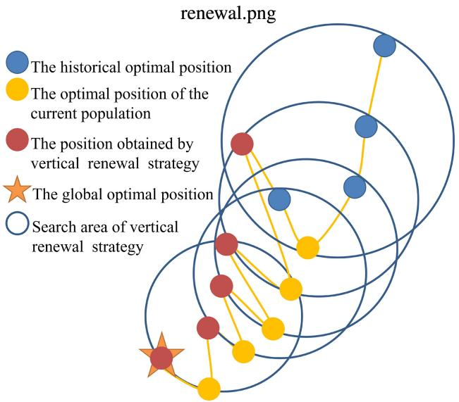

flowchart

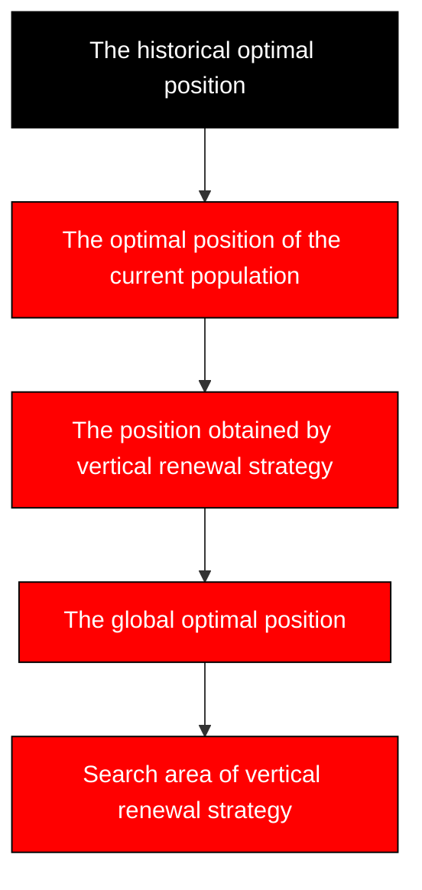

Fig. 5. Illustration of the local optima solution vertical renewal operations.

is reused by simulating the historical forgetting memory characteristics of human cognition, and the main procedures can be summed up as follows:

First, the Ebbinghaus forgetting curve is utilized to obtain the memory scale factor λ, and this factor can be modeled as follows [36]:

$$
\lambda (s) = \frac {(1 + \mathrm{iter} _ {\text { current }} - s) ^ {- K}}{\sum_ {s = 1} ^ {\mathrm{HMS}} (1 + \mathrm{iter} _ {\text { current }} - s) ^ {- K}} \tag {14}
$$

where $s \in [ 1$ , HMS] is the index of the historical solution and $\mathrm { i t e r } _ { \mathrm { c u r r e n t } }$ is the current number of iterations. Moreover, HMS is the largest amount of historical memory, and $K \ > \ 0$ is a nonlinear forgetting factor. Note that the larger value of K can have a greater forgetting impact, which leads to a weaker cognitive level and cumulative learning ability of the new universe individual to historical information. Fig. 5 shows the sketch map of the local optima solution vertical renewal operations when HMS is equal to 5. As can be seen, this vertical renewal can search the local optimal neighborhood based on the arithmetic mean of the historical optimal position, and then move to the global position. By using this model, the local optimal solution for the current population can be updated as follows:

$$
X _ {l b} ^ {i} = \sum_ {s = 1} ^ {\mathrm{HMS}} \lambda_ {s} X _ {s} \pm \sqrt {\frac {\sum_ {s = 1} ^ {\mathrm{HMS}} \left(\bar {X} - X _ {s}\right) ^ {2}}{\mathrm{HMS}}} \tag {15}
$$

where $X _ { s }$ and X¯ are the sth universe and arithmetic mean of s historical local optimum universes, respectively.

Second, according to the principles of wireless communication, a sensor can consume less energy when it is closer to the transmission destination under the same conditions. Therefore, the algorithm is better to make the UAVs as close to the BSs as possible. Moreover, due to multiple transmission destination (BS) NPSabbrpl in this article, a center position of BSs should be calculated at first, and it can be modeled as follows:

$$
\begin{array}{l} \mathrm{BS} _ {c} (\mathbb {X}, \mathbb {Y}) = \left[ (\mathrm{BS} (\mathbb {X}) _ {\min} + \mathrm{BS} (\mathbb {X}) _ {\max}) / 2 \right. \\ \left. \left(\mathrm{BS} (\mathbb {Y}) _ {\min} + \mathrm{BS} (\mathbb {Y}) _ {\max}\right) / 2 \right]. \tag {16} \\ \end{array}
$$

Then, the $X _ { l b } ( \mathbb { X } ^ { S \times \mathcal { V } } , \mathbb { Y } ^ { S \times \mathcal { V } } )$ can be further updated as follows:

$$
\begin{array}{l} X _ {l b} ^ {i + 1} \left(\mathbb {X} ^ {\mathcal {S} \times \mathcal {V}}, \mathbb {Y} ^ {\mathcal {S} \times \mathcal {V}}\right) = X _ {l b} ^ {i} \left(\mathbb {X} ^ {\mathcal {S} \times \mathcal {V}}, \mathbb {Y} ^ {\mathcal {S} \times \mathcal {V}}\right) \\ + \operatorname{rand} \cdot \left(1 - \frac {X _ {l b} ^ {i} \left(\mathbb {X} ^ {\mathcal {S} \times \mathcal {V}} , \mathbb {Y} ^ {\mathcal {S} \times \mathcal {V}}\right)}{\mathrm{BS} _ {c} (\mathbb {X} , \mathbb {Y})}\right). \tag {17} \\ \end{array}
$$

Finally, as Lemma 1 analyzed, a UAV could consume more energy in longitudinal flight compared with lateral flight, which means that the shorter the vertical flight, the lower the energy consumption to perform VAA, thus the position update in the z-axis direction $( \overset { \cdot } { \mathbb { Z } } ^ { S \times \mathcal { V } }$ ) needs to be more circumspect. This article adopts the method of median neighborhood updating, in which the vector $\mathbb { Z } ^ { S ^ { \prime } \times \mathcal { V } } ( S ^ { \prime } \in [ 1 , 2 , \dotsc , N _ { \mathrm { B S } } ] )$ of UAVs are updated around the intermediate value of the altitude of all UAVs communicating with $S ^ { \prime } { \mathrm { t h } }$ BS, and the update method can be defined as follows:

$$
\begin{array}{l} X _ {l b} ^ {i + 1} \Big (\mathbb {Z} ^ {\mathcal {S} ^ {\prime} \times \mathcal {V}} \Big) = X _ {l b} ^ {i} \Big (\mathbb {Z} ^ {\mathcal {S} ^ {\prime} \times \mathcal {V}} \Big) \\ - \operatorname{rand} \cdot \left(X _ {l b} ^ {i} \left(\mathbb {Z} ^ {\mathcal {S} ^ {\prime} \times \mathcal {V}}\right) - \frac {\sum_ {j = 1} ^ {N _ {\mathrm{UAV}}} X _ {l b} ^ {i} \left(\mathbb {Z} ^ {\mathcal {S} ^ {\prime} \times j}\right)}{N _ {\mathrm{UAV}}}\right). \tag {18} \\ \end{array}
$$

2) Horizontal Renewal Strategy of Nonoptimal Individuals Based on the MFO: The horizontal renewal strategy is a horizontal migration and evolution mechanism on the population level, which improves the global exploration performance of the algorithm by increasing the population diversity. In the traditional MVO algorithm, a universe generates a new population iteratively based on (13), by comparing the parameter WEP and the random number $r 2$ value. When $r 2 \ < \ W E P$ , the offspring individual $X _ { i }$ will surround randomly update the jth dimension component in the $U _ { j }$ travel domain around the current optimal universe $X _ { l b } ;$ on the contrary, the offspring $X _ { i }$ will remain the same. However, in the early stage of the iteration, the current optimal universe $X _ { l b }$ is usually far away from $X _ { g b }$ . Excessive inheritance of $X _ { l b }$ will inevitably lead to rapid population assimilation, which is not conducive to the maintenance of population diversity. At the later stage of the iteration, due to the accumulation of information integration effect between universe populations, universe individuals are highly assimilated and the differences are small. There is less effect information learned from the roulette universe, and it is difficult to significantly improve the local exploration ability of the algorithm. Therefore, in order to ensure population diversity and broaden the limited search domain inherited by a single universe, the horizontal renewal strategy of nonoptimal individuals based on the moth-flame optimization (MFO) is proposed.

First, inspired by the MFO algorithm [37] and the principles of electromagnetism and CB, an antenna array can achieve higher gain when the elements are concentrated at appropriate positions [20]. Moreover, the local optimal solution gradually approaches the real global optimal solution with the increase in iteration. Thus, the local optimal position $( X _ { l b } )$ of the UAVassisted VAA is chosen as a flame guide for the location update direction of all the UAVs, and the update method can be defined as follows:

Algorithm 2: Continuous Portion Update of Local Optimal Solution   
1 Update the historical local optimal solution set $Archive_{lb}$ ;
2 if the size of $Archive_{lb} > HMS$ then
3 | Save the last $HMS$ values.
4 end
5 Update the $X_{lb}$ by using Eq. (15);
6 Update the $X_{lb}^{i+1}(\mathbb{X}^{\mathcal{S} \times \mathcal{V}}, \mathbb{Y}^{\mathcal{S} \times \mathcal{V}})$ by using Eq. (17);
7 Return $X_{lb}^{i+1}(\mathbb{X}^{\mathcal{S} \times \mathcal{V}}, \mathbb{Y}^{\mathcal{S} \times \mathcal{V}}, \mathbb{Z}^{\mathcal{S} \times \mathcal{V}}, \mathbb{I}^{\mathcal{S} \times \mathcal{V}})$ ;

$$
\begin{array}{l} X _ {i} \left(\mathbb {X} ^ {\mathcal {S} \times \mathcal {V}}, \mathbb {Y} ^ {\mathcal {S} \times \mathcal {V}}, \mathbb {Z} ^ {\mathcal {S} \times \mathcal {V}}\right) = X _ {i} \left(\mathbb {X} ^ {\mathcal {S} \times \mathcal {V}}, \mathbb {Y} ^ {\mathcal {S} \times \mathcal {V}}, \mathbb {Z} ^ {\mathcal {S} \times \mathcal {V}}\right) \\ + \omega \cdot D _ {i} \left(\mathbb {X} ^ {\mathcal {S} \times \mathcal {V}}, \mathbb {Y} ^ {\mathcal {S} \times \mathcal {V}}, \mathbb {Z} ^ {\mathcal {S} \times \mathcal {V}}\right) \tag {19} \\ \end{array}
$$

$$
\omega = \text { rand } \cdot \exp (b \cdot t) \cdot \cos (2 \pi \cdot t) \tag {20}
$$

$$
t = (\alpha - 1) \cdot \text { rand } + 1 \tag {21}
$$

$$
\alpha = - 1 + \operatorname{iter} _ {\text { current }} \cdot ((- 1) / \operatorname{iter} _ {\max}) \tag {22}
$$

where ω is an adaptive weight variable, which can be calculated by (20), b = 1 is a constant. Moreover, $D _ { i }$ indicates the distance between the ith solution and the flame, which can be calculated as follows:

$$
\begin{array}{l} D _ {i} \left(\mathbb {X} ^ {\mathcal {S} \times \mathcal {V}}, \mathbb {Y} ^ {\mathcal {S} \times \mathcal {V}}, \mathbb {Z} ^ {\mathcal {S} \times \mathcal {V}}\right) = X _ {i} \left(\mathbb {X} ^ {\mathcal {S} \times \mathcal {V}}, \mathbb {Y} ^ {\mathcal {S} \times \mathcal {V}}, \mathbb {Z} ^ {\mathcal {S} \times \mathcal {V}}\right) \\ - X _ {f} ^ {c} \left(\mathbb {X} ^ {\mathcal {S} \times \mathcal {V}}, \mathbb {Y} ^ {\mathcal {S} \times \mathcal {V}}, \mathbb {Z} ^ {\mathcal {S} \times \mathcal {V}}\right) \tag {23} \\ \end{array}
$$

where ${ \cal X } _ { f } ^ { c } ( \mathbb { X } ^ { S \times \mathcal { V } } , \mathbb { Y } ^ { \mathcal { S } \times \mathcal { V } } , \mathbb { Z } ^ { \mathcal { S } \times \mathcal { V } } ) = [ \widetilde { A } d ( \mathbb { X } _ { f } ^ { \mathcal { S } \times \mathcal { V } } ) , \widetilde { A } d ( \mathbb { Y } _ { f } ^ { \mathcal { S } \times \mathcal { V } } )$ , $\widetilde { A d } ( \mathbb { Z } _ { f } ^ { \cal S \times \tilde { \mathcal { V } } } ) ]$ , and $\widetilde { A d } ( \cdot )$ is the average operator, which is used to calculate the average values of each row for a matrix. In addition, when $\mathrm { i t e r } _ { \mathrm { c u r r e n t } } < \mathrm { i t e r } _ { \mathrm { m a x } } / 2 .$ , the flame individual $X _ { f }$ will be set as $X _ { l b } ;$ on the contrary, the flame $X _ { f }$ will be set as $X _ { g b }$ .

Second, appropriate $\mathrm { E C W s } \ \mathbb { I } ^ { S \times \mathcal { V } }$ can markedly improve the beam pattern of the UAV-assisted VAA in each communication so that raising the transmission rate. In this part, we adopt the conventional MVO method to update the ECWs, and the update method is the same with (13).

In conclusion, the updating procedures of the continuous solutions, including local optimal and nonoptimal are shown in Algorithms 2 and 3.

For the discrete part, it cannot be solved by standard MOMVO directly since it is originally presented focus on its application in continuous optimization problem. In addition, to meet the objective of reducing energy consumption, in accordance with Section III, the total flight distances of UAVs for communicating with different BSs should be shorter. Therefore, the discrete part problem can be regarded as a TSP under the premise of the location $( X _ { i } ( \mathbb { X } ^ { \boldsymbol { S } \times \boldsymbol { \mathcal { V } } } , \mathbb { Y } ^ { \boldsymbol { S } \times \boldsymbol { \mathcal { V } } } , \mathbb { Z } ^ { \boldsymbol { S } \times \boldsymbol { \mathcal { V } } } ) )$ of VAA for communicating to different BS has been obtained through the above calculation. Thus, we utilize the NNP [38] to update the discrete solution.

According to (9), the total motion energy consumption can be reduced if the time to perform the VAA is shorter. In other words, if we can shorten the flight distance, the less energy will be used at a given speed. Thus, we determine the BS to be communicated next according to the distance between the VAA and the noncommunicating BS, that means the closer the distance, the earlier the communication, which makes the UAVs move less distance when forming a new VAA to communicate with the next BS. Fig. 6 shows the sketch maps of the NNP operator, and the main steps of NNP can be presented as follows.

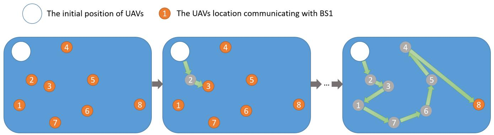

flowchart

Fig. 6. Illustration of the NNP operations.

Algorithm 3: Continuous Portion Update of Nonoptimal Solution   
1 if $iter_{current} < 2 * iter_{max}/3$ then
2 Set the solution $X_{f}$ by $X_{lb}$ ;
3 Update the $X_{i}(\mathbb{X}^{\mathcal{S}\times\mathcal{V}}, \mathbb{Y}^{\mathcal{S}\times\mathcal{V}}, \mathbb{Z}^{\mathcal{S}\times\mathcal{V}})$ by using Eq. (19);
4 end
5 else
6 set the solution $X_{f}$ by $X_{gb}$ ;
7 Update the $X_{i}(\mathbb{X}^{\mathcal{S}\times\mathcal{V}}, \mathbb{Y}^{\mathcal{S}\times\mathcal{V}}, \mathbb{Z}^{\mathcal{S}\times\mathcal{V}})$ by using Eq. (19);
8 end
9 Update the $X_{i}(\mathbb{I}^{\mathcal{S}\times\mathcal{V}})$ by using Eq. (13);
10 Return $X_{k}(\mathbb{X}^{\mathcal{S}\times\mathcal{V}}, \mathbb{Y}^{\mathcal{S}\times\mathcal{V}}, \mathbb{Z}^{\mathcal{S}\times\mathcal{V}}, \mathbb{I}^{\mathcal{S}\times\mathcal{V}})$ ;

1) Departure Point Selection: The initial positions of UAVs are set as the departure point. (Marked in white circle in Fig. 6).   
2) Destination Point Definition: The NUAV UAVs locations for communicating with different BSs are set as the different destination points, and each of which must be visited. (The visited are not included.) (Marked in an orange circle in Fig. 6).   
3) Different Route Comparison: Calculate the distances from the departure point to each destination point. The one with the smallest distance is selected as the subdeparture point. (Marked in gray circle in Fig. 6).   
4) Termination Conditions: Repeat steps 2) and 3) until all destinations have been visited.   
5) Mapping List Decision: Decide the sequence of mapping based on the selected subdeparture point. (e.g., 2, 3, 1, 7, 6, 5, 4, and 8 in Fig. 6).

According to the steps above, the complete updating procedure of the discrete solution is shown in Algorithm 4.

Algorithm 4: Discrete Portion Update   
1 Define the discrete dimensions D of Universe $X_{i}(\mathbb{P}^{\mathcal{S}\times1})$ ;
2 Define the departure point Point_dep by UAVs initial position, and the D destination points Point_des by $X_{i}(\mathbb{X}^{\mathcal{S}^{\prime}\times\mathcal{V}},\mathbb{Y}^{\mathcal{S}^{\prime}\times\mathcal{V}},\mathbb{Z}^{\mathcal{S}^{\prime}\times\mathcal{V}},\mathbb{P}^{\mathcal{S}^{\prime}\times1})(S^{\prime}\in[1,2,\ldots,D])$ ;
3 Calculate the distance between Point_dep and Point_des;
4 Update $X_{i}(\mathbb{P}^{\mathcal{S}\times1})$ by the index of Point_des which is closest to the Point_dep;
5 Replace Point_dep by the Point_des closest to the Point_dep and remove that out of Point_des;
6 for i=1 : D-1 do
7 Calculate the distance between Point_dep and Point_des;
8 Update $X_{i}(\mathbb{P}^{\mathcal{S}\times1})$ by the index of Point_des which is closest to the Point_dep;
9 Replace Point_dep by the Point_des closest to the Point_dep and remove that out of Point_des;
10 end
11 Return $X_{i}(\mathbb{P}^{\mathcal{S}\times1})$ ;

# D. Complexity of the Proposed Algorithm

Lemma 5: The complexity of the proposed IMOMVO is $O ( k \times N _ { \mathsf { p o p } } ^ { 2 } )$ .

Proof: The proposed algorithm exhibits time complexity akin to that of other multiobjective swarm intelligence, the computation of the objective functions and nondominated sorting being the primary determinants. Assuming that the population size and the number of optimization objectives are $N _ { \mathrm { p o p } }$ and $k ,$ respectively, the time complexity of the objective function computation is $O ( k \times N _ { \mathrm { p o p } } )$ . Meanwhile, the Pareto archive size is set to be the same as the population $N _ { \mathrm { p o p } }$ , therefore nondominated sorting has a computational complexity of $O ( k \times N _ { \mathrm { p o p } } ^ { 2 } )$ . As such, the overall computational complexity of the proposed IMOMVO is $O ( k \times N _ { \mathrm { p o p } } ^ { 2 } )$ .

# V. SIMULATION RESULTS

In this section, we conduct simulations to test the effectiveness and performance of the proposed IMOMVO for solving the formulated HMECMOP. The simulations are completed based on MATLAB, and the computer used for the tests is with the CPU of Inter CORE i7 and the RAM of 8G.

maps.png

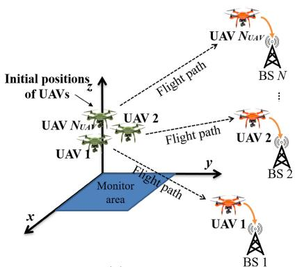

flowchart

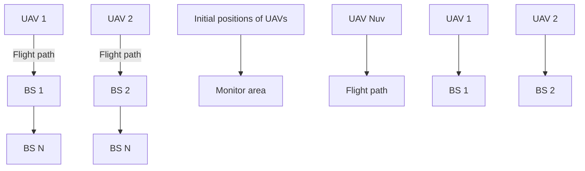

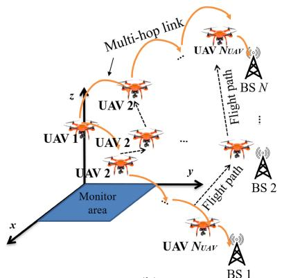

flowchart

```mermaid
graph TD
    A["UAV 1"] --> B["Monitor area"]
    C["UAV 2"] --> B
    D["UAV N UAV"] --> E["BS 1"]
    F["UAV 2"] --> G["BS 2"]
    H["UAV N UAV"] --> I["BS 2"]
    J["Multi-hop link"] --> K["..."]
    L["Flight path"] --> M["..."]
    N["Flight path"] --> O["..."]
    P["..."]
    Q["..."]
    R["..."]
    S["..."]
    T["..."]
    U["..."]
    V["..."]
    W["..."]
    X["..."]
    Y["..."]
    Z["..."]
    AA["..."]
    AB["..."]
    AC["..."]
    AD["..."]
    AE["..."]
    AF["..."]
    AG["..."]
    AH["..."]
    AI["..."]
    AJ["..."]
    AK["..."]
    AL["..."]
    AM["..."]
    AN["..."]
    AO["..."]
    AP["..."]
    AQ["..."]
    AR["..."]
    AS["..."]
    AT["..."]
    AU["..."]
    AV["..."]
    AW["..."]
    AX["..."]
```

(b)

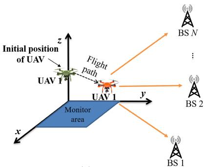

text_image

Initial position
of UAV
Flight
path
UAV 1
UAV 1
Monitor
area
x
y
z
BS N
:
BS 2
BS 1

(c）  
Fig. 7. Illustration of different UAV communication strategies. (a) Flying to the BSs. (b) Multihop relaying. (c) Antenna.

TABLE I PARAPHRASE OF SOME VARIABLES 

<table><tr><td>Variables</td><td>Paraphrase</td><td>Values</td></tr><tr><td> $A_m$ </td><td>The monitor area</td><td>100 m × 100 m</td></tr><tr><td> $m_{UAV}$ </td><td>The aircraft mass</td><td>2 kg</td></tr><tr><td> $D_{min}$ </td><td>The collision distance</td><td>0.5 m</td></tr><tr><td> $H_{min}$ </td><td>The minimum altitudes of UAVs</td><td>100 m</td></tr><tr><td> $H_{max}$ </td><td>The maximum altitudes of UAVs</td><td>120 m</td></tr><tr><td> $f_c$ </td><td>The carrier frequency</td><td>2.4 GHz</td></tr><tr><td> $P_{CBt}$ </td><td>The total transmit power</td><td>(0.1 ×  $N_{UAV}$ ) W</td></tr><tr><td> $K_{BS}$ </td><td>The path loss coefficient</td><td>3</td></tr></table>

# A. Simulation Setups

We consider the UAV-assisted uplink transmissions from UAVs to the BSs. The default parameters are given by $A _ { m } =$ $1 0 0 \mathrm { ~ m ~ } \times \mathrm { ~ } 1 0 0$ m, $N _ { \mathrm { B S } } = 8 , N _ { \mathrm { p o p } } = 3 0$ , and $\mathrm { i t e r } _ { \operatorname* { m a x } } = 2 0 0$ . Moreover, the rotary-wing UAVs are utilized as information transmission equipments in the considered communication environment, where $m _ { \mathrm { U A V } } = 2$ kg, $D _ { \mathrm { m i n } } = 0 . 5$ m, $H _ { \operatorname* { m i n } { } } =$ 100 m, and $H _ { \mathrm { m a x } } ~ = ~ 1 2 0$ m. In addition, the key variables during signal transmission are defined as $f _ { c } = 2 . 4 ~ \mathrm { G H z }$ and $K _ { \mathrm { B S } } = 3 $ . The corresponding paraphrases of some variables are shown in Table I. Moreover, the settings of other parameters can be referred in [14] and [23].

First, several approaches, i.e., the nondominated sorting genetic algorithm II (NSGA-II) [39], MOPSO [40], nondominated sorting genetic algorithm, the third version (NSGA-III) [41], multiobjective dragonfly algorithm (MODA) [42], and the conventional MOMVO, are utilized to find the optimal solution of the formulated HMECMOP for comparisons. Moreover, we also use the uniform linear antenna array (LAA) and rectangular antenna array (RAA) consisting of UAV elements to further verify the validity of the proposed algorithm. Specially, the proposed discrete solution update method needs to be introduced in all above comparison algorithms so that they can solve the formulated HMECMOP with hybrid solution space.

Second, to further analyze and verify the effectiveness of the proposed strategy, some benchmark network communication strategies are also introduced, which are shown in Fig. 7, and a brief description of these strategies is presented as follows:

1) Flying to Different BSs: For intuition and versatility, this strategy uses eight UAVs, which are equipped with an omnidirectional antenna, to fly in the direction of eight different BSs for uploading tasks at the same time. And then, the UAVs will return to the places of departure after the transmission is completed.   
2) Multihop Relaying: Referring to [43], this strategy uses the decoding and forwarding relay mode. Moreover, the transmission rate of every hop link is set at the same value [44]. Specifically, UAVs are arranged between the monitoring area and a target BS along a straight line, so as to form a multihop flight ad-hoc network to perform data transmission tasks. Note that, UAV elements need to move to form a new multihop network when communicate with different BSs.   
3) Single Antenna: In this strategy, a UAV equipped with an omnidirectional or directional antenna will fly to the center of the monitor area $A _ { m }$ to transmit data to different BSs. Specifically, 8, 12, and 15 dBi gains are set for the directional antenna, respectively, to further verify the influence of different gains on the transmission efficiency.

These comparison strategies use the same parameter settings.

Note that, unless otherwise indicated, the same parameter setting is used in the above strategies.

# B. Comparison of Proposed IMOMVO and Other Benchmarks

In this section, we use the proposed IMOMVO algorithm and other abovementioned comparison methods to deal with the formulated HMECMOP in small-scale and large-scale scenarios, in which the numbers of UAVs in these two scenarios are 8 and 16 while other setups are same, and the corresponding results are given.

Fig. 8 shows the PS distributions of different approaches, including MODA, MOPSO, NSGA-II, NSGA-III, conventional MOMVO, and the proposed IMOMVO. As can be seen, the PS obtained by the proposed algorithm is much closer to the direction of PF. Thus, the proposed IMOMVO is verified to have a better performance for the formulated HMECMOP compared with other peer algorithms, whether in small or large-scale scenarios. The reason may be that the vertical renewal strategy enhances the local extremum escape ability and approaches the global optimal solution finally.

TABLE II COMPARISON RESULTS OF OPTIMIZATION OBJECTIVES OBTAINED BY DIFFERENT METHODS 

<table><tr><td rowspan="2">Method</td><td colspan="3">Smaller-scale UAV network</td><td colspan="3">Larger-scale UAV network</td></tr><tr><td> $f_1$  (J)</td><td> $f_2$  (J)</td><td> $E_{Total}$  (J)</td><td> $f_1$  (J)</td><td> $f_2$  (J)</td><td> $E_{Total}$  (J)</td></tr><tr><td>LAA</td><td> $1.26 \times 10^6$ </td><td> $6.88 \times 10^4$ </td><td> $1.32 \times 10^6$ </td><td> $7.97 \times 10^5$ </td><td> $1.12 \times 10^5$ </td><td> $9.09 \times 10^5$ </td></tr><tr><td>RAA</td><td> $1.24 \times 10^6$ </td><td> $\mathbf{1.90 \times 10^4}$ </td><td> $1.26 \times 10^6$ </td><td> $7.99 \times 10^5$ </td><td> $\mathbf{5.08 \times 10^4}$ </td><td> $\mathbf{8.50 \times 10^5}$ </td></tr><tr><td>NSGA-II</td><td> $1.27 \times 10^6$ </td><td> $1.33 \times 10^5$ </td><td> $1.41 \times 10^6$ </td><td> $8.41 \times 10^5$ </td><td> $2.55 \times 10^5$ </td><td> $1.10 \times 10^6$ </td></tr><tr><td>MOPSO</td><td> $1.33 \times 10^6$ </td><td> $1.27 \times 10^5$ </td><td> $1.46 \times 10^6$ </td><td> $8.78 \times 10^5$ </td><td> $3.03 \times 10^5$ </td><td> $1.81 \times 10^6$ </td></tr><tr><td>NSGA-III</td><td> $1.24 \times 10^6$ </td><td> $5.97 \times 10^4$ </td><td> $1.29 \times 10^6$ </td><td> $7.97 \times 10^5$ </td><td> $1.45 \times 10^5$ </td><td> $9.41 \times 10^5$ </td></tr><tr><td>MODA</td><td> $1.28 \times 10^6$ </td><td> $8.22 \times 10^4$ </td><td> $1.36 \times 10^6$ </td><td> $8.06 \times 10^5$ </td><td> $1.53 \times 10^5$ </td><td> $9.48 \times 10^5$ </td></tr><tr><td>MOMVO</td><td> $1.22 \times 10^6$ </td><td> $9.80 \times 10^4$ </td><td> $1.31 \times 10^6$ </td><td> $7.95 \times 10^5$ </td><td> $2.29 \times 10^5$ </td><td> $1.02 \times 10^6$ </td></tr><tr><td>IMOMVO</td><td> $\mathbf{1.20 \times 10^6}$ </td><td> $3.95 \times 10^4$ </td><td> $\mathbf{1.24 \times 10^6}$ </td><td> $\mathbf{7.66 \times 10^5}$ </td><td> $1.09 \times 10^5$ </td><td> $8.75 \times 10^5$ </td></tr></table>

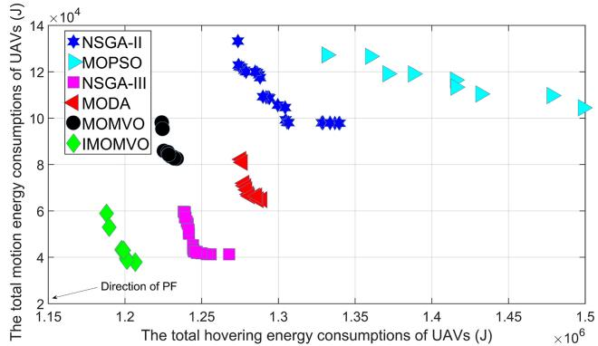

scatter

| Method   | Total hovering energy consumption (J) ×10⁶ | Total motion energy consumption (J) ×10⁴ |
| -------- | ---------------------------------------- | ---------------------------------------- |
| NSGA-II  | ~1.30                                    | ~10.5                                    |
| NSGA-II  | ~1.32                                    | ~10.8                                    |
| NSGA-II  | ~1.34                                    | ~10.9                                    |
| NSGA-II  | ~1.36                                    | ~11.0                                    |
| NSGA-II  | ~1.38                                    | ~11.1                                    |
| NSGA-II  | ~1.40                                    | ~11.2                                    |
| NSGA-II  | ~1.42                                    | ~11.3                                    |
| NSGA-II  | ~1.44                                    | ~11.4                                    |
| NSGA-II  | ~1.46                                    | ~11.5                                    |
| NSGA-II  | ~1.48                                    | ~11.6                                    |
| NSGA-II  | ~1.50                                    | ~11.7                                    |
| MOPSO    | ~1.35                                    | ~12.5                                    |
| MOPSO    | ~1.37                                    | ~12.6                                    |
| MOPSO    | ~1.39                                    | ~12.7                                    |
| MOPSO    | ~1.41                                    | ~12.8                                    |
| MOPSO    | ~1.43                                    | ~12.9                                    |
| MOPSO    | ~1.45                                    | ~13.0                                    |
| MOPSO    | ~1.47                                    | ~13.1                                    |
| MOPSO    | ~1.49                                    | ~13.2                                    |
| MOPSO    | ~1.50                                    | ~13.3                                    |
| NSGA-III | ~1.25                                    | ~6.0                                     |
| NSGA-III | ~1.27                                    | ~5.5                                     |
| NSGA-III | ~1.29                                    | ~5.0                                     |
| NSGA-III | ~1.31                                    | ~4.5                                     |
| NSGA-III | ~1.33                                    | ~4.0                                     |
| NSGA-III | ~1.35                                    | ~3.5                                     |
| NSGA-III | ~1.37                                    | ~3.0                                     |
| NSGA-III | ~1.39                                    | ~2.5                                     |
| NSGA-III | ~1.41                                    | ~2.0                                     |
| NSGA-III | ~1.43                                    | ~1.5                                     |
| NSGA-III | ~1.45                                    | ~1.0                                     |
| NSGA-III | ~1.47                                    | ~0.5                                     |
| NSGA-III | ~1.49                                    | ~0.0                                     |
| MODA     | ~1.28                                    | ~8.0                                     |
| MODA     | ~1.30                                    | ~7.5                                     |
| MODA     | ~1.32                                    | ~7.0                                     |
| MODA     | ~1.34                                    | ~6.5                                     |
| MODA     | ~1.36                                    | ~6.0                                     |
| MODA     | ~1.38                                    | ~5.5                                     |
| MODA     | ~1.40                                    | ~5.0                                     |
| MODA     | ~1.42                                    | ~4.5                                     |
| MODA     | ~1.44                                    | ~4.0                                     |
| MODA     | ~1.46                                    | ~3.5                                     |
| MODA     | ~1.48                                    | ~3.0                                     |
| MODA     | ~1.50                                    | ~2.5                                     |
| MOMVO    | ~1.22                                    | ~9.5                                     |
| MOMVO    | ~1.24                                    | ~9.0                                     |
| MOMVO    | ~1.26                                    | ~8.5                                     |
| MOMVO    | ~1.28                                    | ~8.0                                     |
| MOMVO    | ~1.30                                    | ~7.5                                     |
| MOMVO    | ~1.32                                    | ~7.0                                     |
| MOMVO    | ~1.34                                    | ~6.5                                     |
| MOMVO    | ~1.36                                    | ~6.0                                     |
| MOMVO    | ~1.38                                    | ~5.5                                     |
| MOMVO    | ~1.40                                    | ~5.0                                     |
| MOMVO    | ~1.42                                    | ~4.5                                     |
| MOMVO    | ~1.44                                    | ~4.0                                     |
| MOMVO    | ~1.46                                    | ~3.5                                     |
| MOMVO    | ~1.48                                    | ~3.0                                     |
| MOMVO    | ~1.50                                    | ~2.5                                     |
| IMOMVO   | ~1.20                                    | ~6.0                                     |
| IMOMVO   | ~1.22                                    | ~5.5                                     |
| IMOMVO   | ~1.24                                    | ~5.0                                     |
| IMOMVO   | ~1.26                                    | ~4.5                                     |
| IMOMVO   | ~1.28                                    | ~4.0                                     |
| IMOMVO   | ~1.30                                    | ~3.5                                     |
| IMOMVO   | ~1.32                                    | ~3.0                                     |
| IMOMVO   | ~1.34                                    | ~2.5                                     |
| IMOMVO   | ~1.36                                    | ~2.0                                     |
| IMOMVO   | ~1.38                                    | ~1.5                                     |
| IMOMVO   | ~1.40                                    | ~1.0                                     |
| IMOMVO   | ~1.42                                    | ~0.5                                     |
| IMOMVO   | ~1.44                                    | ~0.0                                     |
| IMOMVO   | ~1.46                                    | -0.5                                     |
| IMOMVO   | ~1.48                                    | -1.0                                     |
| IMOMVO   | ~1.50                                    | -1.5                                     |

Direction of PF

(a)   
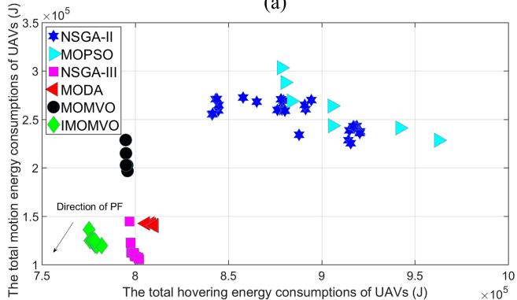

scatter

| Algorithm | Total moving energy consumption of UAVs (J) | Total hovering energy consumption of UAVs (J) |
| --------- | ------------------------------------------- | --------------------------------------------- |
| NSGA-II   | ~8.5e5                                      | ~8.8e5                                        |
| NSGA-II   | ~8.6e5                                      | ~8.9e5                                        |
| NSGA-II   | ~8.7e5                                      | ~9.0e5                                        |
| NSGA-II   | ~8.8e5                                      | ~9.1e5                                        |
| NSGA-II   | ~8.9e5                                      | ~9.2e5                                        |
| NSGA-II   | ~9.0e5                                      | ~9.3e5                                        |
| NSGA-II   | ~9.1e5                                      | ~9.4e5                                        |
| NSGA-II   | ~9.2e5                                      | ~9.5e5                                        |
| NSGA-II   | ~9.3e5                                      | ~9.6e5                                        |
| MOPSO     | ~8.7e5                                      | ~9.0e5                                        |
| MOPSO     | ~8.8e5                                      | ~9.1e5                                        |
| MOPSO     | ~8.9e5                                      | ~9.2e5                                        |
| MOPSO     | ~9.0e5                                      | ~9.3e5                                        |
| MOPSO     | ~9.1e5                                      | ~9.4e5                                        |
| MOPSO     | ~9.2e5                                      | ~9.5e5                                        |
| MOPSO     | ~9.3e5                                      | ~9.6e5                                        |
| MOPSO     | ~9.4e5                                      | ~9.7e5                                        |
| MOPSO     | ~9.5e5                                      | ~9.8e5                                        |
| MOPSO     | ~9.6e5                                      | ~9.9e5                                        |
| MOPSO     | ~9.7e5                                      | ~10.0e5                                       |
| NSGA-III  | ~7.8e5                                      | ~8.0e5                                        |
| NSGA-III  | ~7.9e5                                      | ~8.1e5                                        |
| NSGA-III  | ~8.0e5                                      | ~8.2e5                                        |
| NSGA-III  | ~8.1e5                                      | ~8.3e5                                        |
| NSGA-III  | ~8.2e5                                      | ~8.4e5                                        |
| NSGA-III  | ~8.3e5                                      | ~8.5e5                                        |
| NSGA-III  | ~8.4e5                                      | ~8.6e5                                        |
| NSGA-III  | ~8.5e5                                      | ~8.7e5                                        |
| NSGA-III  | ~8.6e5                                      | ~8.8e5                                        |
| NSGA-III  | ~8.7e5                                      | ~8.9e5                                        |
| NSGA-III  | ~8.8e5                                      | ~9.0e5                                        |
| NSGA-III  | ~8.9e5                                      | ~9.1e5                                        |
| NSGA-III  | ~9.0e5                                      | ~9.2e5                                        |
| NSGA-III  | ~9.1e5                                      | ~9.3e5                                        |
| NSGA-III  | ~9.2e5                                      | ~9.4e5                                        |
| NSGA-III  | ~9.3e5                                      | ~9.5e5                                        |
| NSGA-III  | ~9.4e5                                      | ~9.6e5                                        |
| NSGA-III  | ~9.5e5                                      | ~9.7e5                                        |
| MODA      | ~7.7e5                                      | ~8.1e5                                        |
| MODA      | ~7.8e5                                      | ~8.2e5                                        |
| MODA      | ~7.9e5                                      | ~8.3e5                                        |
| MODA      | ~8.0e5                                      | ~8.4e5                                        |
| MODA      | ~8.1e5                                      | ~8.5e5                                        |
| MODA      | ~8.2e5                                      | ~8.6e5                                        |
| MODA      | ~8.3e5                                      | ~8.7e5                                        |
| MODA      | ~8.4e5                                      | ~8.8e5                                        |
| MODA      | ~8.5e5                                      | ~8.9e5                                        |
| MODA      | ~8.6e5                                      | ~9.0e5                                        |
| MODA      | ~8.7e5                                      | ~9.1e5                                        |
| MODA      | ~8.8e5                                      | ~9.2e5                                        |
| MODA      | ~8.9e5                                      | ~9.3e5                                        |
| MODA      | ~9.0e5                                      | ~9.4e5                                        |
| MODA      | ~9.1e5                                      | ~9.5e5                                        |
| MODA      | ~9.2e5                                      | ~9.6e5                                        |
| MODA      | ~9.3e5                                      | ~9.7e5                                        |
| MODA      | ~9.4e5                                      | ~9.8e5                                        |
| MOMVO     | ~7.6e5                                      | ~7.7e5                                        |
| MOMVO     | ~7.7e5                                      | ~7.8e5                                        |
| MOMVO     | ~7.8e5                                      | ~7.9e5                                        |
| MOMVO     | ~7.9e5                                      | ~8.0e5                                        |
| MOMVO     | ~8.0e5                                      | ~8.1e5                                        |
| MOMVO     | ~8.1e5                                      | ~8.2e5                                        |
| MOMVO     | ~8.2e5                                      | ~8.3e5                                        |
| MOMVO     | ~8.3e5                                      | ~8.4e5                                        |
| MOMVO     | ~8.4e5                                      | ~8.5e5                                        |
| MOMVO     | ~8.5e5                                      | ~8.6e5                                        |
| MOMVO     | ~8.6e5                                      | ~8.7e5                                        |
| MOMVO     | ~8.7e5                                      | ~8.8e5                                        |
| MOMVO     | ~8.8e5                                      | ~8.9e5                                        |
| MOMVO     | ~8.9e5                                      | ~9.0e5                                        |
| MOMVO     | ~9.0e5                                      | ~9.1e5                                        |
| MOMVO     | ~9.1e5                                      | ~9.2e5                                        |
| MOMVO     | ~9.2e5                                      | ~9.3e5                                        |
| MOMVO     | ~9.3e5                                      | ~9.4e5                                        |
| MOMVO     | ~9.4e5                                      | ~9.5e5                                        |
| MOMVO     | ~9.5e5                                      | ~9.6e5                                        |
| MOMVO     | ~9.6e5                                      | ~9.7e5                                        |
| MOMVO     | ~9.7e5                                      | ~9.8e5                                        |
| MOMVO     | ~9.8e5                                      | ~9.9e5                                        |
| MOMVO     | ~9.9e5                                      | ~10.0e5                                       |
The direction of PF (labeled) is indicated in the chart.

Fig. 8. PS obtained by different algorithms in different scale network. (a) Smaller scale. (b) Larger scale.

As we mentioned in Section II-C, the solution of an MOP is a set of Pareto solutions instead of a single solution. Thus, the decision makers should select one concrete solution from the PF as the ultimate solution for a certain optimization problem. From Fig. 8, it can be seen that the value of hovering energy consumption is much larger than that of motion energy consumption. Therefore, considering the overall energy consumption, we select the solutions which have the best performance in reducing the hovering energy consumption (f1), and the detailed results are shown in Table II. It can be seen that the proposed IMOMVO achieves the minimum energy consumption on the hovering (f1) in the communication scenario of smaller-scale and larger-scale UAVs which can basically serve the problem. Moreover, it also obtains the minimum energy consumption on the total energy consumption $( E _ { \mathrm { { T o t a l } } } )$ on a smaller scale. Thus, IMOMVO achieves the overall outstanding performance for reducing the hovering energy consumption among all the approaches. In particular, owing to the tradeoffs between the two optimization objectives, it is hard to achieve the best performance on all objectives. However, the motion energy consumption (f2) obtained by IMOMVO is still superior to other approaches except for RAA on smallerscale scenario, and LAA and RAA on a larger-scale scenario. In general, it can be considered that the proposed algorithm obtains the overall best performance in UAV-assisted networks on both smaller-scale and larger-scale scenarios compared to the other approaches.

For a more explicit explanation and description, the optimal paths of UAV elements for communicating with the first BS achieved by different methods in both smaller-scale and largerscale networks are given in Figs. 9 and 10. As shown in the figures, the flight path obtained by the proposed method shows a trend of focusing on a certain UAV position. The reason may be that the proposed horizontal renewal strategy of nonoptimal individuals based on the MFO can enhance the capacity of exploitation so that enhancing CB performance.

# C. Comparison of Different UAV Communication Strategies

In this section, some benchmark strategies are introduced to further illustrate the effectiveness of the proposed approach. Table III shows performance indicators in terms of total transmission time, hovering for transmission energy consumption, motion energy consumption, and total energy consumption. Especially, except for the single antenna strategy, the number of UAVs in different strategies is 8. As can be seen, our considered CB-based method achieves the smallest transmission time. The reason is that our method could obtain significant transmission improvements by using CB. Moreover, the energy consumption on the $f _ { 1 }$ and $E _ { \mathrm { T o t a l } } ( \mathrm { J } )$ obtained by the proposed strategy is the least, possibly because a high-gain beam pointing to the receiver could be obtained by using CB without long-distance flight which is used to build communication links. In addition, although the motion energy consumption (f2) of the proposed strategy for the movement of more UAVs is obviously more than that of the single antenna strategy, the total energy consumption is still the least. In conclusion, the communication strategy proposed in this work is more effective in UAV-assisted communication scenarios.

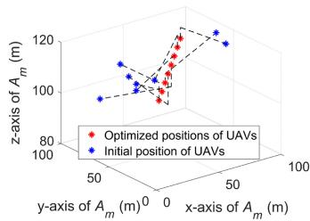

scatter

| x-axis (A_m, m) | y-axis (A_m, m) | z-axis (A_m, m) | Position Type              |
| --------------- | --------------- | --------------- | -------------------------- |
| 0               | 0               | 120             | Optimized positions of UAVs |
| 0               | 50              | 110             | Initial position of UAVs   |
| 50              | 0               | 100             | Optimized positions of UAVs |
| 50              | 50              | 90              | Initial position of UAVs   |
| 100             | 0               | 80              | Optimized positions of UAVs |
| 100             | 50              | 70              | Initial position of UAVs   |

(a)

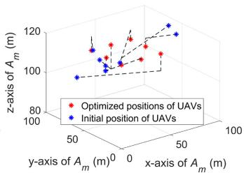

scatter

| x-axis (m) | y-axis (m) | z-axis (m) | Type                     |
|------------|------------|------------|--------------------------|
| 50         | 50         | 100        | Initial position (blue) |
| 50         | 50         | 110        | Optimized position (red) |
| 50         | 50         | 120        | Optimized position (red) |
| 50         | 50         | 110        | Optimized position (red) |
| 50         | 50         | 100        | Optimized position (red) |
| 50         | 50         | 90         | Optimized position (red) |
| 50         | 50         | 80         | Optimized position (red) |
| 50         | 50         | 70         | Optimized position (red) |
| 50         | 50         | 60         | Optimized position (red) |
| 50         | 50         | 50         | Optimized position (red) |
| 50         | 50         | 40         | Optimized position (red) |
| 50         | 50         | 30         | Optimized position (red) |
| 50         | 50         | 20         | Optimized position (red) |
| 50         | 50         | 10         | Optimized position (red) |
| 50         | 50         | 0          | Optimized position (red) |
| 50         | 50         | -10        | Optimized position (red) |
| 50         | 50         | -20        | Optimized position (red) |
| 50         | 50         | -30        | Optimized position (red) |
| 50         | 50         | -40        | Optimized position (red) |
| 50         | 50         | -50        | Optimized position (red) |
| 50         | 50         | -60        | Optimized position (red) |
| 50         | 50         | -70        | Optimized position (red) |
| 50         | 50         | -80        | Optimized position (red) |
| 50         | 50         | -90        | Optimized position (red) |
| 50         | 50         | -100       | Optimized position (red) |
| 50         | 50         | -110       | Optimized position (red) |
| 50         | 50         | -120       | Optimized position (red) |
| 50         | 50         | -130       | Optimized position (red) |
| 50         | 50         | -140       | Optimized position (red) |
| 50         | 50         | -150       | Optimized position (red) |
| 50         | 50         | -160       | Optimized position (red) |
| 50         | 50         | -170       | Optimized position (red) |
| 50         | 50         | -180       | Optimized position (red) |
| 50         | 50         | -190       | Optimized position (red) |
| 50         | 50         | -200       | Optimized position (red) |
| 50         | 50         | -210       | Optimized position (red) |
| 50         | 50         | -220       | Optimized position (red) |
| 50         | 50         | -230       | Optimized position (red) |
| 50         | 50         | -240       | Optimized position (red) |
| 50         | 50         | -250       | Optimized position (red) |
| 50         | 50         | -260       | Optimized position (red) |
| 50         | 50         | -270       | Optimized position (red) |
| 50         | 50         | -280       | Optimized position (red) |
| 50         | 50         | -290       | Optimized position (red) |
| 50         | 50         | -300       | Optimized position (red) |
| 50         | 50         | -310       | Optimized position (red) |
| 50         | 50         | -320       | Optimized position (red) |
| 50         | 50         | -330       | Optimized position (red) |
| 50         | 50         | -340       | Optimized position (red) |
| 50         | 50         | -350       | Optimized position (red) |
| 50         | 50         | -360       | Optimized position (red) |
| 50         | 50         | -370       | Optimized position (red) |
| 50         | 50         | -380       | Optimized position (red) |
| 50         | 50         | -390       | Optimized position (red) |
| 50         | 50         | -400       | Optimized position (red) |
| 50         | 50         | -410       | Optimized position (red) |
| 50         | 50         | -420       | Optimized position (red) |
| 50         | 50         | -430       | Optimized position (red) |
| 50         | 50         | -440       | Optimized position (red) |
| 50         | 50         | -450       | Optimized position (red) |
| 50         | 50         | -460       | Optimized position (red) |
| 50         | 50         | -470       | Optimized position (red) |
| 50         | 50         | -480       | Optimized position (red) |
| 50         | 50         | -490       | Optimized position (red) |
| 50         | 50         | -500       | Optimized position (red) |
| 50         | 50         | -510       | Optimized position (red) |
| 50         | 50         | -520       | Optimized position (red) |
| 50         | 50         | -530       | Optimized position (red) |
| 50         | 50         | -540       | Optimized position (red) |
| 50         | 50         | -550       | Optimized position (red) |
| 50         | 50         | -560       | Optimized position (red) |
| 50         | 50         | -570       | Optimized position (red) |
| 50         | 50         | -580       | Optimized position (red) |
| 50         | 50         | -590       | Optimized position (red) |
| 50         | 50         | -600       | Optimized position (red) |
| 50         | 50         | -610       | Optimized position (red) |
| 50         | 50         | -620       | Optimized position (red) |
| 50         | 50         | -630       | Optimized position (red) |
| 50         | 50         | -640       | Optimized position (red) |
| 50         | 50         | -650       | Optimized position (red) |
| 50         | 50         | -660       | Optimized position (red) |
| 50         | 50         | -670       | Optimized position (red) |
| 50         | 50         | -680       | Optimized position (red) |
| 50         | 50         | -690       | Optimized position (red) |
| 50         | 50         | -700       | Optimized position (red) |
| 50         | 50         | -710       | Optimized position (red) |
| 50         | 50         | -720       | Optimized position (red) |
| 50         | 50         | -730       | Optimized position (red) |
| 50         | 50         | -740       | Optimized position (red) |
| 50         | 50         | -750       | Optimized position (red) |
| 50         | 50         | -760       | Optimized position (red) |
| 50         | 50         | -770       | Optimized position (red) |
| 50         | 50         | -780       | Optimized position (red) |
| 50         | 50         | -790       | Optimized position (red) |
| 50         | 50         | -800       | Optimized position (red) |
| ...        ...   ...    ...    ...    ...    ...    ...    ...    ...    ...    ...    ...    ...    ...    ...    ...    ...    ...    ...    ...    ...    ...    ...    ...    ...    ...    ...    ...    ...    ...    ...    ...    ...    ...    ...    ...    ...    ...    ...    ...    ...    ...    ...    ...    ...    ...    ...    ...    ...    ...    ...    ...   ...   ...   ...   ...   ...   ...   ...   ...   ...   ...   ...   ...   ...   ...   ...   ...   ...   ...   ...   ...   ...   ...   ...   ...   ...   ...   ...   ...   ...   ...   ...   ...   ...   ...   ...   ...   ...   ...   ...   ...   ...   ...   ...   ...   ...   ...   ...   ...   ...   ...     .      .      .      .      .      .      .      .      .      .      .      .      .      .      .      .      .      .      .      .      .      .      .      .      .      .      .      .      .      .      .      .      .      .      .      .      .      .      .      .      .      .      .      .      .      .      .      .      .      .      .     ..     ..     ..     ..     ..     ..     ..     ..     ..     ..     ..     ..     ..     ..     ..     ..     ..     ..     ..     ..     ..     ..     ..     ..     ..     ..     ..     ..     ..     ..     ..     ..     ..     ..     ..     ..     ..     ..     ..     ..     ..     ..     ..     ..     ..     ..     ..     ..     ..     ..

(b)

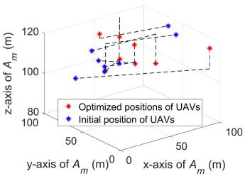  
（C）

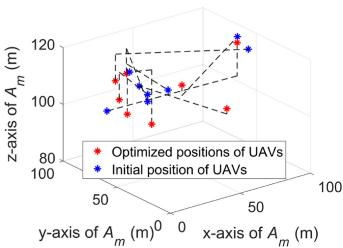

scatter

| x-axis (m) | y-axis (m) | z-axis (m) | Type                     |
|------------|------------|------------|--------------------------|
| 0          | 50         | 100        | Initial position of UAVs |
| 0          | 50         | 105        | Optimized position of UAVs |
| 0          | 50         | 110        | Optimized position of UAVs |
| 0          | 50         | 115        | Optimized position of UAVs |
| 0          | 50         | 120        | Optimized position of UAVs |
| 0          | 50         | 125        | Optimized position of UAVs |
| 0          | 50         | 130        | Optimized position of UAVs |
| 0          | 50         | 135        | Optimized position of UAVs |
| 0          | 50         | 140        | Optimized position of UAVs |
| 0          | 50         | 145        | Optimized position of UAVs |
| 0          | 50         | 150        | Optimized position of UAVs |
| 0          | 50         | 155        | Optimized position of UAVs |
| 0          | 50         | 160        | Optimized position of UAVs |
| 0          | 50         | 165        | Optimized position of UAVs |
| 0          | 50         | 170        | Optimized position of UAVs |
| 0          | 50         | 175        | Optimized position of UAVs |
| 0          | 50         | 180        | Optimized position of UAVs |
| 0          | 50         | 185        | Optimized position of UAVs |
| 0          | 50         | 190        | Optimized position of UAVs |
| 0          | 50         | 195        | Optimized position of UAVs |
| 0          | 50         | 200        | Optimized position of UAVs |
| 0          | 50         | 205        | Optimized position of UAVs |
| 0          | 50         | 210        | Optimized position of UAVs |
| 0          | 50         | 215        | Optimized position of UAVs |
| 0          | 50         | 220        | Optimized position of UAVs |
| 0          | 50         | 225        | Optimized position of UAVs |
| 0          | 50         | 230        | Optimized position of UAVs |
| 0          | 50         | 235        | Optimized position of UAVs |
| 0          | 50         | 240        | Optimized position of UAVs |
| 0          | 50         | 245        | Optimized position of UAVs |
| 0          | 50         | 250        | Optimized position of UAVs |
| 0          | 50         | 255        | Optimized position of UAVs |
| 0          | 50         | 260        | Optimized position of UAVs |
| 0          | 50         | 265        | Optimized position of UAVs |
| 0          | 50         | 270        | Optimized position of UAVs |
| 0          | 50         | 275        | Optimized position of UAVs |
| 0          | 50         | 280        | Optimized position of UAVs |
| 0          | 50         | 285        | Optimized position of UAVs |
| 0          | 50         | 290        | Optimized position of UAVs |
| 0          | 50         | 295        | Optimized position of UAVs |
| 0          | 50         | 300        | Optimized position of UAVs |
| 0          | 50         | 305        | Optimized position of UAVs |
| 0          | 50         | 310        | Optimized position of UAVs |
| 0          | 50         | 315        | Optimized position of UAVs |
| 0          | 50         | 320        | Optimized position of UAVs |
| 0          | 50         | 325        | Optimized position of UAVs |
| 0          | 50         | 330        | Optimized position of UAVs |
| 0          | 50         | 335        | Optimized position of UAVs |
| 0          | 50         | 340        | Optimized position of UAVs |
| 0          | 50         | 345        | Optimized position of UAVs |
| 0          | 50         | 350        | Optimized position of UAVs |
| 0          | 50         | 355        | Optimized position of UAVs |
| 0          | 50         | 360        | Optimized position of UAVs |
| 0          | 50         | 365        | Optimized position of UAVs |
| 0          | 50         | 370        | Optimized position of UAVs |
| 0          | 50         | 375        | Optimized position of UAVs |
| 0          | 50         | 380        | Optimized position of UAVs |
| 0          | 50         | 385        | Optimized position of UAVs |
| 0          | 50         | 390        | Optimized position of UAVs |
| 0          | 50         | 395        | Optimized position of UAVs |
| 0          | 50         | 400        | Optimized position of UAVs |
| -1         | -1         | -1         | Initial position of UAVs   |
| -1         | -1         | -1         | Optimized position of UAVs   |
| -1         | -1         | -1         | Optimized position of UAVs   |
| -1         | -1         | -1         | Optimized position of UAVs   |
| -1         | -1         | -1         | Optimized position of UAVs   |
| -1         | -1         | -1         | Optimized position of UAVs   |
| -1         | -1         | +1         | Initial position of UAVs   |
| -1         | -1         | -1         | Optimized position of UAVs   |
| -1         | -1         | +1         | Optimized position of UAVs   |
| -1         | -1         | +1         | Optimized position of UAVs   |
| -1         | -1         | +1         | Optimized position of UAVs   |
| -1         | -1         | +1         | Optimized position of UAVs   |
| -1         | -1         | +1         | Optimized position of UAVs   |
| -1         (end)   -1    / end    = -1      / end      / end      / end      / end      / end      / end      / end      / end      / end      / end      / end      / end      / end      / end      / end      / end      / end      / end      / end      / end      / end      / end      / end      / end      / end      / end      / end      / end      / end      / end      / end      / end      / end      / end     / end      / end      / end      / end      / end      / end      / end      / end      / end      / end      / end      / end      / end      / end      / end      / end      / end      / end      / end      / end      / end      / end      / end      / end      / end      / end     / end      / end      / end      / end      / end      / end      / end      (end)    )

(d)

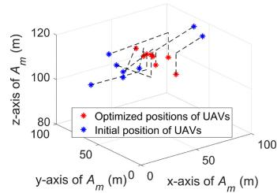

scatter

| x-axis (A_m, m) | y-axis (A_m, m) | z-axis (A_m, m) | Type                     |
| --------------- | --------------- | --------------- | ------------------------ |
| 0               | 0               | 100             | Optimized positions of UAVs |
| 50              | 50              | 105             | Optimized positions of UAVs |
| 100             | 100             | 110             | Optimized positions of UAVs |
| 0               | 0               | 95              | Initial position of UAVs   |
| 50              | 50              | 100             | Initial position of UAVs   |
| 100             | 100             | 105             | Initial position of UAVs   |
| 0               | 50              | 115             | Optimized positions of UAVs |
| 50              | 100             | 120             | Optimized positions of UAVs |
| 100             | 150             | 125             | Optimized positions of UAVs |

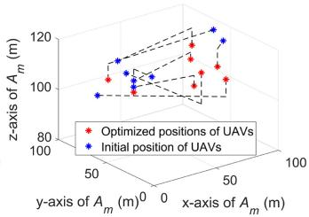  
(f)

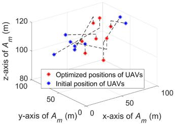

scatter

| x-axis (m) | y-axis (m) | z-axis (m) | Type                     |
|------------|------------|------------|--------------------------|
| 50         | 50         | 100        | Optimized positions of UAVs |
| 50         | 50         | 105        | Initial position of UAVs   |
| 50         | 50         | 110        | Optimized positions of UAVs |
| 50         | 50         | 115        | Initial position of UAVs   |
| 50         | 50         | 120        | Optimized positions of UAVs |
| 50         | 50         | 125        | Initial position of UAVs   |
| 50         | 50         | 130        | Optimized positions of UAVs |
| 50         | 50         | 135        | Initial position of UAVs   |
| 50         | 50         | 140        | Optimized positions of UAVs |
| 50         | 50         | 145        | Initial position of UAVs   |
| 50         | 50         | 150        | Optimized positions of UAVs |
| 50         | 50         | 155        | Initial position of UAVs   |
| 50         | 50         | 160        | Optimized positions of UAVs |
| 50         | 50         | 165        | Initial position of UAVs   |
| 50         | 50         | 170        | Optimized positions of UAVs |
| 50         | 50         | 175        | Initial position of UAVs   |
| 50         | 50         | 180        | Optimized positions of UAVs |
| 50         | 50         | 185        | Initial position of UAVs   |
| 50         | 50         | 190        | Optimized positions of UAVs |
| 50         | 50         | 195        | Initial position of UAVs   |
| 50         | 50         | 200        | Optimized positions of UAVs |
| 50         | 50         | 205        | Initial position of UAVs   |
| 50         | 50         | 210        | Optimized positions of UAVs |
| 50         | 50         | 215        | Initial position of UAVs   |
| 50         | 50         | 220        | Optimized positions of UAVs |
| 50         | 50         | 225        | Initial position of UAVs   |
| 50         | 50         | 230        | Optimized positions of UAVs |
| 50         | 50         | 235        | Initial position of UAVs   |
| 50         | 50         | 240        | Optimized positions of UAVs |
| 50         | 50         | 245        | Initial position of UAVs   |
| 50         | 50         | 250        | Optimized positions of UAVs |
| 50         | 50         | 255        | Initial position of UAVs   |
| 50         | 50         | 260        | Optimized positions of UAVs |
| 50         | 50         | 265        | Initial position of UAVs   |
| 50         | 50         | 270        | Optimized positions of UAVs |
| 50         | 50         | 275        | Initial position of UAVs   |
| 50         | 50         | 280        | Optimized positions of UAVs |
| 50         | 50         | 285        | Initial position of UAVs   |
| 50         | 50         | 290        | Optimized positions of UAVs |
| 50         | 50         | 295        | Initial position of UAVs   |
| 50         | 50         | 300        | Optimized positions of UAVs |
| 50         | 50         | 305        | Initial position of UAVs   |
| 50         | 50         | 310        | Optimized positions of UAVs |
| 50         | 50         | 315        | Initial position of UAVs   |
| 50         | 50         | 320        | Optimized positions of UAVs |
| 50         | 50         | 325        | Initial position of UAVs   |
| 50         | 50         | 330        | Optimized positions of UAVs |
| 50         | 50         | 335        | Initial position of UAVs   |
| 50         | 50         | 340        | Optimized positions of UAVs |
| 50         | 50         | 345        | Initial position of UAVs   |
| 50         | 50         | 350        | Optimized positions of UAVs |
| 50         | 50         | 355        | Initial position of UAVs   |
| 50         | 50         | 360        | Optimized positions of UAVs |
| 50         | 50         | 365        | Initial position of UAVs   |
| 50         | 50         | 370        | Optimized positions of UAVs |
| 50         | 50         | 375        | Initial position of UAVs   |
| 50         | 50         | 380        | Optimized positions of UAVs |
| 50         | 50         | 385        | Initial position of UAVs   |
| 50         | 50         | 390        | Optimized positions of UAVs |
| 50         | 50         | 395        | Initial position of UAVs   |
| 50         | 50         | 400        | Optimized positions of UAVs |
| 50         | 50         | 405        | Initial position of UAVs   |
| 50         | 50         | 410        | Optimized positions of UAVs |
| 50         | 50         | 415        | Initial position of UAVs   |
| 50         | 50         | 420        | Optimized positions of UAVs |
| 50         | 50         | 425        | Initial position of UAVs   |
| ...        | ...        | ...        | ...                      |
| ...        | ...        | ...        | ...                      |
| ...        | ...        | ...        | ...                      |
| ...        | ...        | ...        | ...                      |
| ...        | ...        | ...        | ...                      |
| ...        | ...        | ...        | ...                      |
| ...        | ...        | ...        | ...                      |
| ...        | ...        | ...        | ...                      |
| ...        | ...        |...        | ...                      |
| ...        | ...        | ...        | ...                      |
| ...        | ...        | ...        | ...                      |
| ...        | ...        | ...        | ...                      |
| ...        | ...        | ...        | ...                      |
| ...        | ...        | ...        | ...                      |
| ...        | ...        | ...        | ...                      |
| ...        | ...        | ...        | ...                      |
| ...        (continued)      / End: End: End: End: End: End: End: End: End: End: End: End: End: End: End: End: End: End: End: End: End: End: End: End: End: End: End: End: End: End: End: End: End: End: End: End: End: End: End: End: End: End: End: End: End: End: End: End: End: End: End:

(g)

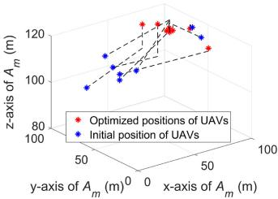

scatter

| x-axis (m) | y-axis (m) | z-axis (m) | Type                     |
|------------|------------|------------|--------------------------|
| 50         | 50         | 100        | Optimized positions of UAVs |
| 50         | 50         | 120        | Initial position of UAVs   |
| 50         | 100        | 100        | Optimized positions of UAVs |
| 50         | 100        | 120        | Initial position of UAVs   |
| 50         | 150        | 100        | Optimized positions of UAVs |
| 50         | 150        | 120        | Initial position of UAVs   |
| 50         | 200        | 100        | Optimized positions of UAVs |
| 50         | 200        | 120        | Initial position of UAVs   |
| 50         | 250        | 100        | Optimized positions of UAVs |
| 50         | 250        | 120        | Initial position of UAVs   |
| 50         | 300        | 100        | Optimized positions of UAVs |
| 50         | 300        | 120        | Initial position of UAVs   |
| 50         | 350        | 100        | Optimized positions of UAVs |
| 50         | 350        | 120        | Initial position of UAVs   |
| 50         | 400        | 100        | Optimized positions of UAVs |
| 50         | 400        | 120        | Initial position of UAVs   |
| 50         | 450        | 100        | Optimized positions of UAVs |
| 50         | 450        | 120        | Initial position of UAVs   |
| 50         | 500        | 100        | Optimized positions of UAVs |
| 50         | 500        | 120        | Initial position of UAVs   |
| 50         | 550        | 100        | Optimized positions of UAVs |
| 50         | 550        | 120        | Initial position of UAVs   |
| 50         | 600        | 100        | Optimized positions of UAVs |
| 50         | 600        | 120        | Initial position of UAVs   |
| 50         | 650        | 100        | Optimized positions of UAVs |
| 50         | 650        | 120        | Initial position of UAVs   |
| 50         | 700        | 100        | Optimized positions of UAVs |
| 50         | 700        | 120        | Initial position of UAVs   |
| 50         | 750        | 100        | Optimized positions of UAVs |
| 50         | 750        | 120        | Initial position of UAVs   |
| 50         | 800        | 100        | Optimized positions of UAVs |
| 50         | 800        | 120        | Initial position of UAVs   |
| 50         | 850        | 100        | Optimized positions of UAVs |
| 50         | 850        | 120        | Initial position of UAVs   |
| 50         | 900        | 100        | Optimized positions of UAVs |
| 50         | 900        | 120        | Initial position of UAVs   |
| 50         | 950        | 100        | Optimized positions of UAVs |
| 50         | 950        | 120        | Initial position of UAVs   |
| 50         | 1000       | 100        | Optimized positions of UAVs |
| 50         | 1000       | 120        | Initial position of UAVs   |
| 50         | 1050       | 100        | Optimized positions of UAVs |
| 50         | 1050       | 120        | Initial position of UAVs   |
| 50         | 1100       | 100        | Optimized positions of UAVs |
| 50         | 1100       | 120        | Initial position of UAVs   |
| 50         | 1150       | 100        | Optimized positions of UAVs |
| 50         | 1150       | 120        | Initial position of UAVs   |
| 50         | 1200       | 100        | Optimized positions of UAVs |
| 50         | 1200       | 120        | Initial position of UAVs   |
| 50         | 1250       | 100        | Optimized positions of UAVs |
| 50         | 1250       | 120        | Initial position of UAVs   |
| 50         | 1300       | 100        | Optimized positions of UAVs |
| 50         | 1300       | 120        | Initial position of UAVs   |
| 50         | 1350       | 100        | Optimized positions of UAVs |
| 50         | 1350       | 120        | Initial position of UAVs   |
| 50         | 1400       | 100        | Optimized positions of UAVs |
| 50         | 1400       | 120        | Initial position of UAVs   |
| 50         | 1450       | 100        | Optimized positions of UAVs |
| 50         | 1450       | 120        | Initial position of UAVs   |
| 50         | 1500       | 100        | Optimized positions of UAVs |
| 50         | 1500       | 120        | Initial position of UAVs   |
| ...        | ...        | ...        | ...                      |
| ...        | ...        | ...        | ...                      |
| ...        | ...        | ...        | ...                      |
| ...        | ...        | ...        | ...                      |
| ...        | ...        | ...        | ...                      |
| ...        | ...        | ...        | ...                      |
| ...        | ...        | ...        | ...                      |
| ...        | ...        | ...        | ...                      |
| ...        | ...        |...        | ...                      |
| ...        | ...        | ...        | ...                      |
| ...        | ...        | ...        | ...                      |
| ...        | ...        | ...        | ...                      |
| ...        | ...        | ...        | ...                      |
| ...        | ...        | ...        | ...                      |
| ...        | ...        | ...        | ...                      |
| ...        | ...        | ...        | ...                      |
| ...        / (x,y)   = (y-x,y) / (x-y,y) / (y-x,y) / (x-y,y) / (y-x,y) / (x-y,y) / (x-y,y) / (x-y,y) / (x-y,y) / (x-y,y) / (x-y,y) / (x-y,y) / (x-y,y) / (x-y,y) / (x-y,y) / (x-y,y) / (x-y,y) / (x-y,y) / (x-y,y) / (x-y,y) / (x-y,y) / (x-y,y) / 
    , <q>    , <q>    , 
    , <q>    , 
    , <q>    , 
    , <q>    , 
    , 
    , 
    , 
    , 
    , 
    , 
    , 
    , 
    , 
    , 
    , 
    , 
    , 
    , 
    , 
    , 
    , 
    , 
    , 
    , <q>    , <q>    , 
    , <q>    , 
    , 
    , 
    , 
    , 
    , 
    , 
    , 
    , 
    , 
    , 
    , 
    , 
    , 
    , 
    , 
    , <q>    , <q>    , 
    , 
    , 
    , 
    , 
    , 
    , 
    , 
    , 
    , 
    , 
    , 
    , 
    , 
    , 
    , 
    , 
    , 
    , <q>    , 
    , <q>    , 
    , 
    , 
    , 
    , 
    , 
    , 
    , 
    , 
    , 
    , 
    , 
    , 
    , <q>    , <q>    , 
    , <q>    , 
    , 
    , <q>    , 
    , 
    ,

(h)

Fig. 9. Optimal paths of UAVs for different methods in smaller-scale UAV-assisted network. (a) LAA. (b) RAA. (c) NSGA-II. (d) MOPSO. (e) NSGA-III. (f) MODA. (g) MOMVO. (h) IMOMVO.   
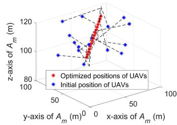

scatter

| x-axis (A_m, m) | y-axis (A_m, m) | z-axis (A_m, m) | Type                     |
| --------------- | --------------- | --------------- | ------------------------ |
| 0               | 0               | 120             | Optimized positions of UAVs |
| 50              | 0               | 110             | Initial position of UAVs   |
| 100             | 0               | 100             | Optimized positions of UAVs |
| 0               | 50              | 90              | Initial position of UAVs   |
| 50              | 50              | 80              | Optimized positions of UAVs |
| 100             | 50              | 70              | Initial position of UAVs   |
| 0               | 100             | 60              | Optimized positions of UAVs |
| 50              | 100             | 50              | Initial position of UAVs   |
| 100             | 100             | 40              | Optimized positions of UAVs |
| 0               | 150             | 30              | Initial position of UAVs   |
| 50              | 150             | 20              | Optimized positions of UAVs |
| 100             | 150             | 10              | Initial position of UAVs   |
| 0               | 200             | 0               | Optimized positions of UAVs |
| 50              | 200             | -10             | Initial position of UAVs   |
| 100             | 200             | -20             | Optimized positions of UAVs |
| 0               | 250             | -30             | Initial position of UAVs   |
| 50              | 250             | -40             | Optimized positions of UAVs |
| 100             | 250             | -50             | Initial position of UAVs   |
| 0               | 300             | -60             | Optimized positions of UAVs |
| 50              | 300             | -70             | Initial position of UAVs   |
| 100             | 300             | -80             | Optimized positions of UAVs |
| 0               | 350             | -90             | Initial position of UAVs   |
| 50              | 350             | -100            | Optimized positions of UAVs |
| 100             | 350             | -110            | Initial position of UAVs   |
| 0               | 400             | -120            | Optimized positions of UAVs |
| 50              | 400             | -130            | Initial position of UAVs   |
| 100             | 400             | -140            | Optimized positions of UAVs |
| 0               | 450             | -150            | Initial position of UAVs   |
| 50              | 450             | -160            | Optimized positions of UAVs |
| 100             | 450             | -170            | Initial position of UAVs   |
| 0               | 500             | -180            | Optimized positions of UAVs |
| 50              | 500             | -190            | Initial position of UAVs   |
| 100             | 500             | -200            | Optimized positions of UAVs |
| 0               | 550             | -210            | Initial position of UAVs   |
| 50              | 550             | -220            | Optimized positions of UAVs |
| 100             | 550             | -230            | Initial position of UAVs   |
| 0               | 600             | -240            | Optimized positions of UAVs |
| 50              | 600             | -250            | Initial position of UAVs   |
| 100             | 600             | -260            | Optimized positions of UAVs |
| 0               | 650             | -270            | Initial position of UAVs   |
| 50              | 650             | -280            | Optimized positions of UAVs |
| 100             | 650             | -290            | Initial position of UAVs   |
| 0               | 700             | -300            | Optimized positions of UAVs |
| 50              | 700             | -310            | Initial position of UAVs   |
| 100             | 700             | -320            | Optimized positions of UAVs |
| 0               | 750             | -330            | Initial position of UAVs   |
| 50              | 750             | -340            | Optimized positions of UAVs |
| 100             | 750             | -350            | Initial position of UAVs   |
| 0               | 800             | -360            | Optimized positions of UAVs |
| 50              | 800             | -370            | Initial position of UAVs   |
| 100             | 800             | -380            | Optimized positions of UAVs |
| 0               | 850             | -390            | Initial position of UAVs   |
| 50              | 850             | -400            | Optimized positions of UAVs |
| 100             | 850             | -410            | Initial position of UAVs   |
| 0               | 900             | -420            | Optimized positions of UAVs |
| 50              | 900             | -430            | Initial position of UAVs   |
| 100             | 900             | -440            | Optimized positions of UAVs |
| 0               | 950             | -450            | Initial position of UAVs   |
| 50              | 950             | -460            | Optimized positions of UAVs |
| 100             | 950             | -470            | Initial position of UAVs   |
| 0               | 100             | -48           | Optimized positions of UAVs |
| 50              | 100             | -49           | Initial position of UAVs   |
| 100             | 100             | -50           | Optimized positions of UAVs |
| 1                + Y = (x,y)    = (y,y)    X = (z,y)    Y = (x,y)    Z = (z,y)    Legend: Red dots = Original Position; Blue dots = Original Position; Dashed lines represent Fixed Line Values for each direction. Legend: Black dots = Original Positions. Legend: White dots = Fixed Line Values.

(a)

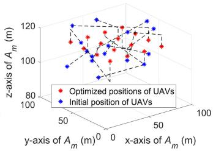

scatter

| y-axis (m) | z-axis (m) | Position Type              |
|------------|------------|---------------------------|
| 0          | 120        | Optimized positions of UAVs |
| 0          | 115        | Initial position of UAVs   |
| 50         | 110        | Optimized positions of UAVs |
| 50         | 105        | Initial position of UAVs   |
| 100        | 100        | Optimized positions of UAVs |
| 100        | 95         | Initial position of UAVs   |

(b)

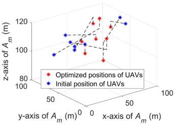

scatter

| x-axis (m) | y-axis (m) | z-axis (m) | Type                     |
|------------|------------|------------|--------------------------|
| 50         | 50         | 100        | Initial position of UAVs |
| 50         | 50         | 105        | Optimized position of UAVs |
| 50         | 50         | 110        | Optimized position of UAVs |
| 50         | 50         | 115        | Optimized position of UAVs |
| 50         | 50         | 120        | Optimized position of UAVs |
| 50         | 50         | 115        | Optimized position of UAVs |
| 50         | 50         | 110        | Optimized position of UAVs |
| 50         | 50         | 105        | Optimized position of UAVs |
| 50         | 50         | 100        | Optimized position of UAVs |
| 50         | 50         | 95         | Optimized position of UAVs |
| 50         | 50         | 90         | Optimized position of UAVs |
| 50         | 50         | 85         | Optimized position of UAVs |
| 50         | 50         | 80         | Optimized position of UAVs |
| 50         | 50         | 75         | Optimized position of UAVs |
| 50         | 50         | 70         | Optimized position of UAVs |
| 50         | 50         | 65         | Optimized position of UAVs |
| 50         | 50         | 60         | Optimized position of UAVs |
| 50         | 50         | 55         | Optimized position of UAVs |
| 50         | 50         | 50         | Optimized position of UAVs |
| 50         | 50         | 45         | Optimized position of UAVs |
| 50         | 50         | 40         | Optimized position of UAVs |
| 50         | 50         | 35         | Optimized position of UAVs |
| 50         | 50         | 30         | Optimized position of UAVs |
| 50         | 50         | 25         | Optimized position of UAVs |
| 50         | 50         | 20         | Optimized position of UAVs |
| 50         | 50         | 15         | Optimized position of UAVs |
| 50         | 50         | 10         | Optimized position of UAVs |
| 50         | 50         | 5          | Optimized position of UAVs |
| 50         | 50         | 0          | Optimized position of UAVs |
| 50         | 50         | -5         | Optimized position of UAVs |
| 50         | 50         | -10        | Optimized position of UAVs |
| 50         | 50         | -15        | Optimized position of UAVs |
| 50         | 50         | -20        | Optimized position of UAVs |
| 50         | 50         | -25        | Optimized position of UAVs |
| 50         | 50         | -30        | Optimized position of UAVs |
| 50         | 50         | -35        | Optimized position of UAVs |
| 50         | 50         | -40        | Optimized position of UAVs |
| 50         | 50         | -45        | Optimized position of UAVs |
| 50         | 50         | -50        | Optimized position of UAVs |
| 50         | 50         | -55        | Optimized position of UAVs |
| 50         | 50         | -60        | Optimized position of UAVs |
| 50         | 50         | -65        | Optimized position of UAVs |
| 50         | 50         | -70        | Optimized position of UAVs |
| 50         | 50         | -75        | Optimized position of UAVs |
| 50         | 50         | -80        | Optimized position of UAVs |
| 50         | 50         | -85        | Optimized position of UAVs |
| 50         | 50         | -90        | Optimized position of UAVs |
| 50         | 50         | -95        | Optimized position of UAVs |
| 50         | 50         | -100       | Optimized position of UAVs |
| 122        | -          | -          | Optimized position of UAVs   |
| -          | -          | -          | Initial position of UAVs   |
| -          | -          | -          | Optimized position of UAVs   |
| -          | -          | -          | Optimized position of UAVs   |
| -          | -          | -          | Optimized position of UAVs   |
| -          | -          | -          | Optimized position of UAVs   |
| -          | -          | -          | Optimized position of UAVs   |
| -          | -          | -          | Optimized position of UAVs   |
| -          (final)| -          | -          | Initial position of UAVs   |
| -          (final)| -          | -          | Optimized position of UAVs   |
| -          (final)| -          (final)| -          | Optimized position of UAVs   |
| -          (final)| -          (final)| -          | Optimized position of UAVs   |
| -          (final)| -          (final)| -          | Optimized position of UAVs   |
| -          (final)| -          (final)| -          | Optimized position of UAVs   |
| -          (final)| -          (final)| -          | Optimized position of UAVs   |
|
| -          (final)| -          (final)| -          | Optimized position of UAVs   |
| -          (final)| -          (final)| -          | Optimized position of UAVs   |
| -          (final)| -          (final)| -          | Optimized position of UAVs   |
| -          (final)| -          (final)| -          | Optimized position of UAVs   |
| -          (final)| -          (final)|     end      |

（c）

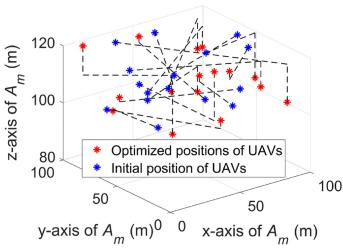  
(d)

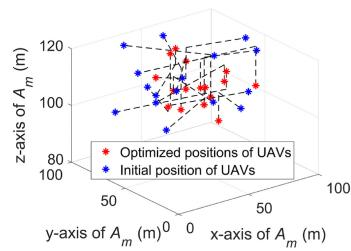  
(e)

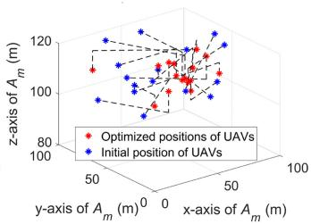

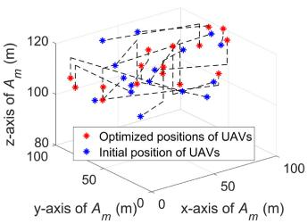  
(g）

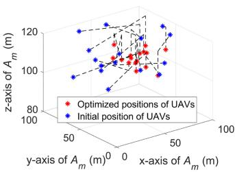

scatter

| x-axis (A_m, m) | y-axis (A_m, m) | z-axis (A_m, m) | Type                     |
| --------------- | --------------- | --------------- | ------------------------ |
| 0               | 0               | 100             | Initial position of UAVs |
| 50              | 50              | 100             | Optimized positions of UAVs |
| 100             | 100             | 120             | Initial position of UAVs |
| 50              | 50              | 100             | Optimized positions of UAVs |
| 0               | 100             | 100             | Initial position of UAVs |
| 50              | 50              | 100             | Optimized positions of UAVs |
| 100             | 100             | 120             | Initial position of UAVs |
| 50              | 50              | 100             | Optimized positions of UAVs |
| 0               | 100             | 120             | Initial position of UAVs |
| 50              | 50              | 100             | Optimized positions of UAVs |
| 100             | 100             | 120             | Initial position of UAVs |
| 50              | 50              | 100             | Optimized positions of UAVs |
| 0               | 100             | 120             | Optimized positions of UAVs |
| 50              | 50              | 100             | Optimized positions of UAVs |
| 100             | 100             | 120             | Optimized positions of UAVs |
| 50              | 50              | 100             | Optimized positions of UAVs |
| 0               | 100             | 120             | Optimized positions of UAVs |
| 50              | 50              | 100             | Optimized positions of UAVs |
| 100             | 100             | 120             | Optimized positions of UAE |
| 50              | 50              | 100             | Optimized positions of UAE |
| 0               | 100             | 120             | Optimized positions of UAE |
| 50              | 50              | 100             | Optimized positions of UAE |
| 100             | 100             | 120             | Optimized positions of UAE |
| 50              | 50              | 100             | Optimized positions of UAE |
| 0               | 100             | 120             | Optimized positions of UAE |
| 50              | 50              | 100             | Optimized positions of UAE |
| 10<ecel><ecel><ecel><nl>

Fig. 10. Optimal paths of UAVs for different methods in larger-scale UAV-assisted network. (a) LAA. (b) RAA. (c) NSGA-II. (d) MOPSO. (e) NSGA-III. (f) MODA. (g) MOMVO. (h) IMOMVO.

TABLE III COMPARISON RESULTS OF OPTIMIZATION OBJECTIVES OBTAINED BY DIFFERENT UAV COMMUNICATION STRATEGIES 

<table><tr><td>Method</td><td>Transmission time (s)</td><td> $f_1(J)$ </td><td> $f_2(J)$ </td><td> $E_{Total} (J)$ </td></tr><tr><td>Flying to the BSs</td><td> $7.85 \times 10^3$ </td><td> $1.32 \times 10^6$ </td><td> $3.60 \times 10^5$ </td><td> $1.68 \times 10^6$ </td></tr><tr><td>Multi-hop network</td><td> $3.17 \times 10^3$ </td><td> $5.33 \times 10^5$ </td><td> $8.77 \times 10^5$ </td><td> $1.41 \times 10^6$ </td></tr><tr><td>Single omnidirectional antenna</td><td> $1.24 \times 10^5$ </td><td> $2.08 \times 10^7$ </td><td> $1.01 \times 10^4$ </td><td> $2.08 \times 10^7$ </td></tr><tr><td>8 dBi directional antenna</td><td> $1.56 \times 10^4$ </td><td> $2.62 \times 10^6$ </td><td> $1.01 \times 10^4$ </td><td> $2.62 \times 10^6$ </td></tr><tr><td>12 dBi directional antenna</td><td> $1.05 \times 10^4$ </td><td> $1.75 \times 10^6$ </td><td> $1.01 \times 10^4$ </td><td> $1.76 \times 10^6$ </td></tr><tr><td>15 dBi directional antenna</td><td> $8.40 \times 10^3$ </td><td> $1.40 \times 10^6$ </td><td> $1.01 \times 10^4$ </td><td> $1.41 \times 10^6$ </td></tr><tr><td>8-UAV CB based on IMOMVO</td><td> $8.92 \times 10^2$ </td><td> $1.20 \times 10^6$ </td><td> $3.95 \times 10^4$ </td><td> $1.24 \times 10^6$ </td></tr></table>

# D. Impacts of Special Cases

In this part, we evaluate the impacts of some special cases, including UAV jitters and UAVs running out of energy.

1) UAV Jitters: The jitters of UAVs cause the UAVs to drift from the assigned positions. Then, the UAV positions include errors, and the AF will be degraded. As such, the optimization objective 1 shown in (9) can be affected. According to [45], the position drift of UAVs often follows a normal distribution. To well match the reality, we consider four conditions in which maximum drifts are set to 0.2, 0.4, 0.6, and 0.8 m, respectively. Then, we verify the performance of the solutions obtained by our proposed IMOMVO under these UAV jitters.

TABLE IV RESULTS OBTAINED BY VAA WITH DIFFERENT NUMBERS OF UAVS AND MULTIHOP STRATEGY 

<table><tr><td>Communication strategies</td><td>Out-Number of UAVs</td><td> $f_{1}$ (J)</td><td> $f_{2}$ (J)</td><td> $E_{Total}$ (J)</td></tr><tr><td rowspan="6">VAA with 16 UAVs</td><td>10</td><td> $1.51 \times 10^{6}$ </td><td> $4.13 \times 10^{4}$ </td><td> $1.55 \times 10^{6}$ </td></tr><tr><td>9</td><td> $1.32 \times 10^{6}$ </td><td> $4.55 \times 10^{4}$ </td><td> $1.37 \times 10^{6}$ </td></tr><tr><td>8</td><td> $1.20 \times 10^{6}$ </td><td> $3.87 \times 10^{4}$ </td><td> $1.24 \times 10^{6}$ </td></tr><tr><td>2</td><td> $8.15 \times 10^{5}$ </td><td> $8.99 \times 10^{4}$ </td><td> $9.05 \times 10^{5}$ </td></tr><tr><td>1</td><td> $7.90 \times 10^{5}$ </td><td> $1.13 \times 10^{5}$ </td><td> $9.03 \times 10^{5}$ </td></tr><tr><td>0</td><td> $7.78 \times 10^{5}$ </td><td> $1.20 \times 10^{5}$ </td><td> $8.99 \times 10^{5}$ </td></tr><tr><td>Multi-hop strategy with 16 UAVs</td><td>0</td><td> $2.67 \times 10^{5}$ </td><td> $1.75 \times 10^{6}$ </td><td> $2.01 \times 10^{6}$ </td></tr></table>

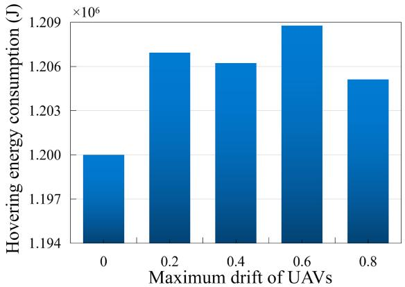

bar

| Maximum drift of UAVs | Hovering energy consumption (J) |
| :--- | :--- |
| 0 | 1.200 |
| 0.2 | 1.2065 |
| 0.4 | 1.206 |
| 0.6 | 1.209 |
| 0.8 | 1.2055 |
×10⁶

Fig. 11. Hovering energy consumption analysis of the position drifts of UAVs.

As can be seen from Fig. 11, the performance loss in position-drifted cases is not obvious. The reason may be that even if the UAVs are drifted from the assigned positions, they may still be in a suitable place for performing VAA.

2) UAVs Running Out of Energy: Our method and system do not depend on a special number of UAVs. If some UAVs run out of their energy, our algorithm shown in Algorithm 1 is still valid. The number of UAVs affects the AF and total transmission power in our formulation. If some UAVs run out of their energy, they do not participate in the following mission. Due to the decreasing number of UAVs, the antenna gain, and total transmit power of the VAA will decrease slightly. However, in this case, our proposed algorithm is still valid and could obtain a qualified and optimized AF, thereby improving objective 1. Thus, our method can still complete the data transfer task as long as a large number of UAVs are not unavailable.

To demonstrate this, we evaluate the degradation of the objectives as the number of UAVs decreases, as shown in Table IV, where the Out-Number of UAVs represents the number of UAVs running out of energy. As can be seen, there is only a slight performance loss when one or two UAVs run out of energy. However, if a significant number of UAVs are unavailable, the objective can be substantially decreased. Nevertheless, even with decreased performance, our method still outperforms other schemes, such as the multihop scheme.

# VI. CONCLUSION

In this work, we investigate the energy minimization of the hovering communications and motion for constructing the UAV-assisted VAA. We consider a scenario that a set of UAVs constructing a VAA to communicate with different faraway BSs by using CB. Then, the minimization of hovering and motion energy consumptions for UAV-assisted CB is formulated as an HMECMOP. The formulated problem is with hybrid and complex solution space, which is proven to be NP-hard and large scale, and the different optimization objectives in this problem need to be jointly considered. Thus, the IMOMVO algorithm with two improved strategies and a discrete solution update method is proposed to solve this problem. Simulation results verify that the proposed algorithm is effective for reducing the energy consumptions of UAVs for communicating with different BSs compared to LAA, RAA, NSGA-II, MOPSO, NSGA-III, MODA, and conventional MOMVO. Moreover, some benchmark network communication strategies are also introduced for comparison, and the results show that the proposed strategy is the most effective.

# REFERENCES

[1] Y. Zeng, Q. Wu, and R. Zhang, “Accessing from the sky: A tutorial on UAV communications for 5G and beyond,” Proc. IEEE, vol. 107, no. 12, pp. 2327–2375, Dec. 2019.   
[2] G. Wu, Y. Miao, Y. Zhang, and A. Barnawi, “Energy efficient for UAVenabled mobile edge computing networks: Intelligent task prediction and offloading,” Comput. Commun., vol. 150, pp. 556–562, Jan. 2020.   
[3] D. Xu, Y. Sun, D. W. K. Ng, and R. Schober, “Multiuser MISO UAV communications in uncertain environments with no-fly zones: Robust trajectory and resource allocation design,” IEEE Trans. Commun., vol. 68, no. 5, pp. 3153–3172, May 2020.   
[4] Y. Zeng, X. Xu, and R. Zhang, “Trajectory design for completion time minimization in UAV-enabled multicasting,” IEEE Trans. Wireless Commun., vol. 17, no. 4, pp. 2233–2246, Apr. 2018.   
[5] K. G. Panda and D. Sen, “Energy efficient 3-D placement of capacity constrained UAV network for guaranteed QoS,” in Proc. IEEE 96th Veh. Technol. Conf. (VTC2022-Fall), 2022, pp. 1–6.   
[6] N. Namvar and F. Afghah, “Heterogeneous airborne mmWave cells: Optimal placement for power-efficient maximum coverage,” in Proc. IEEE INFOCOM 2022–IEEE Conf. Comput. Commun. Workshops (INFOCOM WKSHPS), 2022, pp. 1–6.   
[7] N. Van Cuong, Y.-W. P. Hong, and J.-P. Sheu, “UAV trajectory optimization for joint relay communication and image surveillance,” IEEE Trans. Wireless Commun., vol. 21, no. 12, pp. 10177–10192, Dec. 2022.

[8] S. Fu, Y. Tang, N. Zhang, L. Zhao, S. Wu, and X. Jian, “Joint unmanned aerial vehicle (UAV) deployment and power control for Internet of Things networks,” IEEE Trans. Veh. Technol., vol. 69, no. 4, pp. 4367–4378, Apr. 2020.   
[9] Q. Wang et al., “UAV-enabled non-orthogonal multiple access networks for ground-air-ground communications,” IEEE Trans. Green Commun. Netw., vol. 6, no. 3, pp. 1340–1354, Sep. 2022.   
[10] S. Mohanti et al., “AirBeam: Experimental demonstration of distributed beamforming by a swarm of UAVs,” in Proc. IEEE 16th Int. Conf. Mobile Ad Hoc Sensor Syst. (MASS), 2019, pp. 162–170.   
[11] K. Alemdar, D. Varshney, S. Mohanti, U. Muncuk, and K. Chowdhury, “RFClock: Timing, phase and frequency synchronization for distributed wireless networks,” in Proc. 27th Annu. Int. Conf. Mobile Comput. Netw., 2021, pp. 15–27.   
[12] S. Mohanti, C. Bocanegra, S. G. Sanchez, K. Alemdar, and K. R. Chowdhury, “SABRE: Swarm-based aerial beamforming radios: Experimentation and emulation,” IEEE Trans. Wireless Commun., vol. 21, no. 9, pp. 7460–7475, Sep. 2022.   
[13] J. Garza, M. A. Panduro, A. Reyna, G. Romero, and C. d. Rio, “Design of UAVs-based 3D antenna arrays for a maximum performance in terms of directivity and SLL,” Int. J. Antennas Propagat., pp. 1–8, Aug. 2016.   
[14] M. Mozaffari, W. Saad, M. Bennis, and M. Debbah, “Communications and control for wireless drone-based antenna array,” IEEE Trans. Commun., vol. 67, no. 1, pp. 820–834, Jan. 2019.   
[15] L. Zhu, J. Zhang, Z. Xiao, X. Cao, X.-G. Xia, and R. Schober, “Millimeter-wave full-duplex UAV relay: Joint positioning, beamforming, and power control,” IEEE J. Sel. Areas Commun., vol. 38, no. 9, pp. 2057–2073, Sep. 2020.   
[16] S. Zarbakhsh and A. R. Sebak, “Multifunctional drone-based antenna for satellite communication,” IEEE Trans. Antennas Propag., vol. 70, no. 8, pp. 7223–7227, Aug. 2022.   
[17] S. M. Hashir, A. Mehrabi, M. R. Mili, M. J. Emadi, D. W. K. Ng, and I. Krikidis, “Performance trade-off in UAV-aided wireless-powered communication networks via multi-objective optimization,” IEEE Trans. Veh. Technol., vol. 70, no. 12, pp. 13430–13435, Dec. 2021.   
[18] G. Sun et al., “Energy efficient collaborative beamforming for reducing sidelobe in wireless sensor networks,” IEEE Trans. Mobile Comput., vol. 20, no. 3, pp. 965–982, Mar. 2021.   
[19] X. Lin et al., “The sky is not the limit: LTE for unmanned aerial vehicles,” IEEE Commun. Mag., vol. 56, no. 4, pp. 204–210, Apr. 2018.   
[20] C. A. Balanis, Antenna Theory: Analysis and Design, 3rd ed. Hoboken, NJ, USA: Wiley, 2005.   
[21] M. Li, X. Tao, N. Li, H. Wu, and J. Xu, “Secrecy energy efficiency maximization in UAV-enabled wireless sensor networks without eavesdropper’s CSI,” IEEE Internet Things J., vol. 9, no. 5, pp. 3346–3358, Jul. 2021.   
[22] B. Duo, Q. Wu, X. Yuan, and R. Zhang, “Energy efficiency maximization for full-duplex UAV secrecy communication,” IEEE Trans. Veh. Technol., vol. 69, no. 4, pp. 4590–4595, Apr. 2020.   
[23] Y. Zeng, J. Xu, and R. Zhang, “Energy minimization for wireless communication with rotary-wing UAV,” IEEE Trans. Wireless Commun., vol. 18, no. 4, pp. 2329–2345, Apr. 2019.   
[24] G. Sun, J. Li, Y. Liu, S. Liang, and H. Kang, “Time and energy minimization communications based on collaborative Beamforming for UAV networks: A multi-objective optimization method,” IEEE J. Sel. Areas Commun., vol. 39, no. 11, pp. 3555–3572, Nov. 2021.   
[25] Q. Lin et al., “A clustering-based evolutionary algorithm for manyobjective optimization problems,” IEEE Trans. Evol. Comput., vol. 23, no. 3, pp. 391–405, Jun. 2019.   
[26] S. Solanki, J. Park, and I. Lee, “On the performance of IRS-aided UAV networks with NOMA,” IEEE Trans. Veh. Technol., vol. 71, no. 8, pp. 9038–9043, Aug. 2022.   
[27] J. Feng, Y. Nimmagadda, Y.-H. Lu, B. Jung, D. Peroulis, and Y. C. Hu, “Analysis of energy consumption on data sharing in beamforming for wireless sensor networks,” in Proc. 19th Int. Conf. Comput. Commun. Netw., 2010, pp. 1–6.   
[28] Z. Yang, W. Xu, and M. Shikh-Bahaei, “Energy efficient UAV communication with energy harvesting,” IEEE Trans. Veh. Technol., vol. 69, no. 2, pp. 1913–1927, Feb. 2020.   
[29] L. Zhang, A. Celik, S. Dang, and B. Shihada, “Energy-efficient trajectory optimization for UAV-assisted IoT networks,” IEEE Trans. Mobile Comput., vol. 21, no. 12, pp. 4323–4337, Dec. 2022.   
[30] C. You and R. Zhang, “Hybrid offline-online design for UAV-enabled data harvesting in probabilistic LoS channels,” IEEE Trans. Wireless Commun., vol. 19, no. 6, pp. 3753–3768, Jun. 2020.

[31] A. Ouaarab, B. Ahiod, and X. Yang, “Discrete cuckoo search algorithm for the travelling salesman problem,” Neural Comput. Appl., vol. 24, nos. 7-8, pp. 1659–1669, 2014.   
[32] Z. Yang, K. Tang, and X. Yao, “Large scale evolutionary optimization using cooperative coevolution,” Inf. Sci., vol. 178, no. 15, pp. 2985–2999, 2008.   
[33] M. N. Omidvar, X. Li, Y. Mei, and X. Yao, “Cooperative co-evolution with differential grouping for large scale optimization,” IEEE Trans. Evol. Computat., vol. 18, no. 3, pp. 378–393, Jun. 2014.   
[34] S. Mirjalili, S. M. Mirjalili, and A. Hatamlou, “Multi-verse optimizer: A nature-inspired algorithm for global optimization,” Neural Comput. Appl., vol. 27, no. 2, pp. 495–513, 2016.   
[35] S. Mirjalili, P. Jangir, S. Z. Mirjalili, S. Saremi, and I. N. Trivedi, “Optimization of problems with multiple objectives using the multiverse optimization algorithm,” Knowl.-Based Syst., vol. 134, pp. 50–71, Oct. 2017.   
[36] J. M. J. Murre and J. Dros, “Replication and analysis of Ebbinghaus’ forgetting curve,” PLoS One, vol. 10, no. 7, pp. 1–23, Jul. 2015.   
[37] S. Mirjalili, “Moth-flame optimization algorithm: A novel natureinspired heuristic paradigm,” Knowl.-Based Syst., vol. 89, pp. 228–249, Nov. 2015.   
[38] Q. Zhu and S. Chen, “A new ant evolution algorithm to resolve TSP problem,” in Proc. 6th Int. Conf. Mach. Learn. Appl. (ICMLA 2007), 2007, pp. 62–66.   
[39] K. Deb, A. Pratap, S. Agarwal, and T. Meyarivan, “A fast and elitist multiobjective genetic algorithm: NSGA-II,” IEEE Trans. Evol. Comput., vol. 6, no. 2, pp. 182–197, Apr. 2002.   
[40] C. A. Coello Coello and M. S. Lechuga, “MOPSO: A proposal for multiple objective particle swarm optimization,” in Proc. 2002 Congr. Evol. Computat. CEC’02 (Cat. No.02TH8600), vol. 2, 2002, pp. 1051–1056.   
[41] K. Deb and H. Jain, “An evolutionary many-objective optimization algorithm using reference-point-based nondominated sorting approach, Part I: Solving problems with box constraints,” IEEE Trans. Evol. Comput., vol. 18, no. 4, pp. 577–601, Aug. 2014.   
[42] S. Guo, M. Dooner, J. Wang, H. Xu, and G. Lu, “Adaptive engine optimisation using NSGA-II and MODA based on a sub-structured artificial neural network,” in Proc. 23rd Int. Conf. Autom. Comput. (ICAC), 2017, pp. 1–6.   
[43] S. Hosseinalipour, A. Rahmati, and H. Dai, “Interference avoidance position planning in dual-hop and multi-hop UAV relay networks,” IEEE Trans. Wireless Commun., vol. 19, no. 11, pp. 7033–7048, Nov. 2020.   
[44] H.-M. Wang, Y. Zhang, X. Zhang, and Z. Li, “Secrecy and covert communications against UAV surveillance via multi-hop networks,” IEEE Trans. Commun., vol. 68, no. 1, pp. 389–401, Jan. 2020.   
[45] X. Li, J. Zhou, B. Duan, Y. Yang, Y. Zhang, and J. Fan, “Performance of planar arrays for microwave power transmission with position errors,” IEEE Antennas Wireless Propag. Lett., vol. 14, pp. 1794–1797, 2015.

natural_image

Portrait photo of a woman with long dark hair wearing a collared shirt and blazer (no text or symbols visible)

Shuang Liang received the B.S. degree in communication engineering from Dalian Polytechnic University, Dalian, China, in 2011, and the M.S. degree in software engineering and the Ph.D. degree in computer science from Jilin University, Changchun, China, in 2017 and 2022, respectively.

She is a Postdoctoral Fellow with the School of Information Science and Technology, Northeast Normal University, Changchun, and also a Researcher with the Key Laboratory of Symbolic Computation and Knowledge Engineering of

Ministry of Education, Jilin University. Her research interests focus on wireless communication and UAV networks.

natural_image

Portrait of a man wearing glasses and a dark shirt (no text or symbols visible)

Minghao Yin received the B.S. and M.S. degrees in computer science from Northeast Normal University, Changchun, China, in 2001 and 2004, respectively, and the Ph.D. degree from Jilin University, Changchun, in 2008.

He has been the Dean of the Department of Computer, Northeast Normal University since 2010, where he is currently a Professor. He has authored two books, and more than 100 articles. His research interests include swarm intelligence, automated reasoning, automated planning, and algorithms.

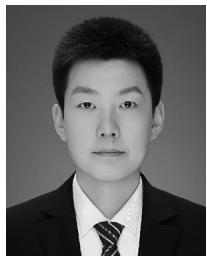

natural_image

Portrait photo of a man in formal attire (no text or symbols visible)

Geng Sun (Member, IEEE) received the B.S. degree in communication engineering from Dalian Polytechnic University, Dalian, China, in 2011, and the Ph.D. degree in computer science from Jilin University, Changchun, China, and 2018.

He was a Visiting Researcher with the School of Electrical and Computer Engineering, Georgia Institute of Technology, Atlanta, GA, USA. He is currently an Associate Professor with the College of Computer Science and Technology, Jilin University. His research interests include wireless sensor

networks, antenna array, collaborative beamforming, and optimizations.

natural_image

Portrait of a young man in a collared shirt (no text or symbols visible)

Jiahui Li (Student Member, IEEE) received the B.S. degree in software engineering and the M.S. degree in computer science and technology from Jilin University, Changchun, China, in 2018 and 2021, respectively, where he is currently pursuing the Ph.D. degree in computer science.

He is also a visiting Ph.D. student with Singapore University of Technology and Design, Singapore. His current research focuses on UAV networks, antenna arrays, and optimization.