# Networked ISAC-Based UAV Tracking and Handover Toward Low-Altitude Economy

Chuanbin Zhao , Yuan Feng , Hongliang Luo , Feifei Gao , Fellow, IEEE, Fan Liu , Senior Member, IEEE, and Shi Jin , Fellow, IEEE

Abstract—In low-altitude economy (LAE), the widespread use of various types of unmanned aerial vehicles (UAVs) could provide convenience and enhance efficiency. However, the existence of unauthorized or illegal UAVs would pose significant challenges to urban privacy and security. In this paper, we propose a networked integrated sensing and communications (ISAC) based UAV tracking and handover scheme towards LAE. We define a virtual sensing cell (VSC) where one primary base station (PBS) transmits sensing signals, while both the PBS and two secondary base stations (SBS) receive echoes. Since the echoes contain the clutter of static environment, each base station (BS) would first filter out the clutter and then estimate the UAV’s horizontal angle, elevation angle, distance, and radial velocity with the multiple signal classification (MUSIC) algorithm. Next, we employ the centralized extended Kalman filter (EKF) to fuse the estimations from the three BSs and leverage the one-step prediction results of the EKF to distinguish and track multiple UAVs. When the UAV flies within the coverage of a VSC, we design a PBS handover strategy to select the optimal BS from three BSs as the new PBS in real-time. Moreover, we propose a VSC handover strategy to track the UAV continuously when it flies from one VSC to another. Simulation results demonstrate the effectiveness of the proposed scheme and provide valuable reference for UAV tracking and handover in LAE.

Index Terms—Networked ISAC, multi-BS cooperation, UAV tracking, PBS handover, VSC handover, low-altitude economy.

## I. INTRODUCTION

unmanned aerial vehicles (UAVs) engaged in low-altitude (generally referring to the space within 1000 meters above the ground) flight activities, which will drive and foster the integrated development of commercial and social sectors [1], [2]. In the future urban landscape, various types of UAVs would become an indispensable part of human life and offer a wide range of services [3], [4], like logistics delivery, emergency medical rescue, environmental monitoring, and urban planning [5], [6], [7].

However, the deployment of the LAE still presents privacy and safety risks. According to the data from Statista [3], the number of UAVs is expected to reach 9.6 million by 2030. While such a large number of UAVs flying over urban areas provides convenience and enhances efficiency, it also poses significant challenges to urban safety [8]. The low-altitude aircraft can be categorized into cooperative UAVs and noncooperative UAVs. Cooperative UAVs are controlled by a base station (BS) and report their location and velocity information in real-time through cellular networks [9]. In contrast, noncooperative UAVs may be unauthorized or illegal aircraft that potentially interfere with cooperative UAVs and even threaten urban safety [10]. Therefore, detection and tracking of noncooperative UAVs are particularly crucial in LAE.

Emerging networked integrated sensing and communications (ISAC) technology could not only support user communications and sense the dynamic targets simultaneously [11], [12], [13], [14], but also enable collaborative perception and data sharing among multi-base station (multi-BS) [15], [16]. Specifically, the seamless coverage provided by cellular networks presents inherent advantages for cooperative UAVs detection and tracking with multi-BS. When the noncooperative UAVs fly within a single cell or across different cells, multiple BSs can be scheduled to collaboratively detecting and tracking.

Sensing of non-cooperative UAVs with a single BS has been widely studied in [17], [18], [19], [20], [21], and [22]. Specifically, Luo et al. propose a practical ISAC framework to sense dynamic targets from clutter environment while ensuring users communications quality [17]. Li et al. design a two-stage algorithm to estimate the positions and velocities of multiple moving targets by using OFDM signals in a passive radar system [18]. Gao et al. provide an ISAC framework from compressed sampling (CS) perspective to facilitate target sensing and other ISAC processing, which not only recovers the high-dimensional sensing information, but also significantly reduces pilot overheads [19]. Mirabella et al. sense multiple targets using OFDM signals emitted from a radar system, which utilizes a maximum likelihood algorithm to estimate parameters of these targets [20]. Chen et al. investigate an ISAC system assisted by the reconfigurable intelligent surface (RIS), and propose a scheme that allows for simultaneous target sensing and beam training with user terminals and RIS [21]. Galappaththige et al. develop a multi-target detection method for near-field ISAC systems, where a full-duplex BS simultaneously senses environmental information and communicates with users [22]. However, the limited sensing range and accuracy of a single BS, combined with the challenge of noncooperative UAVs flying across different cells, make single-BS sensing inefficient for existing cellular networks.

Compared to single-BS sensing, multi-BS cooperative sensing could enhance sensing performance in various aspects, e.g., extending sensing range, improving sensing accuracy, and preventing target loss from unexpected blockage, etc. Wei et al. propose a multi-BS cooperative sensing method in ISAC systems that uses symbol-level fusion of information from multiple BSs to estimate the locations and velocities of targets [23]. Zhao et al. propose a general framework for joint target sensing and communications in bistatic systems, enabling the extraction of bistatic time delay and Doppler frequency [24]. Meng and Masouros propose a cooperative networked ISAC scheme that effectively balances sensing and communications performance by integrating multi-point coordinated joint transmission and distributed MIMO radar techniques [25]. Zhang et al. propose a cooperative ISAC framework that use information-carrying OFDM signals from multiple access points to sense targets. This framework includes a two-stage target localization scheme that reuses communications signals as the sensing reference signals [26].

However, the existing multi-BS sensing works did not consider the unexpected blockage between the BSs and the targets, or the handover of sensing cell when the UAV flies from one cell to another. Additionally, to the best of our knowledge, no ISAC work has yet been proposed for multi-BS target tracking in existing cellular network.

In this paper, we will fill this gap by proposing a networked ISAC-based cooperative UAV tracking and handover scheme. The contributions are summarized as follows:

We define the area composed of adjacent sectors of three neighboring BSs as a virtual sensing cell (VSC). In each VSC, we select the optimal BS as the primary base station (PBS) according to the received signal-tonoise ratio (SNR) at three BSs, while the other two BSs as secondary base stations (SBSs). The PBS transmit sensing signals, while both the PBS and two SBSs capture the echo signals.

We filter out the clutter and then estimate the UAV’s horizontal angle, elevation angle, distance, and radial velocity with the multiple signal classification (MUSIC) algorithm. Then we utilize centralized extended Kalman filter (EKF) to fuse estimates from the three BSs, and leverage the one-step prediction results of the EKF to distinguish and track multiple UAVs.

• When the UAV flies within the coverage of a VSC, the distance and blockage status between the UAV and the three BSs will affect the received SNR at the three BSs.

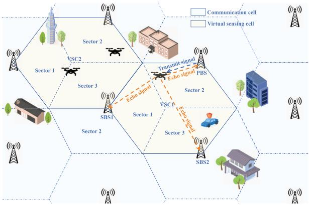  
Fig. 1. Networked ISAC system model. Three adjacent sectors of three neighboring BSs form a VSC, in which PBS transmits sensing signals, while the PBS and two SBSs capture echo signals.

Therefore we propose a PBS handover strategy to select the optimal BS from the three BSs as the new PBS in realtime. Moreover, we propose a VSC handover strategy to track the UAV continuously when it flies from one VSC to another.

The rest of this paper is organized as follows. Section II describes the system model that includes the VSC model and the signal model. Section III presents the cooperative UAV detection with networked sensing. Section IV proposes the UAV tracking with networked sensing, as well as PBS handover and VSC handover strategies. Simulation results and performance analysis are provided in Section V. Section VI draws the conclusions.

Notation: Lower-case and upper-case boldface letters a and A denote a vector and a matrix; $\mathbf { a } ^ { T }$ and $\mathbf { a } ^ { H }$ denote the transpose and the conjugate transpose of vector a, respectively; ${ \mathbf a } [ n ]$ denotes the n-th element of the vector a; $\mathbf { a } [ i : j ]$ denotes the vector consisting of elements from the i-th to the j-th element of vector a; $\mathbf { A } [ i , j ]$ denotes the $( i , j )$ -th element of the matrix A; $\mathbf { A } \left[ i _ { 1 } : i _ { 2 } , : \right]$ is the submatrix composed of all columns elements in rows $i _ { 1 }$ to $i _ { 2 }$ of matrix $\mathbf { A } ; \mathbf { A } \left[ : , j _ { 1 } : j _ { 2 } \right]$ is the submatrix composed of all rows elements in columns $j _ { 1 }$ to $j _ { 2 }$ of matrix A; eig(·) represents the matrix eigenvalue decomposition function. R and C represent the real field and complex field, respectively.

## II. SYSTEM MODEL

In this section, we will define a virtual sensing cell (VSC) and describe the corresponding signal model.

## A. Virtual Sensing Cell Model

In Fig. 1, we display a massive multiple input and multiple output (MIMO) based ISAC cellular network that operates in mmWave frequency bands with orthogonal frequency division multiplexing (OFDM) modulation. In the communications cell, a single BS with three groups of transceivers are located at the center. Each group includes two uniform planar arrays (UPAs) with $N _ { T } = N _ { T } ^ { x } \times N _ { T } ^ { z }$ and $N _ { R } = N _ { R } ^ { x } \times N _ { R } ^ { z }$ antenna elements as the transmitting array and the receiving array. Each group of transceiver covers a $1 2 0 ^ { \circ }$ sector of the communications cell it faces. The antenna spacing along x-axis and z-axis are $\begin{array} { l } { d _ { x } \ \leq \ \frac { \lambda } { 2 } } \end{array}$ and $d _ { z } ~ \leq ~ { \frac { \lambda } { 2 } }$ , respectively, with λ being the wavelength. One of the three groups of the transceivers is placed parallel to the x-z plane, and the angles between the other two groups of transceivers and the x-z plane are 120◦ and $- 1 2 0 ^ { \circ }$ respectively, as shown in Fig. 2. In cellular networks, a communications cell consisting of three sectors forms a regular hexagon. Similarly, three adjacent sectors of three neighboring BSs also form a regular hexagon, which we define as a VSC, as shown by the yellow area in Fig. 1. In each VSC, we select the BS with the highest received SNR as the PBS for the tracked UAV, while the other two BSs as the SBSs. Note that each tracked UAV has a corresponding PBS, and PBSs corresponding to different UAVs may not be the same. The PBS transmits the sensing signals, while both the PBS and the two SBSs capture echo signals as shown in Fig. 1. If multiple UAVs need to be tracked, then we will sequentially select the PBS to transmit the sensing signals. With the echo signals, all three BSs could estimate UAV’s horizontal angle, elevation angle, distance, and radial velocity, and then the estimates will be sent to the data center1 for joint processing to track UAVs. Note that when a UAV flies within a VSC, the distance and blockage status between the UAV and the three BSs will affect the received SNR at the three BSs. When the nearest BS to the UAV changes or the UAV is blocked by high-rise buildings, the PBS handover should be performed to select a new BS from the three BSs as the new PBS in real-time. Additionally, when a UAV flies from one VSC to another, VSC handover should be performed to maintain the continuous tracking. Based on the rotational and axial symmetries of BSs and transceivers, the VSCs can be straightforwardly duplicated and transformed to seamlessly cover the entire cellular network.

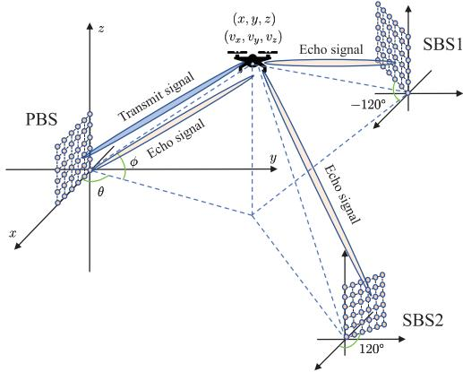  
Fig. 2. Spherical coordinate system for representing UAV’s 3D locations.

We employ the spherical coordinate $( d , \theta , \phi )$ to represent the three dimensional (3D) location of the UAV. As shown in Fig. 2, d represents the polar distance with range $d \geq 0 , \theta$ represents the horizontal angle with range $0 ^ { \circ } \leq \theta \leq 1 8 0 ^ { \circ }$ , and φ represents the elevation angle with range $- 9 0 ^ { \circ } \leq \phi \leq 9 0 ^ { \circ }$ Then the spherical coordinate $( d , \theta , \phi )$ may be transformed to its Cartesian counterpart $( x , y , z )$ through

$$
x = d \cos \phi \cos \theta , \quad y = d \cos \phi \sin \theta , \quad z = d \sin \phi .\tag{1}
$$

The service area of a BS can be denoted as $\{ ( d , \theta , \phi ) \mid d _ { \operatorname* { m i n } } \leq$ $d \leq d _ { \operatorname* { m a x } } , \theta _ { \operatorname* { m i n } } \leq \theta \leq \theta _ { \operatorname* { m a x } } , \phi _ { \operatorname* { m i n } } \leq \phi \leq \phi _ { \operatorname* { m a x } } \}$

## B. Signal Model

Suppose that the communications system uses narrow band OFDM signals with M subcarriers in total, and suppose the lowest frequency and the subcarrier interval are $f _ { 0 }$ and $\Delta f ,$ respectively. Then the transmission bandwidth is $W = M \Delta f$ and the frequency of the m-th subcarrier is $f _ { m } = f _ { 0 } + m \Delta f ,$ where $m = 0 , 1 , . . . , M - 1$ . We divide the tracking process into multiple transient time slots, and each time slot contains N OFDM symbols. Assuming that there is only one radio frequency chain, the transmitted signal in the q-th time slot is given by

$$
x _ { q } ( t ) = \sum _ { n = 0 } ^ { N - 1 } \sum _ { m = 0 } ^ { M - 1 } s _ { q , n , m } e ^ { j 2 \pi f _ { m } t } \mathrm { r e c t } \left( t - n T _ { s } \right) ,\tag{2}
$$

where $T _ { s }$ is the total duration of one OFDM symbol, which is the sum of the duration of cyclic prefix (CP) and the duration of one OFDM symbol without CP; rect(·) is the rectangular function, which is 1 for the duration of each symbol and is 0 for others; $s _ { q , n , m }$ is the modulated symbol on the m-th subcarrier of the n-th OFDM symbol in the q-th time slot. Note that when multi-BS jointly detect and track the $\mathrm { U A V s } , s _ { q , n , m }$ is usually used as the communications reference signal that is known by all receivers. Let the transmitting beamforming vector in the q-th time slot be

$$
{ \bf w } _ { T X } \left( \Psi _ { q } , \Omega _ { q } \right) = \sqrt { \frac { 1 } { N _ { T } } } { \bf a } _ { T X } \left( \Psi _ { q } , \Omega _ { q } \right) ,\tag{3}
$$

where $\Psi _ { q } = \cos \phi _ { q } \cos \theta _ { q }$ and $\Omega _ { q } = \sin \phi _ { q }$ are the spatialdomain directions corresponding to physical directions $\theta _ { q }$ and $\phi _ { q } .$ . Moreover, $\mathbf { a } _ { T X } \left( \bar { \Psi _ { q } } , \Omega _ { q } \right) \ \bar { \in } \ \bar { \mathbb { C } } ^ { \bar { N } _ { T } \times 1 }$ is the transmitting steering vector with the form

$$
\begin{array} { r } { { \bf a } _ { T X } ( \Psi _ { q } , \Omega _ { q } ) = { \bf a } _ { T X } ^ { x } ( \Psi _ { q } ) \otimes { \bf a } _ { T X } ^ { z } ( \Omega _ { q } ) , } \end{array}\tag{4}
$$

where $\otimes$ denotes the Kronecker product, and

$$
\begin{array} { r l } & { { \mathbf { a } } _ { T X } ^ { x } ( \Psi _ { q } ) = \left[ 1 , e ^ { j \frac { 2 \pi f _ { 0 } d _ { x } \Psi _ { q } } { c } } , \dots , e ^ { j \frac { 2 \pi f _ { 0 } d _ { x } \Psi _ { q } } { c } ( N _ { T } ^ { x } - 1 ) } \right] ^ { T } \in \mathbb { C } ^ { N _ { T } ^ { x } \times 1 } , } \\ & { { \mathbf { a } } _ { T X } ^ { z } ( \Omega _ { q } ) = \left[ 1 , e ^ { j \frac { 2 \pi f _ { 0 } d _ { z } \Omega _ { q } } { c } } , \dots , e ^ { j \frac { 2 \pi f _ { 0 } d _ { z } \Omega _ { q } } { c } } \left( N _ { T } ^ { z } - 1 \right) \right] ^ { T } \in \mathbb { C } ^ { N _ { T } ^ { z } \times 1 } . } \end{array}\tag{5}
$$

The received signal on the m-th subcarrier of the n-th OFDM symbol in the q-th time slot at the r-th BS, $r \in { }$ {PBS, SBS1, SBS2}, can be written as

$$
\mathbf { y } _ { r , q , n , m } = \mathbf { H } _ { r , q , n , m } \mathbf { w } _ { T X } \left( \Psi _ { q } , \Omega _ { q } \right) s _ { q , n , m } + \mathbf { n } _ { r , q , n , m } ,\tag{6}
$$

where $\mathbf { n } _ { r , q , n , m } \in \mathbb { C } ^ { N _ { R } \times 1 }$ is the additive white Gaussian noise. Moreover, $\mathbf { H } _ { r , q , n , m } \in \mathbb { C } ^ { N _ { R } \times N _ { T } }$ is the echo channel matrix given by

$$
\begin{array} { r l } & { \mathbf { H } _ { r , q , n , m } = \displaystyle { \sum _ { k = 1 } ^ { K _ { q } } \beta _ { r , q , k } e ^ { j 2 \pi f _ { D , r , q , k } n T _ { s } } e ^ { - j 2 \pi f _ { m } \tau _ { r , q , k } } } } \\ & { \qquad \times \mathbf { a } _ { R X } \left( \Psi _ { r , q , k } , \Omega _ { r , q , k } \right) \mathbf { a } _ { T X } ^ { H } \left( \Psi _ { \mathrm { P B S } , q , k } , \Omega _ { \mathrm { P B S } , q , k } \right) , } \end{array}\tag{7}
$$

where $K _ { q }$ is the number of UAVs in the q-th time slot; $\begin{array} { r } { \beta _ { r , q , k } = \sqrt { \frac { \lambda ^ { 2 } } { ( 4 \pi ) ^ { 3 } d _ { \mathrm { P B S } , q , k } ^ { 2 } d _ { r , q , k } ^ { 2 } } } \sigma _ { r , q , k } } \end{array}$ is the channel fading factor; $d _ { \mathrm { P B S } , q , k }$ is the distance between the k-th UAV and PBS; $d _ { r , q , k }$ is the distance between the k-th UAV and the r-th BS, $r \in \{ \mathrm { P B S } , \mathrm { S B S 1 } , \mathrm { S B S 2 } \}$ . In addition, $\sigma _ { r , q , k }$ is the radar cross section (RCS) of the k-th UAV relative to the r-th BS in the q-th time slot. The RCS of UAVs can be assumed to follow the Swerling I model [27], whose probability density function satisfies

$$
f ( \sigma ) = \frac { 1 } { \sigma _ { 0 } } \exp \left( - \frac { \sigma } { \sigma _ { 0 } } \right) , \sigma \geq 0 ,\tag{8}
$$

where $\sigma _ { 0 }$ is the average value of the RCS. Moreover, $\tau _ { r , q , k }$ is the time delay of the k-th UAV relative to the r-th BS. Specifically, the time delay for PBS is $\begin{array} { r } { \tau _ { \mathrm { P B S } , q , k } = \frac { 2 d _ { \mathrm { P B S } , q , k } } { c } } \end{array}$ where c denotes light speed, and the time delay for either SBS is $\begin{array} { r } { \tau _ { \mathrm { S B S } , q , k } = \frac { d _ { \mathrm { P B S } , q , k } + \mathbf { \bar { d } } _ { \mathrm { S B S } , q , k } } { c } } \end{array}$ where $d _ { \mathrm { S B S } , q , k }$ is the distance between the $k { \mathrm { - t h ~ U A V } }$ and either SBS. Then $f _ { D , r , q , k }$ is the Doppler frequency of the k-th UAV relative to the r-th BS. Specifically, the Doppler frequency of the k-th UAV for PBS is $\begin{array} { r } { \dot { f _ { D , \mathrm { P B S } , q , k } } = f _ { 0 } \frac { 2 v _ { \mathrm { P B S } , q , k } } { c } } \end{array}$ , where $v _ { \mathrm { P B S } , q , k }$ represents the radial velocity of the k-th UAV relative to PBS. Correspondingly, the Doppler frequency of the k-th UAV for either SBS is $\begin{array} { r } { f _ { D , \mathrm { S B S } , q , k } ~ = ~ f _ { 0 } \frac { \bar { \nu } _ { \mathrm { P B S } , q , k } + \bar { \nu } _ { \mathrm { S B S } , q , k } } { c } } \end{array}$ , where $v _ { \mathrm { S B S } , q , k }$ represents the radial velocity of the k-th UAV relative to either SBS. Then $\Psi _ { r , q , k } = \cos \phi _ { r , q , k } \cos \theta _ { r , q , k }$ and $\Omega _ { r , q , k } = \sin { \phi _ { r , q , k } }$ are the spatial-domain directions of the k-th UAV relative to the r-th BS, where $\theta _ { r , q , k }$ and $\phi _ { r , q , k }$ are the horizontal angle and the elevation angle of the k-th UAV relative to the r-th BS, $r \in \{ \mathrm { P B S } , \mathrm { S B S 1 } , \mathrm { S B S 2 } \}$ . Moreover, $\mathbf { a } _ { R X } ( \Psi _ { r , q , k } , \Omega _ { r , q , k } )$ is the receiving steering vector with the form

$$
\mathbf { a } _ { R X } \big ( \Psi _ { r , q , k } , \Omega _ { r , q , k } \big ) { = } { \mathbf { a } } _ { R X } ^ { x } \big ( \Psi _ { r , q , k } \big ) \otimes { \mathbf { a } } _ { R X } ^ { z } \big ( \Omega _ { r , q , k } \big ) \in { \mathbb { C } } ^ { N _ { R } \times 1 } ,\tag{9}
$$

where $\mathbf { a } _ { R X } ^ { x } ( \Psi _ { r , q , k } )$ and $\mathbf { a } _ { R X } ^ { z } ( \Omega _ { r , q , k } )$ have the same form with $\mathbf { a } _ { T X } ^ { x } ( \Psi _ { q } )$ and $\mathbf { a } _ { T X } ^ { z } ( \Omega _ { q } )$ in (5).

## III. COOPERATIVE UAV DETECTION WITH NETWORKEDSENSING

In this section, we will construct a radar echo model for UAV detection with networked sensing. Specifically, we will estimate the horizontal angles, elevation angles, distances, and radial velocities of the UAVs relative to the PBS and two SBSs from the echoes.

## A. Clutter Model

In radar systems, clutter represents undesired echoes from ground, buildings, sea, and atmospheric particles, which can obscure or confuse the detection of true targets [28], [29]. By effectively modeling and accounting for clutter, radar systems can improve the detection accuracy and reduce false alarm probability. The authors of [17] filter the clutter to enhance the target detection accuracy. Nevertheless, when detecting and tracking UAVs, ground clutter is not the primary source of the undesired echoes. Instead, clutter often originates from highrise buildings and tends to appear in clusters.

Let us divide the clutter area within the sensing range into $I \times J \times L$ static clutter scattering units according to the distance, horizontal angle, and elevation angle dimensions, and the size of the clutter scattering unit is determined by the distance, horizontal angle, and elevation angle resolution of the sensing system. Denote the polar coordinates of the center of the $( i , j , l ) \ – \ t h$ unit as $( \tilde { d } _ { i } , \tilde { \theta } _ { j } , \tilde { \phi } _ { l } )$ . Then the echo channel of the r-th BS on the m-th subcarrier can be modeled as

$$
\begin{array} { l } { { \displaystyle { \tilde { \bf H } } _ { r , m } = \sum _ { i = 1 } ^ { I } \sum _ { j = 1 } ^ { J } \sum _ { l = 1 } ^ { L } \alpha _ { i , j , l } \beta _ { r , i , j , l } e ^ { - j 2 \pi f _ { m } \frac { 2 \tilde { d } _ { i } } { c } } } } \\ { { \displaystyle ~ \times { \bf a } _ { R X } \left( \tilde { \Psi } _ { j , l } , \tilde { \Omega } _ { j , l } \right) { \bf a } _ { T X } ^ { H } \left( \tilde { \Psi } _ { j , l } , \tilde { \Omega } _ { j , l } \right) , } } \\ { { \displaystyle i = 1 , \ldots , I , j = 1 , \ldots , J , l = 1 , \ldots , L , } } \end{array}\tag{10}
$$

where $\alpha _ { i , j , l }$ is a binary variable and ${ \bf A } = ( \alpha _ { i , j , l } ) \in R ^ { I \times J \times L }$ is a clustered binary tensor used to simulate the distribution of high-rise buildings; $\begin{array} { r } { \beta _ { r , i , j , l } = \sqrt { \frac { \lambda ^ { 2 } } { ( 4 \pi ) ^ { 3 } \tilde { d } _ { \dot { \epsilon } } ^ { 4 } } \tilde { \sigma } _ { r , i , j , l } } } \end{array}$ is the channel fading factor and $\tilde { \sigma } _ { r , i , j , l }$ is the RCS of the $( i , j , l ) \ – \ t h$ clutter scattering unit relative to the r-th BS, which also follows Swerling I model [27]; $\tilde { \Psi } _ { j , l } = \cos \tilde { \phi } _ { l }$ cos $\theta _ { j }$ and $\tilde { \Omega } _ { j , l } = \sin \tilde { \phi } _ { l }$ are the spatial-domain directions corresponding to physical directions $\tilde { \theta } _ { j }$ and $\tilde { \phi } _ { l }$

The main distinction between the dynamic UAV echoes and the static building clutter lies in their Doppler frequencies [30]. Additionally, the signal power intensity of static clutter is often much greater than that of dynamic UAV echoes [31]. Therefore, to effectively detect the UAVs, it is necessary to filter out the clutter from echoes by conceiving a filter over the Doppler domain.

## B. Static Clutter Filtering

When the transmitter forms a beam pointing at direction $( \theta _ { q } , \phi _ { q } )$ in the q-th time slot, the echo received by the r-th BS $( r ~ \mathrm { { \bar { \in } } \{ P B S , S B S 1 , S B S 2 \} ) }$ on the m-th subcarrier of the n-th OFDM symbol can be represented as

$$
\begin{array} { r } { { \mathbf { y } } _ { r , q , n , m } = \hat { { \mathbf { H } } } _ { r , q , n , m } { \mathbf { w } } _ { T X } \left( \Psi _ { q } , \Omega _ { q } \right) s _ { q , n , m } + \mathbf { n } _ { r , q , n , m } , } \end{array}\tag{11}
$$

where $\hat { \mathbf { H } } _ { r , q , n , m } = \mathbf { H } _ { r , q , n , m } + \tilde { \mathbf { H } } _ { r , m }$ is the overall echo channel matrix composed by $\mathrm { U A V } \mathbf { \hat { s } }$ echo and static clutter. Then we can stack ${ \bf y } _ { r , q , n , m }$ into one echo tensor $\mathbf { Y } _ { r , q } \in \mathbb { C } ^ { N _ { R } \times N \times M }$ whose $( n , m )$ -th element is $\mathbf { Y } _ { r , q } [ : , n , m ] = \dot { \mathbf { y } _ { r , q , n , m } } .$ . In order to mitigate the interference of clutter on the desired signals, we adopt the moving target indicator (MTI) technology [32] in radar target detection to filter out static clutter with a zero Doppler frequency. Specifically, by canceling the echoes of two adjacent OFDM symbols, we can obtain

$$
{ \bf Y } _ { r } ^ { \mathrm { d y } } = { \bf Y } _ { r } [ : , 1 : N - 1 , : ] - { \bf Y } _ { r } [ : , 2 : N , : ] ,\tag{12}
$$

where $\mathbf { Y } _ { r } ^ { \mathrm { d y } } \ \in \ \mathbb { C } ^ { N _ { R } \times ( N - 1 ) \times M }$ is the echo of the dynamic UAVs after the static clutter being filtered out. The $( n , m )$ -th element of dynamic UAVs’ echo $\mathbf { Y } _ { r , q } ^ { \mathrm { d y } }$ is denoted as $\mathbf { y } _ { r , n , m } ^ { \mathrm { d y } }$ that can be represented by (13a) and (13b), shown at the bottom of the next page.

Since ${ \bf { H } } _ { r , m }$ does not contain any term related to n and since the reference signals $s _ { q , n , m }$ of different OFDM symbols are equal, i.e., $s _ { q , n , m } = s _ { q , n + 1 , m } .$ the static clutter can be eliminated by subtracting the $( n + 1 ) – \mathrm { t h }$ OFDM symbol echo from the n-th OFDM symbol echo. Suppose that the noise vectors ${ \bf n } _ { r , q , n , m }$ of different OFDM symbols are independent of each other, we can obtain (13c), shown at the bottom of the page. From (13c), we can observe that while filtering out clutter, $\mathbf { y } _ { r , q , n , m } ^ { \mathrm { d y } }$ is actually equal to ${ \bf y } _ { r , q , n , m }$ multiplied by a coefficient $\begin{array} { r } { \left( 1 - e ^ { j 2 \pi f _ { D , r , q , k } T _ { s } } \right) } \end{array}$ that does not vary with m and n. Hence, the coefficient $\left( 1 \stackrel { \cdot } { - } e ^ { j 2 \pi f _ { D , r , q , k } T _ { s } } \right)$ does not affect subsequent estimations of distance and velocity. In addition, the accumulation of noise during the subtraction process will lead to a decrease in the SNR of the desired signal.

## C. Horizontal and Elevation Angle Estimation for UAVs

After obtaining the dynamic UAVs’ echo $\textbf Y _ { r , q } ^ { \mathrm { d y } } \quad \in$ $\mathbb { C } ^ { N _ { R } \times ( N - 1 ) \times M }$ , we could estimate the horizontal angles and elevation angles of the UAVs. To simplify the notations, let us define $\begin{array} { r } { \gamma _ { r , q , k } ^ { - } ~ = ~ ( 1 - e ^ { j 2 \pi f _ { D , r , q , k } \hat { T _ { s } } } ) } \end{array}$ , and then $\mathbf { y } _ { r , q , n , m } ^ { \mathrm { d y } }$ can be rewritten as (14), shown at the bottom of the page, where $F _ { T X } \left( ( \Psi _ { 1 } , \Omega _ { 1 } ) , ( \Psi _ { 2 } , \Omega _ { 2 } ) \right)$ is the dot product of the two transmitting steering vectors directed by $( \Psi _ { 1 } , \Omega _ { 1 } )$ and $\left( \Psi _ { 2 } , \Omega _ { 2 } \right)$ , and $F _ { T X }$ can be expressed as

$$
\begin{array} { r l } & { F _ { T X } \left( \left( \Psi _ { 1 } , \Omega _ { 1 } \right) , \left( \Psi _ { 2 } , \Omega _ { 2 } \right) \right) } \\ & { \ = \mathbf { a } _ { T X } ^ { H } \left( \Psi _ { 1 } , \Omega _ { 1 } \right) \mathbf { a } _ { T X } \left( \Psi _ { 2 } , \Omega _ { 2 } \right) } \\ & { \ = e ^ { j \frac { \pi d f _ { 0 } } { c } \left( \sin \Psi _ { 1 } - \sin \Psi _ { 2 } \right) \left( N _ { T } ^ { x } - 1 \right) } \frac { \sin \left[ \frac { \pi d f _ { 0 } } { c } \left( \sin \Psi _ { 1 } - \sin \Psi _ { 2 } \right) N _ { T } ^ { x } \right] } { \sin \left[ \frac { \pi d f _ { 0 } } { c } \left( \sin \Psi _ { 1 } - \sin \Psi _ { 2 } \right) \right] } } \end{array}
$$

$$
\times \left. e ^ { j \frac { \pi d f _ { 0 } } { c } ( \sin \Omega _ { 1 } - \sin \Omega _ { 2 } ) \left( N _ { T } ^ { z } - 1 \right) } \frac { \sin \left[ \frac { \pi d f _ { 0 } } { c } \left( \sin \Omega _ { 1 } - \sin \Omega _ { 2 } \right) N _ { T } ^ { z } \right] } { \sin \left[ \frac { \pi d f _ { 0 } } { c } \left( \sin \Omega _ { 1 } - \sin \Omega _ { 2 } \right) \right] } . \right.\tag{15}
$$

Note that the number of detectable UAVs from the echoes depends on the SNR of each UAV. As seen from (14), the SNR of each UAV is related not only to $F _ { T X } \left( ( \Psi _ { \mathrm { P B S } , q , k } , \Omega _ { \mathrm { P B S } , q , k } ) , ( \Psi _ { q } , \Omega _ { q } ) \right)$ but also to $\beta _ { r , q , k }$ . The SNR of a UAV is high when the UAV is within the half power beamwidth of the angle $( \theta _ { q } , \phi _ { q } )$ and is close to BS; otherwise, its SNR is low. Therefore, in echo $\mathbf { Y } _ { r , q } ^ { \mathrm { d y } } ,$ the UAVs in the $( \theta _ { q } , \phi _ { q } )$ direction can be detected, and the UAVs that are not in the $( \theta _ { q } , \phi _ { q } )$ direction but are close to the BS can also be detected. Denote the number of detectable UAVs of the r-th BS in the q-th time slot as $K _ { q } ^ { r } ~ ( K _ { q } ^ { r } \leq K _ { q } )$ . Then we extract the dynamic UAVs’ echo channel on the m-th subcarrier from $\mathbf { Y } _ { r , q } ^ { \mathrm { d y } }$ as ${ \bf Y } _ { r , q , m } ^ { \mathrm { d y } } = { \bf Y } _ { r , q } ^ { \mathrm { d y } } [ : , : , m ] \in \mathbb { C } ^ { N _ { R } \times ( N - 1 ) }$ , which can be written as

$$
\begin{array} { r l r } {  { \mathbf { Y } _ { r , q , m } ^ { \mathrm { d y } } = \sum _ { k = 1 } ^ { K _ { q } } \zeta _ { r , q , k } ^ { A } \mathbf { a } _ { R X } ( \Psi _ { r , q , k } , \Omega _ { r , q , k } ) \mathbf { k } _ { V } ^ { T } ( f _ { D , r , q , k } ) } } \\ & { } & { + \sqrt { 2 } \mathbf { N } _ { r , q , m } ^ { A } , } \end{array}\tag{16}
$$

where $\begin{array} { r l r } { \zeta _ { r , q , k } ^ { A } } & { { } = } & { \gamma _ { r , q , k } \frac { \beta _ { r , q , k } } { \sqrt { N _ { T } } } e ^ { - j 2 \pi f _ { m } \tau _ { r , q , k } } F _ { T X } s _ { q , n , m } } \end{array}$ is a fixed coefficient, $\mathbf { N } _ { r , q , m } ^ { A }$ is the corresponding noise matrix, $\mathbf { a } _ { R X } \left( \Psi _ { r , q , k } , \Omega _ { r , q , k } \right) \stackrel { \cdot \cdot \cdot \cdot \cdot } { = } \mathbf { a } _ { R X } ^ { x } ( \Psi _ { r , q , k } ) \otimes \widehat { \mathbf { a } } _ { R X } ^ { z } ( \mathring { \Omega _ { r , q , k } } ) \in { \mathbb C } ^ { N _ { R } \times 1 }$ is the receiving array steering vector, and $\mathbf { k } _ { V } ( f _ { D , r , q , k } ) \ =$

(13a)

$$
\begin{array} { r l } {  { \mathbf { y } _ { \boldsymbol { \gamma } , \boldsymbol { q } , \boldsymbol { n } , \boldsymbol { m } } ^ { \mathrm { d i v } } = \mathbf { Y } _ { \boldsymbol { \gamma } , \boldsymbol { q } } [ \cdot , \boldsymbol { n } , \boldsymbol { m } ] - \mathbf { Y } _ { \boldsymbol { \gamma } , \boldsymbol { q } } [ \cdot , \boldsymbol { n } + 1 , \boldsymbol { m } ] } } \\ & { = \sum _ { k = 1 } ^ { K _ { g } } \beta _ { \boldsymbol { \gamma } , \boldsymbol { q } , \boldsymbol { k } } e ^ { 2 \pi f _ { D } \cdot \boldsymbol { n } \cdot \boldsymbol { n } \cdot \boldsymbol { T } _ { \boldsymbol { r } } } e ^ { - j 2 \pi f _ { \boldsymbol { n } } \cdot \boldsymbol { n } _ { \boldsymbol { \gamma } , \boldsymbol { n } , \boldsymbol { k } } } \mathbf { a } _ { I I X } ( \bar { \Psi } _ { \boldsymbol { r } , \boldsymbol { q } , \boldsymbol { k } } , \Omega _ { \boldsymbol { r } , \boldsymbol { q } , \boldsymbol { k } } ) \mathbf { a } _ { I \boldsymbol { X } } ^ { H } ( \bar { \Psi } _ { \mathrm { P B S } , \boldsymbol { q } , \boldsymbol { k } } , \Omega _ { \mathrm { P B S } , \boldsymbol { q } , \boldsymbol { k } } ) \mathbf { w } _ { T X X } ( \bar { \Psi } _ { \boldsymbol { q } } , \Omega _ { \boldsymbol { q } } ) s _ { \boldsymbol { q } , \boldsymbol { n } , \boldsymbol { n } , \boldsymbol { n } } } \\ &  = + \bar { \mathbf { H } } _ { \boldsymbol { r } , \boldsymbol { n } } \mathbf { w } _ { T X } ( \bar { \Psi } _ { \boldsymbol { q } } , \Omega _ { \boldsymbol { q } } ) s _ { \boldsymbol { q } , \boldsymbol { n } , \boldsymbol { m } } + \mathbf { n } _ { \boldsymbol { r } , \boldsymbol { q } , \boldsymbol { n } , \boldsymbol { m } } - \sum _ { k = 1 } ^ { K _ { g } } \beta _ { \boldsymbol { r } , \boldsymbol { q } , \boldsymbol { k } } e ^  i 2 \pi f _ { D } \cdot \boldsymbol { n } _ { \boldsymbol { r } , \boldsymbol { q } , \boldsymbol { k } } ( \boldsymbol { n } +  \end{array}\tag{13b}
$$

(13c)

$$
\begin{array} { r l r }   { \mathbf { y } _ { \tau , q , n , m } ^ { \mathrm { d i p } } = \sum _ { k = 1 } ^ { K _ { q } } \gamma _ { \tau , q , k } \frac { \beta _ { \tau , q , k } } { \sqrt { N _ { T } } } e ^ { j 2 \pi f _ { D , \tau , a , k } \mu T _ { s } } e ^ { - j 2 \pi f _ { m } \tau _ { \tau , \tau , \psi , A } } \mathbf { a } _ { R X } ( \mathbb { V } _ { \gamma , q , k } , \Omega _ { \tau , q , k } ) F _ { T X } \big ( ( \Psi _ { \mathrm { P B S } , q , k } , \Omega _ { \mathrm { P B S } , q , k } ) , } & { ( \Psi _ { q } , \Omega _ { q } ) \big ) s _ { q , n , m } } \\ & { } & { ( 1 ) } \end{array}\tag{4}
$$

$$
\begin{array} { r l } & { y _ { r , q , n , m } ^ { \mathrm { d y } } = \mathbf { w } _ { H X } ^ { H } \left( \hat { \Psi } _ { r , q } , \hat { \Omega } _ { r , q } \right) \mathbf { y } _ { r , q , n , m } ^ { \mathrm { d y } } } \\ & { \qquad = \displaystyle \sum _ { k = 1 } ^ { K _ { q } } \gamma _ { r , q , k } \frac { \beta _ { r , q , k } F _ { T X } } { \sqrt { N _ { T } } N _ { R } } e ^ { j 2 \pi f _ { D , r , q , k } n T _ { e } } e ^ { - j 2 \pi f _ { m } \tau _ { r , q , k } } F _ { R X } ( ( \hat { \Psi } _ { r , q } , \hat { \Omega } _ { r , q } ) , ( \Psi _ { r , q , k } , \Omega _ { r , q , k } ) ) s _ { q , n , m } + \sqrt { 2 } \mathbf { w } _ { R X } ^ { H } \mathbf { n } _ { r , q , n , m } , } \end{array}\tag{19}
$$

$$
\left[ 1 , e ^ { j \frac { 2 \pi f _ { D , r , q , k } T _ { s } } { c } } , \ldots , e ^ { j \frac { 2 \pi f _ { D , r , q , k } T _ { s } } { c } } ( N - 2 ) \right] ^ { T } \ ~ \in ~ \mathbb { C } ^ { ( N - 1 ) \times 1 }
$$

defined as the Doppler array steering vector. Considering that matrix aRX $\left( \Psi _ { r , q , k } , \Omega _ { r , q , k } \right) \mathbf { k } _ { V } ^ { T } \left( f _ { D , r , q , k } \right)$ is a Vandermonde matrix, we could utilize the MUSIC algorithm [33] to estimate horizontal and elevation angle. Specifically, the auto-correlation matrix of $\mathbf { Y } _ { r , q , m } ^ { \mathrm { d y } }$ is calculated as

$$
\mathbf { R } _ { r , q , m } ^ { A } = \frac { 1 } { N - 1 } \mathbf { Y } _ { r , q , m } ^ { \mathrm { d y } } ( \mathbf { Y } _ { r , q , m } ^ { \mathrm { d y } } ) ^ { H } .\tag{17}
$$

Let us perform eigenvalue decomposition of $\mathbf { R } _ { r , q , m } ^ { A }$ to obtain the diagonal matrix $\Sigma _ { r , q , m } ^ { A }$ and the corresponding eigenvector matrix $\mathbf { U } _ { r , q , m } ^ { A } , \mathrm { i . e . , \ } [ \mathbf { U } _ { r , q , m } ^ { A } , \Sigma _ { r , q , m } ^ { A } ] = \mathrm { e i g \left( \mathbf { R } _ { { r , q , m } } ^ { A } \right) }$ Then the minimum description length (MDL) criterion is utilized to estimate the number of dynamic UAVs from $\Sigma _ { r , q , m } ^ { A }$ as $K _ { r , q , m } ^ { \mathrm { M D L } }$ [34], [35]. Therefore, the noise space related to the receiving array can be represented as $\mathbf { U } _ { r , q , m } ^ { N } =$ $\mathbf { U } _ { r , q , m } ^ { A } \left[ : , K _ { r , q , m } ^ { \mathrm { M D L } } + 1 : N _ { R } \right]$ . Then the AOA spectral function with search the spatial-domain direction (Ψ, Ω) can be defined as

$$
F _ { r , q , m } ( \Psi , \Omega ) = \frac { 1 } { \mathbf { a } _ { R X } ^ { H } ( \Psi , \Omega ) \mathbf { U } _ { r , q , m } ^ { N } ( \mathbf { U } _ { r , q , m } ^ { N } ) ^ { H } \mathbf { a } _ { R X } ( \Psi , \Omega ) } ,\tag{18}
$$

where Ψ = cos φ cos θ and $\Omega = \sin { \phi }$ . By searching for the peaks of $F _ { r , q , m } ( \Psi , \Omega )$ , we can estimate the AOA of $K _ { q } ^ { r }$ UAVs as $\{ ( \hat { \theta } _ { r , q , 1 } , \hat { \phi } _ { r , q , 1 } ) , ( \hat { \theta } _ { r , q , 2 } , \hat { \phi } _ { r , q , 2 } ) , \dots , ( \hat { \theta } _ { r , q , K _ { q } ^ { r } } , \hat { \phi } _ { r , q , K _ { q } ^ { r } } ^ { \mathrm { ~ ~ } } ) \}$ Here we only estimate the angles of $K _ { q } ^ { r }$ detectable UAVs in the q-th time slot. The method to find the tacked UAV’s angle from $K _ { q } ^ { r }$ angles will be given in Section IV.

## D. Distance and Velocity Estimation for UAVs

Assume that we have found the angle of the tracked UAV relative to the r-th BS from the $K _ { q } ^ { r }$ angles, which are denoted as $( \hat { \theta } _ { r , q } , \hat { \phi } _ { r , q } )$ , where $r \in \{ \mathrm { P B } \bar { \mathrm { S } } , \mathrm { S B S 1 } , \mathrm { S B S 2 } \}$ Then we form the receiving beamforming vector of the r-th BS $\begin{array} { r l r } { { \bf w } _ { R X } ( \hat { \Psi } _ { r , q } , \hat { \Omega } _ { r , q } ) } & { { } = } & { \sqrt { \frac { 1 } { N _ { R } } } { \bf a } _ { R X } ( \hat { \Psi } _ { r , q } , \hat { \Omega } _ { r , q } ) \quad \in \quad \quad } \end{array}$ $\mathbb { C } ^ { N _ { R } \times 1 }$ , where $\hat { \Psi } _ { r , q } ~ = ~ \cos \hat { \phi } _ { r , q } \dot { \cos \theta } _ { r , q } , ~ \hat { \Omega } _ { r , q } ~ = ~ \sin \hat { \phi } _ { r , q }$ and multiply them by $\mathbf { y } _ { r , q , n , m } ^ { \mathrm { d y } }$ respectively to obtain (19), shown at the bottom of the previous page, where $F _ { R X } \left( \left( \Psi _ { 1 } , \Omega _ { 1 } \right) , \left( \Psi _ { 2 } , \Omega _ { 2 } \right) \right) \stackrel { \triangle } { = } { \bf a } _ { R X } ^ { H } \left( \Psi _ { 1 } , \Omega _ { 1 } \right) { \bf a } _ { R X } \left( \Psi _ { 2 } , \Omega _ { 2 } \right)$ We can obtain $\mathbf { Y } _ { r . a } ^ { \mathrm { d y } } \in \mathbb { C } ^ { ( N - 1 ) \times M }$ , whose $( n , m )$ -th element is ${ \bf Y } _ { r , q } ^ { \mathrm { d y } } [ n , m ] = y _ { r , q , n , m } ^ { \mathrm { d y } ^ { \mathrm { ~ \tiny ~ { ~ 2 ~ } ~ } } }$ . Based on (19), $\mathbf { Y } _ { r , q } ^ { \mathrm { d y } }$ and its transpose $( \mathbf { Y } _ { r , q } ^ { \mathrm { d y } } ) ^ { T }$ can be respectively represented as

$$
\mathbf { Y } _ { r , q } ^ { \mathrm { d y } } = \sum _ { k = 1 } ^ { K _ { q } } \zeta _ { r , q , k } ^ { V D } \mathbf { k } _ { V } \left( f _ { D , r , q , k } \right) \mathbf { k } _ { D } ^ { T } \left( \tau _ { r , q , k } \right) + \sqrt { 2 } \mathbf { N } _ { r , q } ^ { V D } ,\tag{20}
$$

$$
( \mathbf { Y } _ { r , q } ^ { \mathrm { d y } } ) ^ { T } = \sum _ { k = 1 } ^ { K _ { q } } \zeta _ { r , q , k } ^ { V D } \mathbf { k } _ { D } \left( \tau _ { r , q , k } \right) \mathbf { k } _ { V } ^ { T } \left( f _ { D , r , q , k } \right) + \sqrt { 2 } ( \mathbf { N } _ { r , q } ^ { V D } ) ^ { T } ,\tag{21}
$$

where $\begin{array} { r l r } { \zeta _ { r , q , k } ^ { V D } } & { { } = } & { \gamma _ { r , q , k } \frac { \beta _ { r , q , k } F _ { T X } F _ { R X } } { \sqrt { N _ { T } N _ { R } } } s _ { q , n , m } e ^ { - j 2 \pi f _ { 0 } \tau _ { r , q , k } } } \end{array}$ is a fixed coefficient, $\mathbf { N } _ { r , q } ^ { V D }$ is the corresponding noise matrix, ${ \bf k } _ { D } \left( \tau _ { r , q , k } \right) = { \ o { \left[ 1 , e ^ { - j \overline { { { 2 } } } \pi \Delta f \tau _ { r , q , k } } , \dots , e ^ { - j 2 \pi \Delta f \overline { { { \tau } } } _ { r , q , k } ( M - 1 ) } \right] ^ { T } } } \in$ $\mathbb { C } ^ { M \times 1 } \mathrm { ~ i s ~ }$ defined as the time delay array steering vector. Similarly, since $\mathbf { k } _ { V } \left( f _ { D , r , q , k } \right) \mathbf { k } _ { D } ^ { T } \left( \tau _ { r , q , k } \right)$ and $\mathbf { k } _ { D } \left( \tau _ { r , q , k } \right) \mathbf { k } _ { V } ^ { T } \left( f _ { D , r , q , k } \right)$ are both Vandermonde matrices, we could utilize the MUSIC algorithm [33] to estimate distance and velocity. Specifically, the auto-correlation matrix of $\mathbf { Y } _ { r , q } ^ { \mathrm { d y } }$ and $( \mathbf { Y } _ { r , q } ^ { \mathrm { d y } } ) ^ { \bar { T } }$ is calculated as

$$
\mathbf { R } _ { r , q } ^ { V D } = \frac { 1 } { M } \mathbf { Y } _ { r , q } ^ { \mathrm { d y } } ( \mathbf { Y } _ { r , q } ^ { \mathrm { d y } } ) ^ { H } ,\tag{22}
$$

$$
\mathbf { R } _ { r , q } ^ { D V } = \frac { 1 } { N - 1 } ( \mathbf { Y } _ { r , q } ^ { \mathrm { d y } } ) ^ { T } ( ( \mathbf { Y } _ { r , q } ^ { \mathrm { d y } } ) ^ { T } ) ^ { H } .\tag{23}
$$

Similarly, let us perform eigenvalue decomposition of $\mathbf { R } _ { r , q } ^ { V D }$ and $\mathbf { R } _ { r , q } ^ { D V }$ to obtain the diagonal matrix with eigenvalues $( \Sigma _ { r , q } ^ { V D }$ and $\Sigma _ { r , q } ^ { D V } )$ and the corresponding eigenvector matrix $( \mathbf { U } _ { r , q } ^ { V \mathbf { \hat { D } } }$ and $\mathbf { U } _ { r , q } ^ { \mathcal { \dot { D V } } } )$ . That is $[ \mathbf { U } _ { r , q } ^ { V \bar { D } } , \pmb { \Sigma } _ { r , q } ^ { V \bar { D } } ] = \mathrm { { e i g } } \left( \mathbf { R } _ { r , q } ^ { V D } \right)$ and $[ \mathbf { U } _ { r , q } ^ { D V } , \pmb { \Sigma } _ { r , q } ^ { D V } ] = \mathrm { ~ \mathrm { e i g } ~ } \big ( \mathbf { R } _ { r , q } ^ { D V } \big )$ . Then the MDL criterion is utilized to estimate the number of UAVs from $\Sigma _ { r , q } ^ { V D }$ and $\Sigma _ { r , q } ^ { D V }$ as $K _ { r , q , V } ^ { \mathrm { M D L } }$ and $K _ { r , q , D } ^ { \mathrm { M D L } }$ respectively [34], [35]. Therefore, the noise space related to the Doppler array can be represented as $\mathbf { U } _ { r , q , V } ^ { \tilde { N } } ~ = ~ \mathbf { U } _ { r , q } ^ { V D } \left[ : , K _ { r , q , V } ^ { \mathrm { M D L } ^ { \tilde { \mathbf { L } } } } + 1 : N ^ { \tilde { \mathbf { \alpha } } } - 1 \right]$ , and the noise space related to the time delay array can be represented as $\begin{array} { r } { \dot { \bar { \textbf { U } } } _ { r , q , D } ^ { N } ~ = ~ \mathbf { U } _ { r , q } ^ { D V } \left[ : , K _ { r , q , D } ^ { \mathrm { M D L } } + \bar { 1 } : M \right] } \end{array}$ . The Doppler spectral function with search Doppler frequency $f _ { D }$ and the time delay spectral function with search time delay τ can be defined as

$$
F _ { r , q , V } ( f _ { D } ) = \frac { 1 } { \mathbf { k } _ { V } ^ { H } ( f _ { D } ) \mathbf { U } _ { r , q , V } ^ { N } ( \mathbf { U } _ { r , q , V } ^ { N } ) ^ { H } \mathbf { k } _ { V } ( f _ { D } ) } ,\tag{24}
$$

$$
F _ { r , q , D } ( \tau ) = \frac { 1 } { \mathbf { k } _ { D } ^ { H } ( \tau ) \mathbf { U } _ { r , q , D } ^ { N } ( \mathbf { U } _ { r , q , D } ^ { N } ) ^ { H } \mathbf { k } _ { D } ( \tau ) } .\tag{25}
$$

By searching for the peaks of $F _ { r , q , V } ( f )$ and $F _ { r , q , D } ( \tau )$ we can obtain the Doppler frequency estimates for $K _ { q } ^ { r }$ UAVs denoted as $\{ \hat { f } _ { D , r , q , 1 } , \hat { f } _ { D , r , q , 2 } , . . . , \hat { f } _ { D , r , q , K _ { q } ^ { r } } \}$ and obtain the time delay estimates for $K _ { q } ^ { r }$ UAVs denoted as $\{ \hat { \tau } _ { r , q , 1 } , \hat { \tau } _ { r , q , 2 } , \hdots , \hat { \tau } _ { r , q , K _ { q } ^ { r } } \}$ , respectively. Next, we need to match the $K _ { q } ^ { r }$ Doppler frequency estimates with $K _ { q } ^ { r }$ time delay estimates. Considering that $\mathbf { Y } _ { r , q } ^ { \mathrm { d y } }$ in (20) is the sum of $K _ { q } ^ { r }$ matrices with rank 1 and considering that the coefficients $\zeta _ { r , q , k } ^ { V D }$ of each matrix are not equal, we propose to utilize singular value decomposition (SVD) [36] to eliminate different singular values caused by different $\zeta _ { r , q , k } ^ { V D }$ , as shown in Algorithm 1. Specifically, by multiplying basis matrix $\mathbf { u } _ { r , q , k } \mathbf { v } _ { r , q , k } ^ { H }$ on the left with $\mathbf { \bar { k } } _ { V } ( \bar { f } _ { D , r , q , k } ) ^ { \hat { H } }$ and on the right with $\mathbf { k } _ { D } \big ( \hat { \tau } _ { r , q , k } \big ) ^ { * }$ , we can complete the matching and obtain $\{ ( \hat { f } _ { D , r , q , 1 } , \hat { \tau } _ { r , q , 1 } ) , ( \hat { f } _ { D , r , q , 2 } , \hat { \tau } _ { r , q , 2 } ) , \dots , ( \hat { f } _ { D , r , q , K _ { q } ^ { r } } , \hat { \tau } _ { r , q , K _ { q } ^ { r } } ) \}$ Then PBS can utilize $\begin{array} { r l r } { f _ { D , \mathrm { P B S } , q , k } } & { { } = } & { f _ { 0 } \frac { 2 v _ { \mathrm { P B S } , q , k } } { c } } \end{array}$ and τPBS $\begin{array} { r l r } { \mathrm { ~  ~ \psi ~ } _ { q , k } } & { { } = } & { \frac { 2 d _ { \mathrm { P B S } , q , k } } { c } \mathrm { ~  ~ \psi ~ } _ { \mathrm { t o } } } \end{array}$ estimate the radial velocity and the distance of UAV relative to PBS, while either SBS can use $\begin{array} { r l r } { f _ { D , \mathrm { S B S } , q , k } } & { { } = } & { f _ { 0 } \frac { v _ { \mathrm { P B S } , q , k } + v _ { \mathrm { S B S } , q , k } } { c } } \end{array}$ and τSBS,q,k = dPBS,q,k+dSBS,q,k to estimate the sum of the radial velocities of $\mathrm { U A V }$ relative to PBS and relative to SBS, as well as the sum of the distances of UAV relative to PBS and SBS. Similarly, we only estimate the matched distances and velocities of $K _ { q } ^ { r }$ detectable UAVs in the q-th time slot. The method to find the tracked UAV’s distance and radial velocity from $K _ { q } ^ { r }$ distances and radial velocities will be given in Section IV.

TABLE I  
ESTIMATED PARAMETERS OF PBS, SBS1, AND SBS2
<table><tr><td rowspan=1 colspan=1>BS</td><td rowspan=1 colspan=1>Horizontal angle θ</td><td rowspan=1 colspan=1>Elevation angle φ</td><td rowspan=1 colspan=1>Radial velocity v</td><td rowspan=1 colspan=1>Distance d</td></tr><tr><td rowspan=1 colspan=1>PBS</td><td rowspan=1 colspan=1> $\underline { { \hat { \theta } _ { \mathrm { P B S } , q , k } } }$ </td><td rowspan=1 colspan=1> $\phi _ { \mathrm { P B S } , q , k }$ </td><td rowspan=1 colspan=1> $\underline { { \hat { v } _ { \mathrm { P B S } , q , k } } }$ </td><td rowspan=1 colspan=1> $\underline { { \hat { d } _ { \mathrm { P B S } , q , k } } }$ </td></tr><tr><td rowspan=1 colspan=1>SBS1</td><td rowspan=1 colspan=1> $\underline { { \ddot { \theta } _ { \mathrm { S B S 1 } , q , k } } }$ </td><td rowspan=1 colspan=1> $\phi _ { \mathrm { S B S 1 } , q , k }$ </td><td rowspan=1 colspan=1> $\hat { v } _ { \mathrm { P B S } , q , k } + \hat { v } _ { \mathrm { S B S } 1 , q , k }$ </td><td rowspan=1 colspan=1> $\underline { { \hat { d } _ { \mathrm { P B S } , q , k } + \hat { d } _ { \mathrm { S B S 1 } , q , k } } }$ </td></tr><tr><td rowspan=1 colspan=1>SBS2</td><td rowspan=1 colspan=1> $\underline { { \theta _ { \mathrm { S B S 2 } , q , k } } }$ </td><td rowspan=1 colspan=1> $\phi _ { \mathrm { S B S 2 } , q , k }$ </td><td rowspan=1 colspan=1> $\hat { v } _ { \mathrm { P B S } , q , k } + \hat { v } _ { \mathrm { S B S 2 } , q , k }$ </td><td rowspan=1 colspan=1> $\underline { { \dot { d } _ { \mathrm { P B S } , q , k } } } + \dot { d } _ { \mathrm { S B S 2 } , q , k }$ </td></tr></table>

Algorithm 1 Radial Velocity and Distance Matching $\mathrm { \sf A l g o - }$   
rithm   
Input: $\hat { { \bf f } } _ { D , r , q } ~ = ~ [ \hat { f } _ { D , r , q , 1 } , \hat { f } _ { D , r , q , 2 } , \dots , \hat { f } _ { D , r , q , K _ { q } ^ { r } } ] , ~ \hat { \pmb { \tau } } _ { r , q } ~ =$   
$\big [ \hat { \tau } _ { r , q , 1 } , \hat { \tau } _ { r , q , 2 } , \dots , \hat { \tau } _ { r , q , K _ { q } ^ { r } } \big ] , \mathbf { Y } _ { r , q } ^ { \mathrm { d y } }$   
Output: $\pmb { f } _ { D , r , q } ^ { \mathrm { - } } , \hat { \tau } _ { r , q } ^ { \mathrm { m a } }$ matched tched   
1 $[ \mathbf { U } _ { r , q } , \bar { \mathbf { S } } _ { r , q } ^ { \top } , \mathbf { V } _ { r , q } ] \overset { , , } { = } \mathrm { s v d } ( \mathbf { Y } _ { r , q } ^ { \mathrm { d y } } )$   
2 for $k = 1$ to $K _ { q } ^ { r }$ do   
3 $\mathbf { u } _ { r , q , k } = \mathbf { U } _ { r , q } [ : , k ] , \mathbf { v } _ { r , q , k } = \mathbf { V } _ { r , q } [ : , k ]$   
4 $\mathbf { G } _ { r , q , k } = \mathbf { u } _ { r , q , k } \mathbf { v } _ { r , q , k } ^ { H } , \mathbf { K } = \mathbf { 0 } _ { K _ { q } ^ { r } \times K _ { q } ^ { r } }$   
5 for $i = 1$ to $K _ { q } ^ { r }$ do   
6 for $j = 1$ to $K _ { q } ^ { r }$ do   
7 $\begin{array} { r } { { \bf K } [ i , i ] = \frac { | { \bf k } _ { V } ^ { \prime } ( \hat { f } _ { D , r , q } [ i ] ) ^ { H } { \bf G } _ { r , q , k } { \bf k } _ { D } ( \hat { \pmb { \tau } } _ { r , q } [ j ] ) ^ { * } | } { \hat { \mathrm { ~  ~ \mu ~ } } _ { \mathrm { ~ r ~ e ~ n ~ s ~ e ~ n ~ t ~ } } } } \end{array}$   
||kV (fˆD,r,q[i])||2||kD(τˆr,q[j])||2   
8 end for   
9 end for   
10 $[ \mathrm { r o w } , \mathrm { c o l } ] = \mathrm { a r g }$ max K   
11 $\hat { \pmb { f } } _ { D , r , q } ^ { \mathrm { m a t c h e d } } [ k ] = \hat { \pmb { f } } _ { D , r , q } [ \mathrm { r o w } ] , \hat { \pmb { \tau } } _ { r , q } ^ { \mathrm { m a t c h e d } } [ k ] = \hat { \pmb { \tau } } _ { r , q } [ \mathrm { c o l } ]$   
12 end for

IV. UAV TRACKING AND HANDOVER WITH NETWORKED SENSING

In this section, we will present a cooperative UAV tracking algorithm with networked sensing, as well as PBS handover and VSC handover strategies during tracking.

## A. Cooperative UAV Tracking With Networked Sensing

Let us divide the tracking process into multiple time slots. If there are $K _ { q }$ UAVs to be tracked in the q-th time slot, then $K _ { q }$ PBSs will sequentially form a beam pointing to $K _ { q } \ U \mathbf { A } \mathbf { V } \mathbf { s }$ respectively. Note that the PBS corresponding to different UAVs may be physically the same BS or different BSs. The selection process of PBS will be given in Subsection IV-B.

The PBS of the k-th UAV forms a beam $\mathbf { w } _ { T X } \big ( \Psi _ { q , k } , \Omega _ { q , k } \big )$ pointing towards it. By utilizing the estimation method in Section III, we can obtain the estimated parameters of the k-th UAV in the q-th time slot. These parameters include the horizontal angle and the elevation angle $( \hat { \theta } _ { \mathrm { P B S } , q , k } , \hat { \phi } _ { \mathrm { P B S } , q , k } )$ relative to the PBS, the radial velocity and the distance $( \hat { v } _ { \mathrm { P B S } , q , k } , \hat { d } _ { \mathrm { P B S } , q , k } )$ relative to the PBS, the horizontal angle and the elevation angle $( \hat { \theta } _ { \mathrm { S B S 1 } , q , k } , \hat { \phi } _ { \mathrm { S B S 1 } , q , k } )$ relative to the SBS1, the sum of the radial velocity and the sum of the distance $( \hat { v } _ { \mathrm { P B S } , q , k } + \hat { v } _ { \mathrm { S B S 1 } , q , k } , \hat { d } _ { \mathrm { P B S } , q , k } + \hat { d } _ { \mathrm { S B S 1 } , q , k } )$ relative to the PBS and the SBS1, as well as the horizontal angle and the elevation angle $( \hat { \theta } _ { \mathrm { S B S 2 } , q , k } , \hat { \phi } _ { \mathrm { S B S 2 } , q , k } )$ relative the SBS2, the sum of the radial velocity and the sum of the distance $( \hat { v } _ { \mathrm { P B S } , q , k } + \hat { v } _ { \mathrm { S B S 2 } , q , k } , \hat { d } _ { \mathrm { P B S } , q , k } + \hat { d } _ { \mathrm { S B S 2 } , q , k } )$ relative to the PBS and the SBS2, as shown in Tab. I. Since the tracking process for all $K _ { q }$ UAVs are similar, we will omit the subscript k in the following discussion. Then we combine the measurements into a $Q = 1 2$ dimensional vector $z _ { q } =$ $\begin{array} { r l } { [ \hat { \theta } _ { \mathrm { P B S } , q } , \hat { \phi } _ { \mathrm { P B S } , q } , \hat { v } _ { \mathrm { P B S } , q } , \hat { d } _ { \mathrm { P B S } , q } , \hat { \theta } _ { \mathrm { S B S } 1 , q } , \hat { \phi } _ { \mathrm { S B S } 1 , q } , \hat { v } _ { \mathrm { P B S } , q } } & { { } + } \end{array}$ $\begin{array} { r l r l r l } { \hat { v } _ { \mathrm { S B S 1 } , q } , \ d _ { \mathrm { P B S } , q } } & { { } } & { + } & { { } } & { d _ { \mathrm { S B S 1 } , q } , \ \hat { \theta } _ { \mathrm { S B S 2 } , q } , \ \hat { \phi } _ { \mathrm { S B S 2 } , q } , \ \hat { v } _ { \mathrm { P B S } , q } } & { { } } & { + } & { { } } \end{array}$ vˆSBS2 $, \hat { d } _ { \mathrm { P B S } , q } + \hat { d } _ { \mathrm { S B S 2 } , q } ] ^ { T }$

The Kalman filter (KF), renowned for its ability to handle uncertainties and noise, have widely been used in target tracking and autonomous navigation [37]. By iteratively refining predictions with real-time measurements, KF provides precise estimates of the target’s location and velocity, making it ideal for real world tracking tasks. Here, tracking UAVs by the measurements from three BSs can be seen as a Kalman filtering problem for multi-sensor fusion [38], which mainly includes centralized fusion and distributed fusion. Due to the high complexity and lower accuracy of distributed fusion, we adopt a centralized KF to track the UAVs. Specifically, the measurements from the three BSs are UAV’s angles, distances, and radial velocities relative to them, while the variables to be estimated are the UAV’s 3D location and 3D velocity. Therefore, we define the state vector of UAV as $\pmb { x } _ { q } = [ x _ { q } , v _ { q } ^ { x } , y _ { q } , v _ { q } ^ { y } , z _ { q } , v _ { q } ^ { z } ] ^ { T } \in \mathbb { R } ^ { P \times 1 }$ , where $x _ { q } , \ y _ { q }$ and $z _ { q }$ are the UAV’s 3D coordinates in the q-th time slot within a fixed coordinate system. Moreover, $v _ { q } ^ { x } , \ v _ { q } ^ { y }$ and $v _ { q } ^ { z }$ are the projections of the UAV’s velocity in the x-axis, y-axis and zaxis in the q-th time slot. Then the state transition equation and measurement equation of the UAV can be expressed as

$$
\pmb { x } _ { q + 1 } = \pmb { F } \pmb { x } _ { q } + \pmb { w } _ { q } ,
$$

$$
{ z } _ { q } = h \left( { \pmb x } _ { q } \right) + { \pmb v } _ { q } ,\tag{26}
$$

(27)

where $\pmb { w } _ { q } \in \mathbb { R } ^ { P \times 1 }$ and $\pmb { v } _ { q } \in \mathbb { R } ^ { Q \times 1 }$ are process noise and measurement noise, respectively. Assuming that the $\mathrm { U A V } \mathbf { \hat { s } }$ velocity remains constant within δt, the state transition matrix F can be expressed as

$$
\pmb { F } = \left[ \begin{array} { l l l l } { 1 } & { \delta t 0 0 } & { 0 } & { 0 } \\ { 0 1 } & { 0 0 } & { 0 } & { 0 } \\ { 0 0 } & { 1 } & { \delta t 0 0 } \\ { 0 0 } & { 0 1 } & { 0 } & { 0 } \\ { 0 0 } & { 0 0 } & { 1 } & { \delta t } \\ { 0 0 } & { 0 0 } & { 0 1 } \end{array} \right] .\tag{28}
$$

Moreover, $h ( \cdot )$ is the nonlinear mapping from the state vector $\scriptstyle { \pmb { x } } _ { q }$ to the measurement vector $z _ { q } .$ Fig. 3 and Algorithm 2 show the diagram and calculation steps of $h ( \cdot )$ , respectively. In Fig. 3 and Algorithm $2 , x _ { B } ^ { r } , y _ { B } ^ { r } , z _ { B } ^ { r }$ are the 3D coordinates of the r-th BS and $\alpha _ { B } ^ { r }$ is the angle between the UPA of the rth BS and $\mathbf { X } { - } \mathbf { Z }$ plane, $\overline { { r } } \in \{ \mathrm { P B S } , \mathrm { S B S 1 } , \mathrm { S B S 2 } \} $ . Then we apply an extended Kalman Filter (EKF) [39] to track the UAV with iterative steps as

$$
\begin{array} { r } { \hat { \pmb x } _ { q | q - 1 } = { \pmb F } \hat { \pmb x } _ { q - 1 | q - 1 } , } \end{array}\tag{29a}
$$

Algorithm 2 Then Nonlinear Mapping From the State Vector   
to the Measurement Vector h(·)   
Input: $\scriptstyle { \mathbf { { \mathit { x } } } } _ { q } ,$ hyper-parameters: $\overline { { { x _ { B } ^ { r } , y _ { B } ^ { r } , z _ { B } ^ { r } , \alpha _ { B } ^ { r } } } } ,$   
r ∈ {PBS, SBS1, SBS2}.   
Output: $z _ { q }$   
1 $x _ { q } = \overline { { { { \bf x } _ { q } [ 1 ] } } } , v _ { q } ^ { x } = { \pmb x } _ { q } [ 2 ] , y _ { q } = { \pmb x } _ { q } [ 3 ] , v _ { q } ^ { y } = { \pmb x } _ { q } [ 4 ] , z _ { q } =$   
$\mathbf { \Delta } x _ { q } [ 5 ] , v _ { q } ^ { z } = \mathbf { \Delta } x _ { q } [ 6 ]$   
2 for r = {PBS, SBS1, SBS2} do   
3 $d _ { q , r } = \sqrt { ( x _ { q } - x _ { B } ^ { r } ) ^ { 2 } + ( y _ { q } - y _ { B } ^ { r } ) ^ { 2 } + ( z _ { q } - z _ { B } ^ { r } ) ^ { 2 } }$   
4 $\pmb { e } _ { B } ^ { r } = [ \cos ( \alpha _ { B } ^ { r } ) , \sin ( \alpha _ { B } ^ { r } ) , 0 ] ^ { T }$   
5 $\begin{array} { r } { e _ { P } ^ { r } = \frac { 1 } { \sqrt { ( x _ { q } - x _ { B } ^ { r } ) ^ { 2 } + ( y _ { q } - y _ { B } ^ { r } ) ^ { 2 } } } [ x _ { q } - x _ { B } ^ { r } , y _ { q } - y _ { B } ^ { r } , 0 ] ^ { T } } \end{array}$   
6 $\begin{array} { r } { \pmb { e } _ { T } ^ { r } = \frac { \mathbf { \bar { \Phi } } _ { 1 } } { d _ { q , r } } [ { \pmb x } _ { q } - { \pmb x } _ { B } ^ { r } , y _ { q } - y _ { B } ^ { r } , z _ { q } - z _ { B } ^ { r } ] ^ { T } } \end{array}$   
7 $\theta _ { q , r } = \operatorname { a r c c o s } ( \boldsymbol { e } _ { P } ^ { r } \cdot \boldsymbol { e } _ { B } ^ { r } )$   
8 $\phi _ { q , r } = \operatorname { a r c c o s } ( e _ { T } ^ { r } \cdot e _ { P } ^ { r } )$   
9 $v _ { q , r } = - [ v _ { q } ^ { x } , v _ { q } ^ { y } , v _ { q } ^ { z } ] ^ { T } \cdot e _ { T } ^ { r }$   
10 end for   
Output: $\begin{array} { r l r } { z _ { q } } & { = } & { [ \theta _ { \mathrm { P B S } , q } , \phi _ { \mathrm { P B S } , q } , v _ { \mathrm { P B S } , q } , d _ { \mathrm { P B S } , q } , } \end{array}$ θSBS1,q,   
φSBS1 ${ \phantom { } _ { q } } , { v } _ { \mathrm { P B S } , q } \ + \ { v } _ { \mathrm { S B S 1 } , q } , d _ { \mathrm { P B S } , q } \ + \ d _ { \mathrm { S B S 1 } , q } ,$ θSBS2,q,   
$\phi _ { \mathrm { S B S 2 } , q } , v _ { \mathrm { P B S } , q } + v _ { \mathrm { S B S 2 } , q } , d _ { \mathrm { P B S } , q } + d _ { \mathrm { S B S 2 } , q } ] ^ { T }$

Algorithm 3 Numerical Jacobian Calculation Using Finite   
Differences   
Input: Function $h : \mathbb { R } ^ { P }  \mathbb { R } ^ { Q } .$ , vector ${ \pmb x } \in \mathbb { R } ^ { P }$ , perturbation   
$\epsilon > 0$   
Output: Jacobian matrix $H \in \mathbb { R } ^ { Q \times P }$   
1 Initialize H as an $Q \times P$ zero matrix   
2 for $j = 1$ to P do   
3 ${ \pmb x } _ { 1 }  { \pmb x } , { \pmb x } _ { 2 }  { \pmb x }$   
4 $\pmb { x } _ { 1 } ( j )  \pmb { x } _ { 1 } ( j ) , + , \pmb { x } _ { 2 } ( j )  \pmb { x } _ { 2 } ( j ) - \epsilon$   
5 $\begin{array} { r } { H [ : , j ] \gets \frac { h ( \pmb { x } _ { 1 } ) - h ( \pmb { x } _ { 2 } ) } { 2 \epsilon } } \end{array}$   
6 end for   
7 return: H

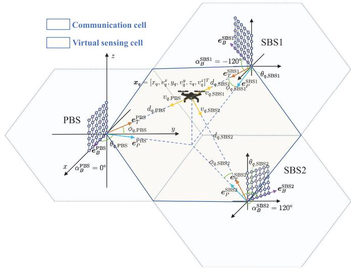  
Fig. 3. The diagram of geometric relationship between the UAV and PBS, as well as between the UAV and two SBSs.

$$
\boldsymbol { P } _ { q | q - 1 } = \boldsymbol { F } \boldsymbol { P } _ { q - 1 | q - 1 } \boldsymbol { F } ^ { T } + \boldsymbol { Q } ,
$$

$$
\begin{array} { r } { \pmb { H } _ { q } = \nabla _ { \pmb { x } ^ { T } } h ( \pmb { x } ) | _ { \pmb { x } = \hat { \pmb { x } } _ { q | q - 1 } } , } \end{array}\tag{29b}
$$

$$
\hat { z } _ { q | q - 1 } = h ( \hat { x } _ { q | q - 1 } ) ,\tag{29c}
$$

(29d)

$$
\pmb { K } _ { q } = \pmb { P } _ { q | q - 1 } \pmb { H } _ { q } ^ { T } ( \pmb { H } _ { q } \pmb { P } _ { q | q - 1 } \pmb { H } _ { q } ^ { T } + \pmb { R } ) ^ { - 1 } ,\tag{29e}
$$

$$
\hat { \pmb x } _ { q | q } = \hat { \pmb x } _ { q | q - 1 } + \pmb { K } _ { q } ( z _ { q } - \hat { z } _ { q | q - 1 } ) ,\tag{29f}
$$

$$
P _ { q | q } = ( I - K _ { q } H _ { q } ) P _ { q | q - 1 } ,\tag{29g}
$$

where P , Q, R are the covariance matrices of x, w, and v, respectively. Moreover, K is Kalman gain and $\pmb { H } \in \mathbb { R } ^ { Q \times P }$ is the Jacobian matrix of the measurement function $h ( { \pmb x } )$ with respect to the state vector x, which can be numerically calculated as shown in Algorithm 3.

Assuming that the initial location and velocity $\hat { \pmb { x } } _ { q | q - 1 }$ of the tracked UAV is known,2 the PBS forms a beam $\mathbf { w } _ { T X } \big ( \hat { \Psi } _ { q } , \hat { \Omega } _ { q } \big )$ pointing at the tracked UAV in the q-th time slot. The PBS and two SBSs receive the echoes and obtain $K _ { q } ^ { r } ( r ) \in \{ \mathrm { P B S } , \mathrm { S B S } 1 , \mathrm { S B S } 2 \} )$ estimations of horizontal angles and elevation angles $\{ ( \hat { \theta } _ { r , q , 1 } , \hat { \phi } _ { r , q , 1 } ) , . . . , ( \hat { \theta } _ { r , q , K _ { q } ^ { r } } , \hat { \phi } _ { r , q , K _ { q } ^ { r } } ) \}$ as well as velocities and distances $\{ ( \hat { v } _ { r , q , 1 } , \hat { d } _ { r , q , 1 } ) , \acute { \ldots } , ( \hat { v } _ { r , q , K _ { q } ^ { r } } , \hat { d } _ { r , q , K _ { q } ^ { r } } ) \}$ , as described in Section III. Next, we use $h ( \hat { \pmb { x } } _ { q | q - 1 } )$ to calculate the predicted measurement vector $\hat { z } _ { q \left. q - 1 \right. }$ and set a threshold $\epsilon \in \mathbb { R } ^ { Q \times 1 }$ . A region $\mathcal { R } _ { \hat { z } _ { q \mid q - 1 } } = \{ z \bigcap _ { \ L { q \mid q - 1 } } \Vert _ { 2 } \leq \Vert \epsilon \Vert _ { 2 } \}$ can be formed with $\hat { z } _ { q \left. q - 1 \right. }$ as the center and  as the radius. When multiple measurements fall into $\mathcal { R } _ { \hat { z } _ { q \mid q - 1 } } ,$ , we will select the closest measurement to $\hat { z } _ { q \left. q - 1 \right. }$ from $\bar { K } _ { q } ^ { r }$ measurements to constitute the measurement vector $z _ { q } .$ . Then, we use EKF to obtain the estimated state vector $\hat { \pmb { x } } _ { q | q }$ of the UAV. Utilizing the state transition equation (26), we can predict the UAV’s state at the $( q + 1 ) { \ - } \mathtt { t h }$ time slot $\hat { \pmb { x } } _ { q + 1 | q } .$ Next, using the function $h ( \hat { \pmb { x } } _ { q + 1 | q } )$ , we could predict the angle $( \hat { \theta } _ { \mathrm { P B S } , q + 1 , k } , \hat { \phi } _ { \mathrm { P B S } , q + 1 , k } )$ of the UAV relative to the PBS in the $( q + 1 )$ -th time slot. The PBS then generates a beam ${ \bf w } _ { T X } ( \hat { \Psi } _ { q + 1 } , \hat { \Omega } _ { q + 1 } )$ and measures the tracked UAV again. Similarly, we use $h ( \hat { \pmb { x } } _ { q + 1 | q } )$ to calculate the predicted measurement vector $\hat { z } _ { q + 1 | q } .$ . If multiple measurements fall into the region $\mathcal { R } _ { \hat { z } _ { q + 1 | q } }$ , then we select the measurement closest to $\hat { z } _ { q + 1 | q }$ as the measurement result in the (q + 1)-th time slot, which can effectively distinguish the k-th UAV from multiple UAVs and thus avoid UAV confusion.

## B. PBS Handover and VSC Handover With Networked Sensing

When the UAV flies within a VSC, the distance and blockage status between the UAV and the three BSs will affect the received SNR. Therefore PBS selection and PBS handover with networked sensing is significant for effective tracking. Additionally, when a UAV flies from the current VSC to another, the VSC handover with networked sensing should be performed to track this UAV continuously and seamlessly.

1) PBS Handover Strategy: In the absence of blockage, based on $\begin{array} { r c l } { \beta _ { r , q , k } } & { = } & { \sqrt { \frac { \lambda ^ { 2 } } { ( 4 \pi ) ^ { 3 } d _ { \mathrm { P B S } , q , \underline { { { k } } } } ^ { 2 } d _ { r , q , k } ^ { 2 } } } \sigma _ { r , q , k } } \end{array}$ in (7), we know that the received SNR of PBS is proportional to $d _ { \mathrm { P B S } , q , k } ^ { - 2 } d _ { \mathrm { P B S } , q , k } ^ { - 2 } .$ , and the received SNR of the two SBSs are proportional to $d _ { \mathrm { P B S } , q , k } ^ { - 2 } d _ { \mathrm { S B S 1 } , q , k } ^ { - 2 }$ and $d _ { \mathrm { P B S } , q , k } ^ { - 2 } d _ { \mathrm { S B S 2 } , q , k } ^ { - 2 }$ respectively. Therefore, the optimal strategy is to use the BS closest to the UAV in the current time slot as PBS, and the other two as SBSs, as shown in Fig. 4. In fact, considering that most UAVs fly at altitudes between 30 and 120 meters, some skyscrapers range from 120 meters to 300 meters or even higher will block the UAVs. Therefore, we propose a blockage detection method and PBS handover strategy. First, we predict the state $\hat { \pmb { x } } _ { q + 1 | q }$ using the EKF state transition equation and predict the measurement vector $\hat { z } _ { q + 1 | q }$ using the function $h ( \hat { \pmb x } _ { q + 1 | q } )$ . Then, PBS forms a beam $\mathbf { w } _ { T X } \big ( \hat { \Psi } _ { q + 1 } , \hat { \Omega } _ { q + 1 } \big )$ , and three BSs receive the echoes and estimate the parameters of the tracked UAV. If no estimation fall into the region $\mathcal { R } _ { \hat { z } _ { q + 1 | q } } = \left\{ z \vert \Vert z - \hat { z } _ { q + 1 | q } \Vert _ { 2 } \leq \Vert \epsilon \Vert _ { 2 } \right\}$ , then we consider the signal being blocked. Next, we classify blockages into two categories: PBS blockage and SBS blockage, as shown in Fig. 4. When PBS is blocked, none of the three BSs receive the UAV’s echo. In this case, PBS should switch to the second nearest BS to the UAV and another unblocked BS should act as SBS. During the iteration in (29), the value of Q will change from 12 to 8 for state updating. SBS blockage can be classified into one SBS being blocked and two SBSs being blocked simultaneously. In both case, PBS does not need to switch, but during the iteration in (29), the value of Q will change from 12 to 8 and 4 respectively for state updating. When $Q = 4 ,$ multi-BS tracking degenerates into single-BS tracking. The detailed steps of PBS handover can be found in Algorithm 4. In Algorithm 4, the condition in line 7 corresponds to the PBS being blocked, as depicted in Fig. 4(a). The condition in line 9 corresponds to both SBSs being blocked, as shown in Fig. 4(c). The conditions in lines 11 and 13 correspond to one of the SBSs being blocked, as illustrated in Fig. 4(b). Based on this strategy, the UAV can always be tracked unless all three BSs are blocked.

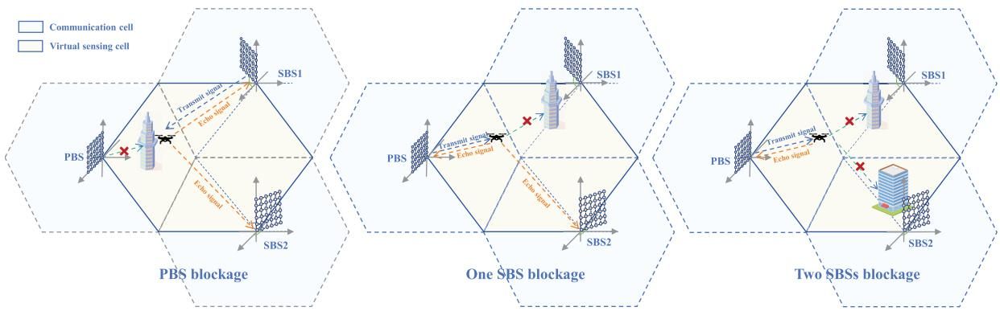  
Fig. 4. Three types of blockage: (a) the PBS is blocked, (b) one SBS is blocked, and (c) two SBSs are blocked simultaneously.

2) VSC Handover Strategy: When the UAV flies from one VSC to another, the VSC handover needs to be performed. Since the flight trajectory of the UAV is unpredictable, it may fly directly into another VSC or turn back once reaching the VSC boundary. If the handover occurs directly at the VSC boundary, then the UAV may be lost. Therefore, we propose to divide a buffer zone of $\pm \Theta ^ { \circ }$ near the VSC boundary, as shown in Fig. 5. When the UAV flies into the buffer zone, the adjacent two VSCs alternately form beams to track the UAV. For exmaple, in the q-th time slot, the PBS of VSC1 forms a beam to track the UAV, while in the $( q + 1 )$ -th time slot, the PBS of VSC2 forms a beam to track the UAV. The tracking process continues in this alternating manner. Note that the PBS in VSC1 and the PBS in VSC2 are physically the two groups of transceivers of the same BS serving sector 1 and sector 3, respectively. When the UAV exits the buffer zone, it is handed over to the corresponding VSC. The detailed steps of VSC handover can be found in Algorithm 5. Due to the existence of the buffer zone, the angle sensing range of each BS sector expands from $[ \theta _ { \mathrm { m i n } } , \theta _ { \mathrm { m a x } } ] \mathrm { ~ t o ~ } [ \theta _ { \mathrm { m i n } } - \Theta , \theta _ { \mathrm { m a x } } + \Theta ]$ This strategy effectively prevents the UAV from being lost when it lingers at the boundary of the VSC.

Algorithm 4 PBS Handover Algorithm   
Input: Posterior state estimate $\hat { \pmb { x } } _ { q | q }$   
Output: Posterior state estimate $\hat { \pmb { x } } _ { q + 1 | q + 1 }$   
1 Calculate prior state estimate $\hat { \pmb { x } } _ { q + 1 | q }$ using (29a)   
2 Calculate prior measurement estimate $\hat { z } _ { q + 1 | q }$ using (29d),   
$\begin{array} { r } { \hat { z } _ { q + 1 | q } ^ { \mathrm { P B S } } = \hat { z } _ { q + 1 | q } [ 1 : 4 ] , \hat { z } _ { q + 1 | q } ^ { \mathrm { S B S 1 } } = \hat { z } _ { q + 1 | q } [ 5 : 8 ] , \hat { z } _ { q + 1 | q } ^ { \mathrm { \tiny \bar { S } B S 2 } } = } \end{array}$   
$\hat { z } _ { q + 1 | q } [ 9 : 1 2 ]$   
3 Extract the distances of the UAV relative to the three BSs   
from $\hat { z } _ { q + 1 | q } ,$ and select the BS closest to the UAV as PBS.   
4 Extract $\hat { \Psi } _ { q + 1 } , \hat { \Omega } _ { q + 1 }$ from $\hat { z } _ { q + 1 | q }$ to form the beam   
${ \bf w } _ { T X } ( \hat { \Psi } _ { q + 1 } , \hat { \Omega } _ { q + 1 } )$   
5 Perform signal processing on the echoes to obtain $z _ { q + 1 } ,$   
and $z _ { q + 1 } ^ { \mathrm { P B S } } = z _ { q + 1 } ^ { ' } [ 1 : 4 ] , z _ { q + 1 } ^ { \mathrm { S B S 1 } } = z _ { q + 1 } [ 5 : 8 ] , z _ { q + 1 } ^ { \mathrm { S B S 2 } ^ { \cdot } } =$   
$z _ { q + 1 } [ 9 : 1 2 ] .$   
6 Generate three regions: $\mathcal { R } _ { \hat { z } _ { q + 1 | q } } ^ { \mathrm { P B S } }$   
$\left\{ z \mid \| z - \hat { z } _ { q + 1 | q } ^ { \mathrm { P B S } } \| _ { 2 } \leq \| \epsilon [ 1 : 4 ] \| _ { 2 } \right\}$ $\mathcal { R } _ { \hat { z } _ { q + 1 | q } } ^ { \mathrm { S B S 1 } }$   
$\left\{ z \mid \| z - { \hat { z } } _ { q + 1 \mid q } ^ { \mathrm { S B S 1 } } \| _ { 2 } \right\} ,$ $\mathcal { R } _ { \hat { z } _ { q + 1 | q } } ^ { \mathrm { S B S 2 } }$   
$\Bigl \{ z \ | \ | z - \hat { z } _ { q + 1 | q } ^ { \mathrm { S B S 2 } } | \Bigr \} , \le \| \epsilon [ 9 : 1 2 ] \| _ { 2 } \Bigr \} ,$   
7 if $z _ { q + 1 } ^ { \mathrm { P B S } } \notin \mathcal { R } _ { \widehat { z } _ { q + 1 | q } } ^ { \mathrm { P B S } } \land z _ { q + 1 } ^ { \mathrm { S B S 1 } } \notin \mathcal { R } _ { \widehat { z } _ { q + 1 | q } } ^ { \mathrm { S B S 1 } } \land z _ { q + 1 } ^ { \mathrm { S B S 2 } } \notin \mathcal { R } _ { \widehat { z } _ { q + 1 | q } } ^ { \mathrm { S B S 2 } }$   
then   
8 Switch PBS to the second nearest BS to the UAV.   
9 else if $z _ { q + 1 } ^ { \mathrm { S B S 1 } } \not \in \mathcal { R } _ { \hat { z } _ { q + 1 | q } } ^ { \mathrm { S B S 1 } } \wedge z _ { q + 1 } ^ { \mathrm { S B S 2 } } \not \in \mathcal { R } _ { \hat { z } _ { q + 1 | \epsilon } } ^ { \mathrm { S B S 2 } }$ then   
10 Discard the measurement of SBS1 and SBS2 in (29c)   
to (29f), $z _ { q + 1 } = ( z _ { q + 1 } ^ { \mathrm { P B S } } ) ^ { T }$ , and calculate $\hat { \pmb { x } } _ { q + 1 | q + 1 }$   
11 else if $z _ { q + 1 } ^ { \mathrm { S B S 1 } } \mathcal { \dot { \notin } } \mathcal { R } _ { \hat { z } _ { q + 1 | q } } ^ { \mathrm { S B S 1 } ^ { \mathrm { \tiny ~ \sf ~ { ~ 1 ~ } } } }$ then   
12 Discard the measurement of SBS1 in (29c) to   
(29f), $z _ { q + 1 } ~ = ~ [ ( z _ { q + 1 } ^ { \mathrm { P B S } } ) ^ { T } , ( z _ { q + 1 } ^ { \mathrm { S B S 2 } } ) ^ { T } ] ^ { T }$ , and calculate   
$\hat { \pmb { x } } _ { q + 1 | q \pm 1 }$   
13 else if $z _ { q + 1 } ^ { \mathrm { S B S 2 } } \notin \mathcal { R } _ { \hat { z } _ { q + 1 | q } } ^ { \mathrm { S B S 2 } }$ then   
14 Discard the measurement of SBS2 in (29c) to   
(29f), $z _ { q + 1 } \ = \ [ ( z _ { q + 1 } ^ { \mathrm { P B S } } ) ^ { T } , ( z _ { q + 1 } ^ { \mathrm { S B S 1 } } ) ^ { T } ] ^ { T }$ , and calculate   
$\hat { \pmb { x } } _ { q + 1 | q + 1 } .$   
15 else   
16 $z _ { q + 1 } = [ ( z _ { q + 1 } ^ { \mathrm { P B S } } ) ^ { T } , ( z _ { q + 1 } ^ { \mathrm { S B S 1 } } ) ^ { T } , ( z _ { q + 1 } ^ { \mathrm { S B S 2 } } ) ^ { T } ] ^ { T }$ , and calcu  
late $\hat { \pmb { x } } _ { q + 1 | q + 1 }$ using (29c) to (29f).   
17 end if   
18 return: $\hat { \pmb { x } } _ { q + 1 | q + 1 }$

Algorithm 5 VSC Handover Algorithm   
Input: $\hat { \theta } _ { \mathrm { P B S } , q , k } , \Theta$   
1 for $q = 1 , 2 , . . .$ . do   
2 for $k = 1$ to K do   
3 if $\hat { \theta } _ { \mathrm { P B S } , q , k } \in [ \theta _ { \operatorname* { m i n } } - \Theta , \theta _ { \operatorname* { m a x } } + \Theta ]$ then   
4 PBS in current VSC switch to the PBS in   
corresponding VSC   
5 end if   
6 end for   
7 end for

## V. SIMULATION RESULTS

In this section, we simulate the flight trajectories of UAVs, and then evaluate the performance of UAV detection, tracking, and handover with networked sensing.

## A. Trajectory Generation

The flight trajectories of UAVs in the real world exhibit both continuity and randomness. The continuity is reflected in the correlation between the 3D coordinates at two consecutive moments, while the randomness is manifested in the flight direction and speed, which change randomly over time. Hence, to simulate the real-world UAV flight, we use truncated Gaussian distribution to generate the flight trajectories. The standard form of truncated Gaussian distribution [40] can be expressed as

$$
\psi \left( \mu , \sigma ^ { 2 } , a , b ; x \right) = \left\{ \begin{array} { l l } { 0 , } & { x \leq a } \\ { \frac { \phi \left( \mu , \sigma ^ { 2 } ; x \right) } { \phi \left( \mu , \sigma ^ { 2 } ; b \right) - \phi \left( \mu , \sigma ^ { 2 } ; a \right) } , } & { a < x \leq b , } \\ { 0 , } & { x > b } \end{array} \right.\tag{30}
$$

where $\phi \left( \mu , \sigma ^ { 2 } ; x \right)$ is the standard Gaussian distribution with mean $\mu$ and variance $\sigma ^ { 2 } ;$ a and b are the upper bound and the lower bound of the truncated Gaussian distribution respectively. If the yaw angle and the pitch angle of a UAV at time t are denoted as $\vartheta _ { t }$ and $\varphi _ { t }$ respectively, then the yaw angle and the pitch angle at time $t + 1$ can be expressed as

$$
\vartheta _ { t + 1 } = \psi \left( \vartheta _ { t } , 1 0 , \vartheta _ { t } - 3 0 , \vartheta _ { t } + 3 0 ; \vartheta \right) ,\tag{31}
$$

$$
\varphi _ { t + 1 } = \psi \left( \varphi _ { t } , 1 0 , \varphi _ { t } - 3 0 , \varphi _ { t } - 3 0 ; \varphi \right) ,\tag{32}
$$

where the yaw angle and the pitch angle at time t are taken as the mean, and $1 0 ^ { \circ }$ is taken as the variance. The range of the yaw angle is limited to $[ \vartheta _ { t } - 3 0 ^ { \circ } , \vartheta _ { t } + 3 0 ^ { \circ } ]$ and the range of

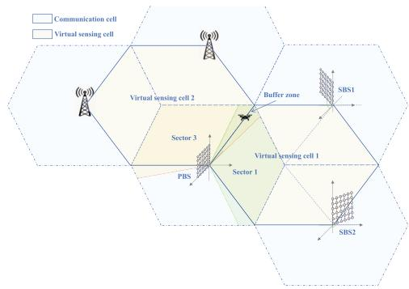  
Fig. 5. Diagram of VSC handover.

the pitch angle is limited to $\left[ \varphi _ { t } - 3 0 ^ { \circ } , \varphi _ { t } - 3 0 ^ { \circ } \right]$ , respectively. Similarly, the speed at time $t + 1$ can be expressed as

$$
s _ { t + 1 } = \psi \left( s _ { t } , 2 , 1 2 , 2 0 ; s \right) ,\tag{33}
$$

where the speed at time t is taken as the mean and 2 m/s is taken as the variance. The range of the speed is limited to $1 2 \mathrm { ~ \sim ~ } 2 0 ~ \mathrm { m / s }$ . This approach ensures a certain level of continuity in flight direction and speed while avoiding complete randomness. The above method simulates the trajectory of a UAV in stable flight. To test the tracking performance of the proposed algorithm during UAV maneuvers, we have also deliberately introduced several sharp turns into the trajectory.

## B. Detection Performance With Networked Sensing

1) Parameter Setting: We set $M ~ = ~ 6 4 , ~ N ~ = ~ 6 4 ,$ $N _ { T } = N _ { T } ^ { x } \times N _ { T } ^ { z } = 8 \times 8 = 6 4 , N _ { R } = N _ { R } ^ { x } \times N _ { R } ^ { z } = 8 \times 8 = 6 4 ,$ $f _ { 0 } = 6 0 \mathrm { G H z } .$ $\Delta f ~ = ~ 3 8 0$ kHz, $\begin{array} { r } { d _ { x } \ = \ d _ { z } \ = \ \frac { \lambda } { 2 } } \end{array}$ . The maximum unambiguous range is $R _ { \mathrm { m a x } } ~ = ~ { \frac { c } { 2 \Delta f } } ~ = ~ 3 9 4 . 7$ and the maximum unambiguous velocity is $\begin{array} { r } { V _ { \mathrm { m a x } } = \pm \frac { c } { 4 f _ { 0 } T _ { \mathrm { s } } } = \pm 1 2 5 } \end{array}$ m/s, where $\begin{array} { r } { T _ { s } = \frac { 1 } { \Delta f } + T _ { g } = 1 } \end{array}$ µs is the duration of the OFDM signal and $^ { - } T _ { g }$ is duration of CP. The noise is assumed to follow the complex Gaussian distribution with mean $\mu _ { n } \ = \ 0$ and variance $\sigma _ { n } ^ { 2 } = 1$ . The root mean square error (RMSE) of horizontal angle estimation, elevation angle estimation, distance estimation, and radial velocity estimation are defined as $\begin{array} { r } { \mathrm { R M S E } _ { \theta } \ = \ \sqrt { \frac { \sum _ { i = 1 } ^ { N _ { \mathrm { M C } } } \left( \hat { \theta } _ { i } - \theta \right) ^ { 2 } } { N _ { \mathrm { M C } } } } , \ \mathrm { R M S E } _ { \phi } \ = \ \sqrt { \frac { \sum _ { i = 1 } ^ { N _ { \mathrm { M C } } } \left( \hat { \phi } _ { i } - \phi \right) ^ { 2 } } { N _ { \mathrm { M C } } } } } \end{array}$ $\begin{array} { r } { \mathrm { R M S E } _ { d } = \sqrt { \frac { \sum _ { i = 1 } ^ { N _ { \mathrm { M C } } } \left( \hat { d } _ { i } - d \right) ^ { 2 } } { N _ { \mathrm { M C } } } } } \end{array}$ and $\begin{array} { r } { \mathrm { R M S E } _ { v } = \sqrt { \frac { \sum _ { i = 1 } ^ { N _ { \mathrm { M C } } } ( \hat { v } _ { i } - v ) ^ { 2 } } { N _ { \mathrm { M C } } } } } \end{array}$ where $N _ { \mathrm { M C } } \ ' = \ 1 0 0 0 0$ is the number of the Monte Carlo runs, $( \theta , \phi , d , v )$ is the true parameters of the UAV, and $( \hat { \theta } _ { i } , \hat { \phi } _ { i } , \hat { d } _ { i } , \hat { v } _ { i } )$ is the estimated parameters of the UAV in the i-th Monte Carlo run. The sensing range of ISAC BS is set as $\{ ( d , \theta , \phi ) \mid 0 \leq d \leq 4 0 0 \mathrm { m } , 3 0 ^ { \circ } \leq \theta \leq 1 2 0 ^ { \circ } , 5 ^ { \circ } \leq \phi \leq 6 0 ^ { \circ } \}$ in which the range of elevation angle ensures that the beam points towards the low altitude. The size of the clutter scattering unit is determined by the resolution of sensing system. Specifically, the horizontal angle resolution and the elevation angle resolution is approximately $\begin{array} { r } { \Delta \theta \approx \frac { 2 } { N _ { T } ^ { x } } } \end{array}$ and $\begin{array} { r } { \Delta \phi \approx \frac { 2 } { N _ { T } ^ { z } } } \end{array}$ , while the distance resolution is $\begin{array} { r } { \Delta d = \frac { \dot { c } } { 2 ( M - 1 ) \Delta f } } \end{array}$ 2) Performance of UAV Parameter Estimation: Fig. 6 shows the RMSE of the estimation of $\mathrm { U A V } ^ { \ , } \mathbf { s }$ horizontal

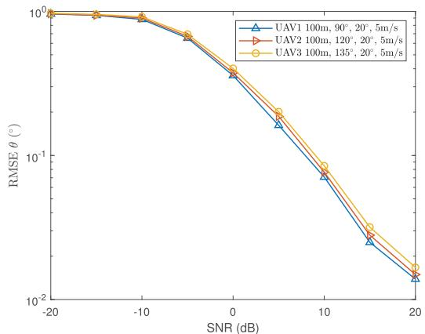  
(a) The RMSE of $\mathrm { U A V } ^ { * } \mathrm { s }$ horizontal angle θ estimation.

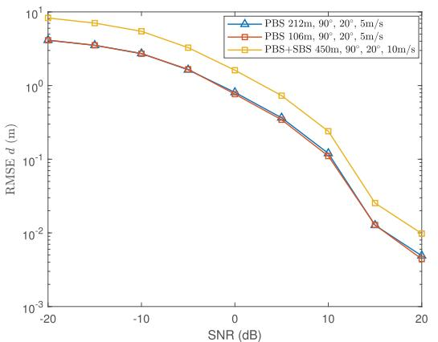  
(c) The RMSE of UAV's distance estimation of $d _ { \mathrm { P B S } }$ and $d _ { \mathrm { P B S } } +$ $d _ { \mathrm { S B S } } .$

(b) The RMSE of $\mathrm { U A V } _ { \mathrm { \Delta } }$ elevation angle φ estimation  
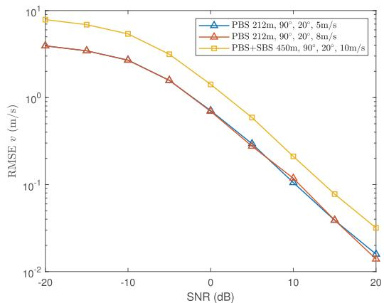  
(d) The RMSE of UAV's radial velocity estimation of vPBS and $\boldsymbol { v } _ { \mathrm { P B S } } + \boldsymbol { v } _ { \mathrm { S B S } } .$  
Fig. 6. The RMSE of the estimation of $\mathrm { U A V } _ { \mathrm { } } \mathrm { { s } }$ horizontal angle θ, elevation angle $\phi ,$ distance d and radial velocity v. The parameter settings for UAVs are shown in the figures.

angle $\theta ,$ elevation angle φ, distance $d ,$ and radial velocity v versus SNR. From Fig. $6 ( \mathrm { a } ) .$ , it can be observed that ${ \mathrm { R M S E } } _ { \theta }$ decreases as the SNR increases. Specifically, when the SNR is less than −10 dB, ${ \mathrm { R M S E } } _ { \theta }$ does not change significantly with SNR. When the SNR is greater than −10 dB, RMSEθ rapidly decreases from $0 . 9 ^ { \circ }$ to $0 . 0 3 ^ { \circ }$ . As the SNR continues to increase, the decrease rate of ${ \mathrm { R M S E } } _ { \theta }$ slows down. Fig. 6(a) also compares ${ \mathrm { R M S E } } _ { \theta }$ of three UAVs located at horizontal angles of 90◦, 120◦, and $1 3 5 ^ { \circ }$ . It can be seen that $\mathrm { R M S E _ { \theta } ^ { 9 0 ^ { \circ } } < R M S E _ { \theta } ^ { 1 2 0 ^ { \circ } } < R M S E _ { \theta } ^ { 1 3 5 ^ { \circ } } }$ under the same SNR. The reason is that the beam is the narrowest at $\theta \ : = \ : 9 0 ^ { \circ }$ and widens as it approaches $0 ^ { \circ }$ or $1 8 0 ^ { \circ }$ . The underlying reason is the nonlinearity of sine and cosine function in Ψ and Ω. Similarly, Fig. 6(b) shows that ${ \mathrm { R M S E } } _ { \phi }$ decreases as the SNR increases. When the SNR is less than −10 dB, ${ \mathrm { R M S E } } _ { \phi }$ does not change significantly with SNR, but when the SNR is greater than −10 dB, ${ \mathrm { R M S E } _ { \phi } }$ rapidly decreases. Moreover, when $\phi = 0 ^ { \circ }$ , the beam is the narrowest, resulting in RMS $\mathfrak { r } _ { \phi } ^ { \mathfrak { s } ^ { \circ } } < \mathrm { R M S E } _ { \phi } ^ { 3 0 ^ { \circ } } < \mathrm { R M S E } _ { \phi } ^ { 4 5 ^ { \circ } }$

Fig. 6(c) illustrates the curve of $\mathrm { R M S E _ { d } }$ for PBS and either SBS versus SNR. It can be observed that $\mathrm { R M S E } _ { d } ^ { \mathrm { P B S } }$ and $\mathrm { R M S E } _ { d } ^ { \mathrm { S B S } }$ gradually decrease as the SNR increases. When the SNR is less than −10 dB, the decrease of $\mathrm { R M S E } _ { d } ^ { \mathrm { P B S } }$ and $\mathrm { R M S E } _ { d } ^ { \mathrm { S B S } }$ are not significant, but when the SNR exceeds −10 dB, they rapidly decrease. In addition, $\mathrm { R M S E } _ { d } ^ { \mathrm { P B S } }$ is significantly smaller than $\mathrm { R M S E } _ { d } ^ { \mathrm { S B S } }$ . The reason is that PBS can measure the distance d of UAV relative to PBS, whereas either SBS can only measure the sum of the distances of UAV relative to PBS and SBS, i.e., $d _ { \mathrm { P B S } } + d _ { \mathrm { S B S } }$ Therefore, theoretically, the maximum measurement range is $d _ { \operatorname* { m a x } , \mathrm { S B S } } ~ = ~ 2 d _ { \operatorname* { m a x } , \mathrm { P B S } }$ , and the distance resolution is $\Delta d _ { \mathrm { S B S } } ~ = ~ 2 \Delta d _ { \mathrm { P B S } }$ . From Fig. 6(c), it can be seen that $\mathrm { R M S E } _ { d } ^ { \mathrm { S B S } }$ is approximately equal to $2 \mathrm { R M S E } _ { d } ^ { \mathrm { P B S } }$ . Similarly, Fig. 6(d) shows that $\mathrm { R M S E } _ { v } ^ { \mathrm { P B S } }$ and $\mathrm { R M S E } _ { v } ^ { \mathrm { S B S } }$ decrease as the SNR increases. When the SNR is less than −10 dB, $\mathrm { R M S E } _ { v } ^ { \mathrm { P B S } }$ and $\mathrm { R M S E } _ { v } ^ { \mathrm { S B S } }$ do not change significantly, but when the SNR is greater than −10 dB, they rapidly decrease. PBS can measure the radial velocity vPBS of UAV relative to it, whereas either SBS can only measure the sum of the radial velocity of UAV relative to PBS and SBS, i.e., $\begin{array} { r } { v _ { \mathrm { P B S } } + v _ { \mathrm { S B S } } . } \end{array}$ . Therefore, $\mathrm { R M S E } _ { v } ^ { \mathrm { S B S } }$ is approximately equal to $2 \mathrm { R M S E } _ { v } ^ { \mathrm { P B S } }$ . Note that since there are linear terms $2 \pi f _ { D } T _ { s } n / c$ and $- j 2 \pi \Delta f \tau _ { r , q , k } m$ in the exponential of the Doppler array steering vector and the time delay array steering vector respectively, radial velocity and distance estimation do not involve the concept of the beamwidth. Consequently, $\mathrm { R M S E _ { d } }$ is the same for UAVs at different distances under the same SNR, and RMSE is the same for UAVs at different velocities under the same SNR. The detailed derivation can be found in the appendix.

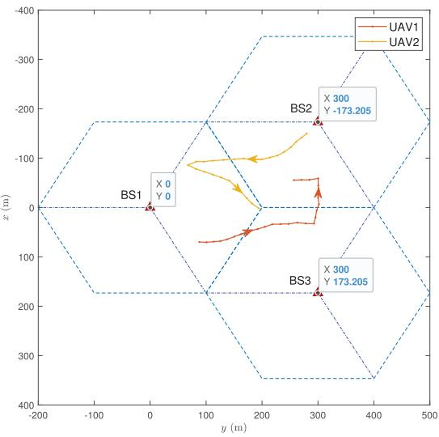  
Fig. 7. Top view of BSs’ locations and UAVs’ trajectories.

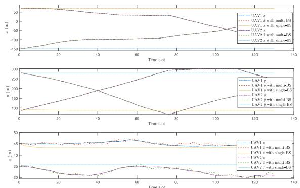  
(a) The estimated value and true value of UAVs’ 3D coordinates $x , y , z .$  
Fig. 8. The tracking results of two UAV’s locations and velocities.

## C. Tracking Performance With Networked Sensing

1) Multiple UAVs Tracking: Let us set the distance between two BSs as $d _ { \mathrm { B S } } = 2 0 0 { \sqrt { 3 } }$ m and establish a x-y-z Cartesian coordinate system with the ground projection of BS1 in Fig. 7 as the origin. Assuming that the height of all BSs is $h _ { \mathrm { B S } } = 1 5$ m, the 3D coordinates of BS1, BS2, and BS3 are (0, 0, 15), $( - 1 0 0 \sqrt { 3 } , 3 0 0 , 1 5 )$ , and $( - 1 0 0 \sqrt { 3 } , 3 0 0 , 1 5 )$ respectively, as shown in Fig. 7. Then BS1, BS2, and BS3 form a VSC to track multiple UAVs. For clarity, we present the top-down view of the BS distribution. Ten sets of flight trajectories for two UAVs are generated using the method in Subsection $\mathrm { V } { \mathrm { - } } \mathrm { A } .$ with one example shown in Fig. 7. Moreover, the duration from t to t + 1 is set 1 s. Considering that the locations of UAVs will not change significantly in a short term while the speed may experience sudden changes, we set threshold  as $[ 3 ^ { \circ } , 3 ^ { \circ } , 3 0 \mathrm { m / s } , 5 \mathrm { m } , 3 ^ { \circ } , 3 ^ { \circ } , 6 0 \mathrm { m / s } , 1 0 \mathrm { m } , 3 ^ { \circ } , 3 ^ { \circ } , 6 0 \mathrm { m / s } , 1 0 \mathrm { m } ] ^ { T }$ The measurement interval δt is set as 0.2 s. Due to the mild changes of the UAV’s state over the short measurement interval, we set Q as $0 . 1 E _ { 6 \times 6 }$ . Moreover, considering that $\mathrm { R M S E _ { d } }$ of PBS+SBS is twice the $\mathrm { R M S E _ { d } }$ of PBS and ${ \mathrm { R M S E } } _ { \mathrm { v } }$ of PBS+SBS is twice the RMSEv of PBS in Fig. 6(c) and Fig. 6(d), we set R as

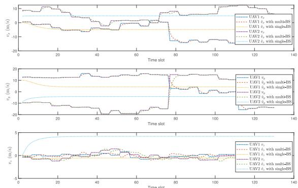  
(b) The estimated value and true value of UAVs’ 3D velocities $v _ { x } , v _ { y } , v _ { z }$

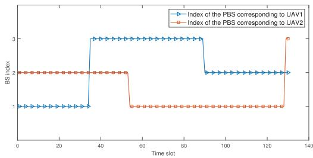  
Fig. 9. The PBS indices corresponding to UAV1 and UAV2 versus time slot in the absence of blockage.

$$
\pmb { R } = \left[ \begin{array} { c } { 0 . 1 \pmb { E } _ { 4 \times 4 } } \\ { 0 . 1 \pmb { E } _ { 2 \times 2 } } \\ { 0 . 2 \pmb { E } _ { 2 \times 2 } } \\ { 0 . 1 \pmb { E } _ { 2 \times 2 } } \\ { 0 . 2 \pmb { E } _ { 2 \times 2 } } \end{array} \right] .\tag{34}
$$

In the absence of blockage, the tracking results of the locations and velocities of two UAVs in Fig. 7 are shown in Fig. 8. It can be observed that when multi-BS collaborate to track UAVs, the 3D coordinates $( x , y , z )$ of the two UAVs are accurately estimated, where the RMSEs of UAV1’s x, y, z are 0.35 m, 0.41 m, 0.50 m and the RMSEs of UAV2’s x, y, z are 0.32 m, 0.40 m, 0.41 m, respectively. Moreover, based on the proposed threshold method in Subsection IV-A, the parameters of the two UAVs are effectively distinguished. The average RMSEs of the 10 sets of trajectories for the two UAVs in x, y, and z are 0.35 m, 0.39 m, and 0.43 m, respectively. In Fig. 8(b), the 3D velocities $( v _ { x } , v _ { y } , v _ { z } )$ of the two UAVs are also accurately estimated, where the RMSEs of UAV1’s $v _ { x } , \ v _ { y } , \ v _ { z }$ are 1.05 m/s, 1.22 m/s, 0.41 m/s and the RMSEs of $\mathrm { U A V } 2 ^ { \circ } \mathrm { s } \ v _ { x } , v _ { y } , v _ { z }$ are 0.52 m/s, 1.59 m/s, 0.43 m/s, respectively. Additionally, it can be observed that when the UAVs make sharp turns, their velocities may experience sudden changes. During these moments, using the EKF for tracking may result in some lag, but this does not significantly impact the overall performance. The average RMSEs of the 10 sets of trajectories for the two UAVs in $v _ { x } , v _ { y } ,$ and $v _ { z }$ are 0.98 m/s, 1.27 m/s, and 0.51 m/s, respectively. In Fig. 8, we

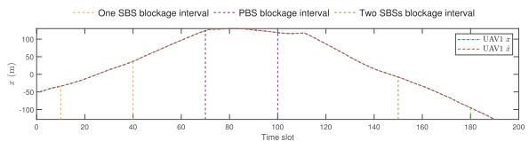

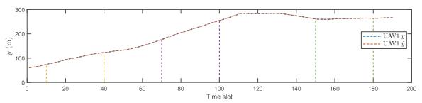

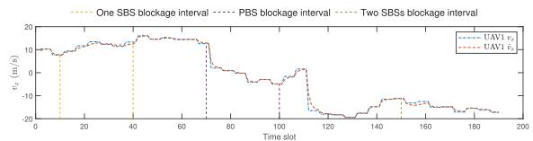

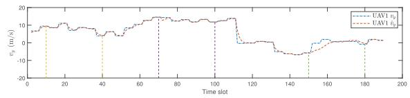

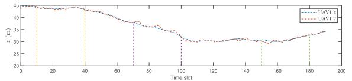

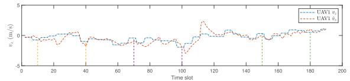  
(a) The estimated value and true value of the UAV's 3D coordinates $x , y , z$ (b) The estimated value and true value of UAVs' 3D velocity $v _ { x } , v _ { y } , v _ { z }$ under under blockage. blockage.

Fig. 10. The tracking result of the UAVs’s locations and velocities. During time slots 10 to 40, one SBS is blocked; during time slots 70 to 100, the PBS is blocked; and during time slots 150 to 180, two SBSs are simultaneously blocked.

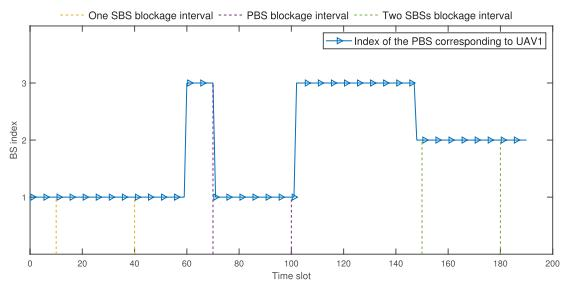  
Fig. 11. The PBS index of the UAV versus time slot under blockage.

further compare the tracking performance using a single-BS with using multi-BS. For single BS case, one BS is randomly selected as the PBS to track the UAV, while the other two remained inactive throughout the process. It can be seen that the estimated locations and velocities exhibite initial variations but subsequently remaine constant, leading to complete tracking failure. The reason is that a single BS can only observe the radial velocity of the UAV and cannot measure its transverse velocity, resulting in insufficient observability to uniquely determine 3D velocity of UAV. During the dynamic iteration of the EKF, the estimation errors in velocity propagate to positional errors, ultimately causing divergence in all state estimates. Fig. 9 shows the variation of the PBS indices for the two UAVs in Fig. 7 during the tracking process. In the absence of blockages, the BS closest to the UAV is selected as the PBS.

2) Tracking Under Blockage Status: Fig. 10 illustrates the tracking results of UAV under blockage status. Specifically, during time slots 10 to 40, one SBS is blocked; during time slots 70 to 100, the PBS is blocked; and during time slots 150 to 180, two SBSs are simultaneously blocked; during the remaining time slots, all three BSs are unblocked. It can be observed that the blockage of one SBS or the PBS does not significantly affect the tracking performance, as there are always two BSs simultaneously estimating the UAVs’ parameters at each time slot. However, when two SBSs are simultaneously blocked, multi-BS tracking degrades to single-BS tracking, which results in minor impact on location estimation but significant bias in velocity estimation. The reason is that the measurements from a single BS (d, θ, φ) can completely determine the UAV’s 3D coordinates, whereas measurement v only provide velocity information along a certain direction and cannot fully determine the 3D velocity. Fig. 11 depicts the variation of the PBS index. The blockage of one SBS or two SBSs has no effect on the PBS index. However, when the PBS is blocked, the second-closest BS to the UAV is selected as the PBS. During time slots 70 to 100 in Fig. 11, the UAV is closest to BS3, but due to blockage, the PBS switches to BS1 that is the second-closest BS to the UAV. After the blockage ends, the PBS switches back to BS3.

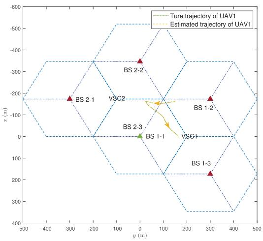  
Fig. 12. The trajectory of the UAV flying across two VSCs.

3) Tracking Across VSCs: Fig. 12 illustrates the true trajectory and estimated trajectory of the UAV flying across two VSCs. When the UAV enters the buffer region, it is alternately estimated by the two VSCs, while when the UAV exits the buffer region, the tracking is handed over to the corresponding VSC. For clarity, we define the indices of BS within the V-th VSC as follows: the left BS is indexed as V-1, the top-right BS as V-2, and the bottom-right BS as V-3. For example, the index of green BS in Fig. 12 is 1-1 in VSC1, while the index of green BS is 2-3 in VSC2. The variation of the PBS index is shown in Fig. 13. We can observe that when the UAV flies into the buffer region, the PBS index alternates between 1-1 and 2-3. The RMSE of $x , \ y , \ z , \ v _ { x } , \ v _ { y } ,$ and $v _ { z }$ in the entire tracking process are 0.32 m, 0.37 m, 0.52 m, 1.12 m/s, 1.46 m/s, and 0.67 m/s, respectively.

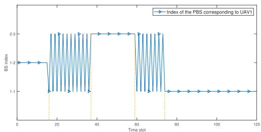  
Fig. 13. The PBS index of the UAV versus time slot when the UAV enters and exits the buffer region.

## VI. CONCLUSION

In this paper, we propose a networked ISAC based UAV tracking and handover scheme towards LAE. Specifically, we define a VSC where the PBS transmits sensing signals and three BSs receive echoes. After filtering out static clutter, the three BSs estimate horizontal angles, elevation angles, distances, and radial velocities of the UAVs with the MUSIC algorithm. Then we utilize a centralized EKF to fuse the estimations from the three BSs and leverage the one-step prediction results of the EKF to effectively distinguish and track multiple UAVs. During the tracking process, we propose a PBS handover strategy and a VSC handover strategy to effectively and continuously track UAVs. Simulation results demonstrate the effectiveness of the proposed scheme and provide valuable insights for networked ISAC based UAV tracking and handover in LAE.

## APPENDIX

Denote the steering vector of the ULA as ${ \bf a } _ { N L } \left( \theta \right) \ =$ $\left[ 1 , e ^ { j \frac { 2 \pi d \sin \theta } { \lambda } } , \dots , e ^ { j \frac { 2 \pi d \sin \theta } { \lambda } ( N _ { T } - 1 ) } \right] ^ { T } \ \in \ \mathbb { C } ^ { N _ { T } \times 1 }$ , whose normalized directional pattern at $\theta _ { 0 }$ can be expressed as

$$
A _ { N L } ( \theta ) = \left| \frac { \sin \left[ \frac { \pi d } { \lambda } \left( \sin \theta - \sin \theta _ { 0 } \right) N _ { T } \right] } { N _ { T } \sin \left[ \frac { \pi d } { \lambda } \left( \sin \theta - \sin \theta _ { 0 } \right) \right] } \right| .\tag{35}
$$

Let $\begin{array} { l } { A _ { N L } ( \theta ) ^ { 2 } \ = \ \frac { 1 } { 2 } } \end{array}$ . Then we can obtain two solutions sin θ − sin $\theta _ { 0 } = \pm B$ . The half power beamwidth at $\theta _ { 0 }$ can be expressed as

$$
W _ { \theta _ { 0 } } ^ { N L } = \arcsin ( \sin \theta _ { 0 } + B ) - \arcsin ( \sin \theta _ { 0 } - B ) .\tag{36}
$$

When $\theta _ { 0 } = 0 ^ { \circ }$ , both sides of the beam are equal in width, and the beamwidth is 2 arcsin(B). When $\theta _ { 0 }$ is greater than $0 ^ { \circ }$ and close to $9 0 ^ { \circ }$ , due to the nonlinearity of arcsine, the beamwidth on both sides is unequal, narrow on the left and wide on the right, while the overall width is greater than that when $\theta _ { 0 } \ : = \ : 0 ^ { \circ }$ . Therefore, when the beam is the closer to $9 0 ^ { \circ } ~ \mathrm { o r } ~ - 9 0 ^ { \circ }$ , the beam becomes wider. However, when there is linear term in the exponential of the array steering vector, i.e., $\mathbf { a } _ { L } \left( \theta \right) = \left\lceil 1 , e ^ { j \frac { 2 \pi d \theta } { \lambda } } , \ldots , e ^ { j \frac { 2 \pi d \theta } { \lambda } \left( N _ { T } - 1 \right) } \right\rceil ^ { T } \in \mathbb { C } ^ { N _ { T } \times 1 }$ , its normalized directional pattern at $\theta _ { 0 }$ can be expressed as

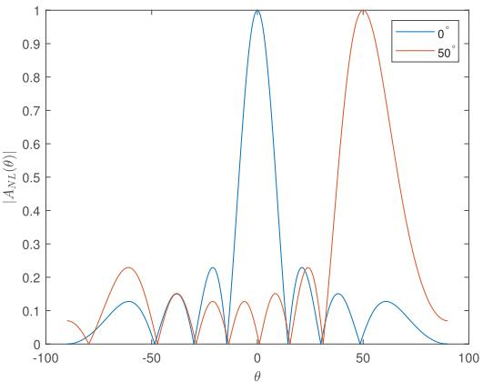  
Fig. 14. The directional patterns $A _ { N L } ( \theta )$ at $\theta _ { 0 } = 0 ^ { \circ }$ and $\theta _ { 0 } = 5 0 ^ { \circ }$

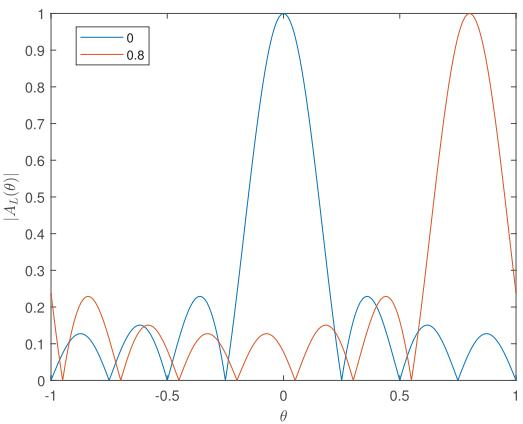  
${ \mathrm { F i g } } .$ 15. The directional patterns $A _ { L } ( \theta )$ at $\theta _ { 0 } = 0$ and $\theta _ { 0 } = 0 . 8$

$$
A _ { L } ( \theta ) = \left| \frac { \sin \left[ \frac { \pi d } { \lambda } \left( \theta - \theta _ { 0 } \right) N _ { T } \right] } { N _ { T } \sin \left[ \frac { \pi d } { \lambda } \left( \theta - \theta _ { 0 } \right) \right] } \right| .\tag{37}
$$

The half power beamwidth at $\theta _ { 0 }$ can be expressed as

$$
\begin{array} { r } { W _ { \theta _ { 0 } } ^ { L } = ( \theta _ { 0 } + B ) - ( \theta _ { 0 } - B ) = 2 B . } \end{array}\tag{38}
$$

Hence the beamwidth is equal to 2B and does not change with $\theta _ { 0 }$ . Fig. 14 and Fig. 15 show the directional patterns $A _ { N L } ( \theta )$ and $A _ { L } ( \theta )$ at different values of $\theta _ { 0 }$ . It can be seen that as $\theta _ { 0 }$ increases, the beamwidth of $A _ { N L } ( \theta )$ also increases, exhibiting a shape that is narrow on the left but is wide on the right. In contrast, the beamwidth of $A _ { L } ( \theta )$ remains unchanged as $\theta _ { 0 }$ increases.

## REFERENCES

[1] Y. Jiang et al., “6G non-terrestrial networks enabled low-altitude economy: Opportunities and challenges,” 2023, arXiv:2311.09047.

[2] M. Giordani and M. Zorzi, “Non-terrestrial networks in the 6G era: Challenges and opportunities,” IEEE Netw., vol. 35, no. 2, pp. 244–251, Mar. 2021.

[3] L. Gupta, R. Jain, and G. Vaszkun, “Survey of important issues in UAV communication networks,” IEEE Commun. Surveys Tuts., vol. 18, no. 2, pp. 1123–1152, 2nd Quart., 2015.

[4] N. Mohamed, J. Al-Jaroodi, I. Jawhar, A. Idries, and F. Mohammed, “Unmanned aerial vehicles applications in future smart cities,” Technological Forecasting Social Change, vol. 153, Apr. 2020, Art. no. 119293. [Online]. Available: https://www.sciencedirect.com/science/article/pii/ S0040162517314968

[5] S. H. Alsamhi, O. Ma, M. S. Ansari, and F. A. Almalki, “Survey on collaborative smart drones and Internet of Things for improving smartness of smart cities,” IEEE Access, vol. 7, pp. 128125–128152, 2019.

[6] M. A. Hoque, M. Hossain, S. Noor, S. M. R. Islam, and R. Hasan, “IoTaaS: Drone-based Internet of Things as a service framework for smart cities,” IEEE Internet Things J., vol. 9, no. 14, pp. 12425–12439, Jul. 2022.

[7] S. H. Alsamhi et al., “Green Internet of Things using UAVs in B5G networks: A review of applications and strategies,” Ad Hoc Netw., vol. 117, Jun. 2021, Art. no. 102505. [Online]. Available: https:// www.sciencedirect.com/science/article/pii/S1570870521000639

[8] S. Alsamhi, O. Ma, M. Ansari, and S. Gupta, “Collaboration of drone and Internet of Public Safety Things in smart cities: An overview of QoS and network performance optimization,” Drones, vol. 3, no. 1, p. 13, Jan. 2019.

[9] S. Javaid et al., “Communication and control in collaborative UAVs: Recent advances and future trends,” IEEE Trans. Intell. Transp. Syst., vol. 24, no. 6, pp. 5719–5739, Mar. 2023.

[10] A. Fotouhi et al., “Survey on UAV cellular communications: Practical aspects, standardization advancements, regulation, and security challenges,” IEEE Commun. Surveys Tuts., vol. 21, no. 4, pp. 3417–3442, 4th Quart., 2019.

[11] Z. Wei et al., “Integrated sensing and communication signals toward 5G-A and 6G: A survey,” IEEE Internet Things J., vol. 10, no. 13, pp. 11068–11092, Jul. 2023.

[12] J. Wang, N. Varshney, C. Gentile, S. Blandino, J. Chuang, and N. Golmie, “Integrated sensing and communication: Enabling techniques, applications, tools and data sets, standardization, and future directions,” IEEE Internet Things J., vol. 9, no. 23, pp. 23416–23440, Dec. 2022.

[13] S. Lu et al., “Integrated sensing and communications: Recent advances and ten open challenges,” IEEE Internet Things J., vol. 11, no. 11, pp. 19094–19120, Jun. 2024.

[14] H. Luo et al., “Integrated sensing and communications framework for 6G networks,” 2024, arXiv:2405.19925.

[15] F. Liu et al., “Integrated sensing and communications: Toward dualfunctional wireless networks for 6G and beyond,” IEEE J. Sel. Areas Commun., vol. 40, no. 6, pp. 1728–1767, Jun. 2022.

[16] D. K. Pin Tan et al., “Integrated sensing and communication in 6G: Motivations, use cases, requirements, challenges and future directions,” in Proc. 1st IEEE Int. Online Symp. Joint Commun. Sens., Feb. 2021, pp. 1–6.

[17] H. Luo et al., “Integrated sensing and communications in clutter environment,” IEEE Trans. Wireless Commun., vol. 23, no. 9, pp. 10941–10956, Sep. 2024.

[18] Y. Li, X. Wang, and Z. Ding, “Multi-target position and velocity estimation using OFDM communication signals,” IEEE Trans. Commun., vol. 68, no. 2, pp. 1160–1174, Feb. 2020.

[19] Z. Gao et al., “Integrated sensing and communication with mmWave massive MIMO: A compressed sampling perspective,” IEEE Trans. Wireless Commun., vol. 22, no. 3, pp. 1745–1762, Mar. 2023.

[20] M. Mirabella, P. D. Viesti, A. Davoli, and G. M. Vitetta, “An approximate maximum likelihood method for the joint estimation of range and Doppler of multiple targets in OFDM-based radar systems,” IEEE Trans. Commun., vol. 71, no. 8, pp. 4862–4876, Aug. 2023.

[21] K. Chen, C. Qi, O. A. Dobre, and G. Y. Li, “Simultaneous beam training and target sensing in ISAC systems with RIS,” IEEE Trans. Wireless Commun., vol. 23, no. 4, pp. 2696–2710, Apr. 2024.

[22] D. Galappaththige, S. Zargari, C. Tellambura, and G. Y. Li, “Nearfield ISAC: Beamforming for multi-target detection,” IEEE Wireless Commun. Lett., vol. 13, no. 7, pp. 1938–1942, Jul. 2024.

[23] Z. Wei et al., “Symbol-level integrated sensing and communication enabled multiple base stations cooperative sensing,” IEEE Trans. Veh. Technol., vol. 73, no. 1, pp. 724–738, Jan. 2024.

[24] N. Zhao, Q. Chang, X. Shen, Y. Wang, and Y. Shen, “A joint target sensing and communication scheme in bistatic networks,” in Proc. IEEE Globecom Workshops (GC Wkshps), Dec. 2023, pp. 1416–1420.

[25] K. Meng and C. Masouros, “Cooperative sensing and communication for ISAC networks: Performance analysis and optimization,” 2024, arXiv:2403.20228.

[26] Z. Zhang et al., “Target localization in cooperative ISAC systems: A scheme based on 5G NR OFDM signals,” 2024, arXiv:2403.02028.

[27] P. Swerling, “Probability of detection for fluctuating targets,” IRE Trans. Inf. Theory, vol. 6, no. 2, pp. 269–308, Apr. 1960.

[28] D. A. Shnidman, “Generalized radar clutter model,” IEEE Trans. Aerosp. Electron. Syst., vol. 35, no. 3, pp. 857–865, Jul. 1999.

[29] J. B. Billingsley, A. Farina, F. Gini, M. V. Greco, and L. Verrazzani, “Statistical analyses of measured radar ground clutter data,” IEEE Trans. Aerosp. Electron. Syst., vol. 35, no. 2, pp. 579–593, Apr. 1999.

[30] D. K. Barton, “Land clutter models for radar design and analysis,” Proc. IEEE, vol. 73, no. 2, pp. 198–204, Feb. 1985.

[31] D. A. Shnidman, “Radar detection in clutter,” IEEE Trans. Aerosp. Electron. Syst., vol. 41, no. 3, pp. 1056–1067, Jul. 2005.

[32] W. W. Shrader and V. Gregers-Hansen, “MTI radar,” in Radar Handbook, vol. 2. New York, NY, USA: McGraw-Hill, 1970, pp. 15–24.

[33] R. Schmidt, “Multiple emitter location and signal parameter estimation,” IEEE Trans. Antennas Propag., vol. AP-34, no. 3, pp. 276–280, Mar. 1986.

[34] M. Wax and T. Kailath, “Detection of signals by information theoretic criteria,” IEEE Trans. Acoust., Speech, Signal Process., vol. ASSP-33, no. 2, pp. 387–392, Apr. 1985.

[35] A. Barron, J. Rissanen, and B. Yu, “The minimum description length principle in coding and modeling,” IEEE Trans. Inf. Theory, vol. 44, no. 6, pp. 2743–2760, Oct. 1998.

[36] C. Eckart and G. Young, “The approximation of one matrix by another of lower rank,” Psychometrika, vol. 1, no. 3, pp. 211–218, Sep. 1936.

[37] R. E. Kalman, “A new approach to linear filtering and prediction problems,” J. Basic Eng., vol. 82, no. 1, pp. 35–45, Mar. 1960, doi: 10.1115/1.3662552.

[38] J. B. Gao and C. J. Harris, “Some remarks on Kalman filters for the multisensor fusion,” Inf. Fusion, vol. 3, no. 3, pp. 191–201, Sep. 2002. [Online]. Available: https://www.sciencedirect.com/science/ article/pii/S1566253502000702

[39] S. F. Schmidt, “Application of state-space methods to navigation problems,” Adv. Control Syst., vol. 3, pp. 293–340, Jan. 1966. [Online]. Available: https://www.sciencedirect.com/science/article/pii/ B9781483167169500114

[40] J. W. Tukey, “On the comparative anatomy of transformations,” Ann. Math. Statist., vol. 28, no. 3, pp. 602–632, Sep. 1957. [Online]. Available: http://www.jstor.org/stable/2237223

  
Chuanbin Zhao is currently pursuing the Ph.D. degree with the Department of Automation, Tsinghua University, Beijing, China. He is a Senior Engineer with China Telecom Corporation, Sichuan Branch, Chengdu, China. His research interests include integrated sensing and communications (ISAC), multimodal artificial intelligence-assisted sensing, and mobile edge computing (MEC).

Yuan Feng received the B.E. degree from the School of Electronic Engineering, Xidian University, in 2022. He is currently pursuing the M.S. degree with the Department of Automation, Tsinghua University, Beijing, China. His research interests include wireless communications, machine learning, and integrated sensing and communications (ISAC).

  
Hongliang Luo received the B.Eng. degree from Xidian University, Xi’an, China, in 2023. He is currently pursuing the Ph.D. degree with the Department of Automation, Tsinghua University, Beijing, China. His research interests include wireless communication, radar sensing, array signal processing, massive MIMO, and beamforming design.

Feifei Gao (Fellow, IEEE) received the B.Eng. degree from Xi’an Jiaotong University, Xi’an, China, in 2002, the M.Sc. degree from McMaster University, Hamilton, ON, Canada, in 2004, and the Ph.D. degree from National University of Singapore, Singapore, in 2007. In 2011, he joined the Department of Automation, Tsinghua University, Beijing, China, where he is currently a Tenured Full Professor. He has authored/co-authored more than 200 refereed IEEE journal articles and more than 200 IEEE conference proceedings papers that are cited more than 21,000 times in Google Scholar. His research interests include signal processing for communications, array signal processing, integrated sensing and communications (ISAC), and artificial intelligence-assisted communications. He has also served as the Symposium Co-Chair for the 2019 IEEE Conference on Communications (ICC), the 2018 IEEE Vehicular Technology Conference Spring (VTC), the 2015 IEEE Conference on Communications (ICC), the 2014 IEEE Global Communications Conference (GLOBECOM), the 2014 IEEE Vehicular Technology Conference Fall (VTC), as well as Technical Committee Members for more than 50 IEEE conferences. He has served as an Editor for IEEE TRANSACTIONS ON COMMUNICATIONS, IEEE TRANSACTIONS ON WIRELESS COMMUNICATIONS, IEEE JOURNAL OF SELECTED TOPICS IN SIGNAL PROCESSING (a Lead Guest Editor), IEEE TRANSACTIONS ON COGNITIVE COMMUNICATIONS AND NETWORKING, IEEE SIGNAL PROCESSING LETTERS (a Senior Editor), IEEE COMMUNI-CATIONS LETTERS (a Senior Editor), IEEE WIRELESS COMMUNICATIONS LETTERS, and China Communications.

Fan Liu (Senior Member, IEEE) received the B.Eng. and Ph.D. degrees from Beijing Institute of Technology (BIT), Beijing, China, in 2018 and 2013, respectively. He is currently a Professor with the National Mobile Communications Research Laboratory, School of Information Science and Engineering, Southeast University, Nanjing, China. Prior to that, he was an Assistant Professor with the Southern University of Science and Technology, Shenzhen, China, from 2020 to 2024. He has previously held academic positions with University

College London (UCL), London, U.K., as a Visiting Researcher, from 2016 to 2018, and a Marie Curie Research Fellow from 2018 to 2020. His research interests include signal processing and wireless communications, and in particular in the area of integrated sensing and communications (ISAC). He was listed among the World’s Top 2% Scientists by Stanford University for citation impact from 2021 to 2024 and among the 2023–2024 Elsevier Highly-Cited Chinese Researchers. He was a recipient of numerous Best Paper Awards, including the 2024 IEEE SPS Best Paper Award, the 2024 IEEE SPS Donald G. Fink Overview Paper Award, the 2024 IEEE ComSoc Asia-Pacific Outstanding Paper Award, the 2023 IEEE Communications Society Stephan O. Rice Prize, and the 2021 IEEE SPS Young Author Best Paper Award. He is the Founding Academic Chair of the IEEE ComSoc ISAC Emerging Technology Initiative (ISAC-ETI), the Vice Chair and a Founding Member of the IEEE SPS ISAC Technical Working Group (ISAC-TWG), an Elected Member of the IEEE SPS Sensor Array and Multichannel Technical Committee (SAM-TC), an Associate Editor of IEEE TRANSACTIONS ON COMMUNICATIONS, IEEE TRANSACTIONS ON MOBILE COMPUTING, and IEEE OPEN JOURNAL OF SIGNAL PROCESSING, and a Guest Editor of IEEE JOURNAL ON SELECTED AREAS IN COMMUNICATIONS, IEEE WIRELESS COMMUNICATIONS, and IEEE Vehicular Technology Magazine. He was the TPC Co-Chair of the 2nd-4th IEEE Joint Communication and Sensing (JC&S) Symposium, the Symposium Co-Chair of IEEE GLOBECOM 2023 and IEEE ICC 2026, and the Track Co-Chair of the IEEE WCNC 2024. He is a member of the IMT-2030 (6G) ISAC Task Group.

Shi Jin (Fellow, IEEE) received the B.S. degree in communications engineering from Guilin University of Electronic Technology, Guilin, China, in 1996, the M.S. degree from Nanjing University of Posts and Telecommunications, Nanjing, China, in 2003, and the Ph.D. degree in information and communications engineering from Southeast University, Nanjing, in 2007. From June 2007 to October 2009, he was a Research Fellow with the Adastral Park Research Campus, University College London, London, U.K. He is currently with the faculty of the National

Mobile Communications Research Laboratory, Southeast University. His research interests include wireless communications, random matrix theory, and information theory. He and his co-authors have been awarded the 2011 IEEE Communications Society Stephen O. Rice Prize Paper Award in the field of communication theory, the 2024 IEEE Communications Society Marconi Prize Paper Award, the IEEE Vehicular Technology Society 2023 Jack Neubauer Memorial Award, the 2022 Best Paper Award, and the 2010 Young Author Best Paper Award by the IEEE Signal Processing Society. He was an Associate Editor of IEEE TRANSACTIONS ON WIRELESS COMMUNICATIONS, IEEE COMMUNICATIONS LETTERS, and IET Communications. He is serving as an Area Editor for IEEE TRANSACTIONS ON COMMUNICATIONS and IET Electronics Letters.