# On a Hierarchical Content Caching and Asynchronous Updating Scheme for Non-Terrestrial Network-Assisted Connected Automated Vehicles

Bomin Mao , Senior Member, IEEE, Yangbo Liu , Student Member, IEEE, Hongzhi Guo , Member, IEEE, Yijie Xun , Member, IEEE, Jiadai Wang , Member, IEEE, Jiajia Liu , Senior Member, IEEE, and Nei Kato, Fellow, IEEE

Abstract— With the advantages of seamless coverage and ubiquitous connections, Non-Terrestrial Networks (NTNs) composed of Low Earth Orbit (LEO) satellites and Unmanned Aerial Vehicles (UAVs) can provide content caching services for future Connected Automated Vehicles (CAVs) to satisfy onboard collaborative viewing, traffic sensing, and metaverse entertainments in remote areas. However, the heterogeneous caching hardware, communication environments, and frequent network dynamics make the optimization of content caching policy highly complicated. Firstly, considering all LEO satellites as caching satellites can lead to content duplication and radio interference, causing storage waste and NTN transmission quality deterioration. Secondly, how to provide customized QoS by intra-layer and inter-layer cooperative caching in such complicated environments remains an open issue. Thus, we propose a Delay-Motivated Ant Colony Optimization (DM-ACO) scheme to select caching LEO satellites with reduced system propagation delay. Then, the Multi-Agent Deep Reinforcement Learning-based Hierarchical Caching and Asynchronous Updating (MADRL-HCAU) strategy is designed to manage the caching capacity of LEO satellites and UAVs, providing customized services for CAVs and dispensing the peak traffic. Simulation results illustrate that the proposed scheme can not only effectively accelerate the caching refreshing and content downloading process but also significantly reduce the packet drop and improve the cache hit ratio.

Index Terms— Non-terrestrial networks, hierarchical caching, asynchronous updating, ant colony optimization, multi-agent deep reinforcement learning.

Received 7 March 2024; revised 1 July 2024; accepted 5 August 2024. Date of publication 13 September 2024; date of current version 18 December 2024. This work was supported in part by the National Natural Science Foundation of China under Grant 62202386 and Grant 62402389; in part by the Guangdong Basic and Applied Basic Research Foundation under Grant 2024A1515011198, Grant 2024A1515010209, and Grant 2023A1515110079; in part by the 2022 Suzhou Innovation and Entrepreneurship Leading Talents Program (Young Innovative Leading Talents) under Grant ZXL2022458; and in part by the Key Research and Development Program of Shaanxi Program under Grant 2022GXLH-02-03. (Corresponding author: Bomin Mao.)

Bomin Mao, Yangbo Liu, Hongzhi Guo, Yijie Xun, Jiadai Wang, and Jiajia Liu are with the National Engineering Laboratory for Integrated Aero-Space-Ground-Ocean Big Data Application Technology, Research and Development Institute, Northwestern Polytechnical University, Shenzhen 518057, China, also with the Yangtze River Delta Research Institute, Northwestern Polytechnical University, Taicang 215400, China, and also with the School of Cybersecurity, Northwestern Polytechnical University, Xi’an 710129, China (e-mail: maobomin@nwpu.edu.cn; liuyangbo@mail.nwpu.edu.cn; hongzhi.guo@nwpu.edu.cn; xunyijie@nwpu. edu.cn; wangjiadai@nwpu.edu.cn; liujiajia@nwpu.edu.cn).

Nei Kato is with the Graduate School of Information Sciences, Tohoku University, Sendai 980-8579, Japan (e-mail: nei.kato.d3@tohoku.ac.jp).

Digital Object Identifier 10.1109/JSAC.2024.3460063

# I. INTRODUCTION

HE emerging terrestrial communication infrastructure provides stable and high-throughput data transferring for Connected Automated Vehicles (CAVs), enabling advanced onboard services including collaborative viewing, traffic sensing, and metaverse entertainments [1]. However, the increasing expense of terrestrial infrastructure restricts the deployment only in densely populated areas, while harsh environments including mountains, deserts, and forests cannot be covered. To reach the seamless and ubiquitous connections in the 6G era, Non-Terrestrial Networks (NTNs) have aroused increasing worldwide attention due to their flexible deployment, high throughput, and decreasing costs [2], [3], [4]. Thus, NTNs become an essential network connection choice for CAVs, especially in remote or harsh areas [5], [6]. With the continuous construction of Low Earth Orbit (LEO) satellite constellations and growing deployments of Unmanned Aerial Vehicles (UAVs) Base Stations (BSs), future NTNs are expected to provide highly qualified network connections for CAVs to offer diverse services. Among these services, content caching is critical for many vehicular applications such as route pre-design, traffic sensing, and metaverse entertainment. Caching popular delay-critical contents in NTN nodes is a viable approach to reduce the transmission delay compared to direct retrievers from remote terrestrial cloud servers [7]. Furthermore, the backhaul network traffic and privacy exposure possibility can also be significantly alleviated [8], [9].

As shown in Fig. 1, the NTNs consist of 2 layers, the space layer and the air layer composed of satellites and UAVs, respectively. In the air layer, UAVs are deployed close to CAVs while having the capability to keep track of CAVs, providing high-throughput transmissions and continuous connections for content delivery services [10]. Meanwhile, with the extensive coverage of LEO satellites, the space layer can provide seamless and stable connectivity for CAVs away from UAVs. Thus, with the cooperation of UAVs and satellites, the NTNs can provide content caching services for CAVs with diversified and customized Quality of Service (QoS) requirements.

However, the optimization of cached content placement and refreshing is confronted with many challenges. Since massive LEO satellites in the same constellation are ultra-densely deployed in different crossed-orbit planes, the covered areas of several adjacent LEO satellites may overlap. Selecting all of them as caching satellites can inevitably cause content duplication and severe packet drop on account of interference [11]. To ensure the backbone of content delivery without taking excessive storage and communication resources, only part of the LEO satellites should be selected as caching nodes while others as relays. Such a problem can be formulated into a Minimum Vertex Cover (MVC) problem, which can be converted to the classic NP-hard Travel Salesman Problem (TSP), indicating that the optimal solution cannot be found within polynomial time [12]. Although some existing algorithms can find a sub-optimal solution, the high dynamics of LEO satellite typologies require extremely fast convergence [13]. Moreover, the formulation of the MVC problem neglects the long distance among some satellite nodes, leading to severe propagation path loss. Furthermore, the heterogeneous caching and communication capacity complicates the management of caching content placement [14].

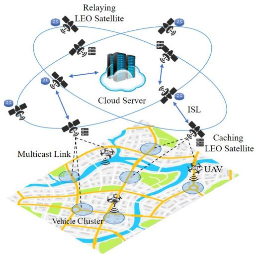

flowchart

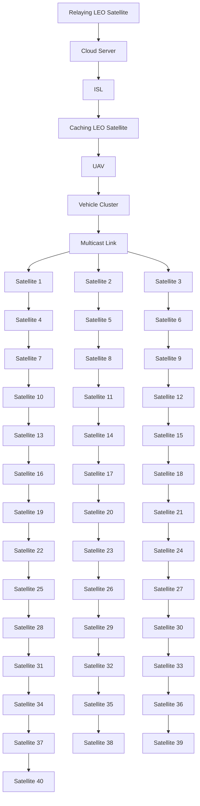

Fig. 1. The basic structure of NTNs.

To address the above challenges, the configurations of NTNs should be comprehensively studied considering massive communication and storage factors of network nodes, while the complex relationship is beyond the traditional mathematical approaches. Deep Reinforcement Learning (DRL) has been widely studied as an effective approach to designing the caching policy in complicated environments. However, for the caching in NTNs, DRL is also challenged by the high stateaction space, which can cost excessive computing resources of battery-constrained nodes in a centralized manner [15]. Moreover, existing DRL approaches require a synchronous content update, which usually consumes a long time and requires enormous communication bandwidth for data deliveries, leading to surging traffic overhead and potential traffic congestion [16]. To handle such shortcomings, Multi-agent DRL (MADRL) can be applied to relieve the computing pressure of centralized computing servers by separating the computing overhead to multiple agents [17], [18]. Moreover, MADRL allows asynchronous content updates that are flexible and efficient.

Therefore, to design the content deployment policy in NTNs, we first formulate a Weighted MVC (WMVC) problem to optimize the overall propagation delay of the content delivery backbone network. Then, the approach termed Delay Motivated-Ant Colony Optimization (DM-ACO) is proposed to address the WMVC problem with convergence speed taken into account. Considering the heterogeneous caching capacity of NTN nodes, we propose a MADRL-based Hierarchical Caching and Asynchronous Updating (MADRL-HCAU) scheme to make caching decisions hierarchically and asynchronously, which can avoid the unnecessary simultaneous content update and accelerate the refreshing process. Our contributions can be summarized as follows:

• We exploit the cross-layer cooperation to provide customized caching services for CAVs.   
• The DM-ACO is proposed to select caching nodes for ultra-dense LEO satellite networks, which optimizes the overall propagation delay and packet drop rate.   
• The hierarchical caching and asynchronous update are jointly considered with the MADRL-based solution to alleviate the network traffic and accelerate the content substitution process.

The remaining paper consists of five sections. In Section II, we systematically summarize the recent works on caching LEO satellite selection and caching management in NTNs. In section III, we introduce our system model. Then, in section IV, we formulate the optimization problem of caching LEO satellite selection and transmission delay as well as provide the solution. Section V gives our simulation settings and results. Finally, in section VI, we summarize our work and provide some future directions.

# II. RELATED WORKS

Some scholars have already studied caching capacity management and optimizing the QoS. In this part, we analyze the state-of-art works.

1) Caching Satellite Selection: Caching satellite selection is one of the keys to relieving the Packet Drop Rate (PDR) of Inter-Satellite Links (ISLs). To release the storage resources taken up by the duplicated contents and ensure the backbone of content delivery, authors in [11] propose an approximate MVC set algorithms that traverse over the vertex set and delete the edges associated with the newly selected vertex and the previously selected vertexes. Authors in [19] propose a back-tracing algorithm for caching node selection which first organizes the topology into a spanning tree and then recursively partitions it into multiple sub-trees to minimize the content access cost. The above solutions succeed in finding a sub-optimal caching satellite selection policy with low complexity for battery-constrained LEO satellites. However, they do not consider the actual transmission delay among satellites, which is vital for high QoS. Thus, to minimize the system sustainable delay, authors in [13] develop a minimum time-evolving covering set algorithm based on an event updating graph, building up the relationship between the current topology and next interval topology. This graph-based approach covers the accessing delay with satisfying complexity but takes up extensive caching capacity since it needs to pre-store the future topology. Thus, authors in [20] propose an exchange-stable matching algorithm based on matching theory for content access delay minimization, which keeps searching for swap-blocking pairs till the matching state is unchanged. This approach successfully makes up the cons of the existing caching LEO satellites approaches. However, how to make intelligent caching decisions has not been studied further.

2) Caching Management in Multi-Layer Networks: To provide customized transmission services with reliable QoS, many articles focus on flexible caching placement. Specifically, [21] proposes an offline deep imitation learning model to optimize the task completion time, which significantly enhances the algorithm’s robustness and reduces the size of the action space. Reference [22] exploits Q-Learning, a light framework of RL, to manage the storage and transmission capacity as well as enhance the system utility with low complexity in a three-layer satellite network. Aiming at minimizing the data collection time for the Internet of Remote Things, authors of [23] adopt the Deep Q Network (DQN) to make caching and trajectory decisions for UAVs, which enables the model to make caching decisions in complicated and high dynamic environments.

Since centralized RL under highly complicated environments confronts high computation overhead, mathematical methods and distributed learning have also been considered to alleviate the computation burden. From the perspective of adopting low-complexity mathematical approaches, authors of [8] relax the non-convex resource allocation problem into a convex problem by adopting block coordinate descent and successive convex approximation. Aiming to minimize the transmission energy consumption, authors in [24] propose a coded caching scheme that encodes most of the requested contents and multicast them from the satellite to the UAVs by the segment replacement algorithm. Similarly, authors in [25] further consider the uneven distribution of content popularity and propose a multi-popularity coded caching strategy, enhancing the transmission efficiency and decreasing the content delivery delay. Authors in [26] exploit the cooperation among satellite, edge network gateway, and base stations. Then, they iterate the separated duplicated and flexible caching part to minimize the average content retrieving delay. Undoubtedly, these mathematics-based caching algorithms succeed in finding satisfying sub-optimal solutions swiftly, while coded caching can further reduce the transmission traffic to reserve spectrum resources for transmission.

From the perspective of distributed learning, [27] predefines several scenarios according to the availability of edge servers and proposes an advantage-actor-critic metahierarchical learning scheme that exploits a main policy network to select appropriate scenarios and three sub-policy networks to make caching decisions, which significantly enhances the robustness and scalability of the model. Similarly, authors in [28] propose a Deep Deterministic Policy Gradient (DDPG) model composed of three actor networks and a main critic network to make caching decisions of LEO satellites and optimize the transmission delay. Compared to deploying individual actor and critic networks in each LEO satellite, the deployment scheme proposed in [28] can greatly relieve the training pressure. Apart from using sub-models, [29] exploits the synergy and complementary of NTNs and proposes a MARL scheme to optimize the resource allocation and relieve the transmission delay with lower computing pressure. Aiming at optimizing the transmission delay and energy efficiency, authors in [30] propose an MA-DDPG scheme to make caching decisions in the satellite-terrestrial integrated network. The above-mentioned articles are all dedicated to not only cooperatively making inter-layer and intra-layer caching decisions but also trying to relieve the computation overhead.

Although extensive proposals have been conducted targeting caching decision making in multi-layer NTNs. The integration and cooperation of cross-layer caching remain an open question in providing customized QoS for CAVs. Moreover, the updating process of NTNs is quite different from that in terrestrial networks because of the shared downloading spectrum resources. In addition, how to relieve the traffic surge caused by synchronized updating in NTNs has yet to be thoroughly studied. To address these challenges, we exploit the MADRL-HCAU scheme in our work.

# III. SYSTEM MODEL

# A. Scenario Model

As shown in Fig. 1, our model contains the space, air, and ground layers. In the space layer, LEO satellites and selected caching LEO satellites are indicated by $S \ =$ $\left\{ s _ { 1 } , \ldots , s _ { k } , \ldots , s _ { K } \right\}$ and $C S ~ = ~ \{ c s _ { 1 } , \ldots , c s _ { \bar { k } } , \ldots , c s _ { \bar { K } } \}$ , respectively. In the air layer, UAVs covered by satellite $s _ { k }$ are represented as $U = \{ u _ { 1 } , \dotsc , u _ { j } , \dotsc , u _ { J } \}$ . In the ground layer, vehicles covered by satellite $s _ { k }$ can be denoted by $V = \{ v _ { 1 } , \ldots , v _ { i } , \ldots , v _ { I } \}$ with the requested contents $F =$ $\{ f _ { 1 } , \dots , f _ { q } , \dots , f _ { Q } \}$ . The number of arriving vehicles in each serving area follows the Poisson distribution [24] denoted by $P _ { s _ { k } } ^ { t } ( X = i ) \ = \ \vartheta ^ { i } e ^ { - \vartheta } / i !$ , where t is the system time and ϑ is the parameter of Poisson distribution. Thus, the arrival of all vehicles also follows the Poisson process. Moreover, considering the uneven distribution of vehicles and the coverage of UAVs, we utilize Density-Based Spatial Clustering of Applications with Noise (DBSCAN) to cluster the vehicles into groups denoted as $\boldsymbol { \varpi } = \{ \pi _ { 1 } ^ { s _ { k } } , \ldots , \pi _ { e } ^ { s _ { k } } , . . . , \pi _ { E } ^ { s _ { k } } \}$ . UAVs in each serving area traverse the clusters according to an improved gravity model used in [10]. Specifically, the next location of $u _ { j } , ( x _ { u _ { j } } ^ { t + 1 } , y _ { u _ { j } } ^ { t + 1 } , z _ { u _ { j } } )$ , is calculated by:

$$
x _ {u _ {j}} ^ {t + 1} = \frac {\left(x _ {u _ {j}} ^ {t} + x _ {\pi_ {e} ^ {s _ {k}}} ^ {t}\right)}{2} + \frac {G _ {u _ {j}} ^ {t} \left(\pi_ {e} ^ {s _ {k}}\right)}{\sum_ {e = 1} ^ {E} G _ {u _ {j}} ^ {t} \left(\pi_ {e} ^ {s _ {k}}\right)} \left(x _ {u _ {j}} ^ {t} - x _ {\pi_ {e} ^ {s _ {k}}} ^ {t}\right), \tag {1}
$$

$$
y _ {u _ {j}} ^ {t + 1} = \frac {(y _ {u _ {j}} ^ {t} + y _ {\pi_ {e} ^ {s _ {k}}} ^ {t})}{2} + \frac {G _ {u _ {j}} ^ {t} (\pi_ {e} ^ {s _ {k}})}{\sum_ {e = 1} ^ {E} G _ {u _ {j}} ^ {t} (\pi_ {e} ^ {s _ {k}})} (y _ {u _ {j}} ^ {t} - y _ {\pi_ {e} ^ {s _ {k}}} ^ {t}), \tag {2}
$$

where center $( x _ { \pi _ { \alpha } ^ { s _ { k } } } ^ { t } , y _ { \pi _ { \alpha } ^ { s _ { k } } } ^ { t } )$ tπsk , ytπsk e e and  gravi $G _ { u _ { i } } ^ { t } ( \pi _ { e } ^ { s _ { k } } )$ are the coordinath cluster exerts to $\bar { \pi } _ { e } ^ { s _ { k } }$ $u _ { j }$ $t ,$ respectively. We assume that UAVs fly at a fixed altitude, $h _ { u _ { i } } ~ = ~ z _ { u _ { i } }$ enter and $\begin{array} { r } { x _ { \pi _ { \sim } ^ { s _ { k } } } ^ { t } = \sum _ { v _ { i } \in \pi _ { e } ^ { s _ { k } } } x _ { v _ { i } } / c o u n t ( \pi _ { e } ^ { s _ { k } } ) } \end{array}$ πe , where is the coordinate $y _ { \pi _ { e } ^ { s _ { k } } } ^ { t _ { s _ { k } } } =$ πe $\begin{array} { r } { \sum _ { v _ { i } \in \pi _ { e } ^ { s _ { k } } } y _ { v _ { i } } / c o { \stackrel { \cdots } { u } } { \stackrel {  } { n } } ( \pi _ { e } ^ { s _ { k } } ) } \end{array}$ $( x _ { v _ { i } } ^ { t } , y _ { v _ { i } } ^ { t } )$ of $v _ { i }$ at t and count(·) is to calculate the vehicle quantities in $\pi _ { e } ^ { s _ { k } }$ . Next, the gravity of each cluster can be calculated by:

$$
G _ {u _ {j}} ^ {t} (\pi_ {e} ^ {s _ {k}}) = \widehat {G} \frac {\zeta \frac {\sum_ {v _ {i} \in \pi_ {e} ^ {s _ {k}}} \frac {D _ {v _ {i} , f _ {q}} ^ {t}}{D _ {f _ {q}}}}{c o u n t (\pi_ {e} ^ {s _ {k}})} + (1 - \zeta) \frac {S _ {F} . Q ^ {t} (\pi_ {e} ^ {s _ {k}}) . C _ {u _ {j} , F} ^ {t}}{S _ {F} . C _ {u _ {j} , F} ^ {t}}}{\sqrt {(x _ {u _ {j}} ^ {t} - x _ {\pi_ {e} ^ {s _ {k}}} ^ {t}) ^ {2} + (y _ {u _ {j}} ^ {t} - y _ {\pi_ {e} ^ {s _ {k}}} ^ {t}) ^ {2} + z _ {u _ {j}} ^ {2}}}, \tag {3}
$$

where $\widehat { G }$ is the gravity constant. The numerator consists of two parts. The first part denotes the average ratio of practically used time and delay threshold of each transmission task, where Dtvi,fq $D _ { v _ { i } , f _ { q } } ^ { t }$ and $D _ { f _ { q } }$ indicate the consumed time for $v _ { i }$ to receive $f _ { q }$ and the delay requirement of receiving content $f _ { q } ,$ respectively. The second part represents the ratio of requesting content size in π $\pi _ { e } ^ { s _ { k } }$ and cached cont size vector for , indicating whet $u _ { j }$ . Spee bied in $S _ { F }$ is the vectoris the $F , C _ { u _ { i } , F } ^ { t }$ $u _ { j }$ $f _ { q }$ $u _ { j } . \ Q ^ { t } ( \pi _ { e } ^ { s _ { k } } )$ binary request vector for vehicle in cluster $\pi _ { e } ^ { s _ { k } }$ , indicating whether content $f _ { q }$ is requested within $\pi _ { e } ^ { s _ { k } } \cdot \zeta$ is the bias vector for the aforementioned two parts of the numerator. The denominator denotes the distance between the cluster center and UAVs. UAV $u _ { j }$ usually chooses the cluster with maximum gravity as its next traveling destination. The content popularity in each serving area and time intersection follows Zipf distribution [8] which is $\begin{array} { r } { \gamma _ { s _ { k } , f _ { q } } ^ { t } = ( r _ { s _ { k } , f _ { q } } ^ { t } ) ^ { - \mu } / { \sum _ { q = 1 } ^ { Q } ( r _ { s _ { k } , f _ { q } } ^ { t } ) ^ { - \mu } } } \end{array}$ , where $\mu$ is the parameter of Zipf distribution and $r _ { s _ { k } , f _ { q } } ^ { t }$ is the content request frequency rank covered by satellite $s _ { k } .$

# B. Communication Model

1) UAV to Vehicle Transmissions: On account of the obstructions in harsh environments, the UAV to Vehicle (U2V) transmission should consider Line-of-Sight (LoS) connection and Non-LoS (NLoS) connection [24]. The possibility of transmitting through the LoS connection can be modeled as $p _ { L o S } ~ = ~ ( 1 + \bar { a e } ^ { - b ( \theta - a ) } ) ^ { - 1 }$ , where $\{ a , b \}$ and θ are the environment coefficients and elevation angle, respectively. The path loss of LoS connection can be represented as:

$$
L _ {L o S} = \eta_ {L o S} (\frac {4 \pi f}{c}) ^ {2} h _ {u _ {j}} ^ {2}, \tag {4}
$$

$$
p _ {N L o S} = 1 - p _ {L o S} \tag {5}
$$

where $\eta _ { L o S }$ is the attenuation factor of LoS connection. Similarly, the path loss of the NLoS connection can be calculated by substituting $\eta _ { L o S }$ to $\eta _ { N L o S }$ in equation (4). The possibility of transmitting through the NLoS connection is shown in equation (5). $f$ and c are the carrier frequency and light speed, respectively. Thus, the average path loss is $\bar { L } = p _ { L o s } L _ { L o S } + p _ { N L o s } L _ { N L o S }$ . Then, the transmission rate of the U2V connection can be calculated by:

$$
R _ {u _ {j} \rightarrow v _ {i}} ^ {t} = \frac {B _ {U}}{\rho^ {t} (u _ {j})} \log_ {2} (1 + \frac {P _ {U}}{\bar {L} \sigma^ {2} B _ {U}}), \tag {6}
$$

where $B _ { U }$ and $P _ { U }$ are the bandwidth and transmission power of UAVs, respectively. $\sigma ^ { 2 }$ denotes the noise power and $\rho ^ { t } ( u _ { j } )$ is the ground service density, indicating the number of contents requested from vehicles within $u _ { j }$ . We apply Frequency Division Multiple Access (FDMA) and the requested contents are multicast to corresponding vehicles [24]. Additionally, the UAV can update its storage from other UAVs through the Inter-UAV Link (IUL) transmission, the IUL rate can be calculated considering only the LoS connection.

2) Satellite to UAV Transmission: In the current LEO satellite communication standard, the multicast and broadcast transmission service work in the Ku band and K band, in which rain can cause significant power attenuation. Thus, the Satellite to UAV (S2U) channel can be regarded as the Weibull channel model [24] and the power attenuation can be calculated through:

$$
h ^ {2} = \frac {G _ {T S} G _ {R U} \lambda^ {2}}{\left(4 \pi H _ {S}\right) ^ {2}} 1 0 ^ {- \frac {F _ {R a i n}}{1 0}}, \tag {7}
$$

where $G _ { T S }$ and $G _ { R U }$ are the transmission antenna gain of LEO satellite and the receiving antenna gain of UAVs, respectively. λ, $H _ { S } ,$ , and $F _ { R a i n }$ denote the carrier wavelength, the LEO satellite height, and the rain attenuation factor, respectively. The S2U transmission rate can be denoted as:

$$
R _ {s _ {k} \rightarrow u _ {j}} ^ {t} = \frac {B _ {S}}{\rho^ {t} (s _ {k , U})} \log_ {2} (1 + \frac {P _ {S} h ^ {2}}{B _ {S} \sigma_ {S} ^ {2}}), \tag {8}
$$

where $B _ { S }$ and $P _ { S }$ are the bandwidth and transmission power of LEO satellites, respectively. $\sigma _ { S } ^ { 2 }$ represents the space noise power and $\rho ^ { t } ( s _ { k , U } )$ denotes the service density of UAVs in the coverage of $s _ { k }$ . FDMA and multicasting are also applied in S2U transmissions. It should be mentioned that the considered Satellite to Vehicle (S2V) transmission rate is the same as S2U transmission because the height of UAVs is far smaller than that of LEO satellites.

3) Inter-Satellite Transmission: We adopt the free space propagation model for ISL communications and the power attenuation is:

$$
H = \frac {G _ {T S} G _ {R S} \lambda^ {2}}{\left(4 \pi d _ {s _ {k} , s _ {k ^ {\prime}}}\right) ^ {2}}, \tag {9}
$$

where $G _ { R S }$ is the receiving antenna gain of LEO satellites, $d _ { s _ { k } , s _ { k ^ { \prime } } }$ is the distance between LEO satellite $s _ { k }$ and $s _ { k ^ { \prime } }$ (sk′ ∈ S). Then, the transmission rate of ISLs can be calculated by:

$$
R _ {s _ {k ^ {\prime}} \rightarrow s _ {k}} ^ {t} = \frac {B _ {S}}{\rho^ {t} (s _ {k ^ {\prime}})} \log_ {2} (1 + \frac {P _ {S} H}{B _ {S} \sigma_ {S} ^ {2}}), \tag {10}
$$

where $\rho ^ { t } ( s _ { k ^ { \prime } } )$ is the service density of $s _ { k ^ { \prime } }$ at t.

In this work, we assume that each vehicle first requests the content from the accessed UAV for the short transmission distance. If the accessed UAV does not cache the requested content, it turns to the proximate UAVs, the accessing LEO satellite in turn. If the content is still not found, the accessing LEO satellite retrieves it from other caching LEO satellites and finally the remote cloud server.

# C. LEO Satellite Orbit Model

To guide the MADRL-HCAU in avoiding unnecessary updates when caching LEO satellites are leaving, the coverage time of LEO satellites is evaluated, with which the proper and adaptive caching updating decisions can be made. As shown in Fig. 2, $O _ { C }$ is the earth’s center. $R _ { e }$ is the radius of the earth. L is the altitude of satellite $s _ { k }$ . Following the instruction of [11], the elevation angle between $s _ { k }$ and $v _ { i }$ can be calculated by:

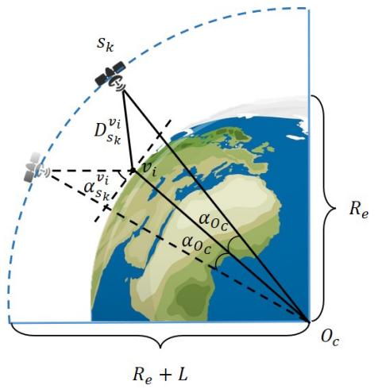

text_image

S_k
D_{s_k}^{vi}
v_i
α_{s_k}
α_{oc}
α_{oc}
R_e
O_c
R_e + L

Fig. 2. The orbit of LEO satellites.

$$
\alpha_ {s _ {k}} ^ {v _ {i}} = \arctan \frac {\cos \theta_ {s _ {k}} ^ {v _ {i}} - (R _ {e} / (R _ {e} + L))}{\sin \theta_ {s _ {k}} ^ {v _ {i}}}, \tag {11}
$$

where cosAdditiona $\theta _ { s _ { k } } ^ { v _ { i } } = \cos ( { \varGamma _ { s _ { k } } \varGamma _ { v _ { i } } } )$ cosdica $\boldsymbol { \Upsilon } _ { s _ { k } }$ cos he l $\Upsilon _ { v _ { i } } +$ sin de $\boldsymbol { \Upsilon } _ { s _ { k } }$ sin lati $\boldsymbol { \Upsilon } _ { v _ { i } }$ $\varGamma _ { s _ { k } }$ $\boldsymbol { \Upsilon } _ { s _ { k } }$ of $s _ { k } .$ , while ${ \varGamma _ { v _ { i } } }$ and $\boldsymbol { \Upsilon } _ { v _ { i } }$ denote those of $v _ { i } ,$ respectively. Thus, the LEO satellite covering duration can be calculated as:

$$
T _ {S} ^ {C o v} = \frac {2 \alpha_ {O C}}{2 \pi} T _ {S}, \tag {12}
$$

where $\alpha _ { O _ { C } } = \operatorname { a r c c o s } ( \cos \alpha _ { s _ { k } } ^ { v _ { i } } ( { R _ { e } } / { R _ { e } } + L ) ) - \alpha _ { s _ { k } } ^ { v _ { i } }$ and $T _ { S } =$ $2 \pi \sqrt { \left( L + R _ { e } \right) ^ { 3 } / K p l } .$ Here, Kpl is the Kepler constant. Therefore, the remaining accessing time of $s _ { k }$ can be denoted as:

$$
T _ {s _ {k}} ^ {\text {Rem}, t} = \left\{ \begin{array}{l l} \frac {\alpha_ {O _ {C}} + \theta_ {s _ {k}} ^ {v _ {i}}}{2 \alpha_ {O _ {C}}} T _ {S} ^ {\text {Cov}} & \alpha_ {s _ {k}} ^ {v _ {i}, \min} \leq \alpha_ {s _ {k}} ^ {v _ {i}, t} \leq \alpha_ {s _ {k}} ^ {v _ {i}, \max} \\ \frac {\alpha_ {O _ {C}} - \theta_ {s _ {k}} ^ {v _ {i}}}{2 \alpha_ {O _ {C}}} T _ {S} ^ {\text {Cov}} & \alpha_ {s _ {k}} ^ {v _ {i}, t} > \alpha_ {s _ {k}} ^ {v _ {i}, \max} \end{array} \right. \tag {13}
$$

where $\alpha _ { s _ { k } } ^ { v _ { i } , m i n } , \alpha _ { s _ { k } } ^ { v _ { i } , m a x }$ αvi,max, and αvi,t $\alpha _ { s _ { k } } ^ { v _ { i } , t }$ are the minimum, maxis k s k mum, and t intersection elevation angle between LEO satellite $s _ { k }$ and ground vehicle $v _ { i } .$ , respectively.

# IV. PROBLEM FORMULATION AND PROPOSED SOLUTION

In this section, we formulate the mathematical models of caching LEO satellite selection and transmission delay optimizing problems, for which the DM-ACO and MADRL-HCAU solutions are proposed. Moreover, the mechanisms of the two solutions are introduced in this section.

# A. Caching LEO Satellite Selection

Since the coverage of LEO satellites overlaps, selecting all of the LEO satellites as caching nodes can inevitably cause network congestion and content duplication, further leading to increased PDR, growing cache updating delay, and storage resource waste. Current works merely focus on ensuring the backbone and neglect the propagation delay between LEO satellites. Thus, we select part of the LEO satellites as caching nodes and the others as relaying nodes to minimize the overall propagation delay. The caching LEO satellite selection problem can be formulated as a WMVC problem:

Algorithm 1 Delay Motivated Ant Colony Optimization for Caching LEO Satellite Selection   
Initialize the complete graph $G^{t} = (\mathcal{V}, E_{comp}^{t})$ ;
Initialize the agent $\epsilon = \{\varepsilon_{1}, \ldots, \varepsilon_{m}, \ldots, \varepsilon_{M}\}$ ;
Initialize the original pheromone $\tau_{s_{k}}^{t} = (s_{k})^{\circ}$ ;
for each episode do
    Initialize the cover table $\psi_{\varepsilon_{m}}(s_{k}, s_{k'})$ ;
    Initialize the taboo table for each ant $TAB_{\varepsilon_{m}}$ ;
    Initialize each traversed LEO satellite set $CS_{\varepsilon_{m}}$ ;
    for each $\varepsilon_{m}$ do
    | Randomly select initiate $s_{k}$ ;
    end
    while Exist $\varepsilon_{m}$ not stop do
    for each $\varepsilon_{m}$ do
    if $\sum \psi_{\varepsilon_{m}}(s_{k}, s_{k'}) = 0$ then
    | continue;
    end
    Calculate the next step visibility $\eta_{s_{k'}}$ ;
    Calculate the transition possibility $p_{s_{k'}}$ ;
    end
    Choose $s_{k'}$ according to $p_{s_{k'}}$ ;
    Add $s_{k'}$ to $TAB_{\varepsilon_{m}}$ and $CS_{\varepsilon_{m}}$ ; $s_{k} \leftarrow s_{k'}$ ; $\psi_{\varepsilon_{m}}(s_{k'}, s_{k}) \leftarrow 0;$ end
    for each $\varepsilon_{m}$ do
    for $s_{k'}$ in $CS_{\varepsilon_{m}}$ do
    | $\tau_{s_{k}}^{t+1} = (1 - \varsigma)\tau_{s_{k}}^{t} + \varsigma\Omega(\eta_{s_{k'}})^{-1};$ end
    end
end

$$
\min _ {s _ {k}, s _ {k ^ {\prime}} \in S} Z = \sum_ {k = 1} ^ {K} \sum_ {k ^ {\prime} = 1} ^ {K} w _ {s _ {k}, s _ {k ^ {\prime}}} \quad (k \neq k ^ {\prime}),
$$

$$
s. t. \quad \sum_ {\bar {k} = 1} ^ {\bar {K}} (c s _ {\bar {k}}) ^ {\circ} \geq 2 S, \tag {14}
$$

where $w _ { s _ { k } , s _ { k ^ { \prime } } }$ is the weight of edge $e _ { s _ { k } , s _ { k ^ { \prime } } }$ and $w _ { s _ { k } , s _ { k ^ { \prime } } } =$ $d _ { s _ { k } , s _ { k ^ { \prime } } } / c$ . The indicator $\left( c s _ { \bar { k } } \right) ^ { \circ }$ denotes the degree of vertex csk¯. The constraint ensures that every content can be delivered to each LEO satellite, which means the LEO satellite topology graph is a connected graph. Thus, the backbone of the content delivery network is ensured. The formulated WMVC is NP-hard since it requires minimum system propagation delay instead of merely finding an MVC set that the NP-hard MVC problem does [11], [12]. Moreover, the dynamic of LEO satellites further requires the extreme convergence speed of the caching LEO satellite selection algorithm.

To solve the aforementioned problem, we propose a DM-ACO algorithm as shown in Algorithm 1, where the visibility of the next step can be calculated by $\begin{array} { r l } { \eta _ { s _ { k ^ { \prime } } } } & { { } = } \end{array}$ $\left( s _ { k ^ { \prime } } \right) ^ { \circ } / ( \sum \psi _ { \varepsilon _ { m } } \left( s _ { k } , s _ { k ^ { \prime } } \right) )$ , indicating the reciprocal of average weight per degree. The edge weight of $G ^ { t }$ and $\psi _ { \varepsilon _ { m } } ( s _ { k } , s _ { k ^ { \prime } } )$ is $w _ { s _ { k } , s _ { k ^ { \prime } } }$ ′ if $s _ { k }$ and $s _ { k ^ { \prime } }$ are connected. If not, the edge weight is 0. The vertex set V in $G ^ { t }$ is S. Additionally, ς and Ω are the soft updating indicator and pheromone constant, respectively. The weight factors of path pheromone and visibility are α and $\beta ,$ respectively. Finally, the transition probability of the next step for the ant agent can be calculated through:

$$
p _ {s _ {k ^ {\prime}}} = \frac {\left(\tau_ {s _ {k} , s _ {k ^ {\prime}}}\right) ^ {\alpha} \left(\eta_ {s _ {k}} ^ {t}\right) ^ {\beta}}{\sum_ {s _ {k ^ {\prime}} \notin T A B _ {\varepsilon_ {m}}} \left(\tau_ {s _ {k} , s _ {k ^ {\prime}}}\right) ^ {\alpha} \left(\eta_ {s _ {k}} ^ {t}\right) ^ {\beta}}. \tag {15}
$$

Since the computation capacity and battery of LEO satellites are constrained, we analyze the computation complexity of the proposed DM-ACO. Suppose there are E episodes and M ant agents in the DM-ACO. In each episode, the agents continually choose a vertex and examine if the chosen vertexes can cover $G _ { t }$ with computation complexity of $O ( K )$ . Assume that the average size of the cover vertex is $K ^ { \prime }$ . Thus, the computation complexity of each episode is $O ( M K K ^ { \prime } )$ . Next, the agents update the phenomenon in $G ^ { t }$ , which has the computation complexity of O(MK′). Compared with the cover vertex choosing process, the complexity of phenomenon updating can be neglected. Thus, the final computation complexity of the DM-ACO is $O ( E M K K ^ { \prime } )$ , which is within polynomial time and adaptable to the deployed LEO satellites.

# B. Hierarchical Content Caching and Asynchronous Updating

Once the caching LEO satellites are selected, the next step is to design the caching policy by scheduling the resources of UAVs and LEO satellites to minimize the transmission delay considering the constrained caching capacity and content latency threshold, which can be formulated as following:

$$
\min Z ^ {\prime} = \sum_ {i} ^ {I} \sum_ {q} ^ {Q} \sum_ {t} ^ {T} D _ {v _ {i}, f _ {q}} ^ {t},
$$

(16)

where C1 and C2 are the binary caching decision indicators, the value of 1 means that the entity caches the corresponding content, while that of 0 is the opposite. C3 and C4 are the caching capacity constraints, indicating the cached content size cannot exceed the nodes’ caching capacity, where $\mathcal { C } _ { s _ { k } }$ and $\mathcal { C } _ { u _ { j } }$ denote the caching capacity of $s _ { k }$ and $u _ { j }$ . C5 means the actual time cost for content transmission cannot exceed the delay threshold of the content. The caching decision making process in the considered scenario can be regarded as a Markov Decision Process (MDP) since the UAVs and LEO satellites decide what to cache by the current environment information. The MDP consists of four parts expressed as $( S , A , P , R )$ , which indicate the state space, action space, transition possibility, and reward, respectively. Considering the integration and cooperation of multiple layers, we propose a MADRL-HCAU model consisting of two layers that represent the caching decisions made by UAVs (Layer 1) and LEO satellites (Layer 2), respectively. Next, we introduce the proposed MADRL-HCAU model as below:

1) State Space: Specifically, the state space S in Layer 1 and Layer 2 can be expressed as:

$$
S _ {l _ {1}} ^ {t} = \{W _ {u _ {j}} ^ {t}, \gamma_ {s _ {k}} ^ {t}, \rho^ {t} (\pi_ {e} ^ {s _ {k}}), Q ^ {t} (\pi_ {e + 1} ^ {s _ {k}}), m a x D ^ {t} (\pi_ {e} ^ {s _ {k}}), R ^ {t} (\pi_ {e} ^ {s _ {k}}) \},
$$

$$
S _ {l _ {2}} ^ {t} = \{T _ {s _ {k}} ^ {R e m, t}, C _ {s _ {k}, U} ^ {t}, C _ {s _ {k}} ^ {t}, Q ^ {t} (s _ {k}, U), \gamma_ {s _ {k}} ^ {t} \}.
$$

In $S _ { l _ { 1 } } ^ { t } , W _ { u _ { j } } ^ { t }$ indicates the propagation delay of $u _ { j }$ to get each content at t from itself and other nodes. If the content is cached in $u _ { j }$ , the propagation delay is 0. Such state components can represent both the local caching decisions and the time cost to get other contents, which can reduce the state dimension. $Q ^ { t } ( \pi _ { e + 1 } ^ { s _ { k } } )$ indicates the content requests in the next cluster the UAV is forwarding to. $m a x D ^ { t } ( \pi _ { e } ^ { s _ { k } } )$ denotes the maximum ratio of the actual time used and the delay threshold for each type of transmission task. $R ^ { t } ( \pi _ { e } ^ { s _ { k } } )$ represents the received ratio of the corresponding content in max $D ^ { t } ( \pi _ { e } ^ { s _ { k } } )$ . These aforementioned factors are considered to guide UAVs to cache the contents when their corresponding transmission tasks are about to be time out despite their popularity. In $S _ { l _ { 2 } } ^ { t } ,$ C t $C _ { s _ { k } , U } ^ { t }$ sk,U denotes the total caching space of UAVs in sk. l 2t $C _ { s _ { k } } ^ { \tilde { t } }$ is the current caching decision of $s _ { k } . \ Q ^ { t } ( s _ { k } , U )$ represents the requests from UAVs and vehicles covered by satellite $s _ { k }$ instead of any UAV. Considering $S _ { l _ { 2 } } ^ { t }$ , the LEO satellite can make caching decisions according to requests from covered users and avoid unnecessary updates if it is leaving which can take up excessive transmission resources, even cause network congestion and deteriorate the packet drop rate.

2) Action Space: Unlike fiber-connected terrestrial networks, it takes longer time for UAVs and LEO satellites to update a batch of contents concurrently. Thus, further considering the constrained battery and computing resources, we apply a light content substitution strategy denoted as:

$$
a _ {u _ {j}} ^ {t} = \{\stackrel {{\leftarrow t}} {{a}} _ {u _ {j}, f _ {q}}, \stackrel {{\rightarrow t}} {{a}} _ {u _ {j}, f _ {q}} \} \quad \stackrel {{\leftarrow t}} {{a}} _ {u _ {j}, f _ {q}} \in C _ {u _ {j}, F} ^ {t}, \stackrel {{\rightarrow t}} {{a}} _ {u _ {j}, f _ {q}} \notin C _ {u _ {j}, F} ^ {t},
$$

$$
a _ {s _ {k}} ^ {t} = \{\stackrel {\leftarrow t} {a} _ {s _ {k}, f _ {q}}, \stackrel {\rightarrow t} {a} _ {s _ {k}, f _ {q}} \} \quad \stackrel {\leftarrow t} {a} _ {s _ {k}, f _ {q}} \in C _ {s _ {k}, F} ^ {t}, \stackrel {\rightarrow t} {a} _ {s _ {k}, f _ {q}} \notin C _ {s _ {k}, F} ^ {t},
$$

where a uj ,fq $\stackrel {  } { a } _ { u _ { j } , f _ { q } } ^ { t }$ and a sk,fq $\overleftarrow { a } _ { s _ { k } , f _ { q } } ^ { t }$ indicate switching out the content $f _ { q }$ in UAV $u _ { j }$ and satellite $s _ { k }$ at time t, respectively, while $a _ { u _ { j } , f _ { q } }$ and $\vec { a } _ { s _ { k } , f _ { q } }$ represent switching in the content.

3) Rewards: The rewards in the considered two layers of the proposed MADRL-HCAU model are defined as:

$$
r _ {l _ {1}} ^ {t} = \sum_ {i = 1} ^ {I} \chi_ {v _ {i}, f _ {q}} ^ {t} \frac {D _ {v _ {i} , f _ {q}} ^ {t}}{D _ {f _ {q}} ^ {2}},
$$

$$
r _ {l _ {2}} ^ {t} = \frac {\sum_ {j = 1} ^ {J} Q ^ {t} (s _ {k} , u _ {j}) C _ {s _ {k}} ^ {t}}{\sum_ {j = 1} ^ {J} Q ^ {t} (s _ {k} , u _ {j})}.
$$

In reward of Layer $1 r _ { l _ { 1 } } ^ { t } , \chi _ { v _ { i } , f _ { q } } ^ { t }$ represents whether the transmission task for $v _ { i }$ to receive content $f _ { q }$ at time t is accomplished, while the remaining part denotes the ratio between actual time used and the square of delay threshold. Such reward definition can motivate UAVs to cache contents with strict delay requirements and short transmission time consumption. $r _ { l _ { 2 } } ^ { t }$ is weighted by the Cache Hit Ratio (CHR) since LEO satellites concentrate more on the requests from UAVs and vehicles that are not covered by any UAVs. Note that $Q ^ { t } ( s _ { k } , u _ { j } )$ indicates the requests from $u _ { j }$ at t. It should be noted that we neglect the transition possibility P in this work because P remains deterministic in our considered scenario.

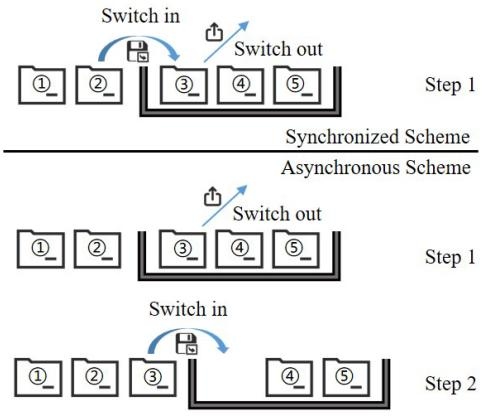

flowchart

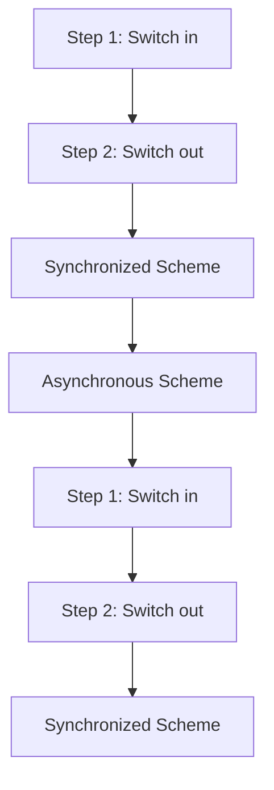

Fig. 3. Synchronized scheme and asynchronous scheme.

Next, we show the generalized procedures of the proposed MADRL-HCAU:

• Step 1: Launch Algorithm 1 to re-select the caching LEO satellites if the topology changes.   
• Step 2: Re-cluster the vehicles utilizing DB-SCAN. UAVs update their storage and move according to the adopted gravity model.   
• Step 3: The LEO satellites update their storage.

As the caching decisions are discrete under the continuous and complicated environment, we adopt DQN in Steps 2 and 3 to alleviate the large-scale space. Considering the highly correlated sampled state-action-reward pairs, the DQN introduces the memory buffer and fixed parameters to cut off such correlation [1], [9]. Next, we introduce how our asynchronous scheme works. As Fig. 3 shows, the content-choosing process of switching out and switching in is separated into two steps in the considered asynchronous updating scheme, while it takes place simultaneously in the synchronized scheme. Thus, the caching storage can remain unchanged in the asynchronous updating scheme. Furthermore, in the asynchronous updating scheme, the action weight of remaining the caching storage stationary is higher than that of substitution since multiple actions mean remaining stationary, which can reduce the possibility of simultaneous updates of UAVs. In this case, every single content substitution process can be accelerated by reserving transmission resources, which is how the asynchronous updating works to alleviate the traffic surge.

Moreover, the deployed MADRL reduces the scale and demotions of state-action space in Layer 1 to cooperatively manage the caching capacity of UAVs since the asynchronous updating scheme has relieved the side effects. Then, considering the scale of UAVs in coverage is much smaller that of vehicles, we adopt the centralized RL in Layer 2 to schedule the caching capacity of the accessing LEO satellite. Also, the content updating frequency of Layer 2 is slower than that in Layer 1 on account of the long-distance and rain attenuation ISLs and IULs. Also, the UAVs can update their cached contents from nearby UAVs through LoS links with less attenuation and higher transmission rates.

To verify the MADRL-HCAU’s reasonableness, we calculate the computation complexity of MADRL. Since the structures of the neural networks in Layer 1 and Layer 2 are similar, we take Layer 1 as an example. Suppose that there are J UAV agents, of which each acquires an evaluation and a target neural network with L layers and $\mathcal { N }$ neurons in each layer on average. If the batch size is $B ,$ the computation complexity of forward and backward propagation are both $O ( B L \mathcal { N } ^ { 2 } )$ . Furthermore, suppose the size of action space is ${ \mathcal { A } } ,$ for each batch, the computation complexity of updating Q-value is $O ( B \mathcal { A } )$ . Consequently, if the episode number is $\tau .$ , the computation complexity of the proposed MADRL is $O ( J T B ( L \mathcal { N } ^ { 2 } + \mathcal { A } ) )$ ) which is within polynomial time and bearable for UAVs and LEO satellites.

# V. PERFORMANCE EVALUATION

In this section, we do the simulations and compare the performance of our proposed algorithm with the benchmarks. The simulation environment contains 6 orbits and each of them consists of 15 LEO satellites at the altitude of 800km. Under the coverage of each LEO satellite, 3 UAVs hovering at a fixed altitude of 100m are deployed to serve the vehicles. The possible contents being requested are of [50, 100, 200]MB in size and [10, 15, 20]s in delay threshold. The caching capacity of UAVs and LEO satellites are 1GB and 1.5GB, respectively. Moreover, the bandwidth, transmission power, and antenna gain of LEO satellites and UAVs are 12.5GHz, 30dbm, 65dbi, and 20MHz, 24dbm, 65dbi, respectively. The rain attenuation factor, space noise power, and terrestrial noise power are set to 6db, $5 * 1 0 ^ { - 2 0 }$ W/Hz, and $5 * 1 0 ^ { - 1 8 }$ W/Hz, respectively. Additionally, the attenuation factors $\eta _ { L o S } , ~ \eta _ { N L o S }$ , and the elevation angle of UAVs θ are set to 1, 20, and 0.464 rad. In the proposed DM-ACO algorithm, the soft updating indicator ς, the pheromone constant $\Omega ,$ the weight factors of path phenomenon α and visibility $\beta$ and are set to 0.6, 100, 1 and 0.5, respectively.

First, we investigate the convergence situation of our MADRL-HCAU scheme under different Zipf parameters and content popularity update cycles. Since the Zipf parameter represents the skewness of request probability, the higher value of the Zipf parameter indicates the increasing request possibility of fewer contents. As Fig. 4 (a) and Fig. 4 (b) show, a higher Zipf parameter value makes both layer 1 and layer 2 gain more reward from the environment whose popularity update frequency is 20s. Furthermore, Fig. 4 (a) shows that increasing the Zipf parameter also accelerates the converging speed of Layer 1 in our proposed scheme since the request popularity skewness optimizes the complexity while balancing the content popularity and transmission delay. Meanwhile, from Fig. 4 (b), we can find that the reward difference between $\mu ~ = ~ 2$ and $\mu ~ = ~ 1$ is relatively larger than that between $\mu \ : = \ : 3$ and $\mu \ : = \ : 2$ . This is because the reward of Layer 2 is defined according to the CHR. Moreover, the variation of Zipf parameter $\mu$ can cause non-linear influence on the content popularity distribution and finally affects the learning performance of our proposed scheme.

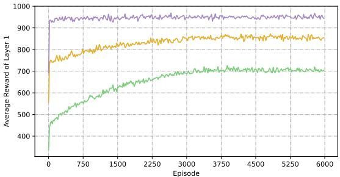

line

| Episode | Average Reward of Layer 1 (Purple) | Average Reward of Layer 1 (Orange) | Average Reward of Layer 1 (Green) |
| ------- | ---------------------------------- | ---------------------------------- | --------------------------------- |
| 0       | 950                                | 750                                | 350                               |
| 750     | 940                                | 800                                | 550                               |
| 1500    | 930                                | 820                                | 620                               |
| 2250    | 920                                | 830                                | 650                               |
| 3000    | 910                                | 840                                | 680                               |
| 3750    | 900                                | 850                                | 700                               |
| 4500    | 890                                | 860                                | 710                               |
| 5250    | 880                                | 870                                | 720                               |
| 6000    | 870                                | 880                                | 730                               |

(a) Convergence of Layer 1

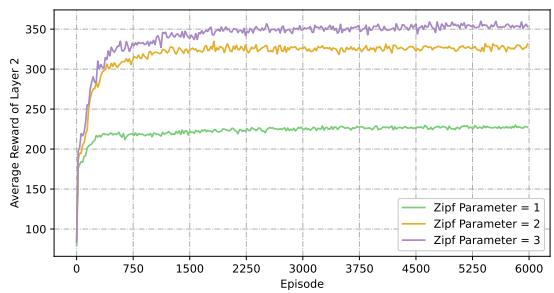

line

| Episode | Zipf Parameter = 1 | Zipf Parameter = 2 | Zipf Parameter = 3 |
| ------- | ------------------ | ------------------ | ------------------ |
| 0       | 100                | 100                | 100                |
| 750     | 220                | 300                | 320                |
| 1500    | 225                | 310                | 340                |
| 2250    | 225                | 315                | 345                |
| 3000    | 225                | 315                | 345                |
| 3750    | 225                | 315                | 345                |
| 4500    | 225                | 315                | 345                |
| 5250    | 225                | 315                | 345                |
| 6000    | 225                | 315                | 345                |

(b) Convergence of Layer 2

Fig. 4. Convergence situation under different Zipf parameters with popularity update cycle of 20s.   
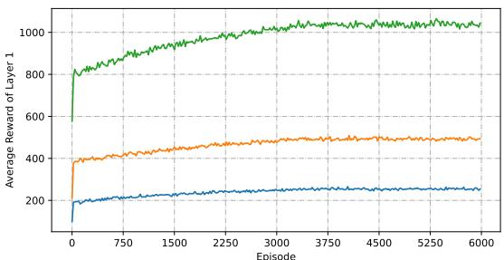

line

| Episode | Average Reward of Layer 1 (Green) | Average Reward of Layer 1 (Orange) | Average Reward of Layer 1 (Blue) |
| ------- | --------------------------------- | ---------------------------------- | -------------------------------- |
| 0       | 800                               | 400                                | 200                              |
| 750     | 900                               | 450                                | 220                              |
| 1500    | 950                               | 470                                | 230                              |
| 2250    | 1000                              | 480                                | 240                              |
| 3000    | 1020                              | 490                                | 250                              |
| 3750    | 1030                              | 495                                | 255                              |
| 4500    | 1040                              | 500                                | 260                              |
| 5250    | 1050                              | 505                                | 265                              |
| 6000    | 1060                              | 510                                | 270                              |

(a) Convergence of Layer 1   
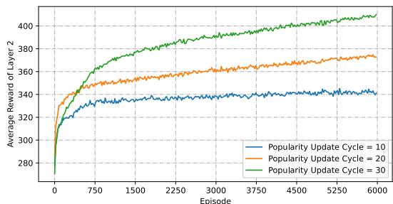

line

| Episode | Popularity Update Cycle = 10 | Popularity Update Cycle = 20 | Popularity Update Cycle = 30 |
| ------- | ---------------------------- | ---------------------------- | ---------------------------- |
| 0       | 280                          | 280                          | 280                          |
| 750     | 340                          | 350                          | 360                          |
| 1500    | 345                          | 355                          | 375                          |
| 2250    | 348                          | 360                          | 385                          |
| 3000    | 350                          | 365                          | 390                          |
| 3750    | 352                          | 368                          | 395                          |
| 4500    | 353                          | 370                          | 400                          |
| 5250    | 354                          | 372                          | 402                          |
| 6000    | 355                          | 375                          | 405                          |

(b) Convergence of Layer 2   
Fig. 5. Convergence situation under different content popularity update cycle with $\mu = 2$ .

From another point of view, Fig. 5 shows the reward influence brought by the popularity updating cycle. Fig. 5 (a) shows that shortening the updating cycle causes the dropped reward of Layer 1. Moreover, the difference in average reward between 30s and 20s is larger than that between 20s and 10s, indicating that the variation interval causes non-linear influence on the reward of Layer 1. This is because that shortening the interval can enlarge the scale of state-action pairs and complicate the learning process of MADRL. Furthermore, Fig. 5 (b) shows the influence on the reward of Layer 2. Specifically, the shorter the interval is, the less reward Layer 2 gains since a shorter interval requires the LEO satellites to update their cache more frequently, while the caching updating delay and limited transmission resource cannot catch up with the caching update frequency.

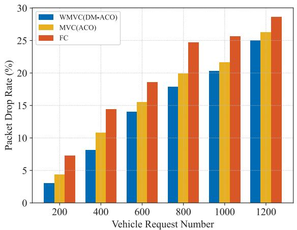

bar

| Vehicle Request Number | WMVC(DM-ACO) | MVC(ACO) | FC   |
| ---------------------- | ------------ | -------- | ---- |
| 200                    | 3.0          | 4.5      | 7.5  |
| 400                    | 8.0          | 11.0     | 14.5 |
| 600                    | 14.0         | 15.5     | 18.5 |
| 800                    | 18.0         | 20.0     | 24.5 |
| 1000                   | 20.5         | 21.5     | 25.5 |
| 1200                   | 25.0         | 26.5     | 28.5 |

Fig. 6. The packet drop rate applying different caching LEO satellite selection approaches.

To better reflect the practical request situation, we do the simulations under $\mu = 2$ and popularity updating cycle=20s with 24 candidate contents. Next, we evaluate PDR and content updating delay using different caching LEO satellite selection approaches and updating approaches including synchronized (SYN) and asynchronous (ASY) updating. The PDR measures how many packets are dropped due to network congestion or the limited receiving capacity, while the content updating time represents the time consumed for caching nodes to update their buffer. Under SYN updating, Fig. 6 shows that our proposed DM-ACO algorithm, formulating the caching LEO selection problem as a WMVC problem, has better PDR compared to applying common ACO which is motivated by merely the vertex degree and selecting all the LEO satellites as caching nodes named Fully Connected (FC). Specifically, the PDR of our proposal can reach under 14.72% on average and decrease by 1.68% and 5.14% compared to ACO and FC. Meanwhile, Fig. 7 shows that the content updating delay of applying DM-ACO can reach under 6.01s on average and decrease by 0.11s and 0.29s compared to ACO and FC. Additionally, Fig. 6 and Fig. 7 also show the PDR and content updating delay increase along with the growing requests due to the rising network overhead.

However, the PDR and content updating delay by merely applying DM-ACO is still critical for the delay-sensitive NTNs. Thus, we next compare the PDR and content updating delay of SYN and ASY as shown in Figs. 8 and 9. Fig. 8 shows that the PDR of ASY reaches under 7.64% on average and effectively decreases by about 7.09% compared to that of SYN. We can also find that with the growing requests, the PDR of ASY increases far slower than that of SYN. Next, Fig. 9 shows that the content updating delay of ASY is far shorter than that of SYN. Specifically, the content updating delay of ASY can decrease by 1.87s and reach under 4.13s on average. Meanwhile, the increasing speed of content updating delay slows down when the request number reaches 800 since the request distribution from vehicles is stable and transmission resources have been fully used.

Since cooperatively applying DM-ACO and ASY updating can effectively reduce the packet drop caused by network congestion and accelerate the caching updating process, we finally evaluate CHR and the average transmission latency under different vehicle request numbers and content numbers. The benchmarks are as below:

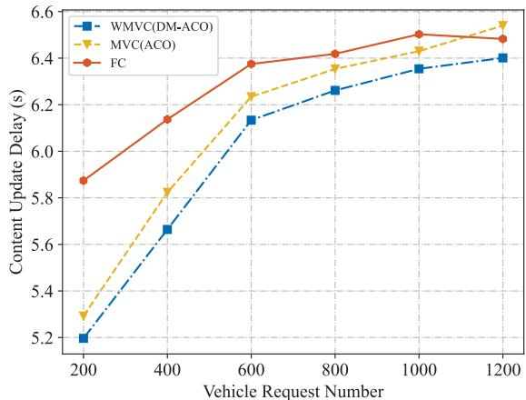

line

| Vehicle Request Number | WMVC(DM-ACO) | MVC(ACO) | FC    |
| ---------------------- | ------------ | -------- | ----- |
| 200                    | 5.2          | 5.3      | 5.9   |
| 400                    | 5.7          | 5.8      | 6.1   |
| 600                    | 6.1          | 6.2      | 6.4   |
| 800                    | 6.3          | 6.4      | 6.5   |
| 1000                   | 6.4          | 6.5      | 6.5   |
| 1200                   | 6.4          | 6.5      | 6.5   |

Fig. 7. The content update delay applying different caching LEO satellite selection approaches.

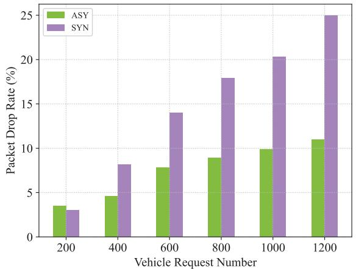

bar

| Vehicle Request Number | ASY (%) | SYN (%) |
| :--- | :--- | :--- |
| 200 | 3.6 | 3.1 |
| 400 | 4.7 | 8.2 |
| 600 | 7.9 | 14.1 |
| 800 | 9.0 | 18.0 |
| 1000 | 9.9 | 20.4 |
| 1200 | 11.1 | 25.0 |

Fig. 8. The packet drop rate applying different cache updating approaches.

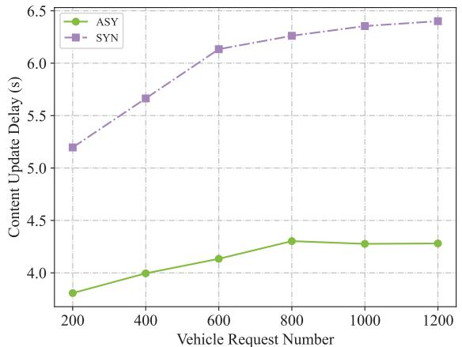

line

| Vehicle Request Number | ASY   | SYN   |
| ---------------------- | ----- | ----- |
| 200                    | 3.8   | 5.2   |
| 400                    | 4.0   | 5.7   |
| 600                    | 4.1   | 6.1   |
| 800                    | 4.3   | 6.3   |
| 1000                   | 4.3   | 6.4   |
| 1200                   | 4.3   | 6.4   |

Fig. 9. The content update delay applying different cache updating approaches.

• Popularity Aware (PA): caching the contents with top popularity predicted by Long Short-Term Memory (LSTM) [9], [31].   
• Cooperative Multilayer Edge Caching (CMEC): caching the content with the largest delay reduction gain calculated from the product of content popularity and

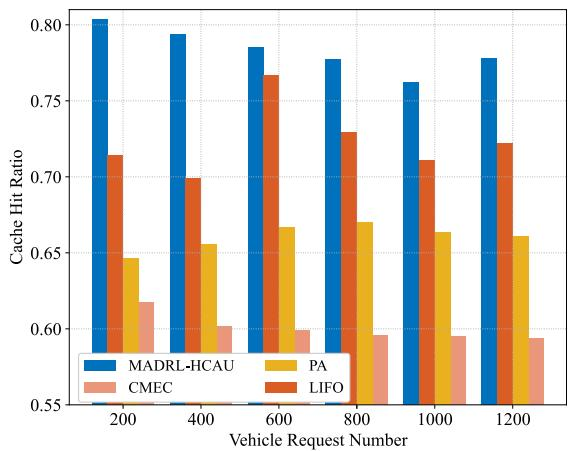

bar

| Vehicle Request Number | MADRL-HCAU | PA    | CMEC  | LIFO   |
| ---------------------- | ---------- | ----- | ----- | ------ |
| 200                    | 0.80       | 0.65  | 0.62  | 0.71   |
| 400                    | 0.79       | 0.66  | 0.60  | 0.70   |
| 600                    | 0.78       | 0.67  | 0.60  | 0.77   |
| 800                    | 0.78       | 0.67  | 0.59  | 0.73   |
| 1000                   | 0.76       | 0.66  | 0.59  | 0.71   |
| 1200                   | 0.78       | 0.66  | 0.59  | 0.72   |

Fig. 10. The overall CHR under different content numbers.

TABLE I THE MULTI-LAYER CACHE HIT RATIO UNDER DIFFERENT VEHICLE REQUEST NUMBERS 

<table><tr><td rowspan="2">Strategy</td><td colspan="7">Vehicle Request Number</td></tr><tr><td>Layer</td><td>200</td><td>400</td><td>600</td><td>800</td><td>1000</td><td>1200</td></tr><tr><td rowspan="3">MADRL-HCAU</td><td>Layer 1 (D)</td><td>30.6%</td><td>29.1%</td><td>28.9%</td><td>27.7%</td><td>26.5%</td><td>25.6%</td></tr><tr><td>Layer 1 (H)</td><td>72.4%</td><td>71.7%</td><td>70.7%</td><td>68.9%</td><td>67.3%</td><td>66.7%</td></tr><tr><td>Layer 2 (D)</td><td>80.3%</td><td>79.3%</td><td>78.6%</td><td>77.7%</td><td>76.2%</td><td>77.8%</td></tr><tr><td rowspan="3">PA</td><td>Layer 1 (D)</td><td>46.8%</td><td>47.7%</td><td>48.0%</td><td>47.5%</td><td>47.6%</td><td>46.8%</td></tr><tr><td>Layer 1 (H)</td><td>58.5%</td><td>59.7%</td><td>60.5%</td><td>60.6%</td><td>60.1%</td><td>59.8%</td></tr><tr><td>Layer 2 (D)</td><td>64.6%</td><td>65.5%</td><td>66.7%</td><td>67.0%</td><td>66.3%</td><td>66.1%</td></tr><tr><td rowspan="3">CMEC</td><td>Layer 1 (D)</td><td>28.1%</td><td>26.5%</td><td>24.4%</td><td>23.3%</td><td>23.0%</td><td>22.3%</td></tr><tr><td>Layer 1 (H)</td><td>44.4%</td><td>42.5%</td><td>40.8%</td><td>39.7%</td><td>40.0%</td><td>39.9%</td></tr><tr><td>Layer 2 (D)</td><td>61.8%</td><td>60.2%</td><td>59.8%</td><td>59.6%</td><td>59.5%</td><td>59.9%</td></tr><tr><td rowspan="3">LIFO</td><td>Layer 1 (D)</td><td>28.9%</td><td>26.5%</td><td>26.6%</td><td>21.4%</td><td>20.0%</td><td>19.8%</td></tr><tr><td>Layer 1 (H)</td><td>60.4%</td><td>58.9%</td><td>65.5%</td><td>61.6%</td><td>58.8%</td><td>59.1%</td></tr><tr><td>Layer 2 (D)</td><td>71.4%</td><td>69.9%</td><td>76.7%</td><td>72.9%</td><td>71.1%</td><td>72.1%</td></tr></table>

the average distance between the transmitter and the receiver [26].

• Last in First Out (LIFO): a traditional caching strategy that switches out the latest switched in content.

We first evaluate the influence of the vehicle request number, where Fig. 10 and TABLE I show the overall CHR and the specific CHRs of the vehicle request directly satisfied by the accessing UAV (Layer 1 (D)), by other neighboring UAVs in one hop (Layer 1 (H)), and by the accessing LEO satellite (Layer 2 (D)), respectively. From Fig. 10 we can find that the overall CHR of our MADRL-HCAU can reach 78.3% on average, which outperforms PA, CMEC, and LIFO for about 12.3%, 18.3%, and 5.9%, respectively. Moreover, the overall CHR drops along with the increased vehicle requests due to the more complex request components. The value of CHR becomes stable when the vehicle request number exceeds 800 since the distribution of vehicle requests fits the popularity. We can further find that the overall CHRs of PA, CMEC, and LIFO float around 66.0%, 60.0%. and 72.3%, respectively, showing that the increase of vehicle requests causes minor influence. We next elaborately evaluate CHR in each layer from TABLE I. It shows that the CHR of Layer 1 (D) using PA is higher than those of the proposed MADRL-HCAU, CMEC, and LIFO since PA is a greedy method that neglects the cooperation between UAVs and LEO satellites. This conclusion can be demonstrated by CHRs of PA and MADRL-HCAU of Layer 1 (H) and Layer 2 (D).

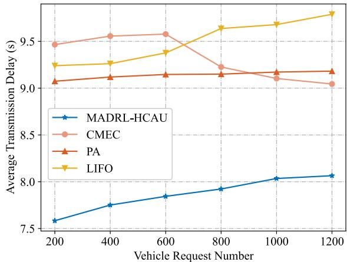  
Fig. 11. The average transmission delay under different vehicle request numbers.

Specifically, the CHRs of Layer 1 (H) and Layer 2 (D) of MADRL-HCAU outperform those of PA by 9.8% and 12.3% on average, respectively, while, the CHRs of two layers of LIFO outperform those of PA by 0.8% and 6.3% on average, respectively. Moreover, the CHR of Layer 1 (H) using MADRL-HCAU also outperforms that of LIFO for about 8.9% on average. Additionally, the reason for the worse performance of PA is that the UAVs and LEO satellites cache duplicated contents. Furthermore, TABLE I also shows that CMEC has the worst CHR performance in each layer which is below those of the proposed MADRL-HCAU by 3.5%, 28.5%, and 18.3%. The potential reason is the high dynamics and uneven distribution of vehicles, which can be proved by Fig. 11. Specifically when the vehicle request number exceeds 800, the vehicle and content request distribution becomes more uniform, and the average transmission delay becomes shorter than PA and LIFO. Meanwhile, Fig. 11 also shows that the average transmission delay of MADRL-HCAU can reach under 7.86s on average and outperforms that of CMEC, PA, and LIFO by 1.46s, 1.27s, and 1.63s, respectively.

We last evaluate the influence of content number on the CHR and average transmission delay. From Fig. 11, we can find that the overall CHR of our proposed MADRL-HCAU can reach 81.1% on overage, which outperforms the CMEC, PA, and LIFO by 13.9%, 18.2%, and 8.4%, respectively. All four methods’ performance drops since the increased contents complicate the caching environment. Next, from TABLE II, we specifically evaluate the CHR of each layer and find that the PA outperforms MADRL-HCAU and LIFO in terms of CHR of Layer 1 (D), but has far less CHRs at Layer 1 (H) and Layer 2 (D), which proves the same conclusion as the above vehicle request number evaluation. Moreover, the CHR of Layer 1 (H) of our MADRL-HCAU can reach 70.8% on average and outperforms CMEC, PA, and LIFO by 21.8%, 13.3%, and 10.0%, respectively. The CHR of Layer 2 (D) is the same as the overall CHR. Finally, we evaluate the average transmission delay by taking the content number as the variable. Fig. 12 shows that the transmission delay of our proposed MADRL-HCAU can reach under 7.49s on average and has less transmission delay compared to CMEC, PA, and LIFO by 1.59s, 3.53s, and 3.98s, respectively. Furthermore,

TABLE II THE MULTI-LAYER CACHE HIT RATIO UNDER DIFFERENT CONTENT NUMBERS 

<table><tr><td rowspan="2">Strategy</td><td rowspan="2">Layer</td><td colspan="6">Content Number</td></tr><tr><td>16</td><td>20</td><td>24</td><td>28</td><td>32</td><td>36</td></tr><tr><td rowspan="3">MADRL-HCAU</td><td>Layer 1 (D)</td><td>37.8%</td><td>34.8%</td><td>30.7%</td><td>29.1%</td><td>27.7%</td><td>26.1%</td></tr><tr><td>Layer 1 (H)</td><td>83.1%</td><td>76.3%</td><td>72.0%</td><td>68.0%</td><td>64.5%</td><td>61.2%</td></tr><tr><td>Layer 2 (D)</td><td>95.7%</td><td>86.6%</td><td>81.1%</td><td>78.5%</td><td>73.7%</td><td>70.6%</td></tr><tr><td rowspan="3">PA</td><td>Layer 1 (D)</td><td>59.4%</td><td>53.8%</td><td>46.6%</td><td>42.1%</td><td>38.0%</td><td>33.7%</td></tr><tr><td>Layer 1 (H)</td><td>73.3%</td><td>67.7%</td><td>60.7%</td><td>58.5%</td><td>52.3%</td><td>47.2%</td></tr><tr><td>Layer 2 (D)</td><td>79.0%</td><td>72.9%</td><td>67.0%</td><td>58.5%</td><td>52.3%</td><td>47.2%</td></tr><tr><td rowspan="3">CMEC</td><td>Layer 1 (D)</td><td>30.2%</td><td>28.1%</td><td>27.7%</td><td>27.2%</td><td>23.4%</td><td>18.7%</td></tr><tr><td>Layer 1 (H)</td><td>63.9%</td><td>59.8%</td><td>48.3%</td><td>44.5%</td><td>39.9%</td><td>37.8%</td></tr><tr><td>Layer 2 (D)</td><td>99.0%</td><td>85.6%</td><td>65.7%</td><td>59.4%</td><td>49.9%</td><td>43.2%</td></tr><tr><td rowspan="3">LIFO</td><td>Layer 1 (D)</td><td>39.1%</td><td>33.9%</td><td>26.8%</td><td>24.2%</td><td>18.6%</td><td>16.5%</td></tr><tr><td>Layer 1 (H)</td><td>85.8%</td><td>70.0%</td><td>63.2%</td><td>59.3%</td><td>47.5%</td><td>42.2%</td></tr><tr><td>Layer 2 (D)</td><td>97.5%</td><td>77.2%</td><td>76.8%</td><td>68.9%</td><td>61.3%</td><td>54.5%</td></tr></table>

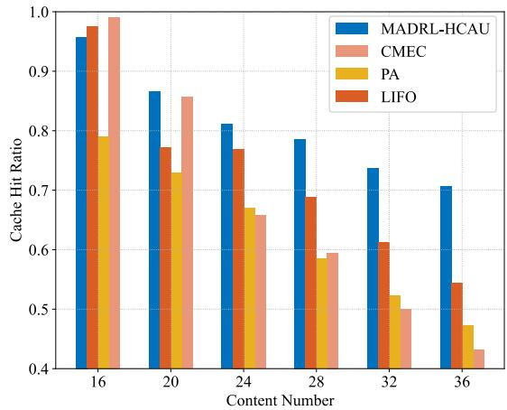

bar

| Content Number | MADRL-HCAU | CMEC  | PA    | LIFO  |
| -------------- | ---------- | ----- | ----- | ----- |
| 16             | 0.96       | 0.99  | 0.79  | 0.98  |
| 20             | 0.87       | 0.86  | 0.73  | 0.78  |
| 24             | 0.81       | 0.66  | 0.67  | 0.77  |
| 28             | 0.79       | 0.59  | 0.59  | 0.69  |
| 32             | 0.74       | 0.50  | 0.52  | 0.61  |
| 36             | 0.71       | 0.43  | 0.47  | 0.55  |

Fig. 12. The overall CHR under different content numbers.

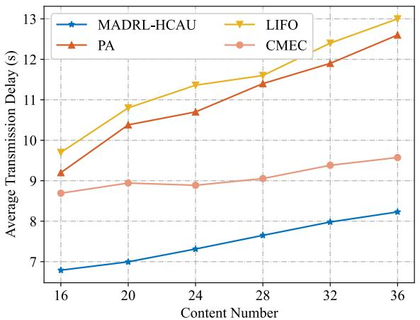

line

| Content Number | MADRL-HCAU | LIFO  | PA    | CMEC  |
| -------------- | ---------- | ----- | ----- | ----- |
| 16             | 6.8        | 9.7   | 9.2   | 8.7   |
| 20             | 7.0        | 10.8  | 10.4  | 8.9   |
| 24             | 7.3        | 11.4  | 10.7  | 8.8   |
| 28             | 7.6        | 11.7  | 11.4  | 9.0   |
| 32             | 8.0        | 12.4  | 11.9  | 9.4   |
| 36             | 8.2        | 13.0  | 12.6  | 9.6   |

Fig. 13. The average transmission delay under different content numbers.

the average transmission delay grows with the rising number of content candidates.

# VI. CONCLUSION AND FUTURE PERSPECTIVE

In this article, we study the NTN-assisted content caching services for CAVs with customized QoS requirements. We first formulate the caching LEO satellite selection problem in a WMVC problem that minimizes the propagation delay. Then, a MADRL-HCAU algorithm is proposed which cooperatively makes hierarchical caching decisions among NTN nodes, which dispenses the traffic and accelerates the content updating process. Numeric simulation results show that our MADRL-HCAU algorithm can effectively alleviate the packet drop and content updating delay, while the overall CHR and average transmission delay have better performance compared to the popularity-aware and traditional LIFO caching strategy. Meanwhile, the proposed MADRL-HCAU also has robust scalability to be extended to Space-Air-Ground Integrated Networks (SAGINs) where the terrestrial infrastructure including Road Side Units (RSUs) and BSs can be regarded as fixed gravity-free UAVs. We believe that scaling the proposed MADRL-HCAU to SAGINs can achieve a more intelligent and flexible edge caching architecture.

# REFERENCES

[1] B. Mao, Y. Liu, J. Liu, and N. Kato, “AI-assisted edge caching for metaverse of connected and automated vehicles: Proposal, challenges, and future perspectives,” IEEE Veh. Technol. Mag., vol. 18, no. 4, pp. 66–74, Dec. 2023.   
[2] B. Mao, X. Zhou, J. Liu, and N. Kato, “On an intelligent hierarchical routing strategy for ultra-dense free space optical low Earth orbit satellite networks,” IEEE J. Sel. Areas Commun., vol. 42, no. 5, pp. 1219–1230, May 2024.   
[3] R. Wang, M. A. Kishk, and M.-S. Alouini, “Ultra reliable low latency routing in LEO satellite constellations: A stochastic geometry approach,” IEEE J. Sel. Areas Commun., vol. 42, no. 5, pp. 1231–1245, May 2024.   
[4] Z. Guo, F. Tang, X. Chen, L. Luo, and M. Zhao, “Deep-reinforcementlearning-based content caching in satellite-terrestrial assisted airborne communications,” IEEE Internet Things J., vol. 11, no. 12, pp. 22779–22789, Jun. 2024.   
[5] A. Talgat, M. A. Kishk, and M.-S. Alouini, “Maximizing uplink data transmission of LEO-satellite-based wireless-powered IoT,” IEEE Internet Things J., vol. 11, no. 17, pp. 28975–28987, Nov. 2024, doi: 10.1109/JIOT.2024.3405661.   
[6] X. Zhou, Y. Weng, B. Mao, J. Liu, and N. Kato, “Intelligent multiobjective routing for future ultra-dense LEO satellite networks,” IEEE Wireless Commun., vol. 1, no. 2, pp. 1–8, Oct. 2024.   
[7] J. Tan, F. Tang, M. Zhao, and Y. Zhu, “Adaptive caching scheme for jointly optimizing delay and energy consumption in heterogeneous digital twin IoT,” IEEE Trans. Netw. Sci. Eng., vol. 10, no. 6, pp. 4020–4032, Dec. 2023.   
[8] D.-H. Tran, S. Chatzinotas, and B. Ottersten, “Satellite- and cacheassisted UAV: A joint cache placement, resource allocation, and trajectory optimization for 6G aerial networks,” IEEE Open J. Veh. Technol., vol. 3, pp. 40–54, 2022.   
[9] Y. Liu and B. Mao, “On a novel content edge caching approach based on multi-agent federated reinforcement learning in Internet of Vehicles,” in Proc. 32nd Wireless Opt. Commun. Conf. (WOCC), May 2023, pp. 1–5.   
[10] G. Wu, Y. Miao, B. Alzahrani, A. Barnawi, A. Alhindi, and M. Chen, “Adaptive edge caching in UAV-assisted 5G network,” in Proc. IEEE Global Commun. Conf. (GLOBECOM), Dec. 2021, pp. 1–6, doi: 10.1109/GLOBECOM46510.2021.9685985.   
[11] D. Jiang et al., “QoE-aware efficient content distribution scheme for satellite-terrestrial networks,” IEEE Trans. Mobile Comput., vol. 22, no. 1, pp. 443–458, Jan. 2023.   
[12] C. Tang, A. Li, and X. Li, “Asymmetric game: A silver bullet to weighted vertex cover of networks,” IEEE Trans. Cybern., vol. 48, no. 10, pp. 2994–3005, Oct. 2018.   
[13] Z. Yang, Y. Li, P. Yuan, and Q. Zhang, “TCSC: A novel file distribution strategy in integrated LEO satellite-terrestrial networks,” IEEE Trans. Veh. Technol., vol. 69, no. 5, pp. 5426–5441, May 2020.

[14] S. Liu, L. Liu, J. Tang, B. Yu, Y. Wang, and W. Shi, “Edge computing for autonomous driving: Opportunities and challenges,” Proc. IEEE, vol. 107, no. 8, pp. 1697–1716, Aug. 2019.   
[15] B. Mao, F. Tang, Y. Kawamoto, and N. Kato, “AI models for green communications towards 6G,” IEEE Commun. Surveys Tuts., vol. 24, no. 1, pp. 210–247, 1st Quart., 2022, doi: 10.1109/COMST.2021. 3130901.   
[16] Y. Jiang, W. Huang, M. Bennis, and F. Zheng, “Decentralized asynchronous coded caching design and performance analysis in fog radio access networks,” IEEE Trans. Mobile Comput., vol. 19, no. 3, pp. 540–551, Mar. 2020.   
[17] B. Mao, J. Liu, Y. Wu, and N. Kato, “Security and privacy on 6G network edge: A survey,” IEEE Commun. Surveys Tuts., vol. 25, no. 2, pp. 1095–1127, 2nd Quart., 2023.   
[18] Q. Chen, W. Meng, S. Li, C. Li, and H.-H. Chen, “Civil aircrafts augmented space–air–ground-integrated vehicular networks: Motivation, breakthrough, and challenges,” IEEE Internet Things J., vol. 9, no. 8, pp. 5670–5683, Apr. 2022.   
[19] Y. Li, Q. Zhang, P. Yuan, and Z. Yang, “A back-tracing partition based on-path caching distribution strategy over integrated LEO satellite and terrestrial networks,” in Proc. 10th Int. Conf. Wireless Commun. Signal Process. (WCSP), Oct. 2018, pp. 1–6.   
[20] S. Liu, X. Hu, Y. Wang, G. Cui, and W. Wang, “Distributed caching based on matching game in LEO satellite constellation networks,” IEEE Commun. Lett., vol. 22, no. 2, pp. 300–303, Feb. 2018.   
[21] S. Yu, X. Gong, Q. Shi, X. Wang, and X. Chen, “EC-SAGINs: Edgecomputing-enhanced space–air–ground-integrated networks for Internet of Vehicles,” IEEE Internet Things J., vol. 9, no. 8, pp. 5742–5754, Apr. 2022.   
[22] C. Jiang and X. Zhu, “Reinforcement learning based capacity management in multi-layer satellite networks,” IEEE Trans. Wireless Commun., vol. 19, no. 7, pp. 4685–4699, Jul. 2020.   
[23] S. Zhang, T. Cai, D. Wu, D. Schupke, N. Ansari, and C. Cavdar, “IoRT data collection with LEO satellite-assisted and cache-enabled UAV: A deep reinforcement learning approach,” IEEE Trans. Veh. Technol., vol. 73, no. 4, pp. 5872–5884, Apr. 2024.   
[24] S. Gu, X. Sun, Z. Yang, T. Huang, W. Xiang, and K. Yu, “Energy-aware coded caching strategy design with resource optimization for satellite-UAV-vehicle-integrated networks,” IEEE Internet Things J., vol. 9, no. 8, pp. 5799–5811, Apr. 2022.   
[25] J. Bao, X. Peng, C. Liu, B. Jiang, and J. Wu, “Multilayered decentralized coded caching with nonuniform popularity and multilevel cache capacity in space–air–ground integrated networks,” IEEE Internet Things J., vol. 11, no. 8, pp. 13913–13926, Apr. 2024.   
[26] X. Zhu, C. Jiang, L. Kuang, and Z. Zhao, “Cooperative multilayer edge caching in integrated satellite-terrestrial networks,” IEEE Trans. Wireless Commun., vol. 21, no. 5, pp. 2924–2937, May 2022.   
[27] Y. He, Y. Wang, Q. Lin, and J. Li, “Meta-hierarchical reinforcement learning (MHRL)-based dynamic resource allocation for dynamic vehicular networks,” IEEE Trans. Veh. Technol., vol. 71, no. 4, pp. 3495–3506, Apr. 2022.   
[28] R. Zhao, Y. Ran, J. Luo, and S. Chen, “Towards coverage-aware cooperative video caching in LEO satellite networks,” in Proc. IEEE Global Commun. Conf., Dec. 2022, pp. 1893–1898.   
[29] P. Zhang, Y. Li, N. Kumar, N. Chen, C.-H. Hsu, and A. Barnawi, “Distributed deep reinforcement learning assisted resource allocation algorithm for space-air-ground integrated networks,” IEEE Trans. Netw. Service Manage., vol. 20, no. 3, pp. 3348–3358, Sep. 2023.   
[30] X. Li et al., “Multi-agent DRL for resource allocation and cache design in terrestrial-satellite networks,” IEEE Trans. Wireless Commun., vol. 22, no. 8, pp. 5031–5042, Aug. 2023.   
[31] S. Rahman, Md. G. R. Alam, and Md. M. Rahman, “Deep learningbased predictive caching in the edge of a network,” in Proc. Int. Conf. Inf. Netw., Jan. 2020, pp. 797–801.