# On an Intelligent Hierarchical Routing Strategy for Ultra-Dense Free Space Optical Low Earth Orbit Satellite Networks

Bomin Mao , Member, IEEE, Xueming Zhou, Student Member, IEEE, Jiajia Liu , Senior Member, IEEE, and Nei Kato , Fellow, IEEE

Abstract— As an essential 6G component, the Low Earth Orbit (LEO) satellite communication has aroused increasing attentions from academia and industry to provide seamless and highlyefficient networking services. However, existing routing strategies are primarily designed for terrestrial networks or small-scale satellite networks, making it inapplicable to future LEO satellite constellations of ultra density, high dynamics, and large scale. Moreover, since Free Space Optical (FSO) communications have been expected for Inter-satellite Links (ISLs) and the number of constructed FSO ISLs depends on the Acquisition, Pointing, and Tracking (APT) terminals and geometric visibilities, the routing algorithm needs to be adaptive. To address these issues, this paper considers the dual-layer network architecture composed of Medium Earth Orbit (MEO) satellites and LEO satellites, where the regional network division is adopted for the LEO satellite layer to alleviate the complexity and improve the routing efficiency. Then, a multi-objective reinforcement learning-based routing strategy with local information considered is proposed to meet the differentiated Quality of Service (QoS) requirements of diversified terrestrial applications. A cooperative mechanism is also designed to address the conflicts caused by the routing design for different applications. The simulation results demonstrate the proposal is applicable to varying numbers of APT terminals and outperforms benchmark algorithms in terms of diversified QoS metrics.

Index Terms— Ultra-dense LEO satellites, dual-layer satellite network architecture, FSO communications, multi-objective reinforcement learning, cooperative mechanism.

# I. INTRODUCTION

WITH the emergence of autonomous driving vehicles andthe development of Internet of Things (IoT), a massive the development of Internet of Things (IoT), a massive

Manuscript received 31 July 2023; revised 10 November 2023; accepted 21 December 2023. Date of publication 19 February 2024; date of current version 9 May 2024. (Corresponding author: Jiajia Liu.)

Bomin Mao is with the National Engineering Laboratory for Integrated Aero-Space-Ground-Ocean Big Data Application Technology, and the School of Cybersecurity, Northwestern Polytechnical University, Xi’an 710072, China, also with the Yangtze River Delta Research Institute, Northwestern Polytechnical University, Taicang 215400, China, and also with Shenzhen Research Institute, Northwestern Polytechnical University, Shenzhen 518057, China (e-mail: maobomin@nwpu.edu.cn).

Xueming Zhou and Jiajia Liu are with the National Engineering Laboratory for Integrated Aero-Space-Ground-Ocean Big Data Application Technology, and the School of Cybersecurity, Northwestern Polytechnical University, Xi’an 710072, China (e-mail: zhou-xueming@mail.nwpu.edu.cn; liujiajia@ nwpu.edu.cn).

Nei Kato is with the Graduate School of Information Sciences, Tohoku University, Sendai 980-8579, Japan (e-mail: kato@it.is.tohoku.ac.jp).

Color versions of one or more figures in this article are available at https://doi.org/10.1109/JSAC.2024.3365880.

Digital Object Identifier 10.1109/JSAC.2024.3365880

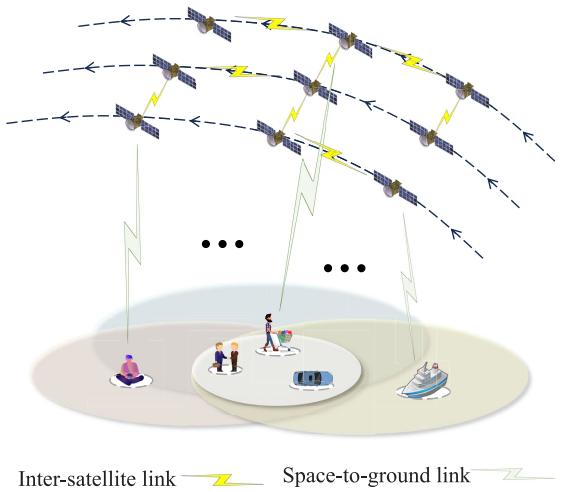

flowchart

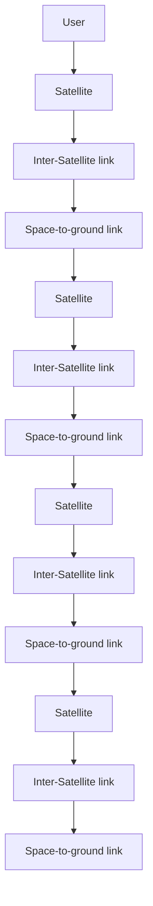

Fig. 1. Future LEO satellite constellations with diversified terrestrial services.

number of widely deployed connected terminals have exposed certain requirements for network communications [1] including fast response and ubiquitous access [2]. Low Earth Orbit (LEO) satellites [3] are expected to make up for the drawback of terrestrial cellular communications in seamless coverage due to the low expense especially for the sparsely populated areas [4], [5]. Moreover, LEO satellites have significant advantages over Geostationary Earth Orbit (GEO) satellites for the low latency and high throughput [6]. It has been widely recognized that LEO satellite communication is an important part of 6G [7], [8]. In recent years, companies like SpaceX and OneWeb have been constructing their own LEO satellite constellations to provide world-wide communication services with low latency and high throughput, especially for the areas of sea, desert, air, and even space.

However, LEO satellite constellations like Starlink and OneWeb consist of a large number of LEO satellites moving in high speeds at the altitudes ranging from 200 to 3000 km above the earth’s surface [7], which results in the characteristics of ultra density and high dynamics for LEO satellite networks as shown in Fig. 1. Therefore, traditional shortest path-based routing algorithms designed for the terrestrial networks and small-scale satellite networks, are not suitable for future LEO satellite networks [9]. The frequent dynamic and ultra density of LEO satellite networks cause significant challenge between in-time update and fast convergence of the

End-to-End (E2E) routing policy design [10]. An efficient solution is to increase the awareness of future traffic changes for path update in advance. However, traditional routing strategies such as Dijkstra’s algorithm are conducted based on the past traffic and update behind the network changes [11], [12], which may cause performance degradation due to the frequent changes of LEO satellite networks. Moreover, most traditional routing solutions aim to optimize a single Quality of Service (QoS) metric, such as latency, throughput, and packet drop rate, to alleviate the computation complexity, which cannot meet the diversified QoS requirements of various terrestrial applications as shown in Fig. 1. Future satellite network routing strategies should satisfy the services’ requirements for multiple metrics concurrently. In addition, most traditional satellite routing algorithms are designed for the Radio Frequency (RF) networks. Future trend is to enhance the capabilities of Inter-Satellite Links (ISLs) with Free Space Optical (FSO) communications due to the high bandwidth. However, due to laser’s strong directionality and the limited APT terminals [13], it cannot establish ISLs as rapidly or flexibly as RF signals.

To address the deficiencies of traditional routing algorithms, many scholars have adopted intelligent solutions to address satellite routing. These include heuristic algorithms [14], graph neural network algorithms [15], and reinforcement learning algorithms [16]. However, these papers primarily focus on alleviating network congestion through routing policy design without considering how to address the ultra density and high dynamics of LEO satellites. References [17], [18], and [19] address the diversified QoS requirements of future satellite network services by employing methods such as joint optimizations, conditional constraints, and multiobjective fusion function when designing LEO satellite routing algorithms. These solutions can achieve trade-off among multiple metrics while neglecting the sensitivities of diversified services to different QoS metrics and resulting in conflicts among independent routing decision process for different services. Moreover, FSO communications for ISLs have also been considered in recent research [20], [21], [22] to evaluate the superiority, while the limited number of APT terminals on satellites and the impacts on routing have not been investigated.

Therefore, in this paper, we consider a dual-layer satellite network architecture composed of Medium Earth Orbit (MEO) satellites and LEO satellites, and adopt the region division scheme to accelerate routing convergence. MEO satellites serve as controllers for LEO satellites, while LEO satellites are responsible for data forwarding. A similar configuration has been described in [23]. To address the diversified QoS requirements of terrestrial services, we have designed a multiobjective Deep Reinforcement Learning (DRL) routing strategy to accommodate the different sensitivities of each service to multiple QoS metrics. Moreover, a cooperative mechanism based on the monotonicity of reward functions of each service is designed to avoid the conflicts. In the performance evaluation part, the impacts of different numbers of APT terminals on network performance have been analyzed. Thus, the main contributions of this paper can be summarized as follows:

• To alleviate the difficulties in network management, a dual-layer satellite architecture composed of MEO and LEO satellites has been proposed. And the region division scheme according to the covered ground areas has been designed to accelerate the routing convergence.   
• To meet the diversified QoS requirements of different services, a general utility function that captures the sensitivities of various services to different QoS metrics is designed. And the DRL model is adopted for the multiobjective routing to optimize the values of the defined utility function.   
• To alleviate conflicts caused by the routing decision for different services, a cooperative mechanism based on the function monotonicity is proposed.   
• We conduct a comprehensive analysis to investigate the impacts of different numbers of APT terminals on network performance.

The remaining paper is organized as follows. In Sec. II, we describe the related works. Sec. III presents the system structure of satellite network, and Sec. IV discusses the system model and problem formulation. In Sec. V, we introduce our proposed algorithm. Moreover, the performance of the proposed solution is evaluated in Sec. VI. Finally, the conclusion and future directions are summarized in Sec. VII.

# II. RELATED WORKS

In this section, we introduce the related works on satellite FSO communications, multi-layer satellite networks, and intelligent routing algorithms in recent years. Table I summarizes the related works and their solutions.

# A. Satellite FSO Communication

In recent years, the FSO communication has been recognized as a critical technology to improve the ISL capacity in satellite constellations and researchers have conducted extensive performance analysis. Fernandes et al. [24] demonstrate a dynamic single-wavelength 1Tbps FSO link with high tolerance to pointing errors. Bhattacharjee et al. [20] analyze the impacts of Laser Inter-Satellite Link (LISL) deployment strategies on the E2E delay of Free Space Optical Satellite Networks (FSOSNs), and then provide corresponding guidelines to achieve the maximum tolerable latency. Chaudhry et al. [21] further evaluate the effects of unrestricted LISL range on the delay of FSOSNs. And Samy et al. [22] propose a novel Space-Air-Ground (SAG) communication network that integrates SAG-FSO transmissions with traditional hybrid singlehop FSO/RF transmissions, which significantly enhances the system reliability and performance.

# B. Multi-Layer Satellite Network

With the continuous increase of deployed LEO satellites, space network management and performance optimization have been growing complex. Employing a multi-layer satellite network architecture can enhance the network flexibility and facilitate the management of LEO satellites. Lu et al. [25] propose a structural optimization method for the dual-layer satellite network composed of LEO satellites and MEO satellites to enhance the transmission efficiency of large-scale satellite constellations. Similarly, Chou et al. [26] suggest deploying GEO satellites as relay nodes of LEO satellites to form a sustainable multi-layer satellite network, aiming at enhancing the battery lifespan. Cui et al. [27] utilize LEO satellites to process data and employ GEO satellites to forward data for ground gateways, which address the issue of load imbalance caused by the unevenly distributed services generated by IoT devices. We can find in these works that the GEO or MEO satellites act as the relay for LEO satellite communications to reduce the hops. In [23], Bai et al. introduce a strategy for multi-layer satellite networks, where LEO satellites are responsible for designing routing tables for specific regions while MEO satellites are in charge of managing the path across multiple regions.

TABLE I RELATED WORKS 

<table><tr><td></td><td>Reference</td><td>Solution</td></tr><tr><td rowspan="4">Satellite FSO communication</td><td>[24]</td><td>demonstrate the 1Tbps FSO link with high tolerance to pointing errors</td></tr><tr><td>[20]</td><td>design guidelines for deployment to meet maximum tolerable LISL delay</td></tr><tr><td>[21]</td><td>analyze the impact of LISL range on FSOSN delay</td></tr><tr><td>[22]</td><td>propose a novel architecture that integrates FSO/RF transmissions</td></tr><tr><td rowspan="4">Multi-layer satellite network</td><td>[25]</td><td>propose a structural optimization to enhance the transmission efficiency</td></tr><tr><td>[26]</td><td>deploy high-orbit satellites to enhance satellite battery lifespan</td></tr><tr><td>[27]</td><td>hybrid use of GEO and LEO satellites to mitigate satellite network load imbalance</td></tr><tr><td>[23]</td><td>introduce a strategy of regional division to mitigate routing overhead</td></tr><tr><td rowspan="8">Intelligent routing algorithm</td><td>[28]</td><td>design deep learning-based routing algorithms to prevent network congestion</td></tr><tr><td>[29]</td><td>use RL to predict gateway placements and establish a load balancing routing algorithm</td></tr><tr><td>[30]</td><td>propose a distance-based back-pressure routing algorithm to select an uncongested path</td></tr><tr><td>[15]</td><td>present knowledge graph-assisted representation to optimize path selection</td></tr><tr><td>[17]</td><td>use GA to optimize QoS under the simultaneous constraints of latency and bandwidth</td></tr><tr><td>[31]</td><td>select a primary objective metric and setting thresholds for secondary metrics</td></tr><tr><td>[18]</td><td>jointly consider content placement and multi-hop delivery issues</td></tr><tr><td>[19]</td><td>defines a fusion function for multiple metrics as the evaluation criterion</td></tr></table>

# C. Intelligent Routing Algorithm

As mentioned in Sec. I, traditional routing algorithms such as Open Shortest Path First (OSPF) lack the ability to predict network states and make routing decisions greedily based on the current network state, which cannot catch up with the traffic changes. To address this issue, Mao et al. [28] propose the deep learning-based routing algorithms with massive historical traffic data trained in the supervised manner to learn the traffic changes, which enables the routing policy to be adjusted before the congestion happens. Wang et al. [29] first use Deep Federated Reinforcement Learning (DFRL) to predict gateway placement locations in order to reduce network latency and improve network load balance. Based on this, the authors establish a latency-aware load balancing routing algorithm. Deng et al. [30] propose a distance-based backpressure routing algorithm, which selects an uncongested path according to the distribution of the LEO satellites. Followed by the work of [15], Li et al. present a novel approach that leverages knowledge graph-assisted representation to optimize path selection and reduce computational costs. The routing policy is generated by predicting the latent relationships between packets and nodes.

The above works solely focus on single-objective routing algorithms, whereas future services in practical scenarios have diversified requirements for multiple metrics. Xia et al. [17] propose a Genetic Algorithm (GA) based multi-objective routing scheme considering the simultaneous constraints of latency and bandwidth. Liu et al. [31] focus on simultaneous maximization of path capacity and lifetime as well as minimization of latency. In their approach, the authors convert the multi-objective routing problem into a constrained single-objective routing problem by setting a primary metric and thresholds for the other metrics. Ji et al. [18] jointly optimize content placement and multi-hop delivery issues. A relay-assisted multi-path routing algorithm is proposed to optimize the balance between ground network congestion and satellite downlink throughput. Kumar et al. [19] take into account multiple metrics including link bandwidth, load, delay, packet loss rate, remaining bandwidth, jitter, and stability. A fusion function composed of multiple metrics is defined as the evaluation criterion for the routing algorithm.

In above related works, we can find the FSO communications can significantly improve the satellite network performance. However, the number of FSO ISLs for each satellite depends on the equipped APT terminals and the geometric visibility among satellites. Thus, the routing algorithm should be adaptive to the dynamic ISLs. The dynamic satellite network topology raises the requirement for routing convergence, while the routing algorithms in the current dual-layer satellite architecture still needs to be improved for future ultra-dense LEO constellations. Even though the existing multi-objective satellite routing approaches can meet the basic requirements for different metrics, they still follow the trade-off manner and neglect the differentiated sensitivities of different services to multiple metrics. How to design customized multi-objective routing for diversified services to improve the efficient use of satellite network resource still needs more endeavors.

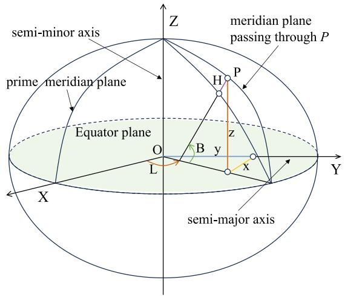

text_image

semi-minor axis
prime meridian plane
Z
meridian plane passing through P
Equator plane
H
P
z
O
B
y
x
L
X
Y
semi-major axis

Fig. 2. Two common coordinate systems.

# III. CONSIDERED SATELLITE NETWORK ARCHITECTURE

In this section, we model the FSO satellite networks and divide the LEO satellites into multiple regions based on spatial coordinate system to establish a dual-layer satellite network architecture.

# A. Modeling of FSO Satellite Networks

This paper adopts the most commonly used Walker constellation characterized by circular orbits at the same altitude and inclination for all satellites. The orbits are evenly distributed along the equator, while the satellites are uniformly distributed within their respective orbits. The Walker constellation can be represented as: $W _ { T } / W _ { P } / W _ { F } / W _ { h } / W _ { i }$ , where $W _ { T } , W _ { P } , W _ { h } ,$ and $W _ { i }$ represent the total number of satellites, the number of orbital planes, the orbit altitude, and the orbit inclination, respectively. $W _ { F }$ is a phase factor and $W _ { F } \in [ 0 , W _ { P } - 1 ]$ . The adjacent phase between two neighboring orbital planes can be calculated using the formula $\begin{array} { r } { \Delta u = \frac { 2 \pi } { W _ { F } } \cdot W _ { F } } \end{array}$ . According to the characteristics of the Walker constellation, the number of satellites on each orbital plane can be represented as $S =$ $W _ { T } / W _ { P }$ .

We use $G ( V , E )$ to denote the considered optical satellite network, where V and E represent the nodes and edges, respectively. In addition, we assume V is the set of LEO satellites, each of which can be located using $\{ v _ { i , j } | 0 \leq i <$ < $W _ { P } , 0 \leq j < S \}$ . For convenience, we use ${ { v } _ { k = i \times S + j } }$ instead of $v _ { i , j }$ . Therefore, the nodes in optical satellite network can be denoted as $\{ v _ { i } \ \in \ V | i \ < \ W _ { T } \}$ . We consider that the FSO communications are adopted for ISLs. Generally, the intra-orbit ISLs are relatively stable due to the satellites on the same orbit circulate at the same speed and toward same direction. They are constructed dependent on the transmission demand. On the other hand, the inter-orbit ISLs have frequent spatial and temporal changes. Besides the dynamic transmission demand, the distance between satellites on different orbit planes is changing since the satellites move at different speeds and toward different directions.

Additionally, due to the time-varying nature of LEO satellite constellations, we utilize the temporal graph, as described in [32], to partition the satellite network topology into multiple time slices based on time intervals $t \in \{ t _ { 1 } , t _ { 2 } , \ldots , t _ { n } \}$ . At the same time, we assume that within each time slice, the network topology and resources of the LEO satellite constellation remain stable. Our subsequent analysis is conducted within each individual time slice.

# B. Dual-Layer Satellite Network Architecture

In order to construct the dual-layer satellite network architecture, we need to build the mapping between LEO satellites and their covered terrestrial users. A conversion between the satellites’ cartesian spatial coordinate system and terrestrial users’ geodetic spatial coordinate system should be conducted. The satellite’s cartesian spatial coordinate $( X , Y , Z )$ can be directly obtained using Satellite Tool Kit (STK). For the ground users, the commonly used coordinate system is the geodetic spatial coordinates system $( B , L , H )$ as shown in Fig. 2, which utilizes latitude B, longitude $L ,$ and height $H$ to describe spatial positions. Specifically, B refers to the angle between the normal at point $P$ and the equatorial plane, while L refers to the angle between the meridian plane at point $P$ and the prime meridian plane. H represents the distance from point $P$ along the normal to the reference ellipsoid. The relationship between the cartesian coordinate system and the geodetic spatial coordinate system is as follows:

$$
\left[ \begin{array}{l} X \\ Y \\ Z \end{array} \right] = \left[ \begin{array}{c} (N + H) \cos B \cos L \\ (N + H) \cos B \sin L \\ [ N (1 - e ^ {2}) + H ] \sin B \end{array} \right], \tag {1}
$$

$$
N = \frac {\alpha}{\sqrt {1 - e ^ {2} \sin^ {2} B}}, \tag {2}
$$

where√ α represents the semi-major axis of the ellipsoid, $e =$ $\frac { \sqrt { \alpha ^ { 2 } - \beta ^ { 2 } } } { \alpha }$ denotes the first eccentricity, and $\beta$ is the semi-minor axis of the ellipsoid.

In order to reduce the complexity of large-scale ultra-dense LEO satellite network management and performance optimization, we divide the LEO satellites and ground users into multiple regions. The ground users can be divided according to the latitude and longitude. Then, we can cluster the LEO satellites which cover the users in the same region into a group. Therefore, a mapping relationship between the LEO satellite regions and terrestrial user regions can be easily constructed, which allows for the customized network management according to the regional demand. Then, the dual-layer satellite network architecture based on divided LEO satellite regions can be constructed as shown in Fig. 3. In this architecture, the MEO segment serves as the control layer and each MEO satellite is responsible for controlling and managing its covered LEO region. We assume that each MEO satellite is equipped with a high-performance server. MEO satellites gather local network state information from the covered LEO satellites to calculate the paths, while the ultra-dense LEO satellites only need to forward the packets uploaded by the terrestrial users. Thus, the signaling process among LEO satellites to exchange the status can be avoided to alleviate the traffic overhead. The computation overhead for LEO satellites can be also significantly reduced. The ground users can only access the corresponding LEO satellites for communications, while the MEO and LEO satellites are responsible for network management and data transmissions, respectively.

# IV. SYSTEM MODEL AND PROBLEM FORMULATION

In this section, we describe the communication model of satellites and define the multi-objective routing optimization problem for diverse satellite services.

# A. ISL Channel Model

In the LEO satellite network, inter-satellite communication typically occurs in free space environment, where only free space path loss needs to be considered. Based on the previously obtained satellite spatial coordinate system, the spatial distance between satellites can be calculated as follows:

$$
\left| \left| e _ {i, j} \right| \right| = \sqrt {\left(x _ {i} - x _ {j}\right) ^ {2} + \left(y _ {i} - y _ {j}\right) ^ {2} + \left(z _ {i} - z _ {j}\right) ^ {2}}, \tag {3}
$$

where $( x _ { i } , y _ { i } , z _ { i } )$ and $( x _ { j } , y _ { j } , z _ { j } )$ represent the spatial coordinates of satellites $v _ { i }$ and $v _ { j } .$ , respectively. $\lvert \lvert e _ { i , j } \rvert \rvert$ denotes the spatial distance between $v _ { i }$ and $v _ { j }$ . Then, the free space path loss for the ISL between $v _ { i }$ and $v _ { j }$ can be expressed as follows:

$$
L _ {i j} = 2 0 l g (\frac {4 \pi | | e _ {i , j} | | _ {I S L}}{\mathcal {W} _ {I S L}}), \tag {4}
$$

where $ { \mathcal { W } } _ { I S L }$ represents the wavelength of the utilized optical signal. According to the Shannon theorem, the maximum data transmission rate can be represented as follows:

$$
R _ {i j} = B l o g _ {2} (1 + \frac {\omega_ {t r} G _ {t r} G _ {r c}}{L _ {i j} k _ {B} B _ {i j} T}), \tag {5}
$$

where $\omega _ { t r }$ and $G _ { t r }$ represent the transmit power and antenna gain, respectively. $G _ { r c }$ denotes the receive antenna gain, $k _ { B }$ is the Boltzmann constant, $B _ { i j }$ is the channel bandwidth between satellite $v _ { i }$ and satellite $v _ { j } .$ , and $T$ is thermal noise.

# B. Considered QoS Metrics

As shown in Fig. 3, the user segment encompasses diverse application scenarios, such as Internet of Vehicles (IoV), intelligent manufacturing, smart home, intelligent medical, and Virtual Reality (VR), which have differentiated QoS requirements. For example, intelligent manufacturing is highly sensitive to packet loss rate, as even slight packet loss can lead to breakdown of production lines and intolerable economic loss. VR has very stringent latency requirements, as any delay exceeding 20ms can result in uncomfortable symptoms such as dizziness and nausea. For the smart home application, high throughput is important to provide smooth and fluent transmissions of multimedia contents. To describe their QoS requirements, we categorize the applications into three types: latency-sensitive, high-reliability, and throughputsensitive, which prioritize the latency, packet loss rate, and throughput, respectively. Since future services will have elaborated and specific requirements for multiple metrics, the other

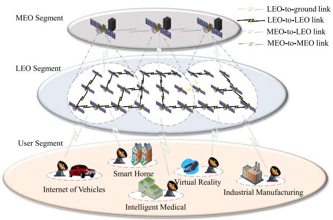

flowchart

Fig. 3. Dual-layer satellite network architecture.

QoS metrics besides the prioritized metric should also be paid attentions to when designing the paths. In this paper, the main QoS metrics for these three types of applications are latency, packet loss rate, and throughput. Then, we introduce the modeling of the three metrics.

The E2E transmission latency includes the queuing delay, the propagation delay, and the forwarding delay. We assume that LEO satellites with limited buffer forward the packets in a First In First Out (FIFO) manner and follow the $M / M / 1 / m$ queuing model, where M represents the distribution of the interval time between successive packet arrivals and the distribution of service time following the exponential distribution, 1 represents the presence of a single queue in the router, and m is the buffer capacity. In this queuing model, the occupancy rate $\rho$ can be defined as:

$$
\rho = \frac {\lambda}{\mu}, \tag {6}
$$

where λ represents packet arriving rate at the LEO satellite, while $\mu$ denotes the packet forwarding rate. Thus, the packet forwarding delay in the LEO satellite can be expressed by $\textstyle { \frac { 1 } { \mu } } .$

Then, the average number of packets queuing in the LEO satellite buffer can be expressed as:

$$
\tau_ {s} = \frac {\rho}{1 - \rho} - \frac {(m + 1) \rho^ {m + 1}}{1 - \rho^ {m + 1}}. \tag {7}
$$

The effective packet processing rate of the LEO satellite can be expressed as:

$$
\lambda_ {s} = \mu (1 - P _ {0}), \tag {8}
$$

where $P _ { 0 }$ represents the probability that the LEO satellite is idle:

$$
P _ {0} = \frac {1 - \rho}{1 - \rho^ {m + 1}}. \tag {9}
$$

Based on the above conditions, we can represent the queuing delay of the LEO satellite $v _ { i }$ as follows:

$$
T _ {i} ^ {q} = \frac {\tau_ {s}}{\lambda_ {s}} - \frac {1}{\mu}. \tag {10}
$$

The propagation delay of a packet from LEO satellite $v _ { i }$ to $v _ { j }$ can be calculated based on the spatial distance as:

$$
T _ {i, j} ^ {s} = \frac {\left| \left| e _ {i , j} \right| \right|}{c}, \tag {11}
$$

where c represents the propagation speed of laser in space.

Therefore, we can calculate the one-hop delay from LEO satellite $v _ { i }$ to $v _ { j }$ as follows:

$$
T _ {e _ {i, j}} = T _ {i} ^ {q} + T _ {i, j} ^ {s} + \frac {1}{\mu}. \tag {12}
$$

The total E2E path delay can be expressed as:

$$
T _ {p a t h} = \sum_ {e _ {i, j} \in p a t h} T _ {e _ {i, j}}. \tag {13}
$$

Then, we calculate the packet loss rate. Considering the limited capacity of LEO satellite buffer, the packet loss rate of LEO satellite $v _ { i }$ can be expressed as:

$$
P _ {i} = \frac {1 - \rho}{1 - \rho^ {m + 1}} \rho^ {m}. \tag {14}
$$

The E2E path packet loss rate $P _ { p a t h }$ can be represented as:

$$
P _ {p a t h} = 1 - \prod_ {v _ {i} \in p a t h} (1 - P _ {i}). \tag {15}
$$

Then, we discuss how to calculate the throughput. Since the throughput of each LEO satellite is dependent on the generated traffic load and neighboring nodes, it cannot represent the practical forwarding ability. Therefore, we use the delivery rate of each LEO satellite within a period of time to represent the throughput to denote the forwarding ability. The E2E delivery rate can be denoted as:

$$
D _ {p a t h} = \frac {\sum_ {v _ {i} \in p a t h} \eta_ {i} ^ {d}}{\sum_ {v _ {i} \in p a t h} \eta_ {i} ^ {n}}, \tag {16}
$$

where $\eta _ { i } ^ { d }$ represents the number of packets successfully delivered to the destination from LEO satellite $v _ { i }$ within the given time period, $\eta _ { i } ^ { n }$ denotes the number of packets sent by LEO satellite $v _ { i }$ during the given time period. $D _ { p a t h }$ is the packet delivery rate of the entire routing path. A higher packet delivery rate indicates better throughput performance of the LEO satellite, meaning it can forward more packets.

# C. Problem Formulation

After obtaining the metrics of latency, packet loss rate, and throughput, we need to define the QoS model of different services to reflect the diversified requirements. We define a utility function to represent the sensitivities of different services to the considered three QoS metrics. Then, we can formulate an optimization objective function.

Due to the different value ranges of considered three QoS metrics, it is necessary to conduct normalization process to ensure fairness as below:

$$
\hat {q} _ {\text { path }} = \frac {q _ {\text { path }}}{q _ {\text { path } , \max}}, \tag {17}
$$

where $q _ { p a t h }$ denotes the value of any metric among $T _ { p a t h }$ , $P _ { p a t h }$ , and $D _ { p a t h }$ . Thus, qˆ and $q _ { m a x }$ denote the normalized value and maximum value of each QoS metric, respectively. Then, we can heuristically set the weight w for each QoS metric according to the QoS requirements. And the utility function for each path can be expressed as below:

$$
U _ {p a t h} = w _ {1} \hat {T} _ {p a t h} + w _ {2} \hat {P} _ {p a t h} + w _ {3} (1 - \hat {D} _ {p a t h}), \tag {18}
$$

where $\hat { T } _ { p a t h } , \hat { P } _ { p a t h }$ , and $\hat { D } _ { p a t h }$ represent the normalized values of latency, packet loss rate, and throughput, respectively.

As this paper investigates a multi-objective routing algorithm for diversified satellite services, the objective should be to minimize the overall utility function, considering constraints of transmission power and LEO satellite buffer size, which can be denoted as below:

$$
\min \sum_ {i = 1} ^ {n} \sum_ {j = 1} ^ {n} U _ {\mathbf {p a t h} _ {i, j}}, \quad i \neq j
$$

$$
\text { s.t. } C 1: w _ {1} + w _ {2} + w _ {3} = 1, \quad w _ {1}, w _ {2}, w _ {3} \geq 0
$$

$$
C 2: 0 \leq \omega_ {t} \leq \omega_ {m a x}
$$

$$
C 3: 0 \leq R _ {t} \leq R _ {\max}
$$

$$
C 4: N _ {q} \leq N _ {b}, \tag {19}
$$

where $\omega _ { t }$ and $R _ { t }$ are the satellite transmission power and data transmission rate, respectively. $\omega _ { m a x }$ and $R _ { m a x }$ denote the maximum transmission power and data transmission rate, respectively. And $N _ { q }$ and $N _ { b }$ represent the data queue length and buffer size of each LEO satellite, respectively.

# V. PROPOSED ALGORITHM

In this section, we introduce our proposed Cooperative Multi-Agent Reinforcement Learning (CoMARL) approach for multi-objective routing in the considered dual-layer satellite network. The whole process is shown in Fig. 4. We can find that the left section represents the modeling of the satellite network and the region division process of the LEO satellite network, which has been discussed in Sec. III. Then, the LEO satellites upload their observed network states to the corresponding MEO satellites. And the MEO satellites periodically exchange network states. The path routing process consists of two steps. First, as shown in the middle section, the inter-region paths are calculated using the shortest path algorithm by the MEO satellites. Second, the MEO satellites can utilize the information of crossed LEO regions to find k shortest paths for each source-destination LEO satellite pair as shown in Algorithm 1. The following procedure is to assign the right paths for different services according to their transmission performance requirements which is shown in the right section. Since the routing decisions are made solely based on the current network state and without aftereffect, the path selection can be modeled as a Markov Decision Process (MDP) [33]. Moreover, considering the scale of the whole LEO satellite network, the MEO satellite adopts the observed states of the covered local LEO satellite region to assign the path for each traffic flow to alleviate the communication overhead. Thus, we model the path selection problem as a Decentralized Partially Observable Markov Decision Process (Dec-POMDP), where each agent is in charge of choosing a path for a definite service in the corresponding LEO satellite region. Since the independent path selection for each service may cause conflicts, resulting the performance degradation of the whole network, we propose a function monotonicity-based cooperative mechanism to ensure the consistence between the performance optimization of different services and whole network. We discuss the proposed Dec-POMDP model and the cooperative mechanism.

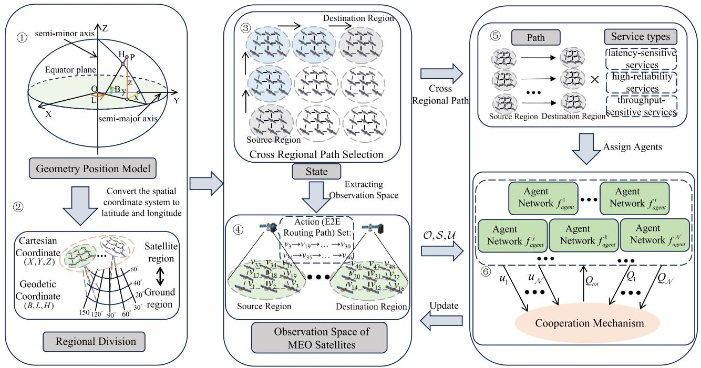

flowchart

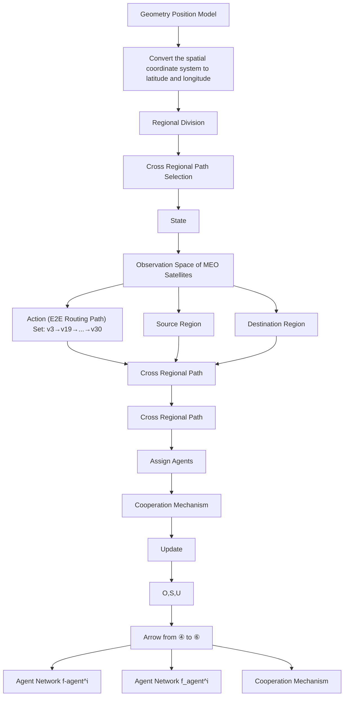

Fig. 4. The procedures of proposed algorithm for dual-layer satellite network architecture.

Algorithm 1 Screen Top k Paths   
Input: Satellite network topology $G = ( V , E )$ , the spacing of latitude and longitude divisions in a region $s p _ { l a t } , s p _ { l o n } .$   
Output: Top k filtered paths: PathSet.
1: Conversion between Cartesian coordinate system and geodetic coordinate system.
2: Divide the region based on $spl_{at}$ and $spl_{lon}$ .
3: for node i in the node set of $region_{src}$ do
4:    for node j in the node set of $region_{dst}$ do
5:    Obtain the $path_{i,j}$ from node i to node j.
6:    if $path_{i,j}$ is a connected E2E path then
7:    Push $path_{i,j}$ in $PathSet_{src,dst}$ .
8:    end if
9:    end for
10: end for
11: Use LCSS algorithm for path filtering.
12: for i in the set of region do
13:    for j in the set of region do
14:    while $PathSet_{i,j} < k$ do
15:    Push $PathSet_{i,j}[index]$ in $PathSet_{i,j}$ .
16:    index + = 1.
17:    end while
18:    end for
19: end for

# A. Dec-POMDP

We can model the Dec-POMDP as a 7-tuple: $\langle S , \mathcal { U } , \mathcal { P } , r , \mathcal { Z } , \mathcal { O } , \mathcal { N } \rangle$ , where $s \in \ S$ represents the state of the LEO satellite network, u $\in \textbf { U } \equiv \mathcal { U } ^ { N }$ denotes the set of actions of agents $a \in \mathcal { A } , \mathcal { N }$ is the number of agents. $\mathcal { P } ( s ^ { \prime } | s , \mathbf { u } ) = \mathcal { S } \times \mathbf { U } \times \mathcal { S }  [ 0 , 1 ]$ represents the conditional probability distribution of actions chosen by agents given the current network state. $r ( s , \mathbf { u } ) = \mathcal { S } \times \mathbf { U } \to \mathbb { R }$ denotes the reward function for selecting action set u in state s. $z \in { \mathcal { Z } }$ represents the locally observable space for each agent, and the corresponding observation function is denoted as $\mathcal { O } ( s , a ) : \mathcal { S } \times \mathcal { A } \to \mathcal { Z }$ . Thus, the action-observation history of each agent can be represented as: $\tau ^ { a } \in \mathcal { T } \equiv ( \mathcal { Z } \times \mathcal { U } ) ^ { * }$ , and the corresponding policies can be represented as $\pi ^ { a } ( u ^ { a } | \tau ^ { a } ) : { \mathcal { T } } \times { \mathcal { U } } \to [ 0 , 1 ]$ . The action-reward function of the corresponding path selection policy can be represented as $Q ^ { \pi } ( s _ { t } , \mathbf { u } _ { t } ) ~ = ~ \mathbb { E } _ { s _ { t + 1 } : \infty , \mathbf { u } _ { t + 1 } : \infty } [ \mathcal { R } _ { t } | s _ { t } , \mathbf { u } _ { t } ]$ , where $\begin{array} { r l } { \mathcal { R } _ { t } } & { { } = } \end{array}$ $\scriptstyle \sum _ { i = 0 } ^ { \infty } \gamma ^ { i } r _ { t + i }$ t+1 t+1 is the discounted return, γ is a discount factor.

In our considered LEO satellite network, the specific settings for the Dec-POMDP are as follows:

• Satellite network state space: According to Eqs. 12, 14, and 16, it is evident that the main factors influencing QoS are routing forwarding rates, satellite buffers, and inter-satellite distances. Additionally, as we are using a temporal graph to describe the dynamic LEO satellite network, the inter-satellite distances as well as the satellite performance are fixed in each time interval. Therefore, to simplify the network state and expedite algorithm convergence, we simplify the satellite network state space to a collection of the buffer states of each LEO satellite, denoted as $\boldsymbol { S } = \{ \varsigma _ { i } , \varsigma _ { j } , . . . , \varsigma _ { N } \}$ , where $\varsigma _ { i }$ represents the cache of LEO satellite $v _ { i } .$ .   
• Observation space: Based on our distributed dual-layer satellite network architecture, an MEO satellite makes

routing decisions based on the observed states of covered LEO satellites. Therefore, the observation space can be represented as the buffer states of LEO satellites covered by each MEO satellite.

• Action space: According to our above discussion, the MEO satellite first needs to determine the crossed LEO regions of the path between the source and destination LEO satellites. Then, multiple E2E routing paths are calculated according to the LEO satellite network states, which is further filtered to k candidates as the action set with the Longest Common Subsequence (LCSS) algorithm.   
• Reward: The reward values of each agent can be defined according to the utility function of a particular service along the E2E routing path, indicating the satisfaction with different QoS metrics.

After introducing the proposed Dec-POMDP model, we analyze the number of agents and make a comparison with the single-layer satellite network architecture. Our proposed multi-layer satellite network architecture, coupled with a region partitioning algorithm, leverages MEO satellites to manage corresponding regions of LEO satellites. This allows them to select a route from the acquired E2E action set when making routing decisions, requiring only $\mathcal { M } \times ( \mathcal { M } -$ $1 ) \times 3$ agent models, where M denotes the number of LEO regions. In contrast, for single-layer LEO networks, the lack of controllers makes the region division and management difficult to be conducted. Thus, the path selection should consider the whole network, for which $\mathcal { N } \times ( \mathcal { N } - 1 ) \times 3$ agent models are required with $\mathcal { N }$ denoting the number of LEO satellites. As $\mathcal { M } \gg \mathcal { N }$ , the algorithm complexity can be significantly alleviated. Moreover, the signaling broadcast range can be also lessened to the LEO satellite region network instead of the whole constellations, for which the signaling can be significantly reduced.

# B. Cooperation Mechanism

As this paper considers multi-objective routing strategies for diversified services, multiple agents in our considered proposal co-exist in the considered scenarios and have distinct optimization goals. However, the independent operation manner of multiple agents for optimization of individual utility functions may fall in local optimum point. Moreover, independent decisions may cause conflicts since the mutual influence among transmissions of different traffic flows is not considered, which can finally result in the system performance degradation.

To address the above issue, the widely adopted approach is to simply sum up the $Q$ values of different agents as a common optimization objective.

$$
Q _ {t o t} = \sum_ {i = 1} ^ {\mathcal {N}} Q _ {i} (\tau^ {i}, u ^ {i}), \tag {20}
$$

where $Q _ { t o t }$ represents the global $Q$ value, $Q _ { i }$ denotes the local $Q$ value of agent i. However, this approach still neglects the possibility that different agents, in order to optimize their own objectives, may conflict with the global optimization objective. Therefore, we need to coordinate the local optimal solutions with the global optimal solution. First, we need to ensure that the argmax operation performed on $Q _ { t o t }$ remains consistent with the argmax operation performed on each $Q _ { a }$ :

$$
\arg \max _ {\mathbf {u}} Q _ {t o t} (\boldsymbol {\tau}, \mathbf {u}) = \left( \begin{array}{c} \arg \max _ {u ^ {1}} Q _ {1} (\tau^ {1}, u ^ {1}) \\ \vdots \\ \arg \max _ {u ^ {\mathcal {N}}} Q _ {\mathcal {N}} (\tau^ {\mathcal {N}}, u ^ {\mathcal {N}}) \end{array} \right). \tag {21}
$$

Furthermore, to ensure the same monotonicity between $Q _ { a }$ and $Q _ { t o t }$ , we perform the following operations on $Q _ { a }$ and $Q _ { t o t } \mathrm { : }$

$$
\frac {\partial Q _ {t o t}}{\partial Q _ {a}} \geq 0, \quad \forall a \in A. \tag {22}
$$

Specifically, we ensure non-negative weights of the neural network by using the absolute value activation function. This allows the neural network to approximate any monotonic function, ensuring consistency between the local optimization objectives of each agent and the global optimization objective.

Finally, we train the neural network of each agent by minimizing the squared temporal difference error as the loss function:

$$
\mathcal {L} (\theta) = \sum_ {i = 1} ^ {b} [ (y _ {i} ^ {t o t} - Q _ {t o t} (\boldsymbol {\tau}, \mathbf {u}, s; \theta)) ] ^ {2}, \tag {23}
$$

where b is the batch size of the transitions sampled from the replay buffer. $y ^ { t o t } = r + \gamma m a x _ { \mathbf { u } ^ { \prime } } Q _ { t o t } ( \tau ^ { \prime } , \mathbf { u } ^ { \prime } , s ^ { \prime } ; \theta ^ { - } )$ . θ and $\theta ^ { - }$ are the parameters of current network and target network, respectively. The training steps are as shown in Algorithm 2.

# VI. PERFORMANCE EVALUATION

In this section, we evaluate the performance of our proposal through simulations. We construct a network architecture, as illustrated in Fig. 3, comprising the user segment, LEO segment, and MEO segment. The user segment exists latencysensitive services, high-reliability services, and throughputsensitive services. Considering that throughput-sensitive services account for a higher proportion of the total network traffic volume, we assume a data generation ratio of $1 : 1 :$ 2 for latency-sensitive services, high-reliability services, and throughput-sensitive services, respectively. We divide the user region between $6 0 ^ { \circ } \mathrm { N }$ and $6 0 ^ { \circ } \mathbf { S }$ into $2 \times 8$ regions, each spanning $6 0 ^ { \circ }$ of latitude and $4 5 ^ { \circ }$ of longitude. Moreover, taking into account the non-uniform distribution of user services, we assume the service demand ratios in different regions are $\{ 0 : 0 : 2 : 0 : 1 : 0 : 2 : 1 : 0 : 2 : 2 : 1 : 2 : 1 : 2 : 0 \}$ from the lower-left endpoint at 60◦S, 180◦W to the upper-right endpoint at $6 0 ^ { \circ } \mathrm { N } , 1 8 0 ^ { \circ } \mathrm { E } .$ respectively, as shown in Fig. 5. Based on the mapping relationship between the Cartesian coordinate system and the Geodetic coordinate system, we align the division of LEO satellite regions with the user regions. We assume the LEO satellites to operate in a Walker constellation at an altitude of 1550 km and an inclination of $5 5 ^ { \circ }$ . The constellation consists of 16 orbital planes, each comprising 16 LEO satellites. Each LEO satellite follows an $M / M / 1 / m$ queuing model for routing, with a data packet forwarding rate of 3 Gbps and a cache capacity of 250 MB. Since our paper focuses on LEO satellite routing, we only consider the paths from source LEO satellites to destination LEO satellites. Thus, we assume that all data packets are generated and received by the LEO satellites. Additionally, each LEO satellite region is managed by one MEO satellite. The simulation is constructed using STK and Python, running on a server equipped an Intel i5-13600KF and NVIDIA GeForce RTX 4070Ti. Table II summarizes the simulation parameters for the experiments. In addition, we adopt Multi-Type OSPF (MT-OSPF) and Deep Q-Network (DQN) as our benchmarks. MT-OSPF is based on the traditional OSPF algorithm and considers multiple metrics to define ISL weights for diverse services. To ensure the fairness, we adopt Eq. 18 for the definition of ISL weights. The utilized DQN has been described in [34].

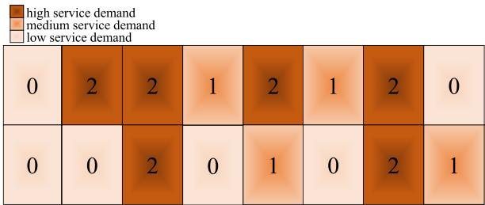

heatmap

| | high service demand | medium service demand | low service demand |
|---|---|---|---|
| 0 | 2 | 2 | 1 |
| 0 | 0 | 2 | 0 |
| 1 | 2 | 1 | 0 |
| 2 | 1 | 2 | 0 |
| 3 | 0 | 2 | 1 |

Fig. 5. The distribution of user service demand.

Algorithm 2 Training Process of Proposed Algorithm   
Input: Satellite network topology $G = (V, E)$ .
Output: network parameter $\theta$ .
1: while episode $\leq$ episode max do
2: for step $t \leq$ step length max in each episode do
3: for each agent i do
4: Use the $\epsilon - greedy$ policy to explore.
5: Use Eq. 18 to calculate the reward $r_{i}$ .
6: end for
7: Update the action-observation $\tau^{i}$ .
8: end for
9: Store the episode to replay buffer D.
10: for train step $\leq$ train step max do
11: Sample a batch of episodes from replay buffer D.
12: Get $Q_{a}$ for each agent.
13: Convert $Q_{a}$ by Eq. 21 and Eq. 22 to obtain $Q_{tot}$ .
14: Use Eq. 23 to update the network parameter $\theta$ .
15: end for
16: end while

In Fig. 6, we show the variations of the average rewards of DQN algorithm and our proposed algorithm with the increasing episodes. We can find that when the number of episodes is relatively low, the average rewards of our proposed algorithm are lower than that of the DQN algorithm. However, as the number of episodes increases, our proposed algorithm outperforms the DQN algorithm. This is primarily because that the constraints in our proposed cooperation mechanism limit the Q-values before the optimal solution is reached in the early state, resulting in weakened performance compared to the DQN algorithm. However, in the later stages, the consistency between local and global objectives allows our algorithm to outperform DQN algorithm.

TABLE II SIMULATION PARAMETERS 

<table><tr><td>PARAMETERS</td><td>VALUES</td></tr><tr><td>Number of orbits</td><td>16</td></tr><tr><td>Satellites per orbit</td><td>16</td></tr><tr><td>LEO satellite orbit</td><td>1550km</td></tr><tr><td>Orbit inclination</td><td> $55^{\circ}$ </td></tr><tr><td> $sp_{lat}$ </td><td>60</td></tr><tr><td> $sp_{lon}$ </td><td>45</td></tr><tr><td>The propagation speed of laser</td><td>3e5km/s</td></tr><tr><td>The forwarding rate of routing</td><td>3Gbps</td></tr><tr><td>Capacity of the buffer queue</td><td>250MB</td></tr><tr><td> $w_1, w_2, w_3$  for latency-sensitive services</td><td>0.8, 0.1, 0.1</td></tr><tr><td> $w_1, w_2, w_3$  for high-reliability services</td><td>0.1, 0.8, 0.1</td></tr><tr><td> $w_1, w_2, w_3$  for throughput-sensitive services</td><td>0.1, 0.1, 0.8</td></tr><tr><td>Packet size</td><td>20KB</td></tr><tr><td>Discount factor</td><td>0.99</td></tr><tr><td>Learning rate</td><td>0.001</td></tr><tr><td>The number of available paths in the action</td><td>5</td></tr></table>

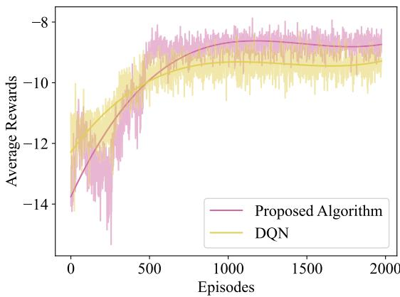

line

| Episodes | Proposed Algorithm | DQN |
| -------- | ------------------ | --- |
| 0        | -14.0              | -12.0 |
| 500      | -9.0               | -10.0 |
| 1000     | -8.5               | -9.5  |
| 1500     | -8.5               | -9.5  |
| 2000     | -8.5               | -9.5  |

Fig. 6. Convergence performance of the algorithms concerning the number of episodes.

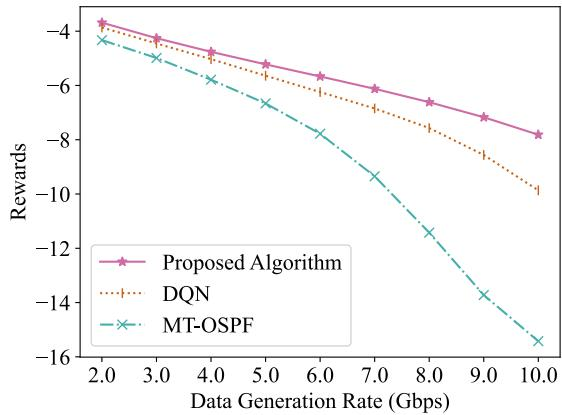

line

| Data Generation Rate (Gbps) | Proposed Algorithm | DQN   | MT-OSPF |
| --------------------------- | ------------------ | ----- | ------- |
| 2.0                         | -3.5               | -3.8  | -4.0    |
| 3.0                         | -4.0               | -4.5  | -4.8    |
| 4.0                         | -4.5               | -5.0  | -5.5    |
| 5.0                         | -5.0               | -5.5  | -6.5    |
| 6.0                         | -5.5               | -6.0  | -7.5    |
| 7.0                         | -6.0               | -6.5  | -9.0    |
| 8.0                         | -6.5               | -7.0  | -11.0   |
| 9.0                         | -7.0               | -7.5  | -13.0   |
| 10.0                        | -7.5               | -8.0  | -15.0   |

Fig. 7. Comparison of rewards between our proposal and benchmarks under growing traffic loads for 4 APT terminals on each LEO satellite.

Fig. 7 shows the cumulative rewards achieved by the three algorithms with an increasing data generation rate. The abscissa represents the base values of data generation rate in different LEO satellite regions. We observe that the three strategies have closer rewards when the data generation rate is low. And as the data generation rate increases, the rewards of three strategies decrease. Since the reward of our proposed algorithm decreases at a slower rate than those of the other two strategies, the gap between our proposed approach and the other two strategies enlarges. The reward of DQN is worse than that of our proposal which can be attributed to the lack of the cooperative mechanism. Then, the growing traffic overhead leads to increasing conflicts in path design for different regions and service types. The MT-OSPF solution has the worst performance and the gap is increasing significantly for the reason that its path decision relies only on current network state and it has no awareness of future traffic changes. Therefore, the LEO satellite network using MT-OSPF suffers from traffic congestion earlier than the other two approaches.

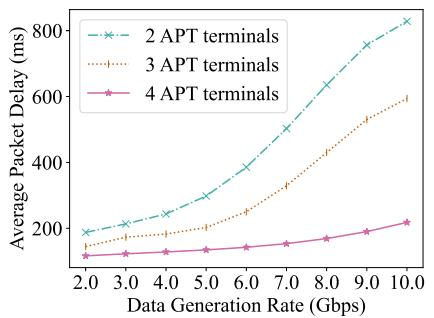

line

| Data Generation Rate (Gbps) | 2 APT terminals | 3 APT terminals | 4 APT terminals |
| ---------------------------- | --------------- | --------------- | --------------- |
| 2.0                          | 200             | 150             | 100             |
| 3.0                          | 250             | 180             | 110             |
| 4.0                          | 300             | 200             | 120             |
| 5.0                          | 350             | 220             | 130             |
| 6.0                          | 400             | 250             | 140             |
| 7.0                          | 500             | 300             | 150             |
| 8.0                          | 600             | 350             | 160             |
| 9.0                          | 700             | 450             | 180             |
| 10.0                         | 800             | 600             | 220             |

(a) average packet delay

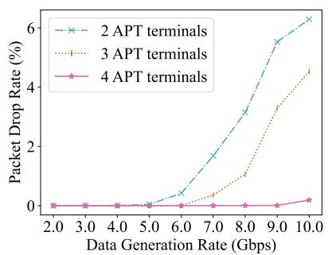

line

| Data Generation Rate (Gbps) | 2 APT terminals | 3 APT terminals | 4 APT terminals |
| --------------------------- | --------------- | --------------- | --------------- |
| 2.0                         | 0.0             | 0.0             | 0.0             |
| 3.0                         | 0.0             | 0.0             | 0.0             |
| 4.0                         | 0.0             | 0.0             | 0.0             |
| 5.0                         | 0.0             | 0.0             | 0.0             |
| 6.0                         | 0.5             | 0.1             | 0.0             |
| 7.0                         | 1.5             | 0.5             | 0.0             |
| 8.0                         | 3.0             | 1.0             | 0.0             |
| 9.0                         | 5.5             | 3.5             | 0.0             |
| 10.0                        | 6.5             | 4.5             | 0.2             |

(b) average packet drop rate

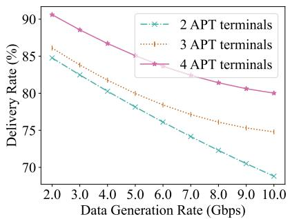

line

| Data Generation Rate (Gbps) | 2 APT terminals | 3 APT terminals | 4 APT terminals |
| --------------------------- | --------------- | --------------- | --------------- |
| 2.0                         | 85.0            | 86.0            | 90.0            |
| 3.0                         | 83.0            | 84.0            | 88.0            |
| 4.0                         | 81.0            | 82.0            | 86.0            |
| 5.0                         | 79.0            | 80.0            | 84.0            |
| 6.0                         | 77.0            | 78.0            | 82.0            |
| 7.0                         | 75.0            | 76.0            | 80.0            |
| 8.0                         | 73.0            | 74.0            | 78.0            |
| 9.0                         | 71.0            | 72.0            | 76.0            |
| 10.0                        | 69.0            | 70.0            | 74.0            |

(c) average delivery rate

Fig. 8. Comparison of network performance under growing traffic loads considering different numbers of APT terminals in terms of average packet delay, average packet drop rate, and average delivery rate, respectively.   
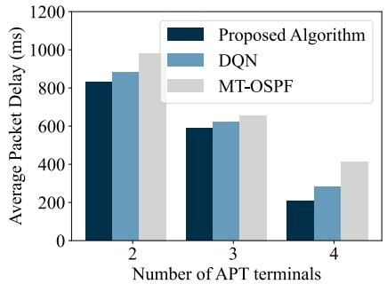

bar

| Number of APT terminals | Proposed Algorithm | DQN   | MT-OSPF |
| ----------------------- | ------------------ | ----- | ------- |
| 2                       | 850                | 900   | 1000    |
| 3                       | 600                | 650   | 700     |
| 4                       | 200                | 300   | 450     |

(a) average packet delay

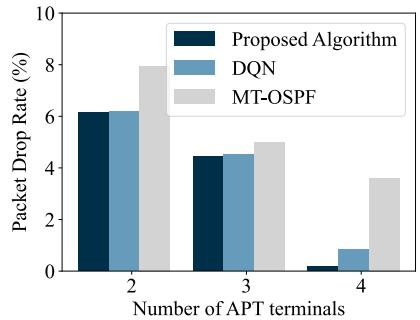

bar

| Number of APT terminals | Proposed Algorithm | DQN | MT-OSPF |
| ----------------------- | ------------------ | --- | ------- |
| 2                       | 6.2                | 6.2 | 8.0     |
| 3                       | 4.5                | 4.5 | 5.0     |
| 4                       | 0.1                | 0.8 | 3.6     |

(b) average packet drop rate

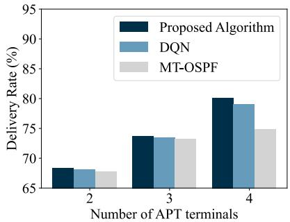

bar

| Number of APT terminals | Proposed Algorithm | DQN  | MT-OSPF |
| ----------------------- | ------------------ | ---- | ------- |
| 2                       | 68.5               | 68.0 | 67.5    |
| 3                       | 73.5               | 73.0 | 73.0    |
| 4                       | 80.0               | 79.0 | 75.0    |

(c) average delivery rate   
Fig. 9. Comparison of network performance between our proposed algorithm and benchmarks under different APT count in terms of average packet delay, average packet drop rate, and average delivery rate, respectively.

Next, we analyze the performance of our proposed algorithm with different numbers of APT terminals considering a growing data generation rate as shown in Fig. 8. We can clearly observe that the APT terminal count has a significant impact on QoS performance and increased APT terminals can greatly improve the network performance. The network with 4 APT terminals on each LEO satellite has much better performance than that with 2 or 3 APT terminals and the gap is enlarged with the growing traffic overhead. This is because the number of APT terminals directly affects the quantity of constructed ISLs for each LEO satellite, which further influences the available E2E routing paths in the network. Generally, the number of possible E2E paths that can be established for 4 APT terminals on each LEO satellite may be several times more than that for 2 APT terminals, resulting in much better traffic control performance.

We compare the performance of our proposal and the benchmarks with different numbers of APT terminals as shown in Fig. 9, colorblackand the data generation rate is set to 10 Gbps. It can be clearly found that our proposal consistently outperforms the benchmarks across different APT counts. Moreover, the two intelligent approaches can achieve better performance than MT-OSPF in terms of the average packet delay, packet drop rate, and deliver rate, which can be attributed to the increased traffic awareness during routing path design process. The advantages of our approach over DQN are enlarged with growing APT terminals for the reason that the cooperative mechanism can alleviate more conflicts with increasing available paths.

Furthermore, to provide a more detailed analysis of the advantages of our algorithm over the benchmarks at different data generation rates, we conduct a comparison considering 4 APT terminals on each LEO satellite. The results of this comparison are shown in Fig. 10. When the data generation rate is low, the performance of the three algorithms in terms of average packet delay and packet drop rate is similar. This is because the network is relatively idle and traffic congestion does not occur. Regarding the delivery rate, the lack of prediction capability for MT-OSPF causes the designed E2E routing paths are not that efficient as those calculated by the two intelligent approaches. Thus, its packet delivery rate is lower compared to the other two intelligent algorithms. Additionally, due to the absence of a cooperative mechanism in DQN, its delivery rate is slightly lower than our proposed algorithm. With the data generation rate increasing, the performance of our proposal degrades much slower than that of the other two algorithms. Therefore, we can conclude that our proposed algorithm can significantly improve the QoS metrics for different types of services.

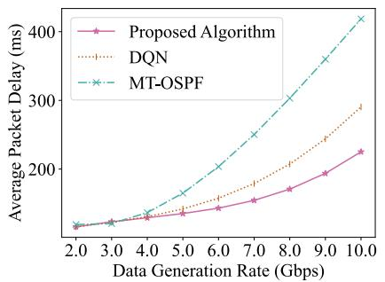

line

| Data Generation Rate (Gbps) | Proposed Algorithm | DQN  | MT-OSPF |
| --------------------------- | ------------------ | ---- | ------- |
| 2.0                         | 100                | 100  | 100     |
| 3.0                         | 120                | 120  | 120     |
| 4.0                         | 140                | 140  | 160     |
| 5.0                         | 160                | 160  | 200     |
| 6.0                         | 180                | 180  | 240     |
| 7.0                         | 200                | 200  | 280     |
| 8.0                         | 220                | 220  | 320     |
| 9.0                         | 240                | 240  | 360     |
| 10.0                        | 260                | 280  | 400     |

(a) average packet delay

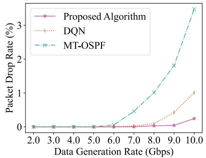

line

| Data Generation Rate (Gbps) | Proposed Algorithm | DQN | MT-OSPF |
| --------------------------- | ------------------ | --- | ------- |
| 2.0                         | 0.0                | 0.0 | 0.0     |
| 3.0                         | 0.0                | 0.0 | 0.0     |
| 4.0                         | 0.0                | 0.0 | 0.0     |
| 5.0                         | 0.0                | 0.0 | 0.0     |
| 6.0                         | 0.0                | 0.0 | 0.0     |
| 7.0                         | 0.0                | 0.0 | 0.5     |
| 8.0                         | 0.0                | 0.1 | 1.0     |
| 9.0                         | 0.1                | 0.5 | 1.8     |
| 10.0                        | 0.3                | 1.1 | 3.5     |

(b) average packet drop rate

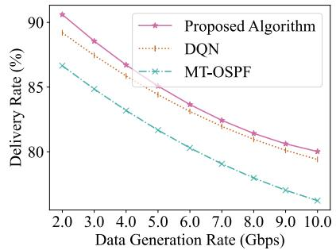

line

| Data Generation Rate (Gbps) | Proposed Algorithm | DQN  | MT-OSPF |
| --------------------------- | ------------------ | ---- | ------- |
| 2.0                         | 90.5               | 89.0 | 86.5    |
| 3.0                         | 89.0               | 87.5 | 85.0    |
| 4.0                         | 87.5               | 86.0 | 83.5    |
| 5.0                         | 86.0               | 84.5 | 82.0    |
| 6.0                         | 84.5               | 83.0 | 80.5    |
| 7.0                         | 83.0               | 81.5 | 79.0    |
| 8.0                         | 81.5               | 80.0 | 77.5    |
| 9.0                         | 80.5               | 79.0 | 76.5    |
| 10.0                        | 80.0               | 78.5 | 76.0    |

(c) average delivery rate   
Fig. 10. Comparison of network performance between our proposed algorithm and benchmarks under growing traffic loads in terms of average packet delay, average packet drop rate, and average delivery rate, respectively.

# VII. CONCLUSION AND FUTURE DIRECTIONS

The ultra-dense FSO LEO satellite network is an emerging research direction which has attracted increasing attentions in recent years. In this paper, we take into account the challenges of routing including the large scale, ultra density, high dynamics of LEO satellite networks as well as the diversified QoS requirements of terrestrial services. To alleviate the management difficulty and accelerate the routing convergence, we consider a dual-layer satellite network architecture composed of MEO and LEO satellites, as well as design the region division scheme for LEO satellite layer. To improve the transmission performance and meet the diversified service requirements, we define the utility function considering multiple metrics and propose the DRL-based routing solution. The cooperation mechanism is also designed to avoid the conflicts among multiple agents for different services. The performance of the proposed approach is comprehensively evaluated by considering different numbers of APT terminals on each LEO satellite and varying traffic overhead.

The research in this paper is based on the constructed LEO satellite networks. Considering the ultra-density of LEO mega-constellations, the LEO satellite networking method should be studied to enable highly qualified data transmissions. Since routing performance is also affected by the constructed topology, future research can be conducted from the joint optimizations of LEO satellite networking and routing. Moreover, the dual-layer satellite network architecture is constructed without considering the dynamic relative velocity between MEO satellites and LEO satellites. How to select the MEO satellites, how to construct the FSO ISLs between MEO satellites and LEO satellites, how to design the LEO satellite region division method, and how to construct the mapping relationship between MEO satellites and their covered LEO satellite regions should be studied in the future. Furthermore, using MEO satellites as relays for long-distance data transmissions can significantly reduce the hop number required by only LEO satellites. Thus, the path design in the dual-layer satellite network architecture considered in this paper can be further explored. Last but not least, the development of satellite on-board computer systems will enlarge the data processing capacity. Future LEO satellites are expected to process more data which can significantly alleviate the data transmission volume. The routing method design for the integrated communication and computation satellite networks will be a new topic.

# REFERENCES

[1] B. Mao, F. Tang, Y. Kawamoto, and N. Kato, “Optimizing computation offloading in satellite-UAV-served 6G IoT: A deep learning approach,” IEEE Netw., vol. 35, no. 4, pp. 102–108, Jul. 2021.   
[2] Network 2030-A Bluepoint of Technology, Applications and Market Drivers Towards the Year 2030 and Beyond, document ITU-T FG-NET-2030, May 2019.   
[3] T. K. Rodrigues and N. Kato, “Hybrid centralized and distributed learning for MEC-equipped satellite 6G networks,” IEEE J. Sel. Areas Commun., vol. 41, no. 4, pp. 1201–1211, Apr. 2023.   
[4] J. Liu, Y. Shi, Z. M. Fadlullah, and N. Kato, “Space-air-ground integrated network: A survey,” IEEE Commun. Surveys Tuts., vol. 20, no. 4, pp. 2714–2741, 4th Quart., 2018.   
[5] N. Kato et al., “Optimizing space-air-ground integrated networks by artificial intelligence,” IEEE Wireless Commun., vol. 26, no. 4, pp. 140–147, Aug. 2019.   
[6] T. Ma et al., “UAV-LEO integrated backbone: A ubiquitous data collection approach for B5G Internet of Remote Things networks,” IEEE J. Sel. Areas Commun., vol. 39, no. 11, pp. 3491–3505, Nov. 2021.   
[7] N. Zhang, S. Zhang, P. Yang, O. Alhussein, W. Zhuang, and X. S. Shen, “Software defined space-air-ground integrated vehicular networks: Challenges and solutions,” IEEE Commun. Mag., vol. 55, no. 7, pp. 101–109, Jul. 2017.   
[8] B. Mao, X. Zhou, J. Liu, and N. Kato, “Digital twin satellite networks towards 6G: Motivations, challenges, and future perspectives,” IEEE Netw., early access, Nov. 15, 2024, doi: 10.1109/MNET.2023.3332895.   
[9] Y. Jing, L. Yi, Y. Zhao, H. Wang, W. Wang, and J. Zhang, “Deeplearning-based path computation without routing convergence in optical satellite networks,” J. Opt. Commun. Netw., vol. 15, no. 5, pp. 294–303, May 2023.   
[10] R. Wang, M. A. Kishk, and M. Alouini, “Stochastic geometry-based low latency routing in massive LEO satellite networks,” IEEE Trans. Aerosp. Electron. Syst., vol. 58, no. 5, pp. 3881–3894, Oct. 2022.   
[11] X. Zhou, B. Mao, and J. Liu, “A novel multi-objective routing scheme based on cooperative multi-agent reinforcement learning for metaverse services in fixed 6G,” in Proc. 32nd Wireless Opt. Commun. Conf. (WOCC), May 2023, pp. 1–5.   
[12] B. Mao, F. Tang, Z. M. Fadlullah, and N. Kato, “An intelligent route computation approach based on real-time deep learning strategy for software defined communication systems,” IEEE Trans. Emerg. Topics Comput., vol. 9, no. 3, pp. 1554–1565, Jul./Sep. 2021..   
[13] A. U. Chaudhry and H. Yanikomeroglu, “Laser intersatellite links in a starlink constellation: A classification and analysis,” IEEE Veh. Technol. Mag., vol. 16, no. 2, pp. 48–56, Apr. 2021.   
[14] C.-Q. Dai, M. Zhang, C. Li, J. Zhao, and Q. Chen, “QoE-aware intelligent satellite constellation design in satellite Internet of Things,” IEEE Internet Things J., vol. 8, no. 6, pp. 4855–4867, Mar. 2021.

[15] C. Li, W. He, H. Yao, T. Mai, J. Wang, and S. Guo, “Knowledge graph aided network representation and routing algorithm for LEO satellite networks,” IEEE Trans. Veh. Technol., vol. 72, no. 4, pp. 5195–5207, Apr. 2023.   
[16] P. Zuo, C. Wang, Z. Yao, S. Hou, and H. Jiang, “An intelligent routing algorithm for LEO satellites based on deep reinforcement learning,” in Proc. IEEE 94th Veh. Technol. Conf. (VTC-Fall), Sep. 2021, pp. 1–5.   
[17] Y. Xia and B. Hu, “A multi-objective routing scheme for deterministic network,” in Proc. IEEE 22nd Int. Conf. High Perform. Switching Routing (HPSR), Paris, France, Jun. 2021, pp. 1–6.   
[18] Z. Ji, S. Wu, C. Jiang, and W. Wang, “Popularity-driven content placement and multi-hop delivery for terrestrial-satellite networks,” IEEE Commun. Lett., vol. 24, no. 11, pp. 2574–2578, Nov. 2020.   
[19] P. Kumar, S. Bhushan, D. Halder, and A. M. Baswade, “FybrrLink: Efficient QoS-aware routing in SDN enabled future satellite networks,” IEEE Trans. Netw. Service Manag., vol. 19, no. 3, pp. 2107–2118, Sep. 2022.   
[20] D. Bhattacharjee, A. U. Chaudhry, H. Yanikomeroglu, P. Hu, and G. Lamontagne, “Laser inter-satellite link setup delay: Quantification, impact, and tolerable value,” in Proc. IEEE Wireless Commun. Netw. Conf. (WCNC), Glasgow, U.K., Mar. 2023, pp. 1–6.   
[21] A. U. Chaudhry, G. Lamontagne, and H. Yanikomeroglu, “Laser intersatellite link range in free-space optical satellite networks: Impact on latency,” IEEE Aerosp. Electron. Syst. Mag., vol. 38, no. 4, pp. 4–13, Apr. 2023.   
[22] R. Samy, H.-C. Yang, T. Rakia, and M.-S. Alouini, “Space-air-ground FSO networks for high-throughput satellite communications,” IEEE Commun. Mag., vol. 61, no. 3, pp. 82–87, Mar. 2023.   
[23] W. Bai, H. Yang, J. Tong, Z. Qin, and R. Lyu, “Vector segment routing for large-scale multilayer satellite network,” J. Commun. Inf. Netw., vol. 8, no. 1, pp. 24–36, Mar. 2023.   
[24] M. A. Fernandes, P. P. Monteiro, and F. P. Guiomar, “Free-space terabit optical interconnects,” J. Lightw. Technol., vol. 40, no. 5, pp. 1519–1526, Mar. 2022.   
[25] Y. Lu et al., “Enhancing transmission efficiency of mega-constellation LEO satellite networks,” IEEE Trans. Veh. Technol., vol. 71, no. 12, pp. 13210–13225, Dec. 2022.   
[26] Y. C. Chou, X. Ma, F. Wang, S. Ma, S. H. Wong, and J. Liu, “Towards sustainable multi-tier space networking for LEO satellite constellations,” in Proc. IEEE/ACM 30th Int. Symp. Quality Service (IWQoS), Jun. 2022, pp. 1–11.   
[27] G. Cui, P. Duan, L. Xu, and W. Wang, “Latency optimization for hybrid GEO-LEO satellite-assisted IoT networks,” IEEE Internet Things J., vol. 10, no. 7, pp. 6286–6297, Apr. 2023.   
[28] B. Mao et al., “Routing or computing? The paradigm shift towards intelligent computer network packet transmission based on deep learning,” IEEE Trans. Comput., vol. 66, no. 11, pp. 1946–1960, Nov. 2017.   
[29] X. Wang et al., “QoS and privacy-aware routing for 5G-enabled Industrial Internet of Things: A federated reinforcement learning approach,” IEEE Trans. Ind. Informat., vol. 18, no. 6, pp. 4189–4197, Jun. 2022.   
[30] X. Deng, L. Chang, S. Zeng, L. Cai, and J. Pan, “Distance-based backpressure routing for load-balancing LEO satellite networks,” IEEE Trans. Veh. Technol., vol. 72, no. 1, pp. 1240–1253, Jan. 2023.   
[31] D. Liu, J. Zhang, J. Cui, S.-X. Ng, R. G. Maunder, and L. Hanzo, “Deep-Learning-Aided packet routing in aeronautical ad hoc networks relying on real flight data: From single-objective to near-Pareto multiobjective optimization,” IEEE Internet Things J., vol. 9, no. 6, pp. 4598–4614, Mar. 2022.   
[32] M. Werner, “A dynamic routing concept for ATM-based satellite personal communication networks,” IEEE J. Sel. Areas Commun., vol. 15, no. 8, pp. 1636–1648, Oct. 1997.   
[33] B. Mao, F. Tang, Z. M. Fadlullah, and N. Kato, “An absorbing Markov chain based model to solve computation and communication tradeoff in GPU-accelerated MDRUs for safety confirmation in disaster scenarios,” IEEE Trans. Comput., vol. 68, no. 9, pp. 1256–1268, Sep. 2019.   
[34] V. Mnih, “Human-level control through deep reinforcement learning,” Nature, vol. 518, pp. 529–533, Feb. 2015.

natural_image

Portrait of a man wearing glasses and a suit (no text or symbols visible)

Bomin Mao (Member, IEEE) is currently a Professor with the School of Cybersecurity, Northwestern Polytechnical University, China. His research interests include wireless networks, software defined networking, the quality of service, and particularly with the applications of machine learning. He received the several Best Paper Awards from international conferences, namely IEEE GLOBE-COM’17, GLOBECOM’18, IC-NIDC’18, ICC’23, and WOCC’23. He was a recipient of the prestigious IEEE COMSOC Asia–Pacific Outstanding

Paper Award in 2020, the Niwa Yasujiro Outstanding Paper Award in 2019, and the IEEE Computer Society Tokyo/Japan Joint Local Chapters Young Author Award in 2020.

natural_image

Portrait of a young man wearing glasses against a blue background (no text or symbols visible)

Xueming Zhou (Student Member, IEEE) received the B.S. degree in computer science and technology from Northwest Normal University, Gansu, China, in 2022. He is currently pursuing the M.S. degree with the School of Cybersecurity, Northwestern Polytechnical University. He received the Best Paper Award from WOCC’23. His research interests include network traffic control and deep learning algorithm.

natural_image

Portrait photo of a man in a suit and collared shirt (no text or symbols visible)

Jiajia Liu (Senior Member, IEEE) was a Full Professor (the Vice Dean) with the School of Cybersecurity, Northwestern Polytechnical University, Xi’an, China. He has authored or coauthored more than 220 peer-reviewed papers in many high quality publications, including prestigious IEEE journals and conferences. His research interests include intelligent and connected vehicles, mobile/edge/cloud computing and storage, the IoT security, wireless and mobile ad hoc networks, and SAGIN. He was a recipient of the IEEE ComSoc

Best YP in Academia Award in 2020, the IEEE VTS Early Career Award in 2019, the IEEE ComSoc Asia–Pacific Outstanding Young Researcher Award in 2017, and the IEEE ComSoc Asia–Pacific Outstanding Paper Award in 2019. He has been actively joining the society activities, including an Associate Editor for IEEE TRANSACTIONS ON WIRELESS COMMUNICATIONS since 2018, IEEE TRANSACTIONS ON COMPUTERS from 2015 to 2017, and IEEE TRANSACTIONS ON VEHICULAR TECHNOLOGY from 2016 to 2020, and an Editor for IEEE Network magazine since 2015 and IEEE TRANS-ACTIONS ON COGNITIVE COMMUNICATIONS AND NETWORKING in 2019. He is the Chair of IEEE IoT, Ad Hoc and Sensor Networks Technical Committee and the Distinguished Lecturer of the IEEE Communications Society and Vehicular Technology Society.

natural_image

Portrait of a man in formal suit and tie (no text or symbols visible)

Nei Kato (Fellow, IEEE) is currently a Full Professor and the Dean of the Graduate School of Information Sciences, Tohoku University. He has researched on computer networking, wireless mobile communications, satellite communications, ad hoc & sensor & mesh networks, UAV networks, smart grid, AI, the IoT, big data, and pattern recognition. He is the Editor-in-Chief of IEEE INTERNET OF THINGS JOURNAL. He has published more than 500 papers in prestigious peer-reviewed journals and conferences. He served as the Vice-President (Member & Global

Activities) of IEEE Communications Society from 2018 to 2021 and the Editor-in-Chief of IEEE TRANSACTIONS ON VEHICULAR TECHNOLOGY from 2017 to 2021. He is a fellow of The Engineering Academy of Japan and a fellow of IEICE.