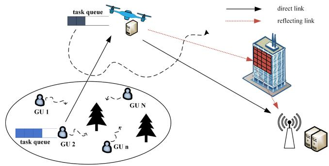
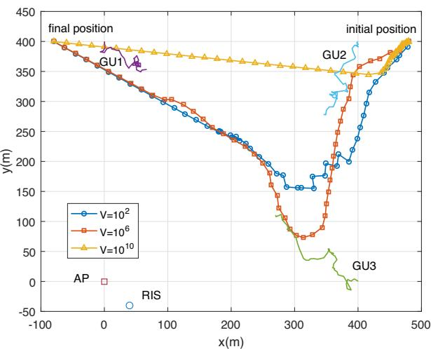
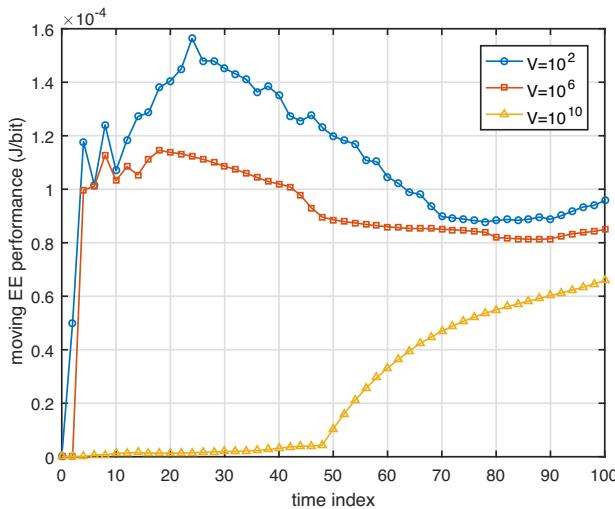
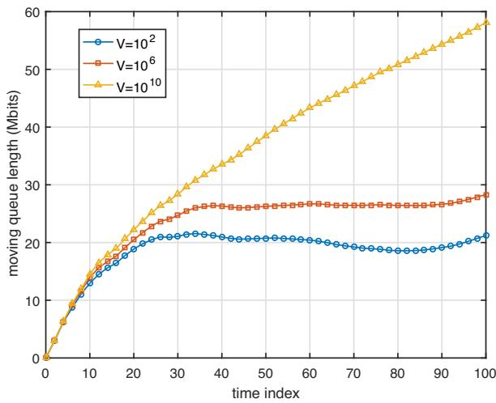
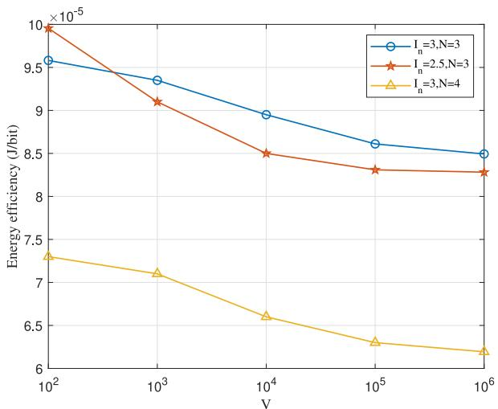
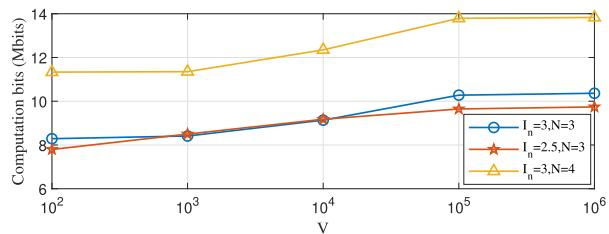
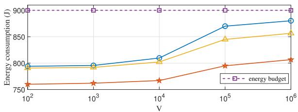
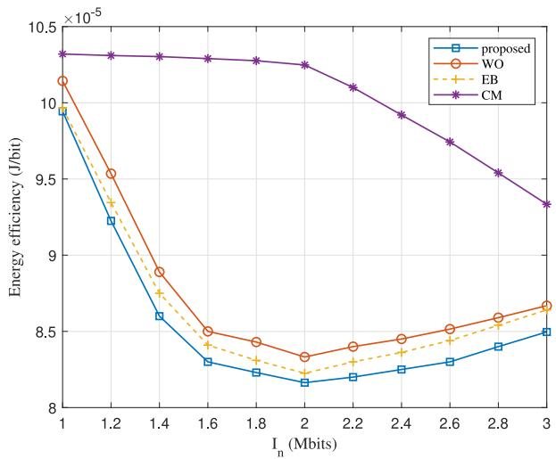
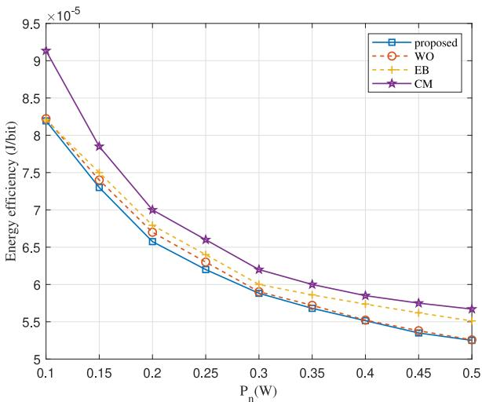
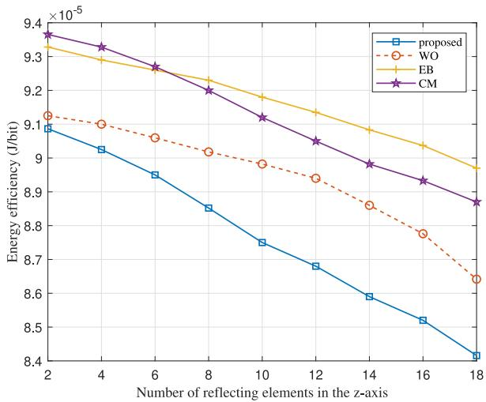

# Online Trajectory Planning and Resource Allocation of UAV-Enabled MEC Networks Empowered by RIS

Zhichao Sheng , Member, IEEE, Hao Hu, Ali A. Nasir , Member, IEEE, Yong Fang , and Daniel B. da Costa , Senior Member, IEEE

Abstract—We consider a mobile edge computing (MEC) framework empowered by unmanned aerial vehicle (UAV) and reflecting intelligent surface (RIS) serving multiple ground users in a practical environment, where mobile ground users generate movements and tasks randomly. Our objective is to optimize energy efficiency while ensuring long-term data queue stability, assuming knowledge of the channel state information. The problem is formulated as a stochastic optimization problem, and the Lyapunov method is applied to convert the initial problem into per-slot problems. Without the future knowledge of user movement, we consider the outage constraint into the per-slot problem to derive robust resource allocation and trajectory design in the MEC system. For each per-slot problem, an alternating optimization algorithm utilizing successive convex approximation technique is designed to solve it. This solution guarantees adherence to the UAV energy budget constraint while achieving a balance between system energy efficiency and the length of the queue backlog. Simulation results demonstrate that the proposed algorithm achieves better performance than other benchmark methods in terms of improving energy efficiency and maintaining queue stability.

Index Terms—Unmanned aerial vehicle, mobile edge computing, trajectory design, reconfigurable intelligence surface, Lyapunov.

## I. INTRODUCTION

intelligent devices. Computing-intensive and delay-sensitive applications, such as virtual reality, autonomous driving, and smart homes, are increasingly popular. However, the computing capacity of devices is limited, hindering their ability to meet the escalating computing requirements of intelligent devices [1]. Mobile Edge Computing (MEC) emerges as a new computing paradigm proposed to overcome these limitations and provide edge computing services. MEC servers are deployed at base stations or wireless access points (APs) to effectively provide computation resources to mobile devices. Consequently, MEC holds great potential in reducing computing latency and device energy consumption, thereby extending device service time and improving user experience [2].

Nevertheless, deploying MEC in remote or mountainous areas can be challenging due to the lack of ground facilities. To address this issue, researchers have recently focused on studying unmanned aerial vehicle (UAV)-assisted MEC systems equipped with micro base stations and servers. In [3], the deployment of UAVs to provide computing services to ground terminals and enhance system delay performance was explored. By optimizing user scheduling variables, data offloading ratios, and UAV trajectory, the problem of minimizing the sum of maximum delays between users was formulated. Similarly, [4] aimed to maximize the total number of bits offloaded from users to UAVs while satisfying UAV energy constraints and users’ quality of service requirements. The optimal solution was obtained by iteratively optimizing the subproblems resulting from the decomposition of the original problem. Additionally, [5] focused on minimizing energy consumption and delay costs in a multi-UAV MEC system by utilizing an alternating iterative algorithm based on block coordinate descent. Despite the achievements of these studies on UAV-assisted MEC systems, they typically only consider either computational performance or system energy consumption.

Furthermore, there has been extensive research on improving the computation performance and energy consumption concurrently, focusing on the energy efficiency (EE) of UAVbased MEC systems. Given the limited on-board energy of UAV, it is crucial to design the UAV trajectory and manage energy consumption for computation and communication to maximize the amount of processed data within the mission completion time of the UAV [6], [7], [8], [9], [10]. In [6], a multi-user non-orthogonal multiple access-based MEC model involving UAV relays and computation was examined, constrained by the limited available energy of both the UAV and mobile users. An iterative optimization algorithm based on the Dinkelbach and successive convex approximation (SCA) methods is employed to address the EE problem in fractional form. Similarly, [7] optimized computation resources, computation offloading, bandwidth, and UAV trajectory to maximize computation efficiency in UAV-assisted relaying and MEC networks. The study considered probabilistic Line-of-Sight (LoS) channels and Rician channels to provide a more accurate and realistic depiction of channel conditions in urban environments. References [8] and [9] investigated UAV-assisted MEC systems in disaster-stricken scenarios with the objective of maximizing the computational efficiency of the system, with [9] further considering power allocation strategies to achieve both communication and energy acquisition. Additionally, [10] addressed the gap by focusing on maximizing energy efficiency in a UAV-assisted MEC system with limited user mobility.

A significant challenge in UAV-MEC networks is the highly complex and time-varying channels induced by the high mobility of UAVs. These channels can become bottlenecks that hinder further performance improvement in UAV-MEC networks. To address this issue, the introduction of reflecting intelligent surface (RIS) to reconstruct the wireless channel environment shows promise [11]. RIS, as an effective and cost-efficient technology, has garnered widespread attention in the academic community [12], [13], [14]. In [12], the focus was on utilizing RIS to facilitate communication between a base station equipped with MEC servers and multiple singleantenna users. The study adopted the non-orthogonal multiple access protocol to enhance the efficiency of frequency resource utilization. Recent advancements have explored the use of UAVs as deployment platforms for RIS or in implementing RIS-enhanced UAV-MEC systems to overcome the limitations of terrestrial RIS deployment [15], [16], [17], [18]. In [15], the feasibility of UAV-mounted RIS for offloading computation tasks from multiple ground users to the MEC server was examined. The study simultaneously optimized the position and phase shift of the UAV-mounted RIS (U-RIS). Similarly, [16] investigated the potential of joint UAV relay and RIS design in enhancing computation performance. By optimizing RIS phase shift design, UAV trajectory, and resource allocation, the study aimed to maximize the minimum computation capacity. Furthermore, [17] addressed the challenge of maximizing energy efficiency in UAV-MEC systems integrated with RIS technology while meeting task delay requirements. Literature 3 explores multiple RIS-assisted offloading scenarios to improve network delay performance, utilizing graph theory for shortest path selection, as well as applying SDR and iterative optimization methods for RIS phasing and offloading scheduling optimization. Reference [19] explored multiple RIS-assisted offloading scenarios to improve network delay performance, utilizing graph theory for shortest path selection, and applying SDR and iterative optimization methods for RIS phasing and offloading scheduling optimization. Although these works provide valuable insights into the implementation of RIS-assisted UAV-MEC systems, they overlook the impact of uncertain and dynamic environments on the system performance of MEC networks.

Most existing works focus on offline algorithms in system design, which plan the entire UAV trajectory and resource allocation strategy based on the given user locations and user task requirements as prior knowledge [20], [21], [22]. However, in most edge computing scenarios such as real-time control, online gaming and autonomous driving, the requirements of computing tasks arrive randomly and the user locations may also change dynamically [23]. The framework for online algorithms is required to achieve real-time allocation scheme and trajectory planning. In recent works, online resource allocation algorithms for UAV-MEC (U-MEC) systems in random environments have made some progress [24], [25], [26], [27], [28]. In the case where the prior knowledge of system parameters is unknown, deep reinforcement learning and Lyapunov-based optimization frameworks are commonly used for designing online algorithms. Considering the random arrival of task data, Wan et al. developed a path planning algo rithm based on deep reinforcement learning by discretizing the action space into a finite set, including eight flight directions and a hovering mode [24]. In the work [26], Yang et al. considered the random arrival of user tasks and developed an online algorithm based on perturbed Lyapunov optimization to jointly optimize the energy consumption of the UAV and the task processing rate while maintaining the stability of the long-term data queue. However, [26] only considered static ground nodes with known positions. When considering both user mobility and random task arrivals, Yang et al. proposed an online control algorithm for UAV trajectory and resource scheduling to minimize the weighted energy consumption of users within a certain budget of energy consumption of the UAV, by converting the long-term optimization problem into an optimization problem for each time slot for real time control of the system in [28]. The above works revealed that the computation offloading scheme is limited by timevarying task data backlog and user location-dependent channel states. By introducing RIS technology into the U-MEC system, better signal enhancement and transmission performance can be provided, while achieving better balance in the presence of random channel environments. In [29], Tian et al. proposed a mixed online and offline design to optimize the system performance considering both static and dynamic channel state information. Specifically, in the offline stage, the random SCA technology was employed to jointly optimize the RIS phase shift and the UAV trajectory to maximize the average expected achievable rate. For the online stage, the transmit beamforming and user scheduling were adaptively adjusted to cope with time-varying channels. However, these works do not consider the situation where the offloading may be interrupted due to random user movement. On this basis, the energy efficiency in the UAV-RIS-assisted MEC system has not been well studied.

Based on the analysis above, it is evident that offline algorithms for MEC systems integrating UAV and RIS are unsuitable for dynamic environments due to user mobility and the stochastic arrival of task demands. Moreover, in dynamic environments, MEC systems must consider not only performance improvement but also realistic constraints such as limited UAV energy and the long-term impact of task queue backlog on system stability. Particularly, optimization algorithms should account for the negative effects of offloading interruption caused by user mobility. This paper focuses on studying a RIS-enhanced UAV-assisted MEC system that offers computing services to multiple mobile users on the ground with random task arrivals. The objective is to minimize the long-term average UAV flight energy consumption while maximizing the long-term average system computation bits, given known channel state information and subject to a UAV energy consumption budget and offloading outage requirement. We propose a joint online algorithm based on Lyapunov network by optimizing UAV trajectory, RIS phase shifts, communication, and computation resources. The contributions of this paper can be summarized as follows:

TABLE I COMPARISON TABLE
<table><tr><td rowspan=1 colspan=1></td><td rowspan=1 colspan=1>our work</td><td rowspan=1 colspan=1>[31]</td><td rowspan=1 colspan=1>[27]</td><td rowspan=1 colspan=1>[32]</td><td rowspan=1 colspan=1>[30]</td><td rowspan=1 colspan=1>[29]</td><td rowspan=1 colspan=1>[17]</td></tr><tr><td rowspan=1 colspan=1>Lyapunov-based online framework</td><td rowspan=1 colspan=1> $\surd$ </td><td rowspan=1 colspan=1> $\surd$ </td><td rowspan=1 colspan=1> $\surd$ </td><td rowspan=1 colspan=1> $\overline { { \surd } }$ </td><td rowspan=1 colspan=1></td><td rowspan=1 colspan=1> $\surd$ </td><td rowspan=1 colspan=1></td></tr><tr><td rowspan=1 colspan=1>offline-online framework</td><td rowspan=1 colspan=1></td><td rowspan=1 colspan=1></td><td rowspan=1 colspan=1></td><td rowspan=1 colspan=1></td><td rowspan=1 colspan=1> $\surd$ </td><td rowspan=1 colspan=1></td><td rowspan=1 colspan=1></td></tr><tr><td rowspan=1 colspan=1>random task arrive</td><td rowspan=1 colspan=1> $\surd$ </td><td rowspan=1 colspan=1> $\overline { { \surd \Bigl } }$ </td><td rowspan=1 colspan=1> $\overline { { \surd } }$ </td><td rowspan=1 colspan=1> $\overline { { \surd } }$ </td><td rowspan=1 colspan=1></td><td rowspan=1 colspan=1> $\surd$ </td><td rowspan=1 colspan=1></td></tr><tr><td rowspan=1 colspan=1>GU mobility model</td><td rowspan=1 colspan=1> $\surd$ </td><td rowspan=1 colspan=1></td><td rowspan=1 colspan=1></td><td rowspan=1 colspan=1></td><td rowspan=1 colspan=1></td><td rowspan=1 colspan=1> $\surd$ </td><td rowspan=1 colspan=1></td></tr><tr><td rowspan=1 colspan=1>UAV-RIS</td><td rowspan=1 colspan=1> $\surd$ </td><td rowspan=1 colspan=1></td><td rowspan=1 colspan=1></td><td rowspan=1 colspan=1></td><td rowspan=1 colspan=1> $\overline { { \surd } }$ </td><td rowspan=1 colspan=1></td><td rowspan=1 colspan=1> $\overline { { \surd } }$ </td></tr><tr><td rowspan=1 colspan=1>energy efficiency</td><td rowspan=1 colspan=1> $\surd$ </td><td rowspan=1 colspan=1> $\surd$ </td><td rowspan=1 colspan=1></td><td rowspan=1 colspan=1></td><td rowspan=1 colspan=1></td><td rowspan=1 colspan=1></td><td rowspan=1 colspan=1></td></tr><tr><td rowspan=1 colspan=1>offloading outage probability</td><td rowspan=1 colspan=1> $\surd$ </td><td rowspan=1 colspan=1></td><td rowspan=1 colspan=1></td><td rowspan=1 colspan=1></td><td rowspan=1 colspan=1></td><td rowspan=1 colspan=1></td><td rowspan=1 colspan=1></td></tr></table>

In contrast to MEC systems in static environments, where user mobility and random task arrivals are not considered, we investigate the energy efficiency optimization problem for multiuser RIS-enhanced UAV-assisted MEC networks in more realistic scenarios. We formulate a stochastic optimization problem to optimize the longterm EE of the system while ensuring the stability of task queues at users and UAVs. In realistic conditions, we model the issues of limited on-board energy supply for UAVs and interruptions caused by user mobility as the UAV’s energy consumption budget and outage constraints.

Fig. 1. System model.  

• An online algorithm based on Lyapunov theory is devised to jointly optimize offloading and computation bits, bandwidth and time slot allocation, UAV trajectory, and RIS phase shifts to address the energy efficiency optimization problem. Given the fractional and expected forms of the objective function, we first employ the Dinkelbach method to convert the original formulation into a linear form and initialize it using the knowledge of energy efficiency up to the last time slot. By transforming the stochastic problem into a per-time-slot optimization problem, we further decompose it into four subproblems and solve these subproblems by introducing slack variables and applying the SCA method.

The simulation results demonstrate that the algorithm effectively balances the objective function and the stability of the task backlog queue by adjusting the control parameter to an appropriate value. Interestingly, to prevent task backlogs at both the user and UAV and to enhance channel conditions for offloading, the UAV maneuvers closer to each user. These findings indicate that the proposed algorithm achieves a notable performance enhancement compared to the baseline scheme.

Notations: Boldface letters represents matrixes or vectors. diag( ) and vec( ) denote the diagonalization of a vector x and the vectorization of a matrix A, respectively. $( \cdot ) ^ { \dagger }$ denotes the transpose of a matrix or a vector. $\mathcal { C N } ( 0 , \dot { \sigma } ^ { 2 } )$ denotes a Gaussian random process with zero mean and variance of $\sigma ^ { 2 }$ $\mathbb { C } ^ { M \times N }$ and ${ \mathbf { I } } _ { M }$ denote a $M \times N$ complex matrix and a $M \times M$ identity matrix, respectively. {} indicates the probability of an event occurring.

## II. SYSTEM MODEL

As shown in Fig. 1, we consider an UAV-enabled MEC system, where an UAV equipped with a MEC server assists a set $\mathcal { N } = \{ 1 , 2 , \dots , N \}$ of N ground users (GUs) to computation and offloading as well as a RIS mounted on surface of the building supports the UAV for relaying offloading to remote AP with powerful MEC server. Considering a 3D Cartesian coordinate system, the location of the n-th GU is $( \mathbf { q } _ { n } [ t ] , 0 )$ with ${ \bf q } _ { n } [ t ] = ( x _ { n } [ t ] , y _ { n } [ t ] )$ . Similarly, the reference location of UAV, RIS and AP can be given as $( \mathbf { q } [ t ] , h _ { u } )$ $\left( \mathbf { w } _ { r } , h _ { r } \right)$ and $\left( \mathbf { w } _ { a } , h _ { a } \right)$ , where $\mathbf q [ t ] ~ = ~ ( x [ t ] , y [ t ] ) , ~ \mathbf w _ { r } ~ = ~$ $( x _ { r } , y _ { r } )$ and $\mathbf { w } _ { a } = ( x _ { a } , y _ { a } )$ denote the horizontal locations while $h _ { u } , \ h _ { a }$ wand $h _ { r }$ represent the heights of UAV, AP and RIS respectively. The UAV depends on limited energy supply on board to facilitate computation offloading and relaying in task completion duration D. For simplicity, the duration is discretized into T time slots (TSs) with each slot’s length denoted as $\delta _ { t }$ . The length is chosen to be sufficiently small such that the UAV’s position is considered nearly constant within each time slot. The RIS is deployed at the appropriate height to guarantee the service provision within the sight of UAV. However, we assume that the GU-RIS and GU-AP communication links cannot be established directly due to severe blockage. We consider the RIS as a uniform rectangular array consists of $M = M _ { z } \times M _ { y }$ refection elements to assist in offloading enhancement, where $M _ { z }$ and $M _ { y }$ denote the number of elements along the z-axis and y-axis respectively. Let $\Theta [ t ] = \mathrm { d i a g } ( e ^ { j \theta _ { 1 } [ t ] } , \dot { \dots } , e ^ { j \theta _ { M } [ t ] } )$ represent the reflection Θcoefficients matrix for GU in the t-th time slot, where the phase shift of m-th reflection element satisfies $0 \leq \theta _ { m } [ t ] \leq 2 \pi$ For convenience, the optimization variables are summarized in Table II.

TABLE II FREQUENTLY USED SYMBOLS IN THE PAPER
<table><tr><td rowspan=1 colspan=1>Notation</td><td rowspan=1 colspan=1>Description</td></tr><tr><td rowspan=1 colspan=1> $\overline { { N } }$ </td><td rowspan=1 colspan=1>number of GUs</td></tr><tr><td rowspan=1 colspan=1> $\overline { { \mathbf { q } _ { n } [ t ] } }$ </td><td rowspan=1 colspan=1>horizontal location of n-th GU</td></tr><tr><td rowspan=1 colspan=1> $\mathbf { q } [ t ]$ </td><td rowspan=1 colspan=1>horizontal location of UAV</td></tr><tr><td rowspan=1 colspan=1> ${ \bf w } _ { r }$ </td><td rowspan=1 colspan=1>horizontal location of RIS</td></tr><tr><td rowspan=1 colspan=1> ${ \bf w } _ { a }$ </td><td rowspan=1 colspan=1>horizontal location of AP</td></tr><tr><td rowspan=1 colspan=1> $h _ { u }$ </td><td rowspan=1 colspan=1>height of UAV</td></tr><tr><td rowspan=1 colspan=1> $h _ { r }$ </td><td rowspan=1 colspan=1>height of RIS</td></tr><tr><td rowspan=1 colspan=1> $h _ { a }$ </td><td rowspan=1 colspan=1>height of AP</td></tr><tr><td rowspan=1 colspan=1> $\overline { { D } }$ </td><td rowspan=1 colspan=1>task completion duration</td></tr><tr><td rowspan=1 colspan=1> $\overline { { T } }$ </td><td rowspan=1 colspan=1>number of time slots</td></tr><tr><td rowspan=1 colspan=1> $\delta _ { t }$ </td><td rowspan=1 colspan=1>length of each time slot</td></tr><tr><td rowspan=1 colspan=1> $\overline { { M _ { z } } }$ </td><td rowspan=1 colspan=1>number of elements in RIS along the z-axis</td></tr><tr><td rowspan=1 colspan=1> $M _ { y }$ </td><td rowspan=1 colspan=1>number of elements in RIS along the y-axis</td></tr><tr><td rowspan=1 colspan=1> $\overline { { \theta _ { m } [ t ] } }$ </td><td rowspan=1 colspan=1>phase shift of m-th reflection element</td></tr><tr><td rowspan=1 colspan=1> $\mathbf { v } _ { n } [ t ]$ </td><td rowspan=1 colspan=1>velocity vector of n-th GU</td></tr><tr><td rowspan=1 colspan=1> $v _ { m a x }$ </td><td rowspan=1 colspan=1>maximum speed of UAV</td></tr><tr><td rowspan=1 colspan=1> $g _ { u , n } [ t ]$ </td><td rowspan=1 colspan=1>channel gain from n-th GU to UAV</td></tr><tr><td rowspan=1 colspan=1> $\mathbf { g } _ { u r } [ t ]$ </td><td rowspan=1 colspan=1>channel gain from UAV to RIS</td></tr><tr><td rowspan=1 colspan=1> $g _ { u a } [ t ]$ </td><td rowspan=1 colspan=1>channel gain from UAV to AP</td></tr><tr><td rowspan=1 colspan=1> ${ \bf { g } } _ { r a }$ </td><td rowspan=1 colspan=1>channel gain from RIS to AP</td></tr><tr><td rowspan=1 colspan=1> $\overline { { B _ { n } [ t ] } }$ </td><td rowspan=1 colspan=1>sub-bandwidth of n-th GU</td></tr><tr><td rowspan=1 colspan=1> $\overline { { l _ { u , n } ^ { \mathrm { o f f } } [ t ] } }$ </td><td rowspan=1 colspan=1>number of task bits offloaded from n-th GU to UAV</td></tr><tr><td rowspan=1 colspan=1> $\overline { { l _ { u a . n } ^ { \mathrm { o f f } } [ t ] } }$ </td><td rowspan=1 colspan=1>number of task bits offloaded from UAV to AP for n-th GU</td></tr><tr><td rowspan=1 colspan=1> $\overline { { l _ { u , n } ^ { \mathrm { c o m p } } [ t ] } }$ </td><td rowspan=1 colspan=1>the computation task processed at UAV for n-th GU</td></tr></table>

## A. GU Mobility Model

Following [28], it is assumed that the GUs’ mobility follows the Gauss-Markov mobility model, widely applied in communication systems. Specifically, the velocity of n-th GU at (t + 1)-th TS can be deduced from its velocity at t-th TS as

$$
\begin{array} { r } { \mathbf v _ { n } [ t + 1 ] = \alpha \mathbf v _ { n } [ t ] + ( 1 - \alpha ) \bar { \mathbf v } + \bar { \sigma } \sqrt { 1 - \alpha ^ { 2 } } \mathbf w _ { n } [ t ] , } \end{array}\tag{1}
$$

where $\begin{array} { r } { { \bf v } _ { n } [ t ] ~ = ~ ( v _ { n } ^ { x } [ t ] , v _ { n } ^ { y } [ t ] ) } \end{array}$ is the velocity vector and $\mathbf { w } _ { n } [ t ] ~ = ~ ( w _ { n } ^ { x } [ t ] , w _ { n } ^ { y } [ t ] )$ is uncorrelated random Gaussian process $\mathcal { C N } ( 0 , \sigma ^ { 2 } )$ . Parameter ¯, σ¯ and α are asymptotic mean, asymptotic standard deviation of velocity and the memory level respectively. In addition, the position of GU n can be updated as

$$
\mathbf { q } _ { n } [ t + 1 ] = \mathbf { q } _ { n } [ t ] + \mathbf { v } _ { n } [ t ] \delta _ { t } ,\tag{2}
$$

where ${ \bf q } _ { n } [ t + 1 ]$ denotes the position of n-th GU at $\mathrm { ~ ( ~ } t \mathrm { ~ \tiny ~ + ~ }$ 1)-th TS. We assume that the UAV has acquired the prior knowledge through GUs’ position feedback $\{ \mathsf { q } _ { n } \left[ t \right] \} _ { n = 1 } ^ { N }$ at =1the beginning of the t-th TS. However, the future locations of GUs $\{ \mathsf { q } _ { n } \overset { \vartriangle } { [ t + 1 ] } \} _ { n = 1 } ^ { N }$ are currently unknown. Later, we =1will apply the user mobility model described in (1) and (2) to formulate the offloading outage probability constraint. This will account for the effect of the random Gaussian process $\mathbf { w } _ { n } [ t ]$ (random movement) on the offloading rate, thereby addressing the negative impacts of offloading interruptions caused by user mobility. Based on this random mobility model, we will derive robust resource allocation and optimize the UAV’s waypoints for the upcoming time slots within the online framework.

## B. Channel Model

The UAV flies from the initial location ${ \bf q } [ 0 ]$ to the destination q[T + 1] at the fixed height $h _ { u }$ with the maximum speed vmax . During the t-th time slot, the channel power gain from n-th GU to UAV, from UAV to RIS, from UAV to AP, and from RIS to AP is represented as $g _ { u , n } [ t ] , \mathbf { g } _ { u r } [ t ] \in \mathbb { C } ^ { M \times 1 } , g _ { u a } [ t ]$ and $\mathbf { g } _ { r a } \in \mathbb { C } ^ { M \times \mathbf { \dot { 1 } } }$ , respectively. Since the UAV operates above certain altitude, we assume that the air-to-ground wireless channels associated with the UAV are dominated by LoS links. GUs transmit their tasks to the UAV using FDMA over the same TS to avoid interference. Hence, the LoS channel dominated UAV-RIS link can be given by [16]

$$
\mathbf { g } _ { u r } [ t ] = \sqrt { \frac { \beta _ { 0 } } { \left\| \mathbf { q } [ t ] - \mathbf { w } _ { r } \right\| ^ { 2 } + \left( h _ { u } - h _ { r } \right) ^ { 2 } } } \bar { \mathbf { g } } _ { u r } ^ { \mathrm { L o S } } [ t ] ,\tag{3}
$$

where $\beta _ { 0 }$ is average channel power at a reference distance of 1 m. $\bar { \mathbf { g } } _ { u r } ^ { \mathrm { L o S } } [ t ]$ denotes the array response from the UAV to the RIS in terms of the Angle of Arrival (AoA), which can be determined by the following formula

$$
\begin{array} { r l r } & { } & { \frac { { \bf { \bar { g } } } ^ { \mathrm { L o S } } } { { \bf { \bar { z } } } u r } [ t ] = \left[ { 1 , e ^ { - j \left( \frac { { 2 \pi } } { \lambda } \right) d _ { y } \Phi _ { u r } [ t ] } , \dots , e ^ { - j \left( \frac { { 2 \pi } } { \lambda } \right) \left( M _ { y } - 1 \right) d _ { y } \Phi _ { u r } [ t ] } } \right] ^ { \dagger } } \\ & { } & { \otimes \left[ { 1 , e ^ { - j \left( \frac { { 2 \pi } } { \lambda } \right) d _ { z } \Omega _ { u r } [ t ] } , \dots , e ^ { - j \left( \frac { { 2 \pi } } { \lambda } \right) \left( M _ { z } - 1 \right) d _ { z } \Omega _ { u r } [ t ] } } \right] ^ { \dagger } , } \end{array}\tag{4}
$$

where $d _ { y }$ and $d _ { z }$ are the element separation of RIS along the y-axis and z-axis respectively, λ denotes the carrier wavelength. Furthermore, $\Phi _ { u r } [ t ] =$ sin $\theta _ { u r } [ t ] \cos \varphi _ { u r } [ t ] , \Omega _ { u r } [ t ] =$ sin $\theta _ { u r } [ t ]$ sin $\varphi _ { u r } [ t ] . \theta _ { u r } [ t ]$ and $\varphi _ { u r } [ t ]$ represent the vertical and horizontal AoA of the signal from UAV to RIS, while sin $\theta _ { u r } [ t ] = ( h _ { u } - h _ { r } ) / \sqrt { \| \mathbf { q } [ t ] - \mathbf { w } _ { r } \| ^ { 2 } + ( h _ { u } - h _ { r } ) ^ { 2 } }$ sin $\varphi _ { u r } [ t ] = ( x _ { r } - x _ { u } ) / \sqrt { \| \mathbf { q } [ t ] - \mathbf { w } _ { r } \| ^ { 2 } }$ , cos $\varphi _ { u r } [ t ] = ( y _ { r } -$ $y _ { u } ) / \sqrt { \| \mathbf { q } [ t ] - \mathbf { w } _ { r } \| ^ { 2 } }$ . Given the UAV’s high-altitude position, we assume that the channel for GU-UAV and UAV-AP links is predominantly characterized by line-of-sight propagation. Consequently, the corresponding channel gains of the GU-UAV and UAV-AP links can be expressed as $\begin{array} { r l } { g _ { i } [ t ] } & { { } = } \end{array}$ $\sqrt { \beta _ { 0 } ( d _ { i } [ t ] ) ^ { - \alpha _ { i } } }$ , for $i \in \{ \{ u , n \} , \{ u a \} \}$ } denote the UAV-to-n-th 0GU link and UAV-to-RIS link, respectively [17]. Here, $d _ { i } [ t ]$ is the distance between nodes in the link, $\alpha _ { i }$ represents the path loss exponent. Specifically, $\begin{array} { r } { d _ { u , n } = \sqrt { \| \mathbf { q } [ t ] - \mathbf { q } _ { n } [ t ] \| ^ { 2 } + h _ { u } ^ { 2 } } . } \end{array}$ $d _ { u a } = \sqrt { \| \mathbf { q } [ t ] - \mathbf { w } _ { a } \| ^ { 2 } + ( h _ { u } - h _ { a } ) ^ { 2 } }$ . Without loss of gener-q wality, the channel of RIS-AP link is determined by the Rician channel. Thus, the channel coefficient is given as [29]

$$
{ \bf g } _ { r a } = \sqrt { \beta _ { 0 } d _ { r a } ^ { - \alpha _ { r a } } } \left( \sqrt { \frac { \kappa _ { r a } } { \kappa _ { r a } + 1 } } \tilde { \bf g } _ { r a } ^ { \mathrm { L o S } } + \sqrt { \frac { 1 } { \kappa _ { r a } + 1 } } \tilde { \bf g } _ { r a } ^ { \mathrm { N L o S } } \right)\tag{5}
$$

where $\kappa _ { r a }$ is the Rician fading factor of the RIS-AP link and $d _ { r a } \ = \ \sqrt { \| \mathbf { w } _ { r } - \mathbf { w } _ { a } \| ^ { 2 } + ( h _ { r } - h _ { a } ) ^ { 2 } }$ denotes the distance between RIS and AP, which is constant among TSs. Additionally, $\tilde { \mathbf { g } } _ { r a } ^ { \mathrm { L o S } }$ and $\tilde { \mathbf { g } } _ { r a } ^ { \mathrm { N L o S } }$ denote the LoS component and NLoS component, respectively. The LoS component can be obtained as follows

$$
\begin{array} { r l r } & { } & { \tilde { \bf g } _ { r a } ^ { \mathrm { L o S } } = \left[ 1 , e ^ { - j \left( \frac { 2 \pi } { \lambda } \right) d _ { y } \Phi _ { r a } } , \ldots , e ^ { - j \left( \frac { 2 \pi } { \lambda } \right) \left( M _ { y } - 1 \right) d _ { y } \Phi _ { r a } } \right] ^ { \dagger } } \\ & { } & { \otimes \left[ 1 , e ^ { - j \left( \frac { 2 \pi } { \lambda } \right) d _ { z } \Omega _ { r a } } , \ldots , e ^ { - j \left( \frac { 2 \pi } { \lambda } \right) \left( M _ { z } - 1 \right) d _ { z } \Omega _ { r a } } \right] ^ { \dagger } , } \end{array}\tag{6}
$$

where $\begin{array} { r c l c r c l } { \Phi _ { r a } } & { = } & { \sin \theta _ { r a } \cos \varphi _ { r a } , } & { \Omega _ { r a } } & { = } & { \sin \theta _ { r a } \sin \varphi _ { r a } } \end{array}$ $\theta _ { r a }$ and $\varphi _ { r a }$ represent the vertical and horizontal Angle of Department (AoD) from RIS to AP, while sin $\varphi _ { r a } = ( x _ { r } \ - \ x _ { a } ) / \sqrt { \| \mathbf { w } _ { r } - \mathbf { w } _ { a } \| ^ { 2 } }$ , sin $\theta _ { r a } = \left( h _ { r } ~ - \right.$ $h _ { a } ) / \sqrt { \| \mathbf { w } _ { r } - \mathbf { w } _ { a } \| ^ { 2 } + \left( h _ { r } - h _ { a } \right) ^ { 2 } }$ cos $\begin{array} { r l r l } { \varphi _ { r a } } & { { } = } & { } & { { } ( y _ { r } } & { - } \end{array}$ $y _ { a } ) / \sqrt { \| \mathbf { w } _ { r } - \mathbf { w } _ { a } \| ^ { 2 } }$ . For the NLoS component, the expression $\begin{array} { r l r } { \tilde { \bf g } _ { r a } ^ { \mathrm { N L o S } } } & { { } \in } & { \mathcal { C N } ( 0 , { \bf I } _ { M } ) } \end{array}$ represents the random scattering g Icomponent in the Rician fading channel, which is modeled as a complex Gaussian random variable with zero mean and unit variance.

## C. Communication Model

To facilitate the process of communication and computation, the time slot and bandwidth partition protocol is applied in the U-MEC system. For each GU n, each time slot is divided into three subslots which are allocated for computation offloading from GU to UAV and relay offloading from UAV to AP. Assume that the computation results produced by UAV and AP are transmitted back at the third subslot. However, the transmission delay is ignored here due to the significantly small size of results compared with the input data size. The length of subslot for n-th GU at t-th TS is determined by $\tau _ { n , 1 } [ t ]$ and $\tau _ { n , 2 } [ t ]$ , which satisfied the following constraints

$$
\tau _ { n , 1 } [ t ] + \tau _ { n , 2 } [ t ] \leq \delta _ { t } .\tag{7}
$$

As FDMA is used to avoid interference among users, the sum bandwidth $B _ { 0 }$ is divided into N subcarriers with size of $B _ { n } [ t ]$ 0for each GU, which should satisfy $\begin{array} { r } { \sum _ { n = 1 } ^ { N } B _ { n } [ t ] \leq B _ { 0 } } \end{array}$

Let $s _ { n } [ t ]$ =1 0denote the transmission signal carrying task information from n-th GU, and the transmission power is represented as $p _ { n }$ . In addition, $n _ { u , n } [ t ]$ is the noise at the UAV on the n-th sub-bandwidth with $n _ { u , n } [ t ] \sim \mathcal { C } \mathcal { N } ( 0 , N _ { 0 } B _ { n } [ t ] )$ where $N _ { 0 }$ 0denotes power spectral density of the white 0Gaussian noise. Therefore, we can express the received signal from n-th GU to UAV on the n-th subcarrier as

$$
y _ { n } [ t ] = { \sqrt { p _ { n } } } g _ { u , n } [ t ] s _ { n } [ t ] + n _ { u , n } [ t ] .\tag{8}
$$

The received signal-to-noise ratio (SNR) at UAV from n-th GU is given by

$$
\rho _ { u , n } [ t ] = \frac { p _ { n } | g _ { u , n } [ t ] | ^ { 2 } } { N _ { 0 } B _ { n } [ t ] } .\tag{9}
$$

After the UAV receives the transmitted signal from the GU, the UAV operates in the mode of partial computation and relay offloading. In the signal transmission process from the UAV to the AP, two communication links exist: the UAV-AP direct link and the UAV-RIS-AP relay link. Hence, the received signal of n-th GU from UAV to AP is given by

$$
y _ { a , n } [ t ] = \sqrt { p _ { u } } \Big ( g _ { u a } [ t ] + \mathbf { g } _ { r a } ^ { H } \boldsymbol { \Theta } [ t ] \mathbf { g } _ { u r } [ t ] \Big ) s _ { u , n } [ t ] + n _ { a , n } [ t ] ,\tag{10}
$$

where $s _ { u , n } [ t ]$ is the transmission signal from the UAV carrying the unprocessed task with zero mean and unit variance, and the transmission power of UAV is denoted by $p _ { u }$ . Moreover, $n _ { a , n } [ t ] \sim \mathcal { C } \mathcal { N } ( 0 , N _ { 0 } B _ { n } [ t ] )$ represent the noise at AP on the n-th sub-bandwidth. Consequently, the received SNR of n-th GU from UAV to AP is obtained as

$$
\rho _ { u a , n } [ t ] = \frac { p _ { u } | g _ { u a } [ t ] + \mathbf { g } _ { r a } ^ { H } \boldsymbol { \Theta } [ t ] \mathbf { g } _ { u r } [ t ] | ^ { 2 } } { N _ { 0 } B _ { n } [ t ] } .\tag{11}
$$

Accordingly, the number of task bits offloaded from n-th GU to UAV, constrained by the uplink transmission rate at the t-th TS, can be expressed as follow

$$
l _ { u , n } ^ { \mathrm { o f f } } [ t ] \leq \tau _ { n , 1 } [ t ] B _ { n } [ t ] \log _ { 2 } \bigl ( 1 + \rho _ { u , n } [ t ] \bigr ) .\tag{12}
$$

Similarly, the number of task bits offloaded from UAV to AP for relaying on n-th subcarrier is given as

$$
l _ { u a , n } ^ { \mathrm { o f f } } [ t ] \leq \tau _ { n , 2 } [ t ] B _ { n } [ t ] \log _ { 2 } \bigl ( 1 + \rho _ { u a , n } [ t ] \bigr ) .\tag{13}
$$

## D. Computation Task Model

To model random task arrival, we assume that the computation tasks of each GU arrive following an i.i.d Bernoulli model. The computation task with fixed size of $I _ { n }$ generate at n-th GU with the probability $\rho _ { n }$ [32]. Let $A _ { n } [ t ]$ denote the number of arriving task bits for n-th GU at the beginning of t-th TS while $\mathbb { P } ( A _ { n } [ t ] = I _ { n } ) = 1 - \mathbb { P } ( A _ { n } [ t ] = 0 ) = \rho _ { n }$ . Without loss of generality, GUs are assumed to be energy-constrained devices without local computing ability such as sensors. Each GU maintains the task queue to complete computation offloading, which will be processed on the first-in first-out (FIFO) basis. The generating tasks and offloading bits are stored in the buffer if the computing ability cannot cover them at each node. Accordingly, the task queue backlog $Q _ { n } [ t ]$ at the n-th GU during t-th TS is updated as

$$
Q _ { n } [ t + 1 ] = \operatorname* { m a x } \Bigl \{ Q _ { n } [ t ] + A _ { n } [ t ] - l _ { u , n } ^ { \mathrm { o f f } } [ t ] , 0 \Bigr \} , \quad \forall t \in \mathcal { T } .\tag{14}
$$

Let $c _ { u }$ denote the required CPU cycles to compute one bit of computation task at UAV and $f _ { u } ^ { \mathrm { m a x } }$ denote the maximum CPU frequency at UAV. As a result, the computation task processed at UAV is constrained by the maximum computation ability, which is given as

$$
\sum _ { n } ^ { N } l _ { u , n } ^ { \mathrm { c o m p } } [ t ] \leq \delta _ { t } \frac { f _ { u } ^ { \mathrm { m a x } } } { c _ { u } } .\tag{15}
$$

During each TS, a partially computation mode is introduced at the UAV, in which part of the computation task is executed locally while the other part is forwarded to AP. Thus, the task queue backlog $L _ { n } [ t ]$ of n-th GU at the UAV during t-th TS evolves as

$$
L _ { n } [ t + 1 ] = \operatorname* { m a x } \Bigl \{ L _ { n } [ t ] + l _ { u , n } ^ { \mathrm { o f f } } [ t ] - l _ { u a , n } ^ { \mathrm { o f f } } [ t ] - l _ { u , n } ^ { \mathrm { c o m p } } [ t ] , 0 \Bigr \} .\tag{16}
$$

It is assumed that the MEC server at the AP is sufficiently powerful to handle the offloading tasks from the UAV. Consequently, there is no backlog of tasks at the AP, and the computation bits at the AP are approximately equivalent to the offloaded task bits. However, the computation bits at the AP are still constrained by the computation power available at the UAV and the relay communication rate.

## E. Energy Consumption Model

In the system, we mainly consider the propulsion energy, which is significantly larger than the energy consumption for computation and communication. Here, we introduce a simplified model similar to [31]. The flying energy is determined by the velocity of the UAV, denoted as

$$
e _ { f } [ t ] = 0 . 5 M _ { g } \delta _ { t } \lvert \lvert \mathbf { v } [ t ] \rvert \rvert ^ { 2 } ,\tag{17}
$$

$$
\mathbf { v } [ t ] = \frac { \mathbf { q } [ t + 1 ] - \mathbf { q } [ t ] } { \delta _ { t } } ,\tag{18}
$$

where $M _ { g }$ is the mass of the UAV and the instant velocity is defined as the ratio of trajectory increment to slot length. Given the budget of the flight energy consumption $E _ { u } ,$ , the long term energy consumption constraint is expressed as

$$
\operatorname* { l i m } _ { T  \infty } \frac { 1 } { T } \sum _ { t = 1 } ^ { T } \mathbb { E } \{ e _ { f } [ t ] \} \leq E _ { u } .\tag{19}
$$

To manage the average energy consumption budget constraint, we introduce a virtual energy consumption queue to measure the accumulated energy consumption exceeding the threshold. The energy queue is updated as

$$
\begin{array} { r } { E [ t + 1 ] = \operatorname* { m a x } \{ E [ t ] + e _ { f } [ t ] - E _ { u } , 0 \} . } \end{array}\tag{20}
$$

## III. PROBLEM FORMULATION

## A. EE Optimization Problem

Traditionally, energy efficiency has been defined as the ratio of computation bits to energy consumption. However, for ease of processing, we define the system energy efficiency as the ratio of the long-term average energy consumption of the UAV to the corresponding long-term processed computation bits [27]

$$
\overline { { { \eta } } } _ { E E } = \frac { \operatorname* { l i m } _ { T  \infty } \sum _ { i = 1 } ^ { T - 1 } e _ { f } [ i ] } { \operatorname* { l i m } _ { T  \infty } \sum _ { i = 1 } ^ { T - 1 } \sum _ { n = 1 } ^ { N } ( l _ { u , n } ^ { \mathrm { c o m p } } [ i ] + l _ { u a , n } ^ { \mathrm { o f f } } [ i ] ) } = \frac { \overline { { { E } } } } { \overline { { { L } } } } .\tag{21}
$$

To minimize the energy efficiency, we jointly optimize the computation and offloading bits, the UAV 2D trajectory, the bandwidth and offloading time allocation, and the RIS phase shift. The following stochastic optimization problem is formulated as:

min ηEE , , , ,T

(22a)

$$
\mathrm { s . t . } l _ { u , n } ^ { \mathrm { o f f } } [ t ] \leq Q _ { n } [ t ] + A _ { n } [ t ]\tag{22b}
$$

$$
l _ { u , n } ^ { \mathrm { c o m p } } [ t ] + l _ { u a , n } ^ { \mathrm { o f f } } [ t ] \leq L _ { n } [ t ] + l _ { u , n } ^ { \mathrm { o f f } } [ t ]
$$

$$
\sum _ { n = 1 } ^ { N } l _ { u , n } ^ { \mathrm { c o m p } } [ t ] \leq \delta _ { t } \frac { f _ { u } ^ { \mathrm { m a x } } } { c _ { u } }\tag{22c}
$$

(22d)

$$
l _ { u , n } ^ { \mathrm { o f f } } [ t ] \leq \tau _ { n , 1 } [ t ] B _ { n } [ t ] \log _ { 2 } \bigl ( 1 + \rho _ { u , n } [ t ] \bigr )\tag{22e}
$$

$$
l _ { u a , n } ^ { \mathrm { o f f } } [ t ] \leq \tau _ { n , 2 } [ t ] B _ { n } [ t ] \log _ { 2 } \bigl ( 1 + \rho _ { u a , n } [ t ] \bigr )\tag{22f}
$$

$$
\operatorname* { l i m } _ { T \to \infty } \frac { 1 } { T } \sum _ { t = 1 } ^ { T } \sum _ { n = 1 } ^ { N } \mathbb { E } \{ Q _ { n } [ t ] \} \le \infty\tag{22g}
$$

$$
\operatorname* { l i m } _ { T \to \infty } \frac { 1 } { T } \sum _ { t = 1 } ^ { T } \sum _ { n = 1 } ^ { N } \mathbb { E } \{ L _ { n } [ t ] \} \le \infty\tag{22h}
$$

$$
\operatorname* { l i m } _ { T \to \infty } \frac { 1 } { T } \sum _ { t = 1 } ^ { T } \mathbb { E } \{ e _ { f } [ t ] \} \leq E _ { u }\tag{22i}
$$

$$
| | \mathbf { q } [ t + 1 ] - \mathbf { q } [ t ] | | \leq v _ { m a x } \delta _ { t }\tag{22j}
$$

$$
| | \mathbf { q } _ { F } - \mathbf { q } [ t + 1 ] | | \leq v _ { m a x } \delta _ { t } ( T - t ) ,\tag{22k}
$$

where $\mathbf { L } = \{ l _ { u , n } ^ { \mathrm { o f f } } [ t ] , l _ { u a , n } ^ { \mathrm { o f f } } [ t ] , l _ { u , n } ^ { \mathrm { c o m p } } [ t ] \} , \ \mathbf { B } = \{ B _ { n } [ t ] \} , \ T =$ $\{ \tau _ { n , 1 } [ t ] , \tau _ { n , 2 } [ t ] \} , \Theta = \{ \theta _ { i } [ t ] \} , \mathbf { Q } = \{ \mathbf { q } [ t ] \}$

1 2The constraints in the formulation are explained as follow. Constraints (22b) and (22c) represent that the size of computation and offloading task bits cannot exceed the size of data in the received and blocked queue. (22d) ensures that the task bits processed by UAV are limited to the maximum computation capacity. (22e) and (22f) are the information causality constraint during the GU-UAV and UAV-AP offloading process. July 05,2026 at 13:08:33 UTC from IEEE Xplore. Restrictions apply.

(22g) and (22h) state that the blocked queues in the buffer should remain stable over the long term. (22i) means that UAV must complete task within the energy consumption budget. (22j) is UAV’s mobility constraint and (22k) indicates that UAV is capable of reaching the predetermined destination within the given remaining time.

## B. Problem Transformation

Note that the original problem (22) is difficult to solve directly due to the fractional structure of objective function and the non-convexity of constraints. Here, we first introduce Dinkelbach algorithm to transform the fractional programming into the linear form. Moreover, since the long-term computation efficiency is unknown in advance, we can obtain an approximate intermediate variable expressed as

$$
\eta _ { E E } ( t ) = \frac { \sum _ { i = 1 } ^ { t - 1 } e _ { f } [ i ] } { \sum _ { i = 1 } ^ { t - 1 } \sum _ { n = 1 } ^ { N } \left( l _ { n , u } ^ { \mathrm { c o m p } } [ i ] + l _ { n , u a } ^ { \mathrm { o f f } } [ i ] \right) } ,\tag{23}
$$

where $\eta _ { E E } ( t )$ depends on the UAV trajectory and computation bits allocation before t-th TS. According to the Dinkelbach algorithm, the problem can be reformulated as

$$
\begin{array} { r } { \operatorname* { m i n } _ { { \bf { L } } , { \bf { \Theta } } , { \bf { \Theta } } , { \bf { \Theta } } , { \bf { \Lambda } } , { \mathcal { T } } } \overline { { E } } - \eta _ { E E } ( t ) \overline { { L } } } \\ { \mathrm { s . t . ~ } \left( 2 2 { \bf { b } } \right) - ( 2 2 { \bf { k } } ) . \qquad } \end{array}\tag{24}
$$

The absence of the future knowledge of data arrivals and user locations complicates the satisfaction of long-term stability and UAV energy consumption constraints. Problem (24) is non-convex and cannot be solved offline, as it requires realtime decision-making based on the current state information. Additionally, multiple optimization variables couples with each other, which further increases the problem’s complexity. To address these issues, we propose an online algorithm utilizing the Lyapunov optimization framework.

## C. Lyapunov Based Online Framework

To address the stochastic optimization problem (24), the Lyapunov optimization theory is employed to decouple the problem into pre-slot optimization problems. Considering the stability of the current queue backlog $\begin{array} { r l } { \mathbf { U } [ t ] } & { { } = } \end{array}$ $\{ Q _ { n } [ t ] , L _ { n } [ { \dot { t } } ] , E [ t ] \}$ , we construct a quadratic Lyapunov function as

$$
F ( \mathbf { U } [ t ] ) = \frac { 1 } { 2 } \sum _ { i = 1 } ^ { N } \Bigl ( Q _ { i } ^ { 2 } [ t ] + L _ { i } ^ { 2 } [ t ] \Bigr ) + \frac { 1 } { 2 } E ^ { 2 } [ t ] .\tag{25}
$$

To maintain the boundedness and stability of the queue, a conditional Lyapunov drift function is further defined.

$$
\Delta F ( \mathbf { U } [ t ] ) = \mathbb { E } \{ F ( \mathbf { U } [ t + 1 ] ) - F ( \mathbf { U } [ t ] ) | \mathbf { U } [ t ] \} .\tag{26}
$$

Then the function of drift-plus-penalty can be derived as

$$
\begin{array} { r l } { { D } ( { \bf U } [ t ] ) } & { = \Delta F ( { \bf U } [ t ] ) + { V } \mathbb { E } \Bigg \{ { e } _ { f } [ t ] - \eta _ { E E } ( t ) \sum _ { n = 1 } ^ { N } \big ( l _ { n , u } ^ { \mathrm { c o m p } } [ t ] } \\ & { ~ + l _ { u a , n } ^ { \mathrm { o f f } } [ t ] \big ) | { \bf U } [ t ] \Bigg \} , \qquad ( 2 7 \mathrm { ~ c } ) } \end{array}
$$

where the parameter V is utilized to balance the system utility and queue stability. In order to minimize the drift-plus-penalty, we derive the upper bound of D(U[t]) to achieve online offloading algorithm.

$$
\begin{array} { r l r } { D ( \mathbf { U } [ t ] ) } & { \le C + E [ t ] \mathbb { E } \{ e _ { f } [ t ] - E _ { u } | \mathbf { U } [ t ] \} } & \\ & { \quad \quad \quad \quad + \displaystyle \sum _ { n = 1 } ^ { N } \mathbb { E } \Big \{ L _ { n } [ t ] \Big ( \frac { D _ { u } ^ { \mathrm { { Q } } } } { \lambda _ { n } } [ t ] - l _ { u , n } ^ { \mathrm { Q } } [ t ] - l _ { u , n } ^ { \mathrm { { C o m p } } } [ t ] \Big ) } & \\ & { \quad \quad \quad \quad + Q _ { n } [ t ] A _ { n } [ t ] - ( Q _ { n } [ t ] + A _ { n } [ t ] ) l _ { u , n } ^ { \mathrm { { Q } } } [ t ] \vert \mathbf { U } [ t ] \Big \} } & \\ & { \quad \quad \quad \quad + V \mathbb { E } \Bigg \{ e _ { f } [ t ] - \eta _ { E E } ( t ) \displaystyle \sum _ { n = 1 } ^ { N } ( l _ { n , n } ^ { \mathrm { { C o m p } } } [ t ] } & \\ & { \quad \quad \quad \quad \quad + l _ { u , n } ^ { \mathrm { { Q } } } [ t ] \Big ) \vert \mathbf { U } [ t ] \Bigg \} , } & { \quad \quad \quad \quad ( 2 } \end{array}\tag{8}
$$

where C is an infinite constant.

Rather than minimizing the drift-plus-penalty, the upper bound of D(U[t]) in (28) is minimized. At t-th TS, the queue data $\mathbf { U } [ t ] ,$ the arrival tasks $\{ A _ { n } [ t ] \} _ { n = 1 } ^ { N }$ , the current UAV position q[t], and the users’ location $\{ { \bf q } _ { n } [ t ] \} _ { n = 1 } ^ { N }$ as prior =1knowledge can be obtained. Therefore, the stochastic task arrival is decoupled into per-slot optimization in an online manner. Without the knowledge of the future user location, robust UAV trajectory design and resource allocation is hard to obtain. By introducing outrage probability, we rewrite the constraint (22e) according to user movement prediction models. As a result, the original problem (22) can be transformed into the following optimization problem

$$
\begin{array} { r l } { \underset { \mathbf { L } , \mathbf { Q } , \boldsymbol { \Theta } , \mathbf { B } , \mathcal { T } } { \mathrm { m i n } } } & { E [ t ] e _ { f } [ t ] + \displaystyle \sum _ { n = 1 } ^ { N } L _ { n } [ t ] \Bigl ( l _ { u , n } ^ { \mathrm { o f f } } [ t ] - l _ { u a , n } ^ { \mathrm { o f f } } [ t ] - l _ { u , n } ^ { \mathrm { c o m p } } [ t ] \Bigr ) } \\ & { - \left( Q _ { n } [ t ] + A _ { n } [ t ] \right) l _ { u , n } ^ { \mathrm { o f f } } [ t ] } \\ & { + \mathrm { \Delta } V \Bigl ( e _ { f } [ t ] - \eta _ { E E } ( t ) \sum _ { n = 1 } ^ { N } \Bigl ( l _ { n , u } ^ { \mathrm { c o m p } } [ t ] + l _ { u a , n } ^ { \mathrm { o f f } } [ t ] \Bigr ) \Bigr ) } \end{array}\tag{29a}
$$

$$
\begin{array} { r l } { \mathrm { s . t . } \quad } & { { } ( 2 2 \mathrm { b } ) - ( 2 2 \mathrm { d } ) , ( 2 2 \mathrm { f } ) - ( 2 2 \mathrm { k } ) } \end{array}
$$

$$
\begin{array} { r } { \mathbf { P r } _ { \{ \mathbf { w } _ { n } [ t ] \} } \left\{ R _ { n } [ t ] \geq l _ { u , n } ^ { \mathrm { o f f } } [ t ] \right\} \geq 1 - \rho , } \end{array}\tag{29b}
$$

(29c)

where $\rho$ is the offloading outage probability from GU to UAV, which indicates the probability that the offloading process cannot be realized when the communication capacity is less than the offloading bits. Constraint (29c) indicates that the probability of the successful offloading incident needs to be higher than the threshold value. $R _ { n } [ t ] = \tau _ { n , 1 } [ t ] B _ { n } [ t ] \log _ { 2 } ( 1 +$ $\rho _ { u , n } [ t ] )$ 2is communication bits from n-th GU to UAV, which is a function of the user movement random variable ${ \bf w } _ { n } [ t ]$

## IV. LYAPUNOV BASED ONLINE ALGORITHM

The formulated per-slot optimization problem remains highly non-convex, making it intractable to solve. Additionally, the probability constraint with respect to the random variable $\mathbf { w } _ { n } [ t ]$ does not have a simple closed-form expression, further complicating the optimization process. To address these challenges, we apply the block coordinate descent (BCD) method to decompose the problem into several subproblems. Furthermore, we use the Bernstein-type inequality to transform and approximate the outage probability constraint and derive the inner convex approximations for the non-convex constraints.

## A. Subproblem 1: Phase Shift Optimization

With variables Q, B and T fixed, the problem (29) can be transformed into

$$
\begin{array} { r l } { \underset { \mathbf { L } , \boldsymbol { \Theta } } { \mathrm { m i n } } } & { { } - { \displaystyle \sum _ { i = 1 } ^ { N } } L _ { n } [ t ] l _ { u a , n } ^ { \mathrm { o f f } } [ t ] - V \eta _ { E E } ( t ) { \displaystyle \sum _ { n = 1 } ^ { N } } l _ { u a , n } ^ { \mathrm { o f f } } [ t ] } \end{array}\tag{30a}
$$

$$
\begin{array} { r l } { \mathrm { s . t . } \quad } & { { } l _ { u a , n } ^ { \mathrm { o f f } } [ t ] \leq \tau _ { n , 2 } [ t ] B _ { n } [ t ] \log _ { 2 } \bigl ( 1 + \rho _ { u a , n } [ t ] \bigr ) . } \end{array}\tag{30b}
$$

In the problem, we should maximize $l _ { u a , n } ^ { \mathrm { o f f } } [ t ]$ to achieve the optimal object value. It can be seen that $l _ { u a , n } ^ { \mathrm { o f f } } [ t ]$ is limited by $\rho _ { u a , n } [ t ]$ . We always aim to maximize $\rho _ { u a , n } [ t ]$ by adjusting the phase shift. According to equation (11), the term $| \mathbf { \check { \mathit { g } } } _ { u a } [ t ] + \mathbf { g } _ { r a } ^ { H } \mathbf { \check { \Theta } } ^ { } | t ] \mathbf { g } _ { u r } [ t ] | ^ { 2 }$ in the right hand side (RHS) should be maximized, which gives the following inequality

$$
\Big | g _ { u a } [ t ] + \mathbf { g } _ { r a } ^ { H } \Theta [ t ] \mathbf { g } _ { u r } [ t ] \Big | \leq | g _ { u a } [ t ] | + \Big | \mathbf { g } _ { r a } ^ { H } \Theta [ t ] \mathbf { g } _ { u r } [ t ] \Big | .\tag{31}
$$

The equality holds if and only if arg $\begin{array} { r l } { ( g _ { u a } [ t ] ) } & { { } = } \end{array}$ $\arg ( \mathbf { g } _ { r a } ^ { H } \mathbf { \bar { \Theta } } ^ { } \mathbf { \Theta } ^ { } [ t ] \mathbf { g } _ { u r } [ t ] )$ ). Let $\mathbf { v } ^ { H } [ t ] = [ e ^ { j \theta _ { 1 } ^ { \bullet } [ t ] } , \dots , e ^ { j \theta _ { M } ^ { \bullet } [ t ] } ]$ , we can gobtain

$$
\begin{array} { r l } {  { \mathbf { g } _ { r a } ^ { H } \boldsymbol { \Theta } [ t ] \mathbf { g } _ { u r } [ t ] = \mathbf { g } _ { r a } ^ { H } \mathrm { d i a g } \Big ( \mathbf { v } ^ { H } [ t ] \Big ) \mathbf { g } _ { u r } [ t ] } } \\ & { = \mathbf { v } ^ { H } [ t ] \mathrm { d i a g } \Big ( \mathbf { g } _ { r a } ^ { H } \Big ) \mathbf { g } _ { u r } [ t ] } \\ & { = \beta _ { 0 } d _ { r a } ^ { - \alpha _ { r a } / 2 } d _ { u r } ^ { - \alpha _ { u r } / 2 } } \\ & { \qquad \times \sum _ { i = 1 } ^ { M } e ^ { j ( \mathrm { a r g } ( \mathbf { g } _ { r a , i } ) + \theta _ { i } [ t ] - \mathrm { a r g } ( \mathbf { g } _ { u r , i } [ t ] ) ) } , } \end{array}\tag{32}
$$

where $\mathbf { g } _ { u r , i } [ t ]$ denote the i-th entry of $\mathbf { g } _ { u r } [ t ]$ . Finally, we g gderive the optimal i-th phase shift of the RIS during the t-th TS as

$$
\begin{array} { r } { \theta _ { i } [ t ] = \mathrm { m o d } \left[ \mathrm { a r g } \big ( \mathbf { g } _ { u r , i } [ t ] \big ) - \mathrm { a r g } \big ( \mathbf { g } _ { r a , i } \big ) , 2 \pi \right] . } \end{array}\tag{33}
$$

## B. Subproblem 2: Bandwidth Allocation Optimization

The bandwidth allocated to GUs can be obtained by solving the following subproblem

$$
\begin{array} { l l } { { \displaystyle \operatorname* { m i n } _ { \mathbf { L } , \mathbf { B } } } } & { { \displaystyle \sum _ { i = 1 } ^ { N } L _ { n } [ t ] \Big ( l _ { u , n } ^ { \mathrm { o f f } } [ t ] - l _ { u a , n } ^ { o f f } [ t ] - l _ { u , n } ^ { \mathrm { c o m p } } [ t ] \Big ) } } \\ { ~ } & { { \displaystyle ~ - ( Q _ { n } [ t ] + A _ { n } [ t ] ) l _ { u , n } ^ { \mathrm { o f f } } [ t ] } } \\ { { ~ } } & { { \displaystyle ~ - ~ V \eta _ { E E } ( t ) \sum _ { n = 1 } ^ { N } \Big ( l _ { n , u } ^ { \mathrm { c o m p } } [ t ] + l _ { u a , n } ^ { \mathrm { o f f } } [ t ] \Big ) } } \end{array}
$$

=1s. t. (22b)–(22d), (29c)

(34a)

$$
l _ { u a , n } ^ { \mathrm { o f f } } [ t ] \leq \tau _ { n , 2 } [ t ] B _ { n } [ t ] \log _ { 2 } \biggl ( 1 + \frac { p _ { u } | g _ { u r a } [ t ] | ^ { 2 } } { N _ { 0 } B _ { n } [ t ] } \biggr ) .\tag{34b}
$$

where $g _ { u r a } [ t ] = g _ { u a } [ t ] + \mathbf { g } _ { r a } ^ { H } \mathbf { \Theta } \Theta [ t ] \mathbf { g } _ { u r } [ t ]$ denotes the channel g Θ ggain from UAV to AP, which consists of UAV-RIS-AP relaying link and UAV-AP direct link. Given that x log( $1 + 1 / x )$ with $x > 0$ is convex with respect to $x ,$ the constraint (34b) is convex.

The subproblem is still non-convex due to outrage probability constraint (29c). To transfer the probability constraint into deterministic forms, an approximation of the constraint is provided by the Bernstein-type inequality (29c).

Lemma 1 (The Bernstein-Type Inequality [33]): As $\mathrm { ~ \bf ~ A ~ } \in \mathrm { ~ \bf ~ \in ~ }$ $\mathbb { H } ^ { N } , ~ \mathbf { x } \sim \mathbb { N } ( \mathbf { 0 } , \mathbf { I } ) , ~ \mathbf { b } ~ \in ~ \mathbb { C } ^ { N \times 1 } , ~ c ~ \in ~ \mathbb { R }$ , and $\rho \in \mathsf { \Gamma } ( 0 , 1 ]$ are x 0 I bdefined, the following property holds

$$
\begin{array} { r l } & { \mathbf { P r } \Big \{ \mathbf { x } ^ { T } \mathbf { A } \mathbf { x } + 2 \Re \Big \{ \mathbf { x } ^ { T } \mathbf { b } \Big \} + c \geq 0 \Big \} \geq 1 - \rho } \\ & { \qquad \quad \Leftrightarrow \{  \bigg \Vert [ \begin{array} { l } { \mathrm { T r } ( \mathbf { A } ) - \sqrt { - 2 \ln ( \rho ) } v _ { 1 } + \ln ( \rho ) v _ { 2 } + c \geq 0 } \\ {  [ \begin{array} { l } { \mathrm { v e c } ( \mathbf { A } ) } \\ { \sqrt { 2 } b } \end{array} ] ]  \leq v _ { 1 } } \\ { \qquad v _ { 2 } \mathbf { I } _ { N } + \mathbf { A } \geq 0 , } \end{array}  } \end{array}\tag{35}
$$

where $v _ { 1 }$ and $v _ { 2 }$ are slack variables.

1The item $R _ { n } [ t ] \geq l _ { u , n } ^ { \mathrm { o f f } } [ t ]$ in (29c) can be rewritten as

$$
\rho _ { u , n } [ t ] \geq 2 ^ { \frac { l _ { u , n } ^ { \mathrm { o f f } } [ t ] } { \tau _ { n , 1 } [ t ] B _ { n } [ t ] } } - 1 .\tag{36}
$$

By introducing a slack variable $\gamma _ { u , n } [ t ] \geq 2 ^ { \frac { \lceil t \rceil } { \tau _ { n , 1 } [ t ] B _ { n } [ t ] } } - 1$ , we first substitute (9) into (36) yields

$$
\begin{array} { r } { \left( \frac { p _ { n } \beta _ { 0 } } { \gamma _ { u , n } [ t ] N _ { 0 } B _ { n } [ t ] } \right) ^ { \frac { 2 } { \alpha _ { u , n } } } \geq \| \mathbf { q } [ t ] - \mathbf { q } _ { n } [ t ] \| ^ { 2 } + h _ { u } ^ { 2 } . } \end{array}\tag{37}
$$

Then, substituting the velocity and position of GU n defined in (1) and (2) into the above expression, we have

$$
\begin{array} { r l r } & { - \left( \| \mathbf { q } [ t ] - \mathbf { q } _ { n } [ t - 1 ] - \delta _ { t } \alpha \mathbf { v } _ { n } [ t - 2 ] - \delta _ { t } ( 1 - \alpha ) \bar { \mathbf { v } } \| \right) ^ { 2 } - h _ { u } ^ { 2 } } & \\ & { + \left( \frac { p _ { n } \beta _ { 0 } } { \gamma _ { u , n } [ t ] N _ { 0 } B _ { n } [ t ] } \right) ^ { \frac { 2 } { \alpha _ { u , n } } } + 2 ( \mathbf { q } [ t ] - \mathbf { q } _ { n } [ t - 1 ] } & \\ & { - \delta _ { t } \alpha \mathbf { v } _ { n } [ t - 2 ] - \delta _ { t } ( 1 - \alpha ) \bar { \mathbf { v } } ) \delta _ { t } \bar { \sigma } \sqrt { 1 - \alpha ^ { 2 } } \mathbf { w } _ { n } [ t - 2 ] } & \\ & { - \left\| \delta _ { t } \bar { \sigma } \sqrt { 1 - \alpha ^ { 2 } } \mathbf { w } _ { n } [ t - 2 ] \right\| ^ { 2 } \geq 0 . } & { ( 3 8 ) } \end{array}
$$

Hence, by applying Lemma 1, the approximate expression of (29c) is derived as

$$
\mathrm { T r } ( \mathbf { A } _ { v } ) - \sqrt { - 2 \ln ( \rho ) } v _ { 1 , n } [ t ] + \ln ( \rho ) v _ { 2 , n } [ t ] + c _ { n } [ t ] \geq 0\tag{39a}
$$

$$
\left\| \left[ \operatorname { v e c } ( \mathbf { A } _ { v } ) \right] \right\| \leq v _ { 1 , n } [ t ]\tag{39b}
$$

$$
v _ { 2 , n } [ t ] \mathbf { I } _ { 2 } + \mathbf { A } _ { v } \geq 0 ,\tag{39c}
$$

where $v _ { 1 , n } [ t ]$ and $\left. v _ { 2 , n } [ t ] \right.$ are slack variables, $\varphi \quad =$ $( \delta _ { t } \bar { \sigma } \sqrt { 1 - \alpha ^ { 2 } } ) , \ \mathbf { A } _ { v } = - ( \varphi ) ^ { 2 } \mathbf { I } _ { 2 } , \ b _ { n } [ t ] = \varphi ( \mathbf { q } [ t ] - \mathbf { q } _ { n } [ t - 1 ] -$ $\delta _ { t } \alpha \mathbf { v } _ { n } [ t - 2 ] - \delta _ { t } ( 1 - \alpha ) \bar { \mathbf { v } } )$ I2, and

$$
\begin{array} { r l r } & { } & { c _ { n } [ t ] = - \| \mathbf { q } [ t ] - \mathbf { q } _ { n } [ t - 1 ] - \delta _ { t } \alpha \mathbf { v } _ { n } [ t - 2 ] - \delta _ { t } ( 1 - \alpha ) \bar { \mathbf { v } } \| ^ { 2 } } \\ & { } & { - h _ { u } ^ { 2 } + \left( \frac { p _ { n } \beta _ { 0 } } { \gamma _ { u , n } [ t ] N _ { 0 } B _ { n } [ t ] } \right) ^ { \frac { 2 } { \alpha _ { u , n } } } . \qquad ( 4 0 ) } \end{array}
$$

To tackle the coupling of variables $B _ { n } [ t ]$ and $\gamma _ { u , n } [ t ]$ in constraint (22e), we derive its inner convex approximation by using the inequalities (60) and (61) as

$$
\begin{array} { r l } {  { l _ { u , n } ^ { \mathrm { o f f } } [ t ] } } \\ & { \leq \tau _ { n , 1 } [ t ] B _ { n } ^ { ( r ) } [ t ] \log _ { 2 } \Bigl ( 1 + \gamma _ { u , n } ^ { ( r ) } [ t ] \Bigr ) } \\ & { \qquad \times ( 3 - \frac { B _ { n } ^ { ( r ) } [ t ] } { B _ { n } [ t ] } - \frac { \log _ { 2 } \bigl ( 1 + \gamma _ { u , n } ^ { ( r ) } [ t ] \bigr ) } { \log _ { 2 } ( 1 + \gamma _ { u , n } [ t ] ) } ) , } \end{array}\tag{41}
$$

$$
\begin{array} { r l } & { \quad ( \frac { p _ { n } \beta _ { 0 } } { \gamma _ { u , n } [ t ] N _ { 0 } B _ { n } [ t ] } ) ^ { \frac { 2 } { \alpha _ { u , n } } } \geq ( \frac { p _ { n } \beta _ { 0 } } { \gamma _ { u , n } ^ { \prime } [ t ] N _ { 0 } B _ { n } ^ { ( n ^ { \prime } ) } [ t ] } ) ^ { \frac { 2 } { \alpha _ { u , n } } } } \\ & { \quad \times ( 3 - \frac { ( B _ { n } ^ { ( r ) } [ t ] ) ^ { \frac { 2 } { \alpha _ { u , n } } } + \frac { 2 } { \alpha _ { u , n } } ( B _ { n } ^ { ( r ) } [ t ] ) ^ { \frac { 2 } { \alpha _ { u , n } } - 1 } ( B _ { n } [ t ] - B _ { n } ^ { ( r ) } [ t ] ) } { ( B _ { n } ^ { ( r ) } [ t ] ) ^ { \frac { 2 } { \alpha _ { u , n } } } }  } \\ & { \qquad - \frac { ( \gamma _ { u , n } ^ { ( r ) } [ t ] ) ^ { \frac { 2 } { \alpha _ { u , n } } } + \frac { 2 } { \alpha _ { u , n } } ( \gamma _ { u , n } ^ { ( r ) } [ t ] ) ^ { \frac { 2 } { \alpha _ { u , n } } - 1 } ( \gamma _ { u , n } [ t ] - \gamma _ { u , n } ^ { ( r ) } [ t ] ) } { ( \gamma _ { u , n } ^ { ( r ) } [ t ] ) ^ { \frac { 2 } { \alpha _ { u , n } } } } ) } \\ & { \qquad ( 4 2 ) } \end{array}
$$

where $B _ { n } ^ { ( r ) } [ t ]$ and $\gamma _ { u , n } ^ { ( r ) } [ t ]$ are the expansion points from previous iteration. Thus, the approximate problem for (34) can be reformulated as

$$
\begin{array} { l l } { \displaystyle \operatorname* { m i n } _ { \mathbf { L } , \mathbf { B } } } & { \displaystyle \sum _ { i = 1 } ^ { N } L _ { n } [ t ] \Big ( l _ { u , n } ^ { \mathrm { o f f } } [ t ] - l _ { u a , n } ^ { \mathrm { o f f } } [ t ] - l _ { u , n } ^ { \mathrm { c o m p } } [ t ] \Big ) } \\ & { \displaystyle ~ - ( Q _ { n } [ t ] + A _ { n } [ t ] ) l _ { u , n } ^ { \mathrm { o f f } } [ t ] } \end{array}
$$

$$
- \ V \eta _ { E E } ( t ) \sum _ { n = 1 } ^ { N } \Bigl ( l _ { n , u } ^ { \mathrm { c o m p } } [ t ] + l _ { u a , n } ^ { \mathrm { o f f } } [ t ] \Bigr )\tag{43a}
$$

$$
\mathrm { s . t . } \quad ( 2 2 \mathrm { b } ) \mathrm { - } ( 2 2 \mathrm { d } ) , ( 3 4 \mathrm { b } ) , ( 3 9 \mathrm { a } ) \mathrm { - } ( 3 9 \mathrm { c } ) , ( 4 1 )\tag{43b}
$$

$$
\mathrm { T r } ( \mathbf { A } _ { v } ) - \sqrt { - 2 \ln ( \rho ) } v _ { 1 , n } [ t ] + \ln ( \rho ) v _ { 2 , n } [ t ] + \hat { c } _ { n } [ t ] \geq 0 ,\tag{43c}
$$

where

$$
\begin{array} { r } { \hat { c } _ { n } [ t ] = - \| \mathbf { q } [ t ] - \mathbf { q } _ { n } [ t - 1 ] - \delta _ { t } \alpha \mathbf { v } _ { n } [ t - 2 ] - \delta _ { t } ( 1 - \alpha ) \bar { \mathbf { v } } \| ^ { 2 } } \\ { - h _ { u } ^ { 2 } + \phi \big ( B _ { n } [ t ] , \gamma _ { u , n } [ t ] \big ) . \qquad ( 4 4 ) } \end{array}
$$

Note that (43) is a convex problem, which can be solved efficiently by standard convex optimization method.

## C. Subproblem 3: Offloading Time Optimization

With the given variables Q, and B, the subproblem corresponding to optimizing the offloading time T is formulated as

$$
\begin{array} { c l } { \displaystyle \underset { \mathbf { L } , \mathcal { T } } { \mathrm { m i n } } } & { \displaystyle \sum _ { i = 1 } ^ { N } L _ { n } [ t ] \Bigl ( l _ { u , n } ^ { \mathrm { o f f } } [ t ] - l _ { u a , n } ^ { \mathrm { o f f } } [ t ] - l _ { u , n } ^ { \mathrm { c o m p } } [ t ] \Bigr ) } \\ & { \displaystyle - ( Q _ { n } [ t ] + A _ { n } [ t ] ) l _ { u , n } ^ { \mathrm { o f f } } [ t ] } \\ & { \displaystyle - \ V \eta _ { E E } ( t ) \sum _ { n = 1 } ^ { N } \Bigl ( l _ { n , u } ^ { \mathrm { c o m p } } [ t ] + l _ { u a , n } ^ { \mathrm { o f f } } [ t ] \Bigr ) } \end{array}\tag{45a}
$$

$$
\mathrm { s . t . } \qquad ( 2 2 \mathsf { b } ) \mathtt { - } ( 2 2 \mathsf { d } ) , ( 3 9 \mathsf { a } ) \mathtt { - } ( 3 9 \mathsf { c } ) .\tag{45b}
$$

The non-convex constraints (22e) and (39a) make the subproblem intractable. Similar to the approach used for (41) and (42), we derive their inner convex approximations at the r-th iteration by applying inequality (59) and (61)as:

$$
\begin{array} { r l } & { l _ { u , n } ^ { \mathrm { o f f } } [ t ] \leq \tau _ { n , 1 } ^ { ( r ) } [ t ] B _ { n } [ t ] \log _ { 2 } \Bigl ( 1 + \gamma _ { u , n } ^ { ( r ) } [ t ] \Bigr ) } \\ & { \quad \times \left( 3 - \frac { \tau _ { n , 1 } ^ { ( r ) } [ t ] } { \tau _ { n , 1 } [ t ] } - \frac { \log _ { 2 } \bigl ( 1 + \gamma _ { u , n } ^ { ( r ) } [ t ] \bigr ) } { \log _ { 2 } ( 1 + \gamma _ { u , n } [ t ] ) } \right) , } \\ & { \quad \quad \left( \frac { p _ { n } \beta _ { 0 } } { \gamma _ { u , n } [ t ] N _ { 0 } B _ { n } [ t ] } \right) ^ { \frac { 2 } { \alpha _ { u , n } } } \geq \left( \frac { p _ { n } \beta _ { 0 } } { \gamma _ { u , n } ^ { ( r ) } [ t ] N _ { 0 } B _ { n } [ t ] } \right) ^ { \frac { 2 } { \alpha _ { u , n } } } } \end{array}\tag{46}
$$

$$
\begin{array} { r l r } { \left. { \times \left( 2 - \frac { \left( \gamma _ { u , n } ^ { ( r ) } [ t ] \right) ^ { \frac { 2 } { \alpha _ { u , n } } } + \frac { 2 } { \alpha _ { u , n } } \left( \gamma _ { u , n } ^ { ( r ) } [ t ] \right) ^ { \frac { 2 } { \alpha _ { u , n } } - 1 } \left( \gamma _ { u , n } [ t ] - \gamma _ { u , n } ^ { ( r ) } [ t ] \right) } { \left( \gamma _ { u , n } ^ { ( r ) } [ t ] \right) ^ { \frac { 2 } { \alpha _ { u , n } } } } \right) } \right. }  \\ & { } & { = \phi ( \gamma _ { u , n } [ t ] ) . } \end{array}
$$

As a result, the subproblem is finally transformed into

$$
\begin{array} { c l } { \displaystyle \underset { \mathbf { L } , \mathcal { T } } { \mathrm { m i n } } } & { \displaystyle \sum _ { i = 1 } ^ { N } L _ { n } [ t ] \Big ( l _ { u , n } ^ { \mathrm { o f f } } [ t ] - l _ { u a , n } ^ { \mathrm { o f f } } [ t ] - l _ { u , n } ^ { \mathrm { c o m p } } [ t ] \Big ) } \\ & { \displaystyle - ( Q _ { n } [ t ] + A _ { n } [ t ] ) l _ { u , n } ^ { \mathrm { o f f } } [ t ] } \\ & { \displaystyle - { V \eta _ { E E } ( t ) } \sum _ { n = 1 } ^ { N } \Big ( l _ { n , u } ^ { \mathrm { c o m p } } [ t ] + l _ { u a , n } ^ { \mathrm { o f f } } [ t ] \Big ) } \end{array}\tag{48a}
$$

$$
\begin{array} { r l } { \mathrm { s . t . } \quad } & { { } ( 2 2 \mathrm { b } ) - ( 2 2 \mathrm { d } ) , ( 3 9 \mathrm { b } ) - ( 3 9 \mathrm { c } ) , ( 4 6 ) } \end{array}\tag{48b}
$$

$$
\mathrm { T r } ( \mathbf { A } _ { v } ) - \sqrt { - 2 \ln ( \rho ) } v _ { 1 , n } [ t ] + \ln ( \rho ) v _ { 2 , n } [ t ] + \tilde { c } _ { n } [ t ] \geq 0 ,\tag{48c}
$$

where

$$
\begin{array} { r } { \tilde { c } _ { n } [ t ] = - \| \mathbf q [ t ] - \mathbf q _ { n } [ t - 1 ] - \delta _ { t } \alpha \mathbf v _ { n } [ t - 2 ] - \delta _ { t } ( 1 - \alpha ) \bar { \mathbf v } \| ^ { 2 } } \end{array}\tag{49}
$$

## D. Subproblem 4: UAV Trajectory Optimization

With the optimal resource allocation { , , T} in problem (22), we can optimize the UAV trajectory by solving the following subproblem

$$
\begin{array} { c l } { \displaystyle \min } & { E [ t ] e _ { f } [ t ] + \displaystyle \sum _ { i = 1 } ^ { N } L _ { n } [ t ] \Big ( l _ { u , n } ^ { \mathrm { o f f } } [ t ] - l _ { u a , n } ^ { \mathrm { o f f } } [ t ] - l _ { u , n } ^ { \mathrm { c o m p } } [ t ] \Big ) } \\ & { - \left( Q _ { n } [ t ] + A _ { n } [ t ] \right) l _ { u , n } ^ { \mathrm { o f f } } [ t ] } \\ & { + \displaystyle V \left( e _ { f } [ t ] - \eta _ { E E } ( t ) \sum _ { n = 1 } ^ { N } \Big ( l _ { n , u } ^ { \mathrm { c o m p } } [ t ] + l _ { u a , n } ^ { \mathrm { o f f } } [ t ] \Big ) \right) } \end{array}\tag{50a}
$$

s. t. (22b)–(22f), (22j)–(22k), (39b)–(39c), (48c) . (50b)

We can observe that transmission rate in constraint (22f) is non-convex with respect to q[t]. Firstly, by substituting $\gamma _ { u a , n } [ t ]$ into the RHS side term of (22f), we can transform that constraint into the the following form:

$$
\begin{array} { r l } & { \frac { \eta _ { n } ^ { \mathrm { R P } } } { \vartheta _ { n , n } ^ { \mathrm { R P } } } [ \ell ] \leq \tau _ { n , 2 } [ \ell ] B _ { n } [ \ell ] \log _ { 2 } ( 1 + \frac { p _ { n } | g _ { n } [ \ell ] | + \frac { \ell _ { n } H } { \ell _ { n } ( \ell ) } \Theta _ { \mathrm { I } } [ \ell ] ^ { 2 } } { N _ { 0 } \beta _ { n } [ \ell ] } ) } \\ & { \qquad = \tau _ { n , 2 } [ \ell ] B _ { n } [ \ell ] \log _ { 2 } ( 1 + \frac { p _ { n } g _ { n } ^ { 2 } | \ell | } { N _ { 0 } B _ { n } [ \ell ] }  } \\ & { \qquad + \frac { 2 p _ { n } g _ { n } ( \ell | ) | \frac { \ell _ { n } H } { \ell _ { n } } \Theta [ \ell ] | + \frac { p _ { n } | g _ { n } H } { \ell _ { n } | \ell | } \Theta [ \ell ] | ^ { 2 } } { N _ { 0 } B _ { n } [ \ell ] } ) } \\ & { \qquad = \tau _ { n , 2 } [ \ell ] B _ { n } [ \ell ] \log _ { 2 } ( 1 + \frac { C _ { 1 } \pi | \ell | } { ( d _ { n } \omega _ { n } [ \ell ] ) ^ { 3 / 4 } }  } \\ & { \qquad + \frac { C _ { 2 } \pi | \ell | } { ( d _ { n } \omega _ { n } [ \ell ] ) ^ { 3 / 4 } \mathcal { A } _ { n } [ \ell ] } + \frac { C _ { 3 } \pi | \ell | } { ( d _ { n } \omega _ { n } [ \ell ] ) ^ { 2 } } ) , \qquad ( 5 1 ) } \end{array}
$$

where $d _ { u a } [ t ]$ and $d _ { u r } [ t ]$ denote the distance of UAV-AP and UAV-RIS, respectively, $\quad , \quad C _ { 1 , n } [ t ]$ $\begin{array} { r l r } { \beta _ { 0 } p _ { u } / N _ { 0 } B _ { n } [ t ] , C _ { 2 , n } [ t ] } & { \triangleq } & { 2 \beta _ { 0 } p _ { u } \lvert \mathbf { g } _ { r a } ^ { H } \Theta [ t ] \tilde { \mathbf { g } } _ { u r } [ t ] \rvert / N _ { 0 } B _ { n } [ t ] } \end{array}$ and $C _ { 3 , n } [ t ] \triangleq \beta _ { 0 } p _ { u } | \mathbf { g } _ { r a } ^ { H } \Theta [ t ] \tilde { \mathbf { g } } _ { u r } [ t ] | ^ { 2 } / N _ { 0 } B _ { n } [ t ]$ are non-3negative, and $\tilde { \bf g } _ { u r } [ t ]$ 0is the phase attenuation expressed by (4). We further handle (51) by introducing SCA method. With given point $d _ { u a } ^ { ( r ) } [ t ]$ and $d _ { u r } ^ { ( r ) } [ t ]$ , we obtain the lower bound $\bar { \psi } _ { n } ^ { \mathrm { L B } } [ t ]$ as

$$
\begin{array} { r l r } { \psi _ { n } ^ { \mathrm { L B } } [ t ] } & { = \tau _ { n , 2 } [ t ] B _ { n } [ t ] \log _ { 2 } \Big ( Z _ { n } ^ { ( r ) } [ t ] \Big ) + \frac { Y _ { 1 , n } ^ { ( r ) } [ t ] } { Z _ { n } ^ { ( r ) } [ t ] } \Big ( d _ { u a } [ t ] - d _ { u a } ^ { ( r ) } [ t ] \Big ) } & \\ { \quad } & { \quad + \frac { Y _ { 2 , n } ^ { ( r ) } [ t ] } { Z _ { n } ^ { ( r ) } [ t ] } \Big ( d _ { u r } [ t ] - d _ { u r } ^ { ( r ) } [ t ] \Big ) , \quad \quad \quad ( 5 2 ) } \end{array}\tag{2}
$$

where $Z _ { n } ^ { ( r ) } [ t ] , \ Y _ { 1 , n } ^ { ( r ) } [ t ]$ and $Y _ { 2 , n } ^ { ( r ) } [ t ]$ are constant, which can 1 2be deduced by taking Taylor expansion with respect to $d _ { u a } [ t ]$ and $d _ { u r } [ t ]$ , shown at the bottom of the page.

It is easy to observe that the expression of $e _ { f } [ t ]$ is convex for ${ \bf q } [ t ]$ . Thus, problem (50) is rewritten as

$$
\begin{array} { c l } { \displaystyle \min } & { E [ t ] e _ { f } [ t ] + \displaystyle \sum _ { i = 1 } ^ { N } L _ { n } [ t ] \Big ( l _ { u , n } ^ { \mathrm { o f f } } [ t ] - l _ { u a , n } ^ { \mathrm { o f f } } [ t ] - l _ { u , n } ^ { \mathrm { c o m p } } [ t ] \Big ) } \\ & { - \left( Q _ { n } [ t ] + A _ { n } [ t ] \right) l _ { u , n } ^ { \mathrm { o f f } } [ t ] } \\ & { + \ V \left( e _ { f } [ t ] - \eta _ { E E } ( t ) \displaystyle \sum _ { n = 1 } ^ { N } \Big ( l _ { n , u } ^ { \mathrm { c o m p } } [ t ] + l _ { u a , n } ^ { \mathrm { o f f } } [ t ] \Big ) \right) } \end{array}\tag{53a}
$$

$$
\mathrm { s . t . } \qquad ( 2 2 \mathbf { b } ) - ( 2 2 \mathbf { d } ) , ( 2 2 \mathbf { j } ) - ( 2 2 \mathbf { k } ) , ( 3 9 \mathbf { b } ) - ( 3 9 \mathbf { c } ) , ( 4 8 \mathbf { c } )\tag{53b}
$$

$$
l _ { u a , n } ^ { \mathrm { o f f } } [ t ] \leq \psi _ { n } ^ { \mathrm { L B } } [ t ] ,\tag{53c}
$$

where $\tilde { c } _ { n } [ t ]$ in (48c) is concave for q[t]. The subproblem (53) is then belongs to a convex problem.

In summary, the online algorithm for joint resource allocation and trajectory scheduling is outlined in Algorithm 1. It solves problem (29) by optimizing four subproblems alternatively using the BCD method. Let us define $\Psi ( \mathbf { Q } , \mathcal { T } , \mathbf { B } , \Theta )$ as Q B Θthe objective function of (29). The convergence of Algorithm 1 is analyzed as follows:

$$
\begin{array} { r l } & { \Psi \Big ( \mathbf { Q } ^ { ( r ) } , \mathcal { T } ^ { ( r ) } , \mathbf { B } ^ { ( r ) } , \mathbf { \Theta } \Theta ^ { ( r ) } \Big ) } \\ & { \quad \ge \Psi \Big ( \mathbf { Q } ^ { ( r ) } , \mathcal { T } ^ { ( r ) } , \mathbf { B } ^ { ( r ) } , \mathbf { \Theta } \Theta ^ { ( r + 1 ) } \Big ) } \\ & { \quad \ge \Psi \Big ( \mathbf { Q } ^ { ( r ) } , \mathcal { T } ^ { ( r ) } , \mathbf { B } ^ { ( r + 1 ) } , \mathbf { \Theta } \Theta ^ { ( r + 1 ) } \Big ) } \\ & { \quad \ge \Psi \Big ( \mathbf { Q } ^ { ( r ) } , \mathcal { T } ^ { ( r + 1 ) } , \mathbf { B } ^ { ( r + 1 ) } , \mathbf { \Theta } \Theta ^ { ( r + 1 ) } \Big ) } \\ & { \quad \ge \Psi \Big ( \mathbf { Q } ^ { ( r + 1 ) } , \mathcal { T } ^ { ( r + 1 ) } , \mathbf { B } ^ { ( r + 1 ) } , \mathbf { \Theta } \Theta ^ { ( r + 1 ) } \Big ) . } \end{array}\tag{54}
$$

Therefore, the objective value is always monotonically nonincreasing due to the use of inner approximations in the BCD method, and Algorithm 1 converges to at least a locally optimal solution of the original non-convex problem. The computational complexity of the proposed Algorithm 1 can be determined as $O ( ( N T ) ^ { 4 } + ( 3 N T + 2 T ) ^ { 3 } ( 1 1 N T + 6 T ) )$ [34].

Algorithm 1 The Lyapunov-Based Online Algorithm   
Initialize: ${ \bf U } [ 1 ] = \{ Q _ { n } [ 1 ] , L _ { n } [ 1 ] , E [ 1 ] \} , { \bf q } _ { u } [ 0 ] = { \bf q } _ { 0 } , t = 1$   
repeat   
Require: ${ \bf U } [ t ] , \{ A _ { n } [ t ] \} _ { n = 1 } ^ { N } , { \bf q } _ { n } [ t ] _ { n = 1 } ^ { N } .$   
Initialize: r = 1.   
repeat   
Obtain $\Theta ^ { r + 1 }$ using given r , $\mathcal { T }$ and $\mathbf { Q } ^ { r }$ by solving   
subproblem (30).   
Obtain $\mathbf { B } ^ { r + 1 }$ using given $\boldsymbol { \mathcal { T } } , \mathbf { Q } ^ { r }$ and $\Theta ^ { r + 1 }$ by solving   
subproblem (43).   
Obtain ${ \mathcal { T } } ^ { + 1 }$ using given $\mathbf { Q } ^ { r } , \ \mathbf { \Theta } ^ { r + 1 }$ and $\mathbf { B } ^ { r + 1 }$ by   
solving subproblem (48).   
Obtain $\mathbf { Q } ^ { r + 1 }$ using given $\mathbf { \Theta } ^ { \mathsf { e } ^ { r + 1 } , \ \mathbf { B } ^ { r + 1 } }$ and ${ \mathcal { T } } ^ { + 1 }$ by   
solving subproblem (53).   
Update $r = r + 1 .$   
until achieve convergence criterion or reach the maxi  
mum number of iterations $r > I _ { m a x }$   
Update: $\mathbf { U } [ t + 1 ] \ = \ \{ Q _ { n } [ t + 1 ] , L _ { n } [ t + 1 ] , E [ t + 1 ] \} .$   
$t = t + 1 .$   
The UAV updates its position according to $\mathbf { Q } ^ { r + 1 }$   
until The UAV arrives at the destination $\mathbf { q } _ { F }$ within the   
scheduled time $D .$

## V. SIMULATION RESULT

## A. Parameter and Performance Analysis

In this section, the performance of our proposed online algorithm through numerical simulation is evaluated. Assume under the computing offloading scenario of multiple mobile users on the ground assisted by UAV-RIS, all nodes are set in a $4 0 0 \times 4 0 0 ^ { - } m ^ { 2 }$ area. The positions of the AP and RIS are respectively $[ 0 , 0 ]$ m and [40,−40] m. The number of reflection elements in the y-axis of RIS is set as 20. The initial positions of multiple mobile users are [0,400] m, [400,0] m, [400,400] m respectively, and they follow the Gauss-Markov movement

$$
\begin{array} { r l } & { Z _ { n } ^ { ( r ) } [ t ] = 1 + C _ { 1 , n } [ t ] \Big ( d _ { u a } ^ { ( r ) } [ t ] \Big ) ^ { - \alpha _ { u a } } + C _ { 2 , n } [ t ] \Big ( d _ { u a } ^ { ( r ) } [ t ] \Big ) ^ { - \frac { \alpha _ { u a } } { 2 } } \big ( d _ { u r } [ t ] \big ) ^ { - \frac { \alpha _ { u a } } { 2 } } + C _ { 3 , n } [ t ] \big ( d _ { u r } [ t ] \big ) ^ { - \alpha _ { u a } } } \\ & { Y _ { 1 , n } ^ { ( r ) } [ t ] = \tau _ { n , 2 } [ t ] B _ { n } [ t ] \Big ( - \alpha _ { u a } C _ { 1 , n } [ t ] \Big ( d _ { u a } ^ { ( r ) } [ t ] \Big ) ^ { - \alpha _ { u a } } - \frac { \alpha _ { u a } } { 2 } C _ { 2 , n } [ t ] \Big ( d _ { u a } ^ { ( r ) } [ t ] \Big ) ^ { - \frac { \alpha _ { u a } } { 2 } - 1 } \Big ( d _ { u r } ^ { ( r ) } [ t ] \Big ) ^ { - \frac { \alpha _ { u a } } { 2 } } \Big ) } \\ & { Y _ { 2 , n } ^ { ( r ) } [ t ] = \tau _ { n , 2 } [ t ] B _ { n } [ t ] \Big ( - \alpha _ { u r } C _ { 3 , n } [ t ] \Big ( d _ { u r } ^ { ( r ) } [ t ] \Big ) ^ { - \alpha _ { u r } - 1 } - \frac { \alpha _ { u r } } { 2 } C _ { 2 , n } [ t ] \Big ( d _ { u r } ^ { ( r ) } [ t ] \Big ) ^ { - \frac { \alpha _ { u r } } { 2 } - 1 } \Big ( d _ { u a } ^ { ( r ) } [ t ] \Big ) ^ { - \frac { \alpha _ { u a } } { 2 } } \Big ) } \end{array}
$$

TABLE III SIMULATION PARAMETERS
<table><tr><td rowspan=1 colspan=1>Parameters</td><td rowspan=1 colspan=1>Value</td></tr><tr><td rowspan=1 colspan=1>Time slot δt</td><td rowspan=1 colspan=1>2s [29]</td></tr><tr><td rowspan=1 colspan=1>Channel power gain β0</td><td rowspan=1 colspan=1>-30dB</td></tr><tr><td rowspan=1 colspan=1>Offloading outage probability ρ</td><td rowspan=1 colspan=1>0.1</td></tr><tr><td rowspan=1 colspan=1>Memory level of velocity α</td><td rowspan=1 colspan=1>0.4 [29]</td></tr><tr><td rowspan=1 colspan=1>The standard deviation of Gaussian process σ</td><td rowspan=1 colspan=1>1</td></tr><tr><td rowspan=1 colspan=1>The asymptotic mean of velocity v</td><td rowspan=1 colspan=1>[1, 0]m/s [29]</td></tr><tr><td rowspan=1 colspan=1>Asymptotic standard deviation of velocity σ</td><td rowspan=1 colspan=1>2 [29]</td></tr><tr><td rowspan=1 colspan=1>The weight of UAV ${ \overline { { { \cal { M } } _ { g } } } }$ </td><td rowspan=1 colspan=1>9.65Kg [32]</td></tr><tr><td rowspan=1 colspan=1>The power spectral density of white noise $\overline { { N _ { 0 } } }$ </td><td rowspan=1 colspan=1>-130dBm/Hz</td></tr><tr><td rowspan=1 colspan=1>Task arrival probability $\rho _ { n }$ </td><td rowspan=1 colspan=1>0.6</td></tr><tr><td rowspan=1 colspan=1>Air-to-ground path loss $\alpha _ { i }$ </td><td rowspan=1 colspan=1>2.5 [17]</td></tr><tr><td rowspan=1 colspan=1>Ground-to-ground path loss $\alpha _ { r a }$ </td><td rowspan=1 colspan=1>2.3 [17]</td></tr></table>

  
Fig. 2. Optimized UAV trajectory.

model. Their initial speeds are set as 1 m/s. The UAV, as a mobile relay and MEC server, flies from the initial position ${ \bf q } _ { 0 } ~ = ~ [ 4 8 0 \small { , } 4 0 0 ]$ m to the final position $\mathbf { q } _ { F } ~ = ~ [ - 8 0 \AA \AA ]$ 0m. The average energy consumption budget of UAV is set as 900 J, with a maximum speed of $v _ { m a x } = 1 0$ m/s. The initial task backlogs, $Q _ { n } [ 1 ]$ and $L _ { n } [ 1 ]$ , are set to a very small positive value, $\mathrm { e . g . , 1 \times 1 0 ^ { - 6 } }$ , to prevent the denominator of the objective function from being zero at the start. The remaining communication, computing and energy consumption related parameters used in the simulation are similar to [16] and [28], which are summarised in the Table III.

In the Fig. 2, the optimal UAV trajectories under different control parameters V are shown. As users start to generate tasks to be processed, the UAV tends to move closer to users to provide computing and offloading services. In order to ensure that users do not backlog too many tasks as much as possible, the UAV will fly to more distant users. At the same time, when the UAV is unable to fully process the offloaded tasks, the UAV will also stay at the central position to achieve further offloading to the BS. Then, under the requirements of task completion time and final location, the UAV must reach the final location with the maximum speed and a straight flight path when it is still a certain distance from the final location. Additionally, the optimum UAV trajectory will be influenced by the control parameter V. To analyze the underlying reasons, we display the moving EE performance and the moving backlog queue length versus flight time slot in Fig. 3 and Fig. 4 respectively. According to the objective function in the problem, when V is relatively small, the initial problem becomes a problem of data queue and energy queue stability. The optimum flight path corresponding to the parameter $V = 1 0 ^ { \bar { 2 } }$ will remain in between the users to ensure all users receive service and avoid excessive energy consumption. As V increases, the initial problem approaches the problem of maximizing energy efficiency. In this case, because the task accumulation at the user’s location is not considered, the UAV only approaches the users who are relatively close. At this time, the system can also achieve good energy efficiency. When V is at a reasonably suitable value, the UAV will traverse to visit each user. At the same time, the UAV will also fly closer to the users as much as possible to provide high quality communication channels and offloading computation services. In summary, V is a rather significant parameter, used to balance EE and task accumulation, and needs to be carefully chosen in practical design. We examine the impact of the control parameter V on the performance of the proposed algorithm in Fig. 5. In the simulation, the maximum packet size for each GU is 3 Mbits, and the arrival process follows i.i.d Bernoulli distribution. As V increases, the system energy efficiency gradually decreases and converges. This is because the control parameter V represents the tradeoff between the objective function, queue stability, and UAV’s energy consumption budget. An increase in V indicates an increase in the importance of the objective function. As a result, the queue stability will deteriorate, which is reflected in Fig. 4. Specifically, when V increases, the data queue length increases rapidly while the system energy efficiency decreases and eventually converges to a stable level. To articulate, we have plotted Fig. 6 to explain this phenomenon. For $^ { 6 6 } I _ { n } = 3 .$ ${ \bf N } = 3 { \bf \overrightarrow { \theta } }$ scheme, under the UAV’s energy consumption budget, the UAV’s energy consumption reaches around 0.87 KJ as V increases. At the same time, as V becomes large enough, the system’s total computing bits also become saturated, with the saturated system computing bits nearly 14 Mbits. Combining these two subfigures, we find that when the UAV’s energy consumption is below the budget, the energy consumption growth rate is less than the task computing growth rate, resulting in a decline in EE.

Fig. 3. Moving EE performance versus flight time slot.  
  
Fig. 4. Moving queue length versus flight time slot.

  
Fig. 5. Energy efficiency versus control parameter V.

  
Fig. 6. Average computation bits and energy consumption versus control parameter V.

  
Fig. 7. Energy efficiency versus maximum arrival data bits $I _ { n }$ under different schemes.

## B. Comparison With Other Schemes

In addition to the proposed joint optimization algorithm, we also consider the following benchmark schemes for performance comparison:

1. Equal bandwidth allocation (EB): In each time slot, the offloading bandwidth is evenly divided among each GU. Then, by optimizing other resource allocations and the UAV’s trajectory to enhance EE, the battery energy of the UAV and the length of the task queue are considered.

2. Computation bits maximization (CM): The objective of the system is to maximize the total number of computation bits.

3. Without outage (WO): Without considering the prediction of user mobility behavior, only the offloading rate is given under the condition that the user’s location is not updated [28].

The relationship between EE and maximum arrival data bits under different schemes can be observed in the Fig. 7. We can see that the proposed scheme achieves the minimum system EE compared with other schemes. The proposed scheme outperforms the others because other resource-equal or non-predictive schemes cause certain performance losses. Moreover, the proposed algorithm aims to strike a balance between system computation and energy consumption. In addition, the system EE first decreases rapidly and then increases slowly, achieving relatively good performance at 2Mb. This is attributed to the abundant communication and computing resources when the task arrival rate is small, resulting in a rapid increase in computing bits. Then, the limited communication and computing resources and UAV energy consumption restrict the growth of system EE performance. When the offloading capacity reaches saturation, network congestion also increases rapidly, in which case UAV needs to consume more energy to maintain the stability of the buffer queue. The Fig. 8 depicts the relationship between system EE and user transmission power. Obviously, as the user transmission power increases, the system EE of all schemes decreases. This is because a higher user transmission power can increase the offloading rate from the user to the UAV. Furthermore, the UAV can avoid flying to edge users to provide good offloading services, thereby also saving energy consumption. Compared with other benchmark algorithms, the proposed algorithm achieves the best system EE performance. Other schemes suffer from losses in either computation performance or energy consumption, and as a result, their system EE performance is inferior to that of the proposed scheme. This simultaneously demonstrates the effectiveness of the proposed method. The effect of transmit power is same on all the schemes, however, the proposed algorithm achieves the best EE performance compared to all benchmark schemes. To explore the relationship between performance gain and the number of RIS reflecting elements, we show the system energy efficiency with different numbers of reflecting elements in the Fig. 9. Without loss of generality, we fix the number of reflecting elements in the y-axis and vary the number of reflecting elements in the z-axis. In Fig. 9, the proposed algorithm achieves the best system energy efficiency (EE) compared to other benchmark schemes, further demonstrating its effectiveness. As the number of reflecting elements increases, the system EE improves. This indicates that the channel between the UAV and the AP is enhanced by the RIS, enabling a higher offloading rate and giving the UAV more flexibility to reduce energy consumption.

  
Fig. 8. Energy efficiency versus users’ transmission power $P _ { n }$ under different schemes.

## VI. CONCLUSION

In this paper, a UAV and RIS assisted offloading scheme in the presence of mobile users and random task generation scenarios was proposed. In order to achieve long-term stable online planning, a Lyapunov-based online planning framework was designed. To minimize the energy consumption per bit and maintaining the stability of the task queue length, the communication and computation resource allocation strategy considering the outage probability and the predictive control problem under per time slot was proposed. For highly coupled optimization variables and non-convex outage constraints, the iterative optimization algorithm based on SCA and Bernsteintype inequalities were designed. The simulation results have shown that the proposed online optimization scheme was able to achieve well system energy efficiency performance, comparing with other schemes that only considered the computational performance and did not consider the outage probability. A possible future extension of this work is to propose a robust online trajectory design and resource allocation under imperfect channel state information.

  
Fig. 9. Energy efficiency versus numbers of reflecting elements K in the z-axis under different schemes.

## APPENDIX A PROOF OF (28)

Given that $( \operatorname* { m a x } \{ a + b - c \} ) ^ { 2 } \leq ( a + b - c ) ^ { 2 }$ with $a , b , c$ $\geq 0$ , the upper bound of queue $E ^ { 2 } [ t + 1 ]$ can be obtained

$$
E ^ { 2 } [ t + 1 ] \leq \left( E [ t ] + e _ { f } [ t ] - E _ { u } \right) ^ { 2 } .\tag{55}
$$

The corresponding upper bound of conditional Lyapunov drift function with respect to E[t] is given as

$$
\begin{array} { r l r } {  { \frac { 1 } { 2 } \big ( E ^ { 2 } [ t + 1 ] - E ^ { 2 } [ t ] \big ) \le \frac { 1 } { 2 } \big ( e _ { f } [ t ] - E _ { u } \big ) ^ { 2 } + E [ t ] \big ( e _ { f } [ t ] - E _ { u } \big ) } } \\ & { } & { \le C _ { 1 } + E [ t ] \big ( e _ { f } [ t ] - E _ { u } \big ) , \qquad ( 5 6 ) } \end{array}
$$

where $C _ { 1 } \ = \ { \textstyle { \frac { 1 } { 2 } } \operatorname* { m a x } } \{ ( E _ { u } ) ^ { 2 } , ( E _ { m a x } - E _ { u } ) ^ { 2 } \}$ is a constant, 1 2which has no effect on the objective function.

Similarly for the queue $Q _ { n } [ t ]$ and $L _ { n } [ t ]$ , we can obtain

$$
\begin{array} { r l } & { \frac { 1 } { 2 } ( Q _ { n } ^ { 2 } [ t + 1 ] - Q _ { n } ^ { 2 } [ t ] ; ) } \\ & { \leq \frac { 1 } { 2 } ( ( Q _ { n } [ t ] + 4 . 8 ) ^ { [ \beta ] } - V _ { n , \beta } ^ { Q _ { n } ^ { 2 } } [ t ] ) ^ { 2 } - Q _ { n } ^ { 2 } [ t ] ; } \\ & { \leq \frac { 1 } { 2 } ( A _ { n } ^ { 2 } [ t ] + ( \frac { a _ { n } [ t ] ^ { 2 } } { a _ { n } \sigma _ { n } ^ { [ t ] } } ) ^ { 2 } ) + ( Q _ { n } [ t ] 4 . 1 ) ( 1 . } \\ & { \qquad - ( Q _ { n } [ t ] + 4 . 8 ) [ t ] ) \frac { Q _ { n } ^ { 2 } [ t ] } { a _ { n } \sigma _ { n } ^ { [ t ] } } } \\ & { \leq \mathcal { O } _ { 2 } + ( Q _ { n } [ t ] 4 . 8 ) [ t ] - ( Q _ { n } [ t ] + 4 . 8 ) ( \frac { a _ { n } [ t ] ^ { 2 } } { a _ { n } \sigma _ { n } ^ { [ t ] } } ) \times \frac { \varepsilon _ { n } ^ { Q _ { n } ^ { 2 } } [ t ] } { a _ { n } \sigma _ { n } ^ { [ t ] } } ; ) } \\ & { \frac { 1 } { 2 } ( \int _ { t } ^ { a _ { n } [ t ] + 1 } - L _ { n } ^ { a _ { n } [ t ] } ) ^ { 2 } } \\ & { \leq \frac { 1 } { 2 } ( ( L _ { n } [ t ] + 1 ) \varepsilon _ { n } ^ { [ t ] } ) - \varepsilon _ { n } ^ { Q _ { n } ^ { 2 } } [ t ] ) } \\ & { \qquad - \varepsilon _ { n } ^ { Q _ { n } ^ { 2 } [ t ] } [ t ] ^ { 2 } - L _ { n } ^ { Q _ { n } ^ { 2 } [ t ] } ) . } \end{array}\tag{57}
$$

$$
\begin{array} { r l } & { \leq \frac { 1 } { 2 } \Big ( l _ { u , n } ^ { o f f } [ t ] - l _ { u a , n } ^ { o f f } [ t ] - l _ { u , n } ^ { c o m p } [ t ] \Big ) ^ { 2 } } \\ & { \qquad + L _ { n } [ t ] \Big ( l _ { u , n } ^ { o f f } [ t ] - l _ { u a , n } ^ { o f f } [ t ] - l _ { u , n } ^ { c o m p } [ t ] \Big ) } \\ & { \leq C _ { 3 } + L _ { n } [ t ] \Big ( l _ { u , n } ^ { o f f } [ t ] - l _ { u a , n } ^ { o f f } [ t ] - l _ { u , n } ^ { c o m p } [ t ] \Big ) , } \end{array}\tag{58}
$$

where $C _ { 2 } = \textstyle { \frac { 1 } { 2 } } ( I _ { n } ^ { 2 } + ( l _ { u , n } ^ { m a x } ) ^ { 2 } ) $ and $C _ { 3 } = \frac { 1 } { 2 } \operatorname* { m a x } \{ ( l _ { u , n } ^ { m a x } ) ^ { 2 }$ $( l _ { u a , n } ^ { m a x } + \frac { f _ { u } ^ { m a x } \delta _ { t } } { c _ { u } } ) ^ { 2 } \}$ are constant. $l _ { u , n } ^ { m a x }$ is the maximum amount of task offloaded from n-th GU to UAV and $l _ { u a , n } ^ { m a x }$ is the maximum amount of task offloaded from UAV to $\mathbf { A } \dot { \mathbf { P } }$ for n-th GU.

Substituting (56), (57) and (58) into the Lyapunov driftplus-penalty function, we can derive the upper bound given as

$$
\begin{array} { l } { { \displaystyle { \cal D } ( { \bf U } [ t ] ) \le { \cal C } + { \cal E } [ t ] \mathbb { E } \{ e _ { f } [ t ] - { \cal E } _ { u } \vert { \bf U } [ t ] \} } } \\ { ~ + \displaystyle \sum _ { i = 1 } ^ { N } \mathbb { E } \Big \{ L _ { n } [ t ] \Big ( l _ { u , n } ^ { o f } [ t ] - l _ { u a , n } ^ { o f } [ t ] - l _ { u , n } ^ { c o m p } [ t ] \Big ) }  \\ { ~ - ( Q _ { n } [ t ] + A _ { n } [ t ] ) l _ { u , n } ^ { o f f } [ t ] \vert { \bf U } [ t ] \Big \} + V \mathbb { E } \big \{ e _ { f } [ t ] }  \\ { ~ - \eta _ { E E } ( t ) \sum _ { n = 1 } ^ { N } \Big ( l _ { n , u } ^ { c o m p } [ t ] + l _ { n , u a } ^ { o f f } [ t ] \Big ) \vert { \bf U } [ t ] \Big \} , ~ ( 5 ) } \end{array}\tag{9}
$$

where $C = C _ { 1 } + C _ { 2 } + C _ { 3 }$

## APPENDIX B INEQUALITIES

We have the following inequality

$$
\frac { 1 } { x y } \geq \frac { 1 } { \bar { x } \bar { y } } \bigg ( 3 - \frac { x } { \bar { x } } - \frac { y } { \bar { y } } \bigg ) \quad \forall x \geq 0 , y \geq 0 ,\tag{60}
$$

according to the convexity of the function 1/xy when $x \ge 0$ and $y \geq 0$

By replacing $1 / x \to x , 1 / \bar { x } \to \bar { x }$ and $1 / y \to y , 1 / \bar { y } \to \bar { y }$ we can obtain

$$
x y \geq \bar { x } \bar { y } \left( 3 - \frac { \bar { x } } { x } - \frac { \bar { y } } { y } \right) \quad \forall x \geq 0 , y \geq 0 .\tag{61}
$$

## REFERENCES

[1] Y. Mao, C. You, J. Zhang, K. Huang, and K. B. Letaief, “A survey on mobile edge computing: The communication perspective,” IEEE Commun. Surveys Tuts., vol. 19, no. 4, pp. 2322–2358, 4th Quart., 2017.

[2] P. Mach and Z. Becvar, “Mobile edge computing: A survey on architecture and computation offloading,” IEEE Commun. Surveys Tuts., vol. 19, no. 3, pp. 1628–1656, 3rd Quart., 2017.

[3] Q. Hu, Y. Cai, G. Yu, Z. Qin, M. Zhao, and G. Y. Li, “Joint offloading and trajectory design for UAV-enabled mobile edge computing systems,” IEEE Internet Things J., vol. 6, no. 2, pp. 1879–1892, Apr. 2019.

[4] Y. Qian, F. Wang, J. Li, L. Shi, K. Cai, and F. Shu, “User association and path planning for UAV-aided mobile edge computing with energy restriction,” IEEE Wireless Commun. Lett, vol. 8, no. 5, pp. 1312–1315, Oct. 2019.

[5] F. Pervez, A. Sultana, C. Yang, and L. Zhao, “Energy and latency efficient joint communication and computation optimization in a multi-UAV-assisted MEC network,” IEEE Trans. Wireless Commun., vol. 23, no. 3, pp. 1728–1741, Mar. 2024.

[6] Z. Liu, J. Qi, Y. Shen, K. Ma, and X. Guan, “Maximizing energy efficiency in UAV-assisted NOMA–MEC networks,” IEEE Internet Things J., vol. 10, no. 24, pp. 22208–22222, Dec. 2023.

[7] L. Wang, Q. Zhou, and Y. Shen, “Computation efficiency maximization for UAV-assisted relaying and MEC networks in urban environment,” IEEE Trans. Green Commun. Netw., vol. 7, no. 2, pp. 565–578, Jun. 2023.

[8] Z. Shah, U. Javed, M. Naeem, S. Zeadally, and W. Ejaz, “Mobile Edge Computing (MEC)-enabled UAV placement and computation efficiency maximization in disaster scenario,” IEEE Trans. Veh. Tech., vol. 72, no. 10, pp. 13406–13416, Oct. 2023.

[9] R. Khalid, Z. Shah, M. Naeem, A. Ali, A. Al-Fuqaha, and W. Ejaz, “Computational efficiency maximization for UAV-assisted MEC networks with energy harvesting in disaster scenarios,” IEEE Internet Things J., vol. 11, no. 5, pp. 9004–9018, Mar. 2024.

[10] M. Li, N. Cheng, J. Gao, Y. Wang, L. Zhao, and X. Shen, “Energyefficient UAV-assisted mobile edge computing: Resource allocation and trajectory optimization,” IEEE Trans. Veh. Tech., vol. 69, no. 3, pp. 3424–3438, Mar. 2020.

[11] Z. Luo and G. Huang, “Energy-efficient mobile edge computing in RISaided OFDM-NOMA relay networks,” IEEE Trans. Veh. Tech., vol. 72, no. 4, pp. 4654–4669, Apr. 2022.

[12] Z. Li et al., “Energy efficient reconfigurable intelligent surface enabled mobile edge computing networks with NOMA,” IEEE Trans. Cogn. Commun. Netw., vol. 7, no. 2, pp. 427–440, Jun. 2021.

[13] Y. Yang, Y. Hu, and M. C. Gursoy, “Energy efficiency of RISassisted NOMA-based MEC networks in the finite blocklength regime,” IEEE Trans. Commun., vol. 72, no. 4, pp. 2275–2291, Apr. 2024.

[14] L. Jin et al., “Computation offloading outage probability analysis and min-max fairness optimization in RIS-assisted MEC system,” IEEE Trans. Veh. Tech., vol. 72, no. 4, pp. 4615–4627, Apr. 2022.

[15] Z. Zhai, X. Dai, B. Duo, X. Wang, and X. Yuan, “Energy-efficient UAVmounted RIS assisted mobile edge computing,” IEEE Wireless Commun. Lett, vol. 11, no. 12, pp. 2507–2511, Dec. 2022.

[16] Y. Xu, T. Zhang, Y. Liu, D. Yang, L. Xiao, and M. Tao, “Computation capacity enhancement by joint UAV and RIS design in IoT,” IEEE Internet Things J., vol. 9, no. 20, pp. 20590–20603, Oct. 2022.

[17] X. Qin, Z. Song, T. Hou, W. Yu, J. Wang, and X. Sun, “Joint optimization of resource allocation, phase shift, and UAV trajectory for energy-efficient RIS-assisted UAV-enabled MEC systems,” IEEE Trans. Green Commun. Netw., vol. 7, no. 4, pp. 1778–1792, Dec. 2023.

[18] C. Zhao, X. Pang, W. Lu, Y. Chen, N. Zhao, and A. Nallanathan, “Energy efficiency optimization of IRS-assisted UAV networks based on statistical channels,” IEEE Wireless Commun. Lett, vol. 12, no. 8, pp. 1419–1423, Aug. 2023.

[19] A. Huang, L. Qu, and M. J. Khabbaz, “Latency-aware computation offloading in multi-RIS-assisted edge networks,” IEEE Open. J. Comm. Soc., vol. 5, pp. 1204–1221, 2024.

[20] X. Hu, K.-K. Wong, K. Yang, and Z. Zheng, “UAV-assisted relaying and edge computing: Scheduling and trajectory optimization,” IEEE Trans. Wireless Commun., vol. 18, no. 10, pp. 4738–4752, Oct. 2019.

[21] C. Zhan, H. Hu, X. Sui, Z. Liu, and D. Niyato, “Completion time and energy optimization in the UAV-enabled mobile-edge computing system,” IEEE Internet Things J., vol. 7, no. 8, pp. 7808–7822, Aug. 2020.

[22] S. Zeng, X. Huang, and D. Li, “Joint communication and computation cooperation in wireless-powered mobile-edge computing networks with NOMA,” IEEE Internet Things J., vol. 10, no. 11, pp. 9849–9862, Jun. 2023.

[23] F. Jiang, K. Wang, L. Dong, C. Pan, W. Xu, and K. Yang, “AI driven heterogeneous MEC system with UAV assistance for dynamic environment: Challenges and solutions,” IEEE Netw., vol. 35, no. 1, pp. 400–408, Dec. 2020.

[24] S. Wan, J. Lu, P. Fan, and K. B. Letaief, “Toward big data processing in IoT: Path planning and resource management of UAV base stations in mobile-edge computing system,” IEEE Internet Things J., vol. 7, no. 7, pp. 5995–6009, Nov. 2020.

[25] Y. Ding et al., “Online edge learning offloading and resource management for UAV-assisted MEC secure communications,” IEEE J. Sel. Topics Signal Process., vol. 17, no. 1, pp. 54–65, Nov. 2022.

[26] Z. Yang, S. Bi, and Y.-J. A. Zhang, “Dynamic offloading and trajectory control for UAV-enabled mobile edge computing system with energy harvesting devices,” IEEE Trans. Wireless Commun., vol. 21, no. 12, pp. 10515–10528, Jul. 2022.

[27] H. Hu, X. Zhou, Q. Wang, and R. Q. Hu, “Online computation offloading and trajectory scheduling for UAV-enabled wireless powered mobile edge computing,” China Commun., vol. 19, no. 4, pp. 257–273, Apr. 2022.

[28] Z. Yang, S. Bi, and Y.-J. A. Zhang, “Online trajectory and resource optimization for stochastic UAV-enabled MEC systems,” IEEE Trans. Wireless Commun., vol. 21, no. 7, pp. 5629–5643, Jan. 2022.

[29] K. Tian, Y. Chi, B. Duo, and X. Yuan, “Hybrid offline-online design for reconfigurable intelligent surface aided UAV communication,” IEEE Commun. Lett, vol. 27, no. 5, pp. 1372–1376, Mar. 2023.

[30] H. Hu, W. Song, Q. Wang, R. Q. Hu, and H. Zhu, “Energy efficiency and delay tradeoff in an MEC-enabled mobile IoT network,” IEEE Internet Things J., vol. 9, no. 17, pp. 15942–15956, Feb. 2022.

[31] Y. Zeng, S. Chen, Y. Cui, J. Yang, and Y. Fu, “Joint resource allocation and trajectory optimization in UAV-enabled wirelessly powered MEC for large area,” IEEE Internet Things J., vol. 10, no. 17, pp. 15705–15722, Apr. 2023.

[32] Y. Mao, J. Zhang, and K. B. Letaief, “Dynamic computation offloading for mobile-edge computing with energy harvesting devices,” IEEE J. Sel. Areas Commun., vol. 34, no. 12, pp. 3590–3605, Sep. 2016.

[33] K.-Y. Wang, A. M.-C. So, T.-H. Chang, W.-K. Ma, and C.-Y. Chi, “Outage constrained robust transmit optimization for multiuser MISO downlinks: Tractable approximations by conic optimization,” IEEE Trans. Signal Process, vol. 62, no. 21, pp. 5690–5705, Sep. 2014.

[34] M. Grant and S. Boyd (CVX Research, Inc., Austin, TX, USA). CVX: MATLAB Software for Disciplined Convex Programming, Version 2.1. Mar. 2014. [Online]. Available: http://cvxr.com/ cvx