# Online Altitude Control and Scheduling Policy for Minimizing AoI in UAV-Assisted IoT Wireless Networks

Moataz Samir , Chadi Assi , , Fellow, IEEESanaa Sharafeddine , , and Ali Ghrayeb ,

Abstract—This article considers unmanned aerial vehicle (UAV) assisted Internet of Things (loT) networks. where low resource loT devices periodically sample a stochastic process and need to upload more recent information to a Base Station (BS). Among the myriad of applications, there is a need for timely delivery of data (for example, status-updates) before the data becomes outdated and loses its value. Since transmission capabilities of loT devices are limited. it may not always be feasible to transmit over one hop transmission to the BS. To address this challenge. UAVs with virtual queues are deploved as middle laver between loT devices and the BS to relay recent information over unreliable channels. In the absence of channel conditions, the optimal online scheduling policy is investigated as well as dynamic UAV altitude control that maintains a fresh status of information at the BS. The objective of this paper is to minimize the Expected Weighted Sum Age of Information (EWSA) for loT devices. First, the problem is formulated as an optimization problem that is however generally hard to solve. Second, an online model free Deep Reinforcement Learning (DRL) is proposed, where the deployed UAV obtains instantaneous channel state information (CSI) in real time along with any adjustment to its deployment altitude. Third, we formulate the online problem as a Markov Decision Process (MDP) and Proximal Policy Optimization (PPO) algorithm, which is a highly stable state-of-the-art DRL algorithm, is leveraged to solve the formulated problem. Finally, extensive simulations are conducted to verify findings and comprehensive comparisons with other baseline approaches are provided to demonstrate the effectiveness of the proposed design.

Index Terms—Mobile relays, age of information, scheduling policy, UAV altitude control, proximal policy optimization algorithm, unknown channel conditions

## 1 INTRODUCTION

## 1.1 Preliminaries and Motivation

monitoring and control of physical processes and networked control systems. Taking wildfires as an example, it is extremely important to detect the fire and its real-time status update in a timely way so as to notify residents and authorities about its location. The wildfire crisis in California in 2018 killed thousands of animals, destroyed thousands of homes, forced hundreds of thousands of residents to evacuate, and killed twenty-five people [1]. Adequate timely response could have been possible if fresh real-time monitoring had been available. Compared to traditional data networks, fresh real-time monitoring has unique features. The first is the Markovian feature at which the existing status-update can be completely replaced by the newly arrived status-update information. The second is that the real-time status updates require more frequent updates with minimal timeliness. Timeliness is different from the conventional delay, where timeliness is counted from the time the information is generated/sampled at the sensor until its reception for processing at the destination. Timeliness of fresh information therefore consists of three delays: the delay until data is being sampled/generated, the delay until the transmission of sampled data is scheduled, and their communication delays through the network. The freshness of status update information is quantified by a new performance metric, the Age-of-Information (AoI), in which a lower AoI implies fresher collected information. The collected information with high AoI may be inconsistent with the present status, which may lead to losing its meaning. The AoI is defined as the time elapsed since the most recent successful transmission of the valid status update data [2]. AoI is introduced to evaluate the freshness of information from the destination’s perspective, where it characterizes latency and inter-delivery time intervals. Conventional performance metrics lack the ability to capture the freshness of the collected information since they (such as the latency) do not account for the time elapsed since the information was first generated at the IoT devices. As a result, conventional performance metrics may not deem suitable for real-time status-update applications. For more details on AoI and its applicability, the reader is referred to [2].

Unmanned Aerial Vehicles (UAVs) have recently received much attention from the communication community and they are expected to play a major role in future communication systems by assisting the communication infrastructure (e.g., offloading, on demand deployment, etc.). UAVs with wireless communication equipment (for example, transceivers and queues) could be a reasonable and cost-effective solution for temporary short term expansion rather than deploying a new infrastructure, e.g., on roads or rural areas, which may end up being under-utilized. UAVs can be deployed to designated areas in order to provide affordable network connectivity to low-resource Internet of Things (IoT) devices by relaying data to the nearest Base-Station (BS). UAVs can also dynamically adjust their altitude to establish better communication links to IoT devices and improve network performance. In fact, UAVs as mobile relays introduce a new challenging task that should be carefully addressed. In particular, both performance metrics, that is, latency and inter-delivery time, should be optimized in the communication from IoT devices to UAVs and then from UAVs to the BS. To the best of our knowledge, the impact of UAVs as mobile relays over unreliable channels on the AoI in a stochastic environment has not been explored.

In this paper, we consider a UAV-assisted wireless IoT network, where UAVs act as mobile relays to the base station (or remote server) for a number of IoT devices with limited transmission capabilities.1 IoT devices sample a stochastic process and their sampled data need to be uploaded to the UAVs over unreliable channels, which in turn relay sampled data to the BS that processes these packets. UAVs are assumed to be equipped with virtual queues to re-transmit undelivered sampled data, thus improving the transmission efficiency. Intuitively, the altitude of a UAV affects the propagation characteristics of the channel between IoT devices and the UAV and between the UAV and the BS; thus, the altitude of a UAV affects the AoI. For example, when a UAV flies at a higher altitude, the probability to establish a Line of Sight (LoS) link is higher with the IoT devices as well as with the BS. At higher altitudes, the long distance path loss is higher and thus, the received signal power is relatively small. The converse is true, that is, when a UAV flies at lower altitudes. The wireless channel quality depends, to a large extent, on the position of the UAV since the surrounding environment at different positions varies (height or density of buildings). Therefore, to ensure the freshness of the sampled data, we jointly study dynamic UAV altitude control and scheduling policy from IoT devices to the UAV and from the UAV to the BS. The main objective of the stochastic scheduling and altitude control problem is to minimize the Expected Weighted Sum AoI (EWSA) of sampled data, which is dependent on the wireless channel conditions and coupled with the altitude of the UAV, to ensure effective communication. Thus, the deployed UAV must decide on the best streams to be relayed. To the best of our knowledge, our work is the first to study the Age-of-Information in relay networks under unreliable transmission conditions.

## 1.2 Contribution

The main contributions of this paper can be summarized as follows:

We propose a novel model in UAV relay-assisted IoT networks which takes into account the channel reliability between IoT devices and the UAVs and that between UAVs and BS to improve the freshness of information. In addition, a concrete analytical characterization of AoI for UAV-assisted IoT networks under unreliable channel conditions is derived when UAVs with virtual queues act as mobile active relays between IoT devices and the BS.

An optimization problem is formulated to find the optimal altitude and scheduling policy that minimizes the Expected Weighted Sum AoI, and then the optimization problem is shown to be difficult to solve.

We formulate the IoT-UAV-BS status update problem as a Markov Decision Process (MDP) and develop deep reinforcement learning (DRL) to learn environment dynamics in order to handle the altitude and scheduling policy of UAVs. In particular, we leverage the Proximal Policy Optimization (PPO) algorithm, which is a highly stable state-of-the-art model-free DRL, to find the best policy that efficiently minimizes EWSA.

The performance of the proposed PPO algorithm is compared with different baseline policies and the impact of different design parameters is analyzed. In addition, the proposed algorithm is evaluated through extensive simulations.

In the following, a brief review is presented on Proximal Policy Optimization, a learning technique, that is suitable for online controlling of autonomous machines.

## 1.3 Background on Proximal Policy Optimization

In this work, we focus on policy-based DRL algorithms as they have become prevalent and have shown significant improvements compared to state-of-the-art algorithms. The focus of policy-based algorithms is to build an estimator of the policy gradient and exploit a stochastic gradient ascend (SGA) in order to achieve the maximum rewards. under policy p. R is the future discounted cumulative rewards. However, there are two major problems associated with DRL. The first is update instability since the DRL algorithms are sensitive to step size parameter for the policy optimization. Choosing a step size that is too small makes learning (convergence) very slow while a step size that is too large drastically reduces the performance of the policy. The second is the data inefficiency, where the new policy is evaluated based on completely new training data; thus, DRL requires a large amount of data to learn.

Trust Region Policy Optimization (TRPO) algorithm [3] overcomes the above problems by limiting the update range of the policy. In particular, TRPO proposes to optimize a July 05,2026 at 12:43:37 UTC from IEÉEE Xplore. Restrictions apply.

surrogate objective function2 by applying the Kullback Leibler divergence constraint between the current and old policy distributions that can provide local improvements to the current policy at each iteration. The surrogate objective function is defined as

$$
J ( \theta ) = \mathbb { E } _ { ( s _ { t } , a _ { t } ) \sim \pi _ { \theta _ { o l d } } } \left[ \frac { \pi _ { \theta } ( a _ { n } | s _ { n } ) } { \pi _ { \theta _ { o l d } } ( a _ { n } | s _ { n } ) } A ( s _ { n } , a _ { n } ) \right] ,\tag{}
$$

where E is the expected value. $\pi _ { \theta }$ is the probability of policy u selecting action $a _ { n }$ at given state $s _ { n } . \ A ( s _ { n } , a _ { n } )$ is the advan-ð Þtage estimate in time-slot n that is used to mitigate the high variance of the gradient.

Due to the high complexity of TRPO, Proximal Policy Optimization [4] is proposed to replace the hard constraint of TRPO (i.e., Kullback Leibler divergence constraint) by setting a boundary for the update $\frac { \pi _ { \theta } ( a _ { n } | s _ { n } ) } { \pi _ { \theta _ { o l d } } ( a _ { n } | s _ { n } ) }$ within a target range. In ð j Þorder to achieve that, the surrogate advantage objective is clipped. The PPO-clip objective function can be written as

$$
J ( \theta ) = \mathbb { E } _ { ( s _ { t } , a _ { t } ) \sim \pi _ { \theta _ { o l d } } } \left[ \frac { \pi _ { \theta } ( a _ { n } | s _ { n } ) } { \pi _ { \theta _ { o l d } } ( a _ { n } | s _ { n } ) } A ( s _ { n } , a _ { n } ) \right] ,\tag{}
$$

Proximal Policy Optimization is proposed to overcome the high complexity of TRPO [4]. PPO replaces the hard constraint of TRPO by setting a boundary for the update $\frac { \pi _ { \theta } ( a _ { n } | s _ { n } ) } { \pi _ { \theta _ { o l d } } ( a _ { n } | s _ { n } ) }$ within a target range. In order to achieve that, the surrogate advantage objective is clipped. The PPO-clip objective function can be written as

$$
\begin{array} { r l } & { L ^ { \mathcal { C L I P } } ( \theta ) = \mathbb { E } _ { n } \Bigg [ \operatorname* { m i n } \Big ( \frac { \pi _ { \theta } ( a _ { n } | s _ { n } ) } { \pi _ { \theta _ { o l d } } ( a _ { n } | s _ { n } ) } A _ { \pi _ { \theta _ { o l d } } } ( s _ { n } , a _ { n } ) , } \\ & { c l i p \Big ( \frac { \pi _ { \theta } ( a _ { n } | s _ { n } ) } { \pi _ { \theta _ { o l d } } ( a _ { n } | s _ { n } ) } , 1 + \epsilon , 1 - \epsilon \Big ) A _ { \pi _ { \theta _ { o l d } } } ( s _ { n } , a _ { n } ) \Big ) \Bigg ] , } \end{array}\tag{}
$$

where - is the clip fraction used to control the clip range. In practice, PPO usually is implemented in Actor-Critic framework, where more objective functions are added to the surrogate objective. The overall objective function is given by

$$
L ^ { t o t a l } ( \theta ) = \mathbb { E } _ { n } [ L ^ { C L I P } ( \theta ) - K _ { 1 } L _ { n } ^ { V F } ( \theta ) + K _ { 2 } S ( \pi | s _ { n } ) ] ,\tag{}
$$

where $K _ { 1 }$ and $K _ { 2 }$ are loss coefficients. $L ^ { W }$ and $S ( \pi | s _ { n } )$ denote 1 2the square error-loss for Critic network, $( V _ { \theta } ( s _ { n } ) - \dot { V } _ { n } ^ { t a r g } ) ^ { 2 }$ , and ð ð Þ  Þentropy bonus respectively. The entropy bonus encourages the AI-agent to execute actions more unpredictably for exploration. Thus, the update of the objective is restricted by target region. Because of these advantages, we developed our solution approach based on PPO. For more information on Proximal Policy Optimization, the reader is referred to [4].

## 1.4 Paper Structure

The remainder of the paper is organized as follows. Section 2 introduces the related work. Section 3 presents the system model, IoT-UAV-BS communication scenario and the problem formulation of control policy. Section 4 lays out a detailed presentation of the proposed PPO framework.

Simulation results are conducted in Section 5. Finally, we conclude the paper in Section 6.

## 2 RELATED WORK

## 2.1 UAV Design Based Traditional Performance Metrics

In the literature, there have been extensive studies done to address various challenges in the deployment of UAVs for assisting the communication infrastructure. To address the UAV deployment challenge, the authors in [5], optimized the trajectory of a UAV and the scheduling of ground terminals to maximize the communication throughput for ground terminals. In [6], the minimum achievable-rate was addressed by optimizing the UAV trajectory and radio resource allocation while considering the delay-constrained traffic. In [7], a UAV was dispatched to collect data from the Internet of Things devices under strict deadline constraints. The total number of served IoT devices was maximized via jointly optimizing the UAV trajectory and radio resource allocation. In [8], the number of UAVs was minimized to serve a set of ground terminals by optimizing the placement of the deployed UAVs. In [9], the same problem was addressed but for a 3D space. In [10], the minimum throughput of ground terminals was maximized by optimizing the trajectory for a set of UAVs, power control, and scheduling of multiple ground terminals. In [11], multiple-UAVs data collection was studied, where the trajectories of multiple-UAVs and IoT power control were jointly optimized to minimize the transmission power for all IoT devices. In [12], a centralized DRL is exploited to control the trajectory of UAVs in a static environment for providing effective communication coverage while considering fairness and energy consumption for a fixed number of UAVs. In [13], the authors proposed a decentralized DRL solution to obtain the trajectories of multiple-UAVs to achieve energy efficiency. However, the deployment of UAVs in [5], [6], [7], [8], [9], [10], [11], [12], [13] may not necessarily be optimal from the perspective of preserving the freshness of collected information since the deployment is designed based on conventional performance metrics, such as achievable-rate and latency.

## 2.2 UAV Design Based AoI Performance Metric

Recently, several works have been proposed to address the deployment of one or more UAVs for maintaining the freshness of the collected information (captured by AoI). Specifically, authors in [14], [15], [16], [17], [18], [19], [20], [21], [22], [23] proposed machine learning (ML) approaches to design the UAV’s trajectory while considering the freshness of the collected information. In [14], [15], the authors proposed DRL based on a compound-action actor-critic algorithm to design the trajectories of a swarm of UAVs that minimize the AoI while considering the cooperative sensing and transmission among the UAVs. In [16], the authors leveraged DRL based on deep Q-network (DQN) algorithm to optimize the UAV’s trajectory and transmission scheduling that minimizes the Weighted Sum-AoI. In [17], the authors exploited RL based on a Q-learning algorithm to optimize a UAV trajectory for data collection mission to minimize the expired data packets. In [18], a DRL based on deep Q-network algorithm is adopted to design the trajectory of a single UAV to minimize the long-July 05,2026 at 12:43:37 UTC from IEEE Xplore. Restrictions apply.

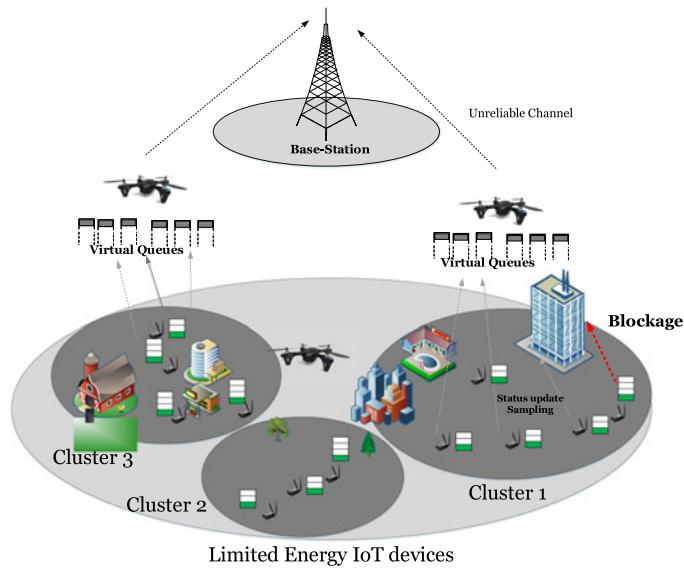  
Fig. 1. An illustration of our system model.

term AoI of multiple ground nodes. In [19], the authors optimized the UAV’s trajectory using deep Q-network algorithm to minimize the average AoI while preserving the packet loss ratio as low as possible. In [20], a deep Q-network algorithm is used to find the trajectory of a UAV that minimizes the weighted sum AoI of the ground nodes while considering the energy consumption of the UAV. In [21], a deep reinforcement learning with experience replay model is leveraged to design the trajectory of UAVs to maximize the total energy efficiency under average freshness and energy constraints. The authors of [22] utilized multi-agent deep reinforcement learning based on deep deterministic policy gradient (DDPG) to design the trajectory of UAVs that minimizes the AoI where the deployed UAVs can transmit the collected data either to the BS or ground devices. The authors of [23] combined optimization techniques and machine learning approach for obtaining the UAV’s trajectory the transmission scheduling that minimizes the normalized weighted sum of AoI. Another direction of research has focused on various tools such as dynamic programming and iterative optimization algorithm to design the flight trajectory of the UAV along with other communication parameters (e.g., energy, scheduling, collection time, etc.) [24], [25], [26], [27], [28], [29], [30], [31].

. . .In this work, different from the aforementioned works, we study the Age-of-Information in relay networks under unreliable transmission conditions in the absence of the knowledge of channel state information.

## 3 SYSTEM MODEL

Consider a geographical area, as shown in Fig. 1 where a number of IoT devices with limited capabilities is distributed over a given area and continuously sample time-sensitive information (that is, time-stamped, status-update packets). One-hop transmission is assumed not effective because transmission capabilities of IoT devices are limited, hence, multiple UAVs are deployed for relaying transmissions to the BS.

Given the distribution of IoT devices, multiple UAVs are deployed, each to cover one cluster of IoT devices. The hori- deployed, each to cover one cluster of IoT devices. The horizontal coordinates of each UAV zontal coordinates of each UAV $( x _ { U } , y _ { U } )$ are assumed to be placed at the center of the area. For simplicity, we assume each cluster consists of a set of M IoT devices.3 Let the locations of IoT devices be $( x _ { i } , y _ { i } , 0 ) , \forall i \in M$ at ground level. ð 0Þ 8 2Each IoT device is relayed by the closest UAV to the BS that is located at $( x _ { s } , y _ { s } , H _ { S } )$ , where $H _ { S }$ denotes the height of the BS.

ð ÞEach UAV is assumed to be equipped with $M ^ { \prime }$ virtual queues with $M ^ { \prime } > M ,$ , where the UAV only stores the latest received packet for each IoT. The UAV then schedules or retransmits to the BS if the transmission fails due to the unreliability of the channel. We consider the system over multiple time frames. Each of these frames is further divided into equal segments, that is, N time-slots of length $\delta _ { t } ,$ , which is normalized to unity. At the beginning of every time-slot $n ,$ the deployed UAV either remains idle or schedules an IoT device $i \in { 1 , 2 , \dots , M }$ to transmit its status-update packet over an 2 1 2 . . .unreliable wireless communication channel. The deployed UAV then relays the status-update packets over another unreliable wireless communication channel to the BS. The deployed UAV is assumed to operate in a half-duplex mode. Thus, the UAV can either transmit to the BS or receive statusupdate packets from IoT devices at a time. To achieve a reliable communication, dominant interference should be avoided. Thus, IoT devices in adjacent clusters use different spectrum and therefore, the inter-cell-interference can be considered as noise. Orthogonal transmission is exploited to avoid interference among IoT devices in each cluster.

The distance from the IoT devices to the $\mathrm { U A V } , d _ { i  U } ^ { n } ,$ and that from the UAV and BS, $d _ { U  S ^ { \prime } } ^ { n }$ in time-slot $n ,$ !are calculated as follows:

$$
d _ { i  U } ^ { n } = \sqrt { ( x _ { i } - x _ { U } ) ^ { 2 } + ( y _ { i } - y _ { U } ) ^ { 2 } + ( H _ { U } ^ { n } ) ^ { 2 } } ,\tag{}
$$

and

$$
d _ { U  S } ^ { n } = \sqrt { ( x _ { S } - x _ { U } ) ^ { 2 } + ( y _ { S } - y _ { U } ) ^ { 2 } + ( H _ { S } - H _ { U } ^ { n } ) ^ { 2 } } ,\tag{}
$$

where $H _ { U } ^ { n }$ is the altitude of the UAV in time-slot n.

## 3.1 IoT-UAV-BS Channel Model

Depending on whether there is a Line-of-Sight link between an IoT device and the UAV, and that between the UAV and the BS the received signal power is different. The probability of having a LoS depends on the actual environment and the distance between the IoT device and UAV and between the UAV and BS. The probability of establishing a LoS link between IoT-to-UAV is given by [32]

$$
\mathbb { P } _ { i  U } = \frac { 1 } { 1 + C _ { 2 } e ^ { - C _ { 1 } ( \theta _ { i , U } ^ { n } - C _ { 2 } ) } } ,\tag{}
$$

Similarly, between UAV-to-BS

$$
\mathbb { P } _ { U  S } = \frac { 1 } { 1 + C _ { 4 } e ^ { - C _ { 3 } ( \theta _ { U , S } ^ { n } - C _ { 4 } ) } } ,\tag{}
$$

where $\theta _ { i , U } ^ { n }$ and $\theta _ { U , S } ^ { n }$ are the elevation angle of IoT-to-UAV and UAV-to-BS, respectively. $C _ { 1 } , C _ { 2 } , C _ { 3 }$ and $C _ { 4 }$ are environ-1 2 3 4ment-dependent variables, which are varying from one topology to another, i.e., communication surrounding such as the building blockage and density. $\theta _ { i , U } ^ { n }$ and $\theta _ { U , S } ^ { n }$ are determined by

$$
\theta _ { i , U } ^ { n } = \arctan \frac { H _ { U } ^ { n } } { \sqrt { \left( x _ { i } - x _ { U } \right) ^ { 2 } + \left( y _ { i } - y _ { U } \right) ^ { 2 } } } ,\tag{}
$$

and

$$
\theta _ { U , S } ^ { n } = \mathrm { a r c t a n } \frac { \sqrt { \left( H _ { S } - H _ { U } ^ { n } \right) ^ { 2 } } } { \sqrt { \left( x _ { S } - x _ { U } \right) ^ { 2 } + \left( y _ { S } - y _ { U } \right) ^ { 2 } } }\tag{}
$$

Thus, the path-loss of IoT-to-UAV and UAV-to-BS, respectively, follows

$$
\Delta _ { i  U } ^ { n } = 2 0 \mathrm { l o g } ( \frac { 4 \pi f _ { c } ( d _ { i  U } ^ { n } ) } { c } ) + C _ { 5 } \mathbb { P } _ { i  U } + C _ { 6 } ( 1 - \mathbb { P } _ { i  U } ) .
$$

and

( )

$$
\Delta _ { U  S } ^ { n } = 2 0 \mathrm { l o g } ( \frac { 4 \pi f _ { c } ( d _ { U  S } ^ { n } ) } { c } ) + C _ { 7 } \mathbb { P } _ { U  S } + C _ { 8 } ( 1 - \mathbb { P } _ { U  S } ) .\tag{}
$$

where $C _ { 5 } , C _ { 6 } , C _ { 7 }$ and $C _ { 8 }$ are attenuation factors that depend 5 6 7on the environment. $f _ { c }$ denotes the carrier frequency (MHz), and c denotes the speed of light (m/s).

All IoT devices and the UAV are assumed to transmit with power $P _ { I }$ and $P _ { U } ,$ respectively. Let $S _ { i } ^ { n }$ and $S _ { U } ^ { n }$ be the achievable rate (in bps/Hz) that is delivered to the deployed UAV and BS, respectively. Given the available channel bandwidth W (in Hz), the achievable rate, $S _ { i } ^ { n }$ and $S _ { U } ^ { n } .$ , can be expressed as the follows:

$$
S _ { i } ^ { n } ( H _ { U } ^ { n } ) = W \log \bigg ( 1 + \frac { P _ { I } 1 0 ^ { \frac { - \Delta _ { i  U } ^ { n } } { 1 0 } } } { N _ { o } } \bigg ) ,\tag{}
$$

and

$$
S _ { U } ^ { n } ( H _ { U } ^ { n } ) = W \log \bigg ( 1 + \frac { P _ { U } 1 0 ^ { \frac { - \Delta _ { U  S } ^ { n } } { 1 0 } } } { N _ { o } } \bigg ) ,\tag{}
$$

In this scenario, depending on Channel State Information from IoT devices to the UAV (CSIU), and that from the UAV to the BS (CSIB), only a part of the status-update packet can be successfully recovered/decoded, which is random. In order to achieve a reliable transmission, $S _ { i } ^ { n }$ and $S _ { U } ^ { n }$ should be strictly greater than or equal to $S _ { t h }$ where $S _ { t h }$ is the minimum achievable rate to ensure reliable decoding.

Recall that the deployed UAV is equipped with a single antenna and operates in a half-duplex mode; hence, the service time can be divided into two processes: 1) Uplink process: where the deployed UAV is successfully able to reliably decode status-update packets of IoT device i when $S _ { i } ^ { n } ( \Delta _ { i  U } ^ { n } ) \geq S _ { t h . }$ , and a transmission failure occurs otherwise, ð ! Þ and 2) Downlink process: where the BS is successfully able to reliably decode status-update packets from the deployed UAV when $S _ { U } ^ { n } ( \Delta _ { U  S } ^ { n } ) \bar { \geq } S _ { t h }$ and a transmission failure ðoccurs otherwise.

Let $\alpha _ { 1 , i } ^ { n }$ be a binary variable, which indicates that IoT i is 1scheduled in time-slot n to transmit its status-update, and 0 otherwise. A successful transmission with reliable decoding occurs to the deployed UAV when $\alpha _ { 1 , i } ^ { n } \mathrm { ~ . ~ } \mathbb { 1 } [ S _ { i } ^ { n } ( \Delta _ { i  U } ^ { n } ) ] \frac { \ d s } { \ d t }$ $S _ { t h } ] = 1 . ^ { 4 }$ Similarly, let $\alpha _ { 2 , j } ^ { n }$ 1 ½ ð ! Þ be a binary variable, which indi- ¼ 1 2cates that the packet on the virtual queue j is scheduled in time-slot n to be transmitted to the BS, and 0 otherwise. A successful reliable transmission occurs to the BS when $\alpha _ { 2 , j } ^ { n } \mathrm { ~ . ~ } \mathbb { 1 } [ S _ { U } ^ { n } ( \Delta _ { U  S } ^ { n } ) \geq S _ { t h } ] = 1$ . With Time Division Multiple 2 !Access (TDMA), one packet at most is scheduled for transmission from the IoT device to the deployed UAV or from the UAV to the BS at any given time-slot. Thus, in each time-slot, each UAV only schedules at most one IoT to transmit its status-update. Therefore, the transmission scheduling should meet the constraint below

$$
\sum _ { i = 1 } ^ { M } \alpha _ { 1 , i } ^ { n } + \sum _ { j = 1 } ^ { M ^ { \prime } } \alpha _ { 2 , j } ^ { n } \leq 1 , \quad \forall n .\tag{}
$$

## 3.2 Definition of Age of Information

A single packet queuing discipline is assumed to be employed at both the IoT devices and the deployed UAV such that the older status-update packet is dropped and replaced with the newly arrived sample. A per time-slot sampling policy is considered for sampling the information, where each IoT device samples the status-update information at the beginning of each time-slot. Let $b _ { i } ^ { n }$ denotes the time elapsed at the UAV’s virtual queue, $Q _ { i }$ , associated with IoT device i in time-slot n. Thus, the evolution of $b _ { i } ^ { n }$ can be written as

$$
b _ { i } ^ { n + 1 } = \left\{ \begin{array} { l l } { 1 , } & { \mathrm { i f ~ } \alpha _ { 1 , i } ^ { n } . \Im \left[ S _ { i } ^ { n } ( H _ { U } ^ { n } ) \ge S _ { t h } \right] = 1 , } \\ { b _ { i } ^ { n } + 1 , } & { \mathrm { i f ~ } ( \beta _ { j } ^ { n } = 1 ) \land \left( \alpha _ { 1 , i } ^ { n } . \Im \left[ S _ { i } ^ { n } ( H _ { U } ^ { n } ) \ge S _ { t h } \right] = 0 \right) } \\ { 0 , } & { \mathrm { o t h e r w i s e ~ } ( i . e . , \beta _ { j } ^ { n } = 0 ) . / / e m p t y \ b u f f e r } \end{array} \right. ,\tag{}
$$

where $\beta _ { j } ^ { n }$ is a binary variable that is equal to 1 if the selected stream from virtual queue j has a non-empty queue, and 0 otherwise. Intuitively, the value of $\beta _ { j } ^ { n }$ changes to 0 only when the Head-of-Line status-update packet is successfully delivered to the BS and there is no newly arrival arrived on the same virtual queue. Thus, $\beta _ { j } ^ { n }$ can be written as

$$
\begin{array} { r } { \beta _ { j } ^ { n + 1 } = \left\{ \begin{array} { l l } { 1 , } & { \mathrm { i f ~ } \alpha _ { 1 , i } ^ { n } . \mathbb { 1 } \left[ S _ { i } ^ { n } ( H _ { U } ^ { n } ) \geq S _ { t h } \right] = 1 , } \\ { 0 , } & { \mathrm { i f ~ } \beta _ { j } ^ { n } . \alpha _ { 2 , j } ^ { n } . \mathbb { 1 } \left[ S _ { U } ^ { n } ( H _ { U } ^ { n } ) \geq S _ { t h } \right] = 1 , } \\ { \beta _ { j } ^ { n } , } & { \mathrm { o t h e r w i s e . } } \end{array} \right. } \end{array}\tag{}
$$

Accordingly, the evolution of $A _ { i } ^ { n }$ of IoT device i can be written5

$$
A _ { i } ^ { n + 1 } = \left\{ \begin{array} { l l } { b _ { i } ^ { n } + 1 , } & { \mathrm { i f ~ } \beta _ { j } ^ { n } . \alpha _ { 2 , j } ^ { n } . \mathbb { 1 } \left[ S _ { U } ^ { n } ( H _ { U } ^ { n } ) \geq S _ { t h } \right] = 1 , } \\ { A _ { i } ^ { n } + 1 , } & { \mathrm { o t h e r w i s e . } } \end{array} \right.\tag{}
$$

To better understand the definition of AoI, we provide an example in Fig. 2. The figure illustrates the evolution of AoI associated with one IoT device. The solid line represents the AoI of IoT device i and the dashed line denotes the elapsed time of the status update on the virtual queue, $Q _ { i } ,$ of the UAV. As shown, the elapsed time, $b _ { i } ^ { n } .$ , on the virtual queue of the UAV starts when a new status update is successfully received at the UAV. The elapsed time, $b _ { i } ^ { n } ,$ , is reset once the status update is successfully received at the BS and remains at zero before a new status update successfully arrives. AoI increases linearly at every time-slot between two successfully received updates at the BS and jumps downward to the elapsed time, $b _ { i } ^ { n } ,$ , when the status-update is received successfully. It is evident that the AoI of one IoT device is completely determined by the scheduling policy, the altitude of the UAV and Channel State Information. Thus, to obtain the AoI within the relay mission time, we use the EWSA $\begin{array} { r } { \frac { 1 } { N M } \mathbb { E } [ \sum _ { n = 1 } ^ { N } \sum _ { i = 1 } ^ { M } \xi _ { i } A _ { i } ^ { n } | A _ { i } ^ { 0 ^ { * } } = 0 ] , } \end{array}$ , where $\xi _ { i }$ is a positive ½ ¼1 ¼1 j ¼ 0weight that denotes the relative importance of the application associated with IoT device i.

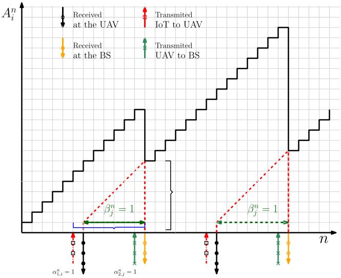  
Fig. 2. The evolution of AoI.

## 3.3 Optimization Problem Formulation

This paper aims at optimizing communication scheduling and UAV altitude in order to minimize the Expected Weighted Sum AoI. For ease of notation, let us denote $\mathbf { L } =$ $\{ H _ { U } ^ { n } , \forall n \}$ and $\mathbf { S } = \{ \alpha _ { 1 , i } ^ { n } , \alpha _ { 2 , j } ^ { n } , \forall i , j , n \}$ ¼. Thus, our optimization f 8 g ¼ f 1problem is formulated as

OP : min 1 E X X iAni A0i N M   
min L;S 1NM   
n i   
¼1 ¼1   an;i ; ; i; n;   
1  an;j ; ; j; n;   
bn ; ; j; n; b0 ; j;   
C4 : (15)   
Hmin Hn Hmax; n;   
C6 : (16),   
C7 : (17),   
C8 : (18),   
Hnþ1 Hn V dt; n ; ; N :

Constraint denotes the UAV altitude constraint, with $H _ { m a x }$ and $H _ { m i n }$ 5denoting the maximum and minimum altitude, respectively. Table 1 provides a summary of the variables and parameters used in the formulation. Finally, limits the traveled vertical distance by the UAV in one time slot based on its maximum speed $V _ { \mathrm { m a x } } .$

TABLE 1 Table of Notations
<table><tr><td>Parameters</td><td>Description</td></tr><tr><td> $\mathcal { M }$ </td><td>Set of IoT devices.</td></tr><tr><td> $( x \boldsymbol { v } , \boldsymbol { y } \boldsymbol { U } )$ </td><td>UAV horizontal coordinates.</td></tr><tr><td> $( x _ { i } , y _ { i } , 0 )$ </td><td>Position of IoT i.</td></tr><tr><td> $H _ { S }$ </td><td>BS&#x27;s altitude.</td></tr><tr><td> $N$ </td><td>Total number of time slots.</td></tr><tr><td> $\delta _ { t }$ </td><td>Time slot duration.</td></tr><tr><td> $C _ { 1 } \mathrm { - } C _ { 8 }$ </td><td>Environment-dependent variables.</td></tr><tr><td> $f _ { c }$ </td><td>Carrier frequency.</td></tr><tr><td> $c$ </td><td>Speed of light.</td></tr><tr><td> $W$ </td><td>Channel bandwidth.</td></tr><tr><td> $N _ { o }$ </td><td>Noise power.</td></tr><tr><td> $P _ { I }$ </td><td>IoT transmission power.</td></tr><tr><td> $P _ { U }$ </td><td> $\mathrm { U A V } ^ { \prime } \mathbf { s }$  transmission power.</td></tr><tr><td> $H _ { m a x }$ </td><td>Maximum altitude of the UAV.</td></tr><tr><td> $H _ { m i n }$ </td><td>Minimum altitude of the UAV.</td></tr><tr><td> $V _ { \mathrm { m a x } }$ </td><td>Maximum speed of the UAV.</td></tr><tr><td> $s _ { n } , a _ { n } , r _ { n }$ </td><td>State, action, reward at time-slot n.</td></tr><tr><td> $S _ { t h }$ </td><td>Minimum rate for reliable decoding.</td></tr><tr><td> $\mathbf { V a r i a b l e s }$ </td><td>Description</td></tr><tr><td> $H _ { U } ^ { n }$ </td><td>UAV&#x27;s altitude at time-slot  $n _ { \ast }$ </td></tr><tr><td> $\alpha _ { 1 , i } ^ { n }$ </td><td>Indicates if IoT i is scheduled for transmission at time-slot n.</td></tr><tr><td> $\alpha _ { 2 , j } ^ { n }$ </td><td>Indicates if virtual queue j is scheduled for</td></tr><tr><td> $z _ { i } ^ { n }$ </td><td>transmission at time-slot n. Indicates if reliable transmission is achieved</td></tr><tr><td> $g ^ { n }$ </td><td>between IoT i and UAV at time-slot n. Indicates if reliable transmission is achieved between UAV and BS at time-slot n.</td></tr></table>

Problem $\mathcal { O P }$ maxis hard to solve as a result of the intracta-OPbility of the objective function, Eqs. (14), (15) and (16), for which an exact derivation cannot be achieved. In order to overcome this difficulty, we formulate a closed-form expression for an upper bound of $b _ { i } ^ { n + 1 }$ and $A _ { i } ^ { n + 1 }$ , see Appendix A for details, which can be found on the Computer Society Digital Library at http://doi.ieeecomputersociety.org/ 10.1109/TMC.2020.3042925, and reformulate $\mathcal { O P }$ as

$$
\begin{array} { r l } {  { \mathcal { O P } \bot \underset { \lfloor \mathbf { k } , \mathbf { n } \rfloor , \boldsymbol { \xi } \in \mathcal { K } } { \prod } \mathbf { 1 } } \quad \mathbf { 1 } } & { \displaystyle \sum \sum \Biggl _ { i = 1 } ^ { N } \sum _ { i = 1 } ^ { M } \xi _ { i } A _ { i , i + 1 } ^ { 2 } \boldsymbol { A } _ { i , i + 1 } ^ { 2 } = 0 \Biggr ] } \\ & { \mathrm { s . t . } \ C 1 : \alpha _ { 1 , i } ^ { 1 } \in \{ 0 , 1 \} , \forall i , n , } \\ & { \displaystyle C 2 : \alpha _ { 2 , j } ^ { 2 } \in \{ 0 , 1 \} , \forall j , n , } \\ & { \displaystyle C 3 \cdot \beta _ { i , i + 1 } ^ { 2 } \in \{ 0 , 1 \} , \forall j , n , \beta _ { i , i } ^ { 2 } = 0 , \forall j , } \\ & { \displaystyle C 4 : ( 1 5 ) , } \\ & { \displaystyle C 5 : I m _ { i } \simeq I _ { \Gamma } ^ { \prime } \leq I I _ { n \alpha } \leq I I _ { n \alpha \alpha ^ { \prime } } \ , \ \forall n , } \\ & { \displaystyle C 6 : \ ( 2 5 u ) , ( 2 5 8 ) , ( 2 5 6 ) , ( 2 7 \alpha ) , ( 2 7 \beta ) , } \\ & { \displaystyle C 7 : ( 2 6 \alpha ) , ( 2 6 8 ) , ( 2 6 8 ) , ( 2 9 \beta ) , ( 2 5 6 ) , } \\ & { \displaystyle C 8 : ( 2 8 \alpha ) , ( 2 8 8 ) , } \\ &  \displaystyle C 9 : \mu _ { n \alpha ^ { \prime } } ^ { \prime } \equiv I _ { n \alpha } ^ { \prime } \} \end{array}
$$

Constraint $\mathcal { C } 6 ^ { * }$ is the closed form expression of constraint C6. captures the time elapsed at the UAV’s virtual queue C6 C6under the reliability condition. Similarly, constraint $\mathcal { C } 7 ^ { * }$ C7replaces constraint . ensures that the device’s data is C7 C7successfully received by the UAV iff the transmission is reliable. Constraint $\boldsymbol { \mathcal { C } } \boldsymbol { 8 } ^ { * }$ replaces constraint .

Due to the randomness of the environment, : is a OP 1constrained stochastic optimization problem over the UAV operating time N. To the best of our knowledge, offline solutions are generally impractical since it is mathematically difficult to track the AoI over unknown channel condition. In fact, in the actual deployment of UAVs, obtaining complete information on channel quality (LoS/NLoS channels) depends on the location of the UAV and the surrounding environment (height/density of buildings). It also requires an excessive measurement, which is not easy to perform in practice. In addition, the LoS/NLoS links and the received signal strength may alter frequently as horizontal coordinates of the deployed UAV change with clustering. It is important to note that deploying the UAV with the freespace channel model is practically inaccurate and may result in considerable degradation of performance due to the blockage that exists in the actual environment.

We also observe that : is a mixed integer non-linear OP 1program (MINLP), which is generally hard to solve, due to the existence of the binary variables $\dot { \alpha _ { 1 , i } ^ { n } } , \alpha _ { 2 , j } ^ { n } , \beta _ { j , u b } ^ { n } , z _ { i } ^ { n }$ and $g ^ { n }$ 1 2In addition, linear programming (LP) or dynamic programming methods might be infeasible for such large scale problems. Hence, our problem is reformulated as MDP and online DRL is exploited to find the best policy to control the altitude of the UAV and the schedule between the IoT to the UAV and between the UAV and the BS. The proposed online DRL approach does not rely on a prior knowledge of the channel conditions, where the environment variables are unknown, i.e., $( C _ { 1 } : C _ { 8 } )$ . In the next sections, the pro-1 : 8posed solution methodology for solving our formulated problem is described.

## 4 PROPOSED SOLUTION

Here, an AI-agent is deployed on the UAV which interacts with the BS and IoT devices in a sequence of actions. The AIagent observes the rewards and steadily learns the optimal altitude and scheduling policy. At each time-slot n, the AI agent decides an action for the deployed UAV. To design a framework for adjusting the altitude of the UAV and finding a scheduling policy is a non-trivial challenge. This is because the considered scenario is a hybrid discrete-continuous action space problem and the altitude and scheduling are also closely coupled with each other in the considered problem. These increase the difficulty of solving the problem. To tackle the first challenge, we approximate the hybrid space by discretizing the altitude of the UAV into discrete values and solving the problem with an efficient online DRL algorithm that uses Proximal Policy Optimization [4].

The AI-agent may have to execute two actions simultaneously. For instance, the deployed UAV might need to adjust its altitude and at the same time, schedule an IoT device. Most of the existing RL approaches however treat each action (altitude adjustment and scheduling) independently and thus, learn each action separately. Combining the two actions into one single action could be one way to deal with this challenge. However, for an environment with M IoT devices that need to be scheduled as well as a UAV, with Q discrete values, whose altitude needs to be adjusted, a total of $( Q \times M )$ possible actions need to be considered. ð 	 ÞThis could increase the difficulty of learning for the AIagent. To maintain a small size of the action space, the altitude and scheduling actions are concatenated into a single action space and the AI-agent is allowed to execute one action per time slot. In other words, at a given time, the AIagent will either adjust the altitude of the UAV or schedule a transmission. The AI-agent will learn to allocate more time slots for scheduling since it is not necessary to frequently adjust the altitude at every time slot.

The next subsection presents the system state representation as well as the rewards and penalties associated with the agent’s actions.

## 4.1 MDP Formulation

We first formulate the scheduling and altitude decision problem as an MDP, and design a PPO algorithm, in order to find the best policy that governs the altitude of the deployed UAV and the scheduling decision within unknown environment. MDP is usually represented by 4-tuple $( \mathcal { S } , \mathcal { A } , \mathcal { P } , \mathcal { R } )$ , in which

A set of states which includes all possible states $s _ { n }$ Sat any time-slot n, where $s _ { n } \in S .$

2 SA set of actions which includes all feasible actions $a _ { n }$ Aat any time-slot n, where $a _ { n } \in { \mathcal { A } } .$

A transition distribution ${ \mathcal P } ,$ 2 Awhere $P ( s _ { n + 1 } | s _ { n } , a _ { n } )$ $s _ { n } , s _ { n + 1 } \in S , \ a _ { n } \in A$ P ð þ1j Þis the probability that leads to þ1 2 Sthe new state, $s _ { n + 1 } ,$ after executing an action $a _ { n }$ at the state $s _ { n } .$

A reward distribution where, $P ( r _ { n } | s _ { n } , a _ { n } ) , s _ { n } \in S ,$ $r _ { n } \in R , a _ { n } \in { \mathcal { A } }$ R ð j Þ 2 Sis a measurable function which gives 2 2 Aan immediate reward after an action $a _ { n }$ is chosen in a state $s _ { n }$ at time-slot n

Under the MDP framework, we will elaborate the state, action, and reward functions sequentially as follow

1) State : The state at time slot n is defined as $s _ { n } =$ $( A ^ { n } , \beta ^ { n } , b _ { i } ^ { n } , S _ { i } ^ { n } , S _ { U } ^ { n } )$ , where:

$A ^ { n } = ( A _ { 1 } ^ { n } , . . . . , A _ { i } ^ { n } , . . . . , A _ { M } ^ { n } ) !$ a vector of size M con-¼ ð 1 . . . . . . Þtaining the AoI of all the IoT devices at time-slot n.

$\beta ^ { n } = ( \beta _ { 1 } ^ { n } , \cdot \cdot \cdot \cdot \beta _ { j } ^ { n } , \cdot \cdot \cdot \cdot \beta _ { M } ^ { n } ) \colon$ a vector of size M contain-¼ ð 1 . . . . . . Þing the status of the virtual queue $\forall i \in M ,$ at timeslot n.

$b ^ { n } = ( b _ { 1 } ^ { n } , \ldots . b _ { i } ^ { n } , \ldots . . . b _ { M } ^ { n } ) \colon$ a vector of size M contain-¼ ð 1 . . . . . . Þing the time elapsed at the UAV’s virtual queue associated with all IoT devices, at time-slot n.

$S ^ { n } = ( S _ { 1 } ^ { n } , \ldots \ldots S _ { i } ^ { n } , \ldots . . . S _ { M } ^ { n } ) \colon$ : a vector of size M con-¼ ð 1 . . . . . . . . .taining the achievable rate $\forall i \in M ,$ , at time-slot n.

$S _ { U } ^ { n } \mathbf { : }$ 8 2: the status-update size that could be delivered to the BS, at time-slot n

2) Action : At each step-slot $n ,$ the deployed UAV exe-Acutes an action $a ^ { n } .$ , The current composite action $a ^ { n }$ is denoted by

$$
a _ { n } = ( \xi ^ { n } , \psi ^ { n } , \kappa ^ { n } ) ,\tag{}
$$

where $\xi ^ { n } , \psi ^ { n }$ and $\kappa ^ { n }$ are defined and interpreted as follows:

Defined row vector $\xi ^ { n } = [ \alpha _ { 1 , 1 } ^ { n } , . . . . . \alpha _ { 1 , i } ^ { n } , . . . . . \alpha _ { 1 , M } ^ { n } ] ,$ where $\alpha _ { 1 , i } ^ { n }$ ¼ ½ 1 1 . . . 1 . . . 1represents the schedule control from IoT 1device i to the UAV, and each element $\alpha _ { 1 , i } ^ { n } \in 0 ,$ 1 where $\alpha _ { 1 , i } ^ { n } = 0$ 1 2 0 1means the IoT device is not scheduled 1 ¼ 0to transmit its status-update at time-slot $n ,$ and $\alpha _ { 1 , i } ^ { n } =$

Defined row vector $\boldsymbol { \psi } ^ { n } = [ \alpha _ { 2 , 1 } ^ { n } , . . . . . \alpha _ { 2 , i } ^ { n } , . . . . \alpha _ { 2 , M ^ { \prime } } ^ { n } ] ,$ where $\alpha _ { 1 , i } ^ { n }$ ¼ ½ 2 1 . . . 2 . . . 2 0represents the schedule control from UAV’s 1virtual queue $j$ to the BS, and each element $\alpha _ { 2 , j } ^ { n } \in 0 , 1$ where $\alpha _ { 2 , j } ^ { n } = 0$ 2 2 0 1means the status-update on virtual queue $j$ 2 ¼ 0is not scheduled to transmit its status-update at time-slot $n ,$ and $\alpha _ { 2 , j } ^ { n } = 1$ means it is scheduled to transmit to the BS.

Defined row vector $\kappa ^ { n } \in ( K _ { U p } , K _ { D o w n } )$ , where $K _ { U p }$ 2 ðrepresents the upward flight, and $K _ { U p } \in { 0 , 1 }$ , where $\dot { K _ { U p } } = 1$ means the UAV adjusted its altitude 10 ¼ 1meter upward at time-slot $n ,$ and $K _ { U p } = 0$ means no action towards upward flight. $K _ { D o w n } = 1$ 0means the ¼ 1UAV adjusted its altitude 10 meter downward at time-slot $n ,$ and $K _ { D o w n } = 0$ means no action towards ¼ 0downward flight. In other words, when $K _ { U p } =$ $K _ { D o w n } = 0$ that means the UAV is hovering.

¼ 0Hence, the deployed UAV adjusts its altitude and decides which IoT device to transmit its status-update or schedule the transmission from UAV’s virtual queue to the BS.

3) Reward : The immediate reward $r _ { n }$ is the sum of the Rfollowing normalized quantities:

Penalty from the IoT network when the UAV collects status-updates from IoT devices with high AoI: the value of this penalty is proportional to the summation of all AoI. As a result, the AI-agent learns to minimize this penalty by optimizing scheduling decisions between IoT-to-UAV and UAV-to-BS and altitude control of the UAV in order to relay the old status-update (i.e., highest AoI) from IoT devices.

Penalty incurred on network if the deployed UAV flies outside the given altitude constraint $h _ { \mathrm { m i n } }$ and $h _ { \mathrm { m a x } } \colon$ minthe AI-agent learns how to adjust the altitude maxof the UAV to be within altitude range.

Generally, an MDP problem can be solved using Dynamic Programming algorithms or Linear Programming. However, since the UAV is deployed with no prior knowledge on the environment, then Dynamic Programming or Linear Programming algorithms cannot be leveraged to solve the formulated MDP problem. Thus, to solve the formulated MDP problem in absence of the state transition probabilities $\mathcal { P }$ of the Markov model, an online model-free DRL algorithm is employed in the next subsection.

## 4.2 Proximal Policy Optimization Proposed Solution

Our PPO-based solution to altitude control and scheduling policy is described in this section. As previously mentioned, our main objective is to find the online control policy that governs the altitude and scheduling policy of the UAV at each time-slot to minimize the EWSA. To solve the control problem in the absence of the channel conditions and state transition probabilities of our MDP model, we leverage the online DRL algorithm where the AI-agent interacts with the wireless network environment and learns the control policy online. To solve our problem, we adapt the PPO, which is a stability algorithm (in term of Actor training) with outstanding performance. To obtain the online control policy, the proposed PPO algorithm, presented in Algorithm 1, is applied. The proposed algorithm can be divided into three parts as follows:

The initialization phase is the first part. After defining the input and output of the algorithm (Lines 1-2), the proposed algorithm randomly initializes the DNNs parameter $\theta ,$ where DNNs have the same structure. An actor and a critic network with random weights (Lines 3-4) are initialized. Training is conducted over multiple iterations at which the proposed algorithm alternates between sampling phase (lines 6-14) and optimization/exploration phase (lines 18- 22). Each iteration corresponds to several episodes (actors) and each episode corresponds to multiple trajectories $( \mathrm { i . e . , }$ sequence of states, actions and rewards).

Algorithm 1. Proposed PPO Solution to Obtain Dynamic   
UAV Altitude Control and Scheduling Policy   
1: Input: Clip threshold $\epsilon ,$ discount factor, learning rate,   
Adam optimizer parameters and wireless communication   
parameters;   
2: Output: The altitude control of UAV and scheduling policy.   
3: Initialize the Neural Networks parameter u randomly.   
4: Initialize the sampling policy $\pi _ { \theta _ { o l d } }$ with $\theta _ { o l d }  \theta .$   
5: for Iteration $\mathrel { \mathop : } = \bar { 0 , 1 , \ldots }$ do   
6: for $l { = } 0 , 1 , \ldots L$ do   
7: " //Sampling with $\pi _ { \theta _ { o l d } } . / / $   
8: for $i { = } 0 , \bar { 1 } , \ldots \bar { M }$ do   
9: Observe: $( A _ { i } ^ { l } , \beta _ { i } ^ { l } . b _ { i } ^ { l } , S _ { i } ^ { l } , S _ { U } ^ { l } ) ,$   
10: ðSample: sample action $a _ { l } \sim \pi _ { \theta _ { o l d } } .$   
11: Execute: execute the action a that specifies the altitude   
of the UAV, the scheduling IoT-to-UAV and the sched  
uling UAV-to-BS.   
12: if UAV flies outside the allowable altitude range $h _ { \mathrm { m i n } }$ and   
$h _ { \mathrm { m a x } }$ then   
13: $r _ { l } = r _ { l } - P .$   
14: ¼ Cancel the movement of UAV and update $s l { + 1 }$   
15: Evaluate: obtain the weighted sum $\operatorname { A o I } , r _ { l } ,$ þ1and new   
state $s l { + } 1 \cdot$   
16: þ1Cache: store the trajectory $( s _ { l } , a _ { l } , r _ { l } , s _ { l + 1 } )$ in policy training $f _ { l } .$   
17: Compute advantage estimate $\forall L .$   
18: for epoch= $\ 0 , 1 , .$ . do   
19: $\triangleright / / O p t i m i z i n g \pi _ { \theta }$ and Exploring//.   
20: Compute the PPO-Clip objective Function (3).   
21: Fit the value network via stochastic gradient descent   
with ADAM $( V _ { \theta } ( s _ { n } ) - V _ { n } ^ { t a r g } ) ^ { 2 } ,$   
22: ð ð Þ  ÞOptimize the the overall objective Function (4),   
and update the policy via SGA with ADAM, i.e.,   
$\theta \gets \mathrm { a r g m a x } _ { \theta } L ^ { t o t a \hat { l } } ( \theta )$   
23: arg max ð ÞSynchronize the sampling policy with $\theta _ { o l d }  \theta .$   
24: Drop the stored data.

The sampling phase is the second part (lines 6-17). In this phase, the AoI, time elapsed, queue status, and the achievable rate between IoT-to-UAV and UAV-to-BS, $( A _ { i } ^ { n } , \beta _ { i } ^ { n } . b _ { i } ^ { n }$ $S _ { i } ^ { n } , S _ { U } ^ { n } )$ ðare observed by the UAV (lines 8-9). , , and of $\mathcal { O P }$ C3 C6 C7are guaranteed in Line 9 where the states of the C8 OPMDP are defined. In addition, is also guaranteed by the definition of the action space $\kappa ^ { n }$ 9in the MDP. The UAV then decides the best control policy, according to sampled action $a _ { l }$ from the policy $\pi _ { \theta _ { o l d } }$ (line 10). The sampled action, $^ { a _ { l } , }$ represents the current altitude of the UAV and scheduling status for each IoT device and virtual queue. , and of C1 C2 C4 OPare guaranteed in Line 11 where the deployed UAV decides which IoT device to transmit its status-update or schedule the transmission from UAV’s virtual queue to the BS. In this July 05,2026 at 12:43:37 UTC from IEEE Xplore. Restrictions apply.

step the algorithm assigned a binary variable $^ { \prime \prime } { } _ { 1 } \prime \prime$ to the selected IoT device or virtual queue and assigned $\prime \prime 0 \prime \prime$ for other IoT devices and virtual queues. During the sampling phase, the online algorithm guides the AI-agent to avoid actions that violate the altitude constraint $( \mathrm { i . e . , }$ flies outside the allowable altitude) by applying a specific penalty to the reward (Lines 12-14), where, a penalty $p$ is deducted from the overall reward, and the corresponding altitude action of the UAV is cancelled. Thus, the UAV altitude constraint is C5guaranteed in these Lines. In fact, online Machine Learning Algorithm such as online DRL may lead to poor performance (or even harmful actions) if not well designed or the inputs to a DRL system can be accessed and modified adversely. The consequence of such attacks is not major, in this work, since we apply online DRL to run a non-critical application. The major consequence of such attacks may change the altitude of the UAVs or change the scheduling policy, thus, disturb the communication (i.e., network operation). However, we already considered the case when the UAV flies outside the allowable altitude range during training. Specifically, the DRL agent will cancel the movement of the UAVs before UAVs fly out of the range (Line 14). Therefore, this constraint will ensure only safe actions.

After executing the current action (line 11), the UAV evaluates the expected reward (line 15), which represents the sum of the AoI for all IoT devices. In this phase, we collect $G \times L$ trajectories for training, represented as $( s _ { 0 } , a _ { 0 } , r _ { 0 } , s 1 , a _ { 1 } \dots a . . . )$ 0 0 0 1 1 . . . Þwhere G is the number of episodes and L is the total number of rollout steps each episode takes between updates. The trajectories’ data are stored for the next phase (line 16). In order to achieve parallel processing among the episodes, a Message Passing Interface (MPI) protocol is employed. Last but not least, the estimations of the advantage function for each rollout step are computed (line 17), according to [4], to achieve efficient training.

The optimization phase is the third part (lines 18-22). The network parameter u of the policy $\pi _ { \theta }$ is updated for each epoch. The PPO Clip objective function in each epoch is computed according to Eq. (3). The policy $\pi _ { \theta }$ is optimized or improved by conducting SGA on the stored sampled data based on the PPO Clip objective function. After optimizing the network parameter, the policy is updated (lines 21-22), according to the overall objective function in Eq. (4). A random policy is exploited in this phase, according to the entropy bonus in Eq. (4) for exploration. Finally, the sampling policy $\pi _ { \theta _ { o l d } }$ is updated with the policy $\pi _ { \theta }$ and the stored samples are removed (lines 23-24). The next iteration then begins.

## 4.3 PPO Analysis

## 4.3.1 Complexity

In this subsection, the complexity analysis is discussed. In practice, PPO usually is implemented in Actor-Critic framework, where more objective functions are added to the surrogate objective. The complexity of DRL approaches such as Actor-Critic framework is usually computed by the number of multiplications in each iteration. Therefore, based on [33], the total computational complexity for the fully connected layers can be expressed as the number of multiplications: $\begin{array} { r } { \dot { O ( \sum _ { p = 1 } ^ { P - 1 } n _ { p } . n _ { p - 1 } ) } _ { \ast } } \end{array}$ , where $n _ { p }$ is the number of neural units in 1Þ Authorized licensed use limited to: Guangxi University. Downloaded o the pth hidden layer. The number of multiplications at input and output layers is insignificant compared with the number of multiplications at the hidden layers, therefore, the number of multiplications at input and output layers is ignored in our analysis. In this work, we design the PPO architecture with the same number of neural units, denoted by $n _ { p } ,$ in all hidden layers. Therefore, the complexity of the proposed PPO can be reduced to ${ \cal O } ( ( P - 1 ) . n _ { p } ^ { 2 } ) { \overset { \bullet } { \sim } } { \cal O } ( { \bar { n } } _ { p } ^ { 2 } )$

TABLE 2 List of Simulation Parameters
<table><tr><td>Parameter</td><td>Value</td></tr><tr><td>UAV vertical Max Speed,  $\omega _ { m a x } [ \mathrm { m } / \mathrm { s } ]$ </td><td>10</td></tr><tr><td>Geographical area size  $[ \mathrm { K m ^ { 2 } } ]$ </td><td>1</td></tr><tr><td>Activation Functions</td><td>Softmax and Tanh</td></tr><tr><td>Minimum flying altitude of  $\mathrm { U A V } , h _ { \operatorname* { m i n } }$ </td><td>10m</td></tr><tr><td>Total number of time slots, N</td><td>300</td></tr><tr><td>Minimum flying altitude of UAV,  $h _ { \mathrm { m a x } }$ </td><td>1000m</td></tr><tr><td>Learning Rate</td><td>0.001</td></tr><tr><td>Reward Discount</td><td>0.9</td></tr><tr><td>Number of Hidden Layers for Networks</td><td>3</td></tr><tr><td>Number of Neurons</td><td>64</td></tr><tr><td>Loss Coefficients  $K _ { 1 }$  and  $K _ { 2 }$ </td><td>0.5 and 0.01</td></tr><tr><td>Update Policy Length, L</td><td>240</td></tr><tr><td>Total number of Epochs</td><td>2000</td></tr><tr><td>Number of Episodes (actors)</td><td>4</td></tr><tr><td>Clip Fraction, €</td><td>0.2</td></tr><tr><td>Optimizer Technique</td><td>Adam</td></tr><tr><td>UAV transmission power,  $P _ { U }$ </td><td>30 dBm</td></tr><tr><td>IoT transmission power,  $P _ { I }$ </td><td>10 dBm</td></tr><tr><td>Channel Gain  $, \gamma _ { 0 }$ </td><td>-50 dB</td></tr><tr><td>Noise Power,  $N _ { o }$ </td><td>-110 dBm</td></tr></table>

## 4.3.2 Convergence

In general, the convergence of a neural network (NN) is challenging and hard to be analytically analyzed [34]. The reason lies in that the convergence of a NN is highly dependent on DRL hyper-parameters, in which the quantitative relationship between the NN convergence and the hyperparameters is sophisticated. Therefore, a reasonable choice of the hyper-parameters is required in order to achieve the convergence. In fact, we tried various values for PPO hyper-parameters in the process of debugging, we found the best values are the ones that are given in the simulation parameters table while changing these values was often counterproductive. Similar to [34], in this work, we limit our analysis of convergence to simulations (see Fig. 5) where it is observed that our PPO algorithm converges under a reasonable choice of the hyper-parameters.

## 5 SIMULATION AND NUMERICAL ANALYSIS

In this section, we conduct a series of simulations to evaluate the performance of the proposed algorithm. First, we describe the simulation parameters and system settings and then present results and discussions. The main input parameters are listed in Table 2.

## 5.1 Simulation Setup

Unless otherwise specified, a square area of 1 km 1 km is 	considered as a single cluster for ease of illustration. Multiple IoT devices were distributed randomly within the 2D-July 05,2026 at 12:43:37 UTC from IEEE Xplore. Restrictions apply.

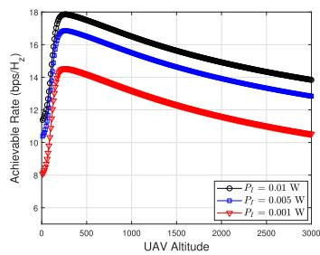  
(a) Sub-Urban Region.

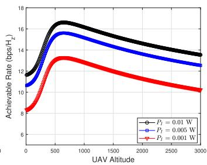  
(b) Urban Region.

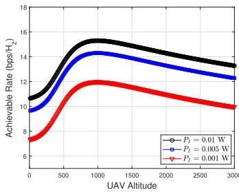  
(c) Dense-Urban Region.

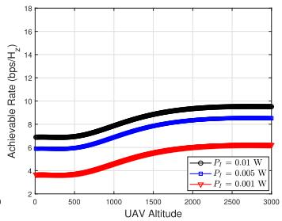  
(d) High-Rise Urban Region.

Fig. 3. Achievable rate versus UAV’s altitude for IoT-to-UAV communication.  
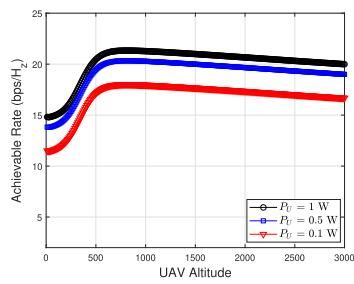  
(a) Sub-Urban Region.

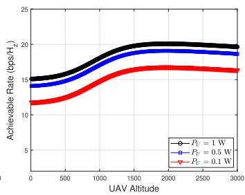  
(b) Urban Region.

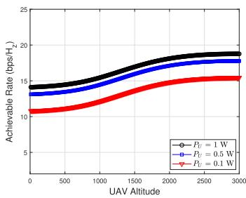  
(c) Dense-Urban Region.

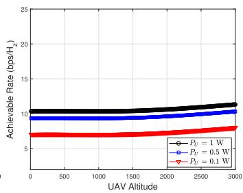  
(d) High-Rise Urban Region.  
Fig. 4. Achievable rate versus UAV’s altitude for UAV-to-BS communication.

field. A single UAV is deployed at the center of the given area to relay multiple traffic streams from IoT devices to the BS located at (2000,500,25) m. Assume that all the IoT devices have the same transmission power and all devices have the same weight, which normalized to unity. All IoT devices can communicate with the deployed UAV at different rates according to channel conditions. The results are collected after the training phase (3M samples) and each sample corresponds to a snapshot of the IoT network at a particular time slot. Similar to [35], CSIU and CSIB are obtained for both IoT-to-UAV and UAV-to-BS.

For each network (that is, the actor and critic networks), all simulations are run for fully connected three-layer neural networks that comprise of 64 neurons in each layer. The hyperbolictangent (tanh) function is utilized for activation of both networks while Softmax is used in the last layer. The generated samples are used to train the deep neural network by utilizing PyTorch Deep Learning library to determine an optimal policy for the deployed UAVs. After establishing the altitude control and scheduling policy from the proposed algorithm, another sample set is used to test the performance of the proposed algorithm.

## 5.2 Benchmark Schemes

To the best of our knowledge, there is no existing approach that aims to solve a similar problem in UAV assisted IoT networks; thus, for the sake of comparison, we develop two other baseline approaches:

Random Deployment with Random Scheduling (RDRS): In the RDRS scheme, at each time slot, the deployed UAV randomly changes its vertical movement. Also, the UAV either randomly selects an IoT device to upload its status update packets to the UAV or to the BS. Meanwhile, if there is no status update packet in the UAV’s virtual queue, then the UAV abandons this action and randomly selects another action.

Heuristic Deployment with Greedy Scheduling (HDGS): In the HDGS approach, the deployed UAV iteratively searches for the lowest height that satisfies the reliability constraint of the BS. Then, at each time slot, the UAV selects an IoT device with the highest AoI to upload its status update packets to the UAV. The UAV selects packets from the virtual queue to be uploaded to the BS in the next consecutive time slot. Meanwhile, if the reliability constraint of the UAV is not satisfied, the UAV selects the next IoT device with the highest AoI.

## 5.3 Results and Discussions

Before delving into the performance of PPO algorithm, we first investigate the impact of the UAV’s altitude on the achievable rate under different environments. The simulation results are demonstrated in Fig. 3 for a single IoT device located 1 km from the deployed UAV. As depicted in Figs. 3 and 4, the achievable rate curves rise to their maximum value and then decrease with increasing UAV’s altitude. Thus, the required achievable rate and environment that the UAV operates at indicate the best altitude of the UAV. The same behavior is observed for different environments. Detailed parameters regarding the environment are listed in Table 3. When the UAV flies at the optimal altitude with respect to the IoT device, the path loss between the UAV and the BS increases because of obstacles blocking the way. When the UAV flies at the optimal altitude with respect to the BS, the path loss between the UAV and the IoT increases due to longer distance. It was also observed that the achievable rates in sub urban and urban environments are larger than in the dense urban and high rise urban environments due to the presence of more obstacles such as buildings. As the transmission power is further increased, a higher performance is achieved. The findings here show that based on the environment, attaining a certain target performance requires the optimization of the altitude of the UAV. Therefore, the AoI is strongly dependent on the optimum altitude of the UAV under specific conditions of the environment.

TABLE 3  
List of Parameters for Different Environments
<table><tr><td>Parameter</td><td>Sub-Urban</td><td>Urban</td><td>Dense-Urban</td><td>High-Rise Urban</td></tr><tr><td>C1, C3</td><td>0.43</td><td>0.16</td><td>0.11</td><td>0.08</td></tr><tr><td> $c _ { 2 } , c _ { 4 }$ </td><td>4.88</td><td>9.61</td><td>12.08</td><td>27.23</td></tr><tr><td> $c _ { 5 } , c _ { 7 }$ </td><td>0.1</td><td>1.6</td><td>1</td><td>2.3</td></tr><tr><td> $c _ { 6 } , c _ { 8 }$ </td><td>21</td><td>20</td><td>23</td><td>34</td></tr></table>

Next, the convergence performance of the proposed PPO versus the number of iterations is studied. The convergence is evaluated with M IoT devices and $S _ { t h } = 1 5 ~ \mathrm { { b p s / H z } }$ ¼ 20 ¼ 15in Fig. 5. As presented in the figure, the cumulative reward increases relatively quickly at the beginning of learning after which the increase becomes relatively slow. The reason is that, at the beginning of the iterations, the AI agent learns the altitude violation of the UAV such as minimum and maximum allowable altitude. Moreover, many IoT devices are not yet properly scheduled to transmit their status update packets to the UAV and from the UAV to the BS. This is because the UAVs have not yet learned the suitable scheduling policy in the deployed environment in order to attain the required reliability that minimizes the EWSA. The trained AI agent can significantly enhance the defined reward with each iteration. This improvement gradually becomes less obvious when the AI-agent is well trained about the environment and it starts to effectively adapt the scheduling policy.

To better understand how the action-space affects the performance of the proposed algorithm, an AI-agent is trained for multiple actions (that is, concurrent actions) per time slot and results are compared to those for a single action per time slot. For the evaluation, $M = 5 0$ is considered as the number ¼ 50of IoT devices. For multiple actions per time slot, all possible combinations of actions are modeled as separate actions. The action space reaches $( 2 * M * 3 )$ actions, where 2 represents 2   3the scheduling decision (that is, IoT to UAV and UAV to BS) and 3 represents the altitude control action (that is, flying up, down and hovering). As shown in Fig. 6, due to a large action space, it is harder for the AI-agent to learn the value of each of the true actions in multiple actions per time slot compared to single action representations. A similar observation has been reported in [36]. It can be concluded that the suggested single action per time slot approach achieves better performance after a finite number of iterations.

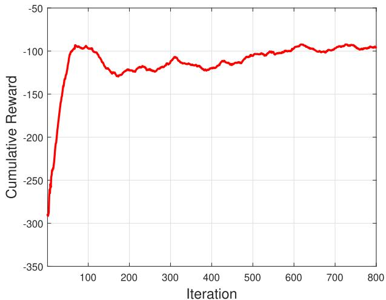

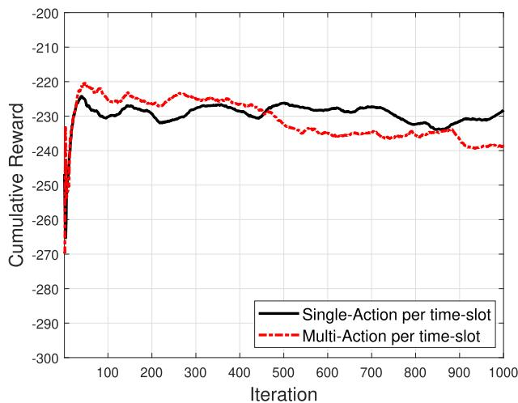  
Fig. 6. Accumulated reward versus iterations.

The plot, Fig. 7, depicts the impact of learning on the UAV altitude for single and multiple actions per time slot. The UAV is deployed initially at an altitude of 100 m in the urban region and the minimum achievable rate to ensure reliable transmission is set to $S _ { t h } = 1 5 ~ \mathrm { { b p s / H z } }$ for $M = 2 0$ ¼ ¼ 20It is evident that there is a certain range of altitude, also indicated in Figs. 3b and 4b, that satisfies the reliability constraint between IoT to UAV and from UAV to BS. Single and multiple actions per time slot techniques enable the adjustment of the altitude of the UAV within the optimum altitude range in order to establish effective communication links. However, due to insufficient learning for multiple actions per time slot, the AI agent takes wrong decisions while adjusting the altitude of the UAV. For example, the altitudes for the duration do not satisfy the reliability constraint for both the UAV and the BS.

In Fig. 8, the AoI evolution over time for all approaches is presented for a selected set of four IoT devices in a network of 20 IoT devices. It can be observed that the AoI evolution can be drastically different for the different policies. By leveraging the PPO algorithm, the AoI of the four IoT devices is much smaller than that of the baseline approaches. This is understandable since, as explained above, the AI agent learns how to adjust the altitude of the UAV within the allowable altitude range to establish an effective communication link to an IoT with the highest AoI value. Transmission failures on the links between IoT to UAV and UAV to BS increase for the baseline approaches because the UAV is unable to efficiently adjust its altitude to satisfy the reliability constraint of the BS and UAV. Furthermore, the HDGS approach, on the one hand, significantly decreases the AoI for some IoT devices. On the other hand, it increases the AoI to the maximum for other IoT devices. This is because the HDGS approach only schedules transmission for IoT devices that satisfy the reliability constraint for both links (IoT-to-UAV and UAV-to-BS).

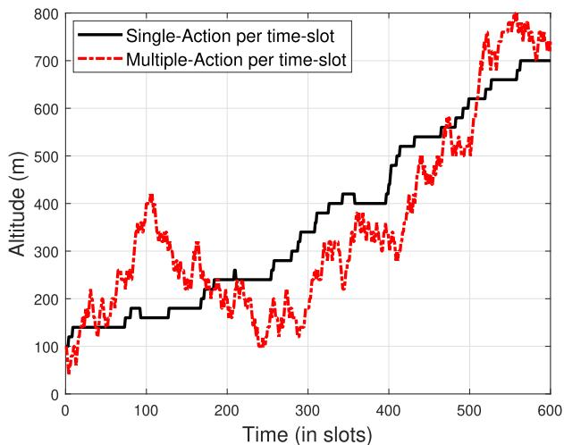  
Fig. 5. Accumulated reward versus iterations. Fig. 7. UAV altitude versus time. Authorized licensed use limited to: Guangxi University. Downloaded on July 05,2026 at 12:43:37 UTC from IEEE Xplore. Restrictions apply.

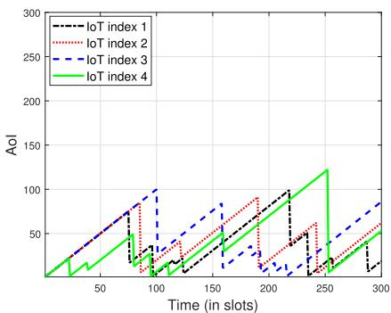  
(a) PPO.

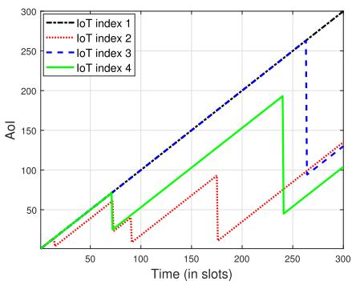  
(b) RDRS.

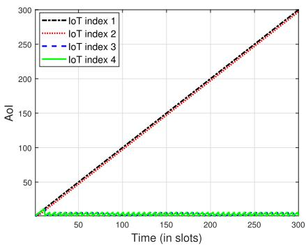  
(c) HDGS.  
Fig. 8. The performance comparison of different policies for a sample of four IoT devices.

To evaluate the effectiveness of the proposed algorithm, the impact of the number of IoT devices on the PPO approach compared to the RDRS and HDGS approaches is studied. A UAV is deployed to relay the status update, where the minimum achievable rate to ensure reliable transmission is set to $S _ { t h } = 1 5 ~ \mathrm { { b p s / H z } }$ . As shown in Fig. 9, the ¼proposed PPO algorithm is able to minimize the EWSA for a lower number of IoT devices since each IoT device enjoys more service. In contrast, as the number of IoT devices increases, the EWSA increases, as expected, since more scheduling is required to decrease the EWSA. Besides, the performance of the HDGS approach is shown to be higher than the RDRS. This is because for the HDGS approach, which uses the greedy scheduling policy always selects the IoT device with the highest AoI value at each time slot.

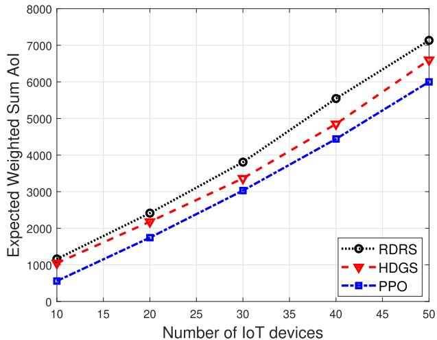  
Fig. 9. Impact of number of IoTs and comparisons.

Last, the average age is another performance metric that we studied. Fig. 10 depicts the average age for a set of IoT devices, where the minimum rate to ensure reliable transmission is set to $S _ { t h } = 1 5 \mathrm { { b p s / H z } }$ and M . The average ¼ ¼ 20age of IoT device i within mission time N is captured by $\textstyle { \frac { 1 } { N } } \sum _ { n = 0 } ^ { N } A _ { i } ^ { n } , \forall i ,$ . Clearly, the proposed PPO algorithm mini-¼0mizes the average AoI in the system compared to the other considered approaches. Also, the average age performance gap among the approaches is relatively high, which demonstrates the importance of optimizing the altitude of the UAV with scheduling. This finding justifies the robustness of the proposed algorithm in terms of minimizing average AoI.

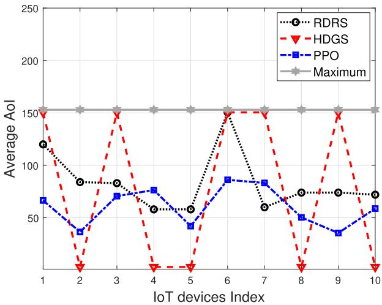

## 6 CONCLUSION

This paper addresses the problem of joint scheduling policy and dynamic UAV altitude control in UAV-assisted IoT networks that maintain the freshness of information status. A UAV is employed as a mobile relay between IoT devices and the BS to minimize the Expected Weighted Sum Age-of-Information at the BS under unreliable channels. It is assumed that before its deployment, the UAV has no prior knowledge of the channel and it can obtain instantaneous IoT-to-UAV and UAV-to-BS CSI during its deployment. To maintain the freshness of information, the stochastic control problem is modeled as a Markov Decision Process and an online deep reinforcement learning approach is proposed to obtain an optimal control policy that minimizes the EWSA. Numerical results demonstrate the effectiveness of the proposed online design, which was also verified by extensive comparisons with other baseline approaches. Future research should focus on extending the current framework to consider multiple hops instead of only two hops, for example, multiple relays to the BS through multiple UAVs.

## ACKNOWLEDGMENTS

This work was supported in part by Concordia University and in part by FQRNT.

## REFERENCES

[1] BBC, “California wildfires: Death toll rises to 25,” 2018. [Online]. Available: https://www.bbc.com/news/world-us-canada-46168107

[2] A. Kosta et al., “Age of information: A new concept, metric, and tool,” Found. Trends Netw., vol. 12, no. 3, pp. 162–259, 2017.

[3] J. Schulman et al., “Trust region policy optimization,” 2017. [Online]. Available: https://arxiv.org/abs/1502.05477

[4] J. Schulman et al., “Proximal policy optimization algorithms,” 2017. [Online]. Available: https://arxiv.org/abs/1707.06347

[5] Q. Wu, Y. Zeng and R. Zhang, “Joint trajectory and communication design for UAV-enabled multiple access,” in Proc. IEEE Global Commun. Conf., 2017, pp. 1–6.

[6] Q. Wu and R. Zhang, “Common throughput maximization in UAV-enabled OFDMA systems with delay consideration,” IEEE Trans. Commun., vol. 66, no. 12, pp. 6614–6627, Dec. 2018.

[7] M. Samir, S. Sharafeddine, C. M. Assi, T. M. Nguyen and A. Ghrayeb, “UAV trajectory planning for data collection from time-constrained IoT devices,” IEEE Trans. Wireless Commun., vol. 19, no. 1, pp. 34–46, Jan. 2020.

[8] J. Lyu, Y. Zeng, R. Zhang and T. J. Lim, “Placement optimization of UAV-mounted mobile base stations,” IEEE Commun. Lett., vol. 21, no. 3, pp. 604–607, Mar. 2017.

[9] R. I. Bor-Yaliniz, A. El-Keyi and H. Yanikomeroglu et al., “Efficient 3-D placement of an aerial base station in next generation cellular networks,” in Proc. IEEE Int. Conf. Commun., 2016, pp. 1–5.

[10] Q. Wu, Y. Zeng and R. Zhang, “Joint trajectory and communication design for multi-UAV enabled wireless networks,” IEEE Trans. Wireless Commun., vol. 17, no. 3, pp. 2109–2121, Mar. 2018.

[11] M. Mozaffari, W. Saad, M. Bennis and M. Debbah, “Mobile unmanned aerial vehicles (UAVs) for energy-efficient Internet of Things communications,” IEEE Trans. Wireless Commun., vol. 16, no. 11, pp. 7574–7589, Nov. 2017.

[12] C. Liu, Z. Chen, J. Tang, J. Xu and C. Piao, “Energy-efficient UAV control for effective and fair communication coverage: A deep reinforcement learning approach,” IEEE J. Sel. Areas Commun., vol. 36, no. 9, pp. 2059–2070, Sep. 2018.

[13] C. H. Liu, X. Ma, X. Gao, and J. Tang, “Distributed energy-efficient multi-UAV navigation for long-term communication coverage by deep reinforcement learning,” IEEE Trans. Mobile Comput., vol. 19, no. 6, pp. 1274–1285, Jun. 2020.

[14] J. Hu, H. Zhang, L. Song, R. Schober and H. V. Poor, “Cooperative internet of UAVs: Distributed trajectory design by multi-agent deep reinforcement learning,” IEEE Trans. Commun., vol. 68, no. 11, pp. 6807–6821, Nov. 2020.

[15] J. Hu, H. Zhang, K. Bian, L. Song and Z. Han, “Distributed trajectory design for cooperative internet of UAVs using deep reinforcement learning,” in Proc. IEEE Global Commun. Conf., 2019, pp. 1–6.

[16] M. A. Abd-Elmagid, A. Ferdowsi, H. S. Dhillon and W. Saad, “Deep reinforcement learning for minimizing age-of-information in UAV-assisted networks,” in Proc. IEEE Global Commun. Conf., 2019, pp. 1–6.

[17] W. Li, L. Wang and A. Fei, “Minimizing packet expiration loss with path planning in UAV-assisted data sensing,” IEEE Wireless Commun. Lett., vol. 8, no. 6, pp. 1520–1523, Dec. 2019.

[18] C. Zhou et al., “Deep RL-based trajectory planning for AoI minimization in UAV-assisted IoT,” in Proc. 11th Int. Conf. Wireless Commun. Signal Process., 2019, pp. 1–6.

[19] P. Tong, J. Liu, X. Wang, B. Bai and H. Dai, “Deep reinforcement learning for efficient data collection in UAV-aided Internet of Things,” in Proc. IEEE Int. Conf. Commun. Workshops, 2020, pp. 1–6.

[20] M. Yi, X. Wang, J. Liu, Y. Zhang and B. Bai, “Deep reinforcement learning for fresh data collection in UAV-assisted IoT networks,” in Proc. IEEE Conf. Comput. Commun. Workshops, 2020, pp. 716–721.

[21] S. Abedin et al., “Data freshness and energy-efficient UAV navigation optimization: A deep reinforcement learning approach,” 2020. [Online]. Available: https://arxiv.org/abs/2003.04816

[22] W. Fanyi et al., “UAV-to-device underlay communications: Age of information minimization by multi-agent deep reinforcement learning,” 2020. [Online]. Available: https://arxiv.org/abs/ 2003.05830

[23] A. Ferdowsi et al., “Neural combinatorial deep reinforcement learning for age-optimal joint trajectory and scheduling design in UAV-assisted networks,” 2020. [Online]. Available: https:// arXiv:2006.15863

[24] M. A. Abd-Elmagid and H. S. Dhillon, “Average peak age-ofinformation minimization in UAV-assisted IoT networks,” IEEE Trans. Veh. Technol., vol. 68, no. 2, pp. 2003–2008, Feb. 2019.

[25] S. Zhang, H. Zhang, Z. Han, H. V. Poor and L. Song, “Age of information in a cellular internet of UAVs: Sensing and communication trade-off design,” IEEE Trans. Wireless Commun., vol. 19, no. 10, pp. 6578–6592, Oct. 2020.

[26] J. Liu, X. Wang, B. Bai and H. Dai, “Age-optimal trajectory planning for UAV-assisted data collection,” in Proc. IEEE Conf. Comput. Commun. Workshops, 2018, pp. 553–558.

[27] A. Cao, C. Shen, J. Zong and T. Chang, “Peak age-of-information minimization of UAV-aided relay transmission,” in Proc. IEEE Int. Conf. Commun. Workshops, 2020, pp. 1–6.

[28] Z. Jia, X. Qin, Z. Wang and B. Liu, “Age-based path planning and data acquisition in UAV-assisted IoT networks,” in Proc. IEEE Int. Conf. Commun. Workshops, 2019, pp. 1–6.

[29] P. Tong, J. Liu, X. Wang, B. Bai and H. Dai, “UAV-enabled ageoptimal data collection in wireless sensor networks,” in Proc. IEEE Int. Conf. Commun. Workshops, 2019, pp. 1–6.

[30] H. Hu, K. Xiong, G. Qu, Q. Ni, P. Fan and K. B. Letaief, “AoI-minimal trajectory planning and data collection in UAV-assisted wireless powered IoT networks,” IEEE Internet Things J., early access, Jul. 2020, doi: 10.1109/JIOT.2020.3012835.

[31] S. Zhang, H. Zhang, L. Song, Z. Han and H. V. Poor, “Sensing and communication tradeoff design for AoI minimization in a cellular internet of UAVs,” in Proc. IEEE Int. Conf. Commun., 2020, pp. 1–6.

[32] A. Al-Hourani, S. Kandeepan and S. Lardner, “Optimal LAP altitude for maximum coverage,” IEEE Wireless Commun. Lett., vol. 3, no. 6, pp. 569–572, Dec. 2014.

[33] Y. Zhan, C. H. Liu, Y. Zhao, J. Zhang and J. Tang, “Free market of multi-leader multi-follower mobile crowdsensing: An incentive mechanism design by deep reinforcement learning,” IEEE Trans. Mobile Comput., vol. 19, no. 10, pp. 2316–2329, Oct. 2020.

[34] U. Challita, W. Saad and C. Bettstetter, “Interference management for cellular-connected UAVs: A deep reinforcement learning approach,” IEEE Trans. Wireless Commun., vol. 18, no. 4, pp. 2125–2140, Apr. 2019.

[35] C. You and R. Zhang, “Hybrid offline-online design for UAVenabled data harvesting in probabilistic los channel,” IEEE Trans. Wireless Commun., vol. 19, no. 6, pp. 3753–3768, Jun. 2020.

[36] J. Harmer et al., “Imitation learning with concurrent actions in 3D games,” in Proc. IEEE Conf. Comput. Intell. Games, 2018, pp. 1–8.

" For more information on this or any other computing topic, please visit our Digital Library at www.computer.org/csdl.