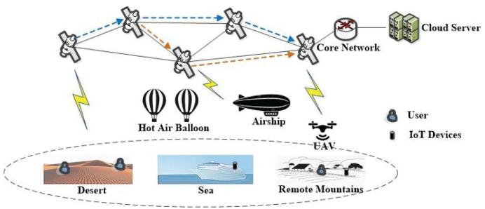
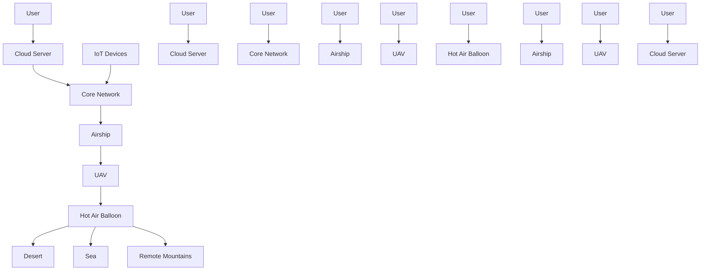
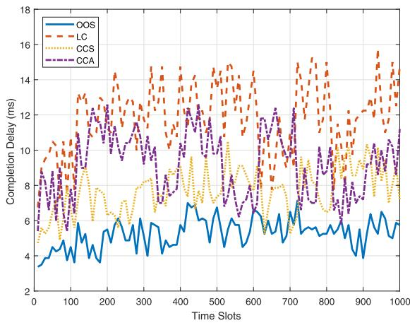
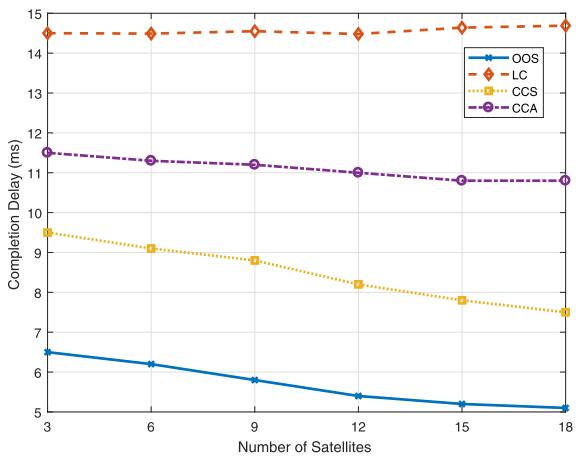
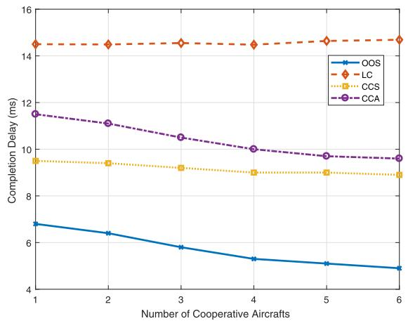
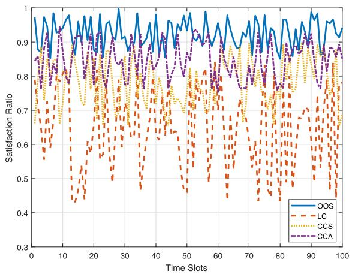
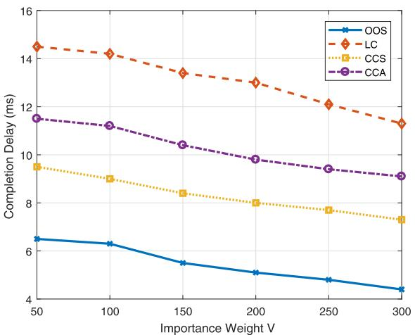
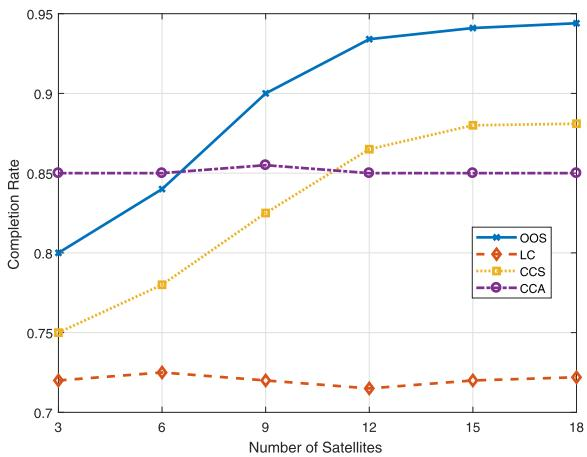
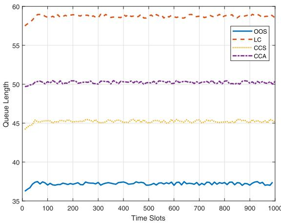
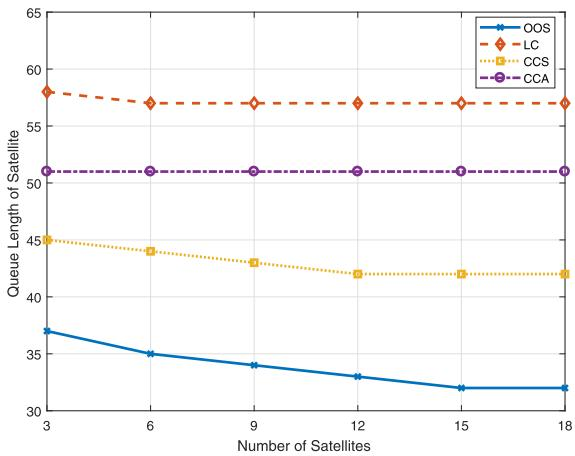

# Online Computation Offloading for Collaborative Space/Aerial-Aided Edge Computing Toward 6G System

Yi Liu , Li Jiang , Member, IEEE, Qi Qi , Senior Member, IEEE, Kan Xie , Member, IEEE, and Shengli Xie , Fellow, IEEE

Abstract—In 6G systems, space-air-ground integrated network (SAGIN), relying on space/aerial communications to complement terrestrial networks, is developed to achieve worldwide connectivity and multi-service access especially in remote areas. However, the heavy workload of the resource-limited satellites may raise an important issue about reducing service coverage and quality. In this article, we propose a collaborative edge computing framework for SAGIN-aided 6G system, in which the LEO satellites are considered as both “servers” and “users”. Excepting provide services for ground users/devices, the LEO satellites is able to offload the tasks to nearby aircrafts via one-hop link or offload them to the cloud server along multi-hop satellite path. To minimize the long-term task completion delay of LEO satellites, a stochastic optimization problem is formulated by considering the variation of the space/aerial environment. The Lyapunov-based optimization method is developed to solve the problem and the delayed online learning technique is adapted to predict dynamic task arrival and queue length of satellites and aircrafts. Numerical results confirm the effectiveness of the proposed collaborative offloading scheme for reducing tasks completion delay of LEO satellites while guaranteeing computation efficiency.

Index Terms—Mobile edge computing, space-air-ground integrated network, collaborative offloading, online learning, 6G system.

Manuscript received 17 May 2023; revised 11 July 2023; accepted 18 August 2023. Date of publication 7 September 2023; date of current version 13 February 2024. This work was supported in part by the National Key R&D Program of China under Grants 2020YFB1807805 and 2020YFB1807800 and in part by the Programs of NSFC under Grants U1911401, 61973087, and 62371142. The review of this article was coordinated by Dr. Zehui Xiong. (Corresponding author : Li Jiang.)

Yi Liu is with the School of Automation, Guangdong University of Technology, and Guangdong Province Key Lab. of IoT Information Technology, Guangzhou 510006, China (e-mail: yi.liu@gdut.edu.cn).

Li Jiang is with the School of Automation, Guangdong University of Technology, and Key Laboratory of Intelligent Detection and Internet of Manufacturing Things, Ministry of Education, Guangzhou 510006, China (e-mail: jiangli@gdut.edu.cn).

Qi Qi is with State Key Laboratory of Networking and Switching Technology, Beijing University of Posts and Telecommunications, Beijing 100876, China (e-mail: qiqi8266@bupt.edu.cn).

Kan Xie is with the School of Automation, Guangdong University of Technology, and Guangdong-HongKong-Macao Joint Laboratory for Smart Discrete Manufacturing, Guangzhou 510006, China (e-mail: kxie@gdut.edu.cn).

Shengli Xie is with the 111 Center for Intelligent Batch Manufacturing Based on IoT Technology, and Key Laboratory of Intelligent Information Processing and System Integration of IoT, Ministry of Education of the P.R.C., Guangzhou 510006, China (e-mail: shlxie@gdut.edu.cn).

Digital Object Identifier 10.1109/TVT.2023.3312676

# I. INTRODUCTION

W ITH the gradual maturity and commercialization of thefifth generation (5G) wireless system, its shortcomings fth generation (5G) wirelesssystem,its shortcomings promote the research and development of the sixth generation (6G) wireless systems [1], [2], [3]. One of the examples is 5G system is still limited to cover some typical remote areas, such as desert, ocean, mountains, etc. which are difficult to be covered by ground base stations and promised to be obtained 100 %coverage in 6G system. To achieve this goal, space-air-ground integrated networks (SAGIN) are raised to realize the ubiquitous access services for massive mobile users and Internet of Things (IoT) devices even in remote areas, maritime applications and emergency circumstances [5], [6]. In such network, space components includes geostationary earth orbit (GEO), medium earth orbit (MEO), and low earth orbit (LEO) satellites. Specially, the LEO satellites are widely used to establish near-earth satellite networks for massive access and data backhaul for remote area users with low cost of deployment and maintenance [7], [8]. The air components are unmanned aircrafts involving balloons, airships and airplanes positioned above 20 km altitude in the stratosphere, to provide lower delay and more stable connections for terrestrial users compared to satellite-terrestrial link. The ground components mainly consist of ground base stations and servers which are capable of providing high data-rate wireless service for users, but will fail in the case without terrestrial infrastructure [9].

Since 6G wireless communication system is expected to provide ubiquitous, high-quality, high-reliability and intelligence for full automation, the SAGIN are required not only to provide a complete global coverage but a new computing paradigm to support new intelligent applications and sophisticated services in different areas and scenarios [11]. Usually, cloud computing which enables elastic on-demand resource allocation, easy applications and diverse services provisioning, is the first candidate for SAGIN to handle the burdensome computation tasks. However, the long physical distance, limited communication bandwidth, intermittent network connectivity in SAGIN environment limits the operation of cloud computing in 6G system with many delay-sensitive applications. Owing to distributed resources allocation and management, mobile edge computing (MEC) is proposed to provide the cloud computing in close proximity to mobile ground users (at the edge of network) [12], [13], [14]. The MEC has the advantage of handling delay-sensitive tasks at the local level, such as data collection, event monitoring, information extraction and so on [15], [16], [17]. Furthermore, cloud computing and MEC can complement each other to form an integrated multi-tier computing paradigm to support more intelligent applications and sophisticated services in SAGIN.

Recently, many researchers devoted to study the in-depth combination of the cloud/edge computing and SAGIN. Chen et al. [18] proposed a MEC-driven SAGIN in which the UAV is responsible for collecting tasks from IoT devices and forwarding to a BS or the cloud server through satellites network. Zhou et al. [19] considered the delay-oriented IoT services and investigated a computing task scheduling problem in SAGIN. Cheng et al. [20] presented a SAGIN edge/cloud computing architecture, and then studied a deep reinforcement learning based approach to learn the optimal offloading policy from the dynamic SAGIN environments. Yu et al. [21] designed an edge computing-enhanced SAGIN and proposed an offloading and caching algorithm to minimize the task completion time and satellite resource usage. Liu et al. [22] focused on the energy-efficient SAGIN edge computing in which the offloading decision is made based on UAV and satellites’ energy level, communication conditions and computing capabilities. Liao et al. [23] jointly optimized the task offloading and resource allocation for Power IoT devices under several challenges in SAGIN such as incomplete information, dimensionality curse, etc.

In above studies, the LEO satellite is generally treated as an “edge server” in SAGIN edge computing to provide computing services to ground users/devices in remote areas. Actually, the resources (computation and energy) limited satellite should be more considered as a “user” which also needs computation services not only for ground requirements but its own exclusive applications. In this article, we focus on designing a collaborative space/aerial-aided edge computing framework, in which the LEO satellites in space domain are responsible for providing computation services to ground users/IoT devices in remote areas without the cellular network coverage. Meanwhile, the aircrafts (including UAVs, high-altitude platforms, and balloons) in aerial domain hovers at a certain area, are able to provide the computation cooperation to the nearby LEO satellite. Specifically, once the tasks collection and generation is finished, the LEO satellite can offload tasks to a nearby aircraft via one-hop communication or the cloud server via muli-hop satellites backhaul link, and make a decision about the ratio of local computing tasks and offloading tasks.

To design an efficient collaborative MEC paradigm for space/aerial-aided 6G system, some technical issues should be carefully addressed. The first issue comes from variability of space/aerial network. Since the satellites and aircrafts have different communication and computation capacities and their relative positions are varying over time, the transmission performance of satellites link and satellite-aircraft link may highly dynamic. Moreover, the tasks at satellites are composed by the tasks collected from ground and generated by their own applications, the task generation usually presents high variability mainly due to different workload levels or resource contention in SAGIN environments. The task queue length at each satellite and aircraft are also time-varying and difficult to determine at advance due to the excessive signaling overhead and privacy concerns.

The second issue is on tradeoff between computation and communication resource consumptions in the proposed framework. By exploiting cooperation between satellite and aircraft, and cooperation among satellites, tasks are allowed to be offloaded multiple hops away to cloud server or one hop to the nearby aircraft. It is obvious the former approach achieves lower computation latency but at the expense of higher transmission latency than that of the latter one. Hence, selecting the optimal offloading approach according to current conditions is critical to strike a good balance between computing and communication resource consumptions to obtain the optimal quality of services. This brings new modeling requirements for incorporating interplay and interdependency among the management of these resources.

By considering the above issues, we develop an online cooperative offloading and scheduling scheme in space/aerial-aided 6G system. We employ Lyapunov optimization to exploit spatialtemporal optimality of long-term completion delay minimization problem. The proposed scheme is devoted to an online offloading and scheduling policy by addressing the assignment problem for each satellite: where and how many tasks should be offloaded for the minimum completion delay in terms of computation capabilities? However, such offloading policy cannot become a reality without complete task arrival and queue length knowledge. To adapt to the variability of these two parameters, we resort to the delayed online learning method to predict task arrival and queue length of both satellites and aircrafts, which are used for the basis of offloading decision making. Then, the optimal offloading and scheduling decisions obtained via a bounded integer programming problem, are expected to minimize the long-term task completion delay.

The main contributions of this article are summarized as follows.

1) We propose a collaborative space/aerial-aided MEC framework for 6G system in which the satellites are able to offload the tasks to nearby aircrafts through one-hop connection or cloud server along multi-hop offloading path.

2) We formulate a stochastic optimization problem to minimize the long-term completion delay of the satellites. The Lyapunov-based optimization is developed to decompose the stochastic optimization problem into separate deterministic subproblem for each satellite.

3) With the aim of minimizing the loss due to prediction errors over time, we adapt the delayed online learning technique to facilitate task arrival and queue length prediction, which is fed as input to Lyapunov-based cooperative offloading policy. We achieve queue awareness by continuously adjusting task offloading and scheduling strategies in accordance with predicted queue information, which balances the tradeoff between completion delay minimization and queuing delay reduction.

The remainder of this article is organized as follows. Section II introduces the system model of the collaborative space/aerial MEC network. The cooperative computation offloading and scheduling problem is formulated in Section III. The online collaborative offloading mechanism is presented in Section IV. Section V shows the numerical results of the proposed methods. Section VI concludes this article.

flowchart

Fig. 1. System model of SAGECN.

# II. SYSTEM MODEL

# A. Space/Aeria-Aided MEC Model

We consider a space/aerial-aided MEC network, as shown in Fig. 1, consisting of a set of LEO satellites $\mathbb { N } = \{ 1 , \dots , N \}$ and a set of aircrafts $\mathbb { U } = \{ 1 , \dots , U \}$ =which can provide computation =services for the ground users without cellular coverage. The LEO satellites and aircrafts which can be hot air balloons, airship, fixed-wing UAVs, rotary-wing UAVs, etc, are endowed with computing capacity and capable of serving the user-generated computation tasks on the ground. The LEO satellites in the proposed network are connected by backhaul links, which can be used to send task requests or replies among satellites. By exploiting cooperation among LEO satellites and aircrafts, the arrival tasks at one LEO satellite can be processed locally, offloaded to the nearest aircrafts, or offloaded multiple hops to the cloud server via satellite backhaul links. The process of the cooperative operations are time-slotted, where $t \in \{ 1 , \ldots , T \}$ .

For each satellite $n \in \mathbb { N } ,$ let $\alpha _ { n } ( t ) = \lbrace 0 , 1 \rbrace$ denote the of-( ) =floading decision of satellite n at time slot t, $\alpha _ { n } ( t ) = 0$ represents the local computing, $\alpha _ { n } ( t ) = 1$ ( ) = represents the satellite n ( ) =decides to offload task. Then, we use binary variables $\beta _ { n , m } ( t ) =$ {0, 1} and $\theta _ { n , u } ( t ) = \{ 0 , 1 \}$ ( ) =to denote the cooperative offload-( ) =ing decision for satellite n at each time slot t. Specifically, $\beta _ { n , m } ( t ) = 1$ represents that the task of satellite n is offloaded ( ) =to the neighbor satellite m which will be added in inter-satellite offloading path, and $\beta _ { n , m } ( t ) = 0$ otherwise. $\theta _ { n , u } ( t ) = 1$ means ( ) = ( ) =satellite n offloads the task to the aircraft u for processing, and $\theta _ { n , u } = 0$ otherwise.

# B. Online Offloading Model

The nth LEO satellite generates the computing tasks (by itself or collected from ground users) at the beginning of each time slot, which can be specified by the tuple $( \rho ^ { n } , \sigma ^ { n } , \tau ^ { n } ) . \rho ^ { n }$ is the task size of a task, $\sigma ^ { n }$ ( )is the number of CPU cycles required for calculating one-bit task, $\tau ^ { n }$ is the deadline of the computing task at the nth satellite. At the beginning of each time slot, the satellite collaboratively reports the computing deadline $\tau ^ { n }$ and capture the maximum completion latency. For each computing task, the satellite can directly compute it, or forward it to other aircrafts or cloud sever for computation.

1) Satellite to Aircrafts: The LEO satellite can offload tasks to the nearest aircrafts $u \in \mathbb { N }$ through satellite-aircraft link. Without loss of generality, the channel gain of the satelliteaircraft link is set as a constant value $g .$ Let $r _ { n , u }$ denote the data rate of satellite-aircraft link between the nth satellite and the uth aircraft, we have

$$
r _ {n, u} = B _ {n, u} \log_ {2} \left(1 + \frac {p _ {n} | g | ^ {2}}{\xi_ {S} ^ {2}}\right) \tag {1}
$$

where $B _ { n , u }$ is the bandwidth of the satellite-aircraft link. $p _ { n }$ is the transmission power of the nth LEO satellite. $\xi _ { S } ^ { 2 }$ is the power of noise in the satellite-aircraft communication scenarios, respectively.

Let $d _ { S }$ denote the propagation delay of the satellite-aircraft link. Considering $k _ { n , u } ( t )$ number of tasks is offloaded to the ( )aircraft u by the nth LEO satellite at time slot t. The transmission delay of offloading tasks from satellite n to aircraft u can be obtained as

$$
d _ {n, u} ^ {S A} (t) = \alpha_ {n} (t) \theta_ {n, u} (t) \left(\frac {k _ {n , u} (t) \rho^ {n}}{r _ {n , u}} + d _ {S}\right). \tag {2}
$$

2) Multi-Hop Offloading Via Satellite Propagation: Each LEO satellite can forward the computing task to the cloud server via multi-hop offloading path among other satellites in N (i.e., cooperative offloading). For each task, we use $L \in \{ 0 , 1 , \cdots \}$ denote the number of hops that the LEO satellite offload the task to the cloud server. In each hop, the peak gain of transceivers of satellite n in the direction of satellite m is given by G. Then, the data rate $r _ { n , m }$ of the satellite link can be calculated as

$$
r _ {n, m} = B _ {n, m} \log_ {2} \left(1 + \frac {p _ {n} G ^ {2}}{\kappa_ {B} B _ {n , m} W (n m)}\right), \tag {3}
$$

where $B _ { n , m }$ is the bandwidth between satellite n and $m , p _ { n }$ is the transmission power of satellite $n , \kappa _ { B }$ is the Boltzmann constant, W nm is the free-space path loss which is derived ( )in [24]. Hence, the transmission time of offloading task from satellite n to satellite m can be written as

$$
d _ {n, m} (t) = \alpha_ {n} (t) \beta_ {n, m} (t) \frac {k _ {n , m} (t) \rho^ {n}}{r _ {n , m}}, \tag {4}
$$

where $k _ { n , m } ( t )$ denote the number of tasks offloaded from satel-( )lite n to satellite m.

Let $\mathbb { N } _ { n }$ denote the set of LEO satellites contributing to the offloading service for satellite n, and $\Upsilon = \{ n _ { 1 } , \cdots , n _ { L } \}$ denote Υ =the permutation of all L satellites along the offloading path. The task request from satellite n is offloaded L hops to cloud sever $n _ { L }$ for processing. Accordingly, the transmission delay of such offloading can be expressed as

$$
d _ {n} ^ {M L} (t) = \sum_ {l \in L} d _ {n _ {l}, n _ {l - 1}} (t) \tag {5}
$$

# C. Task Computing Model

1) Satellite Computing Model: Let $\chi _ { n } ( t )$ denote the service ( )limitation of computing components in satellite n which is determined by the available resources at time slot t. The satellite is considered as resource limited. Since the computing capacity of satellite n is depending on the workloads and computing resources, we can obtain the task processing rate (in CUP cycles per second) of its computing components as

$$
c _ {n} (t) = \frac {1}{y} x ^ {\chi_ {n} (t) - Q _ {n} (t)}. \tag {6}
$$

where $Q _ { n } ( t )$ is the amount of tasks buffered in satellite n at ( )the beginning of slot t. x stands for the relationship between processing rate and workload/resource levels, y is the speed when the computing component of satellite is fully loaded. Due to the different structure of the computing components, parameters x and y of satellites are different. According to (6), satellite n can achieve larger processing rate as less workloads and more available resources.

Let $s _ { n } ( t )$ denote the amount of arrival tasks of satellite n at ( )time slot t. Considering the number of the tasks processed by the satellite n is denoted as $K _ { n } ( t )$ at time slot t, we have

$$
K _ {n} (t) = \min \left\{\frac {c _ {n} (t)}{\sigma_ {n} Q _ {n} (t)}, Q _ {n} (t) \right\}. \tag {7}
$$

The computing latency $d _ { n }$ of a task computed by satellite n includes the local computing delay and cloud sever computing delay, which can be expressed as

$$
\begin{array}{l} d _ {n} ^ {C} (t) = (1 - \alpha_ {n} (t)) \frac {k _ {n} (t) \sigma_ {n}}{c _ {n} (t)} \\ + \sum_ {l \in L} \alpha_ {n _ {l}} (t) \beta_ {n _ {l}, n _ {l - 1}} (t) \frac {Q _ {n} (t) \sigma_ {n}}{c _ {\text { cloud }}}, \tag {8} \\ \end{array}
$$

where $c _ { c l o u d }$ is the computing rate of the cloud server.

2) Aircraft Computing Model: Let $Q _ { u } ( t )$ denote the number of tasks queued in aircraft u at the beginning of time slot t. We can obtain the task processing rate of the aircraft u as

$$
c _ {u} (t) = \frac {1}{y} x ^ {\chi_ {u} (t) - Q _ {u} (t)}, \tag {9}
$$

where $\chi _ { u } ( t )$ is the service limitation of computing components ( )in aircraft u at time slot t. Let $k _ { n , u } ( t )$ denote the number of the ( )tasks offloaded from satellite n to the aircraft u during time slot t. Since each aircraft needs to finish the tasks as soon as possible while guaranteeing the fairness, all tasks buffered in the same aircraft share the same resources without preemption. Then, the number of the tasks processed by the aircraft u for the satellites can be obtained as

$$
K _ {u} (t) = \min \left\{\frac {c _ {u} (t)}{\sigma_ {n} Q _ {u} (t)}, Q _ {u} (t) \right\}. \tag {10}
$$

If the satellite n decides to offload tasks $k _ { n , u } ( t )$ to aircraft u for processing, the computing latency $d _ { n , u } ( t )$ ( )can be obtained as

$$
d _ {n, u} ^ {C} (t) = \alpha_ {n} (t) \theta_ {n, u} (t) \frac {k _ {n , u} (t)}{c _ {u} (t)}. \tag {11}
$$

# D. Task Queue Model

We consider that the satellites and aircrafts offload and execute the tasks at the beginning of the time slot t, while the tasks collection which includes the new tasks arrival or offloading from other satellites happens at the end. We can obtain the number of tasks processed by satellite n at time slot t as

$$
I _ {n} (t) = \alpha_ {n} (t) K _ {n} (t) + \beta_ {n, m} (t) k _ {n, m} (t) + \theta_ {n, u} (t) k _ {n, u} (t), \tag {12}
$$

where $\alpha _ { n } ( t ) + \beta _ { n , m } + \theta _ { n , u } \leq 1$ . Accordingly, the dynamics of ( )task queues $Q _ { n } ( t )$ and $Q _ { u } ( t )$ associated with any satellite $n \in \mathbb { N }$ and aircraft $u \in \mathbb { U }$ ( ), respectively, can be described as

$$
Q _ {n} (t + 1) = \max \left\{Q _ {n} (t) - I _ {n} (t), 0 \right\} + s _ {n} (t) + \sum_ {m \in \mathbb {N}} k _ {m, n} (t), \tag {13}
$$

$$
Q _ {u} (t + 1) = \max \left\{Q _ {u} (t) - K _ {u} (t), 0 \right\} + \tilde {s} _ {u} (t) + \sum_ {n \in \mathbb {N}} k _ {n, u} (t), \tag {14}
$$

where $\sum _ { m \in \mathbb { N } } k _ { m , n } ( t )$ is the number of tasks offloaded to n from ( )satellite m ∈ N. The first term on the right-hand-side of (13) and (14) captures the unprocessed tasks at time slot t after part of tasks are locally processed or offloaded away, and the last two terms describe the tasks arrived locally and offloaded from neighbor satellites.

Stability Constraint: The proposed network is stable only if it has a bounded time-averaged backlog [25], i.e.,

$$
\bar {Q} _ {s y s} = \operatorname * {l i m s u p} _ {T \to \infty} \frac {1}{T} \sum_ {t = 0} ^ {T - 1} \mathbb {E} \{Q _ {n} (t) + Q _ {u} (t) \}
$$

$$
<   \infty , \forall n \in \mathbb {N}, \forall u \in \mathbb {U}. \tag {15}
$$

# III. PROBLEM FORMULATION

The desired offloading mechanism is able to serve tasks with collaborative computing among satellites and aircrafts, and satellites’ scheduling capacities. We focus on providing stable quality of service (QoS) of space/aerial-aided MEC network in terms of completion delay which includes transmission delay and computation delay.

Under proposed offloading mechanism, the transmission delay of satellite n at time slot t, denoted as $D _ { n } ^ { T } ( t )$ , for transmitting ( )tasks through satellite-aircraft links or multi-hop satellite link can be obtained as

$$
D _ {n} ^ {T} (t) = \sum_ {u \in \mathbb {U}} d _ {n, u} ^ {S A} (t) + d _ {n} ^ {M L} (t). \tag {16}
$$

Let $D _ { n } ^ { C } ( t )$ denote the computation delay of satellite n at time slot $t ,$ ( ) we have

$$
D _ {n} ^ {C} (t) = d _ {n} ^ {C} (t) + \sum_ {u \in \mathbb {U}} d _ {n, u} ^ {C} (t). \tag {17}
$$

Therefore, the instantaneous completion delay can be expressed as

$$
D (t) = \sum_ {n \in \mathbb {N}} (D _ {n} ^ {T} (t) + D _ {n} ^ {C} (t)). \tag {18}
$$

Since our goal is to minimize long-term completion delay, the mathematical formulation of the collaborative offloading problem in space/aerial-aided MEC network is given by

$$
\text{(P1)} \quad \min_{\substack{\alpha_{n}(t),\beta_{n,m}(t),\theta_{n,u}(t),\\ k_{n,m}(t),k_{n,u}(t),\forall n,u,t}}\lim_{T\to \infty}\frac{1}{T}\left[D(t)\right]
$$

$$
\text { s.t. } \quad C 1 \quad \alpha_ {n} (t) + \sum_ {m \in \mathbb {N}} \beta_ {n, m} (t) + \sum_ {u \in \mathbb {U}} \theta_ {n, u} (t) \leq 1, n \in \mathbb {N},
$$

$$
C 2 \sum_ {m \in \mathbb {N}} k _ {m, n} (t) \leq J _ {\max} ^ {S}, \forall t
$$

$$
C 3 \sum_ {u \in \mathbb {U}} k _ {n, u} (t) \leq J _ {\max} ^ {U}, \forall t
$$

where C1 is the constraint for satellite n can either process the task locally or offload it to the neighboring aircrafts or satellites at time slot t, C2 and C3 constraint the most number of tasks dispatched to the satellites and aircrafts for guaranteed the processing rate, respectively.

To solve problem (P1), satellites should make the offloading and tasks dispatch decisions during a time slot which are spatial-temporal coupled decisions. Moreover, the stochastic task arrivals at satellites and aircrafts make (P1) to be stochastic problem which is difficult to collect complete offline information of the workload levels at both satellite and aircraft. Hence, we develop an online optimization method to perform collaborative offloading based on task arrivals and workload prediction knowledge.

# IV. ONLINE COLLABORATIVE OFFLOADING MECHANISM

In this section, we firstly apply the Lyapunov optimization to decouple (P1) into per-frame deterministic problems. Then, taking task arrivals and workload variability into account, an asynchronous prediction policy is implemented based on delayed online learning.

# A. Lyapunov Optimization

Let $\Theta ( t ) = \{ \mathbf { Q } ^ { N } ( t ) , \mathbf { Q } ^ { U } ( t ) \}$ } denote the aggregate queue vec-Θ( )tor, where ${ \bf Q } ^ { N } ( t ) = \{ Q _ { n } ( t ) \} _ { n = 1 } ^ { N }$ and ${ \bf Q } ^ { U } ( t ) = \{ Q _ { u } ( t ) \} _ { u = 1 } ^ { U }$ ( ) = ( ) ( ) = ( )To ensure both delay bounds of the satellite and aircraft, we define the following Lyapunov function to measure the congestion in the queues,

$$
L (\Theta (t)) = \frac {1}{2} \left[ \sum_ {n = 1} ^ {N} Q _ {n} ^ {2} (t) + \sum_ {n = 1} ^ {U} Q _ {u} ^ {2} (t) \right].
$$

The conditional 1-slot Lyapunov drift is defined as,

$$
\Delta (\Theta (t)) = E \left\{L (\Theta (t + 1)) - L (\Theta (t)) | \Theta (t) \right\}.
$$

We incorporate the system delay into Lyapunov drift to guarantee the network stability and delay jointly. We have the following drift plus penalty function (using the drift plus penalty function framework developed in [25]),

$$
\Delta (\Theta (t)) + V E \left\{\sum_ {n = 1} ^ {N} D _ {n} (t) | \Theta (t) \right\}
$$

where $V > 0$ is a parameter to effect the performance delay tradeoff. Again, using the techniques developed in [25], we can show that this function is bounded as,

$$
\begin{array}{l} \Delta (\Theta (t)) + V \mathbb {E} \left\{D (t) | \Theta (t) \right\} \leq B _ {1} \\ + B _ {2} + V \mathbb {E} \left\{\sum_ {n = 1} ^ {N} D _ {n} (t) | \Theta (t) \right\} \\ + \sum_ {n = 1} ^ {N} Q _ {n} (t) \mathbb {E} \left\{\left(s _ {n} (t) + \sum_ {m \in \mathbb {N}} k _ {m, n} (t) - I _ {n} (t)\right) | \Theta (t) \right\} \\ + \sum_ {u = 1} ^ {U} Q _ {u} (t) \mathbb {E} \left\{\left(\tilde {s} _ {u} (t) + \sum_ {n \in \mathbb {N}} k _ {n, u} (t) - K _ {u} (t)\right) | \Theta (t) \right\}, \tag {19} \\ \end{array}
$$

where $B _ { 1 }$ and $B _ { 2 }$ are constant and can be obtained as follows.

$$
\begin{array}{l} \frac {1}{2} \sum_ {n = 1} ^ {N} \mathbb {E} \left\{\left(s _ {n} (t) + \sum_ {m \in \mathbb {N}} k _ {m, n} (t) - I _ {n} (t)\right) ^ {2} \right\} \\ \leq \frac {1}{2} \sum_ {n = 1} ^ {N} \mathbb {E} \left\{s _ {n} ^ {2} (t) + \sum_ {m \in \mathbb {N}} k _ {m, n} ^ {2} (t) + I _ {n} ^ {2} (t) \right\} \leq \frac {1}{2} \sum_ {n = 1} ^ {N} \left[ S _ {\max} ^ {2} \right. \\ \left. + (N + 1) J _ {\max} ^ {2} + J _ {\max, U} ^ {2} + \left(\frac {c _ {n} ^ {\max}}{\sigma_ {n} ^ {\max} Q _ {n} ^ {\max}}\right) ^ {2} \right] \triangleq B _ {1} \\ \end{array}
$$

where $S _ { \mathrm { m a x } }$ is the maximum number of the arrival tasks at each time slot, $\begin{array} { r } { \sum _ { m \in \mathbb { N } } k _ { m , n } \leq J _ { \operatorname* { m a x } } } \end{array}$ specifies the limited offloading capacity of satellite n for satellite m by placing an upper bound $J _ { \mathrm { m a x } } , J _ { \mathrm { m a x } } ^ { U }$ is the upper bound of the offloading capacity that aircraft u for satellites. Similarly, we have the following definition of $B _ { 2 }$

$$
\begin{array}{l} \frac {1}{2} \sum_ {n = 1} ^ {N} \mathbb {E} \left\{\left(\tilde {s} _ {u} (t) + \sum_ {n \in \mathbb {N}} k _ {n, u} (t) - K _ {u} (t)\right) ^ {2} \right\} \\ \leq \frac {1}{2} \sum_ {n = 1} ^ {N} \mathbb {E} \left\{\left(S _ {\max} ^ {U}\right) ^ {2} + N J _ {\max} ^ {2} + \frac {c _ {u} ^ {\max}}{\sigma_ {u} ^ {\max} Q _ {u} ^ {\max}} \right\} \triangleq B _ {2}. \\ \end{array}
$$

Let $\mathbf { a } _ { n } ( t ) = \{ \alpha _ { n } ( t ) , \beta _ { n , m } ( t ) , \theta _ { n , u } ( t ) \}$ and $\pmb { k } _ { n } ( t ) = \{ k _ { n , m } ( t )$ , $k _ { n , u } ( t ) ]$ ) = ( ) ( ) ( ) ( ) = ( ). Now instead of solving the original problem, we ( )minimize this bound on the drift plus penalty function.

$$
\begin{array}{l} \text {(P2)} \quad \min _ {\boldsymbol {a} _ {n} (t), \boldsymbol {k} _ {n} (t)} \quad V \mathbb {E} \left\{\sum_ {n = 1} ^ {N} D _ {n} (t) | \Theta (t) \right\} \\ + \mathbb {E} \left\{\sum_ {n = 1} ^ {N} Q _ {n} (t) \left(s _ {n} (t) + \sum_ {m \in \mathbb {N}} k _ {m, n} (t) - I _ {n} (t)\right) \right. \\ \left. + \sum_ {u = 1} ^ {U} Q _ {u} (t) \left(\tilde {s} _ {u} (t) + \sum_ {n \in \mathbb {N}} k _ {n, u} (t) - K _ {u} (t)\right) | \Theta (t) \right\}, \\ \end{array}
$$

The problem (P2) can not be optimized without knowing the global knowledge of all satellites and aircrafts, e.g., all queued tasks in associated aircrafts $Q _ { u } ( t ) , \forall \mathbb { U }$ , the arriving tasks $s _ { n } ( t )$

and $s _ { u } ( t )$ . However, as the tasks transmission and processing ( )at the space/aerial environment, the knowledge presents high variability due to varying workload and resource levels, especially under stochastic task arrivals. Hence, we adopt an online learning-aided cooperative offloading approach that employs online learning techniques to acquire prediction knowledge of arriving tasks and workload levels, which denoted as $P ( t ) =$ $\{ s _ { n } ( t ) , s _ { u } ( t ) , Q _ { n } ( t ) , Q _ { u } ( t ) \mid n \in \mathbb { N } , u \in \mathbb { U } \}$ .

# B. Asynchronous Online Learning Method

1) Online Learning Method: In the online learning method, we consider a learning agent is capable of interacting the proposed network environment and collect concerned task arriving and workload information $P ( t )$ for a period of time. Generally, the learner predicts $\hat { P } ( t )$ ( )and incurs a loss function $f _ { t } ( P ( t ) )$ at ( )each time slot t. The loss function can be derived as

$$
f _ {t} (\hat {P} (t)) = | \hat {P} (t) - P (t) |,
$$

where $P ( t )$ is the concerned information can be collected at the ( )beginning of time slot t. To minimize the prediction error, we can construct a loss minimization problem as follows

$$
\min \sum_ {t \in T} f _ {t} (\hat {P} (t))
$$

The loss minimization problem can be solved by employing online gradient descent (OGD) method, in which the gradient of the objective function is used to approximate the best predictor. Specifically, the learning agent firstly computes the gradient of the loss function at $P ( t )$ , which denoted by $\nabla f _ { t } { \big \vert } _ { P ( t ) }$ . Then, we can derive $P ( t )$ in the subsequent time slot as

$$
P (t + 1) = P (t) - \eta \nabla f _ {t} | _ {P (t)}.
$$

Based on OGD method, the loss function $f _ { t } ( P ( t ) )$ is delivered and applied before operating next prediction in time slot $t + 1$ . +However, in the proposed prediction strategy, the prediction of $P ( t )$ at time slot t is highly relying on the complete in-( )formation collection of all satellites and aircrafts which may only be achieved in future consecutive time slots. That is, the asynchronous processing of the satellites and aircrafts will make delayed feedback of the information which cannot be collected after a delay of several slots.

2) Asynchronous Online Learning Based Prediction: To handle the aforementioned delay issue, we employ delayed online gradient descent (DOGD) method, where loss function can be applied in delayed time slots instead of being delivered before next prediction. Formally, each slot t has a nonnegative integer delay $d _ { t } .$ . The feedback from t is delivered at the end of $t + d _ { t } - 1$ and can be used in $t + d _ { t }$ . We con-+sider a prediction window $T _ { t } = \{ t + 1 , \dots , t + t ^ { \operatorname* { m a x } } \}$ , where = + +t max is the deadline for collection all workload information. The actual workload $P ( \tau )$ can be observed at the beginning ( )of slot τ , and the learning agent predicts works information, $\hat { P } ( t ) = \{ \hat { P } ( \tau ) , \tau \in  { \mathbf { T } } _ { t } \}$ at slot t. During the prediction window $\mathbf { \nabla } T _ { t } .$ ) = ( ), the loss function generated at time slot t is delivered at the end of $\tau - 1$ and can be used at τ . For each slot τ , the loss

Algorithm 1: Online Offloading and Scheduling Algorithm.   
1: for each satellite $n \in N$ do;
2: $P_{n}^{\max} \leftarrow \max\{s_{n}(t), s_{u}(t), Q_{n}(t), Q_{u}(t) \mid n \in \mathbb{N}, u \in \mathbb{U}\}$ ;
3: Derive

$$
\eta^ {\prime} = \frac {P _ {n} ^ {\mathrm{max}}}{\sqrt {T + \Phi}};
$$

4: for each $\tau \in \mathbf { T } _ { t }$ do;

5: Derive predicted knowledge $\hat { P } _ { n } ( t )$ according to:

$$
\hat {P} (\tau + 1) = \hat {P} (\tau) - \eta^ {\prime} \nabla f _ {t} | _ {P (t)}
$$

5: for each satellite m $\in \mathbb { N } _ { n } \vee \{ n \}$ do;

$$
c _ {n} (t) = \frac {1}{y} x ^ {\chi_ {n} (t) - \hat {Q} _ {n} (t)}
$$

6: for each aircraft $u \in \mathbb { U }$ do ;

$$
c _ {u} (t) = \frac {1}{y} x ^ {\chi_ {u} (t) - \hat {Q} _ {u} (t)}
$$

function can be obtained as

$$
f _ {\tau} (\hat {P} (\tau)) = | \hat {P} (\tau) - P (\tau) | \tag {20}
$$

where $f _ { \tau } ( \cdot )$ is a convex function and $\hat { P } ( \tau ) \in [ 0 , P ^ { \operatorname* { m a x } } ] , P ^ { \operatorname* { m a x } } =$ max $\tau _ { t \in T } P ( t )$ ( ) [ ] =. Then, the loss minimization problem over all slots max ( )can be derived as

$$
\min _ {\hat {P} (\tau) \in [ 0, P ^ {\max} ]} \sum_ {t \in T} \sum_ {\tau \in \boldsymbol {T} _ {t}} f _ {\tau} (\hat {P} (\tau)) \tag {21}
$$

According to DOGD method, the learning agent makes a workload prediction $\hat { P } ( t )$ at any time slot t for each future slot $\tau \in \mathbf { \boldsymbol { T } } _ { t }$ ( )based on the feedback that it has observed from t, and suffers the loss $\hat { P } ( \tau )$ . Next, we describe the update rule for each slot $\tau \in \mathbf { \boldsymbol { T } } _ { t }$ (as:

$$
\hat {P} (\tau + 1) = \hat {P} (\tau) - \eta^ {\prime} \nabla f _ {t} | _ {P (t)} \tag {22}
$$

where step size η is typically set proportional to $\frac { 1 } { \sqrt { T + \Phi } }$ with $\begin{array} { r } { \Phi = \sum _ { t \in T } \sum _ { \tau \in T _ { t } } } \end{array}$ t dτ denote the sum of all delays.

=3) Regret Analysis: We next analyze the performance of the prediction of $\hat { P } ( t )$ by computing an expected regret over random choices of $\hat { P } ( t ) \mathrm { : } \mathrm { s }$ . The expected regret is computed by ( )comparing the overall loss (objective value of (21)) incurred by our algorithm and by the best static prediction strategy [26]. Let $P ^ { * } ( t )$ be the best static predictor. We can compute the expected regret as

$$
\mathbf {R E G} _ {T} = \sum_ {t \in T} \sum_ {\tau \in \mathbf {T} _ {t}} [ f _ {\tau} (\hat {P} (\tau)) - f _ {\tau} (P ^ {*} (\tau)) ] \tag {23}
$$

To give the upper-bounds of overall regret, we have the following theorem according to [27].

Theorem 1: Compared to the best static prediction strategy that uses $P ^ { * } ( t )$ , the regret of the proposed Algorithm 1, as for all $\forall t \in \mathbf { T } .$ ( ), is upper-bounded by:

$$
\mathbf {R E G} _ {T} \leq \frac {t ^ {\max}}{2 \eta^ {\prime}} + \eta^ {\prime} \left[ \frac {T t ^ {\max}}{2} + 2 \Omega \right] \tag {24}
$$

# V. ONLINE TASK SCHEDULING POLICY

Given task arrivals and workload prediction knowledge, we employ online task scheduling policy to solve per-slot task scheduling problem for individual satellite.

# A. Task Offloading and Scheduling Policy

In the proposed method, each satellite is responsible for offloading and scheduling tasks to aircrafts or cloud server with multi-hop inter-satellite communications. We note that the scheduling decisions (including local computing and cooperative offloading) of different satellites are independent from each other. For satellite n, the task offloading decisions ${ \bf } a _ { n } ( t )$ and scheduling decisions $k _ { n } ( t )$ can be obtained by solving

$$
\begin{array}{l} \text {(P3)} \quad \min _ {\boldsymbol {a} _ {n} (t), \boldsymbol {k} _ {n} (t)} \quad V \mathbb {E} \left\{D _ {n} (t) | \Theta (t) \right\} \\ + \mathbb {E} \left\{\hat {Q} _ {n} (t) \left(\hat {s} _ {n} (t) + \sum_ {m \in \mathbb {N}} k _ {m, n} (t) - I _ {n} (t)\right) \right. \\ \left. + \sum_ {u = 1} ^ {U} \hat {Q} _ {u} (t) \left(\hat {s} _ {u} (t) + \sum_ {n \in \mathbb {N}} k _ {n, u} (t) - K _ {u} (t)\right) | \Theta (t) \right\}, \\ \end{array}
$$

s.t.

For satellite $n ,$ the task offloading and scheduling problem (P3) is a bounded integer programming problem, where constraints C1, C2, and C3 guarantee the tasks are properly scheduled. We develop branch-and-bound (BnB) method to solve this problem. The basic concept of such method is to set up a search tree in which the root node is problem (P3), and constantly search and update the upper and lower bound of the problem. The algorithm terminates as the upper and lower value is equal. Otherwise, BnB reselects the node to partition and repeats the search process.

Then, a BnB-based algorithm is designed to solve problem (P3): Firstly, the binary variables ${ \pmb a } _ { n } ( t ) = \{ \alpha _ { n } ( t )$ , $\beta _ { n , m } ( t ) , \theta _ { n , u } ( t ) \}$ and integer variables $\pmb { k } _ { n } ( t ) = \{ k _ { n , m } ( t )$ , $k _ { n , u } ( t ) \}$ ( ) ( ) = ( )of (P3) are relaxed into continuous variables at the ( )root problem (RP). In the (RP), the relaxed binary and integer variables are bounded by $0 \leq \alpha _ { n } ( t ) , \beta _ { n , m } ( t ) , \theta _ { n , u } ( t ) \leq 1$ , $0 \leq k _ { n , m } ( t ) , k _ { n , u } ( t ) \leq J$ ( ) ( ) ( ). Then, the (RP) can be expressed as follows:

$$
(\mathbf {R P}) \quad \min _ {\boldsymbol {a} _ {n} (t), \boldsymbol {k} _ {n} (t)} \quad F (\boldsymbol {a} _ {n} (t), \boldsymbol {k} _ {n} (t))
$$

$$
s. t. \quad C 1, C 2, C 3, a n d
$$

$$
0 \leq \alpha_ {n} (t), \beta_ {n, m} (t), \theta_ {n, u} (t) \leq 1,
$$

$$
0 \leq k _ {n, m} (t), k _ {n, u} (t) \leq J. \tag {26}
$$

$$
\begin{array}{l} \text { where } F (\boldsymbol {a} _ {n} (t), \boldsymbol {k} _ {n} (t)) = V \mathbb {E} \{D _ {n} (t) | \Theta (t) \} + \mathbb {E} \left\{\hat {Q} _ {n} (t) (\hat {s} _ {n} (t) \right. \\ \begin{array}{l} + \sum_ {m \in \mathbb {N}} k _ {m, n} (t) - I _ {n} (t)) + \sum_ {u = 1} ^ {U} \hat {Q} _ {u} (t) (\hat {s} _ {u} (t) + \sum_ {n \in \mathbb {N}} k _ {n, u} \\ (t) - K _ {u} (t)) | \Theta (t) \Big \}. \end{array} \\ \end{array}
$$

Then, at each iteration, the relaxed problem (RP), which is tractable, can be solved to obtain the optimal value $F ^ { * }$ and the optimal solution $\mathbf { \delta } \mathbf { a } ^ { * }$ and $k ^ { * }$ . Before feasible solution for all

Algorithm 2: Online Offloading and Scheduling Algorithm.   
Knowledge Prediction Process
1: for each satellite $n \in N$ do;
2: Derive processing rate $c_{n}(t)$ according to (6):
3: for each aircraft $u \in U$ do;
4: Derive processing rate $c_{u}(t)$ according to (9):
5: for each satellite $m \in N_{n} \vee \{n\}$ do;
6: Obtain predicted knowledge $\hat{P}(t) = \{\hat{s}_{n}(t), \hat{s}_{u}(t), \hat{Q}_{n}(t), \hat{Q}_{u}(t) \mid n \in \mathbb{N}, u \in \mathbb{U}\}$ by applying Algorithm 1.;
7: Set $F^{*} = \infty, \Omega$ : the set of leaf nodes
8: Solve root problem (RP) at $\omega = 0$ 9: if every elements in $\{a, k\}$ is integer then
10: Store $a^{*}, k^{*}$ and $F^{*}$ , return
11: end if
12: while $\Omega \neq \varnothing$ do
13: for RP $\in \{RP_{\omega}^{l}, RP_{\omega}^{r} : \omega \in \Omega\}$ do
14: solve subproblem RP
15: if RP is feasible then
16: Obtain optimal solution $a', k'$ and objective value $F'$ 17: if $F' < F^{*}$ then
18: store $a', k'$ and set $F^{*} = F'$ 19: else if $F' > F^{*}$ then
20: Prune the branch
21: end if
22: else prune the node
23: end if
24: end for
25: end while

variables are obtained, BnB-based algorithm will divide (RP) into subproblems, i.e., branch problems. In this case, the left branch problem at pruning node $\omega$ (where $\omega = 0$ for the RP problem) is formed as

$$
\mathbf {R P} _ {\omega} ^ {l}: \left\{\min _ {\boldsymbol {a}, \boldsymbol {k}} F (\boldsymbol {a}, \boldsymbol {k}): \boldsymbol {a}, \boldsymbol {k} \in C _ {\omega} ^ {l} \right\} \tag {27}
$$

where $C _ { \omega } ^ { l } = C _ { \omega } \bigcap \{ a , k : x \leq x ^ { * } , x \in \{ a , k \} , x ^ { * } \in \{ a ^ { * } , k ^ { * } \} \}$ , $C _ { \omega } = \{ C \mathrm { \ddot { 1 } } , C 2 , C 3 , 0 \leq \alpha _ { n } ( t ) , \beta _ { n , m } ( t ) , \theta _ { n , u } ( t ) \leq 1 , 0 \leq$ $k _ { n , m } ( t ) , k _ { n , u } ( t ) \leq J \}$ ( ) ( ) ( ). Similarly, the right branch problem at pruning node ω is formed as

$$
\mathbf {R P} _ {\omega} ^ {r}: \left\{\min _ {\boldsymbol {a}, \boldsymbol {k}} F (\boldsymbol {a}, \boldsymbol {k}): \boldsymbol {a}, \boldsymbol {k} \in C _ {\omega} ^ {r} \right\} \tag {28}
$$

where $C _ { \omega } ^ { r } = { C _ { \omega } } \bigcap \{ { a , k } : x \geq x ^ { * } + 1 \}$ .

= : +These steps are repeated until every element of $\{ a , k \}$ is integer. A node is pruned if its optimal value $F ^ { * }$ is less than the current best feasible value of $F ( \boldsymbol { a } , \boldsymbol { k } )$ , or $\mathbf { R P } _ { \omega }$ has no (feasible solutions, or the all elements in $\{ a , k \}$ is integer. Finally, iteration will be terminated when there are no remaining subproblems.

# B. Online Offloading and Scheduling Algorithm

The proposed online offloading and scheduling (OOS) algorithm, which is summarized in Algorithm 2, consists of two processes: knowledge prediction process and online scheduling process. In knowledge prediction process, satellites and aircrafts apply Algorithm 1 to predict processing rate $c _ { n } ( t )$ and $c _ { u } ( t )$ , ( ) ( )respectively, Then, we can determine the predicted knowledge $\hat { P } ( t )$ at time slot t (lines 1–6). In online scheduling process, each ( )satellite uses BnB-based method to obtain near-optimal offloading and scheduling policy $\{ \pmb { a } _ { n } ( t ) , \pmb { k } _ { n } ( t ) , n \in \mathbb { N } \}$ in a distributed ( ) ( )manner (lines 7–25). According to the optimal online offloading and scheduling decisions from the minimization problem (P3), one satellite is able to implement task offloading and scheduling at each time slot t. These two processes implement online together and influence each other in order to achieve autonomous coordination among satellites and aircrafts.

TABLE I SYSTEM PARAMETERS 

<table><tr><td>Parameter</td><td>Value</td><td>Parameter</td><td>Value</td></tr><tr><td> $p_n$ </td><td>4 W</td><td> $ρ^n$ </td><td>5 KB</td></tr><tr><td>g</td><td>0.2</td><td>G</td><td>1</td></tr><tr><td> $ξ_S$ </td><td>0.1</td><td> $σ^n$ </td><td>20 cycles/bit</td></tr><tr><td> $B_{n,u}$ </td><td>5 MB</td><td> $B_{n,m}$ </td><td>2 MB</td></tr><tr><td> $κ_B$ </td><td>2</td><td>W(nm)</td><td>1</td></tr><tr><td> $d_S$ </td><td>10 ms</td><td> $J_{max}^S, J_{max}^U$ </td><td>1000, 1500</td></tr><tr><td>x</td><td>1.04</td><td>y</td><td>200</td></tr></table>

# VI. NUMERICAL RESULTS

In this section, we evaluate the performance of the proposed offloading and scheduling methods in MEC deployed SAGIN. We consider a $5 0 \times 5 0 \ : k m ^ { 2 }$ area with 20 aircrafts and 10 LEO satellites distributed by homogeneous Poisson Point Process at space and air domains, respectively. The service limitation of the nth satellite $\chi _ { n } ( t )$ and the uth aircraft $\chi _ { u } ( t )$ are uniformly dis-( ) ( )tributed in 80, 100 , 120, 140 , respectively. Other evaluation parameters are listed in Table I.

We compare the performance of the proposed OOS mechanism with three benchmarks: 1) Local Computation (LC): satellites can only locally executes the arrived tasks by themselves. 2) Cooperative Computation with Satellites (CCS): satellites can either executes the tasks by themselves or offload the tasks to the neighboring satellites for processing. 3) Cooperative Computation with Aircrafts (CCA): besides local computation, satellites randomly select one aircraft for task computation.

# A. Task Completion Delay

Fig. 2 presents the completion delay comparison of the proposed OOS method, LC method, CCS and CCA method. It can be observed that the proposed OOS method achieves the lowest completion delay network in four methods. The intuitive is that the proposed OOS method is able to offload computation tasks multiple hops to the powerful cloud servers or one-hop to the aircrafts, which results in low computation latency. In LC method, the satellites can only process the computation tasks locally under limited computing capacity which leads to high computation latency. In CCA method, satellites ignore the computation cooperation among satellites and computation capacities among aircrafts when making offloading decisions, thus leading to higher completion delay. In addition, the performance of CCS method is inferior to the OOS method due to failure of exploiting computing capability of cloud server, even with low transmission latency.

line

| Time Slots | OOS  | LC   | CCS  | CCA  |
| ---------- | ---- | ---- | ---- | ---- |
| 0          | 3.5  | 9.0  | 5.0  | 6.0  |
| 100        | 4.0  | 10.0 | 6.0  | 7.0  |
| 200        | 5.0  | 13.0 | 8.0  | 12.0 |
| 300        | 6.0  | 14.0 | 9.0  | 11.0 |
| 400        | 7.0  | 15.0 | 10.0 | 12.0 |
| 500        | 6.5  | 14.5 | 9.5  | 11.5 |
| 600        | 6.0  | 14.0 | 9.0  | 12.0 |
| 700        | 5.5  | 15.0 | 8.5  | 11.0 |
| 800        | 6.0  | 14.5 | 9.0  | 10.5 |
| 900        | 5.5  | 13.0 | 8.5  | 9.5  |
| 1000       | 6.0  | 14.0 | 9.0  | 11.0 |

Fig. 2. Completion delay comparison of the space/aerial-aided MEC network.

line

| Number of Satellites | OOS   | LC    | CCS   | CCA   |
| -------------------- | ----- | ----- | ----- | ----- |
| 3                    | 6.5   | 14.5  | 9.5   | 11.5  |
| 6                    | 6.2   | 14.5  | 9.0   | 11.3  |
| 9                    | 5.8   | 14.5  | 8.5   | 11.2  |
| 12                   | 5.3   | 14.5  | 8.0   | 11.0  |
| 15                   | 5.1   | 14.5  | 7.5   | 10.8  |
| 18                   | 5.0   | 14.5  | 7.3   | 10.7  |

Fig. 3. Completion delay comparison of the space/aerial-aided MEC network.

Figs. 3 and 4 demonstrate the comparison of completion delay in terms of the number of satellites and cooperative aircrafts, respectively. We can see that in both Figs. 3 and 4, the proposed OOS method still achieves lowest completion delay than that of other methods. That is, the tasks are more likely to be offloaded to the cloud server or powerful aircrafts for processing. As expected, the delay caused by LC method is not effected by the variation of the number of the satellites and aircrafts since the LC method can only process the tasks locally. In Fig. 3, we can observe that the completion delay of CCS method decreases more evidently than that of CCA method as the number of satellites increases. This is because more satellites can provide more opportunities to choose more powerful satellite for task processing. For the same reason, the completion delay of CCA method has obvious decline trend compared to CCS method as the number of aircrafts increases in Fig. 4.

line

| Number of Cooperative Aircrafts | OOS  | LC   | CCS  | CCA  |
| ------------------------------- | ---- | ---- | ---- | ---- |
| 1                               | 7.0  | 14.5 | 9.5  | 11.5 |
| 2                               | 6.5  | 14.5 | 9.5  | 11.0 |
| 3                               | 5.8  | 14.5 | 9.3  | 10.5 |
| 4                               | 5.3  | 14.5 | 9.2  | 10.0 |
| 5                               | 5.0  | 14.5 | 9.1  | 9.8  |
| 6                               | 4.8  | 14.5 | 9.0  | 9.7  |

Fig. 4. Completion delay comparison of the space/aerial-aided MEC network.

line

| Time Slots | OOS  | LC   | CCS  | CCA  |
| ---------- | ---- | ---- | ---- | ---- |
| 0          | 0.98 | 0.85 | 0.75 | 0.88 |
| 10         | 0.97 | 0.82 | 0.78 | 0.86 |
| 20         | 0.96 | 0.78 | 0.76 | 0.84 |
| 30         | 0.95 | 0.75 | 0.74 | 0.82 |
| 40         | 0.94 | 0.72 | 0.72 | 0.80 |
| 50         | 0.93 | 0.70 | 0.70 | 0.78 |
| 60         | 0.92 | 0.68 | 0.68 | 0.76 |
| 70         | 0.91 | 0.66 | 0.66 | 0.74 |
| 80         | 0.90 | 0.64 | 0.64 | 0.72 |
| 90         | 0.89 | 0.62 | 0.62 | 0.70 |
| 100        | 0.88 | 0.60 | 0.60 | 0.68 |

Fig. 6. Completion rate comparison in terms of time slots.

line

| Importance Weight V | OOS   | LC    | CCS   | CCA   |
| ------------------- | ----- | ----- | ----- | ----- |
| 50                  | 6.5   | 14.5  | 9.5   | 11.5  |
| 100                 | 6.3   | 14.2  | 9.0   | 11.2  |
| 150                 | 5.5   | 13.5  | 8.5   | 10.5  |
| 200                 | 5.0   | 13.0  | 8.0   | 10.0  |
| 250                 | 4.8   | 12.2  | 7.8   | 9.5   |
| 300                 | 4.3   | 11.5  | 7.3   | 9.2   |

Fig. 5. Completion delay comparison of the space/aerial-aided MEC network.

line

| Number of Satellites | OOS   | LC    | CCS   | CCA   |
| -------------------- | ----- | ----- | ----- | ----- |
| 3                    | 0.80  | 0.72  | 0.75  | 0.85  |
| 6                    | 0.84  | 0.72  | 0.78  | 0.85  |
| 9                    | 0.90  | 0.72  | 0.82  | 0.85  |
| 12                   | 0.94  | 0.71  | 0.87  | 0.85  |
| 15                   | 0.945 | 0.72  | 0.88  | 0.85  |
| 18                   | 0.95  | 0.72  | 0.885 | 0.85  |

Fig. 7. Completion rate comparison in terms of number of satellites.

In Fig. 5, the completion delay caused by four methods decrease as V -value increases. The reason is that high V value indicates reducing completion delay more in online offloading control. It can be seen that the proposed OOS method causes the lowest delay. That is, the OOS method is superior in achieving a trade-off between the queue stability and task completion delay by employing optimal task offloading and scheduling strategy. Moreover, although the completion delay in four methods are all decreasing with V value, the LC method has the most dramatic decline trend. This is because with no cooperation with other satellites or aircrafts, LC method is more sensitive to V value in balancing queue stability and task completion delay.

# B. Completion Rate Comparison

Next, we will compare the completion rate which is defined as the proportion of successful processing tasks that are able to meet the deadlines. In Fig. 6, the completion rate of the proposed OOS, LC, CCS and CCA methods are illustrated in terms of the time slots. We can see that the proposed OOS method is able to achieve the highest completion rate due to superior offloading controls and collaborative computing potentials. LC method has the lowest completion rate. That is, the LC method only employs the local computation which is difficult to process all tasks alone in resource constrained satellites. Compared to proposed OOS and CCA, the completion rate of CCS is lower since it fails to fully exploit computing resources of all neighboring satellites and aircrafts. CCA achieves similar completion rate to OLCD with small gap. Because offloading control in CCA is performed by selecting cooperative aircrafts with adequate resources. It indicates that historic interactions can partly reflect the quality of current offloading service offering.

Fig. 7 shows the completion rate of four offloading methods in terms of the number of satellites. The completion rate of the LC and CCA methods are basically not effected by the increase of the number of the satellites. That’s because the task offloading and scheduling in both methods do not need satellites’ participation. On the contrary, the completion rate achieved by the proposed OOS and CCS methods are increasing as the increment of number of satellites. That is, the OOS method can obtain higher offloading performance from more multi-hop satellites’ paths. And the CCS method has a higher possibility to select the powerful satellite for task processing as the satellites’ number grows. Note that the completion rate of the proposed OOS with optimal task offloading scheduling strategies is higher than that of the CCS method which can only offload tasks to one satellite for processing.

line

| Time Slots | OOS  | LC   | CCS  | CCA  |
| ---------- | ---- | ---- | ---- | ---- |
| 0          | 37.0 | 58.0 | 45.0 | 50.0 |
| 100        | 37.5 | 59.0 | 45.5 | 50.5 |
| 200        | 37.5 | 59.0 | 45.5 | 50.5 |
| 300        | 37.5 | 59.0 | 45.5 | 50.5 |
| 400        | 37.5 | 59.0 | 45.5 | 50.5 |
| 500        | 37.5 | 59.0 | 45.5 | 50.5 |
| 600        | 37.5 | 59.0 | 45.5 | 50.5 |
| 700        | 37.5 | 59.0 | 45.5 | 50.5 |
| 800        | 37.5 | 59.0 | 45.5 | 50.5 |
| 900        | 37.5 | 59.0 | 45.5 | 50.5 |
| 1000       | 37.5 | 59.0 | 45.5 | 50.5 |

Fig. 8. Average Queue Length comparison in terms of time slots.

line

| Number of Satellites | OOS  | LC   | CCS  | CCA  |
| -------------------- | ---- | ---- | ---- | ---- |
| 3                    | 37.0 | 58.0 | 45.0 | 51.0 |
| 6                    | 35.0 | 57.0 | 44.0 | 51.0 |
| 9                    | 34.0 | 57.0 | 43.0 | 51.0 |
| 12                   | 33.0 | 57.0 | 42.0 | 51.0 |
| 15                   | 32.0 | 57.0 | 42.0 | 51.0 |
| 18                   | 32.0 | 57.0 | 42.0 | 51.0 |

Fig. 9. Average Queue Length comparison in terms of number of satellites.

# C. Average Queue Length Comparison

Fig. 8 shows the comparison of the average queue length of the satellites in the proposed OOS method, LC, CCS and CCA methods. It can be seen that these methods basically maintain their task queues at steady levels. This is because the Lyapunov optimization in the online offloading control can adaptively balance the queue convergence and system stability. Moreover, considering the stochastic task arrivals and workload levels, the online offloading methods lead to task queues fluctuate around fixed values. We also observe that the LC method has the highest queue length. That’s because in the LC method, satellite can only process task locally and it is hard to execute all tasks which lead to larger task queue backlogs. Other three online offloading methods have smaller queue backlogs, because of capability of offloading more tasks to neighboring satellites and aircrafts for processing.

Fig. 9 shows the average queue length in terms of the number of satellites. It can be observed that queue length of the proposed OOS and CCS methods decrease as the number of satellites increases. It is reasonable that larger number of satellites implies higher probability to employ more powerful satellites for multihop offloading in OOS method or processing in CCS method, respectively. We also observe that the proposed OOS offloading method has the lower queue length than that of the CCS method, since this method not only choose the most powerful aircraft but employ cloud server through multi-hop satellite path for task processing. Still, we can see that the trends of queue length in both LC and CCA methods are nearly not changed. That’ because these two methods can handle the task processing by local computing or aircrafts’ cooperation which can avoid extra invoking of satellites.

# VII. CONCLUSION

In this article, we propose a collaborative space/aerial MEC framework for the 6G system in which the LEO satellite is treated not only as a computation server but for the first time as a consumer. The resource-limited satellites obtain offloading and scheduling decisions via the long-term completion delay minimization problem. Without knowing future knowledge of the complex space/aerial environment, a delayed online learning method is resorted to predict task arrival and queue length of satellites and cooperative aircrafts. By using the predicted results as input, the Lyapunov-based optimization and bounded integer programming are jointly used to obtain the solutions of the proposed problem. The numerical results validate the effectiveness of the proposed space/aerial-aided offloading method.

# REFERENCES

[1] F. Tariq, M. R. A. Khandaker, K. -K. Wong, M. A. Imran, M. Bennis, and M. Debbah, “A speculative study on 6G,” IEEE Wireless Commun., vol. 8, pp. 118–125, Aug. 2020.   
[2] X. You et al., “Towards 6G wireless communication networks: Vision, enabling technologies, and new paradigm shifts,” Sci. China, vol. 64, pp. 110301:1–110301:74, Jan. 2021.   
[3] F. Tang, Y. Kawamoto, N. Kato, and J. Liu, “Future intelligent and secure vehicular network toward 6G: Machine-learning approaches,” Proc. IEEE, vol. 108, no. 2, pp. 292–307, Feb. 2020.   
[4] S. Fu, J. Gao, and L. Zhao, “Collaborative multi-resource allocation in terrestrial-satellite network towards 6G,” IEEE Trans. Veh. Technol., vol. 20, no. 11, pp. 7057–7071, Nov. 2021.   
[5] J. Liu, Y. Shi, Z. Md Fadlullah, and N. Kato, “Space-air-Ground integrated network: A survey,” IEEE Commun. Surveys Tuts., vol. 20, no. 4, pp. 2714–2741, Fourthquarter 2018.   
[6] N. Kato et al., “Optimizing space-air-ground integrated networks by artificial intelligence,” IEEE Wireless Commun., vol. 26, no. 4, pp. 140–147, Aug. 2019.   
[7] L. Bai, R. Han, J. Liu, J. Choi, and W. Zhang, “Relay-aided random access in space-air-ground integrated networks,” IEEE Wireless Commun., vol. 27, no. 6, pp. 37–43, Dec. 2020.   
[8] H. Wu et al., “Resource management in space-air-ground integrated vehicular networks: SDN control and AI algorithm design,” IEEE Wireless Commun., vol. 27, no. 6, pp. 52–60, Dec. 2020.   
[9] Y. Sun, M. Peng, S. Zhang, G. Lin, and P. Zhang, “Integrated satelliteterrestrial networks: Architectures, key techniques, and experimental progress,” IEEE Netw., vol. 36, no. 6, pp. 191–198, Nov./Dec. 2022.   
[10] Y. Liang, J. Tan, H. Jia, J. Zhang, and L. Zhao, “Realizing intelligent spectrum management for integrated satellite and terrestrial networks,” J. Commun. Inf. Netw., vol. 6, no. 1, pp. 32–43, 2021.   
[11] S. Fu, J. Gao, and L. Zhao, “Integrated resource management for terrestrial-satellite systems,” IEEE Trans. Veh. Technol., vol. 69, no. 3, pp. 3256–3266, Mar. 2020.   
[12] C. You, K. Huang, H. Chae, and B. -H. Kim, “Energy-efficient resource allocation for mobile-edge computation offloading,” IEEE Trans. Wireless Commun., vol. 16, no. 3, pp. 1397–1411, Mar. 2017.

[13] Y. Liu, S. Xie, Q. Yang, and Y. Zhang, “Joint computation offloading and demand response management in mobile edge network with renewable energy sources,” IEEE Trans. Veh. Technol., vol. 69, no. 12, pp. 15720–15730, Dec. 2020.   
[14] X. Lyu et al., “Optimal schedule of mobile edge computing for Internet of Things using partial information,” IEEE J. Sel. Areas Commun., vol. 35, no. 11, pp. 2606–2615, Nov. 2017.   
[15] Y. Liu, S. Xie, and Y. Zhang, “Cooperative Offloading and Resource Management for UAV-Enabled Mobile Edge Computing in Power IoT System,” IEEE Trans. Veh. Technol., vol. 69, no. 10, pp. 12229–12239, Oct. 2020.   
[16] W. Feng, S. Lin, N. Zhang, G. Wang, B. Ai, and L. Cai, “Joint C-V2X based offloading and resource allocation in multi-tier vehicular edge computing system,” IEEE J. Sel. Areas Commun., vol. 41, no. 2, pp. 432–445, Feb. 2023.   
[17] W. Feng et al., “Energy-efficient collaborative offloading in NOMA-Enabled fog computing for Internet of Things,” IEEE Internet Things J., vol. 9, no. 15, pp. 13794–13807, Aug. 2022.   
[18] Y. Chen, B. Ai, Y. Niu, H. Zhang, and Z. Han, “Energy-constrained computation offloading in space-air-ground integrated networks using distributionally robust optimization,” IEEE Trans. Veh. Technol., vol. 70, no. 11, pp. 12113–12125, Nov. 2021.   
[19] C. Zhou et al., “Deep reinforcement learning for delay-oriented IoT task scheduling in space-air-ground integrated network,” IEEE Trans. On Wireless Commun., vol. 20, no. 2, pp. 911–925, Feb. 2021.   
[20] N. Cheng et al., “Space/Aerial-assisted computing offloading for IoT applications: A learning-based approach,” IEEE J. Sel. Areas Commun., vol. 37, no. 5, pp. 1117–1129, May 2019.   
[21] S. Yu, X. Gong, Q. Shi, X. Wang, and X. Chen, “EC-SAGINs: Edge computing-enhanced space-air-ground integrated networks for internet of vehicles,” IEEE Internet Things, vol. 9, no. 8, pp. 5742–5754, Apr. 2022.   
[22] Y. Liu, L. Jiang, Q. Qi, and S. Xie, “Energy-efficient space-air-ground integrated edge computing for Internet of Remote Things: A. federated DRL approach,” IEEE Internet Things J., vol. 10, no. 6, pp. 4845–4856, Mar. 2023.   
[23] H. Liao, Z. Zhou, X. Zhao, and Y. Wang, “Learning-based queue-aware task offloading and resource allocation for space-air-ground-integrated power IoT,” IEEE Internet Things J., vol. 8, no. 7, pp. 5250–5263, Apr. 2021.   
[24] Y. Li, X. Wang, X. Gan, H. Jin, L. Fu, and X. Wang, “Learning-aided computation offloading for trusted collaborative mobile edge computing,” IEEE Trans. Mobile Comput., vol. 19, no. 12, pp. 2833–2849, Dec. 2020.   
[25] M. J. Neely, Stochastic Network Optimization With Application to Communication and Queueing Systems., San Mateo, CA, USA: Morgan Claypool, 2010.   
[26] N. Chen, A. Agarwal, A. Wierman, S. Barman, and L. L. H. Andrew, “Online convex optimization using predictions,” in Proc. ACM SIGMETRICS Int. Conf. Meas. Model., Comput. Syst., 2015, pp. 191–204.   
[27] K. Quanrud and D. Khashabi, “Online learning with adversarial delays,” in Proc. 28th Int. Conf. Neural Inf. Process. Syst., 2015, pp. 1270–1278.   
[28] J. Liu, J. Zhou, M. S. Kamel, and X. Luo, “Online learning algorithm based on adaptive control theory,” IEEE Trans. Neural Learn. Syst., vol. 29, no. 6, pp. 2278–12239, Jun. 2018.

natural_image

Portrait photo of a man in a dark uniform (no text or symbols visible)

Yi Liu received the Ph.D. degree from South China University of Technology (SCUT), Guangzhou, China, in 2011. He joined the Singapore University of Technology and Design (SUTD), Singapore, as a Postdoctoral. In 2014, he was with the Institute of Intelligent Information Processing, Guangdong University of Technology, Guangzhou, China, where he is currently a Full Professor. His research interests include wireless communication networks, cooperative communications, and smart grid and intelligent edge computing.

natural_image

Portrait photo of a woman in formal attire against a blue background (no text or symbols visible)

Li Jiang (Member, IEEE) received the Ph.D. degree from the School of Information and Communication Engineering, Beijing University of Posts and Telecommunications (BUPT), Beijing, China, in 2017. From 2015 to 2016, she was with the University of Oslo, Oslo, Norway, and with the Simula Metropolitan Center for Digital Engineering, Norway, as a Visiting Ph.D. Student, respectively. She is currently a Lecturer with the School of Automation, Guangdong University of Technology (GDUT), Guangzhou, China. Her research interests include

resource management for B5G and 6G networks, mobile blockchains, mobile edge computing, and distributed machine learning.

natural_image

Portrait of a woman with shoulder-length dark hair and glasses, wearing a black blazer over a white top (no text or symbols visible)

Qi Qi (Senior Member, IEEE) received the Ph.D. degree from the Beijing University of Posts and Telecommunications, Beijing, China, in 2010. She is currently a Professor with the State Key Laboratory of Networking and Switching Technology, Beijing University of Posts and Telecommunications. She has authored or coauthored more than 100 papers in international journal. Her research interests include network intelligence, edge intelligence, UAV network, cloud computing, distributed deep learning, and deep reinforcement learning. She was the recipient of three National Natural Science Foundations of China.

natural_image

Portrait of a man wearing glasses, suit, and red tie (no text or symbols visible)

Kan Xie (Member, IEEE) received the Ph.D. degree in control science and engineering from the Guangdong University of Technology, Guangzhou, China, in 2017. He joined the Institute of Intelligent Information Processing, Guangdong University of Technology, where he is currently an Associate Professor. His research interests include machine learning, nonnegative signal processing, blind signal processing, smart grid, and Internet of Things.

natural_image

Portrait photo of an older man wearing a plaid shirt (no text or symbols visible)

Shengli Xie (Fellow, IEEE) received the M.S. degree in mathematics from Central China Normal University, Wuhan, China, in 1992, and the Ph.D. degree in automatic control from the South China University of Technology, Guangzhou, China, in 1997. From 2006 to 2010, he was the Vice Dean with the School of Electronics and Information Engineering, South China University of Technology, China. He is currently the Director with the Institute of Intelligent Information Processing (LI2P) and with the Guangdong Key Laboratory of Information Technology for the

Internet of Things, and a Professor with the School of Automation, Guangdong University of Technology, Guangzhou, China. He has authored or co-authored four monographs and more than 100 scientific papers published in journals and conference proceedings, and was granted more than 30 patents. His research interests include statistical signal processing and wireless communications, with an emphasis on blind signal processing, and Internet of things.