# Online Trajectory and Resource Optimization for Stochastic UAV-Enabled MEC Systems

Zheyuan Yang , Graduate Student Member, IEEE, Suzhi Bi , Senior Member, IEEE, and Ying-Jun Angela Zhang , Fellow, IEEE

Abstract— The recent development of unmanned aerial vehicle (UAV) and mobile edge computing (MEC) technologies provides flexible and resilient computation services to mobile users out of the terrestrial computing service coverage. In this paper, we consider a UAV-enabled MEC platform that serves multiple mobile ground users with random movements and task arrivals. We aim to minimize the average weighted energy consumption of all users subject to the average UAV energy consumption and data queue stability constraints. We formulate the problem as a multi-stage stochastic optimization, and adopt Lyapunov optimization to convert it into per-slot deterministic problems with fewer optimizing variables. We design two reduced-complexity methods that solve the resource allocation and the UAV movement either in two sequential steps or jointly in one step. Both methods can guarantee to satisfy the average UAV energy and queue stability constraints, meanwhile achieving a tradeoff between the user energy consumption and the length of queue backlog. Simulation results show that the two methods significantly outperform the other benchmark methods including a learning-based method in reducing the energy consumption of ground users. In between, the proposed joint optimization method achieves better performance than the two-stage method at the cost of higher computational complexity.

Index Terms— Unmanned aerial vehicle (UAV), mobile edge computing, user mobility, stochastic data arrivals, Lyapunov optimization, online algorithm.

# I. INTRODUCTION

T HE proliferation of mobile devices is accelerating thedevelopment of Internet of Things (IoT) and the advent development of Internet of Things (IoT) and the advent

Manuscript received March 3, 2021; revised July 31, 2021 and October 24, 2021; accepted January 3, 2022. Date of publication January 20, 2022; date of current version July 12, 2022. This work was supported in part by the National Key Research and Development Program under Project 2019YFB1803305; in part by the National Natural Science Foundation of China under Project 61871271; in part by the Key Project of the Department of Education of Guangdong Province under Grant 2020ZDZX3050; in part by the Shenzhen Science and Technology Program under Project JCYJ20210324093011030 and Project JCYJ20190808120415286; and in part by the General Research Fund from the Research Grants Council of Hong Kong under Project 14201920 and Project 14202421. An earlier version of this paper was presented in part at the IEEE International Conference on Communications (ICC) 2021 [DOI: 10.1109/ICCWorkshops50388.2021.9473504]. The associate editor coordinating the review of this article and approving it for publication was L.-C. Wang. (Corresponding author: Suzhi Bi.)

Zheyuan Yang and Ying-Jun Angela Zhang are with the Department of Information Engineering, The Chinese University of Hong Kong, Hong Kong (e-mail: yz019@ie.cuhk.edu.hk; yjzhang@ie.cuhk.edu.hk).

Suzhi Bi is with the College of Electronics and Information Engineering, Shenzhen University, Shenzhen 518060, China, and also with the Peng Cheng Laboratory, Shenzhen 518066, China (e-mail: bsz@szu.edu.cn).

Color versions of one or more figures in this article are available at https://doi.org/10.1109/TWC.2022.3142365.

Digital Object Identifier 10.1109/TWC.2022.3142365

of mobile applications with new intelligent features, such as automatic navigation, interactive online gaming, and augmented reality/virtual reality [2]. Such applications are often computationally demanding and sensitive to latency. However, IoT devices cannot support high-performance computations on account of limited battery and low computing capability [3]. Mobile edge computing (MEC) offers a cost-effective solution to cater for computation-intensive and latency-critical tasks, by pushing computational resources towards the network edges (e.g., base stations, access points) in proximity to end users [4]. The edge execution of user tasks can prolong the device’s battery lifespan and improve the quality of experience. Nevertheless, for scenarios with limited infrastructure coverage, e.g., due to severe shadowing or natural disaster-caused damage, mobile devices with poor wireless connectivity are abstained from MEC service [5]. Unmanned aerial vehicles (UAVs) have been envisioned as an important means to assist future wireless communications, thus compensating the limitation of terrestrial infrastructure-based mobile edge computing [6]. Furthermore, UAVs can also act as aerial computing platforms to directly provide flexible and resilient computation services to mobile users. For instance, [7] applies a UAV platform to assist crowd sensing tasks of fine-grained road information processing to construct high-definition map for self-driving. Another industrial application scenario is desert oil detection, where sensing devices deployed in the oil rigs and transmission pipelines can offload computation tasks to the UAV-enable MEC platform [8].

Compared with infrastructure-based MEC, UAV-enabled MEC systems possess the advantages of cost-effectiveness, swift deployment, and flexible reconfiguration [9]. However, UAV encounters an intrinsic challenge stemming from its finite on-board energy, which limits the endurance and performance. Zeng et al. [10], [11] study the energy-efficient trajectory designs taking into account the UAV’s propulsion energy consumption. [10] shows that a circular trajectory centered at the ground terminal with optimized flight radius and speed can maximize the energy efficiency of fixed-wing UAV. For rotary-wing UAV, [11] derives its propulsion energy model and investigates the UAV communication system with multiple ground users. In UAV-enabled MEC systems, it is an important topic to jointly optimize the UAV trajectory and communication/computation resource allocation to achieve high computation performance and energy conservation [12]–[14]. In [12], the authors investigate the computation rate maximization problem in a UAV-enabled MEC system powered by wireless power transfer. The target of [13] is to minimize the sum of the user computation delays by jointly optimizing user scheduling and the trajectory of UAV. The authors in [14] use the Dinkelbach algorithm to solve the fractional programming problem that maximizes the UAV energy efficiency, i.e., the ratio of offloaded data to UAV energy consumption.

Most work solicits offline algorithms for system design, which plans the entire trajectory and resource allocation solution assuming that the user locations are invariant and the user demands are fixed or known a priori. However, in many mobile computing scenarios, such as mobile gaming and video streaming, computation demands arrive stochastically, and the user locations change dynamically. It necessitates the design of online algorithms for UAV-enabled MEC to make real-time control decisions without knowing future user locations and task arrivals. When the distributions of random events are known, dynamic programming (DP) is an effective method to find the optimal control policy. For instance, [15] uses DP to obtain the optimal sensor data gathering and computation offloading strategies in a UAV-enabled wireless sensor network. In [16], the authors use DP to predict the mobile users’ future movements from the trajectory history, then dispatch UAVs to deliver data to the users based on the movement prediction. In many practical applications, however, the prior knowledge of parameter distribution is absent. In this case, Lyapunov-based optimization framework and deep reinforcement learning (DRL) are two practical tools to design online algorithms in UAV-assisted systems [17]–[20]. The authors in [17] propose to use reinforcement learning method to cooperatively navigate a group of UAV base stations to handle the users’ unpredictable access requests. Considering user mobility, [18] proposes a double deep Q-network (DDQN) based algorithm to maximize the long-term throughput subject to UAV energy and quality of service (QoS) constraints. However, it considers an overly simplified UAV mobility model that the UAV can only hover over one of few fixed locations. With random task data arrivals, [19] plans the UAV path using DQN and discretizes the action space into a finite set, including eight flying directions with constant speed and an additional hovering mode, causing limitation to the UAV’s mobility in practical implementations. Another related work [20] considers stochastic user data arrivals and minimizes the long-term average weighted sum system energy under queue stability and UAV trajectory constraints using Lyapunov optimization technique. However, [20] considers static ground UEs and re-computes the whole trajectory from the initial position to destination in each time slot, which incurs significant extra computational complexity. From the above discussion, none of the work above addresses the coexistence of stochastic data arrivals and user mobility in their online algorithm designs, and thus may lead to severe performance degradation in practical UAV-enabled MEC systems, e.g., very high UAV energy consumption or unstable data queues at some mobile users.

In this work, we consider a UAV-enabled aerial MEC server providing computing services to mobile ground users with stochastic data arrivals. By jointly optimizing the resource allocation and UAV trajectory, we aim to design an online algorithm to minimize the time average weighted sum energy consumption of the ground users subject to the average UAV energy consumption constraint and the data queue stability constraint. To the best of our knowledge, this is the first paper on the online joint trajectory and resource optimization of the UAV-enabled MEC system that considers both randomnesses in data arrival and user mobility. We summarize our contributions below.

Novel System Design: Under both stochastic data arrival and user mobility, we formulate a multi-stage stochastic optimization problem to jointly optimize UAV trajectory and resource allocation in sequential time slots. Without prior knowledge of the system randomness, the online algorithm design is particularly difficult to satisfy the long-term queue stability and the average UAV energy consumption constraints.   
• Lyapunov Optimization-Based Online Algorithm: To address the coupling effect of the sequential control decisions, we apply the Lyapunov optimization to decouple the multi-stage stochastic problem into per-slot deterministic optimization problems that optimize only the resource allocation and UAV movement within each time slot. We show that the algorithm ensures the long-term queue stability and UAV energy constraints by solving the per-slot problems in an online manner.   
• Two Methods for Per-Slot Problem: To tackle the nonconvex per-slot optimization problem, we propose two reduced-complexity methods that optimize the resource allocation and UAV trajectory either sequentially in two stages or jointly in one step. Compared with the twostage method, the joint optimization method achieves better solution quality at the cost of higher computational complexity.   
• Theoretical Performance: We prove that applying both methods to solve the per-slot problems guarantees to maintain queue stability and satisfy the UAV energy consumption constraint. Meanwhile, it achieves an O /V , O V  tradeoff between the time average [ (1 ) ( )]energy cost and the length of queue backlog. Simulation results corroborate our performance analysis. Compared with the DRL-based methods, the proposed algorithm has theoretical guarantee of data queue stability under random user mobility and task arrivals. Besides, it can adapt to scenarios with any number of UEs and quickly produce a control solution, while the DRL method requires significant training time and the trained policy is lacking of data queue stability control mechanism, such that the data backlogs of some users may grow to infinity even under very mild task data workloads.

The remaining of this paper is organized as follows. In Section II, we describe the system model and problem formulation. Section III presents the Lyapunov optimization-based online algorithm. In Section IV, we propose two efficient methods to solve the per-slot problem. We analyze the performance of the proposed methods in Section V. We discuss the simulation results in Section VI and conclude this paper in Section VII.

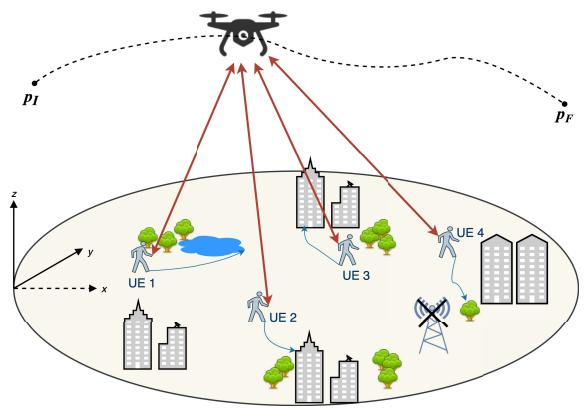

flowchart

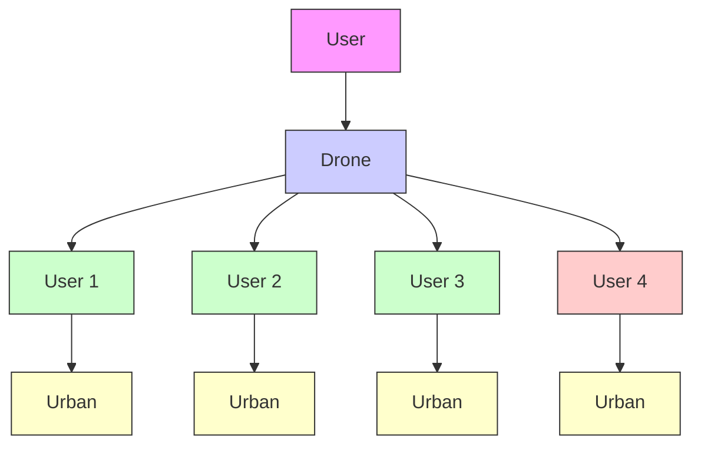

Fig. 1. UAV-enabled MEC system model.

# II. SYSTEM MODEL AND PROBLEM FORMULATION

As shown in Fig. 1, we consider a UAV-enabled MEC system consisting of a UAV-mounted cloudlet and a set ${ \cal K } = \{ 1 , 2 , \dots , K \}$ of K ground user equipments (UEs). = 1 2The UAV relies on limited on-board battery energy to fly above the ground users and provide edge computing service in duration D, which is equally discretized into a set ${ \mathcal { N } } =$ $\{ 1 , \ldots , N \}$ =of N time slots for the ease of exposition. The 1time slot length $\begin{array} { r } { \Delta \ = \ \frac { D } { N } } \end{array}$ is chosen to be sufficiently small Δ =such that the locations of the UAV and the UEs are considered as unchanged within each time slot regardless of the velocity (such as in [10], [12]).

# A. UE Mobility Model

Similar to [18], we assume that the UEs follow the Gauss-Markov mobility model, which is a commonly used model in cellular communication systems $[ 2 1 ] . ^ { 1 }$ Specifically, the velocity of UE $k \in \mathcal { K }$ at time $n + 1$ is derived from that at time $n \in \mathcal N$ as

$$
\mathbf {v} _ {k} [ n + 1 ] = \alpha \mathbf {v} _ {k} [ n ] + (1 - \alpha) \bar {\mathbf {v}} + \bar {\sigma} \sqrt {1 - \alpha^ {2}} \mathbf {w} _ {k} [ n ], \tag {1}
$$

where ${ \bf v } _ { k } [ n ] ~ = ~ ( v _ { k } ^ { x } [ n ] , v _ { k } ^ { y } [ n ] )$ is the velocity vector and $\mathbf { w } _ { k } [ n ] = ~ ( w _ { k } ^ { x } [ n ] , w _ { k } ^ { y } [ n ] )$ is an uncorrelated random Gaussian [ ]process ${ \mathcal { N } } ( 0 , \sigma ^ { 2 } )$ [ ]). Parameters α, v, σ represent the memory level, asymptotic mean and asymptotic standard deviation of velocity, respectively. Accordingly, the location is updated as

$$
\mathbf {p} _ {k} [ n + 1 ] = \mathbf {p} _ {k} [ n ] + \mathbf {v} _ {k} [ n ] \Delta , \tag {2}
$$

where ${ \bf p } _ { k } [ n ] = ( x _ { k } [ n ] , y _ { k } [ n ] )$ denotes the location of user k at [time n, and $\mathbf { p } _ { k } [ 1 ]$ [ ] [ ])denotes its initial location. At the beginning of time slot $n ,$ [1]we assume that the UAV knows the current locations $\{ \mathbf { p } _ { k } [ n ] \} _ { k = 1 } ^ { K }$ from the location feedback by the UEs, [ ] =1but the future trajectories $\{ \mathbf { p } _ { k } [ i ] \} _ { k = 1 } ^ { K } , \forall i \in \{ n + 1 , \dots , N \}$ are currently unknown to the UAV.

1We consider the Gauss-Markov mobility model for simplicity of illustration. The proposed online algorithm in this paper does not rely on the specific mobility model assumption.

# B. Communication Model

We assume that the UAV flies at a fixed altitude h during the whole period D with a maximum speed limit $v _ { m }$ , whereas the UAV altitude h is predetermined for the probabilistic line-ofsight (LoS) channel model. Its time-varying horizontal coordinates is denoted as ${ \bf p } _ { u } [ n ] = ( x _ { u } [ n ] , y _ { u } [ n ] )$ at time slot n. The [ ] = ( [ ]UAV starts from an initial position $\mathbf { p } _ { u } [ 1 ] = \mathbf { p } _ { I }$ and is required to reach a predetermined destination $\mathbf { p } _ { u } [ N + 1 ] = \mathbf { p } _ { F }$ at the [ + 1] =end of time. UEs are assumed to transmit data to the UAV using time division multiple access (TDMA) over the same channel with bandwidth W to avoid interference [3], [12]. We adopt the commonly used probabilistic LoS channel model to determine the large-scale attenuation for UAV-UE links [22]. The probability of geometrical LoS between the UAV and each UE depends on statistical parameters related to the environment and the elevation angle. Specifically, we denote the LoS probability of UE k at time slot n as $\mathbb { P } ( L o S , \theta _ { k } [ n ] )$ , ( [ ])which can be approximated to be a modified sigmoid function of the following form [22]

$$
\mathbb {P} (L o S, \theta_ {k} [ n ]) = \frac {1}{1 + a \exp (- b (\theta_ {k} [ n ] - a))}, \tag {3}
$$

where a and b are environment-related parameters, and $\theta _ { k } [ n ]$ is the elevation angle, which is

$$
\theta_ {k} [ n ] = \frac {1 8 0}{\pi} \arctan \left(\frac {h}{| | \mathbf {p} _ {u} [ n ] - \mathbf {p} _ {k} [ n ] | |}\right). \tag {4}
$$

Accordingly, the non-line-of-sight (NLoS) channel probability is equal to $\mathbb { P } ( N L o S , \theta _ { k } [ n ] ) ~ = ~ 1 - \mathbb { P } ( L o S , \theta _ { k } [ n ] )$ . ( [ ]) = 1Therefore, the expected channel power gain is

$$
\begin{array}{l} g _ {k} [ n ] = \frac {\mathbb {P} (L o S , \theta_ {k} [ n ]) g _ {0}}{d _ {k} [ n ] ^ {\bar {\iota}}} + \frac {(1 - \mathbb {P} (L o S , \theta_ {k} [ n ])) \kappa g _ {0}}{d _ {k} [ n ] ^ {\bar {\iota}}} \\ = \frac {\hat {\mathbb {P}} (L o S , \theta_ {k} [ n ]) g _ {0}}{\left(h ^ {2} + \left\| \mathbf {p} _ {u} [ n ] - \mathbf {p} _ {k} [ n ] \right\| ^ {2}\right) ^ {\frac {\tilde {\tau}}{2}}}, \tag {5} \\ \end{array}
$$

where $\begin{array} { r } { \hat { \mathbb { P } } ( L o S , \theta _ { k } [ n ] ) = \mathbb { P } ( L o S , \theta _ { k } [ n ] ) + ( 1 - \mathbb { P } ( L o S , \theta _ { k } [ n ] ) ) \kappa } \end{array}$ ( [ ]) = ( [ ]) + (1 ( [ ]))is the regularized LoS probability considering the attenuation effect of the NLoS channel with $\kappa \ : < 1$ , ι is the path loss 1 ˜exponent, g represents the channel gain at the reference distance $d _ { 0 } = 1$ m and $d _ { k } [ n ]$ is the distance between user k 0 = 1 [ ]and the UAV at time n. During one time slot, we assume that the change LoS probability $\mathbb { P } ( L o S , \theta _ { k } [ n ] )$ is negligible since the horizontal UAV movement within a short time slot is relatively small compared with the altitude. Then, the uplink transmission rate of UE k at time n is

$$
\begin{array}{l} R _ {k} [ n ] = W \log_ {2} \left(1 + \frac {P _ {k} g _ {k} [ n ]}{N _ {0}}\right) \\ = W \log_ {2} \left(1 + \frac {\gamma_ {k} [ n ]}{\left(h ^ {2} + \left| \left| \mathbf {p} _ {u} [ n ] - \mathbf {p} _ {k} [ n ] \right| \right| ^ {2}\right) ^ {\iota}}\right), \tag {6} \\ \end{array}
$$

where $\begin{array} { r } { \gamma _ { k } [ n ] ~ = ~ \frac { P _ { k } \widehat { \mathbb { P } } ( L o S , \theta _ { k } [ n ] ) g _ { 0 } } { N _ { \Omega } } , ~ \iota ~ = ~ \frac { \tilde { \iota } } { 2 } , ~ P _ { k } } \end{array}$ is the fixed [ ] = transmit power of UE k and $N _ { 0 }$ = 2 is the noise power. Compared to the free-space path loss channel models assumed in the previous work [10], [12], [20], the probabilistic model is more general by taking into account the effect of LoS/NLoS channel probability and dealing with more common path loss exponent $\tilde { \iota } \geq 2$ instead of one special case $\tilde { \iota } = 2$ .

# C. Computation Task Model and Execution Methods

The computation task arrival of each UE is modeled as an i.i.d. Bernoulli process[23]. At the beginning of each time slot, we assume that a computation task with fixed data size $I _ { k }$ (in bits) arrives at user $k \in \mathcal { K }$ with probability $\rho _ { k }$ . Denote $A _ { k } [ n ]$ as the number of arriving bits at time n with $\mathbb { P } ( A _ { k } [ n ] =$ $I _ { k } ) = 1 - \mathbb { P } ( A _ { k } [ n ] = 0 ) = \rho _ { k }$ ( [ ] =. Each UE maintains a queue ) = 1 ( [ ] = 0) =for the task arrivals, which will be processed on a FIFO basis. Following the partial computation offloading model in each time slot, the computation tasks are partitioned into two parts, with one processed locally and the other offloaded to and processed at the aerial MEC server. The details are as follows.

1) Local Computing at UE: Since the communication circuit and the computation unit are separate, each user can simultaneously perform local computing and computation offloading. The CPU frequency of UE k during time slot n is denoted as $f _ { k } [ n ]$ (cycles/second), which is adaptively con-[ ]trolled by leveraging the dynamic voltage and frequency scaling technique [24]. The executed computation bits and the consumed energy within time slot n are given respectively as

$$
l _ {k} ^ {c} [ n ] = f _ {k} [ n ] \Delta / C _ {k}, E _ {k} ^ {c} [ n ] = \gamma_ {c} f _ {k} ^ {3} [ n ] \Delta , (7)
$$

where $C _ { k }$ is the required number of CPU cycles for computing one bit of input, and $\gamma _ { c }$ is the effective capacitance coefficient of the processor’s chip that is determined by the chip architecture [25].

2) Computation Offloading: We assume that the users offload their computation tasks to the UAV using TDMA. At the beginning of time slot n, the UEs transmit the state information to the UAV during $t _ { 0 } .$ . The remaining time is further divided into K sub-slots $\{ \delta _ { k } [ n ] \} _ { k = 1 } ^ { K }$ with $t _ { 0 } +$ $\begin{array} { r } { \sum _ { k = 1 } ^ { K } \delta _ { k } [ n ] ~ \le ~ \Delta } \end{array}$ , and $\delta _ { k } [ n ]$ [ ] =1 0 +is for UE k to offload its =1 [ ] Δ [ ]computation task. The offloaded data size and the consumed energy are respectively expressed as

$$
l _ {k} ^ {o} [ n ] = \delta_ {k} [ n ] W \log_ {2} (1 + \frac {P _ {k} g _ {k} [ n ]}{N _ {0}}), \quad E _ {k} ^ {o} [ n ] = \delta_ {k} [ n ] P _ {k}. \tag {8}
$$

Similar to existing work such as [3] and [12], we neglect the edge computation time and the feedback downloading time because the UAV has substantial computation capability and the length of output result is relatively small. Therefore, there is no queue backlog at the UAV at the end of each time slot.

3) Task Queue Model: For simplicity of analysis, we assume for the moment that the buffer has infinite capacity. Later, we will prove that the queue length will not exceed an upper bound when implementing the proposed online algorithm. In fact, our algorithm can also be applied to the case of finite capacity storage with an additional data admission policy. Accordingly, the task queue backlog $Q _ { k } [ n ]$ evolves as

$$
Q _ {k} [ n + 1 ] = \max \left\{Q _ {k} [ n ] + A _ {k} [ n ] - l _ {k} [ n ], 0 \right\}, \quad \forall n \in \mathcal {N}, \tag {9}
$$

k[1] = 0   k[ ] =  k[ ] +  k[executed bits at time slot n. We refer to the queue with $Q _ { k } [ 1 ] = 0 , \forall k \in \mathcal { K }$ , and $l _ { k } [ n ] = l _ { k } ^ { c } [ n ] + l _ { k } ^ { o } [ n ]$ $\mathrm { \bar { \{ Q _ { k } [ n ] \} } } _ { k = 1 } ^ { K }$ is the total as stable[26] if

$$
\lim _ {N \to \infty} \frac {1}{N} \sum_ {n = 1} ^ {N} \sum_ {k = 1} ^ {K} \mathbb {E} \{Q _ {k} [ n ] \} <   \infty , \tag {10}
$$

where the expectation is taken with respect to the time-varying channels and random task data arrivals.

# D. Propulsion Energy Model for Rotary-Wing UAV

The propulsion energy is the major energy consumption during UAV flight, which is far larger than that consumed on communications and computing. Similar to [11], we solicit the existing analytical model for rotary-wing UAV and express the power as a function of velocity

$$
P _ {U A V} (v) = \underbrace {C _ {1} \left(1 + \frac {3 v ^ {2}}{v _ {\text {tip }} ^ {2}}\right)} _ {\text {blade profile}} + \underbrace {C _ {2} \sqrt {\sqrt {C _ {3} + \frac {v ^ {4}}{4}} - \frac {v ^ {2}}{2}}} _ {\text {induced}} + \underbrace {C _ {4} v ^ {3}} _ {\text {parasite}}. \tag {11}
$$

where $v _ { t i p }$ is the tip speed of the rotor, and $C _ { 1 } , C _ { 2 } , C _ { 3 } , C _ { 4 }$ are 1 2 3 4constants related to the UAV’s weight and its aerodynamic parameters[27]. The propulsion power consumption of rotary-wing UAVs consists of three components: blade profile, induced, and parasite power. The blade profile power and parasite power, which increase quadratically and cubically with $v ,$ respectively, are needed to overcome the profile drag of the blades and the fuselage drag, respectively. On the other hand, the induced power is that required to overcome the induced drag of the blades, which decreases with v. This analytical model covers both hovering mode and flying mode of a UAV.

# E. Problem Formulation

Given the upper limit $E ^ { u }$ of the UAV’s average per-slot energy consumption, we minimize the weighted sum energy consumption of the UEs by jointly optimizing the computation and communication resource allocation (CPU frequencies of the UEs and the offloading time durations) and the UAV trajectory. The problem is formulated as the following multi-stage stochastic optimization problem

$$
\mathcal {P} 1: \min_ {\substack {\boldsymbol {f} [ n ], \boldsymbol {\delta} [ n ],\\\mathbf {p} _ {u} [ n ], \forall n}} \lim_ {N \rightarrow \infty} \frac {1}{N} \sum_ {n = 1} ^ {N} \sum_ {k = 1} ^ {K} w _ {k} (E _ {k} ^ {c} [ n ] + E _ {k} ^ {o} [ n ]), \tag{12a}
$$

$$
\text { s.t. } \quad \lim _ {N \to \infty} \frac {1}{N} \sum_ {n = 1} ^ {N} \mathbb {E} \{E _ {U A V} [ n ] \} \leq E ^ {u}, \tag {12b}
$$

$$
\lim _ {N \to \infty} \frac {1}{N} \sum_ {n = 1} ^ {N} \sum_ {k = 1} ^ {K} \mathbb {E} \{Q _ {k} [ n ] \} <   \infty , (1 2 c)
$$

$$
0 \leq f _ {k} [ n ] \leq f _ {k} ^ {m}, \quad \forall k, n, \tag {12d}
$$

$$
t _ {0} + \sum_ {k = 1} ^ {K} \delta_ {k} [ n ] \leq \Delta , \quad \delta_ {k} [ n ] \geq 0, \quad \forall k, n, \tag {12e}
$$

$$
l _ {k} ^ {c} [ n ] + l _ {k} ^ {o} [ n ] \leq Q _ {k} [ n ] + A _ {k} [ n ], \quad \forall k, n, \tag {12f}
$$

$$
\mathbf {p} _ {u} [ 1 ] = \mathbf {p} _ {I}, \mathbf {p} _ {u} [ N + 1 ] = \mathbf {p} _ {F}, \tag {12g}
$$

$$
\left| \left| \mathbf {p} _ {u} [ n + 1 ] - \mathbf {p} _ {u} [ n ] \right| \right| \leq v _ {m} \Delta , \quad \forall n, \tag {12h}
$$

$$
\left| \left| \mathbf {p} _ {F} - \mathbf {p} _ {u} [ n + 1 ] \right| \right| \leq v _ {m} (N - n) \Delta , \tag {12i}
$$

where the optimization variables ${ \pmb f } [ n ] , \delta [ n ] , { \bf p } _ { u } [ n ]$ are the com-[ ] [ ]bined vector of all UEs’ CPU frequencies $( \mathrm { i . e . , \bar { \{ } }  f _ { k } [ n ] \} _ { k = 1 } ^ { K } )$ , [ ] =1the combined vector of all UEs’ offloading time (i.e., $\{ \delta _ { k } [ n ] \} _ { k = 1 } ^ { K } )$ and the UAV trajectory at time slot $n ,$ [ ] =1respectively. Constraint (12b) is the long-term UAV propulsion energy constraint. Constraint (12c) is the asymptotic queue stability requirement. (12d) introduces the limit of CPU frequencies. (12e) is the offloading time constraint. (12f) states that the processed bits cannot exceed the queue backlog plus the data arrival for each time slot. $( 1 2 \mathrm { g } ) \textrm { - } ( 1 2 \mathrm { i } )$ are the trajectory and speed constraints of the UAV.

Without the future knowledge of data arrivals and user locations, it is hard to satisfy the long-term stability constraint and UAV energy constraint. The non-convex problem P cannot 1be solved offline since it requires real-time decision-making based on the current state information. Besides, the trajectory of UAV couples with the offloading computation of the UEs, which makes the problem more intractable. In the following, we apply the Lyapunov optimization framework to design an online algorithm.

# III. LYAPUNOV-BASED ONLINE CONTROL ALGORITHM

In this section, we apply the Lyapunov optimization to decouple the multi-stage stochastic problem into per-slot deterministic optimization problems that optimize the resource allocation and UAV movement within each time slot.

To cope with the average power consumption constraint in (12b), we introduce a virtual queue as a measurement of the accumulated UAV propulsion energy cost exceeding the required threshold. By setting $Q _ { u } [ 1 ] = 0 \mathrm { { . } }$ , the virtual queue evolves as

$$
Q _ {u} [ n + 1 ] = \max \left\{Q _ {u} [ n ] + E _ {U A V} [ n ] - E ^ {u}, 0 \right\}, \quad \forall n \in \mathcal {N}. \tag {13}
$$

Combining the task queues and the virtual energy queue, we define the Lyapunov function as

$$
L (\boldsymbol {Q} [ n ]) = \frac {1}{2} (Q _ {u} ^ {2} [ n ] + \sum_ {k = 1} ^ {K} Q _ {k} ^ {2} [ n ]), \tag {14}
$$

where $\pmb { Q } [ n ] = \left( Q _ { u } [ n ] , \{ Q _ { k } [ n ] \} _ { k = 1 } ^ { K } \right)$ is the concatenated vec-[ ] = [ ] [ ] =1tor of the virtual energy queue and all actual queue backlogs. In practice, we scale the task queues and the virtual queue to be within the similar magnitude to fasten the control process to reach stability. The conditional Lyapunov drift is defined as

$$
\Delta L (\boldsymbol {Q} [ n ]) = \mathbb {E} \{L (\boldsymbol {Q} [ n + 1 ]) - L (\boldsymbol {Q} [ n ]) | \boldsymbol {Q} [ n ] \}. \tag {15}
$$

Then, the drift-plus-penalty [26] is expressed as

$$
D (\boldsymbol {Q} [ n ]) = \Delta L (\boldsymbol {Q} [ n ]) + V \mathbb {E} \{E _ {s} [ n ] | \boldsymbol {Q} [ n ] \}, \tag {16}
$$

where $E _ { s } [ n ]$ is the weighted sum energy consumption and [ ]V is a parameter to control the tradeoff between the system energy cost and the queue stability. To minimize the average system energy cost and maintain long-term queue stability, we minimize $D ( Q [ n ] )$ opportunistically in each time slot n. ( [ ])In the following, we first derive an upper bound of $D ( Q [ n ] )$ .

Theorem 1: For an arbitrary queue backlog $Q [ n ]$ ( [ ]), the driftplus-penalty is upper bounded as

$$
\begin{array}{l} D (\boldsymbol {Q} [ n ]) \\ \leq Q _ {u} [ n ] \mathbb {E} \left\{E _ {U A V} [ n ] - E ^ {u} | \boldsymbol {Q} [ n ] \right\} + V \mathbb {E} \left\{E _ {s} [ n ] | \boldsymbol {Q} [ n ] \right\} \\ + \sum_ {k = 1} ^ {K} \mathbb {E} \left\{Q _ {k} [ n ] A _ {k} [ n ] - \left(Q _ {k} [ n ] + A _ {k} [ n ]\right) l _ {k} [ n ] | Q [ n ] \right\} + \tilde {B} \tag {17} \\ \end{array}
$$

where $\tilde { B }$ is a finite constant.

Proof: Please see the detailed proof in Appendix A

Instead of directly minimizing the drift-plus-penalty, we minimize the upper bound of $D ( Q [ n ] )$ given in the ( [ ])right-hand-side (RHS) of (17) opportunistically. Specifically, at time slot $n ,$ we observe the queue state $Q [ n ]$ , the arrival tasks $\{ A _ { k } [ n ] \} _ { k = 1 } ^ { K } ,$ , the current UAV location $\mathbf { p } _ { u } [ n ]$ , and the [ ]user locations $\{ \mathbf { p } _ { k } [ n ] \} _ { k = 1 } ^ { K } .$ [ ] Accordingly, we control the UAV [ ] =1movement and user task offloading strategies by solving the following optimization problem

$$
\min _ {\boldsymbol {f} [ n ], \boldsymbol {\delta} [ n ], \mathbf {p} _ {u} [ n + 1 ]} Q _ {u} [ n ] E _ {U A V} [ n ] + V E _ {s} [ n ]
$$

$$
- \sum_ {k = 1} ^ {K} (Q _ {k} [ n ] + A _ {k} [ n ]) l _ {k} [ n ],
$$

$$
\text { s.t. } \quad (1 2 \mathrm{d}) - (1 2 \mathrm{i}), \tag {18}
$$

where the objective is obtained by eliminating the constant terms in the RHS of (17) given $Q [ n ]$ . Thus far, we decouple [ ]the original multi-stage optimization problem into a series of deterministic problems in (18) for $n \in { \mathcal { N } } .$ For simplicity of illustration, we focus on a tagged time slot n and let $q _ { k } =$ $Q _ { k } [ n ] + A _ { k } [ n ]$ , drop the time index $n ,$ and use $\mathbf { p } _ { u ^ { \prime } }$ =to substitute $\mathbf { p } _ { u } [ n + 1 ]$ [ ]. Therefore, the problem is rewritten as follows

$$
\mathcal {P} 2: \min _ {\boldsymbol {f}, \boldsymbol {\delta}, \mathbf {p} _ {u ^ {\prime}}} Q _ {u} E _ {U A V} - \sum_ {k = 1} ^ {K} q _ {k} (l _ {k} ^ {c} + l _ {k} ^ {o}) + V E _ {s}, \tag {19a}
$$

$$
\text { s.t. } \quad 0 \leq f _ {k} \leq f _ {k} ^ {m}, \quad \forall k \tag {19b}
$$

$$
\delta_ {k} \geq 0, \quad \forall k, \tag {19c}
$$

$$
\sum_ {k = 1} ^ {K} \delta_ {k} \leq \Delta - t _ {0}, \tag {19d}
$$

$$
l _ {k} ^ {c} + l _ {k} ^ {o} \leq q _ {k}, \quad \forall k, \tag {19e}
$$

$$
\left| \left| \mathbf {p} _ {u ^ {\prime}} - \mathbf {p} _ {u} \right| \right| \leq v _ {m} \Delta , \tag {19f}
$$

$$
\left| \left| \mathbf {p} _ {F} - \mathbf {p} _ {u ^ {\prime}} \right| \right| \leq v _ {m} (N - n) \Delta . \tag {19g}
$$

We summarize our online control strategy in Algorithm 1. In Section V, we will show that we can satisfy the long-term queue stability and average UAV energy consumption constraints in P by solving the per-slot problems $\mathcal { P } 2$ in an 1online manner. Nonetheless, $\mathcal { P } 2$ 2is a non-convex problem 2because all UEs’ transmission rates are coupled with the UAV trajectory in the objective and constraint (19e), where the optimal solution is hard to obtain. In the following sections, we propose two efficient methods to solve the non-convex problem P .

# IV. SOLUTION ALGORITHMS TO PER-SLOT PROBLEM $\mathcal { P } 2$

We first propose a two-stage method to solve P , which 2decides the resource allocation and the UAV trajectory control in two separate stages. The second method jointly optimizes the resource allocation and UAV trajectory control.

# A. Decoupled Resource Allocation and Trajectory Optimization

The first solution method optimizes the resource allocation and UAV trajectory sequentially. We first assume a feasible $\mathbf { p } _ { u ^ { \prime } }$ in (19) and optimize the resource allocation $\{ f _ { k } , \delta _ { k } \}$ for all the UEs. We then fix the obtained resource allocation solution and optimize the UAV movement. Supposing that $\mathbf { p } _ { u ^ { \prime } } = \mathbf { p } _ { u } ,$ we calculate the channel gain $g _ { k }$ =and the offloading rate $R _ { k }$ using equation (5) and (6), respectively. By substituting $R _ { k }$ into (19) and eliminating the unrelated terms in the objective and constraints, we obtain the optimal resource allocation by solving the following problem

Algorithm 1 Lyapunov-Based Online Control Algorithm   
1: Initialization: $Q_{k}[1] \leftarrow 0, \forall k, Q_{u}[1] \leftarrow 0, p_{I}, p_{F}, v_{m};$ 2: for n = 1 to N do
3:    Acquire $Q[n], \{A_{k}[n]\}_{k=1}^{K}, p_{u}[n]$ , and $\{p_{k}[n]\}_{k=1}^{K};$ 4:    Obtain $\{f_{k}^{opt}[n], \delta_{k}^{opt}[n]\}_{k=1}^{K}$ and $p_{u}^{opt}[n+1]$ by solving P2;
5:    for each UE k do
6:    Execute $l_{k}^{c}[n]$ bits locally using $f_{k}^{opt}[n];$ 7:    Offload data with size $l_{k}^{o}[n]$ to UAV during $\delta_{k}^{opt}[n];$ 8:    Update user data queue $Q_{k}[n+1]$ according to (9);
9:    end for
10: The UAV provides MEC service to the UEs and flies towards $p_{u}^{opt}[n+1];$ 11: Update the virtual energy queue $Q_{u}[n+1]$ according to (13);
12: end for

$$
\begin{array}{l} \mathcal {P} 3. 1: \quad \min _ {\boldsymbol {f}, \boldsymbol {\delta}} - \sum_ {k = 1} ^ {K} q _ {k} (f _ {k} \Delta / C _ {k} + R _ {k} \delta_ {k}) \\ + V \sum_ {k = 1} ^ {K} w _ {k} (\gamma_ {c} f _ {k} ^ {3} \Delta + P _ {k} \delta_ {k}), \\ \end{array}
$$

The above problem is convex, and thus its dual problem achieves the same optimal value by the strong duality theorem[28]. Let $\nu \geq 0$ denote the dual variable associated with 0the coupling constraint (19d). Then, the partial Lagrangian function of this problem is

$$
\begin{array}{l} L (\boldsymbol {f}, \boldsymbol {\delta}, \nu) = - \sum_ {k = 1} ^ {K} q _ {k} (f _ {k} \Delta / C _ {k} + R _ {k} \delta_ {k}) \\ + V \sum_ {k = 1} ^ {K} w _ {k} (\gamma_ {c} f _ {k} ^ {3} \Delta + P _ {k} \delta_ {k}) \\ + \nu (\sum_ {k = 1} ^ {K} \delta_ {k} - \Delta + t _ {0}). \tag {21} \\ \end{array}
$$

The Lagrangian dual function is

$$
d (\nu) = \inf _ {\boldsymbol {f}, \boldsymbol {\delta}} L (\boldsymbol {f}, \boldsymbol {\delta}, \nu) \tag {22a}
$$

$\mathrm { s . t . } \quad 0 \leq f _ { k } \leq f _ { k } ^ { m } , \quad \forall k ,$ (22b)

$\delta _ { k } \geq 0 , \forall k .$ (22c)

We obtain the optimal solutions by solving the dual problem $\operatorname* { m a x } _ { \nu \geq 0 } d ( \nu )$ . A closer observation of (22) shows max 0 ( )that the dual function can be decomposed into K parallel sub-problems with given ν. Each sub-problem solves

$$
\min _ {f _ {k}, \delta_ {k}} - q _ {k} (f _ {k} \Delta / C _ {k} + R _ {k} \delta_ {k})
$$

$+ \ V w _ { k } ( \gamma _ { c } f _ { k } ^ { 3 } \Delta + P _ { k } \delta _ { k } ) + \nu \delta _ { k } ,$ (23a)

$\mathrm { s . t . } \quad 0 \leq f _ { k } \leq f _ { k } ^ { m } , \quad \delta _ { k } \geq 0 ,$ (23b)

$f _ { k } \Delta / C _ { k } + R _ { k } \delta _ { k } \leq q _ { k } .$ (23c)

Given $\nu ,$ we solve the independent sub-problems simultaneously in parallel to reduce computation time. Each sub-problem has the same structure, i.e., convex over $f _ { k }$ and linear in $\delta _ { k }$ . To facilitate the derivation of closed-form solution, we introduce an auxiliary variable $s _ { k } = f _ { k } \Delta / C _ { k } + R _ { k } \delta _ { k }$ . Then, we equivalently express (23) as

$$
\min _ {0 \leq s _ {k} \leq q _ {k}} F _ {k} (s _ {k}) \tag {24}
$$

where the objective follows

$$
\begin{array}{l} F _ {k} (s _ {k}) = \min _ {0 \leq f _ {k} \leq f _ {k} ^ {m}} \left(- q _ {k} s _ {k} + V w _ {k} \gamma_ {c} f _ {k} ^ {3} \Delta \right. \\ \left. + \left(V w _ {k} P _ {k} + \nu\right) \left(\frac {s _ {k}}{R _ {k}} - f _ {k} \frac {\Delta}{C _ {k} R _ {k}}\right)\right). \tag {25} \\ \end{array}
$$

The following Theorem 2 derives the semi-closed form of the optimal CPU frequency in (25).

Theorem 2: The optimal computation frequency to problem (25) is

$$
f _ {k} ^ {\text { opt }} = \min \left\{\sqrt {\frac {V w _ {k} P _ {k} + \nu}{3 V w _ {k} \gamma_ {c} C _ {k} R _ {k}}}, f _ {k} ^ {m} \right\}. \tag {26}
$$

Proof: Because the objective of (25) is a strictly convex function in $f _ { k }$ , the minimum is achieved either at the boundary point $f _ { k } ^ { m }$ or when the partial derivative is zero. Let the derivative of $F _ { k }$ be zero,

$$
\frac {\partial F _ {k}}{\partial f _ {k}} = 3 V w _ {k} \gamma_ {c} f _ {k} ^ {2} \Delta - (V w _ {k} P _ {k} + \nu) \frac {\Delta}{C _ {k} R _ {k}} = 0, \tag {27}
$$

which leads to the optimal solution $f _ { k } ^ { o p t }$ as in (26).

By plugging f opk $f _ { k } ^ { o p t }$ into (24), we solve

$$
\begin{array}{l} \min _ {0 \leq s _ {k} \leq q _ {k}} F _ {k} (s _ {k}) = - q _ {k} s _ {k} + V w _ {k} \gamma_ {c} (f _ {k} ^ {\text { opt }}) ^ {3} \Delta \\ + (V w _ {k} P _ {k} + \nu) (\frac {s _ {k}}{R _ {k}} - f _ {k} ^ {o p t} \frac {\Delta}{C _ {k} R _ {k}}), \tag {28} \\ \end{array}
$$

where we see that $F _ { k } ( s _ { k } )$ is linear over $s _ { k }$ with slope $\iota _ { k } =$ $\begin{array} { r } { - q _ { k } + \frac { V w _ { k } P _ { k } + \nu } { R _ { k } } } \end{array}$ Rk ( ) . Thus, the optimal value of $s _ { k } ,$ denoted as $s _ { k } ^ { * } ,$ + is at one of the boundary points depending on the value of $\iota _ { k }$ . That is,

$$
s _ {k} ^ {*} = \left\{ \begin{array}{l l} q _ {k}, & \iota_ {k} <   0, \\ 0, & \iota_ {k} \geq 0. \end{array} \right. \tag {29}
$$

Then, we obtain the optimal $\delta _ { k }$ using

$$
\delta_ {k} ^ {*} = \max \left\{\frac {s _ {k} ^ {*}}{R _ {k}} - f _ {k} ^ {\text { opt }} \frac {\Delta}{C _ {k} R _ {k}}, 0 \right\}. \tag {30}
$$

Accordingly, we obtain the subgradient of ν as $( \sum _ { k = 1 } ^ { K } \delta _ { k } ^ { * } \ - \ \Delta )$ , such that the optimal dual variable $\nu ^ { * }$ ( =1 Δ)can be obtained using a bisection method over , γ , where $\bar { \gamma }$ [0is a sufficiently large value. Given the optimal $\nu ^ { * }$ , ¯we substitute (26) into (20) and eliminate the constant terms. Then, it remains to solve the following linear programming problem to obtain the optimal $\delta _ { k } ^ { o p t }$

$$
\min _ {\delta} \sum_ {k = 1} ^ {K} (- q _ {k} R _ {k} + V w _ {k} P _ {k}) \delta_ {k}, \tag {31a}
$$

$\begin{array} { r } { \mathrm { s . t . } \sum _ { k = 1 } ^ { K } \delta _ { k } \leq \Delta - t _ { 0 } . } \end{array}$ k=1 (31b)

Solving (31) incurs much lower complexity than solving the original convex problem (20). We summarize the first stage to solve the resource allocation problem P . in Algorithm 2.

Algorithm 2 Solution Algorithm to First Stage Problem in P .   
1: Input: The UE locations $\{p_{k}\}_{k=1}^{K}$ and the current UAV location $p_{u}$ 2: Output: The optimal resource allocation $\{f^{opt}, \delta^{opt}\}$ 3: Initialization: $\sigma_{0} \leftarrow 0.01, \bar{\gamma} \leftarrow$ a sufficiently large value, $p_{u'} \leftarrow p_{u}$ ;
Use (5) and (6) to obtain the channel gain $g_{k}$ and the transmission rate $R_{k}$ of UE $k, \forall k \in K$ ;
4: $UB \leftarrow \bar{\gamma}, LB \leftarrow 0;$ 5: repeat
6: $\nu = \frac{LB + UB}{2};$ 7: for k = 1 to K do
8: Obtain $f_{k}^{opt}$ using (26) and calculate $\iota_{k} = -q_{k} + \frac{Vw_{k}P_{k} + \nu}{R_{k}};$ 9: Obtain $s_{k}$ and $\delta_{k}$ using (29) and (30), respectively;
10: end for
11: if $\sum_{k=1}^{K} \delta_{k} > \Delta$ then
12: LB = $\nu;$ 13: else
14: UB = $\nu;$ 15: end if
16: until $|UB - LB| \leq \sigma_{0}$ 17: Substitute $f^{opt}$ to P3.1 and solve (31) to obtain $\delta^{opt}$ 18: Return: $\{f^{opt}, \delta^{opt}\}$

Given the optimal resource allocation $\{ f ^ { o p t } , \delta ^ { o p t } \}$ in $\mathcal { P } 2$ 2we proceed to optimize the UAV movement by solving the following problem

$$
\min _ {\mathbf {p} _ {u ^ {\prime}}} Q _ {u} E _ {U A V} - \sum_ {k = 1} ^ {K} q _ {k} W \delta_ {k} ^ {o p t} \log_ {2} \left(1 + \frac {\gamma_ {k}}{(h ^ {2} + \| \mathbf {p} _ {u} ^ {\prime} - \mathbf {p} _ {k} \| ^ {2}) ^ {\iota}}\right),
$$

$\mathrm { s . t . } \quad ( 1 9 \mathrm { f } ) \ – ( 1 9 \mathrm { g } )$ (32)

Recall that the propulsion energy is

$$
\begin{array}{l} E _ {U A V} = P _ {U A V} (v) \Delta \\ = \left(C _ {1} (1 + \frac {3 v ^ {2}}{v _ {t i p} ^ {2}}) + C _ {2} \sqrt {\sqrt {C _ {3} + \frac {v ^ {4}}{4}} - \frac {v ^ {2}}{2}} + C _ {4} v ^ {3}\right) \Delta , \tag {33} \\ \end{array}
$$

where $\begin{array} { r } { v = \frac { | | { \mathbf p } _ { u ^ { \prime } } - { \mathbf p } _ { u } | | } { \Delta } } \end{array}$ . To deal with the non-convexity of the = ΔUAV’s propulsion energy function, we introduce an auxiliary slack variable y such that

$$
y ^ {2} \geq \sqrt {C _ {3} + \frac {v ^ {4}}{4}} - \frac {v ^ {2}}{2} \implies \frac {C _ {3}}{y ^ {2}} \leq y ^ {2} + v ^ {2}. \tag {34}
$$

Plugging (34) into (32), we equivalently express the problem (32) as

$$
\begin{array}{l} \min _ {\mathbf {p} _ {u ^ {\prime}}, y} Q _ {u} \left(C _ {1} (1 + \frac {3 v ^ {2}}{v _ {t i p} ^ {2}}) + C _ {2} y + C _ {4} v ^ {3}\right) \Delta \\ - \sum_ {k = 1} ^ {K} q _ {k} \delta_ {k} ^ {\text { opt }} W \log_ {2} \left(1 + \frac {\gamma_ {k}}{\left(h ^ {2} + \left\| \mathbf {p} _ {u} ^ {\prime} - \mathbf {p} _ {k} \right\| ^ {2}\right) ^ {\iota}}\right), \tag {35a} \\ \end{array}
$$

$\begin{array} { r l } { \mathrm { s . t . ~ } } & { \frac { C _ { 3 } } { y ^ { 2 } } \leq y ^ { 2 } + v ^ { 2 } , } \\ & { ( 1 9 \mathrm { f } ) – ( 1 9 \mathrm { g } ) . } \end{array}$

(35b)

The inequality in constraint (35b) must hold at optimum, and so does the inequality in (34), because otherwise we can decrease the objective without violating the constraint (35b) by choosing a smaller $y .$ Therefore, (35) is equivalent to (32). We apply the successive convex approximation (SCA) method to solve problem (35). We observe that the transmission rate of UE k in the objective is non-convex with respect to $\mathbf { p } _ { u ^ { \prime } }$ . Thus, we introduce an auxiliary variable $\xi _ { k }$ such that

$$
\xi_ {k} \leq W \log_ {2} \left(1 + \frac {\gamma_ {k}}{(h ^ {2} + \| \mathbf {p} _ {u ^ {\prime}} - \mathbf {p} _ {k} \| ^ {2}) ^ {\iota}}\right), \tag {36}
$$

where the RHS has a concave lower bound as given by Proposition 1.

Proposition 1: Given a local point $\mathbf { p } _ { u ^ { \prime } } ^ { ( l ) }$ at the l-th iteration, the transmission rate of UE k is lower bounded by

$$
\begin{array}{l} R _ {k} ^ {(l)} \left\{\mathbf {p} _ {u ^ {\prime}} \right\} \triangleq W \log_ {2} \left(1 + \frac {\gamma_ {k}}{\left(h ^ {2} + \left| \left| \mathbf {p} _ {u ^ {\prime}} ^ {(l)} - \mathbf {p} _ {k} \right| \right| ^ {2}\right) ^ {\iota}}\right) \\ - \beta_ {k} (| | \mathbf {p} _ {u ^ {\prime}} - \mathbf {p} _ {k} | | ^ {2} - | | \mathbf {p} _ {u ^ {\prime}} ^ {(l)} - \mathbf {p} _ {k} | | ^ {2}), \tag {37} \\ \end{array}
$$

where βk $\begin{array} { r } { \beta _ { k } = \frac { W ( \log _ { 2 } e ) \gamma _ { k } \iota } { [ \gamma _ { k } + ( h ^ { 2 } + | | \mathbf { p } _ { u ^ { \prime } } ^ { ( l ) } - \mathbf { p } _ { k } | | ^ { 2 } ) ^ { \iota } ] ( h ^ { 2 } + | | \mathbf { p } _ { u ^ { \prime } } ^ { ( l ) } - \mathbf { p } _ { k } | | ^ { 2 } ) } . } \end{array}$

[ +( + u ) ](Proof: Consider the function $\begin{array} { r } { f ( z ) \stackrel { \circ } { = } \log _ { 2 } ( 1 + \frac { a } { ( b + z ) ^ { c } } ) , } \end{array}$ , where $a , b \ > \ 0 , c \ \geq \ 1$ and $z \geq 0$ ( ) = lo. Since $f ( z )$ + ( + ) )is convex 0 1 0 ( )with respect to z, its first-order Taylor expansion is a global under-estimator[28]. Given a local point $z _ { 0 } ,$ , the inequality $f ( z ) ~ \ge ~ f ( z _ { 0 } ) + f ^ { \prime } ( z _ { 0 } ) ( z - z _ { 0 } )$ 0holds for any z, where $f ^ { \prime } ( z _ { 0 } )$ ( 0) + ( 0)( 0)is the derivative the function $f ( z )$ at point $z _ { 0 }$ and $\begin{array} { r } { f ^ { \prime } ( z _ { 0 } ) = \frac { - ( \log _ { 2 } e ) a c } { [ a + ( b + z _ { 0 } ) ^ { c } ] ( b + z _ { 0 } ) } } \end{array}$ ( ) 0. Therefore, we derive the following ( 0) = [inequality

$$
\log_ {2} \left(1 + \frac {a}{(b + z) ^ {c}}\right) \geq \log_ {2} \left(1 + \frac {a}{(b + z _ {0}) ^ {c}}\right) - \frac {\left(\log_ {2} e\right) a c (z - z _ {0})}{\left[ a + (b + z _ {0}) ^ {c} \right] (b + z _ {0})}. \tag {38}
$$

With $a \ = \ \gamma _ { k } , b \ = \ h ^ { 2 } , c \ = \ \iota \ \mathrm { a n d } z _ { 0 } \ = \ | | { \bf p } _ { u ^ { \prime } } ^ { ( l ) } - { \bf p } _ { k } | | ^ { 2 } ,$ = =we obtain the lower bound.

Because the RHS of the speed constraint in (35b) is a convex function, the problem is still non-convex. By applying the first-order Taylor expansion of the RHS, we derive a global concave lower bound as

$$
\begin{array}{l} Y ^ {(l)} \left\{\mathbf {p} _ {u ^ {\prime}}, y \right\} \triangleq (y ^ {(l)}) ^ {2} + 2 y ^ {(l)} (y - y ^ {(l)}) \\ + \frac {\left| \left| \mathbf {p} _ {u ^ {\prime}} ^ {(l)} - \mathbf {p} _ {u} \right| \right| ^ {2}}{\Delta^ {2}} + \frac {2}{\Delta^ {2}} \left(\mathbf {p} _ {u ^ {\prime}} ^ {(l)} - \mathbf {p} _ {u}\right) ^ {T} \left(\mathbf {p} _ {u ^ {\prime}} - \mathbf {p} _ {u}\right), \tag {39} \\ \end{array}
$$

where $y ^ { ( l ) }$ is defined as

$$
y ^ {(l)} = \sqrt {\sqrt {C _ {3} + \frac {| | \mathbf {p} _ {u ^ {\prime}} ^ {(l)} - \mathbf {p} _ {u} | | ^ {4}}{4 \Delta^ {4}} - \frac {| | \mathbf {p} _ {u ^ {\prime}} ^ {(l)} - \mathbf {p} _ {u} | | ^ {2}}{2 \Delta^ {2}}}}. \tag {40}
$$

After applying the approximations to the speed constraint and the objective using the concave lower bounds (37) and (39), the trajectory optimization in (32) becomes the following problem in the l-th iteration

$$
\begin{array}{l} \mathcal {P} 3. 2: \min _ {\mathbf {p} _ {u ^ {\prime}}, y, \xi_ {k}} Q _ {u} \left(C _ {1} (1 + \frac {3 v ^ {2}}{v _ {t i p} ^ {2}}) + C _ {2} y + C _ {4} v ^ {3}\right) \Delta \\ - \sum_ {k = 1} ^ {K} q _ {k} \delta_ {k} ^ {\text { opt }} \xi_ {k} \tag {41a} \\ \frac {C _ {3}}{y ^ {2}} \leq Y ^ {(l)} \{\mathbf {p} _ {u ^ {\prime}}, y \}, \\ \end{array}
$$

P . is convex and can be efficiently solved by off-the-shelf 3 2optimization tools such as CVX [29]. In the $( l + \bar { 1 } ) ^ { t h }$ iteration, we treat the obtained optimal value $\mathbf { p } _ { u ^ { \prime } } ^ { o p t }$ opt ( + 1)as the new local point the lo $\mathbf { p } _ { u ^ { \prime } } ^ { ( l + 1 ) }$ , and ounds $y ^ { ( l + 1 ) }$ we updateaccording $R _ { k } ^ { ( l + 1 ) } \{ \mathbf { p } _ { u ^ { \prime } } \}$ $Y ^ { ( l + 1 ) } \{ \mathbf { p } _ { u ^ { \prime } } , y \}$ the improvement of the objective value between consecutive iterations is smaller than a given threshold 
. Thus, we obtain the final optimal value $\mathbf { p } _ { u ^ { \prime } }$  and control the UAV accordingly. We summarize the second stage to solve the UAV trajectory control problem P . in Algorithm 3.

Algorithm 3 Solution Algorithm to the Second Stage Problem (32)   
1: Input: The output of the first stage $\{f_{k}^{opt}, \delta_{k}^{opt}\}_{k=1}^{K}$ and the UAV location $p_{u}$ 2: Output: The next UAV location $p_{u'}$ 3: Initialization: $\epsilon \leftarrow 0.01$ ; $\mathbf{p}_{u'}^{(0)} \leftarrow \mathbf{p}_{u}$ 4: repeat
5: Calculate $y^{(l)}$ according to (40);
6: Solve the convex problem P3.2; denote the optimal location and the objective value as $p_{u'}^{opt}$ and $G^{(l)}$ , respectively;
7: Update the local value $\mathbf{p}_{u'}^{(l+1)} = \mathbf{p}_{u'}^{opt}$ ;
8: Update $l = l + 1$ ;
9: until $|G^{(l)} - G^{(l-1)}| < \epsilon$ 10: Return: $p_{u'}^{opt}$

# B. Joint Optimization of Resource Allocation and UAV Trajectory

The proposed two-stage method enjoys low complexity as it solves two separate problems with smaller size and less correlated variables. However, it assumes that $\mathbf { p } _ { u ^ { \prime } }$ is equal to the current UAV location $\mathbf { p } _ { u }$ when solving the resource allocation problem, thus resulting in a sub-optimal solution. In this subsection, we propose an alternative method that jointly optimizes the UAV movement and resource allocation strategies. Similar to the two-stage method, we first introduce an auxiliary variable y as in (34) to tackle the non-convexity of the UAV propulsion energy, and another auxiliary variable ψk to denote the offloaded bits as

$$
\psi_ {k} ^ {2} \leq \delta_ {k} W \log_ {2} \left(1 + \frac {\gamma_ {k}}{(h ^ {2} + \| \mathbf {p} _ {u ^ {\prime}} - \mathbf {p} _ {k} \| ^ {2}) ^ {\iota}}\right). \tag {42}
$$

By substituting (42) into P , the problem is equivalently transformed to

$$
\begin{array}{l} \min_{\substack{\boldsymbol {f},\boldsymbol {\delta},\mathbf{p}_{u^{\prime}},\\ y,\psi_{k}}}Q_{u}\left(C_{1}(1 + \frac{3v^{2}}{v_{tip}^{2}}) + C_{2}y + C_{4}v^{3}\right)\Delta \\ - \sum_ {k = 1} ^ {K} q _ {k} \left(f _ {k} \Delta / C _ {k} + \psi_ {k} ^ {2}\right) \\ + V \sum_ {k = 1} ^ {K} w _ {k} \left(\gamma_ {c} f _ {k} ^ {3} \Delta + P _ {k} \delta_ {k}\right), \tag {43a} \\ \end{array}
$$

s.t. $f _ { k } \Delta / C _ { k } + \psi _ { k } ^ { 2 } \le q _ { k } , \forall k ,$ (43b)

$$
\frac {\psi_ {k} ^ {2}}{\delta_ {k}} \leq W \log_ {2} \left(1 + \frac {\gamma_ {k}}{(h ^ {2} + \| \mathbf {p} _ {u ^ {\prime}} - \mathbf {p} _ {k} \| ^ {2}) ^ {\iota}}\right), \quad \forall k, \tag {43c}
$$

$$
\frac {C _ {3}}{y ^ {2}} \leq y ^ {2} + \frac {| | \mathbf {p} _ {u ^ {\prime}} - \mathbf {p} _ {u} | | ^ {2}}{\Delta^ {2}},
$$

$$
(1 9 \mathrm{b}) - (1 9 \mathrm{d}), (1 9 \mathrm{f}) - (1 9 \mathrm{g}). \tag {43d}
$$

However, the objective of the transformed problem is still non-convex with respect to $\psi _ { k }$ . We introduce another auxiliary variable $\theta _ { k } \le \psi _ { k } ^ { 2 }$ , and apply the first-order Taylor expansion. Then, the concave lower bound of $\psi _ { k } ^ { 2 }$ is

$$
\psi_ {k} ^ {2} \geq (\psi_ {k} ^ {(l)}) ^ {2} + 2 \psi_ {k} ^ {(l)} (\psi_ {k} - \psi_ {k} ^ {(l)}) = \Theta^ {(l)} \{\psi_ {k} \}, \tag {44}
$$

where $\psi _ { k } ^ { ( l ) }$ is obtained from (42) as

$$
\psi_ {k} ^ {(l)} = \sqrt {\delta_ {k} ^ {(l)} W \log_ {2} \left(1 + \frac {\gamma_ {k}}{(h ^ {2} + | | \mathbf {p} _ {u ^ {\prime}} ^ {(l)} - \mathbf {p} _ {k} | | ^ {2}) ^ {\iota}}\right)}. \tag {45}
$$

Consequently, we obtain the convex approximation of P in the l-th iteration as follows

$$
\begin{array}{l} \mathcal{P}4:\min_{\substack{\boldsymbol {f},\boldsymbol {\delta},\mathbf{p}_{u^{\prime}},\\ y,\psi_{k},\theta_{k}}}\quad Q_{u}\left(C_{1}(1 + \frac{3v^{2}}{v_{tip}^{2}}) + C_{2}y + C_{4}v^{3}\right)\Delta \\ - \sum_ {k = 1} ^ {K} q _ {k} (f _ {k} \Delta / C _ {k} + \theta_ {k}) \\ + V \sum_ {k = 1} ^ {K} w _ {k} (\gamma_ {c} f _ {k} ^ {3} \Delta + P _ {k} \delta_ {k}), \tag {46a} \\ \end{array}
$$

$\mathrm { s . t . } f _ { k } \Delta / C _ { k } + \psi _ { k } ^ { 2 } \leq q _ { k } , \forall k ,$ (46b)

$$
\frac {\psi_ {k} ^ {2}}{\delta_ {k}} \leq R _ {k} ^ {(l)} \left\{\mathbf {p} _ {u ^ {\prime}} \right\}, \quad \forall k, \tag {46c}
$$

$$
\frac {C _ {3}}{y ^ {2}} \leq Y ^ {(l)} \left\{\mathbf {p} _ {u ^ {\prime}}, y \right\}, \tag {46d}
$$

$$
\theta_ {k} \leq \Theta^ {(l)} \{\psi_ {k} \},
$$

$$
(1 9 \mathrm{b}) - (1 9 \mathrm{d}), (1 9 \mathrm{f}) - (1 9 \mathrm{g}). \tag {46e}
$$

Given the local values, the convex problem P can be efficiently solved by CVX [29]. In the $( l + 1 ) ^ { t h }$ 4iteration, we treat thelocal points . $\{ f ^ { o p t } , \delta ^ { o p t } , \mathbf { \vec { p } } _ { u ^ { \prime } } ^ { o p t } \}$ newand {f (l+1), $\{ { \pmb f } ^ { ( l + 1 ) } , \pmb \delta ^ { ( l + 1 ) } , { \bf p } _ { u ^ { \prime } } ^ { ( l + 1 ) } \}$ (+1) $y ^ { ( l + 1 ) }$ ψ(l+1)k u $\psi _ { k } ^ { ( l + 1 ) }$ sing (40)wer bounds $R _ { k } ^ { ( l + 1 ) } \{ \mathbf { p } _ { u ^ { \prime } } \}$ respeand $Y ^ { ( l + 1 ) } \{ \mathbf { p } _ { u ^ { \prime } } , y \}$ we updateaccording to (37) and (39). The repetition ends when the improvement of objective value between consecutive iterations is smaller than a given threshold 
. The algorithm that jointly optimizes P is presented in Algorithm 4.

Algorithm 4 SCA-Based Joint Optimization for P   
1: Input: A feasible solution $\{p_{u'}^{(0)}, \delta^{(0)}, f^{(0)}\}$ 2: Output: Resource allocation $\{f^{opt}, \delta^{opt}\}$ ; The next UAV location $p_{u'}^{opt}$ 3: Initialization: $l \leftarrow 0, \epsilon \leftarrow 0.01;$ 4: repeat
5: Calculate $y^{(l)}$ and $\psi_{k}^{(l)}$ according to (40) and (45), respectively;
6: Solve the convex problem P4 and denote the optimal values as $\{f^{opt}, \delta^{opt}, p_{u'}^{opt}\}$ , denote the objective value as $G^{(l)}$ ;
7: Update the local values $\mathbf{p}_{u'}^{(l+1)} = \mathbf{p}_{u'}^{opt}, \delta^{(l+1)} = \delta^{opt}, f^{(l+1)} = f^{opt};$ 8: Update $l = l + 1;$ 9: until $|G^{(l)} - G^{(l-1)}| < \epsilon$ 10: Return: $\{f^{opt}, \delta^{opt}, p_{u'}^{opt}\}$

# V. ANALYSIS OF THE MIN LYAPUNOV DRIFT-PLUS-PENALTY ALGORITHM

In this section, we analyze the asymptotic performance of the proposed algorithms. We prove that our algorithms can guarantee queue stability and satisfy the UAV propulsion energy constraint, meanwhile achieving an $[ O ( 1 / V ) , O ( V ) ]$ [ (1 )tradeoff between the energy cost and the queue backlog.

To evaluate the drift-plus-penalty algorithm, we use a T-slot lookahead metric to assist the analysis [26]. Specifically, let T and R be positive integers, and consider the first $R T$ slots being divided into R frames of size T . For the rth frame $( \mathrm { f o r } \ r \in \{ 0 , \ldots , R - 1 \} )$ , we define $c _ { r } ^ { * }$ as the optimal 0 1cost associated with the following deterministic optimization problem, called the T -slot lookahead problem.

$$
\min_ {\substack {\boldsymbol {f} [ \tau ], \boldsymbol {\delta} [ \tau ], \\ \mathbf {p} _ {u} [ \tau ], \forall \tau}} c _ {r} = \frac {1}{T} \sum_ {\tau = r T + 1} ^ {(r + 1) T} E _ {s} [ \tau ] \tag{47a}
$$

TABLE I   
SIMULATION PARAMETERS 

<table><tr><td>System Parameters</td><td>Value</td><td>System Parameters</td><td>Value</td></tr><tr><td>The number of UEs,  $K$ </td><td>4</td><td>The altitude of UAV,  $h$ </td><td>100 m</td></tr><tr><td>The duration of flight,  $D$ </td><td>200 s</td><td>The number of time slots,  $N$ </td><td>200</td></tr><tr><td>Communication bandwidth,  $W$ </td><td>1 MHz</td><td>UE Transmit power,  $P_{k}$ </td><td>0.1 W</td></tr><tr><td>Reference channel gain,  $g_{0}$ </td><td>-50 dB</td><td>Noise power,  $N_{0}$ </td><td> $10^{-12}$  W</td></tr><tr><td>Process density,  $C_{k}$ </td><td>1000 cycles/bit</td><td>Effective capacitance coefficient,  $\gamma_{c}$ </td><td> $10^{-28}$ </td></tr><tr><td>Max local CPU frequency,  $f_{k}$ </td><td>1 GHz</td><td>Control Parameter,  $V$ </td><td>50</td></tr><tr><td>Path loss exponent,  $\tilde{\iota}$ </td><td>2.3</td><td>NLoS attenuation,  $\kappa$ </td><td>0.2</td></tr><tr><td>Environmental parameter,  $a$ </td><td>15</td><td>Environmental parameter,  $b$ </td><td>0.5</td></tr><tr><td>Memory level,  $\alpha$ </td><td>0.4</td><td> $C_{1}$ </td><td>80</td></tr><tr><td>Standard deviation,  $\sigma$ </td><td>2</td><td> $C_{2}$ </td><td>22</td></tr><tr><td>Initial velocity</td><td>[1, 0] m/s</td><td> $C_{3}$ </td><td>263.4</td></tr><tr><td>Asymptotic velocity mean,  $\bar{v}$ </td><td>[1, 0] m/s</td><td> $C_{4}$ </td><td>0.0092</td></tr><tr><td>Overhead delay,  $t_{0}$ </td><td>0</td><td>Threshold  $\epsilon$ </td><td> $10^{-3}$ </td></tr></table>

$\mathrm { s . t . } \ \sum _ { \tau = r T + 1 } ^ { ( r + 1 ) T } \bigl ( E _ { U A V } [ \tau ] - E ^ { u } \bigr ) \leq 0 ,$ τ rT (47b)

$$
\sum_ {\tau = r T + 1} ^ {(r + 1) T} (A _ {k} [ \tau ] - l _ {k} [ \tau ]) \leq 0, \quad \forall k, \tag {47c}
$$

$$
0 \leq f _ {k} [ \tau ] \leq f _ {k} ^ {m}, \quad \forall k, \tau , \tag {47d}
$$

$$
\sum_ {k = 1} ^ {K} \delta_ {k} [ \tau ] \leq \Delta - t _ {0}, \quad \forall \tau , \tag {47e}
$$

$$
\left| \left| \mathbf {p} _ {u} [ \tau + 1 ] - \mathbf {p} _ {u} [ \tau ] \right| \right| \leq v _ {m} \Delta , \quad \forall \tau , \tag {47f}
$$

$$
\left| \left| \mathbf {p} _ {F} - \mathbf {p} _ {u} [ \tau + 1 ] \right| \right| \leq v _ {m} (N - \tau) \Delta , \quad \forall \tau , (4 7 \mathrm{g})
$$

where the value $c _ { r } ^ { * }$ thus represents the optimal empirical average penalty for frame r among all policies that have full knowledge of the future data arrivals and locations of ground users.

As $\mathcal { P } 2$ is a non-convex problem, our proposed reduced-2complexity algorithms in Section IV in general owns a non-zero optimality gap compared to the optimal value. To evaluate the asymptotic performance of the sub-optimal algorithms applied to solve each per-slot problem, we suppose that the proposed methods produce an optimality gap $C \geq 0$ from the infimum over all feasible solutions.

0Theorem 3: Suppose that the proposed methods produce an optimality gap $C \geq 0$ in solving P . For fixed integers $R > 0$ and $T > 0 ,$ 0 2, we assume that T -slot lookahead problem 0 0is feasible and the optimal value $c _ { r } ^ { * }$ can be achieved by a sequence of decisions for every frame $r \in \{ 0 , 1 , \ldots , R - 1 \}$ . Our implementation leads to

a) The time average energy cost satisfies

$$
\lim _ {N \rightarrow \infty} \frac {1}{N} \sum_ {n = 1} ^ {N} E _ {s} [ n ] \leq \lim _ {R \rightarrow \infty} \frac {1}{R} \sum_ {r = 0} ^ {R - 1} c _ {r} ^ {*} + \frac {(\tilde {B} + C) T}{V}, \tag {48}
$$

where $\tilde { B }$ is defined in Theorem 1.

b) The long-term UAV propulsion energy constraint is satisfied with probability 1.   
c) The time average sum queue length satisfies:

$$
\lim _ {N \rightarrow \infty} \frac {1}{N} \sum_ {n = 1} ^ {N} \sum_ {k = 1} ^ {K} \mathbb {E} \{Q _ {k} [ n ] \} \leq \frac {(\tilde {B} + C) T}{\eta}
$$

$$
+ \frac {V (E _ {s} ^ {m a x} - E _ {s} ^ {m i n})}{\eta} + \frac {T - 1}{2} \sum_ {k = 1} ^ {K} \max \{I _ {k}, \frac {f _ {k} ^ {m} \Delta}{C _ {k}} + R _ {k} ^ {m} \Delta \}. \tag {49}
$$

Proof: Please see the detailed proof in Appendix B.

Therefore, all constraints in the original problem (12) are satisfied. From (48), we observe that the time average cost is within $O ( 1 / V )$ of the time average of the $c _ { r } ^ { * }$ values. (1 )(49) shows that the queue backlog is bounded by $O ( V )$ . The combination of (48) and (49) presents an $[ O ( 1 / V ) , O ( V ) ]$ [ (1 ) ( )]tradeoff between the system cost and the data queue backlog. In other words, by setting a large V , we achieve a lower energy cost but a longer queue backlog.

# VI. SIMULATION RESULTS

We carry out simulation experiments to evaluate the performance of the proposed methods. As shown in Fig. 2(a), we consider the UAV serving four mobile UEs in a 600 m × 450 m rectangular area. The initial locations of the UEs are ${ \bf p } _ { 1 } [ 1 ] = [ 2 0 0 , 1 0 0 ] , { \bf p } _ { 2 } [ 1 ] = [ 2 0 0 , 2 0 0 ] , { \bf p } _ { 3 } [ 1 ] = [ 2 0 0 , 3 0 0 ]$ 1[1and $\mathbf { p } _ { 4 } [ 1 ] \ = \ [ 2 0 0 , 4 0 0 ]$ 1] = [200 200] 3[1] = [200 300], respectively. The UEs follow the 4[1] = [200 400]Gauss-Markov mobility model as stated in Section II, with initial speed $\mathbf { v } _ { k } ~ = ~ \left[ 1 , 0 \right]$ m/s, $\forall k \in \ K$ . Without loss of = [1 0]generality, the initial position and destination of UAV are ${ \bf p } _ { I } = [ 0 , 0 ]$ and $\mathbf { p } _ { F } = [ 6 0 0 , 0 ]$ respectively. The average UAV = [0 0] = [600 0]propulsion energy constraint is set as $E ^ { u } = 1 7 0 \mathrm { ~ J } ,$ , and the maximum velocity is $v _ { m } = 2 5$ = 170m/s. Unless otherwise stated, = 25the simulation parameters are summarized in Table I.

Besides the proposed joint optimization and the two-stage methods, we also consider three benchmark methods for performance comparison

:Geometric Center Tracking Optimal Resource Allo-+cation (GO): The UAV keeps tracking the geometric center of all UEs. If the UAV cannot arrive at the center within the current time slot, it will fly towards the center with a constant speed. The computing resource allocation problem is jointly optimized according to the Lyapunov Optimization framework, i.e., following the two-stage method’s resource allocation stage.   
• Geometric Center Tracking  Equal Resource Allocation +(GE): The only difference from the GO method is that the UAV will allocate equal transmission time to UEs that have tasks to process (i.e., non-zero buffer size). Each UE optimizes its local computing frequency and offloading bits according to its assigned period and task queue.   
Deep Reinforcement Learning Method $( D D Q N ) .$ : We implement the DDQN method [30] to solve our problem. The action space is equally discretized into four values, which are the left, right, forward and backward directions

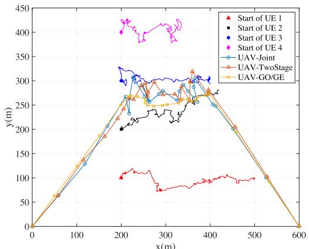

line

| x(m) | Start of UE 1 | Start of UE 2 | Start of UE 3 | Start of UE 4 | UAV-Joint | UAV-TwoStage | UAV-GO/GE |
|------|---------------|---------------|---------------|---------------|-----------|--------------|-----------|
| 0    | 0             | 0             | 0             | 0             | 0         | 0            | 0         |
| 100  | 100           | 100           | 100           | 100           | 100       | 100          | 100       |
| 200  | 200           | 200           | 200           | 200           | 200       | 200          | 200       |
| 300  | 300           | 300           | 300           | 300           | 300       | 300          | 300       |
| 400  | 400           | 400           | 400           | 400           | 400       | 400          | 400       |
| 500  | 500           | 500           | 500           | 500           | 500       | 500          | 500       |
| 600  | 600           | 600           | 600           | 600           | 600       | 600          | 600       |

(a) UEs’and UAV's trajectories

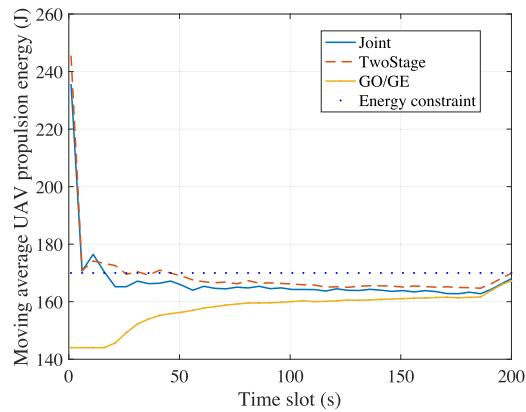

line

| Time slot (s) | Joint | TwoStage | GO/GE | Energy constraint |
| ------------- | ----- | -------- | ----- | ----------------- |
| 0             | 240   | 245      | 145   | 170               |
| 50            | 165   | 170      | 155   | 170               |
| 100           | 165   | 168      | 160   | 170               |
| 150           | 165   | 167      | 162   | 170               |
| 200           | 170   | 168      | 170   | 170               |

(b) UAV Propulsion Energy versus time

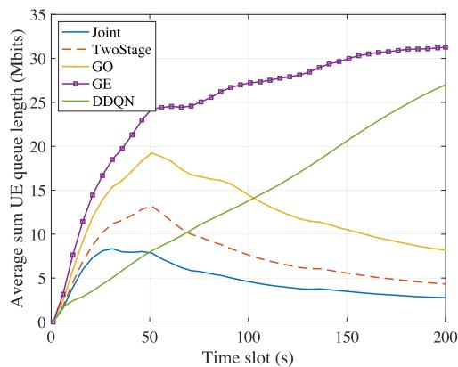

line

| Time slot (s) | Joint | TwoStage | GO  | GE  | DDQN |
| ------------- | ----- | -------- | --- | --- | ---- |
| 0             | 0     | 0        | 0   | 0   | 0    |
| 50            | 8     | 13       | 19  | 24  | 8    |
| 100           | 6     | 8        | 15  | 27  | 14   |
| 150           | 4     | 6        | 11  | 30  | 20   |
| 200           | 3     | 5        | 8   | 31  | 27   |

(c) Average user queue length versus time

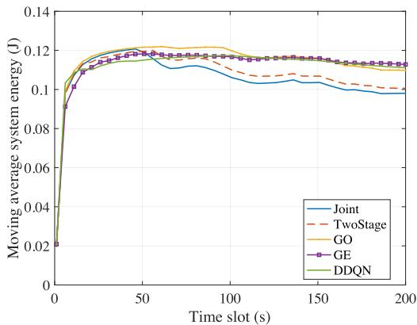

line

| Time slot (s) | Joint  | TwoStage | GO     | GE     | DDQN   |
| ------------- | ------ | -------- | ------ | ------ | ------ |
| 0             | 0.02   | 0.02     | 0.02   | 0.02   | 0.02   |
| 50            | 0.12   | 0.12     | 0.12   | 0.12   | 0.12   |
| 100           | 0.11   | 0.11     | 0.12   | 0.12   | 0.12   |
| 150           | 0.10   | 0.10     | 0.11   | 0.11   | 0.11   |
| 200           | 0.10   | 0.10     | 0.11   | 0.11   | 0.11   |

(d) System energy versus time   
Fig. 2. Convergence performance comparisons of different schemes in the first case.

and the input state is the current UAV location. The reward of each step is the sum executed data tasks minus the consumed energy.

We first compare the performance of the four schemes when the task arrivals follow a homogeneous Bernoulli process with $\mathbb { P } ( A _ { k } [ n ] = 2 . 2 ) = 0 . 8$ throughout the considered period for all ( [ ] = 2 2) = 0 8users. In Fig. 2(a), we show the trajectories of four UEs and the projections of UAV under different schemes. The UAV trajectory of the GO and GE methods follow the geometric center of the users. In comparison, the trajectories produced by the joint optimization and two-stage methods vibrate around the UEs’ geometric center trajectory due to the random queue backlogs.

We define the moving average energy consumption of the UAV at time slot n as 1n  $\textstyle { \frac { \bar { 1 } } { n } } \sum _ { \tau = 1 } ^ { n } { \bar { E } } _ { U A V } [ \tau ]$ . The moving average =1 [ ]data queue length and the average system energy cost have the similar definitions. In Fig. 2(b) and 2(c), we show the moving average energy consumption of the UAV and the UE data queue lengths within the considered flight duration. For the DDQN method, the UAV flies at a constant speed 15m/s, which consumes 138.5 J propulsion energy for each time slot. All methods satisfy the average propulsion energy constraint. In Fig. 2(c) and 2(d), the joint method demonstrates the best performance in terms of average user queue and system energy. At the end of the epoch, the average UE queue achieved by the joint method is 2.76 Mbits, while the queues directed by the two-stage method, GO policy, GE policy and DDQN method are 4.32 Mbits, 8.16 Mbits, 31.28 Mbits and 27.04 Mbits, respectively. Notice from Fig. 2(c) that the benchmark policy GO has acceptable performance with a decreasing queue length towards the end of the considered period. In contrast, following the same UAV trajectory as the GO method, the benchmark policy GE cannot stabilize the queue backlog where the queue length increases with time. This demonstrates the importance of Lyapunov control in maintaining data queue stability under the same UAV trajectory policy. In Fig. 2(d), there exists an evident performance gap between the two proposed methods and the benchmark methods. The average system energy at the end achieved by the joint method is 0.0981 J. It saves 2.59%, 11.90% 13.32%, 15.04% of the average system energy when compared with the two-stage method, GO policy, DDQN method and GE policy, respectively. The DDQN method cannot achieve queue stability under user mobility due to the lack of intrinsic mechanics to manage the UE queues. Besides, it requires much longer training time than the proposed methods. For instance, the moving average return of the DDQN method converges after around 2000 episode, which requires more than 10 hours training. In contrast, for the same number of users $( K = 4 )$ , the two-stage method consumes 0.69s to obtain = 4the control decision for each time slot and the joint method needs 1.04s.

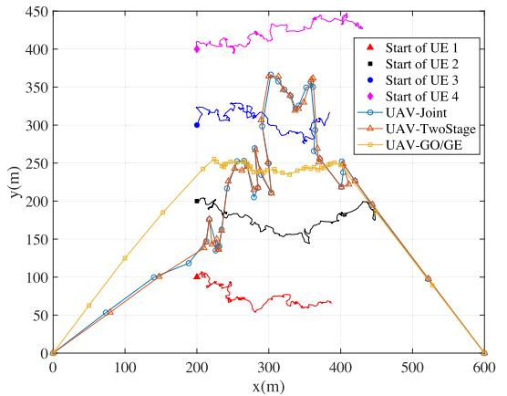

line

| x(m) | Start of UE 1 | Start of UE 2 | Start of UE 3 | Start of UE 4 | UAV-Joint | UAV-TwoStage | UAV-GO/GE |
|------|---------------|---------------|---------------|---------------|-----------|--------------|-----------|
| 0    | 0             | 0             | 0             | 0             | 0         | 0            | 0         |
| 100  | ~60           | ~70           | ~80           | ~90           | ~60       | ~70          | ~80       |
| 200  | ~100          | ~110          | ~120          | ~130          | ~100      | ~110         | ~120      |
| 300  | ~120          | ~130          | ~140          | ~150          | ~120      | ~130         | ~140      |
| 400  | ~140          | ~150          | ~160          | ~170          | ~140      | ~150         | ~160      |
| 500  | ~160          | ~170          | ~180          | ~190          | ~160      | ~170         | ~180      |
| 600  | ~180          | ~190          | ~200          | ~210          | ~180      | ~190         | ~200      |

(a) UEs’and UAV's trajectories

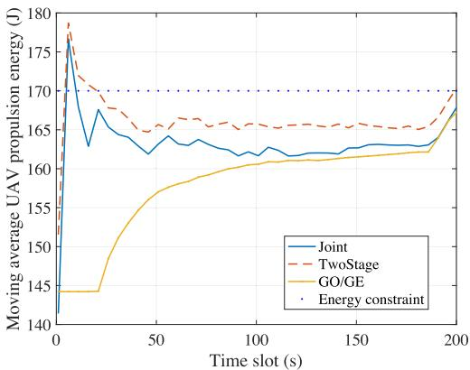

line

| Time slot (s) | Joint | TwoStage | GO/GE | Energy constraint |
| ------------- | ----- | -------- | ----- | ----------------- |
| 0             | 178   | 178      | 145   | 170               |
| 50            | 163   | 165      | 158   | 170               |
| 100           | 162   | 165      | 160   | 170               |
| 150           | 162   | 165      | 161   | 170               |
| 200           | 168   | 170      | 168   | 170               |

(b) UAV Propulsion Energy versus time

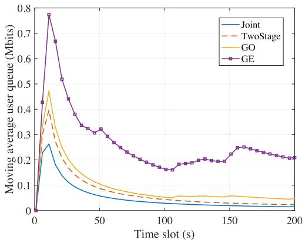

line

| Time slot (s) | Joint | TwoStage | GO   | GE   |
| ------------- | ----- | -------- | ---- | ---- |
| 0             | 0.0   | 0.0      | 0.0  | 0.0  |
| 10            | 0.25  | 0.4      | 0.45 | 0.78 |
| 20            | 0.15  | 0.3      | 0.35 | 0.65 |
| 30            | 0.1   | 0.2      | 0.25 | 0.5  |
| 40            | 0.08  | 0.15     | 0.2  | 0.4  |
| 50            | 0.06  | 0.1      | 0.15 | 0.35 |
| 60            | 0.05  | 0.08     | 0.12 | 0.3  |
| 70            | 0.04  | 0.06     | 0.1  | 0.25 |
| 80            | 0.03  | 0.05     | 0.08 | 0.2  |
| 90            | 0.02  | 0.04     | 0.06 | 0.18 |
| 100           | 0.01  | 0.03     | 0.05 | 0.15 |
| 110           | 0.01  | 0.02     | 0.04 | 0.18 |
| 120           | 0.01  | 0.02     | 0.04 | 0.19 |
| 130           | 0.01  | 0.02     | 0.04 | 0.19 |
| 140           | 0.01  | 0.02     | 0.04 | 0.2  |
| 150           | 0.01  | 0.02     | 0.04 | 0.25 |
| 160           | 0.01  | 0.02     | 0.04 | 0.25 |
| 170           | 0.01  | 0.02     | 0.04 | 0.24 |
| 180           | 0.01  | 0.02     | 0.04 | 0.23 |
| 190           | 0.01  | 0.02     | 0.04 | 0.22 |
| 200           | 0.01  | 0.02     | 0.04 | 0.21 |

(c） Average user queue length versus time

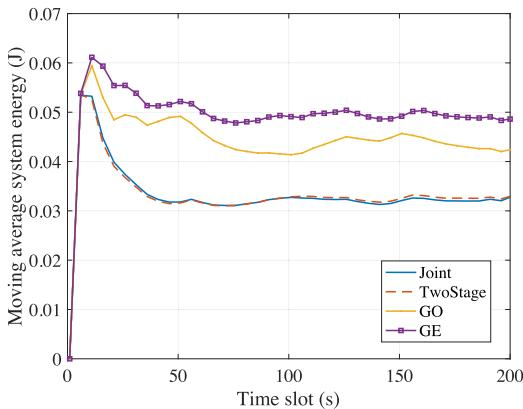

line

| Time slot (s) | Joint  | TwoStage | GO     | GE     |
| ------------- | ------ | -------- | ------ | ------ |
| 0             | 0.055  | 0.055    | 0.06   | 0.062  |
| 50            | 0.032  | 0.032    | 0.048  | 0.052  |
| 100           | 0.032  | 0.032    | 0.042  | 0.049  |
| 150           | 0.032  | 0.032    | 0.045  | 0.049  |
| 200           | 0.032  | 0.032    | 0.042  | 0.049  |

(d) System energy versus time   
Fig. 3. Convergence performance comparisons of different schemes in the second case.

Under homogeneous task arrivals among all the users, we show that the UAV closely follows the UEs’ trajectories to achieve optimum performance. Next, we investigate the performance under heterogeneous and time-varying task arrivals. At any time instant, we consider two users generating task data with $\mathbb { P } ( A _ { k } [ n ] = 3 . 5 ) = 0 . 8$ , while the other two users do not ( [ ] = 3 5) = 0 8have new task data arrivals. Specifically, UE 1 and 2 generate tasks during the first quarter of time; UE 2 and 3 generate tasks during the second quarter; UE 3 and 4 generate tasks during the third quarter; UE 4 and 1 generate tasks during the last quarter. From Fig. 3(a), we see that the trajectories directed by the two proposed methods are consistent with our intuition that the UAV tends to chase the moving data sources to improve the MEC service quality. Specifically, it flies between the two users that generate task data in each quarter of the considered period. We observe from Fig. 3(b) that all methods satisfy the average propulsion energy constraint.

In Fig. 3(c), the average queue length converges for all the methods except for the GE policy. Similar to the homogeneous setting, the GO policy can stabilize the queue backlog with a decreasing queue length towards the end of the considered epoch. This again shows that the Lyapunov control helps maintain queue stability under the same UAV trajectory policy. Additionally, we observe from Fig. 3(c) that under the GE policy the queue length diverges in the third quarter when the data sources change from UE 2 and 3 to UE 3 and 4. The main reason of the increasing queue backlog is that the UAV directed by the GE policy follows the geometric center of all UEs instead of the data sources. In contrast, the trajectories directed by the proposed methods follow closely to the new data sources, thus effectively increasing the offloading data rates of the task-executing users. Fig. 3(d) shows that the weighted sum system energy of both proposed methods decreases in time until convergence while that of the GO policy increases when the data generating pattern varies during the third quarter. The above results confirm that the data-awareness in UAV trajectory design is critical to achieve stable and efficient system operation.

In Fig. 4, we investigate the influence of the Lyapunov control parameter V on the performance of the two proposed methods. We vary the value of V from 1 to 95, where each sample point in the figures is the average of 50 independent simulations. Fig. 4(a) shows that the UAV propulsion energy increases as V becomes larger. Besides, the joint method consumes less average propulsion energy compared with the two-stage method. The results corroborate our analysis that both methods satisfy the average UAV propulsion energy constraint. When V is relatively small, e.g., $V \leq 3 0 .$ ,

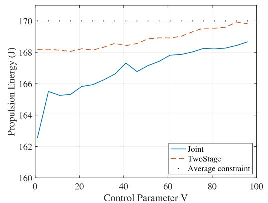

line

| Control Parameter V | Joint | TwoStage | Average constraint |
| ------------------- | ----- | -------- | ------------------ |
| 0                   | 162.5 | 168.0    | 168.0              |
| 20                  | 165.5 | 168.0    | 168.0              |
| 40                  | 167.5 | 168.5    | 168.0              |
| 60                  | 167.8 | 169.0    | 168.0              |
| 80                  | 168.2 | 169.5    | 168.0              |
| 100                 | 168.8 | 170.0    | 168.0              |

(a)UAV propulsion energy versus V

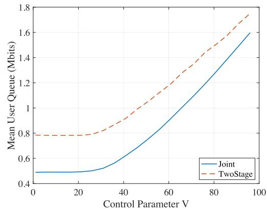

line

| Control Parameter V | Joint | TwoStage |
| ------------------- | ----- | -------- |
| 0                   | 0.5   | 0.8      |
| 20                  | 0.5   | 0.8      |
| 40                  | 0.6   | 0.9      |
| 60                  | 0.9   | 1.2      |
| 80                  | 1.3   | 1.5      |
| 100                 | 1.6   | 1.7      |

(b) Average user queue length versus V

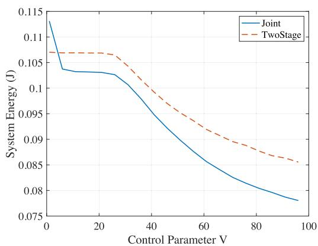

line

| Control Parameter V | Joint  | TwoStage |
| ------------------- | ------ | -------- |
| 0                   | 0.115  | 0.107    |
| 20                  | 0.103  | 0.107    |
| 40                  | 0.098  | 0.102    |
| 60                  | 0.087  | 0.093    |
| 80                  | 0.081  | 0.087    |
| 100                 | 0.078  | 0.085    |

(c） System energy versus V

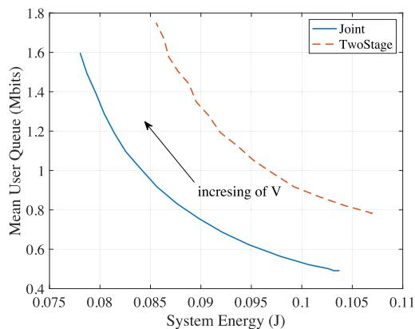

line

| System Energy (J) | Joint | TwoStage |
| ----------------- | ----- | -------- |
| 0.075             | 1.6   | -        |
| 0.08              | 1.2   | -        |
| 0.085             | 0.9   | 1.7      |
| 0.09              | 0.7   | 1.4      |
| 0.095             | 0.6   | 1.2      |
| 0.1               | 0.5   | 1.0      |
| 0.105             | 0.45  | 0.8      |
| 0.11              | 0.4   | 0.7      |

(d) Average user queue length versus system energy

Fig. 4. Influence of the Lyapunov control parameter  for the proposed methods.   
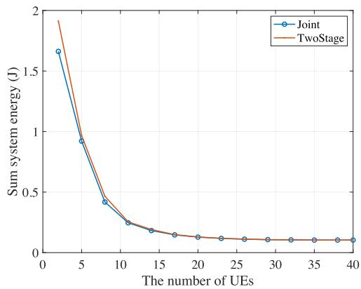

line

| The number of UEs | Joint | TwoStage |
| ----------------- | ----- | -------- |
| 0                 | 1.65  | 1.90     |
| 5                 | 0.90  | 0.95     |
| 10                | 0.40  | 0.45     |
| 15                | 0.20  | 0.25     |
| 20                | 0.15  | 0.18     |
| 25                | 0.12  | 0.15     |
| 30                | 0.10  | 0.12     |
| 35                | 0.10  | 0.10     |
| 40                | 0.10  | 0.10     |

(a) System energy v.s the number of UEs

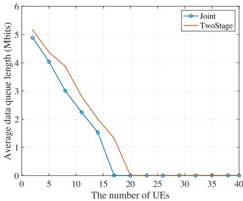

line

| The number of UEs | Joint | TwoStage |
| ----------------- | ----- | -------- |
| 0                 | 5.0   | 5.2      |
| 5                 | 4.1   | 4.5      |
| 10                | 3.0   | 3.8      |
| 15                | 2.3   | 2.8      |
| 20                | 0.0   | 0.0      |
| 25                | 0.0   | 0.0      |
| 30                | 0.0   | 0.0      |
| 35                | 0.0   | 0.0      |
| 40                | 0.0   | 0.0      |

(b) Queue length v.s.the number of UEs   
Fig. 5. Evaluation of scalability under the number of UEs.

Fig. 4(b) and Fig. 4(c) show that the increase of queue and the decrease of system energy are obscure. However, as we further increase V , the simulation results justify the performance analysis in Theorem 3 that the average queue length increases and the average system energy decreases as V becomes larger. Fig. 4(d) shows the tradeoff between the queue stability and the weighted sum UE energy by varying the value of V . The joint method has better performance than the two-stage method in general. That is, given any operating point in the trade-off curve of the two-stage method, a strictly better operating point (both lower energy consumption and shorter queue length) can be found in the curve of the joint scheme by setting a proper V .

To evaluate the scalability of our algorithm, we plot in Fig. 5 the data queue length and the sum system energy versus the number of UEs K from 2 to 40. We set the total data arrival rate of the system to be 12 Mbps and the total computation capability of all UEs to be 10 GHz, where each UE has the same data arrival rate and computation capability. As K increases, the average individual arrival rate and the maximum CPU frequency will decrease proportionally.

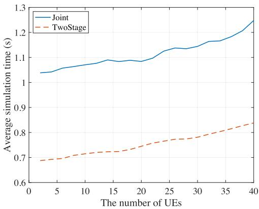

line

| The number of UEs | Joint | TwoStage |
| ----------------- | ----- | -------- |
| 0                 | 1.05  | 0.70     |
| 5                 | 1.07  | 0.71     |
| 10                | 1.09  | 0.73     |
| 15                | 1.10  | 0.74     |
| 20                | 1.11  | 0.76     |
| 25                | 1.14  | 0.78     |
| 30                | 1.16  | 0.80     |
| 35                | 1.19  | 0.82     |
| 40                | 1.25  | 0.85     |

Fig. 6. Simulation time versus the number of UEs.

Fig. 5(a) shows that the sum system energy decreases with the user number K for both the proposed joint and two-stage methods. Fig. 5(b) shows that the queue length decreases as K becomes larger and converges to zero when $K \geq 2 0$ . The 20results show that the proposed methods are robust and scalable to the increase of user number in the system.

Although the proposed joint method achieves better performance than the two-stage method, we show in Fig. 6 that the performance gain comes at the cost of higher computational complexity. We observe that the joint method, on average, consumes 48% longer computation time than the two-stage scheme. For instance, the joint method consumes more than 1.2s to produce a result for 40 users, while the two-stage method takes around 0.8s. The two-stage method is more favorable than the joint method under strict execution delay requirement. In contrast, when the wireless devices have very limited battery and data buffer, it is preferable to adopt the joint optimization method to reduce energy cost and queue backlogs.

# VII. CONCLUSION

In this paper, we investigated the long-term average system energy consumption minimization problem in the UAV-enabled MEC system taking dynamic computation offloading, user mobility, resource allocation, and UAV trajectory control into consideration. We adopted the Lyapunov optimization framework to design an online algorithm for the stochastic optimization problem. For the non-convex subproblem, we proposed two low-complexity methods. The first two-stage method sequentially solves the resource allocation problem for UEs and the UAV movement control. The second joint method jointly solves the optimization problem. Simulation results show that both methods save system energy by tracking the data arrival pattern and UE mobility. Besides, the Lyapunov control parameter V balances the $[ O ( 1 / V ) , O ( V ) ]$ [ (1tradeoff between the queue backlog and the cost.

# APPENDIX A PROOF OF THEOREM 1

Squaring the update rule of $Q _ { u } [ n ] \ ( 1 7 )$ , with the inequality of $( \operatorname* { m a x } \{ a + b - c , 0 \} ) ^ { 2 } \leq ( a + \dot { b } - c ) ^ { 2 }$ for any $a , b , c \geq 0 ,$ (max +we can obtain

$$
Q _ {u} ^ {2} [ n + 1 ] \leq (Q _ {u} [ n ] + E _ {U A V} [ n ] - E ^ {u}) ^ {2}, \tag {50}
$$

$$
\begin{array}{l} \frac {Q _ {u} ^ {2} [ n + 1 ] - Q _ {u} ^ {2} [ n ]}{2} \leq \frac {1}{2} (E _ {U A V} [ n ] - E ^ {u}) ^ {2} \\ + Q _ {u} [ n ] (E _ {U A V} [ n ] - E ^ {u}). \tag {51} \\ \end{array}
$$

Taking the conditional expectations of both sides yields

$$
\begin{array}{l} \Delta L (Q _ {u} [ n ]) \leq \frac {1}{2} \mathbb {E} \left\{\left(E _ {U A V} [ n ] - E ^ {u}\right) ^ {2} | \boldsymbol {Q} [ n ] \right\} \\ + Q _ {u} [ n ] \mathbb {E} \left\{E _ {U A V} [ n ] - E ^ {u} | \boldsymbol {Q} [ n ] \right\} \\ \leq B _ {u} + Q _ {u} [ n ] \mathbb {E} \{E _ {U A V} [ n ] - E ^ {u} | \boldsymbol {Q} [ n ] \}, \tag {52} \\ \end{array}
$$

where $\begin{array} { r } { B _ { u } = \frac { 1 } { 2 } \operatorname* { m a x } \{ ( E ^ { u } ) ^ { 2 } , ( E _ { m a x } - E ^ { u } ) ^ { 2 } \} } \end{array}$ is a constant.

= 2 max ( ) ( )Similarly, squaring the update rule of $Q _ { k } [ n ]$ (9), we can obtain

$$
Q _ {k} ^ {2} [ n + 1 ] \leq (Q _ {k} [ n ] + A _ {k} [ n ] - l _ {k} [ n ]) ^ {2}, \tag {53}
$$

$$
\begin{array}{l} \frac {Q _ {k} ^ {2} [ n + 1 ] - Q _ {k} ^ {2} [ n ]}{2} \leq \frac {1}{2} (A _ {k} ^ {2} [ n ] + l _ {k} ^ {2} [ n ]) + Q _ {k} [ n ] A _ {k} [ n ] \\ - Q _ {k} [ n ] l _ {k} [ n ] - A _ {k} [ n ] l _ {k} [ n ]. \tag {54} \\ \end{array}
$$

Taking the conditional expectations of both sides yields

$$
\begin{array}{l} \Delta L (Q _ {k} [ n ]) \\ \leq \frac {1}{2} \mathbb {E} \left\{\left(A _ {k} ^ {2} [ n ] + l _ {k} ^ {2} [ n ]\right) | \boldsymbol {Q} [ n ] \right\} \\ + \mathbb {E} \{Q _ {k} [ n ] A _ {k} [ n ] - Q _ {k} [ n ] l _ {k} [ n ] - A _ {k} [ n ] l _ {k} [ n ] | \boldsymbol {Q} [ n ] \} \\ \leq B _ {k} + \mathbb {E} \left\{Q _ {k} [ n ] A _ {k} [ n ] - Q _ {k} [ n ] l _ {k} [ n ] - A _ {k} [ n ] l _ {k} [ n ] \mid \boldsymbol {Q} [ n ] \right\}, \tag {55} \\ \end{array}
$$

where $B _ { k } = \textstyle { \frac { 1 } { 2 } } ( I _ { k } ^ { 2 } + ( f _ { k } ^ { m } \Delta / C _ { k } + R _ { k } ^ { m } \Delta ) ^ { 2 } )$ is a constant for =each UE k.

Summing up (50) and (53) over k gives a bound on $\Delta L ( Q [ n ] )$ . Adding $V \mathbb { E } \{ E _ { s } [ n ] | Q [ n ] \}$ to both sides prove Δ ( [ ])Theorem 1. And $\begin{array} { r } { \tilde { B } = B _ { u } + { \sum _ { k = 1 } ^ { K } } { \ - \overrightarrow { B _ { k } } } } \end{array}$ .

# APPENDIX B PROOF OF THEOREM 3

In addition to the definitions of C-additive approximation, rate stability, and T-slot lookahead metric, we need to clarify the boundedness conditions and slackness assumptions. The boundedness conditions are essential for the proof of time average cost, while the slackness conditions should be satisfied for rate stability.

# A. Boundedness Conditions

The arrival rate, service rate and the UAV propulsion energy are deterministically bounded for each time slot

$$
0 \leq A _ {k} [ n ] \leq I _ {k}, \quad \forall k, \tag {56}
$$

$$
0 \leq l _ {k} [ n ] \leq l _ {k} ^ {\max} = f _ {k} ^ {m} \Delta / C _ {k} + R _ {k} ^ {m} \Delta , \quad \forall k, \tag {57}
$$

$$
0 \leq E _ {U A V} [ n ] \leq E _ {\max}. \tag {58}
$$

# B. Slackness Assumptions

There exists an $\eta > 0$ and a sequence of decisions that 0satisfies the following inequalities for all frames r:

$$
\sum_ {\tau = r T + 1} ^ {(r + 1) T} (E _ {U A V} [ \tau ] - E ^ {u}) \leq 0, \tag {59}
$$

$$
\frac {1}{T} \sum_ {\tau = r T + 1} ^ {(r + 1) T} (A _ {k} [ \tau ] - l _ {k} [ \tau ]) \leq - \eta . \tag {60}
$$

Based on Lemma 4.11 in [26], the T -slot drift-plus-penalty satisfies

$$
\begin{array}{l} \left(L (Q [ (r + 1) T + 1 ]) - L (Q [ r T + 1 ])\right) \\ \left. + V \sum_ {\tau = r T + 1} ^ {(r + 1) T} E _ {s} [ \tau ]\right) \leq (\tilde {B} + C) T ^ {2} + V T c _ {r} ^ {*}, \tag {61} \\ \end{array}
$$

where $\tilde { B }$ is as defined in Theorem 1. Summing the above over $r \in \{ 0 , \ldots , R - 1 \}$ yields

$$
\begin{array}{l} L (Q [ R T + 1 ]) - L (Q [ 1 ]) + V \sum_ {\tau = 1} ^ {R T} E _ {s} [ \tau ] \\ \leq (\tilde {B} + C) T ^ {2} R + V T \sum_ {r = 0} ^ {R - 1} c _ {r} ^ {*}. \tag {62} \\ \end{array}
$$

Dividing by V T R, using the fact that $L ( Q [ R T + 1 ] ) \geq 0 .$ , and rearranging terms yields

$$
\frac {1}{R T} \sum_ {\tau = 1} ^ {R T} E _ {s} [ \tau ] \leq \frac {1}{R} \sum_ {r = 0} ^ {R - 1} c _ {r} ^ {*} + \frac {(\tilde {B} + C) T}{V} + \frac {L (Q [ 1 ])}{V T R}. \tag {63}
$$

When R is large, the final term on the RHS above goes to zero. Taking limits to infinity prove part a).

By plugging the slackness conditions into Lemma 4.11 in [26], we have

$$
\begin{array}{l} L (Q [ (r + 1) T + 1 ]) - L (Q [ r T + 1 ]) + V \sum_ {\tau = r T + 1} ^ {(r + 1) T} E _ {s} [ \tau ] \\ \leq (\tilde {B} + C) T ^ {2} + V T E _ {s} ^ {\max} - T \eta \sum_ {k = 1} ^ {K} Q _ {k} [ r T ]. \tag {64} \\ \end{array}
$$

From the Lyapunov Optimization Theorem [26], the above inequality implies all the actual queues and the virtual queue are mean rate stable. Using the sample path property ([26], Lemma 2.1), we have:

$$
\frac {Q _ {u} [ N ]}{N} - \frac {Q _ {u} [ 1 ]}{N} \geq \frac {1}{N} \sum_ {n = 1} ^ {N} E _ {U A V} [ n ] - \frac {1}{N} \sum_ {n = 1} ^ {N} E ^ {u}, \tag {65}
$$

$$
\Longrightarrow \frac {1}{N} \sum_ {n = 1} ^ {N} E _ {U A V} [ n ] \leq E ^ {u} + \frac {Q _ {u} [ N ]}{N}. \tag {66}
$$

Take the limits to infinity for both sides of (66). Since $Q _ { u } [ n ]$ is rate stable (i.e. $\begin{array} { r } { \dot { \mathbf { \rho } } _ { N  \infty } \frac { Q _ { u } [ N ] } { N } = \mathbf { \rho } _ { 0 } } \end{array}$ [ ]with probability 1), lim $\begin{array} { r } { \mathbf { \Sigma } _ { \cdot N \longrightarrow \infty } \frac { 1 } { N } \sum _ { n = 1 } ^ { N } \mathbb { E } \{ E _ { U A V } [ n ] \} \ \leq \ E ^ { u } } \end{array}$ 0holds with probabillim =1 [ity 1, which proves part b).

Based on (64) and the fact that $Q _ { k } [ n + j ] - Q _ { k } [ n ] \ \leq$ j $\{ I _ { k } , l _ { k } ^ { m a x } \} , \forall j > 0$ , we can derive

$$
\begin{array}{l} L (Q [ (r + 1) T + 1 ]) - L (Q [ r T + 1 ]) \\ \leq (\tilde {B} + C) T ^ {2} + V T (E _ {s} ^ {m a x} - E _ {s} ^ {m i n}) \\ - T \eta \sum_ {k = 1} ^ {K} Q _ {k} [ r T + 1 ] \\ \leq (\tilde {B} + C) T ^ {2} + V T (E _ {s} ^ {\max} - E _ {s} ^ {\min}) \\ - \eta \sum_ {k = 1} ^ {K} \sum_ {j = 1} ^ {T} Q _ {k} [ r T + j ] + \frac {\eta (T - 1) T}{2} \max \left\{I _ {k}, l _ {k} ^ {\text { max }} \right\}. \tag {67} \\ \end{array}
$$

Summing the above over $r \in \{ 0 , \ldots , R - 1 \}$ yields

$$
\begin{array}{l} L (Q [ R T + 1 ]) - L (Q [ 1 ]) + \eta \sum_ {k = 1} ^ {K} \sum_ {\tau = 1} ^ {R T} Q _ {k} [ \tau ] \\ \begin{array}{l} \leq R (\tilde {B} + C) T ^ {2} + R V T (E _ {s} ^ {m a x} - E _ {s} ^ {m i n}) \\ \quad + \frac {\eta R (T - 1) T}{2} \max \{I _ {k}, l _ {k} ^ {m a x} \}. \end{array} \tag {68} \\ \end{array}
$$

Using $L ( Q [ R T + 1 ] ) \geq 0 .$ , dividing by $\eta R T$ and taking a ( [ + 1]) 0limit to infinity proves part c).

# REFERENCES

[1] Z. Yang, S. Bi, and Y.-J. Angela Zhang, “Dynamic trajectory and offloading control of UAV-enabled MEC under user mobility,” 2021, arXiv:2105.09042.   
[2] W. Shi, J. Cao, Q. Zhang, Y. Li, and L. Xu, “Edge computing: Vision and challenges,” IEEE Internet Things J., vol. 3, pp. 637–646, May 2016.   
[3] S. Bi and Y. Zhang, “Computation rate maximization for wireless powered mobile-edge computing with binary computation offloading,” IEEE Trans. Wireless Commun., vol. 17, no. 6, pp. 4177–4190, Apr. 2018.   
[4] Y. Mao, C. You, J. Zhang, K. Huang, and K. B. Letaief, “A survey on mobile edge computing: The communication perspective,” IEEE Commun. Surveys Tuts., vol. 19, no. 4, pp. 2322–2358, 4th Quart. 2017.   
[5] M. Mozaffari, W. Saad, M. Bennis, Y.-H. Nam, and M. Debbah, “A tutorial on UAVs for wireless networks: Applications, challenges, and open problems,” IEEE Commun. Surveys Tuts., vol. 21, no. 3, pp. 2334–2360, 3rd Quart. 2019.   
[6] Q.-V. Pham et al., “A survey of multi-access edge computing in 5G and beyond: Fundamentals, technology integration, and state-of-the-art,” 2019, arXiv:1906.08452.   
[7] N. Cheng et al., “Air-ground integrated mobile edge networks: Architecture, challenges, and opportunities,” IEEE Commun. Mag., vol. 56, no. 8, pp. 26–32, Aug. 2018.   
[8] J. Wang, C. Jin, Q. Tang, N. N. Xiong, and G. Srivastava, “Intelligent ubiquitous network accessibility for wireless-powered MEC in UAV-assisted B5G,” IEEE Trans. Netw. Sci. Eng., vol. 8, no. 4, pp. 2801–2813, Oct. 2021.   
[9] Y. Zeng, R. Zhang, and T. J. Lim, “Wireless communications with unmanned aerial vehicles: Opportunities and challenges,” IEEE Commun. Mag., vol. 54, no. 5, pp. 36–42, May 2016.   
[10] Y. Zeng and R. Zhang, “Energy-efficient UAV communication with trajectory optimization,” IEEE Trans. Wireless Commun., vol. 16, no. 6, pp. 3747–3760, Jun. 2017.   
[11] Y. Zeng, J. Xu, and R. Zhang, “Energy minimization for wireless communication with rotary-wing UAV,” IEEE Trans. Wireless Commun., vol. 18, no. 4, pp. 2329–2345, Apr. 2019.   
[12] F. Zhou, Y. Wu, R. Q. Hu, and Y. Qian, “Computation rate maximization in UAV-enabled wireless-powered mobile-edge computing systems,” IEEE J. Sel. Areas Commun., vol. 36, no. 9, pp. 1927–1941, Sep. 2018.   
[13] Q. Hu, Y. Cai, G. Yu, Z. Qin, M. Zhao, and G. Y. Li, “Joint offloading and trajectory design for UAV-enabled mobile edge computing systems,” IEEE Internet Things J., vol. 6, no. 2, pp. 1879–1892, Apr. 2019.   
[14] M. Li, N. Cheng, J. Gao, Y. Wang, L. Zhao, and X. Shen, “Energyefficient UAV-assisted mobile edge computing: Resource allocation and trajectory optimization,” IEEE Trans. Veh. Technol., vol. 69, no. 3, pp. 3424–3438, Mar. 2020.   
[15] B. Liu and H. Zhu, “Energy-effective data gathering for UAV-aided wireless sensor networks,” Sensors, vol. 19, no. 11, p. 2506, 2019.   
[16] J. Yoon, A.-H. Lee, and H. Lee, “Rendezvous: Opportunistic data delivery to mobile users by UAVs through target trajectory prediction,” IEEE Trans. Veh. Technol., vol. 69, no. 2, pp. 2230–2245, Feb. 2020.   
[17] Y. Hu, M. Chen, W. Saad, H. Vincent Poor, and S. Cui, “Distributed multi-agent meta learning for trajectory design in wireless drone networks,” 2020, arXiv:2012.03158.   
[18] Q. Liu, L. Shi, L. Sun, J. Li, M. Ding, and F. S. Shu, “Path planning for UAV-mounted mobile edge computing with deep reinforcement learning,” IEEE Trans. Veh. Technol., vol. 69, no. 5, pp. 5723–5728, May 2020.   
[19] S. Wan, J. Lu, P. Fan, and K. B. Letaief, “Toward big data processing in IoT: Path planning and resource management of UAV base stations in mobile-edge computing system,” IEEE Internet Things J., vol. 7, no. 7, pp. 5995–6009, Jul. 2020.   
[20] J. Zhang et al., “Stochastic computation offloading and trajectory scheduling for UAV-assisted mobile edge computing,” IEEE Internet Things J., vol. 6, no. 2, pp. 3688–3699, Apr. 2019.   
[21] S. Batabyal and P. Bhaumik, “Mobility models, traces and impact of mobility on opportunistic routing algorithms: A survey,” IEEE Commun. Surveys Tuts., vol. 17, no. 3, pp. 1679–1707, 3rd Quart., 2015.   
[22] A. Al-Hourani, S. Kandeepan, and S. Lardner, “Optimal LAP altitude for maximum coverage,” IEEE Wireless Commun. Lett., vol. 3, no. 6, pp. 569–572, Dec. 2014.   
[23] Y. Mao, J. Zhang, Z. Chen, and K. B. Letaief, “Dynamic computation offloading for mobile-edge computing with energy harvesting devices,” IEEE J. Sel. Areas Commun., vol. 34, no. 12, pp. 3590–3605, Dec. 2016.   
[24] E. Le Sueur and G. Heiser, “Dynamic voltage and frequency scaling: The laws of diminishing returns,” in Proc. Int. Conf. Power Aware Comput. Syst., 2010, pp. 1–8.

[25] T. D. Burd and R. W. Brodersen, “Processor design for portable systems,” J. VLSI Signal Process. Syst., vol. 13, nos. 2–3, pp. 203–221, Aug./Sep. 1996.   
[26] M. J. Neely, “Stochastic network optimization with application to communication and queueing systems,” Synthesis Lect. Commun. Netw., vol. 3, no. 1, pp. 1–211, 2010.   
[27] A. Filippone, Flight Performance of Fixed and Rotary Wing Aircraft. Amsterdam, The Netherlands: Elsevier, 2006.   
[28] S. Boyd and L. Vandenberghe, Convex Optimization. Cambridge, U.K.: Cambridge Univ. Press, 2004.   
[29] M. Grant and S. Boyd. (Mar. 2014). CVX: MATLAB Software for Disciplined Convex Programming, Version 2.1. [Online]. Available: http://cvxr.com/cvx   
[30] Y. Zeng, X. Xu, S. Jin, and R. Zhang, “Simultaneous navigation and radio mapping for cellular-connected UAV with deep reinforcement learning,” IEEE Trans. Wireless Commun., vol. 20, no. 7, pp. 4205–4220, Jul. 2021.

natural_image

Portrait of a woman wearing a light blue scarf and dark jacket (no text or symbols visible)

Zheyuan Yang (Graduate Student Member, IEEE) received the B.Eng. degree in information engineering from The Chinese University of Hong Kong in 2019, where she is currently pursuing the Ph.D. degree in information engineering. Her research interests include optimizations in UAV-enabled mobile edge computing, UAV trajectory control, and integrated sensing and communication.

natural_image

Portrait photo of a man in business attire (no text or symbols visible)

Suzhi Bi (Senior Member, IEEE) received the B.Eng. degree in communications engineering from Zhejiang University in 2009, and the Ph.D. degree in information engineering from The Chinese University of Hong Kong in 2013. From 2013 to 2015, he was a Post-Doctoral Research Fellow with the Department of Electrical and Computer Engineering, National University of Singapore. Since 2015, he has been with the College of Electronics and Information Engineering, Shenzhen University, China, where he is currently an Associate Professor. His research interests include the optimizations in wireless information and power transfer, mobile computing, and wireless sensing. He received the 2019 IEEE ComSoc Asia-Pacific Outstanding Young Researcher Award, the 2021 IEEE ComSoc Asia-Pacific Outstanding Paper Award, and the Best Paper Awards of IEEE SmartGridComm 2013 and IEEE/CIC ICCC 2021. He is an Editor of the IEEE TRANSACTIONS ON WIRELESS COMMUNICATIONS and the IEEE WIRELESS COMMUNICATIONS LETTERS.

natural_image

Portrait of a woman with glasses and dark hair against a blue background (no text or symbols visible)

Ying-Jun Angela Zhang (Fellow, IEEE) received the Ph.D. degree from the Department of Electrical and Electronic Engineering, The Hong Kong University of Science and Technology.

She joined the Department of Information Engineering, The Chinese University of Hong Kong, in 2005, where she is currently a Professor. Her research interests include optimization and learning in wireless communication systems.

Prof. Zhang is a Member-at-Large of IEEE Com-Soc Board of Governors. She was a co-recipient of the 2021 and 2014 IEEE ComSoc Asia Pacific Outstanding Paper Awards, the 2013 IEEE SmartgridComm Best Paper Award, and the 2011 IEEE Marconi Prize Paper Award on Wireless Communications. As the only winner from engineering science, she won the Hong Kong Young Scientist Award 2006, conferred by the Hong Kong Institute of Science. Previously, she served as the Chair of the Executive Editor Committee for the IEEE TRANSACTIONS ON WIRELESS COMMUNICATIONS and many years on the editorial boards for the IEEE TRANSACTIONS ON WIRELESS COMMUNICATIONS, the IEEE TRANSACTIONS ON COMMUNICATIONS, Security and Communications Networks journal (Wiley), the IEEE JOURNAL ON SELECTED AREAS IN COM-MUNICATIONS special issues, the IEEE INTERNET OF THINGS JOURNAL special issues, and IEEE Communications Magazine special issues. She has served on the organizing committees of many top conferences, such as IEEE GLOBECOM, ICC, VTC, and SmartgridComm. She was the Founding Chair of IEEE ComSoc Technical Committee of Smart Grid Communications. She is also the Associate Editor-in-Chief of the IEEE OPEN JOURNAL OF THE COMMUNICATIONS SOCIETY, a member of the Steering Committees of the IEEE TRANSACTIONS ON MOBILE COMPUTING, the IEEE WIRELESS COMMUNICATION LETTERS, and IEEE SmartgridComm Conference.