# Optimal Flight Speed Scheduling and Battery Swapping in UAV-Enabled Mobile Edge Computing

Dongmei Ye, Zhengqing Sun , Weifeng Zhong , Jiawen Kang , Senior Member, IEEE, Xumin Huang , Dong In Kim , Life Fellow, IEEE, Shengli Xie , Fellow, IEEE, and Chau Yuen , Fellow, IEEE

Abstract—In long-distance and long-duration flight missions of unmanned aerial vehicles (UAVs), optimal scheduling of flight speed and energy replenishment is crucial to ensure flight efficiency and safety. This paper focuses on a UAV-based patrol inspection system, where a UAV is scheduled to visit multiple task nodes that are geographically distributed in the communication coverage of a base station (BS). The UAV hovers at each task node, performing data collection and data processing. The BS is equipped with a mobile edge computing (MEC) server and a battery swapping station, offering computation and energy support to the UAV. A decision-making model customized for the UAV is proposed, jointly optimizing flight speed selection, battery swapping, and task offloading to minimize the UAV’s total operational cost in its flight. By introducing virtual nodes in the flight network, we construct a unidirectional extended graph, based on which the original nonconvex cost minimization problem is reformulated to a tractable mixed-integer convex problem. Further, a fast heuristic based on analytical target cascading (ATC) is developed to obtain suboptimal solutions to large-scale problems. Results demonstrate that the proposed model can lower the UAV’s total operational cost by providing greater flexibility in terms of speed selection and battery swapping, and the proposed heuristic shows high computational efficiency for large-scale network scenarios.

Index Terms—Unmanned aerial vehicle (UAV), mobile edge computing (MEC), flight speed scheduling, battery swapping.

## I. INTRODUCTION

U <sup>NMANNED</sup> <sup>aerial</sup> <sup>vehicles</sup> <sup>(UAVs)</sup> <sup>have</sup> <sup>emerged</sup> <sup>as</sup> <sup>ver-</sup>satile tools in various fields, offering significant advan- satile tools in various fields, offering significant advantages such as flexible deployment, high maneuverability, and wide-area coverage [1]. UAV-enabled mobile edge computing (MEC) refers to systems where UAVs are integrated with MEC infrastructure to provide enhanced computational and communication capabilities [2]. By deploying computational resources closer to data sources, MEC enables low-latency data processing and supports timely decision-making. Meanwhile, UAVs can expand communication range and collect real-time data in complex and dynamic environments. UAV-enabled MEC systems have demonstrated significant potential in diverse applications, including logistics delivery [3], disaster relief [4], target tracking [5], and traffic monitoring [6]. By leveraging the strengths of both MEC and UAVs, UAV-enabled MEC provides a scalable and efficient solution for addressing the challenges of modern, data-intensive tasks.

Optimal operation of UAV-enabled MEC systems has been widely studied, and there are two main classes of related works. The first class encompasses methods that are based on deploying UAVs at predetermined and fixed spatial positions while optimizing other system variables [7], [8], [9], [10], [11], [12]. The second class includes methods that focus on decision-making on the spatiotemporal positions of single or multiple UAVs within a specified range [13], [14], [15], [16], [17], [18]. For instance, both UAV deployment and computation offloading are studied in [7] to minimize the cost ofa dynamic system, where users generate tasks based on time-varying probabilities. In [9], a prioritybased UAV resource allocation scheme is proposed for forest fire monitoring, minimizing the maximum processing time of data collected by the UAV. In [10], a blockchain-integrated approach that employs UAVs as blockchain nodes is developed, and UAVs’ positions, task migration, and resource allocation are jointly optimized, minimizing the total data processing time. Compared to [7], [8], [9], [10], [11], [12] where UAVs’ positions are stationary, the methods from the second class can reduce the number of UAVs needed, improve task processing efficiency, and save operational costs by effective UAV trajectory planning. In [13], UAVs provide computing services to mobile devices, and an age of information is minimized by optimizing the UAV trajectories and computation offloading. In [16], each UAV acts as a relay node as well as an edge node, and the trajectories of UAVs are optimized to maximize the average quality of experience of all users. Additionally, [18] introduces UAVs as MEC nodes in the air, realizing an energy-efficient UAV cluster computation offloading strategy for mobile users by considering the path planning and communication coverage of UAVs.

TABLE I  
COMPARISON BETWEEN THE RELATED WORKS AND OURS
<table><tr><td rowspan=1 colspan=1>Ref.</td><td rowspan=1 colspan=1>Path/trajectoryoptimization</td><td rowspan=1 colspan=1>Speedcontrol</td><td rowspan=1 colspan=1>Energyreplenishment</td><td rowspan=1 colspan=1>Computationoffloading</td></tr><tr><td rowspan=1 colspan=1>[7]-[12]</td><td rowspan=1 colspan=1></td><td rowspan=1 colspan=1></td><td rowspan=1 colspan=1></td><td rowspan=1 colspan=1>√</td></tr><tr><td rowspan=1 colspan=1>[13]–[18]</td><td rowspan=1 colspan=1>√</td><td rowspan=1 colspan=1></td><td rowspan=1 colspan=1></td><td rowspan=1 colspan=1>√</td></tr><tr><td rowspan=1 colspan=1>[19]–[21]</td><td rowspan=1 colspan=1>√</td><td rowspan=1 colspan=1>√</td><td rowspan=1 colspan=1></td><td rowspan=1 colspan=1></td></tr><tr><td rowspan=1 colspan=1>[22], [23]</td><td rowspan=1 colspan=1>√</td><td rowspan=1 colspan=1></td><td rowspan=1 colspan=1>√</td><td rowspan=1 colspan=1></td></tr><tr><td rowspan=1 colspan=1>[24]</td><td rowspan=1 colspan=1>√</td><td rowspan=1 colspan=1></td><td rowspan=1 colspan=1>√</td><td rowspan=1 colspan=1>√</td></tr><tr><td rowspan=1 colspan=1>[25]</td><td rowspan=1 colspan=1>√</td><td rowspan=1 colspan=1>√</td><td rowspan=1 colspan=1>√</td><td rowspan=1 colspan=1></td></tr><tr><td rowspan=1 colspan=1>Our Work</td><td rowspan=1 colspan=1>√</td><td rowspan=1 colspan=1>√</td><td rowspan=1 colspan=1>√</td><td rowspan=1 colspan=1>√</td></tr></table>

However, the aforementioned papers [7], [8], [9], [10], [11], [12], [13], [14], [15], [16], [17], [18] suppose that a UAV remains stationary or flies at a constant speed throughout its flight. In practice, UAVs can fly at different speeds based on their mission requirements and real-time situations, which has a substantial impact on both energy consumption and flight time. Optimal decision-making on flight speed is thus essential to improve UAV energy usage and data processing efficiency. In [19], a velocity-acceleration-dependent energy consumption model of a rotary-wing UAV is used, and the UAV’s trajectory and velocity-time profile are optimized to maximize the data throughput of ground users. To minimize the time spent by a UAV in the data collection, [20] focuses on thejoint optimization of UAV trajectory and maximum flight speed in a successive hover-and-fly structure. Further, [21] incorporates sensor node clustering, UAV trajectory planning, and velocity control, minimizing the data collection time of sensors and the UAV.

The relationship between the flight speed and energy consumption of UAVs is considered in [19], [20], [21], but these works overlook the practical challenge of energy replenishment, which is crucial for long-distance and long-duration missions. Considering energy replenishment, [22] investigates a large Internet of things network where multiple UAVs serve as mobile relay nodes, with UAV trajectories planned from one charging depot to another to minimize the system’s energy consumption. In [23], multiple UAVs collaborate with mobile ground stations to sustain energy supply and ensure mission continuity in dynamic environments with wind and obstacles. In [24], a solar-powered UAV is employed for sensing data collection, offloading, and processing, jointly optimizing the UAV deployment, solar energy harvesting, and communication resources to maximize the system’s data throughput. In [25], UAV flight speed and energy replenishment arejointly optimized to enhance data collection and energy usage efficiency. Although energy replenishment is addressed in [22], [23], [24], [25], these works do not consider the joint optimization of UAV flight speeds and computation offloading, which is closely related to energy and time efficiencies.

Table I summarizes the key features of related works in the literature. This paper jointly optimizes multiple coupled decisions of a UAV, including path planning, speed scheduling, energy swapping, and computation offloading, which is necessary for long-distance and long-duration flight missions but is underexplored in the related works. Multi-dimensional decision making offers greater flexibility in the optimization of UAV operation, effectively reducing operational costs and enhancing flight reliability. Meanwhile, it introduces complex coupling among decision variables and enlarges the number of variables, making the optimization problem computationally intractable. For efficient and practical decision making, tailormade problem reformulation and algorithm design are further needed in problem solving.

Therefore, this paper focuses on optimal flight speed scheduling, battery swapping, and computation offloading in a UAVenabled MEC system, where a UAV flies across multiple task nodes and performs task processing. Specifically, we consider the application of UAV patrol inspection, in which the UAV selects an optimal path that starts at the base station (BS), visits all designated task nodes exactly once, and returns to the BS. The UAV can flexibly choose flight speeds, and purchase battery swapping services, communication bandwidth, and computing resource during its flight, considering battery energy and maximum time constraints. The main contributions of this paper are summarized as follows:

We propose a decision-making model customized for a quad-rotor UAV, aiming to jointly optimize flight speeds, battery swapping, and task offloading in a flight for multinode inspection to minimize the UAV’s total operational cost under resource constraints.

We transform the UAV flight network into a unidirectional extended graph by adding virtual nodes based on the UAV’s decisions. The original non-convex MINLP problem for the UAV is reformulated to a tractable mixed-integer convex problem, which can be taken as an intuitive path planning problem in the extended graph.

For practicality, we develop a heuristic based on analytical target cascading (ATC) to obtain suboptimal solutions quickly. In this heuristic, a large-scale UAV cost minimization problem is decomposed into multiple subproblems that are iteratively coordinated by the master, attaining rapid convergence. Results show that the proposed model can save costs by providing greater flexibility with different flight speed options and battery swapping, compared to existing baseline models. Also, the proposed ATC-based heuristic shows high computational efficiency in obtaining suboptimal solutions.

## II. SYSTEM MODEL AND PROBLEM FORMULATION

## A. System Description

Consider a UAV patrol inspection system designed to perform multiple inspection tasks, as illustrated in Fig. 1. The system is suitable for a wide and open area (e.g., rural and mountainous regions), where it operates within the broad coverage of a BS (e.g., 1 km radius). Typical applications include UAV-based inspection of power transmission lines, large-scale solar farms, forests, and agricultural lands. To simplify the modeling process, this paper focuses on a single-BS system, but the proposed model can be extended to multi-BS scenarios.

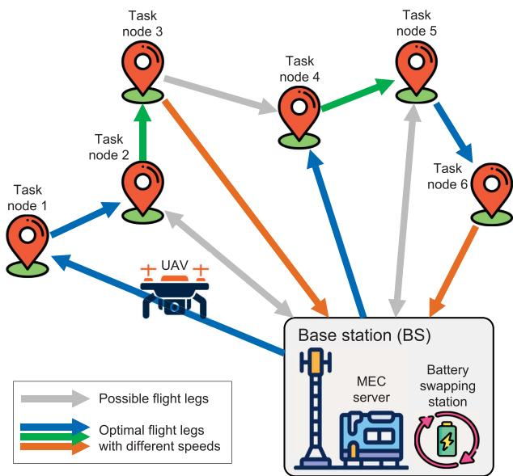  
Fig. 1. Illustration of the proposed UAV inspection system, in which the BS provides the UAV with communication bandwidth, computing resource, and battery swapping services.

The system consists of a quad-rotor UAV, a BS, and multiple task nodes distributed within the communication coverage of the BS. The UAV sequentially visits the task nodes and performs the corresponding inspection tasks. Task nodes represent locations where the UAV collects data, such as taking photos or videos, while the BS is equipped with an MEC server and a battery swapping station. This paper aims to minimize the UAV’s total operational cost, which arises from purchasing communication bandwidth from the BS, computing resource from the MEC server, and batteries from the battery swapping station. The key components of the system are as follows:

Flight Network: The flight network in the system consists of nodes and flight legs. There are |K| task nodes and a single BS node. These |K| task nodes are distributed across different geographical locations. Each task node has a pending inspection task, such as anomaly detection for power transmission lines and video analytics in farmland patrols. The UAV visits the task nodes in a pre-defined order, which can be determined by the priorities of the nodes. The flight leg between each pair of task nodes is unidirectional, while the flight leg between a task node and the BS node can be bidirectional. The UAV departs from the BS, executes all inspection tasks sequentially along the optimal path, and then returns to the BS.

\- Base Station (BS): The BS is equipped with an MEC server, offering purchasable communication bandwidth and computing resource for processing offloaded tasks. Furthermore, the BS incorporates a battery swapping station for the UAV’s energy replenishment. If the UAV encounters an energy shortage during the flight, it must promptly return to the BS and purchase a battery swapping service to continue its flight.

\- Unmanned Aerial Vehicle (UAV): On each flight leg, the UAV can select an appropriate speed, which influences its flight time and energy consumption. This significantly affects its need for battery swapping. When the UAV hovers above a task node, the computation task can be processed locally on the UAV or offloaded to the MEC server. The offloading decisions impact the hovering time and the cost of buying communication and computing resources. In summary, the UAV has to make decisions on flight speeds, computation offloading, and battery swapping to minimize its total operational cost.

## B. Path Planning Model

The flight network is built from the UAV perspective. Abstract the flight network as a directed graph (J, Z), where J is the set of nodes, and Z is the set of flight legs with $( i , j ) \in Z$ representing the flight leg from node i to node $j .$ . A node in $J$ can be the BS or a task node. The set of task nodes is denoted by $K$ with $K \subseteq J .$ . For each flight leg (i, j), we use a three-element tuple $[ V _ { ( i , j ) } , E _ { ( i , j ) } , T _ { ( i , j ) } ]$ to represent the speed selected, energy consumed, and time required for the UAV to fly from node i to node $j$ . Define $i n ( j ) = \{ i \in J | ( i , j ) \in Z \}$ as the set of all start nodes of the flight legs that end at node $j$ and $o u t ( j ) = \{ i \in J | ( j , i ) \in Z \}$ as the set of all end nodes of the flight legs that start from node $j .$ . Define $X _ { ( i , j ) }$ as a binary variable with $X _ { ( i , j ) } = 1$ if flight leg (i, j) is selected, and $X _ { ( i , j ) } = 0$ otherwise. We have

$$
X _ { ( i , j ) } \in \{ 0 , 1 \} , \forall ( i , j ) \in Z ,\tag{1}
$$

$$
\sum _ { i \in i n ( j ) } X _ { ( i , j ) } = 1 , \forall j \in K .\tag{2}
$$

Constraint (2) ensures that each task node is visited once by the UAV. Further, we have

$$
\sum _ { i \in i n ( j ) } X _ { ( i , j ) } - \sum _ { i \in o u t ( j ) } X _ { ( j , i ) } = 0 , \forall j \in J .\tag{3}
$$

Constraint (3) indicates that the number of flight legs entering node $j$ is equal to the number of flight legs leaving node $j ,$ ensuring the continuity of the flight path. Define $x ^ { \mathrm { { \bar { B } S } } }$ as the number of new batteries swapped by the UAV, which satisfies

$$
x ^ { \mathrm { { B S } } } = \sum _ { i \in i n ( j ) } X _ { ( i , j ) } - 1 , j = \mathrm { { B S } } ,\tag{4}
$$

which sums all selected flight legs arriving at the BS minus 1, representing the total number of the UAV returns to the BS for battery swapping. Considering that the final return to the BS signifies mission completion rather than battery swapping, we subtract 1 in (4) to exclude the final return. We assume that the battery swapping station and the MEC server are co-located at the BS in our model. After arriving at a task node, the UAV hovers above the node for a certain duration to collect and process data. Define $t _ { k }$ as the hovering time of the UAV at task node k. Additionally, define τ as the time required for a single battery swapping operation, we enforce

$$
\sum _ { ( i , j ) \in Z } T _ { ( i , j ) } X _ { ( i , j ) } + \sum _ { k \in K } t _ { k } + x ^ { \mathrm { B S } } \tau \leq T ^ { \operatorname* { m a x } } ,\tag{5}
$$

which indicates the total time spent by the UAV is composed of three parts: the flight time along flight legs, the hovering time at task nodes, and the battery swapping time at the BS. The total time spent must not exceed the maximum time $T ^ { \mathrm { m a x } }$ allowed by the system.

## C. Communication Model

Upon arriving at a task node, the UAV maintains its hovering position and communicates with the BS by a line-of-sight channel. It is assumed that the wireless channel is quasi-static [26], meaning the channel state remains unchanged during data transmission. The wireless communication between the UAV and BS employs the frequency division multiple access (FDMA) technology [27]. The channel power gain is defined to follow the free-space path loss model [28]. Let $r _ { k }$ denote the data rate from task node k to the BS, which can be given by

$$
r _ { k } = b \mathrm { l o g } _ { 2 } \left( 1 + \frac { g _ { 0 } d _ { k } ^ { - \alpha } P } { N _ { 0 } } \right) , \forall k \in K ,\tag{6}
$$

where b is the communication bandwidth allocated to the UAV, $d _ { k }$ is the distance between the UAV at task node k and the BS; $g _ { 0 }$ is the channel gain at a reference distance of 1 m; α is the channel fading index; $P$ represents the transmission power of the UAV, and $N _ { 0 }$ is the noise power.

## D. Computation Model

We introduce a binary variable $a _ { k }$ to describe the binary task offloading. $a _ { k } = 0$ indicates that the computation task is executed locally by the UAV at task node $k ,$ and $a _ { k } = 1$ indicates that the computation task at task node k is offloaded to the MEC server. We have

$$
a _ { k } \in \{ 0 , 1 \} , \forall k \in K .\tag{7}
$$

If the UAV processes a task locally, then its hovering time at task node k is equal to the total time required to process the task, $t _ { k } ^ { \mathrm { L } }$ which consists of two parts:

$$
t _ { k } ^ { \mathrm { L } } = \frac { D _ { k } } { s _ { k } } + \frac { W _ { k } } { f ^ { \mathrm { L } } } , \forall k \in K .\tag{8}
$$

The first part represents the data collection time, where $D _ { k }$ is the data size at task node $k ,$ and $s _ { k }$ denotes the data collection rate. The second part is the UAV computation time, where $W _ { k }$ represents the number of CPU cycles needed to process $D _ { k }$ and $f ^ { \mathrm { L } }$ denotes the UAV’s local computing resource. If a task is offloaded to the MEC server, the total time required to process the task, $t _ { k } ^ { \mathrm { M } }$ , can be given by

$$
t _ { k } ^ { \mathrm { M } } = \frac { D _ { k } } { s _ { k } } + \frac { D _ { k } } { r _ { k } } + \frac { W _ { k } } { f ^ { \mathrm { M } } } , \forall k \in K ,\tag{9}
$$

which includes three parts: the data collection time, data transmission time, and computation time. The second part represents the time needed for the UAV to upload the collected data to the MEC server. In the third part, $\mathrm { \bar { \rho } } _ { f ^ { \mathrm { M } } }$ denotes the computing resource purchased by the UAV from the MEC server. Suppose that the UAV must wait for the data processing to be completed before continuing its flight. Further, we define

$$
t _ { k } = a _ { k } t _ { k } ^ { \mathrm { M } } + ( 1 - a _ { k } ) t _ { k } ^ { \mathrm { L } } , \forall k \in K ,\tag{10}
$$

which is the total time spent by the UAV at task node $k ,$ associated with (5).

## E. Energy Consumption Model

Consider that the UAV has N different flight speeds to choose from on each flight leg (i, j), which is described by

$$
V _ { ( i , j ) } \in \{ V _ { 1 } , V _ { 2 } , . . . , V _ { N } \} , \forall i \in J , \forall j \in o u t ( i ) ,\tag{11}
$$

where $V _ { 1 } , V _ { 2 } , \dots , V _ { N }$ are given constants. The time spent on flight leg $( i , j )$ is defined as

$$
T _ { ( i , j ) } = \frac { L _ { ( i , j ) } } { V _ { ( i , j ) } } , \forall i \in J , \forall j \in o u t ( i ) ,\tag{12}
$$

where $L _ { ( i , j ) }$ represents the distance of flight leg (i, j). Specially, when the BS node is denoted by $j ,$ we have $L _ { ( i , j ) } = d _ { i }$ where a task node is denoted by $i \in K$

The energy consumption of the UAV flying at $V _ { ( i , j ) }$ on flight leg $( i , j )$ can be given by

$$
E _ { ( i , j ) } = T _ { ( i , j ) } P _ { ( i , j ) } , \forall i \in J , \forall j \in o u t ( i ) .\tag{13}
$$

The definitions of time and energy consumption in (12) and (13) are based on idealized mathematical models, providing a baseline for further adjustment in practical systems. For example, we could use $T _ { ( i , j ) } + \Delta T _ { ( i , j ) }$ , where $\Delta T _ { ( i , j ) }$ is an adjustment term defined as a function of environmental factors, such as wind and obstacles. This paper focuses on system-level decision-making for UAV flight speed scheduling, battery swapping, and computation offloading. For simplicity, we omit the environmental factors as they only affect the quantification of time and energy the UAV spends from node i to node $j .$

In (13), $P _ { ( i , j ) }$ represents the propulsion power consumption when flying at a speed of $V _ { ( i , j ) }$ . As per [29], [30], [31], $P _ { ( i , j ) }$ can be defined by

$$
P _ { ( i , j ) } = P _ { 1 } \left( 1 + 3 \frac { V _ { ( i , j ) } } { v _ { \mathrm { t i p } } ^ { 2 } } \right) + P _ { 2 } ( w ) \left( \sqrt { 1 + \frac { V _ { ( i , j ) } ^ { 4 } } { 4 v _ { 0 } ( w ) ^ { 4 } } } \right.
$$

$$
- \frac { { \cal V } _ { ( i , j ) } ^ { 2 } } { 2 v _ { 0 } ( w ) ^ { 2 } } \bigg ) ^ { \frac { 1 } { 2 } } + \frac { 1 } { 2 } \rho S _ { \mathrm { F P } } { \cal V } _ { ( i , j ) } ^ { 3 } , \forall i \in { \cal J } , \forall j \in o u t ( i ) ,\tag{14a}
$$

$$
w = w _ { 1 } + w _ { 2 } ,\tag{14b}
$$

$$
P _ { 1 } = \frac { \delta _ { \mathrm { p } } } { 8 } \left( N _ { \mathrm { r } } N _ { \mathrm { b } } L _ { \mathrm { c } } R _ { \mathrm { r } } \right) v _ { \mathrm { t i p } } ^ { 3 } ,\tag{14c}
$$

$$
P _ { 2 } ( w ) = \frac { \left( 1 + k _ { \mathrm { c f } } \right) \left( w g \right) ^ { \frac { 3 } { 2 } } } { \sqrt { 2 \rho N _ { \mathrm { r } } \pi R _ { \mathrm { r } } ^ { 2 } } } ,\tag{14d}
$$

$$
v _ { 0 } ( w ) = \sqrt { \frac { w g } { 2 \rho N _ { \mathrm { r } } \pi R _ { \mathrm { r } } ^ { 2 } } } ,\tag{14e}
$$

where w is equal to the UAV’s body mass $w _ { 1 } ,$ including the hardware, such as the processor and camera, plus the mass of the battery w<sub>2</sub>, and $\delta _ { \mathrm { p } } , N _ { \mathrm { r } } , N _ { \mathrm { b } } , L _ { \mathrm { c } } , R _ { \mathrm { r } } , v _ { \mathrm { t i p } } , k _ { \mathrm { c f } } , S _ { \mathrm { F P } } , \rho , g$ denote the profile drag coefficient, number of rotors, number of blades per rotor, blade chord length, rotor radius, tip speed of a blade, incremental correlation factor, fuselage equivalent flat area, air density, gravitational acceleration, respectively.

The energy consumption of the UAV at a task node is caused by hovering and task processing. Following [31], the hovering energy consumption is given by

$$
e _ { k } ^ { \mathrm { h o v e r } } = \frac { ( w g ) ^ { \frac { 3 } { 2 } } } { \sqrt { 2 \rho A } } t _ { k } , \forall k \in K ,\tag{15}
$$

where $A$ represents the effective area of the UAV rotor. In the case of a task processed on the UAV, the total energy consumption at task node k can be described by

$$
E _ { k } ^ { \mathrm { L } } = e _ { k } ^ { \mathrm { h o v e r } } + \varepsilon _ { \mathrm { U } } \big ( f ^ { \mathrm { L } } \big ) ^ { 2 } W _ { k } , \forall k \in K ,\tag{16}
$$

where the parameter $\varepsilon _ { \mathrm { U } }$ represents the computational energy consumption coefficient of the UAV. In the case of a task offloaded to the MEC server, the total energy consumption of the UAV can be expressed by

$$
E _ { k } ^ { \mathrm { M } } = e _ { k } ^ { \mathrm { h o v e r } } + P \frac { D _ { k } } { r _ { k } } , \forall k \in K ,\tag{17}
$$

where the second term denotes the energy consumed by the UAV to upload $D _ { k }$ . Finally, the energy consumed by the UAV at task node k is provided by

$$
E _ { k } = a _ { k } E _ { k } ^ { \mathrm { M } } + ( 1 - a _ { k } ) E _ { k } ^ { \mathrm { L } } , \forall k \in K .\tag{18}
$$

Compared to the size of data collected, the size of computation results is usually negligible [32], thereby omitting the time and energy consumption required for transmitting the results in (8), (9), (16) and (17).

## F. Battery Energy Model

Let $C _ { \mathrm { b a t t } }$ denote the maximum capacity of a UAV battery, which satisfies

$$
C _ { \mathrm { b a t t } } = w _ { 2 } \varepsilon _ { \mathrm { b a t t } } ,\tag{19}
$$

where $\varepsilon _ { \mathrm { b a t t } }$ represents the maximum energy that can be carried per kilogram of battery. Define $Y _ { j } ^ { \mathrm { i n } }$ and $Y _ { j } ^ { \mathrm { o u t } }$ as the UAV’s energy states upon entering and leaving node $j ,$ respectively. The UAV departs from the start node (i.e., the BS) with a fully charged battery. When the UAV reaches the battery swapping station (i.e., the BS), it removes the depleted battery and replaces it with a full one. Thus, we have

$$
\begin{array} { r } { Y _ { j } ^ { \mathrm { o u t } } = C _ { \mathrm { b a t t } } , j = \mathrm { B S } . } \end{array}\tag{20}
$$

The energy state of the UAV when entering node $j$ equals the energy state when leaving the previous node i minus the energy consumed on flight leg $( i , j )$ . The energy state when leaving node $j$ equals the energy state when entering node $j$ minus the energy required to process the task at node $j .$ Hence, we have

$$
Y _ { j } ^ { \mathrm { i n } } = \sum _ { i \in i n ( j ) } X _ { ( i , j ) } \big ( Y _ { i } ^ { \mathrm { o u t } } - E _ { ( i , j ) } \big ) , \forall j \in J ,\tag{21}
$$

$$
Y _ { j } ^ { \mathrm { o u t } } = Y _ { j } ^ { \mathrm { i n } } - E _ { j } , \forall j \in K .\tag{22}
$$

For the uniqueness and continuity of the selected path, the constraint below should be satisfied to ensure that the UAV has sufficient energy to reach every node in the path.

$$
Y _ { j } ^ { \mathrm { o u t } } \ge 0 , \forall j \in { \cal J } .\tag{23}
$$

## G. Cost Minimization Problem

The communication bandwidth b and computing resource $f ^ { \mathrm { M } }$ purchased by the UAV are bounded by

$$
B _ { \mathrm { m i n } } \leq b \leq B _ { \mathrm { m a x } } ,\tag{24}
$$

$$
F _ { \mathrm { m i n } } \leq f ^ { \mathrm { M } } \leq F _ { \mathrm { m a x } } ,\tag{25}
$$

where $B _ { \mathrm { m a x } }$ and $F _ { \mathrm { m a x } }$ represent the maximum communication bandwidth offered by the BS and the maximum computing resource of the MEC server, respectively. $B _ { \mathrm { m i n } }$ and $F _ { \mathrm { m i n } }$ are the minimum resources to manage the $\mathrm { U A V } _ { \mathrm { \Delta } }$ flight. The total operational costs of the UAV consist of the bandwidth cost, the computing resource cost, and the battery consumption cost. The cost minimization problem is defined as

$$
\begin{array} { r } { \mathrm { P 1 : \ m i n \ \pi _ { a } } b + \pi _ { b } f ^ { \mathrm { M } } + \pi _ { c } ( x ^ { \mathrm { B S } } + 1 ) , } \\ { \mathrm { s . t . } ( 1 ) - ( 2 5 ) , } \end{array}
$$

where decision variables include $X _ { ( i , j ) }$ for path planning, $V _ { ( i , j ) }$ for speed selection, and $\{ a _ { k } , b , f ^ { \dot { \mathrm { M } } } \}$ for task offloading. $\pi _ { \mathrm { a } } ,$ $\pi _ { \mathrm { b } } .$ , and $\pi _ { \mathrm { c } }$ represent the corresponding cost coefficients. P1 is a non-convex mixed-integer nonlinear programming (MINLP) problem due to the integer variables $X _ { ( i , j ) }$ and $a _ { k } ,$ and the nonlinear terms in (9), (17), (21), which make the problem difficult to solve to the global optimum.

## III. PROBLEM REFORMULATION

In this section, we reformulate P1 into a tractable mixedinteger convex problem by introducing virtual nodes to build a unidirectional extended graph. The complexity of P1 results from three aspects 1) the bidirectional flight legs for battery swapping, 2) multiple speeds to be selected for each flight leg, and 3) 0-1 offloading decision for each task node. To simplify the problem, we introduce different types of virtual nodes into the original graph, and an extended graph with two actual task nodes and two-speed levels is shown in Fig. 2. By using virtual nodes, the above three aspects are uniformly transformed and incorporated into a path-planning problem in the extended graph, which reduces the complex interactions between variables in P1. In what follows, we present the system model and problems based on the extended graph.

## A. The Extended Graph

In the original model, the BS node plays three roles: the start node, the destination node, and the battery swapping node, which results in a bidirectional cyclic flight path. Therefore, we add two types of virtual nodes to the BS node: the destination node, denoted as $0 ^ { \prime } .$ , and battery swapping nodes, while the original BS node continues to serve as the start node, denoted as 0. Define

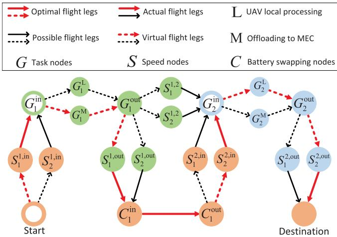  
Fig. 2. An example of the proposed unidirectional extended graph is shown, where rings represent original (actual) nodes, and solid circles represent virtual nodes. Nodes with the same color indicate the same geographical location.

$C = C ^ { \mathrm { i n } } \cup C ^ { \mathrm { o u t } }$ as the set of all virtual battery swapping nodes. $C ^ { \mathrm { i n } } = \{ C _ { k } ^ { \mathrm { i n } } \} _ { k = 1 } ^ { | K | - 1 }$ is the set of in nodes, representing the UAV enters the battery swapping node k for battery swapping. $C ^ { \mathrm { { o u t } } } =$ $\{ C _ { k } ^ { \mathrm { o u t } } \} _ { k = 1 } ^ { | K | - 1 }$ is the set of out nodes, representing the UAV leaves the battery swapping node k after the battery swapping service is complete. Furthermore, we expand the task nodes into two types of nodes: $G ^ { \mathrm { I O } } = G ^ { \mathrm { i n } } \cup G ^ { \mathrm { o u i } }$ and $G ^ { \mathrm { R } } = G ^ { \mathrm { L } } \cup G ^ { \mathrm { M } } . G ^ { \mathrm { i n } } =$ $\{ G _ { k } ^ { \mathrm { i n } } \} _ { k \in K }$ is the set of in nodes, representing the UAV enters the original task node k, while $G ^ { \mathrm { o u t } } = \{ G _ { k } ^ { \mathrm { o u t } } \} _ { k \in K }$ is the set of out nodes, indicating the UAV leaves the task node k. $G ^ { \mathrm { L } } =$ $\{ G _ { k } ^ { \mathrm { L } } \} _ { k \in K }$ is the set of virtual nodes, indicating the UAV chooses to process the task locally at task node k, while $G ^ { \mathrm { M } } = \{ G _ { k } ^ { \mathrm { M } } \} _ { k \in K }$ is the set of virtual nodes, representing the UAV offloads task to the MEC server at task node k.

Additionally, virtual speed nodes are introduced to represent different speed levels that the UAV can choose. Let $S = \bar { \cup _ { n = 1 } ^ { N } } S _ { n }$ denote the set of all virtual speed nodes, where $S _ { n } = S _ { n } ^ { \mathrm { i n } } \cup$ $S _ { n } ^ { \mathrm { o u t } } \cup S _ { n } ^ { \prime }$ is the set ofnodes where the UAV selects the nth speed. $S _ { n } ^ { \mathrm { i n } } = \{ \tilde { S } _ { n } ^ { k , \mathrm { i n } } \} _ { k \in K }$ is the set of in nodes, representing the UAV enters the task node k from the BS. $S _ { n } ^ { \mathrm { o u t } } = \{ S _ { n } ^ { k , \mathrm { o u t } } \} _ { k \in K }$ is the set of out nodes, indicating the UAV leaves the task node k and returns to the BS after completing the task. $S _ { n } ^ { \prime } = \{ S _ { n } ^ { k , k + 1 } \} _ { k = 1 } ^ { | K | - 1 }$ is the set of connection nodes, representing the UAV flies from task node k to task node $k + 1$ . To simplify the notations, we still use $( J , Z )$ to represent the extended graph, where J is the set of actual and virtual nodes, and Z is the set of flight legs between two nodes. Define the flight speed on flight leg $( i , j )$ as $V _ { ( i , j ) }$ . Due to the virtual nodes, some of the flight legs are virtual as well. For the actual flight legs, we define the speed of flight leg (i, j) as

$$
V _ { ( i , j ) } = V _ { n } , \forall i \in S _ { n } , \forall j \in o u t ( i ) , \forall n = 1 , . . . , N .\tag{26}
$$

For the virtual flight legs, we set their speeds to 0 as follows,

$$
V _ { ( i , j ) } = 0 , \forall i \in \{ 0 \} \cup G ^ { \mathrm { I O } } \cup G ^ { R } \cup C , \forall j \in o u t ( i ) .\tag{27}
$$

## B. Path Planning Model

According to the extended graph, the path planning model can be reformulated as

$$
X _ { ( i , j ) } \in \{ 0 , 1 \} , \forall ( i , j ) \in Z ,\tag{28a}
$$

$$
\sum _ { j \in o u t ( i ) } X _ { ( i , j ) } = 1 , \forall i \in G ^ { \mathrm { I O } } ,\tag{28b}
$$

$$
\sum _ { i \in i n ( j ) } X _ { ( i , j ) } \leq 1 , \forall j \in C ^ { \mathrm { i n } } ,\tag{28c}
$$

$$
\sum _ { i \in i n ( j ) } X _ { ( i , j ) } - \sum _ { i \in o u t ( j ) } X _ { ( j , i ) } = \left\{ \begin{array} { l l } { - 1 , } & { j = 0 , } \\ { 0 , } & { j \in J \setminus ( \{ 0 \} \cup \{ 0 ^ { \prime } \} ) , } \\ { 1 , } & { j = 0 ^ { \prime } , } \end{array} \right.\tag{28d}
$$

$$
x ^ { \mathrm { { B S } } } = \sum _ { i \in i n ( j ) } X _ { ( i , j ) } , \forall j \in C ^ { \mathrm { o u t } } ,\tag{28e}
$$

where (28a) represents the selection of flight legs, including virtual ones. (28b) enforces that each task node is visited once by the UAV. (28c) allows the UAV to go to the battery swapping station when its energy is insufficient. (28d) ensures that the path from the start to the destination is loop-free and continuous.

## C. Time Model

Next, we introduce new variables $r ^ { \mathrm { b } }$ and $r ^ { \mathrm { f } }$ to replace the original $1 / b$ and $1 / f ^ { \mathrm { M } }$ , respectively. Based on the extended graph, the time spent on flight leg $( i , j )$ can be provided by

$$
T _ { ( i , j ) } = \frac { L _ { ( i , j ) } } { V _ { ( i , j ) } } , \forall i \in S , \forall j \in o u t ( i ) ,\tag{29a}
$$

$$
T _ { ( i , j ) } = \frac { D _ { i } } { s _ { i } } + \frac { W _ { i } } { f ^ { \mathrm { L } } } , \forall i \in G ^ { \mathrm { L } } , \forall j \in o u t ( i ) , [ 1 ]\tag{29b}
$$

$$
T _ { ( i , j ) } = \frac { D _ { i } } { s _ { i } } + \frac { D _ { i } } { Q _ { i } } r ^ { \flat } + W _ { i } r ^ { \mathrm { f } } , \forall i \in G ^ { \mathrm { M } } , \forall j \in o u t ( i ) ,\tag{29c}
$$

$$
T _ { ( i , j ) } = \tau , \forall i \in C ^ { \mathrm { i n } } , \forall j \in o u t ( i ) ,\tag{29d}
$$

$$
T _ { ( i , j ) } = 0 , \forall i \in \{ 0 \} \cup G ^ { \mathrm { I O } } \cup C ^ { \mathrm { o u t } } , \forall j \in o u t ( i ) ,\tag{29e}
$$

where (29a) represents the time required for the UAV to fly on an actual flight leg $( i , j )$ at speed $V _ { ( i , j ) }$ . (29b) denotes the time spent on local task processing. (29c) indicates the time required to offload a task to the MEC server, where we use $Q _ { i }$ to replace the logarithmic function in (6). (29d) represents the time needed for a battery swapping service. (29e) means that a virtual flight leg has no time consumption. The total time constraint, i.e., (5) in P1, can be rewritten as

$$
\sum _ { i \in J , j \in o u t ( i ) } X _ { ( i , j ) } T _ { ( i , j ) } \leq T ^ { \operatorname* { m a x } } .\tag{30}
$$

## D. Energy Consumption Model

The energy consumption of the UAV on flight leg $( i , j )$ in the extended graph is modeled by

$$
E _ { ( i , j ) } = T _ { ( i , j ) } P _ { ( i , j ) } , \forall i \in S , \forall j \in o u t ( i ) ,\tag{31a}
$$

$$
E _ { ( i , j ) } = e _ { ( i , j ) } ^ { \mathrm { h o v e r } } + \varepsilon _ { U } \big ( f ^ { \mathrm { L } } \big ) ^ { 2 } W _ { i } , \forall i \in G ^ { \mathrm { L } } , \forall j \in o u t ( i ) ,\tag{31b}
$$

$$
E _ { ( i , j ) } = e _ { ( i , j ) } ^ { \mathrm { h o v e r } } + P \frac { D _ { i } } { Q _ { i } } r ^ { \mathrm { b } } , \forall i \in G ^ { \mathrm { M } } , \forall j \in o u t ( i ) ,\tag{31c}
$$

$$
E _ { ( i , j ) } = - C _ { \mathrm { b a t t } } , \forall i \in C ^ { \mathrm { i n } } , \forall j \in o u t ( i ) ,\tag{31d}
$$

$$
E _ { ( i , j ) } = 0 , \forall i \in \{ 0 \} \cup G ^ { \mathrm { I O } } \cup C ^ { \mathrm { o u t } } , \forall j \in o u t ( i ) ,\tag{31e}
$$

where (31a) represents the flight energy consumption of the UAV flying on an actual flight leg. (31b) denotes the energy consumption in the case of local task processing. (31c) denotes the energy consumption in the case that a task is offloaded to the MEC server. (31d) represents that the UAV’s battery is replaced with a new one at the battery swapping station. (31e) means that a virtual flight leg causes no energy consumption. Besides, the hovering energy consumption can be given by

$$
e _ { ( i , j ) } ^ { \mathrm { h o v e r } } = \frac { ( w g ) ^ { \frac { 3 } { 2 } } } { \sqrt { 2 \rho A } } T _ { ( i , j ) } , \forall i \in G ^ { \mathrm { R } } , \forall j \in o u t ( i ) .\tag{32}
$$

## E. Battery Energy Model

Let $Y _ { j }$ represent the UAV’s remaining energy upon leaving node j in the extended graph, which can be given by

$$
Y _ { j } = \sum _ { i \in i n ( j ) } \left( Y _ { i } - E _ { ( i , j ) } \right) X _ { ( i , j ) } , \forall j \in J \setminus ( \{ 0 \} \cup C ^ { \mathrm { o u t } } ) ,\tag{33a}
$$

$$
Y _ { j } = \sum _ { i \in i n ( j ) } ( 0 - E _ { ( i , j ) } ) X _ { ( i , j ) } , \forall j \in C ^ { \mathrm { o u t } } ,\tag{33b}
$$

$$
Y _ { j } = C _ { \mathrm { b a t t } } , j = 0 ,\tag{33c}
$$

$$
Y _ { j } \geq 0 , \forall j \in J ,\tag{33d}
$$

in (33a), $Y _ { j }$ is equal to the energy when departing from the previous node i minus the energy consumed on flight leg $( i , j )$ (33b) describes the case ofbattery swapping, where it is assumed that the UAV’s energy is reset to zero upon reaching C<sup>in</sup>. (33c) indicates that the UAV is in a fully charged state when leaving the start.

## F. Problem Reformulation

Using variables $r ^ { \mathrm { b } }$ and $r ^ { \mathrm { f } } ,$ constraints (24) and (25) can be rewritten as

$$
r _ { \operatorname* { m i n } } ^ { \mathrm { b } } \leq r ^ { \mathrm { b } } \leq r _ { \operatorname* { m a x } } ^ { \mathrm { b } } ,\tag{34}
$$

$$
r _ { \operatorname* { m i n } } ^ { \mathrm { f } } \leq r ^ { \mathrm { f } } \leq r _ { \operatorname* { m a x } } ^ { \mathrm { f } } ,\tag{35}
$$

where $r _ { \operatorname* { m i n } } ^ { \mathrm { b } } = 1 / B _ { \operatorname* { m a x } } , r _ { \operatorname* { m a x } } ^ { \mathrm { b } } = 1 / B _ { \operatorname* { m i n } } , r _ { \operatorname* { m i n } } ^ { \mathrm { f } } = 1 / F _ { \operatorname* { m a x } } .$ , and $r _ { \mathrm { m a x } } ^ { \mathrm { f } } = 1 / F _ { \mathrm { m i n } } . \mathrm { A s }$ per the extended graph, P1 can be reformulated as the following problem, denoted by P2.

$$
\begin{array} { r } { \mathbf { P 2 } : \operatorname* { m i n } ~ \pi \mathrm { a } \displaystyle \frac { 1 } { r ^ { \mathrm { b } } } + \pi \mathrm { b } \displaystyle \frac { 1 } { r ^ { \mathrm { f } } } + \pi \mathrm { c } ( x ^ { \mathrm { B S } } + 1 ) } \\ { \mathrm { s . t . } ~ ( 2 6 ) - ( 3 5 ) , } \end{array}
$$

where decision variables are $\{ X _ { ( i , j ) } , r ^ { \mathrm { b } } , r ^ { \mathrm { f } } \}$

To further simplify P2, we use convex envelopes to linearize the bilinear terms, including $Y _ { i } X _ { ( i , j ) }$ in (33a), $E _ { ( i , j ) } X _ { ( i , j ) }$ in (33a)–(33b), and $T _ { ( i , j ) } X _ { ( i , j ) }$ in (30). They are the product of a continuous variable and a binary variable, which can be linearized exactly [33]. For example, the bilinear term $Y _ { i } X _ { ( i , j ) }$ with $Y ^ { \mathrm { m i n } } \le Y _ { i } \le Y ^ { \mathrm { m a x } }$ and $X _ { ( i , j ) } \in \{ 0 , 1 \}$ can be relaxed by a convex envelope $Z _ { ( i , j ) } ^ { \mathrm { Y } }$ defined as

$$
Y ^ { \operatorname* { m i n } } X _ { ( i , j ) } \leq Z _ { ( i , j ) } ^ { \mathrm { Y } } \leq Y ^ { \operatorname* { m a x } } X _ { ( i , j ) } ,\tag{36a}
$$

$$
\begin{array} { r } { Y ^ { \operatorname* { m a x } } \left( X _ { ( i , j ) } - 1 \right) + Y _ { i } \leq Z _ { ( i , j ) } ^ { \mathrm { Y } } \leq Y ^ { \operatorname* { m i n } } \left( X _ { ( i , j ) } - 1 \right) + Y _ { i } . } \end{array}\tag{36b}
$$

Since $X _ { ( i , j ) }$ is a binary variable, the relaxation (36) results in $Z _ { ( i , j ) } ^ { \mathrm { Y } } = 0$ if $\dot { X } _ { ( i , j ) } = 0$ , and $Z _ { ( i , j ) } ^ { \mathrm { Y } } = Y _ { i }$ if $X _ { ( i , j ) } = 1$ . Thus, we can use $Z _ { ( i , j ) } ^ { \mathrm { Y } }$ to replace $Y _ { i } X _ { ( i , j ) }$ , which means that the relaxation (36) is exact. The convex envelopes of bilinear terms $E _ { ( i , j ) } X _ { ( i , j ) }$ and $T _ { ( i , j ) } X _ { ( i , j ) }$ are denoted as $Z _ { ( i , j ) } ^ { \mathrm { E } }$ and $Z _ { ( i , j ) } ^ { \mathrm { T } } ,$ respectively, whose definitions are similar to (36) and omitted here.

Next, we define constraints $b = 1 / r ^ { \mathrm { b } }$ and $f ^ { \mathrm { M } } = 1 / r ^ { \mathrm { f } }$ , and reuse the objective function of P1. We minimize the use of $b$ and $f ^ { \mathrm { M } }$ , so their values will be equal to their lower bounds at the optimal solution. Thus, we can relax the equations to $b \geq 1 / r ^ { \mathrm { b } }$ and $f ^ { \mathrm { M } } \geq 1 / r ^ { \mathrm { f } }$ , which are equivalent to

$$
b r ^ { \mathrm { b } } \geq 1 , \quad f ^ { \mathrm { M } } r ^ { \mathrm { f } } \geq 1 .\tag{37}
$$

These are convex cone constraints.

By using the convex envelopes and cone constraints, P2 is transformed into a mixed-integer convex problem, which is described by

$$
\mathbf { P 3 } : \operatorname* { m i n } _ { \psi } ~ \pi _ { \mathrm { a } } b + \pi _ { \mathrm { b } } f ^ { \mathrm { M } } + \pi _ { \mathrm { c } } ( x ^ { \mathrm { B S } } + 1 )
$$

$$
{ \mathrm { s . t . ~ } } ( 2 4 ) - ( 3 7 ) ,
$$

where $\boldsymbol { \varPsi } = \{ X _ { ( i , j ) } , \boldsymbol { b } , f ^ { \mathrm { M } } , \boldsymbol { r } ^ { \mathrm { b } } , \boldsymbol { r } ^ { \mathrm { f } } , Z _ { ( i , j ) } ^ { \mathrm { Y } } , Z _ { ( i , j ) } ^ { \mathrm { E } } , Z _ { ( i , j ) } ^ { \mathrm { T } } \}$ represents the set of decision variables. In P3, bilinear terms $Y _ { i } X _ { ( i , j ) } , E _ { ( i , j ) } X _ { ( i , j ) } , \ T _ { ( i , j ) } X _ { ( i , j ) }$ should be replaced with $Z _ { ( i , j ) } ^ { \mathrm { Y } } , Z _ { ( i , j ) } ^ { \mathrm { E } } , Z _ { ( i , j ) } ^ { \mathrm { T } } ,$ respectively. P3 can be solved by off-theshelf solvers, e.g., GUROBI, if the size of P3 is small.

## IV. HEURISTIC FOR LARGE-SCALE PROBLEMS

For large-scale systems with many task nodes, solving P3 by commercial solvers may be excessively time-consuming. For practical application, we develop a heuristic based on ATC [34], which decomposes the original problem into smaller subproblems and solves them in parallel, significantly shortening the solution time.

## A. ATC-Based Hierarchy

Specifically, we first divide the set of actual task nodes K into several subsets, each subset is indexed by h and defined as $K _ { h }$ with $K = \cup _ { h = 1 } ^ { H } K _ { h }$ . Each subset corresponds to a subproblem and can be formulated as a cost minimization problem, P4, which is similar to P3.

$$
\begin{array} { r } { \mathbf { P 4 } : \underset { \varPsi _ { h } } { \operatorname* { m i n } } ~ \pi _ { \mathrm { a } } b _ { h } + \pi _ { \mathrm { b } } f _ { h } ^ { \mathrm { M } } + \pi _ { \mathrm { c } } ( x _ { h } ^ { \mathrm { B S } } + 1 ) , } \\ { \mathbf { \Phi } } \\ { \mathbf { s . t . } \left( 2 4 \right) - ( 3 7 ) \mathrm { d e f i n e d } ~ \mathrm { o n } K _ { h } , } \end{array}
$$

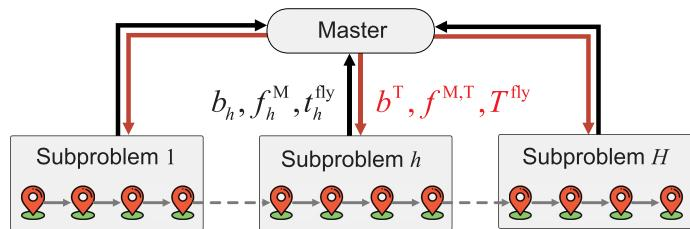  
Fig. 3. The proposed ATC-based framework to solve P3.

where $b _ { h } , f _ { h } ^ { \mathrm { M } }$ and $x _ { h } ^ { \mathrm { B S } }$ represent the communication bandwidth, computational resource, and the number of new batteries bought by the UAV in subproblem h, respectively. In each subproblem, the UAV starts from the BS, visits a subset of task nodes, and returns to the BS. The destination of subproblem h is the start of subproblem $h + 1$ . We consider that the visit order of the task nodes in each subproblem is consistent with the order in the original P3. The coordination among the H subproblems is achieved under the ATC-based framework, as shown in Fig. 3.

Since the subproblems are solved independently, the optimal values of $b _ { h }$ and $f _ { h } ^ { \mathrm { M } }$ among subproblems may differ. Also, the sum of UAV time consumption in all subproblems, denoted as $T ^ { \mathrm { f l y } }$ , may exceed the maximum time limit $T ^ { \mathrm { m a x } }$ set by the original problem. We set $\begin{array} { r } { T ^ { \mathrm { f i y } } = \sum _ { h = 1 } ^ { H } t _ { h } ^ { \mathrm { f i y } } } \end{array}$ , where $t _ { h } ^ { \mathrm { f l y } }$ represents the total time spent by the UAV in subproblem h. To address this issue, we introduce an upper-level master to coordinate the coupling variables $\{ b _ { h } , f _ { h } ^ { \bar { \mathrm { M } } } \}$ and time constraint through interactions with the lower-level subproblems. Specifically, each subproblem is solved to generate a response $\{ b _ { h } , f _ { h } ^ { \mathrm { M } } , t _ { h } ^ { \mathrm { f l y } } \}$ which is sent to the master. Based on the received responses, the master computes a target $\{ b ^ { \mathrm { T } } , f ^ { \mathrm { M , T } } , T ^ { \mathrm { f l y } } \}$ and sends it to each subproblem. This process iterates until all subproblems reach consensus on $b _ { h }$ and $f _ { h } ^ { \mathrm { M } }$ and satisfy the time constraint $T ^ { \mathrm { f l y } } \leq T ^ { \mathrm { m a x } }$ , thereby obtaining a feasible solution to the original P3.

## B. Target and Response

Since $\{ b _ { h } , f _ { h } ^ { \mathrm { M } } \}$ are coupling variables of resources, their corresponding target values $\{ b ^ { \mathrm { T } } , f ^ { \mathrm { M , T } } \}$ can be obtained by averaging the response values, which can be expressed as

$$
{ \boldsymbol { b } } ^ { \mathrm { T } } = { \frac { 1 } { H } } \sum _ { h = 1 } ^ { H } { \boldsymbol { b } } _ { h } , \quad { \boldsymbol { f } } ^ { \mathrm { M , T } } = { \frac { 1 } { H } } \sum _ { h = 1 } ^ { H } { \boldsymbol { f } } _ { h } ^ { \mathrm { M } } .\tag{38}
$$

To reduce the error/difference between the response and target, we formulate a penalized version of each subproblem, denoted as P5, where we introduce penalty terms into the objective function.

$$
\begin{array} { r l } & { \mathbf { P 5 } : \underset { \varPsi _ { h } } { \operatorname* { m i n } } ~ \pi _ { \mathrm { a } } b _ { h } + \pi _ { \mathrm { b } } f _ { h } ^ { \mathrm { M } } + \pi _ { \mathrm { c } } ( x _ { h } ^ { \mathrm { B S } } + 1 ) } \\ & { ~ + w _ { \mathrm { b } } \delta _ { h } + w _ { \mathrm { t } } \mu _ { h } , } \\ & { ~ \mathrm { s . t . } ~ ( 2 4 ) - ( 4 0 ) \operatorname* { d e f i n e d } \mathrm { o n } ~ K _ { h } , } \end{array}
$$

where $\delta _ { h } , \mu _ { h }$ denote the penalties for resources and time, respectively, and $w _ { \mathrm { b } } , w _ { \mathrm { t } }$ are the corresponding penalty weights. The definition of resource penalty $\delta _ { h }$ is given by

$$
\delta _ { h } = | b _ { h } - b ^ { \mathrm { T } } | + | f _ { h } ^ { \mathrm { M } } - f ^ { \mathrm { M , T } } | .\tag{39}
$$

```powershell
Algorithm 1: ATC-Based Heuristic.
Input: $H , T ^ { \mathrm { m a x } } , \alpha , \beta , \varepsilon _ { 1 } , \varepsilon _ { 2 } , w _ { \mathrm { b } } , w _ { \mathrm { t } } .$
Output: $b ^ { \mathrm { T } ( j ) } , \hat { f } ^ { \mathrm { M , T ( \it j ) } } , \hat { x } _ { h } ^ { \mathrm { B S ( \it j ) } }$
1 repeat
2 $\mathrm { S e t } ~ j = 0 .$
3 repeat
4 $j  j + 1 .$
5 Solve P5 for all subproblems $h = 1 , . . . , H$ in
parallel.
6 Obtain the solutions to P5, $\{ b _ { h } ^ { ( j ) } , f _ { h } ^ { \mathrm { M } ( j ) } , t _ { h } ^ { \mathrm { f l y } ( j ) } \}$
$h = 1 , . . . , H$ , and send them to the master.
7 The master calculates $\{ b ^ { \mathrm { T } ( j ) } , f ^ { \mathrm { M , T } ( j ) } , T ^ { \mathrm { f l y } ( j ) } \}$
according to (38), and sends them to the
subproblems.
8 until (41) is satisfied;
9 Update penalty wegiths $w _ { \mathrm { b } } , w _ { \mathrm { t } }$ according to (42), (43)
and (44).
10 until (45) is satisfied;
```

If $\delta _ { h } = 0 $ , all subproblems have the same values of $b _ { h }$ and $f _ { h } ^ { \mathrm { M } }$ The definition of time penalty $\mu _ { h }$ is denoted by

$$
\mu _ { h } = t _ { h } ^ { \mathrm { f l y } } .\tag{40}
$$

## C. ATC-Based Heuristic

The proposed ATC-based heuristic to solve P3 is detailed in Algorithm 1, which has an inner loop and an outer loop. In the inner loop, each subproblem P5 is solved with fixed penalty weights $w _ { \boldsymbol { \mathrm { b } } } ^ { ( j ) }$ and $w _ { \mathrm { t } } ^ { \overline { { ( j ) } } }$ , where j represents the iteration count. Based on the responses $\{ b _ { h } ^ { ( j ) } , f _ { h } ^ { \mathrm { M } ( j ) } , t _ { h } ^ { \mathrm { f l y } ( j ) } \}$ from all subproblems $h = 1 , . . . , H$ , the master calculates the target $\{ b ^ { \mathrm { T } ( j ) } , \dot { f } ^ { \mathrm { M , T ( \it j ) } } , T ^ { \mathrm { H y ( \it j ) } } \}$ and feeds it back to the subproblems. The inner loop stops when the response and target become unchanged. The convergence criterion of the inner loop is given by

$$
| b _ { h } ^ { ( j ) } - b _ { h } ^ { ( j - 1 ) } | + | f _ { h } ^ { \mathrm { M } ( j ) } - f _ { h } ^ { \mathrm { M } ( j - 1 ) } | \le \varepsilon _ { 2 } ,\tag{41}
$$

where $\varepsilon _ { 2 } > 0$ is a small constant.

In the outer loop, we update the penalty weights based on the results of the inner loop. We use (42) and (43) to update the weights.

$$
w _ { \boldsymbol { \mathrm { b } } } ^ { ( j ) }  \alpha w _ { \boldsymbol { \mathrm { b } } } ^ { ( j ) } ,\tag{42}
$$

$$
\begin{array} { r } { w _ { \mathrm { t } } ^ { ( j ) }  \{ \beta \gamma ^ { ( j ) } w _ { \mathrm { t } } ^ { ( j ) } , \quad T ^ { \mathrm { H y } ( j ) } > T ^ { \mathrm { m a x } } ,  } \\ { w _ { \mathrm { t } } ^ { ( j ) } , \quad  T ^ { \mathrm { H y } ( j ) } \leq T ^ { \mathrm { m a x } } ,  } \end{array}\tag{43}
$$

$$
\gamma ^ { ( j ) } = \lambda ( T ^ { \mathrm { { f l y } } ( j ) } - T ^ { \mathrm { { m a x } } } ) ,\tag{44}
$$

where we set $\alpha > 1 , \mathrm { s o } w _ { \mathrm { b } }$ is increased, penalizing the responsetarget error in terms of resources in the next outer loop. When the time constraint is not met, i.e., the first case of (43), w<sub>t</sub> is increased by a factor of $\beta \gamma ^ { ( j ) } > 1$ to intensify the penalty. $\gamma ^ { ( j ) }$ emphasizes the distance between $T ^ { \mathrm { { f l y } } ( j ) }$ and $T ^ { \mathrm { m a x } }$ . λ is a constant less than 1, used to adjust the magnitude of $( T ^ { \mathrm { { f l y } } ( j ) } -$ $T ^ { \mathrm { m a x } } )$ . The larger the value of $\bar { \gamma } ^ { ( j ) }$ , the greater the penalty term, which further penalizes the total time spent in the next outer loop.

TABLE II PARAMETER SETTING
<table><tr><td rowspan=1 colspan=1>Parameter</td><td rowspan=1 colspan=1>Value</td><td rowspan=1 colspan=1>Parameter</td><td rowspan=1 colspan=1>Value</td></tr><tr><td rowspan=1 colspan=1>Qk (B)</td><td rowspan=1 colspan=1>[1.25,2.5]</td><td rowspan=1 colspan=1> $\overline { { \varepsilon _ { \mathrm { U } } \ ( \mathrm { W } s ^ { 3 } ) } }$ </td><td rowspan=1 colspan=1> $\overline { { 3 \times 1 0 ^ { - 2 7 } } }$ </td></tr><tr><td rowspan=1 colspan=1> $f ^ { \mathrm { L } }$ (GHz)</td><td rowspan=1 colspan=1>1</td><td rowspan=1 colspan=1> $B _ { \mathrm { m i n } } ~ \mathrm { ( M H z ) }$ </td><td rowspan=1 colspan=1>1</td></tr><tr><td rowspan=1 colspan=1> $B _ { \mathrm { m a x } }$ (MHz)</td><td rowspan=1 colspan=1>3</td><td rowspan=1 colspan=1> $F _ { \mathrm { m i n } } ~ \mathrm { ( G H z ) }$ </td><td rowspan=1 colspan=1>0.1</td></tr><tr><td rowspan=1 colspan=1> $F _ { \mathrm { m a x } }$ (GHz)</td><td rowspan=1 colspan=1>2</td><td rowspan=1 colspan=1> $s _ { k } ~ \mathrm { ( M B / s ) }$ </td><td rowspan=1 colspan=1>3</td></tr><tr><td rowspan=1 colspan=1> $P \ ( \mathsf { W } )$ </td><td rowspan=1 colspan=1>1</td><td rowspan=1 colspan=1> $D _ { k } \ { \mathrm { ( M B ) } }$ </td><td rowspan=1 colspan=1>[5,10]</td></tr><tr><td rowspan=1 colspan=1> $W _ { k }$ </td><td rowspan=1 colspan=1> $\overline { { [ 1 0 , 2 0 ] \times 1 0 ^ { 9 } } }$ </td><td rowspan=1 colspan=1> $g \ ( \mathrm { m / s ^ { 2 } } )$ </td><td rowspan=1 colspan=1>9.807</td></tr><tr><td rowspan=1 colspan=1>w1 (kg)</td><td rowspan=1 colspan=1>2.07</td><td rowspan=1 colspan=1> $w _ { 2 } \mathrm { ~ ( k g ) }$ </td><td rowspan=1 colspan=1>[0.1,0.5]</td></tr><tr><td rowspan=1 colspan=1> $\varepsilon _ { \mathrm { b a t t } }$ (KJ/kg)</td><td rowspan=1 colspan=1>540</td><td rowspan=1 colspan=1> $\overline { { A \ ( \mathbf { m } ^ { 2 } ) } }$ </td><td rowspan=1 colspan=1>0.2</td></tr><tr><td rowspan=1 colspan=1> $\pi _ { \mathrm { a } }$ </td><td rowspan=1 colspan=1>20</td><td rowspan=1 colspan=1> $\pi _ { \mathfrak { b } }$ </td><td rowspan=1 colspan=1>30</td></tr><tr><td rowspan=1 colspan=1> $\pi _ { \mathrm { c } }$ </td><td rowspan=1 colspan=1> $\overline { { 5 \times 1 0 ^ { - 5 } \times C _ { \mathrm { b a t t } } } }$ </td><td rowspan=1 colspan=1> $\tau \ ( \mathrm { s } )$ </td><td rowspan=1 colspan=1>30</td></tr><tr><td rowspan=1 colspan=1> $\pi$ </td><td rowspan=1 colspan=1>3.14</td><td rowspan=1 colspan=1> $\delta _ { \mathfrak { p } }$ </td><td rowspan=1 colspan=1>0.012</td></tr><tr><td rowspan=1 colspan=1> $N _ { \mathrm { r } }$ </td><td rowspan=1 colspan=1>4</td><td rowspan=1 colspan=1> $N _ { \mathfrak { b } }$ </td><td rowspan=1 colspan=1>4</td></tr><tr><td rowspan=1 colspan=1> $L _ { \mathrm { c } } ~ ( \mathrm { m } )$ </td><td rowspan=1 colspan=1>0.0157</td><td rowspan=1 colspan=1> $R _ { \mathrm { r } } \ \mathrm { ( m ) }$ </td><td rowspan=1 colspan=1>0.07</td></tr><tr><td rowspan=1 colspan=1> $v _ { \mathrm { t i p } }$ (m/s)</td><td rowspan=1 colspan=1>14</td><td rowspan=1 colspan=1> $k _ { \mathrm { c f } }$ </td><td rowspan=1 colspan=1>0.1</td></tr><tr><td rowspan=1 colspan=1> $\overline { { S _ { \mathrm { F P } } \ ( \mathrm { m } ^ { 2 } ) } }$ </td><td rowspan=1 colspan=1>0.03</td><td rowspan=1 colspan=1> $\overline { { \rho \ ( \mathrm { k g } / \mathrm { m } ^ { 3 } ) } }$ </td><td rowspan=1 colspan=1>1.225</td></tr></table>

Once the time constraint is satisfied, i.e., the second case of (43), w<sub>t</sub> stops increasing.

The outer loop stops when a feasible solution to the original P3 is found. Let $\varepsilon _ { 1 } > 0$ be a small constant. The convergence criterion of the outer loop is provided by

$$
\begin{array} { r } { \delta _ { \mathrm { s u m } } ^ { ( j ) } \leq \varepsilon _ { 1 } , ~ T ^ { \mathrm { f l y } ( j ) } \leq T ^ { \mathrm { m a x } } , } \end{array}\tag{45}
$$

$$
\delta _ { \mathrm { s u m } } ^ { ( j ) } = \sum _ { h = 1 } ^ { H } \delta _ { h } ^ { ( j ) } .\tag{46}
$$

In Algorithm 1, each subproblem P5 is much smaller than the original P3, and the subproblems can be solved in parallel. By using appropriate weights, the heuristic can converge in a few outer iterations, so the total solver time can be significantly reduced.

## V. NUMERICAL RESULTS

## A. Parameter Setting

All task nodes are assumed to be located within the coverage area of the BS, whose communication radius is set to l km. In a practical UAV patrol inspection system, task node locations and their visiting order can be known in advance, so we manually determine the locations and order of task nodes in the simulation to clearly present the results of UAV flight paths. The UAV parameters are configured based on [35], [36], and other system parameters are selected based on [37], as listed in Table II, where [χ<sub>1</sub>, χ<sub>2</sub>] indicates that a value is randomly generated following a uniform distribution over this interval. The model and algorithm are implemented in MATLAB R2022a with YALMIP on a computer with Intel Core i7-12700 2.10 GHz and 16 GB RAM. The mixed-integer convex problems are solved by GUROBI [38], a powerful solver for mathematical programming.

## B. System Performance

1) Model Comparison: First, we compare the proposed model, i.e., P3, with eight baseline models regarding the total operation costs and time, as shown in Table III, where the results of our model are highlighted in bold. Consider that there are 12 task nodes, and the maximum operation time is set to $T ^ { \mathrm { m a x } } = 2 0 0 0 \mathrm { s }$ . The battery mass is fixed to $w _ { 2 } = 0 . 2 \mathrm { k g }$ The proposed model sets that the UAV has four speed levels: $V _ { 1 } = 5$ m/s, $V _ { 2 } = 1 0$ m/s, $V _ { 3 } = 1 5 ~ \mathrm { m / s }$ , and $V _ { 4 } = 2 0 \mathrm { { m } / \mathrm { { s } } }$ . The baseline models are as follows.

TABLE III  
THE TOTAL OPERATION COSTS AND TIME IN DIFFERENT MODELS
<table><tr><td rowspan=1 colspan=1>Model</td><td rowspan=1 colspan=1>Cost</td><td rowspan=1 colspan=1>Cost gap</td><td rowspan=1 colspan=1>Time (s)</td><td rowspan=1 colspan=1>Time gap</td></tr><tr><td rowspan=1 colspan=1>Proposed</td><td rowspan=1 colspan=1>39.2</td><td rowspan=1 colspan=1></td><td rowspan=1 colspan=1>844.7</td><td rowspan=1 colspan=1></td></tr><tr><td rowspan=1 colspan=1>CFS1</td><td rowspan=1 colspan=1>117.4</td><td rowspan=1 colspan=1>199.5%</td><td rowspan=1 colspan=1>2000</td><td rowspan=1 colspan=1>136.8%</td></tr><tr><td rowspan=1 colspan=1>CFS2</td><td rowspan=1 colspan=1>39.2</td><td rowspan=1 colspan=1>0.0%</td><td rowspan=1 colspan=1>869.5</td><td rowspan=1 colspan=1>2.5%</td></tr><tr><td rowspan=1 colspan=1>CFS3</td><td rowspan=1 colspan=1>50</td><td rowspan=1 colspan=1>27.6%</td><td rowspan=1 colspan=1>1035.4</td><td rowspan=1 colspan=1>22.6%</td></tr><tr><td rowspan=1 colspan=1>CFS4</td><td rowspan=1 colspan=1>infeasible</td><td rowspan=1 colspan=1></td><td rowspan=1 colspan=1>è</td><td rowspan=1 colspan=1></td></tr><tr><td rowspan=1 colspan=1>FBS1</td><td rowspan=1 colspan=1>87.8</td><td rowspan=1 colspan=1>124.0%</td><td rowspan=1 colspan=1>1987.3</td><td rowspan=1 colspan=1>135.3%</td></tr><tr><td rowspan=1 colspan=1>FBS2</td><td rowspan=1 colspan=1>55.4</td><td rowspan=1 colspan=1>41.3%</td><td rowspan=1 colspan=1>1339.2</td><td rowspan=1 colspan=1>58.5%</td></tr><tr><td rowspan=1 colspan=1>FBS3</td><td rowspan=1 colspan=1>44.6</td><td rowspan=1 colspan=1>13.8%</td><td rowspan=1 colspan=1>1170.7</td><td rowspan=1 colspan=1>39.0%</td></tr><tr><td rowspan=1 colspan=1>FBS4</td><td rowspan=1 colspan=1>infeasible</td><td rowspan=1 colspan=1>–</td><td rowspan=1 colspan=1>–</td><td rowspan=1 colspan=1>–</td></tr></table>

Constant Flight Speed Models (CFS1–CFS4): These four models remove the speed selection from the proposed model, making the UAV complete the entire flight at constant speeds $V _ { 1 }$ , V , V , and $V _ { 4 }$ , respectively.

\- Fixed Battery Swapping Models (FBS1–FBS4): These four models have fixed UAV battery swapping strategies, forcing the UAV to swap its battery after visiting one, two, three, and four task nodes, respectively.

In Table III, a gap is defined as the relative difference from the optimal value of P3. For the constant flight speed models, CFS1 uses the lowest speed $V _ { 1 }$ , which not only significantly increases flight time but also increases energy consumption, leading to more frequent battery swapping services and higher swapping cost. Additionally, to complete tasks within the limited time, the UAV needs to purchase extra communication bandwidth and computing resource to reduce hovering time, further increasing resource cost. Therefore, the total operation costs and time are much higher than those in our model. In CFS2, $V _ { 2 }$ happens to be an appropriate flying speed, which can make its total costs closer to the proposed model. However, since the UAV keeps a constant speed $V _ { 2 }$ throughout the entire flight, this may result in a longer total operation time. In CFS3, the higher flying speed $V _ { 3 }$ leads to an increase in energy consumption and the frequency of battery swapping services, resulting in higher battery swapping cost and total time. In CFS4, the UAV’s flying speed $V _ { 4 }$ is too high, resulting in excessive energy consumption during the flight. This potentially causes the battery to run out and prevents the UAV from returning to the BS for battery swapping, ultimately resulting in the failure to complete all tasks.

For the fixed battery swapping models, we can see from FBS1–FBS3 that if the number of task nodes visited by the UAV before its battery is swapped increases, then the number of battery swapping services in the entire flight decreases, thereby reducing the total costs. However, if too many task nodes are visited at once, the UAV may run out of energy during the flight, making FBS4 infeasible to visit all task nodes. Compared to these baseline models, the proposed model achieves the lowest total costs and the lowest total time spent. This is because the proposed model offers multiple speed options and a more flexible battery swapping mode, allowing the UAV to minimize its costs by optimizing its flight schedule. Note that the proposed model, P3, does not guarantee the minimum total time spent, but it minimizes the battery swapping cost, which can reduce energy consumption and thus shorten the flight time of the UAV.

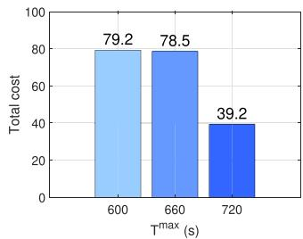  
(a)

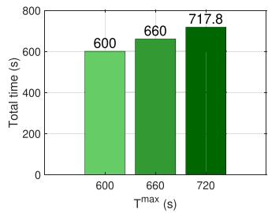  
(b)

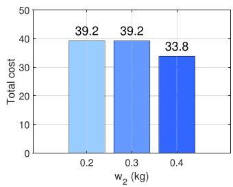  
(c)

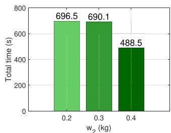  
(d)

Fig. 4. Total operation costs and time of the UAV under the proposed model with different maximum times $T ^ { \mathrm { m a x } }$ and battery masses $w _ { 2 } .$  
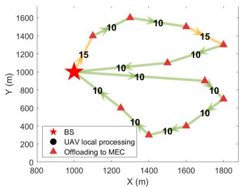  
(a) $T ^ { \mathrm { m a x } } = 6 0 0 ~ \mathrm { s }$

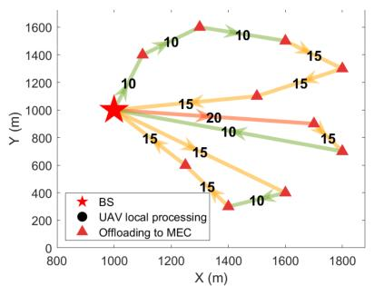  
(b) $T ^ { \mathrm { m a x } } = 6 6 0$ S

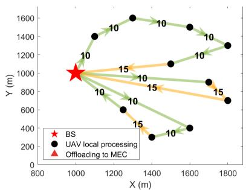  
(c) $T ^ { \mathrm { m a x } } = 7 2 0$ S

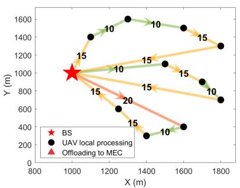  
(d) $w _ { 2 } = 0 . 2 \mathrm { k g }$

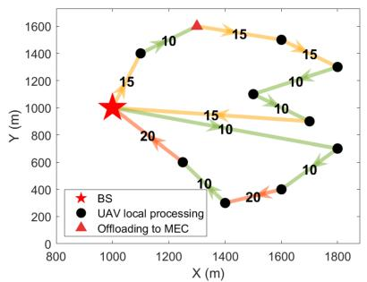  
(e) $w _ { 2 } = 0 . 3$ kg

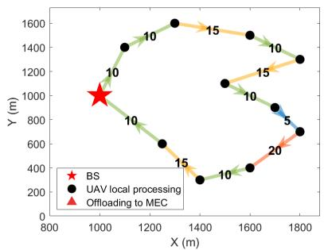  
(f) $w _ { 2 } = 0 . 4 \mathrm { ~ k ~ }$ kg  
Fig. 5. Results of the UAV’s flight paths, speed selections, and offloading decisions for the proposed model with different maximum times $_ { T ^ { \mathrm { m a x } } }$ and battery masses w<sub>2</sub>. The numbers on the arrows represent the $\mathrm { U A V } _ { \mathrm { } } { \mathrm { s } }$ speeds on the flight legs.

2) Impact of Maximum Time $T ^ { \mathrm { m a x } }$ : Next, we demonstrate the flexibility of the proposed model by adjusting maximum time $T ^ { \mathrm { m a x } }$ and battery mass $w _ { 2 }$ . First, we set $w _ { 2 } = 0 . 2$ kg and $T ^ { \mathrm { m a x } } = 6 0 0 , 6 6 0 , 7 2 0 { \mathrm { s } } .$ , and we analyze the resulting total operational costs, time, and flight path of the UAV. According to $\mathrm { F i g . 4 ( a ) }$ , when $T ^ { \mathrm { m a x } }$ decreases from 720 s to 660 s, the total operational costs increases significantly. This is because if T <sup>max</sup> decreases, then the UAV needs more communication bandwidth and computing resource to complete the tasks on time, resulting in a substantial increase in resource purchase cost. Comparing

Fig. 5(c) and (b), we can see that the number of battery swapping services is unaffected, so the battery cost remains unchanged. Also, the UAV processes all tasks locally with a total hovering time of 162.6 s in the case of $T ^ { \mathrm { m a x } } = 7 2 0 ~ \mathrm { s } ,$ while the UAV offloads all tasks to the MEC server with a total hovering time of 157 s in the case of $T ^ { \mathrm { m a x } } = 6 6 0$ s. When $T ^ { \mathrm { m a x } }$ decreases from 660 s to 600 s in Fig. 4(a), the total operational cost slightly increases. This is because the UAV chooses to reduce the number of battery swapping services so as to lower the total operation time in the case of 600 s. Consequently, the UAV saves energy by using lower flight speeds, as shown in Fig. 5(a). To meet a shorter $T ^ { \mathrm { m a x } }$ , the UAV increases its purchase of computing resource to shorten the total hovering time to 144.5 s. The increase in resource cost is slightly bigger than the decrease in battery swapping cost.

3) Impact of Battery Mass $w _ { 2 } .$ Then, we set $T ^ { \mathrm { m a x } } = 7 0 0 ~ \mathrm { s }$ and $w _ { 2 } = 0 . 2 , 0 . 3 , 0 . 4$ kg, and we analyze the resulting total operation costs, time, and flight path of the UAV. As shown in Fig. 4(c) and (d), increased battery mass indicates improved battery capacity, decreasing both the total operation costs and time. This is mainly caused by the reduction in the number of battery swapping services, shown in Fig. 5(d)–(f). When the battery mass grows from 0.2 kg to 0.3 kg, we can see from Fig. 5(d) and (e) that the number of battery swapping services is reduced from 2 to 1. Note that the battery price $\pi _ { \mathrm { c } }$ is set to be proportional to battery capacity/mass. Thus, the battery cost is unchanged when the battery mass is changed from 0.2 kg to 0.3 kg. Also, the total time for battery swapping is longer, and the flight distance is larger in the case of 0.2 kg. However, when the battery mass increases to 0.3 kg, the total operation time is reduced by only 6 s. This is mainly due to the lower average flight speed of the UAV. When the battery mass increases to 0.4 kg, the UAV no longer requires battery swapping, as shown in Fig. 5(f). In this case, the cost savings from eliminating battery swapping services outweigh the increased cost associated with higher battery mass, leading to an obvious reduction in total operation costs. Meanwhile, the flight distance is significantly reduced, so the total operation time decreases substantially.

TABLE IV  
TOTAL COSTS AND SOLVER TIME OF DIFFERENT METHODS
<table><tr><td rowspan=1 colspan=1>Network</td><td rowspan=1 colspan=1>Model</td><td rowspan=1 colspan=1>Total cost</td><td rowspan=1 colspan=1>Solver time (min)</td></tr><tr><td rowspan=1 colspan=1>30 nodes</td><td rowspan=1 colspan=1>GUROBIAlgorithm 1 (H=3)</td><td rowspan=1 colspan=1>137.2156.8</td><td rowspan=1 colspan=1>8.51.3</td></tr><tr><td rowspan=1 colspan=1>40 nodes</td><td rowspan=1 colspan=1>GUROBIAlgorithm 1 (H=4)</td><td rowspan=1 colspan=1>147.5179.9</td><td rowspan=1 colspan=1>47.95.1</td></tr><tr><td rowspan=1 colspan=1>50 nodes</td><td rowspan=1 colspan=1>GUROBIAlgorithm 1 (H=5)</td><td rowspan=1 colspan=1>187.9201</td><td rowspan=1 colspan=1>82.94.6</td></tr><tr><td rowspan=1 colspan=1>60 nodes</td><td rowspan=1 colspan=1>GUROBI (2h)Algorithm 1 (H=6)</td><td rowspan=1 colspan=1>fail217.2</td><td rowspan=1 colspan=1>13.8</td></tr><tr><td rowspan=1 colspan=1>70 nodes</td><td rowspan=1 colspan=1>GUROBI (2h)Algorithm 1 (H=7)</td><td rowspan=1 colspan=1>fail209.4</td><td rowspan=1 colspan=1>18.5</td></tr></table>

## C. Algorithm Performance

1) Computational Efficiency: We evaluate the proposed heuristic in five flight networks with 30, 40, 50, 60, and 70 nodes, respectively. The parameters ofAlgorithm 1 are set to $w _ { \mathrm { b } } ^ { ( 0 ) } = 1 0 $ $w _ { \mathrm { t } } ^ { ( 0 ) } = 0 . 1 , \alpha = 2 . 5 , \beta = 1 . 5 , \varepsilon _ { 1 } = 1 0 ^ { - 5 } , \varepsilon _ { 2 } = 1 0 ^ { - 5 }$ . Table IV shows the UAV’s total operational costs and solver time of different methods in the five flight networks, and the results of our heuristic are highlighted in bold. The solver GUROBI can obtain the optimal solution to P3, but it consumes a lot of time to solve large network problems. In cases of 30, 40, and 50 nodes, GUROBI can find the optimal solutions to P3, which yields the lowest total costs. When the network size is set to 60 or 70 nodes, GUROBI fails to obtain a feasible solution to P3 within 2 hours. In contrast, Algorithm 1 can obtain suboptimal solutions to P3, while significantly reducing the total solver time. This is because the proposed heuristic can decompose a large problem into several small subproblems, which can be solved efficiently and in parallel.

2) Convergence: We examine the convergence of the proposed heuristic in the network with 60 nodes and $T ^ { \mathrm { m a x } } =$

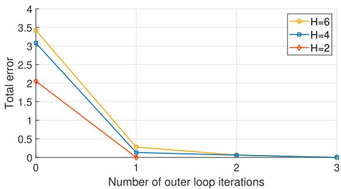

Fig. 6. The total error $\delta _ { \mathrm { s u m } }$ of Algorithm 1 with different numbers of subproblems H.  
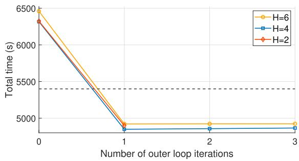  
Fig. 7. Total time spent by the UAV in Algorithm 1 with different numbers of subproblems H. The dashed line represents the maximum time T<sup>max</sup>.

5400 s. As shown in Fig. 6, the heuristic can reduce the total error to near zero in a few iterations. Especially, the total error becomes no more than $1 0 ^ { - 5 }$ in just one iteration in the case of $H =$ 2. Fig. 7 shows the corresponding total time spent by the UAV, $\operatorname { i . e . , } T ^ { \mathrm { f l y } }$ . It can be seen that the proposed heuristic can control $T ^ { \mathrm { { f l y } } }$ to meet the time constraint $T ^ { \mathrm { { \bar { f } } y } } \leq T ^ { \mathrm { { m a x } } }$ . The results demonstrate good convergence performance of the proposed heuristic.

3) Discussion: The following discusses two key implementation aspects of Algorithm 1. Firstly, the number and sizes of subproblems greatly impact the performance of the algorithm. Too few subproblems result in large-size problem instances per iteration with long solver time. Too many subproblems degrade the approximation to the original P3, causing higher total costs. In our software and hardware environments, about 10 task nodes in each subproblem can offer a favorable trade-off between the solution quality and computational speed. Secondly, we adopt a dynamic weight adjustment strategy in (43) and (44) to enforce the total flight time constraint. In (44), λ is a critical parameter to scale the deviation $( T ^ { \mathrm { f l y } } - T ^ { \mathrm { m a x } } )$ . To better satisfy the time constraint, the value of λ can be chosen based on $( \dot { T } ^ { \mathrm { f l y } } - T ^ { \mathrm { m a x } } )$ . We set λ inversely proportional to the positive value of $( T ^ { \mathrm { f l y } } - T ^ { \mathrm { m a x } } )$ in the first iteration, i.e., the maximum of $( T ^ { \mathrm { f l y } } - T ^ { \mathrm { m a x } } )$ . This ensures that the penalty term maintains an appropriate influence in the objective function, neither dominating nor being negligible.

## VI. CONCLUSION

This paper proposes a customized decision-making model from the UAV’s perspective, jointly optimizing flight speeds, battery swapping, and task offloading to minimize the UAV’s total operational costs in a patrol inspection. We transform the UAV flight network into a unidirectional extended graph, based on which the cost minimization problem is reformulated to a mixed-integer convex problem that can be solved by commercial solvers. For practicality, we design a fast ATC-based heuristic to obtain suboptimal solutions for large-sized problems. Numerical results show that the proposed model can flexibly adjust the UAV’s flying speeds and consumption of batteries and communication/computing resources, minimizing the total costs subject to task requirements and time constraint. The proposed ATC-based heuristic decomposes a large-scale problem into smaller subproblems and solves them in parallel, demonstrating high computational efficiency in getting suboptimal solutions.

## REFERENCES

[1] M. H. Adnan, Z. A. Zukarnain, and O. A. Amodu, “Fundamental design aspects of UAV-enabled MEC systems: A review on models, challenges, and future opportunities,” Comput. Sci. Rev., vol. 51, 2024, Art. no. 100615.

[2] Z. Jia, Q. Wu, C. Dong, C. Yuen, and Z. Han, “Hierarchical aerial computing for Internet of Things via cooperation of haps and UAVs,” IEEE Internet Things J., vol. 10, no. 7, pp. 5676–5688, Apr. 2023.

[3] P. Du, Y. Shi, H. Cao, S. Garg, M. Alrashoud, and P. K. Shukla, “AIenabled trajectory optimization of logistics UAVs with wind impacts in smart cities,” IEEE Trans. Consum. Electron., vol. 70, no. 1, pp. 3885– 3897, Feb. 2024.

[4] Z. Shah, U. Javed, M. Naeem, S. Zeadally, and W. Ejaz, “Mobile edge computing (MEC)-enabled UAV placement and computation efficiency maximization in disaster scenario,” IEEE Trans. Veh. Technol., vol. 72, no. 10, pp. 13406–13416, Oct. 2023.

[5] Z. Wang, J. Du, C. Jiang, Y. Ren, and X.-P. Zhang, “UAV-assisted target tracking and computation offloading in USV-based MEC networks,” IEEE Trans. Mobile Comput., vol. 23, no. 12, pp. 11389–11405, Dec. 2024.

[6] N. Van Cuong, Y.-W. P. Hong, and J.-P. Sheu, “UAV-enabled image capture and wireless delivery for on-demand surveillance tasks,” IEEE Trans. Wireless Commun., vol. 23, no. 10, pp. 12995–13010, Oct. 2024.

[7] Z. Ning et al., “Dynamic computation offloading and server deployment for UAV-enabled multi-access edge computing,” IEEE Trans. Mobile Comput., vol. 22, no. 5, pp. 2628–2644, May 2023.

[8] D. Wei, J. Ma, L. Luo, Y. Wang, L. He, and X. Li, “Computation offloading over multi-UAV MEC network: A distributed deep reinforcement learning approach,” Comput. Netw., vol. 199, 2021, Art. no. 108439.

[9] L. Sun, L. Wan, and X. Wang, “Learning-based resource allocation strategy for industrial IoT in UAV-enabled MEC systems,” IEEE Trans. Ind. Informat., vol. 17, no. 7, pp. 5031–5040, Jul. 2021.

[10] C. Wang, D. Zhai, R. Zhang, H. Li, and F. R. Yu, “Latency minimization for UAV-assisted MEC networks with blockchain,” IEEE Trans. Commun., vol. 72, no. 11, pp. 6854–6866, Nov. 2024.

[11] L. Sun, Z. Liu, Z. Ning, J. Wang, and X. Fu, “Multi-agent Q-Net enhanced coevolutionary algorithm for resource allocation in emergency humanmachine fusion UAV-MEC system,” IEEE Trans. Automat. Sci. Eng., vol. 22, pp. 4473–4489, 2024.

[12] Y. Ding et al., “Online edge learning offloading and resource management for UAV-assisted MEC secure communications,” IEEE J. Sel. Topics Signal Process., vol. 17, no. 1, pp. 54–65, Jan. 2023.

[13] H. Li, J. Zhang, H. Zhao, Y. Ni, J. Xiong, and J. Wei, “Joint optimization on trajectory, computation and communication resources in information freshness sensitive MEC system,” IEEE Trans. Veh. Technol., vol. 73, no. 3, pp. 4162–4177, Mar. 2024.

[14] Z. Gao, J. Fu, Z. Jing, Y. Dai, and L. Yang, “MOIPC-MAAC: Communication-assisted multiobjective MARL for trajectory planning and task offloading in multi-UAV-assisted MEC,” IEEE Internet Things J., vol. 11, no. 10, pp. 18483–18502, May 2024.

[15] H. Chang, Y. Chen, B. Zhang, and D. Doermann, “Multi-UAV mobile edge computing and path planning platform based on reinforcement learning,” IEEE Trans. Emerg. Topics Comput. Intell., vol. 6, no. 3, pp. 489–498, Jun. 2022.

[16] L. Zhang, B. Jabbari, and N. Ansari, “Deep reinforcement learning driven UAV-assisted edge computing,” IEEE Internet Things J., vol. 9, no. 24, pp. 25449–25459, Dec. 2022.

[17] A. V. Savkin, C. Huang, and W. Ni, “Joint multi-UAV path planning and los communication for mobile-edge computing in IoT networks with RISs,” IEEE Internet Things J., vol. 10, no. 3, pp. 2720–2727, Feb. 2023.

[18] Y. Miao, K. Hwang, D. Wu, Y. Hao, and M. Chen, “Drone swarm path planning for mobile edge computing in industrial Internet ofThings,” IEEE Trans. Ind. Informat., vol. 19, no. 5, pp. 6836–6848, May 2023.

[19] N. Gupta, S. Agarwal, and D. Mishra, “Joint trajectory and velocitytime optimization for throughput maximization in energy-constrained UAV,” IEEE Internet Things J., vol. 9, no. 23, pp. 24516–24528, Dec. 2022.

[20] X. Yuan, Y. Hu, J. Zhang, and A. Schmeink, “Joint user scheduling and UAV trajectory design on completion time minimization for UAV-aided data collection,” IEEE Trans. Wireless Commun., vol. 22, no. 6, pp. 3884– 3898, Jun. 2023.

[21] R. Chai, Y. Gao, R. Sun, L. Zhao, and Q. Chen, “Time-oriented joint clustering and UAV trajectory planning in UAV-assisted WSNs: Leveraging parallel transmission and variable velocity scheme,” IEEE Trans. Intell. Transp. Syst., vol. 24, no. 11, pp. 12092–12106, Nov. 2023.

[22] E. Eldeeb, J. M. d. S. Sant’Ana, D. E. Pérez, M. Shehab, N. H. Mahmood, and H. Alves, “Multi-UAV path learning for age and power optimization in IoT with UAV battery recharge,” IEEE Trans. Veh. Technol., vol. 72, no. 4, pp. 5356–5360, Apr. 2023.

[23] L. Porcelli, M. Ficco, G. D’Angelo, and F. Palmieri, “Context-aware coverage path planning for a swarm of UAVs using mobile ground stations for battery-swapping,” Soft Comput., vol. 29, no. 3, pp. 1605–1625, 2025.

[24] X.-H. Lin, S. Bi, G. Su, and Y.-J. A. Zhang, “A lyapunov-based approach to joint optimization of resource allocation and 3-D trajectory for solarpowered UAV MEC systems,” IEEE Internet Things J., vol. 11, no. 11, pp. 20797–20815, Jun. 2024.

[25] N. H. Chu, D. T. Hoang, D. N. Nguyen, N. V. Huynh, and E. Dutkiewicz, “Joint speed control and energy replenishment optimization for UAVassisted IoT data collection with deep reinforcement transfer learning,” IEEE Internet Things J., vol. 10, no. 7, pp. 5778–5793, Apr. 2023.

[26] Y. Wang et al., “Task offloading for post-disaster rescue in unmanned aerial vehicles networks,” IEEE/ACM Trans. Netw., vol. 30, no. 4, pp. 1525–1539, Aug. 2022.

[27] Z. Feng, M. Huang, D. Wu, E. Q. Wu, and C. Yuen, “Multi-agent reinforcement learning with policy clipping and average evaluation for UAV-assisted communication Markov game,” IEEE Trans. Intell. Transp. Syst., vol. 24, no. 12, pp. 14281–14293, Dec. 2023.

[28] H. Ni et al., “Path loss and shadowing for UAV-to-ground UWB channels incorporating the effects of built-up areas and airframe,” IEEE Trans. Intell. Transp. Syst., vol. 25, no. 11, pp. 17066–17077, Nov. 2024.

[29] H. Pan, Y. Liu, G. Sun, P. Wang, and C. Yuen, “Resource scheduling for UAVs-aided D2D networks: A multi-objective optimization approach,” IEEE Trans. Wireless Commun., vol. 23, no. 5, pp. 4691–4708, May 2024.

[30] G. K. Pandey, D. S. Gurjar, S. Yadav, Y. Jiang, and C. Yuen, “UAV-assisted communications with RF energy harvesting: A comprehensive survey,” IEEE Commun. Surveys Tut., vol. 27, no. 2, pp. 782–838, Apr. 2025.

[31] Y. Zeng, J. Xu, and R. Zhang, “Energy minimization for wireless communication with rotary-wing UAV,” IEEE Trans. Wireless Commun., vol. 18, no. 4, pp. 2329–2345, Apr. 2019.

[32] H. Peng and X. Shen, “Multi-agent reinforcement learning based resource management in MEC- and UAV-assisted vehicular networks,” IEEE J. Sel. Areas Commun., vol. 39, no. 1, pp. 131–141, Jan. 2021.

[33] G. McCormick, “Computability of global solutions to factorable nonconvex programs: Part I — convex underestimating problems,” Math. Programm., vol. 10, pp. 147–175, 1976.

[34] A. Mohammadi and A. Kargarian, “Accelerated and robust analytical target cascading for distributed optimal power flow,” IEEE Trans. Ind. Informat., vol. 16, no. 12, pp. 7521–7531, Dec. 2020.

[35] H.-S. Im, K.-Y. Kim, and S.-H. Lee, “Trajectory optimization for Cellularenabled UAV with connectivity and battery constraints,” IEEE Trans. Veh. Technol., early access, Jun. 11, 2025, doi: 10.1109/TVT.2025.3579005.

[36] Z. Feng, D. Wu, M. Huang, and C. Yuen, “Graph-attention-based reinforcement learning for trajectory design and resource assignment in multi-UAV-assisted communication,” IEEE Internet Things J., vol. 11, no. 16, pp. 27421–27434, Aug. 2024.

[37] W. Zhong, X. Huang, J. Kang, and S. Xie, “Optimization of computation offloading for UAV-assisted intelligent transportation systems considering age of information,” J. Electron. Inf. Technol., vol. 46, no. 3, pp. 934–943, 2024.

[38] Gurobi Optimization, “LLC, gurobi optimizer reference manual,” 2024. [Online]. Available: https://www.gurobi.com/documentation/


Dongmei Ye received the BEng degree from Jiangxi Normal University, Nanchang, China, in 2023. She is currently working toward the MEng degree with the School of Automation, Guangdong University of Technology, Guangzhou, China. Her research interests include UAV-oriented mobile edge computing, path planning, and battery swapping optimization.

Zhengqing Sun received the BEng degree from the Guangdong University of Technology, Guangzhou, China, in 2024. He is currently working toward the MEng degree with the School of Automation, Guangdong University of Technology, Guangzhou, China. His research interests include mobile edge computing, Internet of vehicles, and cooperative perception.


Weifeng Zhong received the PhD degree from the Guangdong University of Technology, Guangzhou, China, in 2019. He is currently an associate professor with the Guangdong University of Technology. He was a visiting scholar with Nanyang Technological University, Singapore, in 2021, and a visiting student with Hong Kong University of Science and Technology, Hong Kong, in 2016. His research interests include connected vehicles, smart grid, and Internet of Things.

Jiawen Kang (Senior Member, IEEE) received the PhD degree from the Guangdong University of Technology, China, in 2018. He was a postdoc with Nanyang Technological University, Singapore, from 2018 to 2021. He is currently a full professor with the Guangdong University of Technology, China. His research interests mainly include focus on blockchain, security, and privacy protection in wireless communications, and networking.

Xumin Huang received the PhD degree from the Guangdong University of Technology, China, in 2019. He is currently an associate professor with the School of Automation, Guangdong University of Technology. He was a Macau Young Scholar with the State Key Laboratory of Internet of Things for Smart City, University of Macau, Macao, China. His research interests include resource and service optimizations for connected vehicles, Internet of Things, blockchain, and edge intelligence.


Dong In Kim (Life Fellow, IEEE) received the PhD degree in electrical engineering from the University of Southern California, Los Angeles, CA, USA, in 1990. He was a Tenured Professor with the School of Engineering Science, Simon Fraser University, Burnaby, BC, Canada. Since 2007, he has been an SKKU-Fellowship and then Distinguished Professor with the College of Information and Communication Engineering, Sungkyunkwan University (SKKU), Suwon, South Korea. He is a fellow of the Korean Academy of Science and Technology and a life member of the

National Academy of Engineering of Korea. He has been a first recipient of the NRF of Korea Engineering Research Center in Wireless Communications for RF Energy Harvesting from 2014 to 2021. He has been listed as a 2020/2022 Highly Cited Researcher by Clarivate Analytics. From 2001 to 2024, he served as the Editor, Editor at Large, and Area Editor of Wireless Communications I for IEEE Transactions on Communications. From 2002 to 2011, he served as the editor and founding area editor of Cross-Layer Design and Optimization for IEEE Transactions on Wireless Communications. From 2008 to 2011, he was the co-editor-in-chieffor the IEEE/KICS Journal ofCommunications andNetworks. He was the founding editor-in-chief for the IEEE Wireless Communications Letters, from 2012 to 2015. He was selected the 2019 recipient of the IEEE Communications Society Joseph LoCicero Award for Exemplary Service to Publications. He was the General Chair of IEEE ICC 2022 in Seoul.


Shengli Xie (Fellow, IEEE) received the PhD degree in control theory and applications from the South China University of Technology, Guangzhou, China, in 1997. He is currently a full professor and the head of the Institute of Intelligent Information Processing, Guangdong University of Technology, Guangzhou. He has coauthored two books and more than 150 research papers in refereed journals and conference proceedings. His research interests include blind signal processing, machine learning, and Internet of Things. He was awarded the Second Prize of National Natural

Science Award of China in 2009. He was awarded a Highly Cited Researcher. He is an associate editor of IEEE Internet ofThings Journal and IEEE Transactions on Systems, Man, and Cybernetics: Systems.


Chau Yuen (Fellow, IEEE) received the BEng and PhD degrees from Nanyang Technological University, Singapore, in 2000 and 2004, respectively. He was a postdoctoral fellow with Lucent Technologies Bell Labs, Murray Hill, NJ, USA, in 2005. From 2006 to 2010, he was with the Institute for Infocomm Research, Singapore. From 2010 to 2023, he was with the Engineering Product Development Pillar, Singapore University of Technology and Design, Singapore. Since 2023, he has been with the School of Electrical and Electronic Engineering, Nanyang

Technological University, Singapore, where he is currently the Provost’s Chair in Wireless Communications, the assistant dean ofGraduate College, and Cluster Director for Sustainable Built Environment with ER@IN. He received the IEEE Communications Society Leonard G. Abraham Prize (2024), the IEEE Communications Society Best Tutorial Paper Award (2024), the IEEE Communications Society Fred W. Ellersick Prize (2023), the IEEE Marconi Prize Paper Award in Wireless Communications (2021), the IEEE APB Outstanding Paper Award (2023), and the EURASIP Best Paper Award for Journal on Wireless Communications and Networking (2021). He currently serves as an editor-in-chief for Springer Nature Computer Science, an editor for the IEEE Transactions on Vehicular Technology, the IEEE Transactions on Neural Networks and Learning Systems, and the IEEE Transactions on Network Science and Engineering, where he was awarded as IEEE Transactions on Network Science and Engineering Excellent Editor Award 2024 and 2022, and Top associate editor for IEEE Transactions on Vehicular Technology from 2009 to 2015. He also served as a guest editor for several special issues, including IEEE Journal on SelectedAreas in Communications, IEEE Wireless Communications Magazine, IEEE Communications Magazine, IEEE Vehicular Technology Magazine, IEEE Transactions on Cognitive Communications and Networking, and Applied Energy (Elsevier). He is listed as Top 2% Scientists by Stanford University, and also a Highly Cited Researcher by Clarivate Web of Science from 2022. He has four U.S. patents and published more than 500 research articles at international journals.