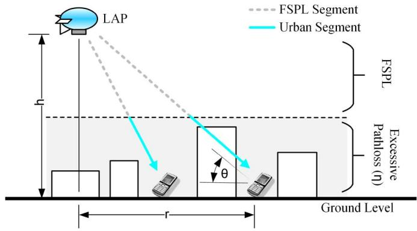
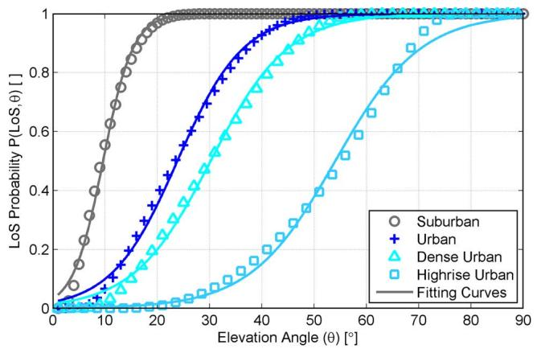
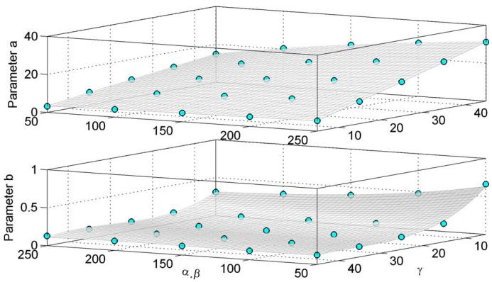
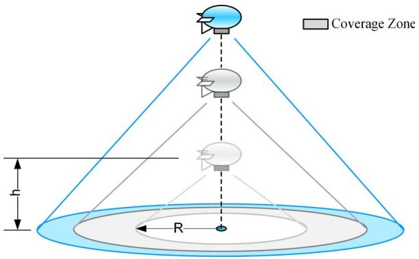
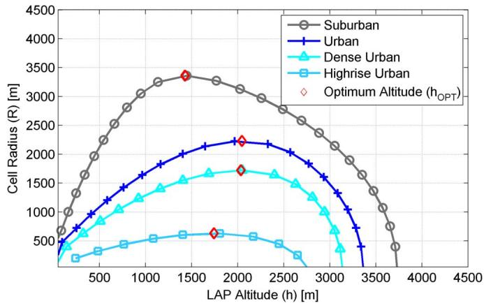
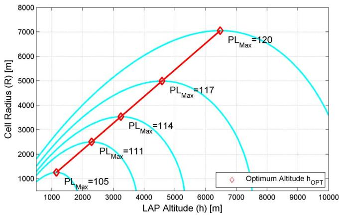

# Optimal LAP Altitude for Maximum Coverage

Akram Al-Hourani, Student Member, IEEE, Sithamparanathan Kandeepan, Senior Member, IEEE, and Simon Lardner

Abstract—Low-altitude aerial platforms (LAPs) have recently gained significant popularity as key enablers for rapid deployable relief networks where coverage is provided by onboard radio heads. These platforms are capable of delivering essential wireless communication for public safety agencies in remote areas or during the aftermath of natural disasters. In this letter, we present an analytical approach to optimizing the altitude of such platforms to provide maximum radio coverage on the ground. Our analysis shows that the optimal altitude is a function of the maximum allowed pathloss and of the statistical parameters of the urban environment, as defined by the International Telecommunication Union. Furthermore, we present a closed-form formula for predicting the probability of the geometrical line of sight between a LAP and a ground receiver.

Index Terms—Low altitude platform, air-to-ground communication, radio propagation, probability of line of sight.

# I. INTRODUCTION

B ROADBAND wireless networks are increasingly adoptedby users of mission critical communications, such as public safety agencies and first responders. This adoption is motivated by the unprecedented development in these networks in terms of capacity and efficiency, compared to the legacy (second generation) mobile communication systems. However, as any cellular network, the communication is largely dependent on fixed infrastructure (base stations) that could be severally disrupted in the case of natural disasters such as floods, earthquakes or tsunamis. By which, inducing the need for finding a rapid and cost-effective temporary recovery solution an utmost necessity. One of the prospective feasible solutions for realizing wireless recovery networks is by utilizing airborne base stations. The airborne communication infrastructure concept has been endorsed by the homeland security bureau in USA [1]. An example of the recent efforts in airborne network recovery solutions is the ongoing European Commission project ABSOLUTE [2] focusing on Low Altitude Platforms (LAP).

Due to technical limitations, the number of deployable LAPs could be very limited, especially during the chaotic aftermath hours of a disaster. This fact mandates a full exploitation of

Manuscript received April 28, 2014; accepted July 19, 2014. Date of publication July 24, 2014; date of current version December 17, 2014. This work was supported in part by the European Commission’s Programme (FP7-2011-8) through the ABSOLUTE Project under Grant FP7-ICT-318632 [2]. The associate editor coordinating the review of this paper and approving it for publication was I. Guvenc.

A. Al-Hourani and S. Kandeepan are with the School of Electrical and Computer Engineering, College of Science, Engineering and Health, RMIT University, Melbourne VIC 3001, Australia (e-mail: akram.hourani@ieee.org; kandeepan@ieee.org).

S. Lardner is with the Challenge Networks, Melbourne VIC 3067, Australia (e-mail: simon.lardner@challengenetworks.com.au).

Color versions of one or more of the figures in this paper are available online at http://ieeexplore.ieee.org.

Digital Object Identifier 10.1109/LWC.2014.2342736

each of the deployed LAPs by optimizing its altitude in order to provide the best possible coverage. In this letter, we target this issue by providing a mathematical model capable of predicting the optimum altitude of a LAP based on the statistical parameters of the underlying urban environment. These parameters are described in three folds: (i) the percentage of build-up area to the total land area, (ii) the number of buildings per unit area, and (iii) the statistical distribution of buildings heights. An important mediator parameter in this study is the LAP-toreceiver line of sight probability, for which we provide a closed form. The remaining of this letter is organized as the following: in Section II, we discuss the preliminaries required for our study including the adopted radio propagation model. While in Section III, we provide the methodology for obtaining the optimum LAP altitude, followed by Section IV and Section V that conclude important notes and remarks.

# II. SYSTEM MODEL

Low Altitude Platforms (LAP) are quasi-stationary aerial platforms such as quadcopters, balloons and helicopters, usually characterized with an altitude laying within the troposphere. In contrary to High Altitude Platforms (HAP) [3] that can reach the upper layers of the stratosphere. In general, LAPs are much easier to deploy, and are inline with the broadband cellular concept, since low altitude combines both coverage superiority and confined cell radius. The technology carried by LAPs depends on the end-user’s application, budget and bandwidth requirements. Applications could be as advanced as LTE-A, Wi-Fi, WiMAX or as legacy as GSM, TETRA or P-25 systems.

# A. RF Propagation Model

Few literature papers are available on characterizing the airto-ground (ATG) propagation over urban environments, the most comprehensive work in this regard can be found in [4]–[6], where the authors proposed that ATG communication occurs in accordance to two main propagation groups. These groups are derived statistically in [4], where the first group correspond to receivers favoring a Line-of-Sight (LoS) condition or near-Line-of-Sight condition, while the second group generally corresponds to receivers with no LAP Line-of-Sight but still receiving coverage via strong reflections and diffractions. In [5] and [6] the propagation groups where similarly classified according to the receivers’ strict LoS and non-line-of-sight (NLoS) conditions, where each propagation group was studied independently.

As depicted in Fig. 1, radio signals emitted by a LAP base station propagate in free space until reaching the urban environment where they incur shadowing and scattering caused by the man-made structures, introducing additional loss in the ATG link. We refer to the additive loss incurred on top of the free space pathloss as the excessive pathloss, which has a Gaussian distribution [4]–[6], however in this study we deal with its mean value (expectation) rather than with its random behavior, hence η here refers to the mean value of the excessive pathloss. Another point is that the effect of small-scale fluctuations caused by the rapid changes in the propagation environment are not considered.

text_image

LAP
FSPL Segment
Urban Segment
FSPL
Excessive
Pathloss (n)
Ground Level
r

Fig. 1. Low Altitude Platforms radio propagation in urban environment.

Accordingly, the resulting ATG mean pathloss (expressed in dB) can be modeled as:

$$
\mathrm{PL} _ {\xi} = \text { FSPL } + \eta_ {\xi} \tag {1}
$$

where FSPL represents the free space pathloss between the LAP and a ground receiver, and $\xi$ refers to the propagation group. Noticing that, the excessive pathloss η affecting the ATG link depends largely on the propagation group rather than the elevation angle which is depicted θ in Fig. 1.

In order to find the spatial expectation of the pathloss denoted as Λ (measured in dB) between a LAP and all ground receivers having a common elevation angle θ, we will apply the following expectation rule:

$$
\Lambda = \sum_ {\xi} \mathrm{PL} _ {\xi} \mathbf {P} (\xi , \theta) \tag {2}
$$

where $\mathbf { P } ( \xi , \theta )$ represents the probability of occurrence of a certain propagation group which is strongly dependent on the elevation angle. In our study we are following the assumption of the two dominant propagation groups that strictly correspond to the LoS condition. Accordingly $\xi \in \{ \mathrm { L o S } , \mathrm { N L o S } \}$ , and the groups’ probability are linked as the following:

$$
\mathbf {P} (\mathrm{NLoS}, \theta) = 1 - \mathbf {P} (\mathrm{LoS}, \theta). \tag {3}
$$

# B. Modeling Line of Sight Probability

The International Telecommunication Union (ITU) in its recommendation document [7] suggests a remarkable method for finding the probability of geometrical LoS between a terrestrial transmitter at elevation $h _ { \mathrm { T X } }$ and a receiver at elevation $h _ { \mathrm { R X } }$ in an urban environment. This probability is dependent on three statistical parameters related to the urban environment:

• Parameter α: Represents the ratio of built-up land area to the total land area (dimensionless).   
• Parameter β: Represents the mean number of buildings per unit area (buildings/km2).   
• Parameter γ: A scale parameter that describes the buildings’ heights distribution according to Rayleigh probability density function: $f ( H ) = ( \bar { H / \gamma ^ { 2 } } ) \exp ( - \bar { H ^ { 2 } / 2 } \gamma ^ { 2 } )$ , where H is the building height in meters.

Following the mathematical steps in [7] we can write the resulting LoS probability in a single equation as:

$$
\mathbf {P} (\text { LoS }) = \prod_ {n = 0} ^ {m} \left[ 1 - \exp \left(- \frac {\left[ h _ {\mathrm{TX}} - \frac {(n + \frac {1}{2}) (h _ {\mathrm{TX}} - h _ {\mathrm{RX}})}{m + 1} \right] ^ {2}}{2 \gamma^ {2}}\right) \right] \tag {4}
$$

where $m = \operatorname { f l o o r } ( r { \sqrt { \alpha \beta } } - 1 )$ and r is the ground distance between the transmitter and the receiver, as depicted in Fig. 1, while n is merely the product index. It is worthy to mention that the geometrical LoS is independent of the system frequency, also that (4) is generic and can be used for any $h _ { \mathrm { T X } }$ and hRX heights. A similar geometric approach was followed in [8] to determine the theoretical likelihood of the LoS in built-up areas, however the study was not based on the ITU parameters. On the other hand, practical measurements were presented in [9] for satellite to ground LoS estimations. In the particular case of a LAP we can disregard $h _ { \mathrm { R X } }$ since it is much lower than the average buildings heights and the LAP altitude. Also, the ground distance becomes $r = h / \tan ( \theta )$ , where h is the LAP altitude. It is important to note that the resulting plot of the series in (4) will smooth our for large values of $h ,$ accordingly $\mathbf { P } ( \mathrm { L o S } )$ can be considered as a continuous function of θ and the environment parameters. Plotting this probability in Fig. 2 for four selected urban environments [6] Suburban (0.1, 750, 8), Urban (0.3, 500, 15), Dense Urban (0.5, 300, 20), and Highrise Urban (0.5, 300, 50) for $\alpha , \beta$ and $\gamma$ respectively, we can notice that the trend can be closely approximated to a simple modified Sigmoid function (S-curve) of the following form:

$$
\mathbf {P} (\mathrm{LoS}, \theta) = \frac {1}{1 + a \exp (- b [ \theta - a ])} \tag {5}
$$

where a and b are called here the S-curve parameters.

This approximation significantly ease the calculation of the LoS probability, and also it allows the analytical approach presented in Section III, because the series in (4) cannot be further reduced. In order to generalize the solution we have linked the S-curve parameters a and b directly to the environment variables $\alpha , \beta$ and γ. This linking was performed using two variables surface fitting where $( \alpha \times \beta )$ is assumed as the first variable, and $( \gamma )$ as the second. The surface equation yields a two-variables polynomial having the following form:

$$
z = \sum_ {j = 0} ^ {3} \sum_ {i = 0} ^ {3 - j} C _ {i j} (\alpha \beta) ^ {i} \gamma^ {j} \tag {6}
$$

line

| Elevation Angle (θ) [°] | Suburban | Urban | Dense Urban | Highrise Urban |
|---|---|---|---|---|
| 0 | 0.0 | 0.0 | 0.0 | 0.0 |
| 5 | 0.15 | 0.05 | 0.02 | 0.01 |
| 10 | 0.35 | 0.15 | 0.08 | 0.03 |
| 15 | 0.65 | 0.35 | 0.25 | 0.08 |
| 20 | 0.85 | 0.55 | 0.45 | 0.15 |
| 25 | 0.95 | 0.75 | 0.65 | 0.25 |
| 30 | 0.98 | 0.85 | 0.78 | 0.35 |
| 35 | 0.99 | 0.92 | 0.88 | 0.45 |
| 40 | 0.995 | 0.96 | 0.93 | 0.55 |
| 45 | 0.998 | 0.98 | 0.96 | 0.65 |
| 50 | 0.999 | 0.99 | 0.98 | 0.75 |
| 55 | 0.9995 | 0.995 | 0.99 | 0.85 |
| 60 | 0.9998 | 0.998 | 0.995 | 0.92 |
| 65 | 0.9999 | 0.999 | 0.998 | 0.96 |
| 70 | 1.0 | 1.0 | 0.999 | 0.98 |
| 75 | 1.0 | 1.0 | 1.0 | 0.99 |
| 80 | 1.0 | 1.0 | 1.0 | 0.995 |
| 85 | 1.0 | 1.0 | 1.0 | 0.998 |
| 90 | 1.0 | 1.0 | 1.0 | 1.0 |

Fig. 2. The calculated line-of-sight probabilities, with their related S-curve fitting for different urban environments.

TABLE I SURFACE POLYNOMIAL COEFFICIENTS FOR a 

<table><tr><td> $C_{ij}$ </td><td>i</td><td>0</td><td>1</td><td>2</td><td>3</td></tr><tr><td>j</td><td></td><td></td><td></td><td></td><td></td></tr><tr><td>0</td><td></td><td>9.34E-01</td><td>2.30E-01</td><td>-2.25E-03</td><td>1.86E-05</td></tr><tr><td>1</td><td></td><td>1.97E-02</td><td>2.44E-03</td><td>6.58E-06</td><td>-</td></tr><tr><td>2</td><td></td><td>-1.24E-04</td><td>-3.34E-06</td><td>-</td><td>-</td></tr><tr><td>3</td><td></td><td>2.73E-07</td><td>-</td><td>-</td><td>-</td></tr></table>

TABLE II SURFACE POLYNOMIAL COEFFICIENTS FOR b 

<table><tr><td> $C_{ij}$ </td><td>i</td><td>0</td><td>1</td><td>2</td><td>3</td></tr><tr><td>j</td><td></td><td></td><td></td><td></td><td></td></tr><tr><td>0</td><td></td><td>1.17E+00</td><td>-7.56E-02</td><td>1.98E-03</td><td>-1.78E-05</td></tr><tr><td>1</td><td></td><td>-5.79E-03</td><td>1.81E-04</td><td>-1.65E-06</td><td>-</td></tr><tr><td>2</td><td></td><td>1.73E-05</td><td>-2.02E-07</td><td>-</td><td>-</td></tr><tr><td>3</td><td></td><td>-2.00E-08</td><td>-</td><td>-</td><td>-</td></tr></table>

scatter

| Parameter a | Parameter b |
|-------------|-------------|
| 0           | 0           |
| 50          | 0           |
| 100         | 0           |
| 150         | 0           |
| 200         | 0           |
| 250         | 0           |
| 300         | 0           |
| 350         | 0           |
| 400         | 0           |
| 450         | 0           |
| 500         | 0           |
| 550         | 0           |
| 600         | 0           |
| 650         | 0           |
| 700         | 0           |
| 750         | 0           |
| 800         | 0           |
| 850         | 0           |
| 900         | 0           |
| 950         | 0           |
| 1000        | 0           |
| 1050        | 0           |
| 1100        | 0           |
| 1150        | 0           |
| 1200        | 0           |
| 1250        | 0           |
| 1300        | 0           |
| 1350        | 0           |
| 1400        | 0           |
| 1450        | 0           |
| 1500        | 0           |
| 1550        | 0           |
| 1600        | 0           |
| 1650        | 0           |
| 1700        | 0           |
| 1750        | 0           |
| 1800        | 0           |
| 1850        | 0           |
| 1900        | 0           |
| 1950        | 0           |
| 2000        | 0           |
| 2050        | 0           |
| 2100        | 0           |
| 2150        | 0           |
| 2200        | 0           |
| 2250        | 0           |
| 2300        | 0           |
| 2350        | 0           |
| 2400        | 0           |
| 2450        | 0           |
| 2500        | 0           |
| 2550        | 0           |
| 2600        | 0           |
| 2650        | 0           |
| 2700        | 0           |
| 2750        | 0           |
| 2800        | 0           |
| 2850        | 0           |
| 2900        | 0           |
| 2950        | 0           |
| 3000        | 0           |
| 3050        | 0           |
| 3100        | 0           |
| 3150        | 0           |
| 3200        | 0           |
| 3250        | 0           |
| 3300        | 0           |
| 3350        | 0           |
| 3400        | 0           |
| 3450        | 0           |
| 3500        | 0           |
| 3550        | 0           |
| 3600        | 0           |
| 3650        | 0           |
| 3700        | 0           |
| 3750        | 0           |
| 3800        | 0           |
| 3850        | 0           |
| 3900        | 0           |
| 3950        | 0           |
| 4000        | 0           |
| -            | -           |
| -            | -           |
| -            | -           |
| -            | -           |
| -            | -           |
| -            | -           |
| -            | -           |
| -            | -           |
| -            | -           |
| -            | -           |
| -            | -           |
| -            | -           |
| -            | -           |
| -            | -           |
| -            | -           |

Fig. 3. S-curve parameters 3D-fitting as a relation to the urban environment parameters.

where z represents the fitting parameter a or b, and $C _ { i j }$ are the polynomial coefficients given in Table I and Table II, while the surface fitting is depicted in Fig. 3.

# III. FINDING THE OPTIMUM ALTITUDE

In order to analyze the effect of the LAP’s altitude on the provided service, firstly we define the service threshold in terms of the maximum allowable pathloss $\operatorname { P L } _ { \operatorname* { m a x } } .$ . When the total pathloss between the LAP and a receiver exceeds this threshold,

text_image

Coverage Zone
R

Fig. 4. The coverage zone by a low altitude platform.

the link is deemed as failed. For ground receivers, this threshold translates into a coverage disk (zone) of radius R, since all receivers within this disk have a pathloss that is less than or equal $\mathrm { P L } _ { \mathrm { m a x } } .$ , as depicted in Fig. 4. Mathematically speaking, the cell radius of the coverage zone can be written as:

$$
R = r \mid_ {\Lambda = \mathrm{PL} _ {\max}} \tag {7}
$$

Accordingly, the optimization problem is to find the best altitude that will maximize R. In order to do so, we deduce a relation between the LAP altitude h and the cell radius R. By rewriting Equation (1) we have:

$$
\mathrm{PL} _ {\mathrm{LoS}} = 2 0 \log d + 2 0 \log f + 2 0 \log \left(\frac {4 \pi}{c}\right) + \eta_ {\mathrm{LoS}}
$$

$$
\mathrm{PL} _ {\mathrm{NLoS}} = \underbrace {2 0 \log d + 2 0 \log f + 2 0 \log \left(\frac {4 \pi}{c}\right)} _ {\text { FSPL }} + \underbrace {\eta_ {\mathrm{NLoS}}} _ {\eta_ {\xi}} \tag {8}
$$

where d is the distance between the LAP and a receiver at a circle of radius r, given by $d = { \sqrt { h ^ { 2 } + r ^ { 2 } } }$ , while f is the system frequency. The FSPL is according to Friis equation with the assumption of isotropic transmitter and receiver antennas. Referring to (2):

$$
\Lambda = \mathbf {P} (\mathrm{LoS}) \times \mathrm{PL} _ {\mathrm{LoS}} + \mathbf {P} (\mathrm{NLoS}) \times \mathrm{PL} _ {\mathrm{NLoS}} \tag {9}
$$

According to Fig. 1, we notice that $\theta = \arctan ( h / r )$ . Now we substitute from (3), (5), (7), (8) into (9), then performing some simple algebraic reductions, we can write:

$$
\begin{array}{l} \mathrm{PL} _ {\max} = \frac {A}{1 + a \exp \left(- b \left[ \arctan \left(\frac {h}{R}\right) - a \right]\right)} \\ + 1 0 \log (h ^ {2} + R ^ {2}) + B \tag {10} \\ \end{array}
$$

where $A = \eta _ { \mathrm { L o S } } - \eta _ { \mathrm { N L o S } }$ and B = 20 log $f + 2 0 \log ( 4 \pi / c ) +$ $\eta _ { \mathrm { N L o S } }$ . The above equation is implicit, where neither R nor h can be written as an explicit function of each other. In order to obtain the optimum point of the LAP altitude $h _ { \mathrm { O P T } }$ that yields the best coverage, we need to search for the value of h that satisfies the equation of the critical point:

$$
\frac {\partial R}{\partial h} = 0 \tag {11}
$$

line

| LAP Altitude (h) [m] | Suburban | Urban | Dense Urban | Highrise Urban | Optimum Altitude (h_OPT) |
| ------------------- | -------- | ----- | ----------- | -------------- | ------------------------ |
| 0                   | 500      | 500   | 500         | 500            | -                        |
| 500                 | 1500     | 1200  | 900         | 400            | -                        |
| 1000                | 2800     | 1700  | 1300        | 500            | -                        |
| 1500                | 3400     | 2100  | 1600        | 600            | 3400                     |
| 2000                | 3200     | 2300  | 1700        | 650            | 2300                     |
| 2500                | 2800     | 2100  | 1600        | 600            | -                        |
| 3000                | 2200     | 1700  | 1300        | 550            | -                        |
| 3500                | 1500     | 1200  | 900         | 450            | -                        |
| 4000                | 800      | 600   | 500         | -              | -                        |
| 4500                | 400      | -     | -           | -              | -                        |

Fig. 5. Cell radius vs. LAP altitude curve for different urban environments.

i.e. the point at which the radius-altitude curve in (10) changes its direction. The optimum altitude of a LAP is strongly dependent on the specific urban environment condition. Fig. 5 depicts the variation of R with respect to h as per (10) for the four urban environments and the following parameters; $\mathrm { P L } _ { \mathrm { m a x } } = 1 0$ dB, f = 2, 000 MHz, while using the following $\left( \eta _ { \mathrm { L o S } } , \eta _ { \mathrm { N L o S } } \right)$ pairs (0.1, 21), (1.0, 20), (1.6, 23), (2.3, 34) corresponding to Suburban, Urban, Dense Urban, and Highrise Urban respectively [4] (measured in dB). The figure also shows the optimal LAP altitudes by numerically solving equation (11).

In order to visualize the effect of varying the maximum allowed pathloss $\mathrm { P L } _ { \mathrm { m a x } }$ on the radius-altitude curve and the optimum altitude solution, we have depicted this relation in the plot of Fig. 6, where the cell radius is a function of both, the LAP altitude and the maximum allowed pathloss $\operatorname { P L } _ { \operatorname* { m a x } } .$ by maintaining a constant environment parameters (Urban). We can notice that the resulting line connecting the tips of radiusaltitude curves, indicates a constant ratio between R and $h _ { \mathrm { O P T } }$ , or in other words, there is a certain elevation angle that always satisfies a constant ratio of $h _ { \mathrm { o p t } } / R _ { \mathrm { i } }$ , we call it here the optimum elevation angle or $\theta _ { \mathrm { O P T } } =$ arctan $( h _ { \mathrm { O P T } } / R )$ . For obtaining the optimum elevation angle, we first rewrite the expression in (10) in terms of θ and R as the following:

$$
\mathrm{PL} _ {\max} = \frac {A}{1 + a \exp (- b [ \theta - a ])} + 2 0 \log (R \sec \theta) + B \tag {12}
$$

the optimum point can then be found by solving the equation $\partial R / \partial \theta = 0$ , which yields the following:

$$
\frac {\pi}{9 \ln (1 0)} \tan (\theta_ {\mathrm{OPT}}) + \frac {a b A \exp (- b [ \theta_ {\mathrm{OPT}} - a ])}{\left[ a \exp (- b [ \theta_ {\mathrm{OPT}} - a ]) + 1 \right] ^ {2}} = 0 \tag {13}
$$

the solution of equation (13) is clearly independent of the maximum allowed pathloss, and is also unique for a certain set of parameters $( a , b , A )$ . Accordingly, it explains the straight line in Fig. 6.

# IV. DISCUSSION

It is important to note that the value of $\mathrm { P L } _ { \mathrm { m a x } }$ depends on the sensitivity of the receiver, communication technology, and the target quality of service. It is observed that for large values of $\mathrm { P L } _ { \mathrm { m a x } }$ the optimum altitude may exceed the earth’s atmosphere which is not a practically viable solution. Since we mainly consider LAPs in this work, and noting that LAPs will have physical constraints for reaching a maximum altitude, the optimum altitude for the LAP hence can be the found by imposing a constraint on h in our proposed model.

line

| LAP Altitude (h) [m] | Cell Radius (R) [m] |
| --------------------- | ------------------- |
| 1000                  | 1000                |
| 2000                  | 2500                |
| 3000                  | 3500                |
| 4500                  | 5000                |
| 6500                  | 7000                |

Fig. 6. Cell radius vs. LAP altitude curve for different maximum pathloss, in an urban environment.

# V. CONCLUSION

In this letter, we have provided a mathematical model for obtaining the optimum LAP altitude that maximizes the coverage on the ground. In addition, we have showed that the geometrical line of sight between an LAP and a ground receiver can be expressed as a closed form equation based on the elevation angle and the urban statistical parameters. Future work will include the analysis of the random behaviors of ATG radio channel including the large-scale variations as well as the smallscale fading effect.

# REFERENCES

[1] National Public-Safety Telecommunications Council (NPSTC), “The role of deployable aerial communications architecture in emergency communications and recommended next steps,” in White Paper, 2009. [Online]. Available: http://www.npstc.org/download.jsp?tableId=37&column=217& id=2107&file=DOC\_309742A1\_White\_Paper\_110922.pdf   
[2] EU-FP7 ICT IP Project ABSOLUTE, 2013. [Online]. Available: http:// www.absolute-project.eu/reports/publications   
[3] T. Tozer and D. Grace, “High-altitude platforms for wireless communications,” Electron. Commun. Eng. J., vol. 13, no. 3, pp. 127–137, 2001.   
[4] A. Al-Hourani, S. Kandeepan, and A. Jamalipour, “Modeling air-toground path loss for low altitude platforms in urban environments,” in Proc. GLOBECOM Symp. Sel. Areas Commun., Satellite Space Commun., Austin, TX, USA, Dec. 2014, to be published.   
[5] Q. Feng, J. McGeehan, E. Tameh, and A. Nix, “Path loss models for air-toground radio channels in urban environments,” in Proc. IEEE 63rd VTC-Spring, May 2006, vol. 6, pp. 2901–2905.   
[6] J. Holis and P. Pechac, “Elevation dependent shadowing model for mobile communications via high altitude platforms in built-up areas,” IEEE Trans. Antennas Propag., vol. 56, no. 4, pp. 1078–1084, 2008.   
[7] “Propagation data and prediction methods for the design of terrestrial broadband millimetric radio access systems,” Geneva, Switzerland, Rec. P.1410-2, 2003, P Series, Radiowave Propagation.   
[8] E. Ogawa and A. Satoh, “Propagation path visibility estimation for radio local distribution systems in built-up areas,” IEEE Trans. Commun., vol. 34, no. 7, pp. 721–724, Jul. 1986.   
[9] E. Lutz, D. Cygan, M. Dippold, F. Dolainsky, and W. Papke, “The land mobile satellite communication channel-recording, statistics, channel model,” IEEE Trans. Veh. Technol., vol. 40, no. 2, pp. 375–386, May 1991.