# Optimal Task Offloading and Trajectory Planning Algorithms for Collaborative Video Analytics With UAV-Assisted Edge in Disaster Rescue

Hui Sun , Xiuye Zhang , Bo Zhang , Kewei Sha , Senior Member, IEEE, and Weisong Shi , Fellow, IEEE

Abstract—Researchers have designed UAV-enabled edge servers (UES) to assist smart cameras (ECs) and optimize video analytics performance. However, most prior research neglects the impact of ECs’ battery constraint on the system performance, especially in disaster scenarios. In this study, we introduce a novel time-slotbased UES-assisted system that aims to conserve energy and extend the overall lifetime of EC networks. Our proposed system operates in discrete time slots, wherein the UES alternates between hovering and serving ECs, or flying to a new position within its coverage area to provide better assistance. To minimize the computational overhead of ECs during hovering and serving within a time slot, we present a new task offloading scheme based on the differential evolutionary algorithm. For optimizing the UES’s flying trajectory, we formulate the UES movement as a Markov decision process, taking into account system state changes. Subsequently, we design an efficient UES trajectory planning algorithm using double deep Q-learning. This algorithm optimizes energy consumption, feedback reward, and the overall system overhead, resulting in a doubling of the system’s lifetime. Simulation results demonstrate that our proposed task offloading algorithm exhibits high accuracy and fast convergence compared to four other state-of-the-art strategies. Moreover, the UES trajectory planning algorithm doubles the system’s lifetime while reducing energy consumption and total system overhead.

Index Terms—Edge computing, unmanned aerial vehicles, double deep q-learning, task scheduling, trajectory planning.

# I. INTRODUCTION

V IDEO analytics plays a crucial role in disaster rescueoperations. Smart cameras empowered by edge computing (ECs)1 have proven to be highly suitable for video analytics [1]. However, in the event of disasters, disruptions in power supply can force ECs to rely on batteries for video analytics. This limited

Manuscript received 5 July 2023; revised 25 September 2023; accepted 12 December 2023. Date of publication 19 December 2023; date of current version 16 May 2024. This work was supported by the National Natural Science Foundation of China under Grants 62072001 and 62372002. The review of this article was coordinated by Dr. Xiaoxiao Wu. (Corresponding author: Kewei Sha.)

Hui Sun, Xiuye Zhang, and Bo Zhang are with Computer Science and Technology, Anhui University, Hefei 230039, China (e-mail: sunhuiworking@gmail.com; xiuyezhang@ahu.edu.cn; e19301162@stu.ahu.edu.cn).

Kewei Sha is with Computer Science, University of Houston - Clear Lake, Houston, TX 77058 USA (e-mail: kewei.sha@unt.edu).

Weisong Shi is with Computer Science, Wayne State University, North End, MI 48202 USA (e-mail: weisong@wayne.edu).

Digital Object Identifier 10.1109/TVT.2023.3344281

1In this paper, ‘EC’ denotes the edge computing-empowered smart camera in disaster. Edge computing-enabled devices (i.e., edge devices) include ECs.

power source restricts their ability to perform resource-intensive video analytics continuously, thereby decreasing the effectiveness of the rescue process, which relies on a continuous stream of video data from these cameras.

To address this challenge, one effective approach is to offload the video analytics tasks to a remote server, thereby extending the lifetime of ECs. However, this may pose practical challenges due to potential communication disruptions caused by the disaster. To overcome these obstacles, mobile edge computing systems employ UESes, unmanned aerial vehicles (UAVs) assisted edge servers [2]. UESes, being unrestricted by terrain, offer greater flexibility and real-time computing capabilities [3], [4]. They are utilized to support ECs by offloading heavy computing tasks. By strategically selecting appropriate cameras for task offloading and planning an optimal trajectory for the UES, the overall lifetime of the EC network can be extended, thereby enhancing its effectiveness in disaster rescue operations.

Several research efforts have focused on utilizing UESes to support edge devices through task offloading and UAV trajectory planning schemes. In the studies [5], [6], [7], UAVs are employed as mobile relay nodes. Recent work [8], [9], [10], [11] considers computing offloading, resource allocation, and trajectory planning to minimize UES energy consumption. Papers [12], [13] study the joint energy minimization problem for both UES and edge devices. Furthermore, other investigations [14], [15], [16] explore the UES trajectory planning problem with objectives such as serving the maximum number of IoT devices [14], reducing completion time [15] and minimizing task processing overhead [16].

The existing studies have primarily concentrated on maximizing the utilization of UAV resources to provide computing services for edge devices. However, it is worth noting that most of these works have focused on energy consumption models and UAV trajectory planning algorithms, without explicitly taking into account the battery constraints of the edge devices. In disaster scenarios, the limited battery capacity of ECs becomes a significant concern. While a UES also has a limited battery capacity, it is generally easier to manage and maintain the battery of a UES compared to that on individual ECs. Thus, addressing the battery constraints of ECs in disaster scenarios remains a crucial aspect that requires further attention.

This paper primarily focuses on optimizing the battery usage of ECs by leveraging a UES to offload tasks from the covered

ECs. This approach aims to extend the overall lifetime of the EC system, which is defined as the time interval starting from the system’s initiation until the battery on any one of the ECs is depleted. By effectively distributing the computational load through task offloading and leveraging the resources of the UES, we aim to maximize the operational time of the EC system and improve its overall performance.

To mitigate the issues of high energy consumption and unstable communication resulting from the continuous movement of UES, our approach operates UES in two statuses (i.e., hovering/serving and moving) at every operation cycle or time slot, wherein the UES will first move to an optimal offloading point and then hovers there to assist covered ECs. To optimize the overall efficiency of this procedure, we model two optimization problems, i.e., planning an optimal flying trajectory and developing an optimal task offloading strategy for the UES. These two problems are nested problems in a hierarchical structure with distinct optimization goals. The former targets local optimization, i.e., to minimize the computing overhead of ECs in a time slot, and the latter aims for global optimization, i.e., to extend EC-system’s operational lifetime over multiple time slots.

To find optimal solutions for the above problems. We propose an improved differential evolutionary-based offloading algorithm to tackle the offloading decision-making and resource allocation in a time slot. Then we design a double deep Q-learning (DDQN) based algorithm to plan UES flying trajectory. These algorithms reduce the energy consumption of assisted ECs and balance the battery consumption on each EC, thereby reducing assisted ECs’ computational overhead and extending the system lifetime.

Contributions of our study are summarized below.

- We propose a UES-assisted collaborative edge video analytics system for disaster rescue, focusing on the energy constraints at ECs. In the proposed system, we formulate mathematical models by jointly considering ECs’ task offloading, resource allocation, and UES trajectory planning.   
- We design an improved differential evolution algorithm to optimize offloading decision-making and resource allocation. It solves the problems of offloading ECs selection, UES channel allocation, and UES resource allocation.   
- We formulate the UES movement as a Markov decision process (MDP). Then, we design a DDQN-based trajectory planning algorithm for the UES, which enables UES to serve more ECs and extend the system lifetime.   
- We conduct experiments on a simulation platform to validate our proposed scheme in terms of accuracy, convergence, feedback reward, and total system overhead. The results reveal that our proposed scheme achieves optimal task allocation and UES trajectory planning.

The rest of this paper is organized as follows. We present the related work in Section II. We provide the motivation in Section III. We define the system model in Section IV and formulate the optimization problem in Section V. Then, we describe our task offloading and UES trajectory planning algorithms in Sections VI and VII. In Section VIII, we present the relationship between two algorithms. We describe the experiment settings and performance of the algorithms in Sections IX and X. Finally, we conclude this paper.

# II. RELATED WORK

We summarize the work related to UAV applications in disaster rescue, task scheduling and UAV trajectory planning, and UAV-assisted data collection.

UAV applications in disaster rescue: Having features such as mobility and no terrain limitation, UAVs are widely used in disaster rescue (e.g., earthquakes) [17], [18]. UAVs are used as relay nodes to provide services for end-users when the communication is broken [19]. Naqvi et al. [20] design a UAV-assisted resilient wireless network infrastructure with a cross-layer resource allocation algorithm for IoT services in disaster. Xu et al. [3] propose a UAV-assisted task management strategy to achieve emergency communication enabled by a long-range wide area network. Regarding the application of UAVs in disaster scenarios, Lu et al. [21] optimize the UAV trajectory and selection of offloading tasks by jointly considering the UAV’s limited resources and battery capacity.

Tasks scheduling and UAV trajectory planning: Prior studies [5], [6] mostly consider using UAVs as mobile relay nodes to provide uplink and downlink communication for end-users in specific areas. In [7], the UAV is used as a relay station between the ground nodes and the base station in a communication system. UAVs are used for computation using the on-board resources [8], [9], [10], [11], [12], [13], [14], [15], [16].

The authors of [8] jointly consider computational offloading, resource allocation, and trajectory planning problems to minimize the energy consumption of UAVs under the task and energy budget constraints of the IoT devices. In [9], UAV-assisted MEC systems are proposed to minimize UAV energy consumption by jointly optimizing the flying trajectory, computing resources, and offloading schedule. Li et al. [10] employ the UAV as an aerial cloud to maximize the UAV energy efficiency by jointly optimizing trajectory planning and resource allocation. In [11], UAV-based edge servers provide computing services for IoT devices for a short period of time. In this procedure, task allocation, computing scheduling, and UAV trajectory are optimized to minimize UAV energy consumption. In a UAV-assisted mobile edge computing system [12], the authors minimize the average weighted sum of energy consumption of the edge device and the UAV, subject to the constraints on offloading, resource allocation, and trajectory scheduling. The authors of [13] consider the problem of minimum total power consumption via jointly optimizing user association, power control, computation capacity allocation, and trajectory planning in a multi-UAVs system. Moataz et al. [14] jointly optimize the UAV trajectory planning and resource allocation to serve the maximum number of IoT devices. Yong et al. [15] design a UAV trajectory planning algorithm to minimize the task completion time under the requirements of end-users. In [16], a UES-assisted mobile server is proposed to optimize the task computational overhead of ground end-users based on task scheduling and flying trajectory.

UAV-assisted data collection: Many studies focus on the problem of UAV trajectory planning in wireless sensor networks [22] where the UAV is used as a mobile gateway. However, these studies aim to design methods to collect data. In [23], a UAV-based wireless sensor network is developed to dispatch UAVs to collect data from sensor nodes. Meanwhile, the UAV trajectory planning algorithm enables the UAV to communicate with as many sensor nodes as possible. The authors of [24] design a UAV trajectory planning to access the rendezvous points within a tolerant delay. Compared with MEC systems, UAVs in wireless sensor networks are merely used to collect data rather than process tasks. The UAV trajectory planning is designed to collect as much data as possible in a round-trip cycle. In MEC systems, UAV trajectory planning enables the UAV to provide services for edge devices according to system state.

# III. MOTIVATION

In disaster rescue, ECs may rely on batteries as their power supply and face disrupted network infrastructure. Recent developments have thus introduced the UES as a mobile edge computing service, providing connectivity and computing capabilities to support the ECs. This is achieved by offloading video analytics from ECs to the UES, reducing ECs’ energy consumption. Since a UES has a limited communication range and computing resources [25], it only assists a set of ECs within its coverage area at a specific time. Thus, it becomes essential to design optimal strategies for the UES to move around and efficiently serve ECs. To tackle the aforementioned challenges, researchers have proposed various solutions that primarily focus on two key research problems, optimal task offloading at UES and UES trajectory planning.

Most prior studies target optimizing the energy consumption of edge devices [12], [13], UAVs [8], [9], and the total energy consumption of edge devices and UAVs [10], [11]. Nevertheless, these studies [8], [9], [10] mostly overlook the battery constraints of edge devices when addressing the energy consumption problem. Consequently, the EC network’s lifetime cannot be optimal by simply optimizing the total energy consumption as in [8]. In disaster rescue, the EC network’s lifetime is crucial because the data collected from ECs significantly contributes to rescue efficiency [9]. It is impossible to replace batteries for ECs in disaster scenarios. We aim to initially investigate solutions to extend the EC network’s lifetime. Additionally, the heterogeneity of ECs, including various data volumes, computation capabilities, and available energy, further complicates the system’s design. Although UESes have greater capacity than ECs, they cannot serve all ECs simultaneously. Instead, UESes need to select appropriate ECs based on their energy and task conditions. For example, the UES prioritizes assisting ECs with lower remaining energy levels. Thus, it is crucial to design an optimal task offloading strategy that considers these factors, determining the suitable ECs and allocating resources on the UES accordingly.

Furthermore, current research on UAV trajectory planning algorithms predominantly focuses on maximizing the utilization of the UES’s computing resources [10], [11], [12], [13], [14], [15], [16], by joint consideration of energy consumption [10], resource allocation [11], and end-user requirements [14], [15], [16]. However, there is a lack of research on UES trajectory planning algorithms that aim to assist ECs with limited batteries in reducing energy consumption in disaster scenarios. The perspective of considering the EC network’s lifetime is an important aspect that requires further exploration and investigation. Considering the heterogeneity of ECs, the UES needs to move around to assist ECs with task offloading. However, the continuous movement of the UES leads to significant energy consumption. To mitigate this issue, it becomes necessary to periodically move the UES and allow it to hover at specific spots to serve the ECs. Designing an optimal trajectory that extends the EC network’s lifetime becomes a critical requirement.

Based on the analysis, it is evident that extending the EC network’s lifetime requires optimization from two distinct perspectives, designing an optimal trajectory for UES and achieving optimal task offloading from ECs to UES, while considering the heterogeneity of ECs. Due to the nature of these problems, it is challenging to formulate them as a single optimization problem. This is because optimal trajectory planning considers ECS’ conditions, enabling global optimization, while task offloading focuses on selecting appropriate ECs within the UES’s coverage and allocating resources to them, which facilitates regional optimization. The results obtained from these two optimization processes complement each other in achieving the overarching goal of extending the EC network’s lifetime. Thus, we model and solve the two optimization problems separately. This approach recognizes the distinct nature of trajectory planning and task offloading, allowing for targeted optimization strategies in each case. By addressing both problems individually, the aim is to leverage the strengths of each optimization process and ultimately extend the EC network’s lifetime.

# IV. SYSTEM MODEL

We propose a UES-assisted edge video system in disaster rescue, see Fig. 1. Multiple UESs can be deployed in a disaster area [26]. We need to jointly consider many factors (e.g., computing, network, and energy models). To simplify the problem, we divide the disaster area into several subareas where ECs perform video analytics. Each UES individually assists ECs with video analytics within a subarea. UESs can simultaneously conduct collaborative tasks with ECs in subareas. We refer to a subarea as a region which is represented by a rectangle. In this study, we focus on the collaborative task processing between a UES and ECs in a region.

We apply variable-length time slot [27] in an operation procedure of a UES. An operation procedure is defined as the time block, which is divided into a number of variable-length time slots. Notably, the time-slot length can be optimally assigned according to different offloading-task requirements (e.g., transmission time and execution time) between ECs and the UES, aiming to minimize the system overhead and extend the system lifetime. For a UES, a continuous flight (or long-distance movement) causes high energy consumption and unstable communication between the UES and ECs owing to the limited battery capacity of the UES. Thus, we set up M offloading points in a region.

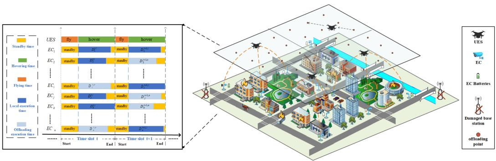

flowchart

Electromechanical system diagram showing UES, EC, and offloading execution time segments with standby states and time slots across start, end, and damaged base station.

Fig. 1. UES-assisted edge video analytics system in disaster rescue. The standby and task processing are statuses for each EC. Two statuses of the UES include flying to an offloading point and hovering at this point to assist ECs with video analytics. In this study, we employ $_ { \textrm { a } } \cdot _ { 0 - 1 } \cdot { }$ offloading strategy on ECs, i.e., local execution and offloading tasks to UES. At the start of a time slot, we first plan UES flying trajectory based on the remaining battery of the ECs. Then, the UES moves to a new offloading point. Second, the UES assists appropriate ECs with video analytics to reduce ECs’ energy consumption.

At the beginning of each time slot, the UES moves from the previous to the new offloading point. It assists the ECs with video analytics while hovering at the new offloading point. We deploy S virtual machines (VMs) on the UES. A VM assists one EC in a time slot. A time slot ends when video analytics on all ECs are complete.

At the beginning of a time slot, it is assumed that each EC produces a video analytics task with a fixed amount of data. Each EC has a remaining battery and a fixed position, and its remaining battery is gradually consumed. The system stops working when the battery of any one of the ECs exhausts. Offloading tasks to the UES can reduce the EC’s energy consumption in processing tasks. At the beginning of a time slot, the UES adjusts its flying trajectory according to the remaining battery power of these assisted ECs. Subsequently, each EC decides whether to offload tasks to the UES based on its battery, distance to the UES, and channel interference.

In Fig. 1, the time-slot length depends on the flight and hovering time of the UES. The flight time may differ in time slots because the start and end points of UES movement vary. We define the interval between the UES arriving at an offloading point and the time that the last UES-assisted EC completes the task as hovering time. The offloading point of the UES and assisted ECs is not constant; then, the last EC that completes the task may differ. Thus, there is a different hovering time in each time slot. The flight time and hovering time of the UES are variable; thus, the lengths of time slots vary in this study. Notably, the UES assists the ECs with video analysis and timely returns the results to end-users instead of the ECs to rescue disaster. We limit the latency of task processing of each EC. If the EC offloads a task to a UES within a latency that exceeds the threshold $T _ { \mathrm { m a x } }$ , the task offloading is not executed, which achieves real-time task processing.

In a real-world edge video system, the ECs and tasks are heterogeneous. This is because ECs can have different CPU frequencies, architecture, battery capacity, and computational capabilities in addition to various tasks deployed on ECs. The energy consumption and execution time of tasks of ECs depend on the task type, data volume, and computational capability of ECs. For example, we employ four video analytics (Haar cascades, DNNs in OpenCV, Dlib-based MMOD, and object detection YOLOv3) as task types. To study the UES-assisted edge video system with heterogeneous ECs and tasks, we introduce two terms i.e., execution rate and execution power as $r _ { i } ^ { h } = d _ { i } ^ { h } / t _ { i } ^ { h }$ and $p _ { t } ^ { h } = E _ { i } ^ { h } / t _ { i } ^ { h }$ , where $r _ { i } ^ { h }$ and $p _ { i } ^ { h }$ i = i idenote the execution rate t i iand execution power of $E C _ { i }$ iin processing task $h ,$ respectively. iWe run task h with data volume $d _ { i } ^ { h }$ on $E C _ { i }$ and record the energy consumption $( E _ { i } ^ { h } )$ i and execution time $( t _ { i } ^ { h } )$ . Then, we can obtain the $r _ { i } ^ { h }$ and $p _ { i } ^ { h }$ i i. Each VM has the same amount of computing i iresources but  task types differ. Table I lists the notations used in this paper.

# A. Communication Model

An EC can offload tasks to a UES or process them locally. Notation αt $( \alpha _ { i } ^ { t } \in 0 \cup \mathrm { S } _ { V } )$ denotes the serial number of VM i i SVfor offloading tasks from $E C _ { i }$ . When we have $\alpha _ { i } ^ { t } = v , E C _ { i }$ i i = ioffloads tasks to virtual machine v on the UES in time slot t. When $\alpha _ { i } ^ { t } = 0$ , it means that tasks are processed locally.

i =Let the UES have K channels allocated to the offloading ECs. The bandwidth of each channel is W [28]. Interference occurs when multiple ECs use the same channel. The channel interference on $E C _ { i }$ is given as

$$
I _ {i} = \sum_ {j \neq i} ^ {N} P _ {j} ^ {t r} \cdot C _ {j}, \tag {1}
$$

where $P _ { j } ^ { t r }$ and $C _ { j }$ are the data transmission power and channel gain of $\check { E } C _ { j }$ on the same channel [25], respectively. The distance between $E C _ { i }$ and the UES $( l _ { i } )$ i s

$$
l _ {i} = \left[ (\mathrm{X} - x _ {i}) ^ {2} + (\mathrm{Y} - y _ {i}) ^ {2} + \mathrm{H} ^ {2} \right] ^ {\frac {1}{2}}, \tag {2}
$$

where $( x _ { i } , y _ { i } )$ and $\mathrm { ( X , Y , H ) }$ are the $E C _ { i }$ and UES locations, ( irespectively. $C _ { i }$ (X Y His related to $l _ { i }$ iand is defined as $C _ { i } = \beta _ { 0 } \cdot l _ { i } ^ { - \theta } .$ .

i iThus, the uplink transmission rate of $E C _ { i }$ i = iis represented as

$$
R _ {i} ^ {t r} = W \log_ {2} \left(1 + \frac {p _ {i} ^ {t r} \cdot C _ {i}}{\sigma^ {2} + I _ {i}}\right), \tag {3}
$$

where $I _ { i }$ and $\sigma ^ { 2 }$ is the interference from other ECs in the same ichannel and the noise power of the channel, respectively.

TABLE I NOTATIONS AND DEFINITION 

<table><tr><td>Symbols</td><td>Definition</td></tr><tr><td colspan="2">Set:</td></tr><tr><td> $S_N$ </td><td>Set of ECs  $n \in S_N = \{1,2,\dots,N\}$ </td></tr><tr><td> $S_V$ </td><td>Set of VMs  $v \in S_V = \{1,2,\dots,V\}$ </td></tr><tr><td> $S_K$ </td><td>Set of channels  $k \in S_K = \{1,2,\dots,K\}$ </td></tr><tr><td> $S_T$ </td><td>Set of time slots  $t \in S_T = \{1,2,\dots,T\}$ </td></tr><tr><td> $S_H$ </td><td>Set of task types  $h \in S_H = \{1,2,\dots,H\}$ </td></tr><tr><td> $S_M$ </td><td>Set of offloading points  $m \in S_M = \{1,2,\dots,M\}$ </td></tr><tr><td colspan="2">Variable:</td></tr><tr><td> $\alpha_i^t$ </td><td>Serial number of VM for offloading tasks from  $EC_i$ at time slot  $t$ .  $\alpha_i^t = 0$  means the task is processed locally.</td></tr><tr><td> $P_t$ </td><td>The location of UES at time slot  $t$ </td></tr><tr><td colspan="2">Function:</td></tr><tr><td> $D_i^{t,o}$ </td><td>Task offloading time from  $EC_i$  at time slot  $t$ </td></tr><tr><td> $D_i^{t,tr}$ </td><td>Data transmission time of the task on  $EC_i$  at time slot  $t$ </td></tr><tr><td> $D_i^{t,v}$ </td><td>Execution time of the task offloaded from  $EC_i$  on the VM  $v$  on the UES at time slot  $t$ </td></tr><tr><td> $E_i^{t,l}$ </td><td>Local task energy consumption of  $EC_i$  at time slot  $t$ </td></tr><tr><td> $E_i^{t,tr}$ </td><td>Transmission energy consumption of  $EC_i$  at time slot  $t$ </td></tr><tr><td> $E_i^{t,s}$ </td><td>Standby energy consumption of  $EC_i$  at time slot  $t$ </td></tr><tr><td> $E_t^{fly}$ </td><td>Flying energy consumption of the UES at time slot  $t$ </td></tr><tr><td> $E_t^{hover}$ </td><td>Hovering energy consumption of the UES at time slot  $t$ </td></tr><tr><td> $E_i^{t,v}$ </td><td>Execution energy consumption for the task offloaded from  $EC_i$  on VM  $v$  at time slot  $t$ </td></tr><tr><td> $E_t^{compute}$ </td><td>Energy consumption of the UES for all offloading tasks</td></tr><tr><td> $C_i^{t,l}$ </td><td>Overhead of the local model on  $EC_i$  at time slot  $t$ </td></tr><tr><td> $C_i^{,o}$ </td><td>Overhead of the offloading model on  $EC_i$  at time slot  $t$ </td></tr><tr><td colspan="2">Parameter:</td></tr><tr><td> $I_i$ </td><td>Channel interference produced by  $EC_i$ </td></tr><tr><td> $\beta_0$ </td><td>Average channel power gain per 1 meter</td></tr><tr><td> $\sigma^2$ </td><td>Channel noise power</td></tr><tr><td> $\theta$ </td><td>Path-loss exponent</td></tr><tr><td> $P_i^{tr}$ </td><td>Data transmission power of  $EC_i$ </td></tr><tr><td> $P_i^s$ </td><td>Standby power of  $EC_i$ </td></tr><tr><td> $P_i^h$ </td><td> $EC_i$  Execution power for processing task  $h$ </td></tr><tr><td> $P_v^h$ </td><td>Execution power for processing task  $h$  on VM  $v$ </td></tr><tr><td> $P_h$ </td><td>UES hovering power</td></tr><tr><td> $P_f$ </td><td>UES flying power</td></tr></table>

# B. Execution Time Model

Local execution time: When $E C _ { i }$ processes task h locally, the execution ratio of task h is $r _ { i } ^ { h }$ i. In each time slot, the data volume of the task is $d _ { i } ^ { h }$ i. The local execution time is given as

$$
D _ {i} ^ {t, l} = d _ {i} ^ {h} / r _ {i} ^ {h}, \tag {4}
$$

in which $D _ { i } ^ { t , l }$ depends on computing resources and task types iwhich can be obtained in advance.

Offloading execution time: In this paper, we employed a $\cdot _ { 0 } .$ $_ { 1 } \cdot$ offloading strategy. This is because we aim to fully utilize resources of UES allocated to ECs and avert the battery cost of task processing on ECs. When an EC offloads tasks to the UES, the offloading execution time includes uplink transmission time, UES execution time, and latency of results feedback. The UES does not transmit the processed data to the ECs. Given that the data size of the results is much smaller than that of the input data, we ignore the latency and overhead of the feedback result on the UES. This method has also been presented in work [29], [30]. In this study, we focus on the application of UES-assisted ECs for processing tasks instead of feedback information from the ECs and UES. In each time slot, the offloading execution time is

$$
D _ {i} ^ {t, o} = D _ {\mathrm{i}} ^ {t, t r} + D _ {\mathrm{i}} ^ {t, v}, \tag {5}
$$

where Dt,o $D _ { i } ^ { t , o }$ 2 denotes the task offloading time from $E C _ { i }$ at time slot t. $D _ { \mathrm { i } } ^ { t , t r }$ and $D _ { i } ^ { \mathrm { t , v } }$ iare the transmission latency and execution i i time, respectively. The transmission time is $\bar { D _ { \mathrm { i } } ^ { t , t r } } = d _ { i } ^ { h } / R _ { i } ^ { t r }$ . = i iThe UES allocates a virtual machine v to process the task from $E C _ { i }$ . When the task execution ratio on virtual machine v is $r _ { v } ^ { h }$ ithe UES execution time for the task in time slot t is $D _ { i } ^ { t , v } =$ $d _ { i } ^ { h } / r _ { v } ^ { h }$ .

# C. Energy Consumption Model of ECs

Local execution energy consumption: We assume that task h is deployed on $E C _ { i }$ , and its execution power rate is $p _ { i } ^ { h }$ . In time slot $t ,$ i the data volume of the task on $E C _ { i }$ is $d _ { i } ^ { h }$ i , and the execution time is $D _ { i } ^ { t , l }$ i i. The local energy consumption is

$$
E _ {i} ^ {t, l} = p _ {i} ^ {h} \cdot D _ {i} ^ {t, l}, \tag {6}
$$

where $E _ { i } ^ { t , l }$ depends on the computational resource and task type on $E C _ { i }$ i. Thus, $E _ { i } ^ { t , l }$ can also be calculated in advance.

i iTransmission energy consumption: On an EC, the offloading energy consumption mainly contains the transmission energy consumption which is determined by the transmission time and power. In this study, the transmission power of $E C _ { i }$ is represented as $p _ { i } ^ { t r }$ . In time slo $t ,$ the transmission energy consumption iof offloading tasks on $E C _ { i }$ is given as

$$
E _ {\mathrm{i}} ^ {t, t r} = p _ {i} ^ {t r} \cdot D _ {i} ^ {t, t r}. \tag {7}
$$

Standby energy consumption: In a time slot, the standby energy consumption must be considered. When the standby power of $E C _ { i }$ is $p _ { i } ^ { s }$ , the standby energy consumption in time slot t is given as

$$
E _ {i} ^ {t, s} = p _ {i} ^ {s} \cdot D _ {i} ^ {t, s}. \tag {8}
$$

where $D _ { i } ^ { t , s }$ is the standby time of $E C _ { i }$ in time slot t. Because i ithe remaining battery of the ECs is limited, the standby energy consumption should not be neglected in disaster scenarios.

# D. Energy Consumption Model of UES

The energy consumption of the UES includes flying, hovering, and task processing. For a time slot, we have $T _ { t } = t _ { 1 } + t _ { 2 }$ , where $t _ { 1 }$ t = +is the UES flying time from the current task offloading point2 to the next one. $t _ { 2 }$ is the hovering time in which the UES assists ECs with processing tasks. We employ the model in prior work [31] to simplify the UES’s energy consumption model in (9) and (10). It is assumed that both the UES hovering and flying power consumption values are constant. Given that we focus on the UES trajectories and task offloading strategies in this study, the constant power is employed to simplify the energy model.

Flying energy consumption: When the UES moves to an offloading point from the previous one, the flying energy consumption is

$$
E _ {t} ^ {f l y} = p _ {f} \cdot t _ {1}, \tag {9}
$$

in which $p _ { f }$ is the power, and $t _ { 1 }$ is the time taken to move between ftwo adjacent offloading points.

2Notably, the offloading point represents the UES location where an EC offloads task to the UES in this paper.

Hovering energy consumption: In a time slot, the UES hovers duration $t _ { 2 }$ . If the hovering power is $p _ { h }$ , the UES hovering energy consumption is

$$
E _ {t} ^ {\text { h   o   v   e   r }} = p _ {h} \cdot t _ {2}. \tag {10}
$$

Execution energy consumption for processing tasks: Symbol $p _ { v } ^ { h }$ vdenotes the execution power of virtual machine vth on the UES for processing task $h .$ . The execution energy consumption of virtual machine vth is $E _ { i } ^ { t , v } = p _ { v } ^ { h } \cdot D _ { i } ^ { t , v }$ .

i = v iIn time slot t, we formulate the total energy consumption of offloading tasks from all ECs as

$$
E _ {t} ^ {\text { compute }} = \sum_ {i = 0} ^ {N} \left[ \sum_ {v = 0} ^ {V} \mathrm{I} _ {\left\{\alpha_ {i} ^ {t} = v \right\}} \cdot E _ {i} ^ {t, v} \right], \tag {11}
$$

in which $\operatorname { I } _ { \{ A \} }$ is the indicator function in (11). If event  is true, we have $\mathrm { I } _ { \{ \mathrm { A } \} } = 1 ;$ otherwise, there is $\mathrm { I } _ { \{ \mathrm { A } \} } = 0$ .

I = I =Video streams play an important role in rescue and recovery. ECs with video analysis are mostly used to obtain onsite information for disaster rescues. However, ECs have limited battery and lost continuous battery supply. In disaster rescue applications, it is extremely difficult to replace the battery on ECs while the application expects the ECs to keep monitoring the area and providing useful rescue information. It is easier to replace the battery in the UES than ECs. We used a UES to reduce the energy consumption of each EC and to extend the lifetime of the ECs network. In this study, we focus on optimizing the energy consumption of ECs instead of that of UES. The battery of ECs is important; thus, the battery of the UES is sacrificed to assist ECs in disaster scenarios.

# V. PROBLEM FORMULATION

We consider the overhead of energy consumption and execution time in this study. Symbols $e _ { i } ^ { \breve { t } , \mathrm { { r e s } } }$ and $e _ { i } ^ { t , \mathrm { { m a x } } }$ denote the iremaining battery and the total battery on $E C _ { i }$ iin time slot tth, respectively. We define the remaining battery rate $\begin{array} { r } { ( e _ { i } ^ { t } = \frac { e _ { t } ^ { t , \mathrm { r e s } } } { e _ { i } ^ { t , \mathrm { m a x } } } ) } \end{array}$ t,rest e t,max ) e eas a component of a weight factor [28], [32]. Thus, in time slot $t ,$ the execution time and energy consumption weights of $E C _ { i }$ for processing the task are denoted as

$$
q _ {i} ^ {t, t} = e _ {i} ^ {t} \text {   and   } q _ {i} ^ {t, e} = 1 - e _ {i} ^ {t} \tag {12}
$$

We induce the problem of the computational overhead of an EC by weighting and summing the execution time and energy consumption of the EC for processing tasks by weighting factors. According to work [32], [33], the overhead of the local model on $E C _ { i }$ is

$$
\mathrm{C} _ {i} ^ {t, l} = q _ {i} ^ {t, t} \cdot D _ {i} ^ {t, l} + q _ {i} ^ {t, e} \cdot E _ {i} ^ {t, l}, \tag {13}
$$

and the overhead of the offloading model on $E C _ { i }$ is

$$
\mathrm{C} _ {i} ^ {t, o} = q _ {i} ^ {t, t} \cdot D _ {i} ^ {t, o} + q _ {i} ^ {t, e} \cdot E _ {i} ^ {t r}. \tag {14}
$$

Our designed weighting method facilitates the study of changes of the battery of ECs. When an EC’s remaining battery is high, we strive for low execution time in task processing. For a larger weight of execution time, we optimize the execution time to minimize the computational overhead. Accordingly, when the remaining battery of the EC is low, we aim to achieve low energy consumption overhead, and the weight of energy consumption becomes larger than that of execution time. Even though a little energy is consumed, the energy consumption affects the computational overhead. Then, we optimize energy consumption to minimize the computational overhead.

As the number of time slots increases, the remaining battery of each EC gradually decreases, and energy consumption becomes the determining factor in this weighting method. Then, we focus on energy consumption to optimize the total computational overhead in each time slot, thereby reducing the energy consumption of ECs and extending the system lifetime.

In this study, our objective is two sub-goals: (1) minimizing the system overhead with the assistance of UES at each offload point in a time slot and (2) maximizing the system lifetime in a UES operation procedure by reducing the energy consumption of ECs. We formulate the mathematical model based on the above objective. In time slot t, we suppose that the UES location is $\mathrm { P } _ { t } = \{ \mathrm { X } _ { t } , \mathrm { Y } _ { t } , \mathrm { H } _ { t } \} , \mathrm { P } _ { t } \in \mathrm { S } _ { M } .$ , and the propor-Pt = Xt Yt Ht Pttion of the remaining battery of ECs is $\mathrm { E } _ { t } = [ e _ { 1 } ^ { t } , \dots , e _ { N } ^ { t } ]$ . The Ninput parameters of the model include a set of ECs locations $\mathrm { P } = \{ ( x _ { i } , y _ { i } ) | i \in \mathrm { S } _ { N } \}$ , UES initial location $\mathrm { P _ { 0 } } .$ , and the initial P = ( i i) SN Pbattery ratio on each EC. To maximize the system lifetime, we define the mathematical model as

$$
\max _ {(\mathrm{E} _ {0}, \mathrm{P}, \mathrm{P} _ {0})} \sum_ {t = 1} ^ {T} \mathrm{T} _ {t} \tag {15}
$$

$$
s. t; C _ {1}, \min _ {(E _ {t}, \mathrm{P}, \mathrm{P} _ {t})} \sum_ {i = 1} ^ {N} \left[ \mathrm{I} _ {\{\alpha_ {\mathrm{i}} ^ {t} = 0 \}} \cdot C _ {i} ^ {t, l} + \mathrm{I} _ {\{\alpha_ {\mathrm{i}} ^ {t} > 0 \}} \cdot C _ {i} ^ {t, o} \right],
$$

$$
t \in \mathrm{S} _ {T}, \mathrm{P} _ {t} \in \mathrm{S} _ {M} \tag {16}
$$

$$
C _ {2}, \sum_ {i = 1} ^ {N} \mathrm{I} _ {\left\{\alpha_ {i} ^ {t} > 0 \right\}} \leq V, t \in \mathrm{S} _ {T} \tag {17}
$$

$$
C _ {3}, 0 \leq e _ {i} ^ {t, r e s}, i \in \mathrm{S} _ {N}, t \in \mathrm{S} _ {T} \tag {18}
$$

$$
C _ {4}, 0 \leq p _ {i, t} ^ {t r} \leq p _ {i} ^ {t r, \max}, i \in \mathrm{S} _ {N}, t \in \mathrm{S} _ {T} \tag {19}
$$

$$
C _ {5}, 0 \leq T _ {t} \leq T _ {\max}, t \in \mathrm{S} _ {T} \tag {20}
$$

$$
C _ {6}, l _ {i, t} \leq L _ {\max}, i \in \mathrm{S} _ {N}, t \in \mathrm{S} _ {T} \tag {21}
$$

$$
C _ {7}, 0 \leq E (t) - E _ {t} ^ {f l y} - E _ {t} ^ {h o v e r} - E _ {t} ^ {c o m p u t e} t \in \mathrm{S} _ {T} \tag {22}
$$

Constraint $\mathrm { C _ { 1 } }$ is the minimum system overhead of the UES-Cassisted system in time slot t at the offloading point $\ { P } _ { t } . \ { \mathrm { C } } _ { 2 }$ limits the UES resources allocated to ECs. $V$ t Cis the number of available virtual machines on the UES. $\mathrm { C } _ { 3 }$ is the remaining battery constraint of all ECs, and the system terminates when any one of the ECs exhausts battery. We apply $\mathrm { C } _ { 4 }$ to limit the transmission power. $\mathrm { C } _ { 5 }$ Cspecifies the upper limit of the time-slot length. $\mathrm { C } _ { 6 }$ Cis a restriction on the UES communication coverage. CThe UES only serves the ECs within its communication coverage in each time slot. $\mathrm { C } _ { 7 }$ indicates that the battery of the UES at Cthe end of each time slot t is greater than zero. We define the remaining battery of the UES as $E ( t )$ at the beginning of time slot t. At the end of time slot t, to guarantee the UES has its remaining battery, the total energy consumption for flying, hovering, and task processing is less than E(t). Notably, (15) is our objective to achieve the longest system lifetime, which is the sum of the longest execution time for multiple time slots. Each time slot is independent of the others. $C _ { 2 }$ is the optimization objective to minimize the system overhead in each time slot. $C _ { 2 }$ is a minimum value constraint instead of an inequality constraint.

The UES moves to an offloading point at the start of a time slot and assists ECs with video analytics. To extend the lifetime of the entire EC network, we need to optimize the system from two distinct perspectives - (1) designing an optimal trajectory for the UES and (2) achieving optimal task offloading from ECs to UES - based on the heterogeneity of ECs. However, it is difficult to formulate the two problems as a single optimization problem. This is because optimal trajectory planning considers the conditions of all ECs and assesses the merits of UES trajectories in all time slots, achieving global optimization. In contrast, the task offloading focuses on selecting appropriate ECs within the UES’s coverage and allocating resources to them, which enables local optimization.

The problem of task offloading in a single time slot considers a local situation, but it is challenging to achieve the global situation. When evaluating the merits of UES trajectories in multiple time slots, we need to take a global perspective to assess the merits of a global situation composed of multiple local cases. The results obtained from the two optimization processes complement each other in achieving the overall objective of extending the lifetime of the EC network. Thus, we proposed a hierarchical structure to model and solve the two optimization problems separately. (16) represents the local optimal task offloading model, and (15) denotes the global optimal trajectory model for UES. This approach allows for targeted optimization strategies in each case through the different nature of trajectory planning and task offloading. When addressing the two problems individually, we can leverage the strengths of each optimization process to extend the EC network’s lifetime.

At the beginning of the time slot, the UES trajectory causes changes in the overall system status, which follow the Markov decision process (MDP). Thus, we design a double deep Qlearning based UES trajectory planning algorithm, the reward function of which is designed based on the remaining battery of ECs. The higher the proportion of the remaining battery of ECs, the larger the reward value obtained. We define the trajectory with the highest total reward values as the optimal trajectory. We use this algorithm to find the optimal trajectory, on which UESassisted ECs can achieve the highest proportion of the remaining battery, extending the system lifetime.

In addition, the UES assists ECs with video analytics by jointly considering three discrete variables, i.e., offloading decision, sub-channel, and resource allocation. Thus, the task offloading problem is NP-hard. The proof is given in Appendix A. The NP-hard problem is difficult to be handled through conventional methods. The differential evolution algorithm is one of the most popular heuristic algorithms, which have high convergence speed and stability for complex nonlinear problems (e.g., NP-hard problems). Thus, we proposed an improved differential evolution (DE) algorithm to solve the task offloading problem. It achieves high accuracy and low execution time, see Section IX-A

# VI. DE-BASED TASK OFFLOADING AND RESOURCES ALLOCATION ALGORITHM $( U _ { o a } )$

We propose a DE-based task offloading and resource allocation algorithm $( U _ { o a } )$ at a fixed offloading point of the UES. oaTo minimize system overhead in time slot t, the mathematical model is defined as

$$
\min _ {(E _ {t}, \mathrm{P}, \mathrm{P} _ {t})} \sum_ {i = 1} ^ {N} \left[ \mathrm{I} _ {\{\alpha_ {\mathrm{i}} ^ {t} = 0 \}} \cdot C _ {i} ^ {t, l} + \mathrm{I} _ {\{\alpha_ {\mathrm{i}} ^ {t} > 0 \}} \cdot C _ {i} ^ {t, o} \right] \tag {23}
$$

$$
s. t; C _ {1}, \sum_ {i = 1} ^ {N} \mathrm{I} _ {\left\{\alpha_ {i} ^ {t} > 0 \right\}} \leq \mathrm{V} \tag {24}
$$

$$
C _ {2}, 0 \leq e _ {i, t}, i \in \mathrm{S} _ {N} \tag {25}
$$

$$
C _ {3}, 0 \leq p _ {i} ^ {t r} \leq p _ {i, \max} ^ {t r}, i \in S _ {N} \tag {26}
$$

$$
C _ {4}, 0 \leq T _ {t} \leq T _ {\max} \tag {27}
$$

$$
C _ {5}, l _ {i} \leq L _ {\max}, i \in \mathrm{S} _ {N} \tag {28}
$$

$$
C _ {6}, 0 \leq E (t) - E _ {t} ^ {\text { fly }} - E _ {t} ^ {\text { hover }} - E _ {t} ^ {\text { compute }} \tag {29}
$$

# A. Algorithm Design

The proposed algorithm includes chromosome encoding, fitness functions, mutation, crossover, and selection operations.

1) Chromosome Coding and Fitness Function: In the DE algorithm, the initial population contains several chromosomes (individuals). $\mathrm { V } _ { m }$ denotes the mth chromosome of the pop-Vmulation. M represents the population size, which means the population includes M chromosomes. Then, we have pop $[ \mathrm { V } _ { 1 } , \mathrm { V } _ { 2 } , \dots , \mathrm { V } _ { M } ]$ =. Each chromosome is a potential feasible [V V VM ]solution. In the DE algorithm, it is critical to encoding the solution to the problem as a ‘chromosome’. We choose the real number encoding method, which performs variation and crossover operations on the expressions of the solution, reducing the complexity of algorithm. The chromosome encoding format is $\mathrm { V } _ { m } = [ \mathrm { A } ^ { * } , \mathrm { B } ^ { * } ] ,$ , where $\mathrm { A } ^ { * } = [ \alpha _ { 1 } ^ { t } , \dots , \alpha _ { N } ^ { t } ]$ is the offloading-Vm = [A Bdecision vector. $\mathbf { B } ^ { * } = [ \mathrm { b } _ { 1 } , \dots , \mathrm { b } _ { N } ]$ N ]is the channel allocation vector. Notably, $\mathrm { b } _ { i } \in 0 \cup \mathrm { S } _ { K }$ bN ]means $E C _ { i }$ uses a sub-channel bto access the UES.

Since the generated chromosomes cannot meet the requirement of the solution, we use the fitness function to evaluate the goodness of the population chromosomes.

Case 1: The chromosome that satisfies each constraint is a feasible solution. The fitness function is defined as

$$
F i t n e s s = \sum_ {i = 1} ^ {\mathrm{N}} \left\{\mathrm{I} _ {\left\{\alpha_ {i} ^ {t} = 0 \right\}} \cdot \mathrm{C} _ {i} ^ {t, l} + \mathrm{I} _ {\left\{\alpha_ {i} ^ {t} > 0 \right\}} \cdot \mathrm{C} _ {i} ^ {t, o} \right\}. \tag {30}
$$

Case 2: The chromosome cannot satisfy the constraint, and it is not a feasible solution. The fitness function is denoted as $\begin{array} { r } { F i t n e s s = \sum _ { i = 1 } ^ { \mathrm { N } } \mathrm { C } _ { i } ^ { t , l } } \end{array}$ =1 , which means that once a chromosome i icannot satisfy the constraint, the local system overhead is used as the fitness value of the chromosome.

2) Mutation, Crossover, and Selection: The DE implements the mutation operation by means of the differential method. Two dissimilar individuals are randomly selected from the current population. The difference vectors are scaled to perform vector operations with the other individual to be mutated. Afterward, new mutated individuals are generated. In this study, we use the DE/best/1/bin strategy. ‘best’ means that the best individual in the current population is selected. Symbol $\cdot _ { 1 } \cdot$ denotes the number of difference vectors. ‘bin’ means that the crossover pattern is binomial crossover. The approach to generating variant individuals is given as $\mathrm { X } _ { t + 1 } = \mathrm { V } _ { b e s t } + Z * \left( \mathrm { V } _ { r _ { 1 } } ( t ) - \mathrm { V } _ { r _ { 2 } } ( t ) \right)$ , where chromosome $\mathrm { V } _ { r _ { 1 } } ( t )$ = Vbest + (Vr ( ) Vis different from chromosome $\mathrm { V } _ { r _ { 2 } } ( t )$ .  i s a Vr ( ) Vr ( ) Zscaling factor that controls the difference vector influence. After M mutation operations, the intermediate of the tth generation population is $\{ \mathrm { X } _ { m } ( t + 1 ) | \mathrm { m } = 1 , 2 , \ldots , M \}$ .

Xm( + ) m =A crossover operation passes chromosomal segments of the best individuals to offspring. In our algorithm, we perform the crossover between the tth generational population $\{ \mathrm { V } _ { m } ( t ) | \mathrm { m } = 1 , 2 , \ldots , M \}$ and its intermediate population $\{ \mathrm { X } _ { m } ( t + 1 ) | \mathrm { m } = 1 , 2 , \ldots , M \} . \mathrm { V } _ { m n } ( t )$ and $\mathrm { X } _ { m n } ( t + 1 )$ rep-Xm(resent $n ( \mathrm { n } = 1 , 2 , \ldots , 2 N )$ Vmn( ) Xmn( +dimension of individuals $\mathrm { V } _ { m } ( t )$ and $\mathrm { X } _ { m } ( t + 1 )$ ) Vm( ), respectively. The number of dimensions of the Xm( + )chromosome is $( 2 \times N )$ . The crossover is given as

$$
\mathrm{Y} _ {m n} (t + 1) = \left\{ \begin{array}{l l} \mathrm{X} _ {m n} (t + 1) & \text { rand } <   C R \text {   or   n   =   randn }, \\ \mathrm{V} _ {m n} (t) & \text { other }. \end{array} \right. \tag {31}
$$

Symbols CR and randn represent the crossover probability and random integer of the interval 1, 2N , respectively. randn ensures that at least one component of the crossover individual is from $\mathrm { X } _ { m } ( t + 1 )$ . After the crossover operation, the candidate Xm( + )population is represented as $\{ \Upsilon _ { m } ( t + 1 ) | \mathrm { m } = 1 , 2 , \ldots , M \}$ .

Ym( + ) m =In the selection, the fitness function chooses individuals and places them into a new population. Our selection strategy is

$$
\mathrm{V} _ {m} (t + 1) = \left\{ \begin{array}{l l} \mathrm{Y} _ {m} (t + 1) & \text { Fitness } (\mathrm{Y} _ {m} (t + 1)) \\ & <   \text { Fitness } (\mathrm{V} _ {m} (t)), \\ \mathrm{V} _ {m} (t) & \text { other }. \end{array} \right. \tag {32}
$$

A new population is produced once a chromosomal population undergoes mutation, crossover, and selection operations.

$$
\{\mathrm{V} _ {m} (t + 1) | \mathrm{m} = 1, 2, \dots , M \}. \tag {33}
$$

Then, an evolutionary iteration completes.

# B. Algorithm Implementation

In this section, we present the workflow of the algorithm $U _ { o a }$ . oaStep 1. We initialize the evolutionary stagnation counter, generation, global optimal individuals, and initial population with random M individuals. Step 2. The evolution of the population begins (Line 2). Lines 3∼5 mean the process of generating a new population. We record the optimal individuals in the new population according to the fitness function (Line 6). Step 3. The evolution process completes when the number of iteration cycles or stagnation counter reaches a threshold. Then, we obtain the optimal individual with the optimal task offloading and resource allocation algorithm.

Algorithm 1: DE-based Task Offloading Decision and Resource Allocation Algorithm.   
Input: M, N, T, Z, CR, S
Output: Optimal Individual $V_{best}$ Initialization: Randomly producing M individuals as the initial population; Evolutionary stagnation counter TrappedCount = 0; Starting algebra t = 1; Global optimal individual $V_{best} = null$ 1: According to fitness, the optimal individual is $V_{best} = V_{best}(t)$ ;
2: for $t = 1, \cdots, T$ do
3: Individual mutation operations and obtaining intermediate populations $\{X_m(t + 1)|m = 1, 2, \ldots, M\}$ ;
4: Crossover operations on individuals and obtaining candidate populations $\{Y_m(t + 1)|m = 1, 2, \ldots, M\}$ ;
5: Individual selection operations and forming new populations $\{V_m(t + 1)|m = 1, 2, \ldots, M\}$ ;
6: According to fitness, the optimal individual is $V_{best}(t + 1)$ ;
7: if $V_{best} == V_{best}(t + 1)$ :
8: TrappedCount = TrappedCount + 1;
9: if $V_{best}(t + 1) < V_{best}$ :
10: $V_{best} = V_{best}(t + 1)$ ; TrappedCount = 0;
11: if TrappedCount == S:
12: End for
13: End for

Notably, the traditional algorithm only has an upper limit on the number of evolutionary iterations, which can cause the algorithm to iterate when it converges continually, thereby prolonging the training time. Therefore, we optimize the differential evolution algorithm by adding an evolutionary stop counter (TrappedCount). If the globally optimal individuals of the preceding and following iterative generations are equal, the stop counter increases by one. If the best individual of the new generation is better than the best global individual of the previous generation, the best global individual is updated, and the stop counter is set to zero. The algorithm terminates when the stop counter exceeds a specified upper limit. This reduces the iteration period of the algorithm and avoids repeated invalid computations after the optimal gene is obtained.

# VII. DDQN-BASED UES TRAJECTORY PLANNING ALGORITHM (U )

We formulate the UES trajectory planning problem as a Markov decision process. Then, we propose a DDQN-based UES trajectory planning algorithm $\textstyle ( \mathrm { U } _ { t p } )$ . First, we define the Utpstate space, action space, and reward function in the problem. Second, we present the training procedure of the algorithm.

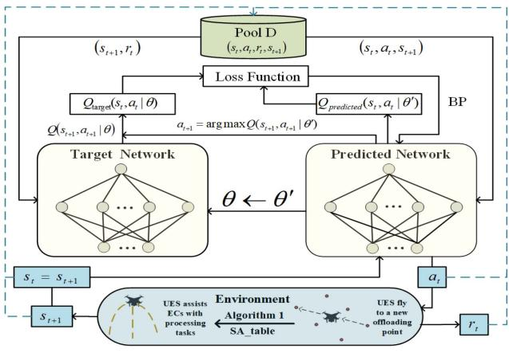

flowchart

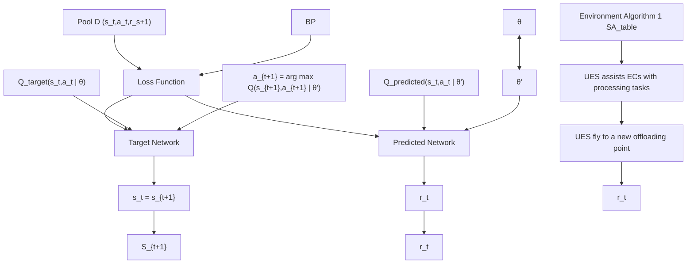

Fig. 2. Structure of $U _ { t p }$ algorithm.

# A. DDQN Algorithm

In Fig. 2, we present the workflow of DDQN training. The target network and the prediction network are two artificial neural networks (ANN). There is $\begin{array} { r } { Q ( s _ { t } , a _ { t } ) = \operatorname { E } [ \sum _ { t ^ { \prime } = t } ^ { T } \lambda r _ { t ^ { \prime } } \mid s _ { t ^ { \prime } } , a _ { t ^ { \prime } } ] } \end{array}$ T , ( t t) = E[ t t t t t ]which denotes the state-action value function. λ is the discount factor, and $r _ { t ^ { \prime } }$ is the immediate reward in time slot t based ton the state-action pair $( s _ { t } , a _ { t } )$ [31], [34]. $Q ( s _ { t } , a _ { t } )$ is used to ( t t)evaluate the goodness of action $a _ { t }$ ( t t)performed by the UES in state $s _ { t }$ t. The DQN algorithm uses a deep Q-network as a function tapproximator to estimate the state-action value function. The symbol θ represents the parameters matrix. The state-action pair $( s _ { t } , a _ { t } )$ is taken as input for the Q-network; meanwhile, ( t t)the prediction $Q _ { \mathrm { p r e d i c t e d } } \left( s _ { t } , a _ { t } \mid \theta \right)$ is the output. The next state $s _ { t + 1 }$ ( t t )is also taken as input of the Q-network. The output of tQ-network is the maximum Q-value of the next state-action pair. The target value of $( s _ { t } , a _ { t } )$ is $Q _ { t a r g e t } ( s _ { t } , a _ { t } \mid \theta ) = r _ { t } +$ λmaxa' $Q ( s _ { t + 1 } , a ^ { \prime } \mid \theta )$ ( t t) target( t t ) = t +. a	 is a candidate for the next action. maxa ( t )In DQN, the loss function is $\begin{array} { r } { \mathrm { J } ( \phi ) = \frac { 1 } { \mathrm { K } } \sum _ { k = 1 } ^ { K } [ Q _ { t a r g e t } ( s _ { k } , a _ { k } } \end{array}$ | θ − Qpredicted $\left( s _ { k } , a _ { k } \mid \theta \right) ]$ J( ) = k [ target( k k, which updates the parameters ma-)trix $\theta$ ( k k )]of the Q-network by the back-propagating gradient in the neural network. Because DQN directly selects $\operatorname* { m a x } _ { a ^ { \prime } } Q ( s _ { t + 1 } , a ^ { \prime } \mid \theta )$ , the Q-network parameters are not upmaxa ( t )dated in real time, which may lead to the overestimation of Q-values [34]. To solve this issue, the DDQN algorithm uses two separate neural networks to approximate the predicted Q-value and the target Q-value.

# B. Problem Conversion

At an offloading point in each time slot, the UES assists ECs with video analytics. It is supposed that the system stops when anyone EC is depleted. For battery-constrained ECs, we employ a UES to reduce and equalize the energy consumption, extending the system lifetime, see (15). To address the problem (15), we propose a DDQN-based solution, the critical component of which is to design a reward function based on the remaining battery of ECs.

We employ the DDQN algorithm to explore all available UES flying paths. Each path consists of several UES offloading points. At each point, a reward value can be obtained from the reward function. The sum of the total reward values of a path is used as the criterion for determining its merit. For the reward function, a high proportion of the remaining battery delivers a higher reward value. Thus, DDQN training is constantly explored in paths with high reward values and a high proportion of remaining battery. For paths with the same number of time slots, the higher the reward value, the higher is the battery of ECs at system termination. The system consumes the least battery when the UES follows this path to assist the ECs. We employ this algorithm to obtain an optimal path, which allows UES-assisted ECs to achieve the lowest and balanced energy consumption, extending the system lifetime.

# C. State, Action, and Reward

We analyze the changes in the system state during the UES movement. At the start of the time slot, we collect the overall system state. The UES randomly chooses an offloading point. With the standby power on ECs, we can achieve the system state when the UES arrives at the new offloading point. The USE can obtain the optimal offloading scheme using Algorithm 1. Afterward, we can achieve the task computing model (local or offloading) and the energy consumption on each EC for processing tasks. Then, we can summarize the system state at the end of the time slot. Because the change of the system state satisfies the Markov Decision Process (MDP) during the movement of the UES, we apply the deep reinforcement learning model to tackle the UES trajectory planning. Thus, we design a state space (remaining battery and task types), action space (UES movement), and reward mechanism. First, we define state space as

$$
\mathrm{S} = \left\{S _ {t} \mid S _ {t} = \left[ h _ {1}, h _ {2}, \dots , h _ {N}; e _ {1} ^ {t}, e _ {2} ^ {t}, \dots , e _ {N} ^ {t} \right]; t \in S _ {T} \right\}, \tag {34}
$$

where the state-space $\mathrm { S } _ { t }$ is a $. ( 2 \times N )$ dimensional vector. N and Stt denote the number of ECs and time-slot index, respectively. The vector consists of the task type and the ratio of the remaining battery on each EC at the start of a time slot. After the task type is determined, it will not change in the operation cycle. A fixed data volume in a task is generated in each time slot. Second, we define action space as a discrete space

$$
\mathrm{A} = \left\{a _ {t} \mid a _ {t} \in \{1, 2, \dots , M \}; \mathrm{t} \in \mathrm{S} _ {T} \right\}. \tag {35}
$$

In this study, we use M discrete numbers to represent M offloading points of UES. $\mathrm { A } _ { t }$ means that the UES selects action $a _ { t }$ Atin time slot t. Therefore, at the start of time slot t, the UES tmoves to the offloading point $a _ { t }$ .

tThird, we design a reward function to exploit the optimal trajectory planning algorithm. This algorithm allows UES to reduce the energy consumption of ECs, and extend the system lifetime. For tested data, we find that the energy consumption value of an EC is 2-3 times that of the execution time. We define the computational overhead of an EC as the weighted sum of energy consumption and execution time. Notably, the value is related to the remaining battery. In Eqs. 13 and 14, the low remaining battery of ECs can cause a high computational overhead of ECs. Thus, we design the greedy algorithm-based reward function; then, the UES moves to the offloading point with the lowest system overhead in each time slot.

TABLE II PARAMETERS IN THE SIMULATION 

<table><tr><td>Parameters</td><td>Setting</td></tr><tr><td>UAV flying power consumption (5m/s)</td><td>110 W</td></tr><tr><td>UAV flying power consumption (15m/s)</td><td>150 W</td></tr><tr><td>UAV hovering power consumption</td><td>80 W</td></tr><tr><td>UAV signal coverage radius</td><td>65 m</td></tr><tr><td>UAV flying altitude</td><td>10 m</td></tr><tr><td>Task types  $S_H$ </td><td>5</td></tr><tr><td>Numbers of virtual machines  $S_V$ </td><td>4</td></tr><tr><td>Numbers of ECs  $S_N$ </td><td>12</td></tr><tr><td>Numbers of offloading points  $S_M$ </td><td>16</td></tr><tr><td>Transfer bandwidth  $S_W$ </td><td>20 mHz</td></tr><tr><td>Channel noise power  $\sigma^2$ </td><td>-100 dB</td></tr><tr><td>Received power per unit distance (1m)  $\beta_0$ </td><td>-50 dB</td></tr><tr><td>Energy range on each EC</td><td>5 KJ~8 KJ</td></tr><tr><td>Task volume on each EC</td><td>2 MB~4 MB</td></tr></table>

$$
R _ {t} ^ {\prime} = U - G ^ {m} (t) = U - \min _ {\left(\mathrm{E} _ {t}, \mathrm{P}, \mathrm{P} _ {t}\right)} \sum_ {i = 1} ^ {\mathrm{N}} \left\{\mathrm{I} _ {\left\{\alpha_ {i} ^ {t} = 0 \right\}} \right.
$$

$$
\left. \cdot \mathrm{C} _ {i} ^ {t, l} + \mathrm{I} _ {\left\{\alpha_ {i} ^ {t} > 0 \right\}} \cdot \mathrm{C} _ {\mathrm{i}} ^ {t, o} \right\}, \tag {36}
$$

in which $G ^ { m } ( t )$ is the UES-assisted minimum system overhead ( )in time slot t and at offloading point $\mathrm { P } _ { t } , U$ is constant in the reward function. The small $G ^ { m } ( t )$ Ptenlarges the reward value of the feedback.

When the system overhead $G ^ { m } ( t )$ is small, the reward $R _ { t } ^ { \prime }$ ( ) tis high. The DDQN-based algorithm is trained to achieve large rewards (i.e., low system overhead). System overhead is the sum of the computational overheads of all ECs. The overhead of an EC is the weighted sum of execution time and energy consumption, whereas the weight is the proportion of the remaining battery of the EC. As the remaining battery reduces, the energy consumption weight increases. In the dataset used in this study, the energy consumption is higher than the execution time. Thus, the task-processing overhead of the EC increases as its battery decreases. To enhance the reward in the algorithm, we need to increase the remaining battery of the EC. As the episode value increases, the algorithm allows the ECs to have much battery at system termination. Thus, the proposed reward function extends the system lifetime by reducing the energy consumption of ECs. Please refer to Table III in Section IX; the results validate the proposed algorithm.

Notably, we need to dynamically adjust the reward function in two cases. First, at an offloading point of the UES, there are no feasible offloading schemes in the system. Second, we have an EC whose battery is too low to support the system running. The modified reward function $( R _ { t } )$ is given as

$$
R _ {t} = \left\{ \begin{array}{l l} 0; & \left\{\mathrm{V} _ {\text {best}} (t) = = N U L L \right\} \text {or} \left\{\exists e _ {i} ^ {t, r e s} <   0 \right\} _ {i \in S _ {N}} \\ R _ {t} ^ {\prime}; & \text {other} \end{array} \right. \tag {37}
$$

For these two cases, we set the reward to 0. For time slot t, its duration is denoted as $T _ { t } = t _ { 1 } + t _ { 2 } . \ t _ { 1 }$ and $t _ { 2 }$ are the flight and t = +hovering times of the UES, respectively. During the UES flight, ECs are in the standby state. In this phase, the battery state of $E C _ { i }$ changes is

$$
e _ {i} ^ {t, \prime} = e _ {i} ^ {t} - (t _ {1} \cdot p _ {i} ^ {s}) / e ^ {\max}. \tag {38}
$$

Thus, we update the percentage of the remaining battery of ECs after the UES moves to the new offloading point. Then, the system state is given as

$$
S _ {t} ^ {\prime} = \left[ h _ {1}, h _ {2}, \dots , h _ {N}; e _ {1} ^ {t, \prime}, e _ {2} ^ {t, \prime}, \dots , e _ {N} ^ {t, \prime} \right]. \tag {39}
$$

During the hovering phase, the ECs offload tasks to the UES or execute it locally. Thus, at the termination of time slot t, the battery state of $E C _ { i }$ has two cases

$$
e _ {i} ^ {t + 1} = \left\{ \begin{array}{l} e _ {i} ^ {t, \prime} - \frac {t _ {2} \cdot p _ {i} ^ {s} + E _ {i} ^ {t , t r}}{e _ {i} ^ {\max}}; \alpha_ {i} ^ {t} \neq 0, \\ e _ {i} ^ {t, \prime} - \frac {t _ {2} \cdot p _ {i} ^ {s} + E _ {i} ^ {t , l}}{e _ {i} ^ {\max}}; \alpha_ {i} ^ {t} = 0. \end{array} \right. \tag {40}
$$

We update the system state vector $S _ { t + 1 }$ according to (40).

# D. Algorithm 2 Implementation

We present the training process of the algorithm. In Fig. 2, we divide the training process into initialization, training data generation, learning from the data, and updating the network. In the initialization, the algorithm first randomly generates parameter matrices of the prediction and target networks. Then, it obtains the initial state; afterward, an empirical-playback pool D is produced to store samples.

In Lines $1 \sim 2 .$ , the algorithm $U _ { t p }$ controls the start and end of a sequence of states. $U _ { t p }$ tpgenerates training data and stores tpthe data in the empirical-playback pool (Lines $3 \sim 1 1 $ . First, the $Q ^ { \prime }$ network takes state $S _ { t }$ as input; then, we can obtain tthe Q-value of all UES movement actions. The action $\mathrm { a } _ { t }$ is atselected via -greedy policy. According to the definition of state space, the action $\mathrm { a } _ { t }$ is mapped to offloading point $m ,$ and the transition state $S _ { t } ^ { \prime }$ atis obtained as listed in Lines $3 \sim 4$ . If $( S _ { t } ^ { \prime } , m )$ talready exists in the state-action table (SA\_table), the ( t )optimal offloading decision scheme $V _ { b e s t }$ is directly obtained from the table. Otherwise, $( S _ { t } ^ { \prime } , m )$ bestis used as the input of Algo-( t )rithm 1. Then, we can achieve the offloading decision scheme $V _ { b e s t }$ . We use SA\_table to store the optimal offloading decision bestscheme $( ( S _ { t } ^ { \prime } , m , V _ { b e s t } ) )$ ) under state $\bar { S _ { t } ^ { \prime } } .$ . SA\_table can reduce the ( t best) ttime overhead incurred by frequently invoking Algorithm 1 in the model training process (Lines $5 \sim 8 )$ . By using $V _ { b e s t }$ policy and $S _ { t } ^ { \prime } .$ best, we obtain the system overhead savings that is used as tthe reward function $R _ { t }$ for action $a _ { t }$ . Finally, if $S _ { t }$ terminates, t t twe set Done to true; otherwise, Done is false (Lines $9 \sim 1 0 )$ . The result is stored in the experience-playback pool D (Line 11). Then, the procedure to generate training data completes.

The algorithm selects m random samples from the experienceplayback pool, and updates the parameter matrix $\theta ^ { \prime }$ of the $Q ^ { \prime }$ network by the back-propagating gradient (Lines $9 \sim 1 7 )$ . It determines whether episode meets the condition of updating parameters in target Q network (Line 19). If so, parameter matrix θ is copied to $\theta ^ { \prime } ,$ and the target Q network parameter updating is complete.

When Algorithm 2 is applied in trajectory planning, we can combine it to update the remaining battery of the UES at the end of each time slot. $E ( t )$ and $E ( t { + } I )$ represent the remaining

TABLE III REMAINING BATTERY IN THE TERMINATION TIME SLOT ECS VERSUS ALGORITHM TRAINING EPISODES 

<table><tr><td rowspan="2">Algorithm</td><td rowspan="2">Episode</td><td colspan="10">ECs remaining battery</td><td rowspan="2">Time slot</td><td rowspan="2">System average energy consumption</td><td rowspan="2">Total reward</td><td rowspan="2">Total system overhead</td><td rowspan="2">System lifetime</td></tr><tr><td>EC1</td><td>EC2</td><td>EC3</td><td>EC4</td><td>EC5</td><td>EC6</td><td>EC7</td><td>EC8</td><td>EC9</td><td>EC10</td></tr><tr><td>Local</td><td>\</td><td>32.7%</td><td>17.8%</td><td>32.1%</td><td>37.8%</td><td>42.1%</td><td>33.5%</td><td>53.0%</td><td>40.5%</td><td>45.1%</td><td>32.4%</td><td>3</td><td>21.10%</td><td>\</td><td>9776.9</td><td>969.2s</td></tr><tr><td colspan="17"></td></tr><tr><td> $U_{tp}$ </td><td rowspan="4">1500</td><td>1.6%</td><td>7.6%</td><td>13.1%</td><td>28.2%</td><td>2.0%</td><td>2.1%</td><td>24.2%</td><td>5.4%</td><td>1.2%</td><td>3.1%</td><td>6</td><td>15.10%</td><td>8647.7</td><td>14152.3</td><td>1639.3s</td></tr><tr><td>DQN</td><td>19.7%</td><td>17.2%</td><td>30.3%</td><td>30.7%</td><td>15.0%</td><td>9.3%</td><td>34.2%</td><td>18.5%</td><td>21.6%</td><td>13.1%</td><td>5</td><td>15.80%</td><td>7973.1</td><td>11026.9</td><td>1443.4s</td></tr><tr><td>Q_learning</td><td>3.8%</td><td>10.3%</td><td>9.9%</td><td>21.5%</td><td>8.5%</td><td>15.7%</td><td>29.8%</td><td>13.3%</td><td>16.4%</td><td>15.2%</td><td>5</td><td>17.20%</td><td>7523.6</td><td>11476.4</td><td>1579.5s</td></tr><tr><td>Sarsa</td><td>7.3%</td><td>10.9%</td><td>11.6%</td><td>32.5%</td><td>11.4%</td><td>14.3%</td><td>31.8%</td><td>15.6%</td><td>23.2%</td><td>17.5%</td><td>5</td><td>16.40%</td><td>7729.1</td><td>11270.9</td><td>1513.5s</td></tr><tr><td colspan="17"></td></tr><tr><td> $U_{tp}$ </td><td rowspan="4">3000</td><td>1.8%</td><td>9.4%</td><td>13.4%</td><td>27.6%</td><td>2.1%</td><td>4.3%</td><td>24.3%</td><td>5.6%</td><td>6.1%</td><td>4.0%</td><td>6</td><td>15.00%</td><td>8751.3</td><td>14048.7</td><td>1645.5s</td></tr><tr><td>DQN</td><td>5.3%</td><td>17.7%</td><td>9.6%</td><td>34.1%</td><td>13.1%</td><td>23.4%</td><td>33.0%</td><td>17.0%</td><td>20.1%</td><td>23.3%</td><td>5</td><td>16.06%</td><td>8146.1</td><td>10853.86</td><td>1502.6s</td></tr><tr><td>Q_learning</td><td>15.7%</td><td>19.6%</td><td>26.0%</td><td>37.3%</td><td>15.1%</td><td>14.0%</td><td>34.3%</td><td>18.5%</td><td>14.9%</td><td>12.9%</td><td>5</td><td>15.83%</td><td>7898.3</td><td>11101.7</td><td>1405.4s</td></tr><tr><td>Sarsa</td><td>9.9%</td><td>17.8%</td><td>18.6%</td><td>30.3%</td><td>13.6%</td><td>17.4%</td><td>33.2%</td><td>17.3%</td><td>26.1%</td><td>11.8%</td><td>5</td><td>16.80%</td><td>8008.3</td><td>10991.67</td><td>1557.6s</td></tr></table>

1Itustbetttessftosptts

battery of the UES at the beginning of time slot t and t+1, respectively. In the beginning of time slot t $( S _ { t } )$ , we can obtain an action of the UES $\left( \boldsymbol { a } _ { t } \right)$ t according to Algorithm 2. Based on tthe mapping between the action and offloading point, we can obtain the offloading point $( P _ { t } )$ in time slot t corresponding to action $a _ { t } .$ . The UES moves to offloading point $( P _ { t } )$ , and we t tcan obtain the UES movement distance. At offloading point $P _ { t } ,$ , we consider the hovering energy consumption $( E _ { t } ^ { h o v e r }$ , see t t(10)) and the total energy consumption of offloading tasks from all ECs $( E _ { t } ^ { c o m p u t e }$ , see (11)). In the alternation of time slots t tand t+1, the remaining battery of the UES becomes $E ( t + 1 )$ , and we have $E ( t + 1 ) = E ( t ) - E _ { t } ^ { f l y } - E _ { t } ^ { h o v e r } - E _ { t } ^ { c o m p u t e }$ ( + ) = ( ) t t twhich reveals that the battery of the UES changes during the alternation of the two time slots.

The proposed DDQN-based algorithm is offline, and its objective is to train the model offline and merely deploy it to a UES instead of training the model on the UES in real-time. The deployment of the algorithm does not consume excessive battery and resources of the UES. In addition, the UES dominates the communication with ECs according to the output of Algorithm 1. In our system, the trained model that is not deployed on the ECs does not consume the EC battery. To further reduce the delay caused by the nested algorithm, in Algorithm 2, we have added a state action table to store the existing optimal offloading strategy for subsequent model training, reducing the time overhead. For Algorithm 1, the overhead of execution time and the energy consumption is small, and the energy consumption can be ignored compared with the flying energy consumption of the UES.

# VIII. ANALYSIS OF ALGORITHMS 1 AND 2 FOR THE SOLUTION OF OBJECTIVE FUNCTION

In this section, we analyze the relationship between Algorithms 1 and 2 for the solution of the objective. We study the system state change when the UES has two identical flying trajectories, which have the same initial system states. When the UES moves to the first offloading point, we can obtain the optimal task offloading algorithm using Algorithm 1. According to the optimal algorithm, we can achieve the system state at the end of the time slot. As a new time slot starts, the UES moves to the next offloading point. Similarly, we use Algorithm 1 to obtain the system state as the new time slot terminates. This process is repeated until the system stops at the end of the last time slot. We find that the changes of the system state during the UES movement satisfy the MDP.

Notably, when the UES moves a new offloading point, the system state change is unique. Thus, the system state changes in two same UES trajectories are identical. We apply Algorithm 2 to search N possible trajectories and find an optimal one on which the ECs performs the most tasks with the least energy consumption. The results reveal that the system overhead increases as the battery of ECs decreases. To reduce the battery consumption of ECs, in each time slot, we employ the greedy policy to move the UES to the offloading point where the system overhead is minimum. Thus, we are motivated to design a reward function in Algorithm 2 where the UES trajectory reduces the energy consumption of ECs.

The optimal task offloading and trajectory planning problems must be solved in two steps rather than use the DDQN model to optimize the two problems. This is because the system state can be collected for task offloading after the UES moves to a new offloading point. For an MDP, when parameters (remaining battery and task types) input into the DDQN, the output is a determined action. The initial system state at time t $( S _ { t } )$ input the DDQN model. A UES action $\left( \boldsymbol { a } _ { t } \right)$ t outputs. Based on our tdesigned mapping between the action and offloading points, we can obtain the offloading point corresponding to action $a _ { t } .$ . Let tthe system state after UES moves input the DDQN model. We can achieve the task offloading strategy according to the action. If the DDQN model addresses both problems, one approach is to apply a DDQN algorithm to solve the two problems. The other one uses the outer- and inner-layer DDQN algorithms to solve trajectory planning and task offloading problems, respectively.

Case 1: If the DDQN method addresses the two problems simultaneously, the two system states before and after the UES moves are taken as input parameters of the DDQN model. However, we cannot achieve the after-movement system state when the UES does not move. According to the MDP, we cannot obtain an action corresponding to this system state. Notably, this action corresponds to task offloading; therefore, we cannot use this strategy.

Case 2: The outer- and inner-layer DDQN models solve trajectory planning and task offloading problems, respectively. The task offloading algorithm is nested in the trajectory planning algorithm. However, this offline model training overhead (execution time and computational resources) of this approach is large. It is assumed that we have T time slots for a UES path and M offloading points at each time slot. Then, there can be $M ^ { T }$ offloading points on trajectories. At each point, we need to obtain a task offloading policy. If the task offloading algorithm is designed based on the DDQN model, we need $M ^ { \grave { T } }$ models for these T time slots of the trajectories. If the values of M and T are large, a huge number of DDQN models need to be trained. Thus, the scale becomes extremely large and impractical. This nested model is also not a good choice to solve the two problems.

Algorithm 2: DDQN-based UES Trajectory Planning Algorithm.   
Input: Numbers of iterations M, Batch size N, Target network Q update frequency for network parameters C;
Output: Target network Q;
Initialization: Random $Q'$ network; Target network Q parameters; Clear the experience replay collection D;
for episode = 1, $\cdots$ M do
    1: Termination character Terminate = False; Get initial state vector $S_t$ ;
    2: while Terminate == False :
    3: Taking $S_t$ as input of $Q'$ network, get the Q-value output for all actions, by $\epsilon$ -greedy algorithm, selecting actions $a_t$ from the output;
    4: Map the action $a_t$ to the offloading point m and update the transition state vector $S'_t$ ;
    5: if ( $S'_t$ , m) in SA_table:
    6: Output offloading decision scheme $V_{best}$ ;
    7: else:
    8: Taking ( $S'_t$ , m) as input of Algorithm 1 and obtaining offloading decision scheme $V_{best}$ ; Store ( $S'_t$ , m, $V_{best}$ ) into AS_table;
    9: Obtaining the remaining battery ratio of each EC at the end of this time slot is using $S'_t$ and $V_{best}$ ;
    10: New state $S_{t+1}$ and a return reward $R_t$ are generated, determining whether the state sequence is finished;
    11: Store { $S_t$ , $a_t$ , $R_t$ , $S_{t+1}$ , Done } in the experience replay pool D;
    12: Update $S_t = S_{t+1}$ , Terminate = Done;
    13: Select N samples from D and calculate Q value $y_i$ for each sample;
    14: for $k = 1, \cdots K$ do:
    15: if Done == True:
    16: $y_j = R_t$ ;
    17: else:
    18: $y_j = R_t + \lambda \max_{a'} Q(s_{t+1}, a' \mid \theta)$ ;
    19: end for
    20: Using $\frac{1}{K} \sum_{k=1}^{K} (y_j - Q'(S_t, a_t \mid \theta'))^2$ means square loss function, $Q'$ network parameters are updated by the back propagation of the gradient of the neural network;
    21: end while
    22: If episode %C == 0:
    23: Update the targeted network Q parameter $\theta = \theta'$ ;
End for

# IX. EXPERIMENT SETTINGS

Experimental Platform: We used Ubuntu 16.04.6 as the operating system in a server with Intel Xeon CPU E5-2630 V4, NVIDIA Quadro GP100, and 62-GB memory. We implemented the intelligent optimization algorithm on a genetic algorithm toolbox Geatpy [35] that provides a framework for object-oriented evolutionary algorithms. We designed a DDQNbased UES trajectory planning algorithm $( U _ { t p } )$ on Baidu’s PadtpdlePaddle [36]. We built the simulation environment on OpenAI Gym [37]. Without loss of generality, we assumed that the service region of the UES is a rectangular region of 4 km2 in this study. We defined class ECs to instantiate object $E C _ { i }$ . iThe locations of ECs were randomly produced in the region. For video analytics tasks on ECs, we employed a face cascade classifier Haar cascades, DNNs in OpenCV, Dlib-based MMOD, and object detection YOLOv3. The simulation parameters are listed in Table I. Our measurement data are available on the website (https://github.com/AHU-IACS/iacs).

Alternative schemes: We use four state-of-the-art algorithms for task offloading and resource allocation.

The exhaustive method (EM) is used to generate optimal task offloading and resource allocation schemes, which validate the advantages of our proposed algorithm $U _ { o a }$ . The covariance matrix adaptation evolution strategy oa(CMA-ES) [38] aims to address continuous optimization problems, especially in pathological conditions. The particle swarm optimization (PSO) [39] is an evolutionary computational method that finds optimal solutions through collaboration and information sharing among individuals in a population. The flexible and lightweight genetic algorithm based on a polysomy-strengthening elitist genetic algorithm (FGA) [25] is a multi-chromosome genetic algorithm based on enhanced elite retention. The deep reinforcement learning (DRL) [40] considers iterative learning by agents to make decisions regarding problems. DRL integrates deep learning into the solution, allowing the agent to make decisions based on unstructured input Data.

The action space of the DRL is divided into discrete and continuous space. In this study, we use a discrete action space. In prior work [41], [42], there are three popular algorithms (Q-learning, Sarsa, and DQN) that use the discrete action space. Q-Learning is a value-based reinforcement learning algorithm. Q is the expected value of the gain that is obtained through action a in state s. The environment returns reward r based on the agent’s action. In this algorithm, the state and action must be built into a Q-table to store the Q-value. And, the action that obtains the greatest gain based on the Q-value can be selected. Sarsa algorithm makes decision in the form of a Q-table, in which an action with a larger value is applied to the environment in exchange for a reward or punishment. However, the conditions for updating the Q-table differ because Sarsa selects the estimated Q-value rather than the largest Q-value. DQN is one of the most popular deep reinforcement learning algorithms.

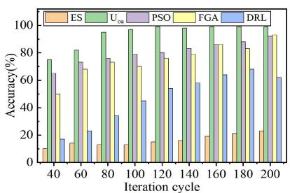

bar

| Iteration cycle | ES (%) | Uoa (%) | PSO (%) | FGA (%) | DRL (%) |
|---|---|---|---|---|---|
| 40 | 10 | 75 | 65 | 50 | 15 |
| 60 | 15 | 80 | 70 | 55 | 20 |
| 80 | 12 | 92 | 75 | 65 | 33 |
| 100 | 12 | 95 | 78 | 68 | 45 |
| 120 | 14 | 98 | 80 | 72 | 53 |
| 140 | 15 | 98 | 82 | 75 | 57 |
| 160 | 18 | 99 | 85 | 80 | 63 |
| 180 | 20 | 99 | 87 | 85 | 67 |
| 200 | 22 | 99 | 90 | 90 | 61 |

(a)

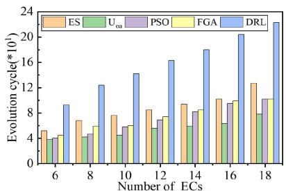

bar

| Number of ECs | ES | Uoa | PSO | FGA | DRL |
|---|---|---|---|---|---|
| 6 | 5.0 | 4.0 | 4.0 | 4.0 | 9.0 |
| 8 | 7.0 | 4.0 | 5.0 | 5.0 | 12.0 |
| 10 | 8.0 | 4.0 | 6.0 | 6.0 | 14.0 |
| 12 | 8.0 | 5.0 | 7.0 | 7.0 | 16.0 |
| 14 | 9.0 | 6.0 | 8.0 | 8.0 | 18.0 |
| 16 | 10.0 | 7.0 | 9.0 | 9.0 | 20.0 |
| 18 | 12.0 | 8.0 | 10.0 | 10.0 | 23.0 |

(b)

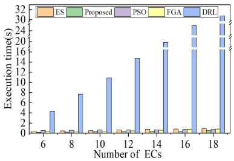

bar

| Number of ECs | ES | Proposed | PSO | FGA | DRL |
|---|---|---|---|---|---|
| 6 | 0.2 | 0.3 | 0.4 | 0.5 | 4.5 |
| 8 | 0.3 | 0.4 | 0.5 | 0.6 | 7.5 |
| 10 | 0.4 | 0.5 | 0.6 | 0.7 | 11.0 |
| 12 | 0.5 | 0.6 | 0.7 | 0.8 | 14.5 |
| 14 | 0.6 | 0.7 | 0.8 | 0.9 | 18.0 |
| 16 | 0.7 | 0.8 | 0.9 | 1.0 | 24.0 |
| 18 | 0.8 | 0.9 | 1.0 | 1.1 | 30.5 |

（c）  
Fig. 3. Study on task offloading and resource allocation algorithm $( U _ { o a } ) .$ (a) Accuracy with numbers of iteration cycles. (b) Evolution cycle with numbers of ECs. (c) Average execution time with numbers of ECs.

It combines deep learning with reinforcement learning to enable end-to-end learning from perception to action.

Tested method and metrics: In this study, the task offloading and resource allocation algorithm $( U _ { o a } )$ is nested within the UES trajectory planning algorithm $( U _ { t p } )$ . The execution time and accuracy of $U _ { o a }$ tpimpact the training time and convergence of $U _ { t p }$ oa. First, the shorter the execution time of $U _ { o a }$ , the lower tpis the training time of $U _ { t p }$ oapresents, and the time cost of the tpDDQN model training decreases. Second, when the accuracy of $U _ { o a }$ is too low, it is difficult for the trajectory planning algorithm oato converge. Then, our task-offloading algorithm is expected to have a short execution time and high accuracy. Thus, we conduct experiments to study the execution time and accuracy of $U _ { o a } . \ U _ { t p }$ is based on DDQN. Training parameters of the oa tpDDQN model affect the performance of the trajectory planning algorithm; therefore, we achieve the two optimal parameters of model training - learning rate and batch size (§X-B1). We study the impact of the training episode in the algorithm on the remaining battery power of ECs in the termination time slot (§X-B2). We investigate the impact of the three metrics on the feedback reward and total system overhead (§X-B3, §X-B4, and §X-B5).

# X. PERFORMANCE EVALUATION

# A. Task Offloading and Resource Allocation Algorithm $( U _ { o a } )$

1) Accuracy: We randomly produce one thousand system states that are taken as the input of $U _ { o a } .$ , CMA-ES, FGA, PSO, oaDRL, and EM in Algorithm 1. We evaluate the accuracy of algorithms compared with EM (the optimal solution).

Fig. 3(a) shows that the accuracy of algorithms rises with iteration cycles. Our algorithm $U _ { o a }$ achieves the highest accuracy oawith a few iteration cycles. When the number of iteration cycles is 140, the accuracy of $U _ { o a }$ reaches 99.6%, but the accuracy of oaother schemes is lower than 95%. When a task offloading and resource allocation algorithm has high accuracy, the algorithm can be a high probability of being the optimal solution, which reduces the fluctuation of the UES trajectory training algorithm and improves $U _ { t p }$ convergence in the test.

tp2) Execution Time: In this experiment, the average number of evolutionary cycles and the execution time at the termination of the algorithm are used to evaluate its convergence. We randomly generate one thousand states of the system with different

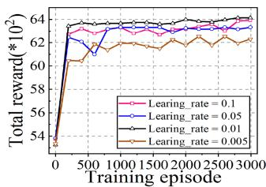

line

| Training episode | Learing_rate = 0.1 | Learing_rate = 0.05 | Learing_rate = 0.01 | Learing_rate = 0.005 |
| ---------------- | ------------------- | -------------------- | -------------------- | --------------------- |
| 0                | 54                  | 54                   | 54                   | 54                    |
| 500              | 62                  | 62                   | 62                   | 60                    |
| 1000             | 63                  | 63                   | 63                   | 61                    |
| 1500             | 63                  | 63                   | 63                   | 62                    |
| 2000             | 63                  | 63                   | 63                   | 62                    |
| 2500             | 63                  | 63                   | 63                   | 62                    |
| 3000             | 63                  | 63                   | 63                   | 62                    |

(a)

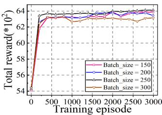

line

| Training episode | Batch_size = 150 | Batch_size = 200 | Batch_size = 250 | Batch_size = 300 |
| ---------------- | ---------------- | ---------------- | ---------------- | ---------------- |
| 0                | 54               | 54               | 54               | 54               |
| 500              | 63               | 63               | 63               | 63               |
| 1000             | 63               | 63               | 63               | 63               |
| 1500             | 63               | 63               | 63               | 63               |
| 2000             | 63               | 63               | 63               | 63               |
| 2500             | 63               | 63               | 63               | 63               |
| 3000             | 63               | 63               | 63               | 63               |

(b)   
Fig. 4. Convergence performance. (a) Convergence performance based on learning rates. (b) Convergence performance based on batch sizes.

numbers of ECs. We study the average number of evolutionary cycles and the average execution time at the convergence of each algorithm in all states.

In Fig. 3(b) and (c), the average evolution cycles and execution times become larger when the number of ECs increases. Notably, the iteration period of DRL represents the training period. This is because increasing the number of ECs complicates the system, but the computational resources of the UES are limited and the complexity of allocating the limited computational resources to more and more users increases. Our algorithm $U _ { o a }$ converges oawith the least average evolutionary cycle and lowest average execution time for the same number of ECs. This validates the efficiency and reliability of $U _ { o a }$ . our proposed Our proposed $U _ { o a }$ oaalgorithm can reduce the training time for UES trajectory oaplanning.

# B. UES Trajectory Planning Algorithm $( U _ { t p } )$

1) Convergence Performance: We study the convergence of the ANN model in $U _ { t p }$ based on different learning rates and tpbatch sizes. In Fig. 4(a), this ANN model cannot converge when the learning rate is extremely high (or low). We can achieve the best convergence when the learning rate is 0.01. Thus, we set the learning rate to 0.01 in the experiment. Fig. 4(b) indicates the convergence of the ANN model with different batch sizes. A large batch size is in favor of the model convergence, but the convergence of the model deteriorates as the batch size continuously increases. When the batch size is 250, the ANN model training converges best.

2) Relationship Between $E C s ^ { \prime }$ Remaining Battery and Episode: We study the remaining battery power of ECs and the algorithm training episodes in the termination time slot. In Table III, we configure two training episodes (1,500 and 3,000). The term Local denotes the remaining battery of ECs in the last time slot without UES assistance. We make the following findings.

\- Time slots: The algorithm $U _ { t p }$ extends the number of time tpslots by 100% when the episode is 1,500. In the last time slot, the $U _ { t p }$ -based remaining battery on each EC is higher than that tpof DQN. Sarsa and Q\_learning have similar system lifetime compared with $U _ { t p }$ and DQN. The two algorithms reduce the tpnumber of tasks by 20% but consume much battery.

\- Average energy consumption: We obtain the average energy consumption which is the ratio of the total system energy consumption to the number of time slots in a UES operation cycle. Without UES assistance, the average energy consumption is 21.1%. Compared with local, the algorithm $U _ { t p }$ reduces the tpaverage energy consumption by 6%, which extends the system lifetime by 100%. The other three algorithms have a higher average energy consumption than $U _ { t p }$ as the training episode increases.

\- Total reward: With two training episodes, $U _ { t p }$ and DQN tpprovide slightly higher total overhead and reward than Q\_learing and Sarsa because the first two algorithms increase the number of time slots in the system. Thus, the system processes more tasks, and the total overhead and reward are higher. However, $U _ { t p }$ has a better performance than DQN.

tp- Total system overhead: This metric is the sum of system overhead in all time slots. When episodes in training become large, four algorithms increase the remaining battery of most ECs at system termination. This is because the small system overhead $G ^ { m } ( t )$ enlarges the reward $R _ { t } ^ { \prime }$ as U is a fixed value ( ) tin the reward function (see (36)). The algorithm is trained to achieve a larger reward (i.e., less system overhead). The energy consumption weight rises as the remaining battery decreases. Then, energy consumption is larger than that of the execution time for task execution. Thus, the computational overhead of the EC increases as the battery reduces. To enhance the reward, the algorithm with large episodes reduces the cost of battery of ECs. Thus, our reward function extends the system lifetime.

In addition, there are a fixed number of tasks in each time slot. With the same episodes, $U _ { t p }$ enables the system to run the maximum number of time slots and process the most tasks. Thus, we achieve the largest total system overhead.

\- System lifetime: With a large episode value, the four algorithms extend the system lifetime. This is because, in the initial state, the high proportion of remaining battery on each EC enlarges the weight of execution time overhead on ECs. With small episode values, algorithms enable the UES to assist ECs with the high time-cost tasks. A large episode value leads to high rewards when the UES assists ECs with high energy-consumption tasks. Thus, the UES assists ECs with high energy-consumption tasks instead of high time-cost ones. The system lifetime is extended when the number of these high time-cost ECs reduces.

3) Impact of UES Flying Speed on Total Reward and Total System Overhead: With the same reward mechanism and training period, we study the total reward of feedback and total system

overhead of the four algorithms at two UES flying speeds (5 m/s and 15 m/s). Fig. 5 shows the total reward of feedback, total system overhead, and the iteration period.

Fig. 5(a) and (c) reveal that the total feedback reward of the four strategies increases with the UES’s flying speed. This is because the high flying speed reduces UES flight time. Then, the standby time and energy consumption on ECs are reduced, which lessens the battery consumption on ECs. The computational overhead of ECs is negatively related to its remaining battery. The high percentage of the remaining battery can lower the total system overhead, achieving a high total feedback reward.

Fig. 5(b) and (d) show the total system overhead and the training period at flying speeds. At the start of training, the system overhead of algorithms is small; then, it increases abruptly, followed by a slow decrement. This is because the algorithm enables the UES to achieve a better flying trajectory after many training cycles, increasing the number of time slots and extending the system lifetime. Afterward, the total system overhead increases. In Fig. 5(a) and (c), $U _ { t p }$ enhances the total feedback reward by 7%. Because $U _ { t p }$ tpincreases the number of time slots, the total system overhead becomes large. Then, $U _ { t p }$ provides more efficient UES trajectory planning at flying speeds than other algorithms.

4) Impact of UES Battery Power on the Total Reward and Total System Overhead: In Fig. 6, $U _ { t p }$ and DQN achieve higher tpfeedback rewards and slightly differ before the battery is 80 kJ compared with Q-learning and Sarsa. Afterward, the difference becomes large because the number of UES-assisted time slots increases with the battery. Then, the search-state space becomes large, complicating the training model. In this case, the hierarchy architecture of DDQN in $U _ { t p }$ presents its advantages. When the tpon-board battery is 100 kJ, the battery is not the constraint on the rewards of $U _ { t p }$ and DQN. The feedback reward becomes tpsmooth with a slight slope; then, the UES battery satisfies the system requirements. The remaining battery of each EC primarily determines the system lifetime. When the battery is greater than 100 kJ, the algorithm needs to find a better UES trajectory to utilize the remaining battery of ECs and obtain high reward feedback. With a 120-kJ battery, Q-learning and Sarsa have a smooth performance.

5) Impact of UES Computational Capability on the Total Reward and Total System Overhead: We investigate the impact of UES computational capability on the total feedback reward and total system overhead. Notably, the basic computational capability represents the computational capability of a Jetson Nano to process tasks. We configure seven-level computational capability in the UES (i.e., level 2 - 8).

Fig. 7(a) shows the feedback reward and UES computational capability of the four algorithms. These algorithms’ feedback reward and total system overhead rise after a fall trend. However, the inflection point for the total feedback reward and total system overhead occurs when the computational capability is 4 and 7, respectively. The feedback reward increases with computational capability but decreases at a computational capability of 7. This is because the UES has the high computational capability to assist more ECs; then, the feedback reward increases. When the computational capability exceeds 7, the UES consumes much energy for tasks, shortening assistance cycles and lowering feedback reward.

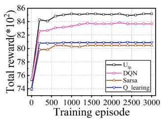

line

| Training episode | Utp   | DQN   | Sarsa | Q learing |
| ---------------- | ----- | ----- | ----- | --------- |
| 0                | 74.0  | 74.0  | 74.0  | 74.0      |
| 500              | 84.5  | 82.5  | 80.5  | 81.0      |
| 1000             | 85.0  | 83.0  | 80.5  | 81.0      |
| 1500             | 85.0  | 83.5  | 80.5  | 81.0      |
| 2000             | 85.0  | 83.5  | 80.5  | 81.0      |
| 2500             | 85.0  | 83.5  | 80.5  | 81.0      |
| 3000             | 85.0  | 83.5  | 80.5  | 81.0      |

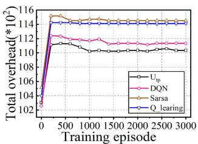

line

| Training episode | U_sp  | DQN   | Sarsa | Q learing |
| ---------------- | ----- | ----- | ----- | --------- |
| 0                | 102.5 | 102.5 | 102.5 | 102.5     |
| 500              | 111.5 | 112.0 | 114.5 | 114.0     |
| 1000             | 111.0 | 111.5 | 114.5 | 114.0     |
| 1500             | 110.5 | 111.0 | 114.5 | 114.0     |
| 2000             | 110.5 | 111.0 | 114.5 | 114.0     |
| 2500             | 110.5 | 111.0 | 114.5 | 114.0     |
| 3000             | 110.5 | 111.0 | 114.5 | 114.0     |

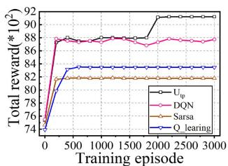

line

| Training episode | U_p  | DQN  | Sarsa | Q learing |
| ---------------- | ---- | ---- | ----- | --------- |
| 0                | 74   | 74   | 74    | 74        |
| 500              | 88   | 88   | 82    | 82        |
| 1000             | 88   | 88   | 82    | 82        |
| 1500             | 88   | 88   | 82    | 82        |
| 2000             | 92   | 88   | 82    | 82        |
| 2500             | 92   | 88   | 82    | 82        |
| 3000             | 92   | 88   | 82    | 82        |

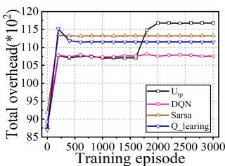

line

| Training episode | U_p    | DQN    | Sarsa  | Q learing |
| ---------------- | ------ | ------ | ------ | --------- |
| 0                | 85     | 85     | 85     | 85        |
| 500              | 115    | 108    | 112    | 112       |
| 1000             | 115    | 108    | 112    | 112       |
| 1500             | 115    | 108    | 112    | 112       |
| 2000             | 115    | 108    | 112    | 112       |
| 2500             | 115    | 108    | 112    | 112       |
| 3000             | 115    | 108    | 112    | 112       |

Fig. 5. Impact of UES flying speed on total reward and total system overhead. (a) Total reward (5m/s). (b) Total system overhead (5m/s). (c) Total reward (15m/s). (d) Total system overhead (15m/s)

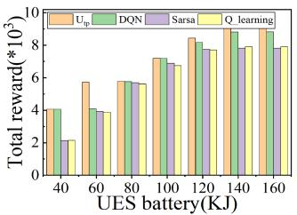

bar

| UES battery(KJ) | Uₚ     | DQN    | Sarsa  | Q_learning |
| --------------- | ------ | ------ | ------ | ---------- |
| 40              | 4.0    | 4.0    | 2.0    | 2.0        |
| 60              | 5.5    | 4.0    | 3.5    | 3.5        |
| 80              | 5.5    | 5.5    | 5.5    | 5.5        |
| 100             | 7.0    | 7.0    | 7.0    | 6.5        |
| 120             | 8.0    | 8.0    | 7.5    | 7.5        |
| 140             | 8.5    | 8.5    | 7.5    | 7.5        |
| 160             | 9.0    | 9.0    | 7.5    | 7.5        |

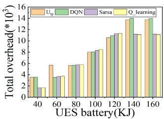

bar

| UES battery(KJ) | U_op   | DQN    | Sarsa  | Q_learning |
| --------------- | ------ | ------ | ------ | ---------- |
| 40              | 3.5    | 3.5    | 2.0    | 2.0        |
| 60              | 5.5    | 5.5    | 3.5    | 3.5        |
| 80              | 5.5    | 5.5    | 5.5    | 5.5        |
| 100             | 8.0    | 8.0    | 8.0    | 8.0        |
| 120             | 10.5   | 10.5   | 11.0   | 11.0       |
| 140             | 13.5   | 13.5   | 11.0   | 11.0       |
| 160             | 13.5   | 13.5   | 11.0   | 11.0       |

(b)

Fig. 6. The impact of battery power of the UES on total reward and system overhead. (a) Total reward. (b) Total system overhead.   
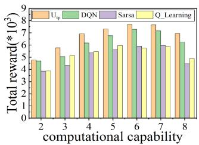

bar

| computational capability | Uₚ     | DQN    | Sarsa  | Q_Learning |
| ----------------------- | ------ | ------ | ------ | ---------- |
| 2                       | 4.8    | 4.5    | 3.8    | 3.7        |
| 3                       | 5.8    | 5.0    | 4.2    | 5.0        |
| 4                       | 6.8    | 6.2    | 5.4    | 5.3        |
| 5                       | 7.2    | 6.8    | 5.6    | 5.9        |
| 6                       | 7.8    | 7.2    | 5.8    | 5.8        |
| 7                       | 7.6    | 7.4    | 5.9    | 5.7        |
| 8                       | 7.0    | 6.2    | 4.5    | 4.7        |

(a)

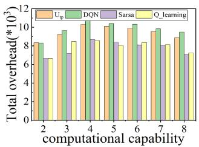

bar

| computational capability | U_sp | DQN | Sarsa | Q_learning |
| ----------------------- | ---- | --- | ----- | ---------- |
| 2                       | 8.5  | 9.5 | 6.5   | 8.0        |
| 3                       | 9.0  | 10.0| 7.0   | 8.5        |
| 4                       | 10.0 | 10.5| 8.5   | 9.0        |
| 5                       | 10.0 | 10.5| 8.5   | 8.0        |
| 6                       | 10.0 | 10.5| 8.5   | 8.0        |
| 7                       | 9.5  | 10.0| 8.0   | 8.0        |
| 8                       | 9.0  | 10.0| 7.5   | 7.5        |

Fig. 7. Impact of UES computational capability on the total feedback reward and total system overhead. (a) Total reward. (b) Total system overhead.

In Fig. 7(b), the total system overhead increases between the computational capability of 2 and 4. This is because increasing the number of UES-assisted ECs enlarges the total system overhead, and lengthens the time slot. Between the computational capability of 4 and 7, the number of time slots does not increase; however, the algorithms reduce the total system overhead by optimizing the UES trajectory. When the computational capability is greater than seven, the number of UES-assisted time slots and total system overhead decreases.

# C. Dynamic and Static Resource Allocation

The UES allocates VMs with computing resources for ECs in a static manner. As an application runs on an EC, the system allocates CPU/GPU resources in cores, which is a static allocation scheme. A dynamic resource allocation scheme allows the UES to allocate on-demand resources for ECs, and it has higher resource utilization than the static one. We study the average system overhead of the two schemes.

In the three dynamic ones, we set three maximum upper limits for available computational resources on Jetson Nano (2/3, 1, and 4/3), see Fig. 8(b)–(d). Increasing the number of iterations in algorithms can reduce the average system overhead. The static scheme (see Fig. 8(a)) outperforms the dynamic ones when the upper limit of the maximum available computing resources on ECs is small. Conversely, the dynamic scheme is the edge over the static one.

In dynamic schemes, the system overhead decreases; afterward, it increases as the maximum number of computing resources available to ECs becomes great in case of the same number of iterations. Fig. 8(b) and (c) show the decrement trend of the system overhead. The maximum number of computing resources allocated for ECs trends to the upper limit. With the limited computing resources, the UES assists fewer ECs in Fig. 8(c) than that in Fig. 8(b). However, there are more computing resources allocated for each EC while the average system overhead reduces. Fig. 8(c) unveils that the computing resources are allocated to appropriate ECs; then, the resource utilization on the UES is enhanced.

Fig. 8(c) and (d) show an upward tendency of the system overhead. We find that the number of computing resources allocated for ECs cannot converge to its upper limit. This is because increasing the upper limit of available resources complicates the decision-making in algorithms, but the number of iterations remains unchanged. Thus, the decision-making scheme of each algorithm leads to a high system overhead.

# XI. CONCLUSION

In this study, we design a UES-assisted edge video system in disaster rescue. We define two sub-goals to jointly solve the problems of task offloading and UES trajectory planning. We propose an improved DE based algorithm $( U _ { o a } )$ to obtain the oaoptimal task offloading algorithm. We also design a DDQNbased UES trajectory planning algorithm $( U _ { t p } )$ to achieve the toptimal UES flying trajectory. The algorithm $U _ { t p }$ has a better tpfeasibility than other algorithms in complex scenarios. The proposed algorithm $U _ { o a }$ achieves optimized execution time and oaaccuracy that optimizes the training time and convergence of algorithm $U _ { t p }$ . The algorithm $U _ { t p }$ allows all UES-assisted ECs to achieve the lowest and most balanced energy consumption, extending the system lifetime.

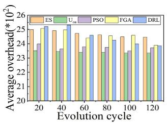

bar

| Evolution cycle | ES | UOH | PSO | FGA | DRL |
|---|---|---|---|---|---|
| 20 | 25.0 | 23.5 | 24.0 | 25.0 | 25.0 |
| 40 | 25.0 | 23.5 | 23.5 | 25.0 | 25.0 |
| 60 | 24.8 | 23.4 | 23.7 | 24.5 | 24.7 |
| 80 | 24.7 | 23.4 | 23.8 | 24.6 | 24.3 |
| 100 | 24.6 | 23.4 | 23.5 | 24.7 | 24.0 |
| 120 | 24.5 | 23.5 | 23.7 | 24.0 | 24.0 |

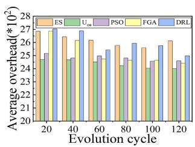

bar

| Evolution cycle | ES   | U_in | PSO  | FGA  | DRL  |
| --------------- | ---- | ---- | ---- | ---- | ---- |
| 20              | 27.0 | 25.0 | 25.0 | 26.5 | 27.0 |
| 40              | 26.5 | 24.5 | 24.5 | 26.0 | 27.0 |
| 60              | 26.0 | 24.5 | 24.5 | 25.5 | 25.5 |
| 80              | 25.5 | 24.0 | 24.5 | 25.0 | 26.0 |
| 100             | 25.0 | 23.5 | 24.0 | 24.5 | 25.5 |
| 120             | 26.0 | 24.0 | 24.5 | 24.5 | 25.0 |

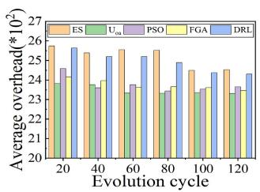

bar

| Evolution cycle | ES | Ucu | PSO | FGA | DRL |
|---|---|---|---|---|---|
| 20 | 25.8 | 24.0 | 24.6 | 24.1 | 25.7 |
| 40 | 25.5 | 23.9 | 23.9 | 23.8 | 25.3 |
| 60 | 25.6 | 23.4 | 23.7 | 23.7 | 25.1 |
| 80 | 25.6 | 23.3 | 23.5 | 23.6 | 24.9 |
| 100 | 24.6 | 23.3 | 23.5 | 23.6 | 24.4 |
| 120 | 24.6 | 23.3 | 23.5 | 23.6 | 24.3 |

（c)

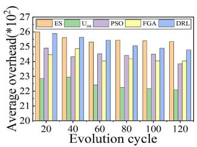

bar

| Evolution cycle | ES | U_on | PSO | FGA | DRL |
|---|---|---|---|---|---|
| 20 | 26.0 | 23.0 | 24.8 | 25.0 | 25.7 |
| 40 | 25.7 | 23.0 | 24.9 | 24.9 | 25.6 |
| 60 | 25.4 | 22.3 | 24.6 | 24.0 | 25.4 |
| 80 | 25.4 | 22.3 | 24.4 | 24.0 | 25.3 |
| 100 | 25.4 | 22.2 | 24.6 | 24.0 | 25.1 |
| 120 | 25.3 | 22.1 | 23.9 | 24.0 | 24.9 |

Fig. 8. Comparison of dynamic and static resource allocation schemes. (a) Static. (b) Dynamic\_1. (c) Dynamic\_2. (d) Dynamic\_3.

# APPENDIX A NP-HARD PROBLEM PROOF

To prove that the task offloading problem is NP-hard, we must analogize it to a proven NP-hard problem. The generalized assignment problem (GAP) [25], [43] is an NP-hard problem [44]. We then analogize the task offloading problem to the GAP. Task offloading is used to determine the optimal strategy. The UES provides virtual machines to ECs according to the task offloading policy and assists with task processing, minimizing the total computational overhead of the system. Thus, we reduced the problem in our study to the GAP.

We assume that the computational resources of the UES are used to configure  virtual machines, which are referred to as M computational devices. There are N ECs, and we have M K =computational devices. We assume that there is one task N + Min an EC. When a UES assists  ECs with task processing, an Nefficient task-scheduling scheme should be designed to allocate tasks to  devices. Similar to GAP, we rewrite the original N Nproblem based on the GAP problem. First, the task allocation variable is defined as

$$
x _ {k n} = \left\{ \begin{array}{l l} 1, & \text { task   } n \text {   is   offloaded   to   } \mathrm{EC} _ {\mathrm{k}} \\ 0, & \text { task   } n \text {   is   not   offloaded   to   } \mathrm{EC} _ {\mathrm{k}} \end{array} \right. \tag {41}
$$

where we define a set of devices $\mathrm { S } _ { K } = \{ 1 , 2 , \dots , \mathrm { K } \}$ and a set of ECs $\mathrm { S } _ { N } = \{ 1 , 2 , \dots , \mathrm { N } \}$ SK = K. Each of  ECs can process one SN = N Ktask simultaneously. Thus, the requirements must be satisfied

$$
\sum_ {n = 1} ^ {N} x _ {k n} \in \{0, 1 \}; \forall k \in S _ {k}. \tag {42}
$$

Meanwhile, each task can be allocated to an EC. In addition, for tasks can be executed locally or offloaded to one of M virtual Nmachines. Thus, the restrictions are imposed as

$$
\sum_ {k \in S} x _ {k n}; \forall n \in S _ {N}, S = \{n, S _ {K} - S _ {n} \} \tag {43}
$$

For the task offloading problem, our optimization objective is to minimize the computational overhead of the system, which is rewritten as

$$
C _ {t o t a l} = \sum_ {k = 1} ^ {K} \sum_ {n = 1} ^ {N} x _ {k n} \cdot C _ {k n} \tag {44}
$$

Analogous to the GAP, under constraints (42)∼(43) and (24)∼(29), the task offloading problem can be rewritten as

$$
\min C _ {\text { total }}
$$

$$
\text { st.Eqs }, (2 4) \sim (2 9), (4 2) \sim (4 3) \tag {45}
$$

With the same optimal task offloading strategy, problem (3) can be rewritten as

$$
\max \left(- C _ {\text { total }}\right)
$$

$$
\text { st.Eqs }, (2 4) \sim (2 9), (4 2) \sim (4 3) \tag {46}
$$

In summary, the original problem can be equated to problem (4); we then analogize this problem to the GAP as follows.

Similarly, problem (46) allocates  tasks to  individuals for task processing. Each task can be delivered to one person, and each person can only handle one task at most, which is the correspondence between tasks and people in the GAP. Furthermore, the GAP problem aims to maximize the effectiveness of task processing. Accordingly, in our problem, we aim to maximize the overall $- C _ { t o t a l }$ . Therefore, problem (46) is essentially the totalGAP problem with constraints (24)∼(29), (42)∼(43). As such, some non-linear constraints are added to the NP-hard problem. Thus, the task offloading problem (46) is an NP-hard problem in this study.

# REFERENCES

[1] P. Zuo et al., “BEES: Bandwidth-and energy-efficient image sharing for real-time situation awareness,” in Proc. IEEE 37th Int. Conf. Distrib. Comput. Syst., 2017, pp. 1510–1520.   
[2] L. Wang, K. Wang, C. Pan, W. Xu, N. Aslam, and A. Nallanathan, “Deep reinforcement learning based dynamic trajectory control for UAV-assisted mobile edge computing,” IEEE Trans. Mobile Comput., vol. 21, no. 10, pp. 3536–3550, Oct. 2022.   
[3] J. Xu, K. Ota, and M. Dong, “Big Data on the fly: UAV-mounted mobile edge computing for disaster management,” IEEE Trans. Netw. Sci. Eng., vol. 7, no. 4, pp. 2620–2630, Oct.-Dec. 2020.   
[4] A. Curtis and P. Kyle, “Geothermal point sources identified in a fumarolic ice cave on Erebus volcano, Antarctica using fiber optic distributed temperature sensing,” Geophysical Res. Lett., vol. 38, no. 16, pp. 1–7, 2011.   
[5] Y. Zeng, R. Zhang, and T. J. Lim, “Throughput maximization for UAVenabled mobile relaying systems,” IEEE Trans. Commun., vol. 64, no. 12, pp. 4983–4996, Dec. 2016.   
[6] Q. Wu, Y. Zeng, and R. Zhang, “Joint trajectory and communication design for multi-UAV enabled wireless networks,” IEEE Trans. Wireless Commun., vol. 17, no. 3, pp. 2109–2121, Mar. 2018.   
[7] P. Zhan, K. Yu, and A. L. Swindlehurst, “Wireless relay communications with unmanned aerial vehicles: Performance and optimization,” IEEE Trans. Aerosp. Electron. Syst., vol. 47, no. 3, pp. 2068–2085, Jul. 2011.

[8] C. Zhan, H. Hu, X. Sui, Z. Liu, and D. Niyato, “Completion time and energy optimization in the UAV-enabled mobile-edge computing system,” IEEE Internet Things J., vol. 7, no. 8, pp. 7808–7822, Aug. 2020.   
[9] C. Sun, W. Ni, and X. Wang, “Joint computation offloading and trajectory planning for UAV-assisted edge computing,” IEEE Trans. Wireless Commun., vol. 20, no. 8, pp. 5343–5358, Aug. 2021.   
[10] M. Li, N. Cheng, J. Gao, Y. Wang, L. Zhao, and X. Shen, “Energy-efficient UAV-assisted mobile edge computing: Resource allocation and trajectory optimization,” IEEE Trans. Veh. Technol., vol. 69, no. 3, pp. 3424–3438, Mar. 2020.   
[11] T. Zhang, Y. Xu, J. Loo, D. Yang, and L. Xiao, “Joint computation and communication design for UAV-assisted mobile edge computing in IoT,” IEEE Trans. Ind. Informat., vol. 16, no. 8, pp. 5505–5516, Aug. 2020.   
[12] J. Zhang et al., “Stochastic computation offloading and trajectory scheduling for UAV-assisted mobile edge computing,” IEEE Internet Things J., vol. 6, no. 2, pp. 3688–3699, Apr. 2019.   
[13] Z. Yang, C. Pan, K. Wang, and M. Shikh-Bahaei, “Energy efficient resource allocation in UAV-enabled mobile edge computing networks,” IEEE Trans. Wireless Commun., vol. 18, no. 9, pp. 4576–4589, Sep. 2019.   
[14] M. Samir, S. Sharafeddine, C. M. Assi, T. M. Nguyen, and A. Ghrayeb, “UAV trajectory planning for data collection from time-constrained IoT devices,” IEEE Trans. Wireless Commun., vol. 19, no. 1, pp. 34–46, Jan. 2020.   
[15] Y. Zeng, X. Xu, and R. Zhang, “Trajectory design for completion time minimization in UAV-enabled multicasting,” IEEE Trans. Wireless Commun., vol. 17, no. 4, pp. 2233–2246, Apr. 2018.   
[16] Y. Luo, W. Ding, and B. Zhang, “Optimization of task scheduling and dynamic service strategy for multi-UAV-enabled mobile-edge computing system,” IEEE Trans. Cogn. Commun. Netw., vol. 7, no. 3, pp. 970–984, Sep. 2021.   
[17] E. Cusumano, “Emptying the sea with a spoon? non-governmental providers of migrants search and rescue in the mediterranean,” Mar. Policy, vol. 75, pp. 91–98, 2017.   
[18] N. Kalatzis, M. Avgeris, D. Dechouniotis, K. Papadakis-Vlachopapadopoulos, I. Roussaki, and S. Papavassiliou, “Edge computing in IoT ecosystems for UAV-enabled early fire detection,” in Proc. IEEE Int. Conf. Smart Comput., 2018, pp. 106–114.   
[19] A. Guillen-Perez, R. Sanchez-Iborra, M.-D. Cano, J. C. Sanchez-Aarnoutse, and J. Garcia-Haro, “Wifi networks on drones,” in Proc. ITU Kaleidoscope: ICTs A Sustain., 2016, pp. 1–8.   
[20] S. A. R. Naqvi, S. A. Hassan, H. Pervaiz, and Q. Ni, “Droneaided communication as a key enabler for 5G and resilient public safety networks,” IEEE Commun. Mag., vol. 56, no. 1, pp. 36–42, Jan. 2018.   
[21] L. Zhang et al., “Task offloading and trajectory control for UAV-assisted mobile edge computing using deep reinforcement learning,” IEEE Access, vol. 9, pp. 53708–53719, 2021.   
[22] X. Deng, Y. Jiang, L. T. Yang, M. Lin, L. Yi, and M. Wang, “Data fusion based coverage optimization in heterogeneous sensor networks: A survey,” Inf. Fusion, vol. 52, pp. 90–105, 2019.   
[23] A. Mehrabi and K. Kim, “Maximizing data collection throughput on a path in energy harvesting sensor networks using a mobile sink,” IEEE Trans. Mobile Comput., vol. 15, no. 3, pp. 690–704, Mar. 2016.   
[24] H. Salarian, K.-W. Chin, and F. Naghdy, “An energy-efficient mobile-sink path selection strategy for wireless sensor networks,” IEEE Trans. Veh. Technol., vol. 63, no. 5, pp. 2407–2419, Jun. 2014.   
[25] H. Sun, B. Zhang, X. Zhang, Y. Yu, K. Sha, and W. Shi, “FlexEdge: Dynamic task scheduling for a UAV-based on-demand mobile edge server,” IEEE Internet Things J., vol. 9, no. 17, pp. 15983–16005, Sep. 2022.   
[26] A. M. Seid, G. O. Boateng, B. Mareri, G. Sun, and W. Jiang, “Multi-agent DRL for task offloading and resource allocation in multi-UAV enabled IoT edge network,” IEEE Trans. Netw. Service Manage., vol. 18, no. 4, pp. 4531–4547, Dec. 2021.   
[27] R. Nelson and L. Kleinrock, “Spatial TDMA: A collision-free multihop channel access protocol,” IEEE Trans. Commun., vol. 33, no. 9, pp. 934–944, Sep. 1985.   
[28] X. Chen, L. Jiao, W. Li, and X. Fu, “Efficient multi-user computation offloading for mobile-edge cloud computing,” IEEE/ACM Trans. Netw., vol. 24, no. 5, pp. 2795–2808, 2015.   
[29] N. Zhao, Z. Ye, Y. Pei, Y.-C. Liang, and D. Niyato, “Multi-agent deep reinforcement learning for task offloading in UAV-assisted mobile edge computing,” IEEE Trans. Wireless Commun., vol. 21, no. 9, pp. 6949–6960, Sep. 2022.

[30] L. Wang, K. Wang, C. Pan, W. Xu, N. Aslam, and L. Hanzo, “Multi-agent deep reinforcement learning-based trajectory planning for multi-UAV assisted mobile edge computing,” IEEE Trans. Cogn. Commun. Netw., vol. 7, no. 1, pp. 73–84, Mar. 2021.   
[31] Q. Liu, L. Shi, L. Sun, J. Li, M. Ding, and F. Shu, “Path planning for UAV-mounted mobile edge computing with deep reinforcement learning,” IEEE Trans. Veh. Technol., vol. 69, no. 5, pp. 5723–5728, May 2020.   
[32] H. Guo, J. Liu, J. Zhang, W. Sun, and N. Kato, “Mobile-edge computation offloading for ultradense IoT networks,” IEEE Internet Things J., vol. 5, no. 6, pp. 4977–4988, Dec. 2018.   
[33] S. Bi, L. Huang, and Y.-J. A. Zhang, “Joint optimization of service caching placement and computation offloading in mobile edge computing systems,” IEEE Trans. Wireless Commun., vol. 19, no. 7, pp. 4947–4963, Jul. 2020.   
[34] H. V. Hasselt, A. Guez, and D. Silver, “Deep reinforcement learning with double Q-learning,” in Proc. AAAI Conf. Artif. Intell., 2016, pp. 2094– 2100.   
[35] W. Liu, R. Wang, K. Yang, X. Yang, and T. Zhang, “A greedy strategy based iterative local search algorithm for orienteering problems,” Proc. SPIE, vol. 12350, 2022, Paper 123502S-1.   
[36] Y. Ma, D. Yu, T. Wu, and H. Wang, “Paddlepaddle: An open-source deep learning platform from industrial practice,” Front. Data Domputing, vol. 1, no. 1, pp. 105–115, 2019.   
[37] F. Rezazadeh, H. Chergui, L. Alonso, and C. Verikoukis, “Continuous multi-objective zero-touch network slicing via twin delayed DDPG and OpenAI gym,” in Proc. IEEE Glob. Commun. Conf., 2020, pp. 1–6.   
[38] S. Rostami and A. Shenfield, “CMA-paes: Pareto archived evolution strategy using covariance matrix adaptation for multi-objective optimisation,” in Proc. 12th U.K. Workshop Comput. Intell., 2012, pp. 1–8.   
[39] M. R. Bonyadi and Z. Michalewicz, “Particle swarm optimization for single objective continuous space problems: A review,” Evol. Computation, vol. 25, no. 1, pp. 1–54, Mar. 2017.   
[40] V. François-Lavet et al., “An introduction to deep reinforcement learning,” Found. Trends Mach. Learn., vol. 11, no. 3/4, pp. 219–354, 2018.   
[41] R. S. Sutton et al., Introduction to Reinforcement Learning. MIT press Cambridge, vol. 135, 1998.   
[42] V. Mnih et al., “Human-level control through deep reinforcement learning,” Nature, vol. 518, no. 7540, pp. 529–533, 2015.   
[43] J. Zhang, Y. Wu, G. Min, F. Hao, and L. Cui, “Balancing energy consumption and reputation gain of UAV scheduling in edge computing,” IEEE Trans. Cogn. Commun. Netw., vol. 6, no. 4, pp. 1204–1217, Dec. 2020.   
[44] X. Deng, B. Wang, W. Liu, and L. T. Yang, “Sensor scheduling for multimodal confident information coverage in sensor networks,” IEEE Trans. Parallel Distrib. Syst., vol. 26, no. 3, pp. 902–913, Mar. 2015.

natural_image

Portrait of a man in formal attire with glasses against a blue background (no text or symbols visible)

Hui Sun received the Ph.D. degree from the Huazhong University of Science and Technology, Wuhan, China, in 2014. He is an Associate Professor with Anhui University, Hefei, China. His research interests include computer systems and edge computing.

natural_image

Portrait photo of a young man in formal attire against a blue background (no text or symbols visible)

Xiuye Zhang born in 1998. He is currently working toward the M.S. degree with Anhui University, Hefei, China. His research focuses on edge computing.

natural_image

Portrait of a young man in formal suit and tie against blue background (no text or symbols visible)

Bo Zhang born in 1997. He is currently working toward the M.S. degree with Anhui University, Hefei, China. His research focuses on edge intelligent systems.

natural_image

Portrait of a smiling man wearing glasses and a suit (no text or symbols visible)

Kewei Sha (Senior Member, IEEE) received the Ph.D. degree in computer science from Wayne State University, Detroit, MI, USA, in 2008. He is currently an Associate Professor of data science with the University of North Texas (UNT), Denton, TX, USA. His research interests include the Internet of Things, cyber-physical systems, edge computing, and data management and analytics. His research has been supported by NSF, NASA, UHCL, and OCU. Dr. Sha was an Associate Editor for IEEE IOT JOURNAL, Elsevier Smart Health, and Springer Computing, and the guest editor at several prestigious international journals, and an organizing committee member of many conferences. He is a senior member of ACM.

natural_image

Portrait of a smiling man wearing glasses and a suit (no text or symbols visible)

distinguished Scientist.

Weisong Shi (Fellow, IEEE) received the B.S. degree from Xidian University, Xi’an, China, in 1995, and the Ph.D. degree from the Chinese Academy of Sciences, Beijing, China, in 2000, both in computer engineering. He is currently a Professor and Chair of the Department of Computer and Information Sciences, the University of Delaware, Newark, DE, USA. His research interests include edge computing, computer systems, and wireless health. He was the recipient of the National Outstanding Ph.D. dissertation Award of China and the NSF CAREER Award. He is a ACM