# Optimization-Driven DRL for Resource Allocation Under Licensed and Unlicensed UAV Spectrum Sharing Networks Against Uncertain Jamming

Rui Ding, Fuhui Zhou, Senior Member, IEEE, Qihui Wu, Fellow, IEEE, Kai-Kit Wong, Fellow, IEEE, and Naofal Al-Dhahir, Fellow, IEEE

Abstract—Unmanned aerial vehicle (UAV) communication is of crucial importance for heterogeneous practical wireless communications. However, it is susceptible to the severe spectrum scarcity with the rapidly expanding market of wireless broadband, multimedia users, and high data-rate applications. Exploring the underutilized unlicensed spectrum through spectrum sharing is promising to tackle this issue, but the openness of the unlicensed spectrum makes UAVs susceptible to security threats from potential jammers. Therefore, a licensed and unlicensed UAV spectrum sharing network against uncertain jamming attack is studied. Moreover, to overcome the high complexity of the pure model-based optimization resource allocation schemes, the low learning efficiency and strong data dependency of datadriven deep reinforcement learning (DRL) methods, a novel optimization-driven DRL framework is proposed for the resource allocation. In particular, a model-based optimization module is exploited to derive the worst-case lower bound and a better informed target value of the formulated complex non-convex optimization problem. Furthermore, the model-based informed target value is integrated into the DRL to guide the agents for better strategies. Simulation results demonstrate that our proposed scheme can significantly improve the convergence speed and achieve a better reward performance than the pure DRL based scheme. It is also shown that the exploitation of the unlicensed spectrum can achieve approximately twice the sum transmission rate compared to using only the licensed spectrum.

Index Terms—Spectrum sharing, unlicensed spectrum, DRL, resource allocation, trajectory optimization.

## I. INTRODUCTION

D Ue to the high mobility, flexible deployment, and lowcost, unmanned aerial vehicles (UAVs) have played an cost, unmanned aerial vehicles (UAVs) have played an important role in realizing heterogeneous practical wireless application scenarios, such as surveillance and monitoring, temporary base station, aerial imaging, cargo delivery, etc [1], [2]. However, with the forthcoming sixth-generation (6G) era, UAV spectrum scarcity is intensifying along with the densely populated user demand for broadband wireless communications, the emergence of diverse real-time communication, and the proliferation of user connectivity [3]. Spectrum sharing shows promise in alleviating this problem by providing additional capacity for users by exploiting the under-utilized spectrum in the spatial and temporal domains to improve the spectrum utilization.

However, most existing UAV networks need to share spectrum with licensed operators to enhance the transmission capacity since UAVs have limited dedicated spectrum available [4]. Despite this, the incredible increase in connected appliances and downloaded applications has pushed mobile operators to the limits of the licensed spectrum [5], [6]. Moreover, the costly and scarce licensed spectrum poses significant challenges for operators to allocate new spectrum specifically for UAV communications. Furthermore, the highly dynamic and bursty traffic patterns of UAV-assisted services make it difficult to rely solely on these congested and inflexible licensed bands. These challenges have triggered the exploration of the underutilized unlicensed spectrum to extend the available spectrum resources.

Recent advances in unlicensed Wi-Fi spectrum such as Wi-Fi 7 have focused on keeping up with the increasing data rate demand [7]. In particular, the introduction of OFDMA and wider channel bandwidth in the 6 GHz band can provide higher user service density and reduce latency [8]. Moreover, the multi-link operation allows for seamless access to multiple channels with a theoretical data rate of 30 Gbps [5]. Furthermore, the reusing of unlicensed Wi-Fi spectrum can remarkably increase network capacity without increasing operational and capital expenditures because of the low cost and license exemption. Therefore, evolving to leverage the underutilized unlicensed spectrum through spectrum sharing is promising to expand available spectrum resources for UAV communications. For instance, the authors in [9] studied the uplink sum-rate maximization problem in a multi-cell UAV-cellular network, where the unlicensed spectrum was employed by UAV-BSs to increase the achievable rate. It was demonstrated that the utilization of the unlicensed spectrum can improve the network capacity by nearly two times than the long-term evolution-advanced (LTE-A).

However, due to the inherent propagation properties and

This article has been accepted for publication in IEEE Transactions on Mobile Computing. This is the author's version which has not been fully edited and content may change prior to final publication. Citation information: DOI 10.1109/TMC.2026.3673261

open nature of wireless channels, unlicensed UAV spectrum sharing networks can be easily paralyzed by jamming attacks. This vulnerability can be attributed to the lack of effective anti-jamming mechanisms in practice [10]. To address these issues, various countermeasures have been proposed to counter jamming attacks [11], [12]. However, with the development of software-defined-radio technology and artificial intelligence, jamming attacks with intelligence in dynamic communication environments pose a great challenge to the existing defence mechanisms [13]. Therefore, it is extremely important to develop efficient and flexible anti-jamming schemes for UAV spectrum sharing networks. The related works and motivation of our work are presented next.

## A. Related Works and Motivation

Resource allocation and trajectory optimization problems have been extensively studied in UAV spectrum sharing networks. These contributions can be primarily classified into classic optimization theory based methods and intelligent resource allocation methods based on machine learning (ML). In [14], the UAV was considered as a flying BS to serve multiple downlink ground terminals. The GTs throughput maximization problem was studied by jointly optimizing the user assignment, bandwidth, and power allocation. It was shown that the cognitive UAV (C-UAV) spectrum sharing network outperformed the non-cognitive network in improving the throughput. The authors in [15] further investigated the UAV energy efficiency maximization problem, which is fundamentally due to the limited on-broad energy and finite aerial endurance. The off-policy reinforcement learning (RL) approach was adopted to reveal that the proposed scheme outperforms the benchmarks in terms of data transmission, energy efficiency, and adaptivity of avoiding battery depletion.

Only licensed spectrum was used in [14] and [15]. However, due to the rapidly increasing density of aerial and terrestrial broadband devices, the licensed spectrum has become highly congested. Allocating additional dedicated licensed bands for UAVs is infeasible because of regulatory constraints and the high cost of spectrum licensing [16]. Consequently, UAVs operating solely on licensed spectrum can suffer from severe throughput limitations, increased latency, and reduced quality of service. In contrast, the unlicensed Wi-Fi bands, especially with the recent advancements in Wi-Fi 6/7 technologies, offer wider channel bandwidth, flexible access, and enhanced spectral efficiency through OFDMA, multi-link operation, and high-order modulation. These characteristics enable UAVs to opportunistically utilize underused time-frequency resources in the unlicensed bands without incurring additional licensing overhead. Moreover, offloading data traffic to the unlicensed spectrum can effectively alleviate licensed-band congestion and reduce interference to primary users [17]. Therefore, the authors of [9], [18]–[20] studied the heterogeneous network architecture where jointly licensed and unlicensed spectrum sharing was considered. In particular, in [18], a UAV-assisted IoV system coexisting with a Wi-Fi system was studied. The time and power were jointly optimized to maximize the total user satisfaction of the system. Based on the work in [18], an interference suppression strategy was further proposed in [19]. The mutual interference between the air-to-ground system and the ground system was reduced while improving the capacity of the UAV-assisted system. The authors in [9] investigated the resource and interference management problem in a multi-UAV spectrum sharing scenario by reusing both licensed and unlicensed spectrum. The subchannel allocation and power control of UAV-UEs over the licensed and unlicensed spectrum were optimized in order to maximize the sum transmission rate. Moreover, the authors in [20] extended the problem to multiple macro BS. Both inter-cell and interoperator interference were considered. It was shown that the additional use of the unlicensed spectrum can achieve 86.8% higher system throughput than that of only using the licensed spectrum.

The works in [11], [12], [21] demonstrated the improvement of network capacity in UAV spectrum sharing networks, while the security problem was not considered. Therefore, the authors in [21] studied a frequency hopping spread spectrum based technique to balance anti-jamming capability and satisfy the user QoS performance. However, it was spectrally inefficient since wideband spectrum was required. Therefore, the authors in [11] focused on average spectrum efficiency maximization in the presence of a malicious jammer. An alternating optimization algorithm was proposed to solve the rate maximization problem by exploiting the BCD techniques. However, the perfect information acquisition was assumed in [11]. Therefore, [12] studied the collaborative partially observable anti-jamming spectrum sharing scenario, and a distributed collaborative anti-jamming channel access method was proposed.

However, all the aforementioned works considered the static or pre-set scenarios. The designed resource allocation and anti-jamming strategy were unsuitable for the dynamic uncertain environment. Moreover, the jammers tend to be smart and the jamming attacks are more destructive. Therefore, [22]–[24] studied the dynamic resource allocation in UAV spectrum sharing networks adopting the intelligent learning based methods against the smart jamming. Specifically, a RL based method was proposed in [22] to overcome the dynamic and unknown jamming model and jamming behaviors. Power allocation and beamforming were jointly optimized to enhance the communication performance against the smart jammer. Moreover, dynamic multi-mode jamming including constant, sweeping, and random were considered in [23] and [24]. To overcome the joint optimization of discrete and continuous actions, hybrid learning frameworks combining different reinforcement learning paradigms were developed [25], [26]. Building upon these studies, an intelligent hybrid A2C-DDPG based method was studied to optimize both discrete spectrum allocation and continuous UAV trajectory, while effectively avoiding interference from the malicious jammer. Note that the classic experience replay technique was used in [23] and [24]. All stored transitions were treated equally, regardless of their learning significance, which leads to inefficient utilization of informative experiences. The quantum-inspired experience replay was proposed in [27] to model the sampling priority of transitions as a probabilistic and dynamically evolving quantity, which enables a more balanced trade-off between sampling importance and diversity, thereby improving learning stability and efficiency.

However, the applications of the model-free intelligent learning methods are still unsatisfactory in practice, mainly due to the demand for a large data set in offline training and slow convergence in online learning [28], [29]. Moreover, the model-based classic optimization technique suffers from the high computational complexity and the inflexible preset parameters. To overcome the disadvantages of both pure optimization based methods and data-driven intelligent learning methods, the integration of informed knowledge into the learning process has shown great promise [30]–[32]. In [30], physics-based priors were combined with various regression methods to improve the automatic control performance. Similarly, in [31], an optimization theory based DRL framework was proposed for joint optimization of control and communication systems to minimize power consumption. In particular, optimality conditions were derived to find the mathematical relations between the optimal values of the decision variables. It was shown that the optimization based DRL outperformed the pure DRL approaches, with close to optimal performance and lower complexity. In [32], the model-based Hungarian algorithm was adopted to calculate the informed solution as the initial step for the DQN training stages. The simulation demonstrated a faster convergence speed compared with the classical optimization and pure DRL.

Therefore, to address the aforementioned issues and reap the advantages of unlicensed spectrum through spectrum sharing to increase the spectrum utilization and improve the spectrum sharing security, it is important to investigate the optimization-driven DRL for joint resource allocation over licensed and unlicensed spectrum in UAV spectrum sharing networks against uncertain jamming attacks.

## B. Contributions and Organization

Motivated by all the aforementioned works, a novel licensed and unlicensed UAV spectrum sharing network against intelligent jamming is considered in this paper. Compared to the conference version paper [33], we extend the certain jamming to the uncertain jamming scenario. This gives rise to a fundamentally different problem formulation, for which we develop a brand-new iterative algorithm. Moreover, a novel optimization-driven DRL framework is proposed in this paper. Firstly, a lower bound is derived on the sum-rate maximization problem by taking into account the uncertainty of the jammer. Then, the classic optimization theory based model is integrated into DRL to design an optimization-driven DRL framework for joint resource allocation over licensed and unlicensed spectrum to improve the spectrum sharing performance while against the jamming attack. The detailed contributions of this paper are summarized as follows.

• A worst-case sum-rate maximization problem is formulated for a novel licensed and unlicensed UAV spectrum sharing network under uncertain jamming. The perfect jammer CSI is unavailable due to the dynamic and uncertain nature of jamming. Therefore, a norm-bounded channel error model is introduced to characterize jamming uncertainty. Under this robust formulation, the transmit power, sub-carrier allocation, and C-UAV trajectory are jointly optimized to maximize the achievable sum transmission rate of the secondary network. However, the resulting problem is highly non-convex and tightly coupled across variables. To make it tractable, the original problem is decomposed into two structured subproblems. The S-procedure is then employed to transform the semiinfinite uncertainty constraints induced by jamming into convex forms. Based on this reformulation, an alternating optimization algorithm is developed to efficiently obtain a robust lower bound solution.

• To overcome the high complexity of the pure modelbased optimization technique, the low learning efficiency and strong data dependency of data-driven DRL methods, an optimization-driven DRL framework is proposed in this paper. In particular, a dedicated model-based optimization module is developed to solve the formulated complex non-convex problem under jamming uncertainty. Rather than serving as an auxiliary solver, the worstcase performance lower bound and a model-based informed target value are derived to integrate into the DRL training process to guide value estimation and policy learning. By explicitly embedding problem structure into the learning target, the proposed framework combines the robustness of model-free learning approaches with the high efficiency of model-based optimization methods.

• Simulation results demonstrate that our proposed optimization-driven DRL can significantly improve the convergence speed and achieve a better reward performance than the pure DRL based scheme. Moreover, the secondary network sum transmission rate is improved under extensive simulation scenarios. Therefore, it is demonstrated that the model-based informed target for DRL can facilitate more efficient experience accumulation in the early training stage, enabling the agent to escape local optima. Furthermore, the proposed scheme with the additional use of the unlicensed spectrum achieves approximately twice the sum transmission rate compared to using only the licensed spectrum.

The remainder of this paper is organized as follows. The system model and problem formulation are presented in Section II. Section III shows the model-based optimization module for joint resource allocation and trajectory optimization. Section IV presents the proposed optimization-driven DRL framework. The simulation results are shown in Section V. Finally, this paper is concluded in Section VI.

This article has been accepted for publication in IEEE Transactions on Mobile Computing. This is the author's version which has not been fully edited and content may change prior to final publication. Citation information: DOI 10.1109/TMC.2026.3673261

## II. SYSTEM MODEL AND PROBLEM FORMULATION

## A. Scenario Description

As shown in Fig. 1, a UAV spectrum sharing network against jamming attack is considered, which consists of a licensed cellular network, an unlicensed Wi-Fi network, and a cognitive UAV network. Specifically, the licensed network comprises one primary base station (PBS) and J PUs. The unlicensed Wi-Fi network contains one Wi-Fi access point and M Wi-Fi users (WUs). The C-UAV is considered as the secondary base station (SBS) to serve the ground secondary users (SUs). Let $k \in \mathcal { K } \triangleq \{ 1 , 2 , . . . , K \} , m \in \mathcal { M } \triangleq$ $\{ 1 , 2 , . . . , M \}$ , and $j \in \mathcal { I } \triangleq \{ 1 , 2 , . . . , J \}$ denote the set of ${ \mathrm { S U s } } ,$ WUs, and PUs, respectively. The jammer equipped with $N _ { J }$ antennas is located near the SUs, attempting to send faked or replay jamming signals to degrade legitimate communication performance [34]. In order to serve more users and provide better quality of services (QoS), a wideband spectrum is divided into an orthogonal set of finite licensed subchannels with uniform bandwidth. For reliable signal transmission from C-UAV to SUs, each SU is only allowed to access one licensed subchannel, and each licensed subchannel is assigned to at most one SU. Moreover, the SUs can reinforce the data rate through operating in the unlicensed Wi-Fi spectrum in order to support a minimum transmission data rate of $R _ { k } ^ { \mathrm { m i n } }$ [9]. The bandwidth $B _ { u }$ of the unlicensed channel is divided into a set of finite subchannels with uniform bandwidth for efficient resource management.

A three-dimensional Cartesian coordinate system is considered. The horizontal positions of the PBS, the jth PU, the kth SU, and the C-UAV are denoted as $\mathbf { w } _ { b } = ( x _ { b } , y _ { b } ) , \mathbf { w } _ { p , j } =$ $( \boldsymbol { x } _ { p , j } , \boldsymbol { y } _ { p , j } ) , \ : \mathbf { w } _ { s , k } = ( \boldsymbol { x } _ { s , k } , \boldsymbol { y } _ { s , k } )$ , and ${ \bf q } [ n ] = ( x _ { c } [ n ] , y _ { c } [ n ] )$ respectively. Without loss of generality, it is assumed that the UAVs fly at a constant vertical height $H _ { u }$ [35], [36]. The total transmission time interval is within a duration of T , and $T$ is divided into N equal-length time intervals, where each time interval is given by $\begin{array} { r } { \delta _ { t } \ = \ \frac { T } { N } } \end{array}$ . The status of the UAVs can be regarded as static since $\delta _ { t }$ is sufficiently small [24]. Let $n \in \mathcal { N } \triangleq \{ 1 , 2 , . . . , N \}$ denote the set of time steps. The dynamic position of the C-UAV can be formulated as

$$
x _ { c } [ n + 1 ] = x _ { c } [ n ] + v _ { c } [ n ] \cos ( \phi _ { c } [ n ] ) ,\tag{1a}
$$

$$
y _ { c } [ n + 1 ] = y _ { c } [ n ] + v _ { c } [ n ] \sin ( \phi _ { c } [ n ] ) ,\tag{1b}
$$

where $\phi _ { c } [ n ]$ and $v _ { c } [ n ]$ represent the direction and the flying speed of the C-UAV at time step n, respectively.

## B. Data Transmission in Licensed Spectrum

The information symbol for the kth SU transmitted by the C-UAV is represented by $x _ { k } ^ { s }$ and $\mathbb { E } [ | x _ { k } ^ { s } | ^ { 2 } ] = 1$ . The received signal of the kth SU in the licensed spectrum consists of the signal from the C-UAV, the interference from the PBS, and the jamming signal from the jammer, which is given as

$$
\begin{array} { r l } & { y _ { k , j } ^ { \mathrm { l i c } } [ n ] = h _ { k } ^ { \mathrm { u s } } [ n ] \sqrt { p _ { k , j } ^ { \mathrm { l i c } } [ n ] } x _ { k } ^ { s } [ n ] + h _ { k } ^ { \mathrm { p s } } [ n ] \sqrt { p _ { j } ^ { \mathrm { P } } [ n ] } s _ { j } [ n ] } \\ & { \qquad + \left. \mathbf { g } _ { k } ^ { H } [ n ] \mathbf { w } _ { k } [ n ] x _ { k } ^ { \mathrm { j a m } } [ n ] + n _ { k } , \right. } \end{array}\tag{2}
$$

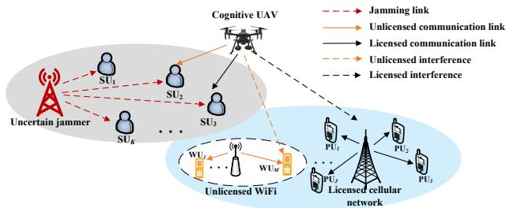  
Fig. 1: The licensed and unlicensed UAV spectrum sharing network against uncertain jamming.

where $p _ { k , j } ^ { \mathrm { l i c } } [ n ]$ denotes the transmit power from the C-UAV to the kth SU at the $j \mathrm { t h }$ licensed subchannel. $p _ { j } ^ { \mathrm { P } }  { [ n ] }$ represents the transmit power from the PBS to the jth PU and $s _ { j } [ n ]$ denotes the normalized signal symbol for the jth PU. The channels between the C-UAV and the kth SU, and between the PBS and the kth SU are denoted by $h _ { k } ^ { \mathrm { u s } } [ n ]$ and $h _ { k } ^ { \mathrm { p s } } [ n ]$ respectively. In particular, the wireless channel between the UAV and the ground users is dominated by the line-of-sight (LoS) link, given as

$$
h _ { k } ^ { \mathrm { u s } } [ n ] = \sqrt { \frac { \beta _ { \mathrm { r e f } } } { \left\| \mathbf { q } [ n ] - \mathbf { w } _ { s , k } \right\| ^ { 2 } + H ^ { 2 } } } ,\tag{3}
$$

where $\beta _ { \mathrm { r e f } }$ denotes the channel power gain at the reference distance 1 meter. Moreover, the channel model between the ground nodes is different from the air-to-ground links. Specifically, we need to consider both the distance-dependent path loss with an exponent $\varphi \geq 2$ and small-scale Rayleigh fading [37]. For example, the channels from the PBS to the jth PU and from the Wi-Fi access point to the mth WU are respectively given by

$$
h _ { j } ^ { \mathrm { b p } } = \sqrt { \frac { \beta _ { \mathrm { r e f } } \zeta _ { j } ^ { \mathrm { b p } } } { d _ { p , j } ^ { \varphi } } } ,\tag{4a}
$$

$$
h _ { m } ^ { \mathrm { w u } } = \sqrt { \frac { \beta _ { \mathrm { r e f } } \zeta _ { m } ^ { \mathrm { w u } } } { d _ { w , m } ^ { \varphi } } } ,\tag{4b}
$$

where $d _ { p , j }$ and $d _ { w , m }$ represent the distance between the PBS and the jth PU, and between the Wi-Fi access point and the mth WU, respectively. $\zeta _ { j } ^ { \mathrm { { b p } } }$ and $\zeta _ { m } ^ { \mathrm { w u } }$ are an exponentially distributed random variables with unit mean accounting for the Rayleigh fading. Moreover, a multi-antenna jammer attempts to interrupt the communications by sending the jamming signal $\mathbf { w } _ { k } [ n ] x _ { k } ^ { \mathrm { j a m } } [ n ]$ to the legitimate user, where $\mathbb { E } [ \left| x _ { k } ^ { \mathrm { j a m } } \right| ^ { 2 } ] = 1$ represents the normalized signal symbol and $\mathbf { w } _ { k } ^ { i } [ n ] \in \mathbb { C } ^ { N _ { J } \times 1 }$ is the beamforming vector of the jammer. The channel between the jammer and the kth SU is denoted by $\mathbf { g } _ { k } [ n ] \in \mathbb { C } ^ { N _ { J } \times 1 } . \ n _ { k } \ \sim { \mathcal { C N } } \left( 0 , \sigma _ { k } ^ { 2 } \right)$ is the additive white Gaussian noises (AWGNs) at the kth SU.

Then, we have the SINR of the kth SU on the jth licensed subchannel expressed as

$$
\mathrm { S I N R } _ { k , j } ^ { \mathrm { l i c } } [ n ] = \frac { | h _ { k } ^ { \mathrm { u s } } [ n ] | ^ { 2 } p _ { k , j } ^ { \mathrm { l i c } } [ n ] } { | { h _ { k } ^ { \mathrm { p s } } [ n ] } | ^ { 2 } p _ { j } ^ { \mathrm { P } } [ n ] + | { \bf g } _ { k } ^ { H } [ n ] { \bf w } _ { k } [ n ] | ^ { 2 } + \sigma _ { k } ^ { 2 } } .\tag{5}
$$

This article has been accepted for publication in IEEE Transactions on Mobile Computing. This is the author's version which has not been fully edited and content may change prior to final publication. Citation information: DOI 10.1109/TMC.2026.3673261

Accordingly, the data rate of SU k is given as

$$
R _ { k , j } ^ { \mathrm { l i c } } [ n ] = \rho _ { k , j } ^ { \mathrm { l i c } } [ n ] \mathrm { l o g } _ { 2 } ( 1 + \mathrm { S I N R } _ { k , j } ^ { \mathrm { l i c } } [ n ] ) ,\tag{6}
$$

where the binary variable $\rho _ { k , j } ^ { \mathrm { l i c } } [ n ]$ is adopted to characterize the licensed spectrum allocation strategy of SUs. Specifically, the jth licensed subchannel is used by the kth SU at time step n when $\rho _ { k , j } ^ { \mathrm { l i c } } [ n ] = 1$ , otherwise, $\rho _ { k , j } ^ { \mathrm { l i c } } [ n ] = 0$

## C. Data Transmission in Unlicensed Spectrum

Similarly, the received signal of the kth SU on the unlicensed spectrum is given as

$$
\begin{array} { r l r } {  { y _ { k , m } ^ { \mathrm { u n l i c } } [ n ] = h _ { k } ^ { \mathrm { u s } } [ n ] \sqrt { p _ { k , m } ^ { \mathrm { u n l i c } } [ n ] } x _ { k } ^ { s } [ n ] + h _ { k } ^ { \mathrm { w s } } [ n ] \sqrt { p _ { m } ^ { \mathrm { W i f t } } [ n ] } s _ { m } ^ { \mathrm { W i f t } } [ n ] } } \\ & { } & { + \ \mathbf { g } _ { k } [ n ] \mathbf { w } _ { k } [ n ] x _ { k } ^ { \mathrm { j a m } } [ n ] + n _ { k } , \quad \quad \quad \quad ( } \end{array}\tag{7}
$$

where $p _ { k , m } ^ { \mathrm { u n l i c } } [ n ]$ denotes the transmit power from the C-UAV to the kth SU on the mth unlicensed subchannel. $p _ { m } ^ { \mathrm { W i f i } } [ n ]$ represents the transmit power from the Wi-Fi to the mth WU. $s _ { m } ^ { \mathrm { { \bar { W } i f i } } } [ n ]$ denotes the normalized information symbol for the mth WU transmitted by the Wi-Fi access point.

Then, we have the SINR of the kth SU on the unlicensed spectrum expressed as

$$
\mathrm { S I N R } _ { k , m } ^ { \mathrm { u n l i c } } [ n ] = \frac { | { h } _ { k } ^ { \mathrm { u s } } [ n ] | ^ { 2 } p _ { k , m } ^ { \mathrm { u n l i c } } [ n ] } { | { h } _ { k } ^ { \mathrm { w s } } [ n ] | ^ { 2 } p _ { m } ^ { \mathrm { W i f t } } [ n ] + | { \bf g } _ { k } ^ { H } [ n ] { \bf w } _ { k } [ n ] | ^ { 2 } + \sigma _ { k } ^ { 2 } } .\tag{8}
$$

Accordingly, the data rate of SU k is given as

$$
R _ { k , m } ^ { \mathrm { u n l i c } } [ n ] = \rho _ { k , m } ^ { \mathrm { u n l i c } } [ n ] \mathrm { l o g } _ { 2 } ( 1 + \mathrm { S I N R } _ { k , m } ^ { \mathrm { u n l i c } } [ n ] ) ,\tag{9}
$$

where the binary variable $\rho _ { k , m } ^ { \mathrm { u n l i c } } [ n ]$ is adopted to characterize the unlicensed spectrum allocation strategy of SUs. Specifically, the mth unlicensed subchannel is used by the kth SU at time step n when $\rho _ { k , m } ^ { \mathrm { u n l i c } } [ n ] = 1$ , otherwise, $\rho _ { k , m } ^ { \mathrm { u n l i c } } [ n ] = 0$

A minimum data transmission rate $R _ { k } ^ { \mathrm { m i n } }$ is required by each SU for its application. The C-UAV allows to access resources from the unlicensed spectrum to enhance SU data rate when $R _ { k } ^ { \mathrm { l i c } } [ n ] < R _ { k } ^ { \mathrm { m i n } }$ . Therefore, the minimum transmission rate for the kth SU is achieved through the constraint $\begin{array} { r } { \frac { 1 } { N } \displaystyle \sum _ { n } R _ { k } [ n ] \ge \qquad } \end{array}$ $R _ { k } ^ { \mathrm { m i n } }$ , where $R _ { k } [ n ] = \sum _ { j } R _ { k , j } ^ { \mathrm { l i c } } [ n ] + \sum _ { m } R _ { k , m } ^ { \mathrm { u n l i c } } [ n ]$

## D. Problem Formulation

In this paper, in order to efficiently utilize the spectrum resource, protect the users from harmful interference, and guarantee the transmission rate requirements of SUs, a joint licensed and unlicensed spectrum allocation, power control, and UAV trajectory optimization problem is formulated

$$
\mathbf { P } _ { 1 } : \operatorname* { m a x } _ { \substack { A , B , P , \mathcal { U } , Q } } \frac { 1 } { N } \sum _ { n = 1 } ^ { N } \sum _ { k = 1 } ^ { K } R _ { k } [ n ]\tag{10a}
$$

$$
\mathrm { s . t . C 1 : } \frac { 1 } { N } \sum _ { n } R _ { k } [ n ] \geq R _ { k } ^ { \mathrm { m i n } } , \forall k ,\tag{10b}
$$

$$
\mathrm { C 2 } : \frac { 1 } { N } \sum _ { n } \sum _ { k } \rho _ { k , j } ^ { \mathrm { l i c } } [ n ] \left| h _ { j } ^ { \mathrm { u p } } [ n ] \right| ^ { 2 } p _ { k , j } ^ { \mathrm { l i c } } [ n ] \le \Gamma _ { j } ^ { \mathrm { l i c } } , \forall j ,\tag{10c}
$$

$$
\mathrm { C 3 } : \frac { 1 } { N } \sum _ { n } \sum _ { k } \rho _ { k , m } ^ { \mathrm { u n l i c } } [ n ] \left| h _ { m } ^ { \mathrm { u w } } [ n ] \right| ^ { 2 } p _ { k , m } ^ { \mathrm { u n l i c } } [ n ] \le \Gamma _ { m } ^ { \mathrm { u n l i c } } , \forall m ,\tag{10d}
$$

$$
\mathrm { C } 4 : \sum _ { k } \rho _ { k , j } ^ { \mathrm { l i c } } [ n ] \leq 1 , \forall j , \forall n ,\tag{10e}
$$

$$
\mathrm { C } 5 : \sum _ { j } \rho _ { k , j } ^ { \mathrm { l i c } } [ n ] \leq 1 , \forall k , \forall n ,\tag{10f}
$$

$$
{ \mathrm { C 6 } } : \sum _ { k } \rho _ { k , m } ^ { \mathrm { u n l i c } } [ n ] \leq 1 , \forall m , \forall n ,\tag{10g}
$$

$$
\mathrm { C 7 } : \rho _ { k , j } ^ { \mathrm { l i c } } [ n ] \in \{ 0 , 1 \} , \forall k , \forall j , \forall n ,\tag{10h}
$$

$$
\mathrm { C } 8 : \rho _ { k , m } ^ { \mathrm { u n l i c } } [ n ] \in \{ 0 , 1 \} , \forall k , \forall m , \forall n ,\tag{10i}
$$

$$
\mathrm { C 9 } : \sum _ { k } \sum _ { j } \rho _ { k , j } ^ { \mathrm { l i c } } [ n ] p _ { k , j } ^ { \mathrm { l i c } } [ n ] \leq P _ { \operatorname* { m a x } } ^ { \mathrm { l i c } } , \forall n ,\tag{10j}
$$

$$
\mathrm { C 1 0 } : \sum _ { k } \sum _ { m } \rho _ { k , m } ^ { \mathrm { u n l i c } } [ n ] p _ { k , m } ^ { \mathrm { u n l i c } } [ n ] \leq P _ { \operatorname* { m a x } } ^ { \mathrm { u n l i c } } , \forall n ,\tag{10k}
$$

$$
\mathrm { C 1 1 : } \left\| \mathbf { q } [ n ] - \mathbf { q } [ n - 1 ] \right\| ^ { 2 } \leq \left( V _ { \operatorname* { m a x } } \delta _ { t } \right) ^ { 2 } , \forall n ,\tag{10l}
$$

where the licensed and unlicensed subchannel allocation variable set as ${ \mathcal { A } } = \{ \rho _ { k . j } ^ { \mathrm { l i c } } [ n ] , \forall k \in \mathcal { K } , \forall j \in \mathcal { I } , \forall n \in \mathcal { N } \}$ and $\mathcal { B } = \{ \rho _ { k . m } ^ { \mathrm { u n l i c } } [ n ] , \forall k \in \mathcal { K } , \forall m \in \mathcal { M } , \forall n \in \mathcal { N } \}$ , respectively. The licensed and unlicensed transmit power variable set as $\mathcal { P } ~ = ~ \{ p _ { k . i } ^ { \mathrm { l i c } } [ n ] , \forall k ~ \in ~ \mathcal { K } , \forall j ~ \in ~ \mathcal { J } , \forall n ~ \in ~ \mathcal { N } \}$ and $\mathcal { U } = \{ p _ { k . m } ^ { \mathrm { u n l i c } } [ n ] , \breve { \forall k } \in \mathcal { K } , \forall m \in \mathcal { M } , \forall n \in \mathcal { N } \}$ , respectively. The UAV location variable set as $\mathcal { Q } \ = \ \{ \mathbf { q } [ n ] , \forall n \ \in \ \mathcal { N } \}$ The channel between the C-UAV and the PUs and WUs are expressed as $h _ { j } ^ { \mathrm { u p } }$ and $h _ { m } ^ { \mathrm { u w } }$ , respectively. The specific expression of $R _ { k }$ is shown in (13) at the top of the next page.

Note that the minimum transmission rate requirement for SUs is achieved through constraint C1. $\Gamma _ { j } ^ { \mathrm { l i c } }$ and $\Gamma _ { m } ^ { \mathrm { u n l i c } }$ in C2 and C3 are the maximum tolerable interference for licensed and unlicensed spectrum, respectively. C4, C5, and C7 are licensed spectrum allocation constraints such that each SU can share the licensed spectrum with at most one PU and each licensed subchannel can be allocated to at most one SU. C6 and C8 are unlicensed spectrum allocation constraints such that each unlicensed subchannel can be assigned to at most one SU to avoid multiple access interference. $P _ { \mathrm { m a x } } ^ { \mathrm { l i c } }$ and $P _ { \mathrm { m a x } } ^ { \mathrm { u n l i c } }$ in C9 and C10 are the peak transmit power constraints on the licensed and unlicensed spectrum, respectively. C11 is the maximum allowable flying speed of the C-UAV.

## III. MODEL-BASED OPTIMIZATION MODULE FOR JOINT RESOURCE ALLOCATION AND TRAJECTORY OPTIMIZATION

## A. Imperfect Channel Model

In practice, due to the uncertainty of dynamic jammer, the perfect channel information of the jammer-SUs link cannot be accurately obtained. The imperfect CSI can also be caused by channel estimation and quantization errors [38], [39]. Therefore, the worst-case channel uncertainty model is considered to capture the impact of the imperfect CSI.

The bounded CSI error models for the channel vector $\mathbf { g } _ { k }$ are given as

$$
\mathbf { g } _ { k } = \bar { \mathbf { g } } _ { k } + \Delta \mathbf { g } _ { k } ,\tag{11a}
$$

$$
\begin{array} { r } { \mathcal G _ { k } \triangleq \left\{ \Delta \mathbf g _ { k } \in { \mathbb { C } } ^ { N _ { s } \times 1 } : \Delta \mathbf g _ { k } ^ { H } \Delta \mathbf g _ { k } \leq \xi _ { k } ^ { 2 } , \right\} , \forall k \in { \mathbb { K } } , } \end{array}\tag{11b}
$$

where $\bar { \bf g } _ { k }$ is the estimate of $\mathbf { g } _ { k }$ . The uncertainty region of the channel vector $\mathbf { g } _ { k }$ is denoted by $\mathcal { G } _ { k } . ~ \Delta \mathbf { g } _ { k }$ represents

the channel estimation error of $\mathbf { g } _ { k } . \ \xi _ { k }$ is the radius of the uncertainty region $G _ { k }$ . By considering the imperfect CSI, the constraint C1 can be rewritten as

$$
\frac { 1 } { N } \sum _ { n } R _ { k } [ n ] \geq R _ { k } ^ { \mathrm { m i n } } , \forall k , \forall \mathbf { g } _ { k } \in \mathcal { G } _ { k } ,\tag{12}
$$

Note that (12) is non-convex due to the infinite constraints and the coupled subchannel and power allocation variables in ${ \cal R } _ { k } [ n ]$ . Therefore, to deal with the non-convex constraint (12), the auxiliary variables $\beta _ { k , j } ^ { \mathrm { l i c } } [ n ]$ and $\beta _ { k , m } ^ { \mathrm { u n l i c } } [ n ]$ are firstly introduced. The equivalent constraint can be expressed as

$$
\frac { \rho _ { k , j } ^ { \mathrm { l i c } } [ n ] | h _ { k } ^ { \mathrm { u s } } [ n ] | ^ { 2 } p _ { k , j } ^ { \mathrm { l i c } } [ n ] } { | h _ { k } ^ { \mathrm { p s } } [ n ] | ^ { 2 } p _ { j } ^ { p } [ n ] + | \mathbf { g } _ { k } ^ { H } \mathbf { w } _ { k } | ^ { 2 } + \sigma _ { k } ^ { 2 } } \geq \beta _ { k , j } ^ { \mathrm { l i c } } [ n ] , \forall k , j , n , \forall \mathbf { g } _ { k } ^ { H } \in \mathcal { G } _ { k } ,\tag{14a}
$$

$$
\frac { \rho _ { k , m } ^ { \mathrm { u n l i c } } [ n ] | h _ { k } ^ { \mathrm { u s } } [ n ] | ^ { 2 } p _ { k , m } ^ { \mathrm { u n l i c } } [ n ] } { | h _ { k } ^ { \mathrm { w s } } [ n ] | ^ { 2 } p _ { m } ^ { \mathrm { W i f t } } [ n ] + | \mathbf { g } _ { k } ^ { H } \mathbf { w } _ { k } | ^ { 2 } + \sigma _ { k } ^ { 2 } } \geq \beta _ { k , m } ^ { \mathrm { u n l i c } } [ n ] , \forall k , m , n , \forall \mathbf { g } _ { k } ^ { H } \in \mathcal { G } _ { k } ,\tag{14b}
$$

$$
\frac { 1 } { N } \sum _ { n } ( \sum _ { j } \rho _ { k , j } ^ { \mathrm { l i c } } [ n ] \mathrm { l o g } _ { 2 } \left( 1 + \beta _ { k , j } ^ { \mathrm { l i c } } [ n ] \right)\tag{14c}
$$

$$
+ \sum _ { m } \rho _ { k , m } ^ { \mathrm { u n l i c } } [ n ] \log _ { 2 } \left( 1 + \beta _ { k , m } ^ { \mathrm { u n l i c } } [ n ] \right) ) \geq R _ { k } ^ { \mathrm { m i n } } , \forall k ,
$$

Then, given the UAV trajectory $\mathcal { Q } ,$ the corresponding optimization problem can be transformed as follows

$$
\mathbf { P } _ { 2 } : \operatorname* { m a x } _ { \substack { A , B , \mathcal { P } , \mathcal { U } , \beta _ { k , j } ^ { \mathrm { l i c } } [ n ] , \beta _ { k , m } ^ { \mathrm { u n l i c } } [ n ] } } \frac { 1 } { N } \sum _ { n = 1 } ^ { N } \sum _ { k = 1 } ^ { K } \tilde { R } _ { k } [ n ]\tag{15a}
$$

$$
{ \mathrm { s . t . } } ( 1 4 a ) , ( 1 4 b ) , ( 1 4 c ) ,
$$

$$
\mathrm { C 2 - C 1 1 }\tag{15b}
$$

$$
\sum _ { \omega \to \infty } \rho _ { k , m } ^ { \mathrm { u n l i c } } [ n ] \log _ { 2 } \Big ( 1 + \beta _ { k , m } ^ { \mathrm { u n l i c } } [ n ] \Big ) .\tag{15c}
$$

Note that the main challenge for solving the problem ${ \bf P } _ { 2 }$ are the semi-infinite constraints (14a) and (14b) imposed by the uncertain regions $\mathcal { G } _ { k }$ . Besides, the coupling variables and nonconvexity of both the objective functions and constraints make it challenging to efficiently obtain the optimal solution. Thus, an approximation is firstly employed to transform constraints (14a) and (14b) into the convex constraints. Then, a SCAbased alternative optimization algorithm is proposed to solve the NP-hard problem.

## B. Transformation of the Semi-Infinite Constraint

Given the UAV trajectory Q, alternative optimization is used to solve the problem $\mathbf { P } _ { 2 } .$ . Note that ${ \bf P } _ { 2 }$ remains intractable owing to the infinite number of inequality constraints in (14a) and (14b) imposed by the uncertain regions $\mathcal { G } _ { k }$ . To make ${ \bf P } _ { 2 }$ tractable, the following Lemma is introduced to transform constraints (14a) and (14b) into linear matrix inequality (LMI) constraints.

Lemma 1: (S-Procedure) [40]: Let a function $f _ { m } ( \mathbf { x } ) \ =$ $\mathbf { x A } _ { m } \mathbf { x } + 2 R \{ \mathbf { b } _ { m } ^ { H } \mathbf { x } \} + c _ { m } , m \in \{ 1 , 2 \}$ , where $\mathbf { x } \in \dot { C } ^ { N \times 1 }$ $\mathbf { A } _ { m } \in \mathbb { H } ^ { N } , \mathbf { b } _ { m } \in \bar { \mathbb { C } } ^ { N \times 1 }$ , and $c _ { m } \in \mathbb { R }$ . Then, the implication $f _ { 1 } ( \mathbf { z } ) \leq 0 \Rightarrow f _ { 2 } ( \mathbf { z } ) \leq 0$ holds if and only if there exists a

$\delta \geq 0$ such that

$$
\delta \left[ \begin{array} { c c } { \mathbf { A } _ { 1 } } & { \mathbf { b } _ { 1 } } \\ { \mathbf { b } _ { 1 } ^ { H } } & { c _ { 1 } } \end{array} \right] - \left[ \begin{array} { c c } { \mathbf { A } _ { 2 } } & { \mathbf { b } _ { 2 } } \\ { \mathbf { b } _ { 2 } ^ { H } } & { c _ { 2 } } \end{array} \right] \succeq \mathbf { 0 } ,\tag{16}
$$

provided that there exists a vector $\hat { \mathbf { z } }$ such that $f _ { m } ( \hat { \mathbf { z } } ) < 0$

By applying Lemma 1, constraint (14a) can be rewritten as

$$
\begin{array} { r l } { \left[ \delta _ { k , j } ^ { \mathrm { l i c } } [ n ] \mathbf { I } - \beta _ { k , j } ^ { \mathrm { l i c } } [ n ] \mathbf { w } _ { k } \mathbf { w } _ { k } ^ { H } \right. } & { \left. - \beta _ { k , j } ^ { \mathrm { l i c } } [ n ] \mathbf { w } _ { k } \mathbf { w } _ { k } ^ { H } \hat { \mathbf { g } } _ { k } \right] } \\ { \left. \quad - \beta _ { k , j } ^ { \mathrm { l i c } } [ n ] \hat { \mathbf { g } } _ { k } ^ { H } \mathbf { w } _ { k } \mathbf { w } _ { k } ^ { H } \right. } & { \left. - \delta _ { k , j } ^ { \mathrm { l i c } } [ n ] \xi _ { k } ^ { 2 } - c _ { 2 } ^ { \mathrm { l i c } } \right] \succeq 0 , } \end{array}\tag{17}
$$

where $\begin{array} { r l r } { c _ { 2 } ^ { \mathrm { l i c } } } & { { } ~ = ~ } & { \beta _ { k , j } ^ { \mathrm { l i c } } [ n ] \hat { \bf g } _ { k } ^ { H } { \bf w } _ { k } { \bf w } _ { k } ^ { H } \hat { \bf g } _ { k } ~ + ~ \beta _ { k , j } ^ { \mathrm { l i c } } [ n ] \sigma _ { k } ^ { 2 } ~ + ~ } \end{array}$ $\beta _ { k , j } ^ { \mathrm { l i c } } [ n ] | h _ { k } ^ { \mathrm { p s } } | ^ { 2 } p _ { j } ^ { p } - \rho _ { k , j } ^ { \mathrm { l i c } } [ n ] | h _ { k } ^ { \mathrm { u s } } [ n ] | ^ { 2 } p _ { k , j } ^ { \mathrm { l i c } } [ n ]$ . Similarly, the constraint (14b) can be rewritten as

$$
\left[ \begin{array} { l l } { \delta _ { k , m } ^ { \mathrm { u n l i c } } [ n ] { \bf I } - \beta _ { k , m } ^ { \mathrm { u n l i c } } [ n ] { \bf w } _ { k } { \bf w } _ { k } ^ { H } \ } & { - \beta _ { k , m } ^ { \mathrm { u n l i c } } [ n ] { \bf w } _ { k } { \bf w } _ { k } ^ { H } \hat { \bf g } _ { k } } \\ { - \beta _ { k , m } ^ { \mathrm { u n l i c } } [ n ] \hat { \bf g } _ { k } ^ { H } { \bf w } _ { k } { \bf w } _ { k } ^ { H } \ } & { - \delta _ { k , m } ^ { \mathrm { u n l i c } } [ n ] \xi _ { k } ^ { 2 } - c _ { 2 } ^ { \mathrm { u n l i c } } } \end{array} \right] \succeq 0 ,\tag{18}
$$

where $\begin{array} { r l r } { c _ { 2 } ^ { \mathrm { u n l i c } } } & { { } ~ = ~ } & { \beta _ { k , m } ^ { \mathrm { u n l i c } } \hat { \bf g } _ { k } ^ { H } { \bf w } _ { k } { \bf w } _ { k } ^ { H } \hat { \bf g } _ { k } ~ + ~ \beta _ { k , m } ^ { \mathrm { u n l i c } } \sigma _ { k } ^ { 2 } ~ + ~ } \end{array}$ $\beta _ { k , m } ^ { \mathrm { u n l i c } } h _ { k } ^ { \mathrm { w s } } [ n ] p _ { m } ^ { \mathrm { w i f f } } [ n ] - \rho _ { k , m } ^ { \mathrm { u n l i c } } h _ { k } ^ { \mathrm { u s } } [ n ] p _ { k , m } ^ { \mathrm { u n l i c } } [ n ] .$

Therefore, problem ${ \bf P } _ { 2 }$ can be rewritten as

$$
\mathbf { P } _ { 3 } : \operatorname* { m a x } _ { \substack { \scriptscriptstyle A , \scriptscriptstyle B , \mathcal { P } , \mathcal { U } , \beta _ { k , j } ^ { \mathrm { l i c } } , \beta _ { k , m } ^ { \mathrm { u n l i c } } } } \frac { 1 } { N } \sum _ { n = 1 } ^ { N } \sum _ { k = 1 } ^ { K } \tilde { R } _ { k } [ n ]\tag{19a}
$$

$$
{ \mathrm { s . t . } } ( 1 4 c ) , ( 1 7 ) , ( 1 8 ) ,\tag{19b}
$$

$$
\mathrm { C 2 - C 1 1 }\tag{19c}
$$

Although (17) and (18) are convex with respect to $\beta _ { k , j } ^ { \mathrm { l i c } }$ and $\beta _ { k , m } ^ { \mathrm { u n l i c } }$ , respectively, ${ \bf P } _ { 3 }$ is still intractable due to the coupling of licensed and unlicensed subchannel allocation in constraint (14c). Therefore, we first decompose problem ${ \bf P } _ { 3 }$ into two subproblems: (1) licensed subchannel allocation, power control, and $\beta _ { k , j } ^ { \mathrm { l i c } }$ , and $( 2 )$ unlicensed subchannel allocation, power control, and $\beta _ { k , m } ^ { \mathrm { u n l i c } }$ . Specifically, the licensed subchannel allocation and power control sub-problem can be expressed as

$$
\mathbf { P } _ { 3 . 1 } : \operatorname* { m a x } _ { \mathcal { A } , \mathcal { P } , \beta _ { k , j } ^ { \mathrm { l i c } } } \frac { 1 } { N } \sum _ { n = 1 } ^ { N } \sum _ { k = 1 } ^ { K } \sum _ { j = 1 } ^ { J } \tilde { R } _ { k , j } ^ { \mathrm { l i c } } [ n ]
$$

s.t. (17),

(20a)

$$
\mathrm { C 2 , C 4 , C 5 , C 7 , C 9 , }\tag{20b}
$$

(20c)

Given the licensed A, P, and $\beta _ { k , j } ^ { \mathrm { l i c } }$ obtained from problem ${ \bf P } _ { 3 . 1 }$ the subchannel allocation and power control sub-problem in the unlicensed spectrum is given as

$$
\mathbf { P } _ { 3 . 2 } : \operatorname* { m a x } _ { \substack { \scriptscriptstyle B , \mathcal { U } , \beta _ { k , m } ^ { \mathrm { u n l i c } } } } \frac { 1 } { N } \sum _ { n = 1 } ^ { N } \sum _ { k = 1 } ^ { K } \sum _ { m = 1 } ^ { M } \tilde { R } _ { k , m } ^ { \mathrm { u n l i c } } [ n ]\tag{21a}
$$

$$
{ \mathrm { s . t . } } ( 1 4 c ) , ( 1 8 ) ,
$$

$$
\mathrm { C 3 , C 6 , C 8 , C 1 0 , }\tag{21b}
$$

(21c)

where $\tilde { R } _ { k , j } ^ { \mathrm { l i c } } [ n ] = \rho _ { k , j } ^ { \mathrm { l i c } } [ n ] \mathrm { l o g } _ { 2 } \left( 1 + \beta _ { k , j } ^ { \mathrm { l i c } } [ n ] \right)$ , and $\begin{array} { r l } {  { \tilde { R } _ { k , m } ^ { \mathrm { u n l i c } } [ n ] = } } \end{array}$ $\rho _ { k , m } ^ { \mathrm { u n l i c } } [ n ] \log _ { 2 } \Big ( 1 + \beta _ { k , m } ^ { \mathrm { u n l i c } } [ n ] \Big )$

## C. Resource Allocation for Given UAV Trajectory

1) Licensed optimization: To tackle the problem ${ \bf P } _ { 3 . 1 }$ , we introduce auxiliary variable $\tilde { p } _ { k , j } ^ { \mathrm { l i c } } [ n ] = \rho _ { k , j } ^ { \mathrm { l i c } } [ \bar { n } ] p _ { k , j } ^ { \mathrm { l i c } } [ n ] , \forall k , j , n$ Then, C2 and C9 can be transformed into convex constraints, given as

$$
\widetilde { \mathrm { C 2 } } : \frac { 1 } { N } \sum _ { n } \sum _ { k } \left| h _ { j } ^ { \mathrm { u p } } [ n ] \right| ^ { 2 } \tilde { p } _ { k , j } ^ { \mathrm { l i c } } [ n ] < \Gamma _ { j } ^ { \mathrm { l i c } } , \forall j ,\tag{22a}
$$

This article has been accepted for publication in IEEE Transactions on Mobile Computing. This is the author's version which has not been fully edited and content may change prior to final publication. Citation information: DOI 10.1109/TMC.2026.3673261

$$
R _ { k } [ \mathfrak { n } ] = \sum _ { j } \rho _ { k , j } ^ { \mathrm { l i c } } [ \mathfrak { n } ] \log _ { 2 } \left( 1 + \frac { | h _ { k } ^ { \mathrm { a s } } [ \mathfrak { n } ] | ^ { 2 } p _ { k , j } ^ { \mathrm { l i c } } [ \mathfrak { n } ] } { | h _ { k } ^ { \mathrm { a s } } [ \mathfrak { n } ] | ^ { 2 } p _ { j } ^ { \mathrm { s } } [ \mathfrak { n } ] + | \mathrm { g } _ { k } ^ { H } \mathbf { w } _ { k } | ^ { 2 } + \sigma _ { k } ^ { 2 } } \right) + \sum _ { m } \rho _ { k , m } ^ { \mathrm { u n l i c } } [ \mathfrak { n } ] \log _ { 2 } \left( 1 + \frac { | h _ { k } ^ { \mathrm { a s } } [ \mathfrak { n } ] | ^ { 2 } p _ { k , m } ^ { \mathrm { u n l i c } } [ \mathfrak { n } ] } { | h _ { k } ^ { \mathrm { a s } } [ \mathfrak { n } ] | ^ { 2 } p _ { m } ^ { \mathrm { w i t } } [ \mathfrak { n } ] + | \mathrm { g } _ { k } ^ { H } \mathbf { w } _ { k } | ^ { 2 } + \sigma _ { k } ^ { 2 } } \right)\tag{13}
$$

$$
\widetilde { \mathrm { C 9 } } : \sum _ { k } \sum _ { j } \tilde { p } _ { k , j } ^ { \mathrm { l i c } } [ n ] \leq P _ { \operatorname* { m a x } } ^ { \mathrm { l i c } } , \forall n ,\tag{22b}
$$

To handle the binary constraint, we follow the approach as in [41] and relax the variable $\rho _ { k , j } ^ { \mathrm { l i c } } [ n ]$ such that it is a real value between 0 and 1, which is given as $0 \leq \rho _ { k , j } ^ { \mathrm { l i c } } [ n ] \leq 1 , \forall k , j , n$ Then, problem ${ \bf P } _ { 3 . 1 }$ can be written as

$$
\mathbf { P } _ { 4 } : \operatorname* { m a x } _ { A , \tilde { \mathcal { P } } , \beta _ { k , j } ^ { \mathrm { i i c } } } \frac { 1 } { N } \sum _ { n = 1 } ^ { N } \sum _ { k = 1 } ^ { K } \sum _ { j = 1 } ^ { J } \tilde { R } _ { k , j } ^ { \mathrm { l i c } } [ n ] = \rho _ { k , j } ^ { \mathrm { l i c } } [ n ] \mathrm { l o g } _ { 2 } ( 1 + \beta _ { k , j } ^ { \mathrm { l i c } } )\tag{23a}
$$

$$
\mathrm { s . t . } ( 1 7 ) , \mathrm { C 4 , C 5 , \widetilde { C 2 } , \widetilde { C 9 } }\tag{23b}
$$

$$
\widetilde { \mathrm { C } 7 } : 0 \le \rho _ { k , j } ^ { \mathrm { l i c } } [ n ] \le 1 , \forall k , j , n ,\tag{23c}
$$

where $\tilde { \mathcal { P } } = \{ \tilde { p } _ { k , j } ^ { \mathrm { l i c } } [ n ] , \forall k , j , n \}$ , and (17) can be transformed into a convex constraint given $\tilde { p } _ { k , j } ^ { \mathrm { l i c } }$

Although the constraints are transformed into convex set-${ \bf S } ,$ the problem $\mathbf { P } _ { 4 }$ is still non-convex. The non-convexity originates from the coupling of $\rho _ { k , j } ^ { \mathrm { l i c } } [ n ]$ and $\beta _ { k , j } ^ { \mathrm { l i c } } [ n ]$ in the objective function. It is noted that the objective function in $\mathbf { P } _ { 4 }$ is the joint convex function with respect $\mathrm { \bar { t o } } \rho _ { k , j } ^ { \mathrm { l i c } } [ n ]$ and $\beta _ { k , j } ^ { \mathrm { l i c } } [ n ]$ Therefore, the SCA is applied to tackle the non-convexity. By performing the first-order Taylor approximation, the lower bound for a given feasible point $( \rho _ { k , j , n } ^ { \mathrm { l i c } , \bar { l } } [ n ] , \beta _ { k , j , n } ^ { \mathrm { l i c } , l } [ n ] )$ in the lth iteration of the SCA is expressed as

$$
\begin{array} { r l } & { \tilde { R } _ { k , j } ^ { \mathrm { l i c } } [ n ] \geq \rho _ { k , j } ^ { \mathrm { l i c } , l } [ n ] \mathrm { l o g } _ { 2 } ( 1 + \beta _ { k , j } ^ { \mathrm { l i c } , l } [ n ] ) } \\ & { + \log _ { 2 } ( 1 + \beta _ { k , j } ^ { \mathrm { l i c } , l } [ n ] ) ( \rho _ { k , j } ^ { \mathrm { l i c } } [ n ] - \rho _ { k , j } ^ { \mathrm { l i c } , l } [ n ] ) } \\ & { + \frac { \rho _ { k , j } ^ { \mathrm { l i c } , l } [ n ] ( \beta _ { k , j } ^ { \mathrm { l i c } } [ n ] - \beta _ { k , j } ^ { \mathrm { l i c } , l } [ n ] ) } { \ln 2 ( 1 + \beta _ { k , j } ^ { \mathrm { l i c } , l } [ n ] ) } \triangleq \tilde { R } _ { k , j } ^ { \mathrm { l i c } , l } [ n ] . } \end{array}\tag{24}
$$

The problem $\mathbf { P } _ { 4 }$ is a convex problem by substituting (24) into the objective function.

2) Unlicensed optimization: Given the licensed spectrum allocation, power allocation, and $\beta _ { k , j } ^ { \mathrm { l i c } }$ , to tackle the problem ${ \bf P } _ { 3 . 2 } $ , the constraint (14c) can be transformed as

$$
\begin{array} { r l } & { \frac { 1 } { N } \displaystyle \sum _ { n } ( \sum _ { m } \rho _ { k , m } ^ { \mathrm { u n l i c } } [ n ] \log _ { 2 } ( 1 + \beta _ { k , m } ^ { \mathrm { u n l i c } } [ n ] ) ) \ge R _ { k } ^ { \mathrm { m i n } } } \\ & { - \frac { 1 } { N } \displaystyle \sum _ { n } ( \sum _ { j } \rho _ { k , j } ^ { \mathrm { l i c } } [ n ] \log _ { 2 } ( 1 + \beta _ { k , j } ^ { \mathrm { l i c } } [ n ] ) ) , \forall k . } \end{array}\tag{25}
$$

Similar to the methods adopted for solving problem P3.1, we introduce auxiliary variable $\begin{array} { r l r } { \tilde { p } _ { k , m } ^ { \mathrm { u n l i c } } [ n ] } & { { } = } & { \rho _ { k , m } ^ { \mathrm { u n l i c } } [ n ] p _ { k , m } ^ { \mathrm { u n l i c } } [ n ] , \forall k , m , n } \end{array}$ . Then, C3 and C10 can be transformed into convex constraints, given as

$$
\widetilde { \mathrm { C 3 } } : \frac { 1 } { N } \sum _ { n } \sum _ { k } \left| \boldsymbol { h } _ { m } ^ { \mathrm { u w } } [ n ] \right| ^ { 2 } \tilde { p } _ { k , m } ^ { \mathrm { u n l i c } } [ n ] < \Gamma _ { m } ^ { \mathrm { u n l i c } } , \forall m ,\tag{26a}
$$

$$
\widetilde { \mathrm { C 1 0 } } : \sum _ { k } \sum _ { m } \tilde { p } _ { k , m } ^ { \mathrm { u n l i c } } [ n ] \leq P _ { \mathrm { m a x } } ^ { \mathrm { u n l i c } } , \forall n ,\tag{26b}
$$

The binary variable $\rho _ { k , m } ^ { \mathrm { u n l i c } } [ n ]$ is relaxed such that it is a real value between 0 and 1, which is given as $0 \leq \rho _ { k , m } ^ { \mathrm { u n l i c } } [ n ] \leq$

1, ∀k, m, n. Then, the problem ${ \bf P } _ { 3 . 2 }$ can be written as

$$
\mathbf { P } _ { 5 } : \operatorname* { m a x } _ { \substack { { \mathcal { B } } , { \mathcal { U } } , { \beta } _ { k , m } ^ { \mathrm { u n l i c } } } } \frac { 1 } { N } \sum _ { n = 1 } ^ { N } \sum _ { k = 1 } ^ { K } \sum _ { m = 1 } ^ { M } { \tilde { R } } _ { k , m } ^ { \mathrm { u n l i c } } [ n ]\tag{27a}
$$

$$
{ \mathrm { s . t . } } ( 2 5 ) , ( 1 8 ) ,\tag{27b}
$$

$$
{ \widetilde { \mathrm { C 3 } } } , { \mathrm { C 6 } } , { \widetilde { \mathrm { C 1 0 } } } ,\tag{27c}
$$

$$
\widetilde { \mathrm { C } } 8 : 0 \leq \rho _ { k , m } ^ { \mathrm { u n l i c } } [ n ] \leq 1 , \forall k , m , n .\tag{27d}
$$

It should be noted that the continuous spectrum allocation variables can be reconstructed into the binary sub-carrier allocation variables by using the rounding method [36]. Moreover, it is obvious that the objective function $\tilde { R } _ { k , m } ^ { \mathrm { u n l i c } } [ n ]$ of problem $\mathbf { P } _ { 5 }$ is non-concave and the constraint (25) is non-convex. Therefore, similar to problem ${ \bf P } _ { 3 . 1 }$ , the SCA based method is utilized to estimate the lower bound of $R _ { k , m } ^ { \mathrm { u n l i c } }$ , which is given as

$$
\begin{array} { r l } & { \tilde { R } _ { k , m } ^ { \mathrm { u n l i c } } [ n ] \geq \rho _ { k , m } ^ { \mathrm { u n l i c } , l } [ n ] \mathrm { l o g } _ { 2 } ( 1 + \beta _ { k , m } ^ { \mathrm { u n l i c } , l } [ n ] ) } \\ & { + \log _ { 2 } ( 1 + \beta _ { k , m } ^ { \mathrm { u n l i c } , l } [ n ] ) ( \rho _ { k , m } ^ { \mathrm { u n l i c } } [ n ] - \rho _ { k , m } ^ { \mathrm { u n l i c } , l } [ n ] ) } \\ & { + \frac { \rho _ { k , m } ^ { \mathrm { u n l i c } , l } [ n ] ( \beta _ { k , m } ^ { \mathrm { u n l i c } } [ n ] - \beta _ { k , m } ^ { \mathrm { u n l i c } , l } [ n ] ) } { \mathrm { l n } 2 ( 1 + \beta _ { k , m } ^ { \mathrm { u n l i c } , l } [ n ] ) } \triangleq \tilde { R } _ { k , m } ^ { \mathrm { u n l i c } , l } [ n ] . } \end{array}\tag{28}
$$

Then, the constraint (25) can be rewritten as

$$
\begin{array} { r l r } {  { \frac { 1 } { N } \sum _ { n } \sum _ { m } \tilde { R } _ { k , m } ^ { \mathrm { u n l i c } , l } [ n ] \geq R _ { k } ^ { \mathrm { m i n } } } } \\ & { } & { \qquad - \frac { 1 } { N } \sum _ { n } ( \sum _ { j } \rho _ { k , j } ^ { \mathrm { l i c } } [ n ] \mathrm { l o g } _ { 2 } ( 1 + \beta _ { k , j } ^ { \mathrm { l i c } } [ n ] ) ) , \forall k . } \end{array}
$$

## D. UAV Trajectory Design for Given Resource Allocation

For given subchannel allocation and power control, the UAV trajectory optimization can be written as

$$
\mathbf { P } _ { 6 } : \operatorname* { m a x } _ { \mathcal { Q } } \frac { 1 } { N } \sum _ { n = 1 } ^ { N } \sum _ { k = 1 } ^ { K } R _ { k } [ n ]\tag{30a}
$$

s.t. (12),

(30b)

$$
\mathrm { C 2 } : \frac { 1 } { N } \sum _ { n } \sum _ { k } \rho _ { k , j } ^ { \mathrm { l i c } } [ n ] \left| h _ { j } ^ { \mathrm { u p } } [ n ] \right| ^ { 2 } p _ { k , j } ^ { \mathrm { l i c } } [ n ] < \Gamma _ { j } ^ { \mathrm { l i c } } , \forall j ,\tag{30c}
$$

$$
\mathrm { C 3 } : \frac { 1 } { N } \sum _ { n } \sum _ { k } \rho _ { k , m } ^ { \mathrm { u n l i c } } [ n ] \left| h _ { m } ^ { \mathrm { u w } } [ n ] \right| ^ { 2 } p _ { k , m } ^ { \mathrm { u n l i c } } [ n ] < \Gamma _ { m } ^ { \mathrm { u n l i c } } , \forall m ,\tag{30d}
$$

$$
\mathrm { C 1 1 : } \left\| \mathbf { q } [ n ] - \mathbf { q } [ n - 1 ] \right\| ^ { 2 } \leq \left( V _ { \operatorname* { m a x } } \delta _ { t } \right) ^ { 2 } , \forall n ,\tag{30e}
$$

It is challenging to solve the problem $\mathbf { P } _ { 6 }$ due to the infinite constraints (12) imposed by the uncertainty of imperfect CSI. To make the constraints tractable, the auxiliary variables $x _ { k , j } [ n ]$ and $y _ { k , m } [ n ]$ are firstly adopted to reformulate the constraint (12) as

$$
| h _ { k } ^ { \mathrm { p s } } [ n ] | ^ { 2 } p _ { j } ^ { p } [ n ] + | \mathbf { g } _ { k } ^ { H } \mathbf { w } _ { k } | ^ { 2 } + \sigma _ { k } ^ { 2 } \leq x _ { k , j } [ n ] , \forall k , j , n , \forall \mathbf { g } _ { k } \in \mathcal { G } _ { k } ,\tag{31a}
$$

$$
\begin{array} { r l } & { | { h } _ { k } ^ { \mathrm { w s } } [ n ] | ^ { 2 } p _ { m } ^ { \mathrm { w i t } } [ n ] + | \mathbf { g } _ { k } ^ { H } \mathbf { w } _ { k } | ^ { 2 } + \sigma _ { k } ^ { 2 } \leq y _ { k , m } [ n ] , \forall k , m , n , \forall \mathbf { g } _ { k } \in \mathcal { G } _ { k } , } \\ & { \frac { 1 } { N } \displaystyle \sum _ { n } \left( \displaystyle \sum _ { j } \rho _ { k , j } ^ { \mathrm { l i c } } [ n ] \log _ { 2 } \left( 1 + \frac { p _ { k , j } ^ { \mathrm { l i c } } [ n ] \beta _ { 0 } } { x _ { k , j } [ n ] ( \| q [ n ] - w _ { k } \| ^ { 2 } + H ^ { 2 } ) } \right) + \right. } \\ & { \left. \displaystyle \sum _ { m } \rho _ { k , m } ^ { \mathrm { u n l i c } } [ n ] \log _ { 2 } \left( 1 + \frac { p _ { k , m } ^ { \mathrm { u n l i c } } [ n ] \beta _ { 0 } } { y _ { k , m } [ n ] ( \| q [ n ] - w _ { k } \| ^ { 2 } + H ^ { 2 } ) } \right) \right) \geq R _ { k } ^ { \mathrm { m i n } } } \end{array}
$$

Subsequently, by using Lemma 1, constraint (31a) and (31b) are equivalently transformed as LMI constraints, given as

$$
\left[ \begin{array} { l l } { \delta \mathbf { I } - \mathbf { w } _ { k } \mathbf { w } _ { k } ^ { H } } & { - \mathbf { w } _ { k } \mathbf { w } _ { k } ^ { H } \hat { \mathbf { g } } _ { k } } \\ { - \hat { \mathbf { g } } _ { k } ^ { H } \mathbf { w } _ { k } \mathbf { w } _ { k } ^ { H } } & { - \lambda _ { 1 } - \hat { \mathbf { g } } _ { k } ^ { H } \mathbf { w } _ { k } \mathbf { w } _ { k } ^ { H } \hat { \mathbf { g } } _ { k } + x _ { k , j } [ n ] } \end{array} \right] \succeq 0\tag{32}
$$

$$
\left[ \begin{array} { l l } { \delta \mathbf { I } - \mathbf { w } _ { k } \mathbf { w } _ { k } ^ { H } } & { - \mathbf { w } _ { k } \mathbf { w } _ { k } ^ { H } \hat { \mathbf { g } } _ { k } } \\ { - \hat { \mathbf { g } } _ { k } ^ { H } \mathbf { w } _ { k } \mathbf { w } _ { k } ^ { H } } & { - \lambda _ { 2 } - \hat { \mathbf { g } } _ { k } ^ { H } \mathbf { w } _ { k } \mathbf { w } _ { k } ^ { H } \hat { \mathbf { g } } _ { k } + y _ { k , m } [ n ] } \end{array} \right] \succeq 0\tag{33}
$$

where $\lambda _ { 1 } ~ = ~ \delta \xi _ { k } ^ { 2 } + | h _ { k } ^ { \mathrm { p s } } [ n ] | ^ { 2 } p _ { j } ^ { p } + \sigma _ { k } ^ { 2 }$ and $\lambda _ { 2 } ~ = ~ \delta \xi _ { k } ^ { 2 } +$ $| h _ { k } ^ { \mathrm { w s } } [ n ] | ^ { 2 } p _ { m } ^ { \mathrm { W i f i } } + \tilde { \sigma _ { k } ^ { 2 } } .$

It is noted that the constraint (31c) is still non-convex and the objective function is non-concave. Therefore, problem $\mathbf { P } _ { 6 }$ is a non-convex optimization problem. To deal with this problem, the first-order Taylor approximation is performed to estimate a lower bound of $R _ { k } [ n ]$ , given as (34), shown at the top of the next page. Then, constraint (31c) can be written as

$$
\frac { 1 } { N } \sum _ { n } R _ { k } ^ { l } [ n ] \geq R _ { k } ^ { \operatorname* { m i n } } , \forall k ,\tag{35}
$$

The transformed problem can be expressed as

$$
\mathbf { P } _ { 6 . 1 } : \operatorname* { m a x } _ { \mathcal { Q } , \mathcal { X } , \mathcal { V } } \frac { 1 } { N } \sum _ { n = 1 } ^ { N } \sum _ { k = 1 } ^ { K } R _ { k } ^ { l } [ n ]\tag{36a}
$$

s.t. (32), (33), (35),

(36b)

$$
\mathrm { C 2 } : \frac { 1 } { N } \sum _ { n } \sum _ { k } \rho _ { k , j } \left[ n \right] \left| h _ { j } ^ { \mathrm { u p } } [ n ] \right| ^ { 2 } p _ { k , j } ^ { \mathrm { l i c } } [ n ] < \Gamma _ { j } ^ { \mathrm { l i c } } , \forall j ,\tag{36c}
$$

$$
\mathrm { C 3 } : \frac { 1 } { N } \sum _ { n } \sum _ { k } \rho _ { k , m } [ n ] \left| h _ { m } ^ { \mathrm { u w } } [ n ] \right| ^ { 2 } p _ { k , m } ^ { \mathrm { u n l i c } } [ n ] < \Gamma _ { m } ^ { \mathrm { u n l i c } } , \forall m ,\tag{36d}
$$

$$
\mathrm { C 1 1 : } \left\| \mathbf { q } [ n ] - \mathbf { q } [ n - 1 ] \right\| ^ { 2 } \leq \left( V _ { \operatorname* { m a x } } \delta _ { t } \right) ^ { 2 } , \forall n ,\tag{36e}
$$

where $X = \{ x _ { k , j } [ n ] , \forall k \in \mathcal { K } , \forall j \in \mathcal { I } , \forall n \in \mathcal { N } \}$ and $Y =$ $\{ y _ { k , m } [ n ] , \forall k \in \bar { \mathcal { K } } , \forall m \in \mathcal { M } , \forall n \in \mathcal { N } \}$ . Then, by introducing the slack variables $\eta _ { j } ^ { \mathrm { c e l l } } [ n ]$ and $\eta _ { m } ^ { \mathrm { W i f i } } [ n ]$ , C2 and C3 can be further equivalent to the following constraints

$$
\widetilde { \mathrm { C 2 } } : \frac { 1 } { N } \sum _ { n } \sum _ { k } \frac { \rho _ { k , j } ^ { \mathrm { l i c } } [ n ] \beta _ { 0 } p _ { k , j } ^ { \mathrm { l i c } } [ n ] } { H ^ { 2 } + \eta _ { j } ^ { \mathrm { c e l l } } [ n ] } < \Gamma _ { j } ^ { \mathrm { l i c } } , \forall j ,\tag{37a}
$$

$$
\widetilde { \mathrm { C 3 } } : \frac { 1 } { N } \sum _ { n } \sum _ { k } \frac { \rho _ { k , m } ^ { \mathrm { u n l i c } } [ n ] \beta _ { 0 } p _ { k , m } ^ { \mathrm { u n l i c } } [ n ] } { H ^ { 2 } + \eta _ { m } ^ { \mathrm { W i f t } } [ n ] } < \Gamma _ { m } ^ { \mathrm { u n l i c } } , \forall m ,\tag{37b}
$$

$$
\eta _ { j } ^ { \mathrm { c e l l } } [ n ] \leq \left. \mathbf { q } [ n ] - \mathbf { w } _ { j } ^ { \mathrm { c e l l } } \right. ^ { 2 } , \forall n ,
$$

$$
\begin{array} { r } { \eta _ { m } ^ { \mathrm { W i f i } } [ n ] \leq \Big \| \mathbf { q } [ n ] - \mathbf { w } _ { m } ^ { \mathrm { W i f i } } \Big \| ^ { 2 } , \forall n . } \end{array}\tag{37c}
$$

(37d)

where the wireless channel between the C-UAV and the ground users is dominated by the LoS link, and $\beta _ { 0 }$ represents the channel power gain at the reference distance of 1 meter

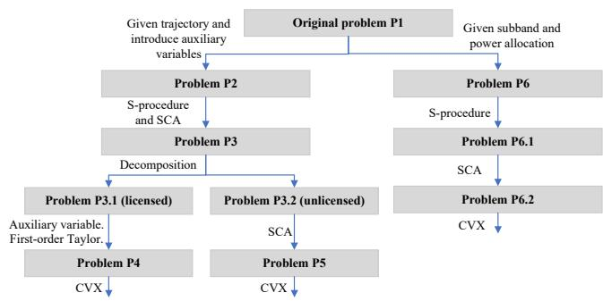  
Fig. 2: The illustration of the decomposition pipeline.

[36]. The constraints (37c) and (37d) are approximated as a convex set by using the first-order Taylor expansion at the given local point in the lth iteration, given as

$$
\begin{array} { r l } & { \left\| { \bf q } [ n ] - { \bf w } _ { j } ^ { \mathrm { c e l l } } \right\| ^ { 2 } \geq \left\| { \bf q } \iota [ n ] - { \bf w } _ { j } ^ { \mathrm { c e l l } } \right\| ^ { 2 } } \\ & { \qquad + 2 ( { \bf q } \iota [ n ] - { \bf w } _ { j } ^ { \mathrm { c e l l } } ) ^ { H } ( { \bf q } [ n ] - { \bf q } \iota [ n ] ) , } \\ & { \left\| { \bf q } [ n ] - { \bf w } _ { m } ^ { \mathrm { W i f } } \right\| ^ { 2 } \geq \left\| { \bf q } \iota [ n ] - { \bf w } _ { m } ^ { \mathrm { W i f } } \right\| ^ { 2 } } \\ & { \qquad + 2 ( { \bf q } \iota [ n ] - { \bf w } _ { m } ^ { \mathrm { W i f } } ) ^ { H } ( { \bf q } [ n ] - { \bf q } \iota [ n ] ) . } \end{array}\tag{38a}
$$

(38b)

Therefore, problem $\mathbf { P } _ { 6 . 1 }$ can be approximated as

$$
\mathbf { P } _ { 6 . 2 } : \operatorname* { m a x } _ { \substack { { \mathcal Q } , \boldsymbol { \mathcal X } , \boldsymbol { \mathcal V } , \eta _ { j } ^ { \mathrm { c e l l } } [ n ] , \eta _ { m } ^ { \mathrm { w i f i } } [ n ] } } \frac { 1 } { N } \sum _ { n = 1 } ^ { N } \sum _ { k = 1 } ^ { K } R _ { k } ^ { l } [ n ]\tag{39a}
$$

$$
\mathrm { s . t . ( 3 2 ) , ( 3 3 ) , ( 3 5 ) , \widetilde { C 2 } , \widetilde { C 3 } , C 1 1 , }\tag{39b}
$$

$$
\eta _ { j } ^ { \mathrm { c e l l } } [ n ] \leq \left\| \mathbf { q } _ { l } [ n ] - \mathbf { w } _ { j } ^ { \mathrm { c e l l } } \right\| ^ { 2 }
$$

$$
+  2 ( \mathbf { q } _ { l } [ n ] - \mathbf { w } _ { j } ^ { \mathrm { c e l l } } ) ^ { H } ( \mathbf { q } [ n ] - \mathbf { q } _ { l } [ n ] ) , \forall j , n\tag{39c}
$$

$$
\eta _ { m } ^ { \mathrm { W i f } } [ n ] \leq \left\| \mathbf { q } _ { l } [ n ] - \mathbf { w } _ { m } ^ { \mathrm { w i f } } \right\| ^ { 2 }
$$

$$
{ \bf \tau } + 2 { ( { \bf q } _ { l } [ n ] - { \bf w } _ { m } ^ { \mathrm { w i f i } } ) } ^ { H } ( { \bf q } [ n ] - { \bf q } _ { l } [ n ] ) , \forall j , n\tag{39d}
$$

Since $\mathbf { P } _ { 6 . 2 }$ is a concave function with respect to Q, (32) and (33) are LMI constraints, (35) is convex, C2 and C3 are convex fractional constraints, C11 is a convex quadratic constraint, (39c) and (39d) are linear constraints, problem $\mathbf { P } _ { 6 . 2 }$ is a convex optimization problem, which can be solved efficiently by using CVX [42]. For better illustration, the decomposition pipeline is depicted in Fig. 2, and a detailed flowchart is given in Fig. 3.

## IV. OPTIMIZATION-DRIVEN DRL FRAMEWORK

In this section, the proposed optimization-driven DRL framework for the joint resource allocation and trajectory optimization in the UAV spectrum sharing network against jamming attack is presented.

1) Optimization Problem Transformation: The formulated optimization problem is identified as a Markov decision process (MDP) problem. The UAV spectrum sharing network equipped with the anti-jamming technique is regarded as the environment. DQN and DDPG are used to optimize the discrete spectrum allocation, and continuous power and

$$
\begin{array} { l } { { \displaystyle R _ { \mathrm { k } } [ u ] \geq \sum _ { j } \mu _ { k , j } ^ { \mathrm { u k } } [ n ] \log _ { 2 } ( 1 + \frac { p _ { \mathrm { k } , \mathrm { c } } ^ { \mathrm { i s } } [ n ] } { x _ { k , j } ^ { \mathrm { i s } } [ n ] } \frac { \beta _ { 0 } } { | q _ { k } [ n ] - w _ { k } | ^ { 2 } } ) + \sum _ { m } \mu _ { k , m } ^ { \mathrm { u n d } } [ n ] \log _ { 2 } ( 1 + \frac { p _ { \mathrm { k } , \mathrm { c } } ^ { \mathrm { i n } , \mathrm { i n } } [ n ] } { y _ { k , m } ^ { \mathrm { i n } } [ n ] } \frac { \beta _ { 0 } } { | q _ { k } [ n ] - w _ { k } | ^ { 2 } + H ^ { 2 } } ) } }  \\ { { \displaystyle \qquad - \sum _ { j } \mu _ { k , j } ^ { \mathrm { u k } } [ n ] \frac { 2 \beta _ { 0 } y _ { k , j } ^ { \mathrm { u k } } [ n ] ( q _ { k } [ n ] - w _ { k } ) ^ { \mathrm { l i d } } ( q _ { l } [ n ] - w _ { k } ) ^ { \mathrm { l i d } } ( q _ { l } [ n ] - q _ { l } [ n ] ) } { | \mathrm { l n } 2 ( x _ { k , j } ^ { \mathrm { i n } } [ n ] ( | q _ { l } [ n ] - w _ { k } | ^ { 2 } + H ^ { 2 } ) +    +     \mu _ { k , m } ^ { \mathrm { u k } } [ n ] \beta _ { 0 } )  ( | q _ { l } [ n ] - w _ { k } | ^ { 2 } + H ^ { 2 } ) } } } \\   \displaystyle \qquad - \sum _ { m } \rho _ { k , m } ^ { \mathrm { u n d } } [ n ] \frac  2 \beta _ { 0 } y _ { k , m } ^ { \mathrm { u k } } [ n ] ( q _ { l } [ n ] - w _ { k } ) ^ { \mathrm { l i d } } ( q _ { l } [ n ] - w _ { k } ) ^  \mathrm  l i d  \end{array}\tag{34}
$$

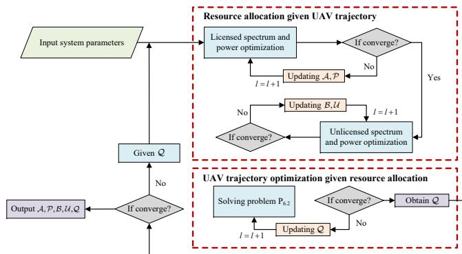  
Fig. 3: The illustration flowchart of the proposed model-based optimization module.

trajectory design. The corresponding state, action, and reward are described in detail as follows.

State space: The state characterizes the current environment with a set of observed knowledge, which includes the estimated channels states, the SINR values of SUs, and the actions from the previous step. Specifically, the state at time step n is defined as

$$
\mathbf { s } _ { n } = \{ \mathbf { H } _ { n - 1 } , \mathbf { S I N R } _ { n - 1 } , \mathbf { a } _ { n - 1 } \} ,\tag{40}
$$

where $\begin{array} { r c l } { { \bf H } _ { n - 1 } } & { = } & { { \{ { \bf H } _ { n - 1 } ^ { \mathrm { u s } } , { \bf H } _ { n - 1 } ^ { \mathrm { u p } } , { \bf H } _ { n - 1 } ^ { \mathrm { u w } } \} } } \end{array}$ . Specifically, the channel information of the SUs, PUs, and WUs from the C-UAV are denoted as ${ \bf H } _ { n - 1 } ^ { \mathrm { u s } } = \{ h _ { k } ^ { \mathrm { u s } } [ n - 1 ] \} _ { k \in \mathcal { K } } , \ { \bf H } _ { n - 1 } ^ { \mathrm { u p } } =$ $\{ h _ { i } ^ { \mathrm { u p } } [ n - 1 ] \} _ { j \in \mathcal { I } }$ , and ${ \bf H } _ { n - 1 } ^ { \mathrm { u w } } = \{ h _ { m } ^ { \mathrm { u w } } [ n - 1 ] \} _ { m \in \mathcal { M } }$ , respectively. It should be noted that the channel information of the jammer is unavailable in the observed state. $\mathbf { S I N R } _ { n - 1 } =$ $\{ \mathrm { S I N R } _ { k } ^ { \mathrm { l i c } } [ n - 1 ] , \mathrm { S I N R } _ { k } ^ { \mathrm { u n l i c } } [ n - 1 ] \} _ { k \in \mathcal { K } }$ represents the SINR of all SUs at time step $n - 1 . { \bf a } _ { n - 1 }$ denotes the action at time step n−1 including subchannel allocation, power control, and UAV trajectory.

Action space: Since the optimization problem includes hybrid discrete and continuous actions, the action space is divided into two parts. One part is for discrete subchannel allocation $\rho ^ { \mathrm { l i \bar { c } } } ~ = ~ \{ \rho _ { k , j } ^ { \mathrm { l i c } } [ \bar { n } ] \} _ { k \in \mathcal { K } , j \in \mathcal { I } }$ and $\rho ^ { \mathrm { u n l i c } } =$ $\{ \rho _ { k , m } ^ { \mathrm { u n l i c } } [ n ] \} _ { k \in \mathcal { K } , m \in \mathcal { M } }$ , and the other part is for continuous actions including the power allocation $\mathbf { p } ^ { \mathrm { l i c } } = \{ p _ { k , j } ^ { \mathrm { l i c } } [ n ] \} _ { k \in \mathcal { K } , j \in \mathcal { I } }$ and $\mathbf { p } ^ { \mathrm { u n l i c } } = \{ p _ { k , m } ^ { \mathrm { u n l i c } } [ n ] \} _ { k \in \mathcal { K } , m \in \mathcal { M } }$ as well as UAV trajectory ${ \bf q } [ n ]$ . Therefore, the action at at time step n can be defined as

$$
\mathbf { a } _ { n } = \{ \rho ^ { \mathrm { l i c } } , \rho ^ { \mathrm { u n l i c } } , \mathbf { p } ^ { \mathrm { l i c } } , \mathbf { p } ^ { \mathrm { u n l i c } } , \mathbf { q } [ n ] \} .\tag{41}
$$

Reward: According to the optimization problem formulated in ${ \bf P } _ { 1 }$ , the goal of the agents is to maximize the sum transmission rate of the secondary network with tolerant interference to licensed cellular network and unlicensed Wi-Fi network. Therefore, the reward function is formulated as

$$
r _ { n } = \alpha _ { \mathrm { s u m } } \sum _ { n = 1 } ^ { N } \sum _ { k = 1 } ^ { K } R _ { k } [ n ] - \alpha _ { \mathrm { P U } } \sum _ { j \in \mathcal { I } } \delta _ { j , n } ^ { P } - \alpha _ { \mathrm { W U } } \sum _ { m \in \mathcal { M } } \delta _ { m , n } ^ { W } ,\tag{42}
$$

where $\alpha _ { \mathrm { s u m } } , \alpha _ { \mathrm { P U } }$ , and $\alpha _ { \mathrm { W U } }$ are non-negative constant coefficients. $\delta _ { j } ^ { P }$ and $\delta _ { m } ^ { W }$ represent the penalty items imposed when the tolerant interference of the PUs and WUs are not satisfied, given as

$$
\begin{array} { r l } & { \delta _ { j , n } ^ { P } = \left\{ \begin{array} { l l } { 0 , } & { 0 \leq \Gamma _ { j } ^ { \mathrm { p u } } < \Gamma _ { j } ^ { \mathrm { l i c } } } \\ { \Gamma _ { j } ^ { \mathrm { p u } } - \Gamma _ { j } ^ { \mathrm { l i c } } , } & { \Gamma _ { j } ^ { \mathrm { p u } } > \Gamma _ { j } ^ { \mathrm { l i c } } , } \end{array} \right. } \\ & { \delta _ { m , n } ^ { W } = \left\{ \begin{array} { l l } { 0 , } & { 0 \leq \Gamma _ { m } ^ { \mathrm { w u } } < \Gamma _ { m } ^ { \mathrm { u n l i c } } } \\ { \Gamma _ { m } ^ { \mathrm { w u } } - \Gamma _ { m } ^ { \mathrm { u n l i c } } , } & { \Gamma _ { m } ^ { \mathrm { w u } } > \Gamma _ { m } ^ { \mathrm { u n l i c } } , } \end{array} \right. } \end{array}\tag{43a}
$$

(43b)

where $\Gamma _ { j } ^ { \mathrm { p u } }$ and $\Gamma _ { m } ^ { \mathrm { w u } }$ represent the interference to the jth PU and the mth WU, respectively.

2) Model-Free DQN and DDPG: The DQN algorithm is a value-based method and involves an action-value function. For a certain policy $\pi ,$ the action-value function is defined as

$$
Q _ { \pi } ( \mathbf { s } _ { n } , \mathbf { a } _ { n } ) = \mathbb { E } _ { \pi } [ \sum _ { k = n } ^ { \infty } \gamma ^ { k - n } r _ { k + 1 } | S = \mathbf { s } _ { n } , A = \mathbf { a } _ { n } ] ,\tag{44}
$$

where $0 < \gamma \leq 1$ is the discount rate. The optimal policy $\pi ^ { * }$ achieves the optimal action-value function $Q ^ { * } ( \mathbf { s } _ { n } , \mathbf { a } _ { n } )$ , which has the largest value for a specific state-action pair,

$$
Q _ { \pi ^ { * } } ( \mathbf { s } _ { n } , \mathbf { a } _ { n } ) = \operatorname* { m a x } _ { \pi } Q _ { \pi } ( \mathbf { s } _ { n } , \mathbf { a } _ { n } ) ,\tag{45}
$$

In DQN, the neural network acts as the function approximator to estimate the action-value function,

$$
Q ( \mathbf { s } _ { n } , \mathbf { a } _ { n } ; \pmb { \theta } ) = Q _ { \pi ^ { * } } ( \mathbf { s } _ { n } , \mathbf { a } _ { n } ) ,\tag{46}
$$

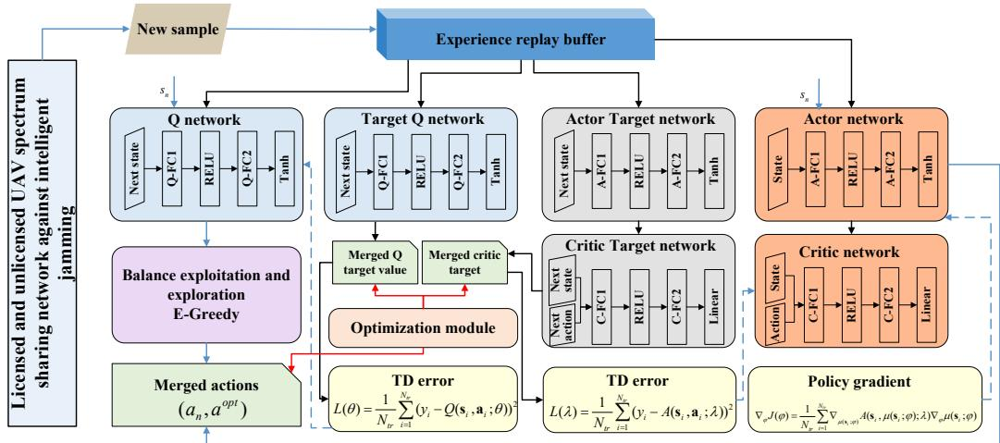  
Fig. 4: The proposed optimization-driven DRL framework for UAV spectrum sharing networks against jamming attacks.

where θ is the weight parameters of the neural network. The input of the estimation network is the state ${ \bf s } _ { n } ,$ and the corresponding values of all possible actions are generated as the output. Then, the -greedy method can be adopted to carry out spectrum allocation to balance the exploration of action and the exploitation of known actions. Specifically, the agent can randomly select one action among all the actions with  probability or select action a of the largest estimated value with 1 −  probability, which can be given as

$$
\mathbf { a } = \arg \operatorname* { m a x } _ { \mathbf { a } } Q ( \mathbf { s } _ { n } , \mathbf { a } _ { n } ; \pmb { \theta } ) ,\tag{47}
$$

where $0 ~ < ~ \epsilon ~ \leq ~ 1$ . Moreover, the target Q network $Q ( \mathbf { s } _ { n } , \mathbf { a } _ { n } ; \bar { \pmb { \theta } } )$ is utilized to estimate the target Q value,

$$
y _ { n } = r _ { n } + \gamma \operatorname* { m a x } \tilde { Q } ( \mathbf s _ { n + 1 } , \mathbf a _ { n + 1 } ; \bar { \pmb \theta } ) .\tag{48}
$$

The target network $\tilde { Q } ( \cdot )$ has the same structure as the estimation network $Q ( \cdot )$ . However, the weight parameter $\bar { \pmb \theta }$ is updated by using the soft update rule instead of every training epoch. The experience replay technique is adopted for accelerating the convergence in an off-policy way. During the training stage, the agent randomly samples a mini-batch experience $\left( \mathbf { s } _ { i } , \mathbf { a } _ { i } , r _ { i } , \mathbf { s } _ { i + 1 } \right)$ with size $N _ { \mathrm { c h } }$ from the replay buffer when the memory block is filled, The difference between the estimated value and the target value is adopted to update the estimation network, given as

$$
L ( \pmb \theta ) = \frac { 1 } { N _ { \mathrm { c h } } } \sum _ { i = 1 } ^ { N _ { \mathrm { c h } } } ( y _ { i } - Q ( \mathbf s _ { i } , \mathbf a _ { i } ; \pmb \theta ) ) ^ { 2 }\tag{49}
$$

The DQN algorithm is applicable to discrete control problems whereas the optimization problem in $\mathbf { P } _ { 1 }$ also involves continuous actions. This motivates us to use the DDPG for power and trajectory optimization. The architecture of DDPG is based on the actor-critic framework, where the actor learns a deterministic policy function mapping states to actions, and the critic learns an estimation of the Q-function to evaluate the policy. The power and trajectory design strategy $\mu ( \mathbf { s } _ { n } ; \boldsymbol { \varphi } )$ are generated via the observed state ${ \bf s } _ { n }$ , where $\mu ( \cdot )$ and $\varphi$ represent the mapping function and the weight parameter of the actor network, respectively. Moreover, the stochastic noise is introduced to balance the exploration and the exploitation. After executing the action ${ \bf a } _ { n }$ , we can obtain the immediate reward $r _ { n }$ and store the tuple $\left( \mathbf { s } _ { n } , \mathbf { a } _ { n } , r _ { n } , \mathbf { s } _ { n + 1 } \right)$ into the experience replay buffer. $N _ { \mathrm { t r } }$ tuples can be randomly selected from the experience replay buffer to update the weight $\varphi$ in the actor network, and the deterministic policy gradient is exploited to update the actor network, given as

$$
\begin{array} { r l r } {  { \nabla _ { \varphi } J ( \varphi ) = \frac { 1 } { N _ { \mathrm { t r } } } \sum _ { i = 1 } ^ { N _ { t r } } \nabla _ { \varphi } A \bigl ( \mathbf { s } _ { i } , \mu \bigl ( \mathbf { s } _ { i } ; \varphi \bigr ) ; \lambda \bigr ) } } \\ & { } & { \qquad = \frac { 1 } { N _ { \mathrm { t r } } } \sum _ { i = 1 } ^ { N _ { t r } } \nabla _ { \mu ( \mathbf { s } _ { i } ; \varphi ) } A \bigl ( \mathbf { s } _ { i } , \mu \bigl ( \mathbf { s } _ { i } ; \varphi \bigr ) ; \lambda \bigr ) \nabla _ { \varphi } \mu ( \mathbf { s } _ { i } ; \varphi ) , } \end{array}\tag{0a}
$$

(50b)

where $A ( \cdot )$ and λ denote the mapping function and the parameters of the critic network, respectively.

The output of the target critic network is given as

$$
y _ { i } = r _ { i + 1 } + \gamma \tilde { A } ( \mathbf { s } _ { i + 1 } , \tilde { \mu } ( \mathbf { s } _ { i + 1 } ; \bar { \varphi } ) ; \bar { \lambda } ) ,\tag{51}
$$

where $\tilde { A } ( \cdot )$ and λ¯ are the mapping function and the weight parameter of the target critic network, respectively. $\tilde { \mu } ( \cdot )$ and $\bar { \varphi }$ are the mapping function and the weight parameter of the target actor network, respectively. Then, the critic network is updated by using the following TD error, given as

$$
L ( \boldsymbol { \lambda } ) = \frac { 1 } { N _ { \mathrm { t r } } } \sum _ { i = 1 } ^ { N _ { \mathrm { t r } } } ( y _ { i } - A ( \mathbf { s } _ { i } , \mathbf { a } _ { i } ; \boldsymbol { \lambda } ) ) ^ { 2 } .\tag{52}
$$

3) Optimization-Driven DRL Strategy: With the trial-anderror scheme, the model-free DQN and DDPG can obtain optimal strategies without prior knowledge of the environment. However, both the DQN and DDPG algorithms rely on periodical parameters copying from the evaluation network to the target network. This implies strong coupling between the evaluation and target networks, which can lead to instability issues and even divergence. Although less parameter replication can make the learning process more stable, it delays the supervised updates of the target network, thereby reducing the learning efficiency. Moreover, the evaluation and target Q-networks are randomly initialized, the evaluation of the immediate reward can be far from its real value in the early stage of learning, which probably misleads the learning process. Hence, a long warm-up period is required to train the DQN and DDPG model. Therefore, the optimal setting for parameters copying becomes problematic for practical implementation. Considering the above difficulties, we aim to stabilize and improve the convergence performance by exploiting the proposed optimization-driven DRL.

The architecture of the proposed optimization-driven DRL framework is shown in Fig. 4. The actor network in DDPG output an action $\mathbf { a } _ { n } ^ { d } = \{ \mathbf { p } ^ { \mathrm { l i \bar { c } } } , \mathbf { p } ^ { \mathrm { u n l i c } } , \mathbf { q } [ n ] \}$ and the target critic network output the target value $y _ { t }$ , which is shown in (51). It can be seen that the target value depends significantly on the parameters of the critic network $A ( \mathbf { s } _ { n + 1 } , \mathbf { a } _ { n + 1 } ; \lambda )$ . However, the network learning ability is significantly constrained by the random initialization in the early stage of training. Therefore, $y _ { n }$ can be very different from the optimal value. Moreover, this effect intensifies with prolonged environment interaction since action-value function is the expectation of return.

To solve the problem, the optimization module proposed in Section III is exploited in our proposed framework to obtain an approximated solution of problem ${ \bf P } _ { 1 }$ and estimate a worst-case target value in the dynamic uncertain environment. Let $\mathbf { a } _ { n } ^ { \mathrm { o p t } } = \{ \bar { \mathbf { p } } ^ { \mathrm { l i c } } , \mathbf { p } ^ { \mathrm { u n l i c } } , \mathbf { q } [ n ] \}$ } represent the optimized action output by the optimization module. The target value of the optimization module $y _ { n } ^ { \mathrm { o p t } }$ is denoted as

$$
\begin{array} { r l } { \displaystyle } & { y _ { n } ^ { \mathrm { o p t } } = \mathbb { E } \left[ G _ { n } \mid \mathbf { s } _ { n } , \mathbf { a } _ { n } ^ { \mathrm { o p t } } \right] } \\ & { = \mathbb { E } \left[ \sum _ { k = 0 } ^ { \infty } \gamma ^ { k } r _ { n + k } ^ { \mathrm { o p t } } \mid \mathbf { s } _ { n } , \mathbf { a } _ { n } ^ { \mathrm { o p t } } \right] . } \end{array}\tag{53}
$$

Similar to the reward function of the pure model-free DRL in (42), $r _ { n } ^ { \mathrm { o p t } }$ can be expressed as

$$
r _ { n } ^ { \mathrm { { \mathrm { \mathrm { o p t } } } } } = \alpha _ { \mathrm { s u m } } \sum _ { n = 1 } ^ { N } \sum _ { k = 1 } ^ { K } R _ { k } ^ { \mathrm { o p t } } [ n ] - \alpha _ { \mathrm { P U } } \sum _ { j \in \mathcal { I } } \delta _ { j , n } ^ { \mathrm { P , o p t } } - \alpha _ { \mathrm { W U } } \sum _ { m \in \mathcal { M } } \delta _ { m , n } ^ { \mathrm { W , o p t } } ,\tag{54}
$$

where

$$
\begin{array} { r l } & { \delta _ { j , n } ^ { \mathrm { P , o p t } } = \left\{ \begin{array} { l l } { 0 , } & { \mathrm { ~ 0 \leq \Gamma _ { \mathcal { j } } ^ { \mathrm { o p t , l i c } } < \Gamma _ { \mathcal { j } } ^ { \mathrm { l i c } } } } \\ { \Gamma _ { \mathcal { j } } ^ { \mathrm { o p t , l i c } } - \Gamma _ { \mathcal { j } } ^ { \mathrm { l i c } } , } & { \Gamma _ { \mathcal { j } } ^ { \mathrm { o p t , l i c } } \geq \Gamma _ { \mathcal { j } } ^ { \mathrm { l i c } } , } \end{array} \right. } \\ & { \delta _ { m , n } ^ { \mathrm { W , o p t } } = \left\{ \begin{array} { l l } { 0 , } & { \mathrm { ~ 0 \leq \Gamma _ { m } ^ { \mathrm { o p t , u n l i c } } < \Gamma _ { m } ^ { \mathrm { u n l i c } } } } \\ { \Gamma _ { m } ^ { \mathrm { o p t , u n l i c } } - \Gamma _ { m } ^ { \mathrm { u n l i c } } , } & { \mathrm { ~ \Gamma _ { m } ^ { \mathrm { o p t , u n l i c } } \geq \Gamma _ { m } ^ { \mathrm { u n l i c } } . } } \end{array} \right. } \end{array}\tag{55a}
$$

(55b)

$\Gamma _ { i } ^ { \mathrm { o p t , l i c } }$ and Γopt,unlic denote the interference to the jth PU and the mth WU output by the optimization module, respectively.

It is expected that the optimization-driven $y _ { n } ^ { \mathrm { o p t } }$ can provide a more accurate estimation of the target Q-value compared to the target critic network, especially in the early stage of learning. Therefore, the optimization-driven DRL can adapt faster convergence and achieve a better reward performance.

Moreover, the decoupling of the optimization-driven $y _ { n } ^ { \mathrm { o p t } }$ and the estimated $y _ { n }$ can reduce the target variability. Frequent target updates can be avoided to reduce the performance fluctuations and stabilize the learning period compared to the conventional target network based DRL methods.

The action $\mathbf { a } _ { n }$ is merged with the optimized solution $\mathbf { a } ^ { \mathrm { o p t } }$ through a gating-based mechanism. Specifically, the target value $y _ { n }$ generated by the DRL networks is compared with the optimization-based target $y _ { n } ^ { \mathrm { o p t } }$ at each training step. When $y _ { n } ~ < ~ y _ { n } ^ { \mathrm { o p t } }$ , the optimization-based target is adopted for backward updating, and the corresponding action is replaced by the optimized action $\mathbf { a } _ { n } ^ { \mathrm { o p t } }$ . This case typically occurs during the early training stage, where the model-based optimization provides a more reliable performance reference. As training progresses, the learned policy gradually improves and may outperform the optimization-derived solution, i.e., $y _ { n } < y _ { n } ^ { \mathrm { o p t } }$ In this case, the learning process adheres to the action output by the actor network, allowing the DRL agent to fully exploit its learned policy. It is worth noting that the comparison between $y _ { n }$ and $y _ { n } ^ { \mathrm { o p t } }$ is performed at every training step. This step-wise integration enables the optimization module to continuously guide the learning process and stabilize the target updates during training.

## V. SIMULATION RESULTS

In this section, numerical results are provided to analyze the performance of our proposed optimization-driven DRL framework for resource allocation in licensed and unlicensed UAV spectrum sharing networks against jamming attacks. The settings are based on the parameters adopted in [9] and [36]. The detailed simulation parameters are listed in Table I. For performance evaluation, three benchmark schemes are considered. 1) DQN-DDPG: The conventional DQN-DDPG based method [26], where DQN is used to optimize the subchannel allocation, and DDPG is used to optimize the transmit power and UAV trajectory with the model-free approach. 2) LTE-A: The C-UAV can only serve the SUs with the licensed spectrum [9]. 3) J-AP-FIXED: The C-UAV trajectory is designed based on the fixed random trajectory [19]. 4) Random: UAV trajectory, power control, and subband allocation are randomly generated within the feasible range [26].

Fig. 5 illustrates the convergence performance of the average reward for different schemes with $K = 2 , J = 3 ,$ and $M \ = \ 3 .$ . It can be seen that our proposed scheme improves the convergence speed by about 200 episodes. This demonstrates that the proposed optimization-driven DRL can improve the learning efficiency by using the modelbased optimization method to find a lower bound on the original problem to provide a better-informed estimation of the target value. In contrast, the conventional DQN-DDPG scheme requires a long warm-up period for both Q network and critic stabilization, which explains its slower increase in the first 400 episodes. Moreover, the LTE-A baseline also shows limited average reward due to its inability to leverage the additional spectrum resources from the unlicensed band.

TABLE I: Simulation parameters.
<table><tr><td>Parameters</td><td>Typical Values</td></tr><tr><td>Number of PUs Number of WUs</td><td>3</td></tr><tr><td>Number of SUs</td><td>3 2</td></tr><tr><td>C-UAV height</td><td>100 m</td></tr><tr><td>The speed of the C-UAV</td><td>5 m/s</td></tr><tr><td>Licensed subchannel bandwidth</td><td>180 KHz</td></tr><tr><td>Unlicensed subchannel bandwidth</td><td>180 KHz</td></tr><tr><td>Noise variance</td><td>-169 dBm</td></tr><tr><td>Channel gain at the reference distance 1 meter</td><td>-30 dB</td></tr><tr><td>Maximum transmit power on the licensed subchannel</td><td>0.5 W</td></tr><tr><td>Maximum transmit power on the unlicensed subchannel</td><td>0.5 W</td></tr><tr><td>Transmit power of the PBS</td><td>2.5 W</td></tr><tr><td>Transmit power of the jammer</td><td>0.5 W</td></tr><tr><td>The radiuses of the uncertainty region</td><td>10−4</td></tr></table>

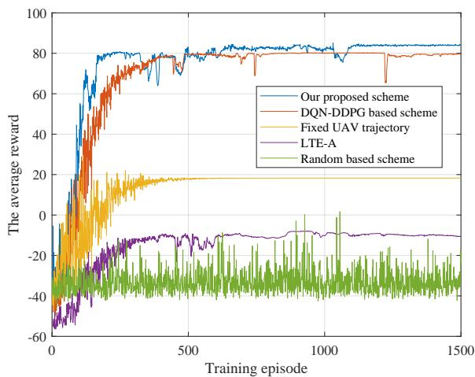  
Fig. 5: The comparison of the reward convergence.

Furthermore, our proposed scheme shows a higher convergent reward since better-informed guided exploration can help escape the local optima. This verifies the advantages of the proposed optimization driven informed DRL.

To further demonstrate the advantages of our proposed scheme in terms of convergence rate, Fig. 6 shows the minimum convergence episode versus different numbers of SUs with $M = 8$ and $J = 8 .$ . It can be observed that our proposed scheme can obtain a faster convergence than the DQN-DDPG based scheme, which demonstrates that the informed estimation of the optimization module can speed up the learning rate. Since sample complexity is typically measured by the number of interaction samples required to approach the steady-state performance, this faster convergence behavior indicates that the proposed scheme improves sample efficiency compared to the benchmarks. Moreover, the given problem solution can guide the agent in building the right direction of training to achieve the optimal policy. Furthermore, the convergence episode grows larger with the increased number of SUs. This is because the increase in the number of SUs expands the dimensionality of the action space. Therefore, it becomes more challenging for the agent to learn the optimal policy.

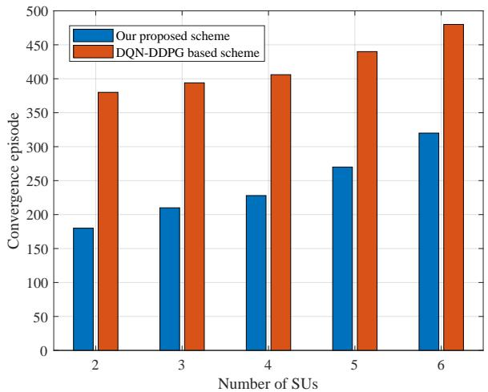  
Fig. 6: Total convergence episodes for different numbers of SUs.

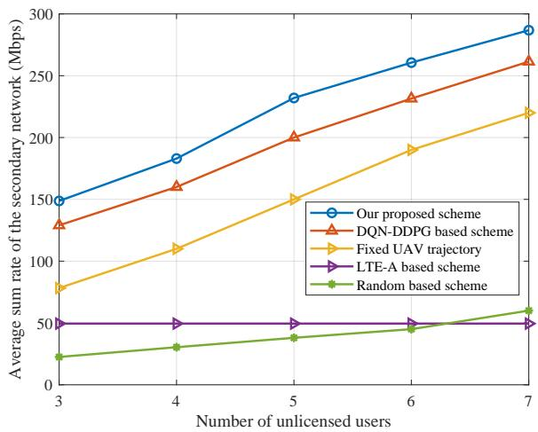  
Fig. 7: Sum transmit rate of SUs versus the number of WUs.

As shown in Fig. 7, the performance of different schemes is evaluated under varying numbers of WUs. The sum transmission rate of all schemes generally increases as the number of WUs grows. This is because additional unlicensed spectrum provides more transmission opportunities, enabling the secondary network to better exploit spectrum resources and improve overall spectrum utilization. However, the growth rates differ significantly among the considered schemes. It is observed that the proposed scheme consistently achieves the highest sum transmission rate for the secondary network, demonstrating its effectiveness in handling increasing numbers of users rather than being limited to small-scale scenarios. In contrast, the LTE-A-based scheme maintains a constant sum rate as the number of WUs increases, since it relies solely on licensed spectrum and does not benefit from the additional unlicensed spectrum opportunities.

Fig. 8 shows the sum transmission rate of SUs versus the C-UAV maximum transmit power achieved by different schemes. It is seen that the proposed scheme can achieve the highest sum rate among all schemes. Moreover, the sum rate achieved by the LTE-A baseline scheme is lower than other schemes, which demonstrates that the exploitation of unlicensed spectrum can further improve the spectrum sharing performance. Furthermore, the growth trend gradually flattens with the increased available maximum transmit power. This is because the interference from the C-UAV to the licensed cell network and the unlicensed Wi-Fi network approaches the tolerable interference threshold. Therefore, it implies that our proposed scheme can efficiently improve the sum rate of the secondary network while ensuring the quality of service for PUs and WUs.

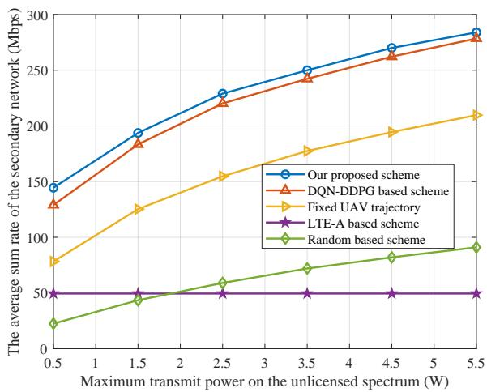  
Fig. 8: Sum transmit rate of SUs versus the maximum C-UAV transmit power.

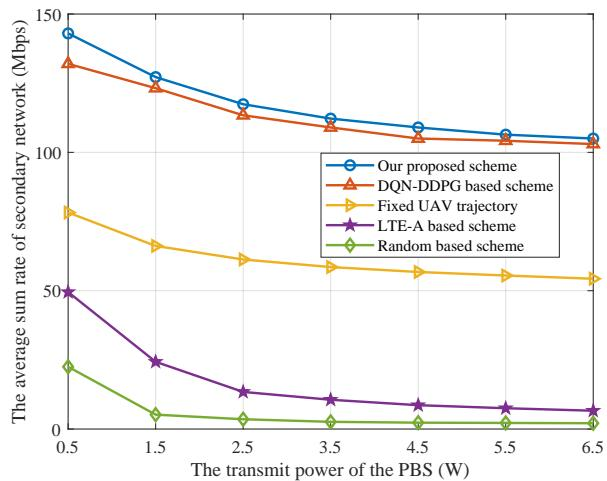  
Fig. 9: Sum transmit rate of SUs versus the PBS transmit power.

Fig. 9 shows the impact of the transmit power of the PBS on the achievable secondary network sum transmission rate of the proposed scheme and four baseline schemes. The maximum transmit power of the C-UAV is set as 0.5W. It is clear that when the transmit power of the PBS increases, the sum rate of SUs decreases accordingly. This is because a larger PBS transmit power results in a larger interference level to the SUs.

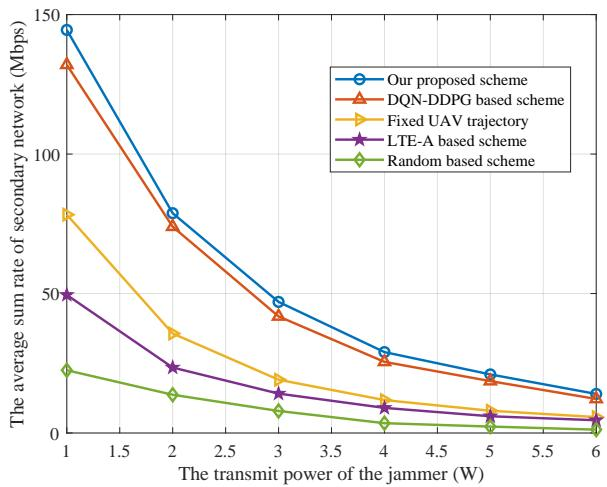  
Fig. 10: Sum transmit rate of SUs versus the jammer transmit power.

In Fig. 10, we evaluate the spectrum sharing performance in various jamming cases by varying the jamming power from 1 W to 6 W. It clearly shows that the proposed scheme outperforms the other benchmark schemes. It is worth noting that the sum rate of all schemes decreases rapidly in the early stages of transmit power growth. However, the proposed optimizationdriven DRL can provide a better lower bound estimation of the uncertain jamming. Therefore, we can still achieve a higher sum transmission rate, which also demonstrates the superiority of the anti-jamming performance.

Fig. 11 illustrates the average sum transmission rate for our proposed scheme and the DQN-DDPG based scheme versus the maximum interference leakage tolerance $P _ { \mathrm { m a x } } ^ { \mathrm { u n l i c } }$ . As can be seen, when the tolerance is below -43 dBm, both schemes suffer from severe interference constraints, thus no significant change found in the sum transmission rate. Once the tolerance exceeds this threshold, the sum transmission rate of the secondary network increases with the maximum interference leakage tolerance. This is because more power is available to enhance the transmission rate with a looser maximum interference leakage tolerance. Then, all schemes gradually achieve the saturation afterward since the maximum available power budget is limited. Compared with the conventional DQN-DDPG, our proposed optimization-driven DRL consistently achieves higher performance because the optimization module provides more accurate target values, enabling the agent to effectively exploit the additional unlicensed spectrum while satisfying interference constraints. Moreover, an increase in the maximum unlicensed transmit power boosts the sum rate in the saturation region. It is noted that the average sum rate still increases from -33 dBm to -28 dBm for the DQN-DDPG with $P _ { m a x } ^ { \mathrm { u n l i c } } = 0 . 8 W$ . This is because the interference leakage constraint remains active and the learned policy is not fully exploited the additional unlicensed power at -33 dBm compare with $P _ { m a x } ^ { \mathrm { u n l i c } } = 0 . 5 W$ . As the tolerance becomes looser, the agent gradually allocates more power to unlicensed subbands, leading to a further rate gain. However, our proposed scheme operates close to the constraint boundary and thus exhibits a saturated performance.

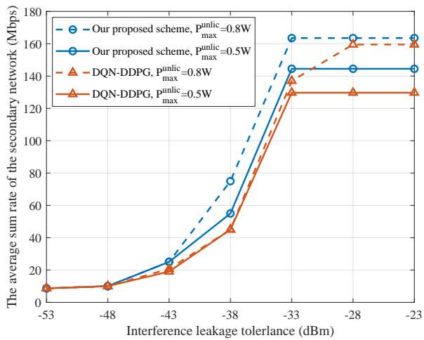  
Fig. 11: Average sum rate versus the maximum unlicensed interference leakage tolerance.

The comparison of the average sum rate versus the flight time periods T between our proposed scheme and three benchmark schemes is shown in Fig. 12. It is clear that the average sum rate achieved by our proposed scheme outperforms the three benchmark algorithms when the flight time increases. Moreover, it can be seen that the sum transmission rate of the fixed trajectory scheme and the random based scheme have not changed significantly. This is because the C-UAV cannot hover near the SUs to provide stable services but fly over the SUs at a constant speed.

To evaluate the computational efficiency and practical feasibility of the proposed framework, we compare the computational complexity of the optimization-based module and the pure DRL-based approach. Firstly, we compare the computational complexity in terms of floating-point operations (FLOPs), which are commonly used as a hardware-independent metric to characterize algorithmic complexity. For the pure DRL-based method, the online computational cost mainly arises from the forward inference of the neural networks. Consequently, the total FLOPs per decision step are fixed and lightweight, obtained by summing the FLOPs of the Q network, actor network, and critic networks. Specifically, considering the Q network with neural network width $d _ { l } ^ { q }$ at the lth layer. The FLOPs required for one forward pass can be approximated as $2 \textstyle \sum _ { l = 1 } ^ { L _ { \mathrm { q n e t } } } d _ { l - 1 } ^ { q } d _ { l } ^ { q } .$ . Therefore, the online inference FLOPs per decision step of the pure DRL based approach is given by $\begin{array} { r } { \mathrm { F L O P s _ { D R L } } ~ = ~ 2 \sum _ { l = 1 } ^ { L _ { \mathrm { q n e t } } } d _ { l - 1 } ^ { q } d _ { l } ^ { q } \ + ~ } \end{array}$ $2 \textstyle \sum _ { l = 1 } ^ { L _ { \mathrm { a n e t } } } d _ { l - 1 } ^ { a } d _ { l } ^ { a }$ , where $L _ { \mathrm { a n e t } }$ and $d _ { l } ^ { a }$ denote the number of layers and the layer width of the actor network. The factor of 2 accounts for one multiplication and one addition per multiply-accumulate operation, while bias terms and activation functions introduce only lower-order computational costs and are thus omitted [43]. Moreover, the critic network and the target network are only used during the training phase for value evaluation and target construction. Therefore, their computational costs are excluded from the online inference FLOPs [44].

In contrast, the optimization-driven module requires solving a sequence of convexified subproblems via SCA and CVX. Its computational complexity increases polynomially with the number of optimization variables and constraints and is dominated by the solver iterations. As a result, the FLOPs required by the optimization-driven module are significantly higher than those of the pure DRL-based approach and increase rapidly with the problem dimension. Moreover, since the optimization-driven module is mainly implemented via SCA and CVX, the total computational cost depends on both the number of SCA outer iterations and the execution of interior-point solvers invoked by CVX. However, the number of SCA iterations is determined by convergence criteria, which cannot be fixed a priori. Furthermore, each SCA iteration generates a different convex subproblem with potentially varying constraints and problem structure. On the other hand, the linear operations performed at each interiorpoint iteration (e.g., KKT system factorization) are solverspecific and adaptive to numerical conditioning and stopping tolerances. Therefore, directly quantifying the computational cost of the optimization-driven module in terms of FLOPs is fundamentally impractical.

To further compare the complexity, we evaluate the runtime per episode. For a fair comparison, the episode runtime of the optimization-driven module is defined as the total time required to complete one alternating optimization procedure, including all inner SCA iterations, and to obtain the complete action sequence over N time steps. Although DRL and optimization module differ in how the action sequence is generated, namely, sequential policy execution in DRL and one-shot planning in optimization, both approaches ultimately produce a complete action sequence over the same time length N. Therefore, comparing the episode-level runtime under this unified definition reflects the total computational cost required to solve the decision-making problem, enabling a clear and meaningful runtime comparison between DRL-based and optimization-based approaches. As shown in Table II, the average training time per episode is about 1.84 seconds, which is significantly lower than that of the optimization-driven module. This is because DRL mainly involves forward and backward propagation through lightweight neural networks, whereas the optimization-driven module requires computationally intensive iterative SCA and CVX solving procedures, even when decomposed into individual alternating subproblems. Moreover, it should be noted that the optimizationdriven solutions are computed offline. During the training phase, no iterative SCA or CVX procedures are executed. Furthermore, the model-based informed targets are directly integrated with the standard DRL targets through the gatingbased mechanism. Therefore, the additional training time introduced by the fusion mechanism is negligible compared to the standard DQN-DDPG training process. In this case, given that the average training time per episode is about 1.84 seconds, the total training time is approximately 920 seconds.

TABLE II: The comparison of the runtime complexity.
<table><tr><td>Methods</td><td>Runtime per episode (s)</td></tr><tr><td>DQN-DDPG</td><td>1.84</td></tr><tr><td>Optimization driven module</td><td>304.8</td></tr><tr><td>Alternative subproblem1</td><td>74.2</td></tr><tr><td>Alternative subproblem2</td><td>189.5</td></tr></table>

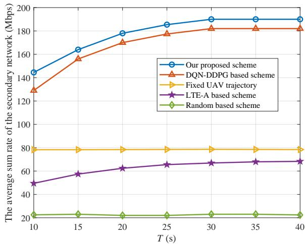  
Fig. 12: Average sum rate versus the flight time period T .

Fig. 13 illustrates the impact of the learning rate and replay buffer capacity on the average sum transmission rate of the secondary network. It can be observed that all three curves exhibit an inverted-U trend with respect to the learning rate, indicating that excessively small or large learning rates can lead to suboptimal performance. Comparing the three curves, it is evident that larger memory capacities result in smoother curves with reduced sensitivity to the learning rate and achieve slightly higher peak performance. This is because larger memory capacity can store more historical information, thereby enhancing the network’s scheduling efficiency and data forwarding capabilities. When the learning rate exceeds $7 \times 1 0 ^ { - 4 }$ , networks with smaller experience capacity show significant decreases in the average transmission rate. This may be due to an excessively high learning rate causing training instability, which leads to overly rapid updates in the network strategy and negatively impacts performance.

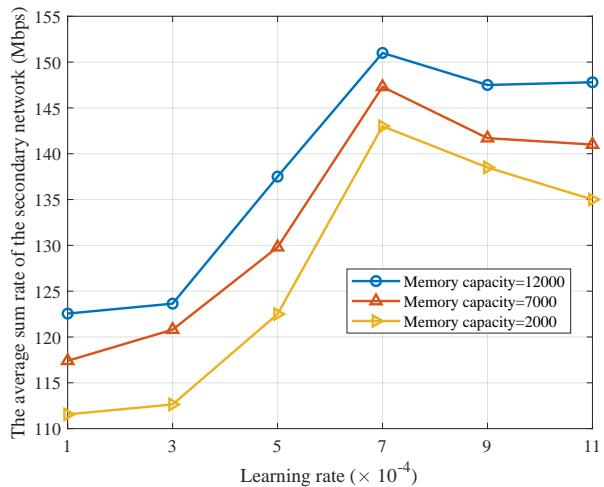  
Fig. 13: Average sum transmission rate versus learning rate under different memory capacities.

## VI. CONCLUSION

In this paper, the secondary network sum transmission rate maximization problem was studied in a joint licensed and unlicensed UAV spectrum sharing networks against uncertain jamming attacks. To overcome the problems of low convergence speed and susceptibility to local optima in traditional data-driven DRL, as well as the high complexity of modeldriven optimization methods. A novel optimization-driven DRL framework was proposed to improve the convergence speed and learning efficiency. Simulation results demonstrated that our proposed optimization-driven DRL can significantly improve the convergence speed and achieve a better reward performance than the pure DRL based scheme. Moreover, the joint licensed and unlicensed spectrum sharing achieved approximately twice the sum transmission rate compared to using only the licensed spectrum.

In future work, we plan to enhance the channel model by expanding from the distance-dependent model to more realistic ones. This will include incorporating carrier-frequencydependent path loss to distinguish between licensed and unlicensed bands, probabilistic LoS/NLoS air-to-ground mod els (e.g., elevation-angle-dependent LoS probability), bandspecific small-scale fading characteristics such as Rician fading with frequency-dependent K-factors, and shadowing effects. Moreover, while the current study focuses on simulation-based evaluation to provide controlled and reproducible validation of the proposed optimization-driven DRL framework, real-world deployment and experimental verification, such as field trials or hardware-in-the-loop testing, constitute important future research directions. These efforts will further assess the spectrum sharing performance under realistic environmental dynamics and hardware constraints.

## REFERENCES

[1] L. Zhao, H. Xu, S. Qu, Z. Wei, and Y. Liu, “Joint trajectory and communication design for uav-assisted symbiotic radio networks,” IEEE Trans. Veh. Technol., 2024.

[2] M. A. Jasim, H. Shakhatreh, N. Siasi, A. H. Sawalmeh, A. Aldalbahi, and A. Al-Fuqaha, “A survey on spectrum management for unmanned aerial vehicles,” IEEE Access, vol. 10, pp. 11 443–11 499, 2021.

[3] M. Giordani, M. Polese, M. Mezzavilla, S. Rangan, and M. Zorzi, “Toward 6G networks: Use cases and technologies,” IEEE Commun. Mag., vol. 58, no. 3, pp. 55–61, 2020.

[4] H.-W. Lee, A. Medles, C.-C. Chen, and H.-Y. Wei, “Feasibility and opportunities of terrestrial network and non-terrestrial network spectrum sharing,” IEEE Wireless Commun., vol. 30, no. 6, pp. 36–42, 2023.

[5] R. Bajracharya, R. Shrestha, S. Kim, and H. Jung, “6G NR-U based wireless infrastructure UAV: Standardization, opportunities, challenges and future scopes,” IEEE Access, vol. 10, pp. 30 536–30 555, 2022.

[6] Y. Cui, Q. Zhang, Z. Feng, F. Liu, C. Shi, J. Fan, and P. Zhang, “Specific beamforming for multi-UAV networks: A dual identity-based ISAC approach,” in ICC 2023-IEEE International Conference on Communications. IEEE, 2023, pp. 4979–4985.

[7] J. Zhang, Q. Tan, Y. Gao, X. Sun, and W. Zhan, “Wifi 7 with different multi-link channel access schemes: Modeling, fairness and optimization,” IEEE Trans. Commun., 2024.

[8] Y. Su, Y. Lin, S. Liu, M. Liwang, X. Liao, T. Wu, Z. Chen, and X. Wang, “Coexistence of hybrid VLC-RF and Wi-Fi for indoor wireless communication systems: An intelligent approach,” IEEE Trans. Netw. Service Manage., 2024.

[9] A. S. Matar and X. Shen, “Joint subchannel allocation and power control in licensed and unlicensed spectrum for multi-cell UAV-cellular network,” IEEE J. Sel. Areas Commun., vol. 39, no. 11, pp. 3542–3554, 2021.

[10] J. Liu, Y. Shi, Z. M. Fadlullah, and N. Kato, “Space-air-ground integrated network: A survey,” IEEE Commun. Surveys Tuts., vol. 20, no. 4, pp. 2714–2741, 2018.

[11] Z. Ji, W. Yang, X. Guan, X. Zhao, G. Li, and Q. Wu, “Trajectory and transmit power optimization for IRS-assisted UAV communication under malicious jamming,” IEEE Trans. Veh. Technol., vol. 71, no. 10, pp. 11 262–11 266, 2022.

[12] J. Deng, Y. Xu, S. Liu, X. Wang, X. Zhang, J. Du, and X. Wang, “Distributed collaborative anti-jamming channel access in dynamic UAV networks,” in 2024 IEEE/CIC International Conference on Communications in China (ICCC). IEEE, 2024, pp. 1385–1389.

[13] X. Wang, J. Wang, Y. Xu, J. Chen, L. Jia, X. Liu, and Y. Yang, “Dynamic spectrum anti-jamming communications: Challenges and opportunities,” IEEE Commun. Mag., vol. 58, no. 2, pp. 79–85, 2020.

[14] H. T. Nguyen, H. D. Tuan, T. Q. Duong, H. V. Poor, and W.-J. Hwang, “Joint D2D assignment, bandwidth and power allocation in cognitive UAV-enabled networks,” IEEE Trans. Cognit. Commun. Netw., vol. 6, no. 3, pp. 1084–1095, 2020.

[15] Y. Zeng and R. Zhang, “Energy-efficient UAV communication with trajectory optimization,” IEEE Trans. Wireless Commun., vol. 16, no. 6, pp. 3747–3760, 2017.

[16] H. Liao, X. Chen, Z. Zhou, N. Liu, and B. Ai, “Licensed and unlicensed spectrum management for cognitive M2M: A context-aware learning approach,” IEEE Trans. Cognit. Commun. Netw., vol. 6, no. 3, pp. 915– 925, 2020.

[17] J. Zhang, Q. Tan, Y. Gao, X. Sun, and W. Zhan, “Wifi 7 with different multi-link channel access schemes: Modeling, fairness and optimization,” IEEE Trans. on Commun., vol. 72, no. 10, pp. 6225– 6236, 2024.

[18] Y. Su, M. Liwang, Z. Chen, and X. Wang, “UAV-assisted internet of vehicles over licensed and unlicensed spectrum: Architecture, intelligent resource management, and challenges,” IEEE Internet Things Mag., vol. 6, no. 3, pp. 78–84, 2023.

[19] Y. Su, L. Huang, and M. Liwang, “Joint power control and time allocation for UAV-assisted IoV networks over licensed and unlicensed spectrum,” IEEE Internet Things J., 2023.

[20] A. S. Matar and X. Shen, “Joint optimization of user association, power control, and dynamic spectrum sharing for integrated aerial-terrestrial network,” IEEE J. Sel. Areas Commun., 2024.

[21] T. T. Nguyen, K. K. Nguyen et al., “Joint intelligent reflecting surfaceaided frequency-hopping anti-jamming for tactical wireless systems,” in ICC 2024-IEEE International Conference on Communications. IEEE, 2024, pp. 4000–4005.

[22] H. Yang, Z. Xiong, J. Zhao, D. Niyato, Q. Wu, H. V. Poor, and M. Tornatore, “Intelligent reflecting surface assisted anti-jamming communications: A fast reinforcement learning approach,” IEEE Trans. Wireless Commun., vol. 20, no. 3, pp. 1963–1974, 2020.

[23] R. Ding, F. Zhou, Y. Qu, C. Dong, Q. Wu, and T. Q. Quek, “Novel online-offline MA2C-DDPG for efficient spectrum allocation and trajectory optimization in dynamic spectrum sharing UAV networks,” in 2023 IEEE/CIC International Conference on Communications in China (ICCC). IEEE, 2023, pp. 1–6.

[24] R. Ding, F. Zhou, Q. Wu, and D. W. K. Ng, “From external interaction to internal inference: An intelligent learning framework for spectrum sharing and UAV trajectory optimization,” IEEE Trans. Wireless Commun., 2024.

[25] Y. Li and A. H. Aghvami, “Radio resource management for cellularconnected uav: A learning approach,” IEEE Trans. Commun., vol. 71, no. 5, pp. 2784–2800, 2023.

[26] W. Wu, F. Yang, F. Zhou, Q. Wu, and R. Q. Hu, “Intelligent resource allocation for IRS-enhanced OFDM communication systems: A hybrid deep reinforcement learning approach,” IEEE Trans. Wireless Commun., vol. 22, no. 6, pp. 4028–4042, 2022.

[27] Y. Li, A. H. Aghvami, and D. Dong, “Path planning for cellularconnected uav: A drl solution with quantum-inspired experience replay,” IEEE Trans. Wireless Commun., vol. 21, no. 10, pp. 7897–7912, 2022.

[28] L. Von Rueden, S. Mayer, K. Beckh, B. Georgiev, S. Giesselbach, R. Heese, B. Kirsch, J. Pfrommer, A. Pick, R. Ramamurthy et al., “Informed machine learning–a taxonomy and survey of integrating prior knowledge into learning systems,” IEEE Trans. Knowl. Data Eng., vol. 35, no. 1, pp. 614–633, 2021.

[29] G. E. Karniadakis, I. G. Kevrekidis, L. Lu, P. Perdikaris, S. Wang, and L. Yang, “Physics-informed machine learning,” Nature Reviews Physics, vol. 3, no. 6, pp. 422–440, 2021.

[30] T. X. Nghiem, J. Drgona, C. Jones, Z. Nagy, R. Schwan, B. Dey,ˇ A. Chakrabarty, S. Di Cairano, J. A. Paulson, A. Carron et al., “Physicsinformed machine learning for modeling and control of dynamical systems,” in 2023 American Control Conference (ACC). IEEE, 2023, pp. 3735–3750.

[31] H. Q. Ali, A. B. Darabi, and S. Coleri, “Optimization theory based deep reinforcement learning for resource allocation in ultra-reliable wireless networked control systems,” IEEE Trans. Commun., 2024.

[32] W. Qi, Q. Song, L. Guo, and A. Jamalipour, “Energy-efficient resource allocation for UAV-assisted vehicular networks with spectrum sharing,” IEEE Trans. Veh. Technol., vol. 71, no. 7, pp. 7691–7702, 2022.

[33] R. Ding, F. Zhou, Y. Wu, Q. Wu, and T. Q. S. Quek, “Joint resource optimization over licensed and unlicensed spectrum in spectrum sharing uav networks against jamming attacks,” in ICC 2025 - IEEE International Conference on Communications, 2025, pp. 2279–2284.

[34] H. Pirayesh and H. Zeng, “Jamming attacks and anti-jamming strategies in wireless networks: A comprehensive survey,” IEEE Commun. Surveys Tuts., vol. 24, no. 2, pp. 767–809, 2022.

[35] J. Mu, R. Zhang, Y. Cui, N. Gao, and X. Jing, “UAV meets integrated sensing and communication: Challenges and future directions,” IEEE Commun. Mag., vol. 61, no. 5, pp. 62–67, 2023.

[36] Y. Wang, L. Chen, Y. Zhou, X. Liu, F. Zhou, and N. Al-Dhahir, “Resource allocation and trajectory design in UAV-assisted jamming wideband cognitive radio networks,” IEEE Trans. Cognit. Commun. Netw., vol. 7, no. 2, pp. 635–647, 2020.

[37] Z. Wan, J. Li, P. Zhu, D. Wang, F. Liu, and X. You, “Performance analysis of multi-UAV aided cell-free radio access network with networkassisted full-duplex for URLLC,” IEEE Trans. Commun., 2024.

[38] Y. Bian, J. Hu, P. Zhang, S. Wang, Y. Wang, J. Cong, and C. Fu, “Joint trajectory control, power control and collection schedule in UAVassisted anti-jamming wireless data collection with imperfect CSI,” IEEE Commun. Lett., pp. 1–1, 2024.

[39] Y. Wu, F. Zhou, W. Wu, Q. Wu, R. Q. Hu, and K.-K. Wong, “Multiobjective optimization for spectrum and energy efficiency tradeoff in IRS-assisted CRNs with NOMA,” IEEE Trans. Wireless Commun., vol. 21, no. 8, pp. 6627–6642, 2022.

[40] Z. Zhang, M. Tao, and Y.-F. Liu, “Learning to beamform in joint multicast and unicast transmission with imperfect CSI,” IEEE Trans. Commun., vol. 71, no. 5, pp. 2711–2723, 2023.

[41] Y. Cai, Z. Wei, R. Li, D. W. Kwan Ng, and J. Yuan, “Energy-efficient resource allocation for secure UAV communication systems,” in 2019 IEEE Wireless Communications and Networking Conference (WCNC), 2019, pp. 1–8.

[42] B. Grant and M. CVX, “Matlab software for disciplined convex programming, version 2.2.(2020),” 2024.

[43] S. Li, J. Chen, S. Liu, C. Zhu, G. Tian, and Y. Liu, “Mcmc: Multiconstrained model compression via one-stage envelope reinforcement learning,” IEEE Trans. Neural Netw. Learn. Syst., vol. 36, no. 2, pp. 3410–3422, 2025.

[44] S. Tian, R. Wang, J. Hao, Q. Wu, and D. Niyato, “Dynamic collaborative inference for multi-type dnn tasks in space-ground networks: A drl approach,” IEEE Trans. Cognit. Commun. Netw., pp. 1–1, 2025.

Rui Ding is currently pursuing the Ph.D. degree with the School of Electronic and Information Engineering, Nanjing University of Aeronautics and Astronautics. His research interests lie in intelligent learning and decision-making frameworks for nextgeneration wireless networks, with an emphasis on deep reinforcement learning, active inference, and data-driven optimization techniques. His work explores their applications in resource allocation, spectrum management, intelligent spectrum sharing, and air-ground communication systems.

Fuhui Zhou (Senior Member, IEEE) is currently a Full Professor at Nanjing University of Aeronautics and Astronautics. He is also with Key Laboratory of Dynamic Cognitive System of Electromagnetic Spectrum Space, Nanjing University of Aeronautics and Astronautics. He is an IEEE Senior Member. His research interests focus on cognitive radio, cognitive intelligence, knowledge graph, edge computing, and resource allocation. He was awarded as IEEE ComSoc Asia-Pacific Outstanding Young Researcher and Young Elite Scientist Award of

China and URSI GASS Young Scientist. He serves as an Editor of IEEE Transactions on Communications, IEEE Systems Journal, IEEE Wireless Communications Letters, IEEE Access and Physical Communications.

Qihui Wu (Fellow, IEEE) received the B.S. degree in communications engineering, the M.S. and Ph.D. degrees in communications and information systems from the Institute of Communications Engineering, Nanjing, China, in 1994, 1997, and 2000, respectively. From 2003 to 2005, he was a Postdoctoral Research Associate with Southeast University, Nanjing, China. From 2005 to 2007, he was an Associate Professor with the College of Communications Engineering, PLA University of Science and Technology, Nanjing, China, where he was a Full

Professor from 2008 to 2016. SinceMay 2016, he has been a Full Professor with the College of Electronic and Information Engineering, Nanjing University of Aeronautics and Astronautics, Nanjing, China. From March 2011 to September 2011, he was an Advanced Visiting Scholar with the Stevens Institute of Technology, Hoboken, USA. His current research interests span the areas of wireless communications and statistical signal processing, with emphasis on system design of software defined radio, cognitive radio, and smart radio.

Kai-Kit Wong (Fellow, IEEE) received the B.Eng., M.Phil., and Ph.D. degrees in electrical and electronic engineering from the Hong Kong University of Science and Technology, Hong Kong, in 1996, 1998, and 2001, respectively. After graduation, he took up academic and research positions with the University of Hong Kong, Lucent Technologies, Bell-Labs, Holmdel, the Smart Antennas Research Group of Stanford University, and the University of Hull, U.K. He is the Chair in wireless communications with the Department of Electronic and Electrical

Engineering, University College London, London, U.K. His research focuses on 5G and beyond mobile communications. Dr.Wong was a corecipient of the 2013 IEEE Signal Processing Letters Best Paper Award and the 2000 IEEE VTS Japan Chapter Award at the IEEE Vehicular Technology Conference in Japan in 2000, and a few other international Best Paper Awards. He is a Fellow of IET and is also on the editorial board of several international journals. Since 2020, he was the Editor-in-Chief of IEEE WIRELESS COMMUNICATIONS LETTERS.

Naofal Al-Dhahir (Fellow, IEEE) received the Ph.D. degree from Stanford University. He is currently an Erik Jonsson Distinguished Professor and the ECE Associate Head of UT-Dallas. He was a Principal Member of Technical Staff with the GE Research Center and AT&T Shannon Laboratory from 1994 to 2003. He is a co-inventor of 43 issued patents, the co-author of over 600 articles, and corecipient of eight IEEE best paper awards. He is a fellow of AAIA and U.S. National Academy of Inventors and a member of European Academy of Sciences and Arts. He received 2019 IEEE COMSOC SPCC Technical Recognition Award, 2021 Qualcomm Faculty Award, and 2022 IEEE COM-SOC RCC Technical Recognition Award. He served as the Editor-in-Chief for IEEE Transactions on Communications from January 2016 to December 2019.