# Optimization of Secure Computation Efficiency in UAV-Enabled RIS-Assisted MEC-IoT Networks With Aerial and Ground Eavesdroppers

Emmanouel T. Michailidis , Senior Member, IEEE, Maria-Garyfallio Volakaki, Nikolaos I. Miridakis , Senior Member, IEEE, and Demosthenes Vouyioukas , Senior Member, IEEE

Abstract— This paper proposes a security-aware computation offloading framework tailored for mobile edge computing (MEC)-enabled Internet of Things (IoT) networks operating in environments with aerial eavesdroppers (AEs) and ground eavesdroppers (GEs). It is envisaged that multiple ground nodes (GNs) should perform computation tasks partly locally and partly remotely by offloading a portion of these tasks to MEC servers. To facilitate this paradigm, an unmanned aerial vehicle (UAV) is deployed, serving as both an aerial MEC server and a relay for forwarding part of the tasks to a ground access point (AP) for computing. The computation offloading is further reinforced by incorporating a reconfigurable intelligent surface (RIS) unit in close proximity to the AP. Within this context, this paper provides an analysis of the secrecy outage probability (SOP) and formulates an optimization problem aimed at maximizing the minimum secure computation efficiency (SCE) by jointly optimizing transmit power allocation, time slot scheduling, task allocation, and RIS’s phase shifts. Given the non-convex nature of the problem, an iterative algorithm is introduced to address the fractional objective function and coupled optimization variables by employing Dinkelbach- and block coordinate descent (BCD)- based methods, respectively. The obtained results confirm the efficacy of the optimized scheme.

Index Terms— Computation offloading, Internet of Things (IoT), mobile edge computing (MEC), security, reconfigurable intelligent surface (RIS), unmanned aerial vehicle (UAV).

# I. INTRODUCTION

N THE Internet of Things (IoT) era, characterized by I a multitude of interconnected network nodes engaged in cooperative interactions, the anticipation of innovative data-intensive applications with stringent latency requirements

Manuscript received 30 July 2023; revised 28 December 2023 and 19 February 2024; accepted 25 February 2024. Date of publication 1 March 2024; date of current version 19 July 2024. The publication of the article in Open Access (OA) mode was financially supported by HEAL-Link. The associate editor coordinating the review of this article and approving it for publication was S. Sugiura. (Corresponding author: Emmanouel T. Michailidis.)

Emmanouel T. Michailidis, Maria-Garyfallio Volakaki, and Demosthenes Vouyioukas are with the Department of Information and Communication Systems Engineering, University of the Aegean, 83200 Samos, Greece (e-mail: emichail@aegean.gr; mariavol@aegean.gr; dvouyiou@aegean.gr).

Nikolaos I. Miridakis is with the Department of Informatics and Computer Engineering, University of West Attica, 12243 Aegaleo, Greece (e-mail: nikozm@uniwa.gr).

Color versions of one or more figures in this article are available at https://doi.org/10.1109/TCOMM.2024.3372877.

Digital Object Identifier 10.1109/TCOMM.2024.3372877

is pronounced. As local on-board computing may struggle to timely perform execution of computation tasks, computation offloading to mobile edge computing (MEC) servers has been envisioned [1]. However, the wireless transmission is markedly affected by the highly dynamic network topologies inherent to IoT, featuring dispersed and/or destructed nodes, along with large obstacles in the propagation area capable of obstructing severely attenuating communication links. In response to these challenges, the utilization of hovering unmanned aerial vehicles (UAVs) flying in a three-dimensional (3-D) space emerges as a viable solution, affording ubiquitous connectivity in difficult-to-reach areas and a higher chance of establishing line-of-sight (LoS) connections, thereby effectively mitigating blockage effects [2]. The integration of reconfigurable intelligent surface (RIS) units has also been suggested to improve reliability and connectivity [3] in such environments. In contrast to active relaying, RIS performs passive reflection through multiple phase-controllable reflecting elements, aiming to re-shape the propagation environment and enhance wireless transmission. Nevertheless, it is imperative to address security concerns associated with potential unauthorized data leakage and manipulation, particularly in adverse propagation environments at both ground and aerial levels [4], [5].

# A. Background

In recent years, a diverse array of network architectures and optimization procedures have been proposed within the framework of secure MEC networks. In [6], the non-orthogonal multiple access (NOMA) was embraced to satisfy the security and connectivity requirements of an uplink network consisting of an access point (AP) with MEC capabilities, multiple ground nodes (GNs) and an external ground eavesdropper (GE). In this context, two distinct optimization problems were formulated with the overarching objective of minimizing the secrecy outage probability (SOP) and curtailing energy consumption. A similar scenario, wherein multiple GEs were taken into consideration, was explicated in [7].

On another front, the deployment of RIS units in MEC networks has garnered unprecedented attention. In [8], a MEC network was presented, wherein a RIS unit facilitated the task offloading of GNs. Specifically, the secure computation efficiency (SCE) was optimized, under computing, transmit power, time slot, and RIS’s phase shifts constraints.

Assuming imperfect channel state information (CSI) in the GE’s link, a downlink multiple-input single-output (MISO) RIS-assisted network was also presented in [9]. The optimization efforts involved the adjustment of artificial noise, active beamforming, and RIS’s passive phase shifter to enhance secrecy energy efficiency. However, these works are deemed improper for UAV-enabled networks, as they cannot accurately capture the characteristics of intrinsically dynamic air-to-ground (A2G) and ground-to-air (G2A) propagation channels.

In antecedent research, UAVs were deployed to augment coverage and support APs in delivering secure MEC services to GNs. Most of these works emphasized on energy-aware solutions from both GNs and UAV perspective. In [10], a UAV-enabled computation offloading scheme with a single GE was proposed that utilized wireless power transfer (WPT) to elongate the UAV’s flying time while preserving the integrity of secure data exchange. In this regard, the energy consumption was optimized, under secrecy rate and latency constraints. A MEC network was also presented in [11], where a UAV equipped with a uniform planar array (UPA) antenna acted as an aerial relay, concurrently providing MEC functionalities. To minimize the energy consumption and fulfill security requirements in the presence of multiple GEs, an optimization problem was formulated. Apart from the GEs, the inclusion of UAV-based aerial eavesdroppers (AEs) was previously contemplated. In [12], an online edge learning offloading scheme was presented with a primary focus on maximizing the SCE. The scenario involved an AE attempting unauthorized access to sensitive information transmitted by GNs, countered by a ground jammer (GJ) emitting jamming signals against the AE. In pursuit of eavesdropping-resilient computation offloading, multiple UAVs acted as edge servers in [13]. However, a malicious AE was positioned near the legitimate network, whereas a GJ performed jamming directed at the AE. While fruitful outcomes were achieved in [10], [11], [12], and [13], the joint RIS and UAV design was not investigated.

In [14], a RIS-assisted MEC system was proposed that encompassed multiple GNs, a remote AP, a uniformly rectangular array (URA)-based RIS unit close to the AP, and a multi-antenna UAV. Based on this setup, a max-min computation capacity problem was formulated. Furthermore, a dual-RIS Internet of Vehicles (IoV) architecture was described in [15], where the first RIS unit was located in close proximity of resource-constrained vehicles, whereas the second RIS unit was close to a road side unit (RSU) with MEC resources. In this network, a UAV was used to provide MEC services and forward the computation tasks of connected vehicles to the RSU. To extend the endurance of the vehicles and UAV, an optimization problem was formulated, seeking to minimize the total energy consumption while adhering to constraints related to time slot scheduling, transmit power, and task allocation. Moreover, a UAV-mounted RIS (U-RIS)- enabled MEC network was proposed in [16] to improve the connectivity between GNs and a MEC server. This work aimed to maximize the energy efficiency by jointly optimizing the UAV’s trajectory, RIS’s passive beamforming, and resource

TABLE I SYNOPSIS OF RECENT AND RELEVANT RESEARCH WORKS 

<table><tr><td>Ref.</td><td>Optimization Target</td><td>UAV</td><td>RIS</td><td>MEC</td><td>Security</td><td>AEs</td><td>GEs</td></tr><tr><td>[6]</td><td>Energy Efficiency</td><td>✕</td><td>✕</td><td>√</td><td>√</td><td>✕</td><td>√</td></tr><tr><td>[7]</td><td>SOP</td><td>✕</td><td>✕</td><td>√</td><td>√</td><td>✕</td><td>√</td></tr><tr><td>[8]</td><td>Computation Efficiency</td><td>✕</td><td>√</td><td>√</td><td>√</td><td>✕</td><td>√</td></tr><tr><td>[9]</td><td>Energy Efficiency</td><td>✕</td><td>√</td><td>√</td><td>√</td><td>✕</td><td>√</td></tr><tr><td>[10]</td><td>Energy Consumption</td><td>√</td><td>✕</td><td>√</td><td>√</td><td>✕</td><td>√</td></tr><tr><td>[11]</td><td>Energy Consumption</td><td>√</td><td>✕</td><td>√</td><td>√</td><td>✕</td><td>√</td></tr><tr><td>[12]</td><td>Computation Efficiency</td><td>√</td><td>✕</td><td>√</td><td>√</td><td>√</td><td>✕</td></tr><tr><td>[13]</td><td>Secure Offloading</td><td>√</td><td>✕</td><td>√</td><td>√</td><td>√</td><td>✕</td></tr><tr><td>[14]</td><td>Computation Capacity</td><td>√</td><td>√</td><td>√</td><td>✕</td><td>✕</td><td>✕</td></tr><tr><td>[15]</td><td>Energy Consumption</td><td>√</td><td>√</td><td>√</td><td>✕</td><td>✕</td><td>✕</td></tr><tr><td>[16]</td><td>Energy Efficiency</td><td>√</td><td>√</td><td>√</td><td>✕</td><td>✕</td><td>✕</td></tr><tr><td>[17]</td><td>Energy Consumption</td><td>√</td><td>√</td><td>✕</td><td>√</td><td>✕</td><td>√</td></tr><tr><td>[18]</td><td>Covert Transmission Rate</td><td>√</td><td>√</td><td>✕</td><td>√</td><td>✕</td><td>√</td></tr><tr><td>[19]</td><td>Secrecy Rate</td><td>√</td><td>√</td><td>✕</td><td>√</td><td>✕</td><td>√</td></tr><tr><td>[20]</td><td>Secrecy Rate</td><td>√</td><td>√</td><td>✕</td><td>√</td><td>✕</td><td>√</td></tr><tr><td>[21]</td><td>Energy Efficiency</td><td>√</td><td>√</td><td>√</td><td>√</td><td>✕</td><td>√</td></tr><tr><td>This paper</td><td>Computation Efficiency</td><td>√</td><td>√</td><td>√</td><td>√</td><td>√</td><td>√</td></tr></table>

allocation. Nevertheless, the works in [14], [15], and [16] did not focus on secure network deployments.

On the other hand, investigations into secure UAV-enabled RIS-assisted networks were undertaken in prior research endeavors. In [17], a UAV was leveraged to send confidential information to moving ground targets, amidst the presence of multiple GEs. To fortify both security and energy efficiency, multiple RIS units, featuring uniform linear arrays (ULAs) of reflecting elements, were installed on surrounding buildings. Also, a covert communication scheme was introduced in [18], where a U-RIS acted as a relay to enable the communication between two GNs in the existence of a GE. Within this particular scenario, the optimization efforts focused on maximizing the covert transmission rate. Furthermore, a UAV-based aerial jammer (AJ) was employed in [19] to execute jamming maneuvers against a GE, contributing to the network’s security measures. To deal with the secrecy rate maximization problem, the work in [20] delved into scenarios involving both non-lineof-sight (NLoS) and LoS connections. Two specific scenarios were considered; i) a single GN and GE, and ii) multiple GNs and GEs. In a distinct perspective, the work in [21] explored a network, where a UAV had dual roles, serving as a provider of MEC services directly to a GN or through the RIS unit, and concurrently acting as an AJ against a potential GE. Notably, the works in [17], [18], [19], and [20] did not explicitly study MEC applications, while the work in [21] solely considered the presence of a GE. It is worth emphasizing that while the role of GEs has been extensively scrutinized in earlier works, practical scenarios may involve both GEs and AEs [22]. Additionally, the susceptibility of G2A channels to adversarial eavesdropping via AEs is accentuated due to increased possibilities of LoS propagation, coupled with the flexibility and mobility inherent in AEs. Table I highlights the key elements of the aforementioned works.

# B. Contribution

To the best of our knowledge, the research area of secure computation offloading in UAV-enabled RIS-assisted

MEC-IoT networks, encompassing both AEs and GEs, remains unexplored. This paper seeks to address this gap, presenting the following contributions:

• A dual MEC-IoT network is proposed, wherein a UAV plays a crucial role in facilitating the secure partial computation offloading of multiple GNs, accounting for the presence of both AEs and GEs. In this network, the UAV acts both as a MEC server and as a relay between GNs and a MEC-enabled AP.   
• A RIS-assisted deployment strategy is leveraged due to potential susceptibility of the UAV-to-AP link to blockage and fading phenomena. Specifically, transmission through a RIS unit with phase errors is considered, acknowledging the dynamic propagation conditions that may lead to deficient estimation of reflection phases.   
• A realistic and dynamic 3-D geometrical positioning model for both legitimate and malicious nodes within the IoT architecture is introduced. In this direction, distance and velocity vectors are utilized to precisely model the time-varying location of the nodes.   
• Analytical and closed-form solutions of SOP are presented, under independent and not necessarily identically distributed Nakagami-m fading channels. Furthermore, an asymptotic (relaxed) expression of SOP is provided assuming a sufficiently large RIS array volume, which is a practically feasible condition.   
• A multi-variable optimization problem is formulated to maximize the minimum SCE. To tackle this problem, Dinkelbach-, block coordinate descent (BCD)-, and bisection-based methods are used to transform the original problem to several subproblems and provide solutions for the transmit power allocation, time slot scheduling, task allocation, and RIS’s phase shifts. The effectiveness of the optimization method is affirmed through extensive results and comparison with benchmark schemes.

# C. Structure

The subsequent sections of this paper are structured as follows. Section II presents the system model and outlines the computation offloading process. In Section III, the wireless transmission model is explicated, and an analysis of the SOP is conducted. Section IV formulates and addresses the optimization problem. Section V provides results and discussion. Finally, Section VI concludes this paper, summarizing the key findings, and identifies potential areas for future research.

# II. SYSTEM MODEL

Consider a MEC-IoT network featuring multiple static, battery-powered, and resource-constrained GNs that should timely execute latency-critical, computationally intensive, and confidential tasks. To achieve this, partial task offloading is performed to a grid-powered AP equipped with a MEC server. However, the link between the GNs and the AP is obstructed due to high attenuation caused by tall and/or dense scatterers in the propagation environment. To address this, a UAV is deployed to bring relaying services and also provide additional computing resources. Given that the UAV has energy and computing limitations contingent on its type, weight, and battery size, an optimal strategy is devised. The UAV conserves energy by processing a portion of tasks and offloading the remaining tasks from the GNs to the AP using decode-and-forward (DF) half-duplex relaying. Consequently, the GNs engage in task offloading to both the UAV and the AP via relaying. Moreover, a RIS unit, situated in close proximity to the AP, is mounted on the walls of a building. This RIS unit aids UAV-to-AP communication by re-forming the propagation environment to favor signal transmission. Despite these measures, the presence of AEs and GEs nearby legitimate UAV and RIS, respectively, introduces a security threat.

The proposed network finds practical applications in real-time high-quality video analysis for mission-critical monitoring tasks, surveillance, military reconnaissance, target recognition, and disaster management in situations where terrestrial communication infrastructure is compromised. In such scenarios, a UAV is deployed to establish long-range communication with remote nodes, while a RIS unit close to these nodes enhances link reliability. These applications entail a discernible trade-off between latency and security, as the network is vulnerable to potential eavesdropping attacks that could jeopardize mission integrity. Another pertinent scenario involves emerging augmented reality (AR) systems with multiple devices and always-on sensors. Here, a UAV plays a pivotal role in collecting and processing sensitive data, susceptible to access by unauthorized parties. In AR applications, computation elements typically amalgamate multiple processes and support partial task offloading [23]. To address scenarios requiring wide coverage and increased traffic demand, the deployment of multiple legitimate UAVs becomes imperative [4], [24]. A multi-UAV-enabled network has the potential to reduce latency and congestion through load balancing, a critical aspect for real-time applications. Additionally, it provides redundancy in communication links, mitigating the impact of a UAV failure. However, the deployment of multiple UAVs introduces challenges, including coordination, interference management, additional time overhead associated with task migration between UAVs, and overall system complexity.

The 3-D geometric placement of the network nodes is demonstrated in Fig.1. To aid our analysis, the subscripts k, $U , A , R , l _ { A E }$ , and $l _ { G E }$ with $1 \leq k \leq K , 1 \leq l _ { A E } \leq L _ { A E } .$ , and $1 ~ \leq ~ l _ { G E } ~ \leq ~ L _ { G E }$ are affiliated with the k-th GN, UAV, AP, RIS, $l _ { A E } .$ -th AE, and $l _ { G E ^ { \mathrm { - t h } } } ~ \mathrm { G E }$ , respectively. For convenience, it is considered that the UAV’s flying period T is divided into N time slots using a sufficiently small constant τ . Thus, the UAV, lAE-th AE, and $l _ { G E } \mathrm { - t h }$ GE are shifted by a trivially small distance in the n-th time slot and are assumed to be static. The coordinates of the k-th GN, UAV, AP, RIS, $l _ { A E } \mathrm { - t h }$ AE, and $l _ { G E } \mathrm { - t h }$ GE are $( x _ { k } , y _ { k } , 0 ) , ( x _ { U } \left[ n \right] , y _ { U } \left[ n \right] , z _ { U } \left[ n \right] ) , ( x _ { A } , y _ { A } , z _ { A } )$ , $( x _ { R } , y _ { R } , z _ { R } ) , \quad ( x _ { A E , l _ { A E } } \left[ n \right] , y _ { A E , l _ { A E } } \left[ n \right] , z _ { A E , l _ { A E } } \left[ n \right] )$ , and $\left( x _ { G E , l _ { G E } } \left[ n \right] , y _ { G E , l _ { G E } } \left[ n \right] , 0 \right)$ , respectively. Also, The distance between the k-th GN and UAV can be obtained as $\| { \bf D } _ { k U } \left[ n \right] \| ~ = ~ \left[ \left( x _ { k } - x _ { U } \left[ n \right] \right) ^ { 2 } + \left( y _ { k } - y _ { U } \left[ n \right] \right) ^ { 2 } + z _ { U } ^ { 2 } \left[ n \right] \right] ^ { 1 / 2 }$ , where $\mathbf { D } _ { a b }$ denotes the distance vector between two arbitrary points a and $b ,$ and ∥·∥ is the Euclidean norm. Note that the distances $\| \mathbf { D } _ { k l _ { A E } } \left[ n \right] \| , ~ \| \mathbf { D } _ { U A } \left[ n \right] \| , ~ \| \mathbf { D } _ { U R } \left[ n \right] \| , ~ \| \mathbf { D } _ { R A } \|$ , $\| \mathbf { D } _ { U l _ { G E } } [ n ] \|$ , and $\| \mathbf { D } _ { R l _ { G E } } \left[ n \right] \|$ can be defined accordingly.

It is posited that the UAV’s velocity vector can be represented by the vector $\begin{array} { r l } { \mathbf { v } _ { U } } & { { } = } \end{array}$ $v _ { U } [ \cos \gamma _ { U , x y } \cos \gamma _ { U , z } ^ { * } , \sin \gamma _ { U , x y } \cos \gamma _ { U , z } , \sin \gamma _ { U , z } ] ^ { T }$ , where $v _ { U }$ is the UAV’s velocity and $\gamma _ { U , x y } \quad ( \gamma _ { U , z } )$ describes the UAV’s moving direction in the azimuth (elevation) domain. Using the UAV’s horizontal velocity vector $\mathbf { v } _ { U , x y } \left[ n \right]$ and vertical velocity vector ${ \mathbf v } _ { U , z } \left[ n \right]$ , we obtain $\begin{array} { r c l } { { \bf v } _ { U } \left[ n \right] } & { = } & { { \bf v } _ { U , x y } \left[ n \right] + { \bf v } _ { U , z } \left[ n \right] } \end{array}$ . Note that the velocity vectors of the AEs can be defined accordingly. Moreover, $\begin{array} { r l r } { { \bf v } _ { G E , l _ { G E } } } & { = } & { v _ { G E , l _ { G E } } [ \cos \gamma _ { G E , l _ { G E } } , \sin \gamma _ { G E , l _ { G E } } , 0 ] ^ { T } } \end{array}$ is the velocity vector of the $l _ { G E ^ { \mathrm { - t h } } } \mathrm { G E }$ , where $v _ { G E , l _ { G E } }$ is its velocity and $\gamma _ { G E , l _ { G E } }$ describes its moving direction in the azimuth domain. Under these considerations, the UAV’s coordinates are updated as $x _ { U } \left[ n + 1 \right] = x _ { U } \left[ n \right] + v _ { U } \cos \gamma _ { U , x y } \cos \gamma _ { U , z } \tau$ , $\begin{array} { r l r } { y _ { U } \left[ n + 1 \right] } & { { } \ = \ } & { y _ { U } \left[ n \right] \ + \ v _ { U } \sin \gamma _ { U , x y } \cos \gamma _ { U , z } \tau } \end{array}$ , and $z _ { U } \left[ n + 1 \right] \ = \ z _ { U } \left[ n \right] + v _ { U }$ sin $\gamma _ { U , z } \tau$ . It is noted that the coordinates of the other nodes can be similarly updated.

# A. Computation Offloading and Energy Consumption Model

Let ${ \boldsymbol { \chi } } _ { k } = \{ c _ { k } , b _ { k } , T _ { k } \}$ define a bit-wise-independent task of the k-th GN, where $c _ { k } , \ b _ { k }$ , and $T _ { k }$ denote the number of central processing unit (CPU) cycles per bit, task’s data size (in bits), and the maximum acceptable latency (i.e., task deadline), respectively. Although the inequality $T _ { k } \le T$ generally holds, this paper considers only the case, where $T _ { k } = T \forall k$ . As the kth GN has limited computational resources, the computation task is executed in each time slot partly locally and partly remotely through bits offloading to UAV and AP (via relaying). The computation task can be split as

$$
b _ {k} [ n ] = b _ {k, l} [ n ] + b _ {k, U} [ n ] + b _ {k, A} [ n ], \tag {1}
$$

where $b _ { k , l } \left[ n \right] b _ { k , U } \left[ n \right] , b _ { k , A } \left[ n \right]$ are the bits to be processed at the k-th GN, UAV, and AP, respectively.

To implement the computation offloading, the Time-Division Multiple Access (TDMA) protocol is adopted [25]. Thus, each time slot is divided into K equal time intervals $\left\{ \tau _ { k } \left[ n \right] \right\} _ { k = 1 } ^ { K }$ with $\begin{array} { r } { \sum _ { k = 1 } ^ { K } \tau _ { k } \left[ n \right] ~ = ~ \tau . } \end{array}$ . It is considered that the k-th GN simultaneously performs local computing and computation offloading. Also, the delay $\tau _ { k , c l } \left[ n \right] = c _ { k } b _ { k , l } \left[ n \right] / f _ { k , \operatorname* { m a x } }$ due to the local computation at the k-th GN spans a time slot, where $f _ { k , \mathrm { m a x } }$ is the maximum CPU frequency. Thus, we obtain the following time allocation constraints [26]:

$$
0 \leq \left\{\tau_ {k, o f f} [ n ], \tau_ {k, U, o f f} [ n ], \tau_ {k, c U} [ n ], \frac {\tau_ {k , c l} [ n ]}{K} \right\} \leq \frac {\tau}{K}, \tag {2}
$$

$$
\tau_ {k, o f f} [ n ] + \tau_ {k, U, o f f} [ n ] + \tau_ {k, c U} [ n ]
$$

$$
\leq \frac {\tau}{K}, \tag {3}
$$

where $\tau _ { k , o f f } \left[ n \right] \left( \tau _ { k , U , o f f } \left[ n \right] \right)$ is the time required to offload $b _ { k , U A } \left[ n \right] = b _ { k , U } \left[ n \right] + b _ { k , A } \left[ n \right]$ $\left( b _ { k , A } \left[ n \right] \right)$ to UAV (AP) and $\tau _ { k , c U } \left[ n \right] ~ = ~ c _ { U } b _ { k , U } \left[ n \right] / f _ { U , \mathrm { m a x } }$ is the UAV’s computation delay, where $f _ { U , \mathrm { m a x } }$ is the UAV’s maximum CPU frequency and $c \upsilon > 0$ defines the CPU cycles per bit.

The energy consumption during computing at the k-th GN and UAV is, respectively, given by [27]

$$
E _ {k, l} [ n ] = P _ {k, l} \tau_ {k, l} [ n ] \equiv \kappa_ {k} c _ {k} ^ {3} (b _ {k, l} [ n ]) ^ {3} \tau^ {- 2}, \tag {4}
$$

$$
E _ {k, c U} [ n ] = P _ {k, c U} \tau_ {k, c U} [ n ] \equiv \kappa_ {U} c _ {U} ^ {3} K ^ {2} (b _ {k, U} [ n ]) ^ {3} \tau^ {- 2}, \tag {5}
$$

where $P _ { k , l } ~ = ~ \kappa _ { k } f _ { k , \mathrm { m a x } } ^ { 3 } ~ ( P _ { k , c U } = \kappa _ { U } f _ { U , \mathrm { m a x } } ^ { 3 } )$ is the CPU power consumption at the k-th GN (UAV) [27] and $\kappa _ { k } ~ \left( \kappa _ { U } \right)$ is the chip’s effective capacitance coefficient at the k-th GN (UAV). The energy consumed by the k-th GN and UAV for computation offloading is given, respectively, by

$$
E _ {k, o f f} [ n ] = p _ {k, o f f} [ n ] \tau_ {k, o f f} [ n ], \tag {6}
$$

$$
E _ {k, U, o f f} [ n ] = p _ {k, U, o f f} [ n ] \tau_ {k, U, o f f} [ n ], \tag {7}
$$

where $p _ { k , o f f } \left[ n \right]$ and $p _ { k , U , o f f } \left[ n \right]$ denote the transmit power of the k-th GN and UAV, respectively.

As the processed data size is assumed notably smaller than the offloaded data size, the transmission delay and energy consumption for data downloading are omitted. Moreover, the time taken to partition each task is considered negligible with respect to (w.r.t.) the overall latency and is neglected. Also, the computation delay at the AP is deemed inconsequential due to its powerful computation capacity.Assuming that the RIS is connected to the building’s grid power supply, we disregard the energy consumption related to the switch and control circuit at the reflecting elements [28]. However, in scenarios lacking readily available grid power or in applications requiring mobility, such as the UAV-mounted RIS in [16], the use of batteries may raise concerns about the RIS’s energy consumption.

The SCE is defined as the ratio of the total computation bits to the weighted total energy consumption of the system and can be written as follows

$$
\eta_ {S C E} = \sum_ {n = 1} ^ {N} \sum_ {k = 1} ^ {K} \frac {b _ {k} [ n ]}{w _ {k} E _ {k} [ n ] + w _ {U} \left(E _ {k , U} [ n ] + \frac {E _ {p} [ n ]}{K}\right)}, \tag {8}
$$

where $E _ { k } \left[ n \right] = E _ { k , l } \left[ n \right] + E _ { k , o f f } \left[ n \right] , E _ { k , U } \left[ n \right] = E _ { k , c U } \left[ n \right] +$ $E _ { k , U , o f f } [ n ] , E _ { p } [ n ]$ is the $\mathrm { U A V } \mathbf { \hat { s } }$ propulsion energy consumption, and $w _ { k } \geq 0$ and $w _ { U } ~ \ge ~ 0$ represent the weight factors with regard to the energy consumption of the k-th GN and UAV, respectively. Considering a rotary-wing hovering UAV, $E _ { p }$ [n] can be expressed as [29]

$$
\begin{array}{l} E _ {p} [ n ] \\ = \tau \left(P _ {0} \left(1 + \frac {3 \| \mathbf {v} _ {U , x y} [ n ] \| ^ {2}}{v _ {\mathrm{tip}} ^ {2}}\right) + \frac {1}{2} d _ {r} s \rho G \| \mathbf {v} _ {U, x y} [ n ] \| ^ {3} \right. \\ \left. + P _ {1} \sqrt {\sqrt {1 + \frac {\left\| \mathbf {v} _ {U , x y} [ n ] \right\| ^ {4}}{4 v _ {0} ^ {2}}} - \frac {\left\| \mathbf {v} _ {U , x y} [ n ] \right\| ^ {2}}{2 v _ {0} ^ {2}}} + P _ {2} \| \mathbf {v} _ {U, z} [ n ] \|\right), \tag {9} \\ \end{array}
$$

where $P _ { 0 }$ is the blade profile power, $P _ { 1 }$ is the induced power, $P _ { 2 }$ is the descending/ascending power, $v _ { \mathrm { t i p } }$ is the tip speed of rotor blade, $d _ { r }$ is the fuse-lage drag ratio, s is the rotor solidity, $\rho$ is the air density, $G$ is the rotor disc area, and $v _ { 0 }$ is the mean rotor induced velocity. It is important to observe that $w _ { k }$ and $w _ { U }$ can be adjusted in accordance with the energy constraints associated with a particular IoT application. Specifically, $w _ { k } \left( w _ { U } \right)$ should be increased to conserve additional energy, particularly when the battery of the k-th GN (UAV) becomes depleted. Additionally, $w _ { k }$ serves the purpose of establishing priority and ensuring fairness among the GNs.

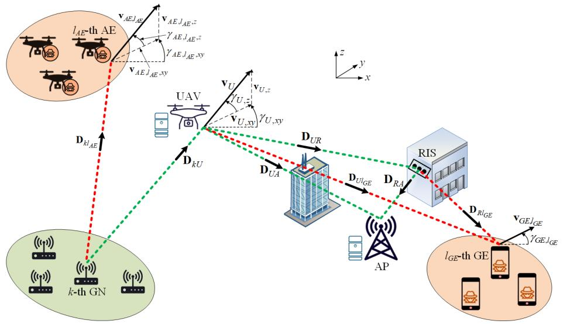

flowchart

```mermaid
graph TD
    A["k-th GN"] -->|D_kU| B["UAV"]
    B -->|D_UU| C["RIS"]
    C -->|D_RLGE| D["l_GE-th GE"]
    D -->|v_GE| E["AP"]
    E -->|D_ULGE| F["DR"]
    F -->|D_UR| G["γ_U,xy"]
    G -->|v_U,z| H["γ_AE,xy"]
    H -->|v_AE,j_AE,z| I["v_AE,j_AE,xy"]
    I -->|v_AE,j_AE,-z| J["v_AE,j_AE,-xy"]
    J --> K["v_AE,j_AE,-xy"]
    K --> L["v_AE,j_AE,xy"]
    L --> M["v_AE,j_AE,-xy"]
    M --> N["v_AE,j_AE,-xy"]
    N --> O["v_AE,j_AE,-xy"]
    O --> P["v_AE,j_AE,-xy"]
    P --> Q["v_AE,j_AE,-xy"]
    Q --> R["v_AE,j_AE,-xy"]
    R --> S["v_AE,j_AE,-xy"]
    S --> T["v_AE,j_AE,-xy"]
    T --> U["v_AE,j_AE,-xy"]
    U --> V["v_AE,j_AE,-xy"]
    V --> W["v_AE,j_AE,-xy"]
    W --> X["v_AE,j_AE,-xy"]
    X --> Y["v_AE,j_AE,-xy"]
    Y --> Z["v_AE,j_AE,-xy"]
    Z --> AA["v_AE,j_AE,-xy"]
    AA --> AB["v_AE,j_AE,-xy"]
    AB --> AC["v_AE,j_AE,-xy"]
    AC --> AD["v_AE,j_AE,-xy"]
    AD --> AE["v_AE,j_AE,-xy"]
    AE --> AF["v_AE,j_AE,-xy"]
    AF --> AG["v_AE,j_AE,-xy"]
    AG --> AH["v_AE,j_AE,-xy"]
    AH --> AI["v_AE,j_AE,-xy"]
    AI --> AJ["v_AE,j_AE,-xy"]
    AJ --> AK["v_AE,j_AE,-xy"]
    AK --> AL["v_AE,j_AE,-xy"]
    AL --> AM["v_AE,j_AE,-xy"]
    AM --> AN["v_AE,j_AE,-xy"]
    AN --> AO["v_AE,j_AE,-xy"]
    AO --> AP["v_AE,j_AE,-xy"]
    AP --> AQ["v_AE,j_AE,-xy"]
    AQ --> AR["v_AE,j_AE,-xy"]
    AR --> AS["v_AE,j_AE,-xy"]
    AS --> AT["v_AE,j_AE,-xy"]
    AT --> AU["v_AE,j_AE,-xy"]
    AU --> AV["v_AE,j_AE,-xy"]
    AV --> AW["v_AE,j_AE,-xy"]
    AW --> AX["v_AE,j_AE,-xy"]
    AX --> AY["v_AE,j_AE,-xy"]
    AY --> AZ["v_AE,j_AE,-xy"]
    AZ --> BA["v_AE,j_AE,-xy"]
    BA --> BB["v_AE,j_AE,-xy"]
    BB --> BC["v_AE,j_AE,-xy"]
    BC --> BD["v_AE,j_AE,-xy"]
    BD --> BE["v_AE,j_AE,-xy"]
    BE --> BF["v_AE,j_AE,-xy"]
    BF --> BG["v_AE,j_AE,-xy"]
    BG --> BH["v_AE,j_AE,-xy"]
    BH --> BI["v_AE,j_AE,-xy"]
    BI --> BJ["v_AE,j_AE,-xy"]
    BJ --> BK["v_AE,j_AE,-xy"]
    BK --> BL["v_AE,j_AE,-xy"]
    BL --> BM["v_AE,j_AE,-xy"]
    BM --> BN["v_AE,j_AE,-xy"]
    BN --> BO["v_AE,j_AE,-xy"]
    BO --> BP["v_AE,j_AE,-xy"]
    BP --> BQ["v_AE,j_AE,-xy"]
    BQ --> BR["v_AE,j_AE,-xy"]
    BR --> BS["v_AE,j_AE,-xy"]
    BS --> BT["v_AE,j_AE,-xy"]
    BT --> BU["v_AE,j_AE,-xy"]
    BU --> BV["v_AE,j_AE,-xy"]
    BV --> BW["v_AE,j_AE,-xy"]
    BW --> BX["v_AE,j_AE,-xy"]
    BX --> BY["v_AE,j_AE,-xy"]
    BY --> BZ["v_AE,j_AE,-xy"]
```

Fig. 1. The system model of the proposed UAV-enabled RIS-assisted MEC-IoT network architecture with both AEs and GEs.

# III. WIRELESS TRANSMISSION MODEL

# A. Direct Links Without RIS Unit

This paper models the G2A and A2G channels using the Nakagami-m distribution, which has proven successful in describing measured data in UAV-based scenarios [30]. The channel gains are assumed to remain constant in each time slot. Thus, a series of channel snapshots characterizes the channel during the UAV’s flying period, where each snapshot is associated with a specific location of the nodes. The probability density function (PDF) and cumulative distribution function (CDF) of the instantaneous signal-to-noise ratio (SNR) received at the UAV stem, respectively, as [31]

$$
f _ {\gamma_ {k U}} (x) = \frac {x ^ {m _ {k U} - 1}}{\left(\frac {\bar {\gamma} _ {k U}}{m _ {k U}}\right) ^ {m _ {k U}} \Gamma (m _ {k U})} \exp \left(- \frac {m _ {k U} x}{\bar {\gamma} _ {k U}}\right), \tag {10}
$$

$$
F _ {\gamma_ {k U}} (x) = 1 - \frac {\Gamma \left(m _ {k U} , \frac {m _ {k U} x}{\bar {\gamma} _ {k U}}\right)}{\Gamma \left(m _ {k U}\right)}, \tag {11}
$$

where $\Gamma \left( y , x \right)$ is the upper incomplete Gamma function [32], $\Gamma \left( a \right)$ is the complete Gamma function [32], $m _ { k U }$ denotes the Nakagami-m fading parameter, and $\bar { \gamma } _ { k U }$ is the average SNR. Based on the Friis’s formula [33], γ¯kU can be expressed as

$$
\bar {\gamma} _ {k U} [ n ] = \frac {p _ {k , o f f} [ n ]}{N _ {0}} \beta_ {0} \| \mathbf {D} _ {k U} [ n ] \| ^ {- \sigma_ {k U}}, \tag {12}
$$

where $\beta _ { 0 } , \ \sigma _ { k U } ,$ , and $N _ { 0 }$ denote the channel gain w.r.t. a reference distance $d _ { 0 } ~ = ~ 1 \mathrm { m }$ , the path-loss exponent, and the additive white Gaussian noise (AWGN) variance at the $\mathrm { U A V } ,$ respectively. Without loss of generality, it is assumed that all nodes have an AWGN variance equal to $N _ { 0 }$ . Note that the PDF $f _ { \gamma _ { U A } } \left( x \right) \left( f _ { \gamma _ { k l _ { A E } } } \left( x \right) \right)$ and CDF $F _ { \gamma _ { U A } } \left( x \right) \left( F _ { \gamma _ { k l _ { A E } } } \left( x \right) \right)$ of the instantaneous SNR received at the AP $( l _ { A E } – \mathrm { t h }$ AE) can be defined using (10) and (11), respectively, and properly replacing the indices.

In this paper, the worst-case scenario is considered, where the $L _ { A E }$ AEs work cooperatively by utilizing maximum ratio combining (MRC) [34]. Then, the instantaneous SNR of the $L _ { A E } { \mathrm { - f o l d } }$ colluding AE is given by $\gamma _ { A E } \ = \ \sum _ { l _ { A E } = 1 } ^ { L _ { A E } } \gamma _ { k l _ { A E } } ,$ L AE γklAE , where $\gamma _ { k l _ { A E } }$ stands for the instantaneous SNR received at the $l _ { A E } .$ -th AE. Using the well-known moment-matching method, the PDF of $\gamma _ { A E }$ is approached by [35, Prop. 8]

$$
f _ {\gamma_ {A E}} (x) \approx \frac {x ^ {m _ {A E} - 1} \exp \left(- \frac {m _ {A E}}{\bar {\gamma} _ {A E}} x\right)}{\left(\frac {\bar {\gamma} _ {A E}}{m _ {A E}}\right) ^ {m _ {A E}} \Gamma (m _ {A E})}, \tag {13}
$$

where

$$
m _ {A E} \triangleq \frac {\left(\sum_ {l _ {A E} = 1} ^ {L _ {A E}} \bar {\gamma} _ {k l _ {A E}}\right) ^ {2}}{\left(\sum_ {l _ {A E} = 1} ^ {L _ {A E}} \frac {\bar {\gamma} _ {k l _ {A E}}}{m _ {k l _ {A E}}} \bar {\gamma} _ {k l _ {A E}} \sum_ {l _ {A E} = 1} ^ {L _ {A E}} \frac {\bar {\gamma} _ {k l _ {A E}} ^ {2}}{m _ {k l _ {A E}}}\right)}, \tag {14}
$$

$$
\bar {\gamma} _ {A E} \triangleq \frac {\sum_ {l _ {A E} = 1} ^ {L _ {A E}} \frac {\bar {\gamma} _ {k l _ {A E}} ^ {2}}{m _ {k l _ {A E}}}}{\sum_ {l _ {A E} = 1} ^ {L _ {A E}} \bar {\gamma} _ {k l _ {A E}}}, \tag {15}
$$

and $m _ { k l _ { A E } } \ge 1 / 2$ and $\bar { \gamma } _ { k l _ { A E } }$ represent the Nakagami-m fading parameter and average SNR of the link between the k-th GN and $l _ { A E ^ { - } } { \mathrm { t h } } \mathrm { A E }$ , respectively. Note that the latter approximation is quite sharp and cost-efficient [35, Prop.8], while it becomes exact when $\bar { \{ \gamma _ { k l _ { A E } } \} } _ { l _ { A E } = 1 } ^ { L _ { A E } }$ LAE are equal.

# B. Indirect Links Through RIS Unit

The phase shift matrix for the RIS unit can be denoted as ΦLR×LR = diag ejφlR 	LRl = $\Phi _ { L _ { R } \times L _ { R } } = d i a g \left\{ e ^ { j \varphi _ { l _ { R } } } \right\} _ { l _ { R } = 1 } ^ { L _ { R } } ,$ R 1, where LR is the number $L _ { R }$ of passive reflecting elements and $\varphi _ { l _ { R } } ~ \in ~ [ 0 , 2 \pi )$ is the phase shift determined by the $l _ { R } \mathrm { - t h }$ element. Disregarding the existence of $\mathrm { G E s } , \ \varphi _ { l _ { R } }$ can be ideally set as $\begin{array} { l l } { \varphi _ { l _ { R } } } & { \triangleq } \end{array}$ arg $\left( h _ { U A } \right) \mathrm { ~ - ~ } \arg \left( h _ { U l _ { R } } \right) - \arg \left( h _ { l _ { R } A } \right)$ [36, Eq. 28], where arg (·) is the argument operator, and $h _ { U A } , \ h _ { U l _ { R } } ,$ , and $h _ { l _ { R } A }$ are the channel fading amplitudes of the links between UAV and AP, between UAV and $l _ { R } { \mathrm { - t h ~ R I S } } ^ { \prime } { \mathrm { s } }$ element, and between lR-th RIS’s element and AP, respectively. Nevertheless, within the context of this paper, we contemplate the presence of GEs. Thus, an alternative strategy for optimizing phase shifts is proposed in Section IV. Due to the discrete nature of practical phase shifts, we actually have the following set of available phase shifts:

$$
\mathcal {S} = \left\{0, \frac {2 \pi}{2 ^ {q}}, \frac {4 \pi}{2 ^ {q}} \dots , \frac {(2 ^ {q} - 1)   2 \pi}{2 ^ {q}} \right\}, \tag {16}
$$

where $q \ \geq \ 1$ determines the number of quantization bits. Therefore, the actual $\varphi _ { l _ { R } }$ obtains the closest value of $\varphi _ { l _ { R } } ( i d e a l )$ and all the available phase shifts within |S| , where |·| denotes cardinality [37]. Nonetheless, high-accuracy phase estimation and/or precise setting of the desired phases is not practically feasible in highly mobile UAV-based environments. It is considered that quantization phase errors $\{ \Theta _ { l _ { R } } \} _ { l _ { R } = 1 } ^ { L _ { R } }$ exist, as only a discrete set of $2 ^ { q }$ phases can be configured [38]. These phase errors are uniformly distributed over $\left\lceil - 2 ^ { - q } \pi , 2 ^ { - q } \pi \right\rceil$ and are also independent and identically distributed (i.i.d.) with common characteristic function expressed as a sequence of complex numbers $\{ \theta _ { \zeta } \} _ { \zeta \in \mathbb { Z } }$ , which are referred to as trigonometric (or circular) moments [39] with $| \theta _ { \zeta } | \leq 1 \forall \zeta \in \mathbb { Z } .$

Based on the results in [38], the composite channel for the link between the UAV and AP via the RIS unit can $\begin{array} { r } { \frac { 1 } { L _ { R } } \dot { \sum } _ { l _ { R } = 0 } ^ { L _ { R } - 1 } { \left| \dot { h _ { U l _ { R } } } \left[ n \right] \right| \left| h _ { l _ { R } A } \right| } \dot { \left[ n \right] } | \exp \left( j \Theta _ { l _ { R } } \right) } \end{array}$ LR nnel  wit $h _ { U R A } \left[ n \right] \stackrel { \Delta } { = }$ scalar fading, where $\left| h _ { U l _ { R } } \left[ n \right] \right| \left( \left| h _ { l _ { R } A } \left[ n \right] \right| \right)$ is the channel gain of the link between the UAV (lR-th RIS’s element) and $l _ { R ^ { - } } \mathrm { t h }$ RIS’s element (AP). For this composite channel, the CDF of the instantaneous SNR received at AP is approximated as [38].

$$
F _ {\gamma_ {U R A}} (x) \approx 1 - \frac {\Gamma \left(m _ {U R A} , \frac {m _ {U R A}}{\bar {\gamma} _ {U R A} [ n ]} x\right)}{\Gamma \left(m _ {U R A}\right)}, \tag {17}
$$

where

$$
m _ {U R A} \triangleq \frac {L _ {R}}{2} \frac {\theta_ {1} ^ {2} a _ {U R} ^ {2} a _ {R A} ^ {2}}{1 + \theta_ {2} - 2 \theta_ {1} ^ {2} a _ {U R} ^ {2} a _ {R A} ^ {2}}, \tag {18}
$$

$$
a _ {U R} \triangleq \frac {\Gamma \left(m _ {U R} + \frac {1}{2}\right)}{\Gamma \left(m _ {U R}\right) \sqrt {m _ {U R}}}, a _ {R A} \triangleq \frac {\Gamma \left(m _ {R A} + \frac {1}{2}\right)}{\Gamma \left(m _ {R A}\right) \sqrt {m _ {R A}}}, \tag {19}
$$

$$
\bar {\gamma} _ {U R A} [ n ] \triangleq \frac {p _ {k , U , o f f} [ n ]}{N _ {0}} L _ {R} ^ {2} \theta_ {1} ^ {2} E \| h _ {U l _ {R}} [ n ] \| ^ {2} E [ | h _ {l _ {R} A} [ n ] | ] ^ {2}, \tag {20}
$$

$$
E \left[ \left| h _ {U l _ {R}} [ n ] \right| \right] = a _ {U R} \sqrt {\beta_ {0} \left\| \mathbf {D} _ {U R} [ n ] \right\| ^ {- \sigma_ {U R}}}, \tag {21}
$$

$$
E \left[ \left| h _ {l _ {R} A} [ n ] \right| \right] = a _ {R A} \sqrt {\beta_ {0} \left\| \mathbf {D} _ {R A} [ n ] \right\| ^ {- \sigma_ {R A}}}, \tag {22}
$$

$E \left[ \cdot \right]$ is the expectation operator, $\theta _ { 1 } = \sin \left( 2 ^ { - q } \pi \right) / \left( 2 ^ { - q } \pi \right)$ and $\theta _ { 2 } ~ = ~ \sin \left( 2 ^ { - q + 1 } \pi \right) / \left( 2 ^ { - q + 1 } \pi \right)$ are the trigonometric (or circular) moments [39] that are related to $\{ \Theta _ { l _ { R } } \} _ { l _ { R } = 1 } ^ { L _ { R } } ,$ $\sigma _ { U R } \left( \sigma _ { R A } \right)$ is the path-loss exponent of the link between UAV (RIS) and RIS (AP), and $m _ { U R } \left( m _ { R A } \right)$ is the Nakagami fading parameter for the link between UAV (RIS) and RIS (AP).

As in the case of AEs, MRC is used at the GEs. According to [38] and [40, Theorem 1], the resultant SNR is the sum of independent but non-identically distributed (i.n.i.d.) exponential random variables with the following PDF:

$$
\begin{array}{l} f _ {\gamma_ {G E}} (x) \\ = \sum_ {l _ {G E} = 1} ^ {L _ {G E}} \frac {\exp \left(- \frac {x}{L _ {R} \bar {\gamma} _ {U R l _ {G E}}}\right)}{L _ {R} \bar {\gamma} _ {U R l _ {G E}}} \underbrace {\prod_ {\substack {\psi = 1 \\ \psi \neq l _ {G E}}} ^ {L _ {G E}} \frac {\bar {\gamma} _ {U R l _ {G E}}}{\bar {\gamma} _ {U R l _ {G E}} - \bar {\gamma} _ {U R \psi}}} _ {\triangleq A (L _ {G E})}, \tag{23} \\ \end{array}
$$

where $\bar { \gamma } _ { U R l _ { G E } }$ incorporates transmit power and propagation attenuation losses of the link between UAV and $l _ { G E } \mathrm { - t h }$ GE via the RIS and can be defined using (20)-(22) and properly replacing the indices.

# C. Analysis of SOP

As DF relaying is adopted, the SOP w.r.t. a given (target) rate R reads as

$$
\mathrm{SOP} (R) = 1 - \left(1 - \mathrm{SOP} _ {1} (R)\right) \left(1 - \mathrm{SOP} _ {2} (R)\right), \tag {24}
$$

where

$$
\mathrm{SOP} _ {1} (R) = E _ {\gamma_ {A E}} \left[ F _ {\gamma_ {k U}} \left(2 ^ {R} - 1 + 2 ^ {R} \gamma_ {A E}\right) \right], \tag {25}
$$

$$
\mathrm{SOP} _ {2} (R) = E _ {\gamma_ {G E}} \left[ F _ {\gamma_ {U R A \& U A}} \left(2 ^ {R} - 1 + 2 ^ {R} \gamma_ {G E}\right) \right] \tag {26}
$$

define the SOP of the first and second hop, respectively. For analytical tractability, let $m _ { k U }$ take integer-only values. Then, we obtain

$$
F _ {\gamma_ {k U}} (x) = 1 - \exp \left(- \frac {m _ {k U} x}{\bar {\gamma} _ {k U}}\right) \sum_ {k _ {1} = 0} ^ {m _ {k U} - 1} \frac {1}{k _ {1} !} \left(\frac {m _ {k U} x}{\bar {\gamma} _ {k U}}\right) ^ {k _ {1}}. \tag {27}
$$

Using (11), (25), the binomial expansion, the identity ∞ $\stackrel { \sim } { \int } x ^ { n - 1 } \exp \left( - \mu x \right) d x = \Gamma \left( n \right) \mu ^ { - n }$ , and performing some 0 straightforward mathematical manipulations, we obtain the expression of $\mathrm { S O P _ { 1 } } \left( R \right)$ in (28), shown at the bottom of the next page. Also, assuming that the effective SNR received at the AP is $\gamma _ { U R A } + \gamma _ { U A }$ , we obtain the following approximated expression:

$$
F _ {\gamma_ {U R A \& U A}} (x) \approx 1 - \frac {\Gamma \left(m _ {U} , \frac {m _ {U} x}{\bar {\gamma} _ {U}}\right)}{\Gamma \left(m _ {U}\right)}, \tag {29}
$$

where

$$
m _ {U} \triangleq \frac {\left(\bar {\gamma} _ {U R A} + \bar {\gamma} _ {U A}\right) ^ {2}}{\frac {\bar {\gamma} _ {U R A} ^ {2}}{m _ {U R A}} + \frac {\bar {\gamma} _ {U A} ^ {2}}{m _ {U A}}}, \tag {30}
$$

$$
\bar {\gamma} _ {U} \triangleq \frac {\frac {\bar {\gamma} _ {U R A} ^ {2}}{m _ {U R A}} + \frac {\bar {\gamma} _ {U A} ^ {2}}{m _ {U A}}}{\bar {\gamma} _ {U R A} + \bar {\gamma} _ {U A}}. \tag {31}
$$

To derive (29), the moment-matching method is adopted in a similar basis as in the analysis of the SNR of AEs. Using (26)

and (29)-(31), we also obtain the expression of $\mathrm { S O P _ { 2 } } \left( R \right)$ in (32), shown at the bottom of the next page. By initially performing integration by substitution and then integration by parts, (32) yields (33), shown at the bottom of the next page. Moreover, using (33), utilizing [32, Eq. (3.381.3)], and performing several simple mathematical manipulations, we obtain (34), shown at the bottom of the next page. For extremely large number of reflecting elements at the RIS unit, i.e., $L _ { R } \to \infty$ , the asymptotic expression for $\mathrm { S O P _ { 2 } } \left( R \right)$ can be derived as

$$
\begin{array}{l} \mathrm{SOP} _ {2} (R) \\ = 1 - \sum_ {l _ {G E} = 1} ^ {L _ {G E}} \frac {A (L _ {G E}) \bar {\gamma} _ {U}}{L _ {R} \bar {\gamma} _ {U R l _ {G E}} 2 ^ {R} \Gamma (m _ {U} + 1)} \int_ {\frac {m _ {U} (2 ^ {R} - 1)}{\bar {\gamma} _ {U}}} ^ {\infty} \Gamma (m _ {U}, x) d x \\ = 1 - \sum_ {l _ {G E} = 1} ^ {L _ {G E}} \frac {A (L _ {G E}) \bar {\gamma} _ {U}}{L _ {R} \bar {\gamma} _ {U R l _ {G E}} 2 ^ {R} \Gamma (m _ {U} + 1) m _ {U}} \\ \times \left[ \exp \left(- \frac {m _ {U} (2 ^ {R} - 1)}{\bar {\gamma} _ {U}}\right) \left(\frac {m _ {U} (2 ^ {R} - 1)}{\bar {\gamma} _ {U}}\right) ^ {m _ {U} + 1} \right. \\ \left. + \left(m _ {U} - \frac {m _ {U} (2 ^ {R} - 1)}{\bar {\gamma} _ {U}}\right) \Gamma \left(m _ {U} + 1, \frac {m _ {U} (2 ^ {R} - 1)}{\bar {\gamma} _ {U}}\right) \right]. \tag {35} \\ \end{array}
$$

The effective secrecy rate (measured in bps/Hz) of the link between the k-th GN and the UAV, while considering the existence of AEs, can be defined as follows

$$
r _ {k U} [ n ] = R \left[ 1 - \mathrm{SOP} _ {1} (R) \right]. \tag {36}
$$

Also, the effective secrecy rate (measured in bps/Hz) pertaining to both the direct UAV-to-AP link and the associated indirect link through the RIS unit, while considering the influence of GEs, can be defined as follows

$$
r _ {U A, U R A} \left[ n \right] = R \left[ 1 - \mathrm{SOP} _ {2} (R) \right]. \tag {37}
$$

# IV. OPTIMIZATION OF SECURE COMPUTATION EFFICIENCY

Within this section, the ensuing optimization problem is formulated with the aim of maximizing the minimum SCE and attaining a judicious compromise between the quantity of bits processed and the energy expended:

(P1) :

$$
\max _ {\mathbf {P}, \tau , \mathbf {B}, \varphi_ {A}, \varphi_ {l _ {G E}}} \min \eta_ {S C E} \tag {38a}
$$

$$
\text { s.t. } \quad b _ {k, l} [ n ] + b _ {k, U} [ n ] + b _ {k, A} [ n ] \geq b _ {k, \min} [ n ], \tag {38b}
$$

$$
\left\{b _ {k, l} [ n ], b _ {k, U} [ n ], b _ {k, A} [ n ] \right\} \geq 0, \tag {38c}
$$

$$
0 \leq p _ {k, o f f} [ n ] \leq p _ {k, o f f, \max} [ n ], \tag {38d}
$$

$$
0 \leq p _ {k, U, o f f} [ n ] \leq p _ {k, U, o f f, \max} [ n ], \tag {38e}
$$

$$
0 \leq \tau_ {k, o f f} [ n ] \leq \frac {\tau}{K}, 0 \leq \tau_ {k, U, o f f} [ n ] \leq \frac {\tau}{K}, \tag {38f}
$$

$$
0 \leq \frac {c _ {k} b _ {k , l} [ n ]}{f _ {k , \max}} \leq \tau , 0 \leq \frac {c _ {U} b _ {k , U} [ n ]}{f _ {U , \max}} \leq \frac {\tau}{K}, \tag {38g}
$$

$$
\tau_ {k, o f f} [ n ] + \tau_ {k, U, o f f} [ n ] + \frac {c _ {U} b _ {k , U} [ n ]}{f _ {U , \max}} \leq \frac {\tau}{K}, \tag {38h}
$$

$$
b _ {k, U} [ n ] + b _ {k, A} [ n ] \leq \tau_ {k, o f f} [ n ] r _ {k U} \left(p _ {k, o f f} [ n ]\right), \tag {38i}
$$

$$
b _ {k, A} [ n ] \leq \tau_ {k, U, o f f} [ n ] r _ {U A, U R A}
$$

$$
\left(p _ {k, U, o f f} \left[ n \right], \varphi_ {A}, \varphi_ {l _ {G E}}\right), \tag {38j}
$$

$$
0 \leq \left\{\varphi_ {A}, \varphi_ {l _ {G E}} \right\} \leq 2 \pi , \tag {38k}
$$

where $\begin{array} { r l r } { \mathbf { P } } & { { } \stackrel { \Delta } { = } } & { \left\{ p _ { k , o f f . } \left[ n \right] , p _ { k , U , o f f } \left[ n \right] \right\} , \quad \tau } \end{array}$ ∆= $\{ \tau _ { k , o f f } \left[ n \right] , \tau _ { k , U , o f f } \left[ n \right] \} , \textbf { B } \stackrel { \Delta } { = } \left\{ b _ { k , l } \left[ n \right] , b _ { k , U } \left[ n \right] , b _ { k , A } \left[ n \right] \right\}$ , $\begin{array} { r l r } { \varphi _ { A } } & { { } = } & { \arg \left( h _ { U A } \left[ n \right] \right) - \arg \left( h _ { U l _ { R } } \left[ n \right] \Phi h _ { l _ { R } A } \left[ n \right] \right) } \end{array}$ , and $\begin{array} { r c l } { { \varphi _ { l _ { G E } } } } & { { = } } & { { \mathrm { a r g } \left( h _ { U l _ { G E } } \left[ n \right] \right) - \mathrm { a r g } \left( h _ { U l _ { R } } \left[ n \right] \Phi h _ { l _ { R } l _ { G E } } \left[ n \right] \right) } } \end{array}$ are the optimizing variables, $b _ { k , \mathrm { m i n } }$ denotes the minimum bits to be processed in each time slot, and $p _ { k , o f f , \operatorname* { m a x } } \left[ n \right]$ $\left( p _ { k , U , o f f , \operatorname* { m a x } } \left[ n \right] \right)$ is the maximum transmit power of k-th GN $( \mathrm { U A V } ) . \mathrm { A l s o } , \varphi _ { A }$ and $\varphi _ { l _ { G E } }$ denote the angle $\mathbf { h } _ { U R } \left[ n \right] \Phi \mathbf { h } _ { R A } \left[ n \right]$ to $h _ { U A } \left[ n \right]$ and the angle hUR [n] Φh $R l _ { G E } \left[ n \right]$ to $h _ { U l _ { G E } } \left[ n \right]$ , respectively [41], where $\mathbf { h } _ { U R } \left[ n \right] \quad \in \quad \mathbb { C } ^ { 1 \times L _ { R } }$ , $\mathbf { h } _ { R A } \mathbf { \bar { \Psi } } [ n ] \mathbf { \Psi } \bar { \in } \mathbb { C } ^ { L _ { R } \times 1 }$ , and $\mathbf { h } _ { R l _ { G E } } \in \mathbb { C } ^ { L _ { R } \times 1 }$ stand for the channel vectors of the links between UAV and RIS, between RIS and AP, and between RIS and $l _ { G E } \mathrm { - t h }$ GE, respectively, and $\mathbb { C } ^ { a \times b }$ denotes the space of an $a \times b$ complex-valued matrix. It is worth noting that the constraint in (38b) specifies the task allocation, the constraint in (38c) ensures that the computation bits are non-negative, the constraints in (38d) and in (38e) designate the range of transmit power values, the constraints in (38f)-(38h) describe the limitations of the transmission delay and computation delay, and the constraints in (38i) and in (38j) indicate the computation offloading limitations.

The task of obtaining the solution to Problem (P1) is recognized as challenging, given the fractional nature of the objective function and the coupled variables of interest. As Problem (P1) embodies a typical non-convex problem [42], the identification of a global optimal solution is not practically attainable. However, Problem (P1) can be transformed into a manageable form by employing the Dinkelbach’s method [43]. Let $\omega ^ { * }$ denote the optimized SCE with $( \cdot ) ^ { * }$ indicating the optimal solution. Following this, the application of Dinkelbach’s method results in the formulation of the following lemma, providing an effective approach to address the problem.

$$
\mathrm{SOP} _ {1} (R) = 1 - \sum_ {k _ {1} = 0} ^ {m _ {k U} - 1} \sum_ {k _ {2} = 0} ^ {k _ {1}} \binom {k _ {1}} {k _ {2}} \frac {1}{k _ {1} ! \left(\frac {\bar {\gamma} _ {A E}}{m _ {A E}}\right) ^ {m _ {A E}} \Gamma (m _ {A E})} \left(\frac {m _ {k U}}{\bar {\gamma} _ {k U}}\right) ^ {k _ {1}}
$$

$$
\times \left(2 ^ {R} - 1\right) ^ {k _ {1} - k _ {2}} 2 ^ {k _ {2} R} \Gamma \left(k _ {2} + m _ {A E}\right) \left(\frac {m _ {k U}}{\bar {\gamma} _ {k U}} + \frac {m _ {A E}}{\bar {\gamma} _ {A E}}\right) ^ {- k _ {2} - m _ {A E}}. \tag {28}
$$

Lemma 1: The optimal solution of Problem (P1) is obtained if and only if

$$
\begin{array}{l} \max _ {\mathbf {P}, \tau , \mathbf {B}, \varphi_ {A}, \varphi_ {l _ {G E}}} \min \sum_ {n = 1} ^ {N} \sum_ {k = 1} ^ {K} \left(b _ {k} [ n ] - \omega^ {*} E _ {0, k} [ n ]\right) \\ = \min \sum_ {n = 1} ^ {N} \sum_ {k = 1} ^ {K} \left(b _ {k} ^ {*} [ n ] - \omega^ {*} E _ {0, k} ^ {*} [ n ]\right) = 0, \tag {39} \\ \end{array}
$$

$\begin{array} { r } { E _ { 0 , k } \left[ n \right] \ = \ w _ { k } E _ { k } \left[ n \right] + w _ { U } \left( E _ { k , U } \left[ n \right] + \frac { E _ { p } \left[ n \right] } { K } \right) } \end{array}$ and $\begin{array} { r } { E _ { 0 , k } ^ { * } \left[ n \right] = w _ { k } E _ { k } ^ { * } \left[ n \right] + w _ { U } \left( E _ { k , U } ^ { * } \left[ n \right] + \frac { E _ { p } \left[ n \right] } { K } \right) } \end{array}$

Proof : See Appendix.

As $\omega ^ { * }$ cannot be obtained a priori, we substitute $\omega ^ { * }$ with ω. Subsequently, the solution of Problem (P1) can be attained by alternately solving the following problem:

$$
\text {(P2)}: \max _ {\mathbf {P}, \tau , \mathbf {B}, \varphi_ {A}, \varphi_ {l _ {G E}}} \min \sum_ {n = 1} ^ {N} \sum_ {k = 1} ^ {K} (b _ {k} [ n ] - \omega E _ {0, k} [ n ]) \tag {40a}
$$

$\mathrm { s . t . } \quad \mathrm { ( 3 8 b ) - ( 3 8 j ) } ,$ (40b)

$$
0 \leq \left\{\varphi_ {A}, \varphi_ {l _ {G E}} \right\} \leq 2 \pi . \tag {40c}
$$

Through the reformulation of Problem (P2) utilizing the auxiliary variable $\theta = \operatorname* { m i n } \sum _ { n = 1 } ^ { N } \sum _ { k = 1 } ^ { K } \left( b _ { k } \left[ n \right] - \omega E _ { s y s , k } \left[ n \right] \right)$ , the n=1 k=1 ensuing optimization problem is defined as follows:

$$
\text {(P3)}: \max _ {\mathbf {P}, \boldsymbol {\tau}, \mathbf {B}, \varphi_ {A}, \varphi_ {l _ {G E}}} \vartheta \tag {41a}
$$

$$
\text { s.t. } \sum_ {n = 1} ^ {N} \sum_ {k = 1} ^ {K} (b _ {k} [ n ] - \omega E _ {0, k} [ n ]) \geq \theta , \tag {41b}
$$

$$
(3 8 \mathrm{b}) - (3 8 \mathrm{j}), \tag {41c}
$$

$$
0 \leq \left\{\varphi_ {A}, \varphi_ {l _ {G E}} \right\} \leq 2 \pi . \tag {41d}
$$

It can be observed that Problem (P3) is a non-convex problem, since the variables of interest are still coupled. To tackle this issue, we will exploit the BCD technique to transform Problem (P3) into three separate subproblems, namely optimization of transmit power, optimization of transmission time for offloading, and optimization of computation bits.

# A. Optimized Transmit Power

Using (1) and (4)-(7) and given values of $\mathbf { B } ^ { * } , \tau ^ { * } , \varphi _ { A } ^ { * }$ , and $\varphi _ { l _ { G E } } ^ { * }$ , we formulate the following problem that involves P:

$$
(\mathrm{P} 4):
$$

$$
\max _ {\mathbf {P}, \vartheta} \vartheta \tag {42a}
$$

$$
\begin{array}{l} \text { s.t. } \sum_ {n = 1} ^ {N} \sum_ {k = 1} ^ {K} \left(b _ {k, l} ^ {*} [ n ] + b _ {k, U} ^ {*} [ n ] + b _ {k, A} ^ {*} [ n ] \right. \\ - \omega \left(w _ {k} \left(\kappa_ {k} c _ {k} ^ {3} \big (b _ {k, l} ^ {*} [ n ] \big) ^ {3} \tau^ {- 2} + p _ {k, o f f} [ n ] \tau_ {k, o f f} ^ {*} [ n ]\right) \right. \\ \left. + w _ {U} \left(\kappa_ {U} c _ {U} ^ {3} K ^ {2} \left(b _ {k, U} ^ {*} [ n ]\right) ^ {3} \tau^ {- 2} + p _ {k, U, o f f} [ n ] \tau_ {k, U, o f f} ^ {*} [ n ] + \frac {E _ {p} [ n ]}{K}\right)\right) \geq \theta \tag {42b} \\ \end{array}
$$

$$
(3 8 \mathrm{d}), (3 8 \mathrm{e}), (3 8 \mathrm{i}), (3 8 \mathrm{j}) \tag {42c}
$$

Lemma 2: Problem (P4) is convex.

Proof : From (42a), it is straightforward that the objective function of Problem (P4) is convex w.r.t. $p _ { k , o f f } \left[ n \right]$ and $p _ { k , U , o f f } [ n ] .$ . Also, the expressions in (42b), (38d), and (38e) are linear. Moreover, the second derivative of $r _ { k U }$ and $r _ { U A , U R A }$ w.r.t. $p _ { k , o f f } \left[ n \right]$ and $p _ { k , U , o f f } \left[ n \right]$ , respectively, is positive. Hence, the right-hand-side of (38i) and (38j) is a convex function of $p _ { k , o f f } \left[ n \right]$ and $p _ { k , U , o f f } \left[ n \right]$ , respectively.

The Lagrangian dual method is used to tackle Problem (P4). In this context, the non-negative Lagrange multipliers (dual variables) $\lambda _ { 1 , k , n } , \lambda _ { 2 , k , n }$ , and $\lambda _ { 3 , k , n }$ are introduced, each associated with the constraints in (42b), (38i), and (38j), respectively. The Lagrange function corresponding to Problem (P4) is given by $( 4 3 ) ,$ , shown at the bottom of the next page, where $\lambda _ { 1 } , \lambda _ { 2 } .$ , and $\lambda _ { 3 }$ constitute the sets of $\lambda _ { 1 , k , n } , \lambda _ { 2 , k , n } .$ , and $\lambda _ { 3 , k , n }$ , respectively. Furthermore, the dual function pertaining to Problem (P4) is expressed as

$$
\zeta \left(\boldsymbol {\lambda} _ {1}, \boldsymbol {\lambda} _ {2}, \boldsymbol {\lambda} _ {3}\right) = \max _ {\mathbf {B}, \vartheta} \mathcal {L} \left(\mathbf {P}, \vartheta , \boldsymbol {\lambda} _ {1}, \boldsymbol {\lambda} _ {2}, \boldsymbol {\lambda} _ {3}\right) \tag {44a}
$$

$$
\text { s   .   t   . } (3 8 \mathrm{b}), (3 8 \mathrm{c}), (3 8 \mathrm{g}) - (3 8 \mathrm{j}) \tag {44b}
$$

$$
\mathrm{SOP} _ {2} (R) = 1 - \sum_ {l _ {G E} = 1} ^ {L _ {G E}} \frac {A \left(L _ {G E}\right)}{L _ {R} \bar {\gamma} _ {U R l _ {G E}} \Gamma \left(m _ {U}\right)} \int_ {0} ^ {\infty} \Gamma \left(m _ {U}, \frac {m _ {U} \left(2 ^ {R} - 1 + 2 ^ {R} x\right)}{\bar {\gamma} _ {U}}\right) \exp \left(- \frac {x}{L _ {R} \bar {\gamma} _ {U R l _ {G E}}}\right) d x. \tag {32}
$$

$$
\begin{array}{l} \mathrm{SOP} _ {2} (R) = 1 - \sum_ {l _ {G E} = 1} ^ {L _ {G E}} \frac {A (L _ {G E}) \exp \left(\frac {2 ^ {R} - 1}{L _ {R} \bar {\gamma} _ {U R l _ {G E}} 2 ^ {R}}\right)}{\Gamma (m _ {U})} \left[ \Gamma \left(m _ {U}, \frac {m _ {U} (2 ^ {R} - 1)}{\bar {\gamma} _ {U}}\right) \exp \left(- \frac {2 ^ {R} - 1}{L _ {R} \bar {\gamma} _ {U R l _ {G E}} 2 ^ {R}}\right) \right. \\ \left. - \int_ {\frac {m _ {U} \left(2 ^ {R} - 1\right)}{\bar {\gamma} _ {U}}} ^ {\infty} x ^ {m _ {U} - 1} \exp \left(- \left(\frac {2 ^ {R} - 1}{L _ {R} \bar {\gamma} _ {U R l _ {G E}} 2 ^ {R}} + 1\right) x\right) d x \right]. \tag {33} \\ \end{array}
$$

$$
\mathrm{SOP} _ {2} (R) = 1 - \sum_ {l _ {G E} = 1} ^ {L _ {G E}} \frac {A (L _ {G E}) \exp \left(\frac {2 ^ {R} - 1}{L _ {R} \bar {\gamma} _ {U R l _ {G E}} 2 ^ {R}}\right)}{\Gamma (m _ {U})} \left[ \Gamma \left(m _ {U}, \frac {m _ {U} (2 ^ {R} - 1)}{\bar {\gamma} _ {U}}\right) \exp \left(- \frac {2 ^ {R} - 1}{L _ {R} \bar {\gamma} _ {U R l _ {G E}} 2 ^ {R}}\right) \right.
$$

$$
\left. - \frac {\Gamma \left(m _ {U} , \left(\frac {2 ^ {R} - 1}{L _ {R} \bar {\gamma} _ {U R l _ {G E}} 2 ^ {R}} + 1\right) \frac {m _ {U} \left(2 ^ {R} - 1\right)}{\bar {\gamma} _ {U}}\right)}{\left(\frac {2 ^ {R} - 1}{L _ {R} \bar {\gamma} _ {U R l _ {G E}} 2 ^ {R}} + 1\right) ^ {m _ {U}}} \right]. \tag {34}
$$

Moreover, the dual problem of Problem (P4) is represented as follows

$$
(\mathrm{P} 4 - \text { dual }): \min _ {\boldsymbol {\lambda} _ {1}, \boldsymbol {\lambda} _ {2}, \boldsymbol {\lambda} _ {3}} \zeta (\boldsymbol {\lambda} _ {1}, \boldsymbol {\lambda} _ {2}, \boldsymbol {\lambda} _ {3}) \tag {45a}
$$

$$
\text { s.t. } \{\boldsymbol {\lambda} _ {1}, \boldsymbol {\lambda} _ {2}, \boldsymbol {\lambda} _ {3} \} \succeq 0 \tag {45b}
$$

Given the strong duality between Problem (P4) and Problem (P4-dual), determining the solution for the dual Problem (P4-dual) leads to the optimal solution of Problem (P4). In view of the convex nature of Problem (P4), the strong duality between these two problems is satisfied by Slater’s condition [42]. Additionally, by introducing dual variables with arbitrary values and solving Problem (P4-dual), the dual function is derived. Furthermore, decomposing Problem (P4-dual) results in a set of KN independent subproblems. These subproblems can be further dissected into the subsequent two subproblems:

$$
\begin{array}{l} \text {(L1)}: \max _ {p _ {k, o f f} [ n ]} \lambda_ {1, k, n} \omega w _ {k} p _ {k, o f f} [ n ] \tau_ {k, o f f} ^ {*} [ n ] \\ - \lambda_ {2, k, n} \tau_ {k, o f f} ^ {*} [ n ] r _ {k U} (p _ {k, o f f} [ n ]) (46a) \\ \text { s   .   t   . } (3 8 \mathrm{d}), (3 8 \mathrm{i}) (46b) \\ \end{array}
$$

$$
\text {(L2)}: \max _ {p _ {k, U, o f f} [ n ]} \lambda_ {1, k, n} \omega w _ {U} p _ {k, U, o f f} [ n ] \tau_ {k, U, o f f} ^ {*} [ n ]
$$

$$
- \lambda_ {3, k, n} \tau_ {k, U, o f f} ^ {*} [ n ] r _ {U A, U R A}
$$

$$
\left(p _ {k, U, o f f} [ n ], \varphi_ {A} ^ {*}, \varphi_ {l _ {G E}} ^ {*}\right) \tag {47a}
$$

$$
\text { s   .   t   . } (3 8 \mathrm{e}), (3 8 \mathrm{j}) \tag {47b}
$$

To acquire the optimal values $p _ { k , o f f } ^ { * } [ n ]$ and $p _ { k , U , o f f } ^ { * } [ n ]$ for the subproblems (L1) and (L2) correspondingly, numerical solutions are required. These solutions should be obtained by adhering to the Karush-Kuhn-Tucker (KKT) conditions.

# B. Optimized Transmission Time for Offloading

Given a specific value for $p _ { k , o f f } ^ { * } [ n ] , \tau _ { k , o f f } ^ { * } [ n ]$ can be determined by substituting $p _ { k , o f f } ^ { * } [ \bar { n } ]$ into subproblem (L1), as defined in (48), shown at the bottom of the next page. Similarly, for provided values for $p _ { k , U , o f f } ^ { * } [ n ] , \varphi _ { A } ^ { * }$ , and $\varphi _ { l _ { G E } } ^ { * } ,$ $\tau _ { k , U , o f f } ^ { * } \left[ n \right]$ can be obtained by substituting $p _ { k , U , o f f } ^ { * } \left[ n \right]$ GE into subproblem (L2), as defined in (49), shown at the bottom of the next page. Due to the non-uniqueness of the solution for $\tau ^ { * }$ , the following linear programming problem is formulated, which can be effectively solved using CVX [44]:

$$
(\mathrm{P5}):
$$

$$
\begin{array}{l} \max _ {\boldsymbol {\tau}} \min \sum_ {n = 1} ^ {N} \sum_ {k = 1} ^ {K} \left(b _ {k, l} ^ {*} [ n ] + b _ {k, U} ^ {*} [ n ] + b _ {k, A} ^ {*} [ n ] \right. \\ - \omega \left(w _ {k} \left(\kappa_ {k} c _ {k} ^ {3} \left(b _ {k, l} ^ {*} [ n ]\right) ^ {3} \tau^ {- 2} + p _ {k, o f f} ^ {*} [ n ] \tau_ {k, o f f} [ n ]\right) \right. \\ \left. + w _ {U} \left(\kappa_ {U} c _ {U} ^ {3} K ^ {2} \left(b _ {k, U} ^ {*} [ n ]\right) ^ {3} \tau^ {- 2} + p _ {k, U, o f f} ^ {*} [ n ] \tau_ {k, U, o f f} [ n ] + \frac {E _ {p} [ n ]}{K}\right)\right) \tag {50a} \\ \end{array}
$$

$$
\text { s   .   t   . } (3 8 \mathrm{f}) \tag {50b}
$$

$$
\tau_ {k, o f f} [ n ] + \tau_ {k, o f f, U} [ n ] + \frac {c _ {U} b _ {k , U} ^ {*} [ n ]}{f _ {U , \max}} \leq \frac {\tau}{K}, \tag {50c}
$$

$$
b _ {k, U} ^ {*} [ n ] + b _ {k, A} ^ {*} [ n ] \leq \tau_ {k, o f f} [ n ] r _ {k U} \left(p _ {k, o f f} ^ {*} [ n ]\right), \tag {50d}
$$

$$
b _ {k, A} ^ {*} [ n ] \leq \tau_ {k, U, o f f} [ n ] r _ {U A, U R A} \left(p _ {k, U, o f f} ^ {*} [ n ], \varphi_ {A} ^ {*}, \varphi_ {l _ {G E}} ^ {*}\right). \tag {50e}
$$

# C. Optimized Computation Bits

Given specified values for $\mathbf { P } ^ { * } , \ \tau ^ { * } , \ \varphi _ { A } ^ { * } ,$ and $\varphi _ { l _ { G E } } ^ { * } ,$ the solution of the subsequent convex optimization problem with linear constraints is requisite. This problem can be addressed through the utilization of CVX [44] in order to derive the optimal solutions for $b _ { k , l } ^ { * } [ n ] , b _ { k , A } ^ { * } [ n ]$ , and $b _ { k , U } ^ { * } [ n ] { : }$ :

$$
(\mathrm{P6}):
$$

$$
\begin{array}{l} \max _ {\mathbf {B}} \min \sum_ {n = 1} ^ {N} \sum_ {k = 1} ^ {K} (b _ {k, l} [ n ] + b _ {k, U} [ n ] + b _ {k, A} [ n ]) \\ - \omega \left(w _ {k} \left(\kappa_ {k} c _ {k} ^ {3} (b _ {k, l} [ n ]) ^ {3} \tau^ {- 2} + p _ {k, o f f} ^ {*} [ n ] \tau_ {k, o f f} ^ {*} [ n ]\right) \right. \\ \left. + w _ {U} \left(\kappa_ {U} c _ {U} ^ {3} K ^ {2} \left(b _ {k, U} [ n ]\right) ^ {3} \tau^ {- 2} + p _ {k, U, o f f} ^ {*} [ n ] \tau_ {k, U, o f f} ^ {*} [ n ] + \frac {E _ {p} [ n ]}{K}\right)\right) \tag {51a} \\ \end{array}
$$

$$
\text { s   .   t   . } (3 8 \mathrm{b}), (3 8 \mathrm{c}), (3 8 \mathrm{g}) \tag {51b}
$$

$$
\tau_ {k, o f f} ^ {*} [ n ] + \tau_ {k, o f f, U} ^ {*} [ n ] + \frac {c _ {U} b _ {k , U} [ n ]}{f _ {U , \max}} \leq \frac {\tau}{K}, \tag {51c}
$$

$$
b _ {k, U} [ n ] + b _ {k, A} [ n ] \leq \tau_ {k, o f f} ^ {*} [ n ] r _ {k U} \left(p _ {k, o f f} ^ {*} [ n ]\right), \tag {51d}
$$

$$
b _ {k, A} [ n ] \leq \tau_ {k, U, o f f} ^ {*} [ n ] r _ {U A, U R A} \left(p _ {k, U, o f f} ^ {*} [ n ], \varphi_ {A} ^ {*}, \varphi_ {l _ {G E}} ^ {*}\right). \tag {51e}
$$

$$
\begin{array}{l} \mathcal {L} (\mathbf {P}, \vartheta , \boldsymbol {\lambda} _ {1}, \boldsymbol {\lambda} _ {2}, \boldsymbol {\lambda} _ {3}) = - \vartheta + \vartheta \sum_ {n = 1} ^ {N} \sum_ {k = 1} ^ {K} \lambda_ {1, k, n} + \sum_ {n = 1} ^ {N} \sum_ {k = 1} ^ {K} \lambda_ {2, k, n} \left(b _ {k, U} ^ {*} [ n ] + b _ {k, A} ^ {*} [ n ]\right) + \sum_ {n = 1} ^ {N} \sum_ {k = 1} ^ {K} \lambda_ {3, k, n} b _ {k, A} ^ {*} [ n ] \\ - \sum_ {n = 1} ^ {N} \sum_ {k = 1} ^ {K} \lambda_ {1, k, n} \left(b _ {k, l} ^ {*} [ n ] + b _ {k, U} ^ {*} [ n ] + b _ {k, A} ^ {*} [ n ] - \omega \left(w _ {k} \left(\kappa_ {k} c _ {k} ^ {3} \big (b _ {k, l} ^ {*} [ n ] \big) ^ {3} \tau^ {- 2} + p _ {k, o f f} [ n ] \tau_ {k, o f f} ^ {*} [ n ]\right) \right. \right. \\ \left. \left. + w _ {U} \left(\kappa_ {U} c _ {U} ^ {3} K ^ {2} \left(b _ {k, U} ^ {*} [ n ]\right) ^ {3} \tau^ {- 2} + p _ {k, U, o f f} [ n ] \tau_ {k, U, o f f} ^ {*} [ n ] + \frac {E _ {p} [ n ]}{K}\right)\right)\right) \\ - \sum_ {n = 1} ^ {N} \sum_ {k = 1} ^ {K} \lambda_ {2, k, n} \tau_ {k, o f f} ^ {*} [ n ] r _ {k U} \left(p _ {k, o f f} [ n ]\right) - \sum_ {n = 1} ^ {N} \sum_ {k = 1} ^ {K} \lambda_ {3, k, n} \tau_ {k, U, o f f} ^ {*} [ n ] r _ {U A, U R A} \left(p _ {k, U, o f f} [ n ], \varphi_ {A} ^ {*}, \varphi_ {l _ {G E}} ^ {*}\right). \tag {43} \\ \end{array}
$$

# D. Optimized RIS’s Phase Shifts

In order to ascertain $\varphi _ { A } ^ { * }$ and $\varphi _ { l _ { G E } } ^ { * } ,$ the imperative is to maximize the SNR at the $\mathbf { A P }$ and concurrently minimize the SNR at the $l _ { G E } \mathrm { - t h }$ GE [20]. As a result, the following problems need to be addressed:

$$
\left(\mathrm{P} 7\right): \max _ {\varphi_ {A}} \left| h _ {U A} [ n ] + \mathbf {h} _ {U R} [ n ] \boldsymbol {\Phi} \mathbf {h} _ {R A} [ n ] \right| ^ {2} \tag {52a}
$$

$$
\text { s   .   t   . } 0 \leq \varphi_ {A} <   2 \pi \tag {52b}
$$

$$
\text {(P8)}: \min _ {\varphi_ {l _ {G E}}} \left| h _ {U l _ {G E}} [ n ] + \mathbf {h} _ {U R} [ n ] \boldsymbol {\Phi} \mathbf {h} _ {R l _ {G E}} [ n ] \right| ^ {2} \tag {53a}
$$

$$
\text { s.t. } 0 \leq \varphi_ {l _ {G E}} <   2 \pi \tag {53b}
$$

The objective function of Problem (P7) can be written as $\left| h _ { U A } \left[ n \right] \right| ^ { 2 } ~ + ~ \left| { \bf h } _ { U R } \left[ n \right] \Phi { \bf h } _ { R A } \left[ n \right] \right| ^ { 2 } ~ + ~ 2 \left| h _ { U A } \left[ n \right] \right| ~ .$ |hUR [n] ΦhRA [n]| · cos (φA) . Obviously, the solution of Problem (P7) is $\varphi _ { A } ^ { * } = 0$ . Thus, it follows that arg $\left( h _ { U A } \left[ n \right] \right) =$ arg $\left( \mathbf { h } _ { U R } \left[ n \right] \Phi \mathbf { h } _ { R A } \left[ n \right] \right)$ . To achieve the optimal value, the RIS reflection path should align with the signal of the direct link, implying that arg $\left( h _ { U A } \left[ n \right] \right) = \arg \left( \mathbf { h } _ { U R } \left[ n \right] \Phi \mathbf { h } _ { R A } \left[ n \right] \right)$ can be represented by the equation $Q _ { A } h _ { U A } \left[ n \right] = \mathbf { h } _ { U R } \left[ n \right]$ ] ΦhRA [n] , where $Q _ { A } \in \mathrm { R e } ^ { + }$ is a positive scalar [20] representing the signal amplitude relationship between the direct link and the RIS reflection path. The bisection search method [20], [41], known for its low computational complexity, can be leveraged to find $Q _ { A } ^ { * } \in ( 0 , Q _ { A , \operatorname* { m a x } } ]$ and properly tune the RIS’s phase shifts, where $Q _ { A , \mathrm { { m a x } } }$ can be determined using the approach described in [20, Appendix $\mathbf { A l } .$ Similarly, the objective function of Problem (P8) is given by $| h _ { U l _ { G E } } \left[ n \right] | ^ { 2 } + | \mathbf { \tilde { h } } _ { U R } \left[ n \right] \Phi \mathbf { h } _ { R l _ { G E } } \left[ n \right] | ^ { 2 } +$ 2 |hU lGE [n]| · |hUR [n] ΦhRlGE [n]| · cos $\left( \varphi \iota _ { G E } \right)$ . Notably, the solution to Problem (P8) is $\varphi _ { l _ { G E } } ^ { * } = \pi .$ . Hence, we obtain $\begin{array} { r l r } { \pi } & { = } & { \arg \left( h _ { U l _ { G E } } \left[ n \right] \right) - \arg \left( \Breve { \mathbf { h } } _ { U R } \left[ n \right] \Phi \mathbf { h } _ { R l _ { G E } } \left[ n \right] \right) } \end{array}$ , which can be represented by the equation $Q _ { l _ { G E } } h _ { U l _ { G E } } \left[ n \right]$ = $\mathbf { h } _ { U R } \left[ n \right] \Phi \mathbf { h } _ { R l _ { G E } } \left[ n \right]$ , where $Q _ { l _ { G E } } \in \mathfrak { R } ^ { - }$ is a negative scalar and $Q _ { l _ { G E } } ^ { * }$ can be found using the bisection method [20].

Proposition 1: The lower bound of $Q _ { l _ { G E } } \in [ Q _ { l _ { G E } , \operatorname* { m i n } } , 0 )$ , can be acquired as

$$
Q _ {l _ {G E}, \min} = - \frac {\sum_ {l _ {R} = 1} ^ {L _ {R}} \left| h _ {U l _ {R}} [ n ] \right| \cdot \left| h _ {l _ {R} l _ {G E}} [ n ] \right|}{\left| h _ {U l _ {G E}} [ n ] \right|.} \tag {54}
$$

Proof : The equation $Q _ { l _ { G E } } h _ { U l _ { G E } } \left[ n \right] \ = \ \mathbf { h } _ { U R } \left[ n \right] \Phi \mathbf { h } _ { R l _ { G E } } \left[ n \right]$ can be expanded as $Q _ { l _ { G E } } h _ { U l _ { G E } } \left[ n \right]$ $\sum _ { l _ { R } = 1 } ^ { L _ { R } } h _ { U l _ { R } } \left[ n \right] \cdot h _ { l _ { R } l _ { G E } } \left[ n \right] \cdot \exp \left( j \Theta _ { l _ { R } l _ { G E } } \right)$ . As $Q _ { l _ { G E } } \in \mathfrak { R } ^ { - }$

it follows that

$$
Q _ {l _ {G E}} \geqslant - \frac {\sum_ {l _ {R} = 1} ^ {L _ {R}} \left| h _ {U l _ {R}} [ n ] \right| \cdot \left| h _ {l _ {R} l _ {G E}} [ n ] \right|}{\left| h _ {U l _ {G E}} [ n ] \right|}. \tag {55}
$$

Thus, the lower bound for $Q _ { l _ { G E } }$ defined in (54) is obtained.

# E. Optimized Dual Variables

To acquire the optimal dual variables, the solution of the convex yet non-differentiable Problem (P4-dual) is imperative. In pursuit of this objective, the ellipsoid method [42] is employed to systematically derive an optimal solution through iterative procedures. The subgradient of the objective function is denoted by $\left( \Delta \lambda _ { 1 } ^ { T } , \Delta \lambda _ { 2 } ^ { T } , \bar { \Delta \lambda _ { 3 } ^ { T } } \right) ^ { T }$ , where

$$
\begin{array}{l} \Delta \lambda_ {1} \\ = \vartheta - b _ {k, l} ^ {*} [ n ] + b _ {k, U} ^ {*} [ n ] + b _ {k, A} ^ {*} [ n ] \\ - \eta_ {C E} \left(w _ {k} \left(\kappa_ {k} c _ {k} ^ {3} \big (b _ {k, l} ^ {*} [ n ] \big) ^ {3} \tau^ {- 2} + p _ {k, o f f} ^ {*} [ n ] \tau_ {k, o f f} ^ {*} [ n ]\right) \right. \\ + w _ {U} \left(\kappa_ {U} c _ {U} ^ {3} K ^ {2} \left(b _ {k, U} ^ {*} [ n ]\right) ^ {3} \tau^ {- 2} + p _ {k, U, o f f} ^ {*} [ n ] \tau_ {k, U, o f f} ^ {*} [ n ] + \frac {E _ {p} [ n ]}{K}\right), \tag {56} \\ \end{array}
$$

$$
\Delta \lambda_ {2}
$$

$$
= b _ {k, U} ^ {*} [ n ] + b _ {k, A} ^ {*} [ n ] - \tau_ {k, o f f} ^ {*} [ n ] r _ {k U} \left(p _ {k, o f f} ^ {*} [ n ]\right), \tag {57}
$$

$$
\Delta \lambda_ {3}
$$

$$
= b _ {k, A} ^ {*} [ n ]
$$

$$
- \tau_ {k, U, o f f} ^ {*} [ n ] r _ {U A, U R A} \left(p _ {k, U, o f f} ^ {*} [ n ], \varphi_ {A} ^ {*}, \varphi_ {l _ {G E}} ^ {*}\right). \tag {58}
$$

# F. Iterative Algorithm

To iteratively address the original Problem (P1), we propose Algorithm 1, which integrates Dinkelbach-, BCD-, and bisection-based methods, along with a sub-gradient-based procedure. The convergence of this algorithm is guaranteed based on [8] and [42], whereas the execution time and complexity of the algorithm are contingent on the number of GNs and time slots. The complexity of bisection method in Step 3 is $\mathcal { O } \left( \log W \right)$ , where $\bar { W }$ is the size of the interval being bisected. Additionally, the Steps 5, 6, and 7 exhibit a complexity of $\mathcal { O } \left( K N \right) , \mathcal { O } \left( K N \right)$ , and $\mathcal { O } \left( K ^ { 2 } N ^ { 2 } \right)$ [42], respectively. Given that the complexity of the bisection method is negligible compared to the complexity of Steps 5, 6, and 7, Algorithm 1 is considered to have an overall complexity of $\mathcal { O } \left( \bar { \xi } K ^ { 4 } N ^ { 4 } \right)$ , where $\xi$ represents the iteration number. Furthermore, the complexity of Steps 5 and 10 is contingent on solving Problem (P5) and Problem (P6) using the CVX library [44].

$$
\tau_ {k, o f f} ^ {*} [ n ] = \left\{ \begin{array}{l} \frac {\tau}{K}, \lambda_ {1, k, n} \omega w _ {k} p _ {k, o f f} ^ {*} [ n ] - \lambda_ {2, k, n} r _ {k U} \left(p _ {k, o f f} ^ {*} [ n ]\right) > 0 \\ \in \left(0, \frac {\tau}{K}\right), \lambda_ {1, k, n} \omega w _ {k} p _ {k, o f f} ^ {*} [ n ] - \lambda_ {2, k, n} r _ {k U} \left(p _ {k, o f f} ^ {*} [ n ]\right) = 0 \\ 0, \lambda_ {1, k, n} \omega w _ {k} p _ {k, o f f} ^ {*} [ n ] - \lambda_ {2, k, n} r _ {k U} \left(p _ {k, o f f} ^ {*} [ n ]\right) <   0 \end{array} \right\}. \tag {48}
$$

$$
\tau_ {k, U, o f f} ^ {*} [ n ] = \left\{ \begin{array}{l} \frac {\tau}{K}, \lambda_ {1, k, n} \omega w _ {U} p _ {k, U, o f f} ^ {*} [ n ] - \lambda_ {3, k, n} r _ {U A, U R A} \left(p _ {k, U, o f f} ^ {*} [ n ], \varphi_ {A} ^ {*}, \varphi_ {l _ {G E}} ^ {*}\right) > 0 \\ \in \left(0, \frac {\tau}{K}\right), \lambda_ {1, k, n} \omega w _ {U} p _ {k, U, o f f} ^ {*} [ n ] - \lambda_ {3, k, n} r _ {U A, U R A} \left(p _ {k, U, o f f} ^ {*} [ n ], \varphi_ {A} ^ {*}, \varphi_ {l _ {G E}} ^ {*}\right) = 0 \\ 0, \lambda_ {1, k, n} \omega w _ {U} p _ {k, U, o f f} ^ {*} [ n ] - \lambda_ {3, k, n} r _ {U A, U R A} \left(p _ {k, U, o f f} ^ {*} [ n ], \varphi_ {A} ^ {*}, \varphi_ {l _ {G E}} ^ {*}\right) <   0 \end{array} \right\}. \tag {49}
$$

Algorithm 1 An Iterative Algorithm for Solving Problem (P1)

1) Set the values of tolerant threshold ε and network parameters.   
2) Initialize the values of the optimizing variables $\mathbf { P } , \tau ,$ and B, the iteration index $i t e r = 0 ,$ , the non-optimized dual variables $\left\{ \lambda _ { \delta } \right\} _ { \delta = 1 } ^ { 3 }$ , and the ellipsoid.   
δ=3) Obtain Q∗A and Q∗lGE $Q _ { A } ^ { * }$ $Q _ { l _ { G E } } ^ { * }$ using the bisection method. Then, calculate $r _ { k U } \left[ n \right]$ and $r _ { U A , U R A } [ n ] .$ .   
4) Repeat   
5) Based on KKT conditions, solve subproblems (L1) and (L2) to obtain $p _ { k , o f f } ^ { * } [ n ]$ and $p _ { k , U , o f f } ^ { * } [ n ]$ , respectively. Then, use (48) and (49) and obtain $\tau _ { k , o f f } ^ { * } [ n ]$ and $\tau _ { k , U , o f f } ^ { * } [ n ]$ , respectively. Also, solve Problem (P6) by CVX and derive $b _ { k , l } ^ { * } [ n ] , b _ { k , U } ^ { * } [ n ]$ , and $b _ { k , A } ^ { * } [ n ]$ .   
6) Calculate the subgradients defined in $( 5 6 ) \AA - ( 5 8 )$ and solve problem (P4-dual).   
7) Update $\left\{ \lambda _ { \delta } \right\} _ { \delta = 1 } ^ { 3 }$ by leveraging the ellipsoid method.   
8) End Repeat until Algorithm 1 converges, i.e., min k∈K n=1 k=1 $\sum _ { n = 1 } ^ { N } \sum _ { k = 1 } ^ { \bar { K } } \left( b _ { k } ^ { ( i t e r ) } \left[ n \right] - \omega ^ { \left( i t e r \right) } E _ { 0 , k } ^ { \left( i t e r \right) } \left[ n \right] \right) \leq \varepsilon .$   
$\{ \lambda _ { \delta } ^ { * } \} _ { \delta = 1 } ^ { 3 }  \{ \lambda _ { \delta } \} _ { \delta = 1 } ^ { 3 }$   
10) Based on KKT conditions, re-solve subproblems (L1) and (L2) and update $p _ { k , o f f } ^ { * } [ n ]$ and $p _ { k , U , o f f } ^ { * } [ n ]$ , respectively. Then, solve Problem (P5) by CVX and update $\tau _ { k , o f f } ^ { * } [ n ]$ and $\tau _ { k , U , o f f } ^ { * } [ n ] .$ . Also, re-solve Problem (P6) by CVX and update $\breve { b } _ { k , l } ^ { * } [ n ] , b _ { k , U } ^ { * } [ n ]$ , and $b _ { k , A } ^ { * } [ n ]$ . Finally, obtain the optimized SCE.

# V. RESULTS

This section provides results to reveal important design insights and assess the effect of the network parameters on the SCE. To obtain these results, the MATLAB 2023b and CVX modeling framework were used [44]. Unless explicitly stated otherwise, Table II details the values assigned to the network parameters. Without loss of generality, it is considered that the GNs exhibit an identical task requirement per time slot. Also, the initial coordinates (in meters) of the 1st GN, 2nd GN, 3rd GN, UAV, 1st AE, 2nd AE, AP, RIS, 1st GE, and 2nd GE are $( x _ { 1 } , y _ { 1 } , 0 ) ~ = ~ ( 0 , 0 , 0 )$ , $\begin{array} { r l r l r } { ( x _ { 2 } , y _ { 2 } , 0 ) } & { { } = { } } & { ( 2 0 , 1 0 , 0 ) , ( x _ { 3 } , y _ { 3 } , 0 ) } & { { } = { } } & { ( 4 0 , 2 0 , 0 ) } \end{array}$ , $( x _ { U } \left[ 1 \right] , y _ { U } \left[ 1 \right] , z _ { U } \left[ 1 \right] ) = ( 2 0 0 , 8 0 , 8 0 ) , ( x _ { A E , 1 } \left[ 1 \right] , y _ { A E , 1 } \left[ 1 \right]$ , yAE,1 [1]) = (150, 120, 100), (xAE,2 [1] , yAE,2 [1] , $y _ { A E , 2 } \left[ 1 \right] ) ~ = ~ ( 1 6 0 , 1 3 0 , 1 0 0 ) , ~ ( x _ { A } , y _ { A } , z _ { A } ) ~ = ~ ( 7 5 0 , 5 0 , 5 )$ , $\begin{array} { l l l l } { { ( x _ { R } , y _ { R } , z _ { R } ) } } & { { = } } & { { ( 8 4 0 , 6 0 , 2 0 ) , } } & { { ( x _ { G E , 1 } \left[ 1 \right] , y _ { G E , 1 } \left[ 1 \right] , 0 ) } } & { { = } } \end{array}$ $( 9 5 0 , 2 0 , 0 ) , ~ \mathrm { a n d } ~ ( x _ { G E , 2 } \left[ 1 \right] , y _ { G E , 2 } \left[ 1 \right] , 0 ) ~ = ~ ( 9 6 0 , 3 0 , 0 )$ , respectively.

Typically, either straight-line paths or circular-orbit paths have been used for the majority of the missions of UAVs [47]. In this paper, we deliberate on a predetermined straight-line UAV’s trajectory, deferring the 3-D trajectory optimization, which holds the potential to further enhance the SCE, to future work. Indeed, the optimization of waypoints serves to diminish superfluous maneuvers and alterations in UAV’s velocity, consequently leading to a reduction in propulsion energy consumption. Also, by strategically modifying its trajectory, the UAV can identify and navigate the most favorable

TABLE II NOTATION AND VALUE OF NETWORK PARAMETERS 

<table><tr><td>System Parameters</td><td>Value</td></tr><tr><td>Number of GNs:  $K$ </td><td>3</td></tr><tr><td>Number of AEs:  $L_{AE}$ </td><td>2</td></tr><tr><td>Number of GEs:  $L_{GE}$ </td><td>2</td></tr><tr><td>Weight factor for energy consumption for  $k$ -th GN and UAV, respectively:  $w_k, w_U$ </td><td>1, 0.1</td></tr><tr><td>Rotary-Wing UAV Parameters</td><td>Value</td></tr><tr><td>Tip speed of rotor blade:  $v_{\text{tip}}$ </td><td>120 [29]</td></tr><tr><td>Fuse-lage drag ratio:  $d_r$ </td><td>0.6 [29]</td></tr><tr><td>Rotor solidity:  $s$ </td><td>0.05 [29]</td></tr><tr><td>Air density:  $\rho$ </td><td>1.225 [29]</td></tr><tr><td>Rotor disc area:  $G$ </td><td>0.503 [29]</td></tr><tr><td>Mean rotor induced velocity:  $v_0$ </td><td>4.3 [29]</td></tr><tr><td>Blade profile power:  $P_0$ </td><td> $\frac{12 \cdot 30^3 \cdot 0.4^3}{8} \rho sG$  [29]</td></tr><tr><td>Induced power:  $P_1$ </td><td> $\frac{1.1 \cdot 20^{3/2}}{\sqrt{2\rho G}}$  [29]</td></tr><tr><td>Descending/ascending power:  $P_2$ </td><td>11.46 [29]</td></tr><tr><td>Mobility Parameters</td><td>Value</td></tr><tr><td>Velocity and moving direction of UAV in the azimuth (elevation) domain, respectively:  $v_U, \gamma_{U,a} (\gamma_{U,e})$ </td><td>5 m/s, 3π/2 (0)</td></tr><tr><td>Velocity and moving direction of AEs in the azimuth (elevation) domain, respectively:  $v_{AE,l_{AE}}, \gamma_{AE,l_{AE},a} (\gamma_{AE,l_{AE},e})$ </td><td>4 m/s, 3π/2 (0)</td></tr><tr><td>Velocity and moving direction of GEs in the azimuth domain, respectively:  $v_{GE,l_{GE}}, \gamma_{GE,l_{GE}}$ </td><td>10 km/h, 2π/3</td></tr><tr><td>Computation Parameters</td><td>Value</td></tr><tr><td>Size of the computation task of  $k$ -th GN in each time slot:  $b_k$ </td><td>0.4 Mbits</td></tr><tr><td>Deadline for task execution:  $T$ </td><td>8 s</td></tr><tr><td>Length of time slot:  $\tau$ </td><td>0.2 s [45]</td></tr><tr><td>Maximum CPU frequency at  $k$ -th GN and UAV, respectively:  $f_{k,\max}, f_{U,\max}$ </td><td>1 GHz, 3 GHz [45]</td></tr><tr><td>Number of CPU cycles per bit at  $k$ -th GN and UAV, respectively:  $c_k, c_U$ </td><td> $10^3$  cycles/bit,  $10^3$  cycles/bit [45]</td></tr><tr><td>Capacitance coefficient of CPU at  $k$ -th GN and UAV, respectively:  $\kappa_k, \kappa_U$ </td><td> $10^{-27}$ ,  $10^{-27}$  [45]</td></tr><tr><td>Wireless Transmission Parameters</td><td>Value</td></tr><tr><td>Target rate:  $R$ </td><td>1.5 bps/Hz</td></tr><tr><td>Maximum transmit power of  $k$ -th GN and UAV, respectively:  $p_{k,off,\max}, p_{k,U,off,\max}$ </td><td>35 dBm, 35 dBm [45]</td></tr><tr><td>Number of RIS&#x27;s reflecting elements:  $L_R$ </td><td>64</td></tr><tr><td>Number of quantization bits:  $q$ </td><td>2</td></tr><tr><td>Path-loss exponent for the link between  $k$ -th GN and UAV, between UAV and RIS, between UAV and AP, between RIS and AP, and between RIS and  $l_{GE}$ -th GE, respectively:  $\sigma_{kU}, \sigma_{UR}, \sigma_{UA}, \sigma_{RA}, \sigma_{Rl_{GE}}$ </td><td>2, 2, 3.5, 2.2, 2.2</td></tr><tr><td>Channel gain w.r.t. a reference distance  $d_0 = 1 \text{m} : \beta_0$ </td><td>-20 dB [46]</td></tr><tr><td>AWGN variance:  $N_0$ </td><td>-80 dBm [46]</td></tr><tr><td>Shape parameter of Nakagami- $m$  distribution for the link between  $k$ -th GN and UAV, between UAV and RIS, between UAV and AP, between RIS and AP, and between RIS and  $l_{GE}$ -th GE, respectively:  $m_{kU}, m_{UR}, m_{UA}, m_{RA}, m_{Rl_{GE}}$ </td><td>2, 2, 2, 2, 2</td></tr></table>

communication route. However, it is pertinent to acknowledge that the UAV’s trajectory exerts an almost negligible impact on small-scale fading, particularly when the RIS’s phase shifts are optimized [48], [49], [50]. As a result, any variations in the antenna/element array response induced by the UAV’s mobility can be effectively compensated. Fig.2 depicts the movement of the UAV, AEs, and GEs over the horizontal plane within a given rectangular area of 1000m × 140m.

In Fig.3, the interrelation between two performance metrics, namely the SOP and energy consumption, is elucidated. It is discernible that the SOP decreases, as the number of transmitted computation bits increases. Consequently, the likelihood of a secrecy breach diminishes, when the overall secrecy rate of the system ascends. Conversely, with an increase in the transmitted computation bits, the energy consumption demonstrates an upward trend. These findings suggest that increasing the transmitted computation bits enhances the system’s overall secrecy, while concurrently escalating the consumed energy. Also, the intersection point of the two curves indicates that there exists a trade-off between SOP and energy consumption.

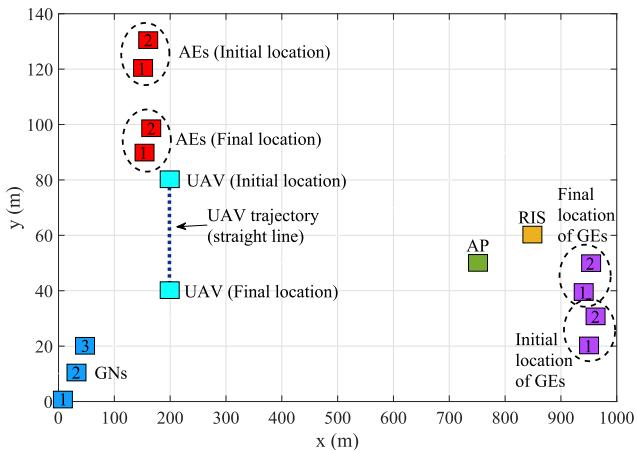

Fig. 2. Projection of the proposed IoT architecture on the xy plane with pre-determined benchmark trajectory of the UAV.   
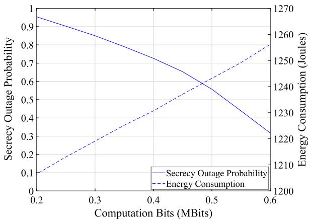

line

| Computation Bits (MBits) | Secrecy Outage Probability | Energy Consumption (Joules) |
| ------------------------- | -------------------------- | --------------------------- |
| 0.2                       | 0.95                       | 1200                        |
| 0.3                       | 0.85                       | 1210                        |
| 0.4                       | 0.75                       | 1220                        |
| 0.5                       | 0.60                       | 1230                        |
| 0.6                       | 0.30                       | 1260                        |

Fig. 3. The SOP and energy consumption in terms of the number of the computation bits.

Fig.4 investigates the convergence of the proposed optimization scheme and shows the optimized SCE as a function of the iteration index. This analysis is conducted across varying numbers of reflecting elements, considering a tolerant threshold $e \ : = \ : 1 0 ^ { - 4 }$ . It is evident that the optimized scheme demonstrates a close convergence, typically within approximately six iterations, regardless the numbers of reflecting elements. Notably, the SCE experiences rapid initial growth, followed by subsequent convergence within a limited number of iterations. This behavior is attributed to the linear convergence rate exhibited by the Dinkelbach-based algorithm for our max-min fractional optimization problem [42].

Fig.5 shows the SCE as a function of the number of the computation bits across various network configurations, encompassing both optimized and non-optimized schemes. In particular, several special cases are set as benchmarks, considering the absence of either AEs (e.g., the scenario in [21]) or GEs (e.g., the scenario in [13]) and also studying a less complex setup, which does not include a RIS unit (e.g., the setup in [10]). Furthermore, results that disregard the optimization of the RIS’s phase shifts are incorporated. The results distinctly reveal that the GEs play a more pivotal role than AEs in diminishing the SCE, whereas the presence of both AEs and GEs drastically decreases the SCE. Also, deploying a RIS unit close to the AP and adopting the proposed optimized scheme is required to achieve enhanced SCE, even when a large number of computation bits need to be processed. In this context, fine-tuning the RIS’s phase shifts can further increase the SCE.

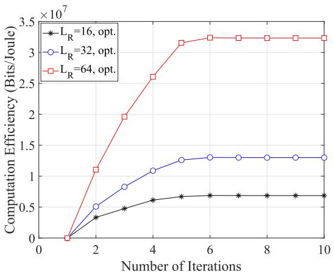

line

| Number of Iterations | L_R = 16, opt. | L_R = 32, opt. | L_R = 64, opt. |
| -------------------- | -------------- | -------------- | -------------- |
| 0                    | 0              | 0              | 0              |
| 2                    | 0.3            | 0.5            | 1.1            |
| 4                    | 0.6            | 1.1            | 2.6            |
| 6                    | 0.7            | 1.3            | 3.2            |
| 8                    | 0.7            | 1.3            | 3.2            |
| 10                   | 0.7            | 1.3            | 3.2            |

Fig. 4. The optimized SCE in terms of the iteration number of Algorithm 1 for varying number of reflecting elements.

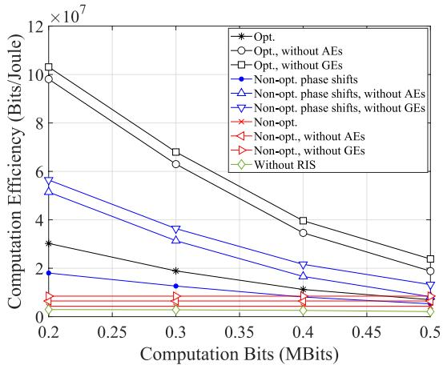

line

| Computation Bits (MBits) | Opt. | Opt., without AEs | Opt., without GEs | Non-opt. phase shifts | Non-opt. phase shifts, without AEs | Non-opt. phase shifts, without GEs | Non-opt. | Non-opt., without AEs | Non-opt., without GEs | Without RIS |
| ------------------------- | ---- | ----------------- | ----------------- | --------------------- | ----------------------------------- | ----------------------------------- | -------- | ---------------------- | ---------------------- | ----------- |
| 0.2                       | 3.0e7 | 10.0e7            | 10.0e7            | 1.8e7                 | 5.5e7                               | 5.5e7                               | 0.8e7    | 0.8e7                  | 0.8e7                  | 0.0e7       |
| 0.3                       | 2.0e7 | 6.5e7             | 6.5e7             | 1.2e7                 | 3.5e7                               | 3.5e7                               | 0.8e7    | 0.8e7                  | 0.8e7                  | 0.0e7       |
| 0.4                       | 1.0e7 | 4.0e7             | 4.0e7             | 0.8e7                 | 2.0e7                               | 2.0e7                               | 0.8e7    | 0.8e7                  | 0.8e7                  | 0.0e7       |
| 0.5                       | 0.5e7 | 2.5e7             | 2.5e7             | 0.5e7                 | 1.5e7                               | 1.5e7                               | 0.8e7    | 0.8e7                  | 0.8e7                  | 0.0e7       |

Fig. 5. The optimized and non-optimized SCE in terms of the number of computation bits for different deployment strategies.

In Fig.6, the optimized and non-optimized SCE is demonstrated as a function of the UAV’s velocity, while considering different weight factor of the consumed energy at the UAV and completion time of the computation task. One observes that the SCE decreases as the UAV’s velocity rises. This is primarily due to the heightened propulsion energy requirements entailed in sustaining higher speeds. Additionally, the SCE decreases with both the task completion time and weight factor. Upon comparing the optimized and non-optimized scenarios, it becomes apparent that the application of our optimized scheme implies substantially higher SCE values. These findings affirm the effectiveness of our approach in optimizing the SCE and augmenting the network performance.

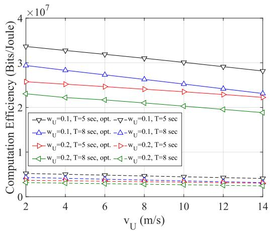

line

| v_U (m/s) | w_U=0.1, T=5 sec, opt. | -w_U=0.1, T=5 sec | w_U=0.1, T=8 sec, opt. | -w_U=0.1, T=8 sec | w_U=0.2, T=5 sec, opt. | -w_U=0.2, T=5 sec | w_U=0.2, T=8 sec, opt. | -w_U=0.2, T=8 sec |
| --------- | ---------------------- | ----------------- | ---------------------- | ----------------- | ---------------------- | ----------------- | ---------------------- | ----------------- |
| 2         | 3.4e7                  | 3.0e7             | 2.6e7                  | 2.4e7             | 2.4e7                  | 2.2e7             | 2.0e7                  | 1.8e7             |
| 4         | 3.2e7                  | 2.8e7             | 2.5e7                  | 2.3e7             | 2.3e7                  | 2.1e7             | 1.9e7                  | 1.7e7             |
| 6         | 3.0e7                  | 2.6e7             | 2.4e7                  | 2.2e7             | 2.2e7                  | 2.0e7             | 1.8e7                  | 1.6e7             |
| 8         | 2.8e7                  | 2.4e7             | 2.3e7                  | 2.1e7             | 2.1e7                  | 1.9e7             | 1.7e7                  | 1.5e7             |
| 10        | 2.6e7                  | 2.2e7             | 2.2e7                  | 2.0e7             | 2.0e7                  | 1.8e7             | 1.6e7                  | 1.4e7             |
| 12        | 2.4e7                  | 2.0e7             | 2.1e7                  | 1.9e7             | 1.9e7                  | 1.7e7             | 1.5e7                  | 1.3e7             |
| 14        | 2.2e7                  | 1.8e7             | 2.0e7                  | 1.8e7             | 1.8e7                  | 1.6e7             | 1.4e7                  | 1.2e7             |

Fig. 6. The optimized and non-optimized SCE in terms of the UAV’s velocity for varying weight factor of UAV’s consumed energy and completion time of the computation task.

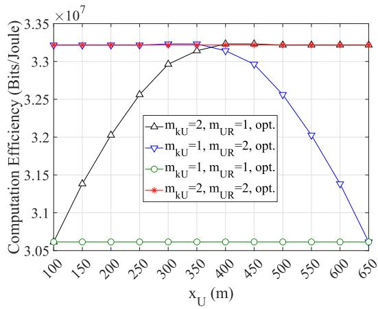

line

| x_U (m) | m_kU=2, m_UR=1, opt. | m_kU=1, m_UR=2, opt. | m_kU=1, m_UR=1, opt. | m_kU=2, m_UR=2, opt. |
| ------- | --------------------- | --------------------- | --------------------- | --------------------- |
| 100     | 3.06                  | 3.33                  | 3.06                  | 3.33                  |
| 150     | 3.14                  | 3.33                  | 3.06                  | 3.33                  |
| 200     | 3.20                  | 3.33                  | 3.06                  | 3.33                  |
| 250     | 3.25                  | 3.33                  | 3.06                  | 3.33                  |
| 300     | 3.30                  | 3.33                  | 3.06                  | 3.33                  |
| 350     | 3.32                  | 3.33                  | 3.06                  | 3.33                  |
| 400     | 3.32                  | 3.32                  | 3.06                  | 3.33                  |
| 450     | 3.32                  | 3.29                  | 3.06                  | 3.33                  |
| 500     | 3.32                  | 3.25                  | 3.06                  | 3.33                  |
| 550     | 3.32                  | 3.20                  | 3.06                  | 3.33                  |
| 600     | 3.32                  | 3.14                  | 3.06                  | 3.33                  |
| 650     | 3.32                  | 3.06                  | 3.06                  | 3.33                  |

Fig. 7. The optimized SCE in terms of the UAV’s movement along the x-axis for varying value of the Nakagami-m parameter of the link between the k-th GN and UAV and the link between the UAV and RIS unit.

Fig.7 studies the impact of the UAV’s positional variation along the x-axis on the SCE, considering diverse Nakagamim fading parameter of the link between the k-th GN (UAV) and UAV (RIS). Clearly, the SCE remains constant, as soon as a symmetric fading exists, i.e., $m _ { k U } ~ = ~ m _ { U R }$ . However, the SCE is influenced by the prevailing fading conditions, directly affecting the effective secrecy rate. Although the UAV’s trajectory is not optimized in this paper, the findings indicate that positioning the UAV closer to the RIS unit yields more favorable SCE outcomes, particularly when the channel quality of the link between UAV and RIS is compromised. On the other hand, situating the UAV in closer proximity to the GNs is advisable to counteract performance degradation when the channel quality of the link between GNs and UAV is low. Also, maintaining the UAV at a midpoint position between the GNs and RIS is recommended to ensure sufficient SCE irrespective of fading conditions. By avoiding aimless movements, a significant amount of propulsion energy can be saved thereby extending the UAV’s flight time and improving the SCE.

Fig.8 presents the optimized and non-optimized SCE in terms of the number of reflecting elements for different number of computation bits. The SCE resulting from the mathematical expression of the asymptotic SOP in (35) is also depicted. As the number of reflecting elements increases, the SCE is improved due to the lower transmission delay. Additionally, once 57 reflective elements are selected, the SCE remains constant after the desired target rate is achieved. It can be also observed that the SCE exhibits a discernible decline as the minimal computational requisites of the GNs progressively elevate. This is because higher computing requirements can lead to more inefficient power consumption. In addition, it can be seen that the asymptotically derived curves of the SCE converge towards the analytical counterparts with approximately 60 reflecting elements.

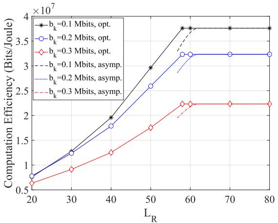

line

| L_R | b_k=0.1 Mbits, opt. | b_k=0.2 Mbits, opt. | b_k=0.3 Mbits, opt. | b_k=0.1 Mbits, asymp. | b_k=0.2 Mbits, asymp. | b_k=0.3 Mbits, asymp. |
| --- | --- | --- | --- | --- | --- | --- |
| 20 | 0.7e7 | 0.8e7 | 0.6e7 | - | - | - |
| 30 | 1.2e7 | 1.3e7 | 0.9e7 | - | - | - |
| 40 | 1.9e7 | 1.8e7 | 1.2e7 | - | - | - |
| 50 | 2.9e7 | 2.6e7 | 1.7e7 | - | - | - |
| 60 | 3.8e7 | 3.2e7 | 2.2e7 | 3.8e7 | 3.2e7 | 2.2e7 |
| 70 | 3.8e7 | 3.2e7 | 2.2e7 | - | - | - |
| 80 | 3.8e7 | 3.2e7 | 2.2e7 | - | - | - |

Fig. 8. The optimized and asymptotic SCE in terms of the number of reflecting elements for varying number of computation bits.

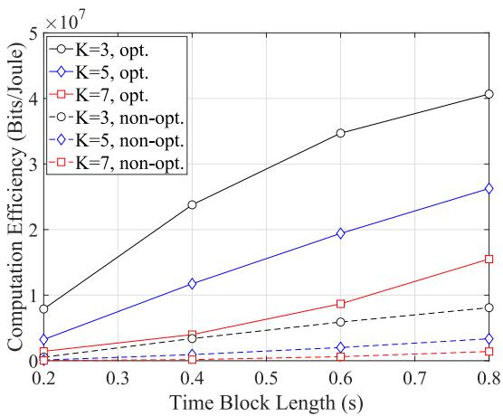

line

| Time Block Length (s) | K=3, opt. | K=5, opt. | K=7, opt. | K=3, non-opt. | K=5, non-opt. | K=7, non-opt. |
| --------------------- | --------- | --------- | --------- | ------------- | ------------- | ------------- |
| 0.2                   | 9000000   | 3000000   | 1000000   | 1000000       | 1000000       | 1000000       |
| 0.4                   | 24000000  | 12000000  | 4000000   | 4000000       | 2000000       | 1000000       |
| 0.6                   | 36000000  | 20000000  | 9000000   | 7000000       | 3000000       | 1500000       |
| 0.8                   | 41000000  | 27000000  | 16000000  | 9500000       | 4500000       | 2500000       |

Fig. 9. The optimized and non-optimized SCE in terms of the time block length for varying number of GNs.

Fig.9 shows the optimized and non-optimized SCE concerning the time block length for different number of GNs. It is evident that the SCE exhibits a substantial enhancement with the augmentation of the time block length. This improvement can be attributed to the ability of GNs to reduce their computational load and transmission power in order to enhance the SCE, when operating within more extensive time blocks. It is noteworthy that marginal variations in SCE become apparent in situations featuring shorter time block lengths. Also, increasing the number of GNs induces a reduction in SCE, since the system becomes more burdened. However, the optimization scheme holds the promise of yielding meaningfully higher SCE values compared to the non-optimized one.

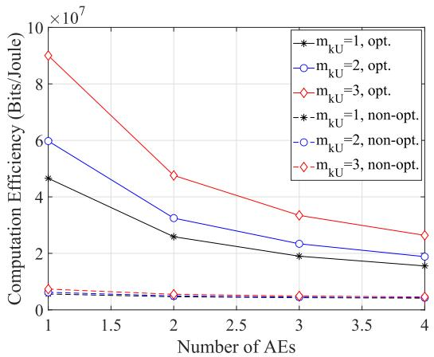

line

| Number of AEs | m_kU=1, opt. | m_kU=2, opt. | m_kU=3, opt. | m_kU=1, non-opt. | m_kU=2, non-opt. | m_kU=3, non-opt. |
| ------------- | ------------ | ------------ | ------------ | ---------------- | ---------------- | ---------------- |
| 1             | 4.5e7        | 6.0e7        | 9.0e7        | 0.5e7            | 0.5e7            | 0.5e7            |
| 2             | 2.5e7        | 3.0e7        | 4.5e7        | 0.5e7            | 0.5e7            | 0.5e7            |
| 3             | 2.0e7        | 2.5e7        | 3.0e7        | 0.5e7            | 0.5e7            | 0.5e7            |
| 4             | 1.5e7        | 2.0e7        | 2.5e7        | 0.5e7            | 0.5e7            | 0.5e7            |

Fig. 10. The optimized and non-optimized SCE in terms of the number of AEs for varying value of the Nakagami-m parameter of the link between the k-th GN and UAV.

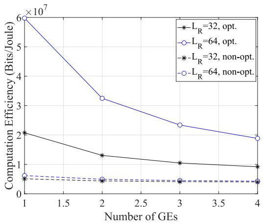

line

| Number of GEs | L_R=32, opt. | L_R=64, opt. | L_R=32, non-opt. | L_R=64, non-opt. |
| ------------- | ------------ | ------------ | ---------------- | ---------------- |
| 1             | 2.0e7        | 6.0e7        | 0.5e7            | 0.5e7            |
| 2             | 1.3e7        | 3.3e7        | 0.5e7            | 0.5e7            |
| 3             | 1.0e7        | 2.3e7        | 0.5e7            | 0.5e7            |
| 4             | 0.8e7        | 1.9e7        | 0.5e7            | 0.5e7            |

Fig. 11. The optimized and non-optimized SCE in terms of the number of GEs for varying number of reflecting elements of the RIS unit.

Finally, Fig.10 and Fig.11 delineate the optimized and non-optimized SCE in terms of the number of the AEs and GEs, respectively. This is done across different value of the Nakagami-m parameter $m _ { k U }$ and number of reflecting elements. One observes that the optimized SCE experiences a reduction with an increase in the number of AEs and GEs. Conversely, the non-optimized SCE remains consistently low irrespective of the count of AEs and GEs. Also, an elevated channel quality and a substantial number of reflective elements have the potential to mitigate the decline in SCE as the number of AEs and GEs, respectively, increases.

# VI. CONCLUSION AND FUTURE RESEARCH DIRECTIONS

This paper has proposed a MEC-IoT network architecture, wherein a UAV has undertaken the dual mission of providing computing resources and ubiquitous wireless coverage. To augment the link robustness, the integration of a RIS unit into the network was explored. Beyond legitimate network entities, potential malicious actors operating in both aerial and ground domains, seeking unauthorized access to sensitive offloaded data, have been considered. Within this framework, analytical, closed-form, and asymptotic mathematical expressions for the SOP over Nakagami-m fading channels have been derived. A non-convex max-min SCE optimization problem has been also formulated and Dinkelbach-, BCD-, and bisection-based methods have been combined to solve this problem. The results have underscored the necessity of establishing equilibrium between the desired SOP and energy consumption. Moreover, these results have underlined the effectiveness of the optimized scheme and provided insights into proper UAV positioning. Noteworthy is the observation that the impact of AEs and GEs becomes less influential, as the severity of fading is limited and a large number of reflecting elements is utilized.

This work could be extended to different research areas. To augment the SCE while extending coverage and enhancing reliability, a collaborative deployment of multiple authorized UAVs and RIS units could be implemented. Apart from using fixed RIS units, the adoption of mobile UAV-mount RIS units could be also considered to provide additional flexibility and adaptability. Moreover, the optimization of the 3-D UAV’s trajectory holds the potential for further improving the SCE and represents an intriguing and noteworthy research direction. Finally, the inclusion of active jamming is envisioned as a prospective research work to safeguard the computation offloading process against adversaries.

# APPENDIX PROOF OF LEMMA 1

Lemma 1 can be proved based on sufficient and necessary criteria.

1) Sufficient criteria: As far as the equality in (39) holds, it follows that

$$
\min _ {k \in K} \sum_ {n = 1} ^ {N} \sum_ {k = 1} ^ {K} \left(b _ {k} ^ {*} [ n ] - \omega^ {*} E _ {0, k} ^ {*} [ n ]\right) = 0, \tag {59}
$$

$$
\min _ {k \in K} \sum_ {n = 1} ^ {N} \sum_ {k = 1} ^ {K} (b _ {k} [ n ] - \omega^ {*} E _ {0, k} [ n ]) \leq 0. \tag {60}
$$

From (60), the following expressions can be obtained

$$
\min _ {k \in K} \sum_ {n = 1} ^ {N} \sum_ {k = 1} ^ {K} \frac {b _ {k} ^ {*} [ n ]}{E _ {0 , k} ^ {*} [ n ]} = \omega^ {*}, \tag {61}
$$

$$
\min _ {k \in K} \sum_ {n = 1} ^ {N} \sum_ {k = 1} ^ {K} \frac {b _ {k} [ n ]}{E _ {0 , k} [ n ]} \leq \omega^ {*}. \tag {62}
$$

Using $( 1 ) , \quad ( 4 ) – ( 7 )$ and (62), one concludes that $\left( \mathbf { P } ^ { * } , \tau ^ { * } , \mathbf { B } ^ { * } , \varphi _ { A } ^ { * } , \varphi _ { l _ { G E } } ^ { * } \right)$ constitutes the optimal solution of Problem (P1).

2) Necessary criteria: As far as $\left( \mathbf { P } ^ { * } , \tau ^ { * } , \mathbf { B } ^ { * } , \varphi _ { A } ^ { * } , \varphi _ { l _ { G E } } ^ { * } \right)$ is the optimal solution of Problem (P1), it follows that

$$
\min _ {k \in K} \sum_ {n = 1} ^ {N} \sum_ {k = 1} ^ {K} \frac {b _ {k} ^ {*} [ n ]}{E _ {0 , k} ^ {*} [ n ]} = \omega^ {*}. \tag {63}
$$

We complete this proof after some simple transformations and we can easily conclude that

$$
\min _ {k \in K} \sum_ {n = 1} ^ {N} \sum_ {k = 1} ^ {K} \left(b _ {k} ^ {*} [ n ] - \omega^ {*} E _ {0, k} ^ {*} [ n ]\right) = 0. \tag {64}
$$

# REFERENCES

[1] L. Kong et al., “Edge-computing-driven Internet of Things: A survey,” ACM Comput. Surveys, vol. 55, no. 8, pp. 1–41, Dec. 2022, doi: 10.1145/3555308.   
[2] Q. Zhang, Y. Luo, H. Jiang, and K. Zhang, “Aerial edge computing: A survey,” IEEE Internet Things J., vol. 10, no. 16, pp. 14357–14374, Aug. 2023.   
[3] C. Pan et al., “Reconfigurable intelligent surfaces for 6G systems: Principles, applications, and research directions,” IEEE Commun. Mag., vol. 59, no. 6, pp. 14–20, Jun. 2021.   
[4] E. T. Michailidis, K. Maliatsos, D. N. Skoutas, D. Vouyioukas, and C. Skianis, “Secure UAV-aided mobile edge computing for IoT: A review,” IEEE Access, vol. 10, pp. 86353–86383, 2022.   
[5] F. Naeem, M. Ali, G. Kaddoum, C. Huang, and C. Yuen, “Security and privacy for reconfigurable intelligent surface in 6G: A review of prospective applications and challenges,” IEEE Open J. Commun. Soc., vol. 4, pp. 1196–1217, 2023.   
[6] W. Wu, F. Zhou, R. Q. Hu, and B. Wang, “Energy-efficient resource allocation for secure NOMA-enabled mobile edge computing networks,” IEEE Trans. Commun., vol. 68, no. 1, pp. 493–505, Jan. 2020.   
[7] X. Lai, L. Fan, X. Lei, Y. Deng, G. K. Karagiannidis, and A. Nallanathan, “Secure mobile edge computing networks in the presence of multiple eavesdroppers,” IEEE Trans. Commun., vol. 70, no. 1, pp. 500–513, Jan. 2022.   
[8] S. Mao et al., “Reconfigurable intelligent surface-assisted secure mobile edge computing networks,” IEEE Trans. Veh. Technol., vol. 71, no. 6, pp. 6647–6660, Jun. 2022.   
[9] J. Bian, Y. Wang, and F. Zhou, “Secrecy energy efficiency optimization for reconfigurable intelligent surface-aided multiuser MISO systems,” Wireless Commun. Mobile Comput., vol. 2022, pp. 1–11, Oct. 2022.   
[10] X. Gu, G. Zhang, M. Wang, W. Duan, M. Wen, and P.-H. Ho, “UAVaided energy-efficient edge computing networks: Security offloading optimization,” IEEE Internet Things J., vol. 9, no. 6, pp. 4245–4258, Mar. 2022.   
[11] W. Mao, K. Xiong, Y. Lu, P. Fan, and Z. Ding, “Energy consumption minimization in secure multi-antenna UAV-assisted MEC networks with channel uncertainty,” IEEE Trans. Wireless Commun., vol. 22, no. 11, pp. 7185–7200, Nov. 2023.   
[12] Y. Ding et al., “Online edge learning offloading and resource management for UAV-assisted MEC secure communications,” IEEE J. Sel. Topics Signal Process., vol. 17, no. 1, pp. 54–65, Jan. 2023.   
[13] W. Lu et al., “Secure transmission for multi-UAV-assisted mobile edge computing based on reinforcement learning,” IEEE Trans. Netw. Sci. Eng., vol. 10, no. 3, pp. 1270–1282, May 2023.   
[14] Y. Xu, T. Zhang, Y. Liu, D. Yang, L. Xiao, and M. Tao, “Computation capacity enhancement by joint UAV and RIS design in IoT,” IEEE Internet Things J., vol. 9, no. 20, pp. 20590–20603, Oct. 2022.   
[15] E. T. Michailidis, N. I. Miridakis, A. Michalas, E. Skondras, and D. J. Vergados, “Energy optimization in dual-RIS UAV-aided MEC-enabled Internet of Vehicles,” Sensors, vol. 21, no. 13, p. 4392, Jun. 2021. [Online]. Available: https://www.mdpi.com/1424- 8220/21/13/4392   
[16] Z. Zhai, X. Dai, B. Duo, X. Wang, and X. Yuan, “Energy-efficient UAVmounted RIS assisted mobile edge computing,” IEEE Wireless Commun. Lett., vol. 11, no. 12, pp. 2507–2511, Dec. 2022.   
[17] H. Hailong, M. Eskandari, A. V. Savkin, and W. Ni, “Energy-efficient joint UAV secure communication and 3D trajectory optimization assisted by reconfigurable intelligent surfaces in the presence of eavesdroppers,” Defence Technol., vol. 31, pp. 537–543, 2024. [Online]. Available: https://www.sciencedirect.com/science/article/pii/S2214914722002756, doi: 10.1016/j.dt.2022.12.010.   
[18] C. Wang et al., “Covert communication assisted by UAV-IRS,” IEEE Trans. Commun., vol. 71, no. 1, pp. 357–369, Jan. 2023.   
[19] J. Guo et al., “RIS-assisted secure UAV communications with resource allocation and cooperative jamming,” IET Commun., vol. 16, no. 13, pp. 1582–1592, May 2022. [Online]. Available: https://ietresearch.onlinelibrary.wiley.com/doi/abs/10.1049/cmu2.12416   
[20] J. Li, S. Xu, J. Liu, Y. Cao, and W. Gao, “Reconfigurable intelligent surface enhanced secure aerial-ground communication,” IEEE Trans. Commun., vol. 69, no. 9, pp. 6185–6197, Sep. 2021.   
[21] L. Yan, C. Wang, and W. Zheng, “Secure efficiency maximization for UAV-assisted mobile edge computing networks,” Phys. Commun., vol. 51, Apr. 2022, Art. no. 101568. [Online]. Available: https://www.sciencedirect.com/science/article/pii/S1874490721002718

[22] T. Bao, H. Wang, W.-J. Wang, H.-C. Yang, and M. O. Hasna, “Secrecy outage performance analysis of UAV-assisted relay communication systems with multiple aerial and ground eavesdroppers,” IEEE Trans. Aerosp. Electron. Syst., vol. 58, no. 3, pp. 2592–2600, Jun. 2022.   
[23] Y. Mao, C. You, J. Zhang, K. Huang, and K. B. Letaief, “A survey on mobile edge computing: The communication perspective,” IEEE Commun. Surveys Tuts., vol. 19, no. 4, pp. 2322–2358, 4th Quart., 2017.   
[24] F. Pervez, A. Sultana, C. Yang, and L. Zhao, “Energy and latency efficient joint communication and computation optimization in a multi-UAV assisted MEC network,” IEEE Trans. Wireless Commun., early access, Jul. 11, 2023, doi: 10.1109/TWC.2023.3291692.   
[25] C. Zhan, H. Hu, X. Sui, Z. Liu, and D. Niyato, “Completion time and energy optimization in the UAV-enabled mobile-edge computing system,” IEEE Internet Things J., vol. 7, no. 8, pp. 7808–7822, Aug. 2020.   
[26] E. T. Michailidis, N. I. Miridakis, A. Michalas, E. Skondras, D. J. Vergados, and D. D. Vergados, “Energy optimization in massive MIMO UAV-aided MEC-enabled vehicular networks,” IEEE Access, vol. 9, pp. 117388–117403, 2021.   
[27] W. Zhang, Y. Wen, K. Guan, D. Kilper, H. Luo, and D. O. Wu, “Energy-optimal mobile cloud computing under stochastic wireless channel,” IEEE Trans. Wireless Commun., vol. 12, no. 9, pp. 4569–4581, Sep. 2013.   
[28] R. Long, Y.-C. Liang, Y. Pei, and E. G. Larsson, “Active reconfigurable intelligent surface-aided wireless communications,” IEEE Trans. Wireless Commun., vol. 20, no. 8, pp. 4962–4975, Aug. 2021.   
[29] H. Mei, K. Wang, D. Zhou, and K. Yang, “Joint trajectory-task-cache optimization in UAV-enabled mobile edge networks for cyber-physical system,” IEEE Access, vol. 7, pp. 156476–156488, 2019.   
[30] E. Yanmaz, R. Kuschnig, and C. Bettstetter, “Channel measurements over 802.11a-based UAV-to-ground links,” in Proc. IEEE GLOBECOM Workshops (GC Wkshps), Dec. 2011, pp. 1280–1284.   
[31] B. Kumbhani and R. S. Kshetrimayum, MIMO Wireless Communications Over Generalized Fading Channels. Boca Raton, FL, USA: CRC Press, 2017.   
[32] I. S. Gradshteyn and I. M. Ryzhik, Table of Integrals, Series, and Products, 7th ed. Amsterdam, The Netherlands: Elsevier, 2007.   
[33] T. S. Rappaport, Wireless Communications: Principles and Practice (Prentice-Hall Communications Engineering and Emerging Technologies Series), 2nd ed. Upper Saddle River, NJ, USA: Prentice-Hall, 2002.   
[34] I. Trigui, W. Ajib, and W.-P. Zhu, “Secrecy outage probability and average rate of RIS-aided communications using quantized phases,” IEEE Commun. Lett., vol. 25, no. 6, pp. 1820–1824, Jun. 2021.   
[35] R. W. Heath Jr., T. Wu, Y. H. Kwon, and A. C. K. Soong, “Multiuser MIMO in distributed antenna systems with out-of-cell interference,” IEEE Trans. Signal Process., vol. 59, no. 10, pp. 4885–4899, Oct. 2011.   
[36] Q. Wu and R. Zhang, “Intelligent reflecting surface enhanced wireless network via joint active and passive beamforming,” IEEE Trans. Wireless Commun., vol. 18, no. 11, pp. 5394–5409, Nov. 2019.   
[37] N. I. Miridakis, T. A. Tsiftsis, and R. Yao, “Zero forcing uplink detection through large-scale RIS: System performance and phase shift design,” IEEE Trans. Commun., vol. 71, no. 1, pp. 569–579, Jan. 2023.   
[38] M. Badiu and J. P. Coon, “Communication through a large reflecting surface with phase errors,” IEEE Wireless Commun. Lett., vol. 9, no. 2, pp. 184–188, Feb. 2020.   
[39] K. V. Mardia and P. E. Jupp, Directional Statistics. Hoboken, NJ, USA: Wiley, 2009.   
[40] J. D. V. Sánchez, P. Ramírez-Espinosa, and F. J. López-Martínez, “Physical layer security of large reflecting surface aided communications with phase errors,” IEEE Wireless Commun. Lett., vol. 10, no. 2, pp. 325–329, Feb. 2021.   
[41] Y. Zou, S. Gong, J. Xu, W. Cheng, D. T. Hoang, and D. Niyato, “Joint energy beamforming and optimization for intelligent reflecting surface enhanced communications,” in Proc. IEEE Wireless Commun. Netw. Conf. Workshops (WCNCW), Oct. 2020, pp. 1–6.   
[42] S. Boyd and L. Vandenberghe, Convex Optimization. Cambridge, U.K.: Cambridge Univ. Press, 2004.   
[43] A. Zappone and E. Jorswieck, “Energy efficiency in wireless networks via fractional programming theory,” Found. Trends Commun. Inf. Theory, vol. 11, nos. 3–4, pp. 185–396, 2015. [Online]. Available: https://www.nowpublishers.com/article/Details/CIT-088   
[44] M. Grant and S. Boyd. (2014). CVX: MATLAB Software for Disciplined Convex Programming, Version 2.1. [Online]. Available: http://cvxr.com/cvx

[45] T. Zhang, Y. Xu, J. Loo, D. Yang, and L. Xiao, “Joint computation and communication design for UAV-assisted mobile edge computing in IoT,” IEEE Trans. Ind. Informat., vol. 16, no. 8, pp. 5505–5516, Aug. 2020.   
[46] S. Li, B. Duo, X. Yuan, Y.-C. Liang, and M. Di Renzo, “Reconfigurable intelligent surface assisted UAV communication: Joint trajectory design and passive beamforming,” IEEE Wireless Commun. Lett., vol. 9, no. 5, pp. 716–720, May 2020.   
[47] P. B. Sujit, S. Saripalli, and J. B. Sousa, “Unmanned aerial vehicle path following: A survey and analysis of algorithms for fixed-wing unmanned aerial vehicless,” IEEE Control Syst. Mag., vol. 34, no. 1, pp. 42–59, Feb. 2014.   
[48] Q. Wu et al., “Intelligent reflecting surface-aided wireless communications: A tutorial,” IEEE Trans. Commun., vol. 69, no. 5, pp. 3313–3351, May 2021.   
[49] Z. Wei et al., “Sum-rate maximization for IRS-assisted UAV OFDMA communication systems,” IEEE Trans. Wireless Commun., vol. 20, no. 4, pp. 2530–2550, Apr. 2021.   
[50] H. Lu, Y. Zeng, S. Jin, and R. Zhang, “Aerial intelligent reflecting surface: Joint placement and passive beamforming design with 3D beam flattening,” IEEE Trans. Wireless Commun., vol. 20, no. 7, pp. 4128–4143, Jul. 2021.

natural_image

Portrait of a man wearing glasses and a white lab coat (no text or symbols visible)

Emmanouel T. Michailidis (Senior Member, IEEE) received the M.Sc. degree in digital communications and networks and the Ph.D. degree in specialization in “aerospace communication systems” from the University of Piraeus, Greece, in 2006 and 2011, respectively. Since 2021, he has been a Post-Doctoral Researcher of the Internet of Things (IoT) with the Department of Information and Communication Systems Engineering, University of the Aegean, Greece. Since 2018, he has been an Adjunct Lecturer with the Department of Electrical and Electronics Engineering and the Department of Informatics and Computer Engineering, University of West Attica, Greece. From 2023 to 2024, he was an Appointed Lecturer with the Department of Digital Systems, University of Piraeus. From 2012 to 2021, he was a Post-Doctoral Researcher of satellite and aerial communications with the Department of Digital Systems, University of Piraeus. He is the author or coauthor of more than 55 publications in international journals, conference proceedings, and book chapters. His current research interests include 6G wireless, aerial, and satellite communications, the IoT, physical-layer security, and machine learning for wireless communications. He currently serves as an Editorial Board Member for Drones and a Topical Advisory Panel Member for Sensors. He was a recipient of three best paper awards.

natural_image

Portrait of a woman wearing a blue top (no visible text or symbols)

Maria-Garyfallio Volakaki received the B.Sc. degree in mathematics from the Department of Mathematics, University of the Aegean, Greece, in 2019, and the M.Sc. degree in the Internet of Things: smart environments in next generation networks from the University of the Aegean, in 2022. She is currently pursuing the Ph.D. degree with the Department of Information and Communication Systems Engineering, University of the Aegean. Her research interests include the design, analysis and optimization of 6G wireless networks, reconfigurable intelligent surface (RIS)-assisted communications, and machine learning for wireless communications.

natural_image

Portrait photo of a man with short dark hair and beard, wearing a light blue shirt (no text or symbols visible)

Nikolaos I. Miridakis (Senior Member, IEEE) was born in Athens, Greece, in 1982. He received the M.Sc. degree in networking and data communications from the Department of Information Systems, Kingston University, U.K. in 2008, and the Ph.D. degree in networking and data communications from the Department of Informatics, University of Piraeus, Greece, in 2012. Since 2012, he has been with the Department of Informatics, University of Piraeus, where he was a Senior Researcher. From 2018 to 2022, he was with the School of Electrical and Information Engineering and the Institute of Physical Internet, Jinan University, Zhuhai, China, as a Distinguished Research Associate. He is currently an Assistant Professor with the Department of Informatics and Computer Engineering, University of West Attica, Greece. His main research interests include wireless communications, and more specifically interference analysis and management in wireless communications, multicarrier communications, MIMO systems, statistical signal processing, diversity reception, fading channels, and cooperative communications. He serves as a reviewer and a TPC member for several prestigious international journals and conferences. He was recognized as the Exemplary Reviewer by IEEE TRANSACTIONS ON COMMUNICATIONS, IEEE TRANSACTIONS ON VEHICULAR TECHNOLOGY, and Physical Communication (Elsevier) in 2017. From 2019 to 2022, he served as an Associate Editor for the IEEE COMMUNICATIONS LETTERS. Since 2022, he is serving as an Editor for IEEE TRANSACTIONS ON COMMUNI-CATIONS.

natural_image

Portrait photo of a man with short dark hair and beard wearing a light pink shirt (no text or symbols visible)

Demosthenes Vouyioukas (Senior Member, IEEE) received the Diploma degree in electrical and computer engineering and the Ph.D. degree in electrical and computer engineering from the National Technical University of Athens (NTUA), Greece, in 1996 and 2003, respectively, and the joint Engineering-Economics M.Sc. degree from NTUA, in 2004. He is currently a Professor and the Director of the Computer and Communication Systems Laboratory, Department of Information and Communication Systems Engineering, University of the

Aegean, Greece. His research interests include mobile and wireless communication systems, channel characterization and propagation models, machine learning techniques for pathloss prediction, performance modeling of wireless networks, cooperative wideband systems with relays, UWB indoor localization techniques, UAV and aerial communications, next generation mobile and satellite networks, mMIMO, the IoT and 5G and beyond/6G technologies, network security, and privacy policies. In this area, he has over 130 publications in scientific journals, books, book chapters, and international conference proceedings. He is a member of the IEEE Communication Society, IFIP, ACM, and the Technical Chamber of Greece.