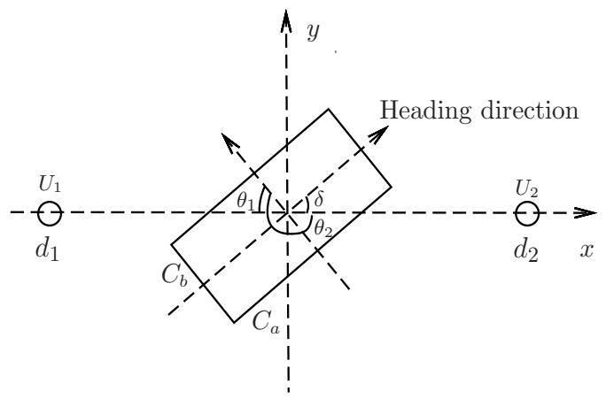
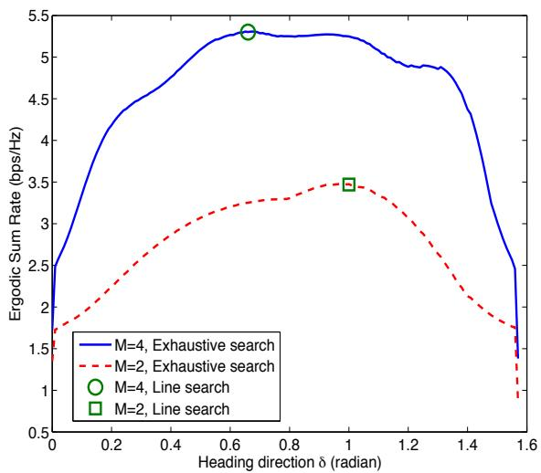
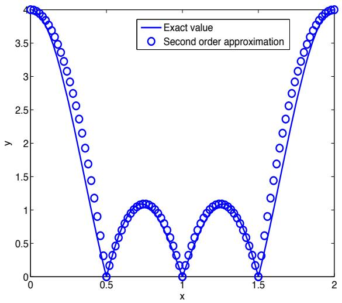
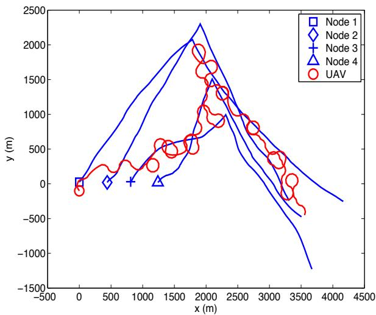
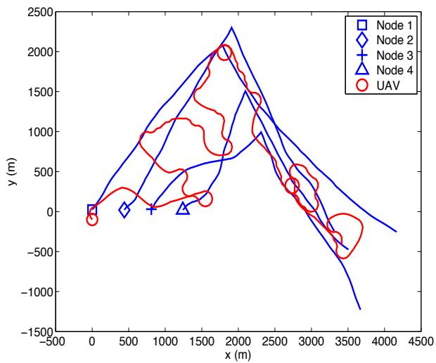
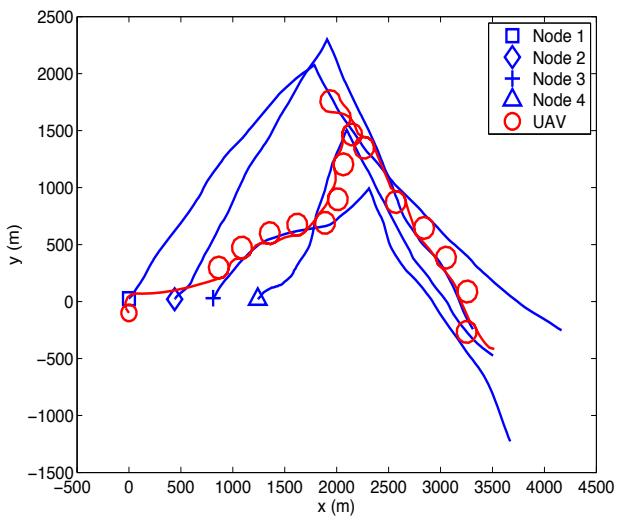
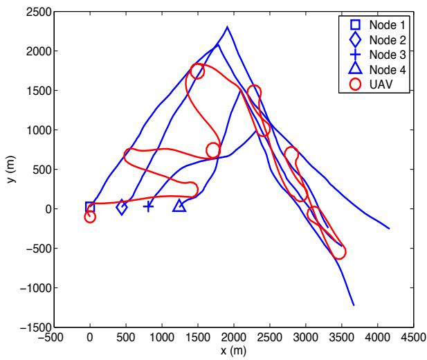
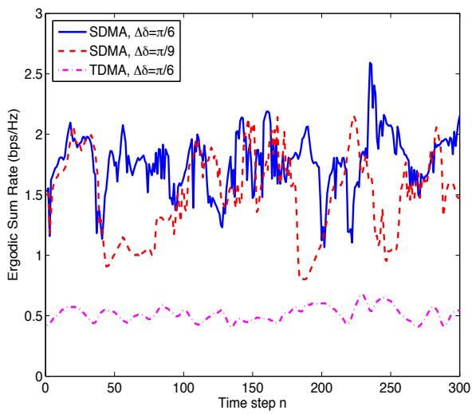
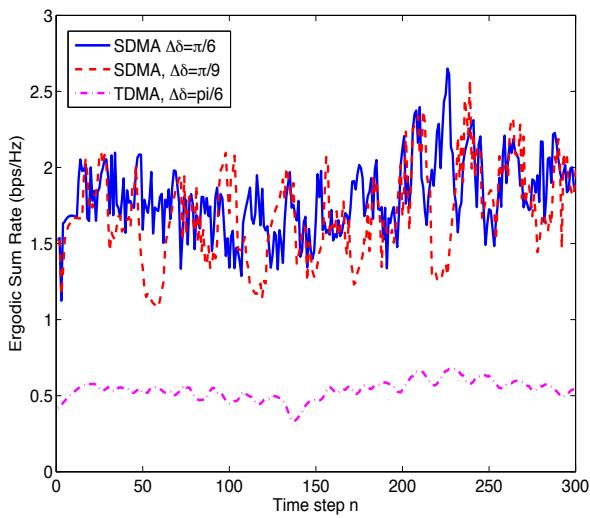
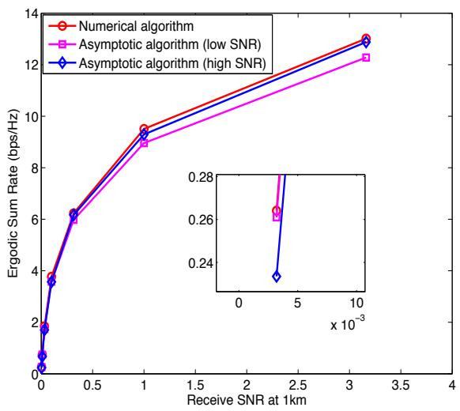

# Optimization of UAV Heading for the Ground-to-Air Uplink

Feng Jiang, Student Member, IEEE, and A. Lee Swindlehurst, Fellow, IEEE

Abstract—We consider a collection of single-antenna ground nodes communicating with a multi-antenna unmanned aerial vehicle (UAV) over a multiple-access ground-to-air communications link. The UAV uses beamforming to mitigate interuser interference and achieve spatial division multiple access (SDMA). First, we consider a simple scenario with two static ground nodes and analytically investigate the effect of the UAV’s heading on the system sum rate. We then study a more general setting with multiple mobile ground-based terminals, and develop an algorithm for dynamically adjusting the UAV heading to maximize the approximate ergodic sum rate of the uplink channel, using a prediction filter to track the positions of the mobile ground nodes. For the common scenario where a strong line-of-sight (LOS) channel exists between the ground nodes and UAV, we use an asymptotic analysis to find simplified versions of the algorithm for low and high SNR. We present simulation results that demonstrate the benefits of adapting the UAV heading in order to optimize the uplink communications performance. The simulation results also show that the simplified algorithms provide near-optimal performance.

Index Terms—UAV communication networks, UAV relays, UAV positioning, interference mitigation, beamforming

# I. INTRODUCTION

# A. Background

N MILITARY or disaster response (e.g., fire fighting) I scenarios, users on the ground require reliable communications with each other and their command center. Such scenarios often occur in environments without a fixed communications infrastructure (e.g., a centralized basestation as in cellular networks), and thus the network must operate in a peer-to-peer or ad hoc manner. The users and the command center may be separated by distances greater than the range of their communication devices, or the signals may be shadowed due to mountainous terrain or dense surroundings (forests, buildings, etc.). Furthermore, since the users are mobile, the communications environment is constantly changing and thus connectivity is often only sporadic. Unmanned aerial vehicles (UAVs) acting as airborne relays (essentially “flying basestations”) provide an attractive solution to problems encountered in such scenarios since their altitude allows them to get above the ground-based shadowing and obtain line-of-sight (LOS) or near LOS communication channels over a large area. Also and perhaps most importantly, the inherent mobility of

Manuscript received 13 July 2011; revised 30 April 2012. This work was supported by the National Science Foundation under grant CCF-0916073. Portions of this paper were presented at the IEEE Globecom Workshop on Wireless Networking for Unmanned Aerial Vehicles (Wi-UAV 2010), Miami, FL, Nov. 2010. The review of this paper is coordinated by Dr. Gerard P. Parr. The authors are with the Department of Electrical Engineering and Computer Science, University of California at Irvine, Irvine, CA, 92697 (e-mail: {feng.jiang, swindle}@uci.edu). Digital Object Identifier 10.1109/JSAC.2012.120614.

UAVs allows their position to be adjusted in order to best accommodate the evolving network topology. We consider such an application in this paper, assuming a system with a multi-antenna UAV flying over a collection of single-antenna mobile ground nodes. The UAV acts as a relay, collecting the messages from the co-channel users on the ground in order to forward them to other ground-based users or some remote base station. The goal is to show how to control the motion of the UAV so as to optimize the uplink communications performance.

There is increasing interest in the use of UAVs for providing relay services for mobile ad hoc networks (i.e., networks without a centralized basestation or other infrastructure) [1]– [8]. A number of different approaches have been proposed in the literature to address the performance of UAV-assisted communication networks. For example, in [1], a throughput maximization protocol for non-real time applications was proposed for a network with UAV relays in which the UAV first loads data from the source node and then flies to the destination node to deliver it. The authors in [2] investigated different metrics for ad hoc network connectivity and propose several approaches for improving the connectivity through deployment of a UAV. In [3], the authors considered a scenario in which multiple UAVs are deployed to relay data from isolated ground sensors to a base station, and an algorithm was proposed to maintain the connectivity of the links between the sensors and base station.

The work described above assumes that the ground nodes are static and that the UAV is configured with only a single antenna. Given the well-known benefits of employing multiple antennas for communications, it is natural to consider the advantages they offer for UAV-based platforms [9]. The measurement results of [10] showed that using multiple receivers at the UAV can significantly increase the packet delivery rate of the ground-to-air link. A swarm of single antenna UAVs were used as a virtual antenna array to relay data from a fixed ad hoc network on the ground in [4], and the performance of distributed orthogonal space-time block codes (OSTBC) and beamforming were evaluated. A relay system with multiantenna UAVs and multi-antenna mobile ground terminals was investigated in [5]. The users employ OSTBC to transmit data and the data transmissions are assumed to be interference free. Based on estimates of the user terminals’ future position, a heading optimization approach was proposed that maximizes the uplink sum rate of the network (the sum of the theoretically achievable throughputs of all users) under the constraint that each user’s rate is above a given threshold. The restriction of [5] to the interference-free case is a significant drawback, which we address in this paper. An earlier version of our work [11] discussed the use of an antenna array to improve the throughput of the ground-to-air uplink when the users share the same channel and interfere with one another.

In this paper, we consider a model similar to [5], with several ground-based users communicating simultaneously with a multi-antenna UAV. The main difference with [5] is that we assume there exists co-channel interference between the different users’ data streams. The users are assumed to transmit data with a single antenna and the UAV uses beamforming to separate the co-channel data streams. We assume a correlated Rician fading channel model between each ground node and the UAV, where the channel is represented as the sum of a deterministic LOS component and a correlated Gaussian term to represent Rayleigh fading due to multipath. We then quantify the uplink performance of the relay network by deriving an approximation to the ergodic achievable rate (the achievable throughput of the users averaged over the distribution of the channels), assuming that the UAV uses a maximum signal-to-interference-plus-noise ratio (SINR) beamformer for interference mitigation. The strength of the mutual interference depends on the correlation between the users’ channel vectors, which in a channel with a strong LOS component is a function of the signals’ angle of arrival (AoA). The AoAs depend in turn on the UAV’s heading and the relative positions of the UAV and the ground nodes. Consequently, we propose an adaptive algorithm for adjusting the heading of the UAV to minimize the users’ mutual interference and improve the uplink communications performance. In particular, the UAV is assumed to fly with a constant velocity, and it adjusts its heading in discrete time steps (assuming a constraint on the maximum turning radius) in order to optimize the approximate achievable rate. At time step n, the UAV uses a prediction filter driven by feedback from the ground terminals to estimate their positions at time $n { \mathrel { + { 1 } } }$ , and then the UAV computes its heading in order to optimize the approximate sum rate based on these future position estimates.

After describing the assumed signal and channel model in Section II, the main results of the paper are presented as follows. Section III: We analyze the trajectory optimization problem for a special case involving two static ground nodes. We use a rectangular-path model to characterize the UAV’s trajectory, which reduces the problem to one of optimizing only the heading. This problem can be solved using a simple line search, and the results indicate how increasing the size of the UAV array can reduce the system’s sensitivity to the heading direction. Section IV: For the case of a general network of mobile ground-based nodes, we derive an approximation to the average achievable sum rate to measure the system performance. Based on this approximation, we formulate a heading optimization problem and propose a line-search algorithm to adjust the UAV’s heading direction at time step n such that the system performance at time step $n + 1$ is optimized. We study the performance of both time-division multiple access (TDMA, where each user accesses the channel at different times) and space-division multiple access (SDMA, where all users access the channel at the same time, but are separated based on the spatial component of their signals, such as AoA), and illustrate via simulation the dramatic improvement offered by SDMA. Section V: We derive asymptotic analytical results

for the heading optimization problem under the assumption of a Rician channel with a strong LOS component between the ground nodes and UAV. The asymptotic results provide simplified methods for solving the heading optimization problem. A separate approximation method is used for low and high SNR cases, and we show that using the asymptotic expressions for heading optimization results in performance nearly identical to that of the optimal algorithm. Section VI: Simulation results are provided to illustrate the performance of the heading control algorithm, the advantage of SDMA over TDMA, and the validity of the asymptotic results.

# II. SYSTEM MODEL

# A. Signal Model

We assume a UAV configured with an array of M antennas, and a collection of N ground nodes each equipped with a single antenna. We restrict attention to fixed-wing (nonhovering) UAVs that must maintain a certain forward velocity to remain airborne. Fixed-wing UAVs have two advantages for our application: (1) they tend to be somewhat larger than hovering UAVs and allow more flexibility in deploying an antenna array with a larger aperture, and (2) the rotary blade motion on hovering aircraft can lead to high-Doppler reflections of the communications signals that are difficult to compensate for. We assume that, during the period of time in which the UAV is receiving uplink data from the ground nodes, the UAV maintains a constant altitude $h _ { u }$ and a constant velocity v. For simplicity, we assume that each ground node transmits with the same power $P _ { t }$ , but this assumption is easily relaxed. The signal received at the UAV array at time n can thus be written as

$$
\mathbf {y} _ {n} = \sum_ {i = 1} ^ {N} \sqrt {P _ {t}} \mathbf {h} _ {i, n} x _ {i, n} + \mathbf {n} _ {n},
$$

where $\mathbf { h } _ { i , n } \in \mathbb { C } ^ { M \times 1 }$ is the channel vector between node i hand the UAV, the data symbol $x _ { i , n }$ is a complex scalar with zero mean and unit magnitude, $\mathbf { h } _ { n } \in \mathbb { C } ^ { M \times 1 }$ is zero-mean n additive Gaussian noise with covariance ${ \displaystyle { \mathbb E } \{ { \bf n } _ { n } { \bf n } _ { n } ^ { H } } \} = \sigma ^ { 2 } { \bf I } _ { M } .$ , and ${ \mathbf { I } } _ { M }$ denotes an $M \times M$ n n Iidentity matrix. The UAV uses a Ibeamformer ${ \bf w } _ { i , n }$ to isolate the data from the i-th node: $\hat { x } _ { i , n } =$ $\mathbf { w } _ { i , n } ^ { H } \mathbf { y } _ { n }$ w, where $( \cdot ) ^ { H }$ denotes the complex conjugate transpose. w yAssuming the channels $\mathbf { h } _ { i , n } , i = 1 , \ldots , N$ are known to the hUAV (e.g., via training data from the ground nodes), the vector ${ \bf w } _ { i , n }$ that maximizes the signal-to-interference-plus-noise ratio $S I N R _ { i , n }$ is given by [12]

$$
\mathbf {w} _ {i, n} = \mathbf {Q} _ {i, n} ^ {- 1} \mathbf {h} _ {i, n},
$$

whe $\begin{array} { r } { \mathbf { Q } _ { i , n } = \sum _ { j = 1 , j \neq i } ^ { N } P _ { t } \mathbf h _ { j , n } \mathbf h _ { j , n } ^ { H } + \sigma ^ { 2 } \mathbf I _ { M } } \end{array}$ . The corresponding $S I N R _ { i , n }$ - h hcan be calculated as

$$
S I N R _ {i, n} = P _ {t} \mathbf {h} _ {i, n} ^ {H} \mathbf {Q} _ {i, n} ^ {- 1} \mathbf {h} _ {i, n}. \tag {1}
$$

# B. Channel Model

We assume a correlated Rician fading channel between each user node and the UAV with consideration of large-scale path loss:

$$
\mathbf {h} _ {i, n} = \frac {\mathbf {h} _ {i , n} ^ {\prime}}{d _ {i , n} ^ {\alpha}},
$$

where $\mathbf { h } _ { i , n } ^ { ' }$ is the normalized channel vector, $d _ { i , n }$ is the hdistance between node i and the UAV during the nth time step, and α is the path loss exponent. Define the three dimensional coordinates of the UAV and node i as $( x _ { u , n } , y _ { u , n } , h _ { u } )$ and $( x _ { i , n } , y _ { i , n } , 0 )$ , so that $d _ { i , n }$ is given by

$$
d _ {i, n} = \sqrt {(x _ {u , n} - x _ {i , n}) ^ {2} + (y _ {u , n} - y _ {i , n}) ^ {2} + h _ {u} ^ {2}}.
$$

For node i, we write the Rician fading channel vector $\mathbf { h } _ { i , n } ^ { ' }$ with two components [13], a LOS component $\bar { \mathbf { h } } _ { i , n }$ hand a Rayleigh fading component $\tilde { \mathbf { h } } _ { i , n } \mathrm { : }$ :

$$
\mathbf {h} _ {i, n} ^ {\prime} = \bar {\mathbf {h}} _ {i, n} + \tilde {\mathbf {h}} _ {i, n}.
$$

The LOS response will depend on the AoA of the signal, which in turn depends on orientation of the array (and hence the heading of the UAV) and the positions of the UAV and user nodes. For example, assume a uniform linear array (ULA) with antennas separated by one-half wavelength, and that at time step n the phase delay between adjacent antenna elements for the signal from the i-th node is $p _ { i , n } .$ , then the LOS component could be modeled as

$$
\bar {\mathbf {h}} _ {i, n} = \beta (\phi_ {i, n}) \sqrt {\frac {K}{1 + K}} \left[ 1, e ^ {j p _ {i, n}}, \dots , e ^ {j (M - 1) p _ {i, n}} \right] ^ {T}, \tag {2}
$$

where K is the Rician K-factor and $\beta ( \phi _ { i , n } )$ is used to account for variations in the antenna gain as a function of the elevation angle $\phi _ { i , n }$ to the i-th node. The phase delay is given by $p _ { i , n } =$ $\pi \cos ( \phi _ { i , n } ) \sin ( \theta _ { i , n } )$ , where $\theta _ { i , n }$ represents the azimuth angle to the i-th ground node. In terms of the UAV and user node positions, these quantities can be calculated as

$$
\cos (\phi_ {i, n}) = \sqrt {\frac {(x _ {u , n} - x _ {i , n}) ^ {2} + (y _ {u , n} - y _ {i , n}) ^ {2}}{(x _ {u , n} - x _ {i , n}) ^ {2} + (y _ {u , n} - y _ {i , n}) ^ {2} + h _ {u} ^ {2}}},
$$

$$
\sin (\theta_ {i, n}) = \cos (\delta_ {n} - \epsilon_ {i, n}), \tag {3}
$$

where $\delta _ { n }$ is the heading angle of the UAV, $\delta _ { n } - \epsilon _ { i , n }$ denotes the angle between the UAV heading and the LOS to user $i ,$ and

$$
\epsilon_ {i, n} = \left\{ \begin{array}{l l} \zeta_ {i, n}, & y _ {i, n} - y _ {u, n} \geq 0 \text {   and   } x _ {i, n} - x _ {u, n} \geq 0, \\ \zeta_ {i, n} + \pi , & x _ {i, n} - x _ {u, n} <   0, \\ \zeta_ {i, n} + 2 \pi , & \text { otherwise }. \end{array} \right.
$$

$$
\zeta_ {i, n} = \arctan \left(\frac {y _ {i , n} - y _ {u , n}}{x _ {i , n} - x _ {u , n}}\right).
$$

Since there is little multipath scattering near the UAV, any Rayleigh fading components will experience high spatial correlation at the receive end of the link. Thus, we model the spatially correlated Rayleigh component as

$$
\tilde {\mathbf {h}} _ {i, n} = \beta (\phi_ {i, n}) \sqrt {\frac {1}{1 + K}} (\mathbf {R} _ {r}) ^ {\frac {1}{2}} \mathbf {g} _ {i, n},
$$

where $\mathbf { g } _ { i , n } \in \mathbb { C } ^ { M \times 1 }$ has i.i.d. zero-mean, unit-variance comgplex Gaussian entries (which we denote by $\mathcal { C N } ( 0 , 1 ) )$ , and ${ \bf R } _ { r }$ Ris the spatial correlation matrix of the channel on the receiver side of the link. In [14], a model for r is proposed under Rthe assumption that the multipah rays are distributed normally in two dimensions around the angle from the source with standard deviation $\sigma _ { r }$ , assuming a ULA receiver. We can easily extend this model to take into account the third dimension corresponding to the elevation angle, and the resulting ${ \bf R } _ { r }$ is given by

$$
\mathbf {R} _ {r} = \left(1 + \frac {1}{K}\right) \bar {\mathbf {h}} _ {i, n} \bar {\mathbf {h}} _ {i, n} ^ {H} \odot \mathbf {B} (\theta_ {i, n}, \sigma_ {r}), \tag {4}
$$

where $\odot$ denotes the Hadamard (element-wise) product, and the calculation of $\mathbf { B } ( \theta _ { i , n } , \sigma _ { r } )$ is given in eq. (5) shown on the Btop of the next page. The resulting distribution for $\mathbf { h } _ { i , n } ^ { ' }$ is thus

$$
\mathbf {h} _ {i, n} ^ {\prime} \sim \mathcal {C N} \left(\bar {\mathbf {h}} _ {i, n}, \frac {1}{K + 1} \mathbf {R} _ {r}\right). \tag {6}
$$

The goal of the paper is to derive an algorithm for adjusting the heading angle $\delta _ { n }$ of the UAV in order to optimize the achievable uplink throughput of the network (defined in the next section). For simplicity we consider only UAV heading adjustments, but the same type of approach could be used if UAV speed and altitude were assumed to be adaptive as well. We assume a UAV equipped with a ULA oriented along either the fuselage or wings, the only difference being a $9 0 °$ change in how we define the heading angle. Extensions of the algorithm and analysis to different array geometries would require one to use a different expression for (2) and to derive a different spatial correlation matrix ${ \bf R } _ { r }$ . We will consider both RSDMA and TDMA approaches in the following sections. In practice, SDMA would not be used as the only method of providing wireless access to all users on the ground, since the number of antennas is limited and the presence of a (near-)LOS channel would make it difficult to separate users on the ground that are close together. As in the design of terrestrial cellular basestations, SDMA would be a tool to augment the capacity of the network beyond what TDMA and FDMA schemes already provide. The approach described below can be thought of as solving the SDMA problem only for those users that have been scheduled for the same time/frequency slot. Finally, we note that in practice, considerations other than communications performance would likely need to be considered in choosing the heading of the UAV, and these would need to be included as additional constraints to the optimization presented below.

# III. RESULTS FOR THE STATIC TWO-USER CASE

To demonstrate the significant impact of the UAV trajectory on the performance of the ground-to-air uplink, we first analyze a two-user scenario. The gross behavior of the UAV would be governed by the distance D between the two users, with three possibilities:

1) $D \gg h _ { u }$ - This is not a particularly useful scenario for a simultaneous uplink from both users since, if the UAV flies near their midpoint, both users would experience low SINR at the UAV due to path loss, and the sum data rate would be quite low. In this case, a better approach would likely involve the UAV serving each ground node separately, circling directly above each user and alternately flying between them.   
2) $D \ll h _ { u }$ - This case is also less interesting since the UAV should obviously fly directly above the two users in as tight a pattern as possible to minimize path loss. The effect of the UAV heading would be minimal, since

$$
\mathbf {B} (\theta_ {i, n}, \sigma_ {r}) _ {k, l} = e ^ {- \frac {1}{4} (\pi (k - l)) ^ {2} \sigma_ {r} ^ {2} \cos^ {2} (\theta_ {i, n}) \left(1 + \cos (2 \phi_ {i, n}) - \frac {1}{2} \sigma_ {r} ^ {4} \sin^ {2} (2 \phi_ {i, n}) (\pi (k - l)) ^ {2} \cos^ {2} (\theta_ {i, n})\right)}. \tag {5}
$$

text_image

Heading direction
U1
d1
θ1
δ
θ2
Cb
Ca
U2
d2
x
y

Fig. 1. Simplified UAV trajectory for the two-user case. $C _ { a }$ and $C _ { b }$ represent the edges of the rectangular trajectory. The angles $\theta _ { 1 }$ and $\theta _ { 2 }$ denote the azimuth angles of arrival of the users’ signals at the ULA when the UAV is flying over the midpoint of the two users with heading direction δ.

the AoAs to the two users would be nearly identical. The nearly LOS channels would be highly correlated and a TDMA solution would likely be preferred over SDMA.

3) $D = O ( h _ { u } )$ - Since the users transmit with the same power and their channels have the same statistical properties, equalizing the average uplink rates for the two users would require the UAV to fly a symmetric trajectory centered around the midpoint of the two users. If it was desired to minimize the variation in each user’s average uplink rate, the bounds of this trajectory would be small relative to the distance to the users. This is the case we consider in this section.

To make the analysis tractable, we focus on a rectangular trajectory as depicted in Fig. 1, defined by the side lengths $C _ { a }$ and $C _ { b }$ and the orientation δ. The angle δ is defined to be with respect to the side of the rectangle with greater length. Given the assumptions for scenario (3) above, the side lengths are assumed to satisfy max $\{ C _ { a } , C _ { b } \} \le C _ { \operatorname* { m a x } } \ll d _ { i }$ . Under this assumption, the performance of a rectangular trajectory is expected to be similar to that for other trajectories with similar size and orientation (e.g., an ellipse or figure-8 pattern). We also assume that min $\{ C _ { a } , C _ { b } \} \ge C _ { \mathrm { m i n } }$ , which accounts for the turning radius of the UAV. Since the UAV flies near the midpoint of the two users, we assume that the antenna gain factor due to elevation angle is the same for both users, and we set $\beta ( \phi _ { i , n } ) = 1$ for i = 1, 2.

The sum data rate at the UAV averaged along the trajectory is given by

$$
\begin{array}{l} \bar {R} = \mathbb {E} \left\{\log_ {2} (1 + S I N R _ {1}) + \log_ {2} (1 + S I N R _ {2}) \right\} \\ = \frac {1}{2 (C _ {a} + C _ {b})} \int_ {\mathcal {C}} \Big (\log_ {2} (1 + S I N R _ {1} (p)) \\ \left. + \log_ {2} (1 + S I N R _ {2} (p))\right) d p, \tag {7} \\ \end{array}
$$

line

| Heading direction δ (radian) | M=4, Exhaustive search | M=2, Exhaustive search | M=4, Line search | M=2, Line search |
| ---------------------------- | ---------------------- | ---------------------- | ---------------- | ---------------- |
| 0.0                          | 2.5                    | 1.7                    | -                | -                |
| 0.6                          | 5.3                    | 3.3                    | 5.3              | -                |
| 1.0                          | 5.2                    | 3.5                    | -                | 3.5              |
| 1.6                          | 2.5                    | 1.0                    | -                | -                |

Fig. 2. Orientation of the rectangular trajectory provided by the line search method in (9). For the exhaustive search method, the solid curve and the dashed curve denote the optimal sum rate that can be achieved for different orientations $\delta .$ When $M \stackrel { = } { = } 4 .$ the optimal δ are: 0.66 (exhaustive search), 0.69 (line search); when $M = 2$ , the optimal δ are: 0.98 (exhaustive search), 1.00 (line search).

where C denotes the rectangular path followed by the UAV, variable $p$ denotes different positions along the trajectory and dp represents differential steps along the trajectory. The optimization problem we wish to solve is

$$
\max _ {\delta , C _ {a}, C _ {b}} \bar {R} \tag {8}
$$

${ \mathrm { s u b j e c t ~ t o ~ } } 0 \leq \delta \leq { \frac { \pi } { 2 } }$

$$
C _ {\min} \leq C _ {b} \leq C _ {a} \leq C _ {\max},
$$

where the symmetry of the problem allows us to restrict attention to $0 \leq \delta \leq \pi / 2$ and assume $C _ { b } \leq C _ { a }$ without loss of generality. In the appendix, we show that for high SNR $\textstyle \big ( \frac { \check { P _ { t } } } { d _ { \bar { \epsilon } } ^ { \alpha } \sigma ^ { 2 } } \ \gg \ 1 \big )$ and assuming channels with a large K-factor, i the solution to (8) is approximately given by $C _ { a } = C _ { \operatorname* { m a x } }$ , $C _ { b } = C _ { \operatorname* { m i n } }$ and

$$
\begin{array}{l} \delta = \arg \min _ {0 \leq \delta \leq \pi / 2} \left\{\frac {R _ {c}}{1 + R _ {c}} \frac {\sin^ {2} (M \pi \cos (\phi^ {'}) \cos (\delta))}{\sin^ {2} (\pi \cos (\phi^ {'}) \cos (\delta))} \right. \\ \left. + \frac {1}{1 + R _ {c}} \frac {\sin^ {2} (M \pi \cos (\phi^ {'}) \sin (\delta))}{\sin^ {2} (\pi \cos (\phi^ {'}) \sin (\delta))} \right\}, \tag {9} \\ \end{array}
$$

where $\begin{array} { r } { R _ { c } = \frac { C _ { \mathrm { m a x } } } { C _ { \mathrm { m i n } } } } \end{array}$ Cmax Cmin and $\phi ^ { ' }$ is the elevation angle to the two users at the center of the rectangle in Fig. 1, where

$$
\cos (\phi^ {'}) = \frac {d _ {i}}{\sqrt {d _ {i} ^ {2} + h _ {u} ^ {2}}}.
$$

Minimizing (9) can be achieved by a simple line search over the interval $[ 0 , \pi / 2 ]$ .

To illustrate the validity of the approximate solution, we compare the average system sum rate achieved by maximizing (8) using an exhaustive search over $\{ C _ { a } , C _ { b } \}$ for each value of δ in the line search of (9). The simulation parameters were $d _ { 1 } ~ = ~ d _ { 2 } ~ = ~ 1 5 0 0 \mathrm { m }$ , $h _ { u } ~ = ~ 3 5 0 \mathrm { { m } , ~ \ : { C _ { \mathrm { { m i n } } } } ~ = ~ 2 0 0 \mathrm { { m } } }$ , $C _ { \mathrm { m a x } } = 8 0 0 \mathrm { m } .$ and $\textstyle { \frac { P _ { t } } { \sigma ^ { 2 } } } \ = \ 6 5 \mathrm { d B }$ . The results are plotted in Fig. 2, which shows the best rate obtained by (8) for each value of δ, and the optimal value obtained from minimizing (9) for $M = 2$ and $M = 4$ . In both cases, the approximate approach of (9) finds a heading that yields a near-optimal uplink rate. Fig. 2 also illustrates the benefit of increasing the number of antennas at the UAV, and that proper choice of the heading can have a large impact on communications performance.

# IV. HEADING OPTIMIZATION FOR A MOBILE GROUND NETWORK

Here we consider a more general scenario in which several mobile ground nodes are present and the UAV tracks their movement. We will consider both SDMA and TDMA approaches. In the SDMA scheme, all of the ground nodes are transmitting simultaneously and the UAV uses beamforming for source separation. For the TDMA method, each user is allocated an equal time slot for data transmission. It is assumed that at time step n − 1 all of the users feedback their current position to the UAV, and these data are used to predict the user positions at time n. An adaptive algorithm is proposed that calculates the UAV heading at time step n − 1 so that the network’s performance at time step n will be optimized. The algorithm can be applied with any user mobility model and any position prediction algorithm.

# A. SDMA Scenario

The average sum rate of the uplink network can be approximated as follows:

$$
\begin{array}{l} C _ {n} = \sum_ {i = 1} ^ {N} \mathbb {E} \left\{\log_ {2} (1 + S I N R _ {i, n}) \right\} \\ \simeq \sum_ {i = 1} ^ {N} \log_ {2} \left(1 + \mathbb {E} \{S I N R _ {i, n} \}\right). \tag {10} \\ \end{array}
$$

The UAV heading $\delta _ { n }$ will impact $C _ { n }$ in two ways. First, it will change the distance between the user nodes and the UAV during time step n, which will impact the received power. Second, and usually most importantly, changes in the heading will modify the $\operatorname { A o A }$ of the LOS component, which impacts the ability of the beamformer to spatially separate the users. At time step $n - 1$ , the UAV uses the prediction $\left( \hat { x } _ { i , n } , \hat { y } _ { i , n } \right)$ to estimate ${ \mathbb E } \{ S I N R _ { i , n } \}$ . The heading optimization problem can thus be formulated as

$$
\max _ {\delta_ {n}} \sum_ {i = 1} ^ {N} \log_ {2} \left(1 + \mathbb {E} \{S I N R _ {i, n} \}\right) \tag {11}
$$

$$
\mathrm{subject} \quad \mathrm{to} \quad | \delta_ {n} - \delta_ {n - 1} | \leq \Delta \delta ,
$$

where $\Delta \delta$ represents that maximum change in UAV heading possible for the given time step.

The mean value of $S I N R _ { i , n }$ is calculated by

$$
\begin{array}{l} \mathbb {E} \left\{S I N R _ {i, n} \right\} = \mathbb {E} \left\{P _ {t} \mathbf {h} _ {i, n} ^ {H} \mathbb {E} \left\{\mathbf {Q} _ {i, n} ^ {- 1} \right\} \mathbf {h} _ {i, n} \right\} \\ = \frac {P _ {t}}{d _ {i , n} ^ {2 \alpha}} \left(\frac {K}{K + 1} \bar {\mathbf {h}} _ {i, n} ^ {H} \mathbb {E} \{\mathbf {Q} _ {i, n} ^ {- 1} \} \bar {\mathbf {h}} _ {i, n} \right. \\ \left. + \frac {1}{K + 1} \mathrm{tr} \Big (\mathbf {R} _ {r} \mathbb {E} \{\mathbf {Q} _ {i, n} ^ {- 1} \} \Big)\right), \\ \end{array}
$$

where $\operatorname { t r } ( \cdot )$ denotes the trace operator. Instead of working with the complicated term $\mathbb { E } \{ \mathbf { Q } _ { i , n } ^ { - 1 } \}$ , we use instead the following Qapproximation based on Jensen’s inequality [15, Lemma 4]:

$$
\begin{array}{l} \mathbb {E} \{S I N R _ {i, n} \} \geq \frac {P _ {t}}{d _ {i , n} ^ {2 \alpha}} \left(\frac {K}{K + 1} \bar {\mathbf {h}} _ {i, n} ^ {H} \mathbb {E} \{\mathbf {Q} _ {i, n} \} ^ {- 1} \bar {\mathbf {h}} _ {i, n} \right. \\ \left. + \frac {1}{K + 1} \operatorname{tr} \left(\mathbf {R} _ {r} \mathbb {E} \{\mathbf {Q} _ {i, n} \} ^ {- 1}\right)\right), \tag {12} \\ \end{array}
$$

where

$$
\mathbb {E} \{\mathbf {Q} _ {i, n} \} = \sum_ {j = 1, j \neq i} ^ {N} \frac {P _ {t}}{d _ {j , n} ^ {2 \alpha}} \left(\frac {K}{K + 1} \bar {\mathbf {h}} _ {j, n} \bar {\mathbf {h}} _ {j, n} ^ {H} + \frac {1}{K + 1} \mathbf {R} _ {r}\right) + \sigma^ {2} \mathbf {I} _ {M}.
$$

We denote the approximation on the right side of equation (12) as ${ \mathbb E } _ { l } \{ S I N R _ { i , n } \}$ and substitute it into (11), leading to a related optimization problem:

$$
\max _ {\delta_ {n}} \sum_ {i = 1} ^ {N} \log_ {2} (1 + \mathbb {E} _ {l} \{S I N R _ {i, n} \}) \tag {13}
$$

$$
\text { subject } \quad \text { to } \quad | \delta_ {n} - \delta_ {n - 1} | \leq \Delta \delta .
$$

Problem (13) requires finding the maximum value of a single-variable function over a fixed interval $\delta _ { n } \in [ \delta _ { n - 1 } -$ $\Delta \delta , \delta _ { n - 1 } + \Delta \delta ]$ , and thus can be efficiently solved using a onedimensional line search. Note that the accuracy of the above sum rate approximations is less important than their ability to accurately predict the impact of changes to the UAV heading. The excellent performance achieved by our simulations based on (13) supports its use for this application.

Since problem (13) aims at maximizing the sum rate of the system, the algorithm may lead to a large difference in achievable rates between the users. As an alternative, we may wish to guarantee fairness among the users via, for example, the proportional fair method [16]:

$$
\max _ {\delta_ {n}} \sum_ {i = 1} ^ {N} w _ {i, n} \log_ {2} \left(1 + \mathbb {E} _ {l} \{S I N R _ {i, n} \}\right) \tag {14}
$$

$$
\text { subject } \quad \text { to } \quad | \delta_ {n} - \delta_ {n - 1} | \leq \Delta \delta ,
$$

where $w _ { i , n } \propto \bar { R } _ { i , n }$ and $\bar { R } _ { i , n }$ is user i’s average data rate:

$$
\bar {R} _ {i, n} = \frac {1}{n - 1} \sum_ {k = 1} ^ {n - 1} \mathbb {E} \left\{\log_ {2} \left(1 + S I N R _ {i, k}\right) \right\}.
$$

Based on our experience simulating the behavior of the algorithms described in (13) and (14), we propose two simple refinements that eliminate undesirable UAV behavior. First, to avoid the UAV frequently flying back and forth between the user nodes in an attempt to promote fairness, the weights $w _ { i , n }$ in (14) are only updated every $N _ { w }$ time steps rather than for every n. Second, we expect that the optimal position of the UAV should not stray too far from the center of gravity (CoG) of the ground nodes. This would not be the case if the users were clustered into very widely separated groups, but such a scenario would likely warrant the UAV serving the groups individually anyway (similar to the $D \gg h _ { u }$ case discussed in Section III). To prevent the UAV from straying too far from the CoG, at each time step the UAV checks to see if the calculated heading would put it outside a certain range $d _ { \mathrm { m a x } }$ from the CoG. If so, instead of using the calculated value, it chooses a heading that points towards the CoG (or as close to this heading as possible subject to the turning radius constraint). Appropriate values for $N _ { w }$ and $d _ { \mathrm { m a x } }$ are found empirically.

The proposed adaptive heading algorithm is summarized in the following steps:

1) Use a prediction filter to estimate the user positions $\left( \hat { x } _ { i , n } , \hat { y } _ { i , n } \right)$ based on data available at time step $n - 1$ , and construct the objective function in (13) or (14) based on the predicted positions.   
2) Use a line search to find the solution of (13) or (14) for $\delta _ { n } \in [ 0 , 2 \pi ]$ , and denote the solution as $\tilde { \delta _ { n } }$ . Calculate the heading interval $\mathcal { O } _ { n } = [ \delta _ { n - 1 } - \Delta \delta , \delta _ { n - 1 } + \Delta \delta ]$ . If $\tilde { \delta } _ { n } \in \mathcal { O } _ { n }$ , set $\delta _ { n } = \tilde { \delta } _ { n }$ , else set $\delta _ { n } = \arg \operatorname* { m i n } _ { s } \lvert \delta - \tilde { \delta } _ { n } \rvert$ , where $\delta = \delta _ { n - 1 } - \Delta \delta$ or $\delta _ { n - 1 } + \Delta \delta .$   
3) Check to see if the calculated heading $\delta _ { n }$ will place the UAV at a distance of $d _ { \mathrm { m a x } }$ or greater from the predicted CoG of the users. If so, set $\delta _ { n } = \delta _ { g } $ , where $\delta _ { g }$ is the heading angle corresponding to the $\mathrm { C o G } ,$ , or set $\delta _ { n } =$ arg $\operatorname* { m i n } _ { \mathfrak { c } } | \delta - \delta _ { g } |$ , where $\delta = \delta _ { n - 1 } - \Delta \delta$ or $\delta _ { n - 1 } + \Delta \delta$ .   
4) UAV flies with heading $\delta _ { n }$ during time step n.

Note that the line search in step 2 is over [0, 2π] rather than just $\left[ \delta _ { n - 1 } - \Delta \delta , \delta _ { n - 1 } + \Delta \delta \right]$ , and the boundary point closest to the unconstrained maximum is chosen rather than the boundary with the maximum predicted rate. Thus, the algorithm may temporarily choose a lower overall rate in pursuit of the global optimum, although this scenario is uncommon.

# B. TDMA Scenario

In the TDMA scenario, each node is assigned one time slot for data transmission. Since there is no interference from other users with TDMA, the beamformer in this case becomes simply the maximum ratio combiner $\mathbf { w } _ { i , n } = \mathbf { h } _ { i , n }$ . Thus, the w hsignal-to-noise ratio (SNR) of user i is given by

$$
S N R _ {i, n} = \frac {P _ {t}}{\sigma^ {2}} \| \mathbf {h} _ {i, n} \| ^ {2},
$$

whose mean can be calculated as

$$
\mathbb {E} \{S N R _ {i, n} \} = \frac {P _ {t} M}{d _ {i , n} ^ {2 \alpha} \sigma^ {2}}.
$$

For the TDMA scenario, the optimization problem is formulated as

$$
\begin{array}{l} \max _ {\delta_ {n}} \frac {1}{N} \sum_ {i = 1} ^ {N} w _ {i, n} \log_ {2} \left(1 + \frac {P _ {t} M}{d _ {i , n} ^ {2 \alpha} \sigma^ {2}}\right) \tag {15} \\ \text { subject } \quad \text { to } \quad | \delta_ {n} - \delta_ {n - 1} | \leq \Delta \delta . \\ \end{array}
$$

where

$$
w _ {i, n} = \left\{ \begin{array}{l} 1, \quad \text { max   sum   rate }, \\ \propto \bar {R} _ {i}, \text { proportional   fair }. \end{array} \right.
$$

The objective function in (15) can be substituted in step 2 of the adaptive heading algorithm described above to implement the TDMA approach.

# V. ASYMPTOTICALLY APPROXIMATE HEADING ALGORITHMS

Under certain conditions, we can eliminate the need for the approximation in (12) when defining our adaptive heading control algorithm and thus simplify the algorithm implementation. In this section, we explore the asymptotic form of $S I N R _ { i , n }$ under both low and high SNR conditions. We show that in the low-SNR case, the optimal heading can be found in closed-form, without the need for a line search. In the high-SNR case, we show that maximizing the sum rate is equivalent to minimizing the sum of the users channel correlations, which can be achieved by checking a finite set of candidate headings. Our simulations show that the simpler asymptotic algorithms derived here provide performance essentially identical to the line-search algorithm of the previous section. Our discussion here will focus on the max-sum-rate case for SDMA; extensions to the proportional fair and TDMA cases are straightforward. To simplify the analysis, we have assumed $\beta ( \phi _ { i , n } ) = 1$ .

# A. Asymptotic Analysis for Low SNR Case

For low SNR $\begin{array} { r } { \frac { P _ { t } } { d _ { i , n } ^ { 2 \alpha } \sigma ^ { 2 } } \ll 1 } \end{array}$ , problem (13) can be approximated as follows

$$
\max _ {\delta_ {n}} \sum_ {i} ^ {N} \mathbb {E} \{S I N R _ {i, n} \} \tag {16}
$$

$$
\text { subject } \quad \text { to } \quad | \delta_ {n} - \delta_ {n - 1} | \leq \Delta \delta .
$$

In this case we can approximate −1i,n $\mathbf { Q } _ { i , n } ^ { - 1 }$ with the first order Neumann series:

$$
\mathbf {Q} _ {i, n} ^ {- 1} \approx \frac {1}{\sigma^ {2}} \left(\mathbf {I} _ {M} - \sum_ {j = 1, j \neq i} ^ {N} \frac {P _ {t}}{\sigma^ {2}} \mathbf {h} _ {j, n} \mathbf {h} _ {j, n} ^ {H}\right). \tag {17}
$$

Substituting (17) into (1), the $S I N R _ { i , n }$ for low SNR can be further expressed as

$$
S I N R _ {i, n} = \frac {P _ {t}}{\sigma^ {2}} \mathbf {h} _ {i, n} ^ {H} \left(\mathbf {I} _ {M} - \sum_ {j = 1, j \neq i} ^ {N} \frac {P _ {t}}{\sigma^ {2}} \mathbf {h} _ {j, n} \mathbf {h} _ {j, n} ^ {H}\right) \mathbf {h} _ {i, n},
$$

and we obtain an approximation of E $\{ S I N R _ { i , n } \}$ as shown on the top of the next page, where in (18), (a) is based on the assumption of a large Rician factor K for the ground-toair channel. When scaled by $\begin{array} { r } { \frac { P _ { t } } { d _ { i , n } ^ { 2 \alpha } \sigma ^ { 2 } } \ll 1 } \end{array}$ , the term involving $| \bar { \mathbf { h } } _ { i , n } ^ { H } \bar { \mathbf { h } } _ { j , n } | ^ { 2 }$ i,nin the above equation plays a minor role in determinithe ratio alue of  small e $\{ S I N R _ { i , n } \}$ $\Delta \delta$ andas a $\frac { v } { d _ { i , n } }$ $| \bar { \mathbf { h } } _ { i , n } ^ { H } \bar { \mathbf { h } } _ { j , n } |$ $\delta _ { n }$ $[ \delta _ { n - 1 } - \Delta \delta , \delta _ { n - 1 } + \Delta \delta ]$ then approximate $| \bar { \mathbf { h } } _ { i , n } ^ { H } \bar { \mathbf { h } } _ { j , n } |$ − − as shown in (19), where $\boldsymbol { \phi } _ { i , n } ^ { \prime }$ and $\boldsymbol { \epsilon } _ { i , n } ^ { ' }$ h hare calculated assuming the user nodes are located at $( \hat { x } _ { i , n } , \hat { y } _ { i , n } )$ and the UAV is at $( x _ { u , n - 1 } , y _ { u , n - 1 } , h _ { u } )$ with heading $\delta _ { n - 1 }$ . The idea here is to use the UAV’s position at time step $n - 1$ to calculate the users’ AoA at time step n.

$$
\begin{array}{l} \mathbb {E} \left\{S I N R _ {i, n} \right\} = \mathbb {E} \left\{\frac {P _ {t}}{\sigma^ {2}} \mathbf {h} _ {i, n} ^ {H} \left(\mathbf {I} _ {M} - \sum_ {j = 1, j \neq i} ^ {N} \frac {P _ {t}}{\sigma^ {2}} \mathbf {h} _ {j, n} \mathbf {h} _ {j, n} ^ {H}\right) \mathbf {h} _ {i, n} \right\} \\ = \frac {P _ {t}}{d _ {i , n} ^ {2 \alpha} \sigma^ {2}} \left(\frac {K}{K + 1} \bar {\mathbf {h}} _ {i, n} ^ {H} \left(\mathbf {I} _ {M} - \sum_ {j = 1, j \neq i} ^ {N} \frac {P _ {t}}{d _ {j , n} ^ {2 \alpha} \sigma^ {2}} \left(\frac {K}{K + 1} \bar {\mathbf {h}} _ {j, n} \bar {\mathbf {h}} _ {j, n} ^ {H} + \frac {1}{K + 1} \mathbf {R} _ {r}\right)\right) \bar {\mathbf {h}} _ {i, n} \right. \\ + \frac {1}{K + 1} \mathrm{tr} \left(\mathbf {R} _ {r} - \sum_ {j = 1, j \neq i} ^ {N} \frac {P _ {t}}{d _ {j , n} ^ {2 \alpha} \sigma^ {2}} \left(\frac {K}{K + 1} \mathbf {R} _ {r} \bar {\mathbf {h}} _ {j, n} \bar {\mathbf {h}} _ {j, n} ^ {H} + \frac {1}{K + 1} \mathbf {R} _ {r} ^ {2}\right)\right) \\ \stackrel {(a)} {\approx} \frac {P _ {t}}{d _ {i , n} ^ {2 \alpha} \sigma^ {2}} \left(M - \sum_ {j = 1, j \neq i} ^ {N} \frac {P _ {t}}{\overline {{d}} _ {j , n} ^ {2 \alpha} \sigma^ {2}} | \bar {\mathbf {h}} _ {i, n} ^ {H} \bar {\mathbf {h}} _ {j, n} | ^ {2}\right), \tag {18} \\ \end{array}
$$

$$
\left| \bar {\mathbf {h}} _ {i, n} ^ {H} \bar {\mathbf {h}} _ {j, n} \right| \approx \left| \bar {\mathbf {h}} _ {i, n} ^ {' H} \bar {\mathbf {h}} _ {j, n} ^ {'} \right| = \left| \frac {\sin \left(\frac {M \pi}{2} \left(\cos (\phi_ {i , n} ^ {'}) \cos (\delta_ {n - 1} - \epsilon_ {i , n} ^ {'}) - \cos (\phi_ {j , n} ^ {'}) \cos (\delta_ {n - 1} - \epsilon_ {j , n} ^ {'})\right)\right)}{\sin \left(\frac {\pi}{2} \left(\cos (\phi_ {i , n} ^ {'}) \cos (\delta_ {n - 1} - \epsilon_ {i , n} ^ {'}) - \cos (\phi_ {j , n} ^ {'}) \cos (\delta_ {n - 1} - \epsilon_ {j , n} ^ {'})\right)\right)} \right|, \tag {19}
$$

Moreover, d2αi,n $\frac { 1 } { d _ { i , n } ^ { 2 \alpha } }$ can be approximated in the following way

$$
\begin{array}{l} \frac {1}{d _ {i , n} ^ {2 \alpha}} = \Big ((x _ {u, n - 1} + v \cos \delta_ {n} - x _ {i, n}) ^ {2} + (y _ {u, n - 1} + v \sin \delta_ {n} - x _ {i, n}) ^ {2} \Big) \\ \left. - y _ {i, n}\right) ^ {2} + \left. h _ {u} ^ {2}\right) ^ {- \alpha} \\ = \Big ((x _ {u, n - 1} - x _ {i, n}) ^ {2} + (y _ {u, n - 1} - y _ {i, n}) ^ {2} + v ^ {2} + h _ {u} ^ {2} \\ + 2 (x _ {u, n - 1} - x _ {i, n}) v \cos (\delta_ {n}) + 2 (y _ {u, n - 1} \\ \left. - y _ {i, n}) v \sin (\delta_ {n})\right) ^ {- \alpha} \\ \approx a _ {i, n} - b _ {i, n} \cos (\delta_ {n}) - c _ {i, n} \sin (\delta_ {n}), \tag {20} \\ \end{array}
$$

where $a _ { i , n } , b _ { i , n }$ and $c _ { i , n }$ are defined as follows

$$
\begin{array}{l} a _ {i, n} = \left(\left(x _ {u, n - 1} - x _ {i, n}\right) ^ {2} + \left(y _ {u, n - 1} - y _ {i, n}\right) ^ {2} + v ^ {2} + h _ {u} ^ {2}\right) ^ {- \alpha} \\ b _ {i, n} = 2 \alpha v (x _ {u, n - 1} - x _ {i, n}) \Big ((x _ {u, n - 1} - x _ {i, n}) ^ {2} \\ \left. + (y _ {u, n - 1} - y _ {i, n}) ^ {2} + v ^ {2} + h _ {u} ^ {2}\right) ^ {- (\alpha + 1)} \\ c _ {i, n} = 2 \alpha v (y _ {u, n - 1} - y _ {i, n}) \left(\left(x _ {u, n - 1} - x _ {i, n}\right) ^ {2} \right. \\ \left. + (y _ {u, n - 1} - y _ {i, n}) ^ {2} + v ^ {2} + h _ {u} ^ {2}\right) ^ {- (\alpha + 1)}. \\ \end{array}
$$

$$
\begin{array}{l} b _ {i, n} = 2 \alpha v (x _ {u, n - 1} - x _ {i, n}) \Big ((x _ {u, n - 1} - x _ {i, n}) ^ {2} \\ \left. + (y _ {u, n - 1} - y _ {i, n}) ^ {2} + v ^ {2} + h _ {u} ^ {2}\right) ^ {- (\alpha + 1)} \\ \end{array}
$$

Substituting (19) and (20) into (18), $C _ { n }$ can be approximated as (21) shown on the next page. Define the first two terms in (21) as $A _ { n } ,$ and the term multiplying $\cos ( \delta _ { n } )$ and $\mathrm { s i n } ( \delta _ { n } )$ as $B _ { n }$ and $D _ { n }$ , respectively. Then (21) can be further expressed as

$$
C _ {n} = A _ {n} - \sqrt {B _ {n} ^ {2} + D _ {n} ^ {2}} \cos (\delta_ {n} - \psi_ {n}),
$$

where

$$
\psi_ {n} = \left\{ \begin{array}{l l} \arctan \left(\frac {D _ {n}}{B _ {n}}\right) & \text { if } B _ {n} \geq 0, \\ \arctan \left(\frac {D _ {n}}{B _ {n}}\right) + \pi & \text { otherwise }. \end{array} \right.
$$

From this expression, we see that the average sum rate $C _ { n }$ can be written as a sinusoidal function of $\delta _ { n }$ , and the maximizing heading $\delta _ { n }$ is given by

$$
\delta_ {n} ^ {*} = \mathrm{mod} _ {2 \pi} (\psi_ {n} + \pi).
$$

As a result, for low-SNR, the following closed-form approximation to problem (16) can be used:

$$
\delta_ {n} = \left\{ \begin{array}{l l} \delta_ {n} ^ {*} & \delta_ {l} <   \delta_ {n} ^ {*} <   \delta_ {u} \\ \delta_ {n - 1} - \Delta \delta & \mathrm{mod} _ {\pi} | \delta_ {l} - \delta_ {n} ^ {*} | <   \mathrm{mod} _ {\pi} | \delta_ {u} - \delta_ {n} ^ {*} | \\ \delta_ {n - 1} + \Delta \delta & \mathrm{mod} _ {\pi} | \delta_ {l} - \delta_ {n} ^ {*} | \geq \mathrm{mod} _ {\pi} | \delta_ {u} - \delta_ {n} ^ {*} | \end{array} \right.
$$

where $\delta _ { l } = \delta _ { n - 1 } - \Delta \delta$ and $\delta _ { u } = \delta _ { n - 1 } + \Delta \delta .$ .

# B. Asymptotic Analysis for High SNR Case

In the high SNR case where $\begin{array} { r } { \frac { P _ { t } } { d _ { i . n } ^ { 2 \alpha } \sigma ^ { 2 } } \gg 1 } \end{array}$ , the average sum rate maximization problem can be approximated as

$$
\max _ {\delta_ {n}} \prod_ {i = 1} ^ {N} \mathbb {E} \{S I N R _ {i, n} \}   \text {subject to} | \delta_ {n} - \delta_ {n - 1} | \leq \Delta \delta .
$$

Here, when $\begin{array} { r } { \frac { P _ { t } } { d _ { i , n } ^ { 2 \alpha } \sigma ^ { 2 } } \gg 1 } \end{array}$ , we approximate $\mathbf { Q } _ { i , n } ^ { - 1 }$ as follows:

$$
\begin{array}{l} \mathbf {Q} _ {i, n} ^ {- 1} = \frac {1}{\sigma^ {2}} \left(\mathbf {I} _ {M} + \frac {P _ {t}}{\sigma^ {2}} \mathbf {H} _ {i, n} \mathbf {D} _ {i, n} \mathbf {H} _ {i, n} ^ {H}\right) ^ {- 1} \\ \stackrel {(b)} {=} \frac {1}{\sigma^ {2}} \left(\mathbf {I} _ {M} - \frac {P _ {t}}{\sigma^ {2}} \mathbf {H} _ {i, n} \mathbf {D} _ {i, n} \right. \\ \end{array}
$$

$$
\times \left(\mathbf {I} _ {M} + \frac {P _ {t}}{\sigma^ {2}} \mathbf {H} _ {i, n} ^ {H} \mathbf {H} _ {i, n} \mathbf {D} _ {i, n}\right) ^ {- 1} \mathbf {H} _ {i, n} ^ {H}\left. \right)
$$

$$
\stackrel {(c)} {\approx} \frac {1}{\sigma^ {2}} \left(\mathbf {I} _ {M} - \mathbf {H} _ {i, n} \left(\mathbf {H} _ {i, n} ^ {H} \mathbf {H} _ {i, n}\right) ^ {- 1} \mathbf {H} _ {i, n} ^ {H}\right), \tag {22}
$$

where (b) is due to the matrix inversion lemma, (c) is due to the approximation $\begin{array} { r }  \left( { { { \bf { I } } _ { M } } + \frac { { { P _ { t } } } } { { \sigma ^ { 2 } } } { \bf { H } } _ { i , n } ^ { H } { \bf { H } } _ { i , n } { { \bf { D } } _ { i , n } } \right) ^ { - 1 } } \end{array}$ ≈ $\begin{array} { r l } {  { \bigl ( \frac { P _ { t } } { \sigma ^ { 2 } } \mathbf { { H } } _ { i , n } ^ { H } \mathbf { { H } } _ { i , n } \mathbf { { D } } _ { i , n } \bigr ) ^ { - 1 } } \qquad } & { { } } \end{array}$ , and

$$
\begin{array}{l} \mathbf {D} _ {i, n} = \mathrm{diag} \left\{\frac {1}{d _ {1 , n} ^ {2 \alpha}}, \dots , \frac {1}{d _ {i - 1 , n} ^ {2 \alpha}}, \frac {1}{d _ {i + 1 , n} ^ {2 \alpha}}, \dots , \frac {1}{d _ {N , n} ^ {2 \alpha}} \right\} \\ \mathbf {H} _ {i, n} = \left[ \begin{array}{c c c c c} \mathbf {h} _ {1, n} & \dots & \mathbf {h} _ {i - 1, n} & \mathbf {h} _ {i + 1, n} & \dots & \mathbf {h} _ {N, n} \end{array} \right] \\ \end{array}
$$

$$
\begin{array}{l} C _ {n} \approx \frac {P _ {t}}{\sigma^ {2}} \sum_ {i = 1} ^ {N} M (a _ {i, n} - b _ {i, n} \cos (\delta_ {n}) - c _ {i, n} \sin (\delta_ {n})) - \left(\frac {P _ {t}}{\sigma^ {2}}\right) ^ {2} \sum_ {i = 1} ^ {N} \sum_ {j = 1, j \neq i} ^ {N} | \bar {\mathbf {h}} _ {i, n} ^ {' H} \bar {\mathbf {h}} _ {j, n} ^ {'} | ^ {2} \Bigl (a _ {i, n} a _ {j, n} - (a _ {i, n} b _ {j, n} + b _ {i, n} a _ {j, n}) \cos (\delta_ {n}) \Bigr) \\ \left. - \left(a _ {i, n} c _ {j, n} + c _ {i, n} a _ {j, n}\right) \sin (\delta_ {n})\right) \\ = \frac {M P _ {t}}{\sigma^ {2}} \sum_ {i = 1} ^ {N} a _ {i, n} - \left(\frac {P _ {t}}{\sigma^ {2}}\right) ^ {2} \sum_ {i = 1} ^ {N} \sum_ {j = 1, j \neq i} ^ {N} | \bar {\mathbf {h}} _ {i, n} ^ {' H} \bar {\mathbf {h}} _ {j, n} ^ {'} | ^ {2} a _ {i, n} a _ {j, n} - \left(\frac {M P _ {t}}{\sigma^ {2}} \sum_ {i = 1} ^ {N} b _ {i, n} - \left(\frac {P _ {t}}{\sigma^ {2}}\right) ^ {2} \sum_ {i = 1} ^ {N} \sum_ {j = 1, j \neq i} ^ {N} | \bar {\mathbf {h}} _ {i, n} ^ {' H} \bar {\mathbf {h}} _ {j, n} ^ {'} | | a _ {i, n} b _ {j, n}\right). \\ \left. + b _ {i, n} a _ {j, n})\right) \cos (\delta_ {n}) - \left(\frac {M P _ {t}}{\sigma^ {2}} \sum_ {i = 1} ^ {N} c _ {i, n} - \left(\frac {P _ {t}}{\sigma^ {2}}\right) ^ {2} \sum_ {i = 1} ^ {N} \sum_ {j = 1, j \neq i} ^ {N} | \bar {\mathbf {h}} _ {i, n} ^ {\prime H} \bar {\mathbf {h}} _ {j, n} ^ {\prime} | ^ {2} (a _ {i, n} c _ {j, n} + c _ {i, n} a _ {j, n})\right) \sin (\delta_ {n}). \tag {21} \\ \end{array}
$$

are formed by eliminating the terms for user i. Plugging (22) into (1), we obtain

$$
\begin{array}{l} S I N R _ {i, n} \\ \approx \frac {P _ {t}}{\sigma^ {2} d _ {i , n} ^ {2 \alpha}} \left(\mathbf {h} _ {i, n} ^ {H} \mathbf {h} _ {i, n} - \left\| \mathbf {h} _ {i, n} ^ {H} \mathbf {H} _ {i, n} \left(\mathbf {H} _ {i, n} ^ {H} \mathbf {H} _ {i, n}\right) ^ {- 1} \mathbf {H} _ {i, n} ^ {H} \right\| ^ {2}\right). \\ \end{array}
$$

For large K-factor channels we ignore the contribution of the Rayleigh term, so that

$$
\begin{array}{l} \mathbb {E} \{S I N R _ {i, n} \} \\ \approx \frac {P _ {t}}{\sigma^ {2} d _ {i , n} ^ {2 \alpha}} \left(M - \left\| \bar {\mathbf {h}} _ {i, n} ^ {H} \bar {\mathbf {H}} _ {i, n} (\bar {\mathbf {H}} _ {i, n} ^ {H} \bar {\mathbf {H}} _ {i, n}) ^ {- 1} \bar {\mathbf {H}} _ {i, n} ^ {H} \right\| ^ {2}\right), \\ \end{array}
$$

where $\bar { \mathbf { H } } _ { i , n }$ is defined similarly to ${ \bf { H } } _ { i , n }$ . Thus, the heading H Hoptimization problem can be written as

$$
\begin{array}{l} \max _ {\delta_ {n}} \prod_ {i = 1} ^ {N} \frac {P _ {t}}{d _ {i , n} ^ {\alpha} \sigma^ {2}} \prod_ {i = 1} ^ {N} (M \\ \left. - \left\| \bar {\mathbf {h}} _ {i, n} ^ {H} \bar {\mathbf {H}} _ {i, n} \left(\bar {\mathbf {H}} _ {i, n} ^ {H} \bar {\mathbf {H}} _ {i, n}\right) ^ {- 1} \bar {\mathbf {H}} _ {i, n} ^ {H} \right\| ^ {2}\right) \tag {23} \\ \end{array}
$$

$\mathrm { s u b j e c t ~ t o ~ } | \delta _ { n } - \delta _ { n - 1 } | \leq \Delta \delta .$

At this point we make two further approximations. First, we will ignore the terms in the product involving $1 / d _ { i , n } ,$ , since $d _ { i , n }$ will not change appreciably over one time step compared with the terms involving products of $\bar { \mathbf { h } } _ { i , n }$ , which hare angle-dependent. Second, we will make the assumption that the matrix $\bar { \mathbf { H } } _ { i , n } ^ { H } \bar { \mathbf { H } } _ { i , n }$ is approximately diagonal, which H Himplies that the UAV attempts to orient itself so that the correlation between the mean channel vectors for different users is minimized. If we then apply these two assumptions to (23), we find that the heading problem reduces to

$$
\min _ {\delta_ {n}} \sum_ {i = 1} ^ {N} \sum_ {j = i + 1} ^ {N} | \bar {\mathbf {h}} _ {i, n} ^ {H} \bar {\mathbf {h}} _ {j, n} | \tag {24}
$$

$\mathrm { s u b j e c t ~ t o } \ | \delta _ { n } - \delta _ { n - 1 } | \leq \Delta \delta \ ,$

which is consistent with the assumption of minimizing interuser channel correlation.

In Fig. 3, we show a plot of $| \bar { \mathbf { h } } _ { i , n } ^ { H } \bar { \mathbf { h } } _ { j , n } |$ for $M \ = \ 4$ as h ha function of the difference in AoA between the two users (variable x in the plot). It is clear that $| \bar { \mathbf { h } } _ { i , n } ^ { H } \bar { \mathbf { h } } _ { j , n } |$ is a piecewise h hconcave function. Since a sum of concave functions is also concave, the criterion in (24) is piecewise concave as well. Since the minimum of a concave function must be located at the boundary of its domain, to find the solution to (24) $\left\{ \delta _ { n - 1 } - \Delta \delta , \delta _ { n - 1 } + \Delta \delta \right\}$ he criterion at the boundand the zero points of $| \bar { \mathbf { h } } _ { i , n } ^ { H } \bar { \mathbf { h } } _ { j , n } |$ located within $\left[ \delta _ { n - 1 } - \Delta \delta , \delta _ { n - 1 } + \Delta \delta \right]$ h h. To find the zero locations, we use the fact that a piecewise quadratic approximation to $| \bar { \mathbf { h } } _ { i , n } ^ { H } \bar { \mathbf { h } } _ { j , n } |$ is very accurate (as depicted in Fig. 3). When $\Delta \delta$ h his not too large, the phase term $p _ { i , n }$ in (2) satisfies

line

| x    | Exact value | Second order approximation |
| ---- | ----------- | -------------------------- |
| 0.0  | 4.0         | 4.0                        |
| 0.1  | 3.8         | 3.8                        |
| 0.2  | 3.6         | 3.6                        |
| 0.3  | 3.4         | 3.4                        |
| 0.4  | 3.2         | 3.2                        |
| 0.5  | 3.0         | 3.0                        |
| 0.6  | 2.8         | 2.8                        |
| 0.7  | 2.6         | 2.6                        |
| 0.8  | 2.4         | 2.4                        |
| 0.9  | 2.2         | 2.2                        |
| 1.0  | 2.0         | 2.0                        |
| 1.1  | 2.2         | 2.2                        |
| 1.2  | 2.4         | 2.4                        |
| 1.3  | 2.6         | 2.6                        |
| 1.4  | 2.8         | 2.8                        |
| 1.5  | 3.0         | 3.0                        |
| 1.6  | 3.2         | 3.2                        |
| 1.7  | 3.4         | 3.4                        |
| 1.8  | 3.6         | 3.6                        |
| 1.9  | 3.8         | 3.8                        |
| 2.0  | 4.0         | 4.0                        |

Fig. 3. Plot of $| \bar { \mathbf { h } } _ { i } ^ { H } \bar { \mathbf { h } } _ { j } |$ as a function of the AoA between the two users, along with a set of piecewise quadratic approximations.

$$
\begin{array}{l} p _ {i, n} \approx \pi \cos (\phi_ {i, n} ^ {\prime}) \left(\cos (\epsilon_ {i, n} ^ {\prime} - \delta_ {n - 1}) \right. \\ \left. + \sin (\epsilon_ {i, n} ^ {\prime} - \delta_ {n - 1}) (\delta_ {n} - \delta_ {n - 1})\right) \\ = e _ {i, n} + f _ {i, n} x, \tag {25} \\ \end{array}
$$

where $x = \delta _ { n } - \delta _ { n - 1 } , e _ { i , n } = \pi \cos ( \phi _ { i , n } ^ { \prime } ) \cos ( \epsilon _ { i , n } ^ { \prime } - \delta _ { n - 1 } ) .$ , $f _ { i , n } = \pi \cos ( \phi _ { i , n } ^ { \prime } ) \sin ( \epsilon _ { i , n } ^ { \prime } - \delta _ { n - 1 } ) , x \in [ - \Delta \delta , \Delta \delta ]$ and the calculation of $\boldsymbol { \phi } _ { i , n } ^ { \prime }$ and $\boldsymbol { \epsilon } _ { i , n } ^ { \prime }$ follows (19). Based on (25), we obtain

$$
| \bar {\mathbf {h}} _ {i, n} ^ {H} \bar {\mathbf {h}} _ {j, n} | \approx \left| \frac {\sin \left(\frac {M}{2} \big ((f _ {i , n} - f _ {j , n}) x + e _ {i , n} - e _ {j , n} \big)\right)}{\sin \left(\frac {1}{2} \big ((f _ {i , n} - f _ {j , n}) x + e _ {i , n} - e _ {j , n} \big)\right)} \right|.
$$

Then the zero points of $| \bar { \mathbf { h } } _ { i , n } ^ { H } \bar { \mathbf { h } } _ { j , n } |$ in terms of x are approxi-

line

| x (m) | Node 1 | Node 2 | Node 3 | Node 4 | UAV |
|-------|--------|--------|--------|--------|-----|
| 0     | 0      | 0      | 0      | 0      | -100 |
| 500   | 500    | 0      | 0      | 0      | 200 |
| 1000  | 1000   | 500    | 500    | 0      | 300 |
| 1500  | 1500   | 1000   | 1000   | 500    | 500 |
| 2000  | 2200   | 1500   | 1500   | 1500   | 2000 |
| 2500  | 1500   | 1000   | 1000   | 1500   | 1500 |
| 3000  | 1000   | 500    | 500    | 1000   | 800 |
| 3500  | 500    | 0      | 0      | 500    | 400 |
| 4000  | 0      | -500   | -500   | -500   | -400 |
| 4500  | -500   | -1000  | -1000  | -1000  | -600 |

Fig. 4. Trajectories of the UAV and user nodes for SDMA with $\Delta \delta \stackrel { } { = }$ $\textstyle { \frac { \pi } { 6 } } , K \ = \ 1 0$ and $\begin{array} { r } { { \frac { P _ { t } } { \pi ^ { 2 } } } ~ = ~ 4 5 \mathrm { d B } } \end{array}$ , maximizing sum ra $\mathrm { { u } _ { 1 } = 0 . 5 6 0 7 , \mathrm { { u } _ { 2 } = } }$ $0 . 6 1 3 8 , \mathrm { u } _ { 3 } = 0 . 2 4 0 6 , \mathrm { u } _ { 4 } = 0 . 4 0 3 4$ .

line

| x (m) | y (m) - Node 1 | y (m) - Node 2 | y (m) - Node 3 | y (m) - Node 4 | y (m) - UAV |
|-------|----------------|----------------|----------------|----------------|-------------|
| 0     | 0              | 0              | 0              | 0              | 0           |
| 500   | 500            | 50             | 50             | 50             | 50          |
| 1000  | 1000           | 100            | 100            | 100            | 100         |
| 1500  | 1500           | 150            | 150            | 150            | 150         |
| 2000  | 2000           | 200            | 200            | 200            | 200         |
| 2500  | 1500           | 150            | 150            | 150            | 150         |
| 3000  | 1000           | 100            | 100            | 100            | 100         |
| 3500  | 500            | 50             | 50             | 50             | 50          |
| 4000  | 0              | 0              | 0              | 0              | 0           |
| 4500  | -500           | -50            | -50            | -50            | -50         |

Fig. 5. Trajectories of the UAV and user nodes for SDMA with $\begin{array} { r } { \Delta \delta = \frac { \pi } { 6 } } \end{array}$ , $K = 1 0$ and $\textstyle { \frac { P _ { t } } { \sigma ^ { 2 } } } = 4 5 \mathrm { d B }$ , proportional fair algorithm. The average sum rate is σ1.6968 bps/Hz with $\mathbf { u } _ { 1 } = { \bar { 0 } } . 4 { \bar { 1 } } 6 9 , \mathbf { u } _ { 2 } = 0 . 4 0 { \bar { 8 } } 4 , \mathbf { u } _ { 3 } = 0 . 4 0 8 8 , { \bar { \mathbf { u } } } _ { 4 } = 0 . 4 6 2 7$ .

mately given by1

$$
z _ {k} ^ {i, j} = \frac {2 k \pi / M - e _ {i , n} + e _ {j , n}}{f _ {i , n} - f _ {j , n}}, \qquad k = \pm 1, \ldots , \pm 2 M - 1.
$$

Finally, the asymptotic solution to problem (24) can be written as

$$
\delta_ {n} = \arg \min _ {\delta_ {n}} \sum_ {i = 1} ^ {N} \sum_ {j = i + 1} ^ {N} | \bar {\mathbf {h}} _ {i, n} ^ {H} \bar {\mathbf {h}} _ {j, n} |,
$$

$$
\forall \delta_ {n} \in \left\{z _ {k} ^ {i, j} \in [ - \Delta \delta , \Delta \delta ] \right\} \cup \left\{\delta_ {n - 1} - \Delta \delta , \delta_ {n - 1} + \Delta \delta \right\}.
$$

# VI. SIMULATION RESULTS

A simulation example involving a UAV with a 4-element ULA and four users was carried out to test the performance of the proposed algorithm. The time between UAV heading updates was $\Delta t \ = \ 1 \mathrm { s }$ , and the simulation was conducted over $L ~ = ~ 3 0 0$ steps. The initial speed of all nodes was 10m/s, and their initial positions in meters were (0, 25), (240, 20), (610, 30), (1240, 20). To describe the user mobility, we assume a state-space model with random process noise on the user’s position and velocity, and we assume the UAV uses a standard Kalman filter to predict future user positions. The user’s transmit power was set to $\begin{array} { r } { { \frac { P _ { t } } { \sigma ^ { 2 } } } = { } 4 5 \mathrm { d B } } \end{array}$ . We assume free space propagation for the large-scale fading, and thus the path loss exponent was chosen as $\alpha = 1 ~ [ 1 7$ , chap. 3]. Halfway through the simulation, at step 150, all the nodes make a sharp turn and change their velocity according to $v _ { i , 1 5 0 } ^ { y } / v _ { i , 1 5 0 } ^ { x } = - 1 . 8 8 5 6$ , where $v _ { i , 1 5 0 } ^ { x }$ and $v _ { i , 1 5 0 } ^ { y }$ represent the velocity of the i-th user in the x and y-directions, respectively. The initial position of the UAV was $( x _ { u , 0 } , y _ { u , 0 } ) = ( 5 0 , 1 0 0 ) \mathrm { n }$ n and its altitude was $h _ { u } = 3 5 0 \mathrm { m }$ . The speed of the UAV was $v = 5 0 \mathrm { m } / \mathrm { s }$ , and the maximum heading angle change was set to be either $\begin{array} { r } { \Delta \delta = \frac { \pi } { 6 } \mathrm { ~ o r ~ } \frac { \pi } { 9 } } \end{array}$ depending on the case considered.

we only consider the 1Where we assume $\begin{array} { r l } & { \mathrm { ~ \Delta ~ } \Delta \delta < 1 , | \left( f _ { i , n } - f _ { j , n } \right) x + e _ { i , n } - e _ { j , n } | < } \\ & { \mathrm { . e r o ~ p o i n t s ~ i n ~ } [ - 4 \pi , 4 \pi ] . } \end{array}$ 4π and

line

| x (m) | Node 1 | Node 2 | Node 3 | Node 4 | UAV   |
|-------|--------|--------|--------|--------|-------|
| 0     | 0      | 0      | 0      | 0      | 0     |
| 500   | 500    | 0      | 0      | 0      | 0     |
| 1000  | 1000   | 500    | 50     | 0      | 500   |
| 1500  | 1500   | 1000   | 100    | 50     | 1000  |
| 2000  | 2250   | 1750   | 175    | 150    | 1750  |
| 2500  | 1500   | 1250   | 125    | 100    | 1250  |
| 3000  | 750    | 750    | 75     | -25    | 750   |
| 3500  | -250   | -250   | -25    | -75    | -250  |
| 4000  | -75    | -75    | -75    | -125   | -75   |
| 4500  | -125   | -125   | -125   | -150   | -125  |

Fig. 6. Trajectories of the UAV and user nodes for TDMA with $\begin{array} { r } { \Delta \delta = \frac { \pi } { 6 } } \end{array}$ $K = 1 0$ and $\begin{array} { r } { { \frac { P _ { t } } { \pi ^ { 2 } } } = 4 5 \mathrm { d B } , } \end{array}$ maximizing sum rate. The average sum rate σ is: 0.5294 bps/Hz, with $\mathbf { u } _ { 1 } = 0 . 1 4 1 8 , \mathbf { u } _ { 2 } = 0 . 1 6 7 4 , \mathbf { u } _ { 3 } = 0 . 0 8 9 5 , \mathbf { u } _ { 4 } =$ 0.1307.

The angle spread factor in (4) was set to $\sigma _ { r } ^ { 2 } \ : = \ : 0 . 0 5$ . For the proportional fair case, $N _ { w }$ was set to 4 and for the high SNR case, $d _ { \mathrm { m a x } }$ was set to 300m. For simplicity, we set $\beta ( \phi _ { i , n } ) = 1$ .

Figs. 4-7 show the trajectories of the UAV and mobile nodes for the SDMA and TDMA scenarios assuming either maxsum or proportional fair objective functions and $\Delta \delta \ : = \ : \frac { \pi } { 6 }$ . The decision-making behavior of the UAV is evident from its ability to appropriately track the nodes as they dynamically change position. Due to the relatively high speed of the UAV compared with the ground-based nodes, in some cases the UAV is forced to fly in a tight circular trajectory to maintain an optimal position for the uplink communications signals. In the proportional-fair approach, the UAV tends to visit the nodes in turn, while the max-sum rate algorithm leads to the

line

| x (m) | Node 1 | Node 2 | Node 3 | Node 4 | UAV |
|-------|--------|--------|--------|--------|-----|
| 0     | 0      | 0      | 0      | 0      | -100 |
| 500   | 500    | 0      | 0      | 0      | 700 |
| 1000  | 1000   | 0      | 0      | 0      | 1800 |
| 1500  | 1500   | 0      | 0      | 0      | 1700 |
| 2000  | 2200   | 0      | 0      | 0      | 1500 |
| 2500  | 1500   | 0      | 0      | 0      | 1500 |
| 3000  | 1000   | 0      | 0      | 0      | 1500 |
| 3500  | 500    | 0      | 0      | 0      | -600 |
| 4000  | 0      | 0      | 0      | 0      | -1200 |
| 4500  | -500   | 0      | 0      | 0      | -1500 |

Fig. 7. Trajectories of the UAV and user nodes for TDMA with $\begin{array} { r } { \Delta \delta = \frac { \pi } { 6 } } \end{array}$ $K = 1 0$ and $\begin{array} { r } { { \frac { P _ { t } } { \sigma ^ { 2 } } } = 4 5 \mathrm { d B } } \end{array}$ , proportional fair algorithm. The average sum σ rate is 0.5139 bps/Hz, with $\begin{array} { r } { \mathbf { u } _ { 1 } ^ { - } = 0 . 1 2 2 2 , \mathbf { u } _ { 2 } = 0 . 1 2 7 4 , \mathbf { u } _ { 3 } = 0 . 1 1 9 \bar { 3 } , \mathbf { u } _ { 4 } = } \end{array}$ 0.1450.

line

| Time step n | SDMA, Δδ=π/6 | SDMA, Δδ=π/9 | TDMA, Δδ=π/6 |
| ----------- | ------------ | ------------ | ------------ |
| 0           | 1.5          | 1.5          | 0.5          |
| 50          | 2.0          | 1.0          | 0.5          |
| 100         | 1.8          | 1.5          | 0.5          |
| 150         | 2.2          | 2.0          | 0.5          |
| 200         | 1.8          | 1.0          | 0.5          |
| 250         | 2.5          | 2.0          | 0.5          |
| 300         | 2.0          | 1.5          | 0.5          |

Fig. 9. Comparison of sum rate performance (bps/Hz) with $K = 1 0$ and $\textstyle { \frac { P _ { t } } { \pi ^ { 2 } } } = 4 5 \mathrm { d B }$ , proportional fair algorithm. The average sum rates are: 1.6968 σ2  for SDMA with $\begin{array} { r } { \Delta \delta = \frac { \pi } { 6 } } \end{array}$ , 1.6042 for SDMA with $\Delta \delta \ : = \ : \frac { \pi } { 9 }$ , 0.5139 for TDMA with $\begin{array} { r } { \Delta \delta = \frac { \pi } { 6 } . } \end{array}$

line

| Time step n | SDMA Δδ=π/6 | SDMA, Δδ=π/9 | TDMA, Δδ=π/6 |
| ----------- | ----------- | ------------ | ------------ |
| 0           | 1.5         | 1.5          | 0.5          |
| 50          | 2.0         | 1.8          | 0.5          |
| 100         | 1.8         | 2.0          | 0.5          |
| 150         | 1.6         | 1.4          | 0.4          |
| 200         | 2.4         | 2.2          | 0.6          |
| 250         | 2.6         | 2.5          | 0.6          |
| 300         | 2.0         | 2.0          | 0.5          |

Fig. 8. Comparison of sum rate performance (bps/Hz) with $K = 1 0$ and $\begin{array} { r } { { \frac { P _ { t } ^ { - } } { \sigma ^ { 2 } } } = 4 5 \mathrm { d B } } \end{array}$ ing sum rate. The averag, 1.6921 for SDMA with es are: 1.802 for, and 0.5377 for $\Delta \delta \ : = \ : \frac { \pi } { 6 }$ $\Delta \delta \ : = \ : \frac { \pi } { 9 }$ TDMA with $\begin{array} { r } { \Delta \delta = \frac { \pi } { 6 } . } \end{array}$

line

| Receive SNR at 1km | Numerical algorithm | Asymptotic algorithm (low SNR) | Asymptotic algorithm (high SNR) |
| ------------------ | ------------------- | ------------------------------ | ------------------------------- |
| 0                  | 2                   | 1                              | 1                               |
| 0.5                | 6                   | 6                              | 6                               |
| 1                  | 9                   | 9                              | 9                               |
| 3.2                | 13                  | 12                             | 13                              |

Fig. 10. Comparison of the average sum rate of the line-search and closedform approximations with $\begin{array} { r } { \Delta \delta = \frac { \varkappa } { 9 } , K = 1 0 0 0 } \end{array}$ , maximizing sum rate. The x-axis denotes the SNR that would be observed at the UAV for a user node at a distance of 1km.

UAV approximately tracking the area where the user node density is highest. Note that in this example the proportionalfair algorithm only suffers a slight degradation in overall sum rate compared with the max-sum rate approach.

Figs. 8-9 show the ergodic sum rate for the different scenarios. For each time step, the rate is calculated by averaging over 1000 independent channel realizations. Results for both $\begin{array} { r } { \Delta \delta = \frac { \pi } { 6 } } \end{array}$ and $\frac { \pi } { 9 }$ are plotted. Increasing the maximum turning rate will clearly provide better performance since it gives the UAV more flexibility in choosing its heading. The benefit of using SDMA is also apparent from Figs. 8-9, where we see that a rate gain of approximately a factor of 3.3 is achieved over the TDMA scheme. We also note that the obtained sum rate is only about 16% less than what would be achieved assuming no interference, indicating the effectiveness of the beamforming algorithm.

Fig. 10 compares the average sum rate of the line-search algorithm in (13) with both the low- and high-SNR approximations derived in the previous section. The K-factor for this example was 1000 and $\Delta \delta \ : = \ : \pi / 9$ . The performance is plotted as a function of the received SNR that would be observed at the UAV from a ground node located at a distance of 1km. Although the approximate algorithms were derived separately under different SNR assumptions, both of them yield performance essentially identical to (13) over all SNR values. Each approximate algorithm is slightly better than the other in its respective SNR regime, but the performance difference is small.

# VII. CONCLUSION

We have investigated the problem of positioning a multipleantenna UAV for enhanced uplink communications from multiple ground-based users. We studied the optimal UAV trajectory for a case involving two static users, and derived an approximate method for finding this trajectory that only requires a simple line search. For the case of a network of mobile ground users, an adaptive heading algorithm was proposed that uses predictions of the user terminal positions and beamforming at the UAV to maximize SINR at each time step. Two kinds of optimization problems were considered, one that maximizes an approximation to the average uplink sum rate and one that guarantees fairness among the users using the proportional fair method. Simulation results indicate the effectiveness of the algorithms in automatically generating a suitable UAV heading for the uplink network, and demonstrate the benefit of using SDMA over TDMA in achieving the best throughput performance. We also derived approximate solutions to the UAV heading problem for low- and high-SNR scenarios; the approximations allow for a closed-form solution instead of a line search, but still provide near-optimal performance in their respective domains.

# APPENDIX A

DERIVATION OF UAV TRAJECTORY FOR TWO-USER CASE

In this appendix, we find an approximation to the problem posed in equation (8), where R¯ is defined in (7). To begin with, we observe that, due to the symmetric trajectory centered at the midpoint between the two ground nodes, the expected data rate averaged over the trajectory will be the same for both users:

$$
\int_ {\mathcal {C}} \log_ {2} (1 + S I N R _ {1} (p)) d p = \int_ {\mathcal {C}} \log_ {2} (1 + S I N R _ {2} (p)) d p.
$$

Thus, we can focus on evaluating the SINR for just one of the users. For large $K ,$ , we can ignore the Rayleigh component of the channel, and assume that $\mathbf { \tilde { h } } _ { i } ^ { ' } \approx \bar { \mathbf { h } _ { i } }$ . We replace the explicit h hdependence of the channel on n with an implicit dependence on a point p along the trajectory defined in Fig. 1. At point $p ,$ the SINR for user 1 can be expressed as

$$
\begin{array}{l} S I N R _ {1} = \frac {P _ {t}}{d _ {1} ^ {\alpha}} \bar {\mathbf {h}} _ {1} ^ {H} \left(\sigma^ {2} \mathbf {I} _ {M} + \frac {P _ {t}}{d _ {2} ^ {\alpha}} \bar {\mathbf {h}} _ {2} \bar {\mathbf {h}} _ {2} ^ {H}\right) ^ {- 1} \bar {\mathbf {h}} _ {1} \\ = \frac {M P _ {t}}{d _ {1} ^ {\alpha} \sigma^ {2}} - \frac {P _ {t} ^ {2}}{d _ {1} ^ {\alpha} d _ {2} ^ {\alpha} \sigma^ {4}} \frac {\left| \bar {\mathbf {h}} _ {1} ^ {H} \bar {\mathbf {h}} _ {2} \right| ^ {2}}{1 + \frac {M P _ {t}}{d _ {2} ^ {\alpha} \sigma^ {2}}}, \tag {26} \\ \end{array}
$$

where, assuming that $\beta ( \phi _ { 1 } ) = \beta ( \phi _ { 2 } ) = 1$ ,

$$
\left| \bar {\mathbf {h}} _ {1} ^ {H} \bar {\mathbf {h}} _ {2} \right| = \left| \frac {\sin \left(\frac {M \pi}{2} \big (\cos (\phi_ {1}) \sin (\theta_ {1}) - \cos (\phi_ {2}) \sin (\theta_ {2}) \big)\right)}{\sin \left(\frac {\pi}{2} \big (\cos (\phi_ {1}) \sin (\theta_ {1}) - \cos (\phi_ {2}) \sin (\theta_ {2}) \big)\right)} \right|,
$$

and $\cos ( \phi _ { i } )$ and $\sin ( \theta _ { i } )$ are defined in (3). Note that in addition to $\bar { \mathbf { h } } _ { 1 }$ , the parameters $d _ { i } , \phi _ { i }$ and $\theta _ { i }$ all implicitly depend on $p .$

hUsing Jensen’s inequality, the following upper bound for $\bar { R }$ can be found:

$$
\bar {R} \leq \log_ {2} (1 + \mathbb {E} \{S I N R _ {1} \}) + \log_ {2} (1 + \mathbb {E} \{S I N R _ {2} \}). \tag {27}
$$

We will proceed assuming that an operating point that maximizes the upper bound will also approximately optimize R¯.

Based on (26) and assuming we have a high SNR scenario where $\begin{array} { r } { \frac { P _ { t } } { d _ { i } ^ { \alpha } \sigma ^ { 2 } } \gg 1 } \end{array}$ ,

$$
\begin{array}{l} \mathbb {E} \{S I N R _ {1} \} \stackrel {(d)} {\approx} \frac {P _ {t}}{\sigma^ {2}} \mathbb {E} \left\{\frac {M}{d _ {1} ^ {\alpha}} - \frac {| \mathbf {h} _ {1} ^ {H} \mathbf {h} _ {2} | ^ {2}}{d _ {1} ^ {\alpha} M} \right\} \\ \stackrel {(e)} {\approx} \frac {P _ {t}}{d _ {1} ^ {\alpha} \sigma^ {2}} \left(M - \frac {\mathbb {E} \{| \mathbf {h} _ {1} ^ {H} \mathbf {h} _ {2} | ^ {2} \}}{M}\right), \tag {28} \\ \end{array}
$$

where $( d )$ is due to the high SNR assumption and (e) follows from the assumption that $C _ { \mathrm { m a x } } \ll d _ { 1 }$ . The dependence of $S I N R _ { 1 }$ on $d _ { 2 }$ is thus eliminated, and in what follows we drop the subscript on $d _ { 1 }$ and write it simply as $d .$

Substituting equation (28) in (27), and replacing the objective function in problem (8) with the upper bound of (27), our optimization problem is approximately given by

$$
\max _ {\delta , C _ {a}, C _ {b}} \log_ {2} \left(1 + \frac {M P _ {t}}{d ^ {\alpha} \sigma^ {2}} - \frac {P _ {t} \mathbb {E} \{| \mathbf {h} _ {1} ^ {H} \mathbf {h} _ {2} | ^ {2} \}}{M d ^ {\alpha} \sigma^ {2}}\right) \tag {29}
$$

${ \mathrm { s u b j e c t ~ t o ~ } } 0 \leq \delta \leq { \frac { \pi } { 2 } }$

$$
C _ {\mathrm{min}} \leq C _ {b} \leq C _ {a} \leq C _ {\mathrm{max}}.
$$

Since the objective function in (29) is monotonically decreasing with $\mathbb { E } \{ | \mathbf { h } _ { 1 } ^ { H } \mathbf { h } _ { 2 } | ^ { 2 } \}$ , an equivalent problem is formulated as

$$
\min _ {\delta , C _ {a}, C _ {b}} \mathbb {E} \left\{\left| \mathbf {h} _ {1} ^ {H} \mathbf {h} _ {2} \right| ^ {2} \right\} \tag {30}
$$

${ \mathrm { s u b j e c t ~ t o ~ } } 0 \leq \delta \leq { \frac { \pi } { 2 } }$

$$
C _ {\mathrm{min}} \leq C _ {b} \leq C _ {a} \leq C _ {\mathrm{max}}.
$$

The interpretation of (30) is that the optimal trajectory minimizes the average correlation between the two users’ channels.

The calculation of $\mathbb { E } \{ | \mathbf { h } _ { 1 } ^ { H } \mathbf { h } _ { 2 } | ^ { 2 } \}$ includes the integral of the function

$$
\frac {\sin^ {2} \left(\frac {M \pi}{2} \big (\cos (\phi_ {1}) \sin (\theta_ {1}) - \cos (\phi_ {2}) \sin (\theta_ {2}) \big)\right)}{\sin^ {2} \left(\frac {\pi}{2} \big (\cos (\phi_ {1}) \sin (\theta_ {1}) - \cos (\phi_ {2}) \sin (\theta_ {2}) \big)\right)}
$$

with respect to $p ,$ which is difficult to evaluate. To simplify (8), we assume that, compared with the distance to the users on the ground, the UAV moves over a small region, and one can assume that the UAV essentially remains fixed at the midpoint between the two users. Only the heading of the UAV changes the uplink rate in this case. Under this assumption, the elevation angles $\phi _ { 1 }$ , φ are constant and equal $\phi _ { 1 } = \phi _ { 2 } = \phi ^ { ' }$ , and the azimuth angles $\theta _ { 1 } , \theta _ { 2 }$ are piecewise constant. When UAV flies along $C _ { a }$ , they are equal to $\theta _ { 1 }$ and $\theta _ { 2 } ;$ ; when the UAV flies along $C _ { b } .$ , they are equal to $\begin{array} { r } { \theta _ { 1 } + \frac { \pi } { 2 } , \theta _ { 2 } + \frac { \pi } { 2 } } \end{array}$ . Note that since $\theta _ { 2 } = \theta _ { 1 } + \pi$ always holds, then sin $\bar { ( \theta _ { 2 } ) } = - \mathrm { \bar { s i n } } ( \theta _ { 1 } )$ and we have

$$
| \mathbf {h} _ {1} ^ {H} \mathbf {h} _ {2} | ^ {2} = \frac {\sin^ {2} (M \pi \cos (\phi^ {'}) \sin (\theta_ {1}))}{\sin^ {2} (\pi \cos (\phi^ {'}) \sin (\theta_ {1}))}.
$$

Note also that $\textstyle \theta _ { 1 } + \delta = { \frac { \pi } { 2 } }$ , and hence sin $. ( \theta _ { 1 } ) = \cos ( \delta )$ . Thus

$$
| \mathbf {h} _ {1} ^ {H} \mathbf {h} _ {2} | ^ {2} = \frac {\sin^ {2} (M \pi \cos (\phi^ {\prime}) \cos (\delta))}{\sin^ {2} (\pi \cos (\phi^ {\prime}) \cos (\delta))}.
$$

Along $C _ { a } ,$ , the UAV flies with heading δ and along $C _ { b } ,$ the UAV flies with heading $\delta + { \textstyle \frac { \pi } { 2 } }$ , so that cos $\begin{array} { r } { ; ( \delta + \frac { \pi } { 2 } ) = - \sin ( \delta ) } \end{array}$ . Thus, we have

$$
\begin{array}{l} \mathbb {E} \{| \mathbf {h} _ {1} ^ {H} \mathbf {h} _ {2} | ^ {2} \} = \frac {C _ {a}}{C _ {a} + C _ {b}} \frac {\sin^ {2} (M \pi \cos (\phi^ {'}) \cos (\delta))}{\sin^ {2} (\pi \cos (\phi^ {'}) \cos (\delta))} \\ + \frac {C _ {b}}{C _ {a} + C _ {b}} \frac {\sin^ {2} (M \pi \cos (\phi^ {'}) \sin (\delta))}{\sin^ {2} (\pi \cos (\phi^ {'}) \sin (\delta))}. \tag {31} \\ \end{array}
$$

Substituting (31) into the objective function of problem (30) yields

$$
\begin{array}{l} \min _ {\delta , C _ {a}, C _ {b}} \frac {C _ {a}}{C _ {a} + C _ {b}} \frac {\sin^ {2} (M \pi \cos (\phi^ {'}) \cos (\delta))}{\sin^ {2} (\pi \cos (\phi^ {'}) \cos (\delta))} \\ + \frac {C _ {b}}{C _ {a} + C _ {b}} \frac {\sin^ {2} (M \pi \cos (\phi^ {\prime}) \sin (\delta))}{\sin^ {2} (\pi \cos (\phi^ {\prime}) \sin (\delta))} \tag {32} \\ \end{array}
$$

subject to $0 \leq \delta \leq \frac { \pi } { 2 }$

$$
C _ {\mathrm{min}} \leq C _ {b} \leq C _ {a} \leq C _ {\mathrm{max}}.
$$

We now show that problem (32) is equivalent to an optimization problem over the single variable δ. First define $R _ { c } = C _ { \operatorname* { m a x } } / C _ { \operatorname* { m i n } }$ and $R = C _ { a } / C _ { b }$ so that $1 \leq R \leq R _ { c } ,$ . With

$$
s _ {1} = \frac {\sin^ {2} (M \pi \cos (\phi^ {'}) \cos (\delta))}{\sin^ {2} (\pi \cos (\phi^ {'}) \cos (\delta))}
$$

$$
s _ {2} = \frac {\sin^ {2} (M \pi \cos (\phi^ {'}) \sin (\delta))}{\sin^ {2} (\pi \cos (\phi^ {'}) \sin (\delta))},
$$

the objective function of (32) can be rewritten as

$$
\frac {R}{1 + R} s _ {1} + \frac {1}{1 + R} s _ {2} = s _ {1} + \frac {s _ {2} - s _ {1}}{1 + R}.
$$

Given a heading direction $\delta \in [ 0 , \frac { \pi } { 2 } ] ,$ , if $s _ { 2 } ~ \geq ~ s _ { 1 }$ , then the objective function is minimized when $R = R _ { c }$ . Otherwise, if $s _ { 2 } < s _ { 1 } , R = 1$ minimizes the objective function. The domain $[ 0 , \frac { \pi } { 2 } ]$ can be divided into two sets $S _ { 1 }$ and $S _ { 2 }$ , such that for $\delta \in S _ { 1 }$ we have $s _ { 2 } < s _ { 1 }$ , and for $\delta \in S _ { 2 }$ we have $s _ { 2 } \geq s _ { 1 }$ . Then problem (32) can be divided into two subproblems

$$
\min _ {\delta} \frac {R _ {c}}{1 + R _ {c}} s _ {1} + \frac {1}{1 + R _ {c}} s _ {2} \tag {33}
$$

subject to $\delta \in S _ { 2 }$ .

$$
\min _ {\delta} \frac {1}{2} s _ {2} + \frac {1}{2} s _ {1} \tag {34}
$$

subject to $\delta \in S _ { 1 }$

Since $\begin{array} { r } { s _ { 1 } ( \frac { \pi } { 2 } - \delta ) = s _ { 2 } ( \delta ) } \end{array}$ , for each $\delta \ \in \ S _ { 2 }$ and $s _ { 2 } ( \delta ) \ >$ $s _ { 1 } ( \delta )$ , we have $\textstyle { \frac { \pi } { 2 } } - \delta \in S _ { 1 }$ and vice versa. Thus the following equation holds

$$
\begin{array}{l} \frac {R _ {c}}{1 + R _ {c}} s _ {1} (\delta) + \frac {1}{1 + R _ {c}} s _ {2} (\delta) \leq \frac {1}{2} s _ {1} (\delta) + \frac {1}{2} s _ {2} (\delta), \\ \frac {1}{2} s _ {2} \left(\frac {\pi}{2} - \delta\right) + \frac {1}{2} s _ {1} \left(\frac {\pi}{2} - \delta\right) = \frac {1}{2} s _ {1} (\delta) + \frac {1}{2} s _ {2} (\delta). \\ \end{array}
$$

Then the minimum value of (33) must be smaller than or equal to the minimum value of (34) and problem (32) is equivalent to problem (33). For each $\delta \in S _ { 2 }$ , the following equation holds

$$
\begin{array}{l} R _ {c} s _ {1} (\delta) + s _ {2} (\delta) \leq R _ {c} s _ {2} (\delta) + s _ {1} (\delta) \\ R _ {c} s _ {1} \left(\frac {\pi}{2} - \delta\right) + s _ {2} \left(\frac {\pi}{2} - \delta\right) = R _ {c} s _ {2} (\delta) + s _ {1} (\delta), \\ \end{array}
$$

and problem (33) is thus equivalent to

$$
\min _ {\delta} \frac {R _ {c}}{1 + R _ {c}} s _ {1} + \frac {1}{1 + R _ {c}} s _ {2} \tag {35}
$$

$$
\text { subject } \quad \text { to } 0 \leq \delta \leq \frac {\pi}{2} .
$$

Equation (9) follows directly from (35).

# REFERENCES

[1] C. Cheng, P. Hsiao, H. Kung, and D. Vlah, “Maximizing throughput of UAV-relaying networks with the load-carry-and-deliver paradigm,” in Proc. IEEE WCNC 2007, Mar. 2007, pp. 4417–4424.   
[2] Z. Han, A. L. Swindlehurst, and K. J. R. Liu, “Optimization of MANET connectivity via smart deployment/movement of unmanned air vehicles,” IEEE Trans. Veh. Technol., vol. 58, no. 7, pp. 3533–3546, Sep. 2009.   
[3] E. P. de Freitas, T. Heimfarth, I. F. Netto, C. E. Lino, C. E. Pereira, A. M. Ferreira, F. R. Wagner, and T. Larsson, “UAV relay network to support WSN connectivity,” in Proc. IEEE ICUMT 2010, Oct. 2010, pp. 309–314.   
[4] R. Palat, A. Annamalau, and J. Reed, “Cooperative relaying for ad-hoc ground networks using swarm UAVs,” in Proc. IEEE MILCOM 2005, Oct. 2005, pp. 1588–1594.   
[5] P. Zhan, K. Yu, and A. L. Swindlehurst, “Wireless relay communications with unmannned aerial vehicles: performance and optimization,” IEEE Trans. Aero. and Elec. Sys., vol. 47, no. 3, pp. 2068–2085, Jul. 2011.   
[6] I. Rubin and R. Zhang, “Placement of UAVs as communication relays aiding mobile ad hoc wireless networks,” in Proc. IEEE MILCOM 2007, Oct. 2007, pp. 1–7.   
[7] J. L. Hillman, S. D. Jones, R. A. Nichols, and I. J. Wang, “Communications network architectures for the army future combat system and objective force,” in Proc. IEEE MILCOM 2002, Oct. 2002, pp. 1417– 11 421.   
[8] M. F. J. Pinkney, D. Hampel, and S. DiPierro, “Unmanned aerial vehicle (UAV) communications relay,” in Proc. IEEE MILCOM 1996, Oct. 1996, pp. 47–51.   
[9] M. S. Sharawi, D. Aloi, and O. A. Rawashdeh, “Design and implementation of embedded printed antenna arrays in small UAV wing structures,” IEEE Trans. Antennas and Propag., vol. 58, no. 8, pp. 2531–2538, Aug. 2010.   
[10] H. T. Kung, C.-K. Lin, T.-H. Lin, S. J. Tarsa, and D. Vlah, “Measuring diversity on a low-altitude UAV in a ground-to-air wireless 802.11 mesh network,” in Proc. IEEE Globecom Workshop on Wireless Networking for Unmanned Aerial Vehicles, Dec. 2010, pp. 1799–1804.   
[11] F. Jiang and A. L. Swindlehurst, “Dynamic UAV relay positioning for the ground-to-air uplink,” in Proc. IEEE Globecom Workshop on Wireless Networking for Unmanned Aerial Vehicles, Dec. 2010, pp. 1766–1770.   
[12] J. H. Winters, “Optimum combining in digital mobile radio with cochannel interference,” IEEE Trans. Veh. Technol., vol. VT-33, no. 3, pp. 144–155, Aug. 1984.   
[13] H. Bolcskei, M. Borgmann, and A. J. Paulraj, “Impact of the propagation environment on the performance of space-frequency coded MIMO-OFDM,” IEEE J. Sel. Areas Commun., vol. 21, no. 3, pp. 427–439, Apr. 2003.   
[14] T. Trump and B. Ottersten, “Estimation of nominal direction of arrival and angular spread using an array of sensors,” Signal Processing, vol. 50, no. 1-2, pp. 57–69, Apr. 1996.   
[15] X. Zhang, D. P. Palomar, and B. Ottersten, “Statistically robust design for linear MIMO transceivers,” IEEE Trans. Signal Process., vol. 56, no. 8, pp. 3678–3689, Aug. 2008.   
[16] J. Holtzman, “Asymptotic analysis of proportional fair algorithm,” in Proc. IEEE PIMRC 2001, Sep. 2001, pp. F33–F37.   
[17] T. S. Rappaport, Wireless Communications: Principles and Practice, 2nd ed. NJ: Prentice Hall, 2001.

natural_image

Portrait of a man wearing a red hoodie and blue shirt, outdoors with greenery background (no text or symbols visible)

network.

Feng Jiang (S’10) received the B.S. degree in Communication Engineering and M.S. degree in Communication and Information System from Beijing University of Posts and Telecommunications, Beijing, China, in 2004 and 2008 respectively. He is currently working toward the Ph.D. degree in electrical engineering at University of California at Irvine, Irvine, CA. His research interest include cross-layer design of multi-antenna wireless network, wireless communication system assisted by UAV relay, and statistical signal processing for distributed sensor

natural_image

Portrait of a man in a suit and tie, no visible text or symbols

A. Lee Swindlehurst (S’83-M’84-SM’99-F’04) received the B.S., summa cum laude, and M.S. degrees in Electrical Engineering from Brigham Young University, Provo, Utah, in 1985 and 1986, respectively, and the PhD degree in Electrical Engineering from Stanford University in 1991. From 1986-1990, he was employed at ESL, Inc., of Sunnyvale, CA, where he was involved in the design of algorithms and architectures for several radar and sonar signal processing systems. He was on the faculty of the Department of Electrical and Computer Engineering at Brigham Young University from 1990-2007, where he was a Full Professor and served as Department Chair from 2003-2006. During 1996-1997, he held a joint appointment as a visiting scholar at both Uppsala University, Uppsala, Sweden, and at the Royal Institute of Technology, Stockholm, Sweden. From 2006-07, he was on leave working as Vice President of Research for ArrayComm LLC in San Jose, California. He is currently a Professor of Electrical Engineering and Computer Science at the University of California at Irvine. His research interests include sensor array signal processing for radar and wireless communications, detection and estimation theory, and system identification, and he has over 220 publications in these areas.

Dr. Swindlehurst is a Fellow of the IEEE, a past Secretary of the IEEE Signal Processing Society, past Editor-in-Chief of the IEEE Journal of Selected Topics in Signal Processing, and past member of the Editorial Boards for the EURASIP Journal on Wireless Communications and Networking, IEEE Signal Processing Magazine, and the IEEE Transactions on Signal Processing. He is a recipient of several paper awards: the 2000 IEEE W. R. G. Baker Prize Paper Award, the 2006 and 2010 IEEE Signal Processing Society’s Best Paper Award, the 2006 IEEE Communications Society Stephen O. Rice Prize in the Field of Communication Theory, and is co-author of a paper that received the IEEE Signal Processing Society Young Author Best Paper Award in 2001.