# Optimization of Urban Emergency Multimodal Transportation Scheduling With UAV-Ground Trafic Coordination

Hanqing Xia , Ming Zhang , Zechao Ma , Mengju Cui, and Chao Yan

Abstract—Advanced Air Mobility (AAM) is a crucial component of future intelligent transportation systems, where Uncrewed Aerial Vehicles (UAVs) undertake tasks such as inspection, monitoring, rescue, and logistics. However, in the early stages of development, it is essential to coordinate with other ground transportation vehicles to address issues such as battery life, multi-UAV conflicts, and computational load, thereby enhancing system reliability. Consequently, this paper investigates an urban emergency response paradigm, termed UBT, where UAVs routinely ride on the roofs of buses for charging and inspection, and collaborate with surrounding taxis and those near emergency sites to respond to unpredictable random incidents in urban areas. Within the UBT paradigm, a multi-modal emergency response process model for a single UAV is established, considering the mobility of buses and the spatiotemporal characteristics of taxis. Building on this, a multi-UAV emergency dispatch model is developed, incorporating data-driven spatiotemporal prediction models for taxis, and considering emergency response delays, UAV hovering time, and relay costs, to maximize urban spatiotemporal coverage benefits. Finally, the performance of UBT is comprehensively evaluated using a large-scale real-world vehicle trajectory dataset. The results indicate that, compared to baseline methods, under the premise of 95% spatiotemporal coverage, the UBT scheme increases UAV hovering time by 65.3%, reduces infrastructure costs by 99.6%, and increases emergency response delays by only 9.36%.

Index Terms—Urban emergency response, uncrewed aerial vehicle (UAV), crowdsourced taxi, crowdsourced bus.

## I. INTRODUCTION

DVANCED Air Mobility (AAM) aims to integrate innovative aviation technologies (such as small uncrewed   
aerial vehicles and large air taxis) with intelligent transporta  
tion management systems, providing more eficient, safe, and

environmentally friendly on-demand aviation use cases for urban and regional areas [1]. It is predicted that by 2030, approximately 900,000 UAVs will be in operation in the UK, generating economic benefits of up to 45 billion.1 A recent report indicates that China’s low-altitude market is expected to exceed 1 trillion RMB by 2026.2 Clearly, in the near future, AAM will become a vital component of future transportation systems. A key application scenario of AAM is urban emergency response, ofering new possibilities for low cost and eficient urban emergency response mechanisms. UAVs, as an essential part of AAM, have garnered widespread attention due to their flexibility and cost-efectiveness [2]. Numerous scholars have explored the application of UAVs in various urban scenarios, including package delivery [3], [4], emergency medical delivery [5], and urban monitoring [6], [7], [8].

However,limited by battery capacity, UAVs can only perform emergency missions within their constrained endurance. Current research addresses range limitations through two key dimensions: (1) optimizing internal energy sources (e.g., enhancing battery capacity and eficiency) [9], and (2) expanding external power supply methods. The latter specifically includes: (i) installing solar panels for daylight power generation [10]; (ii) establishing fixed charging station networks [2], [11]; and (iii) employing mobile charging vehicles (MCVs) for dynamic power replenishment [12], [13]. However, these solutions all exhibit inherent limitations: solar power is restricted by diurnal cycles; comprehensive charging infrastructure requires prohibitive investment; and large-scale MCV deployment may induce trafic congestion. Consequently, efectively integrating existing urban public transportation resources to establish a safe, eficient, and flexible UAV emergency response system carries significant practical value.

To address the aforementioned issues, this paper proposes a multimodal emergency response strategy based on UAVs, buses, and taxis (UBT) to tackle urban emergencies. Urban emergencies can be categorized into predictable and unpredictable events. Predictable emergencies, such as trafic congestion, exhibit strong spatiotemporal correlations and can be inferred or forecasted based on historical urban data. In contrast, unpredictable emergencies, including road collapses and fires, are characterized by low frequency and high randomness. This study primarily focuses on emergency response strategies for unpredictable urban emergencies. We propose a framework where UAVs collaborate with buses and taxis to respond to unpredictable urban emergencies. As shown in Fig. 1, the UAV typically cruises and charges above the bus, leveraging the stability of the bus route to provide initial coverage for emergency response across the city. When the emergency center receives a distress call, the bus uses the Vehicular Edge Computing (VEC) device to calculate the UAV’s emergency efectiveness for the response point and uploads the data to the emergency center. Based on the emergency efectiveness, the emergency center issues commands to the most suitable bus. The UAV can then either take of directly or ride a nearby taxi to reach the emergency site and perform the response task. After completing the task, the UAV can either return directly or take a nearby taxi back to the original bus to continue subsequent emergency responses.

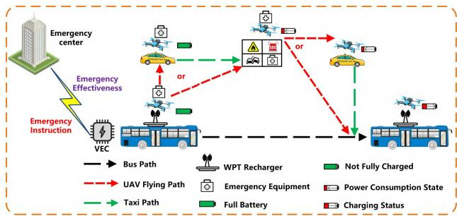  
Fig. 1. The basic concept of the UBT scheme.

The proposed emergency response strategy ofers the following advantages:

For urban managers: 1)By utilizing buses and taxis, UAV flight time is reduced, thereby decreasing the computational load for multi-UAV conflict detection and resolution during AAM management;2) Since no additional vehicles are introduced, there is no extra environmental pollution or trafic congestion.

For bus companies and taxi drivers: The strategy increases the income of bus companies and taxi drivers.

For UAVs: 1) Compared to methods that solely rely on buses equipped with UAVs for emergency response [14], using taxis as relay vehicles reduces the energy consumption of UAVs when traveling to emergency sites and catching up with buses, while increasing their hovering time at emergency locations; 2) By comprehensively considering response delays, response duration, and emergency costs, the flexibility of UAV emergency response modes is enhanced; 3) Reduced flight time decreases potential risks during UAV operations, such as collisions and wind interference.

However, utilizing buses and dynamically recruited taxis to carry UAVs presents significant challenges. Research [14] has pioneered the use of buses equipped with UAVs for city-scale emergency response, but it did not consider taxis. The introduction of taxis introduces two technical challenges: 1) The multimodal emergency dispatch problem becomes more complex, as it requires coordination among UAVs, buses, and taxis. 2) Unlike buses, which have fixed routes and schedules, taxi trajectories are dynamically time-varying. In other words, when selecting a suitable bus to carry a UAV, it is necessary to consider not only the bus’s own trajectory but also the dynamically changing state of taxis near the bus and the emergency site.

To address these technical challenges, we propose a UAV dispatch strategy based on buses and taxis. First, we analyze the emergency response modes of UAVs under the UBT scheme and establish an energy consumption model for UAV emergency response under the joint spatiotemporal constraints of bus and taxi trajectories. Then, we propose a participatory relay taxi recruitment model. Building on this, we establish a joint cost optimization model that considers response delay, response duration, and relay vehicle costs. To adapt to the time-varying characteristics of taxi distribution, we design a supervised learning-based neural network module to mine taxi daily travel patterns and establish a bus recruitment model that considers taxi relays. Finally, using a real-world vehicle trajectory dataset, we conduct a comprehensive numerical evaluation of the response performance under unpredictable emergency events. The contributions of this paper are threefold:

1) We propose a novel multimodal emergency dispatch framework based on buses, taxis, and UAVs to dynamically respond to large-scale urban emergencies. This framework can efectively address urban emergency needs during the AAM transition phase. To the best of our knowledge, this is the first work to study the innovative collaboration of UAVs, buses, and taxis for urban emergency response, addressing the short response duration issue of using buses alone to carry UAVs.

2) Considering the dynamic distribution of taxis, we design a data-driven taxi state estimation algorithm. By comprehensively considering UAV response delay, response duration, and relay taxi recruitment costs, we propose a bus recruitment algorithm based on the joint coverage performance of UAVs, buses, and taxis to address unpredictable urban emergencies.

3) Using a large-scale urban vehicle trajectory dataset, we comprehensively evaluate the performance of the proposed emergency dispatch strategy.

The remainder of this paper is organized as follows: Section II reviews related work closely associated with this study. Section III illustrates the limitations of relying solely on public buses equipped with UAVs for urban emergency response, based on real-world vehicle trajectory data, and analyzes the feasibility of the proposed UBT scheme to motivate our work. Section IV models the response process of a single UAV under diferent response modes. Section V formulates multi-UAV emergency response coverage models and designs heuristic algorithms for their solution. Section VI evaluates the emergency response performance of the UBT scheme using large-scale real-world vehicle trajectory and emergency event datasets. Section VII concludes the paper.

## II. LITERATURE REVIEW

To date, research on UAV applications based on urban public transportation primarily includes package delivery [15], [16], [17], [18], [19], [20], computational task ofloading [21], and urban monitoring [22], [23]. Huang et al. [15] proposed a novel package delivery system combining public trains and UAVs, optimizing delivery time and coverage. Additionally, UAVs can replace batteries on train rooftops. Choudhury et al. [16] extended the efective travel range and delivery space of UAVs by integrating public transportation (e.g., buses and trams), while optimizing UAV package allocation and vehicle routing. Pan et al. [17], [18] proposed that UAVs ride buses for recharging and completing last-mile urban deliveries. Cheng et al. [19] aimed to optimize transportation and delay costs by combining demand-responsive buses and UAVs fo transporting passengers and goods. Park et al. [20] utilized buses as mobile edge servers to ofload computational tasks for public service UAVs. Furthermore, several existing studies have explored using buses to carry UAVs for urban monitoring and emergency response. Trotta et al. [22] investigated the optimization of UAV monitoring paths for fixed points of interest (POIs), where UAVs recharge at bus stops. Huang and Savkin [21], [23] designed UAV monitoring schemes for predefined locations, reducing energy consumption through time window scheduling. However, the monitoring task requirements and locations in [21], [22], and [23] were predetermined, making the proposed models unsuitable for the randomness of emergencies in urban emergency response scenarios. To address this issue, Gao et al. [14] studied UAVs riding buses to respond to two types of urban emergencies: predictable and unpredictable events. Additionally, they deployed fixed charging stations in the city to recharge UAVs. Although Gao et al.’s research is more practical, their performance evaluation for unpredictable emergencies only discussed UAV response delays, ignoring the demand for UAV hovering time during emergencies. However, urban emergencies are highly random and unpredictable, making it impossible to predetermine the required UAV monitoring time. Therefore, how to fully utilize UAV hovering time is a critical issue. In the aforementioned studies, UAVs not only waste significant energy chasing buses but also face safety risks during long-distance flights, such as bird strikes and multi-UAV conflicts. In summary, this study aims to achieve eficient response to unpredictable emergencies in large cities at low cost without introducing new transportation vehicles or occupying public resource infrastructure. Building on Gao et al.’s research [14], we further consider the heterogeneity of emergency tasks in actual response scenarios, which leads to inconsistent UAV emergency response duration requirements. We propose a multimodal urban emergency dispatch strategy based on UAVs, buses, and taxis, maximizing UAV battery utilization and urban emergency spatiotemporal coverage while significantly reducing operational costs and potential UAV flight risks. Table I outlines the distinctions between this study and [14], [21], [22], [23].

TABLE I  
DIFFERENCES FROM RELATED WORKS
<table><tr><td></td><td>[21][22][23]</td><td>[14]</td><td>This work</td></tr><tr><td>Monitoring Targets Monitoring Duration Metrics</td><td>Fixed POIs Predetermined Monitoring duration, ratios of UAV states</td><td>Entire city and emergencies Based on predictions Urban spatiotemporal coverage,</td><td>Entire city and emergencies Random Spatiotemporal coverage, response delay,</td></tr><tr><td>Charging</td><td>(monitoring, hovering, charging) On buses Affected by bus schedules</td><td>response delay, response duration At control stations</td><td>response duration, coverage of events with different ERD demands, scheme cost On buses 24/7 coverage</td></tr></table>

TABLE II  
BASIC INFORMATION OF THE DATASETS
<table><tr><td>Datasets</td><td># of vehicles</td><td>Area (km²)</td><td># of Records</td><td>Interval</td></tr><tr><td>Bus Trajectory</td><td>≥13K</td><td>≈2000</td><td>≥30M</td><td>≈10s</td></tr><tr><td>Taxi Trajectory</td><td>≥14K</td><td>≈2300</td><td>≥140M</td><td>≈10s</td></tr><tr><td>Emergencies</td><td>N/A</td><td>≈350</td><td>≥5.4K</td><td>5min</td></tr></table>

## III. PRELIMINARIES

In Section III-A, we introduce the three real-world datasets used in this study. In Section III-B, we analyze the limitations of existing research based on large-scale real-world bus trajectory data to motivate our study. In Section III-C, we first examine the feasibility of the UBT scheme for urban emergency response based on taxi trajectory data. Building on this, we discuss the associated technical challenges. Finally, we present a UBT-based emergency dispatch framework.

## A. Data Set

This paper utilizes three real-world datasets. Table II provides detailed information about the datasets used.

1) Bus Trajectory Dataset: The real-world bus trajectory dataset of Shenzhen was released by Zhang et al. [24]. This dataset contains over 30 million trajectory records collected from more than 13,000 buses. The sampling interval is approximately 10 seconds. Each data sample includes information such as bus number, license plate, timestamp, latitude and longitude, and speed.

2) Taxi Trajectory Dataset: The real-world taxi trajectory dataset of Shenzhen is sourced from [24] and website.3 Together, the two datasets include trajectory data from over 14,000 taxis over a period of 7 days. The sampling interval is approximately 10 seconds. Each data sample includes information such as timestamp, latitude and longitude, speed, and passenger occupancy status.

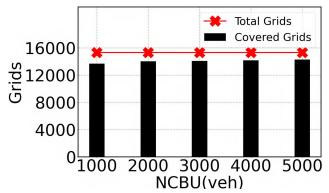  
Fig. 2. Number of space-time grids covered by diferent numbers of buses (ERD = 5 min).

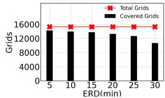  
Fig. 3. Number of space-time grids covered for diferent ERDs (NBCU = 5000 veh).

3) Emergency Data Set: We collected real-world trafic congestion data using the Baidu Maps API4 for a central urban area of Shenzhen covering 350 square kilometers. The data spans daytime hours (06:00–20:00) over the course of one week, from May 27 to June 3, 2025. To simulate realistic emergency scenarios, we recorded the spatiotemporal grid IDs where congestion events occurred, along with their durations. The sampling interval was set to 5 minutes, resulting in the collection of over 5400 trafic congestion events.

## B. Research Motivation

Some key definitions are introduced as follows.

Definition 1 (Number of Buses Carrying UAVs, NBCU): NBCU refers to the number of buses selected from the bus fleet to carry UAVs for responding to unpredictable urban emergencies. The research goal of this paper is to achieve maximum urban spatiotemporal coverage using the minimum number of buses.

Definition 2 (Emergency Response Duration, ERD): ERD refers to the hovering time of a UAV over an emergency site after arriving at the location. Since the ERD requirements for unpredictable emergencies cannot be predetermined, the research goal of this paper is to maximize the ERD of UAVs.

Definition 3 (Emergency Spatiotemporal Coverage, ESTC): The entire city is divided into 15,300 spatiotemporal grids (for details, see Section IV-A). ESTC is the ratio of the number of spatiotemporal grids where UAVs can complete the emergency response process to the total number of spatiotemporal grids:

$$
E S T C = { \frac { \# \ { \mathrm { o f ~ g r i d s ~ U A V s ~ c a n ~ r e s p o n d ~ t o } } } { \# \ { \mathrm { o f ~ t o t a l ~ g r i d s } } } }\tag{1}
$$

Unpredictable emergency events are highly random and sporadic, meaning they can occur at any time and any location within a city. Therefore, achieving 100% ESTC is essential. An increase in NBCU implies that more buses equipped with UAVs participate in urban emergency response. Additionally, ERD varies randomly based on the requirements of the emergency event. Specifically, diferent types of emergencies require diferent ERDs. For instance, delivering emergency supplies only requires the UAV to reach the emergency site, drop the supplies, and then leave, resulting in a short ERD, such as 1 minute. Conversely, emergencies like fires or trafic congestion, which last longer, require UAVs to monitor the site for an extended period to guide optimal rescue decisions, such as 10 to 30 minutes. Clearly, NBCU and ERD significantly impact the number of urban spatiotemporal grids that UAVs can cover. To study the influence of these factors on urban emergency response, the problem of buses carrying UAVs (referred to as the UB scheme) for urban emergency response is transformed into the Maximization of Emergency Spatiotemporal Coverage (MESTC) problem. The MESTC scheduling algorithm [14] is implemented, which maximizes ESTC by selecting appropriate buses to carry UAVs. Fig. 2 and Fig 3 illustrate the impact of these factors on the number of urban spatiotemporal grids covered.

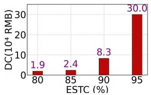  
Fig. 4. Daily recruitment cost of buses for diferent ESTCs (ERD = 5 min).

Fig. 2 shows the variation in the number of urban spatiotemporal grids covered under diferent NBCUs. The value in parentheses in the figure title represents the default value of ERD. When the NBCU is 1000 vehicles, only 89.8% of the spatiotemporal grids can be covered by UAVs. As the NBCU increases from 1000 to 5000 vehicles, the number of covered spatiotemporal grids only rises from 13,788 to 14,357, indicating that even with a suficiently short ERD requirement for emergency tasks, an investment of 5000 buses cannot achieve 100% spatiotemporal coverage. Furthermore, when the NBCU increases from 4000 to 5000 vehicles, the number of covered urban grids only increases from 14,357 to 14,549 (a 1.3% increase in ESTC), demonstrating that the UB scheme sufers from severe diminishing marginal returns.

Fig. 3 illustrates the impact of ERD on the number of urban spatiotemporal grids covered. When the ERD is 5 minutes, the ESTC is 93.32%. When the ERD increases to 30 minutes, the ESTC drops to 66.01%, meaning 34% of the spatiotemporal grids cannot be covered. This indicates that a significant amount of UAV energy is wasted on the journey (to and from the emergency site). Therefore, even with 5000 buses equipped with UAVs, the MESTC scheme may fail to respond to emergencies in certain areas where longer ERD requirements are needed.

Additionally, we conducted a detailed analysis of the costs associated with the UB scheme, primarily including bus recruitment costs (i.e., the daily cost(DC) for recruitment buses, as shown in Fig. 4) and infrastructure costs (including the cost of purchasing UAVs and the wireless power transfer (WPT) devices required for charging UAVs, as shown in Fig. 5). Specifically, the bus recruitment cost is set at

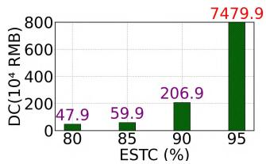  
Fig. 5. Infrastructure costs for diferent ESTCs (ERD = 5 min).

600 RMB/day, while the cost of each UAV and each WPT device is 12,499 RMB and 2,500 RMB, respectively. The costs of UAVs and WPT devices are based on the DJI Mavic3 Pro5 and website6 respectively. Each bus is assumed to carry 1 UAV by default. As shown in Fig. 4, as the ESTC increases, the daily vehicle recruitment cost rises significantly. When the ESTC reaches 95%, the daily bus recruitment cost amounts to 3 million RMB. Meanwhile, as shown in Fig. 5, the infrastructure cost required for the UB scheme approaches 75 million RMB. Clearly, such high costs are impractical for real world applications.

In summary, the UB scheme has limited capability in completing urban emergency responses and incurs excessively high costs. Therefore, additional transportation methods are needed to achieve eficient, flexible, and lower-cost urban emergency responses.

## C. Feasibility Analysis

To implement the UBT scheme, we propose the following prerequisites:

1) The takeof and landing process of UAVs should not afect the normal mobility of buses and taxis. Additionally, UAVs should be equipped with visual landing systems to achieve precise takeof and landing on the roofs of buses and taxis.

2) Buses and taxis need to be equipped with mobile data connectivity (e.g., cellular networks) and other communication devices to facilitate communication among UAVs, buses, taxis, and the emergency response control center. Buses and taxis must report their trajectory information in real time so that UAVs can adjust their flight paths to coordinate with them.

3) To ensure eficient emergency response, all buses equipped with UAVs are integrated with edge computing devices to minimize real-time scheduling delays. All taxis that meet the emergency response criteria are assumed to fully comply with dispatch instructions, with a compliance rate of 100%. Taxis can get close enough to both the bus equipped with the UAV and the emergency site.

Since the takeof and landing processes of UAVs do not afect the mobility of buses and taxis, we only need to discuss whether the trajectory characteristics of buses and taxis meet the requirements of UAVs.

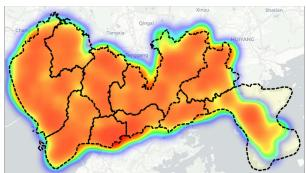  
Fig. 6. Heatmap of taxi trajectories.

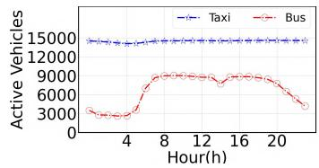  
(a)

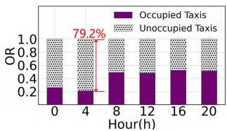  
(b)  
Fig. 7. Taxi mobility information. (a) Comparison of active vehicles. (b) Taxi occupancy status.

Trajectory Convergence: Given that Gao et al. [14] have already studied the convergence characteristics of bus trajectories in the spatiotemporal dimension, this paper focuses on the convergence characteristics of taxi trajectories to reveal the limitations of using buses alone and further demonstrate the advantages of the UBT scheme. As shown in Fig. 6, warmer colors such as red and orange indicate areas with a higher concentration of taxis, while green indicates areas with fewer taxis. Clearly, taxis cover most of the 2500 km2 area of Shenzhen.

Additionally, taxis can compensate for the limitations of buses due to their fixed routes, especially in areas not covered by bus routes (e.g., residential areas, alleys, etc.). Fig. 7 illustrates the stability of taxis as relay vehicles. Fig. 7(a) shows that the number of operating taxis remains stable at around 14,000 throughout the day. Specifically, taxis operate more flexibly and can provide relay support for UAVs during periods when buses are not operating or have low frequency (e.g., late at night), without being constrained by bus schedules. Fig. 7(b) shows the occupancy ratios(OR) of taxis during diferent time periods. The average empty rate of taxis is 58.8%, and it reaches 79.2% at 4 a.m. In other words, there are a large number of empty taxis in the city that can provide stable relay support for UAVs. Furthermore, the industry has already achieved the takeof and landing of UAVs on moving vehicles. Therefore, this paper does not discuss the details of UAV takeof and landing. However, unlike buses with fixed routes and schedules, taxi travel patterns are more complex. On one hand, taxi drivers typically choose routes based on passenger demand and real-time trafic conditions, lacking fixed paths, which further increases the uncertainty of emergency response. On the other hand, taxis are usually concentrated in urban hotspots (e.g., commercial areas, transportation hubs), while their distribution is sparse in other areas. This uneven distribution may make it dificult to ensure stable relay support around buses when emergencies occur.

Based on the above challenges, we propose a new framework (as shown in Fig. 8) that considers the dynamic distribution of buses and taxis as well as the daily travel patterns of taxis. To simplify the complex problem, we first schedule a single UAV to complete the entire emergency response process. Then, we extend this method to a multi-UAV scheduling problem, which requires coordination among buses, taxis, and UAVs. We begin by modeling the mobility of buses and taxis. Based on this, we schedule the flight paths of UAVs to enable them to eficiently complete tasks while considering emergency delays, hovering time, and emergency costs.

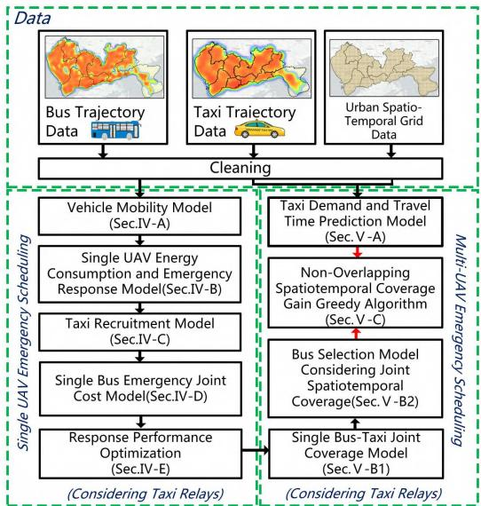  
Fig. 8. UBT emergency response framework.

## IV. SINGLE UAV SCHEDULING

This section introduces how to optimize the emergency response performance of a single UAV. We begin by modeling the mobility of buses and taxis using real-world vehicle trajectory datasets in Section IV-A. Then, in Section IV-B, we analyze the UAV emergency response modes under four relay scenarios from an energy consumption perspective and construct a model for the emergency response process of a single UAV. Based on this, we establish a taxi recruitment model in Section IV-C to quantify the cost of relay taxis. Finally, in Section IV-D, we comprehensively consider emergency delays, UAV hovering time, and relay costs to establish a joint cost model for UAV emergency response. In Section IV-E, we optimize the emergency response performance of the UAV.

## A. Vehicle Mobility Model

The entire city is discretized into grids $\mathbb { G } = \{ g _ { 0 } , g _ { 1 } , . . . , g _ { m } \}$ with equal side lengths (e.g., 1 kilometer), as shown in Fig. 9. Assuming that bus routes and trajectories are known, for any bus b, its trajectory is defined as $\mathcal { L } _ { b } = \{ G _ { 1 } , G _ { 2 } , . . . , G _ { k } \}$ , where $\forall G _ { k } \in \mathcal { L } _ { b } .$ , it represents a tuple of grid ID and timestamp, i.e., (gk tk), where k is the total number of trajectory points. Due to the variability in bus speeds, the future trajectory of a bus needs to be estimated periodically (e.g., every half hour). The task of trajectory estimation is handled by the city department.

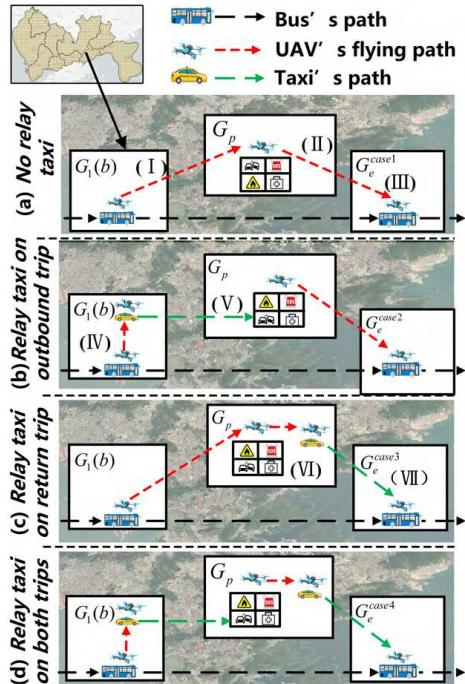  
Fig. 9. UAV emergency response process under four cases.

The time during which taxis participate in UAV relay work (from 0:00 to 24:00) is divided into a series of time slots $\mathbb { S } =$ $\{ s _ { 0 } , s _ { 1 } , . . . . , s _ { n } \} _ { } { } .$ , each with the same duration, e.g., 1 minute. To ensure the execution of emergency response tasks and to avoid afecting the experience of taxi passengers, we only consider unoccupied (passenger-free) taxis for UAV relay tasks. Let $N _ { u n } ( g _ { i } , s _ { j } )$ denote the number of unoccupied taxis in grid gi ∈ G during time slot $s _ { j } \in \mathbb { S }$ . For any timestamp $t \in s _ { j } \in \mathbb { S } ,$ , if an emergency event occurs in grid $g _ { n } \in \mathbb { G } ,$ , a binary variable is defined to indicate whether there is a relay taxi available to carry the UAV from the bus:

$$
r ( g _ { n } , t , \nu ) = \left\{ \begin{array} { l l } { { 1 , } } & { { \mathrm { i f } \ N _ { u n } ( g ( b ) , s _ { j } ) > 0 } } \\ { { 0 , } } & { { \mathrm { o t h e r w i s e } } } \end{array} \right.\tag{2}
$$

where $r ( g _ { n } , t , \nu ) = 1$ indicates that the UAV can be carried , ,by an unoccupied taxi from the bus’s grid $g ( b ) \in \mathbb { G }$ to the emergency grid.

B. Energy Consumption and Emergency Response Model for a Single UAV

In this section, we model the emergency response process of UAVs with taxi relay support. However, in special cases, such as when the emergency site is far from the UAV or the emergency task requires a long hovering time, the UAV may not be able to complete the response due to energy limitations. To address this issue, we consider using taxis as relay platforms for UAVs to further enhance the stability of emergency responses. Based on whether relay vehicles are involved in the two processes—the UAV taking of from the bus to the emergency site (referred to as the outbound trip) and the UAV returning to the original bus after completing the task (referred to as the return trip)—the response process is divided into four scenarios. The seven flight processes of the UAV under these four scenarios are illustrated in Fig. 9.

1) No Relay Taxi(Case1) [14]: As shown in Fig. 9(a), upon receiving an emergency, the city emergency center assigns the task to the most suitable available UAV, which takes into account response delay, response duration, and the relay taxi cost. The available UAV will take of from the bus and fly directly to the task point, as shown in process (I). Assuming the future trajectory of the bus is known, let $G _ { 1 } ( b )$ represent the grid where the bus is located at that moment, and let $G _ { p }$ represent the grid where the emergency point is located. Let $\mathrm { D i s } ( G _ { o } , G _ { d } )$ denote the Euclidean distance between the geometric centers of any two grids $\forall G _ { o } \in \mathbb { G }$ and $\forall G _ { d } \in \mathbb { G }$ . After arriving at the emergency site, the UAV hovers over the site (e.g., for trafic accident monitoring or medical supply delivery), as shown in process (II). Let $T _ { p } ^ { \mathrm { C a s e } i }$ and $T _ { h } ^ { \mathrm { C a s e } ~ i }$ represent the time for the UAV to reach the emergency grid and the hovering time at the emergency point (referred to as response duration) under ∀Casei ∈ {Case1 Case2 Case3 Case4}, respectively. After hovering for $T _ { h } ^ { \mathrm { C a s e l } }$ , the UAV returns to the bus, as shown in process (III). Let $G _ { e } ^ { \mathrm { C a s e } i }$ represent the meeting grid between the UAV and the bus under ∀Casei ∈ {Case1 Case2 Case3 Case4}. Note that the flight distance Dis $( G _ { p } , G _ { e } ^ { \mathrm { C a s e l } } )$ for the UAV to return to the bus is related to $T _ { h } ^ { \mathrm { C a s e l } }$

2) Relay Taxi on Outbound Trip (Case2): As shown in Fig. 9(b), the UAV takes of from the bus and meets a taxi within grid $G _ { 1 } ( b )$ , as shown in process (IV). After the meeting, the taxi carries the UAV to the emergency point grid $G _ { p } ,$ as shown in process (V). The UAV hovers for $T _ { h } ^ { \mathrm { C a s e 2 } }$ and then returns to the bus. The flight distance of the UAV $\mathrm { D i s } ( G _ { p } , G _ { e } ^ { \mathrm { C a s e 2 } } )$ is related to the timestamp $T _ { p } ^ { \mathrm { C a s e 2 } }$ required for the taxi to reach the emergency point grid and the hovering time of the UAV $T _ { h } ^ { \mathrm { C a s e 2 } } . T _ { p } ^ { \mathrm { C a s e 2 } }$ is determined using a data-driven approach. $T _ { h } ^ { \mathrm { C a s e 2 } }$ is determined based on the future trajectory of the bus and the UAV energy consumption model.

3) Relay Taxi on Return Trip (Case3): As shown in Fig. 9(c), the process of the UAV taking of from the bus and reaching the emergency point grid is the same as process (I). After hovering for $T _ { h } ^ { \mathrm { C a s e 3 } }$ , the UAV is carried by a taxi within the emergency point grid back to the original bus. The driving distance for the taxi to reach the meeting grid with the bus is $\mathrm { D i s } ( G _ { p } , G _ { e } ^ { \mathrm { C a s e 3 } } )$ , which is related to $\bar { T } _ { p } ^ { \bar { \mathrm { C a s e 3 } } }$ and the future trajectory of the bus. In other words, since the UAV’s hovering time at the emergency point varies, the meeting grid $G _ { e }$ between the taxi and the bus also difers.

4) Relay Taxi on Both Trips(Case4): As show in Fig. 9(d), this process combines Case2 and Case3. To avoid unnecessary repetition, it will not be discussed in detail here.

When UAV u responds to an emergency at grid $G _ { p }$ at timestamp $t _ { 0 } ,$ the flight trajectory is redefined $\mathrm { a s } \mathcal { L } _ { u } = \{ G _ { i }$ | $i = 0 , 1 , 2 , \ldots , I \}$ , where $G _ { 0 }$ is the grid where the UAV leaves the bus (referred to as $G _ { 1 } ( b )$ in Case1). By combining the flight processes of the UAV under Cases 1 to 4, the UAV trajectory

L(u) can be expressed as:

$$
\mathcal { L } _ { u } \equiv \left\{ \begin{array} { c c } { \mathcal { L } _ { u } ( G _ { 1 } ( b ) , G _ { p } ) + \mathcal { L } _ { u } ( G _ { p } , G _ { p } ) , } & { C a s e l } \\ { \mathcal { L } _ { u } ( G _ { 1 } ( b ) , G _ { 1 } ( b ) , \nu ) + \mathcal { L } _ { u } ( G _ { 1 } ( b ) , G _ { p } , \nu ) } \\ { + \mathcal { L } _ { u } ( G _ { p } , G _ { p } ) + \mathcal { L } _ { u } ( G _ { p } , G _ { p } ^ { \mathrm { c o s 2 } } , b ) , } & { C a s e l } \\ { \mathcal { L } _ { u } ( G _ { 1 } ( b ) , G _ { p } ) + \mathcal { L } _ { u } ( G _ { p } , G _ { p } ) } \\ { + \mathcal { L } _ { u } ( G _ { p } , G _ { p } ) + \mathcal { L } _ { u } ( G _ { p } , G _ { e } ^ { \mathrm { c o s 3 } } , \nu ) } \\ { + \mathcal { L } _ { u } ( G _ { e } ^ { \mathrm { c o s 3 } } , G _ { e } ^ { \mathrm { c u s 3 } } , b ) , } & { C a s e \beta } \\ { \mathcal { L } _ { u } ( G _ { 1 } ( b ) , G _ { 1 } ( b ) , \nu ) + \mathcal { L } _ { u } ( G _ { 1 } ( b ) , G _ { p } , \nu ) } \\ { + \mathcal { L } _ { u } ( G _ { p } , G _ { p } ) + \mathcal { L } _ { u } ( G _ { p } , G _ { p } , \nu ) } \\ { + \mathcal { L } _ { u } ( G _ { p } , G _ { e } ^ { \mathrm { c o s 4 } } , \nu ) } & { C a s e l } \\ { + \mathcal { L } _ { u } ( G _ { s } ^ { \mathrm { c o s 4 } } , G _ { e } ^ { \mathrm { c o s 4 } } , b ) , } & { C a s e l } \end{array} \right.\tag{3}
$$

Let $E _ { m } ^ { \mathrm { C a s e } i }$ denote the energy consumption required for the UAV to complete the m-th emergency event under full battery capacity in Casei. To ensure that the UAV can handle unexpected situations, such as communication failures or bus delays, the UAV’s energy should satisfy

$$
E _ { m } ^ { r } - E _ { m } ^ { \mathrm { C a s e \ } i } \geq \lambda E _ { c } ,\tag{4}
$$

where $E _ { c }$ represents the total battery capacity of the UAV; $E _ { m } ^ { r }$ represents the remaining energy before responding to the m-th task; and  (e.g., 10%) denotes the percentage of energy reserved for unexpected situations. The details of energy consumption for the UAV under the four emergency modes are as follows:

In Eq. (3), in Case1, $\begin{array} { r c l } { { { \mathcal L } _ { u } ( G _ { 1 } ( b ) , G _ { p } ) } } & { { = } } & { { \mathrm { D i s } ( G _ { 1 } ( b ) , G _ { p } ) } } \end{array}$ represents a straight-line path. $\mathcal { L } _ { u } ( G _ { p } , G _ { p } ) = 0$ indicates that ,the UAV hovers at the emergency point. $\mathcal { L } _ { u } ( G _ { p } , G _ { e } ^ { \mathrm { C a s e l } } , b ) =$ $\mathrm { D i s } ( G _ { p } , G _ { e } ^ { \mathrm { C a s e l } } )$ represents the straight-line path from the emergency point to the bus grid after completing the task. The total energy consumption $E _ { m } ^ { \mathrm { { \bar { C } a s e l } } }$ of the UAV can be calculated as shown in Eq. (5):

$$
E _ { m } ^ { \mathrm { C a s e l } } = \alpha _ { 1 } \mathrm { D i s } ( G _ { 1 } ( b ) , G _ { p } ) + \alpha _ { 2 } T _ { h } ^ { \mathrm { C a s e l } } + \alpha _ { 1 } \mathrm { D i s } ( G _ { p } , G _ { e } ^ { \mathrm { C a s e l } } ) ,\tag{5}
$$

where $\alpha _ { 1 }$ and 2 represent the power consumption coeficients of the UAV during flight and when hovering at the emergency location, respectively $. \alpha _ { 1 }$ is influenced not only by the weight αof the UAV, but also by external factors such as wind speed and air density, while $\alpha _ { 2 }$ primarily depends on the UAV’s weight [14]. In other words, the UBT scheme can flexibly adapt to diferent types of emergency tasks. In practice, the coeficients $\alpha _ { 1 }$ and $\alpha _ { 2 }$ can be calibrated based on the payload requirements α αof each task type.

Based on the expected trajectory points of the bus, the UAV continuously estimates the meeting grid with the bus at the emergency point. Since the required hovering time of the UAV in emergency scenarios cannot be predetermined, the hovering time should be as long as possible. The grid that provides the maximum response duration for the UAV is selected as the final meeting grid $G _ { e } ^ { \mathrm { C a s e l } }$ between the UAV and the bus:

$$
G _ { e } ^ { \mathrm { C a s e l } } = \arg \operatorname* { m a x } _ { G _ { i } \in \mathcal { L } _ { b } } T _ { h } ^ { \mathrm { C a s e l } } ,\tag{6}
$$

$$
\begin{array} { r l r } {  { \mathrm { s . t . ~ D i s } ( G _ { p } , G _ { e } ^ { \mathrm { C a s e l } } ) } } \\ & { } & { = \bar { \nu } _ { u } ( t _ { \mathrm { m e e t } } - ( t _ { 0 } + T _ { p } ^ { \mathrm { C a s e l } } + T _ { h } ^ { \mathrm { C a s e l } } ) ) , } \end{array}\tag{7}
$$

$$
\exists t _ { \mathrm { m e e t } } \geq t _ { 0 } + T _ { p } ^ { \mathrm { C a s e l } } + T _ { h } ^ { \mathrm { C a s e l } } ,\tag{8}
$$

$$
E _ { m } ^ { r } - E _ { m } ^ { \mathrm { C a s e l } } \geq \lambda E _ { c } ,\tag{9}
$$

where $\bar { \nu } _ { u }$ is the average speed of the UAV, set as a fixed constant.

In Eq. (3) in Case2, $\mathcal { L } _ { u } ( G _ { 1 } ( b ) , G _ { 1 } ( b ) , \nu )$ represents the trajectory of the UAV meeting a taxi within $G _ { 1 } ( b )$ .Since unoccupied taxis can be suficiently close to the bus, the flight distance of $\mathcal { L } _ { u } ( G _ { 1 } ( b ) , G _ { 1 } ( b ) , \nu )$ can be assumed to be a default constant (e.g., 0.1 km). $\mathcal { L } _ { u } ( G _ { 1 } ( b ) , G _ { p } , \nu ) = 0$ indicates that the UAV rides a taxi to reach the emergency point, during which the UAV consumes no energy. Other processes are similar to Case1, and we can calculate the total energy consumption $E _ { m } ^ { \mathrm { C a s e 2 } }$ of the UAV, as shown in Eq. (10), as well as the final meeting grid $G _ { e } ^ { \mathrm { C a s e 2 } }$ between the UAV and the bus, as shown in Eq. (11):

$$
E _ { m } ^ { \mathrm { C a s e 2 } } = \alpha _ { 1 } \varepsilon + \alpha _ { 2 } T _ { h } ^ { \mathrm { C a s e 2 } } + \alpha _ { 1 } \mathrm { D i s } ( G _ { p } , G _ { e } ^ { \mathrm { C a s e 2 } } ) ,\tag{10}
$$

$$
G _ { e } ^ { \mathrm { C a s e 2 } } = \arg \operatorname* { m a x } _ { G _ { i } \in \mathcal { L } _ { b } } T _ { h } ^ { \mathrm { C a s e 2 } } ,\tag{11}
$$

$$
\mathrm { s . t . } \ \mathrm { D i s } ( G _ { p } , G _ { e } ^ { \mathrm { C a s e 2 } } )
$$

$$
= \bar { \nu } _ { u } \left( t _ { \mathrm { m e e t } } - \left( t _ { 0 } + T _ { p } ^ { \mathrm { C a s e 2 } } + T _ { h } ^ { \mathrm { C a s e 2 } } \right) \right) ,\tag{12}
$$

$$
\exists t _ { \mathrm { m e e t } } \geq t _ { 0 } + T _ { p } ^ { \mathrm { C a s e 2 } } + T _ { h } ^ { \mathrm { C a s e 2 } } ,\tag{13}
$$

$$
r \left( g _ { p } , t _ { 0 } , \nu \right) = 1 ,\tag{14}
$$

$$
E _ { m } ^ { r } - E _ { m } ^ { \mathrm { C a s e 2 } } \geq \lambda E _ { c } .\tag{15}
$$

In Eq. (3) in Case3, $\mathcal { L } _ { u } ( G _ { p } , G _ { p } , \nu )$ represents the trajectory of the UAV meeting a taxi within the emergency point grid $G _ { p }$ after completing the emergency task. $\mathcal { L } _ { u } ( G _ { p } , G _ { e } ^ { \mathrm { C a s e 3 } } , \nu ) = 0$ , ,indicates that the UAV rides a taxi to meet the bus, during which no energy is consumed. $\mathcal { L } _ { u } ( G _ { e } ^ { \mathrm { C a s e 3 } } , G _ { e } ^ { \mathrm { C a s e 3 } } , k$ ) represents , ,the trajectory of the UAV flying back to the original bus from the taxi after the taxi reaches the meeting grid. Since unoccupied taxis can be suficiently close to both the emergency point and the bus, Since unoccupied taxis are suficiently close to both the emergency point and the bus, the UAV’s flight paths $\mathcal { L } _ { u } ( G _ { p } , G _ { p } , \nu )$ and $\mathcal { L } _ { u } ( G _ { e } ^ { \mathrm { C a s e 3 } } , G _ { e } ^ { \mathrm { C a s e 3 } } , b )$ are set to , , , ,a fixed constant distance .We can calculate the total energy consumption $E _ { m } ^ { \mathrm { C a s e 3 } }$ of the UAV, as shown in Eq. (16):

$$
E _ { m } ^ { \mathrm { C a s e 3 } } = \alpha _ { 1 } \mathrm { D i s } ( G _ { 1 } ( b ) , G _ { p } ) + \alpha _ { 2 } T _ { h } ^ { \mathrm { C a s e 3 } } + \alpha _ { 1 } \varepsilon + \alpha _ { 1 } \varepsilon ,\tag{16}
$$

Unlike Case1 and Case2, the hovering time $T _ { h } ^ { \mathrm { C a s e 3 } }$ of the UAV not only needs to consider energy constraints but also whether there are available taxis in the emergency point grid. Therefore, the final meeting grid $G _ { e } ^ { \mathrm { C a s e 3 } }$ between the UAV and the bus is calculated as shown in Eq.(17):

$$
G _ { e } ^ { \mathrm { C a s e 3 } } = \arg \operatorname* { m a x } _ { G _ { i } \in \mathcal { L } _ { b } } T _ { h } ^ { \mathrm { C a s e 3 } } ,\tag{17}
$$

$$
\mathrm { s . t . } t _ { 0 } + T _ { p } ^ { \mathrm { C a s e 3 } } + T _ { h } ^ { \mathrm { C a s e 3 } } + T _ { G _ { p }  G _ { e } ^ { \mathrm { C a s e 3 } } }
$$

$$
\leq t _ { b  G _ { e } ^ { \mathrm { C a s c 3 } } } ,\tag{18}
$$

$$
r \left( g _ { p } , t _ { 0 } + T _ { p } ^ { \mathrm { C a s e 3 } } + T _ { h } ^ { \mathrm { C a s e 3 } } , \nu \right) = 1 ,\tag{19}
$$

$$
E _ { m } ^ { r } - E _ { m } ^ { \mathrm { C a s e 3 } } \geq \lambda E _ { c } ,\tag{20}
$$

where $r ( g _ { p } , t _ { 0 } + T _ { p } ^ { \mathrm { C a s e 3 } } + T _ { h } ^ { \mathrm { C a s e 3 } } , \nu ) = 1$ indicates that after the UAV hovers for $T _ { h } ^ { \mathrm { C a s e 3 } }$ , there is an unoccupied taxi in the emergency point grid that can serve as a relay vehicle. The constraint ensures that the taxi must arrive at the meeting grid $G _ { e } ^ { \mathrm { C a s e 3 } }$ before the bus. ${ \cal T } _ { G _ { p } \to G _ { e } ^ { \mathrm { C a s c 3 } } }$ represent the travel time of the taxi from the emergency point grid to the meeting grid, determined by a data-driven algorithm (Sec $\mathbf { V - A } ) . t _ { b  G _ { e } ^ { \mathrm { C a s e 3 } } }$ represents the timestamp at which the bus arrives at grid $G _ { e } ^ { \mathrm { { \hat { C } a s e 3 } } }$ , determined based on the expected trajectory $\mathcal { L } _ { b }$ of the bus.

Case4 combines Case2 and Case3. To avoid unnecessary repetition, the paths of the UAV and the taxi are not discussed further. We can calculate the total energy consumption $E _ { m } ^ { \mathrm { C a s e 4 } }$ of the UAV, the maximum hovering time, and the final meeting grid $G _ { e } ^ { \mathrm { C a s e 4 } }$ between the taxi and the bus:

$$
E _ { m } ^ { \mathrm { C a s e 4 } } = \alpha _ { 1 } \varepsilon + \alpha _ { 2 } T _ { h } ^ { \mathrm { C a s e 4 } } + \alpha _ { 1 } \varepsilon + \alpha _ { 1 } \varepsilon ,
$$

$$
G _ { e } ^ { \mathrm { C a s e 4 } } = \arg \operatorname* { m a x } _ { G _ { i } \in \mathcal { L } _ { b } } T _ { h } ^ { \mathrm { C a s e 4 } } ,\tag{21}
$$

$$
\mathrm { s . t . } t _ { 0 } + T _ { p } ^ { \mathrm { C a s e 4 } } + T _ { h } ^ { \mathrm { C a s e 4 } } + T _ { G _ { p }  G _ { e } ^ { \mathrm { C a s e 4 } } }\tag{22}
$$

$$
\leq t _ { b  G _ { e } ^ { \mathrm { C a s c 4 } } } ,\tag{23}
$$

$$
r \left( g _ { p } , t _ { 0 } , \nu \right) = 1 ,\tag{24}
$$

$$
r \left( g _ { p } , t _ { 0 } + T _ { p } ^ { \mathrm { C a s e 4 } } + T _ { h } ^ { \mathrm { C a s e 4 } } \right) = 1 ,\tag{25}
$$

$$
E _ { m } ^ { r } - E _ { m } ^ { \mathrm { C a s e 4 } } \geq \lambda E _ { c } .\tag{26}
$$

## C. Taxi Recruitment Model

Inspired by the study of taxi recruitment [25], based on the routes and passenger occupancy uploaded by taxis, the relay taxi recruitment costs for both outbound and return trips under ∀Casei ∈ {Case1 Case2 Case3 Case4} are calculated separately. Rewards are given based on the Euclidean distance between the taxi’s departure grid and arrival grid. Therefore, we can calculate the relay cost of the taxi as follows:

$$
\begin{array} { r } { C _ { \mathrm { r e l a y } } ^ { \mathrm { C a s e i } } = \left\{ \begin{array} { l l } { 0 , } & { C a s e l } \\ { \mathrm { D i s } ( G _ { 1 } ( b ) , G _ { p } ) \times R _ { \mathrm { t a x i } } , } & { C a s e 2 } \\ { \mathrm { D i s } ( G _ { p } , G _ { e } ^ { \mathrm { C a s e 3 } } ) \times R _ { \mathrm { t a x i } } , } & { C a s e 3 } \\ { \left( \begin{array} { l } { \mathrm { D i s } ( G _ { 1 } ( b ) , G _ { p } ) + } \\ { \mathrm { D i s } ( G _ { p } , G _ { e } ^ { \mathrm { C a s e 4 } } ) } \end{array} \right) \times R _ { \mathrm { t a x i } } , } & { C a s e 4 } \end{array} \right. } \end{array}\tag{27}
$$

## D. Single Bus Emergency Joint Cost Model

Based on Eq. (1) to Eq. (27), we can obtain the response delay $T _ { \mathrm { d e l a y } } ^ { \mathrm { C a s e i } }$ , response duration $T _ { h } ^ { \mathrm { C a s e i } }$ , and relay cost $C _ { \mathrm { r e l a y } } ^ { \mathrm { C a s e i } }$ for UAV ui on any bus $b _ { i } \in \mathbb { B } _ { c o }$ under diferent response scenarios (Case1–Case4). Considering these factors, the emergency utility function for a single bus is established as follows:

$$
C _ { b } ^ { \mathrm { { C a s e i } } } = \omega _ { 1 } \frac { T _ { \mathrm { { d e l a y } } } ^ { \mathrm { { m a x } } } - T _ { \mathrm { { d e l a y } } } ^ { \mathrm { { C a s e i } } } } { T _ { \mathrm { { d e l a y } } } ^ { \mathrm { { m a x } } } } + \omega _ { 2 } \frac { T _ { h } ^ { \mathrm { { C a s e i } } } } { T _ { p } ^ { \mathrm { { m a x } } } } + \omega _ { 3 } \frac { C _ { \mathrm { { r e l a y } } } ^ { \mathrm { { m a x } } } - C _ { \mathrm { { r e l a y } } } ^ { \mathrm { { C a s e i } } } } { C _ { \mathrm { { r e l a y } } } ^ { \mathrm { { m a x } } } }\tag{28}
$$

where $C _ { b } ^ { \mathrm { C a s e i } }$ represents the emergency joint cost of bus b under ∀Casei ∈ {Case1 Case2 Case3 Case4}; $T _ { \mathrm { d e l a v } } ^ { \mathrm { m a x } } = 1 8 0 0 \mathrm { s } .$ $T _ { p } ^ { \mathrm { m a x } } = 2 5 2 0 \mathrm { s } .$ , and $C _ { \mathrm { r e l a y } } ^ { \mathrm { m a x } } = 1 0 0 \mathrm { R M B }$ represent the maximum values of response delay, response duration, and relay cost, respectively. $\omega _ { i }$ are the weights for the corresponding costs $( \omega _ { 1 } = 0 . 4 ; \omega _ { 2 } = 0 . 4 ; \omega _ { 3 } = 0 . 2 )$ . The final emergency utility $C _ { b } ^ { \mathrm { U n i o n } }$ . ωof bus $b _ { i }$ . ω .is the maximum emergency utility among the four response cases.

$$
\begin{array} { r } { C _ { b } ^ { \mathrm { U n i o n } } = \operatorname* { m a x } \left\{ C _ { b } ^ { \mathrm { C a s e i } } \right\} } \\ { \forall \mathrm { C a s e i } \in \left\{ \mathrm { C a s e l } , \mathrm { C a s e 2 } , \mathrm { C a s e 3 } , \mathrm { C a s e 4 } \right\} , } \end{array}\tag{29}
$$

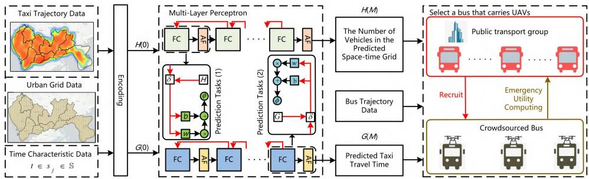  
Fig. 10. Taxi travel pattern prediction and bus recruitment framework.

$$
\mathrm { s . t . } T _ { p } ^ { \mathrm { m a x } } = \frac { E _ { c } } { \alpha _ { 2 } } ,\tag{30}
$$

$$
T _ { h } ^ { \mathrm { C a s e i } } > 0 ,\tag{31}
$$

$$
T _ { \mathrm { d e l a y } } ^ { \mathrm { C a s e i } } = T _ { \mathrm { e d } } ^ { \mathrm { C a s e i } } + N _ { \mathrm { t r a n s } } ^ { \mathrm { C a s e i } } \Delta T ,\tag{32}
$$

$$
T _ { \mathrm { d e l a y } } ^ { \mathrm { C a s e i } } \leq T _ { e } ^ { \mathrm { m a x } } ,\tag{33}
$$

$$
C _ { \mathrm { r e l a y } } ^ { \mathrm { C a s e i } } \leq C _ { \mathrm { r e l a y } } ^ { \mathrm { m a x } } .\tag{34}
$$

where $T _ { \mathrm { e d } } ^ { \mathrm { C a s e i } }$ is Casei’s expected delay, $N _ { \mathrm { t r a n s } } ^ { \mathrm { C a s e i } }$ (counting UAV transitions between buses/taxis and taxis/emergency sites) the transition count, and ∆T = 10s the fixed time penalty per transition.

## E. Response Performance Optimization

For an emergency occurring at grid $G _ { p } \in \mathbb { G }$ at timestamp $t _ { 0 } \in s _ { j } \in \mathbb { S } _ { : }$ , the set of buses that can cover this point is denoted as $\mathbb { B } _ { c o } \subset \mathbb { B }$ . Considering the UAV’s emergency response delay, emergency duration, and emergency cost, this task is assigned to the UAV on the bus $b _ { i }$ with the highest final emergency utility.

$$
b _ { i } = \arg \operatorname* { m a x } _ { b _ { n } } \left\{ C _ { b _ { n } } ^ { \mathrm { U n i o n } } ~ | ~ \mathrm { E q . } ( 1 ) \mathrm { - E q . } ( 3 4 ) , ~ N _ { u _ { n } } ( t _ { 0 } ) > 0 \right\} ,\tag{35}
$$

where $N _ { u _ { n } } ( t _ { 0 } )$ represents the number of UAVs on bus $b _ { n }$ at timestamp t , set as a fixed value.

## V. MULTI-UAV SCHEDULING

The key challenge in multi-UAV scheduling lies in selecting the appropriate buses equipped with UAVs, considering their joint coverage capability with taxis, to achieve unpredictable emergency response performance. To address this issue, we combine data-driven and quantitative analysis methods to evaluate the joint emergency coverage capability of buses and taxis. First, we use a neural network model to learn the daily travel patterns of taxis and predict the number of unoccupied taxis in urban spatiotemporal grids, as well as the travel time between city grids, as described in Section V-A. The predicted taxi travel patterns are integrated with the UAV emergency response process to guide the modeling of the joint coverage capability of a single UAV-bus-taxi in Section V-B. The bus selection optimization problem is solved by a customized non-overlapping joint coverage gain greedy algorithm in Section V-C.

## A. Taxi Demand and Travel Time Prediction

The prediction model forecasts the number of unoccupied taxis within a grid at fixed time intervals, as well as the travel time required for vehicles to move from one grid to another. Fig. 10 depicts the architecture for vehicle travel pattern prediction and bus recruitment. Urban grid data and temporal feature data are input into the MLP as contextual data for the two prediction tasks. Taxi trajectory data and contextual data from the first 5 days are used for model training, while data from the subsequent 2 days are used for validation. Let M denote the number of layers in the MLP, and H(k) and G(k) represent the outputs of prediction task 1 and prediction task 2 at the k-th layer, respectively. The inputs for the two MLP prediction tasks are H(0) and G(0), and H(M) and G(M) are the final outputs of the two prediction tasks. Specifically, the input H(0) is:

$$
H ( 0 ) = \left[ \xi , t i m e , G \right] ^ { J } ,\tag{36}
$$

where $\xi _ { j }$ represents the number of unoccupied taxis in the j-th sample, and time and G indicate the time and grid ID where multiple unoccupied taxis appear. Similarly, the input G(0) is:

$$
G ( 0 ) = [ \mathcal { T } , t i m e , G _ { O } , G _ { D } ] ^ { J } ,\tag{37}
$$

where $\mathcal { T } _ { j }$ represents the travel time of the taxi from $G _ { o }$ to $G _ { D }$ in the j-th sample. As shown in the Fig. 10, the inputs H(0) and G(0) for the two prediction tasks are transmitted along the black lines in the MLP. All layers in the MLP are fully connected layers (FC layers) with activation functions (AF). The outputs H(k) and G(k) at the k-th layer for the two prediction tasks are:

$$
H ( k ) = \phi ( H ( k - 1 ) w ( k ) + b ( k ) ) ,
$$

$$
G ( k ) = \phi ( G ( k - 1 ) w ( k ) + b ( k ) ) ,\tag{38}
$$

(39)

where w(k) is the weight parameter, b(k) is the bias term, and (·) is the activation function. To address potential dead neurons during training, Leaky-ReLU is used as the AF layer in the MLP. Therefore, the output of the activation function is:

$$
\phi ( \theta ) = { \left\{ \begin{array} { l l } { \theta } & { { \mathrm { i f ~ } } \theta \geq 0 } \\ { 1 0 ^ { - 2 } \theta } & { { \mathrm { o t h e r w i s e } } } \end{array} \right. }\tag{40}
$$

The Huber loss function is not only diferentiable everywhere [26], but also balances the accuracy and robustness of prediction results [27]. Therefore, the Huber loss is used as the loss function for both MLP prediction tasks.

$$
L o s s ( y ( k ) , \hat { y } ( k ) )
$$

$$
\begin{array}{c} \begin{array} { r l } & { \mathbf { \Theta } _ { = } \left\{ \displaystyle \frac { 1 } { 2 } ( y ( k ) - \hat { y } ( k ) ) ^ { 2 } , \qquad \mathrm { i f ~ } | y ( k ) - \hat { y } ( k ) | \le \delta } \\ & { \begin{array} { l } { \displaystyle \delta | y ( k ) - \hat { y } ( k ) | - \frac { 1 } { 2 } \delta ^ { 2 } , \quad \mathrm { o t h e r w i s e } } \\ { \displaystyle L o s s ( p ( k ) , \hat { p } ( k ) ) } \end{array} \right. } \\ & { \mathbf { \Theta } _ { = } \left\{ \displaystyle \frac { 1 } { 2 } ( p ( k ) - \hat { p } ( k ) ) ^ { 2 } , \qquad \mathrm { i f ~ } | p ( k ) - \hat { p } ( k ) | \le \delta \right.} \\ & { \displaystyle \delta | p ( k ) - \hat { p } ( k ) | - \frac { 1 } { 2 } \delta ^ { 2 } , \quad \mathrm { o t h e r w i s e } } \end{array}   \end{array}\tag{41}
$$

(42)

where is the decision threshold used to determine outliers, and is set to a default value of 1 0 y(k) and ˆy(k) are the true and predicted values of the number of unoccupied taxis in the spatiotemporal grid, respectively. $p ( k )$ and ${ \hat { p } } ( k )$ are the true and predicted values of the travel time required for taxis to move from one spatiotemporal grid to another, respectively. During training, the losses for the two prediction tasks are backpropagated along their respective red lines in Fig. 10, and the parameters in each layer are adjusted. After training the two MLP prediction tasks, we can predict the number of unoccupied taxis in any spatiotemporal grid in the city and the travel time required for them to reach any grid. The outputs of the prediction tasks are used to recruit buses equipped with UAVs. It is worth noting that due to the highly dynamic nature of urban environments, the integration of more extensive taxi trajectory data for MLP model training, along with coordinated routing technologies [28], [29] between UAVs and taxis in the future, will further enhance the stability of the UBT scheme.

## B. Multi-UAV Response to Urban Unpredictable Emergencies Under the UBT Scheme

1) Single UAV-Bus-Taxi Joint Coverage Model: In Section IV-A, all bus trajectories are known, including the sequence of grid IDs and timestamps. Based on the bus emergency utility function in Section IV-D, if the UAV on bus $b _ { i }$ can respond to an emergency at grid $g _ { r } ,$ then $\mathcal { C } _ { b _ { i } } ^ { \mathrm { U n i o n } } ( g _ { r } , t ) > 0 .$ . Otherwise, $\mathcal { C } _ { b _ { i } } ^ { \mathrm { U n i o n } } ( g _ { r } , t ) = 0 .$ . For $\forall b _ { i } \in \mathbb { B }$ , its joint coverage performance can be expressed as:

$$
U C U _ { b _ { i } } = \sum _ { t \in s _ { j } \in \mathbb { S } } \sum _ { g _ { r } \in \mathbb { G } } { \mathcal C } _ { b _ { i } } ^ { \mathrm { U n i o n } } ( g _ { r } , t ) ,\tag{43}
$$

The larger $U C U _ { b _ { i } }$ , the greater the spatiotemporal coverage utility of the UAV on bus $b _ { i }$ . This approach is more scientific than the traditional 0 or 1 coverage [14], as it comprehensively considers response delay, response duration, and emergency costs.

2) Bus Selection Model Considering Joint Spatiotemporal Coverage: Due to cost constraints, city managers can only select a subset of buses to carry UAVs. Therefore, our goal is to maximize the joint coverage utility of the selected bus set $\mathbb { B } _ { s } ,$ while ensuring that the total cost R does not exceed the budget B:

$$
\operatorname* { m a x } \sum _ { t \in s _ { j } \in \mathbb { S } } \sum _ { g _ { r } \in \mathbb { G } } { \mathcal { C } } _ { \mathbb { B } _ { S } } ^ { \mathrm { U n i o n } } ( g _ { r } , t ) ,\tag{44}
$$

$$
\mathrm { s . t . } R \leq B .\tag{45}
$$

3) NP-Hardness Analysis: To analyze the NP-hardness, we first consider a special case of the problem. Given a set of spatiotemporal grids G, for each spatiotemporal grid $( g _ { r } , t )$ and each bus $b _ { i } \in \mathbb { B }$ ,, there is an associated coverage benefit $\mathcal { C } _ { b _ { i } } ^ { \mathrm { U n i o n } } ( g _ { r } , t )$ . Our goal is to select a subset of buses $\mathbb { B } _ { S } \subseteq \mathbb { B }$ such that the total coverage benefit is maximized, and the number of selected buses does not exceed the maximum number of vehicles K under the budget B. We assume

$$
\mathcal { C } _ { b _ { i } } ^ { \mathrm { b i n } } ( g _ { r } , t ) = \left\{ \begin{array} { l l } { 1 , } & { \mathrm { i f ~ } b _ { i } \mathrm { c a n ~ c o v e r ~ } ( g _ { r } , t ) } \\ { 0 , } & { \mathrm { o t h e r w i s e } , } \end{array} \right.
$$

our problem is equivalent to the traditional 0-1 Set Cover Problem (0-1 SCP). According to the literature [14], [30], [31], the 0-1 SCP is an NP-Hard problem. Therefore, our problem is also NP-Hard in the general case.

Due to the NP-Hardness of the problem, it is dificult to find an optimal solution with acceptable computational complexity in practical applications. Although our problem can be simplified to the 0-1 SCP, there are still some diferences between them. In the 0-1 SCP, the coverage benefit $\mathcal { C } _ { b _ { i } } ^ { \mathrm { U n i o n } } ( g _ { r } , t )$ of the spatiotemporal grid is binary (0 or 1), while in our problem, $\mathcal { C } _ { b _ { i } } ^ { \mathrm { U n i o n } } ( g _ { r } , t )$ is a continuous value between 0 and 1, i.e., $0 \leq \mathcal { C } _ { b _ { i } } ^ { \mathrm { U n i o n } } ( g _ { r } , t ) \leq 1$ . Therefore, it is necessary to design an efective algorithm specifically tailored to solve this problem.

## C. Non-Overlapping Coverage Gain Greedy Algorithm

We designed a Non-Overlapping Coverage Gain Greedy (NOCG-Greedy) algorithm to select the optimal set of buses equipped with UAVs while ensuring the rationality of emergency response decisions, budget feasibility, spatiotemporal grid coverage, coverage benefits, and computational eficiency. The basic idea of NOCG-Greedy is to select a bus with the maximum joint coverage benefit, update the coverage benefit values of the spatiotemporal grids, and then iteratively add the bus that contributes the most to the uncovered spatiotemporal grids to the currently selected bus set (while ensuring spatiotemporal coverage and coverage benefits) until the budget is exceeded. Algorithm 1 presents the NOCG-Greedy algorithm.

During the allocation phase, it is necessary to ensure that the number of selected buses does not exceed the budget limit K. Therefore, the time complexity is O(K). In each outer loop, it is required to traverse all buses (O(m)) and all grids (O(n)) to calculate the coverage benefit of each bus. Thus, the time complexity of the NOCG-Greedy algorithm is $\mathcal { O } ( K { \cdot } m { \cdot } n )$ . The space complexity is ${ \mathcal { O } } ( K + m )$ , primarily used to store the set of covered spatiotemporal grids and the selected bus set. In summary, NOCG-Greedy satisfies computational eficiency.

## VI. EVALUATION

## A. Experimental Setup

1) Settings: The experiment considers three key parameters that significantly afect UAV coverage performance: the number of buses equipped with UAVs, the ratio of candidate buses (number of candidate buses / total number of buses), and ERD (the hovering time required by the UAV at the emergency point), selected from [5min, 10min, 15min, 20min, 25min,

Algorithm 1 Non-Overlapping Coverage Gain Greedy   
Algorithm   
Input: Set of buses $\overline { { \mathbb { B } = \{ b _ { 1 } , b _ { 2 } , . . . , b _ { n } \} } }$   
, , . . .,Output: Selected bus set B , where $\mathbb { B } _ { s } \subseteq \mathbb { B }$ and $\left| \mathbb { B } _ { s } \right| < K$   
<1: Initialize Bs ← ∅, C ← ∅ // C is the set of covered grids   
2: while $\left| \mathbb { B } _ { s } \right| < K$ and B , ∅ do   
3: <Max utility ← 0, Best bus ← None   
4: for each $b _ { i } \in \mathbb { B }$ do   
5: utility ← 0   
6: for each $\mathcal { C } _ { b _ { i } } ^ { \mathrm { U n i o n } } ( g _ { r } , t ) \in \mathbb { U } _ { i }$ do   
7: if g < C then   
8: utilityi ← utilityi + CUnionb (gr t)   
9: end if   
10: end for   
11: if utility Max utility then   
12: >Max utility ← utilityi   
13: Best bus ← bi   
14: end if   
15: end for   
16: if Max utility == 0 then   
17: break // No bus can provide additional coverage   
utility   
18: end if   
19: Bs ← Bs ∪ {Best bus}   
20: for each $\mathcal { C } _ { b _ { i } } ^ { \mathrm { U n i o n } } ( g _ { r } ^ { - } , t ) \in \mathbb { U } _ { B e s t \_ b u s }$ do   
21: if $g _ { r } \notin \dot { \mathbb { C } }$ then   
22: C ← C ∪ {gr}   
23: end if   
24: end for   
25: B ← B \ {Best bus}   
26: end while   
27: return $\mathbb { B } _ { s }$

30min]. The number of buses equipped with UAVs is chosen from [10, 20, 30, 40, 50], and the ratio of candidate buses is selected from [15%, 20%, 25%, 30%], with the underlined values being the defaults.

2) Evaluation Metrics: To assess the emergency coverage performance of UBT, we adopt the following five metrics:

• Emergency Delay(ED): Defined as the time elapsed from the occurrence of an emergency event to the UAV’s arrival at the emergency point. This is critical for emergency response performance and should be minimized.

• Coverage Area(CA): Defined as the maximum area that UAVs on the selected buses can cover. This should be as large as possible.

• ESTC: Defined as the spatiotemporal coverage of UAVs on the selected buses, influenced by the ERD of emergency events.

• Energy Utilization Ratio(EUR): Defined as the ratio of the energy consumed by the UAV while hovering at the emergency point to the total energy consumed during task execution. This should be as large as possible.

• Vehicle Recruitment Cost(VRC): The UBT algorithm includes the recruitment costs of both buses and taxis, while the UB algorithm (using only buses to carry UAVs) includes only the recruitment cost of buses.

• Infrastructure Cost(IC): This includes the costs of UAVs and WPT (Wireless Power Transfer).

3) Baselines: Since UBT represents an initial exploration of urban emergency response involving UAVs, buses, and taxis, there are no readily available baseline methods. To evaluate the efectiveness of the proposed NOCG-Greedy algorithm, we conduct a comparative evaluation against four heuristic algorithms. Furthermore, to evaluate the overall performance of the UBT scheme, we compare it with the UB algorithm (which relies solely on buses to carry UAVs) and three baseline strategies for selecting UAV-equipped buses. Our proposed approach is referred to as UBT-ST.

Heuristic Algorithms: Within the unified UBT framework, we compare the proposed method with four heuristic algorithms: the Greedy algorithm [30], the genetic algorithm(GA) [32], the ant colony algorithm(AC) [33], and the particle swarm optimization(PSO) algorithm [34]. Note that the optimization objective of these heuristic algorithms is to maximize the emergency utility of a fixed number of selected buses, each algorithm is run five times, and the average value is taken as the final statistical result.

• Random Selection (UBT-R): Randomly selects a specified number of buses from the candidate bus set.

• Maximum Time Greedy Algorithm (UBT-T): Selects a specified number of buses with the longest operating times from the candidate bus set.

• Maximum Space Greedy Algorithm (UBT-S): Selects a specified number of buses with the largest operating ranges from the candidate bus set. Note that UBT-R, UBT-T, and UBT-S all include taxi relay collaboration.

• UB: [14] Uses only buses to carry UAVs and selects a specified number of buses from the candidate bus set with the goal of maximizing spatiotemporal coverage. Note that the UB algorithm includes collaboration between UAVs and buses.

Centralized Emergency System(CES): We utilized the Baidu Maps API to collect geospatial coordinates (latitude/longitude) for 50 front-line emergency management service stations across Shenzhen, which were designated as UAV control bases. The optimal placement of a predefined number of control stations was determined using a greedy algorithm [30] to maximize spatial coverage of emergency response.

## B. Evaluation of Response Performance for Unpredictable Emergencies

Due to the highly sporadic and random nature of unconventional emergencies, this section first evaluates the emergency response performance of UBT by analyzing the spatiotemporal coverage of UAVs on selected buses. Then, to evaluate the response performance of UBT for handling urban-scale emergency events with diferent ERD requirements, we randomly generated 1200 emergency events located in urban spatiotemporal grids. The ERDs of these events were selected from [5min, 10min, 15min, 20min, 25min, 30min], with each

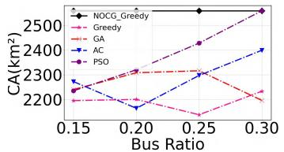  
(a)

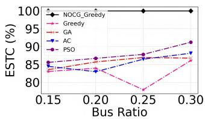  
(b)

Fig. 11. The impact of bus ratio on emergency response performance (Heuristic algorithms). (a) Impact on CA. (b) Impact on ESTC.  
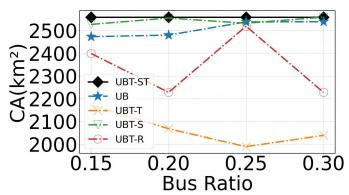  
(a)

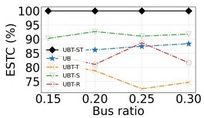  
(b)  
Fig. 12. The impact of bus ratio on emergency response performance (Baseline schemes). (a) Impact on CA. (b) Impact on ESTC.

ERD requirement containing 200 emergency events at diferent spatiotemporal grid locations.

1) Impact of the Ratio of Candidate Buses: Fig. 11 illustrates the impact of diferent ratios of candidate buses on the performance of various heuristic algorithms. As shown in Fig. 11(a), with the increase in the ratio of candidate buses, the CA achieved by the NOCG-Greedy algorithm remains consistently at the highest value of 2559 km2. In contrast, the average coverage areas for the Greedy, GA, AC, and PSO algorithms are 2191.5 km2, 2265 km2, 2283 km2, and 2344 km2, respectively. As shown in Fig. 11(b), the ESTC of the NOCG-Greedy algorithm remains at 100% regardless of the candidate bus ratio. Meanwhile, the ESTC of the Greedy, GA, AC, and PSO algorithms are 82.75%, 85.74%, 85.51%, and 87.8%, respectively. This is because the NOCG-Greedy algorithm efectively minimizes overlapping in the spatiotemporal grid while maximizing emergency response utility. In contrast, the other four algorithms focus solely on maximizing emergency utility, which results in temporal and spatial redundancy in the selected bus routes.

Fig. 12 shows the impact of diferent candidate bus ratios on various baseline schemes. As shown in Fig. 12(a), as the ratio of candidate buses increases, the UBT-ST scheme consistently maintains full spatial coverage of the city, with the CA remaining at 2559 km2. The CA of the UBT-T, UBT-S, UB, and UBT-R fluctuates around 2067 km2, 2543 km2, 2505 km2, and 2343.5 km2, respectively. The UBT-T algorithm performs the worst among the five algorithms, with its CA decreasing from 2172 km2 at a candidate bus ratio of 15% to 2039 $\mathrm { k m } ^ { \bar { 2 } }$ at a candidate bus ratio of 30%. This is because the UBT-ST algorithm, while considering both temporal and spatial features, introduces collaboration with relay taxis, further expanding the spatiotemporal coverage of UAVs. In contrast, the UBT-T and UBT-S algorithms consider only onedimensional features, leading to overlapping coverage in many urban spatial grids. Although the UB algorithm considers both temporal and spatial features, it does not include data-driven collaboration between buses and taxis or between UAVs and taxis, resulting in coverage failures in the following scenarios: 1) UAVs cannot reach emergency grids that are too far from buses, and 2) UAVs can reach emergency grids but lack suficient battery to return to the original bus.

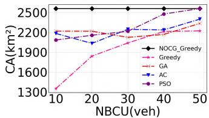  
(a)

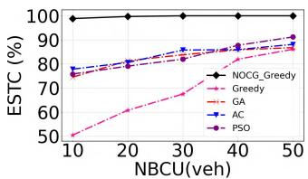  
(b)

Fig. 13. The impact of NBCU on emergency response performance (Heuristic algorithms). (a) Impact on CA. (b) Impact on ESTC.  
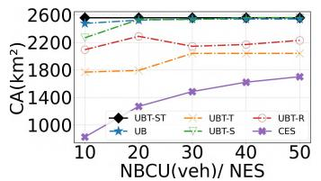  
(a)

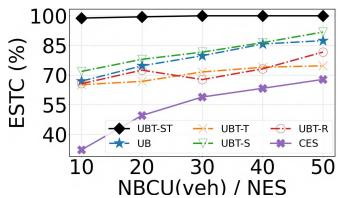  
(b)  
Fig. 14. The impact of NBCU on emergency response performance (Baseline schemes). (a) Impact on CA. (b) Impact on ESTC.

Fig. 12(b) shows the changes in ESTC. Similar to Fig. 12(a), the UBT-ST scheme maintains a high spatiotemporal coverage rate, achieving 100% coverage under diferent candidate bus ratios. The other four algorithms show significantly lower performance compared to the UBT-ST algorithm. This is because the UBT-T and UBT-S algorithms consider only one-dimensional features, while the spatiotemporal coverage rate reflects coverage performance in both temporal and spatial dimensions. The UB algorithm considers spatiotemporal dimensions but overlooks the benefits of taxi relays.

2) Impact of NBCU: Fig. 13 shows how the response performance of diferent heuristic algorithms varies with the NBCU. As the NBCU increases, both the CA and the ESTC of all five algorithms show an upward trend. As depicted in Fig. 13(a), the NOCG-Greedy algorithm achieves full city coverage of 2559 km2 with only 10 buses. In contrast, the Greedy algorithm covers only 2233 km2 even with 50 UAV-equipped buses. The other heuristic algorithms also underperform in terms of coverage area compared to NOCG-Greedy. Fig. 13(b) illustrates the impact of the number of buses on the ESTC. Similar to the pattern observed in Fig. 13(a), the NOCG-Greedy algorithm consistently delivers the highest emergency coverage rate, achieving 100% citywide spatiotemporal emergency coverage with only 30 buses. All other algorithms exhibit lower ESTC across diferent bus quantities. In summary, across various NBCU, NOCG-Greedy consistently outperforms the other four heuristic algorithms in terms of emergency response performance.

Fig. 14 shows how the response performance of diferent baseline schemes changes with the NBCU or the number of emergency stations (NES). As the NBCU/NES increases, both the coverage area and the spatiotemporal coverage of all six schemes show an upward trend. As shown in Fig. 14(a), the UBT-ST algorithm requires only 10 buses to cover 2559 km2 of the city. In contrast, the CES algorithm achieves only $1 , 6 9 7 ~ \mathrm { k m } ^ { 2 }$ coverage even with UAVs deployed at all 50 citywide emergency stations, due to their central urban concentration causing significant coverage overlap. The CA of other baselines are also lower than that of UBT-ST. This is because, compared to the UBT-S and UBT-T algorithms, UBT-ST comprehensively considers two-dimensional features. Additionally, the introduction of the NOCG-Greedy algorithm further reduces overlapping coverage in spatiotemporal grids. Compared to the UB algorithm, UBT-ST introduces collaboration with taxi relays, further expanding the emergency coverage range of UAVs. Fig. 14(b) shows the impact of the number of buses on the urban emergency spatiotemporal coverage rate. Similar to the trend observed in Fig. 14(a), the UBT-ST algorithm consistently demonstrates the optimal spatiotemporal coverage performance for urban emergency response. It achieves 100% coverage with only 30 UAVequipped buses. In contrast, the UB scheme shows a significant slowdown in coverage improvement after the number of buses reaches 40, indicating that it is approaching the point of diminishing marginal returns—further increases in the number of buses ofer minimal additional coverage gains.

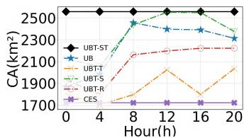  
(a)

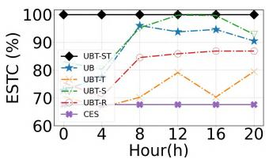  
(b)  
Fig. 15. The impact of time periods on emergency response performance (Baseline schemes). (a) Impact on CA. (b) Impact on ESTC.

3) Impact of Time Periods: Fig. 15 illustrates the influence of time period variations on the emergency response performance of the five algorithms. As shown in Fig. 15(a), the coverage area of all baselines fluctuate over time, while the coverage area of the UBT-ST algorithm remains stable at 2559 km2. This is because, compared to UBT-T, UBT-S, and UBT-R, the UBT-ST algorithm considers two-dimensional features and incorporates collaboration with UAVs and the emergency response range of UAVs. The coverage area of the UB algorithm drops to 1868 km2 at midnight (0:00). This indicates that the bus routes operating during the 0:00-4:00 period cannot meet the city’s emergency response needs. As shown in Fig. 15(b), the emergency spatiotemporal coverage rate of the UB algorithm at 0:00 is only 72.74%, while the UBT-ST algorithm maintains the highest emergency spatiotemporal coverage rate across all time periods, demonstrating its superior urban emergency response performance.

4) Impact of ERD: Fig. 16 shows the distribution of emergency events across diferent time periods in the city. Fig. 17 shows the coverage performance comparison of the five algorithms under 1200 random emergency events. As shown in Fig. 17(a), the UB algorithm has the shortest average ED of 287.5 seconds, while the ED of the UBT-ST algorithm is

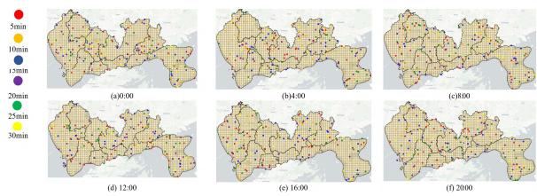  
Fig. 16. Distribution of 1200 random events across diferent time periods.

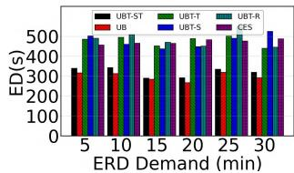  
(a) Impact on ED

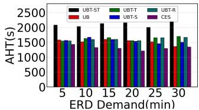

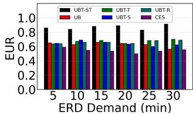  
(c) Impact on EUR

(b) Impact on AHT  
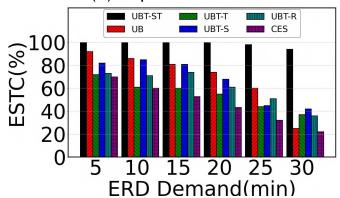  
Fig. 17. The Impact of ERD on emergency response performance.  
(d) Impact on ESTC

317.2 seconds, failing to achieve the shortest time to reach the emergency point. This phenomenon can be attributed to two main reasons: First, the UB algorithm considers only the single emergency mode of UAVs taking of directly from buses, and the selected emergency UAVs are based on proximity to the emergency point, which limits flexibility. In contrast, our algorithm introduces a taxi relay collaboration mechanism, which, although increasing the emergency response delay to some extent, significantly improves coverage and robustness. Second, the statistical results are based only on the random emergency events that the UB algorithm can cover, without considering the potential penalties for uncovered emergency events, which may overestimate the performance of the UB algorithm. Additionally, the UBT-R algorithm has the longest UAV emergency response delay of 486.3 seconds, while the ED of UBT-S, UBT-T and CES are also significantly higher than those of UB and UBT-ST. This is because the UB and UBT-ST algorithms comprehensively consider both temporal and spatial dimensions during bus selection, optimizing emergency response eficiency. It is noteworthy that the average ED for CES reaches as high as 472.6 seconds. This is primarily because front-line emergency management service stations are predominantly concentrated in urban centers, resulting in significantly prolonged response times for emergency incidents occurring in remote areas.

As shown in Fig. 17(b), the average hovering time(AHT) of UAVs in the UBT-ST algorithm is as high as 2105 seconds, while that of the CES algorithm is only 1318.8 seconds. As shown in 17(c), the UAV average EUR of the UBT-ST algorithm reaches 87.1%, while the UB algorithm is only 62.7%, the CES is only 54.7%. This advantage is mainly due to the UBT-ST algorithm efectively reducing UAV energy consumption by introducing the taxi relay collaboration mechanism, allowing UAVs to provide longer hovering times at emergency points. The AHT and the EUR of other baseline algorithms are also significantly lower than that of UBT-ST. This is because the UBT-ST algorithm combines two-dimensional features (time and space) and the emergency coverage range of UAVs, further optimizing the collaborative coverage of buses, taxis, and UAVs, achieving minimized overlapping coverage.

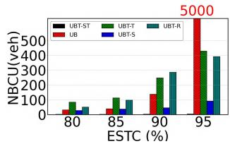  
(a) Number of Buses

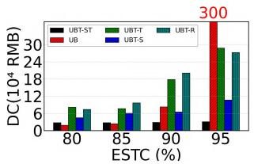  
(b) Vehicle Recruitment Costs

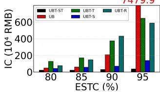  
(c) Infrastructure Costs

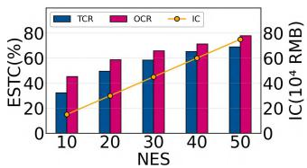  
(d) CES Costs  
Fig. 18. Emergency Costs for Diferent ESTC Levels.

Fig. 17(d) shows the coverage rates of the six algorithms in response to 1200 random emergency events as the emergency response duration (ERD) demands change. As the ERD demands increase, the UBT-ST algorithm consistently maintains the highest coverage rate, with an average ESTC of 98.7%. In contrast, the average ESTC of UBT-T, UBT-S, UBT-R, UB and CES algorithms are 54.8%, 67.1%, 61%, 69.6% and 46.4%, respectively. Notably, the UB algorithm shows the worst stability among the six algorithms, with its coverage rate significantly dropping from 45% to 25% as the ERD demands increases from 25 minutes to 30 minutes. This phenomenon is mainly because the UB algorithm relies solely on the single collaboration mode between buses and UAVs, causing significant energy consumption on round-trip paths and thus failing to efectively cover emergencies with high ERD requirements. In contrast, UBT-ST, by comprehensively considering twodimensional features (time and space) and introducing the taxi relay collaboration mechanism, significantly reduces UAV emergency energy consumption and further expands UAV coverage, achieving higher coverage rates and stability.

5) Emergency Cost Analysis: The experiments first evaluate the daily VRC under diferent urban spatiotemporal coverage levels (80%, 85%, 90%, 95%) for five algorithms (excluding the CES). Specifically, the analysis focuses on the cost required by each algorithm to achieve the designated coverage. Subsequently, the IC of all six algorithms (including the CES) are further assessed. It is noteworthy that the recruitment costs of the UBT-ST, UBT-T, UBT-S, and UBT-R algorithms include both the daily recruitment costs of buses and relay taxis, whereas the UB algorithm considers only the cost of bus recruitment.

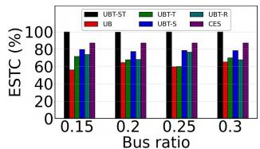  
(a) Impact on ESTC

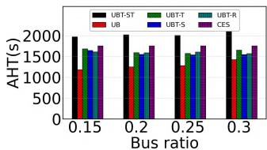  
(b) Impact on AHT

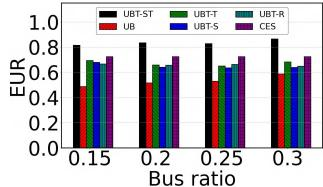  
(c) Impact on EUR

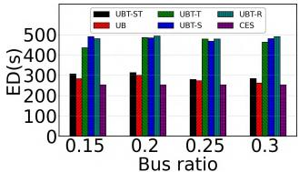  
(d) Impact on ED  
Fig. 19. The impact of bus ratio on emergency response performance.

Fig. 18 illustrates the cost inputs of the five algorithms. As shown in Fig. 18(a), the NBCU increases with the demand for ESTC. Among them, the UBT-ST algorithm performs best, requiring only 5 buses to achieve 95% coverage. In contrast, the UBT-T, UBT-S, and UBT-R algorithms require 430, 92, and 392 buses, respectively. The UB algorithm performs the worst, requiring 32, 40, and 138 buses for 80%, 85%, and 90% coverage, respectively, and up to 5000 buses for 95% coverage, primarily due to severe marginal returns diminishing.

Fig. 18(b) shows the VRC of the five algorithms. The UBT-ST algorithm demonstrates the lowest daily cost, averaging 29000 RMB/day. In comparison, the UB algorithm incurs an extremely high cost of 781,500 RMB/day, while UBT-T, UBT-S, and UBT-R also result in significantly higher costs than UBT-ST. Fig. 18(c) compares the IC of all five algorithms. The average IC of UBT-ST is 281,200 RMB. In comparison, UBT-T, UBT-S, UBT-R, and UB incur 1069.4%, 174.7%, 1003.9% and 6827.5%, respectively. Notably, under the 95% coverage scenario, the infrastructure cost of the UB algorithm reaches 74.799 million RMB, a level financially unsustainable for emergency response systems. In summary, the UBT-ST algorithm demonstrates significant advantages in both daily operational and long-term infrastructure costs, making it a more feasible and economical solution for realworld emergency response applications.

Fig. 18(d) shows the UAV’s Total Coverage Rate (TCR), Overlap Rate (OR) and IC of CES with diferent numbers of emergency stations. When all 50 citywide emergency stations are used as UAV bases, the IC reaches 749,950 RMB while the TCR is only 66.3% and the OR is as high as 77.8%. This occurs because most emergency stations are concentrated in urban central areas, resulting in significant coverage overlap between stations. As a consequence, even with such high infrastructure investment, only the central urban areas can be covered, leaving emergency events in remote areas unaddressed.

## C. Real-World Emergency Response Performance Evaluation

Finally, we evaluated the real-world response performance of UBT based on the emergency event dataset from Section III-A.

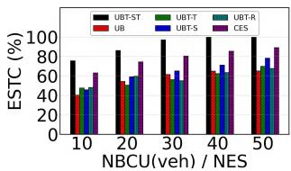

(a) Impact on ESTC  
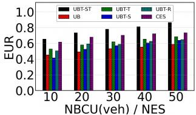

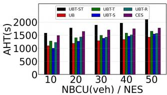

(b) Impact on AHT  
(c) Impact on EUR  
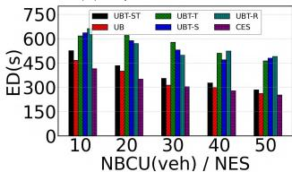  
(d) Impact on ED  
Fig. 20. The impact of NBCU on emergency response performance.

1) Impact of the Ratio of Candidate Buses: Fig. 19 illustrates the impact of diferent bus ratios on emergency response performance. It is important to note that a monitoring task is considered covered when the UAV is able to reach the emergency site and continue monitoring until the congestion ends. As shown in Fig. 19(a), the UBT-ST algorithm achieves a task completion rate of 100% with a candidate bus ratio of only 0.15. The average task completion rates of the UBT-T, UBT-S, UBT-R, UB, and CES algorithms are 67.4%, 78.5%, 71.6%, 61.32%, and 87.2%, respectively, all lower than that of UBT-ST. As shown in Fig. 19(b), with the increase in bus ratio, the UBT-ST algorithm enhances the UAV hovering time at emergency points. As a result, the EUR is also efectively improved, as shown in Fig. 19(c). In addition, ED is reduced, as shown in Fig. 19(d). Specifically, when the bus ratio increases from 0.15 to 0.3, the AHT of the UBT-ST algorithm increases from 1973 s to 2096 s; the UAV EUR increases from 81.5% to 86.7%; and the ED decreases from 313.6 s to 291.3 s. However, the AHT, EUR, and ED of the baseline algorithms show a fluctuating trend. This is because, compared to the UBT-T, UBT-S, and UBT-R algorithms, the introduction of the NOCG-Greedy algorithm enables UBT-ST to consider both spatiotemporal grid overlap and the emergency efectiveness of each grid. Compared with the UB algorithm, UBT-ST incorporates relay taxis, and the improvement in EUR allows UAVs to accomplish more monitoring tasks with broader range and longer duration. The reduction in ED is due to the fact that the UBT-ST algorithm specifically optimizes for emergency delay, which is not considered in the baseline algorithms.

2) Impact of NBCU: Fig. 20 illustrates the impact of diferent numbers of buses on emergency response performance. As shown in Fig. 20(a), the task completion rate of all algorithms increases with the number of buses. This is because a larger number of buses provides more available UAVs and relay taxis to participate in emergency response. The UBT-ST algorithm requires only 40 buses to complete all trafic congestion monitoring tasks. The average task completion rates of UBT-T, UBT-S, UBT-R, UB, and CES are 49.6%, 53.5%, 49.1%, 47.8%, and 78.7%, respectively, all significantly lower than that of UBT-ST. Fig. 20(b) and Fig. 20(c) show the changes in UAV AHT and EUR with the NBCU. For all baselines, both AHT and EUR increase with the NBCU. This is because the probability of triggering the relay mode with higher energy eficiency increases when more buses are available. Specifically, when the number of buses increases from 10 to 50, the AHT of UBT-ST increases from 1583.4 s to 2096 s, and the EUR increases from 65.4% to 86.6%, both outperforming other baseline schemes. This is because the UBT-ST algorithm optimizes UAV hovering time across all spatiotemporal grids in the city.

However, the emergency delay of the UBT-ST algorithm is not the lowest among all algorithms. As shown in Fig. 20(d), the CES achieves an average ED of only 319.9 seconds. With 50 emergency stations (NES = 50), the CES algorithm maintains superior performance with ED of 242.3s, outperforming both UB (272.7s) and UBT-ST (284.2s). This performance gap occurs primarily because CES stations are concentrated in urban centers, keeping UAV control stations consistently close to trafic congestion hotspots. However, the generalization capability of CES in responding to largescale, multi-type urban emergencies remains to be explored. In the UB algorithm, UAVs take of directly from buses located near congestion hotspots, without relying on ground transportation, which can reduce emergency delay to some extent. Nevertheless, it is worth noting that the statistics for CES and UB are based only on congestion events where monitoring was completed. The potential penalty of low task completion rates on emergency delay is not considered. In contrast, the UBT-ST algorithm, through the introduction of relay taxis, is able to maximize task completion rate under emergency delay constraints, as shown in Fig. 20(a).

## VII. CONCLUSION

This paper, based on real-world large-scale vehicle trajectory data, proposes for the first time a multimodal emergency response framework integrating UAVs (uncrewed aerial vehicles), buses, and taxis. The framework aims to significantly enhance the flexibility, economy, safety, and stability of urban emergency responses without introducing new transportation vehicles or occupying public resources. First, a vehicle mobility model is constructed from the perspective of urban spatiotemporal grids. On this basis, a response process model covering four emergency scenarios is established, considering the energy consumption characteristics of UAVs. Subsequently, a joint cost model is proposed, integrating emergency response delays, UAV hovering time, and relay vehicle costs, to optimize the emergency response performance of UAVs. Additionally, a neural network model is utilized to mine the daily behavior patterns of taxis, further enhancing the practicality of the model. Finally, from the perspective of urban emergency spatiotemporal coverage, a heuristic algorithm is designed that balances spatiotemporal coverage overlap and coverage benefits.

Through quantitative evaluation using real-world largescale vehicle trajectory datasets, the experimental results demonstrate:

1) Spatiotemporal Coverage Orientation: With only 30 UAVs, our method achieves 100% spatiotemporal coverage of the city 24/7, with each spatiotemporal grid monitored for no less than 5 minutes. In practice, the UBT scheme can be customized for diferent types of urban emergency response tasks. Specifically, UBT can integrate various data-driven predictive models based on emergency events and utilize the NOCG-Greedy algorithm to select bus routes for executing predictable emergency response tasks in the city.

2) UAV Energy Utilization Orientation: With only 50 UAVs, our method enables a single UAV to monitor unpredictable urban emergencies for up to 35 minutes. Without significantly increasing emergency response delays, the maximum hovering time of UAVs is improved by 65.4% compared to baselines. It is worth noting that, to improve the sustainable development of urban emergency response networks, integrating more refined UAV energy-saving technologies [35] into the UBT scheme deserves further exploration.

3) Economic Orientation: With an infrastructure cost of only 281,200 RMB, our method achieves 95% urban emergency spatiotemporal coverage, reducing costs by 99.6% compared to baselines.

## REFERENCES

[1] A. P. Cohen, S. A. Shaheen, and E. M. Farrar, “Urban air mobility: History, ecosystem, market potential, and challenges,” IEEE Trans. Intell. Transp. Syst., vol. 22, no. 9, pp. 6074–6087, Sep. 2021.

[2] V. Hassija, V. Chamola, D. N. G. Krishna, and M. Guizani, “A distributed framework for energy trading between UAVs and charging stations for critical applications,” IEEE Trans. Veh. Technol., vol. 69, no. 5, pp. 5391–5402, May 2020.

[3] J. Gao et al., “Cooperative air-ground instant delivery by UAVs and crowdsourced taxis,” in Proc. IEEE 40th Int. Conf. Data Eng. (ICDE), May 2024, pp. 4153–4166.

[4] Y. Pan et al., “Pioneering cooperative air-ground instant delivery using UAVs and crowdsourced couriers,” in Proc. ACM Interact. Mobile Wearable Ubiquitous Technol., 2024, vol. 8, no. 4, pp. 1–26.

[5] Z. Lv, D. Chen, H. Feng, H. Zhu, and H. Lv, “Digital twins in unmanned aerial vehicles for rapid medical resource delivery in epidemics,” IEEE Trans. Intell. Transp. Syst., vol. 23, no. 12, pp. 25106–25114, Dec. 2022.

[6] F. Outay, H. A. Mengash, and M. Adnan, “Applications of unmanned aerial vehicle (UAV) in road safety, trafic and highway infrastructure management: Recent advances and challenges,” Transp. Res. A, Policy Pract., vol. 141, pp. 116–129, Nov. 2020.

[7] K. Asadi et al., “An integrated UGV-UAV system for construction site data collection,” Autom. Construct., vol. 112, Apr. 2020, Art. no. 103068.

[8] Y. Pan, S. Li, Z. Ning, B. Li, Q. Zhang, and T. Zhu, “AuSense: Collaborative airspace sensing by commercial airplanes and unmanned aerial vehicles,” IEEE Trans. Veh. Technol., vol. 69, no. 6, pp. 5995–6010, Jun. 2020.

[9] M. Simic, C. Bil, and V. Vojisavljevic, “Investigation in wireless power transmission for UAV charging,” Proc. Comput. Sci., vol. 60, pp. 1846–1855, Jan. 2015.

[10] J. Wu et al., “Distributed trajectory optimization for multiple solarpowered UAVs target tracking in urban environment by adaptive grasshopper optimization algorithm,” Aerosp. Sci. Technol., vol. 70, pp. 497–510, Nov. 2017.

[11] M. Won, “UBAT: On jointly optimizing UAV trajectories and placement of battery swap stations,” in Proc. IEEE Int. Conf. Robot. Autom. (ICRA), May 2020, pp. 427–433.

[12] R. G. Ribeiro, L. P. Cota, T. A. M. Euzebio, J. A. Ram´ ´ırez, and F. G. Guimaraes, “Unmanned-aerial-vehicle routing problem with˜ mobile charging stations for assisting search and rescue missions in postdisaster scenarios,” IEEE Trans. Syst., Man, Cybern., Syst., vol. 52, no. 11, pp. 6682–6696, Nov. 2022.

[13] K. Yu, A. Kumar Budhiraja, and P. Tokekar, “Algorithms for routing of unmanned aerial vehicles with mobile recharging stations,” 2017, arXiv:1704.00079.

[14] J. Gao et al., “Toward eficient urban emergency response using UAVs riding crowdsourced buses,” IEEE Internet Things J., vol. 11, no. 12, pp. 22439–22455, Jun. 2024.

[15] H. Huang, A. V. Savkin, and C. Huang, “A new parcel delivery system with drones and a public train,” J. Intell. Robot. Syst., vol. 100, nos. 3–4, pp. 1341–1354, 2020.

[16] S. Choudhury, K. Solovey, M. J. Kochenderfer, and M. Pavone, “Eficient large-scale multi-drone delivery using transit networks,” J. Artif. Intell. Res., vol. 70, pp. 757–788, Feb. 2021.

[17] Y. Pan et al., “Eficient schedule of energy-constrained UAV using crowdsourced buses in last-mile parcel delivery,” Proc. ACM Interact., Mobile, Wearable Ubiquitous Technol., vol. 5, no. 1, pp. 1–23, Mar. 2021.

[18] Y. Pan, Q. Chen, N. Zhang, Z. Li, T. Zhu, and Q. Han, “Extending delivery range and decelerating battery aging of logistics UAVs using public buses,” IEEE Trans. Mobile Comput., vol. 22, no. 9, pp. 5280–5295, Sep. 2022.

[19] R. Cheng, Y. Jiang, O. Anker Nielsen, and D. Pisinger, “An adaptive large neighborhood search Metaheuristic for a passenger and parcel share-a-ride problem with drones,” Transp. Res. C, Emerg. Technol., vol. 153, Aug. 2023, Art. no. 104203.

[20] J. Park, S. Choi, T. Kim, C. Lee, and S. Lee, “Public bus-assisted task ofloading for UAVs,” IEEE Trans. Intell. Transp. Syst., vol. 25, no. 12, pp. 20561–20573, Dec. 2024.

[21] H. Huang and A. V. Savkin, “Aerial surveillance in cities: When UAVs take public transportation vehicles,” IEEE Trans. Autom. Sci. Eng., vol. 20, no. 2, pp. 1069–1080, Apr. 2023.

[22] A. Trotta, F. D. Andreagiovanni, M. Di Felice, E. Natalizio, and K. R. Chowdhury, “When UAVs ride a bus: Towards energy-eficient city-scale video surveillance,” in Proc. IEEE Conf. Comput. Commun., Apr. 2018, pp. 1043–1051.

[23] H. Huang and A. V. Savkin, “Surveillance of remote targets by UAVs,” in Proc. Austral. New Zealand Control Conf. (ANZCC), Nov. 2021, pp. 222–225.

[24] D. Zhang, J. Zhao, F. Zhang, and T. He, “UrbanCPS: A cyber-physical system based on multi-source big infrastructure data for heterogeneous model integration,” in Proc. ACM/IEEE 6th Int. Conf. Cyber-Phys. Syst., Apr. 2015, pp. 238–247.

[25] Y. Fu, X. Qin, X. Zhang, and Y. Jia, “Hybrid recruitment scheme based on deep learning in vehicular crowdsensing,” IEEE Trans. Intell. Transp. Syst., vol. 24, no. 10, pp. 10735–10748, Oct. 2023.

[26] G. P. Meyer, “An alternative probabilistic interpretation of the Huber loss,” in Proc. IEEE/CVF Conf. Comput. Vis. Pattern Recognit. (CVPR), Jun. 2021, pp. 5261–5269.

[27] J. Ge et al., “Aeromagnetic compensation algorithm robust to outliers of magnetic sensor based on Huber loss method,” IEEE Sensors J., vol. 19, no. 14, pp. 5499–5505, Jul. 2019.

[28] O. S. Oubbati, A. Lakas, F. Zhou, M. Gunes¸, N. Lagraa, and¨ M. B. Yagoubi, “Intelligent UAV-assisted routing protocol for urban VANETs,” Comput. Commun., vol. 107, pp. 93–111, Jul. 2017.

[29] O. S. Oubbati, N. Chaib, A. Lakas, and S. Bitam, “On-demand routing for urban VANETs using cooperating UAVs,” in Proc. Int. Conf. Smart Commun. Netw. Technol. (SaCoNeT), Oct. 2018, pp. 108–113.

[30] M. Xiao, J. Wu, L. Huang, Y. Wang, and C. Liu, “Multi-task assignment for crowdsensing in mobile social networks,” in Proc. IEEE Conf. Comput. Commun. (INFOCOM), Apr. 2015, pp. 2227–2235.

[31] M. Xiao, J. Wu, H. Huang, L. Huang, and C. Hu, “Deadlinesensitive user recruitment for mobile crowdsensing with probabilistic collaboration,” in Proc. IEEE 24th Int. Conf. Netw. Protocols (ICNP), Nov. 2016, pp. 1–10.

[32] G. Zhou, Z. Zhu, and S. Luo, “Location optimization of electric vehicle charging stations: Based on cost model and genetic algorithm,” Energy, vol. 247, May 2022, Art. no. 123437.

[33] Z. Hu, Y. Cao, X. Li, X. Zhang, C. Zhang, and Z. Liu, “A real-time UAV delivery system considering dock selection and spatial conflict,” Expert Syst. Appl., vol. 281, Jul. 2025, Art. no. 127498.

[34] H. Xia et al., “Vehicle speed and position estimation considering microscopic heterogeneous car-following characteristics in connected vehicle environments,” J. Adv. Transp., vol. 2023, pp. 1–21, Dec. 2023.

[35] C. Dutriez, O. S. Oubbati, C. Gueguen, and A. Rachedi, “Energy eficiency relaying election mechanism for 5G Internet of Things: A deep reinforcement learning technique,” in Proc. IEEE Wireless Commun. Netw. Conf. (WCNC), Apr. 2024, pp. 1–6.

  
Hanqing Xia received the B.E. degree in transportation from Binzhou University in 2020 and the M.E. degree from the School of Electrical and Control Engineering, North China University of Technology, in 2024. He is currently pursuing the Ph.D. degree with the College of Civil Aviation, Nanjing University of Aeronautics and Astronautics. He has authored eight papers published in international journals and conference proceedings. His research interests include spatiotemporal big data and lowaltitude rescue systems, and economic analysis of air transportation.

Mengju Cui received the B.E. degree in trafic engineering from Nanjing Forestry University in 2020 and the M.E. degree from the School of Electrical and Control Engineering, North China University of Technology, in 2024. He is currently at Beijing Wanji Technology Company Ltd. His research interests include analysis of driving behavior in a connected environment and heterogeneity analysis of mixed trafic flow.

Ming Zhang was born in Huainan, Anhui, China. He received the B.E. degree in mechanical engineering and the master’s and Ph.D. degrees from Nanjing University of Aeronautics and Astronautics, Nanjing, in 1997, 2003, and 2010, respectively. He joined Nanjing University of Aeronautics and Astronautics in 2003, where he is currently a Professor with the College of General Aviation and Flight. He has authored over 30 papers published in international journals and conference proceedings. His research interests include dynamic airspace configuration, airspace and airfield capacity and delay, and general aviation rescue systems in air transportation.

Zechao Ma received the B.E. degree in trafic engineering from Nanjing Tech University in 2022 and the M.E. degree from the School of Electrical and Control Engineering, North China University of Technology, in 2025. He is currently pursuing the joint Ph.D. degree with the School of Transportation, Southeast University, Nanjing, China, and the Department of Civil Engineering, Monash University, Clayton, VIC, Australia. His research interests include spatio-temporal big data mining and analysis, trafic safety, and applied artificial intelligence.

Chao Yan received the B.E. degree in mechanical engineering from Jiangnan University in 2021 and the M.E. degree in aeronautical and astronautical science and technology from Nanchang Hangkong University in 2024. He is currently pursuing the Ph.D. degree with the College of Civil Aviation, Nanjing University of Aeronautics and Astronautics. His research interests include nonlinear dynamic control and low-altitude rescue.