# Optimizing Energy and Revenue Efficiency in UAV-Assisted Vehicular Networks with Enhanced Reward Twin Actor TD3 and Secure Caching Strategies

Shibo Hu∗, Guizhong Liu, Xing Chen

Abstract—Unstable transmission conditions degrade the offloading performance of Mobile Edge Computing (MEC) servers in vehicular communication environments. Cache-enabled unmanned aerial vehicles (UAVs) with computation and caching capabilities offer a potential solution by acting as mobile edge servers in the air. Due to superior channel conditions, UAVs provide more reliable communication than traditional ground servers in vehicular networks. Additionally, caching popular task results in UAV storage improves service efficiency. However, challenges remain in designing offloading schemes that balance energy consumption, service revenue, and secure caching. This paper formulates a joint optimization problem based on the Twin Delayed Deep Deterministic Policy Gradient (TD3) algorithm to determine UAV trajectory, offloading schemes, and UAVside resource allocation. The objective is to minimize energy consumption and maximize service revenue in secure cacheenabled UAV-assisted vehicular networks under delay and resource constraints. To tackle the high nonlinearity and intricate action space, we propose a novel Twin Actor Network combined with a hierarchical reward mechanism, together forming the Enhanced Reward Twin Actor Twin Delayed Deep Deterministic Policy Gradient (ERTATD3) framework. Simulation results show that the proposed algorithm outperforms existing methods in terms of convergence, reward, caching security, delay, energy efficiency, and revenue optimization.

Index Terms—cache-enabled unmanned aerial vehicle, twin delayed deep deterministic policy gradient (TD3), task offloading, resource allocation, energy consumption, revenue, vehicular networks.

## I. INTRODUCTION

The evolution of fifth-generation (5G) mobile communication systems has ushered in an era where advanced devices and applications are more closely integrated with vehicles [1], [2]. Beyond driving safety, convenience and entertainment have become central in the development of smart cars [3]. With advancements in Artificial Intelligence (AI) and the Internet of Things (IoT), technologies such as augmented reality (AR) and computer vision are diversifying vehicular services. Unlike traditional safety tasks such as crash warnings that require minimal computational resources, applications like augmented reality head-up displays (AR-HUDs) and virtual reality (VR) gaming involve intensive computations, posing significant challenges for onboard processors [4], [5]. Although modern vehicles are equipped with processors capable of handling these tasks, this approach is not energy-efficient. Centralized cloud computing also fails to meet stringent delay requirements due to backhaul congestion [6], [7]. To overcome this, MEC, a cornerstone of 5G systems, has been introduced to enhance efficiency by decentralizing computation and caching capabilities closer to end users [8].

However, obstacles in 5G networks can cause unstable links, resulting in jitter and delays in smart vehicle functions. This issue significantly degrades user experience, particularly in urban environments characterized by high-rise buildings and dense traffic, where obstacles and network congestion are common. High-density deployment of roadside units (RSUs) can improve stability; however, this approach increases the risk of service outages due to frequent handovers [9], [10]. Additionally, handovers become less efficient when vehicles are stuck in traffic congestion. Furthermore, the cost of deploying additional facilities presents a significant challenge for service providers. To address these issues, unmanned aerial vehicles (UAVs) equipped with processors have been proposed as flying mobile servers [11], [12]. Aerial communication offers ideal conditions, supporting higher-quality offloading compared to ground-based solutions, particularly in severe traffic conditions [13]. In UAV-assisted vehicular networks, UAVs alleviate the load on MEC servers, enabling them to provide services to additional users with the saved resources. Flexible offloading schemes can address diverse demands across application types and communication environments. Furthermore, caching at edge servers conserves transmission resources and reduces service delays [14], [15]. In particular, cache-enabled UAVs can store frequently requested tasks under ideal communication conditions, thereby reducing redundant transmissions [16], [17].

Recent studies have further demonstrated the broad applica tion value of edge computing in delay-sensitive and resourceconstrained services. Multi-user computation offloading and transmission scheduling have been jointly investigated for delay-sensitive MEC applications [18]. Reliability-aware offloading has also been studied in MEC-enabled aerial computing, where delay, energy consumption, and service reliability are jointly considered [19]. In addition, end-edge-cloud collaborative frameworks have been developed for complex workflow applications in cyber–physical systems, where task dependency and heterogeneous computing resources need to be coordinated [20]. Beyond conventional edge services, digital twin (DT) and human digital twin (HDT) applications are also moving toward edge-assisted deployment. For example, HDT deployment at the network edge requires joint optimization of virtual twin construction, task offloading, and communication/computation resource allocation under delay and energy constraints [21]. DT-assisted edge computing further requires balancing model retraining and inference services to maintain service fidelity and delay-sensitive performance [22]. Moreover, QoE-aware resource allocation has been studied for DT interaction services under uncertain evolution, showing the potential of edge intelligence in supporting interactive and adaptive DT applications [23]. These studies indicate that edge computing is evolving from conventional task offloading toward a broader service infrastructure for aerial computing, cyber–physical systems, and DT/HDT-enabled intelligent applications.

However, as UAVs maintain cellular connections with both users and ground base stations, they are particularly susceptible to security threats such as eavesdropping. Moreover, due to their lightweight design, UAVs often lack robust hardware support for cyber security [24].

Similar privacy and security concerns also arise in DT/HDToriented edge applications, where physical entities continuously exchange data with their virtual counterparts. The networking architecture of HDT systems highlights privacy protection, secure communication, edge intelligence, and resource-efficient task execution as key supporting requirements [25]. To enhance human-to-virtual connectivity, differentially private federated multi-task learning has been investigated to improve synchronization accuracy while preserving privacy and reducing connectivity cost [26]. In addition, semantic communication has been discussed as a promising technique for DT systems by transmitting task-relevant semantic information rather than raw data, thereby reducing communication overhead and limiting unnecessary exposure of sensitive information [27].

Recently, AI-driven security enhancement techniques have been investigated in UAV and integrated networks, including distributed learning and reinforcement learning-based adaptive defense strategies [28], [29]. These approaches enable dynamic and proactive protection against evolving threats; however, they often introduce additional computational complexity and training overhead [30]. In contrast, structural privacy preservation through secure task separation and controlled caching can naturally coexist with and complement AI-based adaptive security mechanisms.

Based on the above analysis, the key research areas in cache-enabled UAV-assisted vehicular networks can be summarized as follows: 1) UAV trajectory planning and deployment, including altitude and horizontal positioning [31], [32]; 2) caching strategies to improve offloading efficiency [33], [34]; 3) energy consumption and delay optimization via offloading schemes and resource allocation [35], [36]; 4) security mechanisms for protecting privacy in UAV communications [37], [38].

However, several challenges remain in current research on cache-enabled UAV-assisted vehicular networks:

• Excessive focus on delay minimization: While service delay directly affects user experience, some studies [39], [40] use delay minimization as the main objective. This may lead to unnecessary energy consumption, especially when the delay has already satisfied the task requirement. In such cases, further delay reduction provides limited improvement to users but may consume additional vehicle or UAV energy.

• Insufficient consideration of the energy-revenue tradeoff: Most existing studies focus on minimizing energy consumption or jointly optimizing energy and latency, while revenue considerations are often simplified or neglected [41], [42]. When the UAV acts as an offloading server, the optimization should account for both the energy cost of vehicles and the UAV, as well as the revenue obtained from providing computing and caching services. Otherwise, the trade-off between service cost, user quality of service, and provider profitability cannot be fully evaluated.

• Lack of secure caching schemes: Although many studies focus on secure offloading, secure caching is also important in UAV-assisted vehicular networks. Cached task results may contain vehicle-related or user-related information, such as AR navigation outputs, vehicle status, or personalized service data. Directly caching such results may raise privacy concerns, and users may prefer local processing even if it consumes more computing resources.

The contributions of this article are summarized as follows:

• Secure cache-enabled UAV-assisted vehicular edge model: We consider a severe communication scenario where UAVs assist vehicular edge services when MEC servers at base stations cannot provide reliable service. The proposed model includes secure caching, channel, delay, energy, and revenue models. Tasks are classified into general and private tasks: general task results can be fully cached, while private tasks only allow sectional intermediate results to be cached and require local reprocessing to protect private information.

• Energy-revenue optimization under delay and resource constraints: We formulate an optimization problem that jointly considers vehicle energy consumption, UAV energy consumption, service revenue, delay thresholds, and resource constraints. Since energy consumption and revenue have opposite optimization directions, the problem balances energy cost, user quality of service, and provider revenue instead of optimizing delay or energy alone.

• Twin-actor TD3 with normalized utility learning: We extend TD3 by introducing a twin-actor structure, where two actor networks generate action outputs that are fused to obtain the final action. This design improves robustness in the high-dimensional continuous action space.

Maximum-value normalization is also applied during reward construction to handle different units and numerical magnitudes among energy consumption and revenue terms.

• Enhanced Reward mechanism for multi-constraint learning: We design an Enhanced Reward (ER) mechanism based on a hierarchical reward structure. Non-delay constraints are first used to guide feasible actions, followed by delay-related penalties for QoS satisfaction. When the constraints are satisfied, the normalized utility becomes the main reward component, and an additional penalty is introduced for complex actions to improve training stability.

Overall, the proposed framework integrates secure caching, UAV-assisted vehicular edge modeling, energy-revenue optimization, and reinforcement learning-based decision-making. The following section presents the system model and problem formulation.

The remainder of this article is organized as follows. Section II presents the system model and problem formulation. Section III introduces the proposed ERTATD3-based optimization algorithm. Section IV reports the simulation results, and Section V concludes the article.

TABLE I: List of notations
<table><tr><td>Notation</td><td>|Definition</td></tr><tr><td> $C _ { k }$ </td><td>Computational resource of vehicle k</td></tr><tr><td> $P _ { k }$ </td><td>Transmission power allocated to vehicle k for task offloading</td></tr><tr><td> $\overline { { P } } _ { k }$ </td><td>Maximum transmission power of vehicle k</td></tr><tr><td> $L _ { k }$ </td><td>Position coordinates of vehicle k</td></tr><tr><td> $v _ { k }$ </td><td>Velocity of vehicle k, uniformly sampled within  $[ v _ { k } ^ { \operatorname* { m i n } } , \dot { v } _ { k } ^ { \operatorname* { m a x } } ]$ </td></tr><tr><td> $\mathbb { S } _ { k }$ </td><td>Information set of task k</td></tr><tr><td> $S s _ { k }$ </td><td>Input data size of task k</td></tr><tr><td> $S d _ { k }$ </td><td>Delay threshold of task k</td></tr><tr><td> $S c _ { k }$ </td><td>Binary variable indicating whether the task result is cached on the UAV</td></tr><tr><td> $S e _ { k }$ </td><td>Privacy type of task k: 0 for general tasks and 1 for private tasks</td></tr><tr><td> $\omega _ { k }$ </td><td>Computational density of task k (cycles/bit)</td></tr><tr><td> $O k$ </td><td>Binary offloading decision of vehicle k</td></tr><tr><td> $\alpha _ { j , k }$ </td><td>Computational resource ratio allocated from UAV j to vehicle k</td></tr><tr><td> $\gamma _ { k }$ </td><td>Computational resource ratio of vehicle k</td></tr><tr><td> $C _ { j }$ </td><td>Maximum computational resource of UAV j</td></tr><tr><td> $L _ { j }$ </td><td>Position of UAV j at a fixed altitude,  $\begin{array} { r l } { L _ { j } } & { { } = } \end{array}$   $( L x _ { j } , L y _ { j } )$ </td></tr><tr><td> $L _ { i } ^ { * }$ </td><td>Target service position of UAV j,  $L _ { j } ^ { * } = ( L x _ { j } ^ { * } , L y _ { j } ^ { * } )$ </td></tr><tr><td> $a _ { j } ^ { \mathrm { { \acute { m o v e } } } }$ </td><td>Binary variable indicating the flight/hover state of UAV j</td></tr><tr><td> $v _ { j }$ </td><td>Velocity of UAV j</td></tr><tr><td> $v _ { i } ^ { \operatorname* { i n a x } }$ </td><td>Maximum velocity of UAV j</td></tr><tr><td> $p ^ { \mathrm { { \acute { t r n g } } } }$ </td><td>Turning probability of the Manhattan mobility model</td></tr></table>

## II. SYSTEM MODEL

In this section, the system model is first introduced. Some key parameters are listed in Table I.

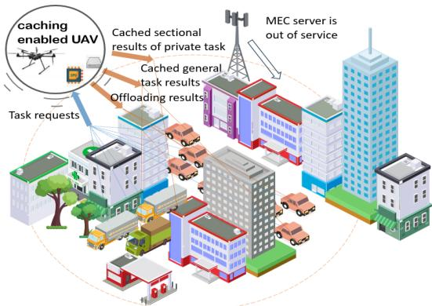  
Fig. 1: The framework of cache-enabled UAV assisted vehicular networks.

## A. System Framework

The system considers an urban vehicular scenario with K vehicles, denoted by K, and a cache-enabled UAV j, as shown in Fig. 1. Each vehicle k requests one task for processing, and the UAV acts as an agent to make decisions at each time slot. The UAV is equipped with computing and storage resources, enabling it to process offloaded tasks and cache frequently requested general task results as well as sectional private task results. To manage the limited cache space, an LRU-based caching mechanism is adopted, where less recently requested task results are replaced by newly popular ones.

The system adopts an OFDMA-based access scheme, where each user is allocated a fixed 100 MHz subcarrier bandwidth [43], [44]. Therefore, bandwidth is not treated as an optimization variable in this work. The optimization instead focuses on user transmit power, computation offloading decisions, computation resource allocation, and UAV movement decisions.

1) Mobility Model: In order to accurately characterize the dynamics of vehicles and UAVs in urban environments, we explicitly incorporate the corresponding mobility models into our system framework.

Vehicular mobility: Vehicular motion is modeled based on an Manhattan mobility model [45], where vehicles move along horizontal and vertical road directions with probabilistic turning behavior. Let $L _ { k } ( t ) = ( L x _ { k } ( t ) , L y _ { k } ( t ) )$ denote the position of vehicle k at time step t. The initial positions are randomly distributed within the service area, and the velocity $v _ { k }$ is uniformly sampled from $[ v _ { k } ^ { \operatorname* { m i n } } , v _ { k } ^ { \operatorname* { m a x } } ]$ . A turning probability $p ^ { \mathrm { t r n g } }$ is introduced to determine whether a vehicle changes direction at each time step, reflecting the stochastic movement of vehicles in urban road networks.

UAV mobility: Following [44], UAV mobility is modeled with a binary action variable to distinguish flying from hovering. Let $L _ { j } ( t ) = ( L x _ { j } ( t ) , L y _ { j } ( t ) )$ denote the position of UAV j at time step t. In each slot, the agent outputs a target serving position $L _ { j } ^ { * } ( t )$ and a binary movement decision $a _ { j } ^ { \mathrm { m o v e } } ( t )$ . If $a _ { j } ^ { \mathrm { m o v e } } ( t ) = 0 ,$ , the UAV hovers at its current position:

$$
L _ { j } ( t + 1 ) = L _ { j } ( t ) .\tag{1}
$$

If $a _ { j } ^ { \mathrm { m o v e } } ( t ) = 1$ , the UAV moves toward the target position

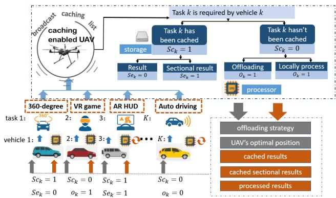  
Fig. 2: The flow chart of the secure cache-enabled UAV assisted offloading.

$L _ { j } ^ { * } ( t - 1 )$ with bounded velocity:

$$
L _ { j } ( t + 1 ) = L _ { j } ( t ) + v _ { j } ( t ) \Delta t ,\tag{2}
$$

where

$$
v _ { j } ( t ) = v _ { j } ^ { \operatorname* { m a x } } \frac { L _ { j } ^ { * } ( t - 1 ) - L _ { j } ( t ) } { \| L _ { j } ^ { * } ( t - 1 ) - L _ { j } ( t ) \| } .\tag{3}
$$

Here, $v _ { j } ^ { \operatorname* { m a x } }$ is the maximum UAV velocity and $\Delta t$ is the slot duration.

2) Task Model: As shown in Fig. 2, vehicle k is used as an example to describe the system workflow. Each vehicle has one task to process, denoted by ${ \mathbb S } _ { k } = \{ S s _ { k } , S d _ { k } , S c _ { k } , S e _ { k } , \omega _ { k } \}$ , where $S s _ { k } , S d _ { k } , S c _ { k } , S e _ { k }$ , and $\omega _ { k }$ represent the input data size, delay threshold, caching indicator, privacy class, and computation density of task $k ,$ respectively. Here, $S s _ { k }$ only refers to the input data volume to be processed or offloaded, while the returned result size is neglected because it is typically much smaller than the input data in the considered vehicular edge computing scenario.

During the system operation, the positions of vehicle k and UAV j, denoted by $L _ { k }$ and $L _ { j }$ , are reported periodically. The UAV broadcasts its dynamic caching list. If $S c _ { k } ~ = ~ 1$ , the cached task result is directly transmitted to vehicle $k ;$ otherwise, the task is processed locally or offloaded according to the offloading decision. The privacy indicator $S e _ { k }$ distinguishes general tasks from private tasks, where $S e _ { k } = 0$ denotes a general task and $S e _ { k } = 1$ denotes a private task. Based on the system state, optimization objective, and constraints, the UAV jointly determines the offloading decision $O _ { k }$ , resource allocation, target serving position $L _ { j } ^ { * }$ , and movement action $a _ { j } ^ { \mathrm { m o v e } }$ . The vehicle and UAV then execute the corresponding processing, trajectory, and resource allocation decisions.

The objective is to obtain the offloading strategy, resource allocation, and UAV movement decision for dynamic task requests, and the proposed deep reinforcement learning-based algorithm is detailed in Section III.

## B. Secure Caching Scheme

The UAV is vulnerable to privacy breaches since it maintains wireless connections with ground base stations and vehicles. Some task results contain sensitive data, including vehicle models, user addresses, and personal preferences [46], [47]. Accordingly, caching these results entirely at the UAV may introduce privacy risks. Nevertheless, executing all privacysensitive tasks locally degrades system efficiency. To balance privacy protection and service efficiency, tasks are categorized into general and private types. When $S e _ { k } = 0 .$ , the task is defined as a general task, and its result can be directly retrieved from the UAV cache. When $S e _ { k } = 1$ , the task is classified as a private task; only partial intermediate results are retrieved from the UAV cache, and the final result is obtained through local re-processing at the vehicle side.

In vehicular networks, navigation and AR-based traffic assistance systems are typical application cases. For navigation tasks, standard map data and routing structures can be cached and preprocessed at the UAV, while user-specific information such as origins, destinations, and route preferences is retained at vehicles [46]. Similarly, for AR-HUD applications, generic AR elements, including road boundary overlays and traffic signal projections, are suitable for UAV caching. By contrast, personalized calibration, display adaptation, and driver preferences are processed locally. This separation reduces redundant computation and offloading latency while limiting private data exposure even if the UAV is compromised. Similar privacypreserving route planning frameworks also adopt cloud/edge nodes for partial computation while keeping sensitive route information locally protected [48], [49]. The proposed privacy protection mechanism can be further integrated with AIenabled adaptive security strategies for future UAV-assisted vehicular networks.

## C. Channel Model

For urban traffic scenarios, the channel model considers blockage and scattering caused by common obstructions [10]. The UAV serves as an airborne offloading node when ground base stations suffer from overload or blockage. The U2V channel model consists of small-scale fading, antenna gain, path loss, and interference models.

1) Small Scale Fading Model: The channel between vehicles and the UAV is modeled using Rayleigh channel models, with the mean $\mu$ [50], [51]. The small scale fading model is described as following:

$$
| h _ { j } ^ { 2 } | \sim e x p ( 1 \backslash \mu )\tag{4}
$$

where $\mu$ is the Rayleigh channel parameter, $| h _ { j } ^ { 2 } |$ is the small scale fading components of the channel between vehicles and the $\mathrm { U A V } ~ j $

2) Antenna Gain Model: In this communication model, path loss influences the quality of data transmission at mmWave frequencies. To overcome this issue, antenna arrays are deployed at vehicles, the RSU and the mobile UAV to utilize directional beamforming and benefit from the resulting antenna gain [9].

For the following analysis, the antenna gain model is proposed in prior literature work (e.g., [52], [53]).We assume that the Uniform Planar Array (UPA) is equipped with an UPA of 16 elements, the vehicles are equipped with a UPA of 4 elements. And, we define $\omega _ { j }$ and $\omega _ { k }$ are beamwidths of the UAV and the kth vehicle, respectively [50].

The main parameters of the antenna gain are listed in Table II.

TABLE II: Antenna gain parameters
<table><tr><td></td><td>Object | Main gain | Side gain | Beamwidth</td><td></td><td></td></tr><tr><td>UAV</td><td></td><td>gj</td><td>ωj</td></tr><tr><td>Vehicle</td><td> $\mathbf { \Pi } _ { G _ { k } } ^ { G _ { j } }$ </td><td>gk</td><td>ωk</td></tr></table>

We let $G _ { j }$ and $g _ { j }$ be the main lobe directivity gain (assumed constant for all angles in the main lobe) and the side lobe gain of the UAV, respectively, let $G _ { k }$ and $g _ { k }$ be the main lobe directivity gain and the side lobe gain of the vehicle k. Besides, we define $\Delta _ { j , k }$ as overall antenna gain in the case of perfection beam alignment between the UAV j and the vehicle k [50].

$$
\Delta _ { j , k } = G _ { j } \cdot G _ { k } , \forall j\tag{5}
$$

We define the beamwidth of the UAV are wu [50]. The interfering antenna gain of the UAV can be expressed as:

$$
\Omega _ { j , k } = \left\{ \begin{array} { l l } { { G _ { j } \cdot G _ { k } , } } & { { \quad w i t h \ p r o b a b i l i t y \ \frac { w _ { j } } { 2 \pi } } } \\ { { g _ { j } \cdot g _ { k } , } } & { { \quad w i t h \ p r o b a b i l i t y 1 - \displaystyle \frac { w _ { j } } { 2 \pi } } } \end{array} \right.\tag{6}
$$

Therefore, the antenna gain for the multi-antenna mmWave communication model is clearly defined by the parameters in Tabel II and the Equation 5 and 6.

3) Path loss model: In this system, the path loss model for vehicles to the flying UAV in LOS and NLOS transmission environment is defined as following [54]:

$$
P L _ { k } ( r _ { j } , k ) [ d B ] = \left\{ \begin{array} { r l r } { 1 0 3 . 8 + 2 0 . 9 \log _ { 1 0 } ( r _ { j , k } ) , } & { { } \ f o r L o S } \\ { 1 4 5 . 4 + 3 7 . 5 \log _ { 1 0 } ( r _ { j , k } ) , } & { { } f o r N L o S } \end{array} \right.\tag{7}
$$

where $r _ { j , k }$ is the distance from the vehicle k to the UAV at location j.

Besides, we defined $P r L _ { k } ( r _ { j , k } )$ as the probability function that the connection from the vehicle k to the UAV is LOS model [13], [55]. The probability function that the connection is an NLOS model is $P r N _ { k } ( r _ { j , k } )$ . They are modeled as:

$$
\left\{ \begin{array} { l l } { \displaystyle P r L _ { k } ( \boldsymbol { r } _ { j , k } ) = \frac { 1 } { 1 + C \exp ( - B ( \psi - C ) ) } , \qquad \mathrm { \it ~ f o r L o S } } \\ { P r N _ { k } ( \boldsymbol { r } _ { j , k } ) = 1 - P r L _ { k } ( \boldsymbol { r } _ { j , k } ) , \qquad \mathrm { \it ~ f o r N L o S } } \end{array} \right.\tag{8}
$$

where B and $C$ are constant and their values are 0.136 and 11.95 respectively [56], [57]. ψ is the elevation angle. It is formulated as

$$
\psi = \frac { 1 8 0 } { \pi } \arcsin ( \frac { H } { r _ { j , k } } )
$$

where H is the height of the flying UAV. We assume the UAV is flying at a fixed height of 100 meters. In the considered urban scenario, building-induced blockage and large-scale propagation variations are statistically modeled through the probabilistic LoS/NLoS channel formulation, where the occurrence probabilities and corresponding path-loss expressions jointly characterize the blockage state and propagation attenuation of the U2V link. Therefore, no additional independent log-normal shadowing term is introduced. Similar probabilistic LoS/NLoS modeling has also been used for ground-to-UAV links in UAV-assisted aerial computing systems [35].

4) Channel gain model: The transmission channel gain in the system is a combination of small-scale fading, antenna gain, and path loss, as elaborated earlier. We assume that the channel gain models for uplink and downlink communications of a vehicle with the same configuration are identical. Thus, the channel gain for vehicle k with the UAV at location j is defined as follows:

$$
H _ { j , k } = | h _ { j } | ^ { 2 } \cdot \Delta _ { j , k } \cdot P L ^ { - 1 } { } _ { k } ( r _ { j } , k )\tag{9}
$$

5) Interference model: In our system, interference is modeled to simulate channel interference conditions. We consider the uplink interference from vehicle k to the UAV, caused by other vehicles transmitting to the same offloading destination. [50], [58]. We define the set $\Upsilon _ { j }$ defined as all vehicles offloading to the UAV j should meet the condition, $\forall i , i \in \Upsilon _ { j } , \sum _ { \mathbb { F } } x _ { i , k } ( 1 - S c _ { k } ) o _ { k } ( 1 - \pi _ { j , k } ) \neq 0$ . The interference model is primarily based on the requirements of the smallscale fading model, antenna gain model, and path loss model. The formulation is provided as follows:

The uplink interfernce of the vehicle k to the UAV j is formulated as:

$$
I U _ { j , k } = \sum _ { i \neq k , i \in \Upsilon _ { j } } | h _ { j } | ^ { 2 } \Omega _ { j , i } P L ^ { - 1 } { } _ { i } ( r _ { j , i } ) P _ { i }\tag{10}
$$

In this part we formulate channel gain model, including small scale fading model, antenna gain model and path loss model. And, the interference model in different cases is also given. Next part we use those models to formulated the delay model.

## D. Delay Model

In our model, delay serves as a key criterion for optimizing task processing. Propagation delay is assumed to be negligible, while transmission delay, processing delay, and queue delay are included in the model. As the size of task results is assumed negligible, the downlink delay—transmitting cached or processed task results from the UAV to users—is not considered in our system. In the proposed system framework, the delay in obtaining the task results required by vehicles can be calculated in three possible scenarios:

1) Offloading the task to the UAV processor;

2) Processing locally with processors equipped on the vehicle;

3) Re-processing retrieved result of private task

The three possible and the total delay is to be introduced in the follow subsections.

1) Delay of offloading the task to the UAV j to processing, $S c _ { k } = 0 , \ o _ { k } = 1 .$ : The delay of offloading to the UAV j comprises two components: 1) uplink transmission delay, and 2) processing delay. The details of these delays are elaborated in the following sections.

The SINR, $S I N R U _ { j , k }$ , for uplink transmission from vehicle k to the UAV j is formulated as:

$$
S I N R U _ { j , k } = \frac { P _ { k } H _ { j , k } } { I U _ { j , k } + N _ { 0 } }\tag{11}
$$

where $P _ { k }$ is the power resources allocated from vehicle k for uploading the computation task. $I U _ { j , k }$ is the uplink transmission interference to the UAV j defined by Eq. 10. $H _ { j , k }$ is the channel gain of vehicle k to the UAV defined by Eq. 9.

Similarly, the uplink transmission rate is formulated as:

$$
R U _ { j , k } = ( 1 - \tau ) W \log _ { 2 } ( 1 + S I N R U _ { j , k } )\tag{12}
$$

Where the $\tau = 2$ .5ms is the experienced alignment delay [59], [60]. And W is the bandwidth. Therefore, the uplink transmission delay of task k to the UAV $j , T U _ { j , k }$ , is formulated as:

$$
T U _ { j , k } = \lceil \frac { S s _ { k } } { R U _ { j , k } } \rceil\tag{13}
$$

As defined in Section II-A (Task Model), $S s _ { k }$ denotes the input data size of task k and does not include the returned computation result, whose size is neglected due to its relatively small volume.

The task processing delay, $T P _ { j , k }$ , at the UAV is formulated as:

$$
T P _ { j , k } = \lceil \frac { S s _ { k } \omega _ { k } } { C _ { u } \times \alpha _ { j , k } } \rceil\tag{14}
$$

where $\omega _ { k }$ is the computation density. $C _ { u }$ is the total computation resource of the UAV. $\alpha _ { j , k }$ is the The ratio of computation resource allocated to the vehicle k from the UAV j.

Consequently, the total delay for this case, $T O _ { k } ,$ , consists of the upload delay, $T U _ { j , k }$ and the processing delay, $T P _ { j , k }$ which is formulated as:

$$
T O _ { k } = ( 1 - S c _ { k } ) o _ { k } [ T U _ { j , k } + T P _ { j , k } ]\tag{15}
$$

2) Delay of local processing, $S c _ { k } = 0 , \ o _ { k } = 0 .$ : In this case, if the private task $( \mathit { S e } _ { k } = 1 )$ wasn’t cached, it must be processed locally to protect user privacy.

Thus, the delay for locally processing the task k is formulated as:

$$
T L _ { k } = ( 1 - S c _ { k } ) ( 1 - o _ { k } ) \lceil \frac { S s _ { k } \omega _ { k } } { C _ { k } \times \gamma _ { k } } \rceil\tag{16}
$$

where $C _ { k }$ is the total computation resource of vehicle $k . \gamma _ { k }$ is the ration of computation resource allocated from vehicle k.

3) Delay of re-processing retrieved result of private task, $S c _ { k } = 1 , \ S e _ { k } = 1 .$ : In this case, if vehicles require private task and get the broadcast caching list to know the required tasks in the list, vehicles will retrieve the cached sectional results and re-processed locally. The delay of downloading the sectional results are neglected.

Thus, the delay of re-processing retrieved result of private task k is formulated as:

$$
T R _ { k } = S e _ { k } S c _ { k } \big \lceil \frac { S s _ { k } \eta _ { k } \omega _ { k } } { C _ { k } \times \gamma _ { k } } \big \rceil\tag{17}
$$

where $\eta _ { k }$ is a percentage value which represents that the percentage of sectional result size occupying the total size of task k.

4) Total delay: The total delay of processing the task required by vehicle k is formulated as:

$$
T _ { k } = T Q _ { k } + T O _ { k } + T L _ { k } + T R _ { k }\tag{18}
$$

where $T Q _ { k }$ is queue delay. It is the time duration when the offloading destination of vehicle k is overloaded.

## E. Energy Cost Model

In our algorithms, we assume that the UAV, as a flying wireless device, has energy constraints due to its battery capacity. Energy consumption comprises two components: transmission energy consumption and computation energy consumption. The formulations of energy consumption for different devices are presented in the following sections.

1) Energy Cost of UAV: The computing energy cost of the UAV is the main part.

Energy cost of processing tasks offloaded to the UAV server: For vehicle $k ,$ the energy cost of task processing at the UAV is given by

$$
E U _ { k } = ( 1 - S c _ { k } ) o _ { k } \times \varepsilon ( C _ { j } \times \alpha _ { j , k } ) ^ { 3 } \left\lceil \frac { S s _ { k } \omega _ { k } } { C _ { j } \times \alpha _ { j , k } } \right\rceil .\tag{19}
$$

where $S c _ { k }$ and $o _ { k }$ denote the secure computing and offloading strategy indicators, $C _ { j }$ is the UAV computing capacity, and $\alpha _ { j , k }$ is the allocated resource share. ε is the energy coefficient [61], [62]. It depends on the chip architecture. We set $\varepsilon =$ $1 0 ^ { - 2 5 }$

Energy cost of flying or hovering of UAV j: Following [44], the UAV consumes energy either for flight or for hovering. If the UAV decides to fly at time slot t, i.e., $a _ { j } ^ { m o v e } ( t ) = 1$ , the flying energy is given by

$$
E _ { j } ^ { f l y } ( t ) = \frac { 1 } { 2 } m ^ { U A V } \left. \frac { L _ { j } ( t + 1 ) - L _ { j } ( t ) } { \Delta t } \right. ^ { 2 } ,\tag{20}
$$

where $m ^ { U A V }$ is the UAV mass, $\Delta t$ is the duration of a time slot, and $\| L _ { j } ( t + 1 ) - L _ { j } ( t ) \|$ is the displacement. If the UAV decides to hover, i.e., $a _ { j } ^ { m o v e } ( t ) = 0$ , the hovering energy per slot is approximated as

$$
E _ { j } ^ { h o v } ( t ) = \frac { n _ { r } ( m ^ { U A V } g ) ^ { 3 / 2 } } { \sqrt { 2 \rho ^ { a i r } \pi \beta ^ { 2 } } } ,\tag{21}
$$

where $n _ { r }$ is the number of rotors, g is the gravitational acceleration, set as 9.8, $\rho ^ { a i r }$ is the air density, and β is the rotor radius. This modeling allows distinguishing flight energy and hovering energy, enabling accurate energy accounting for UAV mobility.

Thus, the energy cost of UAV movement is formulated as

$$
E _ { j } ( t ) = a _ { j } ^ { m o v e } ( t ) E _ { j } ^ { f l y } ( t ) + \left( 1 - a _ { j } ^ { m o v e } ( t ) \right) E _ { j } ^ { h o v } ( t ) .\tag{22}
$$

We define E as the upper limitation of energy cost of the UAV. We set $\overline { E }$ as $7 . 5 6 \times 1 0 ^ { 3 } ~ [ 6 3 ]$

2) Energy Cost of Vehicles: The energy cost of vehicles includes three parts.

Energy cost of local processing:

$$
E p _ { k } = ( 1 - S c _ { k } ) ( 1 - o _ { k } ) \times \varepsilon ( C _ { k } \times \gamma _ { k } ) ^ { 3 } \left\lceil \frac { S s _ { k } \omega _ { k } } { C _ { k } \times \gamma _ { k } } \right\rceil .\tag{23}
$$

Energy cost of uplink transmission: The energy cost of uplink transmission of tasks offloaded to UAV j is given by

$$
E u _ { k } = ( 1 - S c _ { k } ) o _ { k } \times P _ { k } \left\lceil \frac { S s _ { k } } { R U _ { j , k } } \right\rceil .\tag{24}
$$

Energy cost of re-processing private task results:

$$
E r _ { k } = { S e _ { k } S c _ { k } \times \varepsilon ( C _ { k } \times \gamma _ { k } ) ^ { 3 } } \left\lceil \frac { S s _ { k } \eta _ { k } \omega _ { k } } { C _ { k } \times \gamma _ { k } } \right\rceil .\tag{25}
$$

Thus, the total energy cost of vehicle k is formulated as

$$
E L _ { k } = E u _ { k } + E p _ { k } + E r _ { k } .\tag{26}
$$

## F. Revenue Model of Different Offloading Strategies

The UAV generates revenue by providing task offloading and task result retrieval services to vehicles. Specifically, the $\mathrm { U A V } _ { \mathrm { \Delta } }$ revenue consists of two components: revenue from task offloading services and revenue from retrieving task results stored in its cache. Different unit prices are assigned to evaluate their impact on the optimization algorithm in the simulation results. The revenue model is formulated as follows.

In this model, $m _ { j }$ represents the unit price of computation resources provided by $\mathrm { U A V } ~ j ,$ and $m _ { c }$ denotes the unit price for each unit size of task results retrieved by vehicles from the UAV’s storage. Therefore, the total revenue is formulated as:

$$
M _ { k } = ( 1 - S c _ { k } ) o _ { k } C _ { j } \alpha _ { j , k } m _ { j } + S c _ { k } S s _ { k } m _ { c } .\tag{27}
$$

## III. OPTIMIZATION OF TASK OFFLOADING AND RESOURCE ALLOCATION

This section formulates the optimization problem for task offloading and resource allocation. To address this problem, a cache-enabled UAV-assisted offloading and resource allocation approach based on the Enhanced Reward twin actor twin delayed deep deterministic policy gradient (ERTATD3) algorithm is proposed for a multi-user vehicular network. The details are elaborated in the following sections.

## A. Problem formulation

Based on the system model described above, the UAV is designated as the service provider. The utility function is formulated using three key factors: the task-related energy consumption, the movement energy consumption of the $\mathrm { U A V } ,$ and the revenue of the service provider. The utility function for all vehicles and the UAV service provider is defined as follows:

$$
U = \rho _ { 1 } ( \sum _ { \mathbb { K } } E T _ { k } + E _ { j } ) - \rho _ { 2 } \sum _ { \mathbb { K } } M _ { k }\tag{28}
$$

where $E T _ { k } = E U _ { k } + E L _ { k }$ denotes the task-related energy consumption of vehicle $k . \mathrm { \Delta } \rho _ { 1 }$ and $\rho _ { 2 }$ are positive weights for the energy-consumption term and the revenue term in the utility function, respectively. In the following section, we present the reward curves for various values of the ratio $\rho = \rho _ { 1 } / \rho _ { 2 }$

Our objective is to minimize the energy consumption of all vehicles and service provider while maximizing the provider’s revenue. Thus, we formulate a utility optimization problem subject to constraints on computation resources, power budgets, and delay thresholds, aiming to derive the optimal offloading strategy, resource allocation, and UAV trajectory. The detailed formulations are presented in the following sections.

$$
\operatorname* { m i n } _ { X _ { k } , Y _ { k } , Z _ { k } , J } U\tag{29}
$$

s.t.

(C1) $o _ { k } \in \{ 0 , 1 \} , \forall k \in \mathbb { K } ,$

$$
( C 2 ) \quad a _ { j } ^ { \mathrm { m o v e } } \in \{ 0 , 1 \} , \quad \forall j ,
$$

$$
( C 3 ) \quad \alpha _ { j , k } \in [ 0 , 1 ] , \forall k \in \mathbb { K } , \forall j \in \mathbb { J } ,
$$

$$
( C 4 ) \quad \sum _ { \mathbb { K } } \alpha _ { j , k } \leq 1 , \forall j \in \mathbb { J } ,
$$

$$
( C 5 ) \quad \gamma _ { k } \in [ 0 , 1 ] , \forall k \in \mathbb { K } ,
$$

$$
( C 6 ) \quad P _ { k } \leq { \overline { { P _ { k } } } } , \forall k \in \mathbb { K } ,
$$

$$
( C 7 ) \quad \sum _ { \mathbb { K } } E U _ { k } + E _ { j } \leq { \overline { { E } } } , \forall k \in \mathbb { K } ,
$$

$$
( C 8 ) \quad T _ { k } \leq S d _ { k } , \forall k \in \mathbb { K } ,
$$

$$
( C 9 ) \quad L x _ { j } ^ { * } \in [ 0 , 1 0 0 0 ] , \ L y _ { j } ^ { * } \in [ 0 , 1 0 0 0 ] , \quad \forall j ,
$$

Where $X _ { k } = \left( o _ { k } \right)$ represents the offloading strategy, $Y _ { k } =$ $( \alpha _ { j , k } , \gamma _ { k } )$ denotes the computation resource allocation scheme, $Z _ { k } = \left( P _ { k } \right)$ is the transmission power allocation scheme, and $J = \left( L _ { j } ^ { * } , a _ { j } ^ { m o v e } \right)$ is the UAV trajectory scheme.

As for constraints:

(C1) means that any vehicle can choose offloading its task $( o _ { k } = 1 )$ or local processing $( o _ { k } = 0 )$ . (C2) means that $\mathrm { U A V } ~ j$ either flies toward its target position $( a _ { j } ^ { m o v e } = 1 )$ or hovers at the current location $( a _ { j } ^ { m o v e } = 0 )$ . (C3) indicates that the allocated computation resource to any vehicle for task offloading from the UAV cannot exceed the total computation resource. (C4) indicates that the allocated computation resource to all vehicles for task offloading from the UAV cannot exceed the total computation resource. (C5) indicates that computation resources allocated for local processing cannot exceed the total computation resources of the scheduled vehicle. (C6) constrains the transmission power of every vehicle. It cannot exceed their maximum transmission power. (C7) is the limitation of energy consumption for the UAV. (C8) is the significant constraint for the quality of user experience, requiring that the delay of obtaining any task result does not exceed the threshold $S d _ { k }$ . (C9) means that the optimal serving position $L _ { j } ^ { * } = ( L x _ { j } ^ { * } , L y _ { j } ^ { * } )$ of UAV j must lie within the service region, i.e., both horizontal and vertical coordinates are bounded by [0, 1000] .

B. TD3-Based Optimization with Enhanced Reward Mechanism

From the previous description of Equation (29), which includes the offloading strategy and resource allocation scheme for multiple users, the formulated problem involves a trade-off between different objectives. The problem can be categorized as a Mixed-Integer Nonlinear Programming (MINLP) problem, since it contains both continuous variables (e.g., resource allocation) and binary variables (e.g., task offloading decisions, UAV association). The presence of binary decision variables makes the problem computationally intractable in general. In particular, even if the continuous variables are fixed, the remaining subproblem reduces to a combinatorial optimization problem equivalent to a binary assignment problem, which is known to be NP-hard. Therefore, the overall optimization problem is NP-hard. Considering the scenario of a multi-user vehicular network system, we propose an optimization algorithm for cache-enabled UAV-assisted offloading and resource allocation based on TD3 to effectively address this challenge.

From the academic research on machine learning, reinforcement learning is utilized to address problems where agents need to develop strategies to achieve their objectives by interacting with the environment [64]–[66]. Unlike supervised learning, which uses verified reward signals to guide actions, reinforcement learning utilizes reward signals to evaluate the quality of actions. In fields such as robotic control and financial strategy games, reinforcement learning is widely applied.

In our system, due to the trade-offs among multi-users, reinforcement learning is introduced to solve the optimization problem. Considering the UAV, as the service provider, acts as an agent interacting with the environment, we adopt TD3 as the algorithm [67]. Consequently, the optimization problem is modeled as an MDP (Markov Decision Process).

However, in this complex scenario, numerous constraints make it difficult to convergence with simple reward functions. Moreover, certain actions involve multiple relevant constraints, making them more intricate. These complex actions may also affect the performance. Therefore, we assign an enhanced reward mechanism. In addition, we redesign the learning network by adding an actor network to cooperate with the original one in the traditional TD3 algorithm, to facilitate the robustness. As a result, we propose the enhanced reward twin actor TD3 (ERTATD3) algorithm to solve the optimization problem. The state space, action space, reward mechanism and the ERTATD3 algorithm are detailed in the following sections.

1) State Space: The state space $s _ { k , t , j }$ at time slot t can be expressed as:

$$
\begin{array} { r l } & { s _ { k , t , j } = } \\ & { [ L _ { j } , L _ { 1 , t } , . . . , L _ { K , t } , H _ { j , 1 , t } , . . . , H _ { j , K , t } , \mathbb { S } _ { 1 } , . . . , \mathbb { S } _ { K } , o _ { 1 , t } , . . . , o _ { K , t } , } \\ & { C _ { 1 , t } , . . . , C _ { K , t } , C _ { j , t } , \gamma _ { 1 , t } , . . . , \gamma _ { K , t } , \alpha _ { j , 1 , t } , . . . , \alpha _ { j , K , t } , \overline { { P } } _ { 1 , t } , . . . , } \\ & { \overline { { P } } _ { K , t } , \overline { { P u } } _ { t } , P _ { 1 , t } , . . . , P _ { K , t } , m _ { j } , m c ] } \end{array}
$$

To improve clarity, the state space is summarized in Table III.

TABLE III: Description of State Space
<table><tr><td rowspan=1 colspan=1>Component</td><td rowspan=1 colspan=1>Description</td></tr><tr><td rowspan=1 colspan=1> $\overline { { L _ { j } , L _ { 1 , t } , . . . , L _ { K , t } } }$ </td><td rowspan=1 colspan=1>Location states of the UAV and vehicles</td></tr><tr><td rowspan=1 colspan=1> $\overline { { H _ { j , 1 , t } , . . . , H _ { j , K , t } } }$ </td><td rowspan=1 colspan=1>Channel state from vehicles to the UAV</td></tr><tr><td rowspan=1 colspan=1> $\overline { { \mathbb { S } _ { 1 } , . . . , \mathbb { S } _ { K } } }$ </td><td rowspan=1 colspan=1>Task requirement states of vehicles and at-tributes</td></tr><tr><td rowspan=1 colspan=1> $\underline { { o _ { 1 , t } , . . . , o _ { K , t } } }$ </td><td rowspan=1 colspan=1>Offloading strategy states of vehicles</td></tr><tr><td rowspan=1 colspan=1> $\overline { { C _ { 1 , t } , . . . , C _ { K , t } , C _ { j , t } } }$ </td><td rowspan=1 colspan=1>Computation resources of vehicles and UAV</td></tr><tr><td rowspan=1 colspan=1> $\gamma _ { 1 , t } , . . . , \gamma _ { K , t } , \alpha _ { j , 1 , t } , . . . , \alpha _ { j , K , t }$ </td><td rowspan=1 colspan=1>Computation resource allocation states</td></tr><tr><td rowspan=1 colspan=1> $\overline { { P } } _ { 1 , t } , . . . , \overline { { P } } _ { K , t } , \overline { { P u } } _ { t }$ </td><td rowspan=1 colspan=1>Transmission power resources of vehiclesand UAV</td></tr><tr><td rowspan=1 colspan=1> $\overline { { P _ { 1 , t } , . . . , P _ { K , t } } }$ </td><td rowspan=1 colspan=1>Transmission power allocation states</td></tr><tr><td rowspan=1 colspan=1> $m _ { j } , m c$ </td><td rowspan=1 colspan=1>Unit price of UAV computation resourcesand task storage size</td></tr></table>

2) Action Space: The action space $a _ { k , t ^ { \prime } }$ at time slot $t ^ { \prime }$ is defined as:

$$
\begin{array} { r l } & { a _ { k , t ^ { \prime } } = } \\ & { \left[ ( L ^ { * } x _ { j } ( t ^ { \prime } ) , L ^ { * } y _ { j } ( t ^ { \prime } ) ) , a _ { j } ^ { m o v e } , o _ { 1 , t ^ { \prime } } , . . . , o _ { K , t ^ { \prime } } , \gamma _ { 1 , t ^ { \prime } } , . . . , \gamma _ { K , t ^ { \prime } } , . . . , \right. } \\ & { \left. \alpha _ { j , 1 , t ^ { \prime } } , . . . , \alpha _ { j , K , t ^ { \prime } } , P _ { 1 , t ^ { \prime } } , . . . , P _ { K , t ^ { \prime } } \right] } \end{array}
$$

The action space is summarized in Table IV.

TABLE IV: Description of Action Space
<table><tr><td rowspan=1 colspan=1>Component</td><td rowspan=1 colspan=1>Description</td></tr><tr><td rowspan=1 colspan=1> $\overline { { ( L x _ { j } ^ { * } ( t ^ { \prime } ) , L y _ { j } ^ { * } ( t ^ { \prime } ) ) } }$ </td><td rowspan=1 colspan=1>Optimal UAV position at fixed height</td></tr><tr><td rowspan=1 colspan=1> $\overline { { { a _ { j } ^ { m o v e } ( t ^ { \prime } ) } } }$ </td><td rowspan=1 colspan=1>whether the UAV j fly or hover</td></tr><tr><td rowspan=1 colspan=1> $\underline { { o _ { 1 , t ^ { \prime } } , . . . , o _ { K , t ^ { \prime } } } }$ </td><td rowspan=1 colspan=1>Offloading strategy for vehicles</td></tr><tr><td rowspan=1 colspan=1> $\gamma _ { 1 , t ^ { \prime } } , . . . , \gamma _ { K , t ^ { \prime } } , \alpha _ { j , 1 , t ^ { \prime } } , . . . , \alpha _ { j , K , t ^ { \prime } }$ </td><td rowspan=1 colspan=1>Computation resource allocation for ve-hicles and UAV</td></tr><tr><td rowspan=1 colspan=1> $\overline { { P _ { 1 , t ^ { \prime } } , . . . , P _ { K , t ^ { \prime } } } }$ </td><td rowspan=1 colspan=1>Transmission power allocation from ve-hicles to UAV</td></tr></table>

Note that $\alpha _ { j , 1 } , . . . , \alpha _ { j , K }$ correspond to complex actions $^ { a c } t ,$ subject to constraints (C3) and (C4), while other actions are denoted as $a n _ { t }$

3) Enhanced Reward Function: After actions are taken by the agent, the reward represents the environment’s response based on various observations. In our system, the reward of the MDP at slot t is denoted as $r _ { t } .$ . According to Equation (29), the objective of our system is to minimize the energy consumption of both the service provider and vehicles while maximizing the service provider’s revenue. The main constraints include resource limitations and the delay thresholds of requiring tasks. Therefore, the reward is designed to consider task completion, delay constraints, energy costs, and revenue.

More specifically, the resource allocation scheme ensures that vehicles can acquire the results of their required tasks within the delay threshold of each task. Furthermore, lower energy costs and higher service revenue result in higher rewards. To simplify the expression, we define the generalized violation function as

$$
{ \mathcal V } ( x , x ^ { \mathrm { m a x } } ) = ( x - x ^ { \mathrm { m a x } } ) \epsilon ( x - x ^ { \mathrm { m a x } } ) - x \epsilon ( - x ) ,\tag{30}
$$

where $\epsilon ( \cdot )$ is the step function. The function $\mathcal { V } ( x , x ^ { \mathrm { m a x } } )$ penalizes violations of the interval constraint $0 \leq x \leq x ^ { \mathrm { m a x } }$ Then, the reward associated with resource constraints for normal actions is defined as

$$
\begin{array} { r l } & { r n _ { t } = \zeta _ { 1 } + \Gamma _ { 1 } \displaystyle \sum _ { k \in \mathbb { K } } \mathcal { V } ( o _ { k , t } , 1 ) + \Gamma _ { 2 } \displaystyle \sum _ { k \in \mathbb { K } } \mathcal { V } ( \gamma _ { k , t } , 1 ) } \\ & { ~ + \Gamma _ { 3 } \displaystyle \sum _ { k \in \mathbb { K } } \mathcal { V } ( \alpha _ { j , k , t } , 1 ) + \Gamma _ { 4 } \displaystyle \sum _ { k \in \mathbb { K } } \mathcal { V } ( P _ { k , t } , \overline { { P } } _ { k } ) } \\ & { ~ + \Gamma _ { 5 } \displaystyle \sum _ { k \in \mathbb { K } } \mathcal { V } ( E U _ { k , t } + E _ { j , t } , \overline { { E } } ) . } \end{array}\tag{31}
$$

Algorithm 1 Reward Calculation   
Input: $s _ { t + 1 } \gets$ environment $\left( { { s _ { t } } , { a _ { t } } } \right)$   
Output: rt   
1: Initialize $r _ { t } = 0 , M = 0 ,$ and $E T = 0$   
2: if C3–C7 of Equation (29) are satisfied then   
3: for each vehicle $k = 1 , \ldots , K$ do   
4: Determine the execution mode of task k according to $S c _ { k } , o _ { k } ,$ , and the delay   
condition   
5: Calculate the revenue contribution $M _ { k }$ according to Equation (27)   
6: Calculate the task-related energy consumption $E { T _ { k } } ^ { \prime } = E { U _ { k } } + E L _ { k }$   
according to Equation (19) and Equation (26)   
7: $M \gets \breve { M } + \dot { M } _ { k }$   
8: $E T \gets E T + \ddot { E } T _ { k }$   
9: end for   
10: Calculate the UAV movement energy consumption $E _ { j }$   
11: $\mathbf { i f } \ T _ { k , X _ { k } } - S d _ { k } \leq 0 , \forall X _ { k } \in \mathbb { X } _ { k } ^ { - }$ then   
12: Calculate $\mathcal { N } ( U )$ according to Equation (36)   
13: Calculate the utility-based reward $r _ { t }$ according to Equation (35)   
14: else   
15: Calculate the delay-related reward $r _ { t }$ according to Equation (34)   
16: end if   
17: else   
18: Calculate the constraint reward $r _ { t }$ according to Equation (31)   
19: end if

## Algorithm 2 ERTATD3 Algorithm

1: Initialize actor1/actor2 with independent parameters and critic1/critic2   
2: Initialize separate optimizers, replay buffer D, and $M ^ { m a x } , E T _ { k } ^ { m a x } , E _ { j } ^ { m a x }$   
3: for episode = 1 to num episodes do   
4: Reset environment and initialize state s   
5: while not done do   
6: Generate and fuse twin-actor actions by Equation (37)   
7: Interact with environment and calculate rt by Equation (34)   
8: Store $( s , a , r _ { t } , s ^ { \prime } )$ in D and sample a mini-batch   
9: Compute target Q-values by Equation (38)   
10: Compute critic loss by Equation (41) and update critics   
11: if episode mod policy delay = 0 then   
12: Update actor1 and actor2 separately; soft update target network   
13: end if   
14: $s \gets s ^ { \prime }$   
15: end while   
16: end for

For complex actions $\alpha _ { j , 1 } , \dotsc , \alpha _ { j , K }$ , which make the training process difficult to converge, we design an enhanced reward function defined as follows:

$$
\alpha ^ { s u m } = \sum _ { \mathbb { K } } \alpha _ { j , k , t } , r e _ { t } = \left\{ \begin{array} { l l } { \Gamma _ { 6 } ( 2 - \alpha ^ { s u m } ) ^ { 3 } , } & { \alpha ^ { s u m } > 2 , } \\ { \Gamma _ { 6 } ( 1 - \alpha ^ { s u m } ) , } & { 1 < \alpha ^ { s u m } \leq 2 , } \\ { 0 , } & { 0 < \alpha ^ { s u m } \leq 1 , } \\ { \Gamma _ { 6 } \alpha ^ { s u m } , } & { - 1 < \alpha ^ { s u m } \leq 0 , } \\ { \Gamma _ { 6 } ( \alpha ^ { s u m } ) ^ { 3 } , } & { \alpha ^ { s u m } \leq - 1 . } \end{array} \right.\tag{32}
$$

$$
r _ { t } = r n _ { t } + r e _ { t }\tag{33}
$$

Where $\epsilon ( )$ is a step function, and $\zeta _ { 1 } , \Gamma _ { 1 } , \Gamma _ { 2 } , \Gamma _ { 3 } , \Gamma _ { 4 } , \Gamma _ { 5 } ,$ and $\Gamma _ { 6 }$ are experimental parameters $( \zeta _ { 1 } = - 0 . 1 , \Gamma _ { 1 } = \Gamma _ { 2 } =$ $\Gamma _ { 3 } = \Gamma _ { 4 } = \Gamma _ { 5 } = \Gamma _ { 6 } = - 1 )$ . If constraints (C1)–(C9) are all satisfied and the task is successfully executed, the reward is computed accordingly.

Next, the reward related to delay is defined as:

$$
\begin{array} { r l } & { r _ { t } = \Gamma _ { 7 } [ ( T _ { k , X _ { k } } - S d _ { k } ) \epsilon ( T _ { k , X _ { k } } - S d _ { k } ) ] + \zeta _ { 2 } } \\ & { ~ X _ { k } \in \mathbb { X } _ { k } , \forall X _ { k } , T _ { k , X _ { k } } - S d _ { k } \geq 0 } \end{array}\tag{34}
$$

Where $\zeta _ { 2 } = 0$ and $\Gamma _ { 7 } = - 1$ are experimental parameters, and ${ \mathbb X } _ { k }$ represents the set of offloading strategies. Specifically, $X _ { k } = \left( o _ { k } \right)$ denotes the offloading strategy of vehicle $k .$

When the delay-related constraints are satisfied, the reward component is constructed from the utility function U in Eq. (28). The reward is defined as:

$$
\begin{array} { r l } & { { \boldsymbol { r } } _ { t } = \underset { X _ { k } } { \operatorname* { m a x } } [ \zeta _ { 3 } + \Gamma _ { 8 } \operatorname { t a n h } ( - \mathcal { N } ( U ) ) ] , } \\ & { \quad \quad \quad { \boldsymbol { X } } _ { k } \in \mathbb { X } _ { k } , \forall { \boldsymbol { X } } _ { k } , T _ { k , X _ { k } } - S d _ { k } \leq 0 . } \end{array}\tag{35}
$$

where $\zeta _ { 3 } = 0$ and $\Gamma _ { 8 } = 1$ are experimental parameters. Considering that the three utility-related components, namely taskrelated energy consumption, UAV movement energy consumption, and revenue, have inconsistent units and significantly different numerical magnitudes, maximum-value normalization is adopted before constructing the reward. The normalized utility ${ \mathcal { N } } ( U )$ is obtained from the utility function U in Eq. (28) as follows:

$$
\mathcal { N } ( U ) = \rho _ { 1 } \frac { E T } { E T ^ { \operatorname* { m a x } } } + \rho _ { 1 } \frac { E _ { j } } { E _ { j } ^ { \operatorname* { m a x } } } - \rho _ { 2 } \frac { M } { M ^ { \operatorname* { m a x } } } ,\tag{36}
$$

where $\begin{array} { r } { M \ = \ \sum _ { k \in \mathbb { K } } M _ { k } } \end{array}$ and $\begin{array} { r } { E T = \sum _ { k \in \mathbb { K } } E T _ { k } } \end{array}$ denote the total revenue and the total task-related energy consumption accumulated over all vehicles, respectively. $M ^ { \mathrm { m a x } } , ~ E T ^ { \mathrm { m a x } }$ and $E _ { j } ^ { \mathrm { m a x } }$ represent the maximum values of total revenue, total task-related energy consumption, and UAV movement energy consumption recorded in the experience replay buffer, respectively. In this way, the three utility-related components are normalized separately to prevent one component from dominating the reward due to its numerical scale. Eq. (35) then uses the normalized utility in a bounded reward form through the hyperbolic tangent function. The reward-setting algorithm is illustrated in Algorithm 1.

4) ERTATD3: TD3 algorithm is a reinforcement learning method specifically designed to mitigate the challenges of function approximation errors in actor-critic architectures. TD3 employs two critic networks to alleviate overestimation bias, a policy that is updated less frequently, and introduces noise to the target action to enhance stability. Considering the high-dimensional nature of the environment in our scenario, in addition to the enhanced reward function discussed earlier, we propose a structural modification to the algorithm by incorporating an additional action network to further improve stability. The structure and training process of the enhanced ERTATD3 are illustrated in Fig. 3.

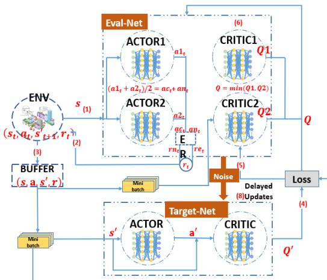  
Fig. 3: Flow chart of ERTATD3.

Firstly, we introduce an experience replay mechanism, where the maximum values of revenue, task-related energy consumption and UAV movement energy consumption are calculated within the replay buffer. This allows for updating maximum value normalization of energy consumption and revenue during training. This mechanism primarily addresses the issue of misalignment between the two objectives, ensuring improved convergence.

For the actor network, the actor networks (actor1 and actor2) are used to generate action outputs. The final action a is obtained by averaging the actions from both actors:

$$
a = { \frac { \operatorname { a c t o r } 1 ( s ) + \operatorname { a c t o r } 2 ( s ) } { 2 } }\tag{37}
$$

The averaging operation acts as a variance-reduction mechanism in the continuous action space, improving robustness and stabilizing policy updates. Unlike conventional ensemblestyle methods that maintain multiple independently optimized policies for exploration or uncertainty estimation, the proposed twin-actor structure is jointly trained within a unified optimization framework to enhance stability under highly coupled constraints. Although the two actors share the same replay buffer and critic evaluation framework, policy diversity can be better preserved because they do not share network parameters. Specifically, actor1 and actor2 are initialized with independent random parameters and updated by separate optimizers. Therefore, the two actors start from different policy mappings and maintain different optimizer states during training. Even when the same mini-batch is sampled from the replay buffer, the two actors may output different actions for the same state due to their different parameters. As a result, the policy gradients are evaluated by the critic at different action points, which helps the two actors follow different update trajectories rather than being deterministically driven toward identical parameter states.

Furthermore, the two actors are fused only at the actionoutput level, rather than through parameter sharing. Thus, each actor can preserve its own policy representation while the final action benefits from the averaged decision. This design helps maintain policy diversity during training and reduces the risk of actor collapse, while the averaging operation suppresses high-variance action fluctuations caused by a single actor in high-dimensional continuous action spaces.

For the critic network, both the state and action are input into the network, and the Q-value is calculated as the output. The dual critic networks in TD3 (critic1 and critic2) are used to estimate the Q-value. We use the minimum Q-value of two crictic networks as the final one to enhance the stability and the accuracy. In the actor networks, there is an evaluation network $\mu _ { . }$ with parameter $\theta ^ { \mu }$ and a target network $\mu ^ { \prime }$ with parameter $\theta ^ { \mu ^ { \prime } }$ . Similarly, the critic network includes an evaluation network Q with parameter $\theta ^ { Q }$ and a target network $Q ^ { \prime }$ with parameter $\theta ^ { Q ^ { \prime } }$

$$
Q ^ { \prime } = r + \gamma \operatorname* { m i n } ( Q _ { 1 } ( s ^ { \prime } , a ^ { \prime } ) , Q _ { 2 } ( s ^ { \prime } , a ^ { \prime } ) )\tag{38}
$$

The actor networks are updated after a delay of n steps, while the critic networks are updated more frequently. Noise

is added to the actions to promote exploration. For the action $^ { a , }$ noise ϵ is added as:

$$
\tilde { \boldsymbol { a } } = \boldsymbol { a } + \boldsymbol { \epsilon } \quad \mathrm { w i t h } \quad \boldsymbol { \epsilon } \sim \mathcal { N } ( \boldsymbol { 0 } , \boldsymbol { \sigma } )\tag{39}
$$

The agent stores transitions in the Experience Replay buffer and samples a mini-batch for training.

Additionally, the experience replay method is employed. The state, action, next state, and reward, denoted as $( s _ { t } , a _ { t } , s _ { t } ^ { \prime } , r _ { t } )$ , are stored in the replay buffer in the format $( s , a , s ^ { \prime } , r )$ . The parameters of the critic network are updated by minimizing the loss. The loss function is defined as follows:

$$
L o s s = \frac { 1 } { X } \sum _ { i = 1 } ^ { X } ( y _ { i } - Q ( s _ { i } , a _ { i } | \theta ^ { Q } ) ) ^ { 2 }\tag{40}
$$

$$
y _ { i } = r _ { i } + \Lambda \times Q ^ { \prime } ( s _ { i } ^ { \prime } , \mu ^ { \prime } ( s _ { i } ^ { \prime } | \theta ^ { \mu ^ { \prime } } ) | \theta ^ { Q ^ { \prime } } )\tag{41}
$$

Where X is defined as the size of the mini-batch data, and Λ denotes the discount factor. Based on the feedback from the critic network, the actor network is updated as follows:

$$
\begin{array} { l } { { \displaystyle \nabla _ { \theta ^ { \mu _ { m } } } J _ { m } \approx \frac { 1 } { X } \sum _ { i = 1 } ^ { X } \nabla _ { a } Q ( s _ { i } , a | \theta ^ { Q } ) \big | _ { a = \mu _ { m } ( s _ { i } ) } } } \\ { { \times \nabla _ { \theta ^ { \mu _ { m } } } \mu _ { m } ( s _ { i } | \theta ^ { \mu _ { m } } ) . } } \end{array}\tag{42}
$$

In Eq. (42), actor m is updated using its own policy output $\mu _ { m } ( s _ { i } )$ , where $m \in \{ 1 , 2 \}$ . Thus, actor1 and actor2 compute their policy gradients based on $\mu _ { 1 } ( s _ { i } )$ and $\mu _ { 2 } ( s _ { i } )$ , respectively, which corresponds to the action-point difference discussed above.

The training process is centralized during training, while execution is decentralized. After training, offloading strategies and resource allocation decisions are made based on the state s provided as input to the actor network. The overall training algorithm for ERTATD3 is summarized in Algorithm 2.The delayed policy update frequency is set to policy delay = 2, following the standard configuration used in TD3 to improve training stability.

5) Complexity and Optimality Analysis of ERTATD3: The total time complexity for $T$ training iterations is $O ( T )$ . The time required to compute the reward at each step is $O ( N )$ where $\bar { N }$ is the number of tasks or agents. Therefore, the total time complexity for reward computation is $O ( T * N )$ where $T$ is the number of training iterations. The batch size extracted from the buffer replay at each step is $B ,$ and the time complexity for training is $O ( B )$ . If the number of training iterations is $T ,$ the total time complexity is $O ( T * B )$ . ERTATD3 uses the Actor-Critic architecture for training, which involves both forward and backward propagation computations. For the Actor and Critic networks, the time complexity is $O ( d ^ { 2 } )$ where $d$ is the network dimension (typically the size of the neural network layers). Therefore, the time complexity per training iteration is $O ( d ^ { 2 } )$ , and the total training time complexity is $O ( T * d ^ { 2 } )$ , where $T$ is the number of training iterations. Considering all the steps mentioned above, the time complexity of the ERTATD3 algorithm is approximately: $O ( T * ( N + B + d ^ { 2 } ) )$

Compared to the traditional DDPG algorithm, ERTATD3 introduces an additional dual Actor network and a hierarchical reward mechanism. As a result, ERTATD3 has a relatively higher computational complexity, as it needs to handle more network structures and computational processes. Specifically, the introduction of the dual Actor network increases the computational burden during each training step, requiring more computational resources. However, this complexity brings stronger optimization capabilities and better convergence performance, particularly when dealing with more complex task allocation and resource distribution problems.

ERTATD3 is based on the TD3 algorithm and uses an Actor-Critic architecture, where the Critic network is used to estimate the action-value function. Although it employs the double delayed target networks (a key improvement in TD3), the target value estimation is still affected by the approximation error of the Q-function. In nonlinear environments, deep neural networks may introduce bias when approximating the value function, especially when the network has not fully converged during training. This approximation error causes the ERTATD3 algorithm to approach the optimal solution, rather than guaranteeing the optimal solution.

## IV. SIMULATION RESULTS

In this section, the performance of the proposed ERTATD3 algorithm is evaluated through simulation results, as discussed in the following paragraphs.

Before presenting the results, the simulation settings are first elaborated. In all simulations, there are 10 vehicle users randomly distributed within a fixed area. A UAV is positioned at the area to provide offloading and caching services. More detailed experimental parameters and hyperparameters are shown in Table V and Table VI.

In the subsequent evaluation, besides the proposed ER-TATD3 algorithm, several comparable algorithms are also used to assess its performance. The specific comparable algorithms are listed as follows:

DDPG: The deep deterministic policy gradient (DDPG) algorithm is a reinforcement learning approach that combines AC (Actor-Critic) and DQN (Deep Q-Network). This algorithm is described in [14].

TD3: TD3 is a deep reinforcement learning algorithm designed to mitigate the challenges of function approximation errors in actor-critic architectures. TD3 employs two critic networks to alleviate overestimation bias, a policy that is updated less frequently, and introduces noise to the target action to enhance stability. This algorithm is detailed in [71].

Greedy: In the greedy algorithm, all tasks are processed either locally on devices or at the UAV. The primary objective of this algorithm is to minimize energy costs, as discussed in [72].

Random: In this algorithm, the offloading scheme is randomly generated.

All Local Process: In this strategy, all tasks are locally processed at vehicle users.

All UAV Process: In this strategy, all tasks are offloaded to the UAV for processing.

TABLE V: Simulation parameter configuration
<table><tr><td rowspan=1 colspan=1>Number of vehicles</td><td rowspan=1 colspan=1>K</td><td rowspan=1 colspan=1>10</td></tr><tr><td rowspan=1 colspan=1>Computation resource of vehicles andthe UAV[68]-[70]</td><td rowspan=1 colspan=1> $C _ { k } , C _ { j }$ </td><td rowspan=1 colspan=1>0.5,1;5,7.2 GHz</td></tr><tr><td rowspan=1 colspan=1>Transmission power resourceof vehicles[13], [57]</td><td rowspan=1 colspan=1> $\overline { { P _ { k } } }$ </td><td rowspan=1 colspan=1>1W</td></tr><tr><td rowspan=1 colspan=1>Input data size of task k</td><td rowspan=1 colspan=1> $\overline { { S s _ { k } } }$ </td><td rowspan=1 colspan=1>[1000,10000] bits</td></tr><tr><td rowspan=1 colspan=1>Delay threshold of tasks</td><td rowspan=1 colspan=1> $\overline { { S d _ { k } } }$ </td><td rowspan=1 colspan=1>40, 100, 400 ms</td></tr><tr><td rowspan=1 colspan=1>Computation density of tasks [70]</td><td rowspan=1 colspan=1> $\omega _ { k }$ </td><td rowspan=1 colspan=1>[10,100]cycles/bit</td></tr><tr><td rowspan=1 colspan=1>Rayleigh channel parameter andsmall scale fading components[50], [51]</td><td rowspan=1 colspan=1> $\mu$ </td><td rowspan=1 colspan=1>1</td></tr><tr><td rowspan=1 colspan=1>Main lobe gain and side lobegain of the UAV [10], [50], [69]</td><td rowspan=1 colspan=1> $G u , g u$ </td><td rowspan=1 colspan=1>12dB, -10 dB</td></tr><tr><td rowspan=1 colspan=1>Main lobe gain and side lobegain of vehicles [10], [50], [69]</td><td rowspan=1 colspan=1> $G _ { k } , g _ { k }$ </td><td rowspan=1 colspan=1>6dB, -10 dB</td></tr><tr><td rowspan=1 colspan=1>Beamwidth of the UAV [10], [50]</td><td rowspan=1 colspan=1> $_ { w u }$ </td><td rowspan=1 colspan=1>30°</td></tr><tr><td rowspan=1 colspan=1>Path loss exponentsof the UAV [13], [54]</td><td rowspan=1 colspan=1> $a _ { j } , b _ { j }$ </td><td rowspan=1 colspan=1>2.09, 3.75</td></tr><tr><td rowspan=1 colspan=1>Path loss at referencedistance for the UAV [13]</td><td rowspan=1 colspan=1> $\varrho _ { j } , \sigma _ { j }$ </td><td rowspan=1 colspan=1>10.38, 14.54</td></tr><tr><td rowspan=1 colspan=1>Power of Gaussian whitenoise and bandwidth [10], [50]</td><td rowspan=1 colspan=1> $N _ { 0 } , W$ </td><td rowspan=1 colspan=1>-70 dBm, 1 GHz</td></tr><tr><td rowspan=1 colspan=1>Experienced alignment delay[59]</td><td rowspan=1 colspan=1> $\tau$ </td><td rowspan=1 colspan=1>0.03157 s</td></tr><tr><td rowspan=1 colspan=1>Energy coefficient [61], [62]</td><td rowspan=1 colspan=1>ε</td><td rowspan=1 colspan=1> $\overline { { 1 0 ^ { - 2 5 } } }$ </td></tr><tr><td rowspan=1 colspan=1>Upper threshold of energycost of the UAV</td><td rowspan=1 colspan=1> $\overline { E }$ </td><td rowspan=1 colspan=1> $1 . 5 \times 1 0 ^ { 4 } J$ </td></tr><tr><td rowspan=1 colspan=1>UAV mass</td><td rowspan=1 colspan=1> $\overline { { m ^ { U A V } } }$ </td><td rowspan=1 colspan=1>10 kg</td></tr><tr><td rowspan=1 colspan=1>duration of a time slot</td><td rowspan=1 colspan=1> $\overline { { \Delta t } }$ </td><td rowspan=1 colspan=1>1s</td></tr><tr><td rowspan=1 colspan=1>number of UAV&#x27;s rotors</td><td rowspan=1 colspan=1> $n _ { r }$ </td><td rowspan=1 colspan=1>4</td></tr><tr><td rowspan=1 colspan=1>air density</td><td rowspan=1 colspan=1> $\overbrace { \rho ^ { a \imath r } }$ </td><td rowspan=1 colspan=1> $\overline { { 1 . 2 2 5 ~ \mathrm { k g } / \mathrm { m } ^ { 3 } } }$ </td></tr><tr><td rowspan=1 colspan=1>rotor radius</td><td rowspan=1 colspan=1> $\beta$ </td><td rowspan=1 colspan=1>0.2 m</td></tr><tr><td rowspan=1 colspan=1>vehicle velocity</td><td rowspan=1 colspan=1> $v _ { k }$ </td><td rowspan=1 colspan=1>[5,15] m/s</td></tr><tr><td rowspan=1 colspan=1>Maximum UAV velocity magnitude</td><td rowspan=1 colspan=1> $\overline { { v _ { j } ^ { \mathrm { m a x } } } }$ </td><td rowspan=1 colspan=1>20 m/s</td></tr><tr><td rowspan=1 colspan=1>Computation price per cycle ofthe UAV and result retrievingprice per byte</td><td rowspan=1 colspan=1> $m _ { j } , m c$ </td><td rowspan=1 colspan=1> $[ 1 0 ^ { - 5 } , 5 \times 1 0 ^ { - 5 } ] ,$  $[ 1 0 ^ { - 3 } , 5 \times 1 0 ^ { - 3 } ]$ </td></tr></table>

TABLE VI: Hyperparameter and network configuration
<table><tr><td>Parameter</td><td>Value</td></tr><tr><td>Learning rate (actor1) Learning rate (actor2) Learning rate (critic) Discount factor Replay buffer size Batch size</td><td> $\overline { { 1 \times 1 0 ^ { - 3 } } }$   $1 \times 1 0 ^ { - 3 }$   $1 \times 1 0 ^ { - 4 }$  0.99 500,000</td></tr><tr><td>Policy delay Soft update rate Actor network structure</td><td>2 0.005 4 fully connected layers: 500, 128</td></tr><tr><td>Critic network structure Learning rate Replay buffer size</td><td>5 fully connected layers: 1024, 512, 300 0.0001 100,000</td></tr></table>

## A. Convergence and Reward Analysis

In this subsection, we present the convergence results of the ERTATD3, TD3, and DDPG algorithms. To further clarify the structural contributions, we conduct dedicated ablation studies, including TATD3 (w/o ER), which employs the twin-actor architecture without the ER mechanism, and TD3 (w/o ER), which adopts a single-actor structure without ER-based staged reward shaping. In the simulation experiments, we set 10,000 training episodes (approximately six hours) to achieve stable convergence.

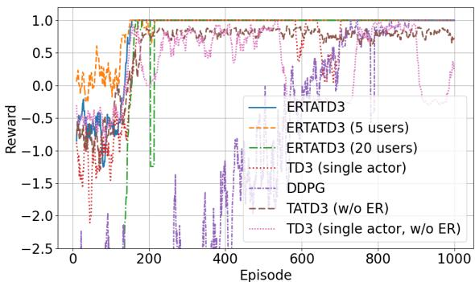  
Fig. 4: Chart of convergence analysis: x-axis: reward, y-axis: episodes (×10).

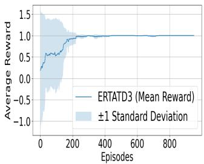

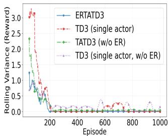  
Fig. 5: Training performance of ERTATD3 over 5 independent runs. The solid curve represents the mean reward across different random seeds, and the shaded region indicates ±1 standard deviation.  
Fig. 6: Chart of reward variance over 5 independent runs: x-axis: rolling variance (reward), y-axis: episodes (×10).

As shown in Fig. 4 and Fig. 7, ERTATD3 achieves a higher asymptotic reward after convergence compared with the other algorithms. Under different user densities, the convergence speed of ERTATD3 slightly decreases as the number of users increases, and the post-convergence reward exhibits moderately larger fluctuations in high-density scenarios. The overall convergence trend remains stable, demonstrating strong robustness against variations in user density. In addition, Fig. 6 shows that ERTATD3 consistently exhibits the lowest rolling reward variance among all variants, reflecting smoother learning dynamics. The error bars in Fig. 5 and Fig. 7 provide additional evidence of stability. Before convergence, the mean performance and the corresponding standard deviation fluctuate noticeably due to exploration and policy adaptation. After approximately 1,800 episodes, the standard deviation becomes very small and remains nearly constant, indicating that the training process has stabilized with only minor oscillations around the converged policy.

From Fig. 4 and Fig. 7 we can observe that TD3 (single actor) with the ER mechanism achieves satisfactory asymptotic performance, albeit with a slower convergence rate than ERTATD3. While the post-convergence error bars in Fig. 7 are relatively small, they remain slightly larger than those of ERTATD3, indicating weaker stability. This observation is corroborated by Fig. 6, which exhibits a temporary increase in reward variance between 6,000 and 7,500 episodes, reflecting residual oscillations during training. Such behavior stems from the coupled constraints (C3 and C4 in Eq. (29)) within a complex action space, where a single-actor policy may overadjust to satisfy certain constraints at the expense of others, thereby inducing recurrent variance fluctuations even in the later stages of training.

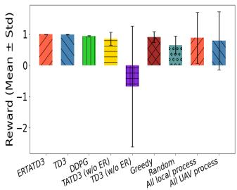  
Fig. 7: Comparison of the final reward across different algorithms. Bars represent the mean reward over 5 independent runs, and error bars indicate ±1 standard deviation.

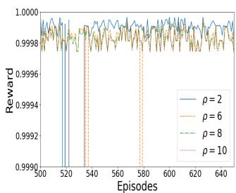  
Fig. 8: Chart of reward curve with different ρ value.

As illustrated in Fig. 4 and Fig. 7, DDPG lacks the twin-critic structure, delayed updates, and Gaussian noise regularization employed in TD3-based algorithms, leading to slower convergence and larger oscillations. Convergence is reached only after approximately 8,000 episodes, and the final reward remains slightly lower than that of ERTATD3 and TD3. The error bars in Fig. 7 are noticeably larger than those of ERTATD3 and TD3, further indicating inferior training stability.

For TATD3 without the ER mechanism, Fig. 4 and Fig. 7 show that the converged reward remains lower and fluctuates more noticeably than that of ERTATD3. Although the twinactor structure enables convergence, the absence of ER degrades both convergence quality and stability. Consistently, Fig. 6 indicates persistent fluctuations in reward variance between 2,000 and 10,000 episodes. The wider error bars in Fig. 7 further reflect increased performance variability across different random seeds.

The most severe instability is observed in TD3 (single actor, w/o ER). As shown in Fig. 4 and Fig. 7, the training process remains unstable and fails to converge even after 10,000 episodes, with persistent reward oscillations and substantially larger error bars, indicating pronounced variability across different random seeds. Fig. 6 exhibits significant variance fluctuations beyond 2,000 episodes. Without both the twinactor and ER mechanisms, the optimization process is strongly affected by gradient interference among coupled constraints.

In contrast, ERTATD3 integrates the twin-actor structure and the ER mechanism, with the twin-actor improving postconvergence stability and the ER mechanism strengthening convergence effectiveness under complex action constraints.

Fig. 7 illustrates that the Greedy algorithm prioritizes energy minimization, resulting in lower overall revenue and increased reward variance. The random offloading policy frequently violates delay constraints and incurs substantial penalties.Among the ablation schemes, processing tasks exclusively on the UAV side leads to performance degradation, mainly due to unfavorable channel conditions that limit uplink transmission efficiency. The single processing location further reduces decision flexibility, resulting in pronounced reward variance across training episodes.

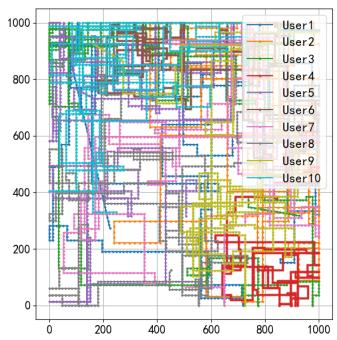

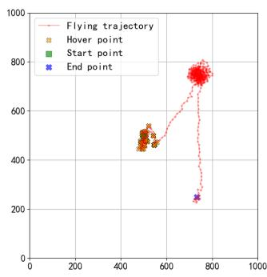

Fig. 9: (a) Chart of user trajectories $( p ^ { \mathrm { t r n g } } = 0 . 2 ) ;$ (b) Chart of UAV trajectory.  
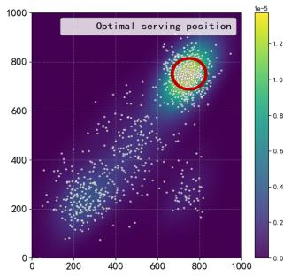

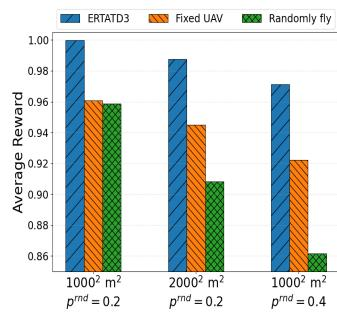  
Fig. 10: (a) Spatial density distribution of optimal UAV serving positions obtained by the proposed ERTATD3 algorithm. (b) Comparison of average rewards under different spatial scales and vehicle turning probabilities $p ^ { \mathrm { t r n g } }$

As depicted in Fig. 8, the parameter $\rho$ controls the trade-off between energy consumption and revenue and thus directly influences the reward magnitude and convergence behavior. In the considered scenario, energy efficiency is given relatively higher priority; therefore, $\rho$ is set greater than 1 to reflect this preference. We evaluated several candidate values of $\rho ,$ and the results indicate that $\rho = 8$ achieves the most stable convergence with the highest steady-state reward. Therefore, $\rho = 8$ is adopted in the subsequent experiments. The proposed framework allows flexible adjustment of $\rho$ according to different application requirements.

## B. Optimal UAV Service Trajectory and Position Analysis

The trajectories of 10 users are illustrated in Fig. 9 (a) follows a variant of the Manhattan mobility model described earlier. User mobility is governed by the turning probability $( p ^ { \mathrm { t r n g } } )$ , which determines whether vehicles continue straight or change direction at intersections, thereby generating a more stochastic mobility scenario. Fig. 9 (b) presents the UAV trajectory generated by the proposed ERTATD3 algorithm. Unlike conventional models that assume continuous motion, our UAV mobility mechanism introduces an explicit movement decision variable $a _ { j } ^ { \mathrm { m o v e } } ( t )$ to control whether the UAV flies or hovers at each time slot. This allows the UAV to adaptively switch between hovering and flying according to user distribution and environmental conditions, thereby improving both energy efficiency and service stability. As shown in Fig. 9 (b), the UAV dynamically adjusts its trajectory and hovers around regions with high user density while minimizing unnecessary movement to conserve energy.

The density shown in Fig. 10 (a) represents the spatial probability distribution of the UAV’s optimal serving positions obtained throughout the training process. A higher density value indicates that the UAV has been frequently selected to serve in that region, implying that such areas consistently provide better trade-offs between energy efficiency, delay, and revenue. In a realistic scenario, this distribution can be interpreted as a spatial pattern of service demand within an urban environment. For instance, in a specific city and during a particular time period, the overall vehicle traffic volume and movement trajectories are relatively stable. As highlighted by the red circle in Fig. 10 (a), the region with the highest density corresponds to the location where the UAV can achieve the most balanced performance between service efficiency and energy conservation. Therefore, the UAV can be strategically deployed to hover within this area to maintain high service quality while minimizing flight energy consumption, offering practical guidance for real-world UAV-assisted vehicular networks.

To evaluate the effectiveness of the proposed UAV trajectory strategy, we compare it with two benchmarks in Fig. 10 (b), including a fixed-position UAV and a randomly flying UAV. The proposed dynamic mechanism consistently achieves the highest reward. When the topology becomes more complex, either due to service area expansion from 10002 m2 to $2 0 0 0 ^ { 2 } \mathrm { m } ^ { 2 }$ or an increase of the turning probability $p ^ { t r n g }$ , the rewards of all schemes decrease. However, ERTATD3 exhibits only a slight performance degradation while maintaining superior rewards, whereas the fixed and especially the random UAV strategies experience significantly larger declines, with the random scheme being most affected when $p ^ { t r n g } = 0 . 4$ . These results demonstrate the strong topology robustness of the proposed ERTATD3 algorithm.

## C. Secure caching scheme analysis

In this subsection, we assess the security of our caching scheme. Following [46], [50], [56], we introduce the metric Exposure Probability $( P _ { j } ^ { \mathrm { l e a k } } )$ , which is defined as the probability of privacy leakage occurring in the UAV, to evaluate the privacy security of our mechanism. The formulation is defined as follows:

$$
P _ { j } ^ { \mathrm { l e a k } } = \alpha ^ { \mathrm { a t U } } N _ { j } ^ { \mathrm { U A V } } / N ^ { \mathrm { t o t a l } }\tag{43}
$$

Where $\alpha ^ { \mathrm { a t U } }$ represents the percentage of tasks hackers can potentially attack. We set $\alpha ^ { \mathrm { a t U } } = 0 . 1$ . Additionally, $N _ { j } ^ { \mathrm { U A V } }$ and $N ^ { \mathrm { t o t a l } }$ denote the number of private tasks in the $\mathrm { U A V } \ \dot { \jmath }$ and in the entire system, respectively.

As shown in Fig. 11 (a), the secure caching scheme significantly reduces the probability of privacy leakage in the

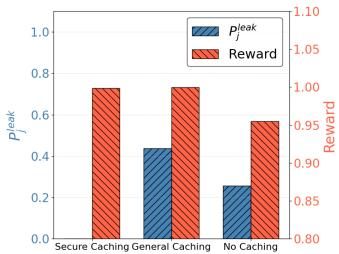

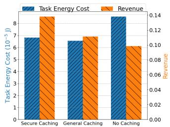  
Fig. 11: (a) Comparison of data leakage probability $P ^ { \mathrm { l e a k } }$ and reward performance under different caching schemes; (b) Comparison of average task-related energy cost and revenue performance under different caching schemes.

UAV by processing sensitive data locally, thereby providing strong privacy protection. Meanwhile, it maintains nearly the same reward performance as the general caching scheme, indicating that the enhanced security does not compromise system efficiency.

As illustrated in Fig. 11 (b), the proposed secure caching strategy achieves task-related energy consumption comparable to that of the general caching scheme while providing slightly higher revenue due to task differentiation. In contrast, the nocaching scheme lacks cached data reuse, resulting in both higher energy consumption and lower revenue.

## D. Delay performance analysis

Fig. 12 (a) shows that the ERTATD3 achieves a lower average delay along with significantly reduced delay variance by employing ER and a twin-actor network. The TD3 algorithm also outperforms the DDPG algorithm. TATD3 and TD3 (w/o ER) exhibit significantly degraded delay performance due to the absence of the ER mechanism, resulting in a higher average delay and increased delay variance. Processing tasks solely on the local side fails to achieve stable performance due to the lack of an adaptive processing strategy for complex tasks. The Greedy algorithm, which focuses exclusively on minimizing energy consumption, results in poorer delay performance. Moreover, processing all tasks on the UAV side increases transmission delay. Benefiting from UAV-assisted offloading and caching mechanisms, ERTATD3 can effectively schedule offloading strategies. However, slight fluctuations in delay performance occur due to variations in task sizes and computational intensities.

From the perspective of network topology, it can be observed that when the number of users increases from 5 to 10 and 20, the delay variation of ERTATD3 is smaller compared with TD3. In contrast, TATD3 (w/o ER), TD3 (w/o ER), and the Random scheme exhibit significantly larger performance fluctuations under different user densities. This result highlights the importance of the ER mechanism and the twin-actor architecture in enhancing topology robustness.

Furthermore, Fig. 12(b) evaluates the impact of vehicle velocity on average delay under three velocity ranges. The average delay generally increases with vehicle velocity because faster mobility shortens the U2V contact duration and causes more rapid channel variations, making stable task offloading more difficult. ERTATD3 achieves the lowest delay under all velocity ranges, demonstrating its adaptability to mobilityinduced channel variations through joint UAV movement control, offloading decisions, transmission power adjustment, and computation resource allocation. This also indicates that higher vehicle mobility brings additional challenges to the offloading success rate.

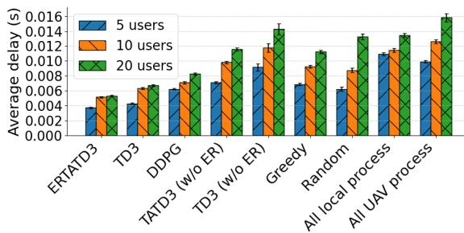  
(a)

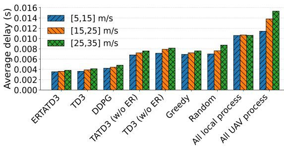  
(b)

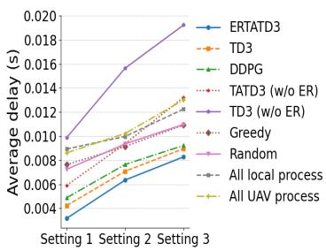  
(c)

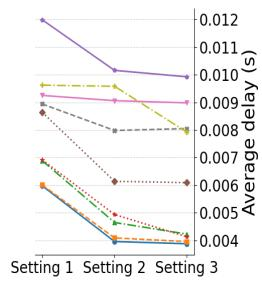  
(d)  
Fig. 12: Delay performance analysis of different algorithms. (a) Average delay comparison among various algorithms. (b) Average delay comparison under different vehicle velocity ranges, i.e., [5, 15] m/s, [15, 25] m/s, and [25, 35] m/s. (c) Delay performance under different task sizes and computation intensity ranges, Setting 1: $S _ { s } = ( 1 0 0 0 , 1 0 0 0 0 )$ bits and $\omega = ( 2 0 , 1 0 0 )$ cycles/bit; Setting 2: $S _ { s } = ( 5 0 0 0 , 1 0 0 0 0 )$ bits and $\omega = ( 2 0 , 1 0 0 )$ cycles/bit; Setting 3: $S _ { s } = ( 5 0 0 0 , 1 0 0 0 0 )$ bits and $\omega = ( 4 0 , 1 0 0 )$ cycles/bit. (d) Delay performance under different UAV and vehicle computation capacities, Setting 1: $C _ { j } \ = \ 5 \mathrm { G H z }$ $C _ { k } = 0 . 5 \mathrm { G H z } ;$ Setting $2 \colon C _ { j } = 5 \mathrm { G H z }$ $C _ { k } = 1 \mathrm { G H z } ;$ Setting $3 \colon C _ { j } = 7 . 2 \mathrm { G H z } , C _ { k } = 1 \mathrm { G H z }$

In Fig. 12 (c), it can be observed that larger task sizes and higher computational intensities result in increased delays. Under variations in environmental parameters, both TATD3 (w/o ER) and TD3 (single actor, w/o ER) are significantly affected, leading to substantial degradation in delay performance. However, increasing computational intensity alone has a relatively minor effect on the “All UAV process” algorithm, with only about a 3% delay increase. This is because the UAV possesses sufficient computational resources, and transmission delay remains the dominant factor influencing overall latency. Increasing task size significantly raises transmission delay, whereas higher computation intensity contributes minimally to additional latency due to the UAV’s adequate processing capability. In Fig. 12 (d), increasing the computational resources on the user side reduces delay across all algorithms except the “All UAV process” algorithm, which does not involve local processing. Increasing UAV computation capacity also slightly decreases delay for all algorithms, again excluding the “All UAV process” case, since transmission delay is still the dominant factor. Overall, higher computational resources mainly reduce computation delay. Consequently, the “All UAV process” algorithm shows more noticeable improvement in delay performance compared with other algorithms.

## E. Energy consumption performance analysis

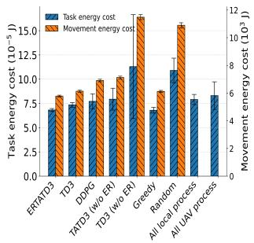  
(a)

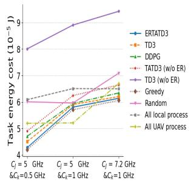  
(b)  
Fig. 13: Energy consumption analysis under different algorithms. (a) Average task-related energy cost per user per episode and average UAV movement energy cost per slot. (b) Average task-related energy consumption of different algorithms under varying computation resource configurations $( C _ { j } , \bar { C } _ { k } )$

In this section, the energy consumption analysis focuses on two aspects: task-related energy cost and UAV movement energy cost. The task-related energy cost, denoted as $E T _ { k } =$ $E U _ { k } + E L _ { k }$ in Eq. 28, includes both the energy consumed for task processing and data transmission, whereas the UAV movement energy $( E _ { j }$ in Eq. 28) represents the additional energy cost incurred by flying or hovering operations. These two types of energy are analyzed separately to better illustrate the overall energy efficiency of the proposed algorithm, as their magnitudes differ significantly. Specifically, the UAV movement energy—typically in the order of kilojoules per second—is several orders of magnitude higher than the pertask processing and transmission energy, which is usually measured in millijoules. Therefore, combining them directly would mask the variations and optimization effects in each component.

In Fig. 13 (a), the chart illustrates the average task-related energy consumption over 500 episodes. The proposed ER-TATD3 and Greedy algorithms exhibit lower energy costs compared with other schemes while also maintaining low energy cost variability. This indicates that the proposed algorithm achieves nearly the same level of energy efficiency as the Greedy algorithm, which solely focuses on minimizing energy consumption. Meanwhile, ERTATD3 simultaneously optimizes multiple objectives, including the energy consumption of the UAV server and the revenue of the service provider, thereby achieving a balanced trade-off between energy efficiency and economic performance.

In Fig. 13 (a), the proposed ERTATD3 consumes the least movement energy among all schemes, demonstrating its ability to minimize unnecessary UAV motion through adaptive flight–hover decisions. The Greedy algorithm shows a slightly higher energy cost due to its lack of trajectory optimization, while the Random scheme suffers from excessive movement energy consumption caused by uncoordinated flight actions. This further confirms that the proposed decision mechanism effectively balances service quality and mobility energy.

In Fig. 13 (b), the relationship between computational resources and task-related energy consumption is analyzed. It can be observed that increasing the computational resources of vehicles leads to higher energy usage when local task processing is required. However, enhancing the UAV’s computational capability has a limited effect on the ERTATD3, TD3, DDPG, and Greedy algorithms. As also reflected in Fig. 12(d), while greater computational resources improve processing efficiency, they encourage the agent to allocate more tasks locally. This occurs because higher UAV-side energy consumption drives the agent to balance efficiency and cost by offloading fewer tasks. TATD3 and TD3 (w/o ER) exhibit low sensitivity to variations in UAV and vehicular computational resources, lacking sufficient adaptability to optimize energy consumption through decision-making. Consequently, their performance fluctuates significantly when scenario parameters become more complex. Overall, these results reveal an intrinsic trade-off between computational efficiency and energy consumption in UAVassisted vehicular networks.

## F. Revenue performance analysis

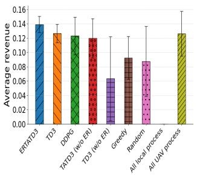  
(a)

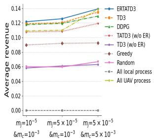  
(b)  
Fig. 14: Charts of revenue performance analysis: (a) Average revenue of different algorithms, (b)Average revenue performance of different algorithms for different computation resource.

We set the unit cost of caching resources higher than that of processing resources, since retrieving task results from UAV storage is more convenient for users. In Fig. 14 (a), it can be observed that the ERTATD3, TD3, and DDPG algorithms achieve higher revenue compared with other schemes, while also exhibiting lower revenue variability. This is because these algorithms adopt multi-objective optimization frameworks that explicitly include revenue as an optimization factor. Such an approach allows service operators to increase profit while maintaining energy-saving objectives. In contrast, the Greedy algorithm, which focuses solely on minimizing energy consumption, fails to achieve satisfactory revenue performance. Moreover, the All UAV process algorithm does not consider profit from caching operations, and the All local process algorithm cannot generate revenue for the service provider.

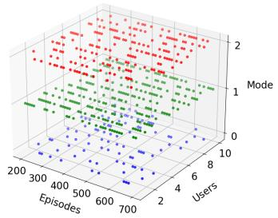  
(a)

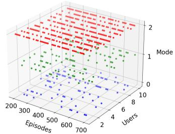  
(b)

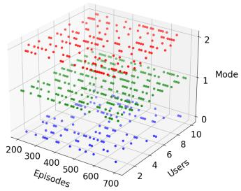  
(c)  
Fig. 15: Charts of processing location of users in 500 episodes (0 means downloading cached task results, 1 means offloading, and 2 means local processing): (a) Processing location when task size $S s _ { k } = [ 1 0 0 0$ , 5000] bits and task density $\omega _ { k } = [ 1 0 , 5 0 ]$ cycles/bit; (b) Processing location when task size $\boldsymbol { S } \boldsymbol { s } _ { k } = [ 1 0 0 0$ , 10000] bits and task density $\omega _ { k } = [ 1 0 , 5 0 ]$ cycles/bit; (c) Processing location when task size $S s _ { k } = [ 1 0 0 0 , 1 0 0 0 0 ]$ bits and task density $\omega _ { k } = [ 1 0 , 1 0 0 ]$ cycles/bit.

In Fig. 14 (b), the results indicate that the unit price of resources is positively correlated with overall revenue, especially for caching resources. The unit price of processing resources has a weaker impact on revenue, since task offloading is not the only means of computation. The agent dynamically adjusts the offloading strategy according to variations in resource prices, thereby balancing profit generation and service efficiency. Similar to the energy performance results, TATD3 and TD3 (w/o ER) exhibit limited sensitivity to price variations, making it difficult for the agents to adapt their decisions effectively and achieve satisfactory revenue performance.

## G. Processing location analysis

From Fig. 15 (a) and (b), we observe that when the task density remains constant, the agent allocates more tasks for local processing as the task size increases. This is because offloading efficiency is primarily constrained by transmission delay. For larger tasks, channel uncertainty reduces the benefits of offloading, leading the agent to favor local execution. In contrast, Fig. 15 (b) and (c) show that when the task size is fixed, the agent increasingly offloads tasks to the UAV. Under stable transmission conditions, the UAV’s abundant computational resources make it a more suitable processing destination. Overall, smaller and more complex tasks are better suited for offloading, whereas larger and simpler tasks are more appropriate for local processing.

## V. CONCLUSION

This article investigates task scheduling and resource allocation under the trade-off between green city objectives and profit maximization. The problem is formulated as a multi-objective optimization model that minimizes the total energy consumption of all devices while maximizing resource revenue.

To address communication challenges caused by traffic congestion, dense buildings, and other obstacles, where conventional MEC servers may suffer from severe communication degradation, UAV assistance combined with caching mechanisms is introduced to improve offloading performance.

A multi-objective optimization framework is developed to jointly consider energy efficiency and revenue generation. The enhanced reward twin actor twin delayed deep deterministic policy gradient (ERTATD3) algorithm is then employed to efficiently solve the resulting mixed-integer nonlinear programming problem.

Simulation results—including UAV position selection, convergence behavior, secure caching schemes, reward, delay, energy consumption, revenue, and offloading distribution—demonstrate that the proposed algorithm consistently outperforms existing approaches in this scenario.

## REFERENCES

[1] Peter Arthurs, Lee Gillam, Paul Krause, Ning Wang, Kaushik Halder, and Alexandros Mouzakitis. A taxonomy and survey of edge cloud computing for intelligent transportation systems and connected vehicles. IEEE Transactions on Intelligent Transportation Systems, 23(7):6206– 6221, 2022.

[2] Jie Lin, Wei Yu, Xinyu Yang, Peng Zhao, Hanlin Zhang, and Wei Zhao. An edge computing based public vehicle system for smart transportation. IEEE Transactions on Vehicular Technology, 69(11):12635–12651, 2020.

[3] Wenhui Ye, Ke Zheng, Yuanyu Wang, and Yuliang Tang. Federated double deep q-learning-based computation offloading in mobility-aware vehicle clusters. IEEE Access, 11:114475–114488, 2023.

[4] Muhammad Nabeel, Faiq Ahmad, Hooria Muslih Ud Din, Muhammad Ahsan, Usman Ali, and Arslan Asif. Joystick mapping in virtual reality shooting game. In 2019 International Conference on Innovative Computing (ICIC), pages 1–6, 2019.

[5] K. F. BRAM-LARBI, V. CHARISSIS, S. KHAN, R. LAGOO, D. DRIKAKIS, and D. K. HARRISON. Ar guidance system for traffic circumvention and collision avoidance: Emergency services case study. In 2021 IEEE International Conference on Consumer Electronics (ICCE), pages 1–6, 2021.

[6] Yun Chao Hu, Milan Patel, Dario Sabella, Nurit Sprecher, and Valerie Young. Mobile edge computing—a key technology towards 5g. ETSI white paper, 11(11):1–16, 2015.

[7] Liang Li, Yunzhou Li, and Ronghui Hou. A novel mobile edge computing-based architecture for future cellular vehicular networks. In 2017 IEEE Wireless Communications and Networking Conference (WCNC), pages 1–6, 2017.

[8] H. Liu, F Eldarrat, H. Alqahtani, A. Reznik, X De Foy, and Y. Zhang. Mobile edge cloud system: Architectures, challenges, and approaches. IEEE Systems Journal, pages 1–14, 2017.

[9] Marco Giordani, Andrea Zanella, and Michele Zorzi. Millimeter wave communication in vehicular networks: Challenges and opportunities. In 2017 6th International Conference on Modern Circuits and Systems Technologies (MOCAST), pages 1–6, 2017.

[10] Mustafa Riza Akdeniz, Yuanpeng Liu, Mathew K Samimi, Shu Sun, Sundeep Rangan, Theodore S Rappaport, and Elza Erkip. Millimeter wave channel modeling and cellular capacity evaluation. IEEE journal on selected areas in communications, 32(6):1164–1179, 2014.

[11] Naser Hossein Motlagh, Tarik Taleb, and Osama Arouk. Low-altitude unmanned aerial vehicles-based internet of things services: Comprehensive survey and future perspectives. IEEE Internet of Things Journal, 3(6):899–922, 2016.

[12] Zhenyu Xiao, Lipeng Zhu, and Xiang-Gen Xia. Uav communications with millimeter-wave beamforming: Potentials, scenarios, and challenges. China Communications, 17(9):147–166, 2020.

[13] Chang Liu, Ming Ding, Chuan Ma, Qingzhi Li, Zihuai Lin, and Ying-Chang Liang. Performance analysis for practical unmanned aerial vehicle networks with los/nlos transmissions. In 2018 IEEE International Conference on Communications Workshops (ICC Workshops), pages 1– 6. IEEE, 2018.

[14] Liqing Liu and Zhichao Chen. Joint optimization of multiuser computation offloading and wireless-caching resource allocation with linearly related requests in vehicular edge computing system. IEEE Internet of Things Journal, 11(1):1534–1547, 2024.

[15] Guanhua Qiao, Supeng Leng, Sabita Maharjan, Yan Zhang, and Nirwan Ansari. Deep reinforcement learning for cooperative content caching in vehicular edge computing and networks. IEEE Internet of Things Journal, 7(1):247–257, 2020.

[16] Arooj Masood, The-Vi Nguyen, Thanh Phung Truong, and Sungrae Cho. Content caching in hap-assisted multi-uav networks using hierarchical federated learning. In 2021 International Conference on Information and Communication Technology Convergence (ICTC), pages 1160–1162, 2021.

[17] Bin Jiang, Jiachen Yang, Huifang Xu, Houbing Song, and Gan Zheng. Multimedia data throughput maximization in internet-of-things system based on optimization of cache-enabled uav. IEEE Internet of Things Journal, 6(2):3525–3532, 2019.

[18] Changyan Yi, Jun Cai, and Zhou Su. A multi-user mobile computation offloading and transmission scheduling mechanism for delay-sensitive applications. IEEE Transactions on Mobile Computing, 19(1):29–43, January 2020.

[19] Kai Peng, Bohai Zhao, Muhammad Bilal, and Xiaolong Xu. Reliabilityaware computation offloading for delay-sensitive applications in mecenabled aerial computing. IEEE Transactions on Green Communications and Networking, 6(3):1511–1522, September 2022.

[20] Bohai Zhao, Kai Peng, Kai Zhang, Hongliang Sun, Zhiying Tu, and Dianhui Chu. SerFlow: A multistage service-enhanced mechanism for workflow applications in CPSs with end–edge–cloud collaboration. IEEE Internet of Things Journal, 12(16):33792–33813, August 2025.

[21] Yuye Yang, You Shi, Changyan Yi, Jun Cai, Jiawen Kang, Dusit Niyato, and Xuemin Shen. Dynamic human digital twin deployment at the edge for task execution: A two-timescale accuracy-aware online optimization. IEEE Transactions on Mobile Computing, 23(12):12262– 12279, December 2024.

[22] Xuan Ai, Weifa Liang, and Caiyi Liu. Joint optimization of model retraining and inference services in DT-assisted edge computing. IEEE Transactions on Networking, 34:1804–1819, 2026.

[23] Jiayuan Chen, Changyan Yi, Shimin Gong, Hongyang Du, Wen Wu, Jiawen Kang, and Dusit Niyato. Generative AI-aided QoE-aware resource allocations for RIS-assisted digital twin interaction with uncertain evolution. IEEE Transactions on Mobile Computing, 25(6):7888–7905, June 2026.

[24] Azade Fotouhi, Haoran Qiang, Ming Ding, Mahbub Hassan, Lorenzo Galati Giordano, Adrian Garcia-Rodriguez, and Jinhong Yuan. Survey on uav cellular communications: Practical aspects, standardization advancements, regulation, and security challenges. IEEE Communications Surveys Tutorials, 21(4):3417–3442, 2019.

[25] Jiayuan Chen, Changyan Yi, Samuel D. Okegbile, Jun Cai, and Xuemin Shen. Networking architecture and key supporting technologies for human digital twin in personalized healthcare: A comprehensive survey. IEEE Communications Surveys & Tutorials, 26(1):706–746, 2024.

[26] Samuel D. Okegbile, Jun Cai, Hao Zheng, Jiayuan Chen, and Changyan Yi. Differentially private federated multi-task learning framework for enhancing human-to-virtual connectivity in human digital twin.

IEEE Journal on Selected Areas in Communications, 41(11):3533–3548, November 2023.

[27] Fang Zhu, Jiayuan Chen, Junjie Wen, Yuye Yang, Changyan Yi, Yun Tie, Peng Zhang, Jun Cai, Dusit Niyato, and Mohsen Guizani. From data mirror to smart copilot: A survey on NextG semantic communication for propelling digital twin world into cognitive stage. IEEE Communications Surveys & Tutorials, 28:4915–4947, 2026.

[28] Jun Du, Haotong Wang, Chunxiao Jiang, Jennifer Simonjan, Jintao Wang, and Merouane Debbah. Distributed ai-based secure communications in space-air-ground-sea integrated networks. IEEE Communications Magazine, 63(7):48–55, 2025.

[29] Bin Wang, Jun Fang, Hongbin Li, Xiaojun Yuan, and Qing Ling. Confederated learning: Federated learning with decentralized edge servers. IEEE Transactions on Signal Processing, 71:248–263, 2023.

[30] Runyi Zhao, Yuhan Ruan, Yongzhao Li, Tao Li, and Rui Zhang. Ccd-gan for domain adaptation in time-frequency localization-based wideband spectrum sensing. IEEE Communications Letters, 27(9):2521–2525, 2023.

[31] Jingxuan Chen, Peng Yang, Siqiao Ren, Zhongliang Zhao, Xianbin Cao, and Dapeng Wu. Enhancing aiot device association with task offloading in aerial mec networks. IEEE Internet of Things Journal, 11(1):174–187, 2024.

[32] Biling Zhang, Min Wang, Jung-Lang Yu, Caili Guo, and Zhu Han. Joint 3-d position deployment and traffic offloading for caching and computing-enabled uav under asymmetric information. IEEE Internet of Things Journal, 10(7):6312–6323, 2023.

[33] Xin Gao, Xue Wang, and Zhihong Qian. Probabilistic caching strategy and tinyml-based trajectory planning in uav-assisted cellular iot system. IEEE Internet of Things Journal, pages 1–1, 2024.

[34] Gerald Tietaa Maale, Guolin Sun, Noble Arden Elorm Kuadey, Thomas Kwantwi, Ruijie Ou, and Guisong Liu. Deepfesl: Deep federated echo state learning-based proactive content caching in uav-assisted networks. IEEE Transactions on Vehicular Technology, 72(9):12208–12220, 2023.

[35] Hongyue Kang, Xiaolin Chang, Jelena Misiˇ c, Vojislav B. Mi ´ siˇ c, Junchao´ Fan, and Yating Liu. Cooperative uav resource allocation and task offloading in hierarchical aerial computing systems: A mappo-based approach. IEEE Internet of Things Journal, 10(12):10497–10509, 2023.

[36] Gaoxiang Wu, Qiang Liu, Jinfeng Xu, Yiming Miao, and Matevzˇ Pustisek. Energy efficient task caching and offloading in uav-enabledˇ crowd management. IEEE Sensors Journal, 22(18):17565–17572, 2022.

[37] Tantan Zhao, Fan Li, and Lijun He. Secure video offloading in multiuav-enabled mec networks: A deep reinforcement learning approach. IEEE Internet of Things Journal, 11(2):2950–2963, 2024.

[38] Xiaohui Gu, Guoan Zhang, Mingxing Wang, Wei Duan, Miaowen Wen, and Pin-Han Ho. Uav-aided energy-efficient edge computing networks: Security offloading optimization. IEEE Internet of Things Journal, 9(6):4245–4258, 2022.

[39] Somayeh Mokhtari, Nima Nouri, Jamshid Abouei, Avid Avokh, and Konstantinos N. Plataniotis. Relaying data with joint optimization of energy and delay in cluster-based uav-assisted vanets. IEEE Internet of Things Journal, 9(23):24541–24559, 2022.

[40] Jingjing Luo, Jialun Song, Fu-Chun Zheng, Lin Gao, and Tong Wang. User-centric uav deployment and content placement in cache-enabled multi-uav networks. IEEE Transactions on Vehicular Technology, 71(5):5656–5660, 2022.

[41] Junjie Yan, Wenli Wang, Jingxian Liu, Junyi Deng, Haohao Yuan, and Yaxin Zhu. Task demand-oriented collaborative offloading and deployment strategy in software-defined uav-assisted edge networks. IEEE Sensors Journal, 25(1):1641–1655, 2025.

[42] Xueqi Ren, Xin Chen, Libo Jiao, Xin Dai, and Zhe Dong. Joint optimization of trajectory, caching and task offloading for multi-tier uav mec networks. In 2024 IEEE Wireless Communications and Networking Conference (WCNC), pages 01–06, 2024.

[43] Simone Frattasi, Filipe Alves Figueiredo, Mahfuz Rahman, Troels Bundgaard Sørensen, and Preben Mogensen. Ofdma vs. sc-fdma performance comparison in local area imt-a scenarios. In 2008 IEEE 19th International Symposium on Personal, Indoor and Mobile Radio Communications, pages 1–5, 2008.

[44] Gerald Tietaa Maale, Noble Arden Elorm Kuadey, Yeasin Arafat, Kwantwi Thomas, Guolin Sun, and Guisong Liu. Multi-task learning for uav trajectory and caching with federated cloud-assisted knowledge distillation. IEEE Transactions on Network and Service Management, 22(3):2516–2533, 2025.

[45] Aji Hanggoro and Riri Fitri Sari. Performance evaluation of the manhattan mobility model in vehicular ad-hoc networks for high mobility vehicle. In 2013 IEEE International Conference on Communication, Networks and Satellite (COMNETSAT), pages 31–36, 2013.

[46] Congcong Zhu, Zishuo Cheng, Dayong Ye, Farookh Khadeer Hussain, Tianqing Zhu, and Wanlei Zhou. Time-driven and privacy-preserving navigation model for vehicle-to-vehicle communication systems. IEEE Transactions on Vehicular Technology, 72(7):8459–8470, 2023.

[47] Peng Hu, Xixi Chu, Kaizhong Zuo, Tianjiao Ni, Dong Xie, Zhangyi Shen, Fulong Chen, and Yonglong Luo. Security-enhanced data sharing scheme with location privacy preservation for internet of vehicles. IEEE Transactions on Vehicular Technology, pages 1–15, 2024.

[48] Cheng Zhu et al. Time-optimal and privacy-preserving route planning for carpool. World Wide Web, 25:1787–1808, 2022.

[49] Frederick Tiausas et al. Hprop: Hierarchical privacy-preserving route planning. ACM Transactions on Privacy and Security, 26(4):1–30, 2023.

[50] Marco Giordani, Mattia Rebato, Andrea Zanella, and Michele Zorzi. Coverage and connectivity analysis of millimeter wave vehicular networks. Ad Hoc Networks, 80:158–171, 2018.

[51] Jeffrey G Andrews, Franc¸ois Baccelli, and Radha Krishna Ganti. A tractable approach to coverage and rate in cellular networks. IEEE Transactions on communications, 59(11):3122–3134, 2011.

[52] Tianyang Bai and Robert W. Heath. Coverage and rate analysis for millimeter-wave cellular networks. IEEE Transactions on Wireless Communications, 14(2):1100–1114, 2015.

[53] Esma Turgut and M. Cenk Gursoy. Coverage in heterogeneous downlink millimeter wave cellular networks. IEEE Transactions on Communications, 65(10):4463–4477, 2017.

[54] Boris Galkin, Jacek Kibilda, and Luiz A DaSilva. Deployment of uavmounted access points according to spatial user locations in two-tier cellular networks. In 2016 Wireless Days (WD), pages 1–6.

[55] 3GPP. Tr 36.828 (v11. 0.0): Further enhancements to lte time division duplex (tdd) for downlink-uplink (dl-ul) interference management and traffic adaptation. 2012.

[56] Azade Fotouhi, Ming Ding, and Mahbub Hassan. Dynamic base station repositioning to improve spectral efficiency of drone small cells. In 2017 IEEE 18th International Symposium on A World of Wireless, Mobile and Multimedia Networks (WoWMoM), pages 1–9, 2017.

[57] Xueyuan Wang and M. Cenk Gursoy. Coverage analysis for energyharvesting uav-assisted mmwave cellular networks. IEEE Journal on Selected Areas in Communications, 37(12):2832–2850, 2019.

[58] J. Zhao, J. Liu, J. Jiang, and F. Gao. Efficient deployment with geometric analysis for mmwave uav communications. IEEE Wireless Communications Letters, 9(7):1115–1119, 2020.

[59] Mohammed S. Elbamby, Cristina Perfecto, Mehdi Bennis, and Klaus Doppler. Edge computing meets millimeter-wave enabled vr: Paving the way to cutting the cord. In 2018 IEEE Wireless Communications and Networking Conference (WCNC), pages 1–6, 2018.

[60] Haitham Hassanieh, Omid Abari, Michael Rodreguez, Mohammed A. Abdelghany, Dina Katabi, and Piotr Indyk. Agile millimeter wave networks with provable guarantees. CoRR, abs/1706.06935, 2017.

[61] Yixue Hao, Min Chen, Long Hu, M. Shamim Hossain, and Ahmed Ghoneim. Energy efficient task caching and offloading for mobile edge computing. IEEE Access, 6:11365–11373, 2018.

[62] Min Chen, Yiming Miao, Yixue Hao, and Kai Hwang. Narrow band internet of things. IEEE Access, 5:20557–20577, 2017.

[63] Ning Gao, Yong Zeng, Jian Wang, Di Wu, Chaoyue Zhang, Qingheng Song, Jachen Qian, and Shi Jin. Energy model for uav communications: Experimental validation and model generalization. China Communications, 18(7):253–264, 2021.

[64] Richard S. Sutton and Andrew G. Barto. Reinforcement Learning: An Introduction. MIT Press, 2nd edition, 2018.

[65] Volodymyr Mnih et al. Human-level control through deep reinforcement learning. Nature, 518:529–533, 2015.

[66] Leslie Pack Kaelbling, Michael L. Littman, and Andrew W. Moore. Reinforcement learning: A survey. Journal of Artificial Intelligence Research, 4:237–285, 1996.

[67] Scott Fujimoto, Herke van Hoof, and David Meger. Addressing function approximation error in actor-critic methods. In Proceedings of the 35th International Conference on Machine Learning (ICML), pages 2185– 2193, 2018.

[68] Xinyu Huang, Lijun He, Xing Chen, Liejun Wang, and Fan Li. Revenue and energy efficiency-driven delay constrained computing task offloading and resource allocation in a vehicular edge computing network: A deep reinforcement learning approach. IEEE Internet of Things Journal, pages 1–1, 2021.

[69] Jianfei Wang, Tiejun Lv, Pingmu Huang, and P Takis Mathiopoulos. Mobility-aware partial computation offloading in vehicular networks: a deep reinforcement learning based scheme. China Communications, 17(10):31–49, 2020.

[70] Xing Chen and Guizhong Liu. Energy-efficient task offloading and resource allocation via deep reinforcement learning for augmented reality in mobile edge networks. IEEE Internet of Things Journal, 8(13):10843–10856, 2021.

[71] Wenhao Fan. Blockchain-secured task offloading and resource allocation for cloud-edge-end cooperative networks. IEEE Transactions on Mobile Computing, 23(8):8092–8110, 2024.

[72] Xing Chen and Guizhong Liu. Federated deep reinforcement learningbased task offloading and resource allocation for smart cities in a mobile edge network. Sensors, 22(13), 2022.