# Optimizing Spectrum Sharing in UAV Swarms: A Stackelberg Game-Based Incentive Mechanism

Qin Wang , Senior Member, IEEE, Yi Shen, Longting Xu , Member, IEEE, Hui Zhang , Member, IEEE, Haitao Zhao , Senior Member, IEEE, and Hongbo Zhu , Member, IEEE

Abstract—In this paper, we propose an innovative spectrum sharing incentive mechanism tailored for Uncrewed Aerial Vehicle (UAV) swarms, utilizing a Stackelberg game framework. This mechanism enables multiple UAV-to-UAV (U2U) links to effectively share the spectrum resources of a single UAV-to-Base Station (U2B) link. We commence by designing a hybrid overlay-underlay spectrum access mode, addressing the challenge of inter-user interference. Subsequently, the spectrum sharing issue is formulated as a Stackelberg game model, where U2B links are positioned as leaders and U2U links as followers. This model facilitates an interactive environment where both entities converge on an optimal trading strategy, encompassing the determination of the ideal trading price and allocation of resource blocks (RBs). To further enhance this system, we employ a utility-based matching strategy. This strategy ensures that U2U links select the U2B link that optimizes their utility, while the U2B link, in turn, chooses the U2U link that maximizes its utility from the pool of applicants seeking spectrum sharing. Simulation results underscore the effectiveness of this approach, showcasing significant improvements in both system utility and the per-unit utility of spectrum resources. Additionally, our mechanism successfully incentivizes more UAV users to engage in a mutually beneficial spectrum sharing arrangement.

Index Terms—Stackelberg game, spectrum sharing, UAV swarm, matching strategy, low-altitude intelligence network.

# I. INTRODUCTION

U NCREWED Aerial Vehicles (UAVs) are distinguished bytheir exceptional versatility, high mobility, and adaptability, leading to a broad spectrum of promising applications across military and civilian domains [1], [2], [3]. Notable applications include target localization [4], reconnaissance [5], and

Received 13 March 2025; revised 26 June 2025; accepted 29 July 2025. Date of publication 19 August 2025; date of current version 19 January 2026. This work was supported in part by the Jiangsu Provincial Key Research and Development Program under Grant BE2022068-2, in part by the National Natural Science Foundation of China under Grant 92367302 and Grant U24B20187, in part by the Natural Science Foundation of the Jiangsu Higher Education Institutions of China under Grant 24KJA510008, and in part by the Natural Science Foundation of Nanjing University of Posts and Telecommunications under Grant NY224113. An earlier version of this work was presented at the 2024 IEEE 24th International Conference on Communication Technology (ICCT), Chengdu, China, Oct. 18–20, 2024 [DOI: 10.1109/ICCT62411.2024.10946420]. The review of this article was coordinated by Dr. Haijun Zhang. (Corresponding author: Qin Wang.)

Qin Wang, Yi Shen, Hui Zhang, Haitao Zhao, and Hongbo Zhu are with the Institute of Internet of Things, Nanjing University of Posts and Telecommunications, Nanjing 210003, China (e-mail: wangqin@njupt.edu.cn; 1222014819@ njupt.edu.cn; zhhjoice@126.com; zhaoht@njupt.edu.cn; zhuhb@njupt.edu.cn).

Longting Xu is with the College of Information Science and Technology, Donghua University, Shanghai 201620, China (e-mail: xlt@dhu.edu.cn).

Digital Object Identifier 10.1109/TVT.2025.3595972

extensive area coverage [6]. As low-altitude airspace becomes more accessible and UAV applications expand, an increasing number of UAVs are expected to integrate into low-altitude networks. This integration is driving a growing demand for spectrum resources in low-altitude intelligent networking. Currently, these low-altitude intelligent networks are confronting significant challenges, such as severe signal interference, a shortage of spectrum resources, and unauthorized spectrum usage. These issues are major impediments to the development of the low-altitude economy. Moreover, while frequency bands allocated for commercial use are densely occupied, the actual utilization rate of other pre-allocated frequency bands remains strikingly low. Consequently, the scarcity of spectrum resources is emerging as a critical bottleneck, significantly hindering the advancement of low-altitude intelligent networks [7], [8], [9], [10].

The growing recognition of spectrum sharing technology as a potential solution to mitigate spectrum resource scarcity is notable. This method optimizes the use of finite spectrum resources, markedly improves spectrum efficiency, and significantly contributes to the reduction of wireless spectrum congestion [11], [12]. Within the conventional cognitive radio (CR) framework, the priority of accessing the spectrum is granted to the primary user (PU), who can access it randomly. Conversely, the secondary user (SU) is expected to intelligently sense, select, and access idle spectrum resources. This process mandates interaction with the immediate wireless spectrum space, ensuring that the SU’s activities do not interfere with the PU’s transmission [13].

Existing spectrum sharing access modes generally fall into two categories: Overlay and Underlay. In Overlay mode, SUs use PUs’ unoccupied spectrum to minimize interference, reducing the impact on PUs. In Underlay mode, SUs adopt spread spectrum technology with low power spectral density to share the spectrum on frequencies occupied by PUs, with their transmission signals coexisting as noise alongside PU signals. In the relevant existing works [14], [15], [16], [17], the access strategy of Overlay/Underlay usually refers to the choice of using underlay or overlay under specific conditions. e.g., when the licensed spectrum is detected to be busy, the SU transmits in Underlay mode; and when the licensed spectrum is tested as free, it transmits in Overlay mode [15]. In [18], a hybrid transmission scheme combining Overlay and Underlay is proposed. In this model, the users are classified as Overlay users and underlay users. In this system, the underlay users use the entire

0018-9545 © 2025 IEEE. All rights reserved, including rights for text and data mining, and training of artificial intelligence and similar technologies. Personal use is permitted, but republication/redistribution requires IEEE permission. See https://www.ieee.org/publications/rights/index.html for more information.

spectrum for transmission while the Overlay users transmit data through the spectrum voids detected by the spectrum sensing unit. However, it is noteworthy that most existing research on hybrid overlay-underlay spectrum access modes predominantly focuses on switching between these two modes under specific conditions. There is a lack of consideration for the combined and coexistent application of both modes. At the same time, with the increasing demand for spectrum sharing, the number of users participating in sharing is increasing. The high interference caused by multi-users cannot be ignored. Therefore, it is necessary to design a hybrid spectrum sharing access mode that can satisfy multi-users participation with low interference.

The scarcity of resources and security concerns often result in users being cautious and hesitant to share their idle spectrum. To counteract such selfish behavior and encourage users to share idle spectrum resources, considerable efforts have been directed towards devising efficient spectrum resource allocation schemes [19], [20], [21], [22]. The study in [23] introduced an incentive mechanism based on a reverse auction, viewed from the SU perspective. In this model, the PU, who held the resource, acted as the bidder. The SU, functioning as the buyer, selected the PU that offered the most utility, thereby concluding the auction. Additionally, the research in [24] took into account both the revenue of cellular base stations (BSs) and the overall network throughput to develop a pricing strategy for different spectrum sharing modes. Here, SUs could independently choose their communication modes and dynamically alter their selections using an evolutionary game approach. Furthermore, the authors in [25] presented an auction-based spectrum leasing framework. This framework was designed to allocate idle spectrum resources to BSs seeking additional spectrum in a manner that was both fair and optimal. The proposed method ensured the maximization of the auctioneer’s returns on the auctioned resources, thus significantly enhancing the satisfaction of BSs with their allocated spectrum resources. The study in [26] stressed the criticality of utilizing licensed spectra for UAV-associated communications, accentuating advantages such as reliability and security. The authors explored novel domains of spectrum sharing by suggesting a framework based on a decentralized, competitive free-market strategy. Within this model, various Mobile Network Operators (MNOs) have the potential to lease spectrum resources to UAVbased stations (UAV-BS), subsequently establishing channels for new revenue opportunities. Other research works have focused on maintaining fairness, particularly in terms of achievable data throughput, as a means to incentivize participation. For instance, an optimization framework for spectrum sharing between two mobile network operators was proposed in [27], which took fairness as the key factor to determine the use of shared spectrum between operators. In terms of average user spectrum efficiency, simulation results showed that both operators had an incentive to participate in and benefit from the proposed spectrum sharing scheme.

For the past few years, the Stackelberg game has received increasing recognition from numerous researchers as an effective tool for maximizing user utility and promoting participation [28], [29]. In the framework of a Stackelberg game, participants can be divided into two designated roles: leaders and followers. The leader initiates the game by formulating a strategy, followed by the followers who make decisions based on the leader’s strategy [30]. The core principle of this game model is that both parties make decisions influenced by the other’s strategy to maximize their benefits and achieve a Nash equilibrium [31]. For instance, in [32], the authors delved into a dynamic spectrum sharing framework for the Internet of Vehicles (IoVs) using the Stackelberg game, employing the multiplicative alternating direction method to solve the game. Further, the authors in [33] examined the complex tripartite spectrum sharing scenario involving UAVs, users, and BSs in UAV-assisted communications. This was achieved by integrating a two-stage Stackelberg game into the sharing model, where all three entities interacted and played the game to reach a Nash equilibrium. At the final equilibrium, the profits of almost all members improved to varying extents, thereby enhancing the model’s dependability and encouraging continued participation by all profit-positive members.

While numerous studies have applied traditional optimization methods to address similar challenges, certain issues remain unresolved. The existing literature overlooks the complex dynamics spectrum sharing scenarios of many-to-many UAV swarms and the impact of the Doppler shift in mobile environments. Additionally, there is insufficient research on spectrum sharing access modes, with current versions suffering from high sensing costs and severe interference. The high interference caused by spectrum sharing can degrade the PU channel state. Consequently, without appropriate incentives, PUs are unwilling to share idle spectrum. To address these issues, we propose a spectrum sharing incentive mechanism based on a hybrid access mode, considering both task urgency and resource utilization. This incentive mechanism employs a Stackelberg game model and a utility-based matching mechanism to ensure fair resource allocation and encourage broader user participation in spectrum sharing, thereby addressing both the technical and behavioral aspects of this field. To further evaluate the performance of the proposed mechanism, we conducted comparative simulations with benchmark methods in terms of system utility and analyzed the state changes of spectrum sharing over a 2-second period through simulation. Specifically, the main contributions of our research can be elaborated as follows.

The main contributions of this paper can be summarized as follows:

1) Innovative Hybrid Spectrum Access Mode: For the first time, this paper introduces a hybrid overlay-underlay spectrum access mode. In this mode, a PU can partition its bandwidth reuse resource into numerous Resource Blocks (RBs). SUs have the option to share some of these RBs to fulfill their communication objectives. This unique access mode enables multiple SUs to share the spectrum resources of a single PU without causing significant interference, marking the first instance of simultaneous deployment of both Overlay and Underlay modes.

2) Spectrum Sharing Model for UAV Swarm: Considering the urgency of spectrum demand, we propose a novel spectrum sharing model for large-scale UAV swarms. A satisfaction function, based on Quality of Service (QoS) and actual trading strategy, is developed to enhance the utilization of spectrum resources and prevent buyers from maliciously appropriating large amounts of spectrum resources. The interactions between the spectrum sharing entities are modeled as a Stackelberg game, with the game equilibrium solution derived through backward induction to optimize the utility for both parties involved.

3) Utility-Based Matching Strategy: We introduce a utilitybased matching strategy to allocate PUs’ resources to SUs. The matching strategy is designed based on the proposed hybrid spectrum access mode. Through the iterative matching mechanism, the system utility can be further improved, and the allocation of limited spectrum resources can be further optimized. As a result, more users will be encouraged to participate in spectrum sharing. Meanwhile, the protection bands related to the Doppler shift are considered in the process of spectrum allocation.

The rest of this paper is organized as follows. The description of the system model is given in Section II. The hybrid overlay-underlay spectrum access mode is given in Section III. The spectrum sharing method based on Stackelberg game is presented in Section IV. The matching strategy based on utility is described in Section V. The simulation results and parameter analysis are presented in Section VI. Finally, the conclusion is given in Section VII.

# II. UAV SWARM SPECTRUM SHARING COMMUNICATION SCENARIO

When large-scale UAV swarms collaborate to perform tasks, it is essential that effective communication mechanisms are established between them to avoid potential collision risks by transmitting safety information packages. To improve the cooperation of UAV swarms, advanced low-altitude network UAV swarms need to periodically disseminate secure data, including position, speed, and direction of movement among neighboring UAVs via U2U (UAV to UAV) links. However, there is a lack of available spectrum resources for U2U links. Some UAVs performing high-rate transmission tasks, which need to implement services such as video streaming, have been allocated spectrum resources from the BS to maintain a high bandwidth U2B (UAV to BS) link. Therefore, the U2B link can act as a spectrum provider and share its spectrum resources with the U2U links. The U2U link plays a vital role in transmitting secure information, and its core purpose is to ensure the safety of the UAV swarms, which puts a requirement on the reliability of the communication. To satisfy the diversified service requirements of U2B and the reliable connection of the U2U links, the U2U link connection strategy needs to be optimized, and the incentive mechanism for spectrum sharing with the U2B link needs to be designed.

The UAV swarm spectrum sharing scenario proposed in this paper is shown in Fig. 1. The BS and multiple UAVs form a cellular network, which contains  U2B links and  U2U links. IThe set of U2B links and U2U links is denoted as $\mathbf { I } = \{ 1 , \ldots , I \}$ and $\mathbf { J } = \{ 1 , \dots , J \}$ = , . . . , I, respectively. The U2B links connect UAVs = , . . . , Jto the BS to provide high data-rate services, and the U2U links propagate regularly generated security messages with localized D2D communication to ensure flight safety. The U2U links can send spectrum sharing requests and personal information to the BS via an unlicensed frequency band. The BS serves as the central node, responsible for determining the real-time spectrum requirements and location information of all users, rather than relying on direct mutual sensing among the UAV swarm, thereby avoiding the communication overhead and potential conflicts associated with sensing. After obtaining global information, the BS employs the game model proposed in Section IV to calculate the spectrum sharing strategy for multiple users. This does not conflict with the distributed spectrum sharing we described, as the BS is only responsible for computational tasks and does not have decision-making authority over spectrum allocation.

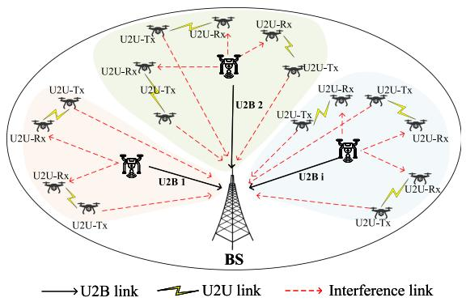

flowchart

```mermaid
graph TD
    A["BS"] --> B["U2U-Tx"]
    A --> C["U2U-Rx"]
    A --> D["U2B 1"]
    A --> E["U2B 2"]
    A --> F["U2B i"]
    B --> G["U2U-Tx"]
    B --> H["U2U-Rx"]
    B --> I["U2B 1"]
    C --> J["U2U-Tx"]
    C --> K["U2U-Rx"]
    C --> L["U2B 2"]
    D --> M["U2U-Tx"]
    D --> N["U2U-Rx"]
    D --> O["U2B 1"]
    E --> P["U2U-Tx"]
    E --> Q["U2U-Rx"]
    E --> R["U2B 2"]
    F --> S["U2U-Tx"]
    F --> T["U2U-Rx"]
    F --> U["U2B 1"]
    G --> V["U2U-Tx"]
    G --> W["U2U-Rx"]
    G --> X["U2B 2"]
    H --> Y["U2U-Tx"]
    H --> Z["U2U-Rx"]
    H --> AA["U2B 1"]
    I --> AB["U2U-Tx"]
    I --> AC["U2U-Rx"]
    I --> AD["U2B 2"]
    J --> AE["U2U-Tx"]
    J --> AF["U2U-Rx"]
    J --> AG["U2B 1"]
    K --> AH["U2U-Tx"]
    K --> AI["U2U-Rx"]
    K --> AJ["U2B 2"]
    L --> AK["U2U-Tx"]
    L --> AL["U2U-Rx"]
    L --> AM["U2B 1"]
    M --> AN["U2U-Tx"]
    M --> AO["U2U-Rx"]
    M --> AP["U2B 2"]
    N --> AQ["U2U-Tx"]
    N --> AR["U2U-Rx"]
    N --> AS["U2B 1"]
    O --> AT["U2U-Tx"]
    O --> AU["U2U-Rx"]
    O --> AV["U2B 2"]
    P --> AW["U2U-Tx"]
    P --> AX["U2U-Rx"]
    P --> AY["U2B 1"]
    Q --> AZ["U2U-Tx"]
    Q --> BA["U2U-Rx"]
    Q --> BB["U2B 2"]
    style BS fill:#f9f,stroke:#333
    style A fill:#ccf,stroke:#333
    style C fill:#ccf,stroke:#333
    style D fill:#ccf,stroke:#333
    style E fill:#ccf,stroke:#333
    style F fill:#ccf,stroke:#333
    style G fill:#ccf,stroke:#333
    style H fill:#ccf,stroke:#333
    style I fill:#ccf,stroke:#333
    style J fill:#ccf,stroke:#333
    style K fill:#ccf,stroke:#333
    style L fill:#ccf,stroke:#333
    style M fill:#ccf,stroke:#333
    style N fill:#ccf,stroke:#333
    style O fill:#ccf,stroke:#333
    style P fill:#ccf,stroke:#333
    style Q fill:#ccf,stroke:#333
    style R fill:#ccf,stroke:#333
    style S fill:#ccf,stroke:#333
    style T fill:#ccf,stroke:#333
    style U fill:#ccf,stroke:#333
    style V fill:#ccf,stroke:#333
    style W fill:#ccf,stroke:#333
    style X fill:#ccf,stroke:#333
    style Y fill:#ccf,stroke:#333
    style Z fill:#ccf,stroke:#333
```

Fig. 1. UAV swarm spectrum sharing communication scenario.

Further, we assume that the BS has preassigned  mutually Iorthogonal spectrum sub-bands for each U2B link (considering the uplink) in advance, and the U2U links access the spectrum resource through spectrum sharing technology so that the system can achieve its communication objectives in a mobile environment with minimal signaling overhead. Channel fading is assumed to be approximately the same within a sub-band and independent across sub-bands. As shown in Fig. 1, when the U2B link shares spectrum with a U2U link, the BS, as the receiver of the U2B link, will be exposed to interference from the transmitter of the U2U link, and the receiver of the U2U link will be interfered with by the transmitter of the U2B link.

In our model, the path loss model [34], [35] is defined as:

$$
P L _ {[ d B ]} = 1 0 \alpha \lg (D _ {j}) \tag {1}
$$

where $D _ { j }$ denotes the distance between the transmitter and Dreceiver of U2U link $j$ and  is the path-loss exponent.

j αIn this channel model, the frequency variation $\Delta f _ { j } ^ { i }$ caused by Doppler shift can be expressed as:

$$
\Delta f _ {j} ^ {i} = \frac {f _ {j} ^ {i} \cdot v _ {j} ^ {i} \cdot \cos (\theta_ {j} ^ {i})}{c} \tag {2}
$$

where $f _ { j } ^ { i }$ indicates the carrier frequency, $v _ { j } ^ { i }$ and $\theta _ { j } ^ { i }$ respectively f v θmean relative speed and angle between the transmitter and the receiver,  is the speed of light. As the frequency change caused cby the Doppler shift is very subtle [36], [37], we ignore the effect of the Doppler shift on the channel state information. To further minimize the effect of Doppler shift, we introduce a spectrum protection band between different users in Section V. We use the Rician distribution [38], [39] to define small scale fading $p _ { \xi }$ ,

which can be denoted as:

$$
p _ {\xi} (D _ {j}) _ {[ d B ]} = \frac {D _ {j}}{\sigma_ {0} {} ^ {2}} \exp \left(\frac {- D _ {j} {} ^ {2} - \rho^ {2}}{2 \sigma_ {0} {} ^ {2}}\right) I _ {0} \left(\frac {D _ {j} \rho}{\sigma_ {0} {} ^ {2}}\right) \tag {3}
$$

where $\rho$ and $\sigma _ { 0 }$ are the strengths of the dominant and scattered ρ σ(non-dominant) paths, respectively. $I _ { 0 } ( \cdot )$ denotes the modified zeroth-order first kind Bessel function. The Rician factor  can be defined as:

$$
\kappa = \frac {\rho^ {2}}{2 \sigma_ {0} {} ^ {2}} \tag {4}
$$

During a coherent time period, $G _ { j } ^ { i }$ , the channel power gain of U2U link $j$ on the $i ^ { t h }$ Gsub-band occupied by U2B link $i ,$ can be j iexpressed as follows:

$$
G _ {j} ^ {i} = 1 0 ^ {\frac {- P L - p _ {\xi}}{1 0}} \tag {5}
$$

Similarly, the channel power gain of U2B link $i \ G _ { i } ,$ the interference gain of the transmitter of U2U link $j$ i Gto BS $g _ { j } ^ { i } .$ j gand the interference gain of the transmitter of U2B link  to the receiver of U2U link $\textit { j } g _ { i , j } ^ { i }$ can be expressed.

j gU2B links share spectrum with U2U links through a novel hybrid spectrum access strategy, which will be explained in detail in Section III. The allocated channel for each U2B link is orthogonal. The SINR of U2B link  and U2B link  on the -th sub-band can be denoted as follow:

$$
S I N R _ {i} = \frac {P _ {i} \cdot G _ {i}}{\sigma^ {2} + \sum_ {j = 0} ^ {J} \rho_ {j} ^ {i} \cdot P _ {j} ^ {i} \cdot g _ {j} ^ {i}} \tag {6}
$$

$$
S I N R _ {j} ^ {i} = \frac {P _ {j} ^ {i} \cdot G _ {j} ^ {i}}{\sigma^ {2} + P _ {i} \cdot g _ {i , j} ^ {i}} \tag {7}
$$

where $P _ { i }$ and $P _ { j } ^ { i }$ indicates the transmission power of U2B link Pand U2U link $j , \sigma ^ { 2 } \mathrm { i }$ is the additive white gaussian noise (AWGN) power, $\rho _ { j } ^ { i }$ j σdenotes the sharing state, if U2U link  occupies the -th sub-band, $\rho _ { j } ^ { i } = 1 ;$ else, $\rho _ { j } ^ { i } = 0$ . The capacity of U2B link and U2U link  on the -th sub-band can be expressed as:

$$
C _ {i} = B _ {i} \cdot \log_ {2} (1 + S I N R _ {i}) \tag {8}
$$

$$
C _ {j} ^ {i} = B _ {j} ^ {i} \cdot \log_ {2} (1 + S I N R _ {j} ^ {i}) \tag {9}
$$

where $B _ { i }$ denotes the bandwidth of the -th sub-band, $B _ { i } ^ { i }$ is the B i Bbandwidth that U2U link occupied. It is required that $B _ { i } \geq$ $\textstyle \sum _ { j = 0 } ^ { J } \rho _ { i , j } \cdot B _ { j } ^ { i }$ J .

ρ BThe interaction process of the proposed incentive mechanism is shown in Fig. 2. First, the U2B links tell the BS the number of its free spectrum resources. When U2U links request spectrum, the BS asks the U2B links if they are willing to participate in the sharing, and the U2B links that participate in the sharing feed back their channel condition. The BS acts as an intermediate node that computes and determines the optimal strategies. After the computation, the spectrum sharing strategies information assigned by the BS would be fed back to both parties.

# III. HYBRID OVERLAY-UNDERLAY SPECTRUM SHARING STRATEGY

In the traditional CR paradigm, PUs have the priority of spectrum access, while SUs have to intelligently access the idle spectrum resources by interacting with the surrounding radio spectrum environment. SUs share the spectrum resources of PUs through either Overlay or Underlay access mode.

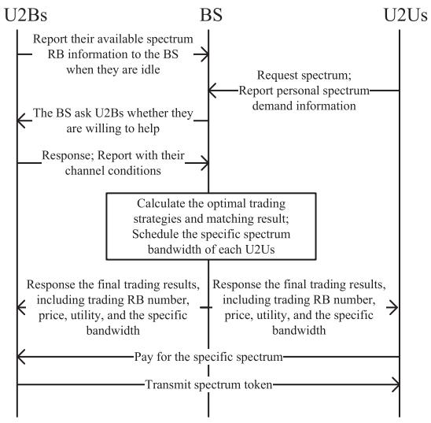

flowchart

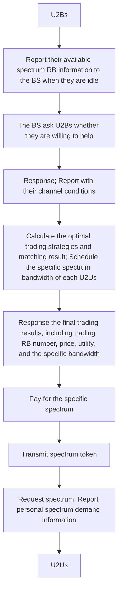

Fig. 2. Flow of the designed incentive mechanism.

In the communication scenario of this paper, SUs mostly have low bandwidth requirements. Part of the spectrum bandwidth can meet the QoS of SUs instead of occupying the entire bandwidth of PUs. Therefore, a hybrid overlay-underlay spectrum access mode is designed without affecting the communication quality of a single SU. In our model, a PU’s reusable spectrum resource is divided into multiple mutually orthogonal RBs. SUs access the idle RBs through Overlay mode. As the RBs are mutually orthogonal, there is no interference between SUs sharing spectrum with the same PU, but there is certain interference to the PU. Therefore, it is required that the transmitting power of a SU must be less than the interference threshold to avoid affecting the communication of the PU. Fig. 3(a) illustrates the access principle of this mode. Through this spectrum access mode, SUs will save the waiting time for accessing the channel. Meanwhile, SUs can choose to share the bandwidth as needed to save the overhead.

The following analyzes the overlay and underlay spectrum access mode in scenarios where multiple SUs share the same PU’s spectrum resources. Fig. 3(b) and (c) illustrate the access principle of Overlay and Underlay modes. In Overlay mode, a SU must detect the idle resources of the PU through spectrum sensing, and it needs to negotiate with other SUs before accessing. If the SU fails to access the channel during the current time slot, it must sense the upcoming time slot channel conditions again until it gains access. In our model, the SU accesses the spectrum by interacting with the PU without spectrum sensing or negotiating with other SUs. Meanwhile, this mode can increase the bandwidth of the shareable spectrum, allow more SUs to participate in, and improve the system resource utilization. In Underlay mode, SUs sharing the same spectrum resource will inevitably interfere with each other, and the interference of multiple SUs will affect the communication of PUs. As a result, PUs must limit the amount of SUs sharing their own resources so as not to cause greater interference to themselves. Compared with the Underlay, our mode can greatly reduce the impact of interference on the system communication quality. Since the channels of SUs sharing the same PU’s spectrum resources are orthogonal to each other, the interference exists only in each SU in the band it occupies, and the total interference is equivalent to the case of one-to-one sharing in Underlay mode. Meanwhile, the number of SUs sharing the same spectrum resource can increase due to the reduction of interference caused by sharing. In the case of low-rate demand SUs, a single PU can share the spectrum with a larger number of SUs at the same time.

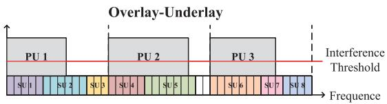

text_image

Overlay-Underlay
PU 1 PU 2 PU 3
Interference
Threshold
SU 1 SU 2 SU 3 SU 4 SU 5 SU 6 SU 7 SU 8
Frequency

(a)

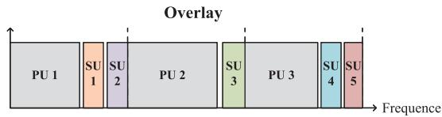

bar_stacked

| Stage | Value |
|-------|-------|
| PU 1  | 1     |
| SU 1  | 1     |
| SU 2  | 2     |
| PU 2  | 1     |
| SU 3  | 3     |
| PU 3  | 1     |
| SU 4  | 4     |
| SU 5  | 5     |

(b)

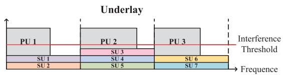

bar_stacked

| Subunit | Frequency |
|---------|---------|
| PU 1    | 0       |
| PU 2    | 0       |
| PU 3    | 0       |
| SU 1    | 0       |
| SU 2    | 0       |
| SU 3    | 0       |
| SU 4    | 0       |
| SU 5    | 0       |
| SU 6    | 0       |
| SU 7    | 0       |

(c)   
Fig. 3. Spectrum access mode. (a) The proposed hybrid overlay-underlay spectrum access mode. (b) Overlay mode. (c) Underlay mode.

All in all, the hybrid overlay-underlay spectrum access mode proposed in this paper is different from the traditional hybrid access mode based on conditional switching. In the proposed mode, all SUs access PU’s spectrum in Underlay mode, while multiple SUs interact in an overlay manner with each other. This mode can save users’ time and overhead, solve the problem of inter-user interference between SUs sharing the same spectrum resource, and increase the number of SUs that can participate in the sharing. It can greatly improve the utilization efficiency of the system spectrum and lay the foundation for incentivizing users to participate in spectrum sharing. Otherwise, this mode is suitable for all spectrum sharing scenarios with multi-user access requirements, as the PU can increase the number of access sharing users with low interference.

In the communication scenario of this paper, the U2B links are PUs, and the U2U links are SUs. U2U links share the spectrum resources of the U2B link through a hybrid overlay-underlay spectrum access mode. The spectrum bandwidths between the U2U links are orthogonal to each other, so there is no interference between the U2U links. On this basis, how to coordinate the behaviors of multiple U2U links, how to avoid them from selfishly harming the whole system for their interests, and how to further incentivize more users to participate in spectrum sharing are still problems that need to be solved. In the next section, we will investigate a spectrum sharing incentive mechanism in a game-theoretic way.

# IV. STACKELBERG GAME-BASED SPECTRUM SHARING MODEL

U2B links have free spectrum resources, and U2U links hope to acquire resources by paying a certain cost. However, both U2B links and U2U links are selfish and want to trade in a strategy that maximizes their own utility. In our model, U2U links in range want to share spectrum with U2B links. The model is characterized by a hierarchical structure, where the U2B link optimizes its strategy (price) based on knowledge of the effect of its decision on the behavior (bandwidth) of U2U links. The Stackelberg game provides a convenient analytical model for studying this situation [40]. Based on the Stackelberg game model, this paper studies the trading strategy to maximize the utility of both sides. First, U2B links act as the leaders and determine the price according to prior experience. U2U links act as the followers and choose their own trading strategy according to the leader’s decisions. The leaders then adjust their price strategies based on the followers’ decisions, and so on. The goal of the Stackelberg game is to find a unique Stackelberg equilibrium. In this equilibrium state, the users can maximize their own utilities under the optimal strategies given by the other party.

The communication goal of the U2B link is to realize mobile communication and to earn profits by selling the rights to spectrum usage. The utility function of the U2B link  consists iof the income by providing spectrum resources, the rewards of participating in spectrum sharing provided by BS, and the basic cost of transferring the spectrum license.

$$
U _ {i} = A \cdot \frac {n _ {j} ^ {i} \cdot b _ {R B}}{b _ {j} ^ {Q o S}} + p _ {j} ^ {i} \cdot n _ {j} ^ {i} - C _ {T} \tag {10}
$$

where  is the reward coefficient, $n _ { j } ^ { i }$ is the amount of trading RBs, $b _ { R B }$ indicates the bandwidth of a single RB, $b _ { j } ^ { Q o S }$ indicates bthe minimum bandwidth required by U2U link $j$ bto satisfy QoS, $p _ { j } ^ { i }$ is the unit price of RB sold by U2B link $i , n _ { j } ^ { i }$ jis the amount of ptrading RBs, and $C _ { T }$ i nis the basic cost of transferring spectrum license.

U2B links try to increase the price to maximize their utility. According to the objective, the trading RB amount strategies of U2U links are considered after pricing strategies are determined, and the optimization problems of U2B links can be expressed as follows:

$$
P _ {0}: \underset {p _ {j} ^ {i}} {\text { maximize }} U _ {i} (p _ {j} ^ {i})
$$

$$
\text { s.t. } p _ {j} ^ {i} \geq 0 \tag {11}
$$

The communication goal of the U2U link is to periodically disseminate security messages in neighboring UAVs, including information such as position, speed, heading, etc. The satisfaction function indicates the relationship between the bandwidth obtained by the U2U links and the minimum bandwidth required for the successful transmission of a data package. It can be established regarding the reliability of transmitting a package with size packagej in time . The satisfaction function is as $C _ { j } ^ { p a c k a g e }$ follows:

$$
S _ {j} ^ {i} = - \beta \cdot \left(\frac {n _ {j} ^ {i} \cdot b _ {R B}}{b _ {j} ^ {Q o S}} - 1\right) ^ {2} \tag {12}
$$

where $\beta$ is the coefficient of satisfaction function, $b _ { j } ^ { Q o S }$ can be βdenoted as follows:

$$
b _ {j} ^ {Q o S} = \frac {C _ {j} ^ {\text { package }}}{t \cdot \log_ {2} (1 + \mathrm{SINR} _ {j} ^ {i})} \tag {13}
$$

Future UAV-based low-altitude network optimization problems should be task-driven. In the past, network resource optimization often ignored task characteristics, and in this paper, we consider the task characteristic of urgency, which makes the network resources tilted towards urgent tasks. Specifically, task urgency can be reflected by the density of UAV swarms, and the urgency of requests initiated by UAVs with higher flight speeds will be skewed accordingly. The utility function of the U2U link can be expressed as:

$$
U _ {j} = \omega_ {j} \cdot \gamma \cdot C _ {j} ^ {i} + S _ {j} ^ {i} - p _ {j} ^ {i} \cdot n _ {j} ^ {i} \tag {14}
$$

where $\gamma$ is the coefficient that users convert the transmission capacity into revenue, $\omega _ { j }$ indicates the urgency of communication ωrequest, with upper limits $\omega _ { \mathrm { m a x } }$ and lower limits $\omega _ { \mathrm { m i n } }$ .

ω ωThe main purpose of the U2U link is to maximize its revenue by achieving a balance between the amount of trading RBs and the urgency of communication requests, and its optimization problem can be expressed as follows:

$$
P _ {1}: \underset {n _ {j} ^ {i}} {\text { maximize }} U _ {j} (n _ {j} ^ {i}, \omega_ {j})
$$

$$
\text { s.t. } \left\{ \begin{array}{l} 0 \leq n _ {i, j} \\ \sum_ {j \in \vartheta} \rho_ {i, j} \cdot n _ {j} ^ {i} \cdot b _ {R B} \leq B _ {i} \\ \omega_ {\min} \leq \omega_ {j} \leq \omega_ {\max} \end{array} \right. \tag {15}
$$

Since the strategies between U2B links and U2U links are coupled, U2B determines price, while U2U adjusts its purchases based on U2B’s pricing strategy. We model the strategy interactions between U2B links and U2U links as a two-stage Stackelberg game model, in which the U2B links act as leaders and the U2U links act as followers, as defined below:

Step 1: Leader determines the price. The U2B link determines the pricing strategy to maximize its own utility $U _ { i }$ .

$$
p _ {j} ^ {i ^ {*}} = \arg \max U _ {i} (p _ {j} ^ {i}, n _ {j} ^ {i}) \tag {16}
$$

Step 2: Follower determines the amount of trading RBs. The U2U link responds, giving the trading strategy that maximizes the utility $U _ { j } ^ { i }$ .

$$
n _ {j} ^ {i ^ {*}} = \arg \max U _ {j} ^ {i} (p _ {j} ^ {i ^ {*}}) \tag {17}
$$

The goal of the Stackelberg game is to find a unique Stackelberg equilibrium, in which both users in the game get the maximum utility without any incentive to unilaterally change the current strategy. We use backward induction to solve the Stackelberg equilibrium problem.

First, the optimal strategy $n _ { j } ^ { i } { } ^ { * }$ of U2U link is discussed from nthe follower perspective. Obtain the first and second derivatives of the utility function of the U2U link.

$$
\frac {\partial U _ {j} ^ {i}}{\partial n _ {j} ^ {i}} = \omega_ {j} \cdot \gamma \cdot C _ {R B} - p _ {j} ^ {i} - \frac {2 b _ {R B} \beta}{b _ {j} ^ {Q o S ^ {2}}} \cdot n _ {j} ^ {i} \cdot b _ {R B} - b _ {j} ^ {Q o S} \tag {18}
$$

$$
\frac {\partial^ {2} U _ {j} ^ {i}}{\partial n _ {j} ^ {i 2}} = - \frac {2 b _ {R B} \beta}{b _ {j} ^ {Q o S ^ {2}}} \cdot b _ {R B} \tag {19}
$$

As $\partial ^ { 2 } U _ { j } ^ { i } / \partial n _ { j } ^ { i ^ { 2 } } < 0$ , The utility function $U _ { j } ^ { i }$ is strictly convex about $n _ { j } ^ { i }$ U /∂n < U. Therefore, under the given conditions, there exists a unique optimal strategy $n _ { j } ^ { i * }$ for the U2U link that maximizes the utility function $U _ { i } ^ { i }$ . Based on the first-order optimally condition, let $\partial U _ { j } ^ { i } / \partial n _ { j } ^ { i } = \ r _ { 0 } ^ { \cdot }$ , it is obtained that,

$$
n _ {j} ^ {i ^ {\prime}} = \left(\omega_ {j} \cdot \gamma \cdot C _ {R B} - p _ {j} ^ {i}\right) \cdot \frac {b _ {j} ^ {Q o S ^ {2}}}{2 b _ {R B} {} ^ {2} \beta} + \frac {b _ {j} ^ {Q o S}}{b _ {R B}} \tag {20}
$$

Next, the optimal strategy of the U2B link is discussed from the leader’s perspective. Substituting the above follower’s optimal strategy into the utility function of the U2B link, we have

$$
U _ {i} = \left(A \cdot \frac {b _ {R B}}{b _ {j} ^ {Q o S}} + p _ {j} ^ {i}\right)
$$

$$
\cdot \left[ \left(\omega_ {j} \cdot \gamma \cdot C _ {R B} - p _ {j} ^ {i}\right) \cdot \frac {b _ {j} ^ {Q o S ^ {2}}}{2 b _ {R B} {} ^ {2} \beta} + \frac {b _ {j} ^ {Q o S}}{b _ {R B}} \right] - C _ {T} \tag {21}
$$

Take its first and second order derivatives with respect to $p _ { j } ^ { i }$ , it can be obtained that,

$$
\frac {\partial U _ {i}}{\partial p _ {j} ^ {i}} = - \frac {b _ {j} ^ {Q o S ^ {2}}}{b _ {R B} ^ {2} \beta} \cdot p _ {j} ^ {i} + \left[ \frac {\omega_ {j} \cdot \gamma \cdot C _ {R B} \cdot b _ {j} ^ {Q o S ^ {2}}}{2 b _ {R B} ^ {2} \beta} + \frac {b _ {j} ^ {Q o S}}{b _ {R B}} \right]
$$

$$
- A \frac {b _ {j} ^ {Q o S}}{2 b _ {R B} \beta} \tag {22}
$$

$$
\frac {\partial^ {2} U _ {i}}{\partial p _ {j} ^ {i 2}} = - \frac {b _ {j} ^ {Q o S ^ {2}}}{b _ {R B} ^ {2} \beta}. \tag {23}
$$

As $\partial ^ { 2 } U _ { i } / \partial { p _ { j } ^ { i } } ^ { 2 } < 0 ,$ the utility function is strictly convex about $p _ { j } ^ { i }$ . Therefore, let $\partial U _ { i } / \partial p _ { j } ^ { i } = 0$ , and the optimal strategy $p _ { j } ^ { i ^ { * } }$ of p ∂U /∂pU2B link can be obtained,

$$
p _ {j} ^ {i} * = \frac {\omega_ {j} \cdot \gamma \cdot C _ {R B}}{2} + \frac {\beta b _ {R B}}{b _ {j} ^ {Q o S}} - A \frac {b _ {R B}}{2 b _ {j} ^ {Q o S}} \tag {24}
$$

Substituting $p _ { j } ^ { i ^ { * } }$ into $n _ { j } ^ { i ^ { \prime } }$ in (20), and the optimal strategy $n _ { j } ^ { i ^ { * } }$ p nfor the U2U link can be expressed as,

$$
n _ {j} ^ {i} * = \frac {\omega_ {j} \gamma C _ {R B} b _ {j} ^ {Q o S ^ {2}}}{4 b _ {R B} {} ^ {2} \beta} + \frac {b _ {j} ^ {Q o S}}{2 b _ {R B}} + A \frac {b _ {j} ^ {Q o S}}{4 b _ {R B} \beta} \tag {25}
$$

Finally, by constructing the Stackelberg game model and solving its equilibrium solution, the optimal strategy $\pi _ { i , j } { } ^ { * } ( n _ { j } ^ { i } { } ^ { * } , p _ { j } ^ { i } { } ^ { * } )$ for π (n , p )spectrum sharing between the U2U link and the U2U link, and the value of the maximum utility function of both parties can be obtained. Through the game, we can get the optimal trading strategy set $O _ { I , J } ^ { * }$ of  U2B links and  U2U links, which can be Oexpressed as:

$$
O _ {I, J} ^ {*} = \left\{ \begin{array}{c c c c} \pi_ {1, 1} ^ {*} & \pi_ {1, 2} ^ {*} & \dots & \pi_ {1, J} ^ {*} \\ \pi_ {2, 1} ^ {*} & \pi_ {2, 2} ^ {*} & \dots & \pi_ {2, J} ^ {*} \\ \vdots & \vdots & \ddots & \vdots \\ \pi_ {I, 1} ^ {*} & \pi_ {I, 2} ^ {*} & \dots & \pi_ {I, J} ^ {*} \end{array} \right\}. \tag {26}
$$

# V. UTILITY-MAXIMIZED MATCHING SCHEME

The previous section gives the optimal trading strategy for any U2B link and any U2U link. When there are multiple U2B and U2U links, all users want to maximize their utility. As a result, an adaptive matching scheme needs to be carefully designed.

Considering minimizing the effect of the Doppler shift, a spectrum protection band between different users is introduced as follows:

$$
n f _ {j} ^ {i} = \left\lceil \frac {\Delta f _ {j} ^ {i}}{b _ {R B}} \right\rceil \tag {27}
$$

The buyers only pay for the spectrum that can transmit data, and the allocation of protected bands is calculated and allocated by the sellers based on demand.

# A. Algorithm Description

The proposed utility-based matching strategy is shown in Algorithm 1. As each user wants to select the greatest utility to purchase or sell spectrum. U2U links sort U2B links by descending $U _ { j } ^ { i * }$ to form LIST $L _ { j } ,$ , while U2B links rank U2U links by Udescending $U _ { i } ^ { * }$ Lto create LIST $L _ { i }$ . LIST $L _ { i } ^ { m a t c h e d }$ indicates the U L Lorder of utility matched U2U link has, and it updates after each iteration. $A _ { j }$ is a variable indicating the matching status of U2U link . $A _ { j } = 0$ indicates that U2U link $j$ is unmatched; $A _ { j } = 1$ j A =indicates that U2U link $j$ j A =has established a spectrum sharing jrelationship. Initialize the amount of RBs that U2B links own and start matching iteratively.

In each iteration, the U2U link  that has not yet been matched sends a transaction request to the highest-ranked U2B link  in $L _ { j } .$ i. After receiving the transaction request from U2U link $j ,$ L jU2B link  determines whether the number of remaining RBs iis sufficient to complete this transaction. If the remaining RBs are sufficient, the two parties match, and $\rho _ { j } ^ { i } = 1 { \mathrm { i } }$ ; If insufficient, ρ =the U2B link will look for an alternative U2U link in order of $L _ { i } ^ { m a t c h e d }$ k. It means the U2B tries to reject a lower spectrum Ldemand request and resells its spectrum resource to a U2U link with a higher spectrum demand.

Algorithm 1: Utility-Based Matching Strategy.   
Initialize: the best strategy $O_{I,J}^{*}$ for all U2B and U2U links, sharing state $\rho_{j}^{i}=0$ .
for i=1:I
    for j=1:J $L_{j}=$ Descending Sort of $(U_{j}^{i})$ ; $L_{i}=$ Descending Sort of $(U_{i})$ ; $L_{i}^{matched}=$ Sort of $(U_{i}*\rho_{j}^{i})$ for $(U_{i}*\rho_{j}^{i})!=0;$ $n_{i}=B_{i}/b_{RB};$ While $A_{j}=\sum_{i=1}^{I}\rho_{j}^{i}==0$ do $U2U_{j}$ request RBs from the highest ranked $U2B_{i}$ in $L_{j};$ If $n_{i}\geq n_{j}^{i}+2*nf_{j}^{i}$ then $\rho_{j}^{i}=1;$ $n_{i}=n_{i}-n_{j}^{i}-2*nf_{j}^{i};$ else
    For $a=1:\sum_{j=1}^{J}\rho_{j}^{i}$ $a=Rank(L_{i}^{matched}(U2U_{k}))$ ;
    If $Rank(L_{i}(U2U_{j}))\geq Rank(L_{i}(U2U_{k}))$ $\|n_{i}+n_{k}^{i}+2*nf_{k}^{i}\geq n_{j}^{i}+2*nf_{j}^{i}$ then $\rho_{j}^{i}=1;$ $\rho_{k}^{i}=0;$ $n_{i}=n_{i}-n_{j}^{i}-2*nf_{j}^{i}+n_{k}^{i}+2*nf_{k}^{i};$ delete $U2B_{i}$ from $L_{k};$ else
    delete $U2B_{i}$ from $L_{j};$ $L_{i}^{matched}=$ Sort of $(U_{i}*\rho_{j}^{i})$ for $(U_{i}*\rho_{j}^{i})!=0;$ return $\rho_{j}^{i};$

The alternative U2U link  needs to fulfill the following two conditions: (1) The rank of U2U link  in $L _ { i }$ is lower than that of U2U link $j . ( 2 )$ k L The number of RBs U2U link  being allocated, plus the remaining RBs can support the current transaction with U2U link $j .$ .

jIf an alternative U2U link can be found, the U2B link will kreject the transaction match with U2U link , and transact with the current U2U link $j .$ k The U2U link will remove the U2B link  from $L _ { k }$ j k. Otherwise, if there is still no alternative U2U i Llink for ∀ $k ( L _ { i } ^ { m a t c h e d } ( U 2 U _ { k } ) ) \in [ 1 , \sum _ { j = 1 } ^ { J } \rho _ { j } ^ { i } ]$ , U2B link Rank(L (U U )) [ , ρ ]will reject the current transaction request, and U2U link $j$ iwill remove U2B link  from $L _ { j } .$ j. The searching scope of  is the U2U i L klinks that the U2B link  has agreed to match with. Users in the isystem continue to iterate until all U2U links are matched, or unmatched U2U links are rejected by all U2B links. The system reaches a steady state, and the utility of all users is maximized.

To further visualize our algorithm’s process, consider a matching scenario with 2 U2B links and 5 U2U links. The example of the proposed algorithm shown in Fig. 4 illustrates the specific matching process.

Step 1: Each U2U sends spectrum sharing requests to the highest-ranked U2B in its preference list.

Step 2: The highest-ranked U2B in the preference lists of U2U 1, 4, and 5 is U2B 1, but U2B 1 has insufficient spectrum resources. Therefore, U2B 1 compares the rankings of the three requesters and selects U2U 1 and U2U 4, while rejecting U2U 5. At the same time, the highest-ranked U2B in the preference lists of U2U 2 and 3 is U2B 2, and U2B 2 has sufficient spectrum resources, so U2B 2 accepts and successfully matches with U2U 2 and U2U 3. matchedU2B 1  {U2U 1 U2U 4}, $L _ { \mathrm { U 2 B ~ 2 ~ } } ^ { m a t c h e d } =$ {U2U 2 U2U 3}.

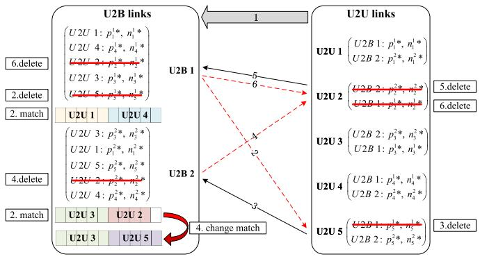

flowchart

```mermaid
graph TD
    subgraph U2B links
        A1["(U2U 1: p₁¹*, n₁¹*"]
        A2["(U2U 4: p₄¹*, n₄¹*"]
        A3["(U2U 2: p₁²*, n₁²*"]
        A4["(U2U 3: p₁³*, n₁³*"]
        A5["(U2U 5: p₂³*, n₂³*)"]
    end

    subgraph U2U links
        B1["(U2U 1: (U2B 1: p₁¹*, n₁¹*)<br>        U2B 2: (U2B 1: p₁²*, n₁²*)"]
        B2["(U2B 2: (U2B 2: p₁³*, n₁³*)"]
        B3["(U2B 3: (U2B 3: p₁²*, n₁²*)"]
        B4["(U2B 4: (U2B 4: p₁³*, n₁³*)"]
        B5["(U2B 5: (U2B 5: p₁²*, n₁²*)"]
    end

    A1 -->|1| B1
    A1 -->|5| B2
    A1 -->|6| B3
    A1 -->|A| B4
    A1 -->|A| B5
    A1 -->|A| B6
    A1 -->|A| B7
    A1 -->|A| B8
    A1 -->|A| B9
    A1 -->|A| B10
    A1 -->|A| B11
    A1 -->|A| B12
    A1 -->|A| B13
    A1 -->|A| B14
    A1 -->|A| B15
    A1 -->|A| B16
    A1 -->|A| B17
    A1 -->|A| B18
    A1 -->|A| B19
    A1 -->|A| B20
    A1 -->|A| B21
    A1 -->|A| B22
    A1 -->|A| B23
    A1 -->|A| B24
    A1 -->|A| B25
    A1 -->|A| B26
    A1 -->|A| B27
    A1 -->|A| B28
    A1 -->|A| B29
    A1 -->|A| B30
    A1 -->|A| B31
    A1 -->|A| B32
    A1 -->|A| B33
    A1 -->|A| B34
    A1 -->|A| B35
    A1 -->|A| B36
    A1 -->|A| B37
    A1 -->|A| B38
    A1 -->|A| B39
    A1 -->|A| B40
    A1 -->|A| B41
    A1 -->|A| B42
    A1 -->|A| B43
    A1 -->|A| B44
    A1 -->|A| B45
    A1 -->|A| B46
    A1 -->|A| B47
    A1 -->|A| B48
    A1 -->|A| B49
    A1 -->|A| B50
    A1 -->|A| B51
    A1 -->|A| B52
    A1 -->|A| B53
    A1 -->|A| B54
    A1 -->|A| B55
    A1 -->|A| B56
    A1 -->|A| B57
    A1 -->|A| B58
    A1 -->|A| B59
    A1 -->|A| B60
    A1 -->|A| B61
    A1 -->|A| B62
    A1 -->|A| B63
    A1 -->|A| B64
    A1 -->|A| B65
    A1 -->|A| B66
    A1 -->|A| B67
    A1 -->|A| B68
    A1 -->|A| B69
    A1 -->|A| B70
    A1 -->|A| B71
    A1 -->|A| B72
    A1 -->|A| B73
    A1 -->|A| B74
    A1 -->|A| B75
    A1 -->|A| B76
    A1 -->|A| B77
    A1 -->|A| B78
    A1 -->|A| B79
    A1 -->|A| B80
```

Fig. 4. Example of utility-based matching strategy.

,Step 3: U2U 5 has been rejected by U2B 1. As a result, U2U 5 removes U2B 1 from its preference list and sends a request to U2B 2.

Step 4: U2B 2 compares U2U 5’s ranking with the matched U2Us, and U2U 5 is ranked higher than U2U 2. U2B 2 rejects U2U 2, removes U2U 2 from its preference list, and the match relationship changes. $L _ { \mathrm { U 2 B } \ 2 } ^ { m a t c h e d } = \{ \mathrm { U 2 U } \ 3 , \mathrm { U 2 U } \ 5 \}$ .

L = ,Step 5: U2U 2 was rejected by U2B 2 and removed from its preference list. Then U2U 2 sends a request to U2B 1.

Step 6: U2B 1 rejects U2U 2 after comparing the ranking of U2U 2 with the already matched U2U 1, 4.

Step 7: U2U 2 removes U2B 1 from its preference list.

At this point, all U2U links have either been matched or rejected by all U2B links, reaching a stable matching state, and the matching process has concluded.

# B. Time Complexity Analysis

To gain insight into the performance of the proposed spectrum sharing incentive mechanism, we analyze its time complexity in detail.

In the game algorithm for optimal trading strategies, the time complexity is O(IJ). In the utility-maximized matching algorithm, to create a preference list for U2B links, we use a sorting algorithm with a complexity of $O ( I J \mathrm { l o g } J )$ . The O(IJlogJ)time complexity of creating a preference list for U2U links is . In the spectrum sharing process, if the value of $J \geq I ,$ ogI), then the time complexity will be . The time J I O(Icomplexity of the matching process itself is $O ( I J )$ . Thus, in O(IJ)summary, the time complexity of the proposed spectrum sharing incentive mechanism is .

# VI. SIMULATION RESULTS

To verify the effectiveness of the incentive mechanism proposed in this paper, we compare it with several different schemes. Consider a communication scenario with 4 uniformly distributed U2B links and 1 BS, and the number of U2U links varies in the range [10], [30]. $\omega _ { j }$ indicates the urgency of communication request, and it has $[ \omega _ { \mathrm { m i n } } , \omega _ { \mathrm { m a x } } ] = [ 1 , 5 ]$ . By default, all param-[ω , ω ] = [ , ]eters are set to the values specified in Table I. When the network conditions in the UAV swarm change, or at the specified interval, the system needs to update the spectrum allocation and perform parameter updates and optimization.

TABLE I SIMULATION PARAMETERS 

<table><tr><td>Parameter</td><td>Value</td></tr><tr><td>Height of BS</td><td>10 m</td></tr><tr><td>Height of UAV</td><td>40 m</td></tr><tr><td>Total bandwidth of sub-band  $B_i$ </td><td>10 MHz</td></tr><tr><td>Bandwidth of RB  $b_{RB}$ </td><td>10 KHz</td></tr><tr><td>U2B transmit power</td><td>23 dBm</td></tr><tr><td>U2U transmit power</td><td>17 dBm</td></tr><tr><td>Additive White Gaussian Noise power  $\sigma^2$ </td><td>-174 dBm</td></tr><tr><td>Pass-Loss exponent  $\alpha$  [34], [35]</td><td>2</td></tr><tr><td>Rician factor [38]</td><td> $\sigma_0 = 1.347, \rho = 6.469$ </td></tr><tr><td>Transmission capacity coefficient  $\gamma$ </td><td>0.1</td></tr><tr><td>Coefficient of satisfaction function  $\beta$ </td><td>500</td></tr><tr><td>Size of package  $C^{Package}$ </td><td>100 × 1060 Bytes</td></tr><tr><td>Coefficient of reward function A</td><td>500</td></tr><tr><td>Basic cost  $C_T$ </td><td>1</td></tr><tr><td>update interval t</td><td>0.1 s</td></tr></table>

# A. Parameter Analysis

To investigate the utility optimization problem for U2B links and U2U links, in the following, we will analyze the effects of the parameters in the U2B and U2U utility functions on their optimal trading strategies, respectively. It can be verified in Fig. 5 that the trading strategy we obtained through the Stackelberg game is the only optimal solution, and any unilateral strategy change will reduce the utility. Different parameters will affect the optimal trading strategy, and then affect the optimal utility.

In practical applications, for UAVs with high flight speeds, complex flight paths, and crowded flight areas, ensuring the reliability of the safety message package transmission is crucial. These UAVs urgently require more spectrum resources to ensure flight safety. To better manage these needs, we can categorize the urgency of tasks into five levels, assigning corresponding weight values $\omega _ { j }$ . In Fig. 5(a), as $\omega _ { j }$ increases, the number of ω ωU2U transactions strategy gradually increases and the maximum utility value grows. The reason is that the U2U link transmission task is urgent and needs a higher transmission channel capacity; thus, it is willing to increase its transaction spectrum bandwidth to make its utility higher.

In Fig. 5(b),  is the parameter in the U2U link’s satisfaction βfunction, reflecting the correlation between the purchased RBs and the necessary request for meeting QoS. As  increases, its βtransaction quantity strategy decreases while the utility of the U2U link increases gradually. The reason is that the U2U link wants the purchased quantity to be similar to the quantity required to satisfy the QoS, and wants to improve the band resource utilization based on ensuring the transmission reliability.

At the same time, we have observed that the utility does not continuously increase with the number of RBs traded. If the trading strategy is too aggressive, it may even lead to a situation where the utility falls below zero, which is an outcome that

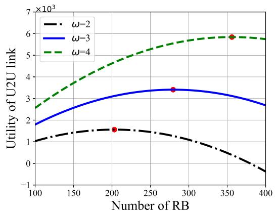

line

| Number of RB | ω=2     | ω=3     | ω=4     |
| ------------ | ------- | ------- | ------- |
| 200          | 1.5     | 3.0     | 4.5     |
| 350          | -0.5    | 3.5     | 6.0     |

(a)

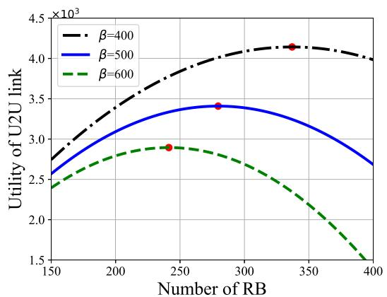

line

| Number of RB | β=400  | β=500  | β=600  |
| ------------ | ------ | ------ | ------ |
| 150          | 2.7    | 2.6    | 2.4    |
| 250          | 3.8    | 3.4    | 2.9    |
| 350          | 4.1    | 3.2    | 2.2    |
| 400          | 4.0    | 2.7    | 1.5    |

(b)   
Fig. 5. The effect of parameter variation on utility. (a) Change of U2U link utility with the amount of RBs under different ωj . (b) Change of U2U link utility with the amount of RBs under different β.

U2U link users would like to avoid. Simulation results indicate that our method can effectively control the number of U2U link transactions, preventing U2U links from maliciously occupying excessive spectrum resources.

# B. Performance Analysis

We compare the proposed method with three other spectrum sharing methods. The first method, FP, is a strategy in which all U2B links set a fixed price for all U2U links, and U2U links buy the number of RBs that satisfy their QoS. The second method RAIM [23] is a reverse auction-based spectrum sharing incentive mechanism that maximizes its utility from the buyer’s perspective. The third method DOAF [41] is a fairness-oriented spectrum allocation strategy based on the Stackelberg game, where all users share the spectrum equitably according to their demands. The method proposed in this paper is abbreviated as SGM.

Figs. 6, 7, 8 and 9 demonstrate the impact of the variation in the number of U2U links participating in spectrum sharing on four key performance metrics, which include total system utility, U2B link utility, average U2U link utility, and unit utility per RB.

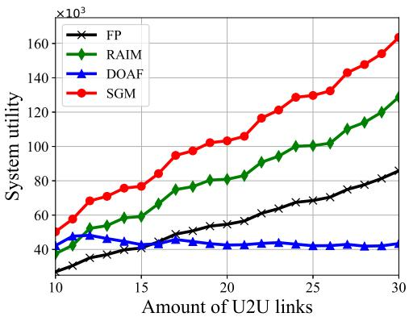

line

| Amount of U2U links | FP    | RAIM  | DOAF  | SGM   |
| ------------------- | ----- | ----- | ----- | ----- |
| 10                  | 3000  | 4000  | 4500  | 5000  |
| 15                  | 4500  | 6000  | 4200  | 7500  |
| 20                  | 5500  | 8000  | 4100  | 10500 |
| 25                  | 7000  | 10000 | 4100  | 13000 |
| 30                  | 8500  | 13000 | 4100  | 16500 |

Fig. 6. Total utility with a varying amount of U2U links.

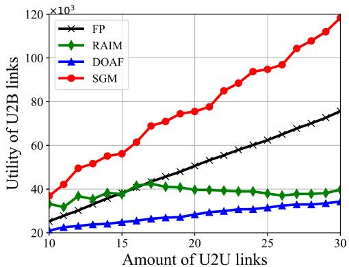

line

| Amount of U2U links | FP     | RAIM   | DOAF   | SGM    |
| ------------------- | ------ | ------ | ------ | ------ |
| 10                  | 25000  | 35000  | 22000  | 40000  |
| 15                  | 35000  | 40000  | 25000  | 60000  |
| 20                  | 45000  | 42000  | 28000  | 75000  |
| 25                  | 55000  | 40000  | 32000  | 95000  |
| 30                  | 75000  | 42000  | 35000  | 120000 |

Fig. 7. Utility of U2B links with varying amount of U2U links.

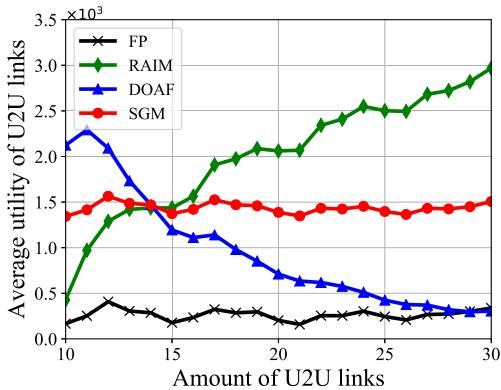

line

| Amount of U2U links | FP     | RAIM   | DOAF   | SGM    |
| ------------------- | ------ | ------ | ------ | ------ |
| 10                  | 0.3    | 0.4    | 2.2    | 1.4    |
| 15                  | 0.2    | 1.5    | 1.2    | 1.5    |
| 20                  | 0.2    | 2.0    | 0.7    | 1.4    |
| 25                  | 0.3    | 2.5    | 0.4    | 1.4    |
| 30                  | 0.3    | 3.0    | 0.3    | 1.5    |

Fig. 8. Average utility of U2U links with varying amount of U2U links.

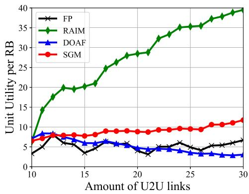

line

| Amount of U2U links | FP   | RAIM | DOAF | SGM  |
| ------------------- | ---- | ---- | ---- | ---- |
| 10                  | 4.0  | 15.0 | 8.0  | 7.0  |
| 15                  | 6.0  | 20.0 | 6.0  | 8.0  |
| 20                  | 5.0  | 28.0 | 5.0  | 9.0  |
| 25                  | 6.0  | 35.0 | 4.0  | 10.0 |
| 30                  | 7.0  | 40.0 | 3.0  | 12.0 |

Fig. 9. Unit utility per RB with a varying amount of U2U links.

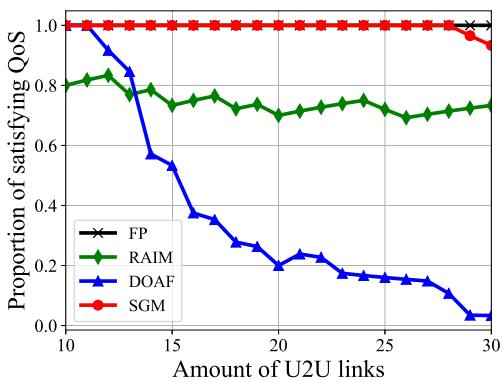

line

| Amount of U2U links | FP    | RAIM  | DOAF  | SGM   |
| ------------------- | ----- | ----- | ----- | ----- |
| 10                  | 1.0   | 0.8   | 1.0   | 1.0   |
| 15                  | 1.0   | 0.8   | 0.5   | 1.0   |
| 20                  | 1.0   | 0.7   | 0.2   | 1.0   |
| 25                  | 1.0   | 0.7   | 0.15  | 1.0   |
| 30                  | 1.0   | 0.7   | 0.05  | 0.95  |

Fig. 10. Proportion of satisfying QoS with a varying amount of U2U links.

In Fig. 6, we can observe that the total system utility of the proposed SGM method consistently outperforms the other compared methods. In particular, when the number of U2U links increases to 30, the system utility of the SGM method is 90.53%, 26.99%, and 276.55% higher than that of the FP, RAIM, and DOAF methods, respectively. The increase in total system utility is closely related to the growth in the number of U2U links, which is because with the increase in the number of U2U links, the matching relationship within the system is continuously adjusted so that the U2B link can select the U2U link with higher utility for resource sharing.

The system utility is jointly composed of the utility of U2B links and U2U links. As shown in Fig. 7, along with the increase in the number of U2U links, the utility of U2B links also continues to rise, in which the SGM method significantly surpasses the other methods in terms of both utility and its growth rate. Fig. 8 illustrates the variation of the average utility of U2U links. As the number of U2U links increases, the SGM method is able to keep the average U2U link utility stable, while the RAIM and DOAF methods show large fluctuations. This is because in our method, through the double screening of the game and matching, the U2U links are able to choose the U2B links that maximize their own utility for trading, thus maintaining a stable utility in the case of relative scarcity of spectrum resources.

Fig. 9 reflects the variation of unit utility per RB with an increasing number of U2U links. In our method, the unit utility per RB shows a gradual improvement trend, which indicates that our algorithm has significant advantages in improving the utilization of spectrum resources. With the continuous optimization and iteration of the algorithm, the system adaptively selects the sharing strategy with higher utility.

Although the RAIM method maximizes the average utility and the unit utility per RB of U2U links from the buyer’s perspective, our proposed SGM method still performs better from the perspective of the overall system utility.

Fig. 10 demonstrates the trend of satisfying QoS proportion with the increase of the number of UAVs under different spectrum sharing methods. In the FP method, the proportion always stays at 100% in the simulation experiments because the number of RBs in the trading spectrum satisfies the QoS requirements of the transmission task. It can be observed from the figure that the proportion of all three other methods shows a decreasing trend as the density of the UAV population increases. The RAIM method cannot meet the requirements of all U2U links, while in the DOAF method, the proportion decreases significantly as the number of U2U links increases. It is particularly noteworthy that our method is able to achieve 100% proportion of satisfying QoS when the number of U2U links reaches no more than 28. With the rapid increase in the number of UAVs and limited spectrum resources, our method not only improves system utilities but also effectively ensures reliable communication for more U2U links. This method significantly enhances the concurrency and efficiency of spectrum sharing, providing strong support for meeting the demand for efficient and reliable communication in future low-altitude intelligent networks.

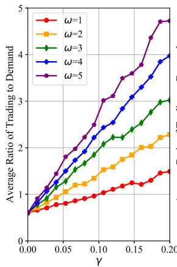

line

| Y    | ω=1  | ω=2  | ω=3  | ω=4  | ω=5  |
|------|------|------|------|------|------|
| 0.00 | 0.5  | 0.5  | 0.5  | 0.5  | 0.5  |
| 0.05 | 0.7  | 1.0  | 1.2  | 1.5  | 1.8  |
| 0.10 | 0.9  | 1.5  | 2.0  | 2.5  | 3.0  |
| 0.15 | 1.1  | 2.0  | 2.5  | 3.0  | 3.5  |
| 0.20 | 1.3  | 2.3  | 3.0  | 3.8  | 4.8  |

(a)

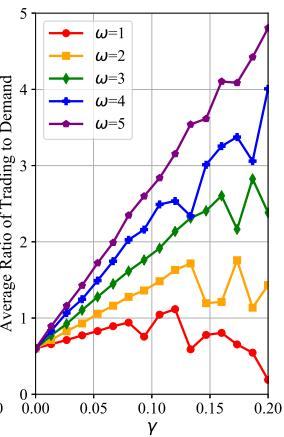

line

| γ    | ω=1  | ω=2  | ω=3  | ω=4  | ω=5  |
|------|------|------|------|------|------|
| 0.00 | 0.5  | 0.5  | 0.5  | 0.5  | 0.5  |
| 0.05 | 0.7  | 0.8  | 1.0  | 1.2  | 1.5  |
| 0.10 | 0.9  | 1.2  | 1.5  | 2.0  | 2.5  |
| 0.15 | 0.6  | 1.5  | 2.0  | 3.0  | 3.5  |
| 0.20 | 0.2  | 1.4  | 2.5  | 4.0  | 4.8  |

(b)   
Fig. 11. Average ratio of trading to demand with varying γ. (a) Sufficient. (b) Scarce.

We simulated the average trading-to-demand ratio of U2U links as $\gamma$ varied under two typical scenarios of sufficient and scarce spectrum resources, and analyzed the differences in ratio differences between users with different task urgency, as shown in Fig. 11. The simulation results show that as $\gamma$ increases, γthe ratio increases rapidly, which means that users tend to get spectrum resources much more than $b _ { j } ^ { q o s }$ . This is because an increase in $\gamma$ bincreases the weight of channel capacity in their γutility function, prompting the user to increase their trading strategies to maximize their utility.

When spectrum resources are sufficient, U2U links with different task urgency have more freedom to choose. With the increase of , all types of users are super motivated to buy γas much spectrum as they can. Under conditions of spectrum resource scarcity, the growth effect of $\gamma$ is significantly conγstrained by resource bottlenecks. At this point, the resource allocation mechanism we propose plays a critical regulatory role. As the simulation results show, users with high task urgency can more effectively obtain a relatively larger share of spectrum resources to meet their critical task requirements. Low task urgency users, however, reduced the amount of trading spectrum due to resource competition and displacement by high urgency users. To sum up, our method successfully achieves efficient regulation of spectrum resources in a resource-constrained competitive environment. It not only incentivizes user participation in transactions but also ensures that resources are prioritized for more urgent, high-priority tasks, dynamically adapting to varying resource supply conditions.

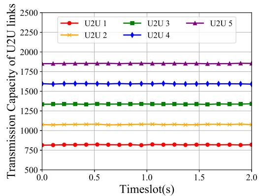

line

| Timeslot(s) | U2U 1 | U2U 2 | U2U 3 | U2U 4 | U2U 5 |
| ----------- | ----- | ----- | ----- | ----- | ----- |
| 0.0         | 750   | 1100  | 1350  | 1600  | 1850  |
| 0.5         | 750   | 1100  | 1350  | 1600  | 1850  |
| 1.0         | 750   | 1100  | 1350  | 1600  | 1850  |
| 1.5         | 750   | 1100  | 1350  | 1600  | 1850  |
| 2.0         | 750   | 1100  | 1350  | 1600  | 1850  |

(a)

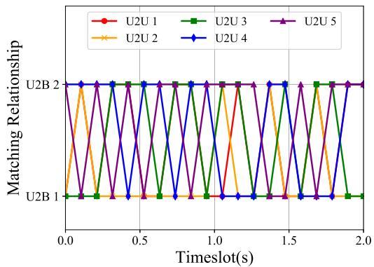

line

| Timeslot(s) | U2U 1 | U2U 2 | U2U 3 | U2U 4 | U2U 5 |
| ----------- | ----- | ----- | ----- | ----- | ----- |
| 0.0         | 1     | 1     | 1     | 1     | 1     |
| 0.5         | 1     | 1     | 1     | 1     | 1     |
| 1.0         | 1     | 1     | 1     | 1     | 1     |
| 1.5         | 1     | 1     | 1     | 1     | 1     |
| 2.0         | 1     | 1     | 1     | 1     | 1     |

(b)   
Fig. 12. Spectrum sharing within a time span of 2 s. (a) Transmission capacity of U2U links. (b) Matching relationship.

To comprehensively evaluate the impact of task urgency on the spectrum allocation strategy, we construct a simulation scenario that contains two U2B links, each of which is allocated with 500 kHz of spectrum resources. Meanwhile, there are five U2U links participating in spectrum sharing in the system, and the task urgency weights of these links are 1, 2, 3, 4, and 5 in order. Through the simulation experiments, we monitor the changes in the transmission capacity of the U2U links and their matching relationship with the U2B links within a time span of 2 s, and the related results are displayed in Fig. 12.

In Fig. 12(a), it is visible that the transmission capacity obtained by the U2U link shows an upward trend as the urgency of the task increases. Meanwhile, the overall transmission capacity of each link remains stable without significant fluctuations, which reflects that our proposed resource allocation strategy can effectively guarantee the stability of link performance. The simulation results further verify that by quantifying the task urgency in our approach, the system is able to allocate the limited wireless resources more efficiently and ensure that tasks with higher urgency can be supported with sufficient bandwidth to successfully accomplish critical communication tasks.

Fig. 12(b) reveals the dynamic change of the matching relationship between the U2U link and the U2B link, which is mainly caused by factors such as real-time channel conditions and interference conditions. Although the matching relationship undergoes frequent adjustments, the communication capacity is maintained at a stable state, which demonstrates that our proposed method has the ability to respond quickly to environmental changes and ensures the continuity and communication quality of the U2U link through the dynamic reconfiguration of resources.

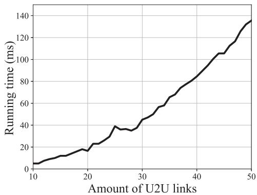

line

| Amount of U2U links | Running time (ms) |
| ------------------- | ----------------- |
| 10                  | 5                 |
| 15                  | 10                |
| 20                  | 15                |
| 25                  | 35                |
| 30                  | 45                |
| 35                  | 60                |
| 40                  | 80                |
| 45                  | 105               |
| 50                  | 135               |

Fig. 13. Running time with varying number of U2U links.

To evaluate the execution time of the proposed model, we simulated its running time, as shown in Fig. 13. Simulation results show that in a scenario with 4 U2B links and 20 U2U links, the model requires approximately 18 ms to complete its calculations. This timescale is significantly shorter than the required update cycle of 100 ms, indicating that the model can efficiently meet real-time requirements at a conventional scale. As the number of U2U links increases, the running time also increases accordingly. When the number of U2U links is extended to 42, the computation time remains within 100 ms. It is important to note that the observed computation time is based on specific test equipment. In actual deployment scenarios, such as utilizing the edge computing capabilities of BSs for distributed processing, this running time is expected to be further significantly reduced.

# VII. CONCLUSION

In this paper, we proposed an innovative spectrum sharing incentive mechanism tailored for UAV swarms, leveraging the principles of the Stackelberg game. This mechanism introduced a novel hybrid overlay-underlay spectrum access mode, designed to minimize perception overhead and mitigate inter-user interference. We conceptualized the interactions between U2B and U2U links within the framework of a Stackelberg game, facilitating their optimal strategies. Furthermore, we designed a utility-based matching mechanism wherein U2B and U2U links mutually select one another, thereby enhancing the utility for both spectrum sharing entities. This incentive mechanism is effective in encouraging U2B and U2U links to engage in spectrum sharing, subsequently improving spectrum utilization.

# REFERENCES

[1] D. Liu et al., “Self-organizing relay selection in UAV communication networks: A matching game perspective,” IEEE Wireless Commun., vol. 26, no. 6, pp. 102–110, Dec. 2019.

[2] M. Mozaffari, W. Saad, M. Bennis, Y.-H. Nam, and M. Debbah, “A tutorial on UAVs for wireless networks: Applications, challenges, and open problems,” IEEE Commun. Surveys Tuts., vol. 21, no. 3, pp. 2334–2360, Third Quarter 2019.   
[3] X. Mu, Y. Liu, L. Guo, J. Lin, and H. V. Poor, “Intelligent reflecting surface enhanced multi-UAV NOMA networks,” IEEE J. Sel. Areas Commun., vol. 39, no. 10, pp. 3051–3066, Oct. 2021.   
[4] G. Niu, Q. Cao, and C. S. Chen, “Vision-based target localization with cooperative UAVs towards indoor surveillance,” in Proc. IEEE 98th Veh. Technol. Conf., 2023, pp. 1–6.   
[5] Z. Qin et al., “Task selection and scheduling in UAV-enabled MEC for reconnaissance with time-varying priorities,” IEEE Int. Things J., vol. 8, no. 24, pp. 17290–17307, Dec. 2021.   
[6] Q. Zhu and J. Zheng, “Coverage performance analysis of backhaul-limited UAV-assisted cellular networks,” in Proc. IEEE Int. Conf. Commun., 2023, pp. 6523–6528.   
[7] Y. Li, R. Zhang, J. Zhang, and L. Yang, “Cooperative jamming via spectrum sharing for secure UAV communications,” IEEE Wireless Commun. Lett., vol. 9, no. 3, pp. 326–330, Mar. 2020.   
[8] D. Wang, J. Huang, M. He, and C. Huang, “Spectrum transaction games for UAV assisted communications,” IEEE Wireless Commun. Lett., vol. 11, no. 6, pp. 1216–1219, Dec. 2022.   
[9] R. Ding, F. Zhou, Y. Qu, C. Dong, Q. Wu, and T. Q. S. Quek, “Novel online-offline MA2C-DDPG for efficient spectrum allocation and trajectory optimization in dynamic spectrum sharing UAV networks,” in Proc. IEEE/CIC Int. Conf. Commun. China, 2023, 1–6.   
[10] J. Du, C. Jiang, J. Wang, Y. Ren, and M. Debbah, “Machine learning for 6G wireless networks: Carry-forward-enhanced bandwidth, massive access, and ultrareliable/low latency,” IEEE Veh. Technol. Mag., vol. 15, no. 4, pp. 123–134, Dec. 2020.   
[11] N. Wang, J. Le, W. Li, L. Jiao, Z. Li, and K. Zeng, “Privacy protection and efficient incumbent detection in spectrum sharing based on federated learning,” in Proc. IEEE Conf. Commun. Netw. Secur., 2020, pp. 1–9.   
[12] B. Shang, L. Liu, R. M. Rao, V. Marojevic, and J. H. Reed, “3D spectrum sharing for hybrid D2D and UAV networks,” IEEE Trans. Commun., vol. 68, no. 9, pp. 5375–5389, Sep. 2020.   
[13] W. Zhang, C.-X. Wang, X. Ge, and Y. Chen, “Enhanced 5G cognitive radio networks based on spectrum sharing and spectrum aggregation,” IEEE Trans. Commun., vol. 66, no. 12, pp. 6304–6316, Dec. 2018.   
[14] K. Zheng, X. Liu, X. Liu, and Y. Zhu, “Hybrid overlay-underlay cognitive radio networks with energy harvesting,” IEEE Trans. Commun., vol. 67, no. 7, pp. 4669–4682, Jul. 2019.   
[15] L. Hu, R. Shi, M. Mao, Z. Chen, H. Zhou, and W. Li, “Optimal energyefficient transmission for hybrid spectrum sharing in cooperative cognitive radio networks,” China Commun., vol. 16, no. 6, pp. 150–161, 2019.   
[16] S. Gmira, A. Kobbane, E. Sabir, and J. Ben-othman, “A game theoretic approach for an hybrid overlay-underlay spectrum access mode,” in Proc. 2016 IEEE Int. Conf. Commun., 2016, pp. 1–6.   
[17] R. M. Ghodhbane, “A mixed spectrum sharing strategy for cognitive radio systems,” in Proc. 2021 Int. Conf. Smart Appl. Commun. Netw., 2021, pp. 1–6.   
[18] F. Jasbi and D. K. So, “Hybrid overlay/underlay cognitive radio network with MC-CDMA,” IEEE Trans. Veh. Technol., vol. 65, no. 4, pp. 2038–2047, Apr. 2016.   
[19] J. Lin, B. Tian, J. Wu, and J. He, “Spectrum resource trading and radio management data sharing based on blockchain,” in Proc. IEEE 3rd Int. Conf. Inf. Syst. Comput. Aided Educ., 2020, pp. 83–87.   
[20] C. Xin, P. Paul, M. Song, and Q. Gu, “On dynamic spectrum allocation in geo-location spectrum sharing systems,” IEEE Trans. Mobile Comput., vol. 18, no. 4, pp. 923–933, Apr. 2019.   
[21] Z. Zhou et al., “When mobile crowd sensing meets UAV: Energy-efficient task assignment and route planning,” IEEE Trans. Commun., vol. 66, no. 11, pp. 5526–5538, Nov. 2018.   
[22] Y. Xiao et al., “BD-SAS: Enabling dynamic spectrum sharing in lowtrust environment,” IEEE Trans. Cog. Commun. Netw., vol. 9, no. 4, pp. 842–856, Aug. 2023.

[23] R. Zhu, H. Liu, L. Liu, X. Liu, W. Hu, and B. Yuan, “A blockchainbased two-stage secure spectrum intelligent sensing and sharing auction mechanism,” IEEE Trans. Ind. Informat., vol. 18, no. 4, pp. 2773–2783, Apr. 2022.   
[24] B. Qian et al., “Leveraging dynamic Stackelberg pricing game for multimode spectrum sharing in 5G-VANET,” IEEE Trans. Veh. Technol., vol. 69, no. 6, pp. 6374–6387, Jun. 2020.   
[25] H. Shajaiah, A. Abdelhadi, D. Benhaddou, and C. Clancy, “An auctionbased resource leasing mechanism for under-utilized spectrum: Invited paper,” in Proc. Int. Conf. Wireless Netw. Mobile Commun., 2019, pp. 1–6.   
[26] R. I. Ansari, N. Ashraf, S. A. Hassan, D. G. C., H. Pervaiz, and C. Politis, “Spectrum on demand: A competitive open market model for spectrum sharing for UAV-assisted communications,” IEEE Netw., vol. 34, no. 6, pp. 318–324, Nov./Dec. 2020.   
[27] T. Wang and R. Adve, “Fair licensed spectrum sharing between two MNOs using resource optimization,” in Proc. IEEE Int. Conf. Commun. Workshops, 2021, pp. 1–6.   
[28] Z. Xiong, J. Kang, D. Niyato, P. Wang, and H. V. Poor, “Cloud/edge computing service management in blockchain networks: Multi-leader multi-follower game-based ADMM for pricing,” IEEE Trans. Serv. Comput., vol. 13, no. 2, pp. 356–367, Mar./Apr. 2020.   
[29] J. Du, C. Jiang, A. Benslimane, S. Guo, and Y. Ren, “SDN-based resource allocation in edge and cloud computing systems: An evolutionary stackelberg differential game approach,” IEEE/ACM Trans. Netw., vol. 30, no. 4, pp. 1613–1628, Aug. 2022.   
[30] B. Qian, H. Zhou, T. Ma, K. Yu, Q. Yu, and X. Shen, “Multi-operator spectrum sharing for massive IoT coexisting in 5G/B5G wireless networks,” IEEE J. Sel. Areas Commun., vol. 39, no. 3, pp. 881–895, Mar. 2021.   
[31] Z. Zheng, L. Song, Z. Han, G. Y. Li, and H. V. Poor, “Game theory for Big Data processing: Multileader multifollower game-based ADMM,” IEEE Trans. Signal Process., vol. 66, no. 15, pp. 3933–3945, Aug. 2018.   
[32] Y. Zhu, D. Hu, B. Qian, K. Yu, T. Liu, and H. Zhou, “A Stackelberg game and federated learning assisted spectrum sharing framework for IoV,” in Proc. IEEE 86th Veh. Technol. Conf., 2022, pp. 1–6.   
[33] Q. Wang et al., “Two-stage stackelberg game based dynamic spectrum sharing in UAV-assisted communications,” in Proc. IEEE Int. Conf. Commun. Workshops, 2023, pp. 660–665.   
[34] N. Ahmed, S. S. Kanhere, and S. Jha, “On the importance of link characterization for aerial wireless sensor networks,” IEEE Commun. Mag., vol. 54, no. 5, pp. 52–57, May 2016.   
[35] E. Yanmaz, S. Hayat, J. Scherer, and C. Bettstetter, “Experimental performance analysis of two-hop aerial 802.11 networks,” in Proc. 2014 IEEE Wireless Commun. Netw. Conf., 2014, pp. 3118–3123.   
[36] R. M. Gutierrez, H. Yu, Y. Rong, and D. W. Bliss, “Time and frequency dispersion characteristics of the UAS wireless channel in residential and mountainous desert terrains,” in Proc. 14th IEEE Annu. Consum. Commun. Netw. Conf., 2017, pp. 516–521.   
[37] Q. Zhu, R. Liu, Z. Wang, Q. Liu, and C. Chen, “Sensing-communication co-design for UAV swarm-assisted vehicular network in perspective of doppler,” IEEE Trans. Veh. Technol., vol. 73, no. 2, pp. 2578–2592, Feb. 2024.   
[38] N. Goddemeier and C. Wietfeld, “Investigation of air-to-air channel characteristics and a UAV specific extension to the rice model,” in Proc. 2015 IEEE Globecom Workshops, 2015, pp. 1–5.   
[39] L. A. b. Burhanuddin, X. Liu, Y. Deng, U. Challita, and A. Zahemszky, “QoE optimization for live video streaming in UAV-to-UAV communications via deep reinforcement learning,” IEEE Trans. Veh. Technol., vol. 71, no. 5, pp. 5358–5370, May 2022.   
[40] J. Zhang and Q. Zhang, “Stackelberg game for utility-based cooperative cognitive radio networks,” in Proc. ACM Int. Symp. Mobile Ad Hoc Netw. Comput., 2009, pp. 23–32.   
[41] M. Wang, W. Wang, W. Xu, J. Bi, and Q. Ye, “Demand-oriented allocation with fairness in multi-operator dynamic spectrum sharing systems,” in Proc. 2022 IEEE Int. Conf. Internet Things IEEE Green Comput. Commun. IEEE Cyber Phys. Social Comput. IEEE Smart Data IEEE Congr. Cybern., 2022, pp. 125–130.