# Optimizing AIGC Services by Prompt Engineering and Edge Computing: A Generative Diffusion Model-Based Contract Theory Approach

Dongdong Ye , Shuting Cai , Member, IEEE, Hongyang Du , Jiawen Kang , Senior Member, IEEE, Yinqiu Liu , Rong Yu , Member, IEEE, and Dusit Niyato , Fellow, IEEE

Abstract—The development of Generative AI (GAI) and AIgenerated content (AIGC) has been significantly improved by pretrained foundation models and prompt-based methods. To boost the quality and reduce the latency of AIGC generation, prompt engineering and edge computing are introduced, demanding a multi-dimensional resource allocation approach. Thus, we use the generative diffusion model (GDM) and contract theory to design a two-stage, multi-dimensional resource allocation framework. In the first stage, we employ an approximation approach to quantitatively assess the relationship between the level of prompt optimization, the number of diffusion denoising steps, and the quality of AIGC generation. Based on the quality function, we formulate models for the utilities of an AI-generated content Service Provider (ASP) and users, leading to a non-convex quality-based contract problem optimizing the level of prompt optimization and the number of diffusion denoising steps. To address the time-consuming process of solving the non-convex problem due to variable cost of the ASP and gain preferences of the users, a GDM-based scheme is proposed to optimize quality-based contract items. In the second stage, for each group of users who choose the same quality-based contract items, a non-convex latency-based contract problem optimizing the CPU cycle frequency and network transmission rate is formulated, then the GDM-based scheme is also applied to find the optimal latency-based contract items. Numerical results show that the proposed GDM-based contract generation scheme is very

Received 17 May 2024; revised 4 September 2024; accepted 8 September 2024. Date of publication 8 October 2024; date of current version 16 January 2025. This work was supported in part by the Key Area R & D Program of Guangdong Province under Grant 2022B0701180001, in part by the National Natural Science Foundation of China under Grant 62102099, in part by Guangdong Basic and Applied Basic Research Foundation under Grant 2023A1515140137, in part by the National Natural Science Foundation of China under Grant U22A2054, in part by the National Research Foundation Singapore and Infocomm Media Development Authority through Future Communications Research & Development Programme, in part by Defence Science Organisation National Laboratories through AI Singapore Programme under Grant FCP-NTU-RG-2022-010 and Grant FCP-ASTAR-TG-2022-003, in part by the Singapore Ministry of Education Tier 1 under Grant RG87/22, and in part by the NTU Centre for Computational Technologies in Finance (NTU-CCTF). The review of this article was coordinated by Prof. Tiago Koketsu Rodrigues. (Corresponding author: Rong Yu.)

Dongdong Ye, Shuting Cai, Jiawen Kang, and Rong Yu are with the School of Automation, Guangdong University of Technology, Guangzhou 510006, China (e-mail: dongdongye8@163.com; shutingcai@gdut.edu.cn; kavinkang@gdut.edu.cn; yurong@ieee.org).

Hongyang Du is with the Department of Electrical and Electronic Engineering, University of Hong Kong, Pok Fu Lam, Hong Kong SAR, China (e-mail: duhy@eee.hku.hk).

Yinqiu Liu and Dusit Niyato are with the College of Computing and Data Science, Nanyang Technological University, Singapore 639798 (e-mail: yinqiu001@e.ntu.edu.sg; dniyato@ntu.edu.sg).

Digital Object Identifier 10.1109/TVT.2024.3463420

advantageous in improving the quality of AIGC generation and decreasing the latency of AIGC generation, compared to other standard schemes.

Index Terms—Edge computing, prompt engineering, AIgenerated content, contract theory, generative diffusion model.

# I. INTRODUCTION

S a cornerstone of Artificial Intelligence Generated Content (AIGC), Generative Artificial Intelligence (GAI) is projected to contribute approximately 7 trillion to the global economy, enhancing the overall economic impact of Artificial Intelligence (AI) by around 50% [1]. Specifically, in natural language processing, GAI could generate nearly 2 trillion dollars in value through advanced applications such as chatbots and text summarization. For example, ChatGPT exemplifies this with its sophisticated conversational capabilities. In computer vision, GAI facilitates image editing and virtual reality, also expected to add nearly 2 trillion dollars in value. For example, DALL-E 3 illustrates this by converting textual descriptions into images, blending linguistic comprehension with visual creativity, underscoring the expanding role of machines in creative domains traditionally dominated by humans.

For many years, GAI has been the subject of research and has gone through multiple iterations. In particular, the introduction of Pretrained Foundation Models (PFMs) and prompt-based techniques has made it much easier to create GAI and AIGC. The “PFM + prompt” paradigm expands its applications beyond multimedia creation, including channel coding [1], network design [2], and defenses [3]. However, the paradigm faces challenges such as resource limitations and low-quality prompts.

Resource Limitations: PFMs, densely packed with an extensive array of parameters, are notably resource-intensive. For example, deploying models such as GPT-3 requires at least one NVIDIA Ampere or a newer GPU, equipped with no less than eight gigabytes of GPU memory. Additionally, each cycle of generative inference consumes a considerable amount of computing power. This significant resource consumption undeniably poses a formidable barrier for numerous mobile users constrained by limited resources [4].

\- Low-Quality Prompts: Users without proper training often find it challenging to create effective professional prompts for PFMs, especially when dealing with complex downstream tasks or when the PFM has hidden requirements.

Poor-quality prompts can degrade the generation quality of PFMs and result in more frequent re-generations, leading to increased service delays [5].

However, there is hope in the potential of edge computing and prompt engineering to tackle these challenges. Edge servers enable the local deployment of PFMs to act as AI-generated Content Service Providers (ASPs), offering AIGC services to mobile users [6]. The effectiveness of these mobile-edge AIGC services hinges on the strategic use of prompt engineering [5]. In this context, prompt engineering addresses the challenges of network resource optimization by treating prompts as critical variables. These prompts are carefully chosen, designed, and optimized to meet user needs while complying with network limitations. The benefits of this approach in prompt engineering are multifold.

Improving Quality of AIGC Generation: The usefulness of PFMs may increase by providing the most appropriate prompts. The results in [7] found that optimizing the prompts can increase user satisfaction with produced images by 380%.   
Reducing Latency of AIGC Generation: Reducing the number of generation attempts directly decreases service latency, which, in turn, enhances user satisfaction, as satisfaction is inversely related to latency [4].   
- Reducing Energy Consumption: Mobile edge networks are heavily dependent on resource efficiency. Reducing the number of re-generations may help save bandwidth and computing resources.

Despite these advantages, the following challenges are faced. Firstly, how do we quantify the relationship between the level of prompt optimization and the quality of AIGC generation, and identify the optimal level to meet the quality needs of users for AIGC services? Secondly, to improve the Quality of Experience (QoE) for users, multi-dimensional resource optimization strategies such as the level of prompt optimization, the number of diffusion denoising steps, CPU cycle frequency, and network transmission rate, must be implemented in resource-sparse edge networks. Lastly, ASPs that provide AIGC services require users to make payments to access these services. Since users are driven to maximize their own benefits, it is unrealistic to expect them to unconditionally comply with the ASPs’ instructions.

Thus, we propose a two-stage, multi-dimensional resource allocation framework that utilizes a Generative Diffusion Model (GDM) and contract theory to enhance the quality and reduce the latency of AIGC generation. Although this paper primarily focuses on text-generated image services, the framework is adaptable to other types of AIGC services as well. In the first stage, a neural image assessment model [8] is used to assess the quality of image generation. Subsequently, an approximation approach is used to quantify the relationship between the level of prompt optimization, the number of diffusion denoising steps, and the quality of image generation. This method is a common practice in the literature and has been adopted in other studies, such as [9], [10]. Based on the approximation relationship, we establish models for the utilities of an ASP and users, leading to a non-convex quality-based contract problem optimizing the level of prompt optimization and the number of diffusion denoising steps. Variable gain per quality of image generation and variable cost of the ASP in mobile environments require the continual re-solution of the non-convex problem, making it more time-consuming to obtain the optimal quality-based contract items using conventional mathematical techniques. Fortunately, a GDM-based scheme is capable of handling the above issue [1]. It has been applied in various areas, such as blockchain, vehicular networks, vehicular metaverses, and information sharing in full-duplex semantic communications [1]. Thus, we employ the GDM-based scheme for optimal quality-based contract items. In the second stage, users first select a quality-based contract item that aligns with their type of gain per quality. Then, for each group of users who choose the same quality-based contract items, we formulate a non-convex latency-based contract problem optimizing the CPU cycle frequency and network transmission rate. The GDM-based scheme is also applied to find the optimal solution for the latency-based contract problem. The main contributions of this paper are summarized as follows:

- A curve approximation approach is employed to model users’ QoE including the quality of AIGC generation and the latency reduction of AIGC generation. Based on the QoE, a quality-based contract problem and a latency-based contract problem between the ASP and users are formulated to maximize the utility of the ASP sequentially.   
- Due to the users’ variable gain and the ASP’ variable cost, non-convex quality-based and latency-based contract problems must be solved repeatedly, which takes longer using traditional mathematical methods. To efficiently find the optimal quality-latency-based contract items, we propose a novel two-stage GDM-based scheme.   
Numerical results show that the proposed two-stage GDMbased contract generation scheme is very advantageous in improving the quality of AIGC generation and decreasing the latency of AIGC generation, compared to other baseline schemes. The effectiveness of the proposed scheme has also been confirmed.

The rest of this paper is structured as follows. The related work is presented in Section II. The system model is presented in Section III. GDM-based quality contract design is introduced in Section IV. GDM-based latency contract design is introduced in Section V. Section VI shows the performance evaluation. Section VII concludes this paper. Table I lists the notation frequently used in the paper.

# II. RELATED WORK

Recently, much attention has been paid to AIGC services in edge computing, including improving their performance and implementing incentive mechanisms. This section will focus on two of the most pertinent aspects of our research.

# A. Performance Enhancement for AIGC Services

Enhancing the performance of AIGC services within edge networks necessitates the strategic optimization of wireless resource allocation. The authors in [11] and [12] introduced a system for efficient model management and resource allocation to meet user needs, proposed a metric called ’age of context’ for task relevance, and optimized edge server caching considering latency, energy, and accuracy. The authors proposed a model linking computational resources with user quality metrics and recommend a deep reinforcement learning algorithm for the optimal selection of ASPs in wireless edge networks [15]. The authors in [13] proposed a novel deep q-network-based algorithm to address the challenge of selecting an ASP in healthcare consumer electronics, optimizing service provision and energy consumption through a markov decision process model. The authors initially proposed an AI-generated optimal decision algorithm using diffusion models for a better selection of ASPs.

TABLE I SUMMARY OF MAIN NOTATIONS 

<table><tr><td>Notation</td><td>Definition</td><td>Notation</td><td>Definition</td></tr><tr><td>M</td><td>the number of users</td><td>A</td><td>the quality of image generation</td></tr><tr><td>D</td><td>the latency reduction of image generation</td><td>g</td><td>re-generate the image for the g-th time until the image generation quality is met</td></tr><tr><td> $\zeta$ </td><td>the probability of achieving a certain threshold  $\overline{A}$  for the quality of image generation</td><td> $\mathbb{E}[D]$ </td><td>the expected latency reduction with the g-th generation of successful result</td></tr><tr><td>I</td><td>the number of types of gain per quality of image generation</td><td> $\theta_{i}^{\mathrm{A}}$ </td><td>the type of the ith gain per quality of image generation</td></tr><tr><td> $q_{i}^{\mathrm{A}}$ </td><td>the probability that a user&#x27;s type belongs to the type of the ith gain per quality</td><td> $l_{i}^{\mathrm{A}}$ </td><td>the level of prompt optimization for type- $\theta_{i}^{\mathrm{A}}$  user</td></tr><tr><td> $s_{i}^{\mathrm{A}}$ </td><td>the number of diffusion denoising steps for type- $\theta_{i}^{\mathrm{A}}$  user</td><td> $p_{i}^{\mathrm{A}}$ </td><td>the reward paid to the ASP for type- $\theta_{i}^{\mathrm{A}}$  user</td></tr><tr><td> $\sigma_{1,i}$ </td><td>the cost per level of prompt optimization for type- $\theta_{i}^{\mathrm{A}}$  user</td><td> $\sigma_{2,i}$ </td><td>the cost per number of diffusion denoising steps for type- $\theta_{i}^{\mathrm{A}}$  user</td></tr><tr><td> $\rho$ </td><td>the parameter vector fitted by experiments</td><td> $M_{i}$ </td><td>the number of the users choosing the quality-based contract item  $\Phi_{i}^{\mathrm{A}} = (l_{i}^{\mathrm{A}}, s_{i}^{\mathrm{A}}, p_{i}^{\mathrm{A}})$ </td></tr><tr><td> $m_{i}$ </td><td>a user choosing the quality-based contract item  $\Phi_{i}^{\mathrm{A}} = (l_{i}^{\mathrm{A}}, s_{i}^{\mathrm{A}}, p_{i}^{\mathrm{A}})$ </td><td> $\theta_{j}^{\mathrm{T}}(\theta_{i}^{\mathrm{A}})$ </td><td>the type of the jth gain per expected latency reduction with the type of the ith gain per quality</td></tr><tr><td>J</td><td>the number of types of gain per expected latency reduction for  $M_{i}$  users</td><td> $q_{j}^{\mathrm{T}}(\theta_{i}^{\mathrm{A}})$ </td><td>the probability that a user&#x27;s type of gain per expected latency reduction belongs to type- $\theta_{j}^{\mathrm{T}}(\theta_{i}^{\mathrm{A}})$ </td></tr><tr><td> $t_{j}^{\max}(\theta_{i}^{\mathrm{A}})$ </td><td>the maximum latency for type- $\theta_{j}^{\mathrm{T}}(\theta_{i}^{\mathrm{A}})$  user</td><td> $b_{1,j}(\theta_{i}^{\mathrm{A}})$ </td><td>the cost per computation energy consumption of optimizing the prompt for type- $\theta_{j}^{\mathrm{T}}(\theta_{i}^{\mathrm{A}})$  user</td></tr><tr><td> $b_{2,j}(\theta_{i}^{\mathrm{A}})$ </td><td>the cost per computation energy consumption of executing diffusion denoising for type- $\theta_{j}^{\mathrm{T}}(\theta_{i}^{\mathrm{A}})$  user</td><td> $b_{3,j}(\theta_{i}^{\mathrm{A}})$ </td><td>the cost per communication energy consumption for type- $\theta_{j}^{\mathrm{T}}(\theta_{i}^{\mathrm{A}})$  user</td></tr><tr><td> $\delta_{j}(\theta_{i}^{\mathrm{A}})$ </td><td>the CPU frequency per level of prompt optimization for type- $\theta_{j}^{\mathrm{T}}(\theta_{i}^{\mathrm{A}})$  user</td><td> $\eta_{j}(\theta_{i}^{\mathrm{A}})$ </td><td>the CPU frequency per number of diffusion denoising steps for type- $\theta_{j}^{\mathrm{T}}(\theta_{i}^{\mathrm{A}})$  user</td></tr><tr><td> $d_{j}(\theta_{i}^{\mathrm{A}})$ </td><td>the size of the diffusion denoising result for type- $\theta_{j}^{\mathrm{T}}(\theta_{i}^{\mathrm{A}})$  user</td><td> $h_{j}(\theta_{i}^{\mathrm{A}})$ </td><td>the status of wireless connection for type- $\theta_{j}^{\mathrm{T}}(\theta_{i}^{\mathrm{A}})$  user</td></tr><tr><td> $\kappa_{j}(\theta_{i}^{\mathrm{A}})$ </td><td>the effective switched capacitance for type- $\theta_{j}^{\mathrm{T}}(\theta_{i}^{\mathrm{A}})$  user</td><td> $x_{j}^{\mathrm{T}}(\theta_{i}^{\mathrm{A}})$ </td><td>the CPU frequency for optimizing prompt for type- $\theta_{j}^{\mathrm{T}}(\theta_{i}^{\mathrm{A}})$  user</td></tr><tr><td> $y_{j}^{\mathrm{T}}(\theta_{i}^{\mathrm{A}})$ </td><td>the CPU frequency for diffusion denoising for type- $\theta_{j}^{\mathrm{T}}(\theta_{i}^{\mathrm{A}})$  user</td><td> $r_{j}^{\mathrm{T}}(\theta_{i}^{\mathrm{A}})$ </td><td>the network transmission rate for type- $\theta_{j}^{\mathrm{T}}(\theta_{i}^{\mathrm{A}})$  user</td></tr><tr><td> $K^{\mathrm{A}}$  or  $K^{\mathrm{T}}$ </td><td>the number of iterations for adding noise in the quality-based or latency-based contract generation model</td><td> $\phi_{k}^{\mathrm{A}}$  or  $\phi_{k}^{\mathrm{T}}$ </td><td>the features of sample after iteratively adding k times of noise the features of sample in the quality-based or latency-based contract generation model</td></tr><tr><td> $\pi_{\omega^{\mathrm{T}}}^{\mathrm{A}}(\phi^{\mathrm{A}}|\boldsymbol{e}^{\mathrm{A}})$  or  $\pi_{\omega^{\mathrm{T}}}^{\mathrm{A}}(\phi^{\mathrm{T}}(\theta_{i}^{\mathrm{A}})|\boldsymbol{e}^{\mathrm{T}}(\theta_{i}^{\mathrm{A}}))$ </td><td>the quality-based or latency-based contract design policy</td><td> $\mathcal{N}^{\mathrm{A}}$  or  $\mathcal{N}^{\mathrm{T}}$ </td><td>Gaussian distribution in the quality-based or latency-based contract generation model</td></tr><tr><td> $\mu_{\omega^{\mathrm{A}}}^{\mathrm{A}}$  or  $\mu_{\omega^{\mathrm{T}}}^{\mathrm{T}}$ </td><td>the mean in the quality-based or latency-based contract generation model</td><td> $\Sigma_{\omega^{\mathrm{A}}}$  or  $\Sigma_{\omega^{\mathrm{T}}}$ </td><td>the covariance matrix in the quality-based or latency-based contract generation model</td></tr><tr><td> $\varepsilon_{\omega^{\mathrm{A}}}^{\mathrm{A}}$  or  $\varepsilon_{\omega^{\mathrm{T}}}^{\mathrm{T}}$ </td><td>the quality-based or latency-based contract design network</td><td> $\omega^{\mathrm{A}}$  or  $\omega^{\mathrm{T}}$ </td><td>the weights of the quality-based or latency-based contract design network</td></tr><tr><td> $\varepsilon_{\omega^{\mathrm{A}}}^{\mathrm{A}}$  or  $\varepsilon_{\omega^{\mathrm{T}}}^{\mathrm{T}}$ </td><td>the quality-based or latency-based contract design network</td><td> $H_{v}^{\mathrm{A}}$  or  $H_{v}^{\mathrm{T}}$ </td><td>the weights of the quality-based or latency-based contract evaluation network</td></tr><tr><td> $\mathcal{L}^{\mathrm{A}}(\omega^{\mathrm{A}})$  or  $\mathcal{L}^{\mathrm{T}}(\omega^{\mathrm{T}})$ </td><td>the loss function in the quality-based or latency-based contract generation model</td><td> $N^{\mathrm{A}}$  or  $N^{\mathrm{T}}$ </td><td>the batch size in the quality-based or latency-based contract generation model</td></tr><tr><td> $\gamma^{\mathrm{A}}$  or  $\gamma^{\mathrm{T}}$ </td><td>the discount factor in the quality-based or latency-based contract generation model</td><td> $\tau^{\mathrm{A}}$  or  $\tau^{\mathrm{T}}$ </td><td>the soft target update parameter in the quality-based or latency-based contract generation model</td></tr><tr><td> $\epsilon^{\mathrm{A}}$  or  $\epsilon^{\mathrm{T}}$ </td><td>the exploration noise in the quality-based or latency-based contract generation model</td><td> $\mathcal{B}^{\mathrm{A}}$  or  $\mathcal{B}^{\mathrm{T}}$ </td><td>the replay buffer in the quality-based or latency-based contract generation model</td></tr></table>

Furthermore, they improved it by integrating deep reinforcement learning, creating the soft actor-critic algorithm for deep diffusion for more efficient ASP selection [14]. The authors of [16] developed an algorithm using multi-agent reinforcement learning and soft actor critic methods to efficiently schedule AIGC workloads across multiple, distant data centers, excelling in resource utilization, cost-efficiency and reduction of carbon emissions.

# B. Incentive Mechanism for AIGC Services

Previous studies have taken an optimistic view that all edge servers owned by ASPs will contribute their resources without any conditions, which is not realistic in the real world due to the costs associated with running AIGC services. Therefore, in [17], the authors suggested a novel multiscale sequential perception approach to predict user skeletons from wireless signals and applied game theory to create a pricing strategy for service provisioning. The above work assumes that ASPs fully understand users’ preferences of QoE, such as service delay, which is unrealistic and complicates the alignment of rewards with service quality. Thus, in [18], the authors used contract theory to create flexible contracts that motivate ASPs to provide their resources for AIGC mobile services. In [19], the authors use Age of Information (AoI) as a metric to measure the freshness of the data for AIGC fine-tuning. Subsequently, a contract theory model based on AoI is proposed to motivate UAVs to contribute fresh data. The aforementioned work mainly addresses service latency, overlooking the crucial aspect of service accuracy, which is vital for AIGC services. Thus, in [4], a framework is presented to improve user QoE and lower energy consumption in AIGC services, using edge devices and prompt engineering in a mobile edge environment. The authors in [20] integrated diffusion-based AIGC models for low-light image enhancement in night time teleoperation, utilizing the vision language model empowered contract theory for automated difficulty assessment and differential pricing under information asymmetry.

TABLE II PERFORMANCE ENHANCEMENT AND INCENTIVE MECHANISM FOR AIGC SERVICES IN EDGE NETWORK 

<table><tr><td>Ref.</td><td>Optimization strategy</td><td>Optimization goal</td><td>Optimization approach</td></tr><tr><td>[12], [13]</td><td>Caching and offloading decisions</td><td>Minimize the system cost including the switching cost, the accuracy cost, the transmission cost, and the inference cost</td><td>Least context algorithm</td></tr><tr><td>[14]</td><td>ASP selection decision</td><td>Maximize quality and minimize energy of AIGC services</td><td>DQN-based algorithm</td></tr><tr><td>[15]</td><td>Number of diffusion steps</td><td>Maximize human-aware content quality of AIGC services</td><td>Diffusion model-based AI-generated optimal decision algorithm</td></tr><tr><td>[16]</td><td>ASP selection decision</td><td>Maximize the quality of generated content reward and a congestion penalty</td><td>Deep reinforcement learning-enabled algorithm</td></tr><tr><td>[17]</td><td>Duration of each task execution</td><td>Maximize the utility of the system related to revenue and energy cost</td><td>Algorithm based on multi-agent reinforcement learning and actor-critic methods</td></tr><tr><td>[18]</td><td>Basic fee and unit price, computing resources</td><td>Maximize user&#x27;s utility</td><td>Generative AI-aided game theory</td></tr><tr><td>[19]</td><td>Latency of AIGC service</td><td>Security-latency metric</td><td>Generative AI-aided contract</td></tr><tr><td>[20]</td><td>Data update frequency</td><td>Maximize satisfaction function of AIGC services</td><td>Contract theory</td></tr><tr><td>[21]</td><td>Offloading decisions</td><td>maximize the task completion rate and minimize the average response time of AIGC services</td><td>Vision language model empowered contract theory</td></tr><tr><td>This paper</td><td>Level of prompt optimization, CPU cycle frequency, network transmission rate, number of diffusion denoising steps</td><td>Quality and latency of prompt engineering based AIGC services</td><td>Two-stage GDM-based contract design</td></tr></table>

In order to further improve the efficiency of resource utilization, it is essential to design multi-dimensional resource allocation strategies, such as level of prompt optimization, number of diffusion denoising steps, CPU cycle frequency, and network transmission rate, yet existing research has not explored this. Thus, we merge a diffusion model and contract theory to propose a two-tiered, multi-dimensional resource allocation framework with a focus on the users’ QoE, including result quality and latency efficiency. A comparison of our work with what already exists is shown in Table II.

# III. SYSTEM MODEL

To illustrate the workflow of the GDM-based contract theory framework, we initially focus on a text-generated image service, subsequently introducing the concept of Quality of Experience (QoE). This workflow is also adaptable to various other AIGC services.

# A. Workflow of Framework

We consider an ASP and M users. As shown in Fig. 1, the workflow of the GDM-based contract theory framework can be accomplished by taking the following steps. The workflow of the GDM-based contract theory framework can be accomplished by taking the following steps.

Step 1. Training of Quality-based and Latency-based Contract Generation Models: The ASP uses history records to train a quality-based contract generation model and a latency-based contract generation model based on the GDM, respectively. More details are given in Sections IV and V.

Step 2. Quality-based Contract Generation and Selection: Taking the environmental parameters as input, the ASP uses the quality-based contract generation model to generate qualitybased contract items denoted as $\Phi ^ { \mathrm { A } }$ . The input environ-Φmental parameters for the quality-based contract generation model are denoted as a vector $e ^ { \mathrm { A } }$ and include the number of types of gain per quality of image generation, the type vector of gain per quality, the probability vector, the cost vector per level of prompt optimization, and the cost vector per number of diffusion denoising steps. Those parameters are denoted as I, $\pmb { \theta } ^ { \mathrm { A } } = [ \theta _ { 1 } ^ { \mathrm { A } } , \ldots , \bar { \theta } _ { i } ^ { \mathrm { A } } , \ldots , \theta _ { I } ^ { \mathrm { A } } ] , \pmb { q } ^ { \mathrm { i } } =$ $[ q _ { 1 } ^ { \mathrm { A } } , \dots , q _ { i } ^ { \mathrm { A } } , \dots , q _ { I } ^ { \mathrm { A } } ] , \sigma _ { 1 } = [ \sigma _ { 1 , 1 } , \dots , \sigma _ { 1 , i } , \dots , \sigma _ { 1 , I } ]$ ], and $\sigma _ { 2 } =$ $[ \sigma _ { 2 , 1 } , \dots , \sigma _ { 2 , i } , \dots , \sigma _ { 2 , I } ]$ = [. Here, $\theta _ { i } ^ { \mathrm { A } }$ ] =is the type of the i-th gain [per quality, $q _ { i } ^ { \mathrm { A } }$ ]is the probability that a user’s type belongs to the type of the i-th gain per quality, $\sigma _ { 1 , i }$ is the cost per level of prompt optimization for the type of the i-th gain per quality, and $\sigma _ { 2 , i }$ is the cost per number of diffusion denoising steps for the type of the i-th gain per quality. Each quality-based contract item is denoted as $\Phi _ { i } ^ { \mathrm { A } } = \bigl ( l _ { i } ^ { \mathrm { A } } , s _ { i } ^ { \mathrm { A } } , p _ { i } ^ { \mathrm { A } } \bigr ) , i \in \{ 1 , \ldots , I \}$ where $l _ { i } ^ { \mathrm { A } }$ is Φ = (the level of prompt optimization, $s _ { i } ^ { \mathrm { A } }$ is the number of diffusion denoising steps, and $p _ { i } ^ { \mathrm { A } }$ is the reward paid to the ASP. Then, the users choose the quality-based contract item that suits their gain types per quality.

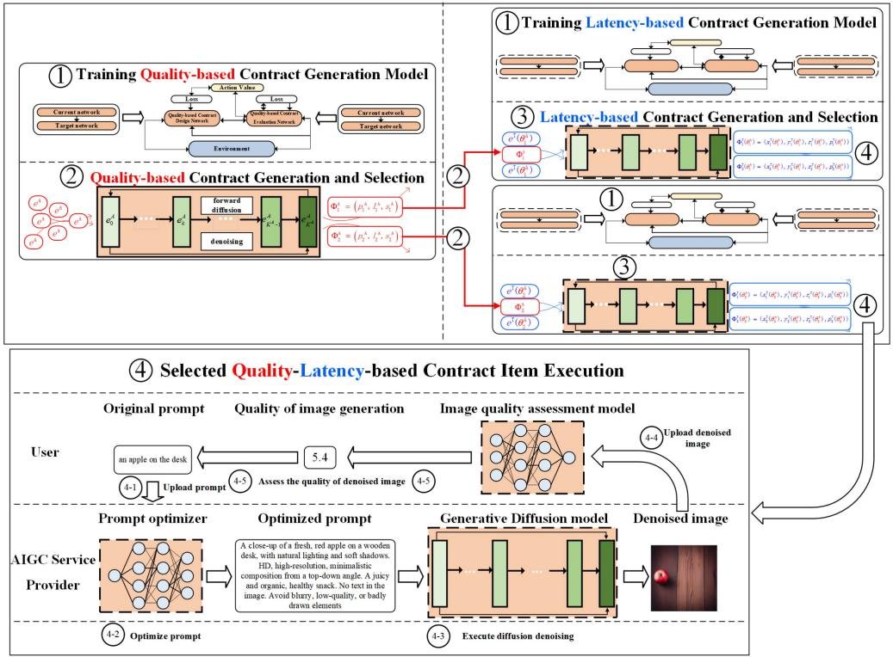

flowchart

Comparison of four quality-latency-based contract generation models and item execution strategies, covering training, latency-based generation, quality-of-image generation, image quality assessment, and AIGC provider optimization.

Fig. 1. Workflow of GDM-based contract theory framework. Step 1. The ASP trains two GDM-based models for quality-based and latency-based contract generation; Step 2. Based on the input environmental parameters $e ^ { \mathrm { { A } } }$ , the quality-based contract generation model generates quality-based contract items i.e., $\mathbf { \bar { \Phi } } ^ { \mathrm { A } } = \{ \Phi _ { i } ^ { \mathrm { A } } , i = \{ 1 , \dots , I \} \}$ ; Step 3. The number of $\mathrm { t y p e } { \cdot } \theta _ { i } ^ { \mathrm { A } }$ users who select the same quality-based contract item is counted, each quality-based contract item $\Phi _ { i } ^ { \mathrm { A } }$ , and the environmental parameters $e ^ { \mathrm { T } } ( \theta _ { i } ^ { \mathrm { A } } )$ are then used as inputs in a latency-based contract generation model to generate corresponding latency-focused contract items i.e., $\Phi ^ { \mathrm { T } } ( \theta _ { i } ^ { \mathrm { A } } ) \stackrel { - } { = } \{ \Phi _ { i } ^ { \mathrm { T } } ( \theta _ { i } ^ { \mathrm { A } } ) , j = \stackrel { - } { \{ } 1 , \cdot \cdot . . , J \} \}$ ; Step 4. Execute the selected quality-latency-based contract.

Step 3. Latency-based Contract Generation and Selection: The ASP counts the number of the users that have chosen the same quality-based contract item $\Phi _ { i } ^ { \mathrm { A } }$ , which is denoted as $M _ { i }$ Φ. The latency-based contract generation model takes as input each quality-based contract item $\Phi _ { i } ^ { \mathrm { A } }$ and the number $M _ { i }$ , Φalong with the input environmental parameters denoted as a vector $e ^ { \mathrm { T } } ( \theta _ { i } ^ { \mathrm { A } } )$ , and produces the latency-based contract items (denoted as $\bar { \Phi } ^ { \mathrm { T } } ( \theta _ { i } ^ { \mathrm { A } } )$ . The vector $e ^ { \mathrm { T } } ( \theta _ { i } ^ { \mathrm { A } } )$ includes the number of Φ ( ) ( )types of gain per expected latency reduction, the probability vector, the maximum latency vector, the cost vector per computation energy consumption of optimizing the prompt, the cost vector per computation energy consumption of executing diffusion denoising, the cost vector per communication energy consumption, the type vector of gain per expected latency reduction, the CPU frequency vector per level of prompt optimization, the CPU frequency vector per number of diffusion denoising steps, the size vector of the diffusion denoising result, and the status vector of wireless connection, the effective switched capacitance. Those parameters are denoted as $^ { J , }$ $\pmb { q } ^ { \operatorname { T } } ( \theta _ { i } ^ { \operatorname { A } } ) = [ q _ { 1 } ^ { \operatorname { T } } ( \theta _ { i } ^ { \operatorname { A } } ) , \dots , q _ { j } ^ { \operatorname { T } } ( \theta _ { i } ^ { \operatorname { A } } ) , \dots , q _ { J } ^ { \operatorname { T } } ( \theta _ { i } ^ { \operatorname { A } } ) ] , \quad t ^ { \operatorname { m a x } } \ = \ [ t _ { 1 } ^ { \operatorname { m a x } } $ , $\dots , t _ { j } ^ { \mathrm { m a x } } , \dots , t _ { J } ^ { \mathrm { m a x } } ] , \quad \bar { b _ { 1 } } = [ b _ { 1 , 1 } , \dots , b _ { 1 , j } , \dots , b _ { 1 , J } ] , \quad b _ { 2 } =$ $[ b _ { 2 , 1 } , \dots , b _ { 2 , j } , \dots , b _ { 2 , J } ] , \ b _ { 3 } = [ b _ { 3 , 1 } , \dots , b _ { 3 , j } , \dots , b _ { 3 , J } ] , \ \theta ^ { \mathrm { { T } } } ( \theta _ { i } ^ { \mathrm { { A } } } )$ $\begin{array} { r l } & { = [ \theta _ { 1 } ^ { \mathrm { T } } ( \theta _ { i } ^ { \mathrm { A } } ) , \dots , \theta _ { j } ^ { \mathrm { T } } ( \theta _ { i } ^ { \mathrm { A } } ) , \dots , \theta _ { J } ^ { \mathrm { T } } ( \theta _ { i } ^ { \mathrm { A } } ) ] , \ \delta = [ \delta _ { 1 } , \dots , \delta _ { j } , \dots , \delta _ { J } ] . } \end{array}$ ), $\eta = [ \eta _ { 1 } , \dots , \eta _ { j } , \dotsc , \eta _ { J } ] , d = [ d _ { 1 } , \dotsc , d _ { j } , \dotsc , d _ { J } ] , h =$ $[ h _ { 1 } , \ldots , h _ { j } , \ldots , h _ { J } ] .$ ] and $\pmb { \kappa } = [ \kappa _ { 1 } , \ldots , \kappa _ { j } , \ldots , \kappa _ { J } ] .$ =. A [ ] = [ ]more detailed explanation for those parameters refers to Table I. Each latency-based contract item is denoted as $\Phi _ { j } ^ { \mathrm { T } } ( \theta _ { i } ^ { \mathrm { A } } ) = ( x _ { j } ^ { \mathrm { T } } ( \theta _ { i } ^ { \mathrm { A } } ) , y _ { j } ^ { \mathrm { T } } ( \theta _ { i } ^ { \mathrm { A } } ) , r _ { j } ^ { \mathrm { T } } ( \theta _ { i } ^ { \mathrm { A } } ) , p _ { j } ^ { \mathrm { T } } ( \theta _ { i } ^ { \mathrm { A } } ) ) , j \in \{ 1 , \dots , J \}$ Φ (where $x _ { j } ^ { \mathrm { T } } ( \theta _ { i } ^ { \mathrm { A } } )$ ( ) ( ) ( ) ( ))is the CPU frequency for optimizing prompt, $y _ { j } ^ { \mathrm { T } } ( \theta _ { i } ^ { \mathrm { A } } )$ ( )is the CPU frequency for diffusion denoising, $r _ { j } ^ { \mathrm { T } } ( \theta _ { i } ^ { \mathrm { A } } )$ is the network transmission rate, and $p _ { j } ^ { \mathrm { T } } ( \theta _ { i } ^ { \mathrm { A } } ) )$ is the reward paid to ( ))the ASP. Then, the users choose the latency-based contract item that suits their types of gain per expected latency reduction.

Step 4. Selected Quality-Latency-based Contract Execution: For each selected contract items $\Phi _ { i } ^ { \mathrm { A } } , i \in \{ 1 , . . . , I \}$ and $\Phi _ { j } ^ { \mathrm { T } } ( \theta _ { i } ^ { \mathrm { A } } ) , i \in \{ 1 , \dots , I \} , j \in \{ 1 , \dots , J \}$ Φ, the contract execution Φ ( )includes four stages. Step 4-1: Each user uploads its original prompt to the ASP. Step 4-2: The ASP is capable of optimizing the original prompt of image generation, with the level of prompt optimization $l _ { i } ^ { \mathrm { A } }$ and the CPU frequency $x _ { j } ^ { \mathrm { T } } ( \theta _ { i } ^ { \mathrm { A } } )$ . Step 4-3: Based ( )on the optimized prompt, the ASP performs the diffusion denoising steps according to the number of diffusion denoising steps $s _ { i } ^ { \mathrm { A } }$ and the CPU frequency $y _ { j } ^ { \mathrm { T } } ( \theta _ { i } ^ { \mathrm { A } } )$ . Step 4-4: After the diffusion denoising steps have been completed, the denoised images are sent to the users with the network transmission rate $\bar { r _ { j } ^ { \mathrm { T } } } ( \theta _ { i } ^ { \mathrm { A } } )$ . ( )Step 4-5: The users use several metrics to assess the quality of the generated result, such as neural image assessment [8]. If the quality of image generation meets the user’s requirement, the image generation service is considered to be successful and the user will send the rewards $p _ { i } ^ { \mathrm { A } }$ and $p _ { j } ^ { \mathrm { T } } ( \theta _ { i } ^ { \mathrm { A } } )$ to the ASP.

# B. Quality of Experience

The QoE has two components: the quality of image generation and the latency reduction of image generation denoted as A and D.

1) Quality of Image Generation: As the number of diffusion denoising steps increases, the quality of image generation improves [15], [21]. As the level of prompt optimization increases, the quality of image generation increases [4]. We have also verified the above result through the results of our experiments in Section VI. The relationship between the level of prompt optimization, the number of diffusion denoising steps, and the quality of image generation is defined as follows:

$$
A = A \left(l ^ {\mathrm{A}}, s ^ {\mathrm{A}}, \boldsymbol {\rho}\right) \tag {1}
$$

where ρ is the parameter vector fitted by experiments, ${ \boldsymbol \rho } \ge { \bf 0 } , l ^ { \mathrm { A } }$ and $s ^ { \mathrm { A } }$ are positive integers.

2) Latency Reduction of Image Generation: For each user, when $l ^ { \mathrm { A } }$ and $s ^ { \mathrm { A } }$ are both fixed, the total latency of obtaining the generated result includes three parts. The first part is the latency of optimizing the prompt. Motivated by [15], [21], [22], the latency for optimizing the prompt is defined as xT $\frac { \bar { \delta } l ^ { \mathrm { A } } } { x ^ { \mathrm { T } } }$ , where δ is the CPU frequency per level of prompt optimization, $x ^ { \mathrm { { T } } }$ is the CPU frequency for optimizing the prompt. Referring to [15], [21], [22], the second part is the latency of diffusion denoising denoted as ηsA yT $\frac { \eta s ^ { \mathrm { A } } } { y ^ { \mathrm { T } } }$ , where η is the CPU frequency per number of diffusion denoisin steps, and $y ^ { \mathrm { T } }$ is the CPU frequency for diffusion denoising. Furthermore, the third part is the transmission latency denoted as $\textstyle { \frac { d } { r ^ { \mathrm { T } } } }$ , where d is the size of the diffusion denoising result and $r ^ { \mathrm { { ^ { T } } } }$ is the network transmission rate [23]. Thus, the total latency is δlA $\begin{array} { r } { \frac { \delta l ^ { \mathrm { A } } } { x ^ { \mathrm { T } } } + \frac { \eta s ^ { \mathrm { A } } } { y ^ { \mathrm { T } } } + \frac { d } { r ^ { \mathrm { T } } } } \end{array}$ xT ηsA . Based on the total latency, we + +obtain the total latency reduction as follows:

$$
D = t ^ {\mathrm{max}} - \frac {\delta l ^ {\mathrm{A}}}{x ^ {\mathrm{T}}} - \frac {\eta s ^ {\mathrm{A}}}{y ^ {\mathrm{T}}} - \frac {d}{r ^ {\mathrm{T}}}, \tag {2}
$$

where $t ^ { \mathrm { m a x } }$ is the maximum latency.

The experimental results in [4] showed that the probability of achieving a specific quality threshold A in image generation increases with higher levels of prompt optimization and an increased number of diffusion denoising steps. We define the probability as $\zeta ( A ( l ^ { \mathrm { A } } , s ^ { \mathrm { A } } ) > \overline { { A } } )$ and related to $l , s ,$ and $A .$ ( ( ) )To simplify the representation, the notation of the probability $\zeta ( A ( l ^ { \mathrm { A } } , s ^ { \mathrm { A } } ) > \overline { { { A } } } )$ is reduced to $\zeta _ { l ^ { \mathrm { A } } , s ^ { \mathrm { A } } }$ . If the generated image ( ( ) )fails to satisfy the user’s quality requirements, it requires regeneration. This cycle continues until the desired quality is attained, at which point the service ends. The aforementioned process can be modeled mathematically to ascertain the expected latency reduction for the g-th iteration of image generation to meet the user’s standards, expressed as:

$$
\mathbb {E} [ D ] = \zeta_ {l ^ {\mathrm{A}}, s ^ {\mathrm{A}}} (1 - \zeta_ {l ^ {\mathrm{A}}, s ^ {\mathrm{A}}}) ^ {g - 1} \left[ t ^ {\max} - g \left(\frac {\delta l ^ {\mathrm{A}}}{x ^ {\mathrm{T}}} + \frac {\eta s ^ {\mathrm{A}}}{y ^ {\mathrm{T}}} + \frac {d}{r ^ {\mathrm{T}}}\right) \right]. \tag {3}
$$

It should be noted that we consider $g = 1$ in the paper. In future work, we will explore $g > 1$ .

# IV. GENERATIVE DIFFUSION MODEL FOR QUALITY-BASED CONTRACT DESIGN

Based on the quality of image generation, the utilities of the users and ASP are modeled. Then, a quality-based contract problem is formulated. Continuously, a GDM-based scheme is used to solve optimal quality-based contract items in a more efficient way. Finally, we analyze the complexity of the GDM-based scheme.

# A. Utilities of User and AIGC Service Provider

The higher the quality of image generation, the higher the gain for the user. Referring to [24], the gain of user m is $\theta _ { m } ^ { \mathrm { A } } A ( l _ { m } , s _ { m } , \rho )$ where $\theta _ { m }$ is the gain per quality of image ( )generation. The user m must pay a reward $p _ { m } ^ { \mathrm { A } }$ to the ASP. Thus, the utility of the user m is

$$
u _ {m} ^ {\mathrm{A}} = \theta_ {m} ^ {\mathrm{A}} A (l _ {m} ^ {\mathrm{A}}, s _ {m} ^ {\mathrm{A}}, \boldsymbol {\rho}) - p _ {m} ^ {\mathrm{A}}. \tag {4}
$$

However, due to self-interest, user m is reluctant to disclose information about its gain per quality to the ASP. Without knowledge of the user m’s gain per quality, it becomes challenging for the ASP to determine the optimal level of prompt optimization and the number of diffusion denoising steps needed to maximize its own payoffs while also setting an appropriate fee for user m. In such cases, many studies, such as the authors in [25] and [26], assume that the ASP possesses knowledge of the probability distribution of gain per quality types based on statistical data while knowing the total number of users across all types,i.e., M . Additionally, the probability that a user’s gain type per quality is of type $\theta _ { i } ^ { \mathrm { A } }$ is represented by $q _ { i } ^ { \mathrm { A } }$ . To determine the amount of a particular type, we apply the method discussed in [27] and then multiply its probability by the total number of users across all types. Consequently, we have the quantity of users whose gain type per quality falls into type- ${ \boldsymbol { \cdot } } { \boldsymbol { \theta } } _ { i } ^ { \mathrm { A } }$ is $\dot { M } q _ { i } ^ { \mathrm { A } } = M _ { i }$ . Based =on statistical information from the mobile data market, the ASP can classify the users into different types to characterize their heterogeneity, using some well-known data mining methods, e.g., k-means. According to their heterogeneity for a given gain per quality, we classify the users into I types and sorted in ascending order $\theta _ { 1 } ^ { \mathrm { A } } \leq \cdot \cdot \cdot \leq \theta _ { i } ^ { \mathrm { A } } \leq \cdot \cdot \cdot \leq \theta _ { I } ^ { \mathrm { A } }$ . Specifically, the user m whose gain per quality falls into i-th gain per quality is denoted as $\mathrm { t y p e } { - \theta _ { i } ^ { \mathrm { A } } }$ user. Thus, the utilities of these users belonging to $\mathrm { t y p e } { \cdot } \theta _ { i } ^ { \mathrm { A } }$ can be defined as

$$
u _ {i} ^ {\mathrm{A}} = \theta_ {i} ^ {\mathrm{A}} A (l _ {i} ^ {\mathrm{A}}, s _ {i} ^ {\mathrm{A}}, \boldsymbol {\rho}) - p _ {i} ^ {\mathrm{A}}. \tag {5}
$$

The cost required for the ASP to provide service to a $\mathrm { t y p e } { - \theta _ { i } ^ { \mathrm { A } } }$ user is defined as $\sigma _ { 1 , i } l _ { i } ^ { \mathrm { A } } + \sigma _ { 2 , i } s _ { i } ^ { \mathrm { A } }$ , where $\sigma _ { 1 , i }$ is the cost per +level of prompt optimization and $\sigma _ { 2 , i }$ is the cost per number of diffusion denoising steps. For all the types, the utility of the ASP

is defined as

$$
U _ {\mathrm{sp}} ^ {\mathrm{A}} = \sum_ {i = 1} ^ {I} M q _ {i} ^ {\mathrm{A}} (p _ {i} ^ {\mathrm{A}} - \sigma_ {1, i} l _ {i} ^ {\mathrm{A}} - \sigma_ {2, i} s _ {i} ^ {\mathrm{A}}). \tag {6}
$$

# B. Quality-Based Contract Formulation

The lack of awareness of the ASP regarding the users’ specific gain per quality, which pertains to their privacy, leads to an imbalance of information. This information asymmetry can be addressed by applying contract theory to determine the most suitable contract items for the $\mathbf { A S P } \mathbf { \vec { s } }$ consumers. In this context, the ASP acts as the main entity responsible for designing quality-based contracts, while the users are considered agents who select the contract item that aligns with their respective type. The quality-based contract item can be denoted as $\Phi ^ { \mathrm { A } } = \{ \Phi _ { i } ^ { \mathrm { A } } =$ $( l _ { i } ^ { \mathrm { A } } , \bar { s _ { i } ^ { \mathrm { A } } } , p _ { i } ^ { \mathrm { A } } ) , i = \{ 1 , \dots , I \} \}$ , where $\Phi _ { i } ^ { \mathrm { A } }$ Φis made for a $\mathfrak { r } \mathfrak { y } \mathfrak { p } \mathfrak { e } \mathfrak { - } \theta _ { i } ^ { \mathrm { A } }$ ( ) = Φuser. In order to establish a feasible quality-based contract with asymmetric information, we introduce the following conditions for Individual Rationality (IR) and Incentive Compatibility (IC). The IR condition encourages user engagement and guarantees a non-negative utility. The mathematical expression for the IR conditions, applicable to a $\mathrm { t y p e } { - \theta _ { i } ^ { \mathrm { A } } }$ user, can be represented as follows:

$$
\theta_ {i} ^ {\mathrm{A}} A (l _ {i} ^ {\mathrm{A}}, s _ {i} ^ {\mathrm{A}}, \boldsymbol {\rho}) - p _ {i} ^ {\mathrm{A}} \geq 0, i \in \{1, \dots , I \}. \tag {7}
$$

The IC conditions ensure that each $\mathrm { t y p e } { - \theta _ { i } ^ { \mathrm { A } } }$ user can achieve its maximum utility when selecting the quality-based contract item based on its own corresponding type. The mathematical expression for the IC conditions, applicable to a type- ${ \boldsymbol { \cdot } } { \boldsymbol { \theta } } _ { i } ^ { \mathrm { A } }$ user, can be represented as follows:

$$
\theta_ {i} ^ {\mathrm{A}} A (l _ {i} ^ {\mathrm{A}}, s _ {i} ^ {\mathrm{A}}, \pmb {\rho}) - p _ {i} ^ {\mathrm{A}} \geq \theta_ {i} ^ {\mathrm{A}} A (l _ {i ^ {\prime}} ^ {\mathrm{A}}, s _ {i ^ {\prime}} ^ {\mathrm{A}}, \pmb {\rho}) - p _ {i ^ {\prime}} ^ {\mathrm{A}},
$$

$$
\forall i, i ^ {\prime} \in \{1, \dots , I \}. \tag {8}
$$

To maximize the utility of the ASP under the IR and IC conditions, a quality-based contract problem is formulated as follows:

U A

$$
l _ {i} ^ {A, \min} \leq l _ {i} ^ {\mathrm{A}} \leq l _ {i} ^ {A, \max}, l _ {i} \in \mathbb {Z} ^ {+}, i \in \{1, \dots , I \},
$$

$$
s _ {i} ^ {A, \mathrm{min}} \leq s _ {i} ^ {\mathrm{A}} \leq s _ {i} ^ {A, \mathrm{max}}, s _ {i} \in \mathbb {Z} ^ {+}, i \in \{1, \ldots , I \},
$$

$$
p _ {i} ^ {A, \min} \leq p _ {i} ^ {\mathrm{A}} \leq p _ {i} ^ {A, \max}, i \in \{1, \dots , I \}, \tag {9}
$$

where the optimization variable $l _ { i } ^ { A , \operatorname* { m i n } } , s _ { i } ^ { A , \operatorname* { m i n } }$ s i and s, lA,max , $p _ { i } ^ { A , \mathrm { m i n } }$ pi $\hat { l } _ { i } ^ { A , \operatorname* { m a x } } , s _ { i } ^ { A , \operatorname* { m a x } }$ are the minimum value of s i and pAi $p _ { i } ^ { A , \operatorname* { m a x } }$ are the maximum value of the optimization variables. In Problem 1, since the objective function is non-convex and the constraints are non-convex sets, it is difficult to solve Problem 1. The ASP’s variable cost expenses and the users’ variable gain per quality require solving the non-convex quality-based contract problem repeatedly, which takes longer delay using traditional mathematical methods. Fortunately, a GDM-based scheme is capable of handling this issue [1].

# C. GDM-Based Scheme for Quality-Based Contract Problem

1) Generative Diffusion Model: GDM, a pioneering deepgenerative model, operates by progressively modifying the data distribution in its forward diffusion phase through the incremental addition of Gaussian noise. In this phase, Gaussian noise is systematically added to an initial sample, denoted as $\phi _ { 0 }$ , over K iterations, resulting in a sequence of samples $( \phi _ { 1 } , \phi _ { 2 } , . . . , \phi _ { K } )$ . As the iteration count $K$ increases, the distinct characteristics of the original sample φ0 are gradually obliterated, ultimately transforming into pure Gaussian noise. This process can be succinctly described as follows:

$$
Q \left(\phi_ {1}, \dots , \phi_ {K} \mid \phi_ {0}\right) = \prod_ {k = 1} ^ {K} Q \left(\phi_ {k} \mid \phi_ {k - 1}\right), \tag {10}
$$

$$
Q \left(\phi_ {k} \mid \phi_ {k - 1}\right) := \mathcal {N} \left(\phi_ {k}; \sqrt {1 - \beta_ {k}} \phi_ {k - 1}, \beta_ {k} \mathbf {I}\right), \tag {11}
$$

where $\beta _ { k }$ is a parameter that controls the influence of noise on the progress. Equation (11) suggests that, when provided with the sample $\phi _ { k - 1 }$ , the sample φk at the k-th step follows a Gaussian distribution with a mean of $\sqrt { 1 - \beta _ { k } } \phi _ { k - 1 }$ and a variance of $\beta _ { k } \mathbf { I }$ . The dependence of these parameters solely on the previous Isample $\phi _ { k - 1 }$ indicates that the diffusion process qualifies as a Markov process.

In the reverse diffusion process $Q ( \phi _ { k - 1 } \mid \phi k , \phi _ { 0 } )$ , when $\beta _ { k }$ is ( )sufficiently small, it aligns with the forward diffusion process’s posterior probability distribution $Q ( \phi _ { k } \mid \phi _ { k - 1 } )$ . For the genera-(tion of authentic samples, the model $P \omega ( \phi _ { 0 : K } )$ must iteratively sample from Gaussian noise $\phi _ { K }$ and learn the precise parameters ω based on training data. This procedure can be depicted as follows:

$$
P _ {\omega} \left(\phi_ {0: K}\right) = P \left(\phi_ {K}\right) \prod_ {k = 1} ^ {K} P _ {\omega} \left(\phi_ {k - 1} \mid \phi_ {k}\right), \tag {12}
$$

$$
P _ {\omega} \left(\phi_ {k - 1} \mid \phi_ {k}\right) = \mathcal {N} \left(\phi_ {k - 1}; \mu_ {\omega} \left(\phi_ {k}, k\right), \Sigma_ {\omega} \left(\phi_ {k}, k\right)\right), \tag {13}
$$

where $P ( \phi _ { K } ) = \mathcal { N } ( \phi _ { K } ; 0 , \mathbf { I } )$ . Ultimately, the process of re-( ) = ( ; I)verse diffusion can be accomplished by employing a highly trained $P _ { \theta } ( \phi _ { k - 1 } \mid \phi _ { k } )$ to estimate $Q ( \phi _ { k - 1 } \mid \phi _ { k } , \phi _ { 0 } )$ .

( ) ( )2) Training Phase: We first define the environment, qualitybased contract design networks, and quality-based contract evaluation networks. The environment is defined by a vector $e ^ { \mathrm { { A } } }$ , which is the set of all variables that impact the optimal design of a quality-based contract, i.e.,

$$
\boldsymbol {e} ^ {\mathrm{A}} = \left\{\boldsymbol {q} ^ {\mathrm{A}}, \boldsymbol {\sigma} _ {1}, \boldsymbol {\sigma} _ {2}, \boldsymbol {\theta} ^ {\mathrm{A}}, M, I \right\}. \tag {14}
$$

The diffusion model network known as the quality-based contract design policy, symbolized by $\pi _ { \omega ^ { \mathrm { A } } } ^ { \mathrm { A } } ( \phi ^ { \mathrm { A } } | e ^ { \mathrm { A } } )$ , assigns environ-( )ment states to quality-based contract designs using the weights $\omega ^ { \mathrm { A } }$ . Its primary objective, through the policy $\pi _ { \omega ^ { \mathrm { A } } } ^ { \mathrm { A } } ( \phi ^ { \mathrm { A } } | e ^ { \mathrm { A } } )$ , is to ( )generate a deterministic quality-based contract design aimed at optimizing the expected total reward over a series of time steps. This policy $\pi _ { \omega ^ { \mathrm { A } } } ^ { \mathrm { A } } ( \phi ^ { \mathrm { A } } | e ^ { \mathrm { A } } )$ , utilizes the reverse mechanism of a ( )conditional diffusion model, as shown below:

$$
\begin{array}{l} \pi_ {\omega^ {A}} ^ {A} \left(\phi^ {A} \mid e ^ {A}\right) = P _ {\omega^ {A}} ^ {A} \left(\phi^ {0: K ^ {A}} \mid e ^ {A}\right) \\ = \mathcal {N} ^ {\mathrm{A}} \left(\boldsymbol {\phi} ^ {K ^ {\mathrm{A}}}; \mathbf {0}, \mathbf {I} ^ {\mathrm{A}}\right) \prod_ {k = 1} ^ {K ^ {\mathrm{A}}} P _ {\omega^ {\mathrm{A}}} ^ {\mathrm{A}} \left(\boldsymbol {\phi} ^ {k - 1, \mathrm{A}} \mid \boldsymbol {\phi} ^ {k, \mathrm{A}}, \boldsymbol {e} ^ {\mathrm{A}}\right), \tag {15} \\ \end{array}
$$

where $P _ { \Lambda , \Lambda } ^ { \mathrm { A } } ( \phi ^ { k - 1 , \mathrm { A } } | \phi ^ { k , \mathrm { A } } , e ^ { \mathrm { A } } )$ can be modeled as a Gaussian (distribution $\mathcal { N } ^ { \mathrm { A } } ( \phi ^ { \dot { k } - 1 , \mathrm { A } } ; \mu _ { , \mathrm { \neq } } ^ { \mathrm { A } } ( \phi ^ { k , \mathrm { A } } , \mathbf { e } ^ { \mathrm { A } } , k ) , \Sigma _ { \omega ^ { \mathrm { A } } } ( \phi ^ { k , \mathrm { A } } , \mathbf { e } ^ { \mathrm { A } } , k ) )$ . (According to [28], $P _ { \omega ^ { \mathrm { A } } } ^ { \mathrm { A } } ( \phi ^ { \breve { k } - 1 , \mathrm { A } } | \phi ^ { k , \mathrm { A } } , e ^ { \mathrm { A } } )$ Σ ( e ))can be modeled as ( )a noise prediction model, with the covariance matrix fixed as follows:

$$
\boldsymbol {\Sigma} _ {\omega^ {\mathrm{A}}} \left(\boldsymbol {\phi} ^ {k, \mathrm{A}}, \boldsymbol {e} ^ {\mathrm{A}}, k\right) = \beta_ {k} ^ {\mathrm{A}} \mathbf {I} ^ {\mathrm{A}}, \tag {16}
$$

and the mean constructed as:

$$
\begin{array}{l} \mu_ {\omega^ {\mathrm{A}}} ^ {\mathrm{A}} \left(\phi^ {k, \mathrm{A}}, \mathbf {e} ^ {\mathrm{A}}, k\right) \\ = \frac {1}{\sqrt {\alpha_ {k} ^ {\mathrm{A}}}} \left(\phi^ {k, \mathrm{A}} - \frac {\beta_ {k} ^ {\mathrm{A}}}{\sqrt {1 - \bar {\alpha} _ {k} ^ {\mathrm{A}}}} \varepsilon_ {\omega} ^ {\mathrm{A}} \left(\phi^ {k, \mathrm{A}}, \mathbf {e} ^ {\mathrm{A}}, k\right)\right). \tag {17} \\ \end{array}
$$

We commence by sampling $\phi ^ { K ^ { \mathrm { A } } } \sim \mathcal { N } ^ { \mathrm { A } } ( \mathbf { 0 } , \mathbf { I } ^ { \mathrm { A } } )$ and then proceed ( I )with the reverse diffusion chain, parameterized by $\omega ^ { \mathrm { A } }$ as

$$
\begin{array}{l} \phi^ {k - 1, \mathrm{A}} \mid \phi^ {k, \mathrm{A}} \\ = \frac {\phi^ {k , \mathrm{A}}}{\sqrt {\alpha_ {k} ^ {\mathrm{A}}}} - \frac {\beta_ {k} ^ {\mathrm{A}}}{\sqrt {\alpha_ {k} ^ {\mathrm{A}} \left(1 - \bar {\alpha} _ {k} ^ {\mathrm{A}}\right)}} \varepsilon_ {\omega} ^ {\mathrm{A}} \left(\phi^ {k, \mathrm{A}}, \mathbf {e} ^ {\mathrm{A}}, k\right) + \sqrt {\beta_ {k} ^ {\mathrm{A}}} \varepsilon^ {\mathrm{A}}. \tag {18} \\ \end{array}
$$

Effective training of the quality-based contract design policy $\pi _ { \omega ^ { A } } ^ { \mathrm { A } }$ within the vector $e ^ { \mathrm { { A } } }$ involves the development of a quality-based contract design network $\varepsilon _ { \omega ^ { \mathrm { A } } } ^ { \mathrm { A } }$ . Following DDPM’s guidelines [28], we set $\varepsilon ^ { \mathrm { A } }$ to 0 when $k = 1$ to improve sample quality. For the training of the quality-based contract design network $\varepsilon _ { \omega ^ { \mathrm { A } } } ^ { \mathrm { A } }$ , the Q-function from deep reinforcement learning (DRL) serves as inspiration, leading to the establishment of the quality-based contract evaluation network $H _ { v } ^ { \mathrm { A } }$ . This network associates an environment-contract pair, $\{ e ^ { \mathrm { A } } , \dot { \Phi } ^ { \mathrm { A } } \}$ , with a value Φindicative of the anticipated cumulative reward for adhering to a quality-based contract design policy from the current state. By minimizing the loss function $\mathcal { L } ^ { \mathrm { A } } \bar { ( } \omega ^ { \mathrm { A } } )$ through double $Q \cdot$ ( )learning, the most effective quality-based contract design policy can be determined. The loss function is defined as follows:

$$
\pi^ {\mathrm{A}} = \underset {\pi_ {\omega^ {\mathrm{A}}} ^ {\mathrm{A}}} {\arg \min} \mathcal {L} ^ {\mathrm{A}} (\omega^ {\mathrm{A}}) = - \mathbb {E} _ {\phi^ {0, \mathrm{A}} \sim \pi_ {\omega^ {\mathrm{A}}} ^ {\mathrm{A}}} \left[ H _ {v} ^ {\mathrm{A}} \left(\mathbf {e} ^ {\mathrm{A}}, \phi^ {0, \mathrm{A}}\right) \right]. \tag {19}
$$

The network of evaluating quality-based contracts employs the double Q-learning method for its training [29]. It involves the formulation of two primary networks, designated as $H _ { v _ { 1 } ^ { \mathrm { A } } } ^ { \mathrm { A } }$ and $H _ { v _ { \mathrm { \uparrow } } ^ { \mathrm { A } } } ^ { \mathrm { A } }$ , and their corresponding target counterparts, named $H _ { \upsilon _ { 1 } ^ { \mathrm { A } } , } ^ { \mathrm { A } }$ A,  and H AυA, , along with πAωA, . The goal is to optimize υAn for $H _ { v _ { ? } ^ { \mathrm { A } , ' } } ^ { \mathrm { A } }$ $\pi _ { \omega ^ { \mathrm { A , \prime } } } ^ { \mathrm { A } }$ $v _ { n } ^ { \mathrm { A } }$ $n \stackrel { . } { = } 1 , 2$ through minimization of the objective

$$
\begin{array}{l} \mathbb {E} _ {\phi_ {k + 1} ^ {0, A} \sim \pi_ {\omega^ {A, ^ {\prime}}} ^ {A}} \left[ \Big | \Big | \left(r (\mathbf {e} ^ {A}, \phi_ {k} ^ {A}) + \gamma^ {A} \min _ {n = 1, 2} H _ {v _ {n} ^ {A, ^ {\prime}}} ^ {A} (\mathbf {e} ^ {A}, \phi_ {k + 1} ^ {0, A})\right) \right. \\ \left. - H _ {\upsilon_ {n} ^ {A}} ^ {A} \left(\mathbf {e} ^ {A}, \phi_ {k} ^ {A}\right) \right| \Bigg | ^ {2} ]. \tag {20} \\ \end{array}
$$

3) Inference Stage: During the inference stage, the trained quality-based contract design network is used to generate efficient quality-based contract items based on current environmental circumstances. The quality-based contract items generated maximize the utility of the ASP while satisfying the IC and IR constraints of the users.

The detailed algorithm for the GDM-based optimal qualitybased contract is shown in Algorithm 1. In the analysis of the complexity of Algorithm 1, the weights in the qualitybased contract design and evaluation networks are denoted $\psi _ { a } ^ { \mathrm { A } }$ and $\psi _ { c } ^ { \mathrm { A } }$ , respectively. The initialization complexity stands at $\mathcal { O } ( 2 \psi _ { a } ^ { \mathrm { A } } + 2 \psi _ { c } ^ { \mathrm { A } } )$ . The complexity of action generation increases to $\mathcal { O } ( K ^ { \mathrm { A } } \psi _ { a } ^ { \mathrm { A } } )$ ). Replay buffer activities maintain a storage com-(plexity of $\mathcal { O } ( 1 )$ and minibatch sampling complexity of $\mathcal { O } ( N ^ { \mathrm { A } } )$ . ( ) ( )Each update to quality-based contract design and evaluation networks incurs complexities $\mathcal { O } ( \psi _ { c } ^ { \mathrm { A } } )$ and $\mathcal { O } ( \psi _ { a } ^ { \mathrm { A } } )$ , respectively. Up-( ) ( )dates to the target network have linear complexity in relation to parameter numbers. Consequently, the computational complexity in the training phase is adjusted to $\mathcal { O } ( Z _ { e } ^ { \mathrm { A } } \bar { Z } _ { s } ^ { \mathrm { A } } ( K ^ { \mathrm { A } } \psi _ { a } ^ { \mathrm { A } } + \bar { \psi } _ { c } ^ { \mathrm { A } } ) )$ . ( ( + ))In the inference phase, to generate optimal quality-based contract items via the trained network, the complexity is $\mathcal { O } ( \psi _ { a } ^ { \mathrm { A } } )$ , assuming that reward observation and exploration noise generation are constant-time operations. Thus, combining the training phase complexity and the inference phase complexity, the algorithm’s total complexity is $\mathcal { O } ( Z _ { e } ^ { \mathrm { A } } Z _ { s } ^ { \mathrm { A } } ( K ^ { \mathrm { A } } \psi _ { a } ^ { \mathrm { A } } + \bar { \psi } _ { c } ^ { \mathrm { A } } ) )$ .

# V. GENERATIVE DIFFUSION MODEL FOR LATENCY-BASED CONTRACT DESIGN

After M users select the quality-based contract items, the ASP counts the number of the users that have chosen the same quaility-based contract item $( l _ { i } ^ { \mathrm { A } } , s _ { i } ^ { \mathrm { A } } , p _ { i } ^ { \mathrm { A } } ) , i \in \{ 1 , \ldots , I \}$ . The (number of the users is denoted as $M _ { i } , i \in \{ 1 , \ldots , I \}$ and we obtain $\textstyle \sum _ { i = 1 } ^ { I } M _ { i } = M$ . Here, the user choosing the quaility-=based contract item $( l _ { i } ^ { \mathrm { A } } , s _ { i } ^ { \mathrm { A } } , p _ { i } ^ { \mathrm { A } } )$ is $m _ { i } \in \{ 1 , . . . , N _ { i } \}$ . For each $( l _ { i } ^ { \mathrm { A } } , s _ { i } ^ { \mathrm { A } } , p _ { i } ^ { \mathrm { A } } )$ and $N _ { i } , i \in \{ 1 , \ldots , I \}$ , based on the expected latency reduction of image generation, the utilities of the users and ASP are modeled. Then, a latency-based contract problem is formulated. Finally, a GDM-based scheme is also used to solve the optimal latency-based contract items.

# A. Utilities of User and AIGC Service Provider

The higher the expected latency reduction of image generation, the higher the gain of the user $n _ { i }$ . Referring to [30], the gain of the user $m _ { i }$ is $\theta _ { m } ^ { \mathrm { T } } ( \theta _ { i } ^ { \mathrm { A } } ) \mathbb { E } [ D ] ( x _ { m } ^ { \mathrm { T } } ( \theta _ { i } ^ { \mathrm { A } } ) , y _ { m } ^ { \mathrm { T } } ( \mathbf { \bar { \theta } } _ { i } ^ { \mathrm { A } } ) , r _ { m } ^ { \mathrm { T } } ( \theta _ { i } ^ { \mathrm { A } } ) )$ where $\theta _ { m } ^ { \mathrm { T } } ( \theta _ { i } ^ { \mathrm { A } } )$ ( )  ( ) ( ))is the type of gain per expected latency reduction ( )with the type of gain per quality $\theta _ { i } ^ { \mathrm { A } }$ . The user $m _ { i }$ must pay a reward $p _ { n } ^ { \mathrm { T } } ( \theta _ { i } ^ { \mathrm { A } } )$ to the ASP. Thus, the utility of user $m _ { i }$ is

$$
u _ {m} ^ {\mathrm{T}} \left(\theta_ {i} ^ {\mathrm{A}}\right) = \theta_ {m} ^ {\mathrm{T}} \left(\theta_ {i} ^ {\mathrm{A}}\right) \mathbb {E} [ D ] \left(x _ {m} ^ {\mathrm{T}} \left(\theta_ {i} ^ {\mathrm{A}}\right), y _ {m} ^ {\mathrm{T}} \left(\theta_ {i} ^ {\mathrm{A}}\right), r _ {m} ^ {\mathrm{T}} \left(\theta_ {i} ^ {\mathrm{A}}\right)\right) - p _ {m} ^ {\mathrm{T}} \left(\theta_ {i} ^ {\mathrm{A}}\right). \tag {21}
$$

However, $M _ { i }$ self-interest users may not provide information about their types of gain per expected latency reduction to the ASP. According to historical records, $M _ { i }$ users with different types of gain per expected latency reduction are classified into J types and sorted in ascending order $\theta _ { 1 } ^ { \mathrm { T } } ( \theta _ { i } ^ { \mathrm { A } } ) \leq \cdot \cdot \cdot \leq \theta _ { i } ^ { \mathrm { T } } ( \theta _ { i } ^ { \mathrm { A } } ) \leq$ $\cdots \leq \theta _ { J } ^ { \mathrm { T } } ( \theta _ { i } ^ { \mathrm { A } } )$ . A user with a gain per quality of $\mathrm { t y p e } { - \theta _ { i } ^ { \mathrm { A } } }$ and

Algorithm 1: Algorithm for GDM-Based Optimal Quality-Based Contract.   
1: TrainingPhase:
2: Input hyper-parameters: number of iterations to add noise $K^{A}$ , batch size $N^{A}$ , discount factor $\gamma^{A}$ , soft target update parameter $\tau^{A}$ , exploration noise $\epsilon^{A}$ .
3: Initialize replay buffer $B^{A}$ , quality-based contract design network $\varepsilon_{\omega}^{A}$ with weights $\omega^{A}$ , quality-based contract evaluation network $H_{v^{A}}^{A}$ with weights $v^{A}$ , target quality-based contract design network $\varepsilon_{\omega^{A},'}^{A}$ with weights $\omega^{A,'}$ , target quality-based contract evaluation network $H_{v^{A},'}^{A}$ with weights $v^{A,'}$ .
4: for Episode = 1 to Max episode $Z_{e}^{A}$ do
5: Initialize a random process $N^{A}$ for quality-based contract design exploration
6: for Step = 1 to Max step $Z_{s}^{A}$ do
7: Observe the current environment $e_{k}^{A}$ 8: Set $\phi_{k}^{K^{A}}$ as Gaussian noise. Generate a quality-based contract design $\phi_{k}^{0,A}$ by denoising $\phi_{k}^{K^{A}}$ using $\epsilon_{\omega^{A}}^{A}$ according to (32)
9: Add the exploration noise $\epsilon^{A}$ to $\phi_{k}^{0,A}$ 10: Execute quality-based contract design $\phi_{k}^{0,A}$ and observe the reward defined as

$$
\begin{array}{l} \lambda_ {k} ^ {\mathrm{A}} = U _ {\mathbf {s p}, k} ^ {\mathrm{A}} + \sum_ {i = 1} ^ {I} \mathcal {P} ^ {\mathrm{A}} \left[ \zeta_ {i} ^ {\mathrm{A}} \theta_ {i, k} ^ {\mathrm{A}} A (l _ {i, k} ^ {\mathrm{A}}, s _ {i, k} ^ {\mathrm{A}}, \pmb {\rho}) - r _ {i, k} ^ {\mathrm{A}} \right] \\ + \sum_ {i = 1} ^ {I} \sum_ {i ^ {\prime} = 1, i ^ {\prime} \neq i} ^ {I} \mathcal {P} ^ {\mathrm{A}} \left[ \zeta_ {i} ^ {\mathrm{A}} \theta_ {i, k} ^ {\mathrm{A}} A (l _ {i, k} ^ {\mathrm{A}}, s _ {i, k} ^ {\mathrm{A}}, \boldsymbol {\rho}) - r _ {i, k} ^ {\mathrm{A}} \right. \\ \left. - \zeta_ {i} ^ {\mathrm{A}} \theta_ {i, k} ^ {\mathrm{A}} A (l _ {i ^ {\prime}, k} ^ {\mathrm{A}}, s _ {i ^ {\prime}, k} ^ {\mathrm{A}}, \boldsymbol {\rho}) + r _ {i ^ {\prime}, k} ^ {\mathrm{A}} \right], \\ \end{array}
$$

where $\mathcal { P } ^ { \mathrm { A } } ( \cdot )$ is a penalty function. It implements a ( )certain penalty when the IC and IR constraints are not satisfied. The penalty is denoted as $\xi ^ { \mathrm { A } }$ .

11: Store the record $( \dot { e } _ { k } ^ { \mathrm { A } } , \phi _ { k } ^ { 0 , \mathrm { A } } , \lambda _ { k } ^ { \mathrm { A } } )$ in replay buffer $B ^ { \mathrm { A } }$

12: ( ) Sample a random minibatch of $N ^ { \mathrm { A } }$ records $( e _ { z } ^ { \mathrm { A } } , \phi _ { z } ^ { 0 , \mathrm { A } } , \lambda _ { z } ^ { \mathrm { A } } )$ from $B ^ { \mathrm { A } }$

13: (  Set $y _ { z } ^ { \mathrm { A } } = \lambda _ { z } ^ { \mathrm { A } } + \gamma ^ { \mathrm { A } } H _ { \varepsilon ^ { \mathrm { A } , ^ { \prime } } } ^ { \prime } ( e _ { z } ^ { \mathrm { A } } , \phi _ { k } ^ { \prime 0 , \mathrm { A } } )$ , where $\phi _ { k } ^ { ' 0 , \mathrm { A } }$ is = +obtained using $\varepsilon _ { \omega ^ { \mathrm { A } , \prime } } ^ { \mathrm { A } }$ eb

14: Update the quality-based contract evaluation network by minimizing the loss $\begin{array} { r } { \mathcal { L } ^ { \mathrm { A } } = \frac { 1 } { N ^ { \mathrm { A } } } \dot { \sum } _ { z } ( y _ { z } ^ { \mathrm { A } } - \check { H _ { v ^ { \mathrm { A } } } } ( e _ { z } ^ { \mathrm { A } } , \phi _ { z } ^ { \mathrm { A } } ) ) } \end{array}$

15: = ( ( )) Update the quality-based contract design network by computing the policy gradient $\nabla _ { \omega } \varepsilon _ { \omega } \approx$ $\begin{array} { r } { \frac { \mathrm { ~ 1 ~ } } { N ^ { \mathrm { A } } } \sum _ { k } \mathsf { \bar { \nabla } } _ { \psi ^ { 0 , \mathrm { A } } } \mathsf { H } _ { \upsilon ^ { \mathrm { A } } } ( e ^ { \mathrm { A } } , \phi ^ { \mathrm { ~ \bar { 0 } , A } } ) | _ { e ^ { \mathrm { A } } = e _ { z } ^ { \mathrm { A } } } \mathsf { \nabla } _ { \psi ^ { \mathrm { A } } } \varepsilon _ { \omega ^ { \mathrm { A } } } ^ { \mathrm { A } } | e _ { z } ^ { \mathrm { A } } } \end{array}$

16: (Update the target networks: $\omega ^ { \hat { \mathrm { A } } , ^ { \prime } }  \tau ^ { \mathrm { A } } \omega ^ { \mathrm { A } } + ( 1 - \tau ^ { \mathrm { A } } ) \omega ^ { \mathrm { A } , ^ { \prime } }$ and $v ^ { \mathrm { A } , \prime }  \tau ^ { \mathrm { A } } v ^ { \mathrm { A } } + ( \mathrm { i } - \tau ^ { \mathrm { A } } ) v ^ { \mathrm { A } , \prime }$

17: end for

18: end for

19: return The trained quality-based contract design network $\varepsilon _ { \omega } ^ { \mathrm { A } }$

20: InferencePhase :

InferencePhase :21: Input the environment vector $e ^ { \mathrm { { A } } }$

22: Generate the optimal quality-based contract design $\phi ^ { 0 , \mathrm { A } }$ by denoising Gaussian noise usin g εAωA $\varepsilon _ { \omega ^ { \mathrm { A } } } ^ { \mathrm { A } }$ according to (32)

23: The optimal quality-based contract design $\phi ^ { 0 , \mathrm { A } }$

gain per expected latency reduction of $\mathrm { t y p e } { \cdot } \theta _ { j } ^ { \mathrm { T } }$ is referred to as $\mathrm { t y p e } { \cdot } \theta _ { j } ^ { \mathrm { T } } ( \theta _ { i } ^ { \mathrm { A } } )$ user for the sake of simplicity. Thus, the utilities of the users belonging to type $- \theta _ { j } ^ { \mathrm { T } } ( \theta _ { i } ^ { \mathrm { A } } )$ can be defined as

$$
u _ {j} ^ {\mathrm{T}} \left(\theta_ {i} ^ {\mathrm{A}}\right) = \theta_ {j} ^ {\mathrm{T}} \left(\theta_ {i} ^ {\mathrm{A}}\right) \mathbb {E} [ D ] \left(x _ {j} ^ {\mathrm{T}} \left(\theta_ {i} ^ {\mathrm{A}}\right), y _ {j} ^ {\mathrm{T}} \left(\theta_ {i} ^ {\mathrm{A}}\right), r _ {j} ^ {\mathrm{T}} \left(\theta_ {i} ^ {\mathrm{A}}\right)\right) - p _ {j} ^ {\mathrm{T}} \left(\theta_ {i} ^ {\mathrm{A}}\right). \tag {22}
$$

In addition, providing the image generation service consumes certain computational and communication resources. Referring to [23], [31], the cost of the computation energy consumption of optimizing a prompt is defined as $g \bar { b _ { 1 , j } } ( \theta _ { i } ^ { \mathrm { A } } ) \delta _ { j } ( \bar { \theta _ { i } ^ { \mathrm { A } } } ) \kappa _ { 1 , j } ( \theta _ { i } ^ { \mathrm { A } } ) \bar { l _ { i } ^ { \mathrm { A } } } ( x _ { j } ^ { \mathrm { T } } ( \theta _ { i } ^ { \mathrm { A } } ) ) ^ { 2 }$ where $b _ { 1 , j } ( \theta _ { i } ^ { \mathrm { A } } )$ is the cost ( ) ( ) ( ) ( ( )) ( )per computation energy consumption of optimizing the prompt and $\kappa _ { 1 , j } ( \theta _ { i } ^ { \mathrm { A } } )$ is the effective switched capacitance. Similarly, the ( )cost of the energy consumption of executing diffusion denoising is defined as $g b _ { 2 , j } ( \theta _ { i } ^ { \mathrm { A } } ) \eta _ { j } ( \theta _ { i } ^ { \mathrm { A } } ) \kappa _ { 2 , j } ( \theta _ { i } ^ { \mathrm { A } } ) \bar { s _ { i } ^ { \mathrm { A } } } ( y _ { j } ^ { \mathrm { T } } ( \theta _ { i } ^ { \mathrm { A } } ) ) ^ { 2 }$ where $b _ { 2 , j } ( \theta _ { i } ^ { \mathrm { A } } )$ is the cost per computation energy consumption of exe-( )cuting diffusion denoising and $\kappa _ { 2 , j } ( \theta _ { i } ^ { \mathrm { A } } )$ is the effective switched ( )capacitance. According to [31], the cost of the communication energy consumption is denoted as $\frac { g b _ { 3 , j } ( \theta _ { i } ^ { \mathrm { A } } ) d _ { j } ( \theta _ { i } ^ { \mathrm { A } } ) r _ { j } ^ { \mathrm { T } } ( \theta _ { i } ^ { \mathrm { A } } ) ( \theta _ { i } ^ { \mathrm { A } } ) } { ( h _ { j } ( \theta _ { i } ^ { \mathrm { A } } ) ) ^ { 2 } }$ where $b _ { 3 , j } ( \theta _ { i } ^ { \mathrm { A } } )$ is the cost per communication energy consumption and $h _ { j } ( \theta _ { i } ^ { \mathrm { A } } )$ )is the status of wireless connection. The ASP provides ( )the image generation services and receives rewards from the users. The reward from the type- $\mathbf { \nabla } \cdot \theta _ { j } ^ { \mathrm { T } } ( \theta _ { i } ^ { \mathrm { A } } )$ user is $p _ { j } ^ { \mathrm { T } } ( \theta _ { i } ^ { \mathrm { A } } )$ . The ASP receives utility is the difference between the reward gained from the $\mathrm { t y p e } { - \theta _ { j } ^ { \mathrm { T } } } \big ( \dot { \theta } _ { i } ^ { \mathrm { A } } \big )$ user and the total energy consumption, which is given as

$$
\begin{array}{l} U _ {\mathrm{sp}, j} ^ {\mathrm{T}} (\theta_ {i} ^ {\mathrm{A}}) = p _ {j} ^ {\mathrm{T}} (\theta_ {i} ^ {\mathrm{A}}) - g b _ {1, j} (\theta_ {i} ^ {\mathrm{A}}) \delta_ {j} (\theta_ {i} ^ {\mathrm{A}}) \kappa_ {1, j} (\theta_ {i} ^ {\mathrm{A}}) l _ {i} ^ {\mathrm{A}} (x _ {j} ^ {\mathrm{T}} (\theta_ {i} ^ {\mathrm{A}})) ^ {2} \\ - g b _ {2, j} (\theta_ {i} ^ {\mathrm{A}}) \eta_ {j} (\theta_ {i} ^ {\mathrm{A}}) \kappa_ {2, j} s _ {i} ^ {\mathrm{A}} (y _ {j} ^ {\mathrm{T}} (\theta_ {i} ^ {\mathrm{A}})) ^ {2} \\ - \frac {g b _ {3 , j} (\theta_ {i} ^ {\mathrm{A}}) d _ {j} (\theta_ {i} ^ {\mathrm{A}}) r _ {j} ^ {\mathrm{T}} (\theta_ {i} ^ {\mathrm{A}}) (\theta_ {i} ^ {\mathrm{A}})}{(h _ {j} (\theta_ {i} ^ {\mathrm{A}})) ^ {2}}. \tag {23} \\ \end{array}
$$

For all the types, the utility of the ASP is defined as

$$
U _ {\mathrm{sp}} ^ {\mathrm{T}} (\theta_ {i} ^ {\mathrm{A}}) = \sum_ {j = 1} ^ {J} M _ {i} q _ {j} ^ {\mathrm{T}} (\theta_ {i} ^ {\mathrm{A}}) U _ {\mathrm{sp}, j} ^ {\mathrm{T}} (\theta_ {i} ^ {\mathrm{A}}), \tag {24}
$$

where $q _ { j } ^ { \mathrm { T } } ( \theta _ { i } ^ { \mathrm { A } } )$ is the probability that a user’s type of gain per expected latency reduction belongs to type- $\mathbf { \mathcal { \theta } } _ { j } ^ { \mathrm { T } } ( \theta _ { i } ^ { \mathrm { A } } )$ .

# B. Latency-Based Contract Formulation

Similarly, the latency-based contract item can be denoted as $\Phi ^ { \mathrm { T } } ( \theta _ { i } ^ { \mathrm { A } } ) = \mathbf { \bar { \Phi } } \{ \Phi _ { j } ^ { \mathrm { T } } ( \theta _ { i } ^ { \mathrm { A } } ) = \mathbf { \bar { \Phi } } ( x _ { j } ^ { \mathrm { T } } ( \theta _ { i } ^ { \mathrm { A } } ) , y _ { j } ^ { \mathrm { T } } ( \theta _ { i } ^ { \mathrm { A } } ) , r _ { j } ^ { \mathrm { T } } ( \theta _ { i } ^ { \mathrm { A } } ) , p _ { j } ^ { \mathrm { T } } ( \theta _ { i } ^ { \mathrm { A } } ) ) , j \in$ $\{ 1 , \ldots , J \} \}$ Φ ( )where $\Phi _ { j } ^ { \mathrm { T } } ( \theta _ { i } ^ { \mathrm { \bar { A } } } )$ ( ) ( )is made for $\mathrm { t y p e } { - } \theta _ { j } ^ { \mathrm { T } } ( \theta _ { i } ^ { \mathrm { A } } )$ ))user. The Φ ( ) ( )mathematical expression for the IR conditions, applicable to a $\mathrm { t y p e } { - } \theta _ { j } ^ { \mathrm { T } } ( \theta _ { i } ^ { \mathrm { A } } )$ user, can be represented as follows:

$$
\theta_ {j} ^ {\mathrm{T}} \left(\theta_ {i} ^ {\mathrm{A}}\right) \mathbb {E} [ D ] \left(x _ {j} ^ {\mathrm{T}} \left(\theta_ {i} ^ {\mathrm{A}}\right), y _ {j} ^ {\mathrm{T}} \left(\theta_ {i} ^ {\mathrm{A}}\right), r _ {j} ^ {\mathrm{T}} \left(\theta_ {i} ^ {\mathrm{A}}\right)\right) - p _ {j} ^ {\mathrm{T}} \left(\theta_ {i} ^ {\mathrm{A}}\right) \geq 0,
$$

$$
j \in \{1, \dots , J \}. \tag {25}
$$

The mathematical expression for the IC conditions, applicable to a type- $\mathbf { \mathcal { \cdot } } \theta _ { j } ^ { \mathrm { T } } ( \theta _ { i } ^ { \mathrm { A } } )$ user, can be represented as follows:

$$
\theta_ {j} ^ {\mathrm{T}} \left(\theta_ {i} ^ {\mathrm{A}}\right) \mathbb {E} [ D ] \left(x _ {j} ^ {\mathrm{T}} \left(\theta_ {i} ^ {\mathrm{A}}\right), y _ {j} ^ {\mathrm{T}} \left(\theta_ {i} ^ {\mathrm{A}}\right), r _ {j} ^ {\mathrm{T}} \left(\theta_ {i} ^ {\mathrm{A}}\right)\right) - p _ {j} ^ {\mathrm{T}} \left(\theta_ {i} ^ {\mathrm{A}}\right)
$$

$$
\geq \theta_ {j} ^ {\mathrm{T}} (\theta_ {i} ^ {\mathrm{A}}) \mathbb {E} [ D ] (x _ {j ^ {\prime}} ^ {\mathrm{T}} (\theta_ {i} ^ {\mathrm{A}}), y _ {j ^ {\prime}} ^ {\mathrm{T}} (\theta_ {i} ^ {\mathrm{A}}), r _ {j ^ {\prime}} ^ {\mathrm{T}} (\theta_ {i} ^ {\mathrm{A}})) - p _ {j ^ {\prime}} ^ {\mathrm{T}} (\theta_ {i} ^ {\mathrm{A}}),
$$

$$
\forall j, j ^ {\prime} \in \{1, \dots , J \}. \tag {26}
$$

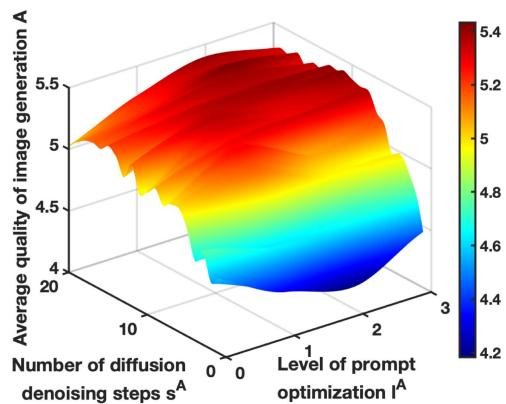

surface_3d

| Number of diffusion denoising steps s^A | Level of prompt optimization I^A | Average quality of image generation A |
| ---------------------------------------- | ---------------------------------- | -------------------------------------- |
| 0                                        | 1                                  | 4.2                                    |
| 0                                        | 2                                  | 4.6                                    |
| 0                                        | 3                                  | 5.0                                    |
| 1                                        | 1                                  | 4.8                                    |
| 1                                        | 2                                  | 5.2                                    |
| 1                                        | 3                                  | 5.4                                    |

(a)

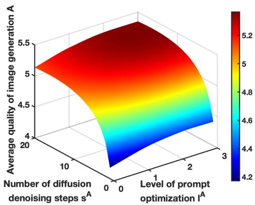

surface_3d

| Number of diffusion denoising steps s^A | Level of prompt optimization I^A | Average quality of image generation A |
| -------------------------------------- | ---------------------------------- | -------------------------------------- |
| 0                                      | 0                                  | 4.2                                    |
| 1                                      | 1                                  | 4.6                                    |
| 2                                      | 2                                  | 5.0                                    |
| 3                                      | 3                                  | 5.2                                    |

Fig. 2. Real experimental data and fitted function. (a) Real experimental data. (b) Fitted function.

To maximize the utility of the $\operatorname { A S P }$ under the IR and IC conditions, a latency-based contract problem is also formulated as follows:

$\mathrm { \bf ~ P r o b l e m ~ 2 : } \quad \quad \mathrm { m a x } \quad \quad \quad \quad \quad \quad \quad \quad \quad \quad \quad \quad \quad \quad \quad \quad \quad \quad \quad \quad \quad \quad \quad \quad \quad \quad \quad \quad \quad \quad \quad \quad \quad \quad \quad \quad \quad \quad \quad \quad \quad \quad \quad \quad \quad \quad \quad \quad \quad \quad \quad \quad \quad \quad \quad \quad \quad \quad \quad \quad \quad \quad \quad \quad \quad \quad \quad \quad \quad \quad \quad \quad \quad \quad \quad \quad \quad \quad \quad \quad \quad \quad \quad \quad \quad \quad \quad \quad \quad \quad \quad \quad \quad \quad \quad \quad \quad \quad \quad \quad \quad \quad \quad \quad \quad \quad \quad \quad \quad \quad \quad \quad \quad \quad \quad \quad \quad \quad \quad \quad \quad \quad \quad \quad \quad \quad \quad \quad \quad \quad \quad \quad \quad \quad \quad \quad \quad \quad \quad \quad \quad \quad \quad \quad \quad \quad \quad \quad \quad \quad \quad \quad \quad \quad \quad \quad \quad \quad \quad \quad \quad \quad \quad \quad \quad \quad \quad \quad \quad \quad \quad \quad \quad \quad \quad \quad \quad \quad \quad \quad \quad \quad \quad \quad \quad \quad \quad \quad \quad \quad \quad \quad \quad \quad \quad \quad \quad \quad \quad \quad \quad \quad \quad \quad \quad \quad \quad \quad \quad \quad \quad \quad \quad \quad \quad \quad \quad \quad \quad \quad \quad \quad \quad \quad \quad \quad \quad \quad \quad \quad \quad \quad \quad \quad \quad \quad \quad \quad \quad \quad \quad \quad \quad \quad \quad \quad \quad \quad \quad \quad \quad \quad \quad \quad \quad \quad \quad \quad \quad \quad \quad \quad \quad \quad \quad \quad \quad \quad \quad \quad \quad \quad \quad \quad \quad \quad \quad \quad \quad \quad \quad \quad \quad \quad \quad \quad \quad \quad \quad \quad \quad \quad \quad \quad \quad \quad \quad \quad \quad \quad \quad \quad \quad \quad \quad \quad \quad \quad \quad \quad \quad \quad \quad \quad \quad \quad \quad \quad \quad \quad \quad \quad \quad \quad \quad \quad \quad \quad \quad \quad \quad \quad \quad \quad \quad \quad \quad \quad \quad \quad \quad \quad \quad \quad \quad \quad \quad \quad \quad \quad \quad \quad \quad \quad \quad \quad \quad \quad \quad \quad \quad \quad \quad \quad \quad \quad \quad \quad \quad \quad $

${ \mathrm { s . t . } } \quad ( 2 5 ) , { \mathrm { a n d } } ( 2 6 ) , j , j ^ { \prime } \in \{ 1 , \ldots , J \} ,$

$$
x _ {j} ^ {\mathrm{T}} (\theta_ {i} ^ {\mathrm{A}}), y _ {j} ^ {\mathrm{T}} (\theta_ {i} ^ {\mathrm{A}}), r _ {j} ^ {\mathrm{T}} (\theta_ {i} ^ {\mathrm{A}}), p _ {j} ^ {\mathrm{T}} (\theta_ {i} ^ {\mathrm{A}}) \geq 0,
$$

$$
j \in \{1, \dots , J \}. \tag {27}
$$

Since the objective function and constraints are not concave functions in Problem 2, it is difficult to use traditional methods to solve directly Problem 2.

# C. GDM-Based Scheme for Latency-Based Contract Problem

The GDM-based scheme is also used to find the optimal latency-based contract items.

1) Training Phase: We first define the environment, latencybased contract design networks, and latency-based contract evaluation networks. The environment is represented as a vector $e ^ { \mathrm { T } } ( \theta _ { i } ^ { \mathrm { A } } )$ , which includes all factors that impact the optimal design ( )of a latency-based contract.

$$
\boldsymbol {e} ^ {\mathrm{T}} \left(\theta_ {i} ^ {\mathrm{A}}\right) = \left\{\boldsymbol {t} ^ {\max} \left(\theta_ {i} ^ {\mathrm{A}}\right), \boldsymbol {b} _ {1} \left(\theta_ {i} ^ {\mathrm{A}}\right), \boldsymbol {b} _ {2} \left(\theta_ {i} ^ {\mathrm{A}}\right), \boldsymbol {b} _ {3} \left(\theta_ {i} ^ {\mathrm{A}}\right), \boldsymbol {\theta} ^ {\mathrm{T}} \left(\theta_ {i} ^ {\mathrm{A}}\right), \boldsymbol {q} ^ {\mathrm{T}} \left(\theta_ {i} ^ {\mathrm{A}}\right), \right.
$$

$$
\left. \boldsymbol {\delta} \left(\theta_ {i} ^ {\mathrm{A}}\right), \boldsymbol {\eta}, \boldsymbol {d} \left(\theta_ {i} ^ {\mathrm{A}}\right), \boldsymbol {h} \left(\theta_ {i} ^ {\mathrm{A}}\right), \boldsymbol {\kappa} _ {1} \left(\theta_ {i} ^ {\mathrm{A}}\right), \boldsymbol {\kappa} _ {2} \left(\theta_ {i} ^ {\mathrm{A}}\right), l _ {i} ^ {\mathrm{A}}, s _ {i} ^ {\mathrm{A}}, M _ {i}, J \right\}. \tag {28}
$$

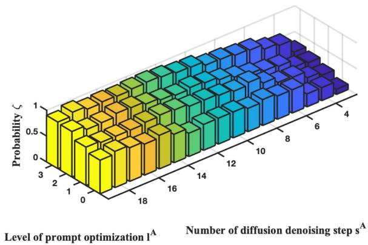

heatmap

| Level of prompt optimization l^A | Number of diffusion denoising step s^A | Probability ζ |
| -------------------------------- | -------------------------------------- | ------------- |
| 0                                | 4                                      | 1             |
| 1                                | 6                                      | 0.5           |
| 2                                | 8                                      | 0.5           |
| 3                                | 10                                     | 0.5           |
| 4                                | 12                                     | 0.5           |
| 5                                | 14                                     | 0.5           |
| 6                                | 16                                     | 0.5           |
| 7                                | 18                                     | 0.5           |
| 8                                | 20                                     | 0.5           |
| 9                                | 22                                     | 0.5           |
| 10                               | 24                                     | 0.5           |
| 11                               | 26                                     | 0.5           |
| 12                               | 28                                     | 0.5           |
| 13                               | 30                                     | 0.5           |
| 14                               | 32                                     | 0.5           |
| 15                               | 34                                     | 0.5           |
| 16                               | 36                                     | 0.5           |
| 17                               | 38                                     | 0.5           |
| 18                               | 40                                     | 0.5           |
| 19                               | 42                                     | 0.5           |
| 20                               | 44                                     | 0.5           |
| 21                               | 46                                     | 0.5           |
| 22                               | 48                                     | 0.5           |
| 23                               | 50                                     | 0.5           |
| 24                               | 52                                     | 0.5           |
| 25                               | 54                                     | 0.5           |
| 26                               | 56                                     | 0.5           |
| 27                               | 58                                     | 0.5           |
| 28                               | 60                                     | 0.5           |
| 29                               | 62                                     | 0.5           |
| 30                               | 64                                     | 0.5           |
| 31                               | 66                                     | 0.5           |
| 32                               | 68                                     | 0.5           |
| 33                               | 70                                     | 0.5           |
| 34                               | 72                                     | 0.5           |
| 35                               | 74                                     | 0.5           |
| 36                               | 76                                     | 0.5           |
| 37                               | 78                                     | 0.5           |
| 38                               | 80                                     | 0.5           |
| 39                               | 82                                     | 0.5           |
| 40                               | 84                                     | 0.5           |
| Note: The x-axis values are labeled as '1' to '4', but they are not explicitly provided in the code snippet for this example. The y-axis values are labeled as 'Level of prompt optimization l^A' and 'Number of diffusion denoising step s^A'. There is no label for the data series in this case.

Fig. 3. Probability $\zeta ( A ( l ^ { \mathrm { A } } , s ^ { \mathrm { A } } ) > \overline { { { A } } } )$ with different combinations of $l ^ { \mathrm { A } }$ and $s ^ { \mathrm { A } } .$

TABLE III STRUCTURE OF CONTRACT DESIGN AND EVALUATION NETWORKS 

<table><tr><td>Networks</td><td>Layer</td><td>Activation</td><td>Units</td></tr><tr><td rowspan="7">Design</td><td>SinusoidalPosEmb</td><td>-</td><td>16</td></tr><tr><td>FullyConnect</td><td>Tanh</td><td>32</td></tr><tr><td>FullyConnect</td><td>-</td><td>16</td></tr><tr><td>Concatenation</td><td>-</td><td>-</td></tr><tr><td>FullyConnect</td><td>Tanh</td><td>256</td></tr><tr><td>FullyConnect</td><td>Tanh</td><td>256</td></tr><tr><td>FullyConnect</td><td>Tanh</td><td>12</td></tr><tr><td rowspan="4">Evaluation</td><td>FullyConnect</td><td>Mish</td><td>256</td></tr><tr><td>FullyConnect</td><td>Mish</td><td>256</td></tr><tr><td>FullyConnect</td><td>Mish</td><td>256</td></tr><tr><td>FullyConnect</td><td>-</td><td>1</td></tr></table>

A latency-based contract design policy, denoted by $\pi _ { \omega ^ { \mathrm { T } } } ^ { \mathrm { T } } ( \phi ^ { \mathrm { T } } ( \theta _ { i } ^ { \mathrm { A } } ) | e ^ { \mathrm { T } } ( \theta _ { i } ^ { \mathrm { A } } ) )$ . Then, we use the reverse process of ( ( ) ( ))a conditional diffusion model to represent the latency-based contract design policy as follows:

$$
\pi_ {\omega^ {\mathrm{T}}} ^ {\mathrm{T}} (\boldsymbol {\phi} ^ {\mathrm{T}} (\theta_ {i} ^ {\mathrm{A}}) \mid \boldsymbol {e} ^ {\mathrm{T}} (\theta_ {i} ^ {\mathrm{A}})) = P _ {\omega^ {\mathrm{T}}} ^ {\mathrm{T}} \left(\boldsymbol {\phi} ^ {0: K ^ {\mathrm{T}}} (\theta_ {i} ^ {\mathrm{A}}) \mid \boldsymbol {e} ^ {\mathrm{T}} (\theta_ {i} ^ {\mathrm{A}})\right)
$$

$$
= \mathcal {N} ^ {\mathrm{T}} \left(\boldsymbol {\phi} ^ {K ^ {\mathrm{T}}} (\theta_ {i} ^ {\mathrm{A}}); \mathbf {0}, \mathbf {I} ^ {\mathrm{T}}\right) \prod_ {k = 1} ^ {K ^ {\mathrm{T}}} P _ {\omega^ {\mathrm{T}}} ^ {\mathrm{T}} (\theta_ {i} ^ {\mathrm{A}}), \tag {29}
$$

where $P _ { . , . } ^ { \mathrm { T } } ( \theta _ { i } ^ { \mathrm { A } } )$ is a simplified form of $P _ { \omega ^ { \mathrm { T } } } ^ { \mathrm { T } } ( \phi ^ { k - 1 , \mathrm { T } }$ $( \theta _ { i } ^ { \mathrm { A } } ) | \phi ^ { k , \mathrm { T } } ( \theta _ { i } ^ { \mathrm { A } } ) , e ^ { \mathrm { T } } ( \theta _ { i } ^ { \mathrm { A } } ) ;$ . According to [28], $P _ { \omega ^ { \mathrm { T } } } ^ { \mathrm { T } } ( \theta _ { i } ^ { \mathrm { K } } )$ (can be ( ) ( ) ( )) ( )also modeled as a noise prediction model, with the covariance matrix fixed as:

$$
\boldsymbol {\Sigma} _ {\omega^ {\mathrm{T}}} \left(\boldsymbol {\phi} ^ {k, \mathrm{T}} (\theta_ {i} ^ {\mathrm{A}}), \boldsymbol {e} ^ {\mathrm{T}} (\theta_ {i} ^ {\mathrm{A}}), k\right) = \beta_ {k} ^ {\mathrm{T}} \mathbf {I} ^ {\mathrm{T}}, \tag {30}
$$

and the mean is defined as follows:

$$
\begin{array}{l} \mu_ {\omega^ {\mathrm{T}}} ^ {\mathrm{T}} \left(\boldsymbol {\phi} ^ {k, \mathrm{T}} (\theta_ {i} ^ {\mathrm{A}}), \mathbf {e} ^ {\mathrm{T}} (\theta_ {i} ^ {\mathrm{A}}), k\right) \\ = \frac {1}{\sqrt {\alpha_ {k} ^ {\mathrm{T}}}} \left(\boldsymbol {\phi} ^ {k, \mathrm{T}} (\theta_ {i} ^ {\mathrm{A}}) - \frac {\beta_ {k} ^ {\mathrm{T}}}{\sqrt {1 - \bar {\alpha} _ {k} ^ {\mathrm{T}}}} \varepsilon_ {\omega^ {\mathrm{T}}} ^ {\mathrm{T}} \left(\boldsymbol {\phi} ^ {k, \mathrm{T}} (\theta_ {i} ^ {\mathrm{A}}), \mathbf {e} ^ {\mathrm{T}} (\theta_ {i} ^ {\mathrm{A}}), k\right)\right). \tag {31} \\ \end{array}
$$

We begin by sampling ${ \boldsymbol \phi } ^ { K ^ { \operatorname { T } } } \sim \mathcal { N } ^ { \operatorname { T } } ( { \mathbf { 0 } } , { \mathbf { I } } ^ { \operatorname { T } } )$ and then proceed with ( I )the reverse diffusion chain, parameterized by $\omega ^ { \mathrm { T } } ;$ :

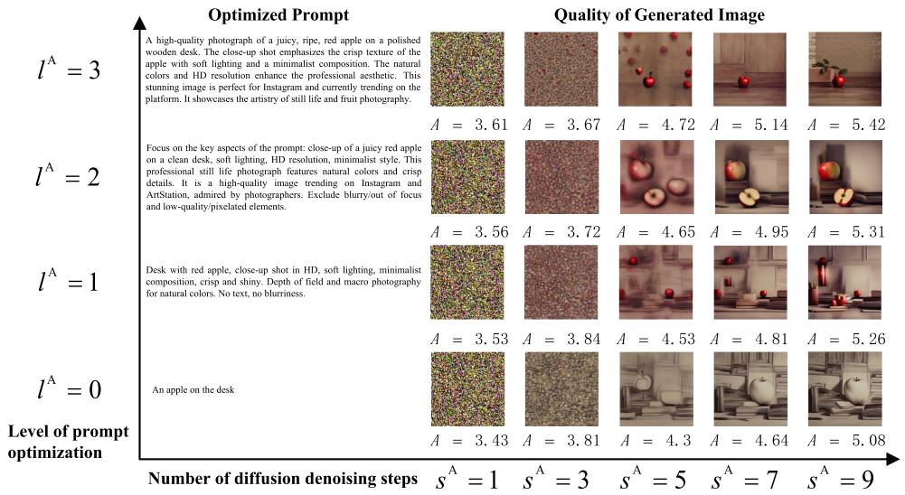

other

| l^A | Optimized Prompt | Quality of Generated Image |
| --- | --- | --- |
| 3 | A = 3.61 | A = 3.67 |
| 2 | A = 3.56 | A = 3.72 |
| 1 | A = 3.53 | A = 3.84 |
| 0 | A = 3.43 | A = 3.81 |
| 3 | s^A = 1 | s^A = 3 |
| 2 | s^A = 5 | s^A = 7 |
| 1 | s^A = 4.72 | A = 5.14 |
| 0 | s^A = 5.42 | A = 5.31 |
| 3 | s^A = 3.61 | A = 3.67 |
| 2 | s^A = 4.72 | A = 5.14 |
| 1 | s^A = 3.56 | A = 3.72 |
| 0 | s^A = 4.65 | A = 4.95 |
| 3 | s^A = 4.81 | A = 5.26 |
| 2 | s^A = 5.08 | A = 5.08 |
| 1 | s^A = 3.53 | A = 3.84 |
| 0 | s^A = 4.3 | A = 4.64 |
The chart displays two panels: (1) Optimized Prompt and (2) Quality of Generated Image, each showing a grid of images with labeled scores and corresponding numbers below each panel.

Fig. 4. Quality of generated image with different combinations of $l ^ { \mathrm { A } }$ and $s ^ { \mathrm { A } }$ .

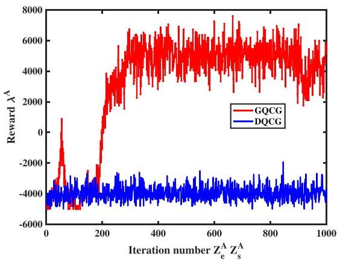

line

| Iteration number | GQCG Reward λ^A | DQCG Reward λ^A |
| ---------------- | --------------- | --------------- |
| 0                | -5000           | -4000           |
| 200              | 3000            | -3500           |
| 400              | 6000            | -3500           |
| 600              | 6500            | -3500           |
| 800              | 6000            | -3500           |
| 1000             | 5500            | -3500           |

Fig. 5. Training process of GDM-based and DRL-based quality contract generation schemes.

TABLE IV SUMMARY OF TRAINING HYPERPARAMETER 

<table><tr><td>Hyperparameter</td><td>Setting in Quality-based Contract Generation Model</td><td>Setting in Latency-based Contract Generation Model</td></tr><tr><td>Learning rate of the contract design network</td><td> $8 \times 10^{-9}$ </td><td> $10^{-6}$ </td></tr><tr><td>Learning rate of the contract evaluation network</td><td> $8 \times 10^{-9}$ </td><td> $10^{-6}$ </td></tr><tr><td>Soft target update parameter</td><td> $\tau^{\text{A}} = 0.005$ </td><td> $\tau^{\text{T}} = 0.005$ </td></tr><tr><td>Batch size</td><td> $N^{\text{A}} = 10^{6}$ </td><td> $N^{\text{T}} = 10^{6}$ </td></tr><tr><td>Discount factor</td><td> $\gamma^{\text{A}} = 0.95$ </td><td> $\gamma^{\text{T}} = 0.95$ </td></tr><tr><td>Number of iterations for adding noise</td><td> $K^{\text{A}} = 3$ </td><td> $K^{\text{T}} = 3$ </td></tr><tr><td>Maximum capacity of the replay buffer</td><td> $\mathcal{B}^{\text{A}} = 10^{6}$ </td><td> $\mathcal{B}^{\text{T}} = 10^{6}$ </td></tr><tr><td>Exploration Noise</td><td> $\epsilon^{\text{A}} = 0.01$ </td><td> $\epsilon^{\text{T}} = 0.01$ </td></tr><tr><td>Max episode</td><td> $Z_{e}^{\text{A}} = 1000$ </td><td> $Z_{e}^{\text{T}} = 1000$ </td></tr><tr><td>Max step</td><td> $Z_{s}^{\text{A}} = 1$ </td><td> $Z_{s}^{\text{T}} = 1$ </td></tr><tr><td>Penalty</td><td> $\xi^{\text{A}} = -300$ </td><td> $\xi^{\text{T}} = -200$ </td></tr></table>

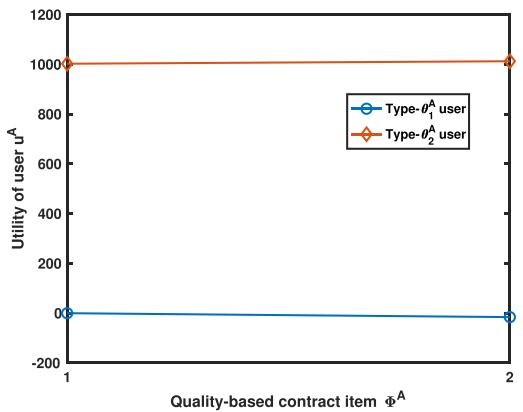

line

| Quality-based contract item Φ^A | Type-θ₁^A user | Type-θ₂^A user |
| ------------------------------- | -------------- | -------------- |
| 1                               | 0              | 1000           |
| 2                               | 0              | 1000           |

Fig. 6. Utility of user versus types of quality contract item.

$$
\begin{array}{l} \phi^ {k - 1, \mathrm{T}} (\theta_ {i} ^ {\mathrm{A}}) \mid \phi^ {k, \mathrm{T}} (\theta_ {i} ^ {\mathrm{A}}) = \frac {\phi^ {k , \mathrm{T}} (\theta_ {i} ^ {\mathrm{A}})}{\sqrt {\alpha_ {k} ^ {\mathrm{T}}}} \\ - \frac {\beta_ {k} ^ {\mathrm{T}}}{\sqrt {\alpha_ {k} ^ {\mathrm{T}} \left(1 - \bar {\alpha} _ {k} ^ {\mathrm{T}}\right)}} \varepsilon_ {\omega^ {\mathrm{T}}} ^ {\mathrm{T}} \left(\phi^ {k, \mathrm{T}} (\theta_ {i} ^ {\mathrm{A}}), \mathbf {e} ^ {\mathrm{T}} (\theta_ {i} ^ {\mathrm{A}}), k\right) + \sqrt {\beta_ {k} ^ {\mathrm{T}}} \varepsilon^ {\mathrm{T}}. \tag {32} \\ \end{array}
$$

We train a network, denoted as $\varepsilon _ { \omega ^ { \mathrm { I } } } ^ { \mathrm { T } }$ , to generate latency-based contracts. This network is then used to train a latency-based contract design policy, denoted as $\pi _ { \omega ^ { \mathrm { T } } } ^ { \mathrm { T } }$ in complex and highdimensional environments, denoted as $e ^ { \mathrm { T } } ( \theta _ { i } ^ { \mathrm { A } } )$ . In the same way, ( )we can also obtain the optimal latency-based contract design policy by minimizing the loss function $\mathcal { L } ^ { \mathrm { T } } ( \omega ^ { \mathrm { T } } )$ using double Q-learning in the following manner:

$$
\begin{array}{l} \pi^ {\mathrm{T}} = \underset {\pi_ {\omega^ {\mathrm{T}}} ^ {\mathrm{T}}} {\arg \min} \mathcal {L} ^ {\mathrm{T}} (\omega^ {\mathrm{T}}) \\ = - \mathbb {E} _ {\phi^ {0, \mathrm{T}} (\theta_ {i} ^ {\mathrm{A}}) \sim \pi_ {\omega^ {\mathrm{T}}} ^ {\mathrm{T}}} \left[ H _ {\upsilon^ {\mathrm{T}}} ^ {\mathrm{T}} \left(\mathbf {e} ^ {\mathrm{T}} (\theta_ {i} ^ {\mathrm{A}}), \phi^ {0, \mathrm{T}} (\theta_ {i} ^ {\mathrm{A}})\right) \right]. \tag {33} \\ \end{array}
$$

The network of evaluating latency-based contracts also employs the double Q-learning method for its training. It involves the formulation of two primary networks, designated as $H _ { v _ { 1 } ^ { \mathrm { T } } } ^ { \mathrm { T } }$ and HT , $H _ { v _ { \mathrm { s } } ^ { \mathrm { T } } } ^ { \mathrm { T } }$ T2 and their corresponding target counterparts, named H T $H _ { \upsilon _ { 1 } ^ { \mathrm { T } } , \prime } ^ { \mathrm { T } } , \bar { H } _ { \upsilon _ { 2 } ^ { \mathrm { T } } } ^ { \mathrm { T } }$ υT, , H T  and πT T, $\boldsymbol { \pi } _ { \omega ^ { \mathrm { T } , \cdot } } ^ { \mathrm { T } }$  . The goal is to optimize $\boldsymbol { v } _ { i , n } ^ { \mathrm { T } }$ for $n = 1 , 2$ υ2 through minimization of the objective

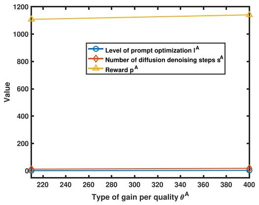

line

| Type of gain per quality θ^A | Level of prompt optimization I^A | Number of diffusion denoising steps s^A | Reward p^A |
| ---------------------------- | ---------------------------------- | ---------------------------------------- | ---------- |
| 220                          | 0                                  | 0                                        | 1100       |
| 400                          | 0                                  | 0                                        | 1150       |

Fig. 7. Quality-based contract value under different types.

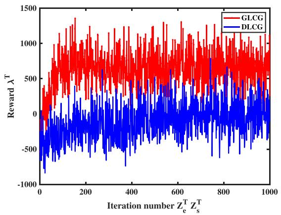

line

| Iteration number Z_e^T Z_s^T | GLCG Reward λ^T | DLCG Reward λ^T |
| ----------------------------- | --------------- | --------------- |
| 0                             | ~0              | ~-800           |
| 200                           | ~1200           | ~-200           |
| 400                           | ~1000           | ~-300           |
| 600                           | ~1300           | ~-100           |
| 800                           | ~1100           | ~-200           |
| 1000                          | ~900            | ~-100           |

Fig. 8. Training process of GDM-based and DRL-based latency contract generation schemes.

$$
\begin{array}{l} \mathbb {E} _ {\boldsymbol {\phi} _ {k + 1} ^ {0, \mathrm{T}} (\theta_ {i} ^ {\mathrm{A}}) \sim \pi_ {\omega_ {i} ^ {\mathrm{T}}, ^ {\prime}} ^ {\mathrm{T}}} \left[ \left| \right| \right| \left(r (\mathbf {e} ^ {\mathrm{T}} (\theta_ {i} ^ {\mathrm{A}}), \boldsymbol {\phi} _ {k} ^ {\mathrm{T}} (\theta_ {i} ^ {\mathrm{A}})) \right. \\ \left. + \gamma^ {\mathrm{T}} \min _ {n = 1, 2} H _ {\upsilon_ {n} ^ {\mathrm{T}, \prime}} ^ {\mathrm{T}} (\mathbf {e} ^ {\mathrm{T}} (\theta_ {i} ^ {\mathrm{A}}), \phi_ {k + 1} ^ {0, \mathrm{T}} (\theta_ {i} ^ {\mathrm{A}}))\right) \\ \left.\left. - H _ {v _ {n} ^ {\mathrm{T}, \prime}} ^ {\mathrm{T}} \left(\mathbf {e} ^ {\mathrm{T}} \left(\theta_ {i} ^ {\mathrm{A}}\right), \phi_ {k} ^ {\mathrm{T}} \left(\theta_ {i} ^ {\mathrm{A}}\right)\right)\right|\right| ^ {2} \left. \right]. \tag {34} \\ \end{array}
$$

2) Inference Stage: The trained latency-based contract design network is used during the inference phase to generate efficient latency-based contract items based on current environmental parameters.

# VI. SIMULATION RESULTS

First, we employ an approximation approach to quantitatively evaluate the relationship between the level of prompt optimization, the number of diffusion denoising steps, and the quality of image generation, which is a common practice in the literature and has been adopted in other works, such as [9], [10]. Second, the approximation approach is also used to quantitatively assess the relationship between the level of prompt optimization, the number of diffusion denoising steps, and the probability that the quality of image generation exceeds the threshold A. According to the data shown in Fig. 4, certain generated images do not meet the production criteria for user prompt word requests when the image quality falls below ${ \overline { { A } } } = 4 . 5 ;$ for example, $\left( s ^ { \mathrm { { A } } } , s ^ { \mathrm { { T } } } \right) =$ $( 5 , 3 )$ or $( \bar { s } ^ { \mathrm { A } } , s ^ { \bar { \mathrm { T } } } ) = ( 5 , 2 )$ = ( ) =. Furthermore, other images do not ( ) ( ) = ( )meet the criteria if the quality is less than $\overline { { A } } = 5 . 0$ , such as $( s ^ { \mathrm { A } } , s ^ { \mathrm { T } } ) = ( 7 , 1 )$ =in our dataset. To obtain more consistent re-( ) = ( )sults in the simulation experiment, we established the quality threshold at $\overline { { A } } = 5 . 0$ . Note that this threshold might differ for =various datasets. However, our analysis method is still applicable to other datasets. Third, we introduce the setting of the GDM. Fourth, we evaluate the two-stage GDM-based contract generation scheme and demonstrate its superior performance compared to an existing DRL-based contract generation scheme. Continuously, the validity of the generated quality-latency contract is verified. Finally, we analyze the impact of prompt optimization on performance.

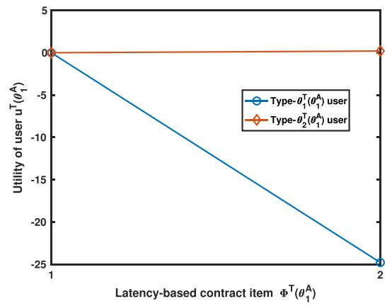

line

| Latency-based contract item Φ^T(θ₁^A) | Type-θ₁ᵀ(θ₁^A) user | Type-θ₂ᵀ(θ₁^A) user |
| ------------------------------------- | ------------------- | ------------------- |
| 1                                     | 0                   | 0                   |
| 2                                     | -25                 | 0                   |

(a)   
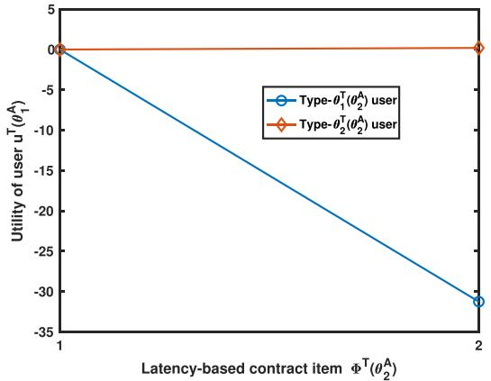

line

| Latency-based contract item Φ^T(θ₂^A) | Type-θ₁ᵀ(θ₂^A) user | Type-θ₂ᵀ(θ₂^A) user |
| ------------------------------------- | ------------------- | ------------------- |
| 1                                     | 0                   | 0                   |
| 2                                     | -30                 | 0                   |

(b)   
Fig. 9. Verification of latency-based contract design under different qualitybased contract items. (a) $t ^ { \mathrm { m a x } } \doteq 3 \mathrm { s } , l _ { 1 } ^ { \mathrm { A } } = 1$ and $s _ { 1 } ^ { \mathrm { A } } = 1 3 . ( \mathbf { b } ) t ^ { \mathrm { m a x } } = 4 \mathrm { s } , \dot { l } _ { 2 } ^ { \mathrm { A } } = \dot { 2 }$ and $s _ { 2 } ^ { \mathrm { A } } = 1 7$ .

# A. Quantity of Quality of Image Generation

We employ an approximation approach to determine the relationship between the level of prompt optimization, the number of diffusion denoising steps, and the quality of image generation. The steps are as follows. In the first step, we define an original prompt, for instance, an apple on the desk. In the second step, referring to [32], we use a fixed learning algorithm to adjust different level l to optimize the original prompt. In the third step, the optimized prompt is inputted into the Stable Diffusion XL model [33], and the number of diffusion denoising steps is varied to obtain different output images. In the fourth step, the neural image assessment model [8] is used to access the quality of each image. These steps are performed $L \times S$ times to obtain the set $\{ \bar { A _ { l , s } } | l \in [ 1 , L ] , \bar { s } \in [ \bar { 1 , S } ] \}$ , where L is the maximum [ ] [ ]level and S is the maximum number of diffusion denoising steps. In the fifth step, repeating the above steps 100 times to obtain the average experimental result, which is shown in Fig. 2(a). $\mathrm { A s }$ the level of prompt optimization level and the number of diffusion denoising steps increase, the average quality of image generation improves. To numerically analyze the experimental results, we define A as follows:

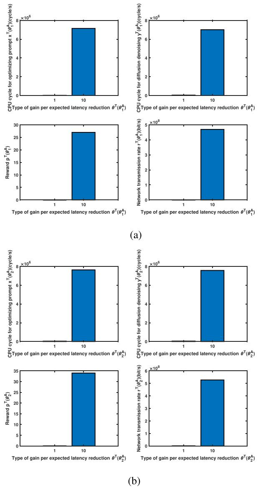  
Fig. 10. Latency-based contract value under different quality-based contract items. (a) $\mathbf { \Phi } ) \mathbf { \Psi } t ^ { \operatorname* { m a x } } = \mathbf { \dot { 3 } s } , l _ { 1 } = 1$ and $s _ { 1 } = 1 3$ . (b) tmax = 4s, l2 = 2 and $s _ { 2 } = 1 7$ .

$$
A = \rho_ {1} \ln (\rho_ {2} l + 1) - \rho_ {3} l + \rho_ {4} \ln (\rho_ {5} s + 1) - \rho_ {6} s. \tag {35}
$$

The algorithm for non-linear least squares modifies the values of $\rho$ in order to minimize the sum of squared errors. The specific values for $\rho _ { 1 } = 9 . 7 4 1 7 , \rho _ { 2 } = 0 . 0 9 7 8 , \rho _ { 3 } = 0 . 7 6 4 7 , \rho _ { 4 } =$ 0.5158, $\rho _ { 5 } = 3 4 9 7 . 8 4 6 3$ , and $\rho _ { 6 } = 0 . 0 3 0 7$ = = are used in this opti-= =mization process. The results of the fitted function are shown in Fig. 2(b). The above approximation approach can be extended to a wide variety of AIGC services.

# B. Quantity of Probability of Image Generation Quality Exceeding a Threshold

We then use the frequency to approximate the probability $\zeta ( A ( l ^ { \mathrm { A } } , s ^ { \mathrm { A } } ) > \overline { { A } } )$ , as illustrated in Fig. 3. In Fig. 3, as the level ( ( ) )of prompt optimization and the number of diffusion denoising steps increase, the probability $\zeta ( A ( l ^ { \mathrm { A } } , s ^ { \mathrm { A } } ) > \overline { { { A } } } )$ increases. Note ( ( ) )that most of the results generated are invalid when the number of inference steps is less than or equal to 3, as shown in Fig. 4. Therefore, the lower bound of the diffusion denoising step is set to $s ^ { A , \mathrm { m i n } } = 4$ .

# C. Setting of GDM

Experimental Platform: Our algorithms are tested on a platform featuring Ubuntu 20.04 as the operating system, powered by an AMD Ryzen Threadripper PRO 3975WX with 32 cores CPU and complemented by an NVIDIA RTX A5000 GPU for enhanced performance.

GDM Design: We utilize the diffusion model as the basis of the contract design network and two contract evaluation networks with the same structure to reduce the issue of overestimation, as reported in [14]. The configurations of the contract design and evaluation networks are described in Table III. For the quality-based contract generation model and the latency-based contract generation model, Table IV summarizes the detailed settings for other training hyperparameters in our experiments. According to [18], for the quality-based contract generation, we set M  20 and $I = 2 ; \theta _ { 1 } ^ { \mathrm { A } }$ and $\theta _ { 2 } ^ { \mathrm { A } }$ are randomly sampled = =within [1,200] and [200,400] respectively; $q _ { 1 } ^ { \mathrm { A } }$ and $q _ { 2 } ^ { \mathrm { A } }$ are generated randomly; $\sigma _ { 1 }$ and $\sigma _ { 2 }$ are randomly sampled within [1,10]. According to [15], [21], [23], for the latency-based contract generation, we set $M _ { 1 } = M _ { 2 } = 1 0$ and $J _ { 1 } = J _ { 2 } = 2 ; \theta _ { 1 , 1 } ^ { \mathrm { T } }$ 1 and $q _ { 2 , 1 } ^ { \mathrm { T } }$ = = =are randomly sampled within [1,25] while $\theta _ { 1 , 2 } ^ { \mathrm { T } }$ and $q _ { 2 , 2 } ^ { \mathrm { T } }$ are randomly sampled within [25,50]; $q _ { 1 , 1 } ^ { \mathrm { T } } , q _ { 1 , 2 } ^ { \mathrm { T } } , q _ { 2 , } ^ { \mathrm { T } }$ 1 and $q _ { 2 , 2 } ^ { \mathrm { T } }$ are generated randomly; l and s are randomly sampled within [1,20] and [0,3] respectively; d is randomly sampled within $[ 5 , 8 ] \times 1 0 ^ { 5 }$ bit; t max is randomly sampled within [1,4] $s ; ~ b _ { 1 }$ [ ]and b2 are randomly sampled within $[ 8 , 1 0 ] \times 1 0 ^ { 7 } ; b _ { 3 }$ is randomly sampled within $[ 3 , 5 ] \times 1 0 ^ { - 4 }$ [ ]; h is randomly sampled within $[ 3 , 5 ] \times 1 0 ^ { 6 }$ ; $\kappa _ { 1 }$ and $\kappa _ { 2 }$ ]are randomly sampled within $\left[ 1 , 4 \right] \times 1 0 ^ { - 2 8 } ; \eta _ { 1 }$ and $\eta _ { 2 }$ [ ]are randomly sampled within [3000,5000] cycles/bit.

# D. Efficiency of Two-Stage GDM-Based Contract Generation Scheme

1) GDM-Based Quality Contract Design: Fig. 5 shows the test reward curves of our GDM-based quality contract generation (GQCG) scheme and the DRL-based quality contract generation (DQCG) scheme. Our proposed GQCG scheme consistently outperforms the DQCG scheme when the same parameters are used. This is because the quality contract generation policy in our scheme is fine-tuned by the diffusion process, which reduces the effect of randomness and noise [1].

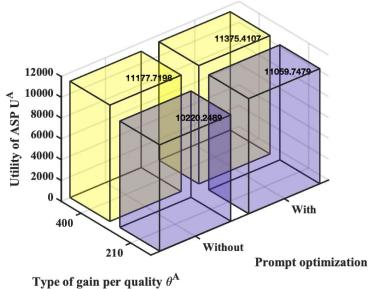

bar

| Type of gain per quality θ^A | With   | Prompt optimization |
| ---------------------------- | ------ | -------------------- |
| 400                          | 11177.7198 | 11375.4107          |
| 210                          | 10201.2689 | 11059.7479          |

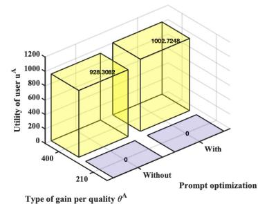

bar

| Type of gain per quality θ^A | With     | Without  |
| ---------------------------- | -------- | -------- |
| Utility of user u^A           | 926.3083 | 0        |
| Utility of user u^A           | 1002.7245| 0        |

(b)

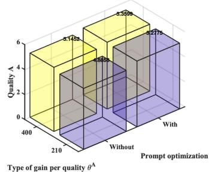

bar

| Prompt optimization | Quality A |
| --------------------- | --------- |
| With                  | 5.1429    |
| Without               | 5.0765    |
| With                  | 5.3000    |
| Without               | 5.2775    |

Fig. 11. Impact of prompt optimization on quality-based contract design. (a) Utility of ASP. (b) Utility of user. (c) Quality.

For a given environment state, we verify the validity of the generated quality contract items. Fig. 6 shows the validation of the IC and IR constraints in the proposed GDM-based quality contract design. We evaluate the utilities of different users with various types of gain per quality when selecting different quality-based contract items from the ASP. From Fig. 6, we validate that our quality-based contract design satisfies the IR and IC constraints. A user with an arbitrary type achieves the maximal utility with a non-negative value only when accepting the quality contract item matched with its type. The selection process of the quality contract item enables the types of user to be indirectly revealed to the ASP. This means that qualitybased contract design is effective in solving the information asymmetry problem for the ASP. Fig. 7 shows the number of diffusion denoising steps, the level of prompt optimization, and the reward for ASP with respect to different types of gain per quality. To increase the quality of the inferred results, users with the higher types need to give more rewards to increase the number of diffusion denoising steps and the level of prompt optimization.

2) GDM-Based Latency Contract Design: The curves in Fig. 8 illustrate that our GDM-based latency contract generation (GLCG) scheme is more effective than the conventional DRL-based latency contract generation (DLCG) scheme when the same parameters are employed. The reason is similar to the reason for the results in Fig. 5.

For a given environment state, we will verify the validity of the generated latency-based contract items. After 20 users select the quality-based contract items, the ASP implements a latency-based contract design for these users selecting the same quality-based contract item. 10 users choose $( l _ { 1 } ^ { \mathrm { A } } , s _ { 1 } ^ { \mathrm { A } } , p _ { 1 } ^ { \mathrm { A } } )$ , their maximum requested time is $t ^ { \mathrm { m a x } } = 3 \mathrm { ~ s ~ }$ ( ). 10 users choose $\left( l _ { 2 } ^ { \mathrm { A } } , s _ { 2 } ^ { \mathrm { A } } , p _ { 2 } ^ { \mathrm { A } } \right)$ =, their maximum requested latency is $t ^ { \mathrm { m a x } } = 4 ~ \mathrm { s } .$ ( ) =The reason is similar to the reason for the results in Fig. 6. Fig. 9 validates the IC and IR constraints in the proposed latency-based contract design with various quality-based contract items, such as tmax, lA, and $s ^ { \mathrm { A } }$ .

Fig. 10 shows CPU cycle for optimizing prompt and diffusion denoising, network transmission rate, and the reward for the ASP under different quality-based contract items.

# E. Impact of Prompt Optimization on Performance

Fig. 11 shows the impact of prompt optimization on qualitybased contract design. The first approach is not to optimize the prompt. The second approach is to use prompt optimization, which is the approach proposed in this paper. Fig. 11 illustrates that the use of prompt optimization can be beneficial to improve both the ASP utility in Fig. 11(a), the users’ utilities in Fig. 11(b), and the quality of the diffusion denoising result in Fig. 11(c). In addition, as the type of gain per quality increases, so does the ASP utility, users’ utilities, and the quality of the diffusion denoising result. Particularly, for type- $- \theta _ { 1 } ^ { \mathrm { A } }$ and type- $\mathbf { \cdot } \theta _ { 2 } ^ { \mathrm { A } }$ users, the quality of the diffusion denoising result is improved by 8% and 2%, respectively. The causes are summarized below. Due to the lack of prompt optimization, the quality of the generated images decreases, resulting in a significant drop in user satisfaction. However, the reduction in the amount users are willing to pay a reward may only decrease linearly, creating an asymmetry that directly impacts user utility. For example, a user who expects to generate a high-quality landscape image for use as wallpaper may receive a blurry, low-detail image due to the lack of prompt optimization. Although the user experiences significant disappointment, they can only reduce their payment from 20 dollars to 15 dollars rather than refuse to pay entirely. This linear reduction in payment fails to fully capture the user’s strong dissatisfaction, ultimately leading to a substantial decrease in overall utility and perceived value. Once users have chosen the same quality-based contract item, e.g. $l ^ { \mathrm { A } } = 2 , s ^ { \mathrm { A } } = 1 7 .$ , Fig. 12 = =displays the impact of prompt optimization on latency-based contract design. Those who employed prompt optimization selected a high-quality contract item, i.e. $l ^ { \mathrm { A } } = 2 , s ^ { \mathrm { A } } = 1 7$ , while = =those who did not use prompt optimization chose a contract item of lesser quality, i.e. $l ^ { \mathrm { A } } = 0 , s ^ { \mathrm { A } } = 1 7$ . The results illustrate that = =prompt optimization can be beneficial for enhancing the ASP utility in Fig. 12(a), as well as for the users’ utilities in Fig. 12(b), and the expected latency reduction in Fig. 12(c). The explanation for the results shown in Fig. 12(a) and (b) is analogous to the reasoning behind the results in Fig. 11. To explain the results in Fig. 12(c), when the number of diffusion denoising iterations is constant, employing prompt optimization boosts the likelihood of producing an image that meets the user’s quality requirements. This, in turn, reduces the probability of needing to regenerate the image, thereby enhancing the total expected latency reduction. Additionally, as the gain per quality increases, the ASP utility, user utilities, and expected latency reduction all improve. For instance, for $\mathrm { t y p e } { - \theta _ { 2 } ^ { \mathrm { T } } ( \theta _ { 2 } ^ { \mathrm { A } } ) }$ users, the expected latency reduction is increased by 22%.

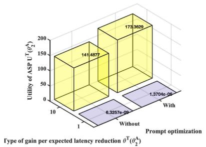

bar

| Prompt optimization | Type of gain per expected latency reduction θ^T (α^λ) |
|---|---|
| Without Prompt optimization | 6.3257e-09 |
| With Prompt optimization | 1.3704e-08 |
| With Prompt optimization | 173.3629 |
| With Prompt optimization | 141.4877 |
The chart displays a 3D bar chart with three labeled values: 'With Prompt optimization' at the top, 'Without Prompt optimization' at the bottom, and an unlabeled top-right value. The y-axis represents 'Utility of ASP U^T (α^λ)' ranging from 0 to 200.

(a)

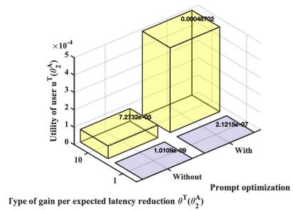

bar

| Prompt optimization | Type of gain per expected latency reduction θ^T(θ²^A) |
|---|---|
| Without Prompt optimization | 7.21328e-05 |
| With Prompt optimization | 2.12159e-07 |
| Utility of user u^T (θ²^A) ×10⁻⁴ | 0.00048702 |
| Utility of user u^T (θ²^A) ×10⁻⁴ | 1.01098e-09 |
| Utility of user u^T (θ²^A) ×10⁻⁴ | 2.12159e-07 |

(b)

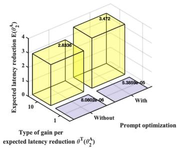

bar

| Prompt optimization | Expected latency reduction E(θ²) |
|---|---|
| Without Prompt optimization | 2.8330 |
| With Prompt optimization | 5.38596-05 |
| Type of gain per expected latency reduction θᵀ(θ²^A) | 8.08026-05 |
| Expected latency reduction E(θ²) | 3.472 |

（c）  
Fig. 12. Impact of prompt optimization on latency-based contract design. (a) Utility of ASP. (b) Utility of user. (c) Expected latency reduction.

# VII. CONCLUSION

In this paper, we propose a two-stage, multi-dimensional resource allocation framework based on a GDM and contract theory. First, based on the quality of AIGC generation, we establish a model for the user and ASP utilities, leading to a quality contract problem. Its objective is to maximize the utility of the ASP. Then, a GDM-based scheme optimizes qualitybased contract items. Users choose quality-based contract items based on their types of gain per quality, and then a non-convex latency-based contract problem is formulated for each group of users selecting identical quality-based contract items. The optimal latency-based contract items are again resolved using the GDM-based scheme. The numerical results show that the proposed GDM-based scheme is very advantageous to improve the quality of AIGC generation and decrease the latency of AIGC generation, compared to other standard schemes. Future work will focus on the design of a multitask incentive mechanism considering the effects of the irrational behavior of mobile terminals on the behavioral decisions of mobile terminals and ASPs.

# REFERENCES

[1] H. Du et al., “Enhancing deep reinforcement learning: A tutorial on generative diffusion models in network optimization,” IEEE Commun. Surv. Tut., early access, 2024, doi: 10.1109/COMST.2024.3400011.   
[2] H. Zou, Q. Zhao, L. Bariah, M. Bennis, and M. Debbah, “Wireless multi-agent generative AI: From connected intelligence to collective intelligence,” 2023, arXiv:2307.02757.   
[3] M. A. Ferrag et al., “Revolutionizing cyber threat detection with large language models: A privacy-preserving bert-based lightweight model for iot/iiot devices,”, IEEE Access, vol. 12, pp. 23733–23750, 2024.   
[4] Y. Liu et al., “Optimizing mobile-edge ai-generated everything (AIGX) services by prompt engineering: Fundamental, framework, and case study,” IEEE Netw., vol. 38, no. 5, pp. 220–228, Sep. 2024.   
[5] P. Liu, W. Yuan, J. Fu, Z. Jiang, H. Hayashi, and G. Neubig, “Pre-train, prompt, and predict: A systematic survey of prompting methods in natural language processing,” ACM Comput. Surv., vol. 55, no. 9, pp. 1–35, 2023.   
[6] Y. Liu et al., “Blockchain-empowered lifecycle management for AIgenerated content (AIGC) products in edge networks,” IEEE Wireless Commun., vol. 31, no. 3, pp. 286–294, Jun. 2024.   
[7] Y. Hao, Z. Chi, L. Dong, and F. Wei, “Optimizing prompts for text-toimage generation,” in Proc. 37th Int. Conf. Neural Inf. Process. Syst., 2023, pp. 66923–66939.

[8] H. Talebi and P. Milanfar, “NIMA: Neural image assessment,” IEEE Trans. Image Process., vol. 27, no. 8, pp. 3998–4011, Aug. 2018.   
[9] Y. Zhan, P. Li, Z. Qu, D. Zeng, and S. Guo, “A learning-based incentive mechanism for federated learning,” IEEE Internet Things J., vol. 7, no. 7, pp. 6360–6368, Jul. 2020.   
[10] Y. Jiao, P. Wang, D. Niyato, B. Lin, and D. I. Kim, “Toward an automated auction framework for wireless federated learning services market,” IEEE Trans. Mobile Comput., vol. 20, no. 10, pp. 3034–3048, Oct. 2021.   
[11] M. Xu et al., “Sparks of GPTs in edge intelligence for metaverse: Caching and inference for mobile AIGC services,” 2023, arXiv:2304.08782.   
[12] M. Xu et al., “Joint foundation model caching and inference of generative ai services for edge intelligence,” in Proc. 2023 IEEE Glob. Commun. Conf., 2023, pp. 3548–3553.   
[13] X. Lyu, S. Rani, and Y. Feng, “Optimizing AIGC service provider selection based on deep Q-network for edge-enabled healthcare consumer electronics systems,” IEEE Trans. Consum. Electron., early access, 2024, doi: 10.1109/TCE.2024.3424780.   
[14] H. Du et al., “Generative AI-aided optimization for AI-generated content (AIGC) services in edge networks,”2023, arXiv:2303.13052.   
[15] H. Du et al., “Enabling ai-generated content services in wireless edge networks,” IEEE Wireless Commun., vol. 31, no. 3, pp. 226–234, 2024.   
[16] S. Zhang, M. Xu, W. Y. B. Lim, and D. Niyato, “Sustainable AIGC workload scheduling of GEO-distributed data centers: A multi-agent reinforcement learning approach,” in Proc. IEEE Glob. Commun. Conf., 2023, pp. 3500–3505.   
[17] J. Wang et al., “A unified framework for guiding generative AI with wireless perception in resource constrained mobile edge networks,” IEEE Trans. Mobile Comput., vol. 23, no. 11, pp. 10344–10360, Nov. 2024.   
[18] Y. Liu et al., “Deep generative model and its applications in efficient wireless network management: A tutorial and case study,” IEEE Wireless Commun., vol. 31, no. 4, pp. 199–207, Aug. 2024.   
[19] J. Wen et al., “Freshness-aware incentive mechanism for mobile AIgenerated content (AIGC) networks,” in Proc. 2023 IEEE/CIC Int. Conf. Commun. China, 2023, pp. 1–6.   
[20] Z. Zhan, Y. Dong, Y. Hu, S. Li, S. Cao, and Z. Han, “Vision language model-empowered contract theory for AIGC task allocation in teleoperation,” 2024, arXiv:2407.17428.   
[21] Y. Wang, C. Liu, and J. Zhao, “Offloading and quality control for AI generated content services in 6G mobile edge computing networks,” Singapore, 2024, pp. 1–7, doi: 10.1109/VTC2024-Spring62846.2024.10683477.   
[22] H. Chung, B. Sim, and J. C. Ye, “Come-closer-diffuse-faster: Accelerating conditional diffusion models for inverse problems through stochastic contraction,” in Proc. IEEE/CVF Conf. Comput. Vis. Pattern Recognit., 2022, pp. 12413–12422.   
[23] H. Xiao, J. Zhao, Q. Pei, J. Feng, L. Liu, and W. Shi, “Vehicle selection and resource optimization for federated learning in vehicular edge computing,” IEEE Trans. Intell. Transp. Syst., vol. 23, no. 8, pp. 11073–11087, Aug. 2022.   
[24] D. Ye, X. Huang, Y. Wu, and R. Yu, “Incentivizing semisupervised vehicular federated learning: A multidimensional contract approach with bounded rationality,” IEEE Internet Things J., vol. 9, no. 19, pp. 18573–18588, Oct. 2022.   
[25] B. Zhang, L. Wang, and Z. Han, “Contracts for joint downlink and uplink traffic offloading with asymmetric information,” IEEE J. Sel. Areas Commun., vol. 38, no. 4, pp. 723–735, Apr. 2020.   
[26] L. Gao, X. Wang, Y. Xu, and Q. Zhang, “Spectrum trading in cognitive radio networks: A contract-theoretic modeling approach,” IEEE J. Sel. Areas Commun., vol. 29, no. 4, pp. 843–855, Apr. 2011.

[27] A. Rényi, Probability Theory. North Chelmsford, MA, USA: Courier Corporation, 2007.   
[28] J. Ho, A. Jain, and P. Abbeel, “Denoising diffusion probabilistic models,” Adv. Neural Inf. Process. Syst., vol. 33, pp. 6840–6851, 2020.   
[29] H. Hasselt, “Double Q-learning,” in Proc. 23rd Int. Conf. Neural Inf. Process. Syst., 2010, pp. 2613–2621.   
[30] Z. Sun and G. Chen, “Contract-optimization approach (COA): A new approach for optimizing service caching, computation offloading, and resource allocation in mobile edge computing network,” Sensors, vol. 23, no. 10, 2023, Art. no. 4806.   
[31] N. H. Tran, W. Bao, A. Zomaya, M. N. Nguyen, and C. S. Hong, “Federated learning over wireless networks: Optimization model design and analysis,” in Proc. IEEE Conf. Comput. Commun., 2019, pp. 1387–1395.   
[32] “Promptperfect elevate your prompts to perfection,” 2020. [Online]. Available: https://promptperfect.jina.ai/prompts   
[33] C. Mou et al., “T2i-adapter: Learning adapters to dig out more controllable ability for text-to-image diffusion models,” in Proc. AAAI Conf. Artif. Intell., 2023, pp. 4296–4304.

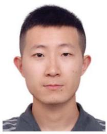

natural_image

Portrait photo of a young man with short dark hair wearing a dark shirt (no text or symbols visible)

Dongdong Ye received the Ph.D. degree in control science and engineering from the Guangdong University of Technology, Guangzhou, China, in 2021. He is currently a Postdoctoral Fellow with the Guangdong University of Technology. His research interests include game theory, resource management in wireless communications, and networking.

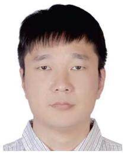

natural_image

Portrait photo of a man in a striped shirt (no text or symbols visible)

Shuting Cai (Member, IEEE) received the B.Sc. and M.Sc. degrees in computer science from Central South University, Changsha, China, in 2001 and 2004, respectively, and the Ph.D. degree in control science and engineering from the Guangdong University of Technology, Guangzhou, China, in 2011. He is currently a Professor with the Guangdong University of Technology. His research interests include hardware architectures, multimedia signal processing, and computer vision.

natural_image

Portrait of a young man wearing glasses and a beige blazer (no text or symbols visible)

Hongyang Du received the B.Eng. degree from the School of Electronic and Information Engineering, Beijing Jiaotong University, Beijing, China, in 2021, and the Ph.D. degree from Interdisciplinary Graduate Program, College of Computing and Data Science, Energy Research Institute @ NTU, Nanyang Technological University, Singapore, in 2024. He is currently an Assistant Professor with the Department of Electrical and Electronic Engineering, The University of Hong Kong, Hong Kong. His research interests include edge intelligence, generative AI, semantic

communications, and network management. He is also the Editor-in-Chief Assistant of IEEE COMMUNICATIONS SURVEYS & TUTORIALS from 2022 to 2024, and the Guest Editor of IEEE Vehicular Technology Magazine. He was the recipient of the IEEE Daniel E. Noble Fellowship Award from the IEEE Vehicular Technology Society in 2022, IEEE Signal Processing Society Scholarship from the IEEE Signal Processing Society in 2023, Singapore Data Science Consortium (SDSC) Dissertation Research Fellowship in 2023, and NTU Graduate College’s Research Excellence Award in 2024. He was also recognized as an Exemplary reviewer of IEEE TRANSACTIONS ON COMMUNICATIONS and IEEE COMMUNICATIONS LETTERS in 2021.

natural_image

Portrait of a man wearing glasses and a white shirt against a blue background (no text or symbols visible)

Jiawen Kang (Senior Member, IEEE) received the Ph.D. degree from the Guangdong University of Technology, Guangzhou, China, in 2018. From 2018 to 2021, he was a Postdoctoral Researcher with Nanyang Technological University, Singapore. He is currently a Professor with the Guangdong University of Technology. His research interests mainly include blockchain, security, and privacy protection in wireless communications and networking.

natural_image

Portrait photo of a man in formal attire (no text or symbols visible)

Yinqiu Liu received the B.Eng. degree from the Nanjing University of Posts and Telecommunications, Nanjing, China, in 2020, and the M.Sc. degree from the University of California, Los Angeles, CA, USA, in 2022. He is currently working toward the Ph.D. degree with the College of Computing and Data Science, Nanyang Technological University, Singapore. His research interests include wireless communications, mobile AIGC, and generative AI.

natural_image

Portrait photo of a young man in a light-colored collared shirt (no text or symbols visible)

Rong Yu (Member, IEEE) received the B.S. degree in communication engineering from the Beijing University of Posts and Telecommunications, Beijing, China, in 2002, and the Ph.D. degree in electronic engineering from Tsinghua University, Beijing, in 2007. He was with the School of Electronic and Information Engineering, South China University of Technology, Guangzhou, China. In 2010, he joined the School of Automation, Guangdong University of Technology, Guangzhou, where he is currently a Professor. His research interests mainly include wireless networking and mobile computing, such as edge computing, federated learning, blockchain, digital twin, connected vehicles, and smart grid.

natural_image

Portrait of a person wearing glasses and a dark jacket (no visible text or symbols)

Dusit Niyato (Fellow, IEEE) received the B.Eng. degree from the King Mongkuts Institute of Technology Ladkrabang (KMITL), Bangkok, Thailand, in 1999, the M.Sc. degree from the University of Manitoba, Winnipeg, MB, Canada, in 2005, and the Ph.D. degree in electrical and computer engineering from the University of Manitoba, Winnipeg, MB, Canada, in 2008. He is currently a Professor with the College of Computing and Data Science, Nanyang Technological University, Singapore. His research interests include the areas of mobile generative AI, edge intelligence, decentralized machine learning, and incentive mechanism design.