# Optimizing Energy Efficiency for Federated Learning in Rotary-Wing UAV Air-to-Ground Communications

Xuan-Toan Dang , Quynh-Suong Nguyen, and Oh-Soon Shin , Senior Member, IEEE

Abstract—In the 5G and upcoming 6G eras, federated learning (FL) plays a crucial role in enabling intelligent, privacypreserving networks by training models locally on user devices. However, FL faces challenges such as unstable wireless channels and limited device energy. This paper proposes a UAV-assisted framework to reduce energy consumption in FL by allowing simultaneous user transmissions over shared spectrum. We consider realistic air-to-ground (A2G) communication, including both LoS and NLoS links between the UAV and UEs, while accounting for the UAV’s limited energy. The problem of minimizing user energy consumption during FL is formulated as a nonconvex optimization, which is efficiently solved using alternating optimization and inner approximation techniques. Simulation results demonstrate the effectiveness of our approach in optimizing UAV placement and improving energy efficiency.

Index Terms—Air-to-ground (A2G) channels, uncrewed aerial vehicle (UAV), energy efficiency, alternating optimization, federated learning (FL).

## I. INTRODUCTION

ODERN distributed networks generate massive data and intelligent devices like smartphones, self-driving cars, and wearables [1]. This data surge has fueled interest in machine learning for sectors such as autonomous vehicles, healthcare [2], and smart cities [3]. With IoT data projected to reach 1.1 ZB in 2023, traditional centralized AI faces challenges in storing and processing such volumes [4]. Relying on cloud servers leads to bottlenecks, high costs, and delays, making real-time applications impractical [5]. Additionally, transferring UE data to external servers raises serious privacy concerns [6].

Federated learning (FL) enables distributed model training across devices coordinated by a central server [7]. The server shares global model parameters, clients update them using local data, and updates are aggregated iteratively to refine the model. FL enhances communication efficiency by transmitting model updates instead of raw data. However, the performance of FL is significantly affected by the data distribution across clients. While independent and identically distributed (i.i.d.) data allows efficient training and stable convergence, real-world scenarios often involve non-i.i.d. data, leading to challenges like model divergence and reduced accuracy [8], [9].

Wireless networks play a key role, providing flexibility, scalability, and improved model generalization [10], while optimizing them reduces power consumption in batteryoperated IoT devices [11]. However, deploying FL over wireless networks faces challenges, particularly in energy management due to limited device battery life. Efficient energy allocation is vital for both model transmission and computation [12]. Next-generation 6G networks promise advancements like high-speed Internet and data-intensive services [13]. Despite spectrum limitations, techniques such as non-orthogonal multiple access [14], reconfigurable reflecting surfaces (RIS) [15], massive MIMO [16], and UAVs [17] are expected to enhance 6G’s capabilities, especially in space communications. UAVs (drones) offer significant advantages in communication networks, particularly in enhancing connectivity in remote or hard-to-reach areas [27]. With features like controllable mobility, line-of-sight (LoS) communication, and hovering capability, UAVs are poised to play a major role in 6G networks [28]. They can function as mobile base stations, expanding coverage and providing on-demand connectivity, especially in rural or underserved areas [29]. UAVs also enable rapid deployment of temporary networks in emergencies and optimize real-time network performance, making them essential for 6G networks and the development of smart cities and autonomous systems.

## A. Related Work and Motivation

A key challenge in deploying FL over wireless networks is the limited battery life of IoT devices. For service providers to achieve high accuracy in the global model, these devices must frequently perform local model training and transmit updated parameters over wireless links, leading to substantial energy consumption for UEs. Therefore, reducing energy consumption on IoT devices while maintaining the efficiency of the FL process is critical for practical implementation.

Recent studies have extensively focused on addressing this challenge by utilizing the flexibility and mobility advantages of UAVs compared to traditional terrestrial-based systems. The research in [18] introduced a UAV-enabled IoT network with integrated FL, addressing the battery constraints of user devices by optimizing energy consumption and latency through a deep deterministic policy gradient (DDPG)- based algorithm. However, this study did not consider the optimization of UAV placement. To fill this gap, the study in [19] proposed a DDPG-based approach for joint UAV placement and resource allocation, including bandwidth allocation and the UAV’s energy budget, to facilitate sustainable FL with energy-harvesting user devices. Although the deep reinforcement learning-based approaches in [18] and [19] offer promising solutions, they face a significant challenge: their high computational burden makes them difficult to implement in practice.

In contrast, the studies in [20], [21], [22], [23], [25], and [26] addressed this challenge by proposing convex optimization-based approaches. The authors in [20] focused on jointly optimizing UAV placement, power control, transmission time, bandwidth allocation, and computing resources, with the main objective of minimizing the total energy consumption of both the aerial server and the users. In comparison to [18], [19], [20], [23], which used frequencydivision multiple access (FDMA) in the uplink phase, the studies in [21] and [22] allowed UEs to operate in timedivision multiple access (TDMA) mode for FL in UAV communication networks. The authors in [21] concurrently optimized UAV positioning and resource allocation to minimize energy consumption for ground-based UEs. Meanwhile, the authors in [22] investigated energy consumption at UEs. under constrained energy budgets, aiming to minimize FL training time by jointly optimizing device scheduling, UAV trajectory, and time allocation. However, critical aspects such as uplink transmission power at UEs and local model accuracy, both essential for balancing computation and communication energy usage, were not addressed. To tackle these issues, the authors in [23] formulated an optimization problem targeting the minimization of total UE energy consumption while enforcing a global model accuracy. This was achieved through joint optimization of UAV trajectory, device scheduling, bandwidth and time allocation, uplink transmission power, CPU frequency, and local model convergence. Moreover, our prior study [26] proposed a novel FL-supported UAV communication network that allows UEs to operate simultaneously on the same time and frequency. They introduced an alternating optimization algorithm based on successive convex approximation to achieve optimal resource allocation, including uplink transmission power, local accuracy levels, UAV placement, and other resources, with the goal of minimizing total energy consumption for UEs.

In practical environments, the air-to-ground (A2G) channel is often prone to blockage due to high-rise buildings in dense urban areas. Therefore, the assumption in [18], [19], [20], [21], [23], [26] that UAVs will always maintain a LoS link is unrealistic. This analysis cannot be applied to dense urban scenarios where UAVs are likely to encounter non-line-ofsight (NLoS) links. Recognizing this limitation, the authors in [24] accounted for both LoS and NLoS links between UAVs and UEs in their proposed FL-supported UAV communication network. They also examined a scenario in which eavesdroppers might gain access to raw data through shared parameters. To address this issue, the authors developed a distributed method based on proximal policy optimization (DPPO), which jointly optimizes the UAV flight path, artificial noise power levels, CPU frequency, and bandwidth distribution for UEs operating under orthogonal frequency division multiple access (OFDMA). Despite its effectiveness, the method’s substantial computational complexity limits its practical applicability. In addition, all the studies [18], [19], [20], [21], [23], [24], [26] overlook a crucial issue: the limited UAV energy. They consider the UAV to have sufficient operational energy, which is not always the case, as the UAV needs to manage its remaining energy optimally to ensure a safe return to the ground. Consequently, considering the constraints on UAV energy consumption is essential for efficient deployment of UAV communication within the FL process. Recognizing this challenge, the authors in [25] consider energy constraints at both UEs and UAVs by proposing a UAV swarm-assisted FL system. In this system, UEs employ non-orthogonal multiple access (NOMA) for local model uploads, while UAVs utilize perfect successive interference cancellation (SIC) to decode all signals. The objective is to minimize FL latency through joint optimization of UAV-client matching, time allocation, and local training iterations. However, the absence of UAV placement optimization, mobility energy considerations, and realistic A2G channel modeling limits the system’s practical applicability and diminishes the potential benefits of the UAV framework.

These limitations motivate us to explore a comprehensive approach to FL-supported UAV communication, addressing critical aspects such as A2G channels and limited UAV energy. Additionally, all previous studies [18], [19], [20], [21], [23], [24] assumed simplified scenarios in which UEs do not experience inter-user interference (IUI), as they reuse system resources based on orthogonal multiple access schemes such as TDMA, FDMA, and OFDMA. In contrast, this study considers the worst-case scenario, where UEs operate simultaneously and cause interference with one another. To tackle these issues, we propose a robust algorithm based on convex optimization that demonstrates superior performance in optimal resource allocation, particularly in efficiently mitigating the IUI effect and achieving 3D UAV optimization compared to the 2D optimization with fixed UAV altitude considered in prior studies. Moreover, the proposed algorithm offers acceptable computational complexity for practical implementation, distinguishing it from previous studies. To provide a comprehensive overview, we summarize the key differences between the proposed work and existing studies in Table I.

## B. Contribution and Outline

This study solves the problem of minimizing overall UE energy consumption in the proposed UAV network by formulating it as a complex, inherently nonconvex optimization problem. To tackle this challenge, we introduce an alternating optimization algorithm that decomposes the original nonconvex problem into two subproblems. To handle these nonconvex subproblems, we propose an iterative optimization approach based on inner approximation (IA), which transforms them into successive convex programs that can be efficiently solved using convex solvers.

TABLE I  
KEY DIFFERENCES BETWEEN THIS WORK AND EXISTING LITERATURE IN ENERGY-EFFICIENT FL-ENABLED UAV COMMUNICATION SYSTEMS
<table><tr><td rowspan=1 colspan=1>Ref</td><td rowspan=1 colspan=1>Design 3D</td><td rowspan=1 colspan=1>A2G</td><td rowspan=1 colspan=1>UAV Energy Constraint</td><td rowspan=1 colspan=1>IUI Consideration</td><td rowspan=1 colspan=1>Restrictions</td><td rowspan=1 colspan=1>Complexity</td></tr><tr><td rowspan=1 colspan=1>[18]</td><td rowspan=1 colspan=1>No</td><td rowspan=1 colspan=1>No</td><td rowspan=1 colspan=1>No</td><td rowspan=1 colspan=1>No (FDMA)</td><td rowspan=1 colspan=1>LOS channels, high computational complexity, no UAV placement optimization</td><td rowspan=1 colspan=1>High (DDPG)</td></tr><tr><td rowspan=1 colspan=1>[19]</td><td rowspan=1 colspan=1>No (Fixed altitude)</td><td rowspan=1 colspan=1>No</td><td rowspan=1 colspan=1>No</td><td rowspan=1 colspan=1>No (FDMA)</td><td rowspan=1 colspan=1>LOS channels, high computational complexity, 2D geometry</td><td rowspan=1 colspan=1>High (DDPG)</td></tr><tr><td rowspan=1 colspan=1>[20]</td><td rowspan=1 colspan=1>No (Fixed altitude)</td><td rowspan=1 colspan=1>No</td><td rowspan=1 colspan=1>No</td><td rowspan=1 colspan=1>No (FDMA)</td><td rowspan=1 colspan=1>LOS channels, no UAV energy limitation, 2D geometry</td><td rowspan=1 colspan=1>Low (Convex)</td></tr><tr><td rowspan=1 colspan=1>[21]</td><td rowspan=1 colspan=1>No (Fixed altitude)</td><td rowspan=1 colspan=1>No</td><td rowspan=1 colspan=1>No</td><td rowspan=1 colspan=1>No (TDMA)</td><td rowspan=1 colspan=1>LOS channels, 2D geometry, no energy limitation</td><td rowspan=1 colspan=1>Low (Convex)</td></tr><tr><td rowspan=1 colspan=1>[22]</td><td rowspan=1 colspan=1>No (Fixed altitude)</td><td rowspan=1 colspan=1>No</td><td rowspan=1 colspan=1>No</td><td rowspan=1 colspan=1>No (TDMA)</td><td rowspan=1 colspan=1>LoS channels, no UAV energy limitation, 2D geometry</td><td rowspan=1 colspan=1>Low (Convex)</td></tr><tr><td rowspan=1 colspan=1>[23]</td><td rowspan=1 colspan=1>No (Fixed altitude)</td><td rowspan=1 colspan=1>No</td><td rowspan=1 colspan=1>No</td><td rowspan=1 colspan=1>No (FDMA)</td><td rowspan=1 colspan=1>LoS channels, no UAV energy limitation, 2D geometry</td><td rowspan=1 colspan=1>Low (Convex)</td></tr><tr><td rowspan=1 colspan=1>[24]</td><td rowspan=1 colspan=1>Yes</td><td rowspan=1 colspan=1>Yes</td><td rowspan=1 colspan=1>No</td><td rowspan=1 colspan=1>No (OFDMA)</td><td rowspan=1 colspan=1>High computational complexity</td><td rowspan=1 colspan=1>High (DPPO)</td></tr><tr><td rowspan=1 colspan=1>[25]</td><td rowspan=1 colspan=1>No</td><td rowspan=1 colspan=1>No</td><td rowspan=1 colspan=1>Yes</td><td rowspan=1 colspan=1>Yes (NOMA)</td><td rowspan=1 colspan=1>No UAV placement optimization, no UAV movement energy</td><td rowspan=1 colspan=1>Low (Convex)</td></tr><tr><td rowspan=1 colspan=1>[26]</td><td rowspan=1 colspan=1>Yes</td><td rowspan=1 colspan=1>No</td><td rowspan=1 colspan=1>No</td><td rowspan=1 colspan=1>Yes</td><td rowspan=1 colspan=1>No UAV energy limitation, LOS channels</td><td rowspan=1 colspan=1>Low (Convex)</td></tr><tr><td rowspan=1 colspan=1>This work</td><td rowspan=1 colspan=1>Yes</td><td rowspan=1 colspan=1>Yes</td><td rowspan=1 colspan=1>Yes</td><td rowspan=1 colspan=1>Yes</td><td rowspan=1 colspan=1>Address all restriction in prior studies</td><td rowspan=1 colspan=1>Low (Convex)</td></tr></table>

The key contributions of this study are outlined below:

We propose a novel UAV communication network that allows UEs to operate simultaneously during the FL process.

To develop a UAV communication system that closely reflects real-world conditions. The proposed system considers the A2G channel composed of both LoS and NLoS links. Additionally, the UAV in this study operates in 3D mode, offering advantages over the 2D mode used in previous studies.

We analyze the UAV energy consumption model in detail, considering factors such as UAV movement, hovering, and communication energy. This comprehensive model addresses the challenge of restricted UAV energy.

A problem is constructed to reduce the total energy consumption of UEs by incorporating both communication and computation energy for uplink data transmission and local model training in FL, aiming to achieve optimal resource allocation. Due to the intractability of nonconvex optimization problem, we decompose it into two subproblems, and introduce an innovative alternating optimization method. We then use the IA scheme to convert these subproblems, into convex programs, which are addressed in an iterative manner to obtain a solution that is at least locally optimal.

Simulation results show that the proposed algorithm efficiently solves the complex problem, achieves optimal UAV placement, an and substantially lowers total energy consumption of UEs during FL training compared to other benchmark schemes. Moreover, the proposed algorithm’s performance is particularly evident under the constraint of limited UAV energy.

A comprehensive complexity analysis of the proposed algorithm is performed to validate its practicality and manageable computational cost, ensuring practical implementation in real-world scenarios.

The organization of the paper is as follows. Section II describes the FL training process for the proposed UAV communication system and formulates the problem of minimizing energy consumption during the training phase. Section III provides a detailed explanation of the proposed alternating optimization algorithm, including an analysis of its computational complexity. Numerical results are provided in Section IV, and conclusions are drawn in Section V.

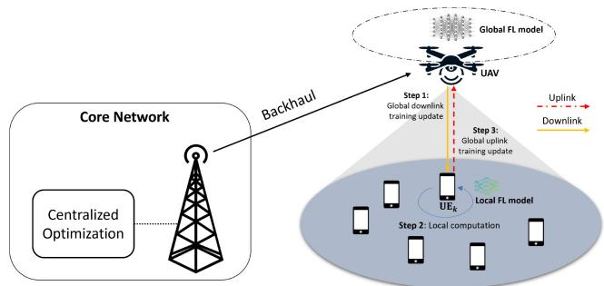  
Fig. 1. FL over a UAV communication system.

Notation: Scalars are denoted by lowercase italic letters, such as x and y, and column vectors are represented by lowercase boldface letters, such as x and y. The vector x has two operators: the Hermitian transpose $( \mathbf { x } ^ { \mathrm { H } } )$ and the conjugate operator $\left( \mathbf { x } ^ { * } \right)$ . The norm, expectation, and variance ( )are represented by | · |, E · , and · , respectively.

## II. SYSTEM MODEL AND PROBLEM FORMULATION

A UAV communication system in which a single-antenna UAV serves K single-antenna UEs is shown in Fig. 1. The UAV operates within a confined area of size $L \ \times \ L ,$ , with UEs randomly distributed within this region and falling within the UAV’s coverage. The UAV collects relevant system information such as channel state information (CSI), UE locations, trajectories, altitudes, and other relevant parameters. This information is transmitted to the core network, typically a terrestrial base station, via a wireless backhaul link (e.g., as millimeter-wave (mmWave) or free-space optical (FSO) connection) [30]. Given the limited onboard energy and computational capabilities of UAVs, intensive optimization tasks are generally offloaded to the ground infrastructure [31]. The base station, equipped with high-performance computational resources, acts as a centralized optimization controller. It runs the proposed algorithm in an offline manner and determines optimal solutions for resource allocation, UAV placement, and trajectory design. These decisions are then communicated back to the UAV for practical execution. The set of UEs is represented as ${ \mathcal { K } } \triangleq \{ 1 , 2 , \dots , K \}$ , where $k \in \mathcal { K }$ denotes the 1k-th UE, referred to as $\operatorname { U E } _ { k } .$

## A. Signal and Channel Models

In this paper, the channel $h _ { k }$ between $\mathrm { U E } _ { k }$ and the UAV is composed of two components: small-scale fading $g _ { k }$ , due to rich scattering, and large-scale fading $\beta _ { k }$ . The channel is expressed as $h _ { k } \stackrel { \textstyle = } { = } \beta _ { k } ^ { 1 / 2 } g _ { k }$ , where $g _ { k }$ is modeled as a complex Gaussian distribution with zero mean and unit variance. Since the UAV operates at low altitudes within the troposphere, typical of broadband cellular systems, its radio signals travel through open space and are subject to scattering and blockage by urban buildings [32]. Therefore, large-scale fading in the A2G propagation over urban environments is categorized into LoS and NLoS, with corresponding expressions provided:

$$
\beta _ { k } = \left\{ \begin{array} { l } { \beta _ { 0 } d _ { k } ^ { - \alpha _ { 1 } } , \mathrm { f o r ~ L o S ~ c h a n n e l } , } \\ { \kappa \beta _ { 0 } d _ { k } ^ { - \alpha _ { 2 } } , \mathrm { f o r ~ N L o S ~ c h a n n e l } , } \end{array} \right.\tag{1a}
$$

(1b)

where $\beta _ { 0 }$ denotes the path loss at a reference distance of 1 meter, $D _ { 0 } = 1$ meter, κ is NLoS attenuation coefficient, and $d _ { k }$ indicates the distance from the UAV to $\mathrm { U E } _ { k } .$ . α1 and α2 represent the path loss exponents and we assign the values $\alpha _ { 1 } = \alpha _ { 2 } = 2$ in this paper [33]. The UAV’s position is represented by $\mathbf { u } = ( x _ { \mathrm { u } } , y _ { \mathrm { u } } , z _ { \mathrm { u } } )$ , with its altitude limited to the range $h _ { \mathrm { m i n } } \leq z _ { \mathrm { u } } \leq h _ { \mathrm { m a x } } .$ The coordinates of $\mathrm { U E } _ { k }$ are represented as ${ \bf a } _ { k } = ( x _ { k } , y _ { k } , z _ { k } )$ where $z _ { k } = 0 ,$ , for all $\forall k \in$ $\kappa .$ Thus, the distance $d _ { k }$ between the UAV and $\mathrm { U E } _ { k }$ can be computed by using their respective coordinates as $d _ { k } = | { \bf u } - { \bf \nabla }$ $\mathbf { a } _ { k } | \overset { \cdot } { = } ( | \mathbf { x } - \mathbf { x } _ { k } | ^ { 2 } + ( z _ { u } - z _ { k } ) ^ { 2 } ) ^ { 1 / 2 }$ , where $\mathbf { x } = ( x _ { \mathrm { u } } , y _ { \mathrm { u } } )$ and $\mathbf { x } _ { k } = ( x _ { k } , y _ { k } )$

According to [34], the probability of a LoS link, denoted as $P _ { k } ^ { \mathrm { L o S } }$ , is modeled as a continuous function of the elevation angle (in degrees) between the UAV and $\mathrm { U E } _ { k }$ , defined by $\begin{array} { r } { \phi _ { k } = \frac { z _ { u } } { | \mathbf { x } - \mathbf { x } _ { k } | } } \end{array}$ . Consequently, $P _ { k } ^ { \mathrm { L o S } }$ is formulated as a modified Sigmoid function (S-curve), expressed as

$$
P _ { k } ^ { \mathrm { L o S } } ( \phi _ { k } ) = \frac { 1 } { 1 + a _ { 1 } \exp \left( - a _ { 2 } \left[ \tan ^ { - 1 } ( \phi _ { k } ) - a _ { 1 } \right] \right) } ,\tag{2}
$$

where $a _ { 1 }$ and $a _ { 2 }$ represent the urban, suburban, or dense urban environment, and the spatial expectation of the path loss between the UAV and $\mathrm { U E } _ { k }$ is derived using the expectation rule as

$$
\begin{array} { r l } & { \beta _ { k } ( { \mathbf { u } } ) = P _ { k } ^ { \mathrm { L o S } } \beta _ { 0 } d _ { k } ^ { - \alpha _ { 1 } } + \Big ( 1 - P _ { k } ^ { \mathrm { L o S } } \Big ) \kappa \beta _ { 0 } d _ { k } ^ { - \alpha _ { 1 } } } \\ & { \qquad = \Big ( \kappa + ( 1 - \kappa ) P _ { k } ^ { \mathrm { L o S } } \Big ) \beta _ { 0 } d _ { k } ^ { - \alpha _ { 1 } } . } \end{array}\tag{3}
$$

In FL, UEs upload trained local models to the UAV via uplink transmission. The transmit signal at $\mathrm { U E } _ { k }$ is given by $\mathit { x } _ { k } =$ $\sqrt { p _ { \mathrm { u } } ^ { \mathrm { m a x } } } w _ { k } s _ { k }$ , where $p _ { \mathrm { u } } ^ { \mathrm { m a x } }$ =is the maximum power budget, and $s _ { k }$ is the intended data symbol with ${ \mathbb E } \{ | s _ { k } | ^ { 2 } \} = 1$ . The power control coefficient $w _ { k }$ = 1ranges from 0 to 1. All K UEs transmit simultaneously, and the received signal at the UAV is expressed as $\begin{array} { r } { y = \dot { \sum _ { k = 1 } ^ { K } } h _ { k } x _ { k } + n } \end{array}$ , where $n \sim \mathcal { C } \mathcal { N } ( 0 , \sigma ^ { 2 } )$ represents additive Gaussian noise.

The data transmission is assumed to occur over a longer time scale than the fast fading because modeling of the probability channel to account for the effect of small-scale fading is complex. As a result, the path loss is averaged over the transmission time, and the fast fading is averaged out.

Therefore, the average received power of $\mathtt { U E } _ { k }$ at the UAV is calculated as [35]

$$
\mathbb { E } \Big [ \vert \sqrt { p _ { \mathrm { u } } ^ { \mathrm { m a x } } } w _ { k } h _ { k } \vert ^ { 2 } \Big ] = \frac { p _ { \mathrm { u } } ^ { \mathrm { m a x } } w _ { k } ^ { 2 } \big ( \kappa + ( 1 - \kappa ) P _ { k } ^ { \mathrm { L o S } } \big ) \beta _ { 0 } } { \vert \mathbf { u } - \mathbf { a } _ { k } \vert ^ { 2 } } .\tag{4}
$$

With the uplink bandwidth $B _ { \mathrm { u } }$ , the uplink rate of $\mathrm { U E } _ { k }$ (in bps) is achieved as

$$
R _ { k } ^ { \mathrm { u } } ( \mathbf { w } , \mathbf { u } ) = B _ { \mathrm { u } } \log _ { 2 } \left( 1 + \frac { \beta _ { k } ( \mathbf { u } ) w _ { k } ^ { 2 } } { \sum _ { k ^ { \prime } = 1 , k ^ { \prime } \neq k } ^ { K } \beta _ { k ^ { \prime } } ( \mathbf { u } ) w _ { k ^ { \prime } } ^ { 2 } + \frac { \sigma ^ { 2 } } { p _ { \mathrm { u } } ^ { \mathrm { m a x } } } } \right) ,\tag{5}
$$

## B. FL Model

This subsection integrates the FL model into the proposed UAV wireless network (Fig. 1). The UAV serves as a centralized server, coordinating UEs that contribute to the global model q, applied across all UEs. The FL process optimizes q by minimizing the global loss function as

$$
\operatorname* { m i n } _ { \mathbf { q } } F ( \mathbf { q } ) \triangleq \sum _ { k = 1 } ^ { K } \frac { D _ { k } } { D } F _ { k } ( \mathbf { q } ) ,\tag{6}
$$

where $\begin{array} { r c l } { F _ { k } ( \mathbf { q } ) } & { = } & { \sum _ { i = 1 } ^ { D _ { k } } \mathrm { f } ( \mathbf { q } , x _ { k , i } , y _ { k , i } ) } \end{array}$ represents the local loss function of $\mathrm { U E } _ { k }$ over a local dataset $\mathbf { D } _ { k }$ with size $D _ { k }$ and D denotes the total dataset size of all UEs, i.e., $D =$ $\begin{array} { r l } { \sum _ { k = 1 } ^ { K } D _ { k } . \ \mathrm { f } ( \mathbf { q } , x _ { k , i } , y _ { k , i } ) } & { { } } \end{array}$ represents the loss function for a data pair $( x _ { k , i } , y _ { k , i } )$ )from $\mathbf { D } _ { k }$ . To solve the optimization in (6), the FL process is executed iteratively in three steps: local computation, communication, and global computation. The details of the iterative steps are presented in our prior research [26], which are omitted here due to page limitations. According to [36], the lower bound on the number of local rounds needed to achieve the desired local accuracy $\eta$ is approximated by

$$
N ( \eta ) = r \log _ { 2 } \biggl ( \frac { 1 } { \eta } \biggr ) ,\tag{7}
$$

where $r$ is a positive constant that depends on the size of the local dataset and the chosen algorithms such as gradient descent (GD), and stochastic gradient descent (SGD) [36].

In the global training process, the value of $\epsilon _ { 0 } ,$ , the global accuracy, is fixed and constant in this study. In addition, previous research indicates that the lower bound on the number of global rounds can be approximated by [37], [38] as

$$
G ( \eta ) = \frac { \frac { 2 l ^ { 2 } } { \gamma _ { 0 } ^ { 2 } \xi } \ln \frac { 1 } { \epsilon _ { 0 } } } { 1 - \eta } ,\tag{8}
$$

where $l , \gamma _ { 0 }$ , and $\xi$ are considered constants. In this paper, the value of $G ( \eta )$ is normalized to $\frac { 1 } { 1 - \eta }$ using the normalization method described in [39], to simplify the presentation.

## C. User Energy Consumption Model

This paper optimizes energy efficiency for UEs with limited energy, focusing on uplink communication and local computation at each global iteration. Unlike prior studies, we also consider downlink task broadcasting between the UAV and UEs, as UAV energy constraints impact system performance.

Using lower bounds from (7) and (8), we approximate local and global rounds, defining total FL training latency as

$$
T ( \eta , T _ { \mathrm { u } } ^ { \mathrm { c o m } } , T _ { \mathrm { c m p } } , T _ { \mathrm { d } } ^ { \mathrm { c o m } } ) = T _ { \mathrm { u } } ^ { \mathrm { c o m } } + N ( \eta ) T _ { \mathrm { c m p } } + T _ { \mathrm { d } } ^ { \mathrm { c o m } } ,\tag{9}
$$

where $T _ { \mathrm { u } } ^ { \mathrm { c o m } }$ and $T _ { \mathrm { d } } ^ { \mathrm { c o m } }$ are the uplink and downlink times, respectively, and $T _ { \mathrm { c m p } }$ is the computation time for UEs in each iteration. Our objective is to minimize the total energy consumption of UEs by considering both computation and communication energy costs.

1) Computation Energy Consumption: The CPU cycles per data sample for $\mathrm { U E } _ { k }$ , denoted as $N _ { c , k }$ , can be measured offline [39]. With a sample size of $D _ { k }$ , the total CPU cycles per local round are $N _ { c , k } D _ { k }$ , and the computation time is $t _ { k } ^ { \mathrm { c m p } } =$ $\underline { { N _ { c , k } D _ { k } } }$ , where $f _ { k }$ is the CPU frequency optimized for specific fk goals. Thus, the total computation energy (in Joules) at $\mathtt { U E } _ { k }$ is shown as

$$
\begin{array} { r } { E _ { k } ^ { \mathrm { c m p } } ( f _ { k } ) = \zeta _ { k } N _ { c , k } D _ { k } f _ { k } ^ { 2 } , } \end{array}\tag{10}
$$

where $\zeta _ { k }$ is the effective capacitance coefficient, dependent on $\mathrm { U E } _ { k } \mathrm { ' s }$ processor architecture.

2) Communication Energy Consumption: In each round, UEs upload model parameters of size as $N _ { s } .$ . As the uplink data rate $R _ { k } ^ { \mathrm { u } } ( \mathbf { w } , \mathbf { u } )$ varies among UEs due to interference and channel conditions, the resulting transmission delay for $\mathtt { U E } _ { k }$ is given by

$$
t _ { k } ^ { \mathrm { c o m } } ( \mathbf { w } , \mathbf { u } ) = \frac { N _ { \mathrm { s } } } { R _ { k } ^ { \mathrm { u } } ( \mathbf { w } , \mathbf { u } ) } .\tag{11}
$$

Accordingly, the communication energy consumption for $\tt U E _ { k }$ in one FL round is expressed as

$$
E _ { k } ^ { \mathrm { c o m } } ( \mathbf { w } , \mathbf { u } ) = p _ { \mathrm { u } } ^ { \mathrm { m a x } } w _ { k } ^ { 2 } t _ { k } ^ { \mathrm { c o m } } ( \mathbf { w } , \mathbf { u } ) = \frac { p _ { \mathrm { u } } ^ { \mathrm { m a x } } w _ { k } ^ { 2 } N _ { \mathrm { s } } } { R _ { k } ^ { \mathrm { u } } ( \mathbf { w } , \mathbf { u } ) } .\tag{12}
$$

As a result, the total energy consumed by all UEs per FL training round (in Joules) is

$$
E ( \mathbf { w } , \mathbf { u } , \mathbf { f } , \eta ) = \sum _ { k = 1 } ^ { K } \bigl ( E _ { k } ^ { \mathrm { c o m } } ( \mathbf { w } , \mathbf { u } ) + N ( \eta ) E _ { k } ^ { \mathrm { c m p } } ( f _ { k } ) \bigr ) .\tag{13}
$$

## D. UAV Energy Consumption Model

We consider an analytical energy model for UAV, based on actuator disc and blade element theories for rotary-wing UAVs, as outlined in classic aircraft textbooks [40], [41]. The model includes three components: movement, hovering, and communication energy consumption. It accounts for two key UAV phases: optimal location optimization and FL training optimization.

1) UAV Movement Energy Consumption: Energy consumption for UAV movement is crucial for determining the optimal replacement timing and safe descent. This paper focuses on a rotary-wing UAV, which can hover at a fixed location. The energy consumption model for such a UAV, based on its speed, is given by [42].

$$
E _ { \mathrm { u a v } } ^ { \mathrm { m o v } } = \tau \times \mathrm { P _ { u a v } ^ { \mathrm { m o v } } }
$$

$$
\triangleq \tau A _ { 0 } \left( 1 + \frac { 3 v _ { h } ^ { 2 } } { \ell _ { \mathrm { t i p } } ^ { 2 } } \right) + \tau A _ { 1 } \left( \left( 1 + \frac { v _ { h } ^ { 4 } } { 4 v _ { 0 } ^ { 2 } } \right) ^ { 1 / 2 } - \frac { v _ { h } ^ { 2 } } { 2 v _ { 0 } ^ { 4 } } \right) ^ { 1 / 2 }
$$

$$
+ \tau \frac 1 2 \ell _ { \mathrm { f u s } } \ell _ { \mathrm { a i r } } \ell _ { \mathrm { s o l } } \ell _ { \mathrm { d i s c } } v _ { h } ^ { 3 } + \tau \ell _ { \mathrm { w e i } } v _ { t } ,\tag{14}
$$

where τ denotes the time required for the UAV to move from its initial location $\begin{array} { r l r } { { \bf u } _ { 0 } } & { { } = } & { \left( x _ { 0 } , y _ { 0 } , z _ { 0 } \right) } \end{array}$ to its final location, expressed as $\begin{array} { r } { \tau \ = \ \frac { d _ { \mathrm { u a v } } } { v _ { \mathrm { u a v } } } \ = \ \frac { | { \bf u } - { \bf u } _ { 0 } | } { v _ { \mathrm { u a v } } } . } \end{array}$ $A _ { 0 }$ and $A _ { 1 }$ in (14) are constants representing the blade profile power and induced power, respectively, and are defined as $A _ { 0 } \ =$ $\begin{array} { r } { \frac { \ell _ { \mathrm { d r a g } } } { 8 } \ell _ { \mathrm { a i r } } \ell _ { \mathrm { s o l } } \ell _ { \mathrm { d i s c } } \ell _ { \mathrm { a n g } } ^ { 3 } \ell _ { \mathrm { r a d } } ^ { 3 } , A _ { 1 } = ( 1 + \ell _ { \mathrm { i n c r e } } ) \frac { \ell _ { \mathrm { w e i } } ^ { 3 / 2 } } { \sqrt { 2 \ell _ { \mathrm { a i r } } \ell _ { \mathrm { d i s c } } } } } \end{array}$ , where $\ell _ { \mathrm { t i p } }$ is the tip speed of rotor blade. $\ell _ { \mathrm { f u s } } , \ell _ { \mathrm { a i r } } , \ell _ { \mathrm { s o l } }$ $\ell _ { \mathrm { d i s c } } ,$ and $\ell _ { \mathrm { w e i } }$ are coefficients representing fuselage drag ratio, air density, rotor solidity, rotor disc area, and UAV weight, respectively. $\ell _ { \mathrm { d r a g } } , \ell _ { \mathrm { a n g } } ,$ , and $\ell _ { \mathrm { r a d } }$ denote the profile drag coefficient, blade angular velocity, and rotor radius, respectively. v0 is the mean rotor-induced velocity in hover, and $v _ { \mathrm { u a v } }$ is the $\mathrm { U A V } _ { \mathrm { \Delta } }$ constant velocity during flight, disregarding acceleration and deceleration factors. The model also accounts for the maximum velocity, $v _ { \mathrm { m a x } } .$ , to ensure technical realism. The horizontal $\left( v _ { h } \right)$ and vertical $\left( v _ { t } \right)$ components of the UAV’s velocity $v _ { u a v }$ are given as $\begin{array} { r } { v _ { h } = \frac { \left| \mathbf { x } - \mathbf { x } _ { 0 } \right| } { \tau } = \frac { v _ { \mathrm { u a v } } \times \left| \mathbf { x } - \mathbf { x } _ { 0 } \right| } { d _ { \mathrm { u a v } } } , v _ { t } = } \end{array}$ $\begin{array} { r } { \frac { | z _ { u } - z _ { 0 } | } { \tau } = \frac { v _ { \mathrm { u a v } } \times | z _ { u } - z _ { 0 } | } { d _ { \mathrm { u a v } } } } \end{array}$

2) UAV Hovering Energy Consumption: Once the UAV reaches its optimal location, it enters a hovering state, maintaining a fixed position to perform the FL tasks. In this state, the UAV’s velocity $v _ { \mathrm { u a v } }$ is zero, simplifying the energy consumption model, which can be directly derived from (14). Therefore, the energy required to keep the UAV hovering for a duration T during each global iteration is expressed as $E _ { \mathrm { u a v } } ^ { \mathrm { h o v e r } } ( T ) = ( A _ { 0 } + A _ { 1 } ) \times T ( \eta , T _ { \mathrm { u } } ^ { \mathrm { c o m } } , T _ { \mathrm { c m p } } , T _ { \mathrm { d } } ^ { \mathrm { c o m } } )$

( ) = ( + ) ( )3) UAV Communication Energy Consumption: During the downlink phase, the UAV broadcasts the global model to all UEs. The downlink rate for $\mathrm { U E } _ { k }$ (in bps) is given as

$$
R _ { k } ^ { \mathrm { d } } ( \mathbf { u } ) = B _ { \mathrm { d } } \log _ { 2 } \left( 1 + \frac { \beta _ { k } ( \mathbf { u } ) } { \frac { \sigma ^ { 2 } } { p _ { \mathrm { d } } ^ { \mathrm { m a x } } } } \right) ,\tag{15}
$$

where $B _ { \mathrm { d } }$ is the downlink bandwidth, and $p _ { \mathrm { d } } ^ { \mathrm { m a x } }$ is the transmit power of the UAV. We assume that the model parameters, of size $N _ { \mathrm { s } }$ , are downloaded by each UE in each round. The transmission delay between $\mathrm { U E } _ { k }$ and the UAV during the downlink phase is computed as $\begin{array} { r } { \bar { t } _ { k } ^ { \mathrm { c o m } } = \frac { N _ { \mathrm { s } } } { R _ { k } ^ { \mathrm { d } } ( { \bf u } ) } } \end{array}$ . Hence, the communication energy required at the UAV for FL in each global round is calculated as $E _ { \mathrm { u a v } } ^ { \mathrm { c o m } } = p _ { \mathrm { d } } ^ { \mathrm { m a x } } \mathrm { m a x } ( \bar { t } _ { k } ^ { \mathrm { c o m } } )$

## E. Problem Formulation

To minimize the total energy consumption of all UEs, the optimization problem is formulated as:

$$
\begin{array} { r l } { \underset { \mathbf { w } , \mathbf { u } , \mathbf { f } , \eta , T _ { \mathrm { u } } ^ { \mathrm { c o m } } , T _ { \mathrm { c m p } } } { \operatorname* { m i n } } } & { G ( \eta ) E ( \mathbf { w } , \mathbf { u } , \mathbf { f } , \eta ) } \end{array}\tag{16a}
$$

$$
\begin{array} { r } { s . t . 0 \leq w _ { k } \leq 1 , \forall k \in K , } \end{array}
$$

$$
0 \leq x _ { \mathrm { u } } , y _ { \mathrm { u } } \leq \mathrm { L } ,\tag{16b}
$$

(16c)

$$
h _ { \mathrm { m i n } } \leq z _ { \mathrm { u } } \leq h _ { \mathrm { m a x } } ,\tag{16d}
$$

$$
G ( \eta ) T \big ( \eta , T _ { \mathrm { u } } ^ { \mathrm { c o m } } , T _ { \mathrm { c m p } } \big ) \leq t _ { \mathrm { l i m i t } } ,\tag{16e}
$$

$$
t _ { k } ^ { \mathrm { c o m } } \leq T _ { \mathrm { u } } ^ { \mathrm { c o m } } , \quad \forall k \in \mathcal { K } ,\tag{16f}
$$

$$
\bar { t } _ { k } ^ { \mathrm { c o m } } \leq T _ { \mathrm { d } } ^ { \mathrm { c o m } } , \quad \forall k \in \mathcal { K } ,\tag{16g}
$$

$$
\frac { N _ { c , k } D _ { k } } { f _ { k } } \leq T _ { \mathrm { c m p } } , \quad \forall k \in \mathcal { K } ,\tag{16h}
$$

$$
f _ { \mathrm { m i n } } \le f _ { k } \le f _ { \mathrm { m a x } } , \quad \forall k \in { \mathcal K } ,\tag{16i}
$$

$$
0 \leq \eta \leq 1 ,\tag{16j}
$$

$$
0 \leq v _ { \mathrm { u a v } } \leq v _ { \mathrm { m a x } } ,
$$

$$
E _ { \mathrm { u a v } } ^ { \mathrm { m o v } } \leq E _ { \mathrm { f l y } } ,\tag{16k}
$$

(16l)

where constraint (16b) ensures that the power allocation for each UE does not exceed the maximum power budget $\rho _ { \mathrm { u } } ^ { \mathrm { m a x } }$ Constraints (16c) and (16d) restrict the UAV’s movement within a specified area, both horizontally and vertically. Constraint (16e) ensures the global training process is completed within the provided deadline $t _ { \mathrm { l i m i t } }$ . Constraint (16f) assures that all UEs complete their communication with the CPU simultaneously. Constraint (16g) imposes a limit on communication time between the UAV and all UEs during the downlink phase. Constraint (16h) guarantees that the time for a computation round at each UE does not exceed the required time for local model computation. Constraint (16i) maintains the local computation frequency $f _ { k }$ for each UE within a specific range. Constraint (16j) establishes the necessary condition for local accuracy η. Constraint (16k) assures that the UAV’s velocity remains within the permissible speed range. Finally, constraint (16l) limits the UAV movement energy to ensure sufficient energy for a safe return to the ground. Note that the $\mathrm { U A V } '$ s energy consumption for hovering $E _ { \mathrm { u a v } } ^ { \mathrm { h o v e r } }$ and communication $E _ { \mathrm { u a v } } ^ { \mathrm { c o m } }$ primarily depends on the values of T and $\bar { t } _ { k } ^ { \mathrm { c o m } }$ , respectively. Hence, instead of explicitly constraining $E _ { \mathrm { h o v e r } } ^ { \mathrm { u a v } }$ and $E _ { \mathrm { { c o m } } } ^ { \mathrm { { u a v } } }$ , it is reasonable to focus on the constraints for T in (16e) and $\bar { t } _ { k } ^ { \mathrm { c o m } }$ in (16g).

## III. PROPOSED ALTERNATING OPTIMIZATION ALGORITHM

Due to the nonconvexity of (16a) and (16e)-(16h), directly solving (16) is challenging. Additionally, optimization algorithms like deep reinforcement learning require computational complexity, which makes real-world use impractical. In contrast, the proposed convex optimization approach is more efficient, enabling faster optimization and making it more feasible for practical implementation. We decompose the problem into three constrained subproblems, solved iteratively using IA-based alternating optimization by transforming the nonconvex subproblems into convex ones, solvable with standard solvers [43], ensuring a locally optimal solution. To simplify (16), we introduce auxiliary variables $\lambda \triangleq \lambda _ { k } , \forall k \in$ $\kappa ,$ reformulating the problem as:

$$
\underline { { \mathbf { P } } } { \vdots } \operatorname* { m i n } _ { \mathbf { w } , \mathbf { u } , \boldsymbol { \lambda } , \mathbf { f } , \eta , \boldsymbol { \eta } , \boldsymbol { \eta } \atop T _ { \mathbf { u } } ^ { \mathrm { c o m } } , T _ { \mathrm { c m p } } } \sum _ { k = 1 } ^ { K } \lambda _ { k }\tag{17a}
$$

$$
s . t . \ 0 \leq w _ { k } \leq 1 , \quad \forall k \in K ,\tag{17b}
$$

$$
G ( \eta ) \big ( E _ { k } ^ { \mathrm { c o m } } + r \log _ { 2 } ( 1 / \eta ) E _ { k } ^ { \mathrm { c m p } } \big ) \leq \lambda _ { k } , ( 1 7 \mathrm { c } )
$$

$$
\forall k \in { \cal K } ,
$$

$$
\lambda _ { k } > 0 , \quad \forall k \in { \mathcal { K } } ,\tag{17d}
$$

$$
( 1 6 \mathrm { c } ) - ( 1 6 \mathrm { j } ) .\tag{17e}
$$

Before delving into the optimization process, we introduce some useful IA-based approximation functions that will be employed at each iteration. The validity and derivation of these approximations are supported by the methodologies and results presented in [44], [45], [46].

For the convex function $\operatorname { f } _ { \operatorname { f r } } ( x , y ) \ { \triangleq \ x ^ { 2 } / y }$ , the multiplication function $\mathtt { f } _ { \mathrm { m u l } } ( x , y ) \triangleq x y$ , and the logarithmic function $\pounds _ { \ln } ( x , y ) \} \triangleq \ln ( 1 + \gamma )$ with $\gamma \triangleq x ^ { 2 } / y$ and x, $y > 0$ , concave lower bounds and convex upper bound around a feasible point $( x ^ { ( i ) } , y ^ { ( i ) } )$ is given as

$$
\mathtt { f } _ { \mathrm { f r } } ( x , y ) \ge \frac { 2 x ^ { ( i ) } } { y ^ { ( i ) } } x - \frac { \Big ( x ^ { ( i ) } \Big ) ^ { 2 } } { \big ( y ^ { ( i ) } \big ) ^ { 2 } } y : = \mathtt { f } _ { \mathrm { f r } } ^ { ( i ) } ( x , y ) .\tag{18}
$$

$$
\mathtt { f } _ { \mathrm { m u l } } ( x , y ) \le \frac { x ^ { ( i ) } } { 2 y ^ { ( i ) } } y ^ { 2 } + \frac { y ^ { ( i ) } } { 2 x ^ { ( i ) } } x ^ { 2 } : = \mathtt { f } _ { \mathrm { m u l } } ^ { ( i ) } ( x , y ) .\tag{19}
$$

$$
\begin{array} { r } { \mathsf { f } _ { \mathrm { l n } } ( x , y ) \ge F _ { 0 } ^ { ( i ) } ( x , y ) + 2 F _ { 1 } ^ { ( i ) } ( x , y ) - F _ { 2 } ^ { ( i ) } ( x , y ) } \\ { : = \mathsf { f } _ { \mathrm { l n } } ^ { ( i ) } ( x , y ) , \qquad ( 2 ^ { i } } \end{array}\tag{0}
$$

where

$$
\begin{array} { r l } & { F _ { 0 } ^ { ( i ) } ( ( x , y ) \triangleq \ln \Bigl ( 1 + \gamma \Bigl ( x ^ { ( i ) } , y ^ { ( i ) } \Bigr ) \Bigr ) - \gamma \Bigl ( x ^ { ( i ) } , y ^ { ( i ) } \Bigr ) , } \\ & { F _ { 1 } ^ { ( i ) } ( x , y ) \triangleq \frac { x _ { k } ^ { ( i ) } x _ { k } } { y } , \quad F _ { 2 } ^ { ( i ) } ( x , y ) \triangleq \Bigl ( x ^ { 2 } + y \Bigr ) \Xi ^ { ( i ) } , } \\ & { \qquad \Xi ^ { ( i ) } \triangleq \Bigl ( y ^ { ( i ) } \Bigr ) ^ { - 1 } - \Bigl ( y ^ { ( i ) } + \Bigl ( x _ { k } ^ { ( i ) } \Bigr ) ^ { 2 } \Bigr ) ^ { - 1 } . } \end{array}
$$

For the quadratic function $\pounds _ { \mathrm { q u a d } } ( x ) \triangleq x ^ { 2 }$ with $x > 0 ,$ a concave lower bound around a feasible point $x ^ { ( i ) }$ can be deduced from (20) with $y = 1$ as

$$
\mathtt { f } _ { \mathtt { q u a d } } ( x ) \geq 2 x ^ { ( i ) } x - \left( x ^ { ( i ) } \right) ^ { 2 } : = \mathtt { f } _ { \mathtt { q u a d } } ^ { ( i ) } ( x ) .\tag{21}
$$

Extended versions of (20) and (21) with $\mathbf { x _ { 1 } } , \mathbf { x _ { 2 } } \in \mathbb { C } ^ { n }$ and $y > 0$ are expressed as

$$
\bar { \mathbf { f } } _ { \mathrm { f r } } \big ( \mathbf { x } _ { 1 } , \mathbf { x } _ { 2 } , y \big ) \triangleq \frac { \vert \mathbf { x } _ { 1 } - \mathbf { x } _ { 2 } \vert ^ { 2 } } { y } \geq \frac { 2 \Big ( \mathbf { x } _ { 1 } ^ { ( i ) } - \mathbf { x } _ { 2 } ^ { ( i ) } \Big ) ^ { T } \big ( \mathbf { x } _ { 1 } - \mathbf { x } _ { 2 } \big ) } { y ^ { ( i ) } }\tag{22}
$$

$$
\begin{array} { r l } & { \bar { \mathbf { f } } _ { \mathrm { q u a d } } \big ( \mathbf { x } _ { 1 } , \mathbf { x } _ { 2 } \big ) \triangleq | \mathbf { x } _ { 1 } - \mathbf { x } _ { 2 } | ^ { 2 } \geq 2 \Big ( \mathbf { x } _ { 1 } ^ { ( i ) } - \mathbf { x } _ { 2 } ^ { ( i ) } \Big ) ^ { T } \big ( \mathbf { x } _ { 1 } - \mathbf { x } _ { 2 } \big ) } \\ & { \qquad - | \mathbf { x } _ { 1 } ^ { ( i ) } - \mathbf { x } _ { 2 } ^ { ( i ) } | ^ { 2 } : = \bar { \mathbf { f } } _ { \mathrm { q u a d } } ^ { ( i ) } \big ( \mathbf { x } _ { 1 } , \mathbf { x } _ { 2 } \big ) . } \end{array}\tag{23}
$$

• Leveraging the first-order Taylor approximation, a concave lower bound of the exponential convex function $\mathtt { f } _ { \mathrm { e x p } } ( x ) \triangleq \exp ( x )$ , ∀x is derived as

$$
\mathtt { f } _ { \exp } ( x ) \ge \exp \left( x ^ { ( i ) } \right) \left( x - x ^ { ( i ) } + 1 \right) : = \mathtt { f } _ { \exp } ^ { ( i ) } ( x ) . ( 2 4 )
$$

A. Step 1: Optimizing the Trajectory of UAV u, Power Control Coefficients w, and Other Resource Allocations With a Given Local Accuracy η

We rewrite the problem P with local accuracy η as follows:

$$
\underline { { \mathbf { P _ { 1 } } } } { : \qquad } \operatorname* { m i n } _  \mathbf { w } , \mathbf { u } , \mathbf { k } , \mathbf { f } , \mathbf { \qquad } , \mathbf { \qquad } , \mathbf { \qquad } , \mathbf { \qquad } , \mathbf { \qquad } , \mathbf { \qquad } , \mathbf { \qquad } , \mathbf { \qquad } , \mathbf { \qquad } , \mathbf { \qquad } , \mathbf { \qquad } , \mathbf { \qquad } , \mathbf { \qquad } , \mathbf { \qquad } , \mathbf { \qquad } , \mathbf { \qquad } , \mathbf { \qquad } , \mathbf { \qquad } , \mathbf { \qquad } , \mathbf { \qquad } , \mathbf { \qquad } , \mathbf { \qquad } , \mathbf { \qquad } , \mathbf { \qquad } , \mathbf { \qquad } , \mathbf { \qquad } , \mathbf { \qquad } , \mathbf { \qquad } , \mathbf { \qquad } , \mathbf { \qquad } , \mathbf { \qquad } , \mathbf { \qquad } , \mathbf { \qquad } , \mathbf { \qquad } , \mathbf { \qquad } , \mathbf { \qquad } , \mathbf { \qquad } , \mathbf { \qquad } , \mathbf { \qquad } , \mathbf { \qquad } , \mathbf { \qquad } , \mathbf { \qquad } , \mathbf { \qquad } , \mathbf { \qquad } , \mathbf { \qquad } , \mathbf { \qquad } , \mathbf { \qquad } , \mathbf { \qquad } , \mathbf { \qquad } , \mathbf { \qquad } , \mathbf { \qquad } , \mathbf { \qquad } , \mathbf { \qquad } , \mathbf { \qquad } , \mathbf { \qquad } , \mathbf { \qquad } , \mathbf { \qquad } , \mathbf { \qquad } , \mathbf { \qquad } , \mathbf { \qquad } , \mathbf { \qquad } , \mathbf { \qquad } , \mathbf { \qquad } , \mathbf { \qquad } , \mathbf { \qquad } , \mathbf { \qquad } , \mathbf { \qquad } , \mathbf { \qquad } , \mathbf { \qquad } , \mathbf { \qquad } , \mathbf { \qquad } , \mathbf { \qquad } , \mathbf { \qquad } , \mathbf { \qquad } , \mathbf { \qquad } \qquad\tag{25a}
$$

$$
s . t . 0 \leq w _ { k } \leq 1 , \forall k \in K ,\tag{25b}
$$

$$
G ( \eta ) \big ( E _ { k } ^ { \mathrm { c o m } } + r \log _ { 2 } ( 1 / \eta ) E _ { k } ^ { \mathrm { c m p } } \big ) \leq \lambda _ { k } ,\tag{25c}
$$

$$
\forall k \in K ,
$$

$$
\lambda _ { k } > 0 , \quad \forall k \in { \mathcal { K } } ,\tag{25d}
$$

$$
( 1 6 \mathrm { c } ) - ( 1 6 \mathrm { l } ) .\tag{25e}
$$

Obviously, constraints (25d), (25d), (25d), (16e), (16h), and (16i) are inherently convex. However, (16f), (16g), (16l), and (25d) remain nonconvex and require further convexification to make the problem more tractable.

First, we deal with the nonconvexity of constraints (16f) and (16g) by transforming them into tractable forms as

$$
\left\{ \begin{array} { l l } { \frac { N _ { \mathrm { s } } } { R _ { k } ^ { \mathrm { u } } ( \mathbf { w } , \mathbf { u } ) } \leq T _ { \mathrm { u } } ^ { \mathrm { c o m } } \Leftrightarrow \ln ( 1 + \gamma _ { k } ^ { \mathrm { u } } ) \geq \frac { \ln ( 2 ) N _ { \mathrm { s } } } { B _ { \mathrm { u } } T _ { \mathrm { u } } ^ { \mathrm { c o m } } } , } \end{array} \right.\tag{26a}
$$

$$
\Bigg \lfloor \ \frac { N _ { \mathrm { s } } } { R _ { k } ^ { \mathrm { d } } ( \mathbf { u } ) } \leq T _ { \mathrm { d } } ^ { \mathrm { c o m } } \Leftrightarrow \ln ( 1 + \gamma _ { k } ^ { \mathrm { d } } ) \geq \frac { \ln ( 2 ) N _ { \mathrm { s } } } { B _ { \mathrm { d } } T _ { \mathrm { d } } ^ { \mathrm { c o m } } } .\tag{26b}
$$

Convexifying Constraint (16f): To convexify constraint (16f), we start by rewriting the constraint (26a) as

$$
\ln \left( 1 + \frac { \beta _ { k } ( \boldsymbol { \mathbf { u } } ) w _ { k } ^ { 2 } } { \sum _ { k ^ { \prime } = 1 , k ^ { \prime } \neq k } ^ { K } \beta _ { k } ( \boldsymbol { \mathbf { u } } ) w _ { k ^ { \prime } } ^ { 2 } + \frac { \sigma ^ { 2 } } { p _ { \mathrm { u } } ^ { \mathrm { m a x } } } } \right) \geq \frac { \ln ( 2 ) N _ { \mathrm { s } } } { B _ { \mathrm { u } } T _ { \mathrm { u } } ^ { \mathrm { c o m } } } .\tag{27}
$$

The right-hand side of (27) is convex for $T _ { \mathrm { u } } ^ { \mathrm { c o m } } > 0 \mathrm { . }$ , but the 0left-hand side remains nonconvex. To handle this, we derive a concave lower bound for the left-hand side and introduce lemmas to transform it into a tractable form.

Lemma 1: A lower bound $r _ { k } ^ { - 1 }$ of $\beta _ { k } ( { \mathbf { u } } )$ can be obtained by introducing auxiliary variable sets that satisfy the following quadratic, exponential cone, rotated cone, and IA-based constraints:

$$
| { \bf x } - { \bf x } _ { k } | \leq t _ { k } , \quad \forall k \in { \cal K } ,\tag{28}
$$

$$
\mathbf { f } _ { \mathrm { m u l } } ^ { ( i ) } \Big ( t _ { k } , \hat { \phi } _ { k } \Big ) \leq z _ { u } , \quad \forall k \in K ,\tag{29}
$$

$$
\hat { \phi } _ { k } ^ { 2 } + 1 \le \iota _ { k } , \quad \forall k \in { \cal K } ,\tag{30}
$$

$$
\frac { \left( \iota _ { k } + \iota ^ { \prime } { } _ { k } \right) ^ { 2 } } { 4 } - \frac { \bar { \mathbf { f } } _ { \mathrm { f r } } ^ { ( i ) } \left( \iota _ { k } , \iota ^ { \prime } { } _ { k } \right) } { 4 } \leq \hat { \phi } _ { k } - \hat { \phi } _ { k } ^ { ( i ) } , \quad \forall k \in \mathcal { K } ,\tag{31}
$$

$$
\exp \left( - a _ { 2 } ( \tan ^ { - 1 } ( \hat { \phi } _ { k } ^ { ( i ) } ) + \iota ^ { \prime } { } _ { k } - a _ { 1 } ) \right) \leq l _ { k } , \quad \forall k \in \mathcal { K } ,\tag{32}
$$

$$
\Pi _ { k } + a _ { 1 } \mathtt { f } _ { \mathrm { m u l } } ^ { ( i ) } ( l _ { k } , \Pi _ { k } ) \le 1 , \quad \forall k \in \mathcal { K } ,\tag{33}
$$

$$
\kappa + ( 1 - \kappa ) \Pi _ { k } \geq \frac { | \mathbf { u } - \mathbf { a } _ { k } | ^ { 2 } } { r _ { k } \beta _ { 0 } } . \quad \forall k \in \mathcal { K } ,\tag{34}
$$

where a new set of positive variables $\mathcal { F } _ { \mathrm { l o w } } \triangleq \{ r , t , \iota , \iota ^ { \prime } , \hat { \phi } , l , \Pi \}$ is introduced, with variables defined as $r \triangleq \{ r _ { k } \} , t \triangleq \{ t _ { k } \} , \iota \triangleq$ $\{ \iota _ { k } \} , \iota ^ { \prime } \triangleq \{ \iota _ { k } ^ { \prime } \} , \hat { \phi } \triangleq \{ \hat { \phi } _ { k } \} , l \triangleq \{ l _ { k } \}$ , and $\Pi \triangleq \{ \Pi _ { k } \} , \forall k \in \mathcal { K }$ Proof: Please see Appendix $\mathrm { A } .$

Lemma 2: An upper bound $r ^ { \prime } { } _ { k } ^ { - 1 }$ of $\beta _ { k } ( { \mathbf { u } } )$ can be obtained by introducing auxiliary variable sets that satisfy the following quadratic, exponential cone, rotated cone, and IA-based constraints:

$$
\bar { \mathbf { f } } _ { \mathrm { f r } } ^ { ( i ) } \left( \mathbf { u } , \mathbf { a } _ { k } , r _ { k } ^ { \prime } \right) \geq \bar { r } _ { k } , \quad \forall k \in K ,\tag{35}
$$

$$
\begin{array} { r } { \bar { \bf f } _ { \mathrm { q u a d } } ^ { ( i ) } ( { \bf x } , { \bf x } _ { k } ) \ge b _ { k } ^ { 2 } , \quad \forall k \in { \cal K } , } \end{array}\tag{36}
$$

$$
b _ { k } \geq \frac { 1 } { \bar { b } _ { k } } , \quad \forall k \in { \cal K } ,\tag{37}
$$

$$
\begin{array} { r } { \pounds _ { \mathrm { m u l } } ^ { ( i ) } \big ( z _ { u } , \bar { b } _ { k } \big ) \leq \bar { \phi } _ { k } , \quad \forall k \in \mathcal { K } , } \end{array}\tag{38}
$$

$$
\tan ^ { - 1 } \Big ( \bar { \phi } _ { k } ^ { ( i ) } \Big ) + \Big ( \bar { \phi } _ { k } - \bar { \phi } _ { k } ^ { ( i ) } \Big ) \frac { 1 } { \Big ( \bar { \phi } _ { k } ^ { ( i ) } \Big ) ^ { 2 } + 1 } \leq \bar { \phi } ^ { \prime } { } _ { k } , \forall k \in \mathcal { K } ,\tag{39}
$$

$$
\kappa + \frac { 1 - \kappa } { \pounds _ { \exp } ^ { ( i ) } \left( - a _ { 2 } ( \bar { \phi ^ { \prime } } _ { k } ^ { ( i ) } - a _ { 1 } ) \right) } \leq \frac { \bar { r } _ { k } } { \beta _ { 0 } } , \quad \forall k \in \mathcal { K } .\tag{40}
$$

where a new set of positive variables $\qquad \mathcal { F } _ { \mathrm { u p } } \qquad \triangleq$ $\{ r ^ { \prime } , \bar { \mathbf { r } } , b , \bar { \mathbf { b } } , \bar { \phi } , \bar { \phi ^ { \prime } } , \}$ is introduced, with variables defined as $\begin{array} { r } { \dot { \bar { r } ^ { \prime } } \triangleq \{ r _ { k } ^ { \prime } \} , \bar { \mathbf { r } } \triangleq \{ \bar { r } _ { k } \} , \pmb { b } \triangleq \{ b _ { k } \} , \bar { \mathbf { b } } \triangleq \{ \bar { b } _ { k } \} , \bar { \phi } \triangleq \{ \bar { \phi } _ { k } \} } \end{array}$ , and $\bar { \phi } ^ { \prime } \triangleq \{ \bar { \phi } _ { k } ^ { \prime } \} , \forall k \in \mathcal { K } .$

Proof: Please see Appendix B.

Leveraging Lemma 1, we derive a lower bound on the numerator of $\gamma _ { k } ^ { \mathrm { u } }$ by introducing a new set of positive variables $\rho \in \{ \rho _ { k } \} , \forall k \in \mathcal { K }$ satisfying the following quadratic constraint:

$$
\beta ( \mathbf { u } ) w _ { k } ^ { 2 } \geq \frac { w _ { k } ^ { 2 } } { r _ { k } } \geq \pounds _ { \mathrm { f r } } ^ { ( i ) } ( w _ { k } , r _ { k } ) \geq \rho _ { k } ^ { 2 } , \quad k \in \mathcal { K } .\tag{41}
$$

Leveraging Lemma 2, an upper bound on the denominator of $\gamma _ { k } ^ { \mathrm { u } }$ is acquired by introducing a new set of positive variables $o \triangleq \{ o _ { k } \} , \forall k \in \mathcal { K }$ satisfying the following rotated cone constraint:

$$
\beta ( { \mathbf { u } } ) w _ { k } ^ { 2 } \leq \frac { w _ { k } ^ { 2 } } { r _ { k } ^ { \prime } } \leq o _ { k } , \quad k \in { \mathcal { K } } .\tag{42}
$$

From (41) and (42), the constraint (27) is eventually transformed into a convex form as

$$
\pounds _ { \mathrm { l n } } ^ { ( i ) } ( \rho _ { k } , \Psi _ { k } ) \geq \frac { \ln ( 2 ) N _ { \mathrm { s } } } { B _ { \mathrm { u } } T _ { u } ^ { \mathrm { c o m } } } , \forall k \in \mathcal { K } ,\tag{43}
$$

where $\begin{array} { r } { \Psi _ { k } \triangleq \sum _ { k ^ { \prime } = 1 | k ^ { \prime } \neq k } ^ { K } o _ { k } ^ { ( i ) } + \frac { \sigma ^ { 2 } } { p _ { * } ^ { \mathrm { m a x } } } , \forall k \in \mathcal { K } . } \end{array}$

Convexifying Constraint $( 1 6 \mathrm { g } ) \dot { { \cdot } }$ We similarly obtain the convex form of constraint (16g) with $\begin{array} { r } { \hat { \Psi } \triangleq \frac { \sigma ^ { 2 } } { p _ { \mathrm { d } } ^ { \mathrm { m a x } } } } \end{array}$ as

$$
\pounds _ { \mathrm { l n } } ^ { ( i ) } \left( \hat { \rho } _ { k } , \hat { \Psi } \right) \geq \frac { \ln ( 2 ) N _ { \mathrm { s } } } { B _ { \mathrm { d } } T _ { \mathrm { d } } ^ { \mathrm { c o m } } } , \quad \forall k \in \mathcal { K } ,\tag{44}
$$

where a new set of positive variables $\hat { \pmb { \rho } } \triangleq \{ \hat { \rho } _ { k } \} , \forall k \in \mathcal { K }$ is ˆintroduced for satisfying the following quadratic constraint as

$$
\beta _ { k } ( \mathbf { u } ) \geq \mathbb { f } _ { \mathrm { f r } } ^ { ( i ) } ( 1 , r _ { k } ) \geq \hat { \rho } _ { k } ^ { 2 } , \quad k \in \mathcal { K } .\tag{45}
$$

Convexifying Constraint (25d): From (10) and (12), the constraint (25d) can be expressed as

$$
\frac { p _ { \mathbf { u } } ^ { \operatorname* { m a x } } \mathbf { w } _ { k } ^ { 2 } N _ { \mathrm { s } } } { R _ { k } ^ { \mathrm { u } } ( \mathbf { w } , \mathbf { u } ) } + r \log _ { 2 } ( 1 / \eta ) \zeta _ { k } N _ { c , k } D _ { k } f _ { k } ^ { 2 } \le \frac { \lambda _ { k } } { G ( \eta ) } , \quad \forall k \in \mathcal { K } .\tag{46}
$$

The second term on the left-hand side of constraint (46) is in convex form. To address the nonconvexity of the first term, a new set of positive variables $\pmb { \varrho } \triangleq \{ \varrho _ { k } \} , \forall k \in \mathcal { K }$ is introduced as an upper bound for the first term on the left-hand side:

$$
\frac { p _ { \mathrm { u } } ^ { \operatorname* { m a x } } w _ { k } ^ { 2 } N _ { \mathrm { s } } } { R _ { k } ^ { \mathrm { u } } ( \mathbf { w } , \mathbf { u } ) } \leq \varrho _ { k } \Leftrightarrow p _ { \mathrm { u } } ^ { \operatorname* { m a x } } N _ { \mathrm { s } } \frac { w _ { k } ^ { 2 } } { \varrho _ { k } } \leq R _ { k } ^ { \mathrm { u } } ( \mathbf { w } , \mathbf { u } ) , \quad \forall k \in \mathcal { K } .\tag{47}
$$

Utilizing (20) and introducing a new variable set $\pmb { \xi } \triangleq \mathtt { a }$ $\{ \xi _ { k } \} , \forall k \in \mathcal { K }$ , which satisfies the rotated cone constraint, we convexify constraint (47) as

$$
\frac { w _ { k } ^ { 2 } } { \varrho _ { k } } \leq \xi _ { k } \Leftrightarrow \mathfrak { f } _ { \mathrm { l n } } ^ { ( i ) } ( \rho _ { k } , \Psi _ { k } ) \geq \frac { \ln ( 2 ) p _ { \mathrm { u } } ^ { \mathrm { m a x } } N _ { \mathrm { s } } \xi _ { k } } { B } \quad \forall k \in \mathcal { K } .\tag{48}
$$

As a result, the convex form of constraint (25d) is derived as

$$
\varrho _ { k } + r \log _ { 2 } ( 1 / \eta ) \zeta _ { k } N _ { c , k } D _ { k } f _ { k } ^ { 2 } \leq \frac { \lambda _ { k } } { G ( \eta ) } , \quad \forall k \in \mathcal { K } .\tag{49}
$$

Convexifying Constraint (16l): To convexify (16l), we aim to find the upper bounds of the first, second, third, and fourth terms in (14). It can be seen that $v _ { h }$ and $v _ { t }$ are velocity variables dependent on the UAV velocity $v _ { \mathrm { u a v } }$ and the UAV coordinates u. To address the nonconvexity in the first, third, and fourth terms of (16l), we need to derive the upper bounds of $v _ { h } ^ { 2 } ( v _ { \mathrm { u a v } } , \mathbf { u } ) , \ v _ { h } ^ { 3 } ( v _ { \mathrm { u a v } } , \mathbf { u } )$ , and $v _ { t } ( v _ { \mathrm { U a v } } , \mathbf { u } )$ , respectively. To derive the upper bound for the first and fourth terms in (14), new positive auxiliary variables $\left\{ g _ { h } , g _ { t } \right\}$ and $\{ \hat { v } _ { h } , \hat { v } _ { t } \}$ are introduced to satisfy the following quadratic and rotated cone constraints:

$$
| \mathbf { x } - \mathbf { x } _ { 0 } | ^ { 2 } \leq g _ { h } , \qquad | z - z _ { 0 } | ^ { 2 } \leq g _ { t } ,\tag{50}
$$

$$
\bar { \mathbf { f } } _ { \mathrm { f r } } ^ { ( i ) } ( \mathbf { u } , \mathbf { u } _ { 0 } , g _ { h } ) \geq \frac { v _ { \mathrm { u a v } } ^ { 2 } } { \hat { v } _ { h } } , \qquad \bar { \mathbf { f } } _ { \mathrm { f r } } ^ { ( i ) } ( \mathbf { u } , \mathbf { u } _ { 0 } , g _ { t } ) \geq \frac { v _ { \mathrm { u a v } } ^ { 2 } } { \hat { v } _ { t } } .\tag{51}
$$

Using constraints (50)-(51) and applying simple algebraic transformations, it is straightforward to show that $\hat { v } _ { h }$ and $\hat { v } _ { t }$ represent the upper bounds of $v _ { h } ^ { 2 } ( v _ { \mathrm { u a v } } , \mathbf { u } )$ and $v _ { t } ^ { 2 } ( v _ { \mathrm { u a v } } , \mathbf { u } )$ ( ) ( )respectively. However, to obtain the upper bounds for $v _ { h } ( v _ { \mathrm { u a v } } , \mathbf { u } )$ and $v _ { t } ( v _ { \mathrm { U a v } } , \mathbf { u } )$ , we continue to introduce addi-( ) (tional auxiliary variables $\bar { v } _ { h }$ and $\bar { v } _ { t }$ that satisfy the following constraints:

$$
\left\{ \begin{array} { l l } { \boldsymbol { v } _ { h } ^ { 2 } ( { \boldsymbol { v } } _ { \mathrm { u a v } } , \mathbf { u } ) \leq { \hat { \boldsymbol { v } } } _ { h } \leq \mathbf { f } _ { \mathrm { q u a d } } ^ { ( i ) } ( { \bar { \boldsymbol { v } } } _ { h } ) , } \\ { \boldsymbol { v } _ { t } ^ { 2 } ( { \boldsymbol { v } } _ { \mathrm { u a v } } , \mathbf { u } ) \leq { \hat { \boldsymbol { v } } } _ { t } \leq \mathbf { f } _ { \mathrm { q u a d } } ^ { ( i ) } ( { \bar { \boldsymbol { v } } } _ { t } ) } \end{array} \right.\tag{52}
$$

$$
\begin{array} { r l } & { \Leftrightarrow \Big \{ \boldsymbol { v } _ { h } ^ { 2 } ( { \boldsymbol { v } } _ { \mathrm { u a v } } , \mathbf { u } ) \leq { \bar { \boldsymbol { v } } } _ { h } ^ { 2 } \Leftrightarrow { \boldsymbol { v } } _ { h } ( { \boldsymbol { v } } _ { \mathrm { u a v } } , \mathbf { u } ) \leq { \bar { \boldsymbol { v } } } _ { h } , } \\ & { \qquad v _ { t } ^ { 2 } ( { \boldsymbol { v } } _ { \mathrm { u a v } } , \mathbf { u } ) \leq { \bar { \boldsymbol { v } } } _ { t } ^ { 2 } \Leftrightarrow { \boldsymbol { v } } _ { t } ( { \boldsymbol { v } } _ { \mathrm { u a v } } , \mathbf { u } ) \leq { \bar { \boldsymbol { v } } } _ { t } . } \end{array}\tag{53}
$$

Upper bounds for second and third terms of (14) can be achieved by performing simple algebraic transformations and leveraging auxiliary positive variable sets $v _ { h } ^ { \prime } , \stackrel { \triangledown } { v _ { h } } ^ { \prime ) }$ and $\nu$ respectively satisfy the following rotated cone, second-order cone (SOC), and linear constraints:

$$
v _ { h } ^ { 3 } ( v _ { \mathrm { u a v } } , \mathbf { u } ) \leq \hat { v } _ { h } \bar { v } _ { h } \leq \mathbf { f } _ { \mathrm { m u l } } ^ { ( i ) } ( \hat { v } _ { h } , \bar { v } _ { h } ) , \quad v _ { h } ^ { \mathrm { \prime \prime } } - \frac { v ^ { \prime } { h } } { 2 v _ { \mathrm { 0 } } ^ { 4 } } \leq \mathbf { f } _ { \mathrm { q u a d } } ^ { ( i ) } ( \nu ) .\tag{54}
$$

$$
1 + \frac { \hat { v } _ { h } ^ { 2 } } { 4 v _ { 0 } ^ { 2 } } \leq \bigl ( v _ { h } ^ { \circ } \bigr ) ^ { 2 } , \qquad \mathbf { f } _ { \mathrm { f r } } ^ { ( i ) } \bigl ( v _ { \mathrm { u a v } } , v _ { h } ^ { \prime } \bigr ) \geq \frac { | \mathbf { u } - \mathbf { u } _ { 0 } | ^ { 2 } } { \bar { \mathbf { f } } _ { \mathrm { q u a d } } ^ { ( i ) } \bigl ( \mathbf { x } , \mathbf { x } _ { 0 } \bigr ) } ,\tag{55}
$$

Finally, the upper bound for $E _ { \mathrm { m o v } }$ is derived, enabling the convexification of constraint (16l) as

$$
E _ { \mathrm { m o v } } \leq \hat { \tau } \times \bar { \mathrm { P } } _ { \mathrm { u a v } } ^ { \mathrm { m o v } } \leq \mathrm { f } _ { \mathrm { m u l } } ^ { ( i ) } ( \hat { \tau } , \bar { \mathrm { P } } _ { \mathrm { u a v } } ^ { \mathrm { m o v } } ) \leq E _ { \mathrm { f l y } } ,\tag{56}
$$

where $\begin{array} { r l r l r l r l r l } { \bar { \mathrm { P } } _ { \mathrm { u a v } } ^ { \mathrm { m o v } } } & { } & { \triangleq } & { } & { { } } & { A _ { 0 } ( 1 } & { + } & { \frac { 3 \hat { v } _ { h } } { \ell _ { \mathrm { t i p } } ^ { 2 } } ) } & { + } & { A _ { 1 } \hat { \nu } } & { + } & { } \end{array}$ $\textstyle \frac { 1 } { 2 } \ell _ { \mathrm { f u s } } \ell _ { \mathrm { a i r } } \ell _ { \mathrm { s o l } } \ell _ { \mathrm { d i s c } } \pounds _ { \mathrm { m u l } } ^ { ( i ) } ( \hat { v } _ { h } , \bar { v } _ { h } ) + \ell _ { \mathrm { w e i } } \bar { v } _ { t }$ and new auxiliary positive variables τ and τ are introduced for satisfying the following SOC and rotated cone constraints:

$$
| \mathbf { u } - \mathbf { u } _ { 0 } | \leq \pounds _ { \mathrm { q u a d } } ^ { ( i ) } ( \bar { \tau } ) , \qquad \frac { \bar { \tau } ^ { 2 } } { v _ { \mathrm { u a v } } } \leq \hat { \tau } .\tag{57}
$$

For convenience, we summarize all the auxiliary variables used in the convexification process at Step 1 as $\nu _ { \mathrm { s t e p 1 } } \triangleq$ $\{ \mathcal { F } _ { \mathrm { l o w } } , \mathcal { F } _ { \mathrm { u p } } , \rho , o , \hat { \rho } , \varrho , g _ { h } , g _ { t } , \hat { v } _ { h } , \hat { v } _ { t } , \bar { v } _ { h } , \bar { v } _ { t } , v _ { h } ^ { \prime } , v _ { h } ^ { \prime } , \nu , \hat { \tau } , \bar { \tau } \}$ As a result, a tractable convex formulation for the problem ${ \bf P _ { 1 } }$ is obtained as

$$
\operatorname* { m i n } _ { \mathbf { w } , \mathbf { u } , \lambda , \mathbf { f } , \mathcal { V } _ { \mathrm { s t e p 1 } } , \mathbf { \xi } } \quad \sum _ { k = 1 } ^ { K } \lambda _ { k }\tag{58a}
$$

$$
s . t . \quad 0 \leq w _ { k } \leq 1 , \quad \forall k \in K ,\tag{58b}
$$

$$
\lambda _ { k } , \mathcal { V } _ { \mathrm { s t e p 1 } } > 0 , \quad \forall k \in \mathcal { K } ,\tag{58c}
$$

$$
( 1 6 \mathrm { { c } ) , ( 1 6 \mathrm { { d } ) , ( 1 6 \mathrm { { h } ) - ( 1 6 \mathrm { { k } ) , } } } }\tag{58d}
$$

$$
( 2 8 ) - ( 4 5 ) , ( 4 8 ) - ( 5 7 ) .\tag{58e}
$$

After a finite number of iterations, the optimal solution to problem (58) converges to a stationary point that meets the Karush–Kuhn–Tucker (KKT) conditions [47] using a convex solver [43].

B. Step 2: Optimizing Local Accuracy η and Resource Allocations With a Fixed UAV Location u and Power Control Coefficients w

Given fixed power control coefficients w and a constant UAV location u, values of $R _ { k } ^ { \mathrm { u } }$ and $R _ { k } ^ { \mathrm { d } }$ are calculated using (5) and (15), leading to constant values of $T _ { \mathrm { u } } ^ { \mathrm { c o m } }$ and $T _ { \mathrm { d } } ^ { \mathrm { c o m } }$ Therefore, constraints (16f) and (16g) are in convex forms. However, constraints related to the optimization of the UAV’s position, such as (16c), (16d), (16k), and (16l), will be disregarded in this step. The optimization problem P can thus be reformulated as

$$
\underline { { \mathbf { P _ { 2 } } } } { : } \operatorname* { m i n } _ { \eta , \lambda , \mathbf { f } , \mathbf { \Omega } } \sum _ { k = 1 } ^ { K } \lambda _ { k }\tag{59a}
$$

$$
s . t . \ G ( \eta ) \big ( E _ { k } ^ { \mathrm { c o m } } + r \log _ { 2 } ( 1 / \eta ) E _ { k } ^ { \mathrm { c m p } } \big ) \leq \lambda _ { k } ,\tag{59b}
$$

$$
\forall k \in K ,
$$

$$
\lambda _ { k } > 0 , \quad \forall k \in { \mathcal { K } } ,
$$

$$
( 1 6 \mathbf { e } ) - ( 1 6 \mathbf { j } ) .\tag{59c}
$$

(59d)

To solve problem $\mathbf { P _ { 2 } } .$ , we employ the convex-based optimization algorithm introduced in our previous study, as detailed in [26, Section III-B]. Due to page limitations, the full details are omitted here.

To efficiently solve the original problem P, we employ an alternating optimization framework that decomposes P into two subproblems: $\mathbf { P _ { 1 } }$ and $\mathbf { P _ { 2 } }$ . Specifically, $\mathbf { P _ { 1 } }$ optimizes P with the variable η fixed, while $\mathbf { P _ { 2 } }$ optimizes P with u and w held constant. At each iteration, we solve $\mathbf { P _ { 1 } }$ to obtain an intermediate solution, which is then used as input for $\mathbf { P _ { 2 } }$ , and vice versa. This iterative process continues until convergence. As supported by [48], alternating optimization guarantees convergence to at least a locally optimal solution. Hence, our algorithm iteratively addresses P by alternating between solving P and $\mathbf { P _ { 2 } }$ . The overall optimization procedure is presented in Algorithm 1.

## C. Computational Complexity Analysis

Based on [43], the computational complexity for solving a convex problem is determined by the number of variables m and the number of quadratic/linear constraints n, resulting in a complexity of $\bar { \mathcal { O } } ( n ^ { 2 . 5 } ( m ^ { 2 } \ + \ n ) )$ at each iteration. The algorithm terminates when the difference between the objective values of two consecutive iterations falls below a predefined threshold $\varepsilon = 1 0 ^ { - 3 }$ . The proposed iterative algorithm alternates between two optimization steps. Consequently, the computational complexity at each iteration can be represented as $\begin{array} { r l r } {  { \mathcal { O } ( \sum _ { j = 1 } ^ { 2 } \kappa _ { j } n _ { j } ^ { 2 . 5 } ( \dot { m _ { j } } ^ { 2 } + n _ { j } ) ) } } \end{array}$ , where $\kappa _ { j } , \ n _ { j }$ , and $m _ { j }$ denote the number of iterations to convergence, constraints, and variables in the j-th step, respectively. This formulation captures the linear sum of the complexities of step Algorithms 1 and 2. Assuming proposed alternating algorithm requires $\kappa _ { 3 }$ iterations to reach convergence, the total complexity is ${ \mathcal O } ( \kappa _ { 3 } \sum _ { i = 1 } ^ { 3 } \kappa _ { j } n _ { j } ^ { 2 . 5 } ( m _ { j } ^ { 2 } + n _ { j } ) )$ . Table II provides the comprehensive complexity analysis of the proposed alternating algorithm. Table II summarizes the major computational steps and complexity of Algorithms 1 and 2, including all the auxiliary constraints and variables introduced by IA-based convex reformulations for subproblems ${ \bf P _ { 1 } }$ and $\mathbf { P _ { 2 } }$ . Importantly, the number of these auxiliary elements grows linearly with the number of UEs (K), which ensures that the overall complexity scales proportionally with network size and remains tractable for practical implementations.

Algorithm 1: Proposed Alternating Algorithm for Solving   
P   
Initialization: Generate initial feasible points   
$\{ \mathbf { w } , \eta , \mathbf { u } , \lambda , \mathbf { f } , v _ { \mathrm { u a v } } , T _ { \mathrm { u } } ^ { \mathrm { c o m } } , T _ { \mathrm { d } } ^ { \mathrm { c o m } } , T _ { \mathrm { c m p } } \} ^ { \mathrm { ( 0 ) } }$ to Problem P   
in (17).   
$j  0$   
while the stop criterion of threshold  is not satisfied do   
Use the step algorithm 1 with a given $\eta ^ { ( j ) }$ to obtain   
$\{ { \bf w } , { \bf u } , \lambda , \bar { \bf f } , v _ { \mathrm { u a v } } , T _ { \mathrm { u } } ^ { \mathrm { c o m } } , T _ { \mathrm { d } } ^ { \mathrm { c o m } } , T _ { \mathrm { c m p } } ^ { \mathrm { - } } \} ^ { ( j ) } .$   
Use the step algorithm 2 with a given $\{ \mathbf { w } , \mathbf { u } \} ^ { ( j + 1 ) }$ to   
obtain $\{ \eta , \bar { \lambda } , \mathbf { f } , T _ { \mathrm { u } } ^ { \mathrm { c o m } } , T _ { \mathrm { d } } ^ { \mathrm { c o m } } , T _ { \mathrm { c m p } } ^ { \mathrm { c o p } } \} ^ { ( j + \bar { 1 } ) }$   
$j  j + 1$   
end   
Result: Optimal results   
$\{ \mathbf { w } , \eta , \mathbf { u } , \pmb { \lambda } , \mathbf { f } , v _ { \mathrm { u a v } } , T _ { \mathrm { u } } ^ { \mathrm { c o m } } , T _ { \mathrm { d } } ^ { \mathrm { c o m } } , T _ { \mathrm { c m p } } \}$

TABLE II COMPUTATIONAL COMPLEXITY ANALYSIS
<table><tr><td rowspan=1 colspan=1>Metrics</td><td rowspan=1 colspan=1>Step algorithm 1</td><td rowspan=1 colspan=1>Step algorithm 2</td></tr><tr><td rowspan=1 colspan=1>No. Constraints</td><td rowspan=1 colspan=1> $\overline { { n _ { 1 } = 4 1 K + 3 1 } }$ </td><td rowspan=1 colspan=1> $\overline { { n _ { 2 } = 8 K + 5 } }$ </td></tr><tr><td rowspan=1 colspan=1> $\overline { { \mathrm { N o . } } }$ Variables</td><td rowspan=1 colspan=1> $\overline { { m _ { 1 } = 2 0 K + 1 8 } }$ </td><td rowspan=1 colspan=1> $\overline { { m _ { 2 } = 3 K + 5 } }$ </td></tr><tr><td rowspan=1 colspan=1>Complexity</td><td rowspan=1 colspan=1> $\overline { { \mathcal { O } \big ( \kappa _ { 1 } n _ { 1 } ^ { 2 . 5 } ( m _ { 1 } ^ { 2 } + n _ { 1 } ) \big ) } }$ </td><td rowspan=1 colspan=1> $\overline { { \mathcal { O } \big ( \kappa _ { 2 } n _ { 2 } ^ { 2 . 5 } ( m _ { 2 } ^ { 2 } + n _ { 2 } ) \big ) } }$ </td></tr></table>

## IV. NUMERICAL RESULTS

## A. Simulation Setup

We consider a square area of dimensions $L \times L$ that contains both the UAV and all UEs. By varying the dataset size as an input parameter and simultaneously transmitting model parameters between the UAV and UEs, the FL-integrated framework in the UAV communication systems enables concurrent learning of multiple models for various applications. For simulations, we assume that client’s dataset is i.i.d., with each UE assigned a dataset size of $D _ { k } \ = \ 1 0 \ \mathrm { \bf ~ M B }$ $\forall k \in \ K ,$ , based on the MNIST dataset. These parameters are then uploaded to the CPU to calculate the global model. The effective capacitance coefficient for each UE is $\zeta ~ =$ $1 0 ^ { - 2 8 }$ [39]. According to [36], the parameters l and $\gamma _ { 0 }$ correspond to the Lipschitz constant and the strong convexity parameter, respectively, for the gradient-based methods used in the FL process. Their specific values depend on the choice of the loss function for the local training tasks. Additionally, in line with [28], we set $\xi ~ = ~ 1 / 1 0$ and $\begin{array} { l l l } { \epsilon _ { 0 } } & { = } & { 1 0 ^ { - 3 } } \end{array}$ The remaining parameters utilized for the FL and wireless environment simulations are tabulated in Table III [26].

TABLE III  
SIMULATION PARAMETERS FOR FL-SUPPORTED UAV COMMUNICATION SYSTEMS
<table><tr><td rowspan=1 colspan=1>Parameter</td><td rowspan=1 colspan=1>Value</td></tr><tr><td rowspan=1 colspan=1>Uplink bandwidth $\overline { { ( B _ { \mathrm { u } } ) } }$ </td><td rowspan=1 colspan=1>0.5MHz</td></tr><tr><td rowspan=1 colspan=1>Downlink bandwidth $\overline { { ( B _ { \mathrm { d } } ) } }$ </td><td rowspan=1 colspan=1>5MHz</td></tr><tr><td rowspan=1 colspan=1>Carrier frequency</td><td rowspan=1 colspan=1>1.9 GHz</td></tr><tr><td rowspan=1 colspan=1>Path loss at reference distance $\overline { { ( \mathcal { C } _ { 0 } ) } }$ </td><td rowspan=1 colspan=1>-30 dB</td></tr><tr><td rowspan=1 colspan=1>Path loss exponent (α)</td><td rowspan=1 colspan=1>2</td></tr><tr><td rowspan=1 colspan=1>Noise power at CPU $\overline { { ( \sigma ^ { 2 } ) } }$ </td><td rowspan=1 colspan=1>-80 dBm</td></tr><tr><td rowspan=1 colspan=1>Maximum uplink power budget $\overline { { ( p _ { \mathrm { u } } ^ { \mathrm { m a x } } ) } }$ </td><td rowspan=1 colspan=1>26 dBm</td></tr><tr><td rowspan=1 colspan=1>Maximum downlink power budget $\overline { { ( p _ { \mathrm { d } } ^ { \mathrm { m a x } } ) } }$ </td><td rowspan=1 colspan=1>30 dBm</td></tr><tr><td rowspan=1 colspan=1>L</td><td rowspan=1 colspan=1>200 m</td></tr><tr><td rowspan=1 colspan=1> $h _ { \operatorname* { m i n } } , h _ { \operatorname* { m a x } }$ </td><td rowspan=1 colspan=1>30, 100 m</td></tr><tr><td rowspan=1 colspan=1> $f _ { \mathrm { m i n } } , f _ { \mathrm { m a x } }$ </td><td rowspan=1 colspan=1>0.1, 0.5 GHz</td></tr><tr><td rowspan=1 colspan=1>r</td><td rowspan=1 colspan=1>4</td></tr><tr><td rowspan=1 colspan=1>The maximum time limit $( t _ { \mathrm { l i m i t } } )$ </td><td rowspan=1 colspan=1>1000s</td></tr><tr><td rowspan=1 colspan=1>The effective capacitance coefficient (ζ)</td><td rowspan=1 colspan=1>10-28</td></tr><tr><td rowspan=1 colspan=1>CPU cycle $\overline { { ( N _ { c , k } ) , \forall k \in \mathcal { K } } }$ </td><td rowspan=1 colspan=1>1000 cycles/bits</td></tr><tr><td rowspan=1 colspan=1>Size of model parameters (γ)</td><td rowspan=1 colspan=1>200 KB</td></tr><tr><td rowspan=1 colspan=1>NLoS attenuation coefficient (κ)</td><td rowspan=1 colspan=1>0.5</td></tr><tr><td rowspan=1 colspan=1>Dense urban environment $( a _ { 1 } , a _ { 2 } )$ </td><td rowspan=1 colspan=1>10,0.2</td></tr></table>

TABLE IV

SIMULATION PARAMETERS FOR UAV MOVEMENT
<table><tr><td rowspan=1 colspan=1>Parameter</td><td rowspan=1 colspan=1>Value</td></tr><tr><td rowspan=1 colspan=1>Tip speed of rotor blade $\overline { { ( \ell _ { \mathrm { t i p } } ) } }$ </td><td rowspan=1 colspan=1>120 m/s</td></tr><tr><td rowspan=1 colspan=1>Fuselage equivalent flat plate area $( \ell _ { \mathrm { f l a t } } )$ </td><td rowspan=1 colspan=1>0.0151 m2</td></tr><tr><td rowspan=1 colspan=1>Fuselage drag ratio $\overline { { ( \ell _ { \mathrm { f u s } } ) } }$ </td><td rowspan=1 colspan=1>0.6</td></tr><tr><td rowspan=1 colspan=1>Air density $( \ell _ { \mathrm { a i r } } )$ </td><td rowspan=1 colspan=1> $\overline { { 1 . 2 2 5 \mathrm { k g } / \mathrm { m } ^ { 3 } } }$ </td></tr><tr><td rowspan=1 colspan=1>Rotor solidity $( \ell _ { \mathrm { s o l } } )$ </td><td rowspan=1 colspan=1>0.05</td></tr><tr><td rowspan=1 colspan=1>Rotor disc area $\left( \ell _ { \mathrm { d i s c } } \right)$ </td><td rowspan=1 colspan=1> $\overline { { 0 . 5 0 3 { \mathrm { m } } ^ { 2 } } }$ </td></tr><tr><td rowspan=1 colspan=1>Weight of UAV $( \ell _ { \mathrm { w e i } } )$ </td><td rowspan=1 colspan=1>20 Newton</td></tr><tr><td rowspan=1 colspan=1>Profile drag coefficient $\overline { { \left( \ell _ { \mathrm { d r a g } } \right) } }$ </td><td rowspan=1 colspan=1>0.012</td></tr><tr><td rowspan=1 colspan=1>Blade angular velocity $( \ell _ { \mathrm { a n g } } )$ </td><td rowspan=1 colspan=1>300 rad/s</td></tr><tr><td rowspan=1 colspan=1>Blade or aerofoil chord length $( \ell _ { \mathrm { a e r } } )$ </td><td rowspan=1 colspan=1>0.0157 m</td></tr><tr><td rowspan=1 colspan=1>Number of blades $\overline { { ( \ell _ { \mathrm { n u m } } ) } }$ </td><td rowspan=1 colspan=1>4</td></tr><tr><td rowspan=1 colspan=1>Rotor radius $( \ell _ { \mathrm { r a d } } )$ </td><td rowspan=1 colspan=1>0.4m</td></tr><tr><td rowspan=1 colspan=1>Incremental correction factor $( \ell _ { \mathrm { i n c r e } } )$ </td><td rowspan=1 colspan=1>0.1</td></tr><tr><td rowspan=1 colspan=1>Mean rotor-induced velocity in hover $( v _ { 0 } )$ </td><td rowspan=1 colspan=1>4.03 m/s</td></tr><tr><td rowspan=1 colspan=1>The maximum UAV velocity $( v _ { \mathrm { m a x } } )$ </td><td rowspan=1 colspan=1>30 m/s</td></tr><tr><td rowspan=1 colspan=1>The maximum UAV flight energy $\overline { { ( E _ { \mathrm { f l y } } ) } }$ </td><td rowspan=1 colspan=1>3, 000 Joules</td></tr></table>

To simulate the practical physical movement of the UAV, we use simulation parameters related to the UAV’s mechanical operation, which are listed in Table IV [42]. The rotor disc area, tip speed of the rotor blade, rotor solidity, fuselage drag ratio, and mean rotor induced velocity are respectively calculated as $\ell _ { \mathrm { d i s c } } \triangleq \pi \ell _ { \mathrm { r a d } } ^ { 2 } , \ell _ { \mathrm { t i p } } \triangleq \bar { \ell } _ { \mathrm { a n g } } \ell _ { \mathrm { r a d } } , \ell _ { \mathrm { s o l } } \triangleq$ $( \ell _ { \mathrm { n u m } } \ell _ { \mathrm { a e r } } ) / ( \pi \ell _ { \mathrm { r a d } } ) , \ell _ { \mathrm { f u s } } \triangleq \ell _ { \mathrm { f l a t } } / ( \ell _ { \mathrm { s o l } } \ell _ { \mathrm { d i s c } } )$ , and $\begin{array} { r l } { v _ { 0 } } & { { } { \triangleq } } \end{array}$ $( \ell _ { \mathrm { w e i } } / ( 2 \ell _ { \mathrm { a i r } } \ell _ { \mathrm { d i s c } } ) ) ^ { 0 . 5 }$ , where $\ell _ { \mathrm { n u m } }$ and $\ell _ { \mathrm { a e r } }$ represent the ( (2 ))number of blades and the aerofoil chord length, respectively. The values of all parameters governing UAV movement are provided in Table IV.

The simulations were conducted in MATLAB R2024a on a desktop with an Intel Core i9-13900KF CPU (3.40 GHz) and 32 GB RAM. The proposed algorithm’s performance was evaluated against four benchmark algorithms to assess its effectiveness, efficiency, and robustness.

1) Algorithm I $( \mathrm { w } / \mathrm { o } \eta$ and u : The algorithm assumes that the UAV has sufficient energy to fly to any random location in the defined area, satisfying constraints (16c) and (16d), while fixing the local accuracy η randomly. The step Algorithm 1 is then used for the resource optimization.

2) Algorithm II $( \mathrm { w / o ~ \ u } ) \colon$ Similar to Algorithm I, this assumes the UAV can move to any random location within the defined area. The alternating optimization procedure in step Algorithms 1 and 2 is employed to optimize the remaining resource parameters.

3) Algorithm III $\left( \mathrm { w } \mathrm { / o } \eta \right) :$ Step Algorithm 1 optimizes the resource parameters and the UAV’s location u, with constraint (16j) fixing the local accuracy η.

4) Algorithm IV (in 2D): An alternating optimization approach is implemented through step Algorithms 1 and 2 to achieve optimal resource allocation. However, the UAV’s altitude is fixed randomly during the optimization process.

5) Algorithm V (Proposed alternating algorithm in 3D): This algorithm completely solves the original problem P by utilizing the alternating optimization procedure in Algorithm 1 to determine all resource parameters and the 3D position of the UAV u, including its altitude.

6) OMA baseline (OMA): This baseline assumes that all UEs employ orthogonal multiple access (OMA), completely eliminating IUI during the uplink phase. The original problem P is solved using Algorithm V under this interference-free setting.

In summary, these benchmark algorithms are thoroughly selected to isolate the contribution of each optimization variable: local accuracy η , UAV trajectory u , and a UAV altitude. Algorithm I omits both η and u optimization. Algorithm II considers $\eta$ but fixes the UAV trajectory. Algorithm III optimizes u while keeping η fixed. Algorithm IV optimizes $\eta$ and u but with a fixed UAV altitude, restricting movement to 2D. Finally, Algorithm V performs full joint optimization across all variables, including 3D UAV positioning. This setup enables a comprehensive analysis of how each factor contributes to overall system performance and demonstrates the benefits of the full joint design in Algorithm V. To ensure a fair performance evaluation, all algorithms, including benchmarks, OMA baseline, and proposed algorithm, are simulated under identical conditions, including channel realizations, UE/UAV locations, and initial feasible points. Simulation results are averaged over 300 Monte Carlo runs for statistical reliability.

## B. Simulation Results

1) Optimization in LoS and Mixed $L o S \quad \& \quad N L o S$ Environments: We first examine the optimization results achieved in different environment conditions, including LoS and mixed LoS  NLoS environments, using the proposed alternating optimization algorithm (Algorithm V). The value of κ is set to 0 in the simulation in an ideal LoS environment, where there are no obstacles between the UAV and UEs. Fig. 2 shows the optimal UAV trajectory in both environments, highlighting the initial UAV position and the convergence toward the optimal position over successive iterations. The 2D and 3D visualizations provide a comprehensive view of UAV’s placement changes throughout the iterative optimization process. The results show that in both environments, the UAV progressively descends its altitude and moves as close as possible to the central location of all UEs. This behavior makes sense, as reducing the distance between the UAV and UEs mitigates path loss effects, thereby improving overall communication quality.

For a comparative analysis of the two environments, the optimal UAV altitudes are presented in Fig. 3. These results reveal that the UAV maintains a significantly lower altitude in the purely LoS environment compared to the mixed environment, with altitudes of 30.12 m and 50.04 m, respectively. This difference is reasonable because a lower altitude in the LoS environment minimizes path loss and enhances communication quality. However, in a mixed environment, a lower UAV altitude increases the probability of NLoS conditions, as the signal is more likely to be blocked by obstacles such as buildings. Conversely, a higher UAV altitude reduces the likelihood of signal obstruction but introduces greater path loss, further degrading communication quality. Therefore, achieving the optimal UAV altitude is critical, particularly in mixed environments where NLoS effects are present. The proposed alternating optimization algorithm (Algorithm V) proves effective in addressing these challenges across various environments.

Next, the impact of the restricted UAV flight energy $E _ { \mathrm { { f l y } } }$ on the system is evaluated to underscore the effectiveness of the proposed Algorithm V in managing the UAV’s energy constraint. Fig. 4 illustrates the optimal UAV trajectories in 2D after running Algorithm V, corresponding to various values of $E _ { \mathrm { { f l y } } }$ ranging from 1,000 Joules to 7,000 Joules. This visualization provides an intuitive comparison by displaying both the initial and final UAV positions for each $E _ { \mathrm { { f l y } } }$ value. The results show that the restricted flight energy significantly influences the determination of the optimal UAV position. The more energy the UAV has for movement, the farther it can travel, allowing it to reach more optimal positions. This trend is clear as $E _ { \mathrm { { f l y } } }$ increases from 1,000 Joules to 5,000 Joules. However, further increasing $E _ { \mathrm { { f l y } } }$ to 6,000 and 7,000 Joules yields results similar to those obtained with 5,000 Joules. These findings suggest that 5,000 Joules is sufficient for the UAV to converge to the optimal position. Overall, the proposed optimization algorithm demonstrates its effectiveness in making the best use of $E _ { \mathrm { { f l y } } }$ to achieve the best possible performance.

2) Optimization With the Restricted UAV Flight Energy $E _ { \mathrm { H y } } .$ : Fig. 5 reinforces this conclusion, showing improved UAV-UE communication as more flight energy enables better positioning. This reduces UE upload energy, significantly lowering total FL energy consumption across all UEs. The July 05,2026 at 12:06:26 UTC from IEEE Xplore. Restrictions apply.

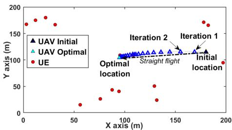  
(a) In 2D in the LoS environment.

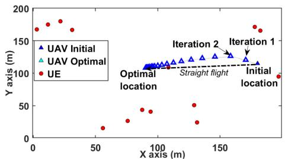  
(b) In 2D in the mixed LoS & NLoS environment.

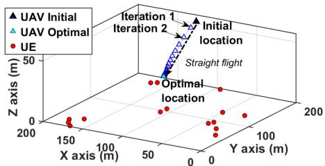  
(c) In 3D in the LoS environment.

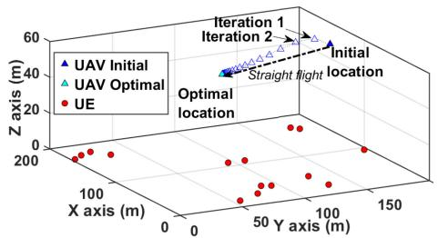  
(d) In 3D in the mixed LoS & NLoS environment.

Fig. 2. Optimal UAV trajectories after running the proposed alternating algorithm.  
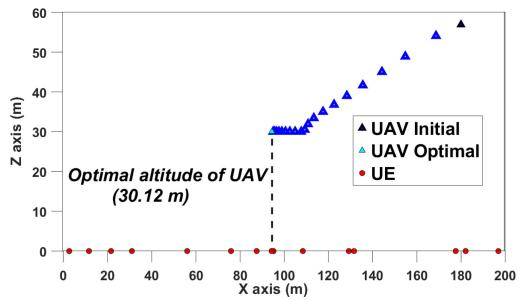  
(a) In the LoS environment.

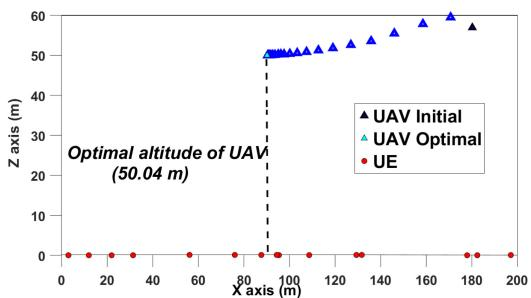  
(b) In the mixed LoS & NLoS environment.

Fig. 3. Optimal altitude comparison between LoS and mixed LoS & NLoS environments.  
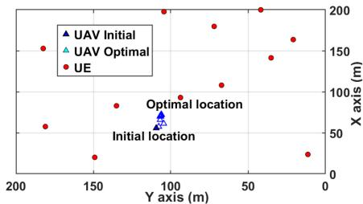  
(a) $) E _ { \mathrm { f i y } } = 1 , 0 0 0 \ J \mathrm { o u l e } .$

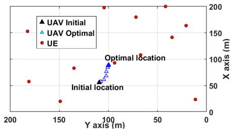  
(b) $E _ { \mathrm { f l y } } { = } 2 , 0 0 0 ~ \mathsf { J o u l e } .$

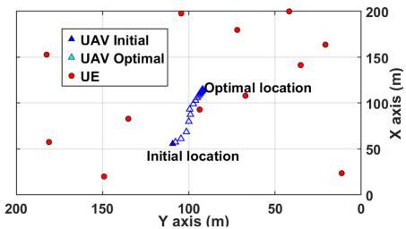  
(c) $E _ { \mathrm { f l y } } { = } 5 , 0 0 0$ Joule.  
Fig. 4. Optimal UAV trajectories with different values of $E _ { \mathrm { f l y } } \left( K = 1 2 \right)$

results indicate $E _ { \mathrm { f l y } } ~ = ~ 5 , 0 0 0$ Joules suffices for UAV convergence.

Balancing the trade-off between travel time and energy consumption is crucial for UAV operation. Higher speeds reduce movement time but increase energy consumption, while lower speeds conserve energy but extend travel duration. Consequently, determining the optimal UAV velocity is key to efficiently using $E _ { \mathrm { { f l y } } }$ to reach an optimal position. This assertion is supported by the performance comparison results shown in Fig. 6, which analyzes different UAV velocities with varying $E _ { \mathrm { { f l y } } }$ . It is observed that the optimal UAV velocity offers the best energy efficiency during the FL process, outperforming both random and maximum velocity strategies. The random velocity strategy, in particular, results in the worst performance. However, the performance gap between these strategies diminishes as $E _ { \mathrm { { f l y } } }$ increases, eventually reaching zero when $E _ { \mathrm { { f l y } } }$ exceeds $5 { , } 0 0 0$ Joules. This phenomenon occurs because $E _ { \mathrm { f l y } } = 5 , 0 0 0$ Joules is sufficient for the UAV to reach the optimal position regardless of its velocity. Consequently, optimizing the UAV velocity becomes crucial when the UAV has limited flight energy. These findings further demonstrate the effectiveness of the proposed optimization algorithm in addressing the challenges posed by limited UAV flight energy.

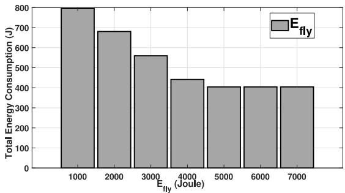  
Fig. 5. Total energy consumption of the proposed alternating optimization algorithm (Algorithm V) for various values of Efly (K = 12).

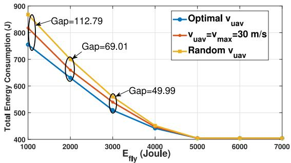  
Fig. 6. Total energy consumption of the proposed alternating optimization algorithm (Algorithm V) for various values of vuav (K = 12).

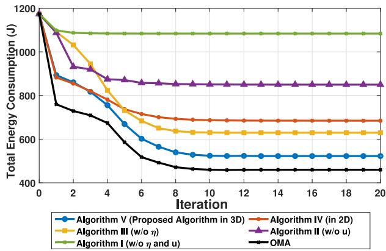  
Fig. 7. Convergence behavior of iterative optimization algorithms (K = 12).

3) Performance Comparison With Benchmark Algorithms: To demonstrate the superior performance of the proposed Algorithm V, we conducted extensive comparisons against several benchmark algorithms. Fig. 7 shows the total energy consumption as a function of the number of iterations for the proposed alternating optimization algorithm compared to the OMA baseline and other benchmark algorithms. The results illustrate the convergence process of these iterative optimization approaches. Notably, the proposed Algorithm V converges quickly, reaching 95% of its optimal performance within just 10 iterations. In terms of energy efficiency,

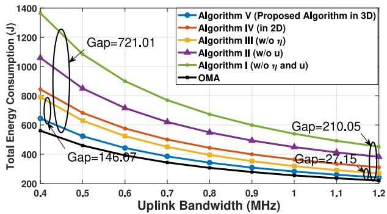  
Fig. 8. Total energy consumption of different iterative algorithms versus uplink bandwidth Bu (K = 12).

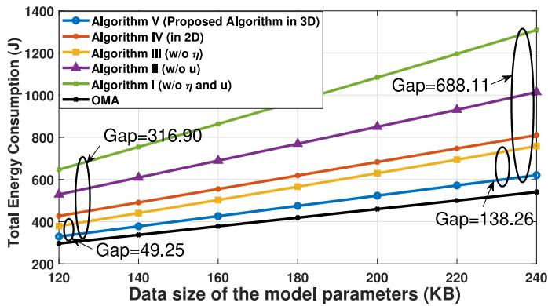  
Fig. 9. Total energy consumption of different iterative algorithms versus data size γ of model parameters (K = 12).

Algorithm V outperforms all benchmarks, while Algorithm I exhibits the poorest performance. It is expected that the OMA baseline achieves the best performance, as it assumes perfect IUI cancellation during the uplink phase. This allows for higher uplink rates at the same transmit power compared to Algorithm V, thereby reducing energy consumption at the UEs. However, the performance improvement over Algorithm V is relatively modest when compared to the significant gap between Algorithm V and the other benchmark algorithms. This result highlights the robustness of Algorithm V in effectively handling IUI and maintaining strong performance even in interference-limited environments. Specifically, Algorithm V achieves a remarkable reduction in total energy consumption, up to 50%, for all UEs during the FL process compared to Algorithm I. This outstanding performance is largely due to Algorithm V’s comprehensive approach to solving the complex problem of optimal resource allocation, particularly in identifying the UAV’s optimal position.

The results show that algorithms incorporating UAV trajectory optimization (Algorithms III, IV, and V) significantly outperform those with random UAV positions (Algorithms I and II). This highlights the critical importance of optimizing UAV trajectory to tackle energy efficiency challenges in FL over wireless networks. Moreover, while Algorithms I and II do not consider UAV flight energy constraints, the superiority of the proposed algorithms, which include UAV location optimization, is evident. These algorithms enable the UAV to discover at least a near-optimal location, even under strict energy constraints. These optimal positions enhance wireless communication quality, allowing UEs to save more transmission energy and significantly improve overall energy efficiency. Among the algorithms that optimize UAV location, Algorithm V delivers the best performance, followed by Algorithm III, with Algorithm IV trailing behind. The reason for Algorithm $\mathrm { I V } \mathbf { \bar { s } }$ comparatively lower performance is that it only optimizes UAV placement in 2D, neglecting the altitude optimization. As shown in Fig. 3, optimizing UAV altitude is crucial for effectively managing environments influenced by both LoS and NLoS effects. Therefore, by optimizing UAV location in 3D, Algorithm V achieves substantial performance gains over all benchmark algorithms, significantly reducing energy consumption for all UEs during the FL process.

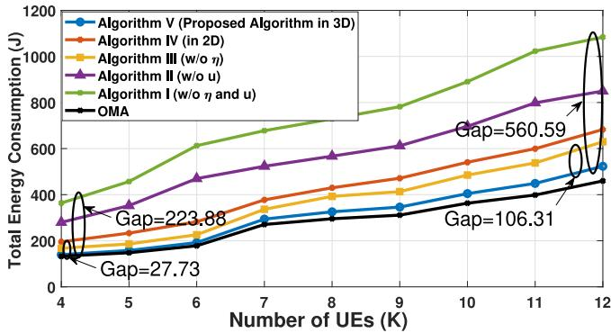  
Fig. 10. Total energy consumption of different iterative algorithms versus the number of UEs, K.

Next, we evaluate the impact of parameter settings for FL deployment on performance through extensive experiments. This analysis aims to provide insightful comparisons between the proposed optimization algorithms in terms of the total energy consumption of all UEs. Fig. 8 shows the performance of various optimization strategies relative to uplink bandwidth $B _ { \mathrm { u } }$ . As $B _ { \mathrm { u } }$ increases, system performance improves due to higher uplink rates, reducing communication energy for model transmission. Algorithm V consistently outperforms other benchmarks, while Algorithm I performs the worst. The impact of $\eta$ diminishes with increasing $B _ { \mathrm { u } }$ , as seen in narrowing performance gaps: from 146.07J to 27.15J (Algorithms III vs. V) and 721.01J to 210.50J (Algorithms I vs. V) as $B _ { \mathrm { u } }$ grows from 0.4 to 1.2 MHz. This is because larger $B _ { \mathrm { u } }$ enhances communication, reducing the computation phase’s relative influence. Although the OMA baseline outperforms Algorithm V, the performance gap between them rapidly narrows and becomes negligible as $B _ { \mathrm { u } }$ increases to a sufficiently large value. This is because the UEs do not require excessively high uplink rates to complete the FL task, and Algorithm V can effectively identify the optimal uplink rate even in the presence of IUI. These results further demonstrate the robustness of Algorithm V in mitigating IUI.

Fig. 9 presents simulation outcomes as the data size $\gamma$ of uploaded and downloaded model parameters changes. The performance trends among the optimization strategies remain consistent with those observed in Fig. 8. Algorithm $\mathrm { v , }$ which fully resolves the original complex problem P, consistently outperforms the other benchmarks. However, unlike the results in Fig. 8, Fig. 9 shows that system performance declines for all algorithms as γ increases. This decrease is due to the larger model parameter data size requiring longer transmission times and higher communication energy consumption at the UEs. Notably, the group of algorithms that consider UAV trajectory optimization (Algorithms III, IV, and V) exhibits substantially smaller performance drops compared to the group of algorithms with random UAV placement (Algorithms I and II). This highlights the considerable advantage of optimizing UAV placement, which enhances the system’s adaptability to varying model parameter data sizes. As a result, the proposed UAV communication system can extend its applications in FL by adjusting model parameter data sizes to meet different requirements.

Fig. 10 shows similar trends regarding the impact of the number of UEs, K. As K increases, total energy consumption rises, but Algorithm V maintains superior efficiency with minimal performance decline. The performance gap between Algorithm V and others benchmarks, e.g., from 27.73J to 106.31J (Algorithms III vs. V) and 223.88J to 560.59J (Algorithms I vs. V). These results emphasize the importance of effective resource allocation and highlight Algorithm V’s scalability in FL-enabled UAV communication, achieved through the proposed alternating optimization approach. In summary, although the OMA baseline achieves the best performance in Figs. 9 and 10, as expected given its idealized assumptions, the performance gain over Algorithm V is relatively modest compared to the substantial gap between Algorithm V and the other benchmark algorithms. These findings underscore the robustness of Algorithm V in handling IUI, enabling it to maintain strong and scalable performance even under practical interference conditions.

## V. CONCLUSION

This paper addressed the challenges of optimizing UE energy efficiency during FL within a UAV-based communication system. To ensure the system’s realism, the A2G channel model was carefully considered, accounting for both LoS and NLoS links. A critical aspect of UAV operation, the management of restricted energy resources, was also efficiently optimized, ensuring the UAV’s safe return to the ground. To tackle the optimization problem and reduce the total energy consumption of UEs during FL, we developed a new alternating optimization algorithm. This algorithm effectively solved two alternating convex subproblems. The algorithm’s effectiveness was validated through extensive experiments, demonstrating its ability to handle challenging conditions such as dense urban environments and limited UAV energy. Numerical results highlighted the superiority of the proposed algorithm compared to benchmark algorithms. Notably, opti mizing UAV positions led to a substantial increase in energy efficiency for all UEs, with improvements of up to 50%. This improvement is attributed to the enhanced wireless communication links achieved by optimizing UAV placement, in contrast to algorithms that relied on random UAV placements. Finally, the proposed algorithm underscored the importance of achieving both high performance and effective system scalability by adjusting key parameter settings. This work demonstrated the importance of strategic UAV deployment and resource management in optimizing energy efficiency and ensuring the robustness of FL in UAV communication systems. Future work will explore more dynamic and realistic environments, including UE mobility, time-varying channel conditions, and dynamic UE participation. These aspects present new challenges for convergence, communication reliability, and resource allocation, requiring the UAV to make adaptive decisions in real-time to ensure FL system performance.

## APPENDIX A PROOF OF LEMMA 1

We introduced a positive variable set $\mathbf { r } \triangleq \{ r _ { k } \} , \forall k \in \mathcal { K }$ to satisfy the following constraint:

$$
\left( \kappa + ( 1 - \kappa ) P _ { k } ^ { \mathrm { L o S } } \right) \geq \frac { | \mathbf { u } - \mathbf { a } _ { k } | ^ { 2 } } { r _ { k } \beta _ { 0 } } .\tag{60}
$$

To convexify the constraint (60), we recognize that the lefthand side of (60) is already a convex form (a rotated cone). Therefore, we need to determine a concave lower bound for $\underset { { \hat { \mathbf { \Lambda } } } _ { k } } { { P } } { } ^ { \mathrm { L o S } }$ . Using the SOC (28) and the quadratic (29) constraints, $\phi _ { k }$ can be shown as a lower bound for $\phi _ { k }$

$$
\begin{array} { r l } & { | \mathbf { x } - \mathbf { x } _ { k } | \hat { \phi } _ { k } \leq t _ { k } \hat { \phi } _ { k } \leq \mathrm { f } _ { \mathrm { m u l } } ^ { ( i ) } \Big ( t _ { k } , \hat { \phi } _ { k } \Big ) \leq z _ { u } } \\ & { \quad \Leftrightarrow \phi _ { k } \triangleq \frac { z _ { u } } { \left| \mathbf { x } - \mathbf { x } _ { k } \right| } \geq \hat { \phi } _ { k } \Leftrightarrow \tan ^ { - 1 } ( \phi _ { k } ) \geq \tan ^ { - 1 } \Big ( \hat { \phi } _ { k } \Big ) . } \end{array}\tag{61}
$$

Applying the first-order Taylor approximation to the concave function $\mathrm { n } ^ { - 1 } ( \bar { \phi } ) , \bar { \phi } > 0$ , the lower bound of $\tan ^ { - 1 } ( \bar { \phi } )$ at iteration $i + 1$ ( ) 0 is found as

$$
\tan ^ { - 1 } \Big ( \hat { \phi } _ { k } \Big ) \geq \tan ^ { - 1 } \Big ( \hat { \phi } _ { k } ^ { ( i ) } \Big ) + \frac { 1 } { \hat { \phi } _ { k } ^ { 2 } + 1 } \Big ( \hat { \phi } _ { k } - \hat { \phi } _ { k } ^ { ( i ) } \Big ) .\tag{62}
$$

Using the quadratic constraint (31), we derive

$$
\hat { \phi } _ { k } - \hat { \phi } _ { k } ^ { ( i ) } \geq \frac { \bar { \bf f } _ { \mathrm { f r } } ^ { ( i ) } ( \iota _ { k } , \iota ^ { \prime } _ { k } ) } { 4 } \geq \frac { ( \iota _ { k } + \iota ^ { \prime } _ { k } ) ^ { 2 } } { 4 } - \frac { ( \iota _ { k } - \iota ^ { \prime } { } _ { k } ) ^ { 2 } } { 4 } = \iota _ { k } \iota _ { k } ^ { \prime } .\tag{63}
$$

Using (63) and (30), the lower bound for the second term on the left-hand side of (62) becomes $\begin{array} { r l r } { \frac { \hat { \phi } _ { k } - \hat { \phi } _ { k } ^ { ( i ) } } { \hat { \phi } _ { k } ^ { 2 } + 1 } \ge \frac { \iota _ { k } \iota _ { k } ^ { \prime } } { \iota _ { k } } = } \end{array}$ $\iota _ { k } ^ { \prime } .$ . Employing this constraint combined with exponential cone (32), we derive

$$
\exp \left( - a _ { 2 } \Big [ \mathrm { t a n } ^ { - 1 } ( \phi _ { k } ) - a _ { 1 } \Big ] \right) \leq l _ { k } .\tag{64}
$$

Using (64) and the quadratic constraint (33), $\Pi _ { k }$ is easily proven to be a lower bound for $P _ { k } ^ { \mathrm { L o S } } ( \phi _ { k } )$ . Using this lower bound $\Pi _ { k }$ ( ), the constraint (60) is convexified under the constraint form (34). Thus, $r _ { k } ^ { \prime - 1 }$ is proven to be the lower bound for $\beta _ { k } ( { \mathbf { u } } )$

## APPENDIX B PROOF OF LEMMA 2

An positive variable set $\mathbf { r } ^ { \prime } \triangleq \{ r _ { k } ^ { \prime } \} , \forall k \in \mathcal { K }$ is introduced to satisfy the following constraint:

$$
\Big ( \kappa + ( 1 - \kappa ) P _ { k } ^ { \mathrm { L o S } } \Big ) \leq \frac { d _ { k } ^ { 2 } ( \mathbf { u } ) } { \beta _ { 0 } r _ { k } ^ { \prime } } .\tag{65}
$$

Using the constraint (35), we obtain the lower bound on the right-hand side of (65) as $\begin{array} { r } { \frac { d _ { k } ^ { 2 } ( \mathbf { u } ) } { \beta _ { 0 } r _ { k } ^ { \prime } } ~ \geq ~ \bar { \mathbf { f } } _ { \mathrm { f r } } ^ { ( i ) } ( \mathbf { u } , \mathbf { a } _ { k } , r _ { k } ^ { \prime } ) ~ \geq ~ \frac { \bar { r } _ { k } } { \beta _ { 0 } } } \end{array}$ To convexify the constraint (65), we need to find a convex upper bound for the left-hand side of (65). Therefore, we need to establish a convex upper bound for $P _ { k } ^ { \mathrm { L o S } }$ . Using the SOC constraint (36), the constraint (37), and the quadratic constraint (38), it is easily shown that $\phi _ { k }$ is an upper bound for $\phi _ { k }$ as

$$
\begin{array} { r l } & { \boldsymbol { \phi } _ { k } \triangleq \frac { z _ { u } } { \left| \mathbf { x } - \mathbf { x } _ { k } \right| } \le z _ { u } \bar { b } _ { k } \le \mathbf { f } _ { \mathrm { m u l } } ^ { ( i ) } \big ( z _ { u } , \bar { b } _ { k } \big ) \le \bar { \phi } _ { k } } \\ & { \quad \Leftrightarrow \tan ^ { - 1 } ( \phi _ { k } ) \le \tan ^ { - 1 } \big ( \bar { \phi } _ { k } \big ) . } \end{array}\tag{66}
$$

Because $\tan ^ { - 1 } ( \hat { \phi } _ { k } )$ is concave with $\hat { \phi } _ { k } \ \geq \ 0$ , we use the first-order Taylor approximation to obtain the upper bound of $\tan ^ { - 1 } ( \hat { \phi } _ { k } )$ at iteration $i + 1$ as

$$
\tan ^ { - 1 } \left( \hat { \phi } _ { k } \right) \le \tan ^ { - 1 } \left( \hat { \phi } _ { k } ^ { ( i ) } \right) + \left( \hat { \phi } _ { k } - \hat { \phi } _ { k } ^ { ( i ) } \right) \frac { 1 } { \left( \hat { \phi } _ { k } ^ { ( i ) } \right) ^ { 2 } + 1 } .\tag{67}
$$

Using (67) and (39), a convex upper bound for $P _ { k } ^ { \mathrm { L o S } }$ is derived $P _ { k } ^ { \mathrm { L o S } } ( \phi _ { k } ) \leq \frac { 1 } { \exp \left( - a _ { 2 } \left( \bar { \phi } ^ { \prime } { } _ { k } - a _ { 1 } \right) \right) } \leq \frac { 1 } { \pounds _ { \exp } ^ { ( i ) } \left( - a _ { 2 } ( \bar { \phi ^ { \prime } } _ { k } ^ { ( i ) } - a _ { 1 } ) \right) } .$ (68)

Using (68), the constraint (65) is finally convexified under the constraint form (34). Hence, $r _ { \mathrm { ~ } k } ^ { \prime - 1 }$ is proven to be the upper bound of $\beta _ { k } ( { \mathbf { u } } )$

## REFERENCES

[1] E. H. Houssein, M. A. Othman, W. M. Mohamed, and M. Younan, “Internet of Things in smart cities: Comprehensive review, open issues, and challenges,” IEEE Internet Things J., vol. 11, no. 21, pp. 34941–34952, Nov. 2024.

[2] Y. Liu, W. Yu, Z. Ai, G. Xu, L. Zhao, and Z. Tian, “A blockchainempowered federated learning in healthcare-based cyber physical systems,” IEEE Trans. Net. Sci. Eng., vol. 10, no. 5, pp. 2685–2696, Sep./Oct. 2023.

[3] E. Hallaji, R. Razavi-Far, M. Saif, B. Wang, and Q. Yang, “Decentralized federated learning: A survey on security and privacy,” IEEE Trans. Big Data, vol. 10, no. 2, pp. 194–213, Apr. 2024.

[4] D. Sirohi, N. Kumar, P. S. Rana, S. Tanwar, R. Iqbal, and M. Hijjii, “Federated learning for 6G-enabled secure communication systems: A comprehensive survey,” Artif. Intell. Rev., vol. 56, no. 10, pp. 11297–11389, 2023.

[5] G. Lan, X.-Y. Liu, Y. Zhang, and X. Wang, “Communication-efficient federated learning for resource-constrained edge devices,” IEEE Trans. Mach. Learn. Commun. Netw., vol. 1, pp. 210–224, 2023.

[6] R. Wang, J. Lai, X. Li, D. He, and M. K. Khan, “RPIFL: Reliable and privacy-preserving federated learning for the Internet of Things,” J. Netw. Comput. Appl., vol. 221, Jan. 2024, Art. no. 103768.

[7] S. Chen, D. Yu, Y. Zou, J. Yu, and X. Cheng, “Decentralized wireless federated learning with differential privacy,” IEEE Trans. Ind. Informat., vol. 18, no. 9, pp. 6273–6282, Sep. 2022.

[8] Y. Cong et al., “FedGA: A greedy approach to enhance federated learning with non-IID data,” Knowl.-Based Syst., vol. 301, Oct. 2024, Art. no. 112201.

[9] Y. Cong et al., “Ada-FFL: Adaptive computing fairness federated learning,” CAAI Trans. Intell. Technol., vol. 9, no. 3, pp. 573–584, 2024.

[10] D. Shi, L. Li, R. Chen, P. Prakash, M. Pan, and Y. Fang, “Toward energyefficient federated learning over 5G+ mobile devices,” IEEE Wireless Commun., vol. 29, no. 5, pp. 44–51, Oct. 2022.

[11] J. Lee, F. Solat, T. Y. Kim, and H. V. Poor, “Federated learningempowered mobile network management for 5G and beyond networks: From access to core,” IEEE Commun. Surveys Tuts., vol. 26, no. 3, pp. 2176–2212, 3rd Quart., 2024.

[12] J. Pei, S. Li, Z. Yu, L. Ho, W. Liu, and L. Wang, “Federated learning encounters 6G wireless communication in the scenario of Internet of Things,” IEEE Commun. Stand. Mag., vol. 7, no. 1, pp. 94–100, Mar. 2023.

[13] C. Yeh, G. D. Jo, Y.-J. Ko, and H. K. Chung, “Perspectives on 6G wireless communications,” ICT Exp., vol. 9, no. 1, pp. 82–91, 2023.

[14] X.-T. Dang, M. T. P. Le, H. V. Nguyen, S. Chatzinotas, and O.-S. Shin, “Optimal user pairing approach for NOMA-based cell-free massive MIMO systems,” IEEE Trans. Veh. Technol., vol. 72, no. 4, pp. 4751–4765, Apr. 2023.

[15] X.-T. Dang, H. V. Nguyen, and O.-S. Shin, “Physical layer security for IRS-UAV-assisted cell-free massive MIMO systems,” IEEE Access, vol. 12, pp. 89520–89537, 2024.

[16] E. Ali, M. Ismail, R. Nordin, and N. F. Abdulah, “Beamforming techniques for massive MIMO systems in 5G: Overview, classification, and trends for future research,” Front. Inf. Technol. Electron. Eng., vol. 18, pp. 753–772, Jun. 2017.

[17] M. K. Banafaa et al., “A comprehensive survey on 5G-and-beyond networks with UAVs: Applications, emerging technologies, regulatory aspects, research trends and challenges,” IEEE Access, vol. 12, pp. 7786–7826, 2024.

[18] S. Tang, W. Zhou, L. Chen, L. Lai, J. Xia, and L. Fan, “Batteryconstrained federated edge learning in UAV-enabled IoT for B5G/6G networks,” Phys. Commun., vol. 47, Aug. 2021, Art. no. 101381.

[19] Q. V. Do, Q.-V. Pham, and W.-J. Hwang, “Deep reinforcement learning for energy-efficient federated learning in UAV-enabled wireless powered networks,” IEEE Commn. Lett., vol. 26, no. 1, pp. 99–103, Jan. 2022.

[20] Q.-V. Pham, M. Le, T. Huynh-The, Z. Han, and W.-J. Hwang, “Energy-efficient federated learning over UAV-enabled wireless powered communications,” IEEE Trans. Veh. Technol., vol. 71, no. 5, pp. 4977–4990, May 2022.

[21] Y. Jing et al., “Exploiting UAV for air-ground integrated federated learning: A joint UAV location and resource optimization approach,” IEEE Trans. Green Commun. Netw., vol. 7, no. 3, pp. 1420–1433, Sep. 2023.

[22] M. Fu, Y. Shi, and Y. Zhou, “Federated learning via unmanned aerial vehicle,” IEEE Trans. Wireless Commun., vol. 23, no. 4, pp. 2884–2900, Apr. 2024.

[23] Z. Fu, J. Liu, Y. Mao, L. Qu, L. Xie, and X. Wang, “Energyefficient UAV-assisted federated learning: Trajectory optimization, device scheduling, and resource management,” IEEE Trans. Netw. Service Manage., vol. 22, no. 2, pp. 974–988, Apr. 2025.

[24] X. Hou, J. Wang, C. Jiang, X. Zhang, Y. Ren, and M. Debbah, “UAVenabled covert federated learning,” IEEE Trans. Wireless Commun., vol. 22, no. 10, pp. 6793–6809, Oct. 2023.

[25] T. Wang, X. Huang, Y. Wu, L. Qian, B. Lin, and Z. Su, “UAV swarmassisted two-tier hierarchical federated learning,” IEEE Trans. Netw. Sci. Eng., vol. 11, no. 1, pp. 943–956, Jan./Feb. 2024.

[26] X.-T. Dang and O.-S. Shin, “Optimization of energy efficiency for federated learning over unmanned aerial vehicle communication networks,” Electronics, vol. 13, no. 10, p. 1827, 2024.

[27] Y. Bai, H. Zhao, X. Zhang, Z. Chang, R. Jäntti, and K. Yang, “Towards autonomous multi-UAV wireless network: A survey of reinforcement learning-based approaches,” IEEE Commun. Surveys Tuts., vol. 25, no. 4, pp. 3038–3067, 4th Quart., 2023.

[28] X. Jiang, M. Sheng, Z. Nan, X. Chengwen, L. Weidang, and W. Xianbin, “Green UAV communications for 6G: A survey,” Chin. J. Aeronaut.„ vol. 35, no. 9, pp. 19–34, 2022.

[29] H. Saarnisaari et al., “A 6G white paper on connectivity for remote areas,” 2020, arXiv:2004.14699.

[30] N. Tafintsev et al., “Aerial access and backhaul in mmWave B5G systems: Performance dynamics and optimization,” IEEE Commun. Mag., vol. 58, no. 2, pp. 93–99, Feb. 2020.

[31] Y. Zeng, Q. Wu, and R. Zhang, “Accessing from the sky: A tutorial on UAV communications for 5G and beyond,” Proc. IEEE, vol. 107, no. 12, pp. 2327–2375, Dec. 2019.

[32] A. Al-Hourani, S. Kandeepan, and S. Lardner, “Optimal LAP altitude for maximum coverage,” IEEE Wireless Commun. Lett., vol. 3, no. 6, pp. 569–572, Dec. 2014.

[33] N. Gupta, S. Agarwal, D. Mishra, and B. Kumbhani, “Trajectory and resource allocation for UAV replacement to provide uninterrupted service,” IEEE Trans. Commun., vol. 71, no. 12, pp. 7288–7302, Dec. 2023.

[34] D. Yin, X. Yang, H. Yu, S. Chen, and C. Wang, “An air-to-ground relay communication planning method for UAVs swarm applications,” IEEE Trans. Intell. Veh., vol. 8, no. 4, pp. 2983–2997, Apr. 2023.

[35] C. Qiu, Z. Wei, Z. Feng, and P. Zhang, “Joint resource allocation, placement and user association of multiple UAV-mounted base stations with in-band wireless backhaul,” IEEE Wireless Commun. Lett., vol. 8, no. 6, pp. 1575–1578, Dec. 2019.

[36] Z. Yang, M. Chen, W. Saad, C. S. Hong, and M. Shikh-Bahaei, “Energy efficient federated learning over wireless communication networks,” IEEE Trans. Wireless Commun., vol. 20, no. 3, pp. 1935–1949, Mar. 2021.

[37] J. Konecnˇ y, Z. Qu, and P. Richtárik, “Semi-stochastic coordinate\` descent,” Optim. Methods Softw., vol. 32, no. 5, pp. 993–1005, 2017.

[38] C. Ma et al., “Distributed optimization with arbitrary local solvers,” Optim. Methods Softw., vol. 32, no. 4, pp. 813–848, 2017.

[39] Y. Jing et al., “Exploiting UAV for air–ground integrated federated learning: A joint UAV location and resource optimization approach,” IEEE Trans. Green Commun. Netw., vol. 7, no. 3, pp. 1420–1433, Sep. 2023.

[40] A. R. S. Bramwell, D. Balmford, and G. Done, Bramwell’s Helicopter Dynamics. Amsterdam, The Netherlands: Elsevier, 2001.

[41] A. Filippone, Flight Performance of Fixed and Rotary Wing Aircraft. Amsterdam, The Netherlands: Elsevier, 2006.

[42] Y. Zeng, J. Xu, and R. Zhang, “Energy minimization for wireless communication with rotary-wing UAV,” IEEE Trans. Wireless Commun., vol. 18, no. 4, pp. 2329–2345, Apr. 2019.

[43] Mosek Optimization Toolbox for Matlab: User’s Guide Reference Manual, Mosek ApS, København, Denmark, 2019.

[44] H. Tuy, Convex Analysis and Global Optimization. New York, NY, USA: Springer, 2016.

[45] S. P. Boyd and L. Vandenberghe, Convex Optimization. Cambridge, U.K.: Cambridge Univ. Press, 2004.

[46] V.-D. Nguyen, T. Q. Duong, H. D. Tuan, O.-S. Shin, and H. V. Poor, “Spectral and energy efficiencies in full-duplex wireless information and power transfer,” IEEE Trans. Commun., vol. 65, no. 5, pp. 2220–2233, May 2017.

[47] B. R. Marks and G. P. Wright, “A general inner approximation algorithm for non-convex mathematical programs,” Oper. Res., vol. 26, no. 4, pp. 681–683, 1978.

[48] J. C. Bezdek and R. J. Hathaway, “Convergence of alternating optimization,” Neural Parallel Sci. Comput., vol. 11, no. 4, pp. 351–368, 2003.

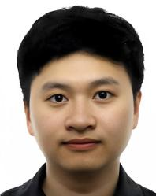

Xuan-Toan Dang received the B.E degree in wireless communication engineering from the Hanoi University of Science and Technology, Hanoi City, Vietnam, in 2020, and the M.E. degree in electronic engineering from Soongsil University, Seoul, South Korea, in 2023, where he is currently pursuing the Ph.D. degree. His research interests include wireless communications with optimization techniques, machine learning, deep learning for wireless communications, and signal processing for communications.

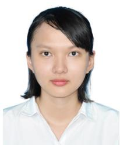

Quynh-Suong Nguyen received the B.S. degree in statistics from Ton Duc Thang University, Ho Chi Minh City, Vietnam, in 2020, and the M.S. degree in information and communication engineering from Soongsil University, Seoul, South Korea, in 2025. Her research interests focus on applying machine learning and deep learning techniques to wireless communications.

Oh-Soon Shin (Senior Member, IEEE) received the B.S., M.S., and Ph.D. degrees in electrical engineering and computer science from Seoul National University, Seoul, Korea, in 1998, 2000, and 2004, respectively.

From 2004 to 2005, he was with the Division of Engineering and Applied Sciences, Harvard University, MA, USA, as a Postdoctoral Fellow. From 2006 to 2007, he was a Senior Engineer with Samsung Electronics, Suwon, South Korea. In September 2007, he joined the School of Electronic

Engineering, Soongsil University, Seoul, South Korea, where he is currently a Professor. His research interests include communication theory, wireless communication systems, and signal processing for communications.