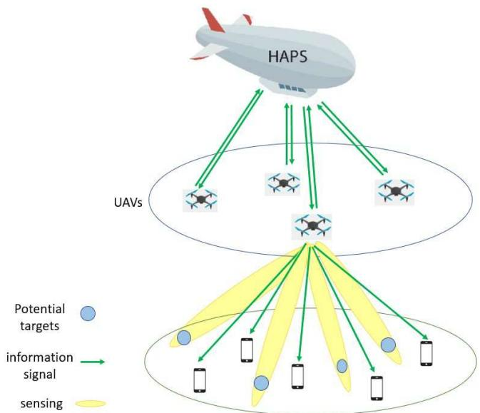
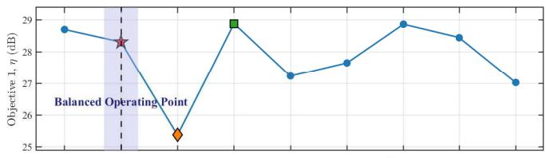
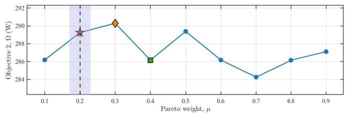
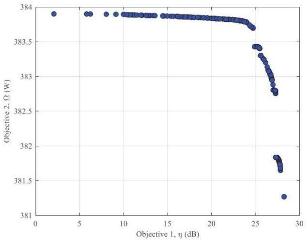
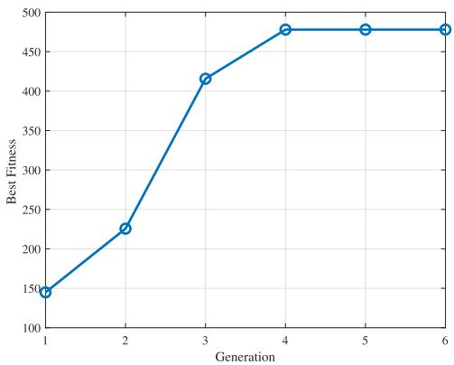
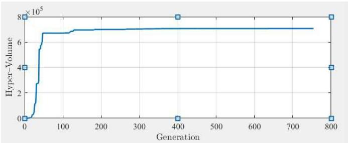
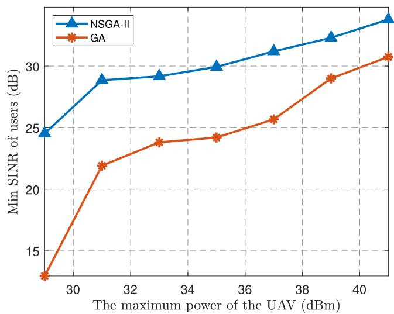
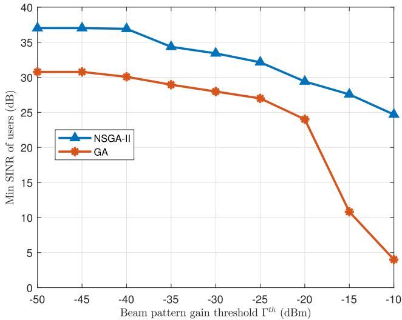
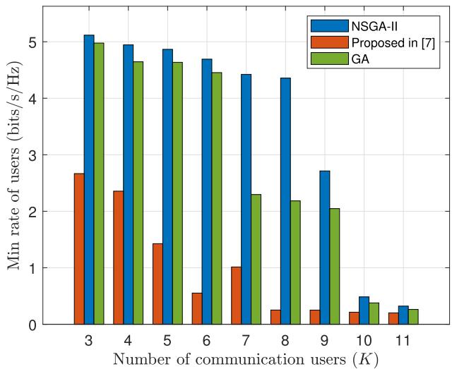
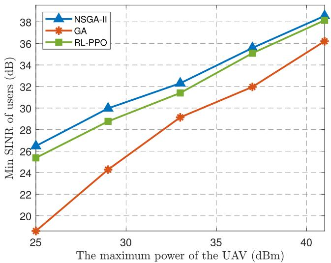

# Optimizing Network Performance and Resource Allocation in HAPS-UAV Integrated Sensing and Communication Systems for 6G

Parisa Kanani , Mohammad Javad Omidi , Mahmoud Modarres-Hashemi , and Halim Yanikomeroglu , Fellow, IEEE

Abstract—This paper proposes an innovative approach by leveraging uncrewed aerial vehicles (UAVs) as base stations (BSs) and a high-altitude platform station (HAPS) as the central processing unit (CPU) in an integrated sensing and communication (ISAC) system for 6G networks. We explore the challenges, applications, and advantages of ISAC systems in nextgeneration networks, highlighting the significance of optimizing position and power control. Our approach integrates HAPS and UAVs to enhance wireless coverage, particularly in remote areas. UAVs function as dual-purpose access points (APs), using their maneuverability and line-of-sight (LoS) aerial-to-ground (A2G) links to transmit combined communication and sensing signals. The scheme operates in two time slots: in the first slot, UAVs transmit dedicated signals to communication users (CUs) and potential targets. UAVs detect targets in specific ground locations and, after signal transmission, receive reflected signals from targets. In the second slot, UAVs relay these signals to HAPS, which performs beamforming to align signals for each CU from various UAVs. UAVs decode information from HAPS and adjust transmissions to maximize the efficiency of the beam pattern toward the desired targets. We formulate a multi-objective optimization problem with the goal of maximizing both the minimum signal-to-interference-plus-noise ratio (SINR) for CUs and the echo signal power from the targets. This is achieved by finding the optimal power allocation for CUs in each UAV, subject to constraints on the maximum total power in each UAV and the transmitted beam pattern gain. Simulation results demonstrate the effectiveness of this approach in enhancing network performance, resource allocation, fairness, and system optimization. By utilizing HAPS as the CPU, computational tasks are offloaded from UAVs, which conserves energy and further improves overall network performance.

Index Terms—High altitude platform stations (HAPS), integrated sensing and communication (ISAC), optimization, sixth-

generation (6G), uncrewed aerial vehicle (UAV), wireless networks.

## I. INTRODUCTION

ECENTLY, integrated sensing and communication next-generation communication systems, beyond the current fifth-generation (5G) and sixth-generation (6G) systems. In ISAC, sensing and communication systems are jointly designed to share frequency bands and hardware resources, resulting in improved energy efficiency and reduced hardware costs. The main objective of ISAC is to integrate sensing and communication processes into a cohesive system, resulting in mutual performance benefits [1], [2], [3], [4]. This integration is expected to deliver notable enhancements in energy efficiency and spectral efficiency, while at the same time reducing hardware and signaling costs.

Due to its ability to use common resources for both sensing and communication functions, such as hardware, waveforms, and frequency bands, ISAC has garnered significant attention in industry and academia. It is predicted that the use of ISAC will result in improved power consumption, reduced signal transmission delays, smaller product dimensions, and enhanced energy and spectral efficiency [2], [3], [4], [5]. Furthermore, the use of ISAC also leads to increased localization accuracy, suitable beamforming vector shaping, and reduced overhead for channel state information (CSI) tracking.

The use of ISAC in terrestrial networks is subject to notable constraints, especially in the context of sensing. The reason for this is twofold. Firstly, sensing tasks such as target detection or parameter estimation typically rely on direct links between the transmitter and targets. However, in terrestrial networks, obstacles in the environment can often obstruct direct line-of-sight (LoS) links, resulting in indirect paths that introduce errors and render some sensing operations infeasible. Secondly, achieving precise, long-range sensing demands a significant power input, potentially leading to a decline in performance for terrestrial base stations (BSs) [2], [6], [7], [8].

Utilizing on-demand deployment and leveraging the LoS links offered by uncrewed aerial vehicles (UAVs) [2], [4], UAVs are poised to emerge as highly promising aerial ISAC platforms. By catering to the specific requirements of sensing frequency and communication quality, UAVs have the potential to deliver more controlled and balanced integrated services. This is made possible through their capabilities in monitoring, sensing, and remote operations. Additionally, exploiting UAVs enables the attainment of high-resolution, all-weather, dayand-night imaging and high frame rates [1], [2], [9].

The paper [10] proposes optimizing multiple UAVs to act as communication providers and distributed MIMO radar for target sensing. The joint optimization of UAV location, communication user (CU) association, and transmission power control maximizes network utility while meeting localization accuracy constraints.

The authors in [7] discuss a UAV-based ISAC system where the UAV acts as an aerial access point for both communication and sensing purposes. The UAV sends combined information and sensing signals to communicate with multiple CUs while sensing potential targets on the ground. The sensing beampattern gain constraint is used as a sensing metric, and the weighted sum rate is used as a communication metric. This problem is similar to the one discussed in reference [6].

The paper [11] proposes an energy-efficient computation offloading strategy for a UAV-assisted edge computing system that uses ISAC. The proposed system model prioritizes sensed data and performs weighted allocation of computational resources on the ground roadside unit (RSU) based on the priority of vehicle perception data to minimize energy consumption and total CU latency.

In recent years, the integration of high-altitude platform stations (HAPS) and UAV into communication networks has garnered significant attention as a very promising solution for expanding wireless network coverage and providing access to remote areas. HAPS has emerged as a notable technology in 6G communications [12]. Recognized by numerous organizations and research studies, non-terrestrial networks are regarded as a crucial and cost-effective element for establishing high-capacity connections in 6G wireless networks [13]. The lack of adequate coverage in remote and hard-to-reach areas, including rural regions, poses significant challenges for current networks [14].

Moreover, even technologically advanced countries face issues with their existing telecommunications infrastructure, which lacks the necessary reliability to meet the demands of future-generation applications [14], [15]. Additionally, these infrastructures prove highly vulnerable during natural disasters, with connectivity disruptions resulting in substantial property damage, business disruptions, and potential loss of life. As a result, strengthening ground communications through the integration with aerial networks like HAPS remains a key initiative in the development of 6G communication systems.

Due to its high altitude, HAPS can provide continuous coverage, which can reduce the number of required cellular towers and consequently lead to a reduction in capital and operational costs. Furthermore, the mobility of drones enables dynamic deployment in high-density CU areas, thereby improving the overall network capacity. In [15], HAPS was proposed as a super macro base station for highly populated metropolitan areas. This idea was further supported in [16] as an extension of edge computing, and in [17] as an enabling technology for communication, computing, caching, and sensing in aerial delivery networks. In [18], the link budget of aerial platforms equipped with smart surfaces was analyzed and compared to terrestrial networks. HAPS is an excellent option for use as a central processing unit (CPU) due to minimal blockage and shadowing in backhaul links with UAVs, ensuring reliable LoS links. It is particularly useful for backhauling aerial access points (APs) deployed to serve CUs in remote or poorly connected areas where terrestrial infrastructure may be lacking or damaged [19], [20].

The operational effectiveness of a single-UAV-enabled ISAC system is fundamentally constrained by its limited coverage and capacity. This limitation necessitates the development of multi-UAV collaboration strategies to enhance resource utilization and system performance. In distributed architectures where each UAV serves its designated users and targets via uncorrelated transmissions, as considered in [21], the strategic placement of UAVs emerges as a critical optimization factor. The synergistic potential of multi-UAV systems is particularly evident in sensing applications; by aggregating data from multiple, diverse observation angles, they can achieve expanded coverage and richer target information [21], [22]. However, a key challenge for UAVs performing sensing tasks is their limited computational capability and the need for low latency in data processing. For instance, processing all locally received echo signals onboard UAVs can be highly time-consuming, and in latency-sensitive missions like target tracking in ISAC operations, unmet latency requirements can significantly degrade the performance of the ISAC system [21]. To address this issue, one feasible solution is offloading some computationally intensive sensing tasks, such as raw data or processed data, to a powerful central server [23].

Building directly on this principle, our work proposes a novel dual-frequency HAPS-UAV architecture that leverages the sub-Terahertz band for high-capacity backhaul and the sub-6 GHz band for reliable access links. A key feature of this architecture is the utilization of the HAPS as a highaltitude computational hub to centrally collect and fuse sensing data from multiple UAVs, which significantly enhances target detection accuracy. Furthermore, to the best of our knowledge, this is the first study to investigate the ISAC paradigm in such a hierarchical HAPS-UAV network, addressing a critical gap in the literature on scalable, wide-area deployments.

In this paper, we investigate the use of a multiple-input multiple-output (MIMO) HAPS-UAV system-enabled ISAC model. The HAPS is used as an aerial CPU for backhauling and processing signals from UAVs. To ensure accuracy in sensing potential targets and enhance signal reception for multiple CUs, we utilize beamforming techniques by employing steering vectors of a uniform planar array (UPA) at the UAVs to align incoming signals. This approach approximates a fully digital communication beamformer while ensuring that individual radar beampattern gain requirements are met [24].

Our study aims to optimize the multi-objective problem by maximizing both the minimum signal-to-interference-plusnoise ratio (SINR) for ground CUs and the echo signal power from targets, while satisfying the sensing and communication constraints. The sensing metric used in this problem is related to the requirements on the beampattern gain in the direction of targets, while the SINR serves as the performance metric for communication. This optimization problem is inherently non-convex, which introduces significant computational difficulties, and is categorized as NP-hard, making it computationally intractable in practical scenarios. To address these complexities, we employ metaheuristic algorithms, a class of methods well-suited for finding near-optimal solutions to difficult optimization problems [25]. Specifically, we employ two distinct metaheuristic approaches. The first is the genetic algorithm (GA), selected for its adaptability, ease of implementation, and demonstrated success in optimizing resource allocation and UAV placement within complex and non-convex problem spaces [26], [27]. The second, the nondominated sorting genetic algorithm II (NSGA-II), is utilized for its robustness in multi-objective optimization and its effectiveness in identifying feasible solutions while managing numerous constraints in complex scenarios [26], [28]. To clearly present the novelty of this study, the main contributions are summarized as follows:

• Design of a novel HAPS-UAV ISAC system architecture with centralized coordination via HAPS;

• Formulation of a new multi-objective optimization problem for joint communication and sensing;

• Development and application of a metaheuristic algorithm to effectively solve the proposed problem;

• Comparative performance evaluation against a baseline method from the literature and a learning-based approach, demonstrating the superiority of the proposed solution;

• Use of a uniform planar antenna array at the HAPS to perform 3D beamforming for simultaneous sensing and communication;

• Adoption of sub-THz D-band for reliable and highcapacity UAV-HAPS backhaul links.

The remainder of this paper is structured as follows. Section II introduces the HAPS-UAV-enabled ISAC system model. In Section III, we formulate a multi-objective optimization problem aimed at maximizing both the minimum SINR for ground CUs and the echo signal power from targets, subject to constraints on the sensing beampattern gain and the maximum total power of each UAV. Section IV details our proposed methodology and its evaluation. In Section V, we present the simulation results to showcase the effectiveness of our scheme. Finally, Section VI provides a discussion of the results, and Section VII concludes the paper.

## II. SYSTEM MODEL

As shown in Fig. 1, the proposed model integrates HAPS and UAVs, where the UAVs sense specific ground targets while also facilitating communication between ground CUs. Each UAV is assumed to be assigned to specific ground CUs and designated targets. However, in dense multi-UAV deployments, scenarios may arise in which multiple UAVs might serve the same CU, or user handovers between UAVs become necessary due to mobility. Although the design of a detailed medium access control (MAC) protocol is beyond the scope of this paper, we note that the proposed HAPS-UAV architecture inherently enables centralized coordination to address such situations. Acting as a central controller with global network awareness, the HAPS can dynamically manage CU-UAV association updates and inter-UAV interference mitigation. This coordination facilitates adaptive load balancing and resource allocation among UAVs, thereby supporting seamless handovers and improving the overall network performance and user experience. The objective of sensing designated ground points is to enable the detection of targets at those precise locations [7], [8]. This paper considers sub-Terahertz (100-300 GHz) backhaul communication between the HAPS and UAVs, with the D band (centered at 120 GHz) selected as the carrier frequency. While this frequency range entails high path loss, the use of highly directional antennas and advanced beamforming techniques at both ends enables effective long-range transmission. Conversely, UAV-to-ground CU communication is assumed to occur in the sub-6 GHz band (e.g., 2.4 GHz), which offers better coverage and propagation for terrestrial communication. These distinctions are reflected in the parameter settings and channel models used in our framework [19], [29], [30]. The assumption is that CUs are single-antenna devices, while the UAVs are equipped with a UPA consisting of G antennas, where $G = G _ { w } \times G _ { l }$ , with $G _ { w }$ and $G _ { l }$ representing the number of antennas along the x-axis and the y-axis, respectively. The total count of UAVs is denoted by M, and each UAV is uniquely identified by the index m, where m belongs to the set $\mathbb { M } = \{ 1 , 2 , \dots , M \}$ Also, the HAPS is equipped with a UPA containing a large number of antenna elements $( S = S _ { w } \times S _ { l } )$ , where $S _ { w }$ and S denote the number of antenna elements in the width and length of the array, respectively.

  
Fig. 1. Illustration of a HAPS-UAV system-enabled integrated sensing and communication with downlink communication services for K communication users and sensing capabilities for several potential ground targets.

In this model, the number of ground CUs assigned to each UAV is K, and the number of targets assigned for sensing to each UAV is J. During the first time slot, the dedicated signal $s _ { k } ^ { m } [ n ]$ is transmitted by the m-th UAV towards CU k (where $\mathbf { \bar { \Sigma } } ^ { k } \in \mathrm { ~ \mathbb { K } ~ } \triangleq \{ 1 , 2 , \dotsc , K \} )$ , and the beamforming vector for communication with CU k from UAV m at time slot n is denoted by $\mathbf { w } _ { k } ^ { m } [ n ] \in \mathbb { C } ^ { G \times 1 }$ . Additionally, the m-th UAV transmits the dedicated signal $s _ { j } ^ { \prime } { } ^ { m } [ n ]$ towards the target j (where $j \in \mathbb { J } \triangleq \{ 1 , 2 , \dots , J \} )$ simultaneously. These signals, i.e., $s _ { k } ^ { m } [ n ]$ and $\bar { s } _ { j } ^ { \prime } { } ^ { m } [ n ]$ , are uncorrelated and independent random variables with a mean of zero and a variance of one for any time slot n. Here, $n \in \mathbb { N } \triangleq \{ 1 , \dots , N \}$ represents a discrete time slot. An ISAC period is denoted as $\tau \triangleq [ 0 , T ]$ which is divided into N discrete time slots with a duration of each time slot $\begin{array} { r c l } { \Delta _ { t } } & { = } & { \frac { T } { N } . } \end{array}$ . N is chosen such that $\Delta _ { t }$ is sufficiently small to assume the UAV’s position to be approximately constant within each time slot. Based on this, the signal transmitted by the m-th UAV for communication and sensing purposes in time slot n can be expressed as

$$
\mathbf { x } _ { m } [ n ] = \sum _ { k = 1 } ^ { K } \mathbf { w } _ { k } ^ { m } [ n ] s _ { k } ^ { m } [ n ] + \sum _ { j = 1 } ^ { J } \mathbf { r } _ { j } ^ { m } [ n ] s _ { j } ^ { \prime } ^ { m } [ n ] , \quad \forall n \in \mathbb { N } ,\tag{1}
$$

in which $\mathbf { r } _ { j } ^ { m } [ n ] \in \mathbb { C } ^ { G \times 1 }$ represents the beamforming signal sent by UAV m for sensing purposes. Furthermore, the average transmitted power from the m-th UAV in time slot n is given by $\begin{array} { r } { \mathbb { E } ( \| \mathbf { x } _ { m } [ \hat { n } ] \| ^ { 2 } ) = \sum _ { k = 1 } ^ { K } \| \mathbf { w } _ { k } ^ { m } [ n ] \| ^ { 2 } + \sum _ { j = 1 } ^ { J } \| \mathbf { r } _ { j } ^ { m } [ n ] \| ^ { 2 } . } \end{array}$ . The UAV operates under a maximum transmit power constraint denoted as $P _ { \mathrm { m a x } } ^ { m }$ , as illustrated in the following equation:

$$
\sum _ { k = 1 } ^ { K } \| \mathbf { w } _ { k } ^ { m } [ n ] \| ^ { 2 } + \sum _ { j = 1 } ^ { J } \| \mathbf { r } _ { j } ^ { m } [ n ] \| ^ { 2 } \leq P _ { \operatorname* { m a x } } ^ { m } , \quad \forall n \in \mathbb { N } .\tag{2}
$$

The time-varying position of the UAV m in time slot $n \in \mathbb N$ is $( x ^ { m } [ n ] , y ^ { m } [ n ] , H _ { m } )$ and ${ \bf q } ^ { m } [ n ] = ( x ^ { m } [ n ] , y ^ { m } [ n ] )$ represents the horizontal flight location. Also, $H _ { m }$ is the constant flight altitude. The horizontal location of the CUs is denoted as $\mathbf { u } _ { k } ^ { m } [ n ] = ( x _ { k } ^ { m } [ n ] , y _ { k } ^ { m } [ n ] )$ , which can be determined using global navigation satellite system (GNSS) or estimation of the received signals [7]. Additionally, the index m in ${ \bf u } _ { k } ^ { m }$ denotes CUs associated with UAV m. Due to the high altitude of the UAV, there typically exists a strong line-of-sight (LoS) connection between the UAV and CU. Therefore, the wireless channel between UAV m and CU k during time slot $n ,$ assuming the reciprocity of the downlink (DL) and uplink (UL) channels, can be modeled as [31]

$$
\begin{array} { r l } & { \mathbf { h } _ { k } ^ { m } ( \mathbf { q } ^ { m } [ n ] , \mathbf { u } _ { k } ^ { m } ) = \mathbf { h } _ { k , n } ^ { m , \mathrm { D L } } = \mathbf { h } _ { k , n } ^ { m , \mathrm { U L } } } \\ & { \qquad = \sqrt { \frac { \beta _ { 0 _ { m } } } { ( d _ { k , n } ^ { m } ) ^ { 2 } } } \mathbf { a } _ { m } ( \mathbf { q } ^ { m } [ n ] , \mathbf { u } _ { k } ^ { m } ) . } \end{array}\tag{3}
$$

In this context,

$$
d _ { k , n } ^ { m } = d ^ { m } (  { \mathbf { q } } ^ { m } [ n ] ,  { \mathbf { u } } _ { k } ^ { m } ) = \sqrt { H _ { m } ^ { 2 } + \|  { \mathbf { q } } ^ { m } [ n ] -  { \mathbf { u } } _ { k } ^ { m } \| ^ { 2 } }\tag{4}
$$

represents the distance between the UAV m and CU k in time slot $n .$ . Moreover, $\beta _ { 0 { m } }$ represents the channel power gain at a reference distance $d _ { 0 } ~ = ~ 1$ m and the steering vector ${ \bf a } _ { m } ( { \bf q } ^ { m } [ n ] , { \bf u } _ { k } ^ { m } )$ towards CU k can be expressed as [32], [33], [34], and [35]

$$
\mathbf { a } _ { m } ( \mathbf { q } ^ { m } [ n ] , \mathbf { u } _ { k } ^ { m } ) = \alpha _ { m } ( \theta _ { k } [ n ] , \phi _ { k } [ n ] ) \otimes \pmb { \xi } _ { m } ( \theta _ { k } [ n ] , \phi _ { k } [ n ] ) ,\tag{5}
$$

$$
\begin{array} { r l r } & { } & { \alpha _ { m } ( \theta _ { k } [ n ] , \phi _ { k } [ n ] ) = \left[ \begin{array} { l } { 1 , \ e ^ { - j 2 \pi ( d \sin \theta _ { k } [ n ] \cos \phi _ { k } [ n ] ) / \lambda } , \cdots , } \\ { e ^ { - j 2 \pi ( G _ { w } - 1 ) ( d \sin \theta _ { k } [ n ] \cos \phi _ { k } [ n ] ) / \lambda } , } \end{array} \right] ^ { T } , } \\ & { } & { \xi _ { m } ( \theta _ { k } [ n ] , \phi _ { k } [ n ] ) = \left[ \begin{array} { l } { 1 , \ e ^ { - j 2 \pi ( d \sin \theta _ { k } [ n ] \sin \phi _ { k } [ n ] ) / \lambda } , \ \cdots , } \\ { e ^ { - j 2 \pi ( G _ { l } - 1 ) ( d \sin \theta _ { k } [ n ] \sin \phi _ { k } [ n ] ) / \lambda } \ . } \end{array} \right] ^ { T } . } \\ & { } & \end{array}\tag{7}
$$

In (5), $\theta _ { k } \in \left[ 0 , \frac { \pi } { 2 } \right]$ and $\varphi _ { k } \in [ - \pi , \pi ]$ represent the vertical and the horizontal angle of departure (AoD) of the k-th CU, respectively. The symbol ⊗ is the Kronecker product. The steering vector ${ \bf a } _ { m } \big ( { \bf q } ^ { m } [ n ] , { \bf u } _ { k } ^ { m } \big )$ is constructed as the Kronecker product of the azimuthal and elevation components, denoted by ${ \alpha } _ { m } ( \theta _ { k } [ n ] , \phi _ { k } [ n ] )$ and $\pmb { \xi } _ { m } ( \theta _ { k } [ n ] , \phi _ { k } [ n ] )$ respectively. These vectors encode the phase shifts across the elements of the UPA antenna mounted on UAV $m ,$ based on the user’s AoD. This formulation enables the generation of directional beams, thereby facilitating efficient and adaptive communication [8].

λ is the carrier wavelength, and d is the distance between adjacent antennas. Consequently, the received signal at CU k in time slot n associated with UAV m can be expressed as

$$
z _ { k } ^ { m } [ n ] = \mathbf { h } _ { k } ^ { H } ( \mathbf { q } ^ { m } [ n ] , \mathbf { u } _ { k } ^ { m } ) \mathbf { x } _ { m } [ n ] + v _ { k } ^ { m } [ n ] ,\tag{8}
$$

where $v _ { k } ^ { m }$ is the additive white gaussian noise (AWGN) with variance $\sigma _ { k , m } ^ { 2 }$ . The expression $\mathbf h _ { k } ^ { H } ( \mathbf q ^ { m } [ n ] , \mathbf u _ { k } ^ { m } )$ ) represents the Hermitian of $\mathbf { \dot { h } } _ { k } ^ { m } ( \mathbf { q } ^ { m } [ n ] , \mathbf { u } _ { k } ^ { m } )$ . Consequently, the SINR at CU k can be formulated as follows:

$$
\mathrm { S I N R } _ { k } = \gamma _ { k } ^ { m } [ n ] = \frac { \big | \mathbf { h } _ { k } ^ { H } ( \mathbf { q } ^ { m } [ n ] , \mathbf { u } _ { k } ^ { m } ) \mathbf { w } _ { k } ^ { m } [ n ] \big | ^ { 2 } } { I _ { k } ^ { m } [ n ] + \sigma _ { k , m } ^ { 2 } } ,
$$

where

(9)

$$
\begin{array} { r l } & { I _ { k } ^ { m } [ n ] } \\ & { \quad = \left| \displaystyle \sum _ { i = 1 , i \neq k } ^ { K } { \bf h } _ { k } ^ { H } ( { \bf q } ^ { m } [ n ] , { \bf u } _ { k } ^ { m } ) { \bf w } _ { i } ^ { m } [ n ] \right. } \\ & { \quad \left. + \displaystyle \sum _ { j = 1 } ^ { J } { \bf h } _ { k } ^ { H } ( { \bf q } ^ { m } [ n ] , { \bf u } _ { k } ^ { m } ) { \bf r } _ { j } ^ { m } [ n ] \right| ^ { 2 } . } \end{array}\tag{10}
$$

In this case, the achievable rate at CU k in time slot n is given by $R _ { k } [ n ] = \log _ { 2 } ( 1 + \gamma _ { k } ^ { m } [ n ] )$ .

Drawing from references [7] and [8] in the sensing context, the UAVs aim to detect potential targets at a limited number of locations, J, on the ground. The horizontal positions of these targets are represented by $\mathbf { m } _ { j }$ for $j \in \mathbf { J } \triangleq \{ 1 , \dots , J \}$ . The values of $\mathbf { m } _ { j }$ are determined based on specific sensing tasks of the UAVs [8]. Essentially, $\mathbf { m } _ { j }$ represents the likely positions of these targets to aid in tracking. Upon transmitting signals from the UAVs for communication and sensing, the reflected signals from the targets are received by the UAVs. In this process, one of the desired outcomes, similar to [7] and [8], is to maximize the utilization of the transmitted beam pattern from the UAVs directed at location $\mathbf { m } _ { j }$ , represented by

$$
\begin{array} { r l } {  { \zeta ( \mathbf { q } ^ { m } [ n ] , \mathbf { m } _ { j } ) = \mathbb { E } [ | \mathbf { a } _ { m } ^ { H } ( \mathbf { q } ^ { m } [ n ] , \mathbf { m } _ { j } ) \mathbf { x } _ { m } [ n ] | ^ { 2 } ] } \quad } & { } \\ & { = \mathbf { a } _ { m } ^ { H } ( \mathbf { q } ^ { m } [ n ] , \mathbf { m } _ { j } ) \bigg ( \sum _ { k = 1 } ^ { K } \mathbf { w } _ { k } ^ { m } [ n ] ( \mathbf { w } _ { k } ^ { m } [ n ] ) ^ { H } } \end{array}
$$

$$
+ \sum _ { j = 1 } ^ { J } \mathbf { r } _ { j } ^ { m } [ n ] ( \mathbf { r } _ { j } ^ { m } [ n ] ) ^ { H } \Biggr ) \mathbf { a } _ { m } ( \mathbf { q } ^ { m } [ n ] , \mathbf { m } _ { j } ) ,\tag{11}
$$

and is intended to surpass a predetermined threshold. In the second slot, the UAVs relay the reflected signals from the targets to the HAPS when the received signal surpasses a predetermined threshold. The communication link between the UAVs and HAPS utilizes the terahertz (THz) band [36]. We introduce a straightforward method to enhance the UAVs’ sensing performance. This approach involves leveraging the known DL communication signals and the decoded CU signals to isolate and focus on the sensing signals from the received data, effectively excluding non-relevant components [3], [37]. Assuming successful distinction of echoes from different targets, we can express the echo $\mathbf { y } _ { m } [ n ]$ reflected from the targets and received by the m-th UAV (with negligible consideration of the Doppler effect) using the equation described in [3]:

$$
\begin{array} { r } { \mathbf { y } _ { m } [ n ] = \displaystyle \sum _ { j = 1 } ^ { J } \epsilon _ { m , n } ^ { j } \mathbf { r } _ { j } ^ { m } [ n ] \mathbf { a } _ { m } ^ { H } ( \mathbf { q } ^ { m } [ n ] , \mathbf { m } _ { j } ) } \\ { \times \mathbf { a } _ { m } ( \mathbf { q } ^ { m } [ n ] , \mathbf { m } _ { j } ) s _ { j } ^ { \prime } [ n - \tau _ { m , n } ^ { j } ] , } \end{array}\tag{12}
$$

where $\tau _ { m , n } ^ { j } , ~ \epsilon _ { m , n } ^ { j }$ represent the time delay and reflection coefficients, respectively, corresponding to cycle n from the j-th target to the m-th UAV [3], [31]. Our approach involves separating the desired sensing signals from the received signals by subtracting unwanted signals. Also, the steering vector ${ \bf a } _ { m } ( { \bf q } ^ { m } [ n ] , { \bf m } _ { j } )$ can be obtained from equation (5), such that $\mathbf { m } _ { j }$ is the horizontal location of the targets. To calculate $\mathbf { y } _ { m } [ n ]$ , substitute the expression for ${ \bf a } _ { m } ( { \bf q } ^ { m } [ n ] , { \bf m } _ { j } )$ into equation (12):

$$
\begin{array} { r l } {  { \mathbf { y } _ { m } [ n ] = \sum _ { j = 1 } ^ { J } \epsilon _ { m , n } ^ { j } \mathbf { r } _ { j } ^ { m } [ n ] } } \\ & { \times ( \alpha _ { m } ( \theta _ { k } [ n ] , \phi _ { k } [ n ] ) \otimes \pmb { \xi } _ { m } ( \theta _ { k } [ n ] , \phi _ { k } [ n ] ) ) ^ { H } } \\ & { \times ( \alpha _ { m } ( \theta _ { k } [ n ] , \phi _ { k } [ n ] ) \otimes \pmb { \xi } _ { m } ( \theta _ { k } [ n ] , \phi _ { k } [ n ] ) ) } \\ & { s _ { j } ^ { \prime } [ n - \tau _ { m , n } ^ { j } ] . } \end{array}\tag{13}
$$

In the second slot, the UAVs send reflected echo signals to the HAPS which serves as the central processing unit (CPU) for backhauling aerial UAVs for the HAPS-UAV systemenabled ISAC. The HAPS receiver processes the message of every UAV received through analog beamforming. Our goal is to determine the optimal power allocation values for each target within every UAV based on our analysis, ensuring the maximum beam pattern gain from each UAV directed toward its respective targets. Analog beamforming is utilized to steer the signal transmitted from each UAV towards the HAPS assuming direct LoS communication between them. The signal received from the UAVs by the antenna element s of the HAPS is expressed as

$$
\begin{array} { c } { { { \bf y } ^ { \prime } { } _ { s } [ n ] = \displaystyle \sum _ { m = 1 } ^ { M } \sum _ { g = 1 } ^ { G } g _ { m g s } b _ { m g } { \bf y } _ { m } [ n ] + Z _ { H } [ n ] } } \\ { { = \displaystyle \sum _ { m = 1 } ^ { M } \sum _ { g = 1 } ^ { G } c _ { m s } \delta _ { m } b _ { m g } b _ { m g } ^ { * } { \bf y } _ { m } [ n ] + Z _ { H } [ n ] } } \end{array}
$$

$$
\mathbf { \Omega } = G \sum _ { m = 1 } ^ { M } c _ { m s } \delta _ { m } \mathbf { y } _ { m } [ n ] + Z _ { H } [ n ] ,\tag{14}
$$

where $Z _ { H } [ n ]$ represents the AWGN at each receiving antenna element s of the HAPS in time slot n. Also, $g _ { m g s }$ is the channel gain between the transmit antenna element ${ \bf g } = ( g _ { w } , g _ { l } )$ of UAV m and the HAPS receiver antenna element ${ \bf s } = ( s _ { w } , s _ { l } )$ in the sub-THz frequency band and is assumed to be LoS. We assume that $g _ { m g s } = \delta _ { m } b _ { m g } ^ { * } c _ { m s } .$ , where $b _ { m g }$ represents the phase shift of the transmitted signal from antenna element g of UAV m and $c _ { m s }$ denotes the phase shift of the received signal from antenna element s of the HAPS, as described in [19]. Moreover, the term $\delta _ { m } ^ { 2 }$ represents the path loss between UAV m and the HAPS, which has been addressed by [19]. The relation is expressed as

$$
\begin{array} { c } { { b _ { m g } = \displaystyle \exp \left( j 2 \pi \left( \frac { d _ { m } } { \lambda } \right) \times \exp ( j \pi ( g _ { w } - 1 ) \sin \Theta _ { m } \cos \Phi _ { m } ) \right. } } \\ { { \left. \times \exp ( j \pi ( g _ { l } - 1 ) \sin \Theta _ { m } \sin \Phi _ { m } ) \right) , \ } } \end{array}
$$

$$
\begin{array} { c } { { c _ { m s } = \exp ( j \pi ( s _ { w } - 1 ) \sin \Theta _ { m } \cos \Phi _ { m } ) } } \\ { { \times \exp ( j \pi ( s _ { l } - 1 ) \sin \Theta _ { m } \sin \Phi _ { m } ) . } } \end{array}\tag{16}
$$

Here, $\Theta _ { m }$ and $\Phi _ { m }$ represent the elevation and azimuth angles, respectively, of the signal transmitted from UAV m to the HAPS. Additionally, $d _ { m }$ denotes the distance between the reference antenna element of UAV m and the reference antenna element of the HAPS. Similar to the approach in [36], we employ analog beamforming with phase shifters (PSs) to precisely steer transmitted signals from each UAV towards the HAPS. This procedure entails multiplying the signal by $b _ { m g } ,$ as defined in (15), for every transmission antenna element g of each UAV m. The steering vector $\mathbf { b } _ { m } = [ b _ { m , 1 } , \dots , b _ { m , G } ] ^ { \breve { T } }$ is responsible for the transmit antenna array of UAV m, while the steering vector $\mathbf { c } _ { m } ~ = ~ \left[ c _ { m , 1 } , \ldots , c _ { m , S } \right]$ corresponds to the receive antenna array of the HAPS, as transmitted from UAV m [19], [36]. The receiver design proposed for the HAPS employs analog beamforming using phase shifters to precisely align the received signals from each UAV m with the HAPS’s receiving antennas. To achieve this, we multiply the signal ${ \bf y } _ { s } ^ { \prime } [ n ]$ by the conjugate of the steering vector of the receive antenna elements at the HAPS for each UAV, which is represented as $c _ { m s } ^ { * }$ in equation (16), and then combine these signals as follows [36]:

$$
\mathbf { y } [ n ] = \sum _ { m = 1 } ^ { M } \sum _ { s = 1 } ^ { S } c _ { m s } ^ { * } \mathbf { y } ^ { \prime } { } _ { s } [ n ] .\tag{17}
$$

## III. PROBLEM FORMULATION

In this Section, we present the optimization problems for both sensing and communication within the HAPS-UAV-enabled ISAC system. The subsequent Subsections offer a comprehensive mathematical formulation for each objective, incorporating the relevant constraints and unique considerations associated with these functions. Finally, we integrate these objectives into a multi-objective optimization problem that harmonizes the sensing and communication goals, addressing the inherent trade-offs to achieve balanced and efficient performance across the entire system.

## A. Optimizing HAPS-Received Signal Power to Enhance Sensing Performance in the ISAC System

To enhance the beam pattern gain of the transmissions directed at the targets by UAVs, as outlined in (13), we recognize that a higher beam pattern gain in the signal transmitted to the targets leads to increased received signal power in the UAV’s receiver during the targets’ echo return. This, in turn, results in a higher received signal power by the HAPS. Indeed, maximizing this sensing metric is equivalent to maximizing the signal power of the targets. To achieve this objective, we will address the subsequent optimization problem:

$$
\operatorname* { m a x } _ { \mathbf { q } ^ { m } [ n ] , \mathbf { r } _ { j } ^ { m } [ n ] } \Omega\tag{18}
$$

$$
\mathrm { s . t . } \ \sum _ { j = 1 } ^ { J } \lVert \mathbf { r } _ { j } ^ { m } [ n ] \rVert ^ { 2 } \leq v _ { m } P _ { \operatorname* { m a x } } ^ { m } ,\tag{a}
$$

$$
\begin{array} { r } { \| \mathbf { q } ^ { m } [ n + 1 ] - \mathbf { q } ^ { m } [ n ] \| \leq V _ { \operatorname* { m a x } } ^ { m } \Delta t , : \forall n \in \mathbb { N } , } \end{array}\tag{b}
$$

$$
\begin{array} { r } { \mathbf { q } _ { \mathrm { m i n } } ^ { m } \le \mathbf { q } ^ { m } [ n ] \le \mathbf { q } _ { \mathrm { m a x } } ^ { m } , } \end{array}\tag{c}
$$

where Ω represents the signal power received at the HAPS, and it is determined by the following expression, as indicated by (14), (17), and (12):

$$
\Omega = \left| \sum _ { m = 1 } ^ { M } \sum _ { s = 1 } ^ { S } c _ { m s } ^ { * } G \sum _ { m ^ { \prime } = 1 } ^ { M } c _ { m ^ { \prime } s } \delta _ { m ^ { \prime } } { \bf y } _ { m ^ { \prime } } [ n ] \right| ^ { 2 } .\tag{19}
$$

In this section, we’ve primarily concentrated on maximizing the received signal power, which originates from the echo of the signal transmitted from targets to the HAPS via the UAVs. Achieving this objective requires a coordinated optimization approach involving both the UAVs’ transmitted beamforming vectors aimed at the targets, and the determination of optimal UAV positioning relative to the HAPS. Constrained by the maximum transmit power condition defined in constraint (18.a), and characterized by the coefficient $v _ { m }$ representing the proportion of $P _ { \mathrm { m a x } } ^ { m }$ allocated by each UAV m to its associated targets, the upper limit of transmission power for each UAV is fixed at $P _ { \mathrm { m a x } } ^ { m }$ . This power allocation encompasses a portion designated for the targets and another segment reserved for CU transmission. The power allocated to a specific set of targets linked with UAV m is denoted as $v _ { m } P _ { \mathrm { m a } } ^ { m }$ x

The constraint (18.b), which represents the velocity constraint, signifies that the separation between the current position of the UAV $( \mathbf { q } ^ { m } [ n ] )$ and its predicted position in the subsequent time step $( \mathbf { q } ^ { m } [ n + 1 ] )$ must not surpass $V _ { \mathrm { m a x } } ^ { m } \Delta t$ This velocity constraint indicates that the UAV moves at a constant speed during the specified time interval. Furthermore, the constraints $[ \mathbf { q } _ { \mathrm { m i n } } ^ { m } , \mathbf { q } _ { \mathrm { m a x } } ^ { m } ]$ in (18.c) are enforced to guarantee that the UAV’s trajectory stays within a predefined range, ensuring regulated and controlled movement. Specifically, this means that the x-component of UAV m’s position, denoted as $q _ { x } ^ { m }$ , remains between $q _ { x _ { \mathrm { M I N } } } ^ { m }$ and $q _ { x _ { \mathrm { M A X } } } ^ { m }$ , while its y-component, denoted as $q _ { y } ^ { m }$ , is similarly constrained.

Another key objective of our study is to enhance the SINR for ground-based CUs during communication, while also ensuring adherence to the sensing requirements. As such, in the context of the proposed HAPS-UAV system-enabled ISAC, we significantly bolster the equity of SINR across CUs. To achieve this aim, we have formulated an optimization problem, which is expounded upon in the following Subsection.

## B. Optimizing CU SINR for Enhanced Communication Performance in ISAC System

As mentioned earlier, beamforming in the HAPS is performed towards all UAVs to align the received signals for each CU from different UAVs. The UAVs utilize the information sent by the HAPS to adjust the transmit power towards the targets, maximizing the utilization of the transmitted beam pattern towards location j. An ISAC cycle encompasses all stages, including transmitting information signals $s _ { k } [ n ]$ to CUs, transmitting signal $s _ { j } ^ { \prime } [ n ]$ towards designated ground points by the UAVs, receiving the signals at the HAPS, which are the transmitted signals from the UAVs and include the echoes from the reflective targets’ signals received by the UAVs, and adjusting the transmit power of the UAVs. The optimization problem, as defined in (20), is formulated to maximize the minimum SINR for CUs. This involves determining the beamforming vector wm[n] for the signal dedicated to CU, the transmit beamforming vector ${ \bf r } _ { j } ^ { m } [ n ]$ used in sensing, and ${ \bf q } ^ { m } [ n ]$ , representing the current location of UAV $m .$ The optimization process seeks to find optimal values for these variables, ensuring the fulfillment of sensing requirements. Accordingly, the optimization problem is formulated as

$$
\operatorname* { m a x } _ { { \mathbf { w } } _ { k } ^ { m } [ n ] , { \mathbf { q } } ^ { m } [ n ] , { \mathbf { r } } _ { j } ^ { m } [ n ] } \operatorname* { m i n } _ { k } ~ \mathrm { S I N R } _ { k }\tag{20}
$$

$$
\begin{array} { r } { \displaystyle \mathrm { s . t . } \sum _ { k = 1 } ^ { K } { \| \mathbf { w } _ { k } ^ { m } [ n ] \| ^ { 2 } } + \displaystyle \sum _ { j = 1 } ^ { J } { \| \mathbf { r } _ { j } ^ { m } [ n ] \| ^ { 2 } } \leq P _ { \operatorname* { m a x } } ^ { m } , ~ \forall n , j , m , k , } \end{array}\tag{a}
$$

$$
\mathbf { q } ^ { m } [ n + 1 ] - \mathbf { q } ^ { m } [ n ] \| \leq V _ { \operatorname* { m a x } } ^ { m } \Delta t , \ \forall n , m
$$

$$
\mathbf { q } _ { \mathrm { m i n } } ^ { m } \leq \mathbf { q } ^ { m } [ n ] \leq \mathbf { q } _ { \mathrm { m a x } } ^ { m } , \ \forall n , m\tag{b}
$$

$$
\zeta ( { \bf q } ^ { m } [ n ] , { \bf m } _ { j } ) \geq d ^ { 2 } ( { \bf q } ^ { m } [ n ] , { \bf m } _ { j } ) { \Gamma } _ { j } ^ { \mathrm { t h } } , \ \forall j , n , m .\tag{c}
$$

(d)

The constraint on transmitted power is delineated in (20.a), where $P _ { \mathrm { m a x } } ^ { m }$ signifies the maximum power that UAV m can transmit. This constraint not only imposes a limit on the transmitted power of each UAV (m), denoted by $P _ { \mathrm { m a x } } ^ { m } .$ , but also ensures that the UAV operates within safe and acceptable power levels. The sensing metric is intertwined with constraints on the beam pattern gain toward targets, expressed in (20.d). Moreover, constraint (20.d) pertains to the beam pattern gain of UAV transmissions toward designated targets, as defined in equation (13). In this constraint, $\bar { \Gamma _ { i } ^ { t h } }$ denotes the beam pattern gain threshold for target j, and $\breve { d } ^ { 2 } ( \mathbf { q } ^ { m } [ n ] , \mathbf { m } _ { j } )$ represents the corresponding path loss.

We can reformulate the problem (20) by introducing an auxiliary variable η to simplify the optimization process. To transform this into a more standard optimization problem, we introduce an auxiliary variable $\eta$ that represents the minimum SINR we aim to maximize. The problem then becomes

$$
\underset { \mathbf { w } _ { k } ^ { m } [ n ] , \mathbf { q } ^ { m } [ n ] , \mathbf { r } _ { j } ^ { m } [ n ] , \eta \ \forall j \in \mathbb { J } , k \in \mathbb { K } } { \operatorname* { m a x } } \eta\tag{21}
$$

$$
\mathrm { s . t . } \ \sum _ { k = 1 } ^ { K } \| \mathbf { w } _ { k } ^ { m } [ n ] \| ^ { 2 } + \sum _ { j = 1 } ^ { J } \| \mathbf { r } _ { j } ^ { m } [ n ] \| ^ { 2 } \leq P _ { \operatorname* { m a x } } ^ { m } ,
$$

$$
\forall n , j , m , k\tag{a}
$$

$$
\begin{array} { r } { \| \mathbf { q } ^ { m } [ n + 1 ] - \mathbf { q } ^ { m } [ n ] \| \leq V _ { \operatorname* { m a x } } ^ { m } \Delta t , } \end{array}
$$

$$
\forall n , m\tag{b}
$$

$$
\begin{array} { r } { \mathbf { q } _ { \mathrm { m i n } } ^ { m } \le \mathbf { q } ^ { m } [ n ] \le \mathbf { q } _ { \mathrm { m a x } } ^ { m } , } \end{array}
$$

$$
\forall n , m\tag{c}
$$

$$
\zeta ( \mathbf { q } ^ { m } [ n ] , \mathbf { m } _ { j } ) \geq d ^ { 2 } ( \mathbf { q } ^ { m } [ n ] , \mathbf { m } _ { j } ) \Gamma _ { j } ^ { \mathrm { t h } } ,
$$

$$
\forall j , n , m\tag{d}
$$

$$
\eta \leq \mathrm { S I N R } _ { k } ,
$$

$$
\forall k \in \mathbb { K } .\tag{e}
$$

Here, $\eta$ serves as an auxiliary variable, allowing us to convert the original Max-Min problem into a standard maximization problem. This approach is particularly useful because it allows us to use standard optimization techniques to solve the problem efficiently. By maximizing $\eta ,$ we are effectively maximizing the minimum SINR, ensuring a fair distribution of SINR among all CUs. This approach simplifies the problem, making it more manageable, while ensuring that the minimum SINR is maximized for all CUs.

## C. Multi-Objective Formulation by Integrating Two Optimization Problems

In this Subsection, we introduce a novel multi-objective optimization approach by integrating two distinct optimization problems. We begin by presenting the individual optimization problems, each addressing specific objectives. The first problem (Problem (18)) focuses on maximizing Ω while adhering to specific constraints, while the second problem (Problem (20)) aims to maximize the minimum SINRk subject to its corresponding constraints. As both problems share the common variables $\mathbf { r } _ { j } ^ { m } [ n ]$ and ${ \bf q } ^ { m } [ n ]$ , we propose a unified multi-objective optimization framework that capitalizes on the strengths of both individual problems.

To effectively address the multi-objective nature of the problem and achieve a balance between objectives, we propose a formulation that integrates the objectives of the individual problems outlined in (18) and (20). Specifically, we formulate an optimization problem that aims to simultaneously maximize the signal power received at the HAPS, defined as a sensing metric in (19), and maximize the minimum communication SINR for CUs within HAPS-UAV System-enabled ISAC model. The optimization involves variables such as ${ \bf w } _ { k } [ n ]$ q[n], $\mathbf { r } _ { j } [ n ]$ , and $\eta .$ To identify the Pareto-optimal solutions for this multi-objective challenge, we utilize a scalarization method with a Pareto weight $\mu$ in the range [0, 1], as described in [38]:

$$
\operatorname* { m a x } _ { \mathbf { w } _ { k } ^ { m } [ n ] , \mathbf { q } ^ { m } [ n ] , \mathbf { r } _ { j } ^ { m } [ n ] , \eta \ \forall j \in \mathbb { J } , k \in \mathbb { K } } \mu \Omega + \left( 1 - \mu \right) \eta\tag{22}
$$

$$
\mathrm { s . t . } \ \sum _ { j = 1 } ^ { J } \lVert \mathbf { r } _ { j } ^ { m } [ n ] \rVert ^ { 2 } \leq v _ { m } P _ { \operatorname* { m a x } } ^ { m } ,
$$

$$
\forall j \in \mathbb { J } , n \in \mathbb { N } ,\tag{a}
$$

$$
\| \mathbf { q } [ n + 1 ] - \mathbf { q } ^ { m } [ n ] \| \leq V _ { \operatorname* { m a x } } \Delta t ,
$$

$$
\forall n \in \mathbb { N } ,\tag{b}
$$

$$
\mathbf { \dot { q } } _ { \operatorname* { m i n } } ^ { m } \leq \mathbf { q } ^ { m } [ n ] \leq \mathbf { q } _ { \operatorname* { m a x } } ^ { m } , \quad \forall n \in \mathbb { N } ,\tag{c}
$$

$$
\sum _ { k = 1 } ^ { K } \| \mathbf { w } _ { k } ^ { m } [ n ] \| ^ { 2 } + \sum _ { j = 1 } ^ { J } \| \mathbf { r } _ { j } ^ { m } [ n ] \| ^ { 2 } \leq P _ { \operatorname* { m a x } } ^ { m } ,
$$

$$
\forall j \in \mathbb { J } , n \in \mathbb { N } , k \in \mathbb { K } ,\tag{d}
$$

$$
\begin{array} { r } { { } ^ { \langle } \zeta ( \mathbf { q } ^ { m } [ n ] , \mathbf { m } _ { j } ) \geq d ^ { 2 } ( \mathbf { q } ^ { m } [ n ] , \mathbf { m } _ { j } ) \Gamma _ { j } ^ { \mathrm { t h } } , } \end{array}
$$

$$
\forall j \in \mathbb { J } , n \in \mathbb { N } ,\tag{e}
$$

$$
\eta \leq \mathrm { S I N R } _ { k } , \quad \forall k \in \mathbb { K } ,\tag{f}
$$

$$
\mathrm { \cdot S I N R _ { t h } } \le \mathrm { S I N R } _ { k } , \quad \forall k \in \mathbb { K } .\tag{g}
$$

Here, $\mu$ is a weighting parameter that governs the relative significance of the two objectives. By adjusting $\mu ,$ the trade-off between maximizing Ω and maximizing $\mathrm { S I N R } _ { k }$ can be tailored to the specific requirements of the problem. Furthermore, the multi-objective formulation encompasses the restrictions originating from both Problem (18) and Problem (20). Constraints in (22.f) and (22.g) must be satisfied for all CUs. The parameter $\mathrm { S I N R } _ { \mathrm { t h } }$ represents the pre-assigned SINR threshold for these CUs.

Through the integration of the separate optimization problems, our novel multi-objective approach offers notable benefits. It provides decision-makers with the opportunity to investigate the Pareto front, highlighting a diverse array of solutions that harmonize Ω and $\mathrm { S I N R } _ { k }$ across a range of $\mu$ values. Moreover, this method sheds light on the intricate interplay between objectives and facilitates a holistic solution that accommodates various criteria. To summarize, our introduced multi-objective framework efficiently unites two optimization challenges, leading to improved resolutions that embrace contradictory aims and attain a balanced result.

Although the weighted-sum scalarization in (22) enables control over the trade-off between objectives, this approach may overlook solutions located in non-convex regions of the Pareto front in the context of our proposed HAPS-UAVenabled ISAC system. To more comprehensively capture the full spectrum of optimal trade-offs, we also formulate the problem in its original multi-objective form:

$$
\begin{array} { c } { \displaystyle \operatorname* { m a x } _ { \mathbf { w } _ { k } ^ { m } [ n ] , \mathbf { q } ^ { m } [ n ] , \mathbf { r } _ { j } ^ { m } [ n ] , \eta } \Omega , \eta } \\ { \forall j \in \mathbb { J } , k \in \mathbb { K } } \end{array}\tag{23}
$$

$$
{ \mathrm { s . t . ~ } } ( 2 2 . a ) \mathrm { ~ -- ~ } ( 2 2 . g ) .\tag{a}
$$

In this formulation, the objective is to simultaneously improve the sensing performance–quantified by the received signal power at the HAPS–and the communication quality, represented by the minimum SINR among all CUs.

## IV. OPTIMIZATION METHODOLOGY

The optimization task formulated in Subsection III-C leads to two distinct problem settings. The first is a scalarized single-objective formulation presented in (22), and the second is a bi-objective Pareto formulation given in Equation (23). Due to the NP-hard nature and non-convexity of these formulations [38], we employ metaheuristic algorithms that can efficiently explore high-dimensional search spaces and provide high-quality approximate solutions within reasonable computational time [27], [39]. Conventional mathematical optimization methods, such as convex approximation or gradient-based techniques, face significant challenges due to the non-linearity and complexity of the constraints. Even when applicable, these methods are prone to getting trapped in local optima, particularly in non-convex and constrained problem spaces. Moreover, reinforcement learning approaches typically require reward scalarization, which transforms the inherently multi-objective problem into a scalarized single-objective formulation. This can limit the search to only a subset of the Pareto-optimal policies [38], [40], [41]. In contrast, evolutionary algorithms–particularly GA and NSGA-II–are well-suited for addressing such multi-objective problems [26], [27], [42]. They offer robustness against local optima and provide flexibility in handling complex design constraints in ISAC system optimization.

To this end, we adopt a twofold solution strategy:

Canonical GA: Equation (22) is solved using a standard single-objective GA. GA is particularly effective for this type of optimization due to its strong global search capability, ease of implementation, and robustness in handling non-linear constraints via penalty-based fitness shaping [40].

• Non-Dominated Sorting GA II (NSGA-II): To solve the bi-objective formulation in Equation (23), we apply NSGA-II, a state-of-the-art evolutionary algorithm designed for multi-objective optimization. NSGA-II is capable of generating a diverse set of non-dominated solutions in a single run, thus enabling practical tradeoff analysis between conflicting objectives such as SINR and received signal power.

The details of our GA and NSGA-II implementations are presented in Subsections IV-A and IV-B, respectively.

## A. Genetic Algorithm-Based Optimization

The GA is a robust optimization method within artificial intelligence (AI), inspired by the principles of natural selection and biological evolution. A GA begins with an initial population of candidate solutions, which are iteratively improved over successive generations. In each generation, the fittest individuals are selected to produce a new population through genetic operations such as crossover and mutation, guiding the search towards optimal or near-optimal solutions [40], [43], [44].

Given its strong global search capabilities, the GA is particularly effective for complex, non-convex optimization problems and is widely used for applications like path planning and resource allocation in wireless systems [28], [43], [44]. Among various metaheuristics, such as tabu search or particle swarm optimization (PSO), the GA is noteworthy for its adaptability and demonstrated success in optimizing problems similar to ours, such as user association and UAV placement [40], [45], [46].

For the single-objective problem formulated in (22), we employ the “ga” function from MATLAB’s Optimization Toolbox. This provides a powerful and versatile implementation of a GA, capable of handling the non-linear constraints of our model, often through penalty-based fitness shaping. The specific parameters and settings used for our GA implementation are detailed in TABLE II.

## B. Multi-Objective Optimization Using NSGA-II

To address the bi-objective optimization problem formulated in (23), the non-dominated sorting genetic algorithm II (NSGA-II) is employed. NSGA-II is a prominent multiobjective evolutionary algorithm (MOEA), widely recognized for its effective balance between computational efficiency and solution quality. Its ability to generate a diverse and well-distributed set of Pareto-optimal solutions in a single run–while preserving elitism and ensuring diversity [39]–makes it exceptionally well-suited for systematically analyzing the trade-off between sensing performance and communication reliability in our HAPS-UAV-enabled ISAC framework.

The algorithm’s effectiveness stems from two core mechanisms: non-dominated sorting and crowding distance estimation. The non-dominated sorting procedure partitions the population into a hierarchy of Pareto fronts based on dominance relations. The first front contains the non-dominated solutions, representing the most favorable trade-offs among the objectives. This process ensures elitism by carrying over high-quality solutions to subsequent generations. Concurrently, the crowding distance metric quantifies solution density in the objective space, guiding the selection process toward less populated regions. This promotes solution diversity and mitigates premature convergence by maintaining an even distribution across the Pareto front [27], [39], [42].

Within the NSGA-II framework tailored to our problem, each chromosome encodes a complete candidate solution. These chromosomes are vectors that encode all optimization variables, including the communication beamforming vectors for each user $( \mathbf { w } _ { k } ^ { m } [ n ] )$ , the sensing beamforming vectors $( \mathbf { r } _ { j } ^ { m } [ n ] )$ , and the UAV’s trajectory points $( \mathbf { q } ^ { m } [ n ] )$ . Unlike in single-objective optimization, the fitness of each chromosome is evaluated based on two conflicting objectives: the sensing signal power (Ω) and the minimum communication SINR, as defined in (23). The algorithm’s goal is to evolve a set of solutions that is non-dominated with respect to these criteria.

Our implementation utilizes MATLAB’s gamultiobj function from the Global Optimization Toolbox, which provides a robust and standard implementation of the NSGA-II algorithm. Critical parameters—such as population size, number of generations, crossover probability, and mutation settings—were meticulously tuned to ensure convergence and a comprehensive exploration of the search space. Depending on the network’s operational goals, a suitable solution is chosen from the Pareto front. The same parameter settings as the single-objective GA, detailed in Table II, were used.

## C. Computational Complexity Analysis

To analyze the computational cost of the applied optimization methods, we briefly discuss the time complexity of both the standard GA and NSGA-II. The computational complexity of a standard GA is generally expressed as $O ( G \cdot P \cdot C _ { f } )$ , where G is the number of generations, P is the population size, and $C _ { f }$ represents the computational cost of evaluating the fitness function for a single individual. In contrast, NSGA-II incurs an additional overhead due to its non-dominated sorting and crowding distance mechanisms. The non-dominated sorting procedure has a worst-case time complexity of $\mathcal { O } ( P ^ { 2 } )$ per generation, resulting in an overall complexity of $\mathcal { O } ( G \cdot P ^ { 2 } )$ [39], [42]. Despite this increased computational burden, NSGA-II provides an efficient way to obtain a diverse set of trade-off solutions in a single run, making it well-suited for solving multi-objective problems [27].

TABLE I  
SIMULATION PARAMETERS
<table><tr><td rowspan=1 colspan=1>Parameter Name</td><td rowspan=1 colspan=1>Value</td><td rowspan=1 colspan=1>Description</td></tr><tr><td rowspan=1 colspan=1> $\overline { { K } }$ </td><td rowspan=1 colspan=1>4</td><td rowspan=1 colspan=1>The number of ground CUs</td></tr><tr><td rowspan=1 colspan=1>J</td><td rowspan=1 colspan=1>4</td><td rowspan=1 colspan=1>The number of sensing-relevant targets in the area of interest</td></tr><tr><td rowspan=1 colspan=1> $\overline { { G _ { w } } }$ </td><td rowspan=1 colspan=1>4</td><td rowspan=1 colspan=1>The number of UAV antennas along the x-axis</td></tr><tr><td rowspan=1 colspan=1> $\overline { { G _ { l } } }$ </td><td rowspan=1 colspan=1>4</td><td rowspan=1 colspan=1>The number of UAV antennas along the y-axis</td></tr><tr><td rowspan=1 colspan=1> $\overline { { S _ { w } } }$ </td><td rowspan=1 colspan=1>20</td><td rowspan=1 colspan=1>The number of HAPS antennas along the width</td></tr><tr><td rowspan=1 colspan=1> $\overline { { S _ { l } } }$ </td><td rowspan=1 colspan=1>20</td><td rowspan=1 colspan=1>The number of HAPS antennas along the length</td></tr><tr><td rowspan=1 colspan=1> $\overline { { \beta _ { 0 } \vphantom { \bigg | } _ { m } \bigl ( \forall m \bigr ) } }$ </td><td rowspan=1 colspan=1>-30 dB [8]</td><td rowspan=1 colspan=1>The channel power gain at a reference distance $\overline { { d _ { 0 } = 1 \mathrm { m } } }$ </td></tr><tr><td rowspan=1 colspan=1> $\underline { { P _ { \mathrm { m } } ^ { m } } } \mathrm { ( } \forall m \mathrm { ) }$ </td><td rowspan=1 colspan=1>37 dBm [47]</td><td rowspan=1 colspan=1>Maximum transmission power from the m-th drone</td></tr><tr><td rowspan=1 colspan=1> $\underline { { \sigma _ { k , m } ^ { 2 } ( \forall m ) } }$ </td><td rowspan=1 colspan=1>-110 dBm [7]</td><td rowspan=1 colspan=1>The noise power at each CU receiver</td></tr><tr><td rowspan=1 colspan=1>d</td><td rowspan=1 colspan=1> $\overline { { \lambda / 2 } }$ </td><td rowspan=1 colspan=1>The antenna spacing</td></tr><tr><td rowspan=1 colspan=1> $f _ { \mathrm { b a c k h a u l } }$ </td><td rowspan=1 colspan=1> $\overline { { 1 2 0 \times 1 0 ^ { 9 } ~ [ 1 9 ] } }$ </td><td rowspan=1 colspan=1>Carrier frequency of the HAPS-to-UAV backhaul link (sub-THz D-band)</td></tr><tr><td rowspan=1 colspan=1> $f _ { \mathrm { a c c e s s } }$ </td><td rowspan=1 colspan=1> $\overline { { 2 . 4 \times 1 0 ^ { 9 } } }$ </td><td rowspan=1 colspan=1>Carrier frequency of the UAV-to-ground CUs (sub-6 GHz band)</td></tr><tr><td rowspan=1 colspan=1> $\overline { { H _ { m } ( \forall m ) } }$ </td><td rowspan=1 colspan=1> $\overline { { 4 0 \mathrm { ~ m ~ } [ 8 ] } }$ </td><td rowspan=1 colspan=1>The flight altitude of UAV</td></tr><tr><td rowspan=1 colspan=1> $\overline { { H _ { H A P S } } }$ </td><td rowspan=1 colspan=1> $2 0 0 0 0 \mathrm { m }$ </td><td rowspan=1 colspan=1>The flight altitude of HAPS</td></tr><tr><td rowspan=1 colspan=1>Γth</td><td rowspan=1 colspan=1> $\overline { { 1 0 ^ { - 5 } ~ [ 8 ] } }$ </td><td rowspan=1 colspan=1>The beampattern gain threshold</td></tr></table>

TABLE II  
ALGORITHM PARAMETERS AND SETTINGS
<table><tr><td rowspan=1 colspan=1>Parameter</td><td rowspan=1 colspan=1>Value</td></tr><tr><td rowspan=1 colspan=1>Function tolerance</td><td rowspan=1 colspan=1>10-5</td></tr><tr><td rowspan=1 colspan=1>Number of population</td><td rowspan=1 colspan=1>1700</td></tr><tr><td rowspan=1 colspan=1>Crossover fraction</td><td rowspan=1 colspan=1>0.87</td></tr><tr><td rowspan=1 colspan=1>Mutation function</td><td rowspan=1 colspan=1>Gaussian Mutation</td></tr><tr><td rowspan=1 colspan=1>Standard deviation of mutation</td><td rowspan=1 colspan=1>0.02</td></tr><tr><td rowspan=1 colspan=1>Generations</td><td rowspan=1 colspan=1>5000</td></tr></table>

## V. SIMULATION RESULTS AND PERFORMANCE ANALYSIS

The purpose of this study is to examine the integration of HAPS in the functioning of ISAC and UAV-based networks. To validate our proposed approach, we compare it with another strategy that involves a UAV-based ISAC network without considering HAPS, utilize multi-objective optimization, which serves as a widely-applied tool for improving decision-making and problem-solving within the industrial sector [26].

In this Section, we present simulation results to evaluate the performance of the proposed HAPS-UAV-enabled ISAC system and gain insights into its design and implementation. In this simulation, CUs and targets are randomly placed in a square network area with dimensions of one kilometer. Additionally, various parameters used in the simulation are indicated in TABLE I unless stated otherwise. It is assumed, that the HAPS is centrally positioned relative to all service areas. Furthermore, without loss of generality, we assume that we have a single UAV. The aim, as outlined earlier, is to address the multi-objective problem (22) by optimizing critical variables, including the transmit beamforming vector ${ \bf w } _ { k } [ n ]$ and $\mathbf { r } _ { j } [ n ]$ , and the UAV’s position ${ \bf q } [ n ]$ , to ensure optimal system performance.

  
Fig. 2. Two-dimensional Pareto-optimal front obtained using the GA, illustrating the trade-off between the two objective functions as $\mu$ varies in the optimization problem defined in (22).

This Subsection provides a detailed analysis of the results obtained from the simulations and experiments, with a focus on evaluating the performance of the proposed HAPS-UAV system-enabled ISAC.

## A. Evaluation of Parameter Effects on the Proposed Framework’s Performance

Fig. 2 displays the Pareto curves for different values of the Pareto weight $\mu .$ The graph illustrates the trade-off between the two objective functions, η and Ω, as $\mu$ varies from 0.1 to 0.9. By changing the value of $\mu ,$ whenever $\eta$ increases, Ω decreases, and vice versa. This behavior highlights the inherent conflict between the objectives, where an improvement in one inevitably leads to a reduction in the other. The graph clearly demonstrates how adjusting the weight $\mu$ influences the balance between η and Ω within the context of multiobjective optimization. The shaded vertical region and the accompanying dashed line in Fig. 2 highlight what we refer to as the Balanced Operating Point. This point corresponds to the knee of the trade-off curve, where an optimal compromise between the two objectives is achieved. For clarity, the point is explicitly marked and annotated. The individual maximum for each objective is also marked, facilitating selection based on specific network priorities. In contrast to Fig. 2, which is derived from the scalarization approach in Problem (22), Fig. 3 presents the Pareto front obtained from solving the original multi-objective formulation in Problem (23) using the NSGA-II algorithm. While the scalarization method provides a single trade-off solution for each selected value of $\mu ,$ the NSGA-II algorithm generates a diverse set of non-dominated solutions in a single run. This enables a more comprehensive characterization of the Pareto front, including regions that may remain inaccessible via linear scalarization—particularly in non-convex scenarios. A comparison between Fig. 2 and Fig. 3 further highlights the superiority of the NSGA-II algorithm in addressing the multi-objective nature of the problem. While the weighted-sum method with GA effectively captures the general trade-off trend between $\eta$ and Ω, NSGA-II yields a much richer and more uniformly distributed set of Paretooptimal solutions in a single run. This comprehensive front provides decision-makers with a clearer understanding of all feasible trade-offs, allowing them to select the most appropriate balance based on specific system requirements. Therefore, NSGA-II demonstrates greater efficiency and effectiveness for solving the considered multi-objective optimization problem.

  
Fig. 3. Pareto front obtained by NSGA-II for the multi-objective problem in (23).

Overall, combining both scalarization-based and Paretobased optimization techniques provides a more comprehensive understanding of the possible trade-off boundaries within our HAPS-UAV-enabled ISAC framework.

To evaluate the convergence behavior of the GA, we plot the best value of the scalarized objective function over generations, as shown in Fig. 4. Here, the objective function refers to the linear combination of the two primary objectives–communication SINR and sensing power–as defined in the scalarized formulation of Problem (22). This figure clearly illustrates the gradual improvement and eventual stabilization of the objective value, confirming that the GA converges properly when using a weighting factor of $\mu = 0 . 5$

  
Fig. 4. Convergence of the GA using the weighted sum method for the HAPS-UAV-enabled ISAC system. The plot shows the best value of the scalarized objective function for a weighting factor of λ = 0.5.

  
Fig. 5. Hyper-Volume (HV) convergence curve for the NSGA-II algorithm. The plot shows the HV indicator stabilizing as the number of generations increases, signifying robust convergence.

Similarly, to demonstrate the convergence behavior of the NSGA-II algorithm for solving Problem (23), we evaluate its performance using the Hyper-Volume (HV) metric, as shown in Fig. 5. The HV indicator is widely used in multiobjective optimization, as it reflects both the convergence of the obtained solutions to the true Pareto front and the diversity of their distribution across it. An increasing HV value indicates improved solution quality, while the stabilization of HV over generations confirms robust convergence of NSGA-II to a well-distributed Pareto front [48].

Fig. 6 presents the attainable minimum SINR of CUs in the proposed HAPS-UAV-enabled ISAC system, plotted as a function of the UAV’s total transmit power, comparing solutions obtained using the GA and NSGA-II algorithms. As observed, while optimizing power allocation offers significant benefits at lower transmit power levels–where limited resources amplify fairness constraints among CUs–both algorithms achieve satisfactory fairness at higher power levels due to the abundance of available resources. Notably, NSGA-II yields a broader set of Pareto-optimal points, enabling dynamic selection of the optimal operating point based on network requirements. This multi-objective approach offers greater flexibility and, in practice, achieves higher minimum SINR values, particularly under varying network conditions.

  
Fig. 6. Achievable minimum SINR of CUs versus total power of UAV.

  
Fig. 7. Achievable minimum SINR of CUs versus beam pattern gain threshold.

Fig. 7 demonstrates the impact of the beam pattern gain constraint on the minimum SINR of CUs for both GA and NSGA-II-based solutions. As the beam pattern gain threshold (Γth) increases, the minimum SINR of CUs decreases. This behavior indicates that more stringent beam pattern gain constraints negatively affect the most vulnerable CUs, ultimately reducing their achievable data rates. With NSGA-II, the network benefits from a richer solution set, allowing for tailored trade-offs between the beam pattern gain constraint and user SINR, thus enhancing adaptability to diverse system goals.

## B. Comparative Analysis

In this section, we conduct a comprehensive performance evaluation of our proposed optimization framework through two distinct comparative analyses. First, we benchmark our method by applying it to the problem formulation presented in [7], whose system model shares strong similarities with ours. This alignment allows for a direct and meaningful comparison, particularly in terms of the effectiveness of the resource allocation strategies. Second, to demonstrate the robustness and performance advantages of our framework over stateof-the-art learning-based techniques, we compare it against the proximal policy optimization (PPO) algorithm, a wellestablished deep reinforcement learning approach.

  
Fig. 8. Comparison of the rate performance of the proposed model with that of [7] based on the number of communication users K. The graph shows the minimum CU rate for each value of K in both models.

1) Comparative Study With Adapted Reference Method: To provide a deeper understanding, we conduct a comparative analysis with a closely related study. This comparison highlights the differences and similarities between the two approaches. Fig. 8 presents a comparative analysis of the minimum achievable CU rates between our results and the findings outlined in Reference [7] across varying numbers of CUs (K). We selected [7] for comparison because its system model, based on our research, is the most similar to our proposed framework. In our model, the HAPS serves as the central processor, significantly alleviating the computational burden on the UAV. This approach differs from that in [7], where the UAV solely functions as a base station, managing all signal transmissions to CUs and targets. The referenced study focuses on resource management in a network comprised exclusively of UAVs, without incorporating HAPS. As a result, the potential benefits of integrating HAPS with UAVs, which are a key feature of our model, were not explored in their work.

To maintain consistency in our analysis, we applied the GA to solve the optimization problem in the model proposed in [7], just as we did with our own method. The GA is a highly effective tool for addressing complex optimization challenges, especially in large, nonlinear solution spaces with multiple local optima. In general, increasing the number of CUs often results in a decrease in the minimum CU rate, especially in resource-constrained environments. As illustrated in Fig. 8, this trend is consistently observed across all three approaches–namely, NSGA-II, GA, and the approach in [7], as the number of CUs increases. Additionally, when comparing different CU counts, the proposed model consistently achieves an improved worst-case CU rate compared to the model referenced in [7]. This indicates a higher level of fairness in our approach.

It is worth noting that the purpose of this comparison is to evaluate the minimum CU rate, which reflects fairness among CUs. In future work, this comparison could be extended to other metrics, such as the sum rate. The optimization of SINR and overall network performance using HAPS shows significant improvements over studies that focus solely on the power and flight limitations of UAVs. These findings emphasize the crucial role of ISAC systems that harness the combined strengths of both HAPS and UAVs, highlighting their superiority in enhancing network efficiency. Additionally, utilizing HAPS as the central processing unit reduces the computational load on UAVs, thereby extending their battery life.

A comparative analysis with UAV-only systems demonstrates the superior performance of HAPS in resource optimization. These results clearly indicate that HAPS can effectively serve as a cost-efficient infrastructure for providing coverage in remote or hard-to-reach areas.

2) Comparison With Learning-Based Method: To further validate the efficacy and generalizability of our proposed framework, we extend the comparative study by evaluating its performance against a state-of-the-art deep reinforcement learning (DRL) method. Specifically, a PPO agent was developed to solve the same resource allocation problem under identical system settings. The comparison results, including performance metrics and visual illustrations, highlight the strengths and trade-offs among the single-objective GA, the PPO agent, and the multi-objective optimization method based on NSGA-II. Given that DRL agents such as PPO are inherently designed for single-objective optimization, the multi-objective nature of our problem was addressed using a scalarization technique. Specifically, multiple objectives were aggregated into a single objective function using a weighted sum formulation.

The PPO agent was implemented using the Stable Baselines3 library. Both the policy and value networks adopted a multi-layer perceptron (MLP) architecture, each comprising two hidden layers with 256 neurons. Key hyperparameters were meticulously tuned to ensure stable convergence. Specifically, we set the learning rate to $5 \times 1 0 ^ { - 5 }$ , used a discount factor of 0.99, and configured the number of steps per update as 150. The training process was carried out over 5 million timesteps. The reward function was designed to maximize the product of the echo power and the minimum user SINR, while incorporating penalty terms for violations of system constraints, such as exceeding the total power budget or failing to meet predefined SINR thresholds.

Fig. 9 presents the comparative results, depicting the minimum user SINR as a function of the total transmit power. A beampattern gain threshold of $\Gamma ^ { \mathrm { t h } } ~ = ~ - 8 0$ dB is also considered in this analysis. As shown in the plot, all three algorithms exhibit improved SINR performance with increasing power levels. However, a clear performance hierarchy emerges: the PPO learning agent outperforms the standard GA, highlighting its enhanced optimization capacity, while the proposed NSGA-II framework achieves significantly superior performance compared to both.

  
Fig. 9. Achievable minimum SINR of CUs versus total power of UAV.

This notable performance gap stems from the inherent differences in how these algorithms address multi-objective optimization. The PPO agent, constrained by scalarization, reduces the multi-dimensional objective space to a single scalar reward function. While effective in some settings, this transformation may hinder the agent’s ability to discover solutions residing in non-convex regions of the Pareto front. In contrast, NSGA-II is intrinsically designed to operate in the multi-objective domain, enabling direct exploration of the Pareto front and facilitating the discovery of globally optimal trade-offs. These findings underscore the critical advantage of leveraging dedicated multi-objective optimization algorithms—such as NSGA-II—for solving complex resource allocation problems characterized by conflicting objectives, affirming both the robustness and the efficacy of the proposed approach.

## VI. DISCUSSION

In this study, we present a thorough analysis of our optimization framework designed for integrating HAPS and UAVs within ISAC systems, specifically tailored for anticipated 6G networks. This discussion emphasizes the unique advantages offered by the HAPS-UAV synergy compared to existing methodologies, particularly those focusing exclusively on UAV-centric ISAC systems.

## A. Algorithms

To address the optimization challenges inherent in our framework, we employed both the GA and the non-dominated sorting genetic algorithm II (NSGA-II) for multi-objective optimization. The selection of these evolutionary algorithms is due to their effectiveness in navigating non-convex problem spaces commonly encountered in resource allocation scenarios, allowing us to achieve near-optimal solutions efficiently. The flexibility of GA and NSGA-II facilitates the adjustment of multiple parameters while comprehensively treating the interactions between communication and sensing requirements. In contrast to classical methods like Depth-First Search, which may overlook complex trade-offs in dynamic environments, these algorithms provide more adaptable and refined solution strategies. Notably, NSGA-II further enhances the optimization process by maintaining solution diversity and accelerating convergence towards the Pareto optimal front, making it particularly suitable for complex multi-objective problems in our context.

## B. Methods of Solution

Our proposed solution incorporates several key techniques:

• Multi-objective Optimization: We integrated two distinct optimization problems–maximizing the minimum SINR for CUs and maximizing the signal power received at the HAPS. This dual approach ensures balanced resource allocation that effectively meets both communication and sensing needs.

• Dynamic Power Allocation: The power allocation strategy is designed to fulfill stringent sensing performance metrics without compromising communication capacity. By adapting power usage according to the specific demands of each CU and target, we optimize network efficiency and extend UAV operational ranges.

• Beamforming Techniques: The implementation of a UPA for directed signal transmission showcases advanced beamforming capabilities. This strategy enhances directional transmission, thereby maximizing signal integrity and quality–contrasting sharply with earlier methodologies that inadequately addressed the unique attributes of HAPS.

## C. Capabilities

Our analysis reveals several performance enhancements compared to existing solutions:

• Improved Signal Quality: The integration of HAPS into the communication framework led to a significant increase in the minimum SINR for ground CUs. This enhancement not only meets but exceeds communication requirements while effectively managing concurrent sensing tasks, a capability not demonstrated in previous UAV-centric models.

• Reduced Latency and Resource Consumption: By offloading computational tasks to HAPS, we alleviate the energy constraints faced by UAVs, resulting in longer operational durations in high-demand scenarios. Our framework’s ability to streamline processing through HAPS has been shown to decrease latency and improve data handling efficiencies in dynamic environments.

Adaptability: The flexible resource allocation strategies employed allow for rapid adaptation within the HAPS-UAV ecosystem, unlike the more static methodologies seen in prior studies. This flexibility is essential for addressing the nuanced demands of real-time communication and sensing operations, particularly in complex urban terrains.

## D. Comparative Analysis

When compared to existing UAV-centric ISAC frameworks, our approach proves more robust in handling the intricacies of simultaneous communication and sensing. While traditional models tend to focus on UAVs in isolation, our integration of HAPS creates a complementary relationship that enhances overall system performance. This synergy not only improves resource utilization but also addresses common constraints associated with UAV operations, such as limited bandwidth and higher latency.

## E. Limitations and Future Directions

Our model assumes ideal conditions, including LoS channels, perfect CSI, and accurate echo separation. The LoS assumption for the HAPS-UAV backhaul link at 120 GHz is a practical necessity, widely adopted due to the severe attenuation of non-LoS paths in the sub-THz spectrum. Nevertheless, real-world deployments face challenges from NLoS propagation, channel estimation uncertainties, and complex echo separation in cluttered environments. For instance, NLoS links would introduce additional path loss and fading, reducing the achievable SINR for users, while imperfect CSI would degrade beamforming efficiency. Future work should therefore address these practical limitations by developing robust beamforming designs, iterative channel estimation techniques, and advanced machine learning algorithms for enhanced echo separation and target detection in complex scenarios.

Our current model primarily focuses on intra-network interference, which arises from other communication and sensing signals within the system. In practical urban environments, external electromagnetic interference from other co-existing wireless systems or background noise can significantly impact receiver performance. While our assumed noise floor of -110 dBm is a common value in the literature for such analyses, considering a more detailed interference model from external sources and adopting adaptive noise cancellation techniques could further enhance the realism and robustness of the system. Future work will investigate the impact of such complex interference scenarios and explore advanced signal processing techniques to mitigate their effects.

Although CU locations are assumed to be quasi-static during each short time slot n to ensure tractability, the proposed method can be re-executed in subsequent time slots to account for CU mobility. This renders the approach responsive to user movement at a practical timescale, as the system re-optimizes based on updated locations at the start of each frame. Future research may consider incorporating predictive or stochastic mobility models for real-time adaptation in highly dynamic scenarios.

## F. Overall Assessment

Our study establishes that the integration of HAPS into ISAC paradigms significantly enhances the performance, flexibility, and robustness of communication infrastructures crucial for the evolving landscape of 6G networks. The ability of HAPS to offload computational tasks not only improves operational efficiency but also broadens application scopes, particularly in remote areas. This foundational work paves the way for further investigations into multi-platform integration dynamics, highlighting the potential of cooperative HAPS and UAV systems in next-generation wireless communication frameworks.

## VII. CONCLUSION

This article explores the integration of HAPS and UAVs within an ISAC framework, with a focus on its relevance for 6G wireless networks. Utilizing a multi-objective optimization approach with genetic algorithms, we have enhanced network performance through the HAPS-UAV ISAC system. HAPS and UAVs are identified as critical components for extending wireless coverage, especially in remote and challenging environments. HAPS technology offers continuous coverage, cost-effective infrastructure, and increased network capacity, making it essential for future 6G systems. By designating HAPS as the CPU, the proposed model alleviates the computational burden on UAVs, thus preserving their energy resources and improving network performance. Offloading computational tasks to HAPS not only boosts UAV efficiency but also extends their operational lifespan, contributing to a more robust network infrastructure.

Simulation results validate the effectiveness of our approach in optimizing resource allocation and ensuring fairness across the network. Our approach demonstrates significant improvements in fairness and system capabilities compared to traditional methods, particularly when benchmarked against the reference study. These results underscore the potential of integrating HAPS, UAVs, and ISAC systems to enhance network performance, communication efficiency, and support diverse applications in wireless networks.

## REFERENCES

[1] Y. Cui, F. Liu, X. Jing, and J. Mu, “Integrating sensing and communications for ubiquitous IoT: Applications, trends, and challenges,” IEEE Netw., vol. 35, no. 5, pp. 158–167, Sep. 2021.

[2] F. Liu et al., “Integrated sensing and communications: Toward dualfunctional wireless networks for 6G and beyond,” IEEE J. Sel. Areas Commun., vol. 40, no. 6, pp. 1728–1767, Jun. 2022.

[3] A. Liu et al., “A survey on fundamental limits of integrated sensing and communication,” IEEE Commun. Surveys Tuts., vol. 24, no. 2, pp. 994–1034, 2nd Quart., 2022.

[4] D. K. Pin Tan et al., “Integrated sensing and communication in 6G: Motivations, use cases, requirements, challenges and future directions,” in Proc. 1st IEEE Int. Online Symp. Joint Commun. Sens., Dresden, Germany, Feb. 2021, pp. 1–6.

[5] J. A. Zhang et al., “An overview of signal processing techniques for joint communication and radar sensing,” IEEE J. Sel. Topics Signal Process., vol. 15, no. 6, pp. 1295–1315, Nov. 2021.

[6] K. Meng, Q. Wu, S. Ma, W. Chen, and T. Q. S. Quek, “UAV trajectory and beamforming optimization for integrated periodic sensing and communication,” IEEE Wireless Commun. Lett., vol. 11, no. 6, pp. 1211–1215, Jun. 2022.

[7] Z. Lyu, G. Zhu, and J. Xu, “Joint maneuver and beamforming design for UAV-enabled integrated sensing and communication,” IEEE Trans. Wireless Commun., vol. 22, no. 4, pp. 2424–2440, Apr. 2023.

[8] K. Meng, Q. Wu, S. Ma, W. Chen, K. Wang, and J. Li, “Throughput maximization for UAV-enabled integrated periodic sensing and communication,” IEEE Trans. Wireless Commun., vol. 22, no. 1, pp. 671–687, Jan. 2023.

[9] L. Gupta, R. Jain, and G. Vaszkun, “Survey of important issues in UAV communication networks,” IEEE Commun. Surveys Tuts., vol. 18, no. 2, pp. 1123–1152, 2nd Quart., 2016.

[10] X. Wang, Z. Fei, J. A. Zhang, J. Huang, and J. Yuan, “Constrained utility maximization in dual-functional radar-communication multi-UAV networks,” IEEE Trans. Commun., vol. 69, no. 4, pp. 2660–2672, Apr. 2021.

[11] Q. Liu, H. Liang, R. Luo, and Q. Liu, “Energy-efficiency computation offloading strategy in UAV aided V2X network with integrated sensing and communication,” IEEE Open J. Commun. Soc., vol. 3, pp. 1337–1346, 2022.

[12] G. K. Kurt et al., “A vision and framework for the high altitude platform station (HAPS) networks of the future,” IEEE Commun. Surveys Tuts., vol. 23, no. 2, pp. 729–779, 2nd Quart., 2021.

[13] M. Giordani and M. Zorzi, “Non-terrestrial networks in the 6G era: Challenges and opportunities,” IEEE Netw., vol. 35, no. 2, pp. 244–251, Mar. 2021.

[14] E. Yaacoub and M.-S. Alouini, “A key 6G challenge and opportunity—Connecting the base of the pyramid: A survey on rural connectivity,” Proc. IEEE, vol. 108, no. 4, pp. 533–582, 2020.

[15] M. S. Alam, G. K. Kurt, H. Yanikomeroglu, P. Zhu, and N. D. Ðao,\` “High altitude platform station based super macro base station constellations,” IEEE Commun. Mag., vol. 59, no. 1, pp. 103–109, Jan. 2021.

[16] Q. Ren, O. Abbasi, G. K. Kurt, H. Yanikomeroglu, and J. Chen, “Caching and computation offloading in high altitude platform station (HAPS) assisted intelligent transportation systems,” IEEE Trans. Wireless Commun., vol. 21, no. 11, pp. 9010–9024, Nov. 2022.

[17] G. Karabulut Kurt and H. Yanikomeroglu, “Communication, computing, caching, and sensing for next-generation aerial delivery networks: Using a high-altitude platform station as an enabling technology,” IEEE Veh. Technol. Mag., vol. 16, no. 3, pp. 108–117, Sep. 2021.

[18] S. Alfattani, W. Jaafar, Y. Hmamouche, H. Yanikomero¨ glu, and˘ A. Yongac¸oglu, “Link budget analysis for reconfigurable smart surfaces˘ in aerial platforms,” in Proc. IEEE Open J. Commun. Soc., vol. 2, 2021, pp. 1980–1995.

[19] O. Abbasi and H. Yanikomeroglu, “UxNB-enabled cell-free massive MIMO with HAPS-assisted sub-THz backhauling,” IEEE Trans. Veh. Technol., vol. 73, no. 5, pp. 6937–6953, May 2024.

[20] O. Abbasi, A. Yadav, H. Yanikomeroglu, N.-D. Dao, G. Senarath,\` and P. Zhu, “HAPS for 6G networks: Potential use cases, open challenges, and possible solutions,” IEEE Wireless Commun., vol. 31, no. 3, pp. 324–331, Jun. 2024.

[21] K. Meng et al., “UAV-enabled integrated sensing and communication: Opportunities and challenges,” IEEE Wireless Commun., vol. 31, no. 2, pp. 97–104, Apr. 2024.

[22] E. Bjornson, M. Bengtsson, and B. Ottersten, “Optimal multiuser¨ transmit beamforming: A difficult problem with a simple solution structure [lecture notes],” IEEE Signal Process. Mag., vol. 31, no. 4, pp. 142–148, Jul. 2014.

[23] M. Avgeris, D. Dechouniotis, N. Athanasopoulos, and S. Papavassiliou, “Adaptive resource allocation for computation offloading: A controltheoretic approach,” ACM Trans. Internet Technol., vol. 19, no. 2, pp. 1–20, May 2019.

[24] I. Ahmed et al., “A survey on hybrid beamforming techniques in 5G: Architecture and system model perspectives,” IEEE Commun. Surveys Tuts., vol. 20, no. 4, pp. 3060–3097, 2018.

[25] H. Pan, Y. Liu, G. Sun, P. Wang, and C. Yuen, “Resource scheduling for UAVs-aided D2D networks: A multi-objective optimization approach,” IEEE Trans. Wireless Commun., vol. 23, no. 5, pp. 4691–4708, May 2024.

[26] G. Guariso and M. Sangiorgio, “Improving the performance of multiobjective genetic algorithms: An elitism-based approach,” Information, vol. 11, no. 12, p. 587, Dec. 2020.

[27] C. A. C. Coello, Evolutionary Algorithms for Solving Multi-Objective Problems. Cham, Switzerland: Springer, 2007.

[28] J. Yuan et al., “Global optimization of UAV area coverage path planning based on good point set and genetic algorithm,” Aerospace, vol. 9, no. 2, p. 86, Feb. 2022.

[29] I. F. Akyildiz, J. M. Jornet, and C. Han, “Terahertz band: Next frontier for wireless communications,” Phys. Commun., vol. 12, pp. 16–32, Sep. 2014.

[30] J. Kokkoniemi, J. Lehtomaki, and M. Juntti, “A line-of-sight channel¨ model for the 100–450 gigahertz frequency band,” EURASIP J. Wireless Commun. Netw., vol. 2021, no. 1, pp. 1–15, Dec. 2021.

[31] C. Deng, X. Fang, and X. Wang, “Beamforming design and trajectory optimization for UAV-empowered adaptable integrated sensing and communication,” IEEE Trans. Wireless Commun., vol. 22, no. 11, pp. 8512–8526, Nov. 2023.

[32] Z. Lian, L. Jiang, C. He, and D. He, “User grouping and beamforming for HAP massive MIMO systems based on statistical-eigenmode,” IEEE Wireless Commun. Lett., vol. 8, no. 3, pp. 961–964, Jun. 2019.

[33] P. Ji, L. Jiang, C. He, and D. He, “Graph based user clustering for HAP massive MIMO systems with two-stage beamforming,” in Proc. 22nd Int. Symp. Wireless Pers. Multimedia Commun. (WPMC), Nov. 2019, pp. 1–6.

[34] D. Xu, Y. Sun, D. W. K. Ng, and R. Schober, “Multiuser MISO UAV communications in uncertain environments with no-fly zones: Robust trajectory and resource allocation design,” IEEE Trans. Commun., vol. 68, no. 5, pp. 3153–3172, May 2020.

[35] X. Wu, N. C. Beaulieu, and D. Liu, “On favorable propagation in massive MIMO systems and different antenna configurations,” IEEE Access, vol. 5, pp. 5578–5593, 2017.

[36] O. Abbasi and H. Yanikomeroglu, “A cell-free scheme for UAV base stations with HAPS-assisted backhauling in terahertz band,” in Proc. IEEE Int. Conf. Commun., May 2022, pp. 249–254.

[37] L. Hanzo, Y. Akhtman, L. Wang, and M. Jiang, MIMO-OFDM for LTE, WiFi WiMAX: Coherent Versus Non-Coherent Cooperat. Turbo Transceivers, vol. 9. Hoboken, NJ, USA: Wiley, 2010.

[38] S. P. Boyd and L. Vandenberghe, Convex Optimization. Cambridge, U.K.: Cambridge Univ. Press, 2004.

[39] M. Mitchell, An Introduction to Genetic Algorithms. Cambridge, MA, USA: MIT Press, 1998.

[40] X.-S. Yang, Introduction to Mathematical Optimization: From Linear Programming to Metaheuristics. Cambridge, U.K.: Cambridge International Science Publishing, 2008.

[41] J. Zhao, Z. Wang, J. Cao, and K. H. Cheong, “A self-adaptive evolutionary deception framework for community structure,” IEEE Trans. Syst. Man, Cybern. Syst., vol. 53, no. 8, pp. 4954–4967, Aug. 2023.

[42] K. Deb, A. Pratap, S. Agarwal, and T. Meyarivan, “A fast and elitist multiobjective genetic algorithm: NSGA-II,” IEEE Trans. Evol. Comput., vol. 6, no. 2, pp. 182–197, Apr. 2002.

[43] J. J. Grefenstette, “Genetic algorithms and machine learning,” in Proc. 6th Annu. Conf. Comput. Learn. Theory, 1993, pp. 3–4.

[44] D. E. Goldberg, Genetic Algorithms in Search, Optimization, and Machine Learning. Reading, MA, USA: Addison-Wesley, 1989.

[45] H. Goehar, A. S. Khwaja, A. A. Alnoman, A. Anpalagan, and M. Jaseemuddin, “Investigation of a HAP-UAV collaboration scheme for throughput maximization via joint user association and 3D UAV placement,” Sensors, vol. 23, no. 13, p. 6095, Jul. 2023.

[46] F. De Rango, M. Tropea, A. F. Santamaria, and S. Marano, “Multicast QoS core-based tree routing protocol and genetic algorithm over an HAP-satellite architecture,” IEEE Trans. Veh. Technol., vol. 58, no. 8, pp. 4447–4461, Oct. 2009.

[47] E. Turgut and M. C. Gursoy, “Downlink analysis in unmanned aerial vehicle (UAV) assisted cellular networks with clustered users,” IEEE Access, vol. 6, pp. 36313–36324, 2018.

[48] S. Verma, M. Pant, and V. Snasel, “A comprehensive review on NSGA-II for multi-objective combinatorial optimization problems,” IEEE Access, vol. 9, pp. 57757–57791, 2021.

Parisa Kanani received the M.Sc. degree (Hons.) in electrical engineering (communication systems) from Isfahan University of Technology (IUT), Isfahan, Iran, in 2018, where she is currently pursuing the Ph.D. degree with the Department of Electrical and Computer Engineering. From 2019 to 2023, she was a Lecturer and a Teaching Assistant of several undergraduate courses at IUT. Her research interests include 5G/6G cellular networks, integrated sensing and communication (ISAC), high-altitude platform stations (HAPS), energy harvesting, wireless power

communication networks, and UAV communication. She has served as a technical reviewer for IEEE conferences, and her recent publications have appeared in venues, such as IEEE OPEN JOURNAL OF THE COMMUNICA-TIONS SOCIETY and the IEEE International Symposium on Personal, Indoor and Mobile Radio Communications (PIMRC).

Mohammad Javad Omidi received the Ph.D.   
degree from the University of Toronto in 1998.

He has extensive industry experience in Canada, focusing on the design of broadband communication systems. He has held various prominent roles at Isfahan University of Technology (IUT), Iran, including a Professor at the ECE Department, the Chair of the IT Center, the Chair of the ECE Department, and the Vice President for Research and Technology. Currently, he is a Professor with the ECE Department, Kuwait College of Science and

Technology (KCST). He has authored numerous publications and holds six U.S. patents and four international patents in his research areas, which include wireless communications, digital communication systems, and cognitive radio systems. In addition to his academic pursuits, he has substantial experience in managing science parks, fostering entrepreneurship, and supporting start-up companies founded by university graduates.

Mahmoud Modarres-Hashemi received the Ph.D. degree in electrical engineering from the Sharif University of Technology, Tehran, Iran, in 2000. He has been a Faculty Member at the Department of Electrical and Computer Engineering, Isfahan University of Technology, Iran, since 1993, where he served as the President from 2013 to 2019. He is currently a Professor of electrical engineering with Isfahan University of Technology. He has published more than 110 papers in various prestigious international conferences and journals. His research interests include statistical signal processing, radar signal processing, and detection theory.

Halim Yanikomeroglu (Fellow, IEEE) received the B.Sc. degree in electrical and electronics engineering from Middle East Technical University, Turkiye,¨ and the M.A.Sc. and Ph.D. degrees in electrical and computer engineering from the University of Toronto, Canada.

He is currently a Chancellor’s Professor with Carleton University, Canada, and the Founding Director of the Carleton-Non-Terrestrial Networks (NTN) Laboratory. He is among the handful of academics recognized for substantial and impactful contributions in all three layers of NTN: aerial (UAVs), near-space (high altitude platform stations—HAPS), and space (satellites) networks. He has been among the champions of the UAV base station concept. He has co-authored the highest number of articles in the literature on HAPS networks. He has led several large-scale and high-profile collaborative research projects with industry (Canadian and international), the Government of Canada agencies, and academic institutions and research centres around the world. His extensive collaboration with industry has resulted in 42 granted patents (most of his IP has been successfully transferred to industry). He has co-authored a high number of articles in 33 different IEEE journals. He gives around 25 invited seminars, keynotes, panel talks, and tutorials every year. He has supervised or hosted more than 180 postgraduate researchers in his laboratory.

Dr. Yanikomeroglu is a fellow of several scholarly societies, including the Engineering Institute of Canada (EIC), Canadian Academy of Engineering (CAE), and Asia–Pacific Artificial Intelligence Association (AAIA). He served as a Distinguished Speaker for the IEEE Communications Society and the IEEE Vehicular Technology Society. He served as the general chair, the technical program chair, and the steering committee chair/a member for several major international IEEE conferences and on the editorial boards of several IEEE periodicals. He is currently serving in various governance and leadership roles in IEEE. He received several awards for his research, teaching, and service.