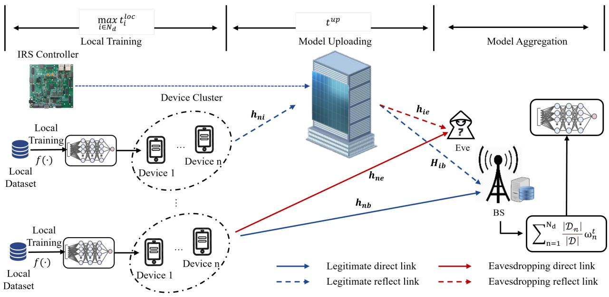
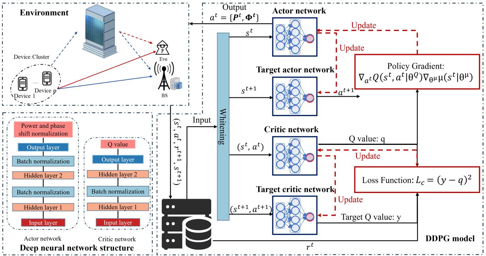
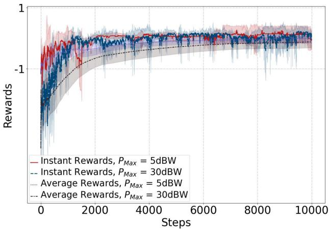
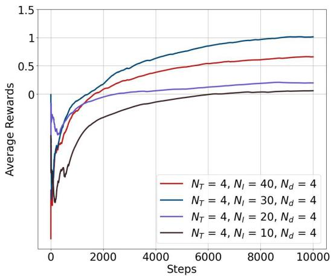
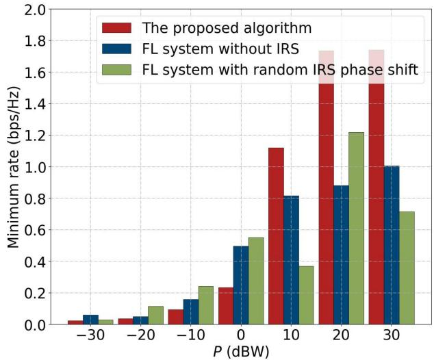
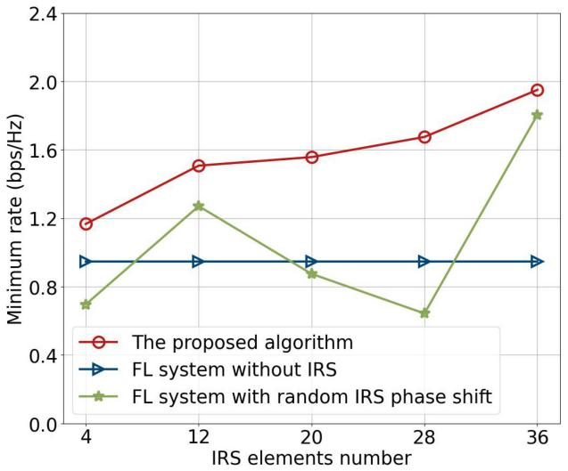
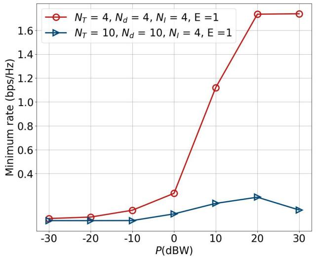
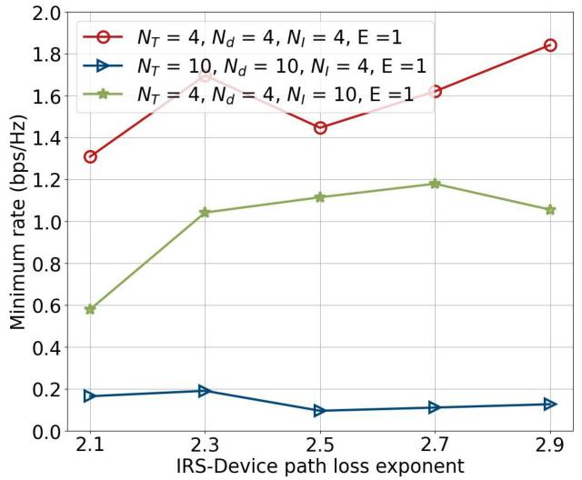

# Optimizing Secrecy Rate for Federated Learning Model Aggregation With Intelligent Reflecting Surface Toward 6G Ubiquitous Intelligence

Bomin Mao , Senior Member, IEEE, Yingying Wu , Student Member, IEEE, Jiajia Liu , Senior Member, IEEE, Hongzhi Guo , Member, IEEE, Jiadai Wang , Member, IEEE, and Nei Kato , Fellow, IEEE

Abstract—Non-Orthogonal Multiple Access (NOMA) based Federated Learning (FL) can achieve the massive connectivity of Internet of Thing (IoT) devices, high transmission rate, and pervasive intelligence in 6G networks. However, the stochastic channels and frequent model parameter updates may incur degraded transmission rate and diminished FL performance, while privacy leakage may happen if Eavesdroppers (Eves) intercept the FL training process. To address the above issues, we exploit Intelligent Reflecting Surface (IRS) to reconfigure wireless signal propagation for secure transmission and fast convergence of NOMA-based FL. In this article, a Deep Reinforcement Learning (DRL) based approach is proposed to jointly optimize the transmission power of edge devices and IRS phase shift to maximize the minimum secrecy rate in the model parameter uploading process. Numerical results validate the efficiency of our proposed algorithm and demonstrate that IRS can improve the secrecy rate.

Index Terms—Federated learning (FL), non-orthogonal multiple access (NOMA), intelligent reflecting surface (IRS), secrecy rate.

# I. INTRODUCTION

G IS envisioned to enable diverse Internet of Things (IoT) 6 device accessibility coupled with ultra-low end-to-end delay, while also promising ubiquitous intelligence. Federated Learning (FL), as a decentralized model training method, plays

Manuscript received 1 January 2024; revised 18 June 2024; accepted 30 August 2024. Date of publication 4 September 2024; date of current version 9 April 2025. This work was supported in part by the National Natural Science Foundation of China under Grant 62202386 and Grant 62402389; in part by Guangdong Basic and Applied Basic Research Foundation under Grant 2024A1515011198, Grant 2024A1515010209, and Grant 2023A1515110079; in part by 2022 Suzhou Innovation and Entrepreneurship Leading Talents Program (Young Innovative Leading Talents) under Grant ZXL2022458; and in part by Key Research and Development Program of Shaanxi (Program No.2022GXLH-02-03). The associate editor coordinating the review of this article and approving it for publication was Y. Gao. (Corresponding author: Yingying Wu.)

Bomin Mao, Yingying Wu, Jiajia Liu, Hongzhi Guo, and Jiadai Wang are with the National Engineering Laboratory for Integrated Aero-Space-Ground-Ocean Big Data Application Technology, Research and Development Institute, Northwestern Polytechnical University, Shenzhen 518063, China, also with the Yangtze River Delta Research Institute, Northwestern Polytechnical University, Taicang 215400, China, and also with the School of Cybersecurity, Northwestern Polytechnical University, Xi’an 710072, China (e-mail: maobomin@nwpu.edu.cn; yingying\_wu@mail.nwpu.edu.cn; liujiajia@nwpu.edu.cn; hongzhi.guo@ nwpu.edu.cn; wangjiadai@nwpu.edu.cn).

Nei Kato is with the Graduate School of Information Sciences, Tohoku University, Sendai 980-8579, Japan (e-mail: nei.kato.d3@tohoku.ac.jp).

Digital Object Identifier 10.1109/TCCN.2024.3454256

a pivotal role in realizing the above key functionalities. FL aims to train a high-quality Machine Learning (ML) model via the cooperation of multiple edge devices [1]. It can facilitate the customization of AI services and cater to individual preferences, contributing to the user-centric 6G experience. Moreover, FL empowers real-time learning on edge devices to reduce the back-and-forth communications with the centralized server, which is crucial for future latency-sensitive 6G applications including autonomous driving, metaverse, and smart city. Additionally, as 6G shifts the concept from data-centric, machine-centric, and application-centric towards human-centric [2], the challenge of data privacy preserving Artificial Intelligence (AI) can be alleviated by keeping data localized for training [3], [4].

Due to the uneven user distribution and data heterogeneity in 6G networks, it is necessary to involve a large number of devices to build a reliable learning model swiftly [5]. Nevertheless, the constraints posed by limited resources imply that only a few users can be allowed to participate in collaborative FL training [6], resulting in a decreased accuracy rate. To address the resource constraints, Non-Orthogonal Multiple Access (NOMA) has been studied to integrate with FL [7] since it can enhance frequency efficiency via allowing a large number of wireless devices to share radio blocks concurrently [5]. However, the stochastic wireless channels of NOMA-based FL and frequent communication between Base Station (BS) and edge devices result in an unbearable degraded transmission rate and diminished FL training performance. Moreover, the complex propagation of NOMA-based FL can lead to security concerns [8], [9], [10] as shown in Fig. 1.

To tackle the above concerns, Wang et al. [8] and Qian et al. [9] adopt a model spread method using chaotic sequences to safeguard the trained model delivered through NOMA from malicious nodes. Zheng et al. [10] discuss security concerns in an Over-The-Air (OTA) communicationbased FL system, which shares the same wireless channel characteristics as the NOMA-based FL system. They utilize an Intelligent Reflecting Surface (IRS) to enable covert transmission by configuring the maximum training participants and IRS phase shift. IRS has been an emerging advanced technology that can compensate for degraded rate and privacy leakage which can reconfigure the wireless propagation environment to improve spectrum and energy efficiency [11], [12]. In [13], integrating IRS with a near-space information network significantly enhances energy efficiency. With the aid of the IRS, the effective throughput is maximized, and energy consumption is minimized greatly. Since IRS mainly consists of passive reflecting elements [14], it proactively adjusts the wireless signal at a lower cost and in a more efficient full-duplex mode compared to other traditional relay methods [15], [16]. With the IRS controller, each element can tune the amplitude and phase shift independently, thereby collaboratively changing the reflected signal propagation [15]. In this way, the IRS can enhance the channel gain from information sources to legitimate users and suppress the signal to Eavesdroppers (Eves), thereby enhancing the transmission rate and security. In [17], multiple IRSs have been deployed in a millimeter-wave system to improve the secrecy rate.



<details>
<summary>flowchart</summary>

```mermaid
graph TD
    A["IRS Controller"] -->|max t_i^loc i∈N_d| B["Local Training"]
    B --> C["Model Uploading"]
    C --> D["Model Aggregation"]
    E["Local Dataset"] -->|f(·)| F["Device 1"]
    E -->|f(·)| G["Device n"]
    H["Local Training"] -->|f(·)| I["Device 1"]
    H -->|f(·)| J["Device n"]
    K["Device Cluster"] -->|h_ni| C
    L["Device Cluster"] -->|h_ne| C
    M["Device Cluster"] -->|h_nb| C
    N["Eve"] -->|h_ie| C
    O["BS"] --> P["Sum_{n=1}^{Nd} |D_n/|D| ω_n^t"]
    Q["Legitimate direct link"] --> R["Legitimate reflect link"]
    S["Eavesdropping direct link"] --> T["Legitimate reflect link"]
    U["Eavesdropping reflect link"] --> V["Legitimate reflect link"]
    style A fill:#f9f,stroke:#333
    style B fill:#ccf,stroke:#333
    style C fill:#cfc,stroke:#333
    style D fill:#fcc,stroke:#333
    style E fill:#ffc,stroke:#333
    style F fill:#cfc,stroke:#333
    style G fill:#cfc,stroke:#333
    style H fill:#ffc,stroke:#333
    style I fill:#cfc,stroke:#333
    style J fill:#cfc,stroke:#333
    style K fill:#ffc,stroke:#333
    style L fill:#cfc,stroke:#333
    style M fill:#ffc,stroke:#333
    style N fill:#cfc,stroke:#333
    style O fill:#cfc,stroke:#333
    style P fill:#fcc,stroke:#333
```
</details>

Fig. 1. IRS-assisted NOMA-based FL system with the existence of Eve.

Traditional security methods primarily concentrate on the addition of jamming signals. End devices [18] and Unmanned Aerial Vehicles (UAVs) [19] have been studied to serve as jammers to impede the Eves. However, the addition of jamming signals not only results in additional energy consumption for resource-constrained IoT devices, but also significantly degrades FL performance. Although [10] tackles the covertness problem in OTA communication-based FL, the OTA performs inflexibly in supporting diverse service requirements during FL aggregation. To address these issues, we explore the benefits of the IRS to boost the security and convergence speed of NOMA-based FL, enabling the pervasive intelligence and massive connectivity of the upcoming 6G. Our key contributions include:

• We integrate IRS with NOMA-based FL to tackle security concerns. IRS is expected to improve the device-BS channel while impeding the wire-tap channel from the device to Eve.   
• We define the secrecy rate as the difference between the rates from devices to BS and Eve. We then formulate a minimum secrecy rate maximization problem subjecting to the transmission power budget and IRS phase shift.

To solve the above problem, the Deep Deterministic Policy Gradient (DDPG) based approach is proposed to jointly optimize the transmission power and IRS phase shift.

The remainder of this manuscript is organized as follows. In Section II, we provide a comprehensive review of the existing literature. Then, in Section III, we present the system model of the IRS-assisted NOMA-based FL and formulate the objective function. Following that, the DDPG algorithm for jointly designing the transmission power and IRS phase shift is introduced to address the optimization issue in Section IV. Then we perform several simulations to validate the effectiveness of our proposed solution and present the results to verify our proposal in Section V. Finally, we conclude our manuscript in Section VI.

Notations: We use the bold uppercase and lowercase letters to denote matrices and vectors, respectively. diag(x) means the diagonal matrix of x , |x | denotes the absolute value of the scalar x. -(x ) and (x ) represent the real part and imaginary part of the complex value x, respectively. CX ×Y denotes the complex matrices with size $X \times Y .$

# II. RELATED WORKS

In this section, we investigate the research in three aspects:FL privacy protection, NOMA-based FL, and IRSassisted NOMA-based FL.

(1) FL privacy protection: Differential Privacy (DP), compression, and encryption are usually used to secure the shared gradients. Reference [20] puts forward a new two-layer DPbased gradient-protected approach. Users’ training data are first compressed utilizing Hense’s Lemma, following that data privacy is realized through the addition of noise to further perturb the compressed data in the second layer. A dual approach utilizing both Local DP (LDP) and Central DP (CDP) is employed in another study [21]. The authors utilize the Gaussian Mechanism to achieve (-, δ)-LDP, ensuring privacy in the contributions made by devices. Differently, [22] and [23] choose to encrypt the gradients. The authors in [22] propose a noninteractive privacy-enhanced FL scheme where the gradients are perturbed and encrypted prior to transmission. Traditional homomorphic encryption where all devices share the same encryption and decryption keys can lead to gradient disclosure if any participant colludes with the adversary. To avoid this, [23] adopts Paillier homomorphic encryption and random number generation technique to secure the gradients.

(2) NOMA-based FL: NOMA is usually adopted into the FL system to utilize the superposition property of wireless channels and improve spectrum efficiency. It enables the participation of multiple devices in FL training to improve performance. Reference [7] utilizes the NOMA to meet the stringent latency requirements. In this work, the authors propose a fair resource-sharing scheme to minimize the total latency of FL considering the power and energy constraint. To further speed up the FL training, the uploading parameters are compressed in some work [24], [25]. The state-of-the-art wireless power transfer (WPT) technique is also introduced into the NOMA-based FL system [26], [27]. In [26], the utilization of NOMA leads to high energy consumption, resulting in extended WPT duration and consequently degrading the FL performance. The authors try to balance the trade-off between energy consumption and FL training performance. Similarly, in [27], energy consumption is reduced via jointly optimizing several communication and computation parameters.

(3) IRS-assisted NOMA-based FL: IRS has been utilized to alleviate the drawbacks of OTA or NOMA channels [6], [28]. OTA can enable the one-shot model aggregation of FL, while FL performance is often compromised by the inherent noise and the consequent reduced transmit power for signal alignment. IRS has been adopted then to address this issue. In [5], IRS has been deployed to improve the weak channel, collaborating with NOMA to speed up the FL convergence. A long-term design scheme is proposed to assign the bandwidth and other resources to specific training rounds, improving the prediction accuracy [28]. IRS has also been deployed to tackle the hybrid user problem, where communication-centric and learning-centric users are considered to enable massive connectivity and ubiquitous intelligence. It is introduced to coordinate the decoding order of these user types, enhancing interference mitigation, and extending coverage [29]. Privacy concerns are also considered in the deployment of IRS. Reference [10] improves the physical layer security via deploying IRS, where the optimal covertness level is reached by enabling zero force.

Extensive research has been conducted on the IRS-assisted uplink NOMA for FL. However, it remains an open question regarding the security in this scenario. As security and privacy issues are of great importance in future 6G networks, we leverage the IRS to reconfigure the wireless signal propagation and secure the NOMA-based FL.

# III. SYSTEM MODEL AND PROBLEM FORMULATION

We consider an IRS-assisted NOMA-based FL system in Multi-User Multiple-Input Multiple-Output as shown in Fig. 1,

including one BS with $N _ { T }$ antennas, $N _ { d }$ devices with a single antenna, an Eve with a single antenna, and one IRS with $N _ { I }$ passive reflecting elements. The Eve is situated in the close proximity to the BS and intercepts the parameters from devices to BS. The sets of devices and IRS reflecting elements can be denoted by $\mathcal { N } _ { d } = \{ 1 , 2 , \dots , N _ { d } \}$ and $\mathcal { N } _ { I } = \{ 1 , 2 , \dots , N _ { I } \}$ . The channel state information is assumed available for all nodes including IRS [30]. Additionally, we assume that the channel coefficients are quasi-static [31] so that they can be regarded as constant during FL iterations.

# A. FL Model

For the FL, we consider the Federated Averaging (FedAvg) algorithm. We assume that $N _ { d }$ devices participate in the local training. The device n collects and holds its data set of $\mathcal { D } _ { n } =$ $\{ ( \pmb { x } _ { i } , \breve { y } _ { i } ) \} _ { i = 1 } ^ { | \mathscr { D } _ { n } | }$ , where $( { \pmb x } _ { i } , y _ { i } )$ is the i-th data pair of the device n consisting of the input $\mathbf { \Delta } _ { \mathbf { \mathcal { X } } _ { i } }$ and its label $y _ { i } .$ , and $| \mathcal { D } _ { n } |$ denotes the cardinality of the data set $\mathcal { D } _ { n }$ .

The local training process of device n is performed via minimizing the local loss function:

$$
\min _ {\boldsymbol {\omega}} F _ {n} (\boldsymbol {\omega}) = \frac {1}{| \mathcal {D} _ {n} |} \sum_ {j = 1} ^ {| \mathcal {D} _ {n} |} f \left(\boldsymbol {x} _ {i}, y _ {j}; \boldsymbol {\omega} _ {j}\right), \tag {1}
$$

where $f ( x _ { j } , y _ { j } ; \omega _ { j } )$ is the loss of prediction on the local data pair $( \pmb { x } _ { j } , y _ { j } )$ calculated with the model parameters $\omega _ { j }$ .

Following that, the BS performs the global training in a way that minimizes the global loss function:

$$
\min _ {\boldsymbol {\omega}} f (\boldsymbol {\omega}) = \sum_ {n = 1} ^ {N _ {d}} \frac {| \mathcal {D} _ {n} |}{| \mathcal {D} |} F _ {n} (\boldsymbol {\omega}), \tag {2}
$$

where |D| = Ndn=1 | $\begin{array} { r } { | \mathcal { D } | = \sum _ { n = 1 } ^ { N _ { d } } | \mathcal { D } _ { n } | } \end{array}$ . In the FL training process, the BS first initializes the model parameter $\omega ^ { 0 }$ . Subsequently, during local training and global aggregation, the Stochastic Gradient Descent (SGD) method is executed to update the parameters. Following is the general process of FL in training round t:

(1) Model distribution: BS distributes the present global model $\omega ^ { t }$ to the participated devices.   
(2) Local training: Local devices train their respective models with the received global model using their own data and update the gradient $\mathbf { g } _ { n } ~ = ~ \nabla F _ { n } ( \pmb { \omega } )$ . Local model is updated via executing the computation $\pmb { \omega } _ { n } ^ { t } = \pmb { \omega } _ { n } ^ { t } - \eta \mathbf { g } _ { n }$ , where gη is the learning rate for parameter update. In each training round, the computation can be executed $\frac { | { \mathcal { D } } _ { n } | } { M }$ times in device $n ,$ where M is the batch size.   
(3) Model uploading: Participated local devices upload the updated model $\omega _ { n } ^ { t }$ to the BS.   
(4) Model aggregation: BS aggregates the global model $\omega _ { n } ^ { t }$ using a weighted average method: $\begin{array} { r } { \pmb { \omega } ^ { t + 1 } = \sum _ { n = 1 } ^ { N _ { d } } \frac { | \mathcal { D } _ { n } | } { | \mathcal { D } | } \pmb { \omega } _ { n } ^ { t } } \end{array}$ |Dn

# B. Communication Model

We assume that the channel experiences both large-scale path loss and small-scale fading. The path loss follows the logdistance path loss model which considers the environmental conditions. It can be expressed as $\begin{array} { r } { \mathrm { P L } = \mathrm { P L } _ { 0 } - 1 0 \zeta \log _ { 1 0 } \frac { d } { d _ { 0 } } } \end{array}$ , where $\mathrm { P L } _ { 0 }$ is the path loss with the unit of decibels (dB) at the reference distance $d _ { 0 } , ~ \zeta$ is the corresponding path loss exponent, which depends on the environment and frequency, and d is the distance between the transmitter and receiver. The small-scale fading adopts the Rayleigh fading model.

Let $\mathbf { h } _ { n b } \ \in \ \bar { \mathbb { C } } ^ { 1 \times N _ { \bar { \mathrm { T } } } } , \ \mathbf { h } _ { n e } \ \in \ \bar { \mathbb { C } } ^ { \bar { 1 } \times 1 }$ , and $\mathbf { h } _ { n i } ~ \in ~ \mathbb { C } ^ { 1 \times N _ { \mathrm { I } } }$ h h hrepresent the channel gains from device n to BS, Eve, and IRS, respectively. The channels from IRS to the BS and Eve are denoted as $\dot { \mathbf { H } } _ { i b } \in \mathbb { C } ^ { N _ { \mathrm { I } } \times N _ { \mathrm { T } } }$ and $\mathbf { h } _ { i e } \in \mathbb { C } ^ { N _ { \mathrm { I } } \times 1 }$ , respectively. HThe IRS has the phase shift $\Phi \ = \ \left\{ e ^ { j \phi _ { 1 } } , \dots , e ^ { j \phi _ { N _ { \mathrm { I } } } } \right\} ^ { T } \ \in$ T $\mathbb { C } ^ { N _ { \mathrm { I } } \times 1 }$ , where $\phi \in [ 0 , 2 \pi ]$ . We assume the ideal reflection of IRS without the loss of signal power [32], i.e., each element $\Phi _ { l } = e ^ { j \phi _ { l } } , l \in N _ { I }$ satisfies $| \Phi _ { l } | ^ { 2 } = 1$ .

To avoid dealing with extremely small quantities and mitigate potential numerical issues, we make the normalization of the channel coefficients as $\mathbf { h } _ { n b }  \mathbf { h } _ { n b } / \sigma , \mathbf { h } _ { n e }  \mathbf { h } _ { n e } / \sigma .$ , $\mathbf { h } _ { n i } ~  ~ \mathbf { h } _ { n i } / \sigma$ , and $\mathbf h _ { i e } ~ \gets ~ \mathbf h _ { i e } / \sigma _ { \cdot }$ h, where $\sigma ^ { 2 }$ hrepresents h h h hthe power of the background white Gaussian noise. The effective channels between device n and BS, as well as that between device n and Eve can be expressed as $\begin{array} { r l } { \mathbf { h } _ { n b } ^ { e f f } } & { { } = } \end{array}$ $\mathbf { h } _ { i n } \mathrm { d i a g } ( \Phi ) \mathbf { H } _ { i b } + \mathbf { h } _ { n b }$ and ${ \bf h } _ { n e } ^ { e f f } \ = \ { \bf h } _ { i n } \mathrm { d i a g } ( \Phi ) { \bf h } _ { i e } \ + \ { \bf h } _ { n e } ,$ hrespectively.

We focus on the NOMA-based model uploading phase. In round t, the participating devices upload their models $\omega _ { n } ^ { t }$ to the BS simultaneously. $\omega _ { n } ^ { t }$ should be encapsulated to transmit symbols before transmitting to the BS via NOMA channels, which is expressed as $s _ { n } ^ { t }$ . The signals from users are intended to the BS which can be intercepted by the Eve. We assume that BS and Eve follow the same communication scheme. Thus, the signals received by BS and Eve are given by:

$$
y _ {c} = \mathbf {H} _ {n c} \mathbf {P s} + \beta_ {c}, c \in \{b, e \},
$$

$\mathbf { H } _ { n b } \ = \ \{ \mathbf { h } _ { 1 b } ^ { e f f } , \dots , \mathbf { h } _ { N _ { d } b } ^ { e f f } \} \ \in \ \mathbb { C } ^ { N _ { d } \times N _ { T } }$ 1b , . . , eff and S and ${ \bf H } _ { n e } \ =$ $\{ \mathbf { h } _ { 1 e } ^ { e f f } , \ldots , \mathbf { h } _ { N _ { d } e } ^ { e f f } \} \in \mathbb { C } ^ { N _ { d } \times 1 }$ e h h Eve channel matrix, respectively. P is the transmission power matrix at devices and constrained by $\mathbf { P } ~ \le ~ P _ { M a x }$ , where $P _ { M a x }$ Pis the transmission power budget at devices. s is the transmit symbol with unit power at devices. $\beta _ { b }$ and $\beta _ { e }$ are the additive white Gaussian noise at BS and Eve, respectively.

The receiver adopts the successive interference cancelation to decode signals from devices to attenuate inter-user interference in the NOMA-based network. The receiver starts by decoding the signal from the channel with the highest gain [33]. Assuming that the channel gain from device 1 to $N _ { d }$ gradually increases, the signal from the $n ^ { t h }$ device is the $( \overset { \cdot } { N _ { d } } - \overset { \cdot } { n } + 1 ) ^ { t h }$ to be decoded. Consequently, a weaker channel’s signal can be viewed as interference to a stronger channel’s signal [33]. As a result, the transmission rates from device n to the BS, denoted as $R _ { n b }$ , and from device n to the Eve, denoted as $R _ { n e } .$ , can be expressed as follows:

$$
R _ {n c} = \log_ {2} \left(1 + \frac {p _ {n} \left| \mathbf {h} _ {n c} ^ {e f f} \right| ^ {2}}{\sum_ {j = 1} ^ {n - 1} p _ {j} \left| \mathbf {h} _ {j c} ^ {e f f} \right| ^ {2} + 1}\right), c \in \{b, e \}, \tag {3}
$$

where $p _ { n } , \forall n \in \mathcal { N } _ { d }$ is the $n ^ { t h }$ column vector of the matrix P. Therefore, the secrecy rate received at BS can be described as

$$
R _ {s n} = R _ {n b} - R _ {n e}. \tag {4}
$$

# C. Problem Formulation

In the NOMA-based FL system, the BS aggregates the global model once all users have uploaded their models. Consequently, the overall FL performance is contingent on the slowest user. In this paper, we aim to maximize the minimum secrecy rate among users via jointly designing the transmission power at devices and IRS phase shift, while adhering to the transmission power constraint at users. Consequently, the optimization problem is formulated as:

$$
\text { maximize } \min R _ {s n}
$$

$$
\mathrm{s.t.:} \mathbf {P} \leq P _ {M a x},
$$

$$
\left| \Phi_ {l} \right| ^ {2} = 1, \forall l \in \mathcal {N} _ {\mathcal {I}}. \tag {5}
$$

It is obvious that the problem (5) is an intractable nonconvex problem because of the presence of the IRS phase shift constraint and the coupling between P and Φ. However, the traditional solution such as closed-form solution is unique for specific problems and may not be suitable for the considered issue in this manuscript.

# IV. PROPOSED SOLUTION BASED ON DRL

To solve problem (5), we need to derive the optimal value of the transmission power at devices P and IRS phase shift Φ. The selection of these values only depends on the current environment state, having nothing to do with the former action, which can be seen as a Markov decision process. Consequently, DRL emerges as an appropriate solution to our predicament. However, our problem involves a huge and continuous state space, considering the current transmission power and highdimensional channel state information. Traditional Deep Q Learning with its discrete Q value function is inadequate for resolution. In light of this, we turn to DDPG, which utilizes a Deep Neural Network (DNN) to approximate the value and policy functions, making it fit for handling continuous problems in our problem. Therefore, the minimum secrecy rate in formula (5) is maximized via jointly designing the value of P and Φ utilizing DDPG. These two variables are seen as action elements and are updated via the trial-and-error interaction between the agent and the environment. We begin with the description of our DDPG structure. Subsequently, we delineate its design. Finally, we give the overall description of our algorithm.

# A. Structure of DDPG

Our proposed DDPG is a DRL-based algorithm, which is defined by a four-tuple 	A, S , R, P
.

(1) A: the action space. The agent takes the action $a ^ { t } \in A$ in time step t under given state $s ^ { \bar { t } } \in S$ according to the policy $\pi ( s ^ { t } , a ^ { t } )$ , and the environment returns a reward $r ^ { t + 1 }$ .   
(2) S: the state space, representing environmental information. $s ^ { t } \in S$ observes the environment in time step t.

(3) R: the reward. $r ^ { t + 1 }$ is the reward given by the environment when the agent takes action $a ^ { t }$ given $s ^ { t }$ . Reward serves as a metric to evaluate the action, and the agent refines the actions based on the reward.   
(4) $P \colon$ the transition function, which denotes the probability from state $s ^ { i }$ to state $s ^ { j } , i \neq j .$ .

In DRL, policy, value function, and experience replay are also important parts. The policy $\pi ( s ^ { t } , a ^ { t } )$ is the probability that the agent chooses action $a ^ { t }$ under a given state $s ^ { t } .$ . The value function, similar to the reward, evaluates the quality of an action considering its potential future impact. Similar to Reinforcement Learning (RL), the $Q$ value function $Q ( s ^ { t } , a ^ { t } )$ is adopted as the value function, while it is approximated through a DNN. Then, the $Q$ value function in the DRL can be expressed as:

$$
Q \left(s ^ {t}, a ^ {t}\right) \triangleq Q \left(s ^ {t}, a ^ {t} \mid \theta\right),
$$

where θ is the model parameter.

Experience replay mitigates the issue of high correlation in RL, which can impede convergence. It involves a fivetuple $( s ^ { t } , a ^ { t } , r ^ { t + 1 } , s ^ { t + 1 }$ , done), where done represents the termination state. The system stores these experiences and randomly samples them with a specified size to reduce training sample correlation.

Our proposed DDPG follows an Actor-Critic structure, consisting of two networks: the actor network $\mu ( \cdot | \theta ^ { \mu } )$ and the critic network $Q ( \cdot | \theta ^ { Q } ) . \theta ^ { \mu }$ and $\theta ^ { Q }$ are the network parameters for updating actor and critic networks, respectively. The actor network is the policy-base network, selecting an action under given s, while critic network is the value-based network, measuring the quality of the chosen action. Receiving the state as input, the actor network generates the corresponding action. Subsequently, the action and the state are taken as the input of the critic network to compute the $Q$ value. To avoid fluctuation and bootstrapping in the training phase, target networks are employed, consisting of target actor and target critic networks denoted as $\mu ^ { \prime } ( \cdot | \theta ^ { \mu \prime } )$ and $Q ^ { \prime } ( \cdot | \theta ^ { Q ^ { \prime } } )$ , respectively. $\theta ^ { \mu \prime }$ and $\theta ^ { Q ^ { \prime } }$ represent the network parameters for updating target actor and target critic network.

In each training iteration, the critic and actor networks are updated. The update of the critic network is to minimize the “Temporal Difference” error, which is the difference between the current $Q$ value and the next-state Q value. The next-state Q value is the target $Q$ value we need to calculate through the target critic network:

$$
y = r ^ {t + 1} + \gamma (1 - d o n e) Q ^ {\prime} \left(s ^ {t + 1}, a ^ {t + 1} \mid \theta^ {Q ^ {\prime}}\right), \tag {6}
$$

$\gamma \in [ 0 , 1 ]$ is the discount factor, determining the importance of future rewards [34]. The current $Q$ value is the evaluation value of the current state and action calculated through the critic network:

$$
q = Q \left(s ^ {t}, a ^ {t} \mid \theta^ {Q}\right). \tag {7}
$$

Finally, the critic network is updated by performing the Stochastic Gradient Descent (SGD) algorithm on the loss function $L _ { c } \mathbf { . }$ :

$$
\theta^ {Q ^ {t + 1}} = \theta^ {Q ^ {t}} - \mu_ {c} \nabla_ {\theta^ {Q}} L _ {c}, \tag {8}
$$

where $L _ { c }$ can be given as:

$$
L _ {c} = (y - q) ^ {2}, \tag {9}
$$

$\nabla _ { \theta ^ { Q } } L _ { c }$ is the gradient of $L _ { c }$ with respect to the critic network parameter $\theta ^ { Q }$ , and $\mu _ { c }$ represents the training rate for updating the critic network.

The update of the actor network is to change the output and the parameters to maximize the cumulative expected reward. It is achieved by calculating the gradient of critic network on the actor output and then increasing the actor output along this gradient to increase the Q value:

$$
\theta^ {\mu t + 1} = \theta^ {\mu t} - \mu_ {a} \nabla_ {a ^ {t}} Q \left(s ^ {t}, a ^ {t} | \theta^ {Q}\right) \nabla_ {\theta^ {\mu}} \mu \left(s ^ {t} | \theta^ {\mu}\right), \tag {10}
$$

where $\mu _ { a }$ is the learning rate for updating the actor network, $\nabla _ { a ^ { t } } Q ( s ^ { t } , a ^ { t } | \theta ^ { Q } )$ is the gradient of critic network with respect to $a ^ { t } ,$ , and $\nabla _ { \theta ^ { \mu } } \mu ( s ^ { t } | \theta ^ { \mu } )$ is the gradient on the actor network with respect to its parameters.

The update on the corresponding target networks is slower than that of primary networks. In our proposed DDPG, a soft update method known as exponential moving average is adopted to update the parameters of target networks. Consequently, the target critic and target actor networks are updated in the following manner:

$$
\theta^ {Q ^ {\prime}} = \tau_ {c} \theta^ {Q ^ {\prime}} + (1 - \tau_ {c}) \theta^ {Q}, \tag {11}
$$

$$
\theta^ {\mu \prime} = \tau_ {a} \theta^ {\mu \prime} + (1 - \tau_ {a}) \theta^ {\mu}, \tag {12}
$$

where $\tau _ { c } \in ( 0 , 1 )$ and $\tau _ { a } \in ( 0 , 1 )$ are the learning rate for updating target critic and target actor network, respectively.

# B. Construction of the Proposed DDPG

As we mentioned before, there are four DNNs in our proposed DDPG algorithm: actor, critic, target actor, and target critic networks. In our proposed algorithm, both the actor and critic networks share the same structure, comprising an input layer, two hidden layers, and an output layer, as shown in Fig. 2. The target networks are completely the same as their respective primary networks. The actor network accepts the state as input and produces an action as output, hence, the input and output sizes depend on the specific action and state. Similarly, for the critic network, its input dimension relies on the action and state, while its output dimension corresponds to the $Q$ value, since it takes action and state as inputs and yields the Q value as output. The number of hidden layer neurons is up to the number of users, IRS elements, and the BS antennas.

We derive the transmission power P and IRS phase shift Φ as actions under the given state in the action network. In our approach, these two variables should satisfy the constraints: $| \bar { \Phi _ { l } } | ^ { 2 } = 1 , l \in \mathcal { N } _ { I }$ and $\mathbf { P } ~ \le ~ P _ { M a x }$ . To achieve this, we incorporate a normalization step within the actor network, guaranteeing these values do not exceed their own maximum limits. To guarantee the constraint ${ \bf P } \le { \cal P } _ { M a x }$ , we first derive Pthe value of P, then implement the constraint through the following formula:

$$
\mathbf {P} = \frac {\mathbf {P}}{\sqrt {P _ {M a x}}}.
$$



<details>
<summary>flowchart</summary>


</details>

```mermaid
graph TD
    subgraph Environment
        A["Device Cluster"] --> B["Eve"]
        C["Device n"] --> B
        B --> D["BS"]
        D --> E["Output a^t = {P^t, Φ^t}"]
        E --> F["Actor network"]
        F --> G["Action network"]
        G --> H["Target actor network"]
        H --> I["Action network"]
        I --> J["Action network"]
        J --> K["Action network"]
        K --> L["Action network"]
        L --> M["Action network"]
        M --> N["Action network"]
        N --> O["Action network"]
        O --> P["Action network"]
        P --> Q["Action network"]
        Q --> R["Action network"]
        R --> S["Action network"]
        S --> T["Action network"]
        T --> U["Action network"]
        U --> V["Action network"]
        V --> W["Action network"]
    end

    subgraph Actor network
        X["Power and phase shift normalization"] --> Y["Output layer"]
        Y --> Z["Batch normalization"]
        Z --> AA["Hidden layer 2"]
        AA --> AB["Batch normalization"]
        AB --> AC["Hidden layer 1"]
        AC --> AD["Input layer"]
    end

    subgraph Critic network
        AE["Q value"] --> AF["Output layer"]
        AF --> AG["Hidden layer 2"]
        AG --> AH["Batch normalization"]
        AH --> AI["Hidden layer 1"]
        AI --> AJ["Input layer"]
    end

    subgraph DDPG model
        AK["Critic network"] --> AL["Critic network"]
        AL --> AM["Target critic network"]
        AM --> AN["Target critic network"]
        AN --> AO["r^t"]
    end

    subgraph DDPG model
        AP["Policy Gradient: ∇_a^t Q(s^t, a^t | θ^Q) ∇_θμ μ(s^t | θ^μ)"]
        AQ["Loss Function: L_c = (y - q)^2"]
        AR["Update: Q value: q"]
        AS["Update: Target Q value: y"]
    end

    subgraph Input
        AT["(s^t, a^t, r^t+1, s^t+1)"]
    end

    subgraph Output
        AU["s^t"]
    end

    subgraph Withening
        AW["(s^t, a^t, r^t+1, s^t+1)"]
    end

    subgraph DDPG model
        AX["r^t"]
    end

    subgraph Output
        AY["a^t = {P^t, Φ^t}"]
    end

    subgraph Target
        AZ["s^{t+1}"]
        BA["a^{t+1}"]
    end

    subgraph Output
        BB["a^t = {P^t, Φ^t}"]
    end

    subgraph Withening
        BC["s^{t+1}"]
    end

    subgraph Output
        BD["a^t = {P^t, Φ^t}"]
    end

    subgraph Target
        BE["s^{t+1}"]
        BF["a^{t+1}"]
    end

    subgraph Output
        BG["a^t = {P^t, Φ^t}"]
    end

    subgraph Withening
        BH["s^{t+1}"]
        BI["a^{t+1}"]
    end

    subgraph Output
        BJ["a^{t+1}"]
    end

    subgraph Target
        BK["s^{t+1}"]
        BL["a^{t+1}"]
    end

    subgraph Output
        BM["a^{t+1}"]
    end

    subgraph Withening
        BN["s^{t+1}"]
        BO["a^{t+1}"]
    end

    subgraph Output
        BP["a^{t+1}"]
    end

    subgraph Target
        BQ["s^{t+1}"]
        RQ["a^{t+1}"]
    end

    subgraph Output
        SQ["a^{t+1}"]
    end

    subgraph Withening
        BT["s^{t+1}"]
        BU["a^{t+1}"]
    end

    subgraph Output
        BV["a^{t+1}"]
    end

    subgraph Target
        BW["s^{t+1}"]
        BX["a^{t+1}"]
    end

    subgraph Output
        BY["a^{t+1}"]
    end

    subgraph Withening
        BZ["s^{t+1}"]
        CA["a^{t+1}"]
    end

    subgraph Output
        CB["a^{t+1}"]
    end

    subgraph Target
        CK["s^{t+1}"]
        CR["a^{t+1}"]
    end

    subgraph Output
        SD["a^{t+1}"]
    end

    subgraph Withening
        BT["S^{t+1}"]
        BU["a^{t+1}"]
    end

    subgraph Output
        BY["S^{t+1}"]
        Z["a^{t+1}"]
    end

    subgraph Target
        BW["S^{t+1}"]
        BX["a^{t+1}"]
    end

    subgraph Output
        BY["S^{t+1}"]
        Z["a^{t+1}"]
    end

    subgraph Withening
        BZ["S^{t+1}"]
        BU["a^{t+1}"]
    end

    subgraph Output
        BY["S^{t+1}"]
        Z["a^{t+1}"]
    end

    subgraph Target
        BW["S^{t+1}"]
        BX["a^{t+1}"]
    end

    subgraph Output
        BY["S^{t+1}"]
        Z["a^{t+1}"]
    end

    subgraph Withening
        BZ["S^{-(s_t, a_t, r_t + 1)}, s_t + 1"]
    end

    subgraph Output
        BY["S^{-(s_t, a_t, r_t + 1)}, s_t + 1"]
    end

    subgraph Target
        BW["S^{-(s_t, a_t, r_t + 1)}, s_t + 1"]
    end

    subgraph Output
        BY["S^{-(s_t, a_t, r_t + 1)}, s_t + 1"]
    end

    subgraph Withening
        BZ["S^{-(s_t, a_t, r_t + 1)}, s_t + 1"]
    end

    subgraph Output
        BY["S^{-(s_t, a_t, r_t + 1)}, s_t + 1"]
    end

    subgraph Target
        BW["S^{-(s_t, a_t, r_t + 1)}, s_t + 1"]
    end

    style Environment fill:#f9f9f9,stroke:#333
```

Fig. 2. The structure of proposed DDPG.

Similarly, we normalize the $\Phi _ { l }$ to meet the corresponding constraint. The value of $\Phi _ { l }$ is a complex number, so its real and imaginary parts should be calculated separately.

$$
\Re (\Phi_ {l}) = \frac {\Re (\Phi_ {l})}{\sqrt {\Re (\Phi_ {l}) ^ {2} + \Im (\Phi_ {l}) ^ {2}}},
$$

$$
\Im (\Phi_ {l}) = \frac {\Im (\Phi_ {l})}{\sqrt {\Re (\Phi_ {l}) ^ {2} + \Im (\Phi_ {l}) ^ {2}}}.
$$

The input state for both the actor and critic networks exhibits high correlation characters, which impedes the algorithm convergence rate. To mitigate this issue, we introduce a whitening process prior to feeding the state data into the actor and critic network as shown in Fig. 2, which eliminates the correlation among sample data. Furthermore, to improve training stability and speed, we apply batch normalization before each hidden layer. This reduces the internal covariate shift within the hidden layers’ inputs and minimizes the sensitivity of the model to the weight initialization. The tanh function is employed in every layer to introduce crucial nonlinearity to the network, which enables the network to grasp intricate patterns in the input data and facilitate the learning of complex relationships. Moreover, the Adam algorithm serves as the optimizer to leverage a moving average of gradients to expedite convergence. Simultaneously, it incorporates squared gradients to dynamically adjust the learning rates and enhance the adaptability of the optimization process. The overall DDPG structure is presented in Fig. 2.

# C. Description of the Algorithm

In our proposed algorithm, the most critical part lies in the interaction between the agent and the environment. The agent observes the environment to get its state and chooses the action accordingly. In response, the environment gives the reward based on the state and action. Thus, in this subsection, we mainly describe the construction of the state, action, and reward. At the end of this subsection, we describe the proposed algorithm to address the secrecy rate maximization problem.

1) State: the state at time step t is dependent on the current devices’ transmission power $\mathbf { P } ,$ channel information of $\mathbf { h } _ { n b } ,$ $\mathbf { h } _ { n e } , \mathbf { h } _ { n i } , \mathbf { H } _ { i b } .$ and ${ \bf h } _ { i e } ,$ and the action in the time step $t - 1$ . h h H hThe complex value cannot be directly used as the input of the neural network. Therefore the real and the imaginary part of the complex value should be separated and treated as the independent input of the neural network. The transmission power at user n can be expressed as $p _ { n } = \Re ( p _ { n } ) + \Im ( p _ { n } )$ , thus there are $2 N _ { T }$ entries contributed by the transmission power. The channel matrices are all complex values, considering every single channel, the entries can be that, $2 N _ { d } N _ { T }$ for channel $\mathbf { h } _ { n b } , \ 2 N _ { d }$ for $\mathbf { h } _ { n e } , \ 2 N _ { d } N _ { I }$ for $\mathbf { h } _ { n i } , \ 2 { N _ { I } } { N _ { T } }$ for $\mathbf { H } _ { i b }$ , and $2 N _ { I }$ for $\mathbf { h } _ { i e } .$ h h H. The total entries contributed by the channel hinformation is $2 ( N _ { T } + N _ { d } N _ { I } + N _ { I } N _ { T } + N _ { d } + N _ { I } )$ . The size of the action in time step t is $2 N _ { T } + 2 N _ { I }$ . The total dimension of the state space is $D _ { s } = 2 ( 2 N _ { T } + N _ { d } + N _ { d } N _ { T } + N _ { d } N _ { I } +$ $N _ { I } N _ { T } + 2 N _ { I } )$ .

2) Action: in each time step, the action space consists of the transmission power P and IRS phase shift Φ. Consequently, the dimension of the action space totally depends on the sizes of the above two variables. Moreover, since both these variables are of complex type, the action space dimension is given by $D _ { a } = 2 N _ { T } + 2 N _ { I }$ .   
3) Reward: the minimum secrecy rate at users shown in Equation (4) is set as the reward at each time step under the environment state and action derived from the actor network.

The goal of our algorithm is to choose the optimal value of P and Φ to maximize the minimum secrecy rate. The overall algorithm runs over N episodes, of which each consists of T iterations. At the beginning of the algorithm, the parameters of the actor network $\theta ^ { \mu } ,$ , critic network $\dot { \theta } ^ { Q }$ , target actor network $\theta ^ { \mu ^ { \prime } }$ , and target critic network $\theta ^ { Q ^ { \prime } }$ , the transmission power matrix P, the IRS phase shift matrix diag(Φ), and the experience replay buffer R are initialized. At the beginning of each episode, the state is reset. The agent selects an action using the actor network, which involves computing the values of variables P and Φ. The next state is observed and the reward can be calculated through Equation (4). These four parameters along with the termination state done are assembled and stored into the experience replay buffer R. Subsequently, M samples $( s ^ { i } , a ^ { i } , r ^ { i + 1 } , s ^ { i + 1 }$ , done) are randomly chosen from R to update networks. Specifically, the current evaluation Q value is calculated via the critic network, taking $( s ^ { i } , a ^ { i } )$ as the input. Simultaneously, the current target Q value is derived via the target critic network, utilizing $s ^ { i + 1 }$ as the input. Then, the actor and critic networks are updated via minimizing the Equation (9) and maximizing the Equation $\nabla _ { a ^ { t } } Q ( s ^ { t } , a ^ { t } | \mathbf { \bar { \theta } } ^ { Q } )$ , respectively. The target network is softly updated using a parameter-wise weighted copy. This is a weighted average of the current target network parameters and the primitive network parameters, where the weight of the current target network parameters is determined by τ .

The algorithm halts when the stopping criterion is met or when the maximum number of iterations is reached. The stopping criterion involves achieving the secrecy rate under ideal conditions, where there is no noise or interference from Eves. The overall algorithm is shown as Algorithm 1.

# D. Complexity Analysis

The time complexity of DDPG is primarily determined by the training of the neural network. The computational complexity of neural networks mainly depends on their structure, parameters, and the operations involved in the forward pass, which are determined by the input and output dimensions as well as the number of layers.

The actor and critic networks are fully connected DNNs. The target network is a replica of their primary network, also constituting fully connected DNNs. Our purpose is to derive the optimal actions of transmission power at devices and IRS phase shift, so we aim to train the actor network using critic, target actor, and target critic networks. Thus, the complexity of training the neural network lies in the actor network. As the actor network consists of linear layers, the time complexity of a linear layer can be calculated as $\mathcal { O } ( D _ { s } D _ { a } )$ , where $D _ { s }$ and $D _ { a }$ are the sizes of input and output, respectively. The additional operations from batch normalization and activation functions contribute to the time complexity, which is typically overshadowed by the linear transformations in the actor network and can be neglected. Consequently, the overall time complexity is roughly the sum of the complexity of each layer and can be given as: $\scriptstyle { \mathcal { O } } ( \sum _ { l = 1 } ^ { L } D _ { s } ^ { l } D _ { a } ^ { l } )$ , where L denotes the number of layers which is four in our current algorithm. $D _ { s } { } ^ { l }$ and $D _ { a } { } ^ { l }$ are the size of input and output in layer l.

Algorithm 1: DDPG Algorithm for Maximizing the Minimum Secrecy Rate via Joint Design of P and Φ   
Input: $h_{nb}$ , $h_{ne}$ , $h_{ni}$ , $H_{ib}$ , $h_{ie}$ Output: Optimal action $a = \{P, \Phi\}$ Initialize: the actor network parameter $\theta^{\mu}$ , the critic network parameter $\theta^{Q}$ , the target actor network parameter $\theta^{Q'} \leftarrow \theta^{Q}$ , the target critic network $\theta^{\mu'} \leftarrow \theta^{\mu}$ , the transmission power P, the IRS phase shift $\Phi$ , and the experience replay buffer R.

while True do

    for episode $\leftarrow 0$ to N - 1 do

    Collecting the channel information to receive the initial observation state $s^{0}$ .

    for $t \leftarrow 0$ to T - 1 do

    Selecting action $a^{t} = \mu(s^{t}|\theta^{\mu})$ according to the current policy.

    Executing action $a^{t}$ and observe the instant reward $r^{t+1}$ , and new state $s^{t+1}$ .

    Storing the experience ( $s^{t}, a^{t}, r^{t+1}, s^{t+1}, done$ ) in R.

    Sampling a random mini-batch of size M from R.

    Computing the target Q value and estimated Q value according to (6) and (7), respectively.

    Constructing training critic network loss function according to (9).

    Executing the SGD on (9) and updating the training critic network according to (8).

    Executing the SGD on $q^{t} = Q(s^{t}, a^{t}|\theta^{Q})$ and update the training actor network according to (10).

    Updating the target networks via (11) and (12).

    end

    end

end

# V. NUMERICAL RESULTS

In this section, we present the simulation results to evaluate the performance of our proposed algorithm. We assume a two-dimensional Cartesian coordinate system with BS at (0, 0)m and IRS center at (50, 0)m. The devices and the Eve are randomly distributed within circles of radius 50 m, centered at (0, 0)m and (50, 0)m, respectively. The values of communication and training parameters are specified in Table I. To demonstrate the efficacy of the deployment of IRS and the effectiveness of our algorithm, we compare our algorithm with two benchmark schemes: 1) FL without IRS, and 2) FL with random IRS phase shift.

We first study how the values of $P _ { M a x }$ and IRS elements affect the performance of DDPG as shown in Figs. 3 and 4.

TABLE I VALUES OF KEY PARAMETERS 

<table><tr><td>Description</td><td>Parameter</td><td>Value</td></tr><tr><td>Maximum transmit power at devices</td><td> $P_{max}$ </td><td>30 dBW</td></tr><tr><td>Reference distance</td><td> $d_0$ </td><td>1 m</td></tr><tr><td>Path loss at reference distance</td><td> $PL_0$ </td><td>-30 dB</td></tr><tr><td>Learning rate for updating actor network</td><td> $μ_a$ </td><td>0.001</td></tr><tr><td>Learning rate for updating critic network</td><td> $μ_c$ </td><td>0.001</td></tr><tr><td>Learning rate for updating target actor network</td><td> $τ_a$ </td><td>0.001</td></tr><tr><td>Learning rate for updating target critic network</td><td> $τ_c$ </td><td>0.001</td></tr><tr><td>Discounted rate for future reward</td><td> $γ$ </td><td>0.99</td></tr><tr><td>Buffer size</td><td>D</td><td>100000</td></tr><tr><td>Batch size</td><td>M</td><td>16</td></tr><tr><td>Maximum number of episodes</td><td>N</td><td>5000</td></tr><tr><td>Number of steps in each episode</td><td>T</td><td>10000</td></tr></table>



<details>
<summary>line</summary>

| Steps | Instant Rewards, P_Max = 5dBW | Instant Rewards, P_Max = 30dBW | Average Rewards, P_Max = 5dBW | Average Rewards, P_Max = 30dBW |
| ----- | ----------------------------- | ------------------------------ | ----------------------------- | ------------------------------ |
| 0     | -1.0                          | -1.0                           | -1.0                          | -1.0                           |
| 2000  | -0.8                          | -0.7                           | -0.9                          | -0.8                           |
| 4000  | -0.6                          | -0.5                           | -0.7                          | -0.6                           |
| 6000  | -0.5                          | -0.4                           | -0.6                          | -0.5                           |
| 8000  | -0.4                          | -0.3                           | -0.5                          | -0.4                           |
| 10000 | -0.3                          | -0.2                           | -0.4                          | -0.3                           |
</details>

Fig. 3. Training rewards with different $P _ { M a x }$ values.



<details>
<summary>line</summary>

| Steps | Average Rewards (NT=4, NI=40, Nd=4) | Average Rewards (NT=4, NI=30, Nd=4) | Average Rewards (NT=4, NI=20, Nd=4) | Average Rewards (NT=4, NI=10, Nd=4) |
| ----- | ----------------------------------- | ----------------------------------- | ----------------------------------- | ----------------------------------- |
| 0     | -0.5                                | -0.5                                | -0.5                                | -0.5                                |
| 2000  | 0.2                                 | 0.3                                 | 0.1                                 | -0.2                                |
| 4000  | 0.4                                 | 0.6                                 | 0.2                                 | -0.1                                |
| 6000  | 0.5                                 | 0.8                                 | 0.3                                 | 0.0                                 |
| 8000  | 0.6                                 | 0.9                                 | 0.3                                 | 0.1                                 |
| 10000 | 0.6                                 | 1.0                                 | 0.3                                 | 0.1                                 |
</details>

Fig. 4. Average rewards with different numbers of IRS.

Notably, the convergence is finally reached under two specific scenarios. In Fig. 3, we unveil the effect of different $P _ { M a x }$ values on the algorithm rewards including instant rewards and average rewards. The average reward is the cumulative expected reward defined as the average value from the beginning to the current position. As shown in Fig. 3, a lower $P _ { M a x }$ value leads to faster convergence of the algorithm for the reason that a higher transmission power increases the interference and degrades the model update. At the same time, a lower transmission power results in a higher channel quality by reducing the noise impact. We further investigate the impact of IRS element number $N _ { I }$ on the DDPG algorithm performance. From Fig. 4, we observe that increasing $N _ { I }$ degrades the algorithm’s convergence, while increasing $N _ { I }$ can generally improve the average reward when the value of $N _ { I }$ does not reach 30. When the value is beyond 30, the average rewards start to decline due to excessive computational overhead.



<details>
<summary>bar</summary>

| P (dBW) | The proposed algorithm | FL system without IRS | FL system with random IRS phase shift |
|---|---|---|---|
| -30 | 0.02 | 0.06 | 0.03 |
| -20 | 0.04 | 0.05 | 0.11 |
| -10 | 0.10 | 0.16 | 0.24 |
| 0 | 0.23 | 0.50 | 0.55 |
| 10 | 1.12 | 0.82 | 0.38 |
| 20 | 1.57 | 0.89 | 1.22 |
| 30 | 1.56 | 1.01 | 0.72 |
</details>

Fig. 5. The minimum secrecy rate with varying transmission power.

Then, we examine the impact of the variables on the minimum secrecy rate. An increased secrecy rate can be observed as the transmission power grows in Fig. 5, which can be attributed to that a higher transmission power at devices enhances the communication link between the device and BS. The deployment of IRS further amplifies this signal by intelligently reflecting and focusing the signal towards the BS, simultaneously greatly mitigating the signal to Eve. Notably, that enhancement becomes more pronounced with higher transmission power. Moreover, our proposed algorithm demonstrates that the minimum secrecy rate increases as the IRS element number rises, outperforming the scheme without IRS as illustrated in Fig. 6. This can be attributed to that the increased $N _ { I }$ enables the system to focus signals with greater precision, directing them toward specific receivers. Furthermore, we observe that the scheme utilizing random IRS phase shift exhibits lower effectiveness compared to our proposed algorithm. It also exhibits fluctuations with an increase in the number of IRS elements, indicating that only the IRS with a well-designed phase shift can work effectively.

We further investigate the effect of the transmission power on the minimum secrecy rate under two different system settings, namely, $N _ { T } = 4$ , $N _ { d } = 4 .$ $N _ { I } = 4$ , $E = 1$ and $N _ { T } = 1 0$ , $N _ { d } = 1 0 $ , $N _ { I } = 4 $ , E = 1 as shown in Fig. 7. As we mentioned before, the minimum secrecy rate increases with respect to the transmission power at the device. Additionally, we can observe from Fig. 7, under the same value of transmission power $P ,$ the increasing number of devices results in the reduced minimum secrecy rate. This is because that the increasing number of devices accessing the network results in the competition of limited resources such as frequency bands and time slots, which further leads to congestion and decreased performance. On the other hand, adding more antennas to the BS may not always increase the quality of communication channels. There are diminishing returns as the number of antennas increases. To a certain extent, the benefits of additional antennas may be outweighed by factors like signal processing complexity and interference.



<details>
<summary>line</summary>

| IRS elements number | The proposed algorithm | FL system without IRS | FL system with random IRS phase shift |
| ------------------- | ---------------------- | --------------------- | ------------------------------------- |
| 4                   | 1.2                    | 0.9                   | 0.75                                  |
| 12                  | 1.55                   | 0.9                   | 1.25                                  |
| 20                  | 1.58                   | 0.9                   | 0.85                                  |
| 28                  | 1.65                   | 0.9                   | 0.7                                   |
| 36                  | 2.0                    | 0.9                   | 1.7                                   |
</details>

Fig. 6. The minimum secrecy rate with different numbers of IRS elements.   


<details>
<summary>line</summary>

| P(dBW) | Minimum rate (bps/Hz) for NT=4, Nd=4, NI=4, E=1 | Minimum rate (bps/Hz) for NT=10, Nd=10, NI=4, E=1 |
| ------ | --------------------------------------------- | -------------------------------------------------- |
| -30    | 0.05                                          | 0.05                                               |
| -20    | 0.05                                          | 0.05                                               |
| -10    | 0.1                                           | 0.05                                               |
| 0      | 0.2                                           | 0.1                                                |
| 10     | 1.1                                           | 0.2                                                |
| 20     | 1.7                                           | 0.3                                                |
| 30     | 1.7                                           | 0.2                                                |
</details>

Fig. 7. The minimum secrecy rate with varying transmission power in two considered scenarios.

Finally, we study how variations in the path loss exponent of the IRS-Device channel impact the minimum secrecy rate. We can observe from Fig. 8 that when $N _ { d } = N _ { T } = 4 .$ , the IRS-Device path loss has a significant impact on the secrecy rate, and increasing the path loss can enhance the secrecy rate. Moreover, the impact of path loss on the secrecy rate varies with the number of BS antennas and users since the BS antenna configuration and user density can significantly change the impact of path loss on the secrecy rate in MU-MIMO. The effect of path loss on secrecy rate is comparatively smaller with massive antennas and users.



<details>
<summary>line</summary>

| IRS-Device path loss exponent | Minimum rate (bps/Hz) - N_T = 4, N_d = 4, N_I = 4, E = 1 | Minimum rate (bps/Hz) - N_T = 10, N_d = 10, N_I = 4, E = 1 | Minimum rate (bps/Hz) - N_T = 4, N_d = 4, N_I = 10, E = 1 |
| ----------------------------- | ---------------------------------------------------------- | ----------------------------------------------------------- | ----------------------------------------------------------- |
| 2.1                           | 1.3                                                        | 0.18                                                        | 0.58                                                        |
| 2.3                           | 1.7                                                        | 0.2                                                         | 1.05                                                        |
| 2.5                           | 1.45                                                       | 0.1                                                         | 1.12                                                        |
| 2.7                           | 1.6                                                        | 0.12                                                        | 1.2                                                         |
| 2.9                           | 1.85                                                       | 0.13                                                        | 1.05                                                        |
</details>

Fig. 8. The minimum secrecy rate with varying IRS-Device path loss in two considered scenarios.

# VI. CONCLUSION

In this article, we investigate the IRS-assisted NOMA-based FL system, where Eves can overhear the model parameters sent from devices to BS. To mitigate the influence of unsatisfied wireless channels and secure the FL training, we formulate a minimum secrecy rate maximization problem where the devices’ transmission power and IRS phase shift should be jointly designed. To address this problem, the DRL-based algorithm with the DDPG model is presented. Simulation results demonstrate that the secrecy rate can be significantly improved via deploying the IRS with a well-designed phase shift, which implies that the IRS can effectively enhance the legitimate channel while degrading the wire-tap channel.

# REFERENCES

[1] Z. Yan, D. Li, X. Yu, and Z. Zhang, “Latency-efficient wireless federated learning with quantization and scheduling,” IEEE Commun. Lett., vol. 26, no. 11, pp. 2621–2625, Nov. 2022.   
[2] S. Dang, O. Amin, B. Shihada, and M.-S. Alouini, “What should 6G be?” Nat. Electron., vol. 3, no. 1, pp. 20–29, Jan. 2020.   
[3] B. Mao, F. Tang, Y. Kawamoto, and N. Kato, “AI models for green communications towards 6G,” IEEE Commun. Surveys Tuts., vol. 24, no. 1, pp. 210–247, 1st Quart., 2022.   
[4] T. Zhang and S. Mao, “Energy-efficient federated learning with intelligent reflecting surface,” IEEE Trans. Green Commun. Netw., vol. 6, no. 2, pp. 845–858, Jun. 2022.   
[5] T. H. T. Le, L. Cantos, S. R. Pandey, H. Shin, and Y. H. Kim, “Federated learning with NOMA assisted by multiple intelligent reflecting surfaces: Latency minimizing optimization and auction,” IEEE Trans. Veh. Technol., vol. 72, no. 9, pp. 11558–11574, Sep. 2023.   
[6] P. Zheng, Y. Zhu, M. Bouchaala, Y. Hu, S. Stanczak, and A. Schmeink, “Federated learning with integrated over-the-air computation and sensing in IRS-assisted networks,” in Proc. 26th Int. ITG Workshop Smart Antennas 13th Conf. Syst., Commun., Cod., 2023, pp. 1–6.   
[7] M. Poposka, B. Jovanovski, V. Rakovic, D. Denkovski, and Z. Hadzi-Velkov, “Resource allocation of NOMA communication systems for federated learning,” IEEE Commun. Lett., vol. 27, no. 8, pp. 2108–2112, Aug. 2023.   
[8] T. Wang, X. Huang, Y. Song, Y. Wu, L. Qian, and B. Lin, “Energy optimization for NOMA assisted federated learning with secrecy provisioning,” in Proc. IEEE/CIC Int. Conf. Commun. China (ICCC), 2021, pp. 1189–1194.   
[9] L. P. Qian et al., “Secrecy-driven energy minimization in federatedlearning-assisted marine digital twin networks,” IEEE Internet Things J., vol. 11, no. 3, pp. 5155–5168, Feb. 2024.

[10] J. Zheng, H. Zhang, J. Kang, L. Gao, J. Ren, and D. Niyato, “Covert federated learning via intelligent reflecting surfaces,” IEEE Trans. Commun., vol. 71, no. 8, pp. 4591–4604, Aug. 2023.   
[11] J. Yu, X. Liu, Y. Gao, C. Zhang, and W. Zhang, “Deep learning for channel tracking in IRS-assisted UAV communication systems,” IEEE Trans. Wireless Commun., vol. 21, no. 9, pp. 7711–7722, Sep. 2022.   
[12] Y. Zhu, B. Mao, and N. Kato, “Intelligent reflecting surface in 6G vehicular communications: A survey,” IEEE Open J. Veh. Technol., vol. 3, pp. 266–277, 2022.   
[13] P. An, P. Yang, X. Cao, K. Guo, Y. Gao, and T. Q. S. Quek, “Energy-efficient URLLC service provision via a near-space information network,” IEEE Trans. Wireless Commun., vol. 23, no. 8, pp. 9839–9853, Aug. 2024.   
[14] F. Wen, H. Wang, G. Gui, H. Sari, and F. Adachi, “Polarized intelligent reflecting surface aided 2D-DOA estimation for NLoS sources,” IEEE Trans. Wireless Commun., vol. 23, no. 7, pp. 8085–8098, Jul. 2024.   
[15] Y. Zhu, B. Mao, and N. Kato, “A dynamic task scheduling strategy for multi-access edge computing in IRS-aided vehicular networks,” IEEE Trans. Emerg. Topics Comput., vol. 10, no. 4, pp. 1761–1771, Oct.–Dec. 2022.   
[16] Y. Zhu, B. Mao, Y. Kawamoto, and N. Kato, “Intelligent reflecting surface-aided vehicular networks toward 6G: Vision, proposal, and future directions,” IEEE Veh. Technol. Mag., vol. 16, no. 4, pp. 48–56, Dec. 2021.   
[17] Y. Xiu, J. Zhao, C. Yuen, Z. Zhang, and G. Gui, “Secure beamforming for multiple intelligent reflecting surfaces aided mmWave systems,” IEEE Commun. Lett., vol. 25, no. 2, pp. 417–421, Feb. 2021.   
[18] T. Wang, Y. Li, Y. Wu, and T. Q. Quek, “Secrecy driven federated learning via cooperative jamming: An approach of latency minimization,” IEEE Trans. Emerg. Topics Comput., vol. 10, no. 4, pp. 1687–1703, Oct. 2022.   
[19] P. Consul, I. Budhiraja, and D. Garg, “A hybrid secure resource allocation and trajectory optimization approach for mobile edge computing using federated learning based on 3.0,” IEEE Trans. Consum. Electron., vol. 70, no. 1, pp. 1167–1179, Feb. 2024.   
[20] A. E. Ouadrhiri, A. Abdelhadi, and P. H. Phung, “Hensel’s compressionbased dimensionality reduction approach for privacy protection in federated learning,” in Proc. Int. Conf. Comput., Netw. Commun. (ICNC), 2023, pp. 298–303.   
[21] S. Weng et al., “Privacy-preserving federated learning based on differential privacy and momentum gradient descent,” in Proc. Int. Joint Conf. Neural Netw. (IJCNN), 2022, pp. 1–6.

[22] M. Hao, H. Li, X. Luo, G. Xu, H. Yang, and S. Liu, “Efficient and privacy-enhanced federated learning for industrial artificial intelligence,” IEEE Trans. Ind. Informat., vol. 16, no. 10, pp. 6532–6542, Oct. 2020.   
[23] L. Lin and X. Zhang, “PPVerifier: A privacy-preserving and verifiable federated learning method in cloud-edge collaborative computing environment,” IEEE Internet Things J., vol. 10, no. 10, pp. 8878–8892, May 2023.   
[24] H. Sun, X. Ma, and R. Q. Hu, “Adaptive federated learning with gradient compression in uplink NOMA,” IEEE Trans. Veh. Technol., vol. 69, no. 12, pp. 16325–16329, Dec. 2020.   
[25] X. Ma, H. Sun, and R. Q. Hu, “Scheduling policy and power allocation for federated learning in NOMA based MEC,” in Proc. IEEE Glob. Commun. Conf., 2020, pp. 1–7.   
[26] Y. Wu, Y. Song, T. Wang, L. Qian, and T. Q. S. Quek, “Non-orthogonal multiple access assisted federated learning via wireless power transfer: A cost-efficient approach,” IEEE Trans. Commun., vol. 70, no. 4, pp. 2853–2869, Apr. 2022.   
[27] M. Alishahi, P. Fortier, W. Hao, X. Li, and M. Zeng, “Energy minimization for wireless-powered federated learning network with NOMA,” IEEE Wireless Commun. Lett., vol. 12, no. 5, pp. 833–837, May 2023.   
[28] Y. Zhao, Q. Wu, W. Chen, C. Wu, and H. V. Poor, “Performance-oriented design for intelligent reflecting surface-assisted federated learning,” IEEE Trans. Commun., vol. 71, no. 9, pp. 5228–5243, Sep. 2023.   
[29] W. Ni, Y. Liu, Z. Yang, H. Tian, and X. Shen, “Integrating overthe-air federated learning and non-orthogonal multiple access: What role can RIS play?” IEEE Trans. Wireless Commun., vol. 21, no. 12, pp. 10083–10099, Dec. 2022.   
[30] Y. Zhu, B. Mao, and N. Kato, “On a novel high accuracy positioning with intelligent reflecting surface and unscented Kalman filter for intelligent transportation systems in B5G,” IEEE J. Sel. Areas Commun., vol. 42, no. 1, pp. 68–77, Jan. 2024.   
[31] Y. Zhu, B. Mao, and N. Kato, “IRS-aided high-accuracy positioning for autonomous driving toward 6G: A tutorial,” IEEE Veh. Technol. Mag., vol. 19, no. 1, pp. 85–92, Mar. 2024, doi: 10.1109/MVT.2023.3320405.   
[32] R. Saleem, W. Ni, M. Ikram, and A. Jamalipour, “Deep-reinforcementlearning-driven secrecy design for intelligent-reflecting-surface-based 6G-IoT networks,” IEEE Internet Things J., vol. 10, no. 10, pp. 8812–8824, May 2023.   
[33] W. Wang, W. Ni, H. Tian, and L. Song, “Intelligent Omni-surface enhanced aerial secure offloading,” IEEE Trans. Veh. Technol., vol. 71, no. 5, pp. 5007–5022, May 2022.   
[34] T. Zhang and S. Mao, “Smart power control for quality-driven multi-user video transmissions: A deep reinforcement learning approach,” IEEE Access, vol. 8, pp. 611–622, 2020.