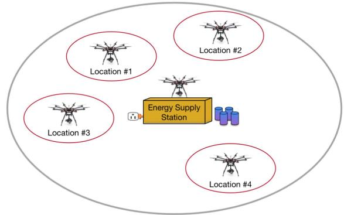
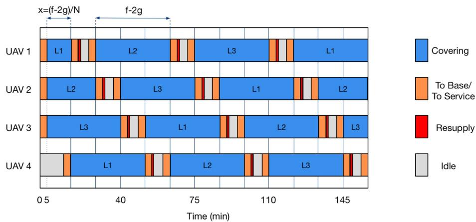
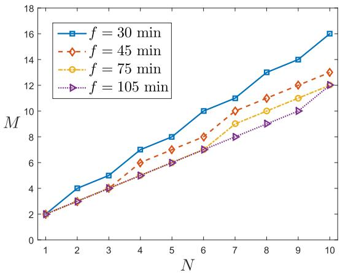
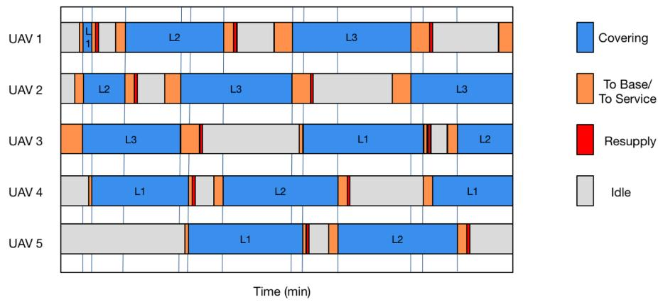
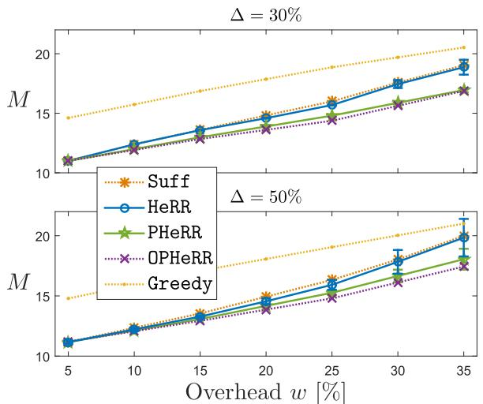
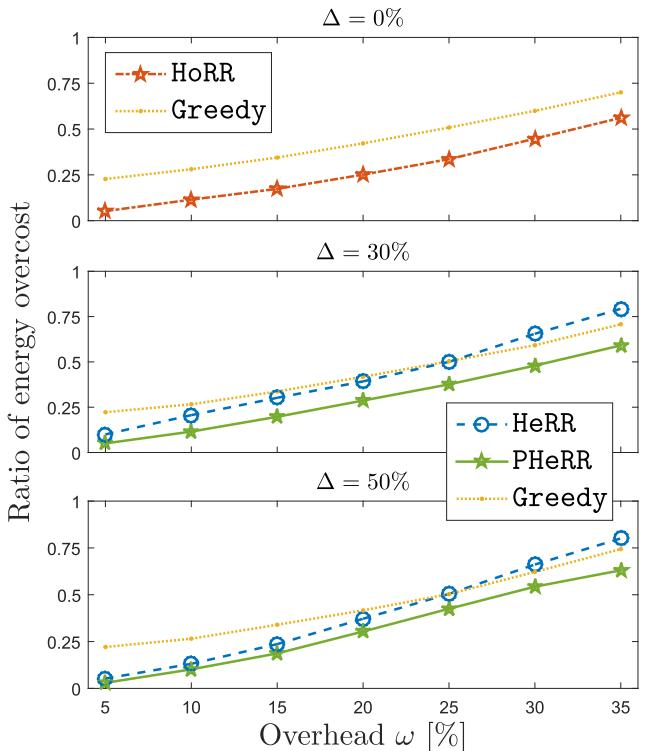
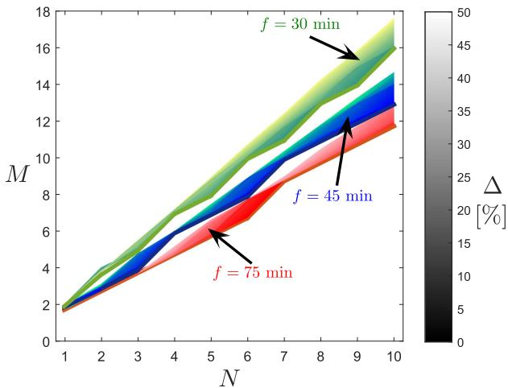
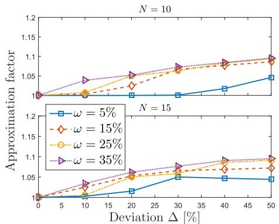
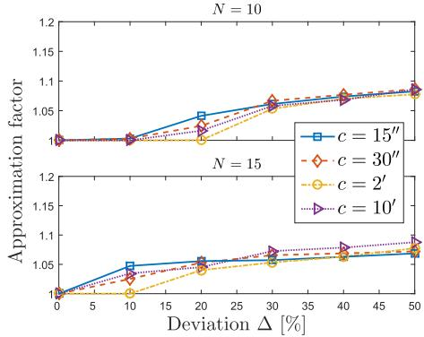
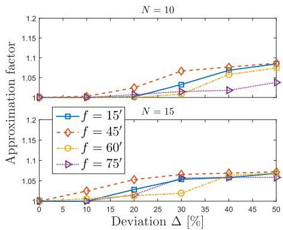

# Optimizing UAV Resupply Scheduling for Heterogeneous and Persistent Aerial Service

Edgar Arribas , Vicent Cholvi , and Vincenzo Mancuso , Senior Member, IEEE

Abstract—With the current advances in unmanned aerial vehicle (UAV) technologies, aerial vehicles are becoming very attractive for many purposes. However, currently the bottleneck in their adoption is no longer due to architectural and protocol challenges and constraints, but rather to the limited energy that they can rely on. In this article, we design two power resupply schemes under the assumption of a fleet of homogeneous UAVs. Such schemes are designed to minimize the size of the fleet to be devoted to a persistent service (i.e., carried out at all times) of a set of aerial locations. First, we consider the case where the aerial locations to be served are equidistant from an energy supply station. In that scenario, we design a simple scheduling scheme, that we name homogeneous rotating resupply (HORR), which we prove to be feasible and exact in the sense that it uses the minimum possible number of UAVs to guarantee the permanent coverage of the aerial service locations. Then, we extend that work for the case of nonevenly distributed aerial locations. In this new scenario, we demonstrate that the problem becomes NP-hard, and design a lightweight scheduling scheme, partitioned heterogeneous rotating resupply (PHERR), which extends the operation of HORR to the heterogeneous case. Through numerical analysis, we show that PHERR provides nearexact resupply schedules.

Index Terms—Energy scheduling, optimization, persistent aerial service, unmanned aerial vehicle (UAV).

## I. INTRODUCTION

drones, in particular, are becoming very attractive for many purposes due to their ability to extend the capabilities of fixed infrastructures in a fast and flexible manner. Just to mention a few, UAVs have already been used in many different scenarios, including, the case of planned communication traffic surges due to massive meetings, military and disaster recovery missions, for harvesting data from fixed sensors, to deliver goods, to irrorate disinfectants [2], etc. Indeed, since the use of UAVs is becoming a technically viable solution, it has been proposed for a myriad of security and safety scenarios.

However, with the current advances in UAV technologies, the bottleneck in the adoption of UAVs is no longer due to architectural and protocol challenges and constraints, but rather to the limited energy that they can rely on. With a large number of UAVs and a limited number of stations where UAVs can land to get supplied with energy, the need for intelligent management of resources seems evident. For this reason, flying several UAVs in a real scenario require accurate planning and monitoring of both their energy consumption and resupply.

This article focuses on an important yet still not wellunderstood aspect of providing a service by means of UAVs, which is the need to resupply UAVs with fresh energy before they run out of power. The problem is important because it has implications on both service quality and potential safety threats posed by UAVs freely falling when running out of energy. These aspects make the problem of monitoring with mobile devices different and harder than with conventional robots or devices with no or unfrequent need to obtain fresh energy. In turn, understanding such a difference requires a formal study that goes beyond mere experimental observations and intuitions.

In this article, we consider a scenario where there is a set of aerial locations that must be serviced by a number of UAVs (one UAV per location). We do not care about the type of service that is performed by the UAVs, other than such services must be persistent. Namely, we say that a service is persistent if it is carried out at all times. Clearly, that means that, at all times, one UAV must be situated at each location.

In order to ensure that some locations are permanently serviced, first of all a number of UAVs must fly to these locations to provide service for a period of time. Furthermore, each servicing UAV must return to the resupply station when it still has enough energy for the return flight. Then, once an UAV has been resupplied with energy (by automatically swapping the battery, recharging the battery, refueling, etc.), it becomes available to replace another active UAV. However, the aforementioned scheme raises some issues to be taken into account. On the one hand, the need of UAVs to be periodically resupplied with more energy will affect the service they provide. Therefore, it is necessary to account for redundancy so that when an UAV flies to get resupplied, the service that it was giving is provided by another UAV. But, unlike traditional energy resupply schemes, the time during which an UAV with low energy goes offline is not negligible, since neither resupply times nor the time to fly back and forth are negligible.

At this point, we note that, as highlighted in the next section, the best strategy to monitor a number of locations in a persistent manner (in terms of minimizing the number of UAVs needed) is to make each UAV, once it has serviced a single location, go directly to get resupplied with more energy [3]. Therefore, in this article, we only need to focus on that type of routing.

Our contributions: In this article, we formally define the problem of UAV resupply scheduling for persistent service at designed aerial locations by accounting all associated UAV energy resupply overheads. Thereafter, we study two scenarios: we start with a simple case in which UAVs are dispatched at equidistant aerial target locations from their energy supply station (i.e., targets located at homogeneous distances) where they fly back when not in service; we show that the problem admits at least one optimal solution, and design homogeneous rotating resupply (HORR), an exact algorithm that implements a particular optimal solution in which UAV operational shifts repeat cyclically. Then, we move to a more generic scenario in which UAV distances from the energy supply station are heterogeneous (i.e., nonequal displacement distances). In this case, the problem becomes NP-hard to solve, as we formally prove. We, therefore, resort to heuristics that generalize HORR. Specifically, we design the heterogeneous rotating resupply (HERR) routine as the generalization of HORR, obtained by accounting for some buffer time in the UAV shifts, which compensates for heterogeneous displacement distances that UAVs have to cover to fly to and from their energy supply station (ESS). We improve the performance of HERR by partitioning the fleet of UAVs into groups within which distances are as homogeneous as possible, and by applying HERR to each group separately. The resulting algorithm, which we name partitioned heterogeneous rotating resupply (PHERR), is shown to be near-exact by comparing its performance with a new lower bound of the problem that we derive. The novelty and significance of the work presented in this article stems from the formal analytical results derived here: we either provide exact algorithms or build near-exact algorithms based on the results of the analysis and not just based on experimental intuition. Eventually, our algorithms will be important also because they will tell us how to operate UAV-based services in a cost-effective manner. Thus, our work has practical relevance and an impact on today’s market of commodity services.

This article significantly extends our preliminary results published in [1],which focuses on the analysis of the homogeneous scenario and presents the HORR that is also compactly illustrated in this article in Section IV. However, most of the analysis and results derived in this article have not been previously published. In particular, the analysis of heterogeneous cases and the derivation of the corresponding algorithms and properties are fully novel.

The rest of this article is organized as follows. Section II discusses the related work. Section III describes the reference UAV scenario studied in this article. Section IV presents the case of homogeneous distances to be covered by UAVs, and the optimality of our solution. Section V illustrates the complexity of solving the scheduling of UAVs under heterogeneous conditions. Section VI proposes a near-exact heuristic for the generic heterogeneous case. The performance analysis and benchmarking of the proposed solutions is presented in Section VII. Finally, Section VIII concludes this article.

## II. RELATED WORK

The increasing growth of the UAVs ecosystem during the last few years has led to an increase in the number of management strategies used to overcome both battery limitations as well as lack of available UAVs in a given situation.

Most of the work on energy management of UAV-based technologies focuses on the vehicle routing problem (VRP) [4]. Namely, the goal of the VRP is to generate routes for a team of agents leaving a starting location, visiting a number of target locations, and returning back to the starting location. Among the many variants of such a problem, there is the possibility that the energy stations in which the UAVs will be powered are either stationary or mobile [5]. For instance, machine learning achieves near-optimal results to solve UAV routing problems with resupplying stops as studied in [6], which shows results within a few percents from the optimal route. Besides, the full-fledged automation of energy stations has proven feasible in real testbeds [7]. This opens to the advent of new automated applications and strategies, which involve pricing and resupply options. As an example, a credit-based game theory approach to UAV resupplying at stationary stations is studied in [8] and mechanisms to optimize the position of energy stations have been proposed, e.g., in [9] and [10], for fixed and mobile energy stations, respectively.

A variant of the VRP has been addressed by Hari et al. [11]. Their model, which the authors refer to as persistent monitoring problem, consists in finding a sequence of k visits to each location, minimizing the time between two visits to the same location. There, the authors analyze different solutions that depend on service time. They show that if such a time is negligible, then it is easy to compute an optimal solution by using standard solvers. Conversely, when the service time is relatively large, they prove that it is sufficient to compute an optimal travel salesman problem tour over the targets to determine the optimal solution. In between, when the service time is any positive real number δ, they show how to build feasible solutions that are at most δ units from the optimum.

In [12], the authors consider a single UAV persistent monitoring problem for targets with arbitrary weights/priorities. In their work, the goal is to minimize the weighted time between consecutive visits to the same location, which is defined as the maximum among the products of the time between successive visits to the targets and the weights of the corresponding targets. With this new objective, the authors show that optimal infinite walks can be obtained by indefinitely repeating finite walks. However and contrary to [11], the number of visits in a finite walk that needs to be repeated to obtain an optimal infinite walk can be exponentially large. Similar to the aforementioned results, our work also addresses the problem of energy management of UAVs intended to visit/monitor a number of locations. However, and contrary to them, our goal is not the same, in the sense that we also require that such monitoring should be carried out in a persistent manner $( \mathrm { i . e . }$ , at all times). This detail adds new constraints that make existing UAV scheduling policies not suitable for pursuing our objective.

A work closely related with our article is the one carried out by Shakhatreh et al. [13]. In their work, the authors analyze the monitoring of a number of geographic areas, with the objective of minimizing the number of UAVs that are needed to provide coverage at all times. Each UAV visits one or more target areas, and the authors propose a heuristic algorithm to find an efficient scheduling. However, traveling through different target locations is not, in general, the best strategy. Moreover, that approach incurs the problem of finding the best cycle that UAVs must follow. Indeed, in [3], the authors provide an interesting result regarding different routing strategies that UAVs may follow to monitor a number of locations in a persistent manner. Namely, they show that the best strategy (in terms of minimizing the number of UAVs needed) consists in making each UAV return directly to the ESS once it has serviced a single location. ${ \mathrm { A c } } -$ cordingly, in our work, we only need to consider this type of routing, which the authors in [3] call the proper replacement scheme.

In [3], the authors provide two approximation algorithms: one with an approximation factor upper bound of 1.5 (when all the locations are known in advance) and the other with an average factor of 1.7 (for the online version). They were followed by the authors of [14], who consider minimizing the number of UAVs with multiple energy stations. Using an approach similar to that in [3], in a subsequent work [15], the authors also consider the case with multiple energy stations, showing that the problem is NP-hard even for a single additional UAV (i.e., with just one back-up UAV needed to guarantee the service). They also provide two approximation algorithms for solving the problem. Their experimental evaluation shows that the approximation factors are not worse that 1.6 (offline) and 1.7 (online), thus outperforming the results of [14].

Differently from existing works that provide approximations, we find an exact solution for the case in which UAVs are dispatched at homogeneous distances from their ESS. Moreover, relying on the structure of such optimal solution, we build a near-exact scheme for the general nonhomogeneous case. This implies a key intrinsic difference with existing approximation algorithms, which are instead based on problem relaxations and bounds. Indeed, we will show that our proposal largely outperforms state-of-the-art schemes.

## III. REFERENCE SCENARIO

We consider a set of UAVs that must perform a persistent task in a set $\mathcal { N }$ of aerial locations. We say that an UAV is covering/providing service when it is at an aerial target location to perform the persistent task. Clearly, as time passes by, UAVs consume energy, and therefore, they will periodically need to fly to an ESS. We assume that there are $N$ target locations, $M \geq N$ UAVs and one ESS that is able to resupply any number of UAVs at the same time.

  
Fig. 1. Scenario of the UAV persistent problem.

The ESS can be installed at the center of the aerial locations, so as to minimize the aggregate travelled distance, or in safe places, like the roof of tall buildings in a city, etc. However, in this article, we assume that the topology of aerial locations and ESS are given, and their optimization is out of the scope of our work. When an UAV lands on the ESS, the UAV is resupplied with energy. The process can consist in automatically swapping the battery, recharging the battery, refueling the UAV, etc., depending on the specific UAV. Indeed, our work applies to any kind of UAVs and resupply procedures. What matters is that the resupply takes certain time $c \geq 0$ . Fig. 1 illustrates the aforementioned scenario.

In addition, we assume a fleet composed by identical UAVs and denote as $f$ the maximumflight time of each UAV.

We denote as $g _ { i }$ the displacement time that an UAV needs to fly from the ESS to location $i \in \mathcal { N }$ (or vice versa).

Since to cover a location $i ,$ an UAV needs to be able $^ { \mathrm { t o , } }$ at least, fly to it and come back (which takes $2 g _ { i }$ time units) before it runs out of energy (i.e., before $f$ time units), we assume that $2 g _ { i } < f$ for all $i \in \mathcal { N }$

The UAV persistent service problem: With the aforementioned reference scenario, our objective is to obtain a coordination strategy that guarantees that, at all times, each location in $\mathcal { N }$ will be covered by one UAV. Such a strategy will instruct each UAV when to fly and cover a location, and when to go to the ESS and resupply its energy. In addition, we want this task to be accomplished with the least possible number of UAVs.

## IV. HOMOGENEOUS SCENARIOS

In this section, we consider the case in which the distance from the ESS to each of the aerial locations is homogeneous (i.e., the aerial locations are dispatched at equidistant positions from the ESS). Hence, $g _ { i } \equiv g \forall i \in \mathcal N$

First, we define the HORR algorithm, and show that it solves the UPS problem. Then, we provide some results regarding how UAVs are instructed to resupply and prove that HORR is optimal, in the sense that it minimizes the number of UAVs.

## A. HORR Algorithm

The rationale behind how the algorithm has been designed is based on the fact that the distances to the locations to be covered are homogeneous. UAVs are cyclically replaced at fixed time intervals, ensuring that they will provide service as long as possible, and always replacing the UAV with the lowest level of energy among the ones in service.

Algorithm 1: Homogeneous Rotating Resupply (HORR).

Input: N, f, g, c.

1: Obtain  $x = \frac{f - 2g}{N}$ , where  $N = |\mathcal{N}|$ .

2: Initially, N UAVs are instructed to provide service at each of the N aerial locations.

3: g time units before a period of a length of x time units ends, a fully charged backup UAV  $u_{c}$  takes off from the ESS and goes to the location of the UAV with less energy  $u_{e}$  (breaking ties uniformly at random).

4: When  $u_{c}$  arrives at the location of  $u_{e}$ , it replaces  $u_{e}$  and  $u_{e}$  goes to resupply. Once  $u_{e}$  is resupplied it will be considered as a backup UAV.

5: Go back to Step 3.

Output: Schedule  $\{(t_{k}, u_{k}, i_{k})\}_{k \geq 0}$  indicating the time instants  $t_{k}$  at which the UAV  $u_{k}$  is instructed to take off to replace the UAV of location  $i_{k}$ .

The code of the HORR algorithm is shown in Algorithm 1. It works as follows: at each time interval of x time units (Steps 3 and 4), the UAV with less energy goes to resupply station, regardless of whether or not it is actually running out of energy. For that, we use $x = f - 2 g / N$ . In this way, each UAV is called to resupply at the ESS after N time intervals of length x so that the UAV will have been in service for $N x = f - 2 g$ time units, which means that the operating time of each UAV is maximized. In addition, g time units before that UAV is instructed to resupply, a backup UAV is sent to replace it so that the coverage is maintained at all times. On its side, a resupplied UAV is considered as a backup UAV.

The HORR algorithm is run at the system orchestrator once the aerial locations to be covered are known. Once HORR is run, the output is a resupply schedule $\{ ( t _ { k } , u _ { k } , i _ { k } ) \} _ { k \geq 0 }$ that indicates the time instants $t _ { k }$ at which the UAV $u _ { k }$ is instructed to take off from the ESS in order to replace the UAV of location $i _ { k }$ The algorithm outputs a time schedule as long as needed by the monitoring system in order to cover all aerial locations during a desired period of time.

Note that HORR assumes that there will always be a backup UAV ready to replace any other UAV instructed to resupply. In the following theorem, we prove that, by using HORR, the number of backup UAVs that guarantees that each location in $\mathcal { N }$ is permanently covered is $\textstyle { \left\lceil { \frac { c + 2 g } { f - 2 g } } N \right\rceil }$

Theorem 1: Assume a fleet of UAVs that provide service in a homogeneous scenario so that the resulting system is characterized by $f , c ,$ and $g .$ . HORR guarantees that N locations can be permanently covered by using $\begin{array} { r } { M = N + \left\lceil \frac { c + 2 g } { f - 2 g } N \right\rceil \mathrm { { U A V s } } } \end{array}$

Proof: According to Algorithm 1, at each time instant $k x$ (with $k \in \mathbb { N } )$ , an UAV $u _ { e }$ is instructed to resupply so that at time instant $k x - g$ , a backup UAV $u _ { c }$ takes off to replace $u _ { e }$ just on time. After that, it will take at least $c + 2 g$ time units for $u _ { e }$ to be back and replace another UAV called back for resupplying. During that interval, exactly $n = \lfloor c + 2 g / x \rfloor$

UAVs will be instructed to resupply, at intervals of $x =$ $f - 2 g / N$ units after kx. If the ratio $c + 2 g / x$ is integer, $u _ { e }$ will be used for the nth replacement, otherwise it will be used for the $( n + 1 )$ )-th replacement. In both cases, the number of UAVs instructed to resupply and not yet back to service is exactly

$$
\left\lceil \frac {c + 2 g}{x} \right\rceil = \left\lceil \frac {c + 2 g}{f - 2 g} N \right\rceil
$$

Hence, this is also the number of backup UAVs needed by HORR, and the proof follows. -

In Fig. 2, we show an illustrative example of how the HORR algorithm works. We consider a scenario formed by three locations $( \mathrm { i . e . , ~ } N = 3 )$ and with $f = 4 5$ min, $g = 5$ min, and $c = 1 5 \mathrm { ~ s ~ } .$ Under these premises, Theorem 1 guarantees that only one additional UAV is strictly necessary to guarantee a persistent coverage at the three locations $( \mathrm { i . e . , } M = 4 )$ . Thus, every $x = 1 1 . { \overline { { 6 } } }$ min, one active UAV is instructed to resupply, and 5 min in advance, a fully charged backup UAV is also instructed to fly and replace that UAV. Observe also that, at the regime level of the scheduling (i.e., after the second resupply since the initial deployment of UAVs with full batteries), each UAV provides service for $f - 2 g = 3 5$ min.

## B. Resupplying in the HORR Algorithm

Next, we provide two results regarding when UAVs are instructed to resupply.

Lemma 1: By using HORR, an UAV covering a location $i \in \mathcal { N }$ is instructed to resupply for the kth time at time instant

$$
t _ {i} ^ {k} = \left(i + (k - 1) N + (k - 1) \left\lceil \frac {2 g + c}{x} \right\rceil\right) x
$$

where $\begin{array} { r } { x = \frac { f - 2 g } { N } } \end{array}$

Proof: We prove the lemma by induction. Take $k = 1$ . Without loss of generality, assume that u is the UAV instructed to cover the ith location in the first round (otherwise, UAVs can be resorted). Then

$$
t _ {i} ^ {1} = i x
$$

which satisfies the lemma.

Assume the lemma is true for a given k. We prove that then the lemma is also true for $k { \pm } 1$

According to the inductive hypothesis, u is instructed to resupply for the kth time at

$$
t _ {i} ^ {k} = \left(i + (k - 1) N + (k - 1) \left\lceil \frac {2 g + c}{x} \right\rceil\right) x.
$$

Then, u arrives to the ESS at time $t _ { i } ^ { k } { + } g$ and takes off at $t _ { i } ^ { k } + g + c \ ( \mathrm { i . e . }$ , after it is fully resupplied). This means that u can replace another UAV at time $t _ { i } ^ { k } + 2 g + c$ or later.

Following the scheduling, u will replace another UAV at instant $j x ,$ , for some $j \in \mathbb { N }$ . Concretely, it will do it at the minimum time instant $j x$ such that $j x \ge t _ { i } ^ { k } + 2 g + c .$ . Hence,

$$
j = \left\lceil \frac {t _ {i} ^ {k} + 2 g + c}{x} \right\rceil = \lceil i + (k - 1) N
$$

$$
+ (k - 1) \left\lceil \frac {2 g + c}{x} \right\rceil + \frac {2 g + c}{x} \Bigg ]
$$

  
Fig. 2. UAV scheduling by using HORR with $N = 3 , f = 4 5$ min, $g = 5$ min, and $c = 3 0 ~ \mathrm { s }$

$$
\begin{array}{l}= i + (k - 1) N + (k - 1) \left\lceil \frac {2 g + c}{x} \right\rceil + \left\lceil \frac {2 g + c}{x} \right\rceil\\= i + (k - 1) N + k \left\lceil \frac {2 g + c}{x} \right\rceil .\end{array}
$$

Then, after Nx time units, u will be instructed to resupply again for the (k+1)th time at time instant

$$
\begin{array}{l}t _ {i} ^ {k + 1} = j x + N x = \left(i + (k - 1) N + k \left\lceil \frac {2 g + c}{x} \right\rceil\right) x + N x\\= \left(i + k N + k \left\lceil \frac {2 g + c}{x} \right\rceil\right) x\end{array}
$$

which proves the lemma.

Corollary 1: By using HORR, any UAV is instructed to resupply every $\textstyle ( N { \dot { + } } \left\lceil { \frac { 2 g + c } { x } } \right\rceil )$ x time units.

 	Proof: The difference between two consecutive resupplies at the same location i is given by

$$
\begin{array}{l}t _ {i} ^ {k + 1} - t _ {i} ^ {k} = \left(i + k N + k \left\lceil \frac {2 g + c}{x} \right\rceil\right) x - \left(i + (k - 1) N \right.\\\left. + (k - 1) \left\lceil \frac {2 g + c}{x} \right\rceil\right) x = \left(N + \left\lceil \frac {2 g + c}{x} \right\rceil\right) x\end{array}
$$

and hence, the corollary follows.

## C. Optimality of the HORR Algorithm

In the following theorem, we show which is the strict minimum number of UAVs necessary to guarantee that a given set of locations are covered in a persistent manner.

Theorem 2: Assume a fleet of UAVs that provide service in a homogeneous scenario so that the resulting system is characterized by $f , c ,$ , and $g .$ The minimum number of UAVs necessary to guarantee that N of them will be always providing service is $\begin{array} { r } { M = N + \left\lceil { \frac { c + 2 g } { f - 2 g } } N \right\rceil } \end{array}$

Proof: An UAV can provide service to a target location for at most $f - 2 g$ time units and needs to be offline for at least $2 g + c$ . Therefore, each target requires at least n backup UAVs, such that $\left( f - 2 g \right) n = 2 g + c$ . Hence, to cover N homogeneous locations, we need at least $\frac { 2 g + c } { f - 2 g }$ backup UAVs in total. Rounding this number to the next integer yields the result.

  
Fig. 3. Behavior of the HORR algorithm. $g = 5$ min and $c = 3 0 :$ s.

The proof of the aforementioned theorem implies that HORR finds an optimal scheduling, hence, it is an exact algorithm because, according to Theorem 1, it uses the minimum possible number of backup UAVs.

Corollary 2: The HORR algorithm is exact.

## D. Numerical Analysis of the HORR Algorithm

To end this section, and through a numerical analysis of the result provided by Theorem 1, here we illustrate how the fleet size M grows as a function of the number of locations to be covered, N. Fig. 3 shows that relationship for different values of $f$ . We have also considered different values of both g and c, and we observed that the shapes were similar.

The first observation is that the values of M grow linearly with the values of N. This can be readily explained as follows: We know that $\begin{array} { r } { M = N + \left\lceil { \frac { c + 2 g } { f - 2 g } } N \right\rceil } \end{array}$ , which can be rewritten as

$$
M / N = 1 + \left\lceil \frac {c + 2 g}{f - 2 g} N \right\rceil / N \simeq \frac {f + c}{f - 2 g}
$$

However, in any concrete scenario, the parameters $f , g ,$ and c remain constant, since they model features that do not change. Therefore, we have that M linearly grows with N at a rate of $f + c / f - 2 g$ . At this point, we note that the steps that can be observed in the graph are due to rounding up the number of UAVs.

Another observation is that the higher the value of $f ,$ the lower the slope. Again, this can be explained since the value of $f + c / f - 2 g$ decreases with the increase in the value of $f ,$ until it reaches 1 (which happens when f is much larger than both g and c).

## V. HETEROGENEOUS SCENARIOS: NP-HARDNESS AND COVERING COST

In this section, we address the case in which the distance between the ESS and each different location can be different. First, we show that, in that scenario, the UPS problem is NPhard. Then, we prove that covering heterogeneous scenarios is, in general, more costly than covering homogeneous ones.

## A. NP-Hardness

Theorem 3: The UPS problem in the heterogeneous case is NP-hard.

Proof: Consider an instance of the UPS problem such that $c = 0$ and $2 g _ { i } < f / 2 \quad \forall 1 \leq i \leq N$ . This instance of the UPS problem is equivalent to the general instance of the minimal spare drone for persistent monitoring (MSDPM) problem [16] with one ESS. At this point, we note that the MSDPM problem is equivalent to the bin maximum item double packing (BMIDP) problem (see [16, Lemma 5.1]). In addition, the BMIDP problem is NP-hard, as we formally prove in Appendix A. Therefore, we have that the MSDPM problem is NP-hard, and consequently, the UPS problem is also NP-hard. -

This result shows that, contrary to what happens in the homogeneous case, it is not possible to find an optimal scheduling that works in polynomial time for the heterogeneous distance scenario.

## B. Covering Cost

In this subsection, we compare the covering cost, in terms of the number of UAVs required in homogeneous scenarios against the cost required in heterogeneous ones. To do this, we first obtain a lower bound on the necessary number of UAVs to guarantee that N locations will be permanently covered.

Theorem 4: Assume a fleet of UAVs that provide service in a heterogeneous scenario so that the resulting system is characterized by $f , c ,$ and $g _ { i }$ (for each i∈N). A lower bound on the minimum number of UAVs necessary to guarantee that N of them will be always providing service is $M _ { L B } = N +$ $\textstyle \left\lceil \sum _ { i = 1 } ^ { N } { \frac { c + 2 g _ { i } } { f - 2 g _ { i } } } \right\rceil$

Proof: Similarly to what argued in the proof of Theorem 2, each aerial target i requires at least $\frac { c + 2 g _ { i } } { f - 2 g _ { i } }$ backup UAVs. Summing over all possible aerial locations, and taking the ceiling, we get a lower bound of the total number of backup UAVs, and the theorem follows.

Now, we can use the obtained lower bound to show that covering in heterogeneous scenarios is, in general, more costly than covering in homogeneous ones.

Theorem 5: Assume a fleet of UAVs that provide service in a heterogeneous scenario so that the resulting system is characterized by $f , c ,$ and $g _ { i }$ (for each $i \in \mathcal { N } )$ . Let $M _ { \mathrm { h e t } }$ be the minimum number of UAVs that guarantee that N of them are always providing service at the target locations, and let $M _ { \mathrm { h o m } }$ be the minimum number of UAVs that guarantee that N of them are always providing service in the homogeneous scenario when $g = \mathrm { A v g } ( g _ { i } )$ . Then, $M _ { \mathrm { h e t } } \geq M _ { \mathrm { h o m } }$

Proof: From Theorem 4, we know that $M _ { \mathrm { h e t } } \geq N +$ $\textstyle \left\lceil \sum _ { i = 1 } ^ { N } \frac { c + 2 g _ { i } } { f - 2 g _ { i } } \right\rceil$ . Now, we apply Theorem 8 from Appendix B to $\scriptstyle \sum _ { i = 1 } ^ { N } { \frac { c + 2 g _ { i } } { f - 2 g _ { i } } }$

$$
\sum_ {i = 1} ^ {N} \frac {c + 2 g _ {i}}{f - 2 g _ {i}} \geq N \frac {\sum_ {i = 1} ^ {N} c + 2 g _ {i}}{\sum_ {i = 1} ^ {N} f - 2 g _ {i}} = N \frac {N c + 2 N g}{N f - 2 N g} = N \frac {c + 2 g}{f - 2 g}.
$$

Hence, $\begin{array} { r } { M _ { \mathrm { h e t } } \geq N + \bigg \lceil \frac { c + 2 g } { f - 2 g } N \bigg \rceil } \end{array}$ . Since the optimal number of UAVs for the homogeneous scenario is $\begin{array} { r } { M _ { \mathrm { h o m } } = N + \left\lceil \frac { c + 2 g } { f - 2 g } N \right\rceil } \end{array}$ (see Theorem 2), then $M _ { \mathrm { h e t } } \geq M _ { \mathrm { h o m } }$ -

Theorem 5 is interesting for two reasons. First, the theorem tells that any deviation from the homogeneous scenario will result in a decrease in performance (regarding the minimum number of necessary UAVs), and hence, finding a way to keep sets of locations spread as homogeneously as possible will help to reduce the needed fleet size. Second, Theorem 5 can be used to make the right decision about where to locate the ESS. Namely, in the place that makes the system homogeneous (of course, if such a position is feasible), since it will need fewer UAVs.

## VI. HETEROGENEOUS SCENARIOS: THE PHERR ALGORITHM

In this section, we introduce an UAV scheduling algorithm for heterogeneous scenarios. Such an algorithm works in two phases: in the first phase, the whole set of locations are properly partitioned into subsets so that, in the second phase, a resupplying scheduling routine is individually applied to each of the resulting subsets.

The rationale behind partitioning the whole set of locations is to work with more homogeneous subsets, as Theorem 5 identifies that deviating from homogeneity increases the amount of required UAVs. As it will be clear later, this will prevent the furthest locations, which can only be covered for a short time, from affecting the coverage of closest locations. We remark that although we aim to find more homogeneous subsets of locations, such subsets may be heterogeneous so that the scheduling derived for the homogeneous case is not necessarily valid here.

## A. HERR Routine

First, we introduce the resupply scheduling routine that is used once the whole set of locations has been partitioned. That routine, which we call HERR, is a generalization of the HORR algorithm that takes into account that distances from the ESS to the locations could be different.

Its code is shown in Algorithm 2, and it works as follows: Let I be a subset of I locations obtained after partitioning N. For each location $i _ { j } \in \mathcal { I } , \mathrm { e v e r y } \ x _ { i _ { j } }$ time units (Steps 5 and 6), the

Algorithm 2: Heterogeneous Rotating Resupply (HERR).
Input:  $I \subseteq N$ ,  $f, \{g_{i_j}\}_{i_j \in I}$ , c.
1: Sort  $\{g_{i_j}\}$  in increasing order.
2: For all  $1 \leq j \leq I$ : obtain  $x_{ij} = \frac{f - 2g_{i_I}}{\sum_{l=1}^I g_{i_l}} \cdot g_{i_j}$ , where  $I = |I|$ .
3: Initially, one UAV is instructed to provide service at each of the I aerial locations.
4: Set  $i_j \leftarrow 1$ .
5:  $g_{i_j}$  time units before a period of length  $x_{i_j}$  time units ends, a fully charged backup UAV  $u_c$  takes off from the ESS and goes to location  $i_j$ .
6: When  $u_c$  arrives to location  $i_j$ , it replaces the UAV that is covering it, which goes to resupply. Once resupplied, that UAV will be considered as a backup UAV.
7: Set  $j \leftarrow (j \mod I) + 1$  and go back to Step 5.
Output: Schedule  $\{(t_k, u_k, i_k)\}_{k \geq 0}$  indicating the time instants  $t_k$  at which the UAV  $u_k$  is instructed to take off to replace the UAV of location  $i_k$ .

UAV that covers $i _ { j }$ will go to resupply, regardless of whether or not it is actually running out of power. For that, we define, for each location $i _ { j }$ in the subset I,

$$
x _ {i _ {j}} = \frac {f - 2 g _ {i _ {I}}}{\sum_ {l = 1} ^ {I} g _ {i _ {l}}} g _ {i _ {j}}
$$

as the heterogeneous time interval, measured from when the UAV covering location $i _ { j - 1 }$ was called to resupply at the ESS, after which the UAV covering that location is called to resupply at the ESS (and when that happens, the UAV covering $i _ { j }$ is the one with the least level of energy among the UAVs in service). We define $\mathit { x } _ { i _ { j } }$ in this way because then, once an UAV is called to resupply at the ESS after I time intervals, such an UAV has been monitoring the location for $\textstyle \sum _ { j = 1 } ^ { I } x _ { i _ { j } } = f - g _ { i }$ time units, which is the maximum operating time that can be guaranteed for all locations without any UAV draining its energy (because $\{ g _ { i _ { j } } \}$ have been sorted in increasing order in Step 1). The way in which $\boldsymbol { x } _ { i _ { j } }$ is defined is a generalization of x in Algorithm 1 for the homogeneous case. In addition, $g _ { i _ { j } }$ time units before that UAV is instructed to go to resupply, a backup UAV is sent to replace it so that the coverage is maintained at all times. On its side, a resupplied UAV is considered as a backup UAV. As it can be seen, the main difference between HORR and HERR is that now the time instants at which UAVs are instructed to resupply are not equally spaced but have been chosen so that no UAV will run out of energy before reaching the ESS.

For simplicity, from now on, we consider that if $l > I ,$ , then $g _ { i _ { l } } = g _ { i _ { j } }$ , where $1 \le j \le I$ is the only number such that $l \equiv j$ mod I (the same applies for $x _ { i _ { l } } )$ .

As in the homogeneous case, the HERR algorithm is run at the system orchestrator once the aerial locations to be covered are known. Once HERR is run, the output is a resupply schedule $\{ ( t _ { k } , u _ { k } , i _ { k } ) \} _ { k \geq 0 }$ that indicates the time instants $t _ { k }$ at which the UAV $u _ { k }$ is instructed to take off from the ESS in order to replace the UAV of location $i _ { k }$ . The algorithm outputs a time schedule as long as needed by the monitoring system in order to cover all aerial locations during a desired period of time.

In the following theorem, we provide a bound on the number of UAVs that guarantees that, by using the HERR routine, each location in I is permanently covered.

Theorem 6: Assume a fleet of UAVs that, by using HERR, provide service in a heterogeneous scenario, and the resulting system is characterized by $f , c ,$ and $g _ { i _ { j } }$ (for each $i _ { j } \in \mathcal { T } )$ . A sufficient number of UAVs necessary to guarantee that I of them will be always providing service is

$$
M = I + \max _ {1 \leq k \leq I} \left\{n _ {k} \right\}
$$

where $n _ { k } = \operatorname* { m i n } _ { n \in \mathbb { N } } \left\{ n : \sum _ { l = k + 1 } ^ { k + n } g _ { i _ { l } } \geq \frac { g _ { i _ { k } } + c + g _ { i _ { k ^ { * } } } } { f - 2 g _ { i _ { I } } } \sum _ { j = 1 } ^ { I } g _ { i _ { l } } \right\}$ , and

$$
i _ {k ^ {*}} = \min \left\{i _ {\alpha} > i _ {k}: \sum_ {l = k + 1} ^ {\alpha} x _ {i _ {l}} \geq g _ {i _ {k}} + c + g _ {i _ {\alpha}} \right\}.
$$

Proof: According to Algorithm $^ { 2 , }$ at some time instant $L ( f -$ $2 g _ { i _ { I } } ) + \textstyle \sum _ { l = 1 } ^ { k } x _ { i _ { l } }$ for some $L \in \mathbb { Z } _ { > 0 } , 1 \le k \le I ,$ , an UAV $u _ { e }$ that is covering location $i _ { j } = i _ { k }$ is instructed to resupply. An UAV $u _ { e }$ goes to the ESS, while a backup UAV $u _ { c }$ takes off at $L ( f -$ $\begin{array} { r } { 2 g _ { i _ { I } } ) + \sum _ { l = 1 } ^ { k } x _ { i _ { l } } - g _ { i _ { k } } } \end{array}$ to replace $u _ { e }$ at the proper instant. While $u _ { e }$ gets ready, other $n _ { k }$ UAVs are instructed to resupply. Hence, the first location that $u _ { e }$ will be able to be ready to replace the next time is $\begin{array} { r } { i _ { k ^ { * } } = \operatorname* { m i n } \{ i _ { \alpha } > i _ { k } : \sum _ { l = k + 1 } ^ { \alpha } x _ { i _ { l } } \geq g _ { i _ { k } } + c + g _ { i _ { \alpha } } \} } \end{array}$ Thus, the time needed by $u _ { e }$ to be able to replace another location is $g _ { i _ { k } } + c + g _ { i _ { k ^ { * } } }$ . Hence, it is sufficient to have $n _ { k }$ backup UAVs ready to replace the $n _ { k }$ UAVs that are being instructed to resupply during this period such that $\begin{array} { r } { \sum _ { l = k + 1 } ^ { k + n _ { k } } x _ { i _ { l } } \geq g _ { i _ { k } } + c + g _ { i _ { k ^ { * } } } } \end{array}$ According to the definition of each $x _ { i _ { l } }$ , the minimum $n _ { k }$ that accomplishes this is

$$
n _ {k} = \min _ {n \in \mathbb {N}} \left\{n: \sum_ {l = k + 1} ^ {k + n} g _ {i _ {l}} \geq \frac {g _ {i _ {k}} + c + g _ {i _ {k ^ {*}}}}{f - 2 g _ {i _ {I}}} \sum_ {l = 1} ^ {I} g _ {i _ {l}} \right\}.
$$

Thus, every time an UAV in aerial location $i _ { k } \in \mathcal { I }$ needs to be replaced, it is sufficient to have $n _ { k }$ backup UAVs. Hence, in general, the sufficient amount of auxiliary UAVs is ma $\mathrm { x } _ { 1 \le k \le I } \{ n _ { k } \}$ while other I UAVs are actually providing service. Hence, the theorem follows. -

We note that, under homogeneous conditions, the proof of Theorem 6 is equivalent to the proof of Theorem 1. That is, Theorem 6, when applied to a homogeneous scenario, provides the same optimal number of UAVs as Theorem 1. Furthermore, later in Section VII-A, we show that the value provided by Theorem 6 is very close to the actual number of UAVs used by HERR.

Regarding the complexity of finding $n _ { k } .$ , in the next lemma, we show that it is at most logarithmic in the input parameters.

Lemma 2: For all $1 \leq k \leq I ,$ obtaining $n _ { k }$ has a complexity that is at most logarithmic as $\mathcal { O } ( \log A _ { k } )$ , where

$$
A _ {k} = \left\lceil \frac {g _ {i _ {k}} + c + g _ {i _ {k ^ {*}}}}{f - 2 g _ {i _ {I}}} \sum_ {l = 1} ^ {I} g _ {i _ {l}} / g _ {i _ {1}} \right\rceil .
$$

  
Fig. 4. UAV scheduling by using HERR with I = 3, f = 45 min, c = 30 s, and {gi} = {1 5 9} min.

Proof: In Theorem 6, we need to find $n _ { k }$ as the minimum natural number n accomplishing the indicated inequality. Hence, if we find for all k some natural number $A _ { k }$ such that the inequality is guaranteed to hold, the search space for natural numbers gets reduced to the finite set $\left\{ 1 , \ldots , A _ { k } \right\}$ and the complexity of finding the minimum n would be at most logarithmic with $A _ { k }$ Hence, we find such natural number $A _ { k }$

In the proof of Theorem 6, we need that $n _ { k }$ verifies that

$$
\sum_ {l = k + 1} ^ {k + n _ {k}} x _ {i _ {l}} = \frac {f - 2 g _ {i _ {I}}}{\sum_ {l = 1} ^ {N} g _ {i _ {l}}} \sum_ {l = k + 1} ^ {k + n _ {k}} g _ {i _ {l}} \geq g _ {i _ {k}} + c + g _ {i _ {k ^ {*}}}.
$$

Since $\{ g _ { i _ { j } } \}$ are sorted in increasing order, $g _ { i _ { l } } \geq g _ { i _ { 1 } }$ for all l, the following inequality holds:

$$
\frac {f - 2 g _ {i _ {I}}}{\sum_ {l = 1} ^ {I} g _ {i _ {l}}} \sum_ {l = k + 1} ^ {k + n _ {k}} g _ {i _ {l}} \geq \frac {f - 2 g _ {i _ {I}}}{\sum_ {l = 1} ^ {I} g _ {i _ {l}}} \sum_ {l = k + 1} ^ {k + n _ {k}} g _ {i _ {1}} = \frac {f - 2 g _ {i _ {I}}}{\sum_ {l = 1} ^ {I} g _ {i _ {l}}} n _ {k} g _ {i _ {1}}.
$$

Hence, if $\begin{array} { r } { n _ { k } \geq \frac { g _ { i _ { k } } + c + g _ { i _ { k } * } } { f - 2 g _ { i _ { l } } } \cdot \sum _ { l = 1 } ^ { I } g _ { i _ { l } } / g _ { i _ { 1 } } } \end{array}$ , we might not get the minimum number of needed auxiliary UAVs $n _ { k }$ needed by HERR but instead get an upper bound $A _ { k }$ for all $1 \leq k \leq I$ . Thus, we define $A _ { k }$ as

$$
A _ {k} = \left\lceil \frac {g _ {i _ {k}} + c + g _ {i _ {k ^ {*}}}}{f - 2 g _ {i _ {I}}} \sum_ {l = 1} ^ {I} g _ {i _ {l}} / g _ {i _ {1}} \right\rceil .
$$

Hence, the lemma follows.

In Fig. 4, we show an illustrative example of how the HERR routine works on a set formed by three locations so that $f =$ 45 min, $\{ g _ { i } \} = \{ 1 , 5 , 9 \}$ , and $c = 5$ min. In that case, Theorem 6 tells us that two additional UAVs are enough to guarantee a persistent service at these three locations $( \mathrm { i . e . , } M = 5 )$ . It can be seen that now the time instants at which UAVs go to resupply are not homogeneously spaced.

## B. PHERR Algorithm

A feature that characterizes how HERR works is that the different locations are covered by the UAVs in a rotating fashion. Furthermore, all locations are covered during the same time interval, which is given by the maximum flight time of the UAVs, minus twice the displacement time to go to the furthest location ( $\mathrm { i . e . , } f - 2 g _ { i _ { I } } )$ . Clearly, this results in all the locations being influenced by the furthest one, which could be quite unsuitable in very heterogeneous scenarios.

Let us illustrate what we just said with a simple example. Assume a scenario where we want to cover five locations with displacement times given by $\{ g _ { 1 } , g _ { 2 } , g _ { 3 } , g _ { 4 } , g _ { 5 } \} =$ $\{ 5 , 6 , 9 , 1 0 , 1 5 \}$ (taking $f = 4 5$ min and $c = 1 5 ~ \mathrm { s ) }$ . By directly applying Theorem 6 to this example, we will obtain that the required number of UAVs is 14. However, if we partition these locations into three sets with similar displacement times, one formed by locations 1 and 2, another formed by locations 3 and 4, and another formed by location 5, and apply Theorem 6 to each set, we will obtain that the number of required UAVs is 11: Three UAVs to cover locations 1 and 2; four UAVs to cover locations 3 and 4; and four UAVs to cover location 5.

Next, we formulate the combinatorial problem to obtain the best partition of the locations so that, by using the HERR routine on each of the obtained sets, the resulting number of UAVs is the minimum.

The heterogeneouspartitionproblem: Assume a fleet ofUAVs that provide service to a heterogeneous scenario characterized by parameters $f , c ,$ and $g _ { i }$ (for each $i \in \mathcal { N } )$ . Find a partition $\mathcal { P } _ { N } = \{ \mathcal { T } _ { 1 } , \ldots , \mathcal { T } _ { N } \}$ so that, by applying the HERR routine to each element of the partition, the resulting total number of UAVs is the minimum.

Unfortunately, partition problems such as the one we presented previously are known to be NP-hard [17]. Therefore, here, we introduce a heuristic algorithm, which we call PHERR, that finds a suitable partition in linear time.

The code of PHERR is shown in Algorithm 3. It works as follows: First, it sets the initial partition as the whole set of locations and computes the amount of needed UAVs, M (Steps 1–4). Then, at each iteration of the while loop, the algorithm takes the subset of the current partition that contains more locations and splits it into two new subsets by moving the furthest location to a separate subset (Steps 7–11). This is done because, as mentioned earlier, the number of UAVs found by HERR is affected by the furthest location. The resulting new partition is evaluated (Steps 12 and 13) and the process is repeated until the total number of UAVs required becomes higher than with the previous configuration. This leads to find a (local)

Algorithm 3: Partitioned Heterogeneous Rotating Resupply (PHERR).

Input: N, f,  $\{g_{i}\}_{i\in N}$ , c.

1: Set the initial partition P = N, with its elements increasingly ordered in accordance with  $\{g_{i}\}_{i\in N}$ .

2: Set the partition size P = 1.

3: Define the only set of the partition P as  $I_{1}$ .

4: Apply Theorem 6 to P and set M and  $M_{new}$  to the provided value.

5: while  $M_{new} \leq M$  do

6: Set  $M \leftarrow M_{new}$ .

7: Derive a new partition  $P'$  of subsets  $I_{p}' \forall 1 \leq p \leq P + 1$ :

8: Set  $I_{p}' \leftarrow I_{p-1} \forall 3 \leq p \leq P + 1$ .

9:  $I_{2}' \leftarrow \max\{I_{1}\}$ 

10:  $I_{1}' \leftarrow I_{1} - I_{2}'$ .

11: Set  $P \leftarrow P'$  and  $P \leftarrow P + 1$ .

12: Obtain the number of UAVs  $M_{p}$  used for each subset  $I_{p} \in P \forall 1 \leq p \leq P$  (by applying Theorem 6 to each  $I_{p}$ )

13: Derive  $M_{new} \leftarrow \sum_{p=1}^{P} M_{p}$ .

14: end while

15: Apply HERR to each  $I_{p} \in P$ .

minimum. Finally, the HERR routine is applied to each one of the subsets of the partition that requires the smallest number of UAVs among the probed partitions (Step 15). Note that the partition search requires a number of computations that is linear with the number of locations, yet that search can be computed offline, once the aerial locations are known. Then, the scheduling of UAVs runs in real-time, as the remaining computations are less than ten sums and multiplications from Algorithm 2.

At this point, we would like to remark that we have also compared the linear search of partitions that we use against the solution provided by a full combinatorial search (which is not feasible in practical and realistic implementations, since it takes a lot of time). Indeed, thanks to the adoption of a properly derived partition to extend the HERR operation, the performance difference between PHERR and a full combinatorial search results in being almost negligible. Hence, the PHERR algorithm stands as the best resupplying scheduling to be adopted, as we numerically show in the next section.

Note that, in case of addressing a homogeneous scenario, the PHERR algorithm will provide the same schedule as HORR, and hence, it will provide optimal results. Indeed, since in that case all the displacement times are the same, then the initial partition of the PHERR contains all locations with equal displacement times, and no other partition will be checked (indeed, no other partition could provide a lower total number of UAVs). In such a homogeneous case, as noted before, Theorem 6 finds the optimal number of UAVs.

## VII. NUMERICAL ANALYSIS OF THE PHERR ALGORITHM

As we have previously done in the case of the HORR algorithm, in this section, we numerically analyze the performance ofthe PHERR algorithm. To do so, we first provide a comprehensive benchmarking analysis to show that the PHERR algorithm stands as the best strategy to be adopted for UAV scheduling not only in terms of required fleet size, but also in terms of energy efficiency. Next, we provide a performance evaluation of PHERR and show that it is near exact in a wide range of application scenarios.

To analyze our results, we need to derive a broad range of results in a wide set of scenarios and setups. For that purpose, here, we define two important parameters that identify key aspects of the UAV scheduling: the heterogeneity level $\Delta$ and the overhead ω.

1) Heterogeneity level: We define the displacement deviation ratio (denoted by $\Delta ) .$ , or simply heterogeneity level as the ratio of maximum displacement time deviation of any location over the average displacement time ${ \overline { { g } } } .$ Hence, when $\Delta = 0 ,$ , we are in a homogeneous scenario, and the higher the $\Delta$ value, the higher the heterogeneity. For instance, if $\overline { { g } } = 5$ min and $\Delta = 0 . 2 5$ displacement times $g _ { i }$ might vary from 3.75 min (a 25% less than 5 min) to 6.25 min (a 25% more than 5 min). As we detail in the next paragraph, the actual value of each $g _ { i }$ is picked uniformly at random between the minimum and maximum values.

2) Overhead: Also, we define the relative overhead of location $i \in \mathcal { N }$ as $\omega _ { i } = 2 g _ { i } / f ,$ where $f$ is the maximum $\# i g h t$ time of the UAVs. Roughly speaking, $\omega _ { i }$ indicates the fraction of time that an UAV will use to fly from the ESS to location i and come back. Then, we define the average relative overhead, or just overhead, as $\omega = \mathrm { A v g } ( \omega _ { i } ) = 2 \overline { { g } } / f$ . Hence, by fixing the flight time and varying the displacement times, we can model scenarios with different overheads.

With the heterogeneity level and overhead parameters being considered, we are able to simulate all kind of scenarios, and hence, analyze the PHERR scheduling under a wide range of settings. In order to generate significant statistical data to provide performance results that capture the heterogeneous nature of the system, we consider several heterogeneity levels $\Delta .$ After that, we consider an average displacement time $\overline { { g } }$ and draw each $g _ { i }$ value according to a uniform random variable $\mathcal { U } ( \overline { { g } } ( 1 - \Delta ) , \overline { { g } } ( 1 + \Delta ) )$ , hence, generating a set of N values for $g _ { i }$ that are different, under the same level of heterogeneity.

For each value of $\Delta$ and $\omega ,$ we used MATLAB to simulate 1000 different realizations of the random heterogeneous scenario, and computed average results.

## A. Benchmarking PHERR

In this section, we aim to benchmark the PHERR algorithm. To do so, we compare the performance of PHERR with the following:

1) the scheduling schemes studied in Section V, i.e., SUFF and HERR;

2) the OPTIMALLY PARTITIONED HERR (OPHERR) schedule, which stands as the optimal solution of the heterogeneous partition problem defined in Section VI-B;

3) a GREEDY schedule in order to compare other state-of-theart solutions.

We benchmark PHERR not only according to the resulting fleet size of each scheme, but also consider further metrics such as the energy efficiency.

  
Fig. 5. Performance of the SUFF, HERR, PHERR, OPHERR, and GREEDY schedules. $N = 1 0 , c = 3 0 ~ \mathrm { s }$

In Fig. 5, we compare the performance of the available schedules addressing the UPS problem in terms of the required fleet size.

First, we show that the sufficient number ofUAVs that we have deterministically derived in Theorem 6 so that the HERR routine is feasible (denoted as the SUFF schedule) is very accurate for the actual number of UAVs required by the HERR operation. In particular, we see that for different heterogeneity settings (for $\Delta = 0 . 3 , 0 . 5 )$ and for diverse average overhead ω, the average difference between SUFF and HERR is always negligible (below 1%). Hence, we find that in order to estimate in advance the number of UAVs required to run any HERR-partition-based scheduling, it is advisable to check the number of UAVs required by SUFF (using Theorem 6).

Second, in this figure, we also compare the PHERR schedule with OPHERR, in which we optimally solve the heterogeneous partition problem defined in Section VI-B by means of listing all possible partitions. We observe that there is very small difference between a linear search of partitions from PHERR and the solution provided by OPHERR with a full combinatorial search. This fact remarks the accuracy achieved with the very lightweight and linear search ofpartitions performed by PHERR.

Third, the figure shows significant average differences between the HERR and PHERR schedules performance, which highlights the fact that the very lightweight extra complexity added to PHERR is worth it. Especially, in cases with high overhead and high heterogeneity, the difference between both schemes is not only remarkable, but we also observe that the HERR results are more spread (see the standard deviation identified with error bars) than the PHERR results (with smaller standard deviations).

Finally, the figure also compares the PHERR performance with other available schemes, as the GREEDY one. The GREEDY scheme works as follows. Initially, all N locations are served by one UAV with a random remaining battery energy supply level between 0 and f min. After that, every time the remaining energy supply level of an UAV serving location i falls to $f - g _ { i }$ another UAV ready at the ESS takes off to replace the draining UAV and keep a persistent service. As we observe, the fleet size required by GREEDY remarkably surpasses the amount of UAVs needed by any other scheme. In particular, as any HERRpartitioned-based schedule accounts for a cyclical replacement of UAVs to address in advance the energy draining of UAVs, the most efficient of those schemes, i.e., PHERR, requires to dispose of a much lower number of available UAVs in the system.

  
Fig. 6. Ratio of energy overcost of the HORR, HERR, PHERR, and GREEDY schedules. $N = 1 0 , c = 3 0 ~ \mathrm { s }$

Although PHERR has been shown to provide the best performance results in terms of required fleet size in comparison to any other benchmarking scheme, another point of interest is studying whether, additionally, PHERR is also the most energy efficient strategy to provide the UAV scheduling. Hence, in Fig. 6, we show the ratio of the extra energy cost from each scheme. Such ratio is computed as follows. Assuming that an UAV scheduling system operates T time units, under the use of any scheme, for sure there will be, at all times, N UAVs providing service at the N locations (persistent service). Hence, the baseline energy cost, for any scheme, is NT time units of energy consumption. From that energy cost, depending on the strategy of whatever scheme, an extra energy cost σ, different for each scheme, is spent by those UAVs coming back and forth to the ESS. As a result, the ratio of extra energy cost is $\sigma / N T _ { \mathrm { ~ \scriptsize ~ : ~ } }$ which is what we represent in the lines of the figure, for each scheme.

As observed in Fig. 6, PHERR exploits better the energy resources and behaves more efficiently than any other scheme in all the scenarios. In particular, when we set the heterogeneity level to $\Delta = 0$ (see the top subplot), the energy efficiency of the exact scheme HORR is notably better than the energy cost from the GREEDY scheme. Also, as the system becomes more and more heterogeneous (middle and bottom subplots, with $\Delta = 0 . 3$ and $\Delta = 0 . 5$ , respectively), PHERR keeps managing the energy consumption more efficiently than the remaining schemes. This fact reveals that the PHERR scheme not only provides the best performance in terms of the required fleet size but also distributes the energy resources more wisely. The reason of this behavior stems from a properly designed heterogeneous rotatory scheme based on simple partitions, and also from the reduced number of UAVs simultaneously used with PHERR. Therefore, even in special cases in which two schemes would need the same fleet size, PHERR would keep standing as the preferred option for the system operator.

  
Fig. 7. Behavior of the PHERR algorithm. $\overline { { g } } = 5$ min and $c = 3 0 \mathrm { \ s } .$ Different hues show the results for different values of Δ, from 0% to 50%.

## B. Effect of Heterogeneity

In Fig. 7, we consider an average displacement time $\overline { { g } } = 5$ min, $c = 3 0 ~ \mathrm { s }$ and, for each value of $f ,$ we vary the value of $\Delta$ from 0 to 0.5, which results in a band of lines of degrading color tone in the figure, the lower envelop of the band being the performance in the homogeneous case.

By using an UAV with a speed of 72 km/h—which is fairly conservative—this experiment with $\overline { { g } } = 5$ min corresponds to a distance of $^ 6$ km from the ESS, on average. For instance, by using a displacement deviation value of $\Delta = 0 . 3$ , the UAVs can be placed at distances between 4.2 and 7.8 km from the ESS, and by using $\Delta = 0 . 5$ , the UAVs can be placed at distances between 3 and $^ 9$ km. Thus, this experiment covers realistic scenarios with a wide range of heterogeneity. Nevertheless, we have also performed simulations with different values of both c and ${ \overline { { g } } } ,$ and we observed that the shapes of the performance curves were similar.

First of all, in Fig. 7, it can be readily seen that the more we increase the value of $\Delta ,$ , the more the value of M increases (for the same number of locations, N). This behavior matches the fact that, as it has been already shown in Theorem 5, covering in heterogeneous scenarios is, in general, more costly than covering in homogeneous ones (i.e., $M _ { \mathrm { h e t } } \geq M _ { \mathrm { h o m } } )$ . However, it can also be observed that the increase in the value of $M$ with $\Delta$ is quite moderate. Indeed, in most cases, only one additional $\mathrm { U A V }$ (with respect to the homogeneous case) was required, and even in stressful conditions (namely, with $f = 3 0$ min, $\Delta \approx 0 . 5$ , and more than eight locations), only two additional UAVs were enough.

  
Fig. 8. Impact of displacement time deviation $\Delta$ on the approximation factor of PHERR w.r.t. LB. $\bar { f } = 4 5$ min, c = 30 s.

  
Fig. 9. Impact of displacement time deviation $\Delta$ on the approximation factor of PHERR w.r.t. LB. $\bar { \omega } = 1 5 \%$ min, $f = 4 5$ min.

Whereas our analysis shows that heterogeneity is not a factor that significantly affects system performance in most cases, it must be taken into account the possibility of finding a scenario that greatly increases the number of UAVs. Anyhow, with the realistically vast range of scenarios represented in Fig. 7, we have found that the average values of the UAV fleet size increase, on average, only by one or two units with respect to the homogeneous case.

## C. Effect of Overhead, Resupply Time, and Flight Time

Next, we evaluate the performance of PHERR against the lower bound provided by Theorem 4 (i.e., against $M _ { \mathrm { L B } } )$ . For such a task, we define the approximationfactor of PHERR against the lower bound as the ratio between M and $M _ { \mathrm { L B } }$ . Clearly, the closer the value of the approximation factor to 1, the better the result.

In Figs. 8–10, we study the approximation factor of PHERR, and consider two different fleet sizes: N = 10 and $N = 1 5$ . We show only average results because the observed variability is very low and cannot be well appreciated in the figures. The figures study the effect of the overhead (which, with fixed $f$ and $c ,$ is equivalent to study the average displacement time $\overline { { g } } )$ , the resupply time c, and the flight time $f .$

  
Fig. 10. Impact of displacement time deviation Δ on the approximation factor of PHERR w.r.t. LB. ω = 15% min, c = 30 s.

Before we proceed with the analysis of the results, it must be taken into account that the values $M _ { \mathrm { L B } }$ provided by Theorem 4 are not guaranteed to be optimal, and the real optima could be greater than $M _ { \mathrm { L B } } . \mathrm { S o } ,$ , the values obtained for the approximation factor are pessimistic, in the sense that they represent upper bounds (i.e., real values could be smaller).

1) Overhead: In Fig. 8, we fix $f = 4 5$ min and $c = 3 0 \mathrm { \ s } .$ , and for each value of $\omega ,$ derive the corresponding value of ${ \overline { { g } } } ,$ on top of which, we apply a deviation $\Delta$ between 0 and 0.5, as explained before.

It can be seen that the approximation factor increases with the heterogeneity. However, such an increase occurs in a smooth way and quickly stabilizes. This behavior is compatible with our results in Section VII-B. This confirms that heterogeneity is not a factor that significantly affects the system performance.

Furthermore, Fig. 8 also shows that PHERR provides very good results, with approximation factors always below 1.1. This is much better than previous results [15], [16], which, respectively, achieved, on average, approximation factors of 1.5 or 1.7. More precisely, it can be observed that approximation factors close to 1.1 occur in stressful conditions, with large values of both $\Delta$ and $\omega .$ . That is, approximation factors close to 1.1 only occur in very heterogeneous scenarios in which the UAVs must use a significant amount of energy to fly to/from the locations. In contrast, when the conditions are less stringent, PHERR provides near-exact results, to the point where it is optimal in homogeneous scenarios or scenarios with very small overhead.

2) Resupply Time: To study the effect of different scenarios for the resupply time at the ESS, in Fig. 9, we fix $f = 4 5$ min and an average overhead of $\omega = 1 5 \%$ , while the resupply time c varies from a few seconds $( c = 1 5 \mathrm { ~ s ~ o r ~ } c = 3 0 \mathrm { ~ s } ,$ matching scenarios with efficient battery swap systems, as described in [18], [19]) to several minutes $( c = 2$ min matching refueling scenarios or c = 10 min matching actual recharging scenarios).

As we observe in the figure, again the approximation factor is close to (but still lower than) 1.1 only under stressful conditions, i.e., with high levels of heterogeneity, $\Delta .$ As long as the conditions become more heterogeneous, we also see that the approximation factor increases in a stabilized manner, not exceeding a factor of 1.1 in any case. As a matter of fact, in all the scenarios considered for the resupply time at the ESS, PHERR achieves close-to-exact results, which shows that the proposed solution is able to properly operate efficiently in any type of ESS.

3) Flight time: Finally, in Fig. 10, we study the effect of different types of UAV energy sources or batteries: from fast drain batteries $( \mathrm { e . g . }$ , when $f = 1 5 \mathrm { m i n } )$ to long lasting batteries $( \mathrm { e . g . }$ , when $f = 7 5$ min). Here, we fix an average overhead of $\omega = 1 5 \%$ and a resupply time of $c = 3 0 ~ \mathrm { s }$

The results of this figure reveal that the proposed solution, PHERR, is also properly designed to bear UAV schedules with any kind of energy source, with flight times lasting from a few minutes to more than an hour. Indeed, PHERR is able to manage all these scheduling scenarios with a number of UAVs close to the minimum required, as the approximation factor remains below 1.1 in all cases, even under those stressful conditions when the heterogeneity level $\Delta$ is very high. Hence, again the approximation factor from PHERR is much lower than the factor of 1.5 and 1.7 achieved in previous works [15], [16]. Interestingly, sometimes the approximation factor for longer lasting batteries is higher than for faster draining ones (e.g., $f = 4 5$ min and $f = 1 5 \mathrm { m i n } )$ . As we have numerically checked, this counter-intuitive behavior is due to the fact that the approximation factor is derived as the quotient of discrete metrics (a number of UAVs), while the system parameters $( c , f \ \mathrm { o r } \ g _ { i } )$ are continuous.

## VIII. CONCLUSION

In this article, we had studied the problem of the UAV fleet resupply scheduling, meant to minimize the fleet size while providing persistent service in a set of aerial locations. We considered two scenarios. On one hand, we designed a simple scheduling mechanism for UAVs serving aerial locations with homogeneous distances to an energy resupply station, and we proved that it was feasible and exact. On the other hand, we demonstrated that the problem becomes NP-hard when the aerial locations were nonevenly distributed. Indeed, we were the first to show how to analyze in a realistic way the resupply scheduling problem, and we not only reached complexity results but also provided the structure of the exact algorithm for a specific class of scenarios (i.e., for homogeneous scenarios) and designed the structure of a near-exact heuristic for the generic case, which was based on the analytical results. Our lightweight resupplying scheduling scheme was shown to be not only much better than state-of-the-art heuristics, but it also solved the problem near optimally in a wide range of application scenarios. In addition, we also derived a very tight lower bound for the UAV fleet size.

The findings of this work were relevant for many commercial and safety applications and services whose deployment depends on the possibility to run a fleet of UAVs, and which span from security and wild life protection to providing connectivity in cellular networks without having to rely on a fixed infrastructure. Notably, our findings also showed how to reduce capital expenditures—by identifying the minimum required fleet size— as well as operational expenditures, as we provided the fleet operator with a (near-)optimal scheduling of UAV duty cycles, which was obtained with very low complexity.

## APPENDIX A NP-HARDNESS OF THE UPS PROBLEM

The authors in [15] and [16] demonstrate that the BMIDP problem exactly solves what they define as the MSDPM problem with one recharging station. The MSDPM problem with one recharging station is equivalent to the UPS problem when the recharging time c is zero and $2 g _ { i } < f / 2$ . Here, we first formulate the BMIDP problem defined in [16], and then, we prove that it is NP-hard.

Definition 1 (BMIDP problem [15]): Given a set of items $\mathcal { T } _ { t } = \{ 1 , \ldots , n \}$ , where each item $i \in \mathcal { Z } _ { t }$ has size $w _ { j } \in ] 0 , 1 ]$ check whether it is possible to split the items in $N \in \mathbb { N }$ disjoint bins $W _ { 1 } , \dots , W _ { N }$ of capacity 1 where the maximum item of each bin $W _ { k }$ must be packed twice (i.e., $\forall 1 \leq k \leq N$ $\begin{array} { r } { \sum _ { w _ { j } \in W _ { k } } w _ { j } + \operatorname* { m a x } _ { w _ { j } \in W _ { k } } w _ { j } \leq 1 ) } \end{array}$

Theorem 7: The BMIDP problem is NP-hard.

Proof: In the following three steps, we reduce the k-way number partitioning problem (kPP) [20] to the BMIDP problem. Therefore, since it is well-known that the $k P P$ problem is NP-hard [21], so it is the BMIDP problem.

1) Reduction of kPP to BMIDP: Given $n \in \mathbb { N } ,$ , we consider a general instance of $\mathit { k P P } \ I = \{ i _ { 1 } , \ldots , i _ { n } \}$ such that $i _ { j } \geq 0 \quad \forall 1 \leq j \leq n$ and at least one nonzero element $i _ { j } .$ Let $\begin{array} { r } { I = \sum _ { j = 1 } ^ { n } i _ { j } > 0 } \end{array}$ . Let $N \geq 1$ , and let $\{ S _ { k } =$ $\{ i _ { k _ { 1 } } , \ldots , i _ { k _ { m } } \} \} _ { k = 1 } ^ { N }$ be a partition of the general instance I. We now define

$$
\begin{array}{l} i ^ {(k)} = \max _ {i _ {j} \in S _ {k}} i _ {j} \quad \forall 1 \leq k \leq N \\ w _ {j} = \frac {N}{I + N i ^ {(k)}} i _ {j}, \text {   if   } i _ {j} \in S _ {k} \quad \forall 1 \leq j \leq n \\ W _ {k} = \left\{w _ {j}: i _ {j} \in S _ {k} \right\} \quad \forall 1 \leq k \leq N; \\ w ^ {(k)} = \max _ {w _ {j} \in W _ {k}} w _ {j} = \frac {N}{I + N i ^ {(k)}} i ^ {(k)} <   1 \forall 1 \leq k \leq N. \end{array}\tag{1}
$$

The aforementioned last equation also implies that

$$
i ^ {(k)} = \frac {I}{N} \frac {w ^ {(k)}}{1 - w ^ {(k)}}.\tag{2}
$$

Note that since $\{ S _ { k } \} _ { k = 1 } ^ { N }$ is a partition of $\mathcal { T } ,$ , the aforementioned definitions are well defined. Note that $0 \leq w _ { j } <$ $1 \ \forall 1 \leq j \leq n$ and that for all $j ,$ , then $w _ { j } \in W _ { k }$ for some k if and only if $i _ { j } \in S _ { k }$ for the same k.

We now prove that the partition $\{ S _ { k } \} _ { k = 1 } ^ { N }$ is a solution of kPP with N partitions if and only if $\{ W _ { k } \} _ { k = 1 } ^ { N }$ is a solution of BMIDP with N bins.

2) Necessary condition: For the right direction, we assume that $\{ S _ { k } \} _ { k = 1 } ^ { N }$ is a solution of kPP. Hence

$$
\sum_ {i _ {j} \in S _ {k}} i _ {j} = \frac {I}{N} \quad \forall 1 \leq k \leq N.
$$

Now, we verify that $\{ W _ { k } \} _ { k = 1 } ^ { N }$ is a solution ofBMIDP with N bins by evaluating if the sum of all elements in a set $W _ { k }$ plus the maximum in $W _ { k }$ , which is $w ^ { ( k ) }$ , fits in a bin

of size 1

$$
\begin{array}{c} w ^ {(k)} + \sum_ {w _ {j} \in W _ {k}} w _ {j} = \frac {N}{I + N i ^ {(k)}} \left(i ^ {(k)} + \sum_ {i _ {j} \in S _ {k}} i _ {j}\right) \\ = \frac {N}{I + N i ^ {(k)}} \left(i ^ {(k)} + \frac {I}{N}\right) = 1 \leq 1 \end{array}
$$

which is true $\forall 1 \leq k \leq N$

3) Sufficient condition: For the left direction, we assume that $\{ W _ { k } \} _ { k = 1 } ^ { N }$ is a solution of BMIDP with N bins as follows:

$$
w ^ {(k)} + \sum_ {w _ {j} \in W _ {k}} w _ {j} \leq 1 \quad \forall 1 \leq k \leq N.\tag{3}
$$

Given $1 \le j \le n$ , there exists a unique $1 \leq k \leq N$ such that $w _ { j } \in W _ { k }$ . Since $w _ { j } \in W _ { k }$ , then $i _ { j } \in S _ { k }$ , and moreover, (1) establishes a relation between $w _ { j }$ and $i _ { j }$ , which can be rewritten as follows:

$$
i _ {j} = \frac {I + N i ^ {(k)}}{N} w _ {j}.\tag{4}
$$

Now, by plugging (2) into (4), we obtain that

$$
i _ {j} = \frac {I}{N} \frac {w _ {j}}{1 - w ^ {(k)}} \forall 1 \leq j \leq n, \text { with } k \mid i _ {j} \in S _ {k}.
$$

Hence, for all $1 \leq k \leq N$ , it is satisfied that

$$
\begin{array}{l} \sum_ {i _ {j} \in S _ {k}} i _ {j} = \sum_ {w _ {j} \in W _ {k}} \frac {I}{N} \frac {w _ {j}}{1 - w ^ {(k)}} = \frac {I}{N} \frac {\sum_ {w _ {j} \in W _ {k}} w _ {j}}{1 - w ^ {(k)}} \\ \qquad = \frac {I}{N} \left(\frac {w ^ {(k)} + \sum_ {w _ {j} \in W _ {k}} w _ {j}}{1 - w ^ {(k)}} - \frac {w ^ {(k)}}{1 - w ^ {(k)}}\right) \\ \qquad \leq \frac {I}{N} \left(\frac {1}{1 - w ^ {(k)}} - \frac {w ^ {(k)}}{1 - w ^ {(k)}}\right) = \frac {I}{N}, \end{array}\tag{5}
$$

where we have used inequality (3) in the passage from the second to the third row.

Since I is defined as $\textstyle \sum _ { j = 1 } ^ { n } i _ { j }$ and $\{ S _ { k } \} _ { k = 1 } ^ { N }$ is a partition of I, (5) must hold as equality, i.e.,

$$
\sum_ {i _ {j} \in S _ {k}} i _ {j} = \frac {I}{N} \quad \forall 1 \leq k \leq N.
$$

If that were not the case, i.e., $\begin{array} { r } { \sum _ { i _ { j } \in S _ { k } } i _ { j } < \frac { I } { N } } \end{array}$ for some $1 \leq k \leq N$ , then

$$
I = \sum_ {j = 1} ^ {n} i _ {j} = \sum_ {k = 1} ^ {N} \sum_ {i _ {j} \in S _ {k}} i _ {j} <   \sum_ {k = 1} ^ {N} \frac {I}{N} = I
$$

which is a contradiction. Therefore, the partition of $\mathcal { T } ,$ $\{ S _ { k } \} _ { k = 1 } ^ { N }$ , is a solution of the kPP problem.

As a result, we have found a reduction of kPP that admits a solution with an N-partition if and only if BMIDP admits solution with N bins. Hence, the theorem follows.

## APPENDIX B AUXILIARY RESULTS

Lemma 3: Given $N \in \mathbb { N }$ , and given a vector $x = ( x _ { i } ) _ { i = 1 } ^ { N } \in$ $\mathbb { R } ^ { N }$ such that $x _ { i } > 0 \forall i = 1 , . . . , N$ , then

$$
\sum_ {i = 1} ^ {N} x _ {i} \cdot \sum_ {i = 1} ^ {N} \frac {1}{x _ {i}} \geq N ^ {2}.
$$

Proof: First, we do some algebraic manipulation

$$
\sum_ {i = 1} ^ {N} x _ {i} \cdot \sum_ {i = 1} ^ {N} \frac {1}{x _ {i}} = \sum_ {i = 1} ^ {N} \sum_ {j = 1} ^ {N} \frac {x _ {i}}{x _ {j}} = N + \sum_ {i \neq j} \frac {x _ {i}}{x _ {j}}.
$$

Now, let $\begin{array} { r } { S = \{ s : s = \frac { x _ { i } } { x _ { i } } > 1 } \end{array}$ for some $i \neq j \}$ . The cardinality of S is the number of pairs $( x _ { i } , x _ { j } )$ with $x _ { i } > x _ { j }$ , that is,

$$
| S | = \frac {N (N - 1)}{2}.\tag{6}
$$

Now, we take again (6) and express $\textstyle \sum _ { i \neq j } { \frac { x _ { i } } { x _ { j } } }$ in the terms of set S by considering that for each pair ofvalues $( x _ { i } , x _ { j } )$ that have ratio $s > 1$ , we also have the pair $( x _ { j } , x _ { i } )$ with ratio $1 / s < 1$ while the ratio is 1 in the N different cases in which $i = j$ as follows:

$$
\sum_ {i = 1} ^ {N} x _ {i} \cdot \sum_ {i = 1} ^ {N} \frac {1}{x _ {i}} = N + \sum_ {s \in S} \left(s + \frac {1}{s}\right).
$$

Since the function $s + 1 / s$ of positive argument s has a derivative that becomes zero at $s = 1$ , where the function assumes value 2, and its second derivative is always positive, we can conclude that the function has a minimum whose value is 2 so that $s + 1 / s \geq 2 \forall s \in \mathbb { R } ^ { + }$ . Therefore, we have

$$
\sum_ {i = 1} ^ {N} x _ {i} \cdot \sum_ {i = 1} ^ {N} \frac {1}{x _ {i}} \geq N + \sum_ {s \in S} 2 = N + 2 | S | = N ^ {2}.
$$

Hence, the lemma follows.

Theorem 8: Given $N \in \mathbb { N }$ , and given two vectors $x =$ $( x _ { i } ) _ { i = 1 } ^ { N } , y = ( y _ { i } ) _ { i = 1 } ^ { N } \in \mathbb { R } ^ { N }$ such that $x _ { i } , y _ { i } > 0 \forall i = 1 , . . . , N$ then

$$
\sum_ {i = 1} ^ {N} \frac {x _ {i}}{y _ {i}} \geq N \cdot \frac {\sum_ {i = 1} ^ {N} x _ {i}}{\sum_ {i = 1} ^ {N} y _ {i}}.\tag{7}
$$

Proof: Let $\operatorname { A v g } ( \cdot )$ be the arithmetic mean function, which can be seen as the stochastic average for a vector of equiprobable values, i.e., given a vector $\begin{array} { r } { z = ( z _ { i } ) _ { i = 1 } ^ { N } , \mathrm { A v } \mathbf { g } ( z ) = \frac { 1 } { N } \sum _ { i = 1 } ^ { N } z _ { i } . } \end{array}$ Hence, using the conditional average formula on the expression for the vector $x / y = ( x _ { i } / y _ { i } ) _ { i = 1 } ^ { N }$ , we have

$$
\begin{array}{c} \operatorname{Avg} \left(\frac {x}{y}\right) = \sum_ {i = 1} ^ {N} \frac {1}{N} \operatorname{Avg} \left(\frac {x}{y} \Big | y = y _ {i}\right) = \sum_ {i = 1} ^ {N} \frac {1}{N} \operatorname{Avg} \left(\frac {x}{y _ {i}}\right) \\ = \operatorname{Avg} (x) \cdot \sum_ {i = 1} ^ {N} \frac {1}{N} \cdot \frac {1}{y _ {i}} = \operatorname{Avg} (x) \cdot \operatorname{Avg} \left(\frac {1}{y}\right), \end{array}\tag{8}
$$

where $\frac { 1 } { y }$ is a vector $( 1 / y _ { i } ) _ { i = 1 } ^ { N }$ of positive numbers.

Thereby, according to Lemma $\begin{array} { r } { 3 , \sum _ { i = 1 } ^ { N } y _ { i } \cdot \sum _ { i = 1 } ^ { N } \frac { 1 } { y _ { i } } \geq N ^ { 2 } } \end{array}$ Hence, $\begin{array} { r } { \frac { 1 } { N } \sum _ { i = 1 } ^ { N } y _ { i } \cdot \frac { 1 } { N } \sum _ { i = 1 } ^ { N } \frac { 1 } { y _ { i } } \geq 1 } \end{array}$ . This means that $\operatorname { A v g } ( y )$ $\mathrm { A v g } ( \textstyle { \frac { 1 } { y } } ) \geq 1$ . Hence

$$
\operatorname{Avg} \left(\frac {1}{y}\right) \geq \frac {1}{\operatorname{Avg} (y)}.\tag{9}
$$

Hence, by applying (9) to (8), we can lower bound $\begin{array} { r } { \frac { 1 } { N } \sum _ { i = 1 } ^ { N } \frac { x _ { i } } { y _ { i } } } \end{array}$ as follows:

$$
\frac {1}{N} \sum_ {i = 1} ^ {N} \frac {x _ {i}}{y _ {i}} = \operatorname{Avg} (x) \cdot \operatorname{Avg} \left(\frac {1}{y}\right) \geq \frac {\operatorname{Avg} (x)}{\operatorname{Avg} (y)} = \frac {\frac {1}{N} \sum_ {i = 1} ^ {N} x _ {i}}{\frac {1}{N} \sum_ {i = 1} ^ {N} y _ {i}}.\tag{10}
$$

From (10), we finally get (7) by multiplying both sides of the inequality by N, and then, the theorem follows. -

## REFERENCES

[1] E. Arribas, V. Cholvi, and V. Mancuso, “An optimal scheme to recharge communication drones,” in Proc. IEEE Glob. Commun. Conf., 2021, pp. 1–6.

[2] V. Chamola, V. Hassija, V. Gupta, and M. Guizani, “A comprehensive review of the COVID-19 pandemic and the role of IoT, drones, AI, blockchain, and 5G in managing its impact,” IEEE Access, vol. 8, pp. 90225–90265, 2020.

[3] E. Hartuv, N. Agmon, and S. Kraus, “Scheduling spare drones for persistent task performance under energy constraints,” in Proc. 17th AAMAS Int. Conf., 2018, pp. 532–540.

[4] J. R. Montoya-Torres, J. López Franco, S. N. Isaza, H. Felizzola Jiménez, and N. Herazo-Padilla, “A literature review on the vehicle routing problem with multiple depots,” Comput. Ind. Eng., vol. 79, pp. 115–129, 2015.

[5] M. Shin, J. Kim, and M. Levorato, “Auction-based charging scheduling with deep learning framework for multi-drone networks,” IEEE Trans. Veh. Technol., vol. 68, no. 5, pp. 4235–4248, May 2019.

[6] U. Erma˘gan, B. Yıldız, and F. S. Salman, “A learning based algorithm for drone routing,” Comput. Operations Res., vol. 137, 2022, Art. no. 105524. [Online]. Available: https://www.sciencedirect.com/ science/article/pii/S030505482100263X

[7] T. Addabbo et al., “An automatic battery recharge and condition monitoring system for autonomous drones,” in Proc. IEEE Int. Workshop Metrol. Ind. 4.0 IoT, 2020, pp. 1–5.

[8] V. Hassija, V. Chamola, D. N. G. Krishna, and M. Guizani, “A distributed framework for energy trading between UAVs and charging stations for critical applications,” IEEE Trans. Veh. Technol., vol. 69, no. 5, pp. 5391–5402, May 2020.

[9] T. Cokyasar, “Optimization of battery swapping infrastructure for e-commerce drone delivery,” Comput. Commun., vol. 168, pp. 146–154, 2021. [Online]. Available: https://www.sciencedirect.com/science/article/ pii/S0140366420320211

[10] W. Qin, Z. Shi, W. Li, K. Li, T. Zhang, and R. Wang, “Multiobjective routing optimization of mobile charging vehicles for UAV power supply guarantees,” Comput. Ind. Eng., vol. 162, 2021, Art. no. 107714. [Online]. Available: https://www.sciencedirect.com/science/article/pii/ S0360835221006185

[11] S. K. K. Hari, S. Rathinam, S. Darbha, K. Kalyanam, S. G. Manyam, and D. Casbeer, “Optimal UAV route planning for persistent monitoring missions,” IEEE Trans. Robot., vol. 37, no. 2, pp. 550–566, Apr. 2021.

[12] S. Alamdari, E. Fata, and S. L. Smith, “Persistent monitoring in discrete environments: Minimizing the maximum weighted latency between observations,” Int. J. Robot. Res., vol. 33, no. 1, pp. 138–154, 2014.

[13] H. Shakhatreh, A. Khreishah, J. Chakareski, H. B. Salameh, and I. Khalil, “On the continuous coverage problem for a swarm of UAVs,” in Proc. IEEE 37th Sarnoff Symp., 2016, pp. 130–135.

[14] H. Park and J. R. Morrison, “System design and resource analysis for persistent robotic presence with multiple refueling stations,” in Proc. Int. Conf. Unmanned Aircr. Syst., 2019, pp. 622–629.

[15] E. Hartuv, N. Agmon, and S. Kraus, “Spare drone optimization for persistent task performance with multiple homes,” in Proc. IEEE Int. Conf. Unmanned Aircr. Syst., 2020, pp. 389–397.

[16] E. Hartuv, N. Agmon, and S. Kraus, “Scheduling spare drones for persistent task performance with several replacement stations - Extended abstract,” in Proc. IEEE Int. Symp. Multi-Robot Multi-Agent Syst., 2019, pp. 95–97.

[17] S. Chopra and M. R. Rao, “The partition problem,” Math. Program., vol. 59, no. 1, pp. 87–115, 1993.

[18] B. Michini et al., “Automated battery swap and recharge to enable persistent UAV missions,” in Proc. Infotech. Aerosp., 2011, Art. no. 1405.

[19] Z.-N. Liu, D. Zhi-Hao Wang Leo, X.-Q. Liu, and H. Zhao, “QUADO: An autonomous recharge system for quadcopter,” in Proc. IEEE Int. Conf. Cybern. Intell. Syst., IEEE Conf. Robot., Automat. Mechatron., 2017, pp. 7–12.

[20] R. E. Korf, E. L. Schreiber, and M. D. Moffitt, “Optimal sequential multiway number partitioning,” in Proc. Int. Symp. Artif. Intell. Math., 2014. [Online]. Available: https://web.archive.org/web/20220120185534id\_ /https://www.cs.uic.edu/pub/Isaim2014/WebPreferences/ISAIM2014\_ Korf\_etal.pdf

[21] M. R. Garey and D. S. Johnson, Computers and Intractability, vol. 174. San Francisco, CA, USA: Freeman, 1979.

Edgar Arribas received the Graduate degree in mathematics from the Universitat de València, Valencia, Spain, in 2015, and the Ph.D. degree in telematic engineering from IMDEA Networks Institute and Universidad Carlos III de Madrid, Madrid, Spain, funded by the MECD FPU grant, in 2020.

He is currently a Lecturer and Researcher with the Applied Mathematics and Statistics Department, Universidad CEU San Pablo, Madrid. He works on optimization of dynamic relay in wireless networks.

Vicent Cholvi received the Graduate degree in physics from the University of Valencia, Valencia, Spain, in 1987, and the doctorate degree in computer science from the Polytechnic University of Valencia, Valencia, in 1994.

In 1995, he joined the Jaume I University, Castellón, Spain, where he is currently a Professor. His research interests include distributed and communication systems.

Vincenzo Mancuso (Senior Member, IEEE) received the Ph.D. degree in electronic engineering from the University of Palermo, Palermo, Italy, in 2005.

He is currently a Research Associate Professor with IMDEA Networks, Madrid, Spain. He was with INRIA, France, Rice University, Houston, TX, USA, and the University of Palermo. His research interests include analysis, design, and experimental evaluation of opportunistic wireless architectures and mobile broadband services.

Dr. Mancuso was the recipient of a Ramon y Cajal research grant of the Spanish Ministry of Science and Innovation.