# Orchestrating Federated Learning in Space-Air-Ground Integrated Networks: Adaptive Data Offloading and Seamless Handover

Dong-Jun Han , Member, IEEE, Wenzhi Fang, Graduate Student Member, IEEE, Seyyedali Hosseinalipour , Member, IEEE, Mung Chiang, Fellow, IEEE, and Christopher G. Brinton , Senior Member, IEEE

Abstract— Devices located in remote regions often lack coverage from well-developed terrestrial communication infrastructure. This not only prevents them from experiencing high quality communication services but also hinders the delivery of machine learning services in remote regions. In this paper, we propose a new federated learning (FL) methodology tailored to space-air-ground integrated networks (SAGINs) to tackle this issue. Our approach strategically leverages the nodes within space and air layers as both 1) edge computing units and 2) model aggregators during the FL process, addressing the challenges that arise from the limited computation powers of ground devices and the absence of terrestrial base stations in the target region. The key idea behind our methodology is the adaptive data offloading and handover procedures that incorporate various network dynamics in SAGINs, including the mobility, heterogeneous computation powers, and inconsistent coverage times of incoming satellites. We analyze the latency of our scheme and develop an adaptive data offloading optimizer, and also characterize the theoretical convergence bound of our proposed algorithm. Experimental results confirm the advantage of our SAGIN-assisted FL methodology in terms of training time and test accuracy compared with various baselines.

Index Terms— Federated learning, space-air-ground integrated networks, LEO satellites, data offloading and handover.

# I. INTRODUCTION

A S THE proliferation of edge devices, including mobilephones, smart vehicles, and Internet-of-Things (IoT) sensors, continues to escalate, they generate vast quantities of data at the wireless edge. In response to this surge, federated

Received 7 March 2024; revised 30 June 2024; accepted 4 August 2024. Date of publication 12 September 2024; date of current version 22 November 2024. This work was supported in part by the Defense Advanced Research Projects Agency (DARPA) under Grant D22AP00168, in part by the National Science Foundation (NSF) under Grant CNS-2212565, and in part by the Office of Naval Research (ONR) under Grant N000142112472. (Corresponding author: Dong-Jun Han.)

Dong-Jun Han is with the Department of Computer Science and Engineering, Yonsei University, Seoul 03722, South Korea (e-mail: djh@yonsei.ac.kr).

Wenzhi Fang, Mung Chiang, and Christopher G. Brinton are with the Elmore Family School of Electrical and Computer Engineering, Purdue University, West Lafayette, IN 47907 USA (e-mail: fang375@purdue.edu; chiangm2001@yahoo.com; cgb@purdue.edu).

Seyyedali Hosseinalipour is with the Department of Electrical Engineering, University at Buffalo–SUNY, New York, NY 14260 USA (e-mail: alipour@buffalo.edu).

Color versions of one or more figures in this article are available at https://doi.org/10.1109/JSAC.2024.3459090.

Digital Object Identifier 10.1109/JSAC.2024.3459090

learning (FL) [1], [2], [3] has emerged as a powerful method for harnessing these distributed data sources to train machine learning (ML) models. Over recent years, FL has garnered significant attention and has been rigorously explored across various configurations: from single-server environments [1], [4], hierarchical structures [5], [6], to decentralized networks [7], [8]. This body of research, spanning foundational studies to implementations, underscores the adaptability and potential of FL in optimizing data-driven insights at the network edge.

# A. Motivation and Key Questions

Despite the advances in FL frameworks, they mostly rely heavily on terrestrial communication infrastructures for model aggregation during the training process. This reliance renders most existing FL methods unsuitable for areas lacking terrestrial communication facilities. Specifically, many remote regions of the Earth, such as mountains, forests, deserts, and coastal areas, do not have well-developed base stations, even though they are home to numerous ground devices, such as IoT sensors, that collect valuable data. The data gathered in these locations are essential for the development of intelligent services tailored to a variety of applications: (i) Disaster predictions in coast, mountain, and forest areas that lack a base station. To achieve this, FL over data samples collected from various types of sensor devices in these remote regions is required. (ii) Autonomous vehicle applications in rural regions. Since these regions have different traffic patterns compared to urban areas, FL needs to be conducted over data samples of vehicles in rural regions. (iii) Medical applications, which is one of the key use cases of FL. Hospitals located in different areas of the world may want to collaboratively train a global model for disease prediction. In such cases, hospitals located in rural regions can take advantage of satellites based on our approach. (iv) Smart agriculture across farms where a well-developed terrestrial base station is unavailable. In this use case, FL should be conducted using data samples collected from different farms. Decentralized FL methods [7], [8], although designed to mitigate some of these challenges, encounter significant obstacles in environments where communication links between devices are unreliable or non-existent, as often found in disaster-affected or maritime regions. Consequently, there is a need for an FL methodology that is specifically tailored to remote areas, ensuring that the distributed data collected in those regions can be leveraged to develop intelligent services.

Space-air-ground integrated networks (SAGINs) have recently emerged as a groundbreaking solution within the wireless communications community [9], [10], aimed at extending wireless coverage across the globe, particularly in isolated and remote regions. In addition to the terrestrial nodes located at the ground layer, SAGINs leverage satellites in the space layer and air nodes, such as unmanned aerial vehicles (UAVs), in the air layer. This multi-layered architecture enables SAGINs to either complement or entirely supplant traditional terrestrial networks in delivering communication services. Furthermore, SAGINs are not limited to providing mere connectivity; they also have the potential to act as edge computing platforms [11], [12], [13]. In particular, they can undertake computation tasks offloaded from terrestrial, resource-constrained devices, such as IoT sensors. The integration of SAGINs thus promises not only to bridge the connectivity gap in underserved areas but also to enhance the computational capabilities at the network edge, opening new avenues for advanced applications and services.

Inspired by the capabilities of SAGINs, this paper sets out to explore the orchestration of FL within SAGINs to facilitate FL in remote areas. This brings forth a set of novel challenges that are absent in conventional FL implementations over terrestrial networks. Our investigation is driven by research questions aimed at unlocking the full potential of FL in the context of SAGINs. First, how should we optimally utilize the unique components of SAGINs, including satellites, air nodes, and ground devices, during the FL process? Second, how should we address the network dynamics in SAGINs (e.g., dealing with the mobility, varying computation capacities, and the inconsistent coverage times provided by satellites) during FL? Third, can we theoretically guarantee the convergence of FL despite the inherent challenges of SAGINs, such as variable network conditions and limited connectivity? Despite the importance of deploying FL in remote regions for intelligent service development, these questions have been largely overlooked in existing research. Our goal is thus to fill this gap by providing insights and solutions that enable effective FL over SAGINs.

# B. Main Contributions

In this paper, we propose a FL methodology that takes advantage of both computation and communication resources of space/air/terrestrial nodes in SAGINs to provide intelligent ML services over remote areas. Compared to prior FL methods that rely on base stations, our approach strategically leverages the space and air nodes as both (i) edge computing units and (ii) ML model aggregators during the FL process, to address the challenges arising from the limited computation powers of ground devices and the absence of terrestrial base stations in the target remote region. Under this framework, we propose an adaptive approach to optimize data offloading depending on the network dynamics of SAGINs, including the inconsistent computation capabilities and coverage times of low-earth orbit (LEO) satellites. Considering the mobility of LEO satellites, we also propose an optimized data/model handover strategy where each satellite transmits the trained model and its dataset to the next incoming satellite to ensure a seamless ML model training process. By incorporating the handover delay into our latency modeling, we optimize the amount of data being offloaded across the layers in SAGINs during the FL process. Overall, our contributions can be summarized as follows:

• New methodology: We introduce a new SAGIN-based FL methodology with adaptive data offloading and handover, which facilitates intelligent ML services in remote areas without the need for terrestrial communication infrastructures. Our scheme strategically utilizes the space and air nodes as edge computing units and model aggregators, and captures the key features of SAGINs including mobility of satellites, time-varying resources and coverage times of incoming satellites, hierarchical architecture, and computation resources of space/air/terrestrial nodes.   
• Analysis and optimization: We analyze the latency of the proposed algorithm, and propose an optimized interlayer data offloading scheme and an intra-layer data handover strategy for the space layer to minimize the delay. This optimization process takes into account the data transmission delay, data processing delay, and model aggregation delay altogether, as well as various network dynamics in SAGINs. We also analytically characterize the convergence bound of our algorithm, and show that the model converges to a stationary point for non-convex loss functions even when adaptive data offloading is applied.   
• Simulations under practical modeling: We provide extensive experiments using three FL benchmark datasets. To simulate real-world scenarios, we adopt the Walker-Star function to model a satellite constellation and measure the coverage time of each satellite over the target region. Experimental results demonstrate that the proposed methodology can achieve the target accuracy much faster with less training latency compared to various baselines.

To the best of our knowledge, this is one of the earliest works to successfully integrate FL with adaptive data offloading/handover optimization across space-air-ground layers, while accounting for various network dynamics specific to SAGINs.

# C. Related Works

FL Over Terrestrial Networks: FL has been actively studied in terrestrial networks where the server (e.g., base station) aggregates the client models in the system. Most of them consider a single-server setup [1], [4], [14], [15], [16], [17] while some researchers also study multi-server scenarios [5], [6], [18], [19], [20]. In [7], [8], [21], and [22], the authors investigate decentralized FL where each client aggregates the models via device-to-device communications with its adjacent clients, without relying on the server. Data offloading strategies are also studied in FL where each client offloads a portion of its local dataset to the server [23], [24], [25]. However, prior works on FL are mostly inapplicable in remote regions, where well-developed base stations are not available and communication links between devices are unstable (e.g., disaster or maritime regions). Compared to these works, we facilitate FL in remote areas by strategically leveraging non-terrestrial network elements, specifically SAGINs.

FL With UAVs or Satellites: Another line of research has explored FL over UAVs [26], [27], [28] or satellites [29], [30], [31], [32], [33], [34], [35], [36], where either UAVs or satellites collect their own datasets and are considered as clients. After the local training procedure at UAVs or satellites, model aggregation and synchronization are conducted relying on the ground base station [26], [27], [30], [31], [32], [33], [36] or directly at the UAVs/satellites [34], [35]. The problem setup of these studies differs from ours as we focus on FL over data samples collected at ground devices located in remote regions. This necessitates interaction between ground devices and nodes in the space/air layers not only for model aggregation (to address the lack of base stations in remote regions) but also for computation offloading (to tackle the limited computation capabilities of ground devices).

Some previous works [37], [38], [39], [40] have focused on the setting where ground devices collect data and conduct FL assisted by the UAVs/satellites, similar to our problem setup. Specifically in [39], the satellite aggregates the models of ground devices via over-the-air aggregation, without requiring any base stations. The authors of [37] focus on solving the maze problem using the deep Q network assisted by the satellites. In [38] and [41], data offloading has been studied for satellite-assisted FL by considering only the space layer. While these works do not consider SAGINs, a recent work [40] specifically studied FL considering space-air-ground layers. However, the nodes in space and air layers are only used as model aggregators, not as edge computing units. Compared to all prior works, the contribution of this work is to adaptively optimize data offloading across different layers and handover within the space layer, while taking into account the network dynamics specific to SAGINs (e.g., heterogeneous coverage time and resource availability of current/incoming satellites) during FL.

Space-Air-Ground Integrated Networks (SAGINs): Motivated by the potential for providing wide wireless coverage across the Earth, SAGINs [9] have been actively studied in the literature. Outage analysis is conducted for SAGINs in [10], while network control methodologies for SAGINs are considered in [42] and [43]. In [11], [12], [13], and [44], the authors focused on edge computing in SAGINs, where ground devices offload their computation tasks to the space and air layers. Compared to existing studies on SAGINs, the unique position of this work lies in the integration of distributed/federated ML, SAGINs, and adaptive data offloading/handover. Beyond enhancing wireless coverage, we provide additional guidelines for intelligent ML services in remote areas with the assistance of SAGINs.

The rest of the paper is organized as follows. We describe the problem setup in Section II, followed by an overview of the methodology in Section III. In Section IV, we analyze the latency of our scheme and optimize data offloading. Theoretical convergence results are provided in Section V, and numerical results are presented in Section VI. Finally, we draw conclusion and future directions in Section VII.

# II. PROBLEM SETUP

We consider a SAGIN that is composed of space, air, and ground layers. We let G be the set that consists of K terrestrial devices located at a specific target region that lacks a base station. We denote $D _ { k } = D _ { k } ^ { l } \cup D _ { k } ^ { o }$ as the local dataset of device k with $D _ { k } ^ { l } \cap D _ { k } ^ { o } = \emptyset$ , where $D _ { k } ^ { l }$ is the privacy-sensitive dataset that should be kept locally at each device, while Dok consists of non-sensitive samples that can be offloaded to other nodes. We define $\alpha _ { k } ~ = ~ | D _ { k } ^ { o } | / | D _ { k } |$ as the portion of non-sensitive data samples at ground device k, where |D| represents the number of samples in dataset D. This problem setting covers various applications, including (i) autonomous vehicles or mobile phones that collect data with both nonsensitive classes (e.g., traffic lights, trees) and sensitive classes (e.g., humans), (ii) hospitals with data of patients who have agreed with the privacy policy and who have not agreed with it, (iii) sensor devices for disaster predictions in coastal regions that mostly collect non-sensitive samples.

In the air layer, we consider a set A with N air nodes (e.g., UAVs) covering the target region. Each air node n is associated with the device set ${ \mathcal { G } } _ { n } ,$ where $\mathcal { G } \ : = \ : \cup _ { n = 1 } ^ { N } \mathcal { G } _ { n }$ holds with ${ \mathcal G } _ { n _ { 1 } } \cap { \mathcal G } _ { n _ { 2 } } = \emptyset \mathrm { ~ i f ~ } n _ { 1 } \neq n _ { 2 }$ . In the space layer, we consider LEO satellites that are moving according to their own orbits. Each ground device can directly communicate with the corresponding air node in the air layer, while each air node can communicate with the satellite that is covering the target region. Fig. 1 illustrates the overview of our system model.

The goal is to train a shared global model $\mathbf { w } ^ { * }$ tailored to the datasets collected at ground devices in G. Specifically, we aim to minimize the following objective function:

$$
F (\mathbf {w}) = \sum_ {k = 1} ^ {K} \lambda_ {k} F _ {k} (\mathbf {w}), \tag {1}
$$

where λk = P |Dk|j∈G |Dj | $\begin{array} { r } { \lambda _ { k } = \frac { \left| D _ { k } \right| } { \sum _ { j \in \mathcal { G } } \left| D _ { j } \right| } } \end{array}$ is the relative dataset size of device k. $F _ { k } ( \mathbf { w } )$ is the local loss function of device k defined as $\begin{array} { r } { F _ { k } ( \mathbf { w } ) \ = \ \frac { 1 } { | D _ { k } | } \sum _ { x \in D _ { k } } \ell ( x ; \mathbf { w } ) } \end{array}$ , where $\ell ( x ; { \mathbf w } )$ is the loss (e.g., cross-entropy loss) obtained with data sample x and model w.

There are several key challenges in achieving the above goal in remote areas. First, it is difficult to aggregate the trained models within such regions without a base station. Secondly, the terrestrial devices (e.g., IoT sensors) are often equipped with low computation capabilities, significantly slowing down the training process. In this work, we use space and air nodes as model aggregators to solve the first challenge, and also use them as edge computing units to process data samples offloaded from the ground layer, to tackle the second challenge.

# III. METHODOLOGY OVERVIEW

In this section, we provide an overview of our methodology that achieves the aforementioned objectives in SAGINs. The proposed algorithm consists of R global rounds indexed by $r = 0 , 1 , \ldots , R - 1$ . In the following, we focus on a specific round r to describe the process of our scheme.

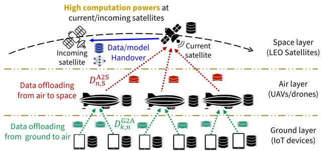

flowchart

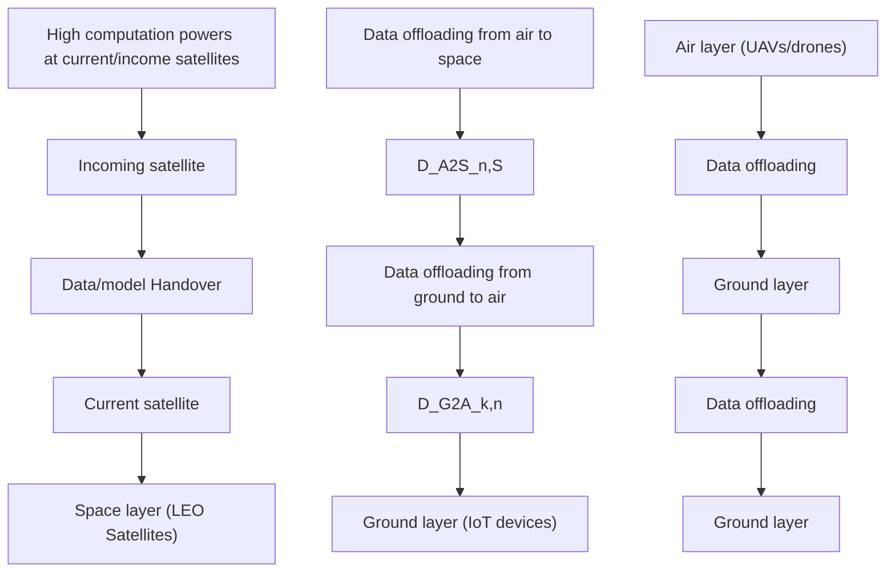

(a) High computation powers at current/incoming satellites.

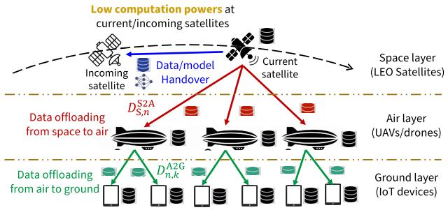

flowchart

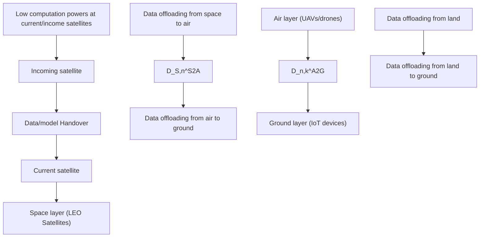

(b) Low computation powers at current/incoming satellites.   
Fig. 1. Overview of adaptive data offloading/handover during FL over SAGINs, depending on the current resource availability.

# A. Adaptive Inter-Layer Data Offloading

Let $D _ { \mathsf { G } , k } ^ { ( r ) } , D _ { \mathsf { A } , n } ^ { ( r ) }$ , and D(S $D _ { \mathsf { S } } ^ { ( r ) }$ denote the local datasets at node $k \in \mathcal G$ in the ground layer, node $n \in { \mathcal { A } }$ in the air layer, and the satellite that is currently serving the targeting region, respectively, at the beginning of round r. Note that we have

$$
D _ {\mathsf {G}, k} ^ {(0)} = D _ {k}, \forall k \in \mathcal {G}, D _ {\mathsf {A}, n} ^ {(0)} = \emptyset , \forall n \in \mathcal {A}, D _ {\mathsf {S}} ^ {(0)} = \emptyset \tag {2}
$$

for $r ~ = ~ 0$ since data samples are generated at the ground devices.

Depending on various system environments, inter-layer data offloading is first performed across the network to obtain the updated datasets $\bar { D } _ { \mathsf { G } , k } ^ { ( r + 1 ) } , D _ { \mathsf { A } , n } ^ { ( r + 1 ) }$ , and $D _ { \mathsf { S } } ^ { ( r + 1 ) }$ at the nodes in each layer. Fig. 1 illustrates example scenarios of adaptive data offloading depending on the computation capabilities of the satellites. Intuitively, if the current/incoming satellites have relatively high computation powers, more data samples can be offloaded to the space layer. Otherwise, data samples should be transmitted from the space layer to other layers for load balancing. The data offloading solution is also affected by the coverage times of the satellites over the target region.

We describe the detailed optimization procedure for our adaptive data offloading strategy later in Section IV, as it is built upon the analysis provided in the following subsections.

# B. Local Training at Ground and Air Layers

Based on the updated datasets $D _ { \mathsf { G } , k } ^ { ( r + 1 ) } , D _ { \mathsf { A } , n } ^ { ( r + 1 ) }$ , and $D _ { \mathsf { S } } ^ { ( r + 1 ) }$ obtained from Section III-A, the nodes in the system conduct local model updates. We first describe the local training process at the ground and air layers. At the beginning of global round r, all nodes in the system have the synchronized model represented by $\mathbf { w } ^ { ( r ) }$ . Starting from the initial model wG,k $\mathbf { w } _ { \mathsf { G } , k } ^ { ( r , 0 ) } = \mathbf { w } _ { \mathsf { A } , n } ^ { ( r , 0 ) } = \mathbf { w } ^ { \mathsf { \bar { ( } } r ) }$ = wA,n , each ground device k and air node n updates its model for H local iterations according to

$$
\mathbf {w} _ {\mathsf {G}, k} ^ {(r, h + 1)} = \mathbf {w} _ {\mathsf {G}, k} ^ {(r, h)} - \eta_ {\mathsf {G}, k} ^ {(r)} \tilde {\nabla} \ell_ {\mathsf {G}, k} ^ {(r + 1)} (\mathbf {w} _ {\mathsf {G}, k} ^ {(r, h)}), h = 0, \dots H - 1, \tag {3}
$$

$$
\mathbf {w} _ {\mathsf {A}, n} ^ {(r, h + 1)} = \mathbf {w} _ {\mathsf {A}, n} ^ {(r, h)} - \eta_ {\mathsf {A}, n} ^ {(r)} \tilde {\nabla} \ell_ {\mathsf {A}, n} ^ {(r + 1)} (\mathbf {w} _ {\mathsf {A}, n} ^ {(r, h)}), h = 0, \dots H - 1, \tag {4}
$$

where w(r,h)G,k $\mathbf { w } _ { \mathsf { G } , k } ^ { ( r , h ) }$ and $\mathbf { w } _ { \boldsymbol { A } , n } ^ { ( r , h ) }$ are the models after h local iterations at global round $\begin{array} { r l r } { r , \ell _ { \mathsf { G } , k } ^ { ( r + 1 ) } ( \cdot ) } & { = } & { \frac { 1 } { | D _ { \mathsf { G } , k } ^ { ( r + 1 ) } | } \sum _ { x \in D _ { \mathsf { G } , k } ^ { ( r + 1 ) } } \ell ( x ; \cdot ) } \end{array}$ and $\begin{array} { r } { \ell _ { \mathsf { A } , n } ^ { ( r + 1 ) } ( \cdot ) = \frac { 1 } { | D _ { \mathsf { A } , n } ^ { ( r + 1 ) } | } \sum _ { x \in D _ { \mathsf { A } , n } ^ { ( r + 1 ) } } \ell ( x ; \cdot ) } \end{array}$ Px∈D(r+1) ℓ(x; ·) are the local loss funcand d at the corresponding nodes. Also,  denote the computed mini-batch $\tilde { \nabla } \ell _ { \mathsf { G } , k } ^ { ( r + 1 ) } ( \cdot )$ $\widetilde { \nabla } \ell _ { \mathsf { A } , n } ^ { ( r + 1 ) } ( \cdot )$ of the local dataset. $\eta _ { \mathsf { G } , k } ^ { ( r ) }$ and $\eta _ { \mathsf { A } , n } ^ { ( r ) }$ represent the learning rates at ground device k and air node n, respectively.

The required local computation times (in seconds) at ground device k and air node n for model updates are expressed as

$$
\tau_ {\mathsf {G}, k} ^ {\text { local }, (r)} = \frac {m _ {\mathsf {G} , k} | D _ {\mathsf {G} , k} ^ {(r + 1)} |}{f _ {\mathsf {G} , k}}, \quad \tau_ {\mathsf {A}, n} ^ {\text { local }, (r)} = \frac {m _ {\mathsf {A} , n} | D _ {\mathsf {A} , n} ^ {(r + 1)} |}{f _ {\mathsf {A} , n}}, \tag {5}
$$

respectively, where $f _ { \mathsf { G } , k } , \ f _ { \mathsf { A } , n }$ are the CPU frequencies (in cycles/sec) and $m _ { \mathsf { G } , k } , \ m _ { \mathsf { A } , n }$ are the numbers of required CPU cycles to update the model with one data sample (in cycles/sample) at the corresponding nodes.

# C. Satellite-Side Training and Data/Model Handover

In parallel with the local training process at the air/ground layers,dataset $D _ { \mathsf { S } } ^ { ( r + 1 ) }$ rrent satellite als. Starting from $\mathbf { w } _ { \mathsf { S } } ^ { ( r , 0 ) } ~ = ~ \mathbf { w } ^ { ( r ) }$ model using, the model update process at the satellite can be written as follows:

$$
\mathbf {w} _ {\mathsf {S}} ^ {(r, h + 1)} = \mathbf {w} _ {\mathsf {S}} ^ {(r, h)} - \eta_ {\mathsf {S}} ^ {(r)} \tilde {\nabla} \ell_ {\mathsf {S}} ^ {(r + 1)} (\mathbf {w} _ {\mathsf {S}} ^ {(r, h)}), h = 0, \dots H - 1, \tag {6}
$$

where $\tilde { \nabla } \ell _ { \mathsf { S } } ^ { ( r + 1 ) } ( \cdot )$ and $\eta _ { \mathsf { S } } ^ { ( r ) }$ are the satellite-side stochastic mini-batch gradient and learning rate, respectively. The size of the mini-batch is set to |D(rS $| D _ { \mathsf { S } } ^ { ( r + \widetilde { 1 } ) } | / H$ so that all data samples in $D _ { \mathsf { s } } ^ { ( r + 1 ) }$ can be processed in H iterations.

Data/Model Handover: In satellite networks, satellites are perceived as non-stationary units, where at each snapshot of the network each LEO satellite covers a different region compared to other LEO satellites and may have its own specific task tailored to its coverage area (e.g., edge computing, FL, or communication services). In our setup, the current satellite that is covering the target area is responsible for conducting FL over that region. However, a key challenge is that each satellite has a limited coverage time over the target region due to the mobility. This motivates us to consider an intra-layer data/model handover strategy within the space layer, to ensure a seamless FL process. Specifically, the current satellite transmits the updated model and dataset to the incoming satellite before leaving the target region, so that this new satellite can continue model training in the space layer using dataset $D _ { \mathsf { S } } ^ { ( r + 1 ) }$ during its coverage period over the target region. These local training and handover steps are repeated until all data samples in D(r+1)S $\bar { D _ { \mathsf { S } } ^ { ( r + 1 ) } }$ are processed, based on a series of incoming satellites that will cover the target region.

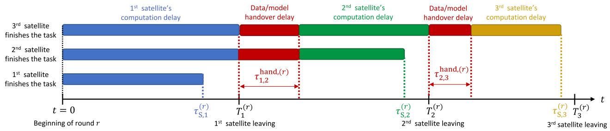

other

| Time Segment | Label                                      | Delay Type                     |
| ------------ | ------------------------------------------ | ------------------------------- |
| Start        | 1st satellite finishes the task          | Data/model handover delay       |
| Mid Point    | 2nd satellite finishes the task         | Data/model handover delay       |
| End          | 3rd satellite finishes the task          | Data/model handover delay       |
| Mid Point    | 1st satellite finishes the task          | τ₁,₂, hand,(r)                   |
| Mid Point    | 2nd satellite finishes the task          | τ₂,₃                            |
| End          | 3rd satellite leaving               | τ₃(r), τₛ,₃                      |

Fig. 2. Illustration of model training and intra-layer data/model handover procedures at the space layer. If the current satellite is not able to complete the task within its coverage time over the target region, the next incoming satellite continues local training after receiving the dataset and the model from the previous satellite to ensure a seamless FL process.

The handover delay between the i-th and (i+1)-th satellites at global round r can be written as follows:

$$
\tau_ {i, i + 1} ^ {\text { hand }, (r)} = \frac {Q (\mathbf {w}) + q | D _ {\mathbb {S}} ^ {(r + 1)} |}{Z _ {i , i + 1} ^ {\text { ISL } , (r)}}, \tag {7}
$$

where $Q ( \mathbf { w } )$ is the model size (in bits), q is the size of each data sample (in bits) and $Z _ { i , i + 1 } ^ { | \mathbb { S } ^ { \lfloor } }$ is the transmission rate for inter-satellite link (ISL) communications between i-th and $( i + 1 )$ )-th satellites. Referring to [31] and [45], we have $\begin{array} { r } { Z _ { i , i + 1 } ^ { | \mathrm { S L } , ( r ) } = B \log _ { 2 } ( 1 + \frac { p _ { 5 , i } ^ { ( r ) } A _ { i } ^ { \mathrm { T x } } A _ { i + 1 } ^ { \mathrm { R x } } } { C _ { i , i + 1 } N _ { 0 } } ) } \end{array}$ , where B is i-th satellite, band and p S,i $p _ { \mathsf { S } , i } ^ { ( r ) }$ $A _ { i } ^ { \mathrm { T x } }$ $A _ { i + : } ^ { \mathrm { R x } }$ are the Tx and Rx gains of antenna, $C _ { i , i + 1 }$ is the free space path loss between satellites, $N _ { 0 }$ is the noise power density.

Latency at the Space Layer: Based on the above data/model handover strategy, we now characterize the training latency at the space layer. Let $f _ { \mathsf { S } , i } ^ { ( r ) }$ represent the CPU frequency of the ith satellite covering the target region at global round r. We also denote m S,i $m _ { \ S , i } ^ { ( r ) }$ as the number of CPU cycles required to process one data sample at the i-th satellite at round r. Moreover, let $T _ { i } ^ { ( r ) }$ denote the delay until the i-th satellite leaves the coverage of the target region, measured from the moment when global round r has started. Trivially, for the satellites that do not join or leave the region in round $r , T _ { i } ^ { ( r ) }$ becomes infinity.

To gain insights, we start with some examples illustrated in Fig. 2. Suppose that the first satellite is able to process the whole dataset $D _ { \mathsf { S } } ^ { ( r + 1 ) }$ within the time duration $T _ { 1 } ^ { ( r ) }$ . Then, the local computation delay τ (r)S,1 $\boldsymbol { \tau } _ { \boldsymbol { \mathsf { S } } , 1 } ^ { ( r ) }$ (in seconds) at the space layer can be written as follows:

$$
\tau_ {\mathsf {S}, 1} ^ {(r)} = m _ {\mathsf {S}, 1} ^ {(r)} \left| D _ {\mathsf {S}} ^ {(r + 1)} \right| / f _ {\mathsf {S}, 1} ^ {(r)}. \tag {8}
$$

However, if τS,1 $\tau _ { \mathsf { S } , 1 } ^ { ( r ) } > T _ { 1 } ^ { ( r ) }$ , indicating that the first satellite is unable to complete the computation before leaving the target region, data/model handover from the first satellite to the second satellite is conducted. Note that the number of data samples that can be processed at the first satellite within time duration $T _ { 1 } ^ { ( r ) }$ is (f (r)S,1/m(r)S,1)T (r1 $( f _ { \mathbb { S } , 1 } ^ { ( r ) } / m _ { \mathbb { S } , 1 } ^ { ( r ) } ) T _ { 1 } ^ { ( r ) }$ . Hence, the amount of data samples that should be processed at the satellites other than the first one becomes |D(rS $| D _ { \mathsf { S } } ^ { \mathsf { ^ { * } } ( r + 1 ) } | - ( f _ { \mathsf { S } , 1 } ^ { ( r ) } / m _ { \mathsf { S } , 1 } ^ { ( r ) } ) T _ { 1 } ^ { ( r ) }$ /m S,1) . Now suppose that the second satellite can process all $| D _ { \mathsf { S } } ^ { ( r + 1 ) } | -$ $( f _ { \mathsf { S } , 1 } ^ { ( r ) } / m _ { \mathsf { S } , 1 } ^ { ( r ) } ) T _ { 1 } ^ { ( r ) }$ /mS,1 1 (r) )T (r) data samples before leaving the target region. Then the computation time at the second satellite to finish local training can be expressed as $\begin{array} { r } { m _ { \mathbb { S } , 2 } ^ { ( r ) } ( | D _ { \mathbb { S } } ^ { ( r + 1 ) } | - \frac { f _ { \mathbb { S } , 1 } ^ { ( r ) } } { m _ { \mathbb { S } , 1 } ^ { ( r ) } } T _ { 1 } ^ { ( r ) } ) / f _ { \mathbb { S } , 2 } ^ { ( r ) } } \end{array}$ f (r)S,1 mS,1 ) T (r )1 ) . This leads to the following latency result:

$$
\tau_ {\mathbb {S}, 2} ^ {(r)} = T _ {1} ^ {(r)} + \tau_ {1, 2} ^ {\text { hand }, (r)} + \frac {m _ {\mathbb {S} , 2} ^ {(r)} \left(\left| D _ {\mathbb {S}} ^ {(r + 1)} \right| - \frac {f _ {\mathbb {S} , 1} ^ {(r)}}{m _ {\mathbb {S} , 1} ^ {(r)}} T _ {1} ^ {(r)}\right)}{f _ {\mathbb {S} , 2} ^ {(r)}}. \tag {9}
$$

The result in satellite, i.e., $T _ { 1 } ^ { ( r ) }$ ncorporates the comp, the handover delay, $\mathrm { i . e . , ~ } \tau _ { 1 , 2 } ^ { \mathsf { h a n d , } ( r ) }$ t the first, and the computation time at the second satellite, i.e., the last term.

However, if $\tau _ { \mathsf { S } , 2 } ^ { ( r ) } ~ > ~ T _ { 2 } ^ { ( r ) }$ T2 the local training cannot be completed before the second satellite leaves the target area. In this case, the third satellite processes the remaining data after receiving the information from the second satellite via ISL communication. Overall, we obtain the following result:

$$
\tau_ {\mathbb {S}} ^ {(r)} = \left\{ \begin{array}{l l} \tau_ {\mathbb {S}, 1} ^ {(r)}, & \text { if } \tau_ {\mathbb {S}, 1} ^ {(r)} <   T _ {1} ^ {(r)} (1 ^ {\mathrm{st}} \text { satellite   finishes   the   task }) \\ \tau_ {\mathbb {S}, 2} ^ {(r)}, & \text { if } \tau_ {\mathbb {S}, 2} ^ {(r)} <   T _ {2} ^ {(r)} (2 ^ {\mathrm{nd}} \text { satellite   finishes   the   task }) \\ \tau_ {\mathbb {S}, 3} ^ {(r)}, & \text { if } \tau_ {\mathbb {S}, 3} ^ {(r)} <   T _ {3} ^ {(r)} (3 ^ {\mathrm{rd}} \text { satellite   finishes   the   task }) \\ & \vdots \end{array} \right. \tag {10}
$$

where τS,1 $\boldsymbol { \tau } _ { \boldsymbol { \mathsf { S } } , 1 } ^ { ( r ) }$ and τ S,2 $\boldsymbol { \tau } _ { \mathsf { S } , 2 } ^ { ( r ) }$ are defined in (8) and (9) while τS,3 $\boldsymbol { \tau } _ { \boldsymbol { \mathsf { S } } , 3 } ^ { ( r ) }$ is written as follows:

$$
\begin{array}{l} \tau_ {\mathsf {S}, 3} ^ {(r)} \\ = T _ {2} ^ {(r)} + \tau_ {2, 3} ^ {\text { hand }, (r)} \\ + \frac {m _ {\mathbb {S} , 3} ^ {(r)} \left(| D _ {\mathbb {S}} ^ {(r + 1)} | - \frac {f _ {\mathbb {S} , 1} ^ {(r)}}{m _ {\mathbb {S} , 1} ^ {(r)}} T _ {1} ^ {(r)} - \frac {f _ {\mathbb {S} , 2} ^ {(r)}}{m _ {\mathbb {S} , 2} ^ {(r)}} (T _ {2} ^ {(r)} - T _ {1} ^ {(r)} - \tau_ {1 , 2} ^ {\text { hand } , (r)})\right)}{f _ {\mathbb {S} , 3} ^ {(r)}}. \tag {11} \\ \end{array}
$$

As illustrated in Fig. 2, the term $T _ { 2 } ^ { ( r ) }$ in (11) captures the delay until the second satellite leaves the target region,

T2,3 $\tau _ { 2 , 3 } ^ { \mathsf { h a n d } , ( r ) }$ τ hand,(r)2,3 is the handover delay, and the last term is the delay for the third satellite to complete the remaining tasks. For an arbitrary $i \geq 2$ , we can generalize the result as follows:

$$
\tau_ {\mathbb {S}, i} ^ {(r)} = T _ {i - 1} ^ {(r)} + \tau_ {i - 1, i} ^ {\text { hand }, (r)} + \frac {m _ {\mathbb {S} , i} ^ {(r)} \left(\left| D _ {\mathbb {S}} ^ {(r + 1)} \right| - \Omega_ {i} ^ {(r)}\right)}{f _ {\mathbb {S} , i} ^ {(r)}}, \tag {12}
$$

where $\Omega _ { i } ^ { ( r ) }$ is the amount of data samples processed prior to the i-th satellite at round r. Fig. 2 summarizes the idea of the repeated local training and data/model handover processes at the space layer.

# D. Model Aggregation

After local updates are completed according to Sections III-B and III-C, model aggregation is conducted to obtain a new global model. Specifically, each air node n aggregates the models $\{ \mathbf { w } _ { \mathsf { G } , k } ^ { ( r + 1 ) } \} _ { k \in \mathcal { G } _ { r } }$ sent from the ground devices in its coverage and the model $\mathbf { w } _ { \mathsf { A } , n } ^ { ( r + 1 ) }$ ）trained by its trained by its the current satellite for global aggregation. The final global model becomes

$$
\begin{array}{l} \mathbf {w} ^ {(r + 1)} = \sum_ {k \in \mathcal {G}} \lambda_ {\mathsf {G}, k} ^ {(r + 1)} \mathbf {w} _ {\mathsf {G}, k} ^ {(r, H)} + \sum_ {n \in \mathcal {A}} \lambda_ {\mathsf {A}, n} ^ {(r + 1)} \mathbf {w} _ {\mathsf {A}, n} ^ {(r, H)} \\ + \lambda_ {\mathsf {S}} ^ {(r + 1)} \mathbf {w} _ {\mathsf {S}} ^ {(r, H)}, \tag {13} \\ \end{array}
$$

where $\begin{array} { r } { \lambda _ { \widehat { \mathbf { G } } , k } ^ { ( r + 1 ) } = \frac { | D _ { \widehat { \mathbf { G } } , k } ^ { ( r + 1 ) } | } { \sum _ { j \in \mathcal { G } } | D _ { j } | } , \lambda _ { \mathsf { A } , n } ^ { ( r + 1 ) } = \frac { | D _ { \mathsf { A } , n } ^ { ( r + 1 ) } | } { \sum _ { j \in \mathcal { G } } | D _ { j } | } } \end{array}$ |D(r+1)| |DA,n |P |Dj | , and λ(r+1)S $\lambda _ { \mathsf { S } } ^ { ( r + 1 ) } =$ $\frac { | D _ { \mathsf { S } } ^ { ( r + 1 ) } | } { \sum _ { j \in \mathcal { G } } | D _ { j } | }$ are the portions of data samples at each node.

The delay for uploading the model from ground device k to air node n can be written as follows:

$$
\tau_ {k, n} ^ {\mathsf {G 2 A}, (r)} = \frac {Q (\mathbf {w})}{Z _ {k , n} ^ {\mathsf {G 2 A} , (r)}}, \tag {14}
$$

where $Z _ { k , n } ^ { \mathsf { G } 2 \mathsf { A } , ( r ) }$ Zk,n ZG2A,(r)k,n is the uplink communication rate between ground device k and air node n expressed $\mathrm { a s } ^ { 1 }$

$$
Z _ {k, n} ^ {\mathsf {G 2 A}, (r)} = \mathbb {E} \left[ b _ {k, n} ^ {(r)} \log_ {2} \left(1 + \frac {p _ {\mathsf {G} , k} \left| h _ {k , n} ^ {(r)} \right| ^ {2}}{b _ {k , n} ^ {(r)} N _ {0}}\right) \right]. \tag {15}
$$

Here, $p _ { \mathsf { G } , k }$ is the transmit power of ground device k, $b _ { k , n } ^ { ( r ) }$ is the bandwidth, and h(r)k,n 一 $h _ { k , n } ^ { ( r ) } = \beta _ { 0 } / ( d _ { k , n } ^ { ( r ) } ) ^ { \gamma ^ { { \tt G } 2 \mathsf { A } } } \leq$ γG2A is the channel between device k and air node n, which is defined with the distance d(r)k,n, pathloss exponent between ground and air γG2A, channel $d _ { k , n } ^ { ( r ) }$ $\gamma ^ { \mathsf { G 2 A } }$ gain $\beta _ { 0 }$ at the reference distance of 1 meter, and Rayleigh fading parameter $g .$ Similarly, we can also define the model upload delay from air node n to the current satellite, i.e., τ A2S,(r), based on the communication rate Z $\tau _ { n , \mathsf { S } } ^ { \mathsf { A } 2 \mathsf { S } , ( r ) }$ $Z _ { n , \ S } ^ { \mathsf { A } 2 \mathsf { S } , ( r ) }$ between air node n and the current satellite covering the target region.2

1In scenarios where instantaneous channel is available via feedback, the latency can be written without the expectation.

2Following [46], [47], and [48], Rayleigh fading can be adopted between the ground device and the air node, considering obstacles in remote areas such as forests and mountainous regions. In scenarios where the line-of-sis dominant, we can use the free-path space loss model by setting $\breve { h } _ { k , n } ^ { ( r ) } =$ $\beta _ { 0 } / ( d _ { k , n } ^ { ( r ) } ) ^ { 2 }$ as in [49] and [50].

# IV. ADAPTIVE DATA OFFLOADING OPTIMIZATION

In this section, we provide details for our data offloading step outlined in Section III-A. This process aims to construct $\{ D _ { \mathsf { G } , k } ^ { ^ { \bullet } ( r + 1 ) } \} _ { k \in \mathcal { G } } , \ \{ D _ { \mathsf { A } , n } ^ { ( r + 1 ) } \} _ { n \in \mathcal { A } } .$ , and $\boldsymbol { \dot { D } } _ { \mathbb { S } } ^ { ( r + 1 ) }$ D(rS from $\{ D _ { \mathsf { G } , k } ^ { ( r ) } \} _ { k \in \mathcal { G } } ,$ $\{ D _ { \mathsf { A } , n } ^ { ( r ) } \} _ { n \in \mathcal { A } }$ , and $D _ { \mathsf { S } } ^ { ( r ) }$ , at the beginning of global round r.

# A. Characterization of Data Transmission Direction

Latency Without Data Offloading: The first step of our approach is to characterize the direction of data transmission. We start by deriving the latency without data offloading, to see which layer causes more delay. When data offloading is not considered, the overall delay at round r can be written as

$$
\tau^ {(r)} = \max \left\{\tau_ {S} ^ {(r)}, \max _ {n \in \mathcal {A}} \{\tau_ {\mathsf {A}, n} ^ {(r)} + \tau_ {n, \mathsf {S}} ^ {\mathsf {A 2 S}, (r)} \} \right\}, \tag {16}
$$

where $\tau _ { S } ^ { ( r ) }$ is the completion time at the space layer defined in (10) and $\tau _ { n , \mathrm { S } } ^ { \mathsf { A } 2 \mathsf { S } , ( r ) }$ is the model transmission delay from air node n to the current satellite, similar to (14). $\boldsymbol { \tau } _ { \mathsf { A } , n } ^ { ( r ) }$ is the delay until air node n aggregates its own updated model with the models sent from the devices in its coverage area $\mathcal { G } _ { n } \colon$ :

$$
\tau_ {\mathsf {A}, n} ^ {(r)} = \max \left\{\tau_ {\mathsf {A}, n} ^ {\text {local,} (r)}, \max _ {k \in \mathcal {G} _ {n}} \{\tau_ {\mathsf {G}, k} ^ {\text {local,} (r)} + \tau_ {k, n} ^ {\mathsf {G 2 A}, (r)} \} \right\}. \tag {17}
$$

Here, τA,n $\tau _ { \mathsf { A } , n } ^ { \mathsf { l o c a l } , ( r ) }$ local,(r) and τG,k $\tau _ { \mathtt { G } , k } ^ { \mathsf { l o c a l } , ( r ) }$ local,(r) are the local computation times at air node n and ground device $k ,$ respectively, as described in (5). Here, we note that all notations in (16) and (17) $\{ D _ { \mathsf { G } , k } ^ { ( r ) } \} _ { k \in \mathcal { G } } , \{ D _ { \mathsf { A } , n } ^ { ( r ) } \} _ { n \in \mathcal { A } } , D _ { \mathsf { S } } ^ { ( r ) }$ before data offloading, i.e.,, to characterize the data offloading direction.

Data Transmission Scenarios: Our adaptive data offloading method is motivated by the dynamic nature of SAGINs, including the computation capabilities as well as the coverage times of current/incoming satellites. We consider two different scenarios depending on the direction of data transmission.

(i) Case I: $\begin{array} { r } { \tau _ { S } ^ { ( r ) } \ { > } \ \operatorname* { m a x } _ { n \in { \cal A } } \{ \tau _ { \mathsf { A } , n } ^ { ( r ) } + \tau _ { n , \mathbb { S } } ^ { \mathsf { A } 2 \mathbb { S } , ( r ) } \} } \end{array}$ maxn∈A{τ (r)A,n + τn,S A2S,(r) (Offloading from space to air/ground). Case I considers the scenario where the current and the next few incoming satellites have relatively low computation/communication capabilities. In this case, we allow data samples to be transmitted from the space layer to air/ground layers for load balancing.

(ii) Case II: $\tau _ { S } ^ { ( r ) } < \mathrm { m a x } _ { n \in \cal { A } } \{ \tau _ { \mathsf { A } , n } ^ { ( r ) } + \tau _ { n , \mathbb { S } } ^ { \mathsf { A } 2 \mathbb { S } , ( r ) } \}$ τS ) < maxn∈A{τ (r)A,n + S τ A2S,(r)n, } (Offloading from air/ground to space). In this case, the current/incoming satellites have relatively large computation powers. Hence, we propose data transmission from air/ground layers to the space layer for load balancing.

Objective: Our objective is to adaptively optimize data offloading across space-air-ground layers to minimize the latency. By incorporating the data offloading delay, we can rewrite the overall latency in (16) into the following form:

$$
\bar {\tau} ^ {(r)} := \max \left\{\bar {\tau} _ {S} ^ {(r)}, \max _ {n \in \mathcal {A}} \{\bar {\tau} _ {\mathsf {A}, n} ^ {(r)} + \tau_ {n, \mathsf {S}} ^ {\mathsf {A 2 S}, (r)} \} \right\}. \tag {18}
$$

In (18), $\bar { \tau } _ { S } ^ { ( r ) }$ τ¯S is the new delay at the space layer and

$$
\bar {\tau} _ {\mathsf {A}, n} ^ {(r)} := \max \left\{\bar {\tau} _ {\mathsf {A}, n} ^ {| \text { local }, (r)}, \max _ {k \in \mathcal {G} _ {n}} \left\{\bar {\tau} _ {\mathsf {G}, k} ^ {| \text { local }, (r)} + \tau_ {k, n} ^ {\mathsf {G 2 A}, (r)} \right\} \right\} \tag {19}
$$

is the new completion time at air node n until all the models in its coverage are aggregated, considering data offloading. local,(r) $\bar { \tau } _ { \mathsf { A } , n } ^ { \mathsf { l o c a l } , ( r ) }$ and $\bar { \tau } _ { \mathsf { G } , k } ^ { | \circ \mathsf { c a l } }$ are the updated delays to finish local training at air node n and ground device k, respectively, under this data offloading framework.

In the following, we will characterize the new delays $\bar { \tau } _ { S } ^ { ( r ) }$ , $\bar { \tau } _ { \mathsf { A } , n } ^ { \mathsf { l o c a l } , ( r ) }$ τ¯A,n local,(r) ， and $\bar { \tau } _ { \mathsf { G } , k } ^ { | \circ \mathsf { c a l } }$ in (18) and (19) by considering data offloading. Then, we will optimize the amount of data being offloaded across the layers to minimize $\bar { \tau } ^ { ( r ) }$ .

# B. Case I: Data Offloading From Space to Air/Ground

We first consider Case I. Let $D _ { \mathbb { S } , n } ^ { \mathbb { S } 2 \mathbb { A } , ( r ) }$ be the dataset sent from the space layer to air node n in the air layer.

Dataset and Latency Characterization at the Space Layer: Then the updated dataset $D _ { \mathsf { S } } ^ { ( r + 1 ) }$ at the space layer after data offloading satisfies the following criterion:

$$
\left| D _ {\mathbb {S}} ^ {(r + 1)} \right| = \left| D _ {\mathbb {S}} ^ {(r)} \right| - \sum_ {n \in \mathcal {A}} \left| D _ {\mathbb {S}, n} ^ {\mathrm{S2A}, (r)} \right|. \tag {20}
$$

Accordingly, we can obtain the updated satellite-side delay $\bar { \tau } _ { \mathsf { S } } ^ { ( r ) }$ by inserting $\begin{array} { r } { | D _ { \mathbb { S } } ^ { ( r + 1 ) } | = | D _ { \mathbb { S } } ^ { ( r ) } | ^ { ^ { \frac { 1 } { } } } - \sum _ { n \in \mathcal { A } } | D _ { \mathbb { S } , n } ^ { \mathbb { S } 2 \mathbb { A } , ( r ) } | } \end{array}$ )|−Pn∈A |DS,n S2A,(r)| to (10). In (20), {| $\{ | D _ { \mathbb { S } , n } ^ { \mathbb { S } 2 \mathbb { A } , ( r ) } | \} _ { n \in \mathcal { A } }$ DS2A,(r)S,n |}n∈A is the set of parameters that we would like to optimize. We also aim to optimize the load balancing between air and ground layers. To achieve this, we will first study the load balancing between air node n and the associated ground devices in ${ \mathcal { G } } _ { n }$ when $| D _ { \mathbb { S } , n } ^ { \mathbb { S } 2 \mathbb { A } , ( r ) } |$ DS2A,(r)S,n | is given. After that, we focus on the load balancing between the space and air layers.

We first characterize the direction of data transmission between the air and ground. If (i) $| D _ { \mathbb { S } , n } ^ { \mathbb { S } 2 \mathbb { A } , ( r ) } |$ is provided from the space layer to air node $n ,$ and (ii) data offloading between air and ground layers is not performed, the local computation delay at air node n can be rewritten as follows:

$$
\tau_ {\mathsf {A}, n} ^ {\text {local}, (r)} = \max \left\{\frac {m _ {\mathsf {A} , n} \left| D _ {\mathsf {A} , n} ^ {(r)} \right|}{f _ {\mathsf {A} , n}}, \frac {q \left| D _ {\mathsf {S} , n} ^ {\mathsf {S 2 A} , (r)} \right|}{Z _ {\mathsf {S} , n} ^ {\mathsf {S 2 A} , (r)}} \right\} + \frac {m _ {\mathsf {A} , n} \left| D _ {\mathsf {S} , n} ^ {\mathsf {S 2 A} , (r)} \right|}{f _ {\mathsf {A} , n}}. \tag {21}
$$

The result in (21) can be interpreted as follows. At the beginning of round r, the current satellite transmits dataset $D _ { \mathsf { S } , n } ^ { \mathsf { S } 2 \mathsf { A } , ( r ) }$ to air node n. This incurs delay of $\frac { q | D _ { \mathbb { S } , n } ^ { \mathbb { S } 2 \mathbb { A } , ( r ) } | } { Z _ { \mathbb { S } , n } ^ { \mathbb { S } 2 \mathbb { A } , ( r ) } }$ , where ZS,n $Z _ { \mathbb { S } , n } ^ { \mathbb { S } 2 \mathbb { A } , ( r ) }$ ZS,n S2A,(r) is the downlink communication rate between the current satellite and air node n. In parlocal update based on the dataset $D _ { \mathsf { A } , n } ^ { ( r ) } .$ air node n conducts, causing delay of $\frac { m _ { \mathsf { A } , n } | D _ { \mathsf { A } , n } ^ { ( r ) } | } { f _ { \mathsf { A } , n } }$ . When both processes are completed, air node n can update the model using dataset $D _ { \mathsf { S } , n } ^ { \mathsf { S } 2 \mathsf { A } , ( r ) }$ received from the satellite, which is captured in the last term of (21).

Now if τA,n $\begin{array} { r } { \tau _ { \mathsf { A } , n } ^ { \mathsf { l o c a l } , ( r ) } \ > \ \operatorname* { i m a x } _ { k \in \mathcal { G } _ { n } } \{ \tau _ { \mathsf { G } , k } ^ { \mathsf { l o c a l } , ( r ) } + \tau _ { k , n } ^ { \mathsf { G 2 A } , ( r ) } \} } \end{array}$ local,(r) > maxk∈Gn{ G,k τ local,(r) + k,n τ G2A,(r)}, i.e., if the computation time at air node n is larger than the completion time at the ground layer in its associated region, we let air node n transmit data samples to the ground layer for load balancing. Otherwise, i.e., if $\tau _ { \mathsf { A } , n } ^ { \mathsf { l o c a l } , ( r ) } <$ < maxk∈Gn{ G $\begin{array} { r } { \operatorname* { m a x } _ { k \in \mathcal { G } _ { n } } \{ \tau _ { \odot , k } ^ { \lfloor 0 \mathsf { c a l } , ( r ) } + \tau _ { k , n } ^ { \mathsf { G } 2 \mathsf { A } , ( r ) } \} } \end{array}$ τ local,(r),k + τ G2Ak,n ,(r)}, we let air node n receive data samples from the corresponding ground devices for load balancing. In the following, we describe our method assuming $\begin{array} { r } { \tau _ { \mathsf { A } , n } ^ { \mathsf { l o c a l } , ( r ) } > \operatorname* { m a x } _ { k \in \mathcal { G } _ { n } } \{ \tau _ { \mathsf { G } , k } ^ { \mathsf { l o c a l } , ( r ) } + \tau _ { k , n } ^ { \mathsf { G 2 A } , ( r ) } \} } \end{array}$ τA,n maxk∈Gn{τ locaG,k +τk,n G2A,(r) , where the result for the second case can be obtained in a similar way.

Dataset and Latency Characterization at Air/Ground Layers: We define DA2G,(r)n,k $D _ { n , k } ^ { \mathsf { A } 2 \mathsf { G } , ( r ) }$ as the dataset that is sent from air node n to ground device $k \in \mathcal G _ { n }$ at global round r. Then, the following holds for the updated dataset $D _ { \mathsf { A } , n } ^ { ( r + 1 ) }$ at air node n:

$$
\left| D _ {\mathsf {A}, n} ^ {(r + 1)} \right| = \left| D _ {\mathsf {A}, n} ^ {(r)} \right| + \left| D _ {\mathsf {S}, n} ^ {\mathsf {S 2 A}, (r)} \right| - \sum_ {k \in \mathcal {G} _ {n}} \left| D _ {n, k} ^ {\mathsf {A 2 G}, (r)} \right|, \tag {22}
$$

which is obtained after receiving $| D _ { \mathsf { S } , n } ^ { \mathsf { S } 2 \mathsf { A } , ( r ) } |$ samples from the satellite and sending Pk∈G $\begin{array} { r } { \sum _ { k \in \mathcal { G } _ { n } } | D _ { n , k } ^ { \mathsf { A } 2 \mathsf { G } , ( \bar { r } ) } | } \end{array}$ samples to the ground devices in $\mathcal { G } _ { n }$ . For each ground device $k \in \mathcal G _ { n }$ , we can write

$$
\left| D _ {\mathsf {G}, k} ^ {(r + 1)} \right| = \left| D _ {\mathsf {G}, k} ^ {(r)} \right| + \left| D _ {n, k} ^ {\mathsf {A 2 G}, (r)} \right|, \tag {23}
$$

after receiving data from the corresponding air node n.

From the abovelayer, we can write $\bar { \tau } _ { \mathsf { A } , n } ^ { \mathsf { l o c a l } , ( r ) }$ in (19), which represents the delay ns on the updated datasets at each in (19), which represents the delay

$$
\begin{array}{l} \bar {\tau} _ {\mathsf {A}, n} ^ {\text {local,} (r)} \\ = \left\{ \begin{array}{l} \frac {m _ {\mathsf {A} , n} \left| D _ {\mathsf {A} , n} ^ {(r + 1)} \right|}{f _ {\mathsf {A} , n}}, \text {   if   } \left| D _ {\mathsf {A}, n} ^ {(r + 1)} \right| \leq \left| D _ {\mathsf {A}, n} ^ {(r)} \right| \\ \max \left\{\frac {m _ {\mathsf {A} , n} \left| D _ {\mathsf {A} , n} ^ {(r)} \right|}{f _ {\mathsf {A} , n}}, \frac {q \left| D _ {\mathsf {S} , n} ^ {\mathbb {S} 2 \mathsf {A} , (r)} \right|}{Z _ {\mathsf {S} , n} ^ {\mathbb {S} 2 \mathsf {A} , (r)}} \right\} \\ + \frac {m _ {\mathsf {A} , n} \left(\left| D _ {\mathsf {S} , n} ^ {\mathbb {S} 2 \mathsf {A} , (r)} \right| - \sum_ {k \in \mathcal {G} _ {n}} \left| D _ {n , k} ^ {\mathsf {A} 2 \mathsf {G} , (r)} \right|\right)}{f _ {\mathsf {A} , n}}, \text {   otherwise } \end{array} \right. \tag {24} \\ \end{array}
$$

In (24), if $| D _ { \mathsf { A } , n } ^ { ( r + 1 ) } | \leq | D _ { \mathsf { A } , n } ^ { ( r ) } | .$ , air node n can finish computa-On the other hand, if tion without waiting for dataset $| D _ { { \mathsf { A } } , n } ^ { ( r + 1 ) } | > | D _ { { \mathsf { A } } , n } ^ { ( r ) } |$ $D _ { \mathsf { S } , n } ^ { \mathsf { S } 2 \mathsf { A } , ( r ) }$ from the satellite. , it indicates that air node n also needs to process data samples recthe satellite. For both cases, air node n transmits $| D _ { n , k } ^ { \mathsf { A } 2 \mathsf { G } , ( r ) } |$ data samples to ground device k after receiving data from the satellite.

Hence, for ground device k, we can write the completion time in (19) as follows:

$$
\begin{array}{l} \overline {{\tau}} _ {\mathsf {G}, k} ^ {\text { local }, (r)} \\ = \max \Big \{\underbrace {\frac {m _ {\mathsf {G} , k} | D _ {\mathsf {G} , k} ^ {(r)} |}{f _ {\mathsf {G} , k}}} _ {\text {Comp. with original data}}, \underbrace {\frac {q | D _ {\mathsf {S} , n} ^ {\mathsf {S 2 A} , (r)} |}{Z _ {\mathsf {S} , n} ^ {\mathsf {S 2 A} , (r)}} + \frac {q | D _ {n , k} ^ {\mathsf {A 2 G} , (r)} |}{Z _ {n , k} ^ {\mathsf {A 2 G} , (r)}}} _ {\text {Comm. for receiving data samples}} \Big \} \\ + \underbrace {\frac {m _ {\mathrm{G} , k} \left| D _ {n , k} ^ {\mathrm{A2G} , (r)} \right|}{f _ {\mathrm{G} , k}}} _ {\text { Comp.   with   received   data   from   air   node } n}. \tag {25} \\ \end{array}
$$

Specifically, each ground device starts computation with its original data when round r begins, and in parallel, waits until data samples from air node n arrives. Then, each device finishes computation using data samples received from air node n.

Algorithm 1 Load Balancing Between Air Node n and the Ground Devices in ${ \mathcal { G } } _ { n }$   
1: Input: $\nu_{L,1} = \nu_{L,2} = 0$ , an appropriate $\nu_{U_1}$ , $\nu_{U_2}$ , and small $\epsilon_1$ , $\epsilon_2$ . Initialized $|D_{n,k}^{\mathsf{A2G},(r)}| = 0$ for all $k \in \mathcal{G}_n$ . Fixed $|D_{\mathsf{S},n}^{\mathsf{S2A},(r)}|$ .

2: Output: Optimal data allocation $\{|D_{n,k}^{\mathsf{A2G},(r)}|\}_{k \in \mathcal{G}_n}$ between air node $n$ and ground devices in $\mathcal{G}_n$ .

3: while $\nu_{U,1} - \nu_{L,1} \geq \epsilon_1$ do

4: Set $Y_n = (\nu_{U,1} + \nu_{L,1}) / 2$ 5: Obtain $\{|D_{n,k}^{\mathsf{A2G},(r)}|\}_{k \in \mathcal{G}_n}$ based on the following while loop:

6: Set an appropriate $\nu_{L_2}$ and $\nu_{U_2}$ .

7: while $\sum_{k \in \mathcal{G}_n}|D_{n,k}^{\mathsf{A2G},(r)}| < (1 - \epsilon_2)Y_n$ or $\sum_{k \in \mathcal{G}_n}|D_{n,k}^{\mathsf{A2G},(r)}| > (1 + \epsilon_2)Y_n$ do

8: for each $k \in \mathcal{G}_n$ do

9: Compute $|D_{n,k}^{\mathsf{A2G},(r)}|$ to make $\bar{\tau}_{\mathsf{G},k}^{\text{local},(r)} + \tau_{k,n}^{\text{G2A},(r)}$ in (25) and $\frac{1}{2} (\nu_{U,2} + \nu_{L,2})$ as close as possible within range $|D_{n,k}^{\mathsf{A2G},(r)}| \in [0, \min\{|D_{\mathsf{A},n}^{(r)}, Y_n\}]$ using bisection search.

10: end for

11: if $\sum_{k \in \mathcal{G}_n}|D_{n,k}^{\mathsf{A2G},(r)}| \leq (1 - \epsilon_2)Y_n$ then

12: $\nu_{L,2} \leftarrow \frac{1}{2} (\nu_{U,2} + \nu_{L,2})$ 13: else

14: $\nu_{U,2} \leftarrow \frac{1}{2} (\nu_{U,2} + \nu_{L,2})$ 15: end if

16: end while

17: Compute $\max_{k \in \mathcal{G}_n}\{\bar{\tau}_{\mathsf{G},k}^{\text{local},(r)} + \tau_{k,n}^{\text{G2A},(r)}\}$ based on (25) and the obtained $\{|D_{n,k}^{\mathsf{A2G},(r)}|\}_{k \in \mathcal{G}_n}$ 18: Compute $\bar{\tau}_{\mathsf{A},n}^{\text{local},(r)}$ according to (24)

19: if $\bar{\tau}_{\mathsf{A},n}^{\text{local},(r)} \geq \max_{k \in \mathcal{G}_n}\{\bar{\tau}_{\mathsf{G},k}^{\text{local},(r)} + \tau_{k,n}^{\text{G2A},(r)}\}$ , set $\nu_{L,1} = Y_n$ .

20: else set $\nu_{U,1} = Y_n$ .

21: end while

Load Balancing Between Air/Ground Layers: For load balancing between air and ground layers, we first optimize $\{ | D _ { n , k } ^ { \mathsf { A } 2 \mathsf { G } , ( r ) } | \} _ { k \in \mathcal { G } _ { \tau } }$ n that minimizes τ¯A,n $\bar { \tau } _ { \mathsf { A } , n } ^ { ( r ) }$ in (19), by solving

$$
\min _ {\left\{\left| D _ {n, k} ^ {\mathrm{A2G}, (r)} \right| \right\} _ {k \in \mathcal {G} _ {n}}} \max \left\{\bar {\tau} _ {\mathsf {A}, n} ^ {\text {local}, (r)}, \max _ {k \in \mathcal {G} _ {n}} \left\{\bar {\tau} _ {\mathsf {G}, k} ^ {\text {local}, (r)} + \tau_ {k, n} ^ {\mathsf {G 2 A}, (r)} \right\} \right\} \tag {26}
$$

when |DS2A,S,n $| D _ { \mathbb { S } , n } ^ { \mathbb { S } 2 \mathbb { A } , ( r ) } |$ (r) is given. Note that the completion time at the ground layer, i.e., ma $\mathrm { x } _ { k \in \mathcal { G } _ { n } } \{ \bar { \tau } _ { \mathtt { G } , k } ^ { \mathrm { l o c a l } , ( r ) } + \tau _ { k , n } ^ { \mathtt { G } 2 \mathsf { A } , ( r ) } \}$ + k,n τ G2A,(r)}, is an increasair layer, i.e., ing function of |DA2G,(r)| $\bar { \tau } _ { \mathsf { A } , n } ^ { \mathsf { l o c a l } } .$ $| D _ { n , k } ^ { \mathsf { A } 2 \mathsf { G } , ( r ) } |$ while the computation  decreasing function of $| D _ { n , k } ^ { \mathsf { A } 2 \mathsf { G } , ( r ) } | .$ Hence, as described in Algorithm 1, we can use bisection search to make τ¯local,A,n $\bar { \tau } _ { \mathsf { A } , n } ^ { \mathsf { l o c a l } , ( r ) }$ (r) and maxk∈Gn{τ¯localG,k $\begin{array} { r } { \operatorname* { m a x } _ { k \in \mathcal { G } _ { n } } \{ \bar { \tau } _ { \mathtt { G } , k } ^ { \mathsf { l o c a l } , ( r ) } + \tau _ { k , n } ^ { \mathtt { G } 2 \mathsf { A } , ( r ) } \} } \end{array}$ +Tk，n τ G2A,(r)k,n } as close as possible, by controlling our optimization parameters {|DA2G,n,k $\{ | D _ { n , k } ^ { \mathsf { A } 2 \mathsf { G } , ( \overline { { r } } ) } | \} _ { k \in { \mathcal G } _ { n } }$ (r) . In Algorithm 1, we first solve

$$
\min _ {\{| D _ {n, k} ^ {\mathsf {A 2 G}, (r)} | \} _ {k \in \mathcal {G} _ {n}}} \max \left\{\bar {\tau} _ {\mathsf {A}, n} ^ {\mathsf {l o c a l}, (r)}, \max _ {k \in \mathcal {G} _ {n}} \{\bar {\tau} _ {\mathsf {G}, k} ^ {\mathsf {l o c a l}, (r)} + \tau_ {k, n} ^ {\mathsf {G 2 A}, (r)} \} \right\}
$$

Algorithm 2 Load Balancing Across Space-Air-Ground Layers   
1: Input: $\nu_{L,1} = \nu_{L,2} = 0$ , an appropriate $\nu_{U_1}$ , $\nu_{U_2}$ , and small $\epsilon_1$ , $\epsilon_2$ . Initialized $|D_{\mathbb{S},n}^{\mathtt{S2A},(r)}| = 0$ for all $n \in A$ .
2: Output: Optimal data allocations $\{|D_{\mathbb{S},n}^{\mathtt{S2A},(r)}|\}_{n \in A}$ and $\{|D_{n,k}^{\mathtt{A2G},(r)}|\}_{k \in G_n}$ for all $n \in A$ .
3: while $\nu_{U,1} - \nu_{L,1} \geq \epsilon_1$ do
4: Set $X = (\nu_{U,1} + \nu_{L,1})/2$ 5: Obtain $\{|D_{\mathbb{S},n}^{\mathtt{S2A},(r)}|\}_{n \in A}$ based on the following while loop:
6: while $\sum_{n \in A}|D_{\mathbb{S},n}^{\mathtt{S2A},(r)}| < (1 - \epsilon_2)X$ or $\sum_{n \in A}|D_{\mathbb{S},n}^{\mathtt{S2A},(r)}| > (1 + \epsilon_2)X$ do
7: for each $n \in A$ do
8: Compute $|D_{\mathbb{S},n}^{\mathtt{S2A},(r)}|$ to make $\bar{\tau}_{\mathtt{A},n}^{(r)} + \tau_{n,\mathtt{S}}^{\mathtt{A2S},(r)}$ and $\frac{1}{2}(\nu_{U,2} + \nu_{L,2})$ as close as possible within range $|D_{\mathbb{S},n}^{\mathtt{S2A},(r)}| \in [0, \min\{|D_{\mathbb{S}}^{(r)}|, X\}]$ , using bisection search and $\{|D_{n,k}^{\mathtt{A2G},(r)}|\}_{k \in G_n}$ obtained from Algorithm 1.
9: end for
10: if $\sum_{n \in A}|D_{\mathbb{S},n}^{\mathtt{S2A},(r)}| \leq (1 - \epsilon_2)X$ then
11: $\nu_{L,2} \leftarrow \frac{1}{2}(\nu_{U,2} + \nu_{L,2})$ 12: else
13: $\nu_{U,2} \leftarrow \frac{1}{2}(\nu_{U,2} + \nu_{L,2})$ 14: end if
15: end while
16: Compute $\bar{\tau}_{\mathtt{A},n}^{(r)}$ in (19) based on the obtained $|\overline{D}_{n,k}^{\mathtt{A2G},(r)}|\}_{k \in G_n}$ for all $n \in A$ and $|\overline{D}_{\mathtt{S},n}^{\mathtt{S2A},(r)}|\}_{n \in A}$ .
17: Compute $\bar{\tau}_{\mathtt{S}}^{(r)}$ according to (10) and $|D_{\mathtt{S}}^{(r+1)}|$ in (20)
18: if $\bar{\tau}_{\mathtt{S}}^{(r)} \geq \max_{n \in A}\{\bar{\tau}_{\mathtt{A},n}^{(r)} + \tau_{n,\mathtt{S}}^{\mathtt{A2S},(r)}\}$ , set $\nu_{L,1} = X$ .
19: else set $\nu_{U,1} = X$ .
20: end while

$$
\text { subject   to: } \sum_ {k \in \mathcal {G} _ {n}} | D _ {n, k} ^ {\mathrm{A2G}, (r)} | = Y _ {n} \tag {27}
$$

for a given $Y _ { n }$ , and then optimize $Y _ { n }$ to minimize $\bar { \tau } _ { \mathsf { A } , n } ^ { ( r ) }$ τ¯A,n in (19), by implementing bisection search in a hierarchical way.

Load Balancing Across Space-Air-Ground Layers: Now {|DS2A,S,n $\{ | D _ { \mathbb { S } , n } ^ { \mathbb { S } 2 A , ( r ) } | \} _ { n \in \mathcal { A } }$ finaland $\overline { { \{ \vert D _ { n , k } ^ { \mathsf { A } 2 \mathsf { G } , ( r ) } \vert \} _ { k \in { \mathcal G } _ { n } } } }$ to jointlfor all $n \in \mathsf { \Gamma } A ,$ $\bar { \tau } ^ { ( r ) }$ obtained $\bar { \tau } _ { S } ^ { ( r ) } , ~ \bar { \tau } _ { \mathsf { A } , n } ^ { \mathsf { l o c a l } , ( r ) }$ , τ¯local,(r)A,n , and τ¯localG,k . The overall optimization $\bar { \tau } _ { \mathsf { G } , k } ^ { | \circ \mathsf { c a l } }$ procedure is summarized in Algorithm 2. Specifically, we solve

$$
\min _ {\{| D _ {\mathbb {S}, n} ^ {\mathrm{S2A}, (r)} | \} _ {n \in \mathcal {A}},} \max \left\{\bar {\tau} _ {S} ^ {(r)}, \max _ {n \in \mathcal {A}} \{\bar {\tau} _ {\mathsf {A}, n} ^ {(r)} + \tau_ {n, \mathsf {S}} ^ {\mathsf {A 2 S}, (r)} \} \right\}, \tag {28}
$$

mization,for loadcompute orithm 1 is ancing betwe, for a given obtain d grou. Over $\{ | D _ { n , k } ^ { \mathsf { A } 2 \mathsf { G } , ( r ) } | \} _ { k \in { \mathcal G } _ { n } }$ and $\mathrm { m a x } _ { n \in \pmb { \mathscr { A } } } \{ \bar { \tau } _ { \mathsf { A } , n } ^ { ( r ) } + \tau _ { n , \mathbb { S } } ^ { \mathsf { A } 2 \mathbb { S } , ( r ) } \}$ $\bar { \tau } _ { \mathsf { A } , n } ^ { ( r ) }$ τ A2S,(r)n,S } as possible by applying $| D _ { \mathbb { S } , n } ^ { \mathbb { S } 2 \mathbb { A } , ( r ) } |$ S,n as close $\bar { \tau } _ { S } ^ { ( r ) }$

Remark 1: In practice, Algorithm 1 and Algorithm 2 can be implemented at the nearest gateway to obtain optimized data offloading solutions. The solutions are subsequently sent to the corresponding nodes to execute the data offloading process.

# C. Case II: Data Offloading From Air/Ground to Space

Now we consider Case II, where data samples are transmitted from air/ground to space. Let $| D _ { \mathsf { n } , \mathsf { S } } ^ { \mathsf { A } 2 \mathsf { S } , ( r ) ^ { \bullet } } |$ A2S,(r) be the number of data samples sent from the air node n to the current satellite.

Dataset and Latency Characterization at the Space Layer: The satellite-side dataset after data offloading satisfies:

$$
\left| D _ {\mathbb {S}} ^ {(r + 1)} \right| = \left| D _ {\mathbb {S}} ^ {(r)} \right| + \sum_ {n \in \mathcal {A}} \left| D _ {n, \mathbb {S}} ^ {\mathrm{A2S}, (r)} \right|. \tag {29}
$$

The satellite-side delay $\bar { \tau } _ { \mathsf { S } } ^ { ( r ) }$ can be updated accordingly based on $| D _ { \mathbb { S } } ^ { ( r + 1 ) } | = | D _ { \mathbb { S } } ^ { ( r ) } | + \sum _ { n \in \mathcal { A } } | D _ { n , \mathbb { S } } ^ { \mathsf { A } 2 \bar { \mathbb { S } } , ( r ) } |$ |DA2S,(r)| and (10).

As in Case I, we start by characterizing the data transmission direction between air and ground layers. Without any data transmission between air and ground layers, the completion time at air node n can be written as follows:

$$
\tau_ {\mathsf {A}, n} ^ {\text {local}, (r)} = \max \left\{\frac {m _ {\mathsf {A} , n} \left(\left| D _ {\mathsf {A} , n} ^ {(r)} \right| - \left| D _ {n , \mathsf {S}} ^ {\mathsf {A 2 S} , (r)} \right|\right)}{f _ {\mathsf {A} , n}}, \frac {q \left| D _ {n , \mathsf {S}} ^ {\mathsf {A 2 S} , (r)} \right|}{Z _ {n , \mathsf {S}} ^ {\mathsf {A 2 S} , (r)}} \right\}, \tag {30}
$$

when |DA2S(r)n,S | $| D _ { n , \mathsf { S } } ^ { \mathsf { A } 2 \mathsf { S } ( r ) } |$ is given. Different from Case I, in (30), both the computation time and the data offloading delay contribute to τA,n $\tau _ { \mathsf { A } , n } ^ { \mathsf { l o c a l } , ( r ) }$ local,(r) . This is because the air node can upload the model to the satellite only when all data samples in |DA2S,(r)n,S | $| D _ { n , \mathsf { S } } ^ { \mathsf { A } 2 \mathsf { S } , ( r ) } |$ are transmitted to the satellite.

Now we consider the following two cases, depending on whether air node n should transmit data to the ground layer or collect data from the ground layer. If $\tau _ { \mathsf { A } , n } ^ { \mathsf { l o c a l } , ( r ) } <$ < maxk∈Gn{τ locaG,k $\begin{array} { r } { \mathfrak { a x } _ { k \in \mathcal { G } _ { n } } \{ \tau _ { \mathtt { G } , k } ^ { \mathrm { l o c a l } , ( r ) } + \tau _ { k , n } ^ { \mathtt { G } 2 \mathsf { A } , ( r ) } \} } \end{array}$ +Tk,n τ G2A,(r)k,n }, we let devices in Gn offload ${ \mathcal { G } } _ { n }$ data to the associated air node n for load balancing. Otherwise, we let air node n transmit data samples to the corresponding ground devices. We consider the first case for description. The result for the second case can be obtained in a similar way.

Dataset and Latency Characterization at Air/Ground Layers: Let $D _ { k , n } ^ { \mathsf { G } 2 \mathsf { A } , ( r ) }$ be the dataset that is sent from ground device $k \in \mathcal G _ { n }$ to air node n. Then, we have

$$
\left| D _ {\mathsf {A}, n} ^ {(r + 1)} \right| = \left| D _ {\mathsf {A}, n} ^ {(r)} \right| - \left| D _ {n, \mathsf {S}} ^ {\mathsf {A 2 S}, (r)} \right| + \sum_ {k \in \mathcal {G} _ {n}} \left| D _ {k, n} ^ {\mathsf {G 2 A}, (r)} \right| \tag {31}
$$

satellite and receiving Pk∈Gn at each air node $n ,$ after transmitting $\begin{array} { r } { \sum _ { k \in \mathcal { G } _ { n } } | D _ { k , n } ^ { \mathsf { G } 2 \mathsf { A } , ( r ) } | } \end{array}$ $| D _ { n , \mathsf { S } } ^ { \mathsf { A } 2 \mathsf { S } , ( r ) } |$ n,S samples from ground samples to the devices in cluster n. For each ground device $k \ \in \ \mathcal G _ { n }$ , we obtain

$$
\left| D _ {\mathbf {G}, k} ^ {(r + 1)} \right| = \left| D _ {\mathbf {G}, k} ^ {(r)} \right| - \left| D _ {k, n} ^ {\mathbf {G 2 A}, (r)} \right| \tag {32}
$$

after transmitting data to the associated air node.

From these definitions, we obtain the following result:

$$
\begin{array}{l} \bar {\tau} _ {\mathsf {A}, n} ^ {\text {local,} (r)} \\ = \left\{ \begin{array}{l} \max \left\{\frac {m _ {\mathsf {A} , n} \left| D _ {\mathsf {A} , n} ^ {(r + 1)} \right|}{f _ {\mathsf {A} , n}}, \frac {q \left| D _ {n , \mathcal {S}} ^ {\mathsf {A 2 S} , (r)} \right|}{Z _ {n , \mathcal {S}} ^ {\mathsf {A 2 S} , (r)}} \right\}, \\ \text {if} | D _ {\mathsf {A}, n} ^ {(r + 1)} | \leq | D _ {\mathsf {A}, n} ^ {(r)} | \\ \max \left\{\max \left\{\frac {m _ {\mathsf {A} , n} \left| D _ {\mathsf {A} , n} ^ {(r)} \right|}{f _ {\mathsf {A} , n}}, \max _ {k \in \mathcal {G} _ {n}} \left\{\frac {q \left| D _ {k , n} ^ {\mathsf {G 2 A} , (r)} \right|}{Z _ {k , n} ^ {\mathsf {G 2 A} , (r)}} \right\} \right\} \\ + \frac {m _ {\mathsf {A} , n} (\sum_ {k \in \mathcal {G} _ {n}} | D _ {k , n} ^ {\mathsf {G 2 A} , (r)} | - | D _ {n , \mathcal {S}} ^ {\mathsf {A 2 S} , (r)} |)}{f _ {\mathsf {A} , n}}, \frac {q \left| D _ {n , \mathcal {S}} ^ {\mathsf {A 2 S} , (r)} \right|}{Z _ {n , \mathcal {S}} ^ {\mathsf {A 2 S} , (r)}} \right\}, \\ \text {otherwise.} \end{array} \right. \end{array} \tag {33}
$$

We note that air node n is ready to transmit the model to the satellite when data offloading to satellite is also completed. This is captured in the latency result above.

At each ground device k, we can write

$$
\bar {\tau} _ {\mathsf {G}, k} ^ {\text {local}, (r)} = \max \left\{\frac {m _ {\mathsf {G} , k} \left(\left| D _ {\mathsf {G} , k} ^ {(r)} \right| - \left| D _ {k , n} ^ {\mathsf {G 2 A} , (r)} \right|\right)}{f _ {\mathsf {G} , k}}, \frac {q \left| D _ {k , n} ^ {\mathsf {G 2 A} , (r)} \right|}{Z _ {k , n} ^ {\mathsf {G 2 A} , (r)}} \right\}, \tag {34}
$$

In (34), we take the maximum of local computation time and data offloading delay. Again, this is because the ground device can start uploading the updated model only if both the local computation and data offloading processes are completed.

Load Balancing Between Air/Ground Layers: For load balancing between air and ground layers, our goal is to optimize $\{ | D _ { k , n } ^ { \mathsf { G } 2 \mathsf { A } , ( r ) } | \} _ { k \in \mathcal { G } _ { n } }$ . It can be seen that the completion is a decreasing function of time at the ground layer, i.e., ma $\mathfrak { l X } _ { k \in \mathcal { G } _ { n } } \{ \bar { \tau } _ { \mathbb { G } , k } ^ { | 0 \mathrm { c a l } , ( r ) } + \tau _ { k , n } ^ { \mathbb { G } 2 \mathbb { A } , ( r ) } \}$ {τ¯G,k + τk,n G2A,(r)}, $\frac { m _ { \mathsf { G } , k } Z _ { k , n } ^ { \mathsf { G 2 A } , ( r ) } | D _ { \mathsf { G } , k } ^ { ( r ) } | } { m _ { \mathsf { G } , k } Z _ { k , n } ^ { \mathsf { G 2 A } , ( r ) } + q f _ { \mathsf { G } , k } }$ mG,kZG2A,k,n ZG2A,(r)+qfG,k , and an increasing function of $| D _ { k , n } ^ { \mathsf { G } 2 \mathsf { A } , ( r ) } |$ G2A,(r) if $| D _ { k , n } ^ { \mathsf { G } 2 \mathsf { A } , ( r ) } | \quad \leq$ |Dk,n G2A,(r) $| D _ { k , n } ^ { \mathsf { G } 2 \mathsf { A } , ( r ) } |$ G2A,(r)| otherwise. Also, the delay $\bar { \tau } _ { \mathsf { A } , n } ^ { \mathsf { l o c a l } , ( r ) }$ at the air layer is an increasing function oAlgorithm 1, we can find $| D _ { k , n } ^ { \mathsf { G } 2 \mathsf { A } , ( r ) } |$ ence, by u ar tobisec-$\{ | D _ { k , n } ^ { \mathsf { G } 2 \mathsf { A } , ( r ) } | \} _ { k \in \mathcal { G } _ { n } }$ DG2A,(r)k,n |}k∈Gn sing $\bar { \tau } _ { \mathsf { A } , n } ^ { ( r ) }$ maxk∈Gn{τ¯localG,k $\{ \bar { \tau } _ { \bar { \mathsf { G } } , k } ^ { \mathsf { l o c a l } , ( r ) } + \tau _ { k , n } ^ { \mathsf { G 2 A } , ( r ) } \}$ +TKn τ G2A,(r)k,n } as close as possible within the range following range:

$$
\begin{array}{l} | D _ {k, n} ^ {\mathsf {G 2 A}, (r)} | \\ \in \left[ 0, \min \left\{\frac {m _ {\mathbf {G} , k} Z _ {k , n} ^ {\mathbb {G} 2 \mathsf {A} , (r)} \left| D _ {\mathbf {G} , k} ^ {(r)} \right|}{m _ {\mathbf {G} , k} Z _ {k , n} ^ {\mathbb {G} 2 \mathsf {A} , (r)} + q f _ {\mathbf {G} , k}}, \left| D _ {\mathbf {G}, k} ^ {(r)} \right| - \left| D _ {k} ^ {l} \right| \right\} \right]. \tag {35} \\ \end{array}
$$

Recall that $| D _ { k } ^ { l } |$ is the number of privacy-sensitive samples at kground device k. Hence, $| D _ { \mathsf { G } , k } ^ { ( r ) } | - | D _ { k } ^ { l } |$ represents the amount of non-sensitive data of ground device k at round $r ,$ , which captures the feasible number of samples for offloading.

w {|DA2S,n,S Load Balae optimize $\{ | D _ { n , \mathtt { S } } ^ { \mathsf { A } 2 \mathtt { S } , ( r ) } | \} _ { n \in { \cal A } }$ (r) ce-Aiand $\{ | D _ { k , n } ^ { \mathsf { G } 2 \mathsf { A } , ( r ) } | \} _ { k \in \mathcal { G } _ { n } }$ DG2A,(r)k,n |}k∈Gn Finally, for all $n \in { \mathcal { A } } ,$ to minimize the overall latency $\bar { \tau } ^ { \left( r \right) }$ in (18) based on for Case I, we can make the obtained $\bar { \tau } _ { S } ^ { ( r ) } , \bar { \tau } _ { \mathsf { A } , n } ^ { \mathsf { l o c a l } , ( r ) }$ τ¯A,n $\bar { \tau } _ { S } ^ { ( r ) }$ , and and maxn∈A{τ¯(r)A,n $\bar { \tau } _ { \mathsf { G } , k } ^ { | \circ \mathsf { c a l } }$ $\begin{array} { r } { \operatorname* { n a x } _ { n \in \mathcal { A } } \{ \bar { \tau } _ { \mathsf { A } , n } ^ { ( r ) } + \tau _ { n , \mathsf { S } } ^ { \mathsf { A } 2 \mathsf { S } , ( r ) } \} } \end{array}$ . Similar to Algorithm 2 + τn,S A2S,(r)} as close as possible by applying bisection search, where the solution for load balancing between air and ground layers is adopted during this process.

# D. Complexity Analysis

Algorithm 1 involves load balancing between an air node and the associated ground devices, utilizing nested loops and bisection searches. The primary loop, governed by the variables $\nu _ { L , 1 }$ and $\nu _ { L , 2 } $ , iterates using a bisection method until a specified precision $\epsilon _ { 1 }$ is achieved, contributing a complexity of $\mathcal { O } ( \log ( \frac { 1 } { \epsilon _ { 1 } } ) ) \quad [ 5 1 ]$ , [52]. Within this loop, an inner loop also utilizes bisection search to meet a precision $\epsilon _ { 2 } ,$ adding a complexity of $\mathcal { O } ( \log ( \frac { 1 } { \epsilon _ { 2 } } ) )$ . The for-loop iterates over n ground devices, with each iteration involving a bisection search that contributes $\mathcal { O } \left( \log \left( \operatorname* { m i n } \{ | D _ { \mathsf { A } , n } ^ { ( r ) } | , Y _ { n } \} \right) \right)$ complexity [53], [54]. Summing these, the overall time complexity of Algorithm 1 can be written as $\begin{array} { r } { \mathcal { O } \left( \log ( \frac { 1 } { \epsilon _ { 1 } } ) \times \log ( \frac { 1 } { \epsilon _ { 2 } } ) \times | \mathcal { G } _ { n } | \times \log \left( \operatorname* { m i n } \{ | D _ { \mathbb { A } , n } ^ { ( r ) } | , Y _ { n } \} \right) \right) } \end{array}$ , reflecting the combined logarithmic and linear components of the nested operations. Similarly, the complexity of Algorithm 2 becomes $\begin{array} { r } { \mathcal { O } \big ( \log ( \frac { 1 } { \epsilon _ { 1 } } ) ~ \dot { \times } ~ \log ( \frac { 1 } { \epsilon _ { 2 } } ) ~ \times ~ \dot { | \mathcal { A } | } ~ \dot { \times } ~ \big ) } \end{array}$ log $\big ( \operatorname* { m i n } \{ | D _ { \mathbb { S } } ^ { ( r ) } | , X \} \big ) \big )$ .

# V. CONVERGENCE ANALYSIS

In this section, we investigate the convergence property of the proposed algorithm. After data offloading is performed in the r-th training round, the global loss function defined in (1) can be rewritten in the following form:

$$
\begin{array}{l} F (\mathbf {w}) = \sum_ {k \in \mathcal {G}} \lambda_ {\mathsf {G}, k} ^ {(r)} \ell_ {\mathsf {G}, k} ^ {(r + 1)} (\mathbf {w}) + \sum_ {n \in \mathcal {A}} \lambda_ {\mathsf {A}, n} ^ {(r)} \ell_ {\mathsf {A}, n} ^ {(r + 1)} (\mathbf {w}) \\ + \lambda_ {\mathsf {S}} ^ {(r)} \ell_ {\mathsf {S}} ^ {(r + 1)} (\mathbf {w}). \tag {36} \\ \end{array}
$$

We note that the global loss function $F ( \mathbf { w } )$ is time-invariant because the global dataset does not change; rather only the data samples are exchanged among the nodes. On the $\ell _ { \mathbf { S } } ^ { ( r + 1 ) } ( \mathbf { w } )$ local losses, i.e.,  over time. Our go ℓ(r+1)G,k (w), ℓ(r+1A,n $\ell _ { \mathsf { G } , k } ^ { ( r + 1 ) } ( \mathbf { w } ) , \ell _ { \mathsf { A } , n } ^ { ( r + 1 ) } ( \mathbf { w } )$ )(w), and lution $\| \nabla F ( \mathbf { w } ^ { ( r ) } ) \|$ for non-convex loss functions. We rely on the following assumptions.

Assumption 1: $\ell _ { G , k } ^ { ( r + 1 ) } ( \mathbf { w } ) , \ \ell _ { A , n } ^ { ( r + 1 ) } ( \mathbf { w } )$ and $\ell _ { S } ^ { ( r + 1 ) } ( \mathbf { w } )$ , are L-smooth for any $k \in { \mathcal { G } } , n \in { \mathcal { A } }$ , and for any r.

(r+1) $\tilde { \nabla } \ell _ { G , k } ^ { ( r + 1 ) } ( \mathbf { w } )$ $\tilde { \nabla } \ell _ { A . n } ^ { ( r + 1 ) } ( \mathbf { w } )$ $\tilde { \nabla } \ell _ { S } ^ { ( r + 1 ) } ( \mathbf { w } )$ $\nabla \ell _ { G , k } ^ { ( r + 1 ) } ( \mathbf { w } ) , \nabla \ell _ { A , n } ^ { ( r + 1 ) } ( \mathbf { w } )$ $\nabla \ell _ { S } ^ { ( r + 1 ) } ( \mathbf { w } )$ e is bounded as  which also ho $\begin{array} { r } { \mathbb { E } \| \tilde { \nabla } \ell _ { G , k } ^ { ( r + 1 ) } ( \mathbf { w } ) - \nabla \ell _ { G , k } ^ { ( r + 1 ) } ( \mathbf { w } ) \| ^ { 2 } \leq \sigma _ { g } ^ { 2 } , } \end{array}$ $\forall k \in { \mathcal { G } } ,$ $\tilde { \nabla } \ell _ { A , n } ^ { ( r + 1 ) } ( \mathbf { w } )$ $\tilde { \nabla } \ell _ { S } ^ { ( r + 1 ) } ( \mathbf { w } )$

Assumption 3: The gradient dissimilarity between each local loss function and the global loss function $F ( \mathbf { w } )$ is bounded as $\begin{array} { r } { \mathbb { E } \left\| \nabla \ell _ { G , k } ^ { ( r + 1 ) } ( \mathbf { w } ) - F ( \mathbf { w } ) \right\| ^ { 2 } \leq c _ { r } \| F ( \mathbf { w } ) \| ^ { 2 } + \delta _ { r } ^ { 2 } , } \end{array}$ $\forall k \in { \mathcal { G } } .$ . This holds for $\ell _ { A , n } ^ { ( r + 1 ) } ( \mathbf { w } )$ , ∀n $\in { \mathcal { A } }$ and $\ell _ { S } ^ { ( r + 1 ) } ( \mathbf { w } )$ as

Assumptions 1–3 are standard and have been widely adopted in the analyses of existing works [21], [24], [25], where Assumption 3 specifically quantifies the data heterogeneity in each round r. We present our main theorem below.

Theorem 1: Suppose that Assumptions 1–3 hold and the learning rates satisfies

$$
\eta_ {G, k} ^ {(r)} = \eta_ {A, n} ^ {(r)} = \eta_ {S} ^ {(r)} = \eta^ {(r)} \leq \frac {1}{2 \sqrt {1 + c _ {r}} H L}, \tag {37}
$$

where H denotes the number of local iterations at each node per global round. Then under non-convex settings, our algorithm satisfies the following convergence result:

$$
\begin{array}{l} \frac {1}{\Gamma_ {R}} \sum_ {r = 0} ^ {R - 1} \eta^ {(r)} \mathbb {E} \left\| \nabla F (\mathbf {w} ^ {(r)}) \right\| ^ {2} \\ \leq 4 \frac {F (\mathbf {w} ^ {(0)}) - F ^ {*}}{H \Gamma_ {R}} \\ + \frac {4 L}{\Gamma_ {R}} \sum_ {r = 0} ^ {R - 1} (\eta^ {(r)}) ^ {2} \left(\sum_ {k \in \mathcal {G}} \left(\lambda_ {\mathsf {G}, k} ^ {(r)}\right) ^ {2} + \sum_ {n \in \mathcal {A}} \left(\lambda_ {\mathsf {A}, n} ^ {(r)}\right) ^ {2} + \left(\lambda_ {\mathsf {S}} ^ {(r)}\right) ^ {2}\right) \sigma_ {g} ^ {2} \\ + \frac {2 H ^ {2} L ^ {2} \sigma_ {g} ^ {2}}{\Gamma_ {R}} \sum_ {r = 0} ^ {R - 1} (\eta^ {(r)}) ^ {3} + \frac {4 H ^ {2} L ^ {2}}{\Gamma_ {R}} \sum_ {r = 0} ^ {R - 1} (\eta^ {(r)}) ^ {3} \delta_ {r} ^ {2}, \tag {38} \\ \end{array}
$$

$F ^ { * }$ minimum value that  is the summation of $F ( \mathbf { w } )$ can achieve anding rates. $\begin{array} { r } { \Gamma _ { R } = \sum _ { r = 0 } ^ { R - 1 } \eta ^ { ( r ) } } \end{array}$

Proof: See Appendix A

The impact of data heterogeneity after each round of data offloading is reflected both in the learning rate condition (37) and the last term of (38) in the convergence bound. From (37), we see that as the extent of data heterogeneity after data offloading gets larger, a smaller learning rate is required to guarantee the convergence of the algorithm. We also observe from (38) that the bound increases as the heterogeneity of data distributions across the nodes grows. The second term of the right-hand side of (38) captures the effect of the portion of data samples at each node on the convergence bound, which is time-varying due to data offloading. Additing an appropriate learning rate that satisfies $\begin{array} { r } { \sum _ { r = 0 } ^ { R - 1 } ( \check { \eta } ^ { ( r ) } ) ^ { 2 } \to } \end{array}$ 0, PR−1r=0 $0 , \ \sum _ { r = 0 } ^ { R - 1 } ( \eta ^ { ( \bar { r } ) } ) ^ { 3 } \to 0$ and $\Gamma _ { R }  \infty$ for $R \to \infty$ , the upper bound will diminish to zero. In particular, we can either adopt a decaying learning rate according to $\begin{array} { r } { \eta ^ { ( r ) } = \frac { \eta ^ { ( 0 ) } } { r + 1 } } \end{array}$ η(0) or keep it constant as $\begin{array} { r } { \eta ^ { ( r ) } = \frac { 1 } { \sqrt { H R } } } \end{array}$ . This guarantees convergence to a stationary point of the non-convex loss function.

# VI. EXPERIMENTAL RESULTS

In this section, we provide experimental results to validate the effectiveness of the proposed methodology in SAGINs.

# A. Simulation Setup

Dataset and Model: We consider the following benchmark datasets for FL: MNIST, FMNIST, and CIFAR-10. Using MNIST and FMNIST, we train a convolutional neural network with two convolutional layers and two fully connected layers, and a convolutional neural network with two convolutional layers and one fully connected layer, respectively. Using CIFAR-10, we train the VGG-11 model. We conduct FL using the training set of each dataset, and evaluate the performance of the constructed global model using the testing set.

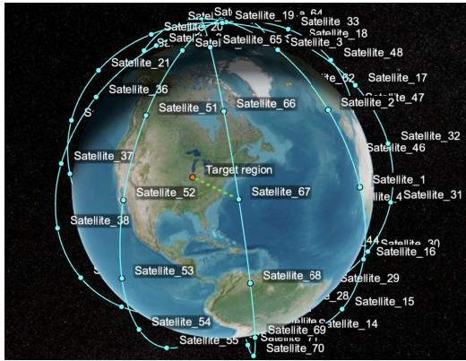

text_image

Satellite_21
Satellite_20
Satellite_65
Satellite_33
Satellite_18
Satellite_48
Satellite_32
Satellite_17
Satellite_2'te_47
Satellite_36
Satellite_51
Satellite_66
Satellite_32
Satellite_46
Satellite_1
Satellite_4Satellite_31
Satellite_37
Satellite_52
Satellite_67
Satellite_53
Satellite_54
Satellite_55
Satellite_68
Satellite_29
Satellite_28
Satellite_15
Satellite_30
Satellite_16
Satellite_69
Satellite_71
Satellite_70
Target region

Fig. 3. Illustration of the satellite constellation constructed based on the walkerStar function.

SAGIN Setting: We consider $K = 5 0$ ground devices located at a squared target region of 1200 m × 1200 m. There are $N \ = \ 5$ air nodes at a height of 20 km above the target area, each serving 10 ground devices without overlapping. A series of LEO satellites cover the target region in each global round, where we adopt the walkerStar function in MATLAB to construct a constellation model. Fig. 3 shows the created satellite constellation, where 80 LEO satellites are distributed evenly across 5 different orbits with altitude of 800 km and inclination of $8 5 ^ { \circ }$ . We set the minimum elevation angle to communicate to $1 5 ^ { \circ }$ , and the latitude and longitude of the target region are $4 0 ^ { \circ }$ N and $8 6 ^ { \circ }$ W, respectively. We use accessIntervals function to calculate the coverage time of each satellite over the target region. Referring to the settings of prior works [31], [37], [40], we adopt the following parameter values for simulations: $f _ { \mathsf { G } , k } = 1 0 ^ { \mathsf { \bar { 8 } } }$ Hz, $f _ { \mathsf { A } , n } = 1 0 ^ { 9 } \mathrm { H z } , f _ { \mathsf { S } , i } \in [ 1 , 1 0 ] \times 1 0 ^ { 9 } \mathrm { H z } , m _ { \mathsf { G } , k } = m _ { \mathsf { A } , n } = m _ { \mathsf { S } } =$ $3 \times 1 0 ^ { 9 }$ pG,k = Mbps, $p _ { \mathsf { A } , n } = 1$ $p _ { \mathsf { S } , i } ~ =$ $Z _ { i , i + 1 } ^ { 1 \bar { \mathsf { S L } } , ( r ) } = \bar { 3 } . 1 2 5$ $N _ { 0 } = 3 . 9 8 \times 1 0 ^ { - 2 1 }$ space layer over the target region, the CPU frequencies of satellites $f _ { \mathsf { S } , i }$ are sampled from a specific uniform distribution $[ 1 , 1 0 ] \times 1 0 ^ { 9 }$ .

The training set of each dataset is distributed to the ground devices in two different scenarios: IID (independent and identically distributed) and non-IID cases. For the IID case, we allocate the training samples to the ground devices uniformly at random. For the non-IID scenario, we sort the training set according to each sample’s class, split the sorted dataset into 200 shards, and then randomly assign 4 shards to each ground device. This introduces heterogeneous data distributions among ground devices. Note that the nodes in the space and air layers do not hold data at the beginning. We set the portion of non-sensitive to $\alpha _ { k } = \alpha = 0 . 8$ for all ground devices, and also study the effect of α in Section VI-C.

Comparison Schemes: For baselines, we first consider the scheme where only the ground devices process data without any data offloading, to see the advantage of adopting nodes in space and air layers as edge computing units. Satellites and air nodes are only used to aggregate the updated models. This baseline represents the majority of existing works that do not involve data offloading. Secondly, we consider optimizing data offloading only between the air and ground layers. Hence, the satellite-side computation power is not utilized during local model updates. Similarly, we optimize data offloading only between ground and space layers, without using the computational capabilities of air nodes during local update. We also consider the static optimization scheme, which applies our optimization strategy only at the initial global round and keeps the same solution throughout the remaining FL process. This baseline utilizes the computational resources of all three layers of SAGINs and is considered to see the impact of adaptive data offloading instead of using a fixed solution. Finally, we consider another baseline that utilizes the resources of all layers of SAGINs, where the number of data samples processed at each node is proportional to its computational power. For a fair comparison, we use FedAvg to aggregate the models in all baseline schemes and our methodology.

# B. Main Experimental Results

We first observe Fig. 4, which reports the accuracy versus training time plots in different settings. Our key takeaways are as follows. First, the scheme without data offloading achieves slow convergence, since the computation resources of space and air nodes are not utilized in this method. Utilizing only the computation resources of ground devices causes delays. We also observe that the fixed data offloading scheme achieves relatively low performance since the varying resource availability at the satellites are not considered in the scheme. If too many or too few data samples are offloaded to the space layer, the training process can be slowed down. This highlights the importance of adaptively optimizing data offloading, instead of relying on a fixed solution. We see that our approach, which leverages both the space and air layers, attains superior performance compared to the baselines that utilize only one of these layers. The proposed scheme also outperforms the scheme with optimized fixed data offloading and the baseline that conducts data offloading proportional to the computational power of each node in SAGINs. Further ablation studies on the effect of each layer are provided in the next subsection. The overall results highlight the significance of (i) inter-layer data offloading across space-air-ground, and (ii) adaptively conducting this to account for the network dynamics in SAGINs.

# C. Varying System Parameters

Effect of Computation Powers of Space and Air Nodes: In Fig. 5, we investigate the effect of computational capabilities at different layers, which can be adapted based on the battery constraint of each node. In extreme cases, the CPU frequency can drop to 0 if the battery is close to $0 ,$ and it can reach the maximum CPU frequency if the battery is sufficient. MNIST is considered in a non-IID setup. For these experiments, we set the CPU frequencies of space and air nodes (i.e., fS and $f _ { \mathsf { A } }$ , respectively) to the values depicted in the figure. Fig. 5a first shows the portion of data samples processed at each layer in our solution, depending on $f _ { \mathsf { S } }$ and $f _ { \mathsf { A } }$ . In the first case with $f _ { \mathsf { S } } = 3 \times 1 0 ^ { 9 }$ Hz and $f _ { \mathsf { A } } = 1 0 ^ { 9 }$ Hz (a scenario where both space and air nodes have insufficient battery), a relatively large number of data samples are allocated to the ground layer due to the limited batteries at the space and air nodes. The air layer is allocated with more data samples than the space layer, indicating that the air nodes are considered more important than the satellites. This can be also confirmed from the accuracy curve in Fig. 5b, by comparing the scheme without satellites and the one without air nodes. Now if $f _ { \mathsf { A } }$ increases from $1 0 ^ { 9 }$ Hz to $3 \times 1 0 ^ { 9 }$ Hz (i.e., a scenario where the air node has more battery compared to the previous case),

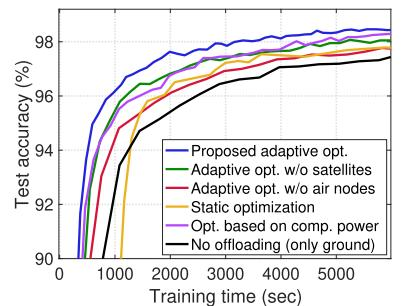

line

| Training time (sec) | Proposed adaptive opt. | Adaptive opt. w/o satellites | Adaptive opt. w/o air nodes | Static optimization | Opt. based on comp. power | No offloading (only ground) |
| ------------------- | ---------------------- | ----------------------------- | --------------------------- | -------------------- | ------------------------- | ---------------------------- |
| 0                   | 90.0                   | 90.0                          | 90.0                        | 90.0                 | 90.0                      | 90.0                         |
| 1000                | 96.5                   | 96.0                          | 95.5                        | 94.5                 | 95.0                      | 93.0                         |
| 2000                | 97.5                   | 97.0                          | 96.5                        | 95.5                 | 96.0                      | 94.0                         |
| 3000                | 98.0                   | 97.5                          | 97.0                        | 96.5                 | 97.0                      | 95.0                         |
| 4000                | 98.2                   | 97.8                          | 97.3                        | 97.0                 | 97.5                      | 96.0                         |
| 5000                | 98.3                   | 98.0                          | 97.5                        | 97.2                 | 97.8                      | 96.5                         |
| 6000                | 98.4                   | 98.1                          | 97.6                        | 97.3                 | 97.9                      | 96.8                         |

(a) MNIST, IID

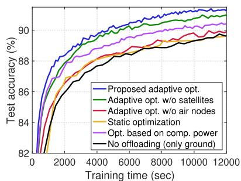

line

| Training time (sec) | Proposed adaptive opt. | Adaptive opt. w/o satellites | Adaptive opt. w/o air nodes | Static optimization | Opt. based on comp. power | No offloading (only ground) |
| ------------------- | ---------------------- | ----------------------------- | --------------------------- | -------------------- | ------------------------- | ---------------------------- |
| 0                   | 82.0                   | 82.0                          | 82.0                        | 82.0                 | 82.0                      | 82.0                         |
| 2000                | 88.5                   | 87.5                          | 86.5                        | 86.0                 | 87.0                      | 85.5                         |
| 4000                | 90.0                   | 89.0                          | 88.0                        | 87.5                 | 88.5                      | 87.0                         |
| 6000                | 90.5                   | 90.0                          | 89.0                        | 88.5                 | 89.5                      | 88.0                         |
| 8000                | 91.0                   | 90.5                          | 89.5                        | 89.0                 | 90.0                      | 89.0                         |
| 10000               | 91.5                   | 91.0                          | 90.0                        | 89.5                 | 90.5                      | 89.5                         |
| 12000               | 92.0                   | 91.5                          | 90.5                        | 90.0                 | 91.0                      | 90.0                         |

(b) FMNIST, IID

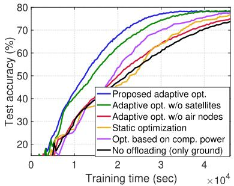

line

| Training time (sec) | Proposed adaptive opt. | Adaptive opt. w/o satellites | Adaptive opt. w/o air nodes | Static optimization | Opt. based on comp. power | No offloading (only ground) |
| ------------------- | ---------------------- | ----------------------------- | --------------------------- | -------------------- | ------------------------- | ---------------------------- |
| 0                   | 0                      | 0                             | 0                           | 0                    | 0                         | 0                            |
| 10000               | 65                     | 60                            | 55                          | 50                   | 55                        | 45                           |
| 20000               | 75                     | 70                            | 65                          | 60                   | 65                        | 55                           |
| 30000               | 78                     | 75                            | 70                          | 65                   | 70                        | 60                           |
| 40000               | 80                     | 78                            | 75                          | 70                   | 75                        | 65                           |

(c) CIFAR-10, IID

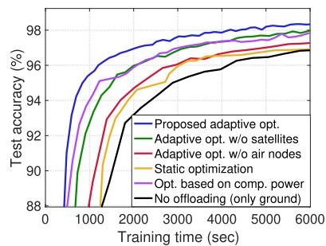

line

| Training time (sec) | Proposed adaptive opt. | Adaptive opt. w/o satellites | Adaptive opt. w/o air nodes | Static optimization | Opt. based on comp. power | No offloading (only ground) |
| ------------------- | ---------------------- | ---------------------------- | --------------------------- | -------------------- | ------------------------- | --------------------------- |
| 0                   | 88                     | 88                           | 88                          | 88                   | 88                        | 88                          |
| 1000                | 96                     | 95                           | 94                          | 93                   | 92                        | 91                          |
| 2000                | 97                     | 96                           | 95                          | 94                   | 93                        | 92                          |
| 3000                | 97.5                   | 96.5                         | 96                          | 95                   | 94                        | 93                          |
| 4000                | 98                     | 97                           | 96.5                        | 96                   | 95                        | 94                          |
| 5000                | 98                     | 97.5                         | 97                          | 96.5                 | 96                        | 95                          |
| 6000                | 98                     | 98                           | 97.5                        | 97                   | 97                        | 96                          |

(d) MNIST,Non-IID

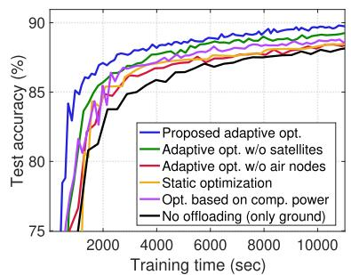

line

| Training time (sec) | Proposed adaptive opt. | Adaptive opt. w/o satellites | Adaptive opt. w/o air nodes | Static optimization | Opt. based on comp. power | No offloading (only ground) |
| ------------------- | ---------------------- | ----------------------------- | --------------------------- | -------------------- | ------------------------- | --------------------------- |
| 0                   | 75                     | 75                            | 75                          | 75                   | 75                        | 75                          |
| 2000                | 85                     | 84                            | 83                          | 82                   | 81                        | 80                          |
| 4000                | 88                     | 87                            | 86                          | 85                   | 84                        | 83                          |
| 6000                | 89                     | 88                            | 87                          | 86                   | 85                        | 84                          |
| 8000                | 90                     | 89                            | 88                          | 87                   | 86                        | 85                          |
| 10000               | 90                     | 89                            | 88                          | 87                   | 86                        | 85                          |

(e)FMNIST,Non-IID

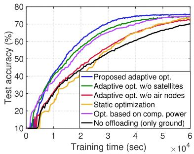

line

| Training time (sec) | Proposed adaptive opt. | Adaptive opt. w/o satellites | Adaptive opt. w/o air nodes | Static optimization | Opt. based on comp. power | No offloading (only ground) |
| ------------------- | ---------------------- | ----------------------------- | --------------------------- | -------------------- | ------------------------- | ---------------------------- |
| 0                   | 10                     | 10                            | 10                          | 10                   | 10                        | 10                           |
| 10000               | 40                     | 35                            | 30                          | 25                   | 30                        | 20                           |
| 20000               | 60                     | 55                            | 50                          | 45                   | 50                        | 35                           |
| 30000               | 70                     | 65                            | 60                          | 55                   | 60                        | 45                           |
| 40000               | 75                     | 70                            | 65                          | 60                   | 65                        | 55                           |
| 50000               | 78                     | 73                            | 70                          | 65                   | 70                        | 60                           |
| 60000               | 80                     | 75                            | 73                          | 70                   | 73                        | 65                           |

(f) CIFAR-10, Non-IID

Fig. 4. Accuracy versus training time plots. For the static optimization scheme, we apply our inter-layer data offloading scheme only in the first global round and keep the intra-layer data fixed throughout the remaining rounds. The results show the advantage of adaptive data offloading optimization considering both space and air layers.   
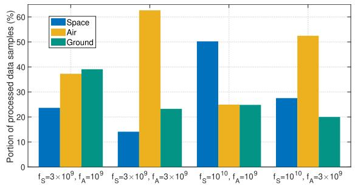

bar

| Category | Space | Air | Ground |
| -------- | ----- | --- | ------ |
| f_S=3×10^9, f_A=10^9 | 24 | 38 | 39 |
| f_S=3×10^9, f_A=3×10^9 | 14 | 63 | 23 |
| f_S=10^10, f_A=10^9 | 50 | 25 | 25 |
| f_S=10^10, f_A=3×10^9 | 28 | 53 | 20 |

(a) Portion of data samples processed at each layer. We increase the CPU frequency of the (i) air node,(ii) space node,and (ii) both.

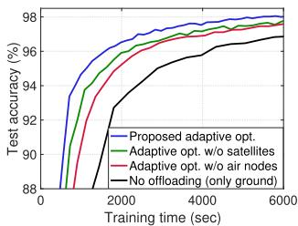

line

| Training time (sec) | Proposed adaptive opt. | Adaptive opt. w/o satellites | Adaptive opt. w/o air nodes | No offloading (only ground) |
| ------------------- | ---------------------- | ----------------------------- | --------------------------- | ---------------------------- |
| 0                   | 88.0                   | 88.0                          | 88.0                        | 88.0                         |
| 1000                | 94.0                   | 93.5                          | 93.0                        | 92.5                         |
| 2000                | 96.5                   | 96.0                          | 95.5                        | 95.0                         |
| 3000                | 97.5                   | 97.0                          | 96.5                        | 96.0                         |
| 4000                | 97.8                   | 97.5                          | 97.0                        | 96.5                         |
| 5000                | 97.9                   | 97.8                          | 97.5                        | 97.0                         |
| 6000                | 98.0                   | 98.0                          | 97.8                        | 97.5                         |

(b) Performance with $f _ { \mathsf { S } } = 3 { \times } 1 0 ^ { 9 }$ Hz, $f _ { \mathsf { A } } = 1 0 ^ { 9 } ~ \mathrm { H z }$

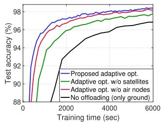

line

| Training time (sec) | Proposed adaptive opt. | Adaptive opt. w/o satellites | Adaptive opt. w/o air nodes | No offloading (only ground) |
| ------------------- | ---------------------- | ---------------------------- | --------------------------- | ---------------------------- |
| 0                   | 88.0                   | 88.0                         | 88.0                        | 88.0                         |
| 1000                | 97.5                   | 96.0                         | 96.5                        | 93.0                         |
| 2000                | 98.0                   | 97.0                         | 97.5                        | 94.0                         |
| 3000                | 98.2                   | 97.5                         | 97.8                        | 95.0                         |
| 4000                | 98.3                   | 97.8                         | 98.0                        | 96.0                         |
| 5000                | 98.4                   | 98.0                         | 98.2                        | 96.5                         |
| 6000                | 98.5                   | 98.2                         | 98.3                        | 97.0                         |
| 7000                | 98.6                   | 98.3                         | 98.4                        | 97.5                         |
| 8000                | 98.7                   | 98.4                         | 98.5                        | 98.0                         |
| 9000                | 98.8                   | 98.5                         | 98.6                        | 98.5                         |
| 10000               | 98.9                   | 98.6                         | 98.7                        | 98.8                         |
| 20000               | 99.0                   | 98.7                         | 98.8                        | 99.0                         |
| 30000               | 99.1                   | 98.8                         | 98.9                        | 99.2                         |
| 40000               | 99.2                   | 98.9                         | 99.0                        | 99.4                         |
| 50000               | 99.3                   | 99.0                         | 99.1                        | 99.5                         |
| 60000               | 99.4                   | 99.1                         | 99.2                        | 99.6                         |
| 70000               | 99.5                   | 99.2                         | 99.3                        | 99.7                         |
| 80000               | 99.6                   | 99.3                         | 99.4                        | 99.8                         |
| 90000               | 99.7                   | 99.4                         | 99.5                        | 99.9                         |
| 100000              | 99.8                   | 99.5                         | 99.6                        | 100.0                        |
| 200000              | 100.0                  | 100.0                        | 100.0                       | -                            |
| 300000              | -                      | -                            | -                           | -                            |
| 400000              | -                      | -                            | -                           | -                            |
| 500000              | -                      | -                            | -                           | -                            |
| 600000              | -                      | -                            | -                           | -                            |
| 700000              | -                      | -                            | -                           | -                            |
| 800000              | -                      | -                            | -                           | -                            |
| 900000              | -                      | -                            | -                           | -                            |
| 1000000             | -                      | -                            | -                           | -                            |
| 215622              | -                      | -                            | -                           | -                            |
| 315622              | -                      | -                            | -                           | -                            |
| 415622              | -                      | -                            | -                           | -                            |
| 515622              | -                      | -                            | -                           | -                            |
| 615622              | -                      | -                            | -                           | -                            |
| 715622              | -                      | -                            | -                           | -                            |
| 815622              | -                      | -                            | -                           | -                            |
| 915622              | -                      | -                            | -                           | -                            |
| 111111              | -                      | -                            | -                           | -                            |
| 211111              | -                      | -                            | -                           | -                            |
| 311111              | -                      | -                            | -                           | -                            |
| 411111              | -                      | -                            | -                           | -                            |
| 511111              | -                      | -                            | -                           | -                            |
| 611111              | -                      | -                            | -                           | -                            |
| 711111              | -                      | -                            | -                           | -                            |
| 811111              | -                      | -                            | -                           | -                            |
| 911111              | -                      | -                            | -                           | -                            |
| 1111122             | -                      | -                            | -                           | -                            |
| 2111122             | -                      | -                            | -                           | -                            |
| 3111122             | -                      | -                            | -                           | -                            |
| 4111122             | -                      | -                            | -                           | -                            |
| 5111122             | -                      | -                            | -                           | -                            |
| 6111122             | -                      | -                            | -                           | -                            |
| 7111122             | -                      | -                            | -                           | -                            |
| 8111122             | -                      | -                            | -                           | -                            |
| 9111122             | -                      | -                            | -                           | -                            |
| 1111133             | -                      | -                            | -                           | -                            |
| 2111133             | -                      | -                            | -                           | -                            |
| 3111133             | -                      | -                            | -                           | -                            |
| 4111133             | -                      | -                            | -                           | -                            |
| 5111133             | -                      | -                            | -                           | -                            |
| 6111133             | -                      | -                            | -                           | -                            |
| 7111133             | -                      | -                            | -                           | -                            |
| 8111133             | -                      | -                            | -                           | -                            |
| 9111334             | -                      | -                            | -                           | -                            |
| 1        (after label)   A      A          A          B      C       D       E       F       G       H         I       J       K       L       M       N       O       P       Q       R       S       T       U       V       W       X       Y       Z     A           B     C           D     E           F     G         H         I         J         K         L         M         N         O         P         Q         R         S         T         U         V         W         X         Y         Z         Z         Z         AA         AB         AC         AD         AE         AF         AG         AH         AI         AJ         AK         AL         AM         AN         AO         AP         AQ         AQ         AR         AS         AT         AU         AV         AW         AX         AX         AXB         AXB         AXB         AXN         AXN         AXN         AXN         AXN         AXN         AXN         AXN         AXN         AXN         AXN         AXN         AXN         AXN         AXN         AXN         AXN         AXN         AXN         AXN         AXN         AXN         AXN         AXN         AXN         AXN         AXN         AXN         AXN         AXN         AXN         AXN         AXN         AXN     A          A          A          A          A          A          A          A          A          A          A          A          A          A          A          A          A          A          A          A          A          A          A          A          A          A          A          A          A          A          A          A          A          A          A          A          A          A          A          A          A          A          A          A          A          A          A          A          A          A          A           A          A          A          A          A          A          A          A          A          A          A          A          A          A          A          A          A          A          A          A          A          A          A          A          A          A          A          A          A          A          A          A          A          A          A          A          A          A          A          A          A          A          A          A          A          A          A          A          A          A, B            B            B            B            B            B            B            B            B            B            B            B            B            B            B            B            B            B            B            B            B            B            B            B            B            B            B            B            B            B            B            B            B            B            B            B            B            B            B            B            B            B            B            B            B            B            B            B            B            B            B           B           B           B           B           B           B           B           B           B           B           B           B           B           B           B           B           B           B           B           B           B           B           B           B           B           B           B           B           B           B           B           B           B           B           B           B           B           B           B           B           B           B           B           B           B           B           B           B           B           B, C            C           C           C           C           C           C           C           C           C           C           C           C           C           C           C           C           C           C           C           C           C           C           C           C           C           C           C           C           C           C           C           C           C           C           C           C           C           C           C           C           C           C           C           C           C           C           C           C           C, D            D            D            D            D            D            D            D            D            D            D            D            D            D            D            D            D            D            D            D            D            D            D            D            D            D            D            D            D            D            D            D            D            D            D            D            D            D            D            D            D            D            D            D            D            D            D            D            D            D            D, E             E             E             E             E             E             E             E             E             E             E             E             E             E             E             E             E             E             E             E             E             E             E             E             E             E             E             E             E             E             E             E             E             E             E             E             E             E             E             E             E             E             E             E             E             E             E             E             E             E             E                             ...        ...        ...        ...        ...        ...        ...        ...        ...        ...        ...        ...        ...        ...        ...        ...        ...        ...        ...        ...        ...        ...        ...        ...        ...        ...        ...        ...        ...        ...        ...        ...        ...        ...        ...        ...        ...        ...        ...        ...        ...        ...        ...        ...        ...        ...        ...        ...        ...        ...        ...    #FFA5FFA               #FFA5FFA                #FFA5FFA                #FFA5FFA                #FFA5FFA                #FFA5FFA                #FFA5FFA                #FFA5FFA                #FFA5FFA                #FFA5FFA                #FFA5FFA                #FFA5FFA                #FFA5FFA                #FFA5FFA                #FFA5FFA                #FFA5FFA                #F      #F      #F      #F      #F      #F      #F      #F      #F      #F      #F      #F      #F      #F      #F      #F      #F      #F      #F      #F      #F      #F      #F      #F      #F      #F      #F      #F      #F      #F      #F      #F      #F      #F      %              %              %              %              %              %              %              %              %              %              %              %              %              %              %              %              %              %              %              %              %              %              %              %              %              %              %              %              %              %              %              %              %              %              %              %              %              %              %              %              %              %              %              %              %              %              %              %              %              %              %                              .                    .                    .                    .                    .                    .                    .                    .                    .                    .                    .                    .                    .                    .                    .                    .                    .                    .                    .                    .                    .                    .                    .                    .                    .                    .                    .                    .                    .                    .                    .                    .                    .                    .                    .                    .                    .                    .                    .                    .                    .                    .                    .                    .                    .                    .                    .                    .                    .                    .                    .                     .
The data is presented in a CSV format with three columns: 'Test accuracy (%)' and 'Value' for each row of the data points from the last row to the end row of the data points in the data points; 'Type' indicates the data point type; 'Error' indicates the error in the data point; 'No offloading (%)' indicates the number of offloading points; 'AP' indicates the average offloading points; 'P' indicates the percentage of offloading points; 'Q' indicates the percentage of offloading points; 'R' indicates the percentage of offloading points; 'S' indicates the percentage of offloading points; 'T' indicates the percentage of offloading points; 'U' indicates the percentage of offloading points; 'V' indicates the percentage of offloading points; 'W' indicates the percentage of offloading points; 'X' indicates the percentage of offloading points; 'Y' indicates the percentage of offloading points; 'Z' indicates the percentage of offloading points; 'E' indicates the percentage of offloading points; 'G' indicates the percentage of offloading points; 'H' indicates the percentage of offloading points; 'I' indicates the percentage of offloading points; 'J' indicates the percentage of offloading points; 'K' indicates the percentage of offloading points; 'L' indicates the percentage of offloading points; 'M' indicates the percentage of offloading points; 'N' indicates the percentage of offloading points; 'O' indicates the percentage of offloading points; 'P' indicates the percentage of offloading points; 'Q' indicates the percentage of offloading points; 'Q' indicates the percentage of offloading points; 'R' indicates the percentage of offloading points; 'S' indicates the percentage of offloading points; 'X' indicates the percentage of offloading points; 'Y' indicates the percentage of offloading points; 'Z' indicates the percentage of offloading points; 'R' indicates the percentage of offloading points; 'S' indicates the percentage of offloading points; 'T' indicates the percentage of offloading points; 'W' indicates the percentage of offloading points; 'X' indicates the percentage of offloading points; 'W' indicates the percentage of offloading points; 'Y' indicates the percentage of offloading points; 'Z' indicates the percentage of offloading points; 'E' indicates the percentage of offloading points; 'E' indicates the percentage of offloading points; 'U' indicates the percentage of offloading points; 'U' indicates the percentage of offloading points; 'U' indicates the percentage of offloading points; 'U' indicates the percentage of offloading points; 'U' indicates the percentage of offloading points; 'U' indicates the percentage of offloading points; 'U' indicates the percentage of offloading points; 'U' indicates the percentage of offloading points; 'U' indicates the percentage of offloading points; 'U', 'U', 'U', 'U', 'U', 'U', 'U', 'U', 'U', 'U', 'U', 'U', 'U', 'U', 'U', 'U', 'U', 'U', 'U', 'U', 'U', 'U', 'U', 'U', 'U', 'U', 'U', 'U', 'U', 'U', 'U', 'U', 'U', 'U', ‘U', 'U', 'U', 'U', 'U', 'U', 'U', 'U', 'U', 'U', 'U', 'U', 'U', 'U', 'U', 'U', 'U', 'U', 'U', 'U', 'U', 'U', 'U', 'U', 'U', 'U', 'U', 'U', 'U', 'U', 'U', 'U', 'U', 'X', 'U', 'U', 'U', 'U', 'U', 'U', 'U', 'U', 'U', 'U', 'U', 'U', 'U', 'U', 'U', 'U', 'U', 'U', 'U', 'U', 'U', 'U', 'U', 'U', 'U', 'U', 'U', 'U', 'U', 'U', 'U', 'U', 'U' , U, U, U, U, U, U, U, U, U, U, U, U, U, U, U, U, U, U, U, U, U, U, U, U, U, U, U, U, U, U, U, U, U, U, U, U, U, U, U, U, U, U, U, U, U, U, U, U, U, U, U<fcel>The data is presented in a CSV format with three columns: 
- Data Series: Proposed adaptive opt., Adaptive opt. w/o satellites, Adaptive opt. w/o air nodes, Adaptive opt. w/o air nodes, No offloading (%): 
- Adaptive opt.: 
- Adaptive opt.: 
- Adaptive opt.: 
- Adaptive opt.: 
- Adaptive opt.: 
- Adaptive opt.: 
- Adaptive opt.: 
- Adaptive opt.: 
- Adaptive opt.: 
- Adaptive opt.: 
- Adaptive opt.: 
- Adaptive opt.: 
- Adaptive opt.: 
- Adaptive opt.: 
- Adaptive opt.: 
- Adaptive opt.: 
- Adaptive opt.: 
- Adaptive opt.: 
- Adaptive opt.: 
- Adaptive opt.: 
- Adaptive opt: 
- Adaptive opt.: 
- Adaptive opt.: 
- Adaptive opt.: 
- Adaptive opt.: 
- Adaptive opt.: 
- Adaptive opt.: 
- Adaptive opt.: 
- Adaptive opt.: 
- Adaptive opt.: 
- Adaptive opt.: 
- Adaptive opt.: 
- Adaptive opt.: 
- Adaptive opt.: 
- Adaptive opt.: 
- Adaptive opt.: 
- Adaptive opt.: 
- Adaptive opt.: 
- Adaptive opt.: 
- Adaptive opt.: 
- Adaptive opt./Adaptive opt./Adaptive opt./Adaptive opt./Adaptive opt./Adaptive opt./Adaptive opt./Adaptive opt./Adaptive opt./Adaptive opt./Adaptive opt./Adaptive opt./Adaptive opt./Adaptive opt./Adaptive opt./Adaptive opt./Adaptive opt./Adaptive opt./Adaptive opt./Adaptive opt./Adaptive opt./Adaptive opt./Adaptive opt./Adaptive opt./Adaptive opt./Adaptive opt./Ad progressive opt./Adaptive opt./Adaptive opt./Adaptive opt./Adaptive opt./Adaptive opt./Adaptive opt./Adaptive opt./Adaptive opt./Adaptive opt./Adaptive opt./Adaptive opt./Adaptive opt./Adaptive opt./Adaptive opt./Adaptive opt./Adaptive opt./Adaptive opt./Adaptive opt./Adaptive opt./Adaptive opt./Adaptive opt./Adaptive opt./Adaptive opt./Adaptive opt./Adgressive opt./Adaptive opt./Adaptive opt./Adaptive opt./Adaptive opt./Adaptive opt./Adaptive opt./Adaptive opt./Adaptive opt./Adaptive opt./Adaptive opt./Adaptive opt./Adaptive opt./Adaptive opt./Adaptive opt./Adaptive opt./Adaptive opt./Adaptive opt./Adaptive opt./Adaptive opt./Adaptive opt./Adaptive opt./Adaptive opt./Adaptive opt./Adaptive opt./Adactive opt./Adaptive opt./Adaptive opt./Adaptive opt./Adaptive opt./Adaptive opt./Adaptive opt./Adaptive opt./Adaptive opt./Adaptive opt./Adaptive opt./Adaptive opt./Adaptive opt./Adaptive opt./Adaptive opt./Adaptive opt./Adaptive opt./Adaptive opt./Adaptive Opto/Opt/Opt/Opt/Opt/Opt/Opt/Opt/Opt/Opt/Opt/Opt/Opt/Opt/Opt/Opt/Opt/Opt/Opt/Opt/Opt/Opt/Opt/Opt/Opt/Opt/Opt/Opt/Opt/Opt/Opt/Opt/Opt/Opt/Opt/Opt/Opt/Opt/Opt/Opt/Opt/Opt/Opt/Opt/Opt/Opt/Opt/Opt/Opt/Opt/Opt/Ont/Opt/Opt/Opt/Opt/Opt/Opt/Opt/Opt/Opt/Opt/Opt/Opt/Opt/Opt/Opt/Opt/Opt/Opt/Opt/Opt/Opt/Opt/Opt/Opt/Opt/Opt/Opt/Opt/Opt/Opt/Opt/Opt/Opt/Opt/Opt/Opt/Opt/Opt/Opt/Opt/Opt/Opt/Opt/Opt/Opt/Opt/Opt/Opt/Opt/Omp\n* Note: The actual values may vary due to random sampling or data generation in this dataset.

(c）Performance with $f _ { \mathsf { S } } = 1 0 ^ { 1 0 }$ Hz, $f _ { \mathsf { A } } = 1 0 ^ { 9 } ~ \mathrm { H z } .$   
Fig. 5. Effect of computation capabilities of space/air nodes.

the portion of data samples processed at the air node becomes more dominant. On the other hand, if we increase $f _ { \mathsf { S } }$ from $1 0 ^ { 9 }$ Hz to $1 0 ^ { 1 0 }$ Hz $( \mathrm { i . e . }$ , if the satellite has sufficient battery) while setting $f _ { \mathsf { A } } = 1 0 ^ { 9 } \mathrm { H z } ,$ the role of the space layer becomes crucial, as also verified in Fig. 5c. Finally, when both space and air layers have sufficient resources $( f _ { \mathsf { S } } = 1 0 ^ { 1 0 }$ Hz and $f _ { \mathsf { A } } = 3 \times 1 0 ^ { 9 }$ Hz), only 20% of data samples are allocated to the ground layer. This allocation is the minimum amount of data that should be processed at the ground layer considering the portion of non-sensitive samples $( \alpha = 0 . 8 )$ . Again, the results underscore the significance of taking advantage of the computation resources across all layers in SAGINs during the FL process.

Effect of the Portion of Non-Sensitive Data: In Fig. 6, we also study how the portion of non-sensitive samples α in each ground device’s local dataset, affects the FL performance. If all data samples are privacy-sensitive (i.e., $\alpha ~ = ~ 0 )$ , the setting reduces to conventional FL with no data offloading. Accuracy curves and the training time required to achieve the target accuracy are reported under the non-IID setting. We see that our methodology achieves the target accuracy faster as α increases, since a larger α provides a more flexible data offloading solution for our scheme.

Experiments With Free-Space Path Loss Model: In practice, there often exists a line-of-sight link between the ground device and the air node. To validate the effectiveness of our approach under this setting, we use the free-space path loss model between the ground device and the air node, as adopted in [49] and [50], considering that the line-of-sight link is dominant. We also adopt this free-space path loss model for satellite communication, where there is always a lineof-sight link. Fig. 7 shows the results using the CIFAR-10 dataset in both IID and non-IID scenarios. Compared to the setting with Rayleigh fading in Fig. 4, all schemes in Fig. 7 achieve faster convergence with less training time due to the reduced communication delay. It can be seen that our scheme consistently outperforms existing baselines by strategically taking advantage of the resources across space-air-ground integrated networks. The overall results further confirm the effectiveness and applicability of our method.

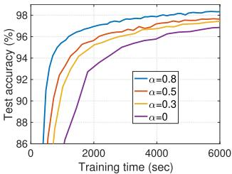

line

| Training time (sec) | α=0.8 | α=0.5 | α=0.3 | α=0 |
| ------------------- | ----- | ----- | ----- | --- |
| 0                   | 86    | 86    | 86    | 86  |
| 1000                | 94    | 93    | 92    | 91  |
| 2000                | 96    | 95    | 94    | 93  |
| 3000                | 97    | 96    | 95    | 94  |
| 4000                | 97.5  | 96.5  | 95.5  | 94.5 |
| 5000                | 98    | 97    | 96    | 95  |
| 6000                | 98    | 97    | 96    | 95  |

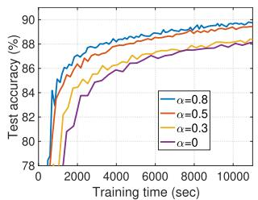

line

| Training time (sec) | α=0.8 | α=0.5 | α=0.3 | α=0 |
| ------------------- | ----- | ----- | ----- | --- |
| 0                   | 78    | 78    | 78    | 78  |
| 2000                | 86    | 85    | 84    | 83  |
| 4000                | 88    | 87    | 86    | 85  |
| 6000                | 89    | 88    | 87    | 86  |
| 8000                | 89.5  | 89    | 88    | 87  |
| 10000               | 90    | 89.5  | 89    | 88  |

(a)Accuracy versus training time on MNIST.   
(b)Accuracy versus training time on FMNIST.

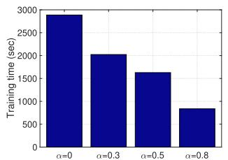

bar

| α     | Training time (sec) |
|-------|---------------------|
| 0     | 2900                |
| 0.3   | 2000                |
| 0.5   | 1600                |
| 0.8   | 800                 |

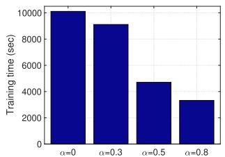

bar

| α     | Training time (sec) |
|-------|---------------------|
| 0     | 10000               |
| 0.3   | 9000                |
| 0.5   | 4500                |
| 0.8   | 3500                |

(c) Training time to achieve 95% accuracy on MNIST.   
(d) Training time to achieve 88% accuracy on FMNIST.

Fig. 6. Effect of the portion of non-sensitive samples on our solution (α = 0 reduces to no data offloading).   
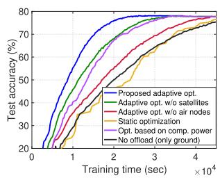

line

| Training time (sec) | Proposed adaptive opt. | Adaptive opt. w/o satellites | Adaptive opt. w/o air nodes | Static optimization | Opt. based on comp. power | No offload (only ground) |
| ------------------- | ---------------------- | ---------------------------- | --------------------------- | -------------------- | ------------------------ | ------------------------ |
| 0                   | 20                     | 20                           | 20                          | 20                   | 20                       | 20                       |
| 10000               | 60                     | 55                           | 50                          | 45                   | 55                       | 40                       |
| 20000               | 75                     | 70                           | 65                          | 60                   | 70                       | 55                       |
| 30000               | 80                     | 75                           | 70                          | 65                   | 75                       | 65                       |
| 40000               | 80                     | 75                           | 70                          | 65                   | 75                       | 65                       |

(a) CIFAR-10, IID

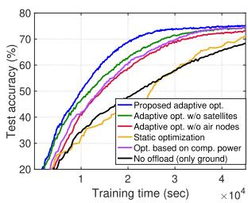

line

| Training time (sec) | Proposed adaptive opt. | Adaptive opt. w/o satellites | Adaptive opt. w/o air nodes | Static optimization | Opt. based on comp. power | No offload (only ground) |
| ------------------- | ---------------------- | ---------------------------- | --------------------------- | -------------------- | ------------------------ | ------------------------ |
| 0                   | 20                     | 20                           | 20                          | 20                   | 20                       | 20                       |
| 10000               | 60                     | 55                           | 50                          | 45                   | 40                       | 35                       |
| 20000               | 70                     | 65                           | 60                          | 55                   | 50                       | 45                       |
| 30000               | 75                     | 70                           | 65                          | 60                   | 55                       | 50                       |
| 40000               | 78                     | 73                           | 70                          | 65                   | 60                       | 55                       |
| 50000               | 80                     | 75                           | 73                          | 70                   | 65                       | 60                       |
| 60000               | 82                     | 78                           | 75                          | 73                   | 70                       | 65                       |
| 70000               | 83                     | 80                           | 78                          | 75                   | 73                       | 70                       |
| 80000               | 84                     | 82                           | 80                          | 78                   | 75                       | 73                       |
| 90000               | 85                     | 83                           | 82                          | 80                   | 78                       | 75                       |
| 100000              | 86                     | 84                           | 83                          | 82                   | 80                       | 78                       |
| 110000              | 87                     | 85                           | 84                          | 83                   | 82                       | 80                       |
| 120000              | 88                     | 86                           | 85                          | 84                   | 83                       | 82                       |
| 130000              | 89                     | 87                           | 86                          | 85                   | 84                       | 83                       |
| 140000              | 90                     | 88                           | 87                          | 86                   | 85                       | 84                       |
| 150000              | 91                     | 89                           | 88                          | 87                   | 86                       | 85                       |
| 160000              | 92                     | 90                           | 89                          | 88                   | 87                       | 86                       |
| 170000              | 93                     | 91                           | 90                          | 89                   | 88                       | 87                       |
| 180000              | 94                     | 92                           | 91                          | 90                   | 89                       | 88                       |
| 190000              | 95                     | 93                           | 92                          | 91                   | 90                       | 89                       |
| 200000              | 96                     | 94                           | 93                          | 92                   | 91                       | 90                       |
| 210000              | 97                     | 95                           | 94                          | 93                   | 92                       | 91                       |
| 220000              | 98                     | 96                           | 95                          | 94                   | 93                       | 92                       |
| 230000              | 99                     | 97                           | 96                          | 95                   | 94                       | 93                       |
| 240000              | 100                    | 98                           | 97                          | 96                   | 95                       | 94                       |
| 250000              | 101                    | 99                           | 98                          | 97                   | 96                       | 95                       |
| 260000              | 102                    | 100                          | 99                          | 98                   | 97                       | 96                       |
| 270000              | 103                    |        |                             |                      |                          |                          |
| Note: The data is extracted from the code and presented in CSV format as requested. The last row is a duplicate of the first row to close the circle in the chart. The values for the last row are estimated based on the original data. There is no additional data series in this case. The values for the last row should be calculated based on the formula used for the line chart.

(b) CIFAR-10,Non-IID   
Fig. 7. Experimental results using the free-space pathloss model with a dominant line-of-sight link.

# VII. CONCLUSION AND FUTURE DIRECTIONS

In this paper, we proposed a distributed ML methodology that orchestrates FL in space-air-ground integrated networks. The core idea was to take advantage of both computation and communication resources of different layers in SAGINs to facilitate/accelerate FL in remote regions. We analytically characterized the latency of our method, and proposed an adaptive data offloading solution to minimize the training time depending on the current resource availability. We also derived the convergence bound of the scheme and guaranteed convergence to a stationary point for non-convex loss functions. The advantages of the proposed method as well as the effects of system parameters are investigated via simulations.

There are several promising directions for future research in this domain. One direction is to optimize the trajectories of air nodes to achieve a better performance within our framework. Another direction is to introduce an additional layer by considering the base stations or geostationary earth orbit satellites that can connect to the LEO satellites, to further enhance the performance.

# APPENDIX

# A. Proof of Theorem 1

For ease of notation, we adopt the following equivalent form for the global loss function:

$$
F (\mathbf {w}) \triangleq \sum_ {i \in \mathcal {P}} \lambda_ {i} ^ {(r)} \ell_ {i} ^ {(r + 1)} (\mathbf {w}), \tag {39}
$$

where $\mathcal { P } \ : = \ \{ ( \mathsf { G } , k ) \mid k \in \mathcal { G } \} \cup \{ ( \mathsf { A } , n ) \mid n \in \mathcal { A } \cup \{ \mathsf { S } \}$ and Pi∈P λ(r)i $\begin{array} { r l r } { \sum _ { i \in \mathcal { P } } \lambda _ { i } ^ { ( r ) } } & { { } = } & { 1 } \end{array}$ . Additionally, we define $\begin{array} { r l } { \Phi _ { r } } & { { } = } \end{array}$ $\begin{array} { r } { \sum _ { h = 0 } ^ { H - 1 } \sum _ { i \in \mathcal { P } } \lambda _ { i } ^ { ( r ) } \mathbb { E } \left\| \mathbf { w } _ { i } ^ { ( r , h ) } - \mathbf { w } ^ { ( r ) } \right\| ^ { 2 } } \end{array}$ , where $\mathbf { w } _ { i } ^ { ( r , h ) }$ reprewithin the r-th round. It denotes the intermediate model in (3), (4), or (6). To prove the convergence of the proposed algorithm, we first investigate how each round of training reduces the global loss, as formalized in Lemma 1.

Lemma 1: Under Assumptions 1-3 and $\begin{array} { r l r } { \eta ^ { ( r ) } } & { { } \le } & { \frac { 1 } { 2 H L } , } \end{array}$ , we have

$$
\begin{array}{l} \mathbb {E} \left[ F \left(\mathbf {w} ^ {(r + 1)}\right) \right] \leq \mathbb {E} \left[ F \left(\mathbf {w} ^ {(r)}\right) \right] - \frac {\eta^ {(r)} H}{2} \mathbb {E} \left\| \nabla F \left(\mathbf {w} ^ {(r)}\right) \right\| ^ {2} \\ + \frac {\eta^ {(r)} L ^ {2}}{2} \Phi_ {r} + (\eta^ {(r)}) ^ {2} H L \sigma_ {g} ^ {2} \sum_ {i \in \mathcal {P}} \left(\lambda_ {i} ^ {(r)}\right) ^ {2}. \tag {40} \\ \end{array}
$$

To characterize the evolution of $\mathbb { E } \left\| \nabla F \left( \mathbf { w } ^ { ( r ) } \right) \right\| ^ { 2 }$ as shown in Theorem 1, we need to further bound the term $\begin{array} { r } { \Phi _ { r } \ = \ \sum _ { h = 0 } ^ { H - 1 } \sum _ { i \in \mathcal { P } } \lambda _ { i } ^ { ( r ) } \mathbb { E } \left\| \mathbf { w } _ { i } ^ { ( r , h ) } - \mathbf { w } ^ { ( r ) } \right\| ^ { 2 } } \end{array}$ that appears in Lemma 1. We establish an upper bound for Φr in Lemma 2.

Lemma 2: Under Assumptions 1-3 and $\begin{array} { r l r } { \eta ^ { ( r ) } } & { { } \le } & { \frac { 1 } { 2 H L } , } \end{array}$ we have

$$
\Phi_ {r} \leq 2 (1 + c _ {r}) H ^ {3} (\eta^ {(r)}) ^ {2} \mathbb {E} \left\| \nabla F (\mathbf {w} ^ {(r)}) \right\| ^ {2}
$$

$$
+ \frac {2}{3} H ^ {3} (\eta^ {(r)}) ^ {2} (\sigma_ {g} ^ {2} + 3 \delta_ {r} ^ {2}).
$$

The proofs of Lemmas 1 and 2 are provided in Appendix B. Combining Lemmas 1 and 2, we obtain

$$
\begin{array}{l} \mathbb {E} \left[ F \left(\mathbf {w} ^ {(r + 1)}\right) \right] \\ \leq \mathbb {E} \left[ F \left(\mathbf {w} ^ {(r)}\right) \right] - \frac {\eta^ {(r)} H}{2} \mathbb {E} \left\| \nabla F \left(\mathbf {w} ^ {(r)}\right) \right\| ^ {2} \\ + (\eta^ {(r)}) ^ {2} H L \sigma_ {g} ^ {2} \sum_ {i \in \mathcal {P}} (\lambda_ {i} ^ {(r)}) ^ {2} + \frac {\eta^ {(r)} L ^ {2}}{2} \left\{2 (1 + c _ {r}) H ^ {3} (\eta^ {(r)}) ^ {2} \right. \\ \times \mathbb {E} \left\| \nabla F (\mathbf {w} ^ {(r)}) \right\| ^ {2} + \frac {2}{3} H ^ {3} (\eta^ {(r)}) ^ {2} (\sigma_ {g} ^ {2} + 3 \delta_ {r} ^ {2}) \Biggr \}. \\ \end{array}
$$

Reorganizing the above inequality and utilizing (37) give rise to the following result:

$$
\begin{array}{l} \eta^ {(r)} \mathbb {E} \left\| \nabla F (\mathbf {w} ^ {(r)}) \right\| ^ {2} \\ \leq 4 \frac {\mathbb {E} \left[ F \left(\mathbf {w} ^ {(r)}\right) \right] - \mathbb {E} \left[ F \left(\mathbf {w} ^ {(r + 1)}\right) \right]}{H} \\ \end{array}
$$

$$
\begin{array}{l} + 4 (\eta^ {(r)}) ^ {2} L \sigma_ {g} ^ {2} \sum_ {i \in \mathcal {P}} (\lambda_ {i} ^ {(r)}) ^ {2} \\ + 2 (\eta^ {(r)}) ^ {3} H ^ {2} L ^ {2} \sigma_ {g} ^ {2} + 4 (\eta^ {(r)}) ^ {3} H ^ {2} L ^ {2} \delta_ {r} ^ {2}. \\ \end{array}
$$

By telescopic expansion of the above inequality from $r = 0 \ { \mathrm { t o } } \ R - 1$ , we can obtain the result shown in Theorem 1.

# B. Proof of Lemmas

1) Proof of Lemma 1: For ease of notation, we denote {S} as a mini-batch gradient e(r,h)i , i ∈ P = {(G, k) | k ∈ G} ∪ {(A, n) | n ∈ A} ∪ $e _ { i } ^ { ( r , h ) } , i \in  { \mathcal { P } } \ = \ \{ ( \ @ , k ) \mid k \in  { \mathcal { G } } \} \cup \{ ( \mathsf { A } , n ) \mid n \in  { \mathcal { A } } \} \cup$ 0 $\begin{array} { r } { \tilde { \nabla } \bar { \ell } _ { \mathsf { G } , k } ^ { ( r + 1 ) } ( \mathbf w _ { \mathsf { G } , k } ^ { ( r , h ) } ) , k \in \bar { \textrm {  { g } } } . } \end{array}$ $\tilde { \nabla } \ell _ { \mathsf { A } , n } ^ { ( r + 1 ) } ( \mathbf { w } _ { \mathsf { A } , n } ^ { ( r , h ) } ) , n \in \mathcal { A } , \mathrm { o r } ~ \tilde { \nabla } \ell _ { \mathsf { S } } ^ { ( r + 1 ) } ( \mathbf { w } _ { \mathsf { S } } ^ { ( r , h ) } )$ (w S (r,h)).

Due to the smoothness of local loss functions described in Assumption 1, the global loss function $F ( \mathbf { w } )$ is L-smooth as well. Based on the iteration $\begin{array} { r } { \sum _ { h = 0 } ^ { H - 1 } \sum _ { i \in \mathcal { P } } \lambda _ { i } ^ { ( r ) } e _ { i } ^ { ( r , h ) } \ = \ } \end{array}$ $\mathbf { w } ^ { ( r + 1 ) } - \mathbf { w } ^ { ( r ) }$ , we have

$$
\begin{array}{l} \mathbb {E} \left[ F \left(\mathbf {w} ^ {(r + 1)}\right) \right] \\ \leq \mathbb {E} \left[ F \left(\mathbf {w} ^ {(r)}\right) \right] + (\eta^ {(r)}) ^ {2} \frac {L}{2} \underbrace {\mathbb {E} \left\| \sum_ {h = 0} ^ {H - 1} \sum_ {i \in \mathcal {P}} \lambda_ {i} ^ {(r)} e _ {i} ^ {(r , h)} \right\| ^ {2}} _ {\Psi_ {2}} \\ \underbrace {- \eta^ {(r)} \mathbb {E} \left\langle \nabla F (\mathbf {w} ^ {(r)}) , \sum_ {h = 0} ^ {H - 1} \sum_ {i \in \mathcal {P}} \lambda_ {i} ^ {(r)} e _ {i} ^ {(r , h)} \right\rangle} _ {\Psi_ {1}}. \tag {41} \\ \end{array}
$$

We next bound $\Psi _ { 1 }$ and $\Psi _ { 2 } .$ . First, for $\Psi _ { 1 }$ , we have

$$
\Psi_ {1}
$$

$$
= - \eta^ {(r)} H \mathbb {E} \left\langle \nabla F (\mathbf {w} ^ {(r)}), \frac {1}{H} \sum_ {h = 0} ^ {H - 1} \sum_ {i \in \mathcal {P}} \lambda_ {i} ^ {(r)} \nabla \ell_ {i} ^ {(r + 1)} (\mathbf {w} _ {i} ^ {(r, h)}) \right\rangle .
$$

Due t $\begin{array} { r } { \mathbf { \rho } ) \mathbf { \rho } - \langle \mathbf { a } , \mathbf { b } \rangle = \frac { 1 } { 2 } \| \mathbf { a } - \mathbf { b } \| ^ { 2 } - \frac { 1 } { 2 } \| \mathbf { a } \| ^ { 2 } - \frac { 1 } { 2 } \| \mathbf { b } \| ^ { 2 } } \end{array}$ , we have $\Psi _ { 1 }$

$$
= - \frac {\eta^ {(r)} H}{2} \left\{\mathbb {E} \left\| \frac {1}{H} \sum_ {h = 0} ^ {H - 1} \sum_ {i \in \mathcal {P}} \lambda_ {i} ^ {(r)} \nabla \ell_ {i} ^ {(r + 1)} (\mathbf {w} _ {i} ^ {(r, h)}) \right\| ^ {2} \right.
$$

$$
\left. + \mathbb {E} \left\| \nabla F (\mathbf {w} ^ {(r)}) \right\| ^ {2} \right\}
$$

$$
+ \frac {\eta^ {(r)} H}{2} \underbrace {\mathbb {E} \left\| \frac {1}{H} \sum_ {h = 0} ^ {H - 1} \sum_ {i \in \mathcal {P}} \lambda_ {i} ^ {(r)} \nabla \ell_ {i} ^ {(r + 1)} (\mathbf {w} _ {i} ^ {(r , h)}) - \nabla F (\mathbf {w} ^ {(r)}) \right\| ^ {2}} _ {\Psi_ {3}}.
$$

Now based on $\begin{array} { r l r } { \sum _ { i \in \mathcal { P } } \lambda _ { i } ^ { ( r ) } \nabla \ell _ { i } ^ { ( r + 1 ) } ( \mathbf { w } ^ { ( r ) } ) } & { = } & { \nabla F ( \mathbf { w } ^ { ( r ) } ) } \end{array}$ , $\begin{array} { r } { \sum _ { i \in \mathcal { P } } \lambda _ { i } ^ { ( r ) } = 1 } \end{array}$ , the Jensen’s inequality, and Assumption 1, we can bound $\Psi _ { 3 }$ as

$$
\Psi_ {3} \leq \frac {L ^ {2}}{H} \sum_ {h = 0} ^ {H - 1} \sum_ {i \in \mathcal {P}} \lambda_ {i} ^ {(r)} \mathbb {E} \left\| \mathbf {w} _ {i} ^ {(r, h)} - \mathbf {w} ^ {(r)} \right\| ^ {2},
$$

where the inequality comes from Assumption 1.

For $\Psi _ { 2 } ,$ by using the Cauchy-Schwartz inequality, we have

$$
\Psi_ {2} \leq 2 \mathbb {E} \left\| \sum_ {h = 0} ^ {H - 1} \sum_ {i \in \mathcal {P}} \lambda_ {i} ^ {(r)} \left(\tilde {\nabla} \ell_ {i} ^ {(r + 1)} (\mathbf {w} _ {i} ^ {(r, h)}) - \nabla \ell_ {i} ^ {(r + 1)} (\mathbf {w} _ {i} ^ {(r, h)})\right) \right\| ^ {2}
$$

$$
+ 2 \mathbb {E} \left\| \sum_ {h = 0} ^ {H - 1} \sum_ {i \in \mathcal {P}} \lambda_ {i} ^ {(r)} \nabla \ell_ {i} ^ {(r + 1)} (\mathbf {w} _ {i} ^ {(r, h)}) \right\| ^ {2}
$$

$$
\leq 2 H \sigma_ {g} ^ {2} \sum_ {i \in \mathcal {P}} (\lambda_ {i} ^ {(r)}) ^ {2} + 2 \mathbb {E} \left\| \sum_ {h = 0} ^ {H - 1} \sum_ {i \in \mathcal {P}} \lambda_ {i} ^ {(r)} \nabla \ell_ {i} ^ {(r + 1)} (\mathbf {w} _ {i} ^ {(r, h)}) \right\| ^ {2}.
$$

Utilizing $\begin{array} { r l r } { \eta ^ { ( r ) } } & { { } \le } & { \frac { 1 } { 2 H L } } \end{array}$ and combining $\Psi _ { 1 } , \Psi _ { 2 }$ , and $\Psi _ { 3 }$ with (41) give rise to Lemma 1.

2) Proof of Lemma 2: We first denote $\begin{array} { r l } { s ^ { ( r , \tau ) } } & { { } = } \end{array}$ $\begin{array} { r } { \sum _ { i \in \mathcal { P } } \boldsymbol { \lambda } _ { i } ^ { ( r ) } \mathbb { E } \left\| \mathbf { \bar { w } } _ { i } ^ { ( r , \tau ) } - \mathbf { w } ^ { ( r ) } \right\| ^ { 2 } } \end{array}$ , which can be bounded as

$$
\begin{array}{l} s ^ {(r, \tau)} = (\eta^ {(r)}) ^ {2} \sum_ {i \in \mathcal {P}} \lambda_ {i} ^ {(r)} \mathbb {E} \left\| \sum_ {k = 0} ^ {\tau - 1} e _ {i} ^ {(t, k)} \right\| ^ {2} \\ \leq \tau (\eta^ {(r)}) ^ {2} \sum_ {h = 0} ^ {\tau - 1} \sum_ {i \in \mathcal {P}} \lambda_ {i} ^ {(r)} \mathbb {E} \left\| e _ {i} ^ {(r, h)} \right\| ^ {2} \\ = \tau (\eta^ {(r)}) ^ {2} \sum_ {h = 0} ^ {\tau - 1} \sum_ {i \in \mathcal {P}} \lambda_ {i} ^ {(r)} \mathbb {E} \left\| \boldsymbol {e} _ {i} ^ {(r, h)} - \nabla \ell_ {i} ^ {(r + 1)} (\mathbf {w} _ {i} ^ {(r, h)}) \right\| ^ {2} \\ + \tau (\eta^ {(r)}) ^ {2} \sum_ {h = 0} ^ {\tau - 1} \sum_ {i \in \mathcal {P}} \lambda_ {i} ^ {(r)} \mathbb {E} \left\| \nabla \ell_ {i} ^ {(r + 1)} (\mathbf {w} _ {i} ^ {(r, h)}) \right\| ^ {2} \\ \leq \tau (\eta^ {(r)}) ^ {2} \underbrace {\sum_ {h = 0} ^ {\tau - 1} \underbrace {\sum_ {i \in \mathcal {P}} \lambda_ {i} ^ {(r)} \mathbb {E} \left\| \nabla \ell_ {i} ^ {(r + 1)} (\mathbf {w} _ {i} ^ {(r , h)}) \right\| ^ {2}} _ {\Psi_ {4}}} _ {}. \\ + \left(\eta^ {(r)}\right) ^ {2} \tau^ {2} \sigma_ {g} ^ {2}. \tag {42} \\ \end{array}
$$

Next, we establish an upper bound for $\Psi _ { 4 }$ as

$$
\Psi_ {4}
$$

$$
= \sum_ {i \in \mathcal {P}} \lambda_ {i} ^ {(r)} \mathbb {E} \left\| \nabla \ell_ {i} ^ {(r + 1)} (\mathbf {w} _ {i} ^ {(r, h)}) \mp \nabla \ell_ {i} ^ {(r + 1)} (\mathbf {w} ^ {(r)}) \mp \nabla F (\mathbf {w} ^ {(r)}) \right\| ^ {2}
$$

$$
\leq 3 L ^ {2} \sum_ {i \in \mathcal {P}} \lambda_ {i} ^ {(r)} \mathbb {E} \left\| \mathbf {w} _ {i} ^ {(r, h)} - \mathbf {w} ^ {(r)} \right\| ^ {2} + (3 + 3 c _ {r}) \mathbb {E} \left\| F (\mathbf {w} ^ {(r)}) \right\| ^ {2}
$$

$$
+ 3 \delta_ {r} ^ {2},
$$

where the last inequality comes from Assumption 3. By plugging the upper bound of $\Psi _ { 4 }$ into (42) and taking summation over τ from 1 to $H - 1$ , we obtain

$$
\begin{array}{l} \sum_ {\tau = 1} ^ {H - 1} s ^ {(r, \tau)} \leq 2 H ^ {2} L ^ {2} (\eta^ {(r)}) ^ {2} \sum_ {h = 0} ^ {H - 1} s ^ {(r, h)} + (1 + c _ {r}) H ^ {3} (\eta^ {(r)}) ^ {2} \\ \times \mathbb {E} \left\| \nabla F (\mathbf {w} ^ {(r)}) \right\| ^ {2} + H ^ {3} \left(\eta^ {(r)}\right) ^ {2} \left(\frac {1}{3} \sigma_ {g} ^ {2} + \delta_ {r} ^ {2}\right), \tag {43} \\ \end{array}
$$

where we utilize the property of arithmetic sequence. Utilizing $s ^ { ( r , 0 ) } = 0$ and rearranging (43), we have

$$
(1 - 2 H ^ {2} L ^ {2} (\eta^ {(r)}) ^ {2}) \sum_ {\tau = 0} ^ {H - 1} s ^ {(r, \tau)}
$$

$$
\leq (1 + c _ {r}) H ^ {3} (\eta^ {(r)}) ^ {2} \mathbb {E} \left\| \nabla F (\mathbf {w} ^ {(r)}) \right\| ^ {2}
$$

$$
+ H ^ {3} (\eta^ {(r)}) ^ {2} \left(\frac {1}{3} \sigma_ {g} ^ {2} + \delta_ {r} ^ {2}\right).
$$

Since $\begin{array} { r } { \eta ^ { ( r ) } \le \frac { 1 } { 2 H L } } \end{array}$ 2 H L holds, we have $\begin{array} { r } { ( 1 - 2 H ^ { 2 } L ^ { 2 } ( \eta ^ { ( r ) } ) ^ { 2 } ) \ge \frac { 1 } { 2 } } \end{array}$ . Scaling the above inequality gives rise to Lemma 2.

# REFERENCES

[1] B. McMahan, E. Moore, D. Ramage, S. Hampson, and B. A. Y. Arcas, “Communication-efficient learning of deep networks from decentralized data,” in Proc. Artif. Intell. Statist., 2017, pp. 1273–1282.   
[2] P. Kairouz et al., “Advances and open problems in federated learning,” Found. Trends Mach. Learn., vol. 14, nos. 1–2, pp. 1–210, Jun. 2021.   
[3] T. Li, A. K. Sahu, A. Talwalkar, and V. Smith, “Federated learning: Challenges, methods, and future directions,” IEEE Signal Process. Mag., vol. 37, no. 3, pp. 50–60, May 2020.   
[4] S. Wang et al., “Adaptive federated learning in resource constrained edge computing systems,” IEEE J. Sel. Areas Commun., vol. 37, no. 6, pp. 1205–1221, Jun. 2019.   
[5] L. Liu, J. Zhang, S. H. Song, and K. B. Letaief, “Client-edge-cloud hierarchical federated learning,” in Proc. IEEE Int. Conf. Commun. (ICC), Jun. 2020, pp. 1–6.   
[6] M. S. H. Abad, E. Ozfatura, D. Gunduz, and O. Ercetin, “Hierarchical federated learning across heterogeneous cellular networks,” in Proc. IEEE Int. Conf. Acoust., Speech Signal Process. (ICASSP), May 2020, pp. 8866–8870.   
[7] A. G. Roy, S. Siddiqui, S. Pölsterl, N. Navab, and C. Wachinger, “Braintorrent: A peer-to-peer environment for decentralized federated learning,” 2019, arXiv:1905.06731.   
[8] A. Lalitha, S. Shekhar, T. Javidi, and F. Koushanfar, “Fully decentralized federated learning,” in Proc. 3rd Workshop Bayesian Deep Learn. (NeurIPS), 2018, pp. 1–9.   
[9] J. Liu, Y. Shi, Z. M. Fadlullah, and N. Kato, “Space-air-ground integrated network: A survey,” IEEE Commun. Surveys Tuts., vol. 20, no. 4, pp. 2714–2741, 4th Quart., 2018.   
[10] J. Ye, S. Dang, B. Shihada, and M.-S. Alouini, “Space-air-ground integrated networks: Outage performance analysis,” IEEE Trans. Wireless Commun., vol. 19, no. 12, pp. 7897–7912, Dec. 2020.   
[11] B. Shang, Y. Yi, and L. Liu, “Computing over space-air-ground integrated networks: Challenges and opportunities,” IEEE Netw., vol. 35, no. 4, pp. 302–309, Jul. 2021.   
[12] S. Yu, X. Gong, Q. Shi, X. Wang, and X. Chen, “EC-SAGINs: Edgecomputing-enhanced space–air–ground-integrated networks for Internet of Vehicles,” IEEE Internet Things J., vol. 9, no. 8, pp. 5742–5754, Apr. 2022.   
[13] Y. Liu, L. Jiang, Q. Qi, and S. Xie, “Energy-efficient space–air–ground integrated edge computing for Internet of Remote Things: A federated DRL approach,” IEEE Internet Things J., vol. 10, no. 6, pp. 4845–4856, Mar. 2023.   
[14] H. H. Yang, Z. Liu, T. Q. S. Quek, and H. V. Poor, “Scheduling policies for federated learning in wireless networks,” IEEE Trans. Commun., vol. 68, no. 1, pp. 317–333, Jan. 2019.   
[15] M. M. Amiri and D. Gündüz, “Federated learning over wireless fading channels,” IEEE Trans. Wireless Commun., vol. 19, no. 5, pp. 3546–3557, May 2020.   
[16] M. Chen, Z. Yang, W. Saad, C. Yin, H. V. Poor, and S. Cui, “A joint learning and communications framework for federated learning over wireless networks,” IEEE Trans. Wireless Commun., vol. 20, no. 1, pp. 269–283, Jan. 2020.   
[17] M. Chen, H. V. Poor, W. Saad, and S. Cui, “Convergence time optimization for federated learning over wireless networks,” IEEE Trans. Wireless Commun., vol. 20, no. 4, pp. 2457–2471, Apr. 2021.   
[18] W. Y. B. Lim et al., “Decentralized edge intelligence: A dynamic resource allocation framework for hierarchical federated learning,” IEEE Trans. Parallel Distrib. Syst., vol. 33, no. 3, pp. 536–550, Mar. 2022.   
[19] W. Y. B. Lim, J. S. Ng, Z. Xiong, D. Niyato, C. Miao, and D. I. Kim, “Dynamic edge association and resource allocation in self-organizing hierarchical federated learning networks,” IEEE J. Sel. Areas Commun., vol. 39, no. 12, pp. 3640–3653, Dec. 2021.   
[20] D.-J. Han, M. Choi, J. Park, and J. Moon, “FedMes: Speeding up federated learning with multiple edge servers,” IEEE J. Sel. Areas Commun., vol. 39, no. 12, pp. 3870–3885, Dec. 2021.   
[21] J. Wang, A. K. Sahu, Z. Yang, G. Joshi, and S. Kar, “MATCHA: Speeding up decentralized SGD via matching decomposition sampling,” in Proc. 6th Indian Control Conf. (ICC), Dec. 2019, pp. 299–300.   
[22] A. Koloskova, N. Loizou, S. Boreiri, M. Jaggi, and S. Stich, “A unified theory of decentralized SGD with changing topology and local updates,” in Proc. 37th Int. Conf. Mach. Learn., Jul. 2020, pp. 5381–5393.

[23] N. Huang, M. Dai, Y. Wu, T. Q. S. Quek, and X. Shen, “Wireless federated learning with hybrid local and centralized training: A latency minimization design,” IEEE J. Sel. Topics Signal Process., vol. 17, no. 1, pp. 248–263, Jan. 2023.   
[24] B. Ganguly et al., “Multi-edge server-assisted dynamic federated learning with an optimized floating aggregation point,” IEEE/ACM Trans. Netw., vol. 31, no. 6, pp. 2682–2697, Dec. 2023.   
[25] S. Hosseinalipour et al., “Parallel successive learning for dynamic distributed model training over heterogeneous wireless networks,” IEEE/ACM Trans. Netw., vol. 32, no. 1, pp. 222–237, Feb. 2024.   
[26] Y. Wang, Z. Su, N. Zhang, and A. Benslimane, “Learning in the air: Secure federated learning for UAV-assisted crowdsensing,” IEEE Trans. Netw. Sci. Eng., vol. 8, no. 2, pp. 1055–1069, Apr./Jun. 2020.   
[27] H. Zhang and L. Hanzo, “Federated learning assisted multi-UAV networks,” IEEE Trans. Veh. Technol., vol. 69, no. 11, pp. 14104–14109, Nov. 2020.   
[28] T. Zeng, O. Semiari, M. Mozaffari, M. Chen, W. Saad, and M. Bennis, “Federated learning in the sky: Joint power allocation and scheduling with UAV swarms,” in Proc. IEEE Int. Conf. Commun. (ICC), Jun. 2020, pp. 1–6.   
[29] B. Matthiesen, N. Razmi, I. Leyva-Mayorga, A. Dekorsy, and P. Popovski, “Federated learning in satellite constellations,” IEEE Netw., vol. 38, no. 2, pp. 232–239, Mar. 2024.   
[30] J. So, K. Hsieh, B. Arzani, S. Noghabi, S. Avestimehr, and R. Chandra, “FedSpace: An efficient federated learning framework at satellites and ground stations,” 2022, arXiv:2202.01267.   
[31] N. Razmi, B. Matthiesen, A. Dekorsy, and P. Popovski, “On-board federated learning for dense LEO constellations,” in Proc. IEEE Int. Conf. Commun., May 2022, pp. 4715–4720.   
[32] N. Razmi, B. Matthiesen, A. Dekorsy, and P. Popovski, “Scheduling for ground-assisted federated learning in leo satellite constellations,” in Proc. 30th Eur. Signal Process. Conf. (EUSIPCO), pp. 1102–1106, Aug. 2022.   
[33] N. Razmi, B. Matthiesen, A. Dekorsy, and P. Popovski, “Ground-assisted federated learning in LEO satellite constellations,” IEEE Wireless Commun. Lett., vol. 11, no. 4, pp. 717–721, Apr. 2022.   
[34] M. Elmahallawy and T. Luo, “FedHAP: Fast federated learning for LEO constellations using collaborative HAPs,” in Proc. 14th Int. Conf. Wireless Commun. Signal Process. (WCSP), Nov. 2022, pp. 888–893.   
[35] Z. Zhai, Q. Wu, S. Yu, R. Li, F. Zhang, and X. Chen, “FedLEO: An offloading-assisted decentralized federated learning framework for low earth orbit satellite networks,” IEEE Trans. Mobile Comput., vol. 23, no. 5, pp. 5260–5279, May 2024.   
[36] M. Elmahallawy and T. Luo, “Optimizing federated learning in LEO satellite constellations via intra-plane model propagation and sink satellite scheduling,” 2023, arXiv:2302.13447.   
[37] T. K. Rodrigues and N. Kato, “Hybrid centralized and distributed learning for MEC-equipped satellite 6G networks,” IEEE J. Sel. Areas Commun., vol. 41, no. 4, pp. 1201–1211, Apr. 2023.   
[38] H. Chen, M. Xiao, and Z. Pang, “Satellite-based computing networks with federated learning,” IEEE Wireless Commun., vol. 29, no. 1, pp. 78–84, Feb. 2022.   
[39] Y. Wang, C. Zou, D. Wen, and Y. Shi, “Federated learning over LEO satellite,” in Proc. IEEE GLOBECOM Workshops (GC Wkshps), 2022, pp. 1652–1657.   
[40] Q. Fang, Z. Zhai, S. Yu, Q. Wu, X. Gong, and X. Chen, “Olive branch learning: A topology-aware federated learning framework for space-airground integrated network,” IEEE Trans. Wireless Commun., vol. 22, no. 7, pp. 4534–4551, Jul. 2023.   
[41] D.-J. Han, S. Hosseinalipour, D. J. Love, M. Chiang, and C. G. Brinton, “Cooperative federated learning over ground-to-satellite integrated networks: Joint local computation and data offloading,” IEEE J. Sel. Areas Commun., vol. 42, no. 5, pp. 1080–1096, May 2024.   
[42] N. Kato et al., “Optimizing space-air-ground integrated networks by artificial intelligence,” IEEE Wireless Commun., vol. 26, no. 4, pp. 140–147, Aug. 2019.   
[43] F. Tang, C. Wen, X. Chen, and N. Kato, “Federated learning for intelligent transmission with space-air-ground integrated network toward 6G,” IEEE Netw., vol. 37, no. 2, pp. 198–204, Mar./Apr. 2023.   
[44] A. Paul, K. Singh, M.-H.-T. Nguyen, C. Pan, and C.-P. Li, “Digital twin-assisted space-air-ground integrated networks for vehicular edge computing,” IEEE J. Sel. Topics Signal Process., vol. 18, no. 1, pp. 66–82, Jan. 2024.

[45] I. Leyva-Mayorga, B. Soret, and P. Popovski, “Inter-plane inter-satellite connectivity in dense LEO constellations,” IEEE Trans. Wireless Commun., vol. 20, no. 6, pp. 3430–3443, Jun. 2021.   
[46] X. Pang, N. Zhao, J. Tang, C. Wu, D. Niyato, and K.-K. Wong, “IRS-assisted secure UAV transmission via joint trajectory and beamforming design,” IEEE Trans. Commun., vol. 70, no. 2, pp. 1140–1152, Feb. 2022.   
[47] Y. Guo, R. Zhao, S. Lai, L. Fan, X. Lei, and G. K. Karagiannidis, “Distributed machine learning for multiuser mobile edge computing systems,” IEEE J. Sel. Topics Signal Process., vol. 16, no. 3, pp. 460–473, Apr. 2022.   
[48] D. Callegaro and M. Levorato, “Optimal edge computing for infrastructure-assisted UAV systems,” IEEE Trans. Veh. Technol., vol. 70, no. 2, pp. 1782–1792, Feb. 2021.   
[49] M. Fu, Y. Shi, and Y. Zhou, “Federated learning via unmanned aerial vehicle,” IEEE Trans. Wireless Commun., vol. 23, no. 4, pp. 2884–2900, Apr. 2024.   
[50] Q. Wu, Y. Zeng, and R. Zhang, “Joint trajectory and communication design for multi-UAV enabled wireless networks,” IEEE Trans. Wireless Commun., vol. 17, no. 3, pp. 2109–2121, Mar. 2018.   
[51] K. Sikorski, “Bisection is optimal,” Numerische Math., vol. 40, no. 1, pp. 111–117, Feb. 1982.   
[52] Z. Wang, Y. Zhou, Y. Shi, and W. Zhuang, “Interference management for over-the-air federated learning in multi-cell wireless networks,” IEEE J. Sel. Areas Commun., vol. 40, no. 8, pp. 2361–2377, Aug. 2022.   
[53] I. Flores and G. Madpis, “Average binary search length for dense ordered lists,” Commun. ACM, vol. 14, no. 9, pp. 602–603, Sep. 1971.   
[54] Y. Shi, J. Cheng, J. Zhang, B. Bai, W. Chen, and K. B. Letaief, “Smoothed Lp-minimization for green cloud-RAN with user admission control,” IEEE J. Sel. Areas Commun., vol. 34, no. 4, pp. 1022–1036, Apr. 2016.

natural_image

Portrait of a man in business attire (no visible text or symbols)

Seyyedali Hosseinalipour (Member, IEEE) received the B.S. degree (Hons.) in electrical engineering from the Amirkabir University of Technology, Tehran, Iran, in 2015, and the M.S. and Ph.D. degrees in electrical engineering from North Carolina State University, Raleigh, NC, USA, in 2017 and 2020, respectively. He was a Post-Doctoral Researcher with Purdue University, West Lafayette, IN, USA, from 2020 to 2022. He is currently an Assistant Professor with the Department of Electrical Engineering, University at Buffalo–SUNY.

His research interests include the analysis of modern wireless networks, synergies between machine learning methods and fog computing systems, distributed/federated machine learning, and network optimization. He was a recipient of the ECE Doctoral Scholar of the Year Award (2020) and the ECE Distinguished Dissertation Award (2021) at North Carolina State University. He served as the TPC Co-Chair for workshops and symposiums related to distributed machine learning and edge computing held in conjunction with IEEE INFOCOM, IEEE GLOBECOM, IEEE ICC, IEEE/CVF CVPR, IEEE MSN, and IEEE VTC. He served as the Guest Editor for IEEE Internet of Things Magazine.

natural_image

Portrait of a man in formal suit and yellow tie, smiling (no visible text or symbols)

Mung Chiang (Fellow, IEEE) is currently the 13th President of Purdue University and the Roscoe H. George Distinguished Professor of electrical and computer engineering. Previously, he was the Arthur LeGrand Doty Professor of electrical engineering with Princeton University, where he founded the Princeton Edge Laboratory, in 2009, and co-founded several startups spun out from there. He is a member of the National Academy of Inventors and the Royal Swedish Academy of Engineering Science. He received the 2013 NSF Alan T. Waterman

Awardee, the Guggenheim Fellowship, the IEEE Kiyo Tomiyau Award, and the IEEE INFOCOM Achievement Award. He served as the Science and Technology Adviser for U.S. Secretary of State.

natural_image

Portrait of a young man wearing a red sweater over a collared shirt (no text or symbols visible)

Dong-Jun Han (Member, IEEE) received the B.S. degree in mathematics and electrical engineering and the M.S. and Ph.D. degrees in electrical engineering from Korea Advanced Institute of Science and Technology (KAIST), South Korea, in 2016, 2018, and 2022, respectively. He is currently an Assistant Professor with the Department of Computer Science and Engineering, Yonsei University, South Korea. Previously, he was a Post-Doctoral Researcher with the School of Electrical and Computer Engineering, Purdue University. His research interests include the intersection of communications, networking, and machine learning, specifically in distributed/federated machine learning and network optimization.

natural_image

Portrait of a smiling man in a light blue shirt (no text or symbols visible)

Christopher G. Brinton (Senior Member, IEEE) received the M.S. and Ph.D. (Hons.) degrees from Princeton University in 2013 and 2016, respectively, both in electrical engineering. He is currently the Elmore Rising Star Associate Professor of electrical and computer engineering (ECE) with Purdue University. Prior to joining Purdue University, he was the Associate Director of the Edge Laboratory and a Lecturer of electrical engineering with Princeton University. He also co-founded Zoomi Inc., a big data startup company, that holds U.S. patents in machine learning for education. His book The Power of Networks: Six Principles That Connect Our Lives and associated Massive Open Online Courses (MOOCs) reached over 400 000 students. His research interests include the intersection of networking, communications, and machine learning, specifically in fog/edge network intelligence, distributed machine learning, and AI/ML-inspired wireless network optimization. He was a recipient of five of U.S. top early career awards from the National Science Foundation (CAREER), the Office of Naval Research (YIP), the Defense Advanced Research Projects Agency (YFA and Director’s Fellowship), and the Air Force Office of Scientific Research (YIP); the IEEE Communication Society William Bennett Prize Best Paper Award; the Intel Rising Star Faculty Award; and the Qualcomm Faculty Award; and roughly \$17M in sponsored research projects as a PI or co-PI. He has also been awarded the Purdue College of Engineering Faculty Excellence Award in Early Career Research, Early Career Teaching, and Online Learning. He currently serves as an Associate Editor for IEEE/ACM TRANSACTIONS ON NETWORKING and previously was an Associate Editor for IEEE TRANSACTIONS ON WIRELESS COMMUNICATIONS.

natural_image

Portrait of a young man wearing glasses and a suit (no text or symbols visible)

Wenzhi Fang (Graduate Student Member, IEEE) received the B.S. degree from Shanghai University in 2020 and the master’s degree from ShanghaiTech University in 2023. He is currently pursuing the Ph.D. degree in electrical and computer engineering with Purdue University, West Lafayette, IN, USA. His research interests include optimization theory and its applications in machine learning, signal processing, and wireless networks.