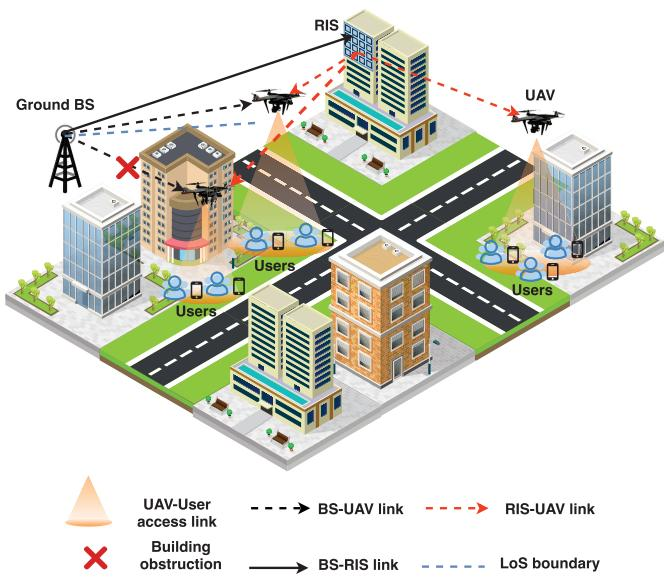
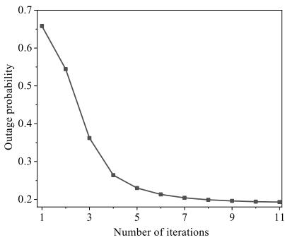
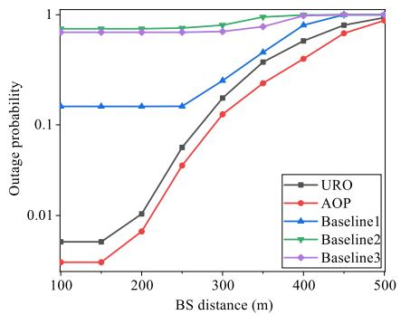
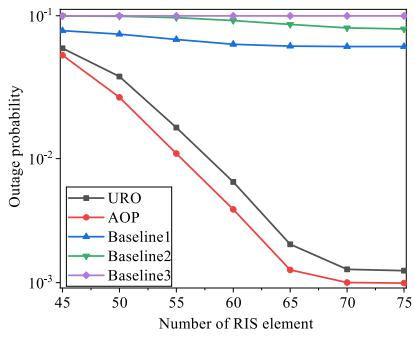
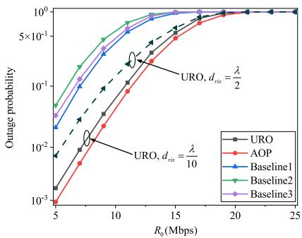
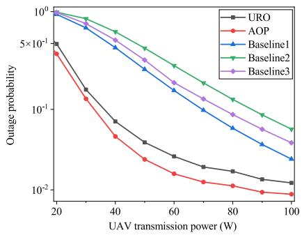
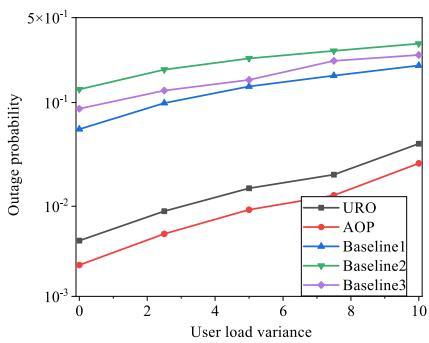
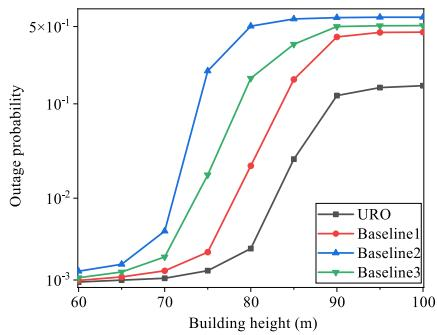

# Outage Minimization for RIS and UAV Collaboration-Enhanced IAB Networks

Yao Yu , Senior Member, IEEE, Bowen Yang , Xin Hao , Yingkun Qian , Lei Guo , Senior Member, IEEE, and Yonghui Li , Fellow, IEEE

Abstract—This paper investigates the reliability enhancement of integrated access and backhaul (IAB) networks in urban environments by jointly leveraging reconfigurable intelligent surfaces (RIS) and unmanned aerial vehicles (UAVs). We propose a RIS and UAV collaboration-enhanced IAB (RUC-IAB) network, where UAVs serve as mobile IAB nodes and the RIS is employed to establish robust line-of-sight (LoS) backhaul links. Our collaborative approach effectively mitigates both blockage-induced and signal-to-noise ratio (SNR)-limited outages, which are the two primary factors compromising transmission reliability in urban IAB networks. To further reduce the outages caused by data accumulation at the IAB node, we develop a joint UAV deployment and RIS beamforming optimization (URO) scheme to balance the access and backhaul transmission rates. In this scheme, a closed-form lower bound on the non-outage probability is derived to facilitate low-complexity UAV placement, and a semidefinite relaxation (SDR)-based method is proposed to optimize the RIS phase shifts. Simulation results show that the proposed URO scheme achieves a 44.72% reduction in average outage probability compared to the phase-alignmentbased scheme across various backhaul distances.

Index Terms—Outage, integrated access and backhaul, reconfigurable intelligent surfaces, unmanned aerial vehicles.

## I. INTRODUCTION

cost of backhaul deployment in urban scenarios [1], integrated access and backhaul (IAB) networks, which offer a low-cost and high-capacity transmission solution through

Currently, a limited number of studies have focused on enhancing the transmission reliability of IAB networks from the network-layer perspective, such as routing optimization and resource allocation [5], [6]. Despite the general appli cability of these approaches, IAB networks face unique transmission reliability challenges in urban environments. On the one hand, the obstruction of wireless backhaul links by surrounding buildings often leads to blockage-induced outages, which remain a major factor undermining the transmission reliability of IAB networks [7]. On the other hand, severe channel fading results in a low signal-to-noise ratio (SNR), which may fall below the minimum required transmission threshold and cause SNR-limited outages. Consequently, ensuring reliable transmission of the IAB network remains difficult due to persistent blockage-induced outages and SNRlimited outages in urban scenarios.

wireless backhaul technologies [2], have attracted significant attention from both industry and academia. Existing literature has extensively investigated the capacity potential of IAB networks, primarily through topology designs and network planning strategies [3]. However, real-time urban applications such as traffic control, intelligent surveillance, and emergency response require not only high-capacity transmission but also stringent guarantees on transmission reliability [4]. Therefore, improving the transmission reliability of IAB networks in urban scenarios remains an open and critical issue.

In recent years, reconfigurable intelligent surface (RIS) and unmanned aerial vehicle (UAV) technologies have demonstrated promising potential for reducing outages [8], [9], [10]. By adaptively controlling the phase shifts of the reflecting elements, RIS technology enables intelligent reconfiguration of the wireless propagation environment. This capability allows signals to be dynamically redirected around physical obstructions and constructively combined at the receiver, thereby mitigating blockage-induced outages and SNR-limited outages [11], [12]. Some works further integrate the RIS with the UAV to form a mobile aerial-RIS platform, enabling it to be more suitable for dynamic environments [13]. Serving as passive relays, these RIS-UAV integration techniques are particularly effective in improving the transmission reliability of traditional single-hop wireless networks [14], [15]. However, IAB networks adopt a cascaded two-hop architecture, in which data is first transmitted from the base station (BS) to an intermediate IAB node via the backhaul link, and then forwarded from the IAB node to the user via the access link. As a result, the existing RIS-UAV integrated techniques face significant limitations in ensuring end-to-end transmission reliability of IAB networks.

Inspired by existing studies [16], [17], [18], the RIS-UAV collaboration is well-suited to the cascaded architecture of IAB networks and holds great promise for enhancing the endto-end transmission reliability. Especially, within a RIS-UAV collaboration IAB network, the UAV serves as a flexible IAB node that reduces blockage-induced outages by establishing the line-of-sight (LoS) backhaul links [19], while the RIS is deployed along the access link to mitigate the SNR-limited outages [20]. The collaboration between the UAV and RIS on both access and backhaul links holds the potential to improve the end-to-end transmission reliability of IAB networks. However, in urban scenarios where obstacles are typically tall buildings, establishing a LoS backhaul link imposes strict limitations on UAV deployment. Such deployment limitations often force UAVs to operate at higher altitudes, which exacerbates channel fading and leads to more severe SNR-limited outages. Although the RIS can partially mitigate the channel fading on the access link, the inherent trade-off between SNRlimited and blockage-induced outages in existing RIS-UAV collaborative approaches limits the reliability improvements in IAB networks, particularly in urban scenarios with high transmission rate demands.

Beyond the outage trade-off, the mismatch between access and backhaul transmission rates poses another outage challenge for the RIS-UAV collaboration in IAB networks. In conventional wireless networks, outage is commonly reduced by increasing the transmission rate [19]. However, blindly increasing the access link transmission rate of IAB networks may lead to severe data accumulation at the IAB node, eventually resulting in backhaul congestion and transmission outages [21]. Therefore, unlike in conventional networks, reducing outage in IAB networks requires matching access and backhaul transmission rates, which introduces additional complexity to RIS–UAV collaboration.

To address the aforementioned outage challenges in IAB networks, we propose a RIS-UAV collaboration-enhanced IAB (RUC-IAB) network. The distinctions between this work and existing studies are highlighted in Table I. The main contributions of this paper are as follows:

1) We propose a RUC-IAB network tailored to improve end-to-end transmission reliability under urban scenarios. To the best of our knowledge, this is the first work to leverage UAV and RIS collaboration to tackle the outage challenges of IAB networks in urban scenarios.

2) The proposed RUC-IAB network adopts a novel RIS–UAV collaborative approach to mitigate transmission outages caused by building blockages and channel fading in urban scenarios. Specifically, the RIS beamforming is used to redirect signals around buildings, thereby establishing a LoS backhaul link and mitigating blockage-induced outages. Meanwhile, the UAVs operate as mobile IAB nodes that can be flexibly deployed to combat channel fading on the access links, thereby reducing SNR-limited outages.

TABLE I
<table><tr><td colspan="4"></td><td></td></tr><tr><td>Ref</td><td>RIS</td><td>UAV</td><td>Outage</td><td>IAB network</td></tr><tr><td>[56]]</td><td></td><td></td><td></td><td></td></tr><tr><td></td><td></td><td></td><td></td><td></td></tr><tr><td>[11]</td><td></td><td></td><td></td><td></td></tr><tr><td>[12]</td><td></td><td></td><td></td><td></td></tr><tr><td>[13]</td><td></td><td></td><td></td><td></td></tr><tr><td>[14]</td><td></td><td></td><td></td><td></td></tr><tr><td>[15]</td><td></td><td></td><td></td><td></td></tr><tr><td>[16]</td><td></td><td></td><td></td><td></td></tr><tr><td>[17]</td><td></td><td></td><td></td><td></td></tr><tr><td>[18]</td><td></td><td></td><td></td><td></td></tr><tr><td>[20]</td><td>××</td><td>××××&gt;&gt;</td><td>××××</td><td></td></tr><tr><td>This paper</td><td></td><td></td><td></td><td>√ √ × × × × × × × × √ &gt;</td></tr></table>

3) We design a joint UAV deployment and RIS beamforming optimization (URO) scheme to further enhance the reliability of the RUC-IAB by preventing data accumulation at the UAVs. In the proposed scheme, we develop a low-complexity UAV height deployment algorithm by deriving a tractable lower bound on the non-outage probability. In addition, we design a semidefinite relaxation (SDR)-based RIS beamforming algorithm that maximizes the UAVs’ backhaul transmission rates to reduce the outage probability.

Extensive numerical results demonstrate that our proposed scheme can reduce the average outage probability by 44.72% compared to the phase-alignment-based baseline across varying backhaul distances.

The rest of the paper is organized as follows. Section II introduces the RUC-IAB network model and formulates the outage minimization problem. Section III presents the URO scheme to optimize the UAV deployment and RIS beamform ing through an iterative process. Section IV evaluates the performance of the proposed scheme, and Section V concludes this paper.

Notation: In this paper, a is a scalar, and a is a vector or matrix. $\mathbf { a } ^ { \top }$ and $\mathbf { a } ^ { \mathrm { \hat { H } } }$ are the transpose and Hermitian of ${ \mathbf { a } } ,$ respectively. k·k is the \`-2 norm. | · | denotes the modulus of a complex number or the cardinality of a set. exp(·) denotes the natural exponential function. Tr(·) denotes the trace of a matrix. $[ \mathbf { a } ] _ { n , n }$ denotes the element on the n-th row and n-th column of matrix a. $O ( \cdot )$ denotes the asymptotic upper bound of the computational complexity. <sup>E</sup>[·] denotes the expectation operator.

## II. SYSTEM MODEL

Fig. 1 shows the proposed RUC-IAB network in a typical urban scenario. The considered IAB network consists of M UAVs acting as IAB nodes and a BS serving as the IAB donor. Each UAV is equipped with a single antenna, while the BS is equipped with an array of $N _ { b }$ antennas. The threedimensional coordinates of UAV m and the BS are denoted by $\mathcal { T } _ { m } ~ = ~ [ x _ { m } , y _ { m } , h _ { m } ]$ and $\mathcal { T } _ { b } ~ = ~ [ x _ { b } , y _ { b } , h _ { b } ]$ , respectively. Each UAV supports both access and backhaul links for a dedicated user cluster $U _ { m } .$ The total number of users across all clusters is N , i.e., $\begin{array} { r } { \sum _ { m = 1 } ^ { M } | U _ { m } | = N } \end{array}$ . The coordinates of user $n \in \{ 1 , \ldots , N \}$ are given by $\mathcal { T } _ { n } = [ x _ { n } , y _ { n } , 0 ]$

  
Fig. 1. The proposed RUC-IAB network.

In the RUC-IAB network, the transmission from the BS to the users is divided into two stages: the backhaul transmission from the BS to the UAVs and the access transmission from the UAVs to the users. Considering the severe building blockages in urban scenarios, a RIS with $N _ { r }$ elements is deployed on the surface of the tallest building to establish a LoS backhaul link for UAVs. The three-dimensional coordinates of the RIS are denoted by $\mathcal { T } _ { r } = [ x _ { r } , y _ { r } , h _ { r } ]$ . Consistent with prior works on IAB and UAV-assisted networks [22], [23], this study adopts the time division multiple access (TDMA) protocol for access and backhaul transmission.

## A. Backhaul Channel Models

In this subsection, we present the channel models for the backhaul link $H _ { b m }$ . As shown in Fig. 1, the backhaul links $H _ { b m }$ include the BS-RIS link $\mathbf h _ { b r } \in \mathbb C ^ { N _ { r } \times N _ { b } }$ , RIS-UAV link $\mathbf { h } _ { r m } \in \mathbb { C } ^ { N _ { r } \times 1 }$ , and the BS-UAV link $\mathbf { h } _ { b m } \in \mathbb { C } ^ { N _ { b } \times 1 }$ , which can be given by:

$$
H _ { b m } = \mathbf { h } _ { r m } ^ { \mathrm { H } } \Theta \mathbf { h } _ { b r } \mathbf { v } _ { m } + \mathbf { h } _ { b m } ^ { \mathrm { H } } \mathbf { v } _ { m } ,\tag{1}
$$

In (1), $\mathbf { v } _ { m } \in \mathbb { C } ^ { N _ { b } \times 1 }$ is the BS precoding vector for UAV $m ,$ and $\Theta = \mathrm { d i a g } \left( \{ e ^ { j \theta _ { n _ { r } } } \} _ { n _ { r } = 1 } ^ { N _ { r } } \right) \stackrel { - } { \in } \mathbb { C } ^ { N _ { r } \times N _ { r } }$ is the RIS phase shift matrix.

In this paper, the precoding vector ${ \bf v } _ { m }$ is designed to steer the BS’s transmission towards the RIS. This design is particularly effective in urban scenarios, where the direct path between the BS and UAV is often blocked by buildings [21]. Therefore, the precoding vector ${ \bf v } _ { m }$ is given by:

$$
\mathbf { v } _ { m } = \frac { \mathbf { a } _ { b s } ( \varphi _ { d , b r } ) } { \lVert \mathbf { a } _ { b s } ( \varphi _ { d , b r } ) \rVert _ { 2 } }\tag{2}
$$

where $\varphi _ { d , b r }$ is the angle of departure (AoD) from the BS to the RIS. Term ${ \bf a } _ { b s } ( \cdot )$ denotes the array response of the BS, defined with respect to a general directional angle variable:

$$
\begin{array} { r } { \mathbf { a } _ { b s } ( \cdot ) = \left[ 1 , \ e ^ { - j 2 \pi \frac { d _ { b s } } { \lambda } \sin ( \cdot ) } , \ \cdot \cdot , e ^ { - j 2 \pi ( N _ { b } - 1 ) \frac { d _ { b s } } { \lambda } \sin ( \cdot ) } \right] ^ { \top } , } \end{array}\tag{3}
$$

where λ is the wavelength, $d _ { b s }$ is the antenna spacing of the BS.

The detailed modeling of the BS-RIS link $\mathbf { h } _ { b r }$ , RIS-UAV link $\mathbf { h } _ { r m }$ , and the BS-UAV link $\mathbf { h } _ { b m }$ is presented below.

1) Bs-Ris Link: The BS-RIS link $\mathbf { h } _ { b r }$ is modeled by the LoS-dominant channel because of the high altitude of the BS and RIS. $\beta _ { b r } = \beta _ { 0 } / \lVert \mathcal { T } _ { b } - \mathcal { T } _ { r } \rVert _ { 2 } ^ { 2 }$ is the path loss of $\mathbf { h } _ { b r } ,$ where $\beta _ { 0 }$ is the reference path loss at a link distance of 1m. According to the path loss model, the channel of the BS-RIS link $\mathbf { h } _ { b r }$ is given by:

$$
\begin{array} { r } { \mathbf { h } _ { b r } = \sqrt { \beta _ { b r } } e ^ { j \Phi _ { b r } } e ^ { - j \frac { 2 \pi \left. \left. \boldsymbol { Z } _ { b } - \boldsymbol { Z } _ { r } \right. \right. _ { 2 } } { \lambda } } \mathbf { a } _ { r i s } \left( \varphi _ { a , b r } \right) \mathbf { a } _ { b s } ^ { \mathrm { H } } \left( \varphi _ { d , b r } \right) , } \end{array}\tag{4}
$$

where $\varphi _ { a , b r }$ is the angle of arrival (AoA) from the BS to RIS. $\Phi _ { b r }$ denotes the random phase of the BS–RIS link, and the same notation is applied to $\Phi _ { r m }$ and $\Phi _ { b m }$ introduced later [21]. Term $\mathbf { a } _ { r i s } ( \cdot )$ is the array response of the RIS, defined with respect to a general directional angle variable:

$$
\mathbf { a } _ { r i s } ( \cdot ) = \left[ 1 , \ e ^ { - j 2 \pi \frac { d _ { r i s } } { \lambda } \sin ( \cdot ) } , \ \cdot \cdot \ , e ^ { - j 2 \pi ( N _ { r } - 1 ) \frac { d _ { r i s } } { \lambda } \sin ( \cdot ) } \right] ^ { \top }\tag{5}
$$

where $d _ { r i s }$ is the element spacing of RIS.

2) Ris-UAV Link: To account for the potential obstruction of the RIS-UAV link $\mathbf { h } _ { r m }$ by surrounding buildings, we introduce a binary indicator $x _ { r m }$ defined as:

$$
x _ { r m } = { \left\{ \begin{array} { l l } { 1 , } & { { \mathrm { ~ i f ~ t h e ~ R I S - U A V ~ l i n k ~ i s ~ u n o b s t r u c t e d } } } \\ { 0 , } & { { \mathrm { ~ i f ~ t h e ~ R I S - U A V ~ l i n k ~ i s ~ o b s t r u c t e d } } } \end{array} \right. }\tag{6}
$$

When $x _ { r m } = 1$ , we assume that the RIS–UAV link $\mathbf { h } _ { r m }$ is unobstructed and follows a LoS channel model. In this case, $\mathbf { h } _ { r m }$ is given by:

$$
\mathbf { h } _ { r m } = \sqrt { \beta _ { r m } } e ^ { j \Phi _ { r m } } e ^ { - j \frac { 2 \pi \| \boldsymbol { \mathcal { T } } _ { r } - \boldsymbol { \mathcal { T } } _ { m } \| _ { 2 } } { \lambda } } \mathbf { a } _ { r i s } \left( \varphi _ { d , r m } \right) ,\tag{7}
$$

where $\varphi _ { d , r m }$ is the AoD from the RIS to UAV m, and $\beta _ { r m } =$ $\beta _ { 0 } / \| \mathcal { I } _ { r } - \mathcal { I } _ { m } \| _ { 2 } ^ { 2 }$ denotes the path loss.

When $x _ { r m } = 0$ , the RIS–UAV link $\mathbf { h } _ { r m }$ is assumed to be completely blocked due to surrounding obstacles, and thus does not contribute to the signal transmission. Therefore, the RIS–UAV link $\mathbf { h } _ { r m }$ can be written in a unified form as:

$$
\mathbf { h } _ { r m } = x _ { r m } \sqrt { \beta _ { r m } } e ^ { j \Phi _ { r m } } e ^ { - j \frac { 2 \pi \| { \boldsymbol { \mathcal { X } } } _ { r } - { \boldsymbol { \mathcal { Z } } } _ { m } \| _ { 2 } } { \lambda } } \mathbf { a } _ { r i s } \left( \varphi _ { d , r m } \right) .\tag{8}
$$

3) Bs-UAV Link: For the BS-UAV link, we also introduce a binary indicator $x _ { b m }$ to represent the building blockages. Similar to $x _ { r m } , x _ { b m } = 1$ indicates that the BS–UAV link is unobstructed and follows a LoS channel model, while $x _ { b m } = 0$ means that the link is blocked and thus unavailable. The value of $x _ { b m }$ depends on whether the UAV height $h _ { m }$ exceeds a threshold $h _ { m } ^ { \mathrm { L o S } }$ , which is defined as:

$$
x _ { b m } = \left\{ \begin{array} { l l } { 1 , } & { h _ { m } \ge h _ { m } ^ { \mathrm { L o S } } } \\ { 0 , } & { h _ { m } < h _ { m } ^ { \mathrm { L o S } } . } \end{array} \right.\tag{9}
$$

Given the building height $h _ { o }$ and the distance between the BS and building, denoted by $d _ { o } .$ , the threshold $h _ { m } ^ { \mathrm { L o S } }$ is given by:

$$
h _ { m } ^ { \mathrm { l o s } } = \frac { \| \mathcal { T } _ { b } - \mathcal { T } _ { m } \| _ { 2 } h _ { o } } { d _ { o } } .\tag{10}
$$

According to $x _ { b m }$ , the BS-UAV link can be expressed as:

$$
\mathbf { h } _ { b m } = x _ { b m } \sqrt { \beta _ { b m } } e ^ { j \Phi _ { b m } } e ^ { - j \frac { 2 \pi \left. \mathbb { Z } _ { b } - \mathbb { Z } _ { m } \right. _ { 2 } } { \lambda } } \mathbf { a } _ { b s } \left( \varphi _ { d , b m } \right) .\tag{11}
$$

In (11), $\varphi _ { d , b m }$ is the AoD from the BS to the UAV m, and $\beta _ { b m } = \beta _ { 0 } / \Vert \mathscr { T } _ { b } - \mathscr { T } _ { m } \Vert _ { 2 } ^ { 2 }$

Note that $H _ { b m }$ consists of two components: the RIS-assisted link $\mathbf { h } _ { r m } ^ { \mathrm { H } } \Theta \mathbf { h } _ { b r } \mathbf { v } _ { m }$ and the direct LoS link $\mathbf { h } _ { b m } ^ { \mathrm { H } } \mathbf { v } _ { m }$ . The presence of the direct LoS link is governed by the binary variable $x _ { b m } .$ , which equals 1 only when the UAV height exceeds the LoS threshold $\overline { { h _ { m } ^ { \mathrm { L o S } } } }$ . Otherwise, $x _ { b m } = 0 .$ , and the direct path is completely blocked.

## B. Access Channel Model

Due to the small-scale fading, the access links are modeled by Rician fading that comprises a deterministic LoS component and a random multipath component [24]. The access link between the UAV m and the user n is given by $h _ { m n } = \sqrt { \beta _ { n } } g _ { m n }$ , where $\beta _ { n } ~ = ~ \underline { { \beta } } _ { 0 } / \lVert \underline { { T } } _ { m } - \underline { { T } } _ { n } \rVert _ { 2 } ^ { 2 }$ . Term $g _ { m n }$ is the small-scale fading with $\mathbb { E } \left\lfloor \left\lfloor g _ { m n } \right. ^ { 2 } \right\rfloor = 1$ , which can be represented as:

$$
g _ { m n } = \sqrt { \frac { K _ { m n } } { K _ { m n } + 1 } } \hat { h } _ { m n } + \sqrt { \frac { 1 } { K _ { m n } + 1 } } \tilde { h } _ { m n } ,\tag{12}
$$

where $\hat { h } _ { m n } = e ^ { - j \frac { 2 \pi \| \boldsymbol { \mathbb { Z } } \boldsymbol { m } - \boldsymbol { \mathbb { Z } } \boldsymbol { n } \| _ { 2 } } { \lambda } }$ is the deterministic LoS channel component, the random scattered component $\tilde { h } _ { m n } \sim \mathcal { C N } ( 0 , 1 )$ is a zero-mean unit variance circularly symmetric complex Gaussian (CSCG) random variable. $K _ { m n }$ is the Rician factor of the channel between user n and UAV m:

$$
K _ { m n } = a \exp \left( b \arcsin \left( \frac { h _ { m } } { \left\| \mathcal { T } _ { m } - \mathcal { T } _ { n } \right\| _ { 2 } } \right) \right) ,\tag{13}
$$

where a and b are the environment coefficients.

## C. Communication Model

In the considered RUC-IAB network, a TDMA protocol is adopted where each user’s access and backhaul transmissions occupy equal time fractions τ . All users share the same access bandwidth $B _ { a }$ , while the total backhaul bandwidth $B _ { b }$ is evenly divided among the M UAVs.

Let $R _ { m n }$ denote the access transmission rate from user $n \in U _ { m }$ to its associated UAV m, and let $R _ { b m }$ represent the backhaul transmission rate from UAV m to the BS. Based on the access and backhaul channel models, $R _ { m n }$ and $R _ { b m }$ can be respectively expressed as follows:

$$
R _ { m n } = \tau B _ { a } \log _ { 2 } \left( 1 + \frac { P _ { m } G _ { m } { | h _ { m n } | } ^ { 2 } } { \sigma ^ { 2 } } \right) ,\tag{14}
$$

$$
R _ { b m } = \tau \frac { { \cal B } _ { b } } { M } \mathrm { l o g } _ { 2 } \left( 1 + \frac { P _ { b } G _ { s } | H _ { b m } | ^ { 2 } } { \sigma ^ { 2 } } \right) ,\tag{15}
$$

where $P _ { m }$ and $G _ { m }$ denote the UAV transmission power and antenna gain, respectively; $P _ { b }$ and $G _ { s }$ are the BS transmission power and antenna gain, and $\sigma ^ { 2 }$ is the noise power.

## D. Outage Model

To evaluate the transmission reliability of the RUC-IAB network, we define the average non-outage probability $P _ { n o u t }$ as the mean of the non-outage probabilities across all user clusters:

$$
P _ { n o u t } = \frac { 1 } { M } \sum _ { m = 1 } ^ { M } P _ { n o u t } ^ { m } ,\tag{16}
$$

where $P _ { \mathrm { n o u t } } ^ { m }$ denotes the average non-outage probability of the user cluster $U _ { m }$ served by UAV m.

As discussed in the communication model, the RUC-IAB network adopts a cluster-based service model, where each UAV is responsible for serving a specific group of users. Within each cluster, users are assumed to have identical transmission rate requirements [25]. Accordingly, we denote $R _ { m }$ as the minimum required transmission rate for all users served by UAV m. Based on this, the access link is considered non-outage if the transmission rate $R _ { m n }$ of user n satisfies $R _ { m n } > R _ { m }$

Moreover, since the RUC-IAB network adopts a TDMA protocol, each user is independently scheduled and completes both access and backhaul transmissions within its assigned time slot. Under this scheduling approach, the UAVs are required to forward access link traffic immediately via the backhaul link. The constraint $R _ { m n } < R _ { b m }$ is imposed individually for each user to prevent data accumulation at the UAV and ensure reliable backhaul transmission.

Therefore, the average non-outage probability $P _ { n o u t } ^ { m }$ for the user cluster $U _ { m }$ served by UAV m can be defined as:

$$
\begin{array} { l } { \displaystyle P _ { n o u t } ^ { m } = \frac { 1 } { | U _ { m } | } \sum _ { n = 1 } ^ { | U _ { m } | } P \left( R _ { m } < R _ { m n } < R _ { b m } \right) } \\ { = \frac { 1 } { | U _ { m } | } \sum _ { n = 1 } ^ { | U _ { m } | } P \left( A _ { 1 } { \left( 2 ^ { \frac { R _ { m } } { \tau B _ { a } } } - 1 \right) } < \left| g _ { m n } \right| ^ { 2 } < A _ { 1 } { \left( 2 ^ { \frac { R _ { b m } } { \tau B _ { a } } } - 1 \right) } \right) , } \end{array}\tag{17}
$$

where $A _ { 1 } = \sigma ^ { 2 } / \left( P _ { m } G _ { m } \beta _ { n } \right)$ . According to [24], the cumulative density function of random variable $\left| g _ { m n } \right| ^ { 2 }$ is:

$$
F ( u ) = 1 - Q _ { 1 } ( \sqrt { 2 K _ { m n } } , \sqrt { 2 ( K _ { m n } + 1 ) u } ) .\tag{18}
$$

$Q _ { 1 } ( a , b )$ is the standard Marcum-Q function, given by:

$$
Q _ { 1 } ( a , b ) = \int _ { b } ^ { \infty } x \exp \left( - \frac { x ^ { 2 } + a ^ { 2 } } 2 \right) I _ { 0 } ( a x ) d x , a > 0 , b \geq 0 ,\tag{19}
$$

where $I _ { 0 } ( \cdot )$ is the modified Bessel function of the first kind of order zero. By manipulating (17) using (18), $P _ { n o u t } ^ { m }$ can be represented as:

$$
P _ { n o u t } ^ { m } = \frac { 1 } { | U _ { m } | } \sum _ { n = 1 } ^ { | U _ { m } | } \left( Q _ { 1 } ( a _ { m n } , b _ { m n } ) - Q _ { 1 } ( a _ { m n } , c _ { m n } ) \right) ,\tag{20}
$$

where $a _ { m n } , b _ { m n }$ , and $c _ { m n }$ are given by:

$$
a _ { m n } = \sqrt { 2 K _ { m n } } ,\tag{21}
$$

$$
b _ { m n } = \sqrt { 2 A _ { 1 } \left( K _ { m n } + 1 \right) \left( 2 ^ { \frac { R m } { \tau B _ { a } } } - 1 \right) } ,\tag{22}
$$

$$
c _ { m n } = \sqrt { 2 A _ { 1 } \left( K _ { m n } + 1 \right) \left( 2 ^ { \frac { R _ { b m } } { \tau B _ { a } } } - 1 \right) } .\tag{23}
$$

Thus, $P _ { n o u t }$ can be reformulated as:

$$
P _ { n o u t } = \frac { 1 } { M } \sum _ { m = 1 } ^ { M } \frac { 1 } { | U _ { m } | } \sum _ { n = 1 } ^ { | U _ { m } | } \left( Q _ { 1 } ( a _ { m n } , b _ { m n } ) - Q _ { 1 } ( a _ { m n } , c _ { m n } ) \right) .\tag{24}
$$

## E. Problem Formulation

According to the channel models, communication model and outage model, we formulate an average outage probability minimization problem by optimizing the UAV deployment $\mathcal { T } _ { m }$ and the RIS beamforming Θ. Given the constraints on the UAV height, the optimization problem can be formulated as follows:

$$
\operatorname* { m i n } _ { \Theta , \mathcal { T } _ { m } } 1 - P _ { n o u t }\tag{25a}
$$

$$
\mathrm { s . t . } \ h _ { \operatorname* { m i n } } \leq h _ { m } \leq h _ { \operatorname* { m a x } } , m \in \{ 1 , \cdots , M \} ,\tag{25b}
$$

$$
0 \leq \theta _ { n _ { r } } \leq 2 \pi , n _ { r } \in \left\{ 1 , \cdots , N _ { r } \right\} .\tag{25c}
$$

Constraint (25b) defines the height range for UAV deployment, while (25c) represents the RIS phase shift constraints. To focus on the outage challenges caused by building blockages and channel fading, we assume that bandwidth allocation, timeslot assignment, and user scheduling are all predetermined and fixed. Besides, our problem model maintains scalability and adaptability under dynamic user demand patterns. The ability to accommodate varying user requirements is preserved through the flexible adjustment of UAV deployment and RIS phase shifts in response to the changing value of $R _ { m }$

We note that this paper focuses on the case where the RIS-UAV link is available, i.e., $x _ { r m } = 1$ . When $x _ { r m } = 0$ , the RIS is blocked and cannot assist the backhaul transmission, rendering RIS beamforming optimization unnecessary. Meanwhile, the optimal height of the UAV is $h _ { m } ^ { \mathrm { L o S } }$ , which is the minimum height required to establish a LoS backhaul link with the BS while minimizing the access link distance. In this case, neither RIS beamforming nor UAV deployment requires further optimization. Therefore, we focus on the case with $x _ { r m } = 1$ where RIS beamforming becomes feasible and optimization is essential for enhancing end-to-end transmission reliability.

## III. THE PROPOSED URO SCHEME FOR OUTAGE MINIMIZATION

To solve problem (25), we decompose it into three subproblems: UAV horizontal $\left( x _ { m } , y _ { m } \right)$ deployment, UAV height $h _ { m }$ deployment, and RIS beamforming design. Since each UAV serves a specific user cluster, the horizontal position $\left( x _ { m } , y _ { m } \right)$ of each UAV is set to that of its associated cluster head [26]. Accordingly, we adopt the affinity propagation (AP) algorithm to partition users based on their spatial distribution. With the UAV horizontal positions fixed, the UAV height $h _ { m }$ and RIS beamforming are then jointly optimized in an alternating manner to reduce the outage probability. To reduce the complexity of UAV height deployment, we derive a tractable lower bound on the non-outage probability. A successive convex approximation (SCA)-based UAV height deployment algorithm is then employed to maximize the derived lower bound. Finally, we develop an SDR-enabled RIS beamforming algorithm to further reduce the outage probability by maximizing the sum of UAVs’ backhaul transmission rates. The detailed processes are presented as follows.

## A. UAV Horizontal Deployment

The horizontal position $\left( x _ { m } , y _ { m } \right)$ of each UAV is set to the location of the corresponding cluster head. To obtain the user clusters, we employ the $\mathbf { A P }$ algorithm, which groups users based on the spatial similarity between each pair of users through an iterative message-passing mechanism [27], [28].

The spatial similarity $\partial ( i , k )$ between user i and user k is defined as the Euclidean distance between their positions:

$$
\partial ( i , k ) = \left\{ { \begin{array} { l l } { - \| \mathbb { Z } _ { i } - \mathbb { Z } _ { k } \| _ { 2 } ^ { 2 } - \kappa , } & { i = k } \\ { - \| \mathbb { Z } _ { i } - \mathbb { Z } _ { k } \| _ { 2 } ^ { 2 } , } & { i \neq k , } \end{array} } \right.\tag{26}
$$

where $\kappa$ is a parameter that regulates the number of clusters. The spatial similarity between users is further utilized to construct two types of messages matrices: responsibility matrix $\mathbf { R } ( \tilde { r } ( i , \dot { k } ) ) ~ \in ~ \mathbb { C } ^ { N \times N }$ and availability matrix $\mathbf { A } ( \tilde { a } ( i , k ) ) ~ \in ~ \mathbb { C } ^ { N \times N }$ , which jointly determine the cluster assignment by a message-passing mechanism. The responsibility $\tilde { r } ( i , k )$ measures how well-suited a user is to serve as a cluster head for another, while the availability $\tilde { a } ( i , k )$ reflects how appropriate it is for one user to choose another as its cluster head. These messages are updated iteratively through the following rules:

$$
\tilde { r } ( i , k ) \gets \partial ( i , k ) - \operatorname* { m a x } _ { k ^ { \prime } \neq k } \left\{ \tilde { a } \left( i , k ^ { \prime } \right) + \partial \left( i , k ^ { \prime } \right) \right\} ,\tag{27}
$$

$$
\tilde { a } ( i , k ) \gets \left\{ \begin{array} { l l } { \operatorname* { m i n } \left\{ \begin{array} { l l } { 0 , \tilde { r } ( k , k ) + } \\ { \displaystyle \sum _ { i ^ { \prime } \notin \{ i , k \} } \operatorname* { m a x } \left\{ 0 , \tilde { r } ( i ^ { \prime } , k ) \right\} } , } & { i \neq k , } \\ { \displaystyle \sum _ { i \neq k } \operatorname* { m a x } \left\{ \tilde { r } ( i , k ) , 0 \right\} , } \end{array} \right. } &  i \right\ = k . \end{array}\tag{28}
$$

In the message-passing mechanism, the AP algorithm first initializes the spatial similarity matrix $\partial ( i , k )$ based on the Euclidean distances between users. Then, the responsibility $\tilde { r } ( i , k )$ and availability a˜(i, k) matrices are iteratively updated using equations (27) and (28), respectively.

When the responsibility matrix $\mathbf { R } ( \tilde { r } ( i , k ) )$ and availability matrix ${ \bf A } ( \tilde { a } ( i , k ) )$ converge, the set of cluster heads is determined by identifying users for which the sum of selfresponsibility and self-availability is positive:

$$
\mathcal { K } _ { h e a d } = \left\{ k \ : | \ : \tilde { r } ( k , k ) + \tilde { a } ( k , k ) > 0 \right\} .\tag{29}
$$

Each remaining user joins the cluster whose head is most spatially similar to it. Accordingly, the horizontal coordinates of each UAV are set to match the coordinates of its associated cluster head.

## B. UAV Height Deployment

Given the fixed horizontal positions of the UAVs and the RIS phase shifts {Θ}, we next optimize the UAV height deployment to reduce the average outage probability of the RUC-IAB network.

A major challenge in this optimization arises from the presence of the Marcum-Q function in (19), which complicates the evaluation of the non-outage probability $P _ { n o u t }$ . This is because the Marcum-Q function involves an infinite integral of the Bessel function $I _ { 0 } ( \cdot )$ over a range that depends on the function’s arguments [29]. To address this issue, we derive a tractable lower bound $\hat { P } _ { n o u t } ^ { m }$ on the non-outage probability for each UAV $m ,$ which serves as a simplified surrogate objective with reduced computational complexity. Based on this bound, we propose an SCA-based UAV height deployment algorithm that iteratively optimizes each UAV’s height to reduce the average outage probability of the RUC-IAB network.

1) Lower Bound of Non-Outage Probability: According to (20), the non-outage probability lower bound of UAV m can be expressed as:

$$
\hat { P } _ { n o u t } ^ { m } = \frac { 1 } { | U _ { m } | } \sum _ { n = 1 } ^ { | U _ { m } | } \left( x _ { m n } - y _ { m n } \right) .\tag{30}
$$

In (30), $x _ { m n }$ is the lower bound of $Q _ { 1 } ( a _ { m n } , b _ { m n } )$

$$
x _ { m n } \leq Q _ { 1 } ( a _ { m n } , b _ { m n } ) ,\tag{31}
$$

and $y _ { m n }$ is the upper bound of $\begin{array} { r l } { { Q _ { 1 } } ( { a _ { m n } } , { c _ { m n } } ) \colon } & { { } } \end{array}$

$$
y _ { m n } \geq Q _ { 1 } ( a _ { m n } , c _ { m n } ) .\tag{32}
$$

Then, we employ the exponential bounds of $Q _ { 1 } ( a _ { m n } , b _ { m n } )$ and $Q _ { 1 } ( a _ { m n } , c _ { m n } )$ to reformulate the (31) and (32) into tractable forms. Specifically, we replace the right-hand side (RHS) of (31) with the exponential lower bound of $Q _ { 1 } ( a _ { m n } , b _ { m n } )$ , and the RHS of (32) with the exponential upper bound of $Q _ { 1 } ( a _ { m n } , c _ { m n } )$ . The exponential bound expressions of $Q _ { 1 } ( a _ { m n } , b _ { m n } )$ and $Q _ { 1 } ( a _ { m n } , c _ { m n } )$ are related to the magnitude relationship between $a _ { m n } , \ b _ { m n }$ and $c _ { m n } \ \left[ 2 9 \right] .$ Therefore, for the case where $a _ { m n } > b _ { m n }$ and $a _ { m n } < b _ { m n } ,$ we reformulate (31) as (33) and (34), respectively. For the case where $a _ { m n } > c _ { m n }$ and $a _ { m n } < c _ { m n } ,$ , we reformulate (32) as (35) and (36), respectively. The expressions for (33), (34), (35), and (36), as shown at the bottom of the page. The detailed derivation of equations (33)–(36) can be found in [29].

2) SCA-Enabled UAV Height Optimization: Since the height deployment of each UAV is independent, we formulate a single-UAV height deployment problem based on the derived lower bound of the non-outage probability $\hat { P } _ { n o u t } ^ { m }$ . By sequentially solving these subproblems for all UAVs, the average outage probability of the RUC-IAB network can be effectively reduced. The single-UAV deployment problem is defined as:

$$
\operatorname* { m a x } _ { h _ { m } , x _ { m n } , y _ { m n } } \hat { P } _ { n o u t } ^ { m } = \frac { 1 } { | U _ { m } | } \sum _ { n = 1 } ^ { | U _ { m } | } ( x _ { m n } - y _ { m n } )\tag{37a}
$$

$$
\mathrm { s . t . } \ h _ { \operatorname* { m i n } } \leq h _ { m } \leq h _ { \operatorname* { m a x } } , m \in \{ 1 , . . . , M \} ,\tag{37b}
$$

$$
( 3 3 ) , \ ( 3 5 ) , ( \mathrm { i f } \ a _ { m n } > b _ { m n } , \ a _ { m n } > c _ { m n } ) ,\tag{37c}
$$

$$
( 3 3 ) , \ ( 3 6 ) , ( \mathrm { i f } \ a _ { m n } > b _ { m n } , \ a _ { m n } \leq c _ { m n } ) ,\tag{37d}
$$

$$
( 3 4 ) , \ ( 3 5 ) , ( \mathrm { i f } \ a _ { m n } \leq b _ { m n } , \ a _ { m n } > c _ { m n } ) ,
$$

$$
( 3 4 ) , \ ( 3 6 ) , ( \mathrm { i f } \ a _ { m n } \leq b _ { m n } , \ a _ { m n } \leq c _ { m n } ) .\tag{37e}
$$

(37f)

However, problem (37) is still difficult to solve due to the nonconvexity of constraints (33), (34), (35), and (36). Moreover, the constraint structure is piecewise-defined, making it challenging to directly apply convex optimization methods, such as CVX.

To transform these constraints into convex expressions, we introduce slack variables $\left\{ \alpha _ { m n } , \beta _ { m n } \right\}$ to replace the nonconvex parts of constraint (33) and constraint (34), while $\left\{ \chi _ { m n } , \delta _ { m n } \right\}$ are introduced to replace the non-convex parts of constraint (35) and constraint (36). We then introduce additional simple non-convex constraints to ensure that the constraint space remains equivalent to that of the original problem after substituting the slack variables. These constraints can be efficiently convexified using the Taylor expansion technique, which significantly reduces the complexity of the overall convexification process. Following the above procedure, the convex form of constraint (33) can be expressed as:

$$
\begin{array} { c } { { x _ { m n } \leq 1 - \displaystyle \frac { \arcsin \left( \alpha _ { m n } ^ { ( t ) } \right) } { \pi } \beta _ { m n } ^ { ( t ) } - \displaystyle \frac { \beta _ { m n } ^ { ( t ) } } { \pi } \displaystyle \frac { \left( \alpha _ { m n } - \alpha _ { m n } ^ { ( t ) } \right) } { \sqrt { 1 - \left( \alpha _ { m n } ^ { ( t ) } \right) ^ { 2 } } } } } \\ { { - \displaystyle \frac { \arcsin \left( \alpha _ { m n } ^ { ( t ) } \right) } { \pi } \left( \beta _ { m n } - \beta _ { m n } ^ { ( t ) } \right) , } } \\ { { \alpha _ { m n } \geq \displaystyle \frac { b _ { m n } ^ { ( t ) } } { a _ { m n } ^ { ( t ) } } + \displaystyle \frac { \left( b _ { m n } ^ { \prime } \right) ^ { ( t ) } a _ { m n } ^ { ( t ) } - \left( a _ { m n } ^ { \prime } \right) ^ { ( t ) } b _ { m n } ^ { ( t ) } } { \left( a _ { m n } ^ { ( t ) } \right) ^ { 2 } } \left( h _ { m } - h _ { m } ^ { ( t ) } \right) } } \end{array} \medskip\tag{8}
$$

$$
\beta _ { m n } \geq e ^ { f _ { b a } } - e ^ { f _ { a b } }\tag{39}
$$

$$
x _ { m n } \leq 1 - \frac { \arcsin \left( \frac { b _ { m n } } { a _ { m n } } \right) } { \pi } \left( \exp \left( - \frac { \left( b _ { m n } - a _ { m n } \right) ^ { 2 } } { 2 } \right) - \exp \left( - \frac { \left( a _ { m n } + b _ { m n } \right) ^ { 2 } } { 2 } \right) \right) \left( a _ { m n } > b _ { m n } \right)\tag{33}
$$

$$
x _ { m n } \leq \frac { 1 } { 3 } \exp \left( - \frac { \left( - a _ { m n } + \sqrt { 4 b _ { m n } ^ { 2 } - 3 \left( a _ { m n } \right) ^ { 2 } } \right) ^ { 2 } } { 8 } \right) + \frac { 2 } { 3 } \exp \left( - \frac { \left( b _ { m n } + a _ { m n } \right) ^ { 2 } } { 2 } \right) \left( a _ { m n } \leq b _ { m n } \right)\tag{34}
$$

$$
y _ { m n } \geq 1 - \frac { \arctan \left( \frac { c _ { m n } } { a _ { m n } } \right) } { \pi } \left( \exp \left( - \frac { \left( ( a _ { m n } ) ^ { 2 } - ( c _ { m n } ) ^ { 2 } \right) ^ { 2 } } { 2 \left( ( a _ { m n } ) ^ { 2 } + ( c _ { m n } ) ^ { 2 } \right) } \right) - \exp \left( - \frac { ( a _ { m n } ) ^ { 2 } + ( c _ { m n } ) ^ { 2 } } { 2 } \right) \right) \left( a _ { m n } > c _ { m n } \right)\tag{35}
$$

$$
y _ { m n } \geq { \frac { 1 } { 2 } } \left( \exp \left( - { \frac { \left( c _ { m n } - a _ { m n } \right) ^ { 2 } } { 2 } } \right) + \exp \left( - { \frac { \left( c _ { m n } \right) ^ { 2 } - \left( a _ { m n } \right) ^ { 2 } } { 2 } } \right) \right) \left( a _ { m n } \leq c _ { m n } \right)\tag{36}
$$

(40)

The convex form of constraint (34) can be expressed as:

$$
x _ { m n } \leq \frac { 1 } { 3 } \exp \left( - \frac { \left( \alpha _ { m n } ^ { ( t ) } \right) ^ { 2 } } { 8 } \right) + \frac { 2 } { 3 } \exp \left( - \frac { \left( \beta _ { m n } ^ { ( t ) } \right) ^ { 2 } } { 2 } \right) + \eta _ { m n } ,\tag{41}
$$

$$
\alpha _ { m n } \ge \sqrt { 4 \left( b _ { m n } ^ { ( t ) } \right) ^ { 2 } - 3 \left( a _ { m n } ^ { ( t ) } \right) ^ { 2 } } - a _ { m n } ^ { ( t ) } + \kappa _ { m n } ,\tag{42}
$$

$$
\begin{array} { r } { \beta _ { m n } \geq b _ { m n } ^ { ( t ) } + a _ { m n } ^ { ( t ) } + \left( b _ { m n } ^ { \prime } + a _ { m n } ^ { \prime } \right) ^ { ( t ) } \left( h _ { m } - h _ { m } ^ { ( t ) } \right) . } \end{array}\tag{43}
$$

The convex form of constraint (35) can be expressed as:

$$
y _ { m n } \geq 1 - \frac { 1 } { \pi } \left( \delta _ { m n } ^ { ( t ) } \arctan \left( \chi _ { m n } ^ { ( t ) } \right) - \frac { \delta _ { m n } ^ { ( t ) } \left( \chi _ { m n } - \chi _ { m n } ^ { ( t ) } \right) } { 1 + \left( \chi _ { m n } ^ { ( t ) } \right) ^ { 2 } } \right)
$$

$$
- \frac { 1 } { \pi } \arctan \left( \chi _ { m n } ^ { ( t ) } \right) \left( \delta _ { m n } - \delta _ { m n } ^ { ( t ) } \right) ,\tag{44}
$$

$$
\chi _ { m n } \leq \frac { c _ { m n } ^ { ( t ) } } { a _ { m n } ^ { ( t ) } } + \frac { \left( c _ { m n } ^ { \prime } \right) ^ { ( t ) } a _ { m n } ^ { ( t ) } - c _ { m n } ^ { ( t ) } ( a _ { m n } ^ { \prime } ) ^ { ( t ) } } { \left( a _ { m n } ^ { ( t ) } \right) ^ { 2 } } \left( h _ { m } - h _ { m } ^ { ( t ) } \right) ,\tag{45}
$$

$$
\begin{array} { r l } & { \delta _ { m n } \leq \exp \left( - \frac { \left( \left( a _ { m n } ^ { ( t ) } \right) ^ { 2 } - \left( c _ { m n } ^ { ( t ) } \right) ^ { 2 } \right) ^ { 2 } } { 2 \left( \left( a _ { m n } ^ { ( t ) } \right) ^ { 2 } + \left( c _ { m n } ^ { ( t ) } \right) ^ { 2 } \right) } \right) } \\ & { \qquad - \exp \left( - \frac { \left( a _ { m n } ^ { ( t ) } \right) ^ { 2 } + \left( c _ { m n } ^ { ( t ) } \right) ^ { 2 } } { 2 } \right) + \mu _ { m n } - v _ { m n } + o _ { m n } . } \end{array}\tag{46}
$$

The convex form of constraint (36) can be expressed as:

$$
y _ { m n } \geq \frac { 1 } { 2 } \left( \exp \left( - \frac { \chi _ { m n } } { 2 } \right) + \exp \left( - \frac { \delta _ { m n } } { 2 } \right) \right) ,\tag{47}
$$

$$
\chi _ { m n } \leq \left( c _ { m n } ^ { ( t ) } - a _ { m n } ^ { ( t ) } \right) ^ { 2 } + \left( 2 \left( c _ { m n } - a _ { m n } \right) \left( c _ { m n } ^ { \prime } - a _ { m n } ^ { \prime } \right) \right) ^ { ( t ) }
$$

$$
\times \left( h _ { m } - h _ { m } ^ { ( t ) } \right) ,\tag{48}
$$

$$
\begin{array} { r l r } {  { \delta _ { m n } \leq ( c _ { m n } ^ { ( t ) } ) ^ { 2 } - ( a _ { m n } ^ { ( t ) } ) ^ { 2 } + 2 \bigl ( c _ { m n } c _ { m n } ^ { \prime } - a _ { m n } a _ { m n } ^ { \prime } \bigr ) ^ { ( t ) } } } \\ & { } & { \times ( h _ { m } - h _ { m } ^ { ( t ) } ) . } \end{array}\tag{49}
$$

The detailed derivations of (38) to (49) are provided in detail in Appendix A to Appendix D, respectively.

According to (38)-(49), constraints (37c)-(37f) can be replaced with their corresponding convex forms:

$$
\begin{array} { r } { \mathrm { s . t . } \left\{ \begin{array} { l l } { h _ { \operatorname* { m i n } } \leq h _ { m } \leq h _ { \operatorname* { m a x } } , } & { m \in \{ 1 , . . . , M \} , } \\ { ( 3 8 ) - ( 4 0 ) , ( 4 4 ) - ( 4 6 ) , } & { \left( \mathrm { i f } \ a _ { m n } > b _ { m n } , \ a _ { m n } > c _ { m n } \right) } \\ { ( 3 8 ) - ( 4 0 ) , ( 4 7 ) - ( 4 9 ) , } & { \left( \mathrm { i f } \ a _ { m n } > b _ { m n } , \ a _ { m n } \leq c _ { m n } \right) } \\ { ( 4 1 ) - ( 4 3 ) , ( 4 4 ) - ( 4 6 ) , } & { \left( \mathrm { i f } \ a _ { m n } \leq b _ { m n } , \ a _ { m n } > c _ { m n } \right) } \\ { ( 4 1 ) - ( 4 3 ) , ( 4 7 ) - ( 4 9 ) , } & { \left( \mathrm { i f } \ a _ { m n } \leq b _ { m n } , \ a _ { m n } \leq c _ { m n } \right) } \end{array} \right. } \end{array}\tag{50}
$$

When the RIS phase shifts are fixed, the magnitude relationship among $a _ { m n } , \ b _ { m n }$ , and $c _ { m n }$ depends solely on the UAV height. Accordingly, we denote the UAV height intervals corresponding to these four constraint sets as $\bar { \{ h _ { 1 } \} } , ~ \{ \bar { h } _ { 2 } \}$ $\{ \bar { h } _ { 3 } \}$ , and $\{ \bar { h } _ { 4 } \}$ , where:

$$
\{ \bar { h } _ { 1 } \} = \{ h _ { m } \mid a _ { m n } > b _ { m n } , a _ { m n } > c _ { m n } \} ,\tag{51a}
$$

$$
\{ \bar { h } _ { 2 } \} = \{ h _ { m } \mid a _ { m n } > b _ { m n } , a _ { m n } \leq c _ { m n } \} ,\tag{51b}
$$

$$
\{ \bar { h } _ { 3 } \} = \{ h _ { m } \mid a _ { m n } \leq b _ { m n } , a _ { m n } > c _ { m n } \} ,\tag{51c}
$$

$$
\{ \bar { h } _ { 4 } \} = \{ h _ { m } \mid a _ { m n } \leq b _ { m n } , a _ { m n } \leq c _ { m n } \} ,\tag{51d}
$$

$$
\{ \bar { h } _ { 1 } \} \cup \{ \bar { h } _ { 2 } \} \cup \{ \bar { h } _ { 3 } \} \cup \{ \bar { h } _ { 4 } \} = [ h _ { \operatorname* { m i n } } , h _ { \operatorname* { m a x } } ] .\tag{51e}
$$

Then, we transform problem (37) into four convex problems by applying the corresponding UAV height intervals to each of the four sets of constraints. This ensures the accuracy of the non-outage probability lower bound when solving for the UAV height deployment strategy. The four convex forms of problem (37) are as follows:

1) When $a _ { m n } > b _ { m n }$ and $a _ { m n } > c _ { m n }$ , problem (37) is approximated as:

$$
\begin{array} { l } { { \displaystyle \operatorname* { m a x } _ { \{ h _ { m } , x , y , \alpha , \beta , \chi , \delta \} } \frac { 1 } { | U _ { m } | } \sum _ { n = 1 } ^ { | U _ { m } | } ( x _ { m n } - y _ { m n } ) } } \\ { { \mathrm { s . t . ~ } ( 3 8 ) , ( 3 9 ) , ( 4 0 ) , ( 4 4 ) , ( 4 5 ) , ( 4 6 ) , } } \\ { { h _ { m } \in \{ \bar { h } _ { 1 } \} , m \in \{ 1 , \cdots , M \} . } } \end{array}\tag{52}
$$

2) When $a _ { m n } > b _ { m n }$ and $a _ { m n } \leq c _ { m n }$ , problem (37) is approximated as:

$$
\begin{array} { c l c r } { { } } & { { } } & { { \displaystyle \operatorname* { m a x } _ { \{ h _ { m } , x , y , \alpha , \beta , \chi , \delta \} } \frac { 1 } { | U _ { m } | } \sum _ { n = 1 } ^ { | U _ { m } | } ( x _ { m n } - y _ { m n } ) } } \\ { { } } & { { } } & { { \mathrm { s . t . } ~ ( 3 8 ) , ( 3 9 ) , ( 4 0 ) , ( 4 7 ) , ( 4 8 ) , ( 4 9 ) , } } \\ { { } } & { { } } & { { h _ { m } \in \{ \bar { h } _ { 2 } \} , m \in \{ 1 , \cdots , M \} . } } \end{array}\tag{53}
$$

3) When $a _ { m n } \leq b _ { m n }$ and $a _ { m n } > c _ { m n } .$ problem (37) is approximated as:

$$
\begin{array} { c } { { \displaystyle \operatorname* { m a x } _ { \{ h _ { m } , x , y , \alpha , \beta , \chi , \delta \} } \frac { 1 } { | U _ { m } | } \sum _ { n = 1 } ^ { | U _ { m } | } ( x _ { m n } - y _ { m n } ) } } \\ { { \mathrm { s . t . } ~ ( 4 1 ) , ( 4 2 ) , ( 4 3 ) , ( 4 4 ) , ( 4 5 ) , ( 4 6 ) , } } \\ { { h _ { m } \in \{ \bar { h } _ { 3 } \} , m \in \{ 1 , \cdots , M \} . } } \end{array}\tag{54}
$$

4) When $a _ { m n } \leq b _ { m n }$ and $a _ { m n } \leq c _ { m n }$ , problem (37) is approximated as:

$$
\begin{array} { c } { { \displaystyle \operatorname* { m a x } _ { \{ h _ { m } , x , y , \alpha , \beta , \chi , \delta \} } \frac { 1 } { | U _ { m } | } \sum _ { n = 1 } ^ { | U _ { m } | } ( x _ { m n } - y _ { m n } ) } } \\ { { \mathrm { s . t . } ( 4 1 ) , ( 4 2 ) , ( 4 3 ) , ( 4 7 ) , ( 4 8 ) , ( 4 9 ) , } } \\ { { h _ { m } \in \{ \bar { h } _ { 4 } \} , m \in \{ 1 , \cdots , M \} . } } \end{array}\tag{55}
$$

It is easy to prove that problems (52) to (55) are convex as they have linear objectives and linear inequality constraints.

However, determining the height intervals $\bar { h } _ { 1 } { - } \bar { h } _ { 4 }$ is nontrivial, as the backhaul rate $R _ { b m }$ in $c _ { m n }$ is a highly non-linear and non-smooth function of the UAV height $h _ { m }$ . As a result, it is infeasible to derive a closed-form expression for the height intervals that precisely delineate the condition $a _ { m n } > c _ { m n }$ and $a _ { m n } ~ \leq ~ c _ { m n }$ . In this paper, we employ a numerical sampling method to obtain the height intervals $\{ \bar { h } _ { 1 } \} , ~ \{ \bar { h } _ { 2 } \}$ $\{ \bar { h } _ { 3 } \}$ , and $\{ \bar { h } _ { 4 } \}$ . We discretize the whole height interval of the UAV $[ h _ { \operatorname* { m i n } } , h _ { \operatorname* { m a x } } ]$ with a small step of \`. The height intervals corresponding to the four subproblems are obtained by evaluating the relative magnitudes of $a _ { m n } , b _ { m n } ,$ and $c _ { m n }$ at each discrete height. The error introduced by this method is acceptable when \` is small enough.

To maximize the average non-outage probability of all UAVs, we design an SCA-enabled UAV deployment algorithm. This algorithm solves problem (52), (53), (54), and (55) for each UAV individually and selects the height $\{ h _ { 1 } ^ { * } , h _ { 2 } ^ { * } , \ldots , h _ { M } ^ { * } \}$ that maximizes the non-outage probability as the optimal deployment height for each UAV. The details are presented in Algorithm 1.

Algorithm 1 SCA-Enabled UAV Height Deployment Opti  
mization Algorithm   
Input: RIS phase shifts Θ, SCA step length $\psi \in ( 0 , 1 ] ,$ SCA   
convergence tolerance $\varepsilon _ { s }$   
1 for $m \in \{ 1 , \ldots , M \}$ do   
2 Obtain the height intervals $\{ \bar { h } _ { 1 } \} , \{ \bar { h } _ { 2 } \} , \{ \bar { h } _ { 3 } \}$ , and $\{ \bar { h } _ { 4 } \}$   
by the the numerical sampling method   
3 Initialize the local points $S _ { m } ^ { ( 0 ) } = \{ x _ { m n } ^ { ( 0 ) } , \ y _ { m n } ^ { ( 0 ) } , \ \alpha _ { m n } ^ { ( 0 ) }$   
$\beta _ { m n } ^ { ( 0 ) } , \chi _ { m n } ^ { ( 0 ) } , \delta _ { m n } ^ { ( 0 ) }$   
4 Initialize the UAV height $h _ { m } ^ { ( 0 ) } = \{ h _ { 1 , m } ^ { ( 0 ) } , h _ { 2 , m } ^ { ( 0 ) } , h _ { 3 , m } ^ { ( 0 ) } ,$   
$h _ { 4 , m } ^ { ( 0 ) }$ for all UAV height intervals   
5 Initialize the iteration step $t \gets 1 , P _ { n o u t } ^ { ( t ) } \gets 0$   
6 repeat   
7 Solve (52), (53), (54), and (55), obtain the slack   
variable $\hat { S } _ { m } .$ , non-outage probability $\hat { P } _ { m } ^ { ( t ) } = \{ P _ { 1 , m } ^ { ( t ) }$   
$P _ { 2 , m } ^ { ( t ) } , P _ { 3 , m } ^ { ( t ) } , P _ { 4 , m } ^ { ( t ) }$ and corresponding height $\hat { h } _ { m } =$   
$\{ h _ { 1 , m } , h _ { 2 , m } , h _ { 3 , m } , h _ { 4 , m } .$   
8 Set $P _ { n o u t } ^ { ( t ) }  \operatorname* { m a x } \{ P _ { 1 } ^ { ( t ) } , P _ { 2 } ^ { ( t ) } , P _ { 3 } ^ { ( t ) } , P _ { 4 } ^ { ( t ) } \}$   
9 Set $P _ { m } ^ { * } \gets P _ { n o u t } ^ { ( t ) }$   
10 Set $h _ { m } ^ { * } \gets$ the UAV height corresponding to $P _ { n o u t } ^ { ( t ) }$   
11 Update $h ^ { ( t ) } \gets h ^ { ( t - 1 ) } + \psi ( \hat { h } _ { m } - \mathrm { \bar { \boldsymbol { h } } } ^ { ( t - 1 ) } )$   
12 Update $S _ { m } ^ { ( t ) } \gets S _ { . } ^ { ( t - 1 ) } + \dot { \psi } ( \hat { S } _ { m } - S _ { m } ^ { ( t - 1 ) } )$   
13 until $P _ { n o u t } ^ { ( t ) } - P _ { n o u t } ^ { ( t - 1 ) } \leq \varepsilon _ { s }$   
14 end for   
Output: The optimal UAV height deployment $\begin{array} { r l } { { \mathcal { H } } } & { { } = } \end{array}$   
$\bar { \{ h _ { 1 } ^ { * } , h _ { 2 } ^ { * } , \ldots , \bar { h } _ { M } ^ { * } \} }$ and non-outage probability $P _ { n o u t } ^ { * } ~ =$   
$\sum _ { m = 1 } ^ { M } P _ { m } ^ { * }$

In Step 7 of Algorithm 1, we solve problems (52)–(55) over four height intervals to determine the optimal UAV height deployment. For each subproblem, the backhaul transmission rate expression may still involve a discontinuous form due to the binary LoS indicator $x _ { b m }$ in (11). This discontinuity can invalidate the convexity assumptions required for SCA-based optimization of Step 7 and may lead to incorrect or suboptimal solutions. To address this, for each subproblem of (52)–(55), Step 7 separately solves the cases of $x _ { b m } = 1$ and $x _ { b m } = 0$ and selects the UAV height that yields the highest non-outage probability as the solution to that subproblem.

## C. SDR-Enabled Ris Beamforming Optimization

For a given UAV deployment $\{ x _ { m } , y _ { m } , h _ { m } \}$ , the RIS beamforming can be optimized by solving the following non-outage probability maximization problem:

$$
\operatorname* { m a x } _ { \Theta } \frac { 1 } { M } \sum _ { m = 1 } ^ { M } \frac { 1 } { | U _ { m } | } \sum _ { n = 1 } ^ { | U _ { m } | } \left( Q _ { 1 } ( a _ { m n } , b _ { m n } ) - Q _ { 1 } ( a _ { m n } , c _ { m n } ) \right)\tag{56a}
$$

$$
\mathrm { s . t . ~ 0 } \leq \theta _ { n _ { r } } \leq 2 \pi , n _ { r } \in \left\{ 1 , \cdots , N _ { r } \right\} .\tag{56b}
$$

Since the RIS phase shifts do not affect $Q _ { 1 } ( a _ { m n } , b _ { m n } )$ , we replace it with a constant C in (56a):

$$
\operatorname* { m a x } _ { \boldsymbol { \Theta } } \frac { 1 } { M } \left( C - \sum _ { m = 1 } ^ { M } \frac { 1 } { | U _ { m } | } \sum _ { n = 1 } ^ { | U _ { m } | } Q _ { 1 } ( a _ { m n } , c _ { m n } ) \right)\tag{57a}
$$

$$
\mathrm { s . t . ~ 0 } \leq \theta _ { n _ { r } } \leq 2 \pi , n _ { r } \in \left\{ 1 , \cdot \cdot \cdot , N _ { r } \right\} .\tag{57b}
$$

Consequently, as a higher $R _ { b m }$ reduces $Q _ { 1 } ( a _ { m n } , c _ { m n } )$ problem (57) can be equivalently reformulated as a backhaul transmission rate maximization problem:

$$
\begin{array} { l } { \displaystyle \operatorname* { m a x } _ { \Theta } \sum _ { m = 1 } ^ { M } R _ { b m } } \\ { \displaystyle \mathrm { s . t . ~ } 0 \leq \theta _ { n _ { r } } \leq 2 \pi , n _ { r } \in \left\{ 1 , \cdots , N _ { r } \right\} . } \end{array}\tag{58a}
$$

(58b)

Define $\begin{array} { r } { \pmb { c _ { m } } = \left\lceil \left( \mathbf { h } _ { r m } \right) ^ { \mathrm { H } } \mathrm { d i a g } \left( \mathbf { h } _ { b r } \mathbf { v } _ { m } \right) , \mathbf { h } _ { b m } ^ { \mathrm { H } } \mathbf { v } _ { m } \right\rceil ^ { \mathrm { H } } \in \mathbb { C } ^ { \left( N _ { r } + 1 \right) \times 1 } } \end{array}$ and $\mathbf { e } _ { m } = \left[ \bar { e } ^ { j \theta _ { 1 } } , e ^ { j \theta _ { 2 } } , \dots , e ^ { j \theta _ { N _ { r } } } ; x _ { m } \right] ^ { \mathrm { ~ H ~ } } \in \bar { \mathbb { C } } ^ { ( N _ { r } + 1 ) \times 1 } , \ R _ { b m }$ can be further given by:

$$
R _ { b m } = \tau \frac { B _ { b } } { M } \mathrm { l o g } _ { 2 } \left( 1 + \frac { P _ { b } G _ { s } \mathrm { T r } ( { \bf C } _ { m } { \bf E } _ { m } ) } { \sigma ^ { 2 } } \right) ,\tag{59}
$$

where $\mathbf { C } _ { m } \in \mathbb { C } ^ { ( N _ { r } + 1 ) \times ( N _ { r } + 1 ) }$ and $\mathbf { E } _ { m } \in \mathbb { C } ^ { ( N _ { r } + 1 ) \times ( N _ { r } + 1 ) }$ are given by $\mathbf { C } _ { m } = \mathbf { c } _ { m } \mathbf { c } _ { m } ^ { \mathrm { H } }$ and $\mathbf { E } _ { m } = \mathbf { e } _ { m } \mathbf { e } _ { m } ^ { \mathrm { H } } ,$ respectively.

Then, we introduce a slack variable $A _ { m }$ to replace $P _ { b } G _ { s } \mathrm { T r } ( \mathbf { C } _ { m } \mathbf { E } _ { m } )$ in $R _ { b m }$ . With this substitution, problem (58) can be reformulated as:

$$
\operatorname* { m a x } _ { \mathbf { E } _ { m } , A _ { m } } \sum _ { m = 1 } ^ { M } \tau \frac { B _ { b } } { M } \log _ { 2 } \left( 1 + \frac { A _ { m } } { \sigma ^ { 2 } } \right)\tag{60a}
$$

$$
\mathrm { s . t . ~ 0 } \leq \theta _ { n _ { r } } \leq 2 \pi , n _ { r } \in \{ 1 , \cdot \cdot \cdot , N _ { r } \}
$$

$$
A _ { m } \leq \mathrm { T r } \left( \mathbf { C } _ { m } \mathbf { E } _ { m } \right) P _ { b } G _ { s } ,\tag{60b}
$$

$$
\mathbf { E } _ { m } \succeq 0 ,\tag{60c}
$$

$$
[ \mathbf { E } _ { m } ] _ { n , n } = 1 , n \in \{ 1 , \cdots , N _ { r } \}\tag{60d}
$$

$$
\operatorname { R a n k } ( \mathbf { E } _ { m } ) = 1 .\tag{60e}
$$

(60f)

In problem (60), constraint (60c) bounds the slack variable $A _ { m }$ by the received signal power reflected via the RIS. Constraint (60d) ensures that the matrix variable $\mathbf { E } _ { m }$ remains positive semidefinite. Constraint (60e) enforces the unit-modulus property of the RIS phase shifts by fixing the diagonal entries of $\mathbf { E } _ { m }$ to one. Constraint (60f) is the rank-one constraint that ensures the matrix $\mathbf { E } _ { m }$ represents a valid outer product of the RIS beamforming vector. This constraint is critical for recovering a feasible RIS beamforming vector from the matrix variable $\mathbf { E } _ { m }$

```perl
Algorithm 2 SDR-Enabled RIS Beamforming Algorithm
Input: UAV deployments $\mathcal { I } _ { m }$
1 for all $h _ { m } \in \mathbf { h } _ { m }$ do
2 if $h _ { m } \geq h _ { m } ^ { l o s }$ then
3 $x _ { b m } \gets 1$
4 else
5 $x _ { b m } \gets 0$
6 end if
7 end for
8 Solve (60) by CVX, obtain the optimal $\mathbf { E } _ { m } ^ { * }$
9 Extract Θ from $\mathbf { E } _ { m } ^ { * }$ by Gaussian randomization
Output: RIS phase shifts Θ
```

However, constraint (60f) is non-convex, making the problem (60) difficult to solve. To address this issue, we relax constraint (60f) and solve problem (60) using the CVX toolkit. Subsequently, a feasible RIS beamforming vector is extracted from the optimal solution $\mathbf { E } _ { m } ^ { * }$ via Gaussian randomization [30]. Specifically, we first perform the singular value decomposition of $\mathbf { E } _ { m } ^ { * }$ as:

$$
\mathbf { E } _ { m } ^ { * } = \mathbf { U } \pmb { \Sigma } \mathbf { U } ^ { H } = \left( \mathbf { U } \sqrt { \pmb { \Sigma } } \right) \left( \mathbf { U } \sqrt { \pmb { \Sigma } } \right) ^ { H } ,\tag{61}
$$

where U is a unitary matrix and Σ is a nonnegative diagonal matrix. Then, by drawing a random vector $\mathbf { r } \sim \mathcal { C N } ( \mathbf { 0 } , \mathbf { I } ) \in$ $\mathbb { C } ^ { N _ { r } } , \mathrm { ~ a ~ }$ candidate beamforming vector is generated as $\hat { \mathbf { e } } _ { m } =$ $\mathbf { U } \sqrt { \pmb { \Sigma } } \mathbf { r }$ , from which the near-optimal rank-one solution is selected after multiple randomizations and subsequently normalized to satisfy the unit-modulus constraint. Note that in the Gaussian randomization, we only operate on the first $N _ { r } \times N _ { r }$ dimensions of $\mathbf { E } _ { m } ^ { * } ,$ since $[ \mathbf { E } _ { m } ] _ { N _ { r + 1 } , N _ { r + 1 } } ^ { * }$ corresponds to the given parameter $x _ { m }$ and does not involve the RIS phase shifts. The algorithm for solving problem (60) is summarized as Algorithm 2.

## D. Overall Algorithm and Complexity Analysis

The URO scheme for solving UAV horizontal deployment, height deployment, and RIS beamforming are summarized in Algorithm 3. Denote $P _ { n o u t } ( \Theta ^ { ( k ) } , \mathcal { H } ^ { ( k ) } )$ as the objective values of (25) in the k-th iteration. Due to the update of $\Theta ^ { ( k ) }$ $\mathcal { H } ^ { ( k ) }$ in steps 4-6 of the proposed Algorithm 3, we have:

$$
\begin{array} { r l } & { P _ { n o u t } ( \Theta ^ { ( k ) } , \mathcal { H } ^ { ( k ) } ) \leq P _ { n o u t } ( \Theta ^ { ( k ) } , \mathcal { H } ^ { ( k + 1 ) } ) } \\ & { \qquad \leq P _ { n o u t } ( \Theta ^ { ( k + 1 ) } , \mathcal { H } ^ { ( k + 1 ) } ) . } \end{array}\tag{62}
$$

This shows that the URO scheme produces a non-decreasing objective sequence bounded above by 1, thus guaranteeing convergence.

The complexity of the URO scheme is the sum of the complexity in steps 1, 4 and 5. The computational complexity of the AP algorithm in step 1 is mainly determined by the iterative updates of the responsibility and availability matrices, which involve pairwise similarity evaluations between all users. For a network with N users and a maximum iteration count of $N _ { a p } ,$ the overall complexity of AP is given by $\mathcal { C } _ { 1 } ~ = ~ O \left( N _ { a p } \mathrm { \bar { { N } } } \right)$ . Additionally, we note that the AP clustering algorithm used in step 1 does not rely on a predefined convergence precision, but rather proceeds for a fixed number of iterations $N _ { a p }$ . This is because AP operates by iteratively exchanging responsibility and availability messages until the clustering structure stabilizes. To ensure a predictable runtime and avoid oscillations in message updates, it is common practice in the literature to fix the number of iterations [26]. The complexity of solving step 4 and step 5 by applying the interior-point method can be represented as $\mathcal { C } _ { 4 } ~ = ~ O \left( ( M + N _ { r } ) ^ { 3 . 5 } \log _ { 2 } ( 1 / \epsilon _ { c } ) \right)$ $\mathcal { C } _ { 5 } ~ = ~ O \left( 4 M ( 6 N ) ^ { 3 . 5 } \log _ { 2 } ( 1 / \epsilon _ { s } ) \right)$ , respectively [31]. Here, $\epsilon _ { c }$ denotes the convergence tolerance set within the CVX solver for solving the RIS beamforming subproblem. Thus, the overall complexity of the URO scheme is $O ( \log _ { 2 } { ( 1 / \epsilon _ { a } ) } ( \mathcal { C } _ { 4 } +$ $\mathcal { C } _ { 5 } ) ) + \mathcal { C } _ { 1 }$

Algorithm 3 The URO Scheme for Solving Problem (25)   
Input: convergence tolerance $\varepsilon _ { a }$ for the alternating optimiza  
tion, iteration step $k \ = \ 0 .$ , maximum iteration count   
$N _ { a p }$ of user clustering algorithm, convergence tolerance   
$\varepsilon _ { s }$ for Algorithm 1, and convergence tolerance $\varepsilon _ { c }$ for   
Algorithm 2   
1 Perform user clustering using the AP algorithm according   
to (26)–(29) to determine the horizontal positions of   
UAVs.   
2 Initialize UAV height $\mathcal { H } ^ { ( 0 ) } = \{ h _ { 1 } ^ { ( 0 ) } , . . . , h _ { M } ^ { ( 0 ) } \}$   
3 repeat   
4 Given $\mathcal { H } ^ { ( k ) }$ , update RIS phase shift $\Theta ^ { ( k + 1 ) }$ via Algo  
rithm 2   
5 Given $\Theta ^ { ( k + 1 ) }$ , update UAV height $\mathcal { H } ^ { ( k + 1 ) }$ and non  
outage probability $P _ { n o u t } ^ { ( k ) }$ via Algorithm 1   
6 $k \gets k + 1$   
7 until $\left| \dot { P _ { n o u t } ^ { ( k ) } } - \bar { P } _ { n o u t } ^ { ( k ) } \right| \le \varepsilon _ { a }$   
Output: The optimal UAV deployment $\mathcal { H } ^ { ( k + 1 ) } ,$ RIS phase   
shift $\Theta ^ { ( k + 1 ) }$ , and non-outage probability $P _ { n o u t } ^ { ( k ) }$

## E. Adaptation to Backhaul Channel Randomness

This subsection discusses the generality of the URO algorithm in the presence of non-negligible backhaul randomness. The randomness of the backhaul links mainly arises from NLoS components and UAV body jitter, which leads to imperfect channel state information (CSI). Therefore, the backhaul links $\mathbf { h } _ { X }$ of UAV m with randomness can be expressed as:

$$
\mathbf { h } _ { X } = \hat { \mathbf { h } } _ { X } + \Delta \mathbf { h } _ { X } ,\tag{63}
$$

where $X ~ \in ~ \{ r m , b r , b m \} , ~ \hat { \mathbf { h } } _ { X }$ is given by (1), and $\Delta \mathbf { h } _ { X }$ represents the channel randomness caused by UAV jitter and NLoS components. Following [32], we model $\Delta \mathbf { h } _ { X }$ as a zero-mean CSCG random variable with variance $\sigma _ { X } ^ { 2 }$ , i.e., $\Delta \mathbf { h } _ { X } \sim \mathcal { C N } ( 0 , \sigma _ { X } ^ { 2 } )$ . To deal with the uncertainty of $\Delta \mathbf { h } _ { X }$ , we adopt the sample average approximation (SAA) method [33], which approximates the random channels into a deterministic representation. Specifically, for a given h<sup>ˆ</sup><sub>X</sub>, a set of L random realizations ${ \bf h } _ { X } ^ { ( l ) }$ is generated according to the distribution of $\Delta \mathbf { h } _ { X }$ as:

$$
\mathbf { h } _ { X } ^ { ( l ) } = \hat { \mathbf { h } } _ { X } + \Delta \mathbf { h } _ { X } ^ { ( l ) } , \quad l = 1 , . . . , L .\tag{64}
$$

TABLE II  
KEY SIMULATION PARAMETERS
<table><tr><td>Parameter</td><td>Symbol</td><td>Value</td></tr><tr><td>BS transmission power</td><td> $P _ { b }$ </td><td>30 dBm</td></tr><tr><td>BS antenna gain</td><td> $G _ { s }$ </td><td>8 dB</td></tr><tr><td>Bandwidth of the BS</td><td> $B _ { b }$ </td><td>54MHz</td></tr><tr><td>The number of BS antennas</td><td> $N _ { b }$ </td><td>16</td></tr><tr><td>The antenna spacing of BS</td><td> $d _ { b s }$ </td><td> $\lambda / 2$ </td></tr><tr><td>The number of UAVs</td><td> $M$ </td><td>4</td></tr><tr><td>The number of users</td><td> $N$ </td><td>30</td></tr><tr><td>UAV antenna gain</td><td> $G _ { m }$ </td><td>4 dB</td></tr><tr><td>The maximum UAV height</td><td> $h _ { m a x }$ </td><td>140 m</td></tr><tr><td>The minimum UAV height</td><td> $h _ { m i n }$ </td><td>50 m</td></tr><tr><td>Time slot ratio</td><td> $\tau$ </td><td>0.1</td></tr><tr><td>Bandwidth of the UAV</td><td> $B _ { m }$ </td><td>36MHz</td></tr><tr><td>The antenna spacing of RIS</td><td> $d _ { r i s }$ </td><td>λ/10</td></tr><tr><td>Gaussian noise power</td><td> $\sigma ^ { 2 }$ </td><td>-140 dBm</td></tr><tr><td>Wavelength</td><td> $\lambda$ </td><td>0.05 m</td></tr><tr><td>Constant coefficients of Rician channel</td><td> $a , b$ </td><td>11.95, 0.136</td></tr></table>

When the sample size L is sufficiently large, the backhaul transmission rate $R _ { b m }$ and the matrix $\mathbf { C } _ { m }$ can be approximated by their sample averages as:

$$
\bar { R } _ { b m } = \frac { 1 } { L } \sum _ { l = 1 } ^ { L } R _ { b m } ^ { ( l ) } , \qquad \bar { \mathbf { C } } _ { m } = \frac { 1 } { L } \sum _ { l = 1 } ^ { L } \mathbf { C } _ { m } ^ { ( l ) } ,\tag{65}
$$

where $R _ { b m } ^ { ( l ) }$ and $\mathbf { C } _ { m } ^ { ( l ) }$ denote the rate and matrix associated with the l-th channel realization ${ \bf h } _ { X } ^ { ( l ) }$ , respectively. By substituting $\bar { R } _ { b m }$ for $R _ { b m }$ in (23) and $\bar { \mathbf { C } } _ { m }$ for $\mathbf { C } _ { m }$ in (59), Algorithm 1 and Algorithm 2 can be directly applied to scenarios with random backhaul links.

## IV. SIMULATION RESULTS

We conduct extensive simulations to evaluate the performance of the proposed URO scheme. The coordinates of the BS are set to (0, 0, 60), and the RIS is placed at (50, 50, 150). A rectangular building is located at (50, 0) on the ground plane, with a height of 80 m and a length of 100 m along the y-axis. The user distribution area is positioned behind the building, covering a region of $8 0 \times 1 0 0 \mathrm { ~ m ~ }$ , where the users are randomly deployed. The RIS adopts a finer element spacing of $\lambda / 1 0$ [21]. The total number of UAVs is set to $M \ = \ 4$ . The users are grouped into $M \ = \ 4$ clusters using the AP algorithm, where the number of clusters is controlled by adjusting the preference parameter κ in (26). Each UAV’s horizontal coordinates $\left( x _ { m } , y _ { m } \right)$ are determined by the location of the corresponding cluster head identified by the AP algorithm. The other simulation setups are shown in Table II.

To ensure a fair comparison, all baseline schemes are evaluated under the same network setup, including user distribution, channel models, bandwidth allocation, and noise power. Besides, all baseline schemes adopt the same horizontal UAV positions determined by the AP clustering algorithm, as used in our proposed scheme. The details of the benchmark schemes are provided below:

• Baseline 1 [34]: This scheme jointly optimizes RIS beamforming and UAV height deployment. The RIS beamforming uses a phase-alignment strategy that reflects the BS signal toward a fixed point, determined via the Weiszfeld algorithm as the weighted geometric center of UAV positions. The UAV height is optimized by the SCA algorithm. Unlike the URO scheme, this baseline lacks a precise RIS optimization method, and its beamforming strategy cannot effectively support the backhaul links of multiple UAVs.

  
Fig. 2. Convergence performance of the URO scheme.

Baseline 2 [35]: This scheme focuses solely on RIS beamforming, where the phase shift matrix is optimized using the SDR technique. The UAVs operate at a fixed height throughout the process, and no UAV height optimization is involved. To mitigate randomness, we average the results over multiple fixed UAV height settings in each simulation. In contrast to URO, this scheme fails to adapt the UAV position to building blockages and user transmission rate requirements, limiting the achievable improvement in both access and backhaul link reliability.

Baseline 3 [36]: This scheme optimizes only the UAV height deployment while the RIS phase shifts are randomly configured. The UAV height is optimized to minimize the outage probability, without coordination with the RIS. To mitigate randomness, results are averaged over several randomly generated RIS phase shift configurations. Compared with URO, this scheme lacks RIS optimization, which significantly restricts its ability to improve the backhaul link quality.

• Actual outage probability (AOP): This scheme is used to obtain the actual average outage probability of the URO scheme by Monte Carlo simulation.

In Fig. 2, we plot the outage probability in each iteration of the URO scheme. It can be observed that the URO scheme results in a non-increasing sequence of outage probability. Moreover, the convergence of the URO scheme is verified since it quickly converges within 11 iterations.

Fig. 3 illustrates the relationship between the BS-RIS distance and the outage probability. An increase in the BS-RIS distance leads to greater path loss, thereby degrading the backhaul transmission rates and resulting in a higher average outage probability. Baseline 2 adopts fixed UAV heights, and baseline 3 employs randomly configured RIS phase shifts, making them unable to cope with the growing backhaul path loss. As a result, these schemes exhibit significantly higher outage probabilities compared to the proposed URO scheme.



Fig. 3. Outage probability versus the distance between RIS and BS.  
  
Fig. 4. Outage probability versus the number of RIS elements.

Notably, the URO scheme achieves a 44.72% reduction in outage probability compared to baseline 1. This improvement stems from the SDR-enabled RIS beamforming, which more efficiently enhances the backhaul transmission rate than the phase-alignment-based method used in baseline 1.

Fig. 4 illustrates the impact of the number of RIS elements on the outage probability. For Baseline 3, the outage performance shows limited sensitivity to the number of RIS elements, since the random phase shifts hinder the constructive alignment of reflected signals. Similarly, baseline 2 benefits marginally from additional RIS elements, as the fixed UAV height leads to weak access transmission rates, which become the bottleneck of the end-to-end outage performance despite improved backhaul transmission rates. In baseline 1, the phase alignment strategy is applied for RIS beamforming. As the number of RIS elements increases beyond 65, the improvement in outage probability becomes less significant. This is because the phase alignment strategy focuses on directing the reflected signal to a single point, which limits its ability to simultaneously enhance the backhaul transmission rate for multiple UAVs. In contrast, the proposed URO scheme achieves a notable reduction in outage probability as the number of RIS elements increases. This is mainly due to the SDR-based RIS beamforming algorithm, which enables more precise control over the reflected signals to enhance the received signal strength at each UAV. Nevertheless, when the number of RIS elements exceeds 70, the improvement begins to diminish. This suggests a saturation point, where further increasing RIS elements brings only marginal gains due to already effective signal reflection.

Fig. 5 illustrates the relationship between the average outage probability and the average transmission rate requirement

  
Fig. 5. Outage probability versus average minimum transmission rate requirement of all UAVs.

  
Fig. 6. Outage probability versus the transmission power of UAVs.

$R _ { m }$ across all user clusters, denoted by $R _ { 0 } .$ Our URO scheme reduces the outage probability by 43.26%, 45.49%, and 48.97% compared to baselines 1, 2, and 3, respectively. This demonstrates that our URO scheme can maintain reliable communication under high transmission rate requirements. Furthermore, the black dashed curve corresponds to the URO scheme with a larger RIS element spacing of $\lambda / 2 ,$ , which results in a higher outage probability due to reduced angular resolution and less effective beam steering for the backhaul links. It is worth noting that, in practice, a spacing of $\lambda / 2$ is more commonly adopted, since an extremely dense configuration with λ/10 may suffer from mutual coupling among RIS elements and increased hardware implementation complexity.

Fig. 6 shows the relationship between the outage probability and UAV transmission powers. At the same UAV transmission power level, our URO scheme reduces the average outage probability by 64.47%, 74.37%, and 70.25% compared to baseline 1, 2, and 3, respectively. When the UAV transmission power is below 80W, the outage probability gap between our URO scheme and the baseline schemes becomes more pronounced, highlighting the advantage of the URO scheme in improving communication reliability under low transmission power scenarios. The reason for the limited improvement in baseline 1–3 lies in their lack of coordinated optimization between UAV deployment and RIS beamforming. In baseline 1, the RIS adopts a phase alignment strategy that directs the reflected signals toward a fixed point, which primarily benefits a single UAV while offering limited support to others, thereby restricting the overall backhaul enhancement. In baseline 2, although increasing the UAV’s transmit power improves the access transmission rate and leads to a reduction in outage probability, the fixed UAV height restricts the backhaul rate, making it difficult to achieve significant performance improvements. Baseline 3 employs random RIS phases, which also cannot effectively enhance the backhaul links. As a result, increasing UAV power in these schemes primarily enhances only the access link, while the backhaul rate remains limited and thus constrains the average outage probability. In contrast, the proposed URO scheme enables UAVs to increase their altitude at higher transmit power to enhance the backhaul transmission rate, while still maintaining reliable access transmission due to improved transmission power. Therefore, by improving both links jointly, the URO scheme achieves a much lower outage probability compared to the baselines.



Fig. 7. Outage probability versus the user load variance.  
  
Fig. 8. Outage probability under different building heights.

Fig. 7 shows the relationship between user load variance and outage probability. The user load variance represents the differences in the minimum transmission rate requirements $R _ { m }$ for all user clusters. Since $R _ { m }$ dictates the minimum UAV height for reliable access transmission, higher variability in $R _ { m }$ results in more spatially dispersed UAV placements. The dispersed UAV deployment limits the improvement of the backhaul transmission rate by RIS beamforming. Therefore, it can be seen that the user load variance is positively correlated with the average outage probability. As the SDR-enabled beamforming provides greater flexibility for multi-UAV deployment, the SCA-enabled UAV deployment scheme in our URO scheme can adjust UAV heights according to different transmission rate requirements $R _ { m }$ . Thus, the average outage probability of our URO scheme is lower than that of the baseline schemes. This highlights the superiority of the URO scheme in improving transmission reliability under unbalanced transmission rate requirements $R _ { m }$

Fig. 8 shows the relationship between building height and the outage probability for the proposed URO scheme and the benchmark schemes. The x-axis represents the height of buildings, which affects the ability of UAVs to establish LoS backhaul links with BS. When the building height is below 70 m, the outage probabilities of all schemes are similar. In this case, most UAVs can establish direct LoS backhaul links, making RIS assistance less critical for maintaining reliable backhaul transmission. All schemes show increased outage probability with taller buildings, but the proposed URO scheme is the least affected by the building height. This is mainly because baseline 2 adopts a fixed UAV height, making it unable to adjust for blocked backhaul links. Meanwhile, baseline 1 and baseline 3 lack efficient RIS beamforming strategies, limiting their ability to enhance backhaul transmission under severe blockage. In contrast, the URO scheme leverages SDR-based RIS beamforming to align the reflected signals with UAV positions, effectively mitigating the impact of building blockages and maintaining low outage probability. Moreover, once the building height exceeds 90 m, the outage probability of all schemes becomes stable. This is because all UAVs lose the LoS backhaul link to the BS, and the system fully depends on RIS-assisted backhaul transmission.

As shown in Fig. 3 to Fig. 7, the average outage probability of the URO scheme is consistently higher than the AOP scheme, which validates the effectiveness of the nonoutage probability lower bound derived in this paper. In the simulations from Fig. 3 to Fig. 7, the average outage probability errors between the URO scheme and the AOP scheme are 6.45%, 2.55%, 0.39%, and 3.61%, respectively, with an overall average error of 3.09%. This illustrates that the derived non-outage probability lower bound closely approximates the actual value.

## V. CONCLUSION

In this paper, we proposed a RUC-IAB network, where the UAVs were deployed to reduce the SNR-limited outage in access links, while a RIS was used to mitigate the blockage-induced outages in backhaul links. We formulated an average outage probability minimization problem via joint UAV deployment and RIS phase shift design. A low-complexity URO algorithm was developed to solve this non-convex problem by improving the lower bound of the nonoutage probability and enhancing the backhaul transmission rate. Simulation results demonstrated that the proposed algorithm reduces the average outage probability by 44.72% across varying backhaul distances compared to the phase-alignmentbased baseline, while the non-outage probability lower bound exhibits an average error of only 3.09%.

## APPENDIX A

THE CONVEXIFICATION PROCESS OF CONSTRAINT (33)

By introducing slack variables $\alpha _ { m n }$ and $\beta _ { m n }$ , constraint (33) is reformulated into following form:

$$
x _ { m n } \leq 1 - \frac { \arcsin \left( \alpha _ { m n } \right) } { \pi } \beta _ { m n } ,\tag{A.1}
$$

$$
\alpha _ { m n } \geq \frac { b _ { m n } } { a _ { m n } } ,\tag{A.2}
$$

$$
\beta _ { m n } \geq e ^ { \left( - \frac { ( b _ { m n } - a _ { m n } ) ^ { 2 } } { 2 } \right) } - e ^ { \left( - \frac { ( a _ { m n } + b _ { m n } ) ^ { 2 } } { 2 } \right) } .\tag{A.3}
$$

We apply the first-order Taylor expansion at local points $a _ { m n } ^ { ( t ) }$ $b _ { m n } ^ { ( t ) }$ , and $h _ { m } ^ { ( t ) }$ obtained in the t-th iteration:

$$
\begin{array} { l } { \displaystyle x _ { m n } \leq 1 - \frac { \arcsin \big ( \alpha _ { m n } ^ { ( t ) } \big ) } { \pi } \beta _ { m n } ^ { ( t ) } - \frac { \beta _ { m n } ^ { ( t ) } } { \pi } \frac { \big ( \alpha _ { m n } - \alpha _ { m n } ^ { ( t ) } \big ) } { \sqrt { 1 - \big ( \alpha _ { m n } ^ { ( t ) } \big ) ^ { 2 } } } } \\ { \displaystyle ~ - \frac { \arcsin \big ( \alpha _ { m n } ^ { ( t ) } \big ) } { \pi } \left( \beta _ { m n } - \beta _ { m n } ^ { ( t ) } \right) , \qquad \mathrm { ( A . ~ } } \\ { \displaystyle \alpha _ { m n } \geq \frac { b _ { m n } ^ { ( t ) } } { a _ { m n } ^ { ( t ) } } + \frac { ( b _ { m n } ^ { \prime } ) ^ { ( t ) } a _ { m n } ^ { ( t ) } - ( a _ { m n } ^ { \prime } ) ^ { ( t ) } b _ { m n } ^ { ( t ) } } { \big ( a _ { m n } ^ { ( t ) } \big ) ^ { 2 } } \left( h _ { m } - h _ { m } ^ { ( t ) } \right) , } \end{array}\tag{A.5}
$$

$$
\begin{array} { r l } & { \beta _ { m n } \geq e ^ { f _ { b a } } - e ^ { f _ { a b } } } \\ & { \qquad + \left( e ^ { f _ { a b } } \big ( a _ { m n } + b _ { m n } \big ) ^ { ( t ) } \big ( a _ { m n } ^ { \prime } + b _ { m n } ^ { \prime } \big ) ^ { ( t ) } \right) \left( h _ { m } - h _ { m } ^ { ( t ) } \right) } \\ & { \qquad - \left( e ^ { f _ { b a } } \big ( b _ { m n } - a _ { m n } \big ) ^ { ( t ) } \big ( b _ { m n } ^ { \prime } - a _ { m n } ^ { \prime } \big ) ^ { ( t ) } \right) \left( h _ { m } - h _ { m } ^ { ( t ) } \right) . } \end{array}\tag{A.6}
$$

where $\begin{array} { r } { f _ { b a } = - \frac { \left( b _ { m n } ^ { ( t ) } - a _ { m n } ^ { ( t ) } \right) ^ { 2 } } { 2 } , f _ { a b } = - \frac { \left( a _ { m n } ^ { ( t ) } + b _ { m n } ^ { ( t ) } \right) ^ { 2 } } { 2 } } \end{array}$ , and $( \cdot ) ^ { \prime }$ is the first derivative of the (·) with respect to $h _ { m }$ , evaluated at $h _ { m } ^ { ( t ) }$ . At last, the constraint (33) is transformed into the convex constraints (A.4), (A.5), and (A.6).

## APPENDIX B

THE CONVEXIFICATION PROCESS OF CONSTRAINT (34)

For constraint (34), the slack variables $\alpha _ { m n }$ and $\beta _ { m n }$ are used to replace the $- a _ { m n } + \sqrt { 4 ( b _ { m n } ) ^ { 2 } - 3 ( a _ { m n } ) ^ { 2 } }$ and $b _ { m n } + a _ { m n }$ , respectively. Although we introduce the same slack variables $\alpha _ { m n }$ and $\beta _ { m n }$ when handling constraints (33) and (34), this will not confuse as these two constraints do not coexist in the problem (37). Similarly, constraint (34) can be reformulated as:

$$
x _ { m n } \leq \frac { 1 } { 3 } \exp \left( - \frac { \alpha _ { m n } ^ { 2 } } { 8 } \right) + \frac { 2 } { 3 } \exp \left( - \frac { \beta _ { m n } ^ { 2 } } { 2 } \right) ,\tag{B.1}
$$

$$
\alpha _ { m n } \geq - a _ { m n } + \sqrt { 4 b _ { m n } ^ { 2 } - 3 a _ { m n } ^ { 2 } } ,\tag{B.2}
$$

$$
\beta _ { m n } \geq b _ { m n } + a _ { m n } .\tag{B.3}
$$

After the first-order Taylor expansion, the (B.1), (B.2), and (B.3) are transformed into the following convex constraints:

$$
x _ { m n } \leq \frac { 1 } { 3 } \exp \left( - \frac { \left( \alpha _ { m n } ^ { ( t ) } \right) ^ { 2 } } { 8 } \right) + \frac { 2 } { 3 } \exp \left( - \frac { \left( \beta _ { m n } ^ { ( t ) } \right) ^ { 2 } } { 2 } \right) + \eta _ { m n } ,\tag{B.4}
$$

$$
\alpha _ { m n } \ge \sqrt { 4 \left( b _ { m n } ^ { ( t ) } \right) ^ { 2 } - 3 \left( a _ { m n } ^ { ( t ) } \right) ^ { 2 } } - a _ { m n } ^ { ( t ) } + \kappa _ { m n } ,\tag{B.5}
$$

$$
\begin{array} { r } { \beta _ { m n } \geq b _ { m n } ^ { ( t ) } + a _ { m n } ^ { ( t ) } + \left( b _ { m n } ^ { \prime } + a _ { m n } ^ { \prime } \right) ^ { ( t ) } \left( h _ { m } - h _ { m } ^ { ( t ) } \right) , } \end{array}\tag{B.6}
$$

where $\eta _ { m n }$ and $\kappa _ { m n }$ are represented as:

$$
\eta _ { m n } = - \frac { 1 } { 1 2 } \alpha _ { m n } ^ { ( t ) } \exp \left( - \frac { \left( \alpha _ { m n } ^ { ( t ) } \right) ^ { 2 } } { 8 } \right) \left( \alpha _ { m n } - \alpha _ { m n } ^ { ( t ) } \right)\tag{B.7}
$$

$$
\begin{array} { r } { - \frac { 2 } { 3 } \beta _ { m n } ^ { ( t ) } \exp \left( - \frac { \left( \beta _ { m n } ^ { ( t ) } \right) ^ { 2 } } { 2 } \right) \left( \beta _ { m n } - \beta _ { m n } ^ { ( t ) } \right) , ~ \mathrm { 0 } } \\ { \kappa _ { m n } = \left( \frac { 4 b _ { m n } ^ { ( t ) } \left( b _ { m n } ^ { \prime } \right) ^ { ( t ) } - 3 a _ { m n } ^ { ( t ) } \left( a _ { m n } ^ { \prime } \right) ^ { ( t ) } } { \sqrt { 4 \left( b _ { m n } ^ { ( t ) } \right) ^ { 2 } - 3 \left( a _ { m n } ^ { ( t ) } \right) ^ { 2 } } } - ( a _ { m n } ^ { \prime } ) ^ { ( t ) } \right) } \\ { \times \left( h _ { m } - h _ { m } ^ { ( t ) } \right) . ~ \mathrm { 0 } } \end{array}\tag{B.8}
$$

## APPENDIX C

THE CONVEXIFICATION PROCESS OF CONSTRAINT (35)

We introducing the slack variables $\chi _ { m n }$ and $\delta _ { m n }$ to reformulate the constraint (35) as:

$$
y _ { m n } \geq 1 - \frac { \delta _ { m n } } { \pi } \arctan \left( \chi _ { m n } \right) ,\tag{C.1}
$$

$$
\chi _ { m n } \leq \frac { c _ { m n } } { a _ { m n } } ,\tag{C.2}
$$

$$
\delta _ { m n } \leq \exp \left( - \frac { \left( a _ { m n } ^ { 2 } - c _ { m n } ^ { 2 } \right) ^ { 2 } } { 2 \left( a _ { m n } ^ { 2 } + c _ { m n } ^ { 2 } \right) } \right) - \exp \left( - \frac { a _ { m n } ^ { 2 } + c _ { m n } ^ { 2 } } { 2 } \right) .\tag{C.3}
$$

Applying first-order Taylor expansion to (C.1) to (C.3), we have:

$$
y _ { m n } \geq 1 - \frac { 1 } { \pi } \left( \delta _ { m n } ^ { ( t ) } \arctan \left( \chi _ { m n } ^ { ( t ) } \right) - \frac { \delta _ { m n } ^ { ( t ) } \left( \chi _ { m n } - \chi _ { m n } ^ { ( t ) } \right) } { 1 + \left( \chi _ { m n } ^ { ( t ) } \right) ^ { 2 } } \right)\tag{C.4}
$$

$$
\chi _ { m n } \leq \frac { c _ { m n } ^ { ( t ) } } { a _ { m n } ^ { ( t ) } } + \frac { \left( c _ { m n } ^ { \prime } \right) ^ { ( t ) } a _ { m n } ^ { ( t ) } - c _ { m n } ^ { ( t ) } ( a _ { m n } ^ { \prime } ) ^ { ( t ) } } { \left( a _ { m n } ^ { ( t ) } \right) ^ { 2 } } \left( h _ { m } - h _ { m } ^ { ( t ) } \right) ,
$$

$$
\delta _ { m n } \leq \exp \left( - \frac { \left( d _ { m n } ^ { ( t ) } \right) ^ { 2 } } { 2 s _ { m n } ^ { ( t ) } } \right)\tag{C.5}
$$

$$
- \exp \left( - \frac { s _ { m n } ^ { ( t ) } } { 2 } \right) + \mu _ { m n } - v _ { m n } + o _ { m n } ,\tag{C.6}
$$

where $\begin{array} { r l r } { d _ { m n } ^ { ( t ) } } & { { } ~ = ~ } & { \left( a _ { m n } ^ { ( t ) } \right) ^ { 2 } - \left( c _ { m n } ^ { ( t ) } \right) ^ { 2 } \quad \mathrm { a n d } \quad s _ { m n } ^ { ( t ) } \quad = } \end{array}$ $\left( a _ { m n } ^ { ( t ) } \right) ^ { 2 } + \left( c _ { m n } ^ { ( t ) } \right) ^ { 2 }$ ; the expressions of $\mu _ { m n } , \quad o _ { m n }$ and $v _ { m n }$ are given by:

$$
\mu _ { m n } = \varsigma _ { m n } \exp { \left( - s _ { m n } ^ { ( t ) } / 2 \right) }\tag{C.7}
$$

$$
v _ { m n } = 2 \varpi _ { m , n } \exp \left( - \left( d _ { m n } ^ { ( t ) } \right) ^ { 2 } / 2 \left( s _ { m n } ^ { ( t ) } \right) \right) \times \frac { d _ { m n } ^ { ( t ) } } { s _ { m n } ^ { ( t ) } } ,\tag{C.8}
$$

$$
o _ { m n } = \zeta _ { m n } \exp { \left( - \left( d _ { m n } ^ { ( t ) } \right) ^ { 2 } / 2 \left( s _ { m n } ^ { ( t ) } \right) \right) \times \left( \frac { d _ { m n } ^ { ( t ) } } { s _ { m n } ^ { ( t ) } } \right) ^ { 2 } } ,\tag{C.9}
$$

$$
\begin{array} { r } { \varpi _ { m n } = \left( a _ { m n } ^ { ( t ) } ( a _ { m n } ^ { \prime } ) ^ { ( t ) } - c _ { m n } ^ { ( t ) } ( c _ { m n } ^ { \prime } ) ^ { ( t ) } \right) \left( h _ { m } - h _ { m } ^ { ( t ) } \right) , } \end{array}\tag{C.10}
$$

$$
\varsigma _ { m n } = \left( a _ { m n } ^ { ( t ) } { ( a _ { m n } ^ { \prime } ) } ^ { ( t ) } + c _ { m n } ^ { ( t ) } { ( c _ { m n } ^ { \prime } ) } ^ { ( t ) } \right) \left( h _ { m } - h _ { m } { ^ { ( t ) } } \right) \ :\tag{C.11}
$$

Thus, the convex forms of the constraint (35) are derived.

## APPENDIX D

THE CONVEXIFICATION PROCESS OF CONSTRAINT (36) Introducing slack variables $\chi _ { m n }$ and $\delta _ { m n }$ to replace the $( c _ { m n } - a _ { m n } ) ^ { 2 }$ and $c _ { m n } ^ { 2 } - a _ { m n } ^ { 2 }$ in constraint (36), we have:

$$
y _ { m n } \geq \frac { 1 } { 2 } \left( \exp \left( - \frac { \chi _ { m n } } { 2 } \right) + \exp \left( - \frac { \delta _ { m n } } { 2 } \right) \right) ,\tag{D.1}
$$

$$
\chi _ { m n } \leq \left( c _ { m n } - a _ { m n } \right) ^ { 2 } ,\tag{D.2}
$$

$$
{ \delta _ { m n } } \leq { c _ { m n } } ^ { 2 } - { a _ { m n } } ^ { 2 } .\tag{D.3}
$$

Since constraint (D.1) is convex, we apply the Taylor expansion to the constraints (D.2) and (D.3):

$$
\chi _ { m n } \leq \left( c _ { m n } ^ { ( t ) } - a _ { m n } ^ { ( t ) } \right) ^ { 2 } + \left( 2 \left( c _ { m n } - a _ { m n } \right) \left( c _ { m n } ^ { \prime } - a _ { m n } ^ { \prime } \right) \right) ^ { ( t ) }
$$

$$
\times \left( h _ { m } - h _ { m } ^ { ( t ) } \right) ,\tag{D.4}
$$

$$
\delta _ { m n } \leq - d _ { m n } ^ { ( t ) } + 2 { \left( c _ { m n } c _ { m n } ^ { \prime } - a _ { m n } a _ { m n } ^ { \prime } \right) } ^ { ( t ) } \left( h _ { m } - h _ { m } ^ { ( t ) } \right)\tag{D.5}
$$

where $d _ { m n } ^ { ( t ) } = \left( a _ { m n } ^ { ( t ) } \right) ^ { 2 } - \left( c _ { m n } ^ { ( t ) } \right) ^ { 2 }$ . The convex forms of constraint (36) are given by constraint (D.1), (D.4), and (D.5).

## REFERENCES

[1] CISCO.(2020). Annual Internet Report (2018–2023) White Paper. [Online]. Available: https://www.cisco.com/c/en/us/solutions/ collateral/executive-perspectives/annual-internet-report/white-paperc11-741490.html

[2] C. Madapatha et al., “On integrated access and backhaul networks: Current status and potentials,” IEEE Open J. Commun. Soc., vol. 1, pp. 1374–1389, 2020.

[3] Y. Sadovaya et al., “Delay-aware link scheduling in IAB networks with dynamic user demands,” IEEE Trans. Veh. Technol., vol. 73, no. 10, pp. 15125–15139, Oct. 2024.

[4] N. Lin, L. Fu, L. Zhao, G. Min, A. Al-Dubai, and H. Gacanin, “A novel multimodal collaborative drone-assisted VANET networking model,” IEEE Trans. Wireless Commun., vol. 19, no. 7, pp. 4919–4933, Jul. 2020.

[5] H. Y. Lee, M. H. Lee, and S. Y. Shin, “Multi-UCA assisted OAM for full-duplex IAB networks,” IEEE Trans. Veh. Technol., vol. 74, no. 7, pp. 1–13, Jul. 2025.

[6] C. Huang, X. Wang, and X. Wang, “Effective-capacity-based resource allocation for end-to-end multi-connectivity in 5G IAB networks,” IEEE Trans. Wireless Commun., vol. 21, no. 8, pp. 6302–6316, Aug. 2022.

[7] M. Dong, M. Cho, K. Lee, S. Yoon, and T. Kim, “Cost-optimal deployment of millimeter-wave base stations under outage requirement,” IEEE Trans. Wireless Commun., vol. 21, no. 12, pp. 10544–10559, Dec. 2022.

[8] M. Di Renzo et al., “Smart radio environments empowered by reconfigurable intelligent surfaces: How it works, state of research, and the road ahead,” IEEE J. Sel. Areas Commun., vol. 38, no. 11, pp. 2450–2525, Nov. 2020.

[9] X. Pang, M. Liu, N. Zhao, Y. Chen, Y. Li, and F. R. Yu, “Secrecy analysis of UAV-based mmWave relaying networks,” IEEE Trans. Wireless Commun., vol. 20, no. 8, pp. 4990–5002, Aug. 2021.

[10] M. S. Bashir and M.-S. Alouini, “Energy optimization of a laser-powered hovering-UAV relay in optical wireless backhaul,” IEEE Trans. Wireless Commun., vol. 22, no. 5, pp. 3216–3230, May 2023.

[11] Q. Zhang, J. Liu, H. Tang, Z. Dong, and Y. Li, “Practical RIS-aided multiuser communications with imperfect CSI: Practical model, amplitude feedback, and beamforming optimization,” IEEE Trans. Wireless Commun., vol. 23, no. 10, pp. 15245–15260, Oct. 2024.

[12] Y. Ju, S. Gong, H. Liu, C. Xing, J. An, and Y. Li, “Beamforming optimization for hybrid active-passive RIS assisted wireless communications: A rate-maximization perspective,” IEEE Trans. Commun., vol. 72, no. 9, pp. 5428–5442, Sep. 2024.

[13] J. Liu and H. Zhang, “Dynamic aerial reconfigurable intelligent surface aided multi-cell multi-user communications,” IEEE Trans. Wireless Commun., vol. 23, no. 11, pp. 16453–16465, Nov. 2024.

[14] A. M. Vegni, Y. Ata, and M. S. Alouini, “Enhancement of handover management through reconfigurable intelligent surfaces in a 3D groundaerial-space network scenario,” IEEE Trans. Wireless Commun., vol. 23, no. 12, pp. 18637–18652, Dec. 2024.

[15] Y. Liu et al., “Reconfigurable intelligent surfaces: Principles and opportunities,” IEEE Commun. Surveys Tuts., vol. 23, no. 3, pp. 1546–1577, 3rd Quart., 2021.

[16] J. Lei, T. Zhang, X. Mu, and Y. Liu, “NOMA for STAR-RIS assisted UAV networks,” IEEE Trans. Commun., vol. 72, no. 3, pp. 1732–1745, Mar. 2024.

[17] M. Saif and S. Valaee, “RIS alignment via virtual partitioning for resilient uplink multi-RIS-assisted UAV communications,” IEEE Trans. Commun., vol. 73, no. 8, pp. 6764–6779, Aug. 2025.

[18] H. Zhang, Y. Huang, Z. Zhang, K. Guo, Z. Lin, and X. Lu, “RISassisted green and secure symbiotic AAV-MEC network,” IEEE Trans. Commun., vol. 73, no. 10, pp. 9767–9780, Oct. 2025.

[19] L. Yang, F. Meng, J. Zhang, M. O. Hasna, and M. D. Renzo, “On the performance of RIS-assisted dual-hop UAV communication systems,” IEEE Trans. Veh. Technol., vol. 69, no. 9, pp. 10385–10390, Sep. 2020.

[20] M. Diamanti, P. Charatsaris, E. E. Tsiropoulou, and S. Papavassiliou, “The prospect of reconfigurable intelligent surfaces in integrated access and backhaul networks,” IEEE Trans. Green Commun. Netw., vol. 6, no. 2, pp. 859–872, Jun. 2022.

[21] H.-B. Jeon, S.-H. Park, J. Park, K. Huang, and C.-B. Chae, “An energy-efficient aerial backhaul system with reconfigurable intelligent surface,” IEEE Trans. Wireless Commun., vol. 21, no. 8, pp. 6478–6494, Aug. 2022.

[22] S. Baek, S. Choi, and S. Bahk, “DACS: User association and TDMA framing for low-latency services on integrated access and backhaul networks,” IEEE Trans. Veh. Technol., vol. 74, no. 5, pp. 8110–8125, May 2025.

[23] Y. Papageorgiou, M. Karaliopoulos, K. Choumas, and I. Koutsopoulos, “Joint controller placement and TDMA scheduling in software defined wireless multihop networks,” IEEE Trans. Netw. Service Manage., vol. 22, no. 3, pp. 2807–2821, Jun. 2025.

[24] C. You and R. Zhang, “3D trajectory optimization in Rician fading for UAV-enabled data harvesting,” IEEE Trans. Wireless Commun., vol. 18, no. 6, pp. 3192–3207, Jun. 2019.

[25] M. Mozaffari, W. Saad, M. Bennis, and M. Debbah, “Mobile unmanned aerial vehicles (UAVs) for energy-efficient Internet of Things communications,” IEEE Trans. Wireless Commun., vol. 16, no. 11, pp. 7574–7589, Nov. 2017.

[26] T. Wu et al., “A novel AI-based framework for AoI-optimal trajectory planning in UAV-assisted wireless sensor networks,” IEEE Trans. Wireless Commun., vol. 21, no. 4, pp. 2462–2475, Apr. 2022.

[27] Z. Khan, P. Fan, S. Fang, and F. Abbas, “An unsupervised clusterbased VANET-oriented evolving graph (CVoEG) model and associated reliable routing scheme,” IEEE Trans. Intell. Transp. Syst., vol. 20, no. 10, pp. 3844–3859, Oct. 2019.

[28] Z. Wei et al., “Density-based affinity propagation tensor clustering for intelligent fault diagnosis of train bogie bearing,” IEEE Trans. Intell. Transp. Syst., vol. 24, no. 6, pp. 6053–6064, Jun. 2023.

[29] P. Y. Kam and R. Li, “Simple tight exponential bounds on the first-order Marcum Q-function via the geometric approach,” in Proc. IEEE Int. Symp. Inf. Theory, Seattle, WA, USA, Jul. 2006, pp. 1085–1089.

[30] Y. Li, J. Wang, Y. Zou, W. Xie, and Y. Liu, “Weighted sum power maximization for STAR-RIS assisted SWIPT systems,” IEEE Trans. Wireless Commun., vol. 23, no. 12, pp. 18394–18408, Dec. 2024.

[31] Y. Zhou et al., “Secure multi-layer MEC systems with UAV-enabled reconfigurable intelligent surface against full-duplex eavesdropper,” IEEE Trans. Commun., vol. 72, no. 3, pp. 1565–1577, Mar. 2024.

[32] T. Cheng et al., “Aerial IRS-assisted secure SWIPT system with UAV jitter,” IEEE Trans. Green Commun. Netw., vol. 8, no. 4, pp. 1530–1544, Dec. 2024.

[33] T. Zhang and S. Mao, “Joint beamforming design in reconfigurable intelligent surface-assisted rate splitting networks,” IEEE Trans. Wireless Commun., vol. 23, no. 1, pp. 263–275, Jan. 2024.

[34] H.-B. Jeon, S.-H. Park, J. Park, K. Huang, and C.-B. Chae, “RISassisted aerial backhaul system for UAV-BSs: An energy-efficiency perspective,” in Proc. IEEE Global Commun. Conf. (GLOBECOM), Dec. 2021, pp. 1–6.

[35] M. Abualhayja’a, A. Centeno, L. Mohjazi, M. M. Butt, P. Sehier, and M. A. Imran, “Exploiting multi-hop RIS-assisted UAV communications: Performance analysis,” IEEE Commun. Lett., vol. 28, no. 1, pp. 133–137, Jan. 2024.

[36] H. Zhang, M. Huang, H. Zhou, X. Wang, N. Wang, and K. Long, “Capacity maximization in RIS-UAV networks: A DDQN-based trajectory and phase shift optimization approach,” IEEE Trans. Wireless Commun., vol. 22, no. 4, pp. 2583–2591, Apr. 2023.


Yao Yu (Senior Member, IEEE) received the B.S. degree in communication engineering and the Ph.D. degree in communication and information systems from Northeastern University, Shenyang, China, in 2005 and 2010, respectively.

From 2010 to 2011, she was a Post-Doctoral Fellow with the Department of Computing, The Hong Kong Polytechnic University, Hong Kong, China. She was also a Visiting Scholar with The University of Sydney, Sydney, NSW, Australia, from 2019 to 2020. She is currently a Professor with the School

of Computer Science and Engineering, Northeastern University. Her current research interests include intelligent wireless communications.


Bowen Yang received the B.S. degree in communication engineering and the M.S. degree in signal and information processing from Northeastern University, Shenyang, China, in 2018 and 2021, respectively, where he is currently pursuing the Ph.D. degree in information and communication engineering. His research interests include reconfigurable intelligent surfaces, UAV communications, and reinforcement learning.


Xin Hao received the B.S. and M.E. degrees from the University of Electronic Science and Technology of China (UESTC) and the Ph.D. degree from The University of Sydney (USYD).

She was a Research Engineer with the Microsystem and Terahertz Research Center. She is currently an Associate Research Fellow with the School of Information Technology in Artificial Intelligence, Deakin University. Her research interests include multi-task learning, multi-agent reinforcement learning, meta-learning, and security in low-latency

Internet-of-Things networks.

Dr. Hao was a recipient of the USYD 2023 Faculty of Engineering PhD Completion Award, the 2023 Faculty of Engineering Research Scholarship, and the 2020 Faculty of Engineering Research Scholarship. She served as the Session Chair for the 2023 IEEE International Conference on Communications (ICC) Workshop and a Technical Committee Member for the 2024 IEEE International Conference on Robotics and Automation (ICRA) Workshop.


Yingkun Qian is currently pursuing the bachelor’s degree in automation with Northeastern University. His research interests include machine learning and control systems, with a focus on integrating learning-based methods into model predictive control (MPC) frameworks. His recent work also explores closed-loop control in complex dynamical systems, particularly the design and optimization of control algorithms for improving system stability and performance.


Lei Guo (Senior Member, IEEE) received the Ph.D. degree from the University of Electronic Science and Technology of China, Chengdu, China, in 2006. He is currently a Full Professor with Chongqing University of Posts and Telecommunications, Chongqing, China. He has authored or co-authored more than 200 technical papers in international journals and conferences. His current research interests include communication networks, optical communications, and wireless communications. He is an editor for several international journals.


Yonghui Li (Fellow, IEEE) received the Ph.D. degree from Beijing University of Aeronautics and Astronautics, Beijing, China, in November 2002.

From 1999 to 2003, he was with Linkair Communication Inc., Santa Clara, CA, USA, where he held the position of Project Manager with responsibility for the design of physical layer solutions for the LAS-CDMA system. Since 2003, he has been with the Centre of Excellence in Telecommunications, The University of Sydney, Sydney, NSW, Australia. He is currently a Professor and the Director of

the Wireless Engineering Laboratory, School of Electrical and Information Engineering, The University of Sydney. He holds a number of patents granted and pending in these fields. His current research interests include wireless communications, with a particular focus on MIMO, millimeter-wave communications, machine-to-machine communications, coding techniques, and cooperative communications.

Prof. Li was a recipient of Australian Queen Elizabeth II Fellowship in 2008 and Australian Future Fellowship in 2012. He received the best paper awards from the IEEE International Conference on Communications 2014, the IEEE PIRMC 2017, and the IEEE Wireless Days Conferences 2014. He is currently an Editor of IEEE TRANSACTIONS ON COMMUNICATIONS and IEEE TRANSACTIONS ON VEHICULAR TECHNOLOGY. He also served as the Guest Editor for several IEEE journals, such as IEEE JOURNAL ON SELECTED AREAS IN COMMUNICATIONS, IEEE Communications Magazine, IEEE INTERNET OF THINGS, and IEEE ACCESS.