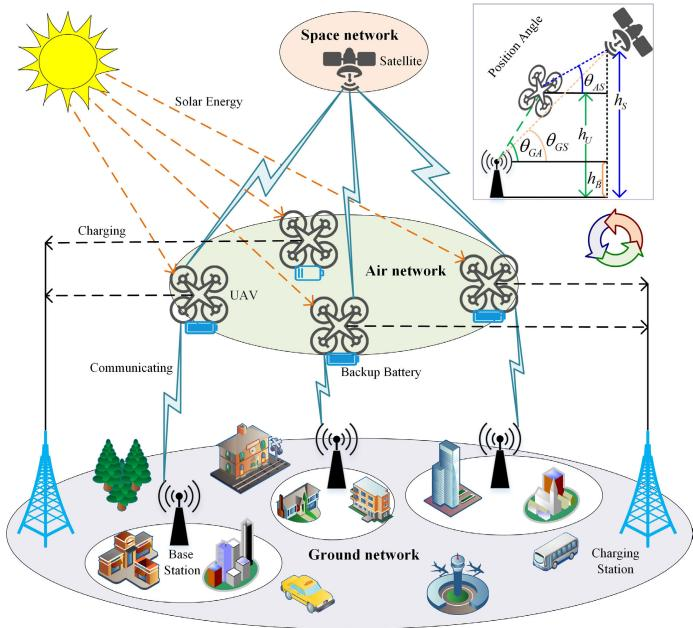
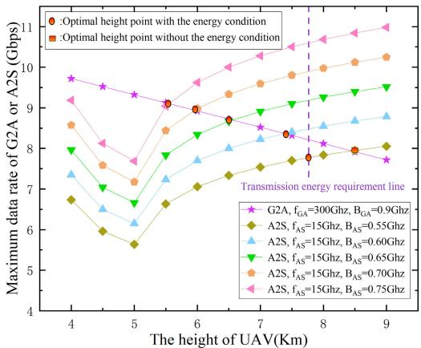
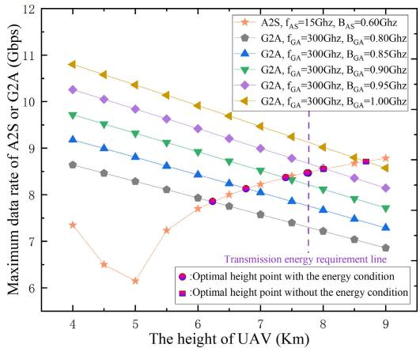
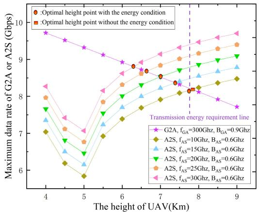
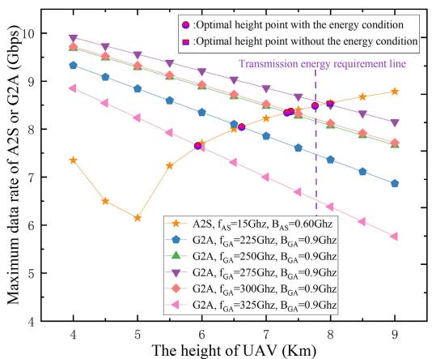
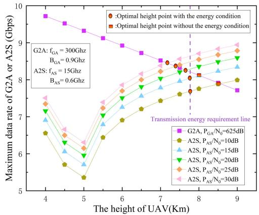
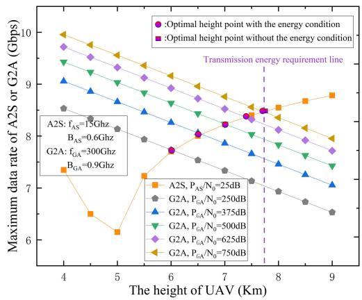
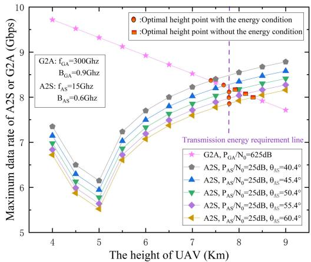
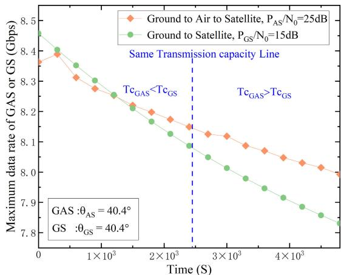
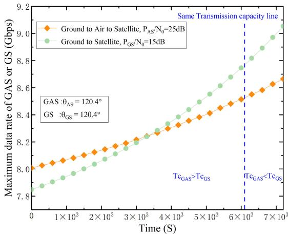

# Outage Probability, Performance, and Fairness Analysis of Space–Air–Ground Integrated Network (SAGIN): UAV Altitude and Position Angle

Jingjing Tan , Member, IEEE, Fengxiao Tang , Senior Member, IEEE, Ming Zhao , Member, IEEE, and Nei Kato , Fellow, IEEE

Abstract— The Space-Air-Ground integrated network (SAGIN) has gained significant attention due to the explosive growth in mobile data traffic. In this network, Unmanned Aerial Vehicles (UAVs) play a critical role as air relay nodes, bridging ground and space networks. However, challenges arise from the dynamic position angles between UAVs and satellites, as well as fixed UAV altitudes, limiting air-to-space transmission capacity. Moreover, the finite UAV battery capacity carries the risk of energy interruptions during SAGIN transmissions. To address these issues, we propose an integrated model that considers UAV channel fading, energy consumption, and harvesting. This model allows us to comprehensively analyze SAGIN transmission performance. Within this framework, we calculate the UAV energy outage probability and signal-to-noise ratio (SNR) outage probability for SAGIN uplink transmission. Based on our network performance analysis, we derive an expression for the optimal UAV altitude, ensuring uninterrupted energy supply and preventing SNR outage. To assess the fairness of SAGIN transmission performance, we compare the capabilities of Ground-to-Air-to-Space and Ground-to-Space transmissions. Additionally, we provide closedform expressions for the transmission time gap in both scenarios. Our numerical results validate the accuracy of these derived expressions and evaluate how key parameters impact the optimal UAV altitude in the SAGIN uplink.

Index Terms— SAGIN, UAV altitude, position angle, energy outage, SNR outage, fairness.

## I. INTRODUCTION

have overwhelmed traditional ground communication networks. In response to the surging demand for daily service needs, both researchers and communication service providers have shifted their focus to the Space-Air-Ground Integrated Network (SAGIN) [2]. SAGIN has arisen as a compelling solution, providing robust and widespread access services, as well as comprehensive communication reach. Ground networks provide data access services by deploying infrastructure communication facilities, air networks can provide better communication services through deployed Unmanned Aerial Vehicles (UAVs) and balloons, and space networks can provide ubiquitous access via satellite to remote and maritime areas.

In the SAGIN framework, the air network takes on the role of a relay layer and possesses the inherent capabilities to serve as a mobile base station in the air, owing to its ease of deployment and mobility characteristics [3]. UAVs are widely employed as aerial nodes, bolstering ground communication networks due to their cost-efficiency, adaptability, and minimal energy usage. UAVs can function as caching nodes in the air, efficiently decreasing latency for mobile users and enhancing caching strategies [4]. Furthermore, within vehicular networks, UAVs are utilized as airborne offload nodes to alleviate the computational load of the vehicular system, ultimately leading to cost reduction for computational tasks [5]. However, the participation of air nodes in other networks introduces novel challenges and issues. Significantly, when integrated with heterogeneous networks, the elevated positioning of airborne nodes has the potential to disrupt the quality of alternative network channels [6]. Consequently, it becomes imperative to address and mitigate such interference to ensure seamless and efficient connectivity among various network components.

These issues on the UAV altitude deployment optimization in wireless networks have also attracted the attention of researchers. Natural disasters may damage ground communication facilities. Lin et al. [7] proposed an optimal location deployment scheme for UAVs in emergency areas to maximize coverage of ground communication and reduce UAV energy consumption. Meanwhile, energy harvesting (EH) has been proposed to solve UAVs’ energy consumption and deployment problems. Lu et al. [8] proposed a UAV-assisted uplink access system to maximize the average transmission rate by optimizing the UAV location deployment and the UAV transmission power. Sekander et al. [9] optimized the deployment of the UAV altitude by reducing the probability of energy disruption.

Furthermore, numerous previous SAGIN investigations primarily concentrate on network access [10], traffic management [11], computational offloading [12], and performance evaluation [13]. Sharma et al. [14] examined outage performance and average symbol error probability within the SAGIN, employing a hybrid FSO/RF communication approach. Nonetheless, these studies frequently overlook the potential influence of UAV altitude and positional angles on SAGIN transmission performance. The three-dimensional placement of the UAV, encompassing both altitude and positioning angles, can significantly affect the quality of channel transmissions in both Ground-to-Air (G2A) and Air-to-Space (A2S) scenarios. Another work by Wang et al. [15] proposed a joint optimization scheme for UAV altitude and power control to maximize throughput in the SAGIN. However, they did not take into account the disruptions caused by UAV energy limitations and A2S channel fading. The challenges associated with channel fading and the finite capacity of UAV batteries can notably affect the UAV’s altitude and degrade transmission quality in the SAGIN uplink. To address these issues, we propose an integrated model that accounts for both UAV channel fading and energy consumption. This model allows for an in-depth analysis of transmission performance. Furthermore, we explore the probabilities of UAV energy outage and SNR outage, and through an examination of the transmission rate between the G2A channel and the A2S channel, we derive an optimal expression for determining the ideal altitude for UAVs. To evaluate the fairness of the Ground-to-Air-to-Space (GAS) and the Ground-to-Space (G2S) transmission, we conduct a comparative assessment of their transmission capabilities within a specific time range. Additionally, we derive closed expressions for the transmission time gap, aiding in the selection of the most suitable transmission mode. Importantly, those derived optimal expressions for UAVs hold universal applicability and can be employed in relevant studies within the SAGIN environment. The main contributions of this paper are summarized as follows:

• Based on the comprehensive analysis of the integrated channel fading model and energy requirement model, we investigate the impact of UAV altitudes and position angles on network performance within the SAGIN transmission environment. Additionally, we derive analytical expressions for both UAV energy outage probability and SNR outage probability.

• According to the findings from the analysis of network performance, we derive an expression for the optimal UAV altitude and position angle in SAGIN uplink transmission. Through dynamic adjustments of transmission timing and real-time UAV altitude based on the initial positioning angle, we can optimize the transmission rate in the SAGIN uplink, ensuring efficient and effective communication within SAGIN systems.

• To assess the fairness of SAGIN transmission performance, we conduct a comparative analysis of the transmission capacity between GAS and G2S transmissions. Additionally, we derive closed-form expressions for the transmission time gap in both scenarios. To validate the accuracy of these expressions, we adopt Monte Carlo simulations to assess how crucial parameters affect the optimal UAV altitude in the SAGIN uplink. Through this comprehensive investigation, we aim to provide a robust understanding of the fairness and optimization aspects of SAGIN transmission, considering different scenarios and parameter settings.

The rest of this paper is structured as follows. Section II provides a thorough review of UAV position deployment schemes and energy optimization schemes in UAV-assisted wireless communication networks. In Section III, we present the network model, the GAS channel fading model, and the UAV energy model. In Section IV, we derive the UAV energy outage probability and the SNR outage probability in the SAGIN uplink scenario. Section V focuses on analyzing network performance within the SAGIN transmission environment, ultimately leading to the derivation of the optimal UAV altitude expression. Furthermore, Section VI examines the transmission capacity between GAS and G2S. In Section VII, we evaluate the accuracy of derived expressions through our Monte Carlo simulation experiments. Finally, Section VIII provides a comprehensive summary of this paper’s findings and conclusions.

## II. RELATED WORK

As the communication infrastructure in the air networks, UAVs play an essential role in accessing and optimizing other networks [4], [16]. However, UAVs face new problems due to their limited battery capacity and corresponding location placement [9]. We will then briefly review the relevant works in the UAV-assisted wireless communication networks from the perspective of the UAV location placement optimization and the UAV energy optimization.

Due to their high mobility, UAVs can be considered adaptable mobile nodes to dynamically approach the users to increase the throughput of ground networks [17]. In [18], Zhang et al. proposed a UAV-assisted relay communication system, which can maximize end-to-end throughput by jointly optimizing UAV trajectory and transmit power. In [19], Guo et el. proposed a UAV-assisted mobile edge computing system where UAVs were considered a relay between mobile users and the ground base station. They reduce the total system latency in the considered framework by jointly optimizing the UAV trajectory and computation offloading strategy. Besides, some studies on UAV altitude optimization have also attracted lots of attention. In [20], Qureshi et al. analyzed the role of UAV deployment parameters and balanced the importance between coverage radius, altitudes, and beamwidth of UAV. In [21], Senadhira et al. proposed to increase the throughput of UAV-assisted cellular networks by optimizing the trajectory and altitude of the UAV. However, these researches mentioned above hardly consider the impact of channel fading and energy consumption models on the UAV position.

Based on the limited battery capacity of UAVs, energy efficiency optimization studies and energy harvesting schemes have been proposed. In [22], Liu et al. proposed a UAV-assisted Internet of Things (IoT) communication system, which maximized the total throughput and energy efficiency of the UAV by optimizing the location and transmission power of the UAV. In [23], Yang et al. presented a UAV-assisted IoT communication framework to maximize energy efficiency by optimizing the wakeup scheme of IoT and the trajectory of fixed-wing UAVs. In [24], Song et al. proposed an energy efficiency optimization scheme for a solar-powered UAV communication system, where the absorbed solar energy was related to the UAV angle. Solar arrays supporting various UAVs are made available in different shapes and sizes. If the weight and size of the solar cells are too large, then solar energy will not improve the range of the UAV. Therefore, Alta Devices’ solar solution [25] provides a lightweight configuration of solar arrays where these solar cells can be attached directly to the surface of the UAV with negligible aerodynamic impact, which directly demonstrates that the benefits of solar cells for UAVs outweigh the payoff of the added load. For example, these solar cells have been used in the High Altitude Long Endurance (HALE) Unmanned Aircraft Systems (UAS).

However, the impact of channel fading on communication quality generated by different communication network segments is not negligible. To address these issues, we propose an integrated UAV channel fading and energy consumption model, which allows for an in-depth analysis of transmission performance. Moreover, we derive the optimal UAV altitude expression according to the network performance analysis results, which can be employed in relevant studies within the SAGIN environment. To evaluate the fairness of the GAS and the G2S transmission, we conduct a comparative assessment of their transmission capabilities within a specific time range. Additionally, we derive closed expressions for the transmission time gap, aiding in the selection of the most suitable transmission mode.

## III. SYSTEM MODEL

In this section, we will provide a comprehensive overview of several key aspects related to the SAGIN uplink. Firstly, we will introduce the network model that forms the foundation of our research. Subsequently, we will present the GAS channel fading model, which plays a crucial role in understanding the transmission characteristics. Furthermore, we will delve into the intricacies of the UAV energy consumption model, shedding light on the energy dynamics within the UAV system. Lastly, we will explore the energy harvested model, examining its significance and potential implications.

## A. Network Model

Fig.1 provides a visual representation of the GAS communication environment considered in this paper. Within the ground network, users are uniformly distributed in a circular area denoted as S, with a radius $R _ { d } .$ At the center of this circular area, the BS is positioned to facilitate communication. According to the Release 17 version proposed by the third-generation partnership project (3GPP), in the air network, we assume that Q UAVs are used to support a BS, or some terrestrial users, or some users in remote areas not supported by a base station, and maritime users, where each UAV can maintain a fixed altitude during a time gap and these altitudes can be adjusted according to the served users. As UAVs can also provide communication links with satellites, the theoretical altitude1 optimization of UAVs also needs to take into account the impact of satellites. Those UAVs provide communication services by harnessing solar energy $E _ { s }$ and utilizing its backup battery capacity $E _ { b }$ . Considering the possibility that the UAV may undergo energy interruptions during the evening, i.e., the energy consumption is more than the harvested solar energy and the battery backup, another fully charged UAV seamlessly replaces it to ensure uninterrupted communication services. The solar energy collected is used to maximize the UAV’s range and reduce the number of UAV replacements, and the UAV may need to operate for long periods of time in remote or inaccessible areas where frequent replacement is impractical. The discharged UAV is then guided back to the charging station, making use of any remaining backup battery charge and harvested energy. In the space network, satellites facilitate indirect communication with users via air networks. To thoroughly assess and discern the fairness and disparities between direct and indirect transmission scenarios, with or without the involvement of UAVs as relays, we will analyze the fairness of the transmission performance between GAS and G2S in Section VI.

  
Fig. 1. The considered GAS communication environment.

In the considered scenario, UAVs in the proposed models belong to hybrid fixed/rotary wing UAVs. Since conventional fixed-wing UAVs cannot hover in the air, rotary-wing UAVs cannot fly and hover at high altitudes. Given the joint need for flight and high-altitude hovering, the proposed system need to utilize hybrid fixed/rotary wing UAVs. UAV action control models are mainly divided into two models that include the hovering & transmission model and the flight & return model. In the first model, after the UAV has flown to its destination location, it hovers at the fixed location by its rotary wing and transmits the relevant data. Let $h _ { U }$ represent the altitude of the UAV and $h _ { B }$ denote the altitude of the BS. The distance $P d _ { U B }$ represents the projection of the UAV to the ground’s distance from the BS. Additionally, the distance between the UAV and the BS can be calculated using the formula $d _ { U B } =$ $\sqrt { ( h _ { U } - h _ { B } ) ^ { 2 } + ( P d _ { U B } ) ^ { 2 } }$ . In the second model, the UAV is required to fly and return to the charging station to recharge its backup battery by its fixed wing. We represent the distance from the UAV’s projection onto the ground to the charging station as $P d _ { U C }$ , and the UAV’s distance from the charging station can be calculated as $d _ { U C } = \sqrt { ( h _ { U } ) ^ { 2 } + ( P d _ { U C } ) ^ { 2 } } .$

With the aim of achieving optimal performance for SAGIN uplink transmissions, it is investigated how to determine the most effective altitude and position angle for UAVs. These factors are critical to ensure reliable communication under channel fading conditions while meeting energy requirements. Thus, we firstly describe the GAS channel fading model. This model allows us to examine the impact of fading on the communication link between the ground station and the UAV. By understanding the channel characteristics, we can optimize the UAV’s placement to mitigate the effects of fading and ensure reliable communication. Next, we introduce the UAV energy consumption model. This model helps us analyze the energy requirements of the UAV during communication operations. By quantifying energy consumption patterns, we can develop strategies to minimize energy interruptions and ensure continuous transmission. Furthermore, we present an energy harvesting model that enables the UAV to replenish its energy during operation. This model explores various techniques for harnessing energy from the environment, such as solar power. By integrating energy harvesting capabilities, the UAV can extend its mission duration and maintain uninterrupted communication. The combination of these models allows us to address the challenges of UAV deployment in the SAGIN uplink. By optimizing the altitude and position angle considering channel fading and energy requirements, we can achieve robust and efficient communication performance for UAV systems.

## B. GAS Channel Fading Model

In the transmission process from the ground to the air and eventually to space, we specifically focus on two distinct channels: the G2A channel and the A2S channel. The G2A channel fading model allows us to analyze and understand the variations in signal strength between the ground station and the UAV. This model takes into account factors such as distance, obstacles, and environmental conditions, which can affect the quality of the communication link. Similarly, the

A2S channel fading model examines the signal degradation that occurs between the UAV and the satellite. It enables us to characterize the impact of atmospheric conditions, satellite location, and other factors on the reliability and performance of the communication link from the UAV to the satellite. In the following, we will discuss the G2A channel fading model and the A2S channel fading model in detail.

1) G2A Channel Fading Model: Based on Shannon’s theorem, we can calculate the maximum transmission rate achievable in the G2A channel as follows:

$$
R _ { G A } = B _ { G A } \log _ { 2 } \left( 1 + { \frac { l _ { G A } ^ { 2 } P _ { G A } } { N _ { 0 } } } \right) .\tag{1}
$$

where $B _ { G A }$ denotes the allocated bandwidth, $l _ { G A }$ characterizes the fading experienced in the G2A wireless channel, $P _ { G A }$ signifies the transmitted power from the ground to the air, and $N _ { 0 }$ represents the variance of zero-mean Gaussian white noise. The wireless channel fading $l _ { G A }$ encompasses the combined effect of path gain $l _ { p g } .$ , misalignment fading ${ l } _ { t f } ,$ and multipath fading $l _ { h f }$ . Consequently, the expression for the G2A wireless channel fading lGA can be formulated as follows:

$$
{ l _ { G A } } = { l _ { p g } } { l _ { t f } } { l _ { h f } } .\tag{2}
$$

Path gain $l _ { p g }$ primarily depends on propagation gain and molecular absorption. The propagation gain can be derived using the Friis Transmission Equation. Furthermore, the molecular absorption is influenced by the frequency and relative humidity. Consequently, the path gain $l _ { p g }$ can be computed through the following equation:

$$
l _ { p g } = \frac { c \sqrt { G _ { G A } ^ { t } } \sqrt { G _ { G A } ^ { r } } } { 4 \pi f _ { G A } d _ { U B } } \exp \left( - \frac { 1 } { 2 } k _ { \alpha } ( f _ { G A } ) d _ { U B } \right) .\tag{3}
$$

where $G _ { G A } ^ { t }$ denotes the transmission gain, and $G _ { G A } ^ { r }$ represents the reception gain. The speed of light is denoted by $c .$ The parameter $f _ { G A }$ refers to the frequency of the G2A channel, while $d _ { U B }$ represents the distance between UAV and BS. Additionally, the parameter $k _ { \alpha } ( f _ { G A } )$ pertains to the molecular absorption factor and can be obtained through reference [26].

Misalignment fading, denoted as $l _ { t f }$ , results from the discrepancy between the beam transmitted by the BS and the beam received by the UAV. This beam misalignment may be generated by the UAV undergoing a change in direction during flight $\mathrm { { _ { o r } } }$ by turbulence, maneuvering, or imprecise antenna alignment. To simplify, we model the ground projection area of the rotary-wing UAV as a circular region with a radius of r. The calculation of misalignment fading $l _ { t f }$ can be expressed by [27]

$$
l _ { t f } = \mathrm { e r f } ( \varepsilon ) ^ { 2 } \exp \left( \frac { - 2 P d _ { U B } ^ { 2 } } { R _ { e q } ^ { 2 } } \right) .\tag{4}
$$

$$
R _ { e q } ^ { 2 } = R _ { d } ^ { 2 } \frac { \sqrt { \pi } e r f ( \varepsilon ) } { 2 \varepsilon \exp ( - \varepsilon ^ { 2 } ) } .\tag{5}
$$

where $l _ { t f }$ denotes the fraction of power collected by the UAV within the circular area $S ,$ erf(·) represents the Gaussian error function, and ε is defined as $( \sqrt { \pi } r ) / ( \sqrt { 2 } R _ { d } )$

While it’s true that in G2A communication, there may be fewer obstacles between the base station and the UAV compared to ground-to-ground communication, multipath fading can still occur due to reflections from the ground, buildings, or other objects in the environment. To calculate the probability distribution function of the multipath fading $l _ { h f } .$ we can follow the Rayleigh distribution model as introduced in reference [28]. The Rayleigh distribution is commonly utilized to accurately capture the characteristics of multipath fading phenomena. The related probability distribution function (PDF) can be obtained as follow:

$$
f _ { l _ { h f } } = \frac { 2 } { \hat { l } _ { h f } ^ { 2 } \Gamma ( 1 ) } x \exp \left( \frac { - x ^ { 2 } } { \hat { l } _ { h f } ^ { 2 } } \right) .\tag{6}
$$

where $\Gamma ( \cdot )$ represents the Gamma function. The fading channel envelope, represented as $\hat { l } _ { h f } ^ { 2 }$ , characterizes the magnitude of the multipath fading.

2) A2S Channel Fading Model: Likewise, in alignment with Shannon’s theorem, the maximum achievable transmission rate of the A2S channel can be determined as follows:

$$
R _ { A S } = B _ { A S } \log _ { 2 } \left( 1 + \frac { l _ { A S } ^ { 2 } P _ { A S } } { N _ { 0 } } \right) .\tag{7}
$$

where $B _ { A S }$ represents the assigned bandwidth, $l _ { A S }$ corresponds to the fading of the A2S wireless channel, and $P _ { A S }$ denotes the transmitted power from air to space. The A2S wireless channel fading $l _ { A S }$ , encompasses various factors, including space propagation fading $( l _ { s f } )$ , atmospheric absorption fading $( l _ { a f } )$ , and rain attenuation $( l _ { r a } )$ . As a result, the expression for the A2S wireless channel fading $l _ { A S }$ can be stated as follows:

$$
{ l _ { A S } } = { l _ { s f } } { l _ { a f } } { l _ { r a } } .\tag{8}
$$

Space propagation fading $l _ { s f }$ refers to the attenuation experienced by electromagnetic waves during their transmission in space. In accordance with the simplified Friis Transmission Equation, when the distance between the transmitting antenna of a UAV and the receiving antenna of a satellite significantly exceeds the wavelength of the electromagnetic waves, the expression for $l _ { s f }$ can be given as follows:

$$
l _ { s f } = \sqrt { 2 0 \times | \lg \frac { c } { 4 \pi f _ { A S } d _ { S U } } | } .\tag{9}
$$

where $f _ { A S }$ represents the frequency of the A2S channel, lg(·) represents the logarithmic function with base 10, $d _ { S U }$ represents the distance between the UAV and the satellite and it is approximately equal to $h _ { S } /$ sin $\theta _ { A S }$ . This approximation is based on the assumption that the altitude of the satellite, represented by $h _ { S }$ , is significantly greater than the altitude of the UAV, denoted as $h _ { U }$ . Therefore, we can approximate $d _ { S U }$ as $\left( h _ { S } - h _ { U } \right) /$ sin $\theta _ { A S } .$ , which further simplifies to $h _ { S } /$ sin $\theta _ { A S }$ The position angle denoted as $\theta _ { A S }$ is the angle between the UAV position and the satellite position, as shown in Fig.1.

Atmospheric absorption fading $l _ { a f }$ primarily depends on the presence of water vapor and the channel frequency, as discussed in [29]. Higher frequency channels experience more significant loss due to the effects of water vapor. As a result, the expression for atmospheric absorption fading $l _ { a f }$ can be stated as follows [30]:

$$
l _ { a f } = \sqrt { \frac { 0 . 0 4 2 \times \exp ( 0 . 0 6 9 f _ { A S } ) } { \sin \theta _ { A S } } } .\tag{10}
$$

Rain attenuation $l _ { r a }$ denotes the loss in electromagnetic wave propagation when a rain layer is present. In situations where there is no rain layer in the communication space, we assume $l _ { r a }$ equals 1. However, when a rain layer is present, the ITU-R model [31] provides a method to determine the rain attenuation $l _ { r a }$ , which is obtained by performing the following equation:

$$
l _ { r a } = \sqrt { a ( R _ { p } ) ^ { b } \gamma _ { p } } \sqrt { \frac { | h _ { U } - h _ { T } | } { \sin \theta _ { A S } } } .\tag{11}
$$

where $R _ { p }$ represents the rainfall intensity. The rain attenuation factor is denoted as $a ( R _ { p } ) ^ { b }$ , where a and b are constants associated with the rain attenuation factor. Additionally, $h _ { T }$ represents the altitude at which the temperature reaches 273.15 Kelvins (K). It is assumed that the altitude $h _ { U }$ of the UAV is greater than or equal to $h _ { T }$

C. Energy Consumption and Solar Energy Harvested Models of UAV

In this subsection, we first describe the considered energy consumption model of UAVs and then introduce the solar energy harvested model.

1) Energy Consumption Model: Based on the aforementioned system model, when the UAV is operating in the hovering & transmission model, its energy consumption is primarily composed of the energy consumed during hovering and the energy consumed during communication transmission. Conversely, in the flight & return model, the energy consumption of the UAV mainly includes the energy consumed during flight and the energy consumed to keep the operating system of the UAV active, which is referred to as the operation activation energy consumption. Hence, we establish the UAV’s total energy consumption as follows:

$$
E _ { c } = ( P _ { t } + P _ { h } ) T _ { t } + ( P _ { a } + P _ { f } ) T _ { f } .\tag{12}
$$

where $P _ { t }$ represents the power consumed during transmission, with $P _ { t }$ equalling $P _ { A S }$ , and $P _ { h }$ represents the power consumed during hovering. Additionally, $T _ { t }$ represents the duration of transmission for the UAV. Moreover, $P _ { a }$ denotes the power required to activate the UAV’s operations, $P _ { f }$ denotes the power consumed during flight, $T _ { f }$ represents the duration of flight for the UAV, which can be calculated as $T _ { f } = d _ { U C } / v _ { u } ,$ with $v _ { u }$ representing the UAV’s speed. The flight power $P _ { f }$ can be obtained by [9],

$$
P _ { f } = { \sqrt { \frac { ( m g ) ^ { 3 } } { 2 \pi r _ { w } ^ { 2 } n _ { w } \varphi } } } .\tag{13}
$$

where m represents the weight of the UAV in kilograms (kg), g represents the acceleration due to gravity on Earth in meters per second squared $( m / s ^ { 2 } ) , r _ { w }$ denotes the rotor blade radius in the UAV, while $n _ { w }$ stands for the number of rotor blades in the UAV. Additionally, $\varphi$ represents the air density in kilograms per cubic meter $( k g / m ^ { 3 } )$ .

2) Solar Energy Harvested Model: As mentioned in reference [32], the solar energy collected by the UAV is predominantly influenced by the sunlight intensity I. Thus, the solar power harvested $P _ { s } ( I )$ can be determined by utilizing the following equation [9]:

$$
P _ { s } ( I ) = \left\{ \begin{array} { l l } { \displaystyle \frac { \varpi _ { s } } { \kappa _ { s } } I ( t ) ^ { 2 } , } & { 0 < I ( t ) < \kappa _ { s } } \\ { \displaystyle \varpi _ { s } I ( t ) , } & { I ( t ) \geq \kappa _ { s } } \end{array} \right.\tag{14}
$$

where $\varpi _ { s }$ represents the utility factor denoting the absorption capacity of the UAV’s solar charging panel for solar energy, $\kappa _ { s }$ signifies the maximum solar intensity that the solar charging panel can capture. The function $I ( t ) = I _ { b } ( t ) + \Delta I ( t )$ represents solar intensity variation over the course of the day. It’s important to acknowledge that solar intensity can be affected by various factors, including cloud cover, haze, and different weather conditions. Therefore, we assume that the solar intensity can be expressed as the sum of two components: the basic solar intensity function, denoted as $I _ { b } ( t )$ , and the stochastic solar intensity function, denoted as $\Delta I ( t )$ The stochastic solar intensity function follows a standard normal distribution $\Delta I \sim N ( 0 , 1 )$ . The basic solar intensity function can be determined as follow:

$$
\begin{array} { l l } { { I _ { b } ( t ) } } \\ { { \ } } \\ { { \displaystyle = \left\{ \begin{array} { l l } { { I _ { m a x } \left( - { \frac { 1 } { 3 6 t ^ { 2 } } } + { \frac { 2 } { 3 t } } - 3 \right) , } } & { { 6 \leq t < 1 8 } } \\ { { 0 , } } & { { 0 \leq t < 6 \& 1 8 \leq t < 2 4 } } \end{array} \right. } } \end{array}\tag{15}
$$

where $I _ { m a x }$ is the maximum solar intensity in a day and can be adjusted according to the different months of a year [32]. Then the PDF of the stochastic solar intensity function I can be presented as follow [9]:

$$
f _ { I } ( I ) = \frac { 1 } { \sqrt { 2 \pi } } \exp { \left( - \frac { ( I - I _ { b } ) ^ { 2 } } { 2 } \right) }\tag{16}
$$

To ensure uninterrupted SAGIN uplink transmission, it is imperative to conduct an analysis on the probability of energy outages and SNR outages in the air network pertaining to UAVs. This analysis will provide critical constraints for the deployment of UAVs. Next, we will carry out the energy outage analysis and the SNR outage analysis.

## IV. ENERGY OUTAGE ANALYSIS AND SNR OUTAGE ANALYSIS IN SAGIN UPLINK

In this section, we characterize the probability of UAV energy outage and the probability of SNR outage. We first derive the PDF and cumulative distribution function (CDF) of UAV energy outage in the SAGIN environment. Based on the G2A and A2S transmission SNR thresholds, we then analyze the SNR outage probability.

## A. Energy Outage Analysis

If the energy from the UAV’s backup battery and the harvested solar energy are not enough to support the UAV’s return to the charging station and data transmission, we define

that the UAV will undergo an energy outage. Specifically, the energy outage probability function of the UAV is described by

$$
\begin{array} { r l } & { E _ { o u t } = \mathbb { P } \left[ P _ { s } T _ { t } + E _ { b } < ( P _ { t } + P _ { h } ) T _ { t } + ( P _ { a } + P _ { f } ) T _ { f } \right] } \\ & { \quad \quad = \mathbb { P } \left[ P _ { s } < \frac { ( P _ { t } + P _ { h } ) T _ { t } + ( P _ { f } + P _ { a } ) T _ { f } - E _ { b } } { T _ { t } } \right] } \\ & { \quad \quad = \mathbb { P } \left[ P _ { s } < \lambda \right] . } \end{array}\tag{17}
$$

where $\begin{array} { r } { \lambda = \frac { ( P _ { t } + P _ { h } ) T _ { t } + ( P _ { f } + P _ { a } ) T _ { f } - E _ { b } } { T _ { * } } } \end{array}$ and $P _ { s }$ is the harvested solar power. According to the considered solar energy harvesting model, the solar power $P _ { s }$ is related to the specific time, the utility factor $\varpi _ { s } .$ , and maximum solar intensity $\kappa _ { s }$ . The harvested solar power $P _ { s } ( I )$ in the Eq.(14) can be modified by

$$
I ( P _ { s } ) = \left\{ \begin{array} { l l } { \sqrt { \frac { \kappa _ { s } P _ { s } } { \varpi _ { s } } } , } & { P _ { s } < \varpi _ { s } \kappa _ { s } . } \\ { \frac { P _ { s } } { \varpi _ { s } } , } & { P _ { s } > \varpi _ { s } \kappa _ { s } . } \end{array} \right.\tag{18}
$$

The PDF of $P _ { s }$ can be calculated as follows:

$$
f _ { P _ { s } } ( P _ { s } ) = \frac { \partial I ( P _ { s } ) } { \partial P _ { s } } f _ { I } ( P _ { s } ) .\tag{19}
$$

According to Eq.(18), the PDF of $P _ { s }$ is given by

$$
f _ { P _ { s } } ( P _ { s } ) = \left\{ \begin{array} { l l } { \displaystyle \frac { 1 } { 2 } \sqrt { \frac { \kappa _ { s } } { \varpi _ { s } P _ { s } } } f _ { I } \left( \sqrt { \frac { \kappa _ { s } P _ { s } } { \varpi _ { s } } } \right) , } & { P _ { s } < \varpi _ { s } \kappa _ { s } } \\ { \displaystyle \frac { 1 } { \varpi _ { s } } f _ { I } \left( \frac { P _ { s } } { \varpi _ { s } } \right) , } & { P _ { s } > \varpi _ { s } \kappa _ { s } . } \end{array} \right.\tag{20}
$$

The related CDF $\begin{array} { r } { F _ { P _ { s } } ( P _ { s } ) = \int _ { 0 } ^ { P _ { s } } P _ { s } ( t ) d t } \end{array}$ of the harvested solar power can be obtained by

$$
\begin{array} { r l } & { F _ { P _ { s } } ( P _ { s } ) } \\ & { = \left\{ \begin{array} { l l } { 1 } \\ { \displaystyle \frac { 1 } { 2 } \left( \mathrm { e r f } \left[ \frac { I _ { b } } { \sqrt { 2 } } \right] - \mathrm { e r f } \left[ \frac { I _ { b } - \sqrt { \frac { \kappa _ { s } P _ { s } } { \varpi _ { s } } } } { \sqrt { 2 } } \right] \right) , \quad P _ { s } < \varpi _ { s } \kappa _ { s } . } \\ { \displaystyle \frac { 1 } { 2 } \left( \mathrm { e r f } \left[ \frac { I _ { b } - \kappa _ { s } } { \sqrt { 2 } } \right] + \mathrm { e r f } \left[ \frac { P _ { s } - I _ { b } \varpi _ { s } } { \sqrt { 2 } \varpi _ { s } } \right] \right) , \quad P _ { s } > \varpi _ { s } \kappa _ { s } . } \end{array} \right. } \end{array}\tag{21}
$$

where $\begin{array} { r } { \operatorname { e r f } [ x ] ~ = ~ { \frac { 2 } { \sqrt { \pi } } } \int _ { 0 } ^ { x } e ^ { - t ^ { 2 } } d t } \end{array}$ denotes the Gaussian error function. According to our definition of UAV energy outage, the outage probability function $E _ { o u t }$ is calculated as follows

$$
E _ { o u t } = F _ { \lambda } ( \lambda ) .\tag{22}
$$

Bringing the Eq.(21) into the Eq.(22), the related outage probability function $E _ { o u t }$ is derived as (23), shown at the bottom of the next page.

## B. SNR Outage Analysis

When the $S N R _ { G A }$ from ground to air transmission is below a specific threshold or when the $S N R _ { A S }$ from air to space transmission is below a specific threshold, we consider that the wireless user is described as SNR outage in the SAGIN uplink. Specifically, the SNR outage probability function of the user is expressed as follow:

$$
S _ { o u t } = 1 - \mathbb { P } ( S N R _ { G A } \geq S N R _ { G A } ^ { t h } , S N R _ { A S } \geq S N R _ { A S } ^ { t h } )\tag{24}
$$

where $S N R _ { G A } ^ { t h }$ represent the SNR threshold from ground to air transmission, $S N R _ { A S } ^ { t h }$ represent the SNR threshold from air to space transmission. Next, we need to calculate the probability of $S N R _ { G A } \ \ge \ S N R _ { G A } ^ { t h }$ and the probability of $S N R _ { A S } \geq S N R _ { A S } ^ { t h }$ respectively. According to the definition of the Eq.(1), the probability of $S N R _ { G A } \geq S N R _ { G A } ^ { t h }$ can be calculated by

$$
\begin{array} { r } { \mathbb { P } ( S N R _ { G A } \geq S N R _ { G A } ^ { t h } ) = \mathbb { P } \left( \frac { l _ { G A } ^ { 2 } P _ { G A } } { N _ { 0 } } \geq S N R _ { G A } ^ { t h } \right) } \\ { = \mathbb { P } \left( l _ { h f } \geq \sqrt { \frac { S N R _ { G A } N _ { 0 } } { l _ { p g } ^ { 2 } l _ { t f } ^ { 2 } P _ { G A } } } \right) } \\ { = 1 - \mathbb { P } \left( l _ { h f } < \sqrt { \frac { S N R _ { G A } N _ { 0 } } { l _ { p g } ^ { 2 } l _ { t f } ^ { 2 } P _ { G A } } } \right) } \\ { = 1 - \mathbb { P } ( l _ { h f } < \mu _ { G A } ) \qquad ( 2 5 } \end{array}\tag{}
$$

where $\begin{array} { l c l } { \mu _ { G A } } & { = } & { \sqrt { \frac { S N R _ { G A } N _ { 0 } } { l _ { p g } ^ { 2 } l _ { t f } ^ { 2 } P _ { G A } } } } \end{array}$ . The related CDF of $l _ { h f }$ is $\begin{array} { r } { F _ { l _ { h f } } ( l _ { h f } ) = \int _ { 0 } ^ { l _ { h f } } f _ { l _ { h f } } d l _ { h f } } \end{array}$ . Thus, $\mathbb { P } ( S N R _ { G A } \ge S N R _ { G A } ^ { t h } ) =$ $1 - F _ { l _ { h f } } ( \mu _ { G A } )$ . Similarly, according to the definition of the $\mathrm { E q . } ( \dot { 7 } )$ , the probability of $S N R _ { A S } \ \ge \ S N R _ { A S } ^ { t h }$ can be calculated by

$$
\begin{array} { r l } & { \mathbb { P } ( S N R _ { A S } \geq S N R _ { A S } ^ { t h } ) = \mathbb { P } \left( \frac { l _ { A S } ^ { 2 } P _ { A S } } { N _ { 0 } } \geq S N R _ { A S } ^ { t h } \right) } \\ & { \qquad = \mathbb { P } \left( P _ { A S } \geq \frac { S N R _ { A S } ^ { t h } N _ { 0 } } { l _ { s f } ^ { 2 } l _ { a f } ^ { 2 } l _ { r a } ^ { 2 } } \right) } \\ & { \qquad = 1 - \mathbb { P } \left( P _ { A S } < \frac { S N R _ { A S } ^ { t h } N _ { 0 } } { l _ { s f } ^ { 2 } l _ { a f } ^ { 2 } l _ { r a } ^ { 2 } } \right) } \\ & { \qquad = 1 - \mathbb { P } \left( P _ { A S } = P _ { t } < \mu _ { A S } \right) \quad ( 2 } \end{array}\tag{6}
$$

where $\begin{array} { r } { \mu _ { A S } ~ = ~ \frac { S N R _ { A S } ^ { t h } N _ { 0 } } { l _ { s f } ^ { 2 } l _ { a f } ^ { 2 } l _ { r a } ^ { 2 } } } \end{array}$ . According to the UAV energy sufficient conditions and the Eq.(20), the PDF of $P _ { t }$ is given by

$$
f _ { P _ { t } } ( P _ { t } ) = \left\{ \begin{array} { l l } { \displaystyle \frac { 1 } { 2 } \sqrt { \frac { \kappa _ { s } } { \varpi _ { s } \lambda } } f _ { I } \left( \sqrt { \frac { \kappa _ { s } \lambda } { \varpi _ { s } } } \right) , } & { P _ { t } < \xi . } \\ { \displaystyle \frac { 1 } { \varpi _ { s } } f _ { I } \left( \frac { \lambda } { \varpi _ { s } } \right) , } & { P _ { s } > \xi . } \end{array} \right.\tag{27}
$$

where the related parameters $\begin{array} { r } { \lambda = { { \frac { ( P _ { t } + P _ { h } ) T _ { t } + ( P _ { a } + P _ { f } ) T _ { f } - E _ { b } } { T _ { * } } } } } \end{array}$ and $\begin{array} { r } { \xi ~ = ~ { \frac { \varpi _ { s } \kappa _ { s } T _ { t } + E _ { b } - ( P _ { a } + P _ { f } ) T _ { f } } { T _ { * } } } ~ - ~ P _ { h } } \end{array}$ . The related CDF of $P _ { t }$ is $\begin{array} { r } { F _ { P _ { t } } ( P _ { t } ) = \int _ { 0 } ^ { P _ { t } ^ { \star } } P _ { t } d P _ { t } } \end{array}$ . Thus, $\mathbb { P } ( S N R _ { A S } \ge S N R _ { A S } ^ { t h } ) =$ $1 - F _ { P _ { t } } ( \mu _ { A S } )$ . Based on the mutual independence of parameter $l _ { h f }$ and parameter $P _ { t }$ , the SNR outage probability function $S _ { o u t }$ can be calculated as follows:

$$
S _ { o u t } = 1 - \mathbb { P } \left( S N R _ { G A } \geq S N R _ { G A } ^ { t h } , S N R _ { A S } \geq S N R _ { A S } ^ { t h } \right)
$$

$$
\begin{array} { r l } & { = 1 - [ \mathbb { P } ( l _ { h f } < \mu _ { G A } ) ] \times [ \mathbb { P } \left( P _ { t } < \mu _ { A S } \right) ] } \\ & { = 1 - \left( 1 - F _ { l _ { h f } } ( \mu _ { G A } ) \right) \times ( 1 - F _ { P _ { t } } ( \mu _ { A S } ) ) } \end{array}\tag{28}
$$

These integrals can be calculated numerically through some standardized mathematical software such as Mathmetica, and Matlab.

## V. PERFORMANCE ANALYSIS BASED ON THE UAVALTITUDE AND POSITION ANGLE IN SAGIN UPLINK

In this section, we focus on the analysis of network performance for the SAGIN uplink transmission. Our objective is to optimize the GAS communication rate without energy interruption and SNR interruption. Building upon the insights gained from prior model analysis and considering three predefined position angles shown in Fig.1, we aim to ascertain the optimal altitude and positioning angle for the UAV. This optimization process targets the maximization of the transmission rate within the GAS channel. As this channel encompasses both the G2A and the A2S segments, the overall transmission rate is dictated by the minimum value between the transmission rates of these two segments, in accordance with the Max-flow min-cut theorem. Thus, the formulated optimization function is expressed as follow:

$$
\operatorname* { m a x i m i z e } _ { h _ { U } , \theta _ { G A } , \theta _ { A S } } \operatorname* { m i n } \left\{ R _ { G A } , R _ { A S } \right\}\tag{29a}
$$

$$
{ \mathrm { S u b j e c t ~ t o ~ ( C 1 ) } } \colon P _ { s } < { \frac { ( P _ { t } + P _ { h } ) T _ { t } + ( P _ { a } + P _ { f } ) T _ { f } - E _ { b } } { T _ { t } } } .\tag{29b}
$$

$$
( \mathbf { C } 2 ) \colon \frac { l _ { p g } ^ { 2 } l _ { t f } ^ { 2 } l _ { h f } ^ { 2 } P _ { G A } } { N _ { 0 } } \geq S N R _ { G A } ^ { t h } .\tag{29c}
$$

$$
( \mathbf { C } 3 ) \colon \frac { l _ { s f } ^ { 2 } l _ { a f } ^ { 2 } l _ { r a } ^ { 2 } P _ { A S } } { N _ { 0 } } \geq S N R _ { A S } ^ { t h } .\tag{29d}
$$

The first constraint (C1) ensures that the UAV does not experience energy outage during operation. The second constraint (C2) guarantees that the G2A transmission meets the SNR threshold requirement. Lastly, the third constraint (C3) ensures that the A2S transmission also satisfies the SNR threshold requirement. Given that the transmission power $P _ { A S } ( P _ { t } )$ of the UAV typically remains fixed during data transmission, while the harvested solar power $P _ { s }$ fluctuates, we can address these constraints by either shortening the $\mathrm { U A V } \mathbf { \hat { s } }$ transmission service duration or substituting it with a standby UAV equipped with ample backup power. Hence, we can establish the maximum duration of UAV transmission by

$$
T _ { t } ^ { * } = \frac { E _ { b } - ( P _ { f } + P _ { a } ) \sqrt { h _ { U } ^ { 2 } + P d _ { d c } ^ { 2 } } } { ( P _ { h } + P _ { t } - P _ { s } ) v _ { u } } .\tag{30}
$$

$$
E _ { o u t } = F _ { T _ { i } } ( T _ { i } ) = \left\{ \begin{array} { l l } { \displaystyle \frac { 1 } { 2 } \left( \mathrm { e r f } \left[ \frac { I _ { b } } { \sqrt { 2 } } \right] - \mathrm { e r f } \left[ \frac { I _ { b } } { \sqrt { 2 } } - \sqrt { \frac { \kappa _ { s } [ ( P _ { t } + P _ { h } ) T _ { t } + ( P _ { a } + P _ { f } ) T _ { f } - E _ { b } ] } { 2 T _ { t } \varpi _ { s } } } \right] \right) , } & { T _ { t } < \frac { E _ { b } - ( P _ { a } + P _ { f } ) T _ { f } } { P _ { t } + P _ { h } - \varpi _ { s } \kappa _ { s } } . } \\ { \displaystyle \frac { 1 } { 2 } \left( \mathrm { e r f } \left[ \frac { I _ { b } - \kappa _ { s } } { \sqrt { 2 } } \right] + \mathrm { e r f } \left[ \frac { ( P _ { t } + P _ { h } ) T _ { t } + ( P _ { a } + P _ { f } ) T _ { f } - E _ { b } } { \sqrt { 2 } T _ { t } \varpi _ { s } } - \frac { I _ { b } } { \sqrt { 2 } } \right] \right) , } & { T _ { t } > \frac { E _ { b } - ( P _ { a } + P _ { f } ) T _ { f } } { P _ { t } + P _ { h } - \varpi _ { s } \kappa _ { s } } . } \end{array} \right.\tag{23}
$$

Considering Eq.(1) and Eq.(7), it is inconclusive whether the minimum value of $R _ { G A }$ and $R _ { A S }$ corresponds to $R _ { G A }$ or $R _ { A S }$ . Moreover, the associated $S N R _ { G A }$ and $S N R _ { A S }$ must surpass specific thresholds. We assume that $R _ { G A } \ >$ $r _ { G A } ^ { t h } = \bar { B } _ { G A } ^ { t h } \bar { \log _ { 2 } } ( 1 + S N R _ { G A } )$ , where $B _ { G A } ^ { t h }$ represents the bandwidth threshold of the G2A channel, and $R _ { A S } > r _ { A S } ^ { t h } =$ $B _ { A S } ^ { t h } \log _ { 2 } ( 1 + S N R _ { A S } )$ , where $B _ { A S } ^ { t h }$ represents the bandwidth threshold of the A2S channel. Consequently, we will conduct an analysis and determine the optimal UAV altitude into two situations: “Case 1: $R _ { G A } ~ \leq ~ R _ { A S } { } ^ { * }$ and “Case 2: $R _ { G A } \geq R _ { A S } { } ^ { \prime \prime }$

## A. Case 1: $R _ { G A } \leq R _ { A S }$

In the case where the transmission rate $R _ { G A }$ of the G2A channel is not higher than the transmission rate $R _ { A S }$ of the A2S channel (i.e., $R _ { G A } ~ \leq ~ R _ { A S } )$ , the minimum of $R _ { G A }$ and $R _ { A S }$ can be represented by $R _ { G A }$ . By substituting Eq.(1) into Eq.(29a), the optimization function under consideration is replaced with

$$
\begin{array} { l } { { { h _ { U } ^ { * } = \arg \operatorname* { m a x } \{ B _ { G A } \log _ { 2 } ( 1 + \frac { l _ { G A } ^ { 2 } P _ { G A } } { N _ { 0 } } ) \} . } } } \\  { { l _ { G A } ^ { 2 } = \frac { G _ { G A } ^ { t } G _ { G A } ^ { r } c ^ { 2 } l _ { t f } ^ { 2 } l _ { h f } ^ { 2 } } { ( 4 \pi f _ { G A } ) ^ { 2 } [ ( h _ { U } - h _ { B } ) ^ { 2 } + ( P d _ { U B } ) ^ { 2 } ] } } } \\ { { \times \exp ( - k _ { \alpha } ( f _ { G A } ) \sqrt { ( h _ { U } - h _ { B } ) ^ { 2 } + ( P d _ { U B } ) ^ { 2 } } ) . } } \end{array}\tag{31}
$$

(32)

Note that the constants $B _ { G A } , P _ { G A }$ , and $N _ { 0 }$ are considered, where the transmission rate $R _ { G A }$ is a monotonically increasing function with respect to the independent variable $l _ { G A }$ Hence, the monotonicity of the function $R _ { G A }$ coincides with the monotonicity of $l _ { G A } ^ { \dot { 2 } }$ with respect to the independent variable $h _ { U }$ . It is worth noting that the fading characteristics of the Ground-to-Air channel, denoted as $l _ { t f }$ and $l _ { h f }$ remain unaffected by the altitude $h _ { U }$ of the UAV. Moreover, $l _ { G A } ^ { 2 }$ exhibits a monotonic decreasing behavior with respect to the independent variable $h _ { U }$ . By utilizing the transferability of monotonic functions, it can be concluded that $R _ { G A }$ behaves as a monotonic decreasing function with respect to $h _ { U }$ . Consequently, the minimum value of $h _ { U }$ in Eq.(31) represents the solution. Additionally, the condition $R _ { G A } \geq r _ { G A } ^ { t h }$ can be satisfied by

$$
\begin{array} { r l } & { [ ( h _ { U } - h _ { B } ) ^ { 2 } + ( P d _ { U B } ) ^ { 2 } ] e ^ { \big ( k _ { \alpha } ( f _ { G A } ) \sqrt { ( h _ { U } - h _ { B } ) ^ { 2 } + ( P d _ { U B } ) ^ { 2 } } \big ) } } \\ & { \qquad \le \frac { G _ { G A } ^ { t } G _ { G A } ^ { r } c ^ { 2 } l _ { t f } ^ { 2 } l _ { h f } ^ { 2 } c ^ { 2 } P _ { G A } } { ( 2 ^ { r _ { G A } ^ { t h } / B _ { G A } } - 1 ) N _ { 0 } ( 4 \pi f _ { G A } ) ^ { 2 } } . } \end{array}\tag{33}
$$

By substituting the equations Eq.(8) ∼ Eq.(10) into Eq.(7), the condition $R _ { A S } \geq r _ { A S } ^ { t h }$ can be derived as

$$
h _ { U } \geq \frac { ( 2 ^ { r _ { A S } ^ { t h } / B _ { G A } } - 1 ) N _ { 0 } \sin \theta _ { A S } } { l _ { s f } ^ { 2 } l _ { a f } ^ { 2 } a ( R _ { p } ) ^ { b } \gamma _ { p } P _ { A S } } + h _ { T } .\tag{34}
$$

As per the relationship $\begin{array} { r l r } { R _ { G A } } & { { } \le } & { R _ { A S } } \end{array}$ , we have max $\begin{array} { r } { \{ B _ { G A } \log _ { 2 } ( 1 + \frac { l _ { G A } ^ { 2 } P _ { G A } } { N _ { 0 } } ) \} = R _ { A S } } \end{array}$ . Consequently, solving Eq.(31) is equivalent to finding the solution to the equation $R _ { G A } = R _ { A S }$ . Additionally, the UAV altitude $h _ { U }$ must satisfy the constraints specified by Eq.(29b). By considering these conditions, the solution to Eq.(31) is determined as

If the given equation is satisfied by

$$
\begin{array} { r l } & { \sqrt { \frac { [ P _ { s } T _ { t } + E _ { b } - ( P _ { h } + P _ { t } ) T _ { t } ] ^ { 2 } v _ { u } ^ { 2 } } { ( P _ { f } + P _ { a } ) ^ { 2 } } - P d _ { U C } ^ { 2 } } } \\ & { \qquad \geq \frac { \left( 2 ^ { r _ { G A } ^ { t h } / B _ { G A } } - 1 \right) \times N _ { 0 } \sin \theta _ { A S } } { l _ { s f } ^ { 2 } l _ { a f } ^ { 2 } a ( R _ { p } ) ^ { b } \gamma _ { p } P _ { A S } } + h _ { T } , } \end{array}\tag{35}
$$

then the solution of Eq.(31) can be expressed as follows:

$$
h _ { U } ^ { * } = \frac { ( 2 ^ { r _ { G A } ^ { t h } / B _ { G A } } - 1 ) \times N _ { 0 } \sin \theta _ { A S } } { l _ { s f } ^ { 2 } l _ { a f } ^ { 2 } a ( R _ { p } ) ^ { b } \gamma _ { p } P _ { A S } } + h _ { T } .\tag{36}
$$

According to the Eq.(36), the corresponding optimal position angle $\theta _ { A S } ^ { * }$ between UAV and the satellite can be calculated as follows:

$$
\theta _ { A S } ^ { * } = \arcsin { \left( \frac { ( h _ { U } ^ { * } - h _ { T } ) l _ { s f } ^ { 2 } l _ { a f } ^ { 2 } a ( R _ { p } ) ^ { b } \gamma _ { p } P _ { A S } } { ( 2 ^ { r _ { G A } ^ { t h } / B _ { G A } } - 1 ) \times N _ { 0 } } \right) }\tag{37}
$$

After the UAV altitude is determined, then the position angle between UAV and the BS is also fixed as the altitude and position of the BS is fixed. The related position angle $\theta _ { G A } ^ { * }$ can be calculated as follows:

$$
\begin{array} { r l } & { \theta _ { G A } ^ { * } = \arctan ( \frac { h _ { U } ^ { * } - h _ { B } } { P d _ { U B } } ) } \\ & { \quad \quad = \arctan \left( \frac { ( 2 ^ { r _ { G A } ^ { t h } / B _ { G A } } - 1 ) N _ { 0 } \sin \theta _ { A S } } { l _ { s f } ^ { 2 } l _ { a f } ^ { 2 } a ( R _ { p } ) ^ { b } \gamma _ { p } P _ { A S } P d _ { U B } } + \frac { h _ { T } - h _ { B } } { P d _ { U B } } \right) . } \end{array}\tag{38}
$$

If the Eq.(35) do not hold, then the solution of Eq.(31) can be expressed as follows:

$$
h _ { U } ^ { * } = \sqrt { \frac { [ P _ { s } T _ { t } + E _ { b } - ( P _ { h } + P _ { t } ) T _ { t } ] ^ { 2 } v _ { u } ^ { 2 } } { ( P _ { f } + P _ { a } ) ^ { 2 } } - P d _ { U C } ^ { 2 } } .\tag{39}
$$

Based on the above equation, the related position angles $\theta _ { A S } ^ { * }$ and $\theta _ { G A } ^ { * }$ can be can be calculated as follows:

$$
\begin{array} { r l } & { \theta _ { A S } ^ { * } } \\ & { = \arctan \left( \frac { h _ { S } - h _ { U } ^ { * } } { P d _ { U S } } \right) } \\ & { = \arctan \left( \frac { h _ { S } } { P d _ { U S } ^ { 2 } } - \sqrt { \frac { [ P _ { s } T _ { t } + E _ { b } - ( P _ { h } + P _ { t } ) T _ { t } ] ^ { 2 } v _ { u } ^ { 2 } } { ( P _ { f } + P _ { a } ) ^ { 2 } P d _ { U S } ^ { 2 } } - \frac { P d _ { U C } ^ { 2 } } { P d _ { U S } ^ { 2 } } } \right) } \end{array}\tag{40}
$$

$$
\begin{array} { l } { { \theta _ { G A } ^ { * } } } \\ { { \displaystyle ~ = \arctan \left( \frac { h _ { U } ^ { * } - h _ { B } } { P d _ { U B } } \right) } } \\ { { \displaystyle ~ = \arctan \left( \sqrt { \frac { [ P _ { s } T _ { t } + E _ { b } - ( P _ { h } + P _ { t } ) T _ { t } ] ^ { 2 } v _ { u } ^ { 2 } } { ( P _ { f } + P _ { a } ) ^ { 2 } P d _ { U B } ^ { 2 } } - \frac { P d _ { U C } ^ { 2 } } { P d _ { U B } ^ { 2 } } } - \frac { h _ { B } } { P d _ { U B } ^ { 2 } } \right) } } \end{array}\tag{41}
$$

where $P d _ { U S }$ represents the distance between the UAV’s projection and the satellite’s projection on the ground.

B. Case 2: $R _ { G A } \geq R _ { A S }$

If the transmission rate $R _ { G A }$ of the G2A channel is greater than or equal to the transmission rate $R _ { A S }$ of the A2S channel $( \mathrm { i . e . , } R _ { G A } \geq R _ { A S } )$ , then the minimum of $R _ { G A }$ and $R _ { A S }$ is equal to $R _ { A S }$ . Substituting Eq.(7) and Eq.(8) into $\mathrm { E q . } ( 2 9 \mathrm { a } )$ , the optimization function under consideration is thus modified as follow:

$$
h _ { U } ^ { \ast } = \arg \operatorname* { m a x } \left\{ B _ { A S } \log _ { 2 } ( 1 + \frac { l _ { A S } ^ { 2 } P _ { A S } } { N _ { 0 } } ) \right\} .\tag{42}
$$

$$
l _ { A S } ^ { 2 } = l _ { s f } ^ { 2 } l _ { a f } ^ { 2 } a ( R _ { p } ) ^ { b } \gamma _ { p } \frac { | h _ { U } - h _ { T } | } { \sin \theta _ { A S } }\tag{43}
$$

Likewise, given that $B _ { A S } , \ P _ { A S }$ , and $N _ { 0 }$ remain constant, and $R _ { A S }$ increases monotonically concerning the independent variable $l _ { A S }$ , and this monotonic behavior aligns with that of $l _ { A S } ^ { 2 }$ concerning the independent variable $h _ { U }$ . Take note that $l _ { A S } ^ { 2 }$ increases monotonically with respect to the independent variable $h _ { U }$ , under the condition that $h _ { U } \mathrm { ~ - ~ }$ $h _ { T } \quad \geq \quad 0$ Utilizing the property of monotonic functions, we can conclude that $R _ { A S }$ increases monotonically with respect to the independent variable $h _ { U }$ . Hence, the solution for Eq.(42) corresponds to the maximum value achievable for $h _ { U }$

Given the inequality $R _ { A S } \quad \leq \quad R _ { G A }$ we have max $\begin{array} { r } { \{ B _ { A S } \log _ { 2 } ( 1 + \frac { l _ { A S } ^ { 2 } P _ { A S } } { N _ { 0 } } ) \} = R _ { G A } } \end{array}$ . Hence, the solution to Eq.(42) corresponds to the solution of the equation $R _ { A S } = R _ { G A }$ . Additionally, the UAV altitude $h _ { U }$ must adhere to the constraints outlined in Eq.(29b). The outcomes obtained by solving for $R _ { G A } \geq r _ { G A } ^ { t h }$ and $R _ { A S } \geq r _ { A S } ^ { t h }$ are also presented in Eq.(33) and Eq.(34). The solution to Eq.(42) can then be determined as follows: if Eq.(35) is valid, then the optimized value of $h _ { U } ^ { * }$ is expressed in Eq.(36), and the related optimized position angles $\theta _ { A S } ^ { * }$ and $\theta _ { G A } ^ { * }$ are expressed in Eq.(37) and Eq.(38), respectively; otherwise, then the optimized value of $h _ { U } ^ { * }$ is expressed in Eq.(39), and the related optimized position angles $\theta _ { A S } ^ { * }$ and $\theta _ { G A } ^ { * }$ are expressed in Eq.(40) and Eq.(41), respectively. Consequently, the optimized value of $h _ { U }$ , the related optimized position angles $\theta _ { A S } ^ { * }$ and $\theta _ { G A } ^ { * }$ are derived as (44)–(46), shown at the bottom of the next page.

In summary, if Eq.(35) is valid, the solution to the optimization function defined in Eq.(29a) can be found in Eq.(36). Conversely, if Eq.(35) is not satisfied, the solution is given by Eq.(39). Referring to Eq.(29b), we have the ability to reduce the UAV’s transmission time $T _ { t }$ (or replace it with an alternate UAV equipped with sufficient backup power) to ensure that the UAV altitude meets the transmission power requirements and the altitude threshold for achieving the maximum transmission rate (i.e., $\begin{array} { r l r } { B _ { G A } \log _ { 2 } ( 1 + \frac { l _ { G A } ^ { 2 } P _ { G A } } { N _ { 0 } } ) } & { { } = } & { } \end{array}$ $\begin{array} { c c c } { { B _ { A S } \log _ { 2 } ( 1 { \ } + } } & { { { \frac { l _ { A S } ^ { 2 } P _ { A S } } { N _ { 0 } } } ) } } \end{array}$ . Consequently, by dynamically adjusting the $\mathrm { U A V } ^ { \prime } \mathrm { s }$ transmission time $T _ { t }$ we are able to optimize the real-time GAS transmission rate.

To emphasize the fairness of GAS transmission in contrast to conventional G2S transmission, an analysis of the transmission capabilities of both transmission models will be conducted in the subsequent section.

## VI. TRANSMISSION CAPACITY ANALYSIS BETWEEN GAS AND G2S

In this section, our objective is to analyze the transmission capacities between the GAS communication model and the G2S communication model. Based on the fact that satellites are dynamic moving, the transmission rates of the two communication models are dynamic and changed, which means that the transmission rate is unsuitable for a proper performance parameter. We will analyze two communication models by comparing the amount of uplink transmission data within time T . Then, the related transmission capacity $T c _ { G A S }$ of the GAS communication model is defined as follows:

$$
T c _ { G A S } = \int _ { 0 } ^ { T } \mathrm { m a x } \{ \mathrm { m i n } ( R _ { G A } , R _ { A S } ) \} d t\tag{47}
$$

To ensure the effectiveness of the transmission performance analysis, we assume that both GS transmission and GAS transmission do not suffer from interruptions, which means that Eq.(35) is certain to hold in the GAS model. According to the conditions of the maximum transmission rate obtained in the previous section, we can ensure the maximum transmission rate of the GAS transmission model (i.e., $R _ { G A } = R _ { A S } )$ by dynamically adjusting the UAV position $( \mathrm { i . e . , }$ altitude and angle). Specifically, since the position angle $\theta _ { A S }$ between the UAV and the satellite is dynamically changing, we can dynamically adjust the UAV’s altitude and the position angle $\theta _ { G A }$ between BS and UAV through Eq.(44) and Eq.(46) to ensure the maximum transmission rate in each time gap. Thus, Eq.(47) can be expressed as follows:

$$
T c _ { G A S } = \int _ { 0 } ^ { T } B _ { A S } \log _ { 2 } { \left( 1 + \frac { l _ { A S } ^ { 2 } P _ { A S } } { N _ { 0 } } \right) } d t .\tag{48}
$$

Given the varying angles between the satellite position and the BS position, as well as between the satellite position and the UAV position, we assume that $\theta _ { G S } = \theta + k _ { g s } t$ and $\theta _ { A S } =$ $\theta + k _ { a s } t ,$ , where $\theta$ represents the initial position angle, and $k _ { g s }$ and $k _ { a s }$ are the rates at which the position angles change over time. It’s essential to emphasize that the satellite returns to its original position after orbiting around the Earth, so the average change rate $k _ { g s }$ for the position angle $\theta _ { G S }$ is equal to the average change rate $k _ { a s }$ for the position angle $\theta _ { A S }$ By substituting ${ \mathrm { E q . } } ( 8 ) { \sim } \mathrm { E q . } ( 1 1 )$ into Eq.(7), the expression of Eq.(48) can be derived as shown in the Eq.(49), shown at the bottom of the next page.

According to Shannon’s theorem, the maximum transmission rate of the G2S channel can be obtained as

$$
R _ { G S } = B _ { G S } \log _ { 2 } ( 1 + { \frac { l _ { G S } ^ { 2 } P _ { G S } } { N _ { 0 } } } ) .\tag{50}
$$

where $B _ { G S }$ denotes the assigned bandwidth, $l _ { G S }$ denotes the G2S wireless channel fading, $P _ { G S }$ denotes the transmitted power of the G2S wireless channel. We assume that the G2S wireless channel fading is similar to the A2S wireless channel fading. Then, Eq.(50) can be derived as follow:

$$
\begin{array} { c } { { R _ { G S } = B _ { G S } \log _ { 2 } \Big ( 1 + \frac { 0 . 0 4 2 e ^ { 0 . 0 6 9 f _ { G S } } a ( R _ { p } ) ^ { b } \gamma _ { p } P _ { G S } } { ( \sin ( \theta + k _ { g s } t ) ) ^ { 2 } N _ { 0 } } } } \\ { { \times \left| h _ { B } - h _ { T } \right| \times 2 0 \times | \mathrm { l g } \frac { \sin ( \theta + k _ { g s } t ) c } { 4 \pi f _ { G S } h _ { S } } | \Big ) . } } \end{array}\tag{51}
$$

where $f _ { G S }$ denotes the G2S channel frequency, $h _ { B }$ denotes the height of the BS. Then, the related transmission capacity $T c _ { G S }$ of the G2S model can be derived as shown in the Eq.(52), shown at the bottom of the page.

Due to the close proximity of the electromagnetic wave frequencies utilized by the A2S communication model and the G2S communication model, we assume that $f _ { A S } = f _ { G S }$ Solving the integrals of $\mathrm { E q . } ( 4 9 )$ and $\operatorname { E q . } ( 5 2 )$ proves to be challenging. To simplify the calculation process, we assume that $B _ { A S } ~ = ~ B _ { G S }$ . Therefore, the conditions under which $T c _ { G A S } \geq T c _ { G S }$ holds are deduced as follows:

Theorem 1: If the equation $\begin{array} { r } { \frac { | h _ { U } - h _ { T } | P _ { A S } } { | h _ { B } - h _ { T } | P _ { G S } } \ \leq \ 1 \ } \end{array}$ holds, then $T c _ { G A S } \geq T c _ { G S }$ must satisfy the following equation

$$
T \le \frac { 1 } { k _ { g s } } ( \operatorname { a r c c s c } \frac { 1 } { \sqrt { \gamma \ln { 1 0 } + \ln \sin { \theta } + 1 } } - \theta ) ,\tag{53}
$$

where $\begin{array} { r } { \gamma = | \log { \frac { c } { 4 \pi f _ { A S } h _ { S } } } | } \end{array}$ . Otherwise, then $T c _ { G A S } \geq \tau$ cGS must satisfy the following equation

$$
T \geq \frac { 1 } { k _ { g s } } ( \operatorname { a r c c s c } \frac { 1 } { \sqrt { \gamma \ln { 1 0 } + \ln \sin { \theta } + 1 } } - \theta ) .\tag{54}
$$

Proof: Please see Appendix A.

According to Theorem 1, when $\begin{array} { r } { \frac { | h _ { U } - h _ { T } | P _ { A S } } { | h _ { B } - h _ { T } | P _ { G S } } \ \leq \ 1 \ } \end{array}$ holds, if the initial position angle between the UAV and the satellite is smaller than the former initial position angle θ and the satellite’s angular speed in its orbit is relatively low, then the transmission time slots for $T c _ { G A S } \ \geq \ T c _ { G S }$ will be longer than the former. This implies that the longer the satellite service time, the more significant the advantage of using the UAV as a relay in the transmission from the ground to the satellite. Similarly, when $\begin{array} { r } { \frac { | h _ { U } - h _ { T } | P _ { A S } } { | h _ { B } - h _ { T } | P _ { G S } } \ge 1 } \end{array}$ holds, if the initial position angle θ between the UAV and the satellite is greater than the former initial position angle and the satellite’s angular speed in its orbit is relatively high, then the transmission time slots for $T c _ { G A S } \geq T c _ { G S }$ will be shorter than the former, which means that the service time of the satellite affects whether or not the UAV is suitable as a relay. Therefore, the longer the satellite service time, the greater the transmission capacity of the GAS model is than that of the GS model.

To sum up, if $\begin{array} { r } { \frac { | h _ { U } - h _ { T } | P _ { A S } } { | h _ { B } - h _ { T } | P _ { G S } } ~ \leq ~ 1 } \end{array}$ holds and the transmission time $T$ satisfies the constraints of $\mathrm { E q . } ( 5 3 )$ , then the transmission capacity of the GAS communication model is better than that of the G2S communication model; If $\begin{array} { r } { \frac { | h _ { U } - h _ { T } | P _ { A S } } { | h _ { B } - h _ { T } | P _ { G S } } \geq 1 } \end{array}$ holds and the transmission time $T$ satisfies the constraints of $\mathrm { E q . } ( 5 4 )$ , then the transmission capacity of the GAS communication model is larger than that of the G2S communication model; Otherwise, the transmission capacity of the GAS communication model is smaller than that of the G2S communication model.

## VII. NUMERICAL RESULTS AND ANALYSIS

In this section, we concentrate on validating the derived expressions for the optimal UAV altitude in GAS transmission and assessing the fairness in SAGIN transmission performance. The transmission capabilities of the GAS communication model are compared with those of the G2S communication model. Moreover, a set of experiments is conducted to assess how essential parameters, such as channel bandwidth, channel frequency, transmission SNR without channel fading $( P / N _ { 0 } )$ , and position angle, affect the optimal UAV altitude in the GAS transmission.

(44)

$$
\begin{array} { r l } & { \hat { h } _ { \mathcal { T } } ^ { \star } = \operatorname { u r g m a x } ( \operatorname* { m i n } \{ R _ { G , 4 } , R _ { 1 , 3 } \} ] = \{ \begin{array} { l l } { \frac { ( \hat { \gamma } _ { G , 4 } ^ { \mathrm { P a } } / R _ { 3 , 4 } ^ { 2 } - 1 ) \times \Lambda _ { \mathrm { ~ N ~ i } } \sin \theta _ { \mathrm { A } , 5 } } { \hat { \gamma } _ { G , 2 } ^ { 2 } \mu _ { G } ^ { 2 } ( R _ { 3 } ) \cdot \hat { \gamma } _ { H , 5 } ^ { 2 } / \Gamma _ { 3 , 4 } } + h _ { T , 1 } , } & { \mathrm { i f ~ E q } _ { 4 } ( 3 5 ) ~ \mathrm { h o l d s } ; } \\ { \{ \frac { \hat { \gamma } _ { G , 5 } ^ { \mathrm { P a } } / R _ { 3 , 4 } ^ { 2 } - 1 } { \hat { \gamma } _ { G , 2 } ^ { 2 } \mu _ { G } ^ { 2 } ( R _ { 3 } ) \cdot \hat { \gamma } _ { H , 5 } ^ { 2 } / \Gamma _ { 3 , 4 } } \} , } & { \mathrm { i f ~ E q } _ { 7 } ^ { 2 } ( 3 5 ) ~ \mathrm { h o l d s } ; } \end{array}  } \\ &  \hat { e } _ { \mathcal { A } , S } ^ { \star } = \{ \begin{array} { l l } { \arctan ( \frac { ( \hat { h } _ { \mathcal { T } } ^ { \star } - h _ { \mathcal { T } } ) _ { \mathcal { A } } ^ { 2 } f _ { G , 2 } ^ { 2 } } { ( 2 \hat { \gamma } _ { G } ^ { \star } ) ^ { 3 } \hat { \gamma } _ { G , 2 } ^ { 2 } \mu _ { G } ^ { 2 } ( R _ { 3 } ) \cdot \hat { \gamma } _ { P , 5 } ^ { 2 } \hat { \gamma } _ { G , 5 } } ) , } & { \mathrm { o t h e r w i s e } , } \\  \frac  \sin ( \frac  ( \hat { h } _ { \mathcal { T } } ^ { \star } - h _ { \mathcal { T } } ) _   \end{array} \end{array}\tag{45}
$$

(46)

$$
T c _ { G A S } = B _ { A S } \int _ { 0 } ^ { T } \log _ { 2 } \left( 1 + \frac { 0 . 0 4 2 e ^ { 0 . 0 6 9 f _ { A } s } a ( R _ { p } ) ^ { b } \gamma _ { p } P _ { A S } } { \left( \sin ( \theta + k _ { a } t ) \right) ^ { 2 } N _ { 0 } } \times \left| h _ { U } - h _ { T } \right| \times 2 0 \times \left| \log \frac { \sin ( \theta + k _ { a s } t ) c } { 4 \pi f _ { A S } h _ { S } } \right| \right) d t\tag{49}
$$

$$
T c _ { G S } = B _ { G S } \int _ { 0 } ^ { T } \log _ { 2 } \left( 1 + \frac { 0 . 0 4 2 e ^ { 0 . 0 6 9 f _ { G S } } a ( R _ { p } ) ^ { b } \gamma _ { p } P _ { G S } } { ( \sin ( \theta + k _ { g } t ) ) ^ { 2 } N _ { 0 } } \times | h _ { B } - h _ { T } | \times 2 0 \times | \log \frac { \sin ( \theta + k _ { g s } t ) c } { 4 \pi f _ { G S } h _ { S } } | \right) d t\tag{52}
$$

TABLE I  
OTHER IMPORTANT PARAMETERS
<table><tr><td>Parameter Description</td><td></td><td>Value</td></tr><tr><td> $h _ { B }$ </td><td>The altitude of BS</td><td>50m</td></tr><tr><td> $h _ { T }$ </td><td>The altitude at which the temperature is 273.15K</td><td>4.8km</td></tr><tr><td> $h _ { S }$ </td><td>The altitude of satellite</td><td>6000km</td></tr><tr><td> $B _ { G A }$ </td><td>The bandwidth of the G2A channel</td><td>0.9Ghz</td></tr><tr><td> $B _ { A S }$ </td><td>The bandwidth of the A2S channel</td><td>0.6Ghz</td></tr><tr><td> $G _ { G A } ^ { t }$ </td><td>The transmission gain</td><td>55dBi</td></tr><tr><td> $G _ { G A } ^ { r }$ </td><td>The reception gain</td><td>55dBi</td></tr><tr><td> $m$ </td><td>The weight of the Rotary-Wing UAV</td><td>7.5kg</td></tr><tr><td> $g$ </td><td>The acceleration due to gravity on Earth</td><td> $9 . 8 m / s ^ { 2 }$ </td></tr><tr><td> $r _ { w }$ </td><td>The rotor blade radius</td><td>0.2m</td></tr><tr><td> $n _ { w }$ </td><td>The number of the rotor blades</td><td>4</td></tr><tr><td> $\varphi$ </td><td>Air density in air networks</td><td> $1 . 2 2 5 k g / m ^ { 3 }$ </td></tr><tr><td> $P _ { h }$ </td><td>The hovering power of UAV</td><td> $0 . 5 W$ </td></tr><tr><td> $P _ { t }$ </td><td>The transmission power of UAV</td><td>40W</td></tr><tr><td> $P _ { a }$ </td><td>The operation activation power of UAV</td><td>2.9W</td></tr><tr><td> $v _ { u }$ </td><td>The flight speed of UAV</td><td> $2 0 m / s$ </td></tr><tr><td> $f _ { G A }$ </td><td>The G2A channel frequency</td><td> $3 0 0 G h z$ </td></tr><tr><td> $f _ { A S }$ </td><td>The A2S channel frequency</td><td>15Ghz</td></tr><tr><td> $\theta _ { A S }$ </td><td>The angle between the UAV position and the satellite position</td><td>40.4°</td></tr><tr><td> $\theta _ { G S }$ </td><td>The angle between the satellite position and the BS position</td><td> $4 0 . 4 ^ { \circ }$ </td></tr><tr><td> $k _ { a s }$ </td><td>The average change rate of  $\theta _ { A S }$ </td><td>0.25°/min</td></tr><tr><td> $k _ { g s }$ </td><td>The average change rate of  $\theta _ { G S }$ </td><td>0.25°/min</td></tr><tr><td> $I _ { m a x }$ </td><td>The maximum solar intensity</td><td>2000</td></tr><tr><td> $\varpi _ { s }$ </td><td>The utility factor of solar energy</td><td>0.02</td></tr><tr><td> $\kappa _ { s }$ </td><td>The maximum solar intensity that the solar charging panel can capture</td><td>150</td></tr></table>

## A. Parameter Settings

Unless explicitly mentioned, the default parameters remain unaltered. In the G2A transmission scenario, the BS is positioned in the East China Sea at coordinates (26◦ N, 123◦ E), which falls within a tropical monsoon climate region. The transmission SNR without channel fading is set to $P _ { G A } / N _ { 0 } =$ 625dB for G2A communication and $P _ { A S } / N _ { 0 } = 2 5 d B$ for A2S communication. The molecular absorption factor parameter $k _ { \alpha } ( f _ { G A } )$ is obtained from the research in [26], and the multipath fading is fixed at $l _ { h f } = 1$ . The UAV is equipped with a backup power supply consisting of four lithium batteries with a combined power of 4500mAh and a voltage of 3.7V , connected in series. The rain attenuation parameters are configured as follows: $a \ = \ 0 . 0 1 7 8$ $R _ { p } \ = \ 1 0 0 m m / h$ $b = 1 . 2 0 8$ , and $\gamma _ { p } = 0 . 8$ . The ground projection radius of the Rotary-Wing UAV is denoted as $r = 0 . 5 m$ , and the radius of the circular area for the BS is $R _ { d } = 0 . 5 5 m$ . Additionally, the UAV’s projection distance is $P d _ { U B } = 1 m$ , and the distance from the ground projection of the UAV to the charging station is $P d _ { U C } = 5 m$ . Other important parameters are summarized in Table I.

  
(a) The bandwidth $B _ { A S } .$

  
(b) The bandwidth $B _ { G A } .$  
Fig. 2. The impacts of the bandwidths $B _ { A S }$ and $B _ { G A }$ for the optimal UAV altitude.

## B. Analysis of UAV Altitude and Position Angle

In this subsection, we validate the theoretical optimal altitude of the UAV in the GAS transmission using Monte Carlo simulations. Additionally, we investigate the effects of channel bandwidth, channel frequency, transmission SNR without channel fading $( P / N _ { 0 } )$ , and position angle on the optimal UAV altitude.

1) Impact of Channel Bandwidth: In these simulations, we exclusively modify either the G2A channel bandwidth or the A2S channel bandwidth parameter and then analyze the resulting optimal UAV altitude. Fig.2(a) demonstrates the influence of the A2S channel bandwidth on both the optimal UAV altitude and the GAS transmission rate. As depicted in Fig.2(a), with the gradual increase in the A2S channel bandwidth, the optimal UAV altitude gradually decreases and converges to a specific value, while the transmission rate of the GAS channel steadily increases. Fig.2(b) illustrates the influence of the G2A channel bandwidth on both the optimal UAV altitude and the GAS transmission rate. As the G2A channel bandwidth increases, the optimal UAV altitude gradually rises and converges to a constant value, while the transmission rate of the GAS channel also gradually increases and converges to a constant value. This behavior is due to the necessity for the UAV altitude to fulfill the energy consumption requirement.

  
(a) The frequency $f _ { A S } .$

  
(b) The frequency $f _ { G A }$  
Fig. 3. The impacts of the frequencies $f _ { A S }$ and $f _ { G A }$ for the optimal UAV altitude.

2) Impact of Channel Frequency: In these simulations, we solely modify either the G2A frequency parameter or the A2S channel frequency parameter. Fig.3(a) demonstrates the influence of the A2S channel frequency on both the optimal UAV altitude and the GAS transmission rate. As the A2S channel frequency progressively decreases, the optimal UAV altitude gradually rises and converges to a specific value, while the transmission rate of the GAS channel gradually declines. Fig.3(b) demonstrates the influence of the G2A channel frequency on both the optimal UAV altitude and the GAS transmission rate. At a G2A channel frequency of $f _ { G A } \ = \ 2 7 5 G H z$ , both the optimal UAV altitude and the transmission rate of the GAS channel reach their maximum values. This preference for the frequency $f _ { G A } = 2 7 5 G H z$ is due to its influence on the corresponding channel fading, suggesting its potential for enhanced performance.

3) Impact of Transmission SNR Without Channel Fading: In these simulations, we solely modify either the transmission signal-to-noise ratio (SNR) of the G2A channel without channel fading or the transmission SNR of the A2S channel without channel fading. Fig.4(a) demonstrates the influence of the A2S channel’s transmission SNR without channel fading on both the optimal UAV altitude and the GAS transmission rate. As depicted in Fig.4(a), with a progressive decrease in $( P _ { A S } / N _ { 0 } )$ of the A2S channel, we observe a corresponding gradual increase in the optimal UAV altitude, which converges to a specific value. Simultaneously, the transmission rate of the GAS channel also gradually decreases. Fig.4(b) demonstrates the influence of the G2A channel’s transmission SNR on both the optimal UAV altitude and the GAS transmission rate. As depicted in Fig.4(b), as the $( P _ { G A } / N _ { 0 } )$ of the G2A channel gradually increases, we observe a gradual increase in the optimal UAV altitude, converging to a specific value. Additionally, the transmission rate of the GAS channel also exhibits a gradual increase.

  
(a) $P _ { A S } / N _ { 0 } .$

  
(b) $P _ { G A } / N _ { 0 } .$

Fig. 4. The impacts of the transmission SNRs without channel fading $\bar { P _ { A S } } / N _ { 0 }$ and $P _ { G A } / N _ { 0 }$ for the optimal UAV altitude.  
  
Fig. 5. The impact of the position angle $\theta _ { A S }$ for the optimal UAV altitude.

  
(a) The initialized position angle $\theta _ { A S } = \theta _ { G S } = 4 0 . 4 ^ { \circ } .$

  
(b) The initialized position angle $\theta _ { A S } = \theta _ { G S } = 1 2 0 . 4 ^ { \circ }$  
Fig. 6. The transmission capabilities $T c _ { G A S }$ and $T c _ { G S }$ of these two communication models with the initialized antenna elevation angles.

4) Impact of Position Angle: In these simulations, we solely modify the angle between the UAV position and the satellite position. The impact of the position angle on the optimal UAV altitude and the GAS transmission rate is presented in Fig.5. As depicted in Fig.5, as the position angle $( \theta _ { A S } )$ of the A2S channel gradually decreases and $\theta _ { A S } ~ \leq ~ 9 0 ^ { \circ }$ we observe a corresponding gradual decrease in the optimal UAV altitude, converging to a specific value. Simultaneously, the transmission rate of the GAS channel also decreases gradually. This behavior can be attributed to the influence of the angle between the UAV position and the satellite position on the fading characteristics of the A2S channel.

## C. Transmission Capacity Analysis

In this subsection, we assess the fairness of the SAGIN transmission performance by comparing the transmission capabilities of these two communication models, and verify the accuracy of transmission time expressions when the transmission capacity of GAS communication model is better than that of the G2S communication model. Fig.6(a) and Fig.6(b)

present the transmission rates of these two communication models, and the areas (i.e, $T c _ { G A S }$ and $T c _ { G S } )$ formed by the horizontal coordinate (transmission time T ) and vertical coordinates (transmission rate, i.e, $R _ { G A S }$ and $R _ { G S } )$ is their transmission capacity. As shown in Fig.6(a), if transmission time is greater than that the time corresponding to the blue dotted line, then $T c _ { G A S } > T c _ { G S }$ , otherwise, $T c _ { G A S } < T c _ { G S }$ As shown in Fig.6(b), if transmission time is less than that the time corresponding to the blue dotted line, then $T c _ { G A S } >$ $T c _ { G S }$ , otherwise, $T c _ { G A S } < T c _ { G S }$ . Therefore, the accuracy of the optimal transmission time expressions (i.e, Eq.(53) and Eq.(54)) is demonstrated.

## VIII. CONCLUSION

In this paper, we perform an analysis on the fading models of the G2A transmission channel, the A2S transmission channel, and the interruptions in UAV energy supply. To tackle transmission channel fading and confront the energy consumption challenges encountered by UAVs in the SAGIN uplink scenario, we conduct a thorough analysis of transmission performance in relation to these concerns and present a 3D location placement optimization scheme for UAVs. This scheme relies on harnessing harvested solar energy as the primary power source for communication services, supplemented by a battery backup system. Specifically, we analyze the outage probabilities related to UAV energy and SNR, and derive an optimal expression for the UAV altitude in the SAGIN uplink transmission that ensures no energy or SNR outages occur. Furthermore, we evaluate the fairness of SAGIN transmission performance by comparing the transmission capacities of GAS and G2S scenarios. We also derive expressions for the transmission time when the GAS transmission capacity $T c _ { G A S }$ exceeds the G2S transmission capacity $T c _ { G S }$ . And we conduct some experiments to confirm the accuracy of the derived expressions and evaluate the impact of key parameters on the optimal UAV altitude. The UAV’s control system, altitude sensors, and control algorithms can contribute to the UAV’s altitude inaccuracy. Further consideration of attitude control methods for UAVs in SAGIN may be an interesting direction for our future work.

## APPENDIX PROOF OF THEOREM 1

The condition $T c _ { G A S } - T c _ { G S } \geq 0$ is equivalent to the following equation:

$$
B _ { A S } \int _ { 0 } ^ { T } \frac { | l _ { A S } | ^ { 2 } P _ { A S } } { N _ { 0 } } d t - B _ { G S } \int _ { 0 } ^ { T } \frac { | l _ { G S } | ^ { 2 } P _ { G S } } { N _ { 0 } } d t \ge 0 .\tag{55}
$$

In the above equation, the integral of the subtracted number is calculated as follows:

$$
\begin{array} { r l } & { B _ { A S } \displaystyle \int _ { 0 } ^ { T } \frac { | l _ { A S } | ^ { 2 } P _ { A S } } { N _ { 0 } } d t } \\ & { = B _ { A S } \Big \{ \displaystyle \frac { - \Delta _ { 2 } ^ { A S } k _ { a s } T } { N _ { 0 } k _ { a s } \ln { 1 0 } } } \\ & { \quad + \displaystyle \frac { \cot \theta ( \Delta _ { 1 } ^ { A S } \ln { 1 0 } + \Delta _ { 2 } ^ { A S } \ln ( \sin \theta ) + \Delta _ { 2 } ^ { A S } ) } { N _ { 0 } k _ { a s } \ln { 1 0 } } } \end{array}
$$

$$
- \ { \frac { \cot ( \theta + k _ { a s } T ) [ \Delta _ { 1 } ^ { A S } \ln 1 0 + \Delta _ { 2 } ^ { A S } \ln \sin ( \theta + k _ { a s } T ) + \Delta _ { 2 } ^ { A S } ] } { N _ { 0 } k _ { a s } \ln 1 0 } } \Bigr \}\tag{56}
$$

where $\begin{array} { r } { \Delta _ { 1 } ^ { A S } = 0 . 8 4 e ^ { 0 . 0 6 9 f _ { A S } } | \lg \frac { c } { 4 \pi f _ { A \mathrm { c } h \mathrm { c } } } | a ( R _ { p } ) ^ { b } \gamma _ { p } P _ { A S } | h _ { U } \ - \ } \end{array}$ $h _ { T } | , \Delta _ { 2 } ^ { A S } = 0 . 8 4 e ^ { 0 . 0 6 9 f _ { A S } } a ( R _ { p } ) ^ { \delta } \gamma _ { p } P _ { A S } | h _ { U } - h _ { T } |$ . Similarly, the integral of the decrement in Eq.(55) is calculated as follows:

$$
\begin{array} { r l } & { B _ { G S } \int _ { 0 } ^ { T } \frac { \vert l _ { G S } \vert ^ { 2 } P _ { G S } } { N _ { 0 } } d t } \\ & { = B _ { G S } \Big \{ \frac { \Delta G S _ { k g _ { s } } T } { N _ { 0 } k _ { g _ { s } } \ln 1 0 } } \\ & { \phantom { \frac { \Delta G S } { \ln } } + \frac { \cot \theta ( \Delta _ { 1 } ^ { G S } \ln 1 0 + \Delta _ { 2 } ^ { G S } \ln ( \sin \theta ) + \Delta _ { 2 } ^ { G S } ) } { N _ { 0 } k _ { g _ { s } } \ln 1 0 } } \\ & { \phantom { \frac { \Delta G S } { \ln } } - \frac { \cot ( \theta + k _ { g s } T ) [ \Delta _ { 1 } ^ { G S } \ln 1 0 + \Delta _ { 2 } ^ { G S } \ln \sin ( \theta + k _ { g s } T ) + \Delta _ { 2 } ^ { G S } ] } { N _ { 0 } k _ { g s } \ln 1 0 } } \end{array}\tag{57}
$$

where $\begin{array} { r } { \Delta _ { 1 } ^ { G S } = 0 . 8 4 e ^ { 0 . 0 6 9 f _ { G S } } | \lg \frac { c } { 4 \pi f _ { c s } } | a ( R _ { p } ) ^ { b } \gamma _ { p } P _ { G S } | h _ { B } \ - } \end{array}$ $h _ { T } | , \Delta _ { 2 } ^ { A S } = 0 . 8 4 e ^ { 0 . 0 6 9 f _ { G S } } a ( R _ { p } ) ^ { \bar { b } } \gamma _ { p } ^ { \prime \prime } P _ { G S } | h _ { B } - h _ { T } | . \mathrm { \ B y }$ substituting Eq.(56) and Eq.(57) into Eq.(55), Eq.(55) can be expressed as follows:

$$
\begin{array} { r l } & { k _ { a s } ( B _ { G S } - \alpha B _ { A S } ) T + \cot \theta ( \alpha B _ { A S } - \beta B _ { G S } ) ( \gamma \ln 1 0 + \ln \sin \theta + 1 ) } \\ & { ~ + ~ B _ { G S } \beta \cot ( \theta + k _ { g s } T ) ( \gamma \ln 1 0 + \ln \sin ( \theta + k _ { g s } T ) + 1 ) } \\ & { ~ - \alpha B _ { A S } \cot ( \theta + k _ { a s } T ) ( \gamma \ln 1 0 + \ln \sin ( \theta + k _ { a s } T ) + 1 ) \ge 0 . } \end{array}\tag{58}
$$

We assume that $\begin{array} { r c l } { { { \frac { \Delta _ { 1 } ^ { A S } } { \Delta _ { 1 } ^ { G S } } } } } & { { = } } & { { { \frac { \Delta _ { 2 } ^ { A S } } { \Delta _ { 2 } ^ { G S } } } ~ = ~ \alpha ~ = ~ { \frac { \left| h _ { U } - h _ { T } \right| P _ { A S } } { \left| h _ { B } - h _ { T } \right| P _ { G S } } } } } \end{array}$ $\begin{array} { r l r } { \frac { k _ { a s } } { k _ { g s } } } & { { } = } & { \beta } \end{array}$ and $\begin{array} { r c l } { \frac { \Delta _ { 1 } ^ { A S } } { \Delta _ { 2 } ^ { A S } } } & { = } & { \frac { \Delta _ { 1 } ^ { G S } } { \Delta _ { 2 } ^ { G S } } \ \stackrel {  } { = } \ \gamma \ = | \mathrm { l g } \frac { c } { 4 \pi f _ { A S } h _ { S } } | } \end{array}$ . Note that γ ln 10 ≫ ln sin θ& ln sin $\begin{array} { r } { \imath ( \theta + k _ { g s } T ) \mathcal { E } } \end{array}$ ln sin $\left( \theta + k _ { a s } T \right)$ so γ ln 10 + ln sin $\theta + 1 \approx \gamma$ ln 10 + ln sin $( \theta + k _ { g s } T ) + 1 \approx$ γ ln 10+ln sin $( \theta + k _ { a s } T ) + 1$ . Then, Eq.(58) can be expressed as follows:

$$
\begin{array} { r l } {  { k _ { g s } ( B _ { G S } - \alpha B _ { A S } ) T } } \\ & { \ge ( \gamma \ln { 1 0 } + \ln { \sin { \theta } } + 1 ) } \\ & { \quad \times [ \cot { \theta } - \cot ( { \theta } + k _ { g s } T ) ] ( B _ { G S } - \alpha B _ { A S } ) . } \end{array}\tag{59}
$$

If $B _ { G S } - \alpha B _ { A S } > 0$ , i.e, $\begin{array} { r } { \frac { | h _ { U } - h _ { T } | P _ { A S } } { | h _ { B } - h _ { T } | P _ { G S } } \leq 1 } \end{array}$ , then the Eq.(59) can be expressed as follows:

$$
f ( T ) \geq 0 .\tag{60}
$$

which implies that

$$
f ( T ) = k _ { g s } T + ( \gamma \ln 1 0 + \ln \sin \theta + 1 ) [ \cot ( \theta + k _ { g s } T ) - \cot \theta ] .\tag{61}
$$

By deriving the above function, the first-order derivative of the function $f ( T )$ is obtained as follows:

$$
f ^ { \prime } ( T ) = k _ { g s } - ( \gamma \ln { 1 0 + \ln \sin \theta } + 1 ) k _ { g s } [ \csc ( \theta + k _ { g s } T ) ] ^ { 2 } .\tag{62}
$$

If $f ^ { \prime } ( 0 ) \geq 0$ , then $f ( T ) \geq 0$ due to $f ( 0 ) = 0 . \ : f ^ { \prime } ( 0 ) \geq 0$ can be expressed as follows:

$$
T \leq \frac { 1 } { k _ { g s } } ( \operatorname { a r c c s c } \frac { 1 } { \sqrt { \gamma \ln { 1 0 } + \ln { \sin { \theta } } + 1 } } - \theta ) .
$$

If $B _ { G S } - \alpha B _ { A S } \leq 0 .$ i.e, $\begin{array} { r } { \frac { | h _ { U } - h _ { T } | P _ { A S } } { | h _ { B } - h _ { T } | P _ { G S } } \geq 1 } \end{array}$ , then the Eq.(59) is calculated as $f ( T ) \leq 0 .$ And if $\mathrm { \ddot { f } ^ { \prime } } ( \mathrm { \ddot { 0 } } ) \le 0$ , then $f ( T ) \leq 0$ due to $f ( 0 ) = 0 . \ f ^ { \prime } ( 0 ) \geq 0$ can be expressed as follows:

$$
T \geq \frac { 1 } { k _ { g s } } ( \operatorname { a r c c s c } \frac { 1 } { \sqrt { \gamma \ln { 1 0 } + \ln { \sin { \theta } } + 1 } } - \theta ) .
$$

To sum up, if $\begin{array} { r } { \frac { | h _ { U } - h _ { T } | P _ { A S } } { | h _ { B } - h _ { T } | P _ { G S } } \ \leq \ 1 \ } \end{array}$ , then $T c _ { G A S } ~ \geq ~ T c _ { G S }$ always holds subject to Eq.(53); If $\frac { | h _ { U } - h _ { T } | P _ { A S } } { | h _ { B } - h _ { T } | P _ { G S } } ~ > ~ 1$ , then $T c _ { G A S } > T c _ { G S }$ always holds subject to $\operatorname { E q . } ( 5 4 )$

## REFERENCES

[1] J. Tan, F. Tang, M. Zhao, and N. Kato, “Performance analysis of spaceair-ground integrated network (SAGIN): UAV altitude and position angle,” in Proc. IEEE/CIC Int. Conf. Commun. China (ICCC), Dalian, China, Aug. 2023, pp. 1–6.

[2] J. Liu, Y. Shi, Z. M. Fadlullah, and N. Kato, “Space-air-ground integrated network: A survey,” IEEE Commun. Surveys Tuts., vol. 20, no. 4, pp. 2714–2741, 4th Quart., 2018.

[3] W. S. L. Wang, P. Wang, and Y. Zhang, “Collaborative blockchain for space-air-ground integrated networks,” IEEE Wireless Commun., vol. 27, no. 6, pp. 82–89, Dec. 2020.

[4] X. Li, J. Liu, N. Zhao, and X. Wang, “UAV-assisted edge caching under uncertain demand: A data-driven distributionally robust joint strategy,” IEEE Trans. Commun., vol. 70, no. 5, pp. 3499–3511, May 2022.

[5] L. Zhao, K. Yang, Z. Tan, X. Li, S. Sharma, and Z. Liu, “A novel cost optimization strategy for SDN-enabled UAV-assisted vehicular computation offloading,” IEEE Trans. Intell. Transp. Syst., vol. 22, no. 6, pp. 3664–3674, Jun. 2021.

[6] Z. Yang et al., “Joint altitude, beamwidth, location, and bandwidth optimization for UAV-enabled communications,” IEEE Commun. Lett., vol. 22, no. 8, pp. 1716–1719, Aug. 2018.

[7] N. Lin, Y. Liu, L. Zhao, D. O. Wu, and Y. Wang, “An adaptive UAV deployment scheme for emergency networking,” IEEE Trans. Wireless Commun., vol. 21, no. 4, pp. 2383–2398, Apr. 2022.

[8] J. Lu et al., “UAV-enabled uplink non-orthogonal multiple access system: Joint deployment and power control,” IEEE Trans. Veh. Technol., vol. 69, no. 9, pp. 10090–10102, Sep. 2020.

[9] S. Sekander, H. Tabassum, and E. Hossain, “Statistical performance modeling of solar and wind-powered UAV communications,” IEEE Trans. Mobile Comput., vol. 20, no. 8, pp. 2686–2700, Aug. 2021.

[10] F. Tang, B. Mao, Y. Kawamoto, and N. Kato, “Survey on machine learning for intelligent end-to-end communication toward 6G: From network access, routing to traffic control and streaming adaption,” IEEE Commun. Surveys Tuts., vol. 23, no. 3, pp. 1578–1598, 3rd Quart., 2021.

[11] F. Tang, H. Hofner, N. Kato, K. Kaneko, Y. Yamashita, and M. Hangai, “A deep reinforcement learning-based dynamic traffic offloading in space-air-ground integrated networks (SAGIN),” IEEE J. Sel. Areas Commun., vol. 40, no. 1, pp. 276–289, Jan. 2022.

[12] B. Mao, F. Tang, Y. Kawamoto, and N. Kato, “Optimizing computation offloading in satellite-UAV-served 6G IoT: A deep learning approach,” IEEE Netw., vol. 35, no. 4, pp. 102–108, Jul./Aug. 2021.

[13] L. Qu, G. Xu, Z. Zeng, N. Zhang, and Q. Zhang, “UAV-assisted RF/FSO relay system for space-air-ground integrated network: A performance analysis,” IEEE Trans. Wireless Commun., vol. 21, no. 8, pp. 6211–6225, Aug. 2022.

[14] S. R. S. Sharma, N. Vishwakarma, and A. S. Madhukumar, “HAPSbased relaying for integrated space–air–ground networks with hybrid FSO/RF communication: A performance analysis,” IEEE Trans. Aerosp. Electron. Syst., vol. 57, no. 3, pp. 1581–1599, Jun. 2021.

[15] J. Wang, C. Jiang, Z. Wei, C. Pan, H. Zhang, and Y. Ren, “Joint UAV hovering altitude and power control for space-air-ground IoT networks,” IEEE Internet Things J., vol. 6, no. 2, pp. 1741–1753, Apr. 2019.

[16] B. Li, Y. Liu, L. Tan, H. Pan, and Y. Zhang, “Digital twin assisted task offloading for aerial edge computing and networks,” IEEE Trans. Veh. Technol., vol. 71, no. 10, pp. 10863–10877, Oct. 2022.

[17] J. Ji, K. Zhu, D. Niyato, and R. Wang, “Joint trajectory design and resource allocation for secure transmission in cache-enabled UAVrelaying networks with D2D communications,” IEEE Internet Things J., vol. 8, no. 3, pp. 1557–1571, Feb. 2021.

[18] G. Zhang, X. Ou, M. Cui, Q. Wu, S. Ma, and W. Chen, “Cooperative UAV enabled relaying systems: Joint trajectory and transmit power optimization,” IEEE Trans. Green Commun. Netw., vol. 6, no. 1, pp. 543–557, Mar. 2022.

[19] F. Guo, H. Zhang, H. Ji, X. Li, and V. C. M. Leung, “Joint trajectory and computation offloading optimization for UAV-assisted MEC with NOMA,” in Proc. IEEE Conf. Comput. Commun. Workshops (INFO-COM WKSHPS), Apr. 2019, pp. 1–6.

[20] H. N. Qureshi and A. Imran, “On the tradeoffs between coverage radius, altitude, and beamwidth for practical UAV deployments,” IEEE Trans. Aerosp. Electron. Syst., vol. 55, no. 6, pp. 2805–2821, Dec. 2019.

[21] N. Senadhira, S. Durrani, X. Zhou, N. Yang, and M. Ding, “Uplink NOMA for cellular-connected UAV: Impact of UAV trajectories and altitude,” IEEE Trans. Commun., vol. 68, no. 8, pp. 5242–5258, Aug. 2020.

[22] L. Liu, A. Wang, G. Sun, and J. Li, “Multiobjective optimization for improving throughput and energy efficiency in UAV-enabled IoT,” IEEE Internet Things J., vol. 9, no. 20, pp. 20763–20777, Oct. 2022.

[23] X. Yang, Z. Li, X. Ge, and H.-C. Chao, “Energy-efficiency optimization of UAV-assisted Internet of Things,” in Proc. IEEE 6th Int. Conf. Comput. Commun. (ICCC), Dec. 2020, pp. 934–940.

[24] X. Song, Z. Chang, X. Guo, P. Wu, and T. Hämäläinen, “Energy efficient optimization for solar-powered UAV communications system,” in Proc. IEEE Int. Conf. Commun. Workshops (ICC Workshops), Jun. 2021, pp. 1–6.

[25] L. S. Mattos et al., “New module efficiency record: 23.5% under 1-sun illumination using thin-film single-junction GaAs solar cells,” in Proc. 38th IEEE Photovolt. Spec. Conf., Austin, TX, USA, 2012, pp. 3187–3190, doi: 10.1109/PVSC.2012.6318255.

[26] J. Kokkoniemi, J. Lehtomaki, and M. Juntti, “Simplified molecular absorption loss model for 275-400 gigahertz frequency band,” in Proc. 12th Eur. Conf. Antennas Propag. (EuCAP), 2018, pp. 1–5.

[27] B. Chang, W. Tang, X. Yan, X. Tong, and Z. Chen, “Integrated scheduling of sensing, communication, and control for mmWave/THz communications in cellular connected UAV networks,” IEEE J. Sel. Areas Commun., vol. 40, no. 7, pp. 2103–2113, Jul. 2022.

[28] A.-A. A. Boulogeorgos, E. N. Papasotiriou, and A. Alexiou, “Analytical performance assessment of THz wireless systems,” IEEE Access, vol. 7, pp. 11436–11453, 2019.

[29] J. Sun, F. Hu, and S. Lucyszyn, “Predicting atmospheric attenuation under pristine conditions between 0.1 and 100 THz,” IEEE Access, vol. 4, pp. 9377–9399, 2016.

[30] L. Hu, H. Zhang, and Y. Lin, “Research on the calculation method of satellite communication link,” (in Chinese), Ship Electron. Eng., vol. 39, no. 11, pp. 72–75, 2019, doi: 10.3969/j.issn.1672-9730.2019.11.018.

[31] S. Mohanty, C. Singh, and V. Tiwari, “Estimation of rain attenuation losses in signal link for microwave frequencies using ITU-R model,” in Proc. IEEE Int. Geosci. Remote Sens. Symp. (IGARSS), Beijing, China, Jul. 2016, pp. 532–535.

[32] H. Liang, J. Su, and S. Liu, “Reliability evaluation of distribution system containing microgrid,” in Proc. CICED, Sep. 2010, pp. 1–7.

Fengxiao Tang (Senior Member, IEEE) received the B.E. degree in measurement and control technology and instrument from Wuhan University of Technology, Wuhan, China, in 2012, the M.S. degree in software engineering from Central South University, Changsha, China, in 2015, and the Ph.D. degree from the Graduate School of Information Sciences (GSIS), Tohoku University, Japan. Currently, he is a Full Professor with the School of Computer Science and Engineering, Central South University. He was an Assistant Professor and an Associate Professor with GSIS, Tohoku University, from 2019 to 2020 and from 2020 to 2021, respectively. His research interests are unmanned aerial vehicles systems, the IoT security, game theory optimization, network traffic control, and machine learning algorithm. He was a recipient of the prestigious Dean’s and President’s Awards from Tohoku University in 2019 and several best paper awards at conferences, including IC-NIDC 2018 and GLOBECOM 2017 and 2018. He was also a recipient of the prestigious Funai Research Award in 2020, IEEE ComSoc Asia–Pacific (AP) Outstanding Paper Award in 2020, and IEEE ComSoc AP Outstanding Young Researcher Award in 2021.

  
Ming Zhao (Member, IEEE) received the Ph.D. degree in computer science from Central South University, Changsha, China, in 2007. He is currently a Professor with the School of Computer Science and Engineering, Central South University. His main research focuses on wireless networks. He is also a member of China Computer Federation.

Jingjing Tan (Member, IEEE) received the B.E. and M.S. degrees from the School of Computer and Communication Engineering, Changsha University of Science and Technology, Changsha, China, in 2017 and 2020, respectively, and the Ph.D. degree from the School of Computer Science and Engineering, Central South University, Changsha, in 2024. Currently, he is an Associate Professor with the School of Computer and Communication Engineering, Changsha University of Science and Technology. His research interests include wireless

mobile communications, game theory optimization, and network and information security.

Nei Kato (Fellow, IEEE) is currently a Full Professor and the Dean of the Graduate School of Information Sciences, Tohoku University. He has been engaged in research on computer networking, wireless mobile communications, satellite communications, ad-hoc and sensor and mesh networks, smart grid, AI, the IoT, big data, and pattern recognition. He has published more than 500 papers in prestigious peer-reviewed journals and conferences. He is a fellow of the Engineering Academy of Japan and IEICE. He was the Vice-President (Member &

Global Activities) of IEEE Communications Society (2018–2019) and the Editor-in-Chief of IEEE TRANSACTIONS ON VEHICULAR TECHNOLOGY (2017–2020) and IEEE Network (2015–2017).