# PB-PAPP: An Efficient Mechanism for Real-Time Survivor Detection in Disaster Regions

Gowry Sailaja V , Soumajit Pramanik , Subhajit Sidhanta, and Nirnay Ghosh

Abstract—The increasing frequency of natural disasters has heightened the demand for unmanned aerial vehicle (UAV) technologies. UAVs, especially drones, can monitor remote disaster areas and provide situational awareness to emergency responders. Equipped with cameras and onboard computers, drones can detect survivors in real-time, enhancing the efficiency of Search and Rescue (SAR) operations. Due to limited battery capacity, the drones must be deployed along a path of the shortest possible length to avoid delays in detecting the survivors in a given disaster area. Traditional path-planning algorithms struggle to address the dynamic conditions in disaster areas. We propose an adaptive drone path planning framework for real-time survivor detection in disaster areas to address this. This framework aims to improve survivor detection by guiding UAVs along routes with higher probabilities of the presence of survivors. Adopting a ”Learn-As-You-Go” strategy, it trains a Potential Survivor Location (PSL) prediction model to identify way-points for drone sorties. Next, it leverages a novel computationally efficient path planning approach called Prediction-Based Priority-Aware Path Planning (PB-PAPP) to navigate towards the identified PSLs. Also, we present a Weight Synthesis module that enhances the prediction quality over time by aggregating the weights of the models trained by the drones, allowing continuous adaptation in changing environments. Finally, we present a prototype lightweight decentralized machine learning system that combines the above modules to facilitate real-time survivor detection. Compared to existing algorithms, our framework demonstrates an 84-97% reduction in overhead for adaptive path-planning.

Index Terms—Artificial intelligence, collaborative computing, disaster, heuristics, path planning, survivor prediction, UAV.

## I. INTRODUCTION AND MOTIVATION

U <sup>NMANNED</sup> <sup>aerial</sup> <sup>vehicles</sup> <sup>(UAVs)</sup> <sup>serve</sup> <sup>a</sup> <sup>vital</sup> <sup>role</sup> <sup>as</sup>platforms for assessing complex situations in disaster ar- platforms for assessing complex situations in disaster areas [1], [2]. They are useful for tasks such as land surveys, building damage assessment, road blockage identification, and survivor detection. Recent studies have tackled challenges in using UAVs for real-time disaster management. These include maximizing survivor coverage and meeting Service Level Agreements (SLAs) while providing emergency services. Many prior works have enabled UAVs to: A) navigate complex environments [3] in real-time while covering as many survivors as possible through optimized flight paths, and B) meet the SLAs for services provided to survivors [4], [5], [6], [7]. Advances in UAV technology, such as Lidar and YOLO models, have improved obstacle navigation and survivor detection accuracy [8], [9]. Additionally, studies have shown promising results in real-time target detection and communication through coordinated UAV swarms [10], [11]. While previous research has treated survivor location prediction, path planning, and detection as separate issues, we propose that these should function as interconnected ”subroutines.” The output of each function is used to enhance the others. To that end, we present our Learn-As-You-Go framework as a layered architecture with integrated components. Moreover, prior studies such as R. Ravichandran et al. [12], [13] have employed UAVs to find survivors in flood-affected regions, relying on ground observers for location data. Most existing literature has focused on improving either UAV resource efficiency or survivor detection accuracy through their proposed models. In contrast, we argue that the time complexity of defining paths for survivor detection can be considerably reduced if we narrow down the path traversed by the UAVs to a finitely bounded region of interest.

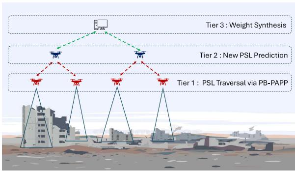  
Fig. 1. Three Tier Learn-As-You-Go Framework.

Our approach operates independently of ground observers, using a Learn-As-You-Go framework as given in Fig. 1 that allows UAVs to analyze their environment and predict potential survivor locations autonomously. In the first tier shown in Fig. 1, a module enables UAVs to learn about their environment dynamically by employing a novel path planning algorithm called Prediction-Based, Priority-Aware Path Planning (PB-PAPP). PB-PAPP is computationally efficient and integrates insights gained from the learning process. Tier two facilitates the identification of promising search areas known as Potential Survivor Locations (PSLs), where the likelihood of finding survivors is high.

The objective of PB-PAPP is to prioritize the paths toward the identified PSLs, thus enhancing the efficiency of the search operation and allowing UAVs to cover more survivors in realtime during critical missions. The final tier includes a Weight Synthesis module that uses a decentralized machine learning paradigm, a subset of Artificial Intelligence, to improve model performance by aggregating weights learned by UAVs. This distributed learning component is crucial for refining the predictive models generated by PSL. Leveraging data from multiple UAVs, Weight Synthesis enables continuous enhancement of the above prediction models. Each UAV learns from its experiences in different areas of the environment, synthesizing this collective knowledge to boost the overall predictive accuracy.

This work aims to enhance UAV-based disaster response through the following key contributions.

1) We propose a Learn-As-You-Go framework featuring a three-tier architecture given in Fig. 1 with UAVs designed to traverse PSLs efficiently.

2) Using this framework, we train a PSL Prediction model to identify target PSLs and optimize typical Search and Rescue (SAR) operations.

3) We introduce a Lightweight Navigation Strategy called Prediction-Based, Priority-Aware Path Planning (PB-PAPP), which is computationally lightweight and effectively prioritizes UAVs to navigate toward identified PSLs while minimizing resource usage.

4) We implement a Weight Synthesis Method that improves the quality of the prediction models over time by synthesizing model weights for continuous learning and adaptation in changing environments.

5) Our framework reduces the overall survivor detection time, achieving a 84-97% decrease in overhead for defining new paths, enabling real-time disaster response.

## II. LITERATURE REVIEW

## A. UAVs in Disaster Management

The work [14] examines the role of Unmanned Aerial Vehicles (UAVs) in natural disaster management, focusing on their applications for area surveying and establishing communication networks among survivors and rescue teams. The works [15], [16], [17] focusing on UAVs within communication systems highlight strategies for optimizing UAV positioning to ensure reliable, on-demand communication connectivity during disaster situations, thereby facilitating seamless service delivery in challenging environments. The works [18], [19], [20] propose a network of UAVs designed to facilitate communication, thereby enhancing coverage and connectivity in resource-constrained environments through real-time data transmission and surveillance. The works [21], [22], [23], [24] propose a resource allocation scheme utilizing UAVs to enhance communication efficiency in disaster relief networks and improve user experience quality for users during critical response operations. The studies benefiting Search and Rescue Operations [25], [26], [27] establish an Internet of UAVs architecture to automate search and rescue missions in post-disaster scenarios, utilizing UAVs to communicate and locate survivors within urban environments efficiently. Collectively, these studies enhance UAV efficiency or model accuracy for disaster survivor detection. While existing literature has made significant progress in leveraging UAVs for disaster response, particularly in establishing communication networks, UAV positioning for connectivity, enhancing network coverage, and automating search and rescue missions, there remains a notable gap in how UAVs prioritize where to search for survivors during mission execution, especially when time and resources are limited. This leads us to the core research question: How can UAVs dynamically prioritize search areas to maximize the likelihood of locating survivors in complex and resource-constrained disaster environments? Our work emphasizes establishing search priorities to locate the maximum number of survivors.

## B. Path Planning

The work by Mohamed Reda et al. [28] categorizes path planning methods into three main groups: traditional techniques, machine and deep learning approaches, and meta-heuristic optimization, highlighting their advantages and drawbacks. Our study primarily focuses on the Clarke and Wright (CW) savings algorithm and its variants [29]. The CW savings algorithm [30] is a well-known heuristic for vehicle routing problems (VRPs), calculating savings from combining routes to serve multiple customers from a depot. Gaskell [31] enhanced the original formula for multi-depot routing, while Yellow [32] tailored the algorithm for specific routing conditions. Tillman [33] proposed a new savings formula that adjusts costs based on distances to terminals. Further, [34] improved the CW algorithm’s computational efficiency through specialized data structures, and Paessens [35] integrated customer distances and depot proximity into a new savings function. Altinkemer et al. [36] developed a matching-based approach for parallel implementations of the CW algorithm. Altinel and Öncan [37] introduced a parameterized version, incorporating customer demand. The existing literature has primarily utilized distance as a key factor in determining the optimal path. In contrast, our approach introduces a new metric known as the priority score that allows us to identify the optimum path within a confined radius by jointly optimizing the distance to a PSL as well as the probability of finding survivors there. By focusing on priority scores, we can better assess the significance of various waypoints in relation to survivor detection, thus enhancing the efficiency of search and rescue missions.

## III. SYSTEM MODEL AND PROBLEM FORMULATION

Fig. 2 illustrates the proposed Three-Tier architecture. As shown in the figure, we consider a disaster-stricken area as a square grid of size $m \times m$ where D number of Surveillance Drones (SDs, also called agents) are deployed to detect survivors. We assume that the SAR (Search and Rescue) operations are carried out under fair weather conditions [38] for the UAVs to operate. Without loss of generality, all SDs are assumed to have identical equipment, computing power, and battery backup capabilities. Each SD is equipped with a GPS module for precise location tracking and is initially assigned a random location on the grid area. The agents are capable of bypassing the static obstacles leveraging A Star search [39] while auto adjusting the height [40] in the case of dynamic obstacles sensed through radar-based collision avoidance systems to minimize the chances of a collision while ensuring an optimal field of view that encompasses the entire grid cell (when the agent is at its center), including the edges, allowing comprehensive surveillance and monitoring. Agents can move in eight directions: north, south, east, west, northeast, northwest, southeast, and southwest, including the option to hover at their current location. Each SD features a camera module for survivor detection, using an onboard computational device to process the images. The energy model used in the current setup is in Appendix A, and the communication model is in Appendix B.

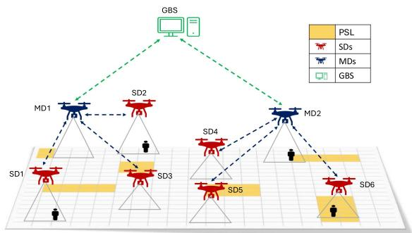  
Fig. 2. Proposed Three Tier Architecture.

## A. Problem Formulation

The disaster area is modeled as a directed grid graph $G =$ $( \nu , \mathcal { E } )$ , where each cell $v \in \mathcal V$ has a predicted survivor likelihood p(v). A team of $D$ agents $\mathcal { A } = \{ 1 , \ldots , D \}$ starts and ends at respective launch cells $s _ { i } \in \mathcal V$ . Traversing edge $( u , v ) \in \mathcal { E }$ incurs cost $c ( u , v )$ ), bounded by per-agent budget $C _ { i }$ . The decision variables are defined as follows: $x _ { i , v } \in \{ 0 , 1 \}$ indicates whether agent i visits cell $v ,$ <sup>i,v</sup>capturing the selection of cells to scan, while $y _ { i , u , v } \in \{ 0 , 1 \}$ indicates whether agent i traverses edge $( u , v )$ thus determining the ordering of visits along a feasible route. The optimization objective is to maximize the expected number of survivors detected across all agents, expressed as

$$
\operatorname* { m a x } _ { x , y } \sum _ { i \in \mathcal { A } } \sum _ { v \in \mathcal { V } } p ( v ) x _ { i , v } .
$$

Subject to:

$$
\sum _ { ( u , v ) \in \mathcal { E } } c ( u , v ) y _ { i , u , v } \leq C _ { i } , \qquad \forall i \in \mathcal { A } ,\tag{C1}
$$

$$
\sum _ { v } y _ { i , s _ { i } , v } = 1 , \sum _ { u } y _ { i , u , s _ { i } } = 1 , \quad \forall i \in \mathcal { A } ,\tag{C2}
$$

$$
x _ { i , v } \leq \sum _ { u } y _ { i , u , v } ,
$$

$$
\forall i \in A , v \neq s _ { i } ,\tag{C3}
$$

$$
\sum _ { i \in \mathcal { A } } x _ { i , v } \leq 1 ,
$$

$$
\forall v \in \mathcal { V } .\tag{C4}
$$

(C1) enforces traversal-cost limits. (C2) ensures that every agent initiates and concludes its mission at the designated launch cell. (C3) ensures that a cell is only considered visited if the agent physically enters it through a neighboring cell along the path generated by the proposed PB-PAPP method, preventing any unrealistic jumps in the grid. (C4) avoids redundant visits and duplicate survivor detection.

## IV. SOLUTION DESIGN

## A. Module 1: PSL Prediction Model

Our proposed PSL prediction model assumes that in case of a disaster, survivors tend to move in groups and typically take shelter in nearby safe zones together (such as high grounds in case of a flood). Hence, the presence of one or more survivors in a grid cell increases the likelihood of more survivors being located in neighboring cells. Based on this assumption, we develop a classifier that considers each grid cell not visited by any SD so far and calculates the following features.

\- Number of survivors already detected in the cell’s one-hop, two-hop, and three-hop neighborhoods.

\- Number of cells identified as PSLs in the cell’s one-hop, two-hop, and three-hop neighborhoods.

\- Traversal rate in the one-hop (9), two-hop (25), and threehop (49) neighborhoods of the cell.

$$
{ \mathrm { T r a v e r s a l \_ r a t e } } = { \frac { { \mathrm { t r a v e r s e d \_ n e i g h b o u r s } } } { { \mathrm { t o t a l \_ h o p \_ n e i g h b o u r s } } } }\tag{1}
$$

With the help of these features, the classifier predicts the target cell’s propensity to be a PSL. The classifier predicts the probability value of a target cell $( x , y )$ being a PSL derived from a logistic regression model.

$$
P ( Y = 1 | X ) = { \frac { 1 } { 1 + e ^ { - ( \beta _ { 0 } + \beta _ { 1 } X _ { 1 } + \beta _ { 2 } X _ { 2 } + . . . + \beta _ { n } X _ { n } ) } } }\tag{2}
$$

From the obtained probability values[0.5, 1] of PSLs, the priority score $P _ { - } S c o r e ( x , y )$ of individual cells is obtained by normalizing. The priority scores of cells obtained from the classifier serve as an essential input to our path planning algorithm, given in Module IV-B, guiding decision-making processes in identifying optimal routes for agents during disaster scenarios. By leveraging logistic regression to assess the likelihood of cells being safe zones based on survivor behaviour and environmental context, we aim to enhance the efficiency and effectiveness of disaster response efforts.

B. Module 2: Prediction-Based, Priority-Aware Path Planning (PB-PAPP)

1) Preliminaries: The Clarke-Wright Savings Algorithm: The Clarke-Wright Savings Algorithm (CWS) [30] provides a heuristic approximation to the Traveling Salesman Problem (TSP) by prioritizing edges with higher importance in terms of savings values. For each pair of locations, the savings are computed as $S _ { i j } = C _ { i 0 } + C _ { 0 j } - C _ { i j }$ , where $C _ { i 0 }$ and $C _ { 0 j }$ are the distances from the depot to locations i and $j ,$ and $C _ { i j }$ is the direct distance between them. A larger savings value $S _ { i j }$ implies a more beneficial edge, since combining locations i and j avoids redundant trips to the depot. By sorting and selecting edges with the highest savings, CWS incrementally constructs routes that maximize efficiency. This edge-prioritization strategy enables CWS to quickly generate practical solutions that are often near-optimal, making it well-suited for large-scale routing scenarios.

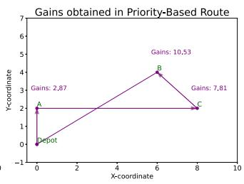

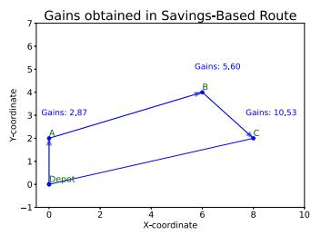

Gains obtained in Savings-Based Route Gains obtained in Priority-Based Route   
6 6   
Gains: 5,60 5 Gains: 10,53   
B   
4 4   
3 Gains: 2,87 Gains: 10,53 3 Gains: 2,87 Gains: 7,81   
2   
1   
Depot   
0 0   
-1 -1   
0 2 4 6 8 10 0 2 4 6 8 10   
X-coordinate X-coordinate  
Fig. 3. Route Gains: Savings-Based vs. Priority-Based.

We frame the task of multiple agents visiting PSLs in a grid as a routing problem similar to the TSP. PSLs act as cities, agents as salespersons tasked with maximizing gains while minimizing travel distance and time, and the depot coordinates efficiency. The Prediction-Based, Priority-Aware Path Planning (PB-PAPP) method advances this by using predictive and priority-driven path optimization.

We define an edge (e) as the connection between two PSLs or between a PSL and the depot (agent current location). Gains in Fig. 3 are computed as the cumulative priority scores of visited edges:

$$
{ \mathrm { G a i n s } } = \sum _ { \forall e \in { \mathrm { R o u t e } } } { \mathrm { p r i o r i t y } } ( e ) .\tag{3}
$$

Fig. 3 compares Clarke-Wright savings (left) and the proposed priority-based route (right). The priority route [Depot, A, C, B, Depot] secures higher gains than the savings route [Depot, A, B, C, Depot] by prioritizing high-reward edges early. While Clarke-Wright is distance-efficient, it neglects early gain maximization.

2) Priority Matrix (M) Formulation: In our formulation, we define Proximity as a hyperparameter that restricts route planning to locations lying within a maximum allowable distance from the depot. PB-PAPP instead relies on classifier-derived priority scores (within the proximity) as the main routing criterion. For n points $( x _ { i } , y _ { i } )$ with priority scores $\rho ( x _ { i } , y _ { i } )$ , the Priority Matrix M is:

$$
M [ i , j ] = \left\{ 0 , \begin{array} { l l } { \begin{array} { r l r } & { \textstyle i = j , } \\ { \rho ( x _ { i } , y _ { i } ) + \rho ( x _ { j } , y _ { j } ) , } & { i \ne j . } \end{array} } \end{array} \right.\tag{4}
$$

The edge importance in (4) is defined by the addition of the priority scores of its endpoints. The addition operation captures the shared significance of connected nodes, allowing edges between high-priority locations to gain higher weights. A related study [41] employs an additive formulation to represent the combined influence of connected nodes, consistent with the principle used in this work. This mechanism mirrors the edgebased prioritization in the Clarke-Wright Savings Algorithm, but instead of distance-based savings values, it leverages priority scores to guide balanced and context-aware path planning in dynamic environments. Algorithm 1 builds priority matrix (M) that quantifies the significance of connections between survivor locations. Each pair of locations is assigned a score equal to the sum of their priorities, emphasizing the importance of the connecting edge. The resulting scores are ranked in descending order, producing a list that highlights the most valuable edges for efficient planning.

```powershell
Algorithm 1: Generate Priority Matrix (M).
Input: Assigned SLs (Survivor Locations),
Preds
Output: sorted_prio
/* Total survivor locations */
1 n ← |SL|
/* Initialize priority matrix */
2 M ← Zero Matrix of size n × n
3 for i ← 0 to n − 1 do
4 loci $ ( S L [ i ] . x , S L [ i ] . y )$
/* Priority score of location i */
5 pi ← Preds[loci].score
6 for j ← i + 1 to n − 1 do
7 locj $ ( S L [ j ] . x , S L [ j ] . y )$
/* Priority score of location j */
8 pj ← Preds[locj].score
/* Edge Importance Calculation */
191 M i,j  j
12 M[j, i] ← s
13 end
14 end
/* Priority List Formation
15 L ← Convert M to list of tuples ((i, j), val)
16 Sort L in descending order of val
17 sorted_prio ← Sorted(L, by val, descending)
18 return sorted_prio
```

Algorithm 2: Find Route.   
Input: num\_points, sorted\_prio   
Output: routes   
1 Step 1: Initialize individual routes for all locations   
routes ← {i : [i] |i ∈ {0, 1, . . . , num\_points − 1}}   
2 Step 2: Helper function to find route containing a   
location Function find\_route(point):   
3 foreach route in routes.values() do   
4 if point ∈ route then   
5 return route   
6 end   
7 end   
8 return None   
9 Step 3: Merge routes based on Edge Importance   
10 foreach (i, j), priority in sorted\_prio do   
11 route\_i ← find\_route(i)   
12 route\_j ← find\_route(j)   
13 if route\_i ≠ route\_j then   
/\* Merge distinct routes   
14 merged\_route ← route\_i + route\_j   
15 foreach point in merged\_route do   
16 routes[point] ← merged\_route   
17 end   
18 end   
19 end   
20 return routes

3) Optimal Route Generation: Algorithm 2 begins by assigning each location to its own initial route. A helper function is defined to locate the route containing a given location. The algorithm then iterates over all location pairs sorted by priority. For each pair, it identifies the routes containing the two locations and merges them if they are distinct, updating all involved locations to reference the new combined route. This process ensures that higher-priority connections are incorporated early, gradually forming complete routes. Finally, duplicate routes are removed, and the locations in each route are converted into coordinate pairs, with the agent’s current position added at the start. This new heuristic ’priority score’ enhances the adaptability of the Clarke-Wright algorithm by prioritizing high-value connections and adapting traversal paths more efficiently.

## C. Module 3: Weight Synthesis

In this tree-structured decentralized machine learning approach, we design a weight synthesis module that enhances the PSL-prediction quality by aggregating the weights learnt by the MDs in a decentralized manner. Each MD independently trains its classifier, generating localized predictions based on its specific environmental context as per the data provided by the respective connected SDs. However, these models may struggle with generalization when applied to diverse and broader scenarios. To overcome this limitation, we implement a distributed learning strategy that involves averaging the model weights across all participating MDs. We denote this approach as ‘Weight Synthesis’ across multiple MDs. For sharing the weights, we use the Ground Base Station (GBS) as the central authority, where MDs share their model weights periodically and obtain updated weights in return. Each MD has a Logistic regression model as represented in (2).

Let ${ \bf w } _ { j }$ denote the weights of the j-th MD agent in m MDs, where $\dot { \mathbf { w } } _ { j } = [ \beta _ { i } ]$ here $\beta _ { i }$ represents the coefficients associ-<sup>j i i</sup>ated with the predictor variable. In each iteration of the distributed learning process, we compute the mean of coefficients using

$$
\mathbf { c } _ { \mathrm { a v g } } = { \frac { 1 } { m } } \sum _ { k = 1 } ^ { m } \beta _ { j } ^ { k } , \quad \mathrm { f o r } j = 0 , 1 , \ldots , n\tag{5}
$$

where m is the total number of MDs, and finally, each MD’s model weights are updated to Synthesized Weights using $\mathbf { w } _ { \mathrm { n e w } } = [ \beta _ { \mathrm { a v g } } ]$ . This averaging process allows each MD to incorporate insights from others, leading to a more comprehensive understanding of survivor distribution across various regions. Since the data produced by the SDs are homogeneous and collected under controlled conditions, we did not sense any effect of outliers on the prediction models. However, we tested the synthesis process using the median of the coefficients to examine the presence of outliers. It is observed that both distributions exhibit minimal evidence of extreme outliers due to the high percentages (99.2%) within 3σ and relatively low variance.

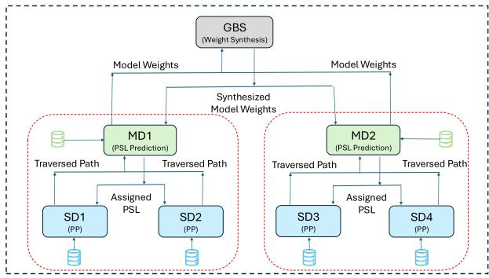  
Fig. 4. Work Flow of Three Tier Architecture.

## V. DEPLOYMENT ARCHITECTURE - LEARN-AS-YOU-GO FRAMEWORK

Fig. 4 shows the workflow of the proposed three-tier architecture in an iteration. In the figure, P P refers to Path Planning. In the proposed framework given in Fig. 2, SDs are deployed to gather critical data from disaster-affected areas by navigating to initially designated locations while collecting information about the traversed paths, essential for assessing the environment’s current state. As they traverse their routes, the SDs compile a dataset that includes detailed information about their movements, which is shared with connected MDs during each iteration. The SDs hover in place until they receive updated Potential Survivor Locations (PSLs) offered by Module 1 from the MDs, allowing for prompt responses to new information. Before commencing their next mission, the SDs utilize a path planning algorithm called PB-PAPP as given in Module 2 to determine the optimal route. This traversal in iterations continues until the agents reach a battery level of 85%. Meanwhile, MDs analyze the data collected by the SDs by running prediction models as given in Module 1 on subsets of data to forecast PSLs, thereby identifying areas with a likelihood of survivor presence that are untraversed and enhancing situational awareness. The MDs allocate newly identified PSLs back to the SDs based on their current locations for future traversal. They also function as SDs, enabling them to traverse specific grid sections while processing data from other SDs. Additionally, a Ground Base Solution (GBS) improves the prediction models as given in Module 3 used by MDs through weight synthesis, enhancing prediction quality and reducing standard error. The updated model weights are then shared among all MDs to facilitate more accurate PSL predictions in subsequent iterations, ensuring that data collection, processing, and model optimization work seamlessly together to improve situational awareness and response effectiveness in disaster scenarios.

## VI. EXPERIMENTAL SETUP, EVALUATION AND RESULTS

## A. Test Environment: Ground Truth Creation

To generate the ground truth for identifying a grid cell as a PSL, we employed a systematic approach using pre- and post-disaster satellite images from the xBD dataset [42] - a benchmark dataset designed for building damage assessment in natural disasters.

The test environment, systematically divided into a square grid, undergoes evaluation based on color-coded classifications that reflect varying levels of building damage: green (g) for no damage, blue (b) for minor damage, yellow (y) for major damage, and red (r) for destroyed structures, as described in [43]. The assessment involved counting the pixels corresponding to each damage category within a tile. Using the formula in (6), the contribution of each damage type was computed to derive a single weight value, representing the tile’s overall condition.

$$
\mathbf { w } = \left( w _ { g } \times \frac { g } { i } + w _ { b } \times \frac { b } { i } + w _ { y } \times \frac { y } { i } + w _ { r } \times \frac { r } { i } \right) \times ( n _ { f } )\tag{6}
$$

Each damage category is weighted differently in the first part of (6), reflecting its significance in assessing overall building integrity. The coefficients $w _ { g } { = } 0 . 6 , w _ { b } { = } 0 . 3 , w _ { y } { = } 0 . 1$ , and $w _ { r } { = } 0 . 0$ indicate the relative importance assigned to each category in determining the tile’s weight w. The term $n _ { f } = ( g + b + y + r )$ serves as a normalization factor that scales the weighted sum of damage proportions by the total number of pixels classified within that tile. This ensures that tiles with more affected pixels contribute more substantially to the overall weight calculation than those with fewer. We calculated the tile probability from its weight to assess its significance using (7).

$$
\mathrm { t i l e \_ p r o b a b i l i t y = \frac { \ t i l e \_ w e i g h t } { \sum t i l e \_ w e i g h t } }\tag{7}
$$

Here, the numerator denotes the weight of an individual tile, reflecting its assessed damage level, while the denominator represents the total weight across all tiles. This division yields a probability value that indicates the proportion of that tile’s weight relative to the entire area. It is vital to estimate the number of survivors that could be present in each tile based on the calculated tile probabilities.

$$
\mathrm { D e p l o y e d \_ s u r v } = i n t ( \mathrm { t o t a l \_ p o p u l a t i o n } \times \mathrm { t i l e \_ p r o b a b i l i t y } )\tag{8}
$$

A probabilistic estimate of how many survivors are likely to be found in that specific tile is obtained by multiplying the total population in the affected area by the probability of survival for each tile as given in (8). Tiles with minimal survivor probability and absent from the ground truth are included in the simulation as random survivor locations to account for isolated survivors in unforeseen areas. The total population is estimated using the count of buildings in the affected area, applying a weighted average occupancy of approximately three people per building. This allows for a more realistic estimation of the survivor distribution across the grid without relying on predetermined values. This estimation is crucial for effective disaster response planning, as it allows responders to identify which regions may have higher concentrations of survivors needing help.

## B. Simulation Setup

Agent traversal in a grid environment is simulated using Pygame, which supports real-time graphics and animations. Its accessible and adaptable structure facilitates the creation of interactive, multi-agent simulations with diverse movement strategies. Fig. 6 shows the PSL traversal over iterations in a simulation environment.<sup>1</sup> Blue circles represent the agent positions. Yellow-colored cells represent the untraversed PSLs, while green-colored cells represent the traversed PSLs. The grid is a 2D array where each cell corresponds to a specific location that agents can traverse. These cells are drawn on the screen as squares, representing agents as blue circles. Pygame’s game loop updates the agents’ positions, redrawing them on the grid as they move according to predefined paths. The simulation allows real-time changes, such as updating PSLs and modifying agent paths. Pygame handles smooth animations, ensuring agent movement between grid cells is visually fluid.

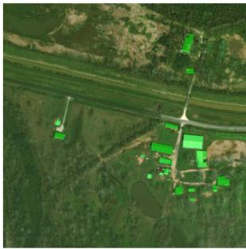

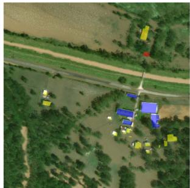  
Fig. 5. Color Coded Pre and Post Disaster Satellite Imagery.

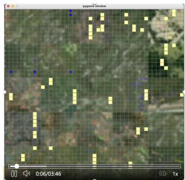  
(a) Iteration 1

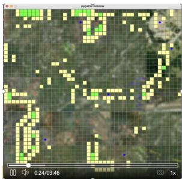

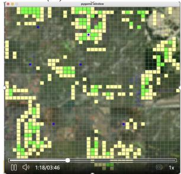

(b) Iteration 2  
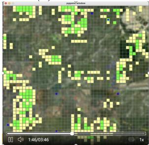  
(c) Iteration 3  
(d) Iteration 4  
Fig. 6. PSL Traversal over Iterations.

## C. Baselines and Metrics

1) Clarke Wright Savings Variants as Baselines: Our study summarises various savings variants proposed by different authors, each represented by a specific formula for calculating savings $S _ { i j }$ . B1: Clarke and Wright [30] introduced the savings formula as given in Table I. Where $c _ { i 0 }$ is the distance of customer i to the depot, $c _ { 0 j }$ <sup>i</sup>is the distance of the depot to customer $j ,$ and $c _ { i j }$ is the distance between customers i and $j .$ . B2: Gaskell and <sup>ij</sup>Yellow [31], [32] expanded upon this with a parameter $\lambda [ 0 . 7 ]$ for the reshaping of routes by ensuring that only non-negative values are considered. B3: Paessens [44] further refined the approach by introducing a second parameter $\mu [ 0 . 4 ]$ to capture and exploit the asymmetry in distance information between customers i and j relative to their respective distances to the depot. B4: Altınel and Öncan [37] introduced the savings formula as given in Table I, where $d _ { i }$ and $d _ { j }$ , represent the demands of customers i and j, respectively. The variable <sup>¯</sup>d denotes the average demand across customers, while v[0.6] is a new non-negative parameter. Doyuran et al. [45] provided the savings formulas here termed as B5, B6, and B7. Where $\theta _ { i j }$ represents the angle formed by the two rays originating from the depot and intersecting at customers i and $j , c _ { \mathrm { m a x } }$ denotes the longest distance among all pairs of customers, $d _ { \mathrm { m a x } }$ represents the maximum demand among all customers. Table I lists all Clarke-Wright savings variants considered for comparing the performance of the proposed PB-PAPP.

TABLE ISUMMARY OF CLARKE WRIGHT SAVINGS VARIANTS
<table><tr><td>Author</td><td>Termed as</td><td>Formula</td><td></td></tr><tr><td>Clarke and Wright[30]</td><td>B1</td><td> $S _ { i j } = C _ { i 0 } + C _ { 0 j } - C _ { i j }$ </td><td></td></tr><tr><td>Gaskell and Yellow[31, 32]</td><td>B2</td><td> $\begin{array} { r } { { S } _ { i j } = { C } _ { i 0 } + { C } _ { 0 j } ^ { - } - \lambda \bar { C } _ { i j } } \end{array}$ </td><td></td></tr><tr><td>Paessens[44]</td><td>B3</td><td> $S _ { i j } ^ { ' \nu } = \tilde { C _ { i 0 } } + \tilde { C _ { 0 j } } - \lambda \tilde { C _ { i j } } + \mu | C _ { i 0 } - C _ { j 0 } |$ </td><td></td></tr><tr><td>Altinel and Öncan[37]</td><td>B4</td><td> $S _ { i j } = C _ { i 0 } + C _ { 0 j } - \lambda C _ { i j } + \mu | C _ { i 0 } - C _ { j 0 } | + v \frac { d _ { i } + d _ { j } } { \bar { d } }$ </td><td></td></tr><tr><td>Doyuran et al.[45]</td><td>B5</td><td> $S _ { i j } = C _ { i 0 } + C _ { 0 j } - \lambda C _ { i j } + \mu | C _ { i 0 } - C _ { j 0 } | - v \frac { d _ { i } + d _ { j } } { \bar { d } }$ </td><td></td></tr><tr><td>Doyuran et al.[45]</td><td>B6</td><td> $S _ { i j } = C _ { i 0 } + C _ { 0 j } - \lambda C _ { i j } + \mu | C _ { i 0 } - C _ { j 0 } | + v \frac { \bar { d } } { d _ { i } + d _ { j } }$ </td><td></td></tr><tr><td>Doyuran et al.[45]</td><td>B7</td><td> $S _ { i j } = \frac { ( C _ { i 0 } + C _ { 0 j } - \lambda C _ { i j } ) } { C ^ { \operatorname* { m a x } } } + \mu \left( \frac { \cos ( \theta _ { i j } ) | C ^ { \operatorname* { m a x } } - \frac { \bar { ( C } _ { i 0 } - C _ { j 0 } ) } { 2 } | } { C ^ { \operatorname* { m a x } } } \right) + v \frac { | ( \bar { d } - ( d _ { i } + d _ { j } ) / 2 ) | } { d ^ { \operatorname* { m a x } } }$ </td><td></td></tr><tr><td>Proposed Method4</td><td>PB-PAPP</td><td></td><td> $M [ i , j ] = \left\{ \begin{array} { l l } { 0 , } & { \mathrm { i f ~ } i = j , } \\ { P _ { - } S c o r e ( x _ { i } , y _ { i } ) + P _ { - } S c o r e ( x _ { j } , y _ { j } ) , } & { \mathrm { i f ~ } i \neq j . } \end{array} \right.$ </td></tr></table>

2) Other Path Planning Algorithms as Baselines: Lawnmower [46] systematically covers a grid by traversing back and forth in parallel rows, ensuring that every cell is visited. A Star Search [39] is a heuristic-based algorithm often used in artificial intelligence applications to find the shortest route from a start node to a destination node by combining the actual cost from the start with an estimated cost to the goal. D Star Search [47] builds upon A Star by allowing for real-time updates to the path as new obstacles or changes in the environment are detected, making it well suited to dynamic environments common in artificial intelligence and robotics tasks. Christofides [48] algorithm provides an approximate solution to the Traveling Salesman Problem (TSP) by creating a minimum spanning tree, finding a minimum weight perfect matching, and combining these to form a tour. RRT (Rapidly-exploring Random Tree) [49] is a probabilistic algorithm that incrementally builds a tree by randomly sampling points in the space and connecting them to the nearest existing point.

3) Metrics: The number of survivors identified over time is used as a metric to analyze the quality of PSL predictions obtained through traversal using PB-PAPP. We also used the number of PSLs traversed over time steps to assess the performance of the PSL prediction model after applying Weight Synthesis. The elapsed time or wall clock time and CPU time for path planning on SDs are treated as key metrics for measuring the efficiency of the proposed PB-PAPP method. Battery consumption during iterations is also used as a metric to evaluate the energy efficiency of the agents during traversal. The standard error indicates the consistency of the proposed Weight Synthesis method’s performance. The transverse rate is used to evaluate the agents’ operational effort.

## D. Evaluation and Results

1) Survivors Identified Using PB-PAPP and Clarke-Wright Savings Variants: In our analysis, we focused on the first few steps for comparison of the performance of the PB-PAPP algorithm against other baseline algorithms to ensure a controlled and manageable evaluation of the algorithms’ effectiveness in the early stages of deployment. By limiting the comparison to the initial steps, we learned the impact of the algorithms on assessing their responsiveness to dynamic environments. Clarke-Wright variants, as detailed in Table I, are outperformed by the proposed PB-PAPP. The proposed method demonstrated its capability to prioritize hotspot visits in a non-uniform deployment.

Fig. 7 (a) shows a comparative analysis of the proposed PB-PAPP method against various Clarke-Wright variants in a test environment without collision avoidance. Fig. 7 (c) presents the same comparison with 5% of the grid cells occupied by static obstacles, which are bypassed while traversing to avoid collision. The results indicate that PB-PAPP effectively prioritizes and traverses predicted PSLs with high urgency during each iteration. This prioritization leads to higher survivor detection with fewer steps, with the trade-off of utilizing the initial steps (first 25 steps, as shown in Fig. 7) to analyse and estimate the environment. In this analysis, a step is defined as the agent moving from the centre point of one location to another, assuming that all survivors present at each location are captured.

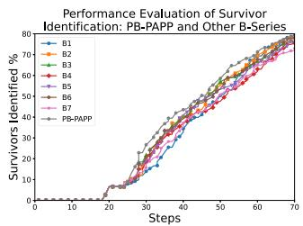  
(a) Survivor Detection Without Collision Avoidance

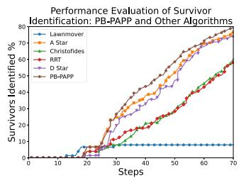  
(b) Survivor Detection Without Collision Avoidance

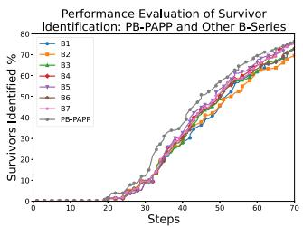  
(c) Survivor Detection With Collision Avoidance

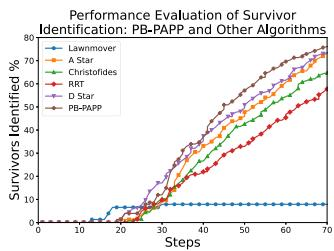  
(d) Survivor Detection With Collision Avoidance

Fig. 7. Survivors Identified Over Steps.  
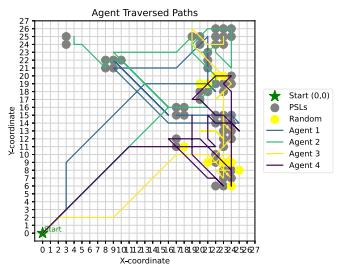  
(a) Paths Without Collision Avoidance  
Fig. 8. PSL Traversal Over Steps.

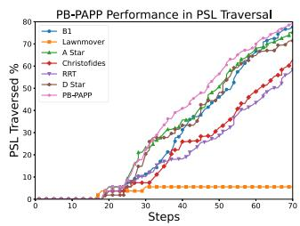  
(b) PSL Traversal Without Collision Avoidance

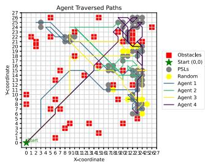  
(c) Paths With Collision Avoidance

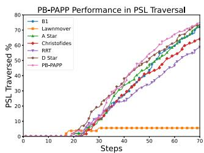  
(d) PSL Traversal With Collision Avoidance

TABLE II  
SUMMARY OF PERCENTAGE OF SURVIVORS IDENTIFIED OVER STEPS VIA PB-PAPP AND OTHER PATH PLANNING ALGORITHMS
<table><tr><td></td><td>10</td><td>20</td><td>30</td><td>40</td><td>50</td><td>60</td><td>70</td><td>80</td><td>90</td></tr><tr><td>Lawnmover</td><td>0.00 %</td><td>6.58 %</td><td>7.89 %</td><td>7.89 %</td><td>7.89 %</td><td>7.89 %</td><td>7.89 %</td><td>18.42 %</td><td>32.89 %</td></tr><tr><td>A Star</td><td>0.00 %</td><td>1.32 %</td><td>9.61 %</td><td>30.53 %</td><td>43.82 %</td><td>54.08 %</td><td>65.53 %</td><td>75.53 %</td><td>82.31 %</td></tr><tr><td>Christofides</td><td>0.00 %</td><td>0.00 %</td><td>10.26 %</td><td>26.58 %</td><td>41.58 %</td><td>51.97 %</td><td>62.11 %</td><td>69.21 %</td><td>76.18 %</td></tr><tr><td>RRT</td><td>0.00 %</td><td>0.00 %</td><td>9.74 %</td><td>21.97 %</td><td>32.89 %</td><td>44.21 %</td><td>53.29 %</td><td>63.95 %</td><td>72.24 %</td></tr><tr><td>D Star</td><td>0.00 %</td><td>1.32 %</td><td>17.11 %</td><td>32.11 %</td><td>45.79 %</td><td>56.45 %</td><td>66.97 %</td><td>75.00 %</td><td>81.05 %</td></tr><tr><td>PB-PAPP</td><td>0.00 %</td><td>1.32 %</td><td>11.97 %</td><td>33.95 %</td><td>50.92 %</td><td>62.76 %</td><td>71.32 %</td><td>76.58 %</td><td>82.63 %</td></tr></table>

2) Survivors Identified Using PB-PAPP and Other Path Planning Algorithms: To evaluate the effectiveness of the proposed method, we compare the performance of PB-PAPP with existing routing methods without collision avoidance, as shown in Fig. 7(b) and with collision avoidance as shown in Fig. 7(d). The red colored cells in Fig. 8(c) visualize the deployed static obstacles (5% of the grid cells) to analyze the performance of PB-PAPP with collision avoidance. Each algorithm exhibits distinct strengths in navigating and identifying survivors within a defined area. PB-PAPP demonstrates enhanced performance in maximizing survivor identification by leveraging the priority scores. Table II shows the Percentage of survivors identified over steps using PB-PAPP and other path-planning algorithms.

3) PSLs Traversal Over Time Steps: In the analysis of the number of PSLs traversed over time, PB-PAPP is compared with various algorithms, as shown in Fig. 8(b) without collision avoidance, and in Fig. 8(d) with collision avoidance with respect to static obstacles deployed. In Fig. 8(c), the grey colored cells represent the PSLs W(ground truth) while the yellow colored cells represent the random locations where the survivors might be present. It is observed that at least 60% of the randomly deployed survivor locations (varying in every experiment) are traversed in all the experiments by the proposed method, namely PB-PAPP. The results indicate that PB-PAPP traversed more PSLs than other algorithms within a given timeframe. The results demonstrate that the increased number of PSLs visited by the proposed method in a time-efficient manner can be attributed to the quality of the PSLs produced in the previous iteration and the quality path defined by PB-PAPP.

4) Analysis of Computational Efficiency of PB-PAPP: The results presented in Table III highlight the computational efficiency of the proposed PB-PAPP approach in comparison to a range of established path planning algorithms. PB-PAPP records the lowest elapsed time (0.0073 s) and CPU time (0.0076 s) per iteration among all methods evaluated, indicating rapid execution with minimal processing delays. While PB-PAPP exhibits the highest average memory usage at 137.54MB, it operates with a relatively modest CPU usage of 2.50%, showing that it avoids processor-intensive computations and instead leverages the limited memory available to achieve improved speed and stability. These metrics collectively demonstrate that PB-PAPP is a lightweight, computation-aware approach that ensures faster execution while maintaining system efficiency, making it suitable for resource-constrained, real-time UAV-based applications. Percentage improvement ΔI (%) presents by what percent PB-PAPP is better over other baseline methods and is calculated using the formula 9.

TABLE III  
PERFORMANCE COMPARISON OF BASELINE METHODS RELATIVE TO PB-PAPP (ΔI (%))
<table><tr><td>Method</td><td>Elapsed Time (s)</td><td>∆I(%)</td><td>CPU Time (s)</td><td>∆I (%)</td><td>Avg. Mem (MB)</td><td>∆I (%)</td><td>CPU %</td><td>∆I (%)</td></tr><tr><td>B1</td><td>0.0483</td><td>84.90</td><td>0.0357</td><td>78.63</td><td>76.64</td><td>-79.45↓</td><td>2.42</td><td>-3.58↓</td></tr><tr><td>B2</td><td>0.0494</td><td>85.24</td><td>0.0387</td><td>80.30↑</td><td>73.36</td><td>-87.48↓</td><td>2.52</td><td>0.77↑</td></tr><tr><td>B3</td><td>0.0497</td><td>85.331</td><td>0.0361</td><td>78.871</td><td>76.44</td><td>-79.94</td><td>2.36</td><td>-5.89↓</td></tr><tr><td>B4</td><td>0.0668</td><td>89.08</td><td>0.0442</td><td>82.75</td><td>76.12</td><td>-80.70↓</td><td>2.17</td><td>-15.25↓</td></tr><tr><td>B5</td><td>0.0583</td><td>87.49</td><td>0.0403</td><td>81.07↑</td><td>77.05</td><td>-78.50↓</td><td>2.53</td><td>1.00↑</td></tr><tr><td>B6</td><td>0.0583</td><td>87.48</td><td>0.0426</td><td>82.07↑</td><td>76.34</td><td>-80.17↓</td><td>2.41</td><td>-3.74↓</td></tr><tr><td>B7</td><td>0.0857</td><td>91.48</td><td>0.0560</td><td>86.381</td><td>73.62</td><td>-86.83↓</td><td>2.27</td><td>-10.37↓</td></tr><tr><td>A Star</td><td>0.0120</td><td>39.11↑</td><td>0.0099</td><td>23.09↑</td><td>79.12</td><td>-73.85↓</td><td>2.51</td><td>0.23↑</td></tr><tr><td>Christofides</td><td>0.2460</td><td>97.03</td><td>0.1593</td><td>95.21↑</td><td>71.99</td><td>-91.06↓</td><td>2.02</td><td>-23.80↓</td></tr><tr><td>RRT</td><td>0.1020</td><td>92.85</td><td>0.0802</td><td>90.49</td><td>75.59</td><td>-81.95↓</td><td>2.27</td><td>-10.33↓</td></tr><tr><td>D Star</td><td>0.2140</td><td>96.59</td><td>0.1440</td><td>94.70↑</td><td>75.86</td><td>-81.30↓</td><td>2.05</td><td>-22.06↓</td></tr><tr><td>PB-PAPP</td><td>0.0073</td><td></td><td>0.0076</td><td></td><td>137.54</td><td></td><td>2.50</td><td></td></tr></table>

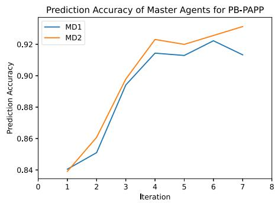

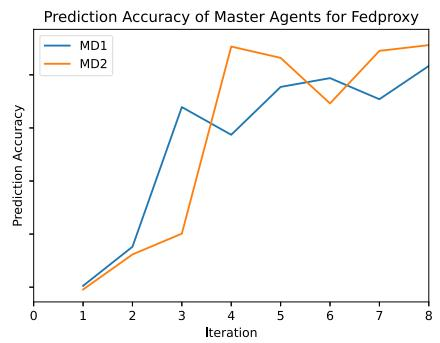  
Fig. 9. Prediction Accuracy Trends with 1:2 ratio of MDs:SDs.

Prediction Accuracy of Master Agents for Fedavg  
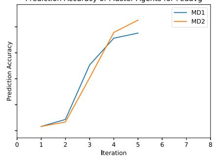

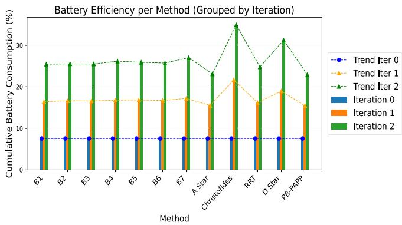  
Fig. 10. Cumulative Battery Consumption over Iterations.

$$
\Delta \mathrm { I ( \mathcal { Y } _ { 0 } ) } = \frac { \mathrm { O t h e r ~ M e t h o d ~ V a l u e - P B - P A P P V a l u e } } { \mathrm { O t h e r ~ M e t h o d ~ V a l u e } } \times 1 0 0\tag{9}
$$

5) Battery Consumption Over Iterations: The cumulative battery consumption of all baseline methods considered in our experiments was evaluated over three iterations as shown in Fig. 10. The results indicate that the proposed method, PB-PAPP, consistently achieves the lowest cumulative battery consumption across all iterations compared to the other baseline approaches. This highlights that PB-PAPP is effective in survivor detection and energy efficiency, an essential attribute for practical UAV deployments in resource-constrained disaster scenarios.

Agent Efforts using PB-PAPP  
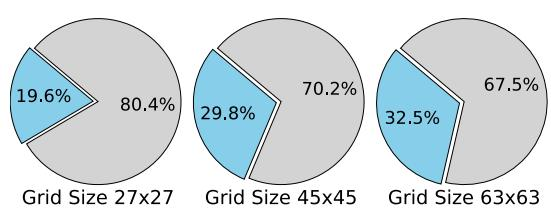  
Fig. 11. Agent Efforts on different Grid sizes.

6) Varying Ratios of MDs: To further assess the versatility of the proposed method, we conducted tests across various dimensions. One key aspect we investigated was the impact of varying ratios between MD and SD on different numbers of agents, ranging from 2 to 16. We tested the method with MD-SD ratios of 1:2, 1:3, and 1:4, representing different numbers of connecting SDs to respective MDs. Notably, the results indicated that the 1:2 ratio outperformed other ratios, demonstrating a 10-15% increase in the effective identification of survivors.

7) Agent Efforts on Different Grid Sizes: We also assessed the agent’s efforts (measured as the fraction of cell visits) required for traversal across different grid sizes. We tested the method on 27x27, 45x45, and 63x63 grids. Fig. 11 shows the maximum traversal efforts of agents (3 nos) in different grid sizes using PB-PAPP with a blue colour resembling the grid cells visited and grey cells representing the grid cells untraversed, while identifying all the survivors deployed. At the same time, 33% is the maximum traversal effort of agents using a lawnmower.

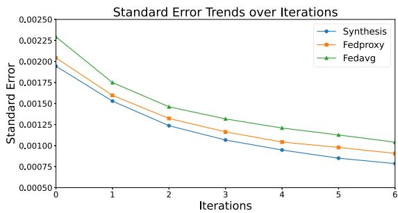  
Fig. 12. Performance of Weight Synthesis.

8) Performance of Weight Synthesis: The tree-structured decentralized refined model was analyzed in comparison with Federated Learning models [50]. The integration of model weight synthesis provides a sophisticated approach in the current use case, resulting in a marginal yet notable boost in predictive capabilities. At the same time, FedAvg and FedProxy have their own merits. This improvement is crucial in applications where precision is essential, reinforcing the effectiveness of the proposed method in real-world scenarios. The proposed method of model weight synthesis has shown the slightest reduction in standard error when compared to the FedAvg and FedProxy methods, as shown in Fig. 12, with the accuracies of these approaches being almost comparable [92%, 96%] on MDs as shown in Fig. 9. This slight decrease in standard error suggests that the synthesized model captures the nuances of the data, leading to improved prediction reliability. Experiment results also show that the energy required for data transmission is negligible when compared to traversal and hover energy consumption.

The above-mentioned results demonstrate that the proposed method maximizes survivor identification and optimizes agent movement with lightweight computation. This efficiency advantage is crucial in practical applications where minimizing traversal efforts while maintaining effectiveness is essential for successful mission outcomes.

## VII. DISCUSSION

Throughout the evaluation, PB-PAPP maintains a consistent upward trajectory in identifying survivors, showcasing its effectiveness in navigating the environment. As agents’ steps increase, PB-PAPP steadily improves its survivor identification capabilities. This consistent performance can be attributed to its adaptive nature, which allows it to refine its path-planning based on real-time feedback from the environment. While the proposed PB-PAPP method demonstrates higher performance in identifying survivors compared to other algorithms, it does have certain limitations that should be considered. PB-PAPP works best in rural or sparsely populated areas with low population density. As the population density increases (urban scenarios), locating survivors becomes less challenging, and as a result, using exhaustive search-based methods is more beneficial. The proposed method is optimized for non-uniform population distributions, making it more realistic. PB-PAPP may not be suitable for larger grid sizes. As the grid expands, the method’s traversal and survivor identification efficiency may not scale as effectively as other approaches, as it depends on the radius hyperparameter for PSL allocation. It is essential to evaluate its suitability based on population density, distribution patterns, and grid size to ensure optimal results.

## VIII. CONCLUSION AND FUTURE WORK

This study presents the design and evaluation of our proposed Learn-As-You-Go framework meant to enable UAVs to traverse disaster regions efficiently. The framework provides optimal path planning based on the PSLs predicted by our core path planning algorithm, PB-PAPP. Unlike existing approaches that focus primarily on communication or positioning, PB-PAPP addresses the challenges of comprehensive and faster survivor detection through intelligent prioritization and adaptive path planning. Our approach can potentially radically improve the effectiveness of autonomous Search and Rescue (SAR) operations conducted in the disaster management domain by offering a lightweight, easily deployable solution that balances accuracy and real-time performance for edge computing environments. The significance of this work lies in its systematic combination of prediction and planning to provide real-time suggestions to UAVs deployed in disaster regions, marking a significant step toward autonomous and efficient SAR operations. Experimental results demonstrate that PB-PAPP achieves the lowest elapsed and CPU time among all methods, with reductions in execution time ranging from 84% to over 97% compared to other algorithms, while simultaneously ensuring a survivor detection rate of more than 80%. The findings of this research provide an efficient solution for SAR teams using UAVs for monitoring, by providing a means of detecting more survivors while traversing a shorter path. This framework is readily implementable on UAVs using onboard compute devices and lightweight sensor networks attached to UAVs, paving the way for adaptive, AI-driven disaster response systems. Currently, PB-PAPP assumes survivors remain static, based on scenarios where mobility is restricted. In future work, we plan to extend the framework to account for dynamic survivor behavior, incorporating movement patterns and temporal variations in survivor locations.

## REFERENCES

[1] M. Halbgewachs, L. Angermann, M. Wieland, U. Kippnich, and K. Lechner, “Using UAV data to improve the situational awareness for first responders in disaster management: The example of flooding in the AHR valley, Germany,” in Proc. IEEE Int. Geosci. Remote Sens. Symp., 2023, pp. 934–937.

[2] J. Kedys, I. Tchappi, and A. Najjar, “UAVs for disaster management-an exploratory review,” Procedia Comput. Sci., vol. 231, pp. 129–136, 2024.

[3] Q. Guo et al., “Minimizing the longest tour time among a fleet of UAVs for disaster area surveillance,” IEEE Trans. Mobile Comput., vol. 21, no. 7, pp. 2451–2465, Jul. 2022.

[4] A. Amrallah, E. M. Mohamed, G. K. Tran, and K. Sakaguchi, “UAV trajectory optimization in a post-disaster area using dual energy-aware bandits,” Sensors, vol. 23, no. 3, 2023, Art. no. 1402.

[5] H. Hamid and G. Begh, “Clustering based strategic 3D deployment and trajectory optimization of UAVs with a-star algorithm for enhanced disaster response,” Phys. Commun., vol. 67, 2024, Art. no. 102536.

[6] Z. Li, Z. Chen, W. Wu, B. Chen, Y. Zhan, and J. Dong, “A emergency path planning method for uav based on a-star algorithm,” in Proc. 5th Int. Conf. Inf. Sci. Parallel Distrib. Syst., 2024, pp. 540–544.

[7] J. Sánchez-Garcıá, D. G. Reina, and S. Toral, “A distributed PSO-based exploration algorithm for a UAV network assisting a disaster scenario,” Future Gener. Comput. Syst., vol. 90, pp. 129–148, 2019.

[8] Z. Fang, “Optimized coverage deployment strategy for a network of UAVs monitoring a disaster area on an uneven terrain,” in Proc. 16th Int. Conf. Comput. Automat. Eng., 2024, pp. 583–587.

[9] J. Lorincz, A. Tahirovi´c, and B. R. Stojkoska, “A novel real-time unmanned aerial vehicles-based disaster management framework,” in Proc. 29th Telecommun. Forum, 2021, pp. 1–4.

[10] G. M. Upadhyay, M. Joshi, P. Rathi, P. Vats, M. Narula, and S. K. Gupta, “A comprehensive framework for unmanned aerial vehicle (UAV)-enabled real-time human detection system for disaster management,” in Proc. Int. Conf. Elect. Electron. Comput. Technol., 2024, pp. 1–6.

[11] J. Dong, K. Ota, and M. Dong, “UAV-based real-time survivor detection system in post-disaster search and rescue operations,” IEEE J. Miniaturization Air Space Syst., vol. 2, no. 4, pp. 209–219, Dec. 2021.

[12] R. Ravichandran, D. Ghose, and K. Das, “UAV based survivor search during floods,” in Proc. Int. Conf. Unmanned Aircr. Syst., 2019, pp. 1407–1415.

[13] S. J. Shetty, R. Ravichandran, L. A. Tony, N. S. Abhinay, K. Das, and D. Ghose, “Implementation of survivor detection strategies using drones,” in Unmanned Aerial Systems. Amsterdam, Netherlands: Elsevier, 2021, pp. 417–438.

[14] M. Erdelj and E. Natalizio, “UAV-assisted disaster management: Applications and open issues,” in Proc. Int. Conf. Comput., Netw. Commun., 2016, pp. 1–5.

[15] Y. Zhu, M. Chen, S. Wang, Y. Hu, Y. Liu, and C. Yin, “Collaborative reinforcement learning based unmanned aerial vehicle (UAV) trajectory design for 3d UAV tracking,” IEEE Trans. Mobile Comput., vol. 23, no. 12, pp. 10787–10802, Dec. 2024.

[16] Z. Ye, K. Wang, Y. Chen, X. Jiang, and G. Song, “Multi-UAV navigation for partially observable communication coverage by graph reinforcement learning,” IEEE Trans. Mobile Comput., vol. 22, no. 7, pp. 4056–4069, Jul. 2023.

[17] W. Wang et al., “Deployment of unmanned aerial vehicles for anisotropic monitoring tasks,” IEEE Trans. Mobile Comput., vol. 21, no. 2, pp. 495–513, Feb. 2022.

[18] S. Hafeez, R. Cheng, L. Mohjazi, M. A. Imran, and Y. Sun, “A blockchainenabled framework of uav coordination for post- disaster networks,” in Proc. IEEE 99th Veh. Technol. Conf., 2024, pp. 1–5.

[19] T. Noguchi and Y. Komiya, “Persistent cooperative monitoring system of disaster areas using UAV networks,” in Proc. IEEE SmartWorld Ubiquitous Intell. Comput. Adv. Trusted Comput. Scalable Comput. Commun. Cloud Big Data Comput. Internet People Smart City Innov., 2019, pp. 1595–1600.

[20] L. Xie, Z. Su, Q. Xu, N. Chen, Y. Fan, and A. Benslimane, “A secure UAV cooperative communication framework: Prospect theory based approach,” IEEE Trans. Mobile Comput., vol. 23, no. 11, pp. 10219–10234, Nov. 2024.

[21] Z. Ning, H. Ji, X. Wang, E. C. H. Ngai, L. Guo, and J. Liu, “Joint optimization of data acquisition and trajectory planning for UAV-assisted wireless powered Internet of Things,” IEEE Trans. Mobile Comput., vol. 24, no. 2, pp. 1016–1030, Feb. 2025.

[22] J. Gui and F. Cai, “Coverage probability and throughput optimization in integrated mmWave and sub-6 GHz multi-UAV-assisted disaster relief networks,” IEEE Trans. Mobile Comput., vol. 23, no. 12, pp. 10918–10937, Dec. 2024.

[23] Z. Shao, H. Yang, L. Xiao, W. Su, Y. Chen, and Z. Xiong, “Deep reinforcement learning-based resource management for UAV-assisted mobile edge computing against jamming,” IEEE Trans. Mobile Comput., vol. 23, no. 12, pp. 13358–13374, Dec. 2024.

[24] G. Sun et al., “Joint task offloading and resource allocation in aerial-terrestrial UAV networks with edge and fog computing for postdisaster rescue,” IEEE Trans. Mobile Comput., vol. 23, no. 9, pp. 8582–8600, Sep. 2024.

[25] M. N. Soorki, H. Aghajari, S. Ahmadinabi, H. B. Babadegani, C. Chaccour, and W. Saad, “Catch me if you can: Deep meta-RL for search-and-rescue using LoRa UAV networks,” IEEE Trans. Mobile Comput., vol. 24, no. 2, pp. 763–778, Feb. 2025.

[26] H. Liu, Y. P. Tsang, C. K. Lee, Y. Wang, and F.-Y. Wang, “Internet of UAVs to automate search and rescue missions in post-disaster for smart cities,” in Proc. IEEE Intell. Veh. Symp., IEEE, 2024, pp. 614–619.

[27] A. Albanese, V. Sciancalepore, and X. Costa-Pérez, “SARDO: An automated search-and-rescue drone-based solution for victims localization,” IEEE Trans. Mobile Comput., vol. 21, no. 9, pp. 3312–3325, Sep., 2022.

[28] M. Reda, A. Onsy, A. Y. Haikal, and A. Ghanbari, “Path planning algorithms in the autonomous driving system: A comprehensive review,” Robot. Auton. Syst., vol. 174, 2024, Art. no. 104630.

[29] R. Noviwiyocha, A. R. Matondang, and J. Hidayati, “Application of saving matrix approach for minimize distribution cost and route optimization: A literature review,” Jurnal Sistem Teknik Industri, vol. 25, no. 2, pp. 206–217, 2023. [Online]. Available: https://talenta.usu.ac.id/jsti/article/ view/10401

[30] G. Clarke and J. W. Wright, “Scheduling of vehicles from a central depot to a number of delivery points,” Operations Res., vol. 12, no. 4, pp. 568–581, 1964.

[31] T. Gaskell, “Bases for vehicle fleet scheduling,” J. Oper. Res. Soc., vol. 18, no. 3, pp. 281–295, 1967.

[32] P. Yellow, “A computational modification to the savings method of vehicle scheduling,” J. Oper. Res. Soc., vol. 21, no. 2, pp. 281–283, 1970.

[33] F. A. Tillman, “The multiple terminal delivery problem with probabilistic demands,” Transp. Sci., vol. 3, no. 3, pp. 192–204, 1969.

[34] M. D. Nelson, K. E. Nygard, J. H. Griffin, and W. E. Shreve, “Implementation techniques for the vehicle routing problem,” Comput. Operations Res., vol. 12, no. 3, pp. 273–283, 1985.

[35] I. H. Osman and N. A. Wassan, “A reactive tabu search meta-heuristic for the vehicle routing problem with back-hauls,” J. Scheduling, vol. 5, no. 4, pp. 263–285, 2002.

[36] K. Altinkemer and B. Gavish, “Parallel savings based heuristics for the delivery problem,” Operations Res., vol. 39, no. 3, pp. 456–469, 1991.

[37] <sup>˙</sup>I. K. Altınel and T. Öncan, “A new enhancement of the clarke and wright savings heuristic for the capacitated vehicle routing problem,” J. Oper. Res. Soc., vol. 56, no. 8, pp. 954–961, 2005.

[38] M. Lyu, Y. Zhao, C. Huang, and H. Huang, “Unmanned aerial vehicles for search and rescue: A survey,” Remote Sens., vol. 15, no. 13, 2023, Art. no. 3266.

[39] P. Paliwal, “A survey of a-star algorithm family for motion planning of autonomous vehicles,” in Proc. IEEE Int. Students’ Conf. Elect. Electron. Comput. Sci., 2023, pp. 1–6.

[40] J. Hu, L. Wang, T. Hu, C. Guo, and Y. Wang, “Autonomous maneuver decision making of dual-UAV cooperative air combat based on deep reinforcement learning,” Electronics, vol. 11, no. 3, 2022, Art. no. 467.

[41] Z.-Z. Chen, G. Lin, L. Wang, Y. Chen, and D. Wang, “Approximation algorithms for the maximum weight internal spanning tree problem,” Algorithmica, vol. 81, no. 11, pp. 4167–4199, 2019.

[42] R. Gupta et al., “Creating xBD: A dataset for assessing building damage from satellite imagery,” in Proc. IEEE/CVF Conf. Comput. Vis. Pattern Recognit. Workshops, 2019, pp. 10–17.

[43] E. Khvedchenya and T. Gabruseva, “Fully convolutional siamese neural networks for buildings damage assessment from satellite images,” 2021, arXiv:2111.00508.

[44] H. Paessens, “The savings algorithm for the vehicle routing problem,” Eur. J. Oper. Res., vol. 34, no. 3, pp. 336–344, 1988.

[45] T. Doyuran and B. Çatay, “A robust enhancement to the clarke–wright savings algorithm,” J. Oper. Res. Soc., vol. 62, no. 1, pp. 223–231, 2011.

[46] M. S. A. A. Rahim and T. D. M. A. JOHAR, “System development of an autonomous lawnmower system using ardupilot mission planner,” Res. Prog. Mech. Manuf. Eng., vol. 2, no. 2, pp. 533–538, 2021.

[47] V. Yevsieiev, A. Abu-Jassar, S. Maksymova, and A. Alkhalaileh, “Route constructing for a mobile robot based on the D-star algorithm,”, 2024.

[48] N. Christofides, “The shortest Hamiltonian chain of a graph,” SIAM J. Appl. Math., vol. 19, no. 4, pp. 689–696, 1970.

[49] S. M. Lavalle, “Rapidly-exploring random trees: A new tool for path planning,” Comput. Sci. Dept., vol. 98, no. 11, Oct. 1998. [Online]. Available: https://cir.nii.ac.jp/crid/1570854175875824896

[50] L. Li, Y. Fan, M. Tse, and K.-Y. Lin, “A review of applications in federated learning,” Comput. Ind. Eng., vol. 149, 2020, Art. no. 106854.


Gowry Sailaja V received the Bachelor’s degree in computer science and engineering from Acharya Nagarjuna University. and the master of Business Administration with a focus on Systems and Finance from Jawaharlal Nehru Technological University, India. She is currentlyworking toward the PhD degree with the Department of Computer Science and Engineering, the Indian Institute of Technology Bhilai, with a specialization in data science and artificial intelligence. Her research interests include Edge Intelligence and Federated Learning.

Soumajit Pramanik received the PhD degree in computer science and engineering from IIT Kharagpur, Kolkata, India, in 2019. He is currently an assistant professor with the Department of Computer Science and Engineering, IIT Bhilai, Bhilai, India. Prior to joining IIT Bhilai, he was a postdoctoral researcher with the Max Planck Institute for Informatics Saarbruecken, Germany. His research interests include network science, social networks, machine learning, and information retrieval.


Subhajit Sidhanta received the PhD degree in computer science from Louisiana State University. He was a postdoctoral researcher with the Distributed Systems Research Group, INESC-ID research lab, affiliated with Instituto Superior Tecnico with the University of Lisbon, Portugal, and was with the Indian Institute of Technology Jodhpur and Indian Institute of Technology Bhilai as an assistant professor in computer science and engineering. He is currently an assistant professor with the Department of Industrial and Systems Engineering, Indian Insti-

tute of Technology Kharagpur, India. His research interests include distributed storage, cloud and edge analytics, and consistency.


Nirnay Ghosh received the master’s and PhD degrees from the Department of Computer Science and Engineering, Indian Institute of Technology Kharagpur, in 2010 and 2016, respectively. He is currently an assistant professor with the Department of Computer Science and Technology, Indian Institute of Engineering Science and Technology Shibpur. He was a research fellow with the iTrust Research Center for Cyber Security, Singapore University of Technology and Design, Singapore.