# Partial Computation Offloading in Satellite-Based Three-Tier Cloud-Edge Integration Networks

Yaomin Zhang , Haijun Zhang , Fellow, IEEE, Kai Sun , Member, IEEE, Jiahao Huo , Ning Wang , Member, IEEE, and Victor C. M. Leung , Life Fellow, IEEE

Abstract— Computation offloading tends to be an effective way for mitigating computing pressure of user equipments (UEs). By computation offloading, the task can be handled in network edge and/or cloud center to compensate insufficient resources and capabilities of UEs. In this study, we construct a three-tier cloud-edge integration network, where user tasks are offloaded to satellite based edge server and further to the remote ground cloud server via backhaul links. The optimization problem is modeled for minimizing system energy consumption and considers user association, power allocation, task scheduling, and bandwidth assignment jointly. By the proposed schemes based on relaxation transformation and fractional programming, four subproblems are transformed into corresponding convex optimization problems and solved respectively. In order to find the global optimal solutions, a joint iterative algorithm for three-tier computation offloading problem is designed. In numerical simulations, we compare different communication schemes and computation offloading schemes to present the rationality and superiority of the designed algorithm for reducing system energy consumption.

Index Terms— Cloud-edge integration network, computation offloading, user association, resource allocation, satellite-ground networks.

# I. INTRODUCTION

HE future wireless network aims to provide extensive and stringent full-scenario services to achieve immersive

Manuscript received 30 November 2022; revised 6 April 2023; accepted 23 May 2023. Date of publication 9 June 2023; date of current version 13 February 2024. This work was supported in part by the National Key Research and Development Program of China under Grant 2020YFB1806103, in part by the National Natural Science Foundation of China under Grant 62225103 and Grant U22B2003, in part by the Beijing Natural Science Foundation under Grant L212004, in part by the Xiaomi Fund of Young Scholar, and in part by the China University Industry-University-Research Collaborative Innovation Fund under Grant 2021FNA05001. The associate editor coordinating the review of this article and approving it for publication was X. Gong. (Corresponding author: Haijun Zhang.)

Yaomin Zhang, Haijun Zhang, and Jiahao Huo are with the Beijing Engineering and Technology Research Center for Convergence Networks and Ubiquitous Services, University of Science and Technology Beijing, Beijing 100083, China (e-mail: yaominzhang@xs.ustb.edu.cn; haijunzhang@ieee.org; huojiahao@ustb.edu.cn).

Kai Sun is with the College of Electronic Information Engineering, Inner Mongolia University, Hohhot 020021, China (e-mail: sunkai@imu.edu.cn).

Ning Wang is with the Henan Joint International Research Laboratory of Intelligent Networking and Data Analysis, School of Information Engineering, Zhengzhou University, Zhengzhou 450001, China (e-mail: ienwang@zzu.edu.cn).

Victor C. M. Leung is with the College of Computer Science and Software Engineering, Shenzhen University, Shenzhen 518060, China, and also with the Department of Electrical and Computer Engineering, The University of British Columbia (UBC), Vancouver, BC V6T 1Z4, Canada (e-mail: vleung@ieee.org).

Color versions of one or more figures in this article are available at https://doi.org/10.1109/TWC.2023.3282630.

Digital Object Identifier 10.1109/TWC.2023.3282630

user experience [1], [2], [3], [4], [5]. These are generally computing-intensive and delay-sensitive services that pose great challenges to delay and energy consumption. Even if the terminals are equipped with powerful CPU, the high amount of task data makes terminals difficult to ensure successful processing within a certain delay limit. The development of mobile edge computing (MEC) depicts a good prospect to handle the above issues [6], [7]. MEC can transfer several computation functions from the cloud to edge node that is closer to the user equipments (UEs), so that the edge server has a certain storage and task computing capacity [8], [9]. By utilizing MEC, the task could be further offloaded and handled in the edge server, which significantly reduces the delay, as well as relieving computing pressure of the cloud center and UE.

Characterized by the separability of computing tasks, there are two primary offloading methods [10]. The binary offloading (BO) mode is applicable for some simple and inseparable tasks, in which the task is handled as a whole entity by local UE, MEC, or cloud center. The partial offloading (PO) mode is mainly aimed at the data-oriented and multi-component tasks [11], [12]. The task is bit-independent, which can be arbitrarily separated to various components, and processed by multiple entities. Through PO mode, computing tasks can be flexibly allocated and processed by local UE, edge server, as well as cloud center in parallel to achieve more stringent delay requirements. For two offloading cases, the task scheduling is always a key issue. The paper [13] designed a fog framework based BO problem, where the task can select to be processed locally or offloaded to nearby fog nodes by BO mode. In [14], the authors focused on the dynamic offloading and resource optimization problem for a mobile cloud computing network, in which the optimal offloading selection was obtained based on the minimum computing cost. The mobility-aware task and power allocation problem with the single-UE model was studied in [15], and a low complexity heuristic algorithm was presented to achieve minimum computation delay. The authors in [16] investigated the PO problem of the single-cell MEC network, where the UE and edge server cooperatively executed task and the PO decision was optimized by maximizing system computation rate. In [17], a Lyapunov optimization scheme was represented to model the device-to-device based computation offloading problem, where the task partitioning and transmission selection were jointly optimized. These researches were dedicated to task scheduling and resource allocation between local UE and cloud, or local UE and MEC, without considering cooperative scheduling of three computing entities.

By computation offloading, the computing efficiency can be improved. However, the task transmission and multi-node computing bring additional energy consumption, which should be concerned significantly. There are some efforts on reducing energy consumption for computation offloading [18], [19], [20], [21], [22], [23], [24]. In [18], the authors studied fully asynchronous computation offloading problem in arrival-deadline data orders based MEC networks, where the minimization of system energy consumption was considered by jointly optimizing offloaded bits and time-division scheduling strategy. In [19], the authors focused on vehicles edge computing based computation offloading, and the cost minimization problem was solved by the proposed distributed game scheme. While in [20], the BO issue was handled by considering the cooperation and competition between computing resource and caching resource, then the optimized tradeoff solution was obtained to reduce response delay. In [21], the UEs can offload computing task to nearby fog UEs and edge clients, where the task allocation problem was studied by minimizing energy consumption and delay. The authors in [22] presented an edge-cloud computation framework, and got offloading strategy by a deep meta reinforcement learning scheme. The paper [23] constructed a quality of service metric to measure the offloading effectiveness, and achieved optimal offloading by a deep Q-network scheme. Furthermore, an energy-centered offloading problem for the vehicle based wireless network was investigated to use battery energy efficiently in [24].

The maturity of low-earth-orbit (LEO) satellite communication technology brings new opportunities for computation offloading. The wide coverage of LEOs can provide network services everywhere, especially in places that public network capability is temporarily imperfect or hard to build [25], [26]. In the satellite-ground networks, the ground UEs can offload task to satellite based edge server or further to cloud server through backhaul link [27]. However, due to the scarcity of spectrum resource and the precious energy resource in LEO satellites, the computation offloading is challenging. The non-orthogonal multiple access (NOMA) enables sharing of spectrum resource among multiple UEs, which is a promising solution for improving spectrum utilization and achieving large-scale connectivity in satellite networks. By adjusting the power level, NOMA can effectively ensure user fairness and flexibility in resource allocation. In addition, the concurrent transmission of tasks reduces wait time while saving network resource [28], which brings advantages for computation offloading based on satellite network. Some researches have been done on LEO satellite based computation offloading aspect [29], [30], [31], [32], [33]. The paper [29] considered a cloud and satellite edge based binary computation offloading problem, and the minimum energy consumption of system was achieved by an iterative multi-problems optimization strategy. The authors in [30] focused on the space-air-ground integrated networks, where tasks were decided by unmanned aerial vehicle to be offloaded in ground base stations or satellite. The problem was modeled with the Markov decision theory and tackled by the reinforcement learning scheme. Similarly, the paper [31] studied a delay-sensitive based learning algorithm to adapt high dynamic change of network traffic. The satellite-aerial based edge computing networks were designed in [32], where high altitude platforms and satellites assisted task offloading for UEs to save the consumed energy efficiently. The arrival uncertainty of computing task was analyzed in [33], and this work designed a multi-stages scheme to improve the network robustness.

Although above works focus on the satellite computation offloading, most of them ignore bandwidth resource assignment between edge offloading and cloud offloading. The consideration of power, bandwidth, user association, and task scheduling should be studied systematically. This paper constructs a three-tier computation offloading model, where remote ground UEs can offload computation task to LEO satellite based edge server and further to ground cloud server with data-partition based PO mode. Meanwhile, we focus the energy consumption minimization through studying user association, power allocation, task scheduling, and bandwidth assignment. The contribution of this paper mainly includes the following aspects.

• Firstly, a three-tier computation offloading network architecture is presented, where remote UEs can communicate and offload task to LEO satellite based edge server as well as cloud center by fronthaul and backhaul links. A PO problem is modeled by optimizing the consumed network energy with the limits of process delay, transmitted power of UEs and satellites, as well as the fronthaul and backhaul rates.   
• Secondly, the three-tier PO problem is divided into user association, power allocation, task scheduling, and bandwidth assignment subproblems. The user association and power allocation subproblems are non-convex with NP-Hard complexity. Thus, we transform and solve them by relaxation transformation and quadratic transform method. The task scheduling strategy is obtained by formulated upper and lower bounds. Then the optimal bandwidth assignment is achieved based on CVX toolbox.   
• Thirdly, a joint iterative optimization algorithm for three-tier PO problem is designed to realize global optimization. We further analyze the corresponding convergence and complexity. Eventually, the performance comparison from the simulation results proves that the proposed three-tier PO algorithm is superior to other schemes on the energy consumption reduction.

The remaining sections are depicted below. Section II establishes an uplink communication model and computation offloading model in the LEO satellite and ground cloud server based network architecture. The optimization problem for three-tier computation offloading is formulated correspondingly. In Section III, we divide the modeled non-convex problem to four subproblems and solve them separately. Then the global optimization solutions are obtained by a joint iterative algorithm. Section IV provides an overview of the algorithm design and complexity analysis. Section V completes and shows the simulations to prove the effectiveness and superiority of the proposed algorithms. The conclusion is given in Section VI finally.

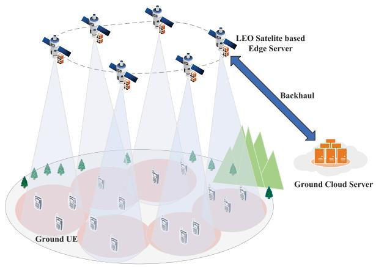

flowchart

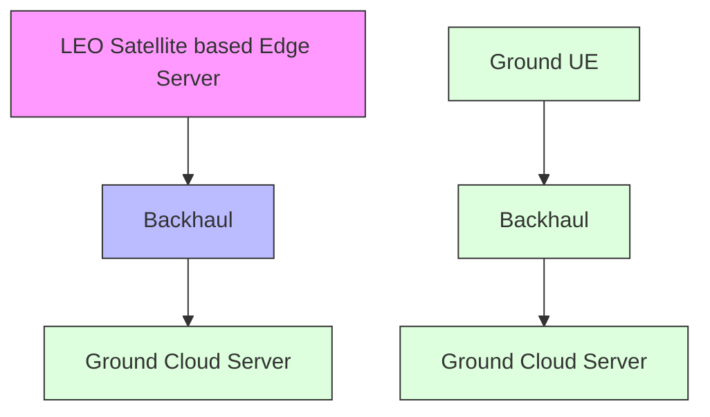

Fig. 1. A three-tier computation offloading model.

# II. SYSTEM MODEL AND PROBLEM FORMULATION

We design a three-tier edge-cloud integration model in Fig. 1, where the S LEO satellites are located in orbit at an altitude of $H ^ { S }$ , and U remote ground UEs are located in the service area of the LEOs randomly. Assume that there are no ground communication infrastructures to serve UEs. The edge servers are placed in LEOs to provide computation service for ground UEs. In the meanwhile, the LEOs can transfer tasks to the ground cloud server via backhaul. Thus, the computing task can be executed by local UEs, LEO based edge servers, and the central cloud server. To efficiently utilize spectrum resource, the NOMA technology is considered in each LEO ground cell. And satellite backhaul is applied with orthogonal multiple access technology to mitigate co-channel interference. Similar to the existing work [29], [34], the paper considers a quasi-static model in which UEs and satellites are remaining stationary throughout a PO cycle. In the meanwhile, the tasks are deterministic. And, the task scheduling and resource optimization issue is focused for the current offloading request.

# A. Wireless Communication Model

In Fig. 1, the ground UEs communicate with the associated LEO by fronthaul link for realizing computation offloading to LEO, and LEO further communicate with the cloud server by backhaul link. The whole system bandwidth B is occupied by fronthaul and backhaul. In the fronthaul link, the UEs are associated with the same LEO form a NOMA cluster. At the receiver, LEO satellites handle received signals by successive interference cancellation (SIC) mechanism. According to the principle of priority decoding for the signal with high receiving power in SIC, the decoding order of each LEO is mainly related to the UE’s channel quality in the uplink [26]. The UEs with good channel quality receive interference from the UEs with poor channel quality in the same NOMA cluster, while the UEs with poor channel quality can’t receive interference from the other UEs with good channel quality in the cluster. In the fronthaul uplink, the received signal from UE u to LEO s is

$$
y _ {u, s} = \underbrace {g _ {u , s} \sqrt {p _ {u , s}} x _ {u , s}} _ {\text { Desired   Signal }} + \underbrace {g _ {u , s} \sum_ {j \in \mathbb {U} \backslash \{u \}} \left(a _ {j , s} \sqrt {p _ {j , s}} x _ {j , s}\right)} _ {\text { Intra - cell   Interference }} + n ^ {S}, \tag {1}
$$

where $g _ { u , s } , \ p _ { u , s } ,$ and $x _ { u , s }$ respectively denote the channel coefficient, transmission power, and transmitted signal from UE u to LEO s. $n ^ { S }$ is additive white Gaussian noise (AWGN) of the satellite-ground fronthaul link. Let $a _ { j , \varepsilon }$ s be the association coefficient between UE j and LEO s, where the binary variable $a _ { j , s } = 1$ means that the UE j serves by LEO s, and $a _ { j , s } = 0$ , otherwise. Assuming the wireless channel coefficient of UEs associated with sth LEO satisfies $| g _ { 1 , s } | ^ { 2 } \geq \cdots \geq$ $| g _ { u , s } | ^ { 2 } \geq \cdot \cdot \cdot \geq | g _ { U , s } | ^ { 2 }$ , the signal-to-interference-plus-noiseratio (SINR) received by LEO s from UE u is

$$
\gamma_ {u, s} = \frac {\left| g _ {u , s} \right| ^ {2} p _ {u , s}}{\left| g _ {u , s} \right| ^ {2} \sum_ {j \in \mathbb {U} \backslash z _ {u}} \left(a _ {j , s} p _ {j , s}\right) + \sigma_ {s} ^ {2}}, \tag {2}
$$

where $\sigma _ { s } ^ { 2 }$ is the power of AWGN and $z _ { u }$ denotes the set of UEs from the UE 1 to UE u, i.e., $\{ 1 , 2 , \cdots , u \}$ .

Based on Shannon theorem, the achievable transmit rate from UE u to LEO s is

$$
R _ {u, s} = \frac {(1 - \alpha)}{S} B \log_ {2} (1 + \gamma_ {u, s}), \tag {3}
$$

where α is the backhaul bandwidth assignment factor.

In the backhaul links between LEOs and ground cloud server, the orthogonal multiple access technology is applied to avoid the inter-LEO interference. Thus the received signal of cloud server from LEO s is

$$
y _ {s, c} = g _ {s, c} \sqrt {p _ {s , c}} x _ {s, c} + n ^ {C}, \tag {4}
$$

where $g _ { s , c } , \ p _ { s , c } ,$ and $x _ { s , c }$ respectively denote the channel coefficient, transmission power, and transmitted signal from LEO s to ground cloud server. $n ^ { C }$ is AWGN of the backhaul link. The SINR from LEO s to cloud server can be written as

$$
\gamma_ {s, c} = \frac {\left| g _ {s , c} \right| ^ {2} p _ {s , c}}{\sigma_ {c} ^ {2}}, \tag {5}
$$

where $\sigma _ { c } ^ { 2 }$ is the power of AWGN in the backhaul link. Thus the achieved backhaul rate of LEO s is

$$
R _ {s, c} = \frac {\alpha}{S} B \log_ {2} (1 + \gamma_ {s, c}). \tag {6}
$$

# B. Computation Model

Let $W _ { u } ( L _ { u } , T _ { u } , X _ { u } )$ denote the task status of UE u, where $L _ { u }$ is the raw data size in bits, $T _ { u }$ is the requirement of time delay in ${ \bf S } ,$ and $X _ { u }$ denotes the task load in CPU cycles/bit. Based on PO model [39], the task $W _ { u }$ can be handled in local UE, LEO based edge server, and cloud server parallelly, which causes different delays and energy consumption. Let $l _ { u } ^ { S }$ and $l _ { u } ^ { C }$ denote the data size of $W _ { u }$ offloaded to LEO and cloud server, respectively. We analyze the delay and energy consumption with different computation statuses.

1) UE Based Local Computing: According to the PO strategy, $L _ { u } - l _ { u } ^ { S } - l _ { u } ^ { C }$ bits are processed locally on the UE u. Let $f _ { u } ^ { L }$ be the computation capability of UE u in CPU cycles/s, then computation time delay can be denoted as

$$
t _ {u} ^ {L} = \frac {(L _ {u} - l _ {u} ^ {S} - l _ {u} ^ {C}) X _ {u}}{f _ {u} ^ {L}}. \tag {7}
$$

And the energy consumption of UE u is formulated as follows [35], [36].

$$
e _ {u} ^ {L} = \kappa_ {u} ^ {L} (L _ {u} - l _ {u} ^ {S} - l _ {u} ^ {C}) X _ {u} (f _ {u} ^ {L}) ^ {2}, \tag {8}
$$

where $\kappa _ { u } ^ { L }$ is the chip architecture related energy factor of UE u [6], [37].

2) LEO Based Edge Computing: Each ground UE offloads the data with $l _ { u } ^ { S }$ bits to the associated LEO edge server through fronthaul link. Since the long-distance transmission at fronthaul link, the delay caused by the task offloading to the LEO includes three parts: data transmission delay, computation delay of LEO, and round-trip propagation delay. Since the obtained data is less than the raw data, the dowtransmission delay for returning data can be omitted. Let $f _ { u , s } ^ { S }$ be the computation capability assigned to UE u by served LEO $s ,$ the time delay of the computation offloading to edge server and corresponding consumed energy are thus denoted as

$$
t _ {u} ^ {S} = \frac {\beta l _ {u} ^ {S}}{R _ {u , s}} + \frac {l _ {u} ^ {S} X _ {u}}{f _ {u , s} ^ {S}} + 2 t _ {u, s} ^ {p}, \tag {9}
$$

and

$$
e _ {u} ^ {S} = p _ {u, s} \frac {\beta l _ {u} ^ {S}}{R _ {u , s}} + \kappa_ {s} ^ {S} l _ {u} ^ {S} X _ {u} (f _ {u, s} ^ {S}) ^ {2}, \tag {10}
$$

where $\beta$ is the transmission overhead coefficient [38] and $\kappa _ { s } ^ { S }$ is the energy factor of LEO s. The propagation delay of fronthaul link is tpu,s $\begin{array} { r } { t _ { u , s } ^ { \bar { p } } = \frac { d _ { u , s } } { c _ { 0 } } } \end{array}$ du,s c0 where $d _ { u , s }$ denotes the Euclidean distance between UE u and LEO s, and $c _ { 0 }$ is the speed of light.

3) Cloud Computing: The UE can further offload $l _ { u } ^ { C }$ bits to ground cloud server relaying by satellite. The computation capability of $f _ { u } ^ { C }$ is assigned to task u, then the time delay and corresponding consumed energy of computation offloading to cloud server are respectively

$$
t _ {u} ^ {C} = \frac {\beta l _ {u} ^ {C}}{R _ {u , s}} + \frac {\beta^ {2} l _ {u} ^ {C}}{R _ {s , c}} + \frac {l _ {u} ^ {C} X _ {u}}{f _ {u} ^ {C}} + 2 (t _ {u, s} ^ {p} + t _ {s, c} ^ {p}), \tag {11}
$$

$$
e _ {u} ^ {C} = p _ {u, s} \frac {\beta l _ {u} ^ {C}}{R _ {u , s}} + p _ {s, c} \frac {\beta^ {2} l _ {u} ^ {C}}{R _ {s , c}} + \kappa^ {C} l _ {u} ^ {C} X _ {u} (f _ {u} ^ {C}) ^ {2}, \tag {12}
$$

where and cl $\begin{array} { r } { t _ { s , c } ^ { p } = \frac { d _ { s , c } } { c _ { 0 } } } \end{array}$ ds,cc the is and propagation delay between LEO sis the Euclidean distance between $d _ { s , c }$ LEO s and cloud server. $\kappa ^ { C }$ is the energy factor relative to the chip architecture of cloud server.

# C. Problem Formulation

In the three-tier cloud-edge integration networks, the partial computation offloading delay and energy consumption of task $W _ { u }$ include three aspects: local computing, computing by satellites, computing by cloud server. With the datapartition model, the computing tasks in different servers can be processed independently and in parallel. Considering the association between UEs and satellites, the edge computation delay (9) and cloud computation delay (11) are re-written as

$$
t _ {u} ^ {S} = \sum_ {s \in \mathbb {S}} a _ {u, s} \frac {\beta l _ {u} ^ {S}}{R _ {u , s}} + \sum_ {s \in \mathbb {S}} a _ {u, s} \frac {l _ {u} ^ {S} X _ {u}}{f _ {u , s} ^ {S}} + 2 \sum_ {s \in \mathbb {S}} a _ {u, s} t _ {u, s} ^ {p}, \tag {13}
$$

$$
\begin{array}{l} t _ {u} ^ {C} = \sum_ {s \in \mathbb {S}} a _ {u, s} \frac {\beta l _ {u} ^ {C}}{R _ {u , s}} + \sum_ {s \in \mathbb {S}} a _ {u, s} \frac {\beta^ {2} l _ {u} ^ {C}}{R _ {s , c}} + \frac {l _ {u} ^ {C} X _ {u}}{f _ {u} ^ {C}} \\ + 2 \sum_ {s \in \mathbb {S}} a _ {u, s} (t _ {u, s} ^ {p} + t _ {s, c} ^ {p}). \tag {14} \\ \end{array}
$$

And the corresponding energy consumption of $W _ { u }$ is

$$
e _ {u} = w ^ {L} \kappa_ {u} ^ {L} (L _ {u} - l _ {u} ^ {S} - l _ {u} ^ {C}) X _ {u} (f _ {u} ^ {L}) ^ {2}
$$

$$
+ w ^ {L} \sum_ {s \in \mathbb {S}} a _ {u, s} p _ {u, s} \frac {\beta (l _ {u} ^ {S} + l _ {u} ^ {C})}{R _ {u , s}}
$$

$$
+ w ^ {S} \sum_ {s \in \mathbb {S}} a _ {u, s} \kappa_ {s} ^ {S} l _ {u} ^ {S} X _ {u} (f _ {u, s} ^ {S}) ^ {2}
$$

$$
+ w ^ {S} \sum_ {s \in \mathbb {S}} a _ {u, s} p _ {s, c} \frac {\beta^ {2} l _ {u} ^ {C}}{R _ {s , c}}
$$

$$
+ w ^ {C} \kappa^ {C} l _ {u} ^ {C} X _ {u} (f _ {u} ^ {C}) ^ {2}, \tag {15}
$$

where $w ^ { L } , w ^ { S }$ , and $w ^ { C }$ denote the constant positive weights for energy consumption of UE u, LEO s, and cloud server, respectively. Thus, the system energy consumption can be obtained by $E C = \sum _ { u \in \mathbb { U } } e _ { u }$ .

Accordingly, the optimization problem for the three-tier computation offloading networks by considering user association, power allocation, task scheduling, and bandwidth assignment can be formulated as

$$
\min _ {\left\{a _ {u, s}, p _ {u, s}, p _ {s, c}, l _ {u} ^ {S}, l _ {u} ^ {C}, \alpha \right\}} \sum_ {u \in \mathbb {U}} e _ {u}
$$

$$
\text { s.t.   C1: } \sum_ {s \in \mathbb {S}} a _ {u, s} \leq 1, \quad \forall u \in \mathbb {U},
$$

$$
\mathrm{C2:} a _ {u, s} = \{0, 1 \}, \quad \forall u \in \mathbb {U}, \quad s \in \mathbb {S},
$$

$$
\mathbf {C 3} \colon p _ {u, s} \leq p _ {\max} ^ {U}, \quad \forall u \in \mathbb {U}, \quad s \in \mathbb {S},
$$

$$
\mathbf {C 4} \colon p _ {s, c} \leq p _ {\max} ^ {S}, \quad \forall s \in \mathbb {S},
$$

$$
\mathbf {C 5}: l _ {u} ^ {S} + l _ {u} ^ {C} \leq L _ {u}, \quad \forall u \in \mathbb {U},
$$

$$
\mathbf {C 6} \colon l _ {u} ^ {S} \geq 0, \quad \forall u \in \mathbb {U},
$$

$$
\mathbf {C 7 :} l _ {u} ^ {C} \geq 0, \quad \forall u \in \mathbb {U},
$$

$$
\text { C8: } \sum_ {u \in \mathbb {U}} a _ {u, s} R _ {u, s} \leq R _ {s, c}, \quad \forall s \in \mathbb {S},
$$

$$
\mathbf {C 9 :} t _ {u} ^ {L} \leq T _ {u}, \quad \forall u \in \mathbb {U},
$$

$$
\mathbf {C 1 0 :} t _ {u} ^ {S} \leq T _ {u}, \quad \forall u \in \mathbb {U},
$$

$$
\text { C11: } t _ {u} ^ {C} \leq T _ {u}, \quad \forall u \in \mathbb {U}, \tag {16}
$$

where C1 and C2 denote that one UE can be served by one LEO at a PO cycle and the user association factor is binary, respectively. C3 and C4 constraint the power range of the UEs and LEOs. The amount of the data bits is limited by C5, C6, and C7. C8 is the constraint of fronthaul rate and backhaul rate. C9, C10, and C11 establish the maximum tolerable delay for three computing modes consisting of local, edge, and cloud in PO mode.

Algorithm 1 The Proposed User Association Algorithm   
1: Initializing $\{a_{u,s}^{(0)}\}$ with fixed $\{p_{u,s}\}, \{p_{s,c}\}, \{l_u^S\}, \{l_u^C\}$ , and $\alpha$ . Set $N_{\max}$ , $n = 0$ .
2: repeat
3:    for $\forall u \in \mathbb{U}$ do
4:    Calculate $R_{u,s}^{(n)}$ according to $\{a_{u,s}^{(n)}\}$ for $\forall s \in \mathbb{S}$ .
5:    Solving $\{a_{u,s}^{(n+1)}\}$ of the transformed convex problem (17).
6:    end for
7: $n = n + 1$ .
8: until Reach convergence or $n = N_{\max}$

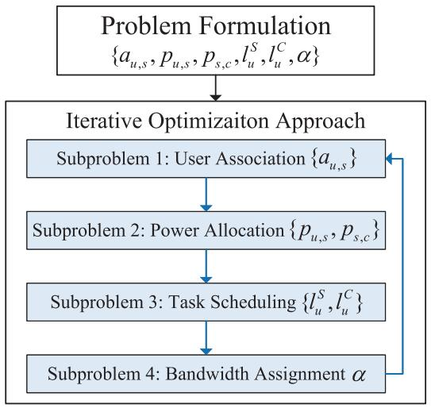

flowchart

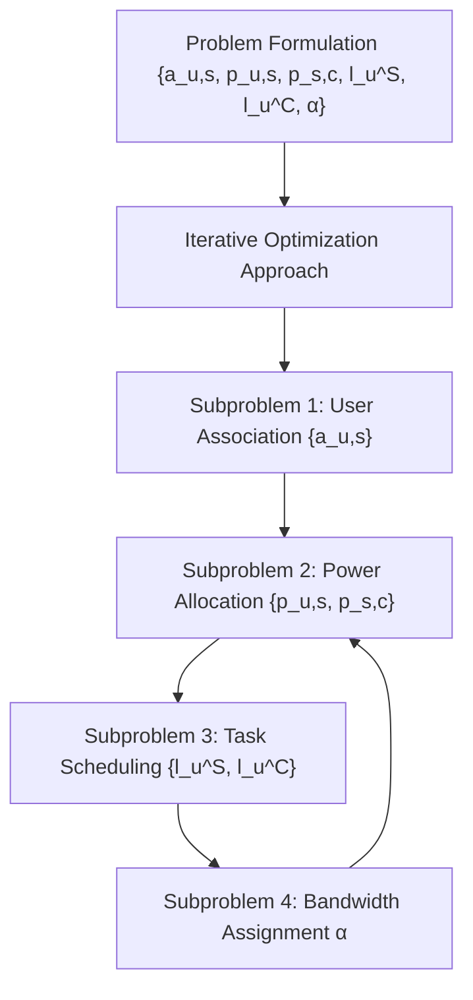

Fig. 2. The proposed joint iterative algorithm process.

# III. JOINT ITERATIVE OPTIMIZATION ALGORITHM FOR THREE-TIER COMPUTATION OFFLOADING

The optimization problem (16) is a complex nonlinear multi-parameter problem, which is highly non-convex because of the coupled variables, binary constraint, and fractional summation terms. Therefore, the system optimization problem is handled by focusing on four subproblems separately, thus we can obtain the solutions of the problem (16) by a joint iterative optimization algorithm. Fig. 2 gives the decomposition and iteration process. The whole process consists of five steps. At the first step, the user association solution $\{ a _ { u , s } \}$ is obtained with the fixed $\{ p _ { u , s } , p _ { s , c } , l _ { u } ^ { S } , l _ { u } ^ { C } , \alpha \}$ . Then the power allocation solutions for UEs and LEOs are solved based on the optimized $\{ a _ { u , s } \}$ and other fixed variables. Similarly, the next step is to allocate task bits for UEs, LEOs, and cloud server. According to the optimized variables $\{ a _ { u , s } , p _ { u , s } , p _ { s , c } , l _ { u } ^ { S } , l _ { u } ^ { C } \}$ , the optimal value α is solved. At the last step, the iteration process is performed, in which the current optimization solutions are regarded as fixed values substituting into the next iteration and the joint optimization solutions can be achieved. It should be noted that no matter whether the UE needs LEOs and cloud server for offloading, each UE execute the user association process. For the case of $l _ { u } ^ { S } + l _ { u } ^ { C } = 0$ , that is, UE can locally process the whole task. In this case, theoretically, the UE does not need to access any satellite cell. And we control it through the power allocation process. Furthermore,

the backhaul constraint C8 will be considered in bandwidth assignment process.

# A. User Association Algorithm

The user association subproblem can be formulated as U local strategies for U ground users, in which each UE u selects the associated satellite by minimizing energy consumption $e _ { u }$ , while the association results of other UEs keep constant. The user association subproblem for each UE u is

$$
\begin{array}{l} \min _ {\left\{a _ {u, s} \right\}} \left\{w ^ {L} \sum_ {s \in \mathbb {S}} a _ {u, s} p _ {u, s} \frac {\beta (l _ {u} ^ {S} + l _ {u} ^ {C})}{R _ {u , s}} \right. \\ + w ^ {S} \sum_ {s \in \mathbb {S}} a _ {u, s} \kappa_ {s} ^ {S} l _ {u} ^ {S} X _ {u} (f _ {u, s} ^ {S}) ^ {2} + w ^ {S} \sum_ {s \in \mathbb {S}} a _ {u, s} p _ {s, c} \frac {\beta^ {2} l _ {u} ^ {C}}{R _ {s , c}} \} \\ \end{array}
$$

The optimization problem (17) is still concave because of the binary variable $\{ a _ { u , s } \}$ . By relaxing binary variables $\{ a _ { u , s } \}$ to the continuous ones within [0, 1] and strain the C1 of (16) as $\sum _ { s \in \mathbb { S } } a _ { u , s } { \mathrm { ~ \tiny ~ = ~ 1 ~ } }$ , the transformed objective function and constraints in (17) are then linear over $\{ a _ { u , s } \}$ . And the optimization problem (17) becomes a convex linear programming form, which can be settled by CVX toolbox. We provide Algorithm 1 for the detailed description of solving user association subproblem.

# B. Power Allocation Algorithm

According to the optimized user association strategy, the power allocation subproblem for both UEs and LEOs can be formulated as

$$
\begin{array}{l} \min _ {\left\{p _ {u, s}, p _ {s, c} \mid a _ {u, s} \right\}} \left\{w ^ {L} \sum_ {u \in \mathbb {U}} a _ {u, s} \beta (l _ {u} ^ {S} + l _ {u} ^ {C}) \frac {p _ {u , s}}{R _ {u , s}} \right. \\ + w ^ {S} \frac {p _ {s , c}}{R _ {s , c}} \sum_ {u \in \mathbb {U}} a _ {u, s} \beta^ {2} l _ {u} ^ {C} \} \\ \end{array}
$$

${ \mathrm { s . t . } } \ C 3 , \ C 4 , \ C 1 0 , \ C 1 1 .$ (18)

The objective function of (18) contains the formula of sumof-ratio, which has a large computational complexity. The quadratic transform method has good stability and equivalence to handle this sum-of-ratio problem, where the convergence has been well proved [40], [41]. By quadratic transform method, the fractional terms $\frac { p _ { u , s } } { R _ { u , s } }$ and $\frac { p _ { s , c } } { R _ { s , c } }$ in (18) can be Ru,s Rs,c transformed into

$$
f _ {u, s} ^ {1} = 2 \nu_ {u, s} \sqrt {p _ {u , s}} - \nu_ {u, s} ^ {2} R _ {u, s}, \tag {19}
$$

and

$$
f _ {s, c} ^ {2} = 2 v _ {s, c} \sqrt {p _ {s , c}} - v _ {s, c} ^ {2} R _ {s, c}, \tag {20}
$$

where $v _ { u , s }$ and $v _ { s , c }$ are introduced auxiliary variables. At the kth iteration, $v _ { u , s }$ and $\boldsymbol { v } _ { s , c }$ can be obtained respectively by

$$
\nu_ {u, s} ^ {(k) *} = \frac {\sqrt {p _ {u , s} ^ {(k)}}}{R _ {u , s} ^ {(k)}}, \tag {21}
$$

and

$$
v _ {s, c} ^ {(k) ^ {*}} = \frac {\sqrt {p _ {s , c} ^ {(k)}}}{R _ {s , c} ^ {(k)}}. \tag {22}
$$

Thus, the optimization problem is re-written as

$$
\min _ {\{p _ {u, s}, p _ {s, c} | a _ {u, s} \}} \{w ^ {L} \sum_ {u \in \mathbb {U}} a _ {u, s} \beta (l _ {u} ^ {S} + l _ {u} ^ {C}) f _ {u, s} ^ {1}
$$

$$
\left. + w ^ {S} f _ {s, c} ^ {2} \sum_ {u \in \mathbb {U}} a _ {u, s} \beta^ {2} l _ {u} ^ {C} \right\}
$$

s.t. C3, C4, C10, C11. (23)

From the power optimization problem (23), the user power and satellite power are distributed in the different terms, and satellite cells are independent based on the optimized user association strategy. Thus, the problem (23) can be divided into S local strategies for $S$ satellite cells and the optimization problem of each cell is separated into two stages. In the first stage, the fixed satellite power is considered and the power of associated UEs are optimized. The satellite power is then obtained according to the optimized power solutions of associated UEs.

According to (19) and (20), for any user u in satellite cell s, $R _ { u , s }$ and $R _ { s , c }$ are concave w.r.t $p _ { u , s }$ and $p _ { s , c } ,$ respectively. Hence, $f _ { u , s } ^ { 1 }$ and $f _ { s , c } ^ { 2 }$ are the subtraction form with two convex functions. The difference of convex (DC) method can be applied to handle the transformed subtraction problem. The Algorithm 2 give the detailed description for the power allocation process.

# C. Computing Task Scheduling Algorithm

For this subproblem, the optimized user association strategy and transmission power are considered. The task scheduling subproblem is formulated as

$$
\min _ {\{l _ {u} ^ {S}, l _ {u} ^ {C} | a _ {u, s}, p _ {u, s}, p _ {s, c} \}} \{w ^ {L} \sum_ {u \in \mathbb {U}} \kappa_ {u} ^ {L} (L _ {u} - l _ {u} ^ {S} - l _ {u} ^ {C}) X _ {u} (f _ {u} ^ {L}) ^ {2}
$$

$$
+ w ^ {L} \sum_ {u \in \mathbb {U}} \sum_ {s \in \mathbb {S}} a _ {u, s} p _ {u, s} \frac {\beta (l _ {u} ^ {S} + l _ {u} ^ {C})}{R _ {u , s}}
$$

$$
+ w ^ {S} \sum_ {u \in \mathbb {U}} \sum_ {s \in \mathbb {S}} a _ {u, s} \kappa_ {s} ^ {S} l _ {u} ^ {S} X _ {u} (f _ {u, s} ^ {S}) ^ {2}
$$

$$
+ w ^ {S} \sum_ {u \in \mathbb {U}} \sum_ {s \in \mathbb {S}} a _ {u, s} p _ {s, c} \frac {\beta^ {2} l _ {u} ^ {C}}{R _ {s , c}}
$$

$$
\left. + w ^ {C} \sum_ {u \in \mathbb {U}} \kappa^ {C} l _ {u} ^ {C} X _ {u} \left(f _ {u} ^ {C}\right) ^ {2} \right\}
$$

${ \mathrm { s . t . ~ C 5 , ~ C 6 , ~ C 7 , ~ C 9 , ~ C 1 0 , ~ C 1 1 . } }$ (24)

The above problem (24) is a linear programming problem over $l _ { u } ^ { S }$ and $l _ { u } ^ { \dot { C } }$ . The strict upper and lower bound of the target variables can be deduced. By constraints C9, C10, and C11 of problem (16), we respectively get

$$
l _ {u} ^ {C} \geq L _ {u} - \frac {T _ {u} f _ {u} ^ {L}}{X _ {u}} - l _ {u} ^ {S}, \tag {25}
$$

$$
l _ {u} ^ {S} \leq \frac {T _ {u} - 2 t _ {u , s} ^ {p}}{\frac {\beta}{R _ {u , s}} + \frac {X _ {u}}{f _ {u , s} ^ {S}}}, \tag {26}
$$

Algorithm 2 The Quadratic Transform Based Power Allocation Algorithm   
1: Initializing $\{p_{u,s}^{(0)}\}$ and $\{p_{s,c}^{(0)}\}$ with optimized $\{a_{u,s}\}$ . Set $K_{\max}$ , $k = 0$ .

2: repeat
3:    for $\forall u \in \mathbb{U}, s \in \mathbb{S}$ do
4:    Calculate $R_{u,s}^{(k)}$ an $R_{s,c}^{(k)}$ according to $\{p_{u,s}^{(k)}\}$ and $\{p_{s,c}^{(k)}\}$ , respectively.
5:    Calculate and update $\nu_{u,s}^{(k)^*}$ and $\upsilon_{s,c}^{(k)^*}$ according to (21) and (22), respectively.
6:    Calculate and update $p_{u,s}^{(k+1)}$ and $p_{s,c}^{(k+1)}$ by DC scheme.
7:    end for
8: $k = k + 1$ .
9: until Reach convergence or $k = K_{\max}$

Algorithm 3 The Proposed Task Scheduling Algorithm   
1: Initializing $\{l_u^{S(0)}\}$ and $\{l_u^{C(0)}\}$ with optimized $\{a_{u,s}\}$ , $\{p_{u,s}\}$ , and $\{p_{s,c}\}$ . Set $M_{\mathrm{max}}$ , $m = 0$ .

2: repeat
3:    for $\forall u \in \mathbb{U}$ do
4:    Calculate and update upper bound $\bar{l}_u^{S(m)}$ according to (28).
5:    Calculate and update upper bound $\bar{l}_u^{C(m)}$ and lower bound $\underline{l}_u^{C(m)}$ according to $\bar{l}_u^{S(m)}$ and $l_u^{S(m)}$ .
6:    Update $\underline{l}_u^{S(m+1)}$ and $l_u^{C(m+1)}$ by solving (31).
7:    end for
8: $m = m + 1$ .
9: until Reach convergence or $m = M_{\mathrm{max}}$

and

$$
l _ {u} ^ {C} \leq \frac {T _ {u} - 2 (t _ {u , s} ^ {p} + t _ {s , c} ^ {p})}{\frac {\beta}{R _ {u , s}} + \frac {\beta^ {2}}{R _ {s , c}} + \frac {X _ {u}}{f _ {u} ^ {C}}}. \tag {27}
$$

Based on the constraints of C5, C6, and C7, the upper bounds of $l _ { u } ^ { S }$ and $l _ { u } ^ { C }$ can be respectively obtained as

$$
\bar {l} _ {u} ^ {S} = \min \left\{\frac {T _ {u} - 2 t _ {u , s} ^ {p}}{\frac {\beta}{R _ {u , s}} + \frac {X _ {u}}{f _ {u , s} ^ {S}}}, L _ {u} \right\}, \tag {28}
$$

$$
\bar {l} _ {u} ^ {C} = \min \left\{\frac {T _ {u} - 2 (t _ {u , s} ^ {p} + t _ {s , c} ^ {p})}{\frac {\beta}{R _ {u , s}} + \frac {\beta^ {2}}{R _ {s , c}} + \frac {X _ {u}}{f _ {u} ^ {C}}}, L _ {u} - l _ {u} ^ {S} \right\}. \tag {29}
$$

And the lower bound of $l _ { u } ^ { C }$ is

$$
\underline {{l}} _ {u} ^ {C} = \max \left\{L _ {u} - \frac {T _ {u} f _ {u} ^ {L}}{X _ {u}} - l _ {u} ^ {S}, 0 \right\}. \tag {30}
$$

Furthermore, the bandwidth assignment subproblem (24) is re-written as (31), shown at the bottom of the next page.

The simplified convex problem (31) can be resolved directly by CVX toolbox. Accordingly, the detailed task scheduling process is shown in Algorithm 3.

# D. Bandwidth Assignment Algorithm

The backahul rate is guaranteed by bandwidth assignment. We introduce additional slack variable $\alpha ^ { \prime }$ to deal with the concave term $\frac { 1 } { 1 - \alpha }$ 1−α of the objective function and constraints, which satisfies

$$
1 - \alpha \geq \alpha^ {\prime}. \tag {32}
$$

When computing task is successfully offloaded in LEO based edge server, i.e., $l _ { u } ^ { S } > 0 ,$ constraint C10 of the optimization problem (16) can be formulated as

$$
\frac {1}{\alpha^ {\prime}} \leq \frac {T _ {u} - \sum_ {s \in \mathbb {S}} a _ {u , s} \frac {l _ {u} ^ {S} X _ {u}}{f _ {u , s} ^ {S}} - 2 \sum_ {s \in \mathbb {S}} a _ {u , s} t _ {u , s} ^ {p}}{\sum_ {s \in \mathbb {S}} a _ {u , s} \frac {S \beta l _ {u} ^ {S}}{B \log_ {2} (1 + \gamma_ {u , s})}}, \quad \forall u \in \mathbb {U}. \tag {33}
$$

Similarly, we simplify C8 and C11, then the bandwidth allocation problem can be transformed as (34), shown at the bottom of the page. The problem (34) is convex and resolved by CVX toolbox directly.

Furthermore, we propose an iterative process to optimize the task scheduling and resource allocation problem. In the designed scheme, each subproblem is solved with other optimized variables by block coordinate descent concept. The detail description and convergence are discussed next.

# IV. ALGORITHM DESIGN AND COMPLEXITY ANALYSIS

According to the solution of each subproblem, the joint iterative optimization algorithm is designed to correlate user association, power allocation, task scheduling, and bandwidth assignment. Then we provide the corresponding complexity analysis.

# A. Joint Iterative Algorithm Design

The proposed joint iterative algorithm is described in Algorithm 4. Based on optimized other three variables, the user association, power allocation, task scheduling, and bandwidth assignment subproblems are respectively solved by the proposed algorithms above at each iteration. The system energy consumption is nonincreasing with the number of iterations rises, and the global optimization solutions are achieved eventually.

Algorithm 4 Joint Iterative Optimization Algorithm for Three-Tier Computation Offloading   
1: Initializing $\{a_{u,s}^{(0)}\}$ , $\{p_{u,s}^{(0)}\}$ , $\{p_{s,c}^{(0)}\}$ , $\{l_{u}^{S(0)}\}$ , $\{l_{u}^{C(0)}\}$ , and $\alpha^{(0)}$ . Set tolerance $\varepsilon$ , $I_{max}$ , and i = 0.
2: Initializing $\left(\sum_{u\in\mathbb{U}}e_{u}\right)^{(0)}$ according to (15).
3: while $\left|\left(\sum_{u\in\mathbb{U}}e_{u}\right)^{(i+1)}-\left(\sum_{u\in\mathbb{U}}e_{u}\right)^{(i)}\right| \geq \varepsilon$ or $i \leq I_{max}$ do
4: Calculate and update $\{a_{u,s}^{(i+1)}\}$ according to Algorithm 1.
5: Calculate and update $\{p_{u,s}^{(i+1)}\}$ and $\{p_{s,c}^{(i+1)}\}$ according to Algorithm 2.
6: Calculate and update $\{l_{u}^{S(i+1)}\}$ and $\{l_{u}^{C(i+1)}\}$ according to Algorithm 3.
7: Calculate and update $\alpha^{(i+1)}$ by solving (34).
8: Calculate and update $\left(\sum_{u\in\mathbb{U}}e_{u}\right)^{(i+1)}$ according to (15).
9: $n = n + 1$ .
10: end while

More specifically, at each iteration of Algorithm 4, the updated user association suboptimal solution $\{ a _ { u , s } ^ { ( i ) } \}$ is solved

$$
\begin{array}{l} \min _ {\{l _ {u} ^ {S}, l _ {u} ^ {C} | a _ {u, s}, p _ {u, s}, p _ {s, c} \}} \{\sum_ {u \in \mathbb {U}} l _ {u} ^ {S} [ - w ^ {L} \kappa_ {u} ^ {L} X _ {u} (f _ {u} ^ {L}) ^ {2} + w ^ {L} \sum_ {s \in \mathbb {S}} a _ {u, s} p _ {u, s} \frac {\beta}{R _ {u , s}} + w ^ {S} \sum_ {s \in \mathbb {S}} a _ {u, s} \kappa_ {s} ^ {S} X _ {u} (f _ {u, s} ^ {S}) ^ {2} ] \\ + \sum_ {u \in \mathbb {U}} l _ {u} ^ {C} [ - w ^ {L} \kappa_ {u} ^ {L} X _ {u} (f _ {u} ^ {L}) ^ {2} + w ^ {L} \sum_ {s \in \mathbb {S}} a _ {u, s} p _ {u, s} \frac {\beta}{R _ {u , s}} + w ^ {S} \sum_ {s \in \mathbb {S}} a _ {u, s} p _ {s, c} \frac {\beta^ {2}}{R _ {s , c}} + w ^ {C} \kappa^ {C} X _ {u} (f _ {u} ^ {C}) ^ {2} ] \} \\ \text { s.t. } \mathbf {C 5 ^ {\prime}} \colon 0 \leq l _ {u} ^ {S} \leq \bar {l} _ {u} ^ {S}, \quad \forall u \in \mathbb {U}, \\ \mathrm{C} 6 ^ {\prime}: \underline {{l}} _ {u} ^ {C} \leq l _ {u} ^ {C} \leq \bar {l} _ {u} ^ {C}, \quad \forall u \in \mathbb {U}. \tag {31} \\ \end{array}
$$

$$
\min _ {\{\alpha , \alpha^ {\prime} | a _ {u, s}, p _ {u, s}, p _ {s, c}, l _ {u} ^ {S}, l _ {u} ^ {C} \}} \frac {1}{\alpha^ {\prime}} \left[ w ^ {L} \sum_ {u \in \mathbb {U}} \sum_ {s \in \mathbb {S}} \frac {a _ {u , s} p _ {u , s} \beta (l _ {u} ^ {S *} + l _ {u} ^ {C *})}{\log_ {2} (1 + \gamma_ {u , s})} \right] + \frac {1}{\alpha} \left[ w ^ {S} \sum_ {u \in \mathbb {U}} \sum_ {s \in \mathbb {S}} \frac {a _ {u , s} p _ {s , c} \beta^ {2} l _ {u} ^ {C *}}{\log_ {2} (1 + \gamma_ {s , c})} \right]
$$

$$
\text {s.t.} \mathbf {C 8}: \alpha \geq \frac {\sum_ {u \in \mathbb {U}} a _ {u , s} \log_ {2} (1 + \gamma_ {u , s})}{\log_ {2} (1 + \gamma_ {s , c}) + \sum_ {u \in \mathbb {U}} a _ {u , s} \log_ {2} (1 + \gamma_ {u , s})}, \quad \forall s \in \mathbb {S},
$$

$$
\mathrm{C} 1 0 ^ {\prime}: \frac {1}{\alpha^ {\prime}} \leq \frac {T _ {u} - \sum_ {s \in \mathbb {S}} a _ {u , s} \frac {l _ {u} ^ {S} X _ {u}}{f _ {u , s} ^ {S}} - 2 \sum_ {s \in \mathbb {S}} a _ {u , s} t _ {u , s} ^ {p}}{\sum_ {s \in \mathbb {S}} a _ {u , s} \frac {S \beta l _ {u} ^ {S}}{B \log_ {2} (1 + \gamma_ {u , s})}}, \quad \forall u \in \mathbb {U},
$$

$$
\begin{array}{l} \mathrm{C11} ^ {\prime} \colon \frac {1}{\alpha^ {\prime}} \sum_ {s \in \mathbb {S}} \frac {a _ {u , s} S \beta l _ {u} ^ {C}}{B \log_ {2} (1 + \gamma_ {u , s})} + \frac {1}{\alpha} \sum_ {s \in \mathbb {S}} \frac {a _ {u , s} S \beta^ {2} l _ {u} ^ {C}}{B \log_ {2} (1 + \gamma_ {s , c})} \leq T _ {u} - \frac {l _ {u} ^ {C} X _ {u}}{f _ {u} ^ {C}} - 2 \sum_ {s \in \mathbb {S}} a _ {u, s} \left(t _ {u, s} ^ {p} + t _ {s, c} ^ {p}\right), \quad \forall u \in \mathbb {U}, \\ \text { C12: } 1 - \alpha \geq \alpha^ {\prime}. \tag {34} \\ \end{array}
$$

with fixed transmission power $\{ p _ { u , s } ^ { ( i - 1 ) } \}$ and $\{ p _ { s , c } ^ { ( i - 1 ) } \}$ , task scheduling $\{ l _ { u } ^ { S ( i - 1 ) } \}$ and $\{ l _ { u } ^ { C ( i - 1 ) } \}$ , as well as backhaul bandwidth $\alpha ^ { ( i - 1 ) }$ . The power allocation suboptimal solutions $\{ p _ { u , s } ^ { ( i ) } \}$ and $\{ p _ { s , c } ^ { ( i ) } \}$ are solved with fixed user association $\{ a _ { u , s } ^ { ( i ) } \}$ , task scheduling $\{ l _ { u } ^ { S ( i - 1 ) } \}$ and $\{ l _ { u } ^ { C ( i - 1 ) } \}$ , as well as u,sbackhaul bandwidth $\{ l _ { u } ^ { C ( i ) } \}$ u  are solved with optimized user association $\alpha ^ { ( i - 1 ) }$ u u . The task scheduling $\{ l _ { u } ^ { S ( i ) } \}$ $\{ a _ { u , s } ^ { ( i ) } \}$ and transmission power $\{ p _ { u , s } ^ { ( i ) } \}$ and $\{ p _ { s , c } ^ { ( i ) } \}$ , as well as backhaul bandwidth $\alpha ^ { ( i - 1 ) }$ . Correspondingly, the backhaul bandwidth value $\alpha ^ { ( i - 1 ) }$ is obtained with updated user association $\{ a _ { u , s } ^ { ( i ) } \}$ , transmission power $\{ p _ { u , s } ^ { ( i ) } \}$ and $\{ p _ { s , c } ^ { ( i ) } \}$ , as well as task scheduling $\{ l _ { u } ^ { \hat { S } ( i ) } \}$ and $\{ l _ { u } ^ { C ( i ) } \}$ . Since each variable is solved depending on the optimized previous variables, the system energy consumption is non-increasing after each iteration, i.e., $\left( \sum _ { u \in \mathbb { U } } e _ { u } \right) ^ { ( i + 1 ) ^ { \cdot } } \leq \left( \sum _ { u \in \mathbb { U } } e _ { u } \right) ^ { ( i ) }$ eu . Note that the given system energy consumption of problem (16) is lower bounded by a finite value [43]. Hence, the Algorithm 4 can be guaranteed to converge and achieve the minimum consumed energy.

# B. Complexity Analysis

In subproblem 1, the computation complexity of both $\{ R _ { u , s } ^ { ( n ) } \}$ and $\{ a _ { u , s } ^ { ( n + 1 ) } \}$ a(n+1)u,s } for all u ∈ U, s ∈ S is SU . Assume $u \in \mathbb { U } , s \in \mathbb { S }$ that the convergence for Algorithm 1 needs N times iteration, the complexity in this scheme is O(N SU ). In subproblem 2, assume that the complexity of DC scheme is L, and the convergence needs K times iteration. Then it needs the complexity of O(KLSU ) to finish the optimization. Similarly, subproblem 3 has the computation complexity of O(MU), in which M denotes the complexity of convergence. Furthermore, if the convergence of algorithm 4 needs I times iteration, the computation complexity of Algorithm 4 is $\mathcal { O } \left( I N S U + I K L S U + I M U + I \right)$ .

# V. SIMULATION RESULTS

The numerical simulations are represented to discuss the performance of the developed three-tier computation offloading algorithm in this part. We place 5 LEOs in a square area of 1.2 km × 1.2 km with the altitude of 784 km [29]. The ground remote UEs are distributed in the coverage range of LEOs randomly, and far away from ground cloud server. The system adopts Ka-band with the carrier frequency of 20 GHz. The total bandwidth is 500 MHz. We consider free-space path loss and Rician fading for channel model in satellite-ground link [42]. The density of AWGN is −203 dBm/Hz. The maximum transmitted power of each LEO and UE are 43 dBm and 23 dBm, respectively. For the computation model, the data size of each task is 1 MB, computation deadline is 3 s, and the workload is 100 cycels/bit for each task. Each ground UE has the computation capability of 0.1 Gcycels/s. The LEOs and ground cloud server allocate the computation capability of 5 and 10 Gcycels/s to the served UE [27]. Furthermore, the overhead coefficient is $\beta = 1 . 2 .$ . The weight of UEs, LEOs, and cloud server are respectively set to be 1, 0.8, and 0.5.

We contrast the proposed three-tier offloading algorithm to the different resource allocation and computation offloading schemes. 1) Two-tier computation offloading (TTCO): In TTCO scheme, the computation tasks are handled locally and in LEOs parallelly, i.e., $l _ { u } ^ { C } = 0 , \forall u \in \mathbb { U }$ . The task scheduling and resource allocation strategy is same as the proposed algorithm. 2) Greedy computation offloading (GCO): In GCO scheme, the whole task of each UE is offloaded to the cloud center to utilize computation resource as much as possible. 3) Maximum SNR (Max-SNR): The user association strategy is replaced by maximum SNR between UEs and LEOs. 4) Maximum power allocation (MPA): The LEOs and UEs both use maximum transmission power to accomplish computation offloading.

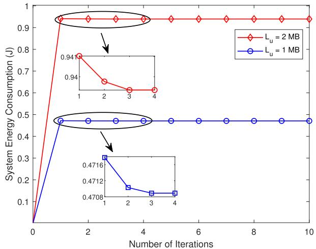

line

| Number of Iterations | L_u = 2 MB | L_u = 1 MB |
| -------------------- | ---------- | ---------- |
| 0                    | 0.0        | 0.0        |
| 1                    | 0.94       | 0.4716     |
| 2                    | 0.94       | 0.4712     |
| 3                    | 0.94       | 0.4708     |
| 4                    | 0.94       | 0.4708     |
| 5                    | 0.94       | 0.4708     |
| 6                    | 0.94       | 0.4708     |
| 7                    | 0.94       | 0.4708     |
| 8                    | 0.94       | 0.4708     |
| 9                    | 0.94       | 0.4708     |
| 10                   | 0.94       | 0.4708     |

Fig. 3. Convergence of Algorithm 4.

The convergence of the Algorithm 4 is verified in Fig. 3. It can be observed from results that the proposed algorithm both has good convergence with different task size $L _ { u }$ . The system energy consumption increases when the size of data $L _ { u }$ is larger. This is because of the strong positive relationship between energy consumption and computation data size. Besides, local computing often fails to satisfy the delay demand with big data size, resulting in more data being offloaded thus generating high energy consumption.

Fig. 4 shows the relationship between UEs and satellites under different user association algorithms. In Max-SNR based user association scheme, UEs only consider the channel condition, ignoring the co-channel interference and system energy consumption. Different with Max-SNR scheme, the influences of those aspects are considered in the Algorithm 1, in which the resource allocation and task scheduling are jointly optimized. Based on the models of Fig. 4, we further discuss the performance comparison in the following figures.

The results of system energy consumption versus UE scale under different resource allocation schemes are given in Fig. 5, where the Max-SNR and MPA schemes running in the same simulation environment. We can observe that the performance of Max-SNR scheme and the proposed Algorithm 4 of this paper are obviously better than that of MPA scheme in reducing energy consumption. When the number of UEs expands from 20 to 200, the numerical difference of energy consumption is also increasing. This is because is that the power allocation is performed in Max-SNR scheme and Algorithm 4, which balances the performance between transmission power and energy consumption. But in MPA scheme, the maximum transmission power causes high interference and that is significantly serious with more UEs. Thus, the system energy consumption is improved with the decreased transmission rate of each UE and greater volume. Furthermore, the proposed algorithm obtains better performance comparing to Max-SNR algorithm because of the optimized user association strategy of Algorithm 1.

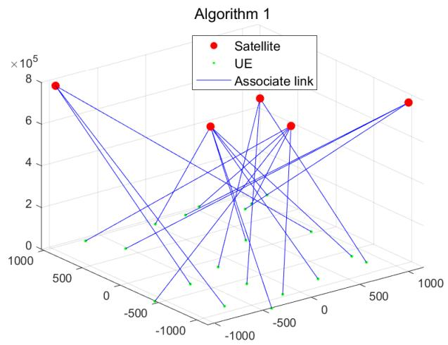

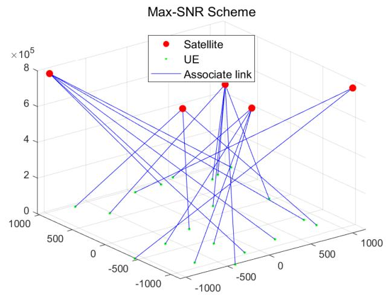

line

| X     | Y     | Value (×10⁵) |
|-------|-------|--------------|
| 500   | 8     | 8            |
| 500   | 7     | 7            |
| 500   | 6     | 6            |
| 500   | 5     | 5            |
| 500   | 4     | 4            |
| 500   | 3     | 3            |
| 500   | 2     | 2            |
| 500   | 1     | 1            |
| 500   | 0     | 0            |
| 500   | -1    | -1           |
| 500   | -2    | -2           |
| 500   | -3    | -3           |
| 500   | -4    | -4           |
| 500   | -5    | -5           |
| 500   | -6    | -6           |
| 500   | -7    | -7           |
| 500   | -8    | -8           |
| 500   | -9    | -9           |
| 500   | -10   | -10          |
| 500   | -11   | -11          |
| 500   | -12   | -12          |
| 500   | -13   | -13          |
| 500   | -14   | -14          |
| 500   | -15   | -15          |
| 500   | -16   | -16          |
| 500   | -17   | -17          |
| 500   | -18   | -18          |
| 500   | -19   | -19          |
| 500   | -20   | -20          |
| 500   | -21   | -21          |
| 500   | -22   | -22          |
| 500   | -23   | -23          |
| 500   | -24   | -24          |
| 500   | -25   | -25          |
| 500   | -26   | -26          |
| 500   | -27   | -27          |
| 500   | -28   | -28          |
| 500   | -29   | -29          |
| 500   | -30   | -30          |
| 500   | -31   | -31          |
| 500   | -32   | -32          |
| 500   | -33   | -33          |
| 500   | -34   | -34          |
| 500   | -35   | -35          |
| 500   | -36   | -36          |
| 500   | -37   | -37          |
| 500   | -38   | -38          |
| 500   | -39   | -39          |
| 500   | -40   | -40          |
| 500   | -41   | -41          |
| 500   | -42   | -42          |
| 500   | -43   | -43          |
| 500   | -44   | -44          |
| 500   | -45   | -45          |
| 500   | -46   | -46          |
| 500   | -47   | -47          |
| 500   | -48   | -48          |
| 500   | -49   | -49          |
| 500   | -50   | -50          |
| 500   | -51   | -51          |
| 500   | -52   | -52          |
| 500   | -53   | -53          |
| 500   | -54   | -54          |
| 500   | -55   | -55          |
| 500   | -56   | -56          |
| 500   | -57   | -57          |
| 500   | -58   | -58          |
| 500   | -59   | -59          |
| 500   | -60   | -60          |
| 516.6                 | 8     | 8            |
| 516.6                 | 7     | 7            |
| 516.6                 | 6     | 6            |
| 516.6                 | 5     | 5            |
| 516.6                 | 4     | 4            |
| 516.6                 | 3     | 3            |
| 516.6                 | 2     | 2            |
| 516.6                 | 1     | 1            |
| 516.6                 | 0     | 0            |
| 516.6                 | -1    | -1           |
| 516.6                 | -2    | -2           |
| 516.6                 | -3    | -3           |
| 516.6                 | -4    | -4           |
| 516.6                 | -5    | -5           |
| 516.6                 | -6    | -6           |
| 516.6                 | -7    | -7           |
| 516.6                 | -8    | -8           |
| 516.6                 | -9    | -9           |
| 516.6                 | -10   | -10          |
| 516.6                 | -11   | -11          |
| 516.6                 | -12   | -12          |
| 516.6                 | -13   | -13          |
| 516.6                 | -14   | -14          |
| 516.6                 | -15   | -15          |
| 516.6                 | -16   | -16          |
| 516.6                 | -17   | -17          |
| 516.6                 | -18   | -18          |
| 516.6                 | -19   | -19          |
| 516.6                 | -20   | -20          |
| 516.6                 | -21   | -21          |
| 516.6                 | -22   | -22          |
| 516.6                 | -23   | -23          |
| 516.6                 | -24   | -24          |
| 516.6                 | -25   | -25          |
| 516.6                 | -26   | -26          |
| 516.6                 | -27   | -27          |
| 516.6                 | -28   | -28          |
| 516.6                 | -29   | -29          |
| 516.6                 | -30   | -30          |
| 516.6                 | -31.                  | -31          |
| 516.6                 | -32.                  | -32          |
| 516.6                 | -33.                  | -33          |
| 516.6                 | -34.                  | -34          |
| 516.6                 | -35.                  | -35          |
| 516.6                 | -36.                  | -36          |
| 516.6                 | -37.                  | -37          |
| 516.6                 | -38.                  | -38          |
| 516.6                 | -39.                  | -39          |
| 516.6                 | -40.                  | -40          |
| 516.6                 | -41.                  | -41          |
| 516.6                 | -42.                  | -42          |
| 516.6                 | -43.                  | -43          |
| 516.6                 | -44.                  | -44          |
| 516.6                 | -45.                  | -45          |
| 516.6                 | -46.                  | -46          |
| 516.6                 | -47.                  | -47          |
| 516.6                 | -48.                  | -48          |
| 516.6                 | -49.                  | -49          |
| 516.6                 | -50.                  | -50          |
| 516.6                 | -51.                  | -51          |
| 516.6                 | -52.                  | -52          |
| 516.6                 | -53.                  | -53          |
| 516.6                 | -54.                  | -54          |
| 516.6                 | -55.                  | -55          |
| 516.6                 | -56.                  | -56          |
| 516.6                 | -57.                  | -57          |
| 516.6                 | -58.                  | -58          |
| 516.6                 | -59.                  | -59          |
| 516.6                 | -60.                  | -60          |
| Note: The data is extracted from the code and presented in CSV format as requested in the code and format table.

Fig. 4. Relationship between UEs and satellites under different user association algorithms.

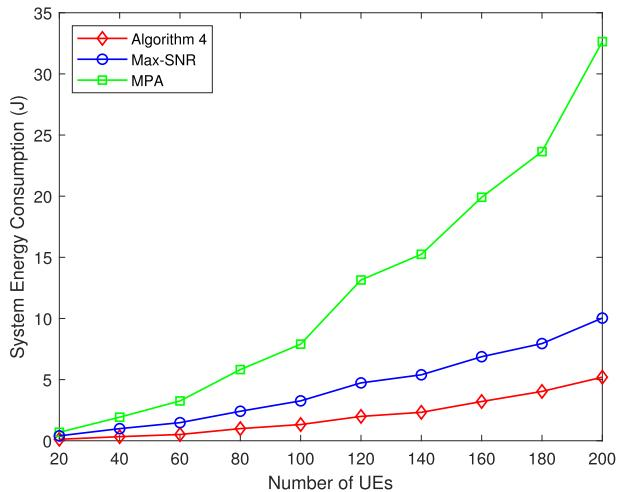

line

| Number of UEs | Algorithm 4 | Max-SNR | MPA  |
| ------------- | ----------- | ------- | ---- |
| 20            | 0.5         | 0.8     | 1.0  |
| 40            | 0.7         | 1.2     | 2.0  |
| 60            | 0.9         | 1.6     | 3.0  |
| 80            | 1.2         | 2.2     | 5.5  |
| 100           | 1.5         | 3.0     | 8.0  |
| 120           | 2.0         | 4.5     | 13.0 |
| 140           | 2.5         | 5.5     | 15.5 |
| 160           | 3.0         | 7.0     | 20.0 |
| 180           | 4.0         | 8.0     | 24.0 |
| 200           | 5.0         | 10.0    | 33.0 |

Fig. 5. System energy consumption with different schemes.

Fig. 6 shows the system energy consumption versus the number of UEs under different computation offloading schemes. Three algorithms all show an increasing trend when the number of UEs rises. The proposed three-tier computation offloading algorithm obtains the best performance on energy reduction compared to TTCO scheme and GCO scheme. When the number of UEs is low, the communication and computation resources are both adequate, and the difference in energy consumption is not significant in three schemes. The large energy consumption is caused by backhaul link for GCO scheme when the number of UEs becomes larger, resulting in worse performance than the other two offloading schemes. In Algorithm 4, the tasks can choose more computation strategies to completely utilize the computation capability of local UE, edge server, and cloud server. In the meanwhile, the optimization of communication resource and computation task is performed, thus maintaining a small growth in energy consumption.

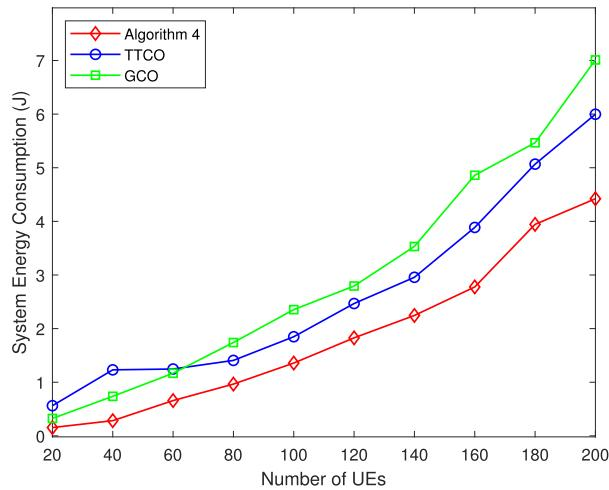

line

| Number of UEs | Algorithm 4 | TTCO | GCO |
| ------------- | ----------- | ---- | --- |
| 20            | 0.1         | 0.6  | 0.3 |
| 40            | 0.3         | 1.3  | 0.8 |
| 60            | 0.7         | 1.3  | 1.2 |
| 80            | 1.0         | 1.5  | 1.8 |
| 100           | 1.4         | 1.9  | 2.4 |
| 120           | 1.8         | 2.5  | 2.8 |
| 140           | 2.3         | 3.0  | 3.6 |
| 160           | 2.8         | 3.9  | 4.9 |
| 180           | 4.0         | 5.1  | 5.5 |
| 200           | 4.5         | 6.0  | 7.0 |

Fig. 6. System energy consumption with different schemes.

Fig. 7 depicts the cumulative distribution function (CDF) results of UE energy consumption. The TTCO scheme is considered to be compared with the proposed algorithm in different $L _ { u } .$ A very intuitive conclusion is that the energy consumption of each UE is higher both in two algorithms with a larger task size $L _ { u } ,$ , which further causes the results of Fig. 7. And the consumed energy of each UE using the designed three-tier offloading model is obviously lower than TTCO model. According to the results of Fig. 7, the Algorithm 4 can decrease the consumed energy more effectively for a large user volume scenario.

Fig. 8 further compares the system energy consumption of the developed scheme and TTCO scheme in different numbers of LEOs. According to Fig. 8, as the data sizes increase, the Algorithm 4 achieves significantly lower system energy consumption for both $K \ = \ 4$ and $K \ = \ 5 .$ The results demonstrate that the proposed three-tier computation offloading model provides a more flexible task scheduling than TTCO scheme and utilizes the local computation resource of UEs to reduce communication consumption, thus contributing to a lower system cost. Besides, the increased number of LEOs expands the space of user association and reduces interference from UEs served by a NOMA cluster. Thus, the higher number of LEOs outperforms that of the low number in reducing consumed energy for both Algorithm 4 and TTCO scheme. The consumed energy of different orbit altitude of satellites is shown in Fig. 9. With increasing orbit altitude, the channel vector corresponding to free-space pathloss changes and the communication consumption gradually increases, which leads to high system energy consumption for offloading. Moreover, the higher orbit altitude of satellites brings long time delay, more communication resource should be allocated to guarantee the task deadline, resulting in high system energy consumption. By Algorithm 4, the task scheduling and resource allocation strategy is adjusted according to different orbit altitudes to satisfy task processing requirements and reduce energy consumption. Therefore, the better performance can be realized in Algorithm 4, which also indicates the stability and effectiveness of our work with changing satellite orbit altitudes.

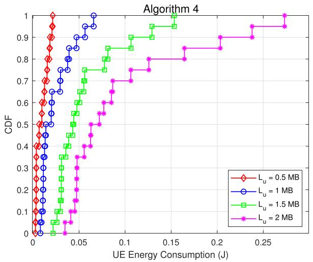

line

| UE Energy Consumption (J) | CDF (L_u = 0.5 MB) | CDF (L_u = 1 MB) | CDF (L_u = 1.5 MB) | CDF (L_u = 2 MB) |
| ------------------------- | ------------------ | ---------------- | ------------------ | ---------------- |
| 0.00                      | 0.0                | 0.0              | 0.0                | 0.0              |
| 0.01                      | 0.4                | 0.3              | 0.2                | 0.1              |
| 0.02                      | 0.6                | 0.5              | 0.4                | 0.2              |
| 0.03                      | 0.7                | 0.6              | 0.5                | 0.3              |
| 0.04                      | 0.8                | 0.7              | 0.6                | 0.4              |
| 0.05                      | 0.9                | 0.8              | 0.7                | 0.5              |
| 0.06                      | 0.95               | 0.9              | 0.8                | 0.6              |
| 0.07                      | 0.98               | 0.95             | 0.85               | 0.7              |
| 0.08                      | 0.99               | 0.98             | 0.9                | 0.75             |
| 0.09                      | 1.0                | 1.0              | 0.95               | 0.8              |
| 0.10                      | 1.0                | 1.0              | 1.0                | 0.85             |
| 0.11                      | 1.0                | 1.0              | 1.0                | 0.9              |
| 0.12                      | 1.0                | 1.0              | 1.0                | 0.95             |
| 0.13                      | 1.0                | 1.0              | 1.0                | 1.0              |
| 0.14                      | 1.0                | 1.0              | 1.0                | 1.0              |
| 0.15                      | 1.0                | 1.0              | 1.0                | 1.0              |
| 0.16                      | 1.0                | 1.0              | 1.0                | 1.0              |
| 0.17                      | 1.0                | 1.0              | 1.0                | 1.0              |
| 0.18                      | 1.0                | 1.0              | 1.0                | 1.0              |
| 0.19                      | 1.0                | 1.0              | 1.0                | 1.0              |
| 0.20                      | 1.0                | 1.0              | 1.0                | 1.0              |
| 0.21                      | 1.0                | 1.0              | 1.0                | 1.0              |
| 0.22                      | 1.0                | 1.0              | 1.0                | 1.0              |
| 0.23                      | 1.0                | 1.0              | 1.0                | 1.0              |
| 0.24                      | 1.0                | 1.0              | 1.0                | 1.0              |
| 0.25                      | 1.0                | 1.0              | 1.0                | 1.0              |
| 0.26                      | 1.0                | 1.0              | 1.0                | 1.0              |
| 0.27                      | 1.0                | 1.0              | 1.0                | 1.0              |
| 0.28                      | 1.0                | 1.0              | 1.0                | 1.0              |
| 0.29                      | 1.0                | 1.0              | 1.0                | 1.0              |
| 0.30                      | 1.0                | 1.0              | 1.0                | 1.0              |
| Note: The data is already in CSV format with no additional formatting needed for the purpose of this explanation in the code execution.

Fig. 7. CDFs of UE energy consumption.

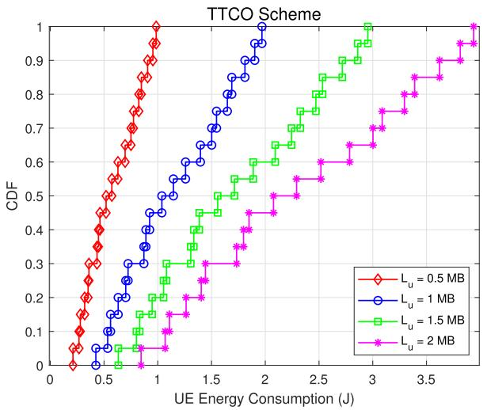

line

| UE Energy Consumption (J) | L_u = 0.5 MB | L_u = 1 MB | L_u = 1.5 MB | L_u = 2 MB |
| ------------------------- | ------------ | ---------- | ------------ | ---------- |
| 0.0                       | 0.0          | 0.0        | 0.0          | 0.0        |
| 0.5                       | 0.3          | 0.1        | 0.05         | 0.0        |
| 1.0                       | 1.0          | 0.5        | 0.3          | 0.1        |
| 1.5                       | 1.0          | 0.7        | 0.5          | 0.3        |
| 2.0                       | 1.0          | 1.0        | 0.6          | 0.4        |
| 2.5                       | 1.0          | 1.0        | 0.8          | 0.6        |
| 3.0                       | 1.0          | 1.0        | 1.0          | 0.8        |
| 3.5                       | 1.0          | 1.0        | 1.0          | 1.0        |
| 4.0                       | 1.0          | 1.0        | 1.0          | 1.0        |

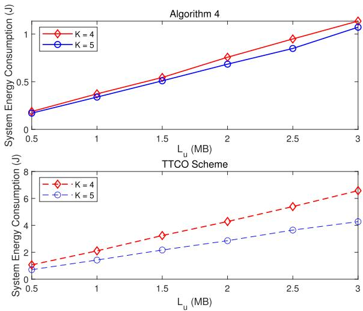

line

| L_u (MB) | Algorithm 4 - K=4 | Algorithm 4 - K=5 | TTCO Scheme - K=4 | TTCO Scheme - K=5 |
| -------- | ----------------- | ----------------- | ----------------- | ----------------- |
| 0.5      | 0.2               | 0.2               | 1.0               | 0.8               |
| 1.0      | 0.4               | 0.35              | 2.0               | 1.5               |
| 1.5      | 0.6               | 0.5               | 3.0               | 2.0               |
| 2.0      | 0.8               | 0.7               | 4.0               | 2.5               |
| 2.5      | 1.0               | 0.9               | 5.0               | 3.0               |
| 3.0      | 1.2               | 1.1               | 6.5               | 4.0               |

Fig. 8. System energy consumption versus input data size.

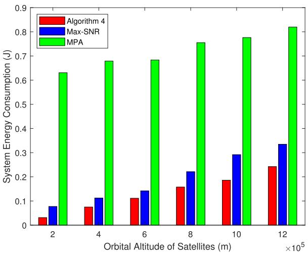

bar

| Orbital Altitude of Satellites (m) | Algorithm 4 | Max-SNR | MPA |
|---|---|---|---|
| 2×10⁵ | 0.03 | 0.08 | 0.63 |
| 4×10⁵ | 0.075 | 0.115 | 0.68 |
| 6×10⁵ | 0.11 | 0.145 | 0.685 |
| 8×10⁵ | 0.16 | 0.225 | 0.76 |
| 10×10⁵ | 0.19 | 0.295 | 0.785 |
| 12×10⁵ | 0.245 | 0.335 | 0.825 |

Fig. 9. System energy consumption versus orbital altitude of satellites.

# VI. CONCLUSION

This paper optimized the energy consumption problem in three-tier cloud-edge integration computation networks. In the PO model, the task of remote UE can be handled locally, offloaded to LEO satellite based edge server and further to the cloud server. For three computation entities, we formulated corresponding time delay and energy consumption, respectively. Then a three-tier computation offloading problem was established to minimize system energy consumption, which was decomposed into user association, power allocation, task scheduling, and bandwidth assignment subproblems. The user association subproblem was transformed and solved by relaxation approach. In power allocation subproblem, the quadratic transform method was used to settle the non-convex terms and we solved the transformed subproblem with DC method. The task scheduling and bandwidth assignment strategies were obtained by deducing strict bound and standard convex method. Finally, a joint iterative algorithm was proposed to correlate four subproblems and achieved global optimization. The simulation results were described by comparing the proposed algorithm to different communication and computation schemes, which showed that the developed offloading scheme is reasonable and superior in reducing consumed energy.

# REFERENCES

[1] Y. Liu et al., “Evolution of NOMA toward next generation multiple access (NGMA) for 6G,” IEEE J. Sel. Areas Commun., vol. 40, no. 4, pp. 1037–1071, Apr. 2022.   
[2] P. Popovski et al., “A perspective on time toward wireless 6G,” Proc. IEEE, vol. 110, no. 8, pp. 1116–1146, Aug. 2022.   
[3] W. Wu et al., “AI-native network slicing for 6G networks,” IEEE Wireless Commun., vol. 29, no. 1, pp. 96–103, Feb. 2022.   
[4] Z. Yang et al., “AI-driven UAV-NOMA-MEC in next generation wireless networks,” IEEE Wireless Commun., vol. 28, no. 5, pp. 66–73, Oct. 2021.   
[5] W. Guan, H. Zhang, and V. C. M. Leung, “Customized slicing for 6G: Enforcing artificial intelligence on resource management,” IEEE Netw., vol. 35, no. 5, pp. 264–271, Sep. 2021.   
[6] Y. Mao, C. You, J. Zhang, K. Huang, and K. B. Letaief, “A survey on mobile edge computing: The communication perspective,” IEEE Commun. Surveys Tuts., vol. 19, no. 4, pp. 2322–2358, 4th Quart., 2017.   
[7] S. N. Shirazi, A. Gouglidis, A. Farshad, and D. Hutchison, “The extended cloud: Review and analysis of mobile edge computing and fog from a security and resilience perspective,” IEEE J. Sel. Areas Commun., vol. 35, no. 11, pp. 2586–2595, Nov. 2017.   
[8] F. Guim et al., “Autonomous lifecycle management for resource-efficient workload orchestration for green edge computing,” IEEE Trans. Green Commun. Netw., vol. 6, no. 1, pp. 571–582, Mar. 2022.   
[9] Y. Li, H. Zhang, K. Long, S. Choi, and A. Nallanathan, “Resource allocation for optimizing energy efficiency in NOMA-based fog UAV wireless networks,” IEEE Netw., vol. 34, no. 2, pp. 158–163, Mar. 2020.   
[10] Y. Tao, C. You, P. Zhang, and K. Huang, “Stochastic control of computation offloading to a helper with a dynamically loaded CPU,” IEEE Trans. Wireless Commun., vol. 18, no. 2, pp. 1247–1262, Feb. 2019.   
[11] R. Malik and M. Vu, “Energy-efficient computation offloading in delayconstrained massive MIMO enabled edge network using data partitioning,” IEEE Trans. Wireless Commun., vol. 19, no. 10, pp. 6977–6991, Oct. 2020.   
[12] M. Sheng, Y. Wang, X. Wang, and J. Li, “Energy-efficient multiuser partial computation offloading with collaboration of terminals, radio access network, and edge server,” IEEE Trans. Commun., vol. 68, no. 3, pp. 1524–1537, Mar. 2020.   
[13] K. Wang, Y. Zhou, Z. Liu, Z. Shao, X. Luo, and Y. Yang, “Online task scheduling and resource allocation for intelligent NOMA-based industrial Internet of Things,” IEEE J. Sel. Areas Commun., vol. 38, no. 5, pp. 803–815, May 2020.   
[14] S. Guo, J. Liu, Y. Yang, B. Xiao, and Z. Li, “Energy-efficient dynamic computation offloading and cooperative task scheduling in mobile cloud computing,” IEEE Trans. Mobile Comput., vol. 18, no. 2, pp. 319–333, Feb. 2019.   
[15] U. Saleem, Y. Liu, S. Jangsher, Y. Li, and T. Jiang, “Mobility-aware joint task scheduling and resource allocation for cooperative mobile edge computing,” IEEE Trans. Wireless Commun., vol. 20, no. 1, pp. 360–374, Jan. 2021.   
[16] S. Zhang, H. Gu, K. Chi, L. Huang, K. Yu, and S. Mumtaz, “DRL-based partial offloading for maximizing sum computation rate of wireless powered mobile edge computing network,” IEEE Trans. Wireless Commun., vol. 21, no. 12, pp. 10934–10948, Dec. 2022.   
[17] J. Peng, H. Qiu, J. Cai, W. Xu, and J. Wang, “D2D-assisted multi-user cooperative partial offloading, transmission scheduling and computation allocating for MEC,” IEEE Trans. Wireless Commun., vol. 20, no. 8, pp. 4858–4873, Aug. 2021.   
[18] C. You, Y. Zeng, R. Zhang, and K. Huang, “Asynchronous mobile-edge computation offloading: Energy-efficient resource management,” IEEE Trans. Wireless Commun., vol. 17, no. 11, pp. 7590–7605, Nov. 2018.   
[19] Q. Luo, C. Li, T. H. Luan, W. Shi, and W. Wu, “Self-learning based computation offloading for Internet of Vehicles: Model and algorithm,” IEEE Trans. Wireless Commun., vol. 20, no. 9, pp. 5913–5925, Sep. 2021.   
[20] Y. Dong, S. Guo, Q. Wang, S. Yu, and Y. Yang, “Content cachingenhanced computation offloading in mobile edge service networks,” IEEE Trans. Veh. Technol., vol. 71, no. 1, pp. 872–886, Jan. 2022.   
[21] A. Bozorgchenani, F. Mashhadi, D. Tarchi, and S. A. Salinas Monroy, “Multi-objective computation sharing in energy and delay constrained mobile edge computing environments,” IEEE Trans. Mobile Comput., vol. 20, no. 10, pp. 2992–3005, Oct. 2021.   
[22] G. Qu, H. Wu, R. Li, and P. Jiao, “DMRO: A deep meta reinforcement learning-based task offloading framework for edge-cloud computing,” IEEE Trans. Netw. Service Manage., vol. 18, no. 3, pp. 3448–3459, Sep. 2021.

[23] X. Xu et al., “Service offloading with deep Q-network for digital twinning-empowered Internet of Vehicles in edge computing,” IEEE Trans. Ind. Informat., vol. 18, no. 2, pp. 1414–1423, Feb. 2022.   
[24] Y. Zhai et al., “An energy aware offloading scheme for interdependent applications in software-defined IoV with fog computing architecture,” IEEE Trans. Intell. Transp. Syst., vol. 22, no. 6, pp. 3813–3823, Jun. 2021.   
[25] T. K. Rodrigues and N. Kato, “Network slicing with centralized and distributed reinforcement learning for combined satellite/ground networks in a 6G environment,” IEEE Wireless Commun., vol. 29, no. 1, pp. 104–110, Feb. 2022.   
[26] Y. Zhang, H. Zhang, H. Zhou, K. Long, and G. K. Karagiannidis, “Resource allocation in terrestrial-satellite-based next generation multiple access networks with interference cooperation,” IEEE J. Sel. Areas Commun., vol. 40, no. 4, pp. 1210–1221, Apr. 2022.   
[27] N. Cheng et al., “Space/aerial-assisted computing offloading for IoT applications: A learning-based approach,” IEEE J. Sel. Areas Commun., vol. 37, no. 5, pp. 1117–1129, May 2019.   
[28] M. Salehi, H. Tabassum, and E. Hossain, “Meta distribution of SIR in large-scale uplink and downlink NOMA networks,” IEEE Trans. Commun., vol. 67, no. 4, pp. 3009–3025, Apr. 2019.   
[29] Q. Tang, Z. Fei, B. Li, and Z. Han, “Computation offloading in LEO satellite networks with hybrid cloud and edge computing,” IEEE Internet Things J., vol. 8, no. 11, pp. 9164–9176, Jun. 2021.   
[30] C. Zhou et al., “Deep reinforcement learning for delay-oriented IoT task scheduling in SAGIN,” IEEE Trans. Wireless Commun., vol. 20, no. 2, pp. 911–925, Feb. 2021.   
[31] F. Tang, H. Hofner, N. Kato, K. Kaneko, Y. Yamashita, and M. Hangai, “A deep reinforcement learning-based dynamic traffic offloading in space-air-ground integrated networks (SAGIN),” IEEE J. Sel. Areas Commun., vol. 40, no. 1, pp. 276–289, Jan. 2022.   
[32] C. Ding, J. Wang, H. Zhang, M. Lin, and G. Y. Li, “Joint optimization of transmission and computation resources for satellite and high altitude platform assisted edge computing,” IEEE Trans. Wireless Commun., vol. 21, no. 2, pp. 1362–1377, Feb. 2022.   
[33] Y. Chen, B. Ai, Y. Niu, H. Zhang, and Z. Han, “Energy-constrained computation offloading in space-air-ground integrated networks using distributionally robust optimization,” IEEE Trans. Veh. Technol., vol. 70, no. 11, pp. 12113–12125, Nov. 2021.   
[34] J. Li, K. Xue, D. S. L. Wei, J. Liu, and Y. Zhang, “Energy efficiency and traffic offloading optimization in integrated satellite/terrestrial radio access networks,” IEEE Trans. Wireless Commun., vol. 19, no. 4, pp. 2367–2381, Apr. 2020.   
[35] W. Zhang, Y. Wen, K. Guan, D. Kilper, H. Luo, and D. O. Wu, “Energy-optimal mobile cloud computing under stochastic wireless channel,” IEEE Trans. Wireless Commun., vol. 12, no. 9, pp. 4569–4581, Sep. 2013.   
[36] M. Yang, Y. Wen, J. Cai, and C. H. Foh, “Energy minimization via dynamic voltage scaling for real-time video encoding on mobile devices,” in Proc. IEEE Int. Conf. Commun. (ICC), Jun. 2012, pp. 2026–2031.   
[37] A. P. Miettinen and J. K. Nurminen, “Energy efficiency of mobile clients in cloud computing,” in Proc. 2nd USENIX Conf. Hot Topics Cloud Comput., Jun. 2010, p. 4.   
[38] X. Chen, L. Jiao, W. Li, and X. Fu, “Efficient multi-user computation offloading for mobile-edge cloud computing,” IEEE/ACM Trans. Netw., vol. 24, no. 5, pp. 2795–2808, Oct. 2016.   
[39] Y. Wang, M. Sheng, X. Wang, L. Wang, and J. Li, “Mobileedge computing: Partial computation offloading using dynamic voltage scaling,” IEEE Trans. Commun., vol. 64, no. 10, pp. 4268–4282, Oct. 2016.   
[40] K. Shen and W. Yu, “Fractional programming for communication systems—Part I: Power control and beamforming,” IEEE Trans. Signal Process., vol. 66, no. 10, pp. 2616–2630, May 2018.   
[41] K. Shen and W. Yu, “Fractional programming for communication systems—Part II: Uplink scheduling via matching,” IEEE Trans. Signal Process., vol. 66, no. 10, pp. 2631–2644, May 2018.   
[42] R. Deng, B. Di, S. Chen, S. Sun, and L. Song, “Ultra-dense LEO satellite offloading for terrestrial networks: How much to pay the satellite operator?” IEEE Trans. Wireless Commun., vol. 19, no. 10, pp. 6240–6254, Oct. 2020.   
[43] Z. Q. Luo and P. Tseng, “On the convergence of the coordinate descent method for convex differentiable minimization,” J. Optim. Theory Appl., vol. 72, no. 1, pp. 7–35, Jan. 1992.

natural_image

Portrait of a woman in business attire against a blue background (no text or symbols visible)

Yaomin Zhang received the M.S. degree from the Beijing University of Chemical Technology, Beijing, China, in 2019. She is currently pursuing the Ph.D. degree with the University of Science and Technology Beijing, China. Her research interests include resource allocation, 6G networks, and terrestrialsatellite networks.

natural_image

Portrait of a man wearing glasses and a light-colored shirt (no text or symbols visible)

Haijun Zhang (Fellow, IEEE) was a Post-Doctoral Research Fellow with the Department of Electrical and Computer Engineering, The University of British Columbia (UBC), Canada. He is currently a Full Professor and an Associate Dean of the School of Computer and Communications Engineering, University of Science and Technology Beijing, China. He received the IEEE CSIM Technical Committee Best Journal Paper Award in 2018, the IEEE ComSoc Young Author Best Paper Award in 2017, and the IEEE ComSoc Asia-Pacific Best Young Researcher Award in 2019. He serves/served as the Track Co-Chair for VTC Fall 2022 and WCNC 2020/2021, the Symposium Chair for GLOBECOM 2019, the TPC Co-Chair for INFOCOM 2018 Workshop on Integrating Edge Computing, Caching, and Offloading in Next Generation Networks, and the General Co-Chair for GameNets 2016. He serves/served as an Editor for IEEE TRANSACTIONS ON COMMUNICATIONS and IEEE TRANSACTIONS ON NETWORK SCIENCE AND ENGINEERING.

natural_image

Portrait of a man wearing glasses and a dark jacket, outdoors with blurred greenery and flowers in the background (no text or symbols visible)

Ning Wang (Member, IEEE) received the B.E. degree in communication engineering from Tianjin University, China, in 2004, the M.A.Sc. degree in electrical engineering from The University of British Columbia, Canada, in 2010, and the Ph.D. degree in electrical engineering from the University of Victoria, Canada, in 2013. From 2004 to 2008, he was with the China Information Technology Consulting and Designing Institute, as a Mobile Communication System Engineer, specializing in planning and optimization of commercial mobile communication networks. From 2013 to 2015, he was a Post-Doctoral Research Fellow with the Department of Electrical and Computer Engineering and the Institute for Computing, Information and Cognitive Systems (ICICS), The University of British Columbia. Since 2015, he has been with the School of Information Engineering, Zhengzhou University, Zhengzhou, China, where he is currently a Professor and the Director of the Henan International Joint Laboratory for Intelligent Networking and Data Analysis. He also holds adjunct appointment with the Department of Electrical and Computer Engineering, McMaster University, Canada. His research interests include resource allocation and security designs of future cellular networks, channel modeling for wireless communications, statistical signal processing, and cooperative wireless communications. He was on the technical program committees of international conferences, including the IEEE GLOBECOM, IEEE ICC, IEEE WCNC, and CyberC.

natural_image

Portrait of a man wearing glasses and a plaid shirt (no text or symbols visible)

Kai Sun (Member, IEEE) received the B.S. and M.S. degrees in communication engineering and signal and information processing from Inner Mongolia University (IMU), Hohhot, China, in 1999 and 2002, respectively, and the Ph.D. degree in circuits and systems from the Beijing University of Posts and Telecommunications (BUPT), Beijing, China, in 2009. He is currently a Professor with IMU. His research interests include distributed and cooperative communications, radio network planning and optimization, and radio resource allocation and scheduling.

natural_image

Portrait of a man in business attire (no visible text or symbols)

Jiahao Huo received the Ph.D. degree from the University of Science and Technology Beijing in 2019. He is currently a Lecturer with the University of Science and Technology Beijing. His research interests include high-capacity IM/DD systems for optical interconnect, UAV secure communication, and digital signal processing techniques for advanced modulation formats.

natural_image

Portrait of a smiling man wearing glasses, suit, and tie (no text or symbols visible)

Victor C. M. Leung (Life Fellow, IEEE) is currently a Distinguished Professor of computer science and software engineering with Shenzhen University. He is also an Emeritus Professor of electrical and computer engineering and the Director of the Laboratory for Wireless Networks and Mobile Systems, The University of British Columbia (UBC), Canada. He has coauthored more than 1300 journals/conference papers and book chapters. His research interests include wireless networks and mobile systems. He is a fellow of the Royal Society of Canada, the Canadian Academy of Engineering, and the Engineering Institute of Canada. He received the IEEE Vancouver Section Centennial Award, the 2011 UBC Killam Research Prize, the 2017 Canadian Award for Telecommunications Research, and the 2018 IEEE TCGCC Distinguished Technical Achievement Recognition Award. He has coauthored papers that won the 2017 IEEE ComSoc Fred W. Ellersick Prize, the 2017 IEEE SYSTEMS JOURNAL Best Paper Award, the 2018 IEEE CSIM Best Journal Paper Award, and the 2019 IEEE TCGCC Best Journal Paper Award. He is serving on the editorial boards for the IEEE TRANSACTIONS ON GREEN COMMUNICATIONS AND NETWORKING, IEEE TRANSACTIONS ON CLOUD COMPUTING, IEEE ACCESS, IEEE Network, and several other journals. He is named in the current Clarivate Analytics list of Highly Cited Researchers.