# Passive UAV Detection Based on Channel Estimation and Temporal Variation Network

Jing Bai , Senior Member, IEEE, Zhuo Zhang , Zhu Xiao , Senior Member, IEEE, Huaji Zhou , Yongqiang Hei , Xiaohui Liu, Tong Li, Member, IEEE, and Licheng Jiao , Life Fellow, IEEE

Abstract—The increasing proliferation of unmanned aerial vehicles (UAVs) poses significant challenges to airspace security, necessitating the development of effective detection technologies. Passive detection techniques, such as passive radar, offer key advantages including spectrum efficiency and covert operation. However, passive radars that rely on coherent integration are often computationally expensive and dependent on strong Doppler signatures, rendering them ineffective for detecting lowspeed or hovering UAVs. To overcome these limitations, we explore the use of channel state information (CSI) time series to characterize UAV presence and propose a temporal variation network for detecting UAV states, including hovering conditions. Our method utilizes digital terrestrial multimedia broadcast (DTMB) signals, which have wide coverage and high transmission power. By capturing DTMB signals with a single receiver, we reduce the complexity of passive detection systems. First, we perform channel estimation on the received signal to obtain CSI, which is arranged in frame order to form a CSI time series. This enables the modeling of interference channels caused by UAVs. We then propose the Channel Estimation and Temporal Variation Network (CETVNet), which leverages an adaptive noise reduction module and a multi-period feature extraction module to process these series for passive UAV state detection. Finally, a real-world signal dataset is collected using a software-defined radio device to train and evaluate CETVNet. Experimental results demonstrate that CETVNet achieves superior performance compared to stateof-the-art methods.

Index Terms—Passive radar, UAV detection, channel estimation, multivariate time series analysis, neural network.

## I. INTRODUCTION

N RECENT years, Unmanned Aerial Vehicles (UAVs) have been widely applied in various fields, including aerial photography, agriculture, logistics, and military operations [1], [2], [3]. Although the application of UAVs has significantly improved efficiency in these fields, the widespread presence of UAVs has introduced new challenges related to airspace security and privacy protection. For example, UAVs operating in sensitive or restricted areas, such as airports or military zones, can enable illicit activities and pose serious threats to aviation safety and national security [4], [5]. These concerns highlight the growing need for reliable UAV detection technologies that are capable of identifying UAV activity regardless of intent or authorization status.

UAV detection technologies can be classified into active and passive approaches, depending on whether the detection system transmits signals or radiates energy [6]. To specify, active systems emit dedicated probing signals, such as radar pulses, to illuminate the environment and detect reflections from aerial targets [7]. In certain environments, such as battlefields, active systems are susceptible to targeted jamming and may reveal their positions, making them vulnerable to precision strikes [8], [9]. In contrast, passive systems rely on analyzing either existing ambient signals or UAV-generated emissions, such as radio frequency (RF) and acoustic signals. By avoiding active signal transmission, passive systems inherently evade detection, resist interference, and reduce the risk of precision strikes. These advantages make passive systems particularly suitable for deployment in sensitive scenarios, including covert operations, electromagnetic silent missions, and protection of concealed military installations.

Traditional passive UAV detection systems, using optical signals, RF signals radiated by aerial targets, or acoustic methods, face several challenges [10]. Optical systems are sensitive to lighting and weather conditions, making them unsuitable for all-weather surveillance tasks [11]. RF approaches rely on intercepting control or telemetry signals emitted by UAVs, which may be unavailable when UAVs operate autonomously, reducing the reliability of such methods in adversarial or stealth settings [12]. Acoustic-based methods exploit the distinctive sound signatures generated by UAV rotors, their performance degrades sharply in the presence of wind, multiple coexisting sound sources, or unfamiliar UAV types whose acoustic signatures are not represented in the training data [13]. In addition to optical methods, these limitations arise largely from reliance on UAV-emitted signals.

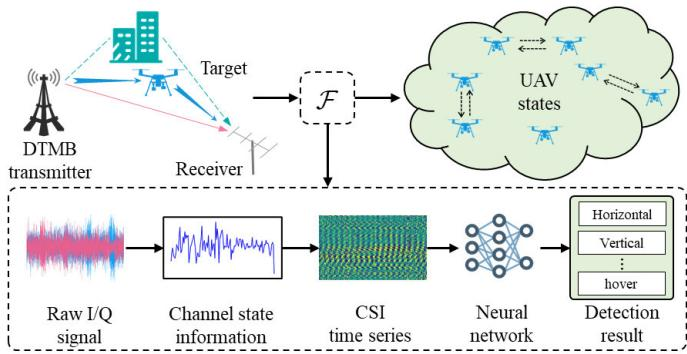  
Fig. 1. Passive UAV state detection framework based on channel estimation and deep learning.

The above-mentioned observations motivate the exploration of passive detection approaches that do not depend on such emissions. In this paper, we aim at developing a passive UAV detection method using ambient RF signals, which are not sensitive to visibility and are independent of RF signals or acoustic emissions generated by UAVs. To implement such a method, one can borrow the idea of passive radar, which operates by exploiting ambient communication signals and improving target echoes through coherent integration [14]. Note that the coherent integration process relies primarily on the time delay and Doppler shift of the target echo relative to the direct-path signal. This method has demonstrated effectiveness in detecting large, fast-moving objects such as aircraft and vehicles [15], [16]. In UAV detection scenarios, its effectiveness is significantly reduced due to the small radar cross-sections (RCS) and low velocities of UAVs, which inevitably lead to weak echo signals and minimal Doppler shifts [17], [18]. These limitations are further exacerbated when UAVs are hovering, as they produce negligible Doppler variation, rendering them nearly invisible to the passive detection systems based on coherent integration [19].

In response to the limitations of coherent integration, particularly its dependence on strong Doppler shifts and large RCS, we propose a novel passive UAV detection approach based on channel estimation. As illustrated in Fig. 1. This method aims to characterize the presence and movement of UAVs by leveraging variations in the wireless channel, enabling passive detection without requiring pronounced Doppler signatures. Channel estimation extracts channel state information (CSI), which captures multipath effects and fine-grained variations in the channel between the ambient RF source and the receiver. In the presence of a UAV, its physical movement perturbs the electromagnetic field, altering the channel characteristics. These changes, resulting from various UAV states such as hovering, vertical ascent, or horizontal flight, are encoded in the CSI and can serve as discriminative features for detecting UAV states. This approach follows the general architecture of passive radar but requires only a single receiving antenna, making it lightweight and easily deployable. Channel estimation-based passive sensing has proven effective in some contexts, such as human pose estimation [20] and indoor localization [21], where small movements induce measurable changes in the wireless channel. Despite its promising performance, applying channel estimation to UAV detection in dynamic outdoor environments introduces two challenging issues. i) Channel estimation provides only instantaneous snapshots of the wireless channel, making it difficult to establish a reliable mapping between transient CSI patterns and specific UAV states. ii) The subtle nature of UAV-induced channel variations, particularly in the case of small or hovering UAVs, makes the system susceptible to environmental noise.

To specify, two technical challenges remain unresolved.

How can an accurate mapping be established between channel estimation results and UAV states? The influence of UAVs on the wireless channel is dynamic, while channel estimation captures only instantaneous snapshots of channel characteristics. It is a challenging problem to establish an accurate mapping between complex variations of channel characteristics and UAV states.

• How can the impact of environmental noise on detection performance be effectively mitigated? In practical communication environments, noise is unavoidable and can significantly degrade the accuracy of channel estimation. Given the small RCS of UAVs, the resulting variations in CSI are often subtle, making it particularly challenging to strike a balance between noise suppression and the preservation of UAV-specific features.

To address these challenges, we propose a novel passive UAV detection framework that leverages deep learning to map CSI to UAV states to address these challenges. Specifically, CSI is extracted from the frame headers of DTMB signals and sequentially arranged across multiple frames to construct a time series that captures temporal variations in the wireless channel. We then employ deep learning methods to extract discriminative features from the CSI time series. We propose a temporal variation network, CETVNet, which is designed to handle the complexity and noise sensitivity of the CSI time series. CETVNet consists of two key modules: an Adaptive Noise Reduction Module (ANRM) and a Multi-period Feature Extraction Module (MPFEM). The ANRM exploits the locally linear time-invariant (LTI) nature of wireless channels to adaptively suppress environmental noise while preserving UAV-induced variations. The MPFEM decomposes the CSI time series to extract underlying periodic patterns associated with different UAV motion states. Finally, a classification module maps the extracted features to a predefined set of UAV states, enabling accurate passive detection.

The main contributions are highlighted as follows.

We propose a passive UAV detection method that employs the CSI time series to characterize the state of UAV. The presence and movement of UAVs introduce variations in the wireless propagation channel, which can be captured at the receiver through channel estimation. These variations enable passive UAV detection without relying on prominent Doppler shifts.

We propose a novel temporal variation network, termed CETVNet, which maps CSI time series to UAV state classes. CETVNet integrates an adaptive noise reduction module and a multi-period feature extraction module to establish an effective mapping between the CSI time series and UAV states.

• We introduce an adaptive noise reduction method based on a neural network, which leverages the locally LTI properties of the channel over short time intervals. The method employs a multi-scale pooling architecture to suppress noise while preserving essential channel estimation features.

We collected a real-world dataset using a multirotor UAV and an SDR device, with DTMB signals serving as the ambient RF source. The dataset captures the complexity of practical wireless environments. Experimental results demonstrate the effectiveness of CETVNet in real-world UAV detection scenarios.

The remainder of the paper is organized as follows. Section II reviews related work on passive radar target detection, channel estimation, and multivariate time-series analysis. Section III provides a detailed explanation of channel estimation and CETVNet for UAV detection. In Section IV, we present the experimental setup and results, comparing CETVNet with other deep learning methods, followed by analysis and discussion. Finally, Section V concludes the paper.

## II. RELATED WORK

In this section, we provide a brief overview of the passive radar system, channel estimation-based passive sensing, and multivariate time series analysis methods.

## A. Passive Radar Systems

In passive radar systems, target detection is typically accomplished through coherent integration of signals from the monitoring channel and the reference channel [14]. Coherent integration leverages the time delay and Doppler shift between the target echo signal in the monitoring channel and the directpath signal in the reference channel. This process computes a range-Doppler spectrum, from which the target’s range and velocity are derived using threshold detection methods. The efficacy of this approach has been validated across various signal illumination sources and target types. Xie et al. [22] designed a passive radar system based on a digital beamforming method, which utilized multiple FM signals to detect civil aircraft taking off and landing at an airport 80 km away, achieving this with relatively low system complexity. Pastina et al. [15] utilized the global navigation satellite system (GNSS) as an opportunistic signal to perform passive radar imaging of ship targets. Samczynski et al.´ [16] used electromagnetic waves generated by 5G cellular network base stations to remotely sense moving cars in a bistatic geometry. However, the focus has largely been on high-speed or large targets, while the challenge of detecting slow or hovering UAVs remains less explored.

UAV generates minimal Doppler shift and possesses a small RCS, leading to a weak echo signal, which makes it difficult to distinguish from clutter and noise. Recent advancements have started to address this limitation. Milani et al. [19] addressed the issue of passive radar’s inability to detect hovering UAVs by proposing a method that integrates passive radar with passive source localization technology, enabling UAV detection based on mobile-static-mobile WiFi communication. However, this approach requires the UAV to establish Wi-Fi communication, which limits its applicability.

## B. Channel Estimation-Based Passive Sensing

Passive sensing technologies based on various illumination sources have made significant progress through channel estimation techniques [20], [23]. One prominent application is WiFi-based human activity recognition, which has gained attention due to its ability to utilize existing WiFi signals to estimate human body movements [24], [25]. By analyzing the CSI of reflected WiFi signals, researchers have been able to infer the position and pose of individuals within a given space.

Similarly, indoor positioning systems based on signals from WiFi, Bluetooth, and 5G have been developed to provide accurate location tracking in environments where GPS signals are unavailable [21], [26]. By leveraging channel estimation from these wireless signals, these systems can calculate the relative position of objects or people with high precision, enabling applications such as asset tracking, smart navigation, and augmented reality in indoor settings.

Furthermore, advancements in traffic monitoring have also utilized channel estimation techniques. Tulay and Koksal [27] designed a system that captures CSI from vehicles and roadside units (RSUs), making use of existing infrastructure to monitor traffic conditions. This approach reduced the need for traditional monitoring equipment while maintaining high accuracy in tracking traffic states.

## C. Multivariate Time Series Analysis

In multivariate time series analysis, deep learning methods have become the state-of-the-art approach for capturing complex temporal dependencies and automatically extracting relevant features from high-dimensional data. Among the various types of deep learning models, recurrent neural networks (RNNs), multilayer perceptrons (MLPs), convolutional neural networks (CNNs), and transformer models have been extensively utilized for time series tasks.

One class of methods utilizes RNNs to model sequential time points under the Markov assumption [28], [29]. However, these methods often fail to capture long-term dependencies, and their efficiency is affected by the sequential computation paradigm.

Another class of methods leverages MLPs for time series analysis. The LightTS [30] captures short-term local patterns through continuous sampling and long-term dependencies through sparse sampling, achieving a lightweight MLP structure for multivariate time series analysis.

CNNs are also widely used for extracting temporal information. TCN [31] uses causal convolutions and dilated convolutions to enable parallelized time series modeling. MICN [32] captures data features at different time scales through a multi-layer convolution network, improving accuracy while maintaining lower computational overhead and fewer parameters. ModernTCN [33] introduces variableindependent embeddings and, combined with depthwise separable convolutions, independently models variables and channels. However, the localized nature of 1D convolution kernels limits their ability to detect variations over consecutive time steps. TimesNet [34] extends multivariate time series from a 1D space to a 2D space, enabling unified modeling of intra-period and inter-period variations in the time series.

Recently, Transformer models have gained popularity in sequence modeling for their effectiveness in capturing longrange dependencies through self-attention mechanisms [35], [36], [37], [38], [39]. PatchTST [35] uses patch-based input and independent channels to effectively capture longterm information in time series while reducing the model’s spatiotemporal complexity. TST [37] is an unsupervised representation learning method for multivariate time series, where the Transformer architecture is used for autoregressive training and applied to time series regression and classification tasks. Crossformer [38] uses a dimension-wise embedding technique to convert time series data into a 2D vector array, while employing a two-stage attention mechanism to capture both variable and temporal dependencies, thus modeling both variable dependencies and time dependencies in time series data.

Deep learning-based time series analysis has been widely applied in wireless communication systems [40], [41], [42], [43], [44], [45], [46]. Building on these developments, we propose CETVNet, a neural network architecture specifically designed for CSI time series analysis in UAV state detection. CETVNet integrates multi-periodic temporal feature extraction and adaptive noise reduction to enhance the accuracy of passive UAV detection.

## III. DETECTION FRAMEWORK FOR UAV STATE

This section describes in detail how to use CETVNet for passive detection of the UAV state. We first describe the fundamental problem of the passive detection mission of UAV and the motivation for the proposed CETVNet. Then the overall framework of CETVNet is previewed, followed by the introduction of three key components of the CETVNet framework: CSI time series extraction, adaptive noise reduction module, and multi-period feature extraction module.

## A. Problem Formulation

The passive detection of UAV state based on DTMB signal can be described as determining the presence and state of UAV according to the features extracted from the received DTMB signal. As illustrated in Fig. 2, there is a transmitting source transmitting the DTMB signal, a receiving antenna, and possibly UAVs in the environment. We use a singleantenna SDR device for signal sampling to save data offline for subsequent processing. The DTMB signal received by the receiver can be expressed as

$$
\begin{array} { l } { { \displaystyle r ( t ) = A _ { 0 } s ( t ) + \sum _ { n = 1 } ^ { N _ { c } } A _ { n } s ( t - \tau _ { n } ) } } \\ { { \displaystyle ~ + \sum _ { m = 1 } ^ { N _ { t } } B _ { m } s ( t - \tau _ { m } ) e ^ { j 2 \pi f _ { d m } t } + n ( t ) , } } \end{array}\tag{1}
$$

where $s ( t )$ is the direct-path signal from the transmitting source, $A _ { 0 }$ is its complex amplitude. $A _ { n }$ is the complex amplitude, and $\tau _ { n }$ is the delay (relative direct-path signal delay) of the n-th multipath signal, and $N _ { c }$ is the number of multipath signals. $B _ { m } , \tau _ { m }$ and $f _ { d m }$ are the complex amplitude, delay, and Doppler frequency shift of m-th target echoes, and $N _ { t }$ is the number of UAV targets. $n ( t )$ is the noise such as Additive White Gaussian Noise (AWGN).

The signal model can be simplified by using the channel model as follows:

$$
h ( t ) = \sum _ { n = 1 } ^ { N _ { c } } { A _ { n } \delta ( t - \tau _ { n } ) } + \sum _ { m = 1 } ^ { N _ { t } } { B _ { m } \delta ( t - \tau _ { m } ) } e ^ { j 2 \pi f _ { d m } t } ,\tag{2}
$$

where $h ( t )$ is the channel impulse response and $\delta ( t )$ is the unit impulse response function.

The received signal $r ( t )$ is a convolution of the transmitted signal $s ( t )$ with the channel response $h ( t )$ , plus noise $n ( t )$ . In continuous time, the $r ( t )$ can be expressed as

$$
r ( t ) = \int _ { - \infty } ^ { \infty } s ( t ) h ( t - \tau ) d \tau + n ( t ) .\tag{3}
$$

From Eq. (3) and Eq. (2), it is evident that the presence and movement of the UAV along the signal transmission path alter both the channel response $h ( t )$ and the received signal $r ( t )$ As a result, the UAV state can be detected through the received DTMB signal $r ( t )$ . However, the variability of obstacles in the transmission path and the inherent noise uncertainty present significant challenges for detection. If DTMB signals corresponding to different UAV states can be obtained through prior preparation, the core challenge in DTMB-based UAV state detection becomes establishing a reliable mapping between the received DTMB signals and the UAV states.

An obvious problem is that the $s ( t )$ is constantly changing, thus the $r ( t )$ is constantly changing even if the $h ( t )$ is unchanged. If the $r ( t )$ is used directly as the independent variable of the mapping, the mapping function will be difficult to optimize because it contains too much uncertain information. Fortunately, part of the $s ( t )$ is known, which means $h ( t )$ is available. Therefore, using $h ( t )$ as the mapping parameter will be more conducive to the optimization of the mapping function.

The primary objective of this paper is to establish a mapping from the channel impulse response h to the UAV state y. The collected DTMB signal passes through h, which belongs to the sample space H, while y represents the UAV state within the category space $\mathcal { V } .$ . The joint probability distribution of H and Y is denoted as $P _ { \mathcal { H } \times \mathcal { Y } }$ . UAV state feature extractor and classifier is modeled as a function $\mathcal { F } ( \mathbf { W } )$ with parameters

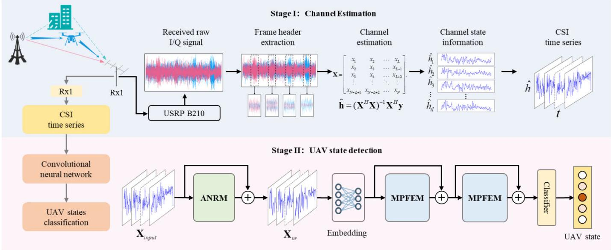  
Fig. 2. CETVNet framework for UAV state passive detection. In the first stage, an SDR device, such as the USRP B210, is used to capture the DTMB signal. The frame header of the signal frame is then extracted, and channel estimation is performed. The results of multi-frame estimations are combined to form a CSI time series. In the second stage, the proposed CETVNet model is applied for supervised training of the CSI time series, establishing the mapping between the CSI time series and the UAV state.

W (W ∈ W). The goal is to determine W such that $\mathcal { F } ( \mathbf { W } )$ $\mathcal { H }  \mathcal { V }$ is optimized. This can be formulated as

$$
\mathbf { W } ^ { * } = \arg \operatorname* { m i n } _ { \mathbf { W } \in \mathcal { W } } \mathbb { E } _ { ( \mathbf { h } , y ) \sim P _ { \mathbb { H } \times y } } \mathcal { L } _ { \mathrm { c l s } } ( \mathcal { F } ( \mathbf { h } ; \mathbf { W } ) , y ) ,\tag{4}
$$

where $\mathcal { L } _ { \mathrm { c l s } }$ is a supervised loss function used to measure the difference between predicted label $\mathcal { F } ( \mathbf { h } ; \mathbf { W } )$ and the true label y.

Since $P _ { \mathcal { H } \times \mathcal { Y } }$ is typically unknown, it is approximated using a training dataset $D _ { h }$ , leading to the revised optimization objective:

$$
\mathbf { W } ^ { * } = \arg \operatorname* { m i n } _ { \mathbf { W } \in \mathcal { W } } \mathbb { E } _ { ( \mathbf { h } , y ) \sim D _ { h } } \mathcal { L } _ { \mathrm { c l s } } ( \mathcal { F } ( \mathbf { h } ; \mathbf { W } ) , y ) ,\tag{5}
$$

where $D _ { h } = \{ ( \mathbf { h } _ { n } , y _ { n } ) \} _ { n = 1 } ^ { N }$ contains a finite set of labeled channel response samples.

In this paper, we find a suitable method to construct $D _ { h }$ and propose a deep learning model named CETVNet to construct the mapping relationship F(W). The UAV state detection method based on channel estimation and CETVNet is illustrated in Fig. 2.

The first stage is the construction of the dataset $D _ { h }$ containing channel response and UAV state information. Using a single receiver to capture the DTMB signal, the UAV in the signal propagation path causes multipath fading and Doppler shift of the transmitted signal, which is implicit in the channel response. By extracting the pilot portion of the DTMB signal frame and performing channel estimation, the channel response corresponding to each pilot can be obtained. By combining the channel response of multiple continuous frames and recording the corresponding UAV state at this time, a sample $\left( \mathbf { h } _ { n } , y _ { n } \right)$ $D _ { h }$ can be obtained.

The second stage is to establish the mapping between h and $y ,$ i.e. F (W), to enable the detection of the UAV state. This mapping function, F(W), is implemented by the proposed CETVNet model. CETVNet is built on two core modules:

the ANRM and the MPFEM. The former performs pooling and reorganization of the channel estimation results from adjacent frames, leveraging the properties of the LTI system to achieve adaptive noise reduction. The latter extracts multiperiod features by expanding the 1D space of the CSI time series into a 2D space, capturing both local oscillations and long-term trends. Finally, an MLP classifier is used to assess the UAV state.

## B. Channel Estimation

DTMB is the digital terrestrial television broadcasting standard in China, released in August 2006. It employs time-domain synchronized orthogonal frequency division multiplexing (TDS-OFDM) technology. A signal frame comprises a frame header (FH) and a frame body (FB), both operating at a baseband symbol rate of 7.56 Msps. The FH is composed of a pseudorandom noise (PN) sequence, modulated with 4QAM. The FH is inserted before each FB as a guard interval, with higher transmission power, used for synchronization and channel estimation. Each FB in a signal frame carries 3,780 valid symbols, lasting 500 $\mu \mathrm { { s } ~ ( 3 , 7 8 0 \times 1 / 7 . 5 6 ~ \mu s ) }$

To meet different application requirements, the DTMB system defines three types of frame modes, as illustrated in Fig. 3. Among them, frame mode (a) with a 420-symbol frame header (PN420 mode) and frame mode (c) with a 945-symbol frame header (PN945 mode) are multi-carrier modes, while frame mode (b) with a 595-symbol frame header (PN595 mode) is a single-carrier mode.

Taking the PN420 mode as an example, its structure is illustrated in Fig. 4. The frame header comprises 420 symbols, including a preamble, a PN255 sequence, and a postamble. The preamble and postamble are defined as the cyclic extensions of the PN255 sequence, with the preamble length being 82 symbols and the postamble length being 83 symbols. The

<table><tr><td rowspan=1 colspan=1>FH (420-symbol) 55.6μs</td><td rowspan=1 colspan=1>FB (system information and data)(3780-symbol) 500μs</td></tr><tr><td rowspan=1 colspan=1>FH (595-symbol) 78.7μs</td><td rowspan=1 colspan=1>FB (system information and data)(3780-symbol) 500μs</td></tr><tr><td rowspan=1 colspan=2>(b) PN595 mode (578.7μs)</td></tr><tr><td rowspan=1 colspan=1>FH (945-symbol) 125μs</td><td rowspan=1 colspan=1>FB (system information and data)(3780-symbol) 500μs</td></tr><tr><td rowspan=1 colspan=2>(c) PN945 mode (625us)</td></tr></table>

(c) PN945 mode (625μs)

Fig. 3. Three types of frame modes in DTMB system.
<table><tr><td colspan="2">FH (420-symbol)</td><td colspan="3">FB (3780-symbol)</td></tr><tr><td colspan="4"></td></tr><tr><td>preamble (82-symbol)</td><td>83-symbol</td><td>90-symbol</td><td>82-symbol</td><td>postamble (83-symbol)</td></tr><tr><td>i 4</td><td></td><td>PN255 PN420</td><td>7</td><td></td></tr></table>

Fig. 4. Frame header structure of PN420 mode.

PN255 sequence is generated by an 8th-order linear feedback shift register (LFSR) polynomial.

Based on the initial state of the 8th-order LFSR, 255 different phase-shifted PN420 sequences can be generated. To minimize the correlation between adjacent values, the PN420 mode selects 225 PN420 sequences from a total of 255 sequences, numbered from 0 to 224, which are used as identifiers for the signal frame number. At the beginning of each superframe, the sequence number resets to 0. Furthermore, when frame number indication is not required, the PN sequence does not undergo phase shifts and instead uses the PN sequence with sequence number 0 uniformly.

Frame header extraction is the first step in channel estimation. This process involves determining the frame mode of the received signal, which can be detected by sliding correlation with local PN sequences. The method primarily leverages the strong autocorrelation properties of the PN frame header sequence. The received signal is cross-correlated with the three types of local PN sequences, and the peak magnitude of the autocorrelation result is used to identify the frame header mode. DTMB signal frame synchronization is then achieved by analyzing the differences in the peak positions of the crosscorrelation results for each frame mode. This process relies on the cyclic displacement relationship between the parity and zero-phase frames.

Channel estimation utilizes the extracted FH to estimate the channel impulse response h, based on the known training sequence x, and the received signal r. The received signal is the convolution of the transmitted signal with the channel response, plus noise. In practice, the continuoustime channel impulse response $h ( t )$ defined in Eq. 2 is sampled at the baseband symbol rate and approximated by a finite-length discrete-time impulse response, assuming a finite channel delay spread. Let the FH sequence be denoted as $\begin{array} { r c l } { \mathbf { x } } & { = } & { [ x _ { 1 } , x _ { 2 } , . . . , x _ { N } ] ^ { T } } \end{array}$ , the received signal as $\mathrm { ~ \bf ~ r ~ } =$ $[ r _ { 1 } , r _ { 2 } , . . . , r _ { N } ] ^ { T }$ , and the channel’s finite impulse response as $\mathbf { h } ~ = ~ [ h _ { 1 } , \bar { h } _ { 2 } , . . . , h _ { L } ] ^ { T }$ . The relationship between these variables can be expressed as

$$
r _ { n } = \sum _ { k = 1 } ^ { L } h _ { k } x _ { n - k + 1 } + n _ { n } , \quad { \mathrm { f o r ~ } } n = 1 , 2 , . . . , N ,\tag{6}
$$

where $\mathbf { n } = [ n _ { 1 } , n _ { 2 } , . . . , n _ { N } ] ^ { T }$ represents the AWGN, which follows the distribution ${ \mathcal { N } } ( 0 , \sigma ^ { 2 } )$

The convolution operation can be represented using a Toeplitz matrix. The Toeplitz matrix X is constructed from the FH sequence as shown below:

$$
{ \bf X } = \left[ \begin{array} { c c c c c c } { x _ { 1 } } & { x _ { 2 } } & { x _ { 3 } } & { \dots } & { x _ { L } } \\ { x _ { 2 } } & { x _ { 3 } } & { x _ { 4 } } & { \dots } & { x _ { L + 1 } } \\ { x _ { 3 } } & { x _ { 4 } } & { x _ { 5 } } & { \dots } & { x _ { L + 2 } } \\ { \vdots } & { \vdots } & { \vdots } & { \ddots } & { \vdots } \\ { x _ { N - L + 1 } } & { x _ { N - L + 2 } } & { x _ { N - L + 3 } } & { \dots } & { x _ { N } } \end{array} \right] .\tag{7}
$$

The dimensions of this matrix are $( N - L + 1 ) \times L$ , where N is the length of the training sequence and L is the channel estimation length. Using this construction, the received signal model can be rewritten as

$$
\mathbf { r } = \mathbf { X } \mathbf { h } + \mathbf { n } ,\tag{8}
$$

where $\mathbf { r } \in \mathbb { C } ^ { ( N - L + 1 ) \times 1 } , \mathbf { X } \in \mathbb { C } ^ { ( N - L + 1 ) \times L }$ , and $\mathbf { h } \in \mathbb { C } ^ { L \times 1 }$

To estimate the channel impulse response $\mathbf { h } ,$ the least squares (LS) method minimizes the error between the received signal and the model-predicted signal:

$$
\hat { \mathbf { h } } = \arg \operatorname* { m i n } _ { \mathbf { h } } \| \mathbf { r } - \mathbf { X } \mathbf { h } \| ^ { 2 } ,\tag{9}
$$

where $\| \cdot \| ^ { 2 }$ represents the $\ell _ { 2 } \cdot$ -norm.

By expanding the cost function:

$$
J ( \mathbf { h } ) = ( \mathbf { r } - \mathbf { X } \mathbf { h } ) ^ { H } ( \mathbf { r } - \mathbf { X } \mathbf { h } ) ,\tag{10}
$$

and taking the derivative with respect to h, then setting it to zero, the least squares solution for channel estimation is derived as:

$$
\begin{array} { r } { \hat { \mathbf { h } } = ( \mathbf { X } ^ { H } \mathbf { X } ) ^ { - 1 } \mathbf { X } ^ { H } \mathbf { r } , } \end{array}\tag{11}
$$

where $\mathbf { X } ^ { H }$ denotes the conjugate transpose of the X.

The dimension of hˆ is determined by L, which corresponds to varying levels of granularity in channel estimation. The impact of this parameter is tested in detail in Section IV.

To capture the channel’s temporal variations, we construct the CSI time series vector h˜ by aggregating magnitude information from multiple consecutive frames. The magnitude of each element in $\hat { \mathbf { h } } ,$ denoted as $| \hat { \mathbf { h } } | \in \mathbb { R } ^ { L }$ , is computed elementwise to retain the amplitude information. To form the CSI time series $\tilde { \mathbf { h } } \in \mathbb { R } ^ { L \times T }$ , we sequentially stack the magnitude vectors from T adjacent frames, starting at time index t. That is, h˜ is defined as

$$
\tilde { \mathbf { h } } = \left[ | \hat { \mathbf { h } } _ { 1 } | , | \hat { \mathbf { h } } _ { 2 } | , . . . , | \hat { \mathbf { h } } _ { T } | \right] .\tag{12}
$$

In $\mathrm { E q . } ~ ( 5 ) , ~ D _ { h }$ can be reformulated as $\{ ( \tilde { \mathbf { h } } _ { n } , y _ { n } ) \} _ { n = 1 } ^ { N }$

## C. Adaptive Noise Reduction

The denoising strategy in the proposed CETVNet architecture is grounded in a fundamental statistical principle: in a locally linear time-invariant (LTI) system, the variance of independent noise components decreases with temporal averaging.

In practice, each complex-valued CSI sample can be expressed as

$$
{ \hat { h } } _ { i } = h _ { i } + n _ { i } ,\tag{13}
$$

where $h _ { i }$ is the true complex channel coefficient and $n _ { i }$ denotes zero-mean complex Gaussian noise with $\mathbb { E } [ n _ { i } ] = 0$ and $\mathrm { V a r } ( n _ { i } ) = \sigma ^ { 2 }$

The amplitude observation $| { \hat { h } } _ { i } |$ follows a Rician distribution, which can be approximated as a locally additive Gaussian process under moderate-to-high SNR conditions. By aligning $h _ { i } ~ = ~ | h _ { i } | e ^ { j \phi _ { i } }$ to the real axis through an equivalent phase rotation, and linearizing $| { \hat { h } } _ { i } | = { \sqrt { ( | h _ { i } | + X ) ^ { 2 } + Y ^ { 2 } } }$ at $( X , Y ) = ( 0 , 0 )$ with $X , Y \sim { \mathcal { N } } ( 0 , \sigma ^ { 2 } / 2 )$ , we obtain

$$
\begin{array} { r } { | \hat { h } _ { i } | \approx | h _ { i } | + \xi _ { i } , } \end{array}\tag{14}
$$

where $\xi _ { i } \sim \mathcal { N } ( 0 , \sigma ^ { 2 } / 2 )$ is a zero-mean real Gaussian perturbation. Hence, at moderate-to-high SNR, the CSI amplitude can be modeled as an approximately additive real Gaussian process:

$$
| { \hat { h } } _ { i } | = | h _ { i } | + { \tilde { n } } _ { i } ,\tag{15}
$$

where $\tilde { n } _ { i }$ are i.i.d. noise terms when the true channel varies slowly within the averaging window.

To further improve the effective SNR, multiple consecutive observations are averaged. Given N independent CSI samples $\{ | \hat { h } _ { 1 } | , . . . , | \hat { h } _ { N } | \}$ , the averaged observation is

$$
\bar { h } = \frac { 1 } { N } \sum _ { i = 1 } ^ { N } | \hat { h } _ { i } | = \frac { 1 } { N } \sum _ { i = 1 } ^ { N } | h _ { i } | + \frac { 1 } { N } \sum _ { i = 1 } ^ { N } \tilde { n } _ { i } = \bar { s } + \bar { n } ,\tag{16}
$$

where s¯ and n¯ denote the averaged channel and noise components, respectively.

Since the duration of a DTMB frame is less than 1 ms, the channel can be regarded as quasi-static over several consecutive frames, i.e., $| h _ { i } | \approx \bar { s }$ when N is small. Under this assumption,

$$
\bar { h } = \left| h _ { i } \right| + \bar { n } .\tag{17}
$$

Because the $\tilde { n } _ { i }$ are i.i.d. with $\begin{array} { r } { \mathrm { V a r } ( \tilde { n } _ { i } ) = \sigma ^ { 2 } / 2 . } \end{array}$ , the variance of the averaged noise is reduced to

$$
\mathrm { V a r } ( \bar { n } ) = \frac { \sigma ^ { 2 } } { 2 N } .\tag{18}
$$

This relationship demonstrates the denoising effect of temporal averaging: as N increases, the noise variance decreases proportionally to $1 / N$ . The corresponding SNR improvement can be quantified as

$$
\mathrm { S N R } _ { \bar { h } } = \frac { \mathbb { E } [ | h _ { i } | ^ { 2 } ] } { \mathbb { E } [ | \bar { n } | ^ { 2 } ] } = \frac { \mathbb { E } [ | h _ { i } | ^ { 2 } ] } { \sigma ^ { 2 } / ( 2 N ) } = 2 N \cdot \mathrm { S N R } _ { h _ { i } } .\tag{19}
$$

Consequently, the averaged observation h¯ effectively enhances the CSI quality by a factor proportional to the averaging window size N.

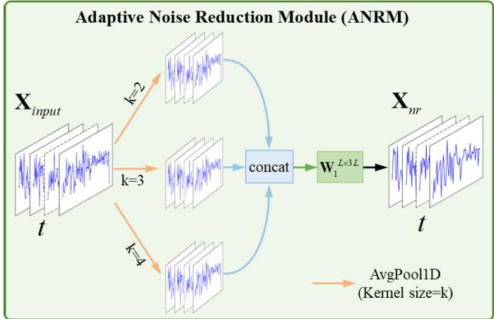  
Fig. 5. Adaptive Noise Reduction Module (ANRM).

In practical applications, determining the optimal value of N for temporal averaging is non-trivial. A too-small N provides insufficient noise suppression, while an excessively large N violates the assumption of a locally time-invariant (LTI) channel. To overcome this limitation, we propose the Adaptive Noise Reduction Module (ANRM), which performs learnable multi-scale averaging for noise reduction, as illustrated in Fig. 5. ANRM leverages the theoretical variance-reduction principle described in Eq. (19) and implements it in a datadriven, adaptive fashion.

The input tensor is a single-sample CSI time series $\mathbf { X } _ { \mathrm { i n } } \in$ $\mathbb { R } ^ { L \times T }$ , where L denotes the feature dimension corresponding to the per-frame CSI vector length, and T denotes the temporal dimension representing the number of CSI frames.

To enhance SNR while retaining discriminative channel variations, the ANRM applies multi-scale 1-D average pooling along the temporal axis (T dimension):

$$
\mathbf { p } _ { k } = \operatorname { A v g P o o l } 1 \mathrm { d } _ { k , \boldsymbol { s } = 1 } ( \mathbf { X } _ { \mathrm { i n } } ) , \quad k \in \{ 2 , 3 , 4 \} ,\tag{20}
$$

where k and s denote the pooling kernel size and stride, respectively. Padding is applied to preserve the temporal length T for all outputs. Each pooling operation performs a local temporal average, reducing noise variance approximately by $1 / k$ and improving the SNR of the CSI sequence.

The resulting multi-scale averaged features $\{ \mathbf { p } _ { k } \} _ { k = 2 , 3 , 4 }$ capture CSI dynamics at different temporal resolutions and are concatenated along the feature dimension:

$$
\mathbf { P } = \mathrm { c o n c a t } \big ( \mathbf { p } _ { 2 } , \mathbf { p } _ { 3 } , \mathbf { p } _ { 4 } \big ) \in \mathbb { R } ^ { 3 L \times T } .\tag{21}
$$

To fuse these multi-scale averaged features, we concatenate them and apply a 1D convolution with kernel size 1, which performs a point-wise linear projection to map the concatenated representation back to the original channel dimension.

$$
\mathbf { P } ^ { \prime } ( : , t ) = \mathbf { W } _ { 1 } \mathbf { P } ( : , t ) , \quad t = 1 , . . . , T ,\tag{22}
$$

where $\mathbf { W } _ { 1 } \in \mathbb { R } ^ { L \times 3 L }$ denotes the shared weight matrix of a 1D convolution with kernel size 1.

The convolution layer serves as a learnable weighting mechanism, allowing the model to adaptively integrate multi-scale averaged features at each time step, thereby attenuating noise while preserving key CSI details.

Finally, a residual connection adds the original input $\mathbf { x _ { i n } }$ back to the fused output $\mathbf { P } ^ { \prime } \colon$

$$
\mathbf { X _ { n r } = X _ { i n } + P ^ { \prime } . }\tag{23}
$$

Essentially, the ANRM leverages the fundamental statistical principle of variance reduction through averaging and transforms it into a trainable adaptive denoising module, addressing the challenge of selecting the averaging window N. By utilizing multi-scale average pooling and learnable fusion steps, the module effectively approximates the integration of denoised samples at different noise reduction levels, providing a robust foundation for feature extraction.

## D. Multi-Period Feature Extraction

The MPFEM is designed to capture periodic patterns in the CSI time series that arise from UAV motion. In a CSI time series, consecutive channel estimates record both short-term fluctuations and long-term variations of the wireless channel. These variations include periodic micro-Doppler effects produced by rotor rotation and distinct multipath dynamics associated with different flight states (e.g., vertical or horizontal movement). To model such periodic behaviors across multiple temporal scales, MPFEM reshapes the 1D CSI time series into a 2D tensor according to predefined period lengths, where each row represents time samples within one period and each column corresponds to the same phase across different periods.

As shown in Fig. 2, CETVNet adopts a residual structure. Given a CSI time series input $\mathbf { X } _ { \mathrm { 1 D } } \in \bar { \mathbb { R } } ^ { L \times T }$ , the input is first projected into a latent feature space through a learnable 1-D convolutional embedding layer:

$$
\mathbf { X } _ { \mathrm { 1 D } } ^ { \mathrm { 0 } } = \mathrm { E m b e d } ( \mathbf { X } _ { \mathrm { 1 D } } ) = \mathrm { C o n v } 1 \mathrm { d } _ { k = 3 } ( \mathbf { X } _ { \mathrm { 1 D } } ; \mathbf { W } _ { \mathrm { e m b } } ) ,\tag{24}
$$

where $\mathbf { W } _ { \mathrm { e m b } } \in \mathbb { R } ^ { d _ { \mathrm { m o d e l } } \times L \times 3 }$ is a 1-D convolution kernel with input channels L and output channels $d _ { \mathrm { m o d e l } } .$ , kernel size $^ { 3 , }$ and circular padding to preserve temporal length $T .$ The output $\mathbf { X } _ { \mathrm { 1 D } } ^ { 0 } \in \bar { \mathbb { R } ^ { d _ { \mathrm { m o d e l } } \times \tilde { T } } }$ serves as the embedded representation fed into the first MPFEM layer.

For the l-th MPFEM layer, the operation is expressed as

$$
\mathbf { X } _ { \mathrm { 1 D } } ^ { l } = \mathbf { M P F E M } ( \mathbf { X } _ { \mathrm { 1 D } } ^ { l - 1 } ) + \mathbf { X } _ { \mathrm { 1 D } } ^ { l - 1 } .\tag{25}
$$

The core operation of MPFEM is to convert 1D input into 2D and then extract features using Inception blocks. Given a predefined period set $\mathcal { P } ~ = ~ \{ p _ { 1 } , p _ { 2 } , . . . , p _ { s } \}$ , each period length $p _ { i }$ reshapes the 1D sequence into a 2D tensor $\mathbf { \bar { X } } _ { \mathrm { 2 D } } ^ { l , i } \in$ $\mathbb { R } ^ { d _ { \mathrm { m o d e l } } \times p _ { i } \times T / p _ { i } }$ . The reshaping and convolutional operations are defined as

$$
\begin{array} { r l } & { \mathbf { X } _ { 2 \mathrm { D } } ^ { l , i } = \operatorname { R e s h a p e } _ { p _ { i } } \big ( \mathrm { P a d d i n g } ( \mathbf { X } _ { \mathrm { 1 D } } ^ { l - 1 } ) \big ) , } \\ & { \widehat { \mathbf { X } } _ { 2 \mathrm { D } } ^ { l , i } = \operatorname { I n c e p t i o n B l o c k } \big ( \mathbf { X } _ { 2 \mathrm { D } } ^ { l , i } \big ) , } \\ & { \widehat { \mathbf { X } } _ { \mathrm { 1 D } } ^ { l , i } = \operatorname { R e s h a p e } _ { T } \big ( \widehat { \mathbf { X } } _ { 2 \mathrm { D } } ^ { l , i } \big ) , } \end{array}\tag{26}
$$

where the InceptionBlock(·) employs multi-scale 2D convolutions to capture both local and global periodic dependencies. An InceptionBlock consists of two sequential Inception layers with a GELU activation in between, formally expressed as

$$
\mathrm { I n c e p t i o n B l o c k } = \mathrm { I n c e p t i o n } _ { 1 } ( d _ { \mathrm { m o d e l } } , d _ { \mathrm { m i d } } )
$$

Algorithm 1 Calculation Flow of MPFEM   
Input: $\mathbf { X } \in \mathbb { R } ^ { C \times T } ; \mathcal { P } = \{ p _ { 1 } , p _ { 2 } , . . . , p _ { s } \} ; K .$   
Output: $\mathbf { X } _ { f } \in \mathbb { R } ^ { C \times T }$   
1: Initialize an empty list res list = [].   
2: for $p \in \mathcal P$ do   
3: Reshape X to $\mathbf { X } ^ { \prime } \in \mathbb { R } ^ { C \times ( T / p ) \times p } .$   
4: X¯ 1 ← Inception(X0, K).   
5: $\mathbf { X } ^ { \prime \prime }  \mathrm { G E L U } ( \bar { \mathbf { X } } _ { 1 } ) .$   
6: $\bar { \mathbf { X } } _ { 2 } \gets$ Inception $( { \bf X } ^ { \prime \prime } , K ) .$   
7: Reshape $\bar { \mathbf { X } } _ { 2 }$ to $\dot { \mathbf { X } } _ { b } \in \mathbb { R } ^ { \dot { C } \times T } .$   
8: res list ← res list ∪ $\{ { \bf X } _ { b } \}$   
9: end for   
10: $\widehat { \mathbf { X } } \gets$ sum(res list).   
11: $\begin{array} { r } { \mathbf { X } _ { f } \gets \mathbf { X } + \widehat { \mathbf { X } } . } \end{array}$   
12: return $\mathbf { X } _ { f } .$

$$
\xrightarrow { \mathrm { G E L U } } \mathrm { I n c e p t i o n } _ { 2 } ( d _ { \mathrm { m i d } } , d _ { \mathrm { m o d e l } } ) .\tag{27}
$$

where $d _ { \mathrm { m o d e l } }$ denotes the number of input and output channels of the block, and $d _ { \mathrm { m i d } }$ denotes the number of intermediate channels between the two Inception layers.

The Inception(·) performs multi-scale 2-D convolutions to jointly model fine-grained and global periodic variations in the reshaped CSI maps. Specifically, it applies four parallel convolutional kernels with sizes $1 \times 1 , 3 \times 3 , 5 \times 5$ , and $7 \times 7 .$ The outputs of all kernels are averaged to form a unified multiscale representation:

$$
\mathrm { I n c e p t i o n } ( { \mathbf { X } } _ { 2 D } ) = \frac { 1 } { K } \sum _ { i = 1 } ^ { K } { \mathrm { C o n v } } _ { ( 2 i - 1 ) \times ( 2 i - 1 ) } ( { \mathbf { X } } _ { 2 D } ) ,\tag{28}
$$

where $K = 4$ is the number of convolution kernels.

After processing all s period transformations, the results are aggregated:

$$
\mathbf { M P F E M } ( \mathbf { X } _ { \mathrm { 1 D } } ^ { l } ) = \sum _ { i = 1 } ^ { s } \widehat { \mathbf { X } } _ { \mathrm { 1 D } } ^ { l , i } .\tag{29}
$$

In Algorithm 1, the number of feature channels after embedding is explicitly defined as $C = d _ { \mathrm { m o d e l } }$ . Each MPFEM block receives $\dot { \mathbf { X } } \in \mathbb { R } ^ { \dot { C } \times T }$ and outputs $\mathbf { X } _ { f } \in \mathbb { R } ^ { C \times T }$ , ensuring consistency across layers.

Following the MPFEM feature extraction, the fused feature map $\mathbf { X } _ { f }$ is passed through a lightweight classifier to produce the final UAV-state prediction:

$$
\mathbf { y } = \mathrm { S o f t m a x } ( \mathbf { W } _ { 2 } \cdot \mathrm { F l a t t e n } ( \mathbf { X } _ { f } ) + \mathbf { b } ) ,\tag{30}
$$

where $\mathbf { W } _ { 2 }$ and b denote the learnable weights and bias of the final fully connected layer.

## IV. EXPERIMENTS

In this section, we demonstrate the superiority of CETVNet in the UAV state detection task through a series of experiments. First, we describe the data collection process and experimental setup. Next, we compare CETVNet with other existing methods. Finally, we conduct ablation experiments to evaluate the effectiveness of the proposed modules.

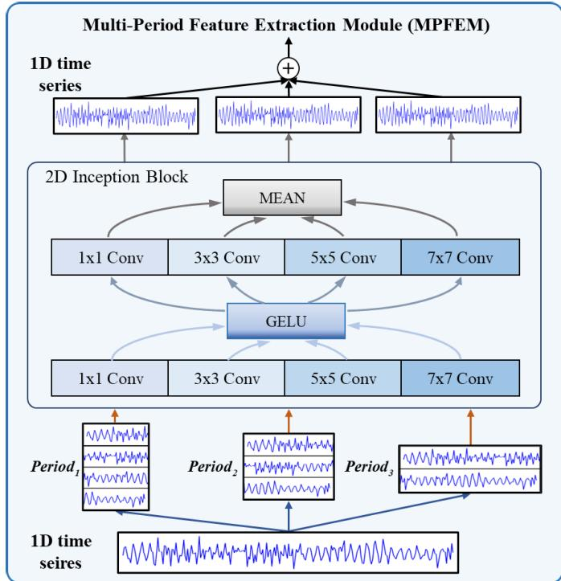  
Fig. 6. Multi-period feature extraction module (MPFEM).

## A. Data Acquisition

We use a ground-mounted DTMB receiving antenna and a USRP B210 to capture over-the-air DTMB broadcasts at three frequency points. Although the USRP B210 supports multiple receive channels, only a single RX antenna and one receive channel are used in the experiments. The DTMB broadcasts act as the opportunistic illuminator, while a DJI Matrice 350 RTK (large platform) serves as the primary controllable UAV target. To assess generalization to unseen platforms, we additionally collect data with a DJI Air 3s (medium) and a DJI Mini 4 Pro (small).

Data are collected in two representative environments: (i) Scene A (clean)—an open area with no pedestrians or vehicles within a ∼50 m radius of the receiver; (ii) Scene B (lightly interfered)—near a road intersection with slow pedestrians and passing vehicles within ∼30 m of the receiver, introducing low-frequency clutter-like temporal variations unrelated to the UAV.

As illustrated in Fig. 7, we consider five classes with consistent notation throughout the paper.

Y1 (horizontal along antenna boresight): The UAV flies approximately along the RX boresight at a ground range of 200−300 m from the RX, with an altitude of about 50 m. The speed is 8 − 14 m/s.

Y2 (horizontal perpendicular to boresight): The UAV flies on a lateral track perpendicular to the RX boresight at a nominal ground range of 200 m from the RX. The crosstrack excursion is ±100 m around the boresight intercept, the altitude is about 50 m, and the speed is $8 - 1 4 \ m / s$

Y3 (vertical up-and-down): The UAV holds a nearly fixed ground range of about 200 m from the RX and performs repeated vertical motions between 30−80 m. The vertical speed is approximately 3 $m / s$

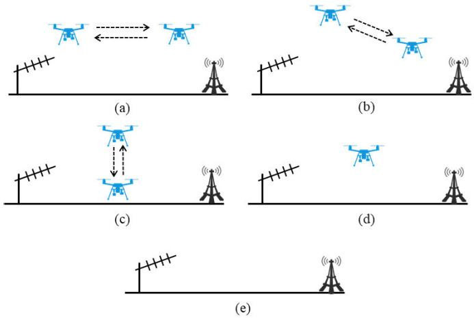

Fig. 7. UAV state in this work: (a) Y1: horizontal motion along the antenna boresight, (b) Y2: horizontal motion perpendicular to the boresight, (c) Y3: vertical up-and-down motion, (d) Y4: hovering, and (e) N: No-UAV.  
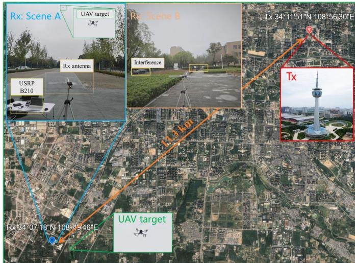  
Fig. 8. Real-world passive DTMB sensing setup: opportunistic DTMB transmitter, receiving antenna, USRP B210 sampler, and the UAV target. Two environments are considered: an open, clean Scene A and a lightly interfered Scene B near a road intersection.

Y4 (hovering): The UAV hovers at a fixed point at a ground range of about 200 m from the RX and an altitude of about 50 m.

N (No-UAV): No UAV is present within the monitored area during acquisition. The RX receives only the direct-path DTMB signal and environmental multipath/clutter.

The real-world acquisition setup is shown in Fig. 8. Three broadcast frequency points correspond to distinct DTMB frame-header modes. After channel estimation (Sec. III-B), we obtain three datasets named PN420, PN595, and PN945. Table I summarizes the dataset information.

## B. Implementation Details and Metrics

1) Dataset Splits: We conducted experiments on each of the three frame header modes, namely PN420, PN595, and PN945. For each mode, we randomly split the data into 70%/30% for train/test, ensuring no temporal overlap between segments. We designed three sets of experiments to evaluate the performance of CETVNet.

TABLE I  
DATASET PARAMETERS AND COMPOSITION
<table><tr><td rowspan=1 colspan=1>Type</td><td rowspan=1 colspan=1>Parameter</td><td rowspan=1 colspan=1>Value / Description</td></tr><tr><td rowspan=1 colspan=1>Sample</td><td rowspan=1 colspan=1>ReceiverSampling rateDTMB transmitter distanceUAV platformsUAV speed rangeUAV altitude rangeUAV ground range</td><td rowspan=1 colspan=1>USRP B210 + ground-mounted DTMB antenna7.56 MHz13.3 kmLarge: DJI Matrice 350 RTK; Medium: DJI Air 3s; Small: DJI Mini 4 Pro0-14 m/s30–80 m200–300 m</td></tr><tr><td rowspan=1 colspan=1>Dataset</td><td rowspan=1 colspan=1>ScenesCenter frequenciesFrame-header (FH) modeCSI frame rate (FH rate)Number of classesCSI dimension LCSI time-series length T</td><td rowspan=1 colspan=1>A (clean, open field), B (lightly interfered, near intersection)538 MHz, 690 MHz, 514 MHzPN420, PN595, PN945PN420: 8 × 225 = 1800 frames/s; PN595: $8 \times 2 1 6 = 1 7 2 8$ frames/s; PN945: 8 × 200 = 1600 frames/s $5 ~ ( \mathrm { Y } 1 , ~ \mathrm { Y } 2 , ~ \mathrm { Y } 3 , ~ \mathrm { Y } 4 , ~ \mathrm { N } )$ 32, 64, 12832, 64, 128, 256</td></tr></table>

• Basic experiment. Training and testing are conducted in scenario A, where five states of the UAV are classified to demonstrate the effectiveness of CSI-based passive sensing.

• Cross-scene. Train on Scene A (clean), and test on Scene B (lightly interfered); and the reverse (train on B, test on A). This setup probes robustness to ambient, non-UAV temporal variations near the RX.

• Cross-UAV (leave-one-platform-out). Using the three UAV platforms (large: Matrice 350 RTK; medium: Air 3s; small: Mini 4 Pro), we train on two platforms and test on the held-out platform.

2) Experimental Setup: We set the period set in Eq. (26) to $\mathcal { P } = \{ 8 , 1 6 , 3 2 \} ( \mathrm { i } . \mathrm { e } . , s = 3$ periods), and set the $d _ { m o d e l } , d _ { m i d }$ in Eq. (27) to 32, 24, respectively. We use Adam with learning rate 1e−3, batch size 32, weight decay 1e−4, and train for up to 100 epochs. Early stopping monitors the validation loss with patience 5. The classifier employs a dropout rate of 0.2.

Data preprocessing and channel estimation are performed in MATLAB R2023a; neural network models are implemented in PyTorch 1.13. All experiments run on a workstation with an NVIDIA GTX 1080 GPU (8 GB) and an Intel Xeon(R) Gold 6240 CPU @2.60GHz CPU.

3) Evaluation Metrics: We report standard classification metrics and diagnostic measures as follows:

Accuracy (%): overall correct predictions over all classes. Precision, Recall, and F1-score (%): computed per class and then macro-averaged across {N, Y1–Y4} unless specified.

Confusion Matrices: shown per mode to visualize inter-class confusions.

False-Alarm Rate (FAR): proportion of No-UAV segments misclassified as any UAV-present class, defined as

$$
\mathrm { F A R } = \frac { \# \{ \mathbf { N }  \mathbf { Y } 1 - \mathbf { Y } 4 \} } { \# \{ \mathbf { N } \} } \times 1 0 0 \% .\tag{31}
$$

Two-Class Accuracy: In cross-scene and cross-UAV testing, we also report binary classification accuracy between UAVpresent and No-UAV conditions, where the four UAV motion states {Y1–Y4} are merged into a single positive class.

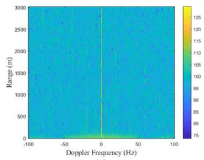

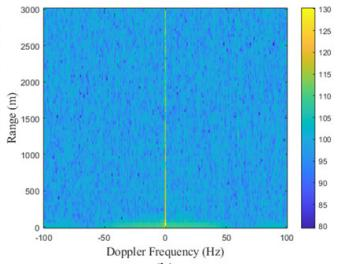  
(b)

(a)  
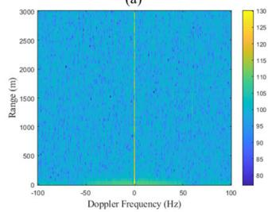  
(c)

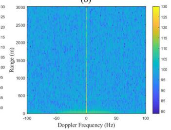  
(d)  
Fig. 9. The coherent integration results of the UAV target in the four states. (a) Y1: horizontal motion along the antenna boresight, (b) Y2: horizontal motion perpendicular to the boresight, (c) Y3: vertical up-and-down motion, and (d) Y4: hovering in the air.

## C. Performance of the Proposed CETVNet

1) Coherent-Integration Baseline: Firstly, the four states of the UAV are detected using the coherent integration method, with an integration time of 1 second. The detection results are shown in Fig. 9. Under our experimental conditions, the UAV target in all four states is undetectable.

2) Comparison With Time-Series and CSI-Specific Models: We next classify CSI sequences and compare CETVNet against two groups of baselines (all models take 128 × 128 CSI as input and follow the protocols in Sec. IV-B).

a) General time-series models: LSTM [28], LightTS [30], MICN [32], TimesNet [34], ModernTCN [33], Auto-Former [36], TST [37], CrossFormer [38], PatchTST [35], iTransformer [39].

b) CSI-specific models: WPFormer—a Transformer backbone tailored to CSI tokenization/fusion for wireless sensing [47]; CaiT & VanillaViT—vision-style selfattention applied to CSI-derived time–channel maps [48];

(b)PN595  
TABLE II  
PERFORMANCE COMPARISON OF CETVNET WITH OTHER NETWORKS FOR TIME SERIES CLASSIFICATION ON THREE DATASETS
<table><tr><td></td><td colspan="4">PN420</td><td colspan="4">PN595</td><td colspan="4">PN945</td></tr><tr><td>Method</td><td>Acc.</td><td>Prec.</td><td>Rec.</td><td>F1</td><td>Acc.</td><td>Prec.</td><td>Rec.</td><td>F1</td><td>Acc.</td><td>Prec.</td><td>Rec.</td><td>F1</td></tr><tr><td>LSTM</td><td>67.35</td><td>71.74</td><td>67.41</td><td>67.67</td><td>71.61</td><td>61.65</td><td>71.30</td><td>64.44</td><td>73.55</td><td>76.53</td><td>73.23</td><td>72.23</td></tr><tr><td>LightTS</td><td>63.60</td><td>70.35</td><td>63.61</td><td>63.22</td><td>70.41</td><td>61.31</td><td>70.11</td><td>63.85</td><td>78.91</td><td>80.04</td><td>78.82</td><td>78.56</td></tr><tr><td>ModernTCN</td><td>63.18</td><td>70.93</td><td>63.15</td><td>63.10</td><td>74.00</td><td>75.13</td><td>73.73</td><td>70.57</td><td>79.69</td><td>81.82</td><td>79.49</td><td>78.05</td></tr><tr><td>AutoFormer</td><td>69.59</td><td>73.54</td><td>69.54</td><td>68.58</td><td>86.72</td><td>87.57</td><td>86.55</td><td>85.81</td><td>83.75</td><td>85.23</td><td>83.57</td><td>82.83</td></tr><tr><td>iTransformer</td><td>75.39</td><td>83.86</td><td>75.38</td><td>75.08</td><td>76.04</td><td>64.71</td><td>75.72</td><td>68.66</td><td>77.96</td><td>80.51</td><td>77.67</td><td>76.96</td></tr><tr><td>TST</td><td>81.86</td><td>88.27</td><td>81.88</td><td>81.96</td><td>79.34</td><td>84.02</td><td>79.06</td><td>75.38</td><td>87.64</td><td>89.86</td><td>87.44</td><td>86.99</td></tr><tr><td>PatchTST</td><td>77.45</td><td>81.65</td><td>77.46</td><td>77.74</td><td>72.24</td><td>60.64</td><td>71.92</td><td>64.53</td><td>89.54</td><td>92.37</td><td>89.36</td><td>88.86</td></tr><tr><td>CaiT</td><td>80.23</td><td>88.04</td><td>80.34</td><td>77.29</td><td>90.86</td><td>91.88</td><td>90.86</td><td>91.04</td><td>87.55</td><td>90.36</td><td>87.61</td><td>86.95</td></tr><tr><td>VanillaViT</td><td>76.96</td><td>85.02</td><td>77.06</td><td>73.85</td><td>90.37</td><td>91.39</td><td>90.30</td><td>90.40</td><td>83.53</td><td>87.72</td><td>83.40</td><td>81.39</td></tr><tr><td>WPFormer</td><td>84.46</td><td>89.27</td><td>84.55</td><td>84.34</td><td>87.84</td><td>91.46</td><td>87.70</td><td>87.85</td><td>91.79</td><td>92.98</td><td>91.68</td><td>91.54</td></tr><tr><td>MICN</td><td>85.67</td><td>87.56</td><td>85.68</td><td>85.33</td><td>86.79</td><td>87.88</td><td>86.66</td><td>86.36</td><td>93.78</td><td>94.42</td><td>93.70</td><td>93.69</td></tr><tr><td>TimesNet</td><td>92.68</td><td>93.79</td><td>92.69</td><td>92.74</td><td>91.50</td><td>92.19</td><td>91.41</td><td>91.41</td><td>82.02</td><td>84.67</td><td>82.02</td><td>81.81</td></tr><tr><td>CrossFormer</td><td>88.09</td><td>90.22</td><td>88.11</td><td>87.83</td><td>89.95</td><td>92.39</td><td>89.82</td><td>89.71</td><td>93.17</td><td>93.77</td><td>93.10</td><td>93.10</td></tr><tr><td>THAT</td><td>89.54</td><td>92.36</td><td>89.60</td><td>88.73</td><td>91.92</td><td>92.73</td><td>91.82</td><td>91.72</td><td>93.86</td><td>95.21</td><td>93.75</td><td>93.68</td></tr><tr><td>CETVNet (Proposed)</td><td>96.92</td><td>96.95</td><td>96.92</td><td>96.92</td><td>94.45</td><td>94.88</td><td>94.40</td><td>94.44</td><td>98.79</td><td>98.85</td><td>98.77</td><td>98.79</td></tr></table>

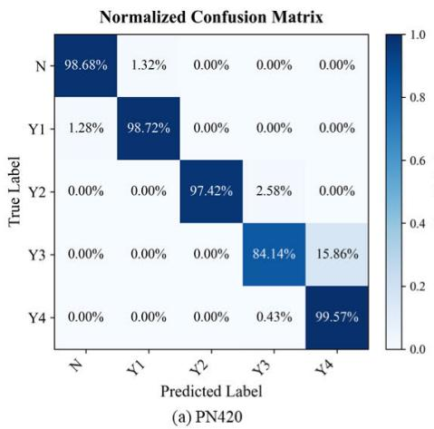

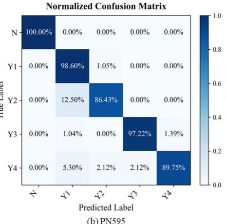

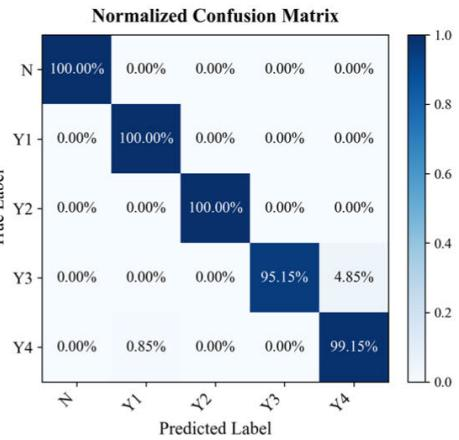  
(c) PN945  
Fig. 10. Confusion matrices of CETVNet for PN420, PN595, and PN945.

THAT—a two-stream convolution–Transformer hybrid modeling temporal–spectral dependencies in CSI [49].

Table II reports multi-class Accuracy and macro-averaged Precision/Recall/F1 for PN420/PN595/PN945. All methods achieve meaningful detection, confirming that CSI sequences carry UAV-induced signatures. CETVNet achieves the best results, with accuracy consistently above 94% and F1 typically 2–5 percentage points higher than strong baselines. This demonstrates the superiority of the CETVNet model for this task.

Across the three DTMB FH modes, detection accuracy follows PN945 > PN420 > PN595. This stems from PN structure/protocol details: PN595’s single-PN design and lower FH power yield lower-quality CSI time series, whereas PN945’s longer FH and higher FH power deliver the best detection performance.

3) Confusion Matrices and FAR: To analyze error modes, Fig. 10 shows CETVNet’s confusion matrices per DTMB mode. Confusion mainly occurs between Y1 and Y2, and between Y3 and Y4, because the speeds of these states are close. From the confusion matrix, it can be derived that the FAR for the PN420 mode is 1.32%, while no false alarms occur in the other two modes, resulting in an average FAR of 0.44% across the three frame header modes.

TABLE III  
CROSS-SCENE PERFORMANCE (ACCURACY %)
<table><tr><td>Train</td><td>Test</td><td>Multi-Class Acc</td><td>Two-Class Acc</td></tr><tr><td>Scene A</td><td>Scene B</td><td>75.14</td><td>97.97</td></tr><tr><td>Scene B</td><td>Scene A</td><td>87.29</td><td>99.41</td></tr></table>

4) Cross-Scene Generalization: We evaluate robustness across environments by training on one scene and testing on the other (Sec. IV-B). Table III summarizes the results.

Moving from the clean Scene A to the lightly interfered Scene B incurs a larger drop in multi-class accuracy due to pedestrian/vehicle-induced low-frequency clutter near the RX, which partially overlaps with UAV temporal signatures. Nevertheless, binary detection (UAV-present vs. N) remains high (≥ 97.97%), indicating CETVNet reliably distinguishes UAV presence under varying environmental conditions.

5) Cross-UAV Generalization: We further examine transferability to unseen UAV platforms by holding out one platform at test time while training on the other two (Sec. IV-B). Table IV reports the multi-class accuracy.

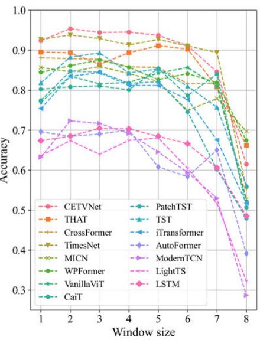  
(a)

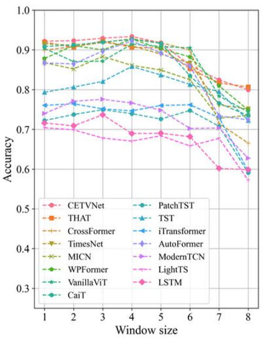  
(b)

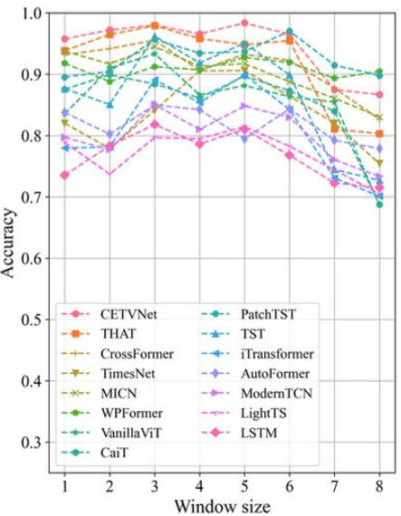  
(c)  
Fig. 11. Experimental results of UAV state classification in different average window size. (a) PN420. (b) PN595. (c) PN945.

TABLE IV  
CROSS-UAV PERFORMANCE (ACCURACY %)
<table><tr><td>Train</td><td>Test</td><td>Multi-Class Acc</td><td>Two-Class Acc</td></tr><tr><td>Large + Medium</td><td>Small</td><td>88.81</td><td>99.34</td></tr><tr><td> $\mathrm { L a r g e } + \mathrm { S m a l l }$ </td><td>Medium</td><td>87.48</td><td>98.92</td></tr><tr><td> $\mathrm { M e d i u m + S m a l l }$ </td><td>Large</td><td>85.49</td><td>97.55</td></tr></table>

CETVNet maintains >85% multi-class accuracy and >97% two-class accuracy when tested on an unseen UAV type, demonstrating strong platform-level generalization. This robustness stems from CETVNet’s cross-period aggregation, which captures geometry/kinematics-invariant temporal structures.

In summary, CETVNet achieves state-of-the-art accuracy, low FAR, and strong robustness to environmental and platform variations, demonstrating its effectiveness and generalizability for real-world passive UAV detection.

## D. Ablation Study

1) Average Denoising Effectiveness Validation: To assess the validity of the LTI system assumption and identify an appropriate average window size, we calculate the averaged CSI time series using various values of N in Eq. 16. Average window size N denotes the number of CSI frames. Then we compare the performance of CETVNet (without the ANRM module) and other methods with different average window sizes. We evaluate results with no denoising and for N values ranging from 2 to 8. The results, illustrated in Fig. 11, indicate that although there are performance differences across methods, the best results were achieved when N was between 2 and 6. This demonstrates the effectiveness of averaging denoising. However, the optimal value of N for each model, including

TABLE V  
COMPARISON OF ANRM, WAVELET DENOISING (WD), AND KALMAN FILTERING (KF) IN TERMS OF ACCURACY (%)
<table><tr><td rowspan=1 colspan=1>Method</td><td rowspan=1 colspan=1>PN420</td><td rowspan=1 colspan=1>PN595</td><td rowspan=1 colspan=1>PN945</td><td rowspan=1 colspan=1>Avg</td></tr><tr><td rowspan=3 colspan=1>WDKFANRM</td><td rowspan=1 colspan=1>91.49</td><td rowspan=1 colspan=1>90.87</td><td rowspan=1 colspan=1>98.11</td><td rowspan=1 colspan=1>93.49</td></tr><tr><td rowspan=2 colspan=1>94.2796.93</td><td rowspan=1 colspan=1>86.10</td><td rowspan=1 colspan=1>96.90</td><td rowspan=2 colspan=1>92.4296.73</td></tr><tr><td rowspan=1 colspan=1>94.46</td><td rowspan=1 colspan=1>98.80</td></tr></table>

CETVNet (without the ANRM module), varies across different modes. Despite this, CETVNet still achieved the best overall performance. All experiments are performed on time series with a shape of 128 × 128.

2) ANRM Versus Wavelet and Kalman Filtering: We further compare the proposed ANRM with two representative classical denoising methods applied to the CSI time series before classification: (i) discrete wavelet denoising (WD) and (ii) Kalman filtering (KF).

For each dataset, the parameters of both filters were optimized through grid search on the validation set to balance noise suppression and feature preservation. In the Kalman filter, different values of α, Q (process noise), and R (measurement noise) were explored. For wavelet denoising, multiple mother wavelets (db4, sym4) and decomposition levels (3)–(6) were tested under both VisuShrink and SURE thresholding rules. All denoised sequences were then fed into the same CETVNet backbone with identical training hyperparameters to ensure fair comparison. Table V reports the multi-class accuracy for each DTMB frame-header mode.

Benefiting from its adaptive capability, ANRM demonstrates consistently superior accuracy compared to the two fixed filtering approaches.

3) Evaluate the Influence of CSI Phase: Through this experiment, we demonstrated the reason for not using CSI phase information. In the Amplitude-only setting, the CSI amplitude matrix $( L \times T )$ is directly used as input, which is the default configuration in our method. In the Amplitude+Phase setting, both the amplitude and the phase $( 2 L \times T )$ of the CSI are included. Both variants are processed by the same CETVNet architecture under identical training settings, differing only in input channel dimension.

TABLE VI  
COMPARISON OF AMPLITUDE-ONLY AND AMPLITUDE+PHASE CSI INPUTS (ACCURACY %)
<table><tr><td rowspan=1 colspan=1>Input</td><td rowspan=1 colspan=1>PN420</td><td rowspan=1 colspan=1>PN595</td><td rowspan=1 colspan=1>PN945</td><td rowspan=1 colspan=1>Avg</td></tr><tr><td rowspan=1 colspan=1>Amp+PhaseAmp-only</td><td rowspan=1 colspan=1>82.5696.92</td><td rowspan=1 colspan=1>79.6894.45</td><td rowspan=1 colspan=1>86.2598.79</td><td rowspan=1 colspan=1>82.8396.72</td></tr></table>

The results are shown in Table VI, including phase information does not improve performance and in fact reduces accuracy. This degradation is possibly caused by residual asynchronous phase errors (e.g., carrier frequency offset, sampling frequency offset, and oscillator jitter) that introduce nonstationary noise and disrupt temporal consistency.

4) Dimension of CSI Time Series: We explore different combinations of the CSI dimension and the CSI time series length to determine the most suitable dimensions for the CSI time series. The CSI dimensions are set to [32, 64, 128], and the CSI time series lengths to [32, 64, 128, 256], with CETVNet used for comparison. The accuracy results, illustrated in Table VII, indicate that the optimal combination across all three frame header modes is 128×128. A reasonable explanation is that longer time windows raise the incidence of transient interference/impulsive noise and thereby degrade the CSI time-series quality. Hence, in the following experiments we adopt an input size of $1 2 8 \times 1 2 8$

5) Effectiveness of ANRM and MPFEM: Ablation experiments were conducted to evaluate the effectiveness of the two main components of CETVNet, ANRM and MPFEM. The performance of the model was compared across four different combinations under the three frame header modes. For MPFEM, the multi-period parameters were set to the sequence length for the ablation study. The results, illustrated in Table VIII, demonstrate that, compared to the baseline, ANRM improves performance by 2% to 6%, MPFEM provides a 2% to 9% performance boost, and the combination of ANRM and MPFEM results in a 5% to 13% performance improvement. These findings validate the effectiveness of both modules.

6) Interpretability Analysis of ANRM: To further enhance the interpretability of the ANRM module, this section analyzes the behavior of the learnable fusion weights through visualizations and experiments under different scenarios.

Fig. 12 shows the learned fusion weights in the 1D convolution layer of ANRM, while Fig. 13 plots the weight variance for each input CSI channel. Both figures reveal non-uniform fusion patterns across pooling scales, with higher variance concentrated in the early part of the CSI response (short-delay components), suggesting that the fusion layer applies more selective weighting to this region.

Fig. 14 compares the relative branch contribution of ANRM pooling scales for two models trained separately on Scene A and Scene B, where the contribution at scale k is measured as its normalized share of the 1D convolution fusion output. In Scene A, k = 2 has the largest contribution, suggesting that smaller pooling scales better capture fine-grained details under low noise. In Scene B, k = 4 becomes the most prominent, indicating that larger pooling scales tend to be favored to suppress interference and yield more stable feature representations.

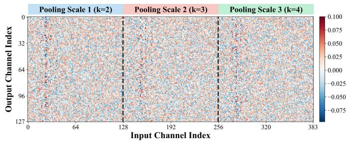  
Fig. 12. Heatmap of the learned 1D convolution fusion weights in ANRM (input channels are concatenated from three pooling-scale branches).

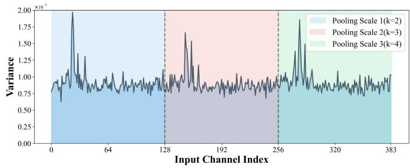  
Fig. 13. Variance (across output channels) of the learned fusion weights for each input CSI channel.

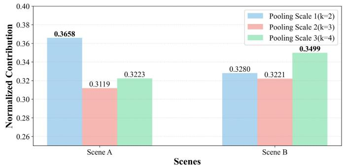  
Fig. 14. Relative contribution of each pooling-scale branch in two scenes.

7) Computational Complexity and Real-Time Feasibility: CETVNet is designed to be lightweight and efficient for real-time UAV detection. Table IX compares its computational complexity and inference latency with the four bestperforming baseline models—THAT, CrossFormer, TimesNet, and MICN—using a 128 × 128 CSI input.

CETVNet achieves the best trade-off between accuracy and efficiency, requiring only 0.24M parameters and 69.5M FLOPs—significantly fewer than Transformer-based baselines such as CrossFormer and THAT. Its inference latency is extremely low: 0.24 ms on GPU and 1.03 ms on CPU per sample. These results demonstrate that CETVNet satisfies the low-latency and low-power requirements for real-world edge deployment and real-time UAV monitoring.

TABLE VII  
THE EFFECT OF THE DIMENSION OF CSI AND THE LENGTH OF CSI TIME SERIES ON CETVNET PERFORMANCE
<table><tr><td colspan="3"></td><td colspan="3"></td><td colspan="3">CSI time series length</td><td colspan="5"></td></tr><tr><td rowspan="2"></td><td></td><td colspan="3">PN420</td><td colspan="3">PN595</td><td colspan="3"></td><td colspan="3">PN945</td></tr><tr><td></td><td>32</td><td>64</td><td>128</td><td>256</td><td>32</td><td>64</td><td>128</td><td>256</td><td>32</td><td>64</td><td>128</td><td>256</td></tr><tr><td rowspan="3">CSI dimension</td><td>32</td><td>88.10</td><td>93.22</td><td>92.73</td><td>94.98</td><td>93.40</td><td>93.83</td><td>91.47</td><td>93.12</td><td>95.26</td><td>97.52</td><td>96.05</td><td>84.83</td></tr><tr><td>64</td><td>86.65</td><td>92.44</td><td>90.14</td><td>91.07</td><td>94.00</td><td>93.64</td><td>93.86</td><td>89.09</td><td>94.46</td><td>95.32</td><td>83.71</td><td>94.70</td></tr><tr><td>128</td><td>90.07</td><td>88.93</td><td>96.92</td><td>90.27</td><td>93.94</td><td>94.25</td><td>94.45</td><td>87.46</td><td>93.72</td><td>98.06</td><td>98.79</td><td>90.27</td></tr></table>

TABLE VIII

ANRM AND MPFEM MODULE ABLATION EXPERIMENTS
<table><tr><td colspan="2">Module</td><td colspan="4">PN420</td><td colspan="4">PN595</td><td colspan="4">PN945</td></tr><tr><td>ANRM</td><td>MPFEM</td><td>Acc.</td><td>Prec.</td><td>Rec.</td><td>F1</td><td>Acc.</td><td>Prec.</td><td>Rec.</td><td>F1</td><td>Acc.</td><td>Prec.</td><td>Rec.</td><td>F1</td></tr><tr><td>X</td><td>X</td><td>83.92</td><td>87.51</td><td>83.99</td><td>82.38</td><td>85.45</td><td>86.99</td><td>85.27</td><td>84.32</td><td>93.02</td><td>93.24</td><td>93.02</td><td>93.02</td></tr><tr><td>√</td><td>X</td><td>85.85</td><td>89.96</td><td>85.93</td><td>84.21</td><td>91.78</td><td>92.32</td><td>91.69</td><td>91.65</td><td>95.16</td><td>95.18</td><td>95.15</td><td>95.16</td></tr><tr><td>X</td><td>√</td><td>92.38</td><td>93.53</td><td>92.41</td><td>92.31</td><td>92.20</td><td>92.93</td><td>92.13</td><td>92.16</td><td>95.76</td><td>96.11</td><td>95.71</td><td>95.73</td></tr><tr><td>√</td><td>√</td><td>96.92</td><td>96.95</td><td>96.92</td><td>96.92</td><td>94.45</td><td>94.88</td><td>94.40</td><td>94.44</td><td>98.79</td><td>98.85</td><td>98.77</td><td>98.79</td></tr></table>

TABLE IX  
COMPARISON OF MODEL COMPLEXITY AND INFERENCE LATENCY
<table><tr><td>Model</td><td>Params (M)</td><td>FLOPs (M)</td><td>GPU ms</td><td>CPU ms</td></tr><tr><td>CETVNet</td><td>0.236</td><td>69.52</td><td>0.24</td><td>1.03</td></tr><tr><td>THAT</td><td>1.249</td><td>132.74</td><td>0.58</td><td>2.03</td></tr><tr><td>CrossFormer</td><td>1.307</td><td>719.70</td><td>1.13</td><td>8.92</td></tr><tr><td>TimesNet</td><td>0.233</td><td>79.75</td><td>0.25</td><td>1.12</td></tr><tr><td>MICN</td><td>0.494</td><td>28.13</td><td>0.43</td><td>2.40</td></tr></table>

## V. CONCLUSION

In this paper, we address the challenges of passive UAV state detection using ambient RF signals. We identify two key technical barriers. i) The difficulty of detecting slowmoving or hovering small UAV based on coherent integration; ii) The need for the detection system to adapt to variations in the signal source and the channel noise. To overcome these challenges, we propose CETVNet, which leverages channel estimation to capture the channel response over time, treating it as time-series data to detect interference caused by UAV. Assuming an LTI system, we introduce an adaptive noise reduction module to mitigate the effects of channel noise. Additionally, we present the multi-period feature extraction module to extract multi-period features by processing the CSI time series in a two-dimensional space. Experiments on real SDR-collected data prove CETVNet’s effectiveness. The CETVNet significantly improves the detection of low-speed or hovering UAV, making it a promising solution for passive UAV detection.

## REFERENCES

[1] J. Mu, R. Zhang, Y. Cui, N. Gao, and X. Jing, “UAV meets integrated sensing and communication: Challenges and future directions,” IEEE Commun. Mag., vol. 61, no. 5, pp. 62–67, May 2023.

[2] X. Yuan, T. Yang, Y. Hu, J. Xu, and A. Schmeink, “Trajectory design for UAV-enabled multiuser wireless power transfer with nonlinear energy harvesting,” IEEE Trans. Wireless Commun., vol. 20, no. 2, pp. 1105–1121, Feb. 2021.

[3] N. Cheng et al., “AI for UAV-assisted IoT applications: A comprehensive review,” IEEE Internet Things J., vol. 10, no. 16, pp. 14438–14461, Aug. 2023.

[4] Q. Xiao, Y. Li, F. Luo, and H. Liu, “Analysis and assessment of risks to public safety from unmanned aerial vehicles using fault tree analysis and Bayesian network,” Technol. Soc., vol. 73, May 2023, Art. no. 102229.

[5] D. Mu, C. Yue, and A. Chen, “Are we working on the safety of UAVs? An LDA-based study of UAV safety technology trends,” Saf. Sci., vol. 152, Aug. 2022, Art. no. 105767.

[6] J. Yousaf et al., “Drone and controller detection and localization: Trends and challenges,” Appl. Sci., vol. 12, no. 24, p. 12612, Dec. 2022.

[7] C. Wang, J. Tian, J. Cao, and X. Wang, “Deep learning-based UAV detection in pulse-Doppler radar,” IEEE Trans. Geosci. Remote Sens., vol. 60, 2022, Art. no. 5105612.

[8] H. Xu, Y. Quan, X. Zhou, H. Chen, and T. J. Cui, “A novel approach for radar passive jamming based on multiphase coding rapid modulation,” IEEE Trans. Geosci. Remote Sens., vol. 61, 2023, Art. no. 5101614.

[9] H. Yang, J. Yang, and Z. Liu, “Localizing ground-based pulse emitters via synthetic aperture radar: Model and method,” IEEE Trans. Geosci. Remote Sens., vol. 61, 2023, Art. no. 5216714.

[10] F.-L. Chiper, A. Martian, C. Vladeanu, I. Marghescu, R. Craciunescu, and O. Fratu, “Drone detection and defense systems: Survey and a software-defined radio-based solution,” Sensors, vol. 22, no. 4, p. 1453, Feb. 2022.

[11] J. Zhao, J. Zhang, D. Li, and D. Wang, “Vision-based anti-UAV detection and tracking,” IEEE Trans. Intell. Transp. Syst., vol. 23, no. 12, pp. 25323–25334, Dec. 2022.

[12] S. Basak, S. Rajendran, S. Pollin, and B. Scheers, “Combined RF-based drone detection and classification,” IEEE Trans. Cognit. Commun. Netw., vol. 8, no. 1, pp. 111–120, Mar. 2022.

[13] W. Wang, K. Fan, Q. Ouyang, and Y. Yuan, “Acoustic UAV detection method based on blind source separation framework,” Appl. Acoust., vol. 200, Nov. 2022, Art. no. 109057.

[14] C. R. Berger, B. Demissie, J. Heckenbach, P. Willett, and S. Zhou, “Signal processing for passive radar using OFDM waveforms,” IEEE J. Sel. Topics Signal Process., vol. 4, no. 1, pp. 226–238, Feb. 2010.

[15] D. Pastina, F. Santi, F. Pieralice, M. Antoniou, and M. Cherniakov, “Passive radar imaging of ship targets with GNSS signals of opportunity,” IEEE Trans. Geosci. Remote Sens., vol. 59, no. 3, pp. 2627–2642, Mar. 2021.

[16] P. Samczynski et al., “5G network-based passive radar,” IEEE Trans. Geosci. Remote Sens., vol. 60, 2022, Art. no. 5108209.

[17] A. Aldowesh, T. Alnuaim, and A. Alzogaiby, “Slow-moving micro-UAV detection with a small scale digital array radar,” in Proc. IEEE Radar Conf. (RadarConf), Apr. 2019, pp. 1–5.

[18] J. L. Garry, C. J. Baker, and G. E. Smith, “Evaluation of direct signal suppression for passive radar,” IEEE Trans. Geosci. Remote Sens., vol. 55, no. 7, pp. 3786–3799, Jul. 2017.

[19] I. Milani, C. Bongioanni, F. Colone, and P. Lombardo, “Fusing measurements from Wi-Fi emission-based and passive radar sensors for short-range surveillance,” Remote Sens., vol. 13, no. 18, p. 3556, Sep. 2021.

[20] Q. He, E. Yang, and S. Fang, “A survey on human profile information inference via wireless signals,” IEEE Commun. Surveys Tuts., vol. 26, no. 4, pp. 2577–2610, 4th Quart., 2024.

[21] Z. Li and X. Rao, “Toward long-term effective and robust device-free indoor localization via channel state information,” IEEE Internet Things J., vol. 9, no. 5, pp. 3599–3611, Mar. 2022.

[22] D. Xie, J. Yi, J. Shen, and X. Wan, “Experimental research of multi-FM based passive radar,” in Proc. 12th Int. Symp. Antennas, Propag. EM Theory (ISAPE), Dec. 2018, pp. 1–5.

[23] V. V. Ratnam, H. Chen, H.-H. Chang, A. Sehgal, and J. Zhang, “Optimal preprocessing of WiFi CSI for sensing applications,” IEEE Trans. Wireless Commun., vol. 23, no. 9, pp. 10820–10833, Sep. 2024.

[24] W. Meng, Z. Liu, B. Li, W. Cui, J. T. Zhou, and L. Zhang, “GrapHAR: A lightweight human activity recognition model by exploring the subcarrier correlations,” IEEE Trans. Wireless Commun., vol. 23, no. 4, pp. 2755–2770, Apr. 2024.

[25] W. Li, M. J. Bocus, C. Tang, R. J. Piechocki, K. Woodbridge, and K. Chetty, “On CSI and passive Wi-Fi radar for opportunistic physical activity recognition,” IEEE Trans. Wireless Commun., vol. 21, no. 1, pp. 607–620, Jan. 2022.

[26] W. Li, X. Meng, Z. Zhao, Z. Liu, C. Chen, and H. Wang, “LoT: A transformer-based approach based on channel state information for indoor localization,” IEEE Sensors J., vol. 23, no. 22, pp. 28205–28219, Nov. 2023.

[27] H. B. Tulay and C. E. Koksal, “Road state inference via channel state information,” IEEE Trans. Veh. Technol., vol. 72, no. 7, pp. 8329–8341, Jul. 2023.

[28] S. Hochreiter and J. Schmidhuber, “Long short-term memory,” Neural Comput., vol. 9, no. 8, pp. 1735–1780, Nov. 1997.

[29] G. Lai, W.-C. Chang, Y. Yang, and H. Liu, “Modeling long-and shortterm temporal patterns with deep neural networks,” in Proc. Int. ACM Conf. Res. Devel. Inf. Retrieval (SIGIR), 2018, pp. 95–104.

[30] D. Campos, M. Zhang, B. Yang, T. Kieu, C. Guo, and C. S. Jensen, “LightTS: Lightweight time series classification with adaptive ensemble distillation,” Proc. ACM Manage. Data, vol. 1, no. 2, pp. 1–27, Jun. 2023.

[31] S. Bai, J. Zico Kolter, and V. Koltun, “An empirical evaluation of generic convolutional and recurrent networks for sequence modeling,” 2018, arXiv:1803.01271.

[32] H. Wang, J. Peng, F. Huang, J. Wang, J. Chen, and Y. Xiao, “MICN: Multi-scale local and global context modeling for long-term series forecasting,” in Proc. Int. Conf. Learn. Represent. (ICLR), Kigali, Rwanda, May 2023, pp. 1–5.

[33] D. Luo and X. Wang, “ModernTCN: A modern pure convolution structure for general time series analysis,” in Proc. Int. Conf. Learn. Represent. (ICLR), Vienna, Austria, May 2024, pp. 1–5.

[34] H. Wu, T. Hu, Y. Liu, H. Zhou, J. Wang, and M. Long, “TimesNet: Temporal 2D-variation modeling for general time series analysis,” in Proc. Int. Conf. Learn. Represent. (ICLR), Kigali, Rwanda, May 2023, pp. 1–5.

[35] Y. Nie, N. H. Nguyen, P. Sinthong, and J. Kalagnanam, “A time series is worth 64 words: Long-term forecasting with transformers,” in Proc. Int. Conf. Learn. Represent. (ICLR), Kigali, Rwanda, May 2023, pp. 1–5.

[36] H. Wu, J. Xu, J. Wang, and M. Long, “AutoFormer: Decomposition transformers with auto-correlation for long-term series forecasting,” in Proc. NIPS, vol. 34, Dec. 2021, pp. 22419–22430.

[37] G. Zerveas, S. Jayaraman, D. Patel, A. Bhamidipaty, and C. Eickhoff, “A transformer-based framework for multivariate time series representation learning,” in Proc. 27th ACM SIGKDD Conf. Knowl. Discovery Data Mining, Aug. 2021, pp. 2114–2124.

[38] W. Wang et al., “CrossFormer: A versatile vision transformer hinging on cross-scale attention,” in Proc. Int. Conf. Learn. Represent. (ICLR), Apr. 2022, pp. 1–5.

[39] Y. Liu et al., “iTransformer: Inverted transformers are effective for time series forecasting,” in Proc. Int. Conf. Learn. Represent. (ICLR), Vienna, Austria, May 2024, pp. 1–5.

[40] J. Bai et al., “A multiscale discriminative attack method for automatic modulation classification,” IEEE Trans. Inf. Forensics Security, vol. 20, pp. 294–308, 2025.

[41] Z. Xiao, Y. Zhang, T. Li, J. Bai, S. Zhou, and Y. Zhang, “Parameter estimation for adaptive impulsive noise suppression: A deep learningbased memoryless nonlinearity approach,” IEEE Trans. Broadcast., vol. 71, no. 2, pp. 641–652, Jun. 2025.

[42] Z. Xiao, X. Jiang, T. Li, T. Li, Y. Zhang, and S. Zhou, “Compound interference recognition for GNSS via integrating time–frequency with power spectrum features,” IEEE Trans. Aerosp. Electron. Syst., vol. 61, no. 5, pp. 13010–13021, Oct. 2025.

[43] Y. Wang et al., “AutoSMC: An automated machine learning framework for signal modulation classification,” IEEE Trans. Inf. Forensics Security, vol. 19, pp. 6225–6236, 2024.

[44] J. Bai et al., “An interpretable explanation approach for signal modulation classification,” IEEE Trans. Instrum. Meas., vol. 73, pp. 1–13, 2024.

[45] Y. Wang, J. Bai, Z. Xiao, H. Zhou, and L. Jiao, “MsmcNet: A modular few-shot learning framework for signal modulation classification,” IEEE Trans. Signal Process., vol. 70, pp. 3789–3801, 2022.

[46] Z. Xiao et al., “Robustness-enhanced narrowband interference detection by utilizing unlabeled data,” IEEE Trans. Wireless Commun., vol. 25, pp. 8645–8659, 2026.

[47] Y. Zhou, H. Huang, S. Yuan, H. Zou, L. Xie, and J. Yang, “MetaFi++: WiFi-enabled transformer-based human pose estimation for metaverse avatar simulation,” IEEE Internet Things J., vol. 10, no. 16, pp. 14128–14136, Aug. 2023.

[48] F. Luo, S. Khan, B. Jiang, and K. Wu, “Vision transformers for human activity recognition using WiFi channel state information,” IEEE Internet Things J., vol. 11, no. 17, pp. 28111–28122, Sep. 2024.

[49] B. Li, W. Cui, W. Wang, L. Zhang, Z. Chen, and M. Wu, “Two-stream convolution augmented transformer for human activity recognition,” in Proc. AAAI Conf. Artif. Intell., vol. 35, no. 1, 2021, pp. 286–293.

  
Jing Bai (Senior Member, IEEE) received the B.S. degree in electronic and information engineering from Zhengzhou University, Zhengzhou, China, in 2004, and the Ph.D. degree in pattern recognition and intelligent systems from Xidian University, Xi’an, China, in 2009. She is currently a Professor with Xidian University. Her research interests include image processing, machine learning, and intelligent information processing.

Zhuo Zhang received the B.S. degree in intelligent science and technology from Xidian University, Xi’an, China, in 2023, where he is currently pursuing the M.S. degree in computer science and technology with the Key Laboratory of Intelligent Perception and Image Understanding of the Ministry of Education. His research interests include machine learning and intelligent signal processing.

Zhu Xiao (Senior Member, IEEE) received the M.S. and Ph.D. degrees in communication and information systems from Xidian University, Xi’an, China, in 2007 and 2009, respectively. From 2010 to 2012, he was a Research Fellow with the Department of Computer Science and Technology, University of Bedfordshire, Luton, U.K. He is currently a Full Professor with the College of Computer Science and Electronic Engineering, Hunan University, Changsha, China. His research interests include mobile computing, intelligent information processing, and artificial intelligence.

Huaji Zhou was born in Jinhua, Zhejiang, China, in 1988. He received the M.S. degree in pattern recognition and intelligent system and the Ph.D. degree in electronic and information from Xidian University, Xi’an, China, in 2013 and 2023, respectively. He is currently an Associate Researcher with the National Key Laboratory of Electromagnetic Space Security, Jiaxing, China. His current research interests include machine learning and electromagnetic signal processing.

Yongqiang Hei received the B.E. and Ph.D. degrees in telecommunication engineering from Xidian University, Xi’an, China, in 2006 and 2010, respectively. He is currently a Professor with the State Key Laboratory of Integrated Services Networks, Xidian University. His research interests include 5G/6G communication, massive MIMO, green communication, and intelligent communication.

Xiaohui Liu received the Ph.D. degree in information and communication engineering from the National University of Defense Technology, Changsha, China, in 2013. She is currently a Professor with the National University of Defense Technology. Her main research interests include signal processing technology, multi-source fusion navigation technology, and quantum navigation theory and technology.

Tong Li (Member, IEEE) received the B.S. and M.S. degrees in communication engineering from Hunan University, Changsha, China, in 2014 and 2017, respectively, and the Ph.D. degree in computer science and engineering from The Hong Kong University of Science and Technology, Hong Kong, in 2021. He is currently a Professor with the College of Computer Science and Electronic Engineering, Hunan University. His research interests include wireless network digital twins, network simulation and optimization, and data-driven networking.

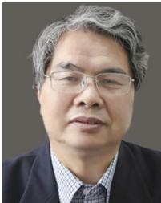

Licheng Jiao (Life Fellow, IEEE) received the B.S. degree from Shanghai Jiao Tong University, Shanghai, China, in 1982, and the M.S. and Ph.D. degrees from Xi’an Jiaotong University, Xi’an, China, in 1984 and 1990, respectively. Since 1992, he has been a Professor with the School of Electronic Engineering, Xidian University, Xi’an. He is currently the Director of the Key Laboratory of Intelligent Perception and Image Understanding of the Ministry of Education, International Research Center of Intelligent Perception and Computation, Xidian

University. His research interests include intelligent information processing, image processing, machine learning, and pattern recognition. He is a member of the IEEE Xi’an Section Execution Committee; the President of the Computational Intelligence Chapter, the IEEE Xi’an Section, and the IET Xi’an Network; the Chairperson of the Awards and Recognition Committee; the Vice Board Chairperson of Chinese Association of Artificial Intelligence; a Councilor of Chinese Institute of Electronics; a Committee Member of Chinese Committee of Neural Networks; and an Expert on the Academic Degrees Committee of the State Council.