# Performance Analysis of Distributed UAVs in Urban Environments Using a Practical Line-of-Sight Model

Yue Ren , Member, IEEE, Huasen He , Member, IEEE, Yunpeng Hou , Member, IEEE, Xiaofeng Jiang , Member, IEEE, Shuangwu Chen , Member, IEEE, and Jian Yang , Senior Member, IEEE

Abstract—With the increasing application of Unmanned Aerial Vehicles (UAVs) in urban areas, employing ground Base Stations (BSs) to serve UAVs has been proposed as a low-cost and promising solution. However, the Quality of Service (QoS) of UAVs served by ground BSs is impacted by multiple factors, including blockage, UAV height, transmit power, BS density, BS selection strategy, and so on. Eficient and accurate evaluation of the communication performance between UAVs and BSs is critical for network planning and optimization. In this paper, we analyze the communication performance of UAVs served by ground BSs in urban environments, where millimeter wave communication is employed. In contrast with existing works adopting a simplified Line-of-Sight (LOS) probability model, we adopt a more practical yet complex LOS model proposed by 3GPP for characterizing the densely distributed buildings in urban environments. Moreover, the distribution of BSs is modeled as a Matern Hard-Core Point´ Process (MHCPP) with a minimum distance constraint to reflect real scenarios. The analytical expressions of outage probability and ergodic capacity under diferent BS selection strategies are derived for enabling eficient performance evaluation. We verify the accuracy of the analytical results through simulation experiments under both the Urban Macro (UMa) and Urban Micro (UMi) scenarios, while the impacts of multiple parameters are analyzed. The results indicate that the outage probability decreases as the UAV height increases, but the ergodic capacity shows an opposite trend. Moreover, we show that our analytical results can be used to select the optimal flight height for UAVs with a given required outage probability.

Index Terms—Millimeter wave, unmanned aerial vehicles (UAVs), stochastic geometry, performance analysis.

## I. INTRODUCTION

U NMANNED Aerial Vehicles (UAVs) are widely used in urban areas due to their high eficiency, low cost and high maneuverability, for purposes ranging from airspace surveillance and data acquisition to trafic monitoring and crowd monitoring [1]. Besides, UAVs can also serve as relay Base Stations (BSs) to enhance communication capacity in high-density areas or provide connectivity in emergency situations. Currently, 4G and Wi-Fi have been adopted in UAV communications. However, these technologies struggle to meet the ever-increasing demands of UAV applications in terms of energy eficiency, reliability, throughput, and latency [2]. To address these issues, using millimeter wave (mmWave) as the carrier frequency provides a promising solution. mmWave is a spectrum band in 5G communication that features higher frequencies and larger bandwidths, ofering abundant available spectrum to significantly enhance wireless network capacity, achieve faster data transmission speeds, and lower latency, perfectly aligning with the future application demands of UAVs [3].

To enhance the Quality of Service (QoS) of UAVs served by ground BSs, it is of great interest to analyze how diferent factors afect the QoS of UAVs employing mmWave communication. Stochastic geometry is commonly used to model and analyze the channels of large-scale wireless networks, and this approach is also applicable to UAV wireless networks. In urban environments, the two main factors afecting performance of mmWave communication are path loss and Non-Line-of-Sight (NLOS) probability caused by obstructions. Numerous researchers have conducted analysis on the Line-of-Sight (LOS) probability for UAVs in urban environments, laying the foundation for analyzing the communication performance of UAVs using mmWave [4], [5]. Through modeling and analysis, appropriate UAV deployment strategies can be identified to enhance energy eficiency, improve data transmission rates, reduce latency, and expand the network coverage of UAVs.

The densely distributed buildings in urban environments make it critical to accurately model the LOS probability. The LOS probability models employed in current stochastic geometry based analysis of UAV-ground BS communications were predominantly derived from the International Telecommunication Union (ITU) recommendation document [6]. For ensuring tractability, some authors have applied approximated and fitted formulas from [6] in their calculations [7], [8]. Besides, 3GPP derived a LOS probability model for UAVto-BS links through ray tracing simulations [9]. Additionally, some researchers employed a simpler LOS Ball Model that introduced a LOS radius $R _ { L O S }$ to represent the maximum horizontal distance between UAVs and LOS BSs [10], [11]. This model assumed that the LOS probability of a BS is 1 if its horizontal distance to the UAV is less than $R _ { L O S }$ , and 0 otherwise. However, there is currently a lack of mathematical methods for determining $R _ { L O S }$ in diferent environments and at diferent UAV heights [8].

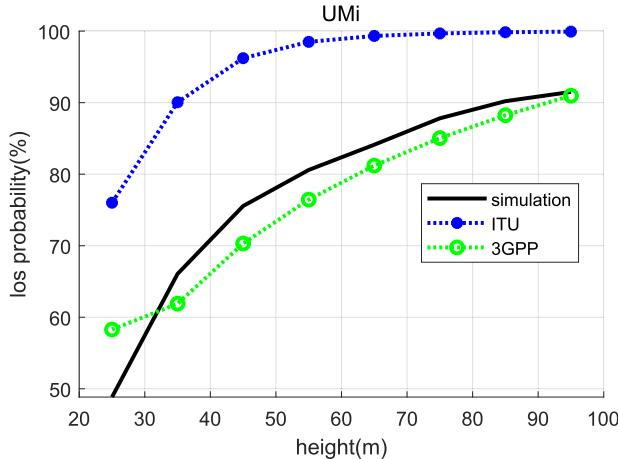

Fig. 1. Average LOS probability of random BSs in the UMi scenario.  
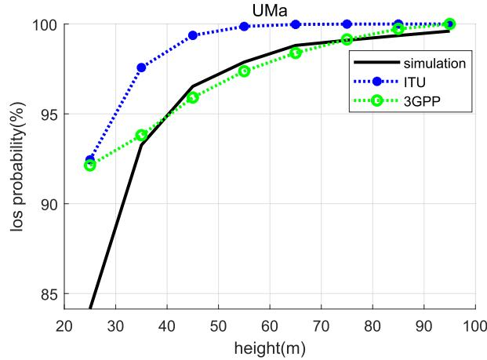  
Fig. 2. Average LOS probability of random BSs in the UMa scenario.

To compare the accuracy of the LOS probability models from ITU and 3GPP, we randomly generate multiple cities with building blocks conforming to a regular Manhattan-type grid, based on the urban environment definitions and parameter configurations in [12] and [13]. In these randomly generated cities, we select multiple BSs for testing. In Fig. 1 and Fig. 2, we compare the Monte Carlo simulation results with the analytical results of the 3GPP and ITU models, where the UAVs are 200m horizontally away from BSs in both the Urban Micro (UMi) and Urban Macro (UMa) scenarios. By averaging results of 50 randomly generated cities, we observe that the 3GPP LOS probability model from [14] aligns more closely with the simulated data in both UMa and UMi scenarios. This ray-tracing-derived 3GPP model provides a more accurate representation of LOS probabilities for UAV-BS links in urban environments.

In contrast with existing works adopting simplified LOS model from [6], this paper adopts the more practical but complicated 3GPP LOS probability model from [14] to analyze the performance of UAVs served by ground BSs in urban environments. This LOS model involves multiple variables, including the UAV height and horizontal distance, and is a piecewise function, making it challenging to derive analytical results for performance metrics. Previous works using the 3GPP LOS probability model for UAV performance analysis have not provided analytical results [15], [16], [17]. In this paper, we derive analytical results for the outage probability and ergodic capacity of UAVs, while the impacts of diferent factors are analyzed, including BS selection strategies, BS density, environmental settings, UAV height, and so on.

## A. Related Works

1) Stochastic Geometry Based Performance Analysis in Wireless Network: Stochastic geometry has been widely applied in analysing the average performance of UAV mmWave communication under diferent circumstances [18]. For example, the authors in [19] explored the Multiple-Input Multiple-Output (MIMO) and Non-Orthogonal Multiple Access (NOMA) assisted UAV networks, using stochastic geometry to model the locations of users and interference sources. They derived the user outage probability and ergodic rate under both LOS and NLOS conditions. Besides, stochastic geometry can also be used to characterize the impacts of diferent environmental conditions. The authors in [20] proposed a stochastic geometry-based framework to estimate the coverage rate of UAVs for ground users in diferent types of environments (e.g. urban, suburban, exurban, and rural areas) and suggested improvements for UAV deployment methods based on simulation results. A flexible UAV deployment model was proposed in [21] to enhance the eficiency of UAV-assisted BSs. The authors used stochastic geometry to analyze the communication performance with diferent setups, considering the location-dependent relationship between BSs and UAVs. The results indicated that selectively deploying UAVs at the edges of the targeted areas will significantly improve coverage. Most existing studies focused on the performance of ground users served by aerial BSs. However, the performance of UAVs served by ground BSs should be further studied. BSs are significantly higher than ground users, which results in diferent LOS probabilities between BSs and UAVs. Furthermore, the height, signal strength, and distribution density of BSs all significantly impact communication performance, which are of great significance for research.

2) Performance Analysis of Distributed BSs/UAVs: To better integrate UAVs into cellular networks, it is of great importance to analyze the communication performance of UAVs serving ground users or being served by ground BSs. The authors in [22] proposed an algorithm based on a 3D model to assess LOS conditions for all points in a target area served by UAV-based terahertz (THz) networks. They also introduced an optimal location algorithm and a suboptimal hybrid algorithm based on k-means and geometric analysis of

3-D obstacles to optimize the UAV’s LOS coverage range and average network capacity. In [23], the disaster recovery scenar ios were studied, where UAVs were employed to serve users using THz links. It utilized a real online 3D map to determine the LoS state for UAVs at any location. Trajectory optimization was performed based on a Genetic Algorithm, while an enhanced heuristic algorithm was employed to achieve fast convergence. For scenarios with known 3D information, the above methods ofer excellent capabilities for evaluating and optimizing the communication performance of UAVs serving ground users. However, in practical applications, it is not trivial to obtain the complete 3D information about obstacles in the target area. Therefore, it is of great importance to analyze the general communication performance of UAVs using stochastic geometry, when the complete information of 3D obstacles is unavailable. The authors in [24] derived exact and approximated expressions for UAV coverage probability, achievable throughput, and area spectral eficiency in a cellular network, where BSs served both UAVs and ground users. In [25], the authors considered a network of clustered ground BSs using Coordinated Multi-Point (CoMP) transmission to collaboratively serve multiple UAV-user equipments, analyzing the coverage probability for UAVs in both static hovering and mobile scenarios. To analyze the performance of UAVs in cellular networks, the distribution models of UAVs, BSs, and ground users should be provided [26]. Many studies modelled the distribution of UAVs or BSs as tractable Poisson Point Processes (PPP) or Binomial Point Processes (BPP) [27], [28]. However, the above studies failed to capture the spacial correlations between UAVs or BSs. To reflect the practical constraints, in [29], BSs were modelled as a PPP, while UAVs were modelled as a Matern Hard-Core Point Process´ (MHCPP), using a hard-core constraint to ensure a minimum distance between UAVs. Similarly, the authors in [30] and [31] also modelled the distribution of UAVs as MHCPP. In addition, [31] assumed each UAV was equipped with a mmWave antenna with adjustable beam-width and direction, thereby ignoring interference between UAVs. However, [31] mainly focused on the coverage performance provided by UAV-assisted networks rather than the performance of UAVs served by ground BSs. To reflect practical constraints and facilitate network planning and optimization, we model the distribution of UAVs and BSs as MHCPPs. Then, the communication performance of UAVs served by ground BSs is analyzed in terms of outage probability and ergodic capacity.

## B. Contributions

The main contributions of this paper can be summarized as follows:

• This paper analyzes the performance of distributed UAVs served by ground BSs in urban environments, while mmWave communication is employed. Instead of adopting a simplified LOS probability model, we adopt a more practical yet complex model proposed by 3GPP for obtaining an accurate performance evaluation. To the best of our knowledge, this work is the first to derive analytical expressions for BS-served UAV performance using this practical LOS probability model.

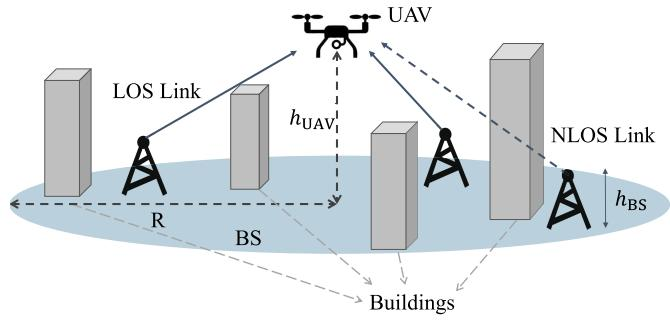  
Fig. 3. Network Model.

• Instead of studying the coverage probability of aerial BSs, this paper sets the performance metrics as outage probability and ergodic capacity to reflect the QoS of UAVs served by multiple ground BSs. Analytical expressions of the outage probability and ergodic capacity of UAVs served by LOS and NLOS BSs are first derived with the practical LOS probability model.

• By modelling the distribution of BSs as a MHCPP, the analytical expressions of outage probability and throughput are derived when diferent BS selection strategies are adopted. Moreover, the analytical expression of ergodic capacity is derived when the nearest BS is selected for communication.

The accuracy of our analytical results is validated through Monte Carlo simulations. The impacts of various settings on the QoS of UAVs have also been studied, including BS selection strategies, transmit power, BS density, and UAV height. The results indicate that as the UAV height increases, although the outage probability decreases, the ergodic capacity also declines. Additionally, we show that the optimal flight height of UAVs can be obtained by employing our analytical results.

The remainder of this paper is organized as follows. In Section II, we describe the system model. In Section III, we derive several fundamental mathematical results to facilitate the subsequent performance analysis. In Section IV, we analyze the outage probability and ergodic capacity under diferent BS selection strategies. In Section V, we compare the simulation results with the analytical results. Finally, Section VI concludes the paper.

## II. SYSTEM MODEL

## A. Network Model

We consider an urban scenario where multiple mmWave BSs provide services to UAVs, as illustrated in Fig. 3. Due to the limited communication distance, we assume that each UAV can be served by BSs distributed in a circular region C with radius R centered at the projection on the ground of the UAV. The distribution of BSs is modeled as a MHCPP $\phi _ { M }$ with intensity $\lambda _ { M }$ and a minimum distance $r _ { d } ,$ which is generated from a Poisson Point Process (PPP) $\phi _ { P }$ with uniform intensity $\begin{array} { r } { \lambda _ { P } = \frac { - 1 } { \pi r _ { d } ^ { 2 } } \ln ( 1 - \pi r _ { d } ^ { 2 } \lambda _ { M } ) } \end{array}$ . Without loss of generality, the points in πM are ordered randomly. The UAV’s height $h _ { \mathrm { U A V } }$ is variable, while the BS’s height $h _ { \mathrm { B S } }$ is fixed within the same scenario. The links between UAVs and BSs are subject to random blockages, resulting in LOS and NLOS links. Considering the significant path loss and penetration loss in mmWave communications, when R is suficiently large, the BSs outside the circular region C can be neglected. Moreover, compared to blockage and path loss, the impact of small-scale fading is marginal. The deployment of large arrays in mmWave systems inherently filters out the majority of multipath components. The experiments in [32] demonstrated that when using highly directional antennas and high-bandwidth signals, small-scale fading has almost no impact on communication performance. Therefore, small-scale fading is ignored in this paper [33], [34], [35].

TABLE I  
FOUR PATTERNS OF TOTAL ANTENNA GAIN
<table><tr><td rowspan=1 colspan=1>1</td><td rowspan=1 colspan=1>1</td><td rowspan=1 colspan=1>2</td><td rowspan=1 colspan=1>3</td><td rowspan=1 colspan=1>4</td></tr><tr><td rowspan=1 colspan=1> $\overline { { G _ { i } ^ { T } } }$ </td><td rowspan=1 colspan=1> $\overline { { G _ { h } ^ { \mathrm { m a x } } G _ { u } ^ { \mathrm { m a x } } } }$ </td><td rowspan=1 colspan=1> $\overline { { G _ { b } ^ { \mathrm { m i n } } G _ { u } ^ { \mathrm { m a x } } } }$ </td><td rowspan=1 colspan=1> $\overline { { G _ { h } ^ { \mathrm { m a x } } G _ { u } ^ { \mathrm { m i n } } } }$ </td><td rowspan=1 colspan=1> $\overline { { G _ { h } ^ { \mathrm { m i n } } G _ { u } ^ { \mathrm { m i n } } } }$ </td></tr><tr><td rowspan=1 colspan=1> $p _ { i }$ </td><td rowspan=1 colspan=1> $\begin{array} { r } { \left( \frac { \theta _ { b } ^ { w } } { 2 \pi } \frac { \varphi _ { b } ^ { w } } { \pi / 2 } \right) \left( \frac { \theta _ { u } ^ { w } } { 2 \pi } \frac { \varphi _ { u } ^ { w } } { \pi / 2 } \right) } \end{array}$ </td><td rowspan=1 colspan=1> $\begin{array} { r } { \left( 1 - \frac { \theta _ { b } ^ { w } } { 2 \pi } \frac { \varphi _ { b } ^ { w } } { \pi / 2 } \right) \left( \frac { \theta _ { u } ^ { w } } { 2 \pi } \frac { \varphi _ { u } ^ { w } } { \pi / 2 } \right) } \end{array}$ </td><td rowspan=1 colspan=1> $\begin{array} { r } { \left( \frac { \theta _ { b } ^ { w } } { 2 \pi } \frac { \varphi _ { b } ^ { w } } { \pi / 2 } \right) \left( 1 - \frac { \theta _ { u } ^ { w } } { 2 \pi } \frac { \varphi _ { u } ^ { w } } { \pi / 2 } \right) } \end{array}$ </td><td rowspan=1 colspan=1> $\begin{array} { r } { \overline { { \left( 1 - \frac { \theta _ { b } ^ { w } } { 2 \pi } \frac { \varphi _ { b } ^ { w } } { \pi / 2 } \right) \left( 1 - \frac { \theta _ { u } ^ { w } } { 2 \pi } \frac { \varphi _ { u } ^ { w } } { \pi / 2 } \right) } } } \end{array}$ </td></tr></table>

## B. Path Loss Model

The horizontal distance from the ith BS to the UAV is denoted as $r _ { i } .$ Given the UAV height $h _ { \mathrm { U A V } }$ and BS height $h _ { \mathrm { B S } }$ the actual distance from the UAV to this BS can be expressed as

$$
l _ { i } = l ( r _ { i } ) = \ \sqrt { r _ { i } ^ { 2 } + ( h _ { \mathrm { U A V } } - h _ { \mathrm { B S } } ) ^ { 2 } } .\tag{1}
$$

For simplification, we denote $l ( r _ { i } )$ as $l _ { i }$ in the rest of this paper. In contrast to some existing works (e.g. [36], [37]) considering simplified distance-dependent path loss, we follow the same setups in [38], [39], and [40] and model the path loss $L ( l _ { i } )$ from the UAV to the ith BS as

$$
L ( l _ { i } ) [ d B ] = \beta + 1 0 \alpha \mathrm { l o g } _ { 1 0 } ( l _ { i } ) + \zeta , \zeta \sim \mathrm { N } ( 0 , \xi ^ { 2 } ) ,\tag{2}
$$

where $\beta$ represents the path loss at the reference distance, denotes the path loss exponent, $\zeta$ is used to model shadowing efects in the dB scale, and $\xi ^ { 2 }$ ζis referred to as the lognormal ξshadowing variance. The values of these parameters difer for LOS and NLOS links. Therefore, in this paper, $\beta _ { L } , \alpha _ { L }$ , and $\xi _ { L } ^ { 2 }$ are used to denote the path loss parameters for LOS links, while $\beta _ { N } , \ \alpha _ { N }$ , and $\xi _ { N } ^ { 2 }$ indicate the path loss parameters for β αNLOS links.

## C. 3D Directional Beamforming Model

We assume that all UAVs and BSs are equipped with directional antennas with a sectorized gain pattern. Following the same setups in existing works (e.g. [41], [42], [43]), this paper adopts a 3D sectored model by considering the UAVs’ height. The function of the antenna gain pattern with respect to the azimuth and elevation angles is given by

$$
G _ { m } ( \theta _ { m } , \varphi _ { m } ) = \left\{ \begin{array} { l l } { G _ { m } ^ { \operatorname* { m a x } } , \quad i f | \theta _ { m } | \leq \frac { \theta _ { m } ^ { w } } { 2 } a n d | \varphi _ { m } | \leq \frac { \varphi _ { m } ^ { w } } { 2 } } \\ { G _ { m } ^ { \operatorname* { m i n } } , \quad \mathrm { o t h e r w i s e } , } \end{array} \right.\tag{3}
$$

where $m \in \{ b , u \} , \ \theta _ { m } \in \mathsf { \Gamma } ( - \pi , \pi ]$ is the azimuth angle, $\varphi _ { m } \in$ $[ 0 , \pi / 2 ]$ , θ π, π denotes the elevation angle, and $\theta _ { m } ^ { w }$ and $\varphi _ { m } ^ { w }$ ϕrepresent the azimuth and half elevation power beam-width of the main lobe, respectively.

Considering the antenna gain, the received power for mmWave communication between the UAV and the ith BS can be expressed as

$$
P _ { i } ^ { \mathrm { r e c } } = P G _ { b } ( \theta _ { b } , \varphi _ { b } ) G _ { u } ( \theta _ { u } , \varphi _ { u } ) L ( l _ { i } ) ^ { - 1 } ,\tag{4}
$$

where $P$ is the transmit power of the BS, $G _ { b } ( \theta _ { b } , \varphi _ { b } )$ and $G _ { u } ( \theta _ { u } , \varphi _ { u } )$ are the antenna gain functions of the BS and the UAV, respectively, with $\theta _ { b } , \varphi _ { b } , \theta _ { u }$ and $\varphi _ { u }$ representing the azimuth and elevation angles of the antennas. For random beam directions, the antenna gain can be divided into four pattern as shown in Table I, where i denotes the gain pattern, $G _ { i } ^ { T }$ represents the total antenna gain accounting for both reception and transmission, and $p _ { i }$ is the probability of the ith pattern [41], [44]. Inspired by [44], [45], and [46], we assume that nodes periodically exchange measurement reports to enable UAVs and BSs to identify the optimal directions for their respective beams, ensuring consistent antenna beam alignment. Thus, the antenna gain between the UAV and its serving BS can be expressed as $G _ { b } ^ { \operatorname* { m a x } } G _ { u } ^ { \operatorname* { m a x } }$ . Meanwhile, it is assumed that the beam directions of other unintended links are random, when estimating the impact of other BS beams on the intended access link.

## D. LOS Probability Model

In accordance with the assumptions in [36], this paper assumes that the LOS probabilities of diferent links are independent of each other. Additionally, based on [14], the relationship between the LOS probability $P _ { \mathrm { L O S } }$ and the horizontal distance r can be written as

$$
P _ { \mathrm { L O S } } ( r ) = \left\{ \begin{array} { l l } { 1 , } & { r \leq d } \\ { \displaystyle \frac { d } { r } + \exp \left( \frac { - r } { p } \right) \left( 1 - \frac { d } { r } \right) , } & { r > d , } \end{array} \right.\tag{5}
$$

where the parameters $d$ and $p$ are related to the UAV height $h _ { \mathrm { U A V } }$ and the urban environment. According to [14], we classify urban environments into two scenarios: UMa and UMi, while the corresponding parameters can be calculated as

$$
\left\{ \begin{array} { l l } { d = \operatorname* { m a x } [ 4 6 0 \log _ { 1 0 } ( h _ { \mathrm { U A V } } ) - 7 0 0 , 1 8 ] , } & \\ { p = 4 3 0 0 \log _ { 1 0 } ( h _ { \mathrm { U A V } } ) - 3 8 0 0 , } & { \mathrm { U M a } } \\ { d = \operatorname* { m a x } [ 2 9 4 . 0 5 \log _ { 1 0 } ( h _ { \mathrm { U A V } } ) - 4 3 2 . 9 4 , 1 8 ] , } & \\ { p = 2 3 3 . 9 8 \log _ { 1 0 } ( h _ { \mathrm { U A V } } ) - 0 . 9 5 , } & { \mathrm { U M i } . } \end{array} \right.\tag{6}
$$

Subsequently, the NLOS probability can be obtained as $P _ { \mathrm { N L O S } } ( r ) = 1 - P _ { \mathrm { L O S } } ( r )$

## E. SINR Model

After obtaining the spatial distance $l _ { i }$ from the ith BS to the UAV, the received Signal-to-Interference-plus-Noise Ratio (SINR) at the UAV from this BS can be expressed as

$$
\gamma ( l _ { i } ) = \gamma _ { L } ( l _ { i } ) P _ { \mathrm { L O S } } ( r _ { i } ) + \gamma _ { N } ( l _ { i } ) P _ { \mathrm { N L O S } } ( r _ { i } ) ,\tag{7}
$$



where $r _ { i }$ represents the horizontal distance between the UAV and the ith BS. And $\gamma _ { L } ( l _ { i } )$ and $\gamma _ { N } ( l _ { i } )$ represent the received γ γSINR for LOS and NLOS links, respectively, and can be written as

$$
\gamma _ { g } ( l _ { i } ) = \frac { \gamma _ { g } ^ { \prime } } { l _ { i } ^ { \alpha _ { g } } } 1 0 ^ { - \zeta _ { g } / 1 0 } , g \in \{ L , N \} .\tag{8}
$$

In the LOS case, $g = L ,$ , and in the NLOS case, $g = N$ . This notation is used to represent the parameters associated with LOS and NLOS links. It will be used in the same manner in subsequent sections. Moreover, $\zeta _ { g } \sim N \left( 0 , \xi _ { g } ^ { 2 } \right)$ , and $\gamma _ { g } ^ { \prime }$ can be written as

$$
\gamma _ { g } ^ { \prime } = \frac { P G _ { b } ^ { \operatorname* { m a x } } G _ { u } ^ { \operatorname* { m a x } } } { P _ { n } 1 0 ^ { \beta _ { g } / 1 0 } } ,\tag{9}
$$

where $P$ represents the transmit power, and $P _ { n }$ represents the external interference power. In this paper, we consider noise interference as well as interference from other BSs, which can be expressed as

$$
P _ { n } = N _ { 0 } + \sum _ { j \in \phi _ { M } , j \neq i } I _ { j } .\tag{10}
$$

Here, $N _ { 0 }$ is the noise power, and $I _ { j }$ is the interference to the UAV from the jth BS. $I _ { j }$ can be expressed as

$$
\begin{array} { r l r } {  { I _ { j } = \frac { P G _ { b } ( \theta _ { b j } , \varphi _ { b j } ) G _ { u } ( \theta _ { u j } , \varphi _ { u j } ) } { 1 0 ^ { \beta _ { L } / 1 0 } l _ { j } ^ { \alpha _ { L } } } 1 0 ^ { - \zeta _ { L } / 1 0 } P _ { \mathrm { L O S } } ( r _ { j } ) } } \\ & { } & { + \frac { P G _ { b } ( \theta _ { b j } , \varphi _ { b j } ) G _ { u } ( \theta _ { u j } , \varphi _ { u j } ) } { 1 0 ^ { \beta _ { N } / 1 0 } l _ { j } ^ { \alpha _ { N } } } 1 0 ^ { - \zeta _ { N } / 1 0 } P _ { \mathrm { N L O S } } ( r _ { j } ) . } \end{array}\tag{11}
$$

Given the complex expression of received SINR, it is not trivial to compute the Cumulative Distribution Function (CDF) of $\gamma ( l _ { i } )$ . It has been demonstrated in previous works γ(e.g. [38], [47]) that mmWave communication in densely obstructed environments is noise-dominant. Thus, we ignore the interference from other BSs and approximate the SINR as Signal to Noise Ratio (SNR) in our performance analysis for improving analytical tractability. However, in our simulations, interference is still considered to justify this approximation. Thus, we have

$$
\gamma _ { g } ^ { \prime } \approx \frac { P G _ { b } ^ { \operatorname* { m a x } } G _ { u } ^ { \operatorname* { m a x } } } { N _ { 0 } 1 0 ^ { \beta _ { g } / 1 0 } } .\tag{12}
$$

In our simulations, $\gamma ( l _ { i } )$ will be calculated according to Eq. (8). γWe need to calculate the received SINR for the BS under both LOS and NLOS conditions. Without loss of generality, this paper converts the LOS BSs and the NLOS BSs into two independent non-homogeneous PPP $\phi _ { L }$ and $\phi _ { N }$ with intensities $P _ { \mathrm { L O S } } ( r _ { i } ) \lambda _ { P }$ and $P _ { \mathrm { N L O S } } ( r _ { i } ) \lambda _ { P } ,$ , respectively.

## III. PRELIMINARIES

## A. Statistics of the mmWave Links

The SNR for LOS and NLOS BSs has been given in Eq. (8) and $\operatorname { E q . }$ (12), respectively. Next, we will derive the relationship between the received SNR from the ith BS and the communication distance.

Lemma 1: The SNR of LOS and NLOS links follows a log-normal distribution and is expressed as

$$
\gamma _ { g } ( l _ { i } ) \sim \ln N \left( \ln \left( \frac { \gamma _ { g } ^ { \prime } } { l _ { i } ^ { \alpha _ { g } } } \right) , \sigma _ { g } ^ { 2 } \right) .\tag{13}
$$

Here, $\begin{array} { r } { \sigma _ { g } ^ { 2 } = \mathopen { } \mathclose \bgroup \left( \frac { \xi _ { g } \ln 1 0 } { 1 0 } \aftergroup \egroup \right) ^ { 2 } , \ g \in \{ L , N \} , \ i \in \phi _ { g } \cap \phi _ { M } , \ \gamma _ { g } ^ { \prime } } \end{array}$ is given by Eq. (12). And $N \left( \mu , \sigma ^ { 2 } \right)$ represents the Gaussian distribution with mean $\mu$ µ, σand variance $\sigma ^ { 2 } .$ , ln N $\left( \mu , \sigma ^ { 2 } \right)$ represents the log-normal distribution. For the NLOS SNR, since the highly directional antennas filter out most of the multipath components, we adopt the LOS distance and only consider the dominant path with the highest received power for ensuring tractability.

Given Eq. (13), the outage probability can be calculated as the probability that the SNR falls below the threshold z at a communication distance l under LOS or NLOS conditions. Then, we have

$$
P \left( \gamma _ { g } ( l ) < z \right) = \Phi \left( \frac { \ln \left( \frac { z l ^ { \alpha _ { g } } } { \gamma _ { g } ^ { \prime } } \right) } { \sigma _ { g } } \right) ,\tag{14}
$$

where Φ(x) represents the CDF of the standard normal distribution.

Proof: See Appendix A.

After obtaining the distribution of SNR, we can derive the conditional ergodic capacity between a generic BS and the UAV.

Lemma 2: The ergodic capacity of a generic BS with a spatial distance of l to the UAV can be written as

$$
\begin{array} { l } { { C _ { g } ( l ) = \displaystyle \frac { 1 } { \ln 2 } \sum _ { n = 0 } ^ { \infty } \displaystyle \frac { ( - 1 ) ^ { n } } { n + 1 } \bigg ( \displaystyle \frac { \gamma _ { g } ^ { \prime } } { l ^ { \alpha _ { g } } } \bigg ) ^ { n + 1 } \Phi \left( \displaystyle \frac { \ln \frac { l \varepsilon _ { g } ^ { n } } { \gamma _ { g } ^ { n } } - \sigma _ { g } ^ { 2 } ( n + 1 ) } { \sigma _ { g } } \right) } } \\ { { \mathrm { } \qquad \quad \times \ e ^ { \frac { \sigma _ { g } ^ { 2 } } { 2 } ( n + 1 ) ^ { 2 } } + \displaystyle \frac { \sigma _ { g } } { \ln 2 \sqrt { 2 \pi } } e ^ { \frac { - \left( \ln \frac { \gamma _ { g } ^ { n } } { 2 \sigma _ { g } ^ { 2 } } \right) ^ { 2 } } { 2 \sigma ^ { 2 } } } } } \\ { { \mathrm { } \qquad + \displaystyle \frac { 1 } { \ln 2 } \ln \frac { \gamma _ { g } ^ { \prime } } { l ^ { \alpha _ { g } } } \left[ 1 - \Phi \left( \displaystyle \frac { \ln \frac { l \varepsilon _ { g } ^ { n } } { \gamma _ { g } ^ { n } } } { \sigma _ { g } } \right) \right] . } } \end{array}\tag{15}
$$

Proof: See Appendix B.

Given Lemma 2, the average ergodic capacity with a given distance to the BS can be written as

$$
\bar { C } ( l ) = C _ { L } ( l ) P _ { \mathrm { L O S } } ( r ) + C _ { N } ( l ) P _ { \mathrm { N L O S } } ( r ) .\tag{16}
$$

Similarly, the average outage probability of a generic BS with a spatial distance l to the UAV can be written as

$$
\bar { P } ^ { \mathrm { o u t } } ( l ) = P \left( \gamma _ { L } ( l ) < z \right) P _ { \mathrm { L O S } } ( r ) + P \left( \gamma _ { N } ( l ) < z \right) P _ { \mathrm { N L O S } } ( r ) ,\tag{17}
$$

where $P \left( \gamma _ { g } ( l ) < z \right)$ is given by Eq. (14). Even in dynamic scenarios, Eq. (16) and Eq. (17) enable real-time computing of the UAV’s performance by utilizing the dynamic distance between the UAV and its serving BS. Thus, the results of this paper have generalization capabilities for dynamic UAV scenarios.

## B. Statistics of the BS’s Horizontal Distances

To calculate the communication performance of UAVs served by BSs, we first need to determine the probability density function (PDF) of the communication distance. Given the UAV height, it turns into computing the PDF of the horizontal distance r to both LOS and NLOS BSs.

Lemma 3: The PDF of the horizontal distance r between the UAV and a generic LOS BS can be expressed as

$$
f _ { L } ( r ) = \left\{ \begin{array} { l l } { \displaystyle \frac { r } { a } , } & { 0 < r \leq d } \\ { \displaystyle \frac { e ^ { \frac { - r } { p } } \left( r - d \right) } { a } + \displaystyle \frac { d } { a } , } & { d < r \leq R , } \end{array} \right.\tag{18}
$$

where d and $p$ are calculated by employing Eq. (6). And $a =$ $G _ { L } ( R )$ , while $G _ { L } ( x )$ denotes an integral given by

$$
\begin{array} { l } { \displaystyle { G _ { L } ( x ) = \int _ { 0 } ^ { x } t P _ { \mathrm { L O S } } ( t ) d t } } \\ { \displaystyle { = d x - p ( x + p - d ) e ^ { \frac { - x } { p } } - \frac { d ^ { 2 } } { 2 } + p ^ { 2 } e ^ { \frac { - d } { p } } } . } \end{array}\tag{19}
$$

For ease of subsequent calculations, we can rewritten Eq. (18) using a Taylor expansion as

$$
f _ { L } ( r ) = \left\{ \begin{array} { l l } { \displaystyle \frac { r } { a } , } & { 0 < r \leq d } \\ { \displaystyle - \frac { 1 } { a } \sum _ { n = 1 } ^ { \infty } \frac { ( n p + d ) } { n ! ( - p ) ^ { n } } r ^ { n } , } & { d < r \leq R . } \end{array} \right.\tag{20}
$$

The PDF of the horizontal distance $r$ between the UAV and a generic NLOS BS can be expressed as

$$
f _ { N } ( r ) = \left\{ \begin{array} { l l } { 0 , } & { 0 < r \le d } \\ { \displaystyle \frac { r - e ^ { \frac { - r } { p } } ( r - d ) } { b } - \frac { d } { b } , } & { d < r \le R . } \end{array} \right.\tag{21}
$$

Similarly, $b = G _ { N } ( R )$ , while $G _ { N } ( x )$ is expressed as

$$
G _ { N } ( x ) = \int _ { 0 } ^ { x } t P _ { \mathrm { N L O S } } ( t ) d t = { \frac { x ^ { 2 } } { 2 } } - G _ { L } ( x ) .\tag{22}
$$

Here, $G _ { L } ( x )$ has been given by Eq. (19). By exploiting the Taylor expansion, we have

$$
f _ { N } ( r ) = \left\{ \begin{array} { l l } { \displaystyle 0 , } & { \displaystyle 0 < r \le d } \\ { \displaystyle \frac { 1 } { b } \left[ r + \sum _ { n = 1 } ^ { \infty } \frac { ( n p + d ) } { n ! ( - p ) ^ { n } } r ^ { n } \right] , } & { d < r \le R . } \end{array} \right.\tag{23}
$$

Proof: See Appendix C.



Because mmWave communication experiences high path loss, analyzing the performance of the nearest BS is of significant importance. Assuming BSs have the same height, the BS with the minimum spatial distance to the UAV is equivalent to the one with the minimum horizontal distance. Therefore, the term “nearest” mentioned later is equivalent to the shortest horizontal distance.

Lemma 4: The PDF of the horizontal distance r from the UAV to the nearest LOS BS can be written as

$$
f _ { \mathrm { n r t } , L } ( r ) = \left\{ \begin{array} { l l } { 2 \pi \lambda _ { M } r \mathrm { e x p } ( - \pi \lambda _ { M } r ^ { 2 } ) , } & { 0 < r \le d } \\ { 2 \pi \lambda _ { M } \mathrm { e x p } \left( - 2 \pi \lambda _ { M } G _ { L } ( r ) \right) } \\ { \times \left[ d + ( r - d ) e ^ { \frac { - r } { p } } \right] , } & { d < r \le R . } \end{array} \right.\tag{24}
$$

Similarly, the PDF of the horizontal distance r from the UAV to the nearest NLOS BS is given by

$$
f _ { \mathrm { n r t } , N } ( r ) = \left\{ \begin{array} { l l } { 0 , } & { 0 < r \leq d } \\ { 2 \pi \lambda _ { M } \mathrm { e x p } \left( - 2 \pi \lambda _ { M } G _ { N } ( r ) \right) } \\ { \times \left[ r - d - ( r - d ) e ^ { \frac { - r } { p } } \right] , } & { d < r \leq R . } \end{array} \right.\tag{25}
$$

Proof: See Appendix D.

## IV. PERFORMANCE ANALYSIS

In this section, we first derive the performance of generic LOS and NLOS candidate points, then based on this foundation, derive the performance of both the best BS and the nearest BS. We analyze the performance of mmWave communication in terms of outage probability, ergodic capacity, and throughput, while diferent BS selection methods are considered. Ergodic capacity reflects the average maximum information transmission rate in the communication system. Throughput represents the successful message delivery rate of the system. Since it is not trivial to obtain the PDF of the horizontal distance r from the UAV to a generic BS in the MHCPP $\phi _ { M }$ , we adopt an equivalent performance analysis method. The BSs locations in $\phi _ { M }$ are chosen from candidate points following a parent PPP $\phi _ { P } .$ According to [48], after selecting candidate points in $\phi _ { P }$ as BS locations, the outage probability of the surrounding unselected candidate points is set to 1 (i.e. there are no BSs at these candidate points), so that the candidate points in $\phi _ { P }$ have the same statistical characteristics as the BSs in $\phi _ { M }$ . The following analysis assumes that there are K candidate points in $\phi _ { P }$ for statistical analysis.

## A. Performance of a Generic LOS Candidate Point

In this section, we take the ith LOS candidate point as an example to derive its outage probability and ergodic capacity. 1) Outage Probability:

Proposition 1: Assuming there are K candidate points, the outage probability of the ith LOS candidate point can be expressed as

$$
\begin{array} { l } { { \displaystyle P _ { L , i } ^ { \mathrm { n u t } } ( z | K ) = \frac { h ^ { 2 } } { 2 a } P _ { c 1 } ( K ) \Phi ( z _ { i } ( h ) ) + \frac { 1 } { a } P _ { c 1 } ( K ) P _ { L } ^ { \prime } ( d , h , 1 ) } } \\ { { \displaystyle ~ - \frac { 1 } { a } P _ { c 1 } ( K ) \sum _ { n = 1 } ^ { \infty } \frac { ( n p + d ) } { n ! ( - p ) ^ { n } } P _ { L } ^ { \prime } ( R - r _ { d } , d , n ) } } \\ { { \displaystyle ~ + \frac { 1 } { a } ( 1 - P _ { c 1 } ( K ) ) \Bigg [ R d - r _ { d } d - \frac { 1 } { 2 } d ^ { 2 } + p ^ { 2 } e ^ { \frac { - d } { p } } } } \\ { { \displaystyle ~ - p ( R - r _ { d } + p - d ) e ^ { \frac { z _ { d } } { p } } \Bigg ] } } \\ { { \displaystyle ~ + \int _ { R - r _ { d } } ^ { R } f _ { L } ( r ) [ P _ { c 2 } ( K ) \Phi ( z _ { L } ( r ) ) + 1 - P _ { c 2 } ( K ) ] d r , } } \end{array}\tag{26}
$$

where $\begin{array} { r c l } { h } & { = } & { | h _ { \mathrm { U A V } } - h _ { \mathrm { B S } } | } \end{array}$ represents the height diference between the UAV and the BS, and $r _ { d }$ represents the minimum distance between BSs. $\begin{array} { r } { z \ = \ \frac { 2 ^ { t } - 1 } { \rho } } \end{array}$ , while t denotes the data rate and $\rho$ is the transmit $\operatorname { S N R } .$ We define the function $z _ { L } ( x )$ as

$$
z _ { g } ( x ) = \frac { \ln { \frac { z x ^ { \alpha g } } { \gamma _ { g } ^ { \prime } } } } { \sigma _ { g } } , g \in \{ L , N \} .\tag{27}
$$

$P c _ { 1 } ( K )$ and $P c _ { 2 } ( K )$ are the probabilities of selecting candidate points in $\phi _ { P }$ as BSs in $\phi _ { M }$ , and can be given

by [48]

$$
\begin{array} { r l } & { \left( P c _ { 1 } ( K ) = \displaystyle \sum _ { n = 0 } ^ { K - 1 } \frac { \binom { K - 1 } { n } } { n + 1 } \bigg ( \frac { r _ { d } } { R } \bigg ) ^ { 2 n } \bigg ( 1 - \frac { r _ { d } } { R } \bigg ) ^ { K - n - 1 } , \right. } \\ & { \left. 0 \leq r _ { i } \leq R - r _ { d } \right. } \\ & { \left. P c _ { 2 } ( K ) = \displaystyle \sum _ { n = 0 } ^ { K - 1 } \frac { \binom { K - 1 } { n } } { n + 1 } \bigg ( \frac { S } { \pi R ^ { 2 } } \bigg ) ^ { n } \bigg ( 1 - \frac { S } { \pi R ^ { 2 } } \bigg ) ^ { K - n - 1 } , \right. } \\ & { \left. R - r _ { d } < r _ { i } \leq R , \right. } \end{array}\tag{28}
$$

where $\begin{array} { r } { S = \theta R ^ { 2 } - r _ { i } R \sin ( \theta ) + \omega r _ { d } ^ { 2 } , \theta = \operatorname { a r c c o s } \left( \frac { R ^ { 2 } + r _ { i } ^ { 2 } - r _ { d } ^ { 2 } } { 2 R r _ { i } } \right) } \end{array}$ ,  = arccos $\biggl ( \frac { r _ { i } ^ { 2 } + r _ { d } ^ { 2 } - R ^ { 2 } } { 2 r _ { i } r _ { d } } \biggr )$ , and $r _ { i }$ is the horizontal distance between the UAV and the ith candidate point. Moreover, we use $P _ { L } ^ { \prime } ( X , Y , n )$ as a shorthand for a class of integrals, which can be expressed as

$$
\begin{array} { r l } & { P _ { g } ^ { \prime } ( X , Y , n ) = \displaystyle \int _ { Y } ^ { X } r ^ { n } \Phi \left( \frac { \ln \left( \frac { z ^ { n } e ^ { x } } { y _ { g } ^ { n } } \right) } { \sigma _ { g } } \right) d r } \\ & { = \displaystyle \frac { 1 } { n + 1 } \left\{ X ^ { n + 1 } \Phi \left( z _ { g } ( X ) \right) - Y ^ { n + 1 } \Phi \left( z _ { g } ( Y ) \right) \right. } \\ & { \quad \left. + \left( \frac { \gamma _ { g } ^ { \prime } } { z } \right) ^ { \frac { n + 1 } { \alpha _ { g } } } e ^ { \frac { ( n + 1 ) ^ { 2 } e ^ { x } } { 2 \alpha _ { g } ^ { 2 } } } \left[ \Phi \left( z _ { g } ( Y ) - \frac { ( n + 1 ) \sigma _ { g } } { \alpha _ { g } } \right) \right. \right. } \\ & { \quad - \left. \left. \Phi \left( z _ { g } ( X ) - \frac { ( n + 1 ) \sigma _ { g } } { \alpha _ { g } } \right) \right] \right\} . } \end{array}\tag{29}
$$

Here, $g \in \{ L , N \}$ , X and Y are the upper and lower limits of ,the integral, n is the exponent of r in the equation, and $z _ { g } ( x )$ has been given in Eq. (27).

Typically, R is on the kilometer scale, while $r _ { d }$ is on the order of tens of meters. To simplify Eq. (26), we can approximate $R - r _ { d }$ as R. When $R \gg r _ { d } .$ , we have $P c ( K ) \approx P c _ { 1 } ( K )$ [49]. Thus, Eq. (26) can be approximated as

$$
\begin{array} { l } { { \displaystyle \hat { P } _ { L , i } ^ { \mathrm { o u t } } ( z | K ) } } \\ { { \displaystyle = \frac { h ^ { 2 } } { 2 a } P c _ { 1 } ( K ) \Phi \left( z _ { L } ( h ) \right) + \frac { 1 } { a } P c _ { 1 } ( K ) P _ { L } ^ { \prime } ( d , h , 1 ) } } \\ { { \displaystyle ~ - \frac { 1 } { a } P c _ { 1 } ( K ) \sum _ { n = 1 } ^ { \infty } \frac { ( n p + d ) } { n ! ( - p ) ^ { n } } P _ { L } ^ { \prime } ( R , d , n ) + \left( 1 - P c _ { 1 } ( K ) \right) . } } \end{array}\tag{30}
$$

Proof: See Appendix E.

## 2) Ergodic Capacity:

Proposition 2: When there are K candidate points and $R \gg$ $r _ { d } ,$ the ergodic capacity of the ith LOS candidate point can be approximated as

$$
\begin{array} { l } { \displaystyle \hat { C } _ { L , i } \approx \Bigg [ \frac { h ^ { 2 } } { 2 a } C _ { L } ( h ) + \frac { 1 } { a \ln 2 } C a _ { L } ( d , h , 1 ) - \frac { 1 } { a \ln 2 } } \\ { \displaystyle \sum _ { m = 1 } ^ { \infty } \frac { ( n p + d ) } { m ! { ( - p ) } ^ { m } } C a _ { L } ( R , d , m ) \Bigg ] \sum _ { K = 0 } ^ { \infty } P c _ { 1 } ( K ) \frac { \mu _ { 0 } ^ { K } e ^ { - \mu _ { 0 } } } { \Gamma ( K + 1 ) } , } \end{array}\tag{31}
$$

where $C a _ { L } ( X , Y , m )$ is given by

$$
C a _ { L } ( X , Y , m ) = \ln 2 \int _ { Y } ^ { X } r ^ { m } C _ { L } ( r ) d r .\tag{32}
$$

Due to the limited space, the analytical expression of $C a _ { L } ( X , Y , m )$ is given in Eq. (67), as shown at the bottom of page 14.

## Proof: See Appendix F.

## B. Performance of a Generic NLOS Candidate Point

After deriving the performance of a generic LOS candidate point, we can use the same method to derive the performance of a generic NLOS candidate point.

## 1) Outage Probability:

Proposition 3: Assuming there are K candidate points, the outage probability of the ith NLOS candidate point can be expressed as

$$
\begin{array} { l } { \displaystyle { P _ { N , i } ^ { \mathrm { o u t } } ( z | K ) = \frac { 1 } { b } \sum _ { n = 1 } ^ { \infty } \frac { ( n p + d ) } { n ! ( - p ) ^ { n } } P _ { N } ^ { \prime } ( R - r _ { d } , d , n ) } } \\ { \displaystyle { \qquad + \frac { ( 1 - P _ { C 1 } ( K ) ) } { b } [ \frac { 1 } { 2 } ( R - r _ { d } ) ^ { 2 } - d ( R - r _ { d } )  } } \\ { \displaystyle { \qquad + p ( R - r _ { d } + p - d ) e ^ { \frac { R - r _ { d } } { p } } ] } } \\ { \displaystyle { \qquad + \int _ { R - r _ { d } } ^ { R } f _ { N } ( r ) [ P _ { C 2 } ( K ) \Phi ( z _ { N } ( r ) ) } } \\ { \displaystyle { \qquad + 1 - P _ { C 2 } ( K ) d r ] + \frac { 1 } { b } P _ { N } ^ { \prime } ( R - r _ { d } , d , 1 ) , } } \end{array}\tag{33}
$$

where $P _ { N } ^ { \prime } ( X , Y , n )$ has been given in Eq. (29).

,Assuming $R \gg r _ { d } .$ Eq. (33) can be rewritten as

$$
\begin{array} { l } { { \displaystyle \hat { P } _ { N , i } ^ { \mathrm { o u t } } ( z | K ) = \frac { 1 } { b } P c _ { 1 } ( K ) \sum _ { n = 1 } ^ { \infty } \frac { ( n p + d ) } { n ! ( - p ) ^ { n } } P _ { N } ^ { \prime } ( R , d , n ) } } \\ { { \displaystyle ~ + \frac { 1 } { b } P c _ { 1 } ( K ) P _ { N } ^ { \prime } ( R , d , 1 ) + ( 1 - P c _ { 1 } ( K ) ) . } } \end{array}\tag{34}
$$

Proof: It can be observed from Lemma 1 that the distribution pattern of the received SNR of a NLOS link is similar to that of a LOS link, while diferent parameters are adopted. The PDF of the horizontal distance r between the UAV and a NLOS BS can be obtained by following Lemma 3. One can derive the outage probability of a NLOS candidate point by following the similar steps in Proposition 1. 

## 2) Ergodic Capacity:

Proposition 4: When there are K candidate points and $R \ \gg \ r _ { d } .$ the ergodic capacity of the ith NLOS BS can be approximately given by

$$
\begin{array} { l } { { \displaystyle { \hat { C } _ { N , i } \approx \left[ \frac { 1 } { b \ln 2 } \sum _ { m = 1 } ^ { \infty } \frac { ( n p + d ) } { m ! { ( - p ) } ^ { m } } C a _ { N } ( R , d , m ) \right. } } } \\ { { \displaystyle ~ + \left. \frac { 1 } { b \ln 2 } C a _ { N } ( R , d , 1 ) \right] \sum _ { K = 0 } ^ { \infty } P c _ { 1 } ( K ) \frac { \mu _ { 0 } ^ { K } e ^ { - \mu _ { 0 } } } { \Gamma ( K + 1 ) } , } } \end{array}\tag{35}
$$

where $C a _ { N } ( X , Y , m )$ has been given in Eq (67) with $g = N .$

Proof: The ergodic capacity of the ith NLOS candidate point is obtained by following the similar steps in Proposition 2. 

## C. Performance of the Best BS

In this subsection, we select the BS with the best link quality for serving the UAV and analyze its performance. The outage event of the best BS can be equivalent to the case when all candidate BSs are in outage.

1) Outage Probability: When there are K candidate BSs in the circular region C, the conditional outage probability for selecting the best BS is given by

$$
\begin{array} { l } { { \displaystyle P ^ { \mathrm { o u t } } ( z | K ) = \sum _ { N = 0 } ^ { K } \left\{ \binom { K } { N } \left( \frac { \mu _ { L } } { \mu _ { 0 } } \right) ^ { N } \left( \frac { \mu _ { N } } { \mu _ { 0 } } \right) ^ { K - N } \right. } } \\ { { \displaystyle \qquad \left. \times \left[ P _ { L , i } ^ { \mathrm { o u t } } ( z | K ) \right] ^ { N } \left[ P _ { N , j } ^ { \mathrm { o u t } } ( z | K ) \right] ^ { K - N } \right\} } , } \end{array}\tag{36}
$$

where $P _ { L , i } ^ { \mathrm { o u t } } ( z | K )$ and $P _ { N , j } ^ { \mathrm { o u t } } ( z | K )$ have been given in Eq. (26) , ,and Eq. (33), respectively. $\mu _ { 0 } , \ \mu _ { L } ,$ , and N represent the average numbers of all BSs, LOS BSs, and NLOS BSs in C, respectively, which can be expressed as

$$
\begin{array} { r l } & { \mu _ { 0 } = \pi \lambda _ { P } R ^ { 2 } , } \\ & { \mu _ { L } = 2 \pi \lambda _ { P } G _ { L } ( R ) , } \\ & { \mu _ { N } = 2 \pi \lambda _ { P } G _ { N } ( R ) . } \end{array}\tag{37}
$$

Here, $G _ { L } ( R )$ and $G _ { N } ( R )$ are given by Eq. (19) and Eq. (22), respectively. Based on the distribution pattern of the BSs, the outage probability of the best BS can be expressed as

$$
P _ { \mathrm { b e s t } } ^ { \mathrm { o u t } } ( z ) = \sum _ { K = 0 } ^ { \infty } P ^ { \mathrm { o u t } } ( z | K ) \frac { \mu _ { 0 } ^ { K } e ^ { - \mu _ { 0 } } } { \Gamma ( K + 1 ) } .\tag{38}
$$

Similarly, we can calculate the outage probability of the best LOS BS or the best NLOS BS.

Corollary 1: When only LOS BSs are selected for communication, the outage probability of the best LOS BS is given by

$$
P _ { \mathrm { b e s t } , L } ^ { \mathrm { o u t } } ( z ) = \sum _ { K = 0 } ^ { \infty } P _ { L } ^ { \mathrm { o u t } } ( z | K ) \frac { \mu _ { 0 } ^ { K } e ^ { - \mu _ { 0 } } } { \Gamma ( K + 1 ) } ,\tag{39}
$$

where $P _ { L } ^ { \mathrm { o u t } } ( z | K )$ represents the conditional outage probability given there are K LOS candidate BSs in region $C ,$ and can be expressed as

$$
\begin{array} { l } { { \displaystyle P _ { L } ^ { \mathrm { o u t } } ( z | K ) } } \\ { { \displaystyle = \sum _ { N = 0 } ^ { K } \left\{ \binom { K } { N } \Big [ P _ { L , i } ^ { \mathrm { o u t } } ( z | K ) \Big ] ^ { N } \left( \frac { \mu _ { L } } { \mu _ { 0 } } \right) ^ { N } \left( \frac { \mu _ { N } } { \mu _ { 0 } } \right) ^ { K - N } \right\} . } } \end{array}\tag{40}
$$

Corollary 2: When only NLOS BSs are used for communication, the outage probability of the best NLOS BS is given by

$$
P _ { \mathrm { b e s t } , N } ^ { \mathrm { o u t } } ( z ) = \sum _ { K = 0 } ^ { \infty } P _ { N } ^ { \mathrm { o u t } } ( z | K ) \frac { \mu _ { 0 } ^ { K } e ^ { - \mu _ { 0 } } } { \Gamma ( K + 1 ) } ,\tag{41}
$$

where $P _ { N } ^ { \mathrm { o u t } } ( z | K )$ can be expressed as

$$
\begin{array} { l } { { \displaystyle P _ { N } ^ { \mathrm { o u t } } ( z | K ) } } \\ { { \displaystyle = \sum _ { N = 0 } ^ { K } \left[ \left( K \atop N \right) \left( P _ { N , j } ^ { \mathrm { o u t } } ( z ) \right) ^ { K - N } \left( \frac { \mu _ { L } } { \mu _ { 0 } } \right) ^ { N } \left( \frac { \mu _ { N } } { \mu _ { 0 } } \right) ^ { K - N } \right] . } } \end{array}\tag{42}
$$

2) Ergodic Capacity: When the UAV only selects the best BS for transmission, the ergodic capacity of the best BS can be written as

$$
C ^ { \mathrm { b e s t } } = \int _ { 0 } ^ { \infty } f ^ { \mathrm { b e s t } } ( z ) \log _ { 2 } ( 1 + z ) d z .\tag{43}
$$

Here, $f ^ { \mathrm { b e s t } } ( z )$ is the PDF of the received SNR from the best BS, which can be obtained from Eq. (38). However, it is not trivial to obtain an analytical expression for $C ^ { \mathrm { { b e s t } } }$ . Thus, we analyze the throughput of the best BS as an alternative.

3) Throughput: The throughput of the best BS can be expressed as

$$
\begin{array} { l } { { \displaystyle R ^ { \mathrm { b e s t } } = \log _ { 2 } ( 1 + \tau ) \left[ 1 - P ^ { \mathrm { o u t } } ( \tau ) \right] } \ ~ } \\ { { \displaystyle ~ = R \left( 1 - \sum _ { K = 0 } ^ { \infty } P ^ { \mathrm { o u t } } ( z | K ) \frac { \mu _ { 0 } ^ { K } e ^ { - \mu _ { 0 } } } { \Gamma ( K + 1 ) } \right) , } \ ~ } \end{array}\tag{44}
$$

where $R = \log _ { 2 } ( 1 + \tau )$ and  is the target SNR of the UAV.

## D. Performance of the Nearest BS

In this subsection, we analyze the BS closest to the UAV and provide analytical expressions of the outage probability and ergodic capacity for the nearest BS, the nearest LOS BS, and the nearest NLOS BS.

1) Outage Probability: The outage probabilities for the UAV communicating with the three types of nearest BSs are given by the following proposition.

Proposition 5: The outage probability of the UAV communicating with the nearest BS can be expressed as

$$
\begin{array} { l } { { \displaystyle \mathrm { P } _ { \mathrm { n u t } } ^ { \mathrm { o u t } } ( z ) = 2 \pi \lambda _ { M } \displaystyle \sum _ { n = 0 } ^ { \infty } \frac { \left( - \pi \lambda _ { M } \right) ^ { n } } { n ! } \left[ P _ { L } ^ { \prime } ( d , h , 2 n + 1 ) \right. } } \\  { \displaystyle \phantom { \left. \sum _ { n = 0 } ^ { \infty } \frac { \left( - \pi \lambda _ { M } \right) ^ { n } } { n ! } \sum _ { m = 1 } ^ { \infty } \frac { \left( m p + d \right) } { m ! ( - p ) ^ { m } } \right. } } \\ { { \displaystyle \phantom { \left. \sum _ { n = 0 } ^ { \infty } \frac { \left( - \pi \lambda _ { M } \right) ^ { n } } { n ! } \sum _ { m = 1 } ^ { \infty } \frac { \left( m p + d \right) } { m ! ( - p ) ^ { m } } \right. } } } \\ { { \displaystyle \phantom { \left. \sum _ { n = 0 } ^ { \infty } \frac { \left( - \pi \lambda _ { M } \right) ^ { n } } { n ! } \sum _ { m = 1 } ^ { \infty } \frac { \left( m p + d \right) } { m ! ( - p ) ^ { m } } \right. } } } \\ { { \displaystyle \phantom { \left. \sum _ { n = 0 } ^ { \infty } \frac { \left( - \pi \lambda _ { M } h \right) ^ { n } } { n ! } \right) \Phi \left( z _ { L } ( h ) \right) + e ^ { - \pi R ^ { 2 } \lambda _ { M } } } , } } \end{array}\tag{45}
$$

where $P _ { g } ^ { \prime } ( X , Y , n )$ and $z _ { g } ( x )$ are given in Eq. (29) and Eq. (27), respectively.

Proof: See Appendix G.

Additionally, we also calculate the outage probabilities for the UAV communicating with the nearest LOS BS and the nearest NLOS BS:

Corollary 3: The outage probability of the nearest LOS BS can be expressed as

$$
\begin{array} { r l } {  { P _ { \mathrm { n r t } , L } ^ { \mathrm { o u t } } ( z ) } } \\ & { = ( 1 - e ^ { - \pi \lambda _ { M } h ^ { 2 } } ) \Phi ( z _ { L } ( h ) ) - \displaystyle \sum _ { n = 1 } ^ { \infty } \frac { ( n p + d ) } { n ! ( - p ) ^ { n } } P _ { L } ^ { \prime \prime } ( n ) } \\ & { ~ + ~ 2 \pi \lambda _ { M } \displaystyle \sum _ { n = 0 } ^ { \infty } \frac { ( - \pi \lambda _ { M } ) ^ { n } } { n ! } P _ { L } ^ { \prime } ( d , h , 2 n + 2 ) + e ^ { - 2 \pi \lambda _ { M } G _ { L } ( R ) } . } \end{array}\tag{46}
$$

Since $P _ { L } ^ { \prime \prime } ( n )$ is rather complex, we present it in the Appendix as shown in Eq. (76).

Proof: See Appendix H.

Corollary 4: The outage probability of the nearest NLOS BS can be expressed as

$$
P _ { \mathrm { n r t } , N } ^ { \mathrm { o u t } } ( z ) = P _ { N } ^ { \prime \prime } ( 1 ) + \sum _ { n = 1 } ^ { \infty } \frac { ( n p + d ) } { n ! ( - p ) ^ { n } } P _ { N } ^ { \prime \prime } ( n ) + e ^ { - 2 \pi \lambda _ { M } G _ { N } ( R ) } ,\tag{47}
$$

where $G _ { N } ( R )$ is given by Eq. (22), and $P _ { N } ^ { \prime \prime } ( n )$ is presented in the Appendix as shown in Eq. (79).

Proof: See Appendix H.



2) Ergodic Capacity:

Proposition $6 \mathrm { : }$ When the UAV selects the nearest BS for communication, the ergodic capacity of the nearest BS can be expressed as

$$
\begin{array} { r l } & { C _ { \mathrm { n r t } } } \\ & { \ = \left( 1 - e ^ { - \pi \lambda _ { M } h ^ { 2 } } \right) C _ { L } ( h ) + \displaystyle \frac { 2 \pi \lambda _ { M } } { 1 1 2 } \sum _ { m = 0 } ^ { \infty } \frac { ( - \pi \lambda _ { M } ) ^ { m } } { m ! } } \\ & { \ ~ \times ~ [ C a _ { L } ( d , h , 2 m + 1 ) + C a _ { N } ( R , d , 2 m + 2 ) ] } \\ & { \ + ~ \displaystyle \frac { 2 \pi \lambda _ { M } } { 1 1 2 } \sum _ { n = 1 } ^ { \infty } \frac { ( n p + d ) } { n ! ( - p ) ^ { n } } \sum _ { m = 0 } ^ { \infty } \frac { ( - \pi \lambda _ { M } ) ^ { m } } { m ! } } \\ & { \ \times ~ [ - C a _ { L } ( R , d , 2 m + n + 1 ) + C a _ { N } ( R , d , 2 m + n + 1 ) ] , } \end{array}\tag{48}
$$

where $C a _ { g } ( X , Y , m )$ is given by Eq. (67).

Proof: See Appendix I.

□

Corollary $5 \colon$ The ergodic capacity of the nearest LOS BS can be expressed as

$$
\begin{array} { l } { { \displaystyle C _ { \mathrm { n r t } , L } = \frac { 2 \pi \lambda _ { M } } { \ln 2 } \sum _ { m = 0 } ^ { \infty } \frac { ( - \pi \lambda _ { M } ) ^ { m } } { m ! } C a _ { L } ( d , h , 2 m + 1 ) } } \\ { { \displaystyle ~ - \sum _ { n = 1 } ^ { \infty } \frac { ( n p + d ) } { n ! ( - p ) ^ { n } } C _ { L } ^ { \prime } ( R , d , n ) + \left( 1 - e ^ { - \pi \lambda _ { M } h ^ { 2 } } \right) C _ { L } ( h ) , } } \end{array}\tag{49}
$$

where $C _ { L } ( h ) , C a _ { L } ( X , Y , m )$ and $C _ { L } ^ { \prime } ( R , d , n )$ are given by Eq.   
(15), Eq. (67) and Eq. (86), respectively.

Proof: See Appendix J.

□

Corollary 6: When the UAV communicates with the nearest NLOS BS, its ergodic capacity can be given by

$$
C _ { \mathrm { n r t } , N } = C _ { N } ^ { \prime } ( R , d , 1 ) + \sum _ { n = 1 } ^ { \infty } \frac { ( n p + d ) } { n ! ( - p ) ^ { n } } C _ { N } ^ { \prime } ( R , d , n ) ,\tag{50}
$$

where $C _ { N } ^ { \prime } ( R , d , n )$ is rather complex and is also presented in the Appendix, as shown in Eq. (87).

Proof: See Appendix J.



## V. NUMERICAL RESULTS

In this section, we compare the analytical results with Monte Carlo simulations. Unless otherwise specified, we assume the system operates at 28 GHz, with a data rate of $t = 1$ bit per channel use (BPCU). We set the radius R of the communication area to 2000 m. The subsequent experimental results in Fig. 6 will verify the rationality of this value. The height $h _ { B S }$ of the BSs in diferent environments follows the settings in [14]. Specifically, the height of the BS in the UMa environment is 25 m, and that in the UM environment is 10 m. The pathloss parameters including the pathloss exponent , the path loss at a reference distance $\beta ,$ and the lognormal shadowing standard deviation $\xi ,$ are obtained from [38]. Other parameters are listed in Table II.

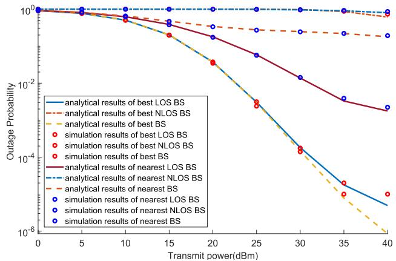  
Fig. 4. Outage probability of all types of BS versus transmit power.

TABLE II  
PARAMETERS AND THEIR CORRESPONDING VALUES
<table><tr><td rowspan=1 colspan=1>Notation</td><td rowspan=1 colspan=1>Parameter</td><td rowspan=1 colspan=1>Value</td></tr><tr><td rowspan=1 colspan=1>R</td><td rowspan=1 colspan=1>radius of region C</td><td rowspan=1 colspan=1>2000 m</td></tr><tr><td rowspan=1 colspan=1>rd</td><td rowspan=1 colspan=1>hard-core distance</td><td rowspan=1 colspan=1> $\overline { { 5 0 \mathrm { ~ m ~ } } }$ </td></tr><tr><td rowspan=1 colspan=1>hBS</td><td rowspan=1 colspan=1>BS height</td><td rowspan=1 colspan=1> $\overline { { h _ { \mathrm { B S } } = 2 5 } }$ m in UMahBS = 10 m in UMi</td></tr><tr><td rowspan=1 colspan=1> $\overline { { \lambda _ { M } } }$ </td><td rowspan=1 colspan=1>BS density</td><td rowspan=1 colspan=1>15 per square km</td></tr><tr><td rowspan=1 colspan=1>B</td><td rowspan=1 colspan=1>mmWave bandwidth</td><td rowspan=1 colspan=1>2 GHz</td></tr><tr><td rowspan=1 colspan=1>α</td><td rowspan=1 colspan=1>path loss exponent</td><td rowspan=1 colspan=1> $\overline { { \alpha _ { L } = 2 . 0 , \alpha _ { N } = 2 . 9 2 } }$ </td></tr><tr><td rowspan=1 colspan=1>β</td><td rowspan=1 colspan=1>path loss at 1 m</td><td rowspan=1 colspan=1> $\overline { { \beta _ { L } = 6 1 . 4 ~ \mathrm { d B } , \beta _ { N } = 7 2 . 0 ~ \mathrm { d B } } }$ </td></tr><tr><td rowspan=1 colspan=1>ξ</td><td rowspan=1 colspan=1>lognormal shadowing standard deviation</td><td rowspan=1 colspan=1> $\overline { { \xi _ { L } = 5 . 8 , \xi _ { N } = 8 . 7 } }$ </td></tr><tr><td rowspan=1 colspan=1>θ</td><td rowspan=1 colspan=1>azimuth beam-width</td><td rowspan=1 colspan=1> $\overline { { \theta _ { b } = \theta _ { u } = \pi / 6 } }$ </td></tr><tr><td rowspan=1 colspan=1>4</td><td rowspan=1 colspan=1>half elevation beam-width</td><td rowspan=1 colspan=1> $\overline { { \varphi _ { b } = \varphi _ { u } = \pi / 4 } }$ </td></tr><tr><td rowspan=1 colspan=1>Gmax</td><td rowspan=1 colspan=1>main lobe gain</td><td rowspan=1 colspan=1> $\overline { { G _ { b } ^ { m a x } = G _ { b } ^ { m a x } = 1 0 ~ \mathrm { d B } } }$ </td></tr><tr><td rowspan=1 colspan=1> $\overline { { G ^ { m i n } } }$ </td><td rowspan=1 colspan=1>side lobe gain</td><td rowspan=1 colspan=1> $\overline { { G _ { b } ^ { m i n } = G _ { b } ^ { m i n } = - 1 0 ~ \mathsf { d B } } }$ </td></tr><tr><td rowspan=1 colspan=1> $\overline { { N _ { 0 } } }$ </td><td rowspan=1 colspan=1>noise power</td><td rowspan=1 colspan=1> $\overline { { - 1 7 4 \ \mathrm { d B m } / \mathrm { H z } + 1 0 l o g _ { 1 0 } ( B ) } }$ +noise figure of 10 dB</td></tr></table>

Fig. 4 shows the outage probabilities of all types of BSs in the UMi scenario when the UAV height $h _ { \mathrm { U A V } }$ is set to 25 meters. It can be observed that the analytical results generally align with the simulation results, but there is a slight deviation as the transmit power increases. This is because we ignore the interference from other BSs, which increases with the transmit power. It can be seen that in the low transmit power regime, the best LOS BS and the best BS have very close outage probabilities. This is because the best BS is almost always the best LOS BS in a low transmit power regime. As the transmit power increases, the probability that the best BS is a NLOS BS increases, and the outage probability of the best BS begins to difer from that of the best LOS BS. This indicates that in practical deployment, NLOS BSs can be neglected under low transmit power conditions, and only when high transmit power is adopted will NLOS BSs be considered. Moreover, it can be observed that the best LOS BS provides much better performance than the nearest LOS BS, which indicates the best LOS BS is not always the nearest one. Fig. 4 further indicates that selecting the best BS based on performance metrics significantly enhances outage performance compared to simply choosing the nearest BS.

In Fig. 5, we conduct simulations under the same settings as Fig. 4 to study the characteristics of the ergodic capacity. The analytical results generally align with the simulation results, validating the accuracy of the analytical results of ergodic capacity in this paper. Similar to Fig. 4, the deviation in the high transmit power regime is due to the neglect of interference between BSs. Combining Fig. 4 and Fig. 5, we can observe that the nearest LOS BS exhibits lower outage probability and higher ergodic capacity than the nearest BS, because simply selecting the nearest BS for transmission may result in selecting a NLOS BS, thereby increasing the outage probability. In contrast to the best BS selection strategies, the performance gap between the nearest LOS BS and the nearest BS increases quickly as the transmit power rises. This indicates that selecting the nearest NLOS BS is likely to impose significant performance loss and should be avoided in practical applications.

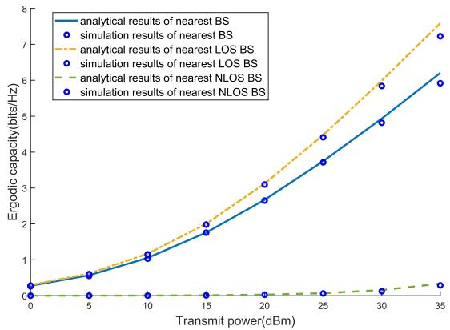

Fig. 5. Ergodic capacity of all types of nearest BS.  
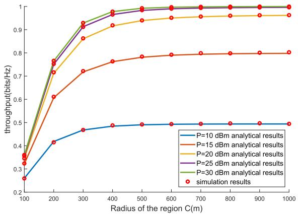  
Fig. 6. Throughput of the best BS when changing the radius of region.

As shown in Fig. 6, we study the relationship between the throughput of the best BS and the radius of the circular region C, when diferent transmit powers P are considered. The analytical results generally match the simulation results. As the radius increases, the throughput initially shows a significant improvement and then tends to stabilize after the radius exceeds a threshold value $R _ { m i n }$ . Moreover, $R _ { m i n }$ increases with the transmit power. This is because in the small radius regime, increasing the radius provides more potential BSs, which may be selected as the best BS. However, as the radius increases, the faraway BSs sufer more significant path loss. Meanwhile, the LOS probability of a generic BS decreases with its horizontal distance to the UAV, which makes remote BSs more likely to be NLOS. Fig. 6 shows that by adopting a large radius, it is practical to neglect the BSs outside the circular region. When the circular radius is greater than 1000 m, the throughput remains almost unchanged. Thus, to ensure the accuracy of our results, we set the circular radius to 2000 m. Furthermore, we can also find that after the transmit power exceeds 25 dBm, continuing to increase the transmit power does not lead to a significant improvement in throughput. Therefore, increasing the transmit power after it exceeds 25 dBm will reduce energy eficiency.

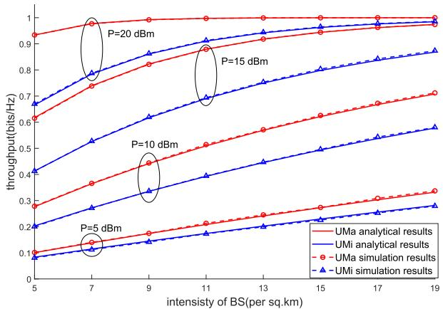  
Fig. 7. Throughput of the best BS when changing the BS density.

TABLE III  
DEVIATION PERCENTAGE BETWEEN THE ANALYTICAL AND SIMULATED ERGODIC CAPACITY
<table><tr><td rowspan="2">P (dBm)</td><td colspan="3">nr(per sq. km)</td></tr><tr><td>5</td><td>15</td><td>25</td></tr><tr><td>10</td><td>0.79%</td><td>0.98%</td><td>1.42%</td></tr><tr><td>15</td><td>1.50%</td><td>0.70%</td><td>0.60%</td></tr><tr><td>20</td><td>1.42%</td><td>0.75%</td><td>0.98%</td></tr><tr><td>25</td><td>1.14%</td><td>0.98%</td><td>1.79%</td></tr><tr><td>30</td><td>0.80%</td><td>2.33%</td><td>3.85%</td></tr><tr><td>35</td><td>1.78%</td><td>4.70%</td><td>6.94%</td></tr></table>

In Fig. 7, we plot the throughput of the best BS versus the BS density, while two diferent environments are considered. Overall, the throughput of the best BS increases as the BS density increases. Because increasing the total number of BSs in the area naturally improves the performance of the best BS, especially in scenarios with low transmit power. However, in high transmit power scenarios, continuously increasing the BS density causes the throughput growth to level of. This is because the throughput gradually reaches its theoretical maximum. In addition, it can be observed that, with the same parameters, the throughput in the UMa scenario is higher than that in the UMi scenario. This is because the UMa scenario has higher BSs, resulting in a higher LOS probability and shorter communication distances. Thus, with the same UAV height, the throughput in the UMa scenario is typically higher than that in the UMi scenario. In addition, it can be seen that in the UMa environment, with a transmit power of 20 dBm, deploying low-density BSs is suficient to ensure good throughput, and increasing BS density yields minimal improvement in throughput. Therefore, in the UMa environment with high transmit power, deploying low-density BSs is preferable. Deploying high-density BSs not only results in minimal improvement but also increases energy consumption.

In Fig. 8, we plot the ergodic capacity of the nearest BS versus the transmit power, when diferent BS densities are considered in the UMi scenario. The deviation between the calculated and simulated results stems from the interference from non-target BSs. We calculate the deviation percentage to quantify the impact of interference, and observe how BS density and transmit power jointly relate to interference. Table III presents the deviation percentage between the calculated and simulated ergodic capacity. It can be observed that when the transmit power is $\leq 2 5$ dBm, the deviation percentage does not exceed 2%, indicating that interference from other BSs is negligible under these conditions. The deviation increases with transmit power and BS density, reflecting a corresponding rise in interference impact. Even in high BS density and high transmit power conditions (i.e. $\lambda _ { M } ~ = ~ 2 5$ per sq. km, $P = 3 5 ~ \mathrm { d B m } )$ , the deviation percentage remains below 7%. According to the 3GPP technical report [50], the transmit power of densely deployed BSs does not exceed $\leq 2 4$ dBm. Therefore, the deviation introduced by neglecting interference in practical scenarios is negligible.

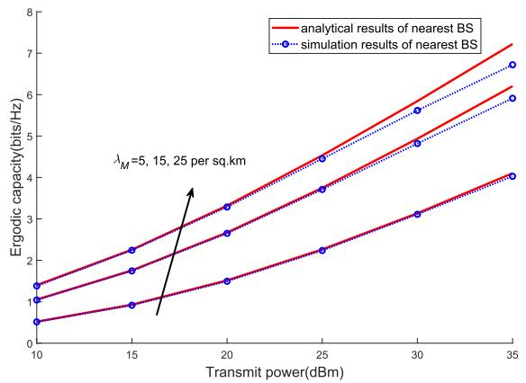

Fig. 8. Ergodic capacity of the nearest BS with diferent BS densities and transmit power.  
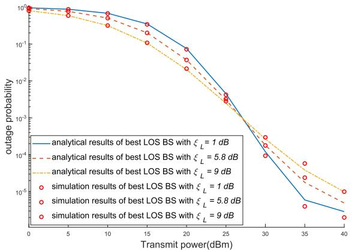  
Fig. 9. Outage probability of best LOS BS when changing the LOS lognormal shadowing standard deviation $\xi _ { L }$

As shown in Fig. 9, we varied the lognormal shadowing standard deviation $\xi _ { L }$ in the LOS scenario (i.e. $\xi _ { L } = 1 , 5 . 8 , 9 ,$ ) and plotted the outage probability of the best LOS BS. As $\xi _ { L }$ increases, the shadow fading becomes stronger. It can be observed that in low transmit power regime the outage probability increases with $\xi _ { L }$ , while the outage probability in high transmit power region shows the opposite trend. Recalling Eq. (14), the outage probability of a LOS BS with a given distance l is given by $\Phi \left( \frac { \ln \left( \frac { z l ^ { \alpha } L } { \gamma _ { L } ^ { \prime } } \right) } { \sigma _ { L } } \right)$ , where $\sigma _ { L } ~ = ~ \frac { \xi _ { L } \ln 1 0 } { 1 0 }$ $\begin{array} { r } { \gamma _ { L } ^ { \prime } = \frac { P G _ { b } ^ { \mathrm { m a x } } G _ { u } ^ { \mathrm { m a x } } } { P _ { n } 1 0 ^ { \beta _ { L } / 1 0 } } } \end{array}$ , and $P$ represents the transmit power. When the transmission power is low, $\gamma _ { L } ^ { \prime }$ is small, $\begin{array} { r } { \frac { z l ^ { \alpha _ { L } } } { \gamma _ { L } ^ { \prime } } > 1 } \end{array}$ , and ln $\left( \frac { z l ^ { \alpha _ { L } } } { \gamma _ { L } ^ { \prime } } \right)$ is positive. In this case, the outage probability decreases as $\xi _ { L }$ increases. Conversely, when the transmission power is high, ln $\left( \frac { z l ^ { \alpha _ { L } } } { \gamma _ { L } ^ { \prime } } \right)$ is negative, and the outage probability increases with $\xi _ { L }$ . In the process of calculating the outage probability of the best LOS BS, integrating over the communication distance l will not change this trend.

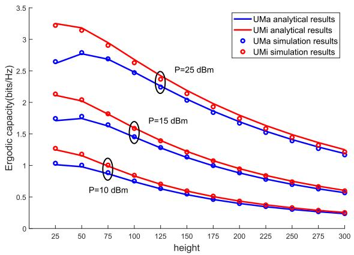  
Fig. 10. Ergodic capacity of the nearest BS when changing UAV height.

In Fig. 10, we investigate the impact of UAV height on the ergodic capacity of the nearest BS under diferent transmit powers and environmental scenarios. It can be observed that in the UMi scenario with high transmit power, the ergodic capacity shows an upward trend in the low UVA height regime as UAV height increases. This is because the UMi environment inherently has low LOS probability, and increasing the height of UAV significantly improves the LOS probability, thereby enhancing the ergodic capacity. However, for the UMi scenario with P=10 dBm, the upward trend cannot be observed, because the increased UAV height enlarges its distance to the BS, resulting in elevated path loss. Notably, the impact of path loss augmentation is more pronounced under low transmit power conditions. Moreover, in the UMa scenario, the ergodic capacity generally exhibits a declining trend with UAV height elevation. This is because the UMa scenario features elevated BS height, which maintains high LOS probability. As a result, increasing the UAV height does not significantly alter the LOS probability. Consequently, the path loss intensification with increasing height emerges as the dominant factor. The path loss dominance explains the capacity degradation observed in all configurations in high UAV height regime. It can be concluded that in the UMa scenario, maintaining the lowest possible height enables UAVs to achieve optimal ergodic capacity. However, in the UMi scenario, the optimal ergodic capacity can be achieved by selecting a medium UAV height (i.e. 50-75 m). Meanwhile, the optimal height yields the highest energy eficiency. In addition, we observe that as the UAV height continues to increase, under otherwise identical conditions, the performance diference between UMi and UMa scenarios gradually diminishes and eventually converges. This is because the key distinction between UMi and UMa lies in the BS height and the urban environment, which afect the LOS probability and communication distance. However, as the UAV height rises, the LOS probabilities for both scenarios approach nearly 100%, and the diference in communication distance progressively decreases, leading to nearly identical performance.

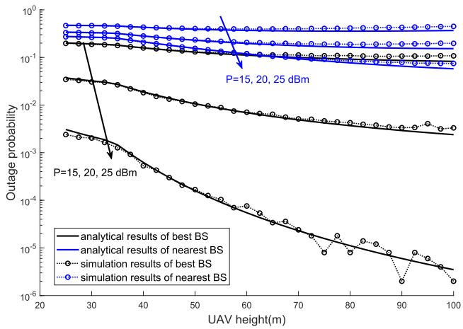  
Fig. 11. Outage probability of the best BS and the nearest BS when changing UAV height.

In Fig. 11, we change the UAV height in the UMi scenario and study the outage probabilities of the best BS and the nearest BS. Due to the limited simulation times, in cases of low outage probability, the simulation data exhibited fluctuations. We can observe that in the high transmit power regime, increasing the UAV height can reduce the outage probability. In Eq. (2), diferent pathloss parameters are adopted for LOS and NLOS links, while NLOS links experience more severe pathloss than LOS links. For a LOS BS, increasing the UAV height will increase pathloss. However, for a NLOS BS, increasing the UAV height may turn the NLOS BS into LOS. In this case, the corresponding pathloss will decrease due to the smaller path loss exponent and path loss at the reference distance. For a generic BS, its LOS probability increases with the UAV height. Thus, the overall performance can be improved when the UAV height is increased. This efect is notably pronounced for the best BS selection strategy. A higher UAV height elevates the average number of LOS BSs, and reduces the average number of NLOS BSs. Furthermore, the outage probability for a LOS BS is lower than that for a NLOS BS. These combined efects drive a further decrease in the overall outage probability defined in Eq. (36), accounting for the result depicted in Fig. 11. Combining the results from Fig. 10, we can conclude that increasing the UAV height can reduce the outage probability to some extent, but it may decrease the ergodic capacity. For a given threshold of outage probability, the optimal flight height should be set to the minimum height satisfying the outage requirement. This approach works well in most scenarios. Specifically, for UMi when using medium to high transmit power, the optimal flight height ranges between 50 and 75 meters under the condition that the outage probability threshold is met.

## VI. CONCLUSION

This paper analyzed the mmWave communication performance of UAVs served by multiple distributed BSs in urban environments, while a practical but complex LOS probability model was adopted. By modeling the distribution of BSs as a MHCPP, we derived analytical expressions of the outage probability and ergodic capacity under diferent BS selection methods. Monte Carlo simulations have been conducted to validate the accuracy of our derived results. We showed that the best BS performs slightly better than the best LOS BS only in the high transmit power regime. The performance of the nearest LOS BS surpasses that of the generic nearest BS, as selecting the nearest BS alone may result in choosing a NLOS BS. Moreover, increasing the UAV height could reduce the outage probability, but it generally leads to a degradation of the ergodic capacity. Therefore, the optimal flight height should be set to the minimum height satisfying the required outage probability.

## APPENDIX

## A. The Conditional Distribution of SNR at the UAV

The CDF of $\gamma _ { g } ( l _ { i } )$ can be written as $P \left( \gamma _ { g } ( l _ { i } ) < z \right)$ , which can be calculate based on Eq. (8). Since $\zeta _ { g } \sim N \left( 0 , \dot { \xi } _ { g } ^ { 2 } \right) , - \zeta _ { g }$ is also a Gaussian random variable with the same mean and variance, while $g \in \{ L , N \}$ . Using this property, we have

$$
\begin{array} { r l } & { P \left( \gamma _ { g } ( l _ { i } ) < z \right) } \\ & { = P \left( - \zeta _ { g } < 1 0 \log \left( \frac { z l _ { i } ^ { \alpha _ { g } } } { \gamma _ { g } ^ { \prime } } \right) \right) } \\ & { = \Phi \left( \frac { \ln ( z ) - \ln ( \gamma _ { g } ^ { \prime } / l _ { i } ^ { \alpha _ { g } } ) } { \xi _ { g } \ln { ( 1 0 ) } / 1 0 } \right) = \Phi \left( \frac { \ln ( z ) - \nu _ { g } } { \sigma _ { g } } \right) . } \end{array}\tag{51}
$$

Therefore, $\gamma _ { g } ( l _ { i } )$ follows a log-normal distribution with mean ln $\left( { \frac { \gamma _ { g } ^ { \prime } } { l _ { i } ^ { \alpha _ { g } } } } \right)$ and variance $\frac { \xi _ { g } \ln ( 1 0 ) } { 1 0 }$ . Lemma 1 is proved.

## B. The Conditional Ergodic Capacity of a Generic BS

The conditional ergodic capacity of a BS with a spatial distance l to the UAV can be written as

$$
C _ { g } ( l ) = \int _ { 0 } ^ { \infty } f _ { \gamma _ { g } | l } ( x ) \mathrm { l o g } _ { 2 } ( 1 + x ) d x ,\tag{52}
$$

where $g ~ \in ~ \{ L , N \}$ , and $f _ { \gamma _ { g } | l } ( x )$ is the conditional PDF of received SNR. From Lemma 1, we know that $\gamma _ { g } | l$ follows a log normal distribution and can be written as

$$
f _ { \gamma _ { g } | l } ( x ) = \frac { 1 } { x \sigma _ { g } \sqrt { 2 \pi } } e ^ { - \frac { \left( \ln x - \ln \frac { \gamma _ { g } ^ { \prime } } { l ^ { \alpha _ { g } } } \right) ^ { 2 } } { 2 \sigma { g } ^ { 2 } } } .\tag{53}
$$

When $0 \leq x \leq 1$ $\ln ( 1 + x ) = \sum _ { t = 0 } ^ { \infty } { \frac { ( - 1 ) ^ { t } x ^ { t + 1 } } { t + 1 } }$ , and when $x \gg 1$ ln( $1 + x ) \approx$ ln x. Therefore, we approximate Eq. (52) as

$$
\begin{array} { l l r } { \displaystyle { C _ { g } ( l ) \approx \int _ { 0 } ^ { 1 } f _ { \gamma _ { g } | l } ( x ) \sum _ { n = 0 } ^ { \infty } \frac { ( - 1 ) ^ { n } x ^ { n + 1 } } { ( n + 1 ) \ln 2 } d x } } \\ { \displaystyle { \phantom { \frac { 1 } { 1 } } + \int _ { 1 } ^ { \infty } f _ { \gamma _ { g } | l } ( x ) \frac { \ln ( x ) } { \ln 2 } d x . } } \end{array}\tag{54}
$$

By substituting Eq. (53) into the above equation and performing some algebraic manipulations, we obtain the analytical expression for the conditional ergodic capacity of a generic BS, as shown in Eq. (15).

## C. The PDFs of the Horizontal Distances From the UAV to LOS and NLOS BSs

To calculate the PDF of the horizontal distance r from a LOS BS to the UAV, we need to obtain the CDF of the horizontal distance between the LOS BS and the UAV, which can be derived as

$$
P _ { L } ( r ) = \frac { \int _ { 0 } ^ { r } 2 \pi r P _ { \mathrm { L O S } } ( r ) d r } { \int _ { 0 } ^ { R } 2 \pi r P _ { \mathrm { L O S } } ( r ) d r } .\tag{55}
$$

Here, $P _ { \mathrm { L O S } } ( r )$ is given by Eq. (5), and $0 \leq r \leq R$ . Then, we can obtain the PDF of the horizontal distances from the UAV to the LOS BS using $\begin{array} { r } { f _ { L } ( r ) \ = \ \frac { d P _ { L } ( r ) } { d r } } \end{array}$ , as shown in Eq. (18). To simplify the subsequent calculations, we expand Eq. (18) using the Taylor expansion $e ^ { x } = \sum _ { n = 0 } ^ { \infty } { \frac { x ^ { n } } { n ! } }$ , resulting in Eq. (20).

Similarly, we provide the CDF for the horizontal distance between a NLOS BS and the UAV, which can be written as

$$
P _ { N } ( r ) = \frac { \int _ { 0 } ^ { r } 2 \pi r P _ { \mathrm { N L O S } } ( r ) d r } { \int _ { 0 } ^ { R } 2 \pi r P _ { \mathrm { N L O S } } ( r ) d r } .\tag{56}
$$

Following a similar process, we can obtain Eq. (21) and Eq. (23).

## D. The PDFs of the Horizontal Distance Between the Nearest LOS or NLOS BS and the UAV

Let $\mu _ { L } ( r )$ represent the average number of LOS BSs within the circular region with radius r centered by the UAV, we have

$$
\mu _ { L } ( r ) = \int _ { 0 } ^ { r } 2 \pi x \lambda _ { P } P _ { \mathrm { L O S } } ( x ) d x .\tag{57}
$$

Since $P _ { \mathrm { L O S } } ( r )$ is a piecewise function, the above equation needs to be solved piecewise. We abbreviate $\boldsymbol { P } _ { \mathrm { L O S } } ( \boldsymbol { r } )$ for $r > d$ in Eq. (5) as $P _ { L O S 2 } ( r )$ . Then, $\mu _ { L } ( r )$ can be decomposed as

$$
\mu _ { L } ( r ) = \left\{ \begin{array} { l l } { { \pi \lambda _ { P } r ^ { 2 } , } } & { { 0 < r \leq d } } \\ { { \pi \lambda _ { P } d ^ { 2 } + 2 \pi \lambda _ { P } \displaystyle \int _ { d } ^ { r } x P _ { L O S 2 } ( x ) d x , } } & { { d < r \leq R . } } \end{array} \right.\tag{58}
$$

This allows us to determine the probability of having K LOS BSs within the circular region with radius $r ,$ which can be written as

$$
P _ { L } ( r , K ) = \frac { \mu _ { L } ^ { K } ( r ) e ^ { - \mu _ { L } ( r ) } } { K ! } .\tag{59}
$$

Let $K _ { L O S } ( r )$ represent the number of LOS BSs within the circular region. Then, $P [ K _ { L O S } ( r ) ~ = ~ 0 ]$ represents the probability of having no LOS BSs within the circular region, which can be written as

$$
\begin{array} { l } { { \displaystyle P [ K _ { L O S } ( r ) = 0 ] } } \\ { { \displaystyle = \sum _ { K = 0 } ^ { \infty } P _ { L } ( r , K ) P [ { \mathrm { K ~ L O S ~ B S s ~ a r e ~ e l i m i n a t e d } } ] . } } \end{array}\tag{60}
$$

According to [49], P[K LOS BSs are eliminated] can be approximated as $[ 1 - ( \lambda _ { M } / \lambda _ { P } ) ] ^ { K }$ . Substituting this into the above equation, we can obtain $\begin{array} { r l } { P [ K _ { L O S } ( r ) = 0 ] } & { { } = } \end{array}$ exp $\left\lceil - \frac { \lambda _ { M } } { \lambda _ { P } } \mu _ { L } \left( r \right) \right\rceil$

λ µWe denote the PDF of the horizontal distance r from the UAV to the nearest LOS BS as $f _ { \mathrm { n r t } , L } ( r )$ . Its CDF is the probability that the horizontal distance from the UAV to the nearest BS is greater than r, which can be equivalently expressed as $P _ { L } \left[ K _ { L O S } ( r ) > 0 \right]$ , which is exactly the complement of $P \left[ K _ { L O S } ( r ) = 0 \right]$ >. Therefore, $\begin{array} { r } { f _ { \mathrm { n r t } , L } ( r ) = - \frac { d P _ { L } [ N _ { L O S } ( r ) = 0 ] } { d r } } \end{array}$ ,After some calculation, we obtain Eq. (24).

Similarly, we derive $\mu _ { L } ( r )$ as

$$
\mu _ { N } ( r ) = \left\{ \begin{array} { l l } { 0 , } & { 0 < r \leq d } \\ { 2 \pi \lambda _ { P } \displaystyle \int _ { d } ^ { r } x [ 1 - P _ { L O S 2 } ( x ) ] d x , } & { d < r \leq R . } \end{array} \right.\tag{61}
$$

Following the same calculation process, Eq. (25) can be obtained.

## E. The Outage Probability of a Generic LOS Candidate Point

Assuming there are K candidate points in region C, the outage probability of the ith LOS candidate point can be expressed as

$$
\begin{array} { l } { { \displaystyle P _ { L , i } ^ { \mathrm { o u t } } ( z | K ) } } \\ { { \displaystyle = \int _ { 0 } ^ { R } f _ { L } ( r ) \left[ P c ( K ) P \left( \gamma _ { g } ( l ) < z \right) + 1 - P c ( K ) \right] d r , } } \end{array}\tag{62}
$$

where $P c ( K )$ and $P \left( \gamma _ { g } ( l ) < z \right)$ are given in Eq. (28) and Eq. (51), respectively. However, substituting r into the above equation makes the integral dificult to solve.

Therefore, we approximate l by taking the maximum of the horizontal distance r and the height diference h between the BS and the UAV, which can be expressed as $l \approx \operatorname* { m a x } ( h , r )$ where $h = | h _ { \mathrm { B S } } - h _ { \mathrm { U A V } } |$ . The approximation error is negligible when r and h difer significantly. A certain error exists when r and h are similar in magnitude. Since this paper calculates the average performance over the horizontal distance range 0 to R, the intermediate errors can be neglected when averaged across the entire region. By adopting this approximation, the outage probability of the ith candidate point is

$$
\begin{array} { l } { { \displaystyle P _ { L , i } ^ { \mathrm { o u t } } ( z | K ) \approx \int _ { 0 } ^ { h } f _ { L } ( r ) [ P c ( K ) \Phi ( \frac { \ln ( \frac { z h ^ { a } ( r ) } { \gamma _ { g } ^ { a } } ) } { \sigma _ { L } } ) ] d r } } \\ { { +  \int _ { h } ^ { R } f _ { L } ( r ) [ P c ( K ) \Phi ( \frac { \ln ( \frac { z ^ { \alpha _ { L } } } { \gamma _ { g } ^ { a } } ) } { \sigma _ { L } } ) ] d r } } \\ { { +  [ 1 - P c ( K ) ] \int _ { 0 } ^ { R } f _ { L } ( r ) d r , } } \end{array}\tag{63}
$$

where $f _ { L } ( r )$ is given by Eq. (20). Substituting $P c ( K )$ and $f _ { L } ( r )$ into the above equation, and after piecewise integration and changing the order of integration, we obtain Eq. (26).

Assuming $R \gg r _ { d } .$ Eq. (63) can be rewritten as

$$
\hat { P } _ { L , i } ^ { \mathrm { o u t } } ( z | K ) \approx \int _ { 0 } ^ { h } f _ { L } ( r ) \left[ P c _ { 1 } ( K ) \Phi \left( \frac { \ln \left( \frac { z h ^ { \alpha _ { L } } } { \gamma _ { g } ^ { \prime } } \right) } { \sigma _ { L } } \right) \right] d r
$$

$$
\begin{array} { l } { \displaystyle + \int _ { h } ^ { R } f _ { L } ( r ) \left[ P c _ { 1 } ( K ) \Phi \left( \frac { \ln \left( \frac { z r ^ { \alpha _ { L } } } { \gamma _ { g } ^ { \prime } } \right) } { \sigma _ { L } } \right) \right] d r } \\ { \displaystyle + \left( 1 - P c _ { 1 } ( K ) \right) . } \end{array}\tag{64}
$$

Using the same method, we can obtain Eq. (30).

## F. The Ergodic Capacity of a Generic LOS Candidate Point

Assuming there are K candidate points in region C and $R \gg r _ { d } .$ , the ergodic capacity of the ith candidate point can be written as

$$
\hat { C } _ { L , i } = \sum _ { K = 0 } ^ { \infty } \left[ \int _ { 0 } ^ { R } f _ { L } ( r ) P c _ { 1 } ( K ) C _ { L } ( l ) d r \right] P ( K ) ,\tag{65}
$$

where $\begin{array} { r } { P ( K ) = P c _ { 1 } ( K ) \frac { \mu _ { 0 } ^ { K } e ^ { - \mu _ { 0 } } } { \Gamma ( K + 1 ) } } \end{array}$ represents the probability that there are K BSs in the area. By approximating l as the minimum of the horizontal distance r and the height diference h between the BS and the UAV, the above equation can be approximated as

$$
\begin{array} { l } { \displaystyle \hat { C } _ { L , i } \approx \left[ \int _ { 0 } ^ { h } f _ { L } ( r ) C _ { L } ( h ) d r + \int _ { h } ^ { R } f _ { L } ( r ) C _ { L } ( r ) d r \right] } \\ { \displaystyle \times \sum _ { K = 0 } ^ { \infty } P c _ { 1 } ( K ) \frac { \mu _ { 0 } ^ { K } e ^ { - \mu _ { 0 } } } { \Gamma ( K + 1 ) } . } \end{array}\tag{66}
$$

By substituting $P c _ { 1 } ( K ) , \ f _ { L } ( r )$ , and $C _ { L } ( r )$ into the above equation, performing piecewise integration and changing the order of integration, we obtain Eq. (31). We use Eq. (32) to replace multiple integrals with the same form to simplify the equation. The specific expansion of Eq. (32) is given by Eq. (67), where $t ( m ) = m + 1 - \alpha _ { g } ( n + 1 ) , \delta ( 0 ) = 1 , \delta ( t \neq 0 ) = 0$ and $g \in \{ L , N \}$ . To simplify Eq. (67), we replace similar parts as

$$
\begin{array} { l } { \displaystyle \frac { w _ { \xi } ^ { \prime } } { w _ { \xi } ( x , n ) } = \frac { \ln \frac { w _ { \xi } ^ { \prime } } { w _ { \xi } ^ { \prime } } } { w _ { \xi } } , } \\ { \displaystyle v _ { \xi } ( x , n ) = \frac { \ln \frac { w _ { \xi } ^ { \prime } } { w _ { \xi } } - \sigma v _ { \xi } ^ { \prime } ( n + 1 ) } { \sigma v _ { \xi } } , } \\ { \displaystyle \boldsymbol { z } ( x , n ) = \frac { 1 } { m + 1 } \cdot \sum _ { i = 1 } ^ { \infty } \left( \ln \frac { w _ { \xi } ^ { \prime } } { v _ { \xi } ^ { \prime } } + \frac { \alpha _ { i } } { m + 1 } \right) , } \\ { \displaystyle w _ { \xi } ( x , n ) = \Phi \left( \frac { \ln \frac { w _ { \xi } ^ { \prime } } { v _ { \xi } ^ { \prime } } } { \sigma v _ { \xi } } - \frac { ( m + 1 ) \sigma v _ { \xi } } { \sigma v _ { x } } \right) , } \\ { \displaystyle v _ { \xi } ( x , n ) = \Phi \left( \frac { \ln \frac { w _ { \xi } ^ { \prime } } { v _ { \xi } ^ { \prime } } } { \sigma v _ { \xi } } + \frac { ( m + 1 ) \sigma v _ { \xi } } { \alpha _ { \xi } } \right) , } \\ { \displaystyle E _ { \xi } ( x ) = \left( \Phi ^ { \prime } \right) ^ { \prime } + \xi _ { \xi } ^ { \prime \prime } \frac { \sin \xi } { \sigma v _ { \xi } ^ { \prime } } + \xi _ { \xi } ^ { \prime \prime } , } \\ { \displaystyle E _ { \xi } ( x ) = \left( \Phi ^ { \prime } \right) ^ { \prime } + \xi _ { \xi } ^ { \prime \prime } \frac { \sin \xi } { \sigma v _ { \xi } ^ { \prime } } . } \end{array}\tag{68}
$$

$$
\begin{array} { r l } & { \mathcal { L } a _ { k } ( X , Y , m ) } \\ & { = \mathrm { i n } 2 \int _ { \gamma } ^ { \mathcal { X } ^ { n } C _ { k } ( y ) d \gamma } } \\ & { = \frac { \mathcal { L } } { \kappa \omega ^ { 3 } } \frac { ( - 1 ) ^ { n } } { n + 1 } \Bigg \{ \frac { \partial ^ { \alpha } ( t ( m ) ) } { \partial t ( m ) } \{ E _ { 1 } ( m ) [ X ^ { n + 1 - \alpha _ { k } ( \gamma + 1 ) } \Phi ( \nu _ { z } ( X , n ) ) ] - Y ^ { n + 1 - \alpha _ { k } ( \gamma + 1 ) } \Phi ( \nu _ { z } ( Y , n ) ) \} } \\ & { \quad - E _ { j } ( m ) [ \nu _ { \mathrm { e } ^ { \alpha } \mathrm { J } } ( X , m ) - \nu _ { z } ( \gamma , m ) ] \Bigg \} + E _ { ( 1 ) } ( n ) \mathcal { L } ( m ) \Bigg \{ \mathrm { i n } \frac { X } { \gamma } \Phi ( \nu _ { x } ( Y , n ) ) + \frac { \alpha _ { k } } { \sqrt { 2 } \pi \kappa _ { 0 } } [ e ^ { - \mathrm { i } \gamma _ { z } ( \gamma , n ) } - e ^ { - \mathrm { i } \gamma _ { z } ( \gamma , n ) } ] } \\ & { \quad + \frac { \alpha _ { k } } { \alpha _ { z } } \nu _ { \mathrm { g } } ( X , n ) [ \Phi ( \nu _ { z } ( X , n ) ) - \Phi ( \nu _ { z } ( X , n ) ) ] \Bigg \} + \mathcal { L } ( X , m ) [ 1 - \Phi ( \nu _ { u } ( X ) ) - \mathcal { L } ( X , m ) [ 1 - \Phi ( \nu _ { u } ( Y ) ) ] } \\ &  \quad + \frac { E _ { j } ( m ) } { \omega } \Bigg [ \frac { \alpha _ { \mathrm { e } } } { \omega } - \frac { ( m + 1 ) \sigma _ { x } ^ { 2 } } { \omega _ { \mathrm { g } } } \Bigg [ [ \nu _ { u } ( X , m ) - \nu _ { u } ( Y , \end{array}\tag{67}
$$

$$
\begin{array} { r l } & { C a _ { g } ( X , 0 , m ) } \\ & { = \ln 2 \int _ { 0 } ^ { x } r ^ { n } C _ { g } ( r ) d r } \\ & { = \displaystyle \sum _ { n = 0 } ^ { \infty } \frac { ( - 1 ) ^ { n } } { n + 1 } \{ \frac { 1 - \delta ( \ell ( m ) ) } { t ( m ) } \{ E _ { 1 } ( n ) X ^ { m + 1 - \sigma _ { g } ( n + 1 ) } \Phi ( \nu _ { g } ( X , n ) ) - E _ { 2 } ( m ) w _ { g , 1 } ( X , m )   } \\ & { \quad +  E _ { 1 } ( n ) \delta ( \ell ( m ) ) [ \frac { \sigma _ { g } } { \alpha _ { g } } \nu _ { g } ( X , n ) \Phi ( \nu _ { g } ( X , n ) ) + \frac { \sigma _ { g } } { \sqrt { 2 \pi } \sigma _ { g } } ( e ^ { - \frac { 1 } { 2 } \nu _ { g } ^ { 2 } ( X , n ) } ) ] \} + z ( X , m ) [ 1 - \Phi ( u _ { g } ( X ) ) ] } \\ & { \quad +  \frac { E _ { 2 } ( m ) } { m + 1 } [ \frac { \sigma _ { g } } { m + 1 } - \frac { ( m + 1 ) \sigma _ { g } ^ { 2 } } { \alpha _ { g } } ] w _ { g , 1 } ( X , m ) + \frac { \sigma _ { g } ^ { 2 } } { \alpha _ { g } } E _ { g 2 } ( m ) [ 1 - w _ { g 2 } ( X , m ) ] + \frac { \sigma _ { g } } { ( m + 1 ) \sqrt { 2 \pi } } x ^ { m + 1 } e ^ { - \frac { 1 } { 2 } \nu _ { g } ^ { 2 } ( X ) } . } \end{array}\tag{69}
$$

Specifically, when the UAV and the BS have the same height, i.e. $h = 0$ , Eq. (67) can be simplified as Eq. (69), as shown at the bottom of the previous page.

## G. The Outage Probability of the Nearest BS

When the UAV selects the nearest BS for communication, the outage probability can be expressed as

$$
P _ { \mathrm { n r t } } ^ { \mathrm { o u t } } ( z ) = P _ { 1 } ( z ) + P _ { 2 } ( z ) + P ( K = 0 ) ,\tag{70}
$$

where $P _ { 1 } ( z )$ and $P _ { 2 } ( z )$ are the outage probability when the nearest BS is LOS or NLOS, respectively. $P ( K = 0 )$ is the probability that there are no BSs in C, which is given by

$$
P ( K = 0 ) = P \left( N _ { L O S } ( R ) + M _ { N L O S } ( R ) = 0 \right) = e ^ { - \pi R ^ { 2 } \lambda _ { M } } .\tag{71}
$$

$P _ { 1 } ( z )$ can be expressed as

$$
P _ { 1 } ( z ) = \int _ { 0 } ^ { R } f _ { \mathrm { n r t } , L } ( r ) \Phi \left( \frac { \ln \left( \frac { z l ^ { \alpha _ { L } } } { \gamma _ { g } ^ { \prime } } \right) } { \sigma _ { L } } \right) P \left( M _ { N L O S } \ ( r ) = 0 \right) d r ,\tag{72}
$$

where $P \left( M _ { N L O S } \left( r \right) = 0 \right)$ represents the probability that there are no NLOS BSs within the circular region with radius r centered by the UAV. Similar to Eq. (60), we have

$$
\begin{array} { l } { { \displaystyle { P \left( M _ { N L O S } \left( r \right) = 0 \right) = \sum _ { S = 0 } ^ { \infty } \frac { \mu _ { N } ^ { S } \left( r \right) e ^ { - \mu _ { N } \left( r \right) } } { S ! } \left( 1 - \left( \frac { \lambda _ { M } } { \lambda _ { P } } \right) \right) ^ { S } } } } \\ { { = e ^ { - \frac { \lambda _ { M } } { \lambda _ { P } } \mu _ { N } \left( r \right) } = e ^ { - 2 \pi \lambda _ { M } G _ { N } \left( r \right) } , } } \end{array}\tag{73}
$$

where $\mu _ { N } ( r )$ and $G _ { N } ( R )$ are given by Eq. (58) and Eq. (22), respectively. By substituting $f _ { \mathrm { n r t } , L } ( r ) , P ( M _ { \mathrm { N L O S } } ( r ) = 0 )$ and the Taylor series expansion $\textstyle e ^ { - { \bar { x } } } = \sum _ { n = 0 } ^ { \infty } { \frac { ( - 1 ) ^ { n } } { n ! } } x ^ { n }$ into $P _ { 1 } ( z )$ , we can obtain the result for $P _ { 1 } ( z )$

Similarly, $P _ { 2 } ( z )$ can be expressed as

$$
P _ { 2 } ( z ) = \int _ { 0 } ^ { R } f _ { \mathrm { n r t } , N } ( r ) \Phi \left( \frac { \ln \left( \frac { z l ^ { \alpha _ { N } } } { \gamma _ { g } ^ { \prime } } \right) } { \sigma _ { N } } \right) P \left( M _ { L O S } \left( r \right) = 0 \right) d r .\tag{74}
$$

Following the same method, we can compute the result for $P _ { 2 } ( z )$ . Finally, by substituting $P _ { 1 } ( z ) , P _ { 2 } ( z )$ , and $P ( K = 0 )$ into Eq. (70), Proposition 5 is proved.

## H. Outage Probability of the Nearest LOS/NLOS BS

Since we consider a circular region C with radius R, the outage probability of the nearest LOS BS is equal to the probability that the nearest LOS BS is within C and is in outage, plus the probability that the nearest LOS BS is outside C. This can be written as

$$
\begin{array} { l } { \displaystyle P _ { \mathrm { n r t } , L } ^ { \mathrm { o u t } } ( z ) = \int _ { 0 } ^ { R } f _ { \mathrm { n r t } , L } ( r ) \Phi \left( \frac { \ln \left( \frac { z l ^ { \alpha _ { L } } } { \gamma _ { g } ^ { \prime } } \right) } { \sigma _ { L } } \right) d r } \\ { \displaystyle \phantom { \frac { 1 } { 2 } } + \int _ { R } ^ { \infty } f _ { \mathrm { n r t } , L } ( r ) d r . } \end{array}\tag{75}
$$

By substituting $f _ { \mathrm { n r t } , L } ( r )$ given in Eq. (24) into the above equation, it is worth noticing that the integral is very dificult to compute. Therefore, we use the Taylor series expansion $\begin{array} { r c l } { e ^ { - x } } & { = } & { \sum _ { n = 0 } ^ { \infty } { \frac { ( - 1 ) ^ { n } } { n ! } } x ^ { n } } \end{array}$ to expand the exponential function. We then expand the nth order polynomial using $( a + x ) ^ { n } = \sum _ { k = 0 } ^ { n } { \binom { n } { k } } x ^ { k } a ^ { n - k }$ , and solve the integral to obtain Eq. (46) by using piecewise integration and by changing the order of integration. $P _ { L } ^ { \prime \prime }$ in Eq. (46) is given by

$$
\begin{array} { r l } {  { P _ { L } ^ { \prime \prime } ( n ) = 2 \pi \lambda _ { M } e ^ { - 2 \pi \lambda _ { M } ( p ^ { 2 } e ^ { \frac { - d } { p } } - \frac { d ^ { 2 } } { 2 } ) } \sum _ { m = 0 } ^ { \infty } \frac { ( - 2 \pi \lambda _ { M } ) ^ { m } } { m ! } } } \\ & { \times \sum _ { i = 0 } ^ { m } { \binom { m } { i } } d ^ { i } ( - p ) ^ { m - i } \sum _ { k = 0 } ^ { m - i } { \binom { m - i } { k } } ( p - d ) ^ { m - i - k } } \\ & { \times \displaystyle \sum _ { j = 0 } ^ { \infty } \frac { 1 } { j ! } \Big ( \frac { i - m } { p } \Big ) ^ { j } S _ { L } ( R , d , n + i + k + j + 1 ) , } \end{array}\tag{76}
$$

where $S _ { L } ( x , y , s )$ is written as

$$
\begin{array} { r l } & { S _ { g } ( x , y , s ) } \\ & { = \cfrac { 1 } { s } \left\{ x ^ { s } \Phi \left( z _ { g } ( x ) \right) - y ^ { s } \Phi \left( z _ { g } ( y ) \right) - \left( \cfrac { \gamma _ { g } ^ { \prime } } { z } \right) ^ { \frac { s } { \alpha _ { g } } } \right. } \\ & { \times \left. e ^ { \frac { \sigma _ { g } ^ { 2 } s ^ { 2 } } { 2 \alpha _ { g } ^ { 2 } } } \bigg [ \Phi \left( z _ { g } ( x ) - \cfrac { \sigma _ { g } s } { \alpha _ { g } } \right) - \Phi \left( z _ { g } ( y ) - \cfrac { \sigma _ { g } s } { \alpha _ { g } } \right) \bigg ] \right\} . } \end{array}\tag{77}
$$

Similarly, the outage probability of the nearest NLOS BS can be expressed as

$$
\begin{array} { l l l } { \displaystyle P _ { \mathrm { n r t } , L } ^ { \mathrm { o u t } } ( z ) = \int _ { 0 } ^ { R } f _ { \mathrm { n r t } , N } ( r ) \Phi \left( \frac { \ln \left( \frac { z r ^ { \alpha _ { N } } } { \gamma _ { g } ^ { \prime } } \right) } { \sigma _ { N } } \right) d r } \\ { \displaystyle \phantom { \frac { 1 } { 1 } } + \int _ { R } ^ { \infty } f _ { \mathrm { n r t } , N } ( r ) d r . } \end{array}\tag{78}
$$

Using the same method, we can compute Eq. (47), and Eq. $P _ { N } ^ { \prime \prime }$ in (47) is given by

$$
\begin{array} { l } { { \displaystyle P _ { N } ^ { \prime \prime } ( n ) = 2 \pi \lambda _ { M } e ^ { - 2 \pi \lambda _ { M } \left( \frac { d ^ { 2 } } { 2 } - p ^ { 2 } e ^ { \frac { - d } { p ^ { 2 } } } \right) } \sum _ { m = 0 } ^ { \infty } \frac { ( - 2 \pi \lambda _ { M } ) ^ { m } } { m ! } } } \\ { { \displaystyle ~ \times \sum _ { i = 0 } ^ { m } \left( \frac { m } { i } \right) ( - p ) ^ { m - i } \sum _ { j = 0 } ^ { i } \binom { i } { j } \frac { 1 } { 2 ^ { j } } ( - 1 ) ^ { i - j } d ^ { i - j } } } \\ { { \displaystyle ~ \times \sum _ { k = 0 } ^ { m - i } \left( \frac { m - i } { k } \right) ( p - d ) ^ { m - i - k } \sum _ { t = 0 } ^ { \infty } \frac { ( i - m ) ^ { t } } { t ! p ^ { t } } } } \\ { { \displaystyle ~ \times \sum _ { N } ( R , d , n + i + j + k + t + 1 ) } , } \end{array}\tag{79}
$$

where $S _ { N } ( x , y , s )$ is given in Eq. (78).

## I. Ergodic Capacity of the Nearest BS

When the UAV selects the nearest BS for communication, the ergodic capacity can be expressed as

$$
C _ { \mathrm { n r t } } = C _ { 1 } + C _ { 2 } ,\tag{80}
$$

where $C _ { 1 }$ represents the ergodic capacity when the nearest BS is LOS, and $C _ { 2 }$ represents the ergodic capacity when the nearest BS is NLOS. They can be written as

$$
C _ { 1 } = \int _ { 0 } ^ { R } f _ { \mathrm { n r t } , L } ( r ) C _ { L } ( l ) P \left( M _ { N L O S } \left( r \right) = 0 \right) d r ,\tag{81}
$$

$$
C _ { 2 } = \int _ { 0 } ^ { R } f _ { \mathrm { n r t } , N } ( r ) C _ { N } ( l ) P \left( M _ { L O S } \left( r \right) = 0 \right) d r .\tag{82}
$$

By applying Eq. (67) and by performing piecewise integration and series expansion on $C _ { 1 }$ and $C _ { 2 } .$ , we have

$$
\begin{array} { l } { { \displaystyle C _ { 1 } = \left( 1 - e ^ { - \pi \lambda _ { M } h ^ { 2 } } \right) C ( h ) } } \\ { { \displaystyle ~ + \frac { 2 \pi \lambda _ { M } } { 1 { \bf 2 } } \sum _ { m = 0 } ^ { \infty } \frac { ( - \pi \lambda _ { M } ) ^ { m } } { m ! } C a _ { L } ( d , h , 2 m + 1 ) - \frac { 2 \pi \lambda _ { M } } { 1 { \bf 2 } } } } \\ { { \displaystyle ~ \times \sum _ { n = 1 } ^ { \infty } \frac { ( n p + d ) } { n ! ( - p ) ^ { n } } \sum _ { m = 0 } ^ { \infty } \frac { ( - \pi \lambda _ { M } ) ^ { m } } { m ! } C a _ { L } ( R , d , 2 m + n + 1 ) , } } \end{array}\tag{83}
$$

$$
\begin{array} { c } { { C _ { 2 } = \displaystyle \frac { 2 \pi \lambda _ { M } } { \ln 2 } \sum _ { m = 0 } ^ { \infty } \frac { ( - \pi \lambda _ { M } ) ^ { m } } { m ! } C a _ { N } ( R , d , 2 m + 2 ) + \frac { 2 \pi \lambda _ { M } } { \ln 2 } } } \\ { { \times \sum _ { n = 1 } ^ { \infty } \frac { ( n p + d ) } { n ! ( - p ) ^ { n } } \sum _ { m = 0 } ^ { \infty } \frac { ( - \pi \lambda _ { M } ) ^ { m } } { m ! } C a _ { N } ( R , d , 2 m + n + 1 ) . } } \end{array}\tag{84}
$$

Finally, Eq. (48) is obtained by combining $C _ { 1 }$ and $C _ { 2 }$

## J. Ergodic Capacity of the Nearest LOS BS and NLOS BS

The ergodic capacity of the nearest LOS BS and the nearest NLOS BS can be expressed as

$$
C _ { \mathrm { n r t } , g } = \int _ { 0 } ^ { R } f _ { \mathrm { n r t } , g } ( r ) C _ { g } ( l ) d r ,\tag{85}
$$

where $g \in \{ L , N \}$ . By using the same expansion method as in Appendix H to perform the calculations, Eq. (49) and Eq. (50) can be obtained. $C _ { L } ^ { \prime } ( R , d , n )$ and $C _ { N } ^ { \prime } ( R , d , n )$ are written as

$$
\begin{array} { r l } & { c _ { i } ^ { \star } c _ { i } ^ { \star } , \forall , \quad \Theta } \\ & { = 2 \pi \lambda _ { i } \frac { \lambda _ { i } ^ { \star } } { \omega ^ { 2 } } \alpha \Big ( \alpha \Big ( \beta ^ { \star } \xi ^ { \star } - \frac { \alpha } { \omega } \Big ) \frac { \pi } { \omega } \frac { \zeta } { \omega ^ { 2 } } ( - 2 \pi \lambda _ { i } \frac { \alpha } { \omega ^ { 2 } } ) ^ { \star } } \\ & { \qquad \times \displaystyle \sum _ { s = 0 } ^ { \infty } ( \frac { \alpha } { \xi } ) ^ { \alpha } \bigg ) \bigg ( \xi - \beta ^ { \star } \eta \bigg ) ^ { s } \frac { \sqrt { \alpha } } { \omega ^ { 2 } } ( \frac { \alpha - \beta } { \omega } ) ( \eta - \lambda ^ { \star } ) ( \xi - \frac { \alpha } { \omega } ) ^ { s } } \\ & { \qquad \times \displaystyle \sum _ { s = 0 } ^ { \infty } \frac { 1 } { \eta } ( \frac { 1 - \alpha } { \gamma } ) ^ { s } ( \xi - \eta ) ^ { s } c _ { i } ^ { \star } ( \xi ) \mathcal { H } _ { s } \mathcal { H } _ { s } ^ { s } + ( \xi + \frac { \alpha + \beta } { \eta } ) , } \\ & { c _ { i } ^ { \star } c _ { i } ^ { \star } , \forall , \quad \Theta } \\ & { = 2 \pi \lambda _ { i } \frac { \alpha } { \omega ^ { 2 } } ( \xi ^ { \star } - \frac { \alpha } { \omega ^ { 2 } } ) \frac { \pi } { \omega ^ { 2 } } \frac { ( - 2 \pi \lambda _ { i } \frac { \alpha } { \omega ^ { 2 } } ) ^ { s } } { \omega ^ { 2 } } } \\ &  \qquad \times \displaystyle \sum _ { s = 0 } ^ { \infty } ( \frac { \alpha } { \xi } ) ^ { \alpha } ( \eta - \beta ^ { \star } ) ^ { s } \frac { \sqrt { \alpha } } { \omega ^ { 2 } } ( \frac  \end{array}\tag{86}
$$

(87)

## REFERENCES

[1] Z. Wang, R. Liu, Q. Liu, L. Han, Y. Wu, and J. S. Thompson, “QoS-oriented sensing–communication–control co-design for UAVenabled positioning,” IEEE Trans. Green Commun. Netw., vol. 7, no. 1, pp. 497–511, Mar. 2023.

[2] Z. Zhang et al., “Energy-eficient secure video streaming in UAVenabled wireless networks: A safe-DQN approach,” IEEE Trans. Green Commun. Netw., vol. 5, no. 4, pp. 1892–1905, Dec. 2021.

[3] Y. Li and A. Hu, “Channel estimation via subcarrier grouping for wideband mmWave hybrid massive MIMO-OFDM systems,” IEEE Trans. Green Commun. Netw., vol. 8, no. 1, pp. 64–78, Mar. 2024.

[4] M. Gapeyenko, D. Moltchanov, S. Andreev, and R. W. Heath Jr., “Line-of-sight probability for mmWave-based UAV communications in 3D urban grid deployments,” IEEE Trans. Wireless Commun., vol. 20, no. 10, pp. 6566–6579, Oct. 2021.

[5] L. Chen, W. Zhang, M. A. Kishk, and M.-S. Alouini, “Correlation of line-of-sight probabilities in aerial-terrestrial communications: Modeling, analysis, and application,” IEEE Trans. Veh. Technol., vol. 73, no. 5, pp. 7049–7065, May 2024.

[6] Propagation Data and Prediction Methods Required for the Design of Terrestrial Broadband Radio Access Systems Operating in a Frequency Range From 3 To 60 GHz, document P.1410, 2012.

[7] A. Al-Hourani, S. Kandeepan, and S. Lardner, “Optimal LAP altitude for maximum coverage,” IEEE Wireless Commun. Lett., vol. 3, no. 6, pp. 569–572, Dec. 2014.

[8] Z. Wang and J. Zheng, “Performance analysis of location-based base station cooperation for cellular-connected UAV networks,” IEEE Trans. Veh. Technol., vol. 72, no. 11, pp. 14787–14800, 2023.

[9] S. D. Muruganathan et al., “An overview of 3GPP release-15 study on enhanced LTE support for connected drones,” IEEE Commun. Standards Mag., vol. 5, no. 4, pp. 140–146, Dec. 2021.

[10] X. Yu, J. Zhang, R. Schober, and K. B. Letaief, “A tractable framework for coverage analysis of cellular-connected UAV networks,” in Proc. IEEE Int. Conf. Commun. Workshops (ICC Workshops), May 2019, pp. 1–6.

[11] Z. Wang and J. Zheng, “Performance modeling and analysis of base station cooperation for cellular-connected UAV networks,” IEEE Trans. Veh. Technol., vol. 71, no. 2, pp. 1807–1819, Feb. 2022.

[12] B. Mondal et al., “3D channel model in 3GPP,” IEEE Commun. Mag., vol. 53, no. 3, pp. 16–23, Mar. 2015.

[13] Guidelines for Evaluation of Radio Interface Technologies for IMT-Advanced, document M.2135-1, Geneva, Switzerland, Dec. 2009.

[14] Study on Enhanced LTE Support for Aerial Vehicles, document TR 36.777, 3GPP, Dec. 2017.

[15] Z. Yin et al., “Uplink performance analysis of UAV user equipments in dense cellular networks,” in Proc. ICC - IEEE Int. Conf. Commun. (ICC), May 2019, pp. 1–7.

[16] D. Lopez-Perez et al., “On the downlink performance of UAV communications in dense cellular networks,” in Proc. IEEE Global Commun. Conf. (GLOBECOM), Dec. 2018, pp. 1–7.

[17] Z. Meng, Y. Chen, M. Ding, and D. Lopez-P´ erez, “A new look at UAV´ channel modeling: A long tail of LoS probability,” in Proc. IEEE 30th Annu. Int. Symp. Pers., Indoor Mobile Radio Commun. (PIMRC), Sep. 2019, pp. 1–6.

[18] H. Sun et al., “Coverage analysis for cellular-connected random 3D mobile UAVs with directional antennas,” IEEE Wireless Commun. Lett., vol. 12, no. 3, pp. 550–554, Mar. 2023.

[19] T. Hou, Y. Liu, Z. Song, X. Sun, and Y. Chen, “Multiple antenna aided NOMA in UAV networks: A stochastic geometry approach,” IEEE Trans. Commun., vol. 67, no. 2, pp. 1031–1044, Feb. 2019.

[20] M. Matracia, M. A. Kishk, and M.-S. Alouini, “Coverage analysis for UAV-assisted cellular networks in rural areas,” IEEE Open J. Veh. Technol., vol. 2, pp. 194–206, 2021.

[21] Z. Chen and H. Zhang, “UAV-assisted networks through a tunable dependent model,” IEEE Commun. Lett., vol. 24, no. 5, pp. 1110–1114, May 2020.

[22] M. T. Dabiri, M. Hasna, S. Althunibat, and K. Qaraqe, “LoS coverage analysis for UAV-based THz communication networks: Toward 3-D visualization of wireless networks,” IEEE Trans. Aerosp. Electron. Syst., vol. 60, no. 6, pp. 8726–8743, Dec. 2024.

[23] M. Taghi Dabiri, M. Hasna, S. Althunibat, and K. Qaraqe, “Optimizing UAV trajectory for emergency response operations under real 3D environments: Integrating priority levels and LoS constraints,” 2024, arXiv:2408.07589.

[24] M. M. Azari, F. Rosas, and S. Pollin, “Cellular connectivity for UAVs: Network modeling, performance analysis, and design guidelines,” IEEE Trans. Wireless Commun., vol. 18, no. 7, pp. 3366–3381, Jul. 2019.

[25] R. Amer, W. Saad, and N. Marchetti, “Mobility in the sky: Performance and mobility analysis for cellular-connected UAVs,” IEEE Trans. Commun., vol. 68, no. 5, pp. 3229–3246, May 2020.

[26] C. Fan, X. Zhou, T. Zhang, W. Yi, and Y. Liu, “Cache-enabled UAV emergency communication networks: Performance analysis with stochastic geometry,” IEEE Trans. Veh. Technol., vol. 72, no. 7, pp. 9308–9321, Jul. 2023.

[27] B. Yang, T. Taleb, Y. Shen, X. Jiang, and W. Yang, “Performance, fairness, and tradeof in UAV swarm underlaid mmWave cellular networks with directional antennas,” IEEE Trans. Wireless Commun., vol. 20, no. 4, pp. 2383–2397, Apr. 2021.

[28] H. Chang et al., “A novel nonstationary 6G UAV-to-ground wireless channel model with 3-D arbitrary trajectory changes,” IEEE Internet Things J., vol. 8, no. 12, pp. 9865–9877, Jun. 2021.

[29] L. Junruo, W. Yuanjie, C. Qimei, H. Yanzhao, and T. Xiaofeng, “Modeling and performance analysis of UAV-aided millimeter wave cellular networks with stochastic geometry,” China Commun., vol. 21, no. 6, pp. 146–162, Jun. 2024.

[30] S. Zhang, Y. Zhu, and J. Liu, “Multi-UAV enabled aerial-ground integrated networks: A stochastic geometry analysis,” IEEE Trans. Commun., vol. 70, no. 10, pp. 7040–7054, Oct. 2022.

[31] X. Wei, L. Peng, R. Xu, A. Li, X. Yu, and H. Wang, “Analysis of coverage and capacity for UAV-aided networks with directional mmWave communications,” Drones, vol. 8, no. 4, p. 152, Apr. 2024.

[32] T. S. Rappaport et al., “Millimeter wave mobile communications for 5G cellular: It will work!,” IEEE Access, vol. 1, pp. 335–349, 2013.

[33] Y. Zhu, L. Wang, K.-K. Wong, and R. W. Heath Jr., “Secure communications in millimeter wave ad hoc networks,” IEEE Trans. Wireless Commun., vol. 16, no. 5, pp. 3205–3217, May 2017.

[34] Y. Zhu, G. Zheng, and K.-K. Wong, “Stochastic geometry analysis of large intelligent surface-assisted millimeter wave networks,” IEEE J. Sel. Areas Commun., vol. 38, no. 8, pp. 1749–1762, Aug. 2020.

[35] Z. Li, H. Hu, J. Zhang, and J. Zhang, “RIS-assisted mmWave networks with random blockages: Fewer large RISs or more small RISs?,” IEEE Trans. Wireless Commun., vol. 22, no. 2, pp. 986–1000, Feb. 2023.

[36] T. Bai and R. W. Heath Jr., “Coverage and rate analysis for millimeterwave cellular networks,” IEEE Trans. Wireless Commun., vol. 14, no. 2, pp. 1100–1114, Feb. 2015.

[37] T. S. Rappaport, F. Gutierrez, E. Ben-Dor, J. N. Murdock, Y. Qiao, and J. I. Tamir, “Broadband millimeter-wave propagation measurements and models using adaptive-beam antennas for outdoor urban cellular communications,” IEEE Trans. Antennas Propag., vol. 61, no. 4, pp. 1850–1859, Apr. 2013.

[38] M. R. Akdeniz et al., “Millimeter wave channel modeling and cellular capacity evaluation,” IEEE J. Sel. Areas Commun., vol. 32, no. 6, pp. 1164–1179, Jun. 2014.

[39] Study on Channel Model for Frequencies From 0.5 To 100 GHz, document TR 38.901, 3GPP, Dec. 2019.

[40] S. Karimi-Bidhendi, G. Geraci, and H. Jafarkhani, “Optimizing cellular networks for UAV corridors via quantization theory,” IEEE Trans. Wireless Commun., vol. 23, no. 10, pp. 14924–14939, Oct. 2024.

[41] R. Ma, W. Yang, Y. Zhang, J. Liu, and H. Shi, “Secure mmWave communication using UAV-enabled relay and cooperative jammer,” IEEE Access, vol. 7, pp. 119729–119741, 2019.

[42] F. D. S. Moulin, C. Wiame, C. Oestges, and L. Vandendorpe, “Stochastic geometry-based modelling of mobile UAV relay networks under realistic fading,” in Proc. IEEE 93rd Veh. Technol. Conf. (VTC-Spring), Apr. 2021, pp. 1–7.

[43] W.-Y. Dong, S. Yang, W. Lin, W. Zhao, J.-X. Gui, and S. Chen, “Outage probability analysis of uplink heterogeneous non-terrestrial networks: A novel stochastic geometry model,” in Proc. IEEE Global Commun. Conf., Dec. 2024, pp. 2593–2598.

[44] W. Yi, Y. Liu, E. Bodanese, A. Nallanathan, and G. K. Karagiannidis, “A unified spatial framework for UAV-aided mmWave networks,” IEEE Trans. Commun., vol. 67, no. 12, pp. 8801–8817, Dec. 2019.

[45] M. Giordani, M. Mezzavilla, S. Rangan, and M. Zorzi, “An eficient uplink multi-connectivity scheme for 5G millimeter-wave control plane applications,” IEEE Trans. Wireless Commun., vol. 17, no. 10, pp. 6806–6821, Oct. 2018.

[46] M. Giordani, M. Rebato, A. Zanella, and M. Zorzi, “Coverage and connectivity analysis of millimeter wave vehicular networks,” Ad Hoc Netw., vol. 80, pp. 158–171, Nov. 2018.

[47] S. Singh, M. N. Kulkarni, A. Ghosh, and J. G. Andrews, “Tractable model for rate in self-backhauled millimeter wave cellular networks,” IEEE J. Sel. Areas Commun., vol. 33, no. 10, pp. 2196–2211, Oct. 2015.

[48] H. He, J. Xue, T. Ratnarajah, F. A. Khan, and C. B. Papadias, “Modeling and analysis of cloud radio access networks using Matern´ hard-core point processes,” IEEE Trans. Wireless Commun., vol. 15, no. 6, pp. 4074–4087, Jun. 2016.

[49] A. M. Ibrahim, T. ElBatt, and A. El-Keyi, “Coverage probability analysis for wireless networks using repulsive point processes,” in Proc. IEEE 24th Annu. Int. Symp. Pers., Indoor, Mobile Radio Commun. (PIMRC), London, U.K., Sep. 2013, pp. 1002–1007.

[50] Evolved Universal Terrestrial Radio Access (E-UTRA); Base Station (BS) Radio Transmission and Reception, document TR 36.104, 3GPP, Jun. 2025.

Yue Ren (Member, IEEE) received the B.E. degree from Nanjing University of Posts and Telecommunications (NJUPT), Nanjing, China, in 2019, and the M.E. degree from the Southwest University of Science and Technology (SWUST), Sichuan, China, in 2022. He is currently pursuing the Ph.D. degree with the School of Information Science and Technology, USTC. His recent research interests include UAV communication networks, multi-agent reinforcement learning, and deep transfer reinforcement learning.

Huasen He (Member, IEEE) received the B.S. degree in automation from the University of Science and Technology of China (USTC), Hefei, China, in 2013, and the M.S. degree in signal processing and communications and the Ph.D. degree in digital communications from The University of Edinburgh, Edinburgh, U.K., in 2014 and 2018, respectively. He is currently an Associate Professor with the School of Information Science and Technology, USTC. His research interests include space–air–ground integrated networks and network optimization.

Yunpeng Hou (Member, IEEE) received the B.S. and Ph.D. degrees from the University of Science and Technology of China (USTC), Hefei, China, in 2017 and 2023, respectively. He is currently an Associate Researcher with the Institute of Artificial Intelligence, Hefei Comprehensive National Science Center. His research interests include future intelligent networks, satellite networks, and network optimization.

Xiaofeng Jiang (Member, IEEE) received the B.E. and Ph.D. degrees in information science and technology from the University of Science and Technology of China (USTC), Hefei, China, in 2008 and 2013, respectively. He is currently an Associate Professor with the School of Information Science and Technology, USTC. His recent research interests include discrete event dynamic systems, tensor analysis and big data, future networks, and cognitive communications.

Shuangwu Chen (Member, IEEE) received the B.S. and Ph.D. degrees from the University of Science and Technology of China (USTC), Hefei, China, in 2011 and 2016, respectively. He is currently an Associate Professor with the School of Information Science and Technology, USTC. His research interests include multimedia communications, future networks, and stochastic optimization.

Jian Yang (Senior Member, IEEE) received the B.S. and Ph.D. degrees from the University of Science and Technology of China (USTC), Hefei, China, in 2001 and 2006, respectively. He is currently a Professor with the School of Information Science and Technology, USTC. His research interests include future networks, distributed system design, modeling and optimization, and multimedia over wired, wireless, and stochastic optimization. He received the Lu Jia-Xi Young Talent Award from Chinese Academy of Sciences in 2009.