# Performance Analysis of Multi-UAV-Aided NB-IoT Communication System

Siva Rama Krishna M., Graduate Student Member, IEEE and Naveen Mysore Balasubramanya, Member, IEEE

Abstract—Non-terrestrial networks (NTNs) for Internet of things (IoT) are one of the prominent scenarios envisioned in the fifth generation (5G) of wireless communication and beyond. The third generation partnership project (3GPP) has identified the narrowband IoT (NB-IoT) standard as a candidate technology for NTN-based IoT. In this work, an unmanned aerial vehicle (UAV)- based NTN using NB-IoT for communication is considered, where multiple UAVs act as relays between user equipment (UEs) and the terrestrial base station (BS). The communication procedure for the proposed system is designed by building upon the uplink and downlink communication procedures of a single UAV-aided system. To facilitate efficient data transmission between UAVs and the BS, scheduling mechanisms using orthogonal multiple access (OMA) and non-orthogonal multiple access (NOMA) are explored. For the NOMA scheduling mechanism, two grouping strategies are proposed for UAVs - static grouping and dynamic grouping, where the latter leverages the longest transmission time first (LTTF) algorithm for optimal grouping. Closed-form expressions for average transmission time are derived under both strategies, accounting for UE distribution modeled by discrete uniform, Poisson, and Beta distributions. Finally, we perform end-to-end physical layer simulations using 3GPPcompliant channel models and evaluate the latency and energy consumption of NB-IoT UEs. It is observed from simulations that NOMA, along with dynamic grouping, offers lower latency and reduced energy consumption when compared to OMA and static grouping, validating its suitability for multi-UAV-based NTN applications.

Index Terms—Narrowband Internet of Things (NB-IoT), Nonterrestrial networks (NTN), Unmanned aerial vehicles (UAVs), Massive machine-type communication (mMTC).

## I. INTRODUCTION

The Internet of things (IoT) aims to connect numerous devices to form a network of intelligent/smart systems. These “smart devices” or “smart objects” find applications in healthcare, agriculture, transportation, manufacturing, smart cities, home automation, etc. [2]. IoT facilitates the automation of various procedures, improves decision-making by utilizing real-time monitoring, assists in predictive maintenance, and enhances productivity. The third-generation partnership project (3GPP) introduced the IoT into the fifth generation (5G) wireless communication standards [3] through massive machinetype communications (mMTC) and ultra-reliable low-latency communications (URLLC). As these technologies evolve, an adaptable network architecture is crucial for revolutionizing connections, enabling new applications, and meeting the growing demand for data. Many applications involving surveillance, monitoring, and rescue operations are becoming increasingly significant for the military and civilian sectors, resulting in the need to look for alternatives to terrestrial networks [4]. To this end, the 5G network architecture includes airborne networks as a candidate technology to support the growing data needs of different applications [5]. Particularly, as part of its Release 16, the 3GPP recently completed a comprehensive study focusing on integrating support for the non-terrestrial networks (NTNs) as a novel and promising approach for 5G and beyond [6], [7].

The 3GPP evaluates several NTN architectures using different aerial platforms for NTNs [8]. One such platform is the use of unmanned air vehicles (UAVs), which may be easily integrated to existing IoT systems to meet evolving network requirements. NTN architecture seeks to improve wireless network coverage and capacity by utilizing UAVs as base stations, particularly in rural areas and difficult to reach areas. UAVs can also provide reliable and affordable wireless communications to support a variety of use cases in future networks, such as serving spectators in a stadium or other dense network applications. Moreover, on-demand communication systems using UAVs provide quicker deployment time and greater reconfiguration flexibility than other high-altitude platforms or traditional terrestrial communications.

UAV-based NTN requires the modeling of air-to-ground (A2G), air-to-air (A2A), and ground-to-air (G2A) links [9]– [11]. By placing them strategically at optimal heights, they present a distinct advantage over conventional communication links since the A2G and G2A links will have strong LoS paths with a high probability [12]. In view of the placement of the UAVs, authors in [13] proposed a UAV positioning algorithm to find the optimal LoS path with the user equipment (UEs) to maximize the throughput. Circle packing theory was used in [14] to find the three-dimensional (3D) locations of UAVs in order to maximize the coverage area while maximizing the coverage lifetime of the UAV. Along similar lines, a polynomial-time algorithm was proposed in [15] to reduce the number of UAVs required while covering all ground UEs, and the work in [16] used optimal transport theory and a gradientbased algorithm to maximize the data services to ground UEs while optimizing UAV flight time and by finding the optimal cell partitions.

Several single and multi-UAV networks were proposed in the literature for the UAV trajectory optimization to provide energy-efficient communication [17], [18] and to serve the maximum number of UEs by the three-dimensional placement of UAVs [19], [20]. A joint trajectory and communication design was proposed in [18] to maximize the minimum throughput over all the ground UEs, and the work in [17] discussed conserving the UAV energy while achieving the communication throughput. Similarly, a coordinated multi-UAV network was designed in [21] to achieve the target coverage probability with a minimum number of UAVs in the presence of co-channel interference.

Recent studies have investigated UAVs in next-generation wireless networks to improve latency, energy efficiency, coverage, and secure data collection in large-scale IoT systems. In spaceairground networks, latency-aware frameworks jointly optimized UAV deployment, computation offloading, and radio resources for the Internet of robotic things (IoRT), enhancing delay performance and efficiency [22]. Intelligent reflecting surface (IRS)-assisted UAV systems used deep reinforcement learning (DRL) for joint trajectory planning and passive beamforming to improve reliability and spectral efficiency in dynamic environments [23]. Diffusion-model-enhanced DRL was proposed to strengthen data confidentiality and energy efficiency for secure data collection and wireless energy transfer [24]. In multi-UAV scenarios, joint trajectory design and resource allocation were developed to reduce power consumption and improve vehicular network performance [25]. Cooperative mission planning based on dynamic scheduling enabled efficient area exploration and improved coverage [26].

Moreover, integrating UAVs with IoT sensors has become a practical and deployed solution, particularly in applications such as precision agriculture, which utilizes lightweight sensors and efficient power systems [27]. UAVs serve as intermittent mobile data collectors, aligning with the delay tolerance of IoT sensors, rather than flying continuously to form a backhaul network in emergency situations [28]–[32]. UAV-based IoT networks have also been used for wildfire detection in [33]. Furthermore, a real-world study conducted in a 20-hectare potato field demonstrated the feasibility of a UAV collecting data from over 2, 000 sensors in 50 seconds [34]. The work also presents results for multiple UAV requirements, utilizing UAVs at different altitudes while collecting data from sensors buried in the ground. However, it does not explicitly discuss the scheduling mechanisms pertaining to UEs as well as UAVs. Hence, our work complements the work in [34], where field sizes require more than one UAV to collect data from various sensors, and is very much applicable to realworld scenarios, and provides a practical, 3GPP-compliant, energy-efficient, and scalable solution.

The next milestone in this endeavor involves the pursuit of an NTN version using standardized communication technologies. Particularly, the 3GPP has identified the narrowband internet of things (NB-IoT) as a candidate technology for NTN [35] owing to its backward compatibility with the fourth generation (4G) long-term evolution (LTE). NB-IoT is a low-power wide-area network (LPWAN) wireless technology created especially for IoT applications with an operating bandwidth of 180 kHz. Using a licensed spectrum, it provides consistent and efficient connectivity for a wide range of IoT devices [36]. It supports subcarrier spacing of 3.75 kHz and 15 kHz in the uplink (UL) and 15 kHz in the downlink (DL) [37]. By allowing connectivity for remote locations, improving data gathering capabilities, and enabling real-time communication between ground equipment and cloud services, UAVs equipped with NB-IoT technology can offer greater connectivity and data transfer capabilities [38], [39].

## A. Motivation

Our previous work (conference paper version of this manuscript) [1] considered a single UAV-aided system adopting NB-IoT as its communication standard. We had proposed a procedure for UL and DL communication between NB-IoT user equipment (UEs), the UAV, and a terrestrial BS. Specifically, the NB-IoT UEs cannot directly communicate with the terrestrial BS, and the UAV acts as a relay between them to enable communication. While this solution provides connectivity, similar to any single UAV-based system, it is constrained by its confined coverage and limited capacity. In this work, our objective is to provide improved communication across multiple serving spots within a cell by extending our previous work in [1] to a multi-UAV-aided NB-IoT communication system for a cell. In such a system, several UAVs work together to establish a more comprehensive and resilient communication network for NB-IoT devices, where each UAV hovers at the center of a designated serving spot. The major contributions of this work are as follows.

## B. Major Contributions

• We extend the system model in [1] to a multi-UAV environment using NB-IoT as the communication standard. We explore orthogonal multiple access (OMA) and nonorthogonal multiple access (NOMA) scheduling strategies for UAV-to-BS communication, with OMA serving as the benchmark owing to its feasibility with the conventional NB-IoT framework.

• We propose two grouping strategies for NOMA-based scheduling (i) static grouping, where predetermined sets of UAVs are grouped, and (ii) dynamic grouping, where UAVs are grouped based on the longest transmission time first (LTTF) strategy. We derive the closed-form expressions for the average overall transmission time in both cases.

• We analyze and evaluate the proposed grouping strategies for different probability density functions (PDFs) of user activity - (i) discrete uniform, (ii) Poisson, and (iii) Beta distributions, with parameters aligned to 3GPPrecommended mMTC scenarios. We demonstrate that the analytical results closely align with Monte Carlo simulations.

• We comprehensively evaluate physical layer performance of OMA and NOMA scheduling strategies through NPRACH, NPDSCH, and NPUSCH performance simulations under 3GPP-approved channel models, including tapped delay line (TDL)-D, extended pedestrian A (EPA), and extended typical urban (ETU) scenarios, representing both LoS and NLoS conditions. These evaluations employ practical channel estimation, consider scenarios with and without successive interference cancellation (SIC) for NOMA, and also provide a comparison with NB-IoTcompatible grant-free (GF) access mechanisms.

• We demonstrate through simulations that the proposed NOMA scheduling with static and dynamic grouping achieves lower latency and reduced energy consumption at the UE compared to OMA-based scheduling while meeting 3GPP requirements for small and medium NB-IoT coverage, with dynamic grouping providing the best performance.

The remainder of this article is organized as follows. Section II covers the proposed multiple UAV-aided communication system model used in this work. Section III explains the communication procedures discussed for the proposed multi-UAV-aided NB-IoT communication system. Section IV describes the OMA and NOMA scheduling mechanisms, followed by the grouping mechanisms proposed for NOMA scheduling in Section V. Section VI discusses the communication performance of all the links in the system along with the end-to-end latency and energy consumption of the NB-IoT UEs. Section VII presents the conclusions.

## II. MULTI-UAV-AIDED COMMUNICATION SYSTEM MODEL

We consider a multiple UAV-based NTN using NB-IoT as the communication standard for all the links, as shown in Fig. 1. Similar to our previous work [1], the NB-IoT UEs cannot directly communicate with the terrestrial BS, because these direct links may have very low signal-to-noise ratio (SNR) (for example, in the case of UEs located in the basement of buildings) or because the number of UEs in the cell is so large that the BS cannot serve them easily (a typical mMTC scenario). Each UAV works as a relay between the NB-IoT UEs and the terrestrial BS. The area of a cell is taken to be 0.86 km<sup>2</sup> as recommended by 3GPP [40], with M UAVs serving different spots in a cell.

We assume that each UAV is stationary and is positioned at the center of the serving spot at a height of H and that the NB-IoT UEs are distributed uniformly randomly in the serving spot covered by the UAV. Given that θ is the elevation angle from an NB-IoT UE at the edge of the serving spot to the UAV, the serving spot’s radius is given by $r = H / \mathrm { t a n } ( \theta )$ . Typically, H = 150 m for UAV-based NTN [41] and choosing $\theta = 5 5 ^ { \circ }$ results in each serving spot radius of ≈ 105 m and ensures that all the NB-IoT UEs have an LoS path with UAV 99% of the time [12]. Hence, the channel between the NB-IoT UEs and the UAVs is modeled using the tapped delay line D(TDL-D) model, which is predominantly used for modeling LoS communication in NTN in 3GPP [42]. Based on the terrain and the environment, UAVs serving different spots will have different channel/multi-path propagation environments with the terrestrial BS. Hence, the channel between UAVs and BS can be modeled as either LoS or non-line of sight (NLoS). For consistency, we continue to use the TDL-D model for LoS and the extended pedestrian A (EPA) and extended typical urban (ETU) channel models for NLoS, which aligns with the 3GPP specifications [43].

In this work, UAVs are expected to hover with minimal mobility, following a quasi-static deployment model consistent with 3GPP recommendations for NTN-enabled NB-IoT systems, particularly in scenarios where UAV trajectory variations occur much slower than the communication timescale, as outlined in [35]. While trajectory optimization can improve performance metrics like sum-rate and energy efficiency, as shown in works such as [17] and [44], these approaches rely on continuous UAV movement and require real-time channel state information (CSI), which may not be feasible in practical, resource-constrained systems. Similarly, studies like [45], [46], and [47] demonstrate performance gains through dynamic UAV movement that adapts to user traffic demands but depend heavily on high computational resources and sophisticated adaptation mechanisms at the UAVs. In contrast, our model prioritizes stable flight to ensure robust backhaul links with the BS and simplify handover management. This approach is aligned with works that adopt static UAV placements, such as [48], where UAVs are centrally positioned to determine coverage needs based on cell radius, and [14], which uses circle packing and height optimization techniques to accommodate varying user densities without coverage overlap. Additionally, [49] uses optimal transport theory to guide fixed UAV placement for energy-efficient area coverage. In all these cases, UAVs were expected to hover at these locations in a stable manner, enabling focus on key communication aspects like user scheduling, access control, and interference mitigation using efficient resource allocation strategies.

Moreover, as discussed in Section I, we aim to support IoT devices that transmit data sporadically rather than continuously and UAVs will be deployed only when the central network requires data from the UAV-served regions. This means that the UAVs can recharge their batteries when they are not deployed to collect data. Furthermore, if a UAV fails to operate because of low battery or due to any other reason, the UAV that is the nearest neighbour will serve the region until a new UAV is deployed. In such scenarios, UEs can resynchronize with the neighbouring UAV and later with the substitute UAV for further communication, at the expense of additional signaling overhead and latency. A detailed analysis of energy-aware deployment considering UAV failures is out of scope of this paper and is identified as a potential direction of future work.

In the UAV-UE model, we begin at a stage where the NB-IoT UEs have completed downlink synchronization and are attempting uplink access. In general, the received signal at each UAV will be the sum of the signals from its NB-IoT UEs transmitting in a given scheduling interval, which can be expressed as

$$
y _ { \mathrm { U A V } } ( n ) = \sum _ { i = 1 } ^ { N _ { \mathrm { U E } } } g _ { i } e ^ { j 2 \pi r _ { i } n } x _ { \mathrm { U E } , i } ( n - d _ { i } ) + w _ { \mathrm { U E } } ( n ) ,\tag{1}
$$

where $g _ { i } , \ r _ { i } ,$ and $d _ { i }$ represent the LoS channel coefficient (assuming flat-fading), the residual carrier frequency offset (RCFO) normalized by the system bandwidth, and the timing offset of the $i ^ { \mathrm { t h } }$ NB-IoT UE, respectively. The term $w ( n ) \sim$ $\mathcal { C N } ( 0 , \sigma _ { \mathrm { U E } } ^ { 2 } )$ represents the effect of additive white Gaussian noise (AWGN) at the UAV. The UEs would have to first obtain uplink synchronization with the UAV using narrowband physical random access channel (NPRACH) and then transmit their data over the narrowband physical uplink shared channel (NPUSCH).

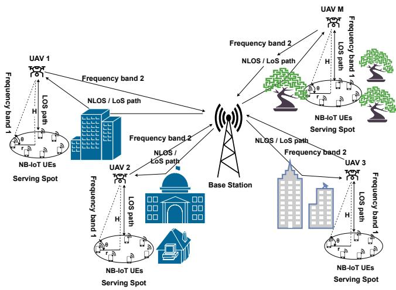  
Fig. 1. System model for multiple UAV-based NTN using NB-IoT.

The UAV-BS model is at a stage where all the UAVs are in a “connected” state with the terrestrial BS, i.e., all the UAVs have completed both downlink and uplink synchronization with the terrestrial BS, and the BS has allocated timefrequency resources for data communication. The received signal at the terrestrial BS in a given scheduling interval can be expressed as

$$
y _ { \mathrm { B S } } ( n ) = \sum _ { i = 1 } ^ { N _ { \mathrm { U A V } } } h _ { i } x _ { \mathrm { U A V } , i } ( n ) + w _ { \mathrm { U A V } } ( n ) ,\tag{2}
$$

where $h _ { i }$ represents the LoS/NLoS channel coefficient (assuming flat-fading) and the term $w ( n ) \ \sim \ \mathcal { C N } ( 0 , \sigma _ { \mathrm { U A V } } ^ { 2 } )$ represents the effect of AWGN at the BS. Note that there is no need to account for timing offset and RCFO, since uplink synchronization is already achieved.

With respect to the NB-IoT physical layer channels, we determine the performance of NPRACH and NPUSCH for the UAV-UE link and only the NPUSCH for the UAV-BS link. Specifically, NPRACH is used for uplink synchronization, where UEs transmit preambles to their UAV requesting for network access. Given that NB-IoT has a bandwidth of 180 kHz and NPRACH adopts 3.75 kHz subcarrier spacing, we have a set of 48 subcarriers for NPRACH. The uplink preamble corresponds to a single tone frequency hopping signal, and each NB-IoT UE selects one of these 48 subcarriers uniformly randomly as its starting tone (subcarrier) [39]. The NPRACH procedure in NB-IoT operates using 4 separate sub-bands with 12 sub-carriers in each band. Assuming that each UAV employs one such sub-band, there can be a maximum of 12 active UEs per UAV. NPUSCH is used for uplink data transmission, employing a 24-bit cyclic redundancy check (CRC) and convolutional turbo code (CTC) as the channel coding scheme. In the case of downlink, we use the narrowband physical downlink shared channel (NPDSCH) for both UAV-UE and BS-UAV links. NPDSCH also uses a 24-bit cyclic redundancy check (CRC) and tail-biting convolutional code (TBCC) as the channel coding scheme [37], [39].

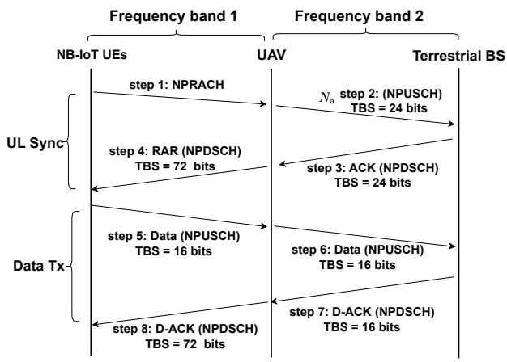  
Fig. 2. Proposed communication procedure [1].

## III. PROPOSED COMMUNICATION MECHANISM FOR EACH UAV

In our previous work [1], we proposed a communication procedure for a network with NB-IoT UEs, a single UAV, and a terrestrial BS. The system is at a stage where the NB-IoT UEs switch on or wake up from sleep and obtain downlink synchronization with the UAV by detecting the narrowband primary and secondary synchronization signals (NPSS and NSSS) and by decoding the master information block transmitted on the narrowband physical broadcast channel (NPBCH). Therefore, the communication procedure starts with UL synchronization and is followed by the data transmission procedure shown in Fig. 2. We have only included essential details for readability throughout the work. For a detailed explanation about the communication procedure, refer to Section III of [1].

NB-IoT UEs initiate uplink synchronization using NPRACH. In this work, we have assumed that there is no collision among active devices during the random access procedure. The basic unit of NPRACH is called a preamble repetition, which spans a duration of 5.6 ms. The number of preamble repetitions are chosen according to the coverage area (CVA) of UE. NPRACH uses 2, 8 and 32 repetitions for small (CVA-1), medium (CVA-2) and large (CVA-3) coverage areas. The received signal at the UAV will be the sum of NPRACH signals from all active NB-IoT UEs (please see Eqn. (1)).

In conventional NB-IoT communication, the UEs would directly communicate with the terrestrial BS to detect their preambles and estimate the corresponding timing offsets. However, in the proposed UAV-based NTN, there are LoS paths between UEs and the UAV with at least 99% probability, and the lengths of these paths are almost the same (i.e., the distance of a UE at the cell center and that at the cell edge from the UAV is 150 m and ≈ 183 m, respectively). Moreover, the sampling rate used by the UEs and the UAV is also small (since the bandwidth of NB-IoT is low). Therefore, the timing offsets of all the NB-IoT UEs will almost be equal (and small), and $d _ { i }$ in Eqn. (1) can be ignored. Thus, there is no need to estimate timing offsets at the UAV; only detecting active users (in the presence of RCFO) will suffice. This can be done using a simple, non-coherent energy-based detection proposed in [1].

As per the 3GPP recommendation for an mMTC scenario, there are $1 0 ^ { 6 }$ devices per 0.86 km<sup>2</sup> cell area where the devices are transmitting in every 2 hours [40]. Therefore, it results in 120 transmissions per second. Considering 12 UAVs serving around the BS, each UAV gets 10 transmissions per second, i.e., each UAV can support 10 users in one second. NB-IoT supports different periodicities for random access - 80 ms, 160 ms, 240 ms, 480 ms and 960 ms, presenting 12, 6, 4, 2 and 1 random access opportunities, respectively, for each UE per second [39]. Considering that random access opportunities are scheduled every 160 ms (typically used in NB-IoT), there will be $\frac { 1 0 0 0 } { 1 6 0 } \approx 6$ opportunities in one 1 s. Hence, there will be $\begin{array} { r } { \frac { 1 0 } { 6 } \approx \overset { \underset { \mathrm { \scriptsize ~ 1 } } { ~ } } { 2 } } \end{array}$ users in each opportunity.

The probability that K users are successful, i.e., they are assigned K distinct preambles from a total of N available preambles is given by

$$
p _ { A l l } ^ { \mathrm { s u c c e s s } } = \frac { N ! } { ( N - K ) ! } \cdot \frac { 1 } { N ^ { K } } .
$$

For this system, the approximate per-user success probability considering collisions after one random access attempt is derived in [50] to be

$$
p _ { \mathrm { U E } } = 1 - \left( { \frac { K - 1 } { N } } \right)\tag{3}
$$

Given that there $N _ { \mathrm { a t t } }$ attempts, a user is successful if it is successful in at least one of these attempts. Therefore, the per-user success probability after $N _ { a }$ attempts becomes

$$
\begin{array} { l } { { \displaystyle p _ { \mathrm { U E } } ^ { \mathrm { S u c c } } = 1 - ( 1 - p _ { \mathrm { U E } } ) ^ { N _ { a t t } } } } \\ { { \displaystyle ~ = 1 - \left( \frac { K - 1 } { N } \right) ^ { N _ { \mathrm { a t t } } } . } } \end{array}\tag{4}
$$

Figure. 3 shows the per-user success probabilities for different numbers of UEs $( K = \{ 2 , 3 , 4 \}$ and different numbers of attempts $( N _ { \mathrm { { a t t } } } ~ = ~ \{ 1 , 4 , 6 \} )$ ). It is evident that the peruser success probability remains above 90% of all examined scenarios. With the assumption that there are at least $N _ { a } = 4$ random access opportunities per second, which corresponds to NPRACH periodicity of 240 ms or lower, collisions can be successfully minimized.

After a successful NPRACH transmission, every synchronized NB-IoT UE will communicate with the UAV using NPUSCH by choosing a subframe based on its preamble ID. By default, we use OMA-based scheduling between UEs and UAVs, and each UE takes one subframe (1 ms) to send its data to the UAV. Further, data from all UEs in the same NPRACH group will be sent by the UAV to the terrestrial BS individually. Therefore, the TBS will remain 16 bits. Basically, each UAV acts as a relay where it decodes and forwards the data received from the UEs to the BS. The scheduling mechanism between UAVs and the BS can adopt OMA or NOMA, which is described in detail in Section IV.

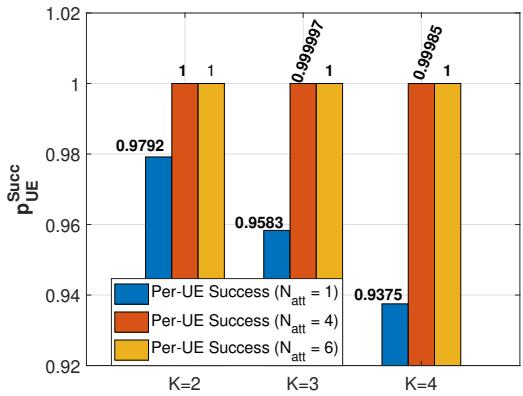  
Fig. 3. Per-UE success probabilities for multiple UEs considering collisions.

The BS sends back a data ACK (D-ACK) of 1 bit per NPRACH group after receiving data of all the UEs from the UAV that are part of the same NPRACH group, where D-ACK can have values of 0 and 1, representing successful and unsuccessful data decoding, respectively. Since there are 4 NPRACH groups, 4-bit D-ACK is transmitted over one subframe using NPDSCH and repeated 4 times because the minimum TBS supported in NB-IoT is 16 bits. The UAV will decode the D-ACK from the BS and will use NPDSCH with a TBS of $1 2 \times 6 = 7 2$ bits to deliver preamble IDs (6 bits) to all users in an NPRACH group if the D-ACK associated with that group is 1.

Each UAV follows this communication procedure to facilitate the communication of its UEs and the terrestrial BS. In the next section, we propose mechanisms for scheduling multiple UAVs in order to provide coverage for the entire cell.

## IV. PROPOSED MECHANISM FOR SCHEDULING MULTIPLE UAVS

Given the procedure discussed in Section III, it is evident that scheduling UAV transmissions is vital when the terrestrial BS has communicated with multiple UAVs in the cell. Recall that the UAVs have already obtained downlink and uplink synchronization with the terrestrial BS, and they have dedicated time-frequency resources to communicate their data. We propose two ways for scheduling UAV data transmissions to the terrestrial BS.

• Using orthogonal multiple access (OMA)

• Using non-orthogonal multiple access (NOMA)

Specifically, we analyze how these established OMA/NOMA access mechanisms behave when integrated into a UAVaided NB-IoT system, subject to practical power, latency, and scheduling constraints. While the access schemes themselves are standard, what has not been established in the literature is how these access schemes can be utilized in multiple UAVaided scenarios under strict NB-IoT timing and PRB allocation rules, and how a multi-UAV architecture can be employed for large-scale NB-IoT sensor deployments. We would like to clarify that the benchmark scheme will turn out to be the OMA mechanism due to the following reasons.

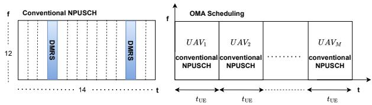  
(a) OMA-based data transfer

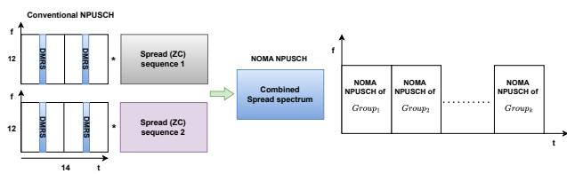  
(b) NOMA-based data transfer  
Fig. 4. Proposed scheduling methods.

• The NB-IoT standard supports only OMA by the virtue of using OFDMA.

• If multiple UAVs have to transmit using OMA and each one requires the entire narrow bandwidth in NB-IoT (180 kHz). The only way to separate the UAVs by adhering to the current NB-IoT standards is to use TDMA.

To the best of our knowledge, there are no prior works that have analyzed this conventional TDMA+OMA strategy for an end-to-end NB-IoT system with UAVs (from UEs to UAVs to BS and back).

## A. UAV Scheduling Using OMA

The data transfer between UAVs to BS can be scheduled by using OMA, which uses conventional NPUSCH as proposed in NPUSCH format 1 with 15 kHz subcarrier spacing as shown in Fig. 4a

In this case, each UAV is assigned a distinct time slot to send its data to the terrestrial BS. As shown in Fig. 4a, $i ^ { \mathrm { t h } }$ UAV gets a time spanning $t _ { i } = N _ { a , i } . t _ { \mathrm { U E } }$ to send its data, where $N _ { a , i }$ is the number of active users served by the $i ^ { \mathrm { t h } }$ UAV and $t _ { \mathrm { U E } }$ is the time taken by each UE to send data to its UAV. Therefore, the total time required for all the UAVs to transmit their data to the terrestrial BS will be $\begin{array} { r } { t _ { \mathrm { O M A } } = ( \sum _ { i = 1 } ^ { M } N _ { a , i } ) t _ { \mathrm { U E } } } \end{array}$ . Given that $N _ { a , i }$ is a random variable, the average time would be

$$
\mathbb { E } [ t _ { \mathrm { O M A } } ] = \left( \sum _ { i = 1 } ^ { M } \mathbb { E } [ N _ { a , i } ] \right) t _ { \mathrm { U E } } .\tag{5}
$$

The received signal at BS, in this case, is represented by Eqn. (2) with $N _ { \mathrm { U A V } } ~ = ~ 1$ , since each UAV sends its data separately.

A disadvantage of using OMA-based scheduling is that it may increase the latency of communication. Hence, it is desirable to have a mechanism where multiple UAVs transmit their data simultaneously. This can be achieved by using the NOMA mechanism, as described below.

## B. UAVs Scheduling Using NOMA

NOMA-based scheduling uses time-frequency resources as mentioned in the conventional NPUSCH, and spreading of the conventional NPUSCH is done for each UAV using the Zadoff-Chu (ZC) sequence.

Code-Domain NOMA Principle: In code-domain NOMA, multiple users are multiplexed over the same time-frequency resources by assigning each user a unique spreading sequence. Consider a set of users indexed $i = \{ 1 , 2 , \cdots N \}$ , each with a modulated data symbol $X _ { i }$ and a unique spreading sequence (code) $S _ { i } .$ These sequences that are used for spreading are often designed to have low cross-correlation to minimize the interference between the users. One example of such sequences is the Zadoff-Chu (ZC) sequences, which have a cross-correlation of $\scriptstyle { \frac { 1 } { \sqrt { N _ { \mathrm { Z C } } } } }$ , where $N _ { \mathrm { Z C } }$ is the length of the sequence.

In this work, we adopt code-domain NOMA<sup>1</sup>, where each UAV chooses a ZC sequence as its preamble and spreads its data using the same preamble. Then, transmissions of $N _ { \mathrm { U A V } }$ occur simultaneously on the same set of time-frequency resources using NOMA, and there will $\begin{array} { r } { K \ : = \ : \lceil \frac { M } { N _ { \mathrm { U A V } } } \rceil } \end{array}$ such NOMA groups that will be separated over time (OMA). The total time required for all the UAVs to transmit their data to the terrestrial BS will be $\begin{array} { r } { t _ { \mathrm { N O M A } } = \sum _ { k = 1 } ^ { K } t _ { k } } \end{array}$ , where $t _ { k }$ is the time taken by the $k ^ { \mathrm { t h } }$ group, which in turn depends on the grouping strategy used to select the UAVs. This will be detailed in Section V.

Consider the data transmitted by $i ^ { \mathrm { t h } }$ UAV in the frequency domain, denoted by $\mathbf { X } _ { \mathrm { i } }$ . The NOMA signal is obtained by multiplying it element-wise with its ZC sequence $\mathbf { S } _ { i }$ and taking its inverse discrete Fourier transform (IDFT). The transmitted signal of the $i ^ { \mathrm { t h } }$ UAV will be $x _ { i } ( n ) = { \mathcal { F } } ^ { - 1 } ( \mathbf { S } _ { i } \cdot \mathbf { X } _ { i } )$ where $\bar { \mathcal { F } } ^ { - 1 }$ denotes the IDFT operation and “·” denotes element-wise multiplication. .

The received time-domain signal at the BS (in vector form) corresponding to the case where $N _ { \mathrm { U A V } }$ number of UAVs are transmitting simultaneously using NOMA, is given by

$$
\mathbf { y } = \sum _ { i = 1 } ^ { N _ { \mathrm { U A V } } } h _ { i } \mathcal { F } ^ { - 1 } ( \mathbf { S } _ { i } \cdot \mathbf { X } _ { i } ) + \mathbf { w } .\tag{6}
$$

Taking the Fourier transform on both sides of the above equation, we obtain

$$
\mathbf { Y } = \sum _ { i = 1 } ^ { N _ { \mathrm { U A V } } } h _ { i } \mathbf { S } _ { i } \cdot \mathbf { X } _ { i } + \mathbf { W } .
$$

where $h _ { i }$ denotes the flat-fading channel coefficient (applicable in NB-IoT owing to its narrow bandwidth) and W represents additive white Gaussian noise (AWGN). The decision statistic for detection in the presence of noise and channel effects can be obtained by equalization and despreading of the received data. Detection can be performed with or without successive interference cancellation (SIC). In either case, the receiver performs hypothesis testing by correlating the received signal with the pool of spreading sequences used for code-domain NOMA

<sup>1</sup>Code-domain NOMA is used because, unlike power-domain NOMA, it does not require channel state information at the BS..

1) Detection without SIC: In this case, the receiver determines the set of all users whose magnitude of correlation exceeds a predefined threshold (γ). This operation is denoted by $K ~ = ~ \{ k ~ : ~ | \langle \mathbf { Y } , S _ { i } \rangle | ~ \geq ~ \gamma \}$ . For each detected user, the receiver individually performs channel estimation and equalization, and estimates its symbols as

$$
\hat { X } _ { k } = \langle \mathbf { Y } , S _ { k } ^ { * } \rangle \hat { h } _ { k } ^ { * }\tag{7}
$$

where $\hat { h } _ { k }$ is the estimated channel co-efficient and ∗ denotes the conjugate operator (for equalization). This approach is simple but can be limited by multiple access interference, especially when cross-correlation between spreading sequences is high.

2) Detection with SIC: When the receiver uses SIC, it iteratively identifies and decodes the strongest user by maximizing the correlation ⟨Y, S<sub>i</sub>⟩, subtracts the estimated signal from Y, and repeats the process until all users are decoded. Hence, this procedure mitigates interference by iteratively decoding and subtracting the strongest user signals. This is explained as follows

1) Find the strongest user: $k = \arg \operatorname* { m a x } _ { i } \left| \left. \mathbf { Y } , S _ { i } \right. \right|$

2) Estimate and decode: $\hat { X } _ { k } = \langle \mathbf { Y } , S _ { k } ^ { * } \rangle \hat { h } _ { k } ^ { * }$

3) Subtract reconstructed signal: $\mathbf { Y }  \mathbf { Y } - \hat { h } _ { k } ^ { * } S _ { k } ^ { * } \hat { X } _ { k }$

4) Repeat steps 1–3 for remaining users $( N _ { \mathrm { U A V } } - 1 )$ times.

This technique progressively reduces the interference as each decoded user’s contribution is removed. It improves the detection performance, particularly for users with weaker signals, but is computationally intensive.

Note that when we adopt the proposed OMA-based scheduling mechanism, different UAVs are separated in time, and hence, the data from different UAVs also do not interfere with each other. However, when we adopt the proposed NOMAbased scheduling mechanism, the data from the UAVs that are grouped together will interfere with each other. In this case, the use of code-domain NOMA with ZC-based spreading sequences aids in minimizing this interference and ensures successful data decoding for the grouped UAVs.

Unlike OMA-based scheduling, which doesn’t require UE grouping regardless of UE distribution, NOMA-based scheduling necessitates UAV grouping. This is due to multiple UAVs sharing communication resources and the stochastic nature of UE traffic.

## V. GROUPING MECHANISM FOR NOMA-BASED UAV-BS COMMUNICATION

Consider a system with UAVs labeled as $\mathrm { U A V _ { 1 } , U A V _ { 2 } , \ldots , U A V _ { \cal M } }$ , where M is the total number of UAVs. Let K number of groups can be formed as $\begin{array} { l l l r } { \mathrm {  ~ { \cal ~ G } ~ } } & { = } & { \left\{ \mathcal { G } _ { 1 } , \mathcal { G } _ { 2 } , \ldots , \mathcal { G } _ { k } \right\} , \forall k \quad = \quad 1 , 2 . . . , K } \end{array}$ , where each subset contains $N _ { \mathrm { U A V } }$ number of UAVs, satisfying $\mathcal { G } _ { i } \cap \mathcal { G } _ { j } = \emptyset \quad \forall i \neq j$

Algorithm 1 explains static grouping, and Algorithm 2 explains dynamic grouping, respectively. Both the algorithms require the following inputs - the total number of UAVs M , the number of UAVs per group $N _ { \mathrm { U A V } }$ , the number of active user equipments (UEs) per $\mathrm { U A V } \ N _ { a , i }$ , and the time duration required to serve one UE in a subframe, denoted by t<sub>UE</sub>.

Algorithm 1 Static Grouping of UAVs   
Require: Total number of UAVs M, UAVs per group $\overline { { N _ { \mathrm { U A V } } } }$ , active   
UEs per UAV $\{ N _ { a , 1 } , \dots , N _ { a , M } \}$ , subframe duration t<sub>UE</sub>   
Ensure: Total transmission time T <sup>Sta</sup>   
1: $K \gets \lceil M / N _ { \mathrm { U A V } } \rceil$ Calculate number of groups   
2: $T _ { \mathrm { N O M A } } ^ { \mathrm { S t a } }  \mathrm { 0 }$ Initialize total time   
3: for $k \gets 1$ to $K$ do   
4: Initialize empty group: $\mathcal { G } _ { k }  \emptyset$   
5: for $i  ( k - \bar { 1 } ) \cdot \bar { N } _ { \mathrm { U A V } } \cdot + 1$ to min(k · N<sub>UAV</sub>, M) do   
6: ${ \mathcal { G } } _ { k } \ i \stackrel { \cdot } { - } { \mathcal { G } } _ { k } \cup ^ { \prime } \{ \mathrm { U A V } _ { i } \}$ Group N<sub>UAV</sub> consecutive UAVs   
7: end for   
8: $t _ { k } \gets 0$ Initialize group time   
9: for $\mathrm { U A V } _ { i } \in \mathcal G _ { k }$ do   
10: $t _ { k } \gets \operatorname* { m a x } ( t _ { k } , N _ { a , i } \cdot t _ { \mathrm { U E } } )$ Find max UE time in group   
11: end for   
12: $T _ { \mathrm { N O M A } } ^ { \mathrm { S t a } }  T _ { \mathrm { N O M A } } ^ { \mathrm { S t a } } + t _ { k }$ Accumulate total time   
13: end for   
14: return $T _ { \mathrm { N O M A } } ^ { \mathrm { S t a } }$

Without any scheduling mechanism, the minimum total time required to serve all UEs is given by $( \textstyle \sum _ { i = 1 } ^ { M } N _ { a , i } ) \cdot t _ { \mathrm { U E } }$ . In contrast, by leveraging NOMA, multiple UAVs can transmit in the same time slot, thereby allowing for the grouping of $N _ { \mathrm { U A V } } ~ \mathrm { U A V s }$

## A. Grouping Strategies

1) Static Grouping: In the case of static grouping, the terrestrial BS knows the set of UAVs that are coming as a group. The groups are formed during the initial communication setup, depending on the number of UAVs in the “connected” state. In static grouping, $N _ { \mathrm { U A V } }$ number of UAVs grouped together, resulting in a maximum of $\begin{array} { r } { K = \lceil \frac { M } { N _ { \mathrm { U A V } } } \rceil } \end{array}$ such groups that remain unchanged throughout the communication. The number of subframes required for each group depends on the UAV serving the maximum number of active UEs.

Algorithm 1 outlines the static grouping strategy for UAVs in the UAV-BS link within the proposed system model. In static grouping, the BS predetermines and assigns UAVs into groups of size $N _ { \mathrm { U A V } }$ prior to data transmission. This results in a total of $K = \lceil M / N _ { \mathrm { U A V } } \rceil$ groups, where each group $\mathcal { G } _ { k }$ consists of a predetermined set of UAVs. One way to predetermine a set of UAVs is to group consecutive UAVs together, i.e., first $N _ { \mathrm { U A V } }$ UAVs will form the first group, next $N _ { \mathrm { U A V } }$ UAVs will form the second group, and so on.

The transmission time for a given group is decided by the UAV that requires the longest time to transmit its data. Therefore, the time required for each group is computed based on the maximum number of active UEs per UAV in the group. Accordingly, the total time required for static grouping is the sum of the times required for all such groups given as

$$
t _ { \mathrm { N O M A } } ^ { \mathrm { S t a } } ( k ) = \left( \operatorname* { m a x } _ { i \in \mathcal { G } _ { k } } N _ { a , i } \right) t _ { \mathrm { U E } } .\tag{8}
$$

However, the number of active users per UAV, $N _ { a , i } ,$ , is a random variable. Hence, we compute the average total time

```latex
Algorithm 2 Dynamic Grouping of UAVs
Require: Total UAVs M, Number of UAVs per group $N _ { \mathrm { U A V } }$
active UEs $\left\{ N _ { a , 1 } , . . . , N _ { a , M } \right\}$ , subframe duration $t _ { \mathrm { U E } }$
Ensure: Number of Pools = Number of UAVs per group =
$N _ { \mathrm { U A V } }$
Ensure: Pool assignments $\mathcal { P } _ { 1 } , . . . , \mathcal { P } _ { N _ { \mathrm { U A V } } }$ , total time $T _ { \mathrm { N O M A } } ^ { \mathrm { D y n } }$
Initialization:
1: Initialize pool loads: $L _ { n } \gets 0$ for $n = 1$ to $N _ { \mathrm { U A V } }$
2: Initialize empty groups: $\mathcal { G } _ { n } \gets \emptyset$ for $n = 1$ to $N _ { \mathrm { U A V } }$
Sort UAVs by descending UE load:
3: Define $\{ m _ { 1 } , m _ { 2 } , . . . , m _ { M } \}$ be indices such that $N _ { a , m _ { 1 } } \geq$
$N _ { a , m _ { 2 } } \geq \cdot \cdot \cdot \geq N _ { a , m _ { M } }$
LPTF-Based Assignment:
4: for $j  1$ to M do
5: Determine $m _ { j } \gets \mathrm { U A V }$ index at sorted position $j$
6: Find pool $n ^ { * } \gets$ arg min ${ \ u _ { n } } L _ { n }$
7: Assign UAV m<sub>j</sub> to group $\mathcal { G } _ { n ^ { * } } \colon \mathcal { G } _ { n ^ { * } } \gets \mathcal { G } _ { n ^ { * } } \cup \{ m _ { j } \}$
8: Update pool load: $L _ { n ^ { * } } \gets L _ { n ^ { * } } + N _ { a , m _ { j } }$
9: end for
10: Total Time Calculation: $T _ { \mathrm { N O M A } } ^ { \mathrm { D y n } }  \mathrm { m a x } _ { n } L _ { n } \cdot t _ { \mathrm { U E } }$
11: Return $\{ \mathcal { G } _ { 1 } , . . . , \mathcal { G } _ { N _ { \mathrm { U A V } } } \}$ and $T _ { \mathrm { N O M A } } ^ { \mathrm { D y n } }$
```

required for data transmission as

$$
\begin{array} { r l r } {  { T _ { \mathrm { N O M A } } ^ { \mathrm { S t a } } = ( \sum _ { k = 1 } ^ { K } \mathbb { E } [ t _ { \mathrm { N O M A } } ^ { \mathrm { S t a } } ( k ) ] ) t _ { \mathrm { U E } } = ( \sum _ { k = 1 } ^ { K } \mathbb { E } [ \operatorname* { m a x } _ { i \in \mathcal { G } _ { k } } N _ { a , i } ] ) t _ { \mathrm { U E } } . } } \\ & { } & { = K \mathbb { E } [ \operatorname* { m a x } _ { i \in \mathcal { G } _ { k } } N _ { a , i } ] t _ { \mathrm { U E } } . \quad \quad \quad ( 9 ) } \end{array}
$$

While static grouping is simple to implement since it does not require real-time grouping decisions, it may not always yield the minimum total number of subframes required to transmit the data from all the UAVs. This can be achieved through dynamic grouping.

2) Dynamic Grouping: In this method, M UAVs are grouped into distinct subsets of $N _ { \mathrm { U A V } }$ per subframe dynamically, such that they can complete the communication with the terrestrial BS in minimum time. Note that using NOMA, the optimal value of the minimum time required to transmit the data of all the UAVs is given by $T _ { \mathrm { o p t } } ~ =$ $\begin{array} { r } { \lceil \sum _ { i = 1 } ^ { M } N _ { a , i } / N _ { \mathrm { U A V } } \rceil t _ { \mathrm { U E } } . } \end{array}$ . Basically, it is the time taken without scheduling divided by the number of UAVs that can transmit simultaneously. The dynamic grouping algorithm aims to find the UAV groupings such that the optimal time is achieved. Given that there are K groups, the minimum time required to send the data of all the UAVs is given by

$$
t _ { \mathrm { m i n } } = \left\lceil \frac { \sum _ { i = 1 } ^ { M } N _ { a , i } } { N _ { \mathrm { U A V } } } \right\rceil t _ { \mathrm { U E } } .\tag{10}
$$

As before, since the number of active UEs is a random variable, the average minimum time is given by

$$
T _ { \mathrm { N O M A } } ^ { \mathrm { D y n } } = \mathbb { E } \left[ t _ { \mathrm { m i n } } \right] = \left\lceil \frac { \sum _ { i = 1 } ^ { M } \mathbb { E } [ N _ { a , i } ] } { N _ { \mathrm { U A V } } } \right\rceil t _ { \mathrm { U E } } .\tag{11}
$$

Algorithm 2 describes the dynamic grouping strategy for UAVs in the UAV-BS link of the proposed system model based on the longest transmission time first (LTTF) strategy. The algorithm begins by calculating the total number of pools, which is equal to the number of UAVS per group $( N _ { \mathrm { U A V } } )$ Initially, all the pools are empty (have zero load). The UAVs are sorted in descending order according to their number of active UEs, ensuring that UAVs with the longest transmission times are processed first. The UAVs are then processed in this sorted order such that each UAV is assigned to the group that currently has the minimum cumulative load. This approach is analogous to the longest processing time first (LPTF) scheduling principle in computing, which is effective in minimizing the overall completion time (makespan) in parallel processing systems [51]. Once all UAVs are assigned, the total NOMA transmission time is computed as the product of the largest pool load (number of UEs in the pool) and the subframe duration per UE. This results in a load-balanced grouping strategy where UAVs with heavy loads are spread across different pools, while minimizing the maximum delay among all groups.

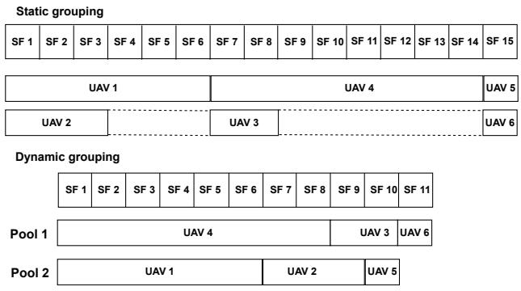  
Fig. 5. Illustration of static and dynamic grouping of UAVs.

It should be noted that we could increase the number of UAVs per group $( N _ { \mathrm { U A V } } )$ to improve spectral efficiency, but it would increase the complexity of SIC. Specifically, we would require $N _ { \mathrm { U A V } } - 1$ SIC operations. Given that we use imperfect SIC (based on practical channel estimation), the decoding efficiency would also decrease if we increase the number of UAVs per group. Therefore, to balance latency and SIC-based decoding complexity, we used $N _ { \mathrm { U A V } } = 2$ in all our evaluations.

To illustrate the working of the proposed grouping algorithms, consider a scenario with six UAVs serving {6, 3, 2, 8, 1, 1} active UEs, respectively. The task is to group the UAVs such that there are $N _ { \mathrm { U A V } } ~ = ~ 2 ~ \mathrm { U A V s }$ per group. Fig. 5 demonstrates the solutions obtained with the proposed static and dynamic grouping algorithms. Specifically, in static grouping, the UAVs are grouped as follows: (UAV 1, UAV 2), (UAV 3, UAV 4), and (UAV 5, UAV 6). For each group, the required transmission time is determined by the UAV with the maximum number of active UEs within that group. Specifically, Group 1 (UAV 1, UAV 2) requires max $( 6 , 3 ) = 6$ subframes, Group 2 (UAV 3, UAV 4) requires max $\left( 2 , 8 \right) = 8$ subframes, and Group 3 (UAV 5, UAV 6) requires max $( 1 , 1 ) =$ 1 subframe. As static grouping is sequential, each group is scheduled one after another, resulting in a total transmission time of $6 + 8 + 1 = 1 5$ subframes, or 15 ms.

In the case of dynamic grouping, the UAVs are first sorted in descending order of their UE loads as {8, 6, 3, 2, 1, 1}, and the UAVs with more number of active UEs (UAV 4, UAV 1) start transmission in Pool 1 and Pool 2, respectively. Then UAVs with the next highest number of UAVs (UAV 2) are assigned to the pool with the lowest load, i.e., Pool 2, and so on as shown in Fig. 5. The UAVs in different pools begin their transmissions in parallel, starting from subframe 1. The pool with the highest UE load (Pool 1) dictates the total duration of the scheduling process, requiring 11 subframes (assuming one UE per subframe). Therefore, this strategy ensures that the overall transmission completes in only 11 ms, compared to the 15 ms required by static grouping. This shows that the dynamic grouping strategy minimizes the total transmission time by distributing high-load UAVs across different pools and leveraging parallel scheduling under NOMA.

In the case of dynamic grouping, the terrestrial BS can easily calculate the minimum time required directly because it has information on the number of active UEs per UAV. However, it has to spend extra effort to determine different groups of UAVs for each subframe such that the transmission is completed in minimal time. Then, this information has to be sent to the UAVs so that they transmit in their specific groups, which results in signaling overhead.

To further demonstrate the effects of using NOMA-based scheduling, we analyze the average time required for data transmission considering different UE distributions for the number of active UEs - a) discrete uniform distribution, b) Poisson distribution with mean λ, c) Beta distribution.

## B. Expectation of a maximum of two random variables

1) Discrete Uniform Distribution: Let $X _ { 1 }$ and $X _ { 2 }$ be discrete uniform random variables, taking values in the set $\{ a , a + 1 , \ldots , b \}$ . The expression for the expectation of a maximum of $X _ { 1 }$ and $X _ { 2 }$ is given by

$$
\begin{array} { r l } {  { \mathbb { E } [ \operatorname* { m a x } ( X _ { 1 } , X _ { 2 } ) ] } \quad } & { } \\ & { = \displaystyle \sum _ { x = a } ^ { b } x \cdot ( \frac { x - a + 1 } { b - a + 1 } ) ^ { 2 } - \sum _ { x = a } ^ { b } x \cdot ( \frac { x - a } { b - a + 1 } ) ^ { 2 } . } \end{array}\tag{12}
$$

Since the number of active UEs cannot be negative, we have $a = 0$ , and the above expression can be simplified as

$$
\mathbb { E } [ \operatorname* { m a x } ( X _ { 1 } , X _ { 2 } ) ] = \sum _ { x = 0 } ^ { b } x \cdot \frac { 2 x + 1 } { ( b + 1 ) ^ { 2 } } .\tag{13}
$$

Upon simplification, the final expression can be obtained as

$$
\mathbb { E } [ \operatorname* { m a x } ( X _ { 1 } , X _ { 2 } ) ] = \left( { \frac { b } { b + 1 } } \right) \left( { \frac { 4 b + 5 } { 6 } } \right)\tag{14}
$$

Please see the Appendix for further details.

2) Poisson Distribution: When $X _ { 1 } \sim$ Poisson(λ<sub>1</sub>) and $X _ { 2 } \sim$ Poisson $\left( \lambda _ { 2 } \right)$ , we have

$$
\mathbb { E } [ \operatorname* { m a x } ( X _ { 1 } , X _ { 2 } ) ] = \sum _ { x = 0 } ^ { \infty } \left[ 1 - \left( \sum _ { k = 0 } ^ { x - 1 } \frac { \lambda _ { 1 } ^ { k } e ^ { - \lambda _ { 1 } } } { k ! } \right) \left( \sum _ { k = 0 } ^ { x - 1 } \frac { \lambda _ { 2 } ^ { k } e ^ { - \lambda _ { 2 } } } { k ! } \right) \right] .\tag{15}
$$

This expression is lower bounded by the tail probabilities of the Poisson distribution using the Chernoff bound as follows

$$
\begin{array} { r l r } {  { \mathbb { E } [ \operatorname* { m a x } ( X _ { 1 } , X _ { 2 } ) ] \leq \sum _ { x = 0 } ^ { \infty } [ 1 - ( 1 - ( \frac { \lambda _ { 1 } e } { x } ) ^ { x } e ^ { - \lambda _ { 1 } } )  } } \\ & { } & {  \times ( 1 - ( \frac { \lambda _ { 2 } e } { x } ) ^ { x } e ^ { - \lambda _ { 2 } } ) ] . } \end{array}\tag{16}
$$

When $X _ { 1 }$ and $X _ { 2 }$ are identically distributed $( \lambda _ { 1 } = \lambda _ { 2 } = \lambda )$ the expression can be simplified as

$$
\mathbb { E } [ \operatorname* { m a x } ( X _ { 1 } , X _ { 2 } ) ] \leq \sum _ { x = 0 } ^ { \infty } \bigg [ 1 - \bigg ( 1 - \bigg ( \frac { \lambda e } { x } \bigg ) ^ { x } e ^ { - \lambda } \bigg ) ^ { 2 } \bigg ] .\tag{17}
$$

3) Beta Distribution: Let $X _ { 1 } , X _ { 2 } \stackrel { i . i . d . } { \sim }$ Beta $\iota ( \alpha , \beta )$ be two independent and identically distributed Beta random variables with parameters $\alpha , \beta > 0$ . The expression for the expectation of a maximum of $X _ { 1 }$ and $X _ { 2 }$ is given by

$$
\mathbb { E } [ \operatorname* { m a x } ( X _ { 1 } , X _ { 2 } ) ] = 2 \int _ { 0 } ^ { 1 } x \frac { 1 } { B ( \alpha , \beta ) } x ^ { \alpha - 1 } ( 1 - x ) ^ { \beta - 1 } I _ { x } ( \alpha , \beta ) d x ,
$$

or equivalently,

$$
\mathbb { E } [ \operatorname* { m a x } ( X _ { 1 } , X _ { 2 } ) ] = \frac { 2 } { B ( \alpha , \beta ) } \int _ { 0 } ^ { 1 } x ^ { \alpha } ( 1 - x ) ^ { \beta - 1 } I _ { x } ( \alpha , \beta ) d x .\tag{18}
$$

For details, please refer to the Appendices. Note that the simulated and analytical values of $\mathbb { E } [ \operatorname* { m a x } ( X _ { 1 } , X _ { 2 } ) ]$ for different UE distributions with mean 4, 5 are tabulated in Table. I of the appendices.

## VI. RESULTS AND DISCUSSION

In this section, we present the simulated results for the multi-UAV-aided NB-IoT communication system. We consider the EPA and ETU models for NLoS links [43] and the TDL-D channel model for LoS links [42] as recommended in UAV communication. The simulation parameters used are provided in Table I. First, we present the block error rate (BLER) results for the different physical layer channels used in the procedure described in Section III considering OMA (denoted as OMA in figures) and NOMA (denoted as NOMA in figures) based scheduling. Additionally, for the proposed NOMA-based scheduling, we have simulated the cases with and without SIC. We have also compared our solutions with an NB-IoT compatible GF access mechanism. Then, we demonstrate the latency and energy consumption of the end-to-end system from the perspective of an NB-IoT UE, i.e., the total time taken and energy spent for a UE’s data to be transmitted, successfully received, and acknowledged.

## A. Physical Layer Results

The UEs obtain uplink synchronization with the UAV using NPRACH. In our simulations, we use NPRACH format-0, with a CP length of 128. As per [43], the NPRACH detection is said to be successful if the probability of detecting a UE $\mathrm { i s } \geq 9 9 \%$ (with false alarm probability $\leq 0 . 1 \% )$ for a pre-defined Signal to Noise Ratio (SNR) threshold. This SNR threshold is 0 dB for the largest coverage, called coverage area (CVA) 3 in the specifications. For medium coverage (CVA 2), it is 6 dB SNR, and for small coverage (CVA 1), it is 11.5 dB. We use the same metric to analyze the performance in the TDL-D channel model and the energy-based NPRACH detector proposed in our previous work [1]. From Fig. 6, it is clear that the probability that all the users attempting random access at the same time successfully meet the aforementioned requirements of the 3GPP for all the coverage areas. While the current NB-IoT standard supports a basic NPRACH configuration of two repetitions (11.6 ms), the results that we present here use only one repetition (5.6 ms)in the TDL-D channel, where the receiver uses an energy-based detector. This is because of the LoS path existing between the UEs and the UAV. However, if the channel is NLoS (ETU channel model), we cannot use the energy-based detector presented in [1] and have to adopt a more general NPRACH receiver (as in [52]), which requires two repetitions to meet the NPRACH performance requirements as shown in Fig. 6.

TABLE I SIMULATION PARAMETERS
<table><tr><td rowspan=1 colspan=1>Bandwidth (B)</td><td rowspan=1 colspan=1>180 kHz</td></tr><tr><td rowspan=1 colspan=1>Sampling frequency</td><td rowspan=1 colspan=1>1.92 MHz</td></tr><tr><td rowspan=1 colspan=1>Antenna configuration</td><td rowspan=1 colspan=1>1 Tx; 2 Rx</td></tr><tr><td rowspan=1 colspan=1>Channel model</td><td rowspan=1 colspan=1>TDL-D, EPA 1 Hz, ETU</td></tr><tr><td rowspan=1 colspan=1>NPRACH</td><td rowspan=1 colspan=1>parameters</td></tr><tr><td rowspan=1 colspan=1>Subcarrier spacing (∆f)</td><td rowspan=1 colspan=1>3.75 kHz</td></tr><tr><td rowspan=1 colspan=1>Number of subcarriers $\overline { { ( N _ { \mathrm { S C } } ) } }$ </td><td rowspan=1 colspan=1>48</td></tr><tr><td rowspan=1 colspan=1>NPRACH band</td><td rowspan=1 colspan=1>12 subcarriers (45 kHz)</td></tr><tr><td rowspan=1 colspan=1> $\overline { { N _ { \mathrm { F F T } } \& N _ { \mathrm { C P } } } }$ (in samples)</td><td rowspan=1 colspan=1>512 &amp; 128</td></tr><tr><td rowspan=1 colspan=1>Timing offset</td><td rowspan=1 colspan=1>2 samples [TDL-D channel]128 samples [ETU channel]</td></tr><tr><td rowspan=1 colspan=1>Frequency offset</td><td rowspan=1 colspan=1>rand(-200, 200) Hz [ETU]</td></tr><tr><td rowspan=1 colspan=1>Number of iterations</td><td rowspan=1 colspan=1>10000</td></tr><tr><td rowspan=1 colspan=1>NPUSCH &amp; NPDSCH p</td><td rowspan=1 colspan=1>arameters</td></tr><tr><td rowspan=1 colspan=1>NPUSCH format</td><td rowspan=1 colspan=1>1 (data)</td></tr><tr><td rowspan=1 colspan=1>NPDSCH format</td><td rowspan=1 colspan=1>data</td></tr><tr><td rowspan=1 colspan=1>Subcarrier spacing (∆f)</td><td rowspan=1 colspan=1>15 kHz (OMA)3.75 kHz (NOMA)</td></tr><tr><td rowspan=1 colspan=1>Modulation scheme</td><td rowspan=1 colspan=1>QPSK</td></tr><tr><td rowspan=1 colspan=1>Number of transport blocks simulated</td><td rowspan=1 colspan=1>10000</td></tr></table>

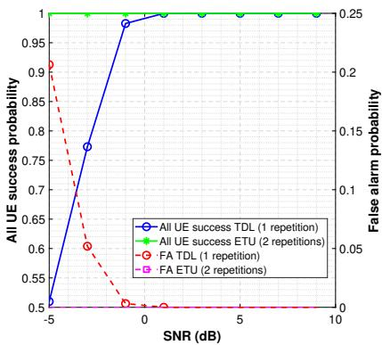  
Fig. 6. NPRACH performance at UAV in TDL-D and ETU channel models.

The results of all the other links are shown in Fig. 7 and Table II. The simulation parameters for uplink data reception (where the transmission was over NPUSCH) are selected based on Tables 10.1.2.3-1 and 10.1.3.2-1 of [53], and Tables 16.5.1.1-1, 16.5.1.1-2, 16.5.1.1-3, and 16.5.1.2-2 of [54]. Fig. 7a and Fig. 7b depict the results obtained evaluated over TDL-D and EPA channel models, respectively, for the steps 2, 5, and 6 of Fig. 2. In this case, the performance of the NOMA scheduling was evaluated for $N _ { \mathrm { U A V } } = 2$ in the system as shown in Fig. 7b. Similarly, the simulation parameters for downlink data reception (where the transmission was over NPDSCH) are chosen based on Tables 16.4.1.3-1, 16.4.1.3- 2, and 16.4.1.1-1 of [54]. The NPDSCH reception results shown in Fig. 7c correspond to the steps 3, 4, 7, and 8 of Fig. 2. Similarly, the results obtained for the physical layer performance (NPUSCH and NPDSCH) of the proposed system over the ETU channel model for urban scenarios are illustrated in Fig. 7, and are included in Table. II.

TABLE II  
PERFORMANCE OF SCHEDULING METHODS ACROSS COMMUNICATION STEPS
<table><tr><td rowspan=1 colspan=1>Steps</td><td rowspan=1 colspan=1>Link</td><td rowspan=1 colspan=1>PhysicalChannel</td><td rowspan=1 colspan=1>Scheduling</td><td rowspan=1 colspan=1>TransportBlockSize</td><td rowspan=1 colspan=1>Time(ms)</td><td rowspan=1 colspan=1>SNR (dB)for BLER10⁻¹</td></tr><tr><td rowspan=1 colspan=1>Step 1</td><td rowspan=1 colspan=1>UE→UAV</td><td rowspan=1 colspan=1>NPRACH</td><td rowspan=1 colspan=1>TDLETU</td><td rowspan=1 colspan=1>一</td><td rowspan=1 colspan=1>5.611.2</td><td rowspan=1 colspan=1>一一</td></tr><tr><td rowspan=1 colspan=1>Step 2</td><td rowspan=1 colspan=1>UAV→BS</td><td rowspan=1 colspan=1>NPUSCH</td><td rowspan=1 colspan=1>OMA-EPAOMA-TDLOMA-ETUNOMA-EPANOMA-TDLNOMA-ETU</td><td rowspan=1 colspan=1>242424242424</td><td rowspan=1 colspan=1>111111</td><td rowspan=1 colspan=1>-1-21.81.24.24</td></tr><tr><td rowspan=1 colspan=1>Step 3</td><td rowspan=1 colspan=1>BS→UAV</td><td rowspan=1 colspan=1>NPDSCH(ACK)</td><td rowspan=1 colspan=1>OMA-EPAOMA-TDLOMA-ETU</td><td rowspan=1 colspan=1>242424</td><td rowspan=1 colspan=1>111</td><td rowspan=1 colspan=1>-3.51.23.65</td></tr><tr><td rowspan=1 colspan=1>Step 4</td><td rowspan=1 colspan=1>UAV→UE</td><td rowspan=1 colspan=1>NPDSCH(RAR)</td><td rowspan=1 colspan=1>OMA-TDLOMA-ETU</td><td rowspan=1 colspan=1>7272</td><td rowspan=1 colspan=1>21</td><td rowspan=1 colspan=1>-0.24.25</td></tr><tr><td rowspan=1 colspan=1> $S t e p \ 5$ </td><td rowspan=1 colspan=1>UE→UAV</td><td rowspan=1 colspan=1>NPUSCH</td><td rowspan=1 colspan=1>OMA-TDLOMA-ETU</td><td rowspan=1 colspan=1>1616</td><td rowspan=1 colspan=1>11</td><td rowspan=1 colspan=1>-2.70</td></tr><tr><td rowspan=1 colspan=1>Step 6</td><td rowspan=1 colspan=1>UAV→BS</td><td rowspan=1 colspan=1>NPUSCH</td><td rowspan=1 colspan=1>OMA-EPAOMA-TDLOMA-ETUNOMA-EPANOMA-TDLNOMA-ETU</td><td rowspan=1 colspan=1>161616161616</td><td rowspan=1 colspan=1>111111</td><td rowspan=1 colspan=1>-2-2.70-0.72.51.8</td></tr><tr><td rowspan=1 colspan=1>Step 7</td><td rowspan=1 colspan=1>BS→UAV</td><td rowspan=1 colspan=1>NPDSCH(D-ACK)</td><td rowspan=1 colspan=1>OMA-EPAOMA-TDLOMA-ETU</td><td rowspan=1 colspan=1>161616</td><td rowspan=1 colspan=1>111</td><td rowspan=1 colspan=1>-40.73.2</td></tr><tr><td rowspan=1 colspan=1>Step 8</td><td rowspan=1 colspan=1>UAV→UE</td><td rowspan=1 colspan=1>NPDSCH(D-ACK)</td><td rowspan=1 colspan=1>OMA-TDLOMA-ETU</td><td rowspan=1 colspan=1>7272</td><td rowspan=1 colspan=1>21</td><td rowspan=1 colspan=1>-0.24.25</td></tr></table>

Typically, in mMTC applications, a BLER of $1 0 ^ { - 1 }$ is reliable [55]. The results suggest that OMA scheduling supports all three coverage areas, whereas NOMA scheduling supports small and medium coverage areas (CVA 1 and CVA 2). Given that a significant number of UEs and UAVs are in small and medium coverage areas, using NOMA scheduling helps reduce latency and energy consumption. In the next subsection, we present an analysis of the latency and the energy efficiency of the end-to-end communication system.

## B. Latency and Energy Consumption

According to the findings in [56], which were in turn based on the 3GPP technical report [40], in a typical mMTC scenario, there are 120 uplink communication requests per second in terrestrial cellular communication. Assuming that these requests are shared by M UAVs, there will be $ { \mathbf { \bar { \Gamma } } } _ { |  { \mathbf { \bar { \Gamma } } } _ { M } } ^ { 1 2 0 }  { \mathbf { \tilde { \Gamma } } } $ requests per second per UAV. With $M = 1 2$ , this will be 10 requests per UAV. In this subsection, we evaluate the end-toend latency and energy efficiency from the perspective of an

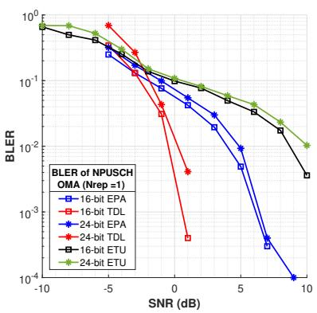  
(a) NPUSCH (OMA).

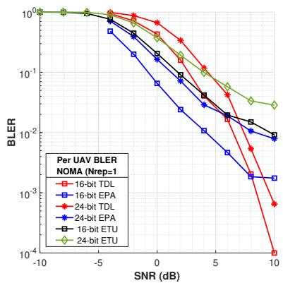  
(b) NPUSCH (NOMA).

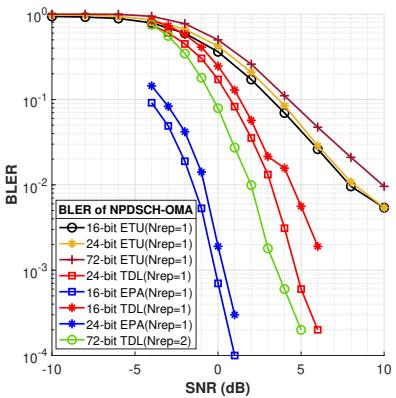  
(c) NPDSCH (OMA).  
Fig. 7. Simulation results of BLER of NPUSCH and NPDSCH.

NB-IoT UE. Note that the proposed scheduling methods are applicable only for UAVs to BS link (step 6 of Fig. 2).

There are M UAVs which are synchronized with the terrestrial BS. Let $t _ { \mathrm { U L s y n c } }$ denote the time required by UE to complete uplink synchronization and $t _ { \mathrm { D - A C K } }$ is the time required by UE to receive data ACK. Note that $t _ { \mathrm { U L s y n c } }$ is computed as

$$
t _ { \mathrm { U L s y n c } } = t _ { \mathrm { N P R A C H } } + t _ { \mathrm { N _ { a } } } + M \cdot t _ { \mathrm { A C K } } + t _ { \mathrm { R A R } } ,\tag{19}
$$

where t<sub>NPRACH</sub> represents the time required for UE to complete random access using NPRACH, $t _ { \mathrm { N _ { a } } }$ is the duration required for UAV to share information of the number of active UEs $( N _ { a } )$ to the terrestrial BS, and $t _ { \mathrm { A C K } }$ is the time required by UAV to receive the acknowledgment for this information (BS has to send this information to each UAV separately), and $t _ { \mathrm { R A R } }$ is the time required by the UE to receive RAR response from its UAV.

Each UE’s data requires a time of $t _ { \mathrm { U E } } = 1$ ms (since one subframe is used for UE data transmission). The transmissions from all the UAVs begin at the same time. Since the number of active UEs $( N _ { a } )$ is different for each UAV, a common start time for UAV transmission is ensured by accommodating for the maximum number of active UEs $( N _ { m a x } .$ , which is set to 12 in NB-IoT) as shown in Fig. 8. The time taken for the data from all the UAVs to be received by the terrestrial BS is denoted as $t _ { \mathrm { s t e p 6 } }$ , whose average values are given by Eqn. (5), Eqn. (9) and Eqn. (11) for OMA scheduling, NOMA scheduling using static grouping and NOMA scheduling using dynamic grouping, respectively. Thus, the average end-to-end latency experienced by an NB-IoT UE can be expressed as

$$
\begin{array} { r } { \mathbb { E } \left[ t _ { \mathrm { T o t a l } } \right] = t _ { \mathrm { U L s y n c } } + t _ { \mathrm { D - A C K } } + t _ { \mathrm { w a i t } } } \\ { + N _ { m a x } t _ { \mathrm { U E } } + t _ { \mathrm { s t e p 6 } } + t _ { \mathrm { O H } } . } \end{array}\tag{20}
$$

where $t _ { \mathrm { w a i t } }$ is the total wait time. Assuming a waiting time of $2$ ms at each step of Fig. $2 , t _ { \mathrm { w a i t } } = 2 \times 7 = 1 4$ ms. Recall from Section V that dynamic grouping requires the terrestrial BS to broadcast the information about groups to all the UAVs. This requires an overhead time (t<sub>OH</sub>) to be added to the average latency presented in Eqn. 20 only for NOMA scheduling, and for OMA scheduling, $t _ { \mathrm { O H } } = 0$

Overhead Breakdown: The dynamic grouping protocol requires signaling from the BS to the UAVs. The BS transmits a downlink data message that is common to all the UAVs. The message indicates the starting subframe of each UAV transmission (ending subframe is always equal to starting subframe plus the number of subframes required by the UAV to send its data and thus does not need to be sent). In order to support transmission over 20 frames (amounting to 20 ms, containing 200 subframes), 8 bits are sufficient to represent a subframe number. Therefore, we would require a transport block size (TBS) of 8M bits to be broadcast, where M is the number of UAVs. Obviously, the TBS will increase as the number of UAVs increases. The reliability of reception of a TBS depends on the modulation and coding scheme (MCS). Following the 3GPP recommended configurations, we can choose $I _ { T B S } = 3$ (to support all TBS until $M = 5 0$ with a code rate of $\scriptstyle { \frac { 1 } { 6 } } )$ and $N _ { r e p } = 2 \ ( 2$ repetitions for increased reliability). The total number of subframes required will be $N _ { S F } \times N _ { r e p }$ , where $N _ { S F }$ is obtained from Table 16.4.1.3-1. The maximum $N _ { S F } = 8$ and thus the maximum overhead is $1 0 \times 2 = 1 6$ ms. Further, based on the TBS requirements, MCS index $( I _ { M C S } )$ , and $I _ { T B S }$ are mapped based on modulation and TBS index Table $7 . 1 . 7 . 1 \cdot 1$ from [54]. These adopted configurations support the code rate requirements mentioned based on the MCS index in [57].

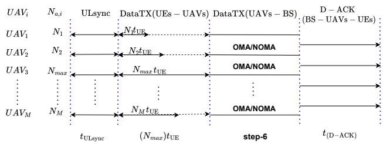  
Fig. 8. Timeline of communication

Moreover, it should be noted that in the case of static grouping, the UAVs already know their group numbers, and the starting subframe has to be shared for each group. Since the number of groups is $\lceil \frac { M } { N _ { \mathrm { U A V } } } \rceil$ , the TBS will be $\mathrm { \bar { 8 } } \times \mathrm { \bar { \lceil } } \frac { M } { N _ { \mathrm { U A V } } } \rceil$ which is less than the TBS required for the dynamic grouping case. Thus, $N _ { r e p } = 1$ will suffice, and the static grouping will have half the overhead as dynamic grouping. Finally, overhead time requirements for static and dynamic grouping for different numbers of UAVs are calculated based on their TBS require ments and are adopted based on the 3GPP configurations.

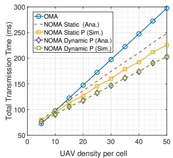  
(a) Poisson (mean = 5).

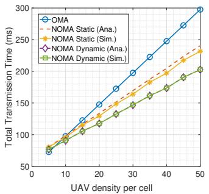  
(b) Uniform (mean = 5).

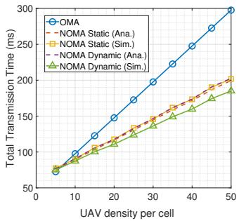  
(c) Beta (mean = 5).

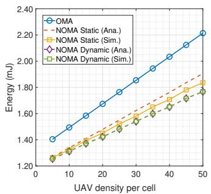  
(d) Poisson (mean = 5).

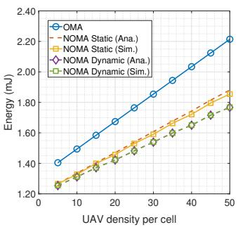  
(e) Uniform (mean = 5).

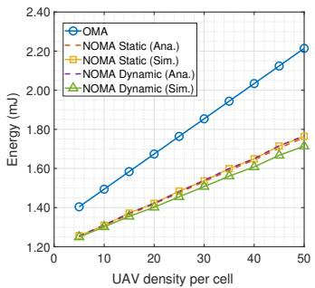  
(f) Beta (mean = 5).  
Fig. 9. End-to-end total transmission time (latency) and energy consumption in the system for different distributions of the number of UEs and increasing UAV density for a cell size of 0.86 km<sup>2</sup>.

In the proposed system model, we assumed that the UAVs hover at a serving spot for several minutes to complete the communication procedures. Typically, the hover time of a UAV is up to 30 minutes [58], and in special cases where fuel-cellbased batteries are used, it can extend up to 180 minutes [59]. In either case, it is sufficient to serve the UEs multiple times.

To further illustrate the power consumed by the UAVs, we adopt the analytical model in [60], [61], where the authors calculated the power consumption requirements for UAV dynamics and for communication purposes while using the rotary wing UAVs.

Hovering Energy: It is modeled as

$$
\begin{array} { l } { { \displaystyle P _ { \mathrm { h o v e r } } = P _ { 0 } \left( 1 + \frac { 3 V ^ { 2 } } { U _ { \mathrm { t i p } } ^ { 2 } } \right) + P _ { i } \left( \sqrt { 1 + \frac { V ^ { 4 } } { 4 v _ { 0 } ^ { 4 } } } - \frac { V ^ { 2 } } { 2 v _ { 0 } ^ { 2 } } \right) ^ { 1 / 2 } } } \\ { { \displaystyle ~ + \frac { 1 } { 2 } d _ { 0 } \rho s A V ^ { 3 } } } \end{array}
$$

where $P _ { 0 } = 7 9 . 8 6 \mathrm { ~ W ~ }$ is the blade profile power, $P _ { i } = 8 8 . 6 3$ W is the induced power in hover, $U _ { \mathrm { t i p } } = 1 2 0$ m/s is the tip speed of the rotor, and $v _ { 0 } ~ = ~ 4 . 0 3$ m/s is the mean rotor induced velocity. Additionally, $d _ { 0 } = 0 . 6$ is the fuselage drag ratio, $\rho = 1 . 2 2 5 \mathrm { k g / m ^ { 3 } }$ is the air density at sea level, $s = 0 . 0 5$ is the rotor solidity, and $A = \pi R ^ { 2 }$ is the rotor disk area for a rotor radius $R = 0 . 2 5 \mathrm { ~ m ~ }$ , resulting in $A \approx 0 . 1 9 6 3 ~ \mathrm { m ^ { 2 } }$ . For a UAV speed of V = 1 m/s, the total power consumption during hover with forward motion is approximately 167.16 Watts. This number aligns well with the work in [62], where the average power consumption for a UAV with horizontal flying (not just hovering) is determined to be 245.2815 Watts.

Communication Energy: UAVs spend additional energy for transmitting control messages (e.g., group formation, scheduling grants) and user data. We estimate the power consumption for radio transmission to be not more than 15 Watts based on typical LTE/5G small-cell transceiver modules [59]. This is also in line with the work in [62], which quantifies the average power requirements to complete the GPS communication process with BS is 8 Watts and goes up to 25 Watts including all communication.

It is evident from these values that the power consumption of the UAV for communication is approximately 10% of the total power consumption, and the battery life of the UAV mostly depends on the flight time. Therefore, with respect to communication, we focused on UE energy consumption rather than UAV power consumption.

In order to calculate the energy consumption of the NB-IoT UE, we need to determine when the UE will be ON (active) and when it can be in light sleep mode. It is evident from the communication procedure in Fig. 2 that a UE is ON for any communication in the UE-UAV link, i.e., NPRACH (step 1), RAR (step 4), data transmission (step 5), and the final reception of D-ACK (step 8). At all the other times (including the wait time between each step and the overhead time in dynamic grouping), the UE can be in light sleep mode. Therefore, the energy consumed by an NB-IoT UE in this system is given by

$$
\begin{array} { r l r } {  { E = P _ { \mathrm { a } } \big ( t _ { \mathrm { N P R A C H } } + t _ { \mathrm { R A R } } + t _ { \mathrm { D a t a - s t e p 5 } } + t _ { \mathrm { s t e p 8 } } \big ) } } \\ & { } & { + \ P _ { \mathrm { l s } } ( t _ { \mathrm { N _ { a } } } + M \cdot t _ { \mathrm { A C K } } + t _ { \mathrm { s t e p 6 } } + t _ { \mathrm { s t e p 7 } } + t _ { \mathrm { w a i t } } + t _ { \mathrm { O H } } ) , } \\ & { } & { ( 2 1 ) } \end{array}
$$

where $t _ { \mathrm { O H } }$ is non-zero in NOMA scheduling, $P _ { \mathrm { a } }$ and $P _ { \mathrm { l s } }$ denote the power consumed by the UE in ON (active) and light sleep modes, respectively.

In the conventional NB-IoT system, the minimum value for t<sub>NPRACH</sub> = 11.2 ms (2 repetitions) for CVA-1 and 44.8 ms (8 repetitions) for CVA-2. Note that the proposed multiple-UAVbased system can adopt only one repetition for both CVA-1 and CVA-2 owing to strong LoS paths existing between UEs and UAVs. Therefore, t<sub>NPRACH</sub> = 5.6 ms in our system, which already reduces the latency and improves the energy efficiency. All the other timing requirements for the calculation of latency and energy efficiency can be readily obtained from the penultimate column of Table. II. Also, we consider $P _ { \mathrm { a } } =$ 60 mW and $P _ { \mathrm { l s } } = 3 ~ \mathrm { m W }$ [63].

Fig. 9 depicts the end-to-end latency and energy consumption for an NB-IoT in the proposed system for different scheduling methods and distributions of active UEs as the number of UAVs per cell (UAV density per cell) in the system increases. We considered Poisson, uniform, and Beta distributions with a mean 5 to model the arrival of UEs at each UAV while using both analytical and simulation methods. It is evident that dynamic grouping, along with NOMA scheduling, offers reduced latency and energy consumption when compared to static grouping and OMA scheduling for all three distributions of active UEs, although it has more overhead time. This is because the transmission time depends on the “mean of the maximum of two random variables” for static grouping, but just on “mean of two random variables”, which results in a lower value for dynamic grouping. The results are evident in Fig. 9 with the analytical and simulation results agreeing well.

1) Discussion on computational complexity of grouping algorithms: Regarding the complexity of scheduling algorithms involved in NOMA, the static grouping algorithm exhibits linear computational complexity with respect to the number of UAVs. Since each UAV is processed exactly once for both grouping and timing evaluation, the total time complexity is O(M ), ensuring that the algorithm scales efficiently to large UAV swarms. In contrast, the dynamic grouping algorithm, which employs the LTTF heuristic, initially sorts the UAVs by their active UE load, incurring a complexity of O(M log M). After sorting, each UAV is placed into the pool with the lowest current load, which involves a linear search over $N _ { \mathrm { U A V } }$ pools for each assignment. As a result, the overall time complexity becomes O(M log $M + M N _ { \mathrm { U A V } } )$

These algorithms are implemented on a single core of the TI TMS320TCI6638 system-on-chip (SoC), which integrates eight C66x digital signal processing (DSP) cores. Each C66x core is a very long instruction word (VLIW), 32-bit fixed- and floating-point DSP capable of issuing up to eight instructions per cycle and delivering a peak throughput of ∼ 20 GFLOP/s at an operating frequency of 1.25 GHz. Considering a realistic sustained utilization of 50%, the effective computational throughput is 10 GFLOP/s. The execution time for the static grouping algorithm was less than 0.125 µs for $M \leq 5 0 ~ \mathrm { U A V s }$ The execution time for dynamic grouping, considering sorting, comparison, and group assignment operations, was 0.375 µs, even at $M = 5 0$ . In terms of energy consumption, for a single C66x DSP core with a per-core power consumption of 1.18 W [64], the energy required to execute the static grouping was less than 150 nJ for $M \leq 5 0 ~ \mathrm { U A V s }$ . For the LTTF-based dynamic grouping algorithm, the energy consumption was about 425 nJ for $M = 5 0 .$ . These findings demonstrate that the proposed grouping algorithms introduce only negligible computation time and energy on practical DSP hardware, and are hence practically feasible.

2) Discussion on interference mitigation: It is evident that when the proposed OMA scheduling mechanism is adopted, the UEs and UAVs are separated in time, frequency, or both, which mitigates interference by default. When NOMA scheduling mechanism is adopted in the UAV-BS link, the UAVs are grouped and share the same frequency resources. The groups themselves are scheduled at different time intervals, which ensures no interference across groups. However, there is interference between UAVs within the same group. Since we use code-domain NOMA with ZC sequences having low cross-correlation, the inter-UAV interference within a group is already mitigated. It can be further suppressed by using successful interference cancellation (SIC) as discussed in Section IV-B. Note that this is a practical implementation of SIC where the estimated channel is used to cancel the interference and not the perfect channel state information (CSI). The per UAV BLER performance of using SIC along with NOMA for a TBS of size 16 bits in the UAV-BS link is illustrated in Fig. 10a. The results show that using SIC is helpful to achieve marginally better performance in both the EPA and TDL-D channel models because the NOMA sequences already had low cross-correlation.

3) Discussion on GF-NOMA: Throughout this work, the focus is on the grant-based NOMA procedure for NB-IoT UEs, which is aligned with the current 3GPP standardization and represents a structured and controllable multiple access mechanism suitable for low-power and low bandwidth applications. Specifically, both the UE-UAV link and the UAV-BS links were grant-based. Since the number of UAVs in a cell is predetermined, the BS can allocate dedicated timefrequency resources for each UAV in a grant-based manner to limit the inter-UAV interference and improve the reliability of communication. However, the number of users served by a given UAV and the user activity observed by each UAV can be different. Hence, evaluating grant-free access for the UE-UAV would be more prudent. Therefore, the proposed system model is evaluated using the grant-free NOMA (GF-NOMA) access mechanism in the UE-UAV link. Such an access mechanism is contention-based, and the UEs transmit data along with the preamble, thereby reducing the latency and improving battery life of the UEs. The key performance indicators of GF-NOMA are the probability of success of GF preamble detection and the per-user block error rate (BLER).

The results are presented in Fig. 10b, Fig. 10c. Note that we have now included the results with and without SIC. The results for the preamble detection performance show that the grant-based NOMA using NPRACH requires a lower SNR (0 dB) to achieve the success probability of $\ge 9 9 \%$ than in the case of a grant-free NOMA system, where it takes almost 5 dB as shown in Fig. 10b. This is because the individual preambles in NPRACH are transmitted orthogonally over different subcarriers, while the grant-free preambles are nonorthogonal (albeit with low cross-correlation). Similarly, the per-UE BLER performance in the UE-UAV link is evaluated for both grant-based and grant-free NOMA in the TDL-D channel while communicating a transport block of size 16 bits. The results show that the grant-free NOMA system requires approximately 3dB more SNR as compared to the grantbased NOMA system to achieve a similar BLER performance of $1 0 ^ { - 1 }$ owing to the non-orthogonality present in grantfree access. However, both these mechanisms meet the 3GPP performance requirements for coverage area 1 (CVA 1) and coverage area 2 (CVA 2), which require the BLER to be less than or equal to $1 0 ^ { - 1 }$ at 5 dB and 11 dB, respectively, as mentioned in [43]. This makes both mechanisms practically feasible. Also, it is well known that grant-free mechanisms offer lower latency and improved energy efficiency when compared to grant-based mechanisms.

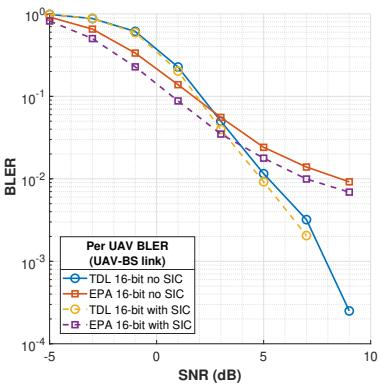

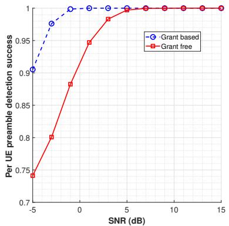  
Fig. 10. Performance comparison with SIC and GF-NOMA.

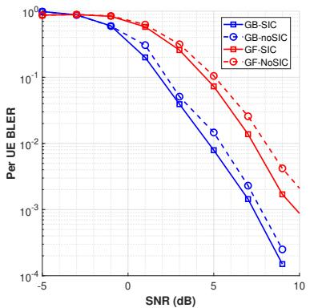  
(a) Performance with and without SIC. (b) Preamble detection performance using(c) Data decoding performance using NOMA. NOMA.

## VII. CONCLUSION

The NB-IoT standard by the 3GPP is suitable for massive machine-type communications (mMTC) due to its low power consumption and low data throughput capabilities. Its performance in terms of cell capacity, battery life, and coverage is well documented in terrestrial communication systems. This work explores its performance in a multi-UAV NTN scenario, where each UAV acts as a relay between NB-IoT UEs and a terrestrial BS using NB-IoT as candidate technology. To ensure efficient data transmission from multiple UAVs to the BS, we introduced two scheduling mechanisms: OMA, where UAVs transmit their data to the BS sequentially, and NOMA, where groups of UAVs simultaneously transmit data. We derived closed-form expressions for the average transmission time under both OMA and NOMA strategies while accounting for the stochastic nature of UE distribution at UAV, modeled using discrete uniform, Poisson, and Beta distributions. Further, we proposed static and dynamic grouping strategies in the NOMA scheme in UAV-BS link where, in the former case, the BS has prior knowledge of UAVs transmitting together, and in the latter, the BS determines and communicates an optimal grouping strategy by using the LTTF algorithm to minimize average transmission time. In addition to analytical modeling, we computed comprehensive physical layer simulations adhering to 3GPP channel models (TDL-D, EPA, and ETU) to simulate realistic LoS and NLoS scenarios without assuming perfect channel state information. We evaluated the latency and energy consumption for both OMA and NOMA schemes. The performance of the NOMA scheme was assessed both with and without SIC and compared against an NB-IoT-compatible GF-NOMA. Our simulation results show that the proposed NOMA-based scheduling strategies, especially the dynamic grouping scheme, not only meet 3GPP performance targets but also offer clear advantages over OMA and static grouping, with reduced latency and lower energy consumption at the UE side. The results indicate that the proposed system model is indeed a suitable technology for UAV-based NTN. As directions of future work, we intend to investigate advanced interference mitigation and multi-user detection with imperfect SIC for NOMA-based UAV transmissions, energy-aware scheduling of UAVs considering failures, and scalable grouping strategies for ultra-dense multi-UAV NB-IoT deployments.

## REFERENCES

[1] P. K. N, S. Krishna M, and N. M. Balasubramanya, “Performance Analysis of a UAV-based Non-Terrestrial Network (NTN) using NB-IoT,” in Proc. IEEE Wireless Commun. Netw. Conf. (WCNC). IEEE, 2023, pp. 1–6.

[2] L. Chettri and R. Bera, “A Comprehensive Survey on Internet of Things (IoT) Toward 5G Wireless Systems,” IEEE Internet of Things J., vol. 7, no. 1, pp. 16–32, 2020.

[3] 3GPP, “Study on scenarios and requirements for next generation access technologies (Release 15),” 3GPP, TR 38.913, 2025.

[4] I. C. Msadaa, S. Zairi, and A. Dhraief, “Non-terrestrial networks in a nutshell,” IEEE Internet Things. Mag., vol. 5, no. 2, pp. 168–174, 2022.

[5] F. Rinaldi, H.-L. Maattanen, J. Torsner, S. Pizzi, S. Andreev, A. Iera, Y. Koucheryavy, and G. Araniti, “Non-Terrestrial Networks in 5G & Beyond: A Survey,” IEEE Access, vol. 8, pp. 165 178–165 200, 2020.

[6] 3GPP, “Study on New Radio (NR) to support for Non Terrestrial Networks (NTN),” 3GPP, TS 38.811, 2020.

[7] ——, “Solutions for NR to support for Non Terrestrial Networks (NTN),” 3GPP, TS 38.821, 2023.

[8] X. Lin, S. Rommer, S. Euler, E. A. Yavuz, and R. S. Karlsson, “5G from space: An overview of 3GPP non-terrestrial networks,” IEEE Commun Mag., 2021.

[9] A. A. Khuwaja, Y. Chen, N. Zhao, M.-S. Alouini, and P. Dobbins, “A survey of channel modeling for UAV communications,” IEEE Commun. Surveys Tuts., vol. 20, no. 4, pp. 2804–2821, 2018.

[10] C. Yan, L. Fu, J. Zhang, and J. Wang, “A comprehensive survey on UAV communication channel modeling,” IEEE Access, vol. 7, pp. 107 769– 107 792, 2019.

[11] P. S. Bithas, V. Nikolaidis, A. G. Kanatas, and G. K. Karagiannidis, “UAV-to-ground communications: Channel modeling and UAV selection,” IEEE Trans. Commun., vol. 68, no. 8, pp. 5135–5144, 2020.

[12] A. Al-Hourani, S. Kandeepan, and S. Lardner, “Optimal LAP altitude for maximum coverage,” IEEE Wireless Commun. Lett., vol. 3, no. 6, pp. 569–572, 2014.

[13] J. Chen and D. Gesbert, “Optimal positioning of flying relays for wireless networks: A LOS map approach,” in Proc. IEEE Int. Conf. Commun.(ICC). IEEE, 2017, pp. 1–6.

[14] M. Mozaffari, W. Saad, M. Bennis, and M. Debbah, “Efficient deployment of multiple unmanned aerial vehicles for optimal wireless coverage,” IEEE Commun. Lett., vol. 20, no. 8, pp. 1647–1650, 2016.

[15] J. Lyu, Y. Zeng, R. Zhang, and T. J. Lim, “Placement optimization of UAV-mounted mobile base stations,” IEEE Commun. Lett., vol. 21, no. 3, pp. 604–607, 2017.

[16] M. Mozaffari, W. Saad, M. Bennis, and M. Debbah, “Performance optimization for UAV-enabled wireless communications under flight time constraints,” in Proc.IEEE Glob. Commun. Conf. IEEE, 2017, pp. 1–6.

[17] Y. Zeng and R. Zhang, “Energy-Efficient UAV Communication With Trajectory Optimization,” IEEE Trans. Wireless Commun., vol. 16, no. 6, pp. 3747–3760, 2017.

[18] Q. Wu, Y. Zeng, and R. Zhang, “Joint trajectory and communication design for multi-UAV enabled wireless networks,” IEEE Trans. Wireless Commun., vol. 17, no. 3, pp. 2109–2121, 2018.

[19] M. Alzenad, A. El-Keyi, F. Lagum, and H. Yanikomeroglu, “3D placement of an unmanned aerial vehicle base station UAV-BS for energyefficient maximal coverage,” IEEE Commun. Lett., vol. 6, no. 4, pp. 434–437, 2017.

[20] Y. Chen, N. Li, C. Wang, W. Xie, and J. Xv, “A 3D placement of unmanned aerial vehicle base station based on multi-population genetic algorithm for maximizing users with different QoS requirements,” in Proc. IEEE 18th Int. Conf. Commun. Technol.(ICCT). IEEE, 2018, pp. 967–972.

[21] A. A. Khuwaja, G. Zheng, Y. Chen, and W. Feng, “Optimum deployment of multiple UAVs for coverage area maximization in the presence of cochannel interference,” IEEE Access, vol. 7, pp. 85 203–85 212, 2019.

[22] Liu, Xiaomin and Peng, Yujie and Song, Xiaoqin and Song, Tiecheng, “Latency-Aware Optimization of UAV Deployment, Computation Offloading, and Resource Allocation for IoRT in Space-Air-Ground Integrated Networks,” IEEE Trans. Veh. Technol., pp. 1–14, 2025.

[23] Liang, Shuang and Yin, Minhao and Xie, Wenwen and Sun, Zemin and Li, Jiahui and Wang, Jiacheng and Du, Hongyang, “UAV-Enabled Secure Data Collection and Energy Transfer in IoT via Diffusion-Model-Enhanced Deep Reinforcement Learning,” IEEE Internet Things J., vol. 12, no. 10, pp. 13 455–13 468, 2025.

[24] Wang, Liang and Wang, Kezhi and Pan, Cunhua and Aslam, Nauman, “Joint Trajectory and Passive Beamforming Design for Intelligent Reflecting Surface-Aided UAV Communications: A Deep Reinforcement Learning Approach,” IEEE Trans. Mob. Compu., vol. 22, no. 11, pp. 6543–6553, 2023.

[25] Wang, Jing and Zhou, Xiaotian and Zhang, Haixia and Liang, Daojun and Yuan, Dongfeng, “Joint Trajectory Design and Resource Allocation for Energy-Efficient Multi-UAV Assisted Vehicular Networks: An IKPP Approach,” IEEE Trans. Wireless Commun., vol. 25, pp. 2150–2166, 2026.

[26] Yu, Yongzhuo and Duan, Xuting and Zhao, Feiyang and Zhou, Jianshan and Lin, Chunmian and Qu, Kaige and Tian, Daxin, “Cooperative Coverage Mission Planning for Multi-UAV Based on the Dual-Ring Dynamic Scheduler,” IEEE Internet Things J., vol. 12, no. 21, pp. 44 402–44 419, 2025.

[27] F. Toscano, C. Fiorentino, N. Capece, U. Erra, D. Travascia, A. Scopa, M. Drosos, and P. DAntonio, “Unmanned aerial vehicle for precision agriculture: A review,” IEEE Access, vol. 12, pp. 69 188–69 205, 2024.

[28] H. Shakhatreh, A. H. Sawalmeh, A. Al-Fuqaha, Z. Dou, E. Almaita, I. Khalil, N. S. Othman, A. Khreishah, and M. Guizani, “Unmanned Aerial Vehicles (UAVs): A Survey on Civil Applications and Key Research Challenges,” IEEE Access, vol. 7, pp. 48 572–48 634, 2019.

[29] M. Sheng, X. Chen, J. Liu, J. Li, and T. Q. S. Quek, “Toward disasterresistant cellular communication networks based on network capacity scalability,” IEEE Trans. Wireless Commun., vol. 24, no. 6, pp. 5310– 5322, 2025.

[30] M. Erdelj, E. Natalizio, K. R. Chowdhury, and I. F. Akyildiz, “Help from the sky: Leveraging uavs for disaster management,” IEEE Pervasive Comput., vol. 16, no. 1, pp. 24–32, 2017.

[31] N. Zhao, W. Lu, M. Sheng, Y. Chen, J. Tang, F. R. Yu, and K.-K. Wong, “UAV-Assisted Emergency Networks in Disasters,” IEEE Wirel. Commun., vol. 26, no. 1, pp. 45–51, 2019.

[32] S. Barick and C. Singhal, “Multi-UAV Assisted IoT NOMA Uplink Communication System for Disaster Scenario,” IEEE Access, vol. 10, pp. 34 058–34 068, 2022.

[33] O. M. Bushnaq, A. Chaaban, and T. Y. Al-Naffouri, “The role of uav-iot networks in future wildfire detection,” IEEE Internet Things J., vol. 8, no. 23, pp. 16 984–16 999, 2021.

[34] G. Castellanos, M. Deruyck, L. Martens, and W. Joseph, “System Assessment of WUSN Using NB-IoT UAV-Aided Networks in Potato Crops,” IEEE Access, vol. 8, pp. 56 823–56 836, 2020.

[35] 3GPP, “Study on Narrowband Internet of Things (NB-IoT) / enhanced Machine Type Communication (eMTC) support for Non-Terrestrial Networks (NTN),” 3GPP, TS 36.763, 2021.

[36] S. Narayanan, D. Tsolkas, N. Passas, and L. Merakos, “NB-IoT: A Candidate Technology for Massive IoT in the 5G Era,” in Proc. 23rd Int. Workshop Comput. Aided Model. Des. Commun. Links Netw. (CAMAD), 2018, pp. 1–6.

[37] M. Kanj, V. Savaux, and M. Le Guen, “A tutorial on NB-IoT physical layer design,” IEEE Commun. Surveys Tuts., vol. 22, no. 4, pp. 2408– 2446, 2020.

[38] O. Liberg, S. E. Lwenmark, S. Euler, B. Hofstrm, T. Khan, X. Lin, and J. Sedin, “Narrowband Internet of Things for Non-Terrestrial Networks,” IEEE Commun. Mag., vol. 4, no. 4, pp. 49–55, 2020.

[39] Y.-P. E. Wang, X. Lin, A. Adhikary, A. Grovlen, Y. Sui, Y. Blankenship, J. Bergman, and H. S. Razaghi, “A Primer on 3GPP Narrowband Internet of Things,” IEEE Commun. Mag., vol. 55, no. 3, pp. 117–123, 2017.

[40] 3GPP, “Cellular system support for ultra-low complexity and low throughput Internet of Things (CIoT),” 3GPP, TR 38.820, 2015.

[41] ——, “Enhanced LTE support for aerial vehicles (Release 15),” 3GPP, TR 36.777, 2018.

[42] ——, “Study on channel model for frequencies from 0.5 to 100 GHz (Release 16),” 3GPP, TR 38.901, 2025.

[43] ——, “LTE; Evolved Universal Terrestrial Radio Access (E-UTRA); Base Station (BS) radio transmission and reception,” 3GPP, TS 36.104, 2025.

[44] Q. Wu and R. Zhang, “Common Throughput Maximization in UAV-Enabled OFDMA Systems With Delay Consideration,” IEEE Trans. Wireless Commun., vol. 17, no. 8, pp. 5340–5359, 2018.

[45] S. Zhang, H. Zhang, B. Di, and L. Song, “Joint Trajectory and Power Optimization for UAV Sensing Over Cellular Networks,” IEEE J. Sel. Areas Commun., vol. 37, no. 12, pp. 2795–2806, 2019.

[46] M. Mozaffari, W. Saad, M. Bennis, and M. Debbah, “Mobile Unmanned Aerial Vehicles (UAVs) for Energy-Efficient Internet of Things Communications,” IEEE Trans. Commun., vol. 16, no. 11, pp. 7574–7589, 2017.

[47] C. Zhan, Y. Zeng, and R. Zhang, “Trajectory Design for Distributed Estimation in UAV-Enabled Wireless Sensor Network,” IEEE Trans. Wir. Commun, vol. 17, no. 6, pp. 3716–3731, 2018.

[48] M. Mozaffari, W. Saad, M. Bennis, and M. Debbah, “Unmanned Aerial Vehicle With Underlaid Device-to-Device Communications: Performance and Tradeoffs,” IEEE Trans. Wir. Commun., vol. 15, no. 6, pp. 3949–3963, 2016.

[49] ——, “Optimal transport theory for power-efficient deployment of unmanned aerial vehicles,” in Proc. IEEE Int. Conf. Commun. (ICC), 2016, pp. 1–6.

[50] G. S. Harini, N. Mysore Balasubramanya, and M. Rana, “On Preamblebased Grant-Free Transmission in Low Power Wide Area (LPWA) IoT Networks,” in Proc. IEEE 6th World Forum on Internet of Things. (WF-IoT), 2020, pp. 1–6.

[51] F. D. Croce and R. Scatamacchia, “The Longest Processing Time Rule for Identical Parallel Machines Revisited,” J. Scheduling, vol. 23, no. 2, pp. 163–176, 2020.

[52] H. Chougrani, S. Kisseleff, and S. Chatzinotas, “Efficient preamble detection and time-of-arrival estimation for single-tone frequency hopping random access in NB-IoT,” IEEE Internet Things J., vol. 8, no. 9, pp. 7437–7449, 2020.

[53] 3GPP, “Evolved Universal Terrestrial Radio Access (E-UTRA); Physical channels and modulation,” 3GPP, TS 36.211, 2025.

[54] ——, “Evolved Universal Terrestrial Radio Access (E-UTRA); Physical layer procedures,” 3GPP, TS 36.213, 2025.

[55] S. R. Pokhrel, J. Ding, J. Park, O.-S. Park, and J. Choi, “Towards enabling critical mMTC: A review of URLLC within mMTC,” IEEE Access, vol. 8, pp. 131 796–131 813, 2020.

[56] C. Bockelmann, N. K. Pratas, G. Wunder, S. Saur, M. Navarro, D. Gregoratti, G. Vivier, E. De Carvalho, Y. Ji, . Stefanovi, P. Popovski, Q. Wang, M. Schellmann, E. Kosmatos, P. Demestichas, M. Raceala-Motoc, P. Jung, S. Stanczak, and A. Dekorsy, “Towards Massive Connectivity Support for Scalable mMTC Communications in 5G Networks,” IEEE Access, vol. 6, pp. 28 969–28 992, 2018.

[57] D. Lopez-Perez and X. Chu, “Inter-Cell Interference Coordination for Expanded Region Picocells in Heterogeneous Networks,” in Proc. IEEE 20th Int. Conf. CompuT. Commun. Netw. (ICCCN), 2011, pp. 1–6.

[58] S. T. Muntaha, S. A. Hassan, H. Jung, and M. S. Hossain, “Energy Efficiency and Hover Time Optimization in UAV-Based HetNets,” IEEE Trans. Intell. Transp. Sys., vol. 22, no. 8, pp. 5103–5111, 2021.

[59] A. Fotouhi, M. Ding, M. Hassan, L. G. Giordano, A. Garcia-Rodriguez, and M. Dohler, “Survey on UAV Cellular Communications: Practical Aspects, Standardization Advancements, Regulation, and Security Challenges,” IEEE Commun. Surv. Tutor., vol. 21, no. 4, pp. 3417–3442, 2019.

[60] Y. Zeng, J. Xu, and R. Zhang, “Energy Minimization for Wireless Communication With Rotary-Wing UAV,” IEEE Trans. Wir. Commun, vol. 18, no. 4, pp. 2329–2345, 2019.

[61] P. Ribeiro, A. Coelho, and R. Campos, “On the Energy Consumption of Rotary-Wing and Fixed-Wing UAVs in Flying Networks,” in Proc. 20th Wir. On-Demand Netw. Syst. Services Conf. (WONS), 2025, pp. 1–4.

[62] H. V. Abeywickrama, B. A. Jayawickrama, Y. He, and E. Dutkiewicz, “Empirical Power Consumption Model for UAVs,” in Proc. IEEE 88th Veh. Tech. Conf. (VTC-Fall), 2018, pp. 1–5.

[63] A. C. Cirik, N. M. Balasubramanya, L. Lampe, G. Vos, and S. Bennett, “Toward the standardization of grant-free operation and the associated NOMA strategies in 3GPP,” IEEE Commun. Mag., vol. 3, no. 4, pp. 60–66, 2019.

[64] R. Damodaran, T. Anderson, S. Agarwala, R. Venkatasubramanian, M. Gill, D. Gopalakrishnan, A. Hill, A. Chachad, D. Balasubramanian, N. Bhoria, J. Tran, D. Bui, M. Rahman, S. Moharil, M. Pierson, S. Mullinnix, H. Ong, D. Thompson, K. Gurram, O. Olorode, N. Mahmood, J. Flores, A. Rajagopal, S. Narnur, D. Wu, A. Hales, K. Peavy, and R. Sussman, “A 1.25GHz 0.8W C66x DSP Core in 40nm CMOS,” in Proc. 25th Int. Conf. VLSI Des., 2012, pp. 286–291.