IEEE TRANSACTIONS ON MOBILE COMPUTING

# PointRL: Reinforcement Learning-Based Approach for Air-Ground Communications Using Multi-Dimensional Target Sensing Point Cloud

Leyan Chen, Member, IEEE, Kai Liu, Member, IEEE, Peng Yang, Member, IEEE, Zehui Xiong, Senior Member, IEEE, Tony Q. S. Quek, Fellow, IEEE, Jisi Fang, Zhibo Zhang, Member, IEEE

Abstract—Unmanned aerial vehicles (UAVs) are increasingly used in smart city communications for air-ground communications due to their flexibility, low cost, and independence from ground conditions, enabling high data rates for future networks. This paper explores UAV-to-vehicle (U2V) mmWave integrated sensing and communication (ISAC), where vehicles are represented as rigid shapes in a 3D radar point cloud. Considering maximizing channel capacity with multi-user interference and radar performance, two adaptive optimization problems are proposed, incorporating vehicle-to-vehicle (V2V) communication for interference mitigation. The radar point cloud-driven reinforcement learning (PointRL) algorithm is designed to solve these problems. It includes a point cloud-based deep neural network (PDNN) for extracting action spaces from 3D radar data and a decision network that reduces network complexity through segmentation and connection. A linear weighted sliding window reward mechanism is also designed to enhance decision-making in dynamic environments. Simulation results show that the proposed PointRL outperforms benchmark methods.

Index Terms—UAV-to-vehicle (U2V), vehicle-to-vehicle (V2V), radar point cloud, deep reinforcement learning (DRL), trajectory control, resource allocation.

## I. INTRODUCTION

N recent years, unmanned aerial vehicles (UAVs) have attracted significant attention from both academia and industry [1], [2], [3]. Their high maneuverability and mobility make them an efficient solution to improve ground wireless networks, overcoming communication barriers posed by geographic features. UAVs can enhance communication performance, provide reliable services, and offer better coverage for ground users [4], [5], [6]. Beyond communication, UAVs are also vital in sensing and data acquisition, particularly when equipped with advanced radar systems [7]. These systems enable UAVs to detect and track ground users, providing realtime situational awareness for applications like surveillance, traffic monitoring, and disaster management [8], [9]. By acting as mobile radar platforms, UAVs offer accurate sensing information, complementing communication services and overcoming line-of-sight limitations in challenging terrains, thus ensuring continuous coverage and reliable data transmission in complex environments [10]. Combining communication and radar sensing capabilities, UAVs represent a powerful dualfunction platform, crucial for modern wireless networks and intelligent sensing systems [11].

The evolution of fifth (5G) and sixth generation (6G) wireless networks has accelerated the adoption of integrated sensing and communication (ISAC) technology. ISAC plays an essential role in improving urban living standards and operational efficiency [12]. By simultaneously transmitting data and sensing the environment, ISAC is particularly valuable in dense urban settings. It supports applications like smart city infrastructure, autonomous transportation, and industrial automation, where real-time data sharing enhances decision-making and system coordination. Furthermore, ISAC technology enables dynamic resource allocation, optimizing bandwidth and network resources to deliver high performance even in demanding environments [13].

With the advent of compact wireless modules, UAVs can enhance both sensing and communication services in ISAC systems [14]. UAV-ISAC further improves real-time situational awareness, connectivity, and reliability in communication networks [15]. However, current urban infrastructures still face limitations such as restricted sensing coverage, fixed deployment, high latency in information acquisition, and vulnerability to line-of-sight (LoS) blockages caused by dense buildings. These constraints hinder the effectiveness of existing ground-based communication and sensing systems, especially in dynamic and complex urban environments. UAV-ISAC provides an essential solution to these challenges by offering flexible, high-mobility, and on-demand integration of sensing and communication functions. Through the combination of UAV mobility, adaptive communication links, and high-resolution radar sensing, UAV-ISAC enables rapid envi ronmental perception, efficient spectrum utilization, and realtime data transmission, thereby enhancing urban resilience and intelligent infrastructure management. Consequently, UAV-ISAC serves as a key enabling technology for next-generation smart cities [16], [17]. Furthermore, millimeter-wave radar technology plays a pivotal role in UAV-ISAC, providing finegrained sensing accuracy that allows precise detection of objects and environmental features [18].

The mmWave radar mutual information is a key metric to measure sensing performance, such as [19], [20], [21]. Reference [22] uses radar echoes to determine vehicle positions, focusing on distance measurements but neglecting the radar’s range-velocity (RV) spectrum detection. In [23], an adaptive mmWave radar-communication system enhances ISAC performance, leveraging precise detection to improve communication capabilities. Passive mmWave radar arrays are also used to sense automotive radar transmissions from multiple vehicles, enabling reduced interference in communication links [24]. In [25], a deep learning-based approach is proposed for beam selection and communication resource allocation, using real-world mmWave radar point cloud data to optimize ISAC performance. By integrating mmWave radar with UAV platforms, accurate target sensing can significantly enhance UAVs’ ability to detect ground users, improving communication reliability and performance, especially in urban and vehicular environments. However, challenges like power allocation and communication interference arise in multivehicle scenarios.

Current UAV-to-vehicle (U2V) studies typically assume the location of vehicles as known and simplify vehicle representation to a single point, which fails to capture the dynamic and complex nature of real-world environments. For instance, reference [26] optimizes UAV trajectory and communication resources based on vehicle location assumptions, while [27] uses clustering-assisted reinforcement learning for optimizing UAV trajectories, user association, and power allocation. More recent work in UAV-ISAC systems has focused on optimizing scheduling, transmission power, and UAV trajectory while sensing vehicles [28], [29]. For example, in [30], a UAV-assisted ISAC system optimizes the UAV’s flight path to minimize energy consumption while ensuring accurate sensing resolutions. In [31], an integrated periodic sensing and communication (IPSAC) mechanism provides a flexible trade-off between sensing and communication performance, maximizing achievable rate through joint optimization of UAV trajectory, user association, target sensing, and transmit beamforming. The assumptions of precisely known vehicle locations and single point-based vehicle representations limit the applicability of these methods in practical scenarios, where actual vehicle positions are often uncertain and dynamically changing.

Given the inherent complexities in UAV-assisted communication scenarios, where precise vehicle positions are often unpredictable and vehicle interactions are dynamic, traditional optimization methods fall short. Deep reinforcement learning (DRL) integrates the feature representation ability of deep learning with the decision-making ability of reinforcement learning so that it can achieve powerful end-to-end learning control capabilities [32], [33]. DRL has therefore emerged as an effective solution, enabling UAVs to adaptively optimize trajectory and resource allocation based on real-time environmental feedback. In [34], a DRL framework of agent deep deterministic policy gradient (MADDPG) is proposed for the

UAV three-dimensional (3D) trajectory design and resource scheduling, considering the fairness among sensors and the tradeoff between throughput and energy consumption in the space-air-ground (SAG)-PIoRT. Following the uplink transmission communication issue through jointly optimizing UAV 3D trajectory design, UAV-sensors association, and sensors transmission power, the maximum long-term network capacity and simultaneously the minimum total energy consumption of sensors are obtained. Reference [35] proposes a UAVassisted heterogeneous multi-vehicle computation offloading (HMSCO) scheme under the constraints of reliability requirements, tolerable delay, and computing resource limits. It is measured by a weighted sum of delay and energy consumption. Then, a multi-agent enhanced dueling double deep Q network (ED3QN) is proposed to optimize server offloading decisions and resource allocation.

The current research of UAV-assisted ISAC systems faces several critical challenges. First, most studies assume that vehicle locations are precisely known, which is difficult to achieve in dynamic and complex real-world environments. Second, vehicles are often modeled as a single point, neglecting their true physical size and shape, thus limiting the realism and accuracy of sensing and communication tasks. Third, traditional optimization-based approaches lack adaptability in rapidly changing scenarios, especially when dealing with multi-vehicle interactions and environmental uncertainties. To address the above challenges, this paper investigates a mmWave radar-aided U2V scenario based on ISAC technology. By representing vehicles with mmWave radar point clouds, our approach provides a more precise and adaptable model that captures real-world conditions and communication services for vehicles without assuming their positions to be known in advance. Nevertheless, owing to the inherent randomness and high dimensionality of radar point cloud data, traditional optimization methods fail to deliver effective solutions. Consequently, this approach adopts the DRL framework to manage vehicle sensing and resource allocation dynamically. This approach also leverages radar data to guide UAVs in making real-time adjustments for enhanced communication reliability and sensing performance, ultimately offering a more realistic and efficient solution to U2V scenarios in dense environments.

The main key contributions in this paper are outlined as follows:

• Unlike most current studies, the proposed system can communicate accurately without assuming vehicles’ positions are known. Vehicles are represented as rigid shapes captured through mmWave radar point clouds instead of being simplified to single points in this paper, as is common in many works. This approach enhances realism by accounting for the complex structure and spatial distribution of vehicles, which is essential for accurately modeling the real world. Using radar point cloud data allows for refined detection of vehicle boundaries and orientations, leading to more precise situational sensing. This detailed representation is crucial for effective communications in U2V scenarios.

• Two fair adaptive optimization problems for integrated radar sensing and communication performance are formulated in U2V scenarios. It involves radar sensing, UAV trajectory optimization, and communication resource allocation. Vehicle-to-vehicle (V2V) communication is introduced as a supplementary channel under high-density vehicle conditions to reduce inter-vehicle interference. This model is designed to adapt to real-world challenges dynamically, balancing radar sensing and communication performance to enhance overall efficiency.

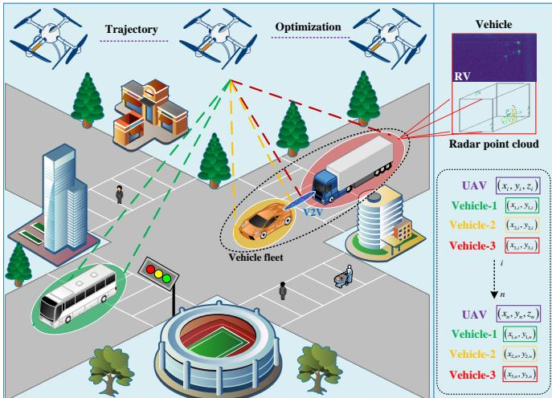  
Fig. 1. U2V sensing-assisted communication system model.

• A linear weighted sliding window reward mechanism is designed in PointRL to improve decision-making and enhance learning outcomes in dynamic settings. This design mitigates oscillations in reward signals, enhancing stability, particularly in environments characterized by variations in reward signals. Additionally, the sliding window nature of the mechanism enables adaptability, allowing for real-time adjustments based on changing conditions or contexts.

• To reduce network complexity and computational costs, a segmentation and concatenation operation within the action space is proposed in this paper. The 3D radar point cloud is initially mapped to an action space, which is then segmented into two subspaces. Each subspace is processed through distinct neural networks, enabling specialized feature extraction. Finally, the outputs are concatenated, providing a unified action space for the decision module. This approach enhances adaptability while reducing computational overhead.

The remainder of this paper is organized as follows. Section II presents the system model of the U2V scenarios, which includes the U2V and V2V communication links. In Section III, the adaptive and fair optimization problem is formulated for integrated radar sensing and communication performance, which contains U2V and the V2V-enabled U2V problem. The proposed PointRL algorithm is introduced in Section IV. Section V provides the simulation results and numerical Results. Section VI concludes this paper.

## II. SYSTEM MODEL

This paper focuses on the U2V scenarios, where the UAV provides the communication service for the vehicle users. As depicted in Fig. 1, the system model comprises a $K =$ $\{ 1 , \cdots , k , \cdots \kappa \}$ set of randomly distributed vehicles, and a UAV represented by u. The UAV considered in this paper is based on the capabilities of the 5G air base station (gNodeB) while extending the capabilities of radar sensing. Especially, to better align with practical application scenarios, we leverage the radar point cloud to represent the rigid shapes of vehicles rather than supposing them as a single point in most related studies [26], [27], [36], [37]. In our system model, the UAV provides the communication service to a group of $k \geq 1$ vehicles in the total service time T . Following [22], this paper adopts the 3D Cartesian coordinate system in which the timevarying horizontal position of vehicle k, which is denoted as $\mathbf { \bar { \mathbf { \rho } } } _ { \mathbf { \bar { \mathbf { p } } } _ { k } } \mathbf { \bar { \mathbf { \sigma } } } ( t ) = \left[ x _ { k } \left( t \right) , y _ { k } \left( t \right) , 0 \right] ^ { T } \in \mathbb { R } ^ { 3 \times 1 }$ , with $0 \leq t \leq T$ The UAV is assumed to fly at a fixed height $H _ { u }$ above ground [38]. The time-varying location of UAV is expressed as $\begin{array} { r } { \mathbf { q } _ { u } \left( t \right) ~ = ~ \left[ x _ { u } \left( t \right) , y _ { u } \left( t \right) , \mathbf { \bar { H } } _ { u } \right] ^ { T } ~ \in ~ \mathbb { R } ^ { 3 \times 1 } } \end{array}$ . At each time slot t, the positions of vehicles and the UAV are fixed but can be altered in consecutive time slots, and the locations of vehicle k and the UAV are bounded by $0 \leq x _ { k | u } \left( t \right) \leq x _ { k | u } ^ { \operatorname* { m a x } }$ and $0 \leq y _ { k | u } \left( t \right) \leq y _ { k | u } ^ { \operatorname* { m a x } }$ , where $\left( x _ { k | u } ^ { \mathrm { m a x } } , y _ { k | u } ^ { \mathrm { m a x } } \right)$ means their maximum horizontal range.

## A. Radar Sensing Model

For the mmWave radar sensing model, following [39], the rigid shape of vehicle k is expressed by the radar point cloud composed of $N _ { k }$ points, $1 \le N _ { k } \le N _ { p } .$ , where $N _ { p }$ is the maximum number of radar points. The range (R) between UAV u and the i-th point of vehicle k can be denoted as

$$
R _ { u , ( k , i ) } \left( t \right) = \sqrt { r _ { u , ( k , i ) } ^ { T } \left( t \right) \cdot r _ { u , ( k , i ) } \left( t \right) } ,\tag{1}
$$

where $\boldsymbol { r } _ { u , ( k , i ) } \left( t \right) = \left[ ( \boldsymbol { q } _ { u } \left( t \right) - \boldsymbol { p } _ { k , i } \left( t \right) ) ^ { T } , H _ { u } \right] ^ { T } \in \mathbb { R } ^ { 3 \times 1 } , 1 \leq$ $i \leq N _ { k }$ . UAVs and vehicles can move in our system, and the horizontal and vertical velocity of UAV u and the i-th point of the vehicle k can be defined by $\pmb { \dot { q } _ { u } } \left( t \right) = \left[ \dot { x _ { u } } \left( t \right) , \dot { y _ { u } } \left( t \right) , 0 \right] ^ { T } \in$ $\mathbb { R } ^ { 3 \times 1 }$ and $\dot { p } _ { k , i } \left( t \right) = \left[ x _ { k , i } \left( t \right) , y _ { k , i } \left( t \right) , 0 \right] ^ { T } \in \mathbb { R } ^ { 3 \times 1 }$ , respectively. Then, the relative velocity (V) between UAV u and the i-th point of vehicle k can be expressed as

$$
\begin{array} { l } { \displaystyle V _ { u , ( k , i ) } \left( t \right) = \frac { \left( \dot { q } _ { u } \left( t \right) - \dot { p } _ { k , i } \left( t \right) \right) ^ { T } \cdot r _ { u , ( k , i ) } \left( t \right) } { R _ { u , ( k , i ) } \left( t \right) } } \\ { \displaystyle = \frac { \left[ \dot { x _ { u } } \left( t \right) - \dot { x } _ { k , i } \left( t \right) , \dot { y _ { u } } \left( t \right) - \dot { y } _ { k , i } \left( t \right) , 0 \right] ^ { T } \cdot r _ { u , ( k , i ) } \left( t \right) } { R _ { u , ( k , i ) } \left( t \right) } . } \end{array}\tag{2}
$$

In addition, this paper selects the radar cross section (RCS) as the feature of radar point clouds to sense vehicles. In [40] and [41], the authors consider RCS as the feature to model the ISAC channel to promote radar sensing performance in complex environments. In radar applications, the received signal power is determined by evaluating the radar equation [42], which can be written as

$$
P _ { u , ( k , i ) } \left( t \right) = \frac { P _ { r } G _ { T , r } G _ { R , r } \lambda _ { r } ^ { 2 } \cdot \sigma _ { k , \mathrm { R C S } } } { \left( 4 \pi \right) ^ { 3 } R _ { u , ( k , i ) } ^ { 4 } \left( t \right) } ,\tag{3}
$$

where $\lambda _ { r }$ is the wavelength related to the carrier frequency, $P _ { r }$ means the transmission power of radar, $P _ { u , ( k , i ) } \left( t \right)$ represents the received power of vehicle k, $G _ { T , r }$ and $G _ { R , r }$ are transmit and receive antenna gain of radar, respectively. σ<sub>RCS</sub> is the RCS of the reflecting vehicle. The RCS is calculated by $\sigma _ { k , \mathrm { R C S } } = ( 4 \pi ) ^ { 3 } R _ { u . ( k . i ) } ^ { 4 } \left( t \right) \cdot P _ { u , ( k . i ) } \left( t \right) / P _ { r } G _ { T , r } G _ { R , r } { \lambda _ { r } } ^ { 2 }$

Then, we can obtain the 3D radar point cloud of vehicle $k ,$ it encapsulates attributes of R, V, and $\sigma _ { \mathrm { R C S } }$ , which can be represented by $\mathbb { F } = ( \mathrm { R } _ { k } , \mathrm { V } _ { k } , \sigma _ { k , \mathrm { R C S } } )$ . Leveraging the 3D point cloud, the radar sensing model can sense vehicles and provide insights into their spatial attributes, including location and movement dynamics.

## B. U2V Communication Model

In the U2V communication model, the communication is characterized by downlink transmissions from the UAV, which are concurrently received by multiple vehicles. We adopt a simplified model where each vehicle uses a single antenna for signal reception. Furthermore, we assume that the receiver hardware is adept at compensating for the Doppler effect induced by the UAV mobility [36]. The distance between UAV u and the center of radar point clouds from vehicle k can be calculated by $d _ { u , k } \left( t \right) = \sqrt { \left. q _ { u } \left( t \right) - p _ { k } \left( t \right) \right. ^ { 2 } + H _ { u } ^ { 2 } }$ which is dynamic, and $p _ { k } \left( t \right)$ is adaptively tuned based on the radar sensing results. To incorporate the realistic U2V scenarios, this paper considers a more realistic path loss model and interference. The line-of-sight (LoS) channel depends on the elevation angle $A _ { e } \left( t \right)$ and environment, where $A _ { e } \left( t \right)$ can be calculated by $A _ { e } \left( t \right) = \tan ^ { - 1 } \left[ H _ { u } / d _ { u , k } \left( t \right) \right]$ . The LoS probability in the U2V links is denoted as

$$
P _ { \mathrm { L o S } } \left[ A _ { e } \left( t \right) \right] = \frac { 1 } { 1 + \alpha _ { 1 } e ^ { - \alpha _ { 2 } \left( \tan ^ { - 1 } \left[ \frac { H _ { u } } { d _ { u , k } \left( t \right) } \right] - \alpha _ { 1 } \right) } } ,\tag{4}
$$

where $\alpha _ { 1 }$ and $\alpha _ { 2 }$ are the parameters of environment [38]. The channel power gain can be calculated by

$$
g _ { u , k } \left( t \right) = \frac { \hat { \beta } _ { u , k } \left[ A _ { e } \left( t \right) \right] } { \left( \left\| q _ { u } \left( t \right) - p _ { k } \left( t \right) \right\| ^ { 2 } + H _ { u } ^ { 2 } \right) ^ { \varphi / 2 } } ,\tag{5}
$$

where $\hat { \beta } _ { u , k } \left[ A _ { e } \left( t \right) \right]$ is the attenuation parameter, $\varphi$ means the path loss factor. In $( 5 ) , \hat { \beta } _ { u , k } \left[ A _ { e } \left( t \right) \right]$ can be expressed as

$$
\hat { \beta } _ { u , k } \left[ A _ { e } \left( t \right) \right] = \beta _ { u , k } \cdot \left( P _ { \mathrm { L o S } } \left[ A _ { e } \left( t \right) \right] + \psi P _ { \mathrm { n L o S } } \left[ A _ { e } \left( t \right) \right] \right)\tag{6}
$$

where $P _ { \mathrm { n L o S } } \left[ A _ { e } \left( t \right) \right] ~ = ~ 1 - P _ { \mathrm { L o S } } \left[ A _ { e } \left( t \right) \right]$ is the non-LoS (nLoS) probability, ψ is the aerial nLoS attenuation, and $\beta _ { u , k }$ is the path loss at a reference distance of 1m, which can be written as $\beta _ { u , k } = { \lambda _ { c } } ^ { 2 } G _ { T , c } G _ { R , c } \Big / { ( 4 \pi ) } ^ { 2 }$

Then, the communication channel capacity $\displaystyle C _ { c , k }$ between UAV u and vehicle k can be calculated by

$$
C _ { c , k } = \int _ { 0 } ^ { T } B _ { c } \cdot \log _ { 2 } \left( 1 + \mathrm { S I N R } _ { u , k } \left( t \right) \right) d t ,\tag{7}
$$

where $B _ { c }$ is the communication channel bandwidth, $\mathrm { S I N R } _ { u , k }$ represents the signal-to-interference-plus-noise ratio (SINR) in the U2V links, which can be expressed as

$$
\mathrm { S I N R } _ { u , k } \left( t \right) = \frac { \rho _ { u , k } \left( t \right) P _ { T } \cdot g _ { u , k } \left( t \right) } { \displaystyle \sum _ { i = 1 , i \neq k } ^ { K } \rho _ { u , i } \left( t \right) P _ { T } \cdot g _ { u , i } \left( t \right) + \sigma ^ { 2 } } ,\tag{8}
$$

where $0 ~ \le ~ \rho \left( t \right) ~ \le ~ 1$ is the power ratio of vehicles, $P _ { T }$ represents the transmission power of UAVs, and $\sigma ^ { 2 }$ means the noise power spectral density.

## III. INTEGRATED PERFORMANCE PROMOTION PROBLEM

In this section, a fair adaptive optimization problem aimed at enhancing both radar sensing and communication performance in U2V scenarios is proposed. The radar capacity is introduced to evaluate the radar sensing performance. Additionally, V2V communication is considered in U2V scenarios to mitigate interference and improve communication efficiency among vehicles, promoting a more robust and adaptive framework for integrated radar and communication systems.

For ease of exposition, the period T is discretized into N equal time slots, indexed by $n = 1 , \cdots , N$ . The length of each time slot is $\delta _ { t } = T / N$ . At the beginning of each time slot, radar senses vehicles and obtains the sensing information. These estimates are used to allocate power ratio. The radar capacity is developed by referring to the traditional communication capacity, which provides a unified measure of the total capacity of the combined radar-communications network [43]. Furthermore, cognitive radar architectures have been proposed that use information to prioritize physical location access based on uncertainty, which makes the joint consideration of radar and communications information interesting when considering co-designed solutions [44].

Motivated by this, the radar capacity is selected as an evaluation index for radar sensing performance [13]. The radar capacity promote radar sensing performance within $[ ( n - 1 ) \delta _ { t } , n \delta _ { t } ]$ by an iterative feedback loop. The radar capacity of vehicle k is represented as

$$
C _ { r , k } = \sum _ { n = 1 } ^ { N } \mathbb { E } \left[ \frac { 1 } { 2 T _ { p r i } } \mathrm { l o g } _ { 2 } \left( 1 + \frac { \vartheta } { \tilde { R } _ { u , k } ^ { 4 } \left[ n \right] } \right) \right] ,\tag{9}
$$

where $T _ { p r i } = T _ { p u l s e } / l$ means the pulse repetition interval of radar, $T _ { p u l s e }$ is the time-bandwidth product, and l is the radar duty parameter. ϑ is a complex measurement as shown in [13] and [45], which is expressed as

$$
\vartheta = \frac { \sigma _ { \tau , p r o c } ^ { 2 } \gamma ^ { 2 } B _ { r } ^ { 2 } T _ { p u l s e } P _ { r } G _ { T , r } G _ { R , r } \lambda _ { r } ^ { 2 } \sigma _ { k , \mathrm { R C S } } } { 8 \pi \cdot k _ { B } T _ { t e m p } } ,\tag{10}
$$

where $\sigma _ { \tau , p r o c }$ is the target process standard deviation, $\gamma ^ { 2 } =$ $( 2 \pi ) ^ { 2 } / 1 2$ is the scaling constant, $B _ { r }$ denotes the radar bandwidth, $P _ { r }$ means the radar power, $G _ { r }$ is the radar antenna gain, $\lambda _ { r }$ is the radar wavelength, $k _ { B }$ is the Boltzmann constant, and $T _ { t e m p }$ is the effective temperature. $\tilde { R } _ { u , k }$ is the relative distance between UAV u and a random possible point of vehicle k in the available target detection region $\Omega _ { k }$ , which is denoted as

$$
\tilde { R } _ { u , k } \left[ n \right] = \sqrt { \tilde { r } _ { u , k } ^ { T } \left[ n \right] \cdot \tilde { r } _ { u , k } \left[ n \right] } ,\tag{11}
$$

where $\tilde { r } _ { u , k } \left[ n \right] = \left[ \left( x _ { u } \left[ n \right] - \tilde { x } _ { k } \left[ n \right] \right) , \left( y _ { u } \left[ n \right] - \tilde { y } _ { k } \left[ n \right] \right) , H _ { u } \right] ^ { T }$ $( \tilde { x } _ { k } , \tilde { y } _ { k } ) \in \Omega _ { k }$ is the coordinates of a random possible point.

Maximizing the radar channel capacity can promote radar performance, which optimizes the UAV trajectory. Besides, the clutters often influence the low-velocity areas in realistic radar sensing procedures. Lower velocity may lead to inferior performance [46]. Therefore, the velocity threshold $V _ { 0 }$ is set to ensure its performance, the possible points in the vicinity of vehicle k must meet $\left| { { { \tilde { V } } _ { u , k } } } \right| \ge { { V } _ { 0 } } . \ { { { \tilde { V } } _ { u , k } } }$ is denoted as

$$
\tilde { V } _ { u , k } \left[ n \right] = \frac { \left[ \dot { x } _ { u } \left[ n \right] - \dot { \tilde { x } } _ { k } \left[ n \right] , \dot { y } _ { u } \left[ n \right] - \dot { \tilde { y } } _ { k } \left[ n \right] , 0 \right] ^ { T } \tilde { r } _ { u , k } \left[ n \right] } { \tilde { R } _ { u , k } \left[ n \right] } .\tag{12}
$$

## A. U2V Optimization Problem

In the U2V scenarios, after radar sensing, if there are $K$ vehicles, and without a fleet, the channel capacity of vehicle k can be calculated by

$$
C _ { c , k } { = } \sum _ { n { = 1 } } ^ { N } { B _ { c } } { \log _ { 2 } } \left( 1 { + } \mathrm { { S I N R } } _ { u , k } \left[ n \right] \right) .\tag{13}
$$

Then, the adaptive optimization problem without a fleet is formulated as follows:

$$
\begin{array} { r } { \displaystyle \operatorname* { m a x } _ { \rho _ { u , k } [ n ] , q _ { u } [ n ] } \Biggl \{ \xi _ { c } \left( \displaystyle \operatorname* { m i n } _ { k } [ C _ { c , k } ] \right) ^ { \eta } \cdot \left( \displaystyle \sum _ { k = 1 } ^ { K } C _ { c , k } \right) ^ { 1 - \eta } + } \\ { \xi _ { r } \left( \displaystyle \operatorname* { m i n } _ { k } [ C _ { r , k } ] \right) ^ { \eta } \cdot \left( \displaystyle \sum _ { k = 1 } ^ { K } C _ { r , k } \right) ^ { 1 - \eta } \Biggr \} } \end{array}\tag{14}
$$

$$
\mathrm { s . t . } \quad 0 \leq x _ { u } \left[ n \right] \leq x _ { u } ^ { \operatorname* { m a x } } , 0 \leq y _ { u } \left[ n \right] \leq y _ { u } ^ { \operatorname* { m a x } } ,\tag{14a}
$$

$$
\sum _ { k = 1 } ^ { K } \rho _ { u , k } \left[ \boldsymbol { n } \right] = 1 ,\tag{14b}
$$

$$
\| \dot { \pmb q } _ { u } \left[ n \right] \| \le V _ { \mathrm { m a x } } ,\tag{14c}
$$

$$
\left. \tilde { V } _ { u , k } \left[ n \right] \right. \geq V _ { 0 } ,\tag{14d}
$$

where $x _ { u } ^ { \mathrm { m a x } } \ = \ y _ { u } ^ { \mathrm { m a x } } \ = \ L ,$ L is the maximum trajectory length of the $\mathrm { U A V } , ~ \xi _ { c }$ and $\xi _ { r }$ are weighted coefficients of communication and radar performance, η is a hyperparameter. When $\eta ~ = ~ 0$ , the optimization objective function is $\begin{array} { r } { \xi _ { c } \sum _ { k = 1 } ^ { K } \dot { C } _ { c , k } + \xi _ { r } \sum _ { k = 1 } ^ { K } \dot { C } _ { r , k } } \end{array}$ , which maximizes the total channel capacity and expected radar channel capacity. When $\eta ~ = ~ 1$ , the optimization objective function is $\xi _ { c } \operatorname* { m i n } _ { \boldsymbol { \imath } _ { \boldsymbol { \imath } } } \left[ C _ { c , k } \right] + \xi _ { r } \operatorname* { m i n } _ { \boldsymbol { \imath } _ { \boldsymbol { \imath } } } \left[ C _ { r , k } \right]$ , which maximizes the minimum communication channel capacity and expected radar channel capacity in all vehicles, leading to a fair optimization problem.

## B. V2V Enabled U2V Optimization Problem

This paper also considers the U2V scenario with the fleet, where vehicle-to-vehicle (V2V) based U2V communication can afford improvements in interference and improve communication efficiency. After radar sensing, there are K vehicles forming L fleets, i.e. the index $\alpha _ { k } = l$ means the k-th vehicle is in the l-th fleet, $l \in \{ 1 , 2 , \ldots , \mathcal { L } \}$ . The V2V communication effectively mitigates interference and enhances communication efficiency [47], [48]. The adaptive optimization problem is formulated as follows:

$$
\begin{array} { r l r } { \underset { \rho _ { u , k } [ n ] , q _ { u } [ n ] } { \operatorname* { m a x } } \left\{ \xi _ { c } \left( \underset { l } { \operatorname* { m i n } } [ \tilde { C } _ { c , l } ] \right) ^ { \eta } \cdot \left( \underset { l = 1 } { \overset { \mathcal { L } } { \sum } } \tilde { C } _ { c , l } \right) ^ { 1 - \eta } + \right. } & { } & \\ { \left. \xi _ { r } \left( \underset { k } { \operatorname* { m i n } } [ C _ { r , k } ] \right) ^ { \eta } \cdot \left( \underset { k = 1 } { \overset { \mathcal { K } } { \sum } } C _ { r , k } \right) ^ { 1 - \eta } \right\} } & { } & \\ { \mathrm { s . t . } } & { ( 1 4 \mathrm { a } ) , ~ ( 1 4 \mathrm { b } ) , ~ ( 1 4 \mathrm { c } ) , ~ ( 1 4 \mathrm { d } ) , } \end{array}\tag{15}
$$

(15a)

where $\begin{array} { r } { \tilde { C } _ { c , l } { = } \sum _ { { \alpha } _ { k } = l } C _ { c , k } } \end{array}$ is the channel capacity of fleet l.

In the proposed integrated performance promotion problem, fairness in resource allocation is achieved by adjusting the balance between the minimum and total channel capacities for both communication and radar sensing, using the parameter $\eta .$ This approach ensures flexibility in addressing either cumulative or equitable resource distribution across all vehicles. When $\eta = 0$ , the objective emphasizes total channel capacity, maximizing overall system performance. Conversely, setting $\eta = 1$ prioritizes fairness, optimizing for the minimum channel capacity across vehicles. This configuration prevents resource monopolization by individual vehicles, enhancing overall system stability and fairness, especially in high-density environments where interference may otherwise impact individual vehicle performance. Additionally, this adaptive allocation supports dynamic needs, such as improved real-time responsiveness in complex urban and vehicular scenarios, making the optimization robust for varied operational demands.

## IV. PROPOSED POINTRL ALGORITHM

In this section, the proposed PointRL algorithm is introduced for problem-solving with vehicles realistically represented by point cloud rigid shapes. Specifically, the UAV is considered an independent agent that makes its own decisions autonomously to achieve optimal radar sensing performance and maximize the channel capacity by optimizing its trajectory and communication resource allocation for the vehicles. In addition, the special segmentation and concatenation operation of action spaces and the design of the reward mechanism reduce the complexity.

## A. Proposed PointRL Architecture

Considering the inherent randomness and complexity of radar point clouds, traditional optimization methods are unable to obtain analytical solutions. To address this challenge, this paper proposes the PointRL algorithm, and its architecture is illustrated in Fig. 2. In the U2V scenario, the onboard millimeter-wave radar mounted on the UAV first receives echo signals reflected from vehicles and generates the radar spectrum using the fast Fourier transform (FFT). Subsequently, the constant false alarm rate (CFAR) algorithm is applied to extract point cloud data from the radar spectrum [49]. The radar point cloud features <sup>F</sup> with dimensions $( N _ { p } \times F )$ are then obtained as defined in (1) and (2), where $N _ { p }$ denotes the maximum number of radar points.

In the vehicle detection module, the proposed PDNN employs a multi-layer perceptron (MLP) layer to expand the input dimension from $( N _ { p } \times F )$ to $( N _ { p } \times D )$ through convolution operations. This process enables the network to capture complex relationships and patterns within the radar point cloud, facilitating richer feature representations that enhance the model’s learning capability. The MLP also contributes to noise reduction and improves data robustness by learning optimal feature transformations. Furthermore, a batch normalization (BN) layer is incorporated to stabilize training, accelerate convergence, and enhance the overall performance of the PDNN. The output O can be represented as

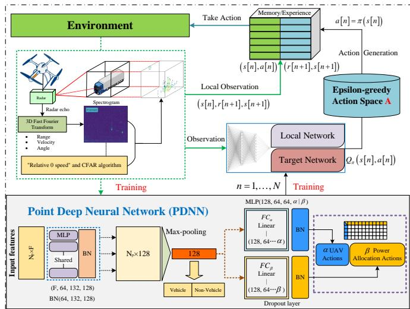  
Fig. 2. The architecture of the proposed PointRL algorithm.

$$
\begin{array} { r } { \left\{ \begin{array} { l l } { O _ { 1 } = \delta \left\{ { \bf B N } \left[ f _ { \mathrm { M L P } , 1 } ( N _ { p } \times F ) \right] \right\} } \\ { O _ { 2 } = \delta \left\{ { \bf B N } \left[ f _ { \mathrm { M L P } , 2 } \left( O _ { 1 } \right) \right] \right\} } \\ { \quad \quad \quad \cdot \cdot } \\ { O _ { n _ { l } } = \delta \left\{ { \bf B N } \left[ f _ { \mathrm { M L P } , n _ { l } } \left( O _ { n _ { l } - 1 } \right) \right] \right\} , } \end{array} \right. } \end{array}\tag{16}
$$

where $n _ { l }$ is the number of MLP and BN layers, BN [·] means the BN operation, $f _ { \mathrm { M L P } } \left( \cdot \right)$ denotes the MLP operation, and $\delta \left\{ \cdot \right\}$ is the ReLu activation function. A max-pooling layer operation $\mathcal { M } _ { m a x } \left( \cdot \right)$ is applied to extract the global features of the radar point clouds, which obtains the maximum value of $O _ { n _ { l } }$ by column. It can be expressed as

$$
O _ { \operatorname* { m a x } } = \mathcal { M } _ { \operatorname* { m a x } } \left( O _ { n _ { l } } \right) .\tag{17}
$$

Then, two fully connected (FC) layers are employed to effectively integrate and compress the extracted features. These layers establish nonlinear relationships between neurons, enabling deeper interactions among feature representations and enhancing the model’s learning capacity. The FC layers process the high-dimensional output from $O _ { \mathbf { m a x } }$ , transforming it into a more compact and informative representation. The output $O _ { \mathrm { F C } , \alpha / \beta }$ towards the UAV trajectory action vector α and power ratio allocation action vector $\beta$ are represented as

$$
\left\{ \begin{array} { l l } { O _ { \mathrm { F C } , 1 , \alpha / \beta } { = } \delta \{ \mathbf { B N } [ \mathbf { D L } [ \mathcal { F } _ { 1 , \alpha / \beta } ( O _ { \operatorname* { m a x } } ) ] ] \} } \\ { O _ { \mathrm { F C } , 2 , \alpha / \beta } { = } \delta \{ \mathbf { B N } [ \mathbf { D L } [ \mathcal { F } _ { 2 , \alpha / \beta } ( O _ { \mathrm { F C } , 1 , \alpha / \beta } ) ] ] \} } \\ { \qquad \cdot \cdot \cdot } \\ { O _ { \mathrm { F C } , n _ { l } , \alpha / \beta } { = } \delta \{ \mathbf { B N } [ \mathbf { D L } [ \mathcal { F } _ { n _ { l } , \alpha / \beta } ( O _ { \mathrm { F C } , n _ { l } - 1 , \alpha / \beta } ) ] ] \} , } \end{array} \right.\tag{18}
$$

where $\mathcal { F } _ { \alpha / \beta } \left( \cdot \right)$ is the FC operation, $\mathbf { D L } \left[ \cdot \right]$ is the dropout layer (DL) operation to prevent network overfitting.

In the decision module, a reinforcement learning-based approach is adopted to jointly optimize the UAV trajectory and power allocation ratio. The reinforcement learning (RL) agent learns an optimal policy through trial-and-error interactions with the environment, guided by the rewards obtained over time [50], [51]. Let S denote the state space, A the discrete action set, and r the reward signal. Each state $s \in S$ represents a tuple containing environment-related features relevant to the optimization problem, reflecting the agent’s interaction with its surroundings [52]. At each discrete time step $n \in N$ , the agent observes the current state $s _ { n }$ , selects an action $a _ { n }$ according to its policy, and receives a corresponding reward $r _ { n + 1 }$ as feedback to update its strategy.

The reinforcement learning algorithm seeks to derive an optimal policy $\pi \left( s , a \right)$ that maximizes the expected reward without requiring prior knowledge of the state transition dynamics [53]. Considering the discrete time steps and finite action spaces, the Q-function is defined as

$$
Q _ { \pi } \left( s , a \right) = \mathbb { E } _ { \pi } \left[ r _ { 1 } + \phi r _ { 2 } + \cdot \cdot \cdot | s _ { 0 } = s , a _ { 0 } = a \right] ,\tag{19}
$$

where $\phi \in ( 0 , 1 ]$ is the discount factor. Then, by adopting a maximum elimination policy $\pi \left( s , a \right)$ , the optimal Q-function can be represented as

$$
Q _ { \pi } ^ { \ast } \left( s _ { n } , a _ { n } \right) = m a x Q _ { \pi } \left( s _ { n } , a _ { n } \right) , \forall s _ { n } \in S , a _ { n } \in A .\tag{20}
$$

Combining the formulas (19) and (20), the Bellman equation can be obtained. The Q-function, serving as an action-value function, adheres to a Bellman equation [54], which can be written as

$$
Q _ { \pi } ^ { \ast } \left( s _ { n } , a _ { n } \right) = \mathbb { E } _ { \pi } \left[ r _ { n + 1 } + \phi \cdot m a x Q _ { \pi } ^ { \ast } \left( s _ { n + 1 } , a _ { n + 1 } \right) \right] .\tag{21}
$$

Following the execution of action $a _ { n }$ by the intelligent agent UAV, the environment computes a new state $s _ { n + 1 }$ , and this state can be observed. The reward is dependent on $s _ { n } , a _ { n }$ and $s _ { n + 1 }$ at most. Therefore, when $s _ { n } , a _ { n } .$ , and $s _ { n + 1 }$ are observed by the agent, the reward is also observed and denoted as $r _ { n + 1 }$ Thus, there exists a quadruple $e _ { n } = ( s _ { n } , a _ { n } , r _ { n + 1 } , s _ { n + 1 } )$ . The expected Monte Carlo approximation can be represented as

$$
Q _ { \pi } ^ { \ast } \left( s _ { n } , a _ { n } \right) \approx r _ { n + 1 } + \phi \cdot m a x Q _ { \pi } ^ { \ast } \left( s _ { n + 1 } , a _ { n + 1 } \right) .\tag{22}
$$

When dealing with extensive state and action spaces, traditional reinforcement learning methods often face scalability and generalization challenges [37]. For example, the Qlearning methods typically rely on a Q-table to store the value of each state-action pair, which becomes hard to maintain and update as the space grows. Moreover, conventional approaches without neural networks usually approximate value functions or policies using discrete mappings or linear models, which limits their ability to capture complex, nonlinear features in dynamic environments. Deep neural network-based reinforcement learning can solve the above issues, where the agent accumulates experiences through interactions with the environment. Using the deep neural network to estimate the $\mathrm { Q } \mathrm { - }$ function, $Q _ { \pi } ^ { \ast } \left( s _ { n } , a _ { n } \right)$ in (22) can be replaced by $Q \left( { { s _ { n } } , { a _ { n } } ; \omega } \right)$ it can be expressed as

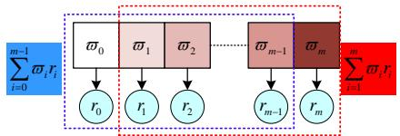  
Fig. 3. Reward mechanism of linear weighted sliding window.

$$
\begin{array} { r } { Q \left( s _ { n } , a _ { n } ; \omega \right) \approx r _ { n + 1 } + \phi \cdot \underset { a \in A } { m a x } Q \left( s _ { n + 1 } , a ; \omega \right) . } \end{array}\tag{23}
$$

Captured experiences $( s _ { n } , a _ { n } , r _ { n + 1 } , s _ { n + 1 } )$ , including actions and rewards, are stored in the experience replay buffer as complete trajectories of the UAV. The entire trajectory is sampled during training to maintain the correlation between subsequent actions. The target network is employed to calculate the Q-value for the next state $s _ { n + 1 }$ . The loss can be calculated between the estimated Q-value of the network and the target Q-value by

$$
L \left( \omega \right) = \frac { 1 } { 2 } \left( r _ { n + 1 } + \phi \underset { a \in A } { m a x } Q \left( s _ { n + 1 } , a ; \omega \right) - Q \left( s _ { n } , a _ { n } ; \omega \right) \right) ^ { 2 }\tag{24}
$$

The gradient descent method is applied to update the weight parameters of the DRL algorithm using the backpropagation algorithm to minimize the loss $L \left( \omega \right)$ . Repeating these steps iteratively allows it to progressively approach the optimal $\mathrm { Q } \mathrm { - }$ value progressively, facilitating learning an optimal strategy [34], [55].

Besides, a segmentation and connection operation for action spaces is proposed to reduce network complexity and computational costs. The output of PDNN, α and $\beta ,$ corresponds to the action set A by the action selection operation of the DRL algorithm with $\mathcal Q \left[ \cdot \right]$ , accounting for UAV trajectory control action set $\{ a _ { \pmb { \alpha } } | a _ { \pmb { \alpha } } = \mathcal { Q } [ \pmb { \alpha } ] \}$ and power allocation action set $\{ a _ { \beta } | a _ { \beta } = \mathcal { Q } \left[ \beta \right] \}$ . Then, we can obtain the final action tuple set $A = \left\{ a = ( \varsigma , \zeta ) \vert \varsigma \in \{ a _ { \alpha } \} , \zeta \in \{ a _ { \beta } \} \right\}$ . Compared to realizing such a function by a complicated network with $\mathcal { F } _ { \alpha \times \beta } \left( \cdot \right)$ , i.e. the output of (18) is changed to $O _ { \mathrm { F C } , n _ { l } , \alpha \times \beta }$ , the proposed method uses two relative simple networks with fewer parameters. Through this method, each subspace $\{ a _ { \alpha } \}$ or $\{ a _ { \beta } \}$ requires fewer samples to explore, which is particularly beneficial for high-dimensional action spaces, allowing agents to learn effective strategies more quickly.

## B. Reward Function and Algorithm Design

To improve decision-making and enhance learning outcomes in dynamic settings, a linear weighted sliding window reward mechanism is proposed in this paper, as shown in Fig. 3. This mechanism ensures that rewards reflect not only the magnitude of recent successes but also the consistency of performance over time. At each iteration, the fresh reward value will be integrated into the reward sequence, and the reward function of no fleet and fleet l can be expressed as

$$
\left\{ \begin{array} { l l } { r ^ { k } = { \xi _ { c } } ( \operatorname* { m i n } { C _ { c , k } } ) ^ { \eta } \Big ( \sum _ { k } C _ { c , k } \Big ) ^ { 1 - \eta } + { \xi _ { r } } \hat { C } _ { r , k } } \\ { r ^ { l } = { \xi _ { c } } \Big ( \operatorname* { m i n } { \tilde { C } _ { c , l } } \Big ) ^ { \eta } \Big ( \sum _ { l } { \tilde { C } _ { c , l } } \Big ) ^ { 1 - \eta } + { \xi _ { r } } \hat { C } _ { r , k } , } \end{array} \right.\tag{25}
$$

where $r ^ { k }$ means the reward value of no vehicle fleet scenarios, and $r ^ { l }$ denotes the reward value of vehicle fleet scenarios, respectively.

When the window size of the reward sequence surpasses the predetermined size $m ,$ , the earliest recorded reward signal will be eliminated to maintain the window size m, and the final reward can be denoted as

$$
\left\{ \begin{array} { l l } { \bar { R } _ { n } ^ { k } = \sum _ { i } ^ { m - 1 } \varpi _ { i } r _ { i } ^ { k } \left( n - i \delta _ { t } \right) \Bigg / \sum _ { i } ^ { m - 1 } \varpi _ { i } } \\ { \bar { R } _ { n } ^ { l } = \sum _ { i } ^ { m - 1 } \varpi _ { i } r _ { i } ^ { l } \left( n - i \delta _ { t } \right) \Bigg / \sum _ { i } ^ { m - 1 } \varpi _ { i } , } \end{array} \right.\tag{26}
$$

where $\varpi _ { i }$ denotes the increasing weighting factor.

This design mitigates oscillations in reward signals, enhancing stability, particularly in environments characterized by variations in reward signals. The gradual adjustment of the weight $\varpi _ { i }$ diminishes the influence of early reward signals on the subsequent decisions of the agent. Additionally, the sliding window nature of the mechanism enables adaptability, allowing for real-time adjustments based on changing conditions or contexts. As the window shifts, it continuously recalibrates the focus of the reward assessment, promoting a more dynamic and responsive learning environment. The proposed PointRL algorithm is summarized in Algorithm 1.

## V. PROPOSED SOLUTION

In this section, the proposed PointRL algorithm for the integrated performance promotion problem is evaluated through simulations. The simulation environment and relevant parameters in the system are set up in the following. And then, the benchmarks and performance metrics are given for comparison. Finally, the simulation results demonstrate that the proposed PointRL algorithm obtains competitive performance compared with benchmarks, and it is robust and effective.

## A. Simulation Results

In the simulation experiments, the parameters of the system model are provided in Table I. And the more detailed hyperparameters of the proposed PointRL are shown in the following: the replay buffer capacity is $1 0 ^ { 4 }$ , the exploration probability is ε, which decreases ranging from 0.9 to 0.1, the learning rate is $\alpha ~ = ~ 0 . 9$ , the value discount factor is $\gamma = 0 . 9$ , the mini-batch size is 32, the neuron numbers of the hidden layer is {64, 132, 128, 64, 64}, the update interval is $1 0 ^ { 3 }$ , and the weighted coefficients of communication and radar performance are $\xi _ { c } = 1 0 0$ and $\xi _ { r } = 0 . 0 1$

A maximum of 2000 training episodes and time slots are considered during the training procedure of the proposed PointRL algorithm, and the number of steps is $N = 2 \times 1 0 ^ { 5 }$ Firstly, to evaluate the effect of the UAV agent, considering a single UAV and vehicle scenarios, we only optimize the trajectory of the UAV with radar sensing results. In this scenario, the UAV starts flying from a fixed position on the left side, and the vehicle starts to move from four different positions:

```latex
Algorithm 1 Proposed PointRL Algorithm
Input: The 3D radar point clouds $( N _ { p } \times F )$ with the features
$\mathbb { F } = ( \mathrm { R } , \mathrm { V } , \sigma _ { \mathrm { R C S } } )$ , total training steps N , exploration proba
bility ε, etc.
1: Initialize replay buffer and parameters of the networks.
2: Set initial training epoch number $n = 0 .$
3: while $n < N$ do
4: Initialize state $s ,$ set $d o n e = 0 , n ^ { \prime } = 0 .$
5: while $d o n e = 0$ do
6: Process the $\mathbb { F } = ( \mathrm { R } , \mathrm { V } , \sigma _ { \mathrm { R C S } } )$ through $\mathbf { M L P } \left[ \cdot \right]$
and BN [·] by (16).
7: Obtain the global features $O _ { \mathbf { m a x } }$ of $\mathrm { ( N _ { p } \times F ) }$
8: through $\mathcal { M } _ { \mathrm { m a x } } \left( \cdot \right)$ by (17).
9: Map $O _ { \mathbf { m a x } }$ to the action spaces $\mathbf { \delta } _ { a _ { \alpha } }$ and $\mathbf { \delta } _ { \mathbf { \alpha } \mathbf { \beta } } \mathbf { \delta } _ { \mathbf { \alpha } \mathbf { \beta } } \mathbf { \delta } _ { \mathbf { \alpha } \mathbf { \beta } } \mathbf { \delta } _ { \mathbf { \beta } \mathbf { \beta } } \mathbf { \delta } _ { \mathbf { \alpha } \mathbf { \beta } \mathbf { \delta } } \mathbf { \delta } _ { \mathbf { \beta } \mathbf { \beta } \mathbf { \delta } } \mathbf { \delta } _ { \mathbf { \beta } \mathbf { \beta } \mathbf { \delta } } \mathbf { \delta } _ { \mathbf { \beta } \mathbf { \beta } \mathbf { \delta } } \mathrm { \delta } _ { \mathbf { \beta } \mathbf { \beta } \mathbf { \delta } \mathbf { \delta } _ { \mathbf { \beta \beta } \mathbf { \delta \alpha } \mathbf { \beta } } }$ by
MLP [·], BN [·], DL [·], and $\mathcal { F } _ { \alpha / \beta } \left( \cdot \right)$ by (18).
10: Connect action spaces $\mathbf { \delta } _ { a _ { \alpha } }$ and $\mathbf { \delta } _  \mathbf { \alpha } \mathbf { \alpha } \mathbf { \alpha } \mathbf { \alpha } \mathbf { \alpha } \mathbf { \alpha } \mathbf { \alpha } \mathbf { \alpha } \mathbf { \alpha } \mathbf { \alpha } \mathbf { \alpha } \mathbf { \alpha } \mathbf { \alpha } \mathbf { \alpha } \mathbf { \alpha } \mathbf { \alpha } \mathbf { \alpha } \mathbf { \alpha } \mathbf { \alpha } \mathbf { \alpha } \mathbf { \alpha } \mathbf { \alpha } \mathbf { \alpha } \mathbf { \alpha } \mathbf { \alpha } \mathbf { \beta } \mathrm { \prime } \mathbf { \alpha } \mathbf { \alpha } \mathbf { \alpha } \mathbf { \alpha } \mathbf { \beta } \mathrm { \prime } \mathbf { \alpha } \mathbf { \alpha } \mathbf { \alpha } \mathbf { \alpha } \mathrm { \prime } \mathbf { \alpha } \mathbf { \alpha } \mathbf { \alpha } \mathrm { \beta } \mathrm { \prime } \mathbf { \alpha } \mathbf { \alpha } \mathbf { \alpha } \mathrm { \beta } \mathrm { \prime } \mathbf { \alpha } \mathbf { \alpha } \mathrm { \beta } \mathrm \mathrm { \prime } \mathbf { \alpha } \mathrm { \beta \beta }$ to $\{ a _ { \alpha } , a _ { \beta } \}$
11: if rand $< \varepsilon$ then
12: Select a random action $a .$
13: else
14: Select an action a from $\{ \pmb { a } _ { \alpha } , \pmb { a } _ { \beta } \}$ by $\mathcal { Q } \left[ \cdot \right] .$
15: Observe the next state $s ^ { \prime }$ by applying the chosen
action a by (1), (2), (3), and calculate the reward
r by (25).
16: Calculate the long-term expected reward $\bar { R } _ { n } ^ { k }$ or
$\bar { R } _ { n } ^ { l }$ by (26) and ensuring size m is maintained.
17: Store the transition $( s , a , r , s ^ { \prime } )$ in the replay buffer,
and sample from it to update the parameters of
networks through the loss $L ( \omega )$ by (24).
18: if $n ^ { \prime } \delta _ { t } = T$ then
19: set done = 1.
20: else
21: set done = 0 and update the state $s = s ^ { \prime } .$
22: $n ^ { \prime } = n ^ { \prime } + 1 \qquad $
23: $\begin{array} { r } { n = n + n ^ { \prime } . } \end{array}$
```

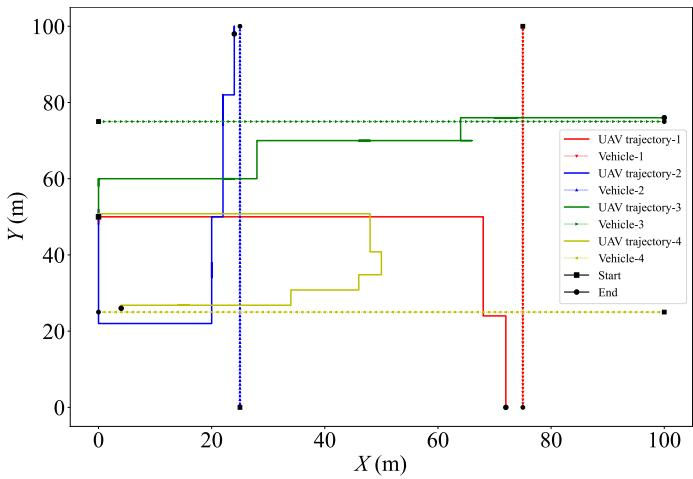  
Fig. 4. The single UAV and single vehicle scenario.

PARAMETERS IN SYSTEM MODEL AND SIMULATION  
TABLE I
<table><tr><td>Item</td><td>Descriptions</td><td>Values</td></tr><tr><td> $\overline { T }$ </td><td>total service time</td><td>100s</td></tr><tr><td> $\delta _ { t }$ </td><td>time segment</td><td>0.1s</td></tr><tr><td> $K$ </td><td>number of vehicles</td><td>3</td></tr><tr><td> $L$ </td><td>the maximum trajectory length of the UAV</td><td> $1 0 0 m$ </td></tr><tr><td> $v$ </td><td>vehicle velocity range</td><td> $5 m / s \ – 1 0 m / s$ </td></tr><tr><td> $H _ { u }$ </td><td>height of the UAV trajectory</td><td>30m</td></tr><tr><td> $\rho$ </td><td>power ratio of vehicles</td><td></td></tr><tr><td> $M$ </td><td>maximum number of points from the vehicles</td><td>30</td></tr><tr><td> $D$ </td><td>the dimension of the maximum pooling layer</td><td>128</td></tr><tr><td> $\mathrm { F }$ </td><td>features of points from the vehicle</td><td>3</td></tr><tr><td> $B _ { c }$ </td><td>communication channel bandwidth</td><td> $1 0 ^ { 4 } \mathrm { H z }$ </td></tr><tr><td> $B _ { r }$ </td><td>radar bandwidth</td><td>0.5MHz</td></tr><tr><td> $H$ </td><td>height of the UAV</td><td>30m</td></tr><tr><td> $m$ </td><td>weight sequence length</td><td>10</td></tr><tr><td> $a _ { \alpha }$ </td><td>UAV action space</td><td> $d i m = 5$ </td></tr><tr><td> $a _ { \beta }$ </td><td>power allocation action space</td><td>dim = 66</td></tr><tr><td> $\xi$ </td><td>weighted coefficients in reward mechanisms</td><td>0-100</td></tr><tr><td> $\varpi _ { i }$ </td><td>the increasing weighting factor</td><td>1-10</td></tr><tr><td> $P _ { T }$ </td><td>the communication power</td><td>10W</td></tr><tr><td> $P _ { r }$ </td><td>the radar power</td><td>100KW</td></tr><tr><td> $P _ { n }$ </td><td>noise power</td><td>0.1W</td></tr><tr><td> $G _ { c }$ </td><td>communication antenna gain</td><td>20dB</td></tr><tr><td> $G _ { r }$ </td><td>radar antenna gain</td><td>30dBi</td></tr><tr><td> $T _ { p u l s e }$ </td><td>time-bandwidth product</td><td>100</td></tr><tr><td> $T _ { p r i }$ </td><td>the pulse repetition interval of radar</td><td> $1 0 ^ { - 2 }$ </td></tr><tr><td> $\dot { T _ { t e m p } }$ </td><td>the effective temperature</td><td>1000K</td></tr><tr><td> $k _ { B }$ </td><td>Boltzmann constant</td><td> $1 . 3 8 \times 1 0 ^ { - 2 3 }$ </td></tr><tr><td> $l$ </td><td>radar duty factor</td><td>0.01</td></tr><tr><td> $\sigma _ { \tau , p r o c }$ </td><td>target process standard deviation</td><td>100m</td></tr><tr><td> $\underline { { \boldsymbol { \eta } } }$ </td><td>equilibrium coefficient</td><td>{0, 0.5, 1}</td></tr></table>

top, bottom, left, and right sides. As shown in Fig. 4, it can be seen that the UAV first gradually approaches the vehicle as expected, but does not coincide with its trajectory to ensure radar performance. If the UAV trajectory coincides with that of the vehicle, it may result in increased UAV movement and jitter, which could degrade the radar sensing performance. This misalignment may lead to reduced perception accuracy and heightened sensing errors. Therefore, in practical applications, the trajectory coincidence of the UAV and vehicle should be avoided as far as possible to ensure the stability and accuracy of radar sensing performance.

As mentioned in our system model, the simulation evaluation contains two parts: U2V communication without the fleet and U2V communication with V2V-assisted. Considering the two vehicles and three vehicles scenarios, the reward curves of these two scenarios are shown in Fig. 5 and Fig. 6, which include without and with the fleet under the parameters $\eta = 0 , 0 . 5 , 1$ . Fig. 5 and Fig. 6 show the change in reward values with training episodes in the training stage, which can verify the convergence of the proposed PointRL algorithm. It can be seen that the variation fluctuation of all the reward curves is obvious, and as the number of training episodes continues to increase, all the reward curves gradually decrease. In the last episodes, it gradually converges to the upper bound it can reach and fluctuates slightly around this upper bound.

Two scenarios of two vehicles without the fleet and three vehicles with the fleet are selected for display, under the parameter η values of 0, 0.5, and 1, respectively. As depicted in Fig. 7 and Fig. 8, it can be seen that the optimization results of UAV trajectory and power allocation in the different scenarios. Vehicles move from the right side to the left side. To maximize the communication rewards, the UAV agent gradually approaches the vehicle and real-time optimal the power ratio for all the vehicles. Notably, there is a turning behavior in the trajectory of the UAV because the velocity of the UAV is faster than that of all vehicles, and the turning behavior further verifies the effectiveness and sensitivity of the agent. Considering radar sensing, the UAV trajectory avoids coinciding with the trajectories of vehicles. In particular, in the three-vehicle scenarios with a fleet scenario, power ratio allocation among vehicles in the fleet is shown in Fig. 8, bright green indicates the power ratio is 1, and dark blue indicates it is 0. As expected, vehicle-3 is closer to the UAV in the initial phase, so all the power is allocated to it. In the end, vehicle-1 is nearest to the UAV, so all the power is allocated to it. This signifies the discovery of an effective agent that could make optimal decisions.

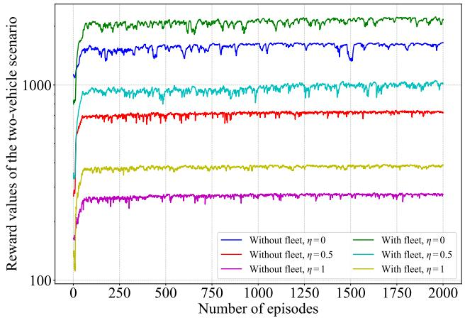  
Fig. 5. The reward values of the two vehicles scenario with and without the fleet under the parameters $\eta = 0 , 0 . 5 ,$ 1.

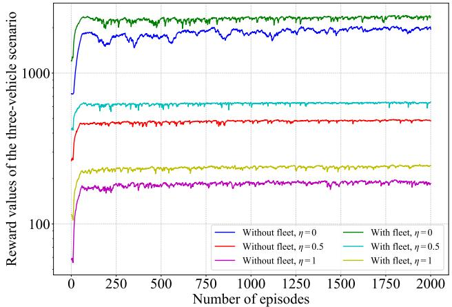  
Fig. 6. The reward values of the three vehicles scenario with and without the fleet under the parameters $\eta = 0 , 0 . 5 ,$ 1.

In this paper, both the three-vehicle scenarios with and without the fleet are considered. When $\eta = 0$ , the optimization objective focuses on maximizing the overall communication and radar capacities of all vehicles. In contrast, when $\eta = 1$ the objective emphasizes fairness by maximizing the minimum capacity among all vehicles. For $\eta \ : = \ : 0 . 5$ , the optimization achieves a balanced trade-off between system-wide performance and fairness, ensuring that the total capacity is enhanced while preventing any individual vehicle from being significantly disadvantaged in terms of communication and radar sensing performance. As illustrated in Fig. 9 and Fig. 10, the results are consistent with practical expectations. When $\eta = 0 ;$ , only the total communication and radar capacities are considered, resulting in the maximum channel and radar capacities. When $\eta = 1 ,$ , only the minimum capacity among vehicles is optimized, leading to the minimum values. For $\eta = 0 . 5 ,$ both total performance and fairness are jointly considered. In addition, the fleet-enabled scenario effectively mitigates communication interference, so both the communication and radar capacities are superior to those in the scenario without the fleet.

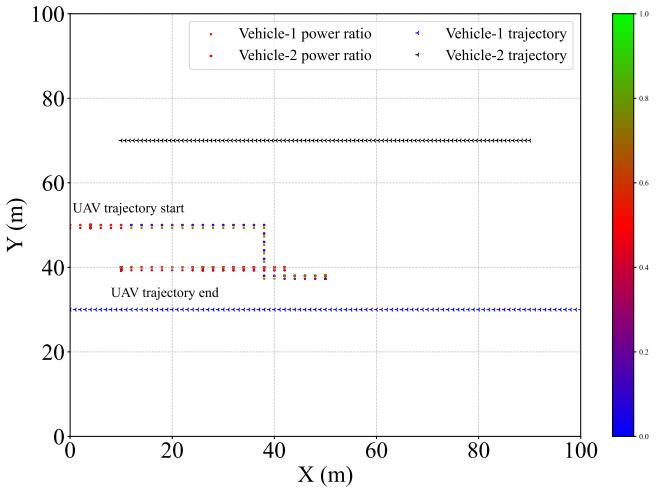  
Fig. 7. The UAV and vehicle trajectories of the single UAV and two vehicles scenario, $\eta = 0 . 5$

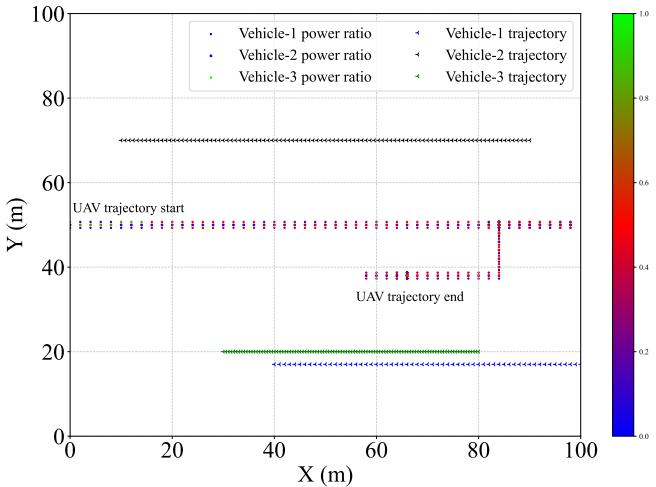  
Fig. 8. The UAV and vehicle trajectories of the single UAV and three vehicles scenario, $\eta = 0 . 5$ , and power ratio of vehicles in the fleet.

The three-vehicle scenario with fleet and $\eta = 0 . 5$ is considered to evaluate the performance of the proposed PointRL. To provide a fair and comprehensive comparison, several representative algorithms are selected as benchmarks. The deep neural network-based (DNN-based) approach [24], [25] is first included to assess the performance of the proposed PointRL.

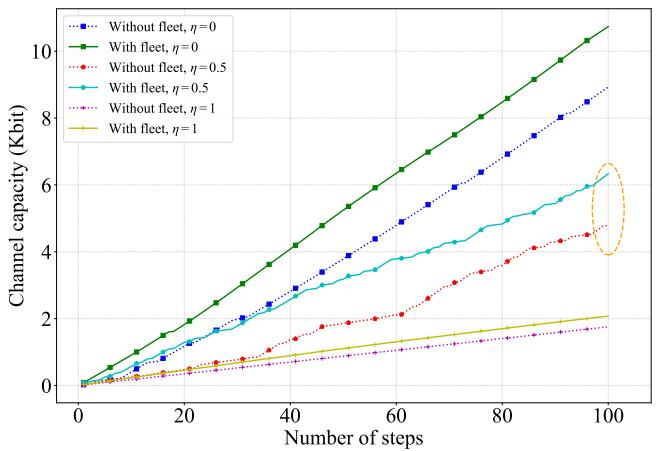  
Fig. 9. The total channel capacity results of the proposed PointRL in different scenarios.

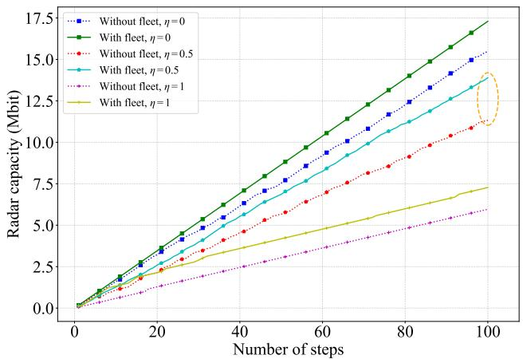  
Fig. 10. The total radar capacity results of the proposed PointRL in different scenarios.

The deep Q-network (DQN) algorithm is then adopted, as it is one of the most widely used DRL methods in UAV communication and trajectory optimization studies [34], [47], [55]. In addition, a clustering-aided DRL algorithm inspired by [27] is employed, in which radar point clouds are clustered to group spatially correlated features before reinforcement learning-based decision-making. To further evaluate the proposed algorithm against recent state-of-the-art DRL methods, the Proximal Policy Optimization (PPO) algorithm [56] and the Twin Delayed Deep Deterministic Policy Gradient (TD3) algorithm [57] are also selected as benchmarks, where PPO ensures stable policy updates and TD3 efficiently handles continuous action optimization through its actor–critic framework. Moreover, an ablation experiment is conducted, where the proposed PointRL without the linear weighted sliding window reward mechanism (PointRL-w/o-LWSW) is implemented as another benchmark to verify the effectiveness of the reward design. As depicted in Fig. 11 and Fig. 12, the proposed PointRL outperforms all the benchmarks, achieving the best communication channel capacity of 6.34 (Kbits) and radar capacity of 13.89 (Mbits).

To further evaluate the performance of the proposed PointRL algorithm, we conducted an ablation study. Specifically, the total communication channel capacity under different

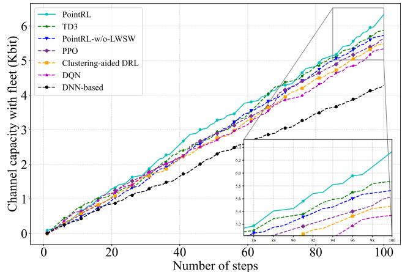  
Fig. 11. The total channel capacity results of proposed PointRL and benchmarks in the fleet scenario, η = 0.5.

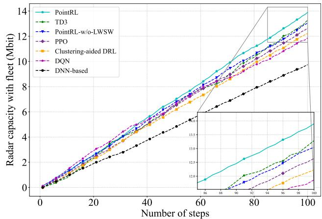  
Fig. 12. The total radar capacity results of the proposed PointRL and benchmarks in the fleet scenario, $\eta = 0 . 5$

UAV flight altitudes is analyzed in the experiment. In this paper, the action space includes both UAV trajectory optimization and power ratio allocation. To assess the impact of each component, several benchmarks are set for comparison. These include only the UAV trajectory optimization actions, power allocation actions, and random power allocation actions. Each of these baselines is tested to isolate the contributions of the individual components and evaluate the overall effectiveness of the proposed PointRL algorithm in improving communication performance. As shown in Fig. 13, the total communication channel capacity decreases as the flight height increases of the UAV. This reduction in capacity aligns with the practical situation, where higher heights can lead to increased signal attenuation and environmental interference, thereby limiting communication performance. Simulation results show that the proposed PointRL algorithm consistently outperformed these baselines, achieving the best total communication channel capacity across all flight heights. When considering all actions that jointly optimize both UAV trajectory and power ratio allocation, the PointRL algorithm demonstrated its superior ability to adapt to dynamic communication environments.

In the proposed PointRL algorithm, a segmentation and concatenation operation within the action space is proposed to reduce the network complexity and computational costs. The inference time of the PointRL algorithm is measured to be 21.37 ms, which demonstrates its efficiency in real-time decision-making. Notably, incorporating the segmentation and concatenation operation in the action space can achieve a significant reduction in network complexity, with a 40.52% reduction in the number of network parameters compared to the baseline that does not employ the operation. This reduction in complexity is pivotal, as it not only ensures faster inference but also enhances the scalability of the algorithm, particularly in large-scale systems where resource constraints are critical.

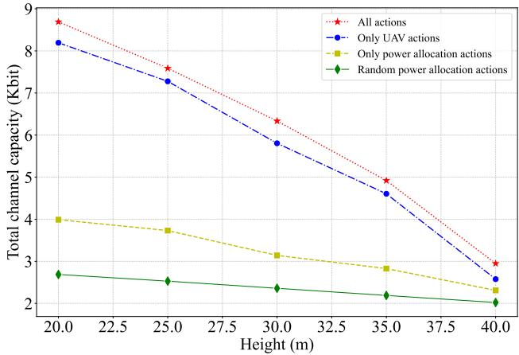  
Fig. 13. The total communication channel capacity of the proposed PointRL algorithm in different UAV heights, under three vehicles scenario with the fleet, and η = 0.5.

Additionally, further analysis is conducted to investigate the impact of two key hyperparameters, M and D, on both the performance and the network parameterization. As summarized in Table II, considering three vehicles scenario without the fleet and $\eta = 0 . 5 ,$ , increasing the values of M (the number of discretized trajectory points) and D (the dimension of the power allocation space) leads to improvements in both radar and communication capacities. Specifically, larger values of M and D allow for more fine-grained optimization of the UAV trajectory and power allocation, which in turn enhances the ability to maximize total channel capacity and radar sensing performance. However, this comes at the cost of an increased number of network parameters, which can negatively affect the training time and model generalization, especially in resourceconstrained environments.

Therefore, a trade-off exists between performance enhancement and network complexity, underscoring the importance of balancing these two factors. In practice, the selection of M and D requires careful tuning to ensure that the performance gains outweigh the added complexity. The results highlight the necessity of adopting a reasonable optimization strategy that can dynamically adjust the size of the action space based on the specific operational requirements, thereby ensuring an efficient and scalable implementation of the algorithm.

## B. Evaluation Results

Considering the potential for real-world deployment, a small-scale experimental validation is conducted in this paper in a commercially operated confidential controlled test field, where real mmWave radar point cloud data collected from actual vehicles are used as the sensing input to the proposed framework. In this validation scenario, the vehicle moves along a predefined route in the test field from the starting point toward the destination, while the UAV carrying the mmWave radar flies from the opposite direction toward the vehicle. The mmWave radar used in the experiment is shown in Fig. 14, and the main parameters of the UAV platform and the mounted radar used are summarized in Table III.

TABLE II  
ANALYSIS OF D & M OF THREE VEHICLES WITHOUT FLEET, $\eta = 0 . 5$
<table><tr><td>M</td><td>D</td><td> $\overline { { C _ { c } } }$ </td><td> $\overline { { C _ { r } } }$ </td><td>Network parameter numbers</td></tr><tr><td>20</td><td>128</td><td>3.92Kbits</td><td>10.19Mbits</td><td>887696</td></tr><tr><td>30</td><td>64</td><td>3.89Kbits</td><td>10.97Mbits</td><td>875088</td></tr><tr><td>30</td><td>128</td><td>4.79Kbits</td><td>11.33Mbits</td><td>887696</td></tr><tr><td>30</td><td>256</td><td>4.87Kbits</td><td>11.65Mbits</td><td>933456</td></tr></table>

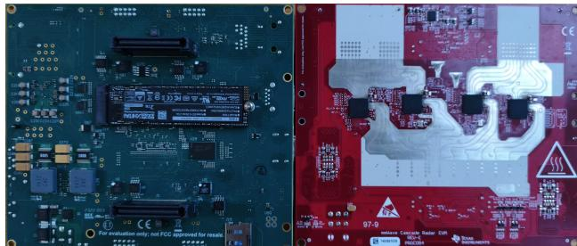  
Fig. 14. The mmWave radar used in the experiment

TABLE III  
PARAMETERS OF THE UAV AND RADAR
<table><tr><td>Parameter</td><td></td><td>Descriptions/Value</td></tr><tr><td rowspan="6">UAV</td><td>UAV Model</td><td>DJI Inspire 2</td></tr><tr><td>Take-off Weight</td><td>3.28kg</td></tr><tr><td>Maximum Payload</td><td>1.6kg</td></tr><tr><td>Maximum Flight Speed</td><td>26m/s</td></tr><tr><td>Maximum Flight Time</td><td>27min</td></tr><tr><td>Flight Range</td><td>14.5km</td></tr><tr><td rowspan="6">Radar</td><td>Radar Model</td><td>MMWCAS-RF/DSP-EVM</td></tr><tr><td>Operating Frequency Band</td><td>76-81GHz</td></tr><tr><td>Detection Range</td><td>350m@RCS=10m²</td></tr><tr><td>Range Resolution</td><td>35cm</td></tr><tr><td>Angular Resolution</td><td>1.4</td></tr><tr><td>Antenna Field of View</td><td> $\pm 7 0 ^ { \circ }$ </td></tr></table>

In this setup, the actual mmWave radar point clouds are collected from the vehicle in the controlled test field, with the fairness factor set to $\eta = 0 . 5$ . Based on the collected radar point clouds, the integrated performance of communication and radar is numerically evaluated to validate the proposed PointRL framework under practical conditions. It should be noted that Fig. 15 presents the radar point clouds of the tracked vehicle sensed by the UAV. Fig. 15(a) and Fig. 15(b) illustrate the sensing results of the same tracked vehicle at different time instants during the tracking process. In addition, the weighting parameters associated with communication and radar performance are selected and adjusted according to the characteristics of the collected data to ensure a realistic balance between the two objectives. As illustrated in Fig. 16, the proposed PointRL achieves better integrated communication and sensing performance compared to all benchmark algorithms under different transmission power, demonstrating its robustness and effectiveness.

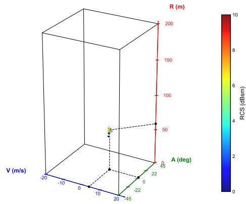  
(a)

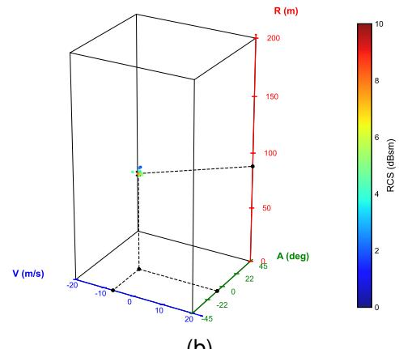  
(b)  
Fig. 15. Visualization of the tracked vehicle radar point clouds at different seconds.

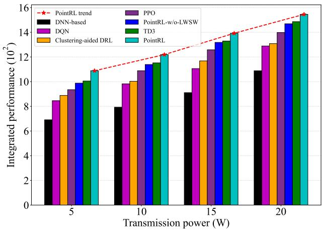  
Fig. 16. Integrated performance in the two-vehicle scenario, η = 0.5.

## VI. CONCLUSION

In this paper, two fair adaptive optimization problems are proposed to maximize the integrated radar sensing and communication performance in U2V scenarios, where V2V communication is incorporated to mitigate multi-vehicle interference. Vehicles are represented as rigid shapes within the 3D mmWave radar point cloud, providing a more realistic depiction of the environment. To address these optimization problems, a radar point cloud-driven deep reinforcement learning framework is developed. It employs a point cloud-based deep neural network for vehicle detection and a decision network for UAV trajectory and power allocation optimization. A linear weighted sliding window reward mechanism is introduced to enhance training stability and decision-making efficiency in dynamic environments, while a segmentation and concatenation operation within the action space reduces network complexity and inference time. Simulation results show that the proposed PointRL algorithm outperforms benchmark methods in both communication and radar performance. Moreover, a small-scale experimental validation using real mmWave radar point cloud data collected from two vehicles further confirms the effectiveness and robustness of the proposed approach under practical conditions.

## REFERENCES

[1] C. Xiang, Y. Zhou, H. Dai, Y. Qu, S. He, C. Chen, and P. Yang, “Reusing Delivery Drones for Urban Crowdsensing,” IEEE Transactions on Mobile Computing, vol. 22, no. 5, pp. 2972–2988, 2023.

[2] A. Telikani, A. Sarkar, B. Du, and J. Shen, “Machine Learning for UAV-Aided ITS: A Review With Comparative Study,” IEEE Transactions on Intelligent Transportation Systems, pp. 1–19, 2024.

[3] X. Cao, X. Su, P. Yang, Y. Gao, D. O. Wu, and T. Q. S. Quek, “Survey on Near-Space Information Networks: Channel Modeling, Transmission, and Networking Perspectives,” IEEE Communications Surveys Tutorials, pp. 1–1, 2025.

[4] W. Ye, L. Zhao, J. Zhou, S. Xu, and F. Xiao, “Energy-Efficient Flight Scheduling and Trajectory Optimization in UAV-Aided Edge Computing Networks,” IEEE Transactions on Network Science and Engineering, vol. 11, no. 5, pp. 4591–4602, 2024.

[5] Y. Gao, X. Yuan, D. Yang, Y. Hu, Y. Cao, and A. Schmeink, “UAV-Assisted MEC System With Mobile Ground Terminals: DRL-Based Joint Terminal Scheduling and UAV 3D Trajectory Design,” IEEE Transactions on Vehicular Technology, vol. 73, no. 7, pp. 10 164–10 180, 2024.

[6] Y. He, D. Wang, F. Huang, R. Zhang, and L. Min, “Aerial-Ground Integrated Vehicular Networks: A UAV-Vehicle Collaboration Perspective,” IEEE Transactions on Intelligent Transportation Systems, vol. 25, no. 6, pp. 5154–5169, 2024.

[7] P. Stockel, P. Wallrath, R. Herschel, and N. Pohl, “Detection and Monitoring of People in Collapsed Buildings Using a Rotating Radar on a UAV,” IEEE Transactions on Radar Systems, vol. 2, pp. 13–23, 2024.

[8] M. Mozaffari, W. Saad, M. Bennis, Y.-H. Nam, and M. Debbah, “A Tutorial on UAVs for Wireless Networks: Applications, Challenges, and Open Problems,” IEEE Communications Surveys Tutorials, vol. 21, no. 3, pp. 2334–2360, 2019.

[9] A. N. Wilson, A. Kumar, A. Jha, and L. R. Cenkeramaddi, “Embedded Sensors, Communication Technologies, Computing Platforms and Machine Learning for UAVs: A Review,” IEEE Sensors Journal, vol. 22, no. 3, pp. 1807–1826, 2022.

[10] P. Mandal, L. P. Roy, and S. K. Das, “Accurate Localization of Intruder Drone by UAV Mounted Adaptable Radar Antenna in Restricted Areas,” IEEE Transactions on Aerospace and Electronic Systems, vol. 60, no. 2, pp. 2093–2105, 2024.

[11] B. Chang, W. Tang, X. Yan, X. Tong, and Z. Chen, “Integrated Scheduling of Sensing, Communication, and Control for mmWave/THz Communications in Cellular Connected UAV Networks,” IEEE Journal on Selected Areas in Communications, vol. 40, no. 7, pp. 2103–2113, 2022.

[12] F. Dong, F. Liu, Y. Cui, W. Wang, K. Han, and Z. Wang, “Sensing as a Service in 6G Perceptive Networks: A Unified Framework for ISAC Resource Allocation,” IEEE Transactions on Wireless Communications, vol. 22, no. 5, pp. 3522–3536, 2023.

[13] F. Liu, Y. Cui, C. Masouros, J. Xu, T. X. Han, Y. C. Eldar, and S. Buzzi, “Integrated Sensing and Communications: Toward Dual-Functional Wireless Networks for 6G and Beyond,” IEEE Journal on Selected Areas in Communications, vol. 40, no. 6, pp. 1728–1767, 2022.

[14] Y. Li, X. Yuan, Y. Hu, J. Yang, and A. Schmeink, “Optimal UAV Trajectory Design for Moving Users in Integrated Sensing and Communications Networks,” IEEE Transactions on Intelligent Transportation Systems, vol. 24, no. 12, pp. 15 113–15 130, 2023.

[15] X. Jing, F. Liu, C. Masouros, and Y. Zeng, “ISAC From the Sky: UAV Trajectory Design for Joint Communication and Target Localization,” IEEE Transactions on Wireless Communications, vol. 23, no. 10, pp. 12 857–12 872, 2024.

[16] Y. Qin, Z. Zhang, X. Li, W. Huangfu, and H. Zhang, “Deep Reinforcement Learning Based Resource Allocation and Trajectory Planning in Integrated Sensing and Communications UAV Network,” IEEE Transactions on Wireless Communications, vol. 22, no. 11, pp. 8158–8169, 2023.

[17] J. Wu, W. Yuan, and L. Bai, “On the Interplay Between Sensing and Communications for UAV Trajectory Design,” IEEE Internet of Things Journal, vol. 10, no. 23, pp. 20 383–20 395, 2023.

[18] Z. Gao, Z. Wan, D. Zheng, S. Tan, C. Masouros, D. W. K. Ng, and S. Chen, “Integrated Sensing and Communication With mmWave Massive MIMO: A Compressed Sampling Perspective,” IEEE Transactions on Wireless Communications, vol. 22, no. 3, pp. 1745–1762, 2023.

[19] A. Liu, Z. Huang, M. Li, Y. Wan, W. Li, T. X. Han, C. Liu, R. Du, D. K. P. Tan, J. Lu, Y. Shen, F. Colone, and K. Chetty, “A survey on fundamental limits of integrated sensing and communication,” IEEE Communications Surveys Tutorials, vol. 24, no. 2, pp. 994–1034, 2022.

[20] F. Luo, S. Khan, A. Li, Y. Huang, and K. Wu, “EdgeActNet: Edge Intelligence-Enabled Human Activity Recognition Using Radar Point Cloud,” IEEE Transactions on Mobile Computing, vol. 23, no. 5, pp. 5479–5493, 2024.

[21] D. Salami, R. Hasibi, S. Palipana, P. Popovski, T. Michoel, and S. Sigg, “Tesla-Rapture: A Lightweight Gesture Recognition System From mmWave Radar Sparse Point Clouds,” IEEE Transactions on Mobile Computing, vol. 22, no. 8, pp. 4946–4960, 2023.

[22] J. Wu, W. Yuan, and L. Hanzo, “When UAVs Meet ISAC: Real-Time Trajectory Design for Secure Communications,” IEEE Transactions on Vehicular Technology, vol. 72, no. 12, pp. 16 766–16 771, 2023.

[23] L. Chen, K. Liu, Q. Gao, X. Wang, and Z. Zhang, “Enhancing Integrated Sensing and Communication (ISAC) Performance for a Searching–Deciding Alternation Radar-Comm System with Multi-Dimension Point Cloud Data,” Remote Sensing, vol. 16, no. 17, 2024.

[24] A. Graff, Y. Chen, N. Gonzalez-Prelcic, and T. Shimizu, “Deep´ Learning-Based Link Configuration for Radar-Aided Multiuser mmWave Vehicle-to-Infrastructure Communication,” IEEE Transactions on Vehicular Technology, vol. 72, no. 6, pp. 7454–7468, 2023.

[25] L. Chen, K. Liu, Z. Zhang, and B. Li, “Beam Selection and Power Allocation: Using Deep Learning for Sensing-Assisted Communication,” IEEE Wireless Communications Letters, vol. 13, no. 2, pp. 323–327, 2024.

[26] J. Wang, X. Zhou, H. Zhang, and D. Yuan, “Joint Trajectory Design and Power Allocation for UAV Assisted Network With User Mobility,” IEEE Transactions on Vehicular Technology, vol. 72, no. 10, pp. 13 173– 13 189, 2023.

[27] S. Zhou, Y. Cheng, X. Lei, Q. Peng, J. Wang, and S. Li, “Resource Allocation in UAV-Assisted Networks: A Clustering-Aided Reinforcement Learning Approach,” IEEE Transactions on Vehicular Technology, vol. 71, no. 11, pp. 12 088–12 103, 2022.

[28] Y. Liu, S. Liu, X. Liu, Z. Liu, and T. S. Durrani, “Sensing Fairness-Based Energy Efficiency Optimization for UAV Enabled Integrated Sensing and Communication,” IEEE Wireless Communications Letters, vol. 12, no. 10, pp. 1702–1706, 2023.

[29] Z. Liu, X. Liu, Y. Liu, V. C. M. Leung, and T. S. Durrani, “UAV Assisted Integrated Sensing and Communications for Internet of Things: 3D Trajectory Optimization and Resource Allocation,” IEEE Transactions on Wireless Communications, vol. 23, no. 8, pp. 8654–8667, 2024.

[30] S. Hu, X. Yuan, W. Ni, and X. Wang, “Trajectory Planning of Cellular-Connected UAV for Communication-Assisted Radar Sensing,” IEEE Transactions on Communications, vol. 70, no. 9, pp. 6385–6396, 2022.

[31] K. Meng, Q. Wu, S. Ma, W. Chen, K. Wang, and J. Li, “Throughput Maximization for UAV-Enabled Integrated Periodic Sensing and Communication,” IEEE Transactions on Wireless Communications, vol. 22, no. 1, pp. 671–687, 2023.

[32] X. Wang, S. Wang, X. Liang, D. Zhao, J. Huang, X. Xu, B. Dai, and Q. Miao, “Deep Reinforcement Learning: A Survey,” IEEE Transactions on Neural Networks and Learning Systems, vol. 35, no. 4, pp. 5064– 5078, 2024.

[33] X. Ye and L. Fu, “Joint Codebook Selection and UE Scheduling for Unlicensed MmWave NR-U/WiGig Coexistence Based on Deep

Reinforcement Learning,” IEEE Transactions on Mobile Computing, vol. 23, no. 9, pp. 8919–8934, 2024.

[34] J. Liu, X. Zhao, P. Qin, F. Du, Z. Chen, H. Zhou, and J. Li, “Joint UAV 3D Trajectory Design and Resource Scheduling for Space-Air-Ground Integrated Power IoRT: A Deep Reinforcement Learning Approach,” IEEE Transactions on Network Science and Engineering, vol. 11, no. 3, pp. 2632–2646, 2024.

[35] X. Song, W. Zhang, L. Lei, X. Zhang, and L. Zhang, “UAV-assisted Heterogeneous Multi-Server Computation Offloading with Enhanced Deep Reinforcement Learning in Vehicular Networks,” IEEE Transactions on Network Science and Engineering, pp. 1–13, 2024.

[36] Q. Wu, Y. Zeng, and R. Zhang, “Joint Trajectory and Communication Design for Multi-UAV Enabled Wireless Networks,” IEEE Transactions on Wireless Communications, vol. 17, no. 3, pp. 2109–2121, 2018.

[37] Y. Zeng, X. Xu, S. Jin, and R. Zhang, “Simultaneous Navigation and Radio Mapping for Cellular-Connected UAV With Deep Reinforcement Learning,” IEEE Transactions on Wireless Communications, vol. 20, no. 7, 2021.

[38] M. M. Alam and S. Moh, “Joint Trajectory Control, Frequency Allocation, and Routing for UAV Swarm Networks: A Multi-Agent Deep Reinforcement Learning Approach,” IEEE Transactions on Mobile Computing, pp. 1–16, 2024.

[39] L. Chen, K. Liu, B. Li, Q. Yang, Q. Gao, and Z. Zhang, “A Novel Sustainable AIoT Scheme for UAV-Assisted Communication Enabled by Radar Point Clouds and Moving Interaction Station,” IEEE Internet of Things Journal, pp. 1–1, 2024.

[40] J. Zhang, J. Wang, Y. Zhang, Y. Liu, Z. Chai, G. Liu, and T. Jiang, “Integrated Sensing and Communication Channel: Measurements, Characteristics, and Modeling,” IEEE Communications Magazine, vol. 62, 2024.

[41] Y. Wu, F. Lemic, C. Han, and Z. Chen, “Sensing Integrated DFT-Spread OFDM Waveform and Deep Learning-Powered Receiver Design for Terahertz Integrated Sensing and Communication Systems,” IEEE Transactions on Communications, vol. 71, no. 1, pp. 595–610, 2023.

[42] C. Sturm and W. Wiesbeck, “Waveform Design and Signal Processing Aspects for Fusion of Wireless Communications and Radar Sensing,” Proceedings of the IEEE, vol. 99, no. 7, pp. 1236–1259, 2011.

[43] J. R. Guerci, R. M. Guerci, A. Lackpour, and D. Moskowitz, “Joint design and operation of shared spectrum access for radar and communications,” in 2015 IEEE Radar Conference (RadarCon), 2015, pp. 0761–0766.

[44] R. A. Romero and N. A. Goodman, “Cognitive Radar Network: Cooperative Adaptive Beamsteering for Integrated Search-and-Track Application,” IEEE Transactions on Aerospace and Electronic Systems, vol. 49, no. 2, pp. 915–931, 2013.

[45] A. R. Chiriyath, B. Paul, and D. W. Bliss, “Radar-Communications Convergence: Coexistence, Cooperation, and Co-Design,” IEEE Transactions on Cognitive Communications and Networking, vol. 3, no. 1, pp. 1–12, 2017.

[46] S. Liu, Y. Cao, T.-S. Yeo, W. Wu, and Y. Liu, “Adaptive Clutter Suppression in Randomized Stepped-Frequency Radar,” IEEE Transactions on Aerospace and Electronic Systems, vol. 57, no. 2, pp. 1317–1333, 2021.

[47] T.-W. Ban, “An Autonomous Transmission Scheme Using Dueling DQN for D2D Communication Networks,” IEEE Transactions on Vehicular Technology, vol. 69, no. 12, pp. 16 348–16 352, 2020.

[48] D. Abbasinezhad-Mood and H. Ghaemi, “Dual-Signature Blockchain-Based Key Sharing Protocol for Secure V2V Communications in Multi-Domain IoV Environments,” IEEE Transactions on Intelligent Transportation Systems, vol. 25, no. 10, pp. 13 407–13 416, 2024.

[49] Z. Wei, B. Li, T. Feng, Y. Tao, and C. Zhao, “Area-Based CFAR Target Detection for Automotive Millimeter-Wave Radar,” IEEE Transactions on Vehicular Technology, vol. 72, no. 3, pp. 2891–2906, 2023.

[50] P. Yang, T. Q. S. Quek, J. Chen, C. You, and X. Cao, “Feeling of Presence Maximization: mmWave-Enabled Virtual Reality Meets Deep Reinforcement Learning,” IEEE Transactions on Wireless Communications, vol. 21, no. 11, pp. 10 005–10 019, 2022.

[51] J. Wu, J. Wang, Q. Chen, Z. Yuan, P. Zhou, X. Wang, and C. Fu, “Resource Allocation for Delay-Sensitive Vehicle-to-Multi-Edges (V2Es) Communications in Vehicular Networks: A Multi-Agent Deep Reinforcement Learning Approach,” IEEE Transactions on Network Science and Engineering, vol. 8, no. 2, pp. 1873–1886, 2021.

[52] Z. Chang, H. Deng, L. You, G. Min, S. Garg, and G. Kaddoum, “Trajectory Design and Resource Allocation for Multi-UAV Networks: Deep Reinforcement Learning Approaches,” IEEE Transactions on Network Science and Engineering, vol. 10, no. 5, pp. 2940–2951, 2023.

[53] O. Naparstek and K. Cohen, “Deep Multi-User Reinforcement Learning for Distributed Dynamic Spectrum Access,” IEEE Transactions on Wireless Communications, vol. 18, no. 1, pp. 310–323, 2019.

[54] A. Galindo-Serrano and L. Giupponi, “Distributed Q-Learning for Interference Control in OFDMA-Based Femtocell Networks,” in 2010 IEEE 71st Vehicular Technology Conference, 2010, pp. 1–5.

[55] Y. Ju, Z. Cao, Y. Chen, L. Liu, Q. Pei, S. Mumtaz, M. Dong, and M. Guizani, “NOMA-Assisted Secure Offloading for Vehicular Edge Computing Networks With Asynchronous Deep Reinforcement Learning,” IEEE Transactions on Intelligent Transportation Systems, vol. 25, no. 3, pp. 2627–2640, 2024.

[56] H. Wang, X. Chen, Y. Cheng, C. Wu, F. Dang, and X. Chen, “Hswarmloc: Efficient scheduling for localization of heterogeneous mav swarm with deep reinforcement learning,” in Proceedings of the 20th ACM Conference on Embedded Networked Sensor Systems, 2022, pp. 1148–1154.

[57] J. Dou, H. Zhang, Y. Luo, and G. Sun, “Scheduling Drone and Mobile Charger via Hybrid-Action Deep Reinforcement Learning,” IEEE Transactions on Mobile Computing, pp. 1–18, 2025.


Leyan Chen (Member, IEEE) received the B.S. degree in 2014 from the Electronic Information Engineering College of Hunan University of Technology, Hunan, China. He received an M.S. degree in 2019 from the School of Information Engineering at Chang’an University, Xian, China. He received a Ph.D. degree in Traffic Information Engineering and Control in the School of Electronic Information Engineering in 2025 at Beihang University, Beijing, China. Since 2025, he has served as a postdoctoral fellow at the School of Vehicle and Transportation

Engineering, Tsinghua University, where he has primarily focused on research in traffic information engineering and control. His research interests include artificial intelligence, integrated sensing and communication systems, and intelligent transportation systems.


Kai Liu (Member, IEEE) received his B.S., M.S. and Ph.D. degree at Xidian University, Xi’an, China in 1994, 1997 and 2001, respectively. From Mar. 2000 to Feb. 2001, he was a visiting researcher at Shizuoka University, Hamamatsu, Japan. From Jan. 2002 to Feb. 2004, he was a senior research associate at Illinois Institute of Technology, Chicago, USA. From Feb. 2015 to Mar. 2016, he was a visiting scholar at Texas A&M University, College Station, USA. He is currently a professor at School of Electronics and Information Engineering, Beihang

University, Beijing, China. His research interests include Information Communication Technology and Computing Intelligence.

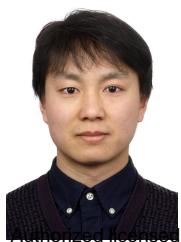

Peng Yang (Member, IEEE) received the Ph. D degree in Signal and Information Processing in 2018 from Beihang University. From 2019 to 2021, he was a Post-Doctoral Research Fellow with Singapore University of Technology and Design (SUTD), Singapore. Since 2021, he has been with Beihang University, where he is currently an Associate Professor. His current research topics include airborne communications and networking, network intelli-


Zehui Xiong (Senior Member, IEEE) is currently an Assistant Professor at Singapore University of Technology and Design, and also an Honorary Adjunct Senior Research Scientist with Alibaba-NTU Singapore Joint Research Institute, Singapore. He received the PhD degree in Nanyang Technological University (NTU), Singapore. He was the visiting scholar at Princeton University and University of Waterloo. His research interests include wireless communications, Internet of Things, blockchain, edge intelligence, and Metaverse. He has published more than 200 research papers in leading journals and flagship conferences and many of them are ESI Highly Cited Papers. He has won over 10 Best Paper Awards in international conferences and is listed in the Worlds Top 2% Scientists identified by Stanford University. He is now serving as the editor or guest editor for many leading journals including IEEE Journal on Selected Areas in Communications, IEEE Transactions on Vehicular Technology, IEEE Internet of Things Journal, IEEE Transactions on Cognitive Communications and Networking, and IEEE Transactions on Network Science and Engineering. He is the recipient of IEEE Early Career Researcher Award for Excellence in Scalable Computing, IEEE Technical Committee on Blockchain and Distributed Ledger Technologies Early Career Award, IEEE Internet Technical Committee Early Achievement Award, IEEE TCSVC Rising Star Award, IEEE TCI Rising Star Award, IEEE TCCLD Rising Star Award, IEEE Best Land Transportation Paper Award, IEEE CSIM Technical Committee Best Journal Paper Award, IEEE SPCC Technical Committee Best Paper Award, IEEE VTS Singapore Best Paper Award, Chinese Government Award for Outstanding Students Abroad, and NTU SCSE Best PhD Thesis Runner-Up Award. He is now serving as the Associate Director of Future Communications R&D Programme. In 2023, he was featured on the list of Forbes Asia 30 under 30.


Tony Q.S. Quek (S’98-M’08-SM’12-F’18) received the B.E. and M.E. degrees in electrical and electronics engineering from the Tokyo Institute of Technology in 1998 and 2000, respectively, and the Ph.D. degree in electrical engineering and computer science from the Massachusetts Institute of Technology in 2008. Currently, he is the Cheng Tsang Man Chair Professor with Singapore University of Technology and Design (SUTD). He also serves as the Head of ISTD Pillar, Sector Lead of the SUTD AI Program, and the Deputy Director of the SUTD-ZJU IDEA.

His current research topics include wireless communications and networking, network intelligence, internet-of-things, URLLC, and big data processing.

Dr. Quek has been actively involved in organizing and chairing sessions, and has served as a member of the Technical Program Committee as well as symposium chairs in a number of international conferences. He is currently serving as an Editor for the IEEE TRANSACTIONS ON WIRELESS COMMU-NICATIONS and an elected member of the IEEE Signal Processing Society SPCOM Technical Committee. He was an Executive Editorial Committee Member for the IEEE TRANSACTIONS ON WIRELESS COMMUNICATIONS, an Editor for the IEEE TRANSACTIONS ON COMMUNICATIONS, and an Editor for the IEEE WIRELESS COMMUNICATIONS LETTERS. He was honored with the 2008 Philip Yeo Prize for Outstanding Achievement in Research, the 2012 IEEE William R. Bennett Prize, the 2015 SUTD Outstanding Education Awards – Excellence in Research, the 2016 IEEE Signal Processing Society Young Author Best Paper Award, the 2017 CTTC Early Achievement Award, the 2017 IEEE ComSoc AP Outstanding Paper Award, the 2020 IEEE Communications Society Young Author Best Paper Award, the 2020 IEEE Stephen O. Rice Prize, the 2020 Nokia Visiting Professor, and the 2016-2020 Clarivate Analytics Highly Cited Researcher. He is a Distinguished Lecturer of the IEEE Communications Society.


Jisi Fang is with Aviation Data Communication Corporation, Beijing 100191, China, and State Key Laboratory of CNS/ATM, Beijing 100191, China. His research interests include intelligent air navigation, aeronautical data link, communication, and collaborative air traffic management.


Zhibo Zhang (Member, IEEE) received a B.S. degree in 2016 in information engineering and an M.S. degree in 2019 in electronic science and technology from Beijing Institute of Technology, Beijing, China. He received a Ph.D. degree in communication and information systems in 2023 at Beihang University, Beijing, China. His doctoral thesis is titled ”Research on the Waveform Design and Joint Optimization for Integrated Sensing and Communication System”, and he was also awarded as an Outstanding Graduate of Beihang University. Since 2024, he has been an Outstanding Hundred Talents Postdoctoral Researcher in the School of Electronics and Information Engineering at Beihang University, and he is conducting research work in the field of Traffic Information Engineering and Control. He has published more than 20 academic papers and has participated in numerous practical research projects, including low-altitude communication and sensing projects, integrated communication and navigation projects, traffic radar projects, and airborne data link projects. His research interests include integrated sensing and communication systems, convex optimization methods, and machine learning.