# PolarFix: Fixing Polarization Mismatch for UAV mmWave Communication Enhancement

Hongqiang Zhang, Chengcheng Zhao, Yuanchao Shu, Jie Xiong, and Peng Cheng

Abstract—Millimeter-wave (mmWave) communication offers a promising solution for high-throughput, low-latency unmanned aerial vehicle (UAV) networks. However, maintaining strong received signal strength (RSS) remains a challenge due to UAV mobility. While existing studies have largely focused on beam alignment, they often overlook another critical issue: polarization mismatch caused by UAV orientation changes. This problem is particularly severe in cost-sensitive commercial off-the-shelf (COTS) mmWave devices, which typically employ linearly polarized (LP) antenna arrays. Our measurements reveal that even with perfect beam alignment, UAV orientation can still cause significant signal degradation due to polarization mismatch. To address this challenge, we propose PolarFix, a practical metasurface solution that enables real-time polarization matching without requiring any modifications to existing transceiver hardware. Specifically, we design a linear-to-circular polarization (L2C) metasurface that transforms linearly polarized (LP) waves into circularly polarized signals, allowing LP antennas to maintain consistent signal power despite changes in UAV orientation.

Index Terms—Millimeter-wave communication, unmanned aerial vehicles (UAVs) networking, antenna polarization, metasurface, 5G, 6G.

## I. INTRODUCTION

U NMANNED aerial vehicles (UAVs) are being widelyadopted in various applications, including parcel deliv- adopted in various applications, including parcel delivery, geological exploration, disaster response, and power grid inspection due to their mobility and operational flexibility. Global investment in UAV technologies has increased more than thirtyfold over the past two decades [1]. Meanwhile, modern UAV applications are becoming increasingly dataintensive, as high-resolution sensors (e.g., LiDAR, cameras) generate massive volumes of data during flight [2]. However, due to strict size, weight, and power constraints, UAVs typically have limited onboard computing resources. Consequently, they increasingly offload data to ground infrastructure with greater computational capabilities to support tasks such as 3D reconstruction, semantic mapping, and multi-view video analytics [3]–[5]. This offloading demands wireless communication with high throughput (often Gbps) for real-time operation. However, the sub-6 GHz band has become increasingly congested and lacks the capacity to support such high data rates. Millimeter-wave (mmWave) communication, with its large available spectrum, offers a promising solution for high-throughput and low-latency UAV data transmission [6]– [9]. For instance, Facebook Inc. developed an air-to-ground mmWave communication system in the E band (71 ∼ 86 GHz), achieving a peak bi-directional rate of 40 Gbps [10].

Although mmWave communication systems can achieve multi-GHz data rates, they rely on narrow, highly directional beams [6], [11], making them particularly vulnerable to disruptions caused by UAV motion. Even slight changes in UAV position or orientation can disrupt the link and significantly degrade data rates. To maintain connectivity, systems such as 802.11ad typically perform full sector-level beam searching upon signal degradation, incurring considerable latency and throughput degradation [12].

To maintain mmWave link stability, existing solutions assist beam alignment using GPS, IMU, or vision-based tracking techniques [2], [7], [13], [14]. While these approaches improve directional accuracy, we identify a critical and yet previously overlooked issue: even with perfect beam alignment, mmWave UAV links can still experience severe and abrupt signal quality degradation due to polarization mismatch. The reason is that, in addition to beam alignment, signal reception also depends on polarization alignment between the transmitter and receiver antennas. Polarization describes the orientation of the electric field vector of a propagating electromagnetic wave [15]. Efficient signal reception requires the receiver’s antenna polarization to align with that of the incoming wave. Misalignment reduces received power, and in the worst case where the polarizations are orthogonal, the signal can be completely lost.

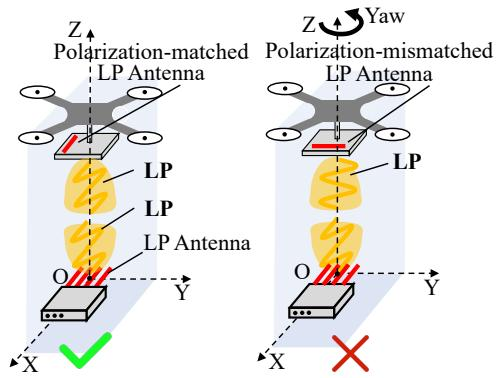  
Fig. 1. Illustration of LP mismatch.

This problem is particularly acute in UAV systems for two key reasons: (1) Due to strict constraints on size, weight and power for UAV, UAVs typically use linearly polarized (LP) antennas, which are more compact and energy-efficient [15].1

The polarization direction of UAV-mounted LP antenna varies significantly with its orientation changes. In contrast, the AP is static and its antenna maintains a fixed polarization direction. This dynamic-static contrast results in severe polarization mismatch, causing significant signal degradation. (2) Multipath propagation indeed offers opportunities to obtain different antenna polarization directions, as each multipath component may exhibit a distinct polarization direction. However, unlike terrestrial or indoor scenarios, UAV-ground links typically occur in open-sky environments with negligible multipath. As a result, the chance to mitigate polarization mismatch through multipath is limited, and the received signal power remains highly sensitive to the UAV’s orientation. As shown in Fig. 1, perfect alignment of LP antennas yields optimal reception, whereas orthogonal polarization leads to nearly zero signal reception theoretically. We further illustrate the impact of polarization mismatch using simulation and real-life experiments in Section III-A.

One natural question arises: Can polarization mismatch be addressed during UAV mobility? Prior studies have explored the use of reconfigurable metasurfaces in IoT and wearable devices to dynamically rotate the polarization of LP waves [16]. Chen et al. [16] propose a transmissive metasurface placed between the transmitter and receiver that rotates LP waves to achieve polarization matching. However, this approach relies on brute-force search and requires over one second to respond, which is far slower than the rapid orientation changes of UAVs, as shown in Fig. 3. Moreover, this system depends on external attitude feedback, such as motion capture systems or onboard sensors, adding system complexity and limiting real-time applicability.

To tackle these challenges, we present PolarFix, a dualmetasurface mmWave system that ensures robust polarization match and enhances signal gain in mobile UAV scenarios. As illustrated in Fig. 2, PolarFix integrates three key components: first, a passive linear-to-circular polarization (L2C) metasurface is installed on the AP side. This metasurface converts LP waves into circularly polarized (CP) waves. For CP waves, LP antennas can receive a stable signal power regardless of their orientation, enabling consistent reception without realtime control. Second, a programmable 1-bit metasurface is placed between the L2C metasurface and the AP antenna. Using a 16 × 16 phase array, this metasurface dynamically steers LP waves’ direction toward the UAV. It compensates for the insertion loss of both metasurfaces as well as the limited antenna gains of the transmitter and receiver. Third, we optimize the spacing between the two metasurfaces based on Fabry–Perot cavity theory [17], [18]. This configuration´ ensures constructive interference of multi-reflected mmWave signals, thereby maximizing received signal strength.

Our contributions are summarized as follows:

• We identify and characterize polarization mismatch as a critical but underexplored bottleneck in mmWave UAV communication, even when beam alignment is perfect.

• We design a passive L2C metasurface that mitigates orientation-induced polarization mismatch without active control or orientation feedback.

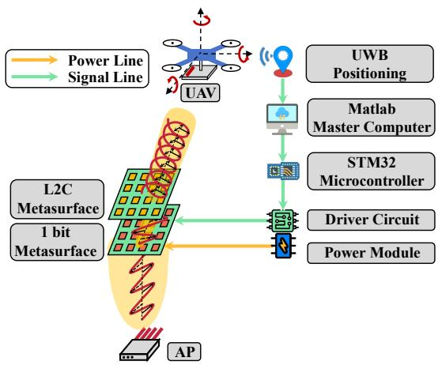  
Fig. 2. System overview.

• We co-design a programmable beamforming metasurface and jointly optimize its integration with the L2C layer using Fabry Perot cavity theory to boost signal strength and reduce loss.

• We implement and evaluate PolarFix through extensive simulations and real-world experiments, demonstrating robust performance gains in dynamic flight scenarios.

The remainder of this paper is organized as follows. Sec. II presents the system overview of PolarFix. And the principle of polarization conversion is given in Sec. III. The design of L2C metasurface is provided by Sec. IV followed by the design of 1-bit metasurface in Sec. V. Consequently, we present the optimized distance between the above two metasurfaces for minimal insertion loss in Sec. VI. We also evaluate the performance of PolarFix Sec. VII. Furthermore, related work is discussed in Sec. VIII followed by discussion and future work in Sec. IX. Finally, the conclusion is given in Sec. X.

## II. SYSTEM OVERVIEW

We propose PolarFix between AP and UAVs to ensure polarization match and enhance signal gains, which is symmetric in design, meaning it supports both uplink (from UAV to AP) and downlink (from AP to UAV) transmission at the physical layer. For the convenience of representation, we first illustrate the downlink case in Fig. 2, and provide supplementary discussion on the uplink direction at the end of this section.

• L2C Metasurface: During the downlink, linearly polarized (LP) waves emitted by the AP pass through the L2C metasurface and are converted into circularly polarized (CP) waves. The conversion ensures that the UAV’s LP antennas can receive invariant RSS regardless of UAV‘s orientation. However, the trade-off is a theoretical 50% reduction in RSS compared to the ideal case where LP antennas are perfectly aligned.

• 1-bit Metasurface: Then, we add another 1-bit metasurface between the AP and L2C metasurface to enhance the overall signal strength and extend the communication range. This 1-bit metasurface does not change the polarization of transmitted signals but dynamically modulates the transmitted signals’ phase to focus and direct the mmWave signal towards the UAV, improving received signal strength (RSS) and ensuring stable communication.

• Optimization of Metasurface Placement: To maximize signal efficiency, the placement of the L2C and 1-bit metasurfaces is carefully determined. The distance between the two metasurfaces is optimized using principles from Fabry-Perot cavity theory, ensuring that the transmitted mmWave signals combine constructively after multiple transmissions. This optimization reduces power losses and improves the overall transmissive efficiency, further enhancing the system’s performance.

For the uplink scenario, the same metasurface configuration remains effective. The LP signal emitted from the UAV is0 first converted into a CP wave by the L2C metasurface before reaching the AP, thereby eliminating polarization mismatch caused by UAV attitude variations. The 1-bit metasurface further enhances reception by improving gain toward one LP component of the converted CP wave. This improves the RSS0 of AP while incurring a half-power reduction, analogous to the downlink case where the UAV’s LP antenna receives only one component of the CP signal. Thus, the uplink and downlink paths are thus physically symmetric. For clarity of presentation, we focus on the downlink (AP to UAV) throughout the rest of this paper.

## III. PRELIMINARY

Before going into more details, we first illustrate the impact of polarization mismatch on UAV communication by simulation and practical measurements. Then, we present the formulation of the mmWave signals and their interaction with the metasurface, and then derive the conditions for converting LP to CP, which are the basis for metasurface design.

## A. Impact of Polarization Mismatch

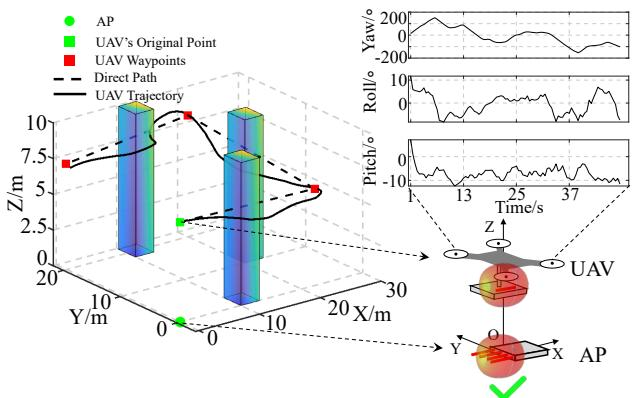  
Fig. 3. UAV motion during a mission of express delivery.

We first simulate a typical UAV movement during an express delivery mission, as shown in Fig. 3 [19]2. Even when the AP and UAV antennas are initially co-aligned, the received signal varies dramatically due to orientationinduced polarization angle ξ, which causes fluctuations in the polarization loss factor (PLF), defined as $| \cos ( \xi ) |$ [15]. As illustrated in Fig. 4, the average PLF-induced loss reaches −3.53 dB, with deep fades up to −16.27 dB. These drops not only degrade throughput but can also trigger unnecessary beam searching, mistaking polarization-induced signal loss for misalignment. Then we experimentally confirm this by using a router (Netgear Nighthawk X10) as the AP and a laptop (Acer TravelMate P446) on the UAV [20], [21], both of which use the standard 802.11ad (60 GHz) network interface card (QCA9008 series) from Qualcomm. At just 10 meters distance, yaw-induced rotation alone can reduce throughput by up to 36%, even without beam misalignment (Fig. 5).

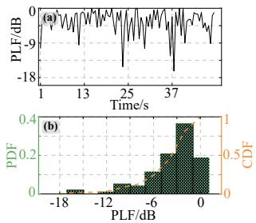

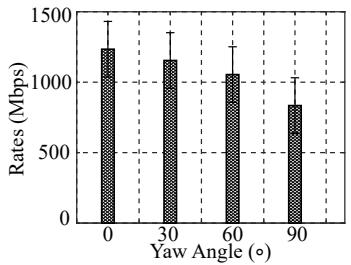  
Fig. 4. PLF of LP antenna.  
Fig. 5. Effects of LP mismatch on static rates.

## B. Formulation of Polarization from LP to CP

As shown in Fig. 6, the incident LP wave is traveling along the Z-axis, with the electric field (also called E field) vector $\breve { E } ^ { \mathrm { i } }$ (i represents the meaning of incidence), tilted $0 ^ { \circ }$ relative to the X-axis. At any time $t ,$ the incident E field can be decomposed into two unit components, $\vec { E } _ { 1 } ^ { \mathrm { i } }$ (45◦ anticlockwise to X-axis) and $\vec { E } _ { 2 } ^ { \mathrm { i } } ~ ( 4 5 ^ { \circ }$ clockwise to X-axis), with the same magnitude and phase [15]:

$$
\begin{array} { r l } & { \vec { E } ^ { \mathrm { i } } = 1 / \sqrt { 2 } \left( \vec { E } _ { 1 } ^ { \mathrm { i } } + \vec { E } _ { 2 } ^ { \mathrm { i } } \right) } \\ & { \quad = 1 / \sqrt { 2 } \left( E ^ { \mathrm { i } } \vec { e } _ { 1 } + E ^ { \mathrm { i } } \vec { e } _ { 2 } \right) } \\ & { \quad = 1 / \sqrt { 2 } \left( \left. E ^ { \mathrm { i } } \right. e ^ { j \left( \omega t - k z \right) } \vec { e } _ { 1 } + \left. E ^ { \mathrm { i } } \right. e ^ { j \left( \omega t - k z \right) } \vec { e } _ { 2 } \right) } \end{array}\tag{1}
$$

where $\left\| E ^ { \mathrm { i } } \right\|$ is the amplitude of $\vec { E } ^ { \mathrm { i } }$ along the direction of $\vec { E } _ { 1 } ^ { \mathrm { i } }$ and $\vec { E } _ { 2 } ^ { \mathrm i } ; \vec { e } _ { 1 }$ and $\vec { e } _ { 2 }$ are the unit vector along the direction of $\vec { E } _ { 1 } ^ { \mathrm { i } }$ and $\vec { E } _ { 2 } ^ { \mathrm { i } }$ respectively; $j$ is the imaginary unit; ω is angular frequency; k is wavenumber and z is the travelling distance of waves along the Z-axis.

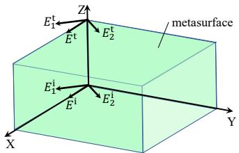  
Fig. 6. Visualization E Field during Polarization Conversion.

Then the transmitted E field (t represents the meaning of transmission) can be calculated as [15]:

$$
\left( \begin{array} { c } { E _ { 1 } ^ { \mathrm { t } } } \\ { E _ { 2 } ^ { \mathrm { t } } } \end{array} \right) = 1 / \sqrt { 2 } \left( \begin{array} { c c } { T _ { 1 1 } } & { T _ { 1 2 } } \\ { T _ { 2 1 } } & { T _ { 2 2 } } \end{array} \right) \left( \begin{array} { c } { E ^ { \mathrm { i } } } \\ { E ^ { \mathrm { i } } } \end{array} \right) ,\tag{2}
$$

$$
T _ { 1 1 } = \| T _ { 1 1 } \| e ^ { j \phi _ { 1 1 } } , T _ { 2 2 } = \| T _ { 2 2 } \| e ^ { j \phi _ { 2 2 } } ,\tag{3}
$$

where ∥·∥ is the 2-norm of a vector; $T _ { 1 1 }$ and $T _ { 2 2 }$ represent co-polarization transmission coefficients, respectively; and $T _ { 1 2 }$ and $T _ { 2 1 }$ represent cross-polarization transmission coefficients As a center-connected structure, the proposed structure has weak mutual coupling between the two orthogonal components, that is, $T _ { 1 2 }$ and $T _ { 2 1 }$ , which can be negligible [22]. If the magnitudes and phases of the transmission coefficients satisfy the condition as follows:

$$
\left. T _ { 1 1 } \right. = \left. T _ { 2 2 } \right. , \Delta \phi = \phi _ { 2 2 } - \phi _ { 1 1 } = \pm 9 0 ^ { \circ } ,\tag{4}
$$

the CP wave can be generated [15]. By doing this, the incident LP wave is converted into the CP wave, which effectively mitigates the orientation-induced polarization mismatch demonstrated in Section III-A. More details about the L2C metasurface design is in the following Section IV.

## IV. FAST POLARIZATION MATCH: L2C METASURFACE

Our L2C metasurface is based on the frequency-selective surface (FSS) [23]. FSS is a periodic surface with identical two-dimensional units. Each unit has the same patch or slot, whose different structures can tune the magnitude, phase, or polarization in different ways. Thus, we first determine the unit structure and extend it to the whole array.

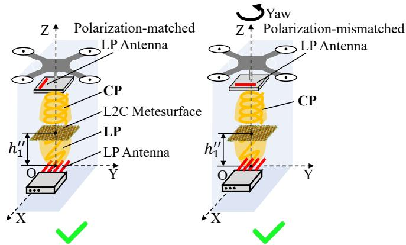  
Fig. 7. Illustration of LP match using L2C metasurface.

## A. Unit Structure

In recent years, various elements have been used for circular polarization (CP) generation [15], [22], [24], [25], [25]–[29]. These elements can be classified into four main types: centerconnected dipoles, rectangular patches, rectangular loops, and combinations of these structures. First, as an example of the center-connected type, the cross dipole offers high polarization isolation between its orthogonal arms, allowing independent control of vertical and horizontal components. This simplifies CP device design. However, periodic arrangements of cross dipoles typically result in a large unit length. In contrast, rectangular patches or loop structures create a denser lattice, optimizing space utilization. However, they exhibit strong mutual coupling between orthogonal components, which introduces design complexities. The Jerusalem cross (JC) structure, a center-connected design, combines the benefits of the cross dipole with smaller element spacing and greater design flexibility, which is more suitable for the requirements of Integration and Miniaturization in UAV communicatoin. Finally, the combination of the JC structure and an “I”-type dipole is chosen in this design. The horizontal arm of the JC structure and the vertical “I”-type dipole provide lower and higher frequency resonances, respectively, broadening the frequency band.

Designed Structure: To maintain polarization consistency irrespective of the UAV’s orientation, we propose the design of an LP-CP converter operating at a central frequency of 60 GHz. To characterize the CP wave intuitively, the axial ratio (AR) is used to reflect the degree of the CP. This parameter can be calculated in the following equation [15]:

$$
A R = \sqrt { \frac { \left( T _ { 1 1 } ^ { 2 } + T _ { 2 2 } ^ { 2 } + \sqrt { T _ { 1 1 } ^ { 4 } + T _ { 2 2 } ^ { 4 } + 2 T _ { 1 1 } ^ { 2 } T _ { 2 2 } ^ { 2 } \cos ( 2 \Delta \phi ) } \right) } { \left( T _ { 1 1 } ^ { 2 } + T _ { 2 2 } ^ { 2 } - \sqrt { T _ { 1 1 } ^ { 4 } + T _ { 2 2 } ^ { 4 } + 2 T _ { 1 1 } ^ { 2 } T _ { 2 2 } ^ { 2 } \cos ( 2 \Delta \phi ) } \right) } } .\tag{5}
$$

When $A R = 1$ , the transmitted wave is an ideal CP wave; when $A R = \infty$ , the transmitted wave is an LP wave. In other cases, the transmitted wave is an elliptical polarization wave.

Firstly, the design of the LP-CP converter for the 60 GHz frequency range presents unique challenges, particularly in achieving efficient conversion from LP to CP while maintaining low loss and high efficiency. We select a hybrid JC structure combined with an “I”-type dipole, known for efficient coupling and stable radiation with good polarization control. By adjusting the patch dimensions and spacing, we fine-tune the AR and optimize the phase shift between orthogonal polarization components. Simulation tools like Keysight ADS and HFSS are used to analyze the impact of these parameters on polarization conversion, as small variations can significantly affect performance at 60 GHz. The geometric parameters of the converter are listed in Fig. 8.

Secondly, the difficulty lies in obtaining a 3 dB AR bandwidth at 60 GHz, given the physical limitations of materials and structures at such high frequencies. In this design, TLY-5 is chosen for its low loss tangent (0.0009), which ensures minimal signal degradation, and its relatively low permittivity (2.2), which allows for a compact design without significantly affecting the impedance matching [30]. The substrate thickness of 1.52 mm is selected to ensure that the antenna elements are resonant at the desired frequency and to minimize dispersion effects that could negatively impact the AR and the bandwidth.

The simulated results are shown in Fig. 9. The magnitudes of the transmission coefficients in 1 and 2 polarization are almost equal in the range of $5 6 \sim$ 64 GHz. And the phase difference $\Delta \phi$ between them is 90◦ (LHCP) and $2 7 0 ^ { \circ }$ (equal to −90◦; RHCP) in the range of $5 6 \sim$ 64 GHz. Based on copolarization transmission coefficients with the same magnitude and $9 0 ^ { \circ }$ phase difference can generate the CP wave. Note that the efficiency of LHCP and RHCP electromagnetic waves are the same for receivers with LP antennas and the power is lowered by 3 dB.

Efficiency: Furthermore, we evaluate the efficiency of polarization conversion by polarization conversion ratio (PCR)

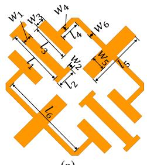  
(a)

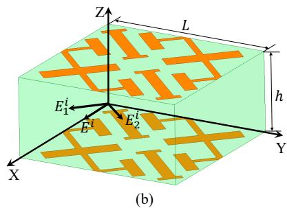

Fig. 8. Unit structure of L2C metasurface: (a) top view of patch antenna. (b) the whole structure. The dimensions are (in mm): $l _ { 1 } = 1 . 1 1 2 ,$ $w _ { 1 } = 0 . 0 4 7 ,$ $l _ { 2 } = 0 . 3 7 4 ,$ $w _ { 2 } = 0 . 0 9 3$ $l _ { 3 } = 0 . 7 4 8 ,$ $w _ { 3 } = 0 . 1 9 6 .$ $l _ { 4 } = 0 . 3 7 9 ,$ $w _ { 4 } = 0 . 0 9 3 ,$ $l _ { 5 } = 1 . 1 6 8 ,$ $w _ { 5 } = 0 . 1 8 7$ $l _ { 6 } = 1 . 6 8 3 ,$ $w _ { 6 } = 0 . 0 9 8 ,$ $L = 2 . 6 4 3$ and h = 1.254.  
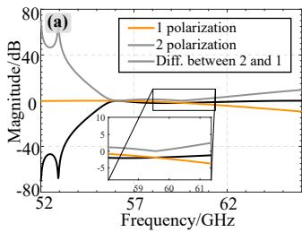

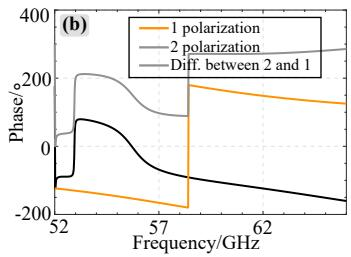  
Fig. 9. (a) Magnitude and (b) phase of S12 for L2C metasurface.

[15]:

$$
\mathrm { P C R } _ { 1 } = \frac { { T _ { 1 1 } } ^ { 2 } } { { T _ { 1 1 } } ^ { 2 } + { T _ { 2 1 } } ^ { 2 } } ,\tag{6}
$$

$$
\mathrm { P C R _ { 2 } } = \frac {  { T _ { 2 2 } } ^ { 2 } } {  { T _ { 2 2 } } ^ { 2 } +  { T _ { 1 2 } } ^ { 2 } } ,\tag{7}
$$

which denote the ratio of co-polarization (the same polarization before and after transmission) for the 1 and 2 polarization incident waves after transmission, respectively. As shown in Fig. 10, both incident LP components are almost converted to circular polarization efficiently.

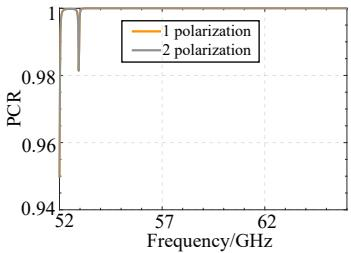  
Fig. 10. Polarization Conversion Ratio.

## B. Array Structure

Size: Due to the small size (15×6 mm) of 60 GHz antennas on COTS device (for example, in this work we use router Netgear Nithhawk X10, laptop Acer Travelmate P446), the far field distance $D _ { f }$ is about 90 mm [15]:

$$
D _ { f } = \frac { 2 D ^ { 2 } } { \lambda } ,\tag{8}
$$

where D is the antenna aperture.

In order to conform to the assumption of incident plane waves, the metasurface must be placed in the far field, that is more than $D _ { f }$ far away from the source antenna. In our system, we place an L2C metasurface 150 mm away from the source antenna, which is on the Netgear X10 router. According to the measured radiation patterns of AP antenna [31], we empirically extend the metasurface into an array of 16 × 16 based on the structure of the metasurface unit in Section IV-A and with size of $4 2 . 2 8 8 \times 4 2 . 2 8 8$ mm, which can balance between cost and full coverage.

Simulation: To show the efficiency of L2C conversion, we set incident waves traveling along the Z-axis, with E field vector tiled $0 ^ { \circ }$ relative to the X-axis using HFSS simulation. After transmission by the L2C converter, CP waves should be generated based on the composition of two components in Eq. (4). As shown in Fig. 11, E field vectors of transmissive waves rotate anticlockwise during one period $\displaystyle ( t \ = \ 0 )$ $t \ =$ $T / 4 , t = T / 2$ and $t = 3 T / 4 )$ , which is RHCP. It is intuitive that the components in 1 and 2 polarization are nearly equal, indicating that the transmissive wave is approximate to ideal circular polarization. The results are consistent with the results of one metasurface unit in Section IV-A.

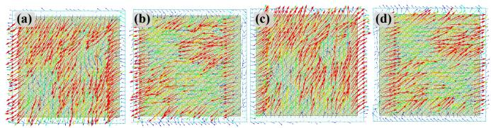  
Fig. 11. Transmissive E field vector of L2C metasurface at 60 GHz: (a) t = 0; (b) $t = T / 4 ;$ (c) $t = T / 2$ and (d) $t = 3 T / 4$

Robustness to Oblique Incidence: The above L2C polarization conversion assumes ideal normal incidence. However, as shown in Fig. 2, the 1-bit metasurface steers the AP’s LP beam and thus alters its incident angle on the L2C metasurface. We therefore evaluate L2C performance under oblique incidence. Fig. 12 (a) shows that the S12 magnitude difference between the two polarizations remains low over 58∼62 GHz for incident angles from $0 ^ { \circ }$ to $7 0 ^ { \circ }$ , staying within −3 dB for angles up to $5 0 ^ { \circ }$ . Fig. 12 (b) presents the corresponding phase difference, which deviates from 90◦ or $2 7 0 ^ { \circ }$ by less than $2 0 ^ { \circ }$ for incident angles up to $4 0 ^ { \circ }$ These results confirm that the L2C metasurface maintains high L2C conversion efficiency even with oblique incidence. Experimental validation is provided in Sec. VII.

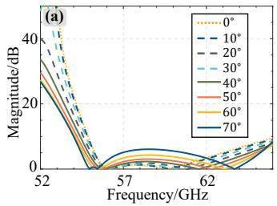

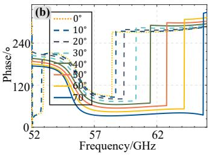  
Fig. 12. Robustness of L2C conversion to oblique incidence: (a) magnitude difference and (b) phase difference of S12 under different incident angles.

## V. GAIN ENHANCEMENT: 1-BIT METASURFACE

Building on the L2C converter, polarization match for UAV transceivers is effectively maintained, regardless of the UAV’s attitude. However, several challenges still exist that hinder practical implementation. Although the insertion loss of the L2C metasurface is relatively low due to our optimized structure, some inherent losses are unavoidable. First, the metasurface itself introduces up to 3 dB loss, as shown in Fig. 9(a). Additionally, an LP antenna receiving an ideal CP wave incurs another 3 dB loss. As a result, a total loss of 6 dB occurs compared to the scenario where polarization match is achieved without the L2C metasurface. Moreover, due to the limited number of quasi-omnidirectional antennas with low gain and restricted beamforming capabilities of the COTS devices, the communication range is constrained. Consequently, when UAVs fly away from the AP horizontally, they may enter the regions with weak RSS, as illustrated in Fig. 13.

To solve this problem, a natural approach is to enhance gain with pencil beams and control its direction using a phasereconfigurable metasurface. However, since CP waves consist of two LP components, as shown in Fig. 8(b), dual-polarization (i.e., controlling two orthogonal LP components) must be addressed simultaneously. Achieving dual-polarization typically requires complex microstrip structures, direct biasing, and multiple substrate layers, all of which come with high costs. To simplify the phase reconfiguration process, we propose a more straightforward solution. Rather than directly controlling the phase of CP waves, we first modify the phase of the LP waves before they undergo L2C conversion. By doing this, the beamwidth, gain, and direction of the incident waves at the L2C converter are adjusted in advance, simplifying the design and reducing complexity.

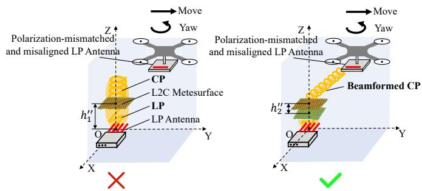  
Fig. 13. Illustration of gain enhancement for horizontally deviated UAV using 1-bit metasurface.

## A. Unit Structure

Referencing existing metasurface structures [26], [32] and similar to the optimization process described in Section IV-A, we select a low-loss metasurface in the structure of ring and mulitple layers and obtain the optimized structure of 1-bit phase-controlled metasurface in Fig. 14.

Designed Structure: Each unit consists of two substrate layers and two metal patches, positioned on the top and bottom of the substrates, respectively. The two patches are slotted and connected by a single via at the center. The substrates are separated by a polypropylene (pp) layer (specifically, we use the material of FR-27 in thickness of 0.1 mm), with a metal ground plane located on the central pp layer, which has a width of $w _ { 5 } ^ { \prime }$ [33]. Additionally, both the top and bottom metal patches are connected to the ground via two vias on either side, ensuring structural symmetry. For phase control, two PIN diodes with low insertion loss are placed in the same direction on the bottom patch, as illustrated in Fig. 14(b). The bottom patch is divided into two disconnected sections: the outer and inner parts. The state of the bottom patch can be altered by adjusting the voltages applied to these sections. Specifically, when the outer voltage is lower than the inner voltage, the upper PIN diode turns off while the lower PIN diode turns on. The resulting ECM corresponds to the top patch in Fig. 14(a). Conversely, when the outer voltage exceeds the inner voltage, the states of the upper and lower PIN diodes are reversed, and the EC resembles the top patch rotated upside down. Based on the EC characteristics of the PIN diode (MACOM MA4GP907) shown in Fig. 15, the geometry parameters are optimized as shown in Fig. 14 [34]. This configuration allows two transmissive states to be toggled using different bias voltages. Based on the geometry of antenna patches (Fig. 14) and the EC characteristics of PIN diode (MACOM MA4GP907) (Fig. 15), we use HFSS to simulate the transmission magnitude and phase responses, as summarized in Fig. 17. In Fig. 17(a), both states exhibit nearly identical transmissive magnitudes between 58 and 62 GHz, with an insertion loss of less than -5 dB, which is very low for mmWave frequencies. Fig. 17(b) shows that a phase difference of $1 8 0 ^ { \circ }$ is achieved between the two states in the same frequency range. Together, these results satisfy the requirements for 1-bit phase control.

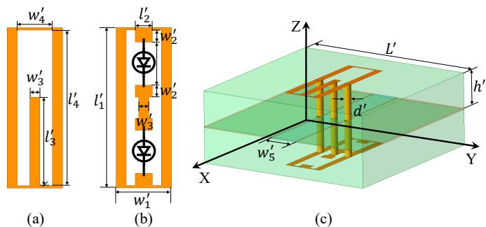  
Fig. 14. Unit structure of 1-bit metasurface: (a) top and (b) bottom view of patch antenna, and (c) the whole structure. The dimensions are (in mm): $l _ { 1 } ^ { \prime } = 1 . 6 0 0$ $w _ { 1 } ^ { \prime } = 0 . 5 5 0$ $l _ { 2 } ^ { \prime } = 0 . 1 7 0$ $w _ { 2 } ^ { \prime } = 0 . 1 2 0 $ $l _ { 3 } ^ { \prime } = 0 . 8 8 0 .$ $\dot { w } _ { 3 } ^ { \prime } = 0 . 1 0 \dot { 0 } .$ $l _ { 4 } ^ { \prime } = 1 . 5 5 0 .$ $w _ { 4 } ^ { \prime } = 0 . 3 5 \bar { 0 }$ $d ^ { \prime } = 0 . 1 0 0 { \mathrm { . } }$ $\overline { { w _ { 5 } ^ { \prime } } } = 0 . 4 0 0 .$ $L ^ { \prime } = 2 . 5$ $h ^ { \prime } = 0 . 5$

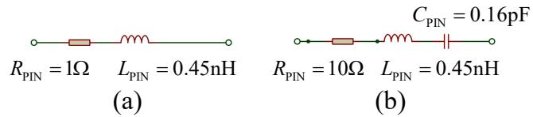  
Fig. 15. ECM of PIN diode in (a) state 1 and (b) state 2.

Bias Lines: For 1-bit metasurface control, each PIN diode requires a direct current (DC) bias line. However, if these lines are placed arbitrarily, they can disturb the electromagnetic field and degrade the metasurface performance. To avoid this, we first analyze the E-field distribution of the unit without bias routing (Fig. 16(a)) and then add the bias lines at points where the E-field is nearly zero (Fig. 16(b)). This approach ensures the required DC connection while minimizing RF interference. As shown in Fig. 17, the magnitude and phase responses remain almost unchanged after adding the bias lines, confirming effective isolation between the RF and DC paths and stable overall performance.

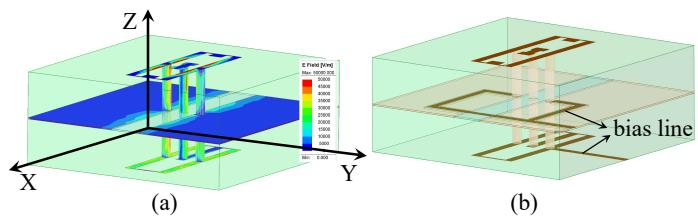  
Fig. 16. Bias line design: (a) E-field distribution of the original unit (without bias lines) and (b) placement of bias lines in low-E-field regions.

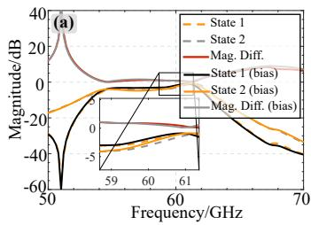

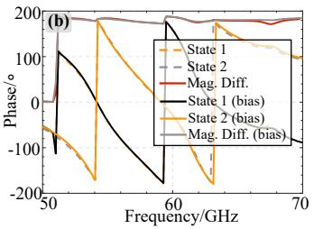  
Fig. 17. (a) magnitude and (b) phase of S12 for 1-bit metasurface.

## B. Array Structure

Size: In our design, the LP incident waves from the AP are first beamformed by the 1-bit metasurface, and then converted into CP waves by the L2C metasurface. To ensure full coverage in the far field of the AP antenna, we extend the 1-bit metasurface into ${ \textbf { a } } 1 6 \times 1 6$ array, based on the unit structure described in Section V-A, with a total size of $4 0 . 0 0 \times 4 0 . 0 0$ mm.

## C. Beamforming

To dynamically configure the phase of each unit on the 1-bit metasurface for gain enhancement and beam steering toward the UAV’s varying positions, accurate localization of the UAV is essential. A variety of localization techniques (such as IMU, GPS, computer vision, etc.) can be employed to support metasurface beamforming [35], [36]. In this work, we adopt high-precision, low-latency UWB-based localization as a representative solution to evaluate the performance of our metasurface system. Specifically, we track the UAV’s position at a sampling rate of 20 updates per second.

Phase Control: For simplicity, we first illustrate the geometry of the communication system without the L2C metasurface in Fig. 18, as the L2C metasurface has minimal impact on the transmission direction of the beams. Let $\phi _ { a }$ represent the phase of the transmitted signals from the AP, and $\phi _ { u }$ denote the phase of the received signals at the UAV. For the signal passed through the metasurface unit $i ( i \in [ 1 , I ] ] )$ , the corresponding phase shift $\Delta \phi _ { i }$ , between the transceivers can be decomposed into three components:

$$
\begin{array} { c } { \Delta \phi _ { i } = \phi _ { u , i } - \phi _ { a , i } } \\ { = \Delta \phi _ { 1 , i } + \Delta \phi _ { 2 , i } + \Delta \phi _ { 3 , i } } \end{array}\tag{9}
$$

where $\Delta \phi _ { 1 , i }$ is the phase shift due to the path difference $\Delta d _ { 1 , i }$ from the AP to different metasurface unit $i ; \Delta \phi _ { 2 , i }$ is the phase shift by the metasurface unit i; and $\Delta \phi _ { 3 , i }$ is the phase shift caused by the path difference $\Delta d _ { 3 , i }$ from the metasurface unit i to the antenna on UAV. Since the AP and UAV antennas are small compared to the metasurface, we approximate them as point sources located at positions $( x _ { a } , y _ { a } , z _ { a } )$ and $( x _ { u } , y _ { u } , z _ { u } )$ respectively. Additionally, because the distance between the metasurface and the UAV (on the order of tens of meters) is much greater than the size of the metasurface (approximately 5 cm), the waves transmitted through the metasurface are assumed to be parallel. Let the position of each metasurface unit i $( i \in [ 1 , I ] )$ be denoted as $( x _ { i } , y _ { i } , z _ { i } )$ . Based on the geometric relationships in Fig. 18, we can express the phase shift compared to the centralized metasurface unit (with position $( 0 , 0 , h _ { 1 } ^ { \prime \prime } ) )$ as follows:

$$
\begin{array} { c } { { \displaystyle \Delta \phi _ { 1 , i } = \frac { 2 \pi } { \lambda } \sqrt { ( x _ { i } - 0 ) ^ { 2 } + ( y _ { i } - 0 ) ^ { 2 } + ( z _ { i } - h _ { 1 } ^ { \prime \prime } ) ^ { 2 } } } } \\ { { \displaystyle = \frac { 2 \pi } { \lambda } \sqrt { x _ { i } ^ { 2 } + y _ { i } ^ { 2 } } } } \end{array}\tag{10}
$$

$$
\Delta \phi _ { 3 , i } = \frac { 2 \pi } { \lambda } x _ { i } \mathrm { s i n } \theta _ { u } \mathrm { c o s } \Phi _ { u } + \frac { 2 \pi } { \lambda } y _ { i } \mathrm { s i n } \theta _ { u } \mathrm { s i n } \Phi _ { u }\tag{11}
$$

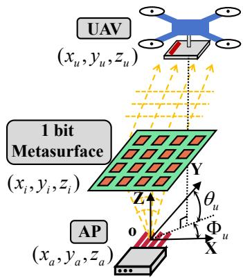  
Fig. 18. Illustration of beamforming using 1-bit metasurface.

Since the AP antenna is quasi-omnidirectional, the phases $\phi _ { a , i }$ of all transmitted signals are nearly identical. In order to tilt the mmWave beams toward the UAV, the phases $\phi _ { u , i }$ of all received signals must also be the same. That is, the phase shift $\Delta \phi _ { i }$ by metasurfaces should be consistent (without loss of generality, we let $\Delta \phi _ { i } = 0 )$ . From Eq. (9), we can derive the optimal phase shift for all metasurface units:

$$
\Delta \phi _ { 2 , i } = - \Delta \phi _ { 1 , i } - \Delta \phi _ { 3 , i }\tag{12}
$$

Clustering of Multiple UAVs: So far, we have addressed the beamforming for a single UAV. When the number of UAVs increases to N, one approach is to divide the total M metasurface units evenly among the UAVs. In this case, each

UAV would be assigned $\tau = \lfloor M / N \rfloor$ metasurface units for beamforming. However, using fewer units results in a lower beamforming gain, which in turn reduces the communication distance. More formally, based on the phase state derived in Eq. (12), the far field function of the 1-bit metasurface at azimuth angle $\Phi _ { u }$ and elevation angle $\theta _ { u }$ in Fig. 18 can be expressed as:

$$
\begin{array} { r l } & { \quad f \left( \theta _ { u } , \Phi _ { u } \right) } \\ & { = \displaystyle \sum _ { m _ { x } = 1 } ^ { M _ { x } } \sum _ { m _ { y } = 1 } ^ { M _ { y } } f _ { e } \left( m _ { x } , m _ { y } \right) \exp \left. - i \left[ \Delta \phi _ { 2 } \left( m _ { x } , m _ { y } \right) + \right. } \\ & { ~ \left. \displaystyle \frac { 2 \pi } { \lambda } L ^ { \prime } \left( m _ { x } - 0 . 5 \right) \sin \theta _ { u } \cos \phi _ { u } + \right. } \\ & { ~ \left. \displaystyle \frac { 2 \pi } { \lambda } L ^ { \prime } \left( m _ { y } - 0 . 5 \right) \sin \theta _ { u } \sin \phi _ { u } \right] \right. } \end{array}\tag{13}
$$

where $f _ { e } ( m _ { x } , m _ { y } )$ represents the far field function of the incident waves for the metasurface unit located at the $m _ { x ^ { - } }$ th row and $m _ { y }$ -th column; $M _ { x }$ and $M _ { y }$ represent the number of metasurface units on the row and column respectively and we have $M _ { x } \times M _ { y } = M ;$ and $\Delta \phi _ { 2 } ( m _ { x } , m _ { y } )$ is the phase state of the same metasurface unit.

Based on Eq. (13), when the entire $1 6 \times 1 6$ metasurface array is allocated to serve a single UAV (either $\mathrm { U A V _ { 1 } }$ or $\mathrm { U A V _ { 2 } } .$ parameterized in Table I), the phase states and far-field patterns are shown in Figs. 19 and 20. The corresponding beamforming gains reach up to 21.9 dB and 19.9 dB, respectively, clearly exceeding the intrinsic 6 dB loss (3 dB from receiving LP waves by CP antenna; and another 3 dB from insertion loss) of the L2C metasurface.

Beyond beam gain, the 1-bit metasurface also offers a wide beam coverage. In Fig. 19, the main-lobe width is about $1 5 ^ { \circ }$ , covering roughly 2.63 m at a 10 m distance. This tolerance is much larger than the centimeter-level UAV jitter and localization errors [37], so small motion disturbances cause no noticeable beam misalignment.

When the metasurface is uniformly divided to simultaneously support $\mathrm { U A V _ { 1 } }$ and $\mathrm { U A V _ { 2 } }$ (Fig. 21), the corresponding gains decrease to 15.0 dB and 14.9 dB, showing a gain reduction due to fewer available array units. These gains still exceed the intrinsic 6 dB loss, indicating that the 1- bit metasurface effectively compensates for the loss of L2C metasurface.

However, as the number of UAVs further increases, the available array units per UAV decrease, leading to further gain reduction. To address this issue, we propose a 3-dimensional clustering Algorithm 1 for multiple UAVs that maximizes the number of metasurface units for each beamform while preserving per-UAV gain. Leveraging the symmetry of far field functions and beam angles, the clustering is effectively performed in two angular dimensions, $\theta _ { u } \in [ 0 , \pi / 2 ]$ and $\Phi _ { u } \in \mathbb { \Gamma }$ $[ 0 , \pi ]$ , under the spherical coordinate system $\left( \rho _ { u } , \theta _ { u } , \Phi _ { u } \right)$ . The core idea is to ensure that each UAV cluster is fully covered by the main lobe (defined as the lobe region whose gain is greater than the maximum gain minus 3 dB). Specifically, Algorithm 1 iteratively increases the cluster number τ ∗ until the beamwidth $\alpha _ { c } ^ { \prime }$ of subarray $\mathcal { M } _ { c }$ is no smaller than the width $\alpha _ { c }$ of its UAV cluster $\mathcal { C } _ { c }$ (line 6). This guarantees that all UAVs within a cluster are effectively illuminated by a single high-gain beam. Geometrically, each cluster corresponds to an elliptical cone in 3D space. When UAVs are widely distributed such that their angular separation exceeds the main-lobe width of a single beam, the algorithm automatically divides the metasurface into more clusters, thereby maintaining gain scalability as the UAV number grows. In this work, the clustering is implemented using K-means. As shown in Fig. 22, the 7 UAVs parameterized in Table I are grouped into 2 clusters, and the phase states are computed on a Matlab master computer.

TABLE I  
POSITION OF UAVS.
<table><tr><td>Contents</td><td>Position (m)</td></tr><tr><td>UAV1</td><td>(5, 5, 15)</td></tr><tr><td>UAV2</td><td>(−8, 5, 10)</td></tr><tr><td>UAV3</td><td>(−7,4,4)</td></tr><tr><td>UAV4</td><td>(3, 3, 6)</td></tr><tr><td>UAV5</td><td>(4, 2, 12)</td></tr><tr><td>UAV6</td><td>(1,3,6)</td></tr><tr><td>UAV7</td><td>(6, 4, 10)</td></tr></table>

Algorithm 1: Algorithm of Clustering Multiple UAVs   
for Beamforming.   
Input: UAVs $\mathcal { U } = \left\{ U _ { 1 } , \cdots , U _ { n } \right\} ( n \in [ 1 , \cdots N ] )$ to be   
clustered, metasurfaces M with   
$M = | { \mathcal { M } } | = M _ { x } M _ { y }$ units.   
Output: Optimized number of clusters $\tau ^ { * } ;$ and   
clusters of $\operatorname { U A V s } \ { \mathcal { C } } _ { c } \ ( c \in [ 1 , \cdot \cdot \cdot , \tau ^ { * } ] )$   
1 Initialize $\tau ^ { * } = 1$ ;   
2 $\mathcal { C } _ { c }  \sf K \cdot$ -means $( \mathcal { U } , \tau ^ { * } ) , ( c \in [ 1 , \cdot \cdot \cdot , \tau ^ { * } ] )$   
3 $\alpha _ { c }$ ← minimal width of cone of $\mathcal { C } _ { c } :$   
4 $\mathcal { M } _ { c }$ ← metasurface separation with $M / \tau ^ { * }$ units ;   
5 $\alpha _ { c } ^ { \prime } \gets$ minimal beamwidth of $\mathcal { M } _ { c }$   
6 while Any $\alpha _ { c } ^ { \prime } < \alpha _ { c } ~ ( c \in [ 1 , \cdot \cdot \cdot , \tau ] )$ do   
7 $\tau ^ { * } = \tau ^ { * } + 1 ;$   
8 Implement lines $\left( 2 \right) \sim \left( 5 \right) ;$

## D. Communication Protocol

After obtaining the M phase states of the metasurface M on the Matlab master computer, the metasurface must be updated promptly by the microcontroller (in this case, we use the low-cost STM32F103 core-board). To ensure accurate transmission of many phase states, an efficient communication protocol is essential. For noise immunity, we design a networklayer communication protocol based on the Universal Synchronous/Asynchronous Receiver/Transmitter (USART) protocol at the data link layer. In Fig. 23, a frame header (0xFD) and frame footer (0xFC) are added at the beginning and end of each phase matrix, with correctness checking performed by the transceivers. Additionally, each individual element is encapsulated with a frame header (0xFF) and frame footer (0xFE), and correctness is verified by the transceivers. In the event that any frame header or footer is lost, retransmission is triggered. Although some redundancy is introduced during communication, the time required to transfer a 256-element phase matrix at a rate of 921600 bps is approximately 8.9 ms, which is acceptable for real-time updates.

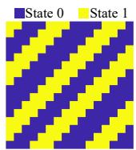  
(a)

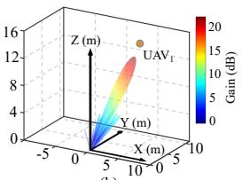  
(b)

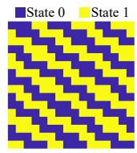  
Fig. 19. Beamforming for UAV1: (a) phase states of 1-bit metasurface; and (b) far field of transmissive(218, 33, 1) waves.  
(a)

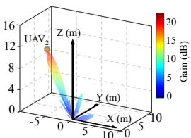  
(b)  
Fig. 20. Beamforming for UAV2: (a) phase states of 1-bit metasurface; and (b) far field of transmissive waves.

(b)  
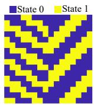

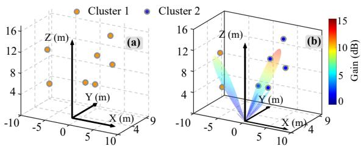

<table><tr><td rowspan=1 colspan=10>State 1            i4          State N</td><td rowspan=1 colspan=1></td></tr><tr><td rowspan=1 colspan=1>0xFD</td><td rowspan=1 colspan=1>0xFF</td><td rowspan=1 colspan=1>Data_low</td><td rowspan=1 colspan=1>Data_high</td><td rowspan=1 colspan=1>0xFE</td><td rowspan=1 colspan=1>...</td><td rowspan=1 colspan=1>0xFF</td><td rowspan=1 colspan=1>Data_low</td><td rowspan=1 colspan=1>Data_high</td><td rowspan=1 colspan=1>0xFE</td><td rowspan=1 colspan=1>0xFC</td></tr></table>

(a)  
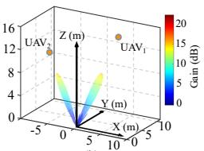  
Fig. 22. Clustering of multiple UAVs: (a) original positions of UAVs and (b) clustered result and generalized beams.  
Fig. 23. Communication protocol between the master computer and STM32 microcontroller for fast transmission of phase states.  
Fig. 21. Beamforming for UAV1 and UAV2: (a) phase states of 1-bit metasurface; and (b) far field of transmissive waves.

To control the states of 512 PIN diodes, 512 independent general-purpose input/output (GPIO) pins are required. Although FPGAs can support parallel control, managing such a large number of channels often exceeds the I/O capacity or cost limits of typical devices. To provide a more costeffective solution and enhance the versatility of our system, we opt to use standard microcontrollers instead. However, microcontrollers have a limited number of GPIOs. For instance, the STM32F103C model provides only 35 GPIOs, meaning at least 15 STM32F103C microcontrollers are necessary to control all 512 PIN diodes.

## E. Driving Circuit

To enhance the parallel control capability, we design a driving circuit based on shift registers and latches, as shown in Fig. 25. The shift registers are used to convert serial inputs into parallel outputs in a single row, while the latches extend these outputs across multiple rows and stabilize them. As illustrated in Fig. 24, two shift registers (74HC575 model) are connected in series. When SRCLK1 is set to a high level, the two shift registers convert the serial input SER1 into 16 parallel outputs (shown in blue). When RCLK1 is high, the shift registers enable the 16 outputs, which are then connected to the 16 input pins (in blue) of 16 pairs of latches (74HC373 model) in parallel, resulting in 16 outputs for a single row (shown in green). Similarly, another pair of shift registers (also 74HC575) is connected in series, and their 16 outputs (in orange) are connected to the enabling pins (in orange) of the 16 latch pairs (74HC373). This enables row selection by activating only one pair of latches at a time, similar to a singlepole multi-throw switch, which maps the outputs (in green) to the corresponding row. By sequentially enabling different pairs of latches, we can generate 256 independent outputs using just four input signals. For convenience, the 256 outputs (each having two states: high or low) of the driving circuit are visually represented by the ON/OFF states of LED diodes. In practice, two such driving circuits are used to control a 1-bit metasurface with a 16 × 16 array simultaneously. The hardware of the driving circuit is shown in Fig. 25. With the STM32F103 microcontroller configured for a GPIO response speed of 20 ns, the time required to update all 256 outputs is approximately 21.44 µs, which is well within the required real-time response time.

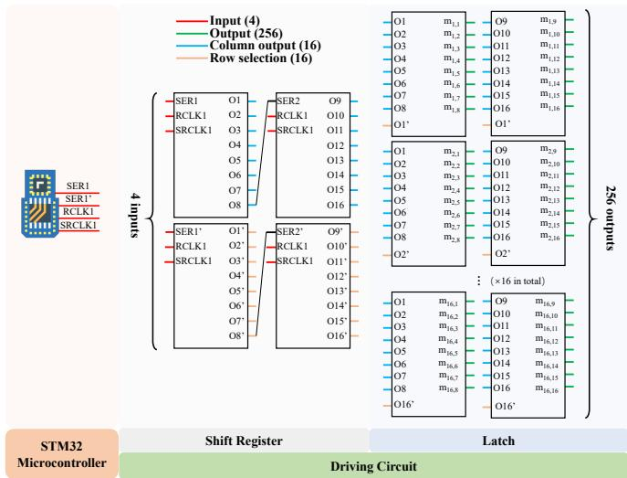  
Fig. 24. Schematic diagram of driving circuit.

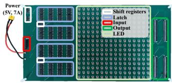  
(a)

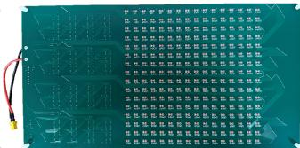  
(b)  
Fig. 25. Prototype of driving circuit: (a) top and (b) bottom view.

## VI. INSERTION LOSS REDUCTION

Up to this point, we have discussed the use of two metasurfaces for L2C conversion and 1-bit phase control, respectively. As mentioned earlier, the incident waves from the AP should first pass through the 1-bit metasurface, followed by the L2C metasurface. Additionally, we have considered the distance $h _ { 1 } ^ { \prime \prime }$ between the source antenna on the AP and the metasurfaces, based on far field theory. However, the distance $h _ { 2 } ^ { \prime \prime }$ between the two metasurfaces remains undetermined. In this section, we aim to minimize the insertion loss of the two metasurfaces by optimizing the separation distance $h _ { 2 } ^ { \prime \prime }$ inspired by Fabry-Perot cavity [17], [18].

## A. Phase Difference

The cavity of our system consists of two transmissive metasurfaces in parallel, as illustrated in Fig. 26. When incident waves pass through the cavity, they are reflected multiple times between the two metasurfaces, leading to interference effects. Specifically, waves in phase will constructively interfere, while those out of phase will cancel each other out. For maximal signal strength, we need to ensure the transmitted waves are in the same phase. We construct the signal model in the following.

As shown in Fig. 26, we denote the distance between the two metasurfaces by $h _ { 2 } ^ { \prime \prime }$ , the angle of incidence by $\theta _ { 1 }$ , the angle of refraction by $\theta _ { 2 } .$ , and refractive indices by $n _ { 2 }$ and $n _ { 1 }$ for the cavity’s interior and exterior, respectively. Initially, most of the incident wave $\mathcal { T } _ { 1 }$ passes directly through the two metasurfaces, represented by $\mathcal { T } _ { 1 }$ . Additionally, a portion of $\mathcal { T } _ { 1 }$ is sequentially reflected by points B, C, and D on the metasurfaces, before being transmitted as $\mathcal { T } _ { 2 }$ . The phase difference between $\mathcal { T } _ { 1 }$ and $\mathcal { T } _ { 2 }$ is denoted as $\Delta _ { p } \mathrm { : }$

$$
\Delta _ { p } = k _ { 0 } n _ { 2 } ( l _ { \mathrm { B C } } + l _ { \mathrm { C D } } ) + \Delta _ { p } ^ { \mathrm { L 2 C } } + \Delta _ { p } ^ { \mathrm { 1 - b i t } } - k _ { 0 } n _ { 1 } l _ { \mathrm { B E } } ,\tag{14}
$$

where $\begin{array} { r } { k _ { 0 } = \frac { 2 \pi } { \lambda } } \end{array}$ is the wavenumber and λ is the wavelength; lBC, $l _ { \mathrm { C D } }$ , and lBE represent the lengths of segments BC, CD, and DE, respectively; and $\Delta _ { p } ^ { \mathrm { L 2 C } }$ and $\Delta _ { p } ^ { \mathrm { 1 - b i \bar { t } } }$ are the phase differences after reflection by the L2C and 1-bit metasurfaces, respectively.

According to geometry, lBC, lCD, lBE can be represented as:

$$
l _ { \mathrm { B C } } = l _ { \mathrm { C D } } = { \frac { h _ { 2 } ^ { \prime \prime } } { \cos \theta _ { 2 } } } ,\tag{15}
$$

$$
l _ { \mathrm { B E } } = l _ { \mathrm { B D } } \sin \theta _ { 1 } = 2 h _ { 2 } ^ { \prime \prime } \tan \theta _ { 2 } \sin \theta _ { 1 } .\tag{16}
$$

In order to determine $\Delta _ { p } ^ { \mathrm { L 2 C } }$ and $\Delta _ { p } ^ { \mathrm { 1 - b i t } }$ , we simulate the phase and magnitude responses of the two metasurfaces, as shown in Figs. 27 and 28. First, for the 1-bit metasurface shown in Figs. 27(a) and 28(a), the phase and magnitude responses are nearly identical for a given polarization type, indicating that the effects of different states are negligible. Second, for the two metasurfaces, the phase and magnitude responses are different for the two polarization types. However, a fixed value of $\Delta _ { p } ^ { \mathrm { L 2 C } }$ and $\Delta _ { p } ^ { \mathrm { 1 - b i t } }$ may be required to achieve constructive phase addition by optimizing $h _ { 2 } ^ { \prime \prime }$ as discussed above. Note that for the 1-bit metasurface, the reflection magnitude of polarization 2 is significantly lower than that of polarization 1 from 58 to 62 GHz, as shown in Fig. 28(a). Moreover, Fig. 28(b) reveals that the reflection magnitude of polarization 2 is comparable to that of polarization 1, which both remain high. Therefore, we can focus on the constructive phase addition of polarization 1, as the magnitude of polarization 2 is relatively low and can be negligible. Consequently, we set $\Delta _ { p } ^ { \mathrm { L 2 C } }$ and $\Delta _ { p } ^ { \mathrm { 1 - b i t } }$ in Eq. (14) to be $1 6 0 ^ { \circ }$ and $1 1 0 ^ { \circ }$ , respectively.

Furthermore, according to Snell’s law:

$$
{ \frac { \sin \theta _ { 1 } } { \sin \theta 2 } } = { \frac { n _ { 2 } } { n _ { 1 } } } ,\tag{17}
$$

we substitute (15), (16) and (17) into (14) and obtain the phase difference $\Delta _ { p }$ :

$$
\Delta _ { p } = 2 k _ { 0 } n _ { 2 } h _ { 2 } ^ { \prime \prime } \cos \theta _ { 2 } + \Delta _ { p } ^ { \mathrm { L 2 C } } + \Delta _ { p } ^ { \mathrm { 1 - b i t } } .\tag{18}
$$

## B. Optimization of h′′2

Let the amplitude of the incident wave $\mathcal { T } _ { 1 }$ be denoted as a. The transmission and reflection coefficients of the two metasurfaces are represented by $t ^ { \prime }$ and $r ^ { \prime }$ , respectively. Moreover, we define the phase of the transmitted wave $\mathcal { T } _ { 1 }$ as 0 and $\mathcal { T } _ { 1 }$ can be written as:

$$
\begin{array} { r } { T _ { 1 } = { a } { t ^ { \prime } } ^ { 2 } e ^ { - j 0 } . } \end{array}\tag{19}
$$

Based on the phase difference between the transmitted waves $\mathcal { T } _ { 1 }$ and $\mathcal { T } _ { 2 }$ , the transmitted wave $\mathcal { T } _ { 2 }$ can be expressed as:

$$
\begin{array} { r } { \mathcal { T } _ { 2 } = { a } { t ^ { \prime } } ^ { 2 } { r ^ { \prime } } ^ { 2 } e ^ { - j \Delta _ { p } } . } \end{array}\tag{20}
$$

Similarly, let $\mathcal { T } _ { i }$ denote the transmitted wave after undergoing $2 ( i - 1 )$ reflections, which can be expressed as:

$$
\begin{array} { r } { \mathcal { T } _ { i } = { a } t ^ { \prime } ^ { 2 } r ^ { \prime 2 ( i - 1 ) } e ^ { - j ( i - 1 ) \Delta _ { p } } . } \end{array}\tag{21}
$$

Adding all the transmitted waves $\tau _ { i }$ together, we can obtain the total one $\tau { : }$

$$
\mathcal { T } = \operatorname* { l i m } _ { i \to \infty } \mathcal { T } _ { 1 } + \mathcal { T } _ { 2 } + \cdots + \mathcal { T } _ { i }  &  = \frac { a t ^ { \prime 2 } } { 1 - { r ^ { \prime } } ^ { 2 } e ^ { - j \Delta _ { p } } } .\tag{22}
$$

The strength of transmitted waves $\tau$ is:

$$
\Vert T \Vert = T T ^ { * } \ = { \frac { \left( a \left( 1 - { r ^ { \prime } } ^ { 2 } \right) \right) ^ { 2 } } { 1 + r ^ { 4 } - 2 r ^ { \prime } { } ^ { 2 } \cos { \Delta } } } .\tag{23}
$$

The transmission ratio is denoted as follows:

$$
\eta = \frac { \| T \| } { \| Z _ { 1 } \| } = \frac { ( 1 - { r ^ { \prime } } ^ { 2 } ) ^ { 2 } } { 1 + r ^ { 4 } - 2 { r ^ { \prime } } ^ { 2 } \cos \Delta _ { p } } = \frac { 1 } { 1 + K \sin ^ { 2 } \left( \frac { \Delta _ { p } } { 2 } \right) } ,\tag{24}
$$

where $K = { 4 r ^ { \prime } } ^ { 2 } / \left( 1 - { r ^ { \prime } } ^ { 2 } \right) ^ { 2 }$ . Intuitively, the transmission ratio reaches its maximal value when $\sin ^ { 2 } ( \Delta _ { p } / 2 )$ equals 0. This implies that the phase difference $\Delta _ { p }$ in Eq. (18) should be an integer multiple of 2π, which can be achieved by adjusting the distance $h _ { 2 } ^ { \prime \prime }$ between the two metasurfaces3.

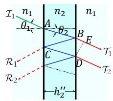  
Fig. 26. Illustration of Fabry-Perot cavity.

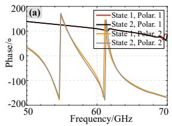

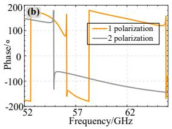  
Fig. 27. Phase difference of 1 and 2 polarization during reflection: (a) 1-bit and (b) L2C metasurface.

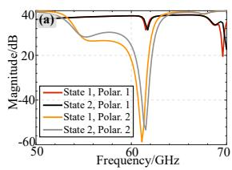  
Fig. 28. Mag difference of 1 and 2 polarization during reflection: (a) 1-bit and (b) L2C metasurface.

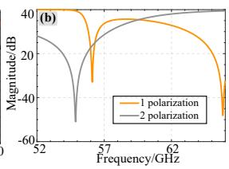

## VII. EVALUATION

## A. Experimental Setup

Devices: We employ COTS 802.11ad transceivers with transmitted power lower than 20 dBm) [11]. 1) UAV & Onboard Terminal: The UAV platform is a DJI Matrice 100 carrying an Acer TravelMate P446 laptop as the 60 GHz 802.11ad terminal [21], whose total takeoff weight exceeds 4.2 kg. During tests, the laptop’s 60 GHz antenna is oriented toward the AP and serves as the UAV-side endpoint of the mmWave link. 2) AP: The AP is a Netgear Nighthawk X10 router [20]. It connects to a control master via a 10 Gbps ${ \mathrm { S F P + } }$ wired backhaul [12]. The control master runs iperf3 to generate downlink TCP traffic and executes beam control by computing real-time beam clusters and phase states. These commands are sent over a USART link to an STM32 microcontroller that drives the 1-bit metasurface. 3) UWB Positioning System: UAV position is measured by a UWB system (HaoruTech LD150 module) with LOS accuracy of ±5 cm, range up to 150 m, and 100 Hz update rate. This lowlatency UAV position data is continuously fed into the beam control loop, enabling real-time beams steering of the 1-bit metasurface.

Metrics: 1) Physical Rates: To measure the physical rates for the aforementioned COTS communication devices, we use the iperf3 tool. Since we have previously shown that the uplink and downlink are physically symmetric in Section II, and both the AP and laptop use identical wireless hardware including antennas and network interfaces [20], [21], we refer to them collectively as physical rates in our evaluation. 2) RSS: For the 60 GHz signal transmitted by the AP X10, we measure the Received Signal Strength (RSS) at the laptop P446 to assess the coverage strength provided by our metasurfaces.

Testing Environments: According to the UAV geofence industry standard issued by the Civil Aviation Administration of China (CAAC) [38], the tested UAV platform consists of a DJI Matrice 100 (2.36 kg) carrying an Acer P446 laptop (1.85 kg) as the mmWave communication terminal, with a total takeoff weight exceeding 4.2 kg. As this exceeds the geofence weight limit for unrestricted operation, the UAV is restricted from outdoor flight without special licensing. Thus, we equivalently conduct our system evaluations on the ground. The test scenario is set in an open field, densely populated with trees and grass, which act as Lambertian scatterers in the mmWave band. The reflectance of them is approximately 5%, closely mimicking real-world flight conditions [39], [40]. As illustrated in Fig. 29, the UAV moves along the Z-axis to simulate vertical motion, as shown in Fig. 7; along the X-axis to simulate horizontal movement; and in a circular trajectory to assess the beamforming performance during mobility. The UAV’s position is accurately tracked by a UWB positioning system, ensuring rapid beamforming adjustments.

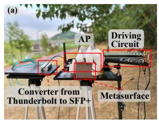

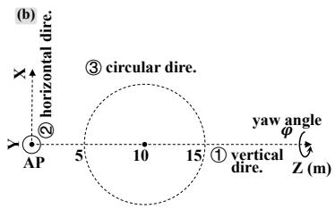  
Fig. 29. Experiment Scenario: (a) devices and (b) top view.

## B. Static Rates

First, we measure the average rates of different positions or gestures of UAV during 30 s, called static rates.

Vertical Deviation: The UAV hovers directly above the AP, where x = 0 and $y = 0 ,$ , and moves vertically along the Z-axis with varying yaw angles, $\varphi .$ The combinations of different vertical distances and yaw angles are illustrated in Fig. 30. As shown in Fig. 30 (a), for each vertical distance, the static rates decrease as $\varphi$ increases from $0 ^ { \circ }$ to 90◦. This is because the polarization between the transmitted and received antennas is well-matched when $\varphi ~ = ~ 0 ^ { \circ }$ , whereas full polarization mismatch occurs when $\varphi = 9 0 ^ { \circ }$ . Additionally, the static rates decrease with increasing vertical distance due to higher path loss.

Then, in Fig. 30 (b), we add only the 1-bit metasurface, representing the baseline used in most existing works [13], [41]–[47]. When $\varphi = 0 ^ { \circ }$ (full polarization match), compared with that of no metasurface (Fig. 30 (a)), the 1-bit metasurface clearly increases gain and improves throughput, consistent with the effect of beamforming. When $\varphi = 9 0 ^ { \circ }$ (full polarization mismatch), however, the rate still drops notably. The reason is that the higher gain cannot prevent power fluctuations caused by polarization mismatch, which often trigger 802.11ad re-alignment and lead to throughput loss.

When only the L2C metasurface is added, the results are shown in Fig. 30 (c). Intuitively, different yaw angles have little effect on the rates, which aligns with our theoretical analysis in Section IV-A. Comparing $\varphi = 9 0 ^ { \circ }$ (full polarization mismatch) $\mathbf { t o } \varphi = 0 ^ { \circ }$ (full polarization match), the average rate drop across tested distances is 32% with no metasurface (Fig. 9 (a)), and 11% with the L2C metasurface (Fig. 9 (c)). When $\varphi = 0 ^ { \circ }$ (full polarization match), averaged over the tested distances, the rate with L2C metasurface ((Fig. 30 (a))) is 15% lower than without a metasurface (Fig. 30 (a)). This decrease can be attributed to two factors: 1) the L2C polarization conversion allows the received LP antenna to capture up to half of the incoming power, and 2) the L2C metasurface inherently introduces insertion loss, as demonstrated in Fig. 9 (a). Thus, the L2C metasurface sacrifices polarization match performance to improve the performance in cases of polarization mismatch.

Furthermore, when a L2C and 1-bit metasurface are both added, the results are shown in Fig. 30 (d). Intuitively, not only is the former-mentioned performance degradation eliminated, but the rate loss due to path attenuation is compensated for by the higher gain from beamforming. With both L2C and 1-bit metasurface, the average rate over all distances and yaw angles increases by 63% relative to the no-metasurface baseline (Fig. 30 (a)), as beamforming increases beamforming gain while removing the polarization mismatch. It is important to note that the distance between the two metasurfaces has been set to the optimized value, which will be further evaluated in the subsequent section.

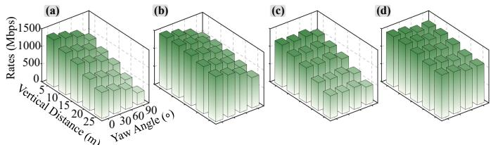  
Fig. 30. Efficacy of L2C and 1-bit metasurfaces on static rates with respect to vertical distance: (a) w/o any metasurface, (b) w/ 1-bit metasurface, (c) w/ L2C metasurface and (d) w/ L2C and 1-bit metasurface.

Horizontal Deviation: Next, we introduce the horizontal deviation of the UAV from the AP, with $y = 0 , z = 1 0$ m, and the UAV moving along the X-axis at different yaw angles φ. As shown in Fig. 31 (a), greater horizontal deviation distances result in more significant rate losses compared to vertical deviations. At $\varphi = 0 ^ { \circ }$ (full polarization match), the average rate at 25 m offset is 67% lower than at 0 m. This highlights the limitations of the beamforming range and gain of COTS devices, which are constrained by the limited size and number of antenna arrays [12].

When an L2C metasurface is employed (Fig. 31 (c)), the impact of different yaw angles on rates is minimal, demonstrating the robustness of the L2C metasurface to obliquely transmitted waves. However, the rate degradation due to horizontal deviation becomes more pronounced, which can be attributed to both the lower gain of the transmitting antenna and the insertion loss introduced by the L2C metasurface.

Finally, when a 1-bit metasurface is added, the results are in Fig. 31 (d). The beamforming performs effectively regardless of the horizontal deviation, qualitatively illustrating the extended range of beamforming. $\mathbf { A t } \ \varphi = 0 ^ { \circ }$ (full polarization match), the average rate at 25 m is 17% higher than at 0 m.

Accuracy of Beamforming: To quantitatively assess the accuracy and range of beamforming using the 1-bit metasurface, we conduct tests in the scenarios shown in Fig. 32 (a). The UAV is positioned within a 2-meter radius around the AP, with the azimuth angle ϕ and elevation angle θ varying in $1 0 ^ { \circ }$ increments. The correlation between the targeted and measured angles is illustrated by the RSS in Figs. 32 (b) and (c). Intuitively, the measured angles corresponding to the highest RSS values align well with the target angles. The main lobe width is observed to be less than $1 0 ^ { \circ }$ , indicating focused beamforming. Furthermore, the RSS at measured angles of $\pm 4 5 ^ { \circ }$ remains sufficiently high, which forms the basis for beamforming-based UAV tracking in subsequent experiments.

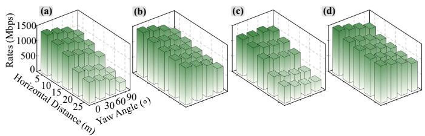  
Fig. 31. Efficacy of L2C and 1-bit metasurfaces on static rates with respect to horizontal distance: (a) w/o any metasurface, (b) w/ 1-bit metasurface, (c) w/ L2C metasurface and (d) w/ L2C and 1-bit metasurface.

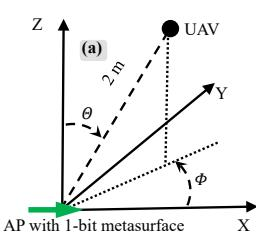

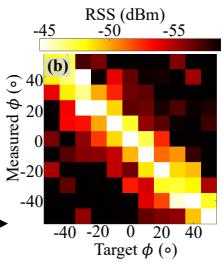

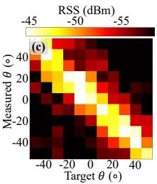  
Fig. 32. Accuracy of beamforming: (a) testing scenario; (b)∼(c) correlation matrix of beamforming angles.

## C. Mobile Rates

To evaluate the mobility performance, we measure the rates during UAV mobility, called mobile rates.

Real-Time Beamforming: As shown in Fig. 29 (b), we move the UAV along a circular trajectory with a 5-meter radius, centered at (0, 0, 10), while maintaining polarization match $( \varphi = 0 ^ { \circ } )$ throughout the movement. Without the L2C metasurface, we record the mobile rates with and without the 1-bit metasurface at different velocities, as shown in Fig. 33 (a). When the 1-bit metasurface is not used, the average mobile rates decrease with higher mobility velocities. This drop is likely due to the frequent and slow beam searching inherent in 802.11ad, which relies on brute-force sector searching [11], [12]. In contrast, when the 1-bit metasurface is employed, the rates remain more robust at higher velocities, demonstrating the real-time responsiveness of our low-cost embedded system, which leverages the proposed serial-to-parallel driving circuit.

Efficacy of Fabry-Perot Cavity: Up to this point, the distance between the two metasurfaces has been set to the optimized value derived from the Fabry-Perot cavity analysis in Section VI-B. For instance, the optimized height $h _ { 2 } ^ { \prime \prime }$ is set to 23.13 mm for this study. For comparison, we also test a random distance (for example, we set 24.40 mm). We use two metasurfaces and simulate the UAV’s movement along the circular path shown in Fig. 29 with a velocity of 1 m/s. During this movement, the UAV alternates between polarization match (represented in green) and polarization mismatch (in gray), as depicted in Figs. 33 (b) and (c). Intuitively, when the optimized distance between the two metasurfaces is not used, the mobile rates slightly decrease. Over the entire trajectory, the mean rate with the Fabry–Perot cavity is 23% higher than without it. This observation highlights the importance of carefully tuning the metasurface separation to enhance signal strength via constructive phase addition.

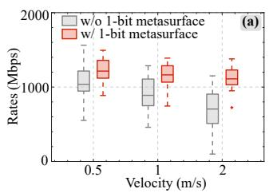

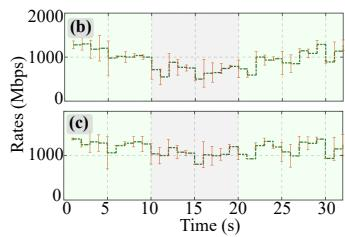  
Fig. 33. Evaluations on mobile rates: (a) real-time of 1-bit metasurface; (b)∼(c) mobile rates w/o and w/ Fabry-Perot cavity respectively.

## D. Multiple UAVs

Multiple Beams: Building on the previous evaluation for a single UAV, we extend our system to handle multiple UAVs in a clustered configuration. As discussed in Section V-C, multiple beams can be generated by the 1-bit metasurface, with each UAV receiving its own dedicated beam. To demonstrate the advantage of using multiple beams, we first consider the first three UAVs, as parameterized in Table I. Initially, we generate a single pencil beam for one UAV (e.g., $\mathrm { U A V _ { 1 } } )$ The corresponding rate results are shown in Fig. 34. In this scenario, only the rate of $\mathrm { U A V _ { 1 } }$ remains high, while the rates of the other two UAVs experience a significant drop. This is due to the 1-bit metasurface redirecting the transmitted waves solely towards $\mathrm { U A V _ { 1 } }$ . Next, we distribute the 1-bit metasurface uniformly among the three UAVs and generate three separate pencil beams for each UAV. As a result, all UAVs maintain high rates, owing to the increased gain for each. However, it is worth noting that the rate of $\mathrm { U A V _ { 1 } }$ decreases slightly. This reduction occurs because a smaller portion of the metasurface g is allocated to $\mathrm { U A V _ { 1 } }$ , resulting in a lower transmission gain than the single-beam scenario.

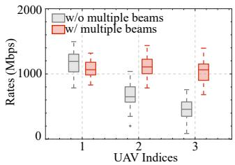

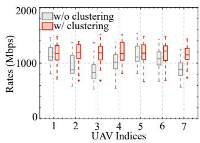  
Fig. 34. Efficacy of multiple beams. Fig. 35. Efficacy of clustering.

Efficacy of 3D Clustering: Building on the observation of rate loss due to metasurface unit allocation for multiple beams, we extend this analysis to the case of all 7 UAVs listed in Table I. First, we generate multiple beams for each UAV without clustering. As shown in Fig. 35, the rates of different UAVs vary significantly, with some experiencing substantial drops. This highlights the issue of gain loss when metasurfaces are allocated to more UAVs without any clustering. To mitigate this, we cluster the UAVs and generate fewer beams, ensuring higher gains for each UAV. Using our clustering algorithm (Algorithm 1), we group the 8 UAVs into 2 clusters. The process of generating multiple beams for each group follows the same steps as before, and the resulting rates are shown in Fig. 35. The rates increase significantly and remain consistent across different UAVs. This demonstrates the effectiveness of the proposed 3D clustering algorithm in improving the system’s performance.

## VIII. RELATED WORK

Wireless communication offers significant advantages in terms of flexibility and mobility; however, it faces several challenges, especially when compared to wired systems. The primary challenge arises from the inherent unreliability of wireless links, which is largely due to the weak strength of electromagnetic waves, influenced by various factors. First, according to Friis’ law, the transmission strength attenuates quadratically with distance for fixed transceiver power and gain, thereby limiting the communication range. Second, communication signals from UAVs are susceptible to obstruction by blockers (such as buildings, trees, etc.), which can induce large-scale shadowing and fading, leading to a significant decrease in the signal-to-noise ratio (SNR) and potentially causing communication link breakdowns. Third, because directional antennas are used, precise beam alignment between the transmitter and receiver is required to achieve high gains, adding another layer of complexity to maintaining reliable communication.

To enhance the reliability of wireless communication, existing approaches can generally be categorized into two main areas below.

## A. Beam Alignment

Beamforming electronically shapes the radiation pattern of an antenna array by adjusting relative phases or amplitudes across antennas, concentrating energy into a narrow beam toward a desired direction [48]. This directional gain increases RSS and extends communication range. In mobile scenarios, however, narrow beams make alignment sensitive to motion. This has motivated extensive work on faster and more robust beam alignment.

Some systems rely on strong task-specific side information. In industrial settings, mmProjector [49] uses the robot’s planned trajectory to pre-configure beam directions ahead of time. This design provides reliable alignment in its target workflows but is less effective when trajectories or environments are unknown or frequently changing.

In unknown scenes, a general baseline is sector-level bruteforce searching, as in 802.11ad. However, it may incur substantial overhead under mobility. This overhead stems from frequent and slow beam training, with alignment or switching latency reaching $1 { \sim } 2$ s for 802.11ad [11], [12].

To reduce this overhead, Hassanieh et al. in [50] test multiple beam directions each time and quickly narrow down the best candidate, avoiding one-by-one scanning and thus greatly shortening training time. To further reduce alignment overhead, some systems leverage out-of-band side information to guide beam selection. For example, Sanchez et al. use camera information to help align beams between an AP and a UAV and reduce errors from IMU/GPS [13]. LiSteer similarly uses visual information from indicator LEDs on APs to guide beam alignment [51]. However, both approaches rely on clear line-of-sight (LOS) and their beam alignment becomes less reliable under non-line-of-sight (NLOS) occlusions.

To handle more challenging conditions where visual information is unavailable, other work relies on non-visual side information. mmFlower uses UWB-based localization and tracking, together with a mechanically adjustable reflector, to support mmWave beam tracking in industrial mobile scenarios [52]. Similarly, Sur et al. in [53] use 2.4/5 GHz measurements to provide coarse beam guidance and reduce mmWave search overhead. Beyond speeding up beam alignment, reconfigurable intelligent surfaces (RIS) improve robustness by modifying the propagation environment itself: they are passive or active reconfigurable arrays placed in the channel that can be electronically tuned to shape how signals reflect and propagate, for example by adjusting phase or polarization [41]–[47]. However, while beam alignment improves link reliability, it does not guarantee high RSS. In particular, for UAV mmWave links, UAV position and attitude changes can induce polarization mismatch even when the beam is well aligned, leading to rate instability. Based on the settings in Fig. 1, our preliminary test in Fig. 5 demonstrates that polarization mismatch can significantly degrade communication quality.

## B. Polarization Match

Another method to enhance RSS is through polarization match. Electromagnetic waves can be classified into linear and elliptic polarization, depending on the trajectory of the E field vector [15]. CP, a specific form of elliptic polarization, is commonly used in satellite communications to mitigate the effects of polarization rotation caused by the ionosphere [54], [55]. For civil applications, LP is often preferred due to its lower cost and compact size. While LP waves require polarization match between the transmitting and receiving antennas, polarization mismatch typically has minimal impact in everyday scenarios, thanks to the presence of multipath propagation that ensures some portion of the received signal remains polarization-matched. For example, Chen et al. [16] study the polarization mismatch problem in indoor IoT devices, where they use absorbing materials to mitigate multipath and induce polarization mismatch. They introduce a metasurface to shift the polarization of received LP waves to match the polarization of the receiving antenna, but this solution is limited by slow shift speeds, making it less effective for fast-moving scenarios like UAV communication.

In contrast, we propose a metasurface that converts transmitted LP waves into CP waves, ensuring that the LP receiving antenna can always capture at least half of the power from the received CP waves, regardless of the rotation angle of the antenna [15]. Related efforts on L2C conversion and polarization-controllable metasurfaces have been reported [25]–[29], but their applicability to UAV mmWave links is limited for two reasons. First, most designs operate below 30 GHz and are demonstrated only under static laboratory conditions; scaling them to 60 GHz requires a minimum PCB line width below 0.1 mm [25], which exceeds standard PCB tolerances. Second, prior L2C metasurfaces typically incur about 6 dB total loss (3 dB due to receiving CP waves by LP antenna, and 3dB from insertion loss) [26]–[28], reducing link efficiency. PolarFix addresses both issues. A PCB-compatible hybrid element (Jerusalem-cross with I-dipole) preserves manufacturable dimensions and operates over 56∼64 GHz 4 We adopt a cascaded transmissive design: a passive L2C metasurface for polarization robustness and a programmable 1-bit metasurface for beam steering. The spacing between the two metasurfaces is chosen using Fabry-Perot cavity theory to´ ensure constructive transmission, thereby reducing insertion loss.

## IX. DISCUSSION AND FUTURE WORK

Superiority to baselines: (i) CP antennas: While CP antennas can theoretically mitigate polarization mismatch, they are impractical for enhancing COTS-based UAV communication. Modifying built-in antennas requires redesigning the RF front end and violates device certification constraints. Moreover, CP antennas are bulky, heavy, and power-demanding, which is undesirable for UAVs with strict payload and endurance limits. In contrast, PolarFix is a non-invasive module that achieves polarization robustness without altering existing hardware, providing a practical and low-cost solution. (ii) Mechanically rotated reflectors: Mechanically rotated reflectors are commonly used as reflection-based mmWave links, where the metasurface is typically fixed on static structures such as walls or building facades. In these setups, both the transmitter-toreflector distance $( d _ { 1 } )$ and the reflector-to-receiver distance $( d _ { 2 } )$ are typically large, leading to a path loss proportional to $d _ { 1 } ^ { 2 } d _ { 2 } ^ { 2 }$ . In contrast, UAV communication benefits from a transmissive configuration, where the metasurface is placed directly along the line-of-sight path, keeping both $d _ { 1 }$ and $d _ { 2 }$ small and thus greatly reducing path loss. Furthermore, mechanically rotated reflectors usually require motorized rotation, with second-level delay [?], which cannot keep up with fastchanging UAV orientations. PolarFix adopts a fully electronic dual-transmissive architecture that maintains short propagation and achieves instant reconfiguration with millisecondlevel delay. (iii) Single reconfigurable metasurfaces: Existing single-layer 1-bit reconfigurable metasurfaces usually require exhaustive beam searches lasting over one second, which limits real-time adaptation [16]. PolarFix integrates a UWBbased positioning system with an analytical beam control algorithm and dedicated driver circuits, achieving end-to-end beam adjustment within milliseconds. Experiments show that it maintains stable connectivity for UAVs moving up to 2 m/s.

Scalability to NLOS: In this work, we evaluate PolarFix only under LOS. This is because LOS is common in UAV–ground links, and also provides a controlled channel that allows us to quantify the affect of polarization without multipath interference. It’s worth noting that polarization mismatch and NLOS blockage are parallel problems. NLOS mitigation seeks to establish a usable path (e.g., using reflectors, RIS, relays, etc.). Polarization mismatch mitigation focuses on maintaining polarization match along the link, regardless of whether it is LOS or NLOS. Owing to its non-invasive and protocol-agnostic design, PolarFix can be integrated with the existing reflection-based systems. In future work, we will evaluate this joint operation in urban and partially obstructed NLOS settings.

Limitations of the Localization System: For the proof of concept, we use a UWB positioning system to assist beamforming. The system provides reliable localization within a horizontal area of about 100 × 100 m, but its vertical coverage is limited because the UWB anchors must surround the tag. In real UAV operations, the flight range can reach hundreds or even thousands of meters, which requires alternative localization systems capable of supporting large-scale beamforming. In addition, current commercial UWB systems cannot provide accurate real-time positions for multiple UAVs (seven in this work) simultaneously. Therefore, the scalability of the localization system in both coverage range and simultaneous tracking capacity remains a key factor for largescale deployment. As localization technologies advance, we plan to upgrade our platform, for example using GPS or RTK, to enable synchronized multi-UAV tracking and conduct comprehensive dynamic experiments in future work.

High-speed Moving UAVs: In our experiments, the UAV moves at speeds up to 2 m/s. To assess PolarFix’s scalability, we further estimate the maximum speed our system can support. The 1-bit metasurface produces a main lobe of about 15◦ (Fig. 19), covering roughly 2.63 m at a 10 m distance. Based on the analyzed end-to-end beam update latency of about 100 ms, the system can tolerate UAV speeds of around 26.3 m/s, which is well above our test condition. Many common air–ground UAV tasks operate at much lower speeds, such as small-package delivery (4∼12 m/s) [56], agricultural spraying (1∼3 m/s) [57], and field phenotyping (around 3 m/s) [58]. Currently, the main limitation stems from the positioning update rate. To support higher-speed UAVs, future work will focus on improving positioning accuracy, increasing update frequency, and reducing control-loop latency.

Broad Frequency Range: In this work, we focus on solving the polarization mismatch problem within the mmWave band, where signal attenuation is relatively high. However, the principles and methods introduced in this study can be generalized to other frequency ranges. A key challenge remains in extending the applicability of a single metasurface design to cover a broader frequency range, from sub-6 GHz to mmWave frequencies. This remains an open problem that warrants further exploration.

Miniaturization and Integration: For ease of debugging, our current prototype is relatively large compared to COTS 60 GHz mmWave devices. In particular, the driving circuit includes large LED arrays for monitoring the states of the 1-bit metasurface. In future work, we plan to leverage integrated circuits and miniaturized electronic components to streamline the system design. And also, PolarFix operates a non-invasive module without changing baseband, MAC, or synchronization, allowing direct integration into COTS devices and standardized protocols (e.g. 802.11ad/ay, 5G NR, etc.). This design enables broad applicability and facilitates realworld deployment.

## X. CONCLUSION

In this work, we tackled the challenge of polarization mismatch in UAV mmWave communication networks by introducing a linear-to-circular polarization metasurface. This metasurface improves RSS without requiring changes to the low-cost transceivers. To further compensate for insertion loss, we incorporated a 1-bit metasurface and optimized the distance between the two metasurfaces to maximize the transmitted RSS. Our experimental evaluations show that the proposed system significantly mitigates polarization mismatch, achieving higher transmission gains and extended communication ranges compared to conventional COTS devices.

## REFERENCES

[1] F. Giones and A. Brem, “From toys to tools: The co-evolution of technological and entrepreneurial developments in the drone industry,” Business Horizons, vol. 60, no. 6, pp. 875–884, 2017.

[2] L. Bertizzolo, M. Polese, L. Bonati, A. Gosain, M. Zorzi, and T. Melodia, “mmbac: Location-aided mmwave backhaul management for uavbased aerial cells,” in Proceedings of the 3rd ACM Workshop on Millimeter-wave Networks and Sensing Systems, pp. 7–12, 2019.

[3] Y. Liu, X. Fang, M. Xiao, F. Song, Y. Cui, Q. Xue, and C. Tang, “Latency optimization for multi-uav-assisted task offloading in airground integrated millimeter-wave networks,” IEEE Transactions on Wireless Communications, 2024.

[4] C. Zhang, W. Zhang, W. Wang, L. Yang, and W. Zhang, “Research challenges and opportunities of uav millimeter-wave communications,” IEEE Wireless Communications, vol. 26, no. 1, pp. 58–62, 2019.

[5] Z. Xiao, L. Zhu, Y. Liu, P. Yi, R. Zhang, X.-G. Xia, and R. Schober, “A survey on millimeter-wave beamforming enabled uav communications and networking,” IEEE Communications Surveys & Tutorials, vol. 24, no. 1, pp. 557–610, 2021.

[6] M. Xiao, S. Mumtaz, Y. Huang, L. Dai, Y. Li, M. Matthaiou, G. K. Karagiannidis, E. Bjornson, K. Yang, I. Chih-Lin, ¨ et al., “Millimeter wave communications for future mobile networks,” IEEE Journal on Selected Areas in Communications, vol. 35, no. 9, pp. 1909–1935, 2017.

[7] S. G. Sanchez, S. Mohanti, D. Jaisinghani, and K. R. Chowdhury, “Millimeter-wave base stations in the sky: An experimental study of uavto-ground communications,” IEEE Transactions on Mobile Computing, vol. 21, no. 2, pp. 644–662, 2020.

[8] J. Gui and F. Cai, “Coverage probability and throughput optimization in integrated mmwave and sub-6 ghz multi-uav-assisted disaster relief networks,” IEEE Transactions on Mobile Computing, vol. 23, no. 12, pp. 10918–10937, 2024.

[9] T. Zhou, X. Wu, and X. Zhang, “Digital twin empowered mmwave multi-hop v2x routing scheme with uav assistance,” IEEE Transactions on Mobile Computing, 2025.

[10] Q. Tang, A. Tiwari, I. del Portillo, M. Reed, H. Zhou, D. Shmueli, G. Ristroph, S. Cashion, D. Zhang, J. Stewart, et al., “Demonstration of a 40gbps bi-directional air-to-ground millimeter wave communication link,” in 2019 IEEE MTT-S International Microwave Symposium (IMS), pp. 746–749, IEEE, 2019.

[11] I. . W. Group et al., “Ieee 802.11 ad, amendment 3: Enhancements for very high throughput in the 60 ghz band,” IEEE Stand, vol. 802, 2012.

[12] S. K. Saha, H. Assasa, A. Loch, N. M. Prakash, R. Shyamsunder, S. Aggarwal, D. Steinmetzer, D. Koutsonikolas, J. Widmer, and M. Hollick, “Fast and infuriating: Performance and pitfalls of 60 ghz wlans based on consumer-grade hardware,” in 2018 15th Annual IEEE International Conference on Sensing, Communication, and Networking (SECON), pp. 1–9, IEEE, 2018.

[13] S. G. Sanchez, R. Shukla, and K. R. Chowdhury, “Camera-enabled joint robotic-communication paradigm for uavs mounted with mmwave radios,” in Proceedings of the 4th ACM MobiCom Workshop on Drone Assisted Wireless Communications for 5G and Beyond, pp. 1–6, 2021.

[14] W. Li, Q. Ma, C. Liu, Y. Zhang, X. Wu, J. Wang, S. Gao, T. Qiu, T. Liu, Q. Xiao, et al., “Intelligent metasurface system for automatic tracking of moving targets and wireless communications based on computer vision,” Nature Communications, vol. 14, no. 1, p. 989, 2023.

[15] C. A. Balanis, Antenna theory: analysis and design. John wiley & sons, 2016.

[16] L. Chen, W. Hu, K. Jamieson, X. Chen, D. Fang, and J. Gummeson, “Pushing the physical limits of {IoT} devices with programmable metasurfaces,” in 18th USENIX Symposium on Networked Systems Design and Implementation (NSDI 21), pp. 425–438, 2021.

[17] K. Konstantinidis, A. P. Feresidis, and P. S. Hall, “Multilayer partially reflective surfaces for broadband fabry-perot cavity antennas,” IEEE Transactions on Antennas and Propagation, vol. 62, no. 7, pp. 3474– 3481, 2014.

[18] H. Pfeifer, L. Ratschbacher, J. Gallego, C. Saavedra, A. Faßbender, A. von Haaren, W. Alt, S. Hofferberth, M. Kohl, S. Linden, ¨ et al., “Achievements and perspectives of optical fiber fabry–perot cavities,” Applied Physics B, vol. 128, no. 2, p. 29, 2022.

[19] MATHWORKS, “UAV Obstacle Avoidance in Simulink [Online].” Available: https://ww2.mathworks.cn/help/uav/ug/ uav-obstacle-avoidance-in-simulink.html.

[20] NETGEAR, “Nighthawk X10 Smart WiFi Router [Online].” Available: https://www.netgear.com/landings/ad7200/.

[21] ACER, “TravelMate P446-M [Online].” Available: https://www.acer. com/us-en/laptops/travelmate.

[22] G.-B. Wu, S.-W. Qu, S. Yang, and C. H. Chan, “Broadband, single-layer dual circularly polarized reflectarrays with linearly polarized feed,” IEEE Transactions on Antennas and Propagation, vol. 64, no. 10, pp. 4235– 4241, 2016.

[23] R. S. Anwar, L. Mao, and H. Ning, “Frequency selective surfaces: A review,” Applied Sciences, vol. 8, no. 9, p. 1689, 2018.

[24] X. Gao, W. L. Yang, H. F. Ma, Q. Cheng, X. H. Yu, and T. J. Cui, “A reconfigurable broadband polarization converter based on an active metasurface,” IEEE Transactions on Antennas and Propagation, vol. 66, no. 11, pp. 6086–6095, 2018.

[25] H. B. Wang and Y. J. Cheng, “Single-layer dual-band linear-to-circular polarization converter with wide axial ratio bandwidth and different polarization modes,” IEEE Transactions on Antennas and Propagation, vol. 67, no. 6, pp. 4296–4301, 2019.

[26] L. Di Palma, A. Clemente, L. Dussopt, R. Sauleau, P. Potier, and P. Pouliguen, “Circularly-polarized reconfigurable transmitarray in kaband with beam scanning and polarization switching capabilities,” IEEE Transactions on Antennas and Propagation, vol. 65, no. 2, pp. 529–540, 2016.

[27] H. Zhu, S. Cheung, K. L. Chung, and T. I. Yuk, “Linear-to-circular polarization conversion using metasurface,” IEEE Transactions on Antennas and Propagation, vol. 61, no. 9, pp. 4615–4623, 2013.

[28] M. I. Khan, Z. Khalid, and F. A. Tahir, “Linear and circular-polarization conversion in x-band using anisotropic metasurface,” Scientific reports, vol. 9, no. 1, p. 4552, 2019.

[29] Q. Zheng, C. Guo, and J. Ding, “Wideband metasurface-based reflective polarization converter for linear-to-linear and linear-to-circular polarization conversion,” IEEE Antennas and Wireless Propagation Letters, vol. 17, no. 8, pp. 1459–1463, 2018.

[30] T. Electronics, “Taconic TLY-5 [Online].” Available: https://www. venture-mfg.com/taconic-tly-5/.

[31] D. Steinmetzer, D. Wegemer, M. Schulz, J. Widmer, and M. Hollick, “Compressive millimeter-wave sector selection in off-the-shelf ieee 802.11 ad devices,” in Proceedings of the 13th International Conference on emerging Networking EXperiments and Technologies, pp. 414–425, 2017.

[32] F. Wu, R. Lu, J. Wang, Z. H. Jiang, W. Hong, and K.-M. Luk, “A circularly polarized 1 bit electronically reconfigurable reflectarray based on electromagnetic element rotation,” IEEE Transactions on Antennas and Propagation, vol. 69, no. 9, pp. 5585–5595, 2021.

[33] AGC, “Avionics Aerospace [Online].” Available: https://www. agc-multimaterial.com/avionics-aerospace/.

[34] MACOM, “MACOM Technologies [Online].” Available: https://ww2. mathworks.cn/help/uav/ug/uav-obstacle-avoidance-in-simulink.html.

[35] J. Tiemann, F. Schweikowski, and C. Wietfeld, “Design of an uwb indoor-positioning system for uav navigation in gnss-denied environments,” in 2015 international conference on indoor positioning and indoor navigation (IPIN), pp. 1–7, IEEE, 2015.

[36] P. Tong, X. Yang, Y. Yang, W. Liu, and P. Wu, “Multi-uav collaborative absolute vision positioning and navigation: A survey and discussion,” Drones, vol. 7, no. 4, p. 261, 2023.

[37] J. Yang, Y. Khedar, M. K. Ben-Larbi, J. Backhaus, A. Lampert, U. Bestmann, and E. Stoll, “Concept and feasibility evaluation of distributed sensor-based measurement systems using formation flying multicopters,” Atmosphere, vol. 12, no. 7, p. 874, 2021.

[38] UAV Geofenc. MH/T 2008-2017. CAAC, Beijing, China, 2017.

[39] N. A. Salmon, “Outdoor passive millimeter-wave imaging: Phenomenology and scene simulation,” IEEE Transactions on Antennas and Propagation, vol. 66, no. 2, pp. 897–908, 2017.

[40] A. England and J. Galantowicz, “A volume emission model for the radiobrightness of prairie grass,” in Proceedings of IGARSS’94-1994 IEEE International Geoscience and Remote Sensing Symposium, vol. 4, pp. 2463–2465, IEEE, 1994.

[41] K. W. Cho, M. H. Mazaheri, J. Gummeson, O. Abari, and K. Jamieson, “mmwall: A steerable, transflective metamaterial surface for nextg mmwave networks,” in 20th USENIX Symposium on Networked Systems Design and Implementation (NSDI 23), pp. 1647–1665, 2023.

[42] H. Pan, L. Qiu, B. Ouyang, S. Zheng, Y. Zhang, Y.-C. Chen, and G. Xue, “Pmsat: Optimizing passive metasurface for low earth orbit satellite communication,” in Proceedings of the 29th Annual International Conference on Mobile Computing and Networking, pp. 1–15, 2023.

[43] K. Qian, L. Yao, K. Zheng, X. Zhang, and T. N. Ng, “Uniscatter: a metamaterial backscatter tag for wideband joint communication and radar sensing,” in Proceedings of the 29th Annual International Conference on Mobile Computing and Networking, pp. 1–16, 2023.

[44] L. Zhong, M. Ouyang, F. Zhu, M. Jin, X. Wang, X. Guan, C. Zhou, and X. Tian, “Smartshell: A near-field reflective surface enhancing rss,” in Proceedings of the 21st Annual International Conference on Mobile Systems, Applications and Services, pp. 124–136, 2023.

[45] X. Li, C. Feng, X. Wang, Y. Zhang, Y. Xie, and X. Chen, “Rfbouncer: A programmable dual-band metasurface for sub-6 wireless networks,” in 20th USENIX Symposium on Networked Systems Design and Implementation (NSDI 23), pp. 389–404, 2023.

[46] X. Tan, Z. Sun, D. Koutsonikolas, and J. M. Jornet, “Enabling indoor mobile millimeter-wave networks based on smart reflect-arrays,” in IEEE INFOCOM 2018-IEEE Conference on Computer Communications, pp. 270–278, IEEE, 2018.

[47] O. Abari, D. Bharadia, A. Duffield, and D. Katabi, “Enabling {highquality} untethered virtual reality,” in 14th USENIX Symposium on Networked Systems Design and Implementation (NSDI 17), pp. 531– 544, 2017.

[48] Q. Xu, C. Jiang, Y. Han, B. Wang, and K. R. Liu, “Waveforming: An overview with beamforming,” IEEE Communications Surveys & Tutorials, vol. 20, no. 1, pp. 132–149, 2017.

[49] H. Zhang, C. Zhao, Y. Shu, and P. Cheng, “mmprojector: Low-cost mmwave reflector for mobile industrial robot communication,” IEEE Internet of Things Journal, vol. 13, no. 2, pp. 1835–1851, 2026.

[50] H. Hassanieh, O. Abari, M. Rodriguez, M. Abdelghany, D. Katabi, and P. Indyk, “Fast millimeter wave beam alignment,” in Proceedings of the 2018 Conference of the ACM Special Interest Group on Data Communication, pp. 432–445, 2018.

[51] M. K. Haider, Y. Ghasempour, D. Koutsonikolas, and E. W. Knightly, “Listeer: Mmwave beam acquisition and steering by tracking indicator leds on wireless aps,” in Proceedings of the 24th Annual International Conference on Mobile Computing and Networking, pp. 273–288, 2018.

[52] H. Zhang, C. Zhao, Y. Shu, and P. Cheng, “mmflower: A low-cost mmwave tracking system for industrial robot via mechanically reconfigurable reflector,” IEEE Internet of Things Journal, vol. 12, no. 20, pp. 41808–41822, 2025.

[53] S. Sur, I. Pefkianakis, X. Zhang, and K.-H. Kim, “Wifi-assisted 60 ghz wireless networks,” in Proceedings of the 23rd Annual International Conference on Mobile Computing and Networking, pp. 28–41, 2017.

[54] Z. Wu, L. Li, Y. Li, and X. Chen, “Metasurface superstrate antenna with wideband circular polarization for satellite communication application,” IEEE Antennas and Wireless Propagation Letters, vol. 15, pp. 374–377, 2015.

[55] O. de La Beaujardiere\` et al., “C/nofs: A mission to forecast scintillations,” Journal of Atmospheric and Solar-Terrestrial Physics, vol. 66, no. 17, pp. 1573–1591, 2004.

[56] T. A. Rodrigues, J. Patrikar, A. Choudhry, J. Feldgoise, V. Arcot, A. Gahlaut, S. Lau, B. Moon, B. Wagner, H. S. Matthews, S. Scherer, and C. Samaras, “In-flight positional and energy use data set of a dji matrice 100 quadcopter for small package delivery,” Scientific Data, vol. 8, June 2021.

[57] W. Xing, Y. Cui, X. Wang, and J. Shen, “Optimization of operational parameters of plant protection uav,” Sensors, vol. 24, no. 16, p. 5132, 2024.

[58] H.-S. Lee, B.-S. Shin, J. A. Thomasson, T. Wang, Z. Zhang, and X. Han, “Development of multiple uav collaborative driving systems for improving field phenotyping,” Sensors, vol. 22, no. 4, p. 1423, 2022.

  
Hongqiang Zhang received the B.S. degree from Xidian University in 2021. He is currently pursuing the Ph.D. degree in control science and engineering from Zhejiang University, Hangzhou, China. His major research interests include mmWave communication, mmWave reflector, and wireless sensing.

computing, smart IoT, and cyber-physical systems. His work has received multiple awards, including the 2025 SIGMOBILE Rockstar Award, 2024 SIGMOBILE Test-of-Time Award, MobiCom ’24 Best Paper Award, SenSys ’22 Best Paper Award, SECON ’22 Best Paper Award, MobiCom ’22 Best Paper Runner-up, MobiCom ’22 Best Community Paper Runner-up, MobiCom ’21 Best Paper Runner-up, UbiComp ’21 (IMWUT ’20) Distinguished Paper, MobiCom ’20 Best Paper Honorable Mention, and CoNEXT ’14 Best Paper Award.

Chengcheng Zhao (Member, IEEE) received the B.Sc. degree in measurement and control technology and instruments from Hunan University, Changsha, China, in 2013, and the Ph.D. degree in control science and engineering from Zhejiang University, Hangzhou, China, in 2018. She was a PostDoctoral Fellow with the College of Control Science and Engineering, Zhejiang University, from 2018 to 2021. She is currently a Researcher with the College of Control Science and Engineering, Zhejiang University. Her research interests include consensus and

Jie Xiong (Senior Member, IEEE) received the BEng degree from Nanyang Technological University, the MS degree from Duke University, and the PhD degree from University College London. He is currently an Associate Professor in the College of Computing and Data Science at Nanyang Technological University. His PhD research was supported by the Google European Doctoral Fellowship, and he was the runner-up for the 2016 British Computer Society Distinguished Dissertation Award. His current research focuses on wireless sensing, mobile

distributed optimization, and security and privacy in networked systems. She received the IEEE PESGM 2017 Best Conference Papers Award, and one of her papers was shortlisted in the IEEE ICCA 2017 Best Student Paper Award Finalist. She is an Editor of Wireless Networks and IET Cyber-Physical Systems: Theory and Applications.

Yuanchao Shu (Senior Member, IEEE) received the PhD degree from Zhejiang University in 2015, and was also a joint PhD student in the EECS Department with the University of Michigan, Ann Arbor. He is currently a Qiushi professor with the College of Control Science and Engineering, Zhejiang University, China. Prior to joining academia, he was a principal researcher with Microsoft Research Redmond and Microsoft Azure. His research interests lie broadly in mobile, sensing and networked systems. He has published more than 70 papers at top-tier peer-reviewed conferences and journals. Dr. Shu currently serves on the editorial board of IEEE Transactions of Wireless Communications, ACM Transactions on Sensor Networks, served as vice general chair of ACM SenSys’24, and was a member of the organizing committee and TPC of conferences including MobiCom, MobiSys, SenSys, SEC, Globecom, ICC, etc. He won five Best Paper/Demo (Runner-Up) Awards, MobiCom Best Community Contribution Award, and was the recipient of ACM China Doctoral Dissertation Award and IBM PhD Fellowship. Dr. Shu is a senior member of ACM.

Peng Cheng (Member, IEEE) received the B.Sc. and Ph.D. degrees in control science and engineering from Zhejiang University, Hangzhou, China, in 2004 and 2009, respectively. He is currently a Professor and the Dean of the College of Control Science and Engineering, Zhejiang University. His research interests include cyber-physical systems security, networked sensing and control, and cloud networking. He has been awarded the 2020 Changjiang Scholars Chair Professor. He has received the State Science and Technology Progress Award and the

MOE Natural Science Award. He serves/served as Associate Editor for IEEE TRANSACTIONS ON CLOUD COMPUTING and IEEE TRANSACTIONS ON CONTROL OF NETWORK SYSTEMS. He also serves/served as a Guest Editor for IEEE TRANSACTIONS ON AUTOMATIC CONTROL and IEEE TRANSACTIONS ON SIGNAL AND INFORMATION PROCESSING OVER NETWORKS.