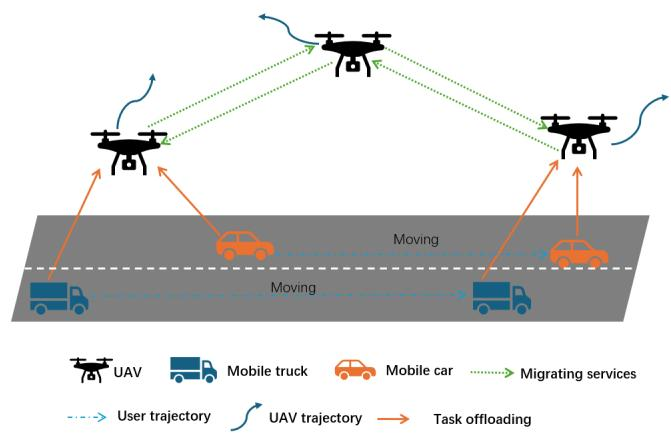
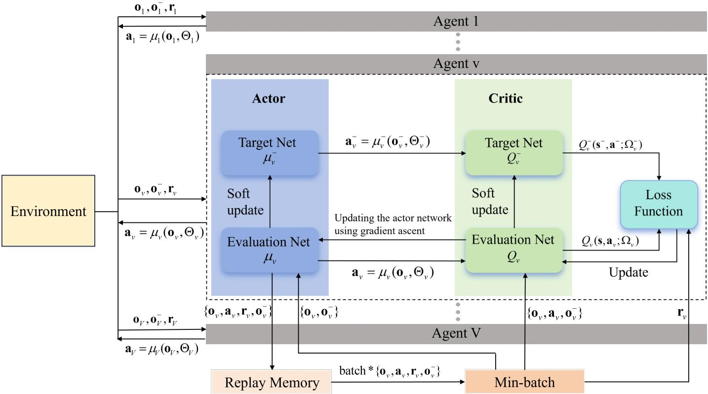
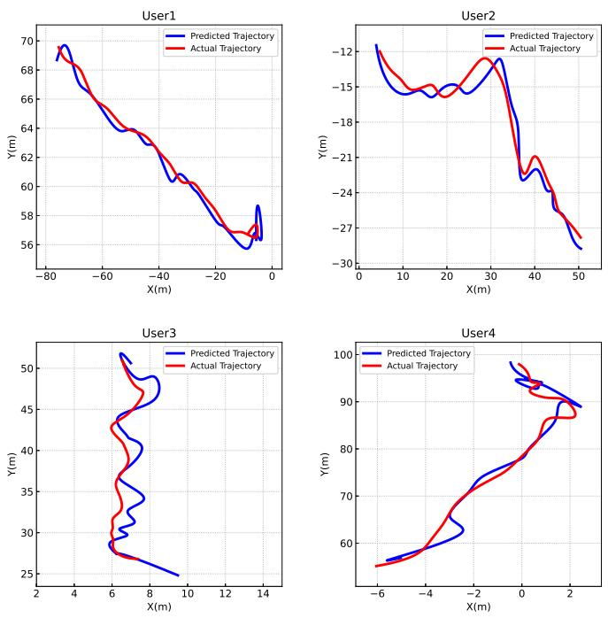
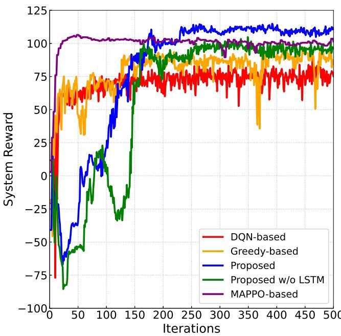
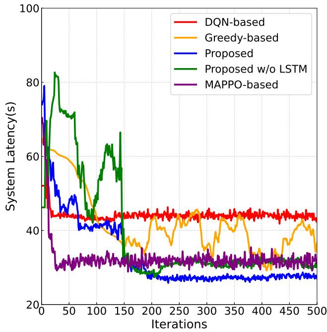
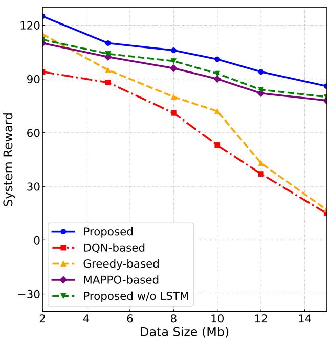
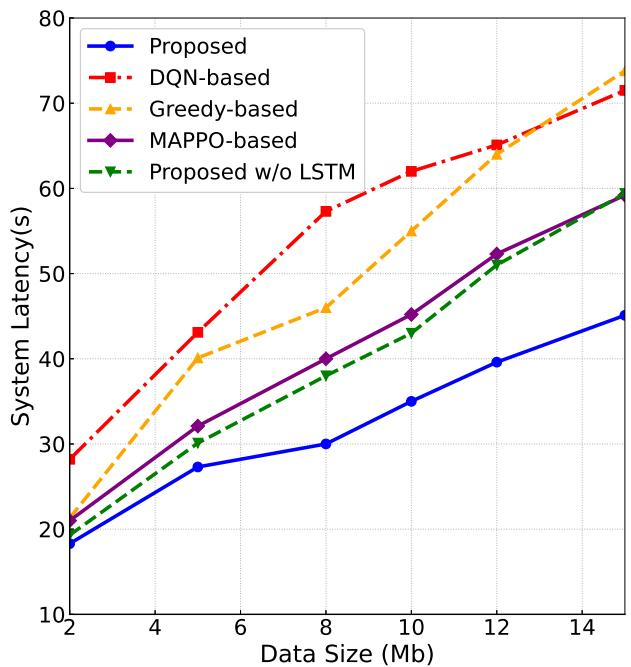
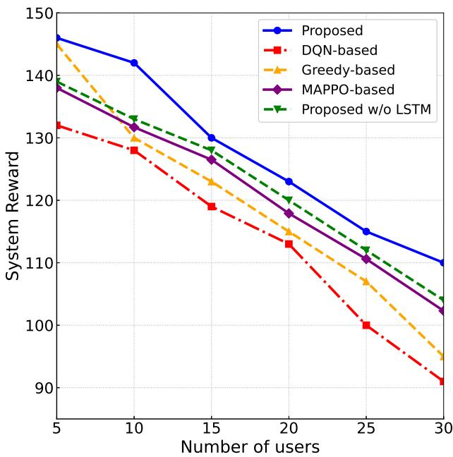
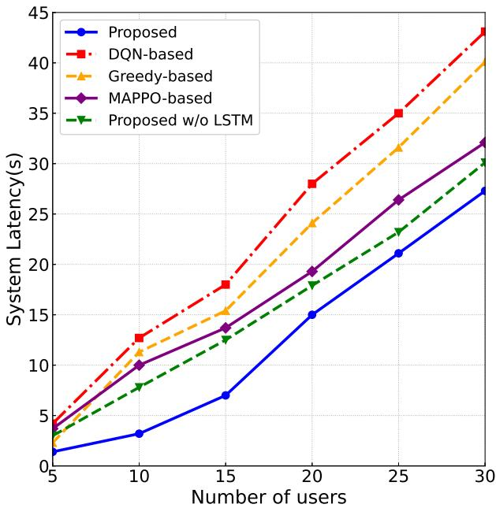

# Prediction-Assisted Multi-UAV Online Service Migration and Trajectory Control for MEC-Empowered Vehicular Networks

Wei Feng, Member, IEEE, Wenyang Gao, Jianping Yao, Member, IEEE, Longyu Zhou, Member, IEEE, Chenggang Yan, Fellow, IET, and Tony Q. S. Quek, Fellow, IEEE

Abstract—The rapid proliferation of intelligent vehicular networks and mobile edge computing (MEC) demands substantial improvements in computation efficiency, latency reduction, and service continuity, especially under high mobility and stochastic task generation. Conventional single-uncrewed aerial vehicle (UAV) solutions with static trajectory design lack the adaptability required in such dynamic environments. To address these challenges, we develop a collaborative multi-UAV optimization framework that jointly coordinates continuous UAV movement and service migration decisions. The framework incorporates a stacked long short-term memory (LSTM) model to predict short-term vehicle trajectories from historical motion data, which enables mobility-aware planning and reduces unnecessary cross-UAV migrations. To balance long-term migration cost and instantaneous delay, a Lyapunov-based technique is integrated into the per-slot optimization. Furthermore, a multiagent deep deterministic policy gradient (MADDPG) algorithm is adopted to facilitate cooperative policy learning across UAV agents in stochastic and partially observable environments. By unifying prediction, trajectory design, and adaptive migration control, the proposed method effectively adapts to time-varying network conditions. Extensive simulations demonstrate that the proposed method significantly outperforms baseline schemes in terms of delay, reward stability, and scalability under dynamic network loads.

Index Terms—Mobile edge computing (MEC), uncrewed aerial vehicle (UAV), multiagent reinforcement learning, service migration, trajectory prediction.

## I. INTRODUCTION

W ITH the rapid deployment of 5G and Internet of Things (IoT) technologies, an increasing number of intelligent devices are being connected to the network, which leads to explosive growth in both computational task volume and realtime processing requirements [1]. In the Internet of Vehicles (IoV), latency-sensitive applications such as cooperative perception, high-definition video analytics, and high-precision map generation impose stringent requirements on computation speed, communication reliability, and service continuity. Traditional in-vehicle processors are often incapable of meeting these stringent demands, especially in environments characterized by high mobility and dense traffic, where vehicles must complete critical perception and decision-making tasks within very short time windows.

Mobile edge computing (MEC) has emerged as a key paradigm to augment in-vehicle computing capabilities by offloading tasks to proximal edge servers, thereby reducing endto-end delay and improving service continuity and reliability [2]–[4]. However, conventional MEC infrastructure based on fixed roadside units (RSUs) or cellular base stations suffers from limited coverage and vulnerability to blockage, multipath fading, and non-line-of-sight (NLoS) signal conditions. These limitations are particularly pronounced in congested urban traffic areas, poorly covered regions, and post-disaster scenarios where terrestrial infrastructure may become unavailable [5].

Uncrewed aerial vehicles (UAVs) equipped with MEC servers have recently gained attention as a flexible and rapidly deployable extension to terrestrial MEC. By virtue of their mobility and near line-of-sight (LoS) communication links, UAVs can provide high-quality wireless connectivity for vehicular task offloading and dynamically reposition themselves in response to spatiotemporal variations in user distribution [6]– [8]. Moreover, UAVs can serve as mobile relays to enhance network coverage, throughput, and reliability, which makes them valuable assets in emergency response and coverageextension scenarios.

Despite the aforementioned advantages, several key challenges persist in UAV-assisted vehicular MEC systems. First, the high mobility of vehicles and stochastic task arrivals lead to rapidly time-varying network states, which cause frequent changes in user-UAV associations and trigger excessive service migration events [9]. Second, the joint optimization of UAV trajectory control and service migration decisions introduces strong coupling between continuous variables (UAV positions) and discrete variables (migration decisions), which results in a mixed-integer and highly non-convex problem that is challenging to obtain a real-time solution. Third, there exists an inherent trade-off between delay minimization and migration cost, since aggressive migration can reduce communication latency but incurs significant overhead and may degrade longterm system performance. Furthermore, in multi-UAV systems, each UAV operates based on partial observations, and efficient coordination among multiple agents is required to avoid resource contention and suboptimal decisions. Finally, most existing works rely on simplified mobility models or single-UAV architectures [10], [11], which limit their applicability in highly dynamic and large-scale IoV scenarios [12]. These challenges collectively make it difficult to design an efficient, scalable, and adaptive online optimization framework.

To address these challenges, we propose a predictionassisted multi-UAV collaborative framework that jointly optimizes UAV trajectory planning and service migration for vehicular MEC. A long short-term memory (LSTM) network is employed to forecast short-term vehicle trajectories based on historical motion data, which enables proactive UAV trajectory and migration decisions that reduce unnecessary cross-UAV migrations and improve service continuity. The overall optimization is formulated as a Markov decision process (MDP), which is solved using a multiagent deep deterministic policy gradient (MADDPG) algorithm that enables each UAV agent to autonomously learn efficient strategies from local observations.

The main contributions of this work are summarized as follows:

1) We formulate a long-term average latency minimization problem subject to migration cost constraints, jointly optimizing UAV movement and task migration. The model effectively balances service latency against migration overhead through long-term cost control.

2) We integrate an LSTM-based trajectory prediction module to provide mobility-aware decision support. This enables UAVs to anticipate user movement patterns and proactively allocate computing and communication resources, significantly reducing redundant migrations and improving system stability in dynamic IoV environments.

3) By leveraging Lyapunov optimization, the long-term cost constraint is transformed into real-time control metrics, which enables an online decision-making strategy that adapts to changing system states. Simultaneously, partially observable interactions among UAVs are modeled as a cooperative Markov game to establish a theoretical foundation for decentralized decision-making.

4) We develop a MADDPG-based learning algorithm to enable cooperative strategy learning among multiple UAV agents under dynamic network conditions, which captures both continuous trajectory control and discrete migration decisions.

5) Extensive simulations demonstrate that the proposed method outperforms baseline schemes in terms of convergence speed, reward performance, and latency reduction, which highlights its applicability and robustness in dynamic UAV-assisted IoV scenarios.

The remainder of this paper is organized as follows. Section II reviews related research. Section III describes the system model and formulates the problem. Section IV details the proposed method. Section V presents simulation results and analysis. Finally, Section VI concludes the paper.

## II. RELATED WORK

The integration of MEC with IoV has attracted extensive research attention due to the stringent latency and computation requirements of emerging vehicular applications. In conventional vehicular MEC systems, various optimization techniques have been proposed to handle task offloading and resource scheduling. Reinforcement learning has been widely applied to dynamically balance communication and computation resources. For example, the authors in [13] proposed a multiagent reinforcement learning framework that jointly optimizes communication and computation resources to balance capacity and energy efficiency. The authors in [14] used dual decomposition to decouple offloading and resource allocation, yielding tractable distributed solutions. The authors in [15] developed a MADDPG-based cooperative offloading algorithm that accounts for task types and vehicle speed, which improves energy efficiency while satisfying quality-of-service (QoS) requirements. Other works [16], [17] have incorporated mobility-aware mechanisms and dependency constraints into offloading strategies, which aim to further enhance system responsiveness.

The incorporation of UAVs as aerial MEC platforms further enriches the MEC paradigm. UAV-assisted MEC systems exploit three-dimensional mobility to extend network coverage and improve service quality. The authors in [18] proposed a heterogeneous UAV-assisted MEC framework to reduce latency and energy consumption through joint optimization. The authors in [19] investigated distributed function-switching and trajectory planning in dual-UAV systems to enhance communication security and reduce latency. The authors in [20] introduced learning-based methods for multi-user offloading and edge server deployment under dynamic task arrivals, while the authors in [21] applied decomposition techniques to achieve low-complexity offloading optimization. The authors in [22] utilized stochastic network calculus for latency modeling and iterative decomposition to improve energy efficiency in UAVassisted MEC.

However, the mobility of vehicles introduces additional complexity in UAV-assisted IoV systems, with frequent transitions between UAV coverage areas and time-varying channel conditions, which makes fixed-location services inadequate and highlights the importance of trajectory planning [23]. Moreover, the limited computing and energy resources of individual UAVs motivate cooperative control across multiple UAVs to support dense vehicular scenarios [24]. In response, deep reinforcement learning (DRL) has been adopted to address high-dimensional optimization problems involving joint UAV trajectory and offloading decisions. For instance, the authors in [25] proposed DRL-based UAV-assisted MEC frameworks to integrate software-defined networking with trajectory and resource management. The authors in [26] applied advanced actor-critic algorithms to balance latency and energy consumption in dynamic environments. The authors in [27] combined hybrid approaches with prediction mechanisms and multiagent learning to improve task completion rates by capturing temporal dynamics. The authors in [28] considered security-oriented optimization, where a dual deep Q-network (DDQN) with action-space compression and reward shaping was used to enhance convergence and secure computation capacity. The authors in [29] investigated service migration with task dependencies by modeling time-varying migration as an MDP and designing an online value-iteration algorithm. The authors in [30] and [31] studied more general service migration problems, where partially observable MDPs and improved actor-critic methods were adopted to enable efficient online migration decisions. Notably, for cooperative multiagent problems with continuous action spaces, MADDPG is particularly effective [32]. Furthermore, the authors in [33] integrated Lyapunov optimization with MADDPG to regulate long-term operational costs while maintaining service quality.

  
Fig. 1. Network model.

In contrast to the above studies, which mainly focus on single-UAV architectures, offline optimization, or simplified mobility assumptions, this paper develops a prediction-assisted multi-UAV collaborative framework tailored for highly dynamic IoV scenarios. By jointly incorporating vehicle trajectory prediction, online service migration under long-term cost constraints, and multiagent deep reinforcement learning, the proposed method achieves coordinated UAV trajectory planning and migration control, thereby enhancing service continuity, system stability, and latency performance.

## III. SYSTEM MODEL AND PROBLEM FORMULATION

## A. Network Model

As illustrated in Fig. 1, we consider a UAV-assisted heterogeneous multi-user MEC network. In this architecture, multiple UAVs equipped with MEC servers are deployed over urban hotspots to provide computation services to ground users. Let the set of UAVs be denoted as $\mathcal { V } \triangleq \{ 1 , 2 , \dots , v , \dots , V \}$ and the group of mobile ground users as $\mathcal { U } \triangleq \{ 1 , 2 , \dots , u , \dots , U \}$ Each UAV can reposition itself dynamically to improve overall system performance and reduce service delay. To capture mobility in both users and UAVs, the system operates in discrete time slots $\boldsymbol { n } \in \mathcal { N } \triangleq \{ 1 , 2 , \dots , N \}$

At time slot $n ,$ the UAV assigned to process the computation task of user u is referred to as its serving UAV, denoted by $v _ { u } ^ { \mathrm { s e r } } [ n ]$ . The UAV with a direct connection to user u is called the local UAV, denoted by $v _ { u } ^ { \mathrm { l o c } } [ n ]$ . It is assumed that each user generates one computation task at the beginning of every time slot. Both users and UAVs update their positions only at slot boundaries and remain stationary within each slot.1

To maintain service continuity and quality amidst mobility, the system supports dynamic task and service migration. Users offload tasks to their local UAVs. If the local UAV differs from the designated serving UAV, the task is relayed via stable multi-hop backhaul links among UAVs. When user movement causes the current serving UAV to become suboptimal or channel quality degrades, a service migration mechanism is triggered to transfer both the task and its MEC instance to a more suitable UAV.

## B. Delay Model

We use delay as the primary quality-of-service metric, which comprises three components: migration delay, communication delay, and computation delay. At each time slot, the system determines whether to migrate the service. If so, both the task and associated service configuration files are transferred to the new serving UAV.

Let $\pi _ { u } [ n ] \in \mathcal { V }$ denote the migration decision for user u at time slot n, where $\pi _ { u } [ n ]$ indicates the UAV to which the service of user u is assigned. Then the serving UAV of user u at time slot n is given by $v _ { u } ^ { \mathrm { s e r } } [ n ] = \pi _ { u } [ n ]$ . The total delay experienced by user u at time slot n is decomposed as

$$
\ell _ { u } [ n ] = \ell _ { u } ^ { \mathrm { m i g } } [ n ] + \ell _ { u } ^ { \mathrm { c o m } } [ n ] + \ell _ { u } ^ { \mathrm { c m p } } [ n ] ,\tag{1}
$$

where $\ell _ { u } ^ { \mathrm { m i g } } [ n ] , \ell _ { u } ^ { \mathrm { c o m } } [ n ]$ , and $\ell _ { u } ^ { \mathrm { { c m p } } } [ n ]$ denote migration delay, communication delay, and computation delay, respectively.

1) Migration Delay: If the serving UAV of user u changes between consecutive slots, a migration delay $\ell _ { u } ^ { \mathrm { m i g } } [ n ]$ occurs due to transferring the service instance. This delay depends on the size of the service data and the number of hops along the migration path, defined as

$$
\ell _ { u } ^ { \mathrm { m i g } } [ n ] = \left\{ \begin{array} { l l } { 0 , } & { d _ { u } ^ { s } [ n ] = 0 , } \\ { \displaystyle \frac { D _ { u } ^ { s } [ n ] } { B _ { 0 } } + \alpha _ { 1 } d _ { u } ^ { s } [ n ] , } & { d _ { u } ^ { s } [ n ] \neq 0 , } \end{array} \right.\tag{2}
$$

where $d _ { u } ^ { s } [ n ]$ denotes the number of hops between the previous and current serving UAVs, $D _ { u } ^ { s } [ n ]$ is the size of the service instance, $B _ { 0 }$ is the available migration bandwidth, and $\alpha _ { 1 }$ is a per-hop delay coefficient [31].

2) Communication Delay: In this system, communications between UAVs and users are realized using an orthogonal frequency division multiple access (OFDMA) scheme, which enables interference-free spectrum sharing among multiple users. Furthermore, we assume that all the UAVs maintain the same constant altitude H. The uplink channel between user u and its associated local UAV v is characterized by a free-space path loss, which aligns with the channel modeling principles outlined in the 3GPP TR 36.777 [35], and the corresponding distance-dependent channel gain at time slot n is defined as

$$
h _ { v , u } [ n ] = \frac { h _ { 0 } } { ( x _ { v } [ n ] - x _ { u } [ n ] ) ^ { 2 } + ( y _ { v } [ n ] - y _ { u } [ n ] ) ^ { 2 } + H ^ { 2 } } ,\tag{3}
$$

where $h _ { 0 }$ denotes the channel gain at a reference distance of 1 m, and $( x _ { v } [ n ] , y _ { v } [ n ] )$ and $( x _ { u } [ n ] , y _ { u } [ n ] )$ are the horizontal coordinates of UAV v and user u, respectively.

Accordingly, the instantaneous signal-to-noise ratio (SNR) is given by

$$
\gamma _ { v , u } [ n ] = \frac { P _ { u } h _ { v , u } [ n ] } { \sigma ^ { 2 } } ,\tag{4}
$$

where $P _ { u }$ is the user’s transmit power, and $\sigma ^ { 2 }$ represents the noise power.

Hence, the uplink rate from user u to its local UAV v at time slot n is expressed as

$$
r _ { v , u } [ n ] = B _ { 1 } \log _ { 2 } \left( 1 + \gamma _ { v , u } [ n ] \right) ,\tag{5}
$$

where $B _ { 1 }$ is the allocated bandwidth. The corresponding uplink delay for a task of size $D _ { u } ^ { t } [ n ]$ is written as

$$
\ell _ { u } ^ { a } [ n ] = \frac { D _ { u } ^ { t } [ n ] } { r _ { v , u } [ n ] } .\tag{6}
$$

If the serving UAV differs from the local UAV, backhaul transmission incurs additional delay, given as

$$
\ell _ { u } ^ { b } [ n ] = \left\{ \begin{array} { l l } { 0 , } & { d _ { u } ^ { b } [ n ] = 0 , } \\ { \displaystyle \frac { D _ { u } ^ { t } [ n ] } { B _ { 2 } } + \alpha _ { 2 } d _ { u } ^ { b } [ n ] , } & { d _ { u } ^ { b } [ n ] \neq 0 , } \end{array} \right.\tag{7}
$$

where $d _ { u } ^ { b } [ n ]$ denotes the number of hops between the local and serving UAVs, $B _ { 2 }$ is the backhaul bandwidth, and α is the additional per-hop delay constant. Therefore, the total communication delay is defined as

$$
\ell _ { u } ^ { \mathrm { c o m } } [ n ] = \ell _ { u } ^ { a } [ n ] + \ell _ { u } ^ { b } [ n ] .\tag{8}
$$

3) Computation Delay: During each time slot, UAVs need to share their computing resources among multiple mobile users. Let λ denote the computation intensity, which represents the number of CPU cycles required per bit of data. For a task of size $D _ { u } ^ { t } [ n ]$ , the total required CPU cycles are written as

$$
F _ { u } [ n ] = \lambda D _ { u } ^ { t } [ n ] .\tag{9}
$$

Suppose that at time slot $n ,$ the serving UAV of user $u$ is $v ^ { \prime } \in \mathcal { V }$ , with a total computing capability $f _ { v ^ { \prime } }$ and cumulative workload $F _ { v ^ { \prime } } ^ { \mathrm { l o a d } } [ n ]$ . Under proportional resource allocation, the computation delay for user u at time slot n is expressed as

$$
\ell _ { u } ^ { \mathrm { c m p } } [ n ] = \frac { F _ { u } [ n ] + F _ { v ^ { \prime } } ^ { \mathrm { l o a d } } [ n ] } { f _ { v ^ { \prime } } } .\tag{10}
$$

## C. Migration Cost

Although dynamic service migration can reduce delay, frequent migrations impose significant communication and computation overheads, especially in multi-UAV systems with constrained resources.

Let c[n] denote the unit cost per migration at time slot n. Define a binary indicator $a _ { u } [ n ]$ that equals 1 if user u’s serving UAV changes at time slot n, i.e., $v _ { u } ^ { \mathrm { s e r } } [ n ] \neq v _ { u } ^ { \mathrm { s e r } } [ n - 1 ]$ , and 0 otherwise. Then the migration cost for user u at time slot n is defined as

$$
\begin{array} { r } { E _ { u } [ n ] = a _ { u } [ n ] c [ n ] . } \end{array}\tag{11}
$$

Hence, the total migration cost at time slot n is given as

$$
E [ n ] = \sum _ { u = 1 } ^ { U } E _ { u } [ n ] .\tag{12}
$$

To regulate long-term system overhead, the time-averaged migration cost is constrained by a prescribed allowable average migration budget $E _ { \mathrm { a v g } } ,$ , written as

$$
\operatorname* { l i m } _ { N  \infty } \frac { 1 } { N } \sum _ { n = 1 } ^ { N } E [ n ] \leq E _ { \mathrm { a v g } } .\tag{13}
$$

## D. Problem Formulation

Our objective is to minimize the long-term average system delay experienced by all users by jointly optimizing service migration decisions $\pi _ { u } [ n ]$ and UAV trajectories $( x _ { v } [ n ] , y _ { v } [ n ] )$ , where the corresponding optimization problem is formulated as

$$
( \mathbf { P 1 } ) : \operatorname* { m i n } _ { \substack { \pi _ { u } [ n ] , ( x _ { v } [ n ] , y _ { v } [ n ] ) \ N \to \infty } } \operatorname* { l i m } _ { N } \sum _ { n = 1 } ^ { N } \sum _ { u = 1 } ^ { U } \ell _ { u } [ n ] ,
$$

$$
\begin{array} { r } { \mathrm { s . t . } ~ v _ { u } ^ { \mathrm { s e r } } [ n ] , v _ { u } ^ { \mathrm { l o c } } [ n ] , \pi _ { u } [ n ] \in \mathcal { V } , ~ \forall n \in \mathcal { N } , } \end{array}\tag{14a}
$$

(14b)

$$
\operatorname* { l i m } _ { N  \infty } \frac { 1 } { N } \sum _ { n = 1 } ^ { N } E [ n ] \leq E _ { \mathrm { a v g } } ,\tag{14c}
$$

$$
l _ { v , v ^ { \prime } } [ n ] \geq l _ { 1 } , \quad \forall v , v ^ { \prime } \in \mathcal { V } , \ v \neq v ^ { \prime } , \ n \in \mathcal { N } ,
$$

$$
0 \leq l _ { v } [ n ] \leq l _ { 2 } , \quad \forall v \in \mathcal { V } , \ n \in \mathcal { N } ,\tag{14d}
$$

(14e)

where $l _ { v , v ^ { \prime } } [ n ] = \sqrt { ( x _ { v } [ n ] - x _ { v ^ { \prime } } [ n ] ) ^ { 2 } + ( y _ { v } [ n ] - y _ { v ^ { \prime } } [ n ] ) ^ { 2 } }$ represents the Euclidean distance between UAVs v and $v ^ { \prime }$ at time slot $n , l _ { 1 }$ denotes the minimum safety distance that must be maintained between any pair of UAVs at each time slot, $l _ { v } [ n ] = \sqrt { ( x _ { v } [ n ] - x _ { v } [ n - 1 ] ) ^ { 2 } + ( y _ { v } [ n ] - y _ { v } [ n - 1 ] ) ^ { 2 } }$ is the travel distance of UAV v at time slot $n ,$ and $l _ { 2 }$ specifies the maximum allowable displacement of a UAV between two consecutive slots. Constraint (14b) guarantees that the serving UAV, local UAV, and service migration decision $\pi _ { u } [ n ]$ for every user are selected from the available UAV set V at time slot n. Constraint (14c) imposes an upper bound on the longterm average migration cost, thereby discouraging excessive service migrations that could incur substantial communication, computation, and energy overheads, and ensuring sustainable system operation. Constraint (14d) enforces a minimum separation between any two UAVs to avoid collisions. Finally, constraint (14e) limits the mobility of each UAV by restricting its travel distance $l _ { v } [ n ]$ between adjacent time slots to no more than $l _ { 2 } ,$ thereby preventing unrealistically large movements within a single slot duration.

The formulated problem (P1) poses significant difficulty in being solved due to several inherent characteristics. First, problem (P1) is a long-term stochastic optimization problem with time-averaged constraints, where the objective and constraints depend on the evolution of system states over an infinite time horizon. Such problems are generally intractable using conventional deterministic optimization techniques, especially without prior knowledge of future system dynamics. Second, the problem involves tightly coupled decision variables, including continuous UAV trajectory control and discrete service migration decisions, which renders a mixed-integer and highly non-convex formulation. Third, the system operates in a dynamic environment with time-varying user mobility, wireless channel conditions, and stochastic task arrivals, which makes offline optimization or static policies ineffective. Additionally, the absence of prior knowledge of future system states further complicates real-time decision-making, which leads to classical approaches such as dynamic programming being computationally prohibitive.

Although various existing methods, such as convex optimization, heuristic algorithms, and deep reinforcement learning, can partially address similar problems, they either rely on simplified assumptions, require full knowledge of system dynamics, or lack explicit mechanisms to guarantee long-term constraint satisfaction. In particular, learning-based approaches typically optimize empirical long-term rewards but do not provide theoretical guarantees on system stability or constraint compliance.

To this end, we employ the Lyapunov optimization framework, which is well-suited for stochastic network control problems with time-average constraints. By introducing virtual queues to capture constraint violations, Lyapunov optimization transforms the original long-term problem into a sequence of per-slot deterministic subproblems via the drift-plus-penalty technique. This transformation enables online decision-making without requiring future information, while simultaneously ensuring long-term system stability and constraint satisfaction.

## IV. ONLINE MULTIAGENT OPTIMIZATION ALGORITHM

To cope with the uncertainty arising from time-varying vehicular mobility, accurate forecasting of future vehicle locations is crucial for efficient service migration and UAV trajectory planning. In this work, an LSTM-based vehicular trajectory prediction model is first adopted to capture temporal mobility patterns from historical trajectories and to infer shortterm future positions. Based on these predictions, proactive control decisions can be made despite the lack of full future information. Meanwhile, the coupling between long-term migration cost constraints and instantaneous delay minimization prevents the original stochastic optimization problem from being solved directly in an online manner. To address this issue, Lyapunov optimization is employed to transform the longterm average constrained problem into a sequence of tractable per-slot optimization problems while ensuring system stability, which motivates the following problem transformation.

Notably, the proposed method goes beyond a simple combination of existing techniques, but rather a tightly integrated design tailored to the considered joint optimization problem. Specifically, the LSTM-based prediction module, Lyapunovbased stochastic optimization, and MADDPG-based multiagent learning are deeply coupled and mutually reinforcing. The predicted mobility information is incorporated into the system state to enable proactive decision-making, while the Lyapunov framework introduces virtual queues that reshape the reward structure and enforce long-term constraints. These signals are further utilized by the MADDPG algorithm to learn cooperative policies among multiple UAVs.

Such a cross-module interaction forms a unified optimization framework that simultaneously captures future mobility dynamics, instantaneous control decisions, and long-term system performance. Therefore, the proposed method goes beyond a straightforward stacking of existing techniques and instead provides a problem-driven, organically integrated solution for dynamic multi-UAV MEC systems.

## A. Problem Transformation via Lyapunov Optimization

To balance the trade-off between long-term service latency and migration overhead, we adopt a Lyapunov optimization framework. Specifically, for each UAV v, a virtual migration queue $A _ { v } [ n ]$ is introduced to capture the accumulated deviation between the incurred migration cost and a predefined long-term budget [36]. The queue dynamics are given by

$$
A _ { v } [ n + 1 ] = \operatorname* { m a x } ( A _ { v } [ n ] - E _ { \mathrm { a v g } } , 0 ) + \sum _ { u \in \mathcal { U } _ { v } [ n ] } E _ { u , v } [ n ] ,\tag{15}
$$

where $\mathcal { U } _ { v } [ n ]$ represents the set of users associated with UAV v at time slot n, and $E _ { u , v } [ n ]$ is the migration cost incurred by user u at UAV v, The queues are initialized as $A _ { v } [ 0 ] = 0$

To quantify system stability, we define the quadratic Lyapunov function as

$$
L ( \mathbf { A } [ n ] ) = \frac { 1 } { 2 } \sum _ { v = 1 } ^ { V } A _ { v } ^ { 2 } [ n ] ,\tag{16}
$$

where $\mathbf { A } [ n ] \triangleq \{ A _ { 1 } [ n ] , A _ { 2 } [ n ] , \dots , A _ { V } [ n ] \}$ collects the virtual queues of all UAVs. A smaller Lyapunov value of $L ( \mathbf { A } [ n ] )$ indicates better adherence to the migration budget.

We define the one-slot Lyapunov drift as the expected change in this function across consecutive slots, written as

$$
\Delta ( \mathbf { A } [ n ] ) = \mathbb { E } \Big [ L ( \mathbf { A } [ n + 1 ] ) - L ( \mathbf { A } [ n ] ) \big | \mathbf { A } [ n ] \Big ] .\tag{17}
$$

To jointly optimize delay performance and migration cost, we introduce the drift-plus-penalty function, given as

$$
D ( \mathbf { A } [ n ] ) = \Delta ( \mathbf { A } [ n ] ) + \zeta \sum _ { u = 1 } ^ { U } \ell _ { u } [ n ] ,\tag{18}
$$

where $\zeta \geq 0$ is a control parameter that regulates the trade-off between delay minimization and queue stability.

For any feasible service migration decision $\pi _ { u } [ n ]$ , UAV trajectory $( x _ { v } [ n ] , y _ { v } [ n ] )$ , and virtual queue state $\mathbf { A } [ n ]$ , an upper bound on the drift-plus-penalty function is derived as

$$
\begin{array} { r l } & { \displaystyle { D ( { \mathbf A } [ n ] ) \le I + \sum _ { v = 1 } ^ { V } A _ { v } [ n ] \mathbb { E } \bigg [ \sum _ { u \in \mathbb { L } _ { v } [ n ] } E _ { u , v } [ n ] - E _ { \mathrm { a v g } } \Big | { \mathbf A } [ n ] \bigg ] } } \\ & { \qquad \displaystyle + \zeta \sum _ { v = 1 } ^ { V } \sum _ { u \in \mathbb { L } _ { v } [ n ] } \mathbb { E } \big [ \ell _ { u } [ n ] \big | { \mathbf A } [ n ] \big ] } \\ & { \displaystyle = \sum _ { v = 1 } ^ { V } \sum _ { u \in \mathbb { L } _ { v } [ n ] } \mathbb { E } \Big [ A _ { v } [ n ] E _ { u , v } [ n ] + \zeta \ell _ { u } [ n ] \big | { \mathbf A } [ n ] \Big ] } \\ & { \qquad \displaystyle + \left( I - \sum _ { v = 1 } ^ { V } A _ { v } [ n ] E _ { \mathrm { a v g } } \right) , } \end{array}\tag{19}
$$

where I is a constant independent of the decision variables, given by

$$
I \triangleq \frac { 1 } { 2 } \sum _ { v = 1 } ^ { V } \Big ( E _ { \mathrm { a v g } } ^ { 2 } + \sum _ { u \in \mathcal { U } _ { v } [ n ] } E _ { \mathrm { m a x } } ^ { 2 } \Big ) ,\tag{20}
$$

and $E _ { \mathrm { m a x } }$ is the maximum allowed migration cost for each user at each time slot. Since both I and the term $\textstyle \sum _ { v } A _ { v } [ n ] E _ { \mathrm { a v g } }$ are independent of the optimization variables, they can be safely removed from the per-slot optimization without affecting optimality [37]. Consequently, the original long-term problem (P1) can be equivalently transformed into the following perslot deterministic optimization problem, written as

$$
\begin{array} { r l } & { ( { \bf P 2 } ) : \underset { \pi _ { u } [ n ] , ( x _ { v } [ n ] , y _ { v } [ n ] ) } { \operatorname* { m i n } } \sum _ { v = 1 } ^ { V } \sum _ { u \in \mathcal { U } _ { v } [ n ] } \Big ( A _ { v } [ n ] E _ { u , v } [ n ] + \zeta \ell _ { u } [ n ] \Big ) , } \\ & { \quad \mathrm { s . t . ~ } ( 1 4 \mathfrak { b } ) , ( 1 4 \mathfrak { d } ) , ( 1 4 \mathfrak { e } ) . } \end{array}\tag{21}
$$

## B. LSTM-Based Vehicular Trajectory Prediction

To enhance mobility-aware service migration decisions, we develop a vehicular trajectory prediction module based on a stacked LSTM architecture to forecast future vehicle positions [31]. The model leverages historical motion patterns to predict future vehicle positions, which are then incorporated into UAV service selection and migration planning.

The prediction network consists of three stacked LSTM layers followed by two fully connected layers. The input sequence spans the past $T _ { M } = 2 0$ time slots, where each time step contains a normalized 5-dimensional feature vector comprising planar coordinates, velocity, heading angle, and acceleration. The LSTM encoder captures both short-term dynamics and long-term motion dependencies. The final hidden state generated by the LSTM is passed through two dense layers with 128 and 64 neurons, respectively, and finally mapped to a two-dimensional output representing the predicted coordinates. Through end-to-end training, this architecture establishes a strong correlation between the input and prediction sequences, which enables the model to effectively learn the temporal evolution patterns of vehicle motion.

Let the motion state of user u at time slot n be represented as

$$
\begin{array} { r } { { \mathbf { X } } _ { u } [ n ] \triangleq \left\{ x _ { u } [ n ] , y _ { u } [ n ] , m _ { u } [ n ] , \phi _ { u } [ n ] , g _ { u } [ n ] \right\} , } \\ { n \in \left\{ 1 , \dots , T _ { M } \right\} , } \end{array}\tag{22}
$$

where $m _ { u } [ n ] , \phi _ { u } [ n ]$ , and $g _ { u } [ n ]$ denote the speed, direction, and acceleration, respectively. Then, the corresponding predicted output is given as

$$
\hat { \bf Z } _ { u } [ n ] \triangleq \{ \hat { x } _ { u } [ n ] , \hat { y } _ { u } [ n ] \} .\tag{23}
$$

Note that all trajectory data are transformed from the Cartesian coordinate system to the Frenet-Serret coordinate system to improve prediction accuracy.

## C. MDP Model

To characterize the distributed and cooperative decisionmaking process among UAVs in a dynamic environment, the system is modeled as a multiagent MDP, defined by the tuple $( \mathcal { O } , \mathcal { S } , \mathcal { A } , \mathcal { R } )$ , and then solve it using the MADDPG-based multiagent deep reinforcement learning method.

• Observation: Due to the limited sensing capabilities, each UAV $v \in \mathcal V$ only observes its own state and the users within its coverage area. The local observation of UAV v at time slot n is defined as

$$
{ \bf o } _ { v } [ n ] \triangleq \{ x _ { v } [ n ] , \ y _ { v } [ n ] , \ \hat { x } _ { u } [ n + 1 ] , \ \hat { y } _ { u } [ n + 1 ] , \ \gamma _ { v , u } [ n ] \} \ ,\tag{24}
$$

• State: The global state is formed by aggregating all local observations, given as

$$
\mathbf { s } [ n ] \triangleq \left\{ \mathbf { o } _ { 1 } [ n ] , \mathbf { o } _ { 2 } [ n ] , \dots , \mathbf { o } _ { V } [ n ] \right\} .\tag{25}
$$

• State Transition: The state transition probability $P ( \mathbf { s } [ n +$ $1 ] | \mathbf { s } [ n ] , \mathbf { a } [ n ] )$ is determined by the joint action $\mathbf { a } [ n ] =$ $\{ \mathbf { a } _ { v } [ n ] \ \mid \ v \ \in \ \mathcal { V } \}$ and stochastic factors such as user mobility, task arrivals, and channel variations.

• Action: Each UAV v selects a composite action

$$
\mathbf { a } _ { v } [ n ] = \{ \pi _ { u } [ n ] , \Delta x _ { v } [ n ] , \Delta y _ { v } [ n ] \} ,\tag{26}
$$

where $( \Delta x _ { v } [ n ] , \Delta y _ { v } [ n ] )$ denote the displacements of UAV v along the x-axis and y-axis, which jointly specify service migration decisions and UAV movement.

• Reward: The instantaneous reward for UAV v is defined as

$$
r _ { v } [ n ] = - \sum _ { u \in \mathcal { U } _ { v } [ n ] } \Big ( A _ { v } [ n ] E _ { u , v } [ n ] + \zeta \ell _ { u } [ n ] \Big ) ,\tag{27}
$$

which is negatively correlated with the optimization objective, thereby incentivizing latency and cost reduction.

## D. MADDPG-Based Multiagent Learning Framework

To solve the formulated MDP with mixed discretecontinuous action spaces, we adopt the MADDPG algorithm, as illustrated in Fig. 2. MADDPG employs centralized training with decentralized execution, which makes it well-suited for highly dynamic and interactive UAV-assisted MEC environments.

  
Fig. 2. Architecture of MADDPG-based method.

1) Action Reconstruction Mechanism: To address the mixed action space and ensure training stability, we design an action reconstruction strategy, written as

1) Discrete migration actions are approximated using the Gumbel-Softmax technique to maintain differentiability.

2) Infeasible actions violating system constraints are projected onto the feasible region via a constraint-aware projection module.

3) All action components are encoded as real-valued vectors and decoded into executable commands after policy inference.

2) Network Architecture and Training: Each UAV agent is deployed with two neural networks to implement cooperative training, given as

• Actor Network: The actor network $\mu _ { v } ( \mathbf { o } _ { v } [ n ] , \Theta _ { v } )$ maps the local observation $\mathbf { o } _ { v } [ n ]$ to the action vector ${ \bf a } _ { v } [ n ]$ where $\Theta _ { v }$ denotes the parameter set of the actor network.

• Critic Network: The critic network $Q _ { v } ( \mathbf { s } [ n ] , \mathbf { a } [ n ] , \Omega _ { v } )$ evaluates joint state ${ \bf s } [ n ]$ and joint action ${ \mathbf a } [ n ]$ pairs during centralized training, where $\Omega _ { v }$ represents the parameter set of the critic network and $\begin{array} { l l } { \mathbf { a } [ n ] } & { { \stackrel { \Delta } { = } } } \end{array}$ $\{ \mathbf { a } _ { 1 } [ n ] , \ldots , \mathbf { a } _ { v } [ n ] , \ldots , \mathbf { a } _ { V } [ n ] \}$

To stabilize learning, target networks $( \mu _ { v } ^ { - }$ and $Q _ { v } ^ { - } )$ are introduced and updated using a soft-update rule, expressed as

$$
\Theta _ { v } ^ { - }  \kappa _ { \Theta } \Theta _ { v } + ( 1 - \kappa _ { \Theta } ) \Theta _ { v } ^ { - } ,\tag{28}
$$

$$
\Omega _ { v } ^ { - }  \kappa _ { \Omega } \Omega _ { v } + ( 1 - \kappa _ { \Omega } ) \Omega _ { v } ^ { - } ,\tag{29}
$$

where $\kappa _ { \Theta }$ and $\kappa \Omega$ are the soft-update coefficients.

The training procedure proceeds as follows

1) For each UAV agent v, the current observation $\mathbf { o } _ { v } [ n ]$ is fed into its policy network to produce an action ${ \bf a } _ { v } [ n ]$

2) The joint action a[n] is executed in the environment, which leads to a transition to the next global state ${ \mathbf { s } } [ n +$ 1]. Concurrently, the environment returns an immediate reward vector $\mathbf { r } [ n ] \triangleq \{ r _ { 1 } [ n ] , \dots , r _ { v } [ n ] , \dots , r _ { V } [ n ] \}$ and updated local observations $\mathbf { o } _ { v } [ n + 1 ]$

3) The transition tuple $\{ \mathbf { s } [ n ] , \mathbf { a } [ n ] , \mathbf { r } [ n ] , \mathbf { s } [ n + 1 ] \}$ is stored in the experience replay buffer D for later sampling.

4) A minibatch B of experience samples is drawn from D to perform network updates:

• Critic Update: For each UAV agent v, the target value is computed as

$$
y _ { v } = r _ { v } + \gamma Q _ { v } ^ { - } ( \mathbf s ^ { - } , \mathbf a ^ { - } ) .\tag{30}
$$

Using this target, the critic loss is defined as

$$
\mathcal { L } _ { v } = \mathbb { E } [ ( Q _ { v } ( \mathbf { s } , \mathbf { a } ) - y _ { v } ) ^ { 2 } ] .\tag{31}
$$

• Actor Update: The actor network parameters are updated by performing gradient ascent on the expected return. The deterministic policy gradient for UAV agent v is given by

$$
\nabla _ { \Theta _ { v } } J ( \Theta _ { v } ) = \mathbb { E } [ \nabla _ { \mathbf { a } _ { v } } Q _ { v } ( \mathbf { s } , \mathbf { a } ) \nabla _ { \Theta _ { v } } \mu _ { v } ( \mathbf { o } _ { v } ) ] .\tag{32}
$$

• Target Networks Synchronization: After updating both the actor and critic networks, the corresponding target networks are softly updated toward the current networks using the defined soft-update rules.

The training procedure iteratively samples experiences from a replay buffer and updates the critic and actor networks using temporal-difference learning and deterministic policy gradients, respectively, until convergence.

## E. Convergence and Complexity Analysis

The convergence properties of the proposed method can be justified from both theoretical and empirical viewpoints. Theoretically, the employed Lyapunov-based approach guarantees the stability of virtual queues and drives the timeaverage system cost to within a bounded neighborhood of optimality. Through per-slot minimization of the drift-pluspenalty function, the long-term stochastic optimization problem is decomposed into tractable deterministic subproblems, which ensures stable system operation.

From an empirical perspective, the MADDPG-based learning component incorporates experience replay and target networks to improve training stability. Although rigorous convergence guarantees for multiagent deep reinforcement learning are generally difficult to establish, extensive experimental results demonstrate that the proposed method converges to a stable policy after sufficient training iterations.

Regarding optimality, due to the mixed-integer and highly non-convex nature of problem (P1), obtaining a global optimum is computationally prohibitive. Nevertheless, the proposed method achieves near-optimal performance by integrating Lyapunov-based long-term performance guarantees with data-driven policy learning. Specifically, Lyapunov optimization ensures that the time-average objective remains within a bounded gap from the optimum, while MADDPG facilitates effective policy approximation in high-dimensional continuous action spaces.

In terms of computational complexity, the proposed method is structured into two main parts, namely, the LSTM-based vehicular trajectory prediction module and the MADDPGbased multi-UAV cooperative decision module. Accordingly, the overall computational complexity is analyzed by considering these two components separately.

For the LSTM-based trajectory prediction module, let $T _ { M }$ denote the length of the historical trajectory sequence, where each time step contains five motion features, including position, velocity, heading angle, and acceleration. Let $\chi _ { 1 } ,$ χ2, and $\chi _ { 3 }$ represent the hidden dimensions of the three stacked LSTM layers, respectively. For a single user, the dominant computational cost of a forward pass through the LSTM arises from matrix multiplications in the gating operations, which scale linearly with the sequence length and quadratically with the hidden dimensions. Thus, the complexity can be expressed as [38]

$$
\mathcal { O } \big ( T _ { M } \left( \chi _ { 1 } ^ { 2 } + \chi _ { 1 } \chi _ { 2 } + \chi _ { 2 } ^ { 2 } + \chi _ { 2 } \chi _ { 3 } + \chi _ { 3 } ^ { 2 } \right) \big ) .\tag{33}
$$

Let $\chi _ { 4 }$ and $\chi _ { 5 }$ denote the widths of the two fully connected layers, and $\chi _ { 6 }$ denote the output dimension. The subsequent fully connected and output layers introduce additional computational costs of $\mathcal { O } ( \chi _ { 3 } \chi _ { 4 } ) , \mathcal { O } ( \chi _ { 4 } \chi _ { 5 } )$ , and $\mathcal { O } ( \chi _ { 5 } \chi _ { 6 } )$ , respectively. Therefore, for all U users, the resulting complexity of the LSTM module is derived as

$$
\begin{array} { c } { { \mathcal O \Big ( U \Big [ T _ { M } \left( \chi _ { 1 } ^ { 2 } + \chi _ { 1 } \chi _ { 2 } + \chi _ { 2 } ^ { 2 } + \chi _ { 2 } \chi _ { 3 } + \chi _ { 3 } ^ { 2 } \right) } } \\ { { + \chi _ { 3 } \chi _ { 4 } + \chi _ { 4 } \chi _ { 5 } + \chi _ { 5 } \chi _ { 6 } \Big ] \Big ) . } } \end{array}\tag{34}
$$

For the MADDPG-based multi-UAV cooperative decision module, it employs the centralized-training and decentralizedexecution framework. During training, interaction samples are stored in a replay buffer $\mathcal { D } _ { \mathrm { : } }$ , and a minibatch of size B is randomly drawn for parameter updates.

Let $K$ denote the total number of training iterations. Let $W _ { \Theta }$ and $W _ { \Omega }$ denote the parameter scales of the actor and critic networks, respectively. The sampling operation from the replay buffer incurs a computational cost of $\mathcal { O } ( B )$ . During each update, all $V$ agents perform forward and backward propagations for both actor and critic networks with parameter scales $W _ { \Theta }$ and $W _ { \Omega }$ based on the sampled minibatch, which leads to a dominant complexity of [39]

$$
\mathcal { O } \left( K B V ( W _ { \Theta } + W _ { \Omega } ) \right) .\tag{35}
$$

By combining the above two components, the overall computational complexity of the proposed method is expressed as

$$
\begin{array} { r l } & { \mathcal { O } \Big ( U \Big [ T _ { M } \big ( \chi _ { 1 } ^ { 2 } + \chi _ { 1 } \chi _ { 2 } + \chi _ { 2 } ^ { 2 } + \chi _ { 2 } \chi _ { 3 } + \chi _ { 3 } ^ { 2 } \big ) } \\ & { + \left. \chi _ { 3 } \chi _ { 4 } + \chi _ { 4 } \chi _ { 5 } + \chi _ { 5 } \chi _ { 6 } \right] + K B V ( W _ { \Theta } + W _ { \Omega } ) \Big ) . } \end{array}\tag{36}
$$

## V. SIMULATION RESULTS

This section evaluates the effectiveness of the proposed learning-based framework through extensive simulations and compares its performance with representative benchmark schemes. To assess the performance of the proposed method in dense traffic conditions, we conduct simulations under varying user scales. Specifically, the number of users is increased from 5 to 30, and the evaluation of system performance is conducted based on the average reward and delay. Furthermore, we investigate the convergence behavior under a challenging 30- user scenario.

## A. Simulation Settings

All simulations are implemented using Python 3.9. The input data size of each computation task is fixed at $D _ { u } ^ { t } [ n ] =$ 5 Mb, and the computation intensity is set to $\lambda ~ = ~ 1 0 0 0$ cycles/bit. Each UAV is equipped with a processing capability of $f _ { v } ~ = ~ 2 . 4$ GHz [33]. The wireless bandwidth between a user and its associated UAV is $B _ { 1 } = 2 0 0$ Mb/s, while the bandwidth for both migration links and the backhaul network is configured as $B _ { 0 } = B _ { 2 } = 3 0 0$ Mb/s. The migration latency coefficient for each task is fixed at $\alpha _ { 1 } = 1$ s/hop, and the backhaul latency coefficient is set to $\alpha _ { 2 } = 0 . 0 5$ s/hop [31]. The transmit power of each user is $\begin{array} { r } { P _ { u } = 1 0 0 ~ \mathrm { m W } , } \end{array}$ , and the noise power is $\sigma ^ { 2 } = - 1 1 4$ dBm. The flight altitude of each UAV is uniformly set to $H = 1 0 0 ~ \mathrm { m }$ . The LoS channel gain at the reference distance $d _ { 0 } = 1$ m is set to $h _ { 0 } = 0 . 0 0 1$ . Within the MADDPG framework, the discount factor is chosen as $\gamma = 0 . 9 5$ , and the Lyapunov penalty coefficient is initialized to $\zeta = 5 .$ . The soft-update coefficients for the actor and critic networks are $\kappa _ { \Theta } = 0 . 0 1$ and $\kappa _ { \Omega } = 0 . 0 1$ , respectively. Both the actor and critic networks adopt three fully connected hidden layers, each comprising 256 neurons. The learning rates of the actor and critic are set to $\eta _ { 1 } = 1 0 ^ { - 4 }$ and $\eta _ { 2 } ~ = ~ 1 0 ^ { - 3 }$ respectively. The batch size is 512, the Adam optimizer is employed, and the ReLU function is used for hidden-layer activation. A summary of the key simulation parameters is provided in Table I.

Algorithm 1: MADDPG-based Multiagent Learning   
for UAV-Assisted MEC   
1: Initialize an empty replay buffer D.   
2: Initialize actor network $\mu _ { v } ( \mathbf { o } _ { v } [ n ] , \Theta _ { v } )$ and critic network   
$Q _ { v } ( \mathbf { s } [ n ] , \mathbf { a } _ { v } [ n ] , \Omega _ { v } )$ for each UAV agent $v \in \mathcal { V } .$   
3: Initialize corresponding target networks $\mu _ { v } ^ { - }$ and $Q _ { v } ^ { - }$ with   
$\Theta _ { v } ^ { - }  \Theta _ { v } , \Omega _ { v } ^ { - }  \Omega _ { v }$   
4: for each episode do   
5: Reset environment and collect initial local observation   
$\{ \mathbf { o } _ { v } [ 0 ] \}$   
6: for each time slot n do   
7: for each agent $v \in \mathcal V$ do   
8: Generate action $\mathbf { a } _ { v } [ n ] = \mu _ { v } \big ( \mathbf { o } _ { v } [ n ] , \Theta _ { v } \big )$ from   
current policy.   
9: end for   
10: Apply joint action a[n] to the environment.   
11: Observe resulting next state $\mathbf { s } [ n + 1 ] ,$ , reward vector   
$\mathbf { r } [ n ]$ , and updated observations $\{ \mathbf { o } _ { v } [ \bar { n } + 1 ] \}$   
12: Store transition tuple $\{ \mathbf { s } [ n ] , \mathbf { a } [ n ] , \mathbf { r } [ \bar { n } ] , \mathbf { s } [ n + 1 ] \}$ in   
buffer D.   
13: Sample a minibatch of transitions B from D.   
14: for each agent $v \in \mathcal V$ do   
15: Compute target action: $\mathbf { a } _ { v } ^ { - } = \mu _ { v } ^ { - } ( \mathbf { o } _ { v } ^ { - } , \boldsymbol { \Theta } _ { v } ^ { - } )$ using   
target actor.   
16: Compute target value $y _ { v }$ as defined in (30).   
17: Update critic by minimizing the loss in (31).   
18: Update actor via deterministic policy gradient in   
(32).   
19: end for   
20: Perform soft-update target networks using (28) and   
(29).   
21: end for   
22: end for

To benchmark the proposed MADDPG-based method, four baseline schemes are considered:

1) DQN: Each UAV independently learns its task scheduling and mobility strategy using a deep Q-network (DQN), without explicit coordination among agents.

2) Greedy Migration: This scheme follows the same UAV mobility and resource management framework as the proposed method, but adopts a greedy migration rule that always offloads tasks to the geographically nearest UAV, without considering long-term effects and inter-UAV coordination.

3) Proposed w/o LSTM: This scheme adopts the same framework as the proposed method but excludes the

Table I  
SIMULATION PARAMETERS
<table><tr><td>Parameter</td><td>Notation</td><td>Value</td></tr><tr><td>Number of mobile users</td><td>U</td><td>30</td></tr><tr><td>Number of UAVs</td><td> $V$ </td><td>3</td></tr><tr><td>Input data size per task</td><td> $D _ { u } ^ { t } [ n ]$ </td><td>5Mb</td></tr><tr><td>Computation intensity</td><td> $\bar { \lambda }$ </td><td>1000 cycles/bit</td></tr><tr><td>UAV processing capability</td><td> $f _ { v }$ </td><td>2.4 GHz</td></tr><tr><td>Migration link bandwidth</td><td> $B _ { 0 }$ </td><td>300 Mb/s</td></tr><tr><td>User-UAV access bandwidth</td><td> $B _ { 1 }$ </td><td>200 Mb/s</td></tr><tr><td>Backhaul network bandwidth</td><td> $B _ { 2 }$ </td><td>300 Mb/s</td></tr><tr><td>Migration latency coefficient</td><td> $\alpha _ { 1 }$ </td><td>1 s/hop</td></tr><tr><td>Backhaul latency coefficient</td><td> $\alpha _ { 2 }$ </td><td>0.05 s/hop</td></tr><tr><td>User transmit power</td><td> $P _ { u }$ </td><td>100 mW</td></tr><tr><td>Noise power</td><td> $\sigma ^ { 2 }$ </td><td>-114 dBm</td></tr><tr><td>UAV altitude</td><td> $H$ </td><td>100 m</td></tr><tr><td>LoS reference channel gain</td><td> $h _ { \mathrm { 0 } }$ </td><td>0.001</td></tr><tr><td>Discount factor for learning</td><td> $\gamma$ </td><td>0.95</td></tr><tr><td>Lyapunov penalty factor</td><td> $\zeta$ </td><td>5</td></tr><tr><td>Actor soft update factor</td><td>κθ</td><td>0.01</td></tr><tr><td>Critic soft update factor</td><td>κΩ</td><td>0.01</td></tr><tr><td>Actor learning rate</td><td>η1</td><td>0.0001</td></tr><tr><td>Critic learning rate</td><td>η2</td><td>0.001</td></tr><tr><td>Minibatch size</td><td>B</td><td>512</td></tr></table>

  
Fig. 3. Comparison between predicted and actual vehicular trajectories.

LSTM-based trajectory prediction component. Consequently, UAVs determine task scheduling and mobility strategies solely based on instantaneous observations, without leveraging any predictive mobility information.

4) MAPPO [40]: Each UAV learns its task scheduling and mobility strategy using a multiagent proximal policy optimization (MAPPO) algorithm, which facilitates cooperative decision-making among multiple UAVs in dynamic environments.

## B. Performance Evaluation

Fig. 3 illustrates the trajectory prediction performance for several representative users, where each subfigure corresponds to an individual user. The user mobility is depicted on the horizontal plane, with the coordinates representing relative positions with respect to a reference point. It can be observed that the predicted trajectories closely follow the groundtruth trajectories, with only slight deviations in both spatial dimensions. Quantitatively, the average prediction error is approximately 2 m, which is negligible relative to the typical coverage range of UAV-assisted communication systems and therefore has little impact on subsequent control and decisionmaking.

  
Fig. 4. Reward convergence of the proposed method and baseline schemes.

Fig. 4 illustrates the reward convergence behavior of the proposed method in comparison with the benchmark schemes. The proposed method ultimately attains the best attainable system reward, although its initial performance is relatively low due to the exploration phase inherent in reinforcement learning. After approximately 100 iterations, its reward increases significantly, and the learning process gradually converges to a stable level after around 220 iterations. In contrast, both the DQN-based and Greedy-based schemes converge to substantially lower reward levels and exhibit more pronounced fluctuations during training. For the DQN-based scheme, although each UAV updates its policy independently, the environment perceived by each agent remains non-stationary due to the continuously evolving policies of other agents. This phenomenon is well-known in multiagent reinforcement learning, where interactions among agents introduce additional instability and complicate convergence. As a result, the lack of explicit coordination leads to more fluctuating learning dynamics in the considered strongly coupled multi-UAV scenario. The MAPPO-based scheme demonstrates relatively fast initial convergence and maintains stable training behavior. However, its final performance is still worse than that of the proposed method. Furthermore, the proposed method without the LSTM module converges more slowly and stabilizes at a lower reward level compared with the full model, which indicates that the LSTM-based trajectory prediction module contributes to both improved convergence speed and enhanced policy quality by enabling more informed and forward-looking decision-making.

  
Fig. 5. Latency convergence of the proposed method and baseline schemes.

Fig. 5 presents the latency convergence behavior of the proposed method in comparison with the benchmark schemes. It is observed that the proposed method ultimately achieves the lowest latency among all compared schemes. Although the initial latency is relatively high due to the exploration phase in reinforcement learning, it decreases rapidly as training progresses and gradually converges to a stable level after approximately 220 iterations. In comparison, the DQN-based scheme converges to a higher latency level and exhibits more noticeable fluctuations. This is mainly because each UAV learns its policy independently, while the overall environment remains non-stationary due to the continuously evolving behaviors of other agents. Consequently, the absence of explicit coordination among agents leads to less stable training dynamics in the considered coupled multi-UAV scenario. The Greedy-based scheme shows slower convergence and results in a higher steady-state latency compared with the proposed method. The MAPPO-based scheme demonstrates relatively fast and stable convergence. However, its final latency remains higher than that achieved by the proposed method. Furthermore, the ablation scheme without the LSTM module exhibits larger fluctuations during the early training stage and converges to a higher latency level. This observation confirms that the LSTM-based trajectory prediction module plays an important role in improving both convergence stability and long-term decision performance by enabling more foresighted control strategies.

  
Fig. 6. Reward versus task input data size.

Fig. 6 illustrates the system reward under varying task input data sizes. As the input size increases, all methods experience a decline in reward, which is expected since larger data volumes impose heavier communication and computation loads on the system. Despite this overall trend, the proposed method consistently achieves the highest reward across all tested data sizes, which indicates its strong robustness under increasing workload intensity. In contrast, the DQN-based scheme performs the worst in all scenarios and shows a rapid performance deterioration as the data size grows. The Greedy-based scheme exhibits competitive performance when the task size is small, but its reward decreases much more sharply in medium and large workload conditions. In addition, the ablation scheme without the LSTM module always yields lower rewards than the full model, which demonstrates that the LSTM-based trajectory prediction enhances decision-making effectiveness, particularly under high data-load conditions where system dynamics become more complex.

Fig. 7 presents the corresponding system latency under different task input data sizes. As the data size increases, all schemes exhibit a steady rise in latency, which is expected due to the increased communication and computation overhead associated with larger workloads. Among all compared schemes, the proposed method steadily attains the lowest latency over the full range, which highlights its effectiveness in coordinated UAV scheduling and service migration. In contrast, the DQN-based scheme maintains relatively high latency and deteriorates rapidly as the workload grows. The Greedy-based scheme performs better than DQN when the task size is small, but its latency increases much more sharply under heavier loads and eventually becomes the worst-performing approach. The MAPPO-based scheme achieves lower latency than both the DQN-based and Greedy-based schemes, which indicates its advantage in multiagent coordination. However, its performance still falls short of the proposed method. Furthermore, the ablation scheme without the LSTM module consistently results in higher latency than the full model, which further confirms that the LSTM-based trajectory prediction enhances decision-making effectiveness and helps reduce longterm system latency, particularly under high-load conditions.

  
Fig. 7. Latency versus task input data size.

  
Fig. 8. Reward versus user number.

Fig. 8 depicts how the system reward varies with the number of users. As user scale grows, all schemes experience a performance decline, which is expected to be attributed to increased resource competition and coordination complexity in multi-UAV systems. Despite this trend, the proposed method consistently achieves the highest reward across all tested scenarios, which demonstrates its strong adaptability under increasing system load. In contrast, the DQN-based scheme leads to the lowest reward in most cases, which reflects its limited capability in handling continuous control and multiagent interactions. The Greedy-based scheme performs relatively well under low user density conditions, but its performance deteriorates more rapidly as the system becomes more congested. The MAPPO-based method achieves better performance than both the DQN-based and Greedy-based schemes, which benefits from its multiagent learning capability. Furthermore, the ablation scheme without the LSTM module always attains lower rewards than the full model, which demonstrates that the trajectory prediction component is essential for maintaining decision quality as the system scale increases.

  
Fig. 9. Latency versus user number.

Fig. 9 reports the system latency under different user numbers. With an increasing number of users, all schemes experience a clear upward trend in latency, which is expected due to intensified communication overhead and increased computational demand. The proposed method outperforms all compared schemes in terms of latency in all evaluated scenarios, which demonstrates its strong capability in handling largescale system dynamics and coordinating multi-UAV operations efficiently. In contrast, the DQN-based approach produces the highest latency in most cases, which indicates its limited ability to cope with the increasing complexity of multiagent interactions. The Greedy-based scheme remains competitive when the number of users is small, but its latency increases significantly as the system becomes more congested, which reflects its lack of adaptability to dynamic workloads. The MAPPO-based method and the ablation scheme without the LSTM module both outperform the DQN-based and Greedybased schemes, which benefit from improved coordination and learning capability.

## VI. CONCLUSION

In this paper, we have developed a collaborative multi-UAV optimization framework tailored for highly dynamic UAVassisted vehicular mobile edge computing systems. The framework jointly optimizes continuous UAV trajectory control and service migration decisions to address the challenges of high mobility and stochastic task arrivals. An LSTM-based trajectory prediction module is incorporated to extract temporal dependencies from historical vehicle motion, which enables UAVs to anticipate user movement and proactively adjust both flight paths and migration strategies. This predictionassisted design effectively mitigates unnecessary cross-UAV task migrations and enhances service continuity. To cope with long-term migration cost constraints, we integrate Lyapunov optimization into the online decision-making process to transform the original long-horizon stochastic problem into tractable per-slot optimization. A MADDPG algorithm is then employed to enable cooperative policy learning among UAV agents in a distributed manner. Extensive simulations demonstrate that the proposed method achieves significant reductions in task latency and improved reward performance compared with baseline schemes, while maintaining robust and stable behavior under varying network conditions. Overall, the proposed framework exhibits strong adaptability and scalability in dynamic vehicular environments, which offers a promising solution for real-time computation offloading and service continuity in next-generation UAV-assisted MEC networks. In future work, we plan to extend this framework to heterogeneous multi-access edge computing scenarios involving ground infrastructure, explore decentralized learning paradigms with partial observability, and investigate the integration of energy-aware constraints to further enhance practical deployment efficiency.

## REFERENCES

[1] P. Mach and Z. Becvar, “Mobile edge computing: A survey on architecture and computation offloading,” IEEE Commun. Surveys Tuts., vol. 19, no. 3, pp. 1628–1656, 3rd Quart., 2017.

[2] X. Wang, Y. Han, V. C. M. Leung, D. Niyato, X. Yan, and X. Chen, “Convergence of edge computing and deep learning: A comprehensive survey,” IEEE Commun. Surveys Tuts., vol. 22, no. 2, pp. 869–904, 2nd Quart., 2020.

[3] B. Li, Z. Fei, and Y. Zhang, “UAV communications for 5G and beyond: Recent advances and future trends,” IEEE Internet Things J., vol. 6, no. 2, pp. 2241–2263, Apr. 2019.

[4] J.-Q. Li, F. R. Yu, G. Deng, C. Luo, Z. Ming, and Q. Yan, “Industrial internet: A survey on the enabling technologies, applications, and challenges,” IEEE Commun. Surveys Tuts., vol. 19, no. 3, pp. 1504– 1526, 3rd Quart., 2017.

[5] S. Yu, X. Gong, Q. Shi, X. Wang, and X. Chen, “EC-SAGINs: Edgecomputing-enhanced space–air–ground-integrated networks for internet of vehicles,” IEEE Internet Things J., vol. 9, no. 8, pp. 5742–5754, Apr. 2022.

[6] R. Liu, A. Liu, Z. Qu, and N. N. Xiong, “An UAV-enabled intelligent connected transportation system with 6G communications for internet of vehicles,” IEEE Trans. Intell. Transp. Syst., vol. 24, no. 2, pp. 2045– 2059, Feb. 2023.

[7] Z. Shah, U. Javed, M. Naeem, S. Zeadally, and W. Ejaz, “Mobile edge computing (MEC)-enabled UAV placement and computation efficiency maximization in disaster scenario,” IEEE Trans. Veh. Technol., vol. 72, no. 10, pp. 13 406–13 416, Oct. 2023.

[8] L. Wang, K. Wang, C. Pan, W. Xu, N. Aslam, and A. Nallanathan, “Deep reinforcement learning based dynamic trajectory control for UAVassisted mobile edge computing,” IEEE Trans. Mobile Comput., vol. 21, no. 10, pp. 3536–3550, Oct. 2022.

[9] S. Liu, H. Yang, M. Zheng, and L. Xiao, “Multi-UAV-assisted MEC in internet of vehicles with combined multi-modal semantic communication under jamming attacks,” IEEE Trans. Mobile Comput., vol. 24, no. 8, pp. 7600–7614, Aug. 2025.

[10] P. Lin, Q. Song, D. Wang, F. R. Yu, L. Guo, and V. C. M. Leung, “Resource management for pervasive-edge-computing-assisted wireless VR streaming in industrial internet of things,” IEEE Trans. Ind. Informat., vol. 17, no. 11, pp. 7607–7617, Nov. 2021.

[11] H. Hao, C. Xu, W. Zhang, S. Yang, and G.-M. Muntean, “Joint task offloading, resource allocation, and trajectory design for multi-UAV cooperative edge computing with task priority,” IEEE Trans. Mobile Comput., vol. 23, no. 9, pp. 8649–8663, Sep. 2024.

[12] Z. Chen, Z. Huang, J. Zhang, H. Cheng, and J. Li, “Resource allocation and collaborative offloading in multi-UAV-assisted IoV with federated deep reinforcement learning,” IEEE Internet Things J., vol. 12, no. 5, pp. 4629–4640, Mar. 2025.

[13] J. Zhao, H. Quan, M. Xia, and D. Wang, “Adaptive resource allocation for mobile edge computing in internet of vehicles: A deep reinforcement learning approach,” IEEE Trans. Veh. Technol., vol. 73, no. 4, pp. 5834– 5848, Apr. 2024.

[14] K. Tan, L. Feng, G. Dan, and M. T ´ orngren, “Decentralized convex¨ optimization for joint task offloading and resource allocation of vehicular edge computing systems,” IEEE Trans. Veh. Technol., vol. 71, no. 12, pp. 13 226–13 241, Dec. 2022.

[15] X. Huang, L. He, X. Chen, L. Wang, and F. Li, “Revenue and energy efficiency-driven delay-constrained computing task offloading and resource allocation in a vehicular edge computing network: A deep reinforcement learning approach,” IEEE Internet Things J., vol. 9, no. 11, pp. 8852–8868, Jun. 2022.

[16] L. Zhao, E. Zhang, S. Wan, A. Hawbani, A. Y. Al-Dubai, G. Min, and A. Y. Zomaya, “MESON: A mobility-aware dependent task offloading scheme for urban vehicular edge computing,” IEEE Trans. Mobile Comput., vol. 23, no. 5, pp. 4259–4272, May 2024.

[17] J. Bai, J. Luo, Y. Chen, Y. Tang, L. Jin, Y. Shi, B. Yang, and H. Ji, “The DDPG-based joint optimization of task offloading and content caching in UAV-assisted IoV,” IEEE Internet Things J., vol. 12, no. 19, pp. 40 330–40 346, Oct. 2025.

[18] W. Zhang, Z. Lu, M. Ge, and L. Wang, “UAV-assisted vehicular edge¨ computing system: Min-max fair offloading and position optimization,” IEEE Trans. Consum. Electron., vol. 70, no. 4, pp. 7412–7423, Nov. 2024.

[19] L. Zhong, Y. Liu, X. Deng, C. Wu, S. Liu, and L. T. Yang, “Distributed optimization of multi-role UAV functionality switching and trajectory for security task offloading in UAV-assisted MEC,” IEEE Trans. Veh. Technol., vol. 73, no. 12, pp. 19 432–19 447, Dec. 2024.

[20] Z. Ning, Y. Yang, X. Wang, L. Guo, X. Gao, S. Guo, and G. Wang, “Dynamic computation offloading and server deployment for UAVenabled multi-access edge computing,” IEEE Trans. Mobile Comput., vol. 22, no. 5, pp. 2628–2644, May 2023.

[21] Q. Hu, Y. Cai, G. Yu, Z. Qin, M. Zhao, and G. Y. Li, “Joint offloading and trajectory design for UAV-enabled mobile edge computing systems,” IEEE Internet Things J., vol. 6, no. 2, pp. 1879–1892, Apr. 2019.

[22] R. Huang, W. Wen, Z. Zhou, C. Dong, C. Qiao, Z. Tian, and X. Chen, “Dynamic task offloading for multi-UAVs in vehicular edge computing with delay guarantees: A consensus ADMM-based optimization,” IEEE Trans. Mobile Comput., vol. 23, no. 12, pp. 13 696–13 712, Dec. 2024.

[23] Y. Liu, S. Xie, and Y. Zhang, “Cooperative offloading and resource management for UAV-enabled mobile edge computing in power IoT system,” IEEE Trans. Veh. Technol., vol. 69, no. 10, pp. 12 229–12 239, Oct. 2020.

[24] Y. Zeng, J. Xu, and R. Zhang, “Energy minimization for wireless communication with rotary-wing UAV,” IEEE Trans. Wireless Commun., vol. 18, no. 4, pp. 2329–2345, Apr. 2019.

[25] J. Yan, X. Zhao, and Z. Li, “Deep-reinforcement-learning-based computation offloading in UAV-assisted vehicular edge computing networks,” IEEE Internet Things J., vol. 11, no. 11, pp. 19 882–19 897, Jun. 2024.

[26] S. Goudarzi, S. Ahmad Soleymani, M. Hossein Anisi, A. Jindal, and P. Xiao, “Optimizing UAV-assisted vehicular edge computing with age

of information: An SAC-based solution,” IEEE Internet Things J., vol. 12, no. 5, pp. 4555–4569, Mar. 2025.

[27] Z. Gao, L. Yang, and Y. Dai, “Fast adaptive task offloading and resource allocation in large-scale MEC systems via multiagent graph reinforcement learning,” IEEE Internet Things J., vol. 11, no. 1, pp. 758–776, Jan. 2024.

[28] Y. Ding, H. Han, W. Lu, Y. Wang, N. Zhao, X. Wang, and X. Yang, “DDQN-based trajectory and resource optimization for UAV-aided MEC secure communications,” IEEE Trans. Veh. Technol., vol. 73, no. 4, pp. 6006–6011, Apr. 2024.

[29] Q. Fan, L. Chen, C. You, Y. Chen, and H. Yin, “Dependency-aware service migration for backhaul-free vehicular edge computing networks,” IEEE Trans. Veh. Technol., vol. 73, no. 1, pp. 1337–1352, Jan. 2024.

[30] J. Wang, J. Hu, G. Min, Q. Ni, and T. El-Ghazawi, “Online service migration in mobile edge with incomplete system information: A deep recurrent actor-critic learning approach,” IEEE Trans. Mobile Comput., vol. 22, no. 11, pp. 6663–6675, Nov. 2023.

[31] Y. Yuan, B. Yang, W. Su, J. Ma, Y. Peng, Q. Liu, and T. Taleb, “Service migration optimization for system overhead minimization in VECNs via deep reinforcement learning,” IEEE Internet Things J., vol. 12, no. 4, pp. 3905–3920, Feb. 2025.

[32] K.-Y. Wang, A. M.-C. So, T.-H. Chang, W.-K. Ma, and C.-Y. Chi, “Outage constrained robust transmit optimization for multiuser MISO downlinks: Tractable approximations by conic optimization,” IEEE Trans. Signal Process., vol. 62, no. 21, pp. 5690–5705, Nov. 2014.

[33] Y. Liu, P. Lin, M. Zhang, Z. Zhang, and F. R. Yu, “Mobile-aware service offloading for UAV-assisted IoV: A multiagent tiny distributed learning approach,” IEEE Internet Things J., vol. 11, no. 12, pp. 21 191–21 201, Jun. 2024.

[34] D. Xu, Y. Sun, D. W. K. Ng, and R. Schober, “Multiuser MISO UAV communications in uncertain environments with no-fly Zones: Robust trajectory and resource allocation design,” IEEE Trans. Commun., vol. 68, no. 5, pp. 3153–3172, May 2020.

[35] 3GPP TR 36.777, “Study on enhanced LTE support for aerial vehicles,” Dec. 2017.

[36] J. Wang, L. Wang, K. Zhu, and P. Dai, “Lyapunov-based joint flight trajectory and computation offloading optimization for UAV-assisted vehicular networks,” IEEE Internet Things J., vol. 11, no. 12, pp. 22 243– 22 256, Jun. 2024.

[37] N. Lin, H. Tang, L. Zhao, S. Wan, A. Hawbani, and M. Guizani, “A PDDQNLP algorithm for energy efficient computation offloading in UAV-assisted MEC,” IEEE Trans. Wireless Commun., vol. 22, no. 12, pp. 8876–8890, Dec. 2023.

[38] K. Greff, R. K. Srivastava, J. Koutn´ık, B. R. Steunebrink, and J. Schmidhuber, “LSTM: A search space odyssey,” IEEE Trans. Neural Netw. Learn. Syst., vol. 28, no. 10, pp. 2222–2232, Oct. 2017.

[39] M. Z. Alam, K. S. Khan, and A. Jamalipour, “Multiagent best routing in high-mobility digital-twin-driven Internet of vehicles (IoV),” IEEE Internet Things J., vol. 11, no. 8, pp. 13 708–13 721, Apr. 2024.

[40] H. Li, K. Xiong, Y. Lu, W. Chen, P. Fan, and K. B. Letaief, “Collaborative task offloading and resource allocation in small-cell MEC: A multi-agent PPO-based scheme,” IEEE Trans. Mobile Comput., vol. 24, no. 3, pp. 2346–2359, Mar. 2025.

Wei Feng (S’12-M’14) received the B.E. degree in Electronics and Information Engineering from Hubei Engineering University, Xiaogan, China, in 2005, M.E. degree and Ph.D. degree in communication and information systems from South China University of Technology, Guangzhou, China, in 2009 and 2014, respectively. Previously, from 2005 to 2006, she was working as an FAE in LITE-ON Technology Cooperation, Guangzhou, China; from 2009 to 2011, she was working as a network engineer in Huaxin Consulting Co. Ltd, Hangzhou, China. Currently, she is a senior experimentalist in HDU. Her research interests emphasize on energy efficiency and physical layer security in future wireless communications, etc.

Wenyang Gao received the B.S. degree in communication engineering from Hangzhou Dianzi University, Hangzhou, China, in 2024. He is currently pursuing the M.S. degree with the School of Communication Engineering, Hangzhou Dianzi University, Hangzhou, China. His current research interests include mobile edge computing, UAV-assisted wireless networks, and multiagent reinforcement learning.

Jianping Yao (M’18) received the B.E. degree in communication engineering from Guangdong University of Technology, Guangzhou, China, in 2010, and the M.E. and Ph.D. degrees in information and communication engineering from South China University of Technology, Guangzhou, China, in 2013 and 2017, respectively. From 2015 to 2016, he was a visiting Ph.D. student at The Australian National University, Australia. From 2024 to 2025, he was a visiting scholar at Singapore University of Technology and Design (SUTD), Singapore. Currently, he is

an Associate Professor with the School of Information Engineering, Guangdong University of Technology, Guangzhou, China. His research interests include UAV communications, physical layer security, and edge computing.

Longyu Zhou (S’19-M’23) received the Ph.D. degree (Hons.) from an MD-PhD program in the School of Information and Communication Engineering at the University of Electronic Science and Technology of China (UESTC) in 2023. He is currently a researcher at the Singapore Innovation Research Institute. From 2022 to 2023, he worked in the Embedded Systems (ES) group at Delft University of Technology (TU Delft), the Netherlands, as a visiting Ph.D. student. From 2024 to 2025, he was a research fellow working at the Singapore

University of Technology and Design. His research interests include lowaltitude economy, AI-RAN, and digital twins. He authored one book and was a recipient of best paper awards at multiple international conferences, such as IEEE ICCT 2020, IEEE IWCMC 2025, and IEEE ComMantel 2025. He was also awarded the Young Scientist award at IEEE ICCCS 2025. He received the Doctoral Dissertation Incentive Program from the China Institute of Communications (CIC). He organized multiple tutorials at high-reputation international conferences. He serves as a Guest Editor for IEEE Transactions on Network Science and Engineering. He serves/has served as a TPC co-chair/member for several conferences, such as the IEEE Global Communications Conference (Globecom) and the IEEE International Conference on Communications (ICC). He also serves as a reviewer for several journals and conferences, such as the IEEE Transactions on Mobile Computing, the IEEE Journal on Selected Areas in Communications, and IEEE INFOCOM.

Chenggang Yan received the BS degree in computer science from Shandong University in 2008 and the PhD degree in computer science from the Institute of Computing Technology, Chinese Academy of Sciences in 2013. He is currently a professor with Hangzhou Dianzi University. His research interests include intelligent information processing, machine learning, image processing, computational biology, and computational photography.

Tony Q.S. Quek (S’98-M’08-SM’12-F’18) received the B.E. and M.E. degrees in electrical and electronics engineering from the Tokyo Institute of Technology in 1998 and 2000, respectively, and the Ph.D. degree in electrical engineering and computer science from the Massachusetts Institute of Technology in 2008. Currently, he is the Associate Provost (AI & Digital Innovation) and Cheng Tsang Man Chair Professor with Singapore University of Technology and Design (SUTD). He also serves as the Director of the Future Communications R&D Programme, and the ST Engineering Distinguished Professor. He is a co-founder of Silence Laboratories and NeuroRAN. His current research topics include wireless communications and networking, network intelligence, non-terrestrial networks, open radio access network, AI-RAN, and 6G.

Dr. Quek was honored with the 2008 Philip Yeo Prize for Outstanding Achievement in Research, the 2012 IEEE William R. Bennett Prize, the 2015 SUTD Outstanding Education Awards – Excellence in Research, the 2016 IEEE Signal Processing Society Young Author Best Paper Award, the 2017 CTTC Early Achievement Award, the 2017 IEEE ComSoc AP Outstanding Paper Award, the 2020 IEEE Communications Society Young Author Best Paper Award, the 2020 IEEE Stephen O. Rice Prize, the 2020 Nokia Visiting Professor, the 2022 IEEE Signal Processing Society Best Paper Award, the 2024 IIT Bombay International Award For Excellence in Research in Engineering and Technology, the IEEE Communications Society WTC Recognition Award 2024, and the Public Administration Medal (Bronze). He is an IEEE Fellow, a WWRF Fellow, an AIAA Fellow, and a Fellow of the Academy of Engineering Singapore.