# Predictive Beamforming and Resource Allocation for High-Mobility Cell-Free UAV Networks

Chao Fang , Graduate Student Member, IEEE, Cheng Zhang , Member, IEEE, Wen Wang , Member, IEEE, Pengguang Du , Graduate Student Member, IEEE, Wei Zhang , Fellow, IEEE, and Yongming Huang , Fellow, IEEE

Abstract—Accurate acquisition of channel state information (CSI) is crucial for achieving high-rate communication, yet it introduces significant training overhead and latency, particularly in high-mobility cell-free massive multiple-input multiple-output (CF-mMIMO) communication systems with unmanned aerial vehicles (UAVs). To address this challenge, we propose a predictive beamforming and resource allocation framework that significantly reduces training overhead while enhancing system throughput. Specifically, a novel frame structure is designed in which uplink training is performed only in the first time slot of each beam tracking frame, while distributed beam tracking and predictive beamforming are applied in all subsequent slots using the extended Kalman filter (EKF) at each access point (AP). Moreover, we develop a centralized information fusion algorithm that exploits cell-free multi-point cooperation to improve estimation accuracy with low fronthaul overhead. Then, we derive the theoretical posterior Cramer-Rao bound´ (PCRB) for the fused estimation and show that, under the local linear-Gaussian approximation, the predicted PCRB coincides with the covariance of the fused estimate. We further establish an explicit analytical mapping between the predicted PCRB and the uplink pilot length. Leveraging this theoretical bridge, we formulate a prediction-aware joint optimization problem involving uplink pilot length, downlink AP-user association, and power allocation to actively adapt the training overhead and maximize the effective sum spectral efficiency (SE). A lowcomplexity iterative algorithm based on fractional programming is proposed to solve this problem. Numerical results demonstrate that the proposed framework achieves a favorable trade-off

between signaling overhead and system throughput. Specifically, it reduces the training overhead by 95% with only a 3% decrease in positioning accuracy, incurs only modest additional fronthaul overhead, and improves the effective sum SE by 31% compared to traditional schemes. Furthermore, comprehensive evaluations show that the framework remains effective under multipath fading and higher UAV velocities, and continues to benefit from cooperative gains in expanded network deployments.

Index Terms—Cell-free massive MIMO, UAV communications, predictive beamforming, beam tracking, information fusion.

## I. INTRODUCTION

R ECENTLY, unmanned aerial vehicle (UAV) commu- nications have emerged as a key enabler of the low-altitude economy, enabling applications including aerial delivery, remote sensing, and emergency communications [2]. Meanwhile, cell-free massive multiple-input multiple-output (CF-mMIMO) has been recognized as a pivotal technology for future wireless networks [3], [4], which can provide seamless connectivity through distributed access points (APs) and centralized joint processing [5], [6]. Integrating UAV communications with CF-mMIMO systems thus presents a highly promising approach to achieving reliable and scalable aerial connectivity [7]. Compared to traditional cellular MIMO systems, the CF-mMIMO architecture offers superior benefits for UAV communications [8], [9], [10], [11]. First, distributed APs ensure wide-area coverage, which is essential for highmobility UAVs. Second, centralized joint processing leverages spatial diversity to mitigate blockages, significantly improving channel robustness.

However, integrating high-mobility UAVs into CF-mMIMO systems introduces distinct challenges. First, the massive antenna arrays in distributed APs significantly increase the training overhead required for air-to-ground channel state information (CSI) acquisition compared to traditional cellular MIMO systems. This overhead is further exacerbated by the UAV’s high mobility, which drastically shortens the channel coherence time [12], [13]. Besides, achieving cooperative gain in high-mobility scenarios with limited fronthaul overhead also remains a major challenge [14], [15], [16]. Moreover, the increased dimensionality of beamforming and resource allocation caused by numerous APs complicates system optimization, while UAV mobility imposes higher computational complexity requirements.

Current research predominantly addresses these challenges in isolation. For mMIMO channel tracking in high-mobility scenarios, periodic full CSI acquisition and extrapolation entails prohibitive overhead and complexity, making it impractical and prone to outage [17], [18], [19]. In contrast, predictive beamforming based on motion tracking has shown considerable promise [20], [21], [22], [23], [24]. However, existing solutions are often hardware-dependent and tailored to point-to-point scenarios. As a result, they fail to harness the cooperative gains inherent in CF-mMIMO systems [25], [26], [27], [28], [29], [30]. Meanwhile, although recent resource allocation schemes have begun to address mobility [31], [32], [33], [34], [35], [36], [37], they typically rely on extensive signaling or passive compensation mechanisms. Consequently, they lack active strategies to optimize communication resources based on real-time prediction, resulting in sustained high training overhead. These gaps underscore the necessity for a unified framework that enables low-overhead collaborative beam tracking and resource allocation, specifically tailored for high-mobility cell-free UAV networks.

## A. Related Works

Existing studies relevant to this work can be grouped into three domains: predictive beamforming, cooperative sensing, and resource allocation in CF-mMIMO systems. The main advances and limitations of each are summarized below.

1) Studies on Predictive Beamforming: To reduce training overhead under high-mobility scenarios, predictive beamforming has emerged as a promising solution that leverages prior information to alleviate the excessive training burden caused by periodic CSI acquisition. In [20], the authors proposed a vehicle-to-infrastructure communication scheme using the extended Kalman filter (EKF) to track and predict vehicular angles from radar echoes for predictive beamforming. Addressing millimeter-wave vulnerability to blockages, channel knowledge maps was utilized in [21] to identify lineof-sight (LoS) paths for enhancing radar echo-based predictive beamforming. The authors of [22] proposed a deep learningbased approach to directly predict beamforming vectors from historical channel data using a joint learning framework for sum-rate maximization. In [23], the authors leveraged UAV position and attitude information to enable predictive beamforming through fused channel-sensor measurements. In [24], a specific frame structure incorporating satellite data is employed to achieve robust predictive beamforming through EKF-based user motion tracking in space-air-ground integrated networks. However, existing approaches mainly focus on point-to-point or point-to-multi-point scenarios. Moreover, these methods rely on external information sources, such as radar signals, auxiliary sensor data, or satellite links. This dependency introduces cross-interference and imposes additional hardware requirements, which limit their applicability in low-cost, self-contained cell-free UAV networks.

2) Studies on Cooperative Sensing in CF-mMIMO: When considering CF-mMIMO for multi-point-to-multi-point communication, distributed massive MIMO antennas enable high-precision collaborative sensing while inevitably increasing training overhead [25]. To mitigate the substantial CSI acquisition and feedback overhead in frequency division duplexing (FDD) systems, the authors of [26] leveraged massive MIMO’s high-precision sensing capability and uplinkdownlink angle reciprocity to propose an angle-domain channel estimation and beamforming scheme. In [27], an integrated positioning and channel estimation framework for CF-mMIMO IoT systems was introduced, where distributed antennas collaboratively enhance both positioning accuracy and channel estimation precision. In [28], the authors exploited angular diversity across distributed APs by treating decoded uplink data signals at the central processing unit (CPU) as virtual pilots to enhance parameter estimation and thereby improve network-level user positioning accuracy. Recently, the scope of cooperative sensing has been expanded to mobile scenarios. For instance, a mobility management framework for cooperative cell-free integrated sensing and communication systems was proposed in [29], utilizing sensing information for dynamic user clustering and handover. In [30], the authors investigated cooperative passive sensing, exploiting the reflection of mobile communication signals for target tracking. However, these emerging mobility-aware approaches often rely on specific hardware or passive sensing [29], [30], introducing additional implementation complexity. Moreover, most existing active sensing schemes [25], [26], [27], [28] are primarily confined to static or low-mobility scenarios. Furthermore, these methods often rely on signal-level cooperation through raw data fronthaul. This dependency makes them susceptible to synchronization errors and imposes prohibitive fronthaul overhead in high-mobility environments.

3) Studies on Resource Allocation in CF-mMIMO: Resource allocation plays a crucial role in improving the energy and spectral efficiency (SE) of CF-mMIMO networks. However, dimensionality explosion from densely distributed APs introduces severe optimization complexity. In [31], the authors formulated a weighted sum-rate maximization problem for user-centric CF-mMIMO networks and developed a fractional programming solution for downlink user scheduling and beamforming. Building on this, a lightweight scheme was proposed that leverages graph neural networks exploiting spatial information for solving AP selection and beamforming [32]. Recognizing the significant impact of pilot phase configuration on downlink throughput, the authors of [33] jointly optimized user scheduling, power allocation, and pilot length to maximize the minimum downlink ergodic user rate. Similarly, the authors of [34] developed a joint pilot length optimization and allocation strategy in CF-mMIMO-assisted ultra-reliable low-latency communication networks to maximize admissible device capacity. In mobile scenarios, recent works have also explored mobility-aware strategies. For example, deployment optimization [10] and resource allocation under wireless fronthaul constraints [16] have been investigated to enhance system performance. Reference [35] analyzed the outage performance of full-duplex CF-mMIMO to guide max-min power control. Addressing channel aging, [36] proposed a statistical power control scheme alongside resource block length optimization to mitigate spectral efficiency degradation. Furthermore, [37] developed a handover-aware optimization algorithm for cooperative mid-band/Terahertz (THz) networks. However, these approaches often suffer from high computational complexity or rely on passive compensation using statistical CSI. They also typically lack active mechanisms to optimize pilot length based on mobility prediction, leading to sustained high training overheads in rapidly varying channels.

TABLE I  
COMPARISON OF THIS WORK WITH OTHER REPRESENTATIVE WORKS
<table><tr><td rowspan=1 colspan=2>Ref.Property</td><td rowspan=1 colspan=1>[20]</td><td rowspan=1 colspan=1>[21]</td><td rowspan=1 colspan=1>[22]</td><td rowspan=1 colspan=1>[23]</td><td rowspan=1 colspan=1>[24]</td><td rowspan=1 colspan=1>[25]</td><td rowspan=1 colspan=1>[26]</td><td rowspan=1 colspan=1>[27]</td><td rowspan=1 colspan=1>[28]</td><td rowspan=1 colspan=1>[29]</td><td rowspan=1 colspan=1>[30]</td><td rowspan=1 colspan=1>[31]</td><td rowspan=1 colspan=1>[32]</td><td rowspan=1 colspan=1>[33]</td><td rowspan=1 colspan=1>[34]</td><td rowspan=1 colspan=1>[35]</td><td rowspan=1 colspan=1>[36]</td><td rowspan=1 colspan=1>[37]</td><td rowspan=1 colspan=1>This Work</td></tr><tr><td rowspan=3 colspan=1>SystemProperty</td><td rowspan=1 colspan=1>CF-mMIMO</td><td rowspan=1 colspan=1></td><td rowspan=1 colspan=1></td><td rowspan=1 colspan=1></td><td rowspan=1 colspan=1></td><td rowspan=1 colspan=1></td><td rowspan=1 colspan=1>√</td><td rowspan=1 colspan=1>√</td><td rowspan=1 colspan=1>√</td><td rowspan=1 colspan=1>√</td><td rowspan=1 colspan=1>√</td><td rowspan=1 colspan=1>√</td><td rowspan=1 colspan=1>√</td><td rowspan=1 colspan=1>√</td><td rowspan=1 colspan=1>√</td><td rowspan=1 colspan=1>√</td><td rowspan=1 colspan=1>V</td><td rowspan=1 colspan=1>√</td><td rowspan=1 colspan=1>√</td><td rowspan=1 colspan=1>V</td></tr><tr><td rowspan=1 colspan=1>High Mobility</td><td rowspan=1 colspan=1>√</td><td rowspan=1 colspan=1>√</td><td rowspan=1 colspan=1>V</td><td rowspan=1 colspan=1>V</td><td rowspan=1 colspan=1>√</td><td rowspan=1 colspan=1></td><td rowspan=1 colspan=1></td><td rowspan=1 colspan=1></td><td rowspan=1 colspan=1></td><td rowspan=1 colspan=1>V</td><td rowspan=1 colspan=1>V</td><td rowspan=1 colspan=1></td><td rowspan=1 colspan=1></td><td rowspan=1 colspan=1></td><td rowspan=1 colspan=1></td><td rowspan=1 colspan=1>V</td><td rowspan=1 colspan=1>√</td><td rowspan=1 colspan=1>√</td><td rowspan=1 colspan=1>V</td></tr><tr><td rowspan=1 colspan=1>System Compatibility</td><td rowspan=1 colspan=1></td><td rowspan=1 colspan=1></td><td rowspan=1 colspan=1>√</td><td rowspan=1 colspan=1></td><td rowspan=1 colspan=1></td><td rowspan=1 colspan=1></td><td rowspan=1 colspan=1>V</td><td rowspan=1 colspan=1></td><td rowspan=1 colspan=1>√</td><td rowspan=1 colspan=1></td><td rowspan=1 colspan=1></td><td rowspan=1 colspan=1>√</td><td rowspan=1 colspan=1>√</td><td rowspan=1 colspan=1>√</td><td rowspan=1 colspan=1>√</td><td rowspan=1 colspan=1>√</td><td rowspan=1 colspan=1>V</td><td rowspan=1 colspan=1>√</td><td rowspan=1 colspan=1>√</td></tr><tr><td rowspan=4 colspan=1>OptimizationVariable</td><td rowspan=1 colspan=1>Beamforming</td><td rowspan=1 colspan=1>√</td><td rowspan=1 colspan=1>√</td><td rowspan=1 colspan=1>√</td><td rowspan=1 colspan=1>√</td><td rowspan=1 colspan=1>√</td><td rowspan=1 colspan=1>√</td><td rowspan=1 colspan=1>V</td><td rowspan=1 colspan=1></td><td rowspan=1 colspan=1></td><td rowspan=1 colspan=1></td><td rowspan=1 colspan=1></td><td rowspan=1 colspan=1>√</td><td rowspan=1 colspan=1>√</td><td rowspan=1 colspan=1>√</td><td rowspan=1 colspan=1>√</td><td rowspan=1 colspan=1></td><td rowspan=1 colspan=1></td><td rowspan=1 colspan=1></td><td rowspan=1 colspan=1>V</td></tr><tr><td rowspan=1 colspan=1>Power Allocation</td><td rowspan=1 colspan=1>√</td><td rowspan=1 colspan=1></td><td rowspan=1 colspan=1></td><td rowspan=1 colspan=1></td><td rowspan=1 colspan=1></td><td rowspan=1 colspan=1></td><td rowspan=1 colspan=1>V</td><td rowspan=1 colspan=1></td><td rowspan=1 colspan=1></td><td rowspan=1 colspan=1></td><td rowspan=1 colspan=1></td><td rowspan=1 colspan=1>V</td><td rowspan=1 colspan=1>V</td><td rowspan=1 colspan=1>V</td><td rowspan=1 colspan=1>√</td><td rowspan=1 colspan=1>√</td><td rowspan=1 colspan=1>√</td><td rowspan=1 colspan=1>V</td><td rowspan=1 colspan=1>V</td></tr><tr><td rowspan=1 colspan=1>AP-user Association</td><td rowspan=1 colspan=1></td><td rowspan=1 colspan=1></td><td rowspan=1 colspan=1></td><td rowspan=1 colspan=1></td><td rowspan=1 colspan=1></td><td rowspan=1 colspan=1></td><td rowspan=1 colspan=1>√</td><td rowspan=1 colspan=1></td><td rowspan=1 colspan=1></td><td rowspan=1 colspan=1>V</td><td rowspan=1 colspan=1></td><td rowspan=1 colspan=1>√</td><td rowspan=1 colspan=1>√</td><td rowspan=1 colspan=1>L</td><td rowspan=1 colspan=1></td><td rowspan=1 colspan=1></td><td rowspan=1 colspan=1></td><td rowspan=1 colspan=1>√</td><td rowspan=1 colspan=1>V</td></tr><tr><td rowspan=1 colspan=1>Pilot Length</td><td rowspan=1 colspan=1></td><td rowspan=1 colspan=1></td><td rowspan=1 colspan=1></td><td rowspan=1 colspan=1></td><td rowspan=1 colspan=1></td><td rowspan=1 colspan=1></td><td rowspan=1 colspan=1></td><td rowspan=1 colspan=1></td><td rowspan=1 colspan=1></td><td rowspan=1 colspan=1></td><td rowspan=1 colspan=1></td><td rowspan=1 colspan=1></td><td rowspan=1 colspan=1></td><td rowspan=1 colspan=1>√</td><td rowspan=1 colspan=1>√</td><td rowspan=1 colspan=1></td><td rowspan=1 colspan=1>V</td><td rowspan=1 colspan=1></td><td rowspan=1 colspan=1>V</td></tr><tr><td rowspan=3 colspan=1>AlgorithmProperty</td><td rowspan=1 colspan=1>Low Training Overhead</td><td rowspan=1 colspan=1>√</td><td rowspan=1 colspan=1>√</td><td rowspan=1 colspan=1>√</td><td rowspan=1 colspan=1>√</td><td rowspan=1 colspan=1>√</td><td rowspan=1 colspan=1></td><td rowspan=1 colspan=1></td><td rowspan=1 colspan=1></td><td rowspan=1 colspan=1>V</td><td rowspan=1 colspan=1>√</td><td rowspan=1 colspan=1></td><td rowspan=1 colspan=1></td><td rowspan=1 colspan=1></td><td rowspan=1 colspan=1>V</td><td rowspan=1 colspan=1>√</td><td rowspan=1 colspan=1></td><td rowspan=1 colspan=1></td><td rowspan=1 colspan=1></td><td rowspan=1 colspan=1>V</td></tr><tr><td rowspan=1 colspan=1>Low Fronthaul Overhead</td><td rowspan=1 colspan=1></td><td rowspan=1 colspan=1></td><td rowspan=1 colspan=1></td><td rowspan=1 colspan=1></td><td rowspan=1 colspan=1></td><td rowspan=1 colspan=1></td><td rowspan=1 colspan=1>√</td><td rowspan=1 colspan=1></td><td rowspan=1 colspan=1></td><td rowspan=1 colspan=1></td><td rowspan=1 colspan=1></td><td rowspan=1 colspan=1></td><td rowspan=1 colspan=1></td><td rowspan=1 colspan=1></td><td rowspan=1 colspan=1></td><td rowspan=1 colspan=1></td><td rowspan=1 colspan=1></td><td rowspan=1 colspan=1></td><td rowspan=1 colspan=1>V</td></tr><tr><td rowspan=1 colspan=1>Low Complexity</td><td rowspan=1 colspan=1>V</td><td rowspan=1 colspan=1></td><td rowspan=1 colspan=1></td><td rowspan=1 colspan=1>7</td><td rowspan=1 colspan=1></td><td rowspan=1 colspan=1></td><td rowspan=1 colspan=1>V</td><td rowspan=1 colspan=1>V</td><td rowspan=1 colspan=1>V</td><td rowspan=1 colspan=1></td><td rowspan=1 colspan=1></td><td rowspan=1 colspan=1></td><td rowspan=1 colspan=1></td><td rowspan=1 colspan=1></td><td rowspan=1 colspan=1></td><td rowspan=1 colspan=1></td><td rowspan=1 colspan=1></td><td rowspan=1 colspan=1></td><td rowspan=1 colspan=1></td></tr></table>

## B. Motivations and Contributions

Table I summarizes a comparison of this work with other representative works. Existing predictive beamforming methods [20], [21], [22], [23], [24] often rely on external assistance or specific hardware, failing to exploit intrinsic cooperative gains. Similarly, cooperative sensing [25], [26], [27], [28], [29], [30] and resource allocation [31], [32], [33], [34], [35], [36], [37] schemes typically rely on specific hardware, passive compensation, or extensive signaling. While these approaches are effective in certain contexts, they incur high cooperative overhead. More importantly, these works typically lack a closed-loop feedback mechanism to dynamically adapt the training overhead. Without a theoretical mechanism to map the estimation uncertainty (e.g., PCRB) back to communication resources (e.g., pilot length), they fail to actively adapt the signaling overhead to time-varying channel conditions. These limitations collectively motivate our integrated framework.

In this paper, we propose a low-overhead and lowcomplexity predictive transmission framework tailored for CF-mMIMO-based UAV communications. The proposed scheme significantly reduces training overhead while enhancing system throughput. It leverages the sensing capabilities of distributed antennas to enable accurate beam tracking with low fronthaul overhead. In addition, it exploits spatial uplink-downlink reciprocity, making it applicable to both time-division duplexing (TDD) and FDD systems. Our main contributions are summarized as follows:

Framework Design: We develop an EKF-based predictive beamforming and resource allocation framework for CF-mMIMO-based UAV communications. A novel frame structure is proposed in which each AP performs EKF updates only in the first time slot of a beam tracking frame, followed by predictive beamforming in subsequent slots. This approach effectively reduces training overhead. Furthermore, we design an efficient, low-fronthaul-overhead information fusion strategy to compensate for the accuracy loss caused by sparse pilots. Building upon this strategy, pilot length, power allocation, and AP-user association are jointly optimized to maximize the effective sum SE.

Theoretical Analysis: We conduct theoretical analysis of tracking performance under information fusion. Specifically, we derive the posterior Cramer-Rao bound´ (PCRB) for covariance-intersection (CI)-based fused state estimation and show that, under the adopted local linear-Gaussian approximation, the predicted PCRB coincides with the covariance of the fused estimate. We further establish an explicit analytical relationship between the predicted PCRB and the uplink pilot length, which quantifies the pilot resources required to meet specific accuracy targets.

• Joint Optimization: Based on the predicted fused estimates, we formulate a joint optimization problem for uplink pilot length, downlink AP-user association, and power allocation to maximize effective sum SE. This establishes a prediction-aware closed-loop mechanism where the uplink pilot length is actively adapted according to the predicted PCRB. By establishing the monotonic relationship between the PCRB and the pilot length, the optimal pilot length is efficiently determined via the bisection method. For the remaining mixed-integer problem, we develop a low-complexity iterative algorithm by integrating compressed sensing and fractional programming.

Performance Evaluation: We further extend the proposed framework to practical multipath scenarios. Simulation results verify the accuracy of the theoretical derivations and support the effectiveness of the proposed framework. The main conclusions include: 1) The proposed scheme facilitates a tunable trade-off between training overhead and estimation accuracy by adjusting the frame length, achieving a 90% lower training overhead with 22% higher positioning accuracy, a 95% reduction with 3% degradation, or a 98% reduction with a 56% degradation, all with only a modest increase in fronthaul overhead. 2) It also provides a favorable tradeoff between signaling overhead and system throughput, achieving a 31% higher effective sum SE over conventional scheme that does not incorporate the proposed framework, while attaining comparable performance to schemes employing the proposed framework with a traditional frame structure, yet with significantly reduced training and fronthaul overhead. 3) Extensive evaluations further show that the framework remains effective under multipath fading and higher UAV velocities, and continues to perform well in larger network deployments.

The rest of this paper is organized as follows. In Section II, we introduce the system model and the proposed frame structure. In Section III, we present the overall framework of the proposed predictive beamforming and resource allocation scheme, detailing the procedures of distributed beam tracking and centralized information fusion. In Section IV, we demonstrate the derived conclusions regarding the PCRB of the fused estimation. The formulation and solution of resource allocation are presented in Section V. The extension to multipath scenarios is presented in Section VI. Numerical results are presented in Section VII, and Section VIII concludes this work.

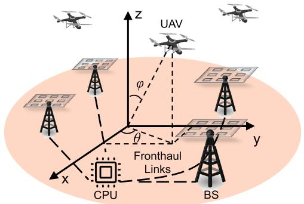

Fig. 1. CF-mMIMO-based UAV communication system.  
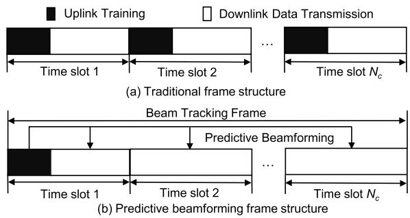  
Fig. 2. Proposed beam tracking frame structures.

## II. SYSTEM MODEL

## A. System Setup

As shown in Fig. 1, we consider a CF-mMIMO-based UAV communication system where M ground APs provide services for K single-antenna UAVs. Each ground AP is equipped with a uniform planar array (UPA) of $\bar { N } = N _ { \mathrm { h } } \times N _ { \mathrm { \ell } }$ antennas, and all APs are connected to the CPU via the fronthaul links.

This paper aims to tackle the beam tracking problem in high-mobility scenarios within the CF-mMIMO system. Traditional beam tracking methods, as illustrated in Fig. 2(a), rely on periodic pilot transmission, leading to substantial training overhead and latency. To mitigate this, we propose a predictive beamforming frame structure. As shown in Fig. 2(b), each beam tracking frame consists of $N _ { \mathrm { c } }$ time slots of duration $T _ { \mathrm { c } } ,$ , each composed of $N _ { \mathrm { s } }$ symbols of duration $T _ { \mathrm { s } } .$ In the first time slot of each beam tracking frame, each UAV transmits pilots to APs for uplink training. Based on the pilot signals, each AP performs predictive beamforming for downlink data transmission during the remaining slots.

## B. Uplink Training

At the first time slot $n = i N _ { \mathrm { c } } + 1$ (where $i \in \mathbb N$ denotes the frame index) of each frame, the k-th UAV transmits orthogonal pilot signals $\phi _ { k } ^ { n } \in \mathbb { C } ^ { 1 \times L ^ { n } }$ composed of $L ^ { n }$ unit-norm symbols. This orthogonality holds because the LoS-dominated aerial channel provides a large coherence block [10], which far exceeds the pilot requirements of the sparse UAV network. Then, the uplink training signal $\mathbf { Y } _ { m } ^ { \mathrm { u } , n } \in \mathbf { \overline { { \mathbb { C } } } } ^ { N \times L ^ { n } }$ received at the m-th AP is given by

$$
{ \bf { Y } } _ { m } ^ { \mathrm { { u } } , n } = \sum _ { k = 1 } ^ { K } { \sqrt { \rho _ { k } ^ { n } } } { \bf { h } } _ { m , k } ^ { n } { \phi _ { k } ^ { n } } + { \bf { N } } _ { m } ,\tag{1}
$$

where $\rho _ { k } ^ { n }$ is the uplink transmit power of the k-th UAV, and $\mathbf { h } _ { m , k } ^ { i } ~ \in ~ \mathbb { C } ^ { N \times \bar { 1 } }$ denotes the channel between the mth AP and the k-th UAV. ${ \bf N } _ { m }$ is the complex Gaussian noise in the uplink training at the m-th $\mathsf { A P } ,$ each element of which is independently and identically distributed (i.i.d.) with distribution $\mathcal { C N } ( 0 , \sigma _ { \mathrm { u } } ^ { 2 } )$

As in [21] and [23], we assume that the channel is dominated by the LoS path, which leads $\mathrm { t o } ^ { 1 }$

$$
\mathbf { h } _ { m , k } ^ { n } = \sqrt { N } \alpha _ { m , k } ^ { n } e ^ { j 2 \pi ( \mu _ { m , k } ^ { n } n T _ { \mathrm { c } } - f _ { c } \tau _ { m , k } ^ { n } ) } \mathbf { a } ( \theta _ { m , k } ^ { n } , \varphi _ { m , k } ^ { n } ) ,\tag{2}
$$

where $\alpha _ { m , k } ^ { n } = \sqrt { \beta _ { 0 } } / d _ { m , k } ^ { n }$ is the path gain, $\beta _ { 0 }$ denotes the path loss at a reference distance $( \mathbf { e . g . , \textit { l m } } )$ , and $\tau _ { m , k } ^ { n } = d _ { m , k } ^ { n } / c$ represents the time delay, where $d _ { m , k } ^ { n }$ represents the distance between the m-th AP and the k-th UAV. $\mu _ { m , k } ^ { n } = f _ { c } v _ { r , m , k } ^ { n } / c$ is the Doppler shift, and $v _ { r , m , k } ^ { n }$ denotes the radial velocity2 between the m-th AP and the k-th UAV. $\theta _ { m , k } ^ { n }$ and $\varphi _ { m , k } ^ { n }$ are the azimuth and elevation angles respectively. $\mathbf { a } ( \theta _ { m , k } ^ { n } , \stackrel { \cdot } { \varphi } _ { m , k } ^ { n } )$ represents the array steering vector, given by

$$
\mathbf { a } ( \theta _ { m , k } ^ { n } , \varphi _ { m , k } ^ { n } ) = { \sqrt { \frac { 1 } { N } } } \mathbf { a } _ { \mathrm { h } } ( \theta _ { m , k } ^ { n } , \varphi _ { m , k } ^ { n } ) \otimes \mathbf { a } _ { \mathrm { v } } ( \varphi _ { m , k } ^ { n } ) .\tag{3}
$$

Here, $\mathbf { a } _ { \mathrm { h } } ( \theta _ { m , k } ^ { n } , \varphi _ { m , k } ^ { n } )$ and $\mathbf { a } _ { \mathrm { v } } ( \varphi _ { m , k } ^ { n } )$ are the array steering vectors in the horizontal and vertical directions respectively, where $\mathbf { a } _ { \mathrm { h } } ( \theta _ { m , k } ^ { n } , \varphi _ { m , k } ^ { n } )$ = $\Big [ 1 , e ^ { - j \pi \sin \theta _ { m , k } ^ { n } \sin \varphi _ { m , k } ^ { n } } , \cdot \cdot \cdot , e ^ { - j \pi ( N _ { \mathrm { h } } - 1 ) \sin \theta _ { m , k } ^ { n } \sin \varphi _ { m , k } ^ { n } } \Big ] ^ { \mathrm { T } } ,$ $\begin{array} { r } { \bar { \mathbf { a } } _ { \mathrm { v } } ( \varphi _ { m , k } ^ { n } ) = \Bigl [ 1 , e ^ { - j \pi \cos \varphi _ { m , k } ^ { n } } , \cdot \cdot \cdot , e ^ { - j \pi ( N _ { \mathrm { v } } - 1 ) \cos \varphi _ { m , k } ^ { n } } \Bigr ] ^ { \mathrm { T } } . } \end{array}$

By projecting (1) onto different orthogonal pilot signals, the received pilot signals from different UAVs can be effectively separated [38]. Specifically, the received pilot signal ${ \bf y } _ { m , k } ^ { \mathrm { u } , n } \in$ $\mathbb { C } ^ { \hat { N } \times 1 }$ for the k-th UAV is given by

$$
\begin{array} { r l } & { \mathbf { y } _ { m , k } ^ { \mathrm { u } , n } = \mathbf { Y } _ { m } ^ { \mathrm { u } , n } ( \phi _ { k } ^ { n } ) ^ { \mathrm { H } } } \\ & { \qquad = L ^ { n } \sqrt { \rho _ { k } ^ { n } } \mathbf { h } _ { m , k } ^ { n } + \mathbf { n } _ { m , k } , } \end{array}\tag{4}
$$

where $\mathbf { n } _ { m , k } \ = \ \mathbf { N } _ { m } ( \phi _ { k } ^ { n } ) ^ { \mathrm { H } }$ is the received noise after projection, and each element is also i.i.d. with distribution $\mathrm { \bar { \it C N } } ( 0 , L ^ { n } \sigma _ { \mathrm { u } } ^ { 2 } )$

The core objective of uplink training is to extract the kinematic and spatial parameters of the UAVs. Specifically, based on (4), the maximum likelihood method [20] is employed to estimate the time delay $\tau _ { m , k } ^ { n }$ , Doppler shift $\mu _ { m , k } ^ { n }$ , azimuth angle $\theta _ { m , k } ^ { n }$ , and elevation angle $\varphi _ { m , k } ^ { n } .$ . These estimated parameters subsequently serve as the measurement inputs for the EKF-based motion tracking.

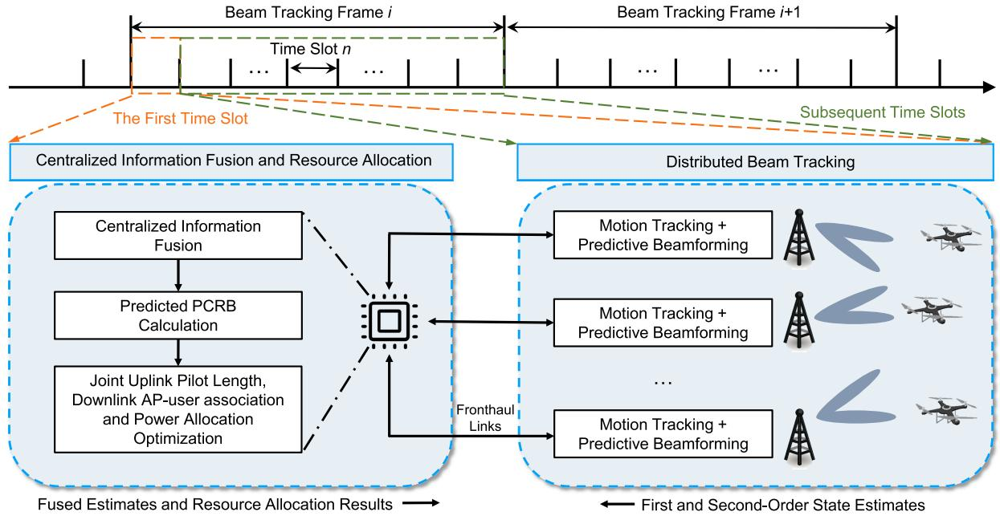  
Fig. 3. Proposed predictive beamforming and resource allocation framework.

## C. Downlink Data Transmission

Utilizing the aforementioned estimated parameters as measurement inputs, each AP executes an EKF to track and predict the UAV’s motion state. The predicted state is then employed to construct the predictive beamforming vectors for downlink data transmission. In time slot $n = i N _ { \mathrm { c } } + j$ (where $j ~ \in ~ \{ 1 , 2 , . . . , N _ { \mathrm { c } } \}$ denotes the slot index), we adopt noncoherent transmission [39], then the received downlink signal $y _ { k } ^ { \mathrm { { d } } , n }$ at the k-th UAV is

$$
\begin{array} { r l } & { \boldsymbol { y } _ { k } ^ { \mathrm { d } , n } = \displaystyle \sum _ { m = 1 } ^ { M } \sqrt { { u } _ { m , k } ^ { n } { p } _ { m , k } ^ { n } } ( { \bf h } _ { m , k } ^ { n } ) ^ { \mathrm { H } } { \bf f } _ { m , k } ^ { n } s _ { m , k } ^ { n , l } + } \\ & { \displaystyle \sum _ { k ^ { \prime } \neq k } ^ { K } \sum _ { m ^ { \prime } = 1 } ^ { M } \sqrt { { u } _ { m ^ { \prime } , k ^ { \prime } } ^ { n } { p } _ { m ^ { \prime } , k ^ { \prime } } ^ { n } } ( { \bf h } _ { m ^ { \prime } , k } ^ { n } ) ^ { \mathrm { H } } { \bf f } _ { m ^ { \prime } , k ^ { \prime } } ^ { n } s _ { m ^ { \prime } , k ^ { \prime } } ^ { n , l } + n _ { k } , } \end{array}\tag{5}
$$

where $u _ { m , k } ^ { n } \in \{ 0 , 1 \}$ is the AP-user association indicator, such that $\dot { u } _ { m , k } ^ { n } = 1$ if the k-th UAV is served by the m-th AP, and $u _ { m , k } ^ { n } = 0$ otherwise; $p _ { m , k } ^ { n }$ is the downlink transmit power of the m-th AP allocated to the k-th $\mathrm { U A V } ; \mathbf { f } _ { m , k } ^ { n }$ denotes the corresponding transmit predictive beamforming vector (detailed in Section III-C). $s _ { m , k } ^ { n , \tilde { l } }$ represents the l-th transmitted data symbol with unit power. The term $n _ { k } \sim \mathcal { C N } ( 0 , \sigma _ { \mathrm { d } } ^ { 2 } )$ is the complex Gaussian white noise received at the UAV. In time slot $n ,$ the signal-to-interference-plus-noise ratio (SINR) of the k-th UAV is given by [39]

$$
\gamma _ { k } ^ { n } = \frac { \sum _ { m = 1 } ^ { M } u _ { m , k } ^ { n } p _ { m , k } ^ { n } \left| ( \mathbf { h } _ { m , k } ^ { n } ) ^ { \mathrm { H } } \mathbf { f } _ { m , k } ^ { n } \right| ^ { 2 } } { \sum _ { k ^ { \prime } \ne k } ^ { K } \sum _ { m ^ { \prime } = 1 } ^ { M } u _ { m ^ { \prime } , k ^ { \prime } } ^ { n } p _ { m ^ { \prime } , k ^ { \prime } } ^ { n } \left| ( \mathbf { h } _ { m ^ { \prime } , k } ^ { n } ) ^ { \mathrm { H } } \mathbf { f } _ { m ^ { \prime } , k ^ { \prime } } ^ { n } \right| ^ { 2 } + \sigma _ { \mathrm { d } } ^ { 2 } } .\tag{6}
$$

Consequently, the effective sum SE in time slot n is

$$
R ^ { n } = { \left\{ \begin{array} { l l } { \displaystyle { \frac { T _ { \mathrm { c } } - L ^ { n } T _ { \mathrm { s } } } { T _ { \mathrm { c } } } } \sum _ { k = 1 } ^ { K } \log _ { 2 } ( 1 + \gamma _ { k } ^ { n } ) , } & { { \mathrm { i f ~ } } n = i N _ { \mathrm { c } } + 1 } \\ { \displaystyle { \sum _ { k = 1 } ^ { K } \log _ { 2 } ( 1 + \gamma _ { k } ^ { n } ) } , } & { { \mathrm { o t h e r w i s e } } } \end{array} \right. }\tag{7}
$$

where we can see that at the initial time slot of each frame, $R ^ { n }$ incorporates pilot-length dependent scaling factor, trading estimation accuracy against transmission time. At subsequent slots, the proposed frame structure and predictive beamforming achieve the full sum SE without any scaling penalty.

## III. PROPOSED FRAMEWORK

As shown in Fig. 3, the proposed framework operates as a prediction-aware closed-loop system, comprising distributed beam tracking and centralized information fusion. Under the proposed frame structure in Fig. 2(b), during the first time slot of each frame, each AP estimates the CSI from uplink pilot signals, executes an EKF to track the UAV’s motion state, and performs downlink predictive beamforming. Crucially, the motion statistics are fed back to the CPU for information fusion. By leveraging the derived PCRB to quantify the positioning uncertainty, the CPU actively optimizes the pilot length, AP-user association, and power allocation to adapt to time-varying channel conditions. In the subsequent time slots of the frame, only distributed beam tracking is performed at each AP. This section details the distributed beam tracking and centralized information fusion components. The theoretical PCRB analysis is presented in Section IV, and the joint resource allocation will be presented in Section V.

## A. State and Measurement Model

Let the position set of M ground APs be denoted as $\{ \mathbf { p } _ { m } = [ x _ { m } , y _ { m } , 0 ] ^ { \mathrm { T } } , m = 1 , \cdots , M \}$ , which is assumed to be constant and known. In time slot n, the true position vector of the k-th UAV is $\mathbf { p } _ { k } ^ { n } = [ x _ { k } ^ { n } , y _ { k } ^ { n } , z _ { k } ^ { n } ] ^ { \mathrm { T } }$ , and the true velocity vector is $\mathbf { v } _ { k } ^ { n } = [ v _ { \mathrm { x } , k } ^ { n } , \bar { v } _ { \mathrm { y } , k } ^ { n } , v _ { \mathrm { z } , k } ^ { \bar { n } } ] ^ { \mathrm { T } }$ . The state vector of the k-th UAV in time slot n is then defined as $\mathbf { x } _ { k } ^ { n } = [ \mathbf { p } _ { k } ^ { n } ; \mathbf { v } _ { k } ^ { n } ] ^ { \mathrm { T } }$ . This paper considers the following uniform linear motion model:3

$$
\left\{ \begin{array} { l l } { \mathbf { p } _ { k } ^ { n } = \mathbf { p } _ { k } ^ { n - 1 } + \mathbf { v } _ { k } ^ { n - 1 } T _ { \mathrm { c } } + \mathbf { q } _ { \mathrm { p } , k } ^ { n } } \\ { \mathbf { v } _ { k } ^ { n } = \mathbf { v } _ { k } ^ { n - 1 } + \mathbf { q } _ { \mathrm { v } , k } ^ { n } } \end{array} \right. \ ,\tag{8}
$$

where $\mathbf { q } _ { \mathrm { p } , k } ^ { n }$ and $\mathbf { q } _ { \mathrm { v } , k } ^ { n }$ represent the position and velocity state noise vectors, respectively, which characterize the discrepancies between the actual motion and the assumed model. Equivalently, the state model can be expressed in compact form as

$$
\mathbf { x } _ { k } ^ { n } = \mathbf { G } \mathbf { x } _ { k } ^ { n - 1 } + \mathbf { q } _ { k } ^ { n } ,\tag{9}
$$

where G is the state transition matrix, $\mathbf { q } _ { k } ^ { n }$ denotes the Gaussian state noise with zero mean and covariance matrix $\mathbf { Q } _ { k } ^ { n } = \operatorname { d i a g } ( ( \sigma _ { \mathrm { p } , k } ^ { n } ) ^ { 2 } \mathbf { I } _ { 3 } , ( \sigma _ { \mathrm { v } , k } ^ { n } ) ^ { 2 } \mathbf { I } _ { 3 } )$

Using the parameters estimated from the uplink received signal (4), the measurement vector at the m-th AP for the k-th UAV is defined as $\mathbf { z } _ { m , k } ^ { n } ~ = ~ [ \hat { \tau } _ { m , k } ^ { n } , \hat { \mu } _ { m , k } ^ { n } , \hat { \theta } _ { m , k } ^ { n } , \hat { \varphi } _ { m , k } ^ { n } ] ^ { \mathrm { T } }$ Mathematically, the relationship between the measurement and the state is given by

$$
\tau _ { m , k } ^ { n } = \frac { \| \mathbf { p } _ { k } ^ { n } - \mathbf { p } _ { m } \| } { c } ,\tag{10}
$$

$$
\mu _ { m , k } ^ { n } = \frac { ( \mathbf { p } _ { k } ^ { n } - \mathbf { p } _ { m } ) ^ { \mathrm { T } } \mathbf { v } _ { k } ^ { n } } { \lambda \| \mathbf { p } _ { k } ^ { n } - \mathbf { p } _ { m } \| } ,\tag{11}
$$

$$
\theta _ { m , k } ^ { n } = \arctan \left( \frac { y _ { k } ^ { n } - y _ { m } } { x _ { k } ^ { n } - x _ { m } } \right) ,\tag{12}
$$

$$
\varphi _ { m , k } ^ { n } = \arctan \left( \frac { \sqrt { ( x _ { k } ^ { n } - x _ { m } ) ^ { 2 } + ( y _ { k } ^ { n } - y _ { m } ) ^ { 2 } } } { z _ { k } ^ { n } } \right) .\tag{13}
$$

Therefore, the measurement model can be expressed as

$$
\mathbf { z } _ { m , k } ^ { n } = \mathbf { w } _ { m } ( \mathbf { x } _ { k } ^ { n } ) + \boldsymbol { \psi } _ { m , k } ^ { n } ,\tag{14}
$$

where $\mathbf { w } _ { m } ( \cdot )$ denotes the nonlinear measurement function related to the m-th AP as defined in (10)-(13). $\psi _ { m , k } ^ { n }$ represents the measurement noise of the m-th AP for the k-th UAV, modeled as a zero mean Gaussian random vector with covariance matrix $\Psi _ { m , k } ^ { n }$ , given by

$$
\begin{array} { r } { \Psi _ { m , k } ^ { n } = \mathrm { d i a g } \left( \sigma _ { \hat { \tau } _ { m , k } ^ { n } } ^ { 2 } , \sigma _ { \hat { \mu } _ { m , k } ^ { n } } ^ { 2 } , \sigma _ { \hat { \theta } _ { m , k } ^ { n } } ^ { 2 } , \sigma _ { \hat { \varphi } _ { m , k } ^ { n } } ^ { 2 } \right) , } \end{array}\tag{15}
$$

where $\sigma _ { \hat { \tau } _ { m , k } ^ { n } } ^ { 2 } , \sigma _ { \hat { \mu } _ { m , k } ^ { n } } ^ { 2 } , \sigma _ { \hat { \theta } _ { m } ^ { n } } ^ { 2 } , \sigma _ { \hat { \varphi } _ { m , k } ^ { n } } ^ { 2 }$ represent the measurement k   
noise variances of time delay, Doppler shift, azimuth and elevation angle, respectively. As established in [20], [41], these variances can be assumed to be inversely proportional to the receive SNR of (4)4

$$
\sigma _ { i } ^ { 2 } = \frac { \eta _ { i } \sigma _ { \mathrm { u } } ^ { 2 } } { N L ^ { n } \rho _ { k } ^ { n } \left| \alpha _ { m , k } ^ { n } \right| ^ { 2 } } , i \in \{ \hat { \tau } _ { m , k } ^ { n } , \hat { \mu } _ { m , k } ^ { n } , \hat { \theta } _ { m , k } ^ { n } , \hat { \varphi } _ { m , k } ^ { n } \} ,\tag{16}
$$

3While the proposed framework is inherently compatible with various motion models [40], we adopt the linear model as a low-complexity local approximation within short observation windows, using process noise to effectively compensate for unmodeled maneuver dynamics. The integration of high-complexity non-linear models is left for future work.

4Note that this relationship holds for an unbiased estimator under moderateto-high SNR conditions. Extending to these specific conditions is left for future work. Furthermore, since the real value of $\alpha _ { m , k } ^ { n }$ is unknown, we can use the predicted values ${ \hat { \alpha } } _ { m , k } ^ { n }$ to estimate $\Psi _ { m , k } ^ { n }$ in practice.

where $\eta _ { i }$ represents the corresponding scale factor determined by system configurations, waveform parameters, and the specific signal processing algorithms [41].

## B. Distributed Beam Tracking

Due to the nonlinearity of the measurement model in (14), we employ an EKF at each AP to estimate the UAVs’ motion states. Furthermore, by leveraging the orthogonality of pilot signals, the multi-target beam tracking problem can be effectively decomposed into multiple independent singletarget tracking problems, which can be processed in parallel [20], [43]. The procedures for state prediction and covariance update are summarized as follows.

1) State prediction:

$$
\hat { \mathbf { x } } _ { k } ^ { n | n - 1 } = \mathbf { G } \hat { \mathbf { x } } _ { k } ^ { n - 1 } ,\tag{17}
$$

where $\hat { \mathbf { x } } _ { k } ^ { n | n - 1 }$ and $\hat { \mathbf { x } } _ { k } ^ { n - 1 }$ are the fused one-step state prediction and update for the k-th UAV (see Section III-C), respectively.

2) Predictive beamforming:

$$
\mathbf { F } _ { m } ^ { n } = \hat { \mathbf { H } } _ { m } ^ { n } \left[ \left( \hat { \mathbf { H } } _ { m } ^ { n } \right) ^ { \mathrm { H } } \hat { \mathbf { H } } _ { m } ^ { n } \right] ^ { - 1 } ,\tag{18}
$$

where $\begin{array} { l l l } { { \bf { F } } _ { m } ^ { n } } & { = } & { \left[ { \bf { f } } _ { m , 1 , } ^ { n } , { \bf { f } } _ { m , 2 } ^ { n } , \ldots , { \bf { f } } _ { m , K } ^ { n } \right] } \end{array}$ and $\begin{array} { r l } { \hat { \mathbf { H } } _ { m } ^ { n } } & { { } = } \end{array}$ $\left\lceil \hat { \mathbf { h } } _ { m , 1 } ^ { n } , \hat { \mathbf { h } } _ { m , 2 } ^ { n } , \ldots , \hat { \mathbf { h } } _ { m , K } ^ { n } \right\rceil$ denote the predictive zeroforcing beamforming matrix and the reconstructed channel matrix according to (2) and (10)-(13) at the m-th AP, respectively.

3) Covariance matrix prediction:

$$
\mathbf { M } _ { k } ^ { n | n - 1 } = \mathbf { G } \mathbf { M } _ { k } ^ { n - 1 } \mathbf { G } ^ { \mathrm { H } } + \mathbf { Q } _ { k } ^ { n } ,\tag{19}
$$

where $ { \mathbf { M } } _ { k } ^ { n | n - 1 }$ and $\mathbf { M } _ { k } ^ { n - 1 }$ denote the fused one-step covariance matrix prediction and update for the k-th UAV, respectively.

4) Kalman gain calculation:

$$
\begin{array} { r } { { \mathbf { K } } _ { m , k } ^ { n } = { \mathbf { M } } _ { k } ^ { n | n - 1 } ( { \mathbf { W } } _ { m , k } ^ { n } ) ^ { \mathrm { H } } { \mathbf { \Sigma } } } \\ { \times \left( \Psi _ { m , k } ^ { n } + { \mathbf { W } } _ { m , k } ^ { n } { \mathbf { M } } _ { k } ^ { n | n - 1 } ( { \mathbf { W } } _ { m , k } ^ { n } ) ^ { \mathrm { H } } \right) ^ { - 1 } , } \end{array}\tag{20}
$$

with $\begin{array} { c c l } { { \bf W } _ { m , k } ^ { n } } & { = } & { \frac { \partial { \bf w } _ { m } } { \partial { \bf x } _ { k } ^ { n } } \Big | _ { { \bf x } _ { \imath } ^ { n } = \hat { \bf x } _ { \imath } ^ { n | n - } } } \end{array}$ being the Jacobian 1   
matrix of the measurement model.

5) State tracking:

$$
\begin{array} { r } { \hat { \mathbf { x } } _ { m , k } ^ { n } = \hat { \mathbf { x } } _ { k } ^ { n | n - 1 } + \mathbf { K } _ { m , k } ^ { n } \left( \mathbf { z } _ { m , k } ^ { n } - \mathbf { w } _ { m } ( \hat { \mathbf { x } } _ { k } ^ { n | n - 1 } ) \right) , } \end{array}\tag{21}
$$

where $\hat { \mathbf { x } } _ { m , k } ^ { n }$ represents the updated state of the m-th AP for the k-th UAV.

6) Covariance matrix update:

$$
\mathbf { M } _ { m , k } ^ { n } = \left( \mathbf { I } - \mathbf { K } _ { m , k } ^ { n } \mathbf { W } _ { m , k } ^ { n } \right) \mathbf { M } _ { k } ^ { n | n - 1 } ,\tag{22}
$$

where $\mathbf { M } _ { m , k } ^ { n }$ represents the updated covariance matrix of the m-th AP for the k-th UAV.

Remark 1: At the first time slot of each beam tracking frame, all APs utilize the received uplink signals to update their state and covariance based on (20)-(22). After information fusion

at the CPU, each AP performs state prediction and predictive beamforming according to (17)-(19). For all subsequent time slots within the frame, only local prediction is required.

## C. Centralized Information Fusion

After each distributed AP obtains the updated state and covariance estimates, these statistics are sent back to the CPU for centralized information fusion, which exploits the cooperative gain of the distributed architecture. Unlike conventional approaches that rely on full CSI, the proposed strategy can significantly reduce the fronthaul overhead. Since APs at different locations exhibit varying confidence levels in estimating the same UAV and their measurements may be correlated, the CI strategy [42], [43] is adopted for centralized information fusion.

At the frame-initial time slot, each AP transmits the state estimate $\{ \hat { \mathbf { x } } _ { m , k } ^ { n } \} _ { \forall m }$ and the covariance matrix $\{ \mathbf { M } _ { m , k } ^ { n } \} _ { \forall m }$ for the k-th UAV to the CPU via the fronthaul link. The fused state estimate using the CI fusion strategy is computed as

$$
\hat { \mathbf { x } } _ { k } ^ { n } = \mathbf { M } _ { k } ^ { n } \left[ \sum _ { m = 1 } ^ { M } \omega _ { m } ( \mathbf { M } _ { m , k } ^ { n } ) ^ { - 1 } \hat { \mathbf { x } } _ { m , k } ^ { n } \right] ,\tag{23}
$$

where $\mathbf { M } _ { k } ^ { n }$ is the fused covariance matrix, given by

$$
\mathbf { M } _ { k } ^ { n } = \left[ \sum _ { m = 1 } ^ { M } \omega _ { m } ( \mathbf { M } _ { m , k } ^ { n } ) ^ { - 1 } \right] ^ { - 1 } ,\tag{24}
$$

with the fusion coefficient $\omega _ { m }$ reflecting the confidence level of the corresponding local estimation information and satisfying the following constraints:

$$
\sum _ { m = 1 } ^ { M } \omega _ { m } = 1 , ~ \omega _ { m } \geq 0 ,\tag{25}
$$

Although optimal weights $\omega _ { m }$ typically require online convex optimization [42], our fusion framework and subsequent PCRB derivations hold rigorously for any normalized weights satisfying (25).

After resource allocation is performed based on the fused estimates, the results are sent to each AP via the fronthaul link to enable predictive beamforming in subsequent time slots.

## D. Complexity, Fronthaul Overhead and Latency Analysis

1) Complexity Analysis: In each beam tracking frame, each AP first updates its state and covariance matrix in the initial time slot, then performs only prediction in subsequent slots. Let $N _ { \mathrm { x } }$ and $N _ { \mathrm { z } }$ denote state and measurement vector dimensions. The computational complexities of performing Nc-step state and covariance prediction at each AP are $\mathcal { O } ( N _ { \mathrm { x } } ^ { 2 } N _ { \mathrm { c } } K )$ and $\mathcal { O } ( N _ { \mathrm { x } } ^ { 3 } N _ { \mathrm { c } } K )$ , respectively, and the total complexity of all APs is $\mathcal { O } ( N _ { \mathrm { x } } ^ { 3 } N _ { \mathrm { c } } M K )$ . The complexities of performing one time Kalman gain calculation, state, and covariance update at each AP are $\mathcal { \bar { O } } ( ( N _ { \mathrm { x } } ^ { 2 } N _ { \mathrm { z } } + N _ { \mathrm { x } } N _ { \mathrm { z } } ^ { 2 } + N _ { \mathrm { z } } ^ { 3 } ) K ) , \mathcal { O } ( N _ { \mathrm { x } } N _ { \mathrm { z } } K )$ and $\mathcal { O } ( ( N _ { \mathrm { x } } N _ { \mathrm { z } } ^ { 2 } + N _ { \mathrm { x } } ^ { 3 } ) \ddot { K } )$ , respectively, and the total complexity of all APs is $\mathcal { O } ( \operatorname* { m a x } ( N _ { \mathrm { x } } ^ { 3 } , N _ { \mathrm { z } } ^ { 3 } ) M K )$ . The computational complexity for state and covariance fusion at CPU are $\mathcal { O } ( N _ { \mathrm { x } } ^ { 2 } M K )$ and $\mathcal { O } ( N _ { \mathrm { x } } ^ { 3 } M K )$ , the subsequent prediction procedure incurs $\mathcal { O } ( N _ { \mathrm { x } } ^ { 2 } \dot { K } )$ and $\mathcal { O } ( N _ { \mathrm { x } } ^ { 3 } K )$ , respectively, thus the overall computational complexity at the CPU is $\mathcal { O } ( N _ { \mathrm { x } } ^ { 3 } M K )$

2) Fronthaul Overhead Analysis: Each AP only sends the low-order statistics via the fronthaul link in the first time slot of each frame, with overhead $\mathcal { O } ( N _ { \mathrm { x } } ^ { 2 } M K )$

3) Latency Analysis: The serial operations in the first time slot (see Fig. 3) are expected to be executable within the slot budget under typical optical-fronthaul and modern baseband processing units assumptions. This efficiency stems from the scalable architecture, which relies on low-complexity algorithms and low-dimensional statistical fronthaul. Specifically, exchanging the required statistical data over high-rate optical fronthaul links is expected to incur only microsecond- to submillisecond-level latency, while the associated EKF, CI fusion, and resource-allocation computations remain lightweight for the considered system dimensions. Furthermore, if extreme hardware or link constraints incur additional delays, our framework inherently supports multi-step state prediction, providing robustness to moderate latency without violating system causality.

## IV. PCRB ANALYSIS

To evaluate the performance of the fused estimation, the CRB has to be derived. Different from conventional CRB that only depends on measurement, the parameter estimation process in this paper relies on both measurement and the state model. Therefore, the estimation performance is characterized using the PCRB [44].

In the initial time slot of each frame, let $\mathbf { Z } _ { k } ^ { n }$ denote the measurements from all APs for the k-th UAV. According to Bayes’ theorem, the joint probability distribution is given by

$$
p ( \mathbf { x } _ { k } ^ { n } , \mathbf { Z } _ { k } ^ { n } ) = p ( \mathbf { x } _ { k } ^ { n } ) p ( \mathbf { Z } _ { k } ^ { n } | \mathbf { x } _ { k } ^ { n } ) ,\tag{26}
$$

where $p ( \mathbf { x } _ { k } ^ { n } , \mathbf { Z } _ { k } ^ { n } )$ is the joint probability density function (PDF) of $\mathbf { x } _ { k } ^ { n }$ and $\mathbf { Z } _ { k } ^ { n } , p ( \mathbf { x } _ { k } ^ { n } )$ represents the prior PDF of $\mathbf { x } _ { k } ^ { n } .$ which is determined by the state model, and $p ( \mathbf { Z } _ { k } ^ { n } | \mathbf { x } _ { k } ^ { n } )$ denotes the conditional PDF of $\mathbf { Z } _ { k } ^ { n }$ given $\mathbf { x } _ { k } ^ { n }$ . Then, the corresponding posterior Fisher Information Matrix (PFIM) is given by

$$
\begin{array} { r l } & { \mathbf { J } _ { k } ^ { n } = - \mathbb { E } \left( \frac { \partial ^ { 2 } \ln p ( \mathbf { x } _ { k } ^ { n } , \mathbf { Z } _ { k } ^ { n } ) } { \partial ( \mathbf { x } _ { k } ^ { n } ) ^ { 2 } } \right) } \\ & { \quad \quad = \underbrace { - \mathbb { E } \left( \frac { \partial ^ { 2 } \ln p ( \mathbf { x } _ { k } ^ { n } ) } { \partial ( \mathbf { x } _ { k } ^ { n } ) ^ { 2 } } \right) } _ { \mathrm { P r i o r } , ~ \mathbf { J } _ { k , \mathrm { P } } ^ { n } } \underbrace { - \mathbb { E } \left( \frac { \partial ^ { 2 } \ln p ( \mathbf { Z } _ { k } ^ { n } | \mathbf { x } _ { k } ^ { n } ) } { \partial ( \mathbf { x } _ { k } ^ { n } ) ^ { 2 } } \right) } _ { \mathrm { M e a s u r e m e n t } , ~ \mathbf { J } _ { k , \mathrm { M } } ^ { n } } , } \end{array}\tag{27}
$$

where $\mathbf { J } _ { k , \mathrm { P } } ^ { n }$ and $\mathbf { J } _ { k , \mathrm { M } } ^ { n }$ respectively represent the prior information obtained from the state model and the information obtained from the observed measurement. Under the Gaussian assumption, the recursive expression form of $\mathbf { J } _ { k , \mathrm { P } } ^ { n }$ is [45]

$$
\mathbf { J } _ { k , \mathrm { P } } ^ { n } = \left[ \mathbf { G } \left( \mathbf { J } _ { k } ^ { n - 1 } \right) ^ { - 1 } \mathbf { G } ^ { \mathrm { H } } + \mathbf { Q } _ { k } ^ { n } \right] ^ { - 1 } .\tag{28}
$$

Subsequently, we consider the analysis of $\mathbf { J } _ { k , \mathrm { M } } ^ { n } .$ . Since it is difficult to directly obtain the analytical form of $p ( \mathbf { Z } _ { k } ^ { n } | \mathbf { x } _ { k } ^ { n } )$ , we employ Bayes’ theorem

$$
p ( \mathbf { x } _ { k } ^ { n } \vert \mathbf { Z } _ { k } ^ { 1 : n } ) = \frac { p ( \mathbf { Z } _ { k } ^ { n } \vert \mathbf { x } _ { k } ^ { n } ) p ( \mathbf { x } _ { k } ^ { n } \vert \mathbf { Z } _ { k } ^ { 1 : n - 1 } ) } { p ( \mathbf { Z } _ { k } ^ { n } \vert \mathbf { Z } _ { k } ^ { 1 : n - 1 } ) } ,\tag{29}
$$

where $p ( \mathbf { x } _ { k } ^ { n } | \mathbf { Z } _ { k } ^ { 1 : n } )$ is the global posterior PDF, and $p ( \mathbf { x } _ { k } ^ { n } | \mathbf { Z } _ { k } ^ { 1 : n - 1 } )$ denotes the predicted global posterior PDF.

From this recursive relationship, the global PFIM can be expressed as

$$
\mathbf { J } _ { k , \mathrm { G } } ^ { n } = \mathbf { J } _ { k , \mathrm { M } } ^ { n } + \mathbf { J } _ { k , \mathrm { G } } ^ { n | n - 1 } ,\tag{30}
$$

where $\mathbf { J } _ { k , \mathrm { G } } ^ { n }$ and $\mathbf { J } _ { k , \mathrm { G } } ^ { n | n - 1 }$ respectively represent the global FIM corresponding to $p ( \mathbf { x } _ { k } ^ { n } | \mathbf { Z } _ { k } ^ { 1 : n } )$ and $p ( \mathbf { x } _ { k } ^ { n } | \mathbf { Z } _ { k } ^ { 1 : n - 1 } )$ . Under the Gaussian assumption, it can be derived that

$$
\mathbf { J } _ { k , \mathrm { G } } ^ { n } = - \mathbb { E } \bigg ( \frac { \partial ^ { 2 } \ln p ( \mathbf { x } _ { k } ^ { n } | \mathbf { Z } _ { k } ^ { 1 : n } ) } { \partial ( \mathbf { x } _ { k } ^ { n } ) ^ { 2 } } \bigg ) = ( \mathbf { M } _ { k } ^ { n } ) ^ { - 1 } .\tag{31}
$$

Similarly, for the m-th AP, it can be obtained

$$
\begin{array} { r } { \mathbf { J } _ { m , k , \mathrm { G } } ^ { n } = \mathbf { J } _ { m , k , \mathrm { M } } ^ { n } + \mathbf { J } _ { k , \mathrm { G } } ^ { n | n - 1 } , } \end{array}\tag{32}
$$

where $\mathbf { J } _ { m , k , \mathrm { G } } ^ { n }$ and $\mathbf { J } _ { m , k , \mathrm { M } } ^ { n }$ respectively represent the local FIM corresponding to $p ( \mathbf { x } _ { k } ^ { n } | \mathbf { z } _ { m , k } ^ { n } , \mathbf { Z } _ { k } ^ { 1 : n - 1 } )$ and $p ( \mathbf { z } _ { m , k } ^ { n } | \mathbf { x } _ { k } ^ { n } )$ at the m-th AP. Similar to (31), we further derive that

$$
\mathbf { J } _ { m , k , \mathrm { G } } ^ { n } = ( \mathbf { M } _ { m , k } ^ { n } ) ^ { - 1 } ,\tag{33}
$$

$$
\mathbf { J } _ { m , k , \mathrm { M } } ^ { n } = \left( \frac { \partial \mathbf { w } _ { m } ( \mathbf { x } _ { k } ^ { n } ) } { \partial \mathbf { x } _ { k } ^ { n } } \right) ^ { \mathrm { H } } \left( \boldsymbol { \Psi } _ { m , k } ^ { n } \right) ^ { - 1 } \left( \frac { \partial \mathbf { w } _ { m } ( \mathbf { x } _ { k } ^ { n } ) } { \partial \mathbf { x } _ { k } ^ { n } } \right) .\tag{34}
$$

Substituting the fused covariance matrix (24) into (31), we can obtain [43]

$$
\mathbf { J } _ { k , \mathrm { G } } ^ { n } = \sum _ { m = 1 } ^ { M } \omega _ { m } \mathbf { J } _ { m , k , \mathrm { G } } ^ { n } .\tag{35}
$$

Then substituting (30) and (32) into (35), and noting that $\begin{array} { r } { \sum _ { m = 1 } ^ { M } \omega _ { m } = 1 } \end{array}$ , we obtain

$$
\mathbf { J } _ { k , \mathrm { M } } ^ { n } = \sum _ { m = 1 } ^ { M } \omega _ { m } \mathbf { J } _ { m , k , \mathrm { M } } ^ { n } .\tag{36}
$$

Finally, combining (28), (34), and (36), we can obtain

$$
\begin{array} { l } { { \displaystyle { \bf J } _ { k } ^ { n } = { \bf J } _ { k , \mathrm { P } } ^ { n } + { \bf J } _ { k , \mathrm { M } } ^ { n } = { \bf \widetilde { \Gamma } } \Big [ { \bf G } \left( { \bf J } _ { k } ^ { n - 1 } \right) ^ { - 1 } { \bf G } ^ { \mathrm { H } } + { \bf Q } _ { k } ^ { n } \Big ] ^ { - 1 } } \ ~ } \\ { { \displaystyle ~ + \sum _ { m = 1 } ^ { M } \omega _ { m } \left( \frac { \partial { \bf w } _ { m } ( { \bf x } _ { k } ^ { n } ) } { \partial { \bf x } _ { k } ^ { n } } \right) ^ { \mathrm { H } } \left( \Psi _ { m , k } ^ { n } \right) ^ { - 1 } \left( \frac { \partial { \bf w } _ { m } ( { \bf x } _ { k } ^ { n } ) } { \partial { \bf x } _ { k } ^ { n } } \right) } \ ~ } \end{array}\tag{37}
$$

Therefore, the lower bound of the mean squared error (MSE) for the state estimation is the inverse of $\mathbf { J } _ { k } ^ { n }$ [46], given by

$$
\begin{array} { r } { \mathbb { E } \left[ ( \hat { \mathbf { x } } _ { k } ^ { n } - \mathbf { x } _ { k } ^ { n } ) ( \hat { \mathbf { x } } _ { k } ^ { n } - \mathbf { x } _ { k } ^ { n } ) ^ { \mathrm { H } } \right] \geq ( \mathbf { J } _ { k } ^ { n } ) ^ { - 1 } \triangleq \mathbf { C } _ { k } ^ { n } . } \end{array}\tag{38}
$$

Since the true state $\mathbf { x } _ { k } ^ { n }$ is unknown, the state prediction $\hat { \mathbf { x } } _ { k } ^ { n | n - 1 }$ can be substituted into (38) to obtain the predicted PCRB [20]

$$
\begin{array} { r l } { \left. { \mathbf { C } _ { k } ^ { n } } \right. _ { { \mathbf { x } _ { k } ^ { n } } = \hat { \mathbf { x } } _ { k } ^ { n | n - 1 } } = \Bigg \{ \Big [ \mathbf { G } \left( \mathbf { J } _ { k } ^ { n - 1 } \right) ^ { - 1 } \mathbf { G } ^ { \mathrm { H } } + \mathbf { Q } _ { k } ^ { n } \Big ] ^ { - 1 } } & { } \\ { + \displaystyle \sum _ { m = 1 } ^ { M } \omega _ { m } \left( \mathbf { W } _ { m , k } ^ { n } \right) ^ { \mathrm { H } } \left( \boldsymbol { \Psi } _ { m , k } ^ { n } \right) ^ { - 1 } \mathbf { W } _ { m , k } ^ { n } \Bigg \} ^ { - 1 } . } \end{array}\tag{39}
$$

Remark 2: Note that (39) consists of two components: the first term represents prior state model, while the second term quantifies measurement contributions. Besides, in subsequent slots, since the avoidance of uplink training eliminates the second term, the predicted PCRB is determined exclusively by the first term.

Next, we present a useful relationship between the predicted PCRB and the covariance of the CI-based fused estimate under the adopted local linear-Gaussian approximation. To this end, by substituting (19) and (20) into (22), inverting the whole expression, and applying the matrix inversion lemma [47], we can obtain

$$
\begin{array} { r l r } {  { ( \mathbf { M } _ { m , k } ^ { n } ) ^ { - 1 } = ( \mathbf { G } \mathbf { M } _ { k } ^ { n - 1 } \mathbf { G } ^ { \mathrm { H } } + \mathbf { Q } _ { k } ^ { n } ) ^ { - 1 } } } \\ & { } & { + ( \mathbf { W } _ { m , k } ^ { n } ) ^ { \mathrm { H } } ( \pmb { \Psi } _ { m , k } ^ { n } ) ^ { - 1 } \mathbf { W } _ { m , k } ^ { n } . } \end{array}\tag{40}
$$

By substituting the above equation into (24) and noting that $\begin{array} { r } { \dot { \sum _ { m = 1 } ^ { M } } \omega _ { m } = \overline { { 1 } } } \end{array}$ , we can obtain

$$
\begin{array} { r l r } {  { ( \mathbf { M } _ { k } ^ { n } ) ^ { - 1 } = ( \mathbf { G } \mathbf { M } _ { k } ^ { n - 1 } \mathbf { G } ^ { \mathrm { H } } + \mathbf { Q } _ { k } ^ { n } ) ^ { - 1 } } } \\ & { } & { + \displaystyle \sum _ { m = 1 } ^ { M } \omega _ { m } ( \mathbf { W } _ { m , k } ^ { n } ) ^ { \mathrm { H } } ( \pmb { \Psi } _ { m , k } ^ { n } ) ^ { - 1 } \mathbf { W } _ { m , k } ^ { n } . } \end{array}\tag{41}
$$

By comparing the above equation with (39) and considering the inverse relationship between the PFIM and the PCRB, we can obtain

$$
\left. { \bf C } _ { k } ^ { n } \right| _ { { \bf x } _ { k } ^ { n } = \hat { \bf x } _ { k } ^ { n | n - 1 } } = { \bf M } _ { k } ^ { n } .\tag{42}
$$

Remark 3: Under the assumption of Gaussian state and measurement noises, the EKF linearizes the measurement model using a first-order Jacobian approximation. Since higherorder terms are neglected, linearization errors are inevitably introduced. Therefore, (22) and (24) should be regarded as estimates of the true MSE.

Remark 4: Equation (42) shows that, under the local linear-Gaussian approximation, the predicted PCRB coincides with the CI fused covariance. Physically, this demonstrates that the CI fusion strategy effectively aggregates measurement information from distributed APs. However, the tightness of this theoretical bound is scenario dependent. In high-SNR regimes with smooth UAV motion, the prediction error and the first-order linearization error are typically small, so the predicted PCRB is expected to be close to the true PCRB and can serve as a tight lower-bound reference for the true MSE. In contrast, under low SNR or aggressive maneuvers, the prediction error may increase and higher-order linearization error may become non-negligible. In such cases, the predicted PCRB can become overly optimistic and may underestimate the true MSE.

From (16), it is evident that the pilot length influences the measurement noise, which in turn affects the predicted PCRB. To facilitate the optimization of the pilot length in Section V, we now derive the explicit relationship between the predicted PCRB and the pilot length. Based on (15) and (16), we obtain

$$
\Psi _ { m , k } ^ { n } ( L ^ { n } ) = ( L ^ { n } ) ^ { - 1 } \mathrm { d i a g } \left( \frac { \eta _ { \hat { \tau } _ { m , k } ^ { n } } \sigma _ { \mathrm { u } } ^ { 2 } } { N \rho _ { k } ^ { n } | \alpha _ { m , k } ^ { n } | ^ { 2 } } , \frac { \eta _ { \hat { \mu } _ { m , k } ^ { n } } \sigma _ { \mathrm { u } } ^ { 2 } } { N \rho _ { k } ^ { n } | \alpha _ { m , k } ^ { n } | ^ { 2 } } , \right.
$$

$$
\frac { \eta _ { \hat { \theta } _ { m , k } ^ { n } } \sigma _ { \mathrm { u } } ^ { 2 } } { N \rho _ { k } ^ { n } | \alpha _ { m , k } ^ { n } | ^ { 2 } } , \frac { \eta _ { \hat { \varphi } _ { m , k } ^ { n } } \sigma _ { \mathrm { u } } ^ { 2 } } { N \rho _ { k } ^ { n } | \alpha _ { m , k } ^ { n } | ^ { 2 } } \bigg ) \triangleq ( L ^ { n } ) ^ { - 1 } \tilde { \Psi } _ { m , k } ^ { n } .\tag{43}
$$

Substituting it into (37), it can be derived that

$$
\begin{array} { r l } & { \mathbf { J } _ { k } ^ { n } ( L ^ { n } ) \big \rvert _ { \mathbf { x } _ { k } ^ { n } = \hat { \mathbf { x } } _ { k } ^ { n | n - 1 } } = \bigg [ \mathbf { G } \left( \mathbf { J } _ { k } ^ { n - 1 } \right) ^ { - 1 } \mathbf { G } ^ { \mathrm { H } } + \mathbf { Q } _ { k } ^ { n } \bigg ] ^ { - 1 } } \\ & { \quad + L ^ { n } \displaystyle \sum _ { m = 1 } ^ { M } \omega _ { m } \left( \mathbf { W } _ { m , k } ^ { n } \right) ^ { \mathrm { H } } \Big ( \tilde { \Psi } _ { m , k } ^ { n } \Big ) ^ { - 1 } \mathbf { W } _ { m , k } ^ { n } \triangleq \mathbf { A } _ { k } + L ^ { n } \mathbf { B } _ { k } , } \end{array}\tag{44}
$$

where $\begin{array} { r } { \mathbf { A } _ { k } \triangleq \Big [ \mathbf { G } \left( \mathbf { J } _ { k } ^ { n - 1 } \right) ^ { - 1 } \mathbf { G } ^ { \mathrm { H } } + \mathbf { Q } _ { k } ^ { n } \Big ] ^ { - 1 } , \mathbf { B } _ { k } \triangleq \sum _ { m = 1 } ^ { M } } \end{array}$ $\omega _ { m } \left( \mathbf { W } _ { m , k } ^ { n } \right) ^ { \mathrm { H } } \left( \mathbf { \bar { \Psi } } _ { m , k } ^ { n } \right) ^ { - 1 } \mathbf { W } _ { m , k } ^ { n }$ . Then the predicted PCRB can be written as

$$
\begin{array} { r l } & { \mathbf { C } _ { k } ^ { n } ( L ^ { n } ) \big \rvert _ { \mathbf { x } _ { k } ^ { n } = \hat { \mathbf { x } } _ { k } ^ { n | n - 1 } } = \big ( \mathbf { A } _ { k } + L ^ { n } \mathbf { B } _ { k } \big ) ^ { - 1 } } \\ & { \qquad = \mathbf { A } _ { k } ^ { - \mathrm { H } / 2 } \left( \mathbf { I } + L ^ { n } \mathbf { A } _ { k } ^ { - 1 / 2 } \mathbf { B } _ { k } \mathbf { A } _ { k } ^ { - \mathrm { H } / 2 } \right) ^ { - 1 } \mathbf { A } _ { k } ^ { - 1 / 2 } . } \end{array}\tag{45}
$$

Since $\mathbf { A } _ { k }$ is the state prediction covariance matrix and is positive definite matrix, it follows that rank $\left( \mathbf { A } _ { k } \right) = N _ { \mathbf { x } } .$ . According to the properties of positive definite matrices, $\mathbf { A } _ { k } ^ { - 1 / 2 }$ is also positive definite. Moreover, $\mathbf { B } _ { k }$ is a positive semidefinite matrix by definition. Consequently, $\mathbf { A } _ { k } ^ { - 1 / 2 } \mathbf { B } _ { k } \mathbf { A } _ { k } ^ { - \mathrm { H } / 2 }$ is a Hermitian positive semidefinite matrix. By performing eigenvalue decomposition on this matrix, we obtain

$$
\mathbf { A } _ { k } ^ { - 1 / 2 } \mathbf { B } _ { k } \mathbf { A } _ { k } ^ { - \mathrm { H } / 2 } = \mathbf { U } _ { k } \mathbf { A } _ { k } \mathbf { U } _ { k } ^ { \mathrm { H } } ,\tag{46}
$$

where ${ \bf U } _ { k }$ is a unitary matrix whose columns are the eigenvectors, and $\mathbf { \Lambda } _ { \Lambda _ { k } }$ is a diagonal matrix containing the corresponding eigenvalues. Substituting them into (45), we derive

$$
\mathbf { C } _ { k } ^ { n } ( L ^ { n } ) \big | _ { \mathbf { x } _ { k } ^ { n } = \hat { \mathbf { x } } _ { k } ^ { n | n - 1 } } = \mathbf { A } _ { k } ^ { - \mathrm { H } / 2 } \left( \mathbf { I } + L ^ { n } \mathbf { U } _ { k } \mathbf { A } _ { k } \mathbf { U } _ { k } ^ { \mathrm { H } } \right) ^ { - 1 } \mathbf { A } _ { k } ^ { - 1 / 2 }
$$

$$
\triangleq \triangleq \tilde { \mathbf { A } } _ { k } \left( \mathbf { I } + L ^ { n } \mathbf { A } _ { k } \right) ^ { - 1 } \tilde { \mathbf { A } } _ { k } ^ { \mathrm { H } } ,\tag{47}
$$

where $\tilde { \mathbf { A } } _ { k } = \mathbf { A } _ { k } ^ { - \mathrm { H } / 2 } \mathbf { U } _ { k }$ . Noting that $\mathbf { \Lambda } _ { \Lambda _ { k } }$ is a diagonal matrix, the elements of the predicted PCRB can be expressed as

$$
c _ { k , i j } = \sum _ { l = 1 } ^ { N _ { \mathrm { x } } } \frac { \tilde { a } _ { k , i l } \tilde { a } _ { k , j l } ^ { * } } { L ^ { n } \lambda _ { k , l } + 1 } ,\tag{48}
$$

where $c _ { k , i j }$ and $\tilde { a } _ { k , i j . }$ are the $( i , j ) \mathrm { t h }$ elements of $\mathbf { C } _ { k } ^ { n } \big ( L ^ { n } \big ) \big | _ { \mathbf { x } _ { k } ^ { n } = \hat { \mathbf { x } } _ { k } ^ { n } ^ { | n - 1 } }$ and $\mathbf { A } _ { k }$ , respectively, and $\lambda _ { k , l }$ is the $l -$ th eigenvalue of $\mathbf { \Lambda } \Lambda _ { k } .$

Based on (48), we define the sum of the predicted PCRB for position estimation [43], [48] as the beam tracking performance metric

$$
\Omega ( L ^ { n } ) = \sum _ { k = 1 } ^ { K } \sum _ { i = 1 } ^ { 3 } c _ { k , i i } = \sum _ { k = 1 } ^ { K } \sum _ { i = 1 } ^ { 3 } \sum _ { l = 1 } ^ { N _ { \mathrm { x } } } \frac { { \tilde { a } } _ { k , i l } { \tilde { a } } _ { k , i l } ^ { * } } { L ^ { n } \lambda _ { k , l } + 1 } .\tag{49}
$$

Remark 5: It can be clearly observed that there exists a negative correlation between the performance metric and the pilot length, longer pilots improve parameter estimation accuracy, which in turn corresponds to a lower PCRB. Besides, given that the eigenvalues $\lambda _ { k , l }$ are non-negative, it is evident that $\Omega ( L ^ { n } )$ is a monotonically decreasing function of $L ^ { n }$ . This monotonicity guarantees that a unique solution can be obtained when determining the optimal pilot length based on (49).

## V. JOINT RESOURCE ALLOCATION

During the uplink training phase of each beam tracking frame in Fig. 2(b), UAVs transmit orthogonal pilot signals to APs to enable accurate distributed beam tracking. In the subsequent downlink data transmission phase, predictive beamforming is employed to facilitate data transmission based on the tracked CSI. Notably, the uplink pilot length involves a critical trade-off between estimation accuracy and effective SE. Furthermore, under practical constraints such as limited transmit power and user capacity at individual APs, the downlink AP-user association and power allocation are pivotal for optimizing system throughput.5

## A. Problem Formulation

In this subsection, we formulate a prediction-aware joint optimization problem for uplink pilot length, downlink APuser association, and power allocation to maximize the system’s effective sum SE while ensuring beam tracking accuracy. It should be noted that within each beam tracking frame, only the initial slot requires uplink pilot length optimization, whereas the subsequent slots focus solely on optimizing downlink AP-user association and power allocation. Since these can be regarded as subproblems, the following formulation focuses exclusively on the frame-initial slot. For notational brevity, the time index n is omitted without ambiguity. The optimization problem is formulated $\mathrm { a s } ^ { 6 }$

$$
( \mathrm { P 0 } ) \operatorname* { m a x } _ { { \bf U } , { \bf P } , L } R ( { \bf U } , { \bf P } , L )
$$

$$
\mathrm { s . t . } \Omega ( L ) \leq \zeta ,\tag{50a}
$$

(50b)

$$
K \le L \le N _ { s } , L \in \mathbb { N } ^ { + } ,\tag{50c}
$$

$$
u _ { m , k } \in \{ 0 , 1 \} , \forall m , \forall k ,\tag{50d}
$$

$$
\sum _ { k = 1 } ^ { K } u _ { m , k } \leq U _ { \operatorname* { m a x } } , \forall m ,\tag{50e}
$$

$$
{ \sum } _ { k = 1 } ^ { K } p _ { m , k } \leq P _ { \operatorname* { m a x } } , \forall m ,\tag{50f}
$$

where $\mathbf { U } = \{ u _ { m , k } \} _ { \forall m , k }$ and $\mathbf { P } = \{ p _ { m , k } \} _ { \forall m , k }$ represent the sets of association indicators and power allocation variables, respectively. Constraint (50b) specifies the beam tracking accuracy requirement, constraint (50c) limits the minimum and maximum uplink pilot sequence length, while constraints (50d)- (50e) govern the AP-user association. In particular, (50e) enforces that each AP serves no more than $U _ { \mathrm { m a x } }$ UAVs. The power allocation constraint (50f) ensures that the total transmit power of each AP does not exceed the maximum power budget $P _ { \mathrm { m a x } }$

The objective of problem (P0) is to optimize the resource allocation sets U, P and determine the pilot length L for the current beam tracking frame based on the predicted CSI. However, it should be noted that problem (P0) is a mixed-integer non-convex problem, making it computationally challenging to obtain its global optimal solution [31].

## B. Problem Analysis and Solution

The optimization variables in problem (P0) consist of the association set U, the power allocation set P, and the pilot length L. Notably, only constraints (50b) and (50c) involve L, implying that the pilot length can be optimized independently before determining U and P. Increasing L improves beam tracking accuracy but reduces the effective sum SE due to higher overhead. To maximize the effective sum SE, constraint (50b) should be satisfied with equality, ensuring that the beam tracking accuracy is met without unnecessary pilot overhead. Consequently, the optimal pilot length $L ^ { * }$ is determined by

$$
L ^ { * } = \operatorname* { m i n } \left\{ L \in \mathbb { Z } \mid \Omega ( L ) \leq \zeta , K \leq L \leq N _ { s } \right\} .\tag{51}
$$

Given the monotonicity of $\Omega ( L )$ with respect to $L$ as established in Remark 5, the solution to (51) can be efficiently obtained using the bisection method over the integer interval $[ K , N _ { s } ]$

Once the optimal pilot length $L ^ { * }$ is determined, it can be substituted into (6) and (7), problem (P0) can be reformulated as follows

$$
( \mathrm { P 1 } ) \underset { \mathbf { U } , \mathbf { P } } { \operatorname* { m a x } } \frac { T _ { \mathrm { c } } - L ^ { * } T _ { \mathrm { s } } } { T _ { \mathrm { c } } } \sum _ { k = 1 } ^ { K } \log _ { 2 } \left( 1 + \gamma _ { k } \right)\tag{52a}
$$

$$
\mathrm { s . t . } \gamma _ { k } = \frac { \displaystyle \sum _ { m = 1 } ^ { M } u _ { m , k } p _ { m , k } \left| \hat { \mathbf { h } } _ { m , k } ^ { \mathrm { H } } \mathbf { f } _ { m , k } \right| ^ { 2 } } { \displaystyle \sum _ { k ^ { \prime } \neq k } \sum _ { m ^ { \prime } = 1 } ^ { M } u _ { m ^ { \prime } , k ^ { \prime } } p _ { m ^ { \prime } , k ^ { \prime } } \left| \hat { \mathbf { h } } _ { m ^ { \prime } , k } ^ { \mathrm { H } } \mathbf { f } _ { m ^ { \prime } , k ^ { \prime } } \right| ^ { 2 } + \sigma _ { \mathrm { d } } ^ { 2 } } , \forall k ,\tag{52b}
$$

$$
( 5 0 d ) , ( 5 0 e ) , ( 5 0 f ) .\tag{52c}
$$

Since the instantaneous channel (i.e., $\mathbf { h } _ { m , k } )$ varies rapidly in high-mobility scenarios and can only be estimated with limited pilot resources, we reconstruct it using the predicted values from the previous time slot $( \mathrm { i } . \mathrm { e } . , \hat { \mathbf { h } } _ { m , k } )$ , as detailed in Section III-B. Considering that the power allocation variables are non-zero only for the associated users, that is

$$
u _ { m , k } = \mathbb { 1 } \{ p _ { m , k } \} = \| p _ { m , k } \| _ { 0 } .\tag{53}
$$

Unlike decoupled schemes that heuristically truncate links after power allocation, explicitly embedding this sparsity structure enables dynamic soft-pruning, thereby preventing the power waste and interference overestimation. However, the discontinuous nature of the $\ell _ { 0 } { \cdot } \mathrm { n o r m }$ makes the transformation of (53) computationally intractable. Following the compressed sensing [49], we employ a weighted $\ell _ { 1 }$ -norm approximation: $\| p _ { m , k } \| _ { 0 } = \delta _ { m , k } p _ { m , k }$ , where the weighting factor $\delta _ { m , k }$ can be updated in an iterative manner:

$$
\delta _ { m , k } ^ { ( i ) } = \frac { 1 } { p _ { m , k } ^ { ( i ) } + \varepsilon } ,\tag{54}
$$

where $\varepsilon > 0$ can ensure the stability of numerical calculation in each iteration. Thus, problem (P1) can be transformed into

$$
( \mathrm { P 2 } ) \underset { \mathbf { P } } { \operatorname* { m a x } } \frac { T _ { \mathrm { c } } - L ^ { * } T _ { \mathrm { s } } } { T _ { \mathrm { c } } } \sum _ { k = 1 } ^ { K } \log _ { 2 } \left( 1 + \gamma _ { k } \right)\tag{55a}
$$

$$
\mathrm { s . t . } \ \sum _ { k = 1 } ^ { K } \delta _ { m , k } p _ { m , k } \leq U _ { \mathrm { m a x } } , \forall m ,
$$

$$
( 5 0 f ) , ( 5 2 b ) .\tag{55b}
$$

(55c)

Following Theorem 3 in [51], problem (P2) can be equivalently transformed into problem (P3) through Lagrangian duality:

$$
( \mathbf { P } 3 ) \operatorname* { m a x } _ { \mathbf { P } } f _ { \mathrm { r } } ( \mathbf { P } , \gamma )\tag{56a}
$$

$$
{ \mathrm { s . t . ~ } } ( 5 0 f ) , ( 5 5 b ) .\tag{56b}
$$

where $f _ { r } ( { \bf P } , \gamma )$ is the new objective function with $\kappa = \left( T _ { \mathrm { c } } - \right.$ $L ^ { * } T _ { \mathrm { s } } ) / T _ { \mathrm { c } }$ , shown as (57), shown at the bottom of the page..

$$
\partial f _ { \mathrm { r } } / \partial \gamma _ { k } = 0
$$

$$
\gamma _ { k } ^ { * } = \frac { \sum _ { m = 1 } ^ { M } p _ { m , k } \left| \hat { \mathbf { h } } _ { m , k } ^ { \mathrm { H } } \mathbf { f } _ { m , k } \right| ^ { 2 } } { \sum _ { k ^ { \prime } \neq k } ^ { K } \sum _ { m ^ { \prime } = 1 } ^ { M } p _ { m ^ { \prime } , k ^ { \prime } } \left| \hat { \mathbf { h } } _ { m ^ { \prime } , k } ^ { \mathrm { H } } \mathbf { f } _ { m ^ { \prime } , k ^ { \prime } } \right| ^ { 2 } + \sigma _ { \mathrm { d } } ^ { 2 } } .\tag{58}
$$

With $\gamma _ { k }$ fixed, only the final term in (57) depends on P. Applying the quadratic transform, we obtain (59), shown at the bottom of the next page. Consequently, problem (P3) can be reformulated as

$$
( \mathrm { P 4 } ) \underset { \mathbf { P } } { \operatorname* { m a x } } f _ { \mathrm { q } } ( \mathbf { P } , \boldsymbol { \gamma } , \nu )\tag{60a}
$$

$$
{ \mathrm { s . t . ~ } } ( 5 0 f ) , ( 5 5 b ) .\tag{60b}
$$

For fixed $\gamma$ and P, the optimality condition $\partial f _ { \mathrm { q } } / \partial \nu _ { m , k } = 0$ yields

$$
\nu _ { m , k } ^ { * } = \frac { \sqrt { \kappa ( 1 + \gamma _ { k } ) p _ { m , k } \left| \hat { \mathbf { h } } _ { m , k } ^ { \mathrm { H } } \mathbf { f } _ { m , k } \right| ^ { 2 } } } { \sum _ { k ^ { \prime } = 1 } ^ { K } \sum _ { m ^ { \prime } = 1 } ^ { M } p _ { m ^ { \prime } , k ^ { \prime } } \left| \hat { \mathbf { h } } _ { m ^ { \prime } , k } ^ { \mathrm { H } } \mathbf { f } _ { m ^ { \prime } , k ^ { \prime } } \right| ^ { 2 } + \sigma _ { \mathrm { d } } ^ { 2 } } .\tag{61}
$$

Given fixed $\gamma$ and $\nu ,$ and considering the power allocation constraints (50f) and (55b) in problem (P4), we construct the Lagrangian function (62), shown at the bottom of the next page. The optimal power allocation is then derived from the optimality condition $\partial \Upsilon _ { f _ { \mathrm { q } } } / \partial p _ { m , k } = 0 .$ , yielding

$$
p _ { m , k } ^ { * } = \frac { \nu _ { m , k } ^ { 2 } \kappa ( 1 + \gamma _ { k } ) \left| \hat { \mathbf { h } } _ { m , k } ^ { \mathrm { H } } \mathbf { f } _ { m , k } \right| ^ { 2 } } { \left[ \sum _ { k ^ { \prime } = 1 } ^ { K } \sum _ { m ^ { \prime } = 1 } ^ { M } \nu _ { m ^ { \prime } , k ^ { \prime } } ^ { 2 } \left| \hat { \mathbf { h } } _ { m , k ^ { \prime } } ^ { \mathrm { H } } \mathbf { f } _ { m , k } \right| ^ { 2 } + \eta _ { m } \delta _ { m , k } + \xi _ { m } \right] ^ { 2 } } ,\tag{63}
$$

where the Lagrange multipliers $\eta _ { m } \geq 0$ and $\xi _ { m } \ge 0$ correspond to AP-user association and power allocation constraints, respectively. Both are associated with the m-th $\mathsf { A P } ^ { \bullet } \mathsf { s }$ transmit power, where the complementary slackness condition requires at least one of the two multipliers be zero. Without prior knowledge but observing from (50f), (55b), and (63) that both constraints exhibit complex yet monotonically decreasing relationships with $\eta _ { m }$ and $\xi _ { m } \left[ 3 1 \right] , [ 5 0 ]$ , we propose a heuristic algorithm that: 1) Initialization: Set $\eta _ { m } = \xi _ { m } = 0$ when both constraints are satisfied. 2) Single constraint violation: Set the Lagrange multiplier corresponding to the satisfied constraint to zero, and perform a bisection search over the other multiplier until its constraint becomes tight. 3) Dual constraint violation: Alternately fix one multiplier to zero while performing

$$
f _ { \mathrm { r } } ( \mathbf { P } , \gamma ) = \kappa \left[ \sum _ { k = 1 } ^ { K } ( \log _ { 2 } ( 1 + \gamma _ { k } ) - \gamma _ { k } ) + \sum _ { k = 1 } ^ { K } \frac { ( 1 + \gamma _ { k } ) \sum _ { m = 1 } ^ { M } p _ { m , k } \left| \hat { \mathbf { h } } _ { m , k } ^ { \mathrm { H } } \mathbf { f } _ { m , k } \right| ^ { 2 } } { \sum _ { k ^ { \prime } = 1 } ^ { K } \sum _ { m ^ { \prime } = 1 } ^ { M } p _ { m ^ { \prime } , k ^ { \prime } } \left| \hat { \mathbf { h } } _ { m ^ { \prime } , k } ^ { \mathrm { H } } \mathbf { f } _ { m ^ { \prime } , k ^ { \prime } } \right| ^ { 2 } + \sigma _ { \mathrm { d } } ^ { 2 } } \right] ,\tag{57}
$$

bisection search on the other, iterating until both constraints are satisfied. This procedure efficiently enforces the complementary slackness condition while maintaining feasibility with respect to both constraints. The overall solution procedure is summarized in Algorithm 1.

## C. Convergence and Complexity Analysis

1) Convergence Analysis: Due to the $\ell _ { 1 }$ -norm approximation of the $\ell _ { 0 } { \cdot } \mathrm { n o r m }$ in the transformation from problem (P1) to (P2), Algorithm 1 yields a suboptimal solution to the original problem (P1) [51]. Nevertheless, we can rigorously prove that the objective function exhibits a monotonically non-decreasing behavior during the iterative process:

$$
\begin{array} { r l } & { f _ { \mathrm { o } } \left( \mathbf { P } ^ { ( t + 1 ) } \right) \stackrel { ( a ) } { = } f _ { \mathrm { r } } \left( \mathbf { P } ^ { ( t + 1 ) } ; \gamma ^ { ( t + 1 ) } \right) \stackrel { ( b ) } { \geq } f _ { \mathrm { r } } \left( \mathbf { P } ^ { ( t + 1 ) } ; \gamma ^ { ( t ) } \right) } \\ & { \qquad \stackrel { ( c ) } { \geq } f _ { \mathrm { q } } \left( \mathbf { P } ^ { ( t + 1 ) } ; \gamma ^ { ( t ) } ; \nu ^ { ( t ) } \right) } \\ & { \qquad \stackrel { ( d ) } { \geq } f _ { \mathrm { q } } \left( \mathbf { P } ^ { ( t ) } ; \gamma ^ { ( t ) } ; \nu ^ { ( t ) } \right) } \\ & { \qquad \stackrel { ( e ) } { = } f _ { \mathrm { r } } \left( \mathbf { P } ^ { ( t ) } ; \gamma ^ { ( t ) } \right) \stackrel { ( f ) } { = } f _ { \mathrm { o } } \left( \mathbf { P } ^ { ( t ) } \right) , \qquad ( 6 } \end{array}\tag{4}
$$

where $f _ { \mathrm { o } }$ denotes the original objective function in problem (P2). The reason (a) holds is that $f _ { \mathrm { o } }$ is equivalent to the transformed objective function when $\gamma$ takes its optimal value according to equation (58) through Lagrangian duality; (b) holds because maximizing fr with respect to γ while fixing other variables; both (c) and (d) hold since $f _ { \mathrm { q } }$ is maximized during the updates of ν in (61) and P in (63) with other variables fixed; the validity of (e) and (f) follows similarly to (a). Consequently, the objective function $f _ { \mathrm { o } }$ is guaranteed to be non-decreasing after each iteration. Since $f _ { \mathrm { o } }$ is bounded above, Algorithm 1 provably converges to a local optimum.

2) Complexity Analysis: The computational complexity of Algorithm 1 is dominated by Steps 4-8. The variable updates in Steps 4-7 incur a complexity of $\mathcal { O } ( M ^ { 2 } K ^ { 2 } )$ , while the multiplier updates via bisection search in Step 8 require $\mathcal { O } ( M \log _ { 2 } \vartheta )$ operations, where ϑ denotes the desired numerical precision. Therefore, given $I _ { i t e }$ iterations for convergence, the total complexity becomes $\mathcal { O } ( I _ { i t e } ( M ^ { 2 } K ^ { 2 } + M \log _ { 2 } \vartheta ) )$

## VI. EXTENSION TO MULTIPATH SCENARIOS

The preceding framework and theoretical analysis were developed under the assumption of purely LoS-dominated channels. Although UAV communications typically increase the probability of direct propagation, reflections from surrounding environments, such as nearby buildings, often introduce non-LoS (NLoS) components. To address this practical consideration, this section extends the proposed framework to multipath scenarios.

## A. System Model

Given the relatively high altitude of UAVs, the air-toground links are predominantly composed of strong LoS paths alongside non-LoS (NLoS) components caused by surrounding environments. Consequently, we extend the channel model in (2) to a Rician fading channel [10], [24], [52]

$$
\mathbf { h } _ { m , k } ^ { n } = \sqrt { N } \alpha _ { m , k } ^ { n } \left( \sqrt { \frac { K _ { \mathrm { r } } } { K _ { \mathrm { r } } + 1 } } \mathbf { h } _ { m , k } ^ { n , \mathrm { L o S } } + \sqrt { \frac { 1 } { K _ { \mathrm { r } } + 1 } } \mathbf { h } _ { m , k } ^ { n , \mathrm { N L o S } } \right) ,\tag{65}
$$

where $K _ { \mathrm { r } }$ denotes the Rician factor. The NLoS component is stochastic and follows a standard complex Gaussian distribution, i.e., $\mathbf { h } _ { m , k } ^ { n , \mathrm { N L o S } } \sim \mathcal { C N } ( \mathbf { 0 } , \mathbf { I } )$ , while the deterministic LoS component is defined in (2).

In high-mobility scenarios, the fast-varying NLoS components are difficult to track accurately.Thus, the predictive beamforming vector $\mathbf { f } _ { m , k } ^ { n }$ is designed based solely on the predicted deterministic LoS component. In the absence of instantaneous NLoS information, data decoding relies on the statistical channel expectation, characterized by the use-andthen-forget (UatF) capacity bound [3]. Extending the SINR definition in (6) to multipath scenarios and leveraging the independence between LoS and NLoS components, the effective SINR for the k-th UAV in the n-th time slot is given by

$$
\gamma _ { k } ^ { n } = \frac { \displaystyle \sum _ { m = 1 } ^ { M } u _ { m , k } ^ { n } p _ { m , k } ^ { n } \mathbf { S } _ { m , k } ^ { n } } { \displaystyle \sum _ { k ^ { \prime } = 1 m ^ { \prime } = 1 } ^ { K } u _ { m ^ { \prime } , k ^ { \prime } } ^ { M } p _ { m ^ { \prime } , k ^ { \prime } } ^ { n } \Phi _ { m ^ { \prime } , k ^ { \prime } , k } ^ { n } - \sum _ { m = 1 } ^ { M } u _ { m , k } ^ { n } p _ { m , k } ^ { n } \mathbf { S } _ { m , k } ^ { n } + \sigma _ { d } ^ { 2 } } ,\tag{66}
$$

where $\mathbf { S } _ { m , k } ^ { n } = c _ { m , k } ^ { n , \mathrm { L o S } } \left| \left( \mathbf { h } _ { m , k } ^ { n , \mathrm { L o S } } \right) ^ { H } \mathbf { f } _ { m , k } ^ { n } \right| ^ { 2 }$ denotes the desired signal power, and $\Phi _ { m ^ { \prime } , k ^ { \prime } , k } ^ { n ^ { \prime } }$ represents the interference power imposed on the k-th UAV by the transmission from the $m ^ { \prime } { \cdot } \mathrm { t h }$ BS to the k0-th UAV, given by

$$
\Phi _ { m ^ { \prime } , k ^ { \prime } , k } ^ { n } = c _ { m ^ { \prime } , k } ^ { n , \mathrm { L o S } } \left| \left( \mathbf { h } _ { m ^ { \prime } , k } ^ { n , \mathrm { L o S } } \right) ^ { H } \mathbf { f } _ { m ^ { \prime } , k ^ { \prime } } ^ { n } \right| ^ { 2 } + c _ { m ^ { \prime } , k } ^ { n , \mathrm { N L o S } } ,\tag{67}
$$

with $\begin{array} { r } { c _ { m , k } ^ { n , \mathrm { L o S } } ~ = ~ \frac { K _ { \mathrm { r } } N | \alpha _ { m , k } ^ { n } | ^ { 2 } } { K _ { \mathrm { r } } + 1 } } \end{array}$ and $\begin{array} { r } { c _ { m , k } ^ { n , \mathrm { N L o S } } \ = \ \frac { N | \alpha _ { m , k } ^ { n } | ^ { 2 } } { K _ { \mathrm { r } } + 1 } } \end{array}$ being the gain coefficients for the LoS and NLoS components, respectively. Note that the NLoS interference in (67) simplifies to the scalar $c _ { m ^ { \prime } , k } ^ { n , \mathrm { N L o S } }$ . This is because the zero-mean, spatially uncorrelated NLoS components are statistically independent of $\mathbf { f } _ { m ^ { \prime } , k ^ { \prime } } ^ { n }$ , yielding $\mathbb { E } \big [ \big | \big ( \mathbf { \dot { h } } _ { m ^ { \prime } , k } ^ { n , \mathrm { N L o S } } \big ) ^ { H } \mathbf { f } _ { m ^ { \prime } , k ^ { \prime } } ^ { n } \big | ^ { 2 } \big ] = \big | \big | \mathbf { f } _ { m ^ { \prime } , k ^ { \prime } } ^ { n } \big | | ^ { 2 } = 1$

$$
f _ { \mathfrak { a } } ( \mathbf { P } , \gamma , \nu ) = \sum _ { k = 1 } ^ { K } \sum _ { n = 1 } ^ { M } 2 \nu _ { m , k } \sqrt { \kappa ( 1 + \gamma _ { k } ) p _ { m , k } \left| \hat { \mathbf { h } } _ { m , k } ^ { \scriptscriptstyle \mathrm { H } } \mathbf { f } _ { m , k } \right| ^ { 2 } } - \sum _ { k = 1 } ^ { K } \sum _ { m = 1 } ^ { M } \nu _ { m , k } ^ { 2 } \left( \sum _ { k ^ { \prime } = 1 } ^ { K } \sum _ { m ^ { \prime } = 1 } ^ { M } p _ { m ^ { \prime } , k ^ { \prime } } \left| \hat { \mathbf { h } } _ { m ^ { \prime } , k } ^ { \scriptscriptstyle \mathrm { H } } \mathbf { f } _ { m ^ { \prime } , k ^ { \prime } } \right| ^ { 2 } + \sigma _ { \mathrm { d } } ^ { 2 } \right) + \mathrm { c o n s t } ( \gamma ) .\tag{59}
$$

$$
\Upsilon _ { f _ { \mathrm { q } } } = f _ { \mathrm { q } } ( \mathbf { P } , \gamma , \nu ) - \sum _ { m = 1 } ^ { M } \eta _ { m } \left( \sum _ { k = 1 } ^ { K } \delta _ { m , k } p _ { m , k } - U _ { \operatorname* { m a x } } \right) - \sum _ { m = 1 } ^ { M } \xi _ { m } \left( \sum _ { k = 1 } ^ { K } p _ { m , k } - P _ { \operatorname* { m a x } } \right) .\tag{62}
$$

Algorithm 1 Proposed Solution for Solving (50)   
1 Calculate $\overline { { L ^ { * } } }$ using bisection search according to (51).   
2 Initialize δ and weights P.   
3 while $\left| f _ { q } ( \mathbf { P } ^ { ( t + 1 ) } ) - \right. - \left. f _ { q } ( \mathbf { P } ^ { ( t ) } ) \right| > \epsilon$ do   
4 Update $\gamma ^ { ( t + 1 ) }$ with $\mathbf { P } ^ { ( t ) }$ using (58).   
5 Update $\dot { \nu } ^ { ( t + 1 ) }$ with $\mathbf { P } ^ { ( t ) }$ and $\bar { \gamma } ^ { ( t + 1 ) }$ using (61).   
6 Update P(t+1) with $\gamma ^ { ( t + 1 ) }$ and $\nu ^ { ( t + 1 ) }$ using (63).   
7 Update $\eta ^ { ( t + 1 ) }$ and $\pmb { \xi } ^ { ( i + 1 ) }$ through the proposed heuris  
tic algorithm.   
8 Update $\delta ^ { ( t + 1 ) }$ with $\mathbf { P } ^ { ( t + 1 ) }$ using (54).   
9 end

Then, the effective sum SE for the n-th time slot, denoted by $R ^ { n }$ , can be obtained by substituting (66) into (7).

## B. Beam Tracking and PCRB Analysis

Since the LoS component dominates the received signal power, we focus on estimating and tracking the LoS path. To account for the presence of NLoS components, the measurement noise variance in (16) is extended as

$$
\sigma _ { i } ^ { 2 } = \eta _ { i } \left( \frac { K _ { \mathrm { r } } + 1 } { K _ { \mathrm { r } } } \frac { \sigma _ { \mathrm { u } } ^ { 2 } } { N L ^ { n } \rho _ { k } ^ { n } | \alpha _ { m , k } ^ { n } | ^ { 2 } } + \frac { 1 } { K _ { \mathrm { r } } } \right) .\tag{68}
$$

Then, the extended form of (43) is given by

$$
\Psi _ { m , k } ^ { n } ( L ^ { n } ) \triangleq ( L ^ { n } ) ^ { - 1 } \tilde { \Psi } _ { m , k } ^ { n , ( 1 ) } + \tilde { \Psi } _ { m , k } ^ { n , ( 2 ) } ,\tag{69}
$$

where $\tilde { \Psi } _ { m , k } ^ { n , ( 1 ) }$ and $\tilde { \Psi } _ { m , k } ^ { n , ( 2 ) }$ are defined respectively as

$$
\tilde { \Psi } _ { m , k } ^ { n , ( 1 ) } = \frac { K _ { \mathrm { r } } + 1 } { K _ { \mathrm { r } } } \mathrm { d i a g } \left( \frac { \eta _ { \hat { \tau } _ { m , k } ^ { n } } \sigma _ { \mathrm { u } } ^ { 2 } } { N \rho _ { k } ^ { n } | \alpha _ { m , k } ^ { n } | ^ { 2 } } , \frac { \eta _ { \hat { \mu } _ { m , k } ^ { n } } \sigma _ { \mathrm { u } } ^ { 2 } } { N \rho _ { k } ^ { n } | \alpha _ { m , k } ^ { n } | ^ { 2 } } , \right.
$$

$$
\frac { \eta _ { \hat { \theta } _ { m , k } ^ { n } } \sigma _ { \mathrm { u } } ^ { 2 } } { N \rho _ { k } ^ { n } | \alpha _ { m , k } ^ { n } | ^ { 2 } } , \frac { \eta _ { \hat { \varphi } _ { m , k } ^ { n } } \sigma _ { \mathrm { u } } ^ { 2 } } { N \rho _ { k } ^ { n } | \alpha _ { m , k } ^ { n } | ^ { 2 } } \Biggr ) ,\tag{70}
$$

$$
\tilde { \Psi } _ { m , k } ^ { n , ( 2 ) } = \mathrm { d i a g } \left( \frac { \eta _ { \hat { \tau } _ { m , k } ^ { n } } } { K _ { r } } , \frac { \eta _ { \hat { \mu } _ { m , k } ^ { n } } } { K _ { r } } , \frac { \eta _ { \hat { \theta } _ { m , k } ^ { n } } } { K _ { r } } , \frac { \eta _ { \hat { \varphi } _ { m , k } ^ { n } } } { K _ { r } } \right) .\tag{71}
$$

Then, (44) can be rewritten as

$$
\left. \mathbf { J } _ { k } ^ { n } ( L ^ { n } ) \right| _ { \mathbf { x } _ { k } ^ { n } = \hat { \mathbf { x } } _ { k } ^ { n | n - 1 } } \triangleq \mathbf { A } _ { k } + \mathbf { B } _ { k } ( L ^ { n } ) ,\tag{72}
$$

where $\begin{array} { r } { \mathbf { B } _ { k } ( L ^ { n } ) \triangleq \mathop { \sum _ { m = 1 } ^ { M } } \omega _ { m } \Big ( \mathbf { W } _ { m , k } ^ { n } \Big ) ^ { \mathrm { H } } \big ( \pmb { \Psi } _ { m , k } ^ { n } ( L ^ { n } ) \big ) ^ { - 1 } \mathbf { W } _ { m , k } ^ { n } . } \end{array}$ Correspondingly, the predicted PCRB is given by

$$
\left. { \bf C } _ { k } ^ { n } ( L ^ { n } ) \right| _ { { \bf x } _ { k } ^ { n } = \hat { \bf x } _ { k } ^ { n } } = \left[ { \bf A } _ { k } + { \bf B } _ { k } ( L ^ { n } ) \right] ^ { - 1 } .\tag{73}
$$

Accordingly, the beam tracking performance metric in (49) is extended as

$$
\Omega ( L ^ { n } ) = \sum _ { k = 1 } ^ { K } \mathrm { t r } \left[ \mathbf { I I C } _ { k } ^ { n } ( L ^ { n } ) \right] ,\tag{74}
$$

where Π denotes the position selection matrix. The proof of monotonicity for (74) is provided in Appendix.

TABLE II SIMULATION PARAMETERS
<table><tr><td rowspan=1 colspan=1>Parameter</td><td rowspan=1 colspan=1>Value</td></tr><tr><td rowspan=1 colspan=1>Carrier frequency $f _ { \mathrm { c } } ,$ System bandwidth B</td><td rowspan=1 colspan=1>30 GHz, 20 MHz</td></tr><tr><td rowspan=1 colspan=1>Noise power spectral density, noise figure</td><td rowspan=1 colspan=1>-174 dBm/Hz, 7 dB</td></tr><tr><td rowspan=1 colspan=1>Unit path loss coefficient β0 [23]</td><td rowspan=1 colspan=1> $\overline { { 1 0 ^ { - 6 . 2 } } }$ </td></tr><tr><td rowspan=1 colspan=1>Time slot duration $T _ { \mathrm { { c } } } ,$ frame/slot length $N _ { \mathrm { c } } / N _ { \mathrm { s } }$ [20]</td><td rowspan=1 colspan=1>50 ms, 20, 200</td></tr><tr><td rowspan=1 colspan=1>Uplink user transmit power ρ [31]</td><td rowspan=1 colspan=1>22.78 dBm</td></tr><tr><td rowspan=1 colspan=1>Downlink maximum transmit power $\overline { { P _ { \operatorname* { m a x } } \left[ 3 1 \right] } }$ </td><td rowspan=1 colspan=1>25 dBm</td></tr><tr><td rowspan=1 colspan=1>AP locations</td><td rowspan=1 colspan=1>(0, 0, 0), (400, 0, 0), (200, 400, 0) m</td></tr><tr><td rowspan=1 colspan=1>UAV initial locations</td><td rowspan=1 colspan=1>(-300, 250, 100), (-250, 150, 100), (500, 300,100), (550, 200, 100), (600, 100, 100) m</td></tr><tr><td rowspan=1 colspan=1>UAV initial velocities</td><td rowspan=1 colspan=1>(15, 0, 0), (20, 0, 0), (-10, 0, 0), (-15, 0, 0),(-20, 0, 0) m/s</td></tr><tr><td rowspan=1 colspan=1>State noise covariance $\overline { { \sigma _ { \mathrm { p } } ^ { 2 } , \sigma _ { \mathrm { v } } ^ { 2 } [ 2 0 ] } }$ </td><td rowspan=1 colspan=1> $\overline { { { ( 0 . 8 ) } ^ { 2 } , ( 0 . 0 3 ) } ^ { 2 } }$ </td></tr><tr><td rowspan=1 colspan=1>Measurement noise covariance coefficients $\eta _ { i } , i \in \{ \hat { \tau } _ { m , k } ^ { n } , \hat { \mu } _ { m , k } ^ { n } , \hat { \theta } _ { m , k } ^ { n } , \hat { \varphi } _ { m , k } ^ { n } \} [ 2 0 ] , [ 4 1 ]$ </td><td rowspan=1 colspan=1> $\overline { { 6 . 7 \times 1 0 ^ { - 7 } , 2 \times 1 0 ^ { 4 } , 1 \times 1 0 ^ { 1 } } } ,$  $1 \times 1 0 ^ { 1 }$ </td></tr></table>

## C. Joint Resource Allocation

Due to the monotonically non-increasing property of (74), the bisection method remains applicable for determining the optimal pilot length as in (51). Moreover, for problem (P1), by substituting the effective SINR (66) into the original formulation, the proposed low-complexity algorithm remains valid, and the corresponding iterative expressions (58), (61), and (63) are modified accordingly as

$$
\gamma _ { k } ^ { * } = \frac { \sum _ { m = 1 } ^ { M } p _ { m , k } \mathbf { S } _ { m , k } } { \displaystyle \sum _ { k ^ { \prime } = 1 } ^ { K } \sum _ { m ^ { \prime } = 1 } ^ { M } p _ { m ^ { \prime } , k ^ { \prime } } \Phi _ { m ^ { \prime } , k ^ { \prime } , k } - \sum _ { m = 1 } ^ { M } p _ { m , k } \mathbf { S } _ { m , k } + \sigma _ { d } ^ { 2 } } .\tag{75}
$$

$$
\nu _ { m , k } ^ { * } = \frac { \sqrt { \kappa ( 1 + \gamma _ { k } ) p _ { m , k } \mathbf { S } _ { m , k } } } { \sum _ { k ^ { \prime } = 1 } ^ { K } \sum _ { m ^ { \prime } = 1 } ^ { M } p _ { m ^ { \prime } , k ^ { \prime } } \Phi _ { m ^ { \prime } , k ^ { \prime } , k } + \sigma _ { d } ^ { 2 } } .\tag{76}
$$

$$
p _ { m , k } ^ { * } = \frac { \nu _ { m , k } ^ { 2 } \kappa ( 1 + \gamma _ { k } ) \mathbf { S } _ { m , k } } { \left[ \displaystyle \sum _ { k ^ { \prime } = 1 } ^ { K } \displaystyle \sum _ { m ^ { \prime } = 1 } ^ { M } \nu _ { m ^ { \prime } , k ^ { \prime } } ^ { 2 } \Phi _ { m , k , k ^ { \prime } } + \eta _ { m } \delta _ { m , k } + \xi _ { m } \right] ^ { 2 } } .\tag{77}
$$

With the above modified iterative equations, Algorithm 1 remains applicable.

## VII. NUMERICAL RESULTS

In this section, we present numerical experiments to demonstrate the effectiveness of the proposed predictive beamforming and resource allocation framework.

## A. Simulation Setup

We consider a CF-mMIMO-based UAV communication scenario comprising M = 3 APs and $K \_ 5$ singleantenna UAVs, where each AP is equipped with a UPA with $N _ { \mathrm { h } } = N _ { \mathrm { v } } = 1 6$ . The UAVs fly at a fixed altitude of 100 m, moving along linear trajectories at constant velocities within the coverage area of the APs. The initial UAV state estimates are generated by adding random Gaussian perturbations to the true UAV states. The system is observed over a duration of 30 seconds. Given the absence of prior knowledge regarding AP reliability, the equal-weight scheme is adopted to ensure strong robustness while avoiding the prohibitive computational complexity of online iterative optimization [43]. All performance metrics are averaged over 200 Monte Carlo trials to ensure statistical reliability. Other parameters are summarized in Table II, it should be noticed that the total uplink and downlink power is set equal for a fair comparison of SE.

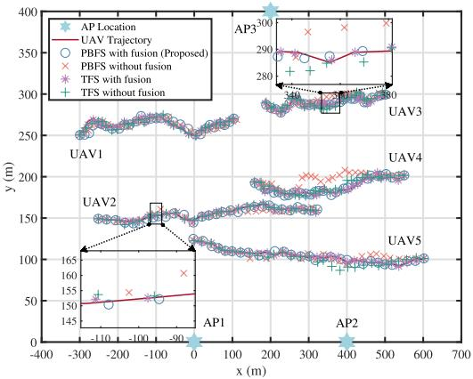  
Fig. 4. Geometry tracking trajectories results (top view). For visual clarity, the plotted tracking points are downsampled by a factor of 20.

For clarity, we introduce the following abbreviations used throughout this section: predictive beamforming frame structure (PBFS), traditional frame structure (TFS), joint pilot length, AP-user association and power allocation optimization (Joint PL&AUA&PA).

## B. Beam Tracking Performance

This subsection evaluates the performance of the proposed distributed beam tracking with centralized information fusion algorithm in Section III. For a comprehensive comparison, we consider three benchmark schemes: 1) PBFS without fusion: apply the proposed frame structure but without fusion; 2) TFS with fusion: apply the traditional training with measurement updates and fusion performed every time slot; 3) TFS without fusion: similar to 2) but without information fusion in each time slot (It can also be viewed as an extension of the CF-mMIMO framework presented in [20], [21]). To ensure fairness, all APs employ an equal power allocation strategy and use a fixed pilot length $L = 1 6$ across all schemes.

Fig. 4 illustrates the UAVs’ true trajectories with tracking results obtained from different schemes, where the non-fusion schemes’ results are obtained through averaging state estimates across all APs. As highlighted in the inset boxes, the proposed PBFS with fusion scheme exhibits a slight deviation from the TFS with fusion baseline. This gap is fundamentally expected: to circumvent prohibitive signaling overhead, PBFS executes uplink training exclusively in the first time slot of each frame and relies on state prediction for the remainder, whereas TFS performs training in every slot. Furthermore, comparative analysis between fusion and non-fusion schemes reveals that information fusion consistently improves state estimation accuracy, validating the effectiveness of the proposed fusion strategy.

Fig. 5 shows the sum root MSE (RMSE) and root PCRB of all UAV position estimates versus the observation time. We first observe that under the proposed frame structure, measurements are only acquired at the beginning of each frame. Consequently, both the RMSE and root PCRB exhibit periodic fluctuations, with estimation accuracy progressively degrading until the next measurement update is performed at the start of the subsequent frame. In contrast, the TFS baseline maintains a consistently low RMSE by performing uplink training in every time slot. For the proposed scheme, the tracking error increases during prediction-only slots due to the accumulation of process noise in the EKF. This degradation, however, represents a necessary trade-off: by avoiding per-slot training, the proposed scheme reduces both training and fronthaul overheads by up to 95% (see Table III). Additionally, the experimental results confirm that the root PCRB consistently serves as the lower bound for RMSE across all schemes, thereby validating the theoretical correctness of the derived PCRB expression.

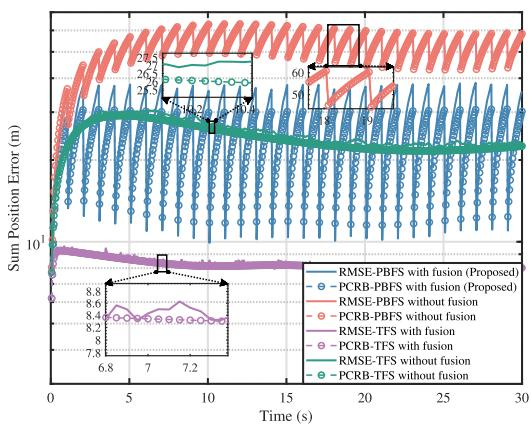  
Fig. 5. Sum RMSE and root PCRB of position estimation versus time.

TABLE III  
TOTAL OVERHEAD PER FRAME OF DIFFERENT SCHEMES
<table><tr><td rowspan=1 colspan=1>Schemes</td><td rowspan=1 colspan=1>TrainingOverhead7</td><td rowspan=1 colspan=1>FronthaulOverhead</td></tr><tr><td rowspan=1 colspan=1>PBFS with fusion (Proposed)</td><td rowspan=1 colspan=1>16</td><td rowspan=1 colspan=1> $\overline { { ( 6 + 6 \times 6 ) \times } }$  $5 \times 3 = 6 3 0$ </td></tr><tr><td rowspan=1 colspan=1>PBFS without fusion</td><td rowspan=1 colspan=1>16</td><td rowspan=1 colspan=1>0</td></tr><tr><td rowspan=1 colspan=1>TFS with fusion</td><td rowspan=1 colspan=1> $1 6 \times 2 0 = 3 2 0$ </td><td rowspan=1 colspan=1> $( 6 + 6 \times 6 ) \times 5 \times$  $3 \times 2 0 = 1 2 6 0 0$ </td></tr><tr><td rowspan=1 colspan=1>TFS without fusion</td><td rowspan=1 colspan=1> $\overline { { 1 6 \times 2 0 = 3 2 0 } }$ </td><td rowspan=1 colspan=1>0</td></tr></table>

TABLE IV

AVERAGE SUM RMSE WITH DIFFERENT FRAME LENGTH
<table><tr><td rowspan=1 colspan=1>Schemes</td><td rowspan=1 colspan=1> $\overline { { N _ { \mathrm { c } } = 1 0 } }$ </td><td rowspan=1 colspan=1> $\overline { { N _ { \mathrm { c } } = 2 0 } }$ </td><td rowspan=1 colspan=1> $\overline { { N _ { \mathrm { c } } = 5 0 } }$ </td></tr><tr><td rowspan=1 colspan=1>PBFS with fusion (Proposed)</td><td rowspan=1 colspan=1>19.9 m</td><td rowspan=1 colspan=1>26.5 m</td><td rowspan=1 colspan=1>40.1 m</td></tr><tr><td rowspan=1 colspan=1>PBFS without fusion</td><td rowspan=1 colspan=1>43.9 m</td><td rowspan=1 colspan=1>51.5 m</td><td rowspan=1 colspan=1>64.9 m</td></tr><tr><td rowspan=1 colspan=1>TFS with fusion</td><td rowspan=1 colspan=1>8.3 m</td><td rowspan=1 colspan=1>8.3 m</td><td rowspan=1 colspan=1>8.3 m</td></tr><tr><td rowspan=1 colspan=1>TFS without fusion</td><td rowspan=1 colspan=1>25.7 m</td><td rowspan=1 colspan=1>25.7 m</td><td rowspan=1 colspan=1>25.7 m</td></tr></table>

For further analysis, the total overhead per frame and the average sum RMSE under different frame lengths are summarized in Table III and Table IV, respectively. Results indicate a clear trade-off in PBFS-based schemes: longer frame lengths significantly reduce signaling overhead but increase accumulated prediction errors. Under the configuration of $N _ { \mathrm { c } } ~ = ~ 2 0$ , the proposed PBFS with fusion reduces the sum RMSE by 49% compared to PBFS without fusion. Although its RMSE is 3% and 219% higher than the TFS without and with fusion baselines, respectively, these TFS schemes incur prohibitively high training and fronthaul overheads (Table III). This comparison confirms the proposed scheme’s ability to effectively balance estimation accuracy and overhead by adjusting the frame length. Crucially, the optimal $N _ { \mathrm { c } }$ is physically bounded by the large-scale angular coherence time (940 ms for our 32-antenna, 20 m/s, 300 m setup), making $N _ { \mathrm { c } } ~ = ~ 2 0 ~ ( 1 0 0 0 ~ \mathrm { m s }$ frame duration) well-aligned choice under the considered setup. In contrast, extending $N _ { \mathrm { c } }$ to 50 July 05,2026 at 11:37:14 UTC from IEEE Xplore. Restrictions apply.

TABLE V  
AVERAGE TOTAL OVERHEAD AND EFFECTIVE SUM SE PER FRAME
<table><tr><td rowspan=2 colspan=1>ResultsSchemes</td><td rowspan=1 colspan=3> $N _ { \mathrm { c } } = 1 0$ </td><td rowspan=1 colspan=3> $N _ { \mathrm { c } } = 2 0$ </td><td rowspan=1 colspan=3> $N _ { \mathrm { c } } = 5 0$ </td></tr><tr><td rowspan=1 colspan=1>TrainingOverhead</td><td rowspan=1 colspan=1>FronthaulOverhead</td><td rowspan=1 colspan=1>EffectiveSum SE</td><td rowspan=1 colspan=1>TrainingOverhead</td><td rowspan=1 colspan=1>FronthaulOverhead</td><td rowspan=1 colspan=1>EffectiveSum SE</td><td rowspan=1 colspan=1>TrainingOverhead</td><td rowspan=1 colspan=1>FronthaulOverhead</td><td rowspan=1 colspan=1>EffectiveSum SE</td></tr><tr><td rowspan=1 colspan=1>PBFS with fusion, Joint PL&amp;AUA&amp;PA (Proposed)</td><td rowspan=1 colspan=1>20</td><td rowspan=1 colspan=1>630</td><td rowspan=1 colspan=1>56.7</td><td rowspan=1 colspan=1>24</td><td rowspan=1 colspan=1>630</td><td rowspan=1 colspan=1>57.2</td><td rowspan=1 colspan=1>26</td><td rowspan=1 colspan=1>630</td><td rowspan=1 colspan=1>53.5</td></tr><tr><td rowspan=1 colspan=1>TFS with fusion, Joint PL&amp;AUA&amp;PA, ζ = 12 m</td><td rowspan=1 colspan=1>56</td><td rowspan=1 colspan=1>6300</td><td rowspan=1 colspan=1>57.9</td><td rowspan=1 colspan=1>111</td><td rowspan=1 colspan=1>12600</td><td rowspan=1 colspan=1>57.9</td><td rowspan=1 colspan=1>278</td><td rowspan=1 colspan=1>31500</td><td rowspan=1 colspan=1>57.9</td></tr><tr><td rowspan=1 colspan=1>TFS with fusion, Joint PL&amp;AUA&amp;PA, ζ = 10 m</td><td rowspan=1 colspan=1>102</td><td rowspan=1 colspan=1>6300</td><td rowspan=1 colspan=1>56.8</td><td rowspan=1 colspan=1>204</td><td rowspan=1 colspan=1>12600</td><td rowspan=1 colspan=1>56.8</td><td rowspan=1 colspan=1>512</td><td rowspan=1 colspan=1>31500</td><td rowspan=1 colspan=1>56.8</td></tr><tr><td rowspan=1 colspan=1>PBFS without fusion, Joint PL&amp;AUA&amp;PA,</td><td rowspan=1 colspan=1>23</td><td rowspan=1 colspan=1>0</td><td rowspan=1 colspan=1>51.1</td><td rowspan=1 colspan=1>26</td><td rowspan=1 colspan=1>0</td><td rowspan=1 colspan=1>51.4</td><td rowspan=1 colspan=1>27</td><td rowspan=1 colspan=1>0</td><td rowspan=1 colspan=1>48.7</td></tr><tr><td rowspan=1 colspan=1>PBFS with fusion, L = K, Joint AUA&amp;PA</td><td rowspan=1 colspan=1>5</td><td rowspan=1 colspan=1>630</td><td rowspan=1 colspan=1>56.5</td><td rowspan=1 colspan=1>5</td><td rowspan=1 colspan=1>630</td><td rowspan=1 colspan=1>55.2</td><td rowspan=1 colspan=1>5</td><td rowspan=1 colspan=1>630</td><td rowspan=1 colspan=1>52.2</td></tr><tr><td rowspan=1 colspan=1>PBFS with fusion, ${ \cal L } = { \bf 1 0 0 } ,$ Joint AUA&amp;PA</td><td rowspan=1 colspan=1>100</td><td rowspan=1 colspan=1>630</td><td rowspan=1 colspan=1>55.1</td><td rowspan=1 colspan=1>100</td><td rowspan=1 colspan=1>630</td><td rowspan=1 colspan=1>55.5</td><td rowspan=1 colspan=1>100</td><td rowspan=1 colspan=1>630</td><td rowspan=1 colspan=1>53.3</td></tr><tr><td rowspan=1 colspan=1>PBFS with fusion, opt. PL, Equal Allocation</td><td rowspan=1 colspan=1>20</td><td rowspan=1 colspan=1>630</td><td rowspan=1 colspan=1>48.2</td><td rowspan=1 colspan=1>24</td><td rowspan=1 colspan=1>630</td><td rowspan=1 colspan=1>49.0</td><td rowspan=1 colspan=1>26</td><td rowspan=1 colspan=1>630</td><td rowspan=1 colspan=1>45.4</td></tr><tr><td rowspan=1 colspan=1>TFS without fusion, ${ \cal L } = { \bf 1 6 } ,$ Equal Allocation</td><td rowspan=1 colspan=1>160</td><td rowspan=1 colspan=1>0</td><td rowspan=1 colspan=1>43.5</td><td rowspan=1 colspan=1>320</td><td rowspan=1 colspan=1>0</td><td rowspan=1 colspan=1>43.5</td><td rowspan=1 colspan=1>800</td><td rowspan=1 colspan=1>0</td><td rowspan=1 colspan=1>43.5</td></tr><tr><td rowspan=1 colspan=1>Ideal CSI, Joint AUA&amp;PA (Upper-bound)</td><td rowspan=1 colspan=1>0</td><td rowspan=1 colspan=1>0</td><td rowspan=1 colspan=1>62.4</td><td rowspan=1 colspan=1>0</td><td rowspan=1 colspan=1>0</td><td rowspan=1 colspan=1>62.4</td><td rowspan=1 colspan=1>0</td><td rowspan=1 colspan=1>0</td><td rowspan=1 colspan=1>62.4</td></tr></table>

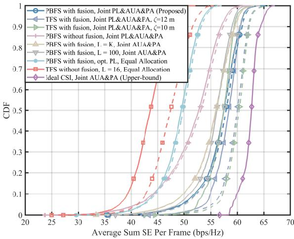  
Fig. 6. CDF of the average and effective sum SE per frame for different transmission schemes. (The dashed and solid lines represent the sum SE and effective sum SE, respectively.)

(2500 ms) substantially exceeds this typical coherence-time scale, which causes the prediction error to grow beyond half the beamwidth and leads to evident performance degradation.

## C. Resource Allocation Performance

In this section, we evaluate the performance of the proposed joint resource allocation scheme presented in Section V, the threshold parameter for pilot length optimization is set to $\zeta = 1 2$ m unless otherwise specified. For a comprehensive comparison, we consider the following benchmark schemes: 1) TFS with fusion, Joint PL&AUA&PA, ζ = 12 m: apply the TFS with information fusion and performs joint optimization with $\zeta = 1 2$ m in each time slot; 2) TFS with fusion, Joint PL&AUA&PA, ζ = 10 m: same as 1) but with ζ = 10 m; 3) PBFS without fusion, Joint PL&AUA&PA: employ the proposed PBFS without fusion and joint optimization; 4) PBFS with fusion, $L = K$ , Joint AUA&PA: employ PBFS with fusion and joint AP-user association and power allocation but with minimum pilot length $L ~ = ~ K ; ~ 5 )$ PBFS with fusion, ${ \cal L } = { \bf 1 0 0 }$ , Joint AUA&PA: the same as 4) but with maximum pilot length $L = 1 0 0 ; 6 )$ PBFS with fusion, opt. PL, Equal Allocation: apply PBFS with fusion and optimized pilot length, with all APs serving all UAVs under equal power allocation; 7) TFS without fusion, ${ \cal L } = { \bf 1 6 } .$ , Equal Allocation: apply TFS without fusion with fixed pilot length and equal allocation (It can also be viewed as an extension of the CF-mMIMO framework presented in [20], [21]). 8) Ideal CSI, Joint AUA&PA: an upper-bound case with perfect CSI (without training) and joint optimization.

Fig. 6 depicts the cumulative distribution function (CDF) of both the average sum SE and the effective sum SE per frame for different schemes, while Table V summarizes the average total overhead and effective sum SE under varying frame lengths. Analysis of Fig. 6 leads to the following observations: 1) Higher estimation accuracy enables greater beamforming and resource allocation gains, leading to a higher sum SE. This is demonstrated by the superior performance of TFS-based and information-fusion schemes, albeit at the cost of increased training and fronthaul overhead as shown in Table V. 2) A direct comparison with equal allocation schemes validates that the proposed Joint PL&AUA&PA strategy yields substantial performance gains. The proposed pilot length optimization also demonstrates a balanced outcome, delivering an intermediate sum SE between the two fixedpilot-length baselines. 3) For the TFS with fusion and Joint PL&AUA&PA configurations, the $\zeta = 1 0$ m case achieves a higher sum SE than the $\zeta ~ = ~ 1 2$ m case but demands longer pilots due to stricter estimation requirements, clearly illustrating the inherent trade-off between estimation accuracy and system throughput. 4) The crossover in the CDF curves across different schemes is attributed to varying interference levels. When UAVs converge toward the scene center, angular domain overlap increases interference, under which higher estimation accuracy improves robustness and effective sum SE. In contrast, under low interference, the high overhead associated with such accuracy becomes the dominant limitation.

From Table V, it can be concluded that: 1) Under the current configuration of $N _ { \mathrm { c } } ~ = ~ 2 0$ , the proposed scheme achieves a 31% higher average effective sum SE than the TFS without fusion and Equal Allocation scheme. By employing PBFS for low-overhead training, efficient information fusion, and low-complexity joint optimization, it also matches the performance of the TFS with fusion and Joint PL&AUA&PA schemes, while reducing training overhead by 78–88% and fronthaul overhead by 95%. 2) Achieving optimal communication efficiency is dictated by a trade-off between training overhead and estimation accuracy, which exhibit an inverse dependence on the frame length and both influence the effective sum SE. This is clearly observed in the Table V, as the $N _ { \mathrm { c } } ~ = ~ 2 0$ configuration yields a higher effective sum SE compared to the $N _ { \mathrm { c } } ~ = ~ 1 0$ and $N _ { \mathrm { c } } ~ = ~ 5 0$ cases. Consistent with the physical analysis in Section VII-B, this indicates that, under the current simulation setting, $N _ { \mathrm { c } } = 2 0$ provides the best trade-off between throughput and tracking reliability among the considered frame lengths. 3) The proposed scheme incurs only an 8% loss in the effective sum SE at $N _ { \mathrm { c } } ~ = ~ 2 0$ compared to the training-free upper-bound case, demonstrating that the performance penalty from using predicted CSI is small and the overall framework is highly effective.

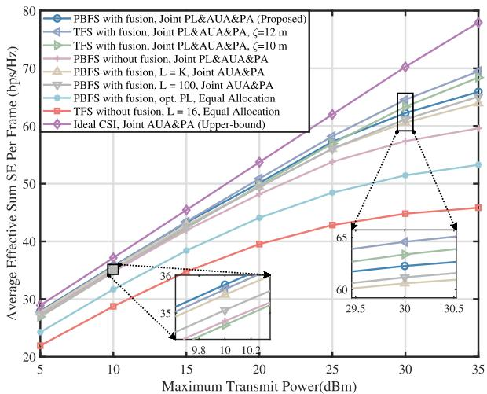  
Fig. 7. Average effective sum SE per frame versus maximum transmit power.

Fig. 7 illustrates the relationship between the average effective sum SE per frame and the maximum transmit power of each AP. It is evident that the average effective sum SE increases with higher maximum transmit power. However, increased power also intensifies interference, which is reflected in the widening performance gap from the upper-bound scheme as power increases. In contrast, schemes employing the proposed information fusion and joint optimization demonstrate greater resilience to this interference-induced performance degradation. At low power levels, the proposed algorithm achieves an effective sum SE second only to the upper-bound. As power increases, the scheme with the minimum fixed pilot length experiences a sharp decline in performance. Although the proposed scheme also shows some degradation, it still outperforms both fixed-pilot-length schemes and achieves an effective sum SE comparable to the TFS with fusion and Joint PL&AUA&PA baseline. Although the TFS baseline attains marginal SE gains, it also requires high training and fronthaul overhead. By avoiding these signaling burdens, the proposed scheme reduces the required overhead. Consequently, for practical UAV communication scenarios, our framework provides a practical trade-off between system throughput and signaling overhead.

## D. Multipath, Robustness and Scalability Performance

To further validate the proposed framework, this subsection evaluates its adaptability to multipath channels, robustness to varying UAV velocities, and scalability under extended network configurations.

Fig. 8 illustrates the CDF of the average effective sum SE under channel models with varying Rician factors. For ease of comparison, the PBFS with fusion, L = 16, Equal Allocation scheme is selected as the baseline. As established in Section VI, the presence of NLoS components not only increases the EKF measurement noise but also directly degrades the effective sum SE. Consequently, the results demonstrate a gradual performance deterioration in the effective sum SE as the Rician factor varies from 20 dB to 5 dB. Furthermore, it can be observed that the performance gap between the proposed framework and the baseline scheme progressively narrows as the NLoS component strengthens. This phenomenon occurs because the intensifying NLoS multipath fading imposes an increasingly profound limiting effect on the proposed resource allocation algorithm.

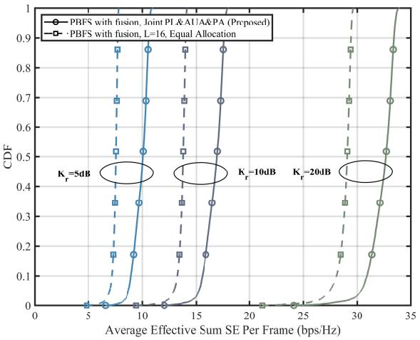

Fig. 8. CDF of the average effective sum SE per frame for different rician factors.  
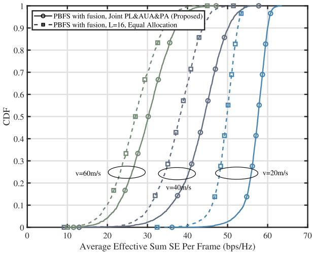  
Fig. 9. CDF of the average effective sum SE per frame for different UAV velocities.

Fig. 9 depicts the CDF of the average effective sum SE per frame across different UAV velocities, specifically at v = 20, 40, and 60 m/s. The results show that the average effective sum SE of both schemes decreases as the UAV velocity increases. This performance degradation primarily stems from the fact that higher velocities induce more rapid channel variations and accumulate larger position errors over time, which subsequently lead to predictive beamforming mismatches during the data transmission slots. However, it is noteworthy that even at a highly challenging velocity of 60 m/s, the proposed joint resource allocation scheme still outperforms the equal allocation baseline. This indicates that the proposed predictive beamforming and resource allocation framework remains effective in high-mobility scenarios.

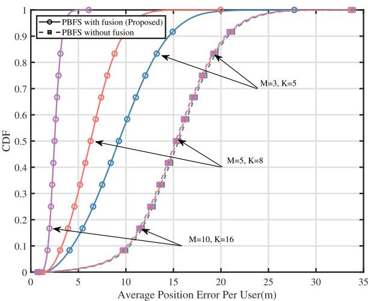

Fig. 10. CDF of the average position error per user for different network configurations.  
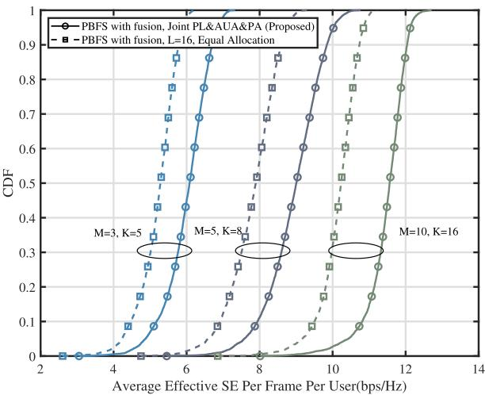  
Fig. 11. CDF of the average effective SE per frame per user for different network configurations.

Finally, to comprehensively evaluate the scalability of the proposed framework and verify its robustness against varying initial spatial distributions, we consider multiple network configurations with different scales. In each Monte Carlo realization, the coordinates of both APs and UAVs are randomly initialized within a 1 km ×1 km area. Additionally, the velocity magnitude and direction of each UAV are independently drawn from uniform distributions over [0, 30) m/s and [0, 2π), respectively. Fig. 10 illustrates the CDF of the average position error per user under different network configurations. Owing to the orthogonal pilot design, which ensures independent tracking of different users, the average position error per user under the non-fusion baseline remains nearly constant across all network scales. In contrast, as the network size increases, the average position error per user achieved by the proposed scheme decreases significantly. This reduction highlights the substantial cooperative gains enabled by the proposed information fusion strategy, which effectively leverages measurement updates from an increasing number of distributed APs.

Fig. 11 shows the corresponding CDF of the average effective SE per frame per user under the same scaled network configurations. It can be observed that the average effective SE per user increases as the network size grows, which is fundamentally attributed to the enhanced macro-diversity and cooperative gains provided by the denser AP deployment. More importantly, the performance margin between the proposed joint resource allocation scheme and the equal allocation baseline becomes increasingly prominent in larger networks. This indicates that the proposed scheme capitalizes more effectively on the scaled CF-mMIMO infrastructure, benefiting from both improved tracking accuracy and increased degrees of freedom in resource allocation.

## VIII. CONCLUSION

In this paper, we addressed the challenge of excessive training overhead in CF-mMIMO-based UAV communication systems under high-mobility scenarios by proposing a novel predictive beamforming and resource allocation framework. By optimizing the frame structure, the proposed scheme significantly reduced training overhead while achieving higher positioning accuracy through an effective centralized information fusion strategy. A key contribution of this work is the establishment of a prediction-aware closed-loop mechanism. We theoretically derived the PCRB for the fused state estimation and utilized the explicit PCRB-pilot length mapping to theoretically guide the joint optimization of uplink pilot length, downlink AP-user association, and power allocation. This enables the system to actively adapt to timevarying channel conditions. Simulation results verified that the proposed scheme substantially reduces signaling overhead while maintaining acceptable accuracy and improving system throughput, demonstrating its practicality and effectiveness for high-mobility cell-free UAV networks.

## APPENDIX PROOF OF MONOTONICITY OF (74)

From (69), it can be observed that both $\tilde { \Psi } _ { m , k } ^ { n , ( 1 ) } \succ 0$ and $\tilde { \Psi } _ { m , k } ^ { n , ( 2 ) } \succeq 0$ are diagonal matrices independent of $L ^ { n }$ . Thus, for any $L _ { 2 } ^ { n } > L _ { 1 } ^ { n } \ge 1$ , we have

$$
\Psi _ { m , k } ^ { n } ( L _ { 2 } ^ { n } ) \preceq \Psi _ { m , k } ^ { n } ( L _ { 1 } ^ { n } ) ,\tag{78}
$$

in the sense of the Loewner partial order. Since matrix inversion reverses this order, it follows that

$$
\left[ \Psi _ { m , k } ^ { n } ( L _ { 2 } ^ { n } ) \right] ^ { - 1 } \succeq \left[ \Psi _ { m , k } ^ { n } ( L _ { 1 } ^ { n } ) \right] ^ { - 1 } .\tag{79}
$$

From the PFIM formulation in $( 7 2 ) , A _ { k } \succ 0$ is independent of $L ^ { n }$ , while $B _ { k } ( L ^ { n } )$ is a weighted sum of $[ \Psi _ { m , k } ^ { n } ( L ^ { n } ) ] ^ { - 1 }$ with non-negative coefficients $\omega _ { m }$ . As shown above, $[ \bar { \Psi } _ { m , k } ^ { n } ( L ^ { n } ) ] ^ { - 1 }$ is non-decreasing in $L ^ { n }$ in the Loewner order. Since this order is preserved under summation with non-negative weights, we obtain

$$
\mathbf { J } _ { k } ^ { n } ( L _ { 2 } ^ { n } ) \succeq \mathbf { J } _ { k } ^ { n } ( L _ { 1 } ^ { n } ) \succ 0 .\tag{80}
$$

Applying the matrix inversion property again yields

$$
\mathbf { C } _ { k } ^ { n } ( L _ { 2 } ^ { n } ) = [ \mathbf { J } _ { k } ^ { n } ( L _ { 2 } ^ { n } ) ] ^ { - 1 } \preceq [ \mathbf { J } _ { k } ^ { n } ( L _ { 1 } ^ { n } ) ] ^ { - 1 } = \mathbf { C } _ { k } ^ { n } ( L _ { 1 } ^ { n } ) .\tag{81}
$$

Since the weighted trace preserves the Loewner order for any positive semidefinite Π, it follows that

$$
\Omega ( L _ { 2 } ^ { n } ) = \sum _ { k = 1 } ^ { K } \mathrm { t r } \left[ \mathbf { I I C } _ { k } ^ { n } ( L _ { 2 } ^ { n } ) \right] \leq \sum _ { k = 1 } ^ { K } \mathrm { t r } \left[ \mathbf { I I C } _ { k } ^ { n } ( L _ { 1 } ^ { n } ) \right] = \Omega ( L _ { 1 } ^ { n } ) .\tag{82}
$$

$$
\Omega ( L ^ { n } )
$$

$$
L ^ { n }
$$

## REFERENCES

[1] C. Fang, W. Wang, C. Zhang, P. Du, and Y. Huang, “Predictive beamforming for UAV tracking in cell-free massive MIMO systems,” in Proc. IEEE Global Commun. Conf. Workshops (GCWkshps), Taipei, Taiwan, Dec. 2025.

[2] Y. Zeng, Q. Wu, and R. Zhang, “Accessing from the sky: A tutorial on UAV communications for 5G and beyond,” Proc. IEEE, vol. 107, no. 12, pp. 2327–2375, Dec. 2019.

[3] H. Q. Ngo, A. Ashikhmin, H. Yang, E. G. Larsson, and T. L. Marzetta, “Cell-free massive MIMO versus small cells,” IEEE Trans. Wireless Commun., vol. 16, no. 3, pp. 1834–1850, Mar. 2017.

[4] S. Elhoushy, M. Ibrahim, and W. Hamouda, “Cell-free massive MIMO: A survey,” IEEE Commun. Surveys Tuts., vol. 24, no. 1, pp. 492–523, 1st Quart., 2022.

[5] E. Bjornson and L. Sanguinetti, “Making cell-free massive MIMO¨ competitive with MMSE processing and centralized implementation,” IEEE Trans. Wireless Commun., vol. 19, no. 1, pp. 77–90, Jan. 2020.

[6] E. Bjornson and L. Sanguinetti, “Scalable cell-free massive MIMO¨ systems,” IEEE Trans. Commun., vol. 68, no. 7, pp. 4247–4261, Jul. 2020.

[7] M. Mohammadi, Z. Mobini, H. Quoc Ngo, and M. Matthaiou, “Nextgeneration multiple access with cell-free massive MIMO,” Proc. IEEE, vol. 112, no. 9, pp. 1372–1420, Sep. 2024.

[8] W. Wang, W. Ni, H. Tian, and L. Song, “Intelligent omni-surface enhanced aerial secure offloading,” IEEE Trans. Veh. Technol., vol. 71, no. 5, pp. 5007–5022, May 2022.

[9] C. D’Andrea, A. Garcia-Rodriguez, G. Geraci, L. G. Giordano, and S. Buzzi, “Analysis of UAV communications in cell-free massive MIMO systems,” IEEE Open J. Commun. Soc., vol. 1, pp. 133–147, 2020.

[10] C. Diaz-Vilor, A. Lozano, and H. Jafarkhani, “Cell-free UAV networks: Asymptotic analysis and deployment optimization,” IEEE Trans. Wireless Commun., vol. 22, no. 5, pp. 3055–3070, May 2023.

[11] J. Zheng, J. Zhang, and B. Ai, “UAV communications with WPT-aided cell-free massive MIMO systems,” IEEE J. Sel. Areas Commun., vol. 39, no. 10, pp. 3114–3128, Oct. 2021.

[12] L. Yang and W. Zhang, “Beam tracking and optimization for UAV communications,” IEEE Trans. Wireless Commun., vol. 18, no. 11, pp. 5367–5379, Nov. 2019.

[13] W. Wang, H. Tian, and W. Ni, “Secrecy performance analysis of IRSaided UAV relay system,” IEEE Wireless Commun. Lett., vol. 10, no. 12, pp. 2693–2697, Dec. 2021.

[14] C. Zhang, L. Chen, L. Zhang, Y. Huang, and W. Zhang, “Incremental collaborative beam alignment for millimeter wave cell-free MIMO systems,” IEEE Trans. Commun., vol. 71, no. 11, pp. 6377–6390, Nov. 2023.

[15] C. Wang, C. Zhang, F. Meng, Y. Huang, and W. Zhang, “Traffic-aware hierarchical beam selection for cell-free massive MIMO,” IEEE Trans. Commun., vol. 72, no. 10, pp. 6490–6504, Oct. 2024.

[16] C. Diaz-Vilor, A. Lozano, and H. Jafarkhani, “Cell-free UAV networks with wireless fronthaul: Analysis and optimization,” IEEE Trans. Wireless Commun., vol. 23, no. 3, pp. 2054–2069, Mar. 2024.

[17] Y. Fang, S. Xu, P. Fang, J. Zhang, Y. Huang, and L. Yang, “Optimizing codebook design in mmWave massive MIMO using digital twin-assisted DRL,” IEEE Trans. Veh. Technol., vol. 74, no. 12, pp. 19053–19069, Dec. 2025.

[18] B. Zhou, X. Yang, S. Ma, F. Gao, and G. Yang, “Low-overhead channel estimation via 3D extrapolation for TDD mmWave massive MIMO systems under high-mobility scenarios,” IEEE Trans. Wireless Commun., vol. 24, no. 4, pp. 2797–2813, Apr. 2025.

[19] J. Zheng et al., “Mobile cell-free massive MIMO: Challenges, solutions, and future directions,” IEEE Wireless Commun., vol. 31, no. 3, pp. 140–147, Jun. 2024.

[20] F. Liu, W. Yuan, C. Masouros, and J. Yuan, “Radar-assisted predictive beamforming for vehicular links: Communication served by sensing,” IEEE Trans. Wireless Commun., vol. 19, no. 11, pp. 7704–7719, Nov. 2020.

[21] S. Zeng, X. Xu, Y. Zeng, and F. Liu, “CKM-assisted LoS identification and predictive beamforming for cellular-connected UAV,” in Proc. IEEE Int. Conf. Commun., Rome, Italy, May 2023, pp. 2877–2882.

[22] J. Zhang, G. Zheng, Y. Zhang, I. Krikidis, and K.-K. Wong, “Deep learning based predictive beamforming design,” IEEE Trans. Veh. Technol., vol. 72, no. 6, pp. 8122–8127, Jun. 2023.

[23] B. Lee, A. C. Marcum, D. J. Love, and J. V. Krogmeier, “Fusing channel and sensor measurements for enhancing predictive beamforming in UAVassisted massive MIMO communications,” IEEE Wireless Commun. Lett., vol. 13, no. 3, pp. 869–873, Mar. 2024.

[24] W. Mao, Y. Lu, G. Pan, and B. Ai, “UAV-assisted communications in SAGIN-ISAC: Mobile user tracking and robust beamforming,” IEEE J. Sel. Areas Commun., vol. 43, no. 1, pp. 186–200, Jan. 2025.

[25] M. Xia, Z. He, W. Xu, Y. Huang, D. Wing Kwan Ng, and N. Al-Dhahir, “Coordinated beamforming for networked integrated communication and multi-TMT localization,” 2025, arXiv:2510.04600.

[26] A. Abdallah and M. M. Mansour, “Efficient angle-domain processing for FDD-based cell-free massive MIMO systems,” IEEE Trans. Commun., vol. 68, no. 4, pp. 2188–2203, Apr. 2020.

[27] C. Wei et al., “Fingerprint-based localization and channel estimation integration for cell-free massive MIMO IoT systems,” IEEE Internet Things J., vol. 9, no. 24, pp. 25237–25252, Dec. 15, 2022.

[28] M. S. Herfeh, M. Kamoun, Y. Y. Chu, and S. Buzzi, “Integrated localization and communication in cell-free massive MIMO with zero over-the-air communication overhead,” in Proc. IEEE Wireless Commun. Netw. Conf. (WCNC), Dubai, United Arab Emirates, Apr. 2024, pp. 1–6.

[29] X. Sun, W. Xue, J. Li, D. Wang, P. Zhu, and X. You, “Mobility management framework for cooperative cell-free ISAC systems,” IEEE Internet Things J., vol. 12, no. 23, pp. 49784–49800, Dec. 2025.

[30] Z. Wei et al., “Integrated sensing and communication enabled cooperative passive sensing using mobile communication system,” IEEE Trans. Mobile Comput., vol. 24, no. 9, pp. 7805–7821, Sep. 2025.

[31] H. A. Ammar, R. Adve, S. Shahbazpanahi, G. Boudreau, and K. V. Srinivas, “Downlink resource allocation in multiuser cell-free MIMO networks with user-centric clustering,” IEEE Trans. Wireless Commun., vol. 21, no. 3, pp. 1482–1497, Mar. 2022.

[32] X. Yan, Z. Wang, Y. Jia, Z. Zhang, and Y. Huang, “Access point selection and beamforming design for cell-free network: From fractional programming to GNN,” IEEE Trans. Wireless Commun., vol. 23, no. 8, pp. 9345–9360, Aug. 2024.

[33] Y. Ming, Z. Sha, Y. Dong, and Z. Wang, “Downlink resource allocation with pilot length optimization for user-centric cell-free MIMO networks,” IEEE Commun. Lett., vol. 26, no. 11, pp. 2705–2709, Nov. 2022.

[34] Q. Peng, H. Ren, M. Dong, M. Elkashlan, K.-K. Wong, and L. Hanzo, “Resource allocation for cell-free massive MIMO-aided URLLC systems relying on pilot sharing,” IEEE J. Sel. Areas Commun., vol. 41, no. 7, pp. 2193–2207, Jul. 2023.

[35] S. Kurma, K. Singh, P. K. Sharma, C.-P. Li, and T. A. Tsiftsis, “On the performance analysis of full-duplex cell-free massive MIMO with user mobility and imperfect CSI,” IEEE Trans. Commun., vol. 73, no. 5, pp. 3683–3701, May 2025.

[36] J. Zheng, J. Zhang, E. Bjornson, and B. Ai, “Impact of channel aging¨ on cell-free massive MIMO over spatially correlated channels,” IEEE Trans. Wireless Commun., vol. 20, no. 10, pp. 6451–6466, Oct. 2021.

[37] M. A. Saeidi and H. Tabassum, “Resource allocation in cooperative midband/THz networks in the presence of mobility,” IEEE Trans. Wireless Commun., vol. 25, pp. 5046–5062, 2026.

[38] P. Du, C. Zhang, Y. Jing, C. Fang, Z. Zhang, and Y. Huang, “Jamming detection and channel estimation for spatially correlated beamspace massive MIMO,” IEEE Trans. Wireless Commun., vol. 25, pp. 3910–3927, 2026.

[39] C. Pan, H. Ren, M. Elkashlan, A. Nallanathan, and L. Hanzo, “The noncoherent ultra-dense C-RAN is capable of outperforming its coherent counterpart at a limited fronthaul capacity,” IEEE J. Sel. Areas Commun., vol. 36, no. 11, pp. 2549–2560, Nov. 2018.

[40] Y. Bar-Shalom, P. K. Willett, and X. Tian, Tracking Data Fusion. Storrs, CT, USA: YBS Publishing, 2011.

[41] F. Dong, F. Liu, Y. Cui, W. Wang, K. Han, and Z. Wang, “Sensing as a service in 6G perceptive networks: A unified framework for ISAC resource allocation,” IEEE Trans. Wireless Commun., vol. 22, no. 5, pp. 3522–3536, May 2023.

[42] S. Julier and J. K. Uhlmann, “General decentralized data fusion with covariance intersection,” in Handbook of Multisensor Data Fusion. Boca Raton, FL, USA: CRC Press, 2017, pp. 339–364.

[43] W. Yi, Y. Yuan, R. Hoseinnezhad, and L. Kong, “Resource scheduling for distributed multi-target tracking in netted colocated MIMO radar systems,” IEEE Trans. Signal Process., vol. 68, pp. 1602–1617, 2020.

[44] P. Tichavsky, C. H. Muravchik, and A. Nehorai, “Posterior cramerrao bounds for discrete-time nonlinear filtering,” IEEE Trans. Signal Process., vol. 46, no. 5, pp. 1386–1396, May 1998.

[45] J. Yan, H. Liu, B. Jiu, B. Chen, Z. Liu, and Z. Bao, “Simultaneous multibeam resource allocation scheme for multiple target tracking,” IEEE Trans. Signal Process., vol. 63, no. 12, pp. 3110–3122, Jun. 2015.

[46] S. M. Kay, Fundamentals of Statistical Signal Processing, Volume I: Estimation Theory. Englewood Cliffs, NJ, USA: Prentice-Hall, 1998.

[47] J. Taylor, “The Cramer–Rao estimation error lower bound computation´ for deterministic nonlinear systems,” IEEE Trans. Autom. Control, vol. AC-24, no. 2, pp. 343–344, Apr. 1979.

[48] J. Sun, W. Yi, P. K. Varshney, and L. Kong, “Resource scheduling for multi-target tracking in multi-radar systems with imperfect detection,” IEEE Trans. Signal Process., vol. 70, pp. 3878–3893, 2022.

[49] E. J. Candes, M. B. Wakin, and S. P. Boyd, “Enhancing sparsity by reweighted \`1 minimization,” J. Fourier Anal. Appl., vol. 14, nos. 5–6, pp. 877–905, 2008.

[50] C. Pan et al., “Intelligent reflecting surface aided MIMO broadcasting for simultaneous wireless information and power transfer,” IEEE J. Sel. Areas Commun., vol. 38, no. 8, pp. 1719–1734, Aug. 2020.

[51] K. Shen and W. Yu, “Fractional programming for communication systems—Part I: Power control and beamforming,” IEEE Trans. Signal Process., vol. 66, no. 10, pp. 2616–2630, May 2018.

[52] W. Wang, Y. Huang, W. Ni, C. Zhang, and D. Wang, “Twotimescale optimization for aerial rotatable antenna array in cell-free networks with dynamic users,” IEEE Trans. Wireless Commun., vol. 25, pp. 13181–13198, 2026.

  
Chao Fang (Graduate Student Member, IEEE) received the M.S. degree in communication engineering from the University of Electronic Science and Technology of China, Chengdu, China, in 2023. He is currently pursuing the Ph.D. degree in information and communication engineering with the School of Information Science and Engineering, Southeast University, Nanjing, China. His current research interests include radio resource management and intelligent wireless communications.

Cheng Zhang (Member, IEEE) received the B.Eng. degree from Sichuan University, Chengdu, China, in June 2009, the M.Sc. degree from Xi’an Electronic Engineering Research Institute (EERI), Xi’an, China, in May 2012, and the Ph.D. degree from Southeast University (SEU), Nanjing, China, in December 2018.

From November 2016 to November 2017, he was a Visiting Student with the University of Alberta, Edmonton, AB, Canada. From June 2012 to August 2013, he was a Radar Signal Processing Engineer with EERI. Since December 2018, he has been with SEU, where he is currently an Associate Professor. He was supported by the Zhishan Young Scholar Program of SEU. He has authored or co-authored over 60 IEEE journal articles and conference papers. His current research interests include cell-free massive MIMO and deterministic QoS guarantee for 6G mobile communications. He was a recipient of Jiangsu Provincial Science Fund for Excellent Young Scholars, the Excellent Doctoral Dissertation Award from the China Education Society of Electronics (2019), the Excellent Doctoral Dissertation Award from Jiangsu Province (2020), and the Best Paper Award at the 2023 IEEE WCNC and 2023 IEEE WCSP. He serves as a Youth Editorial Board Member for the Journal on Communications and the Journal of Southeast University.

Wen Wang (Member, IEEE) received the B.Eng. and Ph.D. degrees from the School of Information and Communication Engineering, Beijing University of Posts and Telecommunications (BUPT), China, in 2020 and 2024, respectively. From September 2022 to December 2023, she was a Visiting Student with the National University of Singapore, Singapore. She is currently a Post-Doctoral Research Fellow with the Pervasive Communications Center, Purple Mountain Laboratories, Nanjing, China, and also with the National Mobile Communications

Research Laboratory, Southeast University, Nanjing. Her current research interests include wireless resource management and machine learning.

Pengguang Du (Graduate Student Member, IEEE) received the B.Eng. degree in communication engineering from Jilin University, Changchun, China, in 2021. He is currently pursuing the Ph.D. degree in information and communication engineering with the School of Information Science and Engineering, Southeast University, Nanjing, China. His research interests mainly focus on massive MIMO channel acquisition, joint detection and parameter estimation in MIMO systems, and intelligent wireless communications.

Wei Zhang (Fellow, IEEE) received the Ph.D. degree from The Chinese University of Hong Kong in 2005. He is currently a Professor with the School of Electrical Engineering and Telecommunications, University of New South Wales, Sydney, Australia. His current research interests include UAV communications, 5G, and beyond. He has served as a member for various ComSoc boards/standing committees, including the Journals Board, the Technical Committee, the Recertification Committee, the Finance Standing Committee, the Information Tech-

nology Committee, and the Steering Committee for IEEE TRANSACTIONS ON GREEN COMMUNICATIONS AND NETWORKING and IEEE NETWORKING LETTERS. He received six best paper awards from the IEEE conferences and ComSoc technical committees. Within the IEEE ComSoc, he has taken many leadership positions, including the Member-at-Large on the Board of Governors from 2018 to 2020, the Chair of the Wireless Communications Technical Committee from 2019 to 2020, the Vice Director of Asia–Pacific Board from 2016 to 2021, the Editor-in-Chief of IEEE WIRELESS COMMU-NICATIONS LETTERS from 2016 to 2019, the Technical Program Committee Chair of APCC 2017 and ICCC 2019, and the Award Committee Chair of Asia–Pacific Board and the Technical Committee on Cognitive Networks. He is also serving as an Area Editor for IEEE TRANSACTIONS ON WIRELESS COMMUNICATIONS and the Editor-in-Chief for Journal of Communications and Information Networks. Previously, he has served as an Editor for IEEE TRANSACTIONS ON COMMUNICATIONS, IEEE TRANSACTIONS ON WIRELESS COMMUNICATIONS, IEEE TRANSACTIONS ON COGNITIVE COMMUNICATIONS AND NETWORKING, and IEEE JOURNAL ON SELECTED AREAS IN COMMUNICATIONS-Cognitive Radio Series. He was an IEEE ComSoc Distinguished Lecturer from 2016 to 2017. He is the Vice President of the IEEE Communications Society.

Yongming Huang (Fellow, IEEE) received the B.S. and M.S. degrees from Nanjing University, Nanjing, China, in 2000 and 2003, respectively, and the Ph.D. degree in electrical engineering from Southeast University, Nanjing, in 2007.

Since March 2007, he has been a Faculty Member with the School of Information Science and Engineering, Southeast University, where he is currently a Full Professor. He has also been the Director of the Pervasive Communication Research Center, Purple Mountain Laboratories, since 2019. From 2008 to

2009, he was visiting the Signal Processing Laboratory, Royal Institute of Technology (KTH), Stockholm, Sweden. He has published over 200 peerreviewed articles and holds over 80 invention patents. His current research interests include intelligent 5G/6G mobile communications and millimeter wave wireless communications. He submitted around 20 technical contributions to IEEE standards, and was awarded a certificate of appreciation for outstanding contribution to the development of IEEE standard 802.11aj. He served as an Associate Editor for IEEE TRANSACTIONS ON SIGNAL PROCESSING and a Guest Editor for IEEE JOURNAL ON SELECTED AREAS IN COMMUNICATIONS. He is also the Editor-at-Large for the IEEE OPEN JOURNAL OF THE COMMUNICATIONS SOCIETY.