# Pursuit-Evasion Game for UAV Anti-Jamming Communications: An Opponent Modeling Based Reinforcement Learning Approach

Ziyan Yin, Zhe Wang, Member, IEEE, Jun Li, Fellow, IEEE, Long Shi, Senior Member, IEEE, Yiyang Ni, Member, IEEE, and Shi Jin, Senior Member, IEEE

Abstract—Unmanned aerial vehicles (UAVs) are widely deployed as aerial base stations to provide flexible communication coverage for ground users (GUs), yet the air-ground communications remain highly vulnerable to the jamming attacks. Unlike conventional fixed-policy jammers, the intelligent jammers dynamically adapt their jamming strategies based on the observed UAV communication policies, creating significant anti-jamming challenges particularly under asymmetric information. In this paper, we formulate the strategic interactions between a UAVmounted server and a jammer as a partially observable pursuitevasion game, where the UAV aims to maximize the GUs’ uplink rates through dynamic evasion while the jammer strategically pursues to maximize the jamming effect. The information asymmetry is explicitly modeled by considering both the jammer’s hidden location from the UAV and the jammer’s inability to observe the UAV’s remaining energy state. To optimize the UAV’s anti-jamming policy under these challenges, we propose a novel opponent-modeling based reinforcement learning algorithm, named neural fictitious self-play with dueling double deep recurrent Q network (NFSP-D3RN). This algorithm optimizes the UAV’s anti-jamming policy through reinforcement learning, while maintaining robustness against non-stationarity induced by the jammer’s adaptive behavior through implicit opponent modeling. Extensive simulations demonstrate that our proposed algorithm achieves superior anti-jamming performance compared with the benchmarks under unknown jammer locations, with results approaching the upper bound of perfect location knowledge.

Index Terms—UAV, anti-jamming, trajectory optimization, pursuit-evasion game, opponent modeling, reinforcement learning

## I. INTRODUCTION

Unmanned aerial vehicles (UAVs) have emerged as the promising technology to enhance the network capacity for the terrestrial wireless networks in hot-spot or remote areas, owing to their advantages of low cost, flexible deployment, and lineof-sight (LoS) channels [1–3]. The UAVs can serve as the flying servers to deliver the edge computing services to the ground users [4–6], or as the aerial base stations to collect data in disaster scenes with impaired terrestrial infrastructure [7, 8].

As for the UAV-assisted communications in hostile environment, it is crucial for the UAVs to combat the jamming attacks from the malicious jammers. The UAVs can adaptively adjust their transmit power [9, 10], channel selection [11], and trajectory planning [12–14] to enhance the communication reliability, by keeping the distance away from the jammers and flying closer to its ground users. In [9–14], the convex optimization methods, e.g., successful convex approximations and block coordinate descent, are adopted to optimize the UAV’s anti-jamming policies by assuming that the jammers location, channel and transmit power, are deterministic and known by the UAV network.

However, it is difficult for the UAV to obtain the accurate jamming policies in advance. If the jamming policy is unknown, the model-free reinforcement learning (RL) method can be applied to assist the UAVs in learning the jammer’s behavior through trial-and-error manner [15]. In [16], the UAV adopts a hybrid online-offline multi-agent actor-critic and deep deterministic policy gradient (MA2C-DDPG) algorithm to maximize the sum rate of the secondary network under the fixed policy jammers, where the online MA2C module is leveraged to optimize the discrete spectrum allocation, and the offline DDPG module is utilized to optimize the continuous UAV trajectories. In [17], the UAV utilizes the proximal policy optimization (PPO) algorithm to optimize its anti-jamming policy against multiple jammers for maximizing the achievable sum rate of the integrated air-ground network. In [18], the UAVs adjust their computing frequency and channel selection via twin-delayed deep deterministic policy algorithm to minimize the weighted sum of the energy consumption and latency of the UAV-assisted mobile edge computing (MEC) network. In [19], each UAV in a multi-UAV network optimizes its trajectory planning and channel selection via independent Q-learning to avoid the mutual interference and malicious jamming, thereby maximizing the energy-efficient detection coverage. In [16–19], each UAV optimizes its anti-jamming policy via single-agent RL algorithms, by treating the fixedpolicy jammers as part of the environment.

With the development of software-defined radio technology, the jammers are becoming more intelligent with the ability to adapt their jamming policies to the UAV’s anti-jamming policies [20–25]. In [20], the jammer utilizes Q-learning to optimize its jamming power for minimizing the bit error rate of the UAV-assisted communication network. To resist the jamming attacks from the intelligent jammer, the UAV swarm jointly optimizes the relay selection and power allocation via a multi-agent reinforcement learning (MARL) algorithm to maximize the air-ground system’s bit error rate while minimizing the energy consumption. In [21], the UAV adopts the dueling double deep Q network (D3QN) algorithm to optimize its trajectory in the Internet of Things (IoT) network for maximizing the collected data rate, and a mobile jammer optimizes its velocity to pursuit the UAV along the same direction for minimizing the UAV’s signal-to-interferenceplus-noise-ratio (SINR) via the D3QN algorithm. In [22], to counteract a jammer with observable position that adjusts its moving distance and jamming power via a deep Q network (DQN) algorithm, the UAV leverages a D3QN algorithm to optimize its hovering positions, resource allocation, and task offloading strategies, thereby maximizing the task processing energy efficiency of the MEC system. Stackelberg game is adopted in [23–25] to formulate the strategic interactions between the jammer and UAV, where one party is modeled as the leader to take the action first, and the follower then reacts to the leader’s action. In [23], the jammer, acting as the leader, first optimizes its channel selection and power control via the DQN algorithm to maximize the jamming effectiveness while minimizing its own jamming cost; the multiple UAVs, acting as followers, optimize their channel and power allocation through a personalized federated soft actor-critic algorithm to balance a trade-off between maximizing the sum rate and minimizing the energy consumption. In [24], the jammers act as the leaders to optimize their jamming power for minimizing the SINR of the UAVs, and the UAVs act as the followers to determine their deployment locations and transmit power for maximizing the data rate. In [25], the UAV jammer acts as the leader to optimize its jamming trajectory for minimizing the system downlink transmission rate via the DQN algorithm, and then the ground users act as the followers to optimize their trajectories via the deep recurrent Q network (DRQN) algorithm for energy-efficient anti-jamming.

The aforementioned literature in [23–25] modeled the UAV anti-jamming interaction as Stackelberg games by assuming the sequential actions between the UAV and jammer to reduce the uncertainty about the adversarial opponents, where this assumption may not always hold since the UAV and jammer may not be able to observe the action of their opponents under the information asymmetry. Therefore, it is more reasonable to model the anti-jamming problem as a stochastic game, where each agent cannot observe the action of its opponent before its own action. In a stochastic game, the UAV’s antijamming policy optimization against the intelligent jammers faces two key challenges. The first challenge is the information asymmetry, where the UAV may usually have imperfect knowledge about the jammer’s states and actions. For instance, the jammer can hide within the ground IoT devices, concealing its location state from the UAV. Consequently, the UAV may be unaware of the jammer’s location, whereas the jammer may easily track that of the UAV. The second challenge is the non-stationary issue in a multi-agent environment. If the jammer adopts the pre-determined and fixed policies, it is sufficient for the UAV to employ the single-agent RL algorithms as in [16–19] to independently optimize its antijamming policies by treating the jammers as part of the environment. However, if the jammer is the intelligent agent that is able to adapt its jamming policy to the UAV’s behaviors, the UAV confronts a non-stationary multi-agent environment as the jammer is learning concurrently with the UAV. In the training process, the experience learned by the UAV may quickly fade since the jammer is also learning from the UAV’s actions, resulting in slow convergence or sub-optimal antijamming performance. The most popular MARL approach to ease the non-stationarity is the centralized training and decentralized execution (CTDE) framework (e.g. multi-agent DDPG (MADDPG)). Although the joint training across multiple agents in CTDE can effectively reduce the non-stationarity in most cooperative network [26], it may not be applicable to the anti-jamming scenario due to the adversarial relationship between the UAV and jammer, where they may be unwilling to share the private information, e.g., states and actions, with each other or with the central controller. To address the above challenges, we propose an opponent modeling based independent RL algorithm to optimize the UAV’s anti-jamming policies. The opponent modeling methods can be mainly classified into explicit and implicit approaches. Similar to the CTDE framework, most of the explicit opponent modeling methods also rely on the access to the opponents’ information (e.g., states, actions, rewards) to reconstruct the opponents’ policies, which is difficult to obtain in the anti-jamming scenarios, e.g., the jammers’ location and power are usually not observable. Under the conditions of information asymmetry, we propose the implicit opponent modeling based anti-jamming solution, where the UAV implicitly infers the intelligent jammer’s policy solely based on its own historical data generated by self-play, without assuming the observation of the jammer’s private states and actions. Moreover, we further investigate the anti-jamming performance against a more intelligent jammer that also has opponent modeling capabilities. To our best knowledge, this is the first work to apply opponent modeling to optimize the dynamic anti-intelligent jamming policies for the UAV assisted communication networks.

In this paper, we model the anti-jamming interactions between a UAV and an intelligent jammer as a partially observable pursuit-evasion game with asymmetric information, and propose an opponent modeling based RL algorithm to solve this game. The main contributions of this paper are summarized as follows.

• We consider a UAV anti-jamming network, where the UAV with limited-battery collects data from the IoT devices. The intelligent jammer attempts to interrupt the uplink signal reception of the UAV by adjusting its jamming location according to the UAV’s location. The UAV resists the intelligent jamming by optimizing its trajectory, thereby maximizing the expectation of its cumulative rate with the least energy consumption. We model the interaction between the UAV and the jammer as a partially observable pursuit-evasion game with asymmetric information, where the UAV cannot observe the jammer’s location and the jammer is not aware of the UAV’s remaining battery.

• We propose an opponent modeling based RL algorithm, named neural fictitious self-play with dueling double deep recurrent Q network (NFSP-D3RN), to optimize the UAV’s anti-jamming policy. Specifically, the proposed algorithm utilizes the long-short term memory (LSTM) to extract the temporal correlated features of the partially observable dynamic environment, in order to assist the D3QN based RL policy optimization. Moreover, we adopt neural fictitious self-play (NFSP) as an implicit opponent modeling approach to characterize the intelligent jammer’s adaptive behavior, which eases the non-stationary issue in a multi-agent environment.

• Simulation results demonstrate that the proposed NFSP-D3RN algorithm greatly outperforms the benchmarks in terms of the anti-jamming performance. With the opponent modeling capability, the UAV can compensate for the unobservability of the jammer’s location, resulting in anti-jamming performance nearly comparable to that of the fully observable scenarios. Furthermore, the proposed algorithm prolongs the UAV’s operational lifetime by utilizing the energy more efficiently than the benchmark algorithms.

The rest of the paper is organized as follows. Section II introduces the UAV-assisted communication system with an intelligent jammer. Section III formulates the interactions between the UAV and jammer as a partially observable pursuitevasion game. In Section IV, we propose an opponent modeling based RL algorithm to optimize the anti-jamming policy against the intelligent jamming attacks. The simulation results are discussed in Section V. Finally, Section VI concludes the paper.

## II. SYSTEM MODEL

As depicted in Fig. 1, we consider a rotary-wing UAV u flies at a fixed altitude z in the service area to collect data generated by the ground IoT devices $\mathcal { T } = \{ 1 , 2 , \hdots , I \}$ in the uplink. A ground intelligent jammer j attempts to disrupt the communication between the UAV and the IoT devices. The anti-jamming problem is formulated as a twoplayer pursuit-evasion game between the UAV and jammer, where the jammer is the pursuer and the UAV is the evader. We assume the location information is asymmetric between the UAV and jammer, where the jammer conceals its location among the IoT devices but the UAV’s location is visible to the jammer.

The service area is divided into equal-sized grids, with a grid length of w. The operation period of the UAV is finite and expressed as $T \times \tau$ , where T is the number of time slots1 and τ is the length of each time slot. Each time slot $t \in [ 1 , 2 , \dots , T ]$ is divided into two phases: deployment phase $\tau _ { 1 } = w / v$ and data transmission phase $\tau _ { 2 } = \tau - \tau _ { 1 }$ . In the deployment phase, we assume both the UAV and jammer simultaneously make deployment decisions, by either staying with the current grid, or moving horizontally to one neighboring grid in the front, back, left or right direction at the maximum speed $v _ { \mathrm { m a x } } .$ . After the deployment, the updated location of the UAV is denoted as $l ^ { u } \left( t \right) = \left( x ^ { u } \left( t \right) , y ^ { u } \left( t \right) , z \right)$ , and that of the jammer is denoted as $l ^ { j } \left( t \right) = \left( x ^ { j } \left( t \right) , y ^ { j } \left( t \right) , 0 \right)$ . Note that $l ^ { u } \left( t \right)$ and $l ^ { j } \left( t \right)$ are the locations of the UAV and jammer during the data transmission phase of time slot t, as well as the starting locations of the deployment phase for the next time slot. In the data transmission phase, the UAV collects data from the closest IoT device, e.g., IoT device i located at $l ^ { i } \left( t \right) = \left( x ^ { i } \left( t \right) , y ^ { i } \left( t \right) , 0 \right)$ in the uplink, while the jammer launches malicious jamming to attack the UAV’s communication.

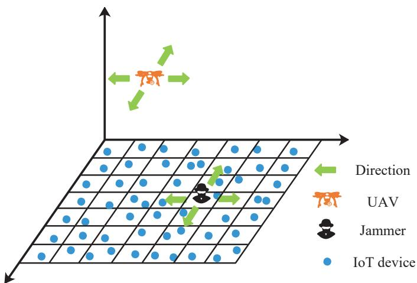  
Fig. 1: An illustration of the UAV-assisted IoT system. A UAV flies above the service area to collect the data from the IoT devices, and an intelligent jammer tries to disrupt the uplink communication.

We adopt a general model to describe the fading channel between the UAV and a transmitter Tx, where Tx can be either the jammer or any IoT device $\textit { i } \in \textit { \textbf { Z } }$ . The fading channel is composed of large-scale and small-scale fading. The large-scale fading is characterized by the path loss model $\xi \left( d _ { \mathrm { T x } , u } \left( t \right) \right)$ , where $- \overline { { d _ { \mathrm { T x } , u } \left( t \right) } } = \left| \left| l ^ { \mathrm { T x } } \left( t \right) - \overline { { l ^ { u } \left( t \right) } } \right| \right| _ { 2 }$ is the distance from transmitter Tx to the UAV and $| | \cdot | | _ { 2 }$ is the Euclidean distance. Both LoS and non-LoS (NLoS) connections are considered in $\xi \left( d _ { \mathrm { T x } , u } \left( t \right) \right)$ , and the probability of an LoS link under the International Telecommunication Union (ITU) model [27, 28] is given by

$$
\mathrm { P r } ^ { \mathrm { L o S } } \left( d _ { \mathrm { T x } , u } \left( t \right) \right) = \prod _ { b = 0 } ^ { c _ { 4 } } \left[ 1 - \exp \left( - \frac { \left[ \frac { \left( b + 0 . 5 \right) z } { c _ { 4 } + 1 } \right] ^ { 2 } } { \left( \sqrt { 2 } c _ { 3 } \right) ^ { 2 } } \right) \right] ,\tag{1}
$$

where $\{ c _ { 1 } , c _ { 2 } , c _ { 3 } \}$ are the parameters associated with the environment and $\begin{array} { r } { c _ { 4 } = \left| \frac { d _ { \mathrm { T x } , u } ( t ) \sqrt { c _ { 1 } c _ { 2 } } } { 1 0 0 0 } - 1 \right| } \end{array}$ . Accordingly, the probability of an NLoS link is given by

$$
\mathrm { P r } ^ { \mathrm { N L o S } } \left( d _ { \mathrm { T x } , u } \left( t \right) \right) = 1 - \mathrm { P r } ^ { \mathrm { L o S } } \left( d _ { \mathrm { T x } , u } \left( t \right) \right) .\tag{2}
$$

Given the LoS and NLoS probabilities, the path loss model $\xi \left( d _ { \mathrm { T x } , u } \left( t \right) \right)$ is denoted as

$$
\xi \left( d _ { \mathrm { T x } , u } \left( t \right) \right) = \left\{ \begin{array} { l l } { A ^ { \mathrm { L o S } } d _ { \mathrm { T x } , u } \left( t \right) ^ { \alpha ^ { \mathrm { L o S } } } , } & { \mathrm { w i t h ~ p r o b . ~ ( 1 ) } , } \\ { A ^ { \mathrm { N L o S } } d _ { \mathrm { T x } , u } \left( t \right) ^ { \alpha ^ { \mathrm { N L o S } } } , } & { \mathrm { w i t h ~ p r o b . ~ ( 2 ) } , } \end{array} \right.\tag{3}
$$

where $A ^ { \mathrm { L o S } }$ and $A ^ { \mathrm { N L o S } }$ represent the path loss per unit distance for LoS and NLoS links, respectively. And $\bar { \alpha } ^ { \mathrm { L o S } }$ and $\alpha ^ { \mathrm { N L o S } }$ are respectively the path loss exponents for LoS and NLoS links.

Furthermore, we adopt Nakagami-m distribution to model the small-scale fading, where the cumulative distribution function of the small-scale fading is given by

$$
\begin{array} { l } { \displaystyle \Upsilon \left( x \right) \triangleq \operatorname* { P r } \left[ h _ { \mathrm { T x } , u } \left( t \right) < x \right] } \\ { \displaystyle \quad = 1 - \sum _ { \iota = 0 } ^ { m _ { \mathrm { T x } , u } - 1 } \frac { \left( m _ { \mathrm { T x } , u } x \right) ^ { \iota } } { \iota ! } \exp \left( - m _ { \mathrm { T x } , u } x \right) . } \end{array}\tag{4}
$$

Note that $h _ { \mathrm { T x } , u } \left( t \right)$ is the small-scale fading from transmitter Tx to the UAV, and $m _ { \mathrm { T x } , u }$ is the fading parameter from transmitter Tx to the UAV. Taking account of both the largescale and small-scale fading, the channel fading gain from transmitter Tx to the UAV is given by

$$
g _ { \mathrm { T x } , u } \left( t \right) = \left[ \xi ( d _ { \mathrm { T x } , u } \left( t \right) ) \right] ^ { - 1 } h _ { \mathrm { T x } , u } \left( t \right) .\tag{5}
$$

We consider each scheduled IoT device transmits with the maximum power of $p$ in the uplink, and the jamming power of the jammer is $q .$ The SINR received by the UAV from the IoT device i during the data transmission phase of time slot t is given by

$$
\mathrm { S I N R } \left( t \right) = \frac { p g _ { i , u } \left( t \right) } { q g _ { j , u } \left( t \right) + N _ { 0 } } ,\tag{6}
$$

where $N _ { 0 }$ is the variance of white Gaussian noise. Consider that each selected IoT device transmits with the fixed rate of $\log _ { 2 } { ( 1 + \phi ) }$ in the uplink, where $\phi$ is the SINR threshold. The transmission is successful if the received SINR at the UAV is no less than $\phi ,$ expressed as an indicator function, i.e.,

$$
\mathbb { 1 } \left( \mathrm { S I N R } \left( t \right) \geq \phi \right) = \left\{ \begin{array} { l l } { 1 , } & { \mathrm { S I N R } ( t ) \geq \phi , } \\ { 0 , } & { \mathrm { S I N R } ( t ) < \phi . } \end{array} \right.\tag{7}
$$

Then, the achievable rate at the UAV during the data transmission phase is given by

$$
\eta \left( t \right) = \mathbb { 1 } \left( \mathrm { S I N R } \left( t \right) \geq \phi \right) \log _ { 2 } \left( 1 + \phi \right) \tau _ { 2 } .\tag{8}
$$

The propulsion energy consumption of the rotary-wing UAV is associated with its flying speed as well as the acceleration. According to [29], the energy consumption caused by UAV acceleration or deceleration can be ignored. Thus, the thrust of the UAV’s rotor is given by

$$
T _ { \mathrm { h } } = \frac { 1 } { n _ { \mathrm { r } } } \left| \left| \frac { 1 } { 2 } b _ { 1 } v ^ { 2 } S _ { \mathrm { f } } v _ { \mathrm { d } } - b _ { 2 } \mathbf { g } \right| \right| ,\tag{9}
$$

where v is the flight speed of the UAV and $v _ { \mathrm { d } }$ is the flight direction. Let $n _ { \mathrm { r } }$ denote the number of rotor, $b _ { 1 }$ denote the air density, $S _ { \mathrm { f } }$ denote the fuselage equivalent flat plate area, $b _ { 2 }$ denote the mass of the UAV, and g denote the gravity acceleration vector. According to [29] and [30], the propulsion power can be modeled as (13) at the bottom of this page. Specially, $b _ { 3 }$ is the local blade section drag coefficient, cT is the thrust coefficient, D is the rotor’s disc area, $c _ { \mathrm { s } }$ is the rotor solidly, $c _ { \mathrm { f } }$ is the incremental correction factor for induced power, $\vartheta$ is the climb angle, and $\chi$ is the rotor’s fuselage drag ratio.

By substituting $v = 0$ into (13), the hovering power is given by

$$
P \left( 0 \right) = n _ { \mathrm { r } } \left[ \frac { b _ { 3 } } { 8 } \sqrt { \frac { T _ { \mathrm { h } } ^ { 3 } c _ { \mathrm { s } } ^ { 2 } } { c _ { T } ^ { 3 } b _ { 1 } D } } + \left( 1 + c _ { \mathrm { f } } \right) \sqrt { \frac { T _ { \mathrm { h } } ^ { 3 } } { 2 b _ { 1 } D } } \right] .\tag{10}
$$

Let $\beta \left( t \right)$ denote the deployment indicator of the UAV, i.e.,

$$
\beta \left( t \right) = \left\{ \begin{array} { c } { 1 , \quad l ^ { u } \left( t \right) = l ^ { u } ( t - 1 ) , } \\ { 0 , \ l ^ { u } ( t ) \neq l ^ { u } ( t - 1 ) , } \end{array} \right.\tag{11}
$$

which equals 1 if the UAV hovers at the current location, and 0 if the UAV flies to another location. Then, the propulsion energy consumed by the UAV in time slot t is given by

$$
\begin{array} { c } { { E _ { \mathrm { c o n } } \left( t \right) = \beta \left( t \right) P \left( 0 \right) \left( \tau _ { 1 } + \tau _ { 2 } \right) } } \\ { { + \left( 1 - \beta \left( t \right) \right) \left( P \left( v \right) \tau _ { 1 } + P \left( 0 \right) \tau _ { 2 } \right) . } } \end{array}\tag{12}
$$

The remaining energy of the UAV at the end of time slot t is expressed as

$$
E \left( t \right) = E \left( t - 1 \right) - E _ { \mathrm { c o n } } \left( t \right) .\tag{13}
$$

Specially, let $E \left( 0 \right) = E _ { \operatorname* { m a x } }$ be the maximum battery capacity of the UAV. Once the UAV’s battery level approaches the critical value $E _ { \mathrm { m i n } }$ , the UAV will end the mission. Considering that the ground jammer is equipped with sufficient energy capacity and has much longer lifetime than the UAV. Without loss of generality, we ignore the energy consumption limit for the jammer.

## III. FORMULATION OF PARTIALLY OBSERVABLE PURSUIT-EVASION GAME

For the UAV, it adaptively adjusts its deployment trajectory in order to maximize the expectation of cumulative uplink rate with minimum energy consumption, i.e.,

$$
( \mathcal { P } 1 ) : \operatorname* { m a x } _ { l ^ { u } ( t ) , \forall t } \mathbb { E } \left[ \sum _ { t = 1 } ^ { T } \left( \varphi _ { 1 } \eta \left( t \right) - \varphi _ { 2 } E _ { \mathrm { c o n } } \left( t \right) \right) \right]\tag{14a}
$$

$$
\begin{array} { r l } { \mathrm { s . t . } } & { { } x ^ { u } \left( t \right) \in \left[ x _ { \operatorname* { m i n } } , x _ { \operatorname* { m a x } } \right] , \forall t , } \end{array}\tag{14b}
$$

$$
y ^ { u } \left( t \right) \in \left[ y _ { \operatorname* { m i n } } , y _ { \operatorname* { m a x } } \right] , \forall t ,\tag{14c}
$$

$$
E \left( t \right) \geq E _ { \operatorname* { m i n } } , \forall t ,\tag{14d}
$$

where E [·] is the expectation function, $\varphi _ { 1 }$ and $\varphi _ { 2 }$ are the weighting factors for the UAV’s rate and energy consumption, respectively. The constraints of (14b) and (14c) are to ensure that the UAV does not fly out of the service area. And (14d) states that the UAV’s remaining energy should be above the minimum battery level.

The aim of the jammer is to optimize its jamming trajectory for minimizing the expectation of UAV’s cumulative rate, i.e.,

$$
\left( \mathcal { P } 2 \right) : \operatorname* { m a x } _ { l ^ { j } \left( t \right) , \forall t } \mathbb { E } \left[ \sum _ { t = 1 } ^ { T } - \eta \left( t \right) \right]\tag{15a}
$$

$$
\begin{array} { r l } { \mathrm { s . t . } } & { { } x ^ { j } \left( t \right) \in \left[ x _ { \operatorname* { m i n } } , x _ { \operatorname* { m a x } } \right] , \forall t , } \end{array}\tag{15b}
$$

$$
y ^ { j } \left( t \right) \in \left[ y _ { \operatorname* { m i n } } , y _ { \operatorname* { m a x } } \right] , \forall t .\tag{15c}
$$

We formulate the interactions between the evader UAV and the pursuer jammer as a partially observable pursuit-evasion game. We assume that the UAV does not know the jammer’s location and the jammer is not aware of the UAV’s remaining energy. Without loss of generality, let $n \in \mathcal N$ represent any agent in the game, where agent n can be either the UAV or the jammer. The seven tuple $\langle \mathcal { N } , \mathcal { S } , \{ \mathcal { O } ^ { n } \} _ { n \in \mathcal { N } } , \{ \mathcal { A } ^ { n } \} _ { n \in \mathcal { N } } ,$ $\{ r ^ { n } \} _ { n \in \mathcal { N } } , \Psi , \gamma \rangle$ represents the formulated partially observable pursuit-evasion game, where $\mathcal { N }$ is the set of agents, S is the state space, ${ \mathcal { O } } ^ { n }$ is the observation space of agent $n , A ^ { n }$ is the action space of agent $n , r ^ { n }$ is the reward function of agent $n ,$ Ψ is the transition probability, and $\gamma \in [ 0 , 1 ]$ is the discount factor.

• Agent: The UAV and jammer are the two agents that can adaptively adjust their trajectories according to each other’s policies in real-time.

• State: In time slot t, it is assumed that the global state $\mathbf { \Omega } _ { s } \left( t \right) \mathbf { \Omega } \in \mathbf { \Omega } _ { S }$ includes the UAV’s remaining energy $E \left( t - 1 \right)$ , the UAV’s location $l ^ { u } \left( t - 1 \right)$ , the jammer’s location $l ^ { j } \left( t - 1 \right)$ , and the UAV’s data reception feedback 1 (SINR $( t - 1 ) \geq \phi )$ at the end of the previous time slot. The global state in time slot t is thus denoted as

$$
\begin{array} { r l } & { \pmb { \mathscr { s } } \left( t \right) = \left[ E \left( t - 1 \right) , l ^ { u } \left( t - 1 \right) , l ^ { j } \left( t - 1 \right) , \right. } \\ & { ~ \left. \mathbb { 1 } \left( \mathrm { S I N R } \left( t - 1 \right) \geq \phi \right) \right] . } \end{array}\tag{16}
$$

• UAV’s observation: Assuming that the location of the jammer is concealed from the UAV. Thus, the UAV’s observation $\pmb { o } ^ { u } \left( t \right) \in \mathcal { O } ^ { u }$ in time slot t is given by

$$
\begin{array} { r l } & { \pmb { o } ^ { u } \left( t \right) = \left[ E \left( t - 1 \right) , l ^ { u } \left( t - 1 \right) , \right. } \\ & { ~ \left. \mathbb { 1 } \left( \mathrm { S I N R } \left( t - 1 \right) \geq \phi \right) \right] . } \end{array}\tag{17}
$$

• Jammer’s observation: We assume the jammer is aware of the current location of the UAV, but it does not know the UAV’s remaining energy. The jammer’s observation $\pmb { o } ^ { j } \left( t \right) \in \mathcal { O } ^ { j }$ in time slot t is given by

$$
\begin{array} { r } { \pmb { \sigma } ^ { j } \left( t \right) = \left[ l ^ { u } \left( t - 1 \right) , l ^ { j } \left( t - 1 \right) , \right. } \\ { \left. \mathbb { 1 } \left( \mathrm { S I N R } \left( t - 1 \right) \geq \phi \right) \right] . } \end{array}\tag{18}
$$

• UAV’s action: As the UAV can choose one out of the five movement directions [25], the action space of the UAV is expressed as

$$
\begin{array} { c } { { A ^ { u } = \left\{ \left( 0 , 0 , 0 \right) , \left( 0 , 1 , 0 \right) , \left( 0 , - 1 , 0 \right) , \left( - 1 , 0 , 0 \right) , \right. } } \\ { { \left. \left( 1 , 0 , 0 \right) \right\} , } } \end{array}\tag{19}
$$

where each element respectively represents hovering at the current location, moving forward, moving backward, moving to the left, and moving to the right. In time slot t, the UAV selects an action $a ^ { u } \left( t \right) \in \mathcal { A } ^ { u }$ as its moving direction.

• Jammer’s action: Similar to the UAV, the jammer can also choose one out of five movement directions, and its action space is given by

$$
\begin{array} { c } { { A ^ { j } = \left\{ \left( 0 , 0 , 0 \right) , \left( 0 , 1 , 0 \right) , \left( 0 , - 1 , 0 \right) , \left( - 1 , 0 , 0 \right) , \right. } } \\ { { \left. \left( 1 , 0 , 0 \right) \right\} . } } \end{array}\tag{20}
$$

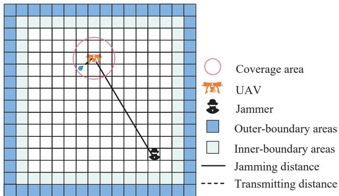  
Fig. 2: The anti-jamming system model from a downward view. The boundary areas of $\Gamma _ { 1 }$ and $\Gamma _ { 2 }$ are introduced to prevent the UAV and jammer from moving outside the service area.

In time slot t, the jammer selects an action $a ^ { j } \left( t \right) \in \mathcal { A } ^ { j }$ as its moving direction.

• UAV’s reward: To meet constraints (14b) and (14c) in P1, we introduce the outer-boundary areas $\Gamma _ { 1 }$ and inner-boundary areas $\Gamma _ { 2 }$ as shown in Fig. 2, where the UAV will be punished once flying into these areas. Let $\mathbb { 1 } \left( l ^ { u } \left( t \right) \in \Gamma _ { 1 } \right)$ and $\mathbb { 1 } \left( l ^ { u } \left( t \right) \in \Gamma _ { 2 } \right)$ represent the events that the UAV is inside $\Gamma _ { 1 }$ and $\Gamma _ { 2 } ,$ respectively. Hence, the reward $r ^ { u } \left( t \right)$ of the UAV in time slot t is given by

$$
\begin{array} { r l } & { r ^ { u } \left( t \right) = \varphi _ { 1 } \eta \left( t \right) - \varphi _ { 2 } E _ { \mathrm { c o n } } \left( t \right) } \\ & { \qquad - \zeta _ { 1 } \mathbb { 1 } \left( l ^ { u } \left( t \right) \in \Gamma _ { 1 } \right) - \zeta _ { 2 } \mathbb { 1 } \left( l ^ { u } \left( t \right) \in \Gamma _ { 2 } \right) , } \end{array}\tag{21}
$$

where $\zeta _ { 1 }$ and $\zeta _ { 2 }$ are the penalty factors.

• Jammer’s reward: Let 1 $\left( l ^ { j } \left( t \right) \in \Gamma _ { 1 } \right)$ and 1 $\left( l ^ { j } \left( t \right) \in \Gamma _ { 2 } \right)$ represent the events that the jammer is inside the areas of $\Gamma _ { 1 }$ and $\Gamma _ { 2 } .$ , respectively. The reward $r ^ { j } \left( t \right)$ of the jammer in time slot t is given by

$$
\begin{array} { r l } & { r ^ { j } \left( t \right) = - \eta \left( t \right) - \zeta _ { 1 } \mathbb { 1 } \left( l ^ { j } \left( t \right) \in \Gamma _ { 1 } \right) } \\ & { ~ - \zeta _ { 2 } \mathbb { 1 } \left( l ^ { j } \left( t \right) \in \Gamma _ { 2 } \right) . } \end{array}\tag{22}
$$

• Transition probability: The actions of the UAV and jammer jointly cause the state transition in time slot t. The transition probability Ψ is defined as ${ \mathcal { S } } \times { \mathcal { A } } ^ { u } \times { \mathcal { A } } ^ { j } $ Pr (S), where Pr (S) is the probability over the state space S. We assume neither the UAV nor the jammer knows its exact distribution.

Let $\pi ^ { n }$ represent the policy of agent n, which is defined as the probability distribution over the actions given the observations. Due to the partial observation of environment, each agent needs to infer the unknown system state based on its local observation $o ^ { n } \left( t \right)$ . For example, although the UAV cannot directly observe the location of the jammer, it can implicitly infer the jammer’s location based on the data reception feedback, e.g., the jammer is likely to be in close proximity if $\mathbb { 1 } \left( { \mathrm { S I N R } } \left( t - 1 \right) \geq \phi \right) = 0$ . However, due to the

$$
P \left( v \right) = n _ { \mathrm { r } } \left[ \frac { b _ { 3 } } { 8 } \left( \frac { T _ { \mathrm { h } } } { c _ { \mathrm { T } } b _ { 1 } D } + 3 v ^ { 2 } \right) \sqrt { \frac { T _ { \mathrm { h } } b _ { 1 } c _ { 3 } ^ { 2 } D } { c _ { \mathrm { T } } } } + \left( 1 + c _ { \mathrm { f } } \right) T _ { \mathrm { h } } \left( \sqrt { \frac { T _ { \mathrm { h } } ^ { 2 } } { 4 b _ { 1 } ^ { 2 } D ^ { 2 } } + \frac { v ^ { 4 } } { 4 } } - \frac { v ^ { 2 } } { 2 } \right) ^ { \frac { 1 } { 2 } } + \frac { b _ { 2 } \mathbf { g } v } { n _ { \mathrm { r } } } \sin \vartheta + \frac { 1 } { 2 } \chi v ^ { 3 } b _ { 1 } c _ { 3 } D \right]\tag{13}
$$

influence of small-scale fading, this location inference may not be accurate. Thus, it is necessary to utilize the historical information, i.e., the past observation trajectory of $\rho ^ { n } \left( t \right) =$ $\left[ { \pmb { o } } ^ { n } \left( t \right) , { \pmb { a } } ^ { n } \left( t - 1 \right) , { \pmb { o } } ^ { n } \left( t - 1 \right) , \ldots , { \pmb { o } } ^ { n } \left( 0 \right) \right]$ , to average out the impact of small-scale fading and capture the correlations of the jammer’s location across time. We denote the policy of agent n by $\pi ^ { n } : B ^ { n } \to \operatorname* { P r } \left( { \mathcal { A } } ^ { n } \right)$ , where $B ^ { n }$ is the observation trajectory space of agent $n .$

Let $\pi = \left\{ \pi ^ { u } , \pi ^ { j } \right\}$ be the joint policy of the UAV and the jammer, which affects the rewards of both agents. Given the observation history $\rho ^ { n } \left( t \right)$ , we define the expectation of cumulative discounted reward for agent n as the state value function, i.e.,

$$
V _ { \pi } ^ { n } \left( \pmb { \rho } ^ { n } \left( t \right) \right) = \mathbb { E } _ { \mathsf { s } } \left[ \sum _ { i = 0 } ^ { T - t } \gamma ^ { i } r ^ { n } \left( t + i \right) \bigg | \pmb { \rho } ^ { n } \left( t \right) \right] ,\tag{23}
$$

where $\rho ~ = ~ \left[ a ^ { n } \left( t \right) , \sigma ^ { n } \left( t + 1 \right) , a ^ { n } \left( t + 1 \right) , \cdot \cdot \cdot \right] _ { n \in \mathcal { N } }$ is the future trajectory under the policy π.

Next, we will optimize the -best response policies for both the UAV and the jammer. Let $\pi ^ { - n } = \otimes \pi ^ { n ^ { \prime } } , \forall n ^ { \prime } \in \mathcal { N } \backslash n$ denote the joint policy of the other agents in $\mathcal { N }$ except agent n, where $\otimes { \mathrm { i s } }$ the Cartesian product.

Definition 1 (Best Response): Given the policy $\pi ^ { - n }$ of the opponent, the best response of agent n against policy $\pi ^ { - n }$ is defined as

$$
\pi _ { * } ^ { n } \in \mathrm { B R } ^ { n } \left( \pi ^ { - n } \right) = \left\{ \arg \operatorname* { m a x } _ { \pi ^ { n } \in \Pi ^ { n } } \mathbb { E } _ { \pi ^ { n } , \pi ^ { - n } } \left[ r ^ { n } \left( t \right) \right] \right\} ,\tag{24}
$$

where $\Pi ^ { n }$ is the policy space of agent n. Compared with best response $\pi _ { * } ^ { n }$ , -best response $\pi _ { \epsilon } ^ { n }$ is suboptimal by no more than , where $\epsilon > 0$ . And $\pi _ { \epsilon } ^ { - n }$ is the set of -best responses of the other agent in $\mathcal { N }$ except agent n.

Definition 2 (-Nash Equilibrium): If there exists a policy profile that each agent n’s policy is the -best response to the policies of the others, then the policy profile $\pi _ { \epsilon } = \{ \pi _ { \epsilon } ^ { n } , \pi _ { \epsilon } ^ { - n } \}$ is the -Nash Equilibrium (-NE) and satisfies

$$
\mathbb { E } _ { \pi _ { \epsilon } ^ { n } , \pi _ { \epsilon } ^ { - n } } \left[ r ^ { n } \left( t \right) \right] \geq \mathbb { E } _ { \pi ^ { n } , \pi _ { \epsilon } ^ { - n } } \left[ r ^ { n } \left( t \right) \right] - \epsilon , \forall n , \forall \pi ^ { n } ,\tag{25}
$$

where  upper bounds the maximum gain that agent n achieves by any unilateral deviation from its equilibrium policy.

## IV. OPPONENT MODELING BASED REINFORCEMENT LEARNING ALGORITHM

To optimize the -best response policies under the proposed partially observable pursuit-evasion game, there are mainly three challenges. The first challenge is the imperfect and asymmetric information, i.e., the UAV does not know the jammer’s location, the jammer is not aware of the UAV’s remaining energy. The second challenge is the multi-round interaction in a dynamic environment, where the UAV’s and jammer’s actions not only affect their rewards in the current round, but also those in the future. The above two challenges make it difficult to optimize the -best response policies via the conventional convex optimization, dynamic programming, or model-based game theoretic approaches, where these methods usually require the knowledge of the opponent’s reward functions or the state transition probabilities, which are difficult to obtain in practice. We thus adopt model-free RL to concurrently learn and update the jamming and antijamming policies for both the jammer and UAV. The third challenge is the non-stationary issue in the multi-agent learning system, where the intelligent jammer with adaptive policies cannot be simply treated as part of the environment as in the single-agent system. The centralized training based MARL framework is usually adopted to ease the non-stationary issue in a cooperative multi-agent system, but it is unrealistic to find a trustworthy central to collect the private local states and actions of the agents in an adversarial environment. To address the above challenges, we propose an independent RL algorithm with opponent modeling, named NFSP-D3RN, to learn the -best response policies in a non-stationary environment under imperfect and asymmetric information. The details of the proposed algorithm will be discussed in the following subsections.

## A. Opponent Modeling

For this anti-jamming network, each UAV agent dynamically optimizes its policy according to the system state to combat against the opponent’s jamming actions. The conventional independent RL algorithms, e.g., IDQN, are difficult to obtain the optimal anti-jamming policies in a non-stationary environment, as the opponent’s policy is constantly evolving in a stochastic game. Since the UAV may not be able to accurately estimate the effect of its action on its cumulative reward due to the interference of the adaptive jammer, the greedy RL policy that maximizes the local estimation of cumulative reward may not be equal to its true -best response. Therefore, it is crucial for the agent to model its opponent’s policy through the interaction experience, in order to improve its local performance. Due to the lack of opponent’s information in the anti-jamming environment, e.g., the jammer’s states and actions, it is difficult for the agent to explicitly learn the opponent’s policy. We therefore propose an implicit opponent modeling based RL algorithm named NFSP-D3RN. To be specific, the proposed algorithm consists of two modules: RL and supervised learning (SL). On the one hand, we obtain the greedy policy $\pi _ { \mathrm { g r e e d y } } ^ { n } \left( t \right)$ for time slot t via the RL module in response to the current opponent’s policy. On the other hand, we adopt an SL module to evaluate the average policy $\pi _ { \mathrm { a v g } } ^ { n } \left( t \right)$ by averaging its own greedy policies in the past interactions, which implicitly captures the time evolving features of the opponent’s policies. Therefore, we approximate the -best response $\pi _ { \epsilon } ^ { n } \left( t \right)$ as a mixed policy $\sigma ^ { n } \left( t \right)$ , i.e.,

$$
\sigma ^ { n } \left( t \right) = \left\{ \begin{array} { l l } { \pi _ { \mathrm { g r e e d y } } ^ { n } \left( t \right) , } & { \mathrm { w i t h ~ p r o b . ~ } \eta , } \\ { \pi _ { \mathrm { a v g } } ^ { n } \left( t \right) , } & { \mathrm { w i t h ~ p r o b . ~ } 1 - \eta , } \end{array} \right.\tag{26}
$$

where $\eta$ is the anticipatory parameter [31]. Next, the training processes of the RL and SL modules of the proposed NFSP-D3RN algorithm are discussed in the following subsections.

## B. RL Training of the Proposed Algorithm

The goal of the RL module is to learn the greedy policy $\pi _ { \mathrm { g r e e d y } } ^ { n } \left( t \right)$ for each time slot t for maximizing its current estimation on the expectation of cumulative reward. However, the length of the UAV’s observation history $\rho ^ { n } \left( t \right)$ increases over time slot. To avoid the dimensional explosion of the input trajectory of $\rho ^ { n } \left( t \right)$ we utilize the LSTM [32] network to encode the observation history $\rho ^ { n } \left( t \right)$ into a hidden state $e ^ { n } \left( t \right)$ in each time slot t, where $e ^ { n } \left( t \right)$ is related to its previous time slot’s hidden state $e ^ { n } \left( t - 1 \right)$ and its current observation $o ^ { n } \left( t \right)$ i.e., $e ^ { n } \left( t \right) = f _ { \mathrm { L S T M } } \left( e ^ { n } \left( t - 1 \right) , \pmb { o } ^ { n } \left( t \right) \right)$ . Then, we utilize this hidden state $e ^ { n } \left( t \right)$ to assist the policy optimization. Given hidden state $e ^ { n } \left( t \right)$ and action $a ^ { n } \left( t \right)$ , we define agent n’s expectation of the cumulative reward under the joint policy $\pi = \left\lfloor \pi _ { \mathrm { g r e e d y } } ^ { n } , \pi ^ { - n } \right\rfloor$ as the action value function, i.e.,

$$
\begin{array} { l } { { \displaystyle Q _ { \pi } ^ { n } \left( e ^ { n } \left( t \right) , a ^ { n } \left( t \right) \right) } \ ~ } \\ { { \displaystyle = \sum _ { r ^ { n } \left( t \right) } \operatorname* { P r } \left( r ^ { n } \left( t \right) \left. e ^ { n } \left( t \right) , a ^ { n } \left( t \right) \right. \right) r ^ { n } \left( t \right) } \ ~ } \\ { { \displaystyle + \gamma \sum _ { e ^ { n } \left( t + 1 \right) } \operatorname* { P r } \left( e ^ { n } \left( t + 1 \right) \left. e ^ { n } \left( t \right) , a ^ { n } \left( t \right) \right. \right) V _ { \pi } ^ { n } \left( e ^ { n } \left( t + 1 \right) \right) . } } \end{array}
$$

Thus, the optimal action value function (Q function) is expressed as

$$
\begin{array} { r l } & { \displaystyle Q ^ { n } ( e ^ { n } ( t ) , a ^ { n } ( t ) ) } \\ & { = \frac { \operatorname* { m a x } } { \pi _ { \mathrm { g r e e d y } } ^ { n } } Q _ { \pi } ^ { n } ( e ^ { n } ( t ) , a ^ { n } ( t ) ) } \\ & { = \displaystyle \operatorname* { m a x } _ { \pi _ { \mathrm { g r e e d y } } ^ { n } } \mathbb { E } _ { \mathsf { S } } [ \sum _ { i = 0 } ^ { T - t } \gamma ^ { i } r ^ { n } ( t + i ) ] e ^ { n } ( t ) , a ^ { n } ( t ) ] . } \end{array}\tag{28}
$$

Since the opponent’s joint policy $\pi ^ { - n }$ is unknown, we are not able to directly obtain the optimal Q value. We use the neural network to approximate the Q function as $Q ^ { n } \left( e ^ { n } \left( t \right) , a ^ { n } \left( t \right) ; \theta ^ { n } \right)$ with the parameter of $\theta ^ { n }$ . The greedy policy is thus approximated as $\pi _ { \mathrm { g r e e d y } } ^ { n } \left( \theta ^ { n } \right)$ , i.e.,

$$
\begin{array} { l l } { \pi _ { \mathrm { g r e e d y } } ^ { n } \left( \theta ^ { n } \right) } & { ( 2 9 ) } \\ { \quad = \left\{ \begin{array} { l l } { \arg \underset { a ^ { n } \left( t \right) } { \operatorname* { m a x } } Q ^ { n } \left( e ^ { n } \left( t \right) , a ^ { n } \left( t \right) ; \theta ^ { n } \right) , } & { \mathrm { w i t h ~ p r o b . ~ 1 - \epsilon } , } \\ { \mathrm { r a n d o m } , } & { \mathrm { w i t h ~ p r o b . ~ \epsilon . } } \end{array} \right. } \end{array}
$$

Since either poor action or unfavorable state may result in a low Q value, we have to differentiate the effects of the state and action on the long-term expected rewards. To deal with issue, we utilize the dueling architecture [33] to decompose the Q function into an optimal state function $A ^ { n } \left( e ^ { n } \left( t \right) , a ^ { n } \left( t \right) ; \theta _ { \mathrm { A } } ^ { n } \right)$ parameterized by $\theta _ { \mathrm { A } } ^ { n }$ for action evaluation, and an optimal advantage function $V ^ { n } \left( e ^ { n } \left( t \right) ; \theta _ { \mathrm { V } } ^ { n } \right)$ parameterized by $\theta _ { \mathrm { V } } ^ { n }$ for state evaluation, respectively. The Q function is thus rewritten as $Q ^ { n } \left( e ^ { n } \left( t \right) , a ^ { n } \left( t \right) ; \theta _ { \mathrm { V } } ^ { n } , \theta _ { \mathrm { A } } ^ { n } \right)$ .

The optimal advantage function is expressed as

$$
\begin{array} { l } { { A ^ { n } \left( e ^ { n } \left( t \right) , a ^ { n } \left( t \right) ; \theta _ { \mathrm { A } } ^ { n } \right) } } \\ { { \ } } \\ { { \ } = { Q ^ { n } \left( e ^ { n } \left( t \right) , a ^ { n } \left( t \right) ; \theta _ { \mathrm { V } } ^ { n } , \theta _ { \mathrm { A } } ^ { n } \right) - V ^ { n } \left( e ^ { n } \left( t \right) ; \theta _ { \mathrm { V } } ^ { n } \right) . } } \end{array}\tag{30}
$$

However, the Q value cannot uniquely determine the optimal state value function and optimal advantage function in (30). According to [33], we rewrite the Q function as

$$
\begin{array} { l } { { Q ^ { n } \left( e ^ { n } \left( t \right) , a ^ { n } \left( t \right) ; \theta _ { \mathrm { V } } ^ { n } , \theta _ { \mathrm { A } } ^ { n } \right) } } \\ { { \ = A ^ { n } \left( e ^ { n } \left( t \right) , a ^ { n } \left( t \right) ; \theta _ { \mathrm { A } } ^ { n } \right) + V ^ { n } \left( e ^ { n } \left( t \right) ; \theta _ { \mathrm { V } } ^ { n } \right) } } \\ { { \ - \displaystyle \operatorname* { m a x } _ { a ^ { n } } A ^ { n } \left( e ^ { n } \left( t \right) , a ^ { n } \left( t \right) ; \theta _ { \mathrm { A } } ^ { n } \right) . } } \end{array}\tag{31}
$$

We then adopt temporal difference (TD) approach to update the parameters $\theta _ { \mathrm { V } } ^ { n }$ and $\theta _ { \mathrm { A } } ^ { n }$ . The transition $\{ \pmb { o } ^ { n } \left( \bar { t } \right) , a ^ { n } \left( t \right) , r ^ { \bar { n } } \left( t \right) , \pmb { o } ^ { n } \left( t + \bar { 1 } \right) \}$ in agent n’s replay buffer $\mathcal { M } _ { \mathrm { R L } } ^ { n }$ is generated by the mixed policy $\sigma ^ { n } \left( t \right)$ . We store the transitions in the experience replay buffer to reuse data and eliminate the correlation among transitions. With the transition $\left\{ \pmb { o } ^ { n } \left( f \right) , a ^ { n } \left( f \right) , r ^ { n } \left( f \right) , \pmb { o } ^ { n } \left( \bar { f } + 1 \right) \right\}$ sampled from agent n’s replay buffer $\mathcal { M } _ { \mathrm { R L } } ^ { n }$ , the TD target $Y ^ { n }$ is given by

$$
Y ^ { n } = r ^ { n } \left( f \right) + \gamma \operatorname* { m a x } _ { a ^ { n } } { \hat { Q } } ^ { n } \left( e ^ { n } \left( f + 1 \right) , a ^ { n } ; \theta _ { \mathrm { V } } ^ { n - } , \theta _ { \mathrm { A } } ^ { n - } \right)\tag{32}
$$

where $\hat { Q } ^ { n } \left( e ^ { n } \left( f + 1 \right) , a ^ { n } ; \theta _ { \mathrm { V } } ^ { n - } , \theta _ { \mathrm { A } } ^ { n - } \right)$ is agent n’s target Q network with the parameters of $\theta _ { \mathrm { V } } ^ { n - }$ and $\theta _ { \mathrm { A } } ^ { n - }$ . Although the introduction of target Q network avoids bootstrapping, there still exists the risk of overestimation. To address this issue, we utilize the current Q network’s parameter instead of target Q network’s parameter for action selection [34]. Consequently, the modified TD target is given by

$$
Y ^ { n } = r ^ { n } \left( f \right) + \gamma \hat { Q } ^ { n } \left( e ^ { n } \left( f + 1 \right) , a _ { \ast } ^ { n } ; \theta _ { \mathrm { V } } ^ { n - } , \theta _ { \mathrm { A } } ^ { n - } \right) ,\tag{33}
$$

where

$$
a _ { \ast } ^ { n } = \arg \operatorname* { m a x } _ { a ^ { n } } Q ^ { n } \left( e ^ { n } \left( f + 1 \right) , a ^ { n } ; \theta _ { \mathrm { V } } ^ { n } , \theta _ { \mathrm { A } } ^ { n } \right) .\tag{34}
$$

Then, the loss function is given by

$$
\begin{array} { l } { \displaystyle \mathrm { L o s s } \left( \theta _ { \mathrm { V } } ^ { n } , \theta _ { \mathrm { A } } ^ { n } \right) } \\ { \displaystyle = \frac { 1 } { 2 F } \sum _ { f } \left( Y ^ { n } - Q ^ { n } \left( e ^ { n } \left( f \right) , a ^ { n } \left( f \right) ; \theta _ { \mathrm { V } } ^ { n } , \theta _ { \mathrm { A } } ^ { n } \right) \right) ^ { 2 } , } \end{array}\tag{35}
$$

where $F$ is the number of sampled transitions. The gradient descent of the loss function with respect to $\theta _ { \mathrm { A } } ^ { n }$ is expressed as

$$
\begin{array} { r l } & { \nabla _ { \theta _ { \mathrm { A } } ^ { n } } \mathrm { L o s s } \left( \theta _ { \mathrm { V } } ^ { n } , \theta _ { \mathrm { A } } ^ { n } \right) } \\ & { = \displaystyle \frac { 1 } { F } \sum _ { f } \left[ \nabla _ { \theta _ { \mathrm { A } } ^ { n } } Q ^ { n } \left( e ^ { n } \left( f \right) , a ^ { n } \left( f \right) ; \theta _ { \mathrm { V } } ^ { n } , \theta _ { \mathrm { A } } ^ { n } \right) \right. } \\ & { \quad \left. \cdot \left( Q ^ { n } \left( e ^ { n } \left( f \right) , a ^ { n } \left( f \right) ; \theta _ { \mathrm { V } } ^ { n } , \theta _ { \mathrm { A } } ^ { n } \right) - Y ^ { n } \right) \right] . } \end{array}\tag{36}
$$

Therefore, the parameter $\theta _ { \mathrm { A } } ^ { n }$ is updated as

$$
\theta _ { \mathrm { A } } ^ { n }  \theta _ { \mathrm { A } } ^ { n } - \psi _ { \mathrm { R L } } \nabla _ { \theta _ { \mathrm { A } } ^ { n } } \mathrm { L o s s } ( \theta _ { \mathrm { V } } ^ { n } , \theta _ { \mathrm { A } } ^ { n } ) ,\tag{37}
$$

where ψRL is the step size of each update for RL. Similarly, the parameter $\theta _ { \mathrm { V } } ^ { n }$ is updated as

$$
\theta _ { \mathrm { V } } ^ { n }  \theta _ { \mathrm { V } } ^ { n } - \psi _ { \mathrm { R L } } \nabla _ { \theta _ { \mathrm { V } } ^ { n } } \mathrm { L o s s } ( \theta _ { \mathrm { V } } ^ { n } , \theta _ { \mathrm { A } } ^ { n } ) ,\tag{38}
$$

where

$$
\begin{array} { r l } & { \nabla _ { \theta _ { \mathrm { V } } ^ { n } } \mathrm { L o s s } \left( \theta _ { \mathrm { V } } ^ { n } , \theta _ { \mathrm { A } } ^ { n } \right) } \\ & { = \displaystyle \frac { 1 } { F } \sum _ { f } \left[ \nabla _ { \theta _ { \mathrm { V } } ^ { n } } Q ^ { n } \left( e ^ { n } \left( f \right) , a ^ { n } \left( f \right) ; \theta _ { \mathrm { V } } ^ { n } , \theta _ { \mathrm { A } } ^ { n } \right) \right. } \\ & { \quad \left. \cdot \left( Q ^ { n } \left( e ^ { n } \left( f \right) , a ^ { n } \left( f \right) ; \theta _ { \mathrm { V } } ^ { n } , \theta _ { \mathrm { A } } ^ { n } \right) - Y ^ { n } \right) \right] . } \end{array}\tag{39}
$$

Moreover, the target Q network parameters adopt the hard update [35] in every κ time slots, i.e.,

$$
\begin{array} { r } { \theta _ { \mathrm { A } } ^ { n - }  \theta _ { \mathrm { A } } ^ { n } , \mathrm { i f ~ } t \% \kappa = 0 , } \\ { \theta _ { \mathrm { V } } ^ { n - }  \theta _ { \mathrm { V } } ^ { n } , \mathrm { i f ~ } t \% \kappa = 0 . } \end{array}\tag{40}
$$

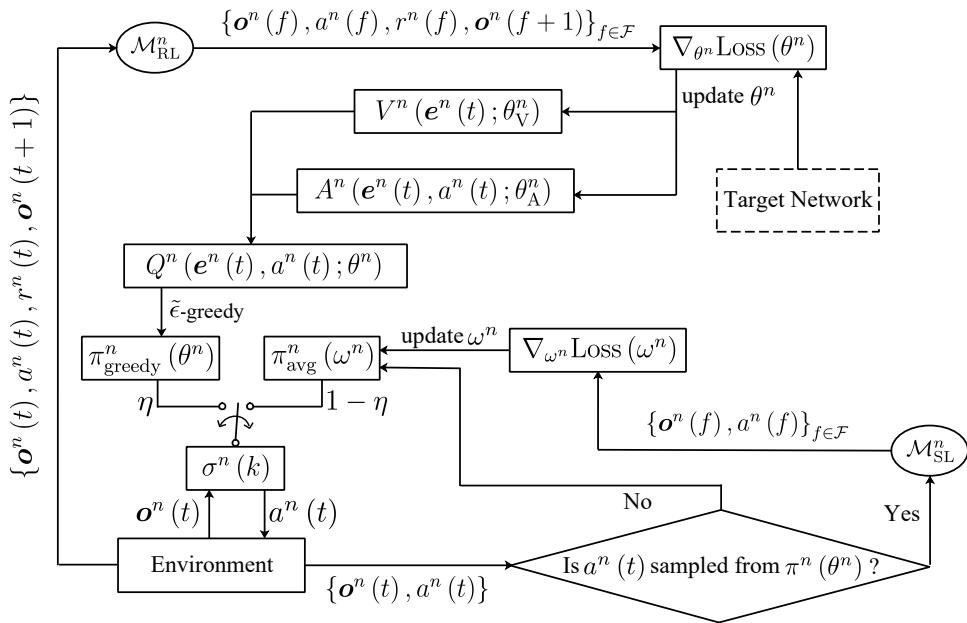  
Fig. 3: The architecture of NFSP-D3RN algorithm.

## C. SL Training of the Proposed Algorithm

Since the opponent’s policy is constantly changing, the greedy policy in (29) may not lead to a -best response. We therefore take the average policy $\pi _ { \mathrm { a v g } } ^ { n } \left( t \right)$ over its past greedy policies $\pi _ { \mathrm { g r e e d y } } ^ { n } \left( \theta ^ { n } \right)$ to implicitly eliminate the fluctuation of the opponent’s policy. Specifically, we first store the observation-action pair $\left\{ o ^ { n } \left( t \right) , a ^ { n } \left( t \right) \right\}$ generated by $\pi _ { \mathrm { g r e e d y } } ^ { n } \left( \theta ^ { n } \right)$ in the SL replay buffer. Then, we use the neural network with parameter $\omega ^ { n }$ to approximate the average policy $\pi _ { \mathrm { a v g } } ^ { n } \left( t \right)$ , where the parameterized policy is denoted as $\pi _ { \mathrm { a v g } } ^ { n } \left( \omega ^ { n } \right)$ . The loss function is defined as the Kullback-Leibler (KL) divergence between the policy $\pi _ { \mathrm { a v g } } ^ { n } \left( \omega ^ { n } \right)$ and $\pi _ { \mathrm { a v g } } ^ { n } \left( t \right)$ i.e.,

$$
\begin{array} { r l } & { \mathrm { L o s s } ( \omega ^ { n } ) = \mathbb { E } _ { \sigma ^ { n } ( t ) } [ \mathrm { K L } ( \pi _ { \mathrm { a v g } } ^ { n } ( \cdot  \sigma ^ { n } ( t ) )   \pi _ { \mathrm { a v g } } ^ { n } ( \cdot  \sigma ^ { n } ( t ) ; \omega ^ { n } ) ) ] } \\ & { \qquad = \mathbb { E } _ { \sigma ^ { n } ( t ) } [ \displaystyle \sum _ { a ^ { n } \in \mathbb { X } } \pi _ { \mathrm { a v g } } ^ { n } ( a ^ { n } ( t )  \sigma ^ { n } ( t )  )  } \\ & { \qquad \cdot \displaystyle \log  \frac { \pi _ { \mathrm { a v g } } ^ { n } ( a ^ { n } ( t )  \sigma ^ { n } ( t ) ) } { \pi _ { \mathrm { a v g } } ^ { n } ( a ^ { n } ( t )  \sigma ^ { n } ( t ) ; \omega ^ { n } ) } ] } \\ & { \qquad = \mathbb { E } _ { \sigma ^ { n } ( t ) ; \sigma ^ { n } ( t ) \sim \pi _ { \mathrm { a v g } } ^ { n } ( t ) } [ \log \pi _ { \mathrm { a v g } } ^ { n } ( a ^ { n } ( t )  \sigma ^ { n } ( t )  )  } \\ & { \qquad \quad  - \log \pi _ { \mathrm { a v g } } ^ { n } ( a ^ { n } ( t )  \sigma ^ { n } ( t ) ; \omega ^ { n } ) ] . } \end{array}\tag{41}
$$

Given $\{ o ^ { n } \left( f \right) , a ^ { n } \left( f \right) \} _ { f \in \mathcal { F } }$ is sampled from agent n’s SL replay buffer $\mathcal { M } _ { \mathrm { S L } } ^ { n }$ , the gradient estimation of Loss $( \omega ^ { n } )$ is derived as

$$
\begin{array} { r l } { \nabla _ { \omega ^ { n } } \mathrm { L o s s } \left( \omega ^ { n } \right) = \frac { 1 } { F } \displaystyle \sum _ { f } \nabla _ { \omega ^ { n } } \log \pi ^ { n } \left( a ^ { n } \left( t \right) | o ^ { n } \left( t \right) ; \omega ^ { n } \right) . } \end{array}\tag{42}
$$

We minimize the loss function by updating the parameter $\omega ^ { n }$ as

$$
\omega ^ { n }  \omega ^ { n } - \psi _ { \mathrm { S L } } \nabla _ { \omega ^ { n } } \mathrm { L o s s } ( \omega ^ { n } ) ,\tag{43}
$$

where $\psi _ { \mathrm { S L } }$ is the update step size for SL.

## D. NFSP-D3RN Based Anti-Jamming Algorithm

We plot the architecture of the proposed NFSP-D3RN algorithm in Fig. 3, and summarize it in Algorithm 1. Note that either the anti-jamming policy of the UAV or the jamming policy of the intelligent jammer can be generated by the proposed algorithm. As an illustrative example, we mainly discuss the process from the UAV’s perspective, where the UAV uses the proposed NFSP-D3RN algorithm to resist intelligent jamming. In lines 1-5, the UAV randomly initializes parameters $\theta _ { \mathrm { A } } ^ { n } , \theta _ { \mathrm { V } } ^ { n }$ $\theta _ { \mathrm { A } } ^ { n - } , \theta _ { \mathrm { V } } ^ { n - }$ , and its policy $\sigma ^ { u } \left( 0 \right)$ . In lines 6-10, due to the lack of jammer’s location information, the UAV determines its moving direction $a ^ { u } \left( t \right)$ only based on its partial observation $\begin{array} { r } { \pmb { o } ^ { u } \left( t \right) = \left[ E \left( t - 1 \right) , l ^ { u } \left( t - 1 \right) , \mathbb { 1 } \left( { \mathrm { S I N R } } \left( t - 1 \right) \geq \phi \right) \right] } \end{array}$ through policy $\sigma ^ { u } \left( t \right)$ . In the meanwhile, the intelligent jammer also determines its moving direction $a ^ { j } \left( t \right)$ based on its observation $\begin{array} { r } { \sigma ^ { j } \left( t \right) = \left[ l ^ { u } \left( t - 1 \right) , l ^ { j } \left( t - 1 \right) , \mathbb { 1 } \left( \mathrm { S I N R } \left( t - 1 \right) \geq \phi \right) \right] } \end{array}$ and the environment transits to the new state of $s \left( t + \bar { 1 } \right)$ according to the joint actions of the UAV and jammer. In line 12, after the UAV and jammer take their actions, the UAV receives the data acknowledgment 1 $( \mathrm { S I N R } \left( t - 1 \right) \geq \phi )$ from the environment. In lines 13-16, we store the transition of $\left\{ o ^ { u } \left( t \right) , a ^ { u } \left( t \right) , r ^ { u } \left( t \right) , o ^ { u } \left( t + 1 \right) \right\}$ generated by $\sigma ^ { u } \left( t \right)$ into a fixed-size RL buffer according to a first-in-first-out principle. Since the average policy $\pi _ { \mathrm { a v g } } ^ { u } \left( \omega ^ { u } \right)$ implicitly captures the policy evolution of the jammer, we store all the actions generated by the greedy policy $\pi _ { \mathrm { g r e e d y } } ^ { u } \left( \theta ^ { u } \right)$ and corresponding observation-action pairs $\{ o ^ { u } \left( t \right) , a ^ { u } ( t ) \}$ in a reservoir SL buffer. In lines 17-22, the UAV updates the greedy policy $\pi _ { \mathrm { g r e e d y } } ^ { u } \left( \theta ^ { u } \right)$ through (37), (38) and (40). In lines 23-25 the UAV updates the average policy $\pi _ { \mathrm { a v g } } ^ { u } \left( \omega ^ { u } \right)$ through (43). In line 26, mixed policy $\sigma ^ { u } \left( t \right)$ is derived from $\pi _ { \mathrm { g r e e d y } } ^ { u } \left( \theta ^ { u } \right)$ and $\pi _ { \mathrm { a v g } } ^ { u } \left( \omega ^ { u } \right)$ according to (26).

Basically, the class of NFSP algorithms can efficiently approximate -NE in a two-player imperfect-information stochastic game by probabilistically selecting between the greedy policy optimized via independent RL algorithm (e.g., DQN), and the SL policy averaged over the past greedy policies [31, 36, 37]. In our proposed NFSP-D3RN algorithm, we further enhance the optimality of the greedy policy for NFSP-DQN by incorporating the double Q network, dueling architecture, and LSTM modules into the NFSP framework, to overcome the limitations of overestimation bias, inefficient value decomposition, and partial observability, respectively. This tailored modification effectively improves the UAV’s antijamming performance, without compromising the theoretical convergence guarantees to the -NE of the underlying framework.

Algorithm 1 NFSP-D3RN Based Anti-Jamming Algorithm   
1: Randomly initialize Q and target Q networks with param  
eters $\theta _ { \mathrm { A } } ^ { n } , \theta _ { \mathrm { V } } ^ { n } , \theta _ { \mathrm { A } } ^ { n - }$ and $\theta _ { \mathrm { V } } ^ { n - } , \forall n \in \mathcal { N } .$   
2: Initialize the average policy $\pi ^ { n } \left( \omega ^ { n } \right)$ with the parameter   
$\omega ^ { n } , \forall n \in { \mathcal { N } } .$   
3: Set anticipatory parameter η.   
4: for $\operatorname { E p o c h } = 1 , 2 , \ldots$ do   
5: Initialize the global state $s \left( 0 \right)$ and the mixed policy   
$\sigma ^ { n } ( 0 ) , \forall n \in N .$   
6: for $t = 1 , 2 , \dots$ do   
7: for $n \in \mathcal N$ do   
8: Observe observation $o ^ { n } \left( t \right)$ and generate action   
$a ^ { n } \left( t \right)$ according to the mixed policy $\sigma ^ { n } \left( t \right)$ in (26).   
9: end for   
10: The environment transits to new state s (t + 1).   
11: for $n \in \mathcal N$ do   
12: Receive local reward $r ^ { n } \left( t \right)$ and new local obser  
vation $o ^ { n } \left( t + 1 \right)$   
13: Store transition $\left\{ \pmb { o } ^ { n } \left( t \right) , a ^ { n } \left( t \right) , r ^ { n } \left( t \right) , \pmb { o } ^ { n } \left( t + 1 \right) \right\}$   
in $\mathcal { M } _ { \mathrm { R L } } ^ { n }$   
14: if action $a ^ { n } \left( t \right)$ is generated by policy $\pi _ { \mathrm { g r e e d y } } ^ { n } \left( \theta ^ { n } \right)$   
then   
15: Store observation-action pair $\left\{ o ^ { n } \left( t \right) , a ^ { n } \left( t \right) \right\}$ in   
$\mathcal { M } _ { \mathrm { S L } } ^ { n }$   
16: end if   
17: if the number of transitions in $\mathcal { M } _ { \mathrm { R L } } ^ { n }$ is larger than   
F then   
18: Update parameters $\theta _ { \mathrm { A } } ^ { n }$ and $\theta _ { \mathrm { V } } ^ { n }$ according to (37)   
and (38), respectively.   
19: end if   
20: if $t \% \kappa = 0$ then   
21: Update target network parameters $\theta _ { \mathrm { A } } ^ { n - }$ and $\theta _ { \mathrm { V } } ^ { n - }$   
according to (40).   
22: end if   
23: if the number of observation-action pairs in $\mathcal { M } _ { \mathrm { S L } } ^ { n }$   
is larger than F then   
24: Update the average policy parameter $\omega ^ { n }$ accord  
ing to (43).   
25: end if   
26: Update mixed policy $\sigma ^ { n } \left( t \right)$ according to (26).   
27: end for   
28: end for   
29: end for

## V. SIMULATION RESULTS

In this section, we evaluate the anti-jamming performance of our proposed NFSP-D3RN algorithm via simulation results. We consider a UAV with 75 meters height and maximum speed of 30 m/s [29] to serve 2000 IoT devices randomly distributed within a square area of 800 m× 800 m, where the service area is partitioned into $2 0 \times 2 0$ equally-sized square grids. According to the energy consumption models in [29] and [30], the hovering power $P ( 0 )$ and flying power $P ( v )$ are set as 168.484 W and 356.279 W, respectively. The maximum battery energy of the UAV is 50 kJ. The duration of each time slot t is set as $\tau = 1 0 \mathrm { ~ s ~ }$ . The transmit power of the IoT devices is 0.1 W and that of the jammer is 0.3 W, respectively [38]. According to the ITU model [28], we set $\{ c _ { 1 } , c _ { 2 } , c _ { 3 } \} = \{ 0 . 3 , 5 0 0 , 2 0 \}$ . For the path loss model in [39], we set $A ^ { \mathrm { { \bar { L } o S } } } ~ \stackrel { \sim } { = } ~ 1 0 ^ { 3 . 6 9 2 } , ~ A ^ { \mathrm { { \bar { N } L o S } } } ~ = ~ 1 { \bar { 0 } } ^ { 3 . 8 4 2 } , ~ \alpha ^ { \mathrm { { L o S } } } ~ = ~ 2 . 2 2 5 ~ -$ $0 . 0 5 \log _ { 1 0 } z ,$ and $\alpha ^ { \mathrm { N L o S } } = 4 . 3 2 - 0 . 7 6 \log _ { 1 0 } z .$ The parameter m for Nakagami-m fading is set as 5 for LoS channel and 1 for NLoS channel, respectively [40]. The SINR threshold of the UAV is 0 dB. The penalty factors for the UAV and jammer in the outer-boundary areas $\Gamma _ { 1 }$ and inner-boundary areas $\Gamma _ { 2 }$ are set as $\xi _ { 1 } = 0 . 5$ and $\xi _ { 2 } = 0 . 3$ , respectively.

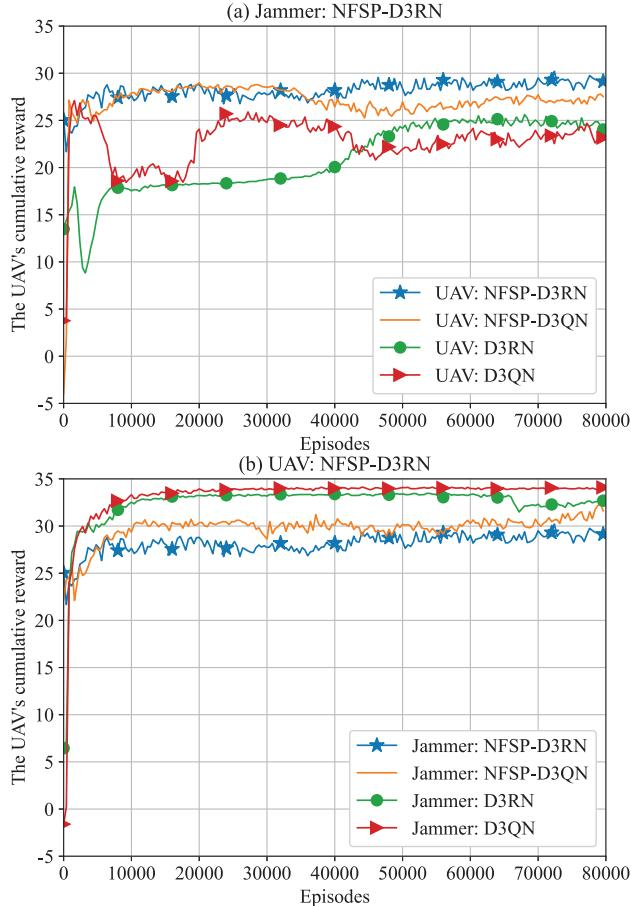  
Fig. 4: The expectation of the $\mathrm { U A V } _ { \mathrm { \Delta } }$ cumulative reward under different algorithms.

The settings of the proposed algorithm are as follows. The number of episodes is 80000. The learning rates for RL and SL are both set as $5 \times 1 0 ^ { - 4 }$ . The sizes of the RL replay buffer $\mathcal { M } _ { \mathrm { R L } } ^ { n }$ and SL replay buffer $\mathcal { M } _ { \mathrm { S L } } ^ { n }$ are respectively set as 35000 and 350000. The exploration parameter ˆ for ˆ-greedy policy is initially set as 0.5 and then gradually decreases to 0. The discount factor γ is 0.95. The batch sizes for SL and RL are set to 128 and 256, respectively. The activation function adopted in the network is ReLU. Both the state-value network and the advantage function network consist of two fully connected layers, with the number of neurons of 128 and 64, respectively.

In terms of training stability, the proposed NFSP-D3RN algorithm use the average policy as the weighted average of historical greedy policies, which smooths the environmental fluctuations caused by the opponent’s policy variations and thus avoids the training oscillations over the RL training rounds. We adjust the weighting factor $\eta$ between the greedy policy and average policy, where it shows that $\eta ~ = ~ 0 . 1$ maximizes the UAV’s cumulative reward under our simulation setup. Moreover, the LSTM module is employed to capture the temporal correlation of historical observations, which compensates for the state information loss arising from the partial observability and observation noise $( \mathrm { e . g . }$ , small-scale fading). Furthermore, the dueling architecture is utilized to suppress the parameter oscillations caused by the propagation of TD errors, reduce the bias in action evaluation, and thereby enhance the stability of parameter updates.

For ablation study, we propose the following benchmark algorithms.

• D3QN: This algorithm is an extension of Double DQN (DDQN) [34] with dueling architecture, which directly utilizes the local observation $o ^ { n } \left( t \right)$ instead of $\rho ^ { n } \left( t \right)$ as the network input of agent n.

• D3RN: This algorithm is an extension of D3QN by encoding the observation input sequence $\rho ^ { n } \left( t \right)$ into $e ^ { n } \left( t \right)$ via LSTM.

• NFSP-D3QN: This algorithm extends D3QN by implicitly modeling the opponent policy via NFSP. Compared with the proposed NFSP-D3RN algorithm, it lacks the LSTM module.

## A. The UAV’s Anti-Jamming Performance with Observable Jammer’s Location

In this subsection, we assume an ideal case that the UAV can observe the location of the jammer, i.e., $o ^ { u } \left( t \right) = s \left( t \right)$

In Fig. 4, we compare the expectation of the cumulative reward of the UAV under of the proposed NFSP-D3RN algorithm with three benchmark algorithms. Specifically, NFSP-D3QN denotes the ablation experiment for the LSTM component, D3RN denotes that for NFSP, and D3QN denotes that for both LSTM and NFSP. In Fig. 4(a), we consider the jammer optimizes its jamming policy via the proposed NFSP-D3RN algorithm. First, we observe from Fig. 4(a) that the UAV’s cumulative reward under NFSP-D3RN outperforms all the benchmark algorithms, with its performance improved by 5.07%, 15.53% and 25% compared with NFSP-D3QN, D3RN and D3QN, respectively. This superiority stems from the fact that the LSTM and NFSP modules assist in the inference of the jamming policies from the historical interactions. Second, it is shown that NFSP-D3QN outperforms D3RN and D3QN due to the advantage of opponent modeling, where it is difficult for the UAV to deal with the intelligent and time-varying jamming policy in this non-stationary environment through independent learning. In Fig. 4(b), the UAV optimizes its anti-jamming policy via the proposed NFSP-D3RN algorithm, while the jammer adopts different jamming algorithms. It demonstrates an inverse relationship between UAV anti-jamming effectiveness and jammer intelligence levels. Specifically, the UAV has worst performance if the jammer is adopting the proposed NFSP-D3RN algorithm. On the one hand, if the jammer possesses the opponent modeling capabilities (i.e., using NFSP framework as in NFSP-D3RN and NFSP-D3QN), it can better predict the UAV’s policies and therefore enhances its jamming effects. On the other hand, if the jammer has the ability to extract the feature of the environmental dynamics through the historical observations (i.e., using the LSTM network as in NFSP-D3RN and D3RN), it can implicitly infer the UAV’s remaining energy, thereby further reducing the UAV’s antijamming performance.

In Fig. 5, we compare the pursuit and evasion trajectories of the jammer and UAV under different anti-jamming algorithms, where the jammer’s policy is optimized via NFSP-D3RN and the UAV’s SINR threshold $\phi$ equals to 0 dB. To make a fair comparison, we fix the starting positions of the UAV and jammer across different anti-jamming algorithms in the four sub-figures. As evident from the figure, the UAV demonstrates enhanced evasion capability when its trajectory minimally overlaps with the jammer’s path, and when the distance between their respective termination points is maximized. We observe that the UAV can escape from the jammer under the proposed NFSP-D3RN algorithm, compared with other baselines. The distance between the termination positions under NFSP-D3QN is slightly closer than NFSP-D3RN, but is still larger than those of D3QN and D3RN thanks to the opponent modeling capability. Moreover, D3QN shows the worst performance, where the UAV is quickly caught up by the intelligent jammer in the middle of the game.

Fig. 6 illustrates the average successful communication or outage events of the UAV under different anti-jamming algorithms, with the jammer employing the NFSP-D3RN algorithm. To increase the long-term achievable rate with the limited battery capacity, the UAV should balance between moving to a safer location to increase the opportunity for successful data transmission, or risking to hover at the current position to save more energy for longer lifetime. We evaluate the deployment decision (i.e., moving or hovering) and the corresponding communication quality (i.e., successful communication or outage) of the UAV into four events: success by hovering, success by moving, outage by hovering, and outage by moving, to represent the successful or failed communication events when the UAV chooses to hover at the current location or move to another location during deployment. We consider that the UAV has better anti-jamming performance if it can survive for a longer lifetime with more successful communications. We observe that the proposed NFSP-D3RN algorithm outperforms the benchmark algorithms in terms of the total successful communication events and operational lifetime. It shows that the UAV moves less frequently with more successful communications when it adopts a more intelligent algorithm, i.e., with opponent modeling or LSTM modules. This prevents the rapid battery depletion and thus saves longer lifetime for the UAV. Note that, in Fig. 6, we assume that the UAV with a low SINR threshold has access to the jammer’s location. In this case, the UAV can choose to hover at a position far away from the jammer to save energy, and fly away promptly when the jammer is closer. When the UAV is far from the jammer, the communication interruption during hovering is a low-probability event, and thus it is not depicted in this figure.

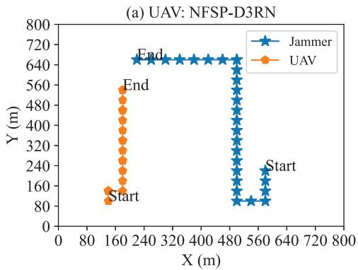

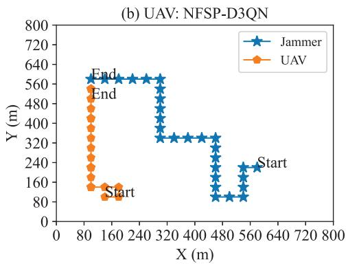

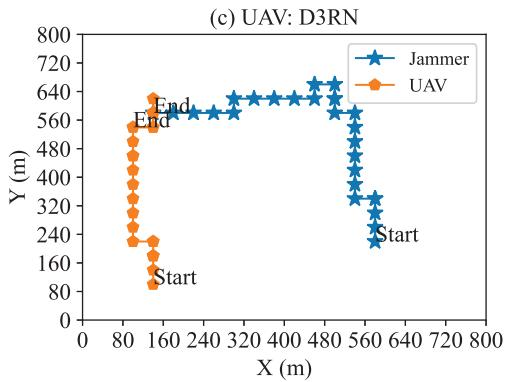

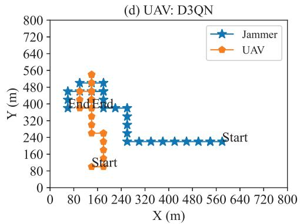  
Fig. 5: The trajectories of the UAV and the jammer under different anti-jamming algorithms with $\phi = 0 ~ \mathrm { d B } ,$

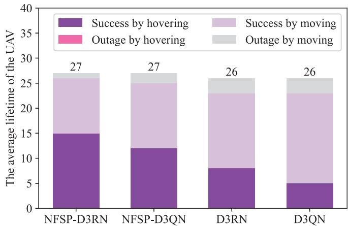  
Fig. 6: The average lifetime of the UAV with $\phi ~ = ~ 0$ dB in an environment with observable jamming positions under different algorithms.

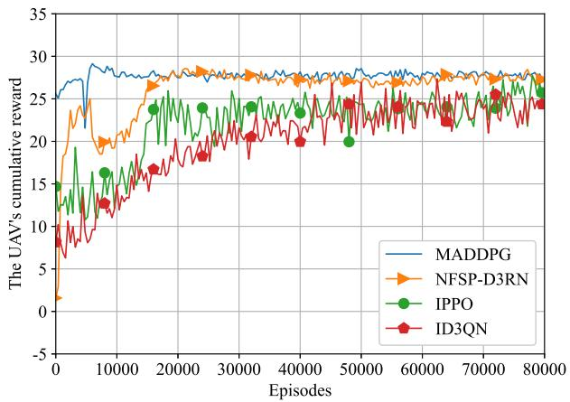  
Fig. 7: The expectation of the UAV’s cumulative reward under different MARL frameworks.

## B. The UAV’s Anti-Jamming Performance with Unobservable Jammer’s Location

In this subsection, we evaluate the anti-jamming performance under the information asymmetry, by assuming that the UAV is not able to obtain the location information of the jammer but the jammer can observe that of the UAV.

In Fig. 7, we compare the performance of the proposed algorithm with that of the centralized training and independent learning MARL baselines. First, the cumulative UAV reward of the proposed NFSP-D3RN algorithm with decentralized training and partial observation is comparatively high as that of MADDPG with centralized training and full observation, which indicates that the proposed algorithm can efficiently mitigate the non-stationarity issue in the multi-agent environment through opponent modeling. Notably, MADDPG relies on the assumption that the opponent’s information (including state, action, and reward) is fully accessible to enable centralized training. However, in the anti-jamming scenario considered in this paper, due to the adversarial relationship between UAV and jammer, it is not reasonable for them to share their private information for centralized training, which makes these CTDE algorithms inapplicable. Second, we further compare the proposed algorithm with the fully decentralized training algorithms including independent PPO (IPPO) and independent D3QN (ID3QN), where both the UAV and jammer independently learn their anti-jamming and jamming policies via the same RL algorithm by treating the opponent as part of the environment. We observe that IPPO and ID3QN have similar UAV reward, both of which are inferior to that of the proposed algorithm.

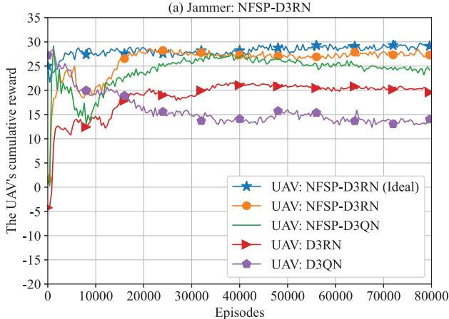

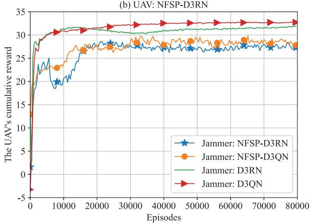  
Fig. 8: The expectation of the UAV’s cumulative reward under different algorithms.

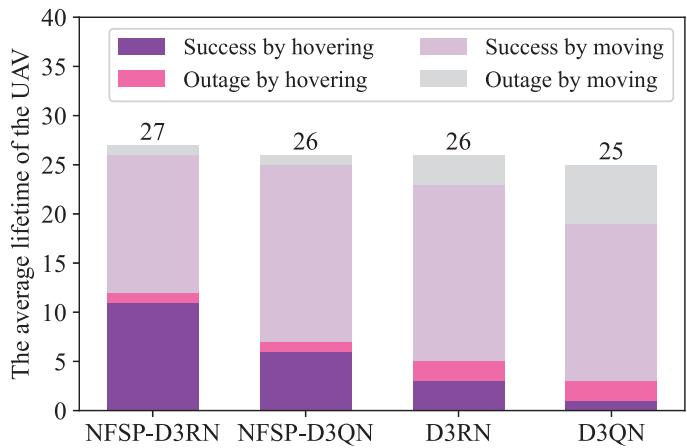  
Fig. 9: The average lifetime of the UAV with φ = 0 dB in an environment with unobservable jamming positions under different algorithms.

In Fig. 8, we evaluate the expectation of the cumulative reward of the partially observable UAV under different algorithms. In Fig. 8(a), the jammer adopts the proposed NFSP-D3RN algorithm to optimize its jamming policy. First, given that the jammer’s location is unobservable, the UAV’s cumulative reward of the proposed NFSP-D3RN algorithm outperforms NFSP-D3QN, D3RN and D3QN by 10.89%, 36.82% and 90.97%, respectively. Moreover, it achieves performance comparable to that of the ideal full-observation case. Second, compared with Fig. 4(a), the performance gap is enlarged between the algorithms with and without NFSP. For the algorithms without opponent modeling capability, i.e., D3RN and D3QN, it is difficult to track the evolutionary policy of jammer, especially when the jammer’s location is unobservable. Compared with Fig. 4(a), the impact of the LSTM module is also more prominent with unknown jammer’s location. This is because fully observable UAV can better predict the escape direction based on the jammer’s location, while the partially observable UAV relies on the hidden state encoded by the LSTM module to infer the jammer’s location. The inaccurate state estimation resulting from the information asymmetry degrades the the optimality of UAV anti-jamming policies in partially observable scenarios. In Fig. 8(b), we compare the performance of different jamming algorithms, against the NFSP-D3RN based anti-jamming policy. Similar to Fig. 4(b), we observe that the jammer imposes more harmful impact on the UAV’s performance if it is more intelligent, i.e., with the aid of NFSP or LSTM. Therefore, the UAV demonstrates the worst performance under an NFSP-D3RN jammer.

Fig. 9 plots the average successful communication or outage events of the UAV under different anti-jamming algorithms, against a jammer employing the NFSP-D3RN algorithm. Compared with Fig. 6, the UAV has less hovering time with more communication failures, given the jammer’s location is unknown. Although the UAV’s SINR threshold is low, it cannot observe the jammer’s location and thus fails to make a timely escape decision based on the distance. When the UAV realizes that hovering may lead to communication failure, it cannot distinguish whether this is due to the jammer’s proximity or channel deterioration. As a result, it can only resort to frequent evasion to maintain the communication effectiveness. Consequently, the time spent on failed hovering increases, and the total hovering duration decreases, as shown in Fig. 9. In contrast, the probability of successful communication by moving increases, which indicates that the UAV intends to avoid being jammed by frequently switching its service locations. Moreover, we observe that NFSP-D3RN still has the longest hovering time, which saves the UAV’s energy to ensure a longer lifetime.

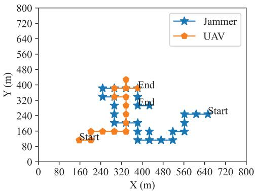  
(a) 0 dB

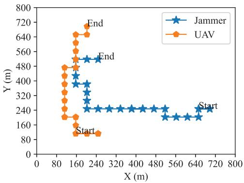  
(b) 3 dB  
Fig. 10: The trajectories of the UAV and the jammer under different anti-jamming algorithms: (a) $\phi = 0$ dB; (b) $\phi = 3 ~ \mathrm { d B }$

In Fig. 10, we compare the pursuit-evasion trajectories of the UAV and jammer under different SINR threshold φ, when both parties employ the proposed NFSP-D3RN algorithm. In Fig. 10(a), we consider the UAV adopts a fixed SINR threshold of 0 dB. Due to the lack of the jammer’s location information, the UAV cannot escape in advance until being affected by the jammer. This indicates that the partial observability has a significant impact on the UAV’s anti-jamming performance, compared with the fully observable counterpart in Fig. 5. In Fig. 10(b), we observe that the UAV detects the presence of the jammer earlier for escaping as its target rate increases. Intuitively, although the UAV cannot “see” the jammer, it is more sensitive to “hear” the jammer earlier with higher SINR threshold, which thus improves the effectiveness in escaping.

## VI. CONCLUSION

Furthermore, Fig. 11 compares the average successful communication and outage events of the UAV with $\phi = 3$ dB under different anti-jamming algorithms, against a jammer employing the NFSP-D3RN algorithm. Different from Fig. 9, the UAV has shorter hovering time, since it is better to escape earlier as long as the outage event occurs, given the jammer’s location information is unknown. We observe that the UAV does not experience the outage events during hovering. In the case of moving, we see that the UAV experiences more outage for $\phi = 3$ dB than that for $\phi = 0$ dB (in Fig. 9), which demonstrates that it is more susceptible to be jammed with a higher SINR target. Compared with the baseline algorithms, the proposed NFSP-D3RN algorithm is not only most energy efficient with longest hovering time, but also has the highest probability of successful communication. These results are consistent with the those in the scenarios that the jammer’s location is fully observable. Specifically, the number of successful communications of the proposed algorithm is increased by 17.65%, 25% and 42.86% compared with NFSP-D3QN, D3RN and D3QN, respectively.

In this paper, we proposed an opponent modeling-based anti-jamming scheme against the intelligent jamming attacks for a UAV assisted communication network. The UAV strategically optimizes its flight trajectory to maximize the expectation of cumulative rate of the ground IoT devices while minimizing the energy consumption, whereas the jammer dynamically adjusts its path to maximize the disruptive interference on the UAV network. We formulated the anti-jamming problem as a partially observable pursuit-evasion game, where the jammer is the pursuer and the UAV is the evader. The information asymmetry is characterized by the UAV’s lack of knowledge about the jammer’s location and the jammer’s inability to observe the UAV’s remaining energy. To optimize the anti-jamming policy in the non-stationary multi-agent learning environment, we proposed the NFSP-D3RN algorithm that probabilistically mixing a D3RN-based greedy policy with an average policy tracking the jammer’s behavioral evolution through historical policy aggregation. Simulation results demonstrate that the proposed algorithm outperforms the baselines in terms of UAV’s average rate and operational lifetime. Furthermore, our results demonstrate that the performance under unknown jammer’s localization approaches that of the full observability scenario, confirming that the opponent modeling effectively bridges the information asymmetry gap.

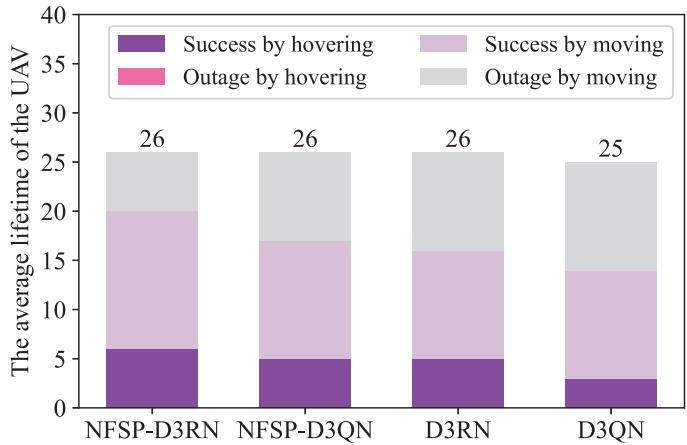  
Fig. 11: The average lifetime of the UAV with $\phi = 3$ dB in an environment with unobservable jamming positions under different algorithms.

## REFERENCES

[1] Y.-H. Hsu and R.-H. Gau, “Reinforcement learning-based collision avoidance and optimal trajectory planning in UAV communication networks,” IEEE Trans. Mob. Comput., vol. 21, no. 1, pp. 306–320, Jan. 2022.

[2] Z. Wang, L. Duan, and R. Zhang, “Adaptive deployment for UAV-aided communication networks,” IEEE Trans. Wireless Commun., vol. 18, no. 9, pp. 4531–4543, Sept. 2019.

[3] Z. Wang and L. Duan, “Chase or wait: Dynamic UAV deployment to learn and catch time-varying user activities,” IEEE Trans. Mob. Comput., vol. 22, no. 3, pp. 1369–1383, Mar. 2023.

[4] L. Wang, K. Wang, C. Pan, W. Xu, N. Aslam, and A. Nallanathan, “Deep reinforcement learning based dynamic trajectory control for UAVassisted mobile edge computing,” IEEE Trans. Mobile Comput., vol. 21, no. 10, pp. 3536–3550, Oct. 2022.

[5] L. Zhang, B. Jabbari, and N. Ansari, “Deep reinforcement learning driven UAV-assisted edge computing,” IEEE Internet Things J., vol. 9, no. 24, pp. 25 449–25 459, Dec. 2022.

[6] Q. Liu, L. Shi, L. Sun, J. Li, M. Ding, and F. Shu, “Path planning for UAV-mounted mobile edge computing with deep reinforcement learning,” IEEE Trans. Veh. Technol., vol. 69, no. 5, pp. 5723–5728, May 2020.

[7] Z. Qin, Z. Liu, G. Han, C. Lin, L. Guo, and L. Xie, “Distributed UAV-BSs trajectory optimization for user-level fair communication service with multi-agent deep reinforcement learning,” IEEE Trans. Veh. Technol., vol. 70, no. 12, pp. 12 290–12 301, Dec. 2021.

[8] Y. Nie, J. Zhao, J. Liu, J. Jiang, and R. Ding, “Energy-efficient UAV trajectory design for backscatter communication: A deep reinforcement learning approach,” China Commun., vol. 17, no. 10, pp. 129–141, Oct. 2020.

[9] Y. Wu, W. Yang, X. Guan, and Q. Wu, “UAV-enabled relay communication under malicious jamming: Joint trajectory and transmit power optimization,” IEEE Trans. Veh. Technol., vol. 70, no. 8, pp. 8275–8279, Aug. 2021.

[10] Z. Ji, W. Yang, X. Guan, X. Zhao, G. Li, and Q. Wu, “Trajectory and transmit power optimization for IRS-assisted UAV communication under malicious jamming,” IEEE Trans. Veh. Technol., vol. 71, no. 10, pp. 11 262–11 266, Oct. 2022.

[11] S. Feng and S. Haykin, “Anti-jamming V2V communication in an integrated UAV-CAV network with hybrid attackers,” in Proc. IEEE Int. Conf. Commun. (ICC), Shanghai, China, May 2019, pp. 1–6.

[12] H. Zhao, J. Hao, and Y. Guo, “Joint trajectory and beamforming design for IRS-assisted anti-jamming UAV communication,” in Proc. IEEE Wireless Commun. Networking Conf. (WCNC), Austin, TX, USA, Apr. 2022, pp. 369–374.

[13] Y. Wu, X. Guan, W. Yang, and Q. Wu, “UAV swarm communication under malicious jamming: Joint trajectory and clustering design,” IEEE Wireless Commun. Lett., vol. 10, no. 10, pp. 2264–2268, Oct. 2021.

[14] C. Han, A. Liu, K. An, G. Zheng, and X. Tong, “Distributed UAV deployment in hostile environment: A game-theoretic approach,” IEEE Wireless Commun. Lett., vol. 11, no. 1, pp. 126–130, Jan. 2022.

[15] Z. Yin, J. Li, Z. Wang, Y. Qian, Y. Lin, F. Shu, and W. Chen, “UAV communication against intelligent jamming: A Stackelberg game approach with federated reinforcement learning,” IEEE Trans. Green Commun. Networking, vol. 8, no. 4, pp. 1796–1808, Dec. 2024.

[16] R. Ding, F. Zhou, Q. Wu, and D. W. K. Ng, “From external interaction to internal inference: An intelligent learning framework for spectrum sharing and UAV trajectory optimization,” IEEE Trans. Wireless Commun., vol. 23, no. 9, pp. 12 099–12 114, Sept. 2024.

[17] C. Liao, K. Xu, G. Hu, X. Xia, C. Wei, W. Xie, C. Li, and Y. Wang, “Game theory and multi-agent DRL based anti-jamming transmission for integrated air-ground network,” IEEE Trans. Veh. Technol., vol. 73, no. 12, pp. 19 565–19 581, Dec. 2024.

[18] Z. Shao, H. Yang, L. Xiao, W. Su, Y. Chen, and Z. Xiong, “Deep reinforcement learning-based resource management for UAV-assisted mobile edge computing against jamming,” IEEE Trans. Mob. Comput., vol. 23, no. 12, pp. 13 358–13 374, Dec. 2024.

[19] C. Fang, Y. Feng, X. Li, and Y. Yang, “Multi-UAV energy-efficient detection coverage under jamming environment: A hierarchical collaborative learning approach,” IEEE Trans. Veh. Technol., pp. 1–13, 2025, early access.

[20] Z. Lv, L. Xiao, Y. Du, G. Niu, C. Xing, and W. Xu, “Multi-agent reinforcement learning based UAV swarm communications against jamming,” IEEE Trans. Wireless Commun., vol. 22, no. 12, pp. 9063–9075, Dec. 2023.

[21] X. Wang and M. C. Gursoy, “Resilient path planning for UAVs in data collection under adversarial attacks,” IEEE Trans. Inf. Forensics Secur., vol. 18, pp. 2766–2779, Apr. 2023.

[22] S. Liu, H. Yang, L. Xiao, M. Zheng, H. Lu, and Z. Xiong, “Learningbased resource management optimization for UAV-assisted MEC against jamming,” IEEE Trans. Commun., vol. 72, no. 8, pp. 4873–4886, Aug. 2024.

[23] Y. Qin, J. Tang, F. Tang, M. Zhao, and N. Kato, “Multi-agent reinforcement learning in adversarial game environments: Personalized antiinterference strategies for heterogeneous UAV communication,” IEEE Trans. Mob. Comput., vol. 24, no. 9, pp. 8886–8898, Sept. 2025.

[24] Z. Li, Y. Lu, X. Li, Z. Wang, W. Qiao, and Y. Liu, “UAV networks against multiple maneuvering smart jamming with knowledge-based reinforcement learning,” IEEE Internet Things J., vol. 8, no. 15, pp. 12 289–12 310, Aug. 2021.

[25] N. Gao, Z. Qin, X. Jing, Q. Ni, and S. Jin, “Anti-intelligent UAV jamming strategy via deep Q-networks,” IEEE Trans. Commun., vol. 68, no. 1, pp. 569–581, Jan. 2020.

[26] R. Lowe, Y. Wu, A. Tamar, J. Harb, P. Abbeel, and I. Mordatch, “Multiagent actor-critic for mixed cooperative-competitive environments,” in Proc. Conf. Neural Inf. Process. Syst. (NeurIPS), vol. 30, Long Beach, California, USA, Dec. 2017, pp. 6382–6393.

[27] Z. Yin, Z. Wang, J. Li, M. Ding, W. Chen, and S. Jin, “Decentralized federated reinforcement learning for user-centric dynamic TFDD control,” IEEE J. Sel. Top. Signal Process., vol. 17, no. 1, pp. 40–53, Jan. 2023.

[28] ITU-R, “Propagation data and prediction methods required for the design of terrestrial broadband radio access systems operating in a frequency range from 3 to 60 GHz,” P.1410-5, Feb. 2012.

[29] Y. Zeng, J. Xu, and R. Zhang, “Energy minimization for wireless communication with rotary-wing UAV,” IEEE Trans. Wireless Commun., vol. 18, no. 4, pp. 2329–2345, Apr. 2019.

[30] R. Ding, F. Gao, and X. S. Shen, “3D UAV trajectory design and frequency band allocation for energy-efficient and fair communication: A deep reinforcement learning approach,” IEEE Trans. Wireless Commun., vol. 19, no. 12, pp. 7796–7809, Dec. 2020.

[31] J. Heinrich and D. Silver, “Deep reinforcement learning from self-play in imperfect-information games,” arXiv: 1603.01121, 2016. [Online]. Available: https://arxiv.org/abs/1603.01121

[32] S. Hochreiter and J. Schmidhuber, “Long short-term memory,” Neural Comput., vol. 9, no. 8, pp. 1735–1780, 1997.

[33] Z. Wang, T. Schaul, M. Hessel, H. V. Hasselt, M. Lanctot, and N. d. Freitas, “Dueling network architectures for deep reinforcement learning,” in Proc. Int. Conf. Mach. Learn. (ICML), New York City, NY, USA, Jun. 2015, pp. 1995–2003.

[34] H. V. Hasselt, A. Guez, and D. Silver, “Deep reinforcement learning with double Q-learning,” in Proc. AAAI Conf. Artif. Intell. (AAAI), vol. 30, Phoenix, Arizona, USA, Feb. 2016, pp. 2094–2100.

[35] V. Mnih, K. Kavukcuoglu, D. Silver, and et al., “Human-level control through deep reinforcement learning,” Nature, vol. 518, no. 7540, pp. 529–533, Feb. 2019.

[36] K. Kawamura and Y. Tsuruoka, “Neural fictitious self-play on ELF mini-RTS,” arXiv:1902.02004, 2019. [Online]. Available: https: //arxiv.org/abs/1902.02004

[37] L. Zhang and W. W. andShijian Li andGang Pan, “Monte Carlo neural fictitious self-play: Achieve approximate Nash equilibrium of imperfect-information games,” arXiv:1903.09569, 2019. [Online]. Available: http://arxiv.org/abs/1903.09569

[38] Y. Sun, L. Zhang, G. Feng, B. Yang, B. Cao, and M. A. Imran, “Blockchain-enabled wireless Internet of Things: Performance analysis and optimal communication node deployment,” IEEE Internet Things J, vol. 6, no. 3, pp. 5791–5802, Jun. 2019.

[39] F. Song, J. Li, M. Ding, L. Shi, F. Shu, M. Tao, W. Chen, and H. V. Poor, “Probabilistic caching for small-cell networks with terrestrial and aerial users,” IEEE Trans. Veh. Technol., vol. 68, no. 9, pp. 9162–9177, Sept. 2019.

[40] N. Cherif, M. Alzenad, H. Yanikomeroglu, and A. Yongacoglu, “Downlink coverage and rate analysis of an aerial user in vertical heterogeneous networks (VHetNets),” IEEE Trans. Wireless Commun., vol. 20, no. 3, pp. 1501–1516, Mar. 2021.