# QoE-Aware Decentralized Task Offloading and Resource Allocation for End-Edge-Cloud Systems: A Game-Theoretical Approach

Ying Chen , Member, IEEE, Jie Zhao , Yuan Wu , Senior Member, IEEE, Jiwei Huang , Member, IEEE, and Xuemin Shen , Fellow, IEEE

Abstract—Due to the limited computing resource and battery capability at the mobile devices, the computation-intensive tasks generated by mobile devices can be offloaded to edge servers or cloud for processing. In this paper, we study the multi-user task offloading problem in an end-edge-cloud system, in which all user devices compete for the limited communication and computing resources. Particularly, we first formulate the offloading problem with the goal of maximizing the Quality of Experience (QoE) of the users subject to resource constraints. Since each user focuses on maximizing its own QoE, we reformulate the problem as a Multi-User Task Offloading Game (MUTO-Game). We then identify an important property that for any device, both the communication interference and the degree of computing resource competition can be upper bounded. Based on the property, we further theoretically prove that there exists at least one Nash Equilibrium offloading strategy in the MUTO-Game. We propose the Game-based Decentralized Task Offloading (GDTO) approach to obtain the Nash Equilibrium offloading strategy. Finally, we analyze the upper bound for the convergence time and characterize the performance guarantee of the obtained offloading strategy for the worst case. A series of experimental results are presented, in comparison with both the centralized optimal approach and the approximate approaches.

Index Terms—Task offloading, end-edge-cloud, quality of experience (QoE), game model

# 1 INTRODUCTION

WITH the rapid development of mobile computing techni- ques, more and more computation-intensive tasks are generated by applications or services running on mobile devices, such as AR, VR [1], etc. However, the computing resources and the battery capacity of mobile devices are generally limited [2]. A feasible solution is to offload the tasks to remote

Ying Chen and Jie Zhao are with Computer School, Beijing Information Science and Technology University, Beijing 100101, China. E-mail: {chenying, zhaojie99723}@bistu.edu.cn.   
Yuan Wu is with the State Key Laboratory of Internet of Things for Smart City, University of Macau, Macau, China. E-mail: yuanwu@um. edu.mo.   
Jiwei Huang is with the Beijing Key Laboratory of Petroleum Data Mining, China University of Petroleum, Beijing 102249, China. E-mail: huangjw@cup. edu.cn.   
Xuemin Shen is with the Department of Electrical and Computer Engineering, University of Waterloo, Waterloo, ON N2L 3G1, Canada. E-mail: sshen@uwaterloo.ca.

Manuscript received 24 May 2022; revised 15 November 2022; accepted 15 November 2022. Date of publication 18 November 2022; date of current version 5 December 2023.

This work was supported in part by the National Natural Science Foundation of China under Grants 61902029, 61972414, 61973161, and 61991404, in part by the R&D Program of Beijing Municipal Education Commission under Grant KM202011232015, in part by Beijing Nova Program under Grant Z201100006820082, in part by Beijing Natural Science Foundation under Grant 4202066, in part by the Science and Technology Development Fund of Macau SAR under Grant 0162/2019/A3, in part by Guangdong Basic and Applied Basic Research Foundation under Grant 2022A1515011287, and in part by the Guangdong-Macau Joint Laboratory for Advanced and Intelligent Computing under Grant GDST 2020B1212030003.

(Corresponding author: Jiwei Huang.)

Digital Object Identifier no. 10.1109/TMC.2022.3223119

cloud with sufficient computing resources. However, offloading to cloud suffers from several limitations. In particular, since the cloud is usually located far away from mobile devices, offloading to the cloud would result in high delay [3] and degrade users’ Quality of Experience (QoE). Moreover, transmitting all the tasks to the cloud would put a heavy burden on the core networks. To solve the above issues, one promising solution is to take advantage of the recently proposed Mobile Edge Computing (MEC) [4], [5], [6], [7] framework. Based on the MEC framework, the edge servers with computing resources are placed at the network access points (typically in base stations) close to mobile devices. In this way, the service delay for mobile devices can be reduced and users’ QoE can be improved. The burden of transmitting tasks from mobile devices on the core networks can also be relieved [8].

Although the edge servers are equipped with some computing resources, the computing capacities are still limited compared with the central cloud [7], [9]. With the rapid increase in the number of mobile applications and mobile devices, the edge servers cannot efficiently process all the offloaded tasks from mobile devices. Therefore, edge servers are typically backed-up by a remote cloud. When the edge servers become heavily loaded by the computation workloads from the mobile devices, part of the tasks can be further offloaded to the cloud [10], [11], [12]. Thus, the task offloading in an end-edge-cloud system has attracted more and more attention from both industry and academia.

However, solving the task offloading problem in the endedge-cloud system faces several challenges. First, the transmission resources and the computing resources on edge servers are limited [9]. All the user devices in the system have to compete for the limited transmission and computing resources [13], and each user device aims at maximizing its own benefit. Therefore, how to achieve a balanced offloading strategy among all the users while maximizing the total benefit of the whole system is a challenging problem. Moreover, the growing solution space size (due to the growing number of the mobile devices and the available channels) also dramatically increases the computational complexity in finding the optimal offloading strategy. There are some heuristic approaches with relatively low complexity that can provide offloading strategies approximated to the globally optimal one. Nevertheless, it is technically difficult to provide a guaranteed performance gap between the approximated one and the globally optimal one.

In this paper, we study the multi-user task offloading problem in the end-edge-cloud system. Our goal is to maximize the QoE of the users subject to the resource constraints. We formulate the problem as a Multi-User Task Offloading Game (MUTO-Game) model, and theoretically prove that there exists at least one Nash Equilibrium offloading solution. Then, we propose a Game-based Decentralized Task Offloading (GDTO) algorithm to solve the game model and reach one of the feasible equilibrium offloading strategies. Theoretical analysis for the convergence time and performance guarantee of the worst case are given. The main contributions of this paper are summarized as follows.

We study the multi-user task offloading problem in an end-edge-cloud system, where the edge servers are located in base stations and are also connected with a central cloud. Tasks of users can be processed locally on the user devices, or offloaded to be processed on the edge servers through wireless channels, or offloaded to the cloud. Our goal is to maximize all the users’ QoE. The offloading constraints include both communication resource constraints and computing resource constraints. The offloading decisions include both the task offloading decisions (i.e., the local processing, the edge/cloud processing) and the channel resource allocation for offloading transmissions.   
Considering that all users are self-interested and aim at optimizing their respectively own QoE, we reformulate the multi-user task offloading problem as a MUTO-Game model. Each game player is the user in the system with the objective of maximizing its own QoE. The solution to the MUTO-Game is defined as its Nash Equilibrium solution. Then, we theoretically demonstrate that for any user in the system, both its communication interference and degree of computing resource competition can be upper bounded (i.e., Lemma 1). Next, we prove, by demonstrating six possible cases, that the MUTO-Game is a potential game and give the corresponding potential function $( \mathrm { i . e . , }$ the results in Theorem 1), based on which we can establish that our MUTO-Game has at least one feasible Nash Equilibrium strategy.   
We propose the Game-based Decentralized Task Offloading (GDTO) algorithm to obtain the Nash Equilibrium offloading strategy for the end-edge-cloud system. Each user individually makes its own offloading decision, and the GDTO algorithm can be implemented in a distributed way. To theoretically analyze

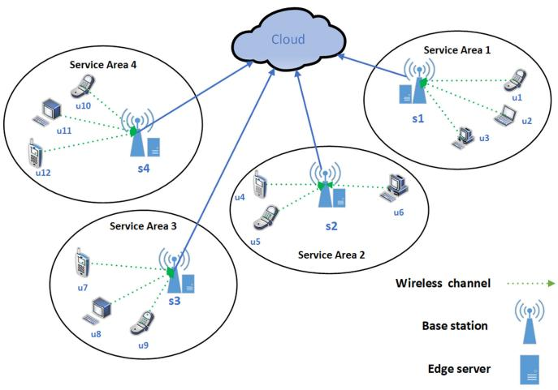

flowchart

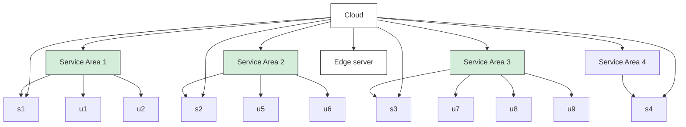

Fig. 1. An example of the system scenario.

the performance of the GDTO algorithm, we give the upper bound of the number of iterations to obtain an Nash Equilibrium offloading strategy (i.e., Theorem 2). Furthermore, we define the Price of Anarchy (PoA), i.e., the ratio of the QoE obtained by the worst Nash Equilibrium offloading strategy and the QoE of the centralized optimal offloading strategy. We then give the lower bound of the PoA (i.e., Theorem 3).

We carry out extensive experiments to evaluate our GDTO algorithm. The experiment results show that when the offloading solution space size increases exponentially, the increasing speed of the number of iterations for GDTO to reach an Nash Equilibrium solution is less than linear speed. We also carry out two groups of experiments with different solution space scales to evaluate GDTO. The small scale experiment with the optimal strategy shows that the QoE of our GDTO algorithm is close to that of the centralized optimal solution. The large scale experiment with four approximate algorithms validate the superiority of our GDTO algorithm.

The remainder of this paper is organized as follows. Section 2 describes the system model and formulates the multiuser task offloading problem. Section 3 reformulates the offloading problem as the MUTO-Game model, and gives the theoretical analysis for the property of the MUTO-Game. Section 4 proposes the decentralized GDTO algorithm, and provides the theoretical analysis for GDTO’s performance. Section 4 provides the experimental evaluation. Section 6 presents the related works and Section 7 gives the conclusion of this paper.

# 2 SYSTEM MODEL AND PROBLEM FORMULATION

# 2.1 System Model

Fig. 1 depicts the system scenario. There are  User Devices (UDs) represented by $U = \{ u _ { 1 } , u _ { 2 } , \ldots , u _ { n } \}$ nand  base stations represented by ${ \cal S } = \{ s _ { 1 } , s _ { 2 } , \dots , s _ { m } \}$ ng m. Each UD $u _ { i }$ has a computing task $( B _ { i } , X _ { i } , \delta _ { i } )$ fs1; s2; . . . ; smg) to process. Here, $B _ { i }$ uirepresents the Bi; Xi; i Bitask’s size (in bits), represents the number of CPU cycles Xirequired to complete the task. $\delta _ { i } \in S$ stands for the base station that the UD $u _ { i }$ i 2 Sconnects to. Each base station (BS) is uiequipped with an edge server to provide computing services for the UDs. In this following, we treat the BS $\delta _ { i }$ and the edge server $\delta _ { i }$ interchangeable. For each BS $s _ { j } ,$ there are $c _ { j }$ wireless i sj cjchannels. Table 1 lists the main notations of this paper. UDs can offload tasks to the edge servers for processing. Referring to existing works [10], [12], [14], [15], we consider the scenario that the UDs are pre-assigned to the BS. We also integrate the collaborative edge-cloud computing framework, and when the UDs assigned BS is overloaded, users’ tasks can be further offloaded to the central cloud for processing. In this way, the UDs transmit their tasks to the cloud through the BSs. If the channel resources are not enough or exhausted, the UDs will have to execute their tasks locally on the devices. To be more specific, we give the detailed definition of offloading decision for each UD in Definition 1.

TABLE 1 Key Notations 

<table><tr><td>Notations</td><td>Definitions</td></tr><tr><td> $u_i$ </td><td>the  $i$ th UD,  $i \in \{1, 2, \dots, n\}$ </td></tr><tr><td> $B_i$ </td><td>the task size of  $u_i$ </td></tr><tr><td> $\mathcal{U}$ </td><td>the set of UDs</td></tr><tr><td> $f_i$ </td><td>the  $u_i$ &#x27;s computing capability (cycles/s)</td></tr><tr><td> $\gamma_i$ </td><td>the  $u_i$ &#x27;s weight parameter of computation resource</td></tr><tr><td> $s_j$ </td><td>the  $j$ th edge server,  $j \in \{1, 2, \dots, m\}$ </td></tr><tr><td> $\hat{f}_{s_j}$ </td><td>the  $s_j$ &#x27;s computing capability (cycles/s)</td></tr><tr><td> $c_j$ </td><td>the number of channels on edge server  $s_j$ </td></tr><tr><td> $f_{\delta_i}$ </td><td>the  $\delta_i$ &#x27;s computing capability (cycles/s)</td></tr><tr><td> $f_{i,\delta_i}$ </td><td>the computing capability obtained by  $u_i$  on  $\delta_i$ </td></tr><tr><td> $\lambda_i$ </td><td>the decision of offloading method for  $u_i$ </td></tr><tr><td> $k_i$ </td><td>the channel selection of  $u_i$ </td></tr><tr><td> $a_i$ </td><td>offloading decision for  $u_i$ ,  $a_i = (\lambda_i, k_i)$ </td></tr><tr><td> $W_i^{k_i}$ </td><td> $k_i$ &#x27;s bandwidth on BS  $\delta_i$ </td></tr><tr><td> $\varpi_0$ </td><td>background noise</td></tr><tr><td> $g_i^{k_i}$ </td><td>the channel gain between  $u_i$  and  $\delta_i$  on wireless channel  $k_i$ </td></tr><tr><td> $\varrho_i$ </td><td>the coefficient of energy consumption per CPU cycle for UD  $u_i$ </td></tr><tr><td> $r_i^{k_i}$ </td><td> $u_i$ &#x27;s data rate on  $k_i$ </td></tr><tr><td> $\hat{r}$ </td><td>data rate between BS and cloud</td></tr><tr><td> $E_{a_{-i}}(a_i)$ </td><td>the quality of experience value of offloading decision  $a_i$ </td></tr><tr><td> $\alpha$ </td><td>the rate of change for QoE</td></tr><tr><td> $\beta$ </td><td>the reference value of QoE</td></tr><tr><td> $E_{max}$ </td><td>the maximum QoE</td></tr><tr><td> $E_{min}$ </td><td>the minimum QoE</td></tr><tr><td> $T_{max}$ </td><td>the maximum delay</td></tr><tr><td> $T_{min}$ </td><td>the minimum delay</td></tr><tr><td> $EC_{max}$ </td><td>the maximum energy consumption</td></tr><tr><td> $EC_{min}$ </td><td>the minimum energy consumption</td></tr><tr><td> $\phi_{-a}(a_i)$ </td><td>potential function</td></tr><tr><td> $M_i^p$ </td><td>threshold of wireless communication interference</td></tr><tr><td> $M_i^\gamma$ </td><td>threshold of computation capability competition</td></tr></table>

Definition 1. (Offloading Decision $a _ { i } )$ Let $a _ { i } \in \{ ( 0 , 0 ) \cup$ $\left( \lambda _ { i } , k _ { i } \right) \}$ ai ai 2 fð0; 0Þrepresent the offloading decision of UD , i.e., to execute ð-i; kiÞg uithe task locally, or offload the task to the edge serve or the cloud through which wireless channel. Specifically, $a _ { i } = ( 0 , 0 )$ represents that the task is executed locally. $\lambda _ { i } = 1$ ai ¼ ð0; 0Þrepresents that the -i ¼ 1task is offloaded to be executed in the edge server $\delta _ { i } ,$ and $\lambda _ { i } = 2$ represents that the task is offloaded to the cloud. $\in \{ 1 , \ldots , c _ { \delta _ { i } } \}$ kirepresents the selected wireless channel of the BS $\delta _ { i }$ f1; . . . ; c i gfor sending the task.

Then, the collective offloading strategy of all the UDs can be defined by Definition 2.

Definition 2. (Offloading Strategy a of all the UDs) An offloading strategy for all the UDs is the collection denoted by $\mathbf { a } = ( a _ { 1 } , \ldots , a _ { n } )$ .

# 2.2 Communication Model

In this paper, we consider that the BS provides multiple available channels, and each UD can choose only one of the channels provided by the BS to access. Multiple users may access the same wireless channel, and there exists interference among the UDs that access the same channel.

# 2.2.1 Offloading to Edge Server

When multiple UDs communicate with the BS on the same channel, there is interference between these UDs. The $\mathrm { S i g \mathrm { - } }$ 号 nal-to-Interference-plus-Noise Ratio (SINR) for UD $u _ { i }$ is

$$
\Upsilon_ {i} ^ {k _ {i}} = \frac {p _ {i} g _ {i} ^ {k _ {i}}}{\varpi_ {0} + \sum_ {u _ {l} \in U / \{u _ {i} \} : k _ {l} = k _ {i} \cap \delta_ {l} = \delta_ {i}} p _ {l} g _ {l} ^ {k _ {i}}}. \tag {1}
$$

$\varpi _ { 0 }$ is the background noise variance. $p _ { i }$ is the transmission \$0power of $u _ { i } , g _ { i } ^ { k _ { i } }$ piis the uplink channel gain between $u _ { i }$ and BS $\delta _ { i }$ ui gion channel $k _ { i }$ . The transmission rate for UD $u _ { i } ^ { \prime } \mathbf { s }$ icomi kimunication with BS $\delta _ { i }$ via channel $k _ { i }$ is

$$
r _ {i} ^ {k _ {i}} = W _ {i} ^ {k _ {i}} \log_ {2} (1 + \Upsilon_ {i} ^ {k _ {i}}), \tag {2}
$$

where $\boldsymbol { W } _ { i } ^ { k _ { i } }$ is the bandwidth on wireless channel $k _ { i }$ . When the Wi kinumber of UDs assigned to the same channel increases, the transmission interference will increase, and the transmission rate will decrease. In this paper, there is a constraint $r _ { m i n }$ for the minimum transmission rate, as shown in Eq. (3). $r _ { m i n }$ is rspecified by the BS provider [13]. If the transmission rate $r _ { i } ^ { k _ { i } }$ is smaller than $r _ { m i n }$ , the transmission will be terminated.

$$
r _ {i} ^ {k _ {i}} \geq r _ {\min}, u _ {i} \in U. \tag {3}
$$

According to Eq. (2), the communication delay between $u _ { i }$ and $\delta _ { i }$ is

$$
\hat {t} _ {i, \delta_ {i}} = \frac {B _ {i}}{r _ {i} ^ {k _ {i}}}. \tag {4}
$$

According to [16], the energy consumption of communication for UD $u _ { i }$ is

$$
\hat {e} _ {i, \delta_ {i}} = p _ {i} \hat {t} _ {i, \delta_ {i}} = p _ {i} \frac {B _ {i}}{r _ {i} ^ {k _ {i}}}. \tag {5}
$$

# 2.2.2 Offloading to Cloud

When the edge servers’ resources are not enough, the tasks of UDs can be offloaded to the cloud for processing. In this way, the BS transmits the data to the remote cloud by a high-speed fiber communication link. UD $u _ { i } ^ { \prime } \mathbf { s }$ delay of transmitting from the BS to the cloud is

$$
\hat {t} _ {c} = \frac {B _ {i}}{\hat {r}}, \tag {6}
$$

where $\hat { r }$ is the transmission rate from the BS to the cloud. r^Therefore, the total transmission delay of UD $u _ { i }$ is

$$
\hat {t} _ {i, c} = \hat {t} _ {i, \delta_ {i}} + \hat {t} _ {c} = \frac {B _ {i}}{r _ {i} ^ {k _ {i}}} + \frac {B _ {i}}{\hat {r}}. \tag {7}
$$

# 2.3 Computation Model

Similar to [17], it is considered that the cloud has sufficient computing resources, and the computation delay on the cloud is very small, and can be neglected. Let $f _ { i }$ represent the computing capability of UD $u _ { i }$ . When UD $u _ { i }$ ichooses to process the task locally $( a _ { i } = ( \lambda _ { i } , k _ { i } ) = ( 0 , 0 ) )$ ui, the computation delay of $u _ { i } ^ { \prime } \mathbf { s }$ task is

$$
t _ {i} = \frac {X _ {i}}{f _ {i}}. \tag {8}
$$

If UD $u _ { i }$ offloads task to the edge server, then, ${ a } _ { i } =$ $( \lambda _ { i } , k _ { i } ) = ( 1 , k _ { i } )$ . Recall that $\delta _ { i }$ represents the BS that $u _ { i }$ ai ¼conð-i; kiÞ ¼ ð1; knects to. Let $f _ { \delta _ { i } }$ i uirepresent the computing capability of the edge server $\delta _ { i }$ f i. The computing resources of the edge server iwill be shared by all the tasks of the UDs offloading to $\delta _ { i }$ . In this paper, the computing resource that $\delta _ { i }$ assigns to $u _ { i }$ iis,

$$
f _ {i, \delta_ {i}} = \frac {\gamma_ {i}}{\sum_ {u _ {l} \in U : \lambda_ {l} = \lambda_ {i} \cap \delta_ {l} = \delta_ {i}} \gamma_ {l}} f _ {\delta_ {i}}, \tag {9}
$$

where $\gamma _ { i }$ is the weight parameter of UD $u _ { i }$ [18]. $\scriptstyle \sum _ { u _ { l } \in U : \lambda _ { l } = \lambda _ { i } \cap \delta _ { l } = \delta _ { i } } \gamma _ { l }$ uiis the sum of the weight parameter of all ul2U:-l¼-i\ l¼ i lthe UDs offloading task to $\delta _ { i }$ . To guarantee the quality of iservice for each UD, there is a minimum threshold $f _ { m i n }$ as shown in Eq. (10).

$$
f _ {i, \delta_ {i}} \geq f _ {\min}, u _ {i} \in U. \tag {10}
$$

and the computing energy consumption [19] of UD $u _ { i }$ can be calculated as

$$
e _ {i} = \varrho_ {i} X _ {i}, \tag {11}
$$

where $\varrho _ { i }$ is the energy consumption factor per CPU cycle for $\mathrm { U D } u _ { i }$ .

uiThe computation delay of UD $u _ { i }$ is

$$
t _ {i, \delta_ {i}} = \frac {X _ {i}}{f _ {i , \delta_ {i}}}, \tag {12}
$$

# 2.4 QoE Model

Similar to the related works [16], [18], [19], [20] on task offloading, in this paper, we consider that each device generates a task, and focus on the offloading strategy of the tasks. Thus, similar to the related works, the queueing delay is ignored in this paper. We can obtain the total delay of each UD $u _ { i } \in U \mathrm { a s } _ { , }$ ,

$$
T _ {i} = \left\{ \begin{array}{l l} t _ {i}, & a _ {i} = (0, 0) \\ \hat {t} _ {i, \delta_ {i}} + t _ {i, \delta_ {i}}, & a _ {i} = (1, k _ {i}) \\ \hat {t} _ {i, \delta_ {i}} + \hat {t} _ {c}, & a _ {i} = (2, k _ {i}) \end{array} . \right. \tag {13}
$$

The total energy consumption of each UD $u _ { i } \in U$ is

$$
E C _ {i} = \left\{ \begin{array}{l l} e _ {i}, & a _ {i} = (0, 0) \\ \hat {e} _ {i, \delta_ {i}}, & a _ {i} \neq (0, 0) \end{array} . \right. \tag {14}
$$

Similar to [16], we consider both the latency and energy consumption of each UD, and formulate the cost of each UD as

$$
C o s t _ {i} = \tau_ {i} ^ {t} T _ {i} + \tau_ {i} ^ {e} E C _ {i}, \tag {15}
$$

where $\boldsymbol { \tau } _ { i } ^ { t }$ and $\tau _ { i } ^ { e }$ (with $\tau _ { i } ^ { t } + \tau _ { i } ^ { e } = 1 )$ represent the weighted i i i þ i ¼ 1parameters of delay and energy consumption of UD $u _ { i } ,$ respectively. Each UD $u _ { i }$ can set its corresponding $\boldsymbol { \tau } _ { i } ^ { t }$ and $\tau _ { i } ^ { e }$ ui i ibased on its own priority and preference. For example, when UD $u _ { i }$ is in a low-battery state and is more concerned uiabout energy consumption, it can set a larger $\tau _ { i } ^ { e } .$ . When UD $u _ { i }$ iruns latency-sensitive applications, it can set a larger $\boldsymbol { \tau } _ { i } ^ { t }$ .

For each $\mathrm { U D } u _ { i } ,$ , there exists an upper bound $T _ { m a x }$ iof the uimaximum delay and a lower bound $T _ { m i n }$ Tmaxof the minimum delay. There is also an upper bound $E C _ { m a x }$ of the maximum ECmaxenergy consumption and a lower bound $E C _ { m i n }$ of the ECminminimum energy consumption. The maximum delay can be upper bounded by $T _ { m a x } = X _ { m a x } / f ,$ , where $f =$ min $\{ f _ { 1 } , f _ { 2 } , \ldots , f _ { n } \}$ Tmax ¼ Xmax=f f ¼is the minimum computing capability minand $X _ { m a x } = \operatorname* { m a x } \{ X _ { 1 } , X _ { 2 } , \ldots , X _ { n } \}$ is the maximum number Xmax ¼ maxfX1; X2; . . . ; Xngof CPU cycles for all UDs’ tasks. The lower bound of minimum delay corresponds to the user completing task through the edge server in an ideal case. In other words, $\bar { T _ { m i n } } = { B _ { m i n } } \bar { / } r _ { m a x } + X _ { m i n } / f _ { m a x } ,$ where $f _ { m a x } =$ max $\{ f _ { s _ { 1 } } , f _ { s _ { 2 } } , \dots , f _ { s _ { m } } \}$ n=rmax þ Xmin=fmax fmax ¼represents the maximum computing maxffs1 ; fs2 ; . . . ; fsm gcapability for edge servers, $B _ { m i n } = \operatorname* { m i n } \{ B _ { i } , u _ { i } \in U \}$ repre-Bmin ¼ minfBi; ui 2 Usents the minimum size of the task for all UDs, $X _ { m i n } =$ min $\{ X _ { 1 } , X _ { 2 } , \ldots , X _ { n } \}$ Xmin ¼is the minimum number of CPU cycles minfX1; X2; . . . ; Xnfor all UDs’ tasks, $r _ { m a x } = W { \log _ { 2 } } ( 1 + p _ { m a x } g _ { m a x } / \varpi _ { 0 } ) , \ p _ { m a x } =$ max $\{ p _ { 1 } , p _ { 2 } , \ldots , p _ { n } \}$ rmax ¼ Wlog 2ð1 þ pmaxgmax=\$0Þ pmax ¼represents the maximum transmission maxfp1; p2; . . . ; pngpower for all UDs and $g _ { m a x } = \operatorname* { m a x } \{ g _ { i } ^ { k _ { i } } , u _ { i } \in U \}$ represents gmax ¼ maxfgi ; ui 2 Ugthe maximum channel gain for all UDs and channels. Similarly, $E C _ { m a x } = \varrho _ { m a x } \breve { X _ { m a x } }$ and $\begin{array} { r } { E C _ { m i n } = p _ { m i n } B _ { m i n } / r _ { m a x } , } \end{array}$ where $\varrho _ { m a x } = \operatorname* { m a x } \{ \varrho _ { 1 } , \varrho _ { 2 } , . ~ . ~ . , \varrho _ { n } \}$ ECmin ¼ pminBmin=rmaxis the maximum energy %max ¼ maxf%1; %2; . . . ; %ngconsumption factor per CPU cycle for all UDs and $p _ { m i n } =$ min $\{ p _ { 1 } , p _ { 2 } , \ldots , p _ { n } \}$ pmin ¼represents the minimum transmission minfp1; p2; . . . ; pngpower for all UDs.

For each UD , we can obtain $\leq \tau _ { i } ^ { t } T _ { m a x } +$ $\tau _ { i } ^ { e } E C _ { m a x } \leq ( \tau _ { i } ^ { t } + \tau _ { i } ^ { e } ) \mathrm { m a x } \{ T _ { m a x } , E C _ { m a x } \} = \mathrm { m a x } \{ T _ { m a x } , \dot { E } C _ { m a x } \} .$ , iECand $C o s t _ { i } \geq \tau _ { i } ^ { t } T _ { m i n } + \tau _ { i } ^ { e } E C _ { m i n } \geq ( \tau _ { i } ^ { t } + \tau _ { i } ^ { e } ) \mathrm { m i n } \{ T _ { m i n } , E C _ { m i n } \}$ $= \operatorname* { m i n } \{ T _ { m i n } , E C _ { m i n } \}$ n þ i ECmin  ð i þ i ÞminfTmin; ECming. Therefore, there exists an upper bound $C o s t _ { m a x } = \operatorname* { m a x } \{ T _ { m a x } , E C _ { m a x } \}$ of the maximum cost and a Costmax ¼ malower bound $C o s t _ { m i n } = \operatorname* { m i n } \{ T _ { m i n } , E C _ { m i n } \}$ of the minimum cost.

Generally speaking, the QoE is often negatively correlated with the cost. When the cost increases, the QoE will decrease. Referring to [21], [22], in this paper, the QoE of each $\mathrm { U D } u _ { i }$ is defined as follows:

$$
E _ {a _ {- i}} (a _ {i}) = \left\{ \begin{array}{l l} E _ {\min}, & a _ {i} = (0, 0) \\ - \alpha \log_ {2} C o s t _ {i} + \beta , & a _ {i} \neq (0, 0), \end{array} \right. \tag {16}
$$

where parameter a  EmaxEmin $\begin{array} { r } { \alpha = \frac { E _ { m a x } - E _ { m i n } } { \log _ { 2 } ( C o s t _ { m a x } / C o s t _ { m i n } ) } > 0 } \end{array}$ Emax-Emin and parameter $\begin{array} { r } { \beta = \frac { E _ { m a x } \log _ { 2 } C o s t _ { m a x } - E _ { m i n } \log _ { 2 } C o s t _ { m i n } } { \log _ { \cdot } ( C o s t ^ { m a x } / C o s t ^ { m i n } ) } > 0 . E _ { \mathrm { m a x } } } \end{array}$ 0denotes the maxi-¼ log 2ðCostmax=CostminÞ > 0 Emaxmum value of the QoE which corresponds to $C o s t _ { \mathrm { m i n } } ,$ , and $E _ { \mathrm { m i n } }$ Costmindenotes the minimum value of the QoE which corre-Eminsponds to $C o s t _ { \mathrm { m a x } } .$ . To be more specific, when the cost approaches $C o s t _ { m i n . }$ , the QoE approaches the maximum value $E _ { m a x }$ Costmin. When the cost approaches $C o s t _ { m a x } ,$ the QoE Emaxapproaches the minimum value $E _ { m i n }$ Co. In $E _ { a _ { - i } } ( a _ { i } ) , \ a _ { - i } =$ $( a _ { 1 } , . . . , a _ { i - 1 } , a _ { i + 1 } , . . . a _ { n } )$ Emin EaiðaiÞ ai ¼represents the offloading decisions of ða1; :::; ai1; aiþ1; :::anÞall the UDs excluding UD .

# 2.5 Problem Formulation

The optimization goal for the task offloading problem is to find the offloading strategy to maximize the sum of QoE of all UDs subject to the resource constraints. The detailed problem formulation is shown in Problem (17).

$$
\max \sum_ {u _ {i} \in U} E _ {a _ {- i}} (a _ {i}) \tag {17}
$$

$$
s. t. \quad (3), (1 0).
$$

Problem (17) is an NP-hard problem[18]. Solving this problem faces severe difficulties and challenges. First, there is a competitive relationship between the UDs. All the UDs compete for the limited resources. Each rational UD focuses on its own benefit, and wants to obtain more resources to maximize its own QoE. Thus, it is hard for all the competing UDs to reach a stable and equilibrium state. Second, as the number of UDs increases, the scale of the solution space size increases exponentially. Thus, centralized optimization approaches often suffer from high complexity, and it is unrealistic to obtain the desired offloading solutions within acceptable time.

# 3 TASK OFFLOADING GAME

We take advantage of game theory to solve the task offloading problem (17) for end-edge-cloud. In the section, we formulate the task offloading game model, and present the theoretical analysis for the property of our offloading game.

# 3.1 Task Offloading Game Formulation

Here, we reformulate the task offloading problem as a Multiuser Task Offloading Game (MUTO-Game) $P =$ $( U , \{ A _ { i } \} _ { u _ { i } \in U } , \{ E _ { i } \} _ { u _ { i } \in U } )$ P ¼.  is the player collection. Each player ðU; fAigui2U; fEigui2UÞ Uis the UD and makes the offloading decision $a _ { i } \in$ $\{ ( 0 , 0 ) \bigcup { ( \lambda _ { i } , k _ { i } ) } \} . \ A _ { i }$ and $E _ { i }$ ai 2are the available offloading decifð0; 0Þ ð-i; kiÞg Ai Eision set and the benefit of UD $u _ { i } ,$ respectively. The benefit of the $\mathrm { U D } u _ { i }$ uiis represented by its QoE according to Eq. (16).

uiIn this paper, we consider that there is a network service provider (or an agent) for each BS. The service provider (agent) maintains the information of all the users connected to the BS. Each user acquires the information (such as channel information, interference information) from the service provider and sends back user’s desirable decision to the service provider. All these players compete for the limited channels and computing resources. Next, we define the offloading solution to this game by its Nash Equilibrium solution. The Pdetailed definition is given in Definition 3 below.

Definition 3. (Nash Equilibrium) Given the MUTO-Game $P =$ $( U , \{ A _ { i } \} _ { u _ { i } \in U } , \{ E _ { i } \} _ { u _ { i } \in U } )$ P ¼, if no UD can change its decision to ðU; fAigui2U ; fEigui2U Þincrease its QoE, the offloading strategy $\mathbf { a } ^ { * } = ( a _ { 1 } ^ { * } , a _ { 2 } ^ { * } , \ldots , a _ { n } ^ { * } )$ can reach a Nash Equilibrium, i.e.

$$
E _ {a _ {- i} ^ {*}} (a _ {i}) \leq E _ {a _ {- i} ^ {*}} (a _ {i} ^ {*}), \forall u _ {i} \in U, \forall a _ {i} \in A _ {i}. \tag {18}
$$

Then, we give Property 1 which demonstrates that the optimal offloading solution to each UD is its best response to other UDs.

Property 1. For the Nash Equilibrium offloading solution $a ^ { * } =$ $( a _ { 1 } ^ { * } , a _ { 2 } ^ { * } , \ldots , a _ { n } ^ { * } )$ a ¼of the MUTO-Game , UD ’s optimal

; . . . ; anÞ P ui          Authorized licensed use limited to: Guangxi University. Downloaded on June 01,2026 at 05:25:45 UTC from IEEE Xplore. Restrictions apply.

offloading decision $a _ { i } ^ { * } \in A _ { i }$ is the best response to the offloading decisions $a _ { \scriptscriptstyle - } ^ { \ast }$ aiof other $( n - 1 )$ UDs.

Proof. Together with Eqs. (1), (2), (9), (13), and (16), for each UD $u _ { i } ,$ given the offloading decisions of other UDs uiexcluding $u _ { i } , u _ { i } ^ { \prime } \mathbf { s }$ QoE depends on $a _ { i } .$ . Suppose $a _ { i } ^ { * } \in A _ { i }$ is ui uinot the best response of UD $u _ { i } ,$ ai ai 2 Ai, then, there must exist another better decision $a _ { i } \in A _ { i }$ uisuch that $a _ { i }$ can increases its QoE and $E _ { a ^ { * } . } ( a _ { i } ) > E _ { a ^ { * } . } ( a _ { i } ^ { * } )$ ai. This contradicts with the Eaicondition that $E _ { a ^ { * } . } ( a _ { i } ) \leq E _ { a ^ { * } . } ^ { ^ { - } } ( a _ { i } ^ { * } )$ . Therefore, $a _ { i } ^ { * } \in A _ { i }$ Eai ðaiÞ  Eai ðmust be the best response of UD $u _ { i }$ Þ ai 2 Aigiven other UDs’ offloading decisions. □

Property 1 shows that if a Nash equilibrium offloading solution exists, then the MUTO-Game allows each individual UD to make its own offloading decision, and all users’ decisions together form the overall offloading strategy. In this way, the offloading decision for each individual UD can be obtained in a distributed pattern, reducing the time complexity and improving the efficiency.

# 3.2 Analysis of Nash Equilibrium Offloading Solution

In this part, we propose the detailed theorem to demonstrate that an Nash Equilibrium solution exists in the MUTO-Game. We propose Lemma 1 which proves that for all the UDs, the transmission interference and the degree of computing resources competition can be upper bounded.

Lemma 1. For each UD $u _ { i } , i f i t$ is allocated to channel $k _ { i , \ast }$ , then in uithe transmission process, $u _ { i } ^ { \prime } s$ ki transmission interference $\scriptstyle \sum _ { u _ { l } \in U / \{ u _ { i } \} : k _ { l } = k _ { i } \cap \delta _ { l } = \delta _ { i } } p _ { l } g _ { l } ^ { k _ { l } }$ uican be upper bounded by

$$
M _ {i} ^ {p} = (p _ {i} g _ {i} ^ {k _ {i}}) / (2 ^ {\frac {r _ {m i n}}{W}} - 1) - \varpi_ {0}. \tag {19}
$$

In addition, if UD $u _ { i }$ decides to complete its task by the edge server in BS $\delta _ { i , \hphantom { 0 } }$ ui, then, ’s degree of computing resource competition $\scriptstyle \sum _ { u _ { l } \in U : \lambda _ { l } = \lambda _ { i } \cap \delta _ { l } = \delta _ { i } } \gamma _ { l }$ can be upper bounded by

$$
M _ {i} ^ {\gamma} = \frac {\gamma_ {i}}{f _ {m i n}} f _ {\delta_ {i}}. \tag {20}
$$

Proof. UD $u _ { i }$ can transmit data through channel $k _ { i }$ only if ui condition (3) is satisfied. That is to say, $r _ { i } ^ { k _ { i } } \ge r _ { m i n }$ . ri  rminTogether with Eq. (1) and Eq. (2), we obtain that $\textstyle \sum _ { u _ { l } \in U / \{ u _ { i } \} : k _ { l } = k _ { i } \cap \delta _ { l } = \delta _ { i } } p _ { l } g _ { l } ^ { k _ { l } } \leq ( p _ { i } g _ { i } ^ { k _ { i } } ) / ( 2 ^ { \frac { r _ { m i n } } { W } } - 1 ) - \varpi _ { 0 } = M _ { i } ^ { p }$ . ul2U=fuig:kl¼ki\ l¼ i plSimilarly, the task of $u _ { i }$  ðpigi Þ=ð2  1Þ  \$0 ¼ Mican only be executed on the edge server in $\mathtt { B S } \delta _ { i }$ uionly if condition (10) is satisfied, $\mathbf { i . e . } , f _ { i , \delta _ { i } } \geq$ $f _ { m i n } .$ i fi; i  Together with Eq. (9), we obtain that $\begin{array} { r } { \sum _ { i } \qquad \sum _ { \delta _ { i } \in \boldsymbol { U } : \lambda _ { l } = \lambda _ { i } \cap \delta _ { l } = \delta _ { i } } \gamma _ { \delta _ { i } } \geq f _ { m i n } } \end{array}$ $\begin{array} { r } { \frac { \gamma _ { i } } { f _ { m i n } } f _ { \delta _ { i } } = M _ { i } ^ { \gamma } } \end{array}$ di gl fdi  holds. . Thus, $\begin{array} { r } { \sum _ { u _ { l } \in U : \lambda _ { l } = \lambda _ { i } \cap \delta _ { l } = \delta _ { i } } \gamma _ { l } \leq } \end{array}$

Then, we can prove that our MUTO-Game is a potential game based on the lemma 1. Definition 4 gives a detailed definition of potential games.

Definition 4. (Potential Game) If a potential function f exists and satisfies Eq. (21), the game is a potential game.

$$
E _ {a _ {- i}} (a _ {i}) \leq E _ {a _ {- i}} (a _ {i} ^ {\prime}) \Rightarrow \phi_ {a _ {- i}} (a _ {i}) \leq \phi_ {a _ {- i}} (a _ {i} ^ {\prime}), \tag {21}
$$

where $u _ { i } \in U$ and $a _ { i } , a _ { i } ^ { \prime } \in A _ { i }$ .

For a potential game, the potential function increases (or decreases) with the increase (or decrease) of the utility function. Next, we give Theorem 1 to prove our MUTO-Game is a potential game.

Theorem 1. The MUTO-Game is a potential game, and the potential function is

$$
\begin{array}{l} \phi_ {- a} (a _ {i}) = \\ - \frac {1}{2} \sum_ {u _ {i} \in U} Q _ {i} \sum_ {u _ {l} \neq u _ {i}} (p _ {l} g _ {l} ^ {k _ {i}} I _ {\{k _ {l} = k _ {i} \}} + \gamma_ {l} I _ {\{\lambda_ {l} = \lambda_ {i} \}}) I _ {\{\delta_ {l} = \delta_ {i} \cap a _ {i} = (1, k _ {i}) \}} \\ - \sum_ {u _ {i} \in U} Q _ {i} (\sum_ {u _ {l} \neq u _ {i}} p _ {l} g _ {l} ^ {k _ {i}} I _ {\{k _ {l} = k _ {i} \}} + M _ {i}) I _ {\{\delta_ {l} = \delta_ {i} \cap a _ {i} = (2, k _ {i}) \}} \\ - \sum_ {u _ {i} \in U} Q _ {i} \eta M _ {i} I _ {\{a _ {i} = (0, 0) \}}, \\ \end{array}
$$

$$
\begin{array}{c} w h e r e \eta \geq 2, Q _ {i} = p _ {i} g _ {i} ^ {k _ {i}} + \gamma_ {i}, M _ {i} = M _ {i} ^ {p} + M _ {i} ^ {\gamma} = \frac {\gamma_ {i}}{f _ {m i n}} f _ {\delta_ {i}} + \\ (p _ {i} g _ {i} ^ {k _ {i}}) / (2 ^ {\frac {r _ {m i n}}{W}} - 1) - \varpi_ {0}. \end{array}
$$

Proof. For each UD $u _ { i } ,$ consider two different offloading decisions $a _ { i }$ and $a _ { i } ^ { \prime } .$ ui. We suppose that $E _ { a _ { - i } } ( a _ { i } ) \leq E _ { a _ { - i } } ( a _ { i } ^ { \prime } )$ ai ai EaiðaiÞ  Eaand prove Theorem 1 from the following 6 cases. 1) ${ a } _ { i } =$ $( 1 , k _ { i } )$ and $a _ { i } ^ { \prime } = ( 1 , k _ { i } ^ { \prime } ) ; ~ 2 ) ~ a _ { i } = ( 2 , k _ { i } )$ and $a _ { i } ^ { \prime } = ( 2 , k _ { i } ^ { \prime } ) ; 3 )$ $a _ { i } = \left( 2 , k _ { i } \right)$ ai ¼and $a _ { i } ^ { \prime } = ( 1 , k _ { i } ^ { \prime } ) ; 4 ) ~ a _ { i } = ( 2 , k _ { i } )$ ai and $a _ { i } ^ { \prime } = ( 1 , k _ { i } ) ;$ ; $5 ) \quad a _ { i } = ( 0 , 0 )$ ai ¼ ð1and $a _ { i } ^ { \prime } = ( 1 , k _ { i } ^ { \prime } ) ; ~ 6 ) ~ a _ { i } = ( 0 , 0 )$ ð1; kiÞand $a _ { i } ^ { \prime } = ( 2 , k _ { i } ^ { \prime } )$ 0;. □

Case 1. $a _ { i } = \left( 1 , k _ { i } \right)$ and $a _ { i } ^ { \prime } = ( 1 , k _ { i } ^ { \prime } )$ .

According to Eq. (16), we have $C o s t ( a _ { i } ) \geq C o s t ( a _ { i } ^ { \prime } )$ CostðaiÞ  CoTogether with Eqs. (1), (2), (4), and (12), we obtain that

$$
\sum_ {u _ {l} \in U / \{u _ {i} \}: k _ {l} = k _ {i} \cap \delta_ {l} = \delta_ {i}} p _ {l} g _ {l} ^ {k _ {i}} \geq \sum_ {u _ {l} \in U / \{u _ {i} \}: k _ {l} = k _ {i} ^ {\prime} \cap \delta_ {l} = \delta_ {i}} p _ {l} g _ {l} ^ {k _ {i} ^ {\prime}}.
$$

Thus,

$$
\phi_ {a _ {- i}} (a _ {i}) - \phi_ {a _ {- i}} (a _ {i} ^ {\prime}) =
$$

$$
Q _ {i} \sum_ {u _ {l} \in U / \{u _ {i} \}} (p _ {l} g _ {l} ^ {k _ {i} ^ {\prime}} I _ {\{k _ {l} = k _ {i} ^ {\prime} \}} - p _ {l} g _ {l} ^ {k _ {i}} I _ {\{k _ {l} = k _ {i} \}}) I _ {\{\delta_ {l} = \delta_ {i} \}} \leq 0.
$$

Case 2. $a _ { i } = \left( 2 , k _ { i } \right)$ and $a _ { i } ^ { \prime } = ( 2 , k _ { i } ^ { \prime } )$ .

According to Eqs. (13) and (16), $E _ { a _ { - i } } ( a _ { i } ) \leq E _ { a _ { - i } } ( a _ { i } ^ { \prime } )$ implies $r _ { i } ^ { k _ { i } } \leq r _ { i } ^ { k _ { i } ^ { \prime } }$ Eai ðaiÞ  Eai ðaiÞ. Thus, the proof of Case 2 is similar as that ri  ri of Case 1. We can obtain $\phi ( a _ { i } ) _ { a _ { - i } } \leq \phi _ { a _ { - i } } ( a _ { i } ^ { \prime } )$ .

Case 3. $a _ { i } = \left( 2 , k _ { i } \right)$ and $a _ { i } ^ { \prime } = \left( 1 , k _ { i } ^ { \prime } \right)$ .

In Lemma 1, we prove $\sum _ { . } { { { u } _ { l } } \in { U } / \{ { { u } _ { i } } \} } . { { k } _ { l } } \mathrm { { = } } { { k } _ { i } } \cap { \delta _ { l } } \mathrm { { = } } { \delta _ { i } } \mathrm { { } } p _ { l } { g } _ { l } ^ { { { k } _ { i } } } +$ $\begin{array} { r } { \sum _ { u _ { l } \in U / \{ u _ { i } \} : \lambda _ { l } = \lambda _ { i } \cap \delta _ { l } = \delta _ { i } } \gamma _ { l } \leq M _ { i } } \end{array}$ ul2. Therefore,

$$
\phi_ {a _ {- i}} (a _ {i}) - \phi_ {a _ {- i}} (a _ {i} ^ {\prime}) =
$$

$$
Q _ {i} \big [ \sum_ {u _ {l} \in U / \{u _ {i} \}: \delta_ {l} = \delta_ {i}} (p _ {l} g _ {l} ^ {k _ {i} ^ {\prime}} I _ {\{k _ {l} = k _ {i} ^ {\prime} \}} + \gamma_ {l} I _ {\{\lambda_ {l} = \lambda_ {i} ^ {\prime} \}})
$$

$$
\left. - M _ {i} - \sum_ {u _ {l} \in U / \{u _ {i} \}: \delta_ {l} = \delta_ {i}} p _ {l} g _ {l} ^ {k _ {i}} I _ {\{k _ {l} = k _ {i} \}} \right] <   0.
$$

Case 4. $a _ { i } = \left( 2 , k _ { i } \right)$ and $a _ { i } ^ { \prime } = \left( 1 , k _ { i } \right)$ .

Similar to the Case 3, Because

$$
\sum_ {u _ {l} \in U / \{u _ {i} \}: k _ {l} = k _ {i} \cap \delta_ {l} = \delta_ {i}} p _ {l} g _ {l} ^ {k _ {i}} + \sum_ {u _ {l} \in U / \{u _ {i} \}: \lambda_ {l} = \lambda_ {i} \cap \delta_ {l} = \delta_ {i}} \gamma_ {l} \leq M _ {i}.
$$

Therefore, $\begin{array} { r } { \sum _ { u _ { l } \in U / \{ u _ { i } \} : \lambda _ { l } = \lambda _ { i } \cap \delta _ { l } = \delta _ { i } } \gamma _ { l } \leq M _ { i } } \end{array}$ . We obtain

$$
\phi_ {a _ {- i}} (a _ {i}) - \phi_ {a _ {- i}} (a _ {i} ^ {\prime}) =
$$

$$
Q _ {i} \big (\sum_ {u _ {l} \in U / \{u _ {i} \}: \delta_ {l} = \delta_ {i}} \gamma_ {l} I _ {\{\lambda_ {l} = \lambda_ {i} ^ {\prime} \}} - M _ {i} \big) <   0.
$$

Case 5. $a _ { i } = ( 0 , 0 )$ and $a _ { i } ^ { \prime } = ( 1 , k _ { i } ^ { \prime } )$ .

$$
\begin{array}{c} \eta \geq 2 \quad \text { and } \quad \sum_ {u _ {l} \in U / \{u _ {i} \}: \lambda_ {l} = \lambda_ {i} \cap \delta_ {l} = \delta_ {i}} p _ {l} g _ {l} ^ {k _ {i}} + \\ \sum_ {u _ {l} \in U / \{u _ {i} \}: \lambda_ {l} = \lambda_ {i} \cap \delta_ {l} = \delta_ {i}} \gamma_ {l} \leq M _ {i} \text { imply   that } \end{array}
$$

$$
\phi_ {a _ {- i}} (a _ {i}) - \phi_ {a _ {- i}} (a _ {i} ^ {\prime}) =
$$

$$
Q _ {i} [ \sum_ {u _ {l} \in U / \{u _ {i} \}: \delta_ {l} = \delta_ {i}} (p _ {l} g _ {l} ^ {k _ {i} ^ {\prime}} I _ {\{k _ {l} = k _ {i} ^ {\prime} \}} + \gamma_ {l} I _ {\{\lambda_ {l} = \lambda_ {i} ^ {\prime} \}}) - \eta M _ {i} ] <   0.
$$

Case 6. $a _ { i } = ( 0 , 0 )$ and $a _ { i } ^ { \prime } = ( 2 , k _ { i } ^ { \prime } )$ .

Similar to the Case 5, we obtain

$$
\phi_ {a _ {- i}} (a _ {i}) - \phi_ {a _ {- i}} (a _ {i} ^ {\prime}) =
$$

$$
Q _ {i} \big [ \sum_ {u _ {l} \in U / \{u _ {i} \}: k _ {l} = k _ {i} ^ {\prime}} p _ {l} g _ {l} ^ {k _ {i} ^ {\prime}} - (\eta - 1) M _ {i} \big ] <   0.
$$

Until now, we have proved that Eq. (22) holds for all the 6 cases, which thus completes the whole proof.

# 4 GAME-BASED DECENTRALIZED TASK OFFLOADING ALGORITHM

In the section, we propose the Game-based Decentralized Task Offloading (GDTO) Approach to solve the original problem for the end-edge-cloud system. The theoretical analysis for the convergence of our GDTO approach and its optimality analysis are also given.

4.1 Decentralized Task Offloading Approach Design Theorem 1 proves that the MUTO-Game is a potential game. Thus, the MUTO-Game has the Finite Improvement Property (FIP) [23], and the Nash Equilibrium offloading strategy can be obtained through the finite number of iterations. Therefore, we design the GDTO algorithm, i.e., Algorithm 4.1, to find a Nash Equilibrium of the game. Each UD makes the offloading decision in an iterative pattern. Each UD searches for the optimal decisions in parallel and then competes for the update opportunities. Only the UD who wins the update opportunity can update the decision. The GDTO algorithm terminates when no UD wants to change the decision furthermore.

Algorithm 1. Game-Based Decentralized Task Offloading (GDTO) Algorithm   
Input: $S = \{s_{1}, s_{2}, \ldots, s_{m}\}$ , $U = \{u_{1}, u_{2}, \ldots, u_{n}\}$ , and other parameters

Output: all UDs' decision

1: Initialization:
2: $a = \{a_{1}, a_{2}, \ldots, a_{n}\}$ , mobile device $u_{i}$ 's decision $a_{i} = (\lambda_{i}, k_{i}) = (0, 0)$ , where $i = 1 \sim n$ 3: End Initialization
4: repeat
5: for each UD $u_{i} \in U$ do
6: Calculate the current $r_{i}^{k_{i}}$ and $f_{i,\delta_{i}}$ 7: if $f_{i,\delta_{i}} < f_{min}$ then
8: update its decision with $a_{i} = (2, k_{i})$ 9: if $r_{i}^{k_{i}} < r_{min}$ then
10: update its decision with $a_{i} = (0, 0)$ 11: Calculate the current QoE
12: Calculate the current total QoE
13: for each UD $u_{i} \in U$ do
14: for each channel $k_{i} \in \{1, \ldots, c_{\delta_{i}}\}$ do
15: Calculate $\sum_{u_{i} \in U} E_{a_{-i}}(a_{i}')$ when $u_{i}$ 's task is offloaded to $k_{i}'$ channel and completed in edge server or cloud.
16: Find a decision that can achieve the highest $\sum_{u_{i} \in U} E_{a_{-i}}(a_{i}')$ from all possible decisions
17: if $\sum_{u_{i} \in U} E_{a_{-i}}(a_{i}') > \sum_{u_{i} \in U} E_{a_{-i}}(a_{i})$ then
18: send $a_{i}'$ to contend for decision update opportunity
19: if $u_{i}$ gets a chance to get an update then
20: chance $u_{i}$ 's decision to $a_{i}'$ 21: until there is no need to update decisions for any user
22: return a

At the beginning, for the initial settings, no UD offloads the task and each UD $u _ { i } , \forall u _ { i } \in U$ starts with the offloading decision $a _ { i } = ( 0 , 0 )$ ui; 8ui 2 U(Lines 1-3). Next, the GDTO approach ai ¼ ð0; 0Þallows each UD to update the offloading decision by iteration. Based on the FIP property, the GDTO approach is guaranteed to converge and reach the Nash equilibrium, where no single UD will change its decision any further.

In each iteration, the transmission rate $r _ { i } ^ { k _ { i } }$ and the allocated computing resources $f _ { i , \delta _ { i } }$ rifor each UD $u _ { i }$ are calcufi; i uilated. Then, the constraints of Eq. (3) and Eq. (10) are checked and validated (Lines 5-10). After that, the each UD $u _ { i } ^ { \prime } \mathbf { s }$ current QoE and total QoE of all UDs is calculated. uiThen, each UD $u _ { i }$ searches for the best offloading decision $a _ { i } ^ { \prime }$ ui(Lines 13-16). The UD $u _ { i } ^ { \prime } \mathbf { s }$ decision to update is $\bar { a } _ { i } ^ { \prime }$ and the aiprevious decision is $a _ { i }$ ui ai. Then, the UD compares the new aidecision with the previous decision. If $\begin{array} { r } { \sum _ { u _ { i } \in U } E _ { a _ { - i } } ( a _ { i } ^ { \prime } ) > } \end{array}$ $\begin{array} { r } { \sum _ { u _ { i } \in U } E _ { a _ { - i } } ( a _ { i } ) , a _ { i } ^ { \prime } } \end{array}$ ui2U Eai ðai Þ >will be sent to the new decision set of all ui2U EaiðaiÞ aiUDs to compete for update opportunities (Lines 17-18). In some studies [13], [24], the competitive process is used to determine the winner in an indeterminate manner (such as by random method). In this paper, we consider the UD with the largest change in QoE utility as the winner. After that, if UD $u _ { i }$ wins the update opportunity, $a _ { i }$ will be updated to $a _ { i } ^ { \prime } .$ . ui ai aiDecisions of the UDs that do not win will not be updated in the iteration (Lines 19-20). After the winner has updated the decision, the QoE of all UDs that are affected by the winner will be updated accordingly. Finally, when no UD changes the offloading decision, the GDTO algorithm ends and the Nash equilibrium offloading strategy is reached.

The decisions of all the UDs constitute the final offloading strategy $^ { a , }$ which is the solution of the GDTO problem a(Lines 21-22). Since each individual UD makes its own offloading decision, our GDTO algorithm is a decentralized algorithm.

# 4.2 Convergence Analysis

After a finite number of iterations, the MUTO-Game will finally reach a Nash Equilibrium offloading strategy because of the FIP property. Next, we prove the upper bound of the converge time measured by the number of iterations, as in Theorem 2.

Theorem 2. When $Q _ { i } , Q _ { i } ^ { p }$ and $M _ { i }$ are non-negative integers for $u _ { i } \in U ,$ Qi Qi Mi, there is an upper limit on the number of iterations, ui 2 Uwhich satisfies

$$
\begin{array}{l} R \leq \frac {1}{2} n ^ {2} Q _ {m a x} ^ {2} / Q _ {m i n} + n Q _ {m a x} (n Q _ {m a x} ^ {p} + M _ {m a x}) / Q _ {m i n} \\ + n \eta Q _ {m a x} M _ {m a x} / Q _ {m i n}, \\ \end{array}
$$

$$
\begin{array}{c} \text {where} Q _ {i} ^ {p} \triangleq p _ {i} g _ {i} ^ {k _ {i}}, Q _ {m i n} ^ {p} \triangleq m i n (Q _ {i} ^ {p}), Q _ {m a x} ^ {p} \triangleq m a x (Q _ {i} ^ {p}), \\ Q _ {m a x} \triangleq m a x (Q _ {i}), Q _ {m i n} \triangleq m i n (Q _ {i}) \text {and} M _ {m a x} \triangleq m a x (M _ {i}). \end{array}
$$

Proof. According to Eq. (22), it holds

$$
\begin{array}{l} 0 \geq \phi_ {a _ {- i}} (a _ {i}) \\ \geq - \frac {1}{2} \sum_ {u _ {i} \in U} \sum_ {u _ {l} \in U} Q _ {m a x} Q _ {m a x} I _ {\{a _ {i} = (1, k) \}} \\ - \sum_ {u _ {i} \in U} Q _ {m a x} (\sum_ {u _ {l} \in U} Q _ {m a x} ^ {p} + M _ {m a x}) I _ {\{a _ {i} = (2, k) \}} \\ - \sum_ {u _ {i} \in U} \eta Q _ {\max} M _ {\max} I _ {\{a _ {i} = (0, 0) \}} \\ \end{array}
$$

Thus, we have

$$
\begin{array}{l} 0 \geq \phi_ {a _ {- i}} (a _ {i}) \geq - \frac {1}{2} n ^ {2} Q _ {\max} ^ {2} - n Q _ {\max} (n Q _ {\max} ^ {p} + M _ {\max}) \\ - n \eta Q _ {\max} M _ {\max}. \tag {23} \\ \end{array}
$$

If $u _ { i }$ updates its decision from $a _ { i }$ to $a _ { i } ^ { \prime } , \ u _ { i } ^ { \prime } { \bf s }$ QoE uiincreases, $\mathbf { \bar { \Sigma } } E ( a _ { i } ) \mathbf { \Sigma } < \mathbf { \Sigma } E ( a _ { i } ^ { \prime } )$ ai ai ui. According to Definition 4, the EðaiÞpotential function $\phi _ { - a } ( a _ { i } )$ meets

$$
\phi_ {a _ {- i}} (a _ {i} ^ {\prime}) - \phi_ {a _ {- i}} (a _ {i}) \geq 0 \tag {24}
$$

Then, we prove Theorem. 2 by analyzing the following 6 cases. □

Case 1. $a _ { i } = \left( 1 , k _ { i } \right)$ and $a _ { i } ^ { \prime } = ( 1 , k _ { i } ^ { \prime } )$ .

According to Eq. (22), There is

$$
\phi_ {a _ {- i}} (a _ {i} ^ {\prime}) - \phi_ {a _ {- i}} (a _ {i}) =
$$

$$
Q _ {i} \sum_ {u _ {l} \in U / \{u _ {i} \}} (Q _ {l} ^ {p} I _ {\{k _ {l} = k _ {i} \}} - Q _ {l} ^ {p} I _ {\{k _ {l} = k _ {i} ^ {\prime} \}}) I _ {\{\delta_ {l} = \delta_ {i} \}} > 0 \tag {25}
$$

Because $Q _ { i } ^ { p }$ is a non-negative integer for $u _ { i } \in U ,$ , there holds

$$
\sum_ {u _ {l} \in U / \{u _ {i} \}} (Q _ {l} ^ {p} I _ {\{k _ {l} = k _ {i} \}} - Q _ {l} ^ {p} I _ {\{k _ {l} = k _ {i} ^ {\prime} \}}) I _ {\{\delta_ {l} = \delta_ {i} \}} \geq 1.
$$

Thus, according to Eq. (25), $\phi ( a _ { i } ^ { \prime } ) \geq \phi ( a _ { i } ) + Q _ { i } \geq \phi$ $( a _ { i } ) + Q _ { m i n } .$ .

Case $\pmb { 2 . a _ { i } } = ( 2 , k _ { i } )$ and $a _ { i } ^ { \prime } = ( 2 , k _ { i } ^ { \prime } )$ .

Similar to Case 1, Inequality (25) can be obtained. Therefore, there exists $\phi ( a _ { i } ^ { \prime } ) \geq \bar { \phi } ( a _ { i } ) + Q _ { i } \geq \phi ( a _ { i } ) + Q _ { m i n } .$ .

Case 3. $a _ { i } = \left( 2 , k _ { i } \right)$ and $a _ { i } ^ { \prime } = ( 1 , k _ { i } ^ { \prime } )$ .

There exists

$$
\begin{array}{l} \phi_ {a _ {- i}} \left(a _ {i} ^ {\prime}\right) - \phi_ {a _ {- i}} \left(a _ {i}\right) = Q _ {i} \left[ M _ {i} + \sum_ {u _ {l} \in U / \{u _ {i} \}} \left(Q _ {l} ^ {p} I _ {\{k _ {l} = k _ {i} \}} - Q _ {l} ^ {p} I _ {\{k _ {l} = k _ {i} ^ {\prime} \}} \right. \right. \\ \left. - \gamma_ {l} I _ {\{\lambda_ {l} = \lambda_ {i} ^ {\prime} \}}) I _ {\{\delta_ {l} = \delta_ {i} \}} \right] > 0. \\ \end{array}
$$

Since $M _ { i } > 0 , Q _ { i } ^ { p } > 0$ and $\gamma _ { i } > 0$ are integers for any $u _ { i } \in U ,$ Mi > 0 Qi > 0, there holds $\begin{array} { r } { M _ { i } + \sum _ { u _ { l } \in U / \{ u _ { i } \} } ( Q _ { l } ^ { p } I _ { \{ k _ { l } = k _ { i } \} } - } \end{array}$ $Q _ { l } ^ { p } I _ { \{ k _ { l } = k _ { i } ^ { \prime } \} } - \gamma _ { l } I _ { \{ \lambda _ { l } = \lambda _ { i } ^ { \prime } \} } ) I _ { \{ \delta _ { l } = \delta _ { i } \} } \geq 1$ Mi þ ul2. Thus, $\phi ( a _ { i } ^ { \prime } ) \geq \phi ( a _ { i } ) +$ $Q _ { i } \geq \phi ( \stackrel { \cdot } { a } _ { i } ) + Q _ { m i n } .$ -

Case 4. $a _ { i } = \left( 2 , k _ { i } \right)$ and $a _ { i } ^ { \prime } = \left( 1 , k _ { i } \right)$ .

There exists

$$
\phi_ {a _ {- i}} (a _ {i} ^ {\prime}) - \phi_ {a _ {- i}} (a _ {i}) = Q _ {i} (M _ {i} - \sum_ {u _ {l} \in U / \{u _ {i} \}: \delta_ {l} = \delta_ {i}} \gamma_ {l} I _ {\{\lambda_ {l} = \lambda_ {i} ^ {\prime} \}}) > 0.
$$

Because $Q _ { i }$ and $Q _ { i } ^ { p }$ are non-negative integers, we can obtain $\lambda _ { i }$ Qi Qi is non-negative integers. Therefore, $M _ { i } -$ $\begin{array} { r } { \sum _ { u _ { l } \in U / \{ u _ { i } \} : \delta _ { l } = \delta _ { i } } \gamma _ { l } I _ { \{ \lambda _ { l } = \lambda _ { i } ^ { \prime } \} } \geq 1 } \end{array}$ . So $\phi ( a _ { i } ^ { \prime } ) \geq \phi ( a _ { i } ) + Q _ { i }$ $\geq \phi ( a _ { i } ) + Q _ { m i n } .$ .

Case 5. $a _ { i } = ( 0 , 0 )$ and $a _ { i } ^ { \prime } = ( 1 , k _ { i } ^ { \prime } )$ .

There exists

$$
\begin{array}{l} \phi_ {a _ {- i}} (a _ {i} ^ {\prime}) - \phi_ {a _ {- i}} (a _ {i}) \\ = Q _ {i} \left[ \eta M _ {i} - \sum_ {u _ {l} \in U / \{u _ {i} \}} \left(Q _ {l} ^ {p} I _ {\{k _ {l} = k _ {i} ^ {\prime} \}} + \gamma_ {l} I _ {\{\lambda_ {l} = \lambda_ {i} ^ {\prime} \}}\right) I _ {\delta_ {l} = \delta_ {i}} \right] > 0 \\ \end{array}
$$

Because $M _ { i }$ and $Q _ { i } ^ { p }$ are non-negative integers, there is

$$
\eta M _ {i} - \sum_ {u _ {l} \in U / \{u _ {i} \}: \delta_ {l} = \delta_ {i}} (p _ {l} g _ {l} ^ {k _ {i} ^ {\prime}} I _ {\{k _ {l} = k _ {i} ^ {\prime} \}} + \gamma_ {l} I _ {\{\lambda_ {l} = \lambda_ {i} ^ {\prime} \}}) \geq 1.
$$

So $\phi ( a _ { i } ^ { \prime } ) \geq \phi ( a _ { i } ) + Q _ { i } \geq \phi ( a _ { i } ) + Q _ { m i n }$ .

Case ${ \bf 6 . } a _ { i } = ( 0 , 0 ) a n d a _ { i } ^ { \prime } = ( 2 , k _ { i } ^ { \prime } )$ .

$$
\phi_ {a _ {- i}} (a _ {i} ^ {\prime}) - \phi_ {a _ {- i}} (a _ {i}) =
$$

$$
Q _ {i} \left[ (\eta - 1) M _ {i} - \sum_ {u _ {l} \in U / \{u _ {i} \}} Q _ {l} ^ {p} I _ {\left\{k _ {l} = k _ {i} ^ {\prime} \cap \delta_ {l} = \delta_ {i} \right\}} \right] > 0. \tag {26}
$$

We can obtain $\begin{array} { r } { ( \eta - 1 ) M _ { i } - \sum _ { u _ { l } \in U / \{ u _ { i } \} } Q _ { l } ^ { p } I _ { \{ k _ { l } = k _ { i } ^ { \prime } \cap \delta _ { l } = \delta _ { i } \} } \geq 1 } \end{array}$ . ð  1ÞMi  ul2UThus, based on inequalities (26), $\phi ( a _ { i } ^ { \prime } ) \geq \phi ( a _ { i } ) + Q _ { i } \geq \phi$ $( a _ { i } ) + Q _ { m i n } .$ .

iÞ þ QminTogether with Case 1 to Case 6, we can get $\phi ( a _ { i } ^ { \prime } ) \geq$ $\phi ( a _ { i } ) + Q _ { m i n }$ . Thus, $\phi ( a _ { i } ^ { \prime } ) - \phi ( a _ { i } ) \geq Q _ { m i n }$ ðaiÞ . In other words, ðaiÞ þ Qmin ðaiÞ  ðaiÞ  Qminthe minimum increased value of the potential function before and after each iteration is $Q _ { m i n }$ . Therefore, according Qminto inequalities (23), the following inequality always holds:

$$
\begin{array}{l} 0 - \phi_ {a _ {- i}} (a _ {i}) \leq \frac {1}{2} n ^ {2} Q _ {m a x} ^ {2} + n Q _ {m a x} (n Q _ {m a x} ^ {p} + M _ {m a x}) \\ + n \eta Q _ {m a x} M _ {m a x}. \\ \end{array}
$$

We can obtain

$$
R \leq \frac {1}{2} n ^ {2} Q _ {\max} ^ {2} / Q _ {\min} + n Q _ {\max} (n Q _ {\max} ^ {p} + M _ {\max}) / Q _ {\min}
$$

$$
+ n \eta Q _ {m a x} M _ {m a x} / Q _ {m i n}.
$$

Therefore, we complete the proof of Theorem 2.

# 4.3 Complexity Analysis

As shown in Algorithm 4.1, in each iteration, each user conducts the operations of calculating its own QoE (Lines 5-11) and searching for its best strategy (Lines 13-16) in a distributed way. For the part of calculating its own QoE, there are only some basic mathematical operations, and the time complexity for this part can be regarded as $\mathcal { O } ( 1 )$ . For the part of searching Oð1Þfor its best strategy, the time complexity is $\mathcal { O } ( c _ { m a x } )$ , where $c _ { m a x } = \operatorname* { m a x } \{ c _ { 1 } , \dots , c _ { m } \}$ OðcmaxÞ, i.e., the maximum number of channels cmax ¼ maxfc1; . . . ; cmgprovided by the BSs. Therefore, the time complexity for each iteration is $\mathrm { \dot { \mathcal { O } } ( 1 ) } + \mathcal { O } ( c _ { m a x } ) = \mathcal { O } ( c _ { m a x } )$ . Furthermore, Theorem Oð1Þ þ OðcmaxÞ ¼ OðcmaxÞ2 in the paper proves the upper bound of number of interactions, i.e., $\begin{array} { r } { \hat { R } \leq \frac { 1 } { 2 } n ^ { 2 } Q _ { m a x } ^ { 2 } / Q _ { m i n } ^ { \sim } + n Q _ { m a x } ( n Q _ { m a x } ^ { p } + M _ { m a x } ) / Q _ { m i n } . } \end{array}$ . R  2 n Qmax=Qmin þ nQmaxðnQmax þ MmaxÞ=QminTherefore, the time complexity of GDTO algorithm is $\mathcal { O } ( c _ { m a x } \times ( \frac { 1 } { 2 } n ^ { 2 } Q _ { m a x } ^ { 2 } / Q _ { m i n } + \mathsf { \bar { n } } Q _ { m a x } ( n Q _ { m a x } ^ { p } + M _ { m a x } ) / Q _ { m i n } ) )$ .

# 4.4 Analysis of Price of Anarchy

In general, our proposed multi-user offloading game may admit more than one Nash Equilibrium. Moreover, these Nash Equilibrium solutions might be different from the globally optimal solution to Problem (17) before. To quantify the gap between the Nash Equilibrium solution and the globally optimal solution to Problem (17), we adopt the metric of Price of Anarchy (PoA) [25]. In particular, PoA measures the ratio between the worst utility of offloading strategies that achieve Nash Equilibrium and the utility of the exactly optimal offloading strategy. We denote the set of all Nash equilibrium strategies by N in our MUTO-Game. ${ \overline { { a } } } = ( { \overline { { a } } } _ { 1 } , \dots , { \overline { { a } } } _ { n } )$ denote the centralized optimal offloading a ¼ ða1; . . . ; anÞstrategy. The PoA of the game in the overall QoE is

$$
P O A _ {Q o E} = \frac {\min _ {a ^ {*} \in \mathbb {N}} \sum_ {u _ {i} \in U} E _ {a _ {- i} ^ {*}} (a _ {i} ^ {*})}{\sum_ {u _ {i} \in U} E _ {\overline {{a}} _ {- i}} (\overline {{a}} _ {i})}, \tag {27}
$$

and it can be analyzed by the following Theorem 3.

Theorem 3. For the MUTO-Game, PoA calculated with Eq. (27) satisfies:

$$
\begin{array}{r l} \frac {E _ {\text {min}}}{- \alpha \log_ {2} \left(\min \left\{\frac {B _ {\text {min}}}{r _ {\text {max}}} + \frac {X _ {\text {min}}}{f _ {\text {max}}} , \frac {p _ {\text {min}} B _ {\text {min}}}{r _ {\text {max}}} \right\}\right) + \beta} & \leq P O A _ {Q O E} \\ & \leq 1. \end{array} \tag {28}
$$

# Proof.

There is $Q O E ( a ^ { * } ) \leq Q O E ( { \overline { { a } } } )$ for any offloading strategy $a ^ { * } \in \mathbb { N } ,$ QO, i.e., $\begin{array} { r } { \displaystyle \sum _ { u _ { i } \in U } E _ { a _ { - i } ^ { * } } ( a _ { i } ^ { * } ) } \\ { \displaystyle \sum _ { u _ { i } \in U } E _ { \overline { { a } } _ { - i } } ( \overline { { a } } _ { i } ) } \leq 1  \end{array}$ ui2U ai iP Therefore, $P O A _ { Q O E } \leq 1$ .

For any user $u _ { i } \in U ,$ Eai ðaiÞ, there are the minimum QoE $E _ { m i n }$ ui 2 Uand the maximum QoE $E _ { m a x }$ Emin. Thus, for any offloading strategy $a ^ { * } \in \mathbb { N } ,$ Emax the total QoE satisfies

$$
\sum_ {u _ {i} \in U} E _ {a _ {- i} ^ {*}} (a _ {i} ^ {*}) \geq n E _ {m i n}
$$

and the total QoE produced by the optimal offloading strategy satisfies

$$
\sum_ {u _ {i} \in U} E _ {\overline {{a}} _ {- i}} (\overline {{a}} _ {i}) \leq n E _ {m a x}
$$

Therefore, combining the above inference with Eq. (27), we can get

$$
P O A _ {Q O E} \geq \frac {n E _ {\text {min}}}{n E _ {\text {max}}} = \frac {E _ {\text {min}}}{E _ {\text {max}}}
$$

According to (13), (14), (15) and (16), there is

$$
\frac {E _ {m i n}}{E _ {m a x}} = \frac {E _ {m i n}}{- \alpha \log_ {2} (\min \{\frac {B _ {m i n}}{r _ {m a x}} + \frac {X _ {m i n}}{f _ {m a x}} , \frac {p _ {m i n} B _ {m i n}}{r _ {m a x}} \}) + \beta}.
$$

Finally, we can prove (28) of Theorem 3.

□

# 5 PERFORMANCE EVALUATION

In the section, we conduct parameter analysis and comparative experiments to validate the performance and the effectiveness of our GDTO alogrithm.

# 5.1 Parameter Configuration

We consider that there are 10 service areas in the experiments. Each service area has a BS with an edge server $( | S | \overset { - } { = } 1 0 )$ . The jSj ¼ 10UDs in each service area are randomly distributed. The parameter settings are shown in Table 2. For each BS, the background noise $\varpi _ { 0 } = - 1 0 0$ dBm and wireless channel bandwidth $\dot { W } = 5$ \$0 ¼MHz [13], [24]. For each UD $u _ { i } \in U ,$ W ¼, the task’s data size is ranui 2 Udomly set from 3 MB to 5 MB, the transmission power $p _ { i } =$ pi ¼1000 mWatts and the computing capability is 0.5 GHz. The transmission rate from BS to cloud is $\hat { r } = \dot { 1 }$ Mbps. The CPU rcycles number to complete the task is $X _ { i } = B _ { i } v _ { i }$ , where $v =$ Xi ¼ Biv v ¼1000 cycles/bit according to [26], [27]. Similar to [28], the largescale path loss is $1 2 8 . 1 + 3 7 . 6 \log _ { 1 0 } l _ { i }$ dB, where $l _ { i }$ is the distance log 10li libetween BS d and UD , randomly set from 500 m to 1000 m.

TABLE 2 Experimental Settings (1) 

<table><tr><td>Parameter</td><td>Value</td></tr><tr><td>Distance from user to BS ( $l_i$ )</td><td>500 m~1000 m</td></tr><tr><td>bandwidth of Channel (W)</td><td>5 MHz</td></tr><tr><td>Data size of task</td><td>3 MB~5 MB</td></tr><tr><td>Transmission rate of base station ( $\hat{r}$ )</td><td>1 Mbps</td></tr><tr><td>Background noise</td><td>-100 dBm</td></tr><tr><td>Processing density of task (v)</td><td>1000 cycles/bit</td></tr><tr><td>Large-scale path loss</td><td> $128.1 + 37.6\log_{10}l_i$  dB</td></tr><tr><td>Computing capability of user</td><td>0.5 GHz</td></tr><tr><td>Transmission power ( $p_i$ )</td><td>1000 mWatts</td></tr></table>

# 5.2 Experimental Results

We evaluate the convergence time of the GDTO approach with different numbers of users and channels. We also conduct two groups of comparison experiments to validate the GDTO’s performance.

# 5.2.1 Evaluation of Convergence Time

As the execution time of algorithms are greatly affected by the hardware equipment, similar to existing works, we use the number of iterations to represent the convergence time.

Fig. 2 shows the number of iterations of the GDTO for different number of UDs. The number of users is increased from 100 to 1000. We can see from Fig. 2 that the number of iterations increases continuously when the number of UDs is from 100 to 600. When the number of UDs is from 700 to 1000, the number of iterations does not change too much. The phenomena is caused by the competition mechanism of the GDTO algorithm. When the number of users is from 100 to 600, there are sufficient resources to serve the users. Therefore, there are more possible decisions to select for the users, and the iteration number increases. However, when the number of users is from 700 to 1000, a large number of users cannot be offloaded due to insufficient transmission resources.

Fig. 3 shows the number of iterations with different number of channels. The number of UDs is 1000 and the number of channels varies from 5 to 40. We can see from Fig. 3 that the iteration number grows with the increase of channels numbers. This is because more available channels for selection brings more candidate strategies for the users. Nevertheless, when the size of solution space increases exponentially with the number of channels, the increase speed of the iteration number of our GDTO algorithm is lower than linear speed.

# 5.2.2 Evaluation of Energy Consumption

Table 3 lists the numerical results showing the average energy consumption that users experience from the task offloading and local task processing operations. The number of UDs is set as 1000, and the number of channels provided by each BS varies from 5 to 40 with an increment of 5. We can see from Table 3 that with the increase of number of channels, the average energy consumption of local task processing decreases and the average energy consumption for task offloading increases. The reason is that when there are more available channels, there are more transmission resources provided for UDs to offload tasks. Then, the number of tasks offloaded will increase, and the number of tasks processed locally will decrease. Thus, the average energy consumption for local computing decreases and the average energy consumption of task offloading increases. Furthermore, we can also observe from Table 3 that the average energy consumption sum decreases when the number of channels increases. We can draw the conclusion that providing more channel resources will benefit more users in reducing their energy consumption.

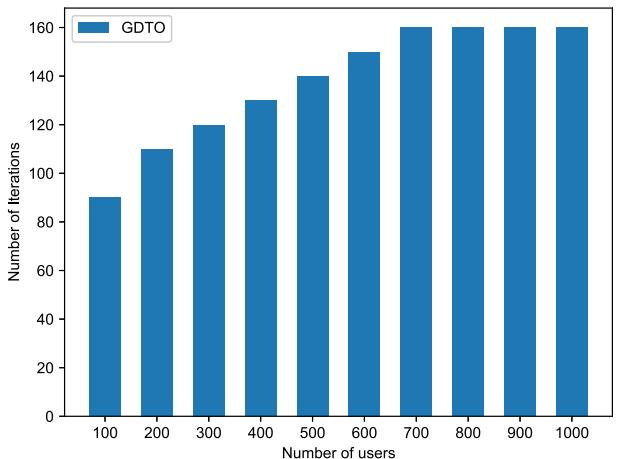

bar

| Number of users | Number of iterations |
| --------------- | -------------------- |
| 100             | 90                   |
| 200             | 110                  |
| 300             | 120                  |
| 400             | 130                  |
| 500             | 140                  |
| 600             | 150                  |
| 700             | 160                  |
| 800             | 160                  |
| 900             | 160                  |
| 1000            | 160                  |

Fig. 2. Number of iterations versus number of users.

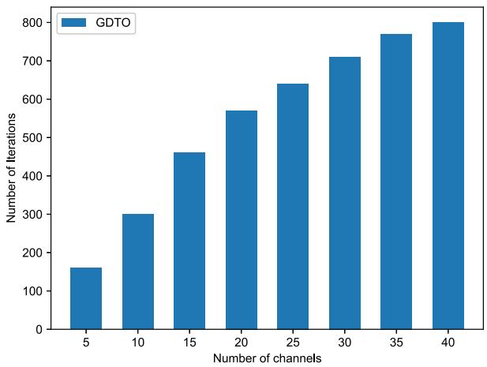

bar

| Number of channels | Number of Iterations |
| :--- | :--- |
| 5 | 160 |
| 10 | 300 |
| 15 | 460 |
| 20 | 570 |
| 25 | 640 |
| 30 | 710 |
| 35 | 770 |
| 40 | 800 |

Fig. 3. Number of iterations versus number of channels.

# 5.2.3 Comparison Experiments

To further evaluate our GDTO algorithm, we compare it with 5 other methods shown as below.

Optimal: The optimal method models the problem as an integer programming problem and uses the centralized approach to get a global optimal offloading solution.   
Random: The method randomly assigns decisions to each user to complete the task. When there are

TABLE 3 Energy Consumption 

<table><tr><td>Number of channels for each BS</td><td>Average energy consumption of local processing (J)</td><td>Average energy consumption of task offloading (J)</td><td>Average sum energy consumption (J)</td></tr><tr><td>5</td><td>30.1</td><td>1.7</td><td>31.8</td></tr><tr><td>10</td><td>27.0</td><td>2.3</td><td>29.3</td></tr><tr><td>15</td><td>22.9</td><td>3.5</td><td>26.4</td></tr><tr><td>20</td><td>19.5</td><td>4.5</td><td>24.0</td></tr><tr><td>25</td><td>16.2</td><td>5.4</td><td>21.7</td></tr><tr><td>30</td><td>13.6</td><td>5.9</td><td>19.5</td></tr><tr><td>35</td><td>10.4</td><td>7.0</td><td>17.4</td></tr><tr><td>40</td><td>8.1</td><td>7.3</td><td>15.4</td></tr></table>

enough bandwidth resources, the user randomly selects a method (local computing or transmitting the tasks to the BS). When the edge servers’ computation resources are sufficient, the user randomly selects local computing, edge computing or cloud computing. Otherwise, the user randomly selects local computing or cloud computing.

ICSOC 19: This heuristic method is extended from [29] and adjusted accordingly to solve our offloading problem. Specifically, each user selfishly and greedily acquires the maximum resources to maximize its QoE while meeting constraints.   
DGEA 20: This distributed game-based algorithm DGEA 20 is extended from [30] to be applied to our model. When the users compete for the update opportunities, the winner is selected randomly.   
CCPM 19: This scheduling algorithm CCPM 19 is extended from [31] and adjusted accordingly for our model. The users are sorted according to their channel conditions and qualities. And then, based on the sorted user order, the users updates the decision to achieve its own maximum QoE one by one.

When the solution space size is large, the optimal method suffers from high complexity and cannot obtain the offloading strategy within a reasonable time. Therefore, we set two groups of experiments, including the small-scale experiments and the large-scale experiments (Set # 1 and Set # 2), as shown in Table 4. For Set # 1, we evaluate all the four methods, while for Set # 2, the optimal method is omitted.

# a. Small-scale Experiment

Fig. 4 shows the average QoE of the 6 algorithms with different number of UDs. We can find that for all the 6 algorithms, the average QoE decreases with the increase of number of UDs. There are two reasons. First, the computing capability of the edge servers are fixed. Adding UDs will gradually use up the resources of the edge servers, thus the number of UDs who cannot offload task will increase. Second, the channel resources are fixed. Adding UDs will result in competition for the channel resources. Therefore, the average QoE will decrease. In addition, when the number of user is smaller than 60, the average QoE of our GDTO algorithm is the same as that of the Optimal algorithm. When the number of user exceeds 60, the average QoE of our GDTO algorithm is slightly smaller than the Optimal and still larger than the other 4 algorithms.

TABLE 4 Experimental Settings (2) 

<table><tr><td></td><td></td><td>n</td><td> $c_{\delta_i}$ </td><td> $f_{\delta_i}$ </td></tr><tr><td rowspan="4">Set # 1</td><td>Set # 1.1</td><td>10 ~ 100</td><td>1</td><td>5</td></tr><tr><td>Set # 1.2</td><td>50</td><td>1 ~ 6</td><td>5</td></tr><tr><td>Set # 1.3</td><td>50</td><td>1</td><td>5 ~ 14</td></tr><tr><td>Set # 2.1</td><td>100 ~ 1000</td><td>5</td><td>10</td></tr><tr><td rowspan="2">Set # 2</td><td>Set # 2.2</td><td>1000</td><td>5 ~ 40</td><td>10</td></tr><tr><td>Set # 2.3</td><td>1000</td><td>5</td><td>10 ~ 100</td></tr></table>

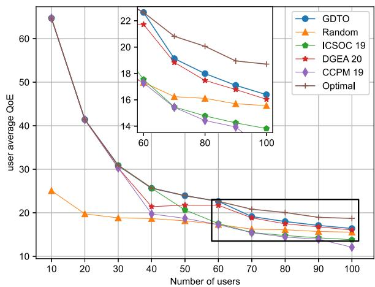

line

| Number of users | GDTO  | Random | ICSOC 19 | DGEA 20 | CCPM 19 | Optimal |
| --------------- | ----- | ------ | -------- | ------- | ------- | ------- |
| 10              | 22.0  | 25.0   | 18.0     | 22.0    | 27.0    | 27.0    |
| 20              | 20.0  | 20.0   | 17.0     | 20.0    | 42.0    | 42.0    |
| 30              | 18.0  | 18.0   | 16.0     | 18.0    | 31.0    | 31.0    |
| 40              | 16.0  | 16.0   | 15.0     | 16.0    | 25.0    | 25.0    |
| 50              | 14.0  | 14.0   | 14.0     | 14.0    | 22.0    | 22.0    |
| 60              | 12.0  | 12.0   | 13.0     | 12.0    | 20.0    | 20.0    |
| 70              | 10.0  | 10.0   | 12.0     | 10.0    | 18.0    | 18.0    |
| 80              | 8.0   | 8.0    | 11.0     | 8.0     | 16.0    | 16.0    |
| 90              | 6.0   | 6.0    | 10.0     | 6.0     | 14.0    | 14.0    |
| 100             | 4.0   | 4.0    | 8.0      | 4.0     | 12.0    | 12.0    |

Fig. 4. Average QoE versus number of users (Set #1.1).

Fig. 5 shows the total QoE with the 6 different algorithms when the number of channels is from 1 to 6. We can see that when the number of channels varies from 1 to 5, the total QoEs of the 6 algorithms all increase when the number of channels increases. The reason is that when the number of channels increases, there are more transmission resources and less competition among users, increasing each user’s QoE. However, as the number of wireless channels increases from 5 to 6, the QoEs of the algorithms do not improve much. This is because when the number of wireless channels is further increased, the computing resources of the edge servers become the bottleneck and are not sufficient to serve the users. We also find that when number of channels is smaller than 4, the GDTO’s QoE is second to that of the Optimal algorithm and better than the other 4 algorithms. When the number of channels is larger than 4, the QoE of our GDTO algorithm and the Optimal algorithm is the same.

Fig. 6 shows the total QoEs of the 6 algorithms when the edge server’s computing capability varies from 5 GHz to 14 GHz. The overall QoE of the GDTO, ICSOC 19, DGEA 20, CCPM 19 and the optimal algorithms all increase when the computing capability increases from 5 GHz to 14 GHz. As more computing resources are available, the edge servers can accommodate more tasks. Thus, the overall QoE will increase. The overall QoE of our GDTO algorithm is slightly smaller than that of the optimal algorithm, and larger than the other 4 algorithms.

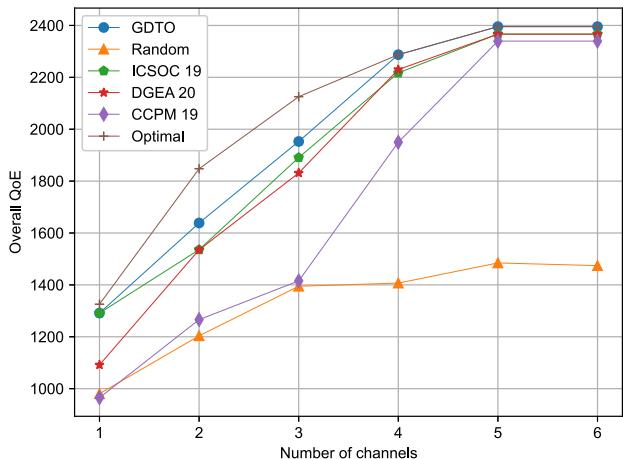

line

| Number of channels | GDTO  | Random | ICSOC 19 | DGEA 20 | CCPM 19 | Optimal |
| ------------------ | ----- | ------ | -------- | ------- | ------- | ------- |
| 1                  | 1300  | 1000   | 1300     | 1100    | 950     | 1300    |
| 2                  | 1650  | 1200   | 1550     | 1550    | 1250    | 1850    |
| 3                  | 1950  | 1400   | 1900     | 1850    | 1400    | 2100    |
| 4                  | 2300  | 1400   | 2250     | 2250    | 1950    | 2300    |
| 5                  | 2400  | 1500   | 2400     | 2400    | 2350    | 2400    |
| 6                  | 2400  | 1500   | 2400     | 2400    | 2350    | 2400    |

Fig. 5. Total QoE versus number of channels (Set #1.2).

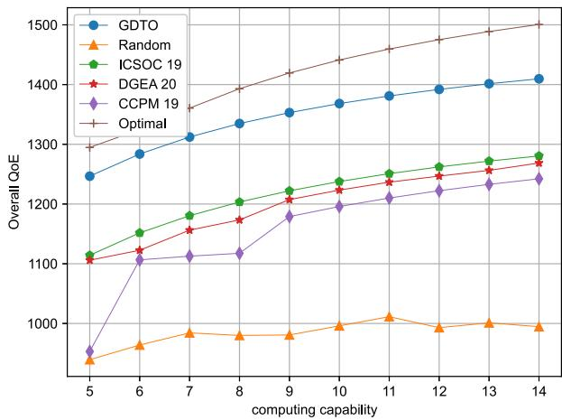

line

| computing capability | GDTO  | Random | ICSOC 19 | DGEA 20 | CCPM 19 | Optimal |
| -------------------- | ----- | ------ | -------- | ------- | ------- | ------- |
| 5                    | 1250  | 850    | 1110     | 1100    | 850     | 1300    |
| 6                    | 1280  | 870    | 1150     | 1120    | 1100    | 1350    |
| 7                    | 1310  | 880    | 1180     | 1150    | 1110    | 1380    |
| 8                    | 1330  | 880    | 1200     | 1180    | 1120    | 1400    |
| 9                    | 1350  | 880    | 1220     | 1200    | 1180    | 1420    |
| 10                   | 1370  | 890    | 1240     | 1220    | 1200    | 1440    |
| 11                   | 1380  | 900    | 1250     | 1230    | 1210    | 1460    |
| 12                   | 1390  | 890    | 1260     | 1240    | 1220    | 1470    |
| 13                   | 1400  | 900    | 1270     | 1250    | 1230    | 1480    |
| 14                   | 1410  | 890    | 1280     | 1260    | 1240    | 1500    |

Fig. 6. Total QoE versus computing capability (Set #1.3).

# b. Large-scale Experiment

Figs. 7 and 8 show the average QoE and percentage of task offloading of the 5 algorithms with different number of UDs. The number of UDs is increased from 100 to 1000. We can see from Fig. 7 that the QoEs of the 5 algorithms all decrease when number of UDs increases. This is because the transmission resources are limited, and the resources allocated to each user will decrease when there are more users competing for the resources, thus decreasing the average QoE. Nevertheless, the QoE of our GDTO algorithm is still the largest among the 5 algorithms. In Fig. 8, with the increase of number of UDs, the percentage of offloaded tasks with GDTO, ICSOC 19, DGEA 20 and CCPM 19 algorithms all decrease. That is because the number of UDs is increasing, the resources gradually become insufficient. Thus, the percentage of UDs who can offload tasks will decrease. However, the percentage of task offloading with our GDTO algorithm is still the largest among all the 5 algorithms.

Figs. 9 and 10 show the total QoE and percentage of offloading task under the 5 algorithms. The number of wireless channels is from 5 to 40. We can see that for the 5 algorithms, the QoE all increases with the increase of number of channels. This is because when the number of UDs is fixed, the increase in number of channels can bring more transmission resources for users. Therefore, users can increase the transmission rate and thus improve the overall QoE. In addition, we can find that the overall QoE of GDTO algorithm is always larger than that of the other 4 algorithms. We also find from Fig. 10 that the percentages of task offloading for the GDTO, ICSOC 19, DGEA 20 and CCPM 19 algorithms all rise when the number of channels increases. Actually, more wireless channel resources enable more users to transmit tasks, thus improving the percentage of task offloading. Similarly, we can see that the percentage of task offloading of our GDTO algorithm is larger than the ICSOC 19, DGEA 20 and CCPM 19 algorithms. The percentage of offloading task with the Random algorithm does not change much due to its random offloading mechanism.

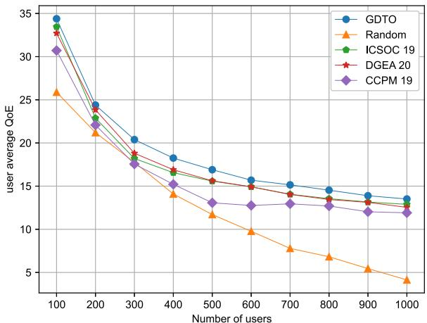

line

| Number of users | GDTO  | Random | ICSOC 19 | DGEA 20 | CCPM 19 |
| --------------- | ----- | ------ | -------- | ------- | ------- |
| 100             | 34.5  | 26.0   | 33.5     | 32.5    | 31.0    |
| 200             | 24.5  | 21.5   | 23.0     | 24.0    | 22.5    |
| 300             | 20.5  | 18.0   | 18.5     | 19.0    | 17.5    |
| 400             | 18.5  | 14.5   | 16.5     | 17.0    | 15.0    |
| 500             | 17.0  | 12.0   | 15.5     | 16.0    | 13.5    |
| 600             | 16.0  | 10.0   | 15.0     | 15.5    | 13.0    |
| 700             | 15.5  | 8.0    | 14.5     | 15.0    | 13.0    |
| 800             | 14.5  | 7.0    | 14.0     | 14.5    | 12.5    |
| 900             | 14.0  | 6.0    | 13.5     | 14.0    | 12.0    |
| 1000            | 13.5  | 4.5    | 13.0     | 13.5    | 12.0    |

Fig. 7. Average QoE versus number of users (Set #2.1).

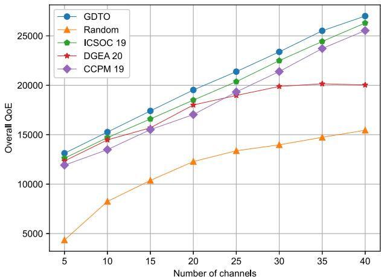

line

| Number of channels | GDTO   | Random | ICSOC 19 | DGEA 20 | CCPM 19 |
| ------------------ | ------ | ------ | -------- | ------- | ------- |
| 5                  | 13000  | 4500   | 12500    | 12000   | 12000   |
| 10                 | 15000  | 8000   | 14500    | 14000   | 13500   |
| 15                 | 17500  | 10500  | 16500    | 16000   | 15500   |
| 20                 | 19500  | 12500  | 18500    | 18000   | 17000   |
| 25                 | 21500  | 13500  | 20500    | 19000   | 19500   |
| 30                 | 23500  | 14000  | 22500    | 20000   | 21500   |
| 35                 | 25500  | 14500  | 24500    | 20000   | 23500   |
| 40                 | 27500  | 15500  | 26500    | 20000   | 25500   |

Fig. 9. Total QoE versus number of channels (Set #2.2).

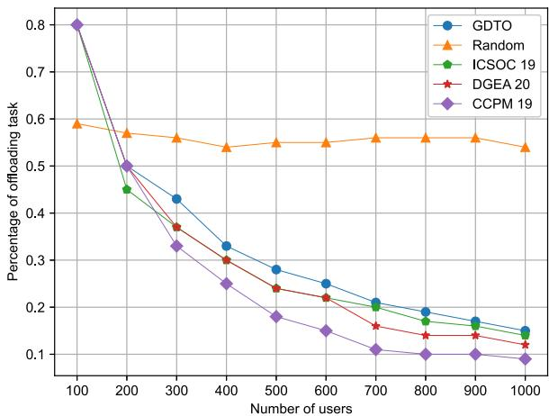

line

| Number of users | GDTO  | Random | ICSOC 19 | DGEA 20 | CCPM 19 |
| --------------- | ----- | ------ | -------- | ------- | ------- |
| 100             | 0.8   | 0.6    | 0.8      | 0.8     | 0.8     |
| 200             | 0.5   | 0.57   | 0.45     | 0.5     | 0.5     |
| 300             | 0.43  | 0.56   | 0.37     | 0.37    | 0.33    |
| 400             | 0.33  | 0.54   | 0.3      | 0.3     | 0.25    |
| 500             | 0.28  | 0.55   | 0.24     | 0.24    | 0.18    |
| 600             | 0.25  | 0.55   | 0.22     | 0.22    | 0.15    |
| 700             | 0.21  | 0.56   | 0.2      | 0.16    | 0.11    |
| 800             | 0.19  | 0.56   | 0.17     | 0.14    | 0.1     |
| 900             | 0.17  | 0.56   | 0.16     | 0.13    | 0.1     |
| 1000            | 0.15  | 0.54   | 0.14     | 0.12    | 0.1     |

Fig. 8. Percentage of offloading task versus number of users (Set #2.1).

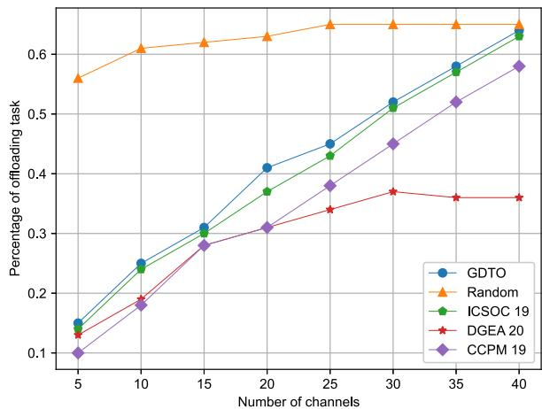

line

| Number of channels | GDTO  | Random | ICSOC 19 | DGEA 20 | CCPM 19 |
| ------------------ | ----- | ------ | -------- | ------- | ------- |
| 5                  | 0.15  | 0.56   | 0.14     | 0.13    | 0.10    |
| 10                 | 0.25  | 0.61   | 0.24     | 0.18    | 0.18    |
| 15                 | 0.31  | 0.62   | 0.30     | -       | 0.28    |
| 20                 | 0.41  | 0.63   | 0.37     | -       | 0.31    |
| 25                 | 0.45  | 0.65   | 0.43     | -       | 0.38    |
| 30                 | 0.52  | 0.65   | 0.51     | 0.37    | 0.45    |
| 35                 | 0.58  | 0.65   | 0.57     | 0.36    | 0.52    |
| 40                 | 0.63  | 0.65   | 0.64     | 0.36    | 0.58    |

Fig. 10. Percentage of offloading task versus number of channels (Set #2.2).

We adopt the metric of number of Offloading Beneficial User (OBU) to further evaluate our proposed GDTO algorithm in benefiting the users from offloading tasks. One user is called an OBU user, if the user’s obtained QoE with integrated offloading choice is better than its QoE with solely local computing. Then, we say that this user benefits from offloading, and call this user an OBU user.

Fig. 11 shows the number of OBU users with the 5 algorithms under different number of channels. The number of channels is from 5 to 40. We can observe that the numbers of OBU users for the 5 algorithms all become larger with the increase of number of channels. This is because when there are more channels, there are more transmission resources provided for the users to offload their tasks. Then, more users can benefit from offloading tasks and the number of OBU users will increase. We also observe that the number of OBU users with our GDTO algorithm is always the largest among the 5 algorithms, which demonstrates the superiority of our GDTO algorithm in benefiting the users. Besides, the number of the OBU users with the Random algorithm is always the smallest among the 5 algorithm. This is because the Random algorithm does not make effective use of the channel resources to make the offloading decisions.

Fig. 12 shows the overall QoE when edge server’s computing capability varies from 10 GHz to 100 GHz. We observe that the overall QoE of the 5 algorithms increases as the computing capability of the edge server increases, and the QoE of our GDTO algorithm is the largest. We also observe that when the computing capacity is further increased (about 70 GHz in Fig. 12), the increase rate of QoE gradually becomes slower. The increase trend of the curves of all the algorithms’ QoE is gradually flattened. The reason is that when the computing capability increases to a certain level, the computing resources allocated to the UDs on the edge servers are already sufficient. At this time, the main factor affecting the increase of QoE is insufficient channel resource.

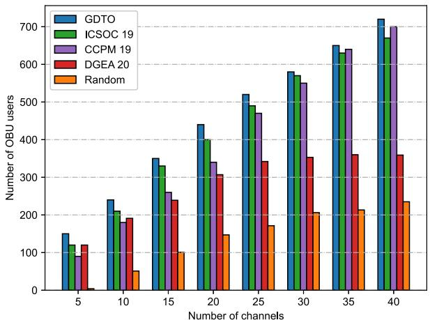

bar

| Number of channels | GDTO | ICSOC 19 | CCPM 19 | DGEA 20 | Random |
| ------------------ | ---- | -------- | ------- | ------- | ------ |
| 5                  | 150  | 120      | 100     | 120     | 10     |
| 10                 | 240  | 210      | 180     | 190     | 50     |
| 15                 | 350  | 330      | 260     | 240     | 100    |
| 20                 | 440  | 400      | 340     | 310     | 150    |
| 25                 | 520  | 490      | 470     | 340     | 170    |
| 30                 | 580  | 570      | 550     | 350     | 210    |
| 35                 | 650  | 630      | 640     | 360     | 220    |
| 40                 | 720  | 680      | 700     | 360     | 240    |

Fig. 11. Number of OBU users versus number of channels (Set #2.2).

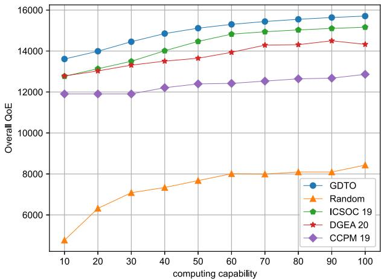

line

| computing capability | GDTO   | Random | ICSOC 19 | DGEA 20 | CCPM 19 |
| -------------------- | ------ | ------ | -------- | ------- | ------- |
| 10                   | 13500  | 4500   | 12800    | 12700   | 11800   |
| 20                   | 14000  | 6200   | 13000    | 12900   | 11800   |
| 30                   | 14500  | 7000   | 13500    | 13200   | 11800   |
| 40                   | 14800  | 7300   | 14000    | 13500   | 12100   |
| 50                   | 15000  | 7600   | 14500    | 13700   | 12300   |
| 60                   | 15200  | 7900   | 14800    | 14000   | 12400   |
| 70                   | 15300  | 7950   | 14900    | 14200   | 12500   |
| 80                   | 15400  | 8000   | 15000    | 14300   | 12600   |
| 90                   | 15500  | 8100   | 15100    | 14400   | 12650   |
| 100                  | 15600  | 8400   | 15200    | 14350   | 12850   |

Fig. 12. Total QoE versus computing capability (Set #2.3).

# 6 RELATED WORK

The problem of caching optimization and task offloading in edge computing is an important research topic, and widely studied in academia. Xu et al. [32] studied the service caching problem in MEC networks. An integer linear programming solution and a distributed game-theoretic approach were proposed to minimize the social cost for all network service providers. In [33], Lyu et al. proposed a distributed online learning approach to optimize content placement and delivery at each edge server to achieve optimal cache hit rate and cost effectiveness. Wang et al. [34] regarded the content caching strategy, tasks offloading decision and resource allocation as an optimization problem. it was transformed into a convex problem, and was solved by a multiplier-based alternating directions approach. In [35], Fan et al. designed an iterative algorithm based on Lyapunov optimization to minimize the total task processing latency. Duan et al. [36] transformed and decomposed the task offloading optimization problem into two subproblems and designed an online control scheme based on Long Short Term Memory and Dueling Double DQN to reduce the computation cost of mobile devices and achieve load balancing.

In general, co-channel interference exists in the wireless channel transmission in edge computing scenarios. Assigning too many users to edge servers can lead to serious interference that can affect the user’s data rate. In [13], [24], Cui et al. studied the mobile edge device allocation problem of interference perception in edge computing and edge cloud computing respectively. A distributed solution approach was proposed. In [37], Chen et al. considered the computing task offloading of multi-user in a two-layered end-edge system and the tasks were either executed on the edge servers or locally. It was considered that the resources of edge servers were sufficient and could satisfy all the users. Different from their work, our work considers a three-layered endedge-cloud system, and the tasks can also be executed on the cloud. Furthermore, we consider more realistic scenarios that the edge servers’ computing resources are limited, and users compete for the computing resources. In addition, some studies have taken user’s quality of experience (QoE) as an optimization goal. In Lai et al. [21] solved the user assignment problem in edge computing scenarios. A distributed algorithm was proposed to optimize the user’s QoE based on game theory. Zheng et al. [22] comprehensively considered the use of spectrum efficiency, user fairness and service satisfaction to evaluate user’s quality of experience, described the resource allocation problem as a local cooperative game.

The computing capability of edge servers is limited compared to that of cloud servers.Therefore, it can be considered to combine edge computing and cloud computing to improve the entire system’s performance. Some works have studied the computing offloading problem in the edgecloud systems. In [11], Fantacci et al. used queuing theory to evaluate and optimize three-layer edge-cloud computing, and proposed a allocation algorithm of computing resource to maximize the optimization goal under the constraint of satisfying a specific quality of service(QoS). In [12], Wang et al. considered the heterogeneous system combining mobile edge computing and cloud center, and presented an approach to optimize time latency of the whole system by coordinating task allocation, computing and transmission resources together.

In the edge cloud scenario, users sometimes need to compute their own tasks locally (end-edge-cloud computing). For example, when the connection is unstable or the system resources are insufficient. There were also some works to consider task offloading for end-edge-cloud computing. Sun et al. [38] used a low-complexity hierarchical heuristic method and an inequality method to determine resource allocation under the joint constraints of cache resources and edge server communication and computing resources. Du et al. [39] proposed a low-complexity suboptimal algorithm based on semidefinite relaxation, fractional programming theory and Lagrange duality to solve offloading decisions and resource allocation problems. Ding et al. [18] studied the offloading optimization under two different types of computing architectures, and proposed game algorithms under two architectures based on game theory.

Related works on caching and task offloading in MEC can also be classified by the criteria of distributed approaches and centralized approaches. Some existing works proposed the task offloading approaches which could be implemented in a distributed way. [40] studied the risk-aware data offloading problem in MEC. Each user aimed at maximizing the perceived satisfaction. A non-cooperative game was formulated to study this problem and a distributed algorithm converging to the Nash Equilibrium was proposed. [41] investigated the energy efficient task offloading in a collaborative MEC and autonomous aerial system. The authors adopted the Satisfaction Game and proposed a reinforcement learning-enabled approach to increase Internet of Thing user’s satisfaction with the energy cost considered. [42] designed incentives for wireless body area network (WBAN) users to curtain the task offloading amount to achieve the green task offloading for 5G-enabled healthcare systems. The Stackelberge game was adpoted and the optimal solution was obtained by the alternating direction method of multipliers (ADMM)-based approach implemented in a distributed manner. [43] proposed the resource management scheme to minimize the MEC server’s energy consumption without compromising WBAN users’ QoE. A cooperative framework was proposed, and the Nash bargaining theory was adopted to model the interaction. The closed-form Nash bargaining solutions were also derived. In [44], Feng et al. studied the caching optimization problem in edge networks. The cache control was described as a stochastic difference game, and a distributed cache iterative control algorithm was proposed to finally obtain an optimal edge cache control policy.

Some other works adopted centralized approaches to solve the task offloading problems. [10] considered the scenario of edge computing and cloud computing collaboration with the objective of minimizing the weighted-sum latency of all mobile devices. A resource allocation strategy based on convex optimization was proposed. [12] focused on the task scheduling, resources allocation among devices, multi-layer MEC servers and remote clouds. [45] modeled the computation offloading problem by a Markov decision process, and proposed a deep Q-network-based computation offloading algorithm. [15] jointly considered the computing offloading and interference management in a MECenabled network, and formulated the computing offloading, physical resource and MEC computing resource allocation as an optimization problem.

# 7 CONCLUSION

In the paper, we investigate the user task offloading problem in a collaborative end-edge-cloud system. We formulate the offloading problem with the goal of maximizing users’ QoE while satisfying the communication and computing resource constraints. Then, we reformulate the problem as the MUTO-Game model, and define the optimal offloading strategy by the Nash Equilibrium strategy. We propose the lemma that both the communication interference and the degree of computing resource competition can be upper bounded. Then, we prove that the MUTO-Game is a potential game and there exists at least one Nash Equilibrium offloading strategy. We propose the decentralized GDTO approach which obtains the Nash Equilibrium offloading strategy. Theoretical analysis for the upper bound of convergence time and performance guarantee in the worst case

is given. Finally, we conduct extensive experiments, which validate the performance of our GDTO approach.

One future direction is considering the service provider as another type of players in the game, and take advantage of Stackelberg Game to formulate the offloading problem with the goal of social welfare maximization. Another important and interesting future research direction is to adopt the non-orthognal multiple access (NOMA) technique that implements the successive interference cancellation technique to model the interference.

# REFERENCES

[1] Z. Chen et al., “An empirical study of latency in an emerging class of edge computing applications for wearable cognitive assistance,” in Proc. 2nd ACM/IEEE Symp. Edge Comput., 2017, pp. 1–14.   
[2] N. Abbas, Y. Zhang, A. Taherkordi, and T. Skeie, “Mobile edge computing: A survey,” IEEE Internet Things J., vol. 5, no. 1, pp. 450–465, Feb. 2018.   
[3] C. Wang, S. Zhang, Y. Chen, Z. Qian, J. Wu, and M. Xiao, “Joint configuration adaptation and bandwidth allocation for edgebased real-time video analytics,” in Proc. IEEE Conf. Comput. Commun., 2020, pp. 257–266.   
[4] S. Wang et al., “A cloud-guided feature extraction approach for image retrieval in mobile edge computing,” IEEE Trans. Mobile Comput., vol. 20, no. 2, pp. 292–305, Feb. 2021.   
[5] J. Zheng, Y. Cai, Y. Wu, and X. Shen, “Dynamic computation offloading for mobile cloud computing: A stochastic game-theoretic approach,” IEEE Trans. Mobile Comput., vol. 18, no. 4, pp. 771–786, Apr. 2019.   
[6] F. Vhora and J. Gandhi, “A comprehensive survey on mobile edge computing: Challenges, tools, applications,” in Proc. IEEE 4th Int. Conf. Comput. Methodol. Commun., 2020, pp. 49–55.   
[7] K. Peng, V. Leung, X. Xu, L. Zheng, J. Wang, and Q. Huang, “A survey on mobile edge computing: Focusing on service adoption and provision,” Wirel. Commun. Mobile Comput., vol. 2018, 2018.   
[8] Y. Wu, K. Ni, C. Zhang, L. P. Qian, and D. H. K. Tsang, “NOMAassisted multi-access mobile edge computing: A joint optimization of computation offloading and time allocation,” IEEE Trans. Veh. Technol, vol. 67, no. 12, pp. 12244–12258, Dec. 2018.   
[9] J. Hu, K. Li, C. Liu, J. Chen, and K. Li, “Coalition formation for deadline-constrained resource procurement in cloud computing,” J. Parallel Distrib. Comput., vol. 149, pp. 1–12, 2021.   
[10] J. Ren, G. Yu, Y. He, and G. Y. Li, “Collaborative cloud and edge computing for latency minimization,” IEEE Trans. Veh. Technol, vol. 68, no. 5, pp. 5031–5044, May 2019.   
[11] R. Fantacci and B. Picano, “Performance analysis of a delay constrained data offloading scheme in an integrated cloud-fog-edge computing system,” IEEE Trans. Veh. Technol, vol. 69, no. 10, pp. 12004–12014, Oct. 2020.   
[12] P. Wang, Z. Zheng, B. Di, and L. Song, “HetMEC: Latency-optimal task assignment and resource allocation for heterogeneous multilayer mobile edge computing,” IEEE Trans. Wireless Commun., vol. 18, no. 10, pp. 4942–4956, Oct. 2019.   
[13] G. Cui, Q. He, F. Chen, Y. Zhang, H. Jin, and Y. Yang, “Interference-aware game-theoretic device allocation for mobile edge computing,” IEEE Trans. Mobile Comput., vol. 21, no. 11, pp. 4001–4012, Nov. 2021.   
[14] L. Chen, S. Zhou, and J. Xu, “Computation peer offloading for energyconstrained mobile edge computing in small-cell networks,” IEEE/ ACM Trans. Netw., vol. 26, no. 4, pp. 1619–1632, Apr. 2018.   
[15] C. Wang, F. R. Yu, C. Liang, Q. Chen, and L. Tang, “Joint computation offloading and interference management in wireless cellular networks with mobile edge computing,” IEEE Trans. Veh. Technol, vol. 66, no. 8, pp. 7432–7445, Aug. 2017.   
[16] P. A. Apostolopoulos, E. E. Tsiropoulou, and S. Papavassiliou, “Cognitive data offloading in mobile edge computing for internet of things,” IEEE Access, vol. 8, pp. 55736–55749, 2020.   
[17] Z. Zhou, S. Yu, W. Chen, and X. Chen, “CE-IoT: Cost-effective cloudedge resource provisioning for heterogeneous IoT applications,” IEEE Internet Things J., vol. 7, no. 9, pp. 8600–8614, Sep. 2020.   
[18] Y. Ding, K. Li, C. Liu, and K. Li, “A potential game theoretic approach to computation offloading strategy optimization in endedge-cloud computing,” IEEE Trans. Parallel Distrib. Syst., vol. 33, no. 6, pp. 1503–1519, Jun. 2022.

[19] X. Chen, L. Jiao, W. Li, and X. Fu, “Efficient multi-user computation offloading for mobile-edge cloud computing,” IEEE/ACM Trans. Netw., vol. 24, no. 5, pp. 2795–2808, May 2016.   
[20] T. Fang, F. Yuan, L. Ao, and J. Chen, “Joint task offloading, D2D pairing, and resource allocation in device-enhanced mec: A potential game approach,” IEEE Internet Things J., vol. 9, no. 5, pp. 3226–3237, May 2021.   
[21] P. Lai et al., “Quality of experience-aware user allocation in edge computing systems: A potential game,” in Proc. IEEE 40th Int. Conf. Distrib. Comput. Syst., pp. 223–233, 2020.   
[22] J. Zheng, Y. Cai, Y. Liu, Y. Xu, B. Duan, and X. Shen, “Optimal power allocation and user scheduling in multicell networks: Base station cooperation using a game-theoretic approach,” IEEE Trans. Wireless Commun., vol. 13, no. 12, pp. 6928–6942, Dec. 2014.   
[23] D. Monderer and L. S. Shapley, “Potential games,” Games Econ. Behav., vol. 14, no. 1, pp. 124–143, 1996.   
[24] G. Cui et al., “Interference-aware SaaS user allocation game for edge computing,” IEEE Trans. Cloud Comput., vol. 10, no. 3, pp. 1888–1899, Third Quarter, 2020.   
[25] T. Roughgarden, Selfish Routing and the Price of Anarchy. Cambridge, MA, USA: MIT Press, 2005.   
[26] J. Kwak, O. Choi, S. Chong, and P. Mohapatra, “Processor-network speed scaling for energy–delay tradeoff in smartphone applications,” IEEE/ACM Trans. Netw., vol. 24, no. 3, pp. 1647–1660, Mar. 2016.   
[27] J. Kwak, Y. Kim, J. Lee, and S. Chong, “Dream: Dynamic resource and task allocation for energy minimization in mobile cloud systems,” IEEE J. Sel. Areas Commun., vol. 33, no. 12, pp. 2510–2523, Dec. 2015.   
[28] P. Lai et al., “Cost-effective user allocation in 5G noma-based mobile edge computing systems,” IEEE Trans. Mobile Comput., vol. 21, no. 12, pp. 4263–4278, Dec. 2022.   
[29] P. Lai et al., “Edge user allocation with dynamic qualityof service,” in Proc. Int. Conf. Serv.-Oriented Comput., 2019, pp. 86–101.   
[30] Q. He et al., “A game-theoretical approach for user allocation in edge computing environment,” IEEE Trans. Parallel Distrib. Syst., vol. 31, no. 3, pp. 515–529, Mar. 2020.   
[31] H. Zeng, X. Zhu, Y. Jiang, Z. Wei, and T. Wang, “A green coordinated multi-cell noma system with fuzzy logic based multi-criterion user mode selection and resource allocation,” IEEE J. Sel. Topics Signal Process., vol. 13, no. 3, pp. 480–495, Mar. 2019.   
[32] Z. Xu et al., “Near-optimal and collaborative service caching in mobile edge clouds,” IEEE Trans. Mobile Comput., to be published, doi: 10.1109/TMC.2022.3144175.   
[33] X. Lyu, C. Ren, W. Ni, H. Tian, R. P. Liu, and X. Tao, “Distributed online learning of cooperative caching in edge cloud,” IEEE Trans. Mobile Comput., vol. 20, no. 8, pp. 2550–2562, Aug. 2021.   
[34] C. Wang, C. Liang, F. R. Yu, Q. Chen, and L. Tang, “Computation offloading and resource allocation in wireless cellular networks with mobile edge computing,” IEEE Trans. Wireless Commun., vol. 16, no. 8, pp. 4924–4938, Aug. 2017.   
[35] W. Fan et al., “Collaborative service placement, task scheduling, and resource allocation for task offloading with edge-cloud cooperation,” IEEE Trans. Mobile Comput., to be published, doi: 10.1109/TMC.2022.3219261.   
[36] S. Duan et al., “MOTO: Mobility-aware online task offloading with adaptive load balancing in small-cell MEC,” IEEE Trans. Mobile Comput., to be published, doi: 10.1109/TMC.2022.3220720.   
[37] X. Chen, L. Jiao, W. Li, and X. Fu, “Efficient multi-user computation offloading for mobile-edge cloud computing,” IEEE/ACM Trans. Netw., vol. 24, no. 5, pp. 2795–2808, May 2015.   
[38] C. Sun et al., “Task offloading for end-edge-cloud orchestrated computing in mobile networks,” in Proc. IEEE Wirel. Commun. Netw. Conf., 2020, pp. 1–6.   
[39] J. Du, L. Zhao, J. Feng, and X. Chu, “Computation offloading and resource allocation in mixed fog/cloud computing systems with min-max fairness guarantee,” IEEE Trans. Commun., vol. 66, no. 4, pp. 1594–1608, 2018.   
[40] P. A. Apostolopoulos, E. E. Tsiropoulou, and S. Papavassiliou, “Risk-aware data offloading in multi-server multi-access edge computing environment,” IEEE/ACM Trans. Netwo., vol. 28, no. 3, pp. 1405–1418, Jun. 2020.   
[41] N. Irtija, I. Anagnostopoulos, G. Zervakis, E. E. Tsiropoulou, H. Amrouch, and J. Henkel, “Energy efficient edge computing enabled by satisfaction games and approximate computing,” IEEE Trans. Green Commun. Netw., vol. 6, no. 1, pp. 281–294, Mar. 2021.

[42] P. K. Bishoyi and S. Misra, “Enabling green mobile-edge computing for 5G-based healthcare applications,” IEEE Trans. Green Commun. Netw., vol. 5, no. 3, pp. 1623–1631, Sep. 2021.   
[43] P. K. K. Bishoyi and S. Misra, “Towards energy-and cost-efficient sustainable MEC-assisted healthcare systems,” IEEE Trans. Sustain. Comput., early access, Apr. 26, 2022, doi: 10.1109/TSUSC.2022.3170508.   
[44] H. Feng, S. Guo, D. Liu, and Y. Yang, “Mean-field game theory based optimal caching control in mobile edge computing,” IEEE Trans. Mobile Comput., early access, Jul. 25, 2022, doi: 10.1109/ TMC.2022.3193764.   
[45] X. Chen, H. Zhang, C. Wu, S. Mao, Y. Ji, and M. Bennis, “Optimized computation offloading performance in virtual edge computing systems via deep reinforcement learning,” IEEE Internet Things J., vol. 6, no. 3, pp. 4005–4018, Jun. 2019.

natural_image

Portrait photo of a woman with long hair wearing a collared shirt (no text or symbols visible)

Ying Chen (Member, IEEE) received the PhD degree in computer science and technology from Tsinghua University, Beijing, China, in 2017, where she was a joint PhD student with the University of Waterloo, Waterloo, ON, Canada from 2016 to 2017. She is an associate professor with the Computer School, Beijing Information Science and Technology University, Beijing. Her current research interests include Internet of Things, mobile edge computing, wireless net works and communications, machine learning,

etc. She is the recipient of the Best Paper Award with IEEE SmartIoT 2019, the 2016 Google PhD Fellowship Award, and the 2014 Google Anita Borg Award, 2022 OUTSTANDING CONTRIBUTION AWARD in 18th EAI CollaborateCom, respectively. She serves/served the leading guest editor of Springer JCC, TPC member of IEEE HPCC, and PC member of IEEE Cloud, CollaborateCom, IEEE CPSCom, CSS, etc. She is also the Reviewer of several journals such as the IEEE Wireless Communications Magazine, IEEE Transactions on Dependable and Secure Computing, IEEE Internet of Things Journal, IEEE Transactions on Computers, IEEE Transactions on Cloud Computing, and IEEE Transactions on Services Computing.

natural_image

Portrait of a young man in a white collared shirt (no text or symbols visible)

Jie Zhao is currently working toward the MEng degree in computer science and technology, the Beijing Information Science and Technology University, China. His current research interests include edge computing, Internet of Things, and Game theory.

natural_image

Portrait of a man wearing glasses and a collared shirt (no text or symbols visible)

Yuan Wu (Senior Member, IEEE) received the PhD degree in electronic and computer engineering from the Hong Kong University of Science and Technology, in 2010. He is currently an associate professor with the State Key Laboratory of Internet of Things for Smart City, University of Macau, Macao, China, and also with the Department of Computer and Information Science, University of Macau. During 2016-2017, He was a visiting scholar with Department of Electrical and Computer Engineering, University of Waterloo.

His research interests include resource management for wireless networks, green communications and computing, edge computing and edge intelligence, and energy informatics. He received the Best Paper Award from the IEEE ICC’2016, WCSP’2016, IEEE TCGCC’2017, and IWCMC’2021. He is currently on the editorial board of IEEE Transactions on Vehicular Technology, IEEE Transactions on Network Science and Engineering, and IEEE Internet of Things Journal.

natural_image

Portrait of a man wearing glasses and a suit (no text or symbols visible)

Jiwei Huang (Member, IEEE) received the BEng and PhD degrees in computer science and technology from Tsinghua University, Beijing, China, in 2009 and 2014, respectively. He was a Visiting Scholar with the Georgia Institute of Technology, Atlanta, GA, USA. He is currently a professor and the Dean with the Department of Computer Science and Technology, China University of Petroleum, Beijing, and the Director of Beijing Key Laboratory of Petroleum Data Mining, Beijing. He has authored or coauthored one book and more than 60 articles in international journals and conference proceedings, including IEEE Transactions on Services Computing, IEEE Transactions on Cloud Computing, IEEE Transactions on Vehicular Technology, IEEE Internet of Things Journal, ACM Sigmetrics, and IEEE ICWS, etc. His research interests include services computing, Internet of Things, and edge computing. He is currently on the Editorial Board of the Chinese Journal of Electronics and Scientific Programming.

natural_image

Portrait of a man in a white shirt (no text or symbols visible)

Xuemin Shen (Fellow, IEEE) received the PhD degree in electrical engineering from Rutgers University, New Brunswick, NJ, USA, in 1990. He is a University Professor with the Department of Electrical and Computer Engineering, University of Waterloo, Canada. His research focuses on network resource management, wireless network security, Internet of Things, 5G and beyond, and vehicular networks. He is a registered Professional Engineer of Ontario, Canada, an Engineering Institute of Canada Fellow, a Canadian Academy of Engineering Fellow, a Royal Society of Canada Fellow, a Chinese Academy of Engineering Foreign Member, and a Distinguished Lecturer of the IEEE Vehicular Technology Society and Communications Society. He received the Canadian Award for Telecommunications Research from the Canadian Society of Information Theory (CSIT) in 2021, the R.A. Fessenden Award, in 2019 from IEEE, Canada, Award of Merit from the Federation of Chinese Canadian Professionals (Ontario), in 2019, James Evans Avant Garde Award, in 2018 from the IEEE Vehicular Technology Society, Joseph LoCicero Award in 2015 and Education Award, in 2017 from the IEEE Communications Society (ComSoc), and Technical Recognition Award from Wireless Communications Technical Committee (2019) and AHSN Technical Committee (2013). He has also received the Excellent Graduate Supervision Award in 2006 from the University of Waterloo and the Premier’s Research Excellence Award (PREA), in 2003 from the Province of Ontario, Canada. He served as the Technical Program Committee Chair/Co-Chair for IEEE Globecom’16, IEEE Infocom’14, IEEE VTC’10 Fall, IEEE Globecom’07, and the Chair for the IEEE ComSoc Technical Committee on Wireless Communications. He is the President of the IEEE ComSoc. He was the Vice President for Technical & Educational Activities, Vice President for Publications, Member-at-Large on the Board of Governors, Chair of the Distinguished Lecturer Selection Committee, and Member of IEEE Fellow Selection Committee of the ComSoc. He served as the Editor-in-Chief of the IEEE IoT Journal, IEEE Network, and IET Communications.

" For more information on this or any other computing topic, please visit our Digital Library at www.computer.org/csdl.