# QoE Maximization for Laser-Powered Multi-UAV Communication Networks

Jianchao Chen , Student Member, IEEE, and Ming Jiang , Senior Member, IEEE

Abstract—Uncrewed aerial vehicle (UAV) communication is expected to play an important role in many applications, including emergency services, remote surveillance and even daily logistics, thanks to its great advantages such as flexible deployment and mobility support. In this paper, we propose a multi-UAV-aided communication scheme supported by laser power transfer (LPT), where the quality-of-experience (QoE) requirements of user equipment (UE) is considered. Specifically, to improve the sum QoE, we first maximize the sum of average data rates (ADRs) of all UEs through an alternating optimization of UAVs’ positions, UE-network association and LPT station (LPTS)-network association. Then, we devise an advanced Gale-Shapley rematching (GSRM) scheme to address the intractable 0-1 programming problem in UE/LPTS-network association. Moreover, an L2-norm polynomial (L2NP) programming method is designed to transform the L2NP of the LPT-based UAV positioning problem into a convex form. Finally, a redundant resource reallocation (RRR) algorithm is designed to recycle and reallocate the excessive transmit power and backhaul capacity of both the base station (BS) and the UAVs, to further maximize the number of UEs satisfying the QoE requirements. Simulation results show that the proposed UAV-aided communication scheme can help more UEs achieve their QoE requirements at a reduced power consumption compared with existing solutions.

Index Terms—Uncrewed aerial vehicle (UAV), laser power transfer (LPT), quality-of-experience (QoE), redundant resource reallocation (RRR), 0-1 programming.

## I. INTRODUCTION

the UE-oriented information, such as the quality-of-experience (QoE), should be considered at an increasing priority in new system designs [1], [2]. Different from the widely used quality-ofservice (QoS) metric that designates specific network-oriented requirements, such as data rate, jitter, network latency, packet loss, etc., the QoE reflects the actual individual users’ experience typically originating from their diverse expectations on delay. For example, the user requesting for a large file may have a higher tolerance on time delay than the user requesting for a small file, and the user having a fifth generation (5G) handset would expect faster data transmissions than the user having a fourth generation (4G) handset, and so on. Such differences in user requirements are for instance modeled by a QoE metric in [3].

However, due to the premature permeability and coverage, the QoE requirements of cell edge UEs can only partially be fulfilled by the ground-based macro cells, especially because the signals propagating in high frequency bands are more likely impaired by the shadowing fading effect.

In response to this situation, flexible heterogeneous networks constituted by ground-based and uncrewed aerial vehicle (UAV) based cells have been investigated [4], [5], [6], [7], [8], [9], [10], [11]. These works improved or guaranteed QoE of UEs through UAVs integrated with various technologies, such as content caching [4], [5], trajectory optimization [6], [7], mobile edge computing [8], [9], deep reinforcement learning [10], and reconfigurable intelligent surface [11]. Besides, the optimization problems of power management [4], [7], energy efficiency (EE) maximization [6], [11], data offloading [8], [9], and energy consumption minimization [5], [10] were also addressed. Although QoE-driven UAV communication systems have been discussed in the literature [4], [5], [6], [7], [8], [9], [10], how to maximize the number of UEs satisfying both QoS and QoE requirements in multi-UAV-assisted communication networks remains a challenging open issue.

Moreover, since the battery endurance is among the most critical factors for UAVs, some researchers have proposed to save the UAVs’ energy by power management and EE enhancements [4], [6], [7], [8], [10], [12], [13]. Other researchers suggested adopting an online switching mechanism to switch between offering wireless information transfer (WIT) service or returning to charging stations [5]. While such methods are certainly useful, their sustainability is inevitably constrained by the UAVs’ internal battery capacity. Thus, it is desirable to consider utilizing external energy supplies that can recharge the UAVs in real-time.

Recently, a promising charging technology, namely wireless power transfer (WPT), is considered as a potential solution to the aforementioned problem [14]. Some researchers designed wireless charging systems with resonant beams [15] or radio frequency (RF) waves [16] to provide wireless energy for UAVs, while some others proposed laser-based beacon systems to recharge the UAVs with much higher laser energy [17], [18], [19], [20], [21]. Notably, as laser power transfer (LPT) can effectively alleviate the energy attenuation issue due to path loss [17], it has been considered as a promising WPT solution for UAVs. For example, some researchers deployed an LPT station (LPTS) to provide sustainable energy supply for a UAV and proposed a weighting approach to balance WIT and laser energy harvesting (LEH) efficiency [18]. In addition, various design targets were also considered for laser-powered UAVs, such as coverage [19], service duration [20], decoding error rate [21], etc. Nonetheless, the impacts of WIT and LEH have hardly been jointly considered in the existing literature, and the issue of how to exploit the collected laser energy to improve WIT quality remains open, particularly in the case involving multiple UAVs and LPTSs.

Furthermore, the issue of UE-network association needs to be solved to ensure the efficiency of UAV communication networks. In the literature, various methods have been proposed to deal with the challenging 0-1 programming problems in UE association [22], [23], [24], [25], [26]. For instance, an iteration-in-order scheme was proposed to iteratively solve the UE association in specific order [22], [23], though it only considers preferences of UEs but ignores those of network, thus largely limiting the UE association performance. Aiming to apply a two-way matching mechanism in UE association, the techniques based on Gale-Shapley matching (GSM) [24], bipartite graph matching (BGM) [25] and Lagrange dual-based matching (LDM) [26] were proposed. Note that although the GSM algorithm [24], [27] is more computationally efficient than BGM and LDM, the existing GSM-based UE association schemes, such as [24], can only prioritize the preference of the earlier selectors, thus easily converges to a local optimum.

Under this background, we propose a QoE-driven UAV communication scheme enabling LEH, where multiple LPTSs are deployed to charge UAVs at various locations, such that beneficial link conditions may be created to satisfy the QoE requirements of nearby UEs. To improve the average data rate (ADR), we devise a sum ADR maximization (SAM) algorithm, where the UAVs’ positions and UE/LPTS-network association are jointly optimized in a block successive convex approximation (BSCA) based framework. Furthermore, the fairness of UEs in terms of the QoE metric is also addressed.

We refer to the proposed method as the QoE-based WIT/LPTenabled multi-UAV (QWLMU) scheme. Our main contributions are:

To our best knowledge, we appear to be the first to exploit the dynamic laser energy offered by distributed LPTSs to improve UEs’ QoE in multi-UAV communication networks. Compared to pure battery-driven UAV communication, the proposed LPT-aided scheme offers a better QoE without consuming extra energy of UAV battery.

Although LEH may improve UAVs’ transmit power, the coupling of LEH and WIT introduces a complex L2- norm polynomial (L2NP) in the location optimization problem involving multiple LPT-powered UAVs. In the existing works [18], [20], [21], [28], such an intractable non-convex L2NP problem remains unsolved. Fortunately, we manage to design an L2NP programming (L2NPP)

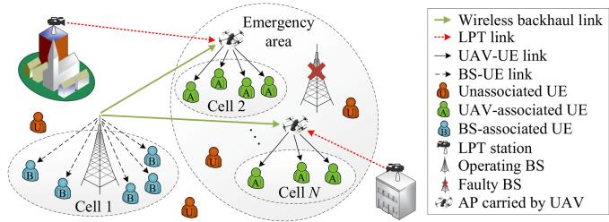  
Fig. 1. The UAV-aided communication network.

scheme that makes it solvable by popular optimization tools.

For the UE/LPTS-network association problem, we devise a Gale-Shapley rematching (GSRM) scheme, which can further refine the locally converged results of the GSMbased method [24]. Moreover, GSRM also has a potential to solve general matching problems.

While most researchers consider maximizing the sum rate only and ignore the rate requirement of individual UEs [29], [30], [31], we take into account the fairness aspect offered by the QoE metric. Specifically, we formulate a maximum constraint satisfaction problem (MCSP) that targets at maximizing the number of QoE-qualified UEs. Then, a redundant resource reallocation (RRR) algorithm is proposed to dispatch the over-allocated energy and backhaul capacity to additional UEs, where a key approximation approach is conceived to convert the objective function to a closed form.

The rest of this paper is organized as follows. The system model with the optimization problem is formulated in Section II. The proposed QWLMU algorithm is given in Section III, where we introduce the SAM algorithm in Section III-A, and present the RRR algorithm in Section III-B. Then, in Section V, we provide extensive simulation results to validate the benefits of the proposed schemes. Finally, we conclude our findings in Section VI.

## II. SYSTEM MODEL

Consider an emergent communication scenario, where some serving macro BSs are damaged due to for instance an earthquake. Under this circumstance, UAVs may be deployed to support rescue services. As an example, a general UAV-aided downlink communication system is illustrated in Fig. 1, where there exist K UEs, L LPTSs, M UAVs each carrying one access point, a faulty macro BS and an operating macro BS. The UAVs provide data services to the UEs, while the UEs may access the BS or the UAVs, depending on their physical propagation conditions. Since a UAV can usually establish favorable line-of-sight (LOS) links, it is particularly beneficial for those UEs that suffer from their poor non-line-of-sight (NLOS) links associated with the ground-based BS. The LPTSs are deployed to provide a highefficiency wireless charging service as demonstrated in [17], [18], [20], [21], [28], which supplement certain part of the UAVs’ transmit power. This benefits the system by increasing its achievable ADR, thereby improving the UEs’ QoE. In addition, as the UAVs executing LEH/WIT missions will typically fly slowly or often hover in the air, the laser beam alignment issue can be solved by existing technologies [32], [33].

TABLE I  
MAIN ABBREVIATION RELATED TO OUR SYSTEM DESIGN
<table><tr><td>Abbreviation</td><td>Full name</td></tr><tr><td>ADR</td><td>Average data rate</td></tr><tr><td>BS</td><td>Base station</td></tr><tr><td>CTD</td><td>Continual transmission delay</td></tr><tr><td>FOTE</td><td>First-order Taylor expansion</td></tr><tr><td>GP</td><td>Geometric programming</td></tr><tr><td>GSM</td><td>Gale-Shapley matching</td></tr><tr><td>GSRM</td><td>Gale-Shapley rematching</td></tr><tr><td>LEH</td><td>Laser energy harvesting</td></tr><tr><td>LOS</td><td>Line-of-sight</td></tr><tr><td>LPT</td><td>Laser power transfer</td></tr><tr><td>LPTS</td><td>LPT station</td></tr><tr><td>L2NP</td><td>L2-norm polynomial</td></tr><tr><td>L2NPP</td><td>L2NP programming</td></tr><tr><td>MCSP</td><td>Maximum constraint satisfaction problem</td></tr><tr><td>MOM</td><td>Many-to-one matching</td></tr><tr><td>MOS</td><td>Mean opinion score</td></tr><tr><td>NLOS</td><td>Non-line-of-sight</td></tr><tr><td>UAV</td><td>Unmanned aerial vehicle</td></tr><tr><td>UE</td><td>User equipment</td></tr><tr><td>QoE</td><td>Quality-of-experience</td></tr><tr><td>QoS</td><td>Quality-of-service</td></tr><tr><td>QWLMU</td><td>QoE-based WIT/LPT-enabled multi-UAV</td></tr><tr><td>RRR</td><td>Redundant resource reallocation</td></tr><tr><td>SAM</td><td>Sum ADR maximization</td></tr><tr><td>WIT</td><td>Wireless information transfer</td></tr><tr><td>WPT</td><td>Wireless power transfer</td></tr></table>

The BS-associated UEs are allocated in the BS band with a bandwidth of $W _ { \mathrm { B } }$ , while the UAVs may be allocated a shared higher-frequency band with a bandwidth of $W _ { \mathrm { R } }$ to provide the hot-spot data service for nearby UEs. Thus, the UAV-UE and BS-UE links are orthogonal. Furthermore, the UEs served by the same UAV are assumed to use orthogonal sub-bands to eliminate intra-cell interference, though they may be interfered by UAVs in other cells.

In the time domain, each frame with a time duration of $T$ is divided into two time slots. The BS can use all time slots for the BS-UE link, though for the UAVs, the times slots have different functions. Specifically, the wireless backhaul transmission from BS to UAVs occurs in the first time slot of duration T / , followed by the access service offered by UAVs to UEs in the second time slot of duration $T / 2 .$ . Due to frequency orthogonality, LPTSs can supply laser energy to UAVs in all time slots.

Note that in this work the UE-network association includes the UE-UAV and UE-BS association, while the LPTS-network association refers to the LPTS-UAV association. For terminology brevity, in the sequel, we call the two association types as UE association and LPTS association, respectively. For notation convenience, we define $\bar { \bf U } = [ \bar { \bf u } _ { 1 } , \dots , \bar { \bf u } _ { M } ] ^ { \mathrm { T } }$ as the UAV position vector, where $( \cdot ) ^ { \mathrm { T } }$ <sup>= [¯ ¯ ]</sup>is the transpose operator and $\bar { \mathbf { u } } _ { m } = ( \mathbf { u } _ { m } , H _ { \mathrm { R } } ) \in \mathbb { R } ^ { 3 } ( m = 1 , \dots , M )$ represents the threedimension (3D) coordinate vector of UAV m, while $\mathbf { u } _ { m } \in \mathbb { R } ^ { 2 }$ and $H _ { \mathrm { R } }$ are the two-dimension (2D) coordinate vector and the normalized altitude of UAV, respectively.

For reading convenience, the main abbreviations related to the proposed system design are outlined in Table I.

## A. UE-Related Link Models

As illustrated in Fig. 1, the system contains two UE-related propagation links, namely the BS-UE link and the UAV-UE link. For simplicity, we assume that the small-scale fading effect in both links can be estimated [4], [22], [34]. Thus, the level of received power mainly depends on the large-scale effect between the communicating nodes.

1) BS-UE Link: The large-scale channel gain coefficient between the BS and UE k is formulated as [35]

$$
h _ { k , 0 } = 1 0 ^ { \frac { 1 } { 1 0 } ( \beta _ { \mathrm { B } } - 1 0 \alpha _ { \mathrm { B } } \log _ { 1 0 } \| \bar { \bf e } _ { k } - \bar { \bf u } _ { 0 } \| ) } ,\tag{1}
$$

where $\bar { \bf u } _ { 0 } = ( 0 , 0 , H _ { \mathrm { B } } )$ and $\bar { \mathbf { e } } _ { k } = ( \mathbf { e } _ { k } , H _ { \mathrm { U } } )$ denote the 3D coor-<sup>¯ = (0 0 ) ¯</sup>dinate vector of BS and UE $k ,$ <sup>= ( )</sup> respectively, with $H _ { \mathrm { B } }$ and $H _ { \mathrm { U } }$ being the normalized altitudes of BS and UEs, respectively, and ${ \bf e } _ { k } \in \mathbb { R } ^ { 2 }$ represents the 2D coordinates of UE k. Note that we assume all UEs are at the same altitude $H _ { \mathrm { U } }$ for simplicity. Furthermore, $\alpha _ { \mathrm { { B } } } > 1$ is the path loss exponent of the BS-UE link, and $\beta _ { \mathrm { B } } > 0$ is the sum of some a priori constant propagation parameters [35].

2) UAV-UE Link: The large-scale UAV-UE link is represented by the standard log-normal shadowing model [36]. By choosing specific channel parameters, the standard log-normal shadowing effect can be characterized as the LOS and the NLOS propagation groups. Based on the LOS/NLOS occurrence probability model [4], [37], the large-scale channel gain coefficient of the UAV-UE link can be expressed as

$$
h ( \mathbf { u } _ { m } , \mathbf { e } _ { k } ) = 1 0 ^ { - \frac { \alpha _ { \mathrm { a v e } } } { 1 0 } } \cdot \lVert \bar { \mathbf { e } } _ { k } - \bar { \mathbf { u } } _ { m } \rVert ^ { - \mu _ { \mathrm { a v e } } } ,\tag{2}
$$

where we have

$$
\begin{array} { r l } & { \alpha _ { \mathrm { a v e } } = \mathrm { P r } _ { \mathrm { L O S } } ( \mathbf { u } _ { m } , \mathbf { e } _ { k } ) \cdot \left[ l _ { \mathrm { F S } } ( d _ { 0 } ) + \chi _ { \sigma _ { \mathrm { L O S } } } \right] } \\ & { ~ + \mathrm { P r } _ { \mathrm { N L O S } } ( \mathbf { u } _ { m } , \mathbf { e } _ { k } ) \cdot \left[ l _ { \mathrm { F S } } ( d _ { 0 } ) + \chi _ { \sigma _ { \mathrm { N L O S } } } \right] , } \end{array}\tag{3}
$$

$$
\mu _ { \mathrm { a v e } } = \mathrm { P r } _ { \mathrm { L O S } } ( \mathbf { u } _ { m } , \mathbf { e } _ { k } ) \cdot { \mu } _ { \mathrm { L O S } } + \mathrm { P r } _ { \mathrm { N L O S } } ( \mathbf { u } _ { m } , \mathbf { e } _ { k } ) \cdot { \mu } _ { \mathrm { N L O S } } ,\tag{4}
$$

while $\mu _ { \mathrm { L O S } }$ and μ<sub>NLOS</sub> are the path loss exponents for LOS and NLOS links, respectively. In addition, $l _ { \mathrm { F S } } ( d _ { 0 } ) =$ $2 0 \log _ { 1 0 } ( d _ { 0 } f _ { c } 4 \pi / v _ { \mathrm { c } } )$ is the free-space path loss with $d _ { 0 }$ <sup>( ) =</sup>being the free-space reference distance, $f _ { c }$ being the carrier frequency, and $v _ { \mathrm { c } } = 3 \times 1 0 ^ { 8 }$ m/s being the speed of light. The parameters in dB, namely $\chi _ { \sigma _ { \mathrm { L O S } } }$ and $\chi _ { \sigma _ { \mathrm { N L O S } } }$ , are the shadowing components of the LOS and the NLOS links, respectively, which are Gaussian random variables with zero mean and standard deviations of $\sigma _ { \mathrm { L O S } }$ and σ<sub>NLOS</sub>, respectively. Moreover, the LOS and NLOS occurrence probabilities of the UAV-UE link, namely <sub>LOS</sub> and $\mathrm { P r _ { N L O S } }$ , satisfy [4], [37]

$$
\begin{array} { r } { \left\{ \begin{array} { l l } { \operatorname* { P r } _ { \mathrm { L O S } } ( \mathbf { u } _ { m } , \mathbf { e } _ { k } ) = [ 1 { + } \xi _ { 1 } \cdot \exp \{ - \xi _ { 2 } { \cdot } [ \theta ( \mathbf { u } _ { m } , \mathbf { e } _ { k } ) { - } \xi _ { 1 } ] \} ] ^ { - 1 } , } \\ { \operatorname* { P r } _ { \mathrm { N L O S } } ( \mathbf { u } _ { m } , \mathbf { e } _ { k } ) = 1 - \operatorname* { P r } _ { \mathrm { L O S } } ( \mathbf { u } _ { m } , \mathbf { e } _ { k } ) } \end{array} \right. } \end{array}\tag{5}
$$

where · denotes the probability function, $\{ \xi _ { 1 } , \xi _ { 2 } \}$ are the factors related to environment, such as rural, urban, dense urban, etc., and the elevation angle from UAV m to UE k is given by $\theta ( \mathbf { u } _ { m } , \mathbf { e } _ { k } ) = \arcsin [ ( H _ { \mathrm { R } } - H _ { \mathrm { U } } ) / \lVert { \bar { \mathbf { e } } } _ { k } - { \bar { \mathbf { u } } } _ { m } \rVert ]$

## B. Laser Energy Harvesting Model

In the proposed system, the overall energy in one frame available for enabling signal transmissions of UAV m, comes

from the UAV’s embedded battery and the laser energy harvested from the LPTSs.

According to the LEH model [20], [21], the amount of laser energy collected at UAV m can be formulated as

$$
E ( \mathbf { u } _ { m } , l _ { m } ) = \frac { T \eta A \omega P _ { l _ { m } } \exp { \left( - \alpha _ { \mathrm { L } } \| \bar { \mathbf { v } } _ { l _ { m } } - \bar { \mathbf { u } } _ { m } \| \right) } } { \left( D + \Delta \theta \| \bar { \mathbf { v } } _ { l _ { m } } - \bar { \mathbf { u } } _ { m } \| \right) ^ { 2 } } ,\tag{6}
$$

where $l _ { m } \in \{ 1 , \ldots , L \}$ is the index of the LPTS associated with UAV m, η is the LEH conversion efficiency, A is the area of the receiver telescope or collection lens, ω is the combined transmission receiver’s optical efficiency, $P _ { l _ { m } }$ is the transmit power of LPTS $l _ { m } , \ \alpha _ { \mathrm { L } }$ is the attenuation coefficient of the medium, D is the size of laser beam, and $\Delta \theta$ is the angular spread of the laser beam. Furthermore, $\bar { \mathbf { v } } _ { l _ { m } } = ( \mathbf { v } _ { l _ { m } } , H _ { \mathrm { L } } )$ is the 3D coordinate vector of $\mathrm { P T S } l _ { m } ,$ while $\mathbf { v } _ { l _ { m } }$ <sup>= ( )</sup>is the 2D coordinate vector and $H _ { \mathrm { L } }$ is the normalized altitude of LPTS.

Assuming that the amount of collected laser energy is utilized for signal transmission during the second time slot, we can model the part of the UAV transmit power supported by LEH as

$$
P _ { \mathrm { E H } } ( \mathbf { u } _ { m } , l _ { m } ) = \frac { E ( \mathbf { u } _ { m } , l _ { m } ) } { \frac { T } { 2 } } = \frac { 2 \epsilon P _ { l _ { m } } \exp { ( - \alpha _ { \mathrm { L } } \| \bar { \mathbf { v } } _ { l _ { m } } - \bar { \mathbf { u } } _ { m } \| } ) } { \left( D + \Delta \theta \| \bar { \mathbf { v } } _ { l _ { m } } - \bar { \mathbf { u } } _ { m } \| \right) ^ { 2 } } ,\tag{7}
$$

where we define $\epsilon = \eta A \omega$ . Note that in laser transmissions, $\alpha _ { \mathrm { L } }$ is a small parameter at the order of $1 0 ^ { - 6 }$ m [20], [21]. Considering that the alignment error might increase at a longer propagation distance due to the impact of imperfect transmitter orientation [33], the distance between UAV and LPTS should not be too large. Typically, it may be set to the order of 1 km. In this case, we have $\mathrm { e x p } ( - \alpha _ { \mathrm { { L } } } \Vert \bar { \mathbf { v } } _ { l _ { m } } - \bar { \mathbf { u } } _ { m } \Vert ) \approx 1$ in (7). Then, the overall transmit power of UAV m may be

$$
\begin{array} { l } { { \displaystyle P _ { m } \doteq P ( { \bf u } _ { m } , l _ { m } ) = P _ { \mathrm { R } } + P _ { \mathrm { E H } } ( { \bf u } _ { m } , l _ { m } ) } \ ~ } \\ { { \displaystyle ~ \approx P _ { \mathrm { R } } + \frac { 2 \epsilon P _ { l _ { m } } } { \left( D + \Delta \theta \| \bar { \bf v } _ { l _ { m } } - \bar { \bf u } _ { m } \| \right) ^ { 2 } } } , } \end{array}\tag{8}
$$

where $P _ { \mathrm { R } }$ is a transmit power threshold for maintaining a certain backup power level, which ensures UAV m can fall back to conventional operations should severe laser misalignment occur.

## C. The Quality-of-Experience Model

In future mobile system design, it would be desirable to integrate the characteristics of various services, such that the network and the individual user’s requirements may be simultaneously fulfilled or traded off. Note that although both QoS and QoE can be used to evaluate the quality of network services, they are defined from different perspectives. Generally speaking, the QoS metrics such as data rate, delay, etc. can be used to reflect the technical quality of the network services. However, they cannot directly reflect an individual user’s experience. A high QoS does not necessarily mean a high QoE. For example, even the network delay satisfies the QoS requirement, different users may still have different subjective perceptions of the delay occurring. Thus, QoS and QoE metrics are complementary, but not interchangeable.

As a feasible solution, the QoE model can amalgamate service-related factors and avoid over-prioritizing performance metrics to reduce the waste of system resources. Inspired by the principles of [3], [4], [10], we formulate the QoE metric based on the requirements of both the data rate and the transmission delay.

1) Rate Requirement: Normally, the network needs to appropriately allocate resources according to the QoS requirements of different services. However, from the perspective of QoE, varying data rates should be implemented to meet different UEs expectation, even if they request for the same data. To quantify the minimum rate that meets UE’s expectation, a proper rate threshold $\delta _ { k }$ should be selected for UE k, satisfying

$$
r _ { k } ^ { \mathrm { d } } ( { \bf U } , { \bf I } , { \bf L } , { \bf P } ) \geq \delta _ { k } ,\tag{9}
$$

where $r _ { k } ^ { \mathrm { d } } ( { \bf U } , { \bf I } , { \bf L } , { \bf P } )$ denotes the ADR in downlink, $\mathbf { U } = [ \mathbf { u } _ { 1 } , \dots , \mathbf { u } _ { M } ] ^ { \mathrm { T } }$ <sup>)</sup>is UAVs’ 2D coordinate matrix, $\mathbf { I } = [ \tilde { \mathbf { i } } _ { 1 } , \dots , \tilde { \mathbf { i } } _ { K } ] \in \mathbb { R } _ { + } ^ { ( M + 1 ) \times K }$ is the UE association matrix, $\mathbb { R } _ { + } ^ { ( M + 1 ) \times K }$ is a set of $( M + 1 ) \times K$ matrices of non-negative integers, and the column vector $\tilde { \mathbf { i } } _ { k }$ contains one element of $\cdot _ { 1 } \cdot$ and M elements of $\cdot _ { 0 } \cdot \mathrm { \ }$ , or M elements of $\cdot _ { 0 } \cdot \mathrm { \ }$ . More specifically, we place ‘1’ at the position in i according to the value of $i _ { k } + 1 , \mathrm { i f } i _ { k } \ge 0$ . Otherwise, we set $\mathbf { i } _ { k }$ to be an all-zero vector. Similar to I, let $\mathbf { L } = [ \widetilde { \mathbf { l } } _ { 1 } , \dots , \widetilde { \mathbf { l } } _ { M } ] \in \mathbb { R } _ { + } ^ { L \times M }$ be the LPTS association matrix. In addition, define $\bar { \bf P } = [ \dot { P } _ { 1 } , \dots , P _ { K } ] ^ { \mathrm { T } }$ as a power allocation vector, where $K$ is the number of UEs and $P _ { k }$ is the transmit power assigned to UE k.

Note that $r _ { k } ^ { \mathrm { d } } ( { \bf U } , { \bf I } , { \bf L } , { \bf P } )$ in (9) may have different formulations subjected to the UE association index $i _ { k }$ , as follows

$$
\begin{array}{c} \begin{array} { r l } & { r _ { k } ^ { \mathbf { d } } ( \mathbf { U } , \mathbf { I } , \mathbf { L } , \mathbf { P } ) = } \\ & { \left\{ B _ { k } \cdot \log \left( 1 + \frac { P _ { k } h ( \mathbf { u } _ { i _ { k } } , \mathbf { e } _ { k } ) } { \sigma _ { n } ^ { 2 } + \underset { m \in \mathcal { M } _ { a } } { \sum } \frac { P _ { k } h ( \mathbf { u } _ { i _ { k } } , \mathbf { e } _ { k } ) } { P _ { b _ { m } ^ { k } } h ( \mathbf { u } _ { m } , \mathbf { e } _ { k } ) } } \right) , \right. } & { i _ { k } > 0 } \\ & { \left\{ B _ { k } \cdot \log \left( 1 + \frac { P _ { k } h _ { k , 0 } } { \sigma _ { n } ^ { 2 } } \right) , \right. } & { i _ { k } = 0 } \\ & { 0 , \left. \right.} & { i _ { k } = - 1 } \end{array}  ,  \end{array}\tag{10}
$$

where $i _ { k }$ takes the value of 0 if UE k is served by the BS, or the index value of the serving UAV, and $\mathcal { M } _ { a } = \{ 1 , \ldots , M \}$ is the set containing the indices of activated UAVs. Furthermore, $\sigma _ { n } ^ { 2 }$ is the variance of additive white Gaussian noise (AWGN) with zero mean, and $b _ { m } ^ { k }$ is the index of the interfering UE associated with UAV m and occupying the same sub-band as UE k served by UAV $i _ { k }$

2) Delay Requirement: One of the human’s most typical quantifiable subjective consciousness is the time delay. In this work, we consider the continual transmission delay (CTD) as another QoE metric, which is defined as the time required to deliver the targeted content under a given data rate or channel capacity. Note that we ignore the instant signal propagation delay, which is typically at a low order of 1 ms in a normal 5G cell [38] and much smaller than the CTD.

In our system concerned, the UEs receive packets of contents through two types of channel links, namely the BS-UE and the BS-UAV-UE links, where the latter results in a higher delay. Thus, the maximum delay for UE k to receive a content may be approximated as the sum of the backhaul and fronthaul CTDs,

formulated by

$$
D _ { k } ( { \bf U } , { \bf I } , { \bf L } , { \bf P } , { \bf c } ^ { \mathrm { b } } ) = D _ { k } ^ { \mathrm { b } } \left( { \bf I } , { \bf c } ^ { \mathrm { b } } \right) + \frac { \ell } { r _ { k } ^ { \mathrm { d } } ( { \bf U } , { \bf I } , { \bf L } , { \bf P } ) } ,\tag{11}
$$

where

$$
\begin{array} { r } { D _ { k } ^ { \mathrm { b } } ( \mathbf { I } , \mathbf { c } ^ { \mathrm { b } } ) = \left\{ \begin{array} { l l } { \frac { 2 \ell } { c _ { k } ^ { \mathrm { b } } } , } & { i _ { k } > 0 } \\ { \frac { \ell } { c _ { k } ^ { \mathrm { b } } } , } & { i _ { k } = 0 } \\ { 0 , } & { i _ { k } = - 1 } \end{array} \right. } \end{array}\tag{12}
$$

denotes the backhaul CTD, is the content size in bytes, and $\mathbf { c } ^ { \mathrm { b } } = [ c _ { 1 } ^ { \mathrm { b } } , \dots , c _ { K } ^ { \mathrm { b } } ] ^ { \mathrm { T } }$ is the backhaul capacity allocation vector with $c _ { k } ^ { \mathrm { b } }$ being the backhaul capacity allocated to UE k.

To quantify the state of the delay QoE, a proper metric capable of reflecting human’s subjective views should be used. In this work, we adopt the mean opinion score (MOS) model [3], [4], [10], which has been widely used as a subjective metric to evaluate the QoE from users’ perspective. The score of the MOS model is evaluated by comparing the actual delay, denoted by $D _ { k } ( { \mathbf { U } } , { \mathbf { I } } , { \mathbf { L } } , { \mathbf { P } } , { \mathbf { c } } ^ { \mathrm { b } } )$ , with its lower bound given by the following proposition:

Proposition 1: The lower bound of delay for receiving a size- content at UE k can be written as

$$
D _ { k } ^ { \mathrm { L B } } = \operatorname* { m i n } \left\{ \frac { \ell } { C _ { 0 } } + \frac { \ell } { r _ { \mathrm { B } } ^ { \mathrm { m a x } } } , \frac { 2 \ell } { C _ { m } } + \frac { \ell } { r _ { \mathrm { R } } ^ { \mathrm { m a x } } } \right\} , 0 < m \le M ,\tag{13}
$$

where $C _ { 0 }$ and $C _ { m }$ are the maximum capacities of the BS and UAV m, respectively, while $r _ { \mathrm { B } } ^ { \mathrm { m a x } }$ and $r _ { \mathrm { R } } ^ { \mathrm { m a x } }$ are the maximum data rates of the BS-UE and UAV-UE links, respectively.

Proof: The proof of Proposition 1 is provided in Appendix A of the supplementary material. -

Note that the upper bound of τ is determined by the application scenario. For 5G ultra-reliable low-latency communication (URLLC) applications, the target for user plane delay is 0.5 ms for uplink or downlink [38].

Furthermore, in the MOS model under a given $\tau ,$ the human’s perception of delay may be categorized into five levels indicated by the MOS evaluation index [3], [4]

$$
\bar { D } _ { k } ( { \bf U } , { \bf I } , { \bf L } , { \bf P } , { \bf c } ^ { \mathrm { b } } ) = \frac { \tau - D _ { k } ( { \bf U } , { \bf I } , { \bf L } , { \bf P } , { \bf c } ^ { \mathrm { b } } ) } { \tau - D _ { k } ^ { \mathrm { L B } } } ,\tag{14}
$$

which quantifies the five value regions, namely [0,0.2), [0.2,0.4), [0.4,0.6), [0.6,0.8) and [0.8,1], into five QoE states of $\scriptstyle \mathbf { \tilde { P } O O T } $ ‘Fair’, ‘Good’, ‘Very Good’ and ‘Excellent’, respectively. Note that each QoE state associates with a range of MOS values, where the lower bound of that specific range, denoted by $\bar { D } _ { k } ^ { \mathrm { m i n } }$ for UE k, indicates the highest delay that can be tolerated by UE k for fulfilling the corresponding QoE state. This implies that the MOS evaluation index of UE k should satisfy

$$
\begin{array} { r } { \bar { D } _ { k } ( \mathbf { U } , \mathbf { I } , \mathbf { L } , \mathbf { P } , \mathbf { c } ^ { \mathrm { b } } ) \geq \bar { D } _ { k } ^ { \operatorname* { m i n } } . } \end{array}\tag{15}
$$

As we want to derive a QoE threshold integrating both the rate requirement of (9) and the delay requirement of (14), it would be more convenient, if we can convert the delay requirement of (15) into an equivalent form in terms of rate. Thus, we propose to find out the minimum ADR $r _ { k } ^ { \mathrm { d } } ( { \bf U } , { \bf I } , { \bf L } , { \bf P } )$ under the constraint of $\bar { D } _ { k } ^ { \mathrm { m i n } }$ associated with that particular QoE state.

More specifically, we apply (11) and (14) to (15) to get

$$
r _ { k } ^ { \mathrm { d } } ( \mathbf { U } , \mathbf { I } , \mathbf { L } , \mathbf { P } ) \geq \varsigma _ { k } ( \mathbf { I } , { \mathbf c } ^ { \mathrm { b } } ) ,\tag{16}
$$

where we define $\begin{array} { r } { \varsigma _ { k } ( \mathbf { I } , \mathbf { c } ^ { \mathrm { b } } ) = \frac { \ell } { \tau - \bar { D } _ { k } ^ { \mathrm { m i n } } ( \tau - { D } _ { k } ^ { \mathrm { L B } } ) - { D } _ { k } ^ { \mathrm { b } } ( \mathbf { I } , \mathbf { c } ^ { \mathrm { b } } ) } . } \end{array}$

3) The QoE Threshold: Based on (9) and (16), we can derive the equivalent rate threshold accommodating rate and delay requirements to meet the targeted QoE state, as follows

$$
\mathcal { Q } _ { k } ( \mathbf { I } , \mathbf { c } ^ { \mathrm { b } } ) = \operatorname* { m a x } \{ \varsigma _ { k } ( \mathbf { I } , \mathbf { c } ^ { \mathrm { b } } ) , \delta _ { k } \} .\tag{17}
$$

Accordingly, the QoE condition can then be formulated as

$$
r _ { k } ^ { \mathrm { d } } ( \mathbf { U } , \mathbf { I } , \mathbf { L } , \mathbf { P } ) \geq \mathcal { Q } _ { k } ( \mathbf { I } , \mathbf { c } ^ { \mathrm { b } } ) , \ k = 1 , \ldots , K .\tag{18}
$$

Then, our objective is to search for the optimal values of the five variables, namely the UAV position matrix U, the UE association matrix I, the LPTS association matrix L, power allocation vector P, and the backhaul capacity allocation vector $\mathbf { c } ^ { \mathrm { { b } } }$ , to satisfy the QoE condition formulated in (18) for all K UEs.

## D. Formulation of the Joint Optimization Problem

To maximize the number of QoE-qualified UEs, we propose to sequentially achieve two objectives. Firstly, we maximize the sum of ADRs for all UEs through jointly optimizing U, I and L. Note that the larger the sum rate, the more redundant resources including P and $\mathbf { c } ^ { \mathrm { { b } } }$ , could be saved. Secondly, the redundant resources are reallocated to the UEs that have not yet satisfied their QoE condition of (18), such that the number of QoE-qualified UEs could be maximized.

Thus, the optimization problem corresponding to our first objective can be expressed as

$$
\begin{array} { r l } & { \mathrm { P r } { _ 1 } \underset { \stackrel { \mathrm { R } \leq 1 } { \operatorname* { m a x } } } \sum _ { i = 1 } ^ { N } \xi _ { i } ^ { - 1 } \zeta ( \Omega , \Gamma , \Gamma , \Gamma , \mathrm { P r } ) } \\ & { \qquad \mathrm { S u s } . \qquad \mathrm { C L } \underset { \textnormal { W i l } } { \overset { \mathrm { S } } { \operatorname { m a x } } } \mathrm { E } \underset { \textnormal { W i l } } { \overset { \mathrm { S } } { \operatorname { m a x } } } \mathrm { S } _ { \textnormal { w e } } \mathrm { S } _ { \textnormal { W i n } } \mathrm { S } _ { \textnormal { W i n } } } \\ & { \qquad \mathrm { C L } \underset { \textnormal { W i l } } { \overset { \mathrm { M i } } { \operatorname { m a x } } } \mathrm { \frac { \partial } { \partial \partial \Omega } } \mathrm { \frac { \partial } { \partial \partial \Omega } } \mathrm { t } ( \overline { { \Omega } } , \Gamma ) \underset { \textnormal { W i l } } { \overset { \mathrm { M i } } { \operatorname { m a x } } } \mathrm { \frac { \partial } { \partial \partial \Omega } } \mathrm { t } \mathrm { S } _ { \textnormal { W i n } } , } \\ & { \qquad \mathrm { C L } \underset { \textit { W i l } } { \overset { \mathrm { L i } } { \operatorname { m a x } } } \mathrm { \frac { \partial } { \partial \partial \Omega } } \mathrm { t } ( \overline { { \Omega } } , \Gamma ) \underset { \textnormal { W i l } } { \overset { \mathrm { S u b } } { \partial \partial \Omega } } \mathrm { S } _ { \textnormal { W i n } } , } \\ & { \qquad \mathrm { C L } \underset { \textit { W i l } } { \overset { \mathrm { M i } } { \operatorname { m a x } } } \mathrm { \frac { \partial } { \partial \partial \Gamma } } \mathrm { t } ( \overline { { \Omega } } , \Gamma ) - 1 \underset { \textnormal { W i l } } { \overset { \mathrm { S u b } } { \partial \Omega } } \mathrm { \frac { \partial } { \partial \partial \Omega } } \mathrm { t } \mathrm { S } _ { \textnormal { W i n } } } \\ &  \qquad \mathrm { C L } \underset { \textit { W i l } }  \overset { \mathrm { M i } }  \operatorname \end{array}\tag{19}
$$

where C1 denotes the UE association constraint of BS/UAV m, C2 is the BS/UAV association constraint of UE k, C3 represents the LPTS association constraint of UAV $m ,$ C4 is the UAV association constraint of LPTS l, C5 is the range constraint of the flying area for UAVs, C6 denotes the anti-collision constraint between UAVs with $\mathcal { M } = \{ 0 , \ldots , M \}$ being the index set of BS/UAVs, $K _ { m } ^ { \mathrm { m a x } }$ is the maximum number of associated UEs allowed by BS/UAV m, $\mathcal { K } = \{ 1 , \ldots , K \}$ represents the index set of UEs, $\mathcal { L } = \{ 1 , \ldots , L \}$ denotes the index set of LPTS, $d ^ { \mathrm { L } }$ is the guard distance between $\mathrm { U A V s } .$ , and $R _ { \mathrm { C } }$ denotes the radius of the flying area. Besides, $\mathbf { P } ^ { [ 0 ] } = [ P _ { 1 } ^ { 0 } , \ldots , P _ { K } ^ { 0 } ] ^ { \mathrm { T } }$ represents the initialized power allocation result, where the transmit power allocated to each of the BS/UAV-associated UEs is initialized as $P _ { k } = P _ { i _ { k } } ^ { 0 / } K _ { i _ { k } }$ with $P _ { i _ { k } } ^ { 0 } \left( i _ { k } = 0 \right)$ being the total transmit power <sup>=</sup> of the BS and $P _ { i _ { k } } ^ { 0 } \left( 1 \stackrel { \sim } { \leq } i _ { k } \leq M \right)$ having the same meaning as $P _ { m }$ defined in (8).

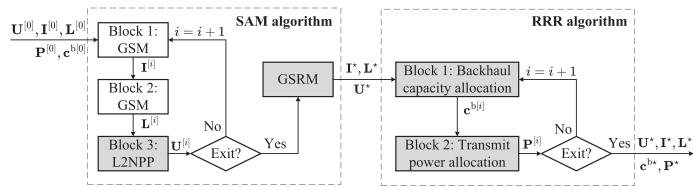  
Fig. 2. The schematic of the proposed QWLMU framework.

Remark 1: Note that the optimization of P1 may result in that $r _ { k } ^ { \mathrm { d } } ( \mathbf { U } , \mathbf { I } , \mathbf { L } , \mathbf { P } ^ { [ 0 ] } )$ becomes larger than $\mathcal { Q } _ { k } ( \mathbf { I } , \mathbf { c } ^ { \mathrm { b } } )$ according to (18). If this happens, the resources averagely allocated to each UE may be more than its need. Thus, it is beneficial to reallocate the redundant resource to serve more UEs. This implies that the ADR of UE k can be redefined as a function of the power allocation vector P subjected to the optimal solution of P1, $\{ \mathbf { U } ^ { \star } , \mathbf { I } ^ { \star } , \mathbf { L } ^ { \star } \}$ , yielding $r _ { k } ^ { \mathrm { d } } ( { \mathbf { U } } ^ { \star } , { \mathbf { I } } ^ { \star } , { \mathbf { L } } ^ { \star } , { \mathbf { P } } )$ .

To maximize the number of QoE-qualified UEs, we formulate an MCSP based on the QoE constraint of (18) as

$$
\begin{array} { r l } {  { \mathbf { P 2 } : \operatorname* { m a x } _ { \mathbf { c } ^ { \flat } , \mathbf { P } } \ \sum _ { k \in \mathcal { K } _ { \mathcal { M } } } \operatorname* { P r } ( r _ { k } ^ { \mathrm { d } } ( \mathbf { U } ^ { \star } , \mathbf { I } ^ { \star } , \mathbf { L } ^ { \star } , \mathbf { P } ) \geq \mathcal { Q } _ { k } ( \mathbf { I } ^ { \star } , \mathbf { c } ^ { \flat } ) ) } \quad } & { } \\ & { \quad \mathrm { s . t . ~ } \mathbf { C 7 } : \displaystyle \sum _ { k \in \mathcal { K } _ { m } } c _ { k } ^ { \flat } \leq C _ { m } , \ \forall m \in \mathcal { M } , } \\ & { \quad \quad \quad \quad \mathbf { C 8 } : \displaystyle \sum _ { k \in \mathcal { K } _ { m } } P _ { k } \leq P _ { m } , \ \forall m \in \mathcal { M } , } \end{array}\tag{20}
$$

where C7 denotes the backhaul capacity constraint of BS/UAV m and C8 is the transmit power constraint of BS/UAV m with ${ \mathcal { K } } _ { { \mathcal { M } } } = \{ k | i _ { k } \in { \mathcal { M } } \}$ being the index set of all associated UEs and ${ \mathcal { K } } _ { m } = \{ k | i _ { k } = m \}$ being the index set of the UEs served by BS/UAV m.

## III. DESIGN OF THE PROPOSED QWLMU SCHEME

The proposed QWLMU scheme designed to address (19) and (20) includes two main functions, namely the sum ADR maximization (SAM) and the RRR algorithms, which will be detailed in Section III-A and Section III-B, respectively. For reading convenience, we portray the schematic of the QWLMU framework in Fig. 2, where $( \cdot ) ^ { [ i ] }$ represents the i-th iterative version of a variable, and the dark-colored blocks indicate our main contributions. The major functions of QWLMU include:

\- GSM: The two GSM blocks provide optimized UE-UAV and LPTS-UAV associations [24], [27], respectively, as solid initial inputs to the L2NPP module.

\- L2NPP: Based on the initial matching results provided by GSM, the L2NPP block solves the intractable deployment optimization problem, which involves multiple LPT-powered UAVs. Specifically, it transforms the targeted nonconvex L2NP function into a convex log-sum-exp function, such that popular tools like CVX can be used.

\- GSRM: The GSRM block reforms the problem of swapping suboptimal GSM results into a new matching process. Then, the GSM-based method [24] can be readily applied to improve the quality of the initial suboptimal solutions.

\- RRR: The RRR block aims to solve the MCSP that maximizes the resource utilization for fulfilling the QoE requirements of more UEs. To realize this objective, it provides a general method that transforms the given implicit probability expression into an easily-solvable, closed-form version.

## A. The Proposed SAM Algorithm

Since P1 is a mixed-integer and non-convex optimization problem (MINCOP) with multiple variables, it is challenging to derive its global optimal solution theoretically. Although the recent artificial intelligence based techniques might offer some clues to solve such problems, the availability of the required prior knowledge and the corresponding dedicated training data remains unclear. Therefore, we opt to design a sub-optimal algorithm to find a stationary solution of P1.

1) Overview of the SAM Algorithm: In the proposed SAM algorithm, the optimization variables are first allocated to three blocks, represented by U, I, L , which take the initial values $( { \bf U } ^ { [ 0 ] } , { \bf \dot { I } } ^ { [ 0 ] } , { \bf L } ^ { [ 0 ] } )$ . Furthermore, $\mathbf { U } ^ { [ 0 ] }$ are predefined initial positions of UAVs, while ${ \bf I } ^ { [ 0 ] }$ and $\mathbf { L } ^ { [ 0 ] }$ can be initialized based on the shortest distance between two association parties. Then, each block is optimized in an alternating way by solving its corresponding subproblem. The overall algorithm for handling P1 is described in the sequel.

Block 1. UE association optimization: In the first block, we optimize the UE association matrix I for given $\mathbf { U } ^ { [ i ] }$ and $\mathbf { L } ^ { [ i ] }$ by solving the problem

$$
\begin{array} { r l } {  { \mathbf { P 1 - 1 } : \operatorname* { m a x } _ { \mathbf { I } } \sum _ { k = 1 } ^ { K } r _ { k } ^ { \mathrm { d } } ( \mathbf { U } ^ { [ i ] } , \mathbf { I } , \mathbf { L } ^ { [ i ] } , \mathbf { P } ^ { [ 0 ] } ) } \quad } & { } \\ & { \quad \mathrm { s . t . } ~ \mathbf { C } 1 , \mathbf { C } 2 . } \end{array}\tag{21}
$$

It is worth mentioning that the UE association problem in P1-1 can be viewed as a many-to-one matching (MOM) problem, where each matching weight assigned to a pair of BS (or UAV) and a UE is determined by the corresponding ADR. In this MOM process, the output optimized vector I<sup></sup> represents the optimized matching strategy, which can then be used as the initial variable $\mathbf { I } ^ { [ i + 1 ] }$ for the i -th iteration.

Moreover, to mitigate the processing delay in finding the stationary solution of P1-1, we adopt a low-complexity distributed approach, namely the GSM algorithm. As more than one UE may be simultaneously associated with the same UAV or the BS, the GSM process needs to be constructed as an MOM version. More details of the GSM scheme are provided in Algorithm A.

Block 2. LPTS association optimization: Similar to P1-1, the equivalent problem to optimize the variable L is to maximize the sum of ADRs given $\mathbf { I } ^ { [ i + 1 ] }$ and $\mathbf { U } ^ { [ i ] }$ , yielding

$$
\begin{array} { r l }  { \} } & { { \mathbf { P 1 - 2 : } } \displaystyle \operatorname* { m a x } _ { { \mathbf { L } } } \sum _ { k \in { \cal K } _ { \mathcal { M } } ^ { [ i + 1 ] } } r _ { k } ^ { \mathrm { d } } ( { \mathbf { U } } ^ { [ i ] } , { \mathbf { I } } ^ { [ i + 1 ] } , { \mathbf { L } } , { \mathbf { P } } ^ { [ 0 ] } ) } \\ & { \mathrm { s . t . } { \mathbf { C } } 3 , { \mathbf { C } } 4 , } \end{array}\tag{22}
$$

where ${ \ K _ { \mathcal M } ^ { [ i + 1 ] } }$ is the index set of the UEs associated with BS and UAVs in the i -th iteration. Note that in the original problem P1, the candidate range of k is from 1 to K. However, after optimizing the UE association matrix I in P1-1, we only need to focus on the associated UEs in the i -th iteration.

Note that the LPTS association problem in P1-2 can be regarded as a one-to-one matching problem, which is a special case of the MOM process subjected to $K _ { m } ^ { \mathrm { m a x } } = 1$ , under constraints C3 and C4.

Block 3. UAV position optimization: In the third block, the optimal positions of the UAVs can be updated with $\mathbf { I } ^ { [ i + 1 ] }$ and $\dot { \bf L } ^ { [ i + 1 ] }$ , which are optimized by Block 1 and Block 2 mentioned above, respectively. Since we only need to address the optimization of U in this block, the objective function $\begin{array} { r l } { { } } & { { } \sum _ { k = 1 } ^ { K } r _ { k } ^ { \mathrm { d } } ( { \bf U } , { \bf I } , { \bf L } , { \bf P } ^ { [ 0 ] } ) } \end{array}$ in P1 to be maximized can be simplified to $\begin{array} { r l } {  { \sum _ { k \in \mathcal { K } _ { \mathcal { M } _ { a } } ^ { [ i + 1 ] } } r _ { k } ^ { \mathrm { d } } ( \mathbf { U } , \mathbf { I } ^ { [ i + 1 ] } , \mathbf { L } ^ { [ i + 1 ] } , \mathbf { P } ^ { [ 0 ] } ) } } \end{array}$ , where ${ \kappa } _ { \mathcal { M } _ { a } } ^ { [ i + 1 ] } =$ $\{ k | i _ { k } > 0 \}$ represents the index set of the UEs associated with UAVs in the i -th iteration. For $\forall k \in K _ { \mathcal { M } _ { a } } ^ { [ i + 1 ] }$ , we may derive $r _ { k } ^ { \mathrm { d } } ( { \bf U } , { \bf I } , { \bf L } , { \bf P } )$ of (10) as

$$
r _ { k } ^ { \mathrm { d } } ( \mathbf { U } , \mathbf { I } ^ { [ i + 1 ] } , \mathbf { L } ^ { [ i + 1 ] } , \mathbf { P } ^ { [ 0 ] } )
$$

$$
= B _ { k } \cdot \log \left[ 1 + \frac { P _ { k } h \left( \mathbf { u } _ { i _ { k } } , \mathbf { e } _ { k } \right) } { \sigma _ { n } ^ { 2 } + \displaystyle \sum _ { m \in \mathcal { M } _ { a } \setminus i _ { k } } P _ { b _ { m } ^ { k } } h \left( \mathbf { u } _ { m } , \mathbf { e } _ { k } \right) } \right] .\tag{23}
$$

In addition, since constraints C1 and C2 of P1 are independent of U, they can be omitted in Block 3. Hence, P1 may be reformulated as

$$
\begin{array} { r } { \mathbf { P 1 - 3 } : \displaystyle \operatorname* { m a x } _ { \mathbf { U } } \sum _ { k \in K _ { M a } ^ { [ i + 1 ] } } B _ { k } \cdot \log \left[ \frac { P _ { k } h \left( \mathbf { u } _ { i k } , \mathbf { e } _ { k } \right) } { \sigma _ { n } ^ { 2 } + \displaystyle \sum _ { m \in \mathcal { M } _ { a } \setminus i _ { k } } P _ { b _ { m } ^ { k } } h \left( \mathbf { u } _ { m } , \mathbf { e } _ { k } \right) } \right] } \\ { \mathrm { s . t . ~ } \mathbf { C 5 } , \mathbf { C 6 } . } \end{array}\tag{24}
$$

It is evident that the objective function of P1-3 is non-concave due to the presence of L2NP, while constraint C6 is non-convex and constraint C5 is convex. Thus, P1-3 is not a standard convex optimization problem, which cannot be directly solved by for example the popular CVX tool offered by MathWorks MATLAB. To tackle this issue, we opt to replace the objective function and the constraints of P1-3 with their concave and convex surrogate counterpart functions, respectively, at the point $( \mathbf { U } ^ { [ i ] } , \mathbf { I } ^ { [ i + 1 ] } , \mathbf { L } ^ { [ i + 1 ] } )$ . More details will be presented in <sup>(</sup>Section III-A3 later.

The proposed SAM scheme based on BSCA is summarized in Algorithm 1, where ζ is a small positive target accuracy, and $N _ { \mathrm { L } }$ is the maximum number of iterations. In addition, the GSM scheme invoked in Algorithm 1 is presented in Appendix B in the supplementary material, while the GSRM scheme is introduced in Section III-A2.

Algorithm 1: The Proposed SAM Algorithm.   
1: Initialization: ${ \bf U } ^ { [ 0 ] } , { \bf I } ^ { [ 0 ] } , { \bf L } ^ { [ 0 ] } , { \bf P } ^ { [ 0 ] } , K , L , M , \zeta$   
$\begin{array} { r } { 2 \colon i = 0 , S _ { 0 } = 0 , S _ { 1 } = \sum _ { k = 1 } ^ { K } r _ { k } ^ { \mathrm { d } } ( \mathbf { U } ^ { [ 0 ] } , \mathbf { I } ^ { [ 0 ] } , \mathbf { L } ^ { [ 0 ] } , { \dot { \mathbf { P } } } ^ { [ 0 ] } ) } \end{array}$   
<sup>= 0</sup>3: while $( | ( S _ { i + 1 } - S _ { i } ) / \overline { { S } } _ { i } | \overset {  } { \geq } \zeta ) \& a m p ; ( i \leq N _ { \mathrm { L } } )$ <sup>)</sup>do   
<sup>( (</sup>4: // Block 1   
5: Obtain the optimal solution I<sup></sup> of P1-1 by GSM   
6: Update the UE association vector: $\mathbf { I } ^ { [ i + 1 ] }  \mathbf { I } ^ { \star }$   
7: // Block 2   
8: Obtain the optimal solution L<sup></sup> of P1-2 by GSM   
9: Update the LPTS association vector: $\mathbf { L } ^ { [ i + 1 ] }  \mathbf { L } ^ { \star }$   
10: // Block 3   
11: Obtain the optimal solution U<sup></sup> of P1-3 by L2NPP   
12: Update the UAV position vector: $\mathbf { U } ^ { [ i + 1 ] }  \mathbf { U } ^ { \star }$   
13: $i = i + 1$   
14: $\begin{array} { r } { S _ { i + 1 } = \sum _ { k = 1 } ^ { K } r _ { k } ^ { \mathrm { d } } ( { \bf U } ^ { [ i ] } , { \bf I } ^ { [ i ] } , { \bf L } ^ { [ i ] } , { \bf P } ^ { [ 0 ] } ) } \end{array}$   
15: end while   
16: Rematch I<sup></sup> and $\mathbf { L } ^ { \star }$ by GSRM   
17: Output: U<sup></sup>, I<sup></sup>, L<sup></sup>

2) The GSRM Algorithm: Note that the solution to GSM may not be the global optimum. Thus, the GSRM scheme which may offer a sum ADR higher than GSM is proposed. More specifically, GSRM aims to refine some matching results in $\mathbf { I } ^ { \star }$ and L<sup></sup> produced by GSM, such that improved solutions to both UE and LPTS association problems may be obtained. Due to their similarity, in the sequel, we take the UE association problem as an example.

I. UE Exchanging Gain Function: To produce two new matching results by exchanging the UEs in different association pairs may provide a gain. Assuming that UAV m swaps its associated UE k with UE j, which is associated with BS/UAV $n ,$ the resultant gain of the new matching is defined as

$$
g _ { j k } = \mathbf { W } ( k , n ) - \mathbf { W } ( k , m ) + \mathbf { W } ( j , m ) - \mathbf { W } ( j , n ) .\tag{25}
$$

For convenience, for BS/UAV m, we construct two vectors constituted by the indices of its associated UEs and those UEs associated with other entities, respectively, as follows

$$
\begin{array} { r } { \left\{ \begin{array} { l l } { \mathbf { k } _ { m } = \mathfrak { F } ( \mathbf { I } ^ { \star } ( m , : ) \neq 0 ) } \\ { \mathbf { k } _ { \mathcal { M } \backslash m } = [ \mathbf { k } _ { 1 } , \mathbf { k } _ { 2 } , \ldots , \mathbf { k } _ { m - 1 } , \mathbf { k } _ { m + 1 } , \ldots , \mathbf { k } _ { M } ] } \end{array} \right. , } \end{array}\tag{26}
$$

where the operator $\mathfrak { F } ( \mathbf { x } )$ is used to find the indices of nonzero elements in vector x and $\mathbf { I } ^ { \star } ( m , : ) = [ \tilde { \mathbf { i } } _ { 1 } ( m ) , \dots , \tilde { \mathbf { i } } _ { K } ( m ) ]$ denotes the m-th row of matrix I<sup></sup>. Besides, $\mathbf { k } _ { m } \in \mathbb { R } _ { + } ^ { 1 \times K _ { m } }$ and $\mathbf { k } _ { \mathcal { M } \backslash m } \in \mathbb { R } _ { + } ^ { 1 \times K _ { \mathcal { M } \backslash m } }$ with $K _ { m }$ defined in (10) and $K _ { \mathcal { M } \backslash m }$ being the total number of UEs associated with the BS/UAV set $\{ { \mathcal { M } } \backslash m \}$

Additionally, the BS/UAV indices corresponding to the UEs with $\mathbf { k } _ { m }$ and $\mathbf { k } _ { \mathcal { M } \backslash m }$ are respectively recorded as

$$
\begin{array} { r } { \left\{ \begin{array} { l l } { \mathbf { j } _ { m } { = } \mathfrak { F } \left( \mathbf { I } ^ { \star } \left( : , \mathbf { k } _ { m } \right) { \neq } 0 , c o l u m n \right) \in \mathbb { R } _ { + } ^ { 1 \times K _ { m } } } \\ { \mathbf { j } _ { \mathcal { M } \backslash m } { = } \mathfrak { F } \left( \mathbf { I } ^ { \star } \left( : , \mathbf { k } _ { \mathcal { M } \backslash m } \right) { \neq } 0 , c o l u m n \right) \in \mathbb { R } _ { + } ^ { 1 \times K _ { \mathcal { M } \backslash m } } } \end{array} \right. } \end{array}\tag{27}
$$

where the operator $\mathfrak { F } ( \mathbf { X } ,$ column is used to extract the indices of non-zero elements in each column of matrix/vector X.

Algorithm 2: The Proposed GSRM Scheme.   
1: Input: W, I<sup></sup>   
2: for $m = 0 : M$ do   
<sup>= 0 :</sup>3: Execute (26) and (27) with $\mathbf { I } ^ { \star }$   
4: Execute (28) with W   
5: $\mathbf { M } ^ { \mathrm { C } } = [ 1 , \dots , 1 ] _ { 1 \times K _ { m } }$ with $K _ { m }$ given by (26)   
<sup>= [1 1]</sup>6: Execute Algorithm A with W, M<sup>C</sup> to obtain $\mathbf { I } ^ { \star }$   
7: Execute (29) with ${ \bf { I } } _ { m } ^ { \mathrm { e x } } = { \bf { I } } ^ { \star }$   
8: Update the matching result $\mathbf { I } ^ { \star }$ with (30)   
9: end for   
10: Output: I<sup></sup>

Based on (25), (26) and (27), we define

$$
\begin{array} { r l } & { \mathbf { G } _ { m } { = } \mathbf { W } \left( \mathbf { k } _ { m } , \mathbf { j } _ { \mathcal { M } \backslash m } ^ { \mathrm { T } } \right) { - } \mathbf { W } \left( \mathbf { k } _ { m } , \mathbf { j } _ { m } \right) } \\ & { + \mathbf { W } \left( \mathbf { k } _ { \mathcal { M } \backslash m } ^ { \mathrm { T } } , \mathbf { j } _ { m } \right) { - } \mathbf { W } \left( \mathbf { k } _ { \mathcal { M } \backslash m } ^ { \mathrm { T } } , \mathbf { j } _ { \mathcal { M } \backslash m } ^ { \mathrm { T } } \right) . } \end{array}\tag{28}
$$

Then, $\mathbf { G } _ { m } \in \mathbb { R } _ { + } ^ { K _ { M \backslash m } \times K _ { m } }$ can be used as the metric to find better rematching solutions.

II. The Rematching Process: We consider the operation of exchanging the UEs in $\mathbf { k } _ { m }$ and those in $\mathbf { k } _ { \mathcal { M } \backslash m }$ as a UE-to-UE (U2U) matching process subjected to the matching weight matrix $\mathbf { G } _ { m }$ of (28). In this case, we can reuse the GSM scheme in Algorithm A to generate the optimal exchanging strategy in $\mathbf { I } _ { m } ^ { \mathrm { e x } }$ to maximize $\mathbf { G } _ { m }$

Subsequently, we find the related positive gains through

$$
\begin{array} { r } { \left[ \mathbf { i } _ { \mathrm { r } } , \mathbf { i } _ { \mathrm { c } } \right] = \mathfrak { F } \left( \mathbf { G } _ { m } \bullet \left( \mathbf { I } _ { m } ^ { \mathrm { e x } } \right) ^ { \mathrm { T } } > 0 \right) , } \end{array}\tag{29}
$$

where $\mathbf { i } _ { \mathrm { r } }$ and $\mathbf { i } _ { \mathrm { c } }$ are the row and column indexes of the positive elements in $\mathbf { G } _ { m }$ , respectively, which correspond to the expected UEs for exchanging. For example, $\mathbf { k } _ { m } ( \mathbf { i } _ { \mathrm { c } } ^ { \mathrm { T } } )$ and $\mathbf { k } _ { \mathcal { M } \backslash m } ( \mathbf { i } _ { \mathrm { r } } ^ { \mathrm { T } } )$ represent the index vectors of the UEs to be exchanged, while $\mathbf { j } _ { m } ( \mathbf { i } _ { \mathrm { c } } ^ { \mathrm { T } } )$ and $\mathbf { j } _ { \mathcal { M } \backslash m } ( \mathbf { i } _ { \mathrm { r } } ^ { \mathrm { T } } )$ are the index vectors of the BS/UAVs corresponding to the UEs with $\mathbf { k } _ { m } ( \mathbf { i } _ { \mathrm { c } } ^ { \mathrm { T } } )$ and $\mathbf { k } _ { \mathcal { M } \backslash m } ( \mathbf { i } _ { \mathrm { r } } ^ { \mathrm { T } } )$ , respectively.

Based on $\{ \mathbf { i } _ { \mathrm { r } } , \mathbf { i } _ { \mathrm { c } } \}$ , we can update GSM’s matching result by

$$
\left\{ \begin{array} { l l } { \mathbf { I } ^ { \star } ( m , \mathbf { k } _ { m } ( \mathbf { i } _ { \mathrm { c } } ^ { \mathrm { T } } ) ) = 0 } \\ { \mathbf { I } ^ { \star } ( m , \mathbf { k } _ { \mathcal { M } \backslash m } ( \mathbf { i } _ { \mathrm { r } } ^ { \mathrm { T } } ) ) = 1 } \\ { \mathbf { I } ^ { \star } ( \mathbf { j } _ { \mathcal { M } \backslash m } ( \mathbf { i } _ { \mathrm { r } } ^ { \mathrm { T } } ) , \mathbf { k } _ { \mathcal { M } \backslash m } ( \mathbf { i } _ { \mathrm { r } } ^ { \mathrm { T } } ) ) = 0 } \\ { \mathbf { I } ^ { \star } ( \mathbf { j } _ { \mathcal { M } \backslash m } ( \mathbf { i } _ { \mathrm { r } } ^ { \mathrm { T } } ) , \mathbf { k } _ { m } ( \mathbf { i } _ { \mathrm { c } } ^ { \mathrm { T } } ) ) = 1 } \end{array} \right. .\tag{30}
$$

Finally, the updated I<sup></sup> becomes the optimal solution to the GSRM matching algorithm. For reading convenience, the above operations are summarized in Algorithm 2. Note that similar to Block 2 of SAM, GSRM can also be used to tackle the LPTS association problem, where $\mathbf { M } ^ { \mathrm { C } } = [ 1 , \dots , 1 ] _ { 1 \times K _ { m } }$ and W takes the same initial values as in GSM.

Remark 2: It is worth mentioning that the proposed GSRM algorithm can be used as a general solution framework, whose attainable performance will be no worse than that of the existing GSM algorithm, for solving typical matching problems. The validation results are provided in Section V.

3) The L2NPP Scheme: To solve P1-3, our objective is to find a concave approximation of $r _ { k } ^ { \mathrm { d } } ( \mathbf { U } , \mathbf { I } ^ { [ i + 1 ] } , \mathbf { L } ^ { [ i + 1 ] } , \mathbf { P } ^ { [ 0 ] } )$ <sup>( )</sup>given by (23). It can be observed from (23) that $r _ { k } ^ { \mathrm { d } } ( { \bf U } , { \bf I } ^ { [ i + 1 ] } , { \bf L } ^ { [ i + 1 ] } , { \bf P } ^ { [ 0 ] } )$ is a complex composite function constituted by a logarithmic function with an L2NP. Inspired by the geometric programming (GP) approach [39] which is often applied to standard posynomial problems, we may exploit it to design an L2NPP for solving the L2NP of P1-3. This procedure is summarized below as five steps.

Step 1. Transform P1-3 to GP-compatible form: Since the standard GP approach is to minimize a posynomial function, we need to convert P1-3, which is a maximization problem, to an equivalent minimization problem, yielding

$$
\begin{array} { r l } {  { \mathbf { P 1 - 3 A } : \operatorname* { m i n } _ { \mathbf { U } } \sum _ { k \in \mathcal { K } _ { \mathcal { M } a } ^ { [ i + 1 ] } } - r _ { k } ^ { \mathrm { d } } ( \mathbf { U } , \mathbf { I } ^ { [ i + 1 ] } , \mathbf { L } ^ { [ i + 1 ] } , \mathbf { P } ^ { [ 0 ] } ) } \quad } & { } \\ & { \mathrm { s . t . } ~ \mathbf { C 5 } , \mathbf { C 6 } . } \end{array}\tag{31}
$$

Step 2. Transform logarithmic L2NP into L2NP: Then, we transform the function of $r _ { k } ^ { \mathrm { d } } ( \mathbf { U } , \mathbf { I } ^ { [ i + 1 ] } , \mathbf { L } ^ { [ i + 1 ] } , \mathbf { P } ^ { [ 0 ] } )$ into an affine form. By exploiting the first-order Taylor expansion (FOTE) of $( \sigma _ { n } ^ { 2 } + y )$ with respect to y at $y = 0$ , we can obtain such an approximation around $\dot { \mathbf { U } } ^ { [ i ] }$ as [22]

$$
\begin{array} { r l } & { \quad r _ { k } ^ { \mathrm { d } } ( \mathbf { U } , \mathbf { I } ^ { [ i + 1 ] } , \mathbf { L } ^ { [ i + 1 ] } , \mathbf { P } ^ { [ 0 ] } ) } \\ & { \approx r _ { k } ^ { \mathrm { d } } ( \mathbf { U } ^ { [ i ] } , \mathbf { I } ^ { [ i + 1 ] } , \mathbf { L } ^ { [ i + 1 ] } , \mathbf { P } ^ { [ 0 ] } ) } \\ & { \quad + B _ { k } \cdot \left\{ \frac { 1 } { \sigma _ { n } ^ { 2 } + \gamma ^ { [ i ] } } \cdot \left[ \displaystyle \sum _ { m = 1 } ^ { M } P _ { b _ { m } ^ { k } } h ( \mathbf { u } _ { m } , \mathbf { e } _ { k } ) - \gamma ^ { [ i ] } \right] \right. } \\ & { \quad \left. - \frac { 1 } { \sigma _ { n } ^ { 2 } + \gamma _ { k } ^ { [ i ] } } \cdot \left[ \displaystyle \sum _ { m \in \mathcal { M } _ { a } \setminus \mathcal { N } _ { b _ { m } } } P _ { b _ { m } ^ { k } } h ( \mathbf { u } _ { m } , \mathbf { e } _ { k } ) - \gamma _ { \langle i | } ^ { [ i ] } \right] \right\} , } \end{array}\tag{32}
$$

where we define $\begin{array} { r } { \gamma ^ { [ i ] } = \sum _ { m = 1 } ^ { M } P _ { b _ { m } ^ { k } } ^ { [ i ] } h ( \mathbf { u } _ { m } ^ { [ i ] } , \mathbf { e } _ { k } ) } \end{array}$ and $\gamma _ { \backslash i _ { k } } ^ { [ i ] } =$ $\begin{array} { r } { \sum _ { m \in \mathcal { M } _ { a } \backslash i _ { k } } P _ { b _ { m } ^ { k } } ^ { [ i ] } h ( \mathbf { u } _ { m } ^ { [ i ] } , \mathbf { e } _ { k } ) } \end{array}$

Note from (32) that the non-concave terms $\begin{array} { r } { \sum _ { m = 1 } ^ { M } P _ { b _ { m } ^ { k } } h ( \mathbf { u } _ { m } , \mathbf { e } _ { k } ) } \end{array}$ and $\begin{array} { r } { \sum _ { m \in \mathcal { M } _ { a } \backslash i _ { k } } P _ { b _ { m } ^ { k } } h ( \mathbf { u } _ { m } , \mathbf { e } _ { k } ) } \end{array}$ have positive and negative signs, respectively. However, the GP method requires that the signs of all terms in posynomial expression are positive. Thus, we need to tackle the two terms with different approaches.

More specifically, we opt to construct the concave and convex surrogate functions of ${ \sum } _ { m = 1 } ^ { M } P _ { b _ { m } ^ { k } } h ( \mathbf { u } _ { m } , \mathbf { e } _ { k } )$ and $\begin{array} { r } { \sum _ { m \in \mathcal { M } _ { a } \backslash i _ { k } } P _ { b _ { m } ^ { k } } h ( \mathbf { u } _ { m } , \mathbf { e } _ { k } ) } \end{array}$ , respectively, such that an overall concave surrogate function can be generated to represent (32). An intuitive solution would be to replace the terms ${ \sum } _ { m = 1 } ^ { M } P _ { b _ { m } ^ { k } } h ( \mathbf { u } _ { m } , \mathbf { e } _ { k } )$ and $\begin{array} { r } { \sum _ { m \in \mathcal { M } _ { a } \backslash i _ { k } } P _ { b _ { m } ^ { k } } h ( \mathbf { u } _ { m } , \mathbf { e } _ { k } ) } \end{array}$ with their concave and convex approximated expressions, respectively. Particularly, since the expression of $P _ { b _ { m } ^ { k } } h ( { \bf u } _ { m } , { \bf e } _ { k } )$ is complicated, we want to divide it into two parts as

$$
P _ { b _ { m } ^ { k } } h ( { \bf u } _ { m } , { \bf e } _ { k } ) = r _ { 1 } + r _ { 2 } ,\tag{33}
$$

which is the key part in (32). By utilizing (8), we have

$$
r _ { 1 } = \varrho _ { 1 } \cdot Y _ { m } ^ { - 1 } ,\tag{34}
$$

where we define $\varrho _ { 1 } = 2 \epsilon P _ { l _ { m } } 1 0 ^ { - \frac { \alpha _ { \mathrm { a v c } } } { 1 0 } } / K _ { m }$ with $\alpha _ { \mathrm { a v e } }$ given in (3), $Y _ { m } \doteq ( D + \Delta \theta \| \bar { \mathbf { v } } _ { l _ { m } } - \bar { \mathbf { u } } _ { m } \| ) ^ { 2 } \cdot \| \bar { \mathbf { e } } _ { k } - \bar { \mathbf { u } } _ { m } \| ^ { \mu _ { \mathrm { a v e } } }$ , and

$$
r _ { 2 } = P _ { \mathrm { R } } \cdot h ( \mathbf { u } _ { m } , \mathbf { e } _ { k } ) / K _ { m } = \varrho _ { 2 } \cdot \left\| \bar { \mathbf { e } } _ { k } - \bar { \mathbf { u } } _ { m } \right\| ^ { - \mu _ { \mathrm { a v e } } }\tag{35}
$$

with $\varrho _ { 2 } = P _ { \mathrm { R } } \cdot 1 0 ^ { - \frac { \alpha _ { \mathrm { a v e } } } { 1 0 } } / K _ { m }$ . Note that $r _ { 1 }$ is a composite function constituted by posynomial and L2-norm.

Step 3. Transform L2NP to standard posynomial: Firstly, we take the FOTE of $r _ { 1 }$ given by (34) with respect to $Y _ { m }$ during the i-th BSCA iteration, yielding

$$
r _ { 1 } ^ { [ i ] } = \varrho _ { 1 } \cdot [ ( Y _ { m } ^ { [ i ] } ) ^ { - 1 } - ( Y _ { m } ^ { [ i ] } ) ^ { - 2 } \cdot ( Y _ { m } - Y _ { m } ^ { [ i ] } ) ] ,\tag{36}
$$

where $\varrho _ { 1 }$ contains $\alpha _ { \mathrm { a v e } }$ , which is based on $\mathrm { P r } _ { \mathrm { L O S } } ( \cdot )$ and $\mathrm { P r } _ { \mathrm { L O S } } ( \cdot )$ specified by (5). Since the channel’s propagation statistics remain roughly the same across a small distance, $\mathrm { P r } _ { \mathrm { L O S } } ( \cdot )$ and $\mathrm { P r } _ { \mathrm { L O S } } ( \cdot )$ may be approximated as constants during one BSCA iteration [22]. Observing (36), we note that the original positive sign before $Y _ { m }$ in $r _ { 1 }$ of (34) is reversed to negative after FOTE.

Similarly, we take the FOTE of $r _ { 2 }$ with respect to $\parallel \bar { \mathbf { e } } _ { k } - $ $\bar { \mathbf { u } } _ { m } \| ^ { \mu _ { \mathrm { a v e } } }$ , yielding

$$
r _ { 2 } ^ { [ i ] } = \varrho _ { 2 } \cdot \frac { 2 \| \bar { \bf e } _ { k } - \bar { \bf u } _ { m } ^ { [ i ] } \| ^ { \mu _ { \mathrm { a v e } } } - \| \bar { \bf e } _ { k } - \bar { \bf u } _ { m } \| ^ { \mu _ { \mathrm { a v e } } } } { \| \bar { \bf e } _ { k } - \bar { \bf u } _ { m } ^ { [ i ] } \| ^ { 2 \mu _ { \mathrm { a v e } } } } .\tag{37}
$$

By combining (33), (36) and (37), we can convert the positive sign of the term $\begin{array} { r } { \sum _ { m = 1 } ^ { M } P _ { b _ { m } ^ { k } } h ( \mathbf { u } _ { m } , \mathbf { e } _ { k } ) } \end{array}$ in (32) to be negative. In this case, the signs of all L2NPs in (32) are consistently negative. Moreover, we point out that the signs of all L2NPs in (32) are canceled out by the leading negative sign in P1-3A’s objective function. This indicates that the $\mathrm { G P ^ { \circ } s }$ rule of requiring all posynomial to be positive can be fulfilled.

Nevertheless, since the GP method cannot solve L2NPs, we need to replace the L2-norm terms in (32) with affine functions. Following the epigraph method [39], in (34) and (35), we define $q _ { m k } ^ { \mathrm { u e } } \doteq \mathopen { } \mathclose \bgroup \left| \bar { \mathbf e } _ { k } - \bar { \mathbf { u } } _ { m } \aftergroup \egroup \right|$ and $q _ { m } ^ { \mathrm { v u } } \doteq \bigl ( D + \Delta \theta \bigr | \bigl | \bar { \mathbf { v } } _ { l _ { m } } - \bar { \mathbf { u } } _ { m } \bigr | \bigr | \bigr )$ . Similarly, in (36) and (37), we define $w _ { m k } ^ { \mathrm { u e } } \doteq \| \bar { \mathbf { e } } _ { k } { - } \bar { \mathbf { u } } _ { m } \|$ <sup>¯</sup>and $w _ { m } ^ { \mathrm { v u } } \doteq ( D +$ $\Delta \theta \big | \big | \bar { \mathbf { v } } _ { l _ { m } } - \bar { \mathbf { u } } _ { m } \big | \big | \big )$ . The variables $q _ { m k } ^ { \mathrm { u e } } , q _ { m } ^ { \mathrm { v u } } , w _ { m k } ^ { \mathrm { u e } } , w _ { m } ^ { \mathrm { v u } }$ are slack variables. Then, we can transform (32) to

$$
\begin{array} { r l } & { r _ { k } ^ { \mathrm { d } } ( { \mathbf { U } } , { \mathbf { I } } ^ { [ i + 1 ] } , { \mathbf { L } } ^ { [ i + 1 ] } , { \mathbf { P } } ^ { [ 0 ] } ) } \\ & { \approx r _ { k } ^ { \mathrm { d } } ( { \mathbf { U } } ^ { [ i ] } , { \mathbf { I } } ^ { [ i + 1 ] } , { \mathbf { L } } ^ { [ i + 1 ] } , { \mathbf { P } } ^ { [ 0 ] } ) } \\ & { + B _ { k } \cdot \Bigg \{ \frac { 1 } { \sigma _ { n } ^ { 2 } + \gamma ^ { [ i ] } } \Bigg [ \underset { m = 1 } { \overset { M } { \sum } } ( r _ { 1 } ^ { [ i ] } ( w _ { m k } ^ { \mathrm { w c } } , w _ { m } ^ { \mathrm { w n } } ) + r _ { 2 } ^ { [ i ] } ( w _ { m k } ^ { \mathrm { w c } } ) ) - \gamma ^ { [ i ] } \Bigg ] } \\ & { \frac { 1 } { \sigma _ { n } ^ { 2 } + \gamma _ { [ i ] } ^ { [ i ] } } \left[ \underset { m \in \mathbb { M } _ { \omega _ { k } } ( i _ { k } ) } { \sum } ( r _ { 1 } ( q _ { m k } ^ { \mathrm { u c } } , q _ { m } ^ { \mathrm { v u } } ) + r _ { 2 } ( q _ { m k } ^ { \mathrm { u c } } ) ) - \gamma _ { ( i _ { k } ] } ^ { [ i ] } \right] \Bigg \} } \\ & { \stackrel { \mathrm { ~ } } { = } r _ { k } ^ { \mathrm { d } } ( { \mathbf { U } } ^ { [ i ] } , { \mathbf { I } } ^ { [ i + 1 ] } , { \mathbf { I } } ^ { [ i + 1 ] } , { \mathbf { P } } ^ { [ 0 ] } , { \mathbf { D } } _ { 1 } ) , } \end{array}\tag{38}
$$

where we define ${ { \bf { D } } _ { 1 } } = \left\{ { { \bf { W } } ^ { \mathrm { { u e } } } } , { { \bf { W } } ^ { \mathrm { { v u } } } } , { { \bf { Q } } ^ { \mathrm { { u e } } } } , { { \bf { Q } } ^ { \mathrm { { v u } } } } \right\}$ }, $\mathbf { W } ^ { \mathrm { u e } } =$ $[ w _ { m k } ^ { \mathrm { u e } } ] _ { M \times K } , \mathbf { Q } ^ { \mathrm { u e } } = [ q _ { m k } ^ { \mathrm { u e } } ] _ { M \times K } , \mathbf { W } ^ { \mathrm { v u } } = [ w _ { m } ^ { \mathrm { v u } } ] _ { 1 \times M }$ , and ${ \bf Q } ^ { \mathrm { v u } } =$ $[ q _ { m } ^ { \mathrm { v u } } ] _ { 1 \times M }$

<sup>]</sup>Thus, we may substitute $r _ { k } ^ { \mathrm { d } } ( \mathbf { U } , \mathbf { I } ^ { [ i + 1 ] } , \mathbf { L } ^ { [ i + 1 ] } , \mathbf { P } ^ { [ 0 ] } )$ of (23) with (38), such that P1-3A can be converted to

$$
\mathbf { P 1 - 3 B } : \operatorname* { m i n } _ { \mathbf { U } , \mathbf { D } _ { 1 } } \sum _ { k \in \mathcal { K } _ { M _ { a } } ^ { [ i + 1 ] } } - r _ { k } ^ { \mathrm { d } } ( \mathbf { U } ^ { [ i ] } , \mathbf { I } ^ { [ i + 1 ] } , \mathbf { L } ^ { [ i + 1 ] } , \mathbf { P } ^ { [ 0 ] } , \mathbf { D } _ { 1 } )
$$

s.t. C5, C6,

$$
{ \bf { C 9 } } \colon w _ { m k } ^ { \mathrm { { u e } } } \geq \mathopen { } \mathclose \bgroup \left\| \bar { \mathbf { e } } _ { k } - \bar { \mathbf { u } } _ { m } \aftergroup \egroup \right\| , \forall m \in \mathcal { M } , k \in \mathcal { K } _ { \mathcal { M } } ^ { [ i + 1 ] } ,
$$

$$
\mathrm { C } 1 0 ; \boldsymbol { w } _ { m } ^ { \mathrm { v u } } \ge D + \Delta \theta \| \bar { \mathbf { v } } _ { l _ { m } } - \bar { \mathbf { u } } _ { m } \| , \forall m \in \mathcal { M } ,
$$

$$
\mathbf { C } 1 1 \colon q _ { m k } ^ { \mathrm { u e } } \leq \| \bar { \mathbf { e } } _ { k } - \bar { \mathbf { u } } _ { m } \| , \forall m { \in } \mathcal { M } , k { \in } \mathcal { K } _ { \mathcal { M } } ^ { [ i + 1 ] } ,
$$

$$
\mathrm { C } 1 2 \colon { q } _ { m } ^ { \mathrm { v u } } \leq D + \Delta \theta \| \bar { \mathbf { v } } _ { l _ { m } } - \bar { \mathbf { u } } _ { m } \| , \forall m \in \mathcal { M } .\tag{39}
$$

Step 4. Transform posynomial into exponential function: Next, our task is to transform the non-convex posynomials in P1-3B into convex exponential functions. Note that the positive part of the second term in (38), namely $( r _ { 1 } ^ { [ i ] } ( w _ { m k } ^ { \mathrm { u e } } , w _ { m } ^ { \mathrm { v u } } ) +$ $r _ { 2 } ^ { [ i ] } ( w _ { m k } ^ { \mathrm { u e } } ) )$ , can be converted to a concave surrogate function

$$
r _ { \mathrm { c a v } } ^ { [ i ] } ( s _ { m k } ^ { \mathrm { u e } } , s _ { m } ^ { \mathrm { v u } } ) = r _ { 1 } ^ { [ i ] } ( \exp ( s _ { m k } ^ { \mathrm { u e } } ) , \exp ( s _ { m } ^ { \mathrm { v u } } ) ) + r _ { 2 } ^ { [ i ] } ( \exp ( s _ { m k } ^ { \mathrm { u e } } ) )
$$

$$
\begin{array} { c } { \displaystyle = \varrho _ { 1 } \cdot \left[ \frac { 2 } { Y _ { m } ^ { [ i ] } } - \frac { \exp ( \mu _ { \mathrm { a v e } } s _ { m k } ^ { \mathrm { u e } } + 2 s _ { m } ^ { \mathrm { v u } } ) } { \left( Y _ { m } ^ { [ i ] } \right) ^ { 2 } } \right] } \\ { + \varrho _ { 2 } \cdot \displaystyle \frac { 2 \| \bar { \bf e } _ { k } - \bar { \bf u } _ { m } ^ { [ i ] } \| ^ { \mu _ { \mathrm { a v e } } } - \exp ( \mu _ { \mathrm { a v e } } s _ { m k } ^ { \mathrm { u e } } ) } { \| \bar { \bf e } _ { k } - \bar { \bf u } _ { m } ^ { [ i ] } \| ^ { 2 \mu _ { \mathrm { a v e } } } } , } \end{array}\tag{40}
$$

where we define $s _ { m k } ^ { \mathrm { u e } } = \log ( w _ { m k } ^ { \mathrm { u e } } )$ and $s _ { m } ^ { \mathrm { v u } } = \log ( w _ { m } ^ { \mathrm { v u } } )$ . Similarly, the negative part of the third term of (38), namely $r _ { 1 } ( q _ { m k } ^ { \mathrm { u e } } , q _ { m } ^ { \mathrm { v u } } ) + r _ { 2 } ( q _ { m k } ^ { \mathrm { u e } } )$ , can be convexified as

$$
\begin{array} { l } { r _ { \mathrm { v e x } } ( o _ { m k } ^ { \mathrm { u e } } , o _ { m } ^ { \mathrm { v u } } ) = r _ { 1 } ( \mathrm { e x p } ( o _ { m k } ^ { \mathrm { u e } } ) , \mathrm { e x p } ( o _ { m } ^ { \mathrm { v u } } ) ) + r _ { 2 } ( \mathrm { e x p } ( o _ { m k } ^ { \mathrm { u e } } ) ) } \\ { \quad \quad \quad \quad \quad \quad \quad \quad \quad \quad \quad } \\ { \quad \quad = \displaystyle \sum _ { l = 1 } ^ { L } \varrho _ { 1 } \cdot \mathrm { e x p } ( - \mu _ { \mathrm { a v e } } o _ { m k } ^ { \mathrm { u e } } - 2 o _ { m } ^ { \mathrm { v u } } ) } \\ { \quad \quad \quad \quad \quad \quad \quad \quad \quad \quad \quad \quad \quad \quad \quad \quad \quad \quad } \\ { \quad \quad \quad \quad + \varrho _ { 2 } \cdot \mathrm { e x p } ( - \mu _ { \mathrm { a v e } } o _ { m k } ^ { \mathrm { u e } } ) , \qquad \quad \quad \quad ( 4 1 } \end{array}
$$

where we define $o _ { m k } ^ { \mathrm { u e } } = \log ( q _ { m k } ^ { \mathrm { u e } } )$ and $o _ { m } ^ { \mathrm { v u } } = \log ( q _ { m } ^ { \mathrm { v u } } )$

Then, by exploiting (40) and (41), we can update (38) to the following surrogate function

$$
r _ { k } ^ { \mathrm { d } } ( \mathbf { U } ^ { [ i ] } , \mathbf { I } ^ { [ i + 1 ] } , \mathbf { L } ^ { [ i + 1 ] } , \mathbf { P } ^ { [ 0 ] } , \mathbf { D } _ { 2 } ) = r _ { k } ^ { \mathrm { d } } ( \mathbf { U } ^ { [ i ] } , \mathbf { I } ^ { [ i + 1 ] } , \mathbf { L } ^ { [ i + 1 ] } , \mathbf { P } ^ { [ 0 ] } )
$$

$$
+ B _ { k } \cdot \left\{ \frac { 1 } { \sigma _ { n } ^ { 2 } + \gamma ^ { [ i ] } } \cdot \left[ \sum _ { m = 1 } ^ { M } r _ { \mathrm { c a v } } ^ { [ i ] } ( s _ { m k } ^ { \mathrm { u e } } , s _ { m } ^ { \mathrm { v u } } ) - \gamma ^ { [ i ] } \right] \right.
$$

$$
- \frac { 1 } { \sigma _ { n } ^ { 2 } + \gamma _ { \backslash i _ { k } } ^ { [ i ] } } \cdot \left[ \sum _ { m \in \mathcal { M } _ { a } \backslash i _ { k } } r _ { \mathrm { v e x } } ( o _ { m k } ^ { \mathrm { u e } } , o _ { m } ^ { \mathrm { v u } } ) - \gamma _ { \backslash i _ { k } } ^ { [ i ] } \right] \Bigg \} ,\tag{42}
$$

where we define $\mathbf { D } _ { 2 } = \{ \mathbf { S } ^ { \mathrm { u e } } , \mathbf { S } ^ { \mathrm { v u } } , \mathbf { O } ^ { \mathrm { u e } } , \mathbf { O } ^ { \mathrm { v u } } \} , \mathbf { S } ^ { \mathrm { u e } } =$ $\left[ s _ { m k } ^ { \mathrm { u e } } \right] _ { M \times K } , \quad \mathbf { O } ^ { \mathrm { u e } } = \left[ o _ { m k } ^ { \mathrm { u e } } \right] _ { M \times K } , \quad \mathbf { S } ^ { \mathrm { v u } } = \left[ s _ { m } ^ { \mathrm { v u } } \right] _ { 1 \times M }$ <sup>=</sup>and $\mathbf { O } ^ { \mathrm { v u } } = \bigl [ o _ { m } ^ { \mathrm { v u } } \bigr ] _ { 1 \times M }$ <sup>= [ ] = [ ]</sup>. Thus, by variable substitution, we obtain the equivalent form of P1-3B as

P1-3C

$$
\operatorname* { m i n } _ { \mathbf { U } , \mathbf { D } _ { 2 } } \sum _ { k \in \mathcal { K } _ { M _ { a } } ^ { [ i + 1 ] } } - r _ { k } ^ { \mathrm { d } } ( \mathbf { U } ^ { [ i ] } , \mathbf { I } ^ { [ i + 1 ] } , \mathbf { L } ^ { [ i + 1 ] } , \mathbf { P } ^ { [ 0 ] } , \mathbf { D } _ { 2 } )
$$

s.t. C5, C6,

$$
\mathbf { C } 1 3 \colon \exp ( s _ { m k } ^ { \mathrm { u e } } ) \geq \| \bar { \mathbf { e } } _ { k } - \bar { \mathbf { u } } _ { m } \| , \forall m \in \mathcal { M } , k \in \mathcal { K } _ { \mathcal { M } } ^ { [ i + 1 ] } ,
$$

$$
\begin{array} { r } { \mathrm { C } 1 4 ; \exp ( s _ { m } ^ { \mathrm { v u } } ) { \geq } D + { \Delta \theta } \| \bar { \mathbf { v } } _ { l _ { m } } - \bar { \mathbf { u } } _ { m } \| , \forall m \in \mathcal { M } , } \end{array}
$$

$$
\mathbf { C } 1 5 \colon \exp ( o _ { m k } ^ { \mathrm { u e } } ) \le \| \bar { \mathbf { e } } _ { k } - \bar { \mathbf { u } } _ { m } \| , \forall m \in \mathcal { M } , k \in \mathcal { K } _ { \mathcal { M } } ^ { [ i + 1 ] } ,
$$

$$
\begin{array} { r } { \mathrm { C } 1 6 \colon \exp ( o _ { m } ^ { \mathrm { v u } } ) { \le } D + \Delta \theta \| \bar { \mathbf { v } } _ { l _ { m } } - \bar { \mathbf { u } } _ { m } \| , \forall m \in \mathcal { M } . } \end{array}\tag{43}
$$

Step 5. Construct a standard GP problem: It is easy to observe that the objective function of P1-3 C is convex due to the concavity of (42). However, the constraints C6 and C13-C16

of P1-3 C are still non-convex, as the functions on both sides of their inequalities are convex. Utilizing $\| a \| \cdot \| b \| \geq a \cdot b .$ , C6 can be slackened to a convex constraint as follows

$$
{ \bf C } 1 7 \colon ( \bar { \bf u } _ { m } ^ { [ i ] } - \bar { \bf u } _ { n } ^ { [ i ] } ) \big ( \bar { \bf u } _ { m } - \bar { \bf u } _ { n } \big ) \ge d ^ { \mathrm { L } } \cdot \| \bar { \bf u } _ { m } ^ { [ i ] } - \bar { \bf u } _ { n } ^ { [ i ] } \| .\tag{44}
$$

Moreover, by applying the GP method to P1-3C, we may take logarithm of its objective function and the exponential constraints C13-C16, such that the convex functions $) ( s _ { m k } ^ { \mathrm { u e } } )$ $\exp ( s _ { m } ^ { \mathrm { v u } } )$ , $\exp ( o _ { m k } ^ { \mathrm { u e } } )$ and $\exp ( o _ { m } ^ { \mathrm { v u } } )$ on the left-hand side of the inequalities are transformed into affine functions. Then, we only need to handle the right-hand side of C13-C16, where we further take the FOTE to yield

$$
\begin{array} { r l } & { \mathbb { E } \{ \left. \frac { \partial \xi } { \partial x } \right| ^ { 2 } , } \\ & { : = \xi \left( \xi ^ { 2 } + \xi ^ { 2 } \left( \xi ^ { 2 } + \xi ^ { 2 } \left( \xi ^ { 2 } + \xi ^ { 2 } \right) \right) \right) ^ { 2 } , } \\ & { : = \xi ^ { 2 } \left( \xi ^ { 2 } + \xi ^ { 2 } \left( \xi ^ { 2 } + \xi ^ { 2 } \right) \right) ^ { 2 } , } \\ & { : = \xi ^ { 2 } \left( \xi ^ { 2 } + \xi ^ { 2 } \left( \xi ^ { 2 } + \xi ^ { 2 } \right) \right) ^ { 2 } , } \\ & { : = \xi ^ { 2 } \left( \xi ^ { 2 } + \xi ^ { 2 } \left( \xi ^ { 2 } + \xi ^ { 2 } \right) \right) ^ { 2 } , } \\ & { : = \xi ^ { 2 } \left( \xi ^ { 2 } + \xi ^ { 2 } \left( \xi ^ { 2 } + \xi ^ { 2 } \right) \right) ^ { 2 } , } \\ & { : = \xi ^ { 2 } \left( \xi ^ { 2 } + \xi ^ { 2 } \left( \xi ^ { 2 } + \xi ^ { 2 } \right) \right) ^ { 2 } , } \\ & { : = \xi ^ { 2 } \left( \xi ^ { 2 } + \xi ^ { 2 } \left( \xi ^ { 2 } + \xi ^ { 2 } \right) \right) ^ { 2 } , } \\ & { : = \xi ^ { 2 } \left( \xi ^ { 2 } + \xi ^ { 2 } \left( \xi ^ { 2 } + \xi ^ { 2 } \right) \right) ^ { 2 } , } \\ & { : = \xi ^ { 2 } \left( \xi ^ { 2 } + \xi ^ { 2 } \left( \xi ^ { 2 } + \xi ^ { 2 } \right) \right) ^ { 2 } , } \\ & { : = \xi ^ { 2 } \left( \xi ^ { 2 } + \xi ^ { 2 } \left( \xi ^ { 2 } + \xi ^ { 2 } \right) \right) ^ { 2 } , } \\ &  : = \xi ^ { 2 } \left( \xi ^ { 2 } + \xi ^ { 2 } \left( \xi ^ { 2 } + \xi ^ { 2 } \right) \right) ^   \end{array}\tag{5}
$$

where $R _ { k } ^ { \mathrm { t h } } = \left\{ { r _ { \mathrm { B } } ^ { \mathrm { m a x } } , \quad i _ { k } = 0 } \atop { r _ { \mathrm { R } } ^ { \mathrm { m a x } } , \quad i _ { k } \neq 0 }  \right.$ is the upper bound of $r _ { k } ^ { \mathrm { d } } ( \cdot )$ , and $d _ { m k } ^ { [ i ] } = \log \| \bar { \mathbf { e } } _ { k } - \bar { \mathbf { u } } _ { m } ^ { [ i ] } \|$ . Then, the convex problem P1-3D can be solved by popular optimization methods, such as the CVX tool. More discussions on P1-3D and its convexity are provided in Appendix C in the supplementary material.

## B. Reallocation of Redundant Resources

In Section III-A, we maximize the sum ADRs of all UEs through (19) with the aid of the SAM algorithm. However, it may occur that most of the redundant resources are allocated to only a portion of the UEs, despite that some UEs can only obtain few resources. From commercial perspective, operators may tend to provide ‘just-enough’ resources to each UE, such as transmit power, backhaul capacity, etc., for fulfilling the UE’s

QoE requirements. Then, the saved resources can be used to help increase the amount of UEs satisfying QoE requirements. Based on such a motivation, we propose the RRR scheme to dynamically reclaim the redundant resources from QoE-qualified UEs, which will then be reallocated to as many other UEs, whose QoE requirements have not yet been fulfilled, as possible.

Recall from the beginning of Section III that the RRR scheme aims to solve P2 of (20). P2 is a challenging MCSP with multiple variables and implicit objective function. To solve $\mathrm { i t , }$ we opt for exploiting the BSCA framework, where we design a probability approximation operator to alternatively optimize the subproblems with respect to $\mathbf { c } ^ { \mathrm { { b } } }$ and P.

1) Block 1: Optimization of Backhaul Capacity Allocation: In the first block of the RRR algorithm, the backhaul capacity allocation vector $( \mathbf { c } ^ { \mathrm { b } } ) ^ { [ i ] }$ is optimized for a given $\mathbf { P } ^ { [ i ] }$

However, note that solving the original objective function of (20) is challenging, as the probability expressions therein are discontinuous piecewise functions, which are non-differentiable and cannot be handled by typical optimization tools. Thus, we propose a general approximation-based method for solving this kind of problems, as documented in the following proposition:

Proposition 2: In Block 1 to solve P2, a convex surrogate optimization problem for given $\{ \mathbf { U } ^ { \star } , \mathbf { I } ^ { \star } , \mathbf { L } ^ { \star } , \mathbf { P } ^ { [ i ] } , ( \mathbf { c } ^ { \mathrm { b } } ) ^ { [ i ] } \}$ can be formulated as

$$
\begin{array} { r l } & { \mathrm { P 2 \cdot 1 : ~ \displaystyle \operatorname* { m a x } _ \varepsilon ~ \sum _ \varepsilon \in \mathcal { K } _ \varepsilon } } \\ & { \quad \quad \mathrm { ~ s . t . ~ } C 7 : \quad \displaystyle \operatorname { c s t } _ { \varepsilon \in \mathcal { K } _ { m } } \mathrm { ~ } \forall m \in \mathcal { M } , } \\ & { \quad \quad k \in \mathcal { K } _ { m } \setminus ( \mathcal { C } _ { i } ^ { \circ } + p \mathcal { C } _ { i } ^ { \circ - 1 } \cdot \frac { \Omega _ { k } \cdot [ \varepsilon _ { k } ^ { \mathrm { B } } \cdot ( c _ { k } ^ { \mathrm { B } } ) ^ { [ \mathrm { i 1 } ] } ] } { \xi } ) , \forall k \in \mathcal { K } _ { 0 } , } \\ &  \quad \quad \mathrm { ~ C 2 2 : ~ \displaystyle \operatorname* { m a x } _ \varepsilon \partial _ { \nu k } \Biggl \{ \frac { \mathcal { C } _ { i } ^ { \circ } } { 2 } + p \cdot \frac { \mathcal { C } _ { i } ^ { m - 1 } } { 2 } \cdot \frac { \Omega _ { k } \cdot [ c _ { k } ^ { \mathrm { B } } - ( c _ { k } ^ { \mathrm { B } } ) ^ { [ \mathrm { i 2 } ] } ] } { \xi } \} , } \\ & { \quad \quad \quad \quad \quad \quad \quad \quad \quad \quad \quad \quad \quad \quad \quad \quad \quad \quad \quad \quad \quad \quad \quad \quad \quad \quad \quad \quad \quad \quad \quad \quad \quad \quad \quad \quad \quad } \\ & { \quad \quad \quad \quad \quad \quad \quad \quad \quad \quad \quad \quad \quad \quad \quad \quad \quad \quad \quad \quad \quad \quad \quad \quad \quad \quad \quad \quad \quad \quad \quad \quad \quad \quad \quad \quad \quad \quad \quad \quad \quad \quad \quad \quad \quad \quad } \\ & { \quad \quad \quad \quad \quad \quad \quad \quad \quad \quad \quad \quad \quad \quad \quad \quad \quad \quad \quad \quad \quad \quad \quad \quad \quad \quad \quad \quad \quad \quad \quad \quad \quad \quad \quad \quad \quad \quad \quad \quad \quad \quad \quad \quad \quad \quad \quad \quad \quad \quad \quad \quad \quad \quad \quad \quad } \\ &  \quad \quad \quad \quad \quad  \end{array}\tag{6}
$$

where $\begin{array} { r } { \nu _ { k } = \mathrm { P r } ( r _ { k } ^ { \mathrm { d } } ( \mathbf { U } ^ { \star } , \mathbf { I } ^ { \star } , \mathbf { L } ^ { \star } , \mathbf { P } ^ { [ i ] } ) \geq \delta _ { k } ) , \ \Omega _ { k } = \tau - \bar { D } _ { k } ^ { \mathrm { m i n } } } \end{array}$ $( \tau - D _ { k } ^ { \mathrm { L B } } ) - \ell / \tilde { r } _ { k } ^ { \tilde { \mathrm { d } } } ( \mathbf { U } ^ { \star } , \mathbf { I } ^ { \star } , \mathbf { L } ^ { \star } , \mathbf { P } ^ { [ i ] } )$ , $\mathcal { C } _ { i } = \Omega _ { k } { \cdot } ( c _ { k } ^ { \mathrm { b } } ) ^ { [ i ] } / \ell .$ , and $\mathbf { z } \in \mathbb { R } _ { + } ^ { 1 \times K }$ is a slack variable.

Proof: The proof of Proposition 2 is provided in Appendix D of the supplementary material. -

2) Block 2: Optimization of Transmit Power Allocation: In the second block, we optimize the power allocation vector $\mathbf { P } ^ { [ i + 1 ] }$ for a given backhaul capacity allocation vector $( \mathbf { c } ^ { \mathrm { b } } ) ^ { [ i + 1 ] }$ which is initialized as the optimized solution $( \mathbf { c } ^ { \mathrm { b } } ) ^ { \star }$ <sup>( )</sup>of P2-1 in the i-th iteration.

Different from Block 1, the optimization variable P in Block 2 is involved with a logarithm function given in (10). Thus, we choose to first eliminate the logarithmic operation by transforming the objective function into

$$
\sum _ { k \in \mathcal { K } _ { M } } \operatorname* { P r } \Big ( r _ { k } ^ { \mathrm { d } } \big ( \mathbf { U } ^ { \star } , \mathbf { I } ^ { \star } , \mathbf { L } ^ { \star } , \mathbf { P } \big ) \geq \mathcal { Q } _ { k } \big ( \mathbf { I } ^ { \star } , ( \mathbf { c } ^ { \mathrm { b } } ) ^ { [ i + 1 ] } \big ) \Big )
$$

$$
\begin{array} { l } { { \displaystyle = \sum _ { k \in { \cal K } _ { M _ { a } } } \mathrm { P r } \left( \frac { P _ { k } h \left( { \bf u } _ { i _ { k } } , { \bf e } _ { k } \right) } { \sigma _ { n } ^ { 2 } + \sum _ { m \in { \cal M } _ { a } \backslash i _ { k } } ^ { 2 } P _ { b _ { m } ^ { k } } h \left( { \bf u } _ { m } , { \bf e } _ { k } \right) } \geq \epsilon _ { k } \right) } } \\ { { \displaystyle \quad + \sum _ { k \in { \cal K } _ { 0 } } \mathrm { P r } \left( \frac { P _ { k } h _ { k , 0 } } { \sigma _ { n } ^ { 2 } } \geq \epsilon _ { k } \right) , } } \end{array}\tag{47}
$$

where $\begin{array} { r } { \epsilon _ { k } = \exp [ \frac { 1 } { B _ { \iota } } \mathcal { Q } _ { k } ( \mathbf { I } ^ { \star } , ( \mathbf { c } ^ { \mathrm { b } } ) ^ { [ i + 1 ] } ) ] - 1 } \end{array}$ . With (47), we can leverage the same approach as (46) to approximate P2 to

P2-2 $\operatorname* { m a x } _ { \mathbf { z } , \mathbf { P } } \sum _ { k \in \mathcal { K } _ { \mathcal { M } } } z _ { k }$   
s.t. C8: <sup></sup> P<sub>k</sub> ≤ P<sub>m</sub>, ∀m ∈ M,   
k∈K<sub>m</sub>   
C25: z<sub>k</sub> ≤ P<sup>p</sup> p · P<sup>p</sup> P<sub>k</sub>h<sub>k,0</sub> − [i] h<sub>k,0</sub> , ∀k∈K<sub>0</sub>,   
<sub>k</sub>σ<sup>2</sup><sub>n</sub>   
C26: z<sub>k</sub>≤<sup>Pp</sup><sub>i</sub> p·<sup>Pp−1</sup><sub>i</sub> ·<sup>P</sup>−p·<sup>Pp</sup><sub>i</sub> , ∀k ∈ K<sub>Ma</sub>,   
C27: z<sub>k</sub> ≤ , ∀m ∈ M. (48

)

where we define $\mathcal { P } _ { i } = P _ { k } ^ { [ i ] } h _ { k , 0 } / ( \epsilon _ { k } \sigma _ { n } ^ { 2 } ) , \mathbb { P } _ { i } = P _ { k } ^ { [ i ] } h ( \mathbf { u } _ { i _ { k } } , \mathbf { e } _ { k } ) /$ $\begin{array} { r } { \big [ \epsilon _ { k } \big ( \sigma _ { n } ^ { 2 } + \sum _ { m \in \mathcal { M } _ { a } \backslash i _ { k } } P _ { b _ { m } ^ { k } } ^ { [ i ] } h ( \mathbf { u } _ { m } , \mathbf { e } _ { k } ) \big ) \big ] } \end{array}$ , and $\mathbb { P } = P _ { k } h ( \mathbf { u } _ { i _ { k } } , \mathbf { e } _ { k } ) /$ $\begin{array} { r } { \big [ \epsilon _ { k } \big ( \sigma _ { n } ^ { 2 } + \sum _ { m \in \mathcal { M } _ { a } \backslash i _ { k } } P _ { b _ { m } ^ { k } } h ( \mathbf { u } _ { m } , \mathbf { e } _ { k } ) \big ) \big ] } \end{array}$

In (48), the objective function and all constraints except C26 are affine and also convex. Moreover, note that P2-2 may be regarded as a special form of fraction programming, namely the slacked max-min-ratio problem, which can be solved by the quadratic transform technique [40], provided that the fractional term in C26 can be substituted by an affine function. Thus, we propose to replace C26 with

$$
\begin{array} { r l } & { z _ { k } \le \mathbb { P } _ { i } ^ { p } - p { \cdot } \mathbb { P } _ { i } ^ { p } + p { \cdot } \mathbb { P } _ { i } ^ { p - 1 } \cdot \Big [ 2 \mathcal { V } _ { k } \sqrt { P _ { k } h \left( \mathbf { u } _ { i _ { k } } , \mathbf { e } _ { k } \right) } } \\ & { \qquad - \mathcal { V } _ { k } ^ { 2 } \epsilon _ { k } \left( \sigma _ { n } ^ { 2 } + \displaystyle \sum _ { m \in \mathcal { M } _ { a } \backslash i _ { k } } P _ { b _ { m } ^ { k } } h \left( \mathbf { u } _ { m } , \mathbf { e } _ { k } \right) \right) \Bigg ] , \forall k \in \mathcal { K } _ { \mathcal { M } _ { a } } , } \end{array}\tag{49}
$$

where we define the auxiliary variable ${ \mathcal { V } } _ { k }$ for $\forall k \in \mathcal { K } _ { \mathcal { M } _ { a } }$

$$
\mathcal { V } _ { k } = \frac { \sqrt { P _ { k } ^ { [ i ] } h \left( \mathbf { u } _ { i _ { k } } , \mathbf { e } _ { k } \right) } } { \epsilon _ { k } \left( \sigma _ { n } ^ { 2 } + \sum _ { m \in \mathcal { M } _ { a } \backslash i _ { k } } P _ { b _ { m } ^ { k } } ^ { [ i ] } h \left( \mathbf { u } _ { m } , \mathbf { e } _ { k } \right) \right) } .\tag{50}
$$

Furthermore, since both C25 and C26 are coupled constraints deduced from the same objective function of P2-2, C25 should also be tackled by the quadratic transform for maintaining consistency despite its convexity. Then, we can replace it with

$$
z _ { k } \le \mathcal { P } _ { i } ^ { p } - p \cdot \mathcal { P } _ { i } ^ { p }
$$

$$
+ p \cdot \mathcal { P } _ { i } ^ { p - 1 } \cdot \left( 2 \mathcal { V } _ { k } \sqrt { P _ { k } h _ { k , 0 } } - \mathcal { V } _ { k } ^ { 2 } \epsilon _ { k } \sigma _ { n } ^ { 2 } \right) , \forall k \in \mathcal { K } _ { 0 } ,\tag{51}
$$

with the auxiliary variable

$$
\mathcal { V } _ { k } = \frac { \sqrt { P _ { k } h _ { k , 0 } } } { \epsilon _ { k } \sigma _ { n } ^ { 2 } } , \forall k \in \mathcal { K } _ { 0 } .\tag{52}
$$

Based on both blocks mentioned above, the number of UEs satisfying the QoE requirement can be effectively increased in the entire network. We summarize the above operations in Algorithm 3.

```latex
Algorithm 3: The Proposed RRR Algorithm.
1: Initialization: $\mathbf { U } ^ { \star } , \mathbf { I } ^ { \star } , \mathbf { L } ^ { \star } , \mathbf { P } ^ { [ 0 ] } , ( \mathbf { c } ^ { \mathrm { b } } ) ^ { [ 0 ] } , i = 0 , S _ { i } = 0$
2 $\begin{array} { r l r } { \mathrm { ~ } } & { { } } & { \colon S _ { i + 1 } = \sum _ { k \in \mathcal { K } _ { M } } \left\{ r _ { k } ^ { \mathrm { d } } ( \mathbf { U } ^ { \star } , \mathbf { I } ^ { \star } , \mathbf { L } ^ { \star } , \dot { \mathbf { P } } ^ { [ i ] } ) - \mathcal { Q } _ { k } ( \mathbf { I } ^ { \star } , ( \mathbf { c } ^ { \mathrm { b } } ) ^ { [ i ] } ) \right\} } \end{array}$
3: while $( | ( S _ { i + 1 } - S _ { i } ) / S _ { i } | \geq \zeta )$ <sup>)</sup> amp $( i \leq N _ { \mathrm { L } } )$ <sup>)</sup>do
<sup>( (</sup>4: // Block 1
5: Obtain the optimal solution $( \mathbf { c } ^ { \mathrm { b } } ) ^ { \star }$ of P2-1
6: Update the backhaul capacity vector:
$( \bar { \mathbf { c } } ^ { \mathrm { { b } } } ) ^ { [ i + 1 ] } = ( \mathbf { c } ^ { \mathrm { { b } } } ) ^ { \star }$
<sup>( )</sup>7: // Block 2
8: Obtain the optimal solution $\mathbf { P } ^ { \star }$ of P2-2
9: Update the transmit power vector: $\mathbf { P } ^ { [ i + 1 ] } = \mathbf { P } ^ { \star }$
10: $i = i + 1$
11: $\begin{array} { r } { S _ { i + 1 } = \sum _ { k \in \mathcal { K } _ { M } } \{ r _ { k } ^ { \mathrm { d } } ( \mathbf { U } ^ { \star } , \mathbf { I } ^ { \star } , \mathbf { L } ^ { \star } , \mathbf { P } ^ { [ i ] } ) - \mathcal { Q } _ { k } ( \mathbf { I } ^ { \star } , ( \mathbf { c } ^ { \mathrm { b } } ) ^ { [ i ] } ) \} } \end{array}$
<sup>=</sup>12: end while
13: Output: $( \mathbf { c } ^ { \mathrm { b } } ) ^ { \star } , \mathbf { P } ^ { \star }$
```

## IV. COMPLEXITY ANALYSIS

The time complexity of the proposed QWLMU scheme mainly originates from GSM, GSRM, and the interior-point method applied to L2NPP, backhaul capacity allocation and transmit power allocation modules. Based on the reported time complexities of GSM [24] and the interior-point method [41], the main contributions to the time complexity of QWLMU by the aforementioned functions can be quantified as follows.

Based on the QWLMU framework of Fig. 2, its overall complexity may be expressed as

$$
\begin{array} { r l } {  } & { T _ { \mathrm { Q W L M U } } = I _ { \mathrm { S A M } } \cdot ( T _ { \mathrm { b 1 } } + T _ { \mathrm { b 2 } } + T _ { \mathrm { b 3 } } ) + T _ { \mathrm { U A } } ^ { \mathrm { G S R M } } } \\ & { \quad \quad \quad \quad \quad \quad \quad \quad \quad \quad \quad \quad } \\ & { \quad \quad \quad \quad \quad \quad \quad + T _ { \mathrm { L A } } ^ { \mathrm { G S R M } } + I _ { \mathrm { R R R } } \cdot ( T _ { \mathrm { s 1 } } + T _ { \mathrm { s 2 } } ) , } \end{array}\tag{53}
$$

where $I _ { \mathrm { S A M } }$ and $I _ { \mathrm { R R R } }$ represent the numbers of SAM and RRR iterations, respectively, $T _ { \mathrm { b 1 } } \mathrm { - } T _ { \mathrm { b 3 } }$ denote the complexities of Blocks 1–3in the SAM algorithm, respectively, $T _ { \mathrm { s 1 } }$ and $T _ { \mathrm { s 2 } }$ refer to the complexities of Block 1 and Block 2 of the RRR algorithm, respectively, and $T _ { \mathrm { U A } } ^ { \mathrm { G S R M } }$ and $T _ { \mathrm { L A } } ^ { \mathrm { G S R M } }$ are the complexities of GSRM-based UE and LPTS association processes, respectively.

Recall from Algorithm 1 that the GSM module is invoked in both Block 1 and Block 2 of SAM for executing UE and LPTS association tasks. According to [41], if n UEs match with m association entities through GSM, the complexity of this particular GSM-based process, T<sub>GSM</sub>, can typically be modeled as the number of worst-case iterations, namely $T _ { \mathrm { G S M } } = { \cal O } ( m n )$ Thus, we can derive ${ \cal T } _ { \mathrm { b 1 } } = { \cal O } [ ( M + 1 ) K ]$ and $T _ { \mathrm { b 2 } } = O ( L M )$ .

Moreover, note that the complexity of the interior-point method is typically $T _ { \mathrm { I P M } } = O [ X ^ { 3 . 5 } \cdot \log ( 1 / Y ) ]$ [41], where X denotes the total dimensions of optimization variables and Y denotes the target accuracy of converge. Thus, we can formulate the complexity of Block 3in SAM as $T _ { \mathrm { b 3 } } = O [ ( G _ { \mathrm { U } } +$ $G _ { \mathbf { D } _ { 2 } } ) ^ { 3 . 5 } \log ( 1 / \bar { \zeta } ) ]$ , where we define $G _ { \mathbf { U } } = 2 M$ <sup>=</sup>and ${ \cal G } _ { \bf D _ { 2 } } =$ $2 M K + 2 M$ as the dimensions of U in (9) and $\mathbf { D } _ { 2 }$ in (42), respectively. In addition, the complexities of Block 1 and Block 2in RRR are given by $T _ { \mathrm { s 1 } } = \stackrel { \cdot } { O } [ ( 2 K ) ^ { 3 . 5 } \cdot \log ( 1 / \zeta ) ]$ and $T _ { \mathrm { s 2 } } = O [ ( 2 K ) ^ { 3 . 5 } \cdot \mathrm { l o g } ( 1 / \zeta ) ]$ , respectively.

Note from Algorithm 2 that the GSRM-based UE association may be viewed as $M + 1 \mathrm { G S M }$ processes. Thus, its complexity is $\begin{array} { r } { \dot { T } _ { \mathrm { U A } } ^ { \mathrm { G S R M } } = O ( \sum _ { m = 0 } ^ { M } k _ { m } k _ { \mathcal { M } \backslash m } ) } \end{array}$ , where $k _ { m }$ and $k _ { \mathcal { M } \backslash m }$ are the dimensions of $\mathbf { k } _ { m }$ and $\mathbf { k } _ { \mathcal { M } \backslash m }$ , respectively, both given by (26). Similarly, the complexity of GSRM-based LPTS association is $\begin{array} { r }  T _ { \mathrm { L A } } ^ { \mathrm { G S R M } } \mathbf { \bar { \Omega } } = O ( \sum _ { m = 0 } ^ { M } l _ { m } \mathbf { \bar { \} } _ { M \backslash m } ) } \end{array}$ , where $l _ { m }$ denotes the number of <sup>= ( )</sup>LPTSs associated with UAV m and $l _ { \mathcal { M } \backslash m }$ represents the number of all associated LPTSs excluding $\mathrm { U A V } \ m$

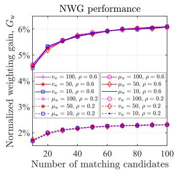  
(a) NWG vs. no. of matching candidates

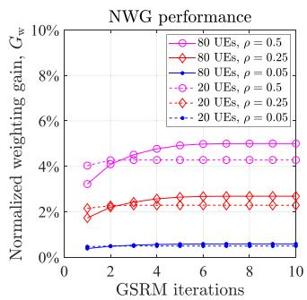  
(b) NWG vs. iterations

Fig. 4. Illustration of UAV trajectory optimization.  
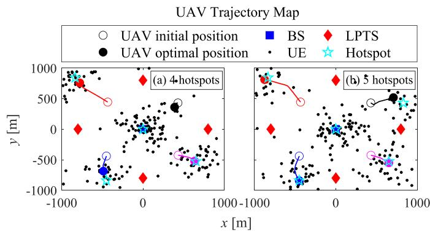  
Fig. 3. The NWG and convergence performances of GSRM.  
(b) ADR vs. K  
(a) $H _ { \mathrm { R } } = 6 0$ m  
(a) ADR vs. $H _ { \mathrm { R } }$

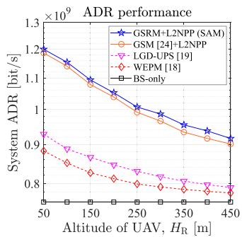

Based on the above analysis, the time complexity of the proposed QWLMU scheme is mainly determined by Block 3 of the SAM algorithm, due to the fact that $T _ { \mathrm { b 3 } } \gg T _ { \mathrm { s 1 } } = T _ { \mathrm { s 2 } } >$ $T _ { \mathrm { U A } } ^ { \mathrm { G S R M } } > T _ { \mathrm { L A } } ^ { \mathrm { G S R M } } > T _ { \mathrm { b 1 } } > T _ { \mathrm { b 2 } }$ . Furthermore, we may reduce the impact of $T _ { \mathrm { b 3 } }$ by restricting the number of SAM iterations $I _ { \mathrm { S A M } }$ in (53). Fortunately, the SAM algorithm can converge to a good performance with only a few iterations, as to be shown in Fig. 5 and Fig. 7 of Section V next.

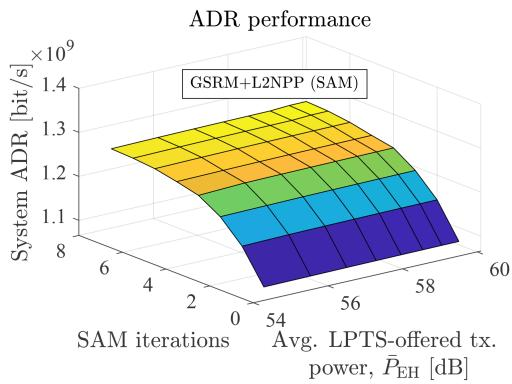

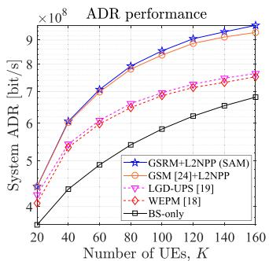

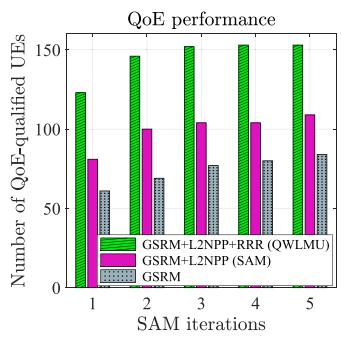  
Fig. 5. The system ADR performance of the SAM algorithm.  
Fig. 6. The system ADR performances of various schemes.  
Fig. 7. The number of QoE-qualified UEs under different $H _ { \mathrm { R } }$ values.

(b) $H _ { \mathrm { R } } = 3 0 0 ~ $ m  
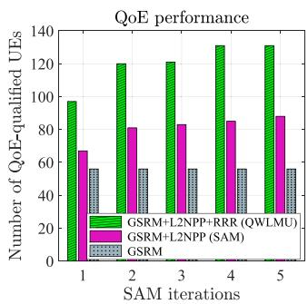

## V. SIMULATION RESULTS AND DISCUSSIONS

The major parameters used in simulations are outlined in Table II, unless otherwise stated. The main system parameters, such as bandwidth, packet size, delay requirement, etc., are specified by 3GPP [38], [42]. The air-to-ground channel in dense urban area was adopted [43]. Since in practical scenarios, UEs may have different rate requirements, we randomly allocated $Z \in [ 1 , 1 5 ]$ resource blocks to each UE, where each resource block occupies 180 kHz [42]. The homogeneous Poisson point process and Poisson cluster process are used to model the stochastic distribution pattern of UEs [44], namely hanging out sparsely in the entire service area and gathering around N hotspots, respectively.

As the first investigation, we verify the performance of the proposed GSRM scheme, which, as it is worth pointing out, provides a general solution framework for typical matching problems. To facilitate the analysis, we define a generalized metric called normalized weight gain (NWG) as $\begin{array} { r } { G _ { \mathrm { w } } = \frac { 1 } { V } \sum _ { v = 1 } ^ { V } [ ( W _ { v } ^ { \mathrm { G S R M } } - } \end{array}$ $W _ { v } ^ { \mathrm { G S M } } ) / W _ { v } ^ { \mathrm { G S M } } ]$ , where $W _ { v } ^ { \mathrm { G S R M } }$ and $W _ { v } ^ { \mathrm { G S M } }$ denote the sum matching weights of GSRM and GSM, respectively, in the v-th simulation run, and $V = 1 0 ^ { 4 }$ . Depending on the specific problem to be solved, the mean or variance value of the matching weights can vary.

Without loss of generality, we randomly generate the matching weights in each simulation run subjected to different mean and variance values, resulting in corresponding values of the coefficient of variation (COV) defined as $\begin{array} { r } { \rho = \frac { \sqrt { v _ { \mathrm { w } } } } { \mu _ { \mathrm { w } } } } \end{array}$ , where $v _ { \mathrm { w } }$ and $\mu _ { \mathrm { w } }$ denote the variance and mean of matching weights, respectively. Fig. 3(a) shows that the NWG values are always positive under different numbers of matching candidates, indicating the improvement brought by GSRM over GSM. Furthermore, the NWG values become larger as ρ increases, implying that GSRM performs better if the matching weights vary more significantly regardless of the values of $v _ { \mathrm { w } }$ and $\mu _ { \mathrm { w } }$ . This result is expected, since GSRM exploits the matching diversity through rematching some worse matched nodes to create better ones. Such benefits can also be seen in Fig. 3(b), which reveals that GSRM converges after only a few iterations. The results of Fig. 3 prove that the GSRM scheme is a promising replacement for the conventional GSM scheme in solving general matching problems, such as the UE or LPTS association problems in this work.

TABLE II MAIN PARAMETERS USED IN SIMULATIONS
<table><tr><td>Parameter</td><td>Definition</td><td>Value</td></tr><tr><td> $\alpha _ { \mathrm { { B } } }$ </td><td>Path loss exponent of BS-UE link</td><td> $\overline { { 3 . 6 } }$ </td></tr><tr><td> $\alpha _ { \mathrm { L } }$ </td><td>Path loss exponent of LPT link</td><td> $1 0 ^ { - 6 } \mathrm { ~ m ~ }$ </td></tr><tr><td> $\beta _ { \mathrm { B } }$ </td><td>Propagation parameter of BS-UE link</td><td>-30 dB</td></tr><tr><td> $C _ { 0 }$ </td><td>Capacity of BS</td><td>40 Mbit/s</td></tr><tr><td> $C _ { m }$ </td><td>Capacity of UAV m</td><td>20 Mbit/s</td></tr><tr><td> $\chi _ { \sigma _ { \mathrm { L O S } } }$ </td><td>Shadowing component of LOS link</td><td>1 dB</td></tr><tr><td> $\chi _ { \sigma _ { \mathrm { N L O S } } }$ </td><td>Shadowing component of NLOS link</td><td>20 dB</td></tr><tr><td> $D$ </td><td>Initial size of laser beam</td><td>0.1 m</td></tr><tr><td> $\bar { D } ^ { \mathrm { m i n } }$ </td><td>MOS lower bound for delay QoE</td><td>0.8</td></tr><tr><td> $\Delta \ddot { \theta }$ </td><td>Angular spread of laser beam</td><td> $3 . 4 \times 1 0 ^ { - 5 }$ </td></tr><tr><td> $d _ { \mathrm { 0 } }$ </td><td>Free-space reference distance</td><td>1 m</td></tr><tr><td> $\ell$ </td><td>Information data content size</td><td>32 byte</td></tr><tr><td> $\epsilon$ </td><td>Receiving area of optical receiver</td><td>0.004 m²</td></tr><tr><td> $f _ { c }$ </td><td>Carrier frequency</td><td>1 GHz</td></tr><tr><td> $H _ { \mathrm { B } }$ </td><td>Altitude of BS</td><td>30 m</td></tr><tr><td> $H _ { \mathrm { U } }$ </td><td>Altitude of UE</td><td>1.7 m</td></tr><tr><td> $H _ { \mathrm { L } }$ </td><td>Altitude of LPTS</td><td>45 m</td></tr><tr><td> $L$ </td><td>Number of LPTSs</td><td>4</td></tr><tr><td> $M$ </td><td>Number of UAVs</td><td>4</td></tr><tr><td> $N$ </td><td>Number of hot spots in the service area</td><td>5</td></tr><tr><td> $\mu _ { \mathrm { L O S } }$ </td><td>Path loss exponent of LOS link</td><td>2</td></tr><tr><td> $\mu _ { \mathrm { N L O S } }$ </td><td>Path loss exponent of NLOS link</td><td>2.4</td></tr><tr><td> $P _ { \mathrm { { B } } }$ </td><td>Total transmit power of BS</td><td>43 dBm</td></tr><tr><td> $P _ { l _ { m } }$ </td><td>Transmit power of LPTS</td><td>600 W</td></tr><tr><td> $P _ { \mathrm { R } }$ </td><td>Backup transmit power threshold of UAV</td><td>23 dBm</td></tr><tr><td> $R _ { \mathrm { C } }$ </td><td>Radius of service area</td><td>1 km</td></tr><tr><td> $\sigma _ { n } ^ { 2 }$ </td><td>AWGN variance</td><td>-96 dBm</td></tr><tr><td>T</td><td>Upper bound of CTD</td><td>0.5 ms</td></tr><tr><td> $W _ { \mathrm { B } }$ </td><td>BS-UE channel bandwidth</td><td>150 MHz</td></tr><tr><td> $W _ { \mathrm { R } }$ </td><td>UAV-UE channel bandwidth</td><td>75MHz</td></tr><tr><td> $\{ \xi _ { 1 } , \xi _ { 2 } \}$ </td><td>Environmental factors</td><td>{1.9, 0.13}</td></tr></table>

Then, we evaluate the impact from the UE topology on the optimization of UAV trajectory. In Fig. 4(a) and Fig. 4(b), we plot the optimized UAV trajectories with known UEs’ positions for N and N hotspots, respectively. It can be seen that after the optimization by the proposed SAM algorithm, UAVs tend to move closer to the center of a nearby hotspot, such that more UEs can be served.

Next, in Fig. 5, we study the impact of the transmit power supported by LEH, namely $P _ { \mathrm { E H } }$ defined in (7), by simulating the system ADR with different SAM iterations under a range of average LEH power, given by $\begin{array} { r } { \bar { P } _ { \mathrm { E H } } = \frac { 1 } { M } \sum _ { m = 1 } ^ { M } P _ { \mathrm { E H } } ( \mathbf { u } _ { m } ^ { \star } ) } \end{array}$ Specifically, the value of P<sub>EH</sub> is determined by $P _ { l _ { m } } \left( l _ { m } = \right.$ $1 , \ldots , L ; m = 1 , \ldots , M )$ , which ranges from 600 to 2000 W.

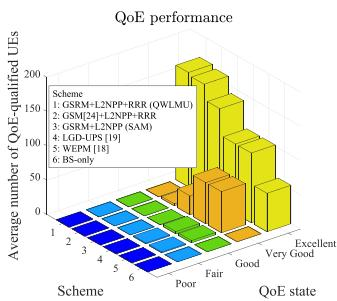

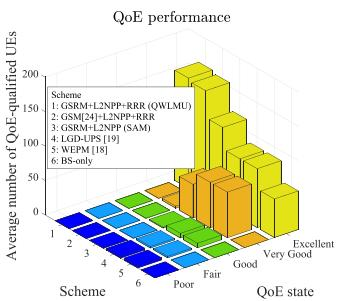  
(a) Test on UE densities  
(b) Test on LPTS distributions  
Fig. 8. The average QoE performance of different schemes with respect to predefined QoE states.

Fig. 5 implies that increasing $\bar { P } _ { \mathrm { E H } }$ alone does not offer significant incremental advantages to the system ADR, since the power level of LPTS is already sufficiently high to saturate the ADR of (10). Thus, there is no need to excessively spend the harvested LPTS energy on improving the ADR performance.

In Fig. 6(a) where different UAV altitudes $H _ { \mathrm { R } }$ are tested, we compare the system ADR performances of the proposed SAM algorithm, which includes GSRM and L2NPP functions, with selected benchmarkers such as the GSM [24], the maximized weighted energy efficiency and power transfer efficiency (MWEP) [18] and the laser guard distance based UAV positioning switching (LGD-UPS) methods. It can be noted that the proposed SAM scheme outperforms all benchmarkers. Similar trends are observed in Fig. 6(b), where the tests are conducted with different numbers of UEs K. These results prove the superiority of the SAM algorithm to the existing solutions, especially in the scenario, where the UAVs are at a low-to-medium $H _ { \mathrm { R } }$ and/or support a large K.

Next, in Fig. 7, we depict the various optimization strategies with a number of SAM iterations under a normalized UAV altitude of $H _ { \mathrm { R } } \in \{ 6 0 , 3 0 0 \}$ m. From the figure, we can see that the L2NPP scheme of Section III-A3 helps to increase the number of QoE-qualified UEs in the GSRM-aided system regardless of $H _ { \mathrm { R } }$ . Furthermore, when the RRR algorithm of Section III-B is activated, resulting in the comprehensive QWLMU scheme, an even higher number of QoE-qualified UEs can be supported. Note that the system performance beneficially converges after only a few SAM iterations.

Moreover, Fig. 8(b) and (b) illustrate the number of QoEqualified UEs averaged across different UE density levels and different LPTS distributions for the various schemes concerned, respectively. Specifically, the UE density is categorized into three levels, namely ‘Sparse’, ‘Dense’, and ‘Highly Dense’, as shown in Fig. A of Appendix E in the supplementary material. The different LPTS distributions are plotted in Fig. B of Appendix E in the supplementary material. From Fig. 8, we can see that the proposed QWLMU scheme achieves the best QoE performance, as characterized by its highest ratio of the ‘Excellent’ QoE state. In addition, we can also note the contributions from GSRM and RRR algorithms by comparing QWLMU (Scheme 1) and Scheme 2, as well as QWLMU and SAM (Scheme 3), respectively.

(a) Number of QoE-qualified UEs (b) Sum ADR of QoE-qualified UEs  
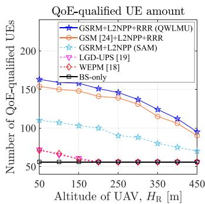

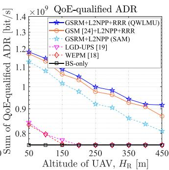

Fig. 9. The QoE-related system performances.  
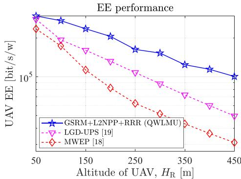  
Fig. 10. The EE performance of QoE-qualified UEs.

As a further study, Fig. 9(a) shows the QoE-related system performances obtained with a fixed number of $N _ { \mathrm { L } } = 6 ~ \mathrm { S A M }$ iterations. Note that the number of QoE-qualified UEs basically remains the same under low $H _ { \mathrm { R } }$ values, as the short distances between UAVs and UEs do not result in severe path loss, thus helping the UEs to fulfill their QoE requirements. In contrast, as expected, the number drops when the UAVs hover at a higher altitude, since the channel’s path loss becomes larger and therefore reduces the UEs’ achievable ADRs. Nonetheless, Fig. 9(a) clearly shows the individual gains offered by the proposed GSRM, L2NPP and RRR modules, respectively. One may argue that a higher number of QoE-qualified UEs may not necessarily bring an improved sum data rate for QoE-qualified UEs. For example, the system may not benefit from supporting more QoE-qualified UEs, if their rates are just meeting the QoE metric. However, this is not the case for the proposed scheme, as Fig. 9(b) indicates that the sum ADR achieved by a higher number of QoE-qualified UEs is indeed increased, implying that the benefit enjoyed by the QoE-qualified UEs is beyond the minimum level.

Last but not the least, in Fig. 10, we evaluate the EE performance of the different LPT-enabled UAV communication schemes. Specifically, the EE of UAVs is defined as

$$
E _ { \mathrm { V } } = \frac { \sum _ { k \in \mathcal { K } _ { \mathcal { M } _ { a } } } r _ { k } ^ { \mathrm { d } } ( \mathbf { U } ^ { \star } , \mathbf { I } ^ { \star } , \mathbf { L } ^ { \star } , \mathbf { P } ^ { \star } ) } { \sum _ { k \in \mathcal { K } _ { \mathcal { M } _ { a } } } P _ { k } + \sum _ { m \in \mathcal { M } } P _ { m } ^ { \mathrm { h } } } ,\tag{54}
$$

where $P _ { m } ^ { \mathrm { h } }$ denotes the hover power consumption of UAV m based on the rotary-wing UAV model [45]. As depicted in Fig. 10, the proposed QWLMU scheme has a higher EE than

the benchmarker schemes of LGD-UPS and MWEP under a typical range of altitudes.

## VI. CONCLUSION

In this paper, the multi-UAV communication scenario is investigated, where we design an L2NPP scheme to solve the L2NP in the proposed SAM model, aiming to strike for an optimized tradeoff between WIT and LPT services. Moreover, we devise the GSRM algorithm to identify the best BS-UE, UAV-UE and LPTS-UAV associations. In addition, the RRR scheme is tailored to exercise a beneficial resource reallocation strategy that enables more UEs to satisfy the QoE requirement, though without the need of consuming extra energy from the UAVs’ embedded battery. Finally, simulation results validate the superiority of our proposals in comparison to existing solutions.

## ACKNOWLEDGMENT

The authors would like to thank Dr. Kuan Wu, Mr. Mingzhi Xu and Ms. Xiaojing Huang for their expertise and suggestions, which were helpful to improve this work.

## REFERENCES

[1] S. Chen, F. Qin, B. Hu, X. Li, and Z. Chen, “User-centric ultra-dense networks for 5G: Challenges, methodologies, and directions,” IEEE Wireless Commun., vol. 23, no. 2, pp. 78–85, Apr. 2016.

[2] M. Peng, Y. Sun, X. Li, Z. Mao, and C. Wang, “Recent advances in cloud radio access networks: System architectures, key techniques, and open issues,” IEEE Commun. Surveys Tuts., vol. 18, no. 3, pp. 2282–2308, third quarter 2016.

[3] K. Mitra, A. Zaslavsky, and C. Ahlund, “Context-aware QoE modelling, measurement and prediction in mobile computing systems,” IEEE Trans. Mobile Comput., vol. 14, no. 5, pp. 920–936, May 2015.

[4] M. Chen, M. Mozaffari, W. Saad, C. Yin, M. Debbah, and C. S. Hong, “Caching in the sky: Proactive deployment of cache-enabled unmanned aerial vehicles for optimized quality-of-experience,” IEEE J. Sel. Areas Commun., vol. 35, no. 5, pp. 1046–1061, May 2017.

[5] S. Chai and V. K. N. Lau, “Online trajectory and radio resource optimization of cache-enabled UAV wireless networks with content and energy recharging,” IEEE Trans. Signal Process., vol. 68, pp. 1286–1299, 2020.

[6] F. Zeng, Z. Hu, H. Jiang, S. Zhou, W. Liu, and D. Liu, “Resource allocation and trajectory optimization for QoE provisioning in energy-efficient UAVenabled wireless networks,” IEEE Trans. Veh. Technol., vol. 69, no. 7, pp. 7634–7647, Jul. 2020.

[7] X.-W. Tang, X.-L. Huang, and F. Hu, “QoE-driven UAV-enabled pseudoanalog wireless video broadcast: A joint optimization of power and trajectory,” IEEE Trans. Multimedia, vol. 23, pp. 2398–2412, 2020.

[8] Z. Hu, F. Zeng, Z. Xiao, B. Fu, H. Jiang, and H. Chen, “Computation efficiency maximization and QoE-provisioning in UAV-enabled MEC communication systems,” IEEE Trans. Netw. Sci. Eng., vol. 8, no. 2, pp. 1630–1645, Apr.–Jun. 2021.

[9] W. Liu, B. Li, W. Xie, and Z. Fei, “Energy efficient computation offloading in aerial edge networks with multi-agent cooperation,” IEEE Trans. Wireless Commun., vol. 22, no. 9, pp. 5725–5739, Sep. 2023.

[10] Y. Zhou, X. Ma, S. Hu, D. Zhou, N. Cheng, and N. Lu, “QoE-driven adaptive deployment strategy of multi-UAV networks based on hybrid deep reinforcement learning,” IEEE Internet Things J., vol. 9, no. 8, pp. 5868–5881, Apr. 2022.

[11] H. Xu, J. Chen, and M. Jiang, “QoE-driven multiple UAVs-mounted reconfigurable intelligent surface communication,” IEEE Commun. Lett., vol. 28, no. 12, pp. 2824–2828, Dec. 2024.

[12] Z. Yang, W. Xu, and M. Shikh-Bahaei, “Energy efficient UAV communication with energy harvesting,” IEEE Trans. Veh. Technol., vol. 69, no. 2, pp. 1913–1927, Feb. 2020.

[13] S. Ahmed, M. Z. Chowdhury, and Y. M. Jang, “Energy-efficient UAV relaying communications to serve ground nodes,” IEEE Commun. Lett., vol. 24, no. 4, pp. 849–852, Apr. 2020.

[14] Y. Huo, X. Dong, T. Lu, W. Xu, and M. Yuen, “Distributed and multilayer UAV networks for next-generation wireless communication and power transfer: A feasibility study,” IEEE Internet Things J., vol. 6, no. 4, pp. 7103–7115, Aug. 2019.

[15] W. Chen, S. Zhao, Q. Shi, and R. Zhang, “Resonant beam chargingpowered UAV-assisted sensing data collection,” IEEE Trans. Veh. Technol., vol. 69, no. 1, pp. 1086–1090, Jan. 2020.

[16] J. Zheng, J. Zhang, and B. Ai, “UAV communications with WPT-aided cell-free massive MIMO systems,” IEEE J. Sel. Areas Commun., vol. 39, no. 10, pp. 3114–3128, Oct. 2021.

[17] Q. Zhang, W. Fang, Q. Liu, J. Wu, P. Xia, and L. Yang, “Distributed laser charging: A wireless power transfer approach,” IEEE Internet Things J., vol. 5, no. 5, pp. 3853–3864, Oct. 2018.

[18] M.-M. Zhao, Q. Shi, and M.-J. Zhao, “Efficiency maximization for UAV-enabled mobile relaying systems with laser charging,” IEEE Trans Wireless Commun., vol. 19, no. 5, pp. 3257–3272, May 2020.

[19] M.-A. Lahmeri, M. A. Kishk, and M.-S. Alouini, “Laser-powered UAVs for wireless communication coverage: A large-scale deployment strategy,” IEEE Trans. Wireless Commun., vol. 22, no. 1, pp. 518–533, Jan. 2023.

[20] W. Liu, S. Zhang, and N. Ansari, “Joint laser charging and DBS placement for drone-assisted edge computing,” IEEE Trans. Veh. Technol., vol. 71, no. 1, pp. 5923–5939, Jan. 2022.

[21] A. Ranjha and G. Kaddoum, “URLLC-enabled by laser powered UAV relay: A quasi-optimal design of resource allocation, trajectory planning and energy harvesting,” IEEE Trans. Veh. Technol., vol. 71, no. 1, pp. 753–765, Jan. 2022.

[22] A. Liu and V. K. N. Lau, “Optimization of multi-UAV-aided wireless networking over a ray-tracing channel model,” IEEE Trans. Wireless Commun., vol. 18, no. 9, pp. 4518–4530, Sep. 2020.

[23] X. Xi, X. Cao, P. Yang, J. Chen, T. Quek, and D. Wu, “Joint user association and UAV location optimization for UAV-aided communications,” IEEE Wireless Commun. Lett., vol. 8, no. 6, pp. 1688–1691, Dec. 2019.

[24] H. E. Hammouti, M. Benjillali, B. Shihada, and M.-S. Alouini, “Learn-asyou-fly: A distributed algorithm for joint 3D placement and user association in multi-UAVs networks,” IEEE Trans. Wireless Commun., vol. 18, no. 12, pp. 5831–5844, Dec. 2019.

[25] C. Qiu, Z. Wei, X. Yuan, Z. Feng, and P. Zhang, “Multiple UAV-mounted base station placement and user association with joint fronthaul and backhaul optimization,” IEEE Trans. Commun., vol. 68, no. 9, pp. 5864–5877, Sep. 2020.

[26] T. Zhang, Y. Wang, Y. Liu, W. Xu, and A. Nallanathan, “Cache-enabling UAV communications: Network deployment and resource allocation,” IEEE Trans. Wireless Commun., vol. 19, no. 11, pp. 7470–7483, Nov. 2020.

[27] C.-P. Teo, J. Sethuraman, and W.-P. Tan, “Gale-shapley stable marriage problem revisited: Strategic issues and applications,” Manage. Sci., vol. 47, no. 9, pp. 1252–1267, 2001.

[28] J. Ouyang, Y. Che, J. Xu, and K. Wu, “Throughput maximization for laser-powered UAV wireless communication systems,” in Proc. IEEE Int. Conf. Commun. Workshops, Kansas City, MO, USA, 2018, pp. 1–6.

[29] M. Katwe, K. Singh, B. Clerckx, and C.-P. Li, “Rate-splitting multiple access and dynamic user clustering for sum-rate maximization in multiple RISs-aided uplink mmWave system,” IEEE Trans. Commun., vol. 70, no. 11, pp. 7365–7383, Nov. 2022.

[30] Y. He, D. Wang, F. Huang, R. Zhang, X. Gu, and J. Pan, “Downlink and uplink sum rate maximization for HAP-LAP cooperated networks,” IEEE Trans. Veh. Technol., vol. 71, no. 9, pp. 9516–9531, Sep. 2022.

[31] S. Dayarathna, R. Senanayake, and J. Evans, “Sum-rate optimization in flexible half-duplex networks with transmitter/receiver scheduling,” IEEE Trans. Veh. Technol., vol. 21, no. 7, pp. 4711–4724, Jul. 2022.

[32] H. Safi, A. Dargahi, and J. Cheng, “Beam tracking for UAV-assisted FSO links with a four-quadrant detector,” IEEE Commun. Lett., vol. 25, no. 12, pp. 3908–3912, Dec. 2021.

[33] M. Najafi, H. Ajam, V. Jamali, P. D. Diamantoulakis, G. K. Karagiannidis, and R. Schober, “Statistical modeling of FSO fronthaul channel for dronebased networks,” in Proc. IEEE Int. Conf. Commun., Kansas City, MO, USA, 2018, pp. 1–7.

[34] J. Chen and D. Gesbert, “Optimal positioning of flying relays for wireless networks: A LOS map approach,” in Proc. IEEE Int. Conf. Commun., Paris, France, May 2017, pp. 1–6.

[35] A. Al-Hourani, S. Kandeepan, and S. Lardner, “Optimal LAP altitude for maximum coverage,” IEEE Wireless Commun. Lett., vol. 3, no. 6, pp. 569–572, Dec. 2014.

[36] T. S. Rappaport, Wireless Communications: Principles and Practice. Hoboken, NJ, USA: Prentice-Hall, 2010.

[37] M. J. Feuerstein, K. L. Blackard, T. S. Rappapor, S. Y. Seidel, and H. H. Xia, “Path loss, delay spread, and outage models as functions of antenna height for microcellular system design,” IEEE Trans. Veh. Technol., vol. 43, no. 3, pp. 487–498, Aug. 1994.

[38] 3GPP, “Study on scenarios and requirements for next generation access technologies; Release 16,” 3rd Generation Partnership Project, Tech. Rep. TR 38.913 V16.0.0, Jul. 2020.

[39] S. Boyd and L. Vandenberghe, Convex Optimization. Cambridge, U.K.: Cambridge Univ. Press, 2004.

[40] K. Shen and W. Yu, “Fractional programming for communication systemspart I: Power control and beamforming,” IEEE Trans. Signal Process., vol. 66, no. 10, pp. 2616–2630, May 2018.

[41] K.-Y. Wang, A. M.-C. So, T.-H. Chang, W.-K. Ma, and C.-Y. Chi, “Outage constrained robust transmit optimization for multiuser MISO downlinks: Tractable approximations by conic optimization,” IEEE Trans. Signal Process., vol. 62, no. 21, pp. 5690–5705, Nov. 2014.

[42] 3GPP, “Base station (BS) radio transmission and reception; Release 16,” 3rd Generation Partnership Project, Tech. Specification TS 38.104 V16.19.0, Mar. 2024.

[43] M. Mozaffari, W. Saad, M. Bennis, and M. Debbah, “Unmanned aerial vehicle with underlaid device-to-device communications: Performance and tradeoffs aerial vehicle with underlaid device-to-device communications: Performance and tradeoffs,” IEEE Trans. Wireless Commun., vol. 15, no. 6, pp. 3949–3963, Jun. 2016.

[44] M. Haenggi, Stochastic Geometry for Wireless Networks. Cambridge, U.K.: Cambridge Univ. Press, 2012.

[45] Y. Zeng, J. Xu, and R. Zhang, “Energy minimization for wireless communication with rotary-wing UAV,” IEEE Trans. Wireless Commun., vol. 18, no. 4, pp. 2329–2345, Apr. 2019.

  
Jianchao Chen (Student Member, IEEE) received the BS degree from Hengyang Normal University, in 2016, and the MEng degree from the Guangdong University of Technology, in 2019. He is currently working toward the PhD degree with the School of Electronics and Information Technology, Sun Yat-sen University, Guangzhou, China. His research interests include uncrewed aerial vehicle communication, wireless power transfer, integrated sensing and communication, random access, reinforcement learning, and convex optimization.


Ming Jiang (Senior Member, IEEE) received the BEng and MEng degrees in electronic engineering from the South China University of Technology (SCUT), China, and the PhD degree in electronic engineering from the University of Southampton, U.K. He has substantial international and industrial experience with Fortune 500 telecom companies. From 2006 to 2013, he had held key research/development or executive positions with Samsung Electronics Research Institute (SERI), U.K., Nortel Networks’ Research and Development Center, China, and the Tele-

com Equipment Maker New Postcom, China, where he actively participated in numerous collaborative projects across the EU, North America and Asia, contributing to algorithm and system research and standardization, as well as radio access and core network product designs. Since 2013, he has been a Full Professor and PhD degree Supervisor with Sun Yat-sen University, China, where he focuses on both fundamental research and technology transfer, and leads a number of national, provincial and industrial research projects. He is also the deputy director of the State-Province Joint IoT Engineering Laboratory and the director with Guangdong Province IoT Engineering Laboratory. He has coauthored six books, more than 100 articles, 120 patents, and more than 400 3GPP/IEEE standardization contributions. He was the recipient of the several Chinese local council awards in 2011 and 2022, including Innovative Leading Talents, Outstanding Experts, and Top Overseas Scholars.