# QoS-Oriented Task Offloading in NOMA-Based Multi-UAV Cooperative MEC Systems

Peipei Chen , Lailong Luo , Deke Guo , Senior Member, IEEE, Jiaju Wu , Kaikai Chi , Senior Member, IEEE, Chenggang Yan , and Xudong Dong

Abstract—As resource-intensive and latency-sensitive applications continue to expand, the integration of unmanned aerial vehicles (UAVs) with mobile edge computing (MEC) has emerged as a viable solution, offering flexible, on-demand services for mobile users (MUs) without reliance on terrestrial infrastructure. The adoption of non-orthogonal multiple access (NOMA) further reduces latency by allowing MUs to offload tasks simultaneously over a single subchannel. However, many existing offloading methods do not explicitly incorporate a priority-based task scheduling mechanism and instead optimize task execution based on system constraints such as latency or energy consumption. To bridge this gap, we propose a QoS-oriented task offloading scheme that systematically optimizes task scheduling. We formulate an average system utility maximization problem that jointly optimizes UAVs’ 3D trajectories, MU association, task offloading ratios, and resource allocation. The optimization problem is inherently complex due to its non-convex nature and multiple constraints. To address this, we first employ Lagrange duality to decouple constraints, reducing computational complexity. Subsequently, we propose a novel improved soft actor-critic (ISAC) algorithm, which incorporates a perturbation term into the loss function to guide the training process away from local minima and toward globally optimal solutions. Through extensive simulation, we demonstrate that the ISAC algorithm guarantees convergence and significantly outperforms benchmark methods on offloading transmission rates, task completion rates, and overall system utility.

Index Terms—Task priority, resource allocation, unmanned aerial vehicle, non-orthogonal multiple access, deep reinforcement learning.

## I. INTRODUCTION

reality) is characterized by high demands for computational resources and stringent low-latency requirements [1]. With the anticipated explosive growth in mobile users (MUs) and data traffic over the next decade, the need for quality of service (QoS) becomes paramount, encompassing ultra-high data transmission rates, substantial computational capabilities, and support for high mobility. However, given the limited resources of MUs, simultaneously processing these applications while meeting QoS demands poses significant challenges [2]. To address these limitations, mobile edge computing (MEC) [3] has emerged as a critical technology. By providing decentralized computational resources close to MUs, MEC overcomes its inherent capacity constraints while significantly enhancing application QoS.

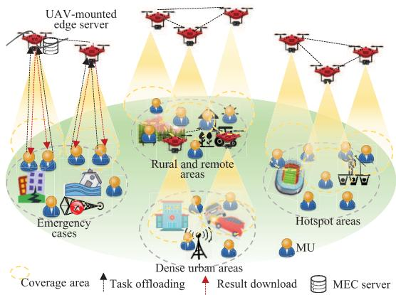  
Fig. 1. UAV-enabled MEC system application scenario.

In traditional terrestrial MEC networks, the fixed locations and limited service coverage of edge servers restrict their ability to serve users beyond local areas [4], [5]. This limitation becomes particularly evident in critical scenarios such as emergency relief and unmanned area monitoring. Unmanned aerial vehicles (UAVs), with their adaptability, rapid mobility, and low deployment cost, offer a promising solution. By equipping UAVs with computing servers, UAVenabled MEC can be rapidly deployed to meet the resource demands of MUs in areas lacking terrestrial infrastructure or where existing infrastructure is overloaded [6], as illustrated in Fig. 1. However, the limited computational capacity of UAVs may be insufficient to handle increasing workloads. To address this challenge, integrating non-orthogonal multiple access (NOMA) into multi-UAV cooperative MEC (NMCM)

systems enhances task offloading efficiency by allowing multiple MUs to simultaneously transmit tasks.

Existing methods for task offloading in UAV-enabled MEC systems primarily focus on optimizing conventional metrics such as minimizing delay [7], [8], saving energy [6], [9], [10], reducing system costs [11], [12], and increasing throughput [13], [14]. However, these approaches lack an explicit prioritybased task scheduling mechanism, making them insufficient to address the diverse QoS requirements encountered in practical deployments. For example, high-priority tasks such as realtime navigation or disaster response require strict compliance with latency constraints to prevent potentially catastrophic consequences. In contrast, low-priority tasks such as video streaming or file downloads can tolerate greater delays without significantly impacting user experience. As a result, there is an urgent need for QoS-oriented task offloading schemes that prioritize tasks based on urgency, ensuring that high-priority tasks receive immediate resource allocation while maintaining overall system efficiency and fairness.

## A. Challenges

This observation directly motivates the research presented in this paper. However, QoS-oriented task offloading schemes in NOMA-based multi-UAV cooperative MEC systems present new challenges that have not been encountered before. First, the constantly changing positions of UAVs and MUs pose challenges in maintaining stable communication links, optimizing UAV trajectories, and ensuring timely task offloading. The dynamic nature of these entities significantly complicates task scheduling and resource allocation. Second, UAVs have limited resources, making it difficult to serve multiple MUs with diverse demands simultaneously. This constraint necessitates careful optimization to allocate resources efficiently and ensure that high-priority tasks are addressed without neglecting lowerpriority ones. Third, MUs have varying QoS expectations and task delay tolerances, with some tasks requiring immediate processing and others allowing more flexibility. Balancing these diverse requirements while maximizing system performance is complex, as the system must dynamically adjust resource allocation based on the specific needs of each task.

## B. Contribution

This paper is the first to systematically and quantitatively explore the problem of QoS-oriented task offloading with explicit consideration of task priorities. QoS, widely recognized as a measure of the overall performance of a service, particularly its ability to meet predefined standards, is especially crucial in real-time applications such as autonomous driving and augmented reality, where low latency is often paramount. To address these challenges, we propose a novel QoS model that incorporates task delay and defines system performance in terms of system gain. Our objective is to maximize long-term average system gain through joint optimization of UAVs’ 3D trajectories, MU associations, task offloading ratios, and resource allocations. Due to the high complexity and dynamic nature of such systems, traditional optimization methods are often insufficient. While deep reinforcement learning (DRL) provides a promising solution for navigating dynamic UAV environments, directly applying existing DRL approaches to complex, non-convex constrained problems remains challenging. The main contributions of this paper include:

We tackle the QoS-oriented task offloading problem in NMCM systems, explicitly incorporating the delay requirements of MUs. The primary objective is to maximize long-term average system utility by jointly optimizing the 3D trajectories of the UAVs, the MU associations, the task offloading ratios, and the resource allocations, while meeting the constraints on the mobility of the UAVs, the computational capacity, and the deadlines of tasks.

We formulate the problem as a Markov decision process (MDP) to optimize long-term system performance. To address the challenges of solving non-convex constrained optimization, we first apply Lagrangian duality to transform it into an unconstrained form. Building on this, we propose an improved soft Actor-Critic (ISAC) algorithm, which incorporates a modified loss function designed to enhance global exploration and mitigate convergence to local optima.

Through extensive simulations, we evaluate the performance of the proposed ISAC algorithm against state-of-the-art (SOTA) algorithms, including Soft Actor-Critic (SAC), Proximal Policy Optimization (PPO), and Deep Deterministic Policy Gradient (DDPG). The effectiveness of ISAC is benchmarked in terms of convergence speed, offloading transmission rate, task completion rate, and overall system utility.

The rest are organized as follows. Section II reviews the related literature. The system model and the formulation of the problem are given in Section III. Section IV introduces the ISAC algorithm. Section V verifies the performance evaluation results. Finally, Section VI concludes the paper.

## II. RELATED WORK

## A. UAV-Enabled MEC Systems

We review existing research on task offloading in UAVenabled MEC systems, organizing the literature based on technological evolution. Depending on the number of UAVs involved, such systems can be categorized into single-UAVenabled MEC and multi-UAV-enabled MEC. In single-UAVenabled MEC systems, Zhang and Ansari [7] proposed a system of UAV-aided MEC networks to reduce the average user latency, thus minimizing the overall system latency. Based on this, Zhang et al. [9] introduced an approach focused on minimizing energy consumption by jointly optimizing bit allocation and transmission power. However, single-UAV systems are inherently limited in terms of communication coverage and computational capacity, rendering them less effective for complex or large-scale application scenarios. To overcome these limitations, researchers have explored cooperative multi-UAV MEC networks [10], [11], [15], which offer improved computational resources and wider coverage. For instance, Tan et al. [11] introduced a cost-effective strategy to minimize system expenses via optimized task offloading for computation and communication. Qi et al. [10] designed a collaborative computation offloading mechanism to maximize energy efficiency in multi-UAV networks. Pervez et al. [15] proposed a multi-UAV network for task offloading, transmission power, and UAV trajectory to reduce energy and latency costs. Despite these advancements, multi-UAV networks still face challenges in spectral efficiency, energy consumption, and coordination complexity. Recently, NOMA technology has emerged as a key solution, addressing these challenges through non-orthogonal resource sharing, adaptive power allocation, and interference management. For example, Zhang et al. [16] integrated a reconfigurable intelligent surface (RIS) with UAV-mounted NOMA to optimize UAV positioning and RIS beamforming, significantly reducing energy consumption. Similarly, Xu et al. [17] introduced a cutting-edge MEC system that maximizes weighted computation efficiency via joint optimization of communication and computation resources.

In conclusion, the aforementioned studies primarily rely on conventional convex optimization (CCO) methods, which often require substantial computational resources and time to achieve optimal or suboptimal solutions. Moreover, although prior research has focused on enhancing the overall performance of multi-UAV systems, it has neglected the differentiated QoS requirements of MUs.

## B. DRL in UAV-Enabled MEC Systems

In dynamic UAV networks, acquiring complete dynamic or statistical information poses a significant challenge. Chen et al. [18] and Nguyen et al. [19] have demonstrated the effectiveness of DRL in addressing dynamic, complex, and NP-hard problems. Wang et al. [6] introduced a UAV trajectory optimization method that leverages DRL to facilitate real-time trajectory determination. To overcome the limitations of traditional methods, Wang et al. [20] further proposed two DRL algorithms to tackle non-convex objective problems. Existing DRL approaches in this domain can be broadly categorized into three classes [21]: value-based decision-making [14], [22], policy-based decision-making [23], and actor-critic methods [8]. Liu et al. [22] utilized deep Q network (DQN) and DDPG algorithms within an MDP model to optimize UAV trajectories and virtual machine configurations. Ghomri et al. [23] developed a PPO-based agent to enhance energy efficiency and fairness in NOMA-UAV networks. Zhong et al. [14] proposed a mutual deep Q-network (MDQN) algorithm, achieving faster convergence for 3D UAV trajectories. Qin et al. [8] designed an actor-critic (AC)-based DRL solution to minimize content retrieval delays. Tariq et al. et al. [12] investigated an advanced AC method to improve system utility. While these studies formulate the optimization problem as a constrained nonconvex program, existing DRL methods predominantly adopt constraint relaxation strategies, converting hard constraints into penalty terms. However, this approach often results in partial constraint violations and increases the risk of the optimization process becoming trapped in local optima.

Fig. 2 presents an overview of the classification of related work in UAV-enabled MEC systems. While existing studies have made significant contributions, several challenges remain unresolved. Firstly, prior research focuses on optimizing conventional metrics such as delay minimization, energy conservation, system cost reduction, and throughput enhancement through task offloading decisions. However, QoS-oriented task offloading in the NMCM system has not been thoroughly explored. Secondly, the practice of incorporating penalties into the reward function to address complex non-convex optimization problems with constraints introduces various issues, such as entrapment in local minima, increased difficulty in parameter tuning, and heightened computational burden. As demonstrated in [24], a rigorous game-theoretic model for hierarchical resource allocation is well aligned with our UAV trajectory optimization framework. However, unlike their centralized SDN-based approach, our method enables decentralized coordination by employing beacon-based state aggregation.

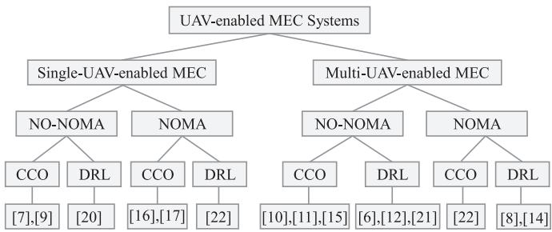  
Fig. 2. Related work on UAV-enabled MEC systems.

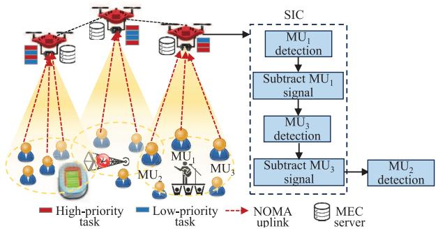  
Fig. 3. NOMA-based multi-UAV cooperative system model.

## III. MODEL AND PROBLEM FORMULATION

In this section, we outline the system model and subsequently formulate the optimization problem aimed at maximizing system utility.

## A. Network Model

As illustrated in Fig. 3, this paper focuses on the NMCM system where K MUs generate tasks of varying priorities to be serviced by L UAVs over some time $T .$ The MUs and UAVs are represented by the sets ${ \cal K } = \{ 1 , 2 , \dots , K \}$ and $\mathcal { L } = \{ 1 , 2 , \dots , L \}$ , respectively. The total time T is divided into N equal time slots, each of length $\delta ,$ denoted by the set $\mathcal { N } = \{ 1 , 2 , \dots , N \}$ . In each time slot $n ,$ the kth MU generates a task represented as $\zeta _ { k } ( n )$ . The task parameters are defined by the four-tuple $\zeta _ { k } ( n ) ~ = ~ \{ D _ { k } ( n ) , C _ { k } ( n ) , \omega _ { k } ( n ) , E _ { k } ( n ) \}$ where $D _ { k } ( n )$ represents the transmitted data size of the task, $C _ { k } ( n )$ denotes the CPU cycles for task completion, $\omega _ { k } ( n )$ indicates the maximum allowable delay threshold, and $E _ { k } ( n )$ represents the task priority level. Due to limited computational capacities, MUs cannot perform all tasks locally, necessitating the deployment of UAVs to enhance QoS.

1) Beacon Message: When MUs lack computational resources, they utilize beacon messages to collect data from nearby UAVs through ping-acknowledgment (ACK) exchanges. These exchanges assume a static network state within a single time frame. UAVs periodically broadcast critical information, including their location, resource availability, expected delay, relative distance, and other relevant parameters [25]. During the nth time slot, each MU transmits its offload request. Upon receiving this request, the UAVs respond with ACK messages containing the relevant parameters. A central controller (e.g., a ground station or designated UAV) then aggregates the beacon data from all UAVs and MUs, processes it to construct a global system state, selects the most suitable UAV for task offloading, and communicates this decision back to the MU.

## B. MUs and UAVs Mobility Models

In our proposed system, the Global Positioning System (GPS) determines the real-time locations of multiple UAVs and MUs. This paper analyzes two MUs mobility models [21]: the random roaming and the directional walking models. Within the random roaming model, users move without a fixed direction, with both their direction and speed being entirely random for each discrete time slot. The movement angle direction, denoted as $\eta _ { k } ( n )$ , adheres to a uniform distribution $U ( 0 , 2 \pi )$ , signifying the maximum angle of movement. Similarly, the speed $v _ { k } ( n )$ follows a uniform distribution $U ( 0 , v _ { \mathrm { m a x } } )$ , where $v _ { \mathrm { m a x } }$ represents the upper limit of speed. In contrast, the directional walking model describes MUs movement in each time slot as a vector sum of two vectors. Here, the movement is characterized by a fixed direction vector $\overrightarrow { D _ { k } } ( n ) _ { \downarrow }$ , set at a direction of $\eta _ { k } ( n ) = \vartheta$ , with a magnitude of $\begin{array} { r } { | \overline { { D _ { k } ^ { \prime } } } ( n ) | ~ = ~ \frac { 4 } { 5 } v _ { \mathrm { m a x } } } \end{array}$ [14]. Using the Cartesian Coordinate system (CCS), the position of the kth MU in the nth time slot is $\mathbf { M } _ { k } ( n ) = [ x _ { k } ( n ) , y _ { k } ( n ) , 0 ]$ . Let $d _ { k } ( n )$ denote the distance traveled by the kth MU during slot n. The MU’s coordinates for the slot n + 1 update as:

$$
x _ { k } ( n + 1 ) = x _ { k } ( n ) + d _ { k } ( n ) \cos ( \eta _ { k } ( n ) ) , \forall k , n ,\tag{1a}
$$

$$
y _ { k } ( n + 1 ) = y _ { k } ( n ) + d _ { k } ( n ) \sin ( \eta _ { k } ( n ) ) , \forall k , n .\tag{1b}
$$

Similarly, UAV positions are defined using the CCS. The 3D coordinates of the lth UAV in the nth time slot are represented as $\begin{array} { r } { \pmb q _ { l } ( n ) = [ x _ { l } ( n ) , y _ { l } ( n ) , z _ { l } ( n ) ] } \end{array}$ ], where $x _ { l } ( n ) , y _ { l } ( n )$ , and $z _ { l } ( n )$ correspond to the $\mathrm { { X , Y , } }$ and Z coordinates, respectively. During horizontal flight, the lth UAV moves a horizontal distance ${ \bar { d } } _ { l } ( n )$ at a heading angle $\eta _ { l } ( n ) ~ \in ~ [ 0 , 2 \pi )$ . This distance is computed as:

$$
\bar { d } _ { l } ( n ) = \| \pmb { v } _ { l } ( n + 1 ) - \pmb { v } _ { l } ( n ) \| ,\tag{2}
$$

where ${ \pmb v } _ { l } ( n )$ denotes the 2D coordinates of the lth UAV in the nth time slot. The horizontal flight distance ${ \bar { d } } _ { l } ( n )$ is bounded by:

$$
\bar { d } _ { l } ( n ) = \| \pmb { v } _ { l } ( n + 1 ) - \pmb { v } _ { l } ( n ) \| \leqslant \bar { d } _ { \operatorname* { m a x } } ^ { h } ,\tag{3}
$$

where $\bar { d } _ { \mathrm { m a x } } ^ { h }$ is the maximum horizontal distance allowed per time interval. The updated coordinates of the UAV for the subsequent time slot can be determined by the following.

$$
x _ { l } ( n + 1 ) = x _ { l } ( n ) + \bar { d } _ { l } ( n ) \cos ( \eta _ { l } ( n ) ) , \forall l , n ,\tag{4a}
$$

$$
y _ { l } ( n + 1 ) = y _ { l } ( n ) + \bar { d } _ { l } ( n ) \sin ( \eta _ { l } ( n ) ) , \forall l , n .\tag{4b}
$$

To ensure UAVs remain within a rectangular service area, their horizontal coordinates must satisfy:

$$
0 \leqslant x \iota ( n ) \leqslant X _ { \mathrm { m a x } } ,\tag{5}
$$

$$
0 \leqslant y _ { l } ( n ) \leqslant Y _ { \mathrm { m a x } } ,\tag{6}
$$

where $X _ { \mathrm { m a x } }$ and $Y _ { \mathrm { m a x } }$ represent the length and width of the service region, respectively.

Given the limitations on both vertical and horizontal flight velocities of UAVs, their flight distances are limited. These constraints can be mathematically formulated as follows:

$$
z _ { \mathrm { m i n } } \leqslant z _ { l } ( n ) \leqslant z _ { \mathrm { m a x } } ,\tag{7}
$$

where $z _ { \mathrm { m i n } }$ and $z _ { \mathrm { m a x } }$ represent the minimum and maximum flight heights of the UAVs, respectively. The vertical travel distance $\triangle z _ { l } ( n )$ is constrained by:

$$
\triangle z _ { l } ( n ) = \| z _ { l } ( n + 1 ) - z _ { l } ( n ) \| \leqslant \bar { d } _ { \operatorname* { m a x } } ^ { v } ,\tag{8}
$$

where $\triangle z _ { l } ( n )$ denotes the change in the altitude of the UAV between consecutive time intervals, and $\bar { d } _ { \mathrm { m a x } } ^ { v }$ represents the maximum vertical distance between intervals.

## C. Channel Model

The ground-to-air (G2A) channel established between the MU and the UAV differs significantly from terrestrial channels due to a higher likelihood of line of sight (LoS) connectivity [26]. To model this, we employ a probabilistic path-loss model where the LoS probability between the kth MU and lth UAV in the nth time slot is:

$$
P _ { k l } ^ { \mathrm { L o S } } ( n ) = \frac { 1 } { 1 + o _ { a } \exp ( - o _ { b } ( \kappa _ { k l } ( n ) - o _ { a } ) ) } , \forall k , l , n ,\tag{9}
$$

where $o _ { a }$ and $o _ { b }$ are environment-dependent constants, and $\begin{array} { r l r } { \kappa _ { k l } ( n ) } & { { } = } & { \frac { 1 8 0 } { \pi } } \end{array}$ arctan $\left( \frac { z _ { l } \left( n \right) } { r _ { k l } \left( n \right) } \right)$ denotes the timevarying distance from the kth MU to lth UAV, where $r _ { k l } ( n ) = \sqrt { ( x _ { l } ( n ) - x _ { k } ( n ) ) ^ { 2 } + ( y _ { k } ( n ) - y _ { l } ( n ) ) ^ { 2 } }$ . Thus, the non-LoS (NLoS) probability is $P _ { k l } ^ { \mathrm { { \tilde { N L o S } } } } ( n ) \ { = } \ 1 \mathrm { { - } } \ P _ { k l } ^ { \mathrm { { N L o S } } } ( n )$ . The mean path loss of LoS and NLoS links between the kth MU to the lth UAV in the nth time slot are denoted by:

$$
P L _ { k l } ^ { \mathrm { L o S } } ( n ) = P L _ { k l } ( n ) + \eta _ { \mathrm { L o S } }
$$

$$
P L _ { k l } ^ { \mathrm { N L o S } } ( n ) = P L _ { k l } ( n ) + \eta _ { \mathrm { N L o S } }\tag{10}
$$

(11)

where $\begin{array} { r } { P L _ { k l } ( n ) = 2 0 \log _ { 1 0 } ( d [ \mathrm { k } ] ) + 4 6 . 4 + 2 0 \log _ { 1 0 } \left( \frac { f _ { c } \big [ \mathrm { G H z } \big ] } { 5 . 0 } \right) } \end{array}$ is the path loss in the free space, $f _ { c }$ denotes the system frequency, c signifies the speed of light, $\eta _ { L o S }$ and $\eta _ { N L o S }$ are the mean additional path loss of the LoS and NLoS links. The mean path-loss related to LoS and NLoS between the kth MU and lth UAV in the nth time slot can be described by:

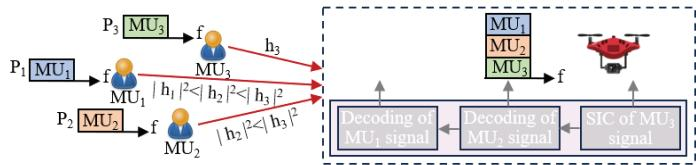  
Fig. 4. Example of SIC being implemented at the UAV within the NMCM system.

$$
P L _ { k l } ( n ) { = } P _ { k l } ^ { \mathrm { L o S } } ( n ) { \times } P L _ { k l } ^ { \mathrm { L o S } } ( n ) { + } P _ { k l } ^ { \mathrm { N L o S } } ( n ) { \times } P L _ { k l } ^ { \mathrm { N L o S } } ( n ) .\tag{12}
$$

With the consideration of small-scale fading, the channel gain from the kth MU to the lth UAV in the nth time slot is represented:

$$
h _ { k l } ( n ) = H _ { k l } ( n ) 1 0 ^ { - { \frac { P L _ { k l } ( n ) } { 1 0 } } } ,\tag{13}
$$

where $H _ { k l } ( n )$ denotes the fading coefficient modeled as a random variable [14].

## D. NOMA Transmission Model

In the NMCM system, MUs transmit data to UAVs using NOMA technology, which allows multiple MUs to simultaneously access the same UAV [27]. During uplink transmission, the UAV employs successive interference cancellation (SIC) to decode and remove the signals from users with stronger channel gains before decoding those from users with weaker channel gains. In the uplink, the UAV successively decodes and cancels the signals of strong MUs, prior to decoding the signals of weak users. Considering a scenario where the jth and ith MUs are associated with the eth UAV. Let their respective equivalent channel gains be denoted as $h _ { i e } ( n ) ~ \geq ~ h _ { j e } ( n )$ According to the literature [27], a necessary condition for the ith MU to successfully perform SIC to decode and remove the signal of the jth MU is:

$$
h _ { i e } ( n ) \geq h _ { j e } ( n ) ,\tag{14}
$$

Fig. 4 illustrates the SIC implementation within a UAV serving three MUs in the NMCM system. MU communicates with UAV via NOMA. Signals from MUs connected to the lth UAV are decoded in non-increasing order of channel gains, expressed as $h _ { 1 n } ( n ) \geq h _ { 2 n } ( n ) \geq \ldots \geq h _ { ( k - 1 ) ( n ) } \geq h _ { k l } ( n )$ where $h _ { k l } ( n )$ denotes uplink channel gain from the kth MU to the lth UAV in the nth time slot. As illustrated in Fig. 4, the UAV decodes the signals of $\mathbf { M U } _ { 1 } , \mathbf { M U } _ { 2 }$ and $\mathbf { M U } _ { 3 }$ in successive stage. In the first stage, the signal of MU3 is decoded, treating the signal of MU and $\mathbf { M U } _ { 2 }$ as noise. In the second stage, the decoded signal of $\mathbf { M U } _ { 3 }$ is subtracted from the received composite signal. In the third stage, the UAV decodes the signal of $\begin{array} { r } { \mathbf { M } \mathbf { U } _ { 2 } , } \end{array}$ , treating MU1 signal as interference. Finally, the UAV subtracts the decoded signal of MU from the received signal and then decodes the signal of $\mathbf { M U } _ { 1 }$

Accordingly, the signal-to-interference-plus-noise ratio (SINR) for the kth MU transmitting to the lth in the nth time slot can be described by:

$$
\gamma _ { k l } ( n ) = \frac { h _ { k l } ( n ) p _ { k } ( n ) } { I _ { \mathrm { i n t r a } _ { k j } } ( n ) + I _ { \mathrm { i n t e r } _ { k j } } ( n ) + \sigma ^ { 2 } } ,\tag{15}
$$

where the transmission power of the kth MU is denoted by $p _ { k } ( n ) , \ \sigma ^ { 2 }$ is the additive white Gaussian noise power, $I _ { \mathrm { i n t r a } _ { k j } } ( n ) = \sum _ { l = k + 1 } ^ { K } h _ { l n } ( n ) p _ { l } ( n )$ is the intra-cell interference from MUs with weaker channel gains in the same NOMA cluster. $I _ { \mathrm { i n t e r } _ { k j } } ( n ) = \sum _ { s = 1 , s \neq l } ^ { L } h _ { k s } ( n ) p _ { k } ( n )$ is the interference caused by the kth MU’s signal received at other UAVs $( s \notin l )$

According to the Shannon capacity formula, the uplink data rate between the kth MU and lth UAV in the nth time slot is calculated as:

$$
\Gamma _ { k l } ( n ) = B \log _ { 2 } ( 1 + \gamma _ { k l } ( n ) ) , \forall k , l , n ,\tag{16}
$$

where B represents the wireless bandwidth.

## E. Computing Model

In this paper, each MU can either offload computational tasks to UAVs or execute them locally. Let $a _ { k } ( n ) ~ \in ~ [ 0 , 1 ]$ denote the offloading ratio for the kth MU in the nth time slot, where $a _ { k } ( n )$ represents the fraction of tasks delegated to UAVs, and the remainder $( 1 - a _ { k } ( n ) )$ is processed locally. The offloading strategy is defined by the vector $\mathcal { A } = \{ a _ { 1 } ( n ) , a _ { 2 } ( n ) , \ldots , a _ { k } ( n ) \}$ , which captures the offloading ratios for all MUs at slot n.

1) Local Computing Model: For locally processed tasks, the associated local computation delay $t _ { k } ^ { l } ( n )$ is given by:

$$
t _ { k } ^ { l } ( n ) = \frac { ( 1 - a _ { k } ( n ) ) C _ { k } ( n ) } { f _ { k } ( n ) } ,\tag{17}
$$

where $f _ { k } ( n )$ denotes MU’s computation capability (i.e., CPU cycles per second) of the kth MU. The local CPU frequency is allowed to be scheduled via dynamic voltage and frequency scaling technology [21].

2) UAV Computing Model: To prevent data interference during any time slot n, we assume each MU can offload its task to only one UAV. In the UAV computing model, the MU first uploads its computational task to the associated UAV, which then executes the task locally. To formalize this, we define a binary variable $\alpha _ { k l } ( n ) \in [ 0 , 1 ]$ , which indicates whether the kth MU offloads tasks to the lth UAV in the nth time slot. If the kth MU is associated with lth UAV at nth time slot, i.e., $\alpha _ { k l } ( n ) = 1 ;$ otherwise, $\alpha _ { k l } ( n ) = 0$ .Thus, the following constraints should be met:

$$
\sum _ { n = 1 } ^ { N } \alpha _ { k l } ( n ) \leq 1 , \forall k , l ,\tag{18a}
$$

$$
\alpha _ { k l } ( n ) \in \{ 0 , 1 \} , \forall k , l , n .\tag{18b}
$$

Assuming that each UAV has a maximum elevation angle $\vartheta _ { \mathrm { m a x } } .$ , the maximum horizontal coverage radius of the lth UAV at nth time slot can be expressed as:

$$
R _ { l } ^ { \operatorname* { m a x } } ( n ) = z _ { l } ( n ) \tan ( \vartheta _ { \mathrm { m a x } } ) , \forall l , n .\tag{19}
$$

Thus, for the kth MU to offload its task to the lth UAV during the nth time slot, the following condition must first be satisfied:

$$
\alpha _ { k l } ( n ) r _ { k l } ( n ) \leqslant R _ { l } ^ { \mathrm { m a x } } ( n ) , \forall k , l , n .\tag{20}
$$

According to the Equ. (16), the corresponding transmission time associated with offloading tasks from the kth MU to the lth UAV is calculated as follows:

$$
t _ { k l } ^ { t r } ( n ) = \frac { a _ { k } ( n ) D _ { k } ( n ) } { \Gamma _ { k l } ( n ) } .\tag{21}
$$

We assume that the computation resources of the lth UAV is $F _ { l } \mathrm { ( i . e . }$ ., CPU cycles per second), the executing time of lth UAV for the kth MU’s offloaded task is given by:

$$
t _ { k l } ^ { c } ( n ) = \frac { a _ { k } ( n ) C _ { k } ( n ) } { f _ { k l } ( n ) } ,\tag{22}
$$

where $f _ { k l } ( n )$ denotes the $F _ { l }$ allocated computation resources to the kth MU in the nth time slot. To ensure that the computation resources of the lth UAV are not exceeded, the following constraint should be satisfied:

$$
\sum _ { k = 1 } ^ { K } f _ { k l } ( n ) \leqslant F _ { l } .\tag{23}
$$

Furthermore, the transmission time from the UAV to the MU is ignored due to the small size of the computation result [28]. Therefore, the total execution time for computing the task of the kth MU on the lth UAV is written as:

$$
t _ { k l } ^ { o } ( n ) = t _ { k l } ^ { t r } ( n ) + t _ { k l } ^ { c } ( n ) .\tag{24}
$$

Accordingly, the total task computing time of kth MU in the nth time slot is calculated as:

$$
T _ { k } ( n ) = \operatorname* { m a x } \{ t _ { k l } ^ { o } ( n ) , t _ { k } ^ { l } ( n ) \} .\tag{25}
$$

## F. Task Priority Model

In practical systems, computational tasks are classified by urgency and importance into high-priority $( T _ { H } )$ tasks and low-priority $( T _ { L } )$ , distinguished by their latency constraints. High-priority tasks (e.g., security surveillance) are missioncritical with strict deadlines, where missed deadlines risk severe consequences. Low-priority tasks (e.g., entertainment applications) tolerate greater delays but experience utility degradation beyond latency thresholds. To prevent low-priority task starvation, our non-preemptive approach allows lowpriority tasks to retain partial utility even under delay, enabling them to be completed eventually unless severely delayed.

For high-priority tasks, the utility decreases with increased completion time and remains non-negative until the delay threshold $\omega _ { k } ( n )$ is reached. Beyond this threshold, the utility becomes negative to penalize deadline violations. Therefore, we define the utility function for high-priority tasks as follows:

$$
\begin{array} { r l } & { \mathcal { U } _ { k } ^ { H } ( n ) = \log ( 1 + \omega _ { k } ( n ) - T _ { k } ( n ) ) I ( T _ { k } ( n ) \leqslant \omega _ { k } ( n ) ) } \\ & { \qquad - \Gamma _ { H } I ( T _ { k } ( n ) > \omega _ { k } ( n ) ) , } \end{array}\tag{26}
$$

where $T _ { k } ( n )$ indicates the completion time, $- \Gamma _ { H }$ represents a negative constant that serves as the penalty for failing to complete the high-priority task within the latency threshold, and $I ( x )$ is the indicator function.

For low-priority tasks, the utility remains a constant positive value $\Gamma _ { L }$ if the task is completed within the latency threshold $\omega _ { k } ( n )$ . When the completion time $T _ { k } ( n )$ exceeds this threshold, the utility decreases exponentially as the delay increases. The utility function for low-priority tasks can be expressed as:

$$
\begin{array} { r l } & { \mathcal { U } _ { k } ^ { L } ( n ) = \Gamma _ { L } I ( T _ { k } ( n ) \leqslant \omega _ { k } ( n ) ) } \\ & { \qquad + \Gamma _ { L } e ^ { - \iota ( T _ { k } ( n ) - \omega _ { k } ( n ) ) } I ( T _ { k } ( n ) > \omega _ { k } ( n ) ) , } \end{array}\tag{27}
$$

where $\Gamma _ { L }$ is a positive constant representing the reward for completing the task within the maximum delay threshold, and $\iota > 0$ is the exponential decay factor governing the rate of utility reduction post-deadline.

Instead of directly optimizing task delay, the system utility can be given as:

$$
U _ { k } ( n ) = \mathcal { V } \left( \kappa _ { k } = T _ { H } \right) \mathcal { U } _ { k } ^ { H } ( n ) + \mathcal { k } ^ { \prime } \left( \kappa _ { k } = T _ { L } \right) \mathcal { U } _ { k } ^ { L } ( n ) ,\tag{28}
$$

where $\mathcal { H } \mathrm { ~ \tiny ~ ( . ) ~ }$ is the indicator function. $T _ { H }$ represents the high-priority task level, and $T _ { L }$ represents low-priority task respectively; and both of which are constants.

The task priority model uses logarithmic and exponential decay functions to characterize how delay affects user experience, capturing the long-tail effect, where small latency variations have a significant impact at short delays. Logarithmic functions emphasize the urgency of high-priority tasks by sharply penalizing delays, while exponential decay functions describe the gradual utility reduction of low-priority tasks as delays increase. This design avoids abrupt task termination, ensures a baseline level of service for all MUs, and help maintain system stability by preventing sudden load spikes. Furthermore, it offers greater flexibility in tuning the balance between performance and fairness through adjustable utility parameters, such as $\Gamma _ { H }$ and $\Gamma _ { L } ,$ , making the system more adaptable to real-world QoS requirements.

## G. Problem Formulation

To maximize the system utility for all MUs across all time slots, we jointly optimize the MU association $\begin{array} { r c l } { \Lambda } & { \triangleq } & { \{ \alpha _ { k l } ( n ) , \forall k , l , n \} } \end{array}$ , the UAVs’ 3D trajectory Q , $\{ \mathbf q _ { l } ( n ) , \forall l , n \}$ , the tasks offloading ratios $\mathcal { A } \triangleq \{ a _ { k } ( n ) , \forall k , n \}$ and the computation resource allocation of UAVs $\begin{array} { r l } { \mathcal { F } } & { { } \triangleq } \end{array}$ $\{ f _ { k l } ( n ) , \forall k , l , n \}$ are jointly optimized. Therefore, the objective function is formulated as:

$$
\operatorname* { m a x } _ { \Lambda , \mathbf { Q } , A , \mathcal { F } N } \operatorname* { l i m } _ { N \longrightarrow \infty } \frac { 1 } { N } \sum _ { k = 1 } ^ { K } \sum _ { n = 1 } ^ { N } U _ { k } ( n )\tag{29}
$$

$$
\begin{array} { r } { \mathrm { s . t . } \quad 0 \leqslant \eta _ { l } ( n ) \leqslant 2 \pi , \forall l , n , } \end{array}
$$

$$
\| \mathbf { v } _ { l } ( n ) \| \leq V _ { \operatorname* { m a x } } , \forall l , n ,\tag{29a}
$$

$$
R _ { k l } ( n + t _ { k l } ^ { o } ( n ) ) \leqslant R _ { l } ^ { \operatorname* { m a x } } ( n ) , \forall k , l , n ,\tag{29b}
$$

$$
0 \leqslant a _ { k } ( n ) \leqslant 1 , \forall k , n ,\tag{29c}
$$

(29d)

$$
( 2 ) - ( 8 ) , ( 1 8 ) , ( 2 0 ) , ( 2 3 ) ,\tag{29e}
$$

where (29a) and (29b) denote the horizontal angle and velocity constraints of UAVs, respectively, $V _ { \mathrm { m a x } }$ represents the maximum allowable velocity of the UAV. Constraint (29c) ensures that the UAV can establish communication with the MU upon task completion. Constraint (29d) limits the task offloading ratios; Constraints (2)–(8) describe the UAV mobility constraints, (18) and (20) ensure valid association status, and (23) imposes computation resource constraints on UAVs.

## IV. THE PROPOSED ISAC ALGORITHM

The objective optimization problem is a complex, nonconvex problem with constraints, making traditional methods inadequate. To address this, the paper proposes a novel ISAC algorithm based on DRL, which enhances the standard SAC algorithm’s ability to handle high-dimensional action spaces effectively. By simultaneously maximizing both the expected return and entropy, SAC promotes better exploration and learning in complex environments.

## A. MDP Formulation

The system state in the next time slot is determined solely by the current state and the action taken, allowing us to effectively model the optimization problem defined in (29) as an MDP. At the nth time slot, the system observes the current state and selects an action accordingly. In DRL, precise definitions of the state, action, and reward functions are crucial for effective optimization.

• State space: At each time step, agents make decisions based on observations of the environment, denoted by $s _ { n } .$ , which consists of four components: the geographical coordinates of MUs ${ \bf M } _ { k } ( n )$ , the positional coordinates of $\mathbf { U A V s } \ \mathbf { q } _ { l } ( n )$ , the task volume associated with each MU $\zeta _ { k } ( n )$ , and the SINR of the communication links $\gamma _ { k l } ( n )$ The aggregated state is formalized as:

$$
s _ { n } = [ { \bf M } _ { k } ( n ) , { \bf q } _ { l } ( n ) , \zeta _ { k } ( n ) , \gamma _ { k l } ( n ) ] .\tag{30}
$$

Thus, the state space is expressed as $S = \{ s _ { n } \mid n =$ $1 , 2 , \ldots , N \}$

• Action space: As defined in Equ. (29), the action includes tasks offloading ratio $a _ { k } ( n )$ , the UAV movement(i.e., vertical fly distance $\triangle z _ { l } ( n )$ , horizontal direction angle $\mathbf { v } _ { l } ( n )$ and horizontal fly distance $d _ { l } ( n ) )$ , the MU association indicator $\alpha _ { k l } ( n )$ and the computation resources allocation $f _ { k l } ( n )$ . Therefore, the action at nth time slot is given by:

$$
a _ { n } = [ a _ { k } ( n ) , \triangle z _ { l } ( n ) , { \bf v } _ { l } ( n ) , d _ { l } ( n ) , \triangle _ { k l } ( n ) , f _ { k l } ( n ) ] .\tag{31}
$$

Based on the constraints of the optimization problem (29), the value ranges of each element in $a _ { k } ( n )$ as follows: $a _ { k } ( n ) \in [ 0 , 1 ] , \Delta z _ { l } ( n ) \in [ - d _ { \operatorname* { m a x } } ^ { v } , d _ { \operatorname* { m a x } } ^ { v } ] , \mathbf { v } _ { l } ( n ) \in$ $[ 0 , 2 \pi )$ , and $f _ { k l } ( n ) \in [ 0 , F _ { l } ]$ . In addition, the action space $A = \{ a _ { n } \ | \ n = 1 , 2 , \ldots , N \}$

• Reward function: Actions that produce higher system utility while satisfying all constraints are assigned greater rewards. Accordingly, the reward function is defined as:

$$
r _ { n } = \sum _ { k = 1 } ^ { K } U _ { k } ( n ) .\tag{32}
$$

Our objective is to maximize the mean utility of the system over time, with the mean reward $\begin{array} { r } { R = \frac { 1 } { N } \displaystyle \sum _ { n = 1 } ^ { N } r _ { n } } \end{array}$ representing this utility. The influence of the reward function on high and low priority task completion rates can be adjusted using parameters $\Gamma _ { H }$ and $\Gamma _ { L }$

## B. Lagrangian Constrained Optimization

The optimization problem is formulated as a constrained MDP, denoted by $( S , A , R , \xi , b )$ , where S represents the set of states, A denotes the set of actions, R is the reward function, ξ is the discount factor, and b signifies the offset of the constraint. The decision policy $\pi : S  \Delta _ { A }$ maps each state to a probability distribution on the action set $\Delta _ { A } .$ , such that $a ( n ) \sim \pi ( a | s ( n ) )$ for the nth time slot, where $\Delta _ { A }$ denotes the probability simplex over A.

Given a decision policy π, the value function $V _ { \odot } ^ { \pi } \colon S \to$ R is defined as:

$$
V _ { \odot } ^ { \pi } ( s ) = \mathbb { E } \left[ \sum _ { n = 0 } ^ { \infty } \xi _ { \odot } ^ { N } ( s _ { n } , a _ { n } ) \big | \pi , s _ { 0 } = s \right] ,\tag{33}
$$

and the state-action value functions can be summarized as:

$$
Q _ { \odot } ^ { \pi } ( s , a ) = \mathbb { E } \left[ \sum _ { n = 0 } ^ { \infty } \xi _ { \odot } ^ { N } ( s _ { n } , a _ { n } ) \big | s _ { 0 } = s , a _ { 0 } = a \right] .\tag{34}
$$

To facilitate the discussion, we rewrite the optimization problem (29) as:

$$
\operatorname* { m a x } _ { x = \Lambda , \mathbf { Q } , \mathcal { A } , \mathcal { F } } f ( x )\tag{35}
$$

$$
\operatorname { s . t . } g _ { i } ( x ) - c \leq 0 , i = 1 , 2 , \ldots , m ,\tag{35a}
$$

$$
h _ { j } ( x ) - b = 0 , j = 1 , 2 , \ldots , w ,\tag{35b}
$$

where $f ( x ) = \operatorname* { l i m } _ { N \longrightarrow \infty } \frac { 1 } { N } \sum _ { k = 1 } ^ { K } \sum _ { n = 1 } ^ { N } U _ { k } ( n )$ is objection function, $g _ { i } ( x )$ is inequality constraint function, $h _ { j } ( x )$ is equality constraint function.

The optimization problem denoted by (29) can be approached through the formulation of the Lagrangian dual, which is expressed as:

$$
\operatorname* { m a x } _ { \pi } \operatorname* { m i n } _ { \phi \geq 0 , v \geq 0 } F _ { L } ^ { \pi , \phi , v } ( x ) ,\tag{36}
$$

where $F _ { L } ^ { \pi , \phi , \upsilon } ( x ) = f ( x ) + \textstyle \sum \phi _ { i } g _ { i } + \textstyle \sum _ { . . . } v _ { j } h _ { j }$ , and $\phi , \upsilon$ are m w the Lagrange multipliers of the inequality constraint and the equality constraint that recasts the problem (29) into the unconstrained dual problem.

Algorithm 1 A Gradient Policy Optimization Method With   
Constrained MDPs.   
1: Initialize iterations $N , \phi _ { 0 } = 0 , \upsilon _ { 0 } = 0 .$ , stepsizes $\mu , \tau .$   
2: for $n < N$ do   
3: for $s \in S$ , the policy   
$\begin{array} { r l r } & { } & { \pi ^ { n + 1 } ( a \mid s ) { \mathrm { = a r g } } \operatorname* { m a x } \mu \left. Q _ { r } ^ { n } ( s , a ) + \phi ^ { n } Q _ { g } ^ { n } ( s , a ) , \pi ( a \mid s ) \right. } \\ & { } & { \quad \quad - \ B _ { d i s } \big ( \pi ( a \mid s ) , \pi ^ { n } ( a \mid s ) \big ) . \quad \quad \quad ( 3 7 ) } \end{array}$   
4: Parameters update,   
φn+1 = min |p − p0| φn − τ gng (x) − c . (38)   
p0∈∆A   
υn+1 = minp0∈∆ |p − p0| υn − τ hng (x) − b . (39)   
5: end for

To solve the optimization problem (36), we adopt a gradient policy optimization method with constrained MDPs, which ensures convergence upon reaching a desired level of solution accuracy.

Algorithm 1 is designed to solve the optimization problem (35) and operates in two main steps. The first step is policy descent, which addresses the Lagrangianconstrained optimization problem. The second step focuses on the Lagrangian parameters to account for constraint satisfaction.

To solve Eq. (37), we leverage the Performance Difference Lemma [29], which quantifies the improvement between successive policies under a given reward structure. Specifically, the objective function $F _ { L } ^ { \pi , \phi , v } ( x )$ , with fixed Lagrangian multipliers $\phi ^ { n }$ at the nth time slot is written as:

$$
\begin{array} { l } { { \displaystyle F _ { L } ^ { \pi , \phi , v } ( \boldsymbol { x } ) = F _ { L } ^ { \pi ^ { n } , \phi ^ { n } , v ^ { n } } ( \boldsymbol { x } ) + \frac { 1 } { 1 - \xi } \mathbb { E } _ { s \sim d _ { \boldsymbol { x } } ^ { \pi } } } } \\ { { \displaystyle \left[ \langle Q _ { r } ^ { \pi ^ { n } } ( s , a ) + \phi ^ { n } Q _ { g } ^ { \pi ^ { n } } ( s , a ) , \pi ( a \mid s ) - \pi ^ { n } ( a \mid s ) \rangle \right] . } } \end{array}\tag{40}
$$

Mirror descent step with stepsize µ is written as

$$
\begin{array} { r l r } & { \pi ^ { n + 1 } ( a \mid s ) } & \\ & { = \arg \operatorname* { m a x } \mu \left. \nabla ( Q _ { r } ^ { n } ( s , a ) + \phi ^ { n } Q _ { g } ^ { n } ( s , a ) ) , \pi ( a \mid s ) - \pi ^ { n } ( a \mid s ) \right. } \\ & { \phantom { \pi ^ { n + 1 } ( } - B _ { d i s } \big ( \pi ( a \mid s ) , \pi ^ { n } ( a \mid s ) \big ) . } & { ( 4 1 ) } \end{array}
$$

where $\begin{array} { r l } & { B _ { d i s } \big ( \pi , \pi ^ { \prime } \big ) = G ( \pi ) - G ( \pi ^ { \prime } ) - \langle \nabla G ( \pi ^ { \prime } ) , \pi - \pi ^ { \prime } \rangle } \\ & { = \frac { 1 } { c } \| _ { \pi } \| ^ { 2 } . } \end{array}$ and $\begin{array} { r } { G ( \pi ) = \frac { 1 } { 2 } \| \dot { \pi } \| ^ { 2 } } \end{array}$

## C. Convergence Analysis

For simplicity, the following discussion omits the explicit notation of $\pi ^ { n }$ in the value function and uses the abbreviation $B _ { d i s } ( \pi ^ { n + 1 } , \pi ^ { n } )$ to represent the divergence term $B _ { d i s } ( \pi ^ { n + 1 } ( a \mid s ) , \pi ^ { n } ( a \mid s ) )$ . Under the optimality condition of the policy in Eq. (37), the result stated in Lemma 1 follows.

Lemma 1: In the gradient policy optimization algorithm with constrained MDPs, for any $\pi ( a \mid s ) \in \Delta _ { A }$ , we have:

$$
\begin{array} { r l } & { \mu \left. Q _ { r } ^ { n } ( s , a ) + \phi ^ { n } Q _ { g } ^ { n } ( s , a ) , ( \pi - \pi ^ { n + 1 } ) ( a \mid s ) \right. } \\ & { \quad + B _ { d i s } \left( \pi ^ { n + 1 } , \pi ^ { n } \right) \le B _ { d i s } ( \pi , \pi ^ { n } ) - B _ { d i s } \left( \pi , \pi ^ { n + 1 } \right) . } \end{array}
$$

holds.

Proof: Under the optimality condition of policy (37), for any $\pi ( a \mid s )$

$$
\langle \mu Q _ { L } ^ { n } ( s , a ) - \nabla B _ { d i s } ( \pi ^ { n + 1 } , \pi ^ { n } ) , ( \pi - \pi ^ { n + 1 } ) ( a | s ) \rangle \leq 0 .\tag{42}
$$

$$
\begin{array} { r l } & { \nabla B _ { d i s } \big ( \pi ^ { n + 1 } , \pi ^ { n } \big ) } \\ & { \ = \nabla _ { \pi } B _ { d i s } \big ( \pi ( a \mid s ) , \pi ^ { n } ( a \mid s ) \big ) \big \rvert _ { \pi ( a \mid s \rangle \pi ^ { n + 1 } ( a \mid s ) } . } \end{array}
$$

According to Eq. (41), we have

$$
\begin{array} { r l } & { B _ { d i s } ( \pi , { \pi ^ { n } } ) = B _ { d i s } \big ( \pi ^ { n + 1 } , \pi ^ { n } \big ) } \\ & { \quad + \left. \nabla B _ { d i s } \big ( \pi ^ { n + 1 } , \pi ^ { n } \big ) , ( \pi - \pi ^ { n + 1 } ) ( a | s ) \right. + B _ { d i s } \big ( \pi , { \pi ^ { n + 1 } } \big ) . } \end{array}\tag{43}
$$

Combining Eq. (42) and Eq. (43), then

$$
\begin{array} { r l r } & { \mu \left. Q _ { r } ^ { n } ( s , a ) + \phi ^ { n } Q _ { g } ^ { n } ( s , a ) , ( \pi - \pi ^ { n + 1 } ) ( a \mid s ) \right. + B _ { d i s } \left( \pi ^ { n + 1 } , \pi ^ { n } \right) } & \\ & { \leq B _ { d i s } ( \pi , \pi ^ { n } ) - B _ { d i s } \left( \pi , \pi ^ { n + 1 } \right) . } & { \quad \mathrm { ( 4 4 ) } } \end{array}
$$

Completes the proof.

Under the performance difference lemma [29], it follows that Lemma 2.

Lemma 2: In the gradient policy optimization algorithm with constrained MDPs, for any $s \in S .$ , we have:

$$
\begin{array} { l l } { \displaystyle \left( f ^ { n + 1 } ( x ) - f ^ { n } ( x ) \right) + \phi ^ { n } \left( g ^ { n + 1 } ( x ) - g ^ { n } ( x ) \right) } \\ { \displaystyle + v ^ { n } \left( h ^ { n + 1 } ( x ) - h ^ { n } ( x ) \right) } \\ { \displaystyle \geq \frac { 1 } { \mu ( 1 - \xi ) } \mathbb { E } _ { x ^ { \prime } \sim d _ { x } ^ { n + 1 } } \left[ B _ { d i s } \big ( \pi ^ { n + 1 } , \pi ^ { n } \big ) + B _ { d i s } \big ( \pi ^ { n } , \pi ^ { n + 1 } \big ) \right] } \end{array}
$$

Proof: According to the performance difference lemma, we have:

$$
\begin{array} { l } { \displaystyle \left( f ^ { n + 1 } ( x ) - f ^ { n } ( x ) \right) + \phi ^ { n } \left( g ^ { n + 1 } ( x ) - g ^ { n } ( x ) \right) } \\ { \displaystyle \quad + v ^ { n } \left( h ^ { n + 1 } ( x ) - h ^ { n } ( x ) \right) } \\ { \displaystyle = \frac { 1 } { 1 - \xi } \mathbb { E } _ { x ^ { \prime } \sim d _ { x } ^ { n + 1 } } \left[ \langle Q _ { L } ^ { n } ( x ^ { \prime } , a ) , ( \pi ^ { n + 1 } ( a \mid x ^ { \prime } ) - \pi ^ { n } ( a \mid x ^ { \prime } ) ) \rangle \right] } \\ { \displaystyle \geq \frac { 1 } { \mu ( 1 - \xi ) } \mathbb { E } _ { x ^ { \prime } \sim d _ { x } ^ { n + 1 } } \left[ B _ { d i s } \left( \pi ^ { n + 1 } , \pi ^ { n } \right) + B _ { d i s } \left( \pi ^ { n } , \pi ^ { n + 1 } \right) \right] . } \end{array}\tag{45}
$$



Next, Lemma 3 is used to implement the performance bound.

Lemma 3: In the gradient policy optimization algorithm with constrained MDPs, for any $N > 0$ , we have:

$$
\begin{array} { l } { \displaystyle \frac 1 N \sum _ { n = 0 } ^ { N - 1 } \left( f ^ { \star } ( x ) - f ^ { n } ( x ) \right) + \frac 1 N \sum _ { n = 0 } ^ { N - 1 } \phi ^ { n } \left( g ^ { \star } ( x ) - g ^ { n } ( x ) \right) } \\ { \displaystyle \quad + \frac 1 N \sum _ { n = 0 } ^ { N - 1 } v ^ { n } \left( h ^ { \star } ( x ) - h ^ { n } ( x ) \right) } \\ { \displaystyle \le \frac 1 { ( 1 - \xi ) ^ { 2 } N } + \frac { 2 \tau } { ( 1 - \xi ) ^ { 3 } } + \frac { B _ { d i s _ { 0 } } } { \mu ( 1 - \xi ) N } , \qquad ( 2 \xi ) \le \frac 1 { \xi + \xi } , } \end{array}\tag{46}
$$

where τ (1 − ξ)/(2 N ), Bdis = $\mathbb { E } _ { s \sim d _ { x } ^ { \star } } \left. \left[ B _ { d i s } ( \pi ^ { \star } ( a \mid s ) , \pi ^ { 0 } ( a \mid s ) ) \right] . \right.$

Proof: According to the performance difference lemma, we have:

$$
\begin{array} { r l } & { ( f ^ { * } ( x ) - f ^ { n } ( x ) ) + \phi ^ { n } \left( g ^ { * } ( x ) - g ^ { n } ( x ) \right) } \\ & { + v ^ { n } \left( h ^ { * } ( x ) - h ^ { n } ( x ) \right) } \\ & { = \displaystyle \frac { 1 } { 1 - \xi } \mathbb { E } _ { s ^ { \prime } } \sim d _ { s } ^ { \star } \left[ \langle Q _ { L } ^ { n } ( s ^ { \prime } , a ) , ( \pi ^ { \star } - \pi ^ { n + 1 } ) ( a \mid s ^ { \prime } ) \rangle \right] } \\ & { + \displaystyle \frac { 1 } { 1 - \xi } \mathbb { E } _ { s ^ { \prime } } \sim d _ { s } ^ { \star } \left[ \langle Q _ { L } ^ { n } ( s ^ { \prime } , a ) , ( \pi ^ { n + 1 } - \pi ^ { n } ) ( a \mid s ^ { \prime } ) \rangle \right] . } \end{array}\tag{47}
$$

Based on Lemma 1 with $\pi = \pi ^ { n }$ , for any s,

$$
\left. Q _ { L } ^ { n } ( s , a ) , \pi ^ { n + 1 } ( a \mid s ) - \pi ^ { n } ( a \mid s ) \right. \geq 0 .\tag{48}
$$

then

$$
\begin{array} { r l } & { \mathbb { E } _ { s ^ { \prime } \sim d _ { x } ^ { * } } \left[ \langle Q _ { L } ^ { n } ( s ^ { \prime } , a ) , \pi ^ { n + 1 } ( a | s ^ { \prime } ) - \pi ^ { n } ( a | s ^ { \prime } ) \rangle \right] } \\ & { = \displaystyle \sum _ { s ^ { \prime } } \frac { d _ { x } ^ { \star } ( s ^ { \prime } ) } { d _ { d _ { x } ^ { * } } ^ { n + 1 } ( s ^ { \prime } ) } d _ { d _ { x } ^ { * } } ^ { n + 1 } ( s ^ { \prime } ) \left[ \langle Q _ { L } ^ { n } ( s ^ { \prime } , a ) , ( \pi ^ { n + 1 } - \pi ^ { n } ) ( a \mid s ^ { \prime } ) \rangle \right] } \end{array}
$$

$$
\begin{array} { l } { \displaystyle \le \frac { 1 } { 1 - \xi } \mathbb { E } _ { s ^ { \prime } } \sim d _ { d _ { x } ^ { \star } } ^ { n + 1 } \left[ \langle Q _ { L } ^ { n } ( s ^ { \prime } , a ) , ( \pi ^ { n + 1 } - \pi ^ { n } ) ( a \mid s ^ { \prime } ) \rangle \right] } \\ { = \left( f ^ { n + 1 } ( x ^ { \star } ) - f ^ { n } ( x ^ { \star } ) \right) + \phi ^ { n } \left( g ^ { n + 1 } ( x ^ { \star } ) - g ^ { n } ( x ^ { \star } ) \right) } \end{array}
$$

$$
+ v ^ { n } \left( h ^ { n + 1 } ( x ^ { \star } ) - h ^ { n } ( x ^ { \star } ) \right) .\tag{49}
$$

Substituting Eq. (49) into the right-hand side of Eq. (47) yields another upper bound that:

$$
\begin{array} { l } { { \displaystyle \frac { 1 } { 1 - \xi } \left( \left( f ^ { n + 1 } ( x ^ { \star } ) - f ^ { n } ( x ^ { \star } ) \right) + \phi ^ { n } \left( g ^ { n + 1 } ( x ^ { \star } ) - g ^ { n } ( x ^ { \star } ) \right) \right. } } \\ { { \displaystyle \left. + v ^ { n } \left( h ^ { n + 1 } ( x ^ { \star } ) - h ^ { n } ( x ^ { \star } ) \right) \right) } } \\ { { \displaystyle \quad + \frac { 1 } { \mu ( 1 - \xi ) } \mathbb { E } _ { s ^ { \prime } } \sim x ^ { * } \left[ B _ { d i s } ( \pi ^ { \star } , \pi ^ { n } ) - B _ { d i s } \left( \pi ^ { \star } , \pi ^ { t + 1 } \right) \right] } } \end{array}\tag{50}
$$

which leads to

$$
\begin{array} { r l } & { \displaystyle \sum _ { n = 0 } ^ { N - 1 } \left( f ^ { * } ( x ) - f ^ { n } ( x ) \right) + \displaystyle \sum _ { n = 0 } ^ { N - 1 } \phi ^ { n } \left( g ^ { * } ( x ) - g ^ { n } ( x ) \right) } \\ & { \quad + \displaystyle \sum _ { n = 0 } ^ { N - 1 } v ^ { n } \left( h ^ { * } ( x ) - h ^ { n } ( x ) \right) } \\ & { \le \displaystyle \frac { 1 } { 1 - \xi } \left( f ^ { N } ( x ^ { * } ) + \displaystyle \sum _ { n = 0 } ^ { N - 1 } \phi ^ { n } \left( g ^ { n + 1 } ( x ^ { * } ) - g ^ { n } ( x ^ { * } ) \right) \right. } \\ & { \quad + \displaystyle \sum _ { n = 0 } ^ { N - 1 } v ^ { n } \left( h ^ { n + 1 } ( x ^ { * } ) - h ^ { n } ( x ^ { * } ) \right) \right) } \\ & { \quad \left. + \displaystyle \frac { 1 } { \mu ( 1 - \xi ) } \mathbb { E } _ { \varepsilon ^ { * } \sim \star ^ { * } } B _ { d i s } \left( \pi ^ { * } , \pi ^ { 0 } \right) . } \end{array}\tag{51}
$$

Because $\begin{array} { r } { \phi ^ { 0 } = 0 , \phi ^ { N } = \sum _ { n = 0 } ^ { N - 1 } \left( \phi ^ { n + 1 } - \phi ^ { n } \right) } \end{array}$ , thus,

$$
\begin{array} { l } { \displaystyle \sum _ { n = 0 } ^ { N - 1 } \phi ^ { t } \left( g ^ { n + 1 } ( x ^ { \star } ) - g ^ { n } ( x ^ { \star } ) \right) } \\ { \displaystyle \qquad \leq \phi ^ { N } g ^ { N } ( x ^ { \star } ) + \sum _ { n = 0 } ^ { N - 1 } \left. \phi ^ { n } - \phi ^ { n + 1 } \right. g ^ { n + 1 } ( x ^ { \star } ) \leq \frac { 2 \tau N } { ( 1 - \xi ) ^ { 2 } } . } \end{array}\tag{52}
$$

Substituting Eq. (52) into the right-hand side of Eq. (51):

$$
\begin{array} { l } { \displaystyle \frac 1 N \sum _ { n = 0 } ^ { N - 1 } \left( f ^ { \star } ( x ) - f ^ { n } ( x ) \right) + \frac 1 N \sum _ { n = 0 } ^ { N - 1 } \phi ^ { n } \left( g ^ { \star } ( x ) - g ^ { n } ( x ) \right) } \\ { \displaystyle \quad + \frac 1 N \sum _ { n = 0 } ^ { N - 1 } v ^ { n } \left( h ^ { \star } ( x ) - h ^ { n } ( x ) \right) } \\ { \displaystyle \le \frac 1 { ( 1 - \xi ) ^ { 2 } N } + \frac { 2 \tau } { ( 1 - \xi ) ^ { 3 } } + \frac { B _ { d i s _ { 0 } } } { \mu ( 1 - \xi ) N } , } \end{array}\tag{53}
$$

which completes the proof.

Lemma 3 provides an upper bound on the optimality gaps $f ^ { \star } ( x ) - f ^ { n } ( x ) , g ^ { \star } ( x ) - g ^ { n } ( x ) , h ^ { \star } ( x ) - h ^ { n } ( x )$ . It is important to note, however, that the bounds established in Lemma 3 do not necessarily guarantee convergence of the optimality error $f ^ { \star } ( x ) - f ^ { n } ( x )$ or constraint violations. To address this, we impose additional control using Eq. (38) and (39). In particular, for the inequality constraint function, we introduce Assumption 1 as follows.

Assumption 1 (Strict Feasibility): For any κ and π, $g ^ { \pi } ( x ) -$ $a \geq \kappa$

Theorem 1: Under the Assumption 1, for any $N > 0 .$ , if $\mu = B _ { d i s _ { 0 } }$ and $\tau = ( 1 - \xi ) / ( 2 \check { \sqrt { N } } )$ , then

$$
{ \frac { 1 } { N } } \sum _ { n = 0 } ^ { N - 1 } { ( f ^ { \star } ( x ) - f ^ { n } ( x ) ) }\tag{54}
$$

$$
\leq \frac { 1 } { ( 1 - \xi ) ^ { 2 } } \left( \frac { 1 } { N } + \frac { 2 \tau } { 1 - \xi } \right) + \frac { B _ { d i s _ { 0 } } } { \mu ( 1 - \xi ) N } + \frac { \tau } { ( 1 - \xi ) ^ { 2 } } .\tag{55}
$$

Proof: Let $\begin{array} { r } { \phi ^ { 0 } = 0 , ( \phi ^ { N } ) ^ { 2 } = \sum _ { n = 0 } ^ { N - 1 } \left( ( \phi ^ { n + 1 } ) ^ { 2 } - ( \phi ^ { n } ) ^ { 2 } \right) } \end{array}$ Based on Eq. (38)

$$
( \phi ^ { N } ) ^ { 2 } \leq 2 \tau \sum _ { n = 0 } ^ { N - 1 } \phi ^ { n } \big ( g ^ { \star } ( x ) - g ^ { n } ( x ) \big ) + \frac { \tau ^ { 2 } N } { ( 1 - \xi ) ^ { 2 } } .\tag{56}
$$

Thus,

$$
- \frac { 1 } { N } \sum _ { n = 0 } ^ { N - 1 } \phi ^ { n } ( g ^ { \star } ( x ) - g ^ { n } ( x ) ) \leq \frac { \tau } { 2 ( 1 - \xi ) ^ { 2 } } .\tag{57}
$$

For $h ^ { \star } ( x ) - h ^ { n } ( x )$ , similarly, we have:

$$
- \frac { 1 } { N } \sum _ { n = 0 } ^ { N - 1 } v ^ { n } ( h ^ { \star } ( x ) - h ^ { n } ( x ) ) \leq \frac { \tau } { 2 ( 1 - \xi ) ^ { 2 } } .\tag{58}
$$

Adding Eq. (57) and (58) to Eq. (46), then

$$
\begin{array} { l } { \displaystyle \frac 1 N \sum _ { n = 0 } ^ { N - 1 } \left( f ^ { \star } ( x ) - f ^ { n } ( x ) \right) } \\ { \displaystyle \le \frac 1 { ( 1 - \xi ) ^ { 2 } } \left( \frac 1 N + \frac { 2 \tau } { 1 - \xi } \right) + \frac { B _ { d i s _ { 0 } } } { \mu ( 1 - \xi ) N } + \frac { \tau } { ( 1 - \xi ) ^ { 2 } } . } \end{array}\tag{59}
$$



According to Theorem 1, $( f ^ { \star } ( x ) - f ^ { n } ( x ) )$ and $( g ^ { \star } ( x ) -$ $g ^ { n } ( x ) )$ will fall to 0 (or infinitely close to 0) in $O ( 1 / \sqrt { N } )$ time as long as the step size $\mu$ and τ are chosen appropriately, where N is the number of iterations. Note that $O ( 1 / \sqrt { N } )$ is the sublinear rate [30].

## D. Improved Soft Actor-Critic Algorithm

SAC is a stochastic policy optimization method that incorporates the principle of maximum entropy, enabling more efficient exploration and accelerating convergence during training. SAC optimizes the maximum entropy objective, which augments the standard reward function with an entropy term to encourage the agent to explore more diverse actions, thereby improving learning stability and robustness:

$$
\pi ^ { * } = \arg \operatorname* { m a x } _ { \pi } V ^ { \pi } ( s ) = \underset { a _ { n } } { * \mathbb { E } } \sum _ { n = 0 } ^ { N } \xi ^ { n } \Big [ r _ { n } ( s _ { n } , { \mathbf { a } } _ { n } ) + \rho \log \pi ( { \mathbf { a } } _ { n } | s _ { n } ) \Big ] ,\tag{60}
$$

where $\pi ( a _ { n } | s _ { n } )$ is a policy that maps from $s _ { n } \ \mathrm { t o } \ a _ { n }$ and $\rho$ is the temperature parameter. Like the actor-critic framework, the SAC algorithm utilizes two neural networks: the Q-network and the policy network. The Q-network approximates the stateaction value function $Q _ { \theta ^ { ( n ) } } { \big ( } s _ { n } , a _ { n } { \big ) }$ , capturing the expected return for a given state-action pair.

According to [31], minimizing the objective is defined as optimizing the following loss function:

$$
\operatorname* { m i n } _ { \rho } J ( \rho ) = \mathbb { E } _ { a _ { n } \sim \pi _ { \phi } } \Big [ - \rho \log \pi _ { \phi } ( a _ { n } | s _ { n } ) - \rho \mathcal { H } \Big ] ,\tag{61}
$$

where H is a desired minimum expected entropy.

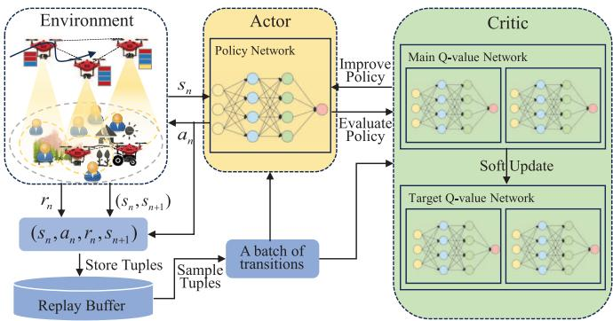  
Fig. 5. Framework of novel ISAC algorithm.

In the policy network, the parameters are trained by minimizing the expected Kullback-Leibler (KL) divergence to a noise vector:

$$
\begin{array} { r l } & { J _ { \pi } ( \phi ) = \mathbb { E } _ { \pmb { s } _ { n } \sim \mathcal { D } , \epsilon _ { n } \sim \mathcal { N } } } \\ & { \left[ \log \pi _ { \phi } ( f _ { \phi } ( \epsilon _ { n } ; \pmb { s } _ { n } ) | \pmb { s } _ { n } ) - Q _ { \theta } ( \pmb { s } _ { n } , f _ { \phi } ( \epsilon _ { n } ; \pmb { s } _ { n } ) ) \right] , } \end{array}\tag{62}
$$

where $\pi _ { \phi }$ is denoted implicitly in terms of $f _ { \phi }$ and $f _ { \phi }$ is a neural network transformation, $\epsilon _ { n }$ is an input noise vector, φ is neural network parameter. The gradient of $J _ { \pi } ( \phi )$ is represented as:

$$
\begin{array} { r l r } & { } & { \nabla _ { \phi } J _ { \pi } ( \phi ) = \nabla _ { \phi } \log \pi _ { \phi } ( \mathbf { a } _ { n } | \mathbf { s } _ { n } ) + ( \nabla _ { \mathbf { a } _ { n } } \log \pi _ { \phi } ( \mathbf { a } _ { n } | \mathbf { s } _ { n } ) } \\ & { } & { ~ - \nabla _ { \mathbf { a } _ { n } } Q ( \mathbf { s } _ { n } , \mathbf { a } _ { n } ) ) \nabla _ { \phi } f _ { \phi } ( \epsilon _ { n } ; \mathbf { s } _ { n } ) , ~ ( } \end{array}\tag{63}
$$

where ${ \pmb a } _ { n } = f _ { \phi } ( \epsilon _ { n } ; { \pmb s } _ { n } )$ . For the Q-network, the parameters can be trained by:

$$
\begin{array} { r l } & { J _ { Q } ( \theta ) =  { \mathbb { E } \left[ \frac { 1 } { 2 } ( Q _ { \theta } ( s _ { n } , \pmb { a } _ { n } ) - ( r ( s _ { n } , \pmb { a } _ { n } ) } \\ & { \quad \quad \quad + \xi  { \mathbb { E } } _ { s _ { n + 1 } \sim p } [  { \mathbb { E } } _ { \pmb { a } _ { n + 1 } \sim \pi } [ \xi ( Q _ { \bar { \theta } } ( s _ { n + 1 } , \pmb { a } _ { n + 1 } ) } \\ & { \quad \quad - \alpha \log { ( \pi _ { \phi } ( \pmb { a } _ { n + 1 } \vert s _ { n + 1 } ) ) } ) ] ) ^ { 2 } \right] } . } \end{array}\tag{64}
$$

The gradient of $J _ { Q } ( \theta )$ is defined as:

$$
\begin{array} { r l r } & { } & { \nabla _ { \theta } J _ { Q } ( \theta ) = \nabla _ { \theta } Q _ { \theta } ( { \pmb a } _ { n } , { \pmb s } _ { n } ) \left( Q _ { \theta } ( { \pmb s } _ { n } , { \pmb a } _ { n } ) - ( r ( { \pmb s } _ { n } , { \pmb a } _ { n } ) } \\ & { } & { + \xi \left( Q _ { \bar { \theta } } ( { \pmb s } _ { n + 1 } , { \pmb a } _ { n + 1 } ) - \alpha \log \left( \pi _ { \phi } ( { \pmb a } _ { n + 1 } | { \pmb s } _ { n + 1 } ) \right) \right) \right) , } \end{array}\tag{65}
$$

where $\theta , { \bar { \theta } }$ are the current network parameter and target network parameter, respectively.

To improve the generalization of the SAC, we improve the loss function by no longer simply finding the network parameter θ for the locally optimal loss, but by exploring to find the network parameter that makes the full domain optimal loss. Accordingly, the loss function for the Q-network is reformulated as:

$$
J _ { Q } ( \theta + \varepsilon ) + \frac { \varphi } { 2 } \| \theta \| _ { 2 } ^ { 2 } ,\tag{66}
$$

where $\varepsilon$ is weight decay, $\varphi$ is weight decay coefficient. We use alternating updates for the neural network parameters $\theta$ and weight decay ε. First, the update $\varepsilon$ is defined as:

$$
\varepsilon = \frac { { N _ { \theta } ^ { 2 } \nabla J _ { Q } ( \theta ) } } { { \| N _ { \theta } \nabla J _ { Q } ( \theta ) \| _ { 2 } } }\tag{67}
$$

where $N _ { \theta }$ is the normalization operator applied to parameter gradients.

TABLE I  
NETWORK SIMULATION PARAMETERS
<table><tr><td>parameter</td><td>value</td></tr><tr><td>Path loss model</td><td>WINNER II Channel</td></tr><tr><td>UAV speed Maximum transmit power of MU</td><td>[10-30] m/s 25 dB</td></tr><tr><td>Shadowing distribution</td><td>Log-normal</td></tr><tr><td>Fast fading</td><td>Rayleigh fading</td></tr><tr><td>Bandwidth B</td><td>5MHz</td></tr><tr><td>Transmission time constraint</td><td>100 ms</td></tr><tr><td>Fast fading update</td><td>1 ms</td></tr><tr><td>Maximum height of UAV  $Z _ { \mathrm { m a x } }$ </td><td>150 m</td></tr><tr><td>Minimum height of UAV  $Z _ { \mathrm { m i n } }$ </td><td></td></tr><tr><td>Noise power</td><td>50 m</td></tr><tr><td></td><td>-110 dB</td></tr><tr><td>Maximum horizontal distance  $d _ { \mathrm { m a x } } ^ { h }$ </td><td>50 m</td></tr><tr><td>Maximum vertical distance  $d _ { \mathrm { m a x } } ^ { v }$ </td><td>12 m</td></tr><tr><td>Length of rectangle-shaped  $X _ { \mathrm { m a x } }$ </td><td>500 m</td></tr><tr><td>Width of rectangle-shaped  $Y _ { \mathrm { m a x } }$ </td><td></td></tr><tr><td></td><td>500 m</td></tr><tr><td>Maximum velocity of UAV  $V _ { \mathrm { m a x } }$ </td><td>30 m/s</td></tr><tr><td>maximum elevation angle  $\vartheta ^ { \mathrm { m a x } }$ </td><td> $\frac { \pi } { 4 }$ </td></tr><tr><td></td><td></td></tr></table>

Next, we use gradient descent to solve $\theta \colon$

$$
\theta = \theta - \lambda _ { \theta } \big ( \nabla J _ { Q } ( \theta + \varepsilon ) + \varphi \theta \big )\tag{68}
$$

where $\lambda _ { \theta }$ is learning rate of the Q network. The framework of the novel ISAC algorithm is illustrated in Fig. 5.

## V. PERFORMANCE EVALUATION

In this section, we evaluate the convergence and optimization performance of the proposed ISAC algorithm through a series of experiments. The performance of ISAC is benchmarked against several SOTA algorithms to demonstrate its advantages in terms of system utility.

## A. Simulation Setup

To conduct a comprehensive assessment of the joint optimization performance of UAVs, the experimental design incorporates various parameters, including UAV heading direction, velocity, path loss, and other factors detailed in Table I. The UAV network operates under the WINNER II Channel Model, where path loss is computed using the formula:

$$
\mathrm { P a t h ~ L o s s } = 2 0 \log _ { 1 0 } ( d [ \mathrm { k m } ] ) + 4 6 . 4 + 2 0 \log _ { 1 0 } \left( \frac { f _ { c } [ \mathrm { G H z } ] } { 5 . 0 } \right)
$$

The shadowing distribution follows a log-normal distribution, and fast fading is modeled as Rayleigh fading. The data size of MU tasks is uniformly distributed between 1 MB and 6 MB. The computation resources of MU $f _ { k }$ are uniformly distributed between $3 \times 1 0 ^ { 8 }$ and $5 \times 1 0 ^ { 8 }$ CPU cycles. The computation resources $F _ { l }$ is uniformly distributed between $1 \times 1 \mathrm { { \bar { 0 } } ^ { 3 1 } }$ and $2 \times 1 0 ^ { 3 1 }$ CPU cycles [32]. Tasks are assigned a low priority value of $\Gamma _ { L } = 0$ or a high-priority value of $\Gamma _ { H } = 1$

Additionally, all schemes are implemented and executed on an Ubuntu system using Python, running on hardware equipped with an Intel i9 13900K CPU, RTX 4090 × 2 GPUs, and 128 GB RAM. The DRL algorithms are implemented using TensorFlow. The hyperparameters used for the improved SAC algorithm are provided in Table II. Within the ISAC algorithm, both the actor and critic networks consist of three fully connected layers, with 256, 128, and 100 neurons, respectively. For improved performance, RMSPropOptimizer is used for the training optimizer, with ReLU as the activation function. The replay memory size is 20000, the batch size is

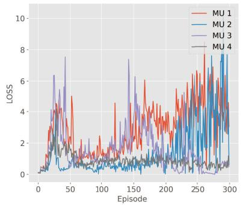  
(a) Learning rate 0.01

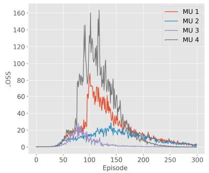  
(b) Learning rate 0.001

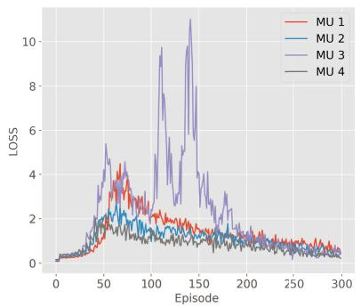  
(d) Discount factor 0.85

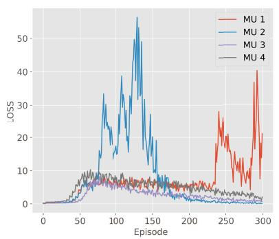  
(e) Discount factor 0.95  
(c) Learning rate 0.0001

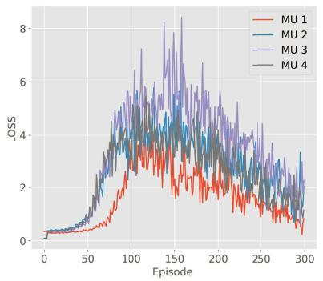

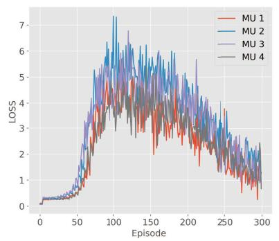  
(g) Momentum 0.5

(f) Discount factor 0.99  

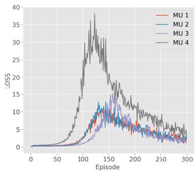

(h) Momentum 0.7  
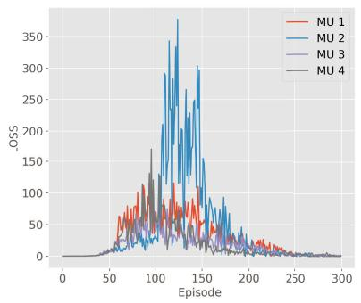  
(j) Batch size 32

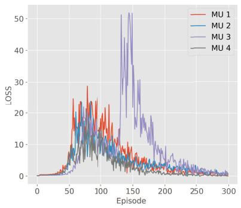  
(k) Batch size 64

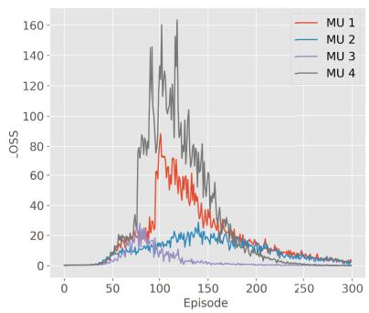  
(i) Momentum 0.95

  
(l) Batch size 128  
Fig. 6. Convergence performance analysis with different hyper-parameters.

128, the greedy coefficient epsilon is 0.9, and the exploration rate is annealed from 0.9 to 0.01 throughout training.

## B. Convergence Performance Analysis

The learning rate is a key parameter in DRL algorithms, which serves to influence the progress of algorithm training and ultimately guides the agent to find or approximate the global optimal solution. Fig. refl1- Fig. 6c show that the loss curve converges quickly when the learning rate is 0.001. Fig. 6a shows that the learning rate is set too large, causing the network to fail to converge. If the learning rate is set too small, the network converges very slowly, as the loss curve in Fig. 6c has a tendency to converge, but it cannot converge in a short period. The effect of different discount factors on the Loss curve is given in Fig. 6d-Fig. 6f. Note that we performed multiple sets of experiments on the discount factor, we only list three cases in which the discount factor with the best convergence performance is 0.99. Fig. 6g-Fig. 6i shows the influence of the momentum parameter on the convergence performance of the algorithm, and the optimal momentum is 0.95. The momentum parameter helps the algorithm to utilize the historical gradient information, thus reducing oscillations during the update process and speeding up convergence. The appropriate batch size significantly impacts algorithm convergence. After several sets of experimental comparisons, i.e., as shown in Fig. 6j-Fig. 6l, the algorithm has better convergence performance when the batch size is 128.

TABLE II  
HYPER PARAMETERS
<table><tr><td>parameter</td><td>value</td></tr><tr><td>Optimizer</td><td>RMSPropOptimizer</td></tr><tr><td>Network type</td><td>Fully connected neural network</td></tr><tr><td>Hidden layer 1 neurons</td><td>256</td></tr><tr><td>Hidden layer 2 neurons</td><td>128</td></tr><tr><td>Hidden layer 3 neurons</td><td>100</td></tr><tr><td>Replay memory</td><td>20000</td></tr><tr><td>Batch size</td><td>128</td></tr><tr><td>Learning rate</td><td>0.001</td></tr><tr><td>Momentum</td><td>0.95</td></tr><tr><td>Greedy coefficient epsilon</td><td>0.9</td></tr><tr><td>Discount factor</td><td>0.99</td></tr><tr><td>Exploration rate</td><td>0.01-0.9</td></tr></table>

## C. Joint Optimization Performance Analysis

To evaluate the co-computational performance of offloading and resource allocation in the NMCM system, our proposed ISAC is compared with existing SOTA algorithms (i.e., ISAC, PPO, SAC, and DDPG):

• PPO: This approach is commonly used in scenarios where minimizing latency and maximizing performance are crucial. The core concept of the PPO algorithm is to evaluate proposed policy updates based on the probability of the current policy.

• SAC: This is an algorithm designed to optimize stochastic policies in an off-policy manner, with its core idea centered around entropy regularization. In this approach, the training of the policy balances the goal of maximizing the expected return with maximizing entropy.

DDPG: This is a deterministic policy gradient algorithm based on deep neural networks, whose core idea is to train by optimizing an approximate value function and a deterministic policy function. The disadvantage of

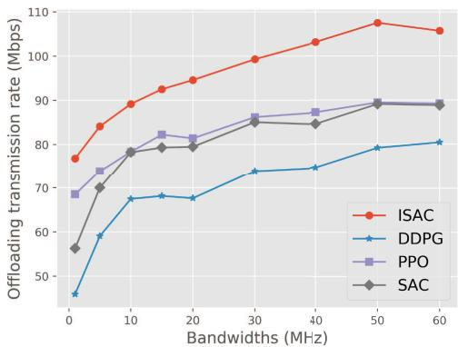  
Fig. 7. Offloading transmission rate performance of four algorithms at different bandwidths.

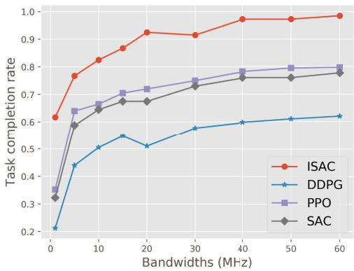  
Fig. 8. Task completion rate performance of four algorithms at different bandwidths.

DDPG is its sensitivity to the selection of initial and hyperparameters, necessitating extensive tuning efforts to achieve optimal performance.

We set the task size to 1MB, and Fig. 7 shows the offloading transmission rate of the four algorithms at different bandwidths. As illustrated in Fig. 7, the ISAC algorithm demonstrates superior optimization performance compared to PPO, SAC, and DDGP. When the bandwidth is 50MHz, the offloading rate of ISAC, SAC, and DDPG stops growing, and even the offloading rate of the ISAC algorithm decreases. This is because the 50 MHz bandwidth is already enough to provide a superior communication environment for 1MB task data. Even if the bandwidth continues to increase, the offloading performance of systems can hardly be improved. Note that the PPO offloading rate curve grows even after the bandwidth is greater than 50MHz; this is because the PPO algorithm is not optimized to perform well.

Fig. 8 shows the task completion rates of the four algorithms at different bandwidths. At 1 MHz, none of the algorithms perform well. As indicated in Fig. 7, limited bandwidth leads to suboptimal data rates, causing many tasks to miss deadlines. Increasing the bandwidth improves offloading transmission rates and reduces task offloading time. However, at 50 MHz, the offloading rate levels off and the task completion rate in Fig. 8 approaches its maximum. This suggests that larger bandwidths are not always advantageous; once a certain threshold is reached, both data offloading performance and task completion rates hit their limits.

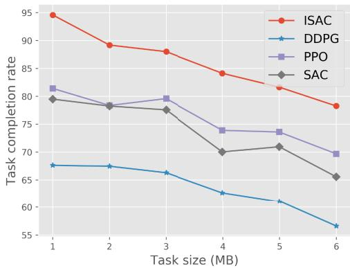  
Fig. 9. Offloading transmission rate performance of four algorithms at different Task sizes.

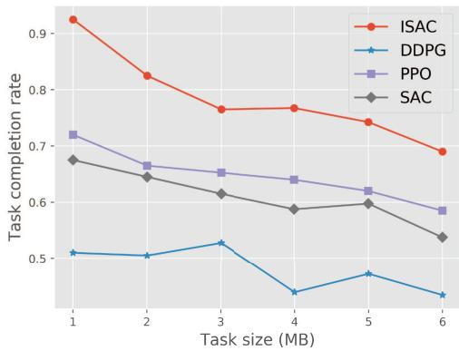  
Fig. 10. Task completion rate performance of four algorithms at different task sizes.

Next, we set the bandwidth to 20MHz and evaluate the offload performance at different task sizes. Fig. 9 compares the offloading transmission rate of the four algorithms at different task sizes. According to Fig. 9, as the task data size increases, the task queuing and offload scheduling becomes more and more complex with limited bandwidth resources due to fixed bandwidth resources, resulting in a decrease in the offload rate. Fortunately, although the offloading performance decreases with the increase of task data, the ISAC algorithm performs better than PPO, SAC, and DDPG in resource-limited environments, especially when channel resources are severely scarce.

Fig. 10 illustrates the task completion rates for various task sizes. The performance of the ISAC algorithm is influenced by task data size: for small tasks (e.g., 1 MB), the completion rate is 0.925. However, as task sizes increase, the available channel resources become insufficient to complete all tasks, necessitating priority-based decision-making to determine the optimal offloading order. This highlights the importance of optimized algorithm performance in resource-limited scenarios. In contrast, the DDPG algorithm is least affected by task size, consistently showing poor performance in task offloading decisions. This is due to its high sensitivity to initial values and parameter settings, as well as training instability caused by noise during the training process.

Fig. 11 analyzes the effect of different power allocations and UAV speeds on the system performance. Fig. 11a reflects that the higher the power of the MUs, the better the communication performance of the NMCM system. It is important to note that although higher transmit power can improve performance, it may significantly reduce energy efficiency. The performance comparison in the low-speed UAV environment is given in Fig. 11b. We evaluated the impact of UAV speed on communication performance and found it to be negligible for low-speed UAVs, which typically rely on radio or 5G communications with minimal Doppler effect and low latency. However, high-speed UAVs may experience significant Doppler changes due to strong aerodynamic effects, which are not considered in this study due to the complexity of the modeling.

Fig. 12 reflects the system utility for different numbers of MUs and UAVs. According to Fig. 12a, system utility increases with the number of UAVs, since the proposed solution enables UAVs to deliver flexible, on-demand services to mobile users. Notably, the utility curve of the proposed ISAC algorithm rises more steadily compared to baseline methods, indicating its robust performance even when the number of UAVs is limited. This demonstrates that ISAC effectively schedules resources to maintain optimal system performance under different network scales. In addition, the baseline methods rely heavily on the number of UAVs to enhance system performance, resulting in more pronounced improvements as the number of UAVs increases. Fig. 12b shows that as the number of MUs increases, the performance of system task execution decreases, which can lead to a decrease in system utility. However, the proposed ISAC algorithm still performs well even in a large-scale user environment. Note that the performance of the PPO and DDPG algorithms drops off a cliff when the number of MUs is greater than 40, and thus these two baseline methods are not suitable for application in NMCM networks.

Fig. 13 compares the reward curves of four algorithms, with the red curve representing the 50-time slot rolling average rewards. The shaded areas indicate the maximum and minimum rewards over 50 time slots. In this experiment, we conducted 300 episodes, each consisting of 100 time slots, totaling 30,000 time slots. The optimization problem (29) is a non-convex problem with both inequality and equality constraints, making it unsolvable by traditional numerical methods. While the safe DRL approach can approximate solutions to such problems, it still faces two key challenges: 1) ensuring equality for the equation constraints, and 2) guaranteeing that inequality constraints are satisfied. The experimental algorithms SAC, PPO, and DDPG use penalty methods to handle constraints. However, as shown in Figs. 13b to 13d, excessive or improper penalties can overly restrict the solution space and degrade performance.

To address this issue, we introduced Lagrange multipliers to eliminate equality and inequality constraints, resulting in a dual optimization problem (see Equ. 36). It is important to note that SAC, PPO, and DDPG rely on over-parameterization to achieve effective training, which often leads to overfitting.

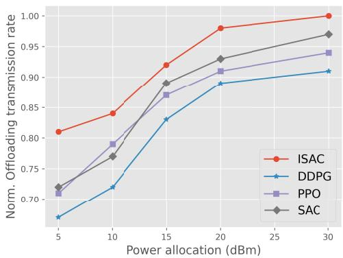  
(a) Power

Fig. 11. Effect of power allocation and UAV speed on system performance.  
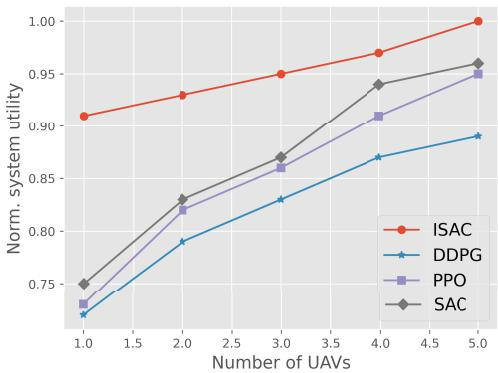  
(a) Number of UAVs

Fig. 12. System utility with different number of MUs and UAVs.  
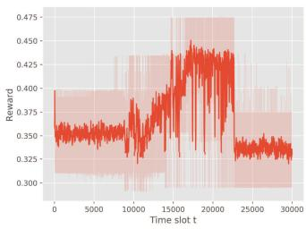  
(a) ISAC

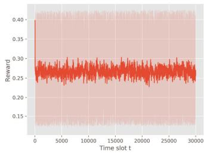

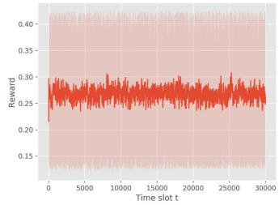  
(c) PPO

(b) SAC  
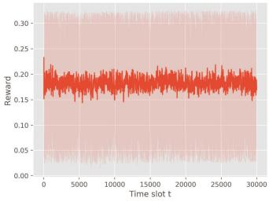  
(d) DDPG  
Fig. 13. Reward performance under four algorithms.

As illustrated in Fig. 13a, we enhance SAC by not merely minimizing the loss function but by incorporating a perturbation term that allows the model to escape local minima during training. According to Fig. 13, the ISAC algorithm offers greater exploration opportunities compared to SAC, PPO, and

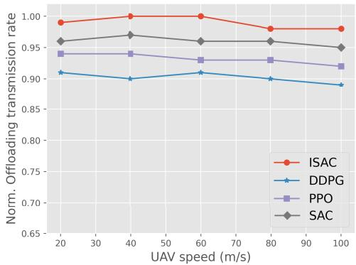  
(b) Speed

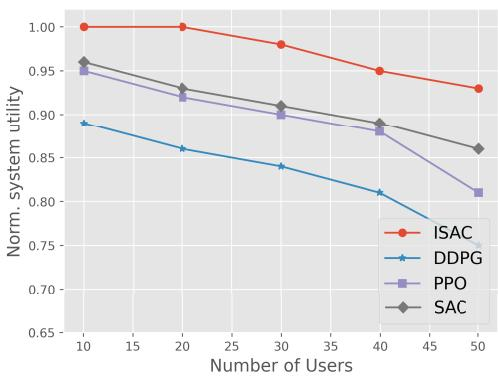  
(b) Number of MUs

DDPG. The reward curve is notably smooth due to the nonconvex nature of the problem, which facilitates the existence of multiple locally optimal solutions. Consequently, SAC, PPO, and DDPG algorithms are prone to falling into local minima due to their limited perturbation capabilities.

## VI. CONCLUSION

This paper investigates QoS-oriented task offloading in the NMCM system to maximize system utility through joint optimization of UAVs’ 3D trajectories, MU association, task offloading ratios, and resource allocation. To address the challenge of the penalty DRL algorithm’s solution trajectory being restricted to a very small feasible region, we employed Lagrange duality to eliminate equality and inequality constraints. To enhance exploration capabilities, we improved SAC by incorporating a perturbation term in the loss function, allowing the model to escape local minima during training. Simulation results demonstrate that the ISAC algorithm exhibits superior convergence performance and significantly increases offloading transmission rates, task completion rates, and overall system utility compared to various benchmark algorithms. Building on the insights from [33], future research will explore the integration of multi-modal learning and aggregation techniques into task offloading across multiple UAVs to further enhance system intelligence and adaptability.

## REFERENCES

[1] Z. Ning et al., “Dynamic computation offloading and server deployment for UAV-enabled multi-access edge computing,” IEEE Trans. Mobile Comput., vol. 22, no. 5, pp. 2628–2644, May 2023.

[2] Z. Ma et al., “Towards revenue-driven multi-user online task offloading in edge computing,” IEEE Trans. Parallel Distrib. Syst., vol. 33, no. 5, pp. 1185–1198, May 2022.

[3] W. Wu et al., “AI-native network slicing for 6G networks,” IEEE Wireless Commun., vol. 29, no. 1, pp. 96–103, Feb. 2022.

[4] X. Lyu, H. Tian, W. Ni, Y. Zhang, P. Zhang, and R. P. Liu, “Energyefficient admission of delay-sensitive tasks for mobile edge computing,” IEEE Trans. Commun., vol. 66, no. 6, pp. 2603–2616, Jun. 2018.

[5] Z. Xu et al., “Schedule or wait: Age-minimization for IoT big data processing in MEC via online learning,” in Proc. IEEE Conf. Comput. Commun., London, U.K., May 2022, pp. 1809–1818.

[6] L. Wang, K. Wang, C. Pan, W. Xu, N. Aslam, and A. Nallanathan, “Deep reinforcement learning based dynamic trajectory control for UAVassisted mobile edge computing,” IEEE Trans. Mobile Comput., vol. 21, no. 10, pp. 3536–3550, Oct. 2022.

[7] L. Zhang and N. Ansari, “Latency-aware IoT service provisioning in UAV-aided mobile-edge computing networks,” IEEE Internet Things J., vol. 7, no. 10, pp. 10573–10580, Oct. 2020.

[8] P. Qin, Y. Fu, J. Zhang, S. Geng, J. Liu, and X. Zhao, “DRL-based resource allocation and trajectory planning for NOMA-enabled multi-UAV collaborative caching 6G network,” IEEE Trans. Veh. Technol., vol. 73, no. 6, pp. 8750–8764, Jun. 2024.

[9] T. Zhang, Y. Xu, J. Loo, D. Yang, and L. Xiao, “Joint computation and communication design for UAV-assisted mobile edge computing in IoT,” IEEE Trans. Ind. Informat., vol. 16, no. 8, pp. 5505–5516, Aug. 2020.

[10] X. Qi, J. Chong, Q. Zhang, and Z. Yang, “Collaborative computation offloading in the multi-UAV fleeted mobile edge computing network via connected dominating set,” IEEE Trans. Veh. Technol., vol. 71, no. 10, pp. 10832–10848, Oct. 2022.

[11] T. Tan, M. Zhao, and Z. Zeng, “Joint offloading and resource allocation based on UAV-assisted mobile edge computing,” ACM Trans. Sensor Netw., vol. 18, no. 3, pp. 1–21, Aug. 2022.

[12] M. N. Tariq, J. Wang, S. Raza, M. Siraj, M. Altamimi, and S. Memon, “Toward optimal resource allocation: A multi-agent DRL based task offloading approach in multi-UAV-assisted MEC networks,” IEEE Access, vol. 12, pp. 81428–81440, 2024.

[13] P. Qin et al., “Joint trajectory plan and resource allocation for UAVenabled C-NOMA in air-ground integrated 6G heterogeneous network,” IEEE Trans. Netw. Sci. Eng., vol. 10, no. 6, pp. 3421–3434, Nov. 2023.

[14] R. Zhong, X. Liu, Y. Liu, and Y. Chen, “Multi-agent reinforcement learning in NOMA-aided UAV networks for cellular offloading,” IEEE Trans. Wireless Commun., vol. 21, no. 3, pp. 1498–1512, Mar. 2022.

[15] F. Pervez, A. Sultana, C. Yang, and L. Zhao, “Energy and latency efficient joint communication and computation optimization in a multi-UAV assisted MEC network,” IEEE Trans. Wireless Commun., vol. 23, no. 3, pp. 1728–1741, Mar. 2024.

[16] M. Zhang, Z. Su, Q. Xu, Y. Qi, and D. Fang, “Energy-efficient task offloading in UAV-RIS-assisted mobile edge computing with NOMA,” in Proc. IEEE Conf. Comput. Commun. Workshops, May 2024, pp. 1–6.

[17] Y. Xu, T. Zhang, Y. Liu, D. Yang, L. Xiao, and M. Tao, “UAVassisted MEC networks with aerial and ground cooperation,” IEEE Trans. Wireless Commun., vol. 20, no. 12, pp. 7712–7727, Dec. 2021.

[18] W. Chen, X. Qiu, T. Cai, H.-N. Dai, Z. Zheng, and Y. Zhang, “Deep reinforcement learning for Internet of Things: A comprehensive survey,” IEEE Commun. Surveys Tuts., vol. 23, no. 3, pp. 1659–1692, 3rd Quart., 2021.

[19] H. T. Nguyen, M. T. Nguyen, H. T. Do, H. T. Hua, and C. V. Nguyen, “DRL-based intelligent resource allocation for diverse QoS in 5G and toward 6G vehicular networks: A comprehensive survey,” Wireless Commun. Mobile Comput., vol. 2021, no. 1, p. 5051, Jan. 2021.

[20] H. Wang, H. Zhang, X. Liu, K. Long, and A. Nallanathan, “Joint UAV placement optimization, resource allocation, and computation offloading for THz band: A DRL approach,” IEEE Trans. Wireless Commun., vol. 22, no. 7, pp. 4890–4900, Jul. 2022.

[21] N. Zhao, Z. Ye, Y. Pei, Y.-C. Liang, and D. Niyato, “Multi-agent deep reinforcement learning for task offloading in UAV-assisted mobile edge computing,” IEEE Trans. Wireless Commun., vol. 21, no. 9, pp. 6949–6960, Sep. 2022.

[22] Y. Liu, J. Yan, and X. Zhao, “Deep reinforcement learning based latency minimization for mobile edge computing with virtualization in maritime UAV communication network,” IEEE Trans. Veh. Technol., vol. 71, no. 4, pp. 4225–4236, Apr. 2022.

[23] B. I.-D. Ghomri, M. Y. Bendimerad, and F. T. Bendimerad, “DRLdriven optimization for energy efficiency and fairness in NOMA-UAV networks,” IEEE Commun. Lett., vol. 28, no. 5, pp. 1048–1052, May 2024.

[24] J. Du, C. Jiang, A. Benslimane, S. Guo, and Y. Ren, “SDN-based resource allocation in edge and cloud computing systems: An evolutionary Stackelberg differential game approach,” IEEE/ACM Trans. Netw., vol. 30, no. 4, pp. 1613–1628, Aug. 2022.

[25] B. Hazarika, K. Singh, S. Biswas, and C.-P. Li, “DRL-based resource allocation for computation offloading in IoV networks,” IEEE Trans. Ind. Informat., vol. 18, no. 11, pp. 8027–8038, Nov. 2022.

[26] W. Zhang, Q. Wang, X. Liu, Y. Liu, and Y. Chen, “Three-dimension trajectory design for multi-UAV wireless network with deep reinforcement learning,” IEEE Trans. Veh. Technol., vol. 70, no. 1, pp. 600–612, Jan. 2021.

[27] B. Zhu, K. Chi, J. Liu, K. Yu, and S. Mumtaz, “Efficient offloading for minimizing task computation delay of NOMA-based multiaccess edge computing,” IEEE Trans. Commun., vol. 70, no. 5, pp. 3186–3203, May 2022.

[28] Z. Ding and H. V. Poor, “Joint beam management and power allocation in THz-NOMA networks,” IEEE Trans. Commun., vol. 71, no. 4, pp. 2059–2073, Apr. 2023.

[29] A. Agarwal, S. M. Kakade, J. D. Lee, and G. Mahajan, “On the theory of policy gradient methods: Optimality, approximation, and distribution shift,” J. Mach. Learn. Res., vol. 22, no. 1, pp. 1–12, Aug. 2019.

[30] A. Nemirovski, A. Juditsky, G. Lan, and A. Shapiro, “Robust stochastic approximation approach to stochastic programming,” SIAM J. Optim., vol. 19, no. 4, pp. 1574–1609, Jan. 2009.

[31] T. Haarnoja et al., “Soft actor-critic algorithms and applications,” 2018, arXiv:1812.05905.

[32] H. Guo and J. Liu, “UAV-enhanced intelligent offloading for Internet of Things at the edge,” IEEE Trans. Ind. Informat., vol. 16, no. 4, pp. 2737–2746, Apr. 2020.

[33] J. Du, T. Lin, C. Jiang, Q. Yang, C. F. Bader, and Z. Han, “Distributed foundation models for multi-modal learning in 6G wireless networks,” IEEE Wireless Commun., vol. 31, no. 3, pp. 20–30, Jun. 2024.

  
Peipei Chen received the Ph.D. degree in control science and engineering from the National University of Defense Technology, Changsha, China, in 2024. She is currently an Associate Professor with Hangzhou Dianzi University. Her research interests include physical layer security, unmanned aerial vehicle (UAV) communications, and air-ground integrated networks.

Lailong Luo received the B.S., M.S., and Ph.D. degrees from the College of Systems Engineering, National University of Defense Technology, Changsha, China, in 2013, 2015, and 2019, respectively. He is currently an Associate Professor with the School of Systems, National University of Defense Technology. His research interests include data structure and distributed networking systems.

  
and interconnection networks.

Deke Guo (Senior Member, IEEE) received the B.S. degree in industry engineering from Beijing University of Aeronautics and Astronautics, Beijing, China, in 2001, and the Ph.D. degree in management science and engineering from the National University of Defense Technology, Changsha, China, in 2008. He is currently a Professor with the College of System Engineering, National University of Defense Technology. His research interests include distributed systems, software-defined networking, data center networking, wireless and mobile systems,

Chenggang Yan received the B.S. degree in computer science from Shandong University in 2008 and the Ph.D. degree in computer science from the Institute of Computing Technology, Chinese Academy of Sciences, in 2013. He is currently a Professor with Hangzhou Dianzi University. His research interests include intelligent information processing, machine learning, image processing, computational biology, and computational photography.

Jiaju Wu, photograph and biography not available at the time of publication

IEEE TRANSACTIONS ON PARALLEL AND DISTRIBUTED SYSTEMS. His current research focuses on wireless cellular network, wireless ad hoc network, and wireless sensor network. He was a recipient of the Best Paper Award at the IEEE Wireless Communications and Networking Conference in 2008.

Kaikai Chi (Senior Member, IEEE) received the B.S. and M.S. degrees from Xidian University, Xi’an, China, in 2002 and 2005, respectively, and the Ph.D. degree from Tohoku University, Sendai, Japan, in 2009. He is currently a Professor with the School of Computer Science and Technology, Zhejiang University of Technology, Hangzhou, China. He has published more than 50 referred technical papers in proceedings and journals like IEEE TRANSAC-TIONS ON WIRELESS COMMUNICATIONS, IEEE TRANSACTIONS ON MOBILE COMPUTING, and

Xudong Dong received the M.S. degree in applied mathematics from Guilin University of Electronic Technology, Guilin, China, in 2020, and the Ph.D. degree in communication and information systems from the College of Electronic and Information Engineering, Nanjing University of Aeronautics and Astronautics, Nanjing, China, in 2024. He is currently a Professor with the College of Communication Engineering, Hangzhou Dianzi University. His research interests include target detection and tracking, array signal processing, deep learning, signal classification, and impulsive noise.