# QoS Aware Virtual Network Embedding in Space-Air-Ground-Ocean Integrated Network

Yi Zhang , Peiying Zhang , Member, IEEE, Chunxiao Jiang , Fellow, IEEE, Shangguang Wang , Senior Member, IEEE, Hongxia Zhang , and Chunming Rong , Senior Member, IEEE

Abstract—The space-air-ground-ocean integrated network (SAGOI-Net) has become the focus of research in recent years, which has the characteristics of wide coverage and strong adaptability. However, due to the influence of multiple heterogeneous network segments, this network is unable to provide excellent quality of service (QoS). Based on the software-defined network and virtual network architecture, we abstract SAGOI-Net as a three-layer heterogeneous physical network resource, and propose a multi-domain virtual network embedding solution to optimize QoS. Specifically, before virtual network embedding, we collected SAGOI-Net’s resource information through software-defined network and modeled it. In the virtual network embedding process, we first classify the virtual network request through K-means, and dynamically adjust the reward function to use reinforcement learning to solve the optimal virtual network embedding strategy. Finally, simulation experiments verify the effectiveness of the scheme.

Index Terms—Space-air-ground-ocean Integrated Network, Software Defined Network, Virtual Network Architecture, Virtual Network Embedding, Reinforcement Learning.

Manuscript received 29 June 2023; revised 30 October 2023; accepted 17 January 2024. Date of publication 24 January 2024; date of current version 8 August 2024. This work was partially supported by the Natural Science Foundation of Shandong Province under Grants ZR2023LZH017 and ZR2022LZH015, in part by the National Natural Science Foundation of China under Grants 62325108 and 62341131, and in part by the Open Foundation of State Key Laboratory of Integrated Services Networks (Xidian University) under Grant ISN23-09. (Corresponding authors: Chunxiao Jiang; Peiying Zhang.)

Yi Zhang is with the Qingdao Institute of Software, College of Computer Science and Technology, China University of Petroleum (East China), Qingdao 266580, China, and also with the State Key Laboratory of Integrated Services Networks, Xidian University, Xi’an 710071, China (e-mail: zhangyi.upc@qq.com).

Peiying Zhang is with the Qingdao Institute of Software, College of Computer Science and Technology, China University of Petroleum (East China), Qingdao 266580, China, and with the State Key Laboratory of Integrated Services Networks, Xidian University, Xi’an 710071, China, and also with the Key Laboratory of Computing Power Network and Information Security, Ministry of Education, Shandong Computer Science Center (National Supercomputer Center in Jinan), Qilu University of Technology (Shandong Academy of Sciences), Jinan 250013, China (e-mail: zhangpeiying@upc.edu.cn).

Chunxiao Jiang is with Tsinghua Space Center, Beijing National Research Center for Information Science and Technology (BNRist), Tsinghua University, Beijing 100084, China (e-mail: jchx@tsinghua.edu.cn).

Shangguang Wang is with the State Key Laboratory of Networking and Switching Technology, Beijing University of Posts and Telecommunications, Beijing 100876, China (e-mail: sgwang@bupt.edu.cn).

Hongxia Zhang is with the Qingdao Institute of Software, College of Computer Science and Technology, China University of Petroleum (East China), Qingdao 266580, China (e-mail: zhanghx@upc.edu.cn).

Chunming Rong is with the Department of Electronic Engineering and Computer Science, University of Stavanger, 4036 Stavanger, Norway (e-mail: chunming.rong@uis.no).

Digital Object Identifier 10.1109/TSC.2024.3357707

# I. INTRODUCTION

N RECENT years, the emergence of a variety of new I IoT applications has brought huge challenges to traditional ground communication networks [1], [2]. For example, the development of intelligent transportation systems (ITS) has put forward higher requirements for the service quality of vehicle communication networks [3], [4]. However, traditional vehicle communication networks rely on terrestrial communications networks to provide services [5]. Due to factors such as deployment, capacity, and response delays, terrestrial communications networks gradually cannot meet the needs of the next generation of intelligent transportation systems [6], [7]. Therefore, the space-air-ground-ocean integrated network (SAGOI-Net) is introduced to provide a multi-dimensional vehicle communication network with comprehensive coverage and low response delay for vehicles traveling around the world [8].

SAGOI-Net is a new type of hierarchical wireless network structure, which is composed of multiple heterogeneous networks, namely space network, air network, ground network and ocean network [9]. These heterogeneous networks can independently improve services to ITS [10], [11], and can also provide services through mutual operation. As revealed in Fig. 1, in military operations, the cooperation of satellite networks, air networks, ground networks, and ocean networks is needed to complete the high quality of service (QoS) requirements.

However, as a multi-tier network architecture, SAGOI-Net is affected by multiple heterogeneous network segments during operation, and cannot efficiently use network resources [12], [13], so it is difficult to provide excellent quality of service QoS [14]. How to overcome the complexity of the network and efficiently allocate network resources to meet the differentiated QoS requirements of users has become one of the challenges of SAGOI-Net. To address this problem, we abstract SAGOI-Net as a three-layer heterogeneous network and propose a multidomain virtual network embedding algorithm, which gives a solution in the perspective of network virtualization. And based on this, we use K-means clustering technique to sense the QoS categories of VNRs to meet the differentiated QoS requirements of users. Specifically, the contributions of this paper are as follows:

1) First, we design a multilayer policy network as a reinforcement learning agent for virtual network embedding. This policy network perceives the topological properties of the network to extract feature matrices to derive the embedding scheme of virtual nodes, which can achieve efficient allocation of network resources.

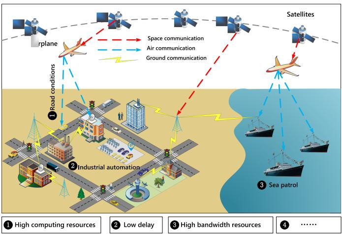

<details>
<summary>flowchart</summary>

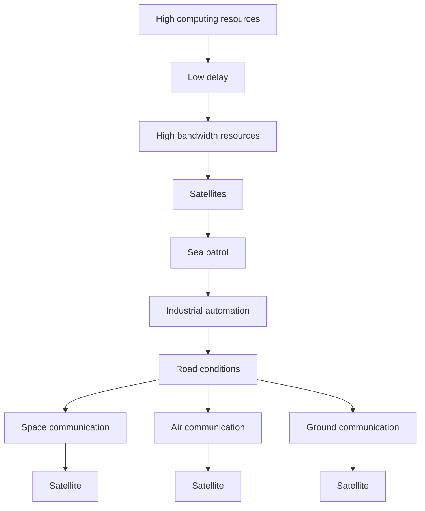
</details>

Fig. 1. Differentiated QoS application scenarios in SAGOI-Net.

2) Second, we use the K-means clustering technique to sense the QoS categories of virtual network requests (VNRs) and dynamically adjust the reward function used by the agent to meet the differentiated QoS requirements based on the results. This can make the algorithm more adaptable to SAGOI-Net that covers complex application scenarios.   
3) We designed several sets of comparison experiments to verify the performance of the algorithm. The simulation results show that our algorithm has excellent performance in terms of delay, acceptance rate, and revenue.

The remainder of this article is arranged as follows. Section II firstly introduces the application of software-defined networking (SDN) under SAGOI-Net and the application of virtual architecture in SAGOI-Net, and then analyzes the current research status. Section III establishes the topological model of the substrate network and VNR. Section IV respectively describes the multi-domain virtual network embedding algorithm for QoS optimization. In the Section V, the experimental results of this scheme are analyzed. Section VI summarizes the article and prospects future work.

# II. RELATED WORK

# A. Application of SDN Architecture Under SAGOI-Net

As a new type of network architecture, SDN has excellent flexibility and reconfigurability [15], [16]. At present, SDN has been widely used in ground network systems. In order to maximize the role of SDN in the integration of satellite networks, air networks and ground networks, many scholars have proposed many SDN-based satellite ground fusion or satellite air fusion network architecture by deploying controllers on satellites, ground and other locations [17], [18], [19], [20].

Literature [17] designed a multi-layer satellite network architecture based on SDN. The authors deployed the controller on geosynchronous orbit (GEO) satellites and used the extensive coverage of GEO satellites to control medium earth orbit (MEO) and low earth orbit (LEO) satellites. In [18], the author Yang et al. deployed the controller in the ground network and proposed a network architecture based on SDN that integrates satellite and ground. This architecture ensures seamless handover between LEO satellites, and at the same time provides flexible traffic management and fine-grained QoS for satellite and ground converged networks. Literature [19] proposed a network architecture called SERvLCE, which is also based on SDN implementation. SERvLCE deploys controllers in GEO satellites, ground satellite gateways and ground data centers to collect relevant information from satellites and ground network forwarding planes. In [20], the author Zhang et al. designed an SDN-based SAGOI-Net architecture for vehicle networks. In the article, they suggested that SDN controllers should be deployed in a hierarchical architecture to control three heterogeneous network segments: satellite, air, and ground. The architecture uses a centralized control mode, and all controllers are deployed on the ground.

The above-mentioned SDN-based architecture mainly deploys the controller on the ground to control the satellite or aerial platform, which causes the controller to be unable to receive real-time status information from the satellite and aerial platform, and the communication delay is also high. In addition, when user demand increases, the frequent switching of satellites and aerial platforms also puts forward higher demands on link bandwidth. In order to solve the above problems, the author of [21] optimized the current SDN-based SAGOI-Net architecture.

# B. Research Status of SAGOI-Net Based on Virtual Network Architecture

Because the virtual network architecture has made breakthroughs in the research of traditional ground communication networks, some scholars have proposed that the virtual network architecture be used in SAGOI-Net. The virtual network architecture has significant advantages in dealing with differentiated QoS for different applications. As excellent representatives of network virtualization, SDN and network function virtualization are considered to be enabling technologies for the flexible and effective integration of heterogeneous networks, and can provide innovative solutions for the orchestration of heterogeneous network resources [22].

In order to optimize the load balancing of network communication, reference [23] studied a software-defined SAGOI-Net routing algorithm. Based on the characteristics of the SDN model and the dynamic changes of SAGOI-Net’s topology, the authors considered the multi-dimensionality of resources and energy consumption, which effectively reduced the end-to-end delay and packet loss rate. Literature [24] proposed a SAGOI-Net reconfigurable service framework based on service function chain. The framework modeled the realization of service function chain and virtual network functions as integer nonlinear programming problems. The authors proposed a heuristic greedy algorithm to balance the resource consumption of different network nodes. The results proved that this algorithm can improve resource utilization efficiency. Du et al. [25] studied spectrum sharing and interference control technology based on SDN. They proposed a spectrum sharing and service offloading mechanism to realize the cooperative relationship between the ground BSs and the beam group of the satellite ground communication system. In this mode, the communication between satellites and the ground effectively realized frequency sharing and traffic offloading.

# C. Research Status Analysis

Through the analysis of the above-mentioned algorithm and the virtual network embedding research under the SAGOI-Net, we found that they have the following problems.

1) In the past, most virtual network embedding algorithms used heuristic algorithms to solve problems, which could easily fall into local optimal solutions.   
2) The current research on multi-domain virtual network embedding algorithms mostly focuses on ground networks, and there is almost no research on heterogeneous, hierarchical multi-domain networks.   
3) The existing researches only focus on the impact of SAGOI-Net’s heterogeneity and time-variability on users’ QoS requirements, and have not specifically modeled the physical network resources of the three network segments. Therefore, it is difficult to achieve efficient scheduling of resources and cannot meet the differentiated QoS requirements of users. Therefore, in view of the above problems, after considering the heterogeneity and time-varying nature of SAGOI-Net, we model the SAGOI-Net hierarchically based on the SDN network architecture based on the literature [21]. Then we propose a reinforcement learning (RL)-assisted QoS-aware multi-domain virtual network embedding algorithm. In view of the influence of the time-varying nature of SAGOI-Net’s topology on virtual network embedding, we have also re-embedded the VNR subgraphs with embedding failures to ensure stable QoS.

# III. MODEL BUILDING AND PROBLEM DESCRIPTION

# A. Problem Description

For privacy and confidentiality considerations, infrastructure provider (InP) often does not disclose all physical network information to SDN, which is also one of the problems faced by traditional multi-domain virtual network embedding algorithms. In addition, if the InP uploads all the information of the physical network to the SDN, a large amount of transmission signaling overhead and calculation overhead will be generated. Therefore, in order to solve this problem, before virtual network embedding, we stipulated that each InP only needs to upload the following basic information: the network topology of each InP at different times, the CPU, bandwidth and delay of each node and intra-domain in the network, bandwidth and delay information of inter-domain links.

Moreover, due to the time-varying nature of SAGOI-Net, the network nodes in SAGOI-Net are moving. For example, a ship is receiving communication services provided by satellite $\mathbf { A } ,$ and due to the movement of satellite A, the ship sails out of the coverage area of satellite A. At this time, SAGOI-Net’s topology has changed. We use formula 1 to adapt to the uncertainty caused by topology changes. We first divide the network topology at time T into consecutive n $\Delta t$ and assume that the VNR arrives Δat the moment t. The number of VNRs changes with time. Then, the probability of a node working properly is calculated based on the number of network requests carried by the SAGOI-Net at moment $t ,$ as follows.

$$
\left[ e ^ {- 0. 0 0 4 (m - 1)}, e ^ {- 0. 0 0 4 m} \right], \tag {1}
$$

where m denotes the number of VNRs that have been carried in SAGOI-Net.

# B. Substrate Network

We model the topological snapshot of the substrate network at time t as a weighted undirected graph $G ^ { S } = \{ N ^ { S } , L ^ { S } , A ^ { S } \}$ , where $N ^ { S }$ =represents the network node collection of SAGOI-Net, $L ^ { \bar { S } }$ is the network link collection of SAGOI-Net, and $A ^ { S }$ represents the attribute collection of SAGOI-Net. Network node collection $N ^ { S } = \{ N _ { S } ^ { S } , N _ { A } ^ { S } , N _ { G \& O } ^ { S } \}$ , among them, $N _ { S } ^ { S }$ = is a set of satellite network nodes, $N _ { A } ^ { S }$ is a set of air network nodes, and $N _ { G \& O } ^ { S }$ is a set of $\mathbf { \bar { \boldsymbol { L } } ^ { S } } = \{ \boldsymbol { L } _ { S } ^ { S } , \boldsymbol { L } _ { A } ^ { S } , \boldsymbol { L } _ { G \& O } ^ { S } , \boldsymbol { L } _ { S , A } ^ { S } , \boldsymbol { L } _ { A , G \& O } ^ { S } , \boldsymbol { L } _ { S , G \& O } ^ { S } \}$ k colle, where $L _ { S } ^ { S } .$ $L _ { A } ^ { S }$ =and $L _ { G \& O } ^ { S }$ respectively represent the link set of the satellite network, the link set of the air network and the link set of the ground-ocean network. $L _ { S , A } ^ { S }$ is the set of inter-domain links between satellite network nodes and air network nodes. $L _ { A , G \& O } ^ { S }$ is the set of inter-domain links between air network nodes and ground-ocean network nodes. $L _ { S , G \& O } ^ { S }$ is the set of inter-domain links between satellite network nodes and ground-ocean network nodes. Network attribute collection $A ^ { S } \stackrel { - } { = } \{ C P U _ { N _ { \mathrm { { c } } } ^ { S } } \}$ $C P U _ { N _ { A } ^ { S } } , C P U _ { N _ { G \& \ O } ^ { S } } , B W _ { L _ { S } ^ { S } } , B W _ { L _ { A } ^ { S } } , B W _ { L _ { G \& \ O } ^ { S } } , D _ { L _ { S } ^ { S } } , D _ { L _ { A } ^ { S } } ,$ =O , DLSS , DLSG&O $D _ { L _ { G \& O } ^ { S } } \}$ , $C ^ { \sim } P U _ { N _ { S } ^ { S } }$ resource of the satellite network node, $C P U _ { N _ { A } ^ { S } }$ represents the computing resource of the air network node, and $C P U _ { N _ { G \& \ O } ^ { S } }$ represents the computing resource of the ground-ocean network node. $B W _ { L _ { S } ^ { S } } , \ B W _ { L _ { A } ^ { S } }$ and $B W _ { L _ { G \& \ O } ^ { S } }$ respectively represent S A G&O the bandwidth of satellite network link, air network link, and ground-ocean network link. $D _ { L _ { \mathrm { { S } } } ^ { S } } , D _ { L _ { \mathrm { { A } } } ^ { S } }$ and $D _ { L _ { G \& O } ^ { S } }$ respectively represent the delay of satellite network link, air network link, and ground-ocean network link.

# C. Virtual Network Request

Similar to the underlying physical network, VNRs are modeled as weighted undirected graph $G ^ { V } = \{ N ^ { V } , L ^ { V } , A ^ { V } \}$ , where $N ^ { V }$ denotes the virtual nodes set, $L ^ { V }$ =indicates the virtual links set, and $A ^ { V } = \{ C P U _ { N ^ { V } } , C D _ { N ^ { V } } , B W _ { L ^ { V } } , D _ { L ^ { V } } \}$ is the =attribute set of virtual network requests. In expression $A ^ { V }$ , $C P U _ { N }$ reveals the computing resources required by the virtual nodes, $C D _ { N } \nu$ is the calculation delays required by the virtual nodes, $B W _ { L } \nu$ is the bandwidth resources required by the virtual links, and $D _ { L ^ { V } }$ indicates the delay requirement of the virtual links.

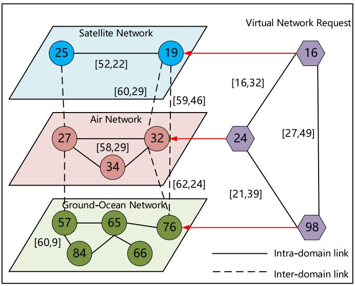

<details>
<summary>flowchart</summary>

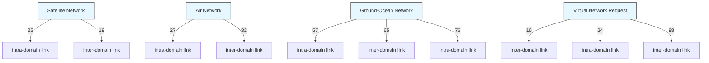
</details>

Fig. 2. Cross-domain virtual network embedding architecture. On the left is the hierarchical SAGOI-Net, and on the right is the VNR.

Fig. 2 reveals the embedding process of a multi-domain virtual network under SAGOI-Net. In the physical network, the value in the box denotes the number of computing resources of the physical node, and the value on the link indicates the number of bandwidth resources and the delay value respectively. In the virtual network request, the value in the box is the computing resource requirement of the virtual node, and the value on the link reveals the bandwidth resource requirement and the maximum delay value respectively.

# D. Constraints

In order to realize multi-domain virtual network embedding, nodes and links should also meet the following constraints.

$$
C P U _ {n ^ {s}} \geq C P U _ {n ^ {v}}, i f n ^ {v} \uparrow n ^ {s}, \tag {2}
$$

$$
B W _ {\left(n _ {i} ^ {s}, n _ {j} ^ {s}\right)} \geq B W _ {\left(n _ {m} ^ {v}, n _ {n} ^ {v}\right)}, i f \left(n _ {i} ^ {s}, n _ {j} ^ {s}\right) \uparrow \left(n _ {m} ^ {v}, n _ {n} ^ {v}\right), \tag {3}
$$

$$
D _ {\left(n _ {i} ^ {s}, n _ {j} ^ {s}\right)} \leq D _ {\left(n _ {m} ^ {v}, n _ {n} ^ {v}\right)}, i f \left(n _ {i} ^ {s}, n _ {j} ^ {s}\right) \uparrow \left(n _ {m} ^ {v}, n _ {n} ^ {v}\right), \tag {4}
$$

$$
\operatorname{Num} _ {\max} \left(n ^ {v}\right) = 1. \tag {5}
$$

In the above constraints, (2) indicates that the computing resources of physical nodes should satisfy the requirements of virtual nodes. Where ↑ denotes the mapping action, for example, $n ^ { v } \uparrow n ^ { s }$ denotes that node $n ^ { v }$ is embedded on node $n ^ { s }$ . Equation (3) and (4) indicate that if the virtual link $( n _ { m } ^ { v } , n _ { n } ^ { v } )$ is mapped to the physical link $( n _ { i } ^ { s } , n _ { j } ^ { s } )$ ( ), the number of bandwidth resources ( )and the delay value of the physical link $( n _ { i } ^ { s } , n _ { j } ^ { s } )$ should meet the requirements of virtual links $( n _ { m } ^ { v } , n _ { n } ^ { v } )$ ( ). It is worth noting that ( )the transmission delays of links in different network segments in SAGOI-Net are different, so we stipulate that the delay requirements of virtual links should not be less than the delay value of physical links. Equation (5) indicates that a virtual node can only be embedded on one physical node, i.e., the number of physical nodes that can be finally selected is 1.

# E. Performance Indicators

We measure the performance of the algorithm in terms of revenue, cost, and acceptance rate. First, we define the revenue obtained by completing a virtual network request as follows.

$$
R \left(G ^ {v}, t\right) = t _ {d} \left[ \sum_ {n _ {i} ^ {v} \in N ^ {V}} C P U _ {n _ {i} ^ {v}} + \sum_ {\left(n _ {i} ^ {v}, n _ {j} ^ {v}\right) \in L ^ {V}} B W _ {\left(n _ {i} ^ {v}, n _ {j} ^ {v}\right)} \right], \tag {6}
$$

where $t _ { d }$ denotes the duration of the VNR. Correspondingly, the cost required to complete the virtual network request is calculated using the following equation.

Cost

$$
= t _ {d} \left[ \sum_ {n _ {i} ^ {v} \in N ^ {V}} C P U _ {n _ {i} ^ {v}} + \sum_ {\left(n _ {i} ^ {v}, n _ {j} ^ {v}\right) \in L ^ {V}} B W _ {\left(n _ {i} ^ {v}, n _ {j} ^ {v}\right)} h o p _ {\left(n _ {i} ^ {v}, n _ {j} ^ {v}\right)} \right], \tag {7}
$$

where $h o p _ { ( n _ { i } ^ { v } , n _ { i } ^ { v } ) }$ denotes the number of hops of link $( n _ { i } ^ { v } , n _ { j } ^ { v } )$ . ( )From the formula, it can be seen that the revenue and cost from a virtual network request are closely related to the amount of resources it requires. Subsequently, the long-term average revenue and the long-term average revenue-cost ratio are defined by (8) and (9).

$$
L A R = \lim _ {T \to \infty} \frac {\sum_ {t} ^ {T} R (G ^ {V} , t)}{T}. \tag {8}
$$

$$
L R C = \lim _ {T \to \infty} \frac {\sum_ {t} ^ {T} R (G ^ {V} , t)}{\sum_ {t} ^ {T} C o s t (G ^ {V} , t)}. \tag {9}
$$

In addition, the embedding delay $D e l a y ( G ^ { v } , t )$ of the VNR $G ^ { v }$ is defined by the following equation.

$$
D e l a y (G ^ {v}, t) = \sum_ {(n _ {i} ^ {s}, n _ {j} ^ {s}) \in L ^ {E}} D _ {(n _ {i} ^ {s}, n _ {j} ^ {s})}, \tag {10}
$$

where $L ^ { E }$ denotes the set of physical links embedded by the current VNR and $D _ { ( n _ { i } ^ { s } , n _ { j } ^ { s } ) }$ denotes the delay of link $( n _ { i } ^ { s } , n _ { j } ^ { s } )$ .

# IV. EMBEDDING ALGORITHM

We customised a policy network to act as a reinforcement learning agent. It extracts the state of the network and derives node mapping schemes. The RL-based multi-domain virtual network embedding process is mainly plotted into two stages: node embedding and link embedding. In this section, we will introduce the implementation details of the multi-domain virtual network mapping algorithm that optimizes QoS.

# A. K-Means-Based VNR’s QoS Requirement Classification Model

Each VNR has a particular requirement for a certain QoS attribute. Before embedding the virtual network, we predict the QoS demand categories of VNRs based on the K-means algorithm. This allows our algorithm to adaptively and efficiently satisfy the differentiated QoS requirements of users. K-means algorithm is a common unsupervised clustering algorithm, which is characterized by simple principle and high computational efficiency. The key to predicting the QoS requirement category of VNR using the K-means algorithm is the selection of the number of clusters k [26]. In virtual network embedding problems, common QoS requirements can be divided into requirements for computing resources, bandwidth, and delay. Therefore, the value of k is set to 3. The prediction result of K-means determines which reward function the agent uses. This allows the agent to make an embedding scheme that is more suitable for the current QoS requirements and does not lead to duplication of embedding schemes for VNRs. We use (11) as the clustering criterion to cluster the VNRs [27], [28]. Assuming that VNRs are divided into $( C _ { 1 } , C _ { 2 } , C _ { 3 } )$ , the goal is to minimize (12), where $\mu _ { i }$ is the ( )centroid of each category. After establishing a QoS category prediction model based on the K-means algorithm, in RL we select different reward signals according to the QoS requirement category of the VNR. The specific process of using K-means algorithm to classify VNR QoS requirements is as follows:

1) Clean the sample data of VNR to obtain data for experiment.   
2) Determine the number of clusters K of the K-means algorithm, and then divide the sample data to obtain a K-means-based VNR’s QoS requirement classification model.   
3) Train and test the model, compare and analyze the difference between the predicted result and the actual value, and the hit rate of the K-means-based VNR’s QoS requirement classification model is calculated.

$$
d \left(x _ {i}, x _ {j}\right) = \sqrt {\left(x _ {i} - x _ {j}\right) ^ {T} \left(x _ {i} - x _ {j}\right)}. \tag {11}
$$

$$
E = \sum_ {i = 1} ^ {3} \sum_ {x \in C _ {i}} \| x - \mu_ {i} \| _ {2} ^ {2}. \tag {12}
$$

# B. Feature Extraction

The key to using RL to evaluate the probability of a node being embedded lies in a precise understanding of the SAGOI-Net, which is conducive to the agent training in the SAGOI-Net as realistic as possible. Therefore, we abstract the following features for each substrate node and use them as the training environment of the agent [29], [30].

1) $C P U ( n ^ { s } )$ : The computing resources of physical node $n ^ { s }$ ( )determine its availability, and nodes with high computing power can meet the QoS requirements of different VNRs.   
2) $D E G ( n ^ { s } )$ : In the substrate network topology, the degree (of node $n ^ { s }$ indicates the number of links connected to node $n ^ { s }$ . The higher the degree of a node, the more likely it is to find a path to other physical nodes.   
3) $S U M ( n ^ { s } ) _ { B W } \colon$ Each node has a set of links connected to it, $S U M ( n ^ { s } )$ BW is the sum of bandwidth resources ( )of these links. The larger the value, the more bandwidth resources can be selected when the virtual node is mapped to $n ^ { s }$ , and more links can be embedded.

$$
S U M \left(n ^ {s}\right) _ {B W} = \sum_ {l ^ {s} \in L (n ^ {s}) \cup E (n ^ {s})} B W (l ^ {s}), \tag {13}
$$

where $L ( n ^ { s } )$ represents the intra-domain link connected to node $n ^ { s }$ ), and $E ( n ^ { s } )$ represents the inter-domain link connected to node $n ^ { s }$ .

4) $S U M ( n ^ { s } ) _ { D } \colon$ In the same way, $S U M ( n ^ { s } ) _ { D }$ is the sum of ( ) ( )the maximum delay values of these links. The smaller the value ${ \mathrm { i s } } ,$ the less the delay interference will be when the virtual node is mapped to $n ^ { s }$ .

$$
S U M \left(n ^ {s}\right) _ {D} = \sum_ {l ^ {s} \in L (n ^ {s}) \cup E (n ^ {s})} D (l ^ {s}). \tag {14}
$$

5) $A V G ( n ^ { s } ) _ { D s t } \colon$ After the node $n ^ { s }$ is embedded, to cut ( )down the bandwidth resource consumption of the VNR and reduce the impact of the delay on the VNR, it is also necessary to consider the positions of other non-embedded virtual nodes in the same VNR. We use (15) to calculate the average distance from this node to other non-embedded nodes.

$$
A V G \left(n ^ {s}\right) _ {D s t} = \frac {\sum_ {n _ {i} ^ {s} \in N ^ {S}} D s t \left(n ^ {S} , n _ {i} ^ {s}\right)}{\left| N ^ {S} \right| + 1}. \tag {15}
$$

In fact, the features that can be extracted in the SAGOI-Net are far more than the above five points. The more features that are extracted, the more realistic the training environment of the agent is, but the complexity of the algorithm increases accordingly. Therefore, after comprehensively considering the actual situation of SAGOI-Net, it is most appropriate to extract the above five features. After extracting the characteristics of the physical nodes from the three network segments of SAGOI-Net, we normalize them to feature vectors, as shown in (16).

$$
v _ {k} = \left(C P U \left(n _ {k} ^ {s}\right), D E G \left(n _ {k} ^ {s}\right), S U M \left(n _ {k} ^ {s}\right) _ {B W}, S U M \left(n _ {k} ^ {s}\right) _ {D}, \right.
$$

$$
\left. A V G \left(n _ {k} ^ {s}\right) _ {D s t}\right) ^ {T}, k = \text { Space }, \text { Air }, \text { Grond }. n _ {k} ^ {s} \in N ^ {S}. \tag {16}
$$

We combine the above vectors to form a feature matrix $M _ { f }$ . Each row of the matrix is a feature vector of a physical node. As SAGOI-Net ’s resources change, the feature matrix is constantly updated.

$$
M _ {f} = \left(v _ {1}, v _ {2}, \dots \dots , v _ {| N ^ {S} |}\right) ^ {T}. \tag {17}
$$

The specific expression of $M _ { f }$ is as follows:

# C. Policy Network

The key to the realization of the multi-domain virtual network embedding algorithm based on QoS optimization is the design of the agent. We define the feature matrix of the network environment as the state space of the agent, as shown in (18) shown at the bottom of the next page. Then, the agent takes actions based on the states, i.e., possible node embedding schemes. Finally, different reward functions are chosen to measure the merit of the actions taken by the agent according to the QoS categories.

As shown in Fig. 3, we design a four-layer policy network as an agent, containing an input layer, a convolutional layer, a soft-max layer, and an output layer. We select a physical node for each virtual node to map through the policy network. In the input layer, we use the feature matrix extracted from SAGOI-Net as the input of the agent. In the convolution layer, we evaluate the resources of each physical node according to the extracted feature matrix, and generate a vector of available resources for each node through convolution operation. The convolution operation is as follows:

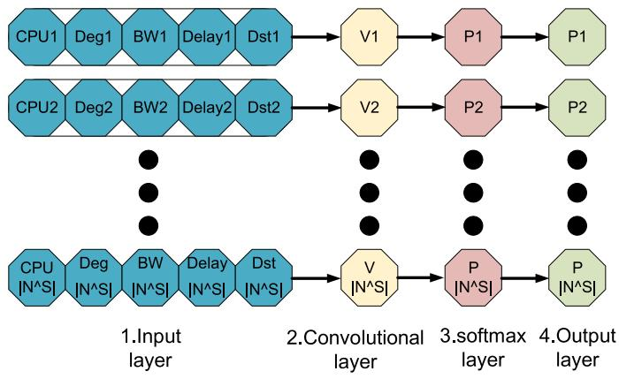

<details>
<summary>flowchart</summary>

```mermaid
graph TD
    subgraph_InputLayer["1.Input layer"]
        CPU1["CPU1"] --> Deg1["Deg1"] --> BW1["BW1"] --> Delay1["Delay1"] --> Dst1["Dst1"]
    end
    subgraph_ConvolutionalLayer["2.Convolutional layer"]
        CPU2["CPU2"] --> Deg2["Deg2"] --> BW2["BW2"] --> Delay2["Delay2"] --> Dst2["Dst2"]
    end
    subgraph_SoftmaxLayer["3.softmax layer"]
        CPUN["CPU N^S"] --> DegN["Deg N^S"] --> BWN["BW N^S"] --> DelayN["Delay N^S"] --> DstN["Dst N^S"]
    end
    subgraph_OutputLayer["4.Output layer"]
        P1["P1"] --> P2["P2"] --> P2P["P2"]
    end
    CPU1 --> V1["V1"]
    CPU2 --> V2["V2"]
    CPUN --> VN["V N^S"]
    P1 --> P2P["P2"]
    P2P --> P2N["P2"]
    PN --> PNN["P N^S"]
```
</details>

Fig. 3. Policy network.

$$
h _ {i} ^ {c} = w \cdot v _ {i} + b, \tag {19}
$$

among them, · denotes the vector performing the dot product operation, $h _ { i } ^ { c }$ is the i-th output of the convolution layer, w is the weight vector of the convolution kernel, $v _ { i }$ is the i-th input of the convolutional layer, and b is the deviation. The convolution operation of the feature matrix by the above formula is actually the transformation calculation of the feature matrix and the convolution kernel.

In the softmax layer, through the softmax analyzer, we calculate the embedding probability of each physical node according to the available resource vector. The probability calculation formula is as follows:

$$
P _ {i} = \frac {e ^ {h _ {i} ^ {c}}}{\sum_ {j} e ^ {h _ {j} ^ {c}}}. \tag {20}
$$

The probability determines the possibility of the physical node being embedded by the virtual node. However, some physical nodes cannot load virtual nodes due to insufficient computing resources, so the probability of being embedded cannot be deduced. In order to solve this problem, we pre-selected the physical nodes to ensure that the nodes have sufficient computing resources.

It should be noted that since we pre-selected physical nodes in advance, some physical nodes with less computational resources were not used, which resulted in a certain waste of resources. However, these wastes are insignificant relative to the benefits of meeting users’ high QoS requirements.

# D. Training and Testing

We use historical network request data to construct a training set and a test set for training the agent to find better solutions and to evaluate the effectiveness of the algorithms, respectively. Firstly, we initialize the policy network parameters. For each arriving VNR, the agent will abstract a feature matrix from SAGOI-Net as the input. After calculating the embedding probability of each physical node according to (20), we cannot select physical nodes for embedding only in line with the probability, because the parameters of the agent are initialized randomly, which indicates that the probability is biased, and there may be other better solutions. Therefore, we generate samples from the set of physical nodes based on the probability distribution of all physical nodes, and select the physical nodes that are finally embedded. Then we use k-shortest path algorithm to complete the link embedding.

The main purpose of using the k-shortest path algorithm for link embedding is to improve the VNR acceptance rate. If the bandwidth of the substrate network link is insufficient, it can result in the underutilization of links with low bandwidth but low latency. This may fail to meet the user’s demand for low latency and reduce the VNR acceptance rate.

When using the k-shortest path algorithm for link embedding, it is first necessary to select at most k shortest paths for the embedding node pair, and then embedding from small to large. If there is a path that meets the resource requirements of the virtual link, the embedding is successful and the current VNR is accepted. On the contrary, if these k paths do not meet the bandwidth and delay requirements of the virtual link, the embedding fails and the current VNR is rejected.

Throughout the training process, the agent depends on the reward signal to determine whether it is working correctly. The selection of the reward directly affects the entire training process. The agent depends on the result of the reward signal to determine whether the current behavior continues. Therefore, in the training process, to meet the QoS requirements of different smart applications, we use K-means to predict the QoS requirement category of each VNR, and select the appropriate reward signal in line with the QoS requirement category. This paper selects delay and revenue-cost ratio as reward signals. When the QoS requirement category of VNR is high bandwidth requirement or high computing resource requirement, RL uses the revenue-cost ratio as a reward signal. Otherwise, when the QoS requirement is a low latency requirement, the RL agent uses the ratio of bandwidth to latency as a reward signal. The larger the reward signal ${ \mathrm { i s } } ,$ it means that the current node selection strategy of the agent leads to a greater revenue from virtual network embedding and the agent is working properly. On the contrary, the agent

$$
\left[ \begin{array}{c c c c c} C P U (n _ {1} ^ {s}) & D E G (n _ {1} ^ {s}) & S U M (n _ {1} ^ {s}) _ {B W} & S U M (n _ {1} ^ {s}) _ {D} & A V G (n _ {1} ^ {s}) _ {D s t} \\ C P U (n _ {2} ^ {s}) & D E G (n _ {2} ^ {s}) & S U M (n _ {2} ^ {s}) _ {B W} & S U M (n _ {2} ^ {s}) _ {D} & A V G (n _ {2} ^ {s}) _ {D s t} \\ \vdots & \vdots & \vdots & \vdots & \vdots \\ C P U (n _ {k} ^ {s}) & D E G (n _ {k} ^ {s}) & S U M (n _ {k} ^ {s}) _ {B W} & S U M (n _ {k} ^ {s}) _ {D} & A V G (n _ {1} ^ {k}) _ {D s t} \end{array} \right]. \tag {18}
$$

needs to adjust its behavior. The specific calculation methods of the two reward signals are as follows:

$$
r _ {r / c} = \frac {R (G ^ {V} , t)}{C o s t (G ^ {V} , t)}. \tag {21}
$$

$$
r _ {d e l a y} = \frac {\sum_ {(n _ {i} ^ {v} , n _ {j} ^ {v}) \in L ^ {V}} B W _ {(n _ {i} ^ {v} , n _ {j} ^ {v})}}{D e l a y (G ^ {V} , t)} \beta , \tag {22}
$$

where $\beta$ is an adjustable proportional value used to equalize the reward value size. In our work, we set it to 0.1.

Different from supervised learning, in RL, in order to calculate the loss value of the training process, this paper sets a label for each virtual node $n ^ { v }$ in VNRs to represent the embedded physical node. And use 0, 1 to indicate whether the physical node is embedded. The embedding results of all physical nodes form a vector. For example, we set the label of virtual node $n _ { k } ^ { v }$ to k, which means that the k-th physical node is embedded, and the result vector can be expressed as follows:

$$
v _ {r e s u l t} = (0 _ {1}, 0 _ {2},..., 1 _ {k},..., 0 _ {n}) ^ {T}. \tag {23}
$$

Then we calculate the cross entropy loss based on the target result and label:

$$
l \left(v _ {\text { result }}, p\right) = - \sum_ {k} v _ {\text { result }} ^ {k} \log \left(p _ {k}\right). \tag {24}
$$

Finally, we use the following formula to calculate the gradient of the agent parameters:

$$
g _ {l} = g _ {f}. \alpha . r w, \tag {25}
$$

where $g _ { f }$ is the gradient size, α is the learning rate, and rw is the reward signal. In order to ensure the stability and efficiency of model training, we manually adjust the learning rate to control the gradient size and calculation speed. The training process of multi-domain virtual network embedding algorithm based on QoS optimization is shown in Algorithm 1.

In the test phase, we directly complete the embedding of the virtual node in line with the embedding probability of the SAGOI-Net node generated by the agent. Then, the k-shortest path algorithm is used to sequentially carry out the embedding of intra-domain links and inter-domain links. The code of the test process is indicated in Algorithm 2.

# E. Complexity analytics

In this section, we analyze the time complexity of our proposed algorithm. First, we assume that there are n nodes in the physical network. We extract 5 feature attributes of the nodes. In the node embedding phase, the complexity of extracting the feature matrix from the physical network is O n . Then, the time (complexity of solving all feature vectors is $O ( n ^ { 2 } )$ . In addition, the feature matrix needs to be updated once every time a node is successfully embedded. Therefore, if all m nodes in the VNR are embedded successfully, the complexity of updating the feature matrix is $O ( m n ^ { 2 } )$ . In the link embedding phase, we implement ( )the k-shortest path algorithm based on the breadth-first search algorithm, and the time complexity can be calculated as $O ( k n )$ . The final time complexity $T ( n )$ ( )can be calculated using the following equation.

Algorithm 1: Training.   
1: Input: Parameters of policy network;
2: Output: The embedded probability of each physical node in SAGOI-Net;
3: Initialize all agent's parameters;
4: while iteration ≤ Epoch do
5: for $VNR \in trainingSet$ do
6: $K - means(VNR)$ ;
    %Predict the QoS requirement category of VNR
7:    reward = selectReward();
8: $M_f = getFeatureMatrix()$ ;
9: $pro_{dis} = agent.getOutput(M_f)$ ;
    %Get the probability distribution of each node in SAGOI-Net
10: $Candidate_{n^s} = sample(pro_{dis})$ ;
11: $getGradient(Candidate_{n^s})$ ;
12:    if isMapped( $\forall n^v \in N^V$ ) then
13:    k - shortestpathLinkMap(req);
14:    end if
15:    if isMapped( $\forall n^v \in N^V, \forall l^v \in N^V$ ) then
16:    Calculate reward;
17:    else
18:    Clear gradients;
19:    end if
20:    end for
21:    iteration + +;
22: end while

Algorithm 2: Test.   
1: Input: testingSet;
2: Output: Three performance indicators;
3: Initialize all agent's parameters;
4: for $VNR \in testSet$ do
5: $K - means(VNR)$ ;
6:    for $n^{v} \in N^{V}$ do
7: $M_{f} = getFeatureMatrix(Candidate_{n^{s}})$ ;
8:    getProbability();
9:    end for
10:    k-shortestpathLinkMap(req);
11:    if isMapped( $\forall n^{v} \in N^{V}, \forall l^{v} \in N^{V}$ ) then
12:    return success;
13:    end if
14: end for

$$
T (n) = m n ^ {2} + n ^ {2} + k n + 5 n. \tag {26}
$$

# V. EXPERIMENTAL DESIGN AND RESULT ANALYSIS

# A. Parameters and Environment Settings

To compare the performance of our proposed RL and K-means-assisted QoS-aware virtual network embedding algorithm with other RL-based virtual network embedding algorithms, we conduct simulation experiments in a simulated network topology environment. At the same time, in order to simulate the SAGOI-Net as realistic as possible, we construct a three-layer network topology consisting of 100 physical nodes and about 500 physical links, including 20 space network nodes, 30 air network nodes, and 50 ground network nodes. In addition, in order to reduce the complexity of the solution, we use georgia tech internet work topology models (GTITM) for auxiliary solution. The transit-stub model provided by GTITM can well regenerate the hierarchical structure network. Therefore, it is very suitable for topological production of SAGOI-Net. According to the characteristics of different network segments, in the space network and the air network, the computing resources of each node are evenly distributed in [20,40], the bandwidth resources of each link in the domain are uniformly distributed in [50,100], and the delay value is evenly distributed in [1,10]. In the ground network, the computing resources of each node obey the uniform distribution of [50,100], the bandwidth resources of each link in the domain are randomly distributed between [50,100], and the delay value is randomly distributed between [1-10]. In addition, the bandwidth resources of the inter-domain link constituting the inter-domain communication are uniformly distributed in [50-100], and the delay value is randomly distributed between [1-15].

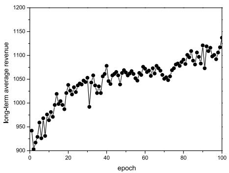

<details>
<summary>line</summary>

| epoch | long-term average revenue |
| ----- | ------------------------- |
| 0     | 900                       |
| 5     | 930                       |
| 10    | 960                       |
| 15    | 980                       |
| 20    | 1000                      |
| 25    | 1020                      |
| 30    | 1040                      |
| 35    | 1060                      |
| 40    | 1080                      |
| 45    | 1070                      |
| 50    | 1060                      |
| 55    | 1070                      |
| 60    | 1080                      |
| 65    | 1070                      |
| 70    | 1080                      |
| 75    | 1090                      |
| 80    | 1100                      |
| 85    | 1110                      |
| 90    | 1120                      |
| 95    | 1130                      |
| 100   | 1140                      |
</details>

(a)Long-term average revenue.

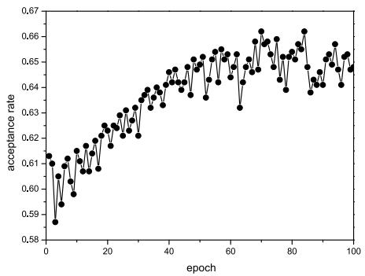

<details>
<summary>line</summary>

| epoch | acceptance rate |
| ----- | --------------- |
| 0     | 0.58            |
| 5     | 0.59            |
| 10    | 0.60            |
| 15    | 0.61            |
| 20    | 0.62            |
| 25    | 0.63            |
| 30    | 0.64            |
| 35    | 0.64            |
| 40    | 0.65            |
| 45    | 0.65            |
| 50    | 0.65            |
| 55    | 0.65            |
| 60    | 0.65            |
| 65    | 0.64            |
| 70    | 0.66            |
| 75    | 0.65            |
| 80    | 0.66            |
| 85    | 0.65            |
| 90    | 0.64            |
| 95    | 0.65            |
| 100   | 0.65            |
</details>

(b) Acceptance rate.

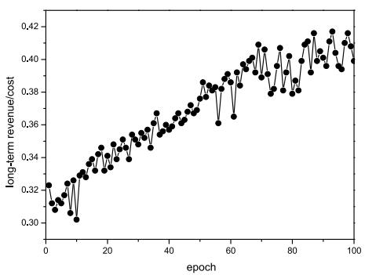

<details>
<summary>line</summary>

| epoch | long-term revenue/cost |
| ----- | ---------------------- |
| 0     | 0.32                   |
| 5     | 0.31                   |
| 10    | 0.30                   |
| 15    | 0.33                   |
| 20    | 0.34                   |
| 25    | 0.35                   |
| 30    | 0.36                   |
| 35    | 0.37                   |
| 40    | 0.38                   |
| 45    | 0.39                   |
| 50    | 0.40                   |
| 55    | 0.39                   |
| 60    | 0.41                   |
| 65    | 0.40                   |
| 70    | 0.41                   |
| 75    | 0.40                   |
| 80    | 0.41                   |
| 85    | 0.42                   |
| 90    | 0.41                   |
| 95    | 0.42                   |
| 100   | 0.41                   |
</details>

(c) Revenue/cost ratio.   
Fig. 4. Agent performance on training set.

To make the agent work more accurately and efficiently, we generated 2000 VNRs, of which 1000 were used as the training set and 1000 were used as the test set. The number of nodes in each VNR is randomly distributed between [2,10], the computing resource requirements of virtual nodes are uniformly distributed in [1,20], the bandwidth resource demand of the virtual link is uniformly distributed in [5-15], and the delay demand is uniformly distributed in [1-10]. All the above parameter settings are shown in Table I.

# B. Training Results and Analysis

Since the agent is not familiar with the SAGOI-Net, it will take some time to stabilize, especially the multi-domain virtual network embedding is NP-hard. We operate the policy network agent on the training set for 100 epochs and observe its performance. Fig. 4 indicates the change of agent in the training process from three aspects: long-term average revenue, virtual request acceptance rate and revenue cost ratio. As revealed in Fig. 4, because the parameters of the agent have just been initialized, the agent is not familiar with the SAGOI-Net, so the agent does not perform well at the beginning, and cannot give a good multi domain virtual network embedding scheme. As training proceeds, the agent gradually becomes familiar with the network environment of SAGOI-Net and can explore better multi-domain virtual network embedding decisions based on the reward signals. At the later stage of the training process, due to the limited ability of agent to solve multi domain virtual network embedding decision, the three indexes of agent tend to be stable. From the training results, it can be seen that using RL to solve multi domain virtual network embedding is effective.

TABLE I SIMULATION EXPERIMENT PARAMETER SETTING 

<table><tr><td>Parameter name</td><td>Value</td></tr><tr><td>Number of physical nodes</td><td>100</td></tr><tr><td>Number of physical links</td><td>500</td></tr><tr><td>Space network nodes</td><td>20</td></tr><tr><td>Air network nodes</td><td>30</td></tr><tr><td>Ground network nodes</td><td>50</td></tr><tr><td>Computing resources of Space network nodes</td><td>[20,40]</td></tr><tr><td>Bandwidth resources of Space network links</td><td>[50,100]</td></tr><tr><td>Delay values of Space network links</td><td>[1,10]</td></tr><tr><td>Computing resources of Air network nodes</td><td>[20,40]</td></tr><tr><td>Bandwidth resources of Air network links</td><td>[50,100]</td></tr><tr><td>Delay values of Air network links</td><td>[1,10]</td></tr><tr><td>Computing resources of Ground network nodes</td><td>[50,100]</td></tr><tr><td>Bandwidth resources of Ground network links</td><td>[50,100]</td></tr><tr><td>Delay values of Ground network links</td><td>[1,10]</td></tr><tr><td>Number of virtual nodes</td><td>[2,10]</td></tr><tr><td>Computing resource required by virtual virtual nodes</td><td>[1, 20]</td></tr><tr><td>Bandwidth resources required by virtual links</td><td>[5, 15]</td></tr><tr><td>Delay requirements of virtual links</td><td>[1,10]</td></tr><tr><td>Bandwidth resources of inter-domain links</td><td>[50,100]</td></tr><tr><td>Delay values of inter-domain links</td><td>[1, 15]</td></tr></table>

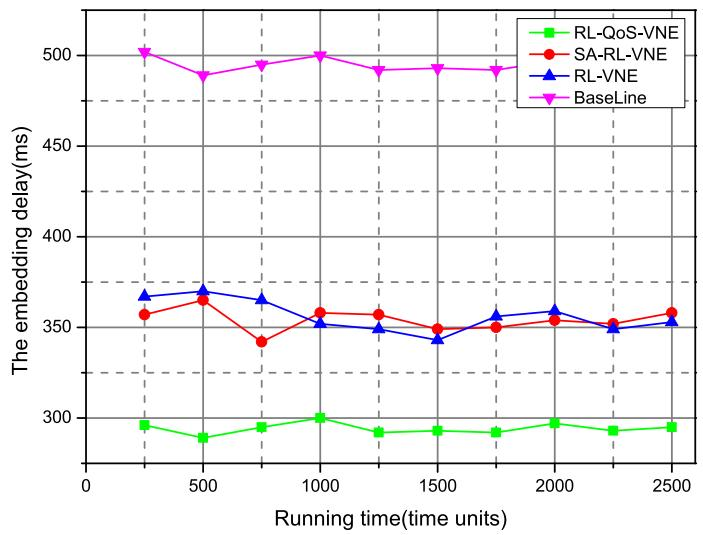

<details>
<summary>line</summary>

| Running time(time units) | RL-QoS-VNE | SA-RL-VNE | RL-VNE | BaseLine |
| ------------------------ | ---------- | --------- | ------ | -------- |
| 0                        | 295        | 355       | 368    | 500      |
| 500                      | 285        | 365       | 370    | 485      |
| 1000                     | 300        | 358       | 352    | 500      |
| 1500                     | 290        | 350       | 345    | 490      |
| 2000                     | 295        | 355       | 360    | 490      |
| 2500                     | 295        | 358       | 355    | 490      |
</details>

Fig. 5. The embedding delay comparison of four algorithms.

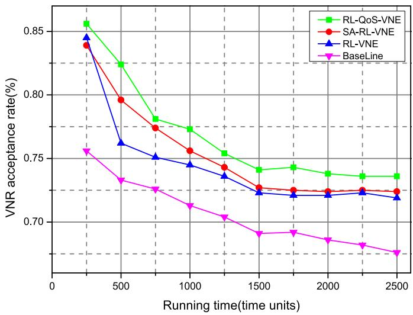

<details>
<summary>line</summary>

| Running time(time units) | RL-QoS-VNE | SA-RL-VNE | RL-VNE | BaseLine |
| ------------------------ | ---------- | --------- | ------ | -------- |
| 0                        | 0.85       | 0.84      | 0.84   | 0.75     |
| 500                      | 0.82       | 0.79      | 0.76   | 0.73     |
| 1000                     | 0.78       | 0.76      | 0.75   | 0.71     |
| 1500                     | 0.74       | 0.73      | 0.72   | 0.69     |
| 2000                     | 0.74       | 0.72      | 0.72   | 0.68     |
| 2500                     | 0.73       | 0.72      | 0.72   | 0.67     |
</details>

Fig. 6. The VNR acceptance rate of four algorithms(Take time delay as a factor).

# C. Test Results and Analysis

In the test phase, in order to verify the performance of the reinforcement learning-assisted QoS-aware virtual network embedding algorithm (RL-QoS-VNE) proposed in this paper, we compared it with the SA-RL-VNE proposed in [31], the RL-VNE proposed in [32], and the BaseLine algorithm proposed in [33]. In addition, in order to verify that the agent can still make good decisions when the QoS requirements change, this paper set VNRs to two categories: low delay requirements, high bandwidth, and high computing resources, and discussed the performance of the four algorithms in dealing with different QoS requirements. In the test phase, we divided the experiment into two parts.

When VNRs require low latency, we designed two experiments to compare four algorithms from the perspective of latency performance and VNR acceptance rate.

Experiment 1: Comparison of embedding delay of four algorithms

When the delay requirement of VNR is selected as a factor, Fig. 5 indicates the performance of the four algorithms at different time nodes. Since the RL-QoS-VNE algorithm proposed in this paper selects the total embedding delay as the reward function during the training process, the agent always aims to find the embedding strategy with the lowest delay. Although SA-RL-VNE and RL-VNE also use the RL algorithm to solve the virtual network embedding problem, they mainly consider the safety and revenue problems in the virtual network embedding process, and do not pay attention to the delay problem in the virtual network embedding process. Therefore, the RL-QoS-VNE algorithm is superior to other algorithms in terms of delay. In line with the analysis of specific experimental data, the embedding delay of RL-QoS-VNE is 17.14 lower than %SA-RL-VNE, 17.29 lower than RL-VNE, and 40.81 lower than BaseLine.

Experiment 2: VNR acceptance rate of four algorithms(Take time delay as a factor)

Experiment 2 compares the VNR acceptance rates of the four algorithms on the basis of Experiment 1, and the experimental results are revealed in Fig. 6. Obviously, the VNR acceptance rates of the four algorithms decrease over time. Because RL-QoS-VNE considers the delay when solving virtual network embedding, when VNRs are low-latency requirements, SAGOI-Net can load more low-latency VNR compared to the other three algorithms, and the VNR acceptance rate is relatively higher. In line with the analysis of specific experimental data, the acceptance rate of RL-QoS-VNE is 2.7 higher than SA-RL-VNE, %2.6 higher than RL-VNE, and 8.5 higher than BaseLine.

% %When VNRs require high bandwidth or high computing resources, we designed three experiments to compare four algorithms from the perspective of long-term average revenue, revenue-cost ratio, and VNR acceptance rate.

Experiment 3: Long-term average revenue of the four algorithms

When the requirements for VNRs are high bandwidth or high computing resources, we set the reward function as the revenue-cost ratio. The result of Experiment 3 is revealed in Fig. 7. Obviously, due to the abundant resources available to SAGOI-Net in the early stage of virtual network embedding, the long-term average revenue of the four algorithms in the first 1000 time units (ms) are all higher. However, as the number of VNR increases, SAGOI-Net’s resources decrease and cannot meet the subsequent VNR, so the revenue decreases rapidly. Since RL-QoS-VNE uses the K-means algorithm to predict the QoS requirements of the VNR, and uses the RL algorithm to rationally arrange the resources of SAGOI-Net, it can achieve better revenue than the other three algorithms.

Experiment 4: The revenue-cost ratio of the four algorithms

Fig. 8 reveals the results of Experiment 4, which denotes the revenue-cost ratio of the four algorithms. It can be seen from Fig. 8 that the revenue-cost ratio of the four algorithms does not decrease with the reduction of SAGOI-Net’s available resources. This is mainly because the revenue-cost ratio is not affected by changes in the underlying resources, and it mainly reflects the efficiency of the algorithm. Compared with the other three algorithms, because RL-QoS-VNE considers the various characteristics of SAGOI-Net when using RL to solve the virtual network embedding problem, and is targeted to the QoS of VNR, it can provide a better virtual network embedding strategy, and the revenue-cost ratio is also higher. According to the analysis of specific data, the revenue-cost ratio of RL-QoS-VNE is 1.1 %higher than SA-RL-VNE, 1.4 higher than RL, and 23.7 higher than BaseLine.

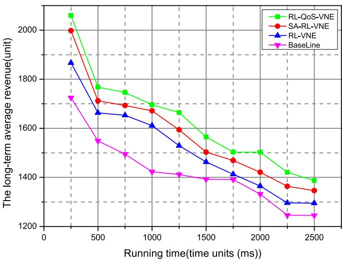

<details>
<summary>line</summary>

| Running time(time units) | RL-QoS-VNE | SA-RL-VNE | RL-VNE | BaseLine |
| ------------------------ | ---------- | --------- | ------ | -------- |
| 250                      | 2050       | 2000      | 1870   | 1720     |
| 500                      | 1770       | 1710      | 1670   | 1550     |
| 750                      | 1740       | 1690      | 1650   | 1490     |
| 1000                     | 1690       | 1670      | 1610   | 1420     |
| 1250                     | 1660       | 1600      | 1530   | 1410     |
| 1500                     | 1560       | 1500      | 1470   | 1390     |
| 1750                     | 1500       | 1470      | 1420   | 1390     |
| 2000                     | 1500       | 1420      | 1360   | 1330     |
| 2250                     | 1420       | 1360      | 1300   | 1240     |
| 2500                     | 1390       | 1340      | 1290   | 1240     |
</details>

Fig. 7. Long-term average revenue of the four algorithms.

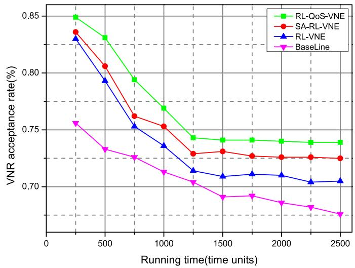

<details>
<summary>line</summary>

| Running time(time units) | RL-QoS-VNE | SA-RL-VNE | RL-VNE | BaseLine |
| ------------------------ | ---------- | --------- | ------ | -------- |
| 250                      | 0.85       | 0.83      | 0.83   | 0.76     |
| 500                      | 0.83       | 0.81      | 0.79   | 0.74     |
| 750                      | 0.79       | 0.76      | 0.75   | 0.73     |
| 1000                     | 0.77       | 0.75      | 0.74   | 0.72     |
| 1250                     | 0.74       | 0.73      | 0.72   | 0.71     |
| 1500                     | 0.74       | 0.73      | 0.71   | 0.69     |
| 1750                     | 0.74       | 0.73      | 0.71   | 0.69     |
| 2000                     | 0.74       | 0.73      | 0.71   | 0.68     |
| 2250                     | 0.74       | 0.73      | 0.71   | 0.68     |
| 2500                     | 0.74       | 0.73      | 0.71   | 0.67     |
</details>

Fig. 9. VNR acceptance rate of four algorithms(Take bandwidth and computing resources as factors).

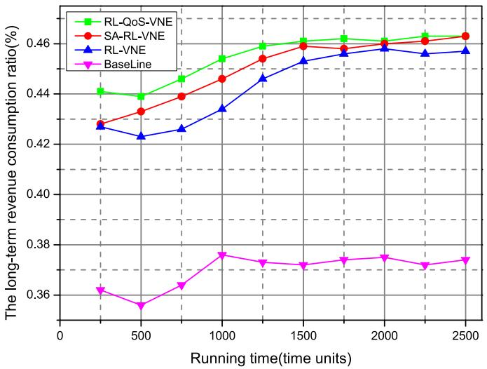

<details>
<summary>line</summary>

| Running time(time units) | RL-QoS-VNE | SA-RL-VNE | RL-VNE | BaseLine |
| ------------------------ | ---------- | --------- | ------ | -------- |
| 0                        | 0.44       | 0.43      | 0.43   | 0.36     |
| 500                      | 0.44       | 0.43      | 0.42   | 0.35     |
| 1000                     | 0.45       | 0.44      | 0.43   | 0.37     |
| 1500                     | 0.46       | 0.46      | 0.45   | 0.37     |
| 2000                     | 0.46       | 0.46      | 0.46   | 0.37     |
| 2500                     | 0.46       | 0.46      | 0.46   | 0.37     |
</details>

Fig. 8. The revenue-cost ratio of the four algorithms.

experiment 5: VNR acceptance rate of four algorithms(Take bandwidth and computing resources as factors)

Similar to Experiment 2, Experiment 5 mainly discusses the VNR acceptance rate of the four algorithms when facing VNR with high bandwidth or high computing resources. The experimental results are shown in Fig. 9. Since SAGOI-Net in the early stage of virtual network embedding has more available resources and can load more VNR, the VNR acceptance rate is high. As time goes by, the VNR acceptance rate gradually decreases. In line with specific experimental data, the VNR acceptance rate of RL-QoS-VNE is 1.3 higher than SA-RL-VNE, 2.7 higher %than RL, and 8.5 higher than BaseLine.

%Based on the above experimental results, we can conclude that the RL-QoS-VNE algorithm can effectively perceive the QoS requirements of VNR and can give a good virtual network embedding strategy, which is of practical significance. In addition, it is superior to SA-RL-VNE, RL-VNE and BaseLine in terms of embedding delay, long-term average revenue, and VNR acceptance rate, which shows that it has excellent performance.

# VI. CONCLUSION

SAGOI-Net can take advantage of high flexibility, high reliability and high coverage by integrating space network, air network, and ground network. However, the seamless integration of the three heterogeneous network segments and the effective utilization of heterogeneous resources are still a problem. Based on SDN and network virtualization, we propose an RL-based QoS-aware virtual network embedding algorithm. This algorithm can effectively classify VNR before virtual network embedding, and then adjust different reward functions according to the type of VNR to motivate the model to make decisions that are more in line with user QoS requirements. The experimental results show that the RL-QoS-VNE proposed in this paper has certain flexibility in processing time-varying network virtual network embedding, and can effectively improve the resource utilization efficiency of SAGOI-Net, and meet the differentiated QoS requirements of users.

However, SAGOI-Net’s attributes and topological structure are much more complicated in actual situations. Therefore, in the future work, we will extract more reasonable features of SAGOI-Net to make the training environment more realistic. In addition, we will study how to automatically sense the QoS requirements of VNR.

# REFERENCES

[1] S. Shen, L. Huang, H. Zhou, S. Yu, E. Fan, and Q. Cao, “Multistage signaling game-based optimal detection strategies for suppressing malware diffusion in fog-cloud-based IoT networks,” IEEE Internet Things J., vol. 5, no. 2, pp. 1043–1054, Apr. 2018.   
[2] J. Liu, X. Wang, S. Shen, G. Yue, S. Yu, and M. Li, “A Bayesian Qlearning game for dependable task offloading against DDoS attacks in sensor edge cloud,” IEEE Internet Things J., vol. 8, no. 9, pp. 7546–7561, May 2021.   
[3] D. Jiang, Y. Wang, Z. Lv, S. Qi, and S. Singh, “Big data analysis based network behavior insight of cellular networks for industry 4.0 applications,” IEEE Trans. Ind. Inform., vol. 16, no. 2, pp. 1310–1320, Feb. 2020.   
[4] J. Liu, X. Wang, G. Yue, and S. Shen, “Data sharing in vanets based on evolutionary fuzzy game,” Future Gener. Comput. Syst., vol. 81, pp. 141–155, 2018.   
[5] J. Du, C. Jiang, J. Wang, Y. Ren, and M. Debbah, “Machine learning for 6G wireless networks: Carry-forward-enhanced bandwidth, massive access, and ultrareliable/low latency,” IEEE Veh. Technol. Mag., vol. 15, no. 4, pp. 122–134, Dec. 2020.   
[6] G. Wu, Z. Xu, H. Zhang, S. Shen, and S. Yu, “Multi-agent DRL for joint completion delay and energy consumption with queuing theory in mecbased IIoT,” J. Parallel Distrib. Comput., vol. 176, pp. 80–94, 2023.   
[7] S. Shen, X. Wu, P. Sun, H. Zhou, Z. Wu, and S. Yu, “Optimal privacy preservation strategies with signaling Q-learning for edge-computingbased IoT resource grant systems,” Expert Syst. Appl., vol. 225, 2023, Art. no. 120192.   
[8] Z. Huang et al., “Hybrid optical wireless network for future SAGOintegrated communication based on FSO/VLC heterogeneous interconnection,” IEEE Photon. J., vol. 9, no. 2, pp. 1–10, Apr. 2017.   
[9] P. Zhang, Y. Zhang, N. Kumar, and M. Guizani, “Dynamic SFC embedding algorithm assisted by federated learning in space-air-ground-integrated network resource allocation scenario,” IEEE Internet Things J., vol. 10, no. 11, pp. 9308–9318, Jun. 2023.   
[10] Y. Wang, Q. Wang, D. Suo, and T. Wang, “Intelligent traffic monitoring and traffic diagnosis analysis based on neural network algorithm,” Neural Comput. Appl., vol. 33, no. 14, pp. 8107–8117, 2021.   
[11] X. Huang, M. Zeng, and K. Xie, “Intelligent traffic control for QoS optimization in hybrid SDNs,” Comput. Netw., vol. 189, 2021, Art. no. 107877.   
[12] C. Jiang and Z. Li, “Decreasing big data application latency in satellite link by caching and peer selection,” IEEE Trans. Netw. Sci. Eng., vol. 7, no. 4, pp. 2555–2565, Fourth Quarter, 2020.   
[13] S. Zhang, C. Wang, J. Zhang, Y. Duan, X. You, and P. Zhang, “Network resource allocation strategy based on deep reinforcement learning,” 2022, arXiv:2202.03193.   
[14] G. Kibalya, J. Serrat, J.-L. Gorricho, H. Yao, and P. Zhang, “A novel dynamic programming inspired algorithm for embedding of virtual networks in future networks,” Comput. Netw., vol. 179, 2020, Art. no. 107349.   
[15] R. Ruby, S. Zhong, B. M. Elhalawany, H. Luo, and K. Wu, “SDNenabled energy-aware routing in underwater multi-modal communication networks,” IEEE/ACM Trans. Netw., vol. 29, no. 3, pp. 965–978, Jun. 2021.   
[16] H. Song, S. Guo, P. Li, and G. Liu, “FCNR: Fast and consistent network reconfiguration with low latency for SDN,” Comput. Netw., vol. 193, 2021, Art. no. 108113.   
[17] J. Bao, B. Zhao, W. Yu, Z. Feng, C. Wu, and Z. Gong, “OpenSAN: A software-defined satellite network architecture,” ACM SIGCOMM Comput. Commun. Rev., vol. 44, pp. 347–348, 2014.   
[18] B. Yang, Y. Wu, X. Chu, and G. Song, “Seamless handover in softwaredefined satellite networking,” IEEE Commun. Lett., vol. 20, no. 9, pp. 1768–1771, Sep. 2016.   
[19] T. Li, H. Zhou, H. Luo, and S. Yu, “SERvICE: A software defined framework for integrated space-terrestrial satellite communication,” IEEE Trans. Mobile Comput., vol. 17, no. 3, pp. 703–716, Mar. 2018.   
[20] N. Zhang, S. Zhang, P. Yang, O. Alhussein, W. Zhuang, and X. S. Shen, “Software defined space-air-ground integrated vehicular networks: Challenges and solutions,” IEEE Commun. Mag., vol. 55, no. 7, pp. 101–109, Jul. 2017.   
[21] N. Torkzaban and J. S. Baras, “Joint satellite gateway deployment controller placement in software-defined 5G-satellite integrated networks,” 2021, arXiv:2103.08735.   
[22] P. Zhang, C. Wang, G. S. Aujla, N. Kumar, and M. Guizani, “IoV scenario: Implementation of a bandwidth aware algorithm in wireless network communication mode,” IEEE Trans. Veh. Technol, vol. 69, no. 12, pp. 15774–15785, Dec. 2020.

[23] H. Qu, Y. Luo, J. Zhao, and Z. Luan, “An LBMRE-OLSR routing algorithm under the emergency scenarios in the space-air-ground integrated networks,” in Proc. Inf. Commun. Technol. Conf., 2020, pp. 103–107.   
[24] G. Wang, S. Zhou, S. Zhang, Z. Niu, and X. Shen, “SFC-based service provisioning for reconfigurable space-air-ground integrated networks,” IEEE J. Sel. Areas Commun., vol. 38, no. 7, pp. 1478–1489, Jul. 2020.   
[25] J. Du, C. Jiang, H. Zhang, Y. Ren, and M. Guizani, “Auction design and analysis for SDN-based traffic offloading in hybrid satellite-terrestrial networks,” IEEE J. Sel. Areas Commun., vol. 36, no. 10, pp. 2202–2217, Oct. 2018.   
[26] Z.-S. Chen, X. Zhang, W. Pedrycz, X.-J. Wang, K.-S. Chin, and L. Martínez-López, “K-means clustering for the aggregation of HFLTS possibility distributions: N-two-stage algorithmic paradigm,” Knowl.-Based Syst., vol. 227, 2021, Art. no. 107230.   
[27] X. Yuan, H. Yao, J. Wang, T. Mai, and M. Guizani, “Artificial intelligence empowered QoS-oriented network association for next-generation mobile networks,” IEEE Trans. Cogn. Commun. Netw., vol. 7, no. 3, pp. 856–870, Sep. 2021.   
[28] W.-K. Chen, Y.-F. Liu, Y.-H. Dai, and Z.-Q. Luo, “Optimal QoS-aware network slicing for service-oriented networks with flexible routing,” 2021, arXiv:2110.03915.   
[29] S. Tsianikas, N. Yousefi, J. Zhou, M. Rodgers, and D. W. Coit, “A sequential resource investment planning framework using reinforcement learning and simulation-based optimization: A case study on microgrid storage expansion,” 2020, arXiv: 2001.03507.   
[30] G. L. Santos, T. Lynn, J. Kelner, and P. T. Endo, “Availability-aware and energy-aware dynamic SFC placement using reinforcement learning,” J. SuperComput., vol. 77, no. 11, pp. 12711–12740, 2021.   
[31] P. Zhang, C. Wang, C. Jiang, and A. Benslimane, “Security-aware virtual network embedding algorithm based on reinforcement learning,” IEEE Trans. Netw. Sci. Eng., vol. 8, no. 2, pp. 1095–1105, Second Quarter, 2021.   
[32] H. Yao, X. Chen, M. Li, P. Zhang, and L. Wang, “A novel reinforcement learning algorithm for virtual network embedding,” Neurocomputing, vol. 284, pp. 1–9, 2018.   
[33] M. Yu, Y. Yi, J. Rexford, and M. Chiang, “Rethinking virtual network embedding: Substrate support for path splitting and migration,” ACM SIGCOMM Comput. Commun. Rev., vol. 38, no. 2, pp. 17–29, 2008.


<details>
<summary>natural_image</summary>

Portrait of a young man wearing glasses and a suit against a blue background (no text or symbols visible)
</details>

Yi Zhang is currently working toward the graduate degree with the College of Computer Science and Technology, China University of Petroleum (East China). His research interests include network virtualization and artificial intelligence for networking.


<details>
<summary>natural_image</summary>

Portrait photo of a man wearing a blue hoodie against a solid blue background (no text or symbols visible)
</details>

Peiying Zhang (Member, IEEE) received the PhD degree with the School of Information and Communication Engineering, University of Beijing University of Posts and Telecommunications, in 2019. He is currently an associate professor with the College of Computer Science and Technology, China University of Petroleum (East China). He has published multiple IEEE/ACM Transactions/Journal/Magazine papers since 2016, such as IEEE Transactions on Industrial Informatics, IEEE Transactions on Intelligent Transportation Systems, IEEE Transactions on

Vehicular Technology, IEEE Transactions on Network Science and Engineering, IEEE Transactions on Network and Service Management, IEEE Transactions on Emerging Topics in Computing, IEEE Network and etc. He served as the Technical Program Committee of AAAI’24, AAAI’23, IEEE ICC’23, IEEE ICC’22, and INFOCOM Wireless-Sec 2023. He is the leading guest editor of Drones, Mathematics, Electronics, Wireless Communications and Mobile Computing, and etc. He is the editorial board of Drones, CMC-Computers, Materials & Continua, Mobile Information Systems, International Journal of Computational Intelligence Systems and Artificial Intelligence and Applications (AIA). His research interests include semantic computing, future internet architecture, network virtualization, and artificial intelligence for networking.


<details>
<summary>natural_image</summary>

Portrait of a man wearing glasses and a suit (no text or symbols visible)
</details>

Chunxiao Jiang (Fellow, IEEE) received the BS degree (Hons.) in information engineering from Beihang University, Beijing, in 2008, and the PhD degree (Hons.) in electronic engineering from Tsinghua University, Beijing, in 2013. From 2011 to 2012 (as a Joint Ph.D. Student) and from 2013 to 2016 (as a postdoctoral researcher), he was with the Department of Electrical and Computer Engineering, University of Maryland, College Park, under the supervision of Prof. K. J. Ray Liu. He is currently an associate professor with the School of Information Science and Technology, Tsinghua University. His research interests include application of game theory, optimization, and statistical theories to communication, networking, and resource allocation problems, in particular space networks and heterogeneous networks. He is a fellow of IET. He has served as a member for the technical program committee as well as the symposium chair for a number of international conferences. He was a recipient of the Best Paper Award from IEEE GLOBECOM in 2013, the IEEE Communications Society Young Author Best Paper Award in 2017, the Best Paper Award from ICC 2019, the IEEE VTS Early Career Award 2020, the IEEE ComSoc Asia-Pacific Best Young Researcher Award 2020, the IEEE VTS Distinguished Lecturer 2021, and the IEEE ComSoc Best Young Professional Award in Academia 2021. He has received the Chinese National Second Prize in Technical Inventions Award in 2018 and the Natural Science Foundation of China Excellent Young Scientists Fund Award in 2019. He has served as an editor for IEEE Transactions on Communications, IEEE Internet of Things Journal, IEEE Wireless Communications, IEEE Transactions on Network Science and Engineering, IEEE Network, and IEEE Communications Letters. He has served as a guest editor for IEEE Communications Magazine, IEEE Transactions on Network Science and Engineering, and IEEE Transactions on Cognitive Communications and Networking.


<details>
<summary>natural_image</summary>

Portrait photo of a young woman with long dark hair wearing a white collared shirt and purple top against a blue background (no text or symbols visible)
</details>

Hongxia Zhang received the bachelor’s and master’s degrees from the College of Computer and Science and Technology, China University of Petroleum (East China), Beijing, China, in 2003 and 2006, respectively, and the PhD degree from the State Key Laboratory of Networking and Switching, Beijing University of Posts and Telecommunications, Beijing, China, in 2013. She is currently an associate professor with the College of Computer Science and Technology, China University of Petroleum (East China). Her research interests include cloud computing, mobile edge computing, and artificial intelligence for networking.


<details>
<summary>natural_image</summary>

Portrait of a smiling man in a checkered shirt (no text or symbols visible)
</details>

Chunming Rong (Senior Member, IEEE) is currently the professor and head with the Center for IP-based Service Innovation (CIPSI), University of Stavanger (UiS), Norway. He is also the co-chair of the IEEE Blockchain, the chair of IEEE Cloud Computing. He is the adjunct chief scientist leading Big-Data Initiative at IRIS. He was the vice president (2015–2016) of the CSA Norway Chapter. His research work focuses on data science, cloud computing, security, and privacy. He is honoured as a member of the Norwegian Academy of Technological Sciences (NTVA) since

2011. He is the Founder and Steering Chair of the IEEE CloudCom Conference and Workshop Series. He is the Steering Chair and Associate Editor of the IEEE Transactions on Cloud Computing (TCC), and the co-editor-in-chief of the Journal of Cloud Computing (ISSN: 2192-113X) by Springer. He has extensive experience in managing largescale Research and Development projects funded by both industry and funding agencies, both in Norway and the EU.


<details>
<summary>natural_image</summary>

Portrait of a man wearing glasses and a suit (no text or symbols visible)
</details>

Shangguang Wang (Senior Member, IEEE) received the PhD degree from the Beijing University of Posts and Telecommunications, Beijing, China, in 2011. He is a professor with the School of Computer Science and Engineering, Beijing University of Posts and Telecommunications, China. He has published more than 150 papers. His research interests include service computing, mobile edge computing, and satellite computing. He is currently serving as chair of the IEEE Technical Committee on Services Computing, and vice-chair of the IEEE Technical Committee on

Cloud Computing. He also served as general chairs or program chairs of more than ten IEEE conferences, and associate editors of several journals, such as IEEE Transactions on Services Computing, Journal of Software: Practice and Experience, and so on. He is a fellow of the IET.