# Quantum Multi-Agent Reinforcement Learning for Cooperative Mobile Access in Space-Air-Ground Integrated Networks

Gyu Seon Kim , Student Member, IEEE, Yeryeong Cho, Jaehyun Chung , Soohyun Park , Member, IEEE, Soyi Jung , Senior Member, IEEE, Zhu Han , Fellow, IEEE, and Joongheon Kim , Senior Member, IEEE

Abstract—Achieving global space-air-ground integrated network (SAGIN) access only with CubeSats presents significant challenges such as the access sustainability limitations in specific regions (e.g., polar regions) and the energy efficiency limitations in CubeSats. To tackle these problems, high-altitude long-endurance uncrewed aerial vehicles (HALE-UAVs) can complement these CubeSat shortcomings for providing cooperatively global access sustainability and energy efficiency. However, as the number of CubeSats and HALE-UAVs, increases, the scheduling dimension of each ground station (GS) increases. As a result, each GS can fall into the curse of dimensionality, and this challenge becomes one major hurdle for efficient global access. Therefore, this paper provides a quantum multi-agent reinforcement Learning (QMARL)-based method for scheduling between GSs and CubeSats/HALE-UAVs in order to improve global access availability and energy efficiency. The main reason why the QMARL-based scheduler can be beneficial is that the algorithm facilitates a logarithmic-scale reduction in scheduling action dimensions, which is one critical feature as the number of CubeSats and HALE-UAVs expands. Additionally, individual GSs have different traffic demands depending on their locations and characteristics, thus it is essential to provide differentiated access services. The superiority of the proposed scheduler is validated through data-intensive experiments in realistic CubeSat/HALE-UAV settings.

Index Terms—Quantum multi-agent reinforcement learning (QMARL), quantum neural network (QNN), cube satellite (CubeSat), high-altitude long-endurance uncrewed aerial vehicle (HALE-UAV), space-air-ground integrated network (SAGIN).

## I. INTRODUCTION

LTRA-SMALL-SCALE and low-cost cube satellites (CubeSats) have recently emerged as novel electrical aerospace devices in non-terrestrial networks (NTN) as one major component of global space-air-ground integrated network (SAGIN) systems in order to realize seamless global access services [1]. In the past, geostationary (GEO) satellites at an altitude of approximately 36,000 km were employed for the global access services, yet their considerable distances from the Earth introduced extremely long propagation delays, which hindered the global access services [2]. Given that CubeSats operate as low Earth orbit (LEO) satellites at an altitude of approximately 500 km, they are more adept at facilitating global access services, offering reduced delays compared to GEO-based services [3], [4]. However, the lower altitude of CubeSats results in considerably smaller coverage compared to GEO-based services. Consequently, in order to achieve seamless global access, a significantly larger fleet of CubeSats is essentially required [5]. To take care of large-scale CubeSats, it is essential to design efficient scheduling algorithms for global access availability and energy efficiency. For more details, employing CubeSats to deliver global SAGIN mobile access necessitates determination regarding which CubeSats should engage in the global access amidst a scenario where a multitude of CubeSats are present. This scenario culminates in a scheduling problem, which can be conceptualized within the framework of multi-agent reinforcement learning (MARL) [6]. The essence of this approach stems from the necessity for multiple ground stations (GSs) to collaboratively orchestrate the scheduling and servicing of their CubeSats to facilitate global SAGIN mobile access, as depicted in Fig. 1. In the environment where multiple CubeSats exist, each GS cooperatively schedules CubeSats to participate in global SAGIN mobile access, and the corresponding efficient scheduling algorithms are needed. Due to CubeSat’s limited resources, such as limited energy and bandwidth, without an efficient scheduling algorithm, it is impossible to optimally utilize these resources, maintain high quality of service (QoS), and provide optimal global access services [7]. Additionally, in the dynamic environments where the coverage of specific areas is constantly changing due to the CubeSat’s high orbita speed, it is important to schedule each GS to connect to the CubeSat in order to improve access availability and energy

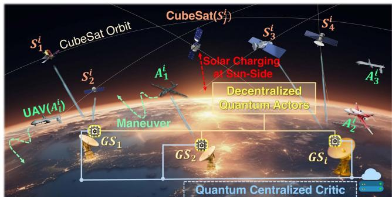  
Fig. 1. Reference network model.

efficiency. Furthermore, according to the fact that the mobile access demands and requirements of individual GSs are all different depending on their locations, differentiated scheduling algorithms that can take of the characteristics, demands, and requirements of individual GSs are essentially required.

Even though CubeSats can be widely used for next-generation global SAGIN mobile access, CubeSats encounter constraints in delivering global access autonomously, owing to their restricted scales and energy capacities [8]. Hence, despite the capacity of multiple CubeSats to collectively cover extensive areas, there might persist coverage gaps in remote areas, polar regions, or areas experiencing significant communication burdens. Moreover, the rapid orbital velocity of CubeSats, approximately 7.5 km/s, results in frequent handovers [9]. To maintain uninterrupted global access, it becomes necessary to integrate new aerial networks that focus on specific local regions, and CubeSats must be considered together [10]. Finally, despite CubeSats experiencing reduced delay time compared to GEO satellites, their delay time is still a significant challenge when contrasted with terrestrial networks (TNs). Consequently, deploying innovative NTN devices to support CubeSats is essential for ensuring seamless global access.

To address these challenges, this paper proposes cooperative and differentiated global SAGIN mobile access involving both CubeSats and aerial networks. The aerial networks, possessing enhanced mobility compared to CubeSats that follow predetermined orbits, are capable of more adaptable responses to changing environmental conditions. Consequently, uncrewed aerial vehicles (UAVs) are particularly beneficial for establishing networks across diverse regions characterized by uncertainty [11]. Despite their utility, rotorcrafts consume a significant amount of energy, posing challenges to the seamless global SAGIN mobile access. Therefore, the system discussed in this paper employs high-altitude long-endurance (HALE)-UAVs, which are fixedwing aircraft, to overcome these limitations. The HALE-UAVs are distinguished by their capacity for long-distance flights, attributed to their substantial endurance and energy levels. Furthermore, the attributes of the HALE-UAV, one of fixed-wing aircraft, enable it to sustain flight longer than rotary-wing aircraft even in scenarios where its control systems can be damaged [12]. Ultimately, HALE-UAVs can supplement CubeSats in providing flexible and extensible coverages for particular regions, such as polar areas lacking signal availability, or the regions burdened with communication overheads [13], [14]. Based on these issues and architecture characteristics, we need to design a new global SAGIN scheduling algorithm.

Moreover, the need for effective scheduling becomes paramount in scenarios populated by numerous CubeSats and HALE-UAVs. In order to realize effective scheduling for Cube-Sats and HALE-UAVs in terms of access availability and energy efficiency, cooperative and differentiated global SAGIN mobile access should be proposed. In this scheduling problem, the goal is to simultaneously improve access availability in terms of QoS and capacity as well as energy efficiency in NTN devices, i.e., CubeSats and HALE-UAVs. To achieve this, we have to consider the hardware restrictions of CubeSats and HALE-UAVs at the same time. For CubeSats, their geographical coordinates in terms of latitude and longitude, as well as the direction vector toward the sun for solar charging, undergo real-time alterations due to their orbital movement. Furthermore, CubeSats frequently sustain damage from cosmic rays and solar winds. Similarly, the flight environment for HALE-UAVs is characterized by dynamic and uncertain conditions, including the presence of vortices and gusts. Moreover, due to the limited energy levels and capacities of NTN devices, collaboration among these NTN devices is crucial for the simultaneous optimization of energy efficiency and channel capacity.

Distinct from conventional scheduling algorithms, reinforcement learning (RL) exhibits robust performance in dynamic and uncertain environments [15], [16], [17]. MARL proves particularly effective in situations that require cooperation among multiple NTN devices [18]. Consequently, within global SAGIN mobile access that utilizes CubeSats and HALE-UAVs, MARLbased algorithms may be employed, with multiple GSs acting as agents. Nevertheless, conventional MARL-based schedulers cannot ensure reward convergence as the number of agents and action dimensions of GS expand. To tackle these issues, this paper proposes a novel cooperative and differentiated scheduling algorithm for access availability and energy efficiency in global SAGIN mobile access, leading to the development of quantum MARL (QMARL) [19]. This innovation utilizes the basis measurements, known as projection-valued measure (PVM), allowing the proposed QMARL-based scheduler to diminish the action dimension to a logarithmic scale [20]. Furthermore, a realistic experimental setting is constructed to demonstrate the superiority and real-world relevance of our proposed QMARLbased scheduler. This includes the use of actual CubeSat orbital data, aerodynamic information about real HALE-UAV environments with significant vortices, and the considerations for photovoltaic (PV) charging based on the CubeSats’ relative positions to the sun, i.e., the sun side and dark side. Additionally, each GS, which is an agent, has its own differentiated maximum required channel capacity depending on the region where each GS is located, the population of that region, and the degree of communication overload. Without these settings, excessive global SAGIN mobile access may be provided to GSs that do not require communication services beyond a certain requirement, and GSs with severe communication overload may not be provided with the desired level of global access. Eventually, this can result in the energy of NTN devices, e.g., CubeSats and HALE-UAVs, being wasted, uselessly. In conclusion, the efficacy of our proposed QMARL-based scheduler is validated within realistic environments, evidencing that the algorithm fulfills its objectives by simultaneously optimizing the access availability in SAGIN and the energy efficiency in NTN devices amidst scenarios characterized by high action dimensions. Ultimately, in this paper, we consider the SAGIN mobile access network implemented using multiple GSs, CubeSats, and HALE-UAVs through our proposed QMARL-based scheduler at high action dimensions, and the proposed algorithm is tested in realistic environments to increase real-world applicability.

The main contributions are as follows.

First of all, this paper is the first attempt to employ a QMARL-based global SAGIN mobile access scheduler for the coordination of CubeSats and HALE-UAVs. The uniqueness of this scheduler stems from its emphasis on reducing the action dimensions through the PVM. Furthermore, a new reward function is designed and implemented to encourage cooperative global SAGIN mobile access and efficient and equitable energy usage of NTN devices in multi-CubeSats and multi-HALE-UAV environments.

\- Moreover, the proposed QMARL-based scheduler is designed for the coordinated and differentiated global SA-GIN mobile access with multiple GSs, CubeSats, and HALE-UAVs. Furthermore, our proposed scheduling also works for energy efficiency in CubeSats and HALE-UAVs. In order to realize this, the reward function of our proposed QMARL-based scheduler is formulated, and thus, it addresses the energy utilization efficiency of CubeSats, taking into account their exposure to the sun side or dark side, which is crucial given their limited energy capacities due to their compact sizes.

Lastly, the efficacy of the proposed algorithm is assessed under realistic experimental environments involving Cube-Sat that orbits in real space areas as well as HALE-UAV that flies in the real sky. The orbital elements for Cube-Sats are derived from the two-line element (TLE), which provides the foundational data related to the orbit for these CubeSats. The experiment incorporates a range of realistic aerodynamic characteristics of HALE-UAVs to enhance the algorithm’s real-world applicability. In addition, specific considerations on the differentiated maximum channel capacity in individual GSs show realistic experimental environments depending on the regions where individual GSs are located, the populations of the regions, and the degrees of communication overloads.

The rest of this paper is organized as follows. Section II presents preliminary knowledge, including related work and QMARL. Section III describes the fundamental modeling and Section IV presents the details of our proposed QMARL-based scheduler. Section V evaluates the performance in realistic environments, and lastly, Section VI concludes this paper.

## II. PRELIMINARIES

## A. Related Work

Numerous projects focus on establishing wireless connections to create aerial NTN devices, including UAVs or satellites [21]. Given that these rely on battery-based energy management, minimizing energy consumption is crucial to stable operation in unknown environments for the efficient operation of multiple UAVs and satellites [22]. In the literature, the efficient operation of multiple UAVs has garnered significant attention [23]. Minimizing energy consumption is important for stable operation in unfamiliar environments, necessitating efficient communications [24]. At the same time, efficient scheduling among satellites is imperative to ensure swift responses to diverse sightings and unforeseen events [25]. UAVs, characterized by remarkable acquisition flexibility and very high spatial resolution (VHSR), and LEO satellites, capable of providing time-series data across extensive areas, have traditionally been employed independently. However, the proposed algorithm in [26] can minimize total energy costs and reduce time complexity which is crucial for optimizing their effective operation for both UAVs and satellites. Therefore, UAVs and satellites must be controlled cooperatively to improve performance [27]. To efficiently manage both UAVs and satellites, numerous studies have demonstrated different methodologies for applying RL algorithms [28]. The proposed algorithm in [29] proves the superiority of RL, particularly beneficial in the management of multiple agents. However, to build global SAGIN mobile access, more agents need to be controlled [30]. Notably, quantum algorithms have advantages in managing large-scale scenarios, such as those encountered in aerial networks [31]. This paper demonstrates the superiority of using QRL over RL in multi-agent scheduling.

## B. Quantum Neural Network

In QNN architectures, a significant deviation from classical neural networks is the utilization of qubits as the unit for basic learning computations [32]. Within quantum systems, qubits stand as the fundamental units of information, and their representation is grounded in the base states of $| 0 \rangle : = [ 1 , 0 ] ^ { T }$ and | - $[ 0 , 1 ] ^ { T }$ . The representation of a single qubit state can be realized through a normalized 2D complex vector as $| \psi \rangle = \alpha | 0 \rangle + \beta | 1 \rangle$ and $\| \bar { \boldsymbol { \alpha } } \| ^ { 2 } + \| \beta \| ^ { 2 } = 1$ holds, where $\| \alpha \| ^ { 2 }$ and $\| \beta \| ^ { 2 }$ denote the probabilities of observing | - and | -, respectively. The QNN computation is carried out over the 3D Bloch sphere, defined as the Hilbert space representing the quantum domain. Expressing this within the Bloch sphere, which serves as a representation of the quantum domain, it can be geometrically denoted as,

$$
\begin{array} { r } { | \psi \rangle = \cos ( \theta ) | 0 \rangle + e ^ { i \phi } \sin ( \theta ) | 1 \rangle , } \end{array}\tag{1}
$$

where θ denotes a parameter that determines the probabilities of measuring | - and | -, and $\phi$ represents the relative phase, respectively, where $0 \leq \theta \leq \pi$ and $0 \leq \phi <$ π [32]. Fig. 2(a) shows a qubit represented over the Bloch sphere. When considering a q qubit system, the representation of quantum states within the system’s Hilbert space is as,

$$
| \psi \rangle = \sum _ { l = 0 } ^ { 2 ^ { q } - 1 } \omega _ { l } | l \rangle ,\tag{2}
$$

where |ψ- denotes the quantum state, |l- represents l-th basis, and ωl stands for the probability amplitude of $q$ qubit system, respectively. Then, the probability amplitude fulfills $\begin{array} { r } { \dot { \sum } _ { l = 0 } ^ { 2 ^ { q } - 1 } | \omega _ { l } | ^ { \hat { 2 } } = 1 . ~ } \end{array}$ A significant component in classical neural networks is a hidden layer, capable of representing linear and nonlinear transformations to achieve accurate function approximation within the neural network. Hence, the primary design consideration factors in QNN involve designing and implementing linear and nonlinear transformations over the 3D sphere. This QNN design facilitates the fundamental enablement of QRL-based control, achieved by incorporating the states and actions of RL-based control as inputs and outputs within QNN architectures.

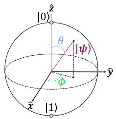  
(a) Qubit on Bloch sphere.

Multiple Unitary MatricesTrainable Rotation GateMeasurement Operator  
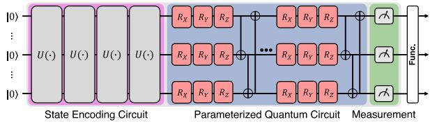  
(b) QNN architecture that processes input through three distinct stages  
Fig. 2. Qubit and QNN Architecture. (a) illustrates the geometric representation of a qubit on the Bloch sphere. (b) shows the QNN architecture consisting of three stages: state encoding circuit, parameterized quantum circuit, and measurement.

In QNN architecture, there are three primary components: (i) state encoding, (ii) parameterized quantum circuit (PQC), and (iii) measurement, as illustrated in Fig. 2(b).

State encoding: The encoder performs the function of converting the classical data, represented as $\zeta _ { t }$ at a specific time t, to the initialized quantum state | -. The encoder carries out this function due to the inability of quantum circuits to directly accept classical bits. Through the application of multiple unitary matrices, denoted as $U ( \cdot )$ this encoding transformation is achieved mathematically. An important point to highlight is that the encoder does not include any trainable parameters. Thus, the encoded quantum state of the QNN at a specific time t is defined as $| \psi _ { 0 ; t } \rangle = U _ { \mathrm { E N C } } ( \zeta _ { t } ) | 0 \rangle ^ { \otimes q }$ , where the classical data $\zeta _ { t }$ serves as rotation angles within the set of encoding gates U.

\- PQC: The operations performed by PQC are analogous to the multiplications seen in the accumulated hidden layers of classical neural networks. Quantum gates can transform the state of qubits through the operations they perform [32]. Within this paper, the following three gates will be introduced: Pauli, Controlled, and rotation gates [32]. Outlined below are the definitions for Pauli- gates and Controlledgates, which can be expressed as,

$$
X { = } \left[ \begin{array} { c c } { { 0 } } & { { 1 } } \\ { { 1 } } & { { 0 } } \end{array} \right] , Y { = } \left[ \begin{array} { c c } { { 0 } } & { { - { i } } } \\ { { i } } & { { 0 } } \end{array} \right] , Z { = } \left[ \begin{array} { c c } { { 1 } } & { { 0 } } \\ { { 0 } } & { { - 1 } } \end{array} \right] , C \Gamma { = } \left[ \begin{array} { c c } { { \mathrm { I } } } & { { 0 } } \\ { { 0 } } & { { \Gamma } } \end{array} \right] ,\tag{3}
$$

where $i = \sqrt { ( - 1 ) } , \forall \Gamma \in \{ X , Y , Z \}$ , and I stands for the identity matrix, respectively. The Pauli- gates perform $1 8 0 ^ { \circ }$ rotations of the quantum state in the x, y, and z axes of the Bloch sphere. Between two qubits, the Controlledgates produce entanglement. Within QNN, rotation gates $R _ { \Gamma }$ featuring the trainable parameters $\theta _ { k }$ , defined within the range $[ 0 , 2 \pi ]$ , find widespread utilization. This can be represented as follows: $R _ { \Gamma } ( \theta _ { k } ) = e ^ { - i \frac { \theta _ { k } } { 2 } \Gamma }$ . Achieving rotations and entanglement of all qubits involves utilizing Pauli- , Controlled- , and rotation gates. At this moment, Pauli- gates and $R _ { \Gamma }$ are employed for implementing linear transformations, while the Controlled- gates are utilized for nonlinear transformations. Therefore, PQC achieves two transformations on the 3D sphere. Consequently, in PQC, it can vary depending on the configuration of the $R _ { \Gamma }$ and Controlled- gates, and is an important factor in building a QNN. To thoroughly explore trainable rotation parameters and entanglement, we implement multiple quantum layers in this paper, each consisting of $R _ { \Gamma }$ gates within PQC of each QNN. At a specific time t, the quantum state of the QNN, denoted as $| \psi _ { t } \rangle$ , can be represented as

$$
| \psi _ { t } \rangle = \prod _ { l = 1 } ^ { L } U _ { l } ( \theta _ { t } ) U _ { \mathrm { E N C } } ( \zeta _ { t } ) | 0 \rangle ^ { \otimes q } ,\tag{4}
$$

where $U _ { l } ( \theta _ { t } )$ stands for the l-th quantum layer at the specific time t with its corresponding set of trainable parameters. Observe that $U _ { l } ( \theta _ { t } )$ takes the trainable parameters as inputs, therefore it works differently from the encoder’s gates.

\- Measurement: The quantum state that is acquired by PQC is utilized as the input for measurement. In this process, quantum data is decoded back to the original format before performing measurements on the input. The z-axis is commonly used for measurements, but axes in other directions can also be used if they are appropriately defined. The quantum state collapses and its properties become observable after the quantum state is measured. Upon completion of the decoding procedure, the observable property is employed to minimize the loss function. Achieving the expected decoded value of the quantum state |ψt- can be accomplished through $\langle \psi _ { t } | O | \psi _ { t } \rangle$ , where $\begin{array} { r } { | \psi _ { t } \rangle = \prod _ { l = 1 } ^ { L } U _ { l } ( \theta _ { t } ) U _ { \mathrm { E N C } } ( \zeta _ { t } ) | 0 \rangle ^ { \otimes q } , \langle \psi _ { t } | } \end{array}$ denotes the conjugate transpose of $| \psi _ { t } \rangle$ , and O represents the observable, respectively.

## C. QMARL for Scheduling

This section investigates the use of QMARL for scheduling CubeSats and HALE-UAVs, presenting a strong argument for its preference over conventional MARL approaches. Conventional MARL has been effective for optimizing decisions in scenarios with relatively small action dimensions. Nonetheless, within intricate systems like integrated networks using CubeSats/HALE-UAVs, characterized by exponentially vast action dimensions, the efficacy of conventional MARL diminishes due to computational burden and the inefficacy in managing extensive action spaces. The expansion of the action dimension introduces the challenge of the curse of dimensionality [33], a significant impediment in conventional MARL frameworks. QMARL, empowered by quantum computing features such as superposition and entanglement, offers a significant computational edge [34]. This quantum advantage allows QMARL to efficiently process large-scale data and complex decision matrices [35], presenting a superior solution for the extensive action dimensions encountered in integrated networks using CubeSats/HALE-UAVs. Moreover, the multi-agent dynamics of these integrated networks involving many communicating devices, such as multiple GSs, CubeSats, and HALE-UAVs, make the scheduling decision-making problem more complex. QMARL signifies a crucial advancement in overcoming the challenges of high-dimensional and complex scheduling tasks for integrated networks using CubeSats/HALE-UAVs. Its enhanced computational strength and ability to effectively manage multi-agent scenarios establish it as a powerful and efficient approach, facilitating the development of more sophisticated, effective, and dependable SAGIN.

## III. SYSTEM MODELING OF NTN DEVICES

## A. Global SAGIN Access Scheduling Modeling

The considered global SAGIN is illustrated in Fig. 1 and structured around three principal elements, N GSs, a fleet of M CubeSats, and a group of L HALE-UAVs. Each GS is denoted as $G _ { i } , i \in \mathcal { N } ,$ and note that $\lvert { \mathcal { N } } \rvert \triangleq N$ . In addition, CubeSats and HALE-UAVs are denoted as $S _ { j }$ and $A _ { l } ,$ respectively, where $S _ { j } , j \in \mathcal { M }$ and $A _ { l } , l \in { \mathcal { L } } ,$ , and also note that $| { \mathcal { M } } | \ { \overset { \triangle } { = } } \ M$ and $| { \mathcal { L } } | \ { \overset { \triangle } { = } } \ L$ . Our proposed scheduling works by each GS $G _ { i }$ to establish the communications with CubeSats $\bar { S } _ { j } ^ { i }$ orHALE-UAVs $A _ { l } ^ { i }$ that are located within the coverage of $G _ { i }$ , for network access services. That is, GSs can access NTN devices within their coverage, and access availability is determined based on a reward function consisting of global access performance and the residual energy of the NTN devices. The main purpose of this scheduling is for maximizing (i) the residual energy amounts of NTN devices, (ii) the fair energy consumption among NTN devices, and (iii) the global access performance in terms of capacity and QoS, in SAGIN systems.

## B. Aerodynamic Modeling of the HALE-UAV

In order to ensure the maneuvers of HALE-UAVs while maintaining the equilibrium among the energy levels of HALE-UAVs, energy expenditure modeling for HALE-UAV is essential. The required power is the minimum energy amount to overcome aerodynamic drag and advance in each HALE-UAV. The power is equivalent to the work per unit time under the force applied to the dynamic system, and it is defined as the dot product of force and velocity. Therefore, the required power of the l-th HALE-UAV at time t, denoted as $\mathcal { P } _ { l } ^ { A } ( t )$ , is defined as $\mathcal { P } _ { l } ^ { A } ( t ) = D V$ , where $D$ and $V$ denote its drag and velocity at time t, respectively. Here, drag D can be obtained as $D =$ ${ \scriptstyle \frac { 1 } { 2 } } \rho V ^ { 2 } S C _ { D } = q S C _ { D } ,$ , where CD is drag coefficient. Because $\bar { C } _ { D }$ is expressed as $C _ { D } = C _ { D _ { 0 } } + k C _ { L } ^ { 2 }$ and $C _ { L }$ is expressed as $\begin{array} { r } { C _ { L } = \frac { W } { \frac { 1 } { 2 } \rho V ^ { 2 } S } = \frac { W } { q S } } \end{array}$ , the required power of the l-th HALE-UAV at time t can be defined as,

$$
\begin{array} { r } { \mathcal { P } _ { l } ^ { A } ( t ) = \underbrace { \frac { 1 } { 2 } C _ { D _ { 0 } } \rho V ^ { 3 } S } _ { \mathrm { p a r a s i t e p o w e r } \mathcal { P } _ { p } } + \underbrace { \frac { k W ^ { 2 } } { \frac { 1 } { 2 } \rho S V } } _ { \mathrm { i n d u c e d p o w e r } \mathcal { P } _ { i } } } \\ { = \underbrace { q S C _ { D _ { 0 } } V } _ { \mathrm { p a r a i t e p o w e r } \mathcal { P } _ { p } } + \underbrace { \frac { W ^ { 2 } k V } { q S } } _ { \mathrm { i n d u c e d p o w e r } \mathcal { P } _ { i } } \ , } \end{array}\tag{5}
$$

where $C _ { D _ { 0 } } , \rho , V , S , k , W ,$ and $q$ are the parasite drag coefficient at zero lift, density of the air, velocity, wing surface area, induced drag coefficient, HALE-UAV weight, and dynamic pressure $\begin{array} { r } { ( q = \frac { 1 } { 2 } \rho V ^ { 2 } ) } \end{array}$ [36], respectively. As expressed in (5), the required power is composed of the parasite power and induced power [37]. Here, the parasite power arises from parasite drag, encompassing skin friction drag (drag that varies with the UAV’s surface texture), form drag (drag that depends on the HALE-UAV’s size, structure, and shape), and interference drag (drag generated from the interaction between skin friction and form drag) [38]. In addition, the induced power originates from the drag produced by generating lift. This type of drag is caused by wingtip vortices, resulting from the differential pressure on the wing’s upper and lower surfaces, which in turn creates downwash at the wing’s rear. Accordingly, $\mathcal { P } _ { p }$ increases with the cube of velocity, whereas $\mathcal { P } _ { i }$ is inversely related to velocity, demonstrating the dynamics of aerodynamic drag in relation to the UAV’s velocity [39].

On the other hand, velocity V is computed as the aggregate of velocities of the HALE-UAV along each axis, which can be expressed as,

$$
V = { \sqrt { u ^ { 2 } + v ^ { 2 } + w ^ { 2 } } } ,\tag{6}
$$

where $u , v ,$ and w represent the velocities of the HALE-UAV over the $x \cdot , y -$ , and z-axes of body axis coordinate system, respectively. Here, velocity V in (5) is the velocity based on the body axis coordinate system of the aircraft. Nevertheless, because the velocities of HALE-UAVs for each axis are determined with respect to the ground coordinate system, it is imperative to utilize coordinate transformation matrices. Therefore, velocities $u _ { 1 } , v _ { 1 }$ , and $w _ { 1 }$ in the ground coordinate system are transformed into the velocities u, v, and w within the body axis coordinate system through multiplication by the coordinate transformation matrices $L _ { 1 } , L _ { 2 }$ , and $L _ { 3 }$ , which is expressed as,

$$
\left[ \begin{array} { l } { u } \\ { v } \\ { w } \end{array} \right] = L _ { 1 } \times L _ { 2 } \times L _ { 3 } \times \left[ \begin{array} { l } { u _ { 1 } } \\ { v _ { 1 } } \\ { w _ { 1 } } \end{array} \right] ,\tag{7}
$$

where $L _ { 1 } , L _ { 2 }$ , and $L _ { 3 }$ are the transformation matrices over the z-axis, y-axis, and x-axes, sequentially. The geometric relationships among these transformations are illustrated in Fig. 3, and the coordinate transformation matrices for each axis can be

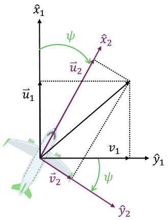  
(a) z-axis transformation (yawing).

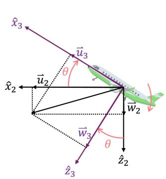  
(b) y-axis transformation (pitching).

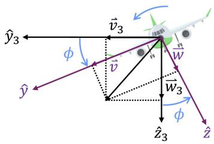  
(c) x-axis transformation (rolling).

Fig. 3. Flight aerodynamics of HALE-UAV.  
TABLE I  
SPECIFICATIONS OF HALE-UAV
<table><tr><td>Notation</td><td>Value</td></tr><tr><td>Mass of HALE-UAV, m</td><td>1,815 [kg]</td></tr><tr><td>Acceleration of gravity, g</td><td>9.81 [m/s2]</td></tr><tr><td>Weight of HALE-UAV,  $W = m g$ </td><td>17,799 [N]</td></tr><tr><td>Wing surface area, S Density of the air, ρ</td><td>6.61  $[ \mathrm { m } ^ { 2 } ]$ </td></tr><tr><td>Parasite drag coefficient at zero lift,</td><td>0.089 [kg/m³]</td></tr><tr><td> $C _ { D _ { 0 } }$  Induced drag coefficient, k</td><td>0.045 0.052</td></tr></table>

expressed as,

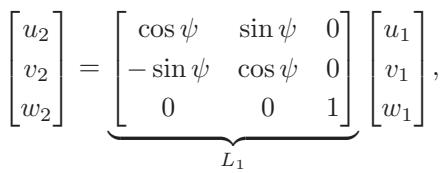

(8)

$$
\left[ \begin{array} { c } { u _ { 3 } } \\ { v _ { 3 } } \\ { w _ { 3 } } \end{array} \right] = \underbrace { \left[ \begin{array} { c c c } { \cos \theta } & { 0 } & { - \sin \theta } \\ { 0 } & { 1 } & { 0 } \\ { \sin \theta } & { 0 } & { \cos \theta } \end{array} \right] } _ { L _ { 2 } } \left[ \begin{array} { c } { u _ { 2 } } \\ { v _ { 2 } } \\ { w _ { 2 } } \end{array} \right] ,\tag{9}
$$

$$
\left[ \begin{array} { c } { u } \\ { v } \\ { w } \end{array} \right] = \underbrace { \left[ \begin{array} { c c c } { 1 } & { 0 } & { 0 } \\ { 0 } & { \cos \phi } & { \sin \phi } \\ { 0 } & { - \sin \phi } & { \cos \phi } \end{array} \right] } _ { L _ { 3 } } \left[ \begin{array} { c } { u _ { 3 } } \\ { v _ { 3 } } \\ { w _ { 3 } } \end{array} \right] ,\tag{10}
$$

where $\psi , \theta ,$ and $\phi$ represent the rotations over the $z \cdot , \ y -$ and z-axes, respectively. Within the real flight environment of HALE-UAVs, such disturbances are attributable to turbulence and wind gusts, which have the potential to alter the UAV’s rotational orientation. Amidst conditions where turbulence and gusts are prevalent across all axes, the goal of HALE-UAV is to simultaneously optimize the global access performance of the integrated network and the energy use of HALE-UAV. Details about the HALE-UAV deployed in this paper are compiled in

Table I. Finally, because the location can be calculated by integrating the velocity over time, the locations, i.e., coordinates for each axis, of the l-th HALE-UAV are defined as (11), (12), and (13)shown at the bottom of the next page, [40]. The positioning of these HALE-UAVs is mathematically rigorously designed by flight mechanics and Euler angle transformation. Accordingly, position estimation errors of HALE-UAVs are excluded from consideration in this paper.

## C. Power Modeling of the HALE-UAV

In contrast to CubeSats, HALE-UAVs necessitate continuous energy expenditure for maintaining flight trajectories and executing maneuvering operations. Unlike CubeSats operating within the gravitational equilibrium of an orbital environment, HALE-UAVs must actively counteract aerodynamic forces such as lift, drag, and gravitational acceleration. Consequently, HALE-UAVs require sustained propulsion and aerodynamic control inputs, which translate directly into power consumption for thrust generation and flight stability. Maneuvering tasks demand additional increments of energy, owing to changes in kinetic and potential energies as well as overcoming aerodynamic drag. Thus, HALE-UAV operations inherently involve persistent energy input to sustain motion and execute dynamic maneuvers, fundamentally distinguishing their energy profiles from those of CubeSats. HALE-UAVs have to consider not only the maneuver power needed for this movement, but also the transmission power to provide global access services to GSs. The transmission power required by the l-th HALE-UAV to provide global access services to the i-th GS is defined as [41],

$$
\hat { \mathcal { P } } _ { l } ^ { i } ( t ) = \frac { P _ { R , \operatorname* { m i n } } } { G _ { l } G _ { i } } \left( \frac { 4 \pi d _ { l } ^ { i } ( t ) } { \wp } \right) ^ { 2 } ,\tag{14}
$$

where $P _ { R , \operatorname* { m i n } } , G _ { l } , G _ { i } , d _ { l } ^ { i } ( t )$ , and ℘ denote the minimum received power, antenna gain of the l-th HALE-UAV, antenna gain of the j-th GS, distance between the i-th GS and the l-th HALE-UAV, and carrier wavelength, respectively. As previously noted, power is the physical quantity denoting energy per unit time; hence, the energy consumption of the HALE-UAV at time t is defined as the integral of the required power with respect to time, which can be expressed as,

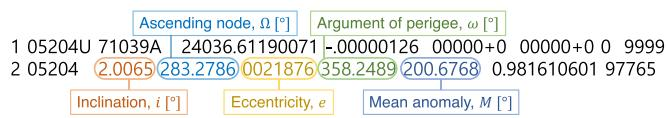  
Fig. 4. TLE configuration of the satellite used in the experiment.

$$
E _ { l } ^ { A } ( t ) = \int _ { t } ^ { t + 1 } [ \mathcal { P } _ { l } ^ { A } ( t ) + \hat { \mathcal { P } } _ { l } ^ { i } ( t ) ] d t .\tag{15}
$$

## D. Spaceflight Dynamic Modeling of the CubeSat

1) Two Line Element (TLE): In order to observe the orbital mechanics of CubeSats, TLE is essentially required. Originating from the North American Aerospace Defense Command (NO-RAD), TLE contains the vital details concerning the trajectories of objects orbiting the Earth, especially for CubeSats. NORAD, tasked with the surveillance and cataloging of space debris, introduced the TLE format to effectively disseminate orbital information. The structure of TLE consists of two lines as illustrated in Fig. 4, detailing specific orbital parameters and CubeSat characteristics. Fig. 4 displays the TLE for OPS-3811, a CubeSat utilized in the experiment, encompassing orbital elements such as inclination (i), ascending node ( ), eccentricity (e), argument of perigee (ω), and mean anomaly (M). The inclination (i) signifies the CubeSat’s orbital plane angle relative to the equatorial plane of the Earth. The ascending node ( ) specifies the location where the CubeSat’s orbit crosses the equatorial plane from south to north, also known as the right ascension of the line of nodes. The eccentricity (e) is a measure of how far a CubeSat’s elliptical orbit deviates from a circle. The argument of perigee $( \omega )$ is the angle from the line of nodes to the perigee of the orbit. The mean anomaly (M) indicates the CubeSat’s current position within its orbit, assuming a circular path with the same semi-major axis (a). In other words, the mean anomaly is the angle between the current position of the CubeSat and the perigee of the orbit, assuming that the CubeSat moves at an average speed when moving along an elliptical orbit. These TLE data, such as e and , are instrumental in calculating the CubeSat’s latitude, longitude, facilitating the determination of $x _ { j } ^ { i } ( t )$ between $G _ { i }$ and $S _ { j } ^ { i }$ , by (38).

(i), right ascension of the ascending node ( ), argument of perigee (ω), and mean anomaly (M). The orbital elements that are not in TLE, such as semi-major axis (a), eccentric anomaly (E), and true anomaly (ν), are obtained using the orbital elements in TLE. Fig. 5(a) presents the geometric representation of orbital elements. The semi-major axis (a), illustrated with a green line, denotes the CubeSat’s orbit’s longest radius, crucial for calculating its eccentricity (e). The eccentricity itself measures how much the orbit deviates from a perfect circle, with values close to 0 indicating near circularity and values near 1 highlighting an elliptical shape. The eccentricity vector $( \vec { e } )$ is a vector that goes from the center of the CubeSat’s orbit to the perigee of the orbit. Additionally, the orbital inclination (i) is assessed as the angle between the orbit’s normal axis $( \overrightarrow { k } )$ and its angular momentum vector $( \overrightarrow { H } )$ , with the latter perpendicular to the plane of the orbit, thereby quantifying the orbit’s tilt with respect to the equatorial plane of the Earth. The ascending node ( ) signifies the line of nodes’s longitude, which is the point where the CubeSat’s orbital plane intersects the Earth’s equatorial plane. The argument of perigee (ω) is defined by the angle from the ascending node vector $( { \vec { n } } )$ to the eccentricity vector $( \vec { e } )$ , with −→n directing towards the line of nodes, depicted as a sky blue line in Fig. 5(a). This angle delineates the orbit’s orientation relative to the equator, marking the perigee’s location. The mean anomaly (M) is a parameter for predicting the position of a CubeSat moving along an elliptical orbit over time, and is expressed as an angle representing the average position of the object within the orbital period, aiding in the calculation of the eccentric anomaly (E). In an elliptical orbit, the CubeSat’s velocity changes as it passes through periapsis (the closest point) and apogee (the farthest point), but the mean anomaly does not take these velocity changes into account and assumes that it moves at a uniform velocity. Therefore, a difference may occur between the actual position of the CubeSat and the position calculated by mean anomaly, and eccentric anomaly and true anomaly are used to correct this difference. The mean anomaly does not directly correspond to the actual CubeSat position, but is used as an initial value to calculate more accurate positions, such as the eccentric anomaly and true anomaly, using the eccentricity of the orbit and other orbital elements. Therefore, the mean anomaly plays an important role when modeling trajectories as a function of time. Finally, the true anomaly (ν) is the angle from the perigee to the CubeSat’s actual position, represented by the angle between vectors $\vec { r }$ and $\vec { e } .$ , where $\vec { r }$ points from the origin of the coordinate system to the CubeSat, and the coordinate axis $\vec { \cdot }$ aims towards the vernal equinox.

2) Orbital Elements of CubeSats: As mentioned, the orbital elements expressed in TLE include eccentricity (e), inclination

$$
P _ { x } ^ { I } = \int _ { t } ^ { t + 1 } [ u _ { 1 } \cos \psi \cos \theta \Delta l ] + \int _ { t } ^ { t + 1 } [ v _ { 1 } ( \sin \phi \sin \theta \cos \psi - \sin \psi \cos \phi ) \Delta l ] + \int _ { t } ^ { t + 1 } [ w _ { 1 } ( \sin \phi \sin \psi + \sin \theta \cos \phi \cos \psi ) \Delta l ]\tag{11}
$$

$$
P _ { y } ^ { l } = \int _ { t } ^ { t + 1 } [ u _ { 1 } \sin \psi \cos \theta \Delta t ] + \int _ { t } ^ { t + 1 } [ v _ { 1 } ( \sin \phi \sin \psi \sin \theta + \cos \phi \cos \psi ) \Delta t ] - \int _ { t } ^ { t + 1 } [ w _ { 1 } ( \sin \phi \cos \psi + \sin \psi \sin \theta \cos \phi ) \Delta t ]\tag{12}
$$

$$
P _ { z } ^ { l } = \int _ { t } ^ { t + 1 } [ - u _ { 1 } \sin \theta \Delta t ] + \int _ { t } ^ { t + 1 } [ v _ { 1 } \sin \phi \cos \theta \Delta t ] + \int _ { t } ^ { t + 1 } [ w _ { 1 } \cos \phi \cos \theta \Delta t ]\tag{13}
$$

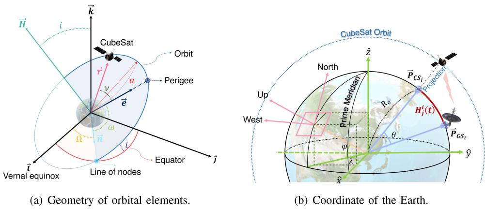  
Fig. 5. Orbital elements of CubeSat and the geometric relationship of great circle distance between two CubeSats.

3) Latitude and Longitude of CubeSat: To ascertain the locations of CubeSats change over time, their positions are represented through coordinates of latitude $( p _ { j } ^ { \phi } ( t ) )$ and longitude $( p _ { j } ^ { \lambda } ( t ) )$ within the orbital coordinate systems. Given that the CubeSat’s unprocessed data in TLE consists of the coordinates in the celestial coordinate systems, the transformation to the orbital coordinate systems is required for the derivation of latitude and longitude. The latitude and longitude that change over time for each CubeSat are calculated through TLE, which is raw CubeSat data. Consequently, the latitude $( p _ { j } ^ { \phi } ( t ) )$ and longitude $( p _ { j } ^ { \lambda } ( t ) )$ pertaining to the current position of CubeSat $S _ { j } ^ { i } { : }$ , i.e., the j-th CubeSat located within the coverage of the i-th GS, can be expressed as,

$$
p _ { j } ^ { \phi } ( t ) = \sin ^ { - 1 } \left( \frac { R _ { f } [ 3 ] } { \| R _ { f } \| } \right) ,\tag{16}
$$

$$
p _ { j } ^ { \lambda } ( t ) = \cos ^ { - 1 } \left( \frac { R _ { f } [ 1 ] } { \| R _ { f } \| \cos \phi } \right) ,\tag{17}
$$

where $R _ { f } [ 1 ]$ and $R _ { f } [ 3 ]$ refer to $\operatorname { \cal R } _ { f } \mathrm { \dot { s } }$ first and third elements. [1This matrix $R _ { f }$ [3]can be defined as,

$$
R _ { f } \triangleq [ C _ { 1 } \times C _ { 2 } \times C _ { 3 } \times C _ { 4 } ] \times V _ { 4 } .\tag{18}
$$

In (18), the coordinate transformation matrices, $i . e . , C _ { 1 } , C _ { 2 }$ $C _ { 3 } ,$ and $C _ { 4 } ,$ , can be defined in (19) shown at the bottom of this page, where θ is the angle by which the Earth has rotated in t. Therefore, θ represents the product of the Earth’s rotational angular velocity and the time interval t. Lastly, $V _ { 4 }$ in (18) is,

$$
V _ { 4 } = \Big [ r \cos ( \nu ) r \sin ( \nu ) 0 \Big ] ^ { T } ,\tag{20}
$$

where r denotes the conic section, and this r is a clue to compute the distance between the center of the elliptical orbit and the CubeSat. Additionally, $\vec { r }$ is the vector pointing from the center of the elliptical orbit to the current position of CubeSat. Therefore, the current coordinates of CubeSat measured in the celestial coordinate system are expressed as (20). However, in order to calculate the CubeSat’s latitude and longitude that change over time, $V _ { 4 }$ in the celestial coordinate system must be converted to the orbital coordinate system, and the previously defined coordinate transformation matrices are utilized. The corresponding coordinate transformation matrices, denoted as $C _ { 1 } , C _ { 2 } , C _ { 3 }$ , and $C _ { 4 }$ , facilitate the conversion of celestial coordinate systems into orbital coordinate systems. Finally, the term r in (20) can be defined as,

$$
r = \frac { H ^ { 2 } / \mu } { 1 + e \cos ( \nu ) } ,\tag{21}
$$

where $\mu$ and H represent the standard gravitational parameter and angular momentum, respectively. The angular momentum can be defined as,

$$
H \triangleq { \sqrt { \mu a ( 1 - e ^ { 2 } ) } } ,\tag{22}
$$

and the true anomaly is expressed as,

$$
\nu = 2 \tan ^ { - 1 } \left( \sqrt { \frac { 1 + e } { 1 - e } } \tan \left( \frac { E } { 2 } \right) \right) .\tag{23}
$$

In (23), the true anomaly, $i . e . , \nu ,$ depends on the eccentric anomaly E, which is expressed as,

$$
E = M + e \sin M .\tag{24}
$$

Here, the data from TLE are transformed into geographical coordinates, i.e., latitude and longitude, over time. The constants

$$
C _ { 1 } = \left[ \begin{array} { c c c } { \cos ( \Omega ) } & { \sin ( \Omega ) } & { 0 } \\ { - \sin ( \Omega ) } & { \cos ( \Omega ) } & { 0 } \\ { 0 } & { 0 } & { 1 } \end{array} \right] , C _ { 2 } = \left[ \begin{array} { c c c } { 1 } & { 0 } & { 0 } \\ { 0 } & { \cos ( i ) } & { \sin ( i ) } \\ { 0 } & { - \sin ( i ) } & { \cos ( i ) } \end{array} \right] , C _ { 3 } = \left[ \begin{array} { c c c } { \cos ( \omega ) } & { \sin ( \omega ) } & { 0 } \\ { - \sin ( \omega ) } & { \cos ( \omega ) } & { 0 } \\ { 0 } & { 0 } & { 1 } \end{array} \right] , C _ { 4 } = \left[ \begin{array} { c c c } { \cos ( \theta ) } & { \sin ( \theta ) } & { 0 } \\ { - \sin ( \theta ) } & { \cos ( \theta ) } & { 0 } \\ { 0 } & { 0 } & { 1 } \end{array} \right] ,\tag{19}
$$

TABLE II  
PARAMETER SETTINGS FOR CUBESAT POSITION CALCULATIONS
<table><tr><td>Constant</td><td>II Value</td></tr><tr><td>Gravitational Constant,  $G$ </td><td> $6 . 6 7 3 ~ e { \mathrm { - } } 2 0$ </td></tr><tr><td>Mass of the Earth,  $M _ { e }$ </td><td>5.974 e+24 kg</td></tr><tr><td>Radius of the Earth,  $R _ { e }$ </td><td>6.378 e+6 m</td></tr><tr><td>Standard Gravitational Parameter,  $\mu = G M _ { e }$ </td><td> $3 . 9 8 6 \ \mathrm { e } { + } 1 4 \ m ^ { 3 } \ s ^ { - 2 }$ </td></tr></table>

needed to calculate the latitude and longitude of a CubeSat that changes over time through TLE are summarized in Table II.

4) Distance Between GS and CubeSat: The distance between GSs and NTN devices (i.e., CubeSats and HALE-UAVs) can be formulated as follows.

Lemma $\mathit { l } \cdot$ The distance between $G _ { i }$ and $S _ { j } ^ { i }$ varies over time due to the updated latitude and longitude of the CubeSat. It can be formulated as,

$$
d _ { j } ^ { i } ( t ) = \sqrt { H _ { j } ^ { i } ( t ) ^ { 2 } + V _ { j } ^ { i } ( t ) ^ { 2 } } ,\tag{25}
$$

where $H _ { j } ^ { i } ( t )$ and $V _ { j } ^ { i } ( t )$ represent the respective horizontal and vertical distances between $G _ { i }$ and $S _ { j } ^ { i }$ , and note that $V _ { j } ^ { i } ( t )$ indicates the altitude of $S _ { j } ^ { i }$ relative to $G _ { i }$ . Then,

$$
\begin{array} { c c } { { H _ { j } ^ { i } ( t ) = R _ { e } \cos ^ { - 1 } ( \cos p _ { i } ^ { \phi } ( t ) \cos p _ { j } ^ { \phi } ( t ) \cos ( p _ { i } ^ { \lambda } ( t ) - p _ { j } ^ { \lambda } ( t ) ) } } \\ { { { } } } & { { { } } } \\ { { + \sin p _ { i } ^ { \phi } ( t ) \sin p _ { j } ^ { \phi } ( t ) ) , } } & { { ( 2 } } \end{array}\tag{6}
$$

where $p _ { i } ^ { \phi } ( t )$ and $p _ { i } ^ { \lambda } ( t )$ denote the latitude and longitude of $G _ { i } ;$ and $R _ { e }$ is the radius of the Earth.

Proof: As illustrated in Fig. $5 ( \boldsymbol { \mathrm { b } } ) , \vec { P } _ { G S _ { i } }$ and $\vec { P } _ { C S _ { i } }$ are positioned on the surface of the Earth. These vectors are denoted as,

$$
\vec { P } _ { G S _ { i } } = ( x _ { i } , y _ { i } , z _ { i } ) ,\tag{27}
$$

$$
\vec { P } _ { C S _ { j } } = ( x _ { j } , y _ { j } , z _ { j } ) ,\tag{28}
$$

where $\vec { P } _ { G S _ { 3 } }$ and $\vec { P } _ { C S _ { j } }$ are identified as coordinate vectors along with $x \cdot , y -$ , and z-axes, respectively. In addition, the angular difference between $\vec { P } _ { G S _ { i } }$ and $\vec { P } _ { C S _ { i } } , \mathrm { i . e . , } \theta ,$ can be obtained as,

$$
\begin{array} { l } { \displaystyle \theta = \cos ^ { - 1 } \frac { \vec { P } _ { G S _ { i } } \cdot \vec { P } _ { C S _ { j } } } { \left\| \vec { P } _ { G S _ { i } } \right\| \left\| \vec { P } _ { C S _ { j } } \right\| } } \\ { = \cos ^ { - 1 } \frac { x _ { i } x _ { j } + y _ { i } y _ { j } + z _ { i } z _ { j } } { \sqrt { x _ { i } ^ { 2 } + y _ { i } ^ { 2 } + z _ { i } ^ { 2 } } \sqrt { x _ { j } ^ { 2 } + y _ { j } ^ { 2 } + z _ { j } ^ { 2 } } } , } \end{array}\tag{29}
$$

where $x _ { i } , y _ { i } , z _ { i } , x _ { j } , y _ { j }$ , and $z _ { j }$ can be represented as,

$$
\begin{array} { r } { \Big [ { x } _ { i } \Big ] = \Big [ \begin{array} { c } { R _ { e } \cos p _ { i } ^ { \phi } ( t ) \cos p _ { i } ^ { \lambda } ( t ) } \\ { y _ { i } } \\ { R _ { e } \cos p _ { i } ^ { \phi } ( t ) \sin p _ { i } ^ { \lambda } ( t ) } \\ { R _ { e } \sin p _ { i } ^ { \phi } ( t ) } \end{array} \Big ] , } \end{array}\tag{30}
$$

$$
\left[ \begin{array} { l } { x _ { j } } \\ { y _ { j } } \\ { z _ { j } } \end{array} \right] = \left[ \begin{array} { c } { R _ { e } \cos p _ { j } ^ { \phi } ( t ) \cos p _ { j } ^ { \lambda } ( t ) } \\ { R _ { e } \cos p _ { j } ^ { \phi } ( t ) \sin p _ { j } ^ { \lambda } ( t ) } \\ { R _ { e } \sin p _ { j } ^ { \phi } ( t ) } \end{array} \right] ,\tag{31}
$$

where $p _ { i } ^ { \phi } ( t ) , p _ { i } ^ { \lambda } ( t ) , p _ { j } ^ { \phi } ( t )$ , and $p _ { j } ^ { \lambda } ( t )$ are the latitude of $\vec { P } _ { G S _ { i } }$ the longitude of $\vec { P } _ { G S _ { i } }$ , the latitude of $\vec { P } _ { C S _ { j } }$ , and the longitude of $\vec { P } _ { C S _ { j } }$ , at $t ,$ respectively. Given that the magnitudes of these vectors are equivalent, which can be expressed as,

$$
{ \sqrt { x _ { i } ^ { 2 } + y _ { i } ^ { 2 } + z _ { i } ^ { 2 } } } = { \sqrt { x _ { j } ^ { 2 } + y _ { j } ^ { 2 } + z _ { j } ^ { 2 } } } = R _ { e } .\tag{32}
$$

Furthermore, based on the definition of the vector inner product and (30)–(31), the following expression holds,

$$
\begin{array} { r l } & { x _ { i } x _ { j } + y _ { i } y _ { j } + z _ { i } z _ { j } } \\ & { \quad = R _ { e } ^ { 2 } \cos ^ { - 1 } ( \cos p _ { i } ^ { \phi } ( t ) \cos p _ { j } ^ { \phi } ( t ) \cos ( p _ { i } ^ { \lambda } ( t ) - p _ { j } ^ { \lambda } ( t ) ) } \\ & { \quad + \sin p _ { i } ^ { \phi } ( t ) \sin p _ { j } ^ { \phi } ( t ) ) . } \end{array}\tag{33}
$$

Therefore, according to the fact that $H _ { j } ^ { i } ( t )$ is derived from $R _ { e } \theta ,$ ( )which is depicted as the red line in Fig. 5(b), $H _ { j } ^ { i } ( t ) = R _ { e } \cos ^ { - 1 } ( \cos p _ { i } ^ { \phi } ( t ) \cos p _ { j } ^ { \phi } ( t ) \cos ( p _ { i } ^ { \lambda } ( t ) -$ $p _ { j } ^ { \lambda } ( t ) ) + \sin p _ { i } ^ { \phi } ( t ) \sin p _ { j } ^ { \phi } ( t ) )$ 

Similarly, the distance between $G _ { i }$ and the l-th HALE-UAV within the coverage of $G _ { i }$ , i.e., denoted as $A _ { l } ^ { i }$ is determined based on the latitude $( p _ { l } ^ { \phi } ( t ) )$ and longitude $( p _ { l } ^ { \lambda } ( t ) )$ of $A _ { l } ^ { i }$ , calculated as $d _ { l } ^ { i } ( t ) = \sqrt { H _ { l } ^ { i } ( t ) ^ { 2 } + V _ { l } ^ { i } ( t ) ^ { 2 } }$ where $H _ { l } ^ { i } ( t )$ and $V _ { l } ^ { i } ( t )$ are the horizontal and vertical distances, and note that $V _ { l } ^ { i } ( t )$ indicates the altitude of $A _ { l } ^ { i }$ relative to $G _ { i }$ , due to (25). Furthermore, according to (26), $H _ { l } ^ { i } ( t ) = R _ { e } \cos ^ { - 1 } ( \cos p _ { i } ^ { \phi } ( t ) \cos p _ { l } ^ { \phi } ( t ) \cos ( p _ { i } ^ { \lambda } ( t ) -$ $p _ { l } ^ { \lambda } ( t ) ) + \sin p _ { i } ^ { \phi } ( t ) \sin p _ { l } ^ { \phi } ( t ) )$ , where $p _ { l } ^ { \phi } ( t )$ , and $p _ { l } ^ { \lambda } ( t )$ denote the latitude and longitude of the l-th HALE-UAV at time $t ,$ respectively. The positioning of these CubeSats using TLE data is mathematically and rigorously derived from orbital mechanics principles. The orbital motion of these CubeSats results from the two-body problem between the CubeSat and the Earth; hence, in the absence of external perturbations, their positions can be predicted with exact mathematical precision. Therefore, the errors in the position estimation of these CubeSats are not considered in this paper.

5) Power Modeling of the CubeSat: Because a CubeSat in orbit around the Earth constitutes a classical two-body system, its orbital dynamics are governed exclusively by gravitational interaction with Earth, rendering the orbit a natural and energyconserving motion. Upon initial deployment into a stable orbit, a CubeSat requires no additional propulsive energy to maintain its trajectory, as its continuous orbital motion results intrinsically from its inertia balanced precisely by Earth’s gravitational pull. The CubeSat perpetually revolves around the Earth without active propulsion inputs, exemplifying an idealized gravitationally-bound orbital state where mechanical energy is conserved in the absence of perturbations such as atmospheric drag or external forces. Consequently, CubeSat should consider only transmission power to provide global access services to GSs. The transmission power required by the j-th CubeSat to provide global access service to the i-th GS is defined as,

$$
\hat { \mathcal { P } } _ { j } ^ { i } ( t ) = \frac { P _ { R , \operatorname* { m i n } } } { G _ { j } G _ { i } } \left( \frac { 4 \pi d _ { j } ^ { i } ( t ) } { \wp } \right) ^ { 2 } ,\tag{34}
$$

where $G _ { j }$ and $d _ { j } ^ { i } ( t )$ denote the antenna gain of the j-th GS and distance between the i-th GS and the j-th CubeSat, respectively. Therefore, the energy consumption of the j-th CubeSat at time t is expressed as,

$$
E _ { J } ^ { S } ( t ) = \int _ { t } ^ { t + 1 } \hat { \mathcal { P } } _ { j } ^ { i } ( t ) d t .\tag{35}
$$

## IV. PROBLEM FORMULATION AND ALGORITHM DESIGN

## A. Main Objective for Global SAGIN Mobile Access

The purpose of our proposed QMARL-based scheduler in SA-GIN is to preserve the residual energy of NTN devices as much as possible while each GS improves the global access performance in terms of access availability and energy efficiency. Therefore, when each GS schedules CubeSats and HALE-UAVs for global access, it is important to simultaneously optimize the global access performance and the residual energy of NTN devices. To achieve this goal, a corresponding reward function should be designed. The main objective of global SAGIN mobile access for each i-th GS can be formulated as,

$$
\operatorname* { m a x } _ { \substack { x _ { j , l } ^ { i } ( t ) \in \{ 0 , 1 \} } } : \operatorname* { l i m } _ { \substack { \mathscr { T } \to \infty } } \frac { 1 } { 7 } \sum _ { t = 0 } ^ { \mathscr { T } - 1 } \sum _ { \substack { \forall j \in M ^ { i } , \forall l \in L ^ { i } } } R _ { i } ( d _ { j , l } ^ { i } ( t ) , x _ { j , l } ^ { i } ( t ) ) ,\tag{36}
$$

where $d _ { j , l } ^ { i } ( t )$ and $x _ { j , l } ^ { i } ( t )$ represent the distance and the scheduling vector between $G _ { i }$ and the NTN device within the coverage of $G _ { i } \left( \mathrm { i } . \mathrm { e } . , S _ { i } ^ { i } \right.$ or $A _ { l } ^ { i } )$ at t, respectively. In addition, $M ^ { i }$ and $L ^ { i }$ in (36) stand for the sets of CubeSats and HALE-UAVs within the coverage of $G _ { i }$ . Within the RL framework, the agent’s ultimate goal is to maximize the predefined reward function, which has been specified to align with the objectives of this paper [40], [42]. The reward function depends on the scheduling vector $x _ { j , l } ^ { i } ( t )$ , taking the value one if the i-th GS schedules the corresponding j-th or the l-th NTN device—i.e., if the GS receives global SAGIN mobile access service from that device—and zero otherwise. Accordingly, it should be noted that it is subject to the following constraints,

$$
\sum _ { \forall j \in M ^ { i } , \forall l \in L ^ { i } } x _ { j , l } ^ { i } ( t ) \leq \bar { H } _ { i }\tag{37}
$$

with $\forall x _ { j , l } ^ { i } ( t ) \in \{ 0 , 1 \} , \forall j \in M ^ { i }$ , and $\forall l \in L ^ { i }$ . In (37), the term ${ \bar { H } } _ { i }$ means the maximal number of acceptable NTN devices $( S _ { j } ^ { i }$ or $A _ { l } ^ { i } )$ that $G _ { i }$ can monitor. In each time slot, the i-th GS is capable of establishing connections with multiple NTN devices (the j-th CubeSat or the l-th HALE-UAV) following the reward function. Lastly, $R _ { i } ( d _ { j , l } ^ { i } ( t ) , x _ { j , l } ^ { i } ( t ) )$ is our reward function for seamless global access, and it can be as,

$$
R _ { i } ( d _ { j , l } ^ { i } ( t ) , x _ { j , l } ^ { i } ( t ) ) = U _ { i } ( d _ { j , l } ^ { i } ( t ) , x _ { j , l } ^ { i } ( t ) ) - C _ { i } ( d _ { j , l } ^ { i } ( t ) , x _ { j , l } ^ { i } ( t ) ) ,\tag{38}
$$

where $U _ { i } ( d _ { j , l } ^ { i } ( t ) , x _ { j , l } ^ { i } ( t ) )$ and $C _ { i } ( d _ { j , l } ^ { i } ( t ) , x _ { j , l } ^ { i } ( t ) )$ stand for the utility and cost functions. In (38),

$$
U _ { i } ( d _ { j , l } ^ { i } ( t ) , x _ { j , l } ^ { i } ( t ) ) = \sum _ { \forall j \in M ^ { i } , \forall l \in L ^ { i } } \mathbf { q } ( d _ { j , l } ^ { i } ( t ) ) \cdot \xi _ { j , l } ^ { S A } ( t ) \cdot x _ { j , l } ^ { i } ( t ) ,\tag{39}
$$

TABLE III  
CONFIGURATION OF SIMULATION PLATFORMS AND SOFTWARE VERSIONS
<table><tr><td rowspan=1 colspan=1>SystemII</td><td rowspan=1 colspan=1>Specification</td></tr><tr><td rowspan=1 colspan=1>CPU</td><td rowspan=1 colspan=1>AMD Ryzen 9 7950X 16-Core Processor CPU @ 4.50 GHzThe number of cores: 16The number of threads: 32RAM: 64.0 GB</td></tr><tr><td rowspan=1 colspan=1>GPU</td><td rowspan=1 colspan=1>NVIDIA GeForce RTX 4090The number of CUDA cores: 16,384The number of tensor cores: 512Memory: 24 GB GDDR6X(DDR6X)</td></tr><tr><td rowspan=1 colspan=1>Platform</td><td rowspan=1 colspan=1>CPU : AMD Ryzen 9 7950X (4.50 GHz)Memory : DDR5-4800 CL40 16 GB*4SSD: 2TB TLC (SK hynix Platinum P41 M.2 NVMe 2280)HDD: 2 TBVGA: ZOTAC GeForce RTX 4090 AMP AIRO D6X 24GBMain Board : ASRock X670E PG LightningPower : FSP HYDRO G PRO 1000W 80PLUS Gold Full 3.0Cooler : ARCTIC Liquid Freezer II 360</td></tr><tr><td rowspan=1 colspan=1>Version</td><td rowspan=1 colspan=1>Python version : v3.8.9NVIDIA-SMI version : v545.92Conda : v22.11.1CUDA version : v12.3PyTorch version : v2.2.0Torchquantum : v0.1.7Numpy : v1.24.3</td></tr></table>

TABLE IV

SUMMARY OF THE SYSTEM PARAMETERS AND HYPER-PARAMETERS USED IN THIS PAPER
<table><tr><td>Notation 一</td><td>Value</td></tr><tr><td>No. of GSs/CubeSats/HALE-UAVs (N, M, L) Action dimension (|A|) Discount factor (γ) Batch size</td><td> $4 , 8 , 8$   $\{ 2 ^ { 1 } , 2 ^ { 4 } , 2 ^ { 1 \dot { 6 } } \}$  0.98</td></tr><tr><td>Initial/Min of epsilon Annealing epsilon</td><td>64  $0 . 2 7 5 , 1 0 ^ { - 2 }$ </td></tr><tr><td>Learning rate of actor</td><td> $5 \times 1 0 ^ { - 5 }$ </td></tr><tr><td>Learning rate of central critic Training epochs</td><td> $2 . 5 \times 1 0 ^ { - 4 }$  10,000</td></tr><tr><td>Activation function Optimizer</td><td>ReLU</td></tr></table>

where $\mathbf { q } ( d _ { j , l } ^ { i } ( t ) )$ and $\xi _ { j , l } ^ { S A } ( t )$ denote the quality function and capacity of the link between $G _ { i }$ and its associated NTN device $( S _ { j } ^ { i }$ or $A _ { l } ^ { i } )$ . In (39), the quality function can be generalized as [43],

$$
\mathbf { q } ( d _ { j , l } ^ { i } ( t ) ) \triangleq \left( 1 + \exp ^ { - \vartheta _ { \alpha } \left( \Lambda _ { j , l } ^ { i } ( d _ { j , l } ^ { i } ( t ) ) - \vartheta _ { \beta } \right) } \right) ^ { - 1 } ,\tag{40}
$$

where both $\vartheta _ { \alpha }$ and $\vartheta _ { \beta }$ are quality coefficients, and the values of these parameters are summarized in Table IV. In (40), the data rate $\Lambda _ { j , l } ^ { i } ( d _ { j , l } ^ { i } ( t ) )$ depends on bandwidth ( ) and signal-tointerference-plus-noise ratio (SINR), which can be expressed as,

$$
\Lambda _ { j , l } ^ { i } ( d _ { j , l } ^ { i } ( t ) ) = \mathrm { W } \cdot \log _ { 2 } \left( 1 + \frac { \mathcal { P } _ { j , l } ^ { i } ( d _ { j , l } ^ { i } ( t ) ) } { n + \displaystyle \sum _ { f \in \mathcal { F } , f \neq f ^ { \prime } } F ^ { f , f ^ { \prime } } } \right) ,\tag{41}
$$

where $\mathcal { P } _ { j , l } ^ { i } ( d _ { j , l } ^ { i } ( t ) ) , n , F ^ { f , f ^ { \prime } }$ , and $\mathcal { F }$ are the received power at distance $d _ { j , l } ^ { i } ( t )$ , the noise power, the interference from the ( )transmitter of link f to the receiver of link $f ^ { \prime }$ , and the full wireless link set, respectively [44]. Additionally, the cost function in (38) is expressed $\mathrm { a s } .$

$$
\begin{array} { r l r } & { } & { C _ { i } ( d _ { j , l } ^ { i } ( t ) , x _ { j , l } ^ { i } ( t ) ) = \displaystyle \sum _ { \forall j \in M ^ { i } } E _ { j } ^ { S } ( d _ { j } ^ { i } ( t ) , x _ { j } ^ { i } ( t ) ) \cdot \underbrace { \sigma _ { i } ^ { S } ( t ) } _ { \mathrm { ( c o o p e r a t i o n ) } } } \\ & { } & { \qquad + \displaystyle \sum _ { \forall l \in L ^ { i } } E _ { l } ^ { A } ( d _ { l } ^ { i } ( t ) , x _ { l } ^ { i } ( t ) ) \cdot \underbrace { \sigma _ { i } ^ { A } ( t ) } _ { \mathrm { ( c o o p e r a t i o n ) } } , } \end{array}\tag{42}
$$

where $E _ { j } ^ { S } ( d _ { j } ^ { i } ( t ) , x _ { j } ^ { i } ( t ) )$ and $E _ { l } ^ { A } ( d _ { l } ^ { i } ( t ) , x _ { l } ^ { i } ( t ) )$ represent the normalized energy expenditure of $S _ { j } ^ { i }$ and $A _ { l } ^ { i } .$ , respectively. In (42), $\sigma _ { i } ^ { S } ( t )$ , and $\sigma _ { i } ^ { A } ( t )$ quantify the standard deviation of the residual energy levels for $S _ { j } ^ { i }$ and $A _ { l } ^ { i }$ . The cooperation highlighted in (42) is essential for reducing the variance of each NTN device (CubeSat or HALE-UAV)’s energy status, thereby it can avert the disproportionate energy usage of any specific CubeSat or HALE-UAV as well as promote collaborative operations for minimizing total energy expenditure. As more global access services are provided to GSs, the residual energy of NTN devices becomes depleted. That is, there is a fundamental performance trade-off between global access and the remaining energy of NTN devices. Here, GSs should efficiently schedule NTN devices to optimize both global access performance and the residual energy of NTN devices. The energy consumed in $S _ { j } ^ { i } , \mathrm { i . e . , } E _ { j } ^ { S } ( d _ { j } ^ { i } ( t ) , x _ { j } ^ { i } ( t ) )$ , and also in $A _ { l } ^ { i }$ , i.e., $E _ { l } ^ { A } ( d _ { l } ^ { i } ( t ) , x _ { l } ^ { i } ( t ) )$ , are limited by their specific maximum capacities, $E _ { j } ^ { \mathrm { m a x } }$ ( ))for $S _ { j } ^ { i }$ and $E _ { l } ^ { \mathrm { m a x } }$ for $A _ { l } ^ { i }$ , which can be expressed as $E _ { j } ^ { \check { S } } ( d _ { j } ^ { i } ( t ) , x _ { j } ^ { i } ( t ) ) \leq E _ { j } ^ { \operatorname* { m a x } } , \forall j \in M ^ { i }$ and $E _ { l } ^ { A } ( d _ { l } ^ { i } ( t ) , x _ { l } ^ { i } ( t ) ) \le E _ { l } ^ { \operatorname* { m a x } } , \forall l \in L ^ { \bar { i } }$ , respectively. Moreover, the i-th GS conducts scheduling operations under the following maximum capacity constraint, which can be expressed as,

$$
\begin{array} { l } { { \displaystyle \xi _ { i } ^ { G S } ( t ) + \sum _ { \forall j \in M ^ { i } } \xi _ { j } ^ { S } ( t ) \cdot x _ { j } ^ { i } ( t ) } } \\ { { \displaystyle ~ + \sum _ { \forall l \in L ^ { i } } \xi _ { l } ^ { A } ( t ) \cdot x _ { l } ^ { i } ( t ) \le \bar { \xi } _ { i } = \frac { \varrho _ { i } } { 1 + e ^ { - \zeta ( t - \tau ) } } , } } \end{array}\tag{43}
$$

where $\xi _ { i } ^ { G S } ( t ) , \xi _ { j } ^ { S } ( t ) , \xi _ { l } ^ { A } ( t )$ , and $\bar { \xi } _ { i } .$ , are the capacity of $G _ { i } ,$ , the capacity of $S _ { j } ^ { i }$ , the capacity of $A _ { l } ^ { i }$ , and the maximum capacity of the $G _ { i }$ , respectively. The term $\bar { \xi } _ { i }$ varies depending on the region where each GS is located, the population of that region, and the degree of communication overloads. Additionally, $\varrho _ { i } ,$ $\zeta , t ,$ and $\tau$ denote the maximum of the logarithmic quality function curve, steepness of the curve, time, and midpoint of the curve, respectively. Note that $\bar { \xi } _ { i }$ and $\varrho _ { i }$ vary depending on the location of the GS, the population of the area, and the degree of communication overload in the area. Each GS possesses a distinct maximum required channel capacity determined by its geographic region, regional population density, and communication demand intensity. This does not mean a penalty term in the reward function and is due to the capacity constraint according to the location and characteristics of each GS. It should be noted that the capacity of a GS located in the densely populated heart of New York City and that of a GS situated in the virtually uninhabited Arctic region will differ substantially. Absent these individualized settings, excessive global SAGIN access might be allocated to GSs with minimal service requirements, while GSs experiencing high communication load could fail to receive adequate global access. Ultimately, this misallocation could lead to unnecessary energy expenditure by NTN devices.

## B. Reinforcement Learning Modeling

According to the dynamics of CubeSats and HALE-UAVs under uncertain environments, rapid and unexpected state changes occur over time. These dynamics and uncertain environments are obviously obstacles for large-scale global SAGIN mobile access scheduling, which can be modelled with combinatorial optimization. For more details, these scheduling problems are generally formulated as integer programming (IP), which is known for its non-deterministic polynomial (NP)-hard complexity, making them particularly difficult to solve using conventional methods. Therefore, it is highly advantageous to re-formulate the original optimization framework into RL-based sequential discrete-time decision-making for time-average scheduling utility maximization. Additionally, in the environment formalized through RL, GS constantly interacts with the environment and learns the optimal policy in the process, therefore RL can be a good solution in such a very dynamic and uncertain environment. However, to implement realistic global access in SAGIN, many GSs, CubeSats, and HALE-UAVs are needed. Because multiple GSs are required, this changes the form of the problem from RL to MARL scheduling, and because multiple CubeSats and HALE-UAVs must be used, the action dimension of the GS increases exponentially as the number of these NTN devices increases. The conventional MARL has a fatal problem that, as the number of GS increases, or as the number of actions that GS can select, that is, the number of CubeSats and HALE-UAVs increases, GS suffers from the curse of dimensionality and its learning performance deteriorates. This paper undertakes such a re-formulation using QMARL, proposing a novel approach for tackling the complexities of scheduling in time-varying dynamic environments. QMARL utilizes QNN and is free from the curse of dimensionality, which is a big problem in conventional MARL. If QMARL is used to implement realistic global access in SAGIN, seamless global access can be achieved by simultaneously optimizing global access performance and the residual energy of NTN devices, even when using numerous GS, CubeSat, and HALE-UAV.

State: In our aerial network with CubeSats and HALE-UAVs, the state is defined by the observational data collected by $G _ { i }$ denoted as $S _ { i } ( t )$ , and it can be as follows,

$$
\begin{array} { r } { S _ { i } ( t ) \triangleq \{ P _ { i } ( t ) , \xi _ { i } ( t ) , \bigcup _ { j \in M ^ { i } } \{ P _ { j } ^ { S } ( t ) , E _ { j } ^ { S } ( t ) , \xi _ { j } ^ { S } ( t ) \} , } \\ { \bigcup _ { l \in L ^ { i } } \{ P _ { l } ^ { A } ( t ) , E _ { l } ^ { A } ( t ) , \xi _ { l } ^ { A } ( t ) \} \} , } \end{array}\tag{44}
$$

where $P _ { i } ( t ) , \xi _ { i } ( t ) , P _ { j } ^ { S } ( t ) , E _ { j } ^ { S } ( t ) , \xi _ { j } ^ { S } ( t ) , P _ { l } ^ { A } ( t ) , E _ { l } ^ { A } ( t )$ , and $\xi _ { l } ^ { A } ( t )$ stand for the position of $G _ { i }$ , the capacity of $G _ { i }$ , the position

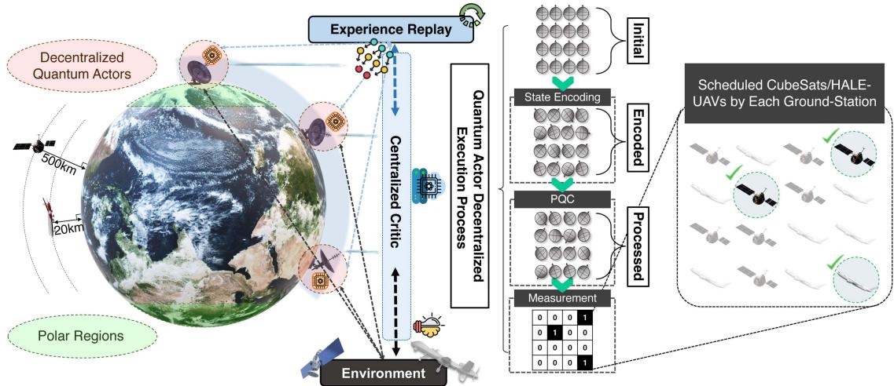  
Fig. 6. Global SAGIN mobile access using our proposed QMARL-based scheduler.

of $S _ { j } ^ { i } ( t )$ , the energy state of $S _ { j } ^ { i } ( t )$ , the capacity of $S _ { j } ^ { i } ( t )$ , the position of $A _ { l } ^ { i } ( t )$ , the energy state of $A _ { l } ^ { i } ( t )$ , and the capacity of $A _ { l } ^ { i } ( t )$ . Here, the positions of $G _ { i } , S _ { j } ^ { i }$ , and $A _ { l } ^ { i }$ are specified as,

$$
P _ { i } ( t ) = \{ p _ { i } ^ { \phi } ( t ) , p _ { i } ^ { \lambda } ( t ) , p _ { i } ^ { H } ( t ) \} ,\tag{45}
$$

$$
P _ { j } ^ { S } ( t ) = \{ p _ { j } ^ { \phi } ( t ) , p _ { j } ^ { \lambda } ( t ) , p _ { j } ^ { H } ( t ) , v _ { j } ^ { S } ( t ) \} ,\tag{46}
$$

$$
P _ { l } ^ { A } ( t ) = \{ p _ { l } ^ { \phi } ( t ) , p _ { l } ^ { \lambda } ( t ) , p _ { l } ^ { H } ( t ) , v _ { l } ^ { A } ( t ) \} ,\tag{47}
$$

where $p _ { i } ^ { \phi } ( t ) , p _ { i } ^ { \lambda } ( t )$ , and $p _ { i } ^ { H } ( t )$ denote the latitude, longitude, and altitude of $G _ { i }$ . Similarly, $p _ { j } ^ { \phi } ( t ) , p _ { j } ^ { \lambda } ( t ) , p _ { j } ^ { H } ( t ) , v _ { j } ^ { S } ( t ) , p _ { l } ^ { \phi } ( t ) , p _ { l } ^ { \lambda } ( t )$ $p _ { l } ^ { H } ( t )$ , and $v _ { l } ^ { A } ( t )$ represent the latitude of $S _ { j } ^ { i }$ , the longitude of $S _ { j } ^ { i }$ , the altitude of $S _ { j } ^ { i }$ , the velocity vector of $S _ { j } ^ { i } { : }$ , the latitude of $A _ { l } ^ { i }$ the longitude of $A _ { l } ^ { i } .$ the altitude of $A _ { l } ^ { i }$ , and the velocity vector of $A _ { l } ^ { i }$

Action: The action at t is represented as $\mathcal { A } ( t ) = [ x _ { j , l } ^ { i } ( t ) ]$ where $x _ { i , l } ^ { i } ( t ) \in \{ 0 , 1 \}$ . This indicates whether $G _ { i }$ is available for $S _ { j } ^ { i }$ or $A _ { l } ^ { i }$ at t or not, and note that the network access service between $G _ { i }$ and NTN device $( S _ { j } ^ { i }$ or $A _ { l } ^ { i } )$ is available when $x _ { j } ^ { i } ( t ) = 1 \mathrm { o r } x _ { l } ^ { i } ( t ) = 1$ (vice versa).

Reward: The reward function is outlined in (38), with its maximization reliant on the action scheduling $x _ { j , l } ^ { i } ( t )$ made by $G _ { i }$ This reward encompasses both utility and cost functions. Fundamentally, the goal is for each GS to orchestrate the scheduling of NTN devices (CubeSats or HALE-UAVs) to enhance the access performance in global SAGIN systems. Simultaneously, our reward function aims at the reduction of (i) the overall energy usage and (ii) the standard deviation of individual energy levels of CubeSats and HALE-UAVs. This reward function facilitates the autonomous and cooperative energy management in CubeSat and HALE-UAV.

## C. QMARL-Based Scheduler Design

In the depicted scenario, each GS agent, identified as the i-th GS, is responsible for executing a combinatorial scheduling decision across M CubeSats and L HALE-UAVs, as illustrated in Fig. 6. As the number of CubeSats M and HALE-UAVs L increment linearly, the total number of feasible scheduling decisions experiences an exponential rise, quantified as $2 ^ { M + \widecheck L }$ . This significant increase highlights the imperative for conventional RL policies to expand their output dimensionality, i.e., action dimensions, thereby accommodating the $2 ^ { M + L }$ potential combinations of these scheduling actions. However, such an increase in output dimensionality introduces difficulties in learning efficacy, a situation often described as the curse of dimensionality [45]. To tackle the mentioned challenge, this paper proposes an innovative strategy utilizing QMARL. This approach leverages quantum measurement techniques, facilitating effective navigation through high-dimensional action decision spaces by GSs. It’s noteworthy that training MARL with a substantial number of agents typically encounters reward convergence issues. Furthermore, as the number of action dimensions required by agents rises, achieving reward convergence grows more challenging. The quantum-based proposed measurement introduced here stands out as a singular solution capable of surmounting these challenges.

The QMARL-based scheduler outlined in this scenario is organized into three separate stages. The first two stages include encoding, which involves converting classical bits into quantum states referred to as qubits, and $P Q C ,$ , which involves the process of applying rotation gates to manipulate these quantum states in accordance with conventional QNN-based RL policies. The third and most important stage is measurement. During the concluding measurement stage, quantum states are transformed into an observable. This observable serves as the output obtained through the measurement of quantum states. The process of quantum measurement acts as a decoding mechanism, translating the outcomes of quantum computing into a format that classical computing systems can interpret and use. To facilitate global access performance of integrated networks through QMARL, the quantum system is established with a total of $M + L$ qubits. This total directly reflects the combined amount of CubeSats (M) and HALE-UAVs (L), leading to the equation, which can be expressed as, $\begin{array} { r } { \vert \psi \rangle = \sum _ { k = 1 } ^ { 2 ^ { M + L } } \alpha _ { k } \vert \mathbf { e } _ { k } \rangle } \end{array}$ . In this context, $\alpha _ { k }$ is defined as the probability amplitude, and $\mathbf { e } _ { k }$ represents the k-th basis within the Hilbert space.

In the domain of QNN, the Pauli-Z measurement is a prevalent method for transforming quantum states into observables. This conversion process does not depend on the number of qubits in use. In the Pauli-Z operator, each column denotes the computational basis of $| \hat { 0 } \rangle$ and $| \hat { 1 } \rangle$ . For the purpose of deriving the expectation value of each qubit’s state, a matrix that projects the quantum state onto the z-axis is employed, which is expressed as,

$$
\mathrm { P } _ { Z } ^ { k } \triangleq \mathrm { I } ^ { k - 1 } \otimes \mathrm { Z } \otimes \mathrm { I } ^ { Q - k } ,\tag{48}
$$

where I is the identity matrix. The equation to compute an observable associated with a single basis is formulated as,

$$
\begin{array} { r } { \langle \mathcal { O } _ { k } \rangle = \langle \psi \vert \mathrm { P } _ { Z } ^ { k } \vert \psi \rangle , } \end{array}\tag{49}
$$

where $\forall k \in \mathbb { N } [ 1 , Q ]$ and $\langle \mathcal { O } _ { k } \rangle \in \mathbb { R } [ - 1 , 1 ]$ . To manage the combinatorial scheduling of M CubeSats and L HALE-UAVs, a requisite output dimensionality of $2 ^ { M + L }$ necessitates the use of $\bar { \boldsymbol { 2 } } ^ { M + L }$ qubits. This methodology, however, does not address the issue identified as the curse of dimensionality. In contrast, the QMARL-based scheduler proposed in this paper effectively minimizes the requisite number of qubits to a logarithmic scale, transitioning from $2 ^ { M + L }$ down to $M + L$ . Consequently, this innovative approach significantly reduces the qubit requirement, ensuring its operational feasibility even amidst the constraints of the noisy intermediate-scale quantum (NISQ) era, where qubit availability is limited. By implementing the basis measurement, particularly through PVM, not Pauli-Z measurement, the approach outlined in this paper facilitates the determination of probabilities for every possible $2 ^ { M + L }$ combinations with merely $M + L$ qubits. Unlike Pauli-Z measurements, which evaluate each qubit independently against the two computational basis states, the basis measurement probes the entire quantum system across all $2 ^ { M + L }$ possible basis states [20]. Consequently, by measuring the probability distribution of the entire qubit system, the proposed measurement technique enables the handling of $2 ^ { M + L }$ action dimensions using only $M + L$ qubits. Thus, the probabilities of the $2 ^ { M + L }$ actions representable using $M + L$ qubits can be expressed as,

$$
\{ \operatorname* { P r } ( \mathcal { A } _ { k } ) \} _ { k = 1 } ^ { 2 ^ { M + L } } \triangleq \left\{ \bigotimes _ { k = 1 } ^ { M + L } | x _ { j , l } ^ { i } \rangle \right\} ,\tag{50}
$$

where $\otimes$ symbolizes the Kronecker product, with $\forall x _ { j , l } ^ { i } \in$ $\{ 0 , 1 \} , \ \bar { \forall } j \in [ 1 , M ]$ , and $\forall l \in [ 1 , L ]$ . Finally, the process to determine the probability that the i-th GS will choose for the k-th action from $2 ^ { \overset { \cdot } { M } + L }$ possibilities at t, according to its strategy, is represented as,

$$
\pi ( \mathcal { A } _ { k } ( t ) | S _ { i } ( t ) ; \theta _ { i } ) = \langle \psi | \mathbf { e } _ { k } \rangle \langle \mathbf { e } _ { k } | \psi \rangle = | \langle \psi | \mathbf { e } _ { k } \rangle | ^ { 2 } = | \alpha _ { k } | ^ { 2 } ,\tag{51}
$$

where $\vert \mathbf { e } _ { k } \rangle \langle \mathbf { e } _ { k } \vert$ denotes the projector for the k-th basis, with the collection of all such projectors for every basis being $\{ | \mathbf { e } _ { k } \rangle \langle \mathbf { e } _ { k } | \} _ { k = 1 } ^ { 2 ^ { M + L } }$ . This is because the probabilities for each action correspond to an individual’s outputs as, $\begin{array} { r } { \sum _ { k = 1 } ^ { 2 ^ { M + L } } \pi ( A _ { k } ( t ) | S _ { i } ( t ) ; \mathbf { \bar { \theta } } _ { i } ) = 1 } \end{array}$ . This paper adopts activation functions as basis measurement, thereby allowing each GS to undertake action decision-making on the logarithmically reduced action dimension.

## D. QMARL-Based Scheduler Training

The network under consideration is conceptualized as a multiagent system, where each i-th GS acts as the i-th agent equipped with its own QNN-based RL policy, $\pi ( \boldsymbol { \mathcal { A } } ( t ) | \boldsymbol { S } _ { i } ( t ) ; \boldsymbol { \theta } _ { i } )$ , parameterized by $\theta _ { i } .$ In the training phase, a unified centralized critic, parameterized by φ, assesses the policy effectiveness of multiple agents by estimating the state-value function $V _ { \phi } ( S ( t ) )$ , with $S ( t )$ representing the ground truth, encapsulating all accessible environmental data [46]. Conversely, each GS engages in sequential decision-making based on its individual partial state (i.e., observation), $S _ { i } ( t )$ . This training framework enables all ( )GSs to refine their policies towards collective decision-making, notwithstanding their limited observation of the environment. Furthermore, during inference, due to the distributed approach to cooperation, it is possible to achieve effective scalability and efficient use of computing resources.

After completing this procedure, the temporal difference (TD) error is utilized to implement multi-agent PG methods for the training of quantum multi-actor centralized-critic networks. The objective function for the i-th actor $( G _ { i } )$ , denoted as $J ( \pmb \theta _ { i } )$ , is expressed as,

$$
\nabla _ { \boldsymbol { \theta } _ { i } } J ( \boldsymbol { \theta } _ { i } ) = \mathbb { E } _ { \boldsymbol { \mathcal { S } } } \left[ \sum _ { t = 1 } ^ { T } \sum _ { i = 1 } ^ { N } \delta _ { \boldsymbol { \phi } } ( t ) \nabla _ { \boldsymbol { \theta } _ { i } } \log \pi ( \boldsymbol { A } ( t ) | \boldsymbol { S } _ { i } ( t ) ; \boldsymbol { \theta } _ { i } ) \right] ,\tag{52}
$$

where $\delta _ { \phi } ( t ) , \pi , \mathcal { A } ( t ) , S _ { i } ( t )$ , and $\theta _ { i }$ are the TD error based on Bellman optimality equation in time step t, policy, action at time t, state at time t, and neural network parameters, respectively. The loss function pertaining to the critic, denoted by ${ \mathcal { L } } ( \phi )$ , is specified as,

$$
\nabla _ { \phi } \mathcal { L } ( \phi ) = \sum _ { t = 1 } ^ { T } \nabla _ { \phi } \left\| \delta _ { \phi } ( t ) \right\| ^ { 2 } ,\tag{53}
$$

To optimize the objective function for multiple GSs and reduce the loss function of the centralized critic, the derivatives of the k-th parameters are expressed as,

$$
\frac { \partial J ( \theta _ { i } ) } { \partial \theta _ { k } } = \underbrace { \frac { \partial J ( \theta _ { i } ) } { \partial \pi _ { \theta _ { i } } } \cdot \frac { \partial \pi _ { \theta _ { i } } } { \partial \langle \mathcal { O } _ { k , \theta _ { i } } \rangle } } _ { \mathrm { ( C l a s s i c a l B a c k p r o p a g a t i o n ) } } \cdot \underbrace { \frac { \partial \langle \mathcal { O } _ { k , \theta _ { i } } \rangle } { \partial \theta _ { k } } } _ { \mathrm { ( P a r a m e t e r - S h i f t R u l e ) } } ,\tag{54}
$$

$$
\frac { \partial \mathcal { L } ( \phi ) } { \partial \phi _ { k } } = \underbrace { \frac { \partial \mathcal { L } ( \phi ) } { \partial V _ { \phi } } \cdot \frac { \partial V _ { \phi } } { \partial \langle \mathcal { O } _ { k , \phi } \rangle } } _ { \mathrm { ( C l a s s i c a l B a c k p r o p a g a t i o n ) } } \cdot \underbrace { \frac { \partial \langle \mathcal { O } _ { k , \phi } \rangle } { \partial \phi _ { k } } } _ { \mathrm { ( P a r a m e t e r - S h i f t R u l e ) } } .\tag{55}
$$

The first and second terms of the right-hand side in (54) and (55) are computed using classical partial derivatives. Nonetheless, the third term presents a challenge for classical computation methods, as the quantum state’s specifics remain indeterminate before collapsing its state by measurement. To overcome this problem in parameter optimization throughout the training phase, the parameter shift rule comes into play. The rule applied for computing the derivative of the i-th GS’s k-th parameter, focusing on the 0-th order derivative, is specified as,

$$
\frac { \partial \langle \mathcal { O } _ { k , \pmb { \theta } _ { i } } \rangle } { \partial \theta _ { k } } = \langle \mathcal { O } _ { k , \pmb { \theta } _ { i } + \frac { \pi } { 2 } \mathbf { e } _ { k } } \rangle - \langle \mathcal { O } _ { k , \pmb { \theta } _ { i } - \frac { \pi } { 2 } \mathbf { e } _ { k } } \rangle ,\tag{56}
$$

where $\mathbf { e } _ { k }$ denotes the k-th basis. Unlike classical backpropagation, the parameter shift rule provides a more straightforward and intuitive methodology. As a result, this approach can significantly expedite the training process for QNNs.

Once training is completed, the parameters of each QNN are stored and reused during inference. Since the inference process only involves forward computation using pretrained parameters, reconfiguring GSs does not require retraining the entire model.

## E. Computation Complexity Analysis and Comparison

In this subsection, the paper discusses the computational complexity of the proposed algorithm and compares the QMARLbased scheduler with traditional approaches employing classical neural networks. The per-epoch computational cost of the QMARL-based scheduler, comprising decentralized quantum actors and a centralized critic, is defined as the sum of the number of operations required to compute the TD error and the number of operations required to evaluate the objective function. It is defined as

$$
\begin{array} { r l } & { \varpi _ { Q } = \varpi _ { Q } ^ { T D } + \varpi _ { Q } ^ { O } } \\ & { \qquad = \ m { \mathbb { U } } \left( T \cdot ( \varpi _ { Q C } + N \cdot ( | { \cal A } ( t ) | + \varpi _ { Q A } ) ) \right) , } \end{array}\tag{57}
$$

where $\varpi _ { Q } ^ { T D } , \varpi _ { Q } ^ { O }$ , and $| \mathcal { A } ( t ) |$ denote the number of operations required to compute the TD error, the number of operations required to evaluate the objective function, and action dimension, respectively. In (57), the number of operations required to compute the TD error, i.e., $\varpi _ { Q } ^ { T D }$ , can be represented as,

$$
\boldsymbol { \varpi } _ { Q } ^ { T D } = 2 \times \boldsymbol { T } \times \boldsymbol { \varpi } _ { Q C } ,\tag{58}
$$

where $\varpi _ { Q C }$ represents the computational complexity of the quantum centralized critic. Then, $\varpi _ { Q C }$ is defined as,

$$
\varpi _ { Q C } = \mho ( | S ( t ) | + | \phi | + 1 ) ,\tag{59}
$$

where $| S ( t ) |$ and |φ| signify the state dimension and number of parameters in the quantum centralized critic network, respectively. Moreover, the number of operations required to evaluate the objective function can be defined as,

$$
\varpi _ { Q } ^ { O } = 2 \times T \times N \times ( | \boldsymbol { A } ( t ) | + \varpi _ { Q A } ) ,\tag{60}
$$

where $\varpi _ { Q A }$ indicates the computational complexity of quantum actors. It is defined as

$$
\varpi _ { Q A } = \Im ( | S ( t ) | + | \theta | + | A ( t ) | ) ,\tag{61}
$$

where |θ| denotes the number of neural network parameters in the actor network. The state encoder entails an operation count proportional to $S ( t )$ , while the parameterized gate operations entail an operation count proportional to |θ|. Moreover, generating the action outputs necessitates $| \mathcal { A } ( t ) |$ quantum measurements and softmax computations [47].

Conversely, the computational complexity of traditional approaches employing classical neural networks, i.e., conventional

MARL, is defined as,

$$
\begin{array} { l } { { \varpi _ { C } = \varpi _ { C C } + \varpi _ { C A } } } \\ { { \qquad = \ m { \mathbb { U } } ( T \times ( N \times | S ( t ) | \times | \theta | \times | A ( t ) | + | S ( t ) | \times | \phi | ) ) , } } \end{array}\tag{62}
$$

where $\varpi _ { C C }$ and $\varpi _ { C A }$ represent the computational complexity of classical critic and actors, respectively. The computational complexity of classical critic can be defined as,

$$
\varpi _ { C C } = 7 5 ( | S ( t ) | \times | \phi | ) .\tag{63}
$$

Then, the computational complexity of classical actors can be defined as,

$$
\boldsymbol { \varpi } _ { C A } = \hbar ( | S ( t ) | \times | \pmb { \theta } | \times | A ( t ) | ) .\tag{64}
$$

Equation (57) and (62) represent the computational complexities of the proposed QMARL-based scheduler and the traditional approaches employing classical neural networks, respectively. This one demonstrates that the QMARL-based scheduler exhibits lower computational complexity than conventional RLbased schedulers [48].

## V. PERFORMANCE EVALUATION

## A. Benchmarks and Simulation Setup

To evaluate the performance of the dimension-reduced QMARL-based scheduler, various benchmarks are utilized, i.e., MARL, Independent Q-Learning (IQL), Deep Q-Network (DQN), and Random (i.e., Monte Carlo) schedulers. Furthermore, the configurations of the simulation platforms and the software versions applied in the experiment appear in Table III. The system parameters and hyper-parameters used for this performance evaluation are presented in Table IV.

As shown in Table IV, the experimental setup in this paper comprises four GSs and sixteen NTN devices—specifically, eight CubeSats and eight HALE-UAVs. This experimental environment constitutes a large-scale scenario that, when accounting for realistic global access conditions, fully reflects the scalability advantages of the quantum-based approach. The action dimensionality of $2 ^ { 1 6 }$ generated by the sixteen NTN devices constitutes a simulation setup of sufficient scale to demonstrate the scalability advantages of the quantum-based approach [49]. Owing to each GS’s limited capacity for simultaneous monitoring, increasing the number of NTN devices does not guarantee that the GS will establish connections with all of them. Due to this constrained GS capability, scheduling sixteen NTN devices corresponds to a practically large-scale environment [50], [51].

## B. Policy Training

Fig. 7(a) illustrates that the QMARL-based scheduling approach introduced in this paper outperforms comparative benchmarks, achieving a maximal reward of 1.0.

It can be observed that, from approximately 9,000 epochs onward, the reward value of the proposed QMARL-based scheduler converges to a specific value. It should be noted that, as the reward value of the QMARL-based scheduler continues to converge steadily to a fixed value beyond this point, further training epochs offer negligible benefit. In comparison, the MARL-based scheduler provides less reward than the QMARLbased scheduler, and the reward value fluctuates and eventually does not converge. Furthermore, the performance of IQL and DQN-based schedulers closely mirrors that of the random-based scheduler in terms of reward. The initial reduction reflects the high exploration rate required to discover effective policies. Furthermore, by reducing the exponential action space to a logarithmic scale via quantum projection, this demonstrates that the proposed QMARL algorithm converges fast, even in the largest action dimension. Fig. 7(b)–(e) reveal that the scheduler based on QMARL attains superior QoS, capacity, and remaining energy for CubeSats/HALE-UAVs. Conversely, MARL-based scheduling approaches fail to concurrently optimize multiple metrics related to communication and the energy efficiency of NTN devices. Within the MARL-based scheduler, an increase in QoS and capacity correlates with a decrease in residual energy, indicating an inability to simultaneously optimize global access performance of integrated networks (QoS, capacity) and the residual energy of CubeSats/HALE-UAVs.1 In contrast, the

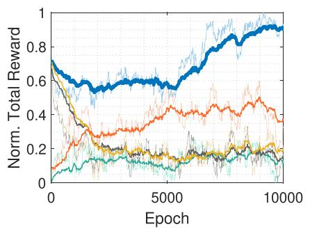  
(a) Reward.

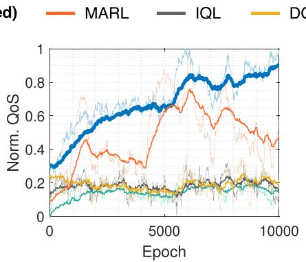  
(b) QoS.

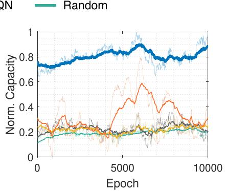  
(c) Capacity.

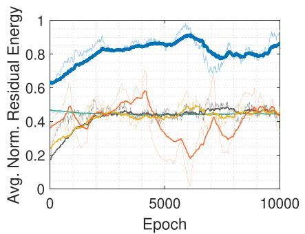  
(d) Residual energy of CubeSat.

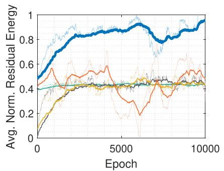  
(e) Residual energy of HALE-UAV.  
Fig. 7. SAGIN access performance, i.e., access availability (QoS, capacity) and energy efficiency (residual energy).

TABLE V  
PERFORMANCE EVALUATION RESULTS WHEN $| { \mathcal { A } } | = 2 ^ { 1 6 }$
<table><tr><td>Algorithm</td><td>QoS</td><td>Capacity</td><td></td><td>Residual Energy</td></tr><tr><td>QMARL</td><td>0.906</td><td>H 0.894</td><td>H H</td><td>0.912</td></tr><tr><td>MARL</td><td>0.484 H</td><td>0.321</td><td>0.457</td><td>H H</td></tr><tr><td>IQL</td><td>0.148 H</td><td>0.188 H</td><td>0.419</td><td>H</td></tr><tr><td>DQN</td><td>0.194H</td><td>0.258 H</td><td>0.442</td><td>H</td></tr><tr><td>Random</td><td>0.151 H</td><td>0.197 H</td><td>0.437</td><td>H</td></tr></table>

QMARL-based scheduler successfully optimizes both global access performance and energy efficiency in parallel.

Table V illustrates that the QMARL-based scheduler significantly surpasses its MARL-based scheduler, recording an 87.2 enhancement in QoS, a 178 increase in capacity, and % %a 99.5 augmentation in remaining energy. Additionally, the performances of IQL, DQN, and Random-based schedulers are notably inferior in all evaluated aspects, with QoS not exceeding 0.2, capacity remaining below 0.26, and the residual energy of CubeSats/HALE-UAVs falling short of 0.45, as explicated in Table V.

Fig. 8(a)–(b) delineate the correlation between the global access performance of integrated networks and the normalized residual energy of NTNs, contingent upon the employed algorithm. The epoch on the x-axis is segmented into three phases: 0 to k (initial phase), k to k (intermediate phase), and k to k (final phase). Throughout the progression from the initial to the intermediate phase in MARL, an increment is observed in the QMARL (Proposed) — MARL— IQL DQN Random

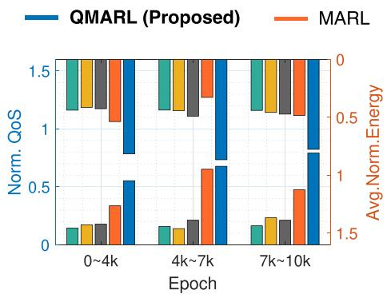  
(a) QoS vs. Residual Energy.

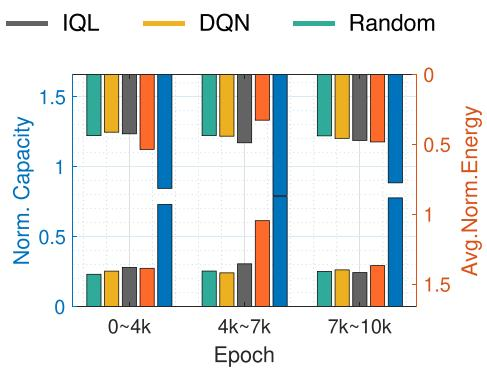  
(b) Capacity vs. Residual Energy.

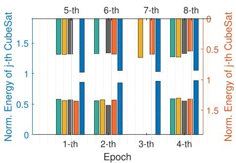  
(c) Residual energy for each CubeSat.

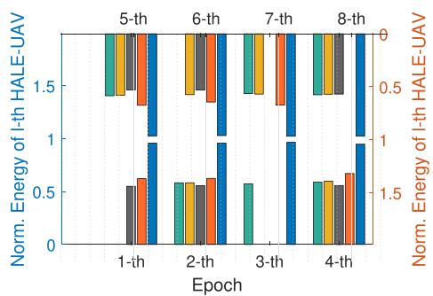  
(d) Residual energy for each HALE-UAV.  
Fig. 8. Relationship between access availability and energy efficiency.

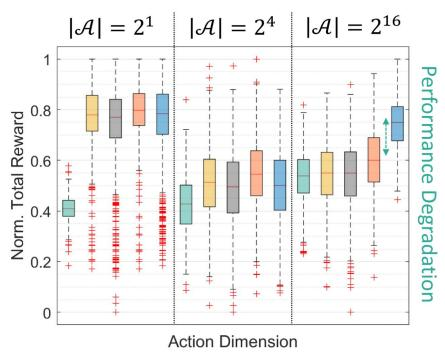

(a) Distribution of reward values according to action (b) Converged rewards according to action dimen- (c) Normalized average residual energy of NTN dimensions |A|. sions |A|. devices with and without GS-specific capacity requirements  
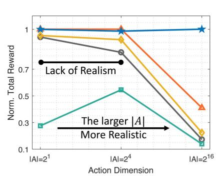

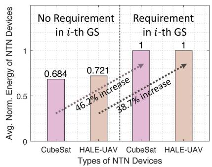  
Fig. 9. Rewards due to action dimension and residual energy with or without the capacity requirements in each GS.

energy of NTN devices, albeit with a reduction in QoS and capacity. This limitation is not exclusive to MARL but also extends to schedulers based on IQL, DQN, and Random schedulers, which are unable to concurrently optimize the performance of global access performance of integrated networks and the residual energy of NTN devices. In stark contrast, QMARLbased scheduler consistently maintains elevated levels of QoS, capacity, and residual energy. Fig. 8(c)–(d) display the remaining energy of the $S _ { j } ^ { i }$ and $A _ { l } ^ { i }$ . The occurrence of non-operational NTN devices is attributed to the inefficiency in energy utilization by the benchmarks, including those based on MARL, IQL, DQN, and Random-based schedulers. In contrast, the QMARL-based scheduler consistently exhibits superior residual energy performance, ensuring the avoidance of any non-functional NTN devices. Additionally, the QMARL-based scheduler has a higher residual energy of NTN devices compared to other benchmarks.

Fig. 9(a)–(b) and Table VI provide a comparative analysis of the rewards obtained by GSs utilizing both the proposed algorithms and benchmarks across varying sizes of the action dimension, specifically for $| \mathcal { A } | \in \{ 2 ^ { 1 } , 2 ^ { \overset { . } { 4 } } , 2 ^ { \overset { . } { 1 } 6 } \}$ . The MARL-based scheduler exhibits superior reward outcomes at smaller action dimensions $( | \mathcal { A } | \in \{ 2 ^ { 1 } , 2 ^ { 4 } \} )$ ; however, it encounters significant difficulties at larger action dimension $( | \mathcal { A } | = 2 ^ { 1 6 } )$ , where its performance falls behind that of the QMARL based scheduler by 41.03 , due to the curse of dimensionality. Then, IQL, DQNbased schedulers yield outcomes that are analogous to those of a Random-based scheduler at the largest action dimension $( | \boldsymbol { \mathcal { A } } | = 2 ^ { 1 6 } )$ . Fig. 9(a) depicts a box plot summarizing the reward = 2distribution across all action dimensions throughout the training process. The median reward is represented by the red line at the center of each box, with the lower and upper boundaries of the box indicating the 25 and 75 , respectively. Outliers are marked with a red ’+’ symbol. Notably, at the exceedingly large action dimension $( | \mathcal { A } | = 2 ^ { 1 6 } )$ , the QMARL-based scheduler achieves the highest reward, while the performance of other benchmarks deteriorates. Fig. 9(b) illustrates the converged normalized reward values according to the action dimensions. The utilization of larger action dimensions is deemed more realistic due to the inclusion of a greater number of CubeSats and HALE-UAVs, hence enhancing real-world applicability. In global access of integrated networks involving extensive deployment of CubeSats and HALE-UAVs, solely the QMARL-based scheduler achieves successful training outcomes, thereby evidencing a significant performance disparity in comparison to other benchmarks. These training results distinctly emphasize the exceptional capability of the QMARL-based scheduler in addressing and mitigating the challenges posed by the curse of dimensionality.

TABLE VI  
TOTAL NORMALIZED CONVERGED REWARDS
<table><tr><td rowspan=1 colspan=1>|A|</td><td rowspan=1 colspan=1>QMARL</td><td rowspan=1 colspan=1>MARL</td><td rowspan=1 colspan=1>IQL</td><td rowspan=1 colspan=1>DQN</td><td rowspan=1 colspan=1>Random</td></tr><tr><td rowspan=3 colspan=1> $2 ^ { 1 }$  $2 ^ { 4 }$  $\mathbf { 2 ^ { 1 6 } }$ </td><td rowspan=3 colspan=1>0.99710.98131.0000</td><td rowspan=1 colspan=1>1.0000</td><td rowspan=1 colspan=1>0.9411</td><td rowspan=3 colspan=1>0.95270.92150.2235</td><td rowspan=3 colspan=1>0.27550.54520.1390</td></tr><tr><td rowspan=2 colspan=1>1.00000.4103</td><td rowspan=1 colspan=1>0.8267</td></tr><tr><td rowspan=1 colspan=1>0.1730</td></tr></table>

Additionally, Fig. 9(c) shows the normalized average residual energy of NTN devices with and without GS-specific capacity requirements. The pink bar graph represents the average residual energy of CubeSats, and the beige bar graph represents the average residual energy of HALE-UAVs. In addition, the two bar graphs on the left are when there are no capacity requirements for each GS, and the two bar graphs on the right are when there are capacity requirements for each GS. If there are capacity requirements for each GS, unnecessary energy waste in NTN devices can be prevented. If the maximum capacity requirements are set differently for each GS depending on the region where the GS is located, the population of the region, and the degree of communication overload, the residual energy for CubeSat is 46.2 and HALE-UAV is 38.7 higher.

## VI. CONCLUDING REMARKS

This paper introduces a novel QMARL-based global SAGIN mobile access scheduler for CubeSats and HALE-UAVs, which aims at the maximization of access availability and energy efficiency. The CubeSats, characterized by their limited energy resources, employ energy efficiency strategies that differentiate between sun-side and dark-side orbital segments to conserve power. The reason why the quantum-based approach is utilized is that it can realize scheduling action dimension reduction. This attribute is particularly advantageous for ensuring the robust convergence of rewards in scenarios entailing extensive-scale actions, such as global access with considerable numbers of CubeSats and HALE-UAVs. The study’s experimental setup reflects real-world conditions by incorporating the orbital dynamics of CubeSats and the aerodynamic characteristics of HALE-UAVs, thereby underscoring the practical applicability of our proposed QMARL-based scheduler. Our performance evaluations with various aspects and benchmarks verify that our proposed scheduler can achieve the desired performance improvements.

Furthermore, as quantum hardware advances in the future, we will incorporate realistic noise models and error correction techniques to evaluate scheduler performance under realistic quantum conditions.

## REFERENCES

[1] J. Tang et al., “Opportunistic content-aware routing in satellite-terrestrial integrated networks,” IEEE Trans. Mobile Comput., vol. 23, no. 11, pp. 10460–10474, Nov. 2024.

[2] Z. Luo, C. Wu, Z. Li, and W. Zhou, “Scaling GEO-distributed network function chains: A prediction and learning framework,” IEEE J. Sel. Areas Commun., vol. 37, no. 8, pp. 1838–1850, Aug. 2019.

[3] S. Jung, M.-S. Lee, J. Kim, M.-Y. Yun, J. Kim, and J.-H. Kim, “Trustworthy handover in LEO satellite mobile networks,” ICT Exp., vol. 8, no. 3, pp. 432–437, Sep. 2022.

[4] F. Tang, H. Zhang, and L. T. Yang, “Multipath cooperative routing with efficient acknowledgement for LEO satellite networks,” IEEE Trans. Mobile Comput., vol. 18, no. 1, pp. 179–192, Jan. 2019.

[5] S. S. Hassan, Y. M. Park, Y. K. Tun, W. Saad, Z. Han, and C. S. Hong, “Satellite-based its data offloading & computation in 6G networks: A cooperative multi-agent proximal policy optimization DRL with attention approach,” IEEE Trans. Mobile Comput., vol. 23, no. 5, pp. 4956–4974, May 2024.

[6] Z. Ji, S. Wu, and C. Jiang, “Cooperative multi-agent deep reinforcement learning for computation offloading in digital twin satellite edge networks,” IEEE J. Sel. Areas Commun., vol. 41, no. 11, pp. 3414–3429, Nov. 2023.

[7] G. Pan, J. Ye, J. An, and M.-S. Alouini, “Latency versus reliability in LEO mega-constellations: Terrestrial, aerial, or space relay,” IEEE Trans. Mobile Comput., vol. 22, no. 9, pp. 5330–5345, Sep. 2023.

[8] Y. K. Tun, K. T. Kim, L. Zou, Z. Han, G. Dán, and C. S. Hong, “Collaborative computing services at ground, air, and space: An optimization approach,” IEEE Trans. Veh. Technol., vol. 73, no. 1, pp. 1491–1496, Jan. 2024.

[9] X. Feng, Y. Sun, and M. Peng, “Distributed satellite-terrestrial cooperative routing strategy based on minimum hop-count analysis in mega LEO satellite constellation,” IEEE Trans. Mobile Comput., vol. 23, no. 11, pp. 10678–10693, Nov. 2024.

[10] C. Dai, K. Zhu, and E. Hossain, “Multi-agent deep reinforcement learning for joint decoupled user association and trajectory design in full-duplex multi-UAV networks,” IEEE Trans. Mobile Comput., vol. 22, no. 10, pp. 6056–6070, Oct. 2023.

[11] N. Qi, Z. Huang, F. Zhou, Q. Shi, Q. Wu, and M. Xiao, “A task-driven sequential overlapping coalition formation game for resource allocation in heterogeneous UAV networks,” IEEE Trans. Mobile Comput., vol. 22, no. 8, pp. 4439–4455, Aug. 2023.

[12] P. Qi, X. Zhao, Y. Wang, R. Palacios, and A. Wynn, “Aeroelastic and trajectory control of high altitude long endurance aircraft,” IEEE Trans. Aerosp. Electron. Syst., vol. 54, no. 6, pp. 2992–3003, Dec. 2018.

[13] X. Dai, Z. Xiao, H. Jiang, and J. C. S. Lui, “UAV-assisted task offloading in vehicular edge computing networks,” IEEE Trans. Mobile Comput., vol. 23, no. 4, pp. 2520–2534, Apr. 2024.

[14] X. Li et al., “Optimized controller provisioning in software-defined LEO satellite networks,” IEEE Trans. Mobile Comput., vol. 22, no. 8, pp. 4850–4864, Aug. 2023.

[15] L. Huang, S. Bi, and Y.-J. A. Zhang, “Deep reinforcement learning for online computation offloading in wireless powered mobile-edge computing networks,” IEEE Trans. Mobile Comput., vol. 19, no. 11, pp. 2581–2593, Nov. 2020.

[16] M. Tang and V. W. Wong, “Deep reinforcement learning for task offloading in mobile edge computing systems,” IEEE Trans. Mobile Comput., vol. 21, no. 6, pp. 1985–1997, Jun. 2022.

[17] G. S. Kim, J. Chung, and S. Park, “Realizing stabilized landing for computation-limited reusable rockets: A quantum reinforcement learning approach,” IEEE Trans. Veh. Technol., vol. 73, no. 8, pp. 12252–12257, Aug. 2024.

[18] J. Cui, Y. Liu, and A. Nallanathan, “Multi-agent reinforcement learningbased resource allocation for UAV networks,” IEEE Trans. Wireless Commun., vol. 19, no. 2, pp. 729–743, Feb. 2020.

[19] S. Park et al., “Joint quantum reinforcement learning and stabilized control for spatio-temporal coordination in metaverse,” IEEE Trans. Mobile Comput., vol. 23, no. 12, pp. 12410–12427, Dec. 2024.

[20] H. Baek, S. Park, and J. Kim, “Logarithmic dimension reduction for quantum neural networks,” in Proc. ACM Int. Conf. Inf. Knowl. Manage., Birmingham, U.K., 2023, pp. 3738–3742.

[21] W. K. New, C. Y. Leow, K. Navaie, and Z. Ding, “Aerial-terrestrial network NOMA for cellular-connected UAVs,” IEEE Trans. Veh. Technol., vol. 71, no. 6, pp. 6559–6573, Jun. 2022.

[22] J.-H. Lee, J. Park, M. Bennis, and Y.-C. Ko, “Integrating LEO satellites and multi-UAV reinforcement learning for hybrid FSO/RF non-terrestrial networks,” IEEE Trans. Veh. Technol., vol. 72, no. 3, pp. 3647–3662, Mar. 2023.

[23] H. Hu, Z. Chen, F. Zhou, Z. Han, and H. Zhu, “Joint resource and trajectory optimization for heterogeneous-UAVs enabled aerial-ground cooperative computing networks,” IEEE Trans. Veh. Technol., vol. 72, no. 7, pp. 8812–8826, Jul. 2023.

[24] N. Babu, M. Virgili, C. B. Papadias, P. Popovski, and A. J. Forsyth, “Costand energy-efficient aerial communication networks with interleaved hovering and flying,” IEEE Trans. Veh. Technol., vol. 70, no. 9, pp. 9077–9087, Sep. 2021.

[25] Y. Wang et al., “Multi-resource coordinate scheduling for earth observation in space information networks,” IEEE J. Sel. Areas Commun., vol. 36, no. 2, pp. 268–279, Feb. 2018.

[26] Z. Jia, M. Sheng, J. Li, D. Niyato, and Z. Han, “LEO-satellite-assisted UAV: Joint trajectory and data collection for internet of remote things in 6G aerial access networks,” IEEE Internet Things J., vol. 8, no. 12, pp. 9814–9826, Jun. 2021.

[27] T. Ma et al., “UAV-LEO integrated backbone: A ubiquitous data collection approach for B5G internet of remote things networks,” IEEE J. Sel. Areas Commun., vol. 39, no. 11, pp. 3491–3505, Nov. 2021.

[28] J. Li, G. Wu, T. Liao, M. Fan, X. Mao, and W. Pedrycz, “Task scheduling under a novel framework for data relay satellite network via deep reinforcement learning,” IEEE Trans. Veh. Technol., vol. 72, no. 5, pp. 6654–6668, May 2023.

[29] C. Park, G. S. Kim, S. Park, S. Jung, and J. Kim, “Multi-agent reinforcement learning for cooperative air transportation services in city-wide autonomous urban air mobility,” IEEE Trans. Intell. Veh., vol. 8, no. 8, pp. 4016–4030, Aug. 2023.

[30] R. Chen et al., “Joint channel access and power control optimization in large-scale UAV networks: A hierarchical mean field game approach,” IEEE Trans. Veh. Technol., vol. 72, no. 2, pp. 1982–1996, Feb. 2023.

[31] C. Park et al., “Quantum multi-agent actor-critic networks for cooperative mobile access in multi-UAV systems,” IEEE Internet Things J., vol. 10, no. 22, pp. 20033–20048, Nov. 2023.

[32] O. Simeone, “An introduction to quantum machine learning for engineers,” Foundations Trends Mach. Learn., vol. 16, no. 1-2, pp. 1–223, Aug. 2022.

[33] S. Wojtowytsch and E. Weinan, “Can shallow neural networks beat the curse of dimensionality? A mean field training perspective,” IEEE Trans. Artif. Intell., vol. 1, no. 2, pp. 121–129, Oct. 2020.

[34] S. Park, J. P. Kim, C. Park, S. Jung, and J. Kim, “Quantum multi-agent reinforcement learning for autonomous mobility cooperation,” IEEE Commun. Mag., vol. 62, no. 6, pp. 106–112, Jun. 2024.

[35] S. Park and J. Kim, “Quantum reinforcement learning for large-scale multiagent decision-making in autonomous aerial networks,” in Proc. IEEE VTS Asia Pacific Wireless Commun. Symp., Taiwan, China, 2023, pp. 1–4.

[36] C. D. Perkins and R. E. Hage, Airplane Performance, Stability and Control. Hoboken, NJ, USA: Wiley, Jan. 1991.

[37] S. Jung, W. J. Yun, M. Shin, J. Kim, and J.-H. Kim, “Orchestrated scheduling and multi-agent deep reinforcement learning for cloud-assisted multi-UAV charging systems,” IEEE Trans. Veh. Technol., vol. 70, no. 6, pp. 5362–5377, Jun. 2021.

[38] A. R. S. Bramwell, D. Balmford, and G. Done, Bramwell’s Helicopter Dynamics. Amsterdam, Netherlands: Elsevier, Apr. 2001.

[39] Y. Zeng, J. Xu, and R. Zhang, “Energy minimization for wireless communication with rotary-wing UAV,” IEEE Trans. Wireless Commun., vol. 18, no. 4, pp. 2329–2345, Apr. 2019.

[40] G. S. Kim, S. Lee, T. Woo, and S. Park, “Cooperative reinforcement learning for military drones over large-scale battlefields,” IEEE Trans. Intell. Veh., early access, Oct. 9, 2024, doi: 10.1109/TIV.2024.3472213.

[41] J. A. Shaw, “Radiometry and the Friis transmission equation,” Amer. J. Phys., vol. 81, no. 1, pp. 33–37, Jan. 2013.

[42] G. S. Kim, S. Yen-Chi Chen, S. Park, and J. Kim, “Quantum reinforcement learning for coordinated satellite systems,” in Proc. IEEE Int. Conf. Acoust. Speech Signal Process., Hyderabad, India, Apr. 2025, pp. 1–5.

[43] J. Lee, R. R. Mazumdar, and N. B. Shroff, “Non-convex optimization and rate control for multi-class services in the Internet,” IEEE/ACM Trans. Netw., vol. 13, no. 4, pp. 827–840, Aug. 2005.

[44] J. Kim and W. Lee, “Feasibility study of 60 GHz millimeter-wave technologies for hyperconnected fog computing applications,” IEEE Internet Things J., vol. 4, no. 5, pp. 1165–1173, Oct. 2017.

[45] W. Du and S. Ding, “A survey on multi-agent deep reinforcement learning: From the perspective of challenges and applications,” Artif. Intell. Rev., vol. 54, no. 5, pp. 3215–3238, Nov. 2020.

[46] R. Lowe et al., “Multi-agent actor-critic for mixed cooperative-competitive environments,” in Proc. Adv. Neural Inf. Process. Syst., Long Beach, CA, USA, 2017, pp. 6379–6390.

[47] C. Park et al., “Quantum multiagent actor–critic networks for cooperative mobile access in multi-UAV systems,” IEEE Internet Things J., vol. 10, no. 22, pp. 20033–20048, Nov. 2023.

[48] G. S. Kim, S. Lee, I.-S. Cho, S. Park, and J. Kim, “Quantum reinforcement learning for lightweight LEO satellite routing,” IEEE Internet Things J., vol. 12, no. 14, pp. 28986–29004, Jul. 2025.

[49] S. Park, G. S. Kim, Z. Han, and J. Kim, “Quantum multi-agent reinforcement learning is all you need: Coordinated global access in integrated TN/NTN cube-satellite networks,” IEEE Commun. Mag., vol. 62, no. 10, pp. 86–92, Oct. 2024.

[50] D.-H. Lee et al., “An S-band-receiving phased-array antenna with a phasedeviation-minimized calibration method for LEO satellite ground station applications,” Electronics, vol. 11, no. 23, Nov. 2022, Art. no. 3847.

[51] G. He, X. Gao, L. Sun, and R. Zhang, “A review of multibeam phased array antennas as LEO satellite constellation ground station,” IEEE Access, vol. 9, pp. 147142–147 154, 2021.

  
Gyu Seon Kim (Student Member, IEEE) received the BS degree in aerospace engineering from Inha University, Incheon, Republic of Korea. He is currently working toward the PhD degree with the Department of Electrical and Computer Engineering, Korea University, Seoul, Republic of Korea. He was a recipient of the IEEE Seoul Section Student Paper Contest Award (2023) and the IEEE Vehicular Technology Society Student Scholarship Award (2025).

  
Yeryeong Cho is currently working toward the MS degree with the Department of Electrical and Computer Engineering, Korea University, Seoul, Republic of Korea.

Jaehyun Chung received the BS degree in electrical engineering from the Department of Electrical and Computer Engineering, Korea University, Seoul, Korea, in Aug. 2023. He is currently working toward the MS degree with the Department of Electrical and Computer Engineering, Korea University, Seoul, Korea.

Soohyun Park (Member, IEEE) received the PhD degree in electrical and computer engineering from the Department of Electrical and Computer Engineering, Korea University, Seoul, Korea, in Aug. 2023. She has been an assistant professor with Sookmyung Women’s University, Seoul, Korea, since March 2024. She was a postdoctoral scholar with the Department of Electrical and Computer Engineering, Korea University, Seoul, Korea, from Sep. 2023 to Feb. 2024.

Soyi Jung (Senior Member, IEEE) received the BS, MS, and PhD degrees in electrical and computer engineering from Ajou University, Suwon, Korea, in 2013, 2015, and 2021. She has been an assistant professor with Ajou University, Suwon, Korea, since Sep. 2022.

Zhu Han (Fellow, IEEE) received the BS degree in electronic engineering from Tsinghua University, Beijing, China, in 1997, and the MS and PhD degrees in electrical and computer engineering from the University of Maryland at College Park, College Park, MD, USA, in 1999 and 2003, respectively. He is currently a John and Rebecca Moores professor with the Electrical and Computer Engineering Department as well as the Computer Science Department, University of Houston, Houston, TX, USA. He also works with the Department of Computer Science

and Engineering, Kyung Hee University, Seoul, South Korea. He was an IEEE Communications Society Distinguished Lecturer from 2015 to 2018 and has been an AAAS fellow since 2019 and an ACM Distinguished Member since 2019.

Joongheon Kim (Senior Member, IEEE) received BS and MS degrees in computer science and engineering from Korea University, Seoul, Korea, in 2004 and 2006, and the PhD degree in computer science from the University of Southern California (USC), Los Angeles, CA, USA, in 2014. He has been with Korea University, Seoul, Korea, since 2019, where he is currently an associate professor with the School of Electrical Engineering.