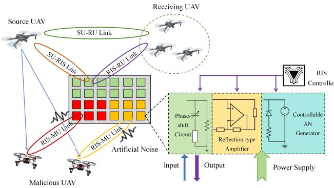
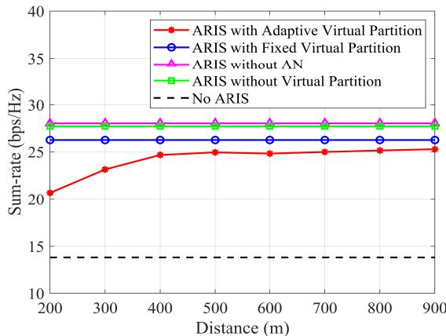
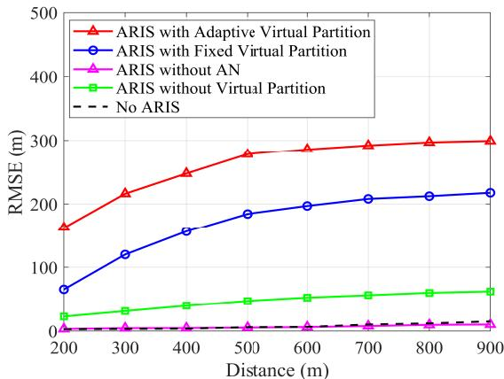
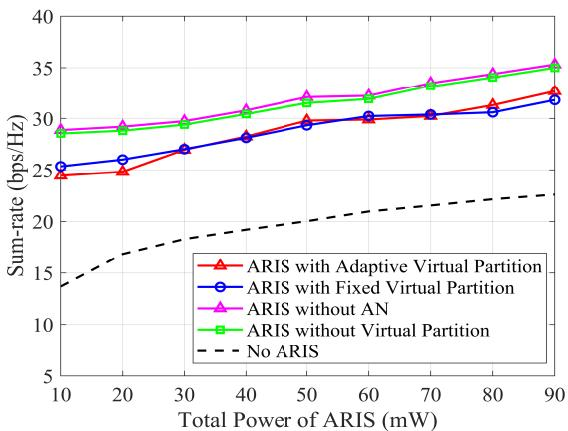
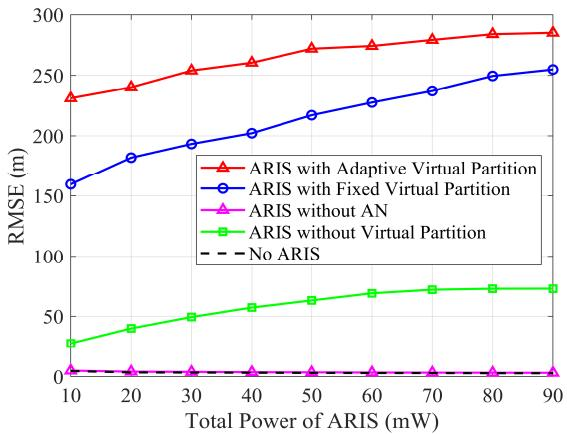
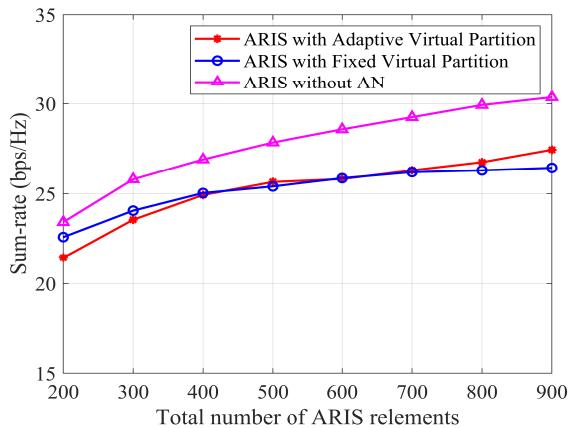
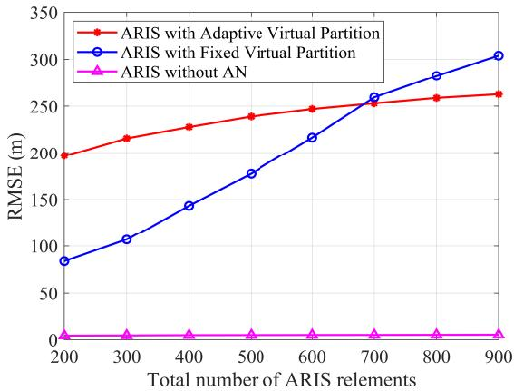
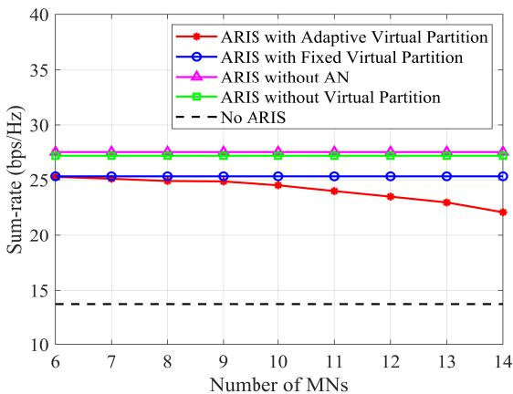
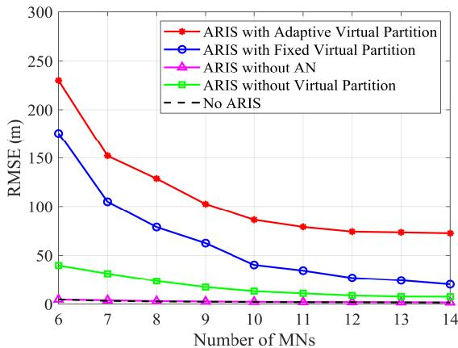
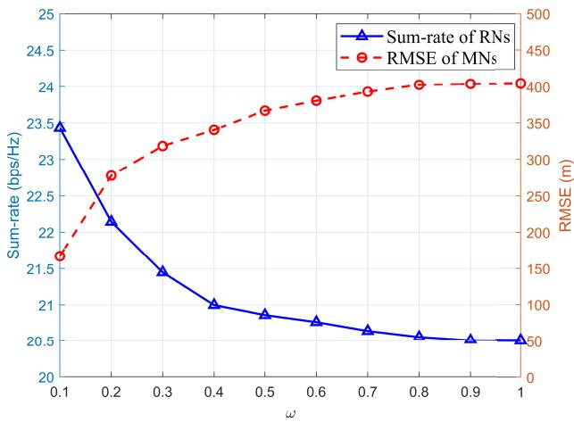

# RIS-Based Communication Enhancement and Location Privacy Protection in UAV Networks

Ziqi Chen , Graduate Student Member, IEEE, Jun Du , Senior Member, IEEE, Chunxiao Jiang , Fellow, IEEE, Tony Q. S. Quek , Fellow, IEEE, and Zhu Han , Fellow, IEEE

Abstract—With the explosive advancement of unmanned aerial vehicles (UAVs), the security of efficient UAV networks has become increasingly critical. Owing to the open nature of its communication environment, illegitimate malicious UAVs (MUs) can infer the position of the source UAV (SU) by analyzing received signals, thus compromising the SU location privacy. To protect the SU location privacy while ensuring efficient communication with legitimate receiving UAVs (RUs), we propose an Active Reconfigurable Intelligent Surface (ARIS)-assisted covert communication scheme based on virtual partitioning and artificial noise (AN). Specifically, we design a novel ARIS architecture integrated with an AN module. This architecture dynamically partitions its reflecting elements into multiple sub-regions: one subset is optimized to enhance communication between the SU and RUs, while the other subset generates AN to interfere with the localization of the SU by MUs. We first derive the Cramer-´ Rao Lower Bound (CRLB) for localization with received signal strength (RSS), based on which, we establish a joint optimization framework for communication enhancement and localization interference. Subsequently, we derive and validate the optimal ARIS partitioning and power allocation under average channel conditions. Finally, tailored optimization methods are proposed for the reflection precoding and AN design of the two partitions. Simulation results validate that, compared to baseline schemes, the proposed scheme significantly increases the localization error of MUs by approximately 37.65% with only a 3.69% reduction

in the communication rate between the SU and RUs, thereby effectively protecting the SU location privacy.

Index Terms—Active RIS, communication enhancement, location privacy, artificial noise, virtual partition.

## I. INTRODUCTION

N RECENT years, the burgeoning development of unmanned aerial vehicle (UAV) technology has facilitated its widespread application across an expanding array of emerging domains, including search and rescue, emergency communications, relay communications, and aerial reconnaissance scenarios [1], [2], [3]. To ensure the proper execution of UAV swarm missions, a reliable, stable, and efficient wireless communication network is essential among UAVs [4]. However, the open environment and broadcast nature of wireless communications in UAVs pose significant challenges to the security and reliability of UAV communication networks [5], [6]. Specifically, during communication among UAVs, malicious UAVs (MUs) may exploit signals they receive to infer the location of the source UAV (SU). This vulnerability consequently results in the compromise of the SU location privacy, presenting a critical threat to the integrity and confidentiality of UAV operations.

As an emerging paradigm in wireless communications, Reconfigurable Intelligent Surface (RIS) can provide a more stable and reliable communication network for UAV swarms [7], [8]. Comprising a large number of controllable reflective units, RIS can dynamically alter the direction, strength, and coverage of electromagnetic waves, thereby enhancing signal quality and improving communication efficiency [9]. To protect UAV network security while enhancing communication, many studies have introduced artificial noise (AN) to achieve privacy protection for UAVs [10], [11], [12]. Specifically, RIS intelligently adjusts its reflection phases to effectively enhance the signal power of the legitimate link, while simultaneously leveraging the AN emitted by the source node, which is reflected by the RIS to generate interference that weakens the illegitimate link [13]. However, these studies invariably presuppose that the source node possesses the capability to transmit AN, which constitutes a relatively stringent assumption. Concurrently, the direct joint optimization of communication enhancement and interference at the RIS entails high computational complexity.

To address the above challenges, we innovatively introduce a controllable AN generation module into the existing active

RIS (ARIS) architecture, enabling proactive localization interference against MUs. This architecture eliminates the need for the SU to design and transmit AN, thereby enhancing the scalability of the system. In addition, to reduce the complexity of joint optimization, we propose a virtual partitioning mechanism for ARIS, which decouples the multi-objective optimization problem. Specifically, the main contributions of this paper are summarized as follows:

We propose a novel ARIS architecture integrated with an AN module. This innovation enables the ARIS to disrupt the localization attempts of MUs targeting the SU, thereby protecting the SU location privacy. The introduction of the AN module provides architectural support for the multi-objective optimization of communication enhancement and location privacy protection.

• We derive the Cramer-Rao Lower Bound (CRLB) for´ RSS-based localization in an ARIS-assisted communication scenario. This analytical derivation quantifies the fundamental limits of localization accuracy under the influence of AN, providing a benchmark for evaluating the effectiveness of location privacy protection. Meanwhile, we formulate a multi-objective joint optimization problem aimed at simultaneously maximizing the communication rate of legitimate receiving UAVs (RUs) while maximizing the localization error of MUs. This framework effectively couples communication performance with privacy preservation, offering a holistic approach.

We design an innovative virtual partitioning mechanism within the ARIS framework, dynamically dividing the reflecting elements into two functionally distinct subsets: one subset focuses on optimizing the sum rate for RUs, while the other generates AN to interfere with the localization efforts of MUs. This decoupling in the physical domain reduces computational complexity and enhances adaptability. Under average channel conditions, we derive and validate the optimal ARIS partitioning and power allocation, ensuring an effective balance between communication enhancement and localization interference.

Based on the proposed ARIS architecture, we develop tailored optimization algorithms for the two partitioned subsets. For the ARIS partition for communication enhancement (ARIS-CE), we devise an alternating optimization scheme based on Fractional Programming (FP) that jointly optimizes the SU beamforming vector and ARIS-CE reflection precoding to achieve near-optimal sum rates. For the ARIS partition for localization interference (ARIS-LI), we design an alternating optimization scheme leveraging FP and Semi-Definite Programming (SDP) to optimize the reflection precoding and AN factors, maximizing the interference-to-signal ratio (ISR) at MUs. Extensive simulations ultimately validate that the proposed approach outperforms baseline methods in communication rate and location privacy protection.

The structure of this paper is as follows: Section II introduces the related works. Section III presents a detailed exposition of an ARIS-assisted UAV communication model. Section IV describes an RSS-based localization model for MUs and conducts a CRLB analysis. Section V designs a joint optimization scheme for communication enhancement and localization interference. Section VI validates the performance and relevant metrics of the proposed mechanism. Finally, Section VII is the conclusion of the entire paper.

Notations: <sup>C</sup>, <sup>R</sup> and $\mathbb { R } _ { + }$ denote the sets of complex, real and positive real numbers, respectively. $[ \cdot ] ^ { \top } , [ \cdot ] ^ { \ast } , [ \cdot ] ^ { \dagger }$ and $[ \cdot ] ^ { - 1 }$ represent the transpose, conjugate, conjugate-transpose and inverse operations of a matrix, respectively. k · k and $\| \cdot \| _ { F }$ denote the Euclidean norm and the Frobenius norm of the argument, respectively. I<sub>K</sub> is the $K \times K$ identity matrix. $\mathbf { e } _ { k }$ denotes the k-th column of the identity matrix. $\mathcal { R } ( \cdot )$ and $\boldsymbol { \mathcal { T } } ( \cdot )$ denote the real and imaginary parts of the complex-valued arguments, respectively. Diag(·) forms an $K \times K$ diagonal matrix from a K-dimensional vector argument. $\mathcal { C N } ( \boldsymbol { \mu } , \boldsymbol { \Sigma } )$ denotes the complex multivariate Gaussian distribution with mean $\pmb { \mu }$ and variance Σ.

## II. RELATED WORKS

## A. RIS-Assisted Covert Communication With AN

To provide a stable, reliable, and covert communication network for UAV swarms, many studies have combined AN and RIS to enhance communication for legitimate UAVs while interfering with illegitimate UAVs. Wang et al. [14] proposed an AN-based ARIS-assisted covert communication framework that integrates sensing and positioning to counter illegitimate mobile nodes, significantly enhancing interference capabilities against such nodes through joint optimization of power allocation, phase shifts, and UAV positioning. Elsayed et al. [15] proposed a joint optimization framework based on Riemannian manifolds, which jointly designs the source beamforming, RIS phase shifts, and AN covariance matrix to enhance the privacy protection effectively. By introducing manifold optimization, the approach significantly reduces computational overhead while satisfying both sensing and communication performance constraints. Wen et al. [10] proposed a RIS-assisted UAV communication scheme against multiple colluding eavesdroppers, jointly optimizing trajectory, beamforming, and RIS phases. Their method pioneers the integration of artificial-noise-aware trajectory design into RIS-UAV systems for enhanced privacy protection. Han et al. [16] proposed an artificial-noise-aided secrecy optimization framework. By jointly optimizing active and passive beamforming, and AN design, the proposed method significantly improves secrecy rates while reducing the required AN power.

Although the introduction of AN can effectively protect the privacy and security of UAV networks, directly solving the multi-objective joint optimization problem at the RIS entails high computational complexity. Moreover, existing studies require the SU to have the capability to transmit AN, which compromises the scalability of the framework. Therefore, it is necessary to introduce a novel ARIS framework capable of emitting AN, along with appropriate mechanism designs, to reduce the complexity of joint optimization.

## B. RIS With Virtual Partition

To further improve optimization efficiency, many studies have adopted virtual partitioning mechanisms to decouple the joint optimization problem. Arzykulov et al. [17] proposed an aerial RIS-aided physical-layer security framework that jointly optimizes RIS deployment and virtual partitioning, enabling a single RIS to simultaneously enhance legitimate communication and AN jamming. By deriving closed-form expressions for secrecy capacity, the work offers a low-complexity yet highly effective solution for secure wireless communications. Saif et al. [18] proposed a resilient connectivity framework for uplink RIS-assisted UAV networks, introducing a joint optimization of RIS placement and virtual partitioning to maximize algebraic connectivity. This work offers a scalable, robust design for future RIS-enabled aerial-ground-integrated networks. Cai et al. [19] proposed a RIS partitioning-based beamforming framework. This work characterizes the fundamental tradeoff between performance and complexity, offering a scalable solution with provable convergence and a nearoptimal rate in both the asymptotic and finite-size regimes.

  
Fig. 1. ARIS-assisted UAV networks based on AN and partitioning.

In summary, existing studies on RIS partitioning have primarily focused on passive RIS, which suffers from multiplicative fading in practical applications. As UAVs operate in an open and dynamic environment, their location information is vulnerable to interception by MUs. While traditional communication methods and passive RIS improve communication quality, they do not directly address the privacy concerns associated with location disclosure. On the other hand, ARIS incorporates an active AN generation module that can proactively disrupt localization attempts by MUs. This active interference significantly enhances location privacy protection by making it harder for MUs to infer the location of the SU, even if they are able to intercept communication signals. Thus, ARIS is not only essential for maintaining reliable communication in UAV networks but also for effectively mitigating location privacy threats posed by malicious entities. Meanwhile, introducing an AN generation module at the RIS necessitates using ARIS to supply the required transmission power for AN. Therefore, beyond conventional RIS partitioning, it is essential to perform judicious power allocation for ARIS further.

## III. SYSTEM MODEL

In this paper, we consider a typical ARIS-assisted UAV communication scenario, which is shown in Fig. 1, consisting of one M-antenna SU, one ARIS with $N _ { t }$ reflection elements, and K legitimate single-antenna RUs, of which the set is ${ \cal K } ~ = ~ \{ 1 , 2 , \cdots , K \}$ The position coordinates of these three entities are defined as l<sub>S</sub> $\triangleq \left[ x _ { S } \ y _ { S } \ z _ { S } \right] _ { . } ^ { \intercal }$ $\mathbf { l } _ { R } \triangleq \left[ x _ { R } \ y _ { R } \ z _ { R } \right] ^ { \intercal }$ and $\left\{ \mathbf { l } _ { r , k } \triangleq \left[ x _ { r , k } \ y _ { r , k } \ z _ { r , k } \right] ^ { \top } , k \in \mathcal { K } \right\}$ respectively, and assume that the three entities can share location information. Additionally, in the open wireless communication environment, there are E MUs that attempt to illegally locate the SU by analyzing the received signals. The set of MUs is denoted as $\mathcal { E } = \{ 1 , 2 , \cdots , E \}$ , and their position are defined as $\left\{ \mathbf { l } _ { e } \triangleq \left[ x _ { e } \ y _ { e } \ z _ { e } \right] ^ { \top } , e \in \mathcal { E } \right\}$ . We assume that the UAV communication scenario within each time slot is quasi-static, with the SU static and sufficiently far from the other UAVs, allowing a plane-wave approximation. In addition, we consider that MUs can share all information, including the received signals and their respective location. The main notations used throughout the following sections are summarized in Table II for convenience.

TABLE I  
LIST OF MAIN NOTATIONS
<table><tr><td>Parameter</td><td>Definition</td></tr><tr><td>Θ</td><td>Reflection precoding of the ARIS-CE</td></tr><tr><td> $\Theta _ { e }$ </td><td>Reflection precoding of the ARIS-LI</td></tr><tr><td>€</td><td>Path loss exponent</td></tr><tr><td> $\sigma _ { F } ^ { 2 }$ </td><td>Variance of the Rayleigh fading distribution</td></tr><tr><td> $\mathbf { h } _ { k } \in \mathbb { C } ^ { M \times 1 }$ </td><td>Channel matrix between SU and RU k</td></tr><tr><td> $\mathbf { H } \in \mathbb { C } ^ { N _ { 0 } \times M }$ </td><td>Channel matrix between SU and ARIS-CE</td></tr><tr><td> $\mathbf { H } _ { e } \in \mathbb { C } ^ { N _ { e } \times M }$ </td><td>Channel matrix between SU and ARIS-LI e</td></tr><tr><td> $\mathbf { g } _ { k , 0 } \in \mathbb { C } ^ { N _ { 0 } \times 1 }$ </td><td>Channel matrix between ARIS-CE and RU k</td></tr><tr><td> $\mathbf { g } _ { k , e } \in \mathbb { C } ^ { N _ { e } \times 1 }$ </td><td>Channel matrix between ARIS-LI e and RU k</td></tr><tr><td>Ve</td><td>AN introduced by the ARIS-LI e</td></tr><tr><td> $\mathbf { h } _ { e } \in \mathbb { C } ^ { M \times 1 }$ </td><td>Channel matrix between SU and MU e</td></tr><tr><td> $\mathbf { g } _ { e , 0 } \in \mathbb { C } ^ { N _ { 0 } \times 1 }$ </td><td>Channel matrix between ARIS-CE and MU e</td></tr><tr><td> $\mathbf { g } _ { e , i } \in \mathbb { C } ^ { N _ { i } \times 1 }$ </td><td>Channel matrix between ARIS-LI i and MU e</td></tr></table>

## A. Active RIS With Virtual Partition

Passive RIS-based localization interference mitigation relies on externally provided AN, which lacks the ability to control noise power and offers limited flexibility and scalability for adjusting the AN. Therefore, to enhance communication and protect location privacy of the SU, we introduce an AN module at the RIS to interfere with MUs. The specific framework of the proposed ARIS with an AN module is illustrated in Fig. 1. Specifically, the module includes a phase modulation circuit, a reflection-type amplifier, and a power supply unit. The phase modulation circuit adjusts the phase of each reflection unit to precisely control the propagation path of the AN. The reflection-type amplifier is used to amplify the noise signal, ensuring that the AN strength on the ARIS reflective surface is sufficient to interfere with the localization of malicious UAVs. Meanwhile, the ARIS controller is responsible for real-time scheduling of the reflection unit allocation and dynamically adjusts the size and distribution of the virtual partition based on channel conditions and interference requirements. Depending on communication needs, the controller can flexibly adjust the output power of the AN generation module and the allocation of reflection units to optimize communication enhancement and localization interference. Since the AN generation module is built into the ARIS controller, there is no longer a need for the source UAV to transmit AN, which reduces the complexity of the system design nloaded on July 05,2026 at 10:59:10 UTC from IEEE Xplore. Restrictions apply.

and enhances the scalability of the system. The system can dynamically adjust the configuration of the reflection units in response to environmental changes and task requirements, providing flexible support for different communication and security needs.

However, jointly optimizing ARIS for communication enhancement and localization interference poses a challenging problem, as it involves complex coupling relationships between the optimization objectives and extremely high computational complexity. To address this, we propose an optimization method based on virtual partitioning, which decouples multi-objective optimization problems by dividing the ARIS reflecting elements into multiple virtual sub-regions. The specific partitioning strategy can be dynamically adjusted according to task requirements: one part of the sub-regions focuses on improving the communication rate for RUs, while the other part generates AN to interfere with signals, thereby explicitly targeting MU localization. Let $\rho = [ \rho _ { 0 } , \rho _ { 1 } , \cdot \cdot \cdot , \rho _ { E } ]$ and $\pmb { \eta } = \left[ \eta _ { 0 } , \eta _ { 1 } , \cdots , \eta _ { E } \right]$ represent the reflecting elements and the power allocation of the ARIS virtual partition, respectively, which satisfy

$$
\rho _ { 0 } + \sum _ { e = 1 } ^ { E } \rho _ { e } = \eta _ { 0 } + \sum _ { e = 1 } ^ { E } \eta _ { e } = 1 ,\tag{1}
$$

where $\rho _ { 0 }$ and $\eta _ { 0 }$ represent the proportion of ARIS reflecting elements and the power allocated for ARIS-CE, respectively, while $\rho _ { e }$ and $\eta _ { e }$ represent the proportion of ARIS reflecting elements and the power allocated for ARIS-LI of MU $e ,$ respectively. Meanwhile, we define $\mathcal { N } _ { 0 } = \{ 1 , 2 , \cdots , N _ { 0 } \}$ and $\mathcal { N } _ { e } = \{ 1 , 2 , \cdots , N _ { e } \}$ as the set of ARIS-CE and ARIS-LI, respectively. Ultimately, the number of ARIS reflection elements used for communication enhancement and the number of ARIS reflection elements used for interfering with the localization of MU e can be expressed as

$$
N _ { 0 } = \left\lfloor \rho _ { 0 } N _ { t } \right\rfloor N _ { e } = \left\lfloor \rho _ { e } N _ { t } \right\rfloor .\tag{2}
$$

According to the proposed ARIS architecture, the reflected and amplified signals of the ARIS-CE is expressed as

$$
\begin{array} { r } { \mathbf { y } _ { 0 } = \boldsymbol { \Theta } \mathbf { x } + \boldsymbol { \Theta } \mathbf { v } _ { 0 } + \mathbf { n } _ { 0 } , \ \boldsymbol { \Theta } = \mathrm { D i a g } ( \boldsymbol { \theta } ^ { \top } ) , } \end{array}\tag{3a}
$$

$$
\begin{array} { r } { \pmb { \theta } = \left[ p _ { 1 } e ^ { j \theta _ { 1 } } , p _ { 2 } e ^ { j \theta _ { 2 } } , \cdots , p _ { N _ { 0 } } e ^ { j \theta _ { N _ { 0 } } } \right] ^ { \top } \in \mathbb { C } ^ { N _ { 0 } \times 1 } , } \end{array}\tag{3b}
$$

where $p _ { n } \in \mathbb { R } _ { + }$ and $\theta _ { n }$ denote the amplification factor and the phase shift factor of element $n \in { \mathcal { N } } .$ Meanwhile, the active characteristics of ARIS introduce corresponding noise, which can be categorized into dynamic noise $\mathbf { \Theta } \mathbf { e } \mathbf { v } _ { 0 }$ and static noise $\mathbf { n } _ { 0 }$ . Specifically, $\mathbf { v } _ { 0 }$ is the intrinsic noise (IN), including the input noise of ARIS and the inherent device noise, with $\mathbf { v } _ { 0 } \sim$ $\mathcal { C N } ( \mathbf { 0 } _ { N _ { 0 } } , \sigma _ { v } ^ { 2 } \mathbf { I } _ { N _ { 0 } } )$ , where $\sigma _ { v } ^ { 2 }$ is a fixed constant. $\mathbf { n } _ { 0 }$ mainly represents the noise generated by the phase shift circuit. Since the energy of $\mathbf { n } _ { 0 }$ is extremely small compared to $\mathbf { \Theta } \Theta \mathbf { v } _ { 0 } , \mathbf { n } _ { 0 }$ is neglected in the subsequent analysis.

Meanwhile, the reflected signals of the ARIS-LI can be expressed as

$$
\mathbf { y } _ { e } = \Theta _ { e } \mathbf { x } + \Theta _ { e } \mathbf { v } _ { e } + \mathbf { n } _ { 0 } , \ \Theta _ { e } = \mathrm { D i a g } ( \pmb { \theta } _ { e } ^ { \top } ) ,\tag{4a}
$$

$$
\pmb { \theta } _ { e } = \left[ e ^ { j \phi _ { 1 } } , e ^ { j \phi _ { 2 } } , \cdot \cdot \cdot , e ^ { j \phi _ { N _ { e } } } \right] ^ { \top } \in \mathbb { C } ^ { N _ { e } \times 1 } ,\tag{4b}
$$

To achieve effective interference with MUs, the RIS partition adopts a reflection mechanism similar to that of a passive RIS, utilizing the adjustment of the reflecting phases along with the transmission of AN to perform localization interference. Thus, $\phi _ { n }$ denotes the phase shift factor of element $n \in \mathcal { N } _ { e }$ . Additionally, the noise generated at the ARIS can be considered AN interference to the MUs [20].

Additionally, compared to passive RIS, the proposed use of ARIS offers significant advantages in this context. Passive RIS relies solely on reflecting external signals and cannot autonomously control the power of reflected signals or generate AN, thereby limiting its flexibility in privacy-preserving communication. In contrast, ARIS not only amplifies incident signals but also enables on-board AN generation through active circuit components, which is crucial for effective localization interference. Moreover, passive RIS suffers from multiplicative fading due to the double-hop nature of its reflection path, which can substantially degrade signal strength. ARIS overcomes this limitation by compensating for signal attenuation through amplification, thereby enhancing robustness and coverage in UAV communication scenarios. Therefore, ARIS is more suitable than passive RIS for achieving the joint goals of communication enhancement and location privacy protection in our system. Therefore, to further protect the location privacy of the SU, we introduce a controllable noise generator to dynamically adjust AN $\mathbf { v } _ { e }$ introduced at the ARIS.

Furthermore, the ARIS partitioning strategy is dynamically adjusted over time based on varying communication and interference requirements. This adjustment is performed through a time-domain scheduling mechanism, where the system periodically updates the allocation of ARIS reflecting elements based on real-time channel feedback. The adjustment is triggered when significant changes in environmental or operational conditions are detected, ensuring an optimal balance between enhancing communication and generating AN for interference. The update strategy enables ARIS to effectively reallocate resources between improving RU communication rates and generating AN to disrupt MU localization efforts. The specific ARIS partition will be discussed in Section V.

## B. Channel Model

To investigate the relationship between distances and path losses, without loss of generality, the far-field spherical-wave propagation model is applied to characterize the large-scale fading of the channel, which is formulated as [21]

$$
L = L _ { 0 } d ^ { - \epsilon } ,\tag{5}
$$

where d is the distance between two nodes and $L _ { 0 }$ is the path loss at the reference distance of 1 m. Furthermore, to characterize the small-scale fading, we utilize the Rayleigh fading channel model for all channels involved. Therefore, an arbitrary channel gain between two nodes can be modeled as

$$
F = \sqrt { L } \Gamma , \Gamma \sim \mathcal { C N } \left( 0 , \sigma _ { F } ^ { 2 } \right) ,\tag{6}
$$

where we assume $\sigma _ { F } ^ { 2 } = 1$ in this paper. To facilitate the subsequent derivation of relevant conclusions under the average channel, we introduce the following lemma.

Lemma 1: Assuming that $f$ is the channel gain generated by (6), the following expectation can be derived:

$$
\mathbb { E } \left[ | f | \right] = \frac { \sqrt { \pi } L _ { f } } { 2 } , \mathbb { E } \left[ | f | ^ { 2 } \right] = L _ { f } ,\tag{7}
$$

where $L _ { f }$ is the path loss of $f .$

Proof: Detailed proof can be found in [22].

Current research on obtaining Channel State Information (CSI) between UAVs has evolved into a well-established methodological framework, encompassing two main technical approaches: active estimation and passive sensing. Active estimation is achieved through pilot-assisted channel estimation combined with waveform designs such as Orthogonal Frequency Division Multiplexing (OFDM) [23], while passive sensing utilizes algorithms like compressed sensing [24] and deep learning [25] to extract implicit channel characteristics from received signals. These methods have been thoroughly validated and can adapt to the dynamic topologies of UAV networks and complex channel conditions. For the purpose of our analysis, we consider that MUs have access to perfect CSI since they are active users within the network, as discussed in [26]. Therefore, considering global CSI, SU can exchange information with the ARIS controller through a dedicated wireless channel [27], jointly optimizing the beamforming vector of the source node and the reflection matrix of the ARIS-CE. Furthermore, the RIS controller can also optimize the reflection matrix of the ARIS-LI based on the CSI information between MUs and the ARIS.

## C. ARIS-Assisted Communication Model

In this subsection, we will provide a detailed introduction to the ARIS-assisted communication model. Specifically, we consider a downlink UAV communication scenario and denote the symbol vector transmitted to K RUs as $\textbf { q } : =$ $\left[ q _ { 1 } , q _ { 2 } , \cdots , \dot { q } _ { K } \right] ^ { \top } \in \mathbb { C } ^ { K \times 1 }$ , which satisfies $\mathbb { E } \left\{ { \bf q q } ^ { \dag } \right\} = { \bf I } _ { K }$ Then, according to (3a), signal $r _ { k } \in \mathbb { C }$ received at RU k can be modeled as

$$
\begin{array} { r l } & { { \boldsymbol r } _ { k } = \underbrace { \mathbf { h } _ { k } ^ { \dagger } \mathbf { s } } _ { \mathrm { a l i g n e d ~ d a t a } } + \underbrace { \mathbf { g } _ { k , 0 } ^ { \dagger } \Theta \mathbf { H } \mathbf { s } + \sum _ { e = 1 } ^ { E } \mathbf { g } _ { k , e } ^ { \dagger } \Theta _ { e } \mathbf { H } _ { e } \mathbf { s } } _ { \mathrm { n o n - a l i g n e d ~ d a t a } } } \\ & { + \underbrace { \mathbf { g } _ { k , 0 } ^ { \dagger } \Theta \mathbf { v } _ { 0 } } _ { \mathrm { n o n - a l i g n e d ~ I N } } + \underbrace { \sum _ { e = 1 } ^ { E } \mathbf { g } _ { k , e } ^ { \dagger } \Theta _ { e } \mathbf { v } _ { e } } _ { \mathrm { n o n - a l i g n e d ~ A N } } + n _ { k } , } \end{array}\tag{8}
$$

where $\begin{array} { r } { \textbf { s } = ~ \sum _ { k = 1 } ^ { K } \mathbf { w } _ { k } q _ { k } } \end{array}$ , and $\mathbf { w } _ { k } \in \mathbb { C } ^ { M \times 1 }$ denotes the beamforming vector designed by the SU for symbol $q _ { k }$ Additionally, $n _ { k }$ denotes the background noise introduced at RU $k ,$ with $n _ { k } \sim \mathcal { C N } ( 0 , \sigma ^ { 2 } )$ . Similarly, the received signal model at MU e can be expressed as

$$
\begin{array} { r l } & { { r _ { e } } = \underbrace { { { \bf { h } } _ { e } ^ { \dagger } } { { \bf { s } } } } _ { \mathrm { a l i g n e d ~ d a t a } } + \underbrace { { { \bf { g } } _ { e , 0 } ^ { \dagger } } \Theta { \bf { H } } { { \bf { s } } } + \sum _ { i = 1 } ^ { E } { { { \bf { g } } _ { e , i } ^ { \dagger } } { { \bf { \Theta } } } _ { i } } { { \bf { \Theta } } _ { i } } { { \bf { H } } } _ { i } { \bf { s } } } _ { \mathrm { n o n - a l i g n e d ~ d a t a } } } \\ & { + \underbrace { { { \bf { g } } _ { e , 0 } ^ { \dagger } } \Theta { { \bf { v } } _ { 0 } } } _ { \mathrm { n o n - a l i g n e d ~ I N } } + \underbrace { \sum _ { i = 1 } ^ { E } { { { \bf { g } } _ { e , i } ^ { \dagger } } { { \bf { \Theta } } } _ { i } } { { \bf { \Theta } } _ { i } } { { \bf { \Theta } } _ { i } } } _ { \mathrm { A N } } + n _ { e } , } \end{array}\tag{9}
$$

where $n _ { e }$ denote the background noise introduced at MU e, with $n _ { e } \sim \mathcal { C N } ( 0 , \sigma ^ { 2 } )$

ARIS broadcasts the pre-shared CSI and the generated AN to each RU through a dedicated channel, enabling them to filter out the AN from the received signals effectively.<sup>1</sup> Furthermore, with the optimization of the ARIS reflection precoding, we consider that the reflective elements in the ARIS-CE are fully aligned with the cascaded SU-RUs channel. Meanwhile, the reflective elements in the ARIS-LI are aligned with the SU-MUs channel but misaligned with the cascaded SU-RUs channel. The optimization method of the ARIS reflection precoding will be discussed in Section V. To facilitate the analysis, we ignore the impact of misaligned channels on the RUs [17]. Therefore, the signal-to-interference-plus-noise ratio (SINR) at RU k is expressed as

$$
\begin{array} { r l } & { \gamma _ { k } = \frac { \lvert \overline { { \mathbf { h } } } _ { k } ^ { \dagger } \mathbf { w } _ { k } \rvert ^ { 2 } } { \sum _ { a = 1 , a \neq k } ^ { K } \lvert \overline { { \mathbf { h } } } _ { k } ^ { \dagger } \mathbf { w } _ { a } \rvert ^ { 2 } + \left. \mathbf { g } _ { k , 0 } ^ { \dagger } \boldsymbol { \Theta } \right. ^ { 2 } \sigma _ { v } ^ { 2 } + \sigma ^ { 2 } } , } \\ & { \overline { { \mathbf { h } } } _ { k } ^ { \dagger } = \mathbf { h } _ { k } ^ { \dagger } + \mathbf { g } _ { k , 0 } ^ { \dagger } \boldsymbol { \Theta } \mathbf { H } = \mathbf { h } _ { k } ^ { \dagger } + \theta ^ { \top } \mathrm { D i a g } ( \mathbf { g } _ { k , 0 } ^ { \dagger } ) \mathbf { H } } \end{array}\tag{10a}
$$

(10b)

However, the MUs lack prior knowledge of the AN and can only treat it as interference. Meanwhile, since subpartition e of ARIS-LI is only aligned with its corresponding SU-MU e cascaded channels, we similarly ignore the interference of AN from misaligned channels on MU e for tractability reasons [17]. Furthermore, we consider an interference-limited scenario for MUs, where the power of the additive white Gaussian noise and the IN of the ARIS-CE can be neglected due to their significantly smaller magnitude compared to the interference. Thus, the ISR at MU e can be expressed as

$$
\begin{array} { r l } & { { \kappa _ { e } } = \frac { { { { \left| { { { \bf { g } } _ { e , e } ^ { \dag } } { { \Theta _ { e } } { { \bf { v } } _ { e } } } } \right| } ^ { 2 } } } } { { \sum _ { k = 1 } ^ { K } { { { { \left| { { \left( { \overline { { { \bf { h } } } } _ { e } ^ { \dag } } + { { { \bf { g } } } _ { e , e } ^ { \dag } } { { \Theta _ { e } } } \Theta _ { e } \right)} \mathbf { { H } } _ { e } }  { { { \bf { w } } _ { k } } } \right|}  } ^ { 2 } } } } } , } \\ &  { { { \overline { { { \bf { h } } } } _ { e } ^ { \dag } } } = { \bf { h } } _ { e } ^ { \dag } + { \bf { g } } _ { e , 0 } ^ { \dag } \Theta { \bf { H } } . } \end{array}\tag{11a}
$$

(11b)

## IV. RSS-BASED LOCALIZATION METHOD OF THE MALICIOUS NODES

In this section, we provide a detailed introduction to the RSS model in the ARIS-assisted communication scenario and present the corresponding localization algorithm. Additionally, we theoretically derive the CRLB of the localization model, providing a theoretical foundation for subsequent optimization problem modeling.

## A. RSS Model of the Malicious Nodes

According to the analysis in Section III-C, the relevant signal components that primarily affect the RSS measurements at MU e can be reformulated as

$$
\begin{array} { r } { \overline { { r } } _ { e } = \underbrace { \mathbf { h } _ { e } ^ { \dagger } \mathbf { s } } _ { \mathbf { D i r e c t ~ P a t h } } + \underbrace { \mathbf { g } _ { e , 0 } ^ { \dagger } \boldsymbol { \Theta } \mathbf { H } \mathbf { s } + \mathbf { g } _ { e , e } ^ { \dagger } \boldsymbol { \Theta } _ { e } \mathbf { H } _ { e } \mathbf { s } } _ { \mathbf { R e f l e c t e d ~ P a t h } } + \underbrace { \mathbf { g } _ { e , e } ^ { \dagger } \boldsymbol { \Theta } _ { e } \mathbf { v } _ { e } } _ { \mathrm { N o i s e } } . } \end{array}\tag{12}
$$

<sup>1</sup>As the focus of this paper does not lie in AN suppression, we assume that RU can nullify AN using a range of established techniques that have been extensively explored in prior studies [28], [29].

The noise power at MU e can be formulated as

$$
P _ { n , e } = \mathbb { E } \left[ \left. \mathbf { g } _ { e , e } ^ { \dagger } \boldsymbol { \Theta } _ { e } \mathbf { v } _ { e } \right. ^ { 2 } \right] = P _ { v , e } L _ { g , e } = P _ { v , e } L _ { 0 } d _ { g , e } ^ { - \epsilon } ,\tag{13}
$$

$$
p _ { n , e } = 1 0 \log P _ { n , e } = 1 0 \log P _ { v , e } + 1 0 \log L _ { 0 } - 1 0 \epsilon \log d _ { g , e } ,\tag{14}
$$

where $P _ { v , e } = \| \mathbf { v } _ { e } \| ^ { 2 }$ denotes the AN power of ARIS-LI e and $d _ { g , e }$ represents the distance between MU e and the ARIS.

According to [30], the signal strength of the direct path is calculated as

$$
\begin{array} { r l } & { P _ { d , e } = \mathbb { E } \left[ \left| \mathbf { h } _ { e } ^ { \dagger } \mathbf { s } \right| ^ { 2 } \right] = \mathbb { E } \left[ \mathbf { s } ^ { \dagger } \mathbf { h } _ { e } \mathbf { h } _ { e } ^ { \dagger } \mathbf { s } \right] } \\ & { \qquad = \mathbb { E } \left[ \operatorname { t r } \left( \mathbf { h } _ { e } \mathbf { h } _ { e } ^ { \dagger } \mathbf { s } \mathbf { s } ^ { \dagger } \right) \right] = \operatorname { t r } \left( \mathbb { E } \left[ \mathbf { h } _ { e } \mathbf { h } _ { e } ^ { \dagger } \right] \mathbb { E } \left[ \mathbf { s } \mathbf { s } ^ { \dagger } \right] \right) . } \end{array}\tag{15}
$$

According to (6), we obtain

$$
\mathbb { E } \left[ { \bf h } _ { e } { \bf h } _ { e } ^ { \dagger } \right] = L _ { h , e } { \bf I } _ { M } = L _ { 0 } d _ { h , e } ^ { - \epsilon } { \bf I } _ { M } ,\tag{16}
$$

where $d _ { h , e }$ denotes the distance between SU and MU e.

Next, we compute <sup>E</sup> -ss<sup>†</sup> as follows:

$$
\begin{array} { r l r } { \mathbb { E } \left[ \mathbf { s } \mathbf { s } ^ { \dagger } \right] = \displaystyle \sum _ { k = 1 } ^ { K } \sum _ { l = 1 } ^ { K } \mathbf { w } _ { k } \mathbb { E } \left[ q _ { k } q _ { l } ^ { * } \right] \mathbf { w } _ { l } ^ { \dagger } } & \\ { \quad \quad } & { \quad = \displaystyle \sum _ { k = 1 } ^ { K } \mathbf { w } _ { k } \mathbb { E } \left[ q _ { k } q _ { k } ^ { * } \right] \mathbf { w } _ { k } ^ { \dagger } = \displaystyle \sum _ { k = 1 } ^ { K } \mathbf { w } _ { k } \mathbf { w } _ { k } ^ { \dagger } . } \end{array}\tag{17}
$$

Substituting (16) and (17) into (15), we obtain

$$
P _ { d , e } = L _ { h , e } \mathrm { t r } \left( \sum _ { k = 1 } ^ { K } \mathbf { w } _ { k } \mathbf { w } _ { k } ^ { \dagger } \right) = P _ { S } L _ { 0 } d _ { h , e } ^ { - \epsilon } ,\tag{18}
$$

$$
\begin{array} { r } { p _ { d , e } = 1 0 \log P _ { h , e } = p _ { S } + 1 0 \log L _ { 0 } - 1 0 \epsilon \log d _ { h , e } , } \end{array}\tag{19}
$$

where $\begin{array} { r } { P _ { S } = \sum _ { k = 1 } ^ { K } \left\| \mathbf { w } _ { k } \right\| ^ { 2 } } \end{array}$ represents the total transmission power of the SU and $p _ { S } = 1 0 \log P _ { S }$

Similarly, the signal strength of the reflected path is calculated as

$$
\begin{array} { r l } & { P _ { r , e } = \mathbb { E } \left[ \left| \left( \mathbf { g } _ { e , 0 } ^ { \dagger } \boldsymbol { \Theta } \boldsymbol { \mathbf { H } } + \mathbf { g } _ { e , e } ^ { \dagger } \boldsymbol { \Theta } _ { e } \boldsymbol { \mathbf { H } } _ { e } \right) \mathbf { s } \right| ^ { 2 } \right] } \\ & { \qquad = \mathbb { E } \left[ \mathbf { g } _ { e , 0 } ^ { \dagger } \boldsymbol { \Theta } \boldsymbol { \mathbf { H } } \mathrm { s s } ^ { \dagger } \boldsymbol { \mathbf { H } } ^ { \dagger } \boldsymbol { \Theta } ^ { \dagger } \mathbf { g } _ { e , 0 } \right] } \\ & { \qquad + \mathbb { E } \left[ \mathbf { g } _ { e , e } ^ { \dagger } \boldsymbol { \Theta } _ { e } \boldsymbol { \mathbf { H } } _ { e } \mathrm { s s } ^ { \dagger } \boldsymbol { \mathbf { H } } _ { e } ^ { \dagger } \boldsymbol { \Theta } _ { e , e } ^ { \dagger } \right] . } \end{array}\tag{20}
$$

First, we solve the first term of (20) and obtain

$$
\begin{array} { r l r } & { \mathbb { E } \left[ { \bf g } _ { e , 0 } ^ { \dag } \Theta { \bf H } \mathrm { s s } ^ { \dag } { \bf H } ^ { \dag } \Theta ^ { \dag } { \bf g } _ { e , 0 } \right] = \mathbb { E } \left[ \mathrm { t r } \left( { \bf g } _ { e , 0 } ^ { \dag } \Theta { \bf H } \mathrm { s s } ^ { \dag } { \bf H } ^ { \dag } \Theta ^ { \dag } { \bf g } _ { e , 0 } \right) \right] } & \\ & { = \mathrm { t r } \left( \mathbb { E } \left[ { \bf g } _ { e , 0 } ^ { \dag } { \bf g } _ { e , 0 } \right] \mathrm { D i a g } \left( p _ { 1 } ^ { 2 } , \cdot \cdot \cdot \cdot , p _ { N _ { 0 } } ^ { 2 } \right) \mathbb { E } \left[ { \bf H } \mathrm { s s } ^ { \dag } { \bf H } ^ { \dag } \right] \right) } & \\ & { = L _ { g , e } \mathrm { t r } \left( \mathrm { D i a g } \left( p _ { 1 } ^ { 2 } , \cdot \cdot \cdot \cdot , p _ { N _ { 0 } } ^ { 2 } \right) \mathbb { E } \left[ { \bf H } \mathrm { s s } ^ { \dag } { \bf H } ^ { \dag } \right] \right) . } & { ( 2 1 ) } \end{array}
$$

Let $\mathbf { A } = \mathbb { E } \left\lceil \mathbf { H s s } ^ { \dagger } \mathbf { H } ^ { \dagger } \right\rceil$ , and denote $A _ { i , j }$ as the element in the i-th row and j-th column of matrix A. Then, we obtain

$$
\begin{array} { r } { A _ { i , j } = \displaystyle \sum _ { m = 1 } ^ { M } \sum _ { n = 1 } ^ { M } \mathbb { E } \left[ s _ { m } s _ { n } ^ { * } \right] E \big [ H _ { i , m } H _ { j , n } ^ { * } \big ] } \\ { = L _ { H , e } \displaystyle \sum _ { m = 1 } ^ { M } \sum _ { n = 1 } ^ { M } \mathbb { E } \left[ s _ { m } s _ { n } ^ { * } \right] \delta _ { i , j } \delta _ { m , n } } \\ { = L _ { H , e } \mathbb { E } \left[ \mathbf { s } ^ { \dagger } \mathbf { s } \right] \delta _ { i , j } = L _ { H , e } P _ { S } \delta _ { i , j } , } \end{array}\tag{22}
$$

where $s _ { a }$ represents the a-th element of s, and $H _ { a , b }$ represents the element in the a-th row and b-th column of matrix H.

Substituting (22) into (21), we obtain

$$
\mathbb { E } \left[ \mathbf { g } _ { e , 0 } ^ { \dagger } \Theta \mathbf { H } \mathbf { s } \mathbf { s } ^ { \dagger } \mathbf { H } ^ { \dagger } \Theta ^ { \dagger } \mathbf { g } _ { e , 0 } \right] = L _ { g , e } L _ { H , e } P _ { S } \sum _ { n = 1 } ^ { N _ { 0 } } p _ { n } ^ { 2 } .\tag{23}
$$

Similarly, we can derive that the second term of (20) is

$$
\mathbb { E } \left[ \mathbf { g } _ { e , e } ^ { \dagger } \Theta _ { e } \mathbf { H } _ { e } \mathbf { s } \mathbf { s } ^ { \dagger } \mathbf { H } _ { e } ^ { \dagger } \Theta _ { e } ^ { \dagger } \mathbf { g } _ { e , e } \right] = L _ { g , e } L _ { H , e } P _ { S } U _ { e } .\tag{24}
$$

Finally, the signal strength of the reflected path can be expressed as

$$
P _ { r , e } = P _ { S } \left( \sum _ { n = 1 } ^ { N _ { 0 } } p _ { n } ^ { 2 } + N _ { e } \right) L _ { 0 } ^ { 2 } \left( d _ { g , e } d _ { H } \right) ^ { - \epsilon } ,\tag{25}
$$

$$
p _ { r , e } = p _ { S } + 2 0 \log L _ { 0 } - 1 0 \epsilon \log \left( d _ { g , e } d _ { H } \right) + G _ { R } ,\tag{26}
$$

where $\begin{array} { r } { G _ { R } = 1 0 \log \left( \sum _ { n = 1 } ^ { N _ { 0 } } p _ { n } ^ { 2 } + N _ { e } \right) } \end{array}$ is an unknown variable of MUs related to ARIS to be estimated. $d _ { H }$ denotes the distance between the ARIS and the SU.

According to the RSS model proposed in [30, Section II-C], a reasonable approximation of the RSS measured at MUs is to add means of the signal and noise in the linear domain,<sup>2</sup> which is formulated as

$$
\mathbf { R } \sim \mathcal { N } \left( \mathbf { c } , \sigma _ { d B } ^ { 2 } \mathbf { I } _ { E } \right) ,\tag{27}
$$

$$
c _ { e } = 1 0 \log \left( 1 0 ^ { p _ { d , e } / 1 0 } + 1 0 ^ { p _ { r , e } / 1 0 } + 1 0 ^ { p _ { n , e } / 1 0 } \right) ,\tag{28}
$$

where $\sigma _ { d B } ^ { 2 }$ is the variance of the measurement error caused by channel shadow fading.

## B. CRLB Analysis of RSS Localization Model

According to the RSS model in (27), we will propose the corresponding localization method and provide a detailed derivation of the CRLB for this localization model. The parameter vector Π to be estimated is expressed as Π = $[ x _ { S } ^ { * } , y _ { S } ^ { * } , z _ { S } ^ { * } , G _ { R } ^ { * } , p _ { S } ^ { * } ]$ . Then, we derive the MLE for the RSS model in (27), which is defined as

$$
\hat { \bf \Pi } _ { \mathrm { M L } } = \arg \operatorname* { m a x } _ { \bf I } \mathcal { M } ,\tag{29a}
$$

$$
\mathcal { M } = - \frac { E } { 2 } \ln \left( 2 \pi \sigma _ { d B } ^ { 2 } \right) - \frac { \sum _ { e = 1 } ^ { E } \left( R _ { e } - c _ { e } \right) } { 2 \sigma _ { d B } ^ { 2 } } .\tag{29b}
$$

Due to the normal distribution of the RSS model in (27), the MLE in (29) can be equivalently expressed as

$$
\mathbf { R } \sim \mathcal { N } \left( \mathbf { c } \left( \mathbf { I I } \right) , \sigma _ { d B } ^ { 2 } \mathbf { I } _ { E } \right) ,\tag{30a}
$$

$$
\hat { \bf \Pi } _ { \mathrm { M L } } = \arg \operatorname* { m i n } _ { { \bf \Pi } \bf \Pi } \left\| { \bf R } - { \bf c } \left( { \bf H } \right) \right\| .\tag{30b}
$$

The localization problem (30) can be solved via the grid search or Newton-Raphson, which will not be elaborated further in this paper. Next, we conduct a CRLB analysis for

this RSS localization model. According to (29), the Fisher Information Matrix (FIM) is given by

$$
\mathbf { J } = \mathbb { E } \left[ \left( \nabla _ { \Pi } \mathcal { L } \right) \left( \nabla _ { \Pi } \mathcal { L } \right) ^ { \top } \right] = \frac { 1 } { \sigma _ { d B } ^ { 2 } } { \sum _ { e = 1 } ^ { E } { \left( \nabla _ { \Pi } c _ { e } \right) \left( \nabla _ { \Pi } c _ { e } \right) ^ { \top } } } \mathrm { . }\tag{31}
$$

Let $\beta _ { e } = 1 0 ^ { p _ { d , e } / 1 0 } + 1 0 ^ { p _ { r , e } / 1 0 } + 1 0 ^ { p _ { n , e } / 1 0 }$ , then we obtain

$$
\nabla _ { \Pi } c _ { e } = \frac { 1 } { \beta _ { e } } \left( 1 0 ^ { \frac { p _ { d , e } } { 1 0 } } \nabla _ { \Pi } p _ { d , e } + 1 0 ^ { \frac { p _ { r , e } } { 1 0 } } \nabla _ { \Pi } p _ { r , e } \right) .\tag{32}
$$

According to (32), the derivative of RSS with respect to the unknown parameter vector $\Pi = \left[ x _ { S } ^ { * } , y _ { S } ^ { * } , z _ { S } ^ { * } , G _ { R } ^ { * } , p _ { S } ^ { * } \right] =$ $[ 1 _ { S } ^ { * } , G _ { R } ^ { * } , p _ { S } ^ { * } ]$ can be computed by applying the chain rule to (26) and (31), which is formulated as

$$
\nabla _ { 1 _ { S } } p _ { d , e } = \frac { 1 0 \epsilon } { \ln { 1 0 } } \left( \frac { \mathbf { l } _ { e } - \mathbf { l } _ { S } } { d _ { h , e } } \right) , \nabla _ { 1 _ { S } } p _ { r , e } = \frac { 1 0 \epsilon } { \ln { 1 0 } } \left( \frac { \mathbf { l } _ { R } - \mathbf { l } _ { S } } { d _ { H } } \right) _ { > }\tag{33}
$$

For convenience of notation, let $\begin{array} { r } { e _ { d B } = \frac { 1 0 \epsilon } { \ln { 1 0 } } } \end{array}$ . Meanwhile, we introduce $\begin{array} { r } { \mathbf { u } _ { h , e } = \frac { \mathbf { l } _ { e } - \mathbf { l } _ { S } } { d _ { h , e } } } \end{array}$ and $\begin{array} { r } { { \bf u } _ { H } = \frac { { \bf l } _ { R } - { \bf l } _ { S } ^ { * } } { d _ { H } } } \end{array}$ to represent he geometric directions from the transmit antenna of MU e to the SU, and from the ARIS to the SU. Then, we obtain

$$
\nabla _ { \mathbf { H } } p _ { d , e } = \left[ \frac { e _ { d B } } { d _ { h , e } } \mathbf { u } _ { h , e } ^ { \top } , 0 , 1 \right] ^ { \top } , \nabla _ { \mathbf { H } } p _ { r , e } = \left[ \frac { e _ { d B } } { d _ { H } } \mathbf { u } _ { H } ^ { \top } , 1 , 1 \right] ^ { \top } ,\tag{34}
$$

For the convenience of subsequent derivations, we define the following factors:

$$
\alpha _ { 0 , e } = \frac { 1 0 ^ { \frac { p _ { d , e } } { 1 0 } } + 1 0 ^ { \frac { p _ { r , e } } { 1 0 } } } { 1 0 ^ { \frac { p _ { d , e } } { 1 0 } } + 1 0 ^ { \frac { p _ { r , e } } { 1 0 } } + 1 0 ^ { \frac { p _ { n , e } } { 1 0 } } } = \frac { 1 } { 1 + \varrho _ { e } } ,\tag{35a}
$$

$$
\varrho _ { e } = \frac { 1 0 ^ { \frac { p _ { r , e } } { 1 0 } } } { 1 0 ^ { \frac { p _ { d , e } } { 1 0 } } + 1 0 ^ { \frac { p _ { r , e } } { 1 0 } } } ,\tag{35b}
$$

where $\varrho _ { e }$ represents the expectation of the ISR at MU e. Substituting (35) and (34) into (32), we obtain

$$
\begin{array} { l } { { \displaystyle { \bf { v } } _ { e } = \left( 1 - \alpha _ { e } \right) \nabla _ { \Pi } p _ { d , e } + \alpha _ { e } \nabla _ { \Pi } p _ { r , e } } } \\ { ~ } \\ { { \displaystyle ~ = \left[ e _ { d B } \left( \frac { 1 - \alpha _ { e } } { d _ { h , e } } { \bf { u } } _ { h , e } + \frac { \alpha _ { e } } { d _ { H } } { \bf { u } } _ { H } \right) ^ { \top } , \alpha _ { e } , 1 \right] ^ { \top } } . } \end{array}\tag{36}
$$

$$
\begin{array} { l } { \sqrt { \mathrm { C O V } } \left[ \displaystyle 1 _ { S } \right] \geq \left( \sqrt { \mathbf { J } ^ { - 1 } } \right) _ { 3 \times 3 } } \\ { = \sigma _ { d B } \left( \sqrt { \left( \displaystyle \sum _ { e = 1 } ^ { E } \frac { \mathbf { v } _ { e } \mathbf { v } _ { e } ^ { \top } } { \left( 1 + \varrho _ { e } \right) ^ { 2 } } \right) ^ { - 1 } } \right) _ { 3 \times 3 } . } \end{array}\tag{37}
$$

Since $\frac { 1 } { ( 1 + \varrho _ { e } ) ^ { 2 } }$ monotonically decreases with $\varrho _ { e } ,$ the inverse of the summation matrix increases approximately linearly with $\left( 1 + \varrho _ { e } \right)$ . Therefore, the CRLB can be lower-bounded by

$$
\sqrt { \mathbf { C O V } } \left[ \mathbf { l } _ { S } \right] \geq \sigma _ { d B } \left( 1 + \varrho _ { \mathrm { m i n } } \right) \left( \sum _ { e = 1 } ^ { E } \mathbf { v } _ { e } \mathbf { v } _ { e } ^ { \top } \right) _ { 3 \times 3 } ^ { - \frac { 1 } { 2 } } ,\tag{38}
$$

where $\varrho _ { \mathrm { m i n } } ~ { = } ~ \operatorname* { m i n } _ { e \in \mathcal { E } } \varrho _ { e }$ . By analyzing (37), under ideal conditions, it is directly indicated that the CRLB is proportional $\left( 1 + \varrho _ { \mathrm { m i n } } \right)$ , providing a theoretical foundation for the subsequent optimization problem formulation in Section V.

## V. JOINT TRANSMIT BEMAFORMING AND REFLECT PRECODING DESIGN WITH ARTIFICIAL NOISE

To investigate the communication enhancement and location privacy protection supported by the ARIS with partition in UAV communication scenarios, we will model a multiobjective optimization problem for this scenario in this section. Meanwhile, we derive the optimal solution for the ARIS partition and power allocation under the average channel conditions. Furthermore, a joint optimization scheme for transmit beamforming, reflection precoding, and AN is proposed.

## A. Problem Formulation

In the UAV communication scenario, we need to enhance communication for RUs while interfering with localization for MUs. Therefore, our optimization problem aims to maximize the transmission rate at the RUs while maximizing the localization error of MUs. This is achieved by optimizing the beamforming vector, the proportion and reflection precoding of the ARIS, and the AN vector.

According to (37), the CRLB of the MU localization model is approximately proportional to the square of the ISR at MUs. Therefore, instead of directly maximizing the localization error, we can reformulate the optimization objective to maximize the ISR at the MUs. The specific optimization objective can be expressed as

P<sub>0</sub> : max w,Θ,v<sub>e</sub>,ρ,η

$$
Q _ { 1 } = \sum _ { k = 1 } ^ { K } \log _ { 2 } ( 1 + \gamma _ { k } ) + \omega \sum _ { e = 1 } ^ { E } \kappa _ { e } ,\tag{39a}
$$

$$
\begin{array} { r l r } {  { \mathrm { s . t . } \ \operatorname* { m a x } _ { \boldsymbol { \Theta } _ { e } } \frac { { | { \bf g } _ { e , e } ^ { \dagger } \boldsymbol { \Theta } _ { e } { \bf v } _ { e } | } ^ { 2 } } { \sum _ { k = 1 } ^ { K } | ( { \bf g } _ { e , 0 } ^ { \dagger } \boldsymbol { \Theta } { \bf H } + { \bf g } _ { e , e } ^ { \dagger } \boldsymbol { \Theta } _ { e } { \bf H } _ { e } ) { \bf w } _ { k } | ^ { 2 } } } \qquad } & { } \\ & { } & { \geq \omega \kappa _ { s t } , \quad \forall e , \qquad } \end{array}\tag{39b}
$$

$$
\underset { \boldsymbol { \Theta } } { \operatorname* { m a x } } \frac { \left| \mathbf { g } _ { k , 0 } ^ { \dagger } \boldsymbol { \Theta } \mathbf { H } \mathbf { w } _ { k } \right| ^ { 2 } } { \left\| \mathbf { g } _ { k , 0 } ^ { \dagger } \boldsymbol { \Theta } \right\| ^ { 2 } \sigma _ { v } ^ { 2 } + \sigma ^ { 2 } } \geq \gamma _ { s t } , \forall k ,\tag{39c}
$$

$$
\varrho _ { e } \geq \varrho _ { s t } , \forall e ,
$$

$$
\sum _ { k = 1 } ^ { K } \| \mathbf { w } _ { k } \| ^ { 2 } \leq P _ { S } ^ { \operatorname* { m a x } } ,\tag{39d}
$$

(39e)

$$
\sum _ { k = 1 } ^ { K } \| \Theta \mathbf { H } \mathbf { w } _ { k } \| ^ { 2 } + \| \Theta \| _ { F } ^ { 2 } \sigma _ { v } ^ { 2 } \leq P _ { 0 } = \eta _ { 0 } P _ { R } ^ { \operatorname* { m a x } } ,\tag{39f}
$$

$$
\sum _ { k = 1 } ^ { K } \left\| \Theta _ { e } \mathbf { H } _ { e } \mathbf { w } _ { k } \right\| ^ { 2 } + \left\| \Theta _ { e } \mathbf { v } _ { e } \right\| ^ { 2 } \leq P _ { e } = \eta _ { e } P _ { R } ^ { \operatorname* { m a x } } ,\tag{39g}
$$

$$
\rho _ { 0 } + \sum _ { e = 1 } ^ { E } \rho _ { e } = 1 ,\tag{39h}
$$

$$
\eta _ { 0 } + \sum _ { e = 1 } ^ { E } \eta _ { e } = 1 ,\tag{39i}
$$

where $\gamma _ { s t }$ represents the minimum transmission rate for each RU, while $\kappa _ { s t }$ represents the minimum ISR for each MU. Furthermore, we introduce a weight factor $\omega$ to adjust the balance between the two optimization objectives. Additionally, $P _ { S } ^ { \mathrm { m a x } }$ and $P _ { R } ^ { \mathrm { m a x } }$ represent the maximum power constraints for the SU and the ARIS, respectively. Additionally, constraints (39b) and (39c) are the constraints on the signal reflected by ARIS and the noise it generates. Furthermore, according to (37), we introduce a lower-bound constraint on the expectation of the ISR at each MU in (ref cc4) to ensure interference with localization.

## B. ARIS Partitioning and Power Allocation Optimization

In this paper, we primarily focus on solving the optimal partition ratio and power allocation under average channel conditions. To address optimization problem (39), we can push the transmission rate of the RUs and the ISR of the MUs to their respective extreme values, thereby decomposing the original optimization problem into two subproblems for separate solutions. Then, we will individually solve the optimal partition and power allocation for ARIS-CE and ARIS-LI.

1) Optimal Power Allocation for ARIS: To ensure effective localization interference, the relevant subproblem can be decoupled from (39), which is formulated as

$$
\frac { P _ { v , e } d _ { g , e } ^ { - \epsilon } } { P _ { S } d _ { h , e } ^ { - \epsilon } + P _ { S } \left( \sum _ { n = 1 } ^ { N _ { 0 } } p _ { n } ^ { 2 } + N _ { e } \right) L _ { 0 } \left( d _ { g , e } d _ { H } \right) ^ { - \epsilon } } \ge \varrho _ { s t }\tag{40a}
$$

$$
\mathrm { s . t . } \ \sum _ { k = 1 } ^ { K } \| \Theta \mathbf { H } \mathbf { w } _ { k } \| ^ { 2 } + \| \Theta \| _ { F } ^ { 2 } \sigma _ { v } ^ { 2 } \leq P _ { 0 } = \eta _ { 0 } P _ { R } ^ { \operatorname* { m a x } } ,\tag{40b}
$$

$$
\sum _ { k = 1 } ^ { K } \left\| \Theta _ { e } \mathbf { H } _ { e } \mathbf { w } _ { k } \right\| ^ { 2 } + \left\| \Theta _ { e } \mathbf { v } _ { e } \right\| ^ { 2 } \leq P _ { e } = \eta _ { e } P _ { R } ^ { \operatorname* { m a x } } ,\tag{40c}
$$

$$
\eta _ { 0 } + \sum _ { e = 1 } ^ { E } \eta _ { e } = 1 .\tag{40d}
$$

Take the upper bound values of constraints (40b) and (40c) under the average channel conditions, respectively, which can be reformulated as

$$
\sum _ { n = 1 } ^ { N _ { 0 } } p _ { n } ^ { 2 } = \frac { P _ { 0 } } { L _ { H } P _ { S } + \sigma _ { v } ^ { 2 } } , P _ { v , e } = P _ { e } - N _ { e } P _ { S } L _ { H } .\tag{41}
$$

Furthermore, combining (41), we can obtain the boundary value of (40a), which is expressed as

$$
\frac { P _ { e } - N _ { e } P _ { S } L _ { H } } { P _ { S } \left( \frac { d _ { g , e } } { d _ { h , e } } \right) ^ { \epsilon } + P _ { S } \left( \frac { P _ { 0 } } { L _ { H } P _ { S } + \sigma _ { v } ^ { 2 } } + N _ { e } \right) L _ { H } } = \varrho _ { s t } .\tag{42}
$$

Meanwhile, due to the negligible magnitude of $N _ { e } L _ { H }$ and $\sigma _ { v } ^ { 2 }$ compared to other dominant terms, their contribution to the overall expression is negligible. Additionally, let $\begin{array} { r } { V _ { e } = \frac { d _ { g , e } } { d _ { h , e } } } \end{array}$ Thus, the boundary value of (40a) can be further simplified as

$$
\frac { \eta _ { e } P _ { R } ^ { \mathrm { m a x } } } { P _ { S } V _ { e } ^ { \epsilon } + \eta _ { 0 } P _ { R } ^ { \mathrm { m a x } } } = \varrho _ { s t } , \eta _ { 0 } + \sum _ { e = 1 } ^ { E } \eta _ { e } = 1 .\tag{43}
$$

By solving (43), we obtain the optimal power allocation for ARIS, which can be expressed as

$$
\begin{array} { r l } & { \eta _ { 0 } = \frac { P _ { R } ^ { \mathrm { m a x } } - \varrho _ { s t } P _ { S } \sum _ { e = 1 } ^ { E } V _ { e } ^ { \epsilon } } { P _ { R } ^ { \mathrm { m a x } } \left( 1 + \varrho _ { s t } E \right) } , } \\ & { \eta _ { e } = \varrho _ { s t } \left( \frac { P _ { S } } { P _ { \mathrm { m a x } } ^ { R } } V _ { e } ^ { \epsilon } + \eta _ { 0 } \right) . } \end{array}\tag{44}
$$

2) Optimal Partition for ARIS-CE: To facilitate solving for the optimal solution under average channel conditions, we assume that the interference between RUs can be effectively mitigated or eliminated by designing a proper beamforming vector. Then, a subproblem can be extracted from optimization problem (39), which is formulated as

$$
\begin{array} { r } { \mathcal { P } _ { 2 } : \displaystyle \operatorname* { m i n } _ { k \in \mathcal { K } } \left\{ \displaystyle \operatorname* { m a x } _ { \Theta } \frac { \left| \mathbf { g } _ { k , 0 } ^ { \dagger } \Theta \mathbf { H } \mathbf { w } _ { k } \right| ^ { 2 } } { \left\| \mathbf { g } _ { k , 0 } ^ { \dagger } \Theta \right\| ^ { 2 } \sigma _ { v } ^ { 2 } + \sigma ^ { 2 } } \right\} \geq \gamma _ { s t } , } \\ { \mathrm { s . t . ~ } \displaystyle \sum _ { k = 1 } ^ { K } \left\| \Theta \mathbf { H } \mathbf { w } _ { k } \right\| ^ { 2 } + \displaystyle \sum _ { n = 1 } ^ { N _ { 0 } } p _ { n } ^ { 2 } \sigma _ { v } ^ { 2 } \leq P _ { 0 } . } \end{array}\tag{45a}
$$

(45b)

First, solving the expectation of (45a) under average channel conditions, which can be expressed as

$$
\mathbb { E } \left\{ \left. \mathbf { g } _ { k } ^ { \dag } \mathbf { \Theta } \right. ^ { 2 } \sigma _ { v } ^ { 2 } + \sigma ^ { 2 } \right\} = \sum _ { n = 1 } ^ { N _ { 0 } } p _ { n } ^ { 2 } L _ { g , k } \sigma _ { v } ^ { 2 } + \sigma ^ { 2 } .\tag{46}
$$

According to (46), the denominator term in (45a) is independent of Θ a under the expectation of average channel conditions. Therefore, we only need to adjust Θ for maximizing the numerator term of (45a) under ideal conditions:

$$
\mathbb { E } \left[ \operatorname* { m a x } _ { \boldsymbol { \Theta } } \left. \mathbf { g } _ { k , 0 } ^ { \dagger } \boldsymbol { \Theta } \mathbf { H } \mathbf { w } _ { k } \right. ^ { 2 } \right] = \frac { \pi ^ { 2 } } { 1 6 } N _ { 0 } \sum _ { n = 1 } ^ { N _ { 0 } } p _ { n } ^ { 2 } P _ { k } L _ { g , k } L _ { H } ,\tag{47}
$$

Substituting into (45a), then the optimization problem for partition of ARIS-CE can be reformulated as

$$
\frac { \pi ^ { 2 } } { 1 6 } \frac { N _ { 0 } P _ { k } P _ { 0 } L _ { g , k } L _ { H } } { P _ { 0 } L _ { g , k } \sigma _ { v } ^ { 2 } + P _ { S } L _ { H } \sigma ^ { 2 } + \sigma ^ { 2 } \sigma _ { v } ^ { 2 } } \geq \gamma _ { s t } .\tag{48}
$$

Then, pushing $\gamma _ { k }$ to its minimum subject in (48), we obtain the optimal partition for ARIS-CE, which is expressed as

$$
N _ { 0 } = \left\lceil \operatorname* { m a x } _ { k \in \mathcal K } \left\{ \frac { 1 6 \gamma _ { s t } \left( P _ { 0 } L _ { g , k } \sigma _ { v } ^ { 2 } + P _ { S } L _ { H } \sigma ^ { 2 } + \sigma ^ { 2 } \sigma _ { v } ^ { 2 } \right) } { \pi ^ { 2 } L _ { g , k } L _ { H } P _ { 0 } P _ { S } } \right\} \right\rceil .\tag{49}
$$

3) Optimal Partition for ARIS-Li: Similarly, under average channel conditions, a subproblem can be extracted from (39) for ARIS-LI, which is formulated as

$$
\mathcal { P } _ { 3 } : \frac { \left| \mathbf { g } _ { e , e } ^ { \dagger } \ \boldsymbol { \Theta } _ { e } \mathbf { v } _ { e } \right| ^ { 2 } } { \sum _ { k = 1 } ^ { K } \left| \left( \mathbf { g } _ { e , 0 } ^ { \dagger } \boldsymbol { \Theta } \mathbf { H } + \mathbf { g } _ { e , e } ^ { \dagger } \boldsymbol { \Theta } _ { e } \mathbf { H } _ { e } \right) \mathbf { w } _ { k } \right| ^ { 2 } } \geq \kappa _ { s t } ^ { * } ,\tag{50a}
$$

$$
\mathrm { s . t . } \ \sum _ { k = 1 } ^ { K } \left\| \Theta _ { e } \mathbf { H } _ { e } \mathbf { w } _ { k } \right\| ^ { 2 } + \left\| \Theta _ { e } \mathbf { v } _ { e } \right\| ^ { 2 } \leq P _ { e } .\tag{50b}
$$

First, solving the expectation of (50a) under average channel conditions, which can be expressed as

$$
\mathbb { E } \left[ \operatorname* { m a x } _ { \pmb { \theta } _ { e } } \left| \mathbf { g } _ { e , e } ^ { \dagger } \pmb { \Theta } _ { e } \mathbf { v } _ { e } \right| ^ { 2 } \right] = \frac { \pi } { 4 } N _ { e } L _ { g , e } P _ { v , e } .\tag{51}
$$

$$
\begin{array} { r l } & { \mathbb { E } \left[ \displaystyle \sum _ { k = 1 } ^ { K } \left. \left( { \bf g } _ { e , 0 } ^ { \dagger } \Theta { \bf H } + { \bf g } _ { e , e } ^ { \dagger } \Theta _ { e } { \bf H } _ { e } \right) { \bf w } _ { k } \right. ^ { 2 } \right] } \\ & { ~ = P _ { S } L _ { g , e } L _ { H } \left( 1 + \frac { P _ { 0 } } { L _ { H } P _ { S } + \sigma _ { v } ^ { 2 } } \right) . } \end{array}\tag{52}
$$

Substitute (41) into (52) and (51), then we can obtain

$$
- P s L _ { H } N _ { e } ^ { 2 } + P _ { e } N _ { e } - C \ge 0 .\tag{53}
$$

$$
C = \frac { 4 } { \pi } \kappa _ { s t } ^ { * } L _ { H } \left( 1 + \frac { P _ { 0 } } { L _ { H } P _ { S } + \sigma _ { v } ^ { 2 } } \right) .\tag{54}
$$

Solving the above inequality, we can obtain the number of elements in the ARIS-LI partition under ideal conditions, which is formulated as

$$
N _ { e } = \left\lceil \frac { P _ { e } - \sqrt { P _ { e } ^ { 2 } - 4 P _ { S } L _ { H } C } } { 2 P _ { S } L _ { H } } \right\rceil .\tag{55}
$$

Furthermore, the ARIS needs to perform localization interference on MUs with the premise of ensuring enhanced communication for RUs. For ease of representation, let $N _ { E } =$ $\textstyle \sum _ { e = 1 } ^ { E } N _ { e }$ . Therefore, the final ARIS partition decision must satisfy the following principles:

$$
\begin{array} { r l } & { N _ { 0 } ^ { * } = \left\{ \begin{array} { l l } { N _ { 0 } } & { \left( N _ { 0 } + N _ { E } \ge N _ { t } \right) , } \\ { N _ { t } - N _ { E } } & { \mathrm { e l s e } , } \end{array} \right. } \\ & { N _ { e } ^ { * } = \left\{ \begin{array} { l l } { \displaystyle \frac { N _ { e } } { N _ { E } } \left( N _ { t } - N _ { 0 } \right) , } & { \left( N _ { 0 } + N _ { E } \ge N _ { t } \right) , } \\ { \displaystyle N _ { e } } & { \mathrm { e l s e } . } \end{array} \right. } \end{array}\tag{56}
$$

## C. Joint Optimization Scheme for Beamforming, Reflection Precoding of the ARIS-CE

Through ARIS partitioning, we can physically decouple the two optimization objectives, communication enhancement and localization interference, allowing us to optimize them separately. For ARIS-CE, the decoupled subproblem from (39) can be formulated as

$$
\mathcal { P } _ { 4 } : \operatorname* { m a x } _ { { \bf w } , \Theta } Q _ { 2 } = \sum _ { k = 1 } ^ { K } \log _ { 2 } ( 1 + \gamma _ { k } ) ,\tag{57a}
$$

$$
\mathrm { s . t . } \sum _ { k = 1 } ^ { K } \| \mathbf { w } _ { k } \| ^ { 2 } \leq P _ { S } ^ { \operatorname* { m a x } } ,\tag{57b}
$$

$$
\sum _ { k = 1 } ^ { K } \| \Theta \mathbf { H } \mathbf { w } _ { k } \| ^ { 2 } + \| \Theta \| _ { F } ^ { 2 } \sigma _ { v } ^ { 2 } \leq P _ { 0 } .\tag{57c}
$$

The non-convexity of (57) makes it challenging to solve directly. To handle this non-convex logarithmic and fractional problem, we employ the FP method to decouple (57), enabling the optimization of multiple variables separately. Therefore, the following lemma needs to be introduced [31]:

Lemma 2: By introducing auxiliary variables $\varepsilon \quad { \triangleq }$ $[ \varepsilon _ { 1 } , \cdots , \varepsilon _ { K } ]$ and $\mathbf { Y } \triangleq [ \Upsilon _ { 1 } , \cdots , \Upsilon _ { K } ]$ into (57), it can be equivalently transformed into

$$
\begin{array} { c } { { \displaystyle \mathcal { P } _ { 5 } : \operatorname* { m a x } _ { { \bf w } , \Theta , { \varepsilon } , { \bf \Upsilon } } Q _ { 3 } = \sum _ { k = 1 } ^ { K } \left[ \log _ { 2 } \left( 1 + \varepsilon _ { k } \right) - \varepsilon _ { k } \right] } } \\ { { \displaystyle \qquad + \sum _ { k = 1 } ^ { K } \left[ 2 \sqrt { 1 + \varepsilon _ { k } } \mathcal { R } \left\{ \Upsilon ^ { * } { \bf h } _ { k } ^ { \dagger } { \bf w } _ { k } \right\} \right] } } \end{array}
$$

$$
- \sum _ { k = 1 } ^ { K } | \Upsilon _ { k } | ^ { 2 } \left( \sum _ { a = 1 } ^ { K } | \overline { { { \bf h } } } _ { k } ^ { \dagger } { \bf w } _ { a } | ^ { 2 } + \left\| { \bf g } _ { k , 0 } ^ { \dagger } { \bf \Theta } { \bf \Theta } \right\| ^ { 2 } \sigma _ { v } ^ { 2 } + \sigma ^ { 2 } \right) ,\tag{58a}
$$

$$
\mathrm { s . t . } \sum _ { k = 1 } ^ { K } \| \mathbf { w } _ { k } \| ^ { 2 } \leq P _ { S } ^ { \operatorname* { m a x } } ,\tag{58b}
$$

$$
\sum _ { k = 1 } ^ { \ n } \| \Theta \mathbf { G } \mathbf { w } _ { k } \| ^ { 2 } + \| \Theta \| _ { F } ^ { 2 } \sigma _ { v } ^ { 2 } \leq P _ { 0 } .\tag{58c}
$$

Proof: Detailed proof can be found in [31, Subsection III]. Remarks: Lemma 2 decouples the original joint optimization problem into an alternate optimization of the SU beamforming vector w, ARIS-CE reflection precoding Θ, auxiliary variables ε and Υ. According to [31], if all variables in (58) are optimal in each iteration update, a locally optimal solution to (58) can be obtained after convergence.

According to Lemma 2, we will provide a detailed introduction to the optimization steps for each variable, and summarize the proposed joint optimization scheme in Algorithm 1.

```latex
Algorithm 1 Joint Optimization Scheme for Communication
Enhancement and Localization Interference of ARIS
1: Input: Channel matrices $\mathbf { h } _ { k } \in \mathbb { C } ^ { M \times 1 } , \ \mathbf { h } _ { e } \in \mathbb { C } ^ { M \times 1 } ,$
H $\mathbf { \Psi } \in \mathrm { ~ \mathbb { C } ^ { \cal { N } _ { 0 } \times { \cal { M } } } ~ }$ $\mathbf { H } _ { e } \in \mathbb { C } ^ { N _ { e } \times M }$ $\mathbf { g } _ { k , 0 } ~ \in ~ \mathbb { C } ^ { N _ { 0 } \times 1 } , ~ \mathbf { g } _ { k , e } ~ \in$
$\mathbb { C } ^ { N _ { e } \times 1 } , ~ { \bf g } _ { e , 0 } ~ \in ~ \mathbb { C } ^ { N _ { 0 } \times 1 }$ and $\begin{array} { l c l } { { \bf { g } } _ { e , i } } & { \in } & { \mathbb { C } ^ { N _ { i } \times 1 } } \end{array}$ for all
$k \in \mathcal K$ and all $\textit { e } \in \textit { } \mathcal { E } .$ Position $\mathbf { l } _ { S } \triangleq \left[ x _ { S } y _ { S } z _ { S } \right] _ { \ast } ^ { \intercal } .$
$\begin{array} { r l r } { \mathbf { l } _ { R } } & { \triangleq } & { \left[ x _ { R } ~ y _ { R } ~ z _ { R } \right] ^ { \top } , ~ \left\{ \mathbf { l } _ { r , k } \triangleq \left[ x _ { r , k } ~ y _ { r , k } ~ z _ { r , k } \right] ^ { \top } , k \in \mathcal { K } \right\} } \end{array}$
$\left\{ \mathbf { l } _ { e } \triangleq [ x _ { e } ~ y _ { e } ~ z _ { e } ] ^ { \top } , e \in \mathcal { E } \right\}$ , and predefined thresholds $\zeta _ { 3 } , \zeta _ { 4 }$
2: Output: SU beamforming vector w, partition ρ and power
allocation η of ARIS, reflection precoding of ARIS-CE
Θ, reflection precoding of ARIS-LI $\mathbf { \Theta } _ { \Theta } ,$ and AN factor
$\mathbf { v } _ { e } ,$
3: Calculate power allocation η of ARIS by (43);
4: Calculate partition $\rho$ of ARIS by (56);
5: Initialize w, Θ, Θ and $\mathbf { v } _ { e } .$
6: while $\Delta Q _ { 3 } \geq \varsigma _ { 3 }$ do
7: Fix (w, Θ, Υ), and update ε by (59);
8: Fix (w, Θ, ε), and update Υ by (60);
9: Fix variables $( \Theta , \varepsilon , \Upsilon )$ , and update the SU beamform
ing vector w by (64);
10: Fix $( \mathbf { w } , \varepsilon , \mathbf { r } )$ , and update the reflection precoding of
ARIS-CE Θ by (68)
11: end while
12: for $e \in { \mathcal { E } }$ do
13: while $\Delta Q _ { 4 } ^ { e } \geq \varsigma _ { 4 }$ do
14: Fix $( \mathbf { v } _ { e } , \Theta _ { e } )$ , and update ξ by (71);
15: Fix $( \Theta _ { e } , \xi )$ , and update AN vector $\mathbf { v } _ { e }$ by (74);
16: Fix $( \mathbf { v } _ { e } , \xi )$ , and update the reflection precoding of
ARIS-LI Θ<sub>e</sub> by solving SDP problem (78);
17: end while
18: end for
```

1) Optimize ε: Fix variables (w, Θ, Υ), and optimize auxiliary variables ε as

$$
\varepsilon _ { k } ^ { o p } = \frac { | \overline { { \mathbf { h } } } _ { k } ^ { \dagger } \mathbf { w } _ { k } | ^ { 2 } \sigma _ { v } ^ { 2 } } { \sum _ { a = 1 } ^ { K } | \overline { { \mathbf { h } } } _ { k } ^ { \dagger } \mathbf { w } _ { a } | ^ { 2 } + \left\| \mathbf { g } _ { k , 0 } ^ { \dagger } \Theta \right\| ^ { 2 } \sigma _ { v } ^ { 2 } + \sigma ^ { 2 } } .\tag{59}
$$

2) Optimize Υ: Fix variables $( \mathbf { w } , \Theta , \varepsilon )$ , and optimize auxiliary variables Υ by solving $\partial Q _ { 2 } / \partial \Upsilon _ { k } = 0$ as

$$
\Upsilon _ { k } ^ { o p } = \frac { \sqrt { 1 + \varepsilon _ { k } } \overline { { \mathbf { h } } } _ { k } ^ { \dagger } \mathbf { w } _ { k } } { \sum _ { a = 1 } ^ { K } | \overline { { \mathbf { h } } } _ { k } ^ { \dagger } \mathbf { w } _ { a } | ^ { 2 } + \left\| \mathbf { g } _ { k , 0 } ^ { \dagger } k \Theta \right\| ^ { 2 } \sigma _ { v } ^ { 2 } + \sigma ^ { 2 } } .\tag{60}
$$

3) Optimize w: For shorthand, we further define

$$
\begin{array} { r } { \pmb { \alpha } _ { k } = \sqrt { 1 + \varepsilon _ { k } } \Upsilon _ { k } \overline { { \mathbf { h } } } _ { k } ^ { \dagger } , \pmb { \alpha } \triangleq \left[ \pmb { \alpha } _ { 1 } ^ { \top } , \cdots , \pmb { \alpha } _ { 1 } ^ { \top } \right] ^ { \top } , } \end{array}\tag{61a}
$$

$$
{ \bf B } = { \bf I } _ { K } \otimes \sum _ { k = 1 } ^ { K } | \Upsilon _ { k } | ^ { 2 } \overline { { { \bf h } } } _ { k } \overline { { { \bf h } } } _ { k } ^ { \dagger } , { \bf C } = { \bf I } _ { K } \otimes ( { \bf H } ^ { \dagger } \Theta ^ { \dagger } \Theta { \bf H } ) ,\tag{61b}
$$

$$
\begin{array} { r } { P _ { w } = P _ { 0 } - \| \Theta \| _ { F } ^ { 2 } \sigma _ { v } ^ { 2 } . } \end{array}\tag{61c}
$$

Then, fix variables $( \Theta , \varepsilon , \Upsilon )$ , and obtain a new optimization problem for the SU beamforming vector w based on (58), which can be formulated as

$$
\mathcal { P } _ { 6 } : \operatorname* { m a x } _ { \mathbf { w } } \mathcal { R } \left\{ 2 \pmb { \alpha } ^ { \dag } \mathbf { w } \right\} - \mathbf { w } ^ { \dag } \mathbf { B } \mathbf { w } ,\tag{62a}
$$

$$
\mathrm { s . t . } \ \left\| \mathbf { w } \right\| ^ { 2 } \leq P _ { S } ^ { \operatorname* { m a x } } ,\tag{62b}
$$

$$
\mathbf { w } ^ { \dagger } \mathbf { C } \mathbf { w } \leq P _ { w } .\tag{62c}
$$

As a standard quadratic constraint quadratic programming, optimization problem (62) can be solved by applying the Lagrange multiplier method. Specifically, we construct the Lagrange function for (62), which is expressed as

$$
\begin{array} { r l } & { \mathcal { L } ( \mathbf { w } , \lambda _ { 1 } , \lambda _ { 2 } ) = \mathcal { R } \left\{ 2 \alpha ^ { \dagger } \mathbf { w } \right\} - \mathbf { w } ^ { \dagger } \mathbf { B } \mathbf { w } } \\ & { \qquad + \lambda _ { 1 } \left( P _ { S } ^ { \operatorname* { m a x } } - \mathbf { w } ^ { \dagger } \mathbf { w } \right) + \lambda _ { 2 } \left( P _ { w } - \mathbf { w } ^ { \dagger } \mathbf { C } \mathbf { w } \right) } \end{array}\tag{63}
$$

where $\lambda _ { 1 }$ and $\lambda _ { 2 }$ are the Lagrange multipliers. Then, taking the derivative of the Lagrange function $\mathcal { L } ( \mathbf { w } , \lambda _ { 1 } , \lambda _ { 2 } )$ with respect to w and set the derivative to zero, the solution for w can be obtained as

$$
\begin{array} { r } { { \bf w } _ { o p } = \left( { \bf B } + \lambda _ { 1 } { \bf I } _ { { \bf K M } } + \lambda _ { 2 } { \bf C } \right) ^ { - 1 } { \boldsymbol \alpha } , } \end{array}\tag{64}
$$

wherein the optimal Lagrange multiplier $\lambda _ { 1 }$ and $\lambda _ { 2 }$ that satisfy constraints can be obtained through a binary search [32].

4) Optimize Θ: For shorthand, we further define

$$
\begin{array} { c } { { \displaystyle v = \sum _ { k = 1 } ^ { K } \sqrt { 1 + \varepsilon _ { k } } \mathrm { D i a g } \left( \Upsilon _ { k } ^ { * } { \mathbf { g } } _ { k , 0 } ^ { \dag } \right) { \mathbf { H } } { \mathbf { w } } _ { k } } } \\ { { \displaystyle - \sum _ { k = 1 } ^ { K } | \Upsilon _ { k } | ^ { 2 } \mathrm { D i a g } ( { \mathbf { g } } _ { k , 0 } ^ { \dag } ) { \mathbf { H } } \sum _ { a = 1 } ^ { K } { \mathbf { w } } _ { a } { \mathbf { w } } _ { a } ^ { \dag } { \mathbf { h } } _ { k } } , } \end{array}\tag{65a}
$$

$$
\Lambda = \sum _ { k = 1 } ^ { K } | \Upsilon _ { k } | ^ { 2 } \sum _ { j = 1 } ^ { K } \mathrm { D i a g } \left( \mathbf { g } _ { k , 0 } ^ { \dag } \right) { \bf H } \mathbf { w } _ { j } \mathbf { w } _ { j } ^ { \dag } { \bf H } ^ { \dag } \mathrm { D i a g } \left( \mathbf { g } _ { k , 0 } \right)
$$

$$
+ \sum _ { k = 1 } ^ { K } | \Upsilon _ { k } | ^ { 2 } \mathrm { D i a g } \left( \mathbf { g } _ { k , 0 } ^ { \dag } \right) \mathrm { D i a g } \left( \mathbf { g } _ { k , 0 } \right) \sigma _ { v } ^ { 2 } ,\tag{65b}
$$

$$
\boldsymbol \Psi = \sum _ { k = 1 } ^ { K } \mathrm { D i a g } ( \mathbf { H } \mathbf { w } _ { k } ) \left( \mathrm { D i a g } ( \mathbf { H } \mathbf { w } _ { k } ) \right) ^ { \dagger } + \sigma _ { v } ^ { 2 } \mathbf { I } _ { M } .\tag{65c}
$$

Then, fix variables $( \mathbf { w } , \varepsilon , \mathbf { r } )$ , and obtain a new optimization problem for the reflection precoding Θ of ARIS-CE based on (58), which can be formulated as

$$
\mathcal { P } _ { 7 } : \operatorname* { m a x } _ { \pmb { \theta } } \ \mathcal { R } \left\{ 2 \pmb { \theta } ^ { \dag } \pmb { v } \right\} - \pmb { \theta } ^ { \dag } \pmb { \Lambda } \pmb { \theta } ,\tag{66a}
$$

$$
\mathrm { s . t . } \ \pmb { \theta } ^ { \dagger } \Psi \pmb { \theta } \leq P _ { 0 } .\tag{66b}
$$

Furthermore, we use the Lagrange multiplier method to solve optimization problem (66). Specifically, we introduce the Lagrange multiplier $\mu$ and construct the Lagrange function as

$$
{ \mathcal { L } } ( \theta , \mu ) = \mathcal { R } \left\{ 2 \theta ^ { \dagger } v \right\} - \theta ^ { \dagger } \Lambda \theta + \mu ( P _ { 0 } - \theta ^ { \dagger } \Psi \theta ) .\tag{67}
$$

Then, taking the derivative of the Lagrange function $\mathcal { L } ( \pmb \theta , \mu )$ with respect to $\pmb \theta$ and set the derivative to zero, the solution for θ can be obtained as

$$
\pmb { \theta } = \left( \pmb { \Lambda } + \mu \pmb { \Psi } \right) ^ { - 1 } \pmb { v } ,\tag{68}
$$

wherein the optimal Lagrange multiplier $\mu$ that satisfies power constraint (66b) can be obtained through a binary search [32].

D. Joint Optimization Scheme for Reflection Precoding and Artificial Noise of the ARIS-Li

For ARIS-LI, the decoupled subproblem from (39) can be formulated as

$$
\begin{array} { r l } & { \mathcal { P } _ { 8 } : \underset { \Theta _ { e } , { \mathbf { v } _ { e } } } { \operatorname* { m a x } } \kappa _ { e } = \frac { \left| \mathbf { g } _ { e , e } ^ { \dagger } \Theta _ { e } \mathbf { v } _ { e } \right| ^ { 2 } } { \sum _ { k = 1 } ^ { K } \left| \left( \mathbf { \overline { { h } } } _ { e } ^ { \dagger } + \mathbf { g } _ { e , e } ^ { \dagger } \Theta _ { e } \mathbf { H } _ { e } \right) \mathbf { w } _ { k } \right| ^ { 2 } } , } \\ & { \quad \quad \quad \mathrm { s . t . } \underset { k = 1 } { \overset { K } { \sum } } \left\| \mathbf { H } _ { e } \mathbf { w } _ { k } \right\| ^ { 2 } + \left\| \mathbf { v } _ { e } \right\| ^ { 2 } \leq P _ { e } . } \end{array}\tag{69a}
$$

(69b)

Similar to solving (57), we utilize the FP method to decouple (69), allowing for separation of multiple variable optimization. Likewise, the following lemma is introduced to facilitate the subsequent solution:

Lemma 3: By introducing auxiliary variables $\xi _ { e }$ and into (69), it can be equivalently transformed into

$$
\begin{array} { r } { \mathcal { P } _ { 9 } : \underset { { \mathbf { w } } , \boldsymbol { \Theta } , \boldsymbol { \xi } _ { e } } { \operatorname* { m a x } } Q _ { 4 } ^ { e } = 2 \mathcal { R } \left\{ \xi _ { e } ^ { * } \mathbf { g } _ { e , e } ^ { \dagger } \boldsymbol { \Theta } _ { e } \mathbf { v } _ { e } \right\} \ ~ } \\ { - { \lvert \xi _ { e } \rvert ^ { 2 } } \underset { k = 1 } { \overset { K } { \sum } } \left. \left( \overline { { \mathbf { h } } } _ { e } ^ { \dagger } + \mathbf { g } _ { e , e } ^ { \dagger } \boldsymbol { \Theta } _ { e } \mathbf { H } _ { e } \right) \mathbf { w } _ { k } \right. ^ { 2 } , } \end{array}\tag{70a}
$$

$$
\mathrm { s . t . } \sum _ { k = 1 } ^ { K } \left\| \mathbf { H } _ { e } \mathbf { w } _ { k } \right\| ^ { 2 } + \left\| \mathbf { v } _ { e } \right\| ^ { 2 } \leq P _ { e } .\tag{70b}
$$

Proof: Detailed proof can be found in [31, Subsection II].

Remarks: Lemma 3 decouples the original joint optimization problem into an alternate optimization of ARIS-LI reflection precoding $\displaystyle \Theta _ { e } , \mathrm { A N } \ \mathbf { v } _ { e } ,$ and auxiliary variables $\xi _ { e }$

According to Lemma 3, the optimization steps for each variable are summarized as follows.

1) Optimize $\xi _ { e } \colon$ Fix variables $( \mathbf { v } _ { e } , \Theta _ { e } )$ , and optimize auxiliary variables $\xi _ { e }$ by solving $\partial Q _ { 4 } ^ { e } / \partial \xi _ { e } = 0$ as

$$
\xi _ { e } ^ { o p } = \frac { { { \left| { { \bf { g } } _ { e , e } ^ { \dag } } { \Theta _ { e } } { { \bf { v } } _ { e } } \right|}  } ^ { 2 } } { \sum _ { k = 1 } ^ { K } { { { \left| { { \left( \overline { { { \bf { h } } } } _ { e } ^ { \dag } + { { \bf { g } } } _ { e , e } ^ { \dag } { \Theta _ { e } } { \bf { H } } _ { e } \right)}  { { \bf { w } } _ { k } } } \right| } ^ { 2 } } } } .\tag{71}
$$

2) Optimize $\mathbf { v } _ { e } \colon$ It can be observed that in $Q _ { 4 } ^ { e }$ , only the numerator term is related to $\mathbf { v } _ { e }$ . Therefore, for $\mathbf { v } _ { e }$ , maximizing $Q _ { 4 } ^ { e }$ is equivalent to maximizing its numerator term. For shorthand, we further define

$$
\mathbf { B } _ { e } = \Theta _ { e } ^ { \dagger } \mathbf { g } _ { e , e } \mathbf { g } _ { e , e } ^ { \dagger } \Theta _ { e } .\tag{72}
$$

Then, fix variables $( \Theta _ { e } , \xi )$ , and obtain a new optimization problem for the AN vector $\mathbf { v } _ { e }$ based on (70), which can be formulated as

$$
\mathcal { P } _ { 1 0 } : \operatorname* { m a x } _ { { \mathbf v } _ { e } } { \mathbf v } _ { e } ^ { \dagger } \mathbf { B } _ { e } { \mathbf v } _ { e } ,\tag{73a}
$$

$$
\mathrm { s . t . } \left\| \mathbf { v } _ { e } \right\| ^ { 2 } \leq P _ { e } - \sum _ { k = 1 } ^ { K } \left\| \mathbf { H } _ { e } \mathbf { w } _ { k } \right\| ^ { 2 } .\tag{73b}
$$

The above optimization problem is a Rayleigh quotient problem, thus the optimal solution ${ \bf v } _ { e } ^ { o p }$ is expressed as

$$
\mathbf { v } _ { e } ^ { o p } = \sqrt { P _ { e } - \sum _ { k = 1 } ^ { K } { \| \mathbf { H } _ { e } \mathbf { w } _ { k } \| ^ { 2 } } } \mathbf { u } _ { \mathrm { m a x } } ,\tag{74}
$$

where $\mathbf { u } _ { \mathrm { m a x } }$ is the eigenvector corresponding to the largest eigenvalue of $\mathbf { B } _ { e }$

3) Optimize $\displaystyle { \Theta _ { e } } ;$ Let $\mathbf { G } _ { e } = \operatorname { D i a g } \left( \mathbf { g } _ { e , e } \right)$ . For shorthand, we further define

$$
\pmb { v } _ { e } = \xi ^ { * } \mathbf { G } _ { e } ^ { \dag } \mathbf { v } _ { e } - | \xi | ^ { 2 } \mathbf { G } _ { e } ^ { \dag } \mathbf { H } _ { e } \sum _ { a = 1 } ^ { K } \mathbf { w } _ { a } \mathbf { w } _ { a } ^ { \dag } \mathbf { \overline { { h } } } _ { e } ,\tag{75a}
$$

$$
\mathbf { \Delta } \mathbf { { \Lambda } } _ { e } = | \xi | ^ { 2 } \mathbf { G } _ { e } ^ { \dagger } \mathbf { H } _ { e } \sum _ { k = 1 } ^ { K } \mathbf { w } _ { k } \mathbf { w } _ { k } ^ { \dagger } \mathbf { H } _ { e } ^ { \dagger } \mathbf { G } _ { e } .\tag{75b}
$$

Then, fix variables $( \mathbf { v } _ { e } , \xi )$ , and obtain a new optimization problem for the ARIS-LI reflection precoding $\displaystyle { \Theta _ { e } } ,$ which can be formulated as

$$
\mathcal { P } _ { 1 1 } : \operatorname* { m a x } _ { \pmb { \theta } _ { e } } 2 \mathcal { R } \left\{ \pmb { \theta } _ { e } ^ { \dagger } \pmb { v } _ { e } \right\} - \pmb { \theta } _ { e } ^ { \dagger } \pmb { \Lambda } _ { e } \pmb { \theta } _ { e } ,\tag{76a}
$$

$$
\mathrm { s . t . } \ \pmb { \theta } _ { e } \in \left\{ \left[ e ^ { j \phi _ { 1 } } , \cdots , e ^ { j \phi _ { N _ { e } } } \right] ^ { \top } | \phi _ { n } \in \left( 0 , 2 \pi \right] , \forall n \right\}\tag{76b}
$$

Furthermore, we can reorganize the above optimization problem. Specifically, we construct an auxiliary matrix $\mathbf { D } _ { e }$ and an auxiliary variable $\mathbf { z } _ { e } ,$ , which can be represented as

$$
\mathbf { D } _ { e } = \left[ \pmb { \Lambda } _ { e } \pmb { v } _ { e } \right] , \mathbf { z } _ { e } = \left[ \pmb { \theta } _ { e } ^ { \top } , t \right] ^ { \top } .\tag{77}
$$

Then, we can transform optimization problem (76) into a SDP problem, which can be represented as

$$
\mathcal { P } _ { 1 2 } : \operatorname* { m a x } _ { z _ { e } } z _ { e } ^ { \dagger } \mathbf { D } _ { e } z _ { e } ,\tag{78a}
$$

$$
\mathrm { s . t . } | z _ { e , n } | = 1 , \forall n \in \mathcal { N } _ { e } .\tag{78b}
$$

To solve the SDP problem in (78), we employ the interiorpoint method with a logarithmic barrier function to enforce the modulus constraint $| z _ { e , n } | = 1$ . Specifically, we reformulate the constraint using the barrier term as

$$
\sum _ { n \in \mathcal { N } _ { e } } - \log \left( 1 - | \mathbf { z } _ { e , n } | ^ { 2 } \right) .\tag{79}
$$

Then we incorporate (79) into the objective function. The resulting unconstrained problem is then solved iteratively using Newton’s method. At each iteration, the search direction is obtained by solving the Karush–Kuhn–Tucker (KKT) conditions, and a backtracking line search is applied to ensure convergence within the feasible region.

## E. Computational Complexity Analysis

In this subsection, we provide a computational complexity analysis of the proposed optimization algorithms. Specifically, the computational complexity of the proposed alternating optimization algorithms for ARIS-CE mainly depends on the update procedures of four key variables. Specifically, according to (59) and (60), the computational complexities for updating variables ε and Υ can be derived as $\mathcal { O } ( K M )$ and $\mathcal { O } ( K ^ { 2 } M + K N _ { 0 } )$ , respectively. Meanwhile, in standard quadratic constraint quadratic programming, the computational complexity of solving optimization problem (62) is $\mathcal { O } \left( \log _ { 2 } \left( \frac { 1 } { \varepsilon } \right) \sqrt { M K + 2 } ( 1 + \overset { \cdot } { M K } ) M ^ { 3 } K ^ { 3 } \right)$ under a given accuracy tolerance ς. Similarly, the computational complexity for updating variable Θ can be expressed as $\mathcal { O } \left( \log _ { 2 } \left( \frac { 1 } { \varepsilon } \right) \sqrt { N _ { 0 } + 1 } ( 1 ^ { - } + 2 N _ { 0 } ) N _ { 0 } ^ { 3 } \right)$ . Therefore, the computational complexity for ARIS-CE is formulated as $\mathcal { O } \left( \log _ { 2 } { \bar { ( } \frac { 1 } { \varepsilon } ) } T _ { C } \left\lceil \left( K M \right) ^ { 4 . 5 } + N _ { 0 } ^ { 4 . 5 } \right\rceil \right)$ , where $T _ { C }$ is the number of iterations required by optimization for ARIS-CE.

Additionally, the computational complexity of the proposed alternating optimization algorithms for ARIS-LI similarly depends on the update procedures of the associated optimization variables. According to (71), the computational complexity of updating $\xi _ { e }$ is $\mathcal { O } \left( K M + N _ { e } M \right)$ . For a typical Rayleigh quotient optimization problem (73), the computational complexity for obtaining its solution is $\mathcal { O } \left( N _ { e } ^ { 3 } \right)$ Ultimately, the algorithm updates variable $\pmb { \theta } _ { e }$ by solving the SDP problem (78) using the interior-point method combined with a logarithmic barrier function, which incurs a computational complexity of $\mathcal { O } \left( \log _ { 2 } \left( \frac { 1 } { c } \right) \cdot N _ { e } ^ { 3 . 5 } \right)$ . Therefore, the computational complexity for ARIS-CE is formulated as $\begin{array} { r } { \mathcal { O } \left( \mathrm { l o } \overline { { \mathrm { g } } } _ { 2 } \left( \frac { 1 } { \varepsilon } \right) T _ { L } \left( N _ { e } ^ { 3 . 5 } + K M + N _ { e } M \right) \right) } \end{array}$ , where $T _ { L }$ is the number of iterations required by optimization for ARIS-LI.

## VI. SIMULATION RESULTS AND ANALYSIS

In this section, we validate the effectiveness of the proposed scheme through five sets of simulation experiments. In the simulation experiments, we set the presence of four legitimate RUs, all randomly distributed on a spherical surface with point ${ \sf l } _ { R } ^ { 0 } \triangleq \left[ x _ { R } ^ { 0 } y _ { R } ^ { 0 } z _ { R } ^ { 0 } \right] ^ { \top }$ as the center of the sphere and radius $d _ { s r }$ . Meanwhile, we set the MUs randomly distributed on the hemispherical surface with center at $1 _ { S }$ and radius $d _ { s e } .$ The other simulation parameters are summarized in Table II. To demonstrate the effectiveness of the proposed scheme, we conduct simulations for the following four schemes:

1) ARIS with Adaptive Virtual Partition: For an ARIS with adaptive virtual partition, the proposed Algorithm 1 is used to jointly optimize communication enhancement an localization interference.

2) ARIS with Fixed Virtual Partition: For an ARIS with fixed virtual partition, the proposed Algorithm 1 is used to optimize ARIS-CE and ARIS-LI with $\rho _ { 0 } = \eta _ { 0 } = 0 . 5$ and $\rho _ { e } = \eta _ { e } = 0 . 5 / E$

TABLE II  
SIMULATION PARAMETER SETTING
<table><tr><td>Parameters</td><td>Value</td></tr><tr><td>Number of antennas M</td><td>4</td></tr><tr><td>Number of RUs K</td><td>4</td></tr><tr><td>Background noise power  $\sigma ^ { 2 }$ </td><td>-100dBm</td></tr><tr><td>Intrinsic noise power  $\sigma _ { v } ^ { 2 }$ </td><td>-100dBm</td></tr><tr><td>Measurement error  $[ 3 0 ] ~ \sigma _ { d B }$ </td><td>10dB</td></tr><tr><td>Path loss at the reference distance  $L _ { 0 }$  [33]</td><td>-37.3dB</td></tr><tr><td>Path loss exponent € [33]</td><td>2.2</td></tr><tr><td>Position of SU  $1 _ { S }$ </td><td>[50, 50, 50]</td></tr><tr><td>Position of ARIS  $1 _ { R }$ </td><td>[270, 120, 20]</td></tr><tr><td>Central position of the RUs  $1 _ { R } ^ { 0 }$ </td><td>[350, 110, 50]</td></tr><tr><td>Distance between RU and central position of the RUs  $d _ { s r }$ </td><td>5m</td></tr></table>

3) ARIS without Virtual Partition: For an ARIS without virtual partition, the algorithm proposed in [34] is used to jointly optimize the beamforming of the SU and the reflection precoding of the ARIS. In this baseline, an AN source is deployed on the UAV to enable localization interference. The total power of the ARIS and the AN source combined is kept equal to the total ARIS power budget used in other schemes, with a fixed power ratio of 4:1 between the ARIS and the AN source, respectively.

4) ARIS without Virtual Partition: For an ARIS without virtual partition or AN, the algorithm proposed in [34] is used to jointly optimize the beamforming of the SU and the reflection precoding of the ARIS.

5) No ARIS: Without ARIS, the WMMSE algorithm proposed in [35] is used to optimize the beamforming of the SU.

## A. Coverage Performance of Different Schemes

In this subsection, to observe the coverage performance of the proposed ARIS-based new architecture, we compare the sum-rate of RUs, and the RMSE of MU localization for the four schemes at different distances $d _ { s e } .$ Additionally, the transmission power, and total ARIS power are set as $P _ { S } ^ { \mathrm { m a x } } \ = \ 1 0 \mathrm { m W }$ and $\begin{array} { r l r } { P _ { R } ^ { \mathrm { m a x } } } & { { } = } & { 2 0 \mathrm { m W } , } \end{array}$ respectively. The numbers of MUs and ARIS elements are set as $E = 6$ and $N _ { t } = 5 1 2$ , respectively. Then, the weight ω is set as $\omega = 0 . 1 5$ As shown in Fig. 2, when the distance between the MU and SU is large, i.e., $d _ { s e } > 4 0 0 \mathrm { m }$ , the proposed scheme improves the RMSE by approximately 37.65% while only sacrificing 3.69% of the sum-rate, compared to the scheme with a fixed virtual partition and power allocation. Compared to the baseline without virtual partitioning, he proposed scheme improves the localization error by a factor of 4.41 at the cost of sacrificing 9.96% of the communication rate. When the distance is smaller, for example, when $d _ { s e } = 2 0 0 \mathrm { { m } }$ , the proposed scheme reduces the rate by approximately $2 1 . 2 1 \%$ and improves the RMSE by about 148.53%, compared to the scheme with a fixed virtual partition and power allocation. According to (44), with fixed transmission power $P _ { S }$ , total ARIS power $P _ { R } ^ { \mathrm { m a x } }$ and the number of MUs, the power allocation of ARIS mainly depends on the ratio of the distance from each MU to the ARIS and SU. Therefore, when the distance between the MUs and the SU is small, the distance ratio increases, leading ARIS to allocate more power to increase interference to the MUs.

  
(a) Sum-rate of different schemes

  
(b) RMSE of different schemes  
Fig. 2. Simulation results for the sum-rate and the RMSE versus the distance between SU and MUs.

These results indicate that the proposed scheme can adaptively adjust the power distribution based on the distance between the MU and SU, thereby ensuring effective interference to the MU without excessively sacrificing the sum rate.

## B. Impact of the Total Power Limit

In this subsection, to evaluate the impact of total power on the optimization performance of the proposed scheme, we compare the sum-rate of RUs, and the RMSE of MU localization for the four schemes at different total power of ARIS $P _ { R } ^ { \mathrm { m a x } }$ . Additionally, the transmission power is set as $P _ { S } ^ { \mathrm { m a x } } = \bar { P } _ { R } ^ { \mathrm { m a x } } / 2$ . The numbers of MUs and ARIS elements are set as $E = 6$ and $N _ { t } = 5 1 2$ , respectively. Then, the weight ω is set as $\omega = 0 . 1 5$ and the distance between MUs and SU is set as $d _ { s e } = 4 0 0 \mathrm { m }$

As shown in Fig. 3, with the increase in the total power limit $P _ { R } ^ { m a x }$ , both the scheme without ARIS and the scheme of ARIS without AN exhibit an upward trend in system sum rate, while the RMSE of MU localization decreases. This is because the increase in total power decreases the ISR at each MU, thereby enhancing its localization accuracy. In contrast, the proposed scheme not only increases the sum rate as the total power increases, but also improves the RMSE of MU localization. This is because, as the total power increases, ARIS can allocate more power to generate AN. Furthermore, when the total power $P _ { R } ^ { \mathrm { m a x } } \leq 2 0 \mathrm { m W } ,$ compared to the scheme with a fixed virtual partition and power allocation, the proposed scheme improves the RMSE by approximately 36.51% while only sacrificing 3.95% of the sum-rate. While the proposed scheme achieves a 6.20-fold improvement in localization error with sacrificing 14.06% of the sum-rate compared to the baseline without virtual partition. When $3 0 \mathrm { { m W } \leq { \cal P } _ { \cal R } ^ { \mathrm { { m a x } } } \leq 7 0 \mathrm { { m W } , } }$ the proposed scheme improves the RMSE by approximately 24.20% while maintaining a sum rate similar to that of the fixed scheme. While the proposed scheme achieves a 3.38-fold improvement in localization error with sacrificing 7.21% of the sum-rate compared to the baseline without virtual partition. Finally, it is observed that the proposed scheme improves the sum rate by approximately 2.5% and the RMSE by approximately 12.17%. This is because the proposed scheme can effectively allocate ARIS elements and power for interfering with different MUs, thereby improving interference efficiency.



(a) Sum-rate of different schemes  
  
(b) RMSE of different schemes  
Fig. 3. Simulation results for the sum-rate and the RMSE versus the total power $P _ { R } ^ { m a x }$

## C. Impact of the Number of ARIS Reflection Elements

In this subsection, to evaluate the impact of the ARIS elements on the optimization performance of the proposed scheme, we compare the sum rate of RUs and the RMSE of

  
(a) Sum-rate of different schemes

  
(b) RMSE of different schemes  
Fig. 4. Simulation results for the sum rate and the RMSE versus the number of ARIS reflection elements $N _ { t }$

MU localization for the three schemes at different numbers of ARIS reflection elements $N _ { t } .$ Additionally, the transmission power and the total power of ARIS is set as $P _ { S } ^ { \mathrm { m a x } }$ = 10mW and $\begin{array} { r } { P _ { R } ^ { \mathrm { m a x } } = 2 0 \mathrm { m W } , } \end{array}$ respectively. The number of MUs is set as $E = 6$ . Then, the weight ω is set as $\omega = 0 . 1 5$ and the distance between MUs and SU is set as $d _ { s e } = 4 0 0 \mathrm { m }$

As shown in Fig. 4(a), under limited ARIS reflection elements, the proposed scheme can significantly improve the MU localization RMSE while maintaining a rate similar to that of the fixed scheme. For example, when $N _ { t } ~ = ~ 2 0 0 .$ the proposed scheme improves the MU localization RMSE by approximately 138.64%. However, under sufficient ARIS reflection elements, the RMSE of the fixed scheme is slightly better than that of the proposed scheme, while the proposed scheme slightly outperforms the fixed scheme in terms of the sum rate. This is because, when ARIS reflection elements are limited, the proposed scheme can effectively partition the ARIS to improve interference efficiency while ensuring communication enhancement for the RUs. In contrast, when ARIS reflection elements are abundant, according to (56), the proposed scheme adaptively allocates more elements to improve the sum rate while ensuring effective interference.

## D. Impact of the Number of MUs

In this subsection, to evaluate the impact of the number of MUs on the optimization performance of the proposed scheme, we compare the sum rate of RUs and the RMSE of MU localization for the four schemes at different numbers of MUs E. Additionally, the transmission power and the total power of ARIS is set as $P _ { S } ^ { \mathrm { m a x } } = 1 0 \mathrm { m W }$ and $\begin{array} { r } { P _ { R } ^ { \mathrm { m a x } } = 2 0 \mathrm { m W } , } \end{array}$ respectively. The number of ARIS elements is set as $N _ { t } = 5 1 2$ respectively. Then, the weight ω is set as $\omega = 0 . 1 5$ and the distance between MUs and SU is set as $d _ { s e } = 4 0 0 \mathrm { m }$



(a) Sum-rate of different schemes  
  
(b) RMSE of different schemes  
Fig. 5. Simulation results for the sum rate and the RMSE versus the number of MNs E.

As shown in Fig. 5, as the number of MUs increases, the RMSE for all schemes decreases accordingly. Furthermore, the sum rate for the other schemes remains essentially unchanged while the sum rate for the proposed scheme decreases. When the number of MUs is 14, the proposed scheme improves the RMSE by 258.16% at the cost of approximately 12.8% in sum rate. This is because, as the number of MUs increases, the proposed scheme needs to allocate more ARIS elements and power to interfere with MU localization, thereby causing a decrease in its sum rate.

## E. Impact of Optimization Weight ω

As a critical parameter in optimization problem (39), the weight ω plays a decisive role in the final optimization result. Therefore, to explore the impact of different weights on performance, we plot the sum-rate of RUs, and the RMSE of MU localization at different weights $\omega .$ Additionally, the transmission power and the total power of ARIS is set as

  
Fig. 6. Performance of the proposed scheme with different weights ω.

$P _ { S } ^ { \mathrm { m a x } } \ = \ 1 0 \mathrm { m W }$ and $P _ { R } ^ { \mathrm { m a x } } \ = \ 2 0 \mathrm { m W } ,$ respectively. The numbers of MUs and ARIS elements are set as $E = 6$ and $N _ { t } = 5 1 2 .$ , respectively. Then, the distance between MUs and SU is set as $d _ { s e } = 4 0 0 \mathrm { m }$

As shown in Fig. 6, when $\omega < 0 . 8$ increases, the sum rate of the proposed scheme decreases while its RMSE increases. When $\omega \ge 0 . 8 .$ , the sum rate and RMSE of the proposed scheme remain essentially unchanged. The reason for this phenomenon is that the weight ω primarily affects the number of ARIS-LI elements $N _ { e } .$ . When $\omega ~ < ~ 0 . 8 .$ , as $\omega$ increases, ARIS allocates more reflection elements to interfere with the MUs. However, when $\omega \ge 0 . 8 ,$ ARIS needs to ensure communication enhancement for the RUs, at which point the number of ARIS-LI elements $N _ { e }$ reaches its allocation limit.

## VII. CONCLUSION

In this paper, we proposed a novel ARIS architecture integrated with an AN module to address the dual challenges of communication enhancement and location privacy protection in UAV networks. The architecture enhanced communication quality through intelligent control of reflected signals, while designing AN to interfere with attempts to locate the SU. Additionally, through adaptive ARIS partitioning, the joint optimization problem of communication enhancement and localization interference was decoupled in the physical space. Furthermore, we derived and validated the optimal solution for ARIS partitioning and power allocation under average channel conditions. Subsequently, by deriving the CRLB and formulating a multi-objective optimization problem, we designed efficient optimization algorithms for the reflection precoding and AN design in the ARIS-CE and ARIS-LI partitions, respectively. Simulation results validated that the proposed scheme could improve the legitimate communication rate and effectively protect the location privacy of the SU. Specifically, compared to the baseline scheme, the proposed solution improved the localization error by approximately 37.65% with only a 3.69% reduction in the sum rate. Additionally, the proposed scheme maintained good localization interference performance even under large-scale MUs.

## ACKNOWLEDGMENT

Any opinions, findings and conclusions or recommendations expressed in this material are those of the authors and do not reflect the views of National Research Foundation, Singapore.

## REFERENCES

[1] C. Zhou, J. Liu, K. Qu, M. Sheng, J. Li, and W. Zhuang, “Delayaware UAV computation offloading and communication assistance for post-disaster rescue,” IEEE Trans. Wireless Commun., vol. 23, no. 12, pp. 19110–19125, Dec. 2024.

[2] M. Sheng, X. Chen, J. Liu, J. Li, and T. Q. S. Quek, “Toward disaster-resistant cellular communication networks based on network capacity scalability,” IEEE Trans. Wireless Commun., vol. 24, no. 6, pp. 5310–5322, Jun. 2025.

[3] Z. Chen, J. Du, X. Hou, K. Yu, J. Wang, and Z. Han, “Channel adaptive and sparsity personalized federated learning for privacy protection in smart healthcare systems,” IEEE J. Biomed. Health Informat., vol. 28, no. 6, pp. 3248–3257, Jun. 2024.

[4] K. Yu, Z. Feng, J. Yu, T. Chen, J. Peng, and D. Li, “Secure ultra-reliable and low latency communication in UAV-enabled NOMA wireless networks,” IEEE Trans. Veh. Technol., vol. 73, no. 10, pp. 14908–14922, Oct. 2024.

[5] Z. Tong, J. Wang, X. Hou, C. Jiang, and J. Liu, “UAV-assisted covert federated learning over mmWave massive MIMO,” IEEE Trans. Wireless Commun., vol. 23, no. 9, pp. 11785–11798, Sep. 2024.

[6] J. Du, H. Wang, C. Jiang, J. Simonjan, J. Wang, and M. Debbah, “Distributed AI-based secure communications in space-air-ground-sea integrated networks,” IEEE Commun. Mag., vol. 63, no. 7, pp. 48–55, Jul. 2025.

[7] J. Li et al., “Active RIS-aided NOMA-enabled space-air-ground integrated networks with cognitive radio,” IEEE J. Sel. Areas Commun., vol. 43, no. 1, pp. 314–333, Jan. 2025.

[8] S. Lin, Y. Xu, H. Wang, and G. Ding, “Multi-antenna covert communication assisted by UAV-RIS with imperfect CSI,” IEEE Trans. Wireless Commun., vol. 23, no. 10, pp. 13841–13855, Oct. 2024.

[9] T. P. Truong, T. M. T. Nguyen, T. Vi Nguyen, N.-N. Dao, and S. Cho, “Energy efficiency in RSMA-enhanced active RIS-aided quantized downlink systems,” IEEE J. Sel. Areas Commun., vol. 43, no. 3, pp. 834–850, Mar. 2025.

[10] Y. Wen, G. Chen, S. Fang, M. Wen, S. Tomasin, and M. D. Renzo, “RIS-assisted UAV secure communications with artificial noise-aware trajectory design against multiple colluding curious users,” IEEE Trans. Inf. Forensics Security, vol. 19, pp. 3064–3076, 2024.

[11] Y. Su, Z. Dai, Z. Peng, R. Weng, H. Ren, and C. Pan, “Secure transmission optimization for RIS-aided DFRC systems with artificial noise,” IEEE Commun. Lett., vol. 28, no. 8, pp. 1780–1784, Aug. 2024.

[12] J. Du, B. Jiang, C. Jiang, Y. Shi, and Z. Han, “Gradient and channel aware dynamic scheduling for over-the-air computation in federated edge learning systems,” IEEE J. Sel. Areas Commun., vol. 41, no. 4, pp. 1035–1050, Apr. 2023.

[13] X. Gu, W. Duan, G. Zhang, Q. Sun, M. Wen, and P.-H. Ho, “Physical layer security for RIS-aided wireless communications with uncertain eavesdropper distributions,” IEEE Syst. J., vol. 17, no. 1, pp. 848–859, Mar. 2023.

[14] D. Wang et al., “Active aerial reconfigurable intelligent surface assisted secure communications: Integrating sensing and positioning,” IEEE J. Sel. Areas Commun., vol. 42, no. 10, pp. 2769–2785, Oct. 2024.

[15] M. Elsayed, A. S. Ibrahim, M. H. Ismail, and A. Samir, “Sum secrecy rate optimization in RIS-assisted ISAC systems: A manifoldbased framework,” IEEE Wireless Commun. Lett., vol. 14, no. 4, pp. 1244–1248, Apr. 2025.

[16] Y. Han, N. Li, Y. Liu, T. Zhang, and X. Tao, “Artificial noise aided secure NOMA communications in STAR-RIS networks,” IEEE Wireless Commun. Lett., vol. 11, no. 6, pp. 1191–1195, Jun. 2022.

[17] S. Arzykulov, A. Celik, G. Nauryzbayev, and A. M. Eltawil, “Aerial RISaided physical layer security: Optimal deployment and partitioning,” IEEE Trans. Cognit. Commun. Netw., vol. 10, no. 5, pp. 1867–1882, Oct. 2024.

[18] M. Saif and S. Valaee, “RIS alignment via virtual partitioning for resilient uplink multi-RIS-assisted UAV communications,” IEEE Trans. Commun., vol. 73, no. 8, pp. 6764–6779, Aug. 2025.

[19] C. Cai, X. Yuan, and Y.-J.-A. Zhang, “RIS partitioning based scalable beamforming design for large-scale MIMO: Asymptotic analysis and optimization,” IEEE Trans. Wireless Commun., vol. 22, no. 9, pp. 6061–6077, Sep. 2023.

[20] B. Lyu, C. Zhou, S. Gong, D. T. Hoang, and Y.-C. Liang, “Robust secure transmission for active RIS enabled symbiotic radio multicast communications,” IEEE Trans. Wireless Commun., vol. 22, no. 12, pp. 8766–8780, Dec. 2023.

[21] H. Wang, J. Du, C. Jiang, J. Wang, M. Debbah, and Z. Han, “Graph-aware temporal encoder-based service migration and resource allocation in satellite networks,” IEEE Trans. Wireless Commun., vol. 25, pp. 8260–8276, 2026.

[22] B. Sklar, “Rayleigh fading channels in mobile digital communication systems. I. Characterization,” IEEE Commun. Mag., vol. 35, no. 9, pp. 136–146, Jul. 1997.

[23] D. Lu, Y. Wang, L. Liu, R. Zhang, and X. Ma, “Channel estimation for pilot-aided MIMO-OCDM transmissions,” IEEE Trans. Commun., vol. 73, no. 10, pp. 9405–9420, Oct. 2025.

[24] Z. Xiao et al., “Channel estimation for movable antenna communication systems: A framework based on compressed sensing,” IEEE Trans. Wireless Commun., vol. 23, no. 9, pp. 11814–11830, Sep. 2024.

[25] K. Wang et al., “Knowledge and data dual-driven channel estimation and feedback for ultra-massive MIMO systems under hybrid field beam squint effect,” IEEE Trans. Wireless Commun., vol. 23, no. 9, pp. 11240–11259, Sep. 2024.

[26] M. Tatar Mamaghani and Y. Hong, “Aerial intelligent reflecting surfaceenabled terahertz covert communications in beyond-5G Internet of Things,” IEEE Internet Things J., vol. 9, no. 19, pp. 19012–19033, Oct. 2022.

[27] Q. Wu and R. Zhang, “Towards smart and reconfigurable environment: Intelligent reflecting surface aided wireless network,” IEEE Commun. Mag., vol. 58, no. 1, pp. 106–112, Jan. 2020.

[28] H. Niu et al., “Active RIS-assisted secure transmission for cognitive satellite terrestrial networks,” IEEE Trans. Veh. Technol., vol. 72, no. 2, pp. 2609–2614, Feb. 2023.

[29] C. Jin, Z. Chang, F. Hu, H.-H. Chen, and T. Ham¨ al¨ ainen, “Enhanced¨ physical layer security for full-duplex symbiotic radio with AN generation and forward noise suppression,” IEEE Trans. Commun., vol. 72, no. 7, pp. 3905–3918, Jul. 2024.

[30] R. K. Martin, A. S. King, J. R. Pennington, R. W. Thomas, R. Lenahan, and C. Lawyer, “Modeling and mitigating noise and nuisance parameters in received signal strength positioning,” IEEE Trans. Signal Process., vol. 60, no. 10, pp. 5451–5463, Oct. 2012.

[31] K. Shen and W. Yu, “Fractional programming for communication systems—Part I: Power control and beamforming,” IEEE Trans. Signal Process., vol. 66, no. 10, pp. 2616–2630, May 2018.

[32] S. Boyd, “Distributed optimization and statistical learning via the alternating direction method of multipliers,” Found. Trends Mach. Learn., vol. 3, no. 1, pp. 1–122, Jul. 2010.

[33] Further Advancements for E-UTRA Physical Layer Aspects (Release 9), Standard 3GPP TS 36.814, Mar. 2010.

[34] Z. Zhang et al., “Active RIS vs. passive RIS: Which will prevail in 6G?,” IEEE Trans. Commun., vol. 71, no. 3, pp. 1707–1725, Mar. 2023.

[35] Q. Shi, M. Razaviyayn, Z.-Q. Luo, and C. He, “An iteratively weighted MMSE approach to distributed sum-utility maximization for a MIMO interfering broadcast channel,” IEEE Trans. Signal Process., vol. 59, no. 9, pp. 4331–4340, Sep. 2011.

  
Ziqi Chen (Graduate Student Member, IEEE) received the B.S. degree in electronic engineering from Tsinghua University, Beijing, China, in 2023, where he is currently pursuing the M.S. degree in information and communication engineering. His research interests include heterogeneous networking, applications of machine learning, and FL.


Jun Du (Senior Member, IEEE) received the B.S. degree in information and communication engineering from Beijing Institute of Technology in 2009 and the M.S. and Ph.D. degrees in information and communication engineering from Tsinghua University, Beijing, in 2014 and 2018, respectively. From October 2016 to September 2017, she was a sponsored Researcher, and she visited Imperial College London. She is currently an Associate Professor with the Department of Electrical Engineering, Tsinghua University. Her research interests include communications, networking, resource allocation and system security problems of heterogeneous networks, and space-based information networks. She was a recipient of the Best Student Paper Award from IEEE GlobalSIP in 2015, the Best Paper Award from IEEE ICC 2019 and 2025, and the Best Paper Award from IWCMC in 2020.


Chunxiao Jiang (Fellow, IEEE) received the B.S. degree (Hons.) in information engineering from Beihang University, Beijing, in 2008, and the Ph.D. degree (Hons.) in electronic engineering from Tsinghua University, Beijing, in 2013. From 2011 to 2012 (Joint Ph.D. Student) and from 2013 to 2016 (Post-Doctoral Researcher), he was with the Department of Electrical and Computer Engineering, University of Maryland, College Park, under the supervision of Prof. K. J. Ray Liu. He is currently an Associate Professor with the School of Information

Science and Technology, Tsinghua University. His research interests include application of game theory, optimization, and statistical theories to communication, networking, and resource allocation problems, in particular, space networks and heterogeneous networks. He is a fellow of IET. He was a recipient of the Best Paper Award from IEEE GLOBECOM in 2013, the IEEE Communications Society Young Author Best Paper Award in 2017, the Best Paper Award from ICC 2019, the IEEE VTS Early Career Award 2020 IEEE ComSoc Asia–Pacific Best Young Researcher Award 2020, the IEEE VTS Distinguished Lecturer 2021, and the IEEE ComSoc Best Young Professional Award in Academia 2021. He received Chinese National Second Prize in Technical Inventions Award in 2018.


Tony Q. S. Quek (Fellow, IEEE) received the B.E. and M.E. degrees in electrical and electronics engineering from Tokyo Institute of Technology in 1998 and 2000, respectively, and the Ph.D. degree in electrical engineering and computer science from Massachusetts Institute of Technology, in 2008.

He is currently the Associate Provost (AI and Digital Innovation) and the Cheng Tsang Man Chair Professor with Singapore University of Technology and Design (SUTD). He is also the Director of the Future Communications Research and Development

Program and the ST Engineering Distinguished Professor. He is the Co-Founder of Silence Laboratories and NeuroRAN. His current research interests include wireless communications and networking, network intelligence, nonterrestrial networks, open radio access networks, AI-RAN, and 6G. He is a WWRF Fellow, an AIIA Fellow, and a fellow of the Academy of Engineering Singapore. He was honored with the 2008 Philip Yeo Prize for Outstanding Achievement in Research, the 2012 IEEE William R. Bennett Prize, the 2015 SUTD Outstanding Education Awards–Excellence in Research, the 2016 IEEE Signal Processing Society Young Author Best Paper Award, the 2017 CTTC Early Achievement Award, the 2017 IEEE ComSoc AP Outstanding Paper Award, the 2020 IEEE Communications Society Young Author Best Paper Award, the 2020 IEEE Stephen O. Rice Prize, the 2020 Nokia Visiting Professor, the 2022 IEEE Signal Processing Society Best Paper Award, the 2024 IIT Bombay International Award For Excellence in Research in Engineering and Technology, the IEEE Communications Society WTC Recognition Award 2024, and the Public Administration Medal (Bronze).


Zhu Han (Fellow, IEEE) received the B.S. degree in electronic engineering from Tsinghua University in 1997 and the M.S. and Ph.D. degrees in electrical and computer engineering from the University of Maryland, College Park, in 1999 and 2003, respectively. From 2000 to 2002, he was a Research and Development Engineer with JDSU, Germantown, Maryland. From 2003 to 2006, he was a Research Associate with the University of Maryland. From 2006 to 2008, he was an Assistant Professor with Boise State University, Idaho. He is currently a John

and Rebecca Moores Professor with the Electrical and Computer Engineering Department and the Computer Science Department, University of Houston, TX. His research interests include the novel game-theory related concepts critical to enabling efficient and distributive use of wireless networks with limited resources. His other research interests include wireless resource allocation and management, wireless communications and networking, quantum computing, data science, smart grid, carbon neutralization, and security and privacy. He received the NSF Career Award in 2010, the Fred W. Ellersick Prize of the IEEE Communication Society in 2011, the EURASIP Best Paper Award for the EURASIP Journal on Advances in Signal Processing in 2015, the IEEE Leonard G. Abraham Prize in the field of communications systems (Best Paper Award in IEEE JOURNAL ON SELECTED AREAS IN COMMUNICATIONS) in 2016, the IEEE Vehicular Technology Society 2022 Best Land Transportation Paper Award, and several best paper awards in IEEE conferences. He was an IEEE Communications Society Distinguished Lecturer from 2015 to 2018, an ACM Distinguished Speaker from 2022 to 2025, an AAAS Fellow since 2019, and an ACM Fellow since 2024. He is also the winner of the 2021 IEEE Kiyo Tomiyasu Award (the IEEE Field Award), for outstanding early to mid-career contributions to technologies holding the promise of innovative applications, with the following citation: “for contributions to game theory and distributed management of autonomous communication networks.”