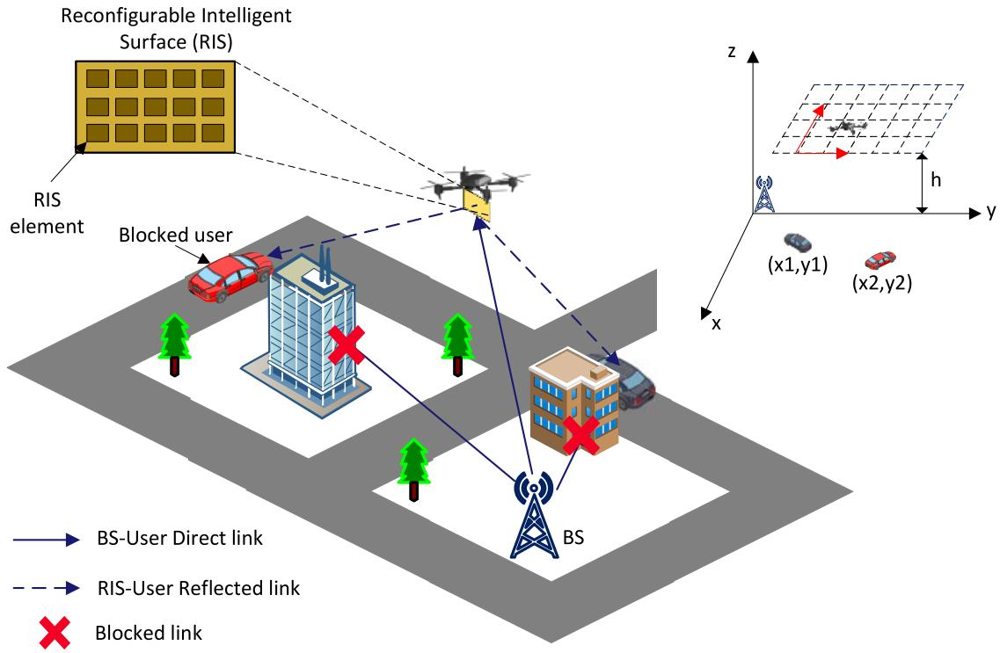
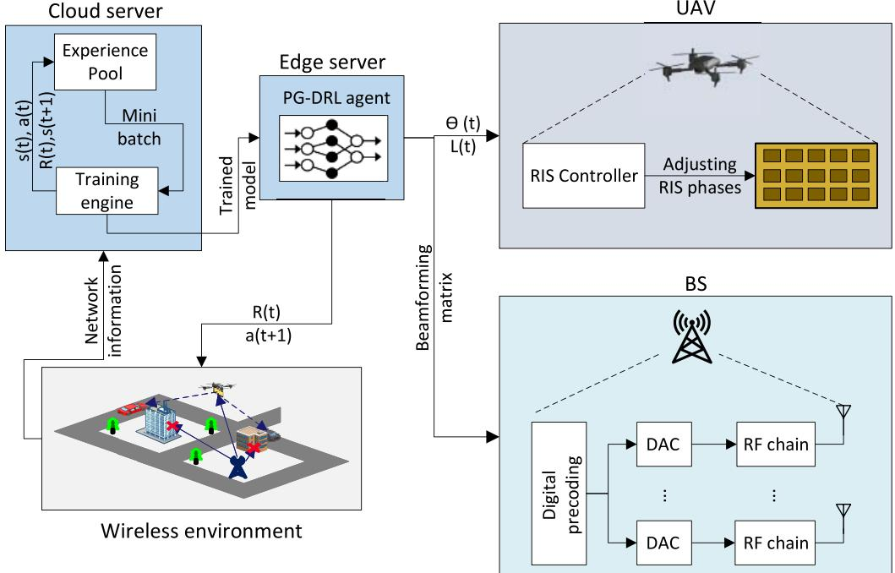
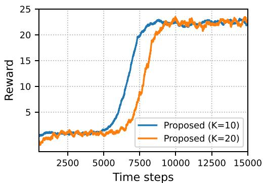
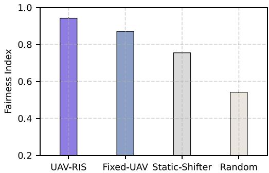
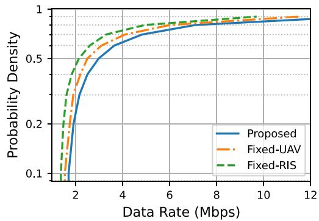
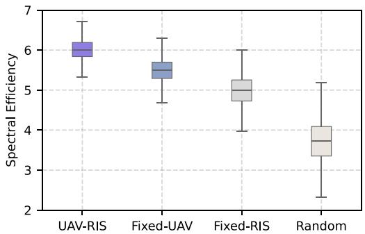
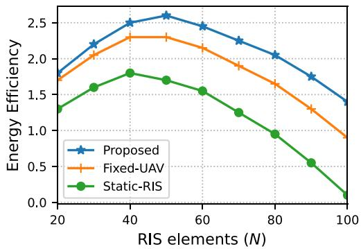
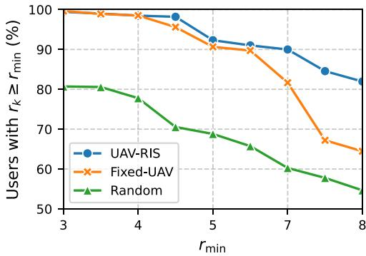

# RIS-UAV Integration for Enhanced Coverage and Energy-Efficient 6G Wireless Networks

Madyan Alsenwi , Member, IEEE, Mehran Abolhasan , Senior Member, IEEE, and Justin Lipman , Senior Member, IEEE

Abstract—This paper studies the beamforming and trajectory design in unmanned aerial vehicles (UAV) assisted wireless networks, where a UAV equipped with a reconfigurable intelligent surface (RIS) flies over a selected area to reflect signals from the BS toward users experiencing link blockages. The objective is to improve energy efficiency while considering the minimum data rate requirements. In this regard, we define a stochastic optimization problem that optimizes both UAV trajectory and RIS phase shifts to maximize network energy efficiency while considering the achieved data rate by each user. A learning framework based on deep reinforcement learning (DRL) is proposed to solve the formulated problem. In the proposed algorithm, a dual computational approach is utilized, where extensive offline training is conducted on a central cloud server while an edge server performs online decision-making. This setup allows for efficient optimization of UAV trajectories and RIS phase shifts in response to the dynamically changing network conditions. The simulation outcomes highlight the proposed algorithm’s success in fulfilling the Qualit-of-Service (QoS) of each user, alongside augmenting the system’s energy efficiency.

Index Terms—RIS, UAV, DRL, reliability, energy efficiency, UAV-aided wireless networks.

## I. INTRODUCTION

## A. Background and Motivations

F IFTH-GENERATION (5G) wireless networks havemarked significant advancements in wireless technology, offering remarkable improvements in data rate, latency, and connectivity. However, one of the most vital issues in 5G networks is the limited coverage range, especially when utilizing higher frequencies such as millimeter Wave (mmWave) bands. These limitations often require more infrastructure, e.g., base stations, to provide effective coverage, which can be costly and challenging. Moreover, supporting diverse applications with distinct requirements across dense urban areas presents a significant challenge in maintaining reliable connectivity and optimal performance. These environments often contain several physical obstructions such as buildings, walls, and other infrastructure that impede signal propagation and degrade network performance. Additionally, the demand for more data and faster speed connections in 5G systems increases energy consumption. Addressing these limitations necessitates the development of sixth-generation (6G) wireless technology, which aims to provide a more flexible, energy efficient, and adaptive network infrastructure. In particular, 6G wireless networks target enabling real-time applications such as tactile Internet and holographic communications and support an extremely high density of connected devices, facilitating the growth of IoT ecosystems. Additionally, 6G systems target enhanced energy efficiency to support sustainable network operations and reduce the environmental impact. Seamless integration of artificial intelligence (AI) for intelligent network management and automation is also a key feature of 6G [1].

Reconfigurable Intelligent Surfaces (RIS) and Unmanned Aerial Vehicles (UAVs) are increasingly being recognized as key technologies that could play a pivotal role in enabling 6G wireless systems due to their significant potential transformative in wireless networks. RIS, with its capability to programmatically control electromagnetic wave propagation, offers opportunities for optimizing signal quality and reducing energy consumption. By dynamically adjusting the phase shifts of incident signals, RIS can effectively steer the communication beams to optimize signal paths, thereby improving coverage and capacity. In this regard, aligning RIS with millimeter-wave (mmWave) networks is a promising approach to mitigate the limitations of mmWave communications, including short communication range, high susceptibility to path loss, and vulnerability to obstructions. Despite this, deploying RIS, specifically in urban areas, presents specific challenges. In particular, building density in urban regions can limit the effective field of view of RIS, making it challenging to sustain high-quality communication links and serve multiple users. Furthermore, the dynamic nature of urban environments, where users’ density and mobility patterns can change rapidly, adds complexity to RIS configuration and deployment.

On the other hand, UAVs, owing to their mobility and deployment flexibility, can be strategically positioned to augment network coverage and enhance reliability, especially in challenging environments. The dynamic repositioning capabilities of UAVs make them particularly advantageous for supplementing or even replacing traditional ground-based infrastructure. Their flexible mobility and three-dimensional freedom enable them to serve as flying base stations or aerial relays that can extend network coverage, improve signal quality, and facilitate high-speed data exchange. This is especially beneficial in scenarios that pose challenges for traditional ground-based network infrastructures, such as remote or densely-populated areas, disaster-stricken regions, or complex terrains. Despite these advantages, the integration of UAVs into wireless networks introduces challenges such as UAV power consumption. The power consumption limitation is further increased when UAVs operate in the mmWave frequency bands due to the energy-intensive nature of high-frequency communications. In particular, mmWave communications require high transmit power due to the high path loss and atmospheric absorption, limiting the operational time of UAVs with constrained energy resources.

Integrating UAVs with RIS technology presents a promising solution to overcome the limitations of static RIS deployments and the energy constraints of UAVs. This approach allows for flexible and dynamic deployment, enabling real-time adaptation to varying network conditions and user densities. The mobility of UAVs, in particular, enables RIS to be strategically positioned in three-dimensional space, optimizing performance and mitigating the limitations associated with static installations. Furthermore, RIS-empowered UAVs can create optimal reflected links without the need for additional transmit power. The passive reflection capability of RIS reduces energy consumption, enhancing the overall energy efficiency of UAVs and offering a promising solution for energy-efficient wireless networks, aligning with the vision and requirements of 6G networks. However, optimizing such complex wireless systems with multiple elements is challenging. To fully realize the benefits of RIS-UAV integration, efficient optimization algorithms are required that can handle largescale network dimensions and dynamically adapt to changes in the wireless environment over time. Classical modeldriven optimization techniques often fall short in providing optimal performance in time-varying systems. Additionally, while data-driven learning-based methods have recently gained significant interest in optimizing wireless networks, they often face challenges in large-scale and uncertain environments. These methods require substantial amounts of training data and computational resources to effectively model large-scale wireless networks [2]. Furthermore, the inherent uncertainty in wireless environments, such as unpredictable channel states and fluctuating user demands, limits the ability of data-driven methods to maintain robust performance [3]. This necessitates the development of efficient learning frameworks that efficiently handle training large-size data and are augmented with robust optimization models specifically designed to perform well under such challenging conditions.

## B. Contributions

This work integrates RIS technology with mmWave frequencies in UAV deployments, taking advantage of the high data rates and large bandwidths that mmWave offers while mitigating its inherent challenges like high path loss. The main contributions of this paper are summarized in the following:

Joint UAV, RIS, and BS Stochastic Optimization Problem: We formulate a stochastic optimization problem that jointly optimizes UAV trajectories, RIS phase shifts, and BS transmit power. The objective is to maximize overall system energy efficiency while ensuring that each user’s minimum data rate requirements are met. This optimization framework takes into account various factors influencing energy efficiency, including UAV hovering energy, RIS power consumption, and BS transmit power. The minimum data rate constraint is expressed as a chance constraint to address the inherent uncertainties in the network environment and ensure reliable performance under variable conditions.

Dual-Operation DRL-based Framework: We develop an efficient DRL-based algorithm to solve the optimization problem. The proposed DRL framework employs a dualoperation approach, combining offline training at a cloud server with online decision-making at the BS. This approach leverages the extensive computational resources of cloud servers to perform intensive training, while the BS handles real-time execution, thereby enhancing the practical viability and adaptability of the solution. The framework is designed for continuous improvement: the BS continuously collects network data and feeds it back to the cloud server, which iteratively updates and refines the model. This feedback loop ensures that the algorithm remains adaptive and increasingly efficient over time.

Simulation Analysis and Performance Evaluation: We provide simulation analysis for validating the effectiveness of the proposed algorithm. Furthermore, we compare the algorithm with related state-of-the-art methods to comprehensively assess the performance of the proposed framework.

## II. LITERATURE REVIEW

UAV-assisted wireless networks have drawn significant interest in recent research works. For instance, the study in [4] detailed three primary applications in UAV-aided wireless systems, namely, ensuring widespread coverage, facilitating relaying functions, and enhancing information dissemination and data collection. The work in [5] provided a review of the latest advancements in UAV wireless communications, with a particular focus on their integration into 5G and future wireless networks. The authors of [6] explored the design of uplink communications in a network architecture involving multiple UAVs and users, adopting the CoMP approach. In [7], the authors investigated methods to reduce the flight duration of UAVs and ensure that user-specific data requirements are met through a joint optimization of UAV paths and resource allocation. Studies in [8], [9], [10] evaluated the use of UAVs as mobile base stations to augment network coverage, addressing challenges in trajectory optimization, interference management, and resource allocation.

Additionally, several works have been done on the inherent constraints of UAV-aided wireless networks, such as size, weight, and power limitations, as discussed in [11], [12], [13]. The studies in [12] and [13] proposed methods for optimizing UAV 3D-trajectories to overcome the UAV’s constraints. Specifically, the approach in [12] was based on convex optimization techniques, while [13] introduced a DRL-based strategy. The authors of [14] focused on enhancing the minimal data rate for users on the ground by optimizing both the UAV trajectory and user scheduling in a UAV-aided wireless system. The study in [15] concentrated on refining the UAV’s trajectory to efficiently distribute data across various ground users within the shortest possible time. Meanwhile, [16] presented a joint optimization of the UAV’s trajectory and the transmission power of ground terminals. This study particularly examined both circular and linear trajectories to understand the balance between UAV propulsion energy and the energy needed for ground communication. The paper in [17] offered an analysis of coverage capabilities, proposing a UAV deployment strategy tailored for emergency situations. The work in [18] delved into determining the altitude for UAVs to minimize transmission power while ensuring coverage over a designated area. In [19], the authors optimized the horizontal positioning of UAVs while maintaining a constant altitude to reduce the number of UAVs necessary for covering a set number of static users. The study in [20] explored UAV cell placement optimization in a three-dimensional framework, presenting insights into spatial deployment strategies.

The work in [21] studied the problem of minimizing the average weighted energy consumption of mobile devices and the UAV in a UAV-assisted mobile edge computing (MEC) system, considering stochastic computation tasks. The authors employ a Lyapunov-based approach to handle task queue dynamics and propose a joint optimization algorithm for computation offloading, resource allocation, and UAV trajectory scheduling. The study in [22] considered a UAV-enabled wireless power transfer and relay communication network, where a UAV harvests and relays data between ground users and a base station while optimizing energy efficiency. The authors proposed a joint optimization framework for transmission durations, power allocation, and UAV trajectory to minimize UAV’s power consumption. The work in [23] studied distributed edge learning in wireless networks, focusing on the integration of learning and communication optimization to overcome issues such as signaling overhead, processing delays, and unstable convergence. The study provided an overview of dual-functional edge learning techniques, discussing key performance metrics, enabling technologies, and their applications in beyond 5G networks, including goal-oriented semantic communication and distributed learning-based optimization.

## A. Integration of UAV-Assisted Networks With RIS

The operation of UAVs is limited by their energy constraints, which limits their ability to provide continuous network coverage and data transmission to all users. Integrating RIS with UAVs is an efficient way to improve wireless network performance and extend network coverage while meeting the energy consumption constraint of UAVs. This integration allows UAVs into work as dynamic reflectors rather than direct signal transmitters, thereby boosting their energy efficiency. Some recent works have studied the advantages of RIS in UAV-assisted wireless systems. The authors in [30] proposed an algorithm to jointly optimize

UAV trajectory and RIS phase shifts aiming at maximizing network downlink capacity. The study in [31] focuses on maximizing secure energy efficiency by optimizing UAV trajectory, RIS phase shifts, user association, and transmit power. The works in [32], [33] studied improving the minimum SNR of each user by jointly optimizing the RIS phase shifts and UAV placement. Specifically, the authors proposed a decomposition-based optimization method to solve the joint RIS phase shifts and UAV placement optimization problem. The work in [24] studied the integration of RIS in UAV-enabled wireless networks to enhance service quality, employing NOMA for spectrum efficiency. The authors formulated an energy consumption minimization problem that optimizes UAV movement, RIS phase shifts, power allocation, and dynamic decoding order. A D-DQN algorithm is proposed to solve the optimization problem. The study in [34] explored using a RIS-assisted UAV for data gathering from IoT devices within a set timeframe. The paper optimized phase shift configurations of the RIS, IoT devices’ transmission scheduling, and the UAV’s trajectory. A DRL approach, specifically PPO, is proposed for solving the UAV trajectory planning, while BCD is used for RIS configuration. In [25], the authors proposed an aerial RIS-assisted URLLC system using UAVs to reflect signals from a macro base station to users. The study introduced an optimization framework to optimize UAV deployment, MBS power allocation, RIS phaseshift, and URLLC blocklength. A DNN approach is used to obtain UAV placement and an optimal resource allocation strategy.

The authors of [26] presented a framework for enhancing HetNet performance using UAV-mounted RISs to minimize total transmit power. The formulated optimization problem is tackled by dividing it into subproblems related to UAV trajectory, RIS phase shifts, and subcarrier allocations. A dueling DQN learning approach and SCA are applied for optimization. The work in [27] studies optimizing the ergodic throughput in UAV-based wireless networks using RIS. The authors addressed challenges related to outdated CSI and non-linear energy harvesters through a two-timescale active and passive beamforming framework. A deep learning-based approach is proposed to maximize ergodic throughput in the presence of outdated CSI. In [28], the authors studied optimizing RIS-UAV systems for mobile vehicles, focusing on achieving equitable downlink communication. The study proposed a method to maximize minimum throughput by jointly optimizing UAV trajectory, RIS passive beamforming, power control, and mobile vehicle scheduling. This complex problem is divided into subproblems solved through successive convex approximation and an iterative optimization algorithm. The study in [29] focused on WPCN enhanced by an RISassisted UAV. The objective is to optimize the minimum throughput among users by optimizing the UAV’s location, user transmit power, transmission time, and RIS’s passive beamforming. A low-complexity algorithm is developed to solve the formulated multi-variable optimization problem. The work in [35] focused on optimizing the UAV’s trajectory and the RIS’s phase-shift to maximize data transfer rates while minimizing propulsion energy using DRL.

TABLE I  
SUMMARY OF LITERATURE ON RIS-UAV INTEGRATION
<table><tr><td>Reference</td><td>Objective</td><td>Methodology</td></tr><tr><td>Xiao Liu, et al. [24]</td><td>Minimize energy consumption in UAV-enabled wireless networks while enhancing service quality through the integration of RIS and employing NOMA for spectrum efficiency</td><td>Proposing a D-DQN algorithm for optimizing UAV&#x27;s trajectory, RIS phase shifts, power allocation from UAV to mobile users, and dynamic decoding order.</td></tr><tr><td>Y. Li, et al. [25]</td><td>Enhance URLLC through UAVs equipped with RIS, acting as signal repeaters from the MBS to users</td><td>Proposing a framework for UAV deployment, MBS power allocation, RIS phase-shift, and URLLC blocklength optimization using a deep neural network.</td></tr><tr><td>A. Khalili, et al. [26]</td><td>Minimize total transmit power while maintaining QoS in RIS-UAV HetNets</td><td>Proposing DQN learning and SCA algorithm for optimizing RIS phase shifts, and subcarrier allocations.</td></tr><tr><td>Lin, Shuying et al. [27]</td><td>Maximize ergodic throughput in RIS-equipped UAV-enabled wireless powered communications with outdated CSI</td><td>Develop a two-timescale active and passive beamforming framework leveraging deep learning to address non-linear energy harvesting and partial reciprocity problems.</td></tr><tr><td>Yu, Yingfeng et al. [28]</td><td>Maximize the minimum throughput among all users by optimizing RIS beamforming and UAV trajectory</td><td>Propose a successive convex approximation and an iterative optimization algorithm to jointly optimize the UAV trajectory, RIS passive beamforming, power control, and vehicle scheduling.</td></tr><tr><td>Zhang, Jiaying et al. [29]</td><td>Enhance minimum throughput among ground users in an RIS-assisted UAV-enabled WPCN</td><td>Develop an alternating optimization-based algorithm to jointly optimize the UAV&#x27;s horizontal location, users&#x27; transmit power, transmission time allocation, and RIS passive beamforming vectors.</td></tr><tr><td>Our work</td><td>Improving energy efficiency in RIS-UAV integrated wireless networks by optimizing UAV trajectory, RIS phase shifts, and BS precoding</td><td>Formulating a stochastic optimization problem and developing a practical dual-operation DRL-based framework to solve it. The framework uses offline training on a central cloud server and online decision-making on an edge server.</td></tr></table>

Unlike the existing works, this paper aims to address the limitations of mmWave communications in dense urban areas by integrating UAVs with RIS technology to create flexible signal reflectors. Specifically, we formulate a stochastic optimization problem to optimize UAV trajectories, RIS phase shifts, and BS transmit power considering dynamics and uncertainties in the wireless environment. The optimization framework includes three-dimensional UAV positioning by optimizing UAV altitude in addition to horizontal movement, which is crucial in complex environments such as urban areas. Furthermore, our work focuses on enhancing the energy efficiency of the system by considering UAV hovering energy, RIS energy consumption, and BS transmit power, aligning with the 6G vision of green communications. Additionally, unlike conventional DRL techniques, which often suffer from slow convergence and poor performance in large-scale action space environments, we propose an efficient dual-operation DRL framework. This framework allows for a separate training of deep neural networks on a high-performance central server while enabling online decision-making by a DRL agent at the BS. A periodic update mechanism between the execution and training units is considered to ensure continuous improvement in decision-making performance over time. Table I highlights the main differences of this paper compared to the most related works.

## III. SYSTEM MODEL AND PROBLEM FORMULATION

## A. Spatial Deployment of UAV-RIS System

We examine a scenario where a BS serves a set K of dynamic users via the downlink at the mmWave frequencies, as shown in Fig. 1. The BS is equipped with M antennas, while all users have a single antenna. A UAV is considered within the BS coverage region, which carries an array of

RIS elements to assist communication between the BS and users. We focus on the scenario with no direct link between the BS and users. In Cartesian coordinates, the location of the BS is denoted as $L _ { b } ~ = ~ ( x _ { b } , y _ { b } , 0 )$ . The location of each user varies over time and is denoted at time slot t as $L _ { k } ( t ) = ( x _ { k } ( t ) , y _ { k } ( t ) , 0 )$ . The altitude of the UAV can be adjusted such that $h _ { \operatorname* { m i n } } \leq h ( t ) \leq h _ { \operatorname* { m a x } }$ where $h _ { \mathrm { m i n } }$ and $h _ { \mathrm { m a x } }$ are the minimum and maximum allowed height, respectively. Thus, the UAV coordinates at time slot t can be represented as $L _ { u } ( t ) ~ = ~ ( x _ { u } ( t ) , y _ { u } ( t ) , h ( t ) )$ ). The UAV’s movement is modeled as discrete steps over a grid in the x-y plane as shown in Fig. 1. At each time slot, the UAV can move to an adjacent position–right, left, up, or down, or remain stationary. The list of used notations in this paper is presented in Table II.

## B. Communication Model

Let N be the number of the reflecting elements carried by the UAV, and $\mathcal { N } = \{ 1 , 2 , \dots , N \}$ define the set of all RIS elements. The phase shift of each element $n \in \mathcal N$ is defined as

$$
\phi _ { n } = \frac { \iota \pi } { 2 ^ { c - 1 } } , \iota \in \{ 0 , 1 , \ldots , 2 ^ { c } - 1 \} , \forall n \in \mathcal { N } ,\tag{1}
$$

where c is the number of the re-programmable meta-material bits, and the amplitude coefficient is given by $\kappa _ { n } ~ \in ~ [ 0 , 1 ]$ Accordingly, the reflection coefficient of the RIS carried by the UAV is given by

$$
\Phi = \mathrm { d i a g } \Big ( \kappa _ { 1 } e ^ { j \phi _ { 1 } } , \dots , \kappa _ { N } e ^ { j \phi _ { N } } \Big ) .\tag{2}
$$

The BS precodes the transmit signal with a precoding vector $\pmb { x } \in \mathbb { C } ^ { M \times 1 }$ as follows

$$
\pmb { x } = \sum _ { k = 1 } ^ { K } { \pmb { w } } _ { k } s _ { k } ,\tag{3}
$$

  
Fig. 1. Considered system model.

TABLE II SUMMARY OF MAIN NOTATIONS
<table><tr><td>Notation</td><td>Definition</td></tr><tr><td> $\kappa$ </td><td>The set of dynamic users.</td></tr><tr><td>N</td><td>Number of RIS reflecting elements.</td></tr><tr><td> $M$ </td><td>Number of BS antenna elements.</td></tr><tr><td> $L _ { k } ( t )$ </td><td>Coordinates of user k.</td></tr><tr><td> $L _ { u } ( t )$ </td><td>UAV coordinates.</td></tr><tr><td> $G ( t )$ </td><td>Channel between the BS and the RIS elements.</td></tr><tr><td> $g _ { k } ( t )$ </td><td>Channel between the RIS and user k.</td></tr><tr><td> $\Phi ( t )$ </td><td>RIS coefficient matrix.</td></tr><tr><td> $W$ </td><td>BS precoding matrix.</td></tr><tr><td> $r _ { k } ( t )$ </td><td>Data rate of the user k at time slot t.</td></tr><tr><td> $B$ </td><td>System bandwidth. UAV hovering power consumption.</td></tr><tr><td> $P _ { \mathrm { h o v } }$ </td><td></td></tr><tr><td> $P _ { \mathrm { R I S } }$ </td><td>RIS power consumption .</td></tr><tr><td> $P _ { \mathrm { U A V } }$ </td><td>Total power consumption of the UAV.</td></tr><tr><td> $\eta ( t )$ </td><td>Energy efficiency of the system.</td></tr><tr><td> $R ( t )$ </td><td>The network reward function.</td></tr><tr><td> $\beta ( t )$ </td><td>Time variance adjustable parameter.</td></tr><tr><td> $A , s$ </td><td>Action and state spaces.</td></tr><tr><td> $Q ( a , s )$ </td><td>The state-action Q-function.</td></tr><tr><td>π</td><td>DRL decision policy.</td></tr></table>

where $\pmb { w } _ { k } \in \mathbb { C } ^ { M \times 1 }$ is the precoding vector of user k, and $s _ { k }$ is the $k ^ { \mathrm { t h } }$ user information symbol.

Let $G \in \mathbb { C } ^ { N \times M }$ define the channel model between the BS and the RIS and $\pmb { g } _ { k } \in \mathbb { C } ^ { 1 \times N }$ represent the reflected channel gfrom the RIS towards the user k. At time slot t, the channel gain between the BS and the RIS carried by the UAV is modeled as

$$
\begin{array} { r } { G ( t ) = \sqrt { g _ { 0 } d _ { b , u } ^ { - \alpha } ( t ) } \Big [ 1 , e ^ { - j \frac { 2 \pi \xi } { \lambda } \vartheta _ { u } ( t ) } , \ldots , e ^ { - j \frac { 2 ( M - 1 ) \pi \xi } { \lambda } \vartheta _ { u } ( t ) } \Big ] ^ { T } , } \end{array}\tag{4}
$$

where g represents the channel gain at a distance of 1 m, $\bar { d _ { b , u } ( t ) } \bar { = } \sqrt { | ( x _ { u } ^ { t } , y _ { u } ^ { t } ) - ( x _ { b } , y _ { b } ) | ^ { 2 } + h ^ { 2 } }$ is the distance between the BS and the UAV and $\begin{array} { r } { \vartheta _ { u } ( t ) = \frac { x _ { u } ( t ) - x _ { b } } { d _ { b , u } ( t ) } } \end{array}$ represents the arrival angle of the signal from the BS to the RIS at time slot $t , \xi$ represents the antenna separation, and finally λ represents the carrier wavelength.

The reflected channel gain from the RIS towards user k is given by

$$
\begin{array} { r } { \pmb { g } _ { k } ( t ) = \sqrt { g _ { 0 } d _ { u , k } ^ { - \alpha } ( t ) } \bigg [ 1 , e ^ { - j \frac { 2 \pi \xi } { \lambda } \pmb { \vartheta } _ { k } ( t ) } , \ldots , e ^ { - j \frac { 2 ( N - 1 ) \pi \xi } { \lambda } \pmb { \vartheta } _ { k } ( t ) } \bigg ] ^ { T } . } \end{array}\tag{5}
$$

Accordingly, the received signal at the user k at time slot t is given as follows:

$$
y _ { k } ( t ) = [ \pmb { g } _ { k } \Phi \pmb { G } ] \pmb { x } _ { k } ( t ) + u _ { k } ,\tag{6}
$$

where $u _ { k }$ is an additive white Gaussian noise with variance $\sigma ^ { 2 }$ . Thus, the signal-to-interference-and-noise-ratio (SINR) at the user k is defined as

$$
\mathrm { S I N R } _ { k } ( W , \Phi , L ) = \frac { | g _ { k } \Phi G w _ { k } | ^ { 2 } } { \sum _ { i \neq k , i \in \mathcal { K } } | g _ { k } \Phi G w _ { i } | ^ { 2 } + \sigma ^ { 2 } } ,\tag{7}
$$

where $\pmb { W } \in \mathbb { C } ^ { M \times K }$ is the BS precoding matrix. To this end, the total obtained data rate by the user k at time slot t can be defined as

$$
r _ { k } ( t ) = B \log _ { 2 } ( 1 + \mathrm { S I N R } _ { k } ( t ) ) ,\tag{8}
$$

where B represents the system bandwidth.

## C. Power Consumption Model of the UAV

The power consumption of the UAV is a composite of the power consumed in hovering $P _ { \mathrm { h o v } }$ , the circuit power consumption $P _ { \mathrm { c } } ,$ and the power consumed by the RIS hardware PRIS. In our model, the RIS is integrated with the UAV; thus, the power consumption of the RIS is a part of the overall power consumption of the UAV.

The UAV hovering power is defined by [36]

$$
P _ { \mathrm { h o v } } = \frac { \xi \sqrt \xi } { \zeta \sqrt { 0 . 5 \pi q r ^ { 2 } \rho } } ,\tag{9}
$$

where ξ represents the thrust, which is contingent on the UAV’s mass. The term ζ indicates the power efficiency of the UAV, and q refers to the number of rotors equipped on each UAV. The parameter r denotes the diameter of each rotor, and lastly, ρ represents the air density (in $\mathrm { k g / m ^ { 3 } } )$ . The RIS is a passive component, eliminating the need for additional transmission power. Therefore, the power consumption of the RIS can be expressed as [37]

$$
P _ { \mathrm { R I S } } = N [ P _ { d } + P _ { s } ( c ) ] ,\tag{10}
$$

where $P _ { d }$ represents the power required by a diode in forward-biased mode, and $P _ { s } ( c )$ corresponds to the power consumption of each phase shifter with c-bit resolution. Note that both phase resolution and the number of RIS elements affect the RIS power consumption.

Accordingly, the total UAV power consumption can be expressed as

$$
P _ { \mathrm { u a v } } = P _ { \mathrm { h o v } } + P _ { \mathrm { R I S } } + P _ { \mathrm { c } } .\tag{11}
$$

## D. Problem Formulation

Our goal is to optimize the RIS phase shifts, the 3-D trajectory of the UAV, and the transmission power at the BS to maximize the energy efficiency of the network. This optimization takes into account the QoS requirements of each user. We define the system’s energy efficiency in terms of bitper-Joule, calculated as the ratio of the network’s cumulative data rate to its total power usage. The total power consumption includes the sum of the power used by the BS for transmission and the power consumed by the UAV, denoted as $P _ { \mathrm { { t o t } } } ~ =$ $\begin{array} { r } { \sum _ { k \in \mathcal { K } } | | \pmb { w } _ { k } | | ^ { 2 } + P _ { \mathrm { u a v } } } \end{array}$ . Consequently, the energy efficiency at any specific time t can be articulated as

$$
\eta ( t ) = \frac { \sum _ { k \in \mathcal { K } } B \log _ { 2 } ( 1 + \mathrm { S I N R } _ { k } ( t ) ) } { \sum _ { k \in \mathcal { K } } \vert \vert w _ { k } \vert \vert ^ { 2 } + P _ { \mathrm { u a v } } } .\tag{12}
$$

In the optimization problem, we take into account the minimum data rate requirement for each user as a probability constraint. Consequently, for each time slot t, we impose the QoS constraint for each user k as

$$
\mathrm { P r } \Big [ r _ { k } ( t ) \geq r _ { k } ^ { \operatorname* { m i n } } \Big ] \geq 1 - \varepsilon , \forall k \in \mathcal { K } ,\tag{13}
$$

where $r _ { k } ^ { \mathrm { m i n } }$ is the minimum required data rate by user k and ε defines the threshold for the maximum allowable violation probability. In particular, the probability constraint (chance constraint) can accommodate the inherent uncertainties and dynamic variations in wireless channels. This approach allows for a more practical and robust optimization and ensures that the system’s performance remains stable even under fluctuating network conditions.

Accordingly, we formulate the following optimization problem:

$$
\operatorname* { m a x i m i z e } _ { x , y , h , w , \Phi } \sum _ { t \in \mathcal { T } } \frac { 1 } { T } \eta ( t )\tag{14a}
$$

$$
\mathrm { s u b j e c t t o ~ } \operatorname* { P r } \{ r _ { k } ( t ) \geq r _ { k } ^ { \operatorname* { m i n } } \} \geq 1 - \varepsilon , \forall k \in \mathcal { K } ,\tag{14b}
$$

$$
\sum _ { k \in \mathcal { K } } \left| \left| w _ { k } \right| \right| ^ { 2 } \leq P _ { \operatorname* { m a x } } ,\tag{14c}
$$

$$
\Phi = \mathrm { d i a g } \Big ( b _ { 1 } e ^ { j \phi _ { 1 } } , \dots , b _ { N } e ^ { j \phi _ { N } } \Big ) ,\tag{14d}
$$

$$
\phi _ { n } = \frac { \kappa \pi } { 2 ^ { c - 1 } } , \kappa \in \{ 0 , 1 , \ldots , 2 ^ { c } - 1 \} ,
$$

$$
b _ { n } \in [ 0 , 1 ] , \forall n \in \mathcal { N } ,\tag{14e}
$$

(14f)

$$
h _ { \operatorname* { m i n } } \leq h ( t ) \leq h _ { \operatorname* { m a x } } , \forall t \in \mathcal { T } ,\tag{14g}
$$

$$
x _ { \mathrm { m i n } } \le x ( t ) \le x _ { \mathrm { m a x } } ,\tag{14h}
$$

$$
y _ { \mathrm { m i n } } \le y ( t ) \le y _ { \mathrm { m a x } } ,\tag{14i}
$$

Optimization problem (14) aims to enhance the system’s energy efficiency by optimizing UAV positioning, BS precoding, and RIS reflection coefficients. The objective function is formulated as the average energy efficiency over time slots to achieve stable and practical long-term energy efficiency. This mitigates short-term fluctuations and ensures consistent performance in dynamic environments. Constraint (14b) ensures that the probability of each user k achieving at least a minimum data rate $r _ { k } ^ { \mathrm { m i n } }$ in every time slot is above a certain threshold. Constraint (14c) ensures that the total power of the precoding matrix does not exceed the maximum power $P _ { \mathrm { m a x } }$ Constraint (14d) defines the RIS reflection coefficients in terms of phase shifts $\phi _ { n }$ and amplitudes $b _ { n } .$ . Constraint (14e) Quantizes the phase shifts, and constraint (14f) restricts the amplitudes to be within [0, 1]. Constraints (14g), (14h), and (14i) define the permissible ranges for UAV’s altitude $h ( t )$ , and its x and y coordinates x(t) and y(t) respectively.

This optimization problem is inherently complex due to the high dimensionality of the decision variables and the presence of linear, nonlinear, and non-convex constraints. Furthermore, the problem involves a mix of discrete and continuous variables, which typically complicates the solution space. Given these factors, this problem falls into the category of NPhard problems. Solving such a problem typically requires computational methods that grow exponentially with the network size, making it intractable for large-scale instances. Therefore, in the subsequent section, we introduce a DRLbased algorithm designed to provide online solutions for (14). In particular, the DRL approach is well-suited for dealing with high-dimensional, dynamic environments as it can adapt in real-time to changes in network conditions.

## IV. PROPOSED DRL-BASED SOLUTION APPROACH

In this section, we leverage DRL techniques to develop an algorithm to solve problem (14) that can adapt seamlessly to the ever-changing network conditions caused by mobile users. First, we model problem (14) as a MDP; then, we propose a learning framework to solve it. In the following subsections, we model the formulated problem (14) as MDP by defining the agent, states, actions, and reward function. Then, we introduce a learning framework based on the policy gradient method within an Actor-Critic architecture.

  
Fig. 2. Block diagram of the developed dual-operation DRL-based framework.

## A. Markov Decision Process Model

The optimization problem presented in (14) is modeled as a MDP. The MDP framework is comprised of states and potential actions, symbolized by S and A, respectively. S represents network conditions, encompassing user channel properties. At any discrete instance t, the agent assesses the present network condition, expressed as $s ( t ) \in S ,$ , and chooses actions according to the strategy π(t), which correlates S with A. In general, the architecture of this model includes four primary elements: the decision-making agents, the states they encounter, the range of actions accessible to them, and the rewards linked to these actions.

Agent: The agent comprises two key components: the actor and the critic networks. This agent is responsible for monitoring the current network states and initiating actions based on the policies it has been trained on. Then, the agent receives feedback in the form of rewards from the environment, which then transits to the subsequent network state.

State Space: The state space is considered a collection of users’ states at each time slot. Consequently, the agent’s state at a given time slot t is encapsulated by $\pmb { s } ( t ) = \{ \pmb { g } _ { k } ( t ) , \pmb { G } ( t ) \}$ s g GHere, the first element denotes the channel information linking the BS and the UAV, while the second element reflects the channel gain experienced between the RIS and the users.

Action Space: The action space encompasses the decision variables of the optimization problem (14a), defined as ${ \mathcal { A } } =$ $\{ x , y , h , w , \Phi \}$ . Specifically, the first two components, and , represent the UAV’s trajectory coordinates. The third entry, , denotes the UAV’s altitude. The last two elements, and Φ, correspond to the BS’s precoding matrix and the RIS’s phase shift adjustments, respectively.

Reward: The reward function acts as an indicator that evaluates the impact of an agent’s actions in a specific state. It plays a pivotal role during training, where the training engine allocates a corresponding reward upon the agent’s action decision. This reward informs the refinement of the policy π, steering it towards an optimal state characterized by higher rewards. In alignment with the goals set in the optimization problem (14), the reward function is designed to maximize the network’s energy efficiency while also ensuring user-specific QoS requirements are met. The reward function is formulated as follows:

$$
R ( t ) = \eta ( t ) + \beta ( t ) \sum _ { k \in \mathcal { K } } \big [ r _ { k } ( t ) - r _ { k } ^ { \mathrm { m i n } } \big ] ,\tag{15}
$$

where the parameter $\beta ( t )$ is dynamically adjustable according to the system’s requirements over time, ensuring the minimum data rate requirements over different time slots. The agent, upon receiving the network state $s ( t )$ , makes policydriven decisions $\pmb { \pi } ( s , \pmb { a } )$ . Subsequently, the reward $R ( t )$ is computed as per (15), based on the chosen action and the updated network state. This feedback mechanism facilitates the continual learning and evolution of the policy.

## B. Proposed DRL-Based Framework

In the proposed framework, a hybrid computational model is implemented, including offline training and online execution components, as depicted in Fig. 2. The offline component involves training the algorithm at a centralized cloud server, leveraging its substantial computational resources and data storage capabilities. The trained model is deployed for online execution at a network edge server. This enables online decision-making based on the current network conditions. The proposed algorithm performs periodic training to adapt to changes in the dynamic network parameters. This approach allows for the periodic updating of the neural network model, including adjustments to its input and output dimensions, if necessary, to reflect changes in the network environment such as changes in the number of users. These updates occur at the end of training epochs, which span several time slots, rather than at each individual time slot. This provides a balance between the stability of the model and its ability to adapt to longer-term trends in network dynamics.

A learning algorithm based on the policy gradient technique within the actor-critic architecture is considered for training processes. The actor-network is responsible for choosing actions based on the policy π that it has learned. Concurrently, the critic network evaluates the efficacy of these actions by the following state-action

$$
Q ^ { \pi } ( \pmb { a } , \pmb { s } ) = \mathbb { E } _ { \pi } \left[ \sum _ { \tau = 0 } ^ { \infty } \gamma ^ { \tau } R ( t + \tau + 1 ) \mid \pmb { s } ^ { t } = \pmb { s } , \pmb { a } ^ { t } = \pmb { a } \right] ,\tag{16}
$$

where $\gamma ,$ with values in the interval (0, 1], serves as the discount factor that diminishes the value of future rewards. The primary aim is to refine the state-action function in a manner that leads to the optimal policy, $\pi ^ { * }$ . This process involves iterative adjustments of the weighting parameters in both the actor and critic networks toward convergence.

In the actor part of the framework, the initial policy setup is based on the network parameter vector θ, defined as:

$$
\pi ( s , a ; \pmb \theta ) = P r ( \pmb a | s , \pmb \theta ) .\tag{17}
$$

To steer the optimization process, we use the following objective function:

$$
J ( \pi ; \pmb { \theta } ) = \int _ { S } \int _ { A } \pi ( \pmb { s } , \pmb { a } ; \pmb { \theta } ) Q ^ { \pi } ( \pmb { s } , \pmb { a } ) d a d \boldsymbol { s } .\tag{18}
$$

Subsequently, the parameters of the actor network, θ, are iteratively updated in accordance with:

$$
\pmb \theta ( t + 1 ) = \pmb \theta ( t ) + \rho _ { a } \nabla _ { \pmb \theta } J ( \pmb \pi ; \pmb \theta ) ,\tag{19}
$$

where $\rho _ { a }$ denotes the learning rate of the actor network, and $\nabla _ { \pmb \theta } J ( \pmb \pi ; \pmb \theta )$ represents the gradient of the objective function $J ( \pmb { \pi } ; \pmb { \theta } )$ relative to $\pmb \theta .$

Within the critic part, a function estimator technique is empolyed to approximate the state-action function $Q ^ { \pi } ( s , \pmb { a } )$ The approximation is achieved using a linear function estimator, expressed as:

$$
V ( \pmb { s } , \pmb { a } ) = \pmb { \xi } ^ { T } \pmb { \psi } ( \pmb { s } , \pmb { a } ) = \sum _ { i \in \pmb { S } } \xi _ { i } \psi _ { i } ( \pmb { s } , \pmb { a } ) ,\tag{20}
$$

here, $\pmb { \psi } = [ \psi _ { 1 } , \dots , \psi _ { S } ] ^ { T }$ represents the basis function, and ${ \pmb \xi } = ( \xi _ { 1 } , \dots , \xi _ { S } ) ^ { T }$ is the corresponding weight vector. To identify the error between the actual and the estimated values, we apply the Temporal-Difference approach:

$$
\delta ( t ) = R ( t + 1 ) + \gamma V \big ( s ^ { t + 1 } , a ^ { t + 1 } \big ) - V \big ( s ^ { t } , a ^ { t } \big ) .\tag{21}
$$

The vector ${ \pmb \xi } ( { \pmb s } , { \pmb a } )$ is updated using gradient descent as follows:

$$
\begin{array} { r l } & { \pmb { \xi } \left( s ^ { t + 1 } , { \pmb { a } } ^ { t + 1 } \right) = \pmb { \xi } \left( s ^ { t } , { \pmb { a } } ^ { t } \right) + \rho _ { c } \delta ( t ) \nabla _ { \xi } V ( s , { \pmb { a } } ) } \\ & { \qquad = \pmb { \xi } \left( s ^ { t } , { \pmb { a } } ^ { t } \right) + \rho _ { c } \delta ( t ) \pmb { \psi } ( s , { \pmb { a } } ) , } \end{array}\tag{22}
$$

where $\rho _ { c }$ is the critic learning rate. The value function detailed in (20) undergoes updates in line with the changes in ${ \pmb \xi } ( { \pmb s } , { \pmb a } )$ as specified in (22).

To enhance the stability of the training process, we incorporate experience replay technology within the training process. This involves maintaining a replay buffer with a capacity of D. Periodically, the training unit performs minibatch sampling of size d from the experience buffer, which serves as input for the actor-critic network training process. This approach enhances the learning process by re-utilizing past experiences. The execution agent, located at the edge server, uses the trained model to make instantaneous decisions on the optimal UAV trajectories, RIS phase shifts, and BS transmit power. The agent obtains the reward and relays it to the cloud server with the network observations. This continuous feedback loop ensures that the model is constantly evolving and adapting. Furthermore, the proposed algorithm performs periodic training to adapt to changes in the number of users, as well as other dynamic network parameters. This approach allows for the periodic updating of the neural network model, including adjustments to its input and output dimensions, if necessary, to reflect changes in the network environment. These updates occur at the end of training epochs, which span several time slots, rather than at each individual time slot. This provides a balance between the stability of the model and its ability to adapt to longer-term trends in network dynamics. Furthermore, in the proposed approach, we trained initial models on a variety of learning tasks and environments to enhance the adaptability of the models to new learning tasks and environments with minimal re-training samples.

## C. Computation Complexity Analysis

Let’s define L as the total number of layers of the DNN used in our model, $Z _ { o }$ as the input layer’s dimension, and $Z _ { l }$ as the count of neurons within the $l ^ { \mathrm { { \dot { t } h } } }$ layer. The computational complexity for an agent in each step of the process is then represented by $\begin{array} { r } { \mathcal { O } ( \bar { Z _ { o } } Z _ { l } + \sum _ { l = 1 } ^ { L - 1 } Z _ { l } \bar { Z } _ { l + 1 } ) } \end{array}$ . Considering that $\Omega _ { e p i }$ represents the total number of episodes, with each episode comprising T time steps, the overall computational demand of the DNN is $\begin{array} { r } { \mathcal { O } ( \Omega _ { e p i } T ( Z _ { o } Z _ { l } + \sum _ { l = 1 } ^ { L - 1 } \bar { Z } _ { l } Z _ { l + 1 } ) ) } \end{array}$ Note that the DNN training is performed offline on a cloud server due to the high complexity of the training process.

The complexity entailed in the decision-making process, particularly when selecting an action a from the set ${ \mathcal { A } } ,$ correlates with the size of the state and action spaces. Thus, the computational complexity of the execution process is quantified as $\mathcal { O } ( | \mathcal { S } | ^ { 2 } \times | \bar { \mathcal { A } } | )$ . Consequently, the entire computational load of the algorithm is calculated as $\mathcal { O } ( \Omega _ { e p i } T ( Z _ { o } Z _ { l } +$ $\begin{array} { r } { \sum _ { l = 1 } ^ { L - 1 } Z _ { l } Z _ { l + 1 } ) + | \bar { \mathcal { S } } | ^ { 2 } \times | \mathcal { A } | ) } \end{array}$

  
Fig. 3. Obtained reward over time steps during training.

## V. PERFORMANCE EVALUATION

## A. Simulation Settings

This section presents a thorough simulation analysis to assess the effectiveness of the proposed algorithm in a UAVassisted wireless environment. The base station is equipped with a $6 \times 6$ uniform planar array, consisting of 36 RF chains and $M = 3 6$ antennas. The RIS is considered with a matrix of reflection elements, totaling $N \ = \ N _ { r o w } \times N _ { c o l } .$ , where $N _ { c o l } = 2 0$ . The number of rows, $N _ { r o w }$ , is varied to explore different performance metrics under varying configurations. Noise power across the network is uniformly maintained at $\sigma _ { k , b } ^ { 2 } ~ = ~ - 9 0 \mathrm { d B m }$ for all users k in set K. The simulation environment also considers the dynamic nature of the network, with users entering the coverage area following a Poisson distribution. The arrival rate, denoted as λ(t), varies over time slots, reflecting the changing characteristics of traffic and network demand.

We employ a deep neural network architecture featuring three hidden layers. These layers are configured with 600, 300, and 250 neurons, respectively. The neuron count in the input layer and output layer is aligned with the count of network states and actions, respectively. A discount factor of 0.95 is employed, and the learning rate is tuned to 0.001. The experience replay buffer is configured with a capacity of 2000 transitions. During training, the agent samples minibatches of size 32. The simulations of the proposed algorithm are conducted on a PC equipped with an Intel Core i5-2410M CPU.

We thoroughly analyze the performance of the proposed approach under various network settings and evaluate it using multiple performance indicators. To further validate the effectiveness of our algorithm, we compare its performance with the following state-of-the-art approaches:

1) Fixed-UAV [38]: In this approach, a UAV equipped with a RIS is hovering at a fixed location to reflect signals from the BS to users. The RIS phase shifts are optimized to direct signals toward users experiencing blocked direct links. This baseline is chosen to highlight the advantages of jointly optimizing both UAV trajectory and RIS phase shifts, resulting in more flexible and adaptable signal reflection.

2) Fixed-RIS [39]: This method involves installing a fixed RIS on a building to reflect signals toward users with link blockages. This approach has been widely considered in the literature; for instance, the work in [39]. Comparing our approach with this baseline demonstrates the benefits of deploying RIS on a UAV, offering more flexible and dynamic reflections compared to static installations.

  
Fig. 4. Jain fairness of data rate among users.

3) Static-Phase-Shift: In this scenario, all phase shifters are set to the same reflection angles, directing the signal in a single direction at a time. This comparison is motivated by the need to highlight the advantages of individually optimizing RIS reflection elements. Although individually optimizing each element complicates the optimization problem, it significantly enhances network performance by allowing simultaneous signal reflection to multiple users in different locations.

4) Random: Here, the RIS phase shifts are set randomly. This baseline illustrates the benefits of optimizing RIS reflection angles over simply setting RIS phase shifts randomly.

## B. Results Discussion

We analyze the convergence behavior of the proposed algorithm in Fig. 3, which depicts the reward evolution over time for two different user densities: K = 10 and $K = 2 0$ The results demonstrate an improvement in reward values over time as the algorithm iteratively refines its decisionmaking process to adapt to the dynamic network changes. Furthermore, we can observe that the algorithm exhibits stable increasing behavior. The results also show the impact of user density on convergence speed. Specifically, for the scenario with K = 10 users, the algorithm converges faster and reaches a stable state after approximately 7,500 time steps. In contrast, for the scenario with K = 20 users, the convergence occurs at a slower rate and requires approximately 10,000 time steps to reach stability. This increase in convergence time with higher user density is attributed to the larger action space, which requires the learning agent to process a greater variety of network conditions before arriving at an optimal strategy.

Figure 4 presents the fairness index among users obtained using four different approaches: the proposed UAV-RIS approach, the Fixed-UAV approach, the Static-Shift approach, and the Random scenario. The fairness index values are calculated based on Jain’s Fairness Index [40], which is

  
Fig. 5. CDF of per-user data rate obtained over several time slots.

defined as:

$$
f ( r _ { 1 } , \dots , r _ { K } ) = \frac { \left( \sum _ { k \in \mathcal { K } } r _ { k } \right) ^ { 2 } } { K \sum _ { k \in \mathcal { K } } r _ { k } ^ { 2 } } .\tag{23}
$$

As illustrated in Figure 4, the proposed UAV-RIS approach achieves the highest fairness index among all the evaluated methods. This is due to the capability of the proposed approach in optimizing the position of the UAV and adjusting the RIS phase shifts simultaneously to enhance energy efficiency while ensuring that all users achieve at least the minimum required data rate (constraint 14b), preventing severe performance degradation for any user. Specifically, the algorithm optimizes the UAV location and adjusts the RIS phase shifts at each time slot to steer reflected signals toward users with poor or blocked channels. This ensures that users experiencing unfavorable channel conditions receive adequate reflected signal quality to mitigate potential data rate drops and hence improving the fairness index. The Fixed-UAV and Static-Shift approaches exhibit moderate fairness index values. The Fixed-UAV approach involves a UAV equipped with an RIS fixed in position, optimizing the phase shifts to improve signal reflection. However, the lack of UAV mobility limits its ability to address channel blockages dynamically. On the other hand, the Static-Shift approach uses an RIS with static phase shift settings, which can only be optimized for a limited set of conditions. Finally, the results show that the Random scenario shows the worst performance. In this approach, the phase shifts of the RIS are set randomly without considering the status of channel blockages or user locations. This lack of optimization results in a lower fairness index as the randomness in phase shift values fails to effectively mitigate channel blockages.

Figure 5 presents the CDF of data rates experienced by individual users over multiple time slots with various network size configurations, with the y-axis in log-scale for better clarity. The results show that the performance of the proposed UAV-RIS methodology outperforms both the Fixed-RIS and Fixed-UAV approaches. This is because of the joint optimization employed by the proposed method, which includes optimizing the phase shifts of the RIS elements and the UAV positions, the BS transmit power. This joint optimization approach enables more effective and flexible signal reflection towards users in areas with obstructed direct links. As illustrated in Figure 5, the proposed approach achieves a data rate higher than the Fixed-RIS method. Additionally, the obtained results show that the Fixed-UAV approach achieves a data rate better than the Fixed-RIS but still falls short of the proposed algorithm.

  
Fig. 6. Spectral efficiency(bits/second/Hz).

  
Fig. 7. Energy efficiency (Mbits/Joule) for a different number of RIS reflection elements.

We analyze the spectral efficiency of the proposed UAV-RIS approach in Figure 6 and compare its performance with Fixed-UAV, Fixed-RIS, and Random methods. The results demonstrate that the proposed UAV-RIS algorithm outperforms the other baseline methods. The UAV-RIS algorithm achieves an average spectral efficiency of approximately 6 bits/second/Hz. The Fixed-UAV method shows lower performance with an average spectral efficiency of approximately 5.4 bits/second/Hz due to the lack of adaptability in response to changing network states as the UAV is located at a fixed position. The Fixed-RIS method, which installs the RIS on a building instead of a UAV, demonstrates an average spectral efficiency of about 5 bits/second/Hz. In particular, the fixed installation of the RIS limits its ability to adapt to changing network conditions. The Random method, which employs random configurations for both UAV positioning and RIS phase shifts, exhibits the lowest average spectral efficiency of around 3.7 bits/second/Hz. This approach lacks any optimization strategy, resulting in inefficient use of the spectrum.

Figure 7 presents an analysis of how energy efficiency correlates with the number of RIS elements and compares the performance of the proposed approach with the Fixed-UAV and Static-RIS methods. Initially, as the number of RIS elements increases, there is a noticeable improvement in energy efficiency. This improvement is primarily because more elements redirect more signals toward the users, thus boosting the data rate, which is a dominant contributor to energy efficiency. However, as the number of elements continues to rise, we reach a point where energy efficiency peaks and then starts to decline. This is because the data rate achieves a saturation point beyond which no further gains are realized despite adding more reflection elements. At the same time, the RIS power consumption continues to increase due to increasing the number of reflection elements. Consequently, this leads to a decrease in energy efficiency as the number of RIS elements increases beyond the optimal point. As shown in Figure 7, the proposed approach provides superior energy efficiency, peaking at an optimal point before gradually declining. The Fixed-UAV approach follows a similar trend but achieves slightly lower efficiency, as it lacks the dynamic flexibility of the proposed method. The Static-RIS method, on the other hand, shows the worst performance, particularly as the number of elements increases, because it lacks the ability to dynamically adapt to changing conditions.

  
Fig. 8. Percentage of users who achieved the minimum required data rate.

The reliability of the proposed framework is analyzed in Fig. 8. We define network reliability as the proportion of users who achieve a data rate surpassing the minimum threshold. This metric effectively measures the algorithm’s capability to direct reflected signals to users with non-LoS connections. As indicated in Fig. 8, the proposed algorithm demonstrates superior reliability compared to other baseline methods. This is because the proposed algorithm focuses on ensuring the minimum data rate of all users by optimizing signal reflection toward users experiencing lower data rates. Specifically, the results of Fig. 8 show that the proposed approach maintains a reliability level of approximately 97% when the minimum required data rate $( r ^ { \operatorname* { m i n } } )$ is set to 4 Mbps. At a higher threshold of 8 Mbps for $r ^ { \mathrm { m i n } }$ , the proposed method still maintains an acceptable reliability of about 80%. In contrast, the Fixed-UAV and Random strategies exhibit lower reliability, approximately 64% and 55%, respectively.

## VI. CONCLUSION

This paper has proposed a reliable communication system where a UAV is equipped with RIS to provide LoS links to users with poor wireless link connections. Specifically, an optimization problem has been provided to obtain the optimal UAV trajectory, RIS phase shifts and BS transmit power that maximizes the system energy efficiency while considering the QoS requirements of each user. We have proposed an efficient dual-operation DRL-based algorithm that can observe network states and make online decisions while performing periodic offline training over time. The provided simulation results demonstrated that the proposed approach ensures the required QoS for each user while improving the energy efficiency of the network. The results highlighted the advantages of integrating UAVs with RISs to enhance connectivity in densely built urban environments, meeting the requirements of future wireless networks in terms of higher data rates, reliable connectivity, and energy efficiency. Future works can extend this paper to scenarios that involve multiple UAVs and employ the multi-agent DRL approach to manage the increased complexity and coordination required. Additionally, integrating energy harvesting technologies can be explored to enhance the sustainability and operationality of the UAV-RIS systems.

## REFERENCES

[1] W. Saad, M. Bennis, and M. Chen, “A vision of 6G wireless systems: Applications, trends, technologies, and open research problems,” IEEE Netw., vol. 34, no. 3, pp. 134–142, May/Jun. 2020.

[2] Y. Sun, M. Peng, Y. Zhou, Y. Huang, and S. Mao, “Application of machine learning in wireless networks: Key techniques and open issues,” IEEE IEEE Commun. Surveys Tuts., vol. 21, no. 4, pp. 3072–3108, 4th Quart., 2019.

[3] M. Elsayed and M. Erol-Kantarci, “AI-enabled future wireless networks: Challenges, opportunities, and open issues,” IEEE Veh. Technol. Mag., vol. 14, no. 3, pp. 70–77, Sep. 2019.

[4] Y. Zeng, R. Zhang, and T. J. Lim, “Wireless communications with unmanned aerial vehicles: Opportunities and challenges,” IEEE Commun. Mag., vol. 54, no. 5, pp. 36–42, May 2016.

[5] Y. Zeng, Q. Wu, and R. Zhang, “Accessing from the sky: A tutorial on UAV communications for 5G and beyond,” Proc. IEEE, vol. 107, no. 12, pp. 2327–2375, Dec. 2019.

[6] L. Liu, S. Zhang, and R. Zhang, “Comp in the sky: Uav placement and movement optimization for multi-user communications,” IEEE Trans. Commun., vol. 67, no. 8, pp. 5645–5658, Aug. 2019.

[7] J. Zhang, Y. Zeng, and R. Zhang, “UAV-enabled radio access network: Multi-mode communication and trajectory design,” IEEE Trans. Signal Process., vol. 66, no. 20, pp. 5269–5284, Oct. 2018.

[8] S. Zhang, Y. Zeng, and R. Zhang, “Cellular-enabled UAV communication: A connectivity-constrained trajectory optimization perspective,” IEEE Trans. Commun., vol. 67, no. 3, pp. 2580–2604, Mar. 2019.

[9] Y. Zeng, J. Lyu, and R. Zhang, “Cellular-connected UAV: Potential, challenges, and promising technologies,” IEEE Wireless Commun., vol. 26, no. 1, pp. 120–127, Feb. 2019.

[10] A. Al-Hourani and K. Gomez, “Modeling cellular-to-UAV path-loss for suburban environments,” IEEE Wireless Commun. Lett., vol. 7, no. 1, pp. 82–85, Feb. 2018.

[11] Y. Zeng and R. Zhang, “Energy-efficient UAV communication with trajectory optimization,” IEEE Trans. Wireless Commun., vol. 16, no. 6, pp. 3747–3760, Jun. 2017.

[12] Q. Wu and R. Zhang, “Common throughput maximization in UAVenabled OFDMA systems with delay consideration,” IEEE Trans. Commun., vol. 66, no. 12, pp. 6614–6627, Dec. 2018.

[13] H. Mei, K. Wang, D. Zhou, and K. Yang, “Joint trajectory-task-cache optimization in UAV-enabled mobile edge networks for cyber-physical system,” IEEE Access, vol. 7, pp. 156476–156488, 2019.

[14] Q. Wu, Y. Zeng, and R. Zhang, “Joint trajectory and communication design for UAV-enabled multiple access,” in Proc. IEEE Global Commun. Conf., 2017, pp. 1–6.

[15] Y. Zeng, X. Xu, and R. Zhang, “Trajectory design for completion time minimization in UAV-enabled multicasting,” IEEE Trans. Wireless Commun., vol. 17, no. 4, pp. 2233–2246, Apr. 2018.

[16] D. Yang, Q. Wu, Y. Zeng, and R. Zhang, “Energy tradeoff in ground-to-UAV communication via trajectory design,” IEEE Trans. Veh. Technol., vol. 67, no. 7, pp. 6721–6726, Jul. 2018.

[17] I. Dalmasso, I. Galletti, R. Giuliano, and F. Mazzenga, “Wimax networks for emergency management based on UAVs,” in Proc. IEEE 1st AESS Eur. Conf. Satell. Telecommun. (ESTEL), 2012, pp. 1–6.

[18] M. Mozaffari, W. Saad, M. Bennis, and M. Debbah, “Drone small cells in the clouds: Design, deployment and performance analysis,” in Proc IEEE Global Commun. Conf. (GLOBECOM), 2015, pp. 1–6.

[19] J. Lyu, Y. Zeng, R. Zhang, and T. J. Lim, “Placement optimization of UAV-mounted mobile base stations,” IEEE Commun. Lett., vol. 21, no. 3, pp. 604–607, Mar. 2017.

[20] R. I. Bor-Yaliniz, A. El-Keyi, and H. Yanikomeroglu, “Efficient 3-D placement of an aerial base station in next-generation cellular networks,” in Proc. IEEE Int. Conf. Commun. (ICC), 2016, pp. 1–5.

[21] J. Zhang et al., “Stochastic computation offloading and trajectory scheduling for UAV-assisted mobile edge computing,” IEEE Internet Things J., vol. 6, no. 2, pp. 3688–3699, Apr. 2019.

[22] Z. He et al., “Energy minimization for UAV-enabled wireless power transfer and relay networks,” IEEE Internet Things J., vol. 10, no. 21, pp. 19141–19152, Nov. 2023.

[23] W. Xu, Z. Yang, D. W. K. Ng, M. Levorato, Y. C. Eldar, and M. Debbah, “Edge learning for B5G networks with distributed signal processing: Semantic communication, edge computing, and wireless sensing,” IEEE J. Sel. Topics Signal Process., vol. 17, no. 1, pp. 9–39, Jan. 2023.

[24] X. Liu, Y. Liu, and Y. Chen, “Machine learning empowered trajectory and passive beamforming design in UAV-RIS wireless networks,” IEEE J. Sel. Areas Commun., vol. 39, no. 7, pp. 2042–2055, Jul. 2021.

[25] Y. Li, C. Yin, T. Do-Duy, A. Masaracchia, and T. Q. Duong, “Aerial reconfigurable intelligent surface-enabled URLLC UAV systems,” IEEE Access, vol. 9, pp. 140248–140257, 2021.

[26] A. Khalili, E. M. Monfared, S. Zargari, M. R. Javan, N. M. Yamchi, and E. A. Jorswieck, “Resource management for transmit power minimization in UAV-assisted RIS HetNets supported by dual connectivity,” IEEE Trans. Wireless Commun., vol. 21, no. 3, pp. 1806–1822, Mar. 2022.

[27] S. Lin, Y. Zou, and D. W. K. Ng, “Ergodic throughput maximization for RIS-equipped-UAV-enabled wireless powered communications with outdated CSI,” IEEE Trans. Commun., vol. 72, no. 6, pp. 3634–3650, Jun. 2024.

[28] Y. Yu, X. Liu, and V. C. M. Leung, “Fair downlink communications for RIS-UAV enabled mobile vehicles,” IEEE Wireless Commun. Lett., vol. 11, no. 5, pp. 1042–1046, May 2022.

[29] J. Zhang et al., “Throughput maximization for RIS-assisted UAV-enabled WPCN,” IEEE Access, vol. 12, pp. 13418–13430, 2024.

[30] Q. Zhang, W. Saad, and M. Bennis, “Reflections in the sky: Millimeter wave communication with UAV-carried intelligent reflectors,” in Proc. IEEE Global Commun. Conf. (GLOBECOM), 2019, pp. 1–6.

[31] H. Long et al., “Reflections in the sky: Joint trajectory and passive beamforming design for secure UAV networks with reconfigurable intelligent surface,” 2020, arXiv:2005.10559.

[32] H. Lu, Y. Zeng, S. Jin, and R. Zhang, “Aerial intelligent reflecting surface: Joint placement and passive beamforming design with 3D beam flattening,” IEEE Trans. Wireless Commun., vol. 20, no. 7, pp. 4128–4143, Jul. 2021.

[33] H. Lu, Y. Zeng, S. Jin, and R. Zhang, “Enabling panoramic full-angle reflection via aerial intelligent reflecting surface,” in Proc. IEEE Int. Conf. Commun. Workshops (ICC Workshops), 2020, pp. 1–6.

[34] A. Al-Hilo, M. Samir, M. Elhattab, C. Assi, and S. Sharafeddine, “RISassisted UAV for timely data collection in IoT networks,” IEEE Syst. J., vol. 17, no. 1, pp. 431–442, Mar. 2023.

[35] H. Mei, K. Yang, Q. Liu, and K. Wang, “3D-trajectory and phaseshift design for RIS-assisted UAV systems using deep reinforcement learning,” IEEE Trans. Veh. Technol., vol. 71, no. 3, pp. 3020–3029, Mar. 2022.

[36] M. Monwar, O. Semiari, and W. Saad, “Optimized path planning for inspection by unmanned aerial vehicles swarm with energy constraints,” in Proc. IEEE Global Commun. Conf. (GLOBECOM), 2018, pp. 1–6.

[37] C. Huang, A. Zappone, G. C. Alexandropoulos, M. Debbah, and C. Yuen, “Reconfigurable intelligent surfaces for energy efficiency in wireless communication,” IEEE Trans. Wireless Commun., vol. 18, no. 8, pp. 4157–4170, Aug. 2019.

[38] P. Qian, Y. Zhang, X. Yan, Y. Chen, and Y. Sun, “A robust scheme for RIS-assisted UAV secure communication in IoT,” Electronics, vol. 12, no. 11, p. 2507, 2023.

[39] M. Alsenwi, M. Abolhasan, and J. Lipman, “Intelligent and reliable millimeter wave communications for RIS-aided vehicular networks,” IEEE Trans. Intell. Transp. Syst., vol. 23, no. 11, pp. 21582–21592, Nov. 2022.

[40] R. Jain, D.-M. Chiu, and W. R. Hawe, A Quantitative Measure of Fairness and Discrimination for Resource Allocation in Shared Computer System, Eastern Res. Lab., Digit. Equip. Corp., Hudson, MA, USA, 1984.