# RUNs: Fast and Robust Network Slicing for UAV-Assisted Wireless Networks Under Imperfect CSI and Node Mobility

Fengsheng Wei , Senior Member, IEEE, Gang Feng , Fellow, IEEE, Haokang Lou, Shuang Qin , Senior Member, IEEE, and Wei Jiang , Member, IEEE

Abstract—Uncrewed aerial vehicle (UAV) assisted wireless network (UAWN) is emerging as a promising architectural innovation for the provisioning of ubiquitous coverage and enhanced connectivity in the forthcoming 6G era. To accommodate the increasingly diversified services of 6G without deploying individual UAWNs for each service type, the integration of network slicing with UAWNs becomes essential. However, unlike terrestrial networks, the dynamic and uncertain network conditions caused by the mobility of the UAVs pose significant challenges to the UAWN slicing problem. In this paper, we investigate the UAWN slicing problem by jointly considering UAV deployment, channel allocation, and power allocation under uncertain network conditions including imperfect channel state information, uncertain user demand, and imprecise user location. As expected, this problem turns out to be a robust nonconvex mixed-integer problem, making it overwhelmingly difficult to solve. In light of the limited computing power of the UAV, we propose a lightweight optimization named RUNs, which jointly exploits problem decomposition, the augmented Lagrange method, and the batch coordinate descent method. We prove that the RUNs framework runs fast in the sense that it converges to the stationary point at a log-linear rate. Meanwhile, the numerical results demonstrate that RUNs has significant performance gains over existing benchmark solutions.

Index Terms—UAV-assisted wireless networks, network slicing, augmented Lagrange method, batch coordinate descent.

## I. INTRODUCTION

ATELLITE-AERIAL-GROUND integrated network S (SAGIN) is a new architectural proposal that integrates the infrastructures of the space, the air, and the ground, forming a heterogeneous 3D network that aims at providing ubiquitous coverage and seamless connections to the globe [1]. Benefited by the prominent features of uncrewed aerial vehicles (UAVs), such as agile deployment, low cost, line-of-sight transmissions, UAV-assisted wireless networks (UAWNs) have been convinced as one of the most important constitutes of SAGIN [2]. As a consequence, UAWNs have been adopted in increasingly diversified scenarios such as integrated sensing and communication (ISAC), semantic communications (SemCom), vehicle-to-everything (V2X), etc [1], [3], [4], [5], [6]. However, these applications have distinct characteristics in terms of data rate, delay, packet size, power efficiency, etc, which are unable to be simultaneously satisfied by a common UAWN. Therefore, integrating network slicing with UAWNs and tailoring a common UAWN into multiple customized network slices for each service type becomes a promising solution.

In addition to the provisioning of differentiated services, network slicing can also provide additional advantages to UAWN, such as a reduction in the number of UAV deployments, a decrease in the probability of collisions, and a reduction in energy consumption [7]. However, to fully unleash the above advantages, a number of challenges should be tackled. First, due to the ever-changing network environment caused by the mobility of UAVs, the UAWN slicing problem is intrinsically a dynamic problem that is extremely hard to solve. Second, it is impractical for UAVs to obtain precise channel state information (CSI) and real-time user locations in such a dynamic network [8]. Third, as the aerial base stations of UAWNs, UAVs have very limited computing capability and energy, which means that highcomplexity solutions are inapplicable in UAWN. Recently, a number of machine learning (ML)-based solutions have been proposed for the dynamic UAWN slicing problem. In these solutions, the uncertainties issues of the problem are either tackled by the predict-then-optimize paradigm [6], [9], or by deep reinforcement learning (DRL) [10], [11]. On one hand, prediction-based approaches usually require long time training, which incurs extensive computational and energy costs that are unaffordable for UAVs. On the other hand, DRL-based solutions suffer from the curse of dimensionality issue [7], making them difficult to converge even in some small-scale scenarios.

To overcome the above challenges, we investigate the robust UAWN slicing problem (RUSP) under uncertain network conditions including imperfect CSI, uncertain user demand, and imprecise user location. In RUSP, we consider the joint optimization of UAV deployment, channel allocation, and power allocation, with the aim of maximizing the total data rate with guaranteed robustness. This problem turns out to be a robust mixed-integer problem with nonconvex objective and constraints, which is prohibitively difficult to resolve. In light of the limited computing power of UAVs, we propose a lightweight optimization framework named Robust UAWN Network slicing (RUNs) to address it. The RUNs framework, as its name implies, runs fast and efficiently on UAV platforms that have limited computing power.

The design of the RUNs framework relies on three key techniques: the decomposition technique [12], the augmented Lagrange (AL) method [13], and the batch coordinate descent (BCD) method [14]. In particular, we first derive the robust counterpart (RC) of RSUP, which is decomposed into a main problem (MP) and a subproblem (SP) by exploiting the decomposition technique. Different from many existing decomposition-based solutions which are intrinsically heuristic, our approach is built on rigorous theoretical foundations. Then we find the closed-form solution of the SP by investigating the problem structure, thereby the explicit expression of the MP is obtained. After that, we relax the integer variables of the MP, and the relaxed problem is solved by jointly exploiting the AL method and the BCD method. We recover the integrality of the solution by proposing a optimal rounding algorithm (ORA). Finally, we extend the RUNs framework to support horizontal UAV deployment by exploiting Bayesian optimization (BO). To facilitate reproducibility, the source code of our simulations has been made publicly available at the github repository.<sup>1</sup>

Our main contributions are summarized as follows:

We present a robust nonconvex mixed-integer optimization model for the RUSP under uncertain network conditions. This model can not only cope with various network dynamics including imperfect CSI, uncertain demand, and imprecise user position, but also increase resource utilization as it jointly optimizes the UAV deployment, channel allocation, and power allocation.

We address the RUSP by devising a lightweight framework with log-linear complexity, which can efficiently tackle the nonconvexity of multi-dimensional resource allocation problems. Moreover, the RUNs framework provides valuable insights for designing efficient algorithms for structured nonconvex resource allocation problems in SAGINs.

• The simulation results manifest that our proposed RUNs framework has high performance in terms of computational complexity, average data rate, and robustness.

Meanwhile, it also provides guidelines for the infrastructure providers (InPs) to make flexible trade-offs between the achieved robustness and the network performance.

The remainder of this paper is organized as follows. In Section II, we review the existing investigations that are closely related to ours, highlighting the novelty of our research. In Section III, we present the network model as well as the formulation of RUSP. Section IV and Section V are the heart of this paper, wherein the procedures and principles of the RUNs framework are elaborated. In Section VI, we demonstrate the efficacy of the RUNs framework through extensive numerical simulations. Finally, we conclude the paper in Section VII.

Notations: For a real number x, its floor rounding and ceiling rounding are represented by bxc and dxe, respectively. For any vectors $\mathbf { x } , \mathbf { y } \in \mathbb { R } ^ { N }$ , the notation $\textbf { x } > \textbf { y } ( \textbf x \geq \textbf { y } )$ represents x is element-wise greater (greater equal) than y. bxc is the element-wise floor of x. We use $\mathbb { N } _ { + }$ to denote the set of non-negative integers. The directional derivative of f at x in direction d is represented by $f ^ { \prime } ( x ; d )$

## II. RELATED WORK

In this section, we review existing work related to ours. Table I summarizes the key differences between representative studies and our proposed RUNs framework.

## A. Network Slicing for UAWNs

As a promising architectural innovation, UAWNs have attracted considerable attention in various applications such as heterogeneous networks (HetNets), ISAC, multi-access edge computing (MEC), and V2X. To satisfy the heterogeneous quality-of-service (QoS) requirements in these applications, a number of pioneer works have investigated the network slicing problem in UAWNs [4], [5], [6], [15], [16], [17].

For UAV-assisted HetNets, the authors of [15] jointly optimized user association and slicing resource allocation using stable matching and the multi-agent deep deterministic policy gradient (MADDPG). Although their framework supports customized slices, it focuses primarily on discrete association decisions and does not consider the joint optimization of bandwidth and power resources. For ISAC applications, [4] proposed a joint 3D UAV placement and bandwidth allocation scheme to improve the service-level agreement (SLA) satisfaction. However, this investigation is limited to bandwidth slicing and does not account for the inherent uncertainties in airborne communication scenarios.

In UAV-enabled MEC networks, the authors of [16] developed a two-timescale DRL-based slicing framework, which adaptively reconfigures slices to handle heterogeneous offloading demands. Despite its flexibility, the reliance on DRL introduces substantial training overhead and lacks theoretical convergence guarantees. Similarly, Wu et al. in [17] proposed a survivable resource slice embedding (SRSE) algorithm for UAV-enabled MEC systems by leveraging network slicing, wherein long short-term memory (LSTM) is applied to forecast the workload of future slice resources. For V2X systems, [6] integrated LSTM-based mobility prediction with game-theoretic slice allocation. While effective for short-term motion prediction, their solution is sensitive to prediction errors and does not jointly optimize communication and mobility control.

TABLE I  
COMPARISON BETWEEN OUR FRAMEWORK AND REPRESENTATIVE SOLUTIONS
<table><tr><td>Ref.</td><td>Trajectory</td><td>Uncertainty</td><td>Bandwidth Power</td><td></td><td>Method</td><td>Theoretical Convergence</td></tr><tr><td>[15]</td><td>None</td><td>User demand</td><td>√</td><td>x</td><td>MADDPG</td><td>No guarantee</td></tr><tr><td>[4]</td><td>3D</td><td>User position</td><td>√</td><td>x</td><td>Heuristic</td><td>Quadratic</td></tr><tr><td>[16]</td><td>3D</td><td>User demand</td><td>√</td><td>x</td><td>PPO</td><td>No guarantee</td></tr><tr><td>[6]</td><td>3D</td><td>CSI</td><td>√</td><td>√</td><td>LSTM, game</td><td>No guarantee</td></tr><tr><td>[17]</td><td>None</td><td>User demand</td><td>x</td><td>x</td><td>LSTM, optimization</td><td>Cubic</td></tr><tr><td>[18]</td><td>3D</td><td>User demand, CSI</td><td>√</td><td>x</td><td>MADDPG</td><td>No guarantee</td></tr><tr><td>[8]</td><td>2D</td><td>User position, CSI</td><td>x</td><td>√</td><td>Prediction, optimization</td><td>Cubic</td></tr><tr><td>[7]</td><td>1D</td><td>User demand, position</td><td>√</td><td>X</td><td>Optimization, RL</td><td>Pseudo-polynomial</td></tr><tr><td>[19]</td><td>None</td><td>User demand, CSI</td><td>√</td><td>x</td><td>Queuing theory, DL</td><td>No guarantee</td></tr><tr><td>[20]</td><td>3D</td><td>User demand, CSI</td><td>√</td><td>√</td><td>MADDPG</td><td>No guarantee</td></tr><tr><td>[21]</td><td>3D</td><td>User demand, CSI</td><td>X</td><td>√</td><td>A2C, PPO</td><td>No guarantee</td></tr><tr><td>RUNs</td><td>3D</td><td>CSI, user demand, position</td><td>√</td><td>√</td><td>RO, decomposition, BO</td><td>Log-linear</td></tr></table>

The above studies demonstrate the potential of network slicing in UAWNs but typically consider only partial aspects of resource management (e.g., bandwidth slicing or power allocation) and fail to account for joint uncertainties in user locations, user demands, and channel conditions.

## B. UAWN Slicing Under Uncertain Conditions

Due to the inherent 3D mobility of UAVs and dynamically varying user demands, network slicing in UAWNs must operate under multiple sources of uncertainty, including imperfect CSI, stochastic traffic patterns, and uncertain user locations. To address these challenges, some learningbased solutions, including deep learning (DL), DRL, and MARL, have gained increasing attention [7], [8], [17], [18], [20], [21].

In [18], the authors designed a multi-agent reinforcement learning (MARL) framework to orchestrate UAV slices under dynamic flight characteristics and uncertain offloading requirements. Although effective in capturing long-term interactions, MARL requires extensive trial-and-error exploration, imposing high computational and energy costs on UAVs [20]. The authors of [21] combined multiple DRL techniques, including advantage actor–critic (A2C) with proximal policy optimization (PPO) to handle both demand and CSI uncertainties. However, these methods lack theoretical convergence guarantees and are unsuitable for UAVs with limited computing capabilities.

Another research direction exploits the learning with optimization paradigm. In [17], the authors used LSTM to predict slice workloads and then applied interior-point optimization to reduce embedding energy. Although this hybrid approach mitigates the effects of network uncertainties, it still requires computationally expensive solvers. The authors of [8] used echo state networks (ESNs) and deep neural networks (DNNs)

to predict user positions and CSI, respectively, and designed a decomposition-based slicing framework. However, the problem decomposition exploited by [8] is intrinsically heuristic and does not provide optimality guarantees. In our previous work [7], [22], we presented a hierarchical network slicing framework for UAWN, wherein an optimization-based resource slicing scheme and a learning-based resource adjustment scheme are designed for the large time-scale and the small timescale network dynamics respectively. Yet, as a pioneering work, we only considered optimizing bandwidth allocation in [7] and [22], which may lead to under-utilization of network resources.

In summary, these works either overlook comprehensive joint resource optimization, rely heavily on computationally intensive learning algorithms, or fail to provide robustness under multiple uncertainty conditions.

## C. Summary and Research Gap

Although significant progress has been made in network slicing for UAWNs, existing studies exhibit several limitations. First, most existing works consider only partial network uncertainty (e.g., user demand or CSI), whereas practical UAWNs simultaneously experience multiple uncertainties, including imperfect CSI, uncertain user locations, and stochastic user demands. Second, many investigations do not jointly optimize bandwidth, power, and UAV scheduling, leading to suboptimal use of UAWN’s resources. Third, learning-based solutions such as DRL and MARL suffer from high training cost, slow convergence, and lack of theoretical guarantees, making them unsuitable for energy-limited UAVs. Fourth, existing decomposition-based or heuristic frameworks lack provable optimality and may produce inefficient resource allocation under dynamic conditions. To address these deficiencies, our proposed RUNs framework simultaneously incorporates multiple uncertainties and jointly optimizes channel allocation, power control, and 3D UAV scheduling, with provable fast convergence in log-linear time.

TABLE II SUMMARY OF MAIN NOTATIONS
<table><tr><td>Symbol Description</td><td></td></tr><tr><td></td><td>Sets</td></tr><tr><td> $\mathcal { T }$ </td><td>The set of network slices</td></tr><tr><td> $\mathcal { I } _ { i }$ </td><td>The set of UEs belonging to slice i Parameters</td></tr><tr><td> $\Omega$ </td><td>The radius of the considered UAWN</td></tr><tr><td> $u _ { i j }$ </td><td>The j-th UE in slice i</td></tr><tr><td> $\Phi _ { i j }$ </td><td>Circular region of the uncertain location of  $u _ { i j }$ </td></tr><tr><td> $\hat { h }$   $B _ { i }$ </td><td>Height of the UAV at the previous timeslot Channel bandwidth specified by slice i</td></tr><tr><td> $v , \theta$ </td><td>UAV&#x27;s flying speed and beamwidth, respectively</td></tr><tr><td> $\tilde { g } _ { i j }$   $\ddot { R } _ { i j }$ </td><td>Channel power gain between the UAV and  $u _ { i j }$  Uncertain traffic demand of</td></tr><tr><td> $B _ { t o t }$ </td><td> $u _ { i j }$  Total bandwidth of the UAWN</td></tr><tr><td> $P ^ { t , \mathrm { m a x } }$ </td><td>Maximum transmission power of the UAV&#x27;s an-</td></tr><tr><td> $P ^ { m } , P ^ { h }$ </td><td>tenna Power consumption of the UAV in flying and</td></tr><tr><td> $E _ { s } , T _ { s }$ </td><td>hovering mode, respectively Available energy of the UAV in each timeslot,</td></tr><tr><td></td><td>and the duration of the timeslot</td></tr><tr><td> $x _ { i j }$ </td><td>Optimization Variables The number of channels allocated to UE</td></tr><tr><td></td><td> $u _ { i j }$ </td></tr><tr><td> $p _ { i j }$ </td><td>Transmission power from the UAV to UE  $u _ { i j }$ </td></tr><tr><td> $\mu _ { u } , \nu _ { u }$ </td><td>Horizontal position of the UAV</td></tr><tr><td> $h$ </td><td>Altitude of the UAV</td></tr></table>

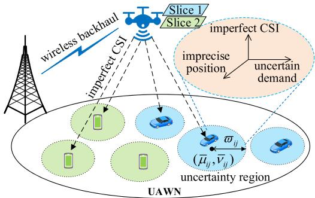  
Fig. 1. The considered UAWN slicing model.

## III. THE ROBUST UAWN SLICING PROBLEM

In this section, we present the model of the UAWN slicing problem under uncertain network conditions. For ease of reference, the key notations are summarized in Table II.

## A. The UAWN Model

As shown in Fig. 1, we consider a UAWN where a UAV serves a number of ground user equipments (UEs). Due to the limited payload of the UAV and the poor scattering of downlink UAV to ground transmission [23], we assume that the UAV is equipped with a single antenna. The beamwidth of the antenna is denoted by θ. Let Ω and h be the radius of the cell and the height of the UAV, respectively. The coordinate of the UAV projected on the horizontal ground plane is denoted by $\phi _ { u } ~ = ~ \left( \mu _ { u } , \nu _ { u } \right)$ . To ensure cell coverage, the following constraint should be satisfied:

$$
h \cdot \tan \theta \geq \Omega _ { u } ,\tag{1}
$$

where $\Omega _ { u } = \Omega + \| \phi _ { u } \|$

Due to the limited flying capability of the UAV and to prevent collisions with ground obstacles, the height h of the UAV should satisfy the following constraint [23]:

$$
h _ { \operatorname* { m i n } } \leq h \leq h _ { \operatorname* { m a x } } .\tag{2}
$$

The RUNs framework works in a slotted fashion, where UAV scheduling and network slicing are performed over different timeslots. Let $\hat { \phi } _ { u } = \left( \hat { \mu } _ { u } , \hat { \nu } _ { u } \right)$ and $\hat { h }$ be the horizontal position and the height of the UAV at the previous timeslot. Assuming that the flight speed of the UAV is v m/s, then its flight time $\tau$ is subject to the following constraint:

$$
\tau ( h ) = \frac { 1 } { v } \left( d _ { u } ^ { 2 } + | h - \hat { h } | ^ { 2 } \right) ^ { 1 / 2 } \leq T _ { s } ,\tag{3}
$$

where $T _ { s }$ is the duration of each timeslot, $d _ { u } = \left. \phi _ { u } - \hat { \phi } _ { u } \right.$ is the horizontal displacement (i.e., the Euclidean distance in the horizontal plane) of the UAV.

## B. Slicing Model Under Uncertain Conditions

In UAWN, the service types requested by different UEs are usually heterogeneous. For instance, in post-disaster areas, a number of different applications often coexist, such as smartphone communications, rescue robots, and video surveillance systems [7]. To accommodate these diverse application requirements, we consider deploying a set of network slices over the UAWN, denoted as $\mathcal { T } = \{ 1 , \cdots , I \}$ , each of which supports a dedicated service type. For each slice $i \in \mathcal { T }$ , we use the set $\mathcal { I } _ { i }$ to denote the UEs belonging to it. Accordingly, the j-th UE in slice i is denoted by $u _ { i j }$

In our model, the dynamic wireless environment surrounding each UE constitutes an uncertainty region, which includes three types of uncertainties: uncertain user demand, imprecise user position, and imperfect CSI. In what follows, we formulate RUSP by jointly considering all these uncertainties.

1) Uncertain Demand: In real-world networks, user traffic demand is generally uncertain and fluctuates over time [24]. Similar to [25], we model the traffic demand of UE $u _ { i j }$ as a random variable $\tilde { R } _ { i j }$ that takes values in the interval $[ \bar { R } _ { i j } - \Delta R _ { i j } , \bar { R } _ { i j } + \Delta R _ { i j } ]$ , where $\bar { R } _ { i j }$ is the nominal traffic demand and $\Delta R _ { i j }$ is the maximum demand deviation. These two parameters can be predicted by interval predictors such as the one proposed in our previous paper [24].

2) Imprecise Position: In UAWNs, the precise UE’s position cannot be obtained due to measurement errors, delayed user tracking, and continuous movement of UE [26]. Although the position of each UE can be predicted by some prediction mechanisms such as LSTM, ESN, etc., the prediction errors cannot be completely eliminated [8]. To capture the inaccuracy of the prediction, we assume that UE $u _ { i j }$ is located within a circular area centered at $( \bar { \mu } _ { i j } , \bar { \nu } _ { i j } )$ with a radius of $\varpi _ { i j }$

Mathematically, the uncertain location $\tilde { \phi } _ { i j }$ of $u _ { i j }$ is assumed to lie within the following region:

$$
\Phi _ { i j } = \Bigl \{ \tilde { \phi } _ { i j } = ( \mu _ { i j } , \nu _ { i j } ) | ( \mu _ { i j } - \bar { \mu } _ { i j } ) ^ { 2 } + ( \nu _ { i j } - \bar { \nu } _ { i j } ) ^ { 2 } \le \varpi _ { i j } ^ { 2 } \Bigr \} _ { \vphantom { | } }\tag{4}
$$

3) Imperfect CSI: In practice, it is impossible to achieve perfect CSI due to some limitations such as limited feedback, quantization errors, estimation errors, etc [27]. Similar to [28], the imperfect CSI is modeled by the following Gaussian CSI error model:

$$
\tilde { g } _ { i j } = \bar { g } _ { i j } + \Delta g _ { i j } , \mathrm { w i t h } \ \Delta g _ { i j } \sim \mathcal { C N } \left( 0 , \delta _ { i j } ^ { 2 } \right) ,\tag{5}
$$

where $\bar { g } _ { i j }$ and $\Delta g _ { i j }$ are the estimated channel gain and the estimation error, respectively. Then the channel power gain between the UAV and UE $u _ { i j }$ will be [29]:

$$
\tilde { \chi } _ { i j } = \frac { g _ { 0 } \tilde { g } _ { i j } } { \theta ^ { 2 } ( \tilde { \psi } _ { i j } + h ^ { 2 } ) ^ { \alpha / 2 } } ,\tag{6}
$$

where $\tilde { \psi } _ { i j } = \left\| \phi _ { u } - \tilde { \phi } _ { i j } \right\| ^ { 2 }$ is the squared horizontal distance between the UAV and UE $u _ { i j } ;$ g<sub>0</sub> is channel power gain at a reference distance of 1 m; α is the path-loss exponent.

4) Network Slicing Model: We use the integer variable $x _ { i j }$ and the continuous variable $p _ { i j }$ to represent the number of channels and the transmission power allocated to $u _ { i j } .$ respectively. The bandwidth of each channel in slice i is denoted by $B _ { i }$ . It is important to note that $B _ { i }$ represents the bandwidth granularity of a single channel, rather than the total bandwidth allocated to slice i. Moreover, different slices may employ different channel bandwidths to support service differentiation (e.g., a larger $B _ { i }$ for enhanced Mobile Broadband (eMBB) and a smaller $B _ { i }$ for massive Machine-Type Communications (mMTC)), which is consistent with the multi-numerology feature of 5G NR. Assuming the total bandwidth of the UAWN is $B _ { t o t }$ MHz, then the following capacity constraint must be satisfied:

$$
\sum _ { i \in \mathcal { T } } \sum _ { j \in \mathcal { T } _ { i } } x _ { i j } B _ { i } \le B _ { t o t } .\tag{7}
$$

Let $P ^ { t , \mathrm { m a x } }$ be the maximum transmission power of the $\mathrm { U A V } \mathbf { \hat { s } }$ antenna, then the following constraint should be satisfied by $p _ { i j } \colon$

$$
\sum _ { i \in \mathcal { T } } \sum _ { j \in \mathcal { T } _ { i } } x _ { i j } p _ { i j } \leq P ^ { t , \operatorname* { m a x } } .\tag{8}
$$

For each network slice, the SLA is regulated by various performance indicators such as delay, data rates, and reliability [30]. Since the UAWN only involves the radio access network (RAN) part of the network slice, we use data rate as the key indicator of SLA. For tractability considerations, we formulate the SLA constraints on a per-channel basis. Specifically, the following chance constraint [28] should be satisfied for all $i \in \mathcal { T } , j \in \mathcal { T } _ { i }$

$$
\operatorname* { P r } \bigg \{ B _ { i } \ln \bigg ( 1 + \frac { g _ { 0 } \tilde { g } _ { i j } p _ { i j } } { \sigma ^ { 2 } \theta ^ { 2 } ( \tilde { \psi } _ { i j } + h ^ { 2 } ) ^ { \alpha / 2 } } \bigg ) \leq R _ { i } ^ { S L A } \bigg \} \leq \vartheta _ { i j } ,\tag{9}
$$

where $\vartheta _ { i j } \in [ 0 , 1 ]$ is the violation probability; $\sigma ^ { 2 }$ is the power of Gaussian background noise; and $R _ { i } ^ { S L A }$ is the data rate

guaranteed by the SLA of slice i. The above chance-constraint ensures that the data rate provided by each channel is no less than $R _ { i } ^ { S L A }$ with a probability of $1 - \vartheta _ { i j }$

Additionally, the traffic demand $\tilde { R } _ { i j }$ of each UE should also be satisfied. To this end, the following constraints must be satisfied:

$$
x _ { i j } \geq \tilde { x } _ { i j } , \forall i \in \mathcal { T } , j \in \mathcal { T } _ { i } ,\tag{10}
$$

where $\tilde { x } _ { i j }$ is a random parameter defined as $\tilde { x } _ { i j } : = \tilde { R } _ { i j } / R _ { i } ^ { S L A }$ Since the UAV is assumed to fly at a fixed speed of v m/s, the aerodynamic propulsion power can be approximated as a constant. Therefore, we use $P ^ { m }$ and $P ^ { h }$ to denote the power consumption of the UAV in flying and hovering modes, respectively [2]. Assuming that the total energy of the UAV in each timeslot is $E _ { s }$ , then the following constraint should be satisfied [2]:

$$
P ^ { m } \tau ( h ) + \left( \sum _ { i \in \mathcal { T } } \sum _ { j \in \mathcal { I } _ { i } } x _ { i j } p _ { i j } + P ^ { h } \right) \left( T _ { s } - \tau ( h ) \right) \leq E _ { s } ,\tag{11}
$$

where $\tau ( h )$ is the UAV’s flight time defined in (3).

## C. Robust UAWN Slicing Problem

In RUSP, we aim to determine the optimal channel allocation $\mathbf { x } : = \{ x _ { i j } \} _ { i \in \mathbb { Z } , j \in \mathcal { T } _ { i } }$ , power allocation $\mathbf { p } : = \{ p _ { i j } \} _ { i \in \mathcal { T } , j \in \mathcal { T } _ { i } }$ and the $\mathrm { U A V } ^ { \ , } \mathbf { s }$ altitude h, with the aim of maximizing the sum of UEs’ data rates. Formally, RUSP can be formulated as the following chance-constrained problem [28]:

$$
\left( R U S P : \right) \operatorname* { m a x } _ { \mathbf { x } , \mathbf { p } , h } \sum _ { i \in \mathcal { T } } \sum _ { j \in \mathcal { J } _ { i } } r _ { i j } ,\tag{12}
$$

$$
s . t . ~ ( 1 ) - ~ ( 3 ) , ~ ( 7 ) - ~ ( 1 1 ) ,\tag{13}
$$

$$
x _ { i j } \in \mathbb { N } _ { + } , \forall i \in \mathcal { I } , j \in \mathcal { I } _ { i } ,\tag{14}
$$

$$
p _ { i j } \geq 0 , \forall i \in \mathcal { I } , j \in \mathcal { I } _ { i } ,\tag{15}
$$

where

$$
r _ { i j } = x _ { i j } B _ { i } \ln \left( 1 + \frac { g _ { 0 } \tilde { g } _ { i j } p _ { i j } } { \sigma ^ { 2 } \theta ^ { 2 } ( \tilde { \psi } _ { i j } + h ^ { 2 } ) ^ { \alpha / 2 } } \right) .\tag{16}
$$

Note that for any feasible RUSP, the parameters of the problem must implicitly satisfy the following two constraints:

$$
\begin{array} { r } { E _ { s } / T _ { s } \geq P ^ { t , \operatorname* { m a x } } + P ^ { h } , \mathrm { a n d } E _ { s } / T _ { s } \geq P ^ { m } . } \end{array}\tag{17}
$$

These constraints ensure that in each timeslot: 1) the UAV’s total power budget covers the sum of maximum transmission power and hovering power, and 2) the power consumed in UAV movement cannot exceed its total power.

It is seen that RUSP is a robust nonconvex mixedinteger problem. Even though we relax x to continuous variables, the objective function (12) remains nonconvex. Furthermore, RUSP contains a large number of nonconvex chance-constraints, as indicated by (9), which makes it prohibitively difficult to solve.

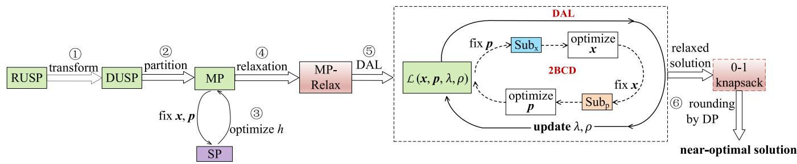  
Fig. 2. Illustration of the RUNs framework for RUSP.

## IV. THE RUNS FRAMEWORK AND UAV ALTITUDE OPTIMIZATION

In this section, we present the RUNs framework to solve RUSP. As shown in Fig. 2, the RUNs framework consists of six key steps. 1) First, by deriving the robust counterpart of RUSP, we transform it into a deterministic problem called the deterministic UAWN slicing problem (DUSP). 2) Second, DUSP is equivalently decomposed into an MP and an SP by exploiting a decomposition technique. 3) Third, we find the closed-form solution of the SP, thereby the explicit expression of the MP is derived. 4) Fourth, we relax the integer variables of the MP to get a relaxed problem, which is denoted as MP-Relax. 5) Fifth, the decomposition-based augmented Lagrange (DAL) algorithm is proposed to solve MP-Relax, wherein the AL problem is solved by the 2-block coordinate descent (2BCD) algorithm. In 2BCD, the channel allocation subproblem $S u b _ { x }$ and the power allocation subproblem $S u b _ { p }$ are both addressed through convex optimization. 6) Finally, we round the relaxed solution by solving a 0-1 knapsack problem with dynamic programming.

In the following subsection, we will present steps 1) to 4) of the RUNs framework. The remaining steps of RUNs will be elaborated in the next section.

## A. Robust Counterpart of RUSP

RUSP contains three distinct types of uncertain parameters, rendering the problem inherently intractable. To overcome this issue, we transform it into a deterministic problem by deriving its RC, which is a deterministic reformulation of the original uncertain problem that takes all the realizations of the uncertain parameters into account. In particular, we address these three types of uncertainties as follows.

First, for the uncertain traffic demand ${ \tilde { R } } _ { i j } .$ , we adopt the worst-case approach, which ensures that the solution remains feasible even under the most demanding conditions [31]. In other words, the uncertain traffic demand $\tilde { R } _ { i j }$ is replaced by its upper bound $R _ { i j } : = \bar { R } _ { i j } + \Delta R _ { i j }$ . Accordingly, constraint (10) will be transformed into:

$$
x _ { i j } \geq \underline { { x } } _ { i j } , \forall i \in \mathcal { I } , \forall j \in \mathcal { I } _ { i } ,\tag{18}
$$

where $\underline { { x } } _ { i j } = R _ { i j } / R _ { i } ^ { S L A }$ . To avoid the trivial case where the data rate requested by $u _ { i j }$ is 0, we require $\underline { { x } } _ { i j } > 0 , \forall i , j$

Second, for the imprecise user position $\tilde { \phi } _ { i j }$ , we also exploit the worst-case approach, where the uncertain squared horizontal distance $\tilde { \phi } _ { i j }$ is replaced by

$$
\phi _ { i j } = \left( \sqrt { ( \mu _ { u } - \bar { \mu } _ { i j } ) ^ { 2 } + ( \nu _ { u } - \bar { \nu } _ { i j } ) ^ { 2 } } + \varpi _ { i j } \right) ^ { 2 } .\tag{19}
$$

Third, for the imperfect CSI we model $\tilde { g } _ { i j } = \bar { g } _ { i j } + \Delta g _ { i j }$ where the estimation error $\Delta g _ { i j }$ is assumed Gaussian, i.e. $\Delta g _ { i j } \sim \mathcal { C N } \left( 0 , \delta _ { i j } ^ { 2 } \right)$ [28]. Then the probabilistic SLA constraint

$$
\operatorname* { P r } \bigg \{ B _ { i } \ln \bigg ( 1 + \frac { g _ { 0 } \tilde { g } _ { i j } p _ { i j } } { \sigma ^ { 2 } \theta ^ { 2 } ( \psi _ { i j } + h ^ { 2 } ) ^ { \alpha / 2 } } \bigg ) \leq R _ { i } ^ { S L A } \bigg \} \leq \vartheta _ { i j }\tag{20}
$$

is equivalent to

$$
\mathrm { P r } \left\{ \bar { g } _ { i j } + \Delta g _ { i j } \ge G _ { i j } \right\} \ge 1 - \vartheta _ { i j } ,\tag{21}
$$

where $G _ { i j }$ is defined as

$$
G _ { i j } = \frac { \sigma ^ { 2 } \theta ^ { 2 } ( \phi _ { i j } + h ^ { 2 } ) ^ { \alpha / 2 } } { g _ { 0 } p _ { i j } } \left[ \exp \left( R _ { i } ^ { S L A } / B _ { i } \right) - 1 \right] .\tag{22}
$$

Let $\varrho = G _ { i j } - \bar { g } _ { i j }$ . Since $\Delta g _ { i j } \sim \mathcal { C N } ( 0 , \delta _ { i j } ^ { 2 } )$ , it holds that

$$
P r \{ \Delta g _ { i j } \ge \varrho \} = 1 - \Phi ( \varrho / \delta _ { i j } ) = Q ( \varrho / \delta _ { i j } ) ,\tag{23}
$$

where $\Phi ( \cdot )$ denotes the cumulative distribution function (CDF) of the standard normal distribution, $Q ( x ) = 1 - \Phi ( x )$ is the Gaussian Q-function, and $Q ^ { - 1 } ( \cdot )$ is its inverse function. The requirement $P r \{ \Delta g _ { i j } \ge \varrho \} \ge 1 - \vartheta _ { i j }$ therefore implies

$$
Q ( \varrho / \delta _ { i j } ) \ge 1 - \vartheta _ { i j } \iff \varrho \le \delta _ { i j } Q ^ { - 1 } ( 1 - \vartheta _ { i j } ) .\tag{24}
$$

Substituting $\varrho = G _ { i j } - \bar { g } _ { i j }$ yields the deterministic condition

$$
Q ^ { - 1 } ( 1 - \vartheta _ { i j } ) \delta _ { i j } \geq G _ { i j } - \bar { g } _ { i j } .\tag{25}
$$

For notation simplicity, we define

$$
\hat { g } _ { i j } : = Q ^ { - 1 } ( 1 - \vartheta _ { i j } ) \delta _ { i j } + \bar { g } _ { i j } .\tag{26}
$$

According to (25), constraint (9) is equivalent to ${ \hat { g } } _ { i j } \geq G _ { i j }$ After some rearrangement, it can be transformed into the following deterministic constraint:

$$
\begin{array} { r } { B _ { i } \ln \left( 1 + \frac { g _ { 0 } \hat { g } _ { i j } p _ { i j } } { \sigma ^ { 2 } \theta ^ { 2 } ( \psi _ { i j } + h ^ { 2 } ) ^ { \alpha / 2 } } \right) \geq R _ { i } ^ { S L A } . } \end{array}\tag{27}
$$

Finally, similar to the method in [28], the RC of RUSP can be expressed as the following DUSP, which is a deterministic reformulation of RUSP:

$$
\left( D U S P : \right) \operatorname* { m a x } _ { \mathbf { x } , \mathbf { p } , h } \sum _ { i \in \mathbb { Z } } \sum _ { j \in \mathcal { I } _ { i } } \hat { r } _ { i j } ,\tag{28}
$$

$$
s . t . ~ ( 1 ) - ~ ( 3 ) , ~ ( 7 ) , ~ ( 8 ) , ~ ( 1 1 ) , ~ ( 2 7 ) ,\tag{29}
$$

$$
x _ { i j } \ge \underline { { x } } _ { i j } , \forall i \in \mathcal { I } , \forall j \in \mathcal { I } _ { i } ,\tag{30}
$$

$$
x _ { i j } \in \mathbb { N } _ { + } , \forall i \in \mathcal { I } , j \in \mathcal { T } _ { i } ,\tag{31}
$$

$$
p _ { i j } \geq 0 , \forall i \in \mathcal { I } , j \in \mathcal { I } _ { i } ,\tag{32}
$$

in which

$$
\hat { r } _ { i j } = x _ { i j } B _ { i } \ln \left( 1 + \frac { g _ { 0 } \hat { g } _ { i j } p _ { i j } } { \sigma ^ { 2 } \theta ^ { 2 } ( \psi _ { i j } + h ^ { 2 } ) ^ { \alpha / 2 } } \right) .\tag{33}
$$

## B. Decomposition of DUSP

In this subsection, we employ a partitioning technique to equivalently decompose DUSP into an MP and an SP. By partitioning, which is also called projection by some researchers, we project both the objective function and the constraints of DUSP onto the (x, p)-plane [12]. Particularly, the projection of DUSP onto the (x, p)-plane will yield the following MP:

$$
( M P : ) \operatorname* { m a x } _ { \mathbf { x } \in \mathcal { X } , \mathbf { p } \in \mathcal { P } } u ( \mathbf { x } , \mathbf { p } )\tag{34}
$$

$$
s . t . ~ ( \mathbf { x } , \mathbf { p } ) \in U ,\tag{35}
$$

$$
\mathbf { x } ^ { T } \mathbf { p } \leq P ^ { t , \operatorname* { m a x } } ,\tag{36}
$$

where

$$
\mathcal { X } : = \{ x _ { i j } \in \mathbb { N } _ { + } | \mathbf { c } ^ { T } \mathbf { x } \leq B _ { t o t } , \mathbf { x } \geq \underline { { \mathbf { x } } } \} ,\tag{37}
$$

$$
{ \mathcal { P } } : = \{ p _ { i j } \geq 0 \} ,\tag{38}
$$

and

$$
h \in H \}\tag{39}
$$

In (37), c is the coefficient vector of the linear constraint (7). In (39), the set H is defined as

$$
H : = \left\{ h | h \tan \theta \geq \Omega , | h - \hat { h } | \leq \Gamma ( \phi _ { u } ) , h _ { \operatorname* { m i n } } \leq h \leq h _ { \operatorname* { m a x } } \right\} ,\tag{40}
$$

where

$$
\Gamma ( \phi _ { u } ) = \left( v ^ { 2 } T _ { s } ^ { 2 } - d _ { u } ^ { 2 } \right) ^ { 1 / 2 } .\tag{41}
$$

In the MP, u(x, p) is defined by the following SP:

$$
( S P : ) u ( \mathbf { x } , \mathbf { p } ) \triangleq \operatorname* { s u p } _ { h \in H } \sum _ { i \in \mathcal { T } } \sum _ { j \in \mathcal { T } _ { i } } \hat { r } _ { i j }\tag{42}
$$

$$
s . t . \ P ^ { m } \tau + \left( \mathbf { x } ^ { T } \mathbf { p } + P ^ { h } \right) ( T _ { s } - \tau ) \leq E _ { s }\tag{43}
$$

$$
B _ { i } \ln \left( 1 + \frac { g _ { 0 } \hat { g } _ { i j } p _ { i j } } { \sigma ^ { 2 } \theta ^ { 2 } ( \psi _ { i j } + h ^ { 2 } ) ^ { \alpha / 2 } } \right) \geq R _ { i } ^ { S L A } , \forall i , j\tag{44}
$$

Note that the $\mathrm { S P }$ is an univariate optimization problem. The equivalence between the DUSP and the MP is guaranteed by the following projection theorem.

Theorem 1 (Projection Theorem [12]): DUSP is equivalent to MP in the sense that:

• DUSP is infeasible or unbounded if and only if the same is true for MP;

• If DUSP achieves maximum at $( \mathbf { x } ^ { * } , \mathbf { p } ^ { * } , h ^ { * } )$ , then $\mathbf { \rho } ( \mathbf { x } ^ { * } , \mathbf { p } ^ { * } )$ is the optimal solution of MP;

• If $( \mathbf { x } ^ { * } , \mathbf { p } ^ { * } )$ is an optimal solution of MP and $h ^ { * }$ achieves the supremum in SP with $( { \bf x } , { \bf p } ) = ( { \bf x } ^ { * } , { \bf p } ^ { * } )$ , then $( \mathbf { x } ^ { * } , \mathbf { p } ^ { * } , h ^ { * } )$ is an optimal solution of DUSP.

The projection theorem inspires us to solve the SP for every combination of (x, p), and then select the $( \mathbf { x } , \mathbf { p } , h )$ that maximizes the MP as the optimal solution of the DUSP. However, this approach is neither possible nor necessary. On one hand, the explicit form of set U is unknown. On the other hand, the number of feasible $\left( \mathbf { x } , \mathbf { p } \right)$ combinations grows exponentially with problem size, resulting in a prohibitively large number of SPs to solve. Fortunately, for any fixed $\left( \mathbf { x } , \mathbf { p } \right)$ the closed-form solution to the SP can be derived, which is independent of (x, p).

## C. The Closed-Form Solution to the SP

It can be observed that for any fixed $\left( \mathbf { x } , \mathbf { p } \right)$ , the objective function (42) of the SP is strictly decreasing with h. Thus, the supremum in (42) is achieved at the smallest h which ensures the feasibility of SP. The following theorem presents the optimal solution $h ^ { * }$ of SP, which is irrelevant to $\left( \mathbf { x } , \mathbf { p } \right)$

Theorem 2: For any $( \mathbf { x } , \mathbf { p } ) \in U$ such that DUSP is feasible for some $h \in H$ , the optimal solution of the SP is given by $\begin{array} { r l } { h ^ { * } = \tilde { h } _ { \operatorname* { m i n } } : = [ \{ \hat { h } - \Gamma ( \phi _ { u } ) , h _ { \operatorname* { m i n } } , \Omega _ { u } / \tan \theta \} ] ^ { + } } & { { } } \end{array}$ , where $[ z ] ^ { + }$ is the projection of z onto the interval $[ h _ { - m i n } , h _ { \mathrm { m a x } } ]$

Proof: Let $\left( \mathbf { x } , \mathbf { p } , h _ { 0 } \right)$ be an arbitrary feasible solution of DUSP. By the strictly increasing property of the objective function of the SP, it is sufficient to prove the theorem by showing $\tilde { h } _ { \mathrm { m i n } }$ satisfies (43) and (44).

For constraint (44), it is seen its left-hand-side term is strictly decreasing with h. Since $\tilde { h } _ { \mathrm { m i n } } \leq h _ { 0 }$ and $h _ { 0 }$ satisfies (44), thus constraint (44) is also satisfied by $\tilde { h } _ { \mathrm { m i n } } .$

For constraint (43), there are two cases as follows.

Case 1): If $P ^ { m } \leq \mathbf { x } ^ { T } \mathbf { p } + P ^ { h }$ , since $\tau \geq 0$ for any $h ,$ by (17) and (8) we have

$$
\begin{array} { r l } & { P ^ { m } \tau + ( \mathbf { x } ^ { T } \mathbf { p } + P ^ { h } ) ( T _ { s } - \tau ) } \\ & { = ( P ^ { m } - \mathbf { x } ^ { T } \mathbf { p } - P ^ { h } ) \tau + ( \mathbf { x } ^ { T } \mathbf { p } + P ^ { h } ) T _ { s } } \\ & { \leq ( \mathbf { x } ^ { T } \mathbf { p } + P ^ { h } ) T _ { s } \leq ( P ^ { t , \operatorname* { m a x } } + P ^ { h } ) T _ { s } \leq E _ { s } } \end{array}\tag{45}
$$

Thus, in this case, $\tilde { h } _ { \mathrm { m i n } }$ satisfies constraint (43).

Case 2): For $P ^ { m } > { \bf x } ^ { T } { \bf p } + P ^ { h }$ , we notice that constraint (43) can be equivalently transformed into

$$
\begin{array} { r } { \left| h - \hat { h } \right| ^ { 2 } \leq l ^ { 2 } ( { \bf x } , { \bf p } ) , } \end{array}\tag{46}
$$

where

$$
l ( \mathbf { x } , \mathbf { p } ) : = \left( \frac { v ^ { 2 } [ E _ { s } - T _ { s } ( \mathbf { x } ^ { T } \mathbf { p } + P ^ { h } ) ] ^ { 2 } } { ( P ^ { m } - \mathbf { x } ^ { T } \mathbf { p } - P ^ { h } ) ^ { 2 } } - d _ { u } ^ { 2 } \right) ^ { 1 / 2 } .\tag{47}
$$

It follows that

$$
l ^ { 2 } ( \mathbf { x } , \mathbf { p } ) - \Gamma ^ { 2 } ( \phi _ { u } ) = \frac { v ^ { 2 } [ E _ { s } - T _ { s } ( \mathbf { x } ^ { T } \mathbf { p } + P ^ { h } ) ] ^ { 2 } } { ( P ^ { m } - \mathbf { x } ^ { T } \mathbf { p } - P ^ { h } ) ^ { 2 } } - v ^ { 2 } T _ { s } ^ { 2 } .\tag{48}
$$

By (17) and (8) we have

$$
E _ { s } - T _ { s } ( \mathbf { x } ^ { T } \mathbf { p } + P ^ { h } ) \geq E _ { s } - T _ { s } ( P ^ { t , \operatorname* { m a x } } + P ^ { h } ) \geq 0 .\tag{49}
$$

Combined with the condition $P ^ { m } > { \bf x } ^ { T } { \bf p } + P ^ { h }$ , there holds that

$$
\frac { v [ E _ { s } - T _ { s } ( \mathbf { x } ^ { T } \mathbf { p } + P ^ { h } ) ] } { P ^ { m } - \mathbf { x } ^ { T } \mathbf { p } - P ^ { h } } { - v T _ { s } } = \frac { T _ { s } ( E _ { s } / T _ { s } - P _ { m } ) } { P ^ { m } - \mathbf { x } ^ { T } \mathbf { p } - P ^ { h } } > 0 ,\tag{50}
$$

wherein the inequality holds due to (17). Thus,

$$
l ^ { 2 } ( { \bf x } , { \bf p } ) > \Gamma ^ { 2 } ( \phi _ { u } ) .\tag{51}
$$

By the definition of $\tilde { h } _ { \mathrm { m i n } }$ , it is seen that $\hat { h } - \Gamma ( \phi _ { u } ) \leq \tilde { h } _ { \operatorname* { m i n } }$ thus

$$
\left| \tilde { h } _ { \operatorname* { m i n } } - \hat { h } \right| ^ { 2 } \leq \Gamma ^ { 2 } ( \phi _ { u } ) \leq l ^ { 2 } ( \mathbf { x } , \mathbf { p } ) ,\tag{52}
$$

indicating that $\tilde { h } _ { \mathrm { m i n } }$ satisfies (46), or equivalently constraint (43). 

## D. The Explicit Expression of MP and Its Relaxation

To derive the explicit expression of the MP, it is necessary to know the expressions of both the objective function $u ( \mathbf { x } , \mathbf { p } )$ and the constraint set U. Theorem 2 establishes that u(x, p) can be obtained by substituting h in the SP with $h ^ { * }$ . The following theorem guarantees that the expression of U can be similarly derived.

Theorem 3: If DUSP is feasible, then $U = U ^ { \prime }$ , where $U ^ { \prime }$ is given by

$$
U ^ { \prime } = \{ ( \mathbf { x } , \mathbf { p } ) | ( \mathbf { x } , \mathbf { p } ) { \mathrm { s a t i s f y ~ } } ( 1 1 ) { \mathrm { ~ a n d ~ } } ( 2 7 ) { \mathrm { ~ f o r ~ } } h = h ^ { * } \}\tag{53}
$$

Proof: It is obvious that $U ^ { \prime } \subseteq U$ . The inverse inclusion $U \subseteq U ^ { \prime }$ is proved as follows.

Let $\left( \mathbf { x } , \mathbf { p } \right)$ be an arbitrary point in U. By the definition of U , there is an $h _ { 0 } \in H$ such that (x, p) satisfies (11) and (27) for $h = h _ { 0 }$ . Since $h ^ { * }$ is the smallest value in H, thus $h ^ { * } \leq h _ { 0 }$ This yields

$$
\begin{array} { r l } & { B _ { i } \ln \bigg ( 1 + \frac { g _ { 0 } \hat { g } _ { i j } p _ { i j } } { \sigma ^ { 2 } \theta ^ { 2 } ( \psi _ { i j } + ( h ^ { * } ) ^ { 2 } ) ^ { \alpha / 2 } } \bigg ) \geq } \\ & { B _ { i } \ln \bigg ( 1 + \frac { g _ { 0 } \hat { g } _ { i j } p _ { i j } } { \sigma ^ { 2 } \theta ^ { 2 } ( \psi _ { i j } + h _ { 0 } ^ { 2 } ) ^ { \alpha / 2 } } \bigg ) \geq R _ { i } ^ { S L A } . } \end{array}\tag{54}
$$

Thus, constraint (27) is satisfied by (x, p) for $h = h ^ { * }$

To prove that (x, p) satisfies (11) for $h = h ^ { * }$ , we can also consider the following two cases.

Case 1): $P ^ { m } \leq \mathbf { x } ^ { T } \mathbf { p } + P ^ { h }$ . Since $\tau ( h ) \geq 0$ for any feasible h, and $E _ { s } / T _ { s } \geq P ^ { t , \mathrm { m a x } } + P ^ { h } \geq \mathbf { x } ^ { T } \mathbf { p } + P ^ { h }$ , it follows that

$$
( P ^ { m } - \mathbf { x } ^ { T } \mathbf { p } + P ^ { h } ) \tau ( h ^ { * } ) \leq E _ { s } - ( \mathbf { x } ^ { T } \mathbf { p } + P ^ { h } ) T _ { s } ,\tag{55}
$$

which indicates $\left( \mathbf { x } , \mathbf { p } \right)$ satisfies (11) for $h = h ^ { * }$

Case 2): $P ^ { m } > { \bf x } ^ { T } { \bf p } + P ^ { h }$ . In this case, we have

$$
\begin{array} { r } { \Big | h _ { 0 } - \hat { h } \Big | \le l ( \mathbf { x } , \mathbf { p } ) , } \end{array}\tag{56}
$$

where $l ( \mathbf { x } , \mathbf { p } )$ is defined in (47). Consequently,

$$
\begin{array} { r l } & { \left| h _ { 0 } - \hat { h } \right| \leq l ( \mathbf { x } , \mathbf { p } ) \iff } \\ & { \hat { h } - l ( \mathbf { x } , \mathbf { p } ) \leq h ^ { * } \leq h _ { 0 } \leq \hat { h } + l ( \mathbf { x } , \mathbf { p } ) \Rightarrow } \\ & { P ^ { m } \tau ( h ^ { * } ) + ( \mathbf { x } ^ { T } \mathbf { p } + P ^ { h } ) ( T _ { s } - \tau ( h ^ { * } ) ) \leq E _ { s } , } \end{array}\tag{57}
$$

Therefore, (x, p) also satisfies (11) for $h = h ^ { * }$ . This indicates that $( \mathbf { x } , \mathbf { p } ) \in U ^ { \prime }$ and consequently $U \subseteq U ^ { \prime }$ 

According to Theorem 2 and Theorem 3, we can obtain the closed-form expression of the MP by replacing h with $h ^ { * }$ which is presented as follows.

$$
\left( M P : \right) \operatorname* { m a x } _ { \mathbf { x } \in \mathcal { X } , \mathbf { p } } \sum _ { i \in \mathcal { T } } \sum _ { j \in \mathcal { I } _ { i } } a _ { i j } x _ { i j } \ln \left( 1 + b _ { i j } p _ { i j } \right) ,\tag{58}
$$

$$
s . t . \ p _ { i j } \geq \underline { { p } } _ { i j } , \forall i \in \mathcal { I } , j \in \mathcal { I } _ { i } ,\tag{59}
$$

$$
\mathbf { x } ^ { T } \mathbf { p } \leq P ,\tag{60}
$$

where $a _ { i j } = B _ { i } , \forall j \in \mathcal { T } _ { i } .$

$$
b _ { i j } = \frac { g _ { 0 } \hat { g } _ { i j } } { \sigma ^ { 2 } \theta ^ { 2 } ( \psi _ { i j } + ( h ^ { * } ) ^ { 2 } ) ^ { \alpha / 2 } } ,\tag{61}
$$

$$
\underline { { p } } _ { i j } = \frac { \sigma ^ { 2 } \theta ^ { 2 } ( \psi _ { i j } + ( h ^ { * } ) ^ { 2 } ) ^ { \alpha / 2 } } { g _ { 0 } \hat { g } _ { i j } } \left[ \exp \left( R _ { i } ^ { S L A } / B _ { i } \right) - 1 \right] ,\tag{62}
$$

and

$$
P = \operatorname* { m i n } \left\{ P ^ { t , \operatorname* { m a x } } , \frac { E _ { s } - P ^ { m } \tau ( h ^ { * } ) } { T _ { s } - \tau ( h ^ { * } ) } - P ^ { h } \right\} .\tag{63}
$$

The MP remains computationally intractable due to the integrality constraints on $x _ { i j }$ . To address this issue, we relax the integrality constraints on $x _ { i j }$ . Additionally, to save symbols, we subsequently map the index pair $( i , j )$ to a single index n, and denote the UE set by $\mathcal { N }$ with $| { \mathcal { N } } | = N$ . This reformulation yields the following compact representation of the relaxed MP, which is referred to as MP-Relax:

$$
( M P - R e l a x : ) \operatorname* { m a x } _ { { \bf x } , { \bf p } } \varphi : = \sum _ { n \in \cal N } a _ { n } x _ { n } \ln \left( 1 + b _ { n } p _ { n } \right) ,\tag{64}
$$

$$
s . t . \ \textbf { x } \geq \underline { { \bf x } } ,\tag{65}
$$

$$
{ \bf c } ^ { T } { \bf x } \leq B _ { t o t } ,
$$

$$
\mathbf { p } \geq \underline { { \mathbf { p } } } ,\tag{66}
$$

$$
\mathbf { x } ^ { T } \mathbf { p } \leq P ,\tag{67}
$$

(68)

in which constraint (67) is the vector form of constraint (59).   
Then we have the following lemma for MP-Relax.

Lemma 1: Suppose $\mathbf { \pi } ( \mathbf { x } ^ { * } , \mathbf { p } ^ { * } )$ is an optimal solution of MP-Relax, then constraint (68) must be active at $\mathbf { ( x ^ { * } , p ^ { * } ) }$ . In other words, the inequality constraint (68) can be replaced by

$$
\mathbf { x } ^ { T } \mathbf { p } = P .\tag{69}
$$

Proof: We prove this lemma by contradiction. Suppose constraint (68) is inactive at $\mathbf { \pi } ( \mathbf { x } ^ { * } , \mathbf { p } ^ { * } )$ , namely, $( \mathbf { x } ^ { * } ) ^ { T } \mathbf { p } ^ { * } < P$ Then there exists $\xi = P - ( \mathbf { x } ^ { * } ) ^ { T } \mathbf { p } ^ { * }$ with $\xi > 0 .$ Since $\mathbf { x } ^ { * } > \mathbf { 0 }$ (cf. (18)), we define $\bar { \mathbf { p } } : = \mathbf { p } ^ { * } + ( \xi / ( x _ { 1 } ^ { * } N ) , \cdots , \xi / ( x _ { N } ^ { * } N ) )$ . It is seen that $\bar { \mathbf { p } } > \mathbf { p } ^ { * } \ge \mathbf { p }$ and

$$
( \mathbf { x } ^ { * } ) ^ { T } \bar { \mathbf { p } } = ( \mathbf { x } ^ { * } ) ^ { T } \mathbf { p } ^ { * } + \boldsymbol { \xi } = P ,\tag{70}
$$

which suggests that $( \mathbf { x } ^ { * } , \bar { \mathbf { p } } )$ is a feasible solution of MP-Relax. Since the objective function $\varphi ( \cdot )$ is strictly increasing w.r.t. $p _ { n } ,$ then

$$
\varphi ( \mathbf { x } ^ { * } , \mathbf { p } ^ { * } ) < \varphi ( \mathbf { x } ^ { * } , \bar { \mathbf { p } } ) ,\tag{71}
$$

which contradicts that $\mathbf { \pi } ( \mathbf { x } ^ { * } , \mathbf { p } ^ { * } )$ is an optimal solution of MP-Relax. Thus, constraint (68) must be active at $\mathbf { ( x ^ { * } , p ^ { * } ) }$

According to Lemma 1, the feasible region of MP-Relax consists of multiple linear constraints and, crucially, a single nonlinear equality constraint. To eliminate the nonconvex constraint, a natural idea is to add it to the objective function by using the penalty method. However, the penalty method is inefficient due to a number of issues such as slow convergence, ill-conditioning, and inexact solutions [32]. To overcome these drawbacks, the DAL algorithm is proposed to solve MP-Relax, which is detailed in the next section.

```powershell
Algorithm 1 2-Block Coordinate Descent (2BCD) Algorithm
for $P _ { \lambda , \rho }$
Input : Problem $P _ { \lambda , \rho } , \epsilon _ { 0 } , \epsilon _ { 1 }$
1 Initialize $ { \mathbf { x } } ^ { 0 } ,  { \mathbf { p } } ^ { 0 }$ arbitrarily. Set $m = 0 , \mathcal { L } _ { p r e v } = \infty .$
$\mathcal { L } _ { c u r } = \mathcal { L } ( \mathbf { x } ^ { 0 } , \mathbf { p } ^ { 0 } , \lambda , \rho ) .$
2 while $| \mathcal { L } _ { p r e v } - \mathcal { L } _ { c u r } | > \epsilon _ { 1 }$ do
3 Fix p to $\mathbf { p } ^ { m }$ , find the optimal solution $\mathbf { x } ^ { * }$ of
$S u b _ { x }$ by convex solver with precision $\epsilon _ { 0 } .$
4 Fix x to $\mathbf { x } ^ { * }$ , find the optimal solution $\mathbf { p } ^ { * }$ of
$S u b _ { p }$ by convex solver with precision $\epsilon _ { 0 } .$
5 Set $m \gets m + 1 .$
6 Set $( \mathbf { x } ^ { m } , \mathbf { p } ^ { m } ) \gets ( \mathbf { x } ^ { * } , \mathbf { p } ^ { * } ) , \mathcal { L } _ { p r e v } \gets \mathcal { L } _ { c u r } ,$ and
$\mathcal { L } _ { c u r } \gets \mathcal { L } ( \mathbf { x } ^ { m } , \mathbf { p } ^ { m } , \boldsymbol { \lambda } , \rho ) .$
7 end
Output: $( \mathbf { x } ^ { m } , \mathbf { p } ^ { m } )$
```

## V. JOINT CHANNEL AND POWER ALLOCATION, AND EXTENSION FOR HORIZONTAL UAV DEPLOYMENT

## A. The AL Problem and the 2BCD Algorithm

We introduce the following AL problem for MP-Relax:

$$
( P _ { \lambda , \rho } : ) \operatorname* { m i n } _ { \mathbf { x } , \mathbf { p } } \mathcal { L } ( \mathbf { x } , \mathbf { p } , \lambda , \rho ) : = \sum _ { n \in \mathcal { N } } - a _ { n } x _ { n } \ln \left( 1 + b _ { n } p _ { n } \right)
$$

$$
+ \lambda ( { \bf x } ^ { T } { \bf p } - P ) + \frac { 1 } { 2 \rho } ( { \bf x } ^ { T } { \bf p } - P ) ^ { 2 } ,\tag{72}
$$

$$
s . t . \ \textbf { x } \geq \underline { { \bf x } } ,\tag{73}
$$

$$
\mathbf { c } ^ { T } \mathbf { x } \leq B _ { t o t } ,\tag{74}
$$

$$
\mathbf { p } \geq \underline { { \mathbf { p } } } ,\tag{75}
$$

where $\rho > 0$ is the penalty parameter and $\lambda \in \mathbb { R }$ is the dual variable corresponding to the nonconvex equality constraint $\mathbf { x } ^ { T } \mathbf { p } = { \boldsymbol { P } } .$ , respectively. It is seen that the objective function of $P _ { \lambda , \rho }$ is nonconvex, which makes $P _ { \lambda , \rho }$ challenging to solve. Fortunately, we observed that the constraints of $P _ { \lambda , \rho }$ are separable, which motivates us to devise the 2BCD algorithm to solve it. The pseudo-code of the 2BCD algorithm is presented in Algorithm 1.

As shown in Algorithm 1, the 2BCD algorithm starts from an arbitrary point $( \mathbf { x } ^ { 0 } , \mathbf { p } ^ { 0 } )$ . In each iteration step, the AL problem $P _ { \lambda , \rho }$ is decomposed into two blocks: the channel allocation subproblem $S u b _ { x }$ and the power allocation subproblem $S u b _ { p }$ . In particular, for fixed p, the channel allocation subproblem $S u b _ { x }$ is given by

$$
( S u b _ { x } : ) \operatorname* { m i n } _ { \mathbf x } \sum _ { n \in \mathcal { N } } - q _ { n } x _ { n } + \lambda ( \mathbf x ^ { T } \mathbf p - P ) + \frac { 1 } { 2 \rho } ( \mathbf x ^ { T } \mathbf p - P ) ^ { 2 } ,\tag{76}
$$

$$
s . t . \ \textbf { x } \geq \underline { { \bf x } } ,\tag{77}
$$

$$
\mathbf { c } ^ { T } \mathbf { x } \leq B _ { t o t } ,\tag{78}
$$

where $q _ { n } = a _ { n } \ln ( 1 + b _ { n } p _ { n } )$ . Similarly, by fixing x, the power allocation subproblem $S u b _ { p }$ is as follows:

$$
\begin{array} { r l } { \displaystyle } & { \displaystyle ( S u b _ { p } : ) \ \underset { \mathbf { p } } { \mathrm { m i n } } \sum _ { n \in \mathcal { N } } - \omega _ { n } \ln ( 1 + b _ { n } p _ { n } ) } \\ & { \quad \ + \ \lambda ( \mathbf { x } ^ { T } \mathbf { p } - P ) + \frac { 1 } { 2 \rho } ( \mathbf { x } ^ { T } \mathbf { p } - P ) ^ { 2 } , } \end{array}\tag{79}
$$

$$
s . t . \mathrm { ~ \bf ~ p ~ } { \geq } \mathrm { \underline { { \mathbf { p } } } } ,\tag{80}
$$

where $\omega _ { n } ~ = ~ a _ { n } x _ { n }$ . Obviously, both $S u b _ { x }$ and $S u b _ { p }$ are convex problems with simple linear constraints, which can be solved by off-the-shelf solvers such as CVXPY, CPLEX, etc. By iteratively optimizing $S u b _ { x }$ and $S u b _ { p } ,$ , the gap between two consecutive iterations will eventually decrease to 0. The convergence property of the 2BCD algorithm is detailed in the next subsection.

To begin with, we introduce the concept of stationary points as follows.

Definition 1 (Stationary Points): A stationary point of the problem mi $\mathfrak { l } _ { \mathit { X } \in \mathit { X } \subset \mathbb { R } ^ { N } } f ( \mathit { x } )$ is a point ${ \bar { x } } \in X$ satisfying

$$
\nabla f ( { \bar { x } } ) ^ { T } d \geq 0 , \forall d \in \mathbb { R } ^ { N } { \mathrm { ~ s u c h ~ t h a t ~ } } { \bar { x } } + d \in X .\tag{81}
$$

Note that the stationary point is also called the critical point by some researchers, $\mathrm { e . g . }$ [14]. For problems with convex constraints, we can derive the following property of their stationary points.

Lemma $2 \colon \mathrm { I f } \ \bar { x } \in X$ is a stationary point for the problem min $\mathfrak { l } _ { \ b { x } \in \ b { X } \subset \mathbb { R } ^ { N } } f ( \ b { x } )$ wherein X is a convex set, then it holds that

$$
P _ { X } ( \bar { x } - \nabla f ( \bar { x } ) ) = \bar { x } ,\tag{82}
$$

where $P _ { X } \left( x \right)$ denotes the Euclidean projection of x onto X.

Proof: Since ${ \bar { x } } \in X$ is a stationary point of the problem, then

$$
\nabla f ( \bar { x } ) ^ { T } d \geq 0 , \forall d \in \mathbb { R } ^ { N } \mathrm { w i t h ~ } \bar { x } + d \in X .\tag{83}
$$

Let $z \ = \ P _ { X } ( \bar { x } - \nabla f ( \bar { x } ) )$ . It follows that z is the unique minimizer of the following convex problem:

$$
\operatorname* { m i n } _ { x \in X } F ( x ) : = \frac { 1 } { 2 } \left\| x - ( \bar { x } - \nabla f ( \bar { x } ) ) \right\| ^ { 2 } .\tag{84}
$$

The gradient of $F ( x )$ is $\nabla F ( x ) = x - \left( { \bar { x } } - \nabla f ( { \bar { x } } ) \right)$ . Since z is the minimizer of (84), the directional derivative $F ^ { \prime } ( z ; d )$ in any direction $d \in \mathbb { R } ^ { N }$ is non-negative. For $d = { \bar { x } } - z .$ , it holds that

$$
\begin{array} { r l } & { 0 \leq F ^ { \prime } ( z ; \bar { x } - z ) = \nabla F ( z ) ^ { T } ( \bar { x } - z ) } \\ & { \ s = ( z - \bar { x } + \nabla f ( \bar { x } ) ) ^ { T } ( \bar { x } - z ) = - \left\| z - \bar { x } \right\| ^ { 2 } - \nabla f ( \bar { x } ) ^ { T } ( z - \bar { x } ) . } \end{array}\tag{85}
$$

By (83), we have $\nabla f ( { \bar { x } } ) ^ { T } ( z - { \bar { x } } ) \geq 0$ . According to (85), we conclude that $z = \bar { x }$ 

The convergence of the 2BCD algorithm is guaranteed by the following theorem.

Theorem 4: Let $\{ \mathbf { u } ^ { m } \}$ be the sequence generated by the 2BCD algorithm, where $\mathbf { u } ^ { m } = ( \mathbf { x } ^ { m } , \mathbf { p } ^ { m } )$ . Then $\{ \mathbf { u } ^ { m } \}$ has limit points and every limit point of $\{ \mathbf { u } ^ { m } \}$ is a stationary point of the AL problem $P _ { \lambda , \rho } .$

Proof: According to Algorithm $1 , { \bf x } ^ { m }$ is the optimal solution of $S u b _ { x } .$ . Since the objective function of $S u b _ { x }$ tends $\mathbf { t o } \ \infty$ as $x _ { n } \to \infty$ , thus $x _ { n } ^ { m }$ is bounded (otherwise $\mathbf { x } ^ { m }$ cannot be the optimal solution of $S u b _ { x } )$ . Similarly, it is easy to show that $\mathbf { p } ^ { m }$ is also bounded. Thus, $\{ \mathbf { u } ^ { m } \}$ is a bounded sequence. According to Bolzano-Weierstrass theorem, $\{ \mathbf { u } ^ { m } \}$ has at least one limit point.

By Corollary 2 of [14], we conclude that Algorithm 1 converges to a stationary point of $P _ { \lambda , \rho } .$ 

```powershell
Algorithm 2 Decomposition-Based Augmented Lagrange
(DAL) Algorithm for MP-Relax
Input : Problem instance of MP-Relax, $\epsilon _ { 2 }$
1 Initialize $\mathbf { x } ^ { 0 } , \mathbf { p } ^ { 0 } , \rho _ { 0 } > 0 , \lambda _ { 0 } , 0 < \pi < 1 ,$ , and $k = 0 .$
2 Set $f _ { p r e v } = \infty , f _ { c u r } = f ( \mathbf { x } ^ { k } , \mathbf { p } ^ { k } ) .$
3 while $| f _ { p r e v } - f _ { c u r } | > \epsilon _ { 2 }$ or $| ( \mathbf { x } ^ { k } ) ^ { T } \mathbf { p } ^ { k } - P | > \epsilon _ { 2 }$ do
4 $f _ { p r e v }  f ( \mathbf { x } ^ { k } , \mathbf { p } ^ { k } ) .$
5 Find a stationary point $( \mathbf { x } ^ { k } , \mathbf { p } ^ { k } )$ of $P _ { \lambda , \rho }$ by
Algorithm 1.
6 Set $\begin{array} { r } { \dot { \lambda } _ { k + 1 }  \lambda _ { k } + \frac { 1 } { \rho _ { k } } [ ( { \bf x } ^ { k } ) ^ { T } { \bf p } ^ { k } - P ] . } \end{array}$
7 Decrease $\rho$ by setting $\rho _ { k + 1 }  \pi \rho _ { k }$
8 Set $f _ { c u r } \gets f ( \mathbf { x } ^ { k } , \mathbf { p } ^ { k } )$
9 Set $k \gets k + 1$
10 end
Output: $( \mathbf { x } ^ { k } , \mathbf { p } ^ { k } ) , f ^ { * } = f _ { c u r } .$
```

Let Γ denote the feasible set of defined by (73) - (75) of $P _ { \lambda , \rho } .$ . According to Theorem 4 and Lemma 2, we conclude that every convergent point u generated by Algorithm 1 satisfies:

$$
P _ { \Gamma } ( \mathbf u - \nabla \mathcal L ( \mathbf u , \lambda , \rho ) ) = \mathbf u .\tag{86}
$$

## B. DAL Algorithm for MP-Relax and Its Convergence

Based on the 2BCD algorithm, the DAL algorithm is proposed, whose pseudo-code is listed in Algorithm 2. As illustrated in Fig. 2, DAL is a double-loop iterative algorithm, where the inner loop solves the AL problem $P _ { \lambda , \rho }$ by the 2BCD algorithm, while the outer loop updates the dual variable and the penalty parameter. The algorithm terminates when the absolute difference between objective values of two consecutive outer loops falls below the tolerance $\epsilon _ { 2 }$

In what follows, we analyze the convergence properties of DAL. To this end, we first introduce the following concept.

Definition 2 (LICQ [13]): For MP-Relax, we call the linear independence constraint qualification (LICQ) holds at a point $\mathbf { u } = ( \mathbf { x } , \mathbf { p } )$ if the gradients of active inequality constraints and the gradients of equality constraints are linearly independent at u.

Lemma 3: For MP-Relax, LICQ is satisfied at any feasible point $\mathbf { u } = ( \mathbf { x } , \mathbf { p } )$ provided that there exists an index $n \in \mathcal N$ such that $p _ { n } > \underline { { p } } _ { n }$

Proof: 1) If constraint (66) is active at u, then the gradients of constraints (66) and (69) are 2N-dimensional vectors, which are respectively given by:

$$
\nabla h _ { 1 } = \left[ \mathbf { { c } } \right] , \nabla h _ { 2 } = \left[ \mathbf { { p } } \right] .\tag{87}
$$

Let $N _ { 1 } \leq N$ and $N _ { 2 } \leq N$ be the numbers of active bound constraints on x and p, respectively. Then the gradients of the corresponding active inequality constraints are given by:

$$
\nabla \underline { { x } } _ { s } = - \left[ \mathbf { e } _ { s } \right] , \forall s = 1 , \cdots , N _ { 1 } ,\tag{88}
$$

and

$$
\nabla \underline { { p } } _ { r } = - \left[ \mathbf { 0 } \right] , \forall r = 1 , \cdots , N _ { 2 } ,\tag{89}
$$

where $\mathbf { e } _ { s }$ and $\mathbf { e } _ { r }$ are the s-th and the r-th N-dimensional unity vectors, respectively. The gradients of active inequality constraints and the gradients of equality constraints are given by the following vector set:

$$
Q = \{ \nabla h _ { 1 } , \nabla h _ { 2 } , \nabla \underline { { x } } _ { 1 } , \cdot \cdot \cdot , \nabla \underline { { x } } _ { N _ { 1 } } , \nabla \underline { { p } } _ { 1 } , \cdot \cdot \cdot , \nabla \underline { { p } } _ { N 2 } \} ,\tag{90}
$$

Since there exists $n \in \mathcal N$ with $p _ { n } > \underline { { { p } } } _ { n } , \mathrm { i . e . }$ , there exists an inactive bound constraint on p, then it follows that $N _ { 2 } < N$ Moreover, since $\mathbf { x } \geq \underline { { \mathbf { x } } } > \mathbf { 0 } ,$ x is a N-dimensional positive vector that cannot be linearly represented by the vector set $\{ \mathbf { e } _ { 1 } , \cdots , \mathbf { e } _ { N _ { 2 } } \}$ as $N _ { 2 } < N$ . As a consequence, Q is linearly independent. Thus, LICQ is satisfied at u.

2) If constraint (66) is inactive at u, then the gradients of active inequality constraints and the gradients of equality constraints degenerate to $Q ^ { \prime } : = Q \backslash \{ \nabla h _ { 1 } \}$ . It is seen that $Q ^ { \prime }$ is also linearly independent, indicating that LICQ is satisfied in this case. 

Definition 3 (AKKT point [13]): Let $D \ = \ \{ x | h ( x ) \ =$ $0 , g ( x ) \leq 0 \}$ with $h : \bar { \mathbb { R } ^ { N } } \to \mathbb { R } ^ { M }$ and $g : \mathbb { R } ^ { N } \overset { \cdot } {  } \mathbb { R } ^ { S } . \mathrm { ~ W e ~ }$ say $x ^ { * } \in D$ is an approximate Karush–Kuhn–Tucker (AKKT) point of the problem mi $\mathrm { n } _ { x \in D } f ( x )$ if there exist sequences $\{ x ^ { k } \} \subseteq \mathbb { R } ^ { \hat { N } } , \{ w ^ { k } \} \subseteq \mathbb { R } ^ { \hat { M } }$ , and $\{ v ^ { k } \} ~ \subseteq ~ \mathbb { R } _ { + } ^ { S }$ such that l $\scriptstyle \operatorname* { m } _ { k \to \infty } x ^ { k } = x ^ { * }$

$$
\operatorname* { l i m } _ { k \to \infty } \left\| \nabla f ( x ^ { k } ) + \nabla h ( x ^ { k } ) w ^ { k } + \nabla g ( x ^ { k } ) v ^ { k } \right\| = 0 ,\tag{91}
$$

and

$$
\operatorname* { l i m } _ { k  \infty } \operatorname* { m i n } \{ - g _ { s } ( x ^ { k } ) , v _ { s } ^ { k } \} = 0 , \forall s = 1 , \cdots , S .\tag{92}
$$

AKKT point is a generalization of the classical KKT point for problems where the KKT conditions do not hold, and both can be local minima. The following theorem guarantees that Algorithm 2 converges to the AKKT (or KKT) point of MP-Relax.

Theorem 5: Algorithm 2 converges to an AKKT point of MP-Relax. Furthermore, if there is $p _ { n } > \underline { { p } } _ { n }$ for some $n \in \mathcal N$ then the convergent point is also a KKT point of MP-Relax.

Proof: Similar to the proof of Theorem 4, we can show that the iteration sequence $\{ \mathbf { u } ^ { k } \}$ is bounded and consequently it admits at least one limit point. Consider an arbitrary limit point $\mathbf { u } ^ { * }$ of $\{ \mathbf { u } ^ { k } \}$

For notational simplicity, we denote the inequality constraints of the AL problem $P _ { \lambda ^ { k } , \rho ^ { k } }$ by $g ( \mathbf { u } ) ~ \leq ~ \mathbf { 0 }$ . In each iteration of DAL, since the point $\mathbf { u } ^ { k } = ( \mathbf { x } ^ { k } , \mathbf { p } ^ { k } )$ produced by 2BCD is a stationary point of $P _ { \lambda ^ { k } , \rho ^ { k } }$ , it follows that $\mathbf { u } ^ { k }$ is feasible. Then we have:

$$
\left\| \underline { { \underline { { g } } } } ( \mathbf { u } ^ { k } ) _ { + } \right\| = \left\| \operatorname* { m a x } \left\{ \left( \begin{array} { l l } { \mathbf { c } ^ { T } \mathbf { x } ^ { k } - B _ { t o t } } \\ { \quad \underline { { \mathbf { p } } } - \mathbf { p } ^ { k } } \\ { \quad \underline { { \mathbf { x } } } - \mathbf { x } ^ { k } } \end{array} \right) , \left( \begin{array} { l } { 0 } \\ { \bf { 0 } } \\ { \bf { 0 } } \end{array} \right) \right\} \right\| = 0 ,\tag{93}
$$

where $\underline { { g } } ( \mathbf { u } ^ { k } ) _ { + } = \operatorname* { m a x } \{ \underline { { g } } ( \mathbf { u } ^ { k } ) , \mathbf { 0 } \}$ . Furthermore, according to Lemma 2, it holds that

$$
\left\| P _ { \Gamma } ( \boldsymbol { \mathbf { u } } ^ { k } - \boldsymbol { \nabla } \mathcal { L } ( \boldsymbol { \mathbf { u } } ^ { k } , \lambda ^ { k } , \boldsymbol { \rho } ^ { k } ) ) - \boldsymbol { \mathbf { u } } ^ { k } \right\| = 0 .\tag{94}
$$

By the conclusion of Problem 6.1 in [13], Assumption 6.1 of [13] is satisfied by $\{ \mathbf { u } ^ { k } \}$ . According to Theorem 6.1 of [13], we conclude that $\mathbf { u } ^ { * }$ is an AKKT point of MP-Relax.

Moreover, if $p _ { n } > { \underline { { p } } } _ { n }$ for some $n \in { \mathcal { N } } .$ , then by Lemma 3, LICQ is satisfied at $\bar { \mathbf { u } } ^ { * }$ . By Corollary 6.1 of [13], it follows that $\mathbf { u } ^ { * }$ is also a KKT point of MP-Relax. 

Implementation Remark: In general, AKKT points and KKT points may be local optima but not necessarily global optima. This means that DAL may converge to a poor-quality local optimum. This is an open issue in global optimization since finding the global optimum of a nonconvex problem is NP-hard [33]. In practical implementations, we can employ heuristic algorithms, such as fixed bandwidth allocation or fixed power allocation algorithms, to provide DAL with a better initial solution, thereby improving the solution quality of DAL.

## C. Optimal Rounding and the Complexity of RUNs

1) Optimal Rounding of the Relaxed Solution: Since the solution x produced by the DAL algorithm is non-integer, it needs to be rounded to its integer counterpart. Given that different rounding schemes incur distinct rounding losses, it is crucial to devise an optimal rounding scheme that can minimize the loss. Let $y _ { n }$ be a binary indicator indicating how $x _ { n }$ is rounded: $y _ { n } = 0 { \mathrm { ~ i f ~ } } x _ { n }$ is rounded down to $\lfloor x _ { n } \rfloor$ and $y _ { n } = 1$ if $x _ { n }$ is rounded up to $\lceil x _ { n } \rceil$ . Then the rounding problem (RP) can be formulated as

$$
( R P : ) \operatorname* { m a x } _ { \textbf { y } } \sum _ { n \in \mathcal { N } } \eta _ { n } y _ { n } ,\tag{95}
$$

$$
\begin{array} { r } { s . t . ~ \mathbf { c } ^ { T } \mathbf { y } \leq B _ { r e s } , } \end{array}\tag{96}
$$

$$
\mathbf { p } ^ { T } \mathbf { y } \leq P _ { r e s } ,\tag{97}
$$

$$
y _ { n } \in \{ 0 , 1 \} , \forall n \in N ,\tag{98}
$$

where $\eta _ { n } = a _ { n } \ln ( 1 + b _ { n } p _ { n } ) , B _ { r e s } = B _ { t o t } - \mathbf { c } ^ { T } \left\lfloor \mathbf { x } \right\rfloor$ , and $P _ { r e s } = P - \mathbf { p } ^ { T } \left\lfloor \mathbf { x } \right\rfloor$ . It is seen that RP is a 2-dimensional 0-1 knapsack problem, which can be efficiently solved by dynamic programming (DP) with a time-complexity of $O ( N$ $B _ { r e s } P _ { r e s } )$

2) Complexity of RUNs: The time-complexity of the RUNs framework is characterized by the following theorem.

Theorem 6: RUNs converges to an AKKT (or a KKT point if there exists an index $n \in \mathcal N$ such that $p _ { n } > { \underline { { p } } } _ { n } )$ with a timecomplexity of $O ( 2 \kappa _ { 1 } \kappa _ { 2 } N$ log $N / \sqrt { \epsilon _ { 0 } } )$ , where $\kappa _ { 1 } : = \kappa _ { 1 } ( \epsilon _ { 1 } )$ and $\kappa _ { 2 } : = \kappa _ { 2 } ( \epsilon _ { 2 } )$ are the numbers of iterations of 2BCD and DAL algorithms, respectively.

Proof: We can easily verify that the gradients of the objective functions of both $S u b _ { x }$ and $S u b _ { p }$ are Lipschitz continuous. Consequently, they can be solved by using the gradient projection with extrapolation method within $O ( 1 / \sqrt { \epsilon _ { 0 } } )$ iterations (cf. Proposition 6.2.1 of [32]). Since the projection operation has a time-complexity of O(N log N ) [34], thus, every iteration of 2BCD has a time-complexity of O(2N log $N / \sqrt { \epsilon _ { 0 } } )$ Considering that the complexity $O ( B _ { r e s } P _ { r e s } N )$ of the optimal rounding is dominated by O(2N log $N / \sqrt { \epsilon _ { 0 } } )$ , thus the overall complexity of RUNs is $O ( 2 \kappa _ { 1 } \kappa _ { 2 } N \log N / \sqrt { \epsilon _ { 0 } } )$ 

Note that for mathematically rigor, the condition “there exists an n such that $p _ { n } > { p _ { n } } ^ { , , }$ is explicitly stated in both Theorem 8 and Theorem 9. In fact, in almost all practical problem settings, the condition $p _ { n } \ > \ p _ { { } _ { - n } }$ is automatically satisfied, and therefore the RUNs framework converges to a

KKT point (rather than only an AKKT point) in nearly all cases of interest. Also note that $\kappa _ { 1 }$ and $\kappa _ { 2 }$ depend on $\epsilon _ { 1 }$ and $\epsilon _ { 2 } ,$ respectively, and their values cannot be determined analytically. In the subsequent section, we will demonstrate that both $\kappa _ { 1 }$ and $\kappa _ { 2 }$ are very small and independent of the problem size.

## D. Extension to Horizontal Deployment Optimization

In the above subsections, we solve the joint optimization of UAV altitude, bandwidth allocation, and power allocation for a given horizontal position $( \mu _ { u } , \nu _ { u } )$ by proposing the RUNs framework. In this subsection, we extend the RUNs framework to enable the joint optimization of the UAV’s horizontal deployment along with altitude, bandwidth allocation, and power allocation.

For a fixed horizontal position $( \mu _ { u } , \nu _ { u } )$ , let $f ( \mu _ { u } , \nu _ { u } )$ denote the objective value obtained from the RUNs framework. Then, the UAV horizontal optimization problem (HOP) can be formulated as the following problem:

$$
( H O P : ) \operatorname* { m a x } _ { ( \mu _ { u } , \nu _ { u } ) \in \mathcal { D } } f ( \mu _ { u } , \nu _ { u } ) ,\tag{99}
$$

where $\mathcal { D } = \{ ( \mu _ { u } , \nu _ { u } ) \ | \ ( \mu _ { u } - \hat { \mu } _ { u } ) ^ { 2 } + ( \nu _ { u } - \hat { \nu } _ { u } ) ^ { 2 } \leq v ^ { 2 } T _ { s } ^ { 2 } \}$ . HOP is a two-dimensional gradient-free problem, since the gradient of its objective function is unknown. This kind of problem can be solved by traditional gradient-free optimization methods such as DIRECT, pattern search, etc [35]. However, these methods typically require a large number of objective function evaluations. Since each evaluation involves running the RUNs framework to compute $f ( \mu _ { u } , \nu _ { u } )$ , their computational burden is prohibitive even if a single run of the RUNs framework converges fast. Considering that BO is highly sample-efficient for low-dimensional gradient-free problems, thus we resort to it for solving HOP.

BO approximates the objective function by constructing a Bayesian surrogate model from available data samples. Given the current dataset $\mathcal D _ { m } ~ = ~ \{ ( \mu _ { u } ^ { m } , \nu _ { u } ^ { m } , f ( \mu _ { u } ^ { m } , \nu _ { u } ^ { m } ) ) \}$ ， BO exploits an acquisition function to determine the next promising sampling point to accelerates convergence. In this paper, we use the classical improvement (EI) acquisition function

$$
\begin{array} { r } { E I _ { m } ( \mu _ { u } , \nu _ { u } ) = \mathbb { E } _ { f | \mathcal { D } _ { m } } \left\{ [ f ( \mu _ { u } , \nu _ { u } ) - f _ { m } ^ { * } ] ^ { + } \right\} , } \end{array}\tag{100}
$$

where $f _ { m } ^ { * }$ is the incumbent best objective value.

By maximizing EI, a new evaluation position $\begin{array} { r } { ( \mu _ { u } ^ { n + 1 } , \nu _ { u } ^ { n + 1 } ) = \arg \operatorname* { m a x } _ { ( \mu _ { u } , \nu _ { u } ) \in \mathcal { D } } E I _ { m } ( \mu _ { u } , \nu _ { u } ) } \end{array}$ is generated. As presented by [36], $E I _ { m } ( \mu _ { u } , \nu _ { u } )$ is inexpensive to maximize since its first- and second-order derivatives can be easily evaluated. After running the RUNs framework for the fixed $\mathrm { U A V } ^ { \ , } \mathbf { s }$ horizontal position $( \mu _ { u } ^ { n + 1 } , \nu _ { u } ^ { n + 1 } )$ , the next sample $( \mu _ { u } ^ { n + 1 } , \nu _ { u } ^ { n + 1 } , f ( \mu _ { u } ^ { n + 1 } , \nu _ { u } ^ { n + 1 } ) )$ is obtained. This new sample is subsequently used to update the Bayesian surrogate model and to compute the incumbent best function value. The process is repeated until convergence.

BO is known for its fast convergence in low-dimensional gradient-free problems. Let M be the number of iterations for the convergence of BO. Then its computational complexity is $O ( 2 \kappa _ { 1 } \kappa _ { 2 } M N \log N / \sqrt { \epsilon _ { 0 } } )$ , since each iteration requires one evaluation of $f ( \mu _ { u } , \nu _ { u } )$ (i.e., one run of the RUNs framework). In the following section, we will demonstrate that M is relatively small, which suggests that extending the RUNs framework to include UAV horizontal position optimization remains highly efficient.

Before closing this section, we would like to point out that the RUNs framework can also be applied to a multi-cell scenario where multiple UAVs serve their own users. In this case, the total bandwidth $B _ { \mathrm { t o t } }$ is partitioned and reused among adjacent cells. To eliminate inter-cell interference, we assign orthogonal channels to users located at cell boundaries [23]. This is naturally supported by the RUNs framework, since it determines only the number of channels allocated to each user while retaining flexibility in the specific channel assignment. In the next section, we will demonstrate through simulations that RUNs can be readily extended to a multi-cell UAWN.

## VI. NUMERICAL RESULTS

In this section, we evaluate the performance of the RUNs framework by numerical simulations. To this end, we first present the scenarios and the parameters used in our simulations. Then we evaluate the convergence performance of RUNs by assessing its convergence rate and runtime. Finally, we examine the performance gains of RUNs by comparing it with some benchmark solutions.

## A. Simulated Scenario and Parameter Settings

In our simulations, we consider a UAWN that consists of a UAV and a terrestrial circular network with a radius of $\Omega =$ 100 meters. For simplicity, we set the coordinate of the UAV’s projection on the horizontal plane to the center of the terrestrial network. Unless otherwise stated, we set $B _ { t o t } ~ = ~ 5 0$ MHz and $P ^ { t , \operatorname* { m a x } } = 1 0 ~ \mathrm { W } .$ The duration $T _ { s }$ and the energy $E _ { s }$ in each time slot are set to 200 seconds and 300 Wh [2]. The power density of the background noise is set to −174 dBm/Hz. The minimum and the maximum altitudes of the UAV are set to $h _ { \operatorname* { m i n } } = 1 0$ m and $h _ { \operatorname* { m a x } } = 1 5 0$ m, respectively. The beamwidth of the UAV is set as $\theta \ : = \ : \pi / 3 .$ . Similar to [2], we set $P ^ { m } = 2 0 \mathsf { W } ,$ $P ^ { h } = 1 6 \mathsf { W } ,$ , and $v = 5 m / s$ . The initial horizontal position of the UAV is randomly distributed in the coverage area of the UAWN, while h<sup>ˆ</sup> is set to 50m.

In the simulated scenario, there are 5 network slices deployed over the UAWN. The service types of the network slices are randomly chosen from two categories: eMBB and ultra Reliable Low Latency Communications (uRLLC). For service differentiation, the channel bandwidth of each slice is randomly selected from {0.1, 0.2, 0.5} MHz (eMBB) and {0.05, 0.1} MHz (uRLLC). The SLA-guaranteed data rate ${ \dot { R } } _ { i } ^ { S L A }$ is uniformly distributed in [0.5, 2] Mbps for eMBB slices and [0.1, 0.5] Mbps for uRLLC slices. In each network slice, a number of UEs are randomly distributed in the coverage area of the UAWN. Specifically, each UE’s estimated geographical location $( \bar { \mu } _ { i j } , \bar { \nu } _ { i j } )$ is randomly generated, with the radius $\varpi _ { i j }$ of its uncertainty area uniformly selected from [10, 50] meters. The data rate requested by each UE is set as $\mathsf { \bar { R } } _ { i j } = \mathsf { \bar { \zeta } } _ { i j } R _ { i } ^ { S L A }$ , where $\zeta _ { i j } \sim U [ 1 , 2 ]$ . The channel gain at a distance of 1 m is set to $g _ { 0 } = 3 . 2 4 \times 1 0 ^ { - 4 }$ , which incorporates - 38.47 dB path loss and antenna gain 2.2846 [29]. Considering that UAV transmissions are predominantly line-of-sight, we set the path loss exponent α to 2. In addition, the channel estimation error $\delta _ { i j }$ is uniformly distributed over [0.01, 0.05].

The initial point $( \mathbf { x } ^ { 0 } , \mathbf { p } ^ { 0 } )$ for the RUNs framework is generated by a fixed power allocation (FPA) heuristic, which involves: 1) solving multiple MP-Relax instances, each corresponding to a fixed power vector p. Note that each instance is a linear program. 2) $( \mathbf { x } ^ { 0 } , \mathbf { p } ^ { 0 } )$ is then selected as the best solution among all solved instances.

In our simulation, the BO algorithm is implemented based on the GPyOpt package [37]. In addition, the subproblems $S u b _ { x }$ and $S u b _ { p }$ are respectively solved by the ECOS solver [38] and the L-BFGS-B algorithm provided by the scipy package [39]. Also note that both the RUNs framework and the benchmark algorithms are implemented with Python 3.12. All simulations are run on a laptop with a 12-core Intel i7-1360P processor and 32 GB RAM.

## B. Convergence Performance

Considering that the complexity parameters $\kappa _ { 1 }$ and $\kappa _ { 2 }$ of the RUNs framework cannot be obtained analytically, thus we estimate them by numerical simulations in this subsection. In addition, we demonstrate the actual runtime of RUNs to quantify its convergence speed. Furthermore, considering that the 2BCD algorithm serves as the core subroutine of DAL, hence its computational efficiency is also evaluated. In this experiment, we examine the number of iterations and convergence times of DAL and 2BCD under different numbers of UEs and tolerance levels. For simplicity, we unify the tolerance parameters as $\epsilon _ { 0 } = \epsilon _ { 1 } = \epsilon _ { 2 } = \epsilon .$ . The number of UEs varies from 500 to 3000, and three different tolerances are simulated: $1 0 ^ { - 4 } , 1 0 ^ { - 8 }$ , and $1 0 ^ { - 1 2 }$ . To avoid randomness, all results are averaged over 200 independent trials.

In Fig. 3a and Fig. 3b, we plot the number of iterations of DAL and 2BCD, respectively. We observe that the curves in these two figures exhibit nearly identical dependencies on both the problem size N and the tolerance . Specifically: 1) the number of iterations of both DAL and 2BCD is independent of the problem size $N _ { \ast }$ , and 2) the smaller the value of , the larger the numbers of their iterations. Moreover, it is important to emphasize that in practical deployments, a tolerance of $\epsilon =$ $1 0 ^ { - 4 }$ often suffices, requiring only $\kappa _ { 1 } \approx 5$ iterations for DAL and $\kappa _ { 2 } \approx 2 0$ iterations for 2BCD to convergence.

In Fig. 3c, the convergence time of DAL is plotted. Considering that DAL’s convergence time is dominated by 2BCD and their convergence curves are nearly identical, thus we only plot the curve of DAL for clarity. As shown in Fig. 3c, DAL converges within several seconds even for a large N value and a very tight tolerance $\epsilon .$ Meanwhile, it is also observed that the convergence time of DAL increases approximately linearly with N . This behavior aligns with its theoretical complexity of $O ( 2 \kappa _ { 1 } \kappa _ { 2 } N$ log $N / \sqrt { \epsilon _ { 0 } } )$ , which is a log-linear function and reduces to a near-linear function of practical values of N. In addition, Fig. 3c also demonstrates that DAL converges within hundreds of milliseconds at $\epsilon = 1 0 ^ { - 4 }$ , which is a precision adequate for most real-world applications. Consequently, these results confirm RUNs’ suitability as a lightweight solution for UAVs with limited computing power.

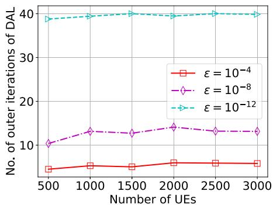  
(a) No. of iterations of DAL.  
Fig. 3. Convergence performance of DAL and 2BCD.

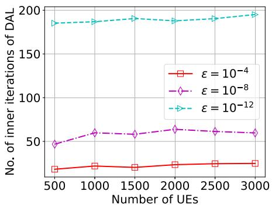  
(b) No. of iterations of 2BCD.

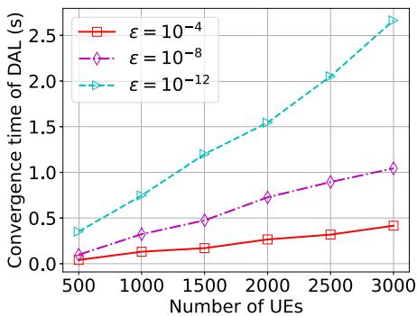  
(c) Convergence time of DAL.

## C. Comparison With Benchmarks

In this subsection, we evaluate the performance gain of RUNs by comparing it with the state-of-the-art benchmark algorithms, which are

Successive Convex Approximation (SCA) [40]: is an iterative method for handling nonconvex optimization problems by successively solving a sequence of convex subproblems that approximate the original problem around the current iterate. Due to its guaranteed convergence to the stationary point, SCA is widely exploited in wireless communications and UAV optimization, such as in beamforming design, power control, and UAV trajectory optimization [8], [41].

• Sequential Quadratic Programming (SQP) [42]: is also an iterative algorithm for constrained nonlinear optimization. Different with SCA, SQP solves a nonconvex problem by iteratively constructing and solving a quadratic programming subproblem, which locally approximates the Lagrangian of the nonlinear program using second-order information.

Gradient-Based Optimizer (GBO) [43]: this algorithm integrates gradient-based search with population-based optimization to achieve a balance between exploration and exploitation. Specifically, it leverages gradient-based search to guide the population toward better solutions, while employing a local escaping operator to escape from local optima.

• Success History Intelligent Optimizer (SHIO) [44]: this algorithm is an efficient improvement of the particle swarm optimization (PSO) algorithm. To overcome the premature issue of traditional PSO, SHIO adapts its search strategy by learning from previous successes. This enables it to avoid repeating poor search directions and focus on promising regions of the feasible space.

It should be emphasized that in our comparisons, DUSP is not solved directly by these benchmarks due to their inefficiency for nonlinear mixed-integer problems. To ensure comparison fairness, the benchmarks adopt a solution procedure similar to RUNs. Specifically, we first apply them to solve the MP-Relax, and then perform rounding to recover the integrality of the solution. Note that in the last two benchmarks, we set the maximum number of iterations and the population size to 1000 and 100, respectively. Moreover, all results are averaged over 100 runs to avoid randomness.

TABLE III  
CONVERGENCE COMPARISON AMONG RUNS, SQP, AND SCA, WITH  = 10<sup>−12</sup>
<table><tr><td rowspan=2 colspan=1>N</td><td rowspan=1 colspan=3>Convergence time (s)</td><td rowspan=1 colspan=3>Data rate</td></tr><tr><td rowspan=1 colspan=1>RUNs</td><td rowspan=1 colspan=1>SQP</td><td rowspan=1 colspan=1>SCA</td><td rowspan=1 colspan=1>RUNs</td><td rowspan=1 colspan=1>SQP</td><td rowspan=1 colspan=1>SCA</td></tr><tr><td rowspan=1 colspan=1>20</td><td rowspan=1 colspan=1>0.067</td><td rowspan=1 colspan=1>0.442</td><td rowspan=1 colspan=1>1.79</td><td rowspan=1 colspan=1>1423.9</td><td rowspan=1 colspan=1>1425.6</td><td rowspan=1 colspan=1>88.5</td></tr><tr><td rowspan=1 colspan=1>40</td><td rowspan=1 colspan=1>0.089</td><td rowspan=1 colspan=1>1.300</td><td rowspan=1 colspan=1>1.81</td><td rowspan=1 colspan=1>1485.9</td><td rowspan=1 colspan=1>1488.9</td><td rowspan=1 colspan=1>214.1</td></tr><tr><td rowspan=1 colspan=1>60</td><td rowspan=1 colspan=1>0.128</td><td rowspan=1 colspan=1>2.104</td><td rowspan=1 colspan=1>1.71</td><td rowspan=1 colspan=1>1500.0</td><td rowspan=1 colspan=1>1506.8</td><td rowspan=1 colspan=1>405.2</td></tr><tr><td rowspan=1 colspan=1>80</td><td rowspan=1 colspan=1>0.234</td><td rowspan=1 colspan=1>4.248</td><td rowspan=1 colspan=1>1.76</td><td rowspan=1 colspan=1>1500.9</td><td rowspan=1 colspan=1>1512.3</td><td rowspan=1 colspan=1>495.0</td></tr><tr><td rowspan=1 colspan=1>100</td><td rowspan=1 colspan=1>0.303</td><td rowspan=1 colspan=1>6.601</td><td rowspan=1 colspan=1>1.77</td><td rowspan=1 colspan=1>1496.4</td><td rowspan=1 colspan=1>1509.6</td><td rowspan=1 colspan=1>569.6</td></tr></table>

1) Convergence Time Comparison: In Table III, we compare the convergence time of RUNs with that of benchmark algorithms under different problem sizes, where the corresponding objective values are also reported for completeness. The results of SHIO and GBO are not included, since the convergence time of meta-heuristic algorithms cannot be rigorously defined. It can be observed that RUNs consistently achieves the fastest convergence under all problem sizes, requiring only a few hundred milliseconds. Although the objective value of RUNs is slightly lower than that of SQP (with a gap of about 0.9%), its convergence speed is nearly 20 times faster, and this advantage becomes more pronounced as the problem size increases. These results indicate that RUNs is able to quickly converge to a high-quality solution within a very short time. In contrast, while SCA has a relatively fast convergence rate, its objective values are significantly inferior. This is primarily due to the bilinear constraint ${ \bf x } ^ { T } { \bf p } \leq P $ which is highly nonconvex and induces a strong coupling between the variables x and p.

2) Data Rate Comparison: In Fig. 4a, we compare RUNs with the benchmark algorithms under different transmission powers of the UAV. Since the benchmarks cannot even find a feasible solution for medium-scale problems within a reasonable time, only a small-scale network with N = 60 UEs is simulated. The total bandwidth is set as $B _ { t o t } = 1 0 0$ MHz, while the maximum transmission power $P ^ { t , \mathrm { m a x } }$ of the UAV varies from 20 W to 80 W. From Fig. 4a, we can see that the average data rate of RUNs is nearly the same with SQP, while it is at least 25% higher than that of the other benchmark algorithms, indicating that RUNs has superior performance. Importantly, while RUNs attains a performance close to SQP, it converges about 20 times faster as demonstrated in Table III. In addition, we can observed that the averaged data rate increases logarithmically with $P ^ { t , \mathrm { m a x } }$ , which is attributed to the Shannon formula (cf. (16)).

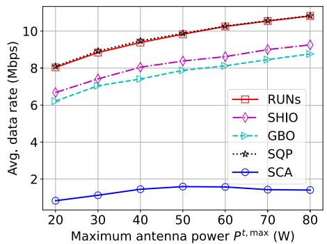  
(a) Comparison under different values of $P ^ { t , \mathrm { m a x } }$

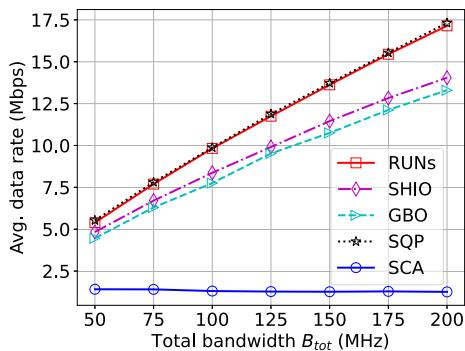  
(b) Comparison under different values of $B _ { t o t }$

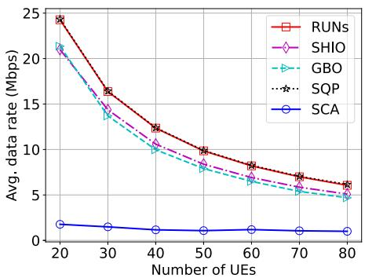  
(c) Comparison under different No. of UEs.

Fig. 4. Performance comparison under different network parameters. The comparison is conducted under a small-scale UAWN, since the benchmark algorithms fail to obtain feasible solutions for medium-scale problems within a reasonable time.  
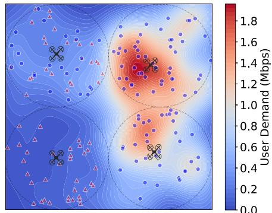  
(a) A four-cell UAWN. Warmer color represents higher user demand.

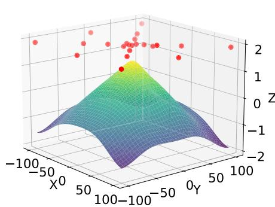  
(b) Posterior mean of the Bayesian surrogate model of the first cell and the sampled point.

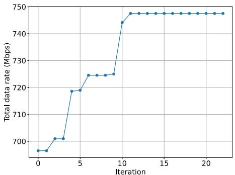  
(c) Convergence curve of BO.  
Fig. 5. Effect of horizontal UAV deployment optimization.

In Fig. 4b, the effect of total bandwidth $B _ { t o t }$ on the average data rate is presented. For the same reason as the previous simulation, we set N = 60 and $P ^ { t , \mathrm { { m a x } } } = 5 0$ W. The total bandwidth $B _ { t o t }$ varies from 50 MHz to 200 MHz. Similar to Fig. 4a, Fig. 4b also demonstrates that the average data rate of RUNs and SQP are nearly the same. In contrast, the curve of RUNs is more than 25% higher than the curves of SHIO, GBO, and SCA. Meanwhile, we can see that the average data rate increases linearly with $B _ { t o t }$ , which is the case since the data rate is approximately linear w.r.t. (cf. (16)). In addition, SCA exhibits significantly lower data rates compared to RUNs and the other benchmarks. This indicates that although the SCA algorithm is widely used for nonconvex optimization problems in communications, indiscriminately applying it can lead to very poor results.

In Fig. 4c, we compare the average data rate of RUNs with that of benchmarks under different numbers of UEs. In particular, we set the number of the UEs to vary from 20 to 80. As shown in Fig. 4c, the average data rate of RUNs is about 15% higher than that of benchmark algorithms, except that of SQP. In addition, we also observe that the average data rate decreases with the number of UEs. This is reasonable since the limited network resources are shared among these UEs, resulting in a decrease in the average data rate w.r.t. N . To summarize, these results show that our proposed RUNs achieves significant performance gains w.r.t. the benchmark algorithms.

## D. Performance of Horizontal Deployment Optimization

In Fig. 5, we illustrate the effect of optimizing the horizontal positions of UAVs via BO. In Fig. 5a, a four-cell UAWN is simulated, where eMBB users and uRLLC users are denoted by blue circles and red triangles, respectively. The user demand density is shown by the colormap, with warmer colors indicating higher demand. We apply the BO-extended RUNs framework to determine the UAVs’ horizontal positions in each cell, where the optimized locations are marked by UAV symbols. As can be observed, the optimal UAV positions strongly correlate with the spatial distribution of user demand, as exemplified by the two cells on the right. Fig. 5b shows the surface of the posterior mean of the Bayesian surrogate model for the top-left cell, along with the sample points evaluated during BO iterations (red dots). We can observe that the surrogate function well captures the dependence of the data rate on the UAV’s horizontal position, and the quadratic-like shape of the mean surface is consistent with relation (13).

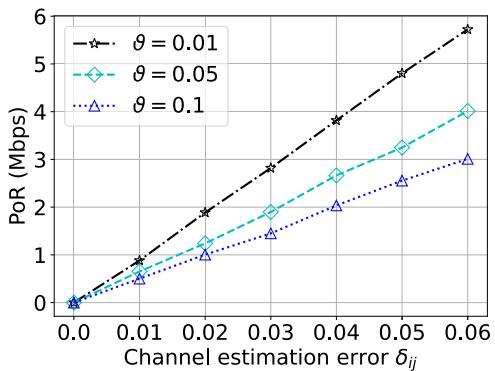

Fig. 6. PoR under different $\delta _ { i j }$ and $\vartheta _ { i j }$ . The data rate of the nominal case produced by RUNs is 1443 Mbps.  
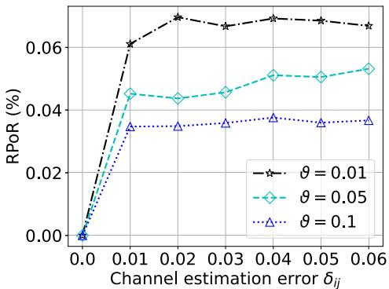  
Fig. 7. RPoR under different $\delta _ { i j }$ and $\vartheta _ { i j }$

Finally, Fig. 5c presents the convergence curve of BO. It is seen that BO converges within about M = 12 iterations. Since each iteration corresponds to one evaluation of the RUNs framework, this result demonstrates that BO can efficiently identify high-quality UAV deployment positions with low computational overhead.

## E. Performance of Robustness

In this simulation, we evaluate the robustness of the RUNs framework under different levels of environmental uncertainties. Specifically, considering the intricate impact of $\Delta g _ { i j }$ on RUSP, we focus on evaluating the robustness performance of RUNs w.r.t. $\Delta g _ { i j }$ . Specifically, we evaluate the price of robustness (PoR) and the relative price of robustness (RPoR) of RUNs, which quantify the objective degradation incurred by ensuring robustness against parameter uncertainty. Let $f _ { r o b } ^ { * }$ and $f _ { n o m } ^ { * }$ be the optimal objective values of RUSP with uncertain parameters and nominal parameters, respectively. Then PoR and RPoR are defined as

$$
\mathrm { P o R } = f _ { n o m } ^ { * } - f _ { r o b } ^ { * } , \mathrm { R P o R } = \frac { \left( f _ { n o m } ^ { * } - f _ { r o b } ^ { * } \right) } { f _ { n o m } ^ { * } } ,\tag{101}
$$

respectively. In this experiment, we set the channel estimation error $\delta _ { i j }$ to vary from 0 to 0.06, where $\delta _ { i j } = 0$ represents the nominal case. We evaluate the PoR and the RPoR for three different violation probabilities, namely $\vartheta _ { i j } \in \{ 0 . 0 1 , 0 . 0 5 , 0 . 1 \}$ The results are plotted in Fig. 6 and Fig. 7. Note that the data rate of the nominal case produced by RUNs is 1443 Mbps.

As shown in Fig. 6, the PoR of RUNs increases with both $\delta _ { i j }$ and $\vartheta _ { i j }$ . Compared with the nominal case, the total data rate decreases by only about 6Mbps, which corresponds to a 0.07% decrease in the nominal case. In Fig. 7, we can see that the RPoR of RUNs is below 0.07% for $\vartheta _ { i j } ~ \geq ~ 0 . 0 1$ indicating RUNs achieves a high robustness at a relatively low cost. Furthermore, it is also observed that these two parameters have little impact on PPoR. Consequently, we can reasonably predict that the total data rate under other values of $\delta _ { i j }$ will also decrease by less than 0.07% for $\vartheta _ { i j } \geq 0 . 0 1$ . In this way, these results can provide valuable insights to InPs, enabling them to make flexible trade-offs between network performance and robustness against uncertain parameters.

## VII. CONCLUSION AND FUTURE WORK

In this work, we have considered the UAWN slicing problem under uncertain network conditions including the imperfect CSI, uncertain user demand, and the imprecise user location. The problem is formulated as a robust nonlinear and nonconvex mixed-integer problem that jointly optimizes UAV deployment, channel allocation, and power allocation. Based on a careful investigation of the problem structure, we have solved it by proposing the RUNs framework that jointly exploits problem decomposition, the AL method, and the BCD method. We have proven that the RUNs framework converges to the AKKT/KKT points of the problem with log-linear time-complexity, which is suitable for the computing-limited UAWNs. The numerical results have verified its log-linear convergence rate and superior performance gains. We have observed a convergence time of 500 ms for large-scale problems, and a performance gain of 15% to 25% over the benchmark algorithms. Moreover, the RUNs framework exhibits a low price of robustness in the sense that it provides 99% service guarantees with only 0.07% performance degradation.

In this paper, we have mainly focused on the networklayer slicing design under the single-antenna omnidirectional transmission model, which is widely adopted in UAV communication research due to the limited payload and poor scattering in UAV communications. While practical, this model imposes inherent limitations on achievable system performance. In the future, we plan to extend the RUNs framework by incorporating multiple-antenna configurations and adaptive beamforming techniques. Such an integration is expected to further enhance signal strength, mitigate interference, and enable spatial multiplexing, thereby significantly improving the capacity and coverage of UAWNs. Moreover, it is interesting to investigate this problem under the scenario where multiple UAVs collaboratively serve multiple cells.

## REFERENCES

[1] F. Wei, Y. Wang, G. Feng, and S. Qin, “Network-slicing-enabled computation offloading in satellite-terrestrial edge computing networks: A bi-level game approach,” IEEE Internet Things J., vol. 12, no. 11, pp. 16282–16297, Jun. 2025.

[2] Y. Wang, M. Yan, G. Feng, S. Qin, and F. Wei, “Autonomous on-demand deployment for UAV assisted wireless networks,” IEEE Trans. Wireless Commun., vol. 22, no. 12, pp. 9488–9501, Dec. 2023.

[3] C. You, X. He, Y. Zhang, K. Guo, Y. Gao, and T. Q. S. Quek, “SemSAN: Semantic satellite access network slicing for NextG non-terrestrial networks,” in Proc. IEEE Int. Conf. Commun., Jun. 2024, pp. 2889–2894. [Online]. Available: https://ieeexplore.ieee.org/ document/10622974/?arnumber=10622974

[4] Y. Guan, Q. Song, T. Chen, W. Qi, L. Guo, and A. Jamalipour, “Slicingaware aerial networks for integrated sensing and communication: 3D placement and adaptive allocation of resources,” IEEE Veh. Technol. Mag., vol. 19, no. 2, pp. 79–88, Jun. 2024.

[5] H. H. Esmat, B. Lorenzo, and W. Shi, “Toward resilient network slicing for satellite–terrestrial edge computing IoT,” IEEE Internet Things J., vol. 10, no. 16, pp. 14621–14645, Aug. 2023.

[6] Y.-H. Xu, J.-H. Li, W. Zhou, and C. Chen, “Learning-empowered resource allocation for air slicing in UAV-assisted cellular V2X communications,” IEEE Syst. J., vol. 17, no. 1, pp. 1008–1011, Mar. 2023.

[7] F. Wei, G. Feng, S. Qin, Y. Peng, and Y. Liu, “Hierarchical network slicing for UAV-assisted wireless networks with deployment optimization,” IEEE J. Sel. Areas Commun., vol. 42, no. 12, pp. 3705–3718, Dec. 2024.

[8] P. Yang, X. Xi, K. Guo, T. Q. S. Quek, J. Chen, and X. Cao, “Proactive UAV network slicing for URLLC and mobile broadband service multiplexing,” IEEE J. Sel. Areas Commun., vol. 39, no. 10, pp. 3225–3244, Oct. 2021.

[9] A. Asheralieva, D. Niyato, and X. Wei, “Ultrareliable low-latency slicing in space–air–ground multiaccess edge computing networks for nextgeneration Internet of Things and mobile applications,” IEEE Internet Things J., vol. 11, no. 3, pp. 3956–3978, Feb. 2024.

[10] H. Shen, Y. Tian, T. Wang, and G. Bai, “Slicing-based task offloading in space-air-ground integrated vehicular networks,” IEEE Trans. Mobile Comput., vol. 23, no. 5, pp. 4009–4024, May 2024.

[11] A. Gharehgoli, A. Nouruzi, N. Mokari, P. Azmi, M. R. Javan, and E. A. Jorswieck, “AI-based resource allocation in end-to-end network slicing under demand and CSI uncertainties,” IEEE Trans. Netw. Service Manage., vol. 20, no. 3, pp. 3630–3651, Sep. 2023. [Online]. Available: https://ieeexplore.ieee.org/document/10042052/?arnumber=10042052

[12] A. M. Geoffrion, “Generalized benders decomposition,” J. Optim. theory Appl., vol. 10, no. 4, pp. 237–260, 1972.

[13] E. G. Birgin, Practical Augmented Lagrangian Methods for Constrained Optimization. Philadelphia, PA, USA: SIAM, 2014. [Online]. Available: http://epubs.siam.org/doi/book/10.1137/1.9781611973365

[14] L. Grippo and M. Sciandrone, “On the convergence of the block nonlinear Gauss–Seidel method under convex constraints,” Operations Res. Lett., vol. 26, no. 3, pp. 127–136, Apr. 2000.

[15] G. Chen, F. Sun, H. Liang, Q. Zeng, and Y.-D. Zhang, “MADDPG-M&L: UAV-assisted joint user association and slicing resource allocation in HetNets,” IEEE Trans. Netw. Sci. Eng., vol. 12, no. 4, pp. 2878–2894, Jul. 2025. [Online]. Available: https://ieeexplore.ieee.org/document/ 10938906/

[16] X. Li et al., “Self-adjusting network slicing for dynamic heterogeneous task offloading in UAV-enabled mobile edge computing,” IEEE Trans. Cogn. Commun. Netw., vol. 12, pp. 673–687, 2025. [Online]. Available: https://ieeexplore.ieee.org/document/10981857/

[17] G. Wu, B. Zhang, and Y. Li, “Intelligent and survivable resource slicing for 6G-oriented UAV-assisted edge computing networks,” Comput. Commun., vol. 202, pp. 154–165, Mar. 2023. [Online]. Available: https://linkinghub.elsevier.com/retrieve/pii/S0140366423000439

[18] K. Xiong, Y. Chen, Z. He, Y. Qin, S. Leng, and C. Yuen, “Network slice-based low-altitude intelligent network for advanced air mobility,” IEEE Trans. Netw. Sci. Eng., vol. 13, pp. 1800–1816, 2026. [Online]. Available: https://ieeexplore.ieee.org/document/11141735/

[19] X. Yang, W. Wang, Y. Wang, B. Hu, and Z. Zhang, “Deep-unfolding network slicing for deterministic delay services in multi-access edge computing,” IEEE Trans. Commun., vol. 73, no. 12, pp. 14063–14077, Dec. 2025. [Online]. Available: https://ieeexplore.ieee.org/document/ 11184619/

[20] H. Tu, P. Bellavista, L. Zhao, G. Zheng, K. Liang, and K.-K. Wong, “Priority-based load balancing with multiagent deep reinforcement learning for space–air–ground integrated network slicing,” IEEE Internet Things J., vol. 11, no. 19, pp. 30690–30703, Oct. 2024. [Online]. Available: https://ieeexplore.ieee.org/document/10560515/

[21] S. Ammar, W. Abderrahim, and B. Shihada, “Maritime-oriented network slicing in O-RAN integrated aerial-terrestrial networks,” IEEE Trans. Mobile Comput., early access, Oct. 30, 2025, doi: 10.1109/ TMC.2025.3626785.

[22] F. Wei, G. Feng, S. Qin, Y. Peng, and Y. Liu, “Hierarchical network slicing for time-varying UAV-assisted wireless networks: Dynamic programming beyond distributed learning,” in Proc. IEEE Global Commun. Conf., Dec. 2024, pp. 1521–1526.

[23] A. A. Nasir, H. D. Tuan, T. Q. Duong, and H. V. Poor, “UAV-enabled communication using NOMA,” IEEE Trans. Commun., vol. 67, no. 7, pp. 5126–5138, Jul. 2019.

[24] F. Wei, S. Qin, G. Feng, Y. Sun, J. Wang, and Y.-C. Liang, “Hybrid model-data driven network slice reconfiguration by exploiting prediction interval and robust optimization,” IEEE Trans. Netw. Service Manage., vol. 19, no. 2, pp. 1426–1441, Jun. 2022.

[25] A. Baumgartner, T. Bauschert, A. A. Blzarour, and V. S. Reddy, “Network slice embedding under traffic uncertainties—A light robust approach,” in Proc. 13th Int. Conf. Netw. Service Manage. (CNSM), Nov. 2017, pp. 1–5.

[26] F. B. Sorbelli, C. M. Pinotti, S. Silvestri, and S. K. Das, “Measurement errors in range-based localization algorithms for UAVs: Analysis and experimentation,” IEEE Trans. Mobile Comput., vol. 21, no. 4, pp. 1291–1304, Apr. 2022.

[27] P. K. Korrai, E. Lagunas, A. Bandi, S. K. Sharma, and S. Chatzinotas, “Joint power and resource block allocation for mixed-numerology-based 5G downlink under imperfect CSI,” IEEE Open J. Commun. Soc., vol. 1, pp. 1583–1601, 2020.

[28] Y. Xu, S. Jiang, Q. Xue, X. Li, and C. Yuen, “Throughput maximization for NOMA-based cognitive backscatter communication networks with imperfect CSI,” IEEE Internet Things J., vol. 10, no. 22, pp. 19595–19606, Nov. 2023.

[29] H. He, S. Zhang, Y. Zeng, and R. Zhang, “Joint altitude and beamwidth optimization for UAV-enabled multiuser communications,” IEEE Commun. Lett., vol. 22, no. 2, pp. 344–347, Feb. 2018. [Online]. Available: http://ieeexplore.ieee.org/document/8103781/

[30] J. Wang, J. Liu, J. Li, and N. Kato, “Artificial intelligence-assisted network slicing: Network assurance and service provisioning in 6G,” IEEE Veh. Technol. Mag., vol. 18, no. 1, pp. 49–58, Mar. 2023.

[31] M. Yan, G. Feng, J. Zhou, Y. Sun, and Y.-C. Liang, “Intelligent resource scheduling for 5G radio access network slicing,” IEEE Trans. Veh. Technol., vol. 68, no. 8, pp. 7691–7703, Aug. 2019.

[32] D. Bertsekas, Convex Optimization Algorithms. Belmont, MA, USA: Athena Scientific, 2015.

[33] M. Danilova et al., “Recent theoretical advances in non-convex optimization,” in High-Dimensional Optimization Probability: With A View Towards Data Science, 2022, pp. 79–163.

[34] W. Wang and M. A. Carreira-Perpinan, “Projection onto the probability´ simplex: An efficient algorithm with a simple proof, and an application,” 2013, arXiv:1309.1541.

[35] D. R. Jones, C. D. Perttunen, and B. E. Stuckman, “Lipschitzian optimization without the Lipschitz constant,” J. Optim. Theory Appl., vol. 79, no. 1, pp. 157–181, Oct. 1993.

[36] P. I. Frazier, “A tutorial on Bayesian optimization,” 2018, arXiv:1807.02811.

[37] (2016). Gpyopt: A Bayesian Optimization Framework in Python. [Online]. Available: http://github.com/SheffieldML/GPyOpt

[38] A. Domahidi, E. Chu, and S. Boyd, “ECOS: An SOCP solver for embedded systems,” in Proc. Eur. Control Conf. (ECC), Jul. 2013, pp. 3071–3076.

[39] C. Zhu, R. H. Byrd, P. Lu, and J. Nocedal, “Algorithm 778: L-BFGS-B: Fortran subroutines for large-scale bound-constrained optimization,” ACM Trans. Math. Softw. (TOMS), vol. 23, no. 4, pp. 550–560, 1997.

[40] M. Razaviyayn, “Successive convex approximation: Analysis and applications,” Ph.D. dissertation, Dept. Elect. Eng., University of Minnesota, Minneapolis, MN, USA, 2014.

[41] Y. Xu, D. Xu, and S. Song, “Sensing-assisted robust SWIPT for mobile energy harvesting receivers in networked ISAC systems,” IEEE Trans. Wireless Commun., vol. 24, no. 3, pp. 2094–2109, Mar. 2025. [Online]. Available: https://ieeexplore.ieee.org/document/10812799/

[42] P. E. Gill and E. Wong, “Sequential quadratic programming methods,” in Mixed Integer Nonlinear Programming. Cham, Switzerland: Springer, 2011, pp. 147–224.

[43] I. Ahmadianfar, O. Bozorg-Haddad, and X. Chu, “Gradient-based optimizer: A new Metaheuristic optimization algorithm,” Inf. Sci., vol. 540, pp. 131–159, Nov. 2020.

[44] H. N. Fakhouri, F. Hamad, and A. Alawamrah, “Success history intelligent optimizer,” J. Supercomput., vol. 78, no. 5, pp. 6461–6502, Apr. 2022.


Fengsheng Wei (Senior Member, IEEE) received the B.E., M.E., and Ph.D. degrees from the School of Communication and Information Engineering, University of Electronic Science and Technology of China (UESTC), Chengdu, China, in 2012, 2016, and 2022, respectively. From 2022 to 2025, he was a full-time Researcher with the Yangtze Delta Region Institute (Huzhou), UESTC, Huzhou, China, where he completed his post-doctoral research in 2025. He is currently an Associate Professor with the School of Electronic and Electrical Engineering, Ningxia

University, Yinchuan, China. His research interests include ISAC and WiFi sensing, global optimization, non-terrestrial networks, and network slicing.


Shuang Qin (Senior Member, IEEE) received the B.E. degree in electronic information science and technology and the Ph.D. degree in communication and information system from the University of Electronic Science and Technology of China (UESTC), in 2006 and 2012, respectively. He is currently a Professor with the National Key Laboratory of Science and Technology on Communications, UESTC. His research interests include cooperative communication in wireless networks, data transmission in opportunistic networks, and green communication in heterogeneous networks.


Gang Feng (Fellow, IEEE) received the B.Eng. and M.Eng. degrees in electronic engineering from the University of Electronic Science and Technology of China (UESTC), Chengdu, China, in 1986 and 1989, respectively, and the Ph.D. degree in information engineering from The Chinese University of Hong Kong, Hong Kong, in 1998. He joined the School of Electric and Electronic Engineering, Nanyang Technological University, in 2000, as an Assistant Professor. He was an Associate Professor in 2005. He is currently a Professor with the National Lab-

oratory of Communications, UESTC. His research interests include next generation mobile networks, mobile cloud computing, and AI-enabled wireless networking. He has extensive research experience and has published widely in wireless networking research. A number of his papers have been highly cited. He was a recipient of IEEE ComSoc TAOS Best Paper Award and ICC Best Paper Award in 2019.

  
Haokang Lou is currently pursuing the M.E. degree in information and communication engineering with the University of Electronic Science and Technology of China (UESTC), Chengdu, China. His research interests include network slicing and mobility-based models of cellular networks.


Wei Jiang (Member, IEEE) received the B.S. degree from the School of Communication and Information Engineering, Chongqing University of Posts and Telecommunications (CQUPT), in 2013, and the Ph.D. degree from the School of Communication and Information Engineering, University of Electronic Science and Technology of China (UESTC), in 2019. She was a Visiting Ph.D. Student with The Pennsylvania State University (PSU) from 2017 to 2018 and a Post-Doctoral Researcher with Shenzhen University from 2020 to 2022. She is currently an

Associate Professor with the Institute of Cyberspace Security, Zhejiang University of Technology. Her current research interests include next generation mobile communication systems, mobile edge computing, and content caching. She has won the Best Paper Award of IEEE TRANSACTIONS ON SERVICES COMPUTING in 2023.