# Radio Map-Assisted Routing and Predictive Resource Allocation Over Dynamic Low-Altitude Networks

Bowen Li , Member, IEEE, and Junting Chen , Member, IEEE

Abstract—Dynamic low altitude networks offer significant potential for efficient and reliable data transport via unmanned aerial vehicles (UAVs) relays which usually operate with predetermined trajectories. However, it is challenging to optimize the data routing and resource allocation due to the time-varying topology and the need to control interference with terrestrial systems. Traditional schemes rely on time-expanded graphs with uniform and fine time subdivisions, making them impractical for interferenceaware applications. This paper develops a dynamic space-time graph model with a cross-layer optimization framework that converts a joint routing and predictive resource allocation problem into a joint bottleneck path planning and resource allocation problem. We develop explicit deterministic bounds to handle the channel uncertainty and prove a monotonicity property in the problem structure that enables us to efficiently reach the globally optimal solution to the predictive resource allocation subproblem. Then, this approach is extended to multi-commodity transmission tasks through time-frequency allocation, and a bisection search algorithm is developed to find the optimum solution by leveraging the monotonicity of the feasible set family. Simulations verify that the single commodity algorithm approaches global optimality with more than 30 dB performance gain over the classical graphbased methods for delay-sensitive and large data transportation. At the same time, the multi-commodity method achieves 100X

Digital Object Identifier 10.1109/TWC.2025.3641394

improvements in dense service scenarios and enables an additional 20 dB performance gain by data segmenting.

Index Terms—Low altitude communications, dynamic topology, predictive communications, radio map, space-time graph, cross-layer optimization.

## I. INTRODUCTION

which typically extends from the rooftop to 1,000 meters above ground, where the operations may include the transport of commodities and cargo, short-distance transit and tourism, and emergency operations [1], [2]. The UAV network forms a wireless communication network that is capable of operating parallel to the terrestrial cellular network [3], [4]. The key characteristic of the UAV network is that the network topology is time-varying, but usually predictable according to the primary missions of the UAVs, such as pre-planned cargo delivery following registered flight paths [5], [6]. Such a time-varying but predictable network topology induces a new degree of freedom for network communication, where one can optimize for large-timescale opportunistic transmission for delay-tolerant data transportation.

Specifically, we consider to exploit the low altitude UAV network for delay-tolerant data transportation, where the data package is routed over the dynamic UAV network, and the data source and sink can be sensor nodes or fusion units located on the ground or in the airspace. Such a network transmission model finds many applications, such as in environment monitoring and content distribution for caching. However, transmission over the low altitude UAV network imposes the following challenges:

• Dynamical topology: The topology constructed by UAVs changes over time, leading to the channel state information (CSI) between the transmitting and receiving nodes (whether intended or not) varies over time.

• Air-to-ground interference: Aerial transmissions may cause substantial interference with terrestrial cellular networks, due to the high likelihood of line-of-sight (LOS) conditions from UAVs in the sky.

Routing protocols in dynamic networks are typically classified into social-aware and mobility-aware routing based on their ability to predict future network topology. In the absence of accurate topology information, most methods focus on estimating transmission likelihood by analyzing social properties and selecting routes accordingly [7], [8], [9]. However, these methods often fail to guarantee quality of service (QoS) due to inaccuracies in the prediction mechanisms. In addition, these methods do not capitalize on the predictive property of aerial networks, where UAV trajectories are predetermined before tasks like cargo delivery commence, thus allowing for predicting information about future network topology. When future topology information is available, digital twins, radio maps, or channel models can predict future CSI. This facilitates the use of graph-based routing protocols for robust service [10], [11], [12], [13], [14], [15], [16]. Some approaches partition the dynamic network into static graph snapshots and select transmission paths for each snapshot [10]. To build the temporal relationship over snapshots, time-expanded graphs and time-space-combined routing algorithms have been introduced. For instance, some methods [11], [12], [13] enable multi-hop transmissions within a single time slot by subdividing time into smaller intervals, ensuring stable channel gains and avoiding causality issues, though this complicates large timescale optimization. Other methods [14], [15], [16] restrict each time slot to a single-hop transmission, avoiding causality concerns. However, classical uniform slot durations are inadequate for low altitude aerial networks, which must adapt their transmission strategies based on terrestrial network conditions, and determining the optimal slot length remains challenging.

Some recent works [17], [18], [19], [20], [21], [22], and [23] attempted to mitigate air-to-ground interference by time/frequency orthogonalization, beam orthogonalization, and path design. For example, works [19] and [20] focus on allocating spectrum resources to aerial nodes based on realtime cellular network demands, effectively separating aerial and terrestrial networks temporally and spectrally. Works [22] and [23] employ directional beamforming that targets specific receivers and reduces interference to adjacent nodes by controlling the side lobes. However, these methods require small-scale CSI, which is costly and sometimes unfeasible, because small-scale CSI may not be predictable due to the randomness nature of wireless channels. Works [20], [21] optimize UAV positions to keep them away from ground users, thus minimizing interference. Thus, those methods are not applicable to the case where UAV trajectories are determined and cannot be altered. Some preliminary results reported in [6] and [24] have shown that it is possible to exploit the large-scale CSI for predictive transmission optimization with air-to-ground interference control when the routing is determined as fixed. However, when the routes are to be optimized, the route selection and the transmission timing optimization are coupled, whereas a brute-force search for the best route requires exponential complexity.

In this paper, we study the interference-aware predictive communications in low altitude dynamic aerial networks. With the aid of radio maps, a predictive problem on the large timescale for route, transmission power, and timing (time boundary) planning is formulated. Towards this end, two main technical challenges are needed to be addressed:

• How to jointly optimize the route and the transmission timing in a network with dynamic topology.

• How to minimize air-to-ground interference when ensuring aerial communication quality.

To tackle these challenges, we develop a dynamic space-time graph model with virtual edges and formulate a cross-layer interference-aware optimization problem. Consequently, the routing optimization can be solved using a bottleneck path planning algorithm, while the power and timing allocation optimization is reformulated as an innerouter problem. Our key contributions are made as follows:

• We propose a dynamic space-time graph model with an algorithm framework for the joint routing and predictive resource allocation over a dynamic network.

• We develop explicit deterministic bounds to handle the channel uncertainty for an efficient cross-layer algorithm design. We also prove a monotonicity property in the problem structure that enables us to efficiently reach the globally optimal solution to the predictive resource allocation subproblem.

• For multi-commodity transportation, we decouple the problem to multiple parallel single commodity transportation subproblems. While the subproblems are coupled via the shared time-frequency resources, we show that the optimal time-frequency allocation can be efficiently found via exploiting a monotonicity property of the problem formulation.

Simulations show that the single commodity algorithm achieves near-global optimality, providing 30 dB improvements for delay-sensitive and large data transportation compared to classical graph-based algorithms. Additionally, the multi-commodity algorithm delivers a 100X improvement in dense service scenarios. For a single large commodity, segmenting it into smaller parts for transmission further achieves an additional 20 dB performance improvement.

The rest of the paper is organized as follows. Section II presents the communication system model, the graph model, and the problem formulation. Section III develops the single commodity transportation strategy based on the dynamic space-time graph with virtual edges. Section II extends the single commodity strategy to the multi-commodity transportation. Numerical results are demonstrated in Section V, and conclusions are given in Section VI.

## II. SYSTEM MODEL

Consider a data transportation task that delivers a data package of size S from a source node to a destination node via a group of M − 2 aerial nodes, as shown in Fig. 1. For the ease of exposition, denote the source node as the 1st node and the destination node as the Mth node, and thus, the set $\mathcal { M } \ = \ \{ 1 , 2 , . . . , M \}$ of all M nodes forms an aerial communication network. Besides, there is a set $\mathcal { N } = \{ M + 1 , M + 2 , . . . , M + N \}$ of nodes in the neighbor network that requires interference protection. The positions or trajectories of these nodes, defined as $ { \mathbf { q } } _ { m } ( t ) \in  { \mathbb { R } } ^ { 3 }$ $m \in \mathcal { M } \cup \mathcal { N }$ , are known for a certain time horizon $t \in [ 0 , T ]$ The key notations used in the paper are concluded in Table I.

Node M-1

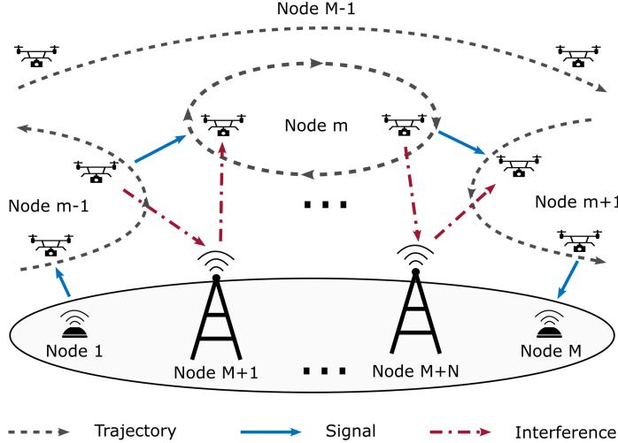  
Fig. 1. Interference-aware aerial communication system model. The UAV symbols along one trajectory indicate an aerial node’s positions at different time instants. The task is to transport data from node 1 to node M via UAVs indexed from 2 to M −1, while minimizing interference to neighboring nodes indexed from M + 1 to $M + N$

## A. Channel Model and Radio Model

We consider a flat fading channel model, where the instantaneous channel power gain between two nodes m $\neq n \in$ ${ \mathcal { M } } \cup { \mathcal { N } }$ is given by

$$
h _ { m , n } \left( t \right) = g _ { m , n } \left( t \right) \xi _ { m , n } \left( t \right) , t \in \left[ 0 , T \right]\tag{1}
$$

where $g _ { m , n } ( t )$ is the expected channel gain and $\xi _ { m , n } ( t )$ is a random variable following Gamma $( \kappa _ { m , n } ( t ) , 1 / \kappa _ { m , n } ( t ) )$ distribution to capture the small-scale fading. Accordingly, the power gain at time t follows Gamma distribution with Gamma $. ( \kappa _ { m , n } ( t ) , g _ { m , n } ( t ) / \kappa _ { m , n } ( t ) )$

Assume the large-scale channel statistics between any two positions $\mathbf { q } _ { m } ( t )$ and $\mathbf { q } _ { n } ( t )$ are known in advance and captured by a predefined function

$$
( g _ { m , n } ( t ) , \kappa _ { m , n } ( t ) ) = \Xi ( \mathbf { q } _ { m } ( t ) , \mathbf { q } _ { n } ( t ) ) .
$$

This assumption is feasible with the use of radio maps, which are data-driven models that correlate the locations of transmitters and receivers to large-scale CSI, including path loss, shadowing, and the statistics of small-scale fading [25], [26], [27]. By integrating the predictive positions of the nodes, $e . g . , \mathbf { q } _ { m } ( t )$ and $\mathbf { q } _ { n } ( t )$ , it becomes possible to forecast largescale channel gains $g _ { m , n } ( t )$ and the statistics of small-scale fading $\xi _ { m , n } ( t )$ over time. Consequently, one can predict the channel power gain distribution over time and effectively plan communication strategies in advance. In other words, terrestrial control center is able to access the required coefficients without UAV real-time feedback. Note that $h _ { m , n } ( t )$ is the instantaneous power gain at time t that is not available ahead of time due to the randomness of $\xi _ { m , n } \left( t \right)$ from the small-scale fading.<sup>1</sup>

On the other hand, the coverage radio maps of the neighboring network nodes, denoted by $\Xi _ { j }$ for $j \in \mathcal N$ , map an aerial position $\mathbf { q } _ { n } ( t )$ to the corresponding power gain from neighbor node j. These radio maps characterize the received power gain at position $\mathbf { q } _ { n } ( t )$ from neighboring node j, and are utilized to predict the ground-to-air interference experienced by the aerial nodes. Mathematically, the ground-to-air interference from node j to aerial node n at time t can be

TABLE I  
KEY NOTATIONS
<table><tr><td rowspan=1 colspan=1>Symbols</td><td rowspan=1 colspan=1>Meaning</td></tr><tr><td rowspan=1 colspan=1>M, N</td><td rowspan=1 colspan=1>Node sets of the aerial and neighbor networks(Section II).</td></tr><tr><td rowspan=1 colspan=1>S</td><td rowspan=1 colspan=1>Size of the data package (Section II).</td></tr><tr><td rowspan=1 colspan=1> $h _ { m , n } , g _ { m , n } , \xi _ { m , n }$ </td><td rowspan=1 colspan=1>Instantaneous channel gain, average channel gain,and small-scale fading between node m and noden (Section II-A).</td></tr><tr><td rowspan=1 colspan=1> $p _ { m , n } , c _ { m , n }$ </td><td rowspan=1 colspan=1>Instantaneous power policy and channel capacityfrom node m to n (Section II-A).</td></tr><tr><td rowspan=1 colspan=1> $I _ { m , j }$ </td><td rowspan=1 colspan=1>Instantaneous air-to-ground interference fromaerial node m to ground node j (Section II-A).</td></tr><tr><td rowspan=1 colspan=1> $w _ { m , n } ^ { k } ( t _ { k } , t _ { k + 1 } )$ </td><td rowspan=1 colspan=1>Minimum worst-case interference during thetransmission from m to n over $[ t _ { k } , t _ { k + 1 } )$ (Sec-tion II-B).</td></tr><tr><td rowspan=1 colspan=1> $t _ { k } , o ( k )$ </td><td rowspan=1 colspan=1>The kth time boundary and selected relay (SectionII-C).</td></tr><tr><td rowspan=1 colspan=1> $\mathcal { G } ( \mathbf { t } ) =$  $( \hat { \mathcal { M } } , \hat { \mathcal { E } } , \hat { \mathcal { W } } ( \mathbf { t } ) )$ </td><td rowspan=1 colspan=1>Dynamic space-time graph with node, edge, andweight sets (Section II-C).</td></tr><tr><td rowspan=1 colspan=1>Z</td><td rowspan=1 colspan=1>Set of commodities (Section IV-A).</td></tr><tr><td rowspan=1 colspan=1> $s _ { z } , d _ { z }$ </td><td rowspan=1 colspan=1>Source and destination of commodity z (SectionIV-A).</td></tr><tr><td rowspan=1 colspan=1> $t _ { k , z } , o ( k , z )$ </td><td rowspan=1 colspan=1>kth time boundary and relay for commodity z(Section IV-A).</td></tr><tr><td rowspan=1 colspan=1> $l _ { z } ( t )$ </td><td rowspan=1 colspan=1>Instantaneous normalized time-frequency re-source for commodity z (Section IV-A).</td></tr><tr><td rowspan=1 colspan=1> $\operatorname* { m a x } _ { k \in \mathcal { M } } \{ w ^ { k } \}$ </td><td rowspan=1 colspan=1>Maximum value among a set of known scalars $w ^ { k } ;$ no optimization is involved.</td></tr><tr><td rowspan=1 colspan=1> $\operatorname* { m a x } _ { p \in { \mathcal { P } } } f ( p )$ </td><td rowspan=1 colspan=1>Maximization over decision variable p; representsan optimization problem.</td></tr></table>

$$
I _ { n j } ( t ) = \Xi _ { j } ( { \bf q } _ { n } ( t ) ) .
$$

Denote the transmission power of node m targeted to node n as $p _ { m , n } ( t ) \geq 0$ . Then, the received signal-to-interferenceand-noise ratio (SINR) for node n is $p _ { m , n } ( t ) h _ { m , n } ( t ) / \delta _ { n } ^ { 2 } ( t )$ where $\begin{array} { r } { \delta _ { n } ^ { 2 } ( t ) \triangleq \delta ^ { 2 } + \sum _ { i } I _ { n j } ( t ) } \end{array}$ and $\delta ^ { 2 }$ is noise power. To simplify the notation, we assume that the interference-plusnoise term $\delta _ { n } ^ { 2 } ( t )$ is constant across all nodes and time, and denote it simply as $\delta ^ { 2 }$ . It is worth noting that this assumption is made purely for notational convenience and the proposed method remains valid and applicable even when $\delta _ { n } ^ { 2 } ( t )$ varies across nodes and over time.

Assuming perfect Doppler compensation through advanced techniques [29], [30], [31], the instantaneous capacity from node m to node n is modeled as

$$
c _ { m , n } \left( t \right) = B \log _ { 2 } \left( 1 + \frac { p _ { m , n } \left( t \right) h _ { m , n } \left( t \right) } { \delta ^ { 2 } } \right)\tag{2}
$$

where B is the transmission bandwidth.

Meanwhile, the transmission from node m will generate interference to the neighbor nodes $j \in \mathcal N$ , and the instanta-

neous interference power is modeled by

$$
I _ { m , j } \left( t \right) = \sum _ { n \in \mathcal { M } } p _ { m , n } \left( t \right) h _ { m , j } \left( t \right) .\tag{3}
$$

## B. Link-Level Communication Model

The key challenge of wireless communication in a dynamic network is that there may not exist an instantaneous end-toend route from the source to the destination with a satisfactory communication quality, because the instantaneous end-to-end communication quality for a multi-hop channel is determined by the capacity of the worst link. For example, the destination node may be temporarily isolated from all the other nodes, and thus, no end-to-end communication can be established. However, some links among other communication nodes in M may still experience good channel quality during this period. As a result, the nodes have to temporarily cache the data and pass it forward when the communication quality is good.

Specifically, we adopt a cache-and-pass communication strategy, where the entire data package of size S is transferred completely from one node to the other node before it is forwarded to the third node. As a result, at each hop, only one node is selected as the target for transporting data package, and the instantaneous interference power in (3) becomes

$$
{ { I } _ { m , j } } \left( t \right) = { { p } _ { m , n } } \left( t \right) { { h } _ { m , j } } \left( t \right) .\tag{4}
$$

The timing of the transportation of the data package and the route from the source to the destination is to be jointly optimized in this paper.

Suppose that, during the allocated time interval $[ t _ { k } , t _ { k + 1 } )$ for the kth hop, a node $m \in \mathcal { M }$ is scheduled to transport the entire data package during this time segment to a node $n \in \mathcal { M }$ . Define $p _ { m , n } ( t )$ as the power allocation policy, which maps the instantaneous channel state to the transmit power used to deliver the data package from node m to node n. Then, according to the capacity definition in (2), the expected throughput between node m and node n over the interval $[ t _ { k } , t _ { k + 1 } )$ is

$$
\int _ { t _ { k } } ^ { t _ { k + 1 } } \mathbb { E } \left[ B \log _ { 2 } \left( 1 + \frac { p _ { m , n } \left( t \right) h _ { m , n } \left( t \right) } { \delta ^ { 2 } } \right) \right] d t\tag{5}
$$

and the worst-case interference to the neighboring network during transmission is

$$
\vartheta _ { m , n } = \operatorname* { m a x } _ { t \in \left[ t _ { k } , t _ { k + 1 } \right) } \left\{ \operatorname* { m a x } _ { j \in \mathcal { N } } \left\{ p _ { m , n } \left( t \right) h _ { m , j } \left( t \right) \right\} \right\}\tag{6}
$$

based on the instantaneous interference, defined in (4).

We aim to minimize the worst-case interference, subject to the constraint that the entire data of size S is delivered,<sup>2</sup> that is $\mathcal { P } 1$ :

$$
\begin{array} { r l r } {  { \operatorname* { m i n i m i z e } \quad \vartheta _ { m , n } } } \\ & { } & { \{ p _ { m , n } ( t ) \} , \vartheta _ { m , n } } \\ & { } & { \mathrm { s u b j e c t ~ t o } \quad \int _ { t _ { k } } ^ { t _ { k + 1 } } \mathbb { E } [ B \log _ { 2 } ( 1 + \frac { p _ { m , n } ( t ) h _ { m , n } ( t ) } { \delta ^ { 2 } } ) ] } \end{array}\tag{7}
$$

dt

<sup>2</sup>Note that one may also consider minimizing the total transmission power under maximum power or interference constraints, as in the conference version of this paper [32], or formulate the corresponding dual problems. A similar solution approach may apply in such cases.

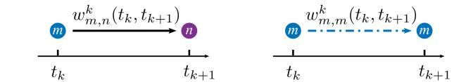  
Legitimate edge: data forwarding Virtual edge: data caching with incurred interference. with zero interference.

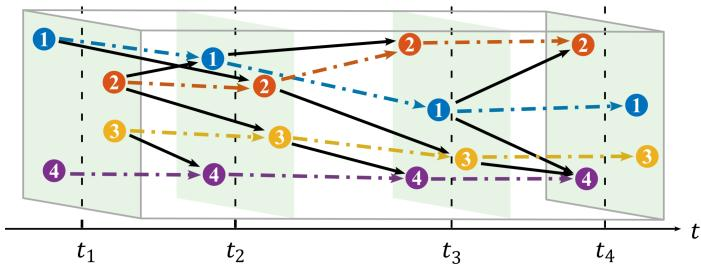  
Fig. 2. Dynamic space-time graph model with virtual edges. Distinct nodes in adjacent layers are connected by legitimate edges with weight $w _ { m , n } ^ { k } ( t _ { k } , t _ { k + 1 } )$ , shown as solid lines. Identical nodes in adjacent layers are connected by virtual edges with zero weight, shown as dotted lines.

$$
\begin{array} { r l } & { \geq S } \\ & { p _ { m , n } \left( t \right) h _ { m , j } \left( t \right) \leq \vartheta _ { m , n } } \\ & { \forall j \in \mathcal { N } , t \in \left[ t _ { k } , t _ { k + 1 } \right) } \end{array}\tag{8}
$$

(9)

where constraint (9) represents the epigraph form of the worst case interference defined in (6).

It may also be possible to slice one package into two, with size $S _ { 1 }$ and $S _ { 2 } , \ S _ { 1 } + S _ { 2 } \ = \ S$ , and optimize two routes for transferring the two packages. This becomes a multicommodity transportation problem, which will be discussed in Section IV as an extension of the single commodity transportation problem as we focus here.

## C. Dynamic Space-Time Graph With Virtual Edges

To jointly optimize the routing and predictive allocation over a dynamic network, we resort to a graph-based approach and develop a dynamic space-time graph with virtual edges.

1) Graph Model: The aerial wireless communication network is modeled as a dynamic space-time graph, denoted as $\mathcal { G } ( \mathbf { t } ) = ( \hat { \mathcal { M } } , \hat { \mathcal { E } } , \hat { \mathcal { W } } ( \mathbf { t } ) )$ , under the allocated time boundaries $\textbf { t } \triangleq ( t _ { 1 } , t _ { 2 } , \cdots , t _ { M } ) ,$ , as shown in Fig. 2. Here, $\hat { \textbf { \textit { M } } } =$ $\{ \mathcal { M } _ { 1 } , \mathcal { M } _ { 2 } , . . . , \mathcal { M } _ { M } \}$ is a collection of node layers. Each layer $\mathcal { M } _ { k }$ includes all nodes in $\mathcal { M } ,$ representing a network snapshot at time $t _ { k } . \hat { \mathcal { E } } = \{ \mathcal { E } _ { 1 } , \mathcal { E } _ { 2 } , \cdot \cdot \cdot , \mathcal { E } _ { M - 1 } \}$ is a collection of directed edge sets. Each $\mathcal { E } _ { k } \ = \ \{ ( m , n ) \} _ { m \in \mathcal { M } _ { k } , n \in \mathcal { M } _ { k + 1 } }$ contains the directed edges from layer $\mathcal { M } _ { k }$ to layer $\mathcal { M } _ { k + 1 }$ , where the edges $( m , n )$ are strictly allowed only from a lower-layer node m $\in \mathcal { M } _ { k }$ to an upper-layer node $n ~ \in \ \mathcal { M } _ { k + 1 }$ , representing data flows from node m to node n during the interval $[ t _ { k } , t _ { k + 1 } )$ . In addition, $\hat { \mathcal { W } } ( \mathbf { t } ) = \left\{ \mathbf { W } _ { 1 } ( \mathbf { t } ) , \mathbf { W } _ { 2 } ( \mathbf { t } ) , \mathbf { W } _ { M - 1 } ( \mathbf { t } ) \right\}$ is a collection of the weight matrices. Each matrix ${ \bf W } _ { k } ( { \bf t } ) =$ $\{ w _ { m , n } ^ { k } ( t _ { k } , t _ { k + 1 } ) \} _ { ( m , n ) \in { \mathscr E } _ { k } }$ includes the weight for the edges in $\mathcal { E } _ { k } .$ , where $w _ { m , n } ^ { k } ( t _ { k } , t _ { k + 1 } )$ denotes the weight of edge $( m , n )$ representing the interference cost incurred during the data transfer from node m to node n over the interval $[ t _ { k } , t _ { k + 1 } )$ that is the optimal value of $\mathcal { P } 1$

2) Physical Meaning: Physically, edges $( m , n )$ with $m \neq$ n, referred to as legitimate edges (solid lines in Fig. 2), represent forwarding during $[ t _ { k } , t _ { k + 1 } )$ , whereas edges with $m = n$ referred to as virtual edges (dotted lines in Fig. 2), represent caching over $[ t _ { k } , t _ { k + 1 } )$ . For legitimate edges $( m , n )$ with m $\neq n ,$ , the weight $w _ { m , n } ^ { k } ( t _ { k } , t _ { k + 1 } )$ corresponds to the optimal value obtained from solving Problem $\mathcal { P } 1$ . In contrast, for virtual edges $( m , n )$ with $m = n$ , the weight $w _ { m , n } ^ { k } ( t _ { k } , t _ { k + 1 } )$ is set to zero, as no actual transmission or interference occurs. In conclusion, the weight of each edge represents the minimum possible worst-case interference for communication through that specific link. The maximum weight along a path then determines the worst-case interference for the entire route.

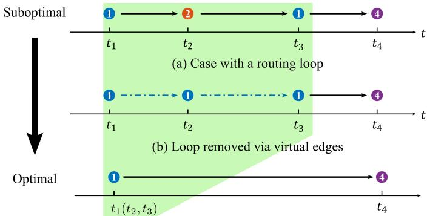  
(c) Fixed-dimension dynamic space-time graph representing an optimal solution with variable path dimension. Three identical nodes (from different layers) connected by virtual edges.  
Fig. 3. Progressive improvement of routing using virtual edges in the dynamic space-time graph. Suppose the optimal solution is the path $1  4$ with time boundary $\mathbf { t } ^ { * } \overset { ^ { \bullet } } { = } ( t _ { 1 } , \overset { ^ { \bullet } } { t _ { 4 } } )$ . The three cases illustrate how loop elimination and the use of virtual edges enable a transition from a suboptimal to an optimal path under a fixed graph dimension. Case (b) improves upon (a) by eliminating the routing loop through cost-free virtual edges. Case (c) further enhances performance by allocating more available time to reduce interference and achieve the minimum-cost path.

As a result, the path planning problem for multi-hop data transportation corresponds to selecting a path that connects node 1 in $\mathcal { M } _ { 1 }$ to node M in $\mathcal { M } _ { M }$ in the dynamic space-time graph $\mathcal { G } ( \mathbf { t } )$ . The optimal path is defined as the one with the lowest cost, where the cost is given by

$$
\emptyset \triangleq \operatorname* { m a x } _ { k \in \{ 1 , 2 , \cdots , M - 1 \} } \left\{ w _ { o ( k ) , o ( k + 1 ) } ^ { k } \left( t _ { k } , t _ { k + 1 } \right) \right\}\tag{10}
$$

and $o \left( k \right)$ denotes the selected node (or relay) in the kth layer along the path.

Note that the legitimate-edge weight $w _ { m , n } ^ { k } ( t _ { k } , t _ { k + 1 } )$ , as defined in Problem $\mathcal { P } 1$ , captures the impact of node velocity, mobility, and channel quality. As a result, the network-level solution obtained via the dynamic space-time graph naturally accounts for these essential physical-layer characteristics.

3) Advantages: The proposed dynamic space-time graph, by fixing the temporal dimension $M ,$ , reduces the optimization complexity. Furthermore, the incorporation of virtual edges ensures that this simplification does not compromise the solution’s optimality.

First, unlike conventional space-time graph models that require joint optimization over both the time boundary vector and its dimension, our approach reduces the search space by restricting the problem to optimizing only the individual time values $t _ { k }$ . Moreover, the proposed model retains optimality. For an optimal solution $\mathbf { t } ^ { * }$ that has a dimension less than M, corresponding to less than $M - 1$ hops, the dynamic space-time graph model provides an M-dimension equivalent solution $\mathbf { t } ^ { \prime }$ by assigning some virtual edges. For example, if the optimal route is $1  4 ,$ , with time boundary $\mathbf { t } ^ { * } = ( t _ { 1 } , t _ { 4 } )$ then under $M = 4$ , the dynamic space-time graph model can provide a fixed-dimension solution $1  1  1  4$ , with $\mathbf { t } ^ { \prime } = ( t _ { 1 } , t _ { 1 } , t _ { 1 } , t _ { 4 } )$ , as shown in Fig. 3 (c). Since the virtual edge has zero weight, $i . e . , \ w _ { 1 , 1 } ^ { k } \ = \ 0$ , the fixed-dimension dynamic space-time graph model yields the same minimum cost as the classical model with the optimal graph dimension.

In addition, setting the graph dimension equal to the number of nodes M is sufficient, and the minimum required, to guarantee optimality. This is because the graph has M nodes, and thus, any path with more than $M - 1$ edges must form a loop; for a path with a loop that passes the mth node twice, it is more efficient to simply stay on the mth node for a longer time. For example, for a route $1  2  1  4$ , with time boundary $( t _ { 1 } , t _ { 2 } , t _ { 3 } , t _ { 4 } )$ , it is more efficient to reduce the route to $1  4$ with the time boundary $( t _ { 1 } , t _ { 4 } )$ , as shown in Fig. 3. As a result, setting the graph dimension to M is sufficient to capture all optimal paths. In addition, the dimension should not be smaller than M in order to accommodate paths that consist of exactly $M - 1$ edges.

## D. Problem Formulation

Based on the dynamic space-time graph model, this paper focuses on network-level optimization, aiming to optimize the time boundary t of the transportation of the data package and the route $\mathbf { o } \triangleq \{ o ( 1 ) , \cdots , o \bar { ( } M ) \}$ } from the source $o ( 1 ) = 1$ to the destination $o ( M ) ~ = ~ M$ for $T$ time ahead for the transmission that minimizes the worst-case interference power leakage ϑ during full data transportation

$$
\mathcal { P } 2 : \quad \operatorname* { m i n i m i z e } _ { \mathbf { o } , \mathbf { t } , \boldsymbol { \vartheta } } \boldsymbol { \vartheta }
$$

$$
\mathrm { s u b j e c t ~ t o ~ } w _ { o ( k ) , o ( k + 1 ) } ^ { k } \left( t _ { k } , t _ { k + 1 } \right) \leq \vartheta , \forall k\tag{11}
$$

$$
o \left( 1 \right) = 1 , o \left( M \right) = M , o \left( k \right) \in \mathcal { M }\tag{12}
$$

$$
0 = t _ { 1 } \leq \cdot \cdot \cdot \leq t _ { M } = T\tag{13}
$$

(14)

where constraint (12) ensures that the interference power leakage of each relay is less than ϑ (also the epigraph form of (10)), constraint (13) ensures that the data is transmitted from the source node $o ( 1 ) = 1$ to the destination node $o ( M ) = M$ through the aerial communication network $o ( k ) \in { \mathcal { M } } .$ , and (14) is the time causality constraint, ensuring that data is fully transferred from one node to another before it is forwarded to a third node.

## III. GRAPH-BASED CROSS-LAYER OPTIMIZATION FORSINGLE COMMODITY TRANSPORTATION

Given the time boundary t and weights $w _ { m , n } ^ { k } ( t _ { k } , t _ { k + 1 } )$ problem $\mathcal { P } 2$ becomes a conventional minimax path problem, where the optimal route o can be found by a bottleneck path planning algorithm [33], [34]. Thus, the key challenges are to find the weights $w _ { m , n } ^ { k } ( t _ { k } , t _ { k + 1 } )$ by efficiently solving the inner problem $\mathcal { P } 1$ and find the optimal time boundary t.

First, solving $\mathcal { P } 1$ involves optimizing the power allocation policy $p _ { m , n } ( t )$ under the uncertainty of the future instantaneous channel quality $h _ { m , n } ( t )$ in a horizon of $t \in \mathsf { \Gamma } ( 0 , T )$ .

Mathematically, this requires solving a problem with expectation without a closed-form expression as in (8). To address this, by analyzing the optimality condition of $\mathcal { P } 1$ , we derive a closed-form lower bound and approximations to explicitly evaluate the constraint (8), which facilitate the design of an efficient algorithm.

Second, solving for the time boundary t requires optimization over a non-convex feasible set of $\{ \mathbf { t } , \boldsymbol { \vartheta } \}$ . We discover a monotonicity of the time boundary over ϑ, which enables an efficient bisection search for the global optimum t over each route o.

## A. Inner Problem: Power Allocation Policy

It is found that if the distribution of the channel $h _ { m , n } ( t )$ is available, the optimal power allocation policy $p _ { m , n } ( t )$ can be found using Lagrangian methods.

By equivalently reformulating constraint (9) of problem $\mathcal { P } 1$ as

$$
p _ { m , n } \left( t \right) \operatorname* { m a x } _ { j \in \mathcal { N } } \left\{ h _ { m , j } \left( t \right) \right\} \leq \vartheta , \forall t \in \left[ t _ { k } , t _ { k + 1 } \right)\tag{15}
$$

$\mathcal { P } 1$ can be equivalently reformulated as

$$
\operatorname * { m i n i m i z e } _ { \{ p _ { m , n } ( t ) \} , \vartheta _ { m , n } } \vartheta _ { m , n } , \mathrm { s . t . } ( 8 ) \mathrm { a n d } ( 1 5 ) .
$$

The reformulated problem is convex, since the objective function and constraint (15) are linear, and constraint (8) is convex. Therefore, the Karush-Kuhn-Tucker (KKT) conditions of the reformulated problem are the sufficient optimality conditions of problem P1 [35].

Let $\boldsymbol { \Lambda } = \left[ \mathbf { v } , \mu \right]$ be the Lagrangian set, then the Lagrangian function of problem $\mathcal { P } 1$ can be expressed as

$$
\begin{array} { l } { { \cal L } \left( p _ { m , n } \left( t \right) , \vartheta _ { m , n } , \Lambda \right) } \\ { = \vartheta _ { m , n } + \displaystyle \int _ { t _ { k } } ^ { t _ { k + 1 } } v \left( t \right) \left( p _ { m , n } \left( t \right) \displaystyle \operatorname* { m a x } _ { j \in { \cal N } } \left. h _ { m , j } \left( t \right) \right. - \vartheta _ { m , n } \right) d t } \\ { + \mu \left( { \cal S } - \displaystyle \int _ { t _ { k } } ^ { t _ { k + 1 } } { \mathbb { E } \left[ { \cal B } \log _ { 2 } \left( 1 + \frac { p _ { m , n } \left( t \right) h _ { m , n } \left( t \right) } { \delta ^ { 2 } } \right) \right] d t } \right) . } \end{array}
$$

Let $( p _ { m , n } ^ { * } ( t ) , \vartheta _ { m , n } ^ { * } )$ be the optimal solution to $\mathcal { P } 1$ and $\boldsymbol { \Lambda } ^ { * }$ be the optimal Lagrange multiplier for its dual problem. From the KKT optimality conditions, we derive that $( p _ { m , n } ^ { * } ( t ) , \vartheta _ { m , n } ^ { * } , \mathbf { \Lambda } \mathbf { \Lambda } ^ { * } )$ should satisfy primal feasibility (8) and (15), dual feasibility

$$
\mu \geq 0 , v ( t ) \geq 0 , \forall t\tag{16}
$$

complementary slackness

$$
v \left( t \right) \left( p _ { m , n } \left( t \right) \operatorname* { m a x } _ { j \in \mathcal { N } } \left\{ h _ { m , j } \left( t \right) \right\} - \vartheta _ { m , n } \right) = 0 , \forall t\tag{17}
$$

$$
\mu \left( S - \int _ { t _ { k } } ^ { t _ { k + 1 } } \mathbb { E } \left[ B \log _ { 2 } \left( 1 + \frac { p _ { m , n } \left( t \right) h _ { m , n } \left( t \right) } { \delta ^ { 2 } } \right) \right] d t \right) = 0\tag{18}
$$

and stationarity

$$
\begin{array} { c } { \displaystyle \frac { \partial L } { \partial \vartheta _ { m , n } } = 1 - \int _ { t _ { k } } ^ { t _ { k + 1 } } v \left( t \right) d t = 0 } \\ { \displaystyle \frac { \partial L } { \partial p _ { m , n } \left( t \right) } = v \left( t \right) \underset { j \in \mathcal { N } } { \operatorname* { m a x } } \left\{ h _ { m , j } \left( t \right) \right\} } \end{array}\tag{19}
$$

$$
- \mu \mathbb { E } \left[ \frac { B } { \ln 2 } \frac { h _ { m , n } \left( t \right) } { \delta ^ { 2 } + p _ { m , n } \left( t \right) h _ { m , n } \left( t \right) } \right] = 0 , \forall t\tag{20}
$$

By analyzing the KKT conditions (8) and (15)–(20), the optimal power allocation $p _ { m , n } ^ { * } ( t )$ can be found as follows.

Proposition 1 (Optimal solution to $\mathcal { P } 1 ) !$ : Given the time boundaries, the optimal value of $\mathcal { P } 1$ is $\boldsymbol { w _ { m , n } ^ { k } } = \boldsymbol { \vartheta } _ { m , n } ^ { * }$ , which is the solution to

$$
\Upsilon _ { m , n } \left( \vartheta _ { m , n } ; t _ { k } , t _ { k + 1 } \right) = S\tag{21}
$$

and $\Upsilon _ { m , n } ( \vartheta _ { m , n } , t _ { k } , t _ { k + 1 } )$ is defined as

$$
\begin{array} { l } {  { \Upsilon _ { m , n } ( \vartheta _ { m , n } , t _ { k } , t _ { k + 1 } ) } \qquad } \\ { \triangleq \int _ { t _ { k } } ^ { t _ { k + 1 } } \mathbb { E } [ B \log _ { 2 } ( 1 + \frac { \vartheta _ { m , n } h _ { m , n } ( t ) } { \operatorname* { m a x } _ { j \in \mathcal { N } } \{ h _ { m , j } ( t ) \} \delta ^ { 2 } } ) ] d t . } \end{array}\tag{22}
$$

In addition, the optimal power allocation policy $p _ { m , n } ^ { * } \left( t \right)$ is given by

$$
p _ { m , n } ^ { * } \left( t \right) = \frac { \vartheta _ { m , n } ^ { * } } { \operatorname* { m a x } _ { j \in \mathcal { N } } \left\{ h _ { m , j } \left( t \right) \right\} }\tag{23}
$$

Proof: See Appendix A.

It is observed that $\Upsilon _ { m , n } \big ( \vartheta _ { m , n } ; t _ { k } , t _ { k + 1 } \big )$ in (22) is strictly increasing over $\vartheta _ { m , n }$ . Therefore, the optimal parameter $\vartheta _ { m , n }$ to satisfy (21) can be found using bisection search and the optimal solution is unique.

## B. Deterministic Bound

The challenge of solving (21) is the efficient evaluation of the expectation, which does not have a closed-form expression. In the following proposition, we derive a lower bound for the expected channel capacity as the integrand in (22).

Proposition 2 (A deterministic capacity lower bound): The expected capacity in (22)

$$
\mathbb { E } \left[ B \log _ { 2 } \left( 1 + \frac { \vartheta _ { m , n } h _ { m , n } \left( t \right) } { \operatorname* { m a x } _ { j \in \mathcal { N } } \left\{ h _ { m , j } \left( t \right) \right\} \delta ^ { 2 } } \right) \right]
$$

is lower bounded by

$$
\begin{array} { r } { \underline { { c } } _ { m , n } \left( t \right) \triangleq \log _ { 2 } \left( 1 + \frac { \vartheta g _ { m , n } \left( t \right) } { \left( \operatorname* { m a x } _ { j \in \mathcal { N } } \left\{ g _ { m , j } \left( t \right) \right\} + \alpha \omega _ { m } \left( t \right) \right) \delta ^ { 2 } } \right) } \\ { - \epsilon _ { m , n } \left( t \right) \qquad ( 2 4 } \end{array}
$$

where $\begin{array} { r } { \alpha ~ = ~ 1 , ~ \omega _ { m } ( t ) ~ = ~ \sqrt { \sum _ { j \in \mathcal { N } } g _ { m , j } ( t ) ^ { 2 } / \kappa _ { m , j } ( t ) } , } \end{array}$ , and <sub>m,n</sub>(t) = log<sub>2</sub>(e)/κ<sub>m,n</sub>(t) − log<sub>2</sub>(1 + (2κ<sub>m,n</sub>(t))<sup>−1</sup>).

Proof: See Appendix B.

The gap between the expected capacity $\mathbb { E } [ c _ { m , n } ( t ) ]$ and its lower bound $\underline { { c } } _ { m , n } \left( t \right)$ arises from the positive $\omega _ { m } ( t )$ and $\epsilon _ { m , n } ( t )$ , and decreases with κ increasing, tending to 0 when the parameter κ in the Gamma distribution of small-scale fading in (1) goes to infinity in the LOS case, as shown in Fig. 4.

It is observed that the lower bound (24) is tight in the LOS case when $\kappa  \infty$ . In the non-line-of-sight (NLOS) case, there is a 0.43 dB gap in the high signal-to-noise ratio (SNR)

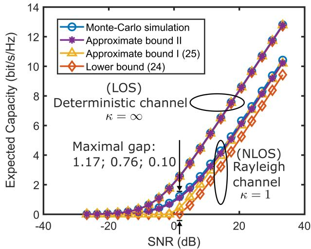  
Fig. 4. Comparison of different capacity lower bounds. The group with $\kappa = \infty$ corresponds to a deterministic channel, while the group with $\kappa = 1$ corresponds to a Rayleigh fading channel. The maximum gaps occur at $\kappa = 1 ,$ where the differences between the Monte Carlo result and the lower bound (24), approximate bound I, and approximate bound II are 1.17, 0.076, and 0.10 dB, respectively.

regime, and gap becomes larger in the low SNR regime. To find a tighter approximation, we derive two expressions as follows.

First, we numerically found that setting $\alpha = 1 / 2$ in (24) yields a tighter bound, referred as Approximate bound I,

$$
\log _ { 2 } \left( 1 + \frac { \vartheta g _ { m , n } \left( t \right) } { \left( \operatorname* { m a x } _ { j \in \mathcal { N } } \left\{ g _ { m , j } \left( t \right) \right\} + \frac { 1 } { 2 } \omega _ { m } \left( t \right) \right) \delta ^ { 2 } } \right) - \epsilon _ { m , n }\tag{t}
$$

(25)

which appears to still be a lower bound over all κ we tested. As shown in Fig. 4, this approximate bound aligns closely with the Monte Carlo empirical value in high SNR scenarios.

Second, to obtain a tighter bound in the low SNR regime, we employ Jensen’s inequality sharpening techniques [36] and obtain Approximate Bound II as $f ( \gamma ; \kappa )$ , where

$$
\gamma = \frac { \vartheta g _ { m , n } \left( t \right) } { \left( \operatorname* { m a x } _ { j \in \mathcal { N } } \left\{ g _ { m , j } \left( t \right) \right\} + \frac { 1 } { 2 } \omega _ { m } \left( t \right) \right) \delta ^ { 2 } }
$$

and

$$
f \left( \gamma ; \kappa \right) \triangleq \mathbb { E } \left[ \log _ { 2 } \left( 1 + \gamma \xi \right) \right]\tag{26}
$$

in which $\xi \sim \operatorname { G a m m a } ( \kappa , 1 / \kappa )$ . Note that the function $f ( \gamma ; \kappa )$ which has been substantially simplified from (22), can be computed offline and stored in a table. Hence, Approximate Bound II can be computed efficiently in closed-form with table lookup.

Simulation results in Fig. 4 demonstrate that Approximate Bound II consistently aligns with Monte Carlo simulations, from low to high SNR conditions.<sup>3</sup>

## C. Outer Problem: Time Boundary Optimization

The time boundary optimization finds the optimal time boundary $\textbf { t } = \ ( t _ { 1 } , t _ { 2 } , \cdot \cdot \cdot , t _ { M } )$ in $\mathcal { P } 2$ with a given route o and the weights $w _ { m , n } ^ { k }$ given in Proposition 1. It can be verified that the feasible set of t defined by the constraint (12) is non-convex. Despite the non-convexity, we will show that the optimal $t _ { k } \mathrm { ' s }$ can be uniquely determined by $t _ { M }$ , for $k < M$ , and the objective value ϑ in $\mathcal { P } 2$ is monotonic in $t _ { M }$ This result can lead to a globally optimal solution to t.

Proposition 3 (Optimality condition to P2): Given the route variable o, $\{ \mathbf { t } ^ { * } , \vartheta ^ { * } \}$ is the optimal solution to problem $\mathcal { P } 2$ if and only if $\vartheta ^ { \ast } = w _ { o ( k ) , o ( k + 1 ) } ^ { k } ( t _ { k } ^ { \ast } , t _ { k + 1 } ^ { \ast } )$ for all $k \in$ $\{ 1 , \cdots , M - 1 \}$

Proof: See Appendix C.

Proposition 3 states that, as a sufficient and necessary optimality condition, all the links should achieve the same interference leakage level $w _ { m , n } ^ { k } = \vartheta ^ { * }$ along the route o. The intuition is that if the kth link along the route has a smaller interference leakage power than that of the (k +1)th link, then a portion of resources of the kth link can be reallocated to the $( k + 1 ) \operatorname { t h }$ link by adjusting the variable $t _ { k + 1 }$ , and hence, the solution is not optimal.

Using Propositions 1 and 3, we can express the optimal time boundary $\mathbf { \nabla } ^ { t ^ { * } }$ as a function of the power leakage ϑ as follows. First, we note that $t _ { 1 } = 0$ must be the optimal solution according to constraint (14) in $\mathcal { P } 2$ . Second, given $t _ { k }$ for $k \leq$ $M - 1$ , the optimal $t _ { k + 1 }$ can be obtained as the solution to $\Upsilon _ { m , n } ( \vartheta ; t _ { k } , t _ { k + 1 } ) = S$ in (21). Such an expression implies that all the links are to achieve the same power leakage ϑ. Then, using induction, the last time boundary $t _ { M } ( \vartheta )$ can be obtained. Finally, by the definition of ${ \mathcal { P } } 2 .$ , if $t _ { M } ( \vartheta ) = T$ , then ϑ must be the optimal solution; and if $t _ { M } ( \vartheta ) \neq T$ , ϑ is not the solution, because the constraint (14) in $\mathcal { P } 2$ is violated. In case $t _ { M } ( \vartheta ) \neq T$ , we find that $t _ { M } ( \vartheta )$ is monotonic.

Proposition 4 (Monotonicity of $t _ { M } ( \vartheta ) )$ : The function $t _ { M } ( \vartheta )$ is strictly decreasing over ϑ.

Proof: See Appendix D.

Proposition 4 states that increasing the tolerance of the interference leakage $\vartheta ,$ less time resource is needed and $t _ { M } ( \vartheta )$ is reduced.

The monotonicity property implies a bisection search strategy to find the optimal $\vartheta ^ { \ast }$ such that $t _ { M } ( \vartheta ^ { * } ) = T$ . This leads to the basic structure of Algorithm 1.

## D. Implementation With Backtracking

In order to improve the convergence, a backtracking scheme is used in Algorithm 1. Specially in step 2) in Algorithm 1, update $t _ { k + 1 } \gets t _ { k + 1 } ^ { \prime } + \alpha _ { k } \big ( \hat { t } _ { k + 1 } - \hat { t } _ { k } \big )$ , where $( \hat { t } _ { k + 1 } - \hat { t } _ { k } )$ is the past transmission duration for kth hop, serving as an external parameter that remains unchanged in Algorithm 1, and $\alpha _ { k }$ is the backtracking parameter, defined as

$$
\alpha _ { k } = \alpha \mathbb { I } \left\{ o \left( k \right) = o \left( k + 1 \right) \right\} , \alpha \in \left( 0 , 1 \right) .\tag{27}
$$

Backtracking only performs when the virtue edge is selected.

The reason that a backtracking strategy is employed to update $t _ { k }$ is to prevent being trapped at a local optimum too early and to improve the convergence. It is known that an alternating algorithm is prone to being trapped at a stationary point if not appropriately initialized, and a soft update can relieve this phenomenon. In our case, a virtual edge implies $t _ { k } ~ = ~ t _ { k + 1 }$ and the kth hop should be effectively removed. However, removing a layer in the graph will permanently prevents adding back this layer in future iterations. Thus, the backtracking update prevents the collapse of the graph while still allowing $t _ { k + 1 } \to t _ { k }$ for an virtual edge.

```latex
Algorithm 1 Time and Power Allocation Algorithm
# Input: Route o and time boundary $\hat { \mathbf { t } } = \{ \hat { t } _ { k } \} _ { k \in \{ 1 , \cdots , M \} }$
1) Set $\vartheta \gets ( \vartheta _ { \mathrm { m a x } } + \vartheta _ { \mathrm { m i n } } ) / 2 .$
2) Starting from $t _ { 1 } = 0 ,$ update $t _ { k + 1 } \gets t _ { k + 1 } ^ { \prime } + \alpha _ { k } ( \hat { t } _ { k + 1 } -$
$\hat { t } _ { k } )$ , where $t _ { k + 1 } ^ { \prime }$ is computed based on $t _ { k }$ by solving
$\Upsilon _ { o ( k ) , o ( k + 1 ) } \stackrel { \cdot \cdot } { \left( \vartheta ; t _ { k } , t _ { k + 1 } \right) } = S$ in (21) and α is defined
in (27).
3) $\mathrm { I f ~ } t _ { M } ( \vartheta ) \leq T , \vartheta _ { \mathrm { m a x } } \gets \vartheta ;$ otherwise, $\vartheta _ { \mathrm { m i n } } \gets \vartheta .$
4) Repeat from step 1) until $\begin{array} { r } { | \vartheta _ { \mathrm { m a x } } - \vartheta _ { \mathrm { m i n } } |  0 . } \end{array}$
# Output: t and $p _ { m , n } ( t )$ from (23).
```

Since the construction of t from ϑ is unique due to Proposition 1 and the optimality condition given in Proposition 3 is both sufficient and necessary, it naturally leads to the following optimality result.

Proposition 5 (Optimality): When the backtracking finishes, i.e., $\alpha _ { k } ( \hat { t } _ { k + 1 } - \hat { t } _ { k } ) = 0 , \forall k$ , Algorithm 1 finds the optimal solution $\mathbf { t } ^ { * }$ to $\mathcal { P } 2$ given each o.

The overall structure of solving $\mathcal { P } 2$ is summarized in the following looping steps:

i) update o from bottleneck path planning

ii) compute t from Algorithm 1.

A detailed implementation is given in Algorithm 2. We show in the following that the Algorithm 2 converges and its computational complexity is proportional to the duration and the cube of the number of aerial nodes.

1) Convergence Analysis: The following analysis proves that Algorithm 2 converges, and that all virtual edges are eliminated at convergence; specifically, $t _ { k + 1 } - t _ { k } = 0$ whenever $o ( k + 1 ) = o ( k )$

Algorithm 2 modifies the objective value $\vartheta$ in two places: updating the route o in step 2) and updating the time boundary in step 3). It is proven below that the objective value $\vartheta$ decreases through the iteration. Furthermore, ϑ is bounded below by 0, then the Algorithm 2 must converge.

The objective value $\vartheta$ decreases during the route update o in step 2) because, for a given time boundary $\mathbf { t } ^ { ( i - 1 ) ^ { \bullet } }$ , the previous transmission route $\mathbf { \bar { o } } ^ { ( i - 1 ) }$ is a feasible solution to problem $\mathcal { P } 2$ and the bottleneck path planning algorithm can find the optimal solution to ${ \mathcal { P } } 2 .$ , which ensures find a lower ϑ. Similarly, the objective value ϑ decreases during the time boundary update t in step 3). For the current route $\mathbf { o } ^ { ( i ) }$ , the objective value for the previous time boundary $\mathbf { t } ^ { ( i - 1 ) }$ is greater than or equal to that of a modified time boundary $\mathbf { t } _ { \mathit { \Pi } } ^ { \prime }$ , where $t _ { k + 1 } ^ { \prime } = t _ { k } ^ { ( i - 1 ) } + \alpha ( t _ { k + 1 } ^ { ( i - 1 ) } - t _ { k } ^ { ( i - 1 ) } ) \mathrm { ~ i f ~ } o ^ { ( i ) } ( k ) = o ^ { ( i ) } \bar { ( } k + 1 )$ and $t _ { k + 1 } ^ { \prime } = t _ { k + 1 } ^ { ( i - 1 ) }$ otherwise. This holds because when $o ^ { ( i ) } ( k ) =$

Algorithm 2 Efficient Graph-Based Single Commodity Algo  
rithm   
# Initialization: Set $\mathbf { t } ^ { ( 0 ) } \gets \{ k T / ( M - 1 ) \} _ { k \in \{ 0 , \cdots , M - 1 \} }$ and   
$i \gets 1 .$   
1) Solve (21) for $\vartheta _ { m , n } ^ { * }$ and obtain $w _ { m , n } ^ { k } = \vartheta _ { m , n } ^ { * }$ , where   
approximations (24)–(26) can be used.   
2) Use a bottleneck path planning algorithm to obtain $\mathbf { o } ^ { ( i ) }$   
by solving ${ \mathcal { P } } 2 .$   
3) Use Algorithm 1 to obtain $\mathbf { t } ^ { ( i ) }$ where approximations   
(24)–(26) can be used.   
4) Repeat from step 1) until $| \mathbf { t } ^ { ( i ) } - \mathbf { t } ^ { ( i - 1 ) } |  0 .$   
# Output: $\mathbf { t } ^ { ( i ) } , \mathbf { o } ^ { ( i ) }$ , and $p _ { m , n } ( t )$ from (23).

$o ^ { ( i ) } ( k + 1 )$ , we have

$$
w _ { o ^ { ( i ) } ( k ) , o ^ { ( i ) } ( k + 1 ) } ( t _ { k } ^ { \prime } , t _ { k + 1 } ^ { \prime } ) = 0
$$

due to the property of virtual edge, and

$$
\begin{array} { r } { { w _ { o ^ { ( i ) } } } ( k { + } 1 ) , o ^ { ( i ) } ( k { + } 2 ) } ( t _ { k { + } 1 } ^ { \prime } , t _ { k { + } 2 } ^ { \prime } )  \\ { < { w _ { o ^ { ( i ) } } } ( k { + } 1 ) , o ^ { ( i ) } ( k { + } 2 ) } ( t _ { k { + } 1 } ^ { ( i { - } 1 ) } , t _ { k { + } 2 } ^ { ( i { - } 1 ) } )  \end{array}
$$

due to the decreasing monotonicity of $w _ { m , n } ( t _ { k } , t _ { k + 1 } )$ over $t _ { k }$ as stated in Lemma 1 in Appendix C. Since $\mathbf { t } ^ { \prime }$ is a feasible solution to problem P2, and the Algorithm 1 identifies the optimal solution to ${ \mathcal { P } } 2 ,$ similarly to Proposition 5, updating the time boundary in step 3) guarantees a lower ϑ.

All virtual edges are eliminated upon convergence because the time interval of the selected virtual edge after the ith iteration is $\alpha ^ { i } ( t _ { k } ^ { ( i - 1 ) } - t _ { k - 1 } ^ { ( i - 1 ) } ) < \big | \mathbf { t } ^ { ( i ) } - \mathbf { t } ^ { ( i - 1 ) } \big |$ , which approaches zero as $\big | \mathbf { t } ^ { ( i ) } - \mathbf { t } ^ { ( i - 1 ) } \big | \big rightharpoons 0$ when convergence.

2) Complexity Analysis: The overall computational complexity for Algorithm 2 is $\mathcal { O } ( M ^ { 2 } ( M + T ) \omega )$ , where ω is the iteration number of hybrid optimization algorithm, including $\mathcal { O } ( M ^ { 2 } T )$ for graph construction in step 1), $\mathcal { O } ( M ^ { 3 } )$ for bottleneck path selection in step 2), and $\mathcal { O } ( T )$ for time boundaries update in step 3). In detail, graph construction includes $M ^ { 3 }$ weight calculations, each requiring $\mathcal { O } ( t _ { k + 1 } - t _ { k } )$ , leading to a total complexity of $\mathcal { O } ( M ^ { 2 } T )$ . The route update in graph $\mathcal { G } \left( \mathbf { t } \right)$ with M incoming edges per node, M nodes per layer and M layers, resulting in a complexity of $\mathcal { O } ( M ^ { 3 } )$ . The time boundaries update includes $\mathcal { O } ( 1 )$ of searching optimal $\vartheta ^ { \ast }$ by M − 1 times of calculation for $t _ { k } ( \vartheta )$ with complexity $\mathcal { O } ( t _ { k + 1 } - t _ { k } )$ , therefore time complexity is O(T ).

## IV. MULTI-COMMODITY TRANSPORTATION

This section extends the single commodity transportation in Section III to multi-commodity transportation, where a commodity refers to a data package of size S transported from a source node to a destination node within a deadline of $T$ seconds. For simplicity, we assume all the commodities have the same size $S$ and deadline T . Consider that orthogonal time-frequency resources are dynamically allocated to transmitting different commodities so that there is no interference among the nodes in M in the aerial network, but there is still interference to the neighbor nodes ${ \mathcal { N } } .$ Therefore, the core problem is to orthogonally allocate the time-frequency resources in a predictive way for a horizon of $T$ seconds to exploit the dynamic of the network topology while controlling the possible interference to nodes in ${ \mathcal { N } } .$

## A. Multi-Commodity Transportation Problem Formulation

Consider there are Z data packages, each with a size $S ,$ , that needs to be delivered from source node $s _ { z }$ to the destination node $d _ { z } ,$ where $z \in { \mathcal { Z } } \triangleq \{ 1 , 2 , \cdots , Z \}$ . Consider multiple tasks share orthogonal time-frequency resource and each flow $z \in { \mathcal { Z } }$ occupies $l _ { z } \left( t \right)$ normalized resource at time t. Therefore, the resource allocation strategy $l ( t ) \triangleq \{ l _ { z } ( t ) \} _ { z \in \mathcal { Z } }$ at each time t should satisfy the orthogonality constraint $\ b { l } ( t ) \in \ b { \mathcal { L } }$ , where

$$
\mathcal { L } \triangleq \left\{ \left\{ l _ { z } \left( t \right) \right\} _ { z \in \mathcal { Z } } : l _ { z } \left( t \right) \in \left[ 0 , 1 \right] , \sum _ { z \in \mathcal { Z } } l _ { z } \left( t \right) \in \left[ 0 , 1 \right] \right\} .
$$

Our goal is to transport all data packages while minimizing the maximum interference power leakage during the process. This is achieved by controlling the transmission route $\mathbf { O } \ { \overset { \Delta } { = } }$ $\{ o ( k , z ) \} _ { k \in \mathcal { M } , z \in \mathcal { Z } }$ , time boundaries $\mathbf { T } \triangleq \{ t _ { k , z } \} _ { k \in \mathcal { M } , z \in \mathcal { Z } }$ , timefrequency resource allocation $\mathbf { L } \triangleq \{ l ( t ) \} _ { t \in [ 0 , T ] }$ , and power allocation strategy $\textbf { P } \triangleq \{ p _ { o ( k , z ) , o ( k + 1 , z ) } ( t ) \} _ { k \in \mathcal { M } , z \in \mathcal { Z } , t \in [ 0 , T ] }$ for all the commodities z along each hop k. Then, the problem is formulated as

P3 : minimizeϑ O,T,L,ϑ

(28)

$$
\mathrm { s u b j e c t ~ t o ~ } w _ { o ( k , z ) , o ( k + 1 , z ) } ^ { k } \left( t _ { k , z } , t _ { k + 1 , z } , \mathbf { l } _ { z } \right) \leq \vartheta , \forall k , z\tag{29}
$$

$$
o \left( 1 , z \right) = { { s } _ { z } } , o \left( M , z \right) = { { d } _ { z } } , { { \forall } z }\tag{30}
$$

$$
o \left( k , z \right) \in \mathcal { M } , \forall k , z\tag{31}
$$

$$
\leq t _ { 1 , z } \leq \dots \leq t _ { M , z } \leq T , \forall z\tag{32}
$$

$$
\boldsymbol { l } ( t ) \in \mathcal { L } , \forall t\tag{33}
$$

where the objective (28) is the maximum interference power leakage and constraint (29) is to ensure that the interference to any neighbor node during the transmission of all Z data is less than ϑ. Constraints (30)–(33) are the relay, time causality, and time-frequency resource constraints.

The weight $w _ { m , n , z } ^ { k } \left( t _ { k , z } , t _ { k + 1 , z } , \mathbf { l } _ { z } \right)$ is the maximum interference to the neighbor network during the kth hop under the allocated time-frequency resource $\mathbf { l } _ { z } \triangleq \{ l _ { z } ( t ) \} _ { t \in [ 0 , T ] }$ defined according to $\mathcal { P } 1$ , where the total bandwidth B in (8) is replaced as a sub-band bandwidth $l _ { z } \left( t \right) \cdot B$

To address the challenge of coupled variables, we first decompose problem $\mathcal { P 3 }$ into several parallel singlecommodity subproblems with fixed time-frequency allocations in Section IV-B. Then in in Section IV-C, we introduce a simplex-based bisection search algorithm to determine the optimal time-frequency allocation, even though the resulting subproblem remains non-convex.

## B. Problem Decomposition and Relationship to the Single-Commodity Case

It is observed from problem $\mathcal { P 3 }$ that for multiple tasks, the variables are coupled over z only by constraint (29). Therefore, given the time-frequency resource allocation variable $\mathbf { L } ,$ problem $\mathcal { P 3 }$ is decomposed into a number of parallel single commodity subproblems identical to $\mathcal { P } 2$ that have been solved in Section III.

Specifically, denote $\vartheta _ { z }$ as the maximum interference to the neighbor network during the transportation of the specific data package z, then, $\vartheta _ { z }$ is the optimal solution to Problem $\mathcal { P } 2$ with allocated resource $l _ { z } \left( t \right) \cdot B$ and the solution is given by Algorithm 2. As a result, given time-frequency resource allocation L, the optimal interference power leakage is $\vartheta = \mathrm { m a x } _ { z \in \mathcal { Z } } \left\{ \vartheta _ { z } \right\}$

Similar to the optimal power policy for problem $\mathcal { P } 1$ discussed in Proposition 1, the optimal power allocation for problem P3 is given by

$$
p _ { o ( k , z ) , o ( k + 1 , z ) } \left( t \right) = \frac { \vartheta } { \operatorname* { m a x } _ { j \in \mathcal { N } } \left\{ h _ { o ( k , z ) , j } \left( t \right) \right\} } .\tag{34}
$$

The insight is that, for any given interference power leakage $\vartheta ,$ the maximum power allowed under the interference constraint is utilized to maximize the throughput.

## C. Resource Allocation Optimization

Next, we investigate an efficient algorithm for finding the resource allocation L, which leads to a non-convex problem.

Given route and time boundary variables $\{ \mathbf { O } , \mathbf { T } \}$ , problem $\mathcal { P 3 }$ over variables $\{ \mathbf { L } , \boldsymbol { \vartheta } \}$ is simplified to:

minimizeϑ L,ϑ

$$
\mathrm { s u b j e c t ~ t o } \int _ { t _ { k , z } } ^ { t _ { k + 1 , z } } \mathbb { E } \left[ \log \left( 1 + \frac { \vartheta h _ { o \left( k , z \right) , o \left( k + 1 , z \right) } \left( t \right) } { \operatorname* { m a x } _ { j \in \mathcal { N } } \left\{ h _ { o \left( k , z \right) , j } \left( t \right) \right\} \delta ^ { 2 } } \right) \right]\tag{35}
$$

$$
\times l _ { z } \left( t \right) B d t \ge S , \forall z \in \mathcal { Z } , \forall k \in \mathcal { M }
$$

$$
\textstyle l ( t ) \in { \mathcal { L } } , \forall t .\tag{36}
$$

(37)

This problem is non-convex because of the non-convexity of the throughput constraint in (36). However, we observe a monotonicity property on the region of the feasible timefrequency allocation variable, which enables a bisection-search method to find the optimal solution L to $\mathcal { P 3 }$

Denote the feasible set family of L over $\vartheta$ as

$$
\Psi \left( \vartheta \right) \triangleq \left\{ \left\{ l _ { z } \left( t \right) \right\} _ { z \in \mathcal { Z } , t \in \mathcal { T } } : \ ( 3 6 ) , ( 3 7 ) \right\} .\tag{38}
$$

It is shown in the following proposition that the region Ψ (ϑ) is monotonically increasing over ϑ.

Proposition 6 (Monotonicity of $\Psi \left( \vartheta \right) )$ : For any $0 \leq \vartheta _ { 1 } <$ $\vartheta _ { 2 }$ , we have $\Psi \left( \vartheta _ { 1 } \right) \subseteq \Psi \left( \vartheta _ { 2 } \right)$ .

Proof: See Appendix E.

The insight of Proposition 6 is that increasing ϑ is equivalent to increasing all transmission power levels. As a result, a timefrequency resource allocation scheme feasible under a lower ϑ must also be feasible under a higher ϑ.

Due to the monotonicity property of $\Psi \left( \vartheta \right)$ with respect to ϑ in Proposition 6, the optimal solution to problem (35) can be found using a bisection search on ϑ. The objective is to find a smallest ϑ with $\left| \Psi \left( \vartheta \right) \right| > 0$ . Note that the solution is infeasible if $\Psi \left( \vartheta \right) = \emptyset$

The algorithm is shown in Algorithm 3. Specifically, we repeat to find the set $\Psi \left( \vartheta \right)$ by searching ϑ until $| \vartheta _ { \mathrm { m a x } } - \vartheta _ { \mathrm { m i n } } | \  \ 0$ . The simplex method can be used to check $\Psi \left( \vartheta \right) = \emptyset$ or not and obtain a point in set $\Psi \left( \vartheta \right)$ since given any $\vartheta ,$ the region Ψ (ϑ) is constructed by several linear inequality constraints.

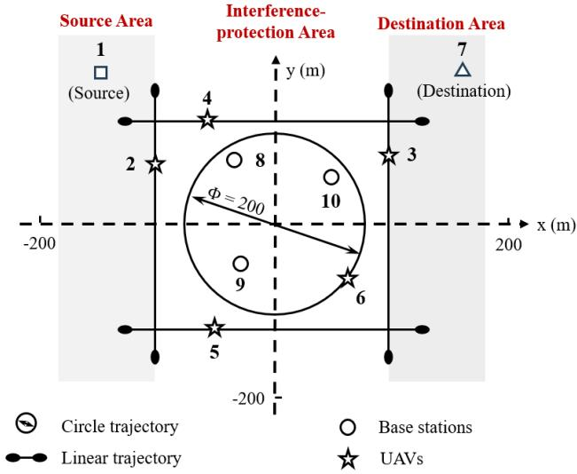

Fig. 5. Illustration of a sample aerial network for data delivery, with 5 aerial nodes (indexed 2 to 6), 3 neighbor nodes (indexed 8 to 10), and 1 source-destinatio pair (indexed 1 and 7). The source node, neighbor nodes, and destination node are uniformly randomly placed in the source area, interference-protection area and destination area, respectively. The aerial nodes follow predefined trajectories.  
Algorithm 3 Bisection Resource Allocation Algorithm   
# Input: O and T;   
1) Set $\vartheta \gets ( \vartheta _ { \mathrm { m a x } } + \vartheta _ { \mathrm { m i n } } ) / 2$ , and check the feasibility of   
the set Ψ (ϑ) using a simplex method.   
2) If Ψ (ϑ) is empty, $\vartheta _ { \mathrm { m i n } } \gets \vartheta ;$ otherwise, $\vartheta _ { \mathrm { m a x } } \gets \vartheta .$   
3) Repeat from step 1) until $\begin{array} { r } { | \vartheta _ { \mathrm { m a x } } - \vartheta _ { \mathrm { m i n } } |  0 . } \end{array}$   
# Output: $\vartheta \gets \vartheta _ { \mathrm { m a x } } , \mathbf { L } \in \Psi ( \vartheta _ { \mathrm { m a x } } ) ,$ , and P from (34).

Algorithm 4 Graph-Based Multi-Commodity Transportation   
Algorithm   
# Initialization: Set $\mathbf { t } _ { z } ^ { ( 0 ) } \gets \{ k T / ( M - 1 ) \} _ { k \in \{ 0 , \cdots , M - 1 \} }$ for   
all $z \in { \mathcal { Z } } ,$ , random $\mathbf { L } ,$ and $t \in [ 0 , T ] ,$ and $i \gets 1 .$   
1) Obtain $\mathbf { o } _ { z } ^ { ( i ) }$ and $\mathbf { t } _ { z } ^ { ( i ) }$ by steps 1) to 3) in Algorithm 2   
based on $\mathbf { t } _ { z } ^ { ( i - 1 ) }$ for all $z \in { \mathcal { Z } } .$   
2) Obtain $\mathbf { L } ^ { \left( i \right) }$ by Algorithm 3 based on $\mathbf { O } ^ { ( i ) }$ and $\mathbf { T } ^ { ( i ) }$   
3) Repeat from step 1) until $\begin{array} { r } { | \mathbf { L } ^ { ( i ) } - \mathbf { L } ^ { ( i - 1 ) } |  0 . } \end{array}$   
# Output: $\mathbf { O } \gets \{ \mathbf { o } _ { z } ^ { ( i ) } \} _ { z \in \mathcal { Z } } , \mathbf { T } \gets \{ \mathbf { t } _ { z } ^ { ( i ) } \} _ { z \in \mathcal { Z } } , \mathbf { L } ^ { ( i ) }$ , and P from   
(34).

Since Ψ (ϑ) is increasing over ϑ according to Proposition 6, leading to for any $\vartheta < \vartheta ^ { \ast } , \Psi \left( \vartheta \right) = \infty$ , it naturally leads to the following optimality result.

Proposition 7 (Optimality of Algorithm 3): Algorithm 3 finds the optimal solution $\mathbf { L } ^ { \ast }$ to P3 for any {O, T}.

## D. Implementation

The transmission strategy plan algorithm for multiple commodities are described in Algorithm 4. Specially, in each iteration, the routes and time boundaries for all commodities are updated based on the allocated time-frequency resource strategy $\mathbf { L } ^ { ( i - 1 ) }$ , then the time-frequency allocation strategy is updated based on the allocated routes $\mathbf { O } ^ { ( i ) }$ and time boundaries $\mathbf { T } ^ { ( i ) }$

TABLE II  
DEFAULT IMPLEMENTATION PARAMETERS
<table><tr><td rowspan=1 colspan=1>Parameter</td><td rowspan=1 colspan=1>Description</td></tr><tr><td rowspan=1 colspan=1>Cargo UAV trajectory</td><td rowspan=1 colspan=1>Linear trajectory: vertical at 45 m andhorizontal at 50 m.</td></tr><tr><td rowspan=1 colspan=1>Cargo UAV hover time</td><td rowspan=1 colspan=1>Uniform in $[ 0 , 2 ] \ \mathrm { s } .$ </td></tr><tr><td rowspan=1 colspan=1>Patrol UAV trajectory</td><td rowspan=1 colspan=1>Circular trajectory at 50 m altitude.</td></tr><tr><td rowspan=1 colspan=1>UAV speed</td><td rowspan=1 colspan=1>Uniform in [5, 20] m/s.</td></tr><tr><td rowspan=1 colspan=1>Base station location</td><td rowspan=1 colspan=1>Uniformly distributed in the interferenceprotection area at ground level (0 m).</td></tr><tr><td rowspan=1 colspan=1>Source location</td><td rowspan=1 colspan=1>Uniformly distributed in the source area atground level (0 m).</td></tr><tr><td rowspan=1 colspan=1>Destination location</td><td rowspan=1 colspan=1>Uniformly distributed in the destination areaat ground level (0 m).</td></tr><tr><td rowspan=1 colspan=1>Carrier frequency</td><td rowspan=1 colspan=1> $f _ { \mathrm { c } } = 3 ~ \mathrm { G H z } .$ </td></tr><tr><td rowspan=1 colspan=1>Bandwidth</td><td rowspan=1 colspan=1> $B = 1 0 ~ \mathrm { M H z } .$ </td></tr><tr><td rowspan=1 colspan=1>Noise power</td><td rowspan=1 colspan=1> $\sigma ^ { 2 } = - 9 0$ dBm.</td></tr><tr><td rowspan=1 colspan=1>Path loss (LOS)</td><td rowspan=1 colspan=1> $2 2 . 0 + 2 8 . 0 \log _ { 1 0 } ( d ) + 2 0 \log _ { 1 0 } ( f _ { \mathrm { c } } ) .$ </td></tr><tr><td rowspan=1 colspan=1>Path loss (NLOS)</td><td rowspan=1 colspan=1> $2 2 . 7 + 3 6 . 7 \log _ { 1 0 } ( d ) + 2 6 \log _ { 1 0 } ( f _ { \mathrm { c } } ) .$ </td></tr><tr><td rowspan=1 colspan=1>LOS probability</td><td rowspan=1 colspan=1> $\mathbb { P } ( \mathrm { L O S } , \theta ) = ( 1 + 6 \times \mathrm { e x p } ( - 0 . 1 5 [ \theta - 6 ] ) ^ { - 1 } ,$ where θ is elevation angle.</td></tr><tr><td rowspan=1 colspan=1>Shadowing</td><td rowspan=1 colspan=1>Log-normal distribution with 0 dB mean, 8 dBvariance, and 5 m correlation distance.</td></tr><tr><td rowspan=1 colspan=1>Backtracking factor</td><td rowspan=1 colspan=1> $\alpha = 0 . 5 .$ </td></tr></table>

1) Convergence Analysis: Algorithm 4 modifies the objective value ϑ in two parts: updating routes and time boundaries in step 2), where the value ϑ decreases over the iteration is shown in Section III-D1 and updating time-frequency allocation strategy in step 3), where the value ϑ decreases over the iteration because $\mathbf { L } ^ { ( i - 1 ) }$ is a feasible point in (i)th problem and $\mathbf { L } ^ { \left( i \right) }$ is the optimal solution to $\mathcal { P 3 }$ as shown in Proposition 7. As a result, the value ϑ decreases over the iteration. It follows that ϑ is bounded below by 0, then the Algorithm 4 must converge.

2) Complexity Analysis: The overall computational complexity is $\mathcal { O } ( ( M ^ { 2 } ( M + T ) Z + ( Z T ) ^ { \varphi } \log ( Z T ) ) \omega )$ , where $M ^ { 2 } ( M + T )$ is the complexity of updating route and time boundaries for single commodity, similar to Section III-D.2, and $( Z T ) ^ { \varphi } \log ( Z T )$ is the complexity of solving the linear programming problem using simplex algorithm, $\varphi \ \approx \ 2 . 3 8$ [37], and ω is the iteration number of multi-commodity algorithm.

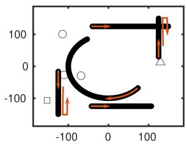  
(a) UAV flight trajectory (20 s)

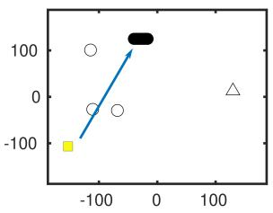

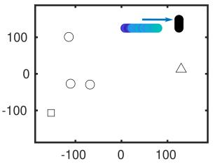  
(b) UAV routing illustration (T = 20 s)

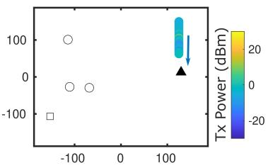

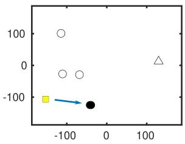

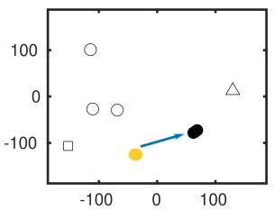

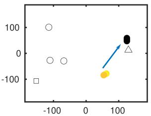  
(c) UAV routing illustration (T = 2 s)

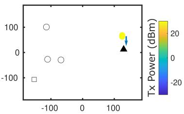  
Fig. 6. Illustration of two routing results. (a) The red arrow indicates the initial UAV flight direction, while the return arrow indicates that the UAV returns after reaching its endpoint. (b) Routing result for a delay-tolerant transmission task with $T = 2 0 { \mathrm { s } }$ , where 2 relays are selected. (c) Routing result for a delay-sensitive transmission task with ${ \check { T } } = 2 \mathrm { s } ,$ , where 3 relays are selected. In both (b) and (c), transmission power along the UAV trajectory is illustrated using a colorbar, and receiver positions are shown as black circles.

## V. SIMULATION RESULTS

Consider a UAV-based cargo delivery and patrol system, as shown in Fig. 5, consisting of four cargo UAVs with fixed endpoints (representing merchant and user locations) and one patrol UAV following a circular trajectory. The cargo UAVs may hover at their endpoints for a random duration, modeled by a uniform distribution U (0, 2) s, to simulate dispatch delays on the merchant side and loading/unloading times on the user side. The velocity of each aerial node is randomly selected from the range 5–20 m/s, and the initial positions are randomly assigned to capture variability in order arrivals, cargo-dependent speed variations, and stochastic data transmission demands.

The source and destination are randomly located within the source and destination areas on opposite sides, respectively, while the interference-protection area with random-position base stations (BSs) is in the middle. The altitudes of sources, vertical UAVs, horizontal UAVs, destinations, and BSs are 0 m, 45 m, 50 m, 0 m, and 5 m. The data generated from the source node will be relayed to the destination node through the aerial nodes with limited interference to the neighbor network.

The channel gains are realized by $\begin{array} { l r } { h _ { m , n } } & { = } & { g _ { m , n } \xi _ { m , n } } \end{array}$ according to (1). Specifically, the shape parameters $\kappa _ { m , n }$ of Gamma distribution of small-scale fading $\xi _ { m , n }$ for air-toground links are set randomly in [0, 30], and that for air-to-air channels are set randomly in [30, 60]. Same as [6], the largescale fading $g _ { m , n }$ includes path loss and shadowing, where the path loss is generated by 3GPP Urban Micro (UMi) model and the channel block state is generated by LOS probability model, while the shadowing is modeled by a log-normal distribution, with zero mean and a variance of 8, and a correlation distance of 5 m. The default implementation parameters are listed in Table II.

We compare our performance with the following baselines.

## A. Aggregate Routing [24]+ [38]

This scheme utilizes the predictive channel information to select the route by the extended Dijkstra’ s algorithm [38] and optimize the time boundary following the method similar to [24]. Specifically, the scheme first constructs the average capacity matrix $\bar { \mathbf { C } } _ { M \times M }$ over the period [0, T ], then selects the route that minimizes ${ \textstyle \sum _ { k = 1 } ^ { K } } ( K - 1 ) / ( \bar { \bf C } [ o _ { k } , o _ { k + 1 } ] )$ , where K is the route length, $\bar { \bf C } [ o _ { k } , o _ { k + 1 } ]$ is the average capacity between node $o _ { k }$ and $o _ { k + 1 }$ , and $( K - 1 )$ is the number of relays, indicating the number of segments for the entire time T . Second, the scheme adjusts the time boundaries using Algorithm 1 according to the selected route.

## B. Space-Time Routing [16]

This scheme utilizes the predictive channel information to select the route using a space-time graph model, a special case of the proposed dynamic space-time graph, with fixed time boundaries, similar to the approach in [16], but without time boundary optimization. Specifically, the scheme constructs the space-time graph as Section II-C by setting $\mathbf { t } = \{ k T / ( M -$ $1 ) \} _ { k \in \{ 0 , \cdots , M - 1 \} }$ and select the route using bottleneck path planning algorithm.

## C. Brute-Force (Optimum)

This scheme enumerates all possible paths from source to destination and calculates the corresponding optimal time boundaries using Algorithm 1, then selects the path with least leakage power as the transmission route. Its solution is optimal because Algorithm 1 can find the optimal time boundaries to P2 for each route according to Proposition 5.

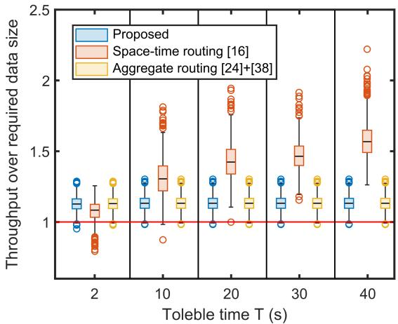

Fig. 7. QoS satisfaction under different tolerable transmission times.  
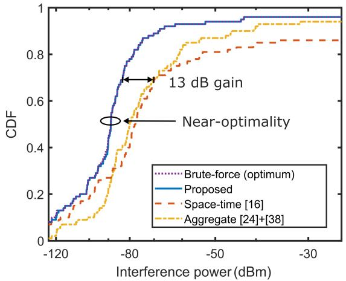  
Fig. 8. The CDF of the interference leakage power ϑ of 100 replicated random experiments, including random initial UAV positions, speeds, and hovering times; random source, destination, and neighboring node locations; and random data sizes.

1) Single Commodity Performance: To illustrate the operation of the proposed routing scheme, we provide two representative routing examples in Figure 6. These cases demonstrate how the proposed method flexibly leverages UAV mobility and multi-hop relaying to create spatial proximity for effective data transmission. Specifically, delay-tolerant tasks can exploit the mobility-induced proximity of UAVs as shown in Subfigure (b), while delay-sensitive tasks rely on relays to artificially create proximity Subfigure (c).

Fig. 7 illustrates the ratio of actual transmitted data (throughput) to the planned data size (commodity size), where a ratio of 1 indicates that the transmitted data fully matches the planned amount. The results show that the median values are all greater than 1, which indicates the QoS constraint is satisfied in 100% of cases on average and confirms that the throughput constraint is met in the expected sense as formulated in the problem.

We then demonstrate the near-optimality of the single commodity algorithm. Fig. 8 shows the cumulative distribution function (CDF) of interference power under the random UAV initial positions, tolerable time $T ~ \in ~ [ 1 , 6 0 ]$ s, data size

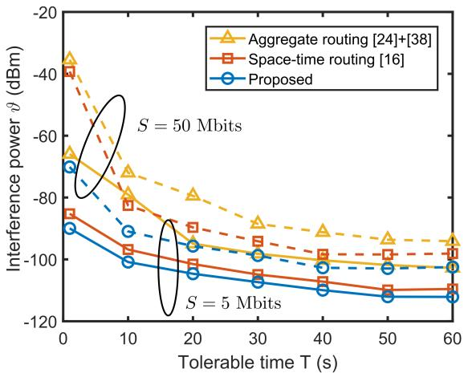  
Fig. 9. The interference leakage power under different tolerable time T , evaluated for two data sizes: $S = { \bar { 5 } } { \mathrm { M b i t s } }$ and $S = 5 0 \mathrm { { M b i t s } }$

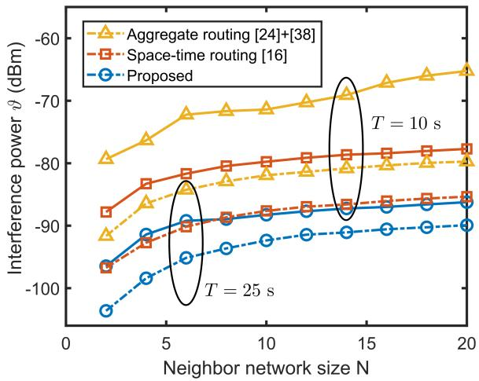  
Fig. 10. The interference leakage power under different neighbor network size N , evaluated for two tolerable time: $T = 1 0 \mathrm { s }$ and $T = \mathrm { { } 2 5 s }$

$S \in [ 5 , 5 0 0 ]$ Mbits, neighbor network size $M \in [ 1 , 2 0 ]$ . The results show that the performance of the proposed scheme is almost identical to the solution obtained via the bruteforce algorithm, confirming the optimality of the proposed algorithm. Furthermore, the proposed scheme outperforms baseline schemes by approximately 13 dB, indicating that it can reduce interference to neighboring networks by more than 10 times.

Fig. 9 shows the interference leakage power under different tolerable time T and data size S. The results demonstrate that the performance gain is particularly significant for delaysensitive scenarios (small T ) and large data sizes (large S). On average, the proposed scheme achieves a 6 dB and 14 dB improvement over the space-time routing scheme and the aggregate routing scheme, respectively. Furthermore, both baseline schemes result in over 25 dB more interference than the proposed algorithm when $T ~ = ~ 1 \mathrm { s }$ and $S \ = \ 5 0 \mathrm { M b i t s }$ This demonstrates that, in delay-sensitive scenarios involving large-volume data transmissions, both route selection and time-boundary optimization are essential, the absence of either leads to substantially higher interference.

Fig. 10 shows the interference leakage power under different neighbor network size N, highlighting the robustness of the proposed algorithm across various environments. While the interference power increases with the density of the neighbor network, the proposed scheme consistently achieves a performance gain of more than 4 dB and 14 dB compared to the baselines. In addition, the interference leakage power of the proposed scheme for $T = 1 0$ s is almost lower than that of the baselines for $T = 2 5 \ \mathrm { s } ,$ , demonstrating that even when the available time is reduced by half, the proposed scheme still generates less interference leakage to the neighbor network.

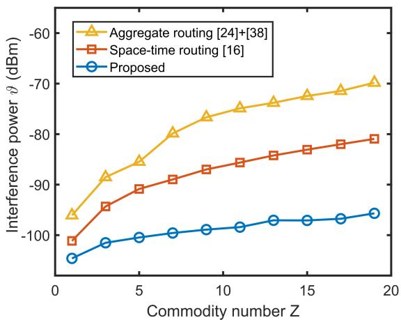  
Fig. 11. The interference leakage power under different commodity number Z. Here, each flow has a different source-destination pair and the data size of each commodity is $S _ { z } = S$

2) Multi-Commodity Performance: In this section, we evaluate the proposed algorithm in a multi-commodity scenario and demonstrate the performance improvement achieved by splitting a single large data into multiple smaller data for transmission.

Fig. 11 shows the interference leakage power under different commodity number $Z ,$ highlighting the significant improvements achieved in dense service scenarios (large Z). The results show that the performance gap between the proposed scheme and the baselines widens as the number of commodities increases. Specifically, as $Z$ increases from 1 to 19, the interference leakage power caused by the baselines rises by approximately 30 dB, while that caused by the proposed scheme only increases by about 10 dB. This indicates that the performance gap grows by a factor of 100 as the number of commodities increases by 20 times. In other words, for every 1X increase in the number of commodities, the performance gap with the classical methods grows by a factor of 5.

Fig. 12 shows the interference leakage power under different segment number Z, verifying that splitting a single large data into multiple smaller segments for transmission improves performance. Overall, the interference leakage power decreases as the segment number increases, with significant improvements (19 dB) observed in delay-sensitive $( T = 1 0 \mathrm { ~ s } )$ and large-data (S = 2 Gbits) transmissions. This is because finegrained resource allocation becomes critical when resources are relatively scarce, such as in cases of small T and large S.

## VI. CONCLUSION

This work addressed network-level optimization in lowaltitude aerial networks and proposed a dynamic space-time graph with virtual edges and developed a cross-layer optimization framework to decouple resource allocation from routing. Then an efficient single-commodity transportation algorithm is developed by analyzing the optimality and deriving deterministic capacity lower bound. Simulation results show that the proposed single-commodity algorithm is almost optimal in various cases and achieves 30 dB performance improvement over the classical methods for delay-sensitive and large data transportation tasks. In addition, the algorithm is extended for multi-commodity transportation, and an efficient timefrequency allocation algorithm is proposed. Simulation results show that the proposed method achieves 100X improvements in dense service scenarios, and for a single large commodity, segmenting it into smaller parts for transmission further achieves an additional 20 dB performance improvement. As a result, the proposed strategy is more suitable for deployment in spectrum-sharing low altitude networks.

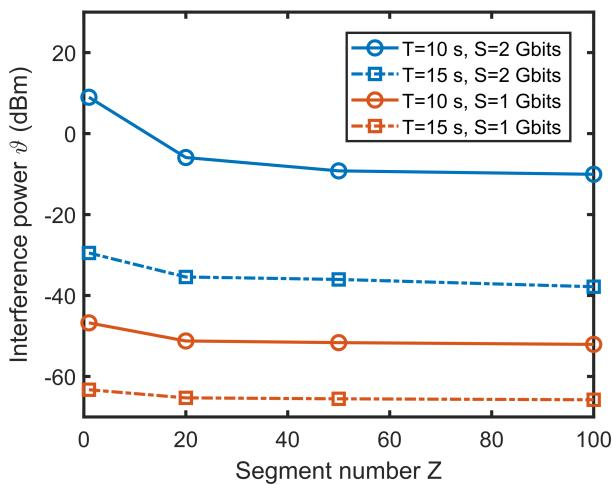  
Fig. 12. The interference leakage power under different segment number Z. Here, all flows share the same source-destination pair and the data size of each commodity is $S _ { z } = S / Z$

## APPENDIX A PROOF OF PROPOSITION 1

According to the conditions (16), (19), and (20), we prove that all optimal Lagrangian parameters are positive. First, there must exist $t ~ \in ~ [ t _ { k } , t _ { k + 1 } )$ such that $v ( t ) ~ > ~ 0 ;$ otherwise, $v ( t ) \equiv 0$ for all t according to (16) and $\partial L / \partial \vartheta _ { m , n } = 1 \neq 0$ contradicting the condition (19). Then, according to the condition (20), we have $\mu > 0$ because ∀t

$$
\mu = \frac { v \left( t \right) \operatorname* { m a x } _ { j \in \mathcal { N } } { \left\{ h _ { m , j } \left( t \right) \right\} } } { \mathbb { E } \left[ \frac { B } { \ln 2 } \frac { h _ { m , n } \left( t \right) } { \delta ^ { 2 } + p _ { m , n } \left( t \right) h _ { m , n } \left( t \right) } \right] }
$$

which is greater than 0 due to $v ( t ) > 0$ , ∃t. Therefore, it can be derived that $v ( t ) > 0 , \forall t \in [ t _ { k } , t _ { k + 1 } )$ due to

$$
v \left( t \right) = \frac { \mu \mathbb { E } \left[ \frac { B } { \ln 2 } \frac { h _ { m , n } ( t ) } { \delta ^ { 2 } + p _ { m , n } ( t ) h _ { m , n } ( t ) } \right] } { \operatorname* { m a x } _ { j \in \mathcal { N } } \left\{ h _ { m , j } \left( t \right) \right\} }
$$

according to condition (20) and $\mu > 0$

Then, according to the conditions (17) and (18), and the positive Lagrangian parameters, there must be

$$
\operatorname* { m a x } _ { j \in \mathcal { N } } \left\{ p _ { m , n } \left( t \right) h _ { m , j } \left( t \right) \right\} - \vartheta _ { m , n } = 0 , \forall t
$$

and

$$
S - \int _ { t _ { k } } ^ { t _ { k + 1 } } \mathbb { E } \left[ B \log _ { 2 } \left( 1 + \frac { p _ { m , n } \left( t \right) h _ { m , n } \left( t \right) } { \delta ^ { 2 } } \right) \right] d t = 0 .\tag{39}
$$

Therefore, the optimal transmission power policy is

$$
p _ { m , n } ^ { * } \left( t \right) = \frac { \vartheta _ { m , n } ^ { * } } { \operatorname* { m a x } _ { j \in \mathcal { N } } \left\{ h _ { m , j } \left( t \right) \right\} } .\tag{40}
$$

Substitute (40) into (39), the optimal interference power leakage $\vartheta _ { m , n } ^ { * }$ is the solution to

$$
\int _ { t _ { k } } ^ { t _ { k + 1 } } \mathbb { E } \left[ B \log _ { 2 } \left( 1 + \frac { \vartheta _ { m , n } h _ { m , n } \left( t \right) } { \operatorname* { m a x } _ { j \in \mathcal { N } } \left\{ h _ { m , j } \left( t \right) \right\} \delta ^ { 2 } } \right) \right] d t = S .
$$

## APPENDIX B PROOF OF PROPOSITION 2

The the expected capacity is lower bounded by

$$
\begin{array} { r l } & { \mathbb { E } \left[ c _ { m , n } \left( t \right) \right] = \mathbb { E } \left[ \log _ { 2 } \left( 1 + \frac { \vartheta h _ { m , n } \left( t \right) } { \operatorname* { m a x } _ { j \in \mathcal { N } } \left\{ h _ { m , j } \left( t \right) \right\} \delta ^ { 2 } } \right) \right] } \\ & { \geq \mathbb { E } \left[ \log _ { 2 } \left( 1 + \frac { \vartheta h _ { m , n } \left( t \right) } { \mathbb { E } \left[ \operatorname* { m a x } _ { j \in \mathcal { N } } \left\{ h _ { m , j } \left( t \right) \right\} \right] \delta ^ { 2 } } \right) \right] } \end{array}
$$

based on the Jensen’s inequality and the convexity of function $\log _ { 2 } ( 1 + a / x )$ . Denote $Y _ { m , j } ( t ) \triangleq h _ { m , j } ( t ) - \mathbb { E } [ \tilde { h _ { m , j } } ( t ) ]$ , then we have

$$
\begin{array} { l } { \displaystyle \operatorname* { m a x } _ { j \in \mathcal { N } } \left\{ h _ { m , j } \left( t \right) \right\} = \displaystyle \operatorname* { m a x } _ { j \in \mathcal { N } } \left\{ Y _ { m , j } \left( t \right) + \mathbb { E } \left[ h _ { m , j } \left( t \right) \right] \right\} } \\ { \displaystyle \quad \leq \displaystyle \operatorname* { m a x } _ { j \in \mathcal { N } } \left\{ Y _ { m , j } \left( t \right) \right\} + \displaystyle \operatorname* { m a x } _ { j \in \mathcal { N } } \left\{ \mathbb { E } \left[ h _ { m , j } \left( t \right) \right] \right\} . } \end{array}
$$

Take the expectation on both side, we have

$$
\begin{array} { r } { \mathbb { E } \left[ \underset { j \in \mathcal { N } } { \operatorname* { m a x } } \left. h _ { m , j } \left( t \right) \right. \right] \leq \mathbb { E } \left[ \underset { j \in \mathcal { N } } { \operatorname* { m a x } } \left. Y _ { m , j } \left( t \right) \right. \right] } \\ { + \underset { j \in \mathcal { N } } { \operatorname* { m a x } } \left. \mathbb { E } \left[ h _ { m , j } \left( t \right) \right] \right. . } \end{array}\tag{41}
$$

Denote $\mathbb { V } [ h _ { m , j } ( t ) ]$ as the variance of $h _ { m , j } ( t )$ , we have

$$
\begin{array} { r l r } {  { ( \mathbb { E } [ \operatorname* { m a x } _ { j \in \mathcal { N } } \{ Y _ { m , j } ( t ) \} ] ) ^ { 2 } \overset { ( a ) } { \leq } \mathbb { E } [ ( \operatorname* { m a x } _ { j \in \mathcal { N } } \{ Y _ { m , j } ( t ) \} ) ^ { 2 } ] } } \\ & { } & { \overset { ( b ) } { \leq } \mathbb { E } [ \operatorname* { m a x } _ { j \in \mathcal { N } } \{ Y _ { m , j } ( t ) ^ { 2 } \} ] \overset { ( c ) } { \leq } \mathbb { E } [ \sum _ { j \in \mathcal { N } } Y _ { m , j } ( t ) ^ { 2 } ] } \\ & { } & { \overset { ( d ) } { = } \underset { j \in \mathcal { N } } { \sum } \mathbb { E } [ ( h _ { m , j } ( t ) - \mathbb { E } [ h _ { m , j } ( t ) ] ) ^ { 2 } ] = \underset { j \in \mathcal { N } } { \sum } \mathbb { V } [ h _ { m , j } ( t ) ] } \end{array}
$$

where (a) holds because of the Jensen’s inequality and the convexity of function $x ^ { 2 }$ , (b) holds because of the convexity of the function max(x), (c) holds because of ma $x _ { j \in \mathcal { N } } \{ Y _ { m , j } ( t ) ^ { 2 } \} \leq$ $\textstyle \sum _ { i \in { \mathcal { N } } } Y _ { m , j } ( t ) ^ { 2 }$ , and (d) holds based on the definition of $Y _ { m , j } ^ { ' } \left( t \right)$ . Then, (41) becomes

$$
\begin{array} { r l } {  { \mathbb { E } [ \operatorname* { m a x } _ { j \in \mathcal { N } } \{ h _ { m , j } ( t ) \} ] \le \operatorname* { m a x } _ { j \in \mathcal { N } } \{ \mathbb { E } [ h _ { m , j } ( t ) ] \} + \sqrt { \sum _ { j \in \mathcal { N } } \mathbb { V } [ h _ { m , j } ( t ) ] } } \quad } & { } \\ & { = \displaystyle \operatorname* { m a x } _ { j \in \mathcal { N } } \{ g _ { m , j } ( t ) \} + \sqrt { \sum _ { j \in \mathcal { N } } g _ { m , j } ( t ) ^ { 2 } / \kappa _ { m , j } ( t ) } } \end{array}
$$

where the equality holds because $h _ { m , j } \left( t \right)$ follows Gamma $. ( \kappa _ { m , j } ( t ) , g _ { m , j } ( t ) / \kappa _ { m , j } ( t ) )$ Denote $\quad \omega _ { m } ( t ) \quad \quad \triangleq$

$\textstyle { \sqrt { \sum _ { j \in { \mathcal { N } } } g _ { m , j } ( t ) ^ { 2 } / \kappa _ { m , j } ( t ) } }$ , then, the expected capacity function ${ \mathbb E } \{ c _ { m , n } ( t ) \}$ is lower bounded by

$$
\begin{array} { r l } & { \mathbb { E } \left[ \log _ { 2 } \left( 1 + \frac { \vartheta h _ { m , n } \left( t \right) } { \left( \operatorname* { m a x } _ { j \in \mathcal { N } } \left\{ g _ { m , j } \left( t \right) \right\} + \omega _ { m } \left( t \right) \right) \delta ^ { 2 } } \right) \right] } \\ & { \overset { ( a ) } { \geq } \log _ { 2 } \left( 1 + \frac { \vartheta g _ { m , n } \left( t \right) } { \left( \operatorname* { m a x } _ { j \in \mathcal { N } } \left\{ g _ { m , j } \left( t \right) \right\} + \omega _ { m } \left( t \right) \right) \delta ^ { 2 } } \right) - \epsilon _ { m , n } \left( 1 \right) } \end{array}\tag{t}
$$

(42)

where $\epsilon _ { m , n } ( t ) = \log _ { 2 } ( e ) / \kappa _ { m , n } ( t ) - \log _ { 2 } ( 1 + ( 2 \kappa _ { m , n } ( t ) ) ^ { - 1 } )$ and (a) holds according to [24, Lemma 1]. In addition, when targeted channel $h _ { m , n } \left( t \right)$ is LOS, that is, $\kappa _ { m , n } ( t )  \infty$ , the both sides of (42) are equal.

## APPENDIX C PROOF OF PROPOSITION 3

Before proving the optimality to $\mathcal { P } 2$ , we derive a necessary lemma first.

Lemma 1 (Monotonicity of $w _ { m , n } ^ { k } ( t _ { k } , t _ { k + 1 } ) ) .$ : For any $t _ { k } <$ $t _ { k + 1 } ^ { \prime } < t _ { k + 1 } ^ { \prime \prime }$ it holds that $w _ { m , n } ^ { k } ( t _ { k } , t _ { k + 1 } ^ { \prime } ) > w _ { m , n } ^ { k } ( t _ { k } , t _ { k + 1 } ^ { \prime \prime } )$ For any $t _ { k } ^ { \prime } ~ < ~ t _ { k } ^ { \prime \prime } ~ < ~ t _ { k + 1 }$ , it holds that $w _ { m , n } ^ { k } ( t _ { k } ^ { \prime } , t _ { k + 1 } ) <$ $w _ { m , n } ^ { k } ( t _ { k } ^ { \prime \prime } , \ddot { t _ { k + 1 } } )$

Proof: Denote $\begin{array} { r l r } { \vartheta ^ { \prime } } & { { } = } & { w _ { m , n } ^ { k } ( t _ { k } , t _ { k + 1 } ^ { \prime } ) } \end{array}$ and $\begin{array} { r l } { \vartheta ^ { \prime \prime } } & { { } = } \end{array}$ $w _ { m , n } ^ { k } ( t _ { k } , t _ { k + 1 } ^ { \prime \prime } )$ are the optimal values of problem $\mathcal { P } 1$ with time boundaries $\{ t _ { k } , t _ { k + 1 } ^ { \prime } \}$ and $\{ t _ { k } , t _ { k + 1 } ^ { \prime \prime } \}$ . According to optimal condition in Proposition 1, we have

$$
\begin{array} { r l } & { \int _ { t _ { k } } ^ { t _ { k + 1 } ^ { \prime } } \mathbb { E } \left[ B \log _ { 2 } \left( 1 + \frac { \vartheta ^ { \prime } h _ { m , n } \left( t \right) } { \operatorname* { m a x } _ { j \in \mathcal { N } } \left\{ h _ { m , j } \left( t \right) \right\} \delta ^ { 2 } } \right) \right] d t } \\ & { = \int _ { t _ { k } } ^ { t _ { k + 1 } ^ { \prime \prime } } \mathbb { E } \left[ B \log _ { 2 } \left( 1 + \frac { \vartheta ^ { \prime \prime } h _ { m , n } \left( t \right) } { \operatorname* { m a x } _ { j \in \mathcal { N } } \left\{ h _ { m , j } \left( t \right) \right\} \delta ^ { 2 } } \right) \right] d t } \end{array}
$$

and equals to S. Spiting the time $[ t _ { k } , t _ { k } ^ { \prime \prime } )$ to two parts $[ t _ { k } , t _ { k } ^ { \prime } )$ and $[ t _ { k } ^ { \prime } , t _ { k } ^ { \prime \prime } )$ , we have

$$
\begin{array} { r l } & {  { \int _ { t _ { k } } ^ { t _ { k + 1 } ^ { \prime } } \mathbb { E } \Bigg [ B \log _ { 2 } ( 1 + \frac { \vartheta ^ { \prime } h _ { m , n } ( t ) } { \operatorname* { m a x } _ { j \in \mathcal { N } } \{ h _ { m , j } ( t ) \} \delta ^ { 2 } } ) } } \\ & { \qquad - B \log _ { 2 } ( 1 + \frac { \vartheta ^ { \prime \prime } h _ { m , n } ( t ) } { \operatorname* { m a x } _ { j \in \mathcal { N } } \{ h _ { m , j } ( t ) \} \delta ^ { 2 } } ) \Bigg ] d t } \\ & { = \int _ { t _ { k + 1 } ^ { \prime } } ^ { t _ { k + 1 } ^ { \prime } } \mathbb { E } [ B \log _ { 2 } ( 1 + \frac { \vartheta ^ { \prime \prime } h _ { m , n } ( t ) } { \operatorname* { m a x } _ { j \in \mathcal { N } } \{ h _ { m , j } ( t ) \} \delta ^ { 2 } } ) ] d t } \\ & { > 0 } \end{array}
$$

which means $\vartheta ^ { \prime } \ > \ \vartheta ^ { \prime \prime }$ . In other word, $w _ { m , n } ^ { k } ( t _ { k } , t _ { k + 1 } ^ { \prime } ) >$ $w _ { m , n } ^ { k } ( t _ { k } , t _ { k + 1 } ^ { \prime \prime } )$

Similarly, it can be proven that $w _ { m , n } ^ { k } ( t _ { k } ^ { \prime } , t _ { k + 1 } ) \quad <$ $w _ { m , n } ^ { k } ( t _ { k } ^ { \prime \prime } , t _ { k + 1 } )$ for any $t _ { k } ^ { \prime } < t _ { k } ^ { \prime \prime } < t _ { k + 1 }$ 

Given route variable o, first, we prove the sufficiency. Assuming that $\{ \mathbf { t } ^ { * } , \vartheta ^ { * } \}$ is the optimal solution to $\mathcal { P } 2$ , then, we will show that $w _ { o ( k ) , o ( k + 1 ) } ^ { \bar { k } } ( t _ { k } ^ { * } , t _ { k + 1 } ^ { * } ) = \vartheta ^ { * }$ for all $k \in$ $\{ 1 , \cdots , M - 1 \}$ by contradiction.

Suppose that there is a $k ~ \in ~ \{ 1 , \cdot \cdot \cdot , M - 1 \}$ with $w _ { o ( k ) , o ( k + 1 ) } ^ { k } ( t _ { k } ^ { * } , t _ { k + 1 } ^ { * } ) \triangleq \vartheta _ { k } < \vartheta ^ { * }$ . Then we can find $t _ { k } ^ { \prime } > t _ { k } ^ { * }$ $t _ { k + 1 } ^ { \prime } < t _ { k + 1 } ^ { * }$ , and $\vartheta _ { k } ^ { \prime } \in \left( \vartheta _ { k } , \vartheta ^ { * } \right)$ with $w _ { o ( k ) , o ( k + 1 ) } ^ { k } ( t _ { k } ^ { \prime } , t _ { k + 1 } ^ { \prime } ) =$ $\vartheta _ { k } ^ { \prime }$ due to the monotonicity property of $w _ { o ( k ) , o ( k + 1 ) } ^ { k } ( t _ { k } , t _ { k + 1 } )$ over $t _ { k }$ (increasing) and $t _ { k + 1 }$ (decreasing).

For example, we first determine $t _ { k } ^ { \prime }$ by solving the following equation

$$
w _ { o ( k ) , o ( k + 1 ) } ^ { k } ( t _ { k } ^ { \prime } , t _ { k + 1 } ^ { * } ) = \vartheta _ { k } ^ { \prime } + \frac { \vartheta _ { k } ^ { \prime } - \vartheta _ { k } } { 2 }
$$

where $t _ { k } ^ { \prime } > t _ { k } ^ { * }$ because $\vartheta _ { k } + ( \vartheta _ { k } ^ { \prime } - \vartheta _ { k } ) / 2 > \vartheta _ { k }$ due to $\vartheta _ { k } ^ { \prime } > \vartheta _ { k }$ and the increasing monotonicity of $w _ { o ( k ) , o ( k + 1 ) } ^ { k } ( t _ { k } , t _ { k + 1 } )$ over $t _ { k } .$ . Then, we determine $t _ { k + 1 } ^ { \prime }$ by solving the following equation

$$
w _ { o ( k ) , o ( k + 1 ) } ^ { k } ( t _ { k } ^ { \prime } , t _ { k + 1 } ^ { \prime } ) = \vartheta _ { k } ^ { \prime }
$$

where $t _ { k + 1 } ^ { \prime } ~ < ~ t _ { k + 1 } ^ { * }$ because $\vartheta _ { k } + ( \vartheta _ { k } ^ { \prime } - \vartheta _ { k } ) / 2 < \vartheta _ { k } ^ { \prime }$ due to $\vartheta _ { k } ^ { \prime } \quad > \quad \vartheta _ { k }$ and the decreasing monotonicity of $w _ { o ( k ) , o ( k + 1 ) } ^ { k } ( t _ { k } , t _ { k + 1 } )$ over $t _ { k + 1 }$

Then, we have $w _ { o ( k - 1 ) , o ( k ) } ^ { k - 1 } ( t _ { k - 1 } ^ { * } , t _ { k } ^ { \prime } ) \quad < \quad \vartheta ^ { * }$ and $w _ { o ( k + 1 ) , o ( k + 2 ) } ^ { k + 1 } ( t _ { k + 1 } ^ { \prime } , t _ { k + 2 } ^ { \ast } ) < \vartheta ^ { \ast }$ because $t _ { k } ^ { \prime } > t _ { k } ^ { * } , t _ { k + 1 } ^ { \prime } <$ $t _ { k + 1 } ^ { * }$ , and the monotonicity property of $w _ { o ( k ) , o ( k + 1 ) } ^ { k } ( t _ { k } , t _ { k + 1 } )$ over $t _ { k }$ (increasing) and $t _ { k }$ (decreasing). By applying the same procedure, we can find $t _ { k - 1 } ^ { \prime } > t _ { k - 1 } ^ { * }$ and $\vartheta _ { k - 1 } ^ { \prime } < \vartheta ^ { \ast }$ such that $w _ { o ( k - 1 ) , o ( k ) } ^ { k - 1 } ( t _ { k - 1 } ^ { \prime } , t _ { k } ^ { \prime } ) ~ = ~ \vartheta _ { k - 1 } ^ { \prime } .$ and $t _ { k + 1 } ^ { \prime } ~ < ~ t _ { k + 1 } ^ { \ast }$ and $\vartheta _ { k + 1 } ^ { \prime } < \vartheta ^ { \ast }$ such that $w _ { o ( k + 1 ) , o ( k + 2 ) } ^ { k + 1 } ( t _ { k + 1 } ^ { \prime } , t _ { k + 2 } ^ { \prime } ) = \vartheta _ { k + 1 } ^ { \prime } .$

By induction, one can construct a new time sequence $\{ t _ { k } ^ { \prime } \} _ { k \in \{ 1 , \cdots , M \} }$ with $w _ { o ( k ) , o ( k + 1 ) } ^ { k } ( t _ { k } ^ { \prime } , t _ { k + 1 } ^ { \prime } ) = \vartheta _ { k } ^ { \prime } < \vartheta ^ { * }$ for all $k \in \{ 1 , \cdots , M - 1 \}$ . Let $\begin{array} { r } { \vartheta ^ { \prime } = \operatorname* { m a x } _ { k \in \{ 1 , \cdots , M - 1 \} } \big \{ \vartheta _ { k } ^ { \prime } \big \} } \end{array}$ We have $\{ \mathbf { t } ^ { \prime } , \vartheta ^ { \prime } \}$ is feasible for problem $\mathcal { P } 2$ and $\vartheta ^ { \prime } < \vartheta .$ which indicate that $\{ \mathbf { t } ^ { * } , \vartheta ^ { * } \}$ is sub-optimal. This contradicts the initial assumption.

In other words, $\{ \mathbf { t } ^ { * } , \vartheta ^ { * } \}$ is the optimal solution to problem P2 only if $\bar { w _ { o ( k ) , o ( k + 1 ) } ^ { k } } ( t _ { k } ^ { * } , t _ { k + 1 } ^ { * } ) ~ = ~ \vartheta ^ { * }$ for all $k \in$ $\{ 1 , \cdots , M - 1 \}$

Next, we prove the necessity. Assuming that $\{ \mathbf { t } ^ { * } , \vartheta ^ { * } \}$ is a point with $w _ { o ( k ) , o ( k + 1 ) } ^ { k } ( t _ { k } ^ { * } , t _ { k + 1 } ^ { * } ) ~ = ~ \vartheta ^ { * }$ for all $k \in$ $\{ 1 , \cdots , M - 1 \}$ , then, we will show that $\{ \mathbf { t } ^ { * } , \vartheta ^ { * } \}$ is the optimal solution to problem $\mathcal { P } 2$ by contradiction.

Suppose that $\{ \mathbf { t } ^ { * } , \vartheta ^ { * } \}$ is not the optimal solution to problem ${ \mathcal { P } } 2 ,$ , that is, there is a feasible point for $\mathcal { P } 2$ $\{ \mathbf { t } ^ { \prime } , \vartheta ^ { \prime } \}$ , with $\vartheta ^ { \prime } \quad < \quad \vartheta ^ { \ast }$ . To ensure that the constraints $w _ { o ( k ) , o ( k + 1 ) } ^ { k } ( t _ { k } , t _ { k + 1 } ) \leq \vartheta$ holding for $k \in \{ 1 , 2 , \cdots , M - 2 \}$ there must be $t _ { k } ^ { \prime } > t _ { k } ^ { * }$ for $k \in \{ 2 , \cdots , M - 1 \}$ according to Appendix D. However, the constraint $w _ { o ( k ) , o ( k + 1 ) } ^ { k } ( t _ { k } , t _ { k + 1 } ) \leq$ $\vartheta$ for $k = M - 1$ cannot hold because

$$
\begin{array} { r l } & { w _ { o ( M - 1 ) , o ( M ) } ^ { M - 1 } \left( t _ { M - 1 } ^ { \prime } , t _ { M } ^ { \prime } \right) \overset { ( a ) } { \geq } w _ { o ( M - 1 ) , o ( M ) } ^ { M - 1 } \left( t _ { M - 1 } ^ { * } , t _ { M } ^ { * } \right) } \\ & { \qquad = \vartheta ^ { * } \overset { ( b ) } { > } \vartheta ^ { \prime } } \end{array}
$$

where (a) holds because $t _ { M - 1 } ^ { \prime } > t _ { M - 1 } ^ { * } , t _ { M } ^ { \prime } = t _ { M } ^ { * } = T$ , and the increasing monotonicity of $w _ { o ( k ) , o ( k + 1 ) } ^ { k } ( t _ { k } , t _ { k + 1 } )$ over $t _ { k } ;$ (b) holds because of the hypothesis. As a result, the point $\{ \mathbf { t } ^ { \prime } , \vartheta ^ { \prime } \}$ is infeasible. This contradicts the hypothesis.

In other words, $\{ \mathbf { t } ^ { * } , \vartheta ^ { * } \}$ is the optimal solution to problem P2 if $w _ { o ( k ) , o ( k + 1 ) } ^ { k } ( t _ { k } ^ { * } , t _ { k + 1 } ^ { * } ) = \vartheta ^ { * }$ for all $k \in \{ 1 , \cdots , M - 1 \}$

## APPENDIX D

## PROOF OF PROPOSITION 4

Denote the time boundaries computed by ϑ with $\Upsilon ( \vartheta ; t _ { k } , t _ { k + 1 } )$ as $\{ t _ { k } ( \vartheta ) \}$ . Next, we will prove the monotonicity of $\{ t _ { k } ( \vartheta ) \}$ over ϑ. Without loss of generality, we assume $\vartheta _ { 1 } < \vartheta _ { 2 } ,$ then we will prove the monotonicity of $t _ { k } ( \vartheta )$ for $k = 2 , 3 , \cdots , M$ by induction. Starting with $k = 2 .$ , we have $w _ { o ( 1 ) , o ( 2 ) } ^ { k } ( t _ { 1 } , t _ { 2 } ( \vartheta _ { 1 } ) ) \ = \ \vartheta _ { 1 } \ < \ \vartheta _ { 2 } \ = \ w _ { o ( 1 ) , o ( 2 ) } ^ { k } ( t _ { 1 } , t _ { 2 } ( \vartheta _ { 2 } ) )$ Then, we have $t _ { 2 } ( \vartheta _ { 1 } ) > t _ { 2 } ( \vartheta _ { 2 } )$ due to the monotonically decreasing of $w _ { m , n } ^ { k } ( t _ { k } , t _ { k + 1 } )$ over $t _ { k + 1 }$ in Lemma 1.

Assuming $t _ { k } ( \vartheta _ { 1 } ) > t _ { k } ( \vartheta _ { 2 } )$ for $k \in \{ 3 , \cdots , M - 1 \}$ , then

$$
\begin{array} { r l } & { w _ { o ( k ) , o ( k + 1 ) } ^ { k } \left( t _ { k } \left( \vartheta _ { 1 } \right) , t _ { k + 1 } \left( \vartheta _ { 1 } \right) \right) = \vartheta _ { 1 } } \\ & { \qquad < \vartheta _ { 2 } = w _ { o ( k ) , o ( k + 1 ) } ^ { k } \left( t _ { k } \left( \vartheta _ { 2 } \right) , t _ { k + 1 } \left( \vartheta _ { 2 } \right) \right) } \\ & { \qquad \stackrel { ( a ) } { < } w _ { o ( k ) , o ( k + 1 ) } ^ { k } \left( t _ { k } \left( \vartheta _ { 1 } \right) , t _ { k + 1 } \left( \vartheta _ { 2 } \right) \right) } \end{array}
$$

where (a) holds due to $t _ { k } ( \vartheta _ { 1 } ) > t _ { k } ( \vartheta _ { 2 } )$ and the monotonically increasing of $w _ { m , n } ^ { k } ( t _ { k } , t _ { k + 1 } )$ over $t _ { k }$ in Lemma 1. Similarly, because of the the monotonically decreasing of $w _ { m , n } ^ { k } ( t _ { k } , t _ { k + 1 } )$ over $t _ { k + 1 }$ in Lemma 1, we have $t _ { k + 1 } ( \vartheta _ { 1 } ) > t _ { k + 1 } \widetilde ( \vartheta _ { 2 } )$ In conclusion, $t _ { k } ( \vartheta _ { 1 } ) > t _ { k } ( \vartheta _ { 2 } )$ for all $k \in \{ 2 , 3 , \cdots , M \}$ if $\vartheta _ { 1 } < \vartheta _ { 2 }$ . It includes $t _ { M } ( \vartheta _ { 1 } ) > t _ { M } ( \vartheta _ { 2 } ) \mathrm { i f } \vartheta _ { 1 } < \vartheta _ { 2 }$ . In other words, we have $t _ { M } ( \vartheta )$ is strictly decreasing over $\vartheta .$

## APPENDIX E PROOF OF PROPOSITION 6

If $\Psi ( \vartheta _ { 1 } ) = \emptyset$ , it is obvious that $\vartheta ( \vartheta _ { 1 } ) \subseteq \vartheta ( \vartheta _ { 2 } ) . \operatorname { I f } \Psi ( \vartheta _ { 1 } ) \neq$ <sup>∅</sup>, for any element $\mathbf { L } ^ { \prime } \in \Psi \left( \vartheta _ { 2 } \right)$ , we have

$$
\left\{ \begin{array} { l l } { \displaystyle \int _ { t _ { k , z } } ^ { t _ { k + 1 , z } } \mathbb { E } \left[ \log \left( 1 + \frac { \vartheta _ { 1 } h _ { o \left( k , z \right) , o \left( k + 1 , z \right) } \left( t \right) } { \operatorname* { m a x } _ { j \in \mathcal { N } } \left\{ h _ { o \left( k , z \right) , j } \left( t \right) \right\} \delta ^ { 2 } } \right) \right] d t } \\ { \displaystyle \qquad \times B l _ { z } ^ { \prime } \left( t \right) \geq S _ { z } , \forall z \in \mathcal { Z } , \forall k \in \mathcal { M } } \\ { \displaystyle l ^ { \prime } \left( t \right) \in \mathcal { L } , \forall t } \end{array} \right.
$$

according to the definition of $\Psi \left( \vartheta \right)$ in (38). Then there must be

$$
\left\{ \begin{array} { l l } { \displaystyle \int _ { t _ { k , z } } ^ { t _ { k + 1 , z } } \mathbb { E } \left[ \log \left( 1 + \frac { \vartheta _ { 2 } h _ { o \left( k , z \right) , o \left( k + 1 , z \right) } \left( t \right) } { \operatorname* { m a x } _ { j \in \mathcal { N } } \left\{ h _ { o \left( k , z \right) , j } \left( t \right) \right\} \delta ^ { 2 } } \right) \right] d t } \\ { \displaystyle \qquad \times B l _ { z } ^ { \prime } \left( t \right) \geq S _ { z } , \forall z \in \mathcal { Z } , \forall k \in \mathcal { M } } \\ { \displaystyle l ^ { \prime } \left( t \right) \in \mathcal { L } , \forall t } \end{array} \right.
$$

because of the capacity function $\log _ { 2 } ( 1 + \vartheta x )$ is increasing over $\vartheta \left( x > 0 \right)$ and $0 \leq \vartheta _ { 1 } < \vartheta _ { 2 }$ . Thus $\mathbf { L } ^ { \prime }$ satisfies conditions (36) and (37) when $\vartheta = \vartheta _ { 2 }$ . In other words, $\mathbf { L } ^ { \prime } \in \Psi \left( \vartheta _ { 2 } \right)$ according to the definition of $\Psi \left( \vartheta \right)$ in (38). Accordingly, $\vartheta ( \vartheta _ { 1 } ) \subseteq \vartheta ( \vartheta _ { 2 } )$

In conclusion, $\begin{array} { r } { \vartheta ( \vartheta _ { 1 } ) \subseteq \vartheta ( \vartheta _ { 2 } ) \mathrm { ~ i f ~ } 0 \leq \vartheta _ { 1 } < \vartheta _ { 2 } } \end{array}$

## REFERENCES

[1] Q. Wu et al., “A comprehensive overview on 5G-and-beyond networks with UAVs: From communications to sensing and intelligence,” IEEE J. Sel. Areas Commun., vol. 39, no. 10, pp. 2912–2945, Oct. 2021.

[2] D. Zhou, M. Sheng, J. Li, and Z. Han, “Aerospace integrated networks innovation for empowering 6G: A survey and future challenges,” IEEE Commun. Surveys Tuts., vol. 25, no. 2, pp. 975–1019, 2nd Quart., 2023.

[3] Y. Bai, H. Zhao, X. Zhang, Z. Chang, R. Jantti, and K. Yang, “Toward¨ autonomous multi-UAV wireless network: A survey of reinforcement learning-based approaches,” IEEE Commun. Surveys Tuts., vol. 25, no. 4, pp. 3038–3067, 4th Quart., 2023.

[4] X. Fan, P. Wu, and M. Xia, “Air-to-ground communications beyond 5G: UAV swarm formation control and tracking,” IEEE Trans. Wireless Commun., vol. 23, no. 7, pp. 8029–8043, Jul. 2024.

[5] C. Xiang et al., “Reusing delivery drones for urban crowdsensing,” IEEE Trans. Mobile Comput., vol. 22, no. 5, pp. 2972–2988, May 2023.

[6] B. Li and J. Chen, “Radio map-assisted approach for interference-aware predictive UAV communications,” IEEE Trans. Wireless Commun., vol. 23, no. 11, pp. 16725–16741, Nov. 2024.

[7] B. Han, P. Hui, V. S. A. Kumar, M. V. Marathe, J. Shao, and A. Srinivasan, “Mobile data offloading through opportunistic communications and social participation,” IEEE Trans. Mobile Comput., vol. 11, no. 5, pp. 821–834, May 2012.

[8] S. Gangopadhyay and V. K. Jain, “A position-based modified OLSR routing protocol for flying ad hoc networks,” IEEE Trans. Veh. Technol., vol. 72, no. 9, pp. 12087–12098, Sep. 2023.

[9] S. Babu and A. R. P. Kumar, “CDSPAN: A collaborative distributed SPANner backbone for multiple source multicast routing in vehicular network,” IEEE Trans. Veh. Technol., vol. 73, no. 4, pp. 5213–5228, Apr. 2024.

[10] J. Li, H. Lu, K. Xue, and Y. Zhang, “Temporal netgrid model-based dynamic routing in large-scale small satellite networks,” IEEE Trans. Veh. Technol., vol. 68, no. 6, pp. 6009–6021, Jun. 2019.

[11] Y. Li, Z. Wang, D. Jin, and S. Chen, “Optimal mobile content downloading in device-to-device communication underlaying cellular networks,” IEEE Trans. Wireless Commun., vol. 13, no. 7, pp. 3596–3608, Jul. 2014.

[12] Y. Qu, C. Dong, H. Dai, Z. Wei, and Q. Wu, “Maximizing D2D-based offloading efficiency with throughput guarantee and buffer constraint,” IEEE Trans. Veh. Technol., vol. 68, no. 1, pp. 832–842, Jan. 2019.

[13] W. Liu, L. Zhu, H. Yang, H. Li, J. Li, and A. M.-C. So, “Maximum flow routing strategy with dynamic link allocation for space information networks under transceiver constraints,” IEEE Trans. Veh. Technol., vol. 71, no. 9, pp. 9993–10000, Sep. 2022.

[14] F. Li, S. Chen, M. Huang, Z. Yin, C. Zhang, and Y. Wang, “Reliable topology design in time-evolving delay-tolerant networks with unreliable links,” IEEE Trans. Mobile Comput., vol. 14, no. 6, pp. 1301–1314, Jun. 2015.

[15] F. Jiang, Q. Zhang, Z. Yang, and P. Yuan, “A space–time graph based multipath routing in disruption-tolerant Earth-observing satellite networks,” IEEE Trans. Aerosp. Electron. Syst., vol. 55, no. 5, pp. 2592–2603, Oct. 2019.

[16] Z. Han, C. Xu, G. Zhao, S. Wang, K. Cheng, and S. Yu, “Time-varying topology model for dynamic routing in LEO satellite constellation networks,” IEEE Trans. Veh. Technol., vol. 72, no. 3, pp. 3440–3454, Mar. 2023.

[17] W. Mei and R. Zhang, “Aerial-ground interference mitigation for cellular-connected UAV,” IEEE Wireless Commun., vol. 28, no. 1, pp. 167–173, Feb. 2021.

[18] M. Vaezi, X. Lin, H. Zhang, W. Saad, and H. V. Poor, “Deep reinforcement learning for interference management in UAV-based 3D networks: Potentials and challenges,” IEEE Commun. Mag., vol. 62, no. 2, pp. 134–140, Feb. 2024.

[19] W. Mei, Q. Wu, and R. Zhang, “Cellular-connected UAV: Uplink association, power control and interference coordination,” IEEE Trans. Wireless Commun., vol. 18, no. 11, pp. 5380–5393, Nov. 2019.

[20] K. Liu and J. Zheng, “UAV trajectory planning with interference awareness in UAV-enabled time-constrained data collection systems,” IEEE Trans. Veh. Technol., vol. 73, no. 2, pp. 2799–2815, Feb. 2024.

[21] Y. Huang, W. Mei, J. Xu, L. Qiu, and R. Zhang, “Cognitive UAV communication via joint maneuver and power control,” IEEE Trans. Commun., vol. 67, no. 11, pp. 7872–7888, Nov. 2019.

[22] W. Mei and R. Zhang, “Cooperative downlink interference transmission and cancellation for cellular-connected UAV: A divide-and-conquer approach,” IEEE Trans. Commun., vol. 68, no. 2, pp. 1297–1311, Feb. 2020.

[23] J. Hou, Y. Deng, and M. Shikh-Bahaei, “Joint beamforming, user association, and height control for cellular-enabled UAV communications,” IEEE Trans. Commun., vol. 69, no. 6, pp. 3598–3613, Jun. 2021.

[24] B. Li and J. Chen, “Large timescale optimization for communications over aerial ad hoc networks with predetermined trajectories,” IEEE Trans. Commun., vol. 72, no. 10, pp. 6371–6385, Oct. 2024.

[25] K. Sato, K. Suto, K. Inage, K. Adachi, and T. Fujii, “Space-frequencyinterpolated radio map,” IEEE Trans. Veh. Technol., vol. 70, no. 1, pp. 714–725, Jan. 2021.

[26] W. Liu and J. Chen, “UAV-aided radio map construction exploiting environment semantics,” IEEE Trans. Wireless Commun., vol. 22, no. 9, pp. 6341–6355, Sep. 2023.

[27] Y. Zeng et al., “A tutorial on environment-aware communications via channel knowledge map for 6G,” IEEE Commun. Surveys Tuts., vol. 26, no. 3, pp. 1478–1519, 3rd Quart., 2024.

[28] S. Al-Ahmadi and H. Yanikomeroglu, “On the approximation of the generalized-K distribution by a gamma distribution for modeling composite fading channels,” IEEE Trans. Wireless Commun., vol. 9, no. 2, pp. 706–713, Feb. 2010.

[29] W. Guo, W. Zhang, P. Mu, F. Gao, and H. Lin, “High-mobility wideband massive MIMO communications: Doppler compensation, analysis and scaling laws,” IEEE Trans. Wireless Commun., vol. 18, no. 6, pp. 3177–3191, Jun. 2019.

[30] Z. Gong, C. Li, F. Jiang, and M. Z. Win, “Data-aided Doppler compensation for high-speed railway communications over mmWave bands,” IEEE Trans. Wireless Commun., vol. 20, no. 1, pp. 520–534, Jan. 2021.

[31] H. Lu and Y. Zeng, “Delay-Doppler alignment modulation for spatially sparse massive MIMO communication,” IEEE Trans. Wireless Commun., vol. 23, no. 6, pp. 6000–6014, Jun. 2024.

[32] B. Li and J. Chen, “Predictive data transportation over low-altitude UAV networks with time-varying topology: A dynamic graph approach,” in Proc. IEEE Global Commun. Conf., Dec. 2024, pp. 2737–2742.

[33] R. Duan and S. Pettie, “Fast algorithms for (max, min)-matrix multiplication and bottleneck shortest paths,” in Proc. 20th Annu. ACM-SIAM Symp. Discrete Algorithms, 2009, pp. 384–391.

[34] R. Duan, K. Lyu, and Y. Xie, “Single-source bottleneck path algorithm faster than sorting for sparse graphs,” in Proc. 45th Int. Colloq Automata, Lang., Program. (ICALP), 2018, pp. 1–14.

[35] S. Boyd, S. P. Boyd, and L. Vandenberghe, Convex Optimization. Cambridge, U.K.: Cambridge Univ. Press, 2004.

[36] J. G. Liao and A. Berg, “Sharpening Jensen’s inequality,” Amer. Statistician, vol. 73, no. 3, pp. 278–281, Jul. 2019.

[37] J. van den Brand, A Deterministic Linear Program Solver in Current Matrix Multiplication Time, 2020, pp. 259–278.

[38] M. Abdollahi, W. Ni, M. Abolhasan, and S. Li, “Softwaredefined networking-based adaptive routing for multi-hop multifrequency wireless mesh,” IEEE Trans. Veh. Technol., vol. 70, no. 12, pp. 13073–13086, Dec. 2021.


Bowen Li (Member, IEEE) received the B.Eng. degree in telecommunication engineering from Harbin Engineering University (HEU), Harbin, China, in 2017, the M.Eng. degree in communication and information systems from the University of Chinese Academy of Sciences (UCAS), China, in 2020, and the Ph.D. degree in computer and information engineering from The Chinese University of Hong Kong, Shenzhen (CUHK–Shenzhen), China, in 2025. He is currently a Post-Doctoral Research Associate with the Department of Computer and

Information Science, Linkoping University. His research interests include¨ predictive communications and signal processing for low-altitude networks.


Junting Chen (Member, IEEE) received the B.Sc. degree in electronic engineering from Nanjing University, Nanjing, China, in 2009, and the Ph.D. degree in electronic and computer engineering from The Hong Kong University of Science and Technology (HKUST), Hong Kong, SAR, China, in 2015.

From 2014 to 2015, he was a Visiting Student with the Wireless Information and Network Sciences Laboratory, MIT, Cambridge, MA, USA. He is currently an Assistant Professor with the School of Science and Engineering and Shenzhen Future

Network of Intelligence Institute (FNii–Shenzhen), The Chinese University of Hong Kong, Shenzhen (CUHK–Shenzhen), Guangdong, China. Prior to joining CUHK–Shenzhen, he was a Post-Doctoral Research Associate with the Communication Systems Department, EURECOM, Sophia Antipolis, France, from 2015 to 2016, and the Ming Hsieh Department of Electrical Engineering, University of Southern California (USC), Los Angeles, CA, USA, from 2016 to 2018. His research interests include channel estimation, MIMO beamforming, machine learning, and optimization for wireless communications and localization, radio map sensing, construction, and applications for wireless communications. He was a recipient of the HKTIIT Post-Graduate Excellence Scholarships in 2012. He was nominated as an Exemplary Reviewer of IEEE WIRELESS COMMUNICATIONS LETTERS in 2018. His article received the Charles Kao Best Paper Award from WOCC 2022.