# ReSync: Coordinated Live-Migration for Stateful Containers in Mobile Edge Computing

Reinhard Scheuer, Yibo Pi, Member, IEEE, and Xudong Wang, Fellow, IEEE

Abstract—To ensure continuous low-latency service in Mobile Edge Computing (MEC), edge applications must migrate statefully along the user’s mobility path. However, existing migration schemes fail to meet the strict Quality of Service (QoS) requirements of live-serving, time-sensitive MEC applications due to excessive downtime and lack of coordinating with handover events. We propose ReSync, a coordinated migration approach for stateful containers. ReSync consists of (i) a migration scheme that minimizes downtime by enhancing C/R with a replay synchronization mechanism, and (ii) a handover coordinator that aligns migration with handover events. We implement and evaluate ReSync in mobility-driven migration experiments within a small-scale MEC testbed. Results show that ReSync achieves network-independent low downtime, reduced by up to 90 % compared to the state-of-the-art scheme Pre-copy, while maintaining comparable total migration time. ReSync demonstrates strong potential to improve service continuity for time-sensitive MEC applications, offering a practical solution for stateful livemigration under dynamic network conditions.

## I. INTRODUCTION

M OBILE Edge Computing (MEC) is a key enabler ofnext-generation mobile networks, bringing computa- next-generation mobile networks, bringing computational resources close to the Radio Access Network (RAN) to provide high-throughput, low-latency services. These capabilities allow MEC to support a wide range of industrial and commercial applications, including Internet of Vehicles (IoV), drone-based services, Augmented and Virtual Reality (AR/VR) and edge-based Artificial Intelligence (AI) [1], [2]. For example, autonomous delivery robots using real-time inference applications powered by MEC have already been deployed [3], [4], demonstrating the benefits of low-latency edge services. This trend is reinforced by the integration of MEC into modern mobile networks, with deployments such as AWS Local Zones [5] and AWS Wavelength [6], as well as Azure’s private and public MEC solutions [7], [8], which continue to expand the capabilities and reach of MEC-enabled services.

Despite these advantages, applications deployed at the network edge face a critical challenge not present in traditional cloud computing, namely, exposure to user mobility. Figure 1 illustrates this issue in a typical urban 5G mobile network with integrated MEC. Two Mobile Edge Hosts (MEHs) are deployed at aggregation points connected to multiple base stations, creating distinct MEC areas. Mobile users in each area can offload edge applications to the Virtualization Infrastructure (VI) of the respective MEHs and benefit from their low-latency service. When a user moves between base stations within the same MEC area (intra-MEH mobility), the Quality of Service (QoS) remains unaffected. However, when a handover occurs across the boundary of two MEC areas (inter-MEH mobility), the connection to the original MEH is rerouted through the backhaul network, increasing latency and degrading service performance. To ensure low-latency service during inter-MEH mobility, the offloaded application must be migrated concurrently with the base station handover to the edge host in the new MEC area. For MEC scenarios, where applications need to maintain state consistency (stateful applications) and have strict QoS requirements, migration must be both fast and seamless. Migration that satisfies these requirements is referred to as live-migration.

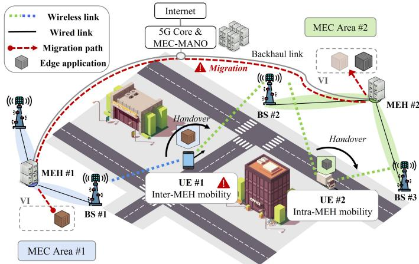  
Fig. 1: Inter-MEH mobility requires the offloaded edge application to migrate between MEHs. In contrast, intra-MEH mobility does not require migration.

Containers have become the preferred virtualization method to deploy edge services due to their smaller memory footprint and faster startup time compared to Virtual Machines (VMs) [9], [10]. Therefore, stateful live-migration for MEC services is a challenge of container migration, which is classified into three different approaches: Cold migration [11]–[15], Pre-copy [15]–[23], and Post-copy [15], [24], [25]. However, none of these schemes meet the stringent demands of time-sensitive MEC applications [26], as they typically introduce downtime of several seconds during the migration process. Another challenge for live-migration in MEC is the need to align the migration process with handover events. Ignoring handover coordination leads to excessive downtime, QoS degradation, and inconsistent application states. While the Standard 5G MEC framework by the 3rd Generation Partnership Project (3GPP) and the European Telecommunication Standards Institute (ETSI) incorporates interfaces to expose mobility data to the MEC system, it does not provide concrete methods or solution for migration-handover coordination.

To address these challenges, we introduce ReSync, a migration approach that enhances Checkpoint/Restore (C/R) through input-data synchronization and explicit handover coordination, thereby reducing downtime and ensuring reliable service continuity under dynamic network conditions. During our migration experiments, ReSync reduces the downtime for a large stateful container application (YOLOv8 Object Detection) to an average of 0.378 s, regardless of the network condition. In the same experiments, the total migration time exhibits on average 5.2 s to 12.3 s across different network conditions. In experiments comparing ReSync directly with the state-of-theart solution Pre-copy, downtime is reduced by up to 90 %. The total migration time of ReSync is comparable to that of Precopy with a single pre-transfer round, and shows even slightly faster migration times under good network conditions. Overall, ReSync provides a significant tradeoff benefit over the current state-of-the-art solutions for migrating edge applications in mobile networks.

This paper makes the following key contributions:

• We analyze container migration in MEC and identify that the limitations towards lower downtime are the overhead of C/R operations of high-level container tools as well as the design of current migration schemes.

• We propose ReSync, a two-part solution for stateful container live-migration in MEC: A novel migration scheme that enhances C/R with input-based replay synchronization to minimize downtime. A coordinator function that complements the migration scheme by actively extending its synchronization phase to align optimally with handover events.

• We implement and evaluate ReSync through migration experiments in a small-scale MEC testbed. The results show that ReSync significantly outperforms existing solutions and achieves low downtime across varying network conditions.

## II. BACKGROUND AND MOTIVATION

In this section, we identify and analyze the key contributors to downtime in stateful container migration in MEC environments. We focus on three aspects: the execution time of C/R commands in container tools (Section II-A), limitations of existing migration schemes (Section II-B), and the challenge of migration-handover coordination (Section II-C).

## A. Execution Time of Checkpoint/Restore

Checkpoint and Restore in Userspace (CRIU) [27] is the key software that enables stateful migration of containers. CRIU’s checkpoint command extracts the runtime state of a container into a set of files. However, the extraction of a consistent state requires the container to be frozen during checkpoint operation, resulting in inherent downtime. The extracted state files can be used to recreate the runtime state to another container instance (created from the same base image) with CRIU’s restore command, completing the process of stateful migration. With the addition of the TCP Repair Mode [28] to the Linux kernel, CRIU can dump and restore active TCP sockets, which allows the migration of MEC applications. The execution time of CRIU’s commands is a fundamental contributor to the downtime during the migration process. We observe that executing CRIU’s checkpoint and restore commands within different container technologies exhibit significantly different execution times. We conduct controlled experiments with the high-level container tools Docker [29] and Podman [30], as well as the low-level runtime runC [31]. We measure the time required for checkpoint and restore operations on the YOLOv8 container [32], creating the checkpoint after processing a single image to ensure comparable application states, and performing restores using the same checkpoint files. Table I shows significant variation in execution times across container technologies. Docker incurs the highest downtime due to its daemon and stack overhead, exceeding 5 s for combined C/R operations. Podman, a daemon-less runtime with full CRIU support, reduces total downtime to 1 s. RunC achieves minimal downtime of 0.4 s due to direct access to kernel features and low runtime overhead. However, runC is missing essential high-level features such as image management and overlay file system support. Addressing these limitations is crucial for efficient live-migration in MEC scenarios.

TABLE I: Execution time of CRIU’s C/R operations for YOLOv8 container using different container tools.

<table><tr><td>Container tool</td><td>Checkpoint time</td><td>Restore time</td><td>Total time</td></tr><tr><td>Docker</td><td>2.86 s</td><td>2.24 s</td><td>5.10 s</td></tr><tr><td>Podman</td><td>0.64 s</td><td>0.39 s</td><td>1.03 s</td></tr><tr><td>RunC</td><td>0.21 s</td><td>0.18 s</td><td>0.39 s</td></tr></table>

## B. Limitations of Current Migration Schemes

Beyond the execution time of C/R commands, the migration scheme itself has great impact on both downtime and total migration duration. CRIU supports three schemes: Cold migration, Pre-copy, and Post-copy. Although each scheme has its advantages, all have limited practical use for MEC livemigration due to their inability to achieve the low downtime required for real-time edge applications. Figure 2 illustrates the general concepts of the three schemes for stateful container migration between two hosts, assuming that the container base image is already available on both systems.

Cold migration implements the basic C/R procedure. The source host creates a checkpoint, which extracts the state data and stops the container. State data files are immediately transferred to the destination host, where they are used to restore the application state and resumes the container’s service. Although Cold migration offers the shortest possible total migration time among all C/R schemes, it exhibits an equally long downtime since the service is suspended during the entire migration process, including the state data transfer. In cases where the state data is substantial or network conditions are poor, Cold migration can introduce very long downtime, violating low downtime requirements for live-migration in MEC.

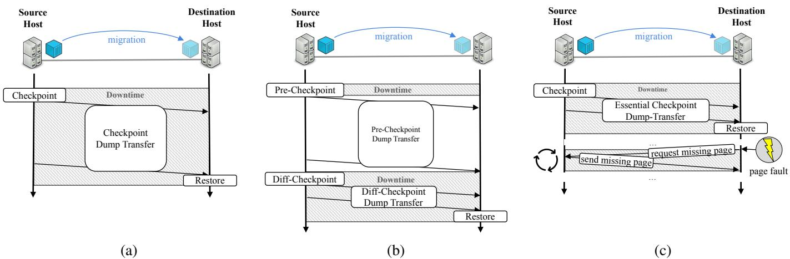  
Fig. 2: Schematic diagrams of the C/R based migration approaches: a) Cold migration, b) Pre-copy and c) Post-copy

Pre-copy reduces downtime by transferring memory pages in multiple rounds before finally suspending the application on the source host and restoring the destination application container. Each round performs an additional checkpoint that captures only those memory pages that have changed since the previous round, effectively reducing the amount of state data and transfer time during the final C/R. Since the application continues running on the source host during all but the very last checkpoint, large parts of the state files are transferred without inducing service downtime. While Pre-copy reduces downtime compared to cold migration, it extends the total migration time due to multiple rounds of state transfer. For high data-rate, real-time edge applications such as live inference or continuous data-processing services, the effectiveness of iterative delta checkpointing is limited [26]: the dirty page rate between rounds is comparable to or higher than the available transfer rate, so the final checkpoint size does not shrink substantially even after multiple iterations, and the achievable downtime remains fundamentally constrained.

Post-copy creates a regular checkpoint but transfers only a minimal amount of state files to the destination host, including only the essential state information necessary to restore the container. The large memory pages of the extracted state data are kept on the source host. Whenever the restored container tries to access missing memory pages after restore, a page fault is triggered, sending a fetch request for the missing page through a dedicated page server that has been established between the hosts. Until receiving the requested memory page through the network, the application cannot proceed and is temporarily paused. While Post-copy exhibits low downtime during its C/R phase, the repeated on-demand memory fetching causes significant service stalling resulting in effective service unavailability [26]. Since page requests are handled sequentially, each page requests pauses the application by one RTT. This makes Post-copy especially sensitive to inter-host latency, which for neighboring MEC areas can reach up to tens of milliseconds. Even optimized transfer strategies that reduce the overall number of page faults by pre-fetching pages in the background are expected to suffer significantly from this bottleneck, as their effect only becomes meaningful once a large portion of the working set has been transferred to the destination. In the critical first seconds after restore, the fault rate remains high and the benefit of pre-fetching is negligible, fundamentally limiting Post-copy to achieve livemigration in MEC.

Logging and Replay is a non-checkpoint-based migration paradigm in which all non-deterministic system events, including system calls and interrupt timings, are recorded at the source and replayed at the destination, enabling exact state reconstruction. This approach has been explored for VMlevel migration, where the hypervisor boundary provides a clean interception point for all non-deterministic events [33], [34]. For container live-migration in MEC, however, the Logging/Replay paradigm faces two fundamental limitations. First, log data accumulates continuously with application runtime, making the transfer and replay overhead unbounded, which is a structural incompatibility with handover-coordinated livemigration. Second, existing process-level record and replay tools for containers [35], [36] are mainly scoped to debugging and reproducibility and only provide limited practical use for live-migration between remote hosts.

## C. Migration-Handover Coordination

Another factor that directly influences service downtime and QoS during migration in MEC is the handover event. In order to minimize its effects, the handover has to trigger during the existing downtime periods of the migration schemes between the suspension and the restoring of the container. However, accurate alignment is a challenging task due to dynamic factors that significantly influence the timing of both handover and migration procedure. In the case of handover, the UE’s mobility behavior and signal strength can change unexpectedly due to environmental conditions, delaying or even canceling handover events. Likewise, the migration process is influenced by the application-specific state data size, available computing resources of the host and networking conditions. Coordinating both processes reliably within the required time frame under the mentioned dynamic factors is practically not achievable and limits the use of the current migration schemes for MEC live-migration.

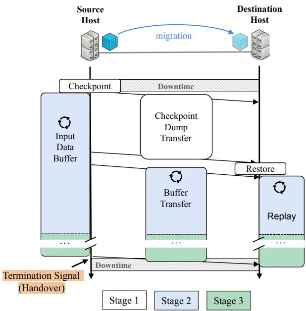  
Fig. 3: Schematic diagram of the ReSync migration scheme

## III. RESYNC MIGRATION

This section introduces Migration with Replay Synchronization (ReSync), a two part solution for MEC live-migration for stateful containers. First, we present an overview of ReSync’s migration scheme (Section III-A) followed by its design (Section III-B). We then introduce the ReSync coordinator that complements the migration scheme to achieve optimal handover alignment (Section III-C). We furthermore present ReSync’s integration into the existing MEC framework (Section III-D). Finally, we conduct a performance analysis to determine parameter dependencies and limitations of ReSync’s replay synchronization procedure (Section III-E).

## A. ReSync Migration Scheme Overview

To address the identified challenges of live-migration in MEC, we present the ReSync migration scheme. The scheme achieves reduced downtime and features an expandable timing window to help aligning optimally with handover events. The migration scheme extends the traditional idea of C/R by a replay synchronization stage to reduce the downtime to the checkpoint execution time and the handover period. ReSync’s three-stage approach is illustrated in Figure 3.

1) Checkpoint/Restore and Continuation: The first stage initiates the migration process by creating a checkpoint of the target container. The resulting state files are transferred to the destination host where they are used to restore a stateconsistent container instance that has been created from the same base image. The source container is resumed immediately after the checkpoint, ensuring it can continue serving the UE from the source host with minimal interruption.

2) Replay Synchronization: Following the container restore, the destination host must synchronize with the state changes that occurred at the source after the checkpoint was taken. From the moment of the checkpointing, all arriving input data from the UE is extracted and duplicated into a local FIFO buffer on the source host. After the initial state file transfer (stage 1) is complete, the source host begins transmitting the contents of this buffer to the destination host. Any new inputs arriving during this transmission are continuously appended to the buffer and sent subsequently. The destination host then sequentially replays the received inputs to the restored container. This continuous process of buffering, forwarding, and replaying synchronizes the destination’s state with the source’s post-checkpoint activity without introducing additional downtime. Stage 2 concludes when the replay process on the destination has caught up with the buffered data, indicating that the states are synchronized up to that point.

3) Handover Ready: At the point of ReSync’s final stage, the source and destination containers are in an equivalent state, and new incoming input data is forwarded and replayed in near real-time to maintain this synchronization. The migration process can remain in this state until it receives an external trigger to finalize the migration process and suspend the source container. This trigger is reserved for the handover, after which the UE connects to the state-synchronized destination container.

## B. ReSync Migration Scheme Design

Our implementation of the ReSync migration scheme features a total of 12 sub-tasks. To manage the sub-tasks timeoptimally, we create two controller processes: a migration controller and a replay controller. Since the required actions differ for the source and destination hosts, each controller can be called in either source mode or destination mode. Migration requires a pair of controllers, one running in source mode on the origin host and one running in destination mode on the target host. Figure 4 shows the migration process and how the sub-tasks, listed below, are scheduled between the controllers. 1) Checkpoint: The source migration controller initiates the migration process after it received an external signal by performing CRIU’s checkpoint command to the target container. By applying the ’leave-running’ flag, CRIU resumes the container immediately upon checkpoint completion. The ’tcpestablished’ flag is also applied to indicate the need to dump the active connection. After completion, the replay controller is started in source mode.

2) Create Container: The migration controller on the destination host side prepares the container restore by creating a dormant container instance from the container base image.

3) Buffer Input Data: Arriving input data is continuously extracted from the arriving network packets that are destined to the migrating container. The extracted data is stored into a local FIFO buffer.

4) Extract FS Diff: Runtime changes to the container’s root file system (FS) are not part of the checkpoint files and therefore require a separate extraction operation.

5) Archive: Checkpoint files and extracted FS differences are bundled into a single compressed archive file.

6) Transfer/Receive Archive: The archive file is transferred to the destination host by the migration controllers.

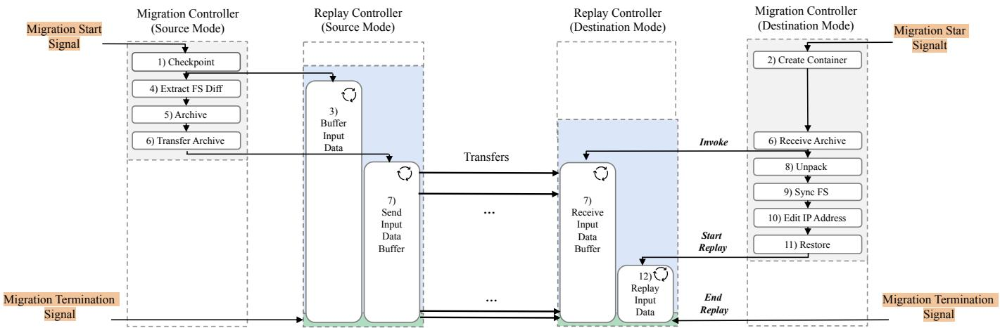  
Fig. 4: Workflow design of ReSync’s migration scheme.

7) Send/Receive Input Data Buffer: After the completion of the state archive transfer, both the source and destination hosts command their respective replay controllers to initiate the continuous sending and receiving of input data buffer.

8) Unpack: After receiving the archive file on the destination host, it is decompressed and its contents are extracted into the checkpoint directory and file system difference files.

9) Sync FS: The File system differences are synchronized to the rootfs of the container instance that was created in preparation for the migration.

10) Edit IP Address: Before the container can be restored successfully on the destination host, the IP Address of the dumped socket needs to be changed to match the created container. The address is changed by editing and replacing the IP Address inside the checkpoint file that contains the socket information.

11) Restore: The container is restored with CRIU’s restore command with the ‘tcp-established’ flag.

12) Replay Input Data: The destination replay controller starts to send the buffered input data to the locally restored container to start synchronization.

## C. ReSync Coordinator

The performance of the ReSync migration scheme in the MEC environment depends on its coordination with the UE handover event, which is managed through two external trigger signals: one to start the migration and another to terminate it. While the termination signal can be directly synchronized with the handover event, the start signal must be carefully determined based on dynamic factors to ensure that the migration process has reached a safe state before the handover is conducted. ReSync’s design, particularly the temporal flexibility of its final stage ‘Handover Ready’ (stage 3), simplifies the scheduling significantly. The on-demand extension of this stage allows the coordinator to determine the migration trigger based on conservative estimations, offering a reliable and simple alternative to complex handover prediction models. Even when based on conservative estimations, determining the migration trigger still requires the coordinator to aggregate and consider information from several domains: To predict the handover, it needs real-time UE mobility data and RAN information, including signal strengths and handover procedure parameters. Similarly, to determine the migration times, the coordinator requires application and edge host specific information as well as network conditions between the source and destination MEHs. We design the ReSync coordinator to estimate handover events based on a mathematical model of the A3 handover procedure, which is the primary mechanism of handover in LTE and 5G [37]. In this case, the handover is triggered when the Received Signal Strength Indicator (RSSI) of a target base station exceeds that of the serving base station by a predefined threshold for a specified duration, denoted as the Time-to-Trigger (TTT). The coordinator determines when to send the migration start trigger by the following procedure: First, it obtains a conservative estimate of the application’s migration time, specifically the duration required to reach stage 3 of the ReSync migration scheme. Since this time depends on the specific application and its communication pattern, we create a minimal database that contains conservative estimates for different applications under several network conditions. We determine those estimations based on measurements and simulation. Second, the coordinator estimates the RSSI values to both base stations via linear approximation at the future time equal to the migration time. If the approximated RSSI values meet the threshold condition of the handover procedure, a timer equal to the TTT is starting to count down. When the timer expires, the coordinator starts the migration. If during the countdown the predicted RSSI values no longer meet the threshold condition, the timer is reset and stopped. Algorithm 1 summarizes the procedure executed by the ReSync coordinator.

## D. MEC Framework Integration

This section covers the integration of ReSync’s migration scheme and coordinator into the standard 5G MEC framework provided by the ETSI [38]. The standard divides the MEC framework into system level and host level entities. The system level has managing and orchestrating functions in form of the MEC Orchestrator (MEO) and is usually deployed at the 5G core or a dedicated central facility. The host level entities are made up by the MEC Platform Manager (MEPM) and the MEC Platform (MEP), which represent the host’s runtime environment and the physical edge server, respectively. The host level is further specified by the Virtualization Infrastructure (VI) and the VI Manager.

Algorithm 1 ReSync Coordinator's Migration Trigger Procedure based on the A3 Handover Model
1: $T_{\text{mig}} \leftarrow$ lookupConsvReSyncMigrationTime(app, net_cond)
2: while (1) do
3: $(RSSI_{\text{serv}}, RSSI_{\text{target}}) \leftarrow$ updateRSSIValues()
4: $\hat{R}_{\text{serv}} \leftarrow$ linearApproxFutureRSSI($RSSI_{\text{serv}}, T_{\text{mig}}$)
5: $\hat{R}_{\text{target}} \leftarrow$ linearApproxFutureRSSI($RSSI_{\text{target}}, T_{\text{mig}}$)
6: if $\hat{R}_{\text{target}} &gt; \hat{R}_{\text{serv}} + \Delta_{\text{thresh}}$ then
7: startTTTtimer()
8: else
9: resetTTTtimer()
10: end if
11: if TTTtimerExpired() then
12: sendMigrationStartSignal()
13: return
14: end if
15: end while

We deploy the migration controllers on the host level platform. More specifically, since the migration process requires direct access to the VI and the virtualized application, we propose their deployment as callable programs on the MEP through the MEPM. Because several applications could be migrating at the same time, each called migration controller instance is specifically managing its own migration process specified by the container as well as participating hosts. The ReSync coordinator is placed as an Virtual Network Function (VNF) extension to the MEO at the MEC system level. The MEO provides the coordinator with information of currently offloaded applications and source and target hosts of potential migrations. The ReSync coordinator itself leverages 5G core services that are exposed by the Network Exposure Function (NEF). These include relevant information from the Access and Mobility Function (AMF), Session Management Function (SMF) and User Plane Function (UPF). RAN and UE radio conditions, which are exposed via the Radio Network Information Service (RNIS), are forwarded through the MEPM from the host level to the coordinator. Once the ReSync coordinator determined the time to start the migration of an edge container, the trigger is forwarded to the MEO who then commands the MEPMs of the participating hosts to run the Migration Controller in their respective mode. The migration termination is directly coupled to the connection change of the UE during handover.

In summary, deploying ReSync requires adding migration functionalities to the host platform and a coordinator VNF co-located to the MEO. Both components integrate seamlessly into the standard MEC architecture. The implementation overhead is limited, as the design conforms to the existing framework architecture and requires only the extension of existing interfaces. Figure 5 summarizes the proposed deployment of ReSync into the MEC framework.

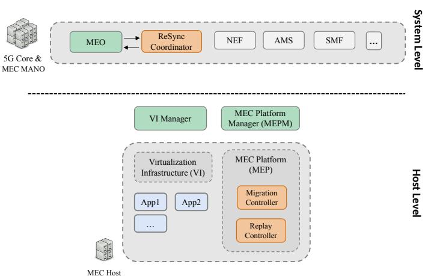  
Fig. 5: Overview integrating ReSync into the existing MEC framework.

## E. Replay Synchronization Convergence Analysis

The convergence of the replay synchronization process (stage 2) is a necessary condition for ReSync migration. In practical scenarios, fast convergence is required to allow the alignment with handover events under high-mobility. To qualitatively analyze the convergence and its dependency on different system parameters, we model the stage 2 procedure as two coupled, batch-serving FIFO queues that operate concurrently. Figure 6 illustrates a typical synchronization process with fast convergence.

Buffer queue. The source-side buffer queue is characterized by two rates: $\lambda _ { a r r } ,$ denoting the arrival rate of new input data sent by the UE to the edge application, and $\lambda _ { t r a n s } .$ , denoting the transfer rate at which buffered input data is transferred to the destination-side replay queue. While the arrival rate is application-specific, the transfer rate depends on the average input size $S _ { i n }$ and the available inter-host bandwidth BW as follows:

$$
\lambda_ {t r a n s} = \frac {B W}{S _ {i n}}\tag{1}
$$

For the buffer queue to converge, the transfer rate must exceed the input-arrival rate, i.e.,

$$
\lambda_ {a r r} <   \lambda_ {t r a n s}.\tag{2}
$$

Under this condition, buffered input is drained faster than new input arrives, so the backlog decreases over successive transfer rounds. In the considered MEC setting with modern network infrastructure, this condition is typically fulfilled by a wide margin. Let $t _ { i }$ denote the duration of buffer round i:

$$
t _ {i} = \left\{ \begin{array}{l l} \frac {S _ {c p}}{B W} = t _ {c p \_ t r a n s} & \text { for } i = 0 \\ \max \left(\frac {N _ {i - 1} ^ {b u f}}{\lambda_ {t r a n s}}, \frac {1}{\lambda_ {a r r}}\right) & \text { for } i > 0 \end{array} \right.\tag{3}
$$

where $t _ { 0 }$ is the checkpoint transfer time $t _ { c p \_ t r a n s } ,$ , which depends on the checkpoint archive size $S _ { c p }$ and the available inter-host bandwidth BW. For subsequent rounds $i > 0$ , each round time is equal to the time it takes to transfer the backlog data that accumulated during the previous round, denoted as

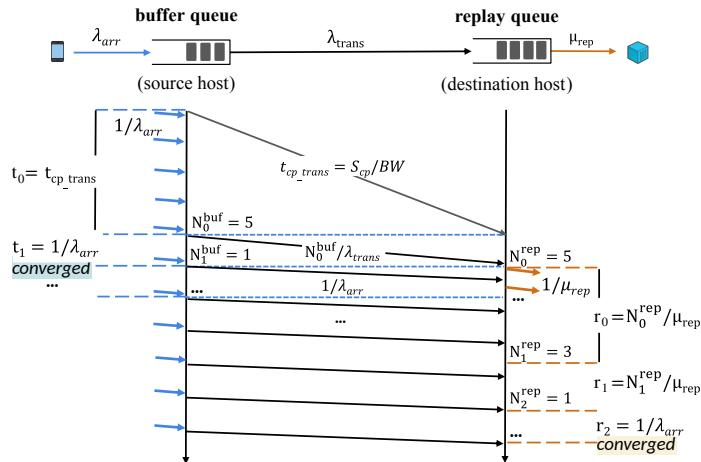  
Fig. 6: Model overview and schematic example behavior of a typical, fast converging replay synchronization process.

$N _ { i - 1 } ^ { b u f }$ . The lower bound $1 / \lambda _ { a r r }$ accounts for the converged state: once the backlog is fully drained, the buffer queue must wait for the next input data to arrive before a new round can begin. During this regime, each arriving input data is forwarded immediately, and the round duration is therefore set by the inter-arrival time $1 / \lambda _ { a r r }$ rather than the backlog transfer. The number of input data accumulated during buffer round i is

$$
N _ {i} ^ {b u f} = \left\lfloor t _ {i} \cdot \lambda_ {a r r} \right\rfloor .\tag{4}
$$

Because input data arrives periodically as a discrete unit, the backlog requires the floor operation. However, since this operation makes a closed-form expression intractable, we approximate the backlog as a continuous quantity. Under this approximation and substituting $N _ { i - 1 } ^ { b u f } \approx \dot { \lambda } _ { a r r } \cdot \dot { t } _ { i - 1 }$ into equation (3) we can describe the backlog decay as a geometric series

$$
N _ {i} ^ {b u f} \approx N _ {0} ^ {b u f} \cdot \alpha^ {i}, \quad \alpha = \frac {\lambda_ {a r r}}{\lambda_ {t r a n s}}, \quad 0 <   \alpha <   1\tag{5}
$$

from which the convergence round $i _ { c o n v }$ can be estimated as

$$
i _ {c o n v} \approx \left\lceil \frac {\ln \left(N _ {0} ^ {b u f}\right)}{\ln (1 / \alpha)} \right\rceil .\tag{6}
$$

The regime in which the buffer queue enters the converged state by round $i \ = \ 1 \ ( \mathrm { i . e . }$ , by the second buffer round) is satisfied when

$$
N _ {0} ^ {b u f} \leq \frac {1}{\alpha}.\tag{7}
$$

Written purely in system parameters, we get the following expression:

$$
\frac {S _ {c p} \cdot S _ {i n} \cdot \lambda_ {a r r} ^ {2}}{B W ^ {2}} \leq 1.\tag{8}
$$

We will exploit condition (7) later in the replay queue analysis to decouple the two queues and obtain a closed-form expression for the synchronization convergence.

Replay queue. The destination-side replay queue is modeled analogously as a FIFO queue with batched service and replay rate $\mu _ { r e p } ,$ denoting the rate at which input data is replayed to the restored container. Unlike the buffer queue, which receives input periodically at rate $\lambda _ { a r r } ,$ the replay queue receives input in discrete batches: each time buffer round i completes at cumulative time $\tau _ { i } ^ { b u f }$ the forwarded batch of size $N _ { i } ^ { b u \hat { f } }$ arrives at the replay queue, where:

$$
\tau_ {i} ^ {b u f} = \sum_ {m = 0} ^ {i} t _ {m}\tag{9}
$$

As the buffer queue converges, each round transfers at most a single item, so the long-term average arrival rate at the replay queue approaches $\lambda _ { a r r }$ . For the replay queue to remain stable under this asymptotic arrival rate, the replay rate must satisfy

$$
\lambda_ {a r r} <   \mu_ {r e p}.\tag{10}
$$

The number of input data available in replay round j is given by:

$$
N _ {j} ^ {r e p} = \left\{ \begin{array}{l l} N _ {0} ^ {b u f} & \text { for } j = 0 \\ \sum_ {i: \tau_ {i} ^ {b u f} \in \left(\tau_ {j - 1} ^ {r e p} - r _ {j - 1}, \tau_ {j - 1} ^ {r e p} \right]} N _ {i} ^ {b u f} & \text { for } j > 0 \end{array} \right.\tag{11}
$$

For the initial replay round $j = 0$ , the replay queue contains the very first batch of forwarded input data $\dot { N } _ { 0 } ^ { b u f }$ . For $j >$ $0 ,$ the batch consists of all buffer batches whose completion time $\tau _ { i } ^ { b u f }$ falls within the interval $\left( \tau _ { j - 1 } ^ { r e p } - r _ { j - 1 } , \tau _ { j - 1 } ^ { r e p } \right]$ , i.e., all batches that arrived during the previous replay round $j - 1$ Here, $\begin{array} { r } { \tau _ { j } ^ { r e p } = \sum _ { l = 0 } ^ { j } r _ { l } } \end{array}$ denotes the completion time of replay round j following the definition analogous to equation (9). The duration of replay round $j$ is the time required to replay $N _ { j } ^ { r e p }$ items at rate $\mu _ { r e p } .$

$$
r _ {j} = \max \left(\frac {N _ {j} ^ {r e p}}{\mu_ {r e p}}, \frac {1}{\lambda_ {a r r}}\right)\tag{12}
$$

The lower bound $1 / \lambda _ { a r r }$ is the expected inter-arrival time of a single input item, and defines the converged state of the replay queue and the overall synchronization process: replay rounds can complete no faster than new data arrives. Due to the queue coupling, this state also requires the buffer queue to have converged. Because $N _ { j } ^ { r e p }$ depends on which buffer rounds completed inside the replay window, which itself depends on the replay round durations, the two queues are mutually coupled and $j _ { c o n v }$ is generally intractable in closed form.

To obtain a tractable approximation, we utilize the condition in (7), under which the buffer queue enters its converged oneinput-data-per-round regime by round $i = 1$ . From the $j = 0$ case of equation (11), the replay queue is initially seeded with the batch $N _ { 0 } ^ { r e p } = N _ { 0 } ^ { b u f }$ once the first buffer transfer completes. The two queues are therefore approximately decoupled after this point, and the replay backlog decays as a geometric series:

$$
N _ {j} ^ {r e p} \approx N _ {0} ^ {r e p} \cdot \beta^ {j}, \qquad \beta = \frac {\lambda_ {a r r}}{\mu_ {r e p}}, \quad 0 <   \beta <   1,\tag{13}
$$

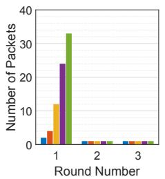

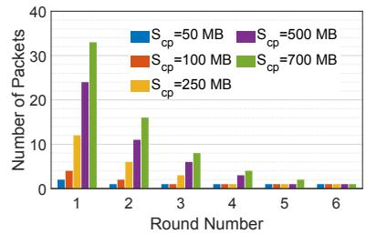  
Fig. 7: Fast converging buffer queue (left) and replay queue (right) for different Checkpoint (CP) sizes and typical system parameters

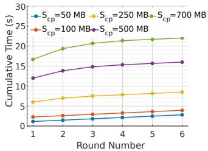

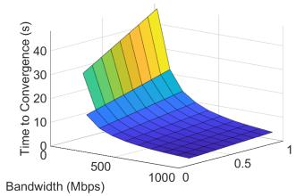  
Fig. 8: Round times of the re- Fig. 9: Influence of the BW play queue for different check- and $\beta$ on the convergence time point sizes. of the replay queue

from which the replay convergence round is estimated analogously to equation (6):

$$
j _ {c o n v} \approx \left\lceil \frac {\ln (N _ {0} ^ {r e p})}{\ln (1 / \beta)} \right\rceil .\tag{14}
$$

The total stage 2 synchronization time $t _ { s y n c }$ can then be approximated as follows:

$$
t _ {s y n c} \approx t _ {0} + t _ {1} + \sum_ {j = 0} ^ {j _ {c o n v}} r _ {j},\tag{15}
$$

which is the sum of the checkpoint archive transfer time $t _ { 0 } ,$ , the duration of the first post-checkpoint buffer-forwarding round $t _ { 1 }$ , and the sum of all replay rounds until replay queue convergence. Since both queues operate concurrently after the first buffer transfer completes, the remaining buffer rounds do not extend the critical path.

In typical MEC setups, the inter-host bandwidth BW is high, while common offloading applications generate input data with moderate arrival rate $\lambda _ { a r r }$ and moderate input size $S _ { i n }$ . Under these conditions, the buffer-queue transfer rate $\lambda _ { t r a n s } ~ = ~ B W / S _ { i n }$ is expected to exceed the arrival rate, and the replay process is expected to operate faster than the input stream. Hence, the stability conditions of both queues are typically satisfied. High BW furthermore favors rapid convergence, since it not only increases $\lambda _ { t r a n s } .$ , but also directly shortens the dominant critical-path terms in (15), most notably the checkpoint-transfer time $t _ { 0 } = S _ { c p } / B W$ . Through the reduced $t _ { 0 } ,$ , a larger BW also lowers the initial backlog $N _ { 0 } ^ { b u f } \approx \lambda _ { a r r } \cdot t _ { 0 }$ which not only shortens the initial buffertransfer round $t _ { 1 }$ but also the starting number of input data in the replay queue $N _ { 0 } ^ { r e p }$

To validate these qualitative trends, we simulate the full concurrent two-queue model over a representative MEC parameter space. Fig. 7 shows the rapid convergence of both queues across different checkpoint sizes, with the buffer queue entering its converged one-packet-per-round regime by the second displayed round (corresponding to i = 1) for all cases. Fig. 8 complements this view by showing the corresponding timing of the replay rounds for the same convergence process and the same checkpoint size variations, thereby confirming that the observed convergence is achieved within a short time interval. Finally, Fig. 9 highlights the dominant influence of BW on the convergence time for a fixed moderate checkpoint size. Overall, the analytical conditions and simulation results indicate that rapid replay synchronization is the expected behavior under typical 5G MEC conditions. We note that the derived expressions are intended for qualitative convergence analysis rather than calculating exact synchronization times. In practice, actual migration timing should be determined empirically or assessed conservatively under realistic system conditions. The derived expressions constitute a lower-bound approximation of the synchronization time, as they omit practical overheads and non-idealities present in real deployments, and therefore converge faster than observed in a real system.

## IV. IMPLEMENTATION

We implement the two controllers using Python 3.12, runC v1.1.12 as container runtime and CRIU v3.19 for C/R operations. We utilize CRIU Image Tool (CRIT) [39] to update the IP address within the respective state files to allow for container restore in the destination host’s network environment. To optimize container deployment of runC, we automate the conversion of Docker images to oci-bundles, with configuration files generated via the oci-runtime-tool [40]. Furthermore, we enforce an explicit overlay file system structure during container initialization to isolate file system changes in dedicated upper directories. This segregation leads to reduced state data sizes, accelerating compression and network transfer time throughout the migration process. Data compression is performed using the lz4 library, while file transfer is handled by scp. To manage incoming data, we utilize iptables rules in combination with Netfilter Queue (NFQ) within the replay controller. These rules are configured to filter and buffer only incoming packets originating from the UE and destined to the migrating container. ReSync input data is the application level data, extracted from multiple packets payload. During replay, the destination host starts an artificial client that connects to the locally restored container and replays the input data to it. To ensure a focused evaluation of the ReSync migration scheme and coordinator function, our implementation is deliberately scoped to the essential components required for stateful live-migration. A full 5G MEC-conformant implementation introduces significant system-level complexities and uncertainties that could obscure the performance contributions of our core migration mechanisms. Therefore, we architect a minimal testbed that provides the necessary interfaces for handover coordination. This controlled environment allows for a precise analysis of ReSync’s migration performance, establishing a robust foundation for future integration into a complete standards-based framework, which we leave for future work.

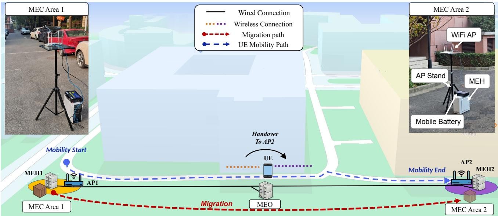  
Fig. 10: Overview of the small-scale MEC testbed. The container is migrated alongside the UE’s mobility path between the neighboring MEC areas using ReSync migration with optimal handover coordination.

## V. PERFORMANCE EVALUATION

This section covers the setup of our small-scale MEC testbed and the experimental process (V-A). We then evaluate ReSync’s performance in terms of total migration time and downtime under different network conditions (V-B). Furthermore, we analyze the influence of the migration and handover from the UE’s perspective. We then compare ReSync directly with Cold migration, Pre-copy and Post-copy and evaluate the influence of handover coordination on the schemes (V-C). Finally, we complement the testbed experiments with a largescale simulation using real-world urban mobility traces to evaluate the robustness and scalability of ReSync’s handover coordination under complex signaling and high-mobility conditions (V-D).

## A. Experimental Testbed

The testbed is designed to emulate the connectivity and architecture of a basic real-world MEC setup. It features a small-scale integrated MEC system with two neighboring MEC areas, interconnected and managed by a central systemlevel management node. The management node hosts the MEO and the ReSync coordinator function. It also provides interfaces that emulate the data that can be obtained from RAN and core functions and that are used throughout the handovermigration. Each of the two MEC Areas are made of a WiFi AP and an edge host. To allow for real-world inter-MEC mobility, the testbed is deployed behind the university building on a densely parked and frequently traversed street. The distance between the two AP’s is 140 m, providing sufficient space and time to trigger and evaluate coordinated migration during typical mobility scenarios. An overview of the testbed setup is shown in Figure 10.

Hardware Setup. Two TP-Link AX3010 WiFi routers are used as wireless AP at 2.4 GHz, with 40 MHz bandwidth. The Ethernet router at the management node is a TP-Link AC1200. The two edge servers are commercial-off-the-shelf (COTS) PCs running Ubuntu. The management node is a COTS laptop. The UE is represented by a Raspberry Pi 3B+ equipped with two COMFAST CF-952AX V2 dual-band wireless USB adapters which are used to track the RSSI from both AP’s simultaneously. The Raspberry Pi’s internal wireless adapter is disabled during experiments.

Each edge host is connected via Ethernet to one of the WiFi AP’s, which are subsequently connected to the Ethernet router located at the management node. The management node is connected to the router. All wired connections operate at a data rate of 1000 Mbit/s. To emulate varying network conditions, the Linux tools tc-netem and iptables are used to configure three different network conditions: low, medium, and high link quality, representing high congestion, moderate congestion, and non-congested communication links, respectively. The defining parameters for each network scenario are bandwidth (BW) and round-trip time (RTT). We summarize the three network scenarios in Table II.

TABLE II: Connectivity scenarios between different network participants

<table><tr><td>Link Quality</td><td>UE  $\longleftrightarrow$  MEH</td><td>MEH  $\longleftrightarrow$  MEH</td><td>MEH  $\longleftrightarrow$  MEO</td></tr><tr><td>Low</td><td>75 Mbit/s20 ms</td><td>150 Mbit/s50 ms</td><td>150 Mbit/s50 ms</td></tr><tr><td>Medium</td><td>150 Mbit/s10 ms</td><td>500 Mbit/s25 ms</td><td>500 Mbit/s25 ms</td></tr><tr><td>High</td><td>250 Mbit/s5 ms</td><td>1000 Mbit/s10 ms</td><td>1000 Mbit/s10 ms</td></tr></table>

Edge Applications. To evaluate ReSync for stateful livemigration, we choose two inference applications as applications (Table III): the object detection application YOLOv8 [32] and the face recognition software Deepface [41]. The container image of YOLOv8 is available on Docker Hub [42] while Deepface can be built manually using the Dockerfile from the authors’ GitHub repository. To enable MEC capabilities, the container images are extended by a basic Python server. The server receives images from the UE, performs inference on received image, and returns results back to the client. To make the containers stateful, inference results of each image are saved to the containers file system as well as in runtime variables.

TABLE III: Container images and average state data size

<table><tr><td>Application</td><td>Image name</td><td>Image size</td><td>State archive size</td></tr><tr><td>Object Detection</td><td>YOLOv8-cpu</td><td>1.200 GB</td><td>124 MB</td></tr><tr><td>Face Recognition</td><td>Deepface-cpu</td><td>0.876 GB</td><td>190 MB</td></tr></table>

UE Client Application. The Raspberry Pi as UE runs a basic Python client application that connects to the edge application’s server. The client application sends images with a fixed frequency of 3 Hz to the edge application and waits to receive the inference results back. Images have a resolution of 480p and are taken from a preselected collection that shows detectable objects for YOLOv8, and images with faces for Deepface, respectively.

UE Monitoring and Handover Management. Alongside the client application, the UE runs a script to emulate handover management and real-time RSSI provision. RSSI from both external UE antennas are reported periodically (0.5 s interval) to the ReSync coordinator where they are processed for handover alignment. We choose typical RAN parameter values to model the A3 handover procedure. To perform a handover, the script on the UE receives a handover message from the coordinator and performs an internal WiFi handover by modifying the default route with the route command [43], switching the active WLAN interface. The reconnection time is fixed to 60 ms, emulating a conservative 5G handover. Once completed, the resulting IP address change of the UE is recognized by ReSync’s coordinator function, which then sends a termination signal to the edge hosts via the MEO to end the migration process.

Migration Execution. Each combination of network quality and application (YOLOv8, Deepface) is evaluated through five full migration-handover experiments. The UE is carried by a person from the source AP toward the destination AP at a constant walking speed of approximately 4 km/h over a distance of 140 m. During this process, the ReSync coordinator function monitors the RSSI and triggers migration to the target host in alignment with the upcoming handover. We determine the time required to reach stage three of ReSync for our selected applications using results from both simulations and controlled laboratory experiments. To account for real-world uncertainties, we further introduce a safety margin of up to three seconds, depending on the employed network conditions during the experiment runs. This extra time ensures that migration is triggered early enough for the system to reliably reach the handover-ready stage three before the UE switches access points. While extending the expected migration time increases the likelihood of optimal alignment (stage 1 and 2 of ReSync’s scheme have more time to finish), the artificial extension of stage three can increase the total migration time and network traffic between the edge hosts.

## B. ReSync Migration Performance

We evaluate the performance of ReSync Migration using two metrics: downtime and total migration time. While downtime is the primary concern in live-migration, particularly for maintaining high QoS in MEC environments, total migration time is also an important factor. In high-mobility scenarios, a UE may cross only a small portion of a MEC area at high speed, requiring the first migration to complete before the next migration can be initiated. Although ReSync aims to minimize downtime, it is equally important that the total migration time remains within an acceptable range to ensure seamless service continuity in those mobility cases.

Total Migration Time. To assess ReSync’s total migration time, we measure and analyze the execution time of its 9 foreground tasks plus the handover. These tasks are further more categorized into either network-independent or network dependent. The latter are the archive transfer (Transfer) and the replay synchronization (Replay) time, while the former are the remaining eight sub-processes. Although the handover is influenced by increased communication latency in the different network scenarios, we do not observe significant correlation with its execution time, and therefore categorize it as network independent. Figure 11a shows the average execution time of the network-independent sub-tasks during ReSync migration of YOLOv8 and Deepface. Error bars indicate minimum and maximum measurements. As expected, most of the processes exhibit only a small spread in execution time, as they depend solely on the computing resources. However, the checkpoint creation and handover show higher execution spread. The checkpoint creation time depends on the exact application state when executed, which is arbitrary for each migration run due to the real-world nature of the testbed environment. Likewise, the handover induces additional downtime when it is triggered during times of active data transfer between UE and application container. Figure 11b shows the execution time of the two network-dependent sub-tasks Transfer and Replay across the three network conditions for both applications. YOLOv8 exhibits a shorter transfer time than Deepface due to its smaller average state archive size of 124 MB compared to 190 MB. The replay synchronization time also decreases according to our previous analysis, deriving the dependents on state-data size and the application specific replay time. Figure 11c compares the total migration time of the two applications directly between the different network scenarios. For improved visibility, the sub-processes Extract FS and Archive that are executed on the source host and Unpack, Sync FS, Edit IP, executed on the destination host, are summarized under Pre processing and Postprocessing, respectively. We also add the compositional worst-case execution time (compWCET), which indicates the sum of the worst execution times of each subprocesses across all runs and acts as reference. State transfer and replay synchronization, the two network-depending subprocesses, are the primary contributors to the total migration time, highlighting the benefit of high link quality for migration. The influence of the network-independent tasks on the total migration time are only significant under the high link quality scenario, where they make up 42 % and 30 % of the total migration time for YOLOv8 and Deepface, respectively. In the same scenario, ReSync takes approximately 5 s and 6 s on average for migrating both applications. Figure 12 provides further insights on the replay synchronization process and the number of input data in the first five replay rounds. The experiment confirms our analysis and simulation results regarding fast convergence synchronization, reaching the handover ready stage 3 after a few replay rounds for both applications and across all three network conditions.

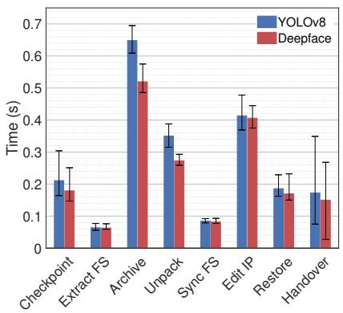  
(a)

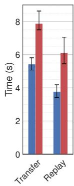

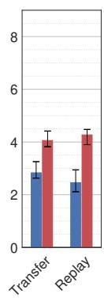  
(b)

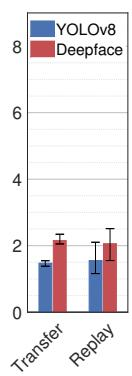

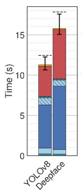

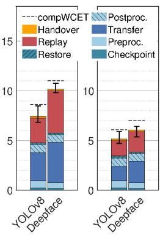  
(c)

Fig. 11: Execution time of ReSync Migration, divided into a) network-independent tasks and b) network-dependent tasks for each network scenario c) Accumulated total migration time under the three network scenarios. Network link quality increases from left (low) to right (high).  
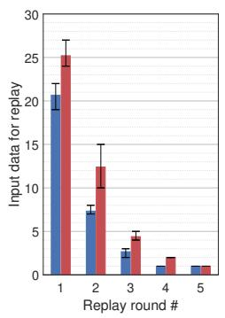

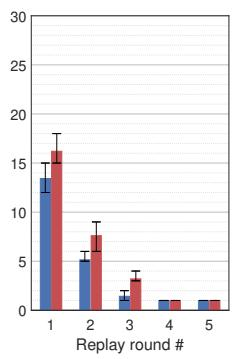

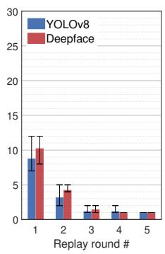

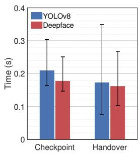

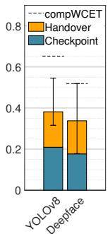  
Fig. 12: Average amount of input data in the first five replay rounds of ReSync for Fig. 13: Execution time of the subthe three network scenarios. Low, medium and high link quality are shown from processes that contribute to downtime sepleft to right. arated (left) and stacked (right).

Downtime. Migrating with ReSync involves two split periods of downtime. The first occurs at the very start of the migration process during CRIU’s checkpoint execution. The second interruption arises during the handover, after which the UE reconnect to the migrated container on the destination MEH. Figure 13 compares the downtime of the contributing sub-processes for both applications. We measure an average downtime of 0.378 s for YOLOv8 and 0.349 s for Deepface. Notably, both checkpoint and handover are networkindependent sub-processes, meaning that ReSync’s downtime is constant across network conditions. This characteristic is unique to ReSync and poses a significant advantage over current state-of-the-art migration schemes.

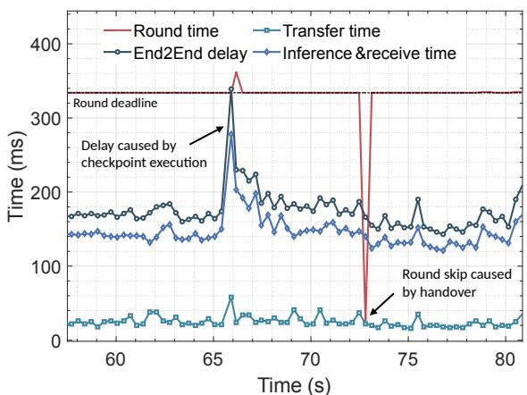  
Fig. 14: UE client-side measurements of the performance of the serving YOLOv8 container during ReSync migration with handover in the high network quality scenario.

Influence on Quality of Service. Next we analyze the influence of performing ReSync migration on the QoS experienced by the UE client. For that purpose, we continuously measure the application performance during the migration process of the edge containers: The Round Time refers to the interval between consecutive image transfers to the edge container. The round time is fixed at 0.333 s, corresponding to the offloading rate or arrival rate for new arriving images of 3 Hz. The EndToEnd delay measures the time between starting the image transfer until receiving the inference result from the edge application. This period includes the time to transfer the image to the edge host (transfer time), the container’s processing time, and the return of results to the client (Inference and Receive). As long as the round time interval is not exceeded by the EndToEnd delay, the user experiences high QoS. Com plementary, when the round time exceeds the round deadline, the UE experiences low QoS. Figure 14 shows the UE-side measurements for a typical migration run of the YOLOv8 container in a high network quality scenario. The migration process is initiated during second 66 of the measurement. The freezing of the application during the checkpoint operation leads to an increased End2End that violates the round deadline by 15 ms and leads to low QoS. The handover to the next AP requires the application to skip after 20 ms due to the change of the underlying connection to the migrated container. It is important to note that the YOLOv8 edge application is designed to work seamless in all three network setups, leading to additional idle time for the high network scenario. When checkpoint and handover fall into these idle times, the user-experienced downtime can be much smaller than the downtime that is measured from the migration schemes point of view. However, we also observe several cases of migrations during which checkpoint and handover cause significantly higher downtime, particularly when freezes happen during data transfer triggering retransmissions or connection timeouts. Implementing robust error handling that deals with such issues is crucial to mitigate these issues. Besides the direct impact on the application performance, the migration process itself occupies parts of the available processing resources on the edge host, leading to slower service. We observe an average increase of 13 % for the Inference and Receive Time, which covers the computing intense period of the application inference. Given that the hardware of the edge hosts in our setup are limited in terms of computing resources compared to real-world edge computing resources, we expect that the effect of ReSync on the edge service in actual MEC systems to be less significant.

## C. Performance Comparison with Existing Schemes

We compare the performance of ReSync migration with other container migration schemes, including Cold migration, Pre-copy, and Post-copy. We use the same YOLOv8 container and the network scenarios from Table II. All measurements are conducted in a controlled lab environment, using runC’s CRIU commands and a file system synchronization equivariant to ReSync’s. Figure 15 shows total migration time versus downtime, averaging five experiments. To make the impact of handover coordination on each scheme more explicit, each scheme is evaluated both with and without optimal handover alignment.

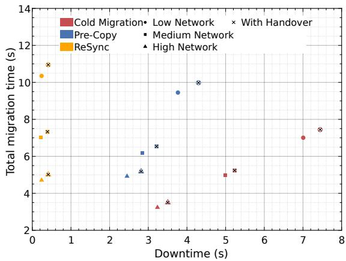  
Fig. 15: Performance comparison between ReSync, Pre-copy and Cold migration across different network scenarios with and without handover-coordination.

ReSync vs. Cold migration. Cold migration provides the lower bound on total migration time, but at the cost of an equally long downtime. In our experiments, Cold migration yields an average downtime of 3.24 s, 4.99 s, and 7.01 s for the high, medium, and low link qualities, respectively. ReSync achieves a network-independent downtime of 0.24 s, corresponding to a relative reduction by approximately 93 %, 95 %, and 97 % across the network conditions. Regarding total migration time, ReSync is slower than Cold migration by 1.47 s, 2.02 s, and 3.34 s, corresponding to relative increases between 40 % and 48 %. In the targeted MEC setting, where downtime is most important and moderate migration time is tolerated, ReSync’s downtime reduction significantly outweighs the additional migration time.

ReSync vs. Pre-copy. We initially set a total of five Precopy rounds during our experiment to iteratively reduce the file size of the checkpoint. However, we observe that from the second checkpoint onward, the size of the difference checkpoint stabilizes at 21 MB, which leads us to limit the Pre-copy experiment to a single Pre-copy round. This behavior is consistent with the discussion in Section II, because our application performs multiple processing intensive operations a second, exhibiting a high dirty page rate that limits the effect of the diff-checkpoint method. Compared to Pre-copy, ReSync reduces the downtime by approximately 90 %, 92 %, and 94 % for the high, medium, and low network qualities, respectively. Both schemes measure similar total migration times under high link quality, while for the medium and low link quality scenario, ReSync’s total migration time is longer by less than one second. Overall, ReSync significantly outperforms Pre-copy in our experiments for the targeted edge service. We argue, however, that even for slow dirty page rate applications, ReSync has several key advantages over Precopy based migration schemes: Coordinating C/R phases with handovers faces a higher risk of misalignment which in case of Pre-copy translates to extended downtime, while ReSync’s flexible phase 3 extension avoids this effect. Furthermore, consecutive checkpoint rounds have the risk to compromise the edge containers service to the UE, as each additional checkpoint freezes the application temporarily.

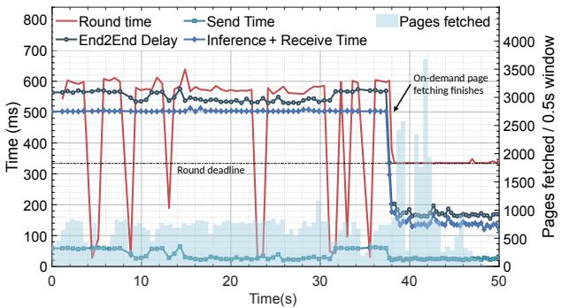  
Fig. 16: UE client-side measurements reveal heavy stalling of the container processing during Post-copy’s active page fetching phase starting from the moment of container restore.

ReSync vs. Post-copy. Post-copy achieves the shortest time between checkpoint and successful restore. However, even under the high link quality, it exhibits fundamental limitations for practical use in MEC. First, we evaluate the QoS experienced by the UE during the Post-copy phase following the same methodology as in the Influence on Quality of Service evaluation, and additionally extract the number of memory pages fetched by the page server during this period. Figure 16 shows both metrics overlaid from the moment of container restore. The total migration time reaches 49 s, during which the container’s service to the UE is heavily compromised. Of the 81 processing requests issued to the edge container in the first 38 s of the Post-copy phase, none are successfully served: 20 requests fail due to connection errors, while the remaining 61 experience significant stalling, causing the client to time out after 0.5 s. This is caused by the page fetching mechanism that temporarily pauses the container until the requested page has been transferred. Only after the active page fetching phase concludes at second 38, does the container resume normal execution. During the final 11 seconds until Post-copy’s completion, all the remaining pages are transferred in the background without further service stalling. Second, we isolate the impact of the inter-host latency on the page fetching phase and the resulting total migration time. We repeat the experiment across all three network scenarios but without connecting the UE client during the Post-copy phase. As a result, the Post-copy phase gets reduced to around 10 s, 24 s, and 46 s for high, medium, and low link quality, respectively. Compared with Post-copy, ReSync reduces the downtime by at least 98 %, exhibiting only 0.24 s. We conclude that Postcopy is not viable for live-migration in MEC, confirming the initial assessment in Section II-A. Post-copy is consequently omitted from the comparison in Figure 15.

Handover coordination. To evaluate the influence of handover coordination, we add a handover penalty to each data point in Figure 15. For Cold migration and Pre-copy, we assume a downtime-optimal proactive trigger for each network setting, timed to coincide exactly with the terminal C/R phase based on the average measured migration time. For ReSync, we apply a conservative worst-case trigger, delaying the handover until the longest observed migration time across all five runs, guaranteeing that stage 3 is always reached before the handover occurs. Under these conditions, ReSync incurs a network-independent, fixed 172 ms additional downtime to complete the final input replay and the handover, bringing the total downtime to 0.41 s, regardless of network condition. Cold migration and Pre-copy cannot achieve comparable stability even under ideal coordination, as their execution time variance alone translates directly into total downtime penalties ranging from 267 ms to 437 ms for Cold migration and 364 ms to 532 ms for Pre-copy across high to low link quality, both growing monotonically with degrading network conditions. This contrast exposes a structural limitation of C/R-terminal schemes: execution variability and network degradation increase coordination uncertainty, which directly translates to downtime. ReSync avoids this by design, as the coordinator starts migration conservatively, creating a direct tradeoff between total migration time and downtime guarantee. A tighter estimate reduces the stage 3 extension and hence total migration time, while a wider margin ensures the downtime bound is always met regardless of network conditions. Even after adding the respective handover penalties, ReSync still preserves a large downtime advantage over both Pre-copy and Cold migration, reducing downtime by approximately 85 % to 90 % relative to Pre-copy and by about 88 % to 95 % relative to Cold migration across the evaluated network conditions.

## D. Robustness under High-Mobility Scenarios

To complement the controlled small-scale testbed experiments, we evaluate the robustness of ReSync’s handovercoordination under realistic, high-mobility traces in a largescale MEC environment. We use the traffic simulation SUMO [44] to generate 40 car mobility traces on a real OpenStreetMap-derived city network located in Berlin. Each trace is replayed in a ns-3 [45] simulation to derive RSSI traces and Handover events. To reflect realistic channel conditions, 3GPP-conformant macro-cell shadowing and measurement noise are added on the path-loss traces [46]. To model network congestion and variability, each migration time is randomly extended beyond the baseline of 6.5 s by up to 1.5 s. Handover events and ReSync coordinator triggers are derived from the standard A3 event model with typical parameters. Since evaluating many migration-handover pairs requires frequent handovers, we assume that each base station is co-located with its own MEC host, such that every handover automatically triggers a service migration. A full list of simulation parameters are listed in Table IV.

Metrics. We evaluate coordination outcomes using the migration lead time, defined as the time margin between ReSync reaching stage 3 and the handover event. A positive lead time indicates a successfully coordinated migration, with ReSync exhibiting its fixed, network-independent downtime. A negative lead time indicates that the coordinator triggered migration too late for ReSync to reach stage 3 before handover, resulting in additional downtime equal to the absolute lead time.

Results. Figure 17a illustrates the simulation map with all coordination events, including migration triggers and handover points. Figure 17b shows the overall number of successful and failed migrations with 134 (92.4 %) and 11 (7.6 %), respectively. Figure 17c shows the lead time distribution across all migrations, with each bin counting migrations per second relative to the handover. Successful migrations exhibit a median lead time of 9.1 s, with most completing stage 3 within 15 s before handover. Failed migrations show a median negative lead time of −1.9 s, and are primarily attributed to mispredictions of the linear RSSI extrapolation under sudden mobility changes or unexpected signal dynamics, causing the coordinator to trigger migration too late. We observe several lead time outliers for successfully coordinated migrations of up to 130 s, which we could attribute to traffic-related waiting times in the mobility traces. Overall, the results demonstrate that ReSync’s coordinator design remains robust under dynamic signaling and high-mobility conditions. Remaining limitations of simulation model and coordinator prediction accuracy are further discussed in Section VI.

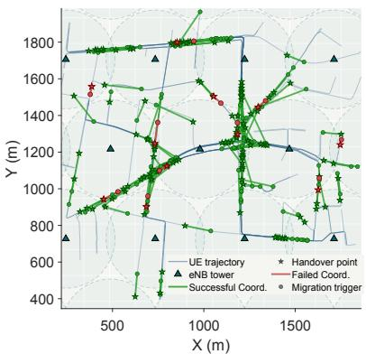  
(a)

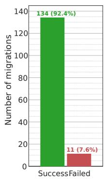  
(b)

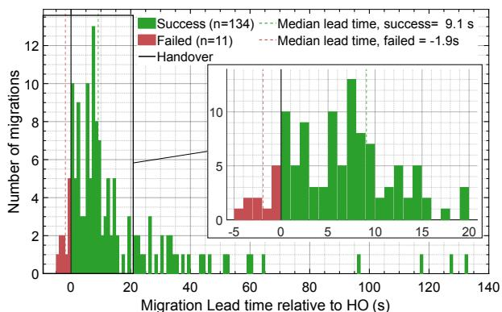  
(c)  
Fig. 17: Simulation evaluation of the ReSync Coordinator: a) the simulation environment map with annotated handover and migration events, b) number of successful and failed migration coordination attempts and c) the distribution of the migration lead time.

TABLE IV: Simulation setup and coordinator parameters

<table><tr><td>Category</td><td>Parameter(s)</td><td>Value(s)</td></tr><tr><td colspan="3">SUMO Mobility Traces &amp; ns-3 Radio Simulation</td></tr><tr><td></td><td>Traces / duration</td><td>40 / 500 s</td></tr><tr><td></td><td>Avg. mobility speed</td><td>11 m/s</td></tr><tr><td></td><td>Step size / Min. route distance</td><td>0.2 s / 1 km</td></tr><tr><td></td><td>BS count / spacing</td><td>23 / 490 m</td></tr><tr><td></td><td>TX power / antenna height</td><td>33 dBm / 30 m</td></tr><tr><td></td><td>Path-loss model</td><td>urban macro</td></tr><tr><td colspan="3">3GPP Noise Model and A3 Handover</td></tr><tr><td></td><td>Shadowing std.  $\sigma_s$  / De-corr. distance  $d_c$ </td><td>4 dB / 37 m</td></tr><tr><td></td><td>White noise  $\sigma_w$  / L3 IIR filter coeff.</td><td>3 dB / 8</td></tr><tr><td></td><td>A3 Handover offset / hysteresis</td><td>4 dB / 4 dB</td></tr><tr><td></td><td>A3 Handover Time-To-Trigger (TTT)</td><td>1.5 s</td></tr><tr><td colspan="3">ReSync Coordinator</td></tr><tr><td></td><td>Coordinator trigger offset / trigger TTT</td><td>2.5 dB / 0.5 s</td></tr><tr><td></td><td>Migration time range</td><td>[6.5, 8.0] s</td></tr><tr><td></td><td>Prediction horizon / Extrapolation window</td><td>13 s / 2 s</td></tr><tr><td></td><td>Phase 3 cancel margin / cancel TTT</td><td>-6 dB / 3 s</td></tr></table>

## VI. DISCUSSION

ReSync represents a novel live-migration scheme for MEC designed to achieve handover-coordinated live-migration with minimal downtime. Its applicability extends to all containerized applications compatible with CRIU, making it a versatile solution for various edge computing scenarios. However, we acknowledge certain limitations in our current design that pose challenges in real-world MEC environments and require further refinement and investigation.

Limitations of Input Data Synchronization. ReSync’s replay synchronization assumes that the container’s application-level state is primarily determined by the sequence of network inputs. This holds for deterministic applications, where the same input sequence always produces the same output state. Applications that contain non-deterministic sources, such as hardware random number generators, time-dependent logic or system interrupts, may produce diverging internal states even when processing identical inputs. ReSync is therefore only applicable to deterministic applications, as is the case for the inference workloads evaluated in this work, or more generally to applications where non-deterministic internal events do not affect the application-level output state. As a practical extension we propose adding an output comparison module to ReSync’s replay controller to compare and validate the application-level outputs of the source and destination container during migration and detect state divergence.

Security and Privacy. ReSync’s replay controller relies on iptables in combination with NFQ to extract and buffer application-level input data from the network traffic destined to the migrating container, which raises security and privacy concerns. Accessing user plane traffic at the platform level challenges the EU General Data Protection Regulation (GDPR) [47], in particular the principles of data minimisation (Article 5) and privacy by design (Article 25) . However, in a production ETSI MEC deployment, the risk is substantially narrowed by the operator trust model, where MEC operators are bound as data processors under GDPR (Article 28) and platform access to user data is governed by the MEC security framework [48]. In this setting, the NFQ based interception operates within the operator’s own administrative domain, is scoped to a single container’s traffic, and does not persist data beyond the short synchronization window. For deployments requiring stronger guarantees, the replay controller can be encapsulated inside a Trusted Execution Environment (TEE), like Intel SGX or ARM TrustZone, which provide hardware enforced isolation of the intercepted data [49], [50]. Alternatively, application-level instrumentation, where the container exposes an interface to emit input data directly rather than relying on network-layer interception, would remain functional regardless of transport-layer encryption and represents a promising direction for future work.

Evaluation in integrated 5G MEC System. While ReSync demonstrates promising results in both our small-scale testbed and large-scale simulation, its effectiveness in a fully integrated, real-world 5G MEC environment remains to be evaluated. Such an environment introduces constraints beyond our current evaluation, including non-linear signal dynamics from beam switching and abrupt NLOS transitions, as well as processing and signaling overhead from the full 5G core and MEC stack. These conditions may in particular affect the linear RSSI extrapolation underlying the coordinator, potentially increasing the rate of failed coordinations. Adopting more advanced, 5Gnative handover prediction models that leverage beam quality indicators or perform ML-based mobility prediction could further improve coordination reliability under such conditions.

Overall, ReSync overcomes key limitations of existing migration schemes by reducing downtime and enabling handovercoordinated live-migration in MEC. Addressing the identified limitations is a crucial step toward broader real-world adoption. Future work will focus on extending replay robustness through output-level state validation, exploring TEE-based and application-level instrumentation as privacy-preserving alternatives, and evaluating ReSync in an integrated, real world MEC deployment.

## VII. RELATED WORK

Solutions for stateful migration have been extensively studied in cloud, fog, and edge environments. While migration across different paradigms shares similar concepts, livemigration for MEC is especially challenging due to stricter requirements regarding downtime and total migration time. In [12], Nadgowda et al. propose Voyager, a container migration service that leverages CRIU-based memory migration and union mounts to enable live-migration with reduced downtime. The system allows containers to resume on the target host while performing background disk state transfer, ensuring justin-time consistent full-system migration. Voyager is designed to be file system-agnostic and vendor-agnostic, making it suitable for stateful container applications in cloud environments. Other container based migration systems can be found in the work of Azab et al [51] who presents MIGRATE, a system that employs real-time, probabilistic live-migration, leverages CRIU for checkpointing and restoring container states, enabling high-frequency migrations with minimal downtime. In [52], Al-Dhuraibi et al. introduce ElasticDocker, a system that autonomously manages vertical elasticity for Docker containers by dynamically adjusting CPU and memory resources based on workload demands. The system uses CRIU for live-migration when host resources are exhausted, ensuring minimal downtime.

Besides utilizing schemes based on CRIU, selected works explore other ideas to synchronize the application state between different Hosts. Liu et al. [53] combine the concept of C/R with a synchronization algorithm that utilizes Logging and Replay with the tool ReVirt to reduce the downtime and total migration time for the migration of VMs. Yu et al. [54] evaluate the performance of a logging and replay method that operates on Docker container’s file system layer. For their test application, they report significantly reduced downtime and total migration time compared to C/R. However, the proposed method is limited to track changes in the file system and does not capture in-memory application states or non-deterministic kernel events, limiting its use as a generalpurpose Logging/Replay mechanism. Li et al. [55] propose CSM, a cloud-edge collaboration method for real-time rendering applications that replaces direct peer-to-peer state copy with a cloud-assisted dual rendering mechanism to bypass the performance bottleneck of dirty page retransmission and reduce the migration downtime. They furthermore design a smooth video stream switching mechanism to reduce the influence of handover on the streaming quality.

Other works propose optimizations that improve the migration performance or the compatibility of migration tools. Ma et al. [56], [57] show that the layered structure of container images can be leveraged to reduce the overhead during the transfer of the container image as well as the file system changes. Machen et al. [58] follow a similar approach, by splitting the virtualization into three layers, from which only the instance layer, that contains the file system changes of the running application instance, is required to be transferred during the migration, saving overhead in terms of data and time. Yu et al. [59] address the challenge of preserving TCP connections during stateful container migration for mobile edge services. They propose COAT, a network architecture that uses overlay network technology to manage TCP state, allowing successful connection migration without kernel or protocol. Xing et al. [60] focus on enabling container migration across heterogeneous-ISA environments. They introduce H-Container, a tool enhancing CRIU checkpointing with cross-ISA transformation, which supports dynamic binary conversion without requiring application source code.

Selected works address the problem of MEC-standardconformant integration and the challenge of handovermigration coordination. Barbarulo et al. [61] integrate container migration with CRIU into the 3GPP ETSI MEC standard, extending existing interfaces and following the ETSI proposed concept of MEC assisted migration. While the work makes important contributions towards stateful container migration in MEC, it does not focus on improving the performance of existing migration schemes and therefore accepts multiple seconds of downtime and long total migration times. Similarly, Campolo et al. [62] investigate service migration in the standard MEC environments for time-sensitive 5G-V2X applications, leveraging Docker containers to minimize service downtime to several seconds. Ngo et al. [63] improve the service continuity in a multi-tier MEC system by proposing a coordinated migration-handover mechanism that determines optimal destination nodes and the triggering times. The coordination aims to schedule the downtime of the migration process during the handover period. The trigger time of their delta checkpoint (based on Pre-copy) technique is estimated based on previous checkpoints under given computing and network resources. Their coordinated approach achieves downtime of several seconds.

## VIII. CONCLUSION

This paper presents ReSync, a novel solution to stateful container live-migration in MEC. By enhancing C/R with a replay synchronization mechanism and a handover-aligning coordinator function at the MEC system level, ReSync achieves seamless migration with minimal downtime. Experimental evaluations in our small-scale MEC testbed demonstrate that ReSync reduces downtime by up to 90 % compared to the existing state-of-the-art scheme Pre-copy while maintaining a comparable migration time. Large scale MEC simulations further indicate ReSync’s robustness under complex signaling and high-mobility conditions. These results highlight ReSync as a practical and effective solution for stateful service continuity in dynamic 5G MEC environments.

## REFERENCES

[1] Huawei, “5G MEC, redefining the business value of telecom networks,” Accessed: Nov. 6, 2024. [Online]. Available: https://carrier.huawei.com/en/industry-perspective/5g-core-network/ 5G-MEC-Redefining-the-Business-Value-of-Telecom-Networks

[2] C. Feng, P. Han, X. Zhang, B. Yang, Y. Liu, and L. Guo, “Computation offloading in mobile edge computing networks: A survey,” Journal of Network and Computer Applications, vol. 202, p. 103366, 2022. [Online]. Available: https://www.sciencedirect.com/science/article/pii/ S1084804522000327

[3] Bell, “Case study: TinyMile takes a big step in robot automation with Bell and AWS,” Accessed: Jan. 19, 2025. [Online]. Available: https://business.bell.ca/web/Shop/PDF/Tiny Mile Bell Public MEC case study.pdf

[4] J.-H. Jung, “Delivery robots come to our lives by 5G tech,” Accessed: Jan. 19, 2025. [Online]. Available: https://www.koreaittimes.com/news/ articleView.html?idxno=99418

[5] AWS, “AWS local zones,” Accessed: Nov. 16, 2022. [Online]. Available: https://aws.amazon.com/about-aws/global-infrastructure/localzones/

[6] “AWS wavelength,” Accessed: Dec. 30, 2024. [Online]. Available: https://docs.aws.amazon.com/whitepapers/latest/ overview-deployment-options/wavelength.html

[7] Azure, “Azure private multi-access edge compute documentation,” Accessed: Dec. 30, 2024. [Online]. Available: https://learn.microsoft. com/en-us/azure/private-multi-access-edge-compute-mec/overview

[8] ——, “Azure public multi-access edge compute deployment,” Accessed: Dec. 30, 2024. [Online]. Available: https://learn.microsoft.com/en-us/ azure/private-multi-access-edge-compute-mec/

[9] F. Ramalho and A. Neto, “Virtualization at the network edge: A performance comparison,” in 2016 IEEE 17th International Symposium on A World of Wireless, Mobile and Multimedia Networks (WoWMoM), 2016, pp. 1–6.

[10] T. Taleb, K. Samdanis, B. Mada, H. Flinck, S. Dutta, and D. Sabella, “On multi-access edge computing: A survey of the emerging 5G network edge cloud architecture and orchestration,” Commun. Surveys Tuts., vol. 19, no. 3, pp. 1657–1681, Jul. 2017. [Online]. Available: https://doi.org/10.1109/COMST.2017.2705720

[11] Y. Chen, “Checkpoint and restore of micro-service in docker containers,” in Proceedings of the 3rd International Conference on Mechatronics and Industrial Informatics. Atlantis Press, 2015, pp. 915–918. [Online]. Available: https://doi.org/10.2991/icmii-15.2015.160

[12] S. Nadgowda, S. Suneja, N. Bila, and C. Isci, “Voyager: Complete container state migration,” in 2017 IEEE 37th International Conference on Distributed Computing Systems (ICDCS), 2017, pp. 2137–2142.

[13] T. Chanikaphon and M. A. Salehi, “UMS: Live migration of containerized services across autonomous computing systems,” 2023. [Online]. Available: https://arxiv.org/abs/2309.03168

[14] M. A. Hathibelagal, R. G. Garroppo, and G. Nencioni, “Experimental comparison of migration strategies for MEC-assisted 5G-V2X applications,” Computer Communications, vol. 197, pp. 1–11, 2023. [Online]. Available: https://www.sciencedirect.com/science/article/pii/ S0140366422003978

[15] J. Guitart, “Practicable live container migrations in high performance computing clouds: Diskless, iterative, and connection-persistent,” J. Syst. Archit., vol. 152, no. C, Jul. 2024. [Online]. Available: https://doi.org/10.1016/j.sysarc.2024.103157

[16] Z. Zhou, X. Li, X. Wang, Z. Liang, G. Sun, and G. Luo, “Hardwareassisted service live migration in resource-limited edge computing systems,” in 2020 57th ACM/IEEE Design Automation Conference (DAC), 2020, pp. 1–6.

[17] T. Benjaponpitak, M. Karakate, and K. Sripanidkulchai, “Enabling live migration of containerized applications across clouds,” in IEEE INFOCOM 2020 - IEEE Conference on Computer Communications, 2020, pp. 2529–2538.

[18] R. Yang, H. He, and W. Zhang, “Multitier service migration framework based on mobility prediction in mobile edge computing,” Wireless Communications and Mobile Computing, vol. 2021, no. 1, Jan. 2021. [Online]. Available: http://dx.doi.org/10.1155/2021/6638730

[19] A. Calagna, Y. Yu, P. Giaccone, and C. F. Chiasserini, “Processing-aware migration model for stateful edge microservices,” in ICC 2023 - IEEE International Conference on Communications, 2023, pp. 815–820.

[20] B. Xu, S. Wu, J. Xiao, H. Jin, Y. Zhang, G. Shi, T. Lin, J. Rao, L. Yi, and J. Jiang, “Sledge: Towards efficient live migration of docker containers,” in 2020 IEEE 13th International Conference on Cloud Computing (CLOUD), 2020, pp. 321–328.

[21] R. A. Addad, D. L. Cadette Dutra, M. Bagaa, T. Taleb, and H. Flinck, “Towards a fast service migration in 5G,” in 2018 IEEE Conference on Standards for Communications and Networking (CSCN), 2018, pp. 1–6.

[22] M. Nelson, B.-H. Lim, and G. Hutchins, “Fast transparent migration for virtual machines,” in Proceedings of the Annual Conference on USENIX Annual Technical Conference, ser. ATEC ’05. USA: USENIX Association, 2005, p. 25.

[23] Z. Li and G. Wu, “Optimizing VM live migration strategy based on migration time cost modeling,” in 2016 ACM/IEEE Symposium on Architectures for Networking and Communications Systems (ANCS), 2016, pp. 99–109.

[24] C. Puliafito, C. Vallati, E. Mingozzi, G. Merlino, F. Longo, and A. Puliafito, “Container migration in the fog: A performance evaluation,” Sensors, vol. 19, no. 7, 2019. [Online]. Available: https://www.mdpi.com/1424-8220/19/7/1488

[25] C. C. Chou, Y. Chen, D. Milojicic, N. Reddy, and P. Gratz, “Optimizing post-copy live migration with system-level checkpoint using fabricattached memory,” in 2019 IEEE/ACM Workshop on Memory Centric High Performance Computing (MCHPC), 2019, pp. 16–24.

[26] C. Rong, J. H. Wang, J. Wang, Y. Zhou, and J. Zhang, “Live migration of video analytics applications in edge computing,” IEEE Transactions on Mobile Computing, vol. 23, no. 3, pp. 2078–2092, 2024.

[27] CRIU Project, “Checkpoint and restore in userspace (CRIU),” Accessed: Sep. 2, 2024. [Online]. Available: https://criu.org

[28] J. Corbet, “TCP connection repair,” Accessed: Feb. 5, 2024. [Online]. Available: https://lwn.net/Articles/495304/

[29] Docker, “Docker official website,” Accessed: Aug. 13, 2025. [Online]. Available: https://www.docker.com/

[30] Podman, “Podman official website,” Accessed: Aug. 13, 2025. [Online]. Available: https://podman.io/

[31] Open Container Initiative, “runc official GitHub repository,” Accessed: Nov. 6, 2024. [Online]. Available: https://github.com/opencontainers/ runc

[32] G. Jocher, A. Chaurasia, and J. Qiu, “Ultralytics YOLOv8,” 2023. [Online]. Available: https://github.com/ultralytics/ultralytics

[33] G. W. Dunlap, S. T. King, S. Cinar, M. A. Basrai, and P. M. Chen, “ReVirt: Enabling intrusion analysis through virtual-machine logging and replay,” in Proceedings ofthe 5th USENIX Symposium on Operating Systems Design and Implementation (OSDI), 2002, pp. 211–224.

[34] J. R. Lorch, D. Levin, R. Needham, S. H. Pasupathi, and A. Sharma, “A KVM-based logging and replay system for debugging non-deterministic executions,” in Proceedings of the ACM SIGOPS Asia-Pacific Workshop on Systems (APSys), 2015.

[35] R. O’Callahan, C. Jones, N. Froyd, K. Huey, A. Noll, and N. Partush, “Engineering record and replay for deployability,” in 2017 USENIX Annual Technical Conference (USENIX ATC ’17). Santa Clara, CA: USENIX Association, 2017, pp. 377–389. [Online]. Available: https://www.usenix.org/conference/atc17/technical-sessions/ presentation/ocallahan

[36] O. Bhatotia, W. Leners, S. Bhatotia, R. Rodrigues, and U. A. Acar, “Reproducible containers,” ACM Transactions on Computer Systems, vol. 37, no. 1–4, pp. 1–33, 2020.

[37] C. F. Kwong, C. Shi, Q. Liu, S. Yang, D. Chieng, and P. Kar, “Autonomous handover parameter optimisation for 5G cellular networks using deep deterministic policy gradient,” Expert Systems with Applications, vol. 246, p. 122871, 2024. [Online]. Available: https://www.sciencedirect.com/science/article/pii/S0957417423033730

[38] ETSI, “MEC in 5G networks; end to end mobility aspects, group report 018,” Jun. 2018, Accessed: Dec. 30, 2024. [Online]. Available: https://www.etsi.org/images/files/ETSIWhitePapers/ etsi wp28 mec in 5G FINAL.pdf

[39] CRIU Project, “CRIU image tool (CRIT),” Accessed: Sep. 2, 2024. [Online]. Available: https://criu.org/CRIT

[40] Open Container Initiative, “oci-runtime-tool GitHub repository,” Accessed: Dec. 4, 2024. [Online]. Available: https://github.com/ opencontainers/runtime-tools

[41] S. I. Serengil and A. Ozpinar, “Lightface: A hybrid deep face recognition framework,” in 2020 Innovations in Intelligent Systems and Applications Conference (ASYU). IEEE, 2020, pp. 23–27. [Online]. Available: https://ieeexplore.ieee.org/document/9259802

[42] Docker, “Docker hub container image library | app containerization,” Accessed: Nov. 6, 2024. [Online]. Available: https://hub.docker.com

[43] The Linux man-pages Project, “route(8) — Linux manual page,” Accessed: Sep. 2, 2024. [Online]. Available: https://man7.org/linux/ man-pages/man8/route.8.html

[44] P. A. Lopez, M. Behrisch, L. Bieker-Walz, J. Erdmann, Y.-P. Flotter¨ od,¨ R. Hilbrich, L. Lucken, J. Rummel, P. Wagner, and E. Wießner,¨ “Microscopic traffic simulation using SUMO,” in Proceedings of the 21st IEEE International Conference on Intelligent Transportation Systems (ITSC). Maui, HI, USA: IEEE, 2018, pp. 2575–2582.

[45] ns-3 Consortium, “ns-3 network simulator,” 2011, Accessed: Mar. 20, 2026. [Online]. Available: https://www.nsnam.org

[46] 3GPP, “Further advancements for E-UTRA physical layer aspects,” 3rd Generation Partnership Project (3GPP), Sophia Antipolis, France, Technical Report TR 36.814, Mar. 2010.

[47] European Parliament and Council of the EU, “Regulation (EU) 2016/679 on the protection of natural persons with regard to the processing of personal data (general data protection regulation),” Official Journal of the European Union, Tech. Rep., 2016, Accessed: Mar. 20, 2026. [Online]. Available: https://gdpr-info.eu

[48] ETSI, “MEC security: Status of standards support and future evolutions,” ETSI, Tech. Rep. White Paper No. 46, 2nd ed., 2022. [Online]. Available: https://www.etsi.org/images/files/etsiwhitepapers/ etsi-wp-46-2nd-ed-mec-security.pdf

[49] A. Giannakas et al., “Trusted execution environment-enabled platform for 5G security and privacy enhancement,” 5GZORRO Project, Tech. Rep., 2021. [Online]. Available: https://www.5gzorro.eu/wp-content/ uploads/2021/11/Trusted Execution Environment enabled platform for 5G security and privacy enhancement.pdf

[50] F. Zhang et al., “A preliminary study of trusted execution environments on smartphones,” in IEEE Security & Privacy on the Blockchain (IEEE S&B), 2018. [Online]. Available: https://fengweiz.github.io/ paper/tee-edgesp18.pdf

[51] M. Azab and M. Eltoweissy, “MIGRATE: Towards a lightweight moving-target defense against cloud side-channels,” in 2016 IEEE Security and Privacy Workshops (SPW), 2016, pp. 96–103.

[52] Y. Al-Dhuraibi, F. Paraiso, N. Djarallah, and P. Merle, “Autonomic vertical elasticity of docker containers with ELASTICDOCKER,” in 2017 IEEE 10th International Conference on Cloud Computing (CLOUD), 2017, pp. 472–479.

[53] H. Liu, H. Jin, X. Liao, L. Hu, and C. Yu, “Live migration of virtual machine based on full system trace and replay,” in Proceedings of the 18th ACM International Symposium on High Performance Distributed Computing, ser. HPDC ’09. New York, NY, USA: Association for Computing Machinery, 2009, pp. 101–110. [Online]. Available: https://doi.org/10.1145/1551609.1551630

[54] C. Yu and F. Huan, “Live migration of docker containers through logging and replay,” in Proceedings of the 3rd International Conference on Mechatronics and Industrial Informatics. Atlantis Press, 2015, pp. 623–626. [Online]. Available: https://doi.org/10.2991/icmii-15.2015.106

[55] Y. Li, S. Wang, Y. Li, A. Zhou, M. Xu, X. Ma, and Y. Liu, “Seamless cross-edge service migration for real-time rendering applications,” IEEE Transactions on Mobile Computing, vol. 23, no. 6, pp. 7084–7098, 2024.

[56] L. Ma, S. Yi, and Q. Li, “Efficient service handoff across edge servers via docker container migration,” in Proceedings of the Second ACM/IEEE Symposium on Edge Computing, ser. SEC ’17. New York, NY, USA: Association for Computing Machinery, 2017, p. 11. [Online]. Available: https://doi.org/10.1145/3132211.3134460

[57] L. Ma, S. Yi, N. Carter, and Q. Li, “Efficient live migration of edge services leveraging container layered storage,” IEEE Transactions on Mobile Computing, vol. 18, no. 9, pp. 2020–2033, 2019.

[58] A. Machen, S. Wang, K. K. Leung, B. J. Ko, and T. Salonidis, “Live service migration in mobile edge clouds,” IEEE Wireless Communications, vol. 25, no. 1, pp. 140–147, 2018.

[59] Y. Yu, A. Calagna, P. Giaccone, and C. F. Chiasserini, “Tcp connection management for stateful container migration at the network edge,” in 2023 21st Mediterranean Communication and Computer Networking Conference (MedComNet), 2023, pp. 151–157.

[60] T. Xing, A. Barbalace, P. Olivier, M. L. Karaoui, W. Wang, and B. Ravindran, “H-container: Enabling heterogeneous-isa container migration in edge computing,” ACM Trans. Comput. Syst., vol. 39, no. 1–4, Jul. 2022. [Online]. Available: https://doi.org/10.1145/3524452

[61] F. Barbarulo, C. Puliafito, A. Virdis, and E. Mingozzi, “Extending etsi mec towards stateful application relocation based on container migration,” in 2022 IEEE 23rd International Symposium on a World of Wireless, Mobile and Multimedia Networks (WoWMoM), 2022, pp. 367–376.

[62] C. Campolo, A. Iera, A. Molinaro, and G. Ruggeri, “MEC support for 5G-V2X use cases through docker containers,” in 2019 IEEE Wireless Communications and Networking Conference (WCNC), 2019, pp. 1–6.

[63] M. V. Ngo, T. Luo, H. T. Hoang, and T. Q. S. Quek, “Coordinated container migration and base station handover in mobile edge computing,” in GLOBECOM 2020 - 2020 IEEE Global Communications Conference, 2020, pp. 1–6.