# Real-Time Urban Trafic State Estimation via UAV-Based Sensing: A Gaussian Process and Moving Horizon Estimation Approach

Kyriacos Theocharides , Graduate Student Member, IEEE, Yiolanda Englezou , Member, IEEE, Charalambos Menelaou , Member, IEEE, and Stelios Timotheou , Senior Member, IEEE

Abstract—Uncrewed Aerial Vehicles (UAVs) have recently gained attention for urban trafic monitoring. However, their applicability has so far been limited to occasional surveillance of road networks through the provision of live video feeds to trafic operators or the recording of videos for ofline processing and extraction of historical trafic data. In this paper, we investigate real-time UAV-based sensing for urban trafic state estimation, where UAVs follow pre-determined flight paths to provide trafic density and transfer flow measurements. We formulate the problem using model-based moving horizon estimation, assuming that the urban network is partitioned into homogeneous regions characterized by well-defined macroscopic fundamental diagrams. The resulting mathematical formulation presents significant challenges due to (i) the sparse spatiotemporal distribution of UAV-based measurements, and (ii) the inherent nonconvexity of regional trafic dynamics in the moving horizon estimation problem. The first challenge is addressed by developing a Gaussian Process model to produce virtual measurements of missing trafic density space-time points with quantified uncertainty, while the second challenge is addressed by developing a successive convexification approach that constructs tightening convex bounding sets for all nonconvex terms in successive iterations. Macroscopic simulation results illustrate the efectiveness of real-time UAV-based sensing for urban trafic state estimation, as accurate estimates can be achieved even under sparse and noisy spatiotemporal trafic measurements. Moreover, it is shown that the proposed method provides significantly better and faster (by roughly two orders of magnitude) solutions compared to a state of practise nonlinear solver.

Index Terms—Trafic state estimation, UAV-based sensing, gaussian processes, moving horizon estimatio, optimization.

## I. INTRODUCTION

tionary sensors, such as inductive loop detectors and radars [1], measure flow and speed at a fixed point over time, but incur high installation and maintenance costs [2] and cannot measure trafic states beyond their sensing location [3]. Moreover, trafic measurements may be biased due to the aggregation method used [4] as well as the positioning of the sensor relative to downstream trafic lights [5]. FCD measure position and speed of the probe vehicles, but are often sparse, bound to the uncontrollable probe vehicle routes, hard to associate with trafic volumes [6] and sufer from privacy issues [7]. These limitations degrade trafic estimation and prediction performance, ultimately leading to inefective trafic management and control.

Recently, Uncrewed Aerial Vehicles (UAVs) have been gaining popularity as an alternative trafic monitoring technology [8] for several reasons. Firstly, multiple microscopic and macroscopic trafic parameters can be inferred simultaneously in real-time from UAV-obtained video. Secondly, UAVs have unrestricted movement in space and so can swiftly monitor any section of a trafic network on demand, irrespective of network topology and congestion levels. Lastly, UAVs can be easily deployed, are cost efective and commercially available [9]. As a result, UAVs can supplement existing trafic sensing infrastructure by monitoring multiple trafic states in areas of the trafic network that would otherwise remain unobserved. Despite these advantages, their use has largely been restricted to occasional road network surveillance, either by providing live video feeds to trafic operators or recording footage for ofline processing and historical data extraction.

In this paper, we investigate real-time UAV-based sensing for urban trafic state estimation (UTSE) in both free-flow and congested conditions. Specifically, we define a UAVbased trafic monitoring system (UAV-TMS) where a swarm of autonomous UAVs continuously fly above an urban network following pre-determined flight paths, recording real-time video and broadcasting it to a ground control centre for real-time UTSE. The UTSE problem is formulated using model-based Moving Horizon Estimation (MHE), assuming that the urban network is partitioned into homogeneous regions characterized by well-defined macroscopic fundamental diagrams (MFDs) [10], following the accumulation-based model proposed in [11]. The resulting UTSE problem presents two significant challenges. The first challenge is handling the sparsity of measurements, which results from the dynamic movement of UAVs and the intermittent periods during which

UAVs are grounded for battery replacement. The second challenge is solving the resulting nonconvex UTSE MHE problem to obtain accurate, noise-resilient, and real-time estimates of regional and intended destination densities.

To address the first challenge, the sparse regional trafic density measurements are interpolated by Gaussian Process (GP) models, resulting in a complete set of virtual measurements as well as corresponding variances indicating the uncertainty of each virtual measurement. The virtual measurements complete the spatiotemporal set of regional trafic density measurements and the quantified uncertainties are included in the objective function of the MHE problem. GPs are particularly suited to this task, as trafic density is inferred as a probability distribution, from which the mean value (virtual measurement) and variance (uncertainty) are derived. Moreover GPs do not require historical data or an underlying trafic model as they are trained on a stream of incoming data. The second challenge is addressed by initially relaxing the nonconvex constraints of the MHE problem and then iteratively tightening them around the solution of the previous iteration to form convex bounding sets. This process results in a series of convex quadratic programs that can be optimally solved using standard optimization solvers. We show that this successive convexification approach returns regional trafic density estimates within seconds, making our approach suitable for real-time UTSE. Moreover, it is roughly two orders of magnitude faster and more accurate than a state of practise nonlinear solver. In addition to the regional trafic density estimates, the proposed approach yields intended destination density estimates that are often used in regional trafic control strategies [12], [13].

To the best of the authors’ knowledge, this is the first work in the literature that:

1) Proposes a UAV-TMS sensing architecture that obtains real-time trafic state measurements of an urban trafic network assuming a homogeneous region partitioning.

2) Proposes a hybrid GP and MHE approach for real-time UTSE. Although in this case the real-time measurements are obtained from UAVs, the proposed approach is the first hybrid MFD-based UTSE approach for any type of sensor input. Furthermore, we demonstrate that incorporating virtual measurements from the GP models significantly improves trafic state estimates from the MHE problem compared to estimates obtained without them.

3) Develops a successive convexification approach to solve the UTSE MHE problem, ofering more accurate and significantly faster estimates (suitable for real-time UTSE), compared to a state of practise nonlinear solver. Notably, the proposed approach is the first regional trafic estimation algorithm that explicitly handles interboundary capacity constraints.

The remainder of this paper is organized as follows. Section II presents related work, while Section III introduces the problem statement, including the assumed macroscopic trafic flow dynamics, the UAV-TMS, and the problem formulation. Section IV describes the proposed solution approach, detailing the generation of virtual measurements using GP models and the development of a successive convexification MHE algorithm for real-time trafic density estimation. Section V discusses the macroscopic simulations performed and presents the corresponding results. Finally, Section VI summarizes the key findings and outlines directions for future research.

## II. RELATED WORK

TSE is a critical task within the framework of trafic control [14]. The main goal is to infer trafic states such as trafic density, speed and flow of unobserved sections of a trafic network given sparse and noisy observed trafic data [15]. TSE can be applied to diferent road environments, including freeways, highways, and urban areas. This paper specifically addresses UTSE (TSE for urban networks), which has become increasingly important worldwide due to rising congestion driven by increasing urbanization and motorization.

There are three main approaches to UTSE: (i) model-based, (ii) data-driven and (iii) hybrid. Model-based UTSE relies on assumptions of trafic dynamics such as conservation of vehicles and equations of states to derive mathematical models of trafic flow.1 Bayesian filters, such as the Kalman Filter (KF) [17], Extended KF [18], Unscented KF [19] and Particle Filter [20], are popular approaches for computing real-time trafic state estimates assuming nonlinear trafic models. In [21], the authors combine an Unscented KF with a modified Payne Witham (PW) trafic model to develop a real-time eco-driving controller for connected and autonomous electric vehicles, while in [22] the authors demonstrate that using model-based trafic prediction to co-optimise vehicle motion and powertrain operation leads to much greater fuel savings than optimising for speed alone. One shortcoming of Bayesian filters is that features of the trafic model that may not be known (such as split ratios) need to be included as state estimates or be statistically approximated [23]. Moreover, hard constraints cannot be applied to variables, which may lead to unrealistic estimates.

Recently, MHE has been proposed as an alternative to Bayesian filters for UTSE. MHE is an optimization method used to estimate the states of a dynamic system by solving a constrained optimization problem over a finite time horizon of past measurements. Under certain assumptions, MHE is equivalent to the KF for linear systems [24]. Despite being more computationally expensive than Bayesian filters, its advantages are that estimates can be obtained without full knowledge of the trafic model (e.g., split ratios) [25] and hard constraints can be applied to state variables. Moreover, incorporating constraints or regularization terms into the formulation enables the integration of prior knowledge about the system, which can lead to smoother state transitions and enhanced robustness against estimation noise, amongst other benefits [26].

At the time of writing, only two works propose a MHEbased UTSE approach, assuming that the urban trafic network is partitioned into homogeneous regions.2 A nonlinear MHE framework for estimating regional vehicle accumulation and intended destinations in a two-region urban network was proposed in [27], demonstrating superior noise-handling capabilities compared to the Extended KF. Building on this work, [28] extended the approach to a four-region network, incorporating the estimation of demand flows, split ratios, and partial accumulations. In both works it is assumed that all regional accumulations and transfer flow measurements are available via loop detectors, inter-boundary capacity constraints are omitted from the MHE formulation, and a small trafic network is considered. Our work relaxes these assumptions by extending the model to a larger, multi-region network with nonlinear trafic dynamics, replacing loop detectors with sparse UAV-based trafic state measurements, and incorporating inter-boundary capacity constraints into the MHE problem. These developments introduce new computational challenges that necessitate alternative state estimation methods suitable for real-time applications, such as the developed successive convexification approach that ofers fast and reliable solutions.

Data-driven UTSE leverages statistical and machine learning techniques to infer trafic states without explicitly defining a trafic model. Low-rank tensor methods impute missing data from underlying multi-mode correlations, making them highly relevant for real-life TSE applications. In [29], the authors develop a Tucker decomposition based imputation method that outperforms state-of-the-art methods even with missing data ratios as high as 90%. Recent works have improved trafic speed reconstruction by integrating backward wave propagation priors into a low-rank matrix completion model [30], as well as developing customised Laplacian tensor completion models and reformulating the alternating direction method of multipliers scheme to improve model scalability [31], [32]. Other recent works enhance the low rank decomposition properties by incorporating convolutional operations, demonstrating improved performance on real-world datasets [33], [34]. The drawbacks of such methods are that they struggle to efectively reconstruct missing values if the data do not meet the low-rank assumption, and reconstructed data may be excessively smoothed, thus filtering out informative signals [35].

Bayesian networks [36] and support vector machines [37] trained on FCD have been explored for real-time congestion estimation, although these methods require labelled historical data for training and do not model temporal dependencies of trafic flow. Deep learning approaches have been shown to efectively capture both spatial and temporal correlations of trafic flow [38], [39], and can also output accurate trafic state estimates even when real-time FCD measurements are sparse [40]. The reliance on large quantities of high quality data for training means that deep learning approaches are limited to sections of the network with abundant historical data and are poor at generalising to other sections of the network once they are trained, thereby limiting their real-world applicability. Moreover, interpretability of estimates is an issue due to the complexity and ‘black box’ nature of deep learning methods.

The disadvantages of deep learning methods for UTSE can be overcome by GP models, which are flexible, non-parametric Bayesian models that are well suited to regression tasks for time-series data. One key advantage of GP models compared to deep learning approaches are that trafic state estimates are computed as Gaussian probability distributions [41], where the mean (point estimate) and variance (uncertainty) are calculated by closed-form solutions. Not only are the point estimates therefore more explainable than deep learning estimates due to the closed-form solution, but the variance term (which is often not possible to compute via deep learning approaches) provides insight into the uncertainty of each point estimate. Furthermore, GPs can be trained in real-time on a stream of incoming trafic data [42] which negates the need for labelled historical data, thereby making GP models suitable for UTSE for any section of a road network provided that real-time measurements are available. Lastly, GP models have been shown to be more accurate than deep learning approaches [43] as well as traditional estimation methods such as linear regression and k-Nearest Neighbours [41]. Although GP models are powerful tools for UTSE, they are inherently limited to estimating trafic states that are either present in the training data or available through real-time measurements. To address this limitation, we propose a hybrid approach that combines GPs with a modelbased MHE framework. This integration enables the estimation of unobservable states, such as intended destination densities. Furthermore, it enables the generation and incorporation of virtual measurements into the MHE problem, significantly improving trafic state estimates.

Hybrid UTSE methods integrate both model-based and data-driven approaches to leverage their strengths while mitigating each other’s shortcomings. Physics-Informed Deep Learning (PIDL) methods incorporate trafic models such as the Lighthill-Whitham-Richards model [44] to enhance the generalisation and reliability of trafic state estimates even when trained on sparse datasets. In [45], an urban environment was modelled using a generalised bathtub model, demonstrating that the PIDL approach is superior to pure deep learning approaches in terms of estimation accuracy, robustness, interpretability of results and training eficiency. PIDL methods can also infer unknown parameters of the trafic flow model (such as the MFD) while estimating trafic states [46]. Similar to conventional deep learning methods, PIDL approaches require careful hyperparameter tuning and struggle with noisy data, which limits their real-world applicability. An alternative approach to UTSE with hybrid models is to combine a data-driven model with a Bayesian filter. In [47], GP models trained on historical trajectory data predicted vehicle motion at urban intersections by modelling velocity as a nonlinear function of 2D positions. This was then integrated into an Unscented KF to enable multi-step-ahead prediction with an assumed nonlinear trafic model. This paper also follows a hybrid approach but considers a diferent problem, i.e., UTSE, with a GP and MHE-based solution methodology.

Only a few works have explored real-time TSE using UAVobtained data. In [48], a real-time path-planning algorithm was developed to navigate UAVs in diferent freeway segments, aiming to minimize estimation uncertainty. Similarly, [49] and [50] proposed a GP-based approach for link density estimation in small freeway and urban networks, respectively, considering that a swarm of UAVs collects noisy spatiotemporal measurements. Contrary to existing literature, our work considers regional density estimation in large urban networks and accounts for unobservable trafic states, i.e., intended destination densities.

## III. PROBLEM STATEMENT

Section III presents the problem statement, which includes the MFD accumulation-based trafic model (Section III-A), the proposed UAV-TMS (Section III-B), and the mathematical formulation of the considered problem (Section III-C).

## A. MFD Accumulation-Based Trafic Model

We consider an urban trafic network partitioned into a set of regions $\mathcal { R } ~ = ~ \{ 1 , 2 \ldots , | \mathcal { R } | \}$ where |R| denotes the total number of regions. The dynamics of the urban network are modelled by an MFD accumulation-based model where the main state variables are regional density, speed and flow. The regional trafic density $\rho _ { r } ( k )$ [veh/(km·lane)] is defined as the number of vehicles occupying a single lane of a road of 1 km length within region $r \in \mathcal { R }$ at time-step $k \in \mathcal { K }$ , where $\mathcal { K } ~ = ~ \{ 1 , 2 , \ldots , | \mathcal { K } | \}$ is the set of discrete time-steps of the trafic scenario. Similarly, let $q _ { r } ( k )$ [veh/h] and $\nu _ { r } ( k )$ [km/h] be the intended regional outflow and average regional speed for region r and time-step k, respectively. Furthermore, it is assumed that $\rho _ { r } ( k )$ and $q _ { r } ( k )$ are related by a triangular MFD of the form

$$
q _ { r } ( k ) = \left\{ \begin{array} { l l } { q _ { r } ^ { M A X } \left( \displaystyle \frac { \rho _ { r } ( k ) } { \rho _ { r } ^ { C } } \right) , } & { 0 \le \rho _ { r } ( k ) < \rho _ { r } ^ { C } , } \\ { q _ { r } ^ { M A X } \left( \displaystyle \frac { \rho _ { r } ^ { J } - \rho _ { r } ( k ) } { \rho _ { r } ^ { J } - \rho _ { r } ^ { C } } \right) , } & { \mathrm { o t h e r w i s e } , } \end{array} \right.\tag{1}
$$

where $q _ { r } ^ { M A X } , ~ \rho _ { r } ^ { C } , ~ \rho _ { r } ^ { J }$ are the maximum intended regional outflow, the critical density and the jam density of region $r . ^ { 3 }$ Moreover, parameter l [km·lane] is the total length of all lanes in region r and $\ell _ { r }$ [km] is the average vehicle trip length in region r. Trafic states $\rho _ { r } ( k ) , q _ { r } ( k )$ and $\nu _ { r } ( k )$ are related by the fundamental equation $q _ { r } ( k ) = ( \nu _ { r } ( k ) \rho _ { r } ( k ) l _ { r } ) / \ell _ { r }$

Let $\rho _ { r d } ( k )$ and $q _ { r d } ( k )$ be the density and intended outflow ρof vehicles in region r with trips ending at destination region $d \in { \mathcal { D } }$ , where $\mathcal { D } \subseteq \mathcal { R }$ is the set of destination regions, at time-step k. Naturally, it follows that

$$
\rho _ { r } ( k ) = \sum _ { d \in \mathcal { D } } \rho _ { r d } ( k ) ,\tag{2}
$$

$$
q _ { r } ( k ) = \sum _ { d \in \mathcal { D } } q _ { r d } ( k ) .\tag{3}
$$

Let $\mathcal { I } _ { r } ^ { - }$ be the set of regions which directly neighbour region $r \in \mathcal { R }$ and let $\mathcal { I } _ { r } ^ { + } = \mathcal { I } _ { r } ^ { - } \cup$ {r}. We define

$$
\mathcal { T } _ { r } = \left\{ \begin{array} { l l } { \mathcal { T } _ { r } ^ { + } , } & { \mathrm { i f } ~ r \in \mathcal { D } , } \\ { \mathcal { T } _ { r } ^ { - } , } & { \mathrm { i f } ~ r \notin \mathcal { D } . } \end{array} \right.\tag{4}
$$

Note that vehicles entering and exiting region $r \in \mathcal { R }$ can only do so via region $j \in \mathcal { I } _ { r }$ . It therefore follows that

$$
\begin{array} { r } { q _ { r } ( k ) = \displaystyle \sum _ { j \in \mathcal { T } _ { r } } q _ { r j } ( k ) . } \end{array}\tag{5}
$$

Let $\rho _ { r j d } ( k )$ and $q _ { r j d } ( k )$ be the intended density and outflow ρof vehicles from region r to neighbouring region j with the

trip ending in destination region d. Trafic states $\rho _ { r d } ( k ) , q _ { r d } ( k )$ and $q _ { r j } ( k )$ are related to $\rho _ { r j d } ( k )$ and $q _ { r j d } ( k )$ by the summations

$$
\rho _ { r d } ( k ) = \left\{ \sum _ { j \in \mathcal { T } _ { r } } ^ { \rho _ { d d d } ( k ) , } \rho _ { r j d } ( k ) , \right. \mathrm { ~ i f ~ } r = d ,\tag{6}
$$

$$
q _ { r d } ( k ) = \left\{ \sum _ { j \in \mathcal { T } _ { r } } ^ { q _ { d d d } ( k ) , } q _ { r j d } ( k ) , \right. \left. \mathrm { i f } \ r = d , \right.\tag{7}
$$

$$
q _ { r j } ( k ) = \left\{ \sum _ { d \in \mathcal { D } } q _ { r j d } ( k ) , \quad \mathrm { i f } \ r = j , \right.\tag{8}
$$

The regional split ratio $s _ { r j d } \in \lbrack 0 , 1 ]$ is defined as the ratio of $\rho _ { r j d } ( k )$ to $\rho _ { r d } ( k )$ . In other words, it is the probability that vehicles in region $r \in \mathcal { R }$ will flow to region $j \in \mathcal { I } _ { r }$ given a destination region $d \in \mathcal { D }$ . As such, the following apply:

$$
\begin{array} { l } { \rho _ { r j d } ( k ) = s _ { r j d } \rho _ { r d } ( k ) , } \\ { \displaystyle \sum _ { j \in \mathcal { I } _ { r } } s _ { r j d } = 1 . } \end{array}\tag{9}
$$

(10)

Note that when $r \ = \ d ,$ the vehicles have arrived at their destination region and will exit the network, hence $s _ { d d d } = 1$ Using regional split ratios, we can express $q _ { r j d } ( k )$ as a function of $\rho _ { r d } ( k )$ as

$$
q _ { r j d } ( k ) = \nu _ { r } ( k ) s _ { r j d } \rho _ { r d } ( k ) \frac { l _ { r } } { \ell _ { r } } ,\tag{11}
$$

meaning that trafic flow, speed and density can be expressed in terms of $\rho _ { r d } ( k )$ provided the split ratios $s _ { r j d }$ are known. By summing over neighbouring regions $j \in \mathcal { I } _ { r } ,$ the $s _ { r j d }$ term vanishes according to Eq. (10) and Eq. (11) reduces to

$$
q _ { r d } ( k ) = \nu _ { r } ( k ) \rho _ { r d } ( k ) \frac { l _ { r } } { \ell _ { r } } ,\tag{12}
$$

which is analogous to the fundamental equation $q _ { r } ( k ) \ =$ $( \nu _ { r } ( k ) \rho _ { r } ( k ) l _ { r } ) / \ell _ { r }$ but with preserved information of destination ν ρregion $d \in \mathcal { D }$

Let $C _ { r j } ( \rho _ { j } ( k ) )$ be the maximum flow that can occur across the boundary from region r to region $j ,$ known as the interboundary capacity. Note that it is a function of the density of neighbouring region $\rho _ { j } ( k )$ and not $\rho _ { r } ( k )$ . According to [51], $C _ { r j } ( \rho _ { j } ( k ) )$ can be defined as

$$
C _ { r j } ( \rho _ { j } ( k ) ) = \operatorname* { m i n } \left( C _ { r j } ^ { M A X } , \frac { C _ { r j } ^ { M A X } } { 1 - \alpha } \left( 1 - \frac { \rho _ { j } ( k ) } { \rho _ { j } ^ { J } } \right) \right) ,\tag{13}
$$

where $C _ { r j } ^ { M A X }$ [veh/h] is the maximum inter-boundary capacity flow from region r to neighbouring region j and is a parameter that defines the point where inter-boundary capacity starts to decrease with $\rho _ { i } ^ { C } / \rho _ { i } ^ { J } \leq \alpha < 1$

Let $c _ { r j d } ( k )$ ρ /ρ α < be the actual transfer flow from region $r \in \mathcal { R }$ to $j \in \mathcal { I } _ { r }$ with final destination region $d \in \mathcal { D }$ . It is related to the intended transfer flow $q _ { r j d } ( k )$ through

$$
c _ { r j d } ( k ) = \operatorname* { m i n } \left( q _ { r j d } ( k ) , C _ { r j } ( \rho _ { j } ( k ) ) \frac { q _ { r j d } ( k ) } { \sum _ { d \in \mathcal { D } } q _ { r j d } ( k ) } \right) .\tag{14}
$$

Physically, the actual transfer flow $c _ { r j d } ( k )$ is the minimum of the intended flow $q _ { r j d } ( k )$ and the inter-boundary capacity

constrained outflow $\begin{array} { r } { C _ { r j } \left( \rho _ { j } ( k ) \right) q _ { r j d } ( k ) / \sum _ { d \in \mathcal { D } } q _ { r j d } ( k ) } \end{array}$ . Similar to Eq. (8), the summation of $c _ { r j d } ( k )$ can be expressed as

$$
c _ { r j } ( k ) = \left\{ \begin{array} { l l } { \displaystyle q _ { d d d } ( k ) } & { \mathrm { i f ~ } r = j , } \\ { \displaystyle \sum _ { d \in \mathcal { D } } c _ { r j d } ( k ) } & { \mathrm { o t h e r w i s e } , } \end{array} \right.\tag{15}
$$

where $c _ { r j } ( k )$ is the actual transfer flow from region $r \in \mathcal { R }$ to neighbouring region $j \in \mathcal { I } _ { r }$ . Here, $q _ { d d d } ( k )$ is used instead of $c _ { r r r } ( k )$ as there is no capacity restriction for exit flows.

Lastly, the conservation of vehicles is modelled by the dynamic equation

$$
\begin{array} { l } { \displaystyle { \rho _ { r d } ( k + 1 ) = \rho _ { r d } ( k ) + \frac { T _ { s } } { l _ { r } } \sum _ { j \in \mathcal { I } _ { r } } \left[ c _ { j r d } ( k ) - c _ { r j d } ( k ) \right] } } \\ { \displaystyle { + \frac { 1 } { l _ { r } } D _ { r d } ( k ) + w _ { r d } ( k ) , } } \end{array}\tag{16}
$$

where $T _ { s }$ is the discrete time-step duration. Note that $T _ { s }$ is chosen such that it satisfies the Courant-Friedrichs-Lewy condition [52] given by $T _ { s } ~ \le ~ l _ { r } / \nu _ { r } ^ { f }$ , where $\nu _ { r } ^ { f }$ is the freeflow speed of region r. The term $w _ { r d } ( k )$ is the process error, which is assumed to follow the Normal distribution $w _ { r d } ( k ) \sim \mathcal { N } ( \mu _ { w } , \sigma _ { w } ^ { 2 } )$ , where $\mu _ { w }$ and $\sigma _ { w } ^ { 2 }$ denote the mean and variance, respectively. The term $D _ { r d } ( k )$ is an element of the origin-destination (OD) matrix $\mathbf { D } \in \mathbb { R } _ { + } ^ { | \mathcal { R } | \times | \mathcal { R } | \times | K | }$ , where $\mathbb { R } _ { + }$ is the set of real, non-negative numbers and is assumed to be known.

## B. UAV-TMS

Assuming that the urban trafic network to be monitored is partitioned into homogeneous regions that follow the trafic model detailed in Section III-A, we propose a UAV-TMS which collects real-time regional trafic density and transfer flow measurements through a fleet of UAVs that follow predetermined flight paths.4 Let $\tilde { \rho } _ { r } ( k )$ and $\tilde { c } _ { r j } ( k )$ be measurements of regional trafic density $\rho _ { r } ( k )$ and transfer flow $c _ { r j } ( k )$ by a ρUAV which also contains additive noise, such that

$$
\tilde { \rho } _ { r } ( k ) = \rho _ { r } ( k ) + \nu _ { r } ^ { \rho } ( k ) ,\tag{17}
$$

$$
\tilde { c } _ { r j } ( k ) = c _ { r j } ( k ) + \nu _ { r j } ^ { c } ( k ) ,\tag{18}
$$

where $\nu _ { r } ^ { \rho } ( k ) \sim \mathcal N ( 0 , \sigma _ { \rho } ^ { 2 } )$ and $\nu _ { r i } ^ { c } ( k ) \sim \mathcal { N } ( 0 , \sigma _ { c } ^ { 2 } )$ are white , σρ , σGaussian noises for regional trafic density and transfer flow measurements, respectively.

Let U be the set of UAVs which monitor a given urban trafic network, where |U| is the total number of UAVs. Let $\mathcal { R } _ { u } ^ { U A V }$ be an ordered set of regions that a single UAV $u \in \mathcal { U }$ is assigned to monitor. It is assumed that the UAV flight paths are pre-determined and are manually set, with the only constraints that $\mathcal { R } \equiv \cup _ { u \in \mathcal { U } } \mathcal { R } _ { u } ^ { U A V }$ and $\forall a \ \dot { \neq } \ b , \quad \mathcal { R } _ { a } ^ { U A V } \cap \mathcal { R } _ { b } ^ { \bar { U A V } } = \emptyset ,$ , i.e., every region is monitored and no region is monitored by more than one UAV. Figure 1 shows an example of a UAV-TMS where $| \mathcal { R } | = 7 , | \mathcal { U } | = 3$ , and each set $\mathcal { \hat { R } } _ { u } ^ { U A V }$ is defined as: $\mathcal { R } _ { 1 } ^ { U A V } ~ = ~ \{ 3 , 5 , 7 \} , ~ \mathcal { R } _ { 2 } ^ { U A V } ~ = ~ \{ 1 , 2 \} , ~ \mathcal { R } _ { 3 } ^ { U A V } ~ = ~ \{ 4 , 6 \} . ^ { 5 }$ In this example, 3 UAVs are illustrated to depict a potential ‘middle ground’ scenario between low sparsity and high sparsity sensing corresponding to 7 and 1 UAVs, respectively. Moreover, sets $\mathcal { R } _ { u } ^ { U A V }$ are defined as such for illustrative purposes with the only requirements that every region is monitored and no region is monitored by more than one UAV.

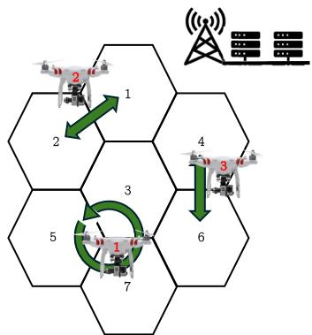  
Fig. 1. An urban trafic network comprised of 7 regions monitored by 3 UAVs. Measurements of regional trafic density and transfer flows are processed at the GCC.

Each UAV, u, hovers above a region $r \in \mathcal { R } _ { u } ^ { U A V }$ and monitors all vehicle trajectories within its field of view for M minutes, defined as the region monitoring time. At each time-step, it broadcasts the live video footage to the Ground Control Centre (GCC). The trajectories are analysed in real-time at the GCC and a $\widetilde { \rho } _ { r } ( k )$ value is computed for region r at time-step k. Moreover, we assume that the UAVs are flying high enough and the regions are small enough such that all actual transfer flows $c _ { r j } ( k )$ and $c _ { j r } ( k )$ , are observable for region $r . ^ { 6 }$ These are also analysed at the GCC, and the corresponding actual transfer flow measurements are denoted as $\tilde { c } _ { r j } ( k )$ . Once a UAV u has monitored region r for M minutes, it transitions from the currently observed region r to neighbouring region j according to the ordered set $\mathcal { R } _ { u } ^ { \overline { { U } } A V } . ^ { 7 }$ The transition time from region r to j is denoted as T .

For the UAV-TMS to be viable, each UAV must fly to a predesignated landing spot and swap its battery before continuing the trafic monitoring cycle roughly every half hour. This is known as the landing and battery swap time, denoted as $L _ { r }$ [minutes], which includes the time for the UAV to leave region r and fly to the pre-designated spot, land, swap its battery and move to the next region in $\mathcal { R } _ { u } ^ { U \dot { A } \dot { V } }$

The sparsity of measurements $\widetilde { \rho } _ { r } ( k )$ and $\tilde { c } _ { r j } ( k )$ arises from the fact that no measurements are obtained while a UAV transitions from one region to another and while it lands and has its battery swapped. Moreover, since each UAV can only monitor one region at a time, the data is sparse if $\vert \mathcal { U } \vert < \vert \mathcal { R } \vert$ <i.e., the number of UAVs is less than the number of regions.

## C. Problem Formulation

Assuming a homogeneous region partitioning of an urban road network and the UAV-TMS detailed in Section III-B, we define the problem formulation as follows:

## (i) Given/Known:

• Sparse measurements: $\widetilde { \rho } _ { r } ( k )$ and $\tilde { c } _ { r j } ( k )$ from the UAV-TMS.

• MFD parameters: $q _ { r } ^ { M A X } , \rho _ { r } ^ { C } , \rho _ { r } ^ { J } , l _ { r }$ for each region $r \in \mathcal { R }$

• Maximum inter-boundary capacity flow: $C _ { r i } ^ { M \bar { A } X }$ for each boundary between regions $r \in \mathcal { R }$ and $j \in \mathcal { I } _ { r } ^ { \cdot }$

• OD matrix: D.

## (ii) Estimated states:

• Real-time regional density estimates $\hat { \rho } _ { r } ( k )$ ∀r for current time-step K.

• Real-time regional density estimates for destination region $\hat { \rho } _ { r d } ( k )$ ∀r d for current time-step $K .$

## (iii) Assumptions:

• States $q _ { r }$ and $\rho _ { r }$ are related via triangular MFDs completely defined by $q _ { r } ^ { M A X } , \rho _ { r } ^ { C } , \rho _ { r } ^ { J }$

• Split ratios $s _ { r j d }$ are not known.

• Process and measurement noise parameters follow white Gaussian distributions, $\begin{array} { r l r } { \nu _ { r } ^ { \rho } ( k ) } & { { } \sim } & { \mathcal { N } ( 0 , \sigma _ { \rho } ^ { 2 } ) , \nu _ { r i } ^ { c } ( k ) \quad \sim } \end{array}$ $\mathcal N ( 0 , \sigma _ { c } ^ { 2 } ) , w _ { r d } ( k ) \sim \mathcal N ( 0 , \sigma _ { w } ^ { 2 } )$ where $\sigma _ { \rho } ^ { 2 } , \sigma _ { c } ^ { 2 } , \dot { \sigma _ { \ w } ^ { 2 } }$ are known variances.

• UAVs follow pre-determined flight paths.

• UAVs land every 20-30 minutes to swap their batteries.

• All transfer flows $c _ { r j } ( k ) , c _ { j r } ( k )$ are observable when a ,UAV is monitoring region r.

## IV. SOLUTION APPROACH

Given the problem formulation defined in Section III-C, we aim to compute real-time estimates $\hat { \rho } _ { r } ( k )$ and $\hat { \rho } _ { r d } ( k )$ by computing their maximum a posteriori estimates via a MHE algorithm [26], formulated as the weighted least-squares constrained optimization problem

$$
\mathrm { m i n i m i z e } \sum _ { k \in \mathcal { W } _ { K - W } ^ { T } } { \pmb { e } } _ { k } ^ { T } \pmb { \Sigma } _ { k } ^ { - 1 } { \pmb { e } } _ { k }
$$

subject to Trafic Dynamics: (1)−(8) (12)−(15)

Trafic Measurements: (17) (18)

$$
\begin{array} { r l } & { 0 \leq \hat { \rho } _ { r } ( k ) \leq \rho _ { r } ^ { J } , } \\ & { 0 \leq \hat { q } _ { r } ( k ) \leq q _ { r } ^ { \mathrm { M A X } } . } \end{array}\tag{19}
$$

In the objective function the column vector $\mathbf { e } _ { k }$ contains all noise vectors $w _ { r d } ( k ) , \nu _ { r } ^ { \rho } ( k ) , \nu _ { r i } ^ { c } ( k )$ over the moving horizon window ${ \mathcal W } _ { K - W } ^ { K } = \{ K , K - 1 , \ddot { K } - 2 , \ldots , K - W \}$ which is a set of time-steps beginning at current time-step K and looking W time-steps into the past. The known process and measurement noise variances $\sigma _ { w } ^ { 2 } , \sigma _ { \rho } ^ { 2 } , \sigma _ { c } ^ { 2 }$ are included on the diagonals of matrices $\Sigma _ { k } ^ { w } , \Sigma _ { k } ^ { \rho } , \Sigma _ { k } ^ { c }$ , σρ, σ. These are then arranged to form the block diagonal matrix

$$
\Sigma _ { k } = \left[ \begin{array} { c c c } { \sum _ { k } ^ { \boldsymbol { w } } \textbf { 0 } } & { \mathbf { 0 } } \\ { \mathbf { 0 } } & { \Sigma _ { k } ^ { \rho } } & { \mathbf { 0 } } \\ { \mathbf { 0 } } & { \mathbf { 0 } } & { \Sigma _ { k } ^ { c } } \end{array} \right] ,
$$

which in turn is included in the objective function. Note that while $\Sigma _ { k } ^ { w }$ contains a relevant $\sigma _ { w } ^ { 2 }$ term on each diagonal element, matrices $\Sigma _ { k } ^ { \rho }$ and $\Sigma _ { k } ^ { c }$ are sparse on the diagonal due to the sparsity of state measurements $\tilde { \rho } _ { r } ( k ) , \tilde { c } _ { r j } ( k )$ from the UAV-TMS. Lastly, the equations defining the trafic dynamics and measurements from Sections III-A and III-B are included as constraints.

Solving the MHE problem defined by Problem (19) is challenging for two reasons. Firstly, due to the sparsity of state measurements $\widetilde { \rho } _ { r } ( k )$ and $\tilde { c } _ { r j } ( k )$ in both space and time, it is likely that $\hat { \rho } _ { r } ( k )$ and $\hat { \rho } _ { r d } ( k )$ will contain large errors. Secondly, Problem (19) is hard to solve and computationally challenging as Eqs. (1), (12), (13), (14) are nonconvex and nonlinear.

The first challenge is addressed by implementing a nonparametric regression algorithm (in this case, GP models) to interpolate between sparse $\widetilde { \rho } _ { r } ( k )$ measurements. GP models are particularly suited to this task as they are computationally tractable for small datasets and provide uncertainty estimates for each state estimate (referred to as virtual measurements henceforth). Including GP models in the solution approach is advantageous as they (i) eliminate sparsity from the set of $\rho _ { r } ( k )$ measurements before it is input to the MHE problem and (ii) the uncertainties for each virtual measurement can be integrated into the covariance matrix $\Sigma _ { k } ^ { \rho }$ in the objective function. Both of these features result in improved $\hat { \rho } _ { r } ( k )$ and $\hat { \rho } _ { r d } ( k )$ estimation performance. On a more practical note, virtual measurements are integrated into the MHE problem by simply adding a linear constraint of the form in Eq. (17) for each virtual measurement.

To address the challenge of the nonlinear constraints, a successive convexification approach is proposed in Section IV-B, which solves Problem (19) by an iterative approach, where convex bounding sets are constructed around the solution of the previous iteration for all nonconvex sets and are successively tightened. As a result, Problem (19) is reformulated as a sequence of MHE convex quadratic programs which are solved in sequence using standard optimization solvers, guaranteeing fast computations and a globally optimal solution for each iteration. An outline of the solution approach is shown in Fig. 2, which shows how raw $\widetilde { \rho } _ { r } ( k )$ measurements are gathered by the UAV-TMS (red dots), interpolated by $\mathbf { a } \operatorname { G P }$ model (blue dots) and then improved by the MHE successive convexification problem, with final outputs $\hat { \rho } _ { r } ( k ) , \hat { \rho } _ { r d } ( k )$

## A. GP Model

GP models extend the concept of the Gaussian probability distribution to an infinite set of functions to model the behaviour of an unknown mathematical function and are characterised as the Bayesian alternatives to classical nonparametric methods such as splines [56].

Assuming a given homogeneous region r in an urban trafic network, let $\tilde { k }$ be a vector of the discrete time-steps that the particular region was monitored by a UAV. Let the subscript n in ${ \tilde { k } } _ { n }$ denote the index of vector ˜k, where for example, if $\tilde { k } = [ 2 , 5 , 8 ] ^ { T }$ , then $\tilde { k } _ { 1 } = 2 , \tilde { k } _ { 2 } = 5$ and $\tilde { k } _ { N } = 8$ , with $\tilde { k } _ { N }$ being the most recent time-step that the region was monitored.

Let $\rho ( { \tilde { k } } )$ be a vector of the regional density measurements observed at time-steps in vector ${ \tilde { k } } ,$ i.e., $\begin{array} { r l } { \rho ( \tilde { k } ) } & { { } = } \end{array}$ $[ \rho ( \tilde { k } _ { 1 } ) , \rho ( \tilde { k } _ { 2 } ) , \ldots , \rho ( \tilde { k } _ { N } ) ] ^ { T }$ . We make the assumption that

$$
\rho ( \tilde { k } ) = f ( \tilde { k } ) + \epsilon .\tag{20}
$$

In this equation, function $f ( \cdot )$ is unknown, and is a column vector of assumed measurement noise, independently drawn

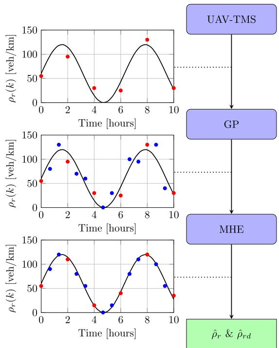  
Fig. 2. Visual representation of solution approach. Actual and virtual measurements are denoted in red and blue, respectively.

from a normal distribution $\epsilon \sim \mathcal { N } ( 0 , \sigma _ { \epsilon } ^ { 2 } \mathbf { I } _ { N } )$ , where ${ \mathbf { I } } _ { N }$ is the $N \times$ N identity matrix and $\sigma _ { \epsilon } ^ { 2 }$ is the measurement noise variance.

σA GP model is fully defined by its mean and variance functions. In our approach, we assume a GP prior of the form

$$
\begin{array} { r } { f ( \tilde { k } ) \sim \mathcal { G P } \left( \mathbf { h } ^ { T } ( \tilde { k } ) \mathbf { w } , \sigma _ { f } ^ { 2 } \kappa ( \tilde { k } , \tilde { k } ^ { \prime } ; \gamma ) \right) . } \end{array}\tag{21}
$$

In Eq. (21), $\mathbf { h } ( \tilde { k } ) = [ h _ { 0 } ( \tilde { k } ) , h _ { 1 } ( \tilde { k } ) , \dots , h _ { z - 1 } ( \tilde { k } ) ] ^ { T }$ represents $\mathrm { ~ a ~ } z -$ dimensional vector of regression functions which are assumed to be known.8 The vector $\mathbf { w } = [ w _ { 0 } , w _ { 1 } , \dots , w _ { z - 1 } ] ^ { T }$ comprises unknown regression coeficients, commonly referred to as trend parameters. Moreover, $0 \leq \kappa ( \tilde { k } , \tilde { k } ^ { \prime } ; \gamma ) \leq 1$ is the known correlation function, $\gamma \in \Gamma = ( 0 , \infty )$ is the unknown correlation parameter, and $\sigma _ { f } ^ { 2 } > 0$ is the signal noise variance. Constant regression functions ${ \bf h } ( \tilde { k } )$ , as well as their corresponding coeficients w are to be determined from the data. Given the aforementioned GP prior, it follows that any finite set of function evaluations $\mathbf { f } ~ = ~ [ f ( \tilde { k } _ { 1 } ) , \ldots , f ( \tilde { k } _ { N } ) ] ^ { T }$ conforms to a multivariate normal distribution, expressed as

$$
\mathbf { f } \sim \mathcal { N } \left( \mathbf { H } \mathbf { w } , \sigma _ { f } ^ { 2 } \mathbf { C } ( \gamma ) \right) ,\tag{22}
$$

where, $\mathbf { H } = [ \mathbf { h } ( \tilde { k } _ { 1 } ) ; \mathbf { h } ( \tilde { k } _ { 2 } ) \dots \mathbf { h } ( \tilde { k } _ { N } ) ] ^ { T }$ denotes the $N \times z$ model matrix and $\mathbf { C } ( \gamma )$ is the correlation matrix. We choose the squared exponential correlation function, a commonly used kernel, given by

$$
\kappa ( \tilde { k } , \tilde { k } ^ { \prime } ; \gamma ) = \exp \left( { - \gamma \| \tilde { k } - \tilde { k } ^ { \prime } \| ^ { 2 } } \right) ,\tag{23}
$$

where $\gamma > 0$ is the unknown smoothness (correlation) param-γeter and $\| \cdot \|$ is the Euclidean norm.

Combining Eqs. (20) and (22) we get

$$
\rho ( \tilde { k } ) \mid \mathbf { w } , \sigma _ { f } ^ { 2 } , \gamma , \sigma _ { \epsilon } ^ { 2 } \sim \mathcal { N } \left( \mathbf { H } \mathbf { w } , \sigma _ { f } ^ { 2 } \mathbf { C } ( \gamma ) + \sigma _ { \epsilon } ^ { 2 } \mathbf { I } _ { N } \right) .\tag{24}
$$

For computational purposes, Eq. (24) can be reparamaterised to

$$
\rho ( \tilde { k } ) \mid \mathbf { w } , \sigma _ { f } ^ { 2 } , \gamma , \sigma _ { \epsilon } ^ { 2 } \sim \mathcal { N } \left( \mathbf { H } \mathbf { w } , \sigma _ { f } ^ { 2 } [ \mathbf { C } ( \gamma ) + \lambda ^ { 2 } \mathbf { I } _ { N } ] \right) ,\tag{25}
$$

where, $\lambda ^ { 2 } ~ = ~ \sigma _ { \epsilon } ^ { 2 } / \sigma _ { \it f } ^ { 2 }$ is the noise-to-signal ratio. Moving λ σ /σforward, we will work with the updated covariance matrix denoted as Σ, where

$$
\boldsymbol { \Sigma } = \mathbf { C } ( \gamma ) + \lambda ^ { 2 } \mathbf { I } _ { N } .\tag{26}
$$

With this adjustment, the likelihood can be expressed as

$$
\begin{array} { r l } & { \pi \left( \rho ( \tilde { k } ) \mid \mathbf { w } , \sigma _ { f } ^ { 2 } , \gamma , \lambda ^ { 2 } \right) = } \\ & { \frac { \exp \left\{ - \frac { 1 } { 2 \sigma _ { f } ^ { 2 } } \left[ ( \rho ( \tilde { k } ) - \mathbf { H } \mathbf { w } ) ^ { T } \Sigma ^ { - 1 } ( \rho ( \tilde { k } ) - \mathbf { H } \mathbf { w } ) \right] \right\} } { ( 2 \pi \sigma _ { f } ^ { 2 } ) ^ { N / 2 } | \Sigma | ^ { 1 / 2 } } . } \end{array}\tag{27}
$$

Let $k ^ { * }$ be a time-step where density was not observed by UAV u for region r, implying that $k ^ { * } ~ \notin ~ \tilde { k } .$ We introduce the notation $\rho ( k ^ { * } )$ to denote a virtual measurement random variable for unobserved time-step $k ^ { * }$ , achieved by formulating the predictive distribution of $\rho ( k ^ { * } )$ . The joint prior distribution of $\rho ( { \tilde { k } } )$ and $\rho ( k ^ { * } )$ , given all unknown parameters $\mathbf { w } , \sigma _ { f } ^ { 2 } , \gamma , \lambda ^ { 2 }$ can be expressed as

$$
\begin{array} { r l } & { \left[ \rho ( k ^ { * } ) \right] | \mathbf { w } , \sigma _ { f } ^ { 2 } , \boldsymbol { \gamma } , \lambda ^ { 2 } } \\ & { \qquad \sim { \mathcal { N } } \left( \left[ \begin{array} { l } { \mathbf { h } ^ { T } ( k ^ { * } ) \mathbf { w } } \\ { \mathbf { H } \mathbf { w } } \end{array} \right] , \sigma _ { f } ^ { 2 } \left[ \begin{array} { l l } { ( 1 + \lambda ^ { 2 } ) \ \mathbf { c } ( k ^ { * } ) ^ { T } } \\ { \mathbf { c } ( k ^ { * } ) \quad \Sigma } \end{array} \right] \right) . } \end{array}\tag{28}
$$

Here, $\mathbf { c } ( k ^ { \star } ) = [ \kappa ( k ^ { \ast } , \widetilde { k } _ { 1 } ; \gamma ) , \dots , \kappa ( k ^ { \ast } , \widetilde { k } _ { N } ; \gamma ) ] ^ { T }$ represents the $N -$ κ , γ , . . . , κ , γdimensional vector of correlations between the trafic density at each sampling time-point ˜k and the trafic density at the new time-point $k ^ { * }$ [57]. By employing standard results, we obtain the subsequent conditional posterior distribution

$$
\rho ( k ^ { * } ) \mid \rho ( \tilde { k } ) , \mathbf { w } , \sigma _ { f } ^ { 2 } , \gamma , \lambda ^ { 2 } \sim \mathcal { N } \left( \mu ( k ^ { * } ) , s ^ { 2 } ( k ^ { * } ) \right) ,\tag{29}
$$

where

$$
\begin{array} { r l } & { \mu ( k ^ { * } ) = { \mathbb E } ( \rho ( k ^ { * } ) \mid \rho ( \tilde { k } ) , \mathbf { w } , \sigma _ { f } ^ { 2 } , \gamma , \lambda ^ { 2 } ) } \\ & { \quad \quad = \mathbf { h } ( k ^ { * } ) ^ { T } \mathbf { w } + \mathbf { c } ( k ^ { * } ) ^ { T } { \boldsymbol { \Sigma } } ^ { - 1 } [ \rho ( \tilde { k } ) - \mathbf { H } \mathbf { w } ] , } \end{array}\tag{30}
$$

$$
\begin{array} { r l } & { s ^ { 2 } ( k ^ { * } ) = \mathrm { v a r } ( \rho ( k ^ { * } ) \mid \rho ( \tilde { k } ) , \mathbf { w } , \sigma _ { f } ^ { 2 } , \gamma , \lambda ^ { 2 } ) } \\ & { ~ = \sigma _ { f } ^ { 2 } \left[ ( 1 + \lambda ^ { 2 } ) - \mathbf { c } ( k ^ { * } ) ^ { T } \Sigma ^ { - 1 } \mathbf { c } ( k ^ { * } ) \right] . } \end{array}\tag{31}
$$

Equations (30) - (31) reveal that if all parameters $\mathbf { w } , \sigma _ { f } ^ { 2 } , \gamma ,$ and $\lambda ^ { 2 }$ were known, the trafic density estimate $\rho ( k ^ { * } )$ would follow a normal distribution with a predetermined mean $\mu ( k ^ { * } )$ and variance $s ^ { 2 } ( k ^ { * } )$

In our solution approach, we generate regional density virtual measurements for all time-steps and regions and integrate their mean and variance values into Problem $( 1 9 ) . ^ { 9 }$ Specifically, we let $\mu _ { r } ( k )$ and $s _ { r } ^ { 2 } ( k ) , \forall r \in \mathcal { R }$ and $\forall k \in \mathcal { K }$ , denote the mean and variance of the virtual estimates computed by Eqs. (30) and (31), respectively. The $\mu _ { r } ( k )$ terms are then integrated into the MHE problem by replacing Eq. (17) in the constraints of Problem (19) with

$$
\mu _ { r } ( k ) = \rho _ { r } ( k ) + \nu _ { r } ^ { \rho } ( k ) ,\tag{32}
$$

$\forall r \in \mathcal { R }$ , and $\forall k \in \mathcal { W } _ { K - W } ^ { K }$ . The $s _ { r } ^ { 2 } ( k )$ terms of each virtual measurement are placed on the appropriate diagonal element of $\Sigma _ { k } ^ { \rho }$ resulting in

$$
\pmb { \Sigma } _ { k } ^ { \star } = \left[ \begin{array} { c c c } { \pmb { \Sigma } _ { k } ^ { w } } & { \pmb { 0 } } & { \pmb { 0 } } \\ { \pmb { 0 } } & { \pmb { \Sigma } _ { k } ^ { \rho \star } } & { \pmb { 0 } } \\ { \pmb { 0 } } & { \pmb { 0 } } & { \pmb { \Sigma } _ { k } ^ { c } } \end{array} \right] ,
$$

where $\Sigma _ { k } ^ { \rho \star }$ contains all uncertainty terms $s _ { r } ^ { 2 } ( k ) \forall r \in \mathcal { R }$ , and $\forall k \in \mathcal { W } _ { K - W } ^ { \tilde { K } }$ and therefore has a complete diagonal with no 0 elements.

## B. Successive Convexification MHE Solution Approach

Our successive convexification approach initially relaxes the nonconvex constraints of Problem (19) to obtain an initial solution (Section IV-B1). In subsequent iterations, the relaxed constraints are iteratively tightened around the solution of the previous iteration to form a convex optimization problem that can be optimally solved using standard solvers (Section IV-B2). An outline of the proposed successive convexification approach is detailed in Algorithm 1, in which the superscript i denotes the iteration number and I denotes the total number of iterations. Note that in Algorithm 1, all optimization variables are defined for $\forall r \in \mathcal { R } , \forall j \in \mathcal { T } _ { r } , \forall d \in \mathcal { D } , \forall k \in \mathcal { W } _ { K - W } ^ { K }$ , where appropriate.

Finally, Section IV-B3 presents an alternative approach that excludes inter-boundary capacity constraints to facilitate a direct comparison with a nonlinear solver.

1) Initial Iteration: In the first iteration, the nonconvex constraints (1), (13), and (14) in Problem (19) are relaxed into appropriate linear inequalities.

Firstly, the triangular MFD defined by Eq. (1) is replaced with the following two linear inequalities:

$$
\hat { q } _ { r } ( k ) \leq q _ { r } ^ { M A X } \left( \frac { \hat { \rho } _ { r } ( k ) } { \rho _ { r } ^ { C } } \right) ,\tag{33}
$$

$$
\hat { q } _ { r } ( k ) \leq q _ { r } ^ { M A X } \left( \frac { \rho _ { r } ^ { J } - \hat { \rho } _ { r } ( k ) } { \rho _ { r } ^ { J } - \rho _ { r } ^ { C } } \right) .\tag{34}
$$

Eq. (14) is nonlinear as well due to the min function and is therefore replaced with

$$
\hat { c } _ { r j d } ( k ) \leq \hat { q } _ { r j d } ( k ) ,\tag{35}
$$

$$
\hat { c } _ { r j d } ( k ) \leq \hat { C } _ { r j } ( \hat { \rho } _ { j } ( k ) ) \frac { \hat { q } _ { r j d } ( k ) } { \sum _ { d \in \mathcal { D } } \hat { q } _ { r j d } ( k ) } .\tag{36}
$$

Eq. (36) contains the product of variables $\hat { C } _ { r j } ( \hat { \rho } _ { j } ( k ) )$ and ${ \hat { q } } _ { r j d } ( k )$ , and is therefore linearised by summing over destination regions $d \in \mathcal { D }$ on both sides of the inequality to eliminate ${ \hat { q } } _ { r j d } ( k )$ , resulting in

$$
\sum _ { d \in \mathcal { D } } \hat { c } _ { r j d } ( k ) \le \hat { C } _ { r j } ( \hat { \rho } _ { j } ( k ) ) .\tag{37}
$$

Substituting Eq. (13) into Eq. (37) and replacing the min function with two linear inequalities results in

$$
\sum _ { d \in \mathcal { D } } \hat { c } _ { r j d } ( k ) \leq C _ { r j } ^ { M A X } ,\tag{38}
$$

Algorithm 1 Successive Convexification Approach   
1: Input: $\mu _ { r } ( k ) , \tilde { c } _ { r j } ( k ) , \Sigma _ { k } ^ { \star }$ b   
2: for $\mathrm { ~ i ~ } = \mathrm { ~ 1 : I ~ }$ do   
3: if i = 1 then   
4: Solve Problem (40) to obtain $\hat { \rho } _ { r } ^ { ( 1 ) } ( k )$ and $\hat { \rho } _ { r d } ^ { ( 1 ) } ( k )$   
5: else   
6: Compute bounds for $\hat { \rho } _ { r } ^ { ( i ) } ( k ) \colon$   
7: $\hat { \rho } _ { r } ^ { ( i ) } ( \mathbf { \bar { \boldsymbol { k } } } ) ^ { + } = \hat { \rho } _ { r } ^ { ( i - 1 ) } ( \boldsymbol { k } ) + \mathbf { \dot { b } } ( i - 1 )$   
8: $\hat { \rho } _ { r } ^ { ( i ) } ( k ) ^ { - } = \hat { \rho } _ { r } ^ { ( i - 1 ) } ( k ) - \mathbf { b } ( i - 1 )$   
9: ρ ρCompute bounds for ${ \hat { q } } _ { r } ( k )$ and ${ \hat { \nu } } _ { r } ( k ) { \ : }$   
10: $\hat { q } _ { r } ( k ) ^ { + } = f ( \hat { \rho } _ { r } ^ { ( i ) } ( k ) ^ { + } )$   
11: $\hat { q } _ { r } ( k ) ^ { - } = f ( \hat { \rho } _ { r } ^ { ( i ) } ( k ) ^ { - } )$   
12: $\begin{array} { r } { \hat { \nu } _ { r } ( k ) ^ { + } = \operatorname* { m a x } \left\{ \frac { f ( \hat { \rho } _ { r } ^ { ( i ) } ( k ) ^ { - } ) } { \hat { \rho } _ { r } ^ { ( i ) } ( k ) ^ { - } } , \frac { f ( \hat { \rho } _ { r } ^ { ( i ) } ( k ) ^ { + } ) } { \hat { \rho } _ { r } ^ { ( i ) } ( k ) ^ { + } } \right\} } \end{array}$   
13: $\begin{array} { r } { \hat { \nu } _ { r } ( k ) ^ { - } = \operatorname* { m i n } \left\{ \frac { f ( \hat { \rho } _ { r } ^ { ( i ) } ( k ) ^ { - } ) } { \hat { \rho } _ { r } ^ { ( i ) } ( k ) ^ { - } } , \frac { f ( \hat { \rho } _ { r } ^ { ( i ) } ( k ) ^ { + } ) } { \hat { \rho } _ { r } ^ { ( i ) } ( k ) ^ { + } } \right\} } \end{array}$   
14: ρ ρ Compute lower bound for ${ \hat { q } } _ { r } ( k ) \colon$   
15: $\hat { q } _ { r } ( k ) \geq m _ { r } ( k ) \hat { \rho } _ { r } ^ { ( i ) } ( k ) + c _ { r } ( k )$   
16: $\begin{array} { r } { m _ { r } ( k ) = \frac { \hat { q } _ { r } ( k ) ^ { + } - \hat { q } _ { r } ( k ) ^ { - } } { \hat { \rho } _ { r } ^ { ( i ) } ( k ) ^ { + } - \hat { \rho } _ { r } ^ { ( i ) } ( k ) ^ { - } } } \end{array}$   
17: $c _ { r } ( k ) = \dot { \hat { q } } _ { r } ( k ) ^ { + } - m _ { r } ( k ) \hat { \rho } _ { r } ^ { ( i ) } ( k ) ^ { + }$   
18: Compute bounds for $\hat { q } _ { r d } ( k ) , \hat { \rho } _ { r d } ( k ) ;$   
19: $z \ge \bar { y } ^ { l } x + y x ^ { l } - y ^ { l } x ^ { l }$   
20: $z \geq y ^ { u } x + y x ^ { u } - y ^ { u } x ^ { u }$   
21: $z \le y ^ { l } x + y x ^ { u } - y ^ { l } x ^ { u }$   
22: $z \le y ^ { u } x + \overset { \cdot } { y } x ^ { l } - \overset { \cdot } { y ^ { u } } x ^ { l }$ where:   
23: $x ^ { l } \equiv \hat { \nu } _ { r } ( k ) ^ { - } , x ^ { u } \equiv \hat { \nu } _ { r } ( k ) ^ { + }$   
24: $y ^ { l } \equiv \hat { \rho } _ { r d } ( k ) ^ { - } , y ^ { u } \equiv \hat { \rho } _ { r d } ( k ) ^ { + }$   
25: $z \equiv \hat { q } _ { r d } ( k )$   
26: $\hat { \rho } _ { r d } ( k ) ^ { + } = \hat { \rho } _ { r } ( k ) ^ { + }$   
27: $\hat { \rho } _ { r d } ( k ) ^ { - } = 0$   
28: ρSolve Problem (41) to obtain $\hat { \rho } _ { r } ^ { ( i ) } ( k )$ and   
$\hat { \rho } _ { r d } ^ { ( i ) } ( k )$   
29: ρif $i = I$ then   
30: Return $\hat { \rho } _ { r } ^ { ( I ) } ( k ) , \hat { \rho } _ { r d } ^ { ( I ) } ( k )$   
31: end if   
32: end if   
33: end for

$$
\sum _ { d \in \mathcal { D } } \hat { c } _ { r j d } ( k ) \leq \frac { C _ { r j } ^ { M A X } } { 1 - \alpha } \left( 1 - \frac { \rho _ { j } ( k ) } { \rho _ { j } ^ { J } } \right) ,\tag{39}
$$

where $\alpha = \rho _ { j } ^ { C } / \rho _ { j } ^ { J }$ . In sum, constraints (13) and (14) are relaxed α ρ /ρto (35), (38) and (39).

Replacing the nonconvex constraints (1), (13), and (14) with the linear inequalities (33) - (35), (38) and (39) in Problem (19) results in the MHE optimization problem

$$
\begin{array} { l } { \displaystyle \operatorname* { m i n i m i z e } \sum _ { k \in \mathcal { W } _ { K - \mathcal { W } } ^ { K } } e _ { k } ^ { T } \Sigma _ { k } ^ { \star \star - 1 } e _ { k } } \\ { \displaystyle \mathrm { s u b j e c t ~ t o ~ T r a f i c ~ D y n a m i c s : ~ } ( 2 ) - ( 4 ) , ( 7 ) , ( 1 5 ) , ( 1 6 ) } \\ { \displaystyle ( 3 3 ) - ( 3 5 ) , ( 3 8 ) , ( 3 9 ) , } \\ { \displaystyle \mathrm { T r a f i c ~ M e a s u r e m e n t s : ~ } ( 3 2 ) , ( 1 8 ) , } \\ { \displaystyle 0 \le \hat { \rho } _ { r } ( k ) \le \rho _ { r } ^ { \prime } , } \\ { \displaystyle 0 \le \hat { q } _ { r } ( k ) \le q _ { r } ^ { \mathrm { M A X } } , } \end{array}\tag{40}
$$

which is executed in the first iteration of the successive convexification approach at time-step $K . ^ { 1 0 }$ Note that Problem (40) is a convex quadratic program that can be easily solved with standard optimization solvers.

2) Subsequent Iterations: While the initial solution $\hat { \rho } _ { r } ^ { ( 1 ) } ( k )$ for all $r ~ \in ~ \mathcal { R }$ and $k \ \in \ \mathcal { W } _ { K - W } ^ { K }$ ρ(computed in Line 4 of Algorithm 1) provides a useful starting point, it does not fully satisfy constraints Eq. (1) and Eq. (12) of the original Problem (19). This discrepancy arises because in Problem (40): (a) the nonconvex Eq. (1) is replaced with the convex constraints (33)–(34), and (b) Eq. (12) is entirely omitted due to the nonconvex bilinear terms $\nu _ { r } ( k ) \rho _ { r d } ( k )$

ν ρTo address the first issue, we need to ensure that the feasibility set related to Eqs. (33)–(34) lies on rather than under the MFD. This is addressed by executing the following steps for a given iteration:

1) The density variable of the current iteration i, $\hat { \rho } _ { r } ^ { ( i ) } ( k )$ ρis bounded by the density estimate resulting from the previous iteration $\hat { \rho } _ { r } ^ { ( i - 1 ) } ( k )$ and the bounding term b(i−1) (Lines $7 - 8 ) . ^ { 1 1 }$

2) The upper and lower bounds of regional outflows $\hat { q } _ { r } ( k ) ^ { + } , \hat { q } _ { r } ( k ) ^ { }$ − and average vehicle speeds $\hat { \nu } _ { r } ( k ) ^ { + } , \hat { \nu } _ { r } ( k )$ are computed from $\hat { \rho } _ { r } ^ { ( i ) } \bar { ( k ) } ^ { + }$ and $\hat { \rho } _ { r } ^ { ( i ) } ( k ) ^ { - }$ according to the MFD defined in Eq. (1). In Algorithm (1), this is represented by $f ( \cdot )$ as well as a rearrangement of the fundamental equation $q _ { r } ( k ) ~ = ~ ( \nu _ { r } ( k ) \rho _ { r } ( k ) l _ { r } ) / \ell _ { r }$ (Lines 10– 13).

3) A linear inequality is defined that places a lower bound on ${ \hat { q } } _ { r } ( k )$ which passes through the points $( \hat { \rho } _ { r } ^ { ( i ) } ( k ) ^ { + } , \hat { q } _ { r } ( \hat { k } ) ^ { + } )$ and $( \hat { \rho } _ { r } ^ { ( i ) } ( \bar { k } ) ^ { - } , \hat { q } _ { r } ( k ) ^ { - } )$ which lie on the ρ ,MFD (Lines 15– 17).

The result of this process is that a convex feasibility set is defined at the ith iteration that is upper bounded by Eqs. (33), (34) and lower bounded by the new linear inequality introduced in Line 15. Since the bounding term $\mathbf { b } ( i \textrm { -- } 1 )$ decreases for each iteration, this feasibility set also reduces with each iteration. After a number of iterations when b(i−1) is suficiently small, flow, speed and density estimates converge and this feasible set lies on either the free-flow or congested branch of the MFD defined by Eq. (1).

The bilinearity of $\nu _ { r } ( k ) \rho _ { r d } ( k )$ in Eq. (12) is addressed by including a convex approximation via the McCormick method [58]. Specifically, a convex set is defined by introducing four linear inequalities that upper and lower bound ${ \hat { q } } _ { r d } ( k )$ with respect to the product $\nu _ { r } ( k ) \rho _ { r d } ( k )$ (Lines $1 9 \mathrm { ~ - ~ } 2 2 )$ . At each ν ρiteration the convex feasibility set within the hyperplanes shrinks as the bounding term b(i−1) decreases. For suficiently small ${ \bf b } ( i - 1 )$ , the bounds are small enough such that ${ \hat { q } } _ { r d } ( k ) \approx$ $( \hat { \nu } _ { r } ( k ) \hat { \rho } _ { r d } ( k ) l _ { r } ) / \ell _ { r }$ and so Eq. (12) is closely approximated.

Once the bounds are defined for $\hat { \rho } _ { r } ( k ) , \hat { \nu } _ { r } ( k ) , \hat { q } _ { r } ( k ) , \hat { q } _ { r d } ( k )$ $\hat { \rho } _ { r d } ( k )$ they are incorporated into Problem (40), resulting in the

MHE problem solved for iterations $2 \leq i \leq I$

$$
\begin{array} { r l } & { \mathrm { m i n i m i z e ~ } \displaystyle \sum _ { k = 0 } ^ { e ^ { t } } \sum _ { k = 1 } ^ { e ^ { t } } e _ { k } } \\ & { \mathrm { s u b j e c t ~ ( } 0 } \\ & { \mathrm { T a f i e c ~ ( } 0 \mathrm { ~ T h e ~ D y n a m i c s ~ } \langle 2 \rangle - \langle 4 \rangle , \langle 7 \rangle , \langle 1 5 \rangle , \langle 1 6 \rangle } \\ & { ( 3 3 ) - \langle 3 \rangle , \langle 3 8 \rangle , \langle 9 \rangle , } \\ & { \mathrm { T r a f i c ~  { M e s t a t u r e m e n t s : ~ } } \langle 3 2 \rangle , \langle 1 8 \rangle , } \\ & { \mathrm { A l g o r i t i m ~ 1 ~ L i n e s : ~ } \displaystyle 7 - 8 . 1 0 - 1 3 , 1 5 - 1 7 , } \\ & { \mathrm { 1 9 - 2 2 } } \\ & { \phi _ { r } ^ { ( \bar { p } ) } ( k ) - \phi _ { r } ^ { ( \bar { p } ) } ( k ) \leq \hat { \rho } _ { r } ^ { ( \bar { p } ) } ( k ) ^ { \bar { + } } , } \\ & { \mathrm { \operatorname* { m i n } ~ } \displaystyle \{ \hat { q } _ { r } ( k ) ^ { \bar { + } } , \hat { q } _ { r } ( k ) ^ { \bar { + } } \} \leq \hat { q } _ { r } ( k ) \leq q _ { r } ^ { \mathrm { { a b s t } } } , } \\ & { \hat { \nu } _ { r } ( k ) ^ { \bar { + } } \leq \hat { \nu } _ { r } ( k ) \leq \hat { \nu } _ { r } ( k ) ^ { \bar { + } } , } \\ & { 0 \leq \hat { \rho } _ { r } ( k ) \leq \hat { \rho } _ { r } ( k ) ^ { \bar { + } } . } \end{array}\tag{41}
$$

Note that Problem (41) is a convex quadratic program that can be fast and reliably solved with standard optimization solvers. Once i = I the variables $\hat { \rho } _ { r } ^ { ( I ) } ( K ) , \hat { \rho } _ { r d } ^ { ( I ) } ( K )$ are output and the moving horizon window shifts E minutes forward.

3) No Capacity Formulation: An alternative formulation of the successive convexification solution approach in Sections IV-B1 and IV-B2 is to remove the inter-boundary capacity constraints, i.e., Eq. (35), (38), (39), from Problems $( 4 0 ) , ( 4 1 )$ thereby removing the distinction between intended flow and actual flow, meaning that $c _ { r j d } ( k ) \equiv q _ { r j d } ( k )$ . This is to facilitate a direct comparison with the nonlinear solver, which does not follow the successive convexification approach and instead incorporates Eqs. (1), (12) directly, resulting in the nonconvex MHE problem

$$
\mathrm { m i n i m i z e } \sum _ { k \in \mathcal { W } _ { K - W } ^ { K } } { e _ { k } ^ { T } \Sigma _ { k } ^ { \star - 1 } e _ { k } }
$$

subject to Trafic Dynamics: (1)− (4) (7) (12) (15) (16)

Trafic Measurements: (32) (18)

$$
\begin{array} { r l } & { 0 \leq \hat { \rho } _ { r } ( k ) \leq \rho _ { r } ^ { J } , } \\ & { 0 \leq \hat { q } _ { r } ( k ) \leq q _ { r } ^ { \mathrm { M A X } } . } \end{array}\tag{42}
$$

## V. SIMULATIONS AND RESULTS

In this section, we analyse the efectiveness of the proposed solution approach against alternative estimation methods. This is done by comparing the $\hat { \rho } _ { r } ( k )$ and $\hat { \rho } _ { r d } ( k )$ values of each estimation method with the ground truth $\mathrm { i } . \mathrm { e } . , \rho _ { r } ( k )$ and $\rho _ { r d } ( k )$ values obtained from macroscopic simulations.

## A. Estimation Methods

We implement the following estimation methods for comparison:

• GP + MHE is the proposed solution approach for this paper and refers to the density outputs $\hat { \rho } _ { r } ( k ) , \hat { \rho } _ { r d } ( k )$ from Problem (41) as outlined in Sections IV-A, IV-B1- IV-B2.

• GP + MHE (NC) is similar to GP + MHE but excludes constraints (35), (38), (39) i.e., the inter-boundary capacity constraints from the MHE problem.

• MHE is similar to GP + MHE but does not consider virtual measurements. Instead, the regional trafic density inputs to the MHE problem are raw $\widetilde { \rho } _ { r } ( k )$ measurements.

TABLE I  
SUMMARY OF ALL ESTIMATION METHODS
<table><tr><td>Estimator</td><td> $\tilde { \rho } _ { r } ( k )$ </td><td>GP</td><td>Capacity</td><td>Convex</td></tr><tr><td>GP + MHE</td><td>x</td><td>√</td><td>√</td><td>√</td></tr><tr><td>GP + MHE E (NC)</td><td>x</td><td>√</td><td>x</td><td>√</td></tr><tr><td>MHE</td><td>√</td><td>x</td><td>√</td><td>√</td></tr><tr><td>MHE (NC)</td><td>√</td><td>x</td><td>X</td><td>√</td></tr><tr><td> $\mathrm { G P + I P O P T }$ </td><td>x</td><td>√</td><td>x</td><td>x</td></tr></table>

• MHE (NC) is similar to $\mathbf { G P } \ + \ \mathbf { M H E } \ ( \mathbf { N C } )$ but does not consider virtual measurements. Instead, the regional trafic density inputs to the MHE problem are raw $\tilde { \rho } _ { r } ( k )$ measurements.

$\mathbf { G P + I P O P T }$ refers to the density outputs $\hat { \rho } _ { r } ( k )$ $\hat { \rho } _ { r d } ( k )$ from the nonconvex Problem (42) described in Section IV-B3, which does not include inter-boundary capacity constraints and is solved by the nonlinear solver IPOPT [59].

A qualitative comparison of all estimation methods can be found in Table I, where columns $\tilde { \rho } _ { r } ( k )$ and GP indicate whether the trafic density inputs to the MHE problems are raw or virtual measurements, Capacity indicates whether interboundary capacity constraints are included as constraints in the MHE problem and Convex indicates whether the MHE problem is convex or not.

## B. Experimental Setup and Evaluation Metrics

The parameters of the simulated urban trafic network are as follows: number of regions $| \mathcal { R } | ~ = ~ 7 .$ , set of origin regions O and set of destination regions D are defined as $\mathcal { O } ~ \equiv ~ \mathcal { D } ~ \equiv ~ \mathcal { R } ~ = ~ \{ 1 , 2 , \ldots , 6 , 7 \}$ . Moreover, parameters $\rho _ { r } ^ { C } , \rho _ { r } ^ { J } , q _ { r } ^ { M A X } , C _ { r j } ^ { M A X }$ , , . . . , ,remain constant for each simulation unless otherwise stated, and are defined by the following uniform distributions $U ( a , b )$ where a b represent the lower and upper ,limits, respectively: $\rho _ { r } ^ { C } \sim U ( 2 5 , 3 5 )$ veh/km, $\rho _ { r } ^ { J } \sim U ( 1 2 0 , 1 4 0 )$ veh/km, $\begin{array} { r } { \dot { q } _ { r } ^ { M A X } \sim \dot { U ( 1 4 0 0 , 1 6 0 0 ) } } \end{array}$ veh/h, $l _ { r } \sim U ( 0 . 2 , 0 . 4 )$ km, $C _ { r i } ^ { M A X } \sim \bar { U } ( 1 0 0 0 , 2 0 0 0 )$ , veh/h.12

The trafic scenario under study follows the accumulationbased MFD trafic model outlined in Eqs. (1)-(16), with input the OD matrix D. Each element of D, $D _ { o d } ( k )$ , follows the Bernoulli distribution $D _ { o d } ( k )$ ∼ Bernoulli(p) where $p$ is the probability of a vehicle entering the network for OD pair $o \in { \mathcal { O } } , d \in { \mathcal { D } }$ at discrete time-step k. Note that a unique D is defined for each simulation to model fluctuations in trafic demand on a day to day basis. An example of the network demand for a specific simulation is shown in Figure $^ { 3 \mathrm { a } , }$ where vehicle demands are aggregated for each minute of the simulation. The heatmap in Figure 3b shows regional trafic density as a function of time and region $r \in \mathcal { R }$ , as a result of the demand shown in Figure 3a. Specifically, the x-axis shows the simulation time in minutes of the 3-hour simulation, the y-axis depicts the region number from 1 until 7 and the colour of the heatmap indicates the magnitude of the density $\rho _ { r } ( k )$ with the colour transitioning from blue to yellow as the density increases for the given region r and time-step k. As shown, the trafic demand increases steadily and peaks around minute 40-45 (orange/yellow colour on the heatmap), then steadily decreases until the 90-minute mark, at which point the demand becomes negligible until the end of the simulation. In the simulations, we let the discrete time-step duration $T _ { s } = 1 0 ~ \mathrm { s }$ and the total number of simulation time-steps $| K | = 1 0 8 0 , { \mathrm { i . e . } }$ a 3 hour simulation. Lastly, depending on the experiment, we let the process noise standard deviation $\sigma _ { w } \in \{ 0 . 3 , 0 . 1 , 0 . 0 1 \}$ corresponding to high, medium, or low noise, respectively.

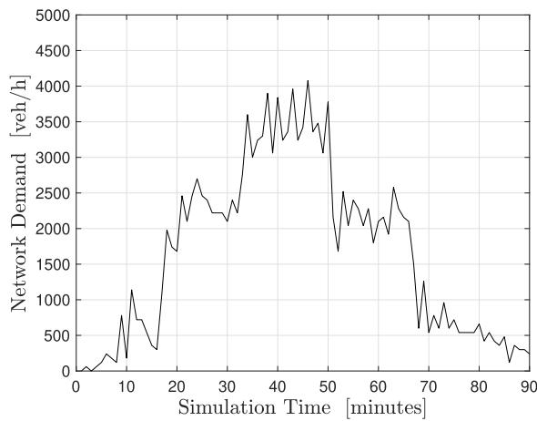  
(a) An example of network demand per minute for the first 90 minutes of a simulation.

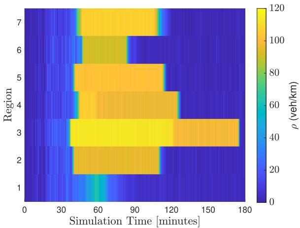  
(b) Density $\rho _ { r }$ for each homogeneous region $r \in \mathcal { R }$ across time given the demand in Figure 3a.  
Fig. 3. Network demand and density for our simulations.

The UAV-TMS is simulated by considering distinct scenarios where $| \mathcal { U } | \in \{ 1 , 2 , \dotsc , | \mathcal { R } | \}$ . For each value of |U| the corresponding sets $\mathcal { R } _ { u } ^ { U A V }$ are manually defined according to the criteria outlined in Section III-B. Raw measurements $\widetilde { \rho } _ { r } ( k )$ and $\tilde { c } _ { r j } ( k ) \ \forall j \in \mathcal { T } _ { r }$ are generated by applying white Gaussian noise to the ground truth states $\rho _ { r } ( k ) , c _ { r j } ( k )$ (see Eqs. (17), (18)) when a UAV u monitors r at time-step k. The measurement noise standard deviation can be set to $\sigma _ { \rho } \in \{ 5 , 2 , 0 . 1 \}$ corresponding to $h i g h ,$ , medium, or low noise, while the observation time and transition time are set to $M = 1 / 6$ min and $T = 1 / 2$ min, respectively. Unless otherwise stated, the UAV landing and battery swap times for region r,

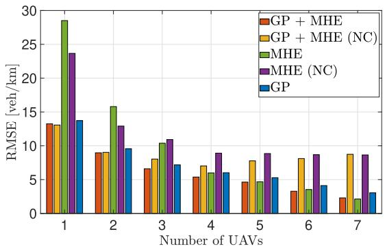  
(a) RMSE for $\hat { \rho } _ { r }$ (k).

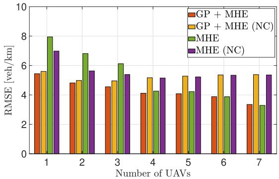  
(b) RMSE for $\hat { \rho } _ { r d } ( k )$  
Fig. 4. RMSE for $\hat { \rho } _ { r } ( k )$ and $\hat { \rho } _ { r d } ( k )$ for estimators GP, MHE (NC), GP + MHE (NC), MHE, $G P + M H E$

$L _ { r } ,$ , are set to 0 (i.e., no landing and battery swapping) and both process and measurement noise are set to high, i.e., $\sigma _ { w } = 0 . 3$ and $\sigma _ { \rho } = 5$

In the GP models, we set $\mathbf { w } = \mathbf { 0 } ;$ , following the standard practice of assuming a zero-mean prior. The hyperparameters are set to $\sigma _ { \it f \ } ^ { 2 } = \ 0 . 0 0 0 5 , \lambda ^ { 2 } = \ 0 . 0 5 , \gamma = 1$ , obtained σ . , λ . , γthrough inspection-guided manual calibration. In the MHE successive convexification algorithm we consider a 10 minute moving horizon window $( W ~ = ~ 6 0 )$ as well as $I \quad = \quad 6$ iterations with exponentially decreasing bounds, such that $\mathbf { b } = [ 2 5 , 1 0 , 2 , 0 . 5 , 0 . 1 ]$

, , , . , .The main metric used to evaluate the accuracy of estimates is the Root Mean Square Error (RMSE), given as

$$
\mathrm { R M S E } = \sqrt { \frac { 1 } { | \mathcal { R } | } \frac { 1 } { | \mathcal { K } | } \sum _ { r = 1 } ^ { | \mathcal { R } | } \sum _ { k = 1 } ^ { | \mathcal { K } | } ( \rho _ { r } ( k ) - \hat { \rho } _ { r } ( k ) ) ^ { 2 } } ,
$$

when calculating the RMSE of $\rho _ { r } ( k )$ estimates. Moreover, the error bars (when displayed) are computed by the Median Absolute Deviation (MAD), given by

$$
\begin{array} { r } { \mathbf { M A D } = \operatorname * { m e d i a n } \left( \left| S _ { 1 } - \tilde { S } \right| , \left| S _ { 2 } - \tilde { S } \right| , \ldots , \left| S _ { | S | } - \tilde { S } \right| \right) , } \end{array}
$$

where S is the set of $\hat { \rho } _ { r } ( k )$ $\forall r \in \mathcal { R } , \forall k \in \mathcal { W } _ { K - W } ^ { K } \ o r \hat { \rho } _ { r d } ( k )$ ∀r ∈ $\mathcal { R } , \forall d \in \mathcal { D } , \forall k \in \mathcal { W } _ { K - W } ^ { K } , \tilde { S } \ = \ \mathrm { m e d i a n } ( \mathcal { S } ) .$ , and $\boldsymbol { S _ { i } }$ denotes the ith element of set S. All presented results are averaged over 20 simulations.

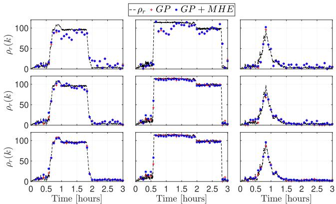

Fig. 5. Each row corresponds to the number of UAVs monitoring the network, specifically $u \in \{ 1 , 4 , 7 \}$ from the top row to the bottom row. Each column corresponds to regions $r \in \{ 1 , 3 , 7 \}$ from left to right.  
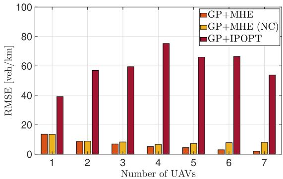  
(a) RMSE for ρr(k)

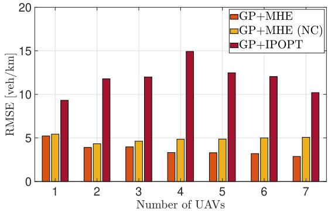  
(b) RMSE for $\hat { \rho } _ { r d } ( k )$  
Fig. 6. RMSE for $\hat { \rho } _ { r } ( k )$ and $\hat { \rho } _ { r d } ( k )$ for varying number of UAVs for $G P +$ MHE and $G P + I P O P T$

## C. Comparison of Estimation Methods

This section compares the estimation accuracy and runtime of the proposed $G P \ + \ M H E$ approach against estimation methods that follow the successive convexification approach (Figures 4-5) and against the use of a general-purpose nonlinear optimization solver (Figure 6).

Figure 4 evaluates the performance of all estimation methods which follow the successive convexification approach i.e., GP + MHE, GP + MHE (NC), MHE, and MHE (NC). For comparative purposes, the virtual measurements are also included and are denoted as $G P .$ . Four key observations can be drawn about $\hat { \rho } _ { r } ( k )$ performance for each of the five estimators by examining Figure 4a. The first observation is that $\begin{array} { r l r } { G P } & { { } + } & { M H E } \end{array}$ is the best performing estimator for all number of UAVs tested except for when 7 UAVs are used, (i.e., there is complete surveillance of the network) where MHE achieves a slightly lower RMSE. The second observation is that the successive convexification approach does not significantly improve $\hat { \rho } _ { r } ( k )$ accuracy because $G P$ and $G P \ + \ M H E$ are nearly identical for all number of UAVs as the RMSEs are within 1 veh/km from one another. The third observation is that including virtual measurements from the GP model significantly improves $\hat { \rho } _ { r } ( k )$ accuracy when data is sparse (the number of UAVs is low). This is evident as MHE and MHE (NC) perform poorly in comparison to the other estimators when the number of UAVs is between 1 and 3. The last observation is that excluding inter-boundary capacity constraints in the MHE problem reduces $\hat { \rho } _ { r } ( k )$ accuracy when the number of UAVs is high, as is shown by the poor performance of $G P \mathrm { ~ + ~ } M H E$ (NC) and MHE (NC) when the number of UAVs is greater than 4. Figure 4b likewise shows the RMSE for $\hat { \rho } _ { r d } ( k )$ for all estimators except for $G P . ^ { 1 3 }$ The trends here, and therefore the conclusions that can be drawn, are the same as those for ${ \hat { \rho } } _ { r } ( k )$

Figure 5 displays the true $\rho _ { r } ( k )$ values (black dashed line) as well as $\hat { \rho } _ { r } ( k )$ values for $G P \ + \ M H E$ and $G P$ (red and blue dots, respectively) against time [hours] for a specific simulation. Each row corresponds to the number of UAVs $u ~ \in ~ \{ 1 , 4 , 7 \}$ from top row to bottom, while each columns corresponds to the regions $r ~ \in ~ \{ 1 , 3 , 7 \}$ from left to right. , ,As can be seen, increasing the number of UAVs significantly improves estimation accuracy as the estimates are closer to the ground truth, for all displayed regions. This observation complements the observations in Figure 4a, i.e., that RMSE decreases as the number of UAVs increases for both $G P +$ MHE and GP.

Figure 6 illustrates the estimation accuracy of the proposed approach $G P \mathrm { ~ + ~ } M H E$ against $G P \mathrm { ~ + ~ } I P O P T$ which does not follow the successive convexification approach and instead directly solves Problem (42) via the IPOPT nonlinear solver. The estimation method $G P + M H E \ ( N C )$ is also included to facilitate a direct comparison with $G P \mathrm { ~ + ~ } I P O P T _ { ; }$ , as neither contain inter-boundary capacity constraints. Interestingly, the estimation accuracy of $G P + I P O P T$ is significantly worse than both $G P \mathrm { ~ + ~ } M H E$ and GP + MHE (NC), as can be seen by the high RMSE values for $\hat { \rho } _ { r } ( k )$ and $\hat { \rho } _ { r d } ( k )$ . Potential reasons for poor performance of $G P + I P O P T$ include the inability of the solver to find high-quality initial solutions and dificulty in modelling and handling the max/min functions that appear in the constraints.

In addition, the runtimes of $G P + M H E , G P + M H E \left( N C \right)$ and $G P + I P O P T$ were compared, with $G P + I P O P T$ solving a problem instance in 445 seconds, while GP + MHE and $G P$ + MHE (NC) (as well as all other successive convexification approaches) solved a problem instance in 3 seconds. The implications of these results are that $G P \mathrm { ~ + ~ } I P O P T$ is not suitable for real-time UTSE as the time taken to return a solution exceeds the time between the moving horizon window shifting in real-time (5 minutes for all experiments). Therefore $G P + M H E$ and $G P + M H E \left( N C \right)$ are clearly preferred as they are roughly two orders of magnitude faster than $G P + I P O P T .$

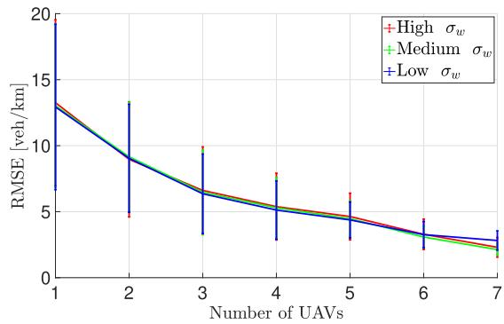  
(a) RMSE for ${ \hat { \rho } } _ { r } ( k )$

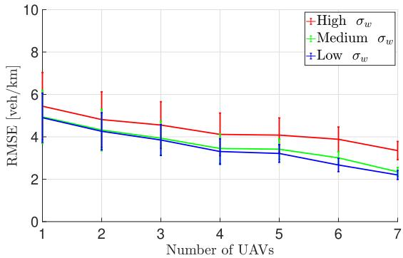  
(b) RMSE for $\hat { \rho } _ { r d } ( k )$  
Fig. 7. RMSE for $\hat { \rho } _ { r } ( k )$ and $\hat { \rho } _ { r d } ( k )$ for varying number of $\mathrm { U A V s }$ and $\sigma _ { w }$ for estimator $G P \ + \ M H E$

To summarise, the results of this experiment indicate that $G P + M H E { \mathrm { ~ ( i . e ~ } }$ ., the proposed solution approach) is the most accurate successive convexification approach tested, due to the inclusion of virtual measurements and inter-boundary capacity constraints. Moreover, employing the proposed successive convexification approach is essential for achieving real-time and high-quality estimation results, significantly outperforming general nonlinear solvers.

## D. Sensitivity Analysis

Two experiments are conducted to evaluate the sensitivity of the $G P + M H E$ estimation approach against model, measurement and parameter discrepancies. In the first experiment, we separately vary the standard deviation of the process noise $\sigma _ { w }$ and measurement noise $\sigma _ { \rho }$ on $\rho _ { r } ( k )$ measurements, while in the second experiment parametric perturbations are introduced by adding random noise to the parameters $\rho _ { r } ^ { C } , \rho _ { r } ^ { J } , q _ { r } ^ { M A X } , C _ { r j } ^ { M A X }$ in the MHE algorithm to diferentiate them from the nominal values used in the trafic simulation. The results for the first experiment are displayed in Figures 7 and 8, while Figure 9 displays the results for the second experiment.

Figure 7a displays the RMSE of $\hat { \rho } _ { r } ( k )$ values as a function of increasing UAVs and varying $\sigma _ { w } .$ . The figure shows that in all cases increasing the number of UAVs leads to a decrease in RMSE and MAD for any level of $\sigma _ { w }$ . Moreover, it can be observed that $\hat { \rho } _ { r } ( k )$ values are noise-resilient to process noise as there is hardly any deviation between RMSE values for diferent $\sigma _ { w }$ for a given number of UAVs.

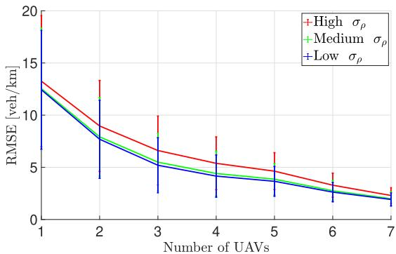  
(a) RMSE for ${ \hat { \rho } } _ { r } ( k )$

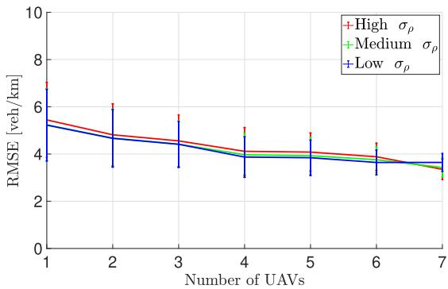  
(b) RMSE for $\hat { \rho } _ { r d } ( k )$  
Fig. 8. RMSE for $\hat { \rho } _ { r } ( k )$ and $\hat { \rho } _ { r d } ( k )$ for varying number of UAVs and $\sigma _ { \rho }$ for estimator $G P \ + \ M H E$

Figure 7b displays the RMSE of $\hat { \rho } _ { r d } ( k )$ values as a function of increasing UAVs and varying $\sigma _ { w } .$ . Like Figure 7a it also shows monotonically decreasing RMSE and MAD for an increasing number of UAVs. The key diference here is that changing $\sigma _ { w }$ has a tangible impact on $\hat { \rho } _ { r d } ( k )$ accuracy for a given number of UAVs. For example, when the number of UAVs is 4, the corresponding RMSEs are [3.3, 3.5, 4.1] veh/km for increasing $\sigma _ { w } .$ . Values of $\rho _ { r d }$ are usually small (rarely exceeding 20 veh/km), so an increase of around 1 veh/km RMSE is a noticeable performance drop. The explanation for this is that $\sigma _ { w }$ directly influences $w _ { r d } ^ { \rho } ( k )$ in Eq. (16), which in turn influences $\hat { \rho } _ { r d } ( k )$ terms.

ρSimilarly, Figure 8a and Figure 8b display the RMSE and MAD results for $\hat { \rho } _ { r } ( k )$ and $\hat { \rho } _ { r d } ( k )$ for changing $\sigma _ { \rho } .$ . Again, two ρ ρ σρconclusions can be drawn, the first being that increasing the number of UAVs leads to a guaranteed decrease in RMSE and MAD, for both $\hat { \rho } _ { r } ( k )$ and $\hat { \rho } _ { r d } ( k )$ . The second conclusion is that varying $\sigma _ { \rho }$ ρ ρleads to noticeable changes in $\hat { \rho } _ { r } ( k )$ accuracy for a given number of UAVs. This is because $\sigma _ { \rho }$ influences $\nu _ { r } ^ { \rho } ( k )$ in Eqs. (17) and hence Eq. (32), which in turn influences $\hat { \rho } _ { r } ( k )$

ρOverall, this experiment shows that increasing the number of UAVs (decreasing data sparsity) results in a decrease in RMSE and MAD for both $\hat { \rho } _ { r } ( k )$ and $\hat { \rho } _ { r d } ( k )$ for all levels of $\sigma _ { w }$ and $\sigma _ { \rho }$ . Moreover, $\hat { \rho } _ { r } ( k )$ accuracy is influenced by $\sigma _ { \rho }$ while $\hat { \rho } _ { r d } ( k )$ accuracy is influenced by $\sigma _ { w } ,$ which is explained by the way in which noises are added in the macroscopic simulation. The results also show that high-quality estimates can be achieved even with partial coverage of the network (e.g., 4 UAVs), showing that full coverage is not necessary to achieve accurate UTSE, even in high noise scenarios.

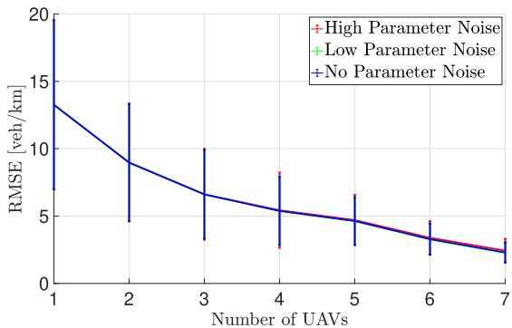  
(a) RMSE for ${ \hat { \rho } } _ { r } ( k )$

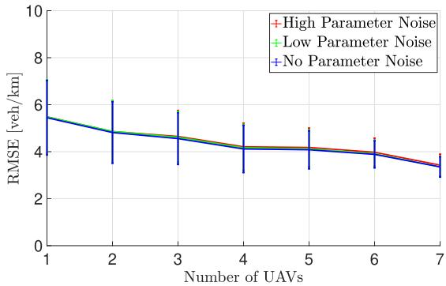  
(b) RMSE for $\hat { \rho } _ { r d } ( k )$  
Fig. 9. RMSE for varying noise on $\rho _ { r } ^ { C } , \rho _ { r } ^ { J } , q _ { r } ^ { M A X } , C _ { r j } ^ { M A X }$ in the in the MHE algorithm.

Figures 9a and 9b show the RMSE and MAD values as a function of the number of UAVs for diferent noise levels on $\rho _ { r } ^ { C } , \rho _ { r } ^ { J } , q _ { r } ^ { M A X } , C _ { r j } ^ { M A X }$ in the MHE algorithm. The noise added to the parameters is modelled by uniform distributions $U ( a , b )$ where $a , b$ represent the lower and upper limits, respectively. For $\rho _ { r } ^ { C } , \rho _ { r } ^ { J }$ the a and b values are $a \ : = \ : - 5 / 2 , b \ : = \ : 5 / 2$ and $a = - 1 0 / 2 , b = 1 0 / 2$ [veh/(km·lane)] for the low and high noise scenarios respectively, while for $q _ { r } ^ { M A X } , C _ { r j } ^ { M A X }$ the values are $a = - 2 0 / 2 , b = 2 0 / 2$ and $a = - 5 0 / 2 , b = 5 0 / 2$ [veh/h]. The results show that both RMSE and MAD values decrease as the number of UAVs increases for any parameter noise level. Moreover, the increase in noise does not result in a significant deterioration of estimation accuracy, as the maximum diference in RMSE is around 0.1 veh/km between no noise and high noise cases. Overall, these results highlight the robustness of the proposed $G P \quad + \quad M H E$ estimation approach when there is uncertainty in key trafic density and flow parameters. This implies that inevitable mismatches between calibrated and real-world parameters are not likely to afect estimation accuracy when deployed in a real-life scenario.

## E. Efect of UAV Landing and Battery Swap Time

In this experiment, the estimation performance of $G P +$ MHE for various landing and battery swap times, $L _ { r } ,$ , is evaluated in both a high and low noise scenario. For simplicity, we assume that the battery swap time is the same irrespective of the region that a UAV may be monitoring, hence the subscript r is dropped from $L _ { r }$ . Results of this experiment are found in Figure 10.

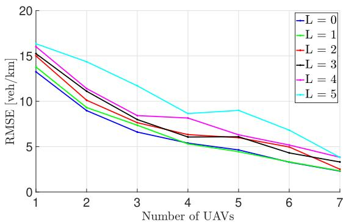

(a) High $\sigma _ { w } , \sigma _ { \rho }$  
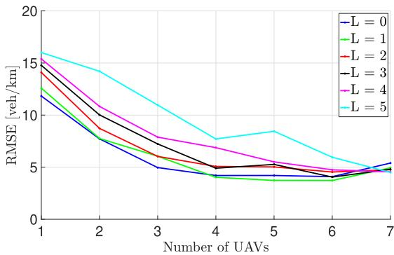  
(b) Low $\sigma _ { w } , \sigma _ { \rho }$  
Fig. 10. RMSE for $\hat { \rho } _ { r } ( k )$ for varying number of UAVs and $L ,$ for high and low $\sigma _ { w } , \sigma _ { \rho }$ ρfor estimator $G P \ + \ \cdot u \breve { H } E .$

Figure 10a illustrates the RMSE of $\hat { \rho } _ { r } ( k )$ , as a function of number of UAVs and the landing and battery swap time, $L ,$ for large $\sigma _ { w } , \sigma _ { \rho } .$ . Two main observations can be drawn from the results. Firstly, as the number of UAVs increases (data becomes less sparse) the RMSE decreases, with only a few exceptions. Secondly, for a given number of UAVs, as battery swap time decreases so does the RMSE. It is also noted that when L is small (i.e., $0 ~ \leq ~ L ~ \leq ~ 3 )$ , the maximum diference in RMSE for a given number of UAVs is 2.2 veh/km, implying that having a small battery swap time does not greatly influence estimation accuracy.

Similarly, Figure 10b shows the same experiment for small $\sigma _ { w } , \sigma _ { \rho }$ . The trends shown are similar to those in the previous experiment i.e., decreasing RMSE with increasing number of UAVs, with only a few exceptions. An important consideration is that for a given number of UAVs and $L ,$ the diference in RMSE between the high and low noise experiment is at most 1.7 veh/km. This indicates that the proposed solution approach is resilient to high noise, no matter the value of L.

Overall, the results for the low noise experiment do not difer greatly from the high noise experiment as they follow similar trends and have similar values. Moreover, in both tests it is evident that a small L $, \ ( \mathrm { i } . \mathrm { e } . , \ 0 \ \leq \ L \leq \ 3 )$ has a limited impact on $\hat { \rho } _ { r } ( k )$ accuracy, especially as the number of UAVs increases.

## VI. CONCLUSION

This paper presents a novel framework for UTSE using UAV-based sensing and a hybrid Gaussian Process (GP)- Moving Horizon Estimation (MHE) estimation approach. The primary objective is to obtain accurate, real-time estimates of regional trafic densities and intended destinations densities assuming a homogeneous region partitioning of the urban trafic network in both free-flow and congested trafic conditions. Real-time measurements of regional trafic densities and transfer flows are obtained via a UAV-Trafic Monitoring System (UAV-TMS) in which UAVs follow pre-determined flight paths while monitoring the homogeneous regions below. The real-time measurements are then input into a custom built GP-MHE estimator. The GP component interpolates the sparse regional trafic density measurements, while the MHE component estimates regional densities and intended destination densities of vehicles assuming a known MFD-based urban trafic model. A successive convexification approach is developed to handle the nonlinearities of the nonconvex trafic model constraints in the MHE problem, and is shown to return estimates in seconds whereas an equivalent nonlinear solver takes minutes.

The key contributions of this work are that accurate, real-time estimates of regional trafic density and intended destination densities are computed even with sparse input data due to limited coverage of the trafic network from UAVs. Our analysis also shows that the estimates are robust to high levels of process and measurement noise as well as mismatches between the true trafic parameters and those used in the MHE algorithm. Moreover, this is the first UTSE work to develop a hybrid GP-MHE approach and the first UTSE work to develop a successive convexification approach to handle the nonlinearities of the MHE problem. The inclusion of virtual measurements and inter-boundary capacity constraints in our solution approach are shown to significantly improve estimation performance.

The limitations of this study are that the urban trafic network must be partitioned into homogeneous regions and that the maximum flow, critical densities and jam densities of each region are known. Also, it is assumed that the origindestination matrix is known at each time-step. Future research could aim to relax these assumptions, as well as explore dynamic UAV path optimization and multi-sensor fusion.

## REFERENCES

[1] Y. Wang and M. Papageorgiou, “Real-time freeway trafic state estimation based on extended Kalman filter: A general approach,” Transp. Res. B, Methodol., vol. 39, no. 2, pp. 141–167, Feb. 2005.

[2] L. A. Klein, “Roadside sensors for trafic management,” IEEE Intell. Transp. Syst. Mag., vol. 16, no. 4, pp. 21–44, Jul. 2024.

[3] B. Coifman, “Revisiting the empirical fundamental relationship,” Transp. Res. B, Methodol., vol. 68, pp. 173–184, Oct. 2014.

[4] M. Treiber and A. Kesting, Trafic Flow Dynamics. Berlin, Germany: Springer, 2013.

[5] T. Courbon and L. Leclercq, “Cross-comparison of macroscopic fundamental diagram estimation methods,” Proc.-Social Behav. Sci., vol. 20, pp. 417–426, Dec. 2011.

[6] A. A. Kurzhanskiy and P. Varaiya, “Trafic management: An outlook,” Econ. Transp., vol. 4, no. 3, pp. 135–146, Sep. 2015.

[7] D. F. Llorca, M. A. Sotelo, S. Sanchez, M. Oca ´ na, J. M. Rodr ˜ ´ıguez-Ascariz, and M. A. Garc´ıa-Garrido, “Trafic data collection for floating car data enhancement in V2I networks,” EURASIP J. Adv. Signal Process., vol. 2010, no. 1, pp. 1–13, Dec. 2010, Art. no. 719294.

[8] E. V. Butil and R. G. Boboc, “Urban trafic monitoring and analysis using unmanned aerial vehicles (UAVs): A systematic literature review,” Remote Sens., vol. 14, no. 3, p. 620, Jan. 2022.

[9] M. F. Ahmed, J. C. Mohanta, A. Keshari, and P. S. Yadav, “Recent advances in unmanned aerial vehicles: A review,” Arabian J. Sci. Eng., vol. 47, no. 7, pp. 7963–7984, 2022.

[10] N. Geroliminis and C. F. Daganzo, “Existence of urban-scale macroscopic fundamental diagrams: Some experimental findings,” Transp. Res. B, Methodol., vol. 42, no. 9, pp. 759–770, Nov. 2008.

[11] M. Ramezani, J. Haddad, and N. Geroliminis, “Dynamics of heterogeneity in urban networks: Aggregated trafic modeling and hierarchical control,” Transp. Res. B, Methodol., vol. 74, pp. 1–19, Apr. 2015.

[12] C. Menelaou, S. Timotheou, P. Kolios, and C. G. Panayiotou, “A linear formulation of the on-time arrival problem in multi-regional networks,” in Proc. IEEE 25th Int. Conf. Intell. Transp. Syst. (ITSC), Oct. 2022, pp. 3589–3594.

[13] A. Kouvelas, M. Saeedmanesh, and N. Geroliminis, “A linear-parametervarying formulation for model predictive perimeter control in multiregion MFD urban networks,” Transp. Sci., pp. 1496–1515, Aug. 2023.

[14] M. Papageorgiou, Applications of Automatic Control Concepts to Trafic Flow Modeling and Control. Berlin, Germany: Springer, 1983.

[15] T. Seo, A. M. Bayen, T. Kusakabe, and Y. Asakura, “Trafic state estimation on highway: A comprehensive survey,” Annu. Rev. Control, vol. 43, pp. 128–151, Jan. 2017.

[16] F. Van Wageningen-Kessels, H. van Lint, K. Vuik, and S. Hoogendoorn, “Genealogy of trafic flow models,” EURO J. Transp. Logistics, vol. 4, no. 4, pp. 445–473, Dec. 2015.

[17] A. K. Shafik and H. A. Rakha, “Kalman filter-based real-time trafic state estimation and prediction using vehicle probe data,” in Proc. IEEE Int. Conf. Smart Mobility (SM), Sep. 2024, pp. 110–115.

[18] S. Box, I. Snell, S. Plc, B. J. Waterson, and R. E. Wilson, “Urban trafic state estimation for signal control using mixed data sources and the extended Kalman filter,” in Proc. 92nd Annu. Meeting Compendium Papers, 2013, pp. 1–13.

[19] R. Pueboobpaphan and T. Nakatsuji, “Real-time trafic state estimation on urban road network: The application of unscented Kalman filter,” in Applications of Advanced Technology in Transportation. Reston, VA, USA: American Society of Civil Engineers (ASCE), 2006, pp. 542–547.

[20] X. Xie, H. van Lint, and A. Verbraeck, “A generic data assimilation framework for vehicle trajectory reconstruction on signalized urban arterials using particle filters,” Transp. Res. C, Emerg. Technol., vol. 92, pp. 364–391, Jul. 2018.

[21] S. He, S. Wang, Y. Shao, Z. Sun, and M. W. Levin, “A connectivitybased real-time trafic prediction considering lane-changing maneuvers with application to eco-driving control of electric vehicles,” IEEE Trans. Veh. Technol., early access, Jul. 28, 2025, doi: 10.1109/ TVT.2025.3593196.

[22] Y. Shao and Z. Sun, “Energy-eficient connected and automated vehicles: Real-time trafic prediction-enabled co-optimization of vehicle motion and powertrain operation,” IEEE Veh. Technol. Mag., vol. 16, no. 3, pp. 47–56, Sep. 2021.

[23] S. Sarkk¨ a,¨ Bayesian Filtering and Smoothing. Cambridge, U.K.: Cambridge Univ. Press, 2013.

[24] J. B. Rawlings, Moving Horizon Estimation. London, U.K.: Springer, 2013.

[25] K. Theocharides, C. Menelaou, Y. Englezou, and S. Timotheou, “Towards eficient trafic state estimation using sparse UAV-based data in urban networks,” in Proc. 31st Medit. Conf. Control Autom. (MED), Jun. 2023, pp. 1–6.

[26] A. Y. Aravkin, J. V. Burke, and G. Pillonetto, Optimization Viewpoint on Kalman Smoothing With Applications To Robust and Sparse Estimation. Berlin, Germany: Springer, 2014, pp. 237–280.

[27] I. I. Sirmatel and N. Geroliminis, “Nonlinear moving horizon estimation for large-scale urban road networks,” IEEE Trans. Intell. Transp. Syst., vol. 21, no. 12, pp. 4983–4994, Dec. 2020.

[28] S. Kumarage, M. Yildirimoglu, and Z. Zheng, “Demand estimation for perimeter control in large-scale trafic networks,” in Proc. 8th Int. Conf. Models Technol. Intell. Transp. Syst. (MT-ITS), Jun. 2023, pp. 1–6.

[29] H. Tan, G. Feng, J. Feng, W. Wang, Y.-J. Zhang, and F. Li, “A tensorbased method for missing trafic data completion,” Transp. Res. C, Emerg. Technol., vol. 28, pp. 15–27, Mar. 2013.

[30] Y. He, C. An, Y. Jia, J. Liu, Z. Lu, and J. Xia, “Eficient and robust freeway trafic speed estimation under oblique grid using vehicle trajectory data,” IEEE Trans. Intell. Transp. Syst., vol. 25, no. 11, pp. 16193–16206, Nov. 2024.

[31] L. Hu, W. Chen, Y. Liu, X. Qu, and Z. Ye, “Vehicle state recovery: A tailored Laplace function-based tensor completion approach,” IEEE Trans. Intell. Vehicles, vol. 10, no. 7, pp. 1–13, Jul. 2025.

[32] T. Nie, G. Qin, Y. Wang, and J. Sun, “Correlating sparse sensing for large-scale trafic speed estimation: A Laplacian-enhanced low-rank tensor Kriging approach,” Transp. Res. C, Emerg. Technol., vol. 152, Jul. 2023, Art. no. 104190.

[33] M. Lin, J. Liu, H. Chen, X. Xu, X. Luo, and Z. Xu, “A 3D convolution-incorporated dimension preserved decomposition model for trafic data prediction,” IEEE Trans. Intell. Transp. Syst., vol. 26, no. 1, pp. 673–690, Jan. 2025.

[34] B.-Z. Li, X.-L. Zhao, X. Chen, M. Ding, and R. Wen Liu, “Convolutional low-rank tensor representation for structural missing trafic data imputation,” IEEE Trans. Intell. Transp. Syst., vol. 25, no. 11, pp. 18847–18860, Nov. 2024.

[35] Y. Zhang, X. Kong, W. Zhou, J. Liu, Y. Fu, and G. Shen, “A comprehensive survey on trafic missing data imputation,” IEEE Trans. Intell. Transp. Syst., vol. 25, no. 12, pp. 19252–19275, Dec. 2024.

[36] T. Afrin and N. Yodo, “A probabilistic estimation of trafic congestion using Bayesian network,” Measurement, vol. 174, Apr. 2021, Art. no. 109051.

[37] S. Li, G. Li, Y. Cheng, and B. Ran, “Urban arterial trafic status detection using cellular data without cellphone GPS information,” Transp. Res. C, Emerg. Technol., vol. 114, pp. 446–462, May 2020.

[38] D. Xu, C. Wei, P. Peng, Q. Xuan, and H. Guo, “GE-GAN: A novel deep learning framework for road trafic state estimation,” Transp. Res. C, Emerg. Technol., vol. 117, Aug. 2020, Art. no. 102635.

[39] X. Yuan, J. Chen, N. Zhang, C. Zhu, Q. Ye, and X. S. Shen, “FedTSE: Low-cost federated learning for privacy-preserved trafic state estimation in IoV,” in Proc. IEEE INFOCOM Conf. Comput. Commun. Workshops (INFOCOM WKSHPS), May 2022, pp. 1–6.

[40] A. Abdelraouf, M. Abdel-Aty, and N. Mahmoud, “Sequence-to-Sequence recurrent graph convolutional networks for trafic estimation and prediction using connected probe vehicle data,” IEEE Trans. Intell. Transp. Syst., vol. 24, no. 1, pp. 1395–1405, Jan. 2023.

[41] F. Rodrigues, K. Henrickson, and F. C. Pereira, “Multi-output Gaussian processes for crowdsourced trafic data imputation,” IEEE Trans. Intell. Transp. Syst., vol. 20, no. 2, pp. 594–603, Feb. 2019.

[42] K. J. Ofor, L. Vaci, and L. S. Mihaylova, “Trafic estimation for large urban road network with high missing data ratio,” Sensors, vol. 19, no. 12, p. 2813, Jun. 2019.

[43] C. Qiu and R. Jia, “A network-wide trafic speed estimation model with Gaussian process inference,” in Smart Transportation Systems 2023 Y. Bie, K. Gao, R. J. Howlett, and L. C. Jain, Eds., Singapore: Springer, 2023, pp. 221–228.

[44] J. Zhang, S. Mao, L. Yang, W. Ma, S. Li, and Z. Gao, “Physics-informed deep learning for trafic state estimation based on the trafic flow model and computational graph method,” Inf. Fusion, vol. 101, Jan. 2024, Art. no. 101971.

[45] E. Ka, J. Xue, L. Leclercq, and S. V. Ukkusuri, “A physics-informed machine learning for generalized bathtub model in large-scale urban networks,” Transp. Res. C, Emerg. Technol., vol. 164, Jul. 2024, Art. no. 104661.

[46] R. Shi, Z. Mo, K. Huang, X. Di, and Q. Du, “A physics-informed deep learning paradigm for trafic state and fundamental diagram estimation,” IEEE Trans. Intell. Transp. Syst., vol. 23, no. 8, pp. 11688–11698, Aug. 2022.

[47] Q. Tran and J. Firl, “Modelling of trafic situations at urban intersections with probabilistic non-parametric regression,” in Proc. IEEE Intell. Vehicles Symp. (IV), Jun. 2013, pp. 334–339.

[48] C. N. Yahia, S. E. Scott, S. D. Boyles, and C. G. Claudel, “Unmanned aerial vehicle path planning for trafic estimation and detection of nonrecurrent congestion,” Transp. Lett., vol. 14, no. 8, pp. 849–862, Sep. 2022.

[49] Y. Englezou, S. Timotheou, and C. G. Panayiotou, “Probabilistic trafic density estimation using measurements from unmanned aerial vehicles,” in Proc. Int. Conf. Unmanned Aircr. Syst. (ICUAS), Jun. 2022, pp. 1381–1388.

[50] Y. Englezou, S. Timotheou, and C. G. Panayiotou, “Enhancing trafic state estimation using UAV-based measurements,” in Proc. Int. Conf. Unmanned Aircr. Syst. (ICUAS), Jun. 2024, pp. 413–420.

[51] I. I. Sirmatel and N. Geroliminis, “Economic model predictive control of large-scale urban road networks via perimeter control and regional route guidance,” IEEE Trans. Intell. Transp. Syst., vol. 19, no. 4, pp. 1112–1121, Apr. 2018.

[52] P. Grandinetti, C. Canudas-de-Wit, and F. Garin, “Distributed optimal trafic lights design for large-scale urban networks,” IEEE Trans. Control Syst. Technol., vol. 27, no. 3, pp. 950–963, May 2019.

[53] R. Ke, Z. Li, J. Tang, Z. Pan, and Y. Wang, “Real-time trafic flow parameter estimation from UAV video based on ensemble classifier and optical flow,” IEEE Trans. Intell. Transp. Syst., vol. 20, no. 1, pp. 54–64, Jan. 2019.

[54] T. Tsekeris and N. Geroliminis, “City size, network structure and trafic congestion,” J. Urban Econ., vol. 76, pp. 1–14, Jul. 2013.

[55] S. F. A. Batista, L. Leclercq, and N. Geroliminis, “Estimation of regional trip length distributions for the calibration of the aggregated network trafic models,” Transp. Res. B, Methodol., vol. 122, pp. 192–217, Apr. 2019.

[56] C. E. Rasmussen, Gaussian Processes in Machine Learning. Berlin, Germany: Springer, 2004, pp. 63–71.

[57] S. Banerjee, B. Carlin, and A. Gelfand, Hierarchical Modeling and Analysis of Spatial Data, 2nd ed., London, U.K.: Chapman & Hall, 2014.

[58] G. P. McCormick, “Computability of global solutions to factorable nonconvex programs: Part I—Convex underestimating problems,” Math Program., vol. 10, no. 1, pp. 147–175, Dec. 1976.

[59] A. Wachter and L. T. Biegler, “On the implementation of an¨ interior-point filter line-search algorithm for large-scale nonlinear programming,” Math. Program., vol. 106, no. 1, pp. 25–57, Mar. 2006.

Yiolanda Englezou (Member, IEEE) received the degree in applied mathematics and physical sciences and in mathematics, physics, and computer science from the National Technical University of Athens in 2014 and the Ph.D. degree in statistics from the University of Southampton in 2018. She has been a Post-Doctoral Research Associate with the KIOS Research and Innovation Center of Excellence, University of Cyprus, since 2018. In 2020, she was awarded a prestigious Marie Sklodowska Curie (MSCA) Widening Fellowship to work on the

Kyriacos Theocharides (Graduate Student Member, IEEE) received the M.Eng. degree in mechanical engineering from the Imperial College London in 2021. He is currently pursuing the Ph.D. degree in computer engineering with the Department of Electrical and Computer Engineering, University of Cyprus. He is also a Researcher with the KIOS Research and Innovation Center of Excellence, University of Cyprus. His research focuses on intelligent transportation systems, specifically urban trafic state estimation using UAV-obtained data.

project “Bayesian Intelligent Transportation Systems (BITS).” Her research focuses on Bayesian inference techniques, machine learning, and estimation applications, with an emphasis on intelligent transportation systems. Her research was within the field of design of experiments, focusing on the development of methods for designing experiments for the calibration of physical and computational models. The work was funded by U.K. Engineering and Physical Sciences Research Council and, for a time, U.K. Atomic Weapon Establishment.

Charalambos Menelaou (Member, IEEE) received the B.Sc. and Ph.D. degrees in electrical and computer engineering from the University of Cyprus in 2013 and 2020, respectively. He is currently an Afiliate Research Associate with the KIOS Research and Innovation Center of Excellence, focusing on the control and optimization of large-scale urban networks and routing techniques for connectedautonomous vehicles using graph theory, AI, and mathematical programming. He is an active contributor to IEEE, serving as a Treasurer of the IEEE ITS

Society Cyprus Chapter and participating in numerous activities, including the IEEE ITSS Podcast and ISO ITS standardization committees for Cyprus Standardization Organization. His research has been published in prestigious journals and conferences. He frequently reviews scientific works related with ITS systems.

Stelios Timotheou (Senior Member, IEEE) received the Dipl.-Ing. degree in electrical and computer engineering from the National Technical University of Athens, the M.Sc. degree in communications and signal processing from the Department of Electrical and Electronic Engineering, Imperial College London, and the Ph.D. degree in intelligent systems and networks from the Department of Electrical and Electronic Engineering, Imperial College London, in 2010. He is currently an Associate Professor with the Department of Electrical and Computer Engineering and a Faculty Member with the KIOS Research and Innovation Center of Excellence, University of Cyprus. In previous appointments, he was a Research Associate with KIOS, a Visiting Lecturer with the Department of Electrical and Computer Engineering, University of Cyprus, and a Post-Doctoral Researcher with the Computer Laboratory, University of Cambridge. His research focuses on monitoring, control, and optimization of critical infrastructure systems, with an emphasis on intelligent transportation systems and communication systems. He is a Senior Editor of IEEE TRANSACTIONS ON INTELLIGENT TRANSPORTATION SYSTEMS and an Associate Editor of IEEE TRANSACTIONS ON INTELLIGENT VEHICLES.