# Reinforcement Learning-Based Collision Avoidance and Optimal Trajectory Planning in UAV Communication Networks

Yu-Hsin Hsu and Rung-Hung Gau , Senior Member, IEEE

Abstract—In this paper, we propose a reinforcement learning approach of collision avoidance and investigate optimal trajectory planning for unmanned aerial vehicle (UAV) communication networks. Specifically, each UAV takes charge of delivering objects in the forward path and collecting data from heterogeneous ground loT devices in the backward path. We adopt reinforcement learning for assisting UAVs to learn collision avoidance without knowing the trajectories of other UAVs in advance. In addition, for each UAV, we use optimization theory to find out a shortest backward path that assures data collection from all associated IoT devices. To obtain an optimal visiting order for IoT devices, we formulate and solve a no-return traveling salesman problem. Given a visiting order, we formulate and solve a sequence of convex optimization problems to obtain line segments of an optimal backward path for heterogeneous ground loT devices. We use analytical results and simulation results to justify the usage of the proposed approach. Simulation results show that the proposed approach is superior to a number of alternative approaches.

Index Terms—Reinforcement learning, UAV collision avoidance, optimal trajectory planning, convex optimization, traveling salesman problem with neighborhood

## 1 INTRODUCTION

various applications such as surveying, smart agriculture, and cargo delivery. In addition, due to their maneuverability and the existence of line-of-sight (LoS) air-to-ground communication links, UAVs could serve as mobile aerial base stations for expanding network coverage and enhancing system throughput [1].

Typically, after delivering a package to its destination, a UAV has to fly back to the cargo distribution center. In this paper, we propose using UAVs to deliver goods and collect data from ground Internet of Things (IoT) devices. Specifically, a UAV delivers a package of goods from the cargo distribution center to its destination via the forward path, while it collects data from ground IoT devices through the backward path.

When there are multiple UAVs in the network, it is paramount to avoid collisions among UAVs for flight safety. Without centralized control, the UAV collision avoidance problem is essentially an optimal sequential decision problem, which contains lots of unknown dynamics. Therefore, we take an approach of reinforcement learning [2] to attack the UAV collision avoidance problem.

In addition, for each UAV, we aim to minimize the length of the corresponding backward path/trajectory for collecting data from associated ground IoT devices. To collect data from an IoT device, a UAV has to fly close enough to the IoT device, since the transmit power is bounded. As a result, the optimal trajectory planning problem is similar to the traveling salesman problem with neighborhood (TSPN), which is NP-hard. He et al. [3] proposed the combine-skip-substitute (CSS) algorithm for using a mobile element (ME) to collect data in wireless sensor networks. The CSS algorithm solves a traveling salesman problem to determine the visiting schedule of the ME and uses circumcircles to combine visiting points. Kim et al. [4] introduced the k-traveling salesman problem with neighborhood (k-TSPN), whose goal is to find k tours for data MULEs to cover sensors in the network. Kim et al. [5] investigated optimal trajectory planning of multiple drones in search-and-reconnaissance operations. They identified new variants of the TSPN and proposed novel approximation algorithms for solving them.

There are three major differences between the studied optimal trajectory planning problem and similar problems in the literature. First, unlike the traditional TSPN, the studied optimal trajectory planning problem has different start point and termination point, which are both specified in advance. Thus, one cannot solve the optimal trajectory planning problem by solving a TSPN. Second, while previous works [3], [4], [5] assume that all site neighborhoods have the same size, we study the general case in which ground IoT devices might have neighborhoods of different sizes according to their data rate requirements. Since the radii of site neighborhoods in the studied optimal trajectory planning problem could be distinct real numbers, optimization tools in the previous works such as circumcircles [3] cannot be directly applied to the studied problem. Third, a primary design goal of [4], [5] is to obtain k tours so that each sensor in the network is covered by at least one tour, while our design goal is to obtain k tours so that the kth tour covers the kth set of sensors specified in advance.

Chen et al. [6] studied and solved the sweep coverage problem under the assumption that the communication areas of targets are disjoint. In contrast, we do not make the assumption. While they focused on the case in which the start point and the termination point of a UAV trajectory are the same, we study the case in which the start point and the termination point of the backward path are different. To obtain an optimal intermediate point for collecting data and minimizing the path length, they use a geometric approach, while we use a convex optimization approach to benefit from modern theory and software. Zeng et al. [7] aimed to design an optimal UAV trajectory that minimizes the completion time of delivering a file to a multicast group of ground terminals. They proposed using an optimal set of waypoints to create line segments of a UAV trajectory. In addition, given a set of waypoints, they adopted linear programming to obtain the optimal UAV speed. We focus on using UAVs for collecting distinct data from ground IoT devices in this paper.

Our major technical contributions include the following. First, we propose a distributed reinforcement learning approach for collision avoidance in UAV communication networks. In particular, to significantly reduce the size of the state space and avoid the curse of dimensionality, during the learning process, a UAV only learns and responds to local network states in its neighborhood. In addition, we study the optimal path design problem for a heterogeneous UAV network where ground IoT devices have different communication radii. To determine an optimal backward path for a UAV, we take a two-phase approach that contains combinatorial optimization problems and convex optimization problems. To obtain an optimal order of visiting ground IoT devices, we formulate and solve a no-return traveling salesman problem. For each UAV, given an optimal visiting sequence of IoT devices, we formulate and solve convex optimization problems to obtain the line segments of an optimal backward path. We use analytical results and large-scale simulation results to support the usage of the proposed approach. After learning, UAVs are able to avoid flight collisions. In terms of the total trajectory length, the proposed approach significantly outperforms a number of alternative approaches. To the best of our knowledge, our work is the first in the literature that rigorously studies optimization problems for using UAVs to deliver goods in the forward paths and collect data from heterogeneous ground IoT devices in the backward paths.

The rest of the paper is organized as follows. In Section 2, we briefly introduce related works in the literature. In Section 3, we include system model and problem formulation. In Section 4, we propose a novel trajectory planning algorithm for UAVs. The proposed algorithm is based on combinatorial optimization and convex optimization. In Section 5, we propose a reinforcement learning approach for UAV collision avoidance. We show simulation results in Section 6. Our conclusions are included in Section 7.

planning methods for a UAV to avoid collision with commercial aircraft and other moving obstacles based on random tree algorithms. Mahjri et al. [9] proposed an analytical framework for a three-dimensional conflict detection. They proposed the SLIDE algorithm for conflict detection so that UAVs could safely share a common airspace. Machine learning has been used to solve a number of problems in wireless communication networks including collision avoidance for UAVs. Wang et al. [10] proposed a deep reinforcement learning-based method that allows UAVs to execute navigation tasks such as goods delivery and remote surveillance. They formulated the studied problem as a partially observable Markov decision process (POMDP) and solved it by a novel online deep reinforcement learning (DRL) algorithm. The UAV navigation problem studied in [10] is different from the UAV collision avoidance problem studied in the paper. While they focus on static obstacles that do not move, we concentrate on the scenario in which adjacent UAVs with unknown flying trajectories are the only obstacles for a UAV. To significantly reduce the size of the state space and the computational complexity, we do not use any POMDP and take a distributed approach of reinforcement learning for UAV collision avoidance. To reduce the computational complexity, unlike [10], our proposed approach does not use any neural network. We try the reduce the size of the state space by design rather than using deep neural networks to approximate the mapping between states and optimal actions. Lin et al. [11] proposed using recurrent neural networks for optimal proactive edge caching in wireless small cell networks. In this paper, we propose using reinforcement learning for collision avoidance in UAV communication networks.

UAVs could be used for supporting uplink communication and collecting data from ground devices. Mozaffari et al. [12] studied the problem of collecting IoT data by UAVs. They focused on optimizing the UAV locations in order to minimize the total transmit power of IoT devices. Yang et al. [13] focused on dispatching a UAV to collect data from fixed ground terminals (GTs). Specifically, they studied the tradeoff between the energy consumption of a UAV due to flying and that of a ground terminal due to data transmission. They found the optimal GT transmit power and UAV trajectory that achieve Pareto optimal tradeoffs. Yuan et al. [14] studied the optimal robot routing problem in which a mobile robot is required to visit all given sensors in the plane for downloading the data and finally return to its base. To minimize the traveling distance of the robot, they formulated a TSPN, which is NP-hard. We formulate a no-return TSPN for optimizing the backward path of a UAV in this paper. Li et al. [15] proposed using a UAV as a floating relay for users in a wireless cellular network. They obtained an optimal power allocation strategy for each user and designed two effective online 3-D placement algorithms for the UAV to approach the optimal location. Zhou et al. [16] considered the UAV-aided mobile crowd sensing (MCS) system and investigated the associated joint route planning and task assignment problem. In particular, they proposed using dynamic programming to solve the route planning problem and took a game-theoretic approach to deal with the task assignment problem.

## 2 RELATEDWORK

Collision avoidance is an important issue for UAVs. Lin UAVs could also support downlink wireless communicaet al. [8] designed and implemented sampling-based path tions. Wu et al. [17] proposed maximizing the minimum Authorized licensed use limited to: Guangxi University. Downloaded on July 05,2026 at 12:38:43 UTC from IEEE Xplore. Restrictions apply.

throughput over all ground users in the downlink communication by jointly optimizing multiuser communication scheduling, user association, UAV trajectories, and UAV power control. Specifically, they designed an efficient iterative algorithm that solves the non-convex optimization problem based on the block coordinate descent and successive convex optimization techniques. Cheng et al. [18] investigated using UAVs to serve users at cell edges for data offloading. They focused on optimizing the UAV trajectory for maximizing the sum rate of UAV-served edge users subject to the rate requirements. Given a UAV with initial location and final location, Zhang et al. [19] aimed to obtain an optimal UAV trajectory that minimizes the mission completion time subject to quality-of-connectivity constraints. Zhao et al. [20] studied the problem of sum rate maximization in a UAV-assisted NOMA wireless network in which the UAV and base stations collaborate to serve ground users. They proposed jointly optimizing the UAV trajectory and the NOMA precoding vectors.

The UAV trajectory design problem is closely related to the geometric coverage problem [21], [22]. For mathematical tractability, it is usually assumed that a trajectory is composed of line segments and therefore is fully characterized by turning points. To minimize the trajectory length, it is desired to select a turning point at which a UAV could serve/cover IoT devices as many as possible. The random geometric disk cover (GDC) algorithm [23] produces an approximate solution for the geometric coverage problem with low computational complexity. Gau et al. [24] proposed a dual approach for solving the worst-case-coverage deployment problem in ad-hoc wireless sensor networks. Zhang [25] proposed a polynomial-time approximate algorithm for the maximum lifetime k-coverage problem in wireless sensor networks. In [24], [25], the primary goal is to find optimal locations for deploying sensors or to schedule active/sleeping status of sensors. In contrast, we aim to obtain an optimal trajectory for a UAV to serve a given set of ground IoT devices. More details on coverage problems in wireless sensor networks can be found in [24], [25] and reference therein.

In addition to trajectory design, obtaining optimal final locations for UAVs is also an active research topic. Lyu at al. [26] proposed a polynomial-time algorithm for sequentially dispatching UAVs to cover ground terminals. Koyuncu et al. [27] proposed a quantization approach for deployment and trajectory optimization of UAVs. For 1-D networks, they determined an accurate formula for the total UAV movement that guarantees the best time-averaged performance. Zhang et al. [28] studied two fast UAV deployment problems for optimal wireless coverage. In particular, the first UAV deployment algorithm seeks to minimize the maximum deployment delay among all UAVs for fairness consideration, while the other aims to minimize the total deployment delay for efficiency consideration.

Energy-efficient design is important for UAV communication networks. Zeng et al. [29] studied energy-efficient UAV communication with a ground terminal via optimizing the trajectory of a UAV. They assumed that the UAV flies horizontally with a fixed altitude and aimed to optimize the flight radius as well as the speed of the UAV. Li et al. [30] proposed using UAVs to extend wireless sensor networks (WSNs) to remote human-unfriendly terrains. They proposed an energy-efficient cooperative relaying scheme which extends the network lifetime while guaranteeing the success rate. Xu et al. [31] studied a UAV-enabled wireless power transfer system, where a UAV delivers wireless energy to a set of energy receivers at known locations on the ground. Yin et al. [32] jointly optimized resource allocation and placement of a wireless-powered UAV in wireless cellular networks. Sun et al. [33] investigated 3D trajectory design and resource allocation for solar-powered UAV communication systems. In particular, they aimed to maximize the system sum throughput over a given time period. In this paper, we obtain optimal trajectories for reducing energy consumption and completion time of data collection. Wireless energy transfer and energy harvesting are beyond the scope of the paper.

## 3 SYSTEM MODEL AND PROBLEM FORMULATION

Consider a system that consists of a set $\mathcal { M } = \{ 1 , 2 , \dots , M \}$ of M UAVs and a set $\mathcal { N } = \{ 1 , 2 , \dots , N \}$ M ¼ f gof N ground IoT devi-N ¼ f gces. Let be the set of all integers and be the set of all Zreal numbers. Let $( x _ { k } , y _ { k } , 0 )$ Rbe the coordinates of the loca-ð Þtion of the kth ground IoT device, $\forall k \in \{ 1 , 2 , . . , M \}$ . Define $\mathbf { w } _ { k } = ( x _ { k } , y _ { k } )$ 8 2 f g, k. It is assumed that a ground IoT device is ¼ ð Þ 8associated with a single UAV. Let $A _ { n }$ be the index of the UAV that serves the ground IoT device n, n. Let $\kappa _ { m }$ be the 8 Kset composed of indexes of the ground IoT devices that are associated with UAV m, m. Namely, $K _ { m } = \{ n \in \mathcal { Z } | 1 \leq$ $n \leq N , A _ { n } = m \}$ , m.

 ¼ g 8It is assumed that the speed of a UAV is constant and all UAVs have the same speed. Let V be the speed of a UAV. For each UAV, there are a start point, a destination point, a forward path, and a backward path. Specifically, for a UAV, a forward path is a continuous curve from the start point to the destination point. On the other hand, for a UAV, the backward path is a continuous curve from the destination point to the start point. For a UAV, the forward path is typically different from the backward path, since the two paths are used for different purposes. Each UAV is used for goods delivery and data collection. Specifically, UAV m has to deliver goods from the starting point $q _ { s t a r t , m } \in \mathcal { R } ^ { 3 }$ to the destination $q _ { g o a l , m } \in \mathcal { R } ^ { 3 }$ 2 Rthrough the forward path, m $\in \mathcal { M }$ 2 R 8 2 MAfter delivering goods through the forward path, UAV m has to collect data from the associated ground IoT devices and return to ${ q _ { s t a r t , m } }$ through the backward path, m.

Assume that UAV k flies at altitude $h _ { k }$ 8after the launching phase, k. To efficiently utilize the space, UAVs are parti-8tioned into groups such that $h _ { i } = h _ { j }$ if and only if UAV i ¼and UAV j belong to the same group. Let $d _ { m i n }$ be the minimum distance required for two UAVs to avoid collisions. To assure that two UAVs that belong to different groups never collide, min $\mathsf { l } _ { ( i , j ) : h _ { i } \neq h _ { j } } | h _ { i } - h _ { j } | > d _ { m i n }$ . Since UAVs that ð Þ 6¼ j  jbelong to different groups do not collide, it is sufficient to focus on a single group. Without loss of essential generality, it is assumed that all UAVs belong to the same group. As [29], we assume that all UAVs fly at a fixed altitude h after the launching phase.

It is assumed each UAV is equipped with a radar (and/ or a lidar). Let $d _ { s e n }$ be the sensing radius of a UAV. Namely, a UAV detects an adjacent UAV if and only if the distance July 05,2026 at 12:38:43 UTC from IEEE Xplore. Restrictions apply.

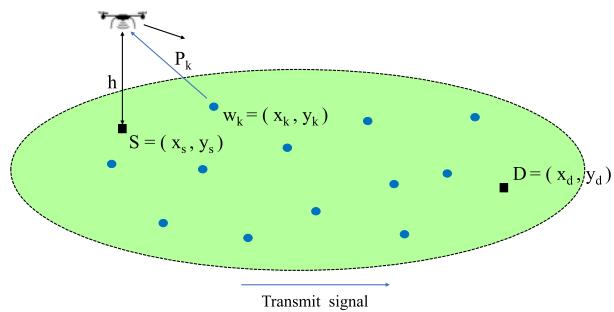  
Fig. 1. System model for UAV data collection.

between the two UAVs is no greater than $d _ { s e n }$ . To avoid UAV collisions, it is required that $d _ { s e n } > d _ { m i n } .$

For applications such as using a UAV to deliver a transplanted organ or medicines, it is paramount to deliver goods to the destination as soon as possible. In addition, when goods are heavy, it is detrimental for a battery-powered UAV to carry the goods for too much time. Therefore, for each UAV, we aim to use the forward path to deliver goods as fast as possible without collisions. In addition, we aim to use the backward path to minimize the completion time of collecting data from ground IoT devices without collisions. Later in the paper, we will show how a UAV plans its optimal backward path based on optimization theory and decides its actual paths based on distributed reinforcement learning.

Let $d ( S _ { 1 } , \breve { S } _ { 2 } )$ be the distance between two sets $S _ { 1 }$ and $S _ { 2 }$ where $S _ { 1 } , S _ { 2 } \in \mathcal { R } ^ { 3 }$ . In particular,

$$
d ( S _ { 1 } , S _ { 2 } ) = \operatorname* { i n f } _ { { \mathbf { u } } \in S _ { 1 } , { \mathbf { v } } \in S _ { 2 } } \| { \mathbf { u } } - { \mathbf { v } } \| .\tag{1}
$$

Let $d ( \gamma , \mathbf { v } )$ be the distance between a differential curve g and ð Þa point v in the three-dimensional euclidean space $\mathcal { R } ^ { 3 }$ For a differential curve $\gamma$ in $\mathcal { R } ^ { 3 }$ , let $\{ \gamma ( \tau ) = ( \gamma _ { 1 } \overline { { ( } } \tau ) , \gamma _ { 2 } ( \tau )$ $\gamma _ { 3 } ( \tau ) ) | 0 \leq \tau \leq 1 \}$ R f ð Þ ¼ ð ð Þ ð Þbe a parameterization. For a differential ð ÞÞj curve g in $\mathcal { R } ^ { 2 } ,$ g, let $\{ \hat { \gamma ( \tau ) } = ( \gamma _ { 1 } ( \tau ) , ~ \gamma _ { 2 } ( \tau ) ) | 0 \le \tau \le 1 \}$ be a parameterization.

For each w $\in \mathcal { R } ^ { 2 }$ and $r > 0 ,$ let $C _ { \bf w } ( r )$ be the circle cen-2 Rtered at w with radius r. Namely, $C _ { \mathbf { w } } ( r ) = \{ \mathbf { v } \in \mathcal { R } ^ { 2 } | | \mathbf { v } - \mathbf { \mu }$ $\mathbf { w } \| \leq r \}$ . Let $\partial C _ { \bf w } ( r )$ ðbe the boundary of $C _ { \bf w } ( r )$ 2 R jk . Namely, $\partial C _ { \mathbf { w } } ( r ) = \{ \mathbf { v } \in \mathscr { R } ^ { 2 } | | | \mathbf { v } - \mathbf { w } | | = r \}$ ð Þ. Given two sets $S _ { 1 }$ and $S _ { 2 } \subseteq S _ { 1 }$ ¼ f 2, define $S _ { 1 } - S _ { 2 } = \{ x | x \in S _ { 1 } , x \notin S _ { 2 } \}$

## 3.1 Data Collection Through Backward Paths

Since different UAVs serve different ground IoT devices, it is sufficient to focus on a single UAV for the phase of data collection. Thus, ${ q _ { s t a r t , m } }$ and $q _ { g o a l , m }$ are abbreviated by qstart by ${ { q } _ { g o a l } } ,$ respectively. In addition, $q _ { s t a r t } = ( x _ { s } , y _ { s } , h )$ and ${ q _ { g o a l } = ( x _ { d } , y _ { d } , h ) }$ . Furthermore, $\kappa _ { m }$ ¼ ð Þis abbreviated by . Let $K = | { \cal { K } } |$ Þ K K. Without loss of essential generality, it is assumed ¼that $\mathcal { K } = \{ 1 , 2 , . . , K \}$ . Through the backward path, the UAV K ¼flies from $( x _ { d } , y _ { d } , h )$ to $( x _ { s } , y _ { s } , h )$ and collects data from IoT ð Þ ð Þdevices with indexes in . In Fig. 1, we illustrate the studied Kcommunication network that contains UAVs and ground IoT devices. For clarity, we only show a UAV in the figure.

As in many previous works, it is assumed that the air-toground (A2G) communication channels are line-of-sight (LoS) links. Namely, the channel gain follows the free space propagation model and depends only on the distance between the UAV and an IoT device. Let $d _ { k }$ be the distance between the UAV and IoT device $k , \ f _ { c }$ be the carrier frequency, c be the speed of light, and $\eta _ { L o S }$ be the average additional loss for LoS links. According to the LoS channel model [34], $L _ { L o S , k } ,$ the path loss for the link from the UAV to IoT device k in dB is as follows.

$$
L _ { L o S , k } = 2 0 \log _ { 1 0 } \biggl ( \frac { 4 \pi f _ { c } d _ { k } } { c } \biggr ) + \eta _ { L o S } .\tag{2}
$$

Let $P _ { k }$ be the transmit power of the kth ground IoT device in dB, k. We focus on a heterogeneous network in which the values of $P _ { k } ^ { \prime } \mathbf { s }$ are not the same. Let $\Gamma _ { k }$ be the threshold of the received SNR in dB for the UAV to successfully decode data from ground IoT device $k ,$ k. Let $P _ { n }$ be the background noise 8power in dB. For the UAV to successfully decode data from ground IoT device $k ,$ we have the following inequality.

$$
P _ { k } - L _ { L o S , k } - P _ { n } \geq \Gamma _ { k } .\tag{3}
$$

Let $L _ { k } = P _ { k } - P _ { n } - \Gamma _ { k }$ be the path loss threshold in dB, $\forall k \in { \mathcal { K } }$ ¼ . Then, $L _ { L o S , k } \leq L _ { k } ,$ k. Let $D _ { k }$ be the maximum com-8 2 K  8munication distance from ground IoT device k to the UAV. Based on (2), we have

$$
L _ { k } = 2 0 \log \left( \frac { 4 \pi f _ { c } D _ { k } } { c } \right) + \eta _ { L o S } .\tag{4}
$$

Thus,

$$
D _ { k } = \frac { c } { 4 \pi f _ { c } } \cdot 1 0 ^ { \frac { L _ { k } - \eta _ { L o S , k } } { 2 0 } } .\tag{5}
$$

Let - be the required time for the UAV to collect data from an IoT device. Let $R _ { k } = \sqrt { { D _ { k } } ^ { 2 } - h ^ { 2 } } - \lambda V .$ , k. Due to that the values of $P _ { k } { ' } \mathsf { s }$ are not identical, the values of $R _ { k } { ' } \mathbf { s }$ are not the same. Since V is the speed of the UAV, -V is the maximum distance that the UAV could move away from the kth IoT device within - time units. Then, the UAV successfully collects data from the kth ground IoT device if the the distance between the backward path of the UAV and the kth IoT device is no greater than $R _ { k } , \forall k .$ . Our goal is to find an optimal differential curve $\gamma ^ { * }$ 8with minimum length in $\mathcal { R } ^ { 3 }$ such that $\gamma ^ { * } ( 0 ) = ( x _ { d } , y _ { d } , h ) , \ \gamma ^ { * } ( 1 ) = ( x _ { s } , y _ { s } , h ) , \ \gamma _ { 3 } ^ { * } ( \tau ) = h ,$ $\forall \tau \in [ 0 , 1 ] ,$ ðand $d ( \gamma ^ { \ast } , ( x _ { k } , y _ { k } , 0 ) ) \leq D _ { k } , \forall k \in \mathcal { K }$ Þ ð Þ ¼ 8 2 ½ $\tau \in [ 0 , 1 ] , \gamma _ { 3 } ^ { * } ( \tau )$ ÞÞ  8 2 Kis the third component of the vector $\gamma ^ { \ast } ( \tau )$

2 ½ 	 ð ÞFor each curve $\gamma$ in $\mathcal { R } ^ { 3 }$ , let $\bar { \tilde { \gamma } }$ ð Þbe the orthogonal projection of curve g onto the horizontal plane $\mathbf { \bar { E } } _ { 2 } = \bar { \{ } ( x , y , z ) \in { }$ $\mathcal { R } ^ { 3 } | z = 0 \}$ . Specifically, if $\gamma ( \tau ) = \bar  \{ ( \gamma _ { 1 } ( \tau ) , \gamma _ { 2 } ( \tau ) , \gamma _ { 3 } ( \tau ) ) | \tau \in$ $[ 0 , 1 ] \} , \tilde { \gamma } ( \tau ) = \mathrm { \bar { \{ } }  ( \gamma _ { 1 } ( \tau ) , \dot { \gamma } _ { 2 } ( \tau ) , 0 ) | \tau \in [ 0 , 1 ] \}$ ð Þ. Let $P C _ { 1 } ( \mathcal { R } ^ { 2 } )$ ÞÞj 2be the ½ 	g ð Þ ¼ fð ð Þ ð Þ Þj 2 ½ 	g ðR Þset of continuous and piecewise differential plane curves on the plane $\mathbf { E } _ { 2 } .$ . To find out an optimal backward trajectory for the UAV, we formulate the following optimization problem.

$$
\operatorname* { m i n } _ { \tilde { \gamma } \in P C _ { 1 } ( \mathcal { R } ^ { 2 } ) } \int _ { 0 } ^ { 1 } \sqrt { \left( \frac { d \tilde { \gamma } _ { 1 } ( \tau ) } { d \tau } \right) ^ { 2 } + \left( \frac { d \tilde { \gamma } _ { 2 } ( \tau ) } { d \tau } \right) ^ { 2 } } d \tau
$$

subjectto

$$
\tilde { \gamma } = \{ ( \tilde { \gamma } _ { 1 } ( \tau ) , \tilde { \gamma } _ { 2 } ( \tau ) , 0 ) | \tau \in [ 0 , 1 ] \}\tag{6}
$$

$$
d ( \tilde { \gamma } , \mathbf { w } _ { k } ) \leq R _ { k } , \forall k \in \mathcal { K }
$$

$$
( \widetilde { \gamma } _ { 1 } ( 0 ) , \widetilde { \gamma } _ { 2 } ( 0 ) ) = ( x _ { d } , y _ { d } )
$$

$$
( \widetilde { \gamma } _ { 1 } ( 1 ) , \widetilde { \gamma } _ { 2 } ( 1 ) ) = ( x _ { s } , y _ { s } ) .
$$

We now elaborate on the above optimization problem. First, based on differential geometry, the object function is the length of the differential curve $\tilde { \gamma } .$ . The first constraint corresponds to a parameterization of the plane curve $\tilde { \gamma } .$ The second constraint states that the backward path of the UAV has to be close enough to each ground IoT device k in order to successfully collect and decode data, k. The third constraint specifies the beginning point of the backward path, which is also the termination point of the forward path. The fourth constraint specifies the termination point of the backward path of the UAV, which is the start point of the forward path.

## 3.2 Collision-Free Paths

Avoiding collisions among UAVs is essential for a UAV communication network. First, two or more UAVs on their forward paths should not collide. Second, two or more UAVs on their backward paths should not collide. Third, a UAV on its forward path should not collide with another UAV on its backward path. Since the collision avoidance problems in the above three cases are essentially identical, it is sufficient to concentrate on the collision avoidance problem for UAVs on their forward paths.

We now consider the forward paths of the M UAVs and focus on collision avoidance. Let $\bar { q } _ { m } ( t ) = ( x _ { m } ( t ) , y _ { m } ( t ) , h )$ be ð Þ ¼ ð ð Þ ð Þ Þthe coordinates of the location of UAV m at time $t ,$ $\forall m \in \{ 1 , 2 , . . , M \} , t \geq 0$ . Recall that $d _ { m i n }$ is the minimum dis-8 2 f g tance required for two UAVs to avoid collisions. To completely avoid collisions, the following constraint has to be satisfied.

$$
\| q _ { m } ( t ) - q _ { n } ( t ) \| \geq d _ { m i n } , \forall m \neq n , t \geq 0 .\tag{7}
$$

When the distance between two UAVs is less than or equal to $d _ { m i n } ,$ the two UAVs adjust their altitudes according to their indexes to avoid collisions. Recall that $d _ { s e n }$ is the sensing radius of a UAV. A UAV is able to obtain the relative position and velocity of an adjacent UAV if and only if their distance is no greater than $d _ { s e n } .$ It is assumed that a UAV observes its environment every $t _ { s e n s o r }$ time units. To avoid collisions, the value of $t _ { s e n s o r }$ cannot be too large. On the other hand, to reduce computational complexity and energy consumption, the value of $t _ { s e n s o r }$ cannot be too small. To completely avoid collisions, it is required that $d _ { s e n } \geq 2 V \cdot { } t _ { s e n s o r } + d _ { m i n } .$ Note that $2 V \cdot t _ { s e n s o r }$   þis the maximum reduction for dis-tance between two UAVs within $t _ { s e n s o r }$ time units. If the distance between two UAVs is $2 V \cdot t _ { s e n s o r } + d _ { m i n }$ at time $t _ { 0 }$  þand the two UAVs fly toward each other, the distance between the two UAVs will become $d _ { m i n }$ at time $t _ { 0 } + t _ { s e n s o r } .$ þWithout loss of essential generality, it is assumed that $t _ { s e n s o r } = 1$

Let $T _ { m }$ be the total time required for UAV m to fly from q to q , m. Define $\mathbf { T } = ( T _ { 1 } , T _ { 2 } , . . , T _ { M } )$ . Let $q _ { m } = \{ q _ { m } ( \tau ) | 0 \leq \tau \leq T _ { m } \}$ ¼ ðbe the forward path of $\mathrm { U A V } \ m , \forall .$ ¼ fDefine $\mathbf { q } = ( q _ { 1 } , q _ { 2 } , . . , q _ { M } )$ g 8. To deliver goods as soon as possi-¼ ð Þble and reduce the energy consumption due to flying, we formulate the following optimization problem.

$$
\operatorname* { m i n } _ { \substack { \bf T , q } } \operatorname* { m a x } _ { m : 1 \leq m \leq M } \int _ { 0 } ^ { T _ { m } } \sqrt { \left( \frac { d x _ { m } ( \tau ) } { d \tau } \right) ^ { 2 } + \left( \frac { d y _ { m } ( \tau ) } { d \tau } \right) ^ { 2 } } d \tau
$$

subjectto

$$
\begin{array} { r l } & { T _ { n } ^ { \prime } > 0 , \forall m \in \{ 1 , 2 , . . . , M \} } \\ & { q _ { m } = \{ q _ { m } ( \tau ) = ( x _ { m } ( \tau ) , y _ { m } ( \tau ) , h ) | 0 \leq \tau \leq T _ { m } \} , } \\ & { \quad \forall m \in \{ 1 , 2 , . . . , M \} } \\ & { q _ { m } \in R \cap \{ \mathbf { 1 } ^ { 3 } \} , \forall m \in \{ 1 , 2 , . . . , M \} } \\ & { q _ { m } ( 0 ) = ( x _ { v } , y _ { s } , h ) , \forall m \in \{ 1 , 2 , . . . , M \} } \\ & { q _ { m } ( T _ { n } ) = ( x _ { a } , y _ { a } , h ) , \forall m \in \{ 1 , 2 , . . . , M \} } \\ & { \left. \frac { d q _ { m } ( t ) } { d t } \right. = V , \forall m \in \{ 1 , 2 , . . . , M \} , t \geq 0 } \\ & { \left. q _ { i } ( t ) - q _ { i } ( t ) \right. \geq d _ { m + n } \forall i \neq j , \forall i \geq 0 } \\ & { \mathbf { T } = ( T _ { 1 } , T _ { 2 } , . . . , T _ { M } ) } \\ & { \mathbf { q } = ( q _ { i } , q _ { 0 } , . . . , q _ { M } ) . } \end{array}\tag{8}
$$

We now elaborate on the above optimization problem. First, $\begin{array} { r } { \int _ { 0 } ^ { T _ { m } } \sqrt { \left( \frac { d x _ { m } ( \tau ) } { d \tau } \right) ^ { 2 } + \left( \frac { d y _ { m } ( \tau ) } { d \tau } \right) ^ { 2 } } } \end{array}$ dt is the forward trajectory length of UAV m. To minimize the completion time of delivering goods and reduce the overall energy consumption of UAV flights, we aim to minimize the maximum length over all forward paths of UAVs. The first constraint reflects that $T _ { m }$ is a positive real number. The second constraint defines the curve $q _ { m } ,$ which is the forward path of UAV m, m. The third constraint requires that $q _ { m }$ 8is a differential curve, m. Therefore, $q _ { m } ( \tau )$ is also a continuous function of $\tau .$ The fourth con-ð Þstraint specifies the start point of curve $q _ { m , * }$ , while the fifth constraint specifies the termination point of curve $q _ { m } .$ . The sixth constraint is due to that the speed of a UAV does not change with time and is equal to V . The seventh constraint is used to avoid collisions between two UAVs.

## 3.3 On the Joint Optimization Problem

Ideally, the collision avoidance problem and the trajectory planning problem should be addressed under a joint optimization problem. In principle, the joint optimization problem could be formulated as a non-cooperative multiagent sequential decision problem [35], [36]. However, the number of strategy profiles for multiple UAVs is expected to be very large. In addition, since the sensing radius of a UAV is finite, the joint optimization problem is a partially observable game or an imperfect information game [35]. To reduce the computational complexity and to benefit from the mathematical structure of the trajectory planning problem, we propose using the planned trajectory as the starting point for the learning-based collision avoidance algorithm. As shown later in the paper, the proposed approach could avoid collisions and produce shorter trajectories with lower computational complexity. In Section 4, we propose efficient algorithms for obtaining planned trajectories. In Section 5, we propose a decentralized approach based on reinforcement learning for UAV collision avoidance.

## 4 TRAJECTORY PLANNING FOR DATA COLLECTION

It is difficult to directly solve (6), which looks for an optimal curve among all differential curves in the plane. In this section, we propose the convex-TSP algorithm to obtain an July 05,2026 at 12:38:43 UTC from IEEE Xplore. Restrictions apply.

optimal backward path for a UAV among all curves that are composed of a finite number of line segments. The proposed algorithm is based on solving convex optimization problems and an auxiliary no-return traveling salesman problem (TSP).

The proposed algorithm consists of three parts. In the first part, it solves an auxiliary no-return TSP for determining the visiting order of ground IoT devices associated with the UAV. In the second part, given the visiting order, the proposed algorithm solves convex optimization problems to obtain potential turning points for the UAV. The potential turning points could be used to form line segments of a curve that is a feasible solution of (6). In the third part, the proposed algorithm comes up with the final solution based on refining the curve obtained in the second part. Pseudo codes for the proposed algorithm are included in Algorithm 1. The output of the proposed convex-TSP algorithm is a curve that consists of line segments.

## 4.1 No-Return TSP for Determining the Visiting Order

We adopt an auxiliary TSP based on the following observations. First, when $R _ { k } = 0 , \forall k ,$ , the optimization problem (6) ¼ 8is very similar to the well-known euclidean Traveling Salesman Problem (TSP) except that the former has different start point and termination point. Namely, we aim to solve a noreturn TSP for determining the visiting order of ground IoT devices. In addition, when $R _ { k } > 0 , \forall k ,$ , the optimization 8problem (6) is similar but not identical to the TSPN. While the euclidean TSP and the TSPN are both NP-hard [6], [14], [37], [38], there exist efficient approximation algorithms and modern software tools for solving them. Therefore, we propose using an auxiliary TSP to determine an optimal visiting order for a given set of ground IoT devices in a systematic manner.

We now create an auxiliary TSP as follows. First, there are $K + 3$ cities in the TSP. Specifically, city k corresponds þto ground IoT device $k , \forall k \in \mathsf { \{ 1 , 2 , . . , \dot { K } \} }$ , city $K + 1$ corresponds to point S at $( x _ { d } , y _ { d } ) .$ 2 f, city $K + 2$ g þcorresponds to point D at $( x _ { s } , y _ { s } )$ , and city $K + 3$ þis the unique virtual city. City k ð Þis called a real city, $\forall k \in \{ 1 , 2 , . . , K + 2 \}$ . Define $\mathbf { w } _ { K + 1 } =$ $( x _ { d } , y _ { d } )$ and $\mathbf { w } _ { K + 2 } = \left( x _ { s } , y _ { s } \right)$ f þ g þ ¼. In a feasible solution of the aux-ð Þ þ ¼ ð Þiliary TSP, the traveler starts from the virtual city, visits $K + 2$ real cities, and then goes back to the virtual city. The þtraveler visits each real city once. Since we try to determine an optimal backward path, city $K + 1$ at $( x _ { d } , y _ { d } )$ should be the second visited city and city $K + 2$ at $( x _ { s } , y _ { s } )$ should þbe the second last visited city of the traveler.

Let C be the $( K + 3 ) – \mathrm { b y } – ( K + 3 )$ cost matrix for the auxil-ð þ Þ ð þ Þiary TSP. We set values for the elements of C as follows. First, $[ \mathbf { C } ] _ { i , i } ^ { \phantom { \dagger } } = 0 ,$ , i. Second, $[ \mathbf { C } ] _ { i , j } = \big \| \mathbf { w } _ { i } - \mathbf { w } _ { j } \big \| , \forall i , j \in \{ 1 , 2 , . . , K \}$ ½ 	 ¼ 8 ½ 	 ¼  8 2 fNamely, if city i and city j correspond to IoT devices, $[ \mathbf { C } ] _ { i , j }$ gis ½ 	equal to the distance between the two IoT devices. Third, $[ \bar { \bf C } ] _ { K + 3 , K + 1 } = [ { \bf C } ] _ { K + 3 , K + 2 } = 0 ,$ while $[ \mathbf { C } ] _ { K + 3 , j } = \infty , \forall j \in \{ 1$ $2 , . . , K \}$ þ ¼ ½ 	 þ þ ¼ ½ 	 þ ¼ 1 8 2 f. Namely, the distance from the virtual city to point $\mathsf { S } / \mathsf { D }$ gis set to zero, while the distance from the virtual city to a city corresponding to an IoT device is set to infinity. By doing so, the traveler always moves from the virtual city to S or D. To ensure that the traveler always moves to the virtual city via D, $[ \mathbf { C } ] _ { i , K + 3 } = \infty , \forall i \in \{ 1 , 2 , . . , \ ' { K } + 1 \}$ , and $[ \mathbf { C } ] _ { K + 2 , K + 3 } = 0$ ½ 	 þ ¼ 1 8 2 fLast, for completeness, $\begin{array} { r } { [ \mathbf { C } ] _ { i \ K \pm 1 } = \infty , \forall i \in \{ 1 , 2 , . . , K \} } \end{array}$ $[ \mathbf { C } ] _ { K + 2 , K + 1 } = \| ( x _ { d } , y _ { d } ) - ( x _ { s } , y _ { s } ) \|$ , and $[ \mathbf { C } ] _ { i , K + 2 } = \| ( x _ { i } , y _ { i } ) -$ $( x _ { s } , y _ { s } ) \| , \forall i \in \{ 1 , 2 , . . , K + 1 \}$

TABLE 1  
The Cost Matrix C for the Auxiliary TSP
<table><tr><td></td><td>virtual city</td><td>S</td><td>D</td><td>A</td><td>B</td></tr><tr><td>virtual city  $( \check { K ^ { + 3 } } )$ </td><td>0</td><td>0</td><td>0</td><td>∞</td><td>∞</td></tr><tr><td>S  $( K + 1 )$ </td><td>∞</td><td>0</td><td> $d ( S , D )$ </td><td> $d ( S , A )$ </td><td> $d ( S , B )$ </td></tr><tr><td>D  $\left( K + 2 \right)$ </td><td>0</td><td> $d ( D , S )$ </td><td>0</td><td> $d ( D , A )$ </td><td> $d ( D , B )$ </td></tr><tr><td>A  $( \le K )$ </td><td>∞</td><td>∞</td><td> $d ( A , D )$ </td><td>0</td><td> $d ( A , B )$ </td></tr><tr><td>B  $( \le K )$ </td><td>∞</td><td>∞</td><td> $d ( B , D )$ </td><td> $d ( B , A )$ </td><td>0</td></tr></table>

Þk 8 2 f þ gIn Table 1, we show the cost matrix C for the auxiliary TSP. In the table, an element in the first column of the table represents the row index of the cost matrix, while an element in the first row represents the column index of the cost matrix. In addition, A represents a city that corresponds to an IoT device. Similarly, B is a city that corresponds to an IoT device. For example, if A is city a and B is city b, then $[ \mathbf { C } ] _ { a , b } = \| \mathbf { w } _ { a } - \mathbf { w } _ { b } \|$ , which is dnoted by $d ( A , B )$ $\forall a , b \in \{ 1$ $2 , . . , K \}$ k k. Moreover, $[ \mathbf { C } ] _ { K + 3 , K + 1 } = 0 ,$ ð Þ 8 2 f, since the distance from þ þthe virtual city to the source point S is set to 0.

After solving this virtual-city-aided TSP by Google Optimization Tools [39], we remove the virtual city, the start point S and the destination D to obtain the visiting order of ground IoT devices. Let a k be the index of the kth IoT ð Þdevice to be visited by the UAV based on solving the auxiliary TSP. The following theorem assures the correctness of the proposed approach.

Theorem 1.

1) In an optimal solution of the auxiliary TSP, the second visited city is city $K + 1$ at point S and the second last visited city is city $K + 2 a t$ point D.

þ2) An optimal tour of the auxiliary TSP corresponds to an optimal solution of the no-return TSP.

Proof. See Appendix, which can be found on the Computer Society Digital Library at http://doi.ieeecomputersociety. org/10.1109/TMC.2020.3003639. □

## 4.2 Convex Optimization for Obtaining Optimal Visiting Points

Given $[ \alpha ( 1 ) , \alpha ( 2 ) , . . , \alpha ( K ) ]$ , a list that represents the visiting ½ ð Þ ð Þ ð Þ	order for IoT devices obtained by solving the auxiliary TSP problem, the proposed convex-TSP algorithm solves convex optimization problems to obtain a backward path of the UAV.

We now consider the problem of obtaining an optimal point for the UAV to visit the neighborhood of IoT device $\alpha ( k )$ when the UAV plans to fly from $( \mathbf { u } _ { 1 } , h )$ to $( \mathbf { u } _ { 2 } , h )$ , where ${ \bf u } _ { 1 } , { \bf u } _ { 2 } \in \mathcal { R } ^ { 2 } .$ ð. There are three cases. First, if $\mathbf { u } _ { 1 } \in C _ { \mathbf { w } _ { \alpha ( k ) } } ( R _ { \alpha ( k ) } )$ ð Þwe select u to be the optimal visiting point for IoT device July 05,2026 at 12:38:43 UTC from IEEE Xplore. Restrictions apply.

$\alpha ( k )$ (in the plane). Second, if $\mathbf { u } _ { 1 } \notin C _ { \mathbf { w } _ { \alpha ( k ) } } ( R _ { \alpha ( k ) } )$ but $\mathbf { u } _ { 2 } \in C _ { \mathbf { w } _ { \alpha ( k ) } } ( R _ { \alpha ( k ) } )$ , we select $\mathbf { u } _ { 2 }$ 2 ð Þ ð ð ÞÞto be the optimal visiting 2 ð Þð ð ÞÞpoint for IoT device $\alpha ( k )$ . Third, if ${ \mathbf { u } } _ { 1 } , { \mathbf { u } } _ { 2 } \in \mathcal { R } ^ { 2 } - C _ { { \mathbf { w } } _ { \alpha ( k ) } } ( R _ { \alpha ( k ) } )$ ð Þ 2 R we formulate the following optimization problem.

$$
\begin{array} { r } { P _ { k } ( \mathbf { u } _ { 1 } , \mathbf { u } _ { 2 } ) : \underset { \mathbf { v } } { \mathrm { m i n } } \lVert \mathbf { v } - \mathbf { u } _ { 1 } \rVert + \lVert \mathbf { v } - \mathbf { u } _ { 2 } \rVert } \\ { \mathrm { s u b j e c t t o } } \\ { \mathbf { v } \in C _ { \mathbf { w } _ { \alpha ( k ) } } ( R _ { \alpha ( k ) } ) . } \end{array}\tag{9}
$$

We now elaborate on the above optimization problem, denoted by $P _ { k } ( { \mathbf { u } } _ { 1 } , { \mathbf { u } } _ { 2 } )$ . First, the object function is the sum ð Þlength of line segment $\mathbf { \overline { { u } } _ { 1 } v }$ and line segment $\overline { { \mathbf { v } \mathbf { u } _ { 2 } } }$ . It is the length of the UAV trajectory from $\mathbf { u } _ { 1 }$ to $\mathbf { u } _ { 2 }$ via $\mathbf { v } .$ The constraint reflects that v has to be close enough to IoT device $\alpha ( k )$ for the UAV to successfully collect and decode data ð Þfrom IoT device $\alpha ( k )$ . It is known that vector norm is a convex ð Þfunction [40]. Thus, $\Vert \mathbf { v } - \mathbf { u } _ { 1 } \Vert$ and ${ \left\| \mathbf { v } - \mathbf { u } _ { 2 } \right\| }$ are both convex k k k kfunctions of v. In addition, the sum of two convex functions is a convex function. Thus, $\| \mathbf { v } - \mathbf { u } _ { 1 } \| + \| \mathbf { v } - \mathbf { u } _ { 2 } \|$ is a convex k k þ k kfunction of v. Furthermore, since the set of feasible solutions $C _ { \mathbf { w } _ { \alpha ( k ) } } ( R _ { \alpha ( k ) } )$ is a circle, it is a convex set. Therefore, the above ð Þð ð ÞÞoptimization problem is a convex optimization problem. Since problem (9) is a convex optimization problem, we can solve it by CVXPY [41], [42], which is a Python-embedded modeling language for convex optimization problems.

Let $\mathbf { v } _ { k } ^ { \dagger } ( { \mathbf { u } _ { 1 } } , { \mathbf { u } _ { 2 } } )$ be an optimal solution of the above optimi-ðzation problem $P _ { k } ( { \mathbf { u } } _ { 1 } , { \mathbf { u } } _ { 2 } )$ . When it is clear from the context, $\mathbf { v } _ { k } ^ { \dagger } ( { \mathbf { u } _ { 1 } } , \bar { \mathbf { u } _ { 2 } } )$ ð Þis abbreviated by $\mathbf { v } _ { k } ^ { \dagger } .$ . Geometric descriptions ð Þbased on an ellipse for $\mathbf { v } _ { k } ^ { \dagger }$ can be found in [6], [43]. In particular, [43] contains a proof that normal bisects the angle between the lines to the foci of an ellipse. To benefit from theory and modern software of convex optimization, we take a convex optimization approach instead.

We have to consider two cases in order to obtain the value of $\mathbf { v } _ { k } ^ { \dagger } .$ . If the line segment from $\mathbf { u } _ { 1 }$ to $\mathbf { u } _ { 2 }$ does not intersect with the communication circle of IoT device $\alpha ( k ) .$ , the ð Þoptimal point for the UAV to visit the neighborhood of IoT device $\bar { \alpha ( k ) }$ when it flies from $\mathbf { u } _ { 1 }$ to $\mathbf { u } _ { 2 }$ is on the circumference of the circle $C _ { \mathbf { w } _ { \alpha ( k ) } } ( R _ { \alpha ( k ) } )$

Lemma 1. For the optimization problem $P _ { k } ( { \bf u } _ { 1 } , { \bf u } _ { 2 } ) , ~ i f ~ \overline { { { \bf u } _ { 1 } { \bf u } _ { 2 } } } \cap$ $C _ { \mathbf { w } _ { \alpha ( k ) } } ( R _ { \alpha ( k ) } ) = \varnothing , \dot { \mathbf { v } _ { k } ^ { \dagger } } \in \partial C _ { \mathbf { w } _ { \alpha ( k ) } } ( \dot { R } _ { \alpha ( k ) } )$

Proof. See Appendix, available in the online supplemental material. □

On the other hand, if $\overline { { { \bf u } _ { 1 } { \bf u } _ { 2 } } } \cap C _ { { \bf w } _ { \alpha ( k ) } } ( R _ { \alpha ( k ) } ) \neq \emptyset , { \bf v } _ { k } ^ { \dagger }$ is equal \ ð Þto wk’s foot of perpendicular on u1u2.

As an illustration for Lemma 1, in Fig. 2, we show the optimal point $p ^ { \prime }$ for the UAV to visit the neighborhood of IoT device k when the UAV plans to fly from point S to point D. In particular, the optimal point $\bar { p ^ { \prime } }$ has to be on the circumference of the circle centered at ${ \bf w } _ { k }$ with radius $R _ { k }$

The second part of the proposed convex-TSP algorithm contains a loop for solving K instances of the optimization problem (9). Specifically, the kth instance is used to obtain the visiting point for IoT device $\alpha ( k ) , \forall k \in \{ 1 , 2 , . . , K \}$ . In the first instance, $\mathbf { u } _ { 1 } = ( x _ { d } , y _ { d } )$ and $\mathbf { u } _ { 2 } = ( x _ { s } , y _ { s } )$ g. For each $k \geq 2$ ¼in the kth instance, $\mathbf { u } _ { 1 }$ Þis equal to $\mathbf { v } _ { k - 1 } ^ { \dagger } ,$ Þ  the visiting point for IoT device $\alpha ( k - 1 )$ , while $\mathbf { u } _ { 2 } = ( x _ { s } , y _ { s } )$ . The backward path ð  Þ ¼ ð Þobtained in the second part of the convex-TSP algorithm is composed of line segments that connect $( x _ { d } , y _ { d } ) , ~ \mathbf { v } _ { 1 } ^ { \dagger } .$ $\bar { \bf v } _ { 2 } ^ { \dagger } , . . , \bar { \bf v } _ { K } ^ { \dagger } ,$ and $( x _ { s } , y _ { s } )$

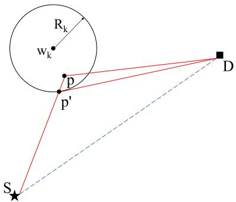  
Fig. 2. The selection of an optimal visiting point.

## 4.3 Refining the Path

The backward path obtained in part 2 of the proposed algorithm is not necessarily optimal. It is mainly due to that the proposed algorithm obtains the value of $\mathbf { v } _ { k } ^ { \dagger }$ without knowing the value of $\mathbf { v } _ { k + 1 } ^ { \dagger }$ . Thus, based on $( \mathbf { v } _ { 1 } ^ { \dagger } , \mathbf { v } _ { 2 } ^ { \dagger ^ { * } } , . . , \mathbf { v } _ { K } ^ { \dagger } )$ , the third þ ð Þpart of the proposed algorithm tries to get a better set of turning/bridging points $( \mathbf { v } _ { 1 } ^ { * } , \mathbf { v } _ { 2 } ^ { * } , . . , \mathbf { v } _ { K } ^ { * } )$ for the backward path of the UAV.

We now elaborate on the third part of the proposed convex-TSP algorithm. The third part is a path refinement subroutine. Pseudo codes for the third part of the proposed convex-TSP algorithm are included in Algorithm 2. The second part of the proposed convex-TSP algorithm uses $\begin{array} { r } { \mathcal { B } = [ B _ { 1 } , { B } _ { 2 } , . . , B _ { K } ] . } \end{array}$ , a list of bridging points on the plane $\mathbf { E } _ { 2 } ,$ to represent a backward path composed of line segments. Namely, the backward path produced by the second part of the convex-TSP algorithm is composed of ${ \overline { { S B _ { 1 } } } } , { \ \overline { { B _ { 1 } B _ { 2 } } } } , . . ,$ ${ \overline { { B _ { K - 1 } B _ { K } } } } ,$ and ${ \overline { { B _ { K } D } } } .$ The third part of the convex-TSP algo-rithm refines the backward path by changing the values of $B _ { k } { } ^ { \prime } { \bf s }$ . In particular, the path refinement subroutine uses a while loop to find better solutions until it cannot obtain a solution that is significantly better than the previous one. In the pseudo codes, d represents the length of the best path in the previous iteration, $d ^ { \prime }$ represents the length of the best path in the current iteration, and d is a predetermined positive real number. If the difference between $d ^ { \prime }$ and $d$ is less than or equal to $\delta ,$ Algorithm 2 terminates, since it fails to find out a path that is much better than the previous one. Inside the while loop, there exists a for loop. The for loop is responsible for adjusting the line segments of the best path up to date. As the second part, the third part of the proposed convex-TSP algorithm solves optimization problems in order to find a better path for the UAV to collect data from ground IoT devices. To obtain the value of $\mathbf { v } _ { k } ^ { \dagger } ,$ the second part of the proposed algorithm sets $\mathbf { u } _ { 2 } = ( x _ { s } , y _ { s } )$ in (9). In contrast, the ¼ ð Þthird part of the proposed algorithm sets ${ \bf u } _ { 2 } = B _ { k + 1 }$ in (9) for obtaining the value of $\mathbf { v } _ { k } ^ { * } , \forall k$ . Initially, $B _ { k + 1 } = { \bf v } _ { k + 1 } ^ { \dag }$

8 þ ¼ þIn Fig. 3a, we show a path produced by the second part of the proposed convex-TSP algorithm for the seven IoT devices in the network. The communication region of an IoT device is represented by a green circle. The path consists of eight line segments, since there are seven IoT devices in the example. In Fig. 3b, we show the path produced by the third part of the proposed convex-TSP algorithm based on July 05,2026 at 12:38:43 UTC from IEEE Xplore. Restrictions apply.

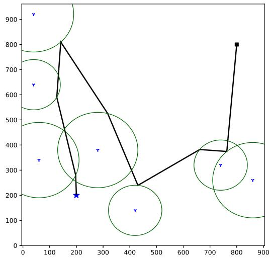  
(a) The path produced by the second part of the algorithm

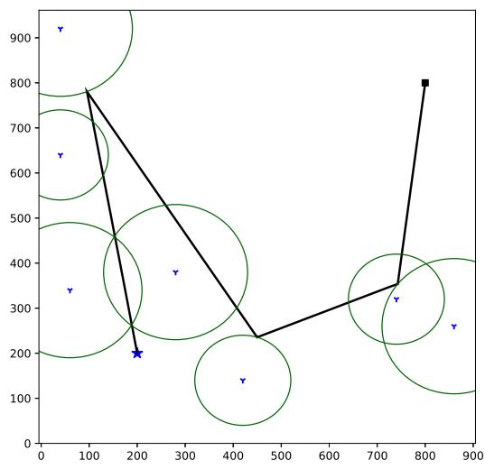  
(b) The path produced by the third part of the algorithm.  
Fig. 3. An illustration for the paths produced by the convex-TSP algorithm.

refining the path in Fig. 3a. After the refinement, the path becomes shorter and is composed of four line segments in this example.

In Fig. $^ { 4 , }$ we show the average path length for different number of iterations in the proposed convex-TSP algorithm. We randomly create 100 network topologies to obtain the average path length. When the number of IoT devices is between 10 and 20, the proposed convex-TSP algorithm almost always converges within 20 iterations.

## 4.4 Computational Complexity

We now analyze the computational complexity of the proposed convex-TSP algorithm. Let $O ( T _ { c } )$ be the computational ð Þcomplexity of solving the convex optimization problem (9). Let $\bar { T } _ { k }$ be the computation complexity of the kth component of the proposed convex-TSP algorithm, $\forall k \in \{ 1 , 2 , 3 \}$ Then, $T _ { 1 }$ 8 2 f gis the time required for solving the TSP associated with K IoT devices. Based on the Bellman-Held-Karp algorithm [44], [45], $T _ { 1 } \le { \cal { O } } ( K ^ { 2 } \cdot 2 ^ { K } )$ . In addition, there exists a  ð  Þpolynomial-time 2-approximation algorithm for TSP with triangle inequality [38]. Recently, Traub et al. [46] proposed a polynomial-time algorithm with approximation guarantee $\frac { 3 } { 2 } + \epsilon$ for the s-t-path TSP, for any fixed $\epsilon > 0 .$ . Based on þAlgorithm $1 , T _ { 2 }$ is the time complexity of solving K different instances of the convex optimization problem (9). Then, $T _ { 2 } = O ( K \cdot T _ { c } )$ . The computational complexity of the for ¼ ð  Þloop in Algorithm 2 is $O ( K \cdot T _ { c } ) .$ , since the for loop contains $K$ ð  Þconvex optimization problems. The algorithm executes the while loop at most $r _ { m a x }$ times, where $r _ { m a x }$ is a predetermined positive integer. Therefore $T _ { 3 } = O ( r _ { m a x } \cdot K \cdot T _ { c } )$ . The ¼ ð   Þoverall computational complexity of the proposed algorithm is ${ \cal O } ( T _ { 1 } + T _ { 2 } + T _ { 3 } ) \leq { \cal O } ( K ^ { 2 } \cdot 2 ^ { K } + ( r _ { m a x } + 1 ) \cdot K \cdot T _ { c } )$ , when it ð þ þ Þ  ð  þ ð þ Þ   Þobtains an exact solution for the auxiliary TSP. The proposed algorithm becomes a polynomial-time algorithm, when it uses a polynomial-time approximation algorithm [38], [46] for solving the auxiliary TSP.

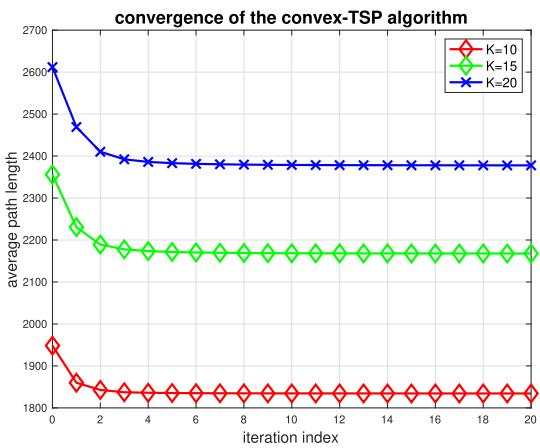  
Fig. 4. The convergence of the proposed convex-TSP algorithm.

Algorithm 1. The Convex-TSP Algorithm for Computing   
the Backward Path for a UAV   
Input: S (start point), D (destination), ${ \cal { K } } , \{ { \bf { w } } _ { k } | k \in { \cal { K } } \}$ , and d.   
K f j 2 KgOutput: (a list of bridging points that form the backward   
path).   
1: // Part 1: determine the visiting order for IoT devices.   
2: Obtain the visiting order for IoT devices by solving the   
euclidean TSP for $\{ \mathbf { w } _ { k } | k \in \mathcal { K } \}$   
f j 2 Kg3: Let a k be the index of the kth IoT device to be visited.   
4: Set $B = [ S , D ]$ and $\mathcal { D } = \varnothing . \mathrm { ~ / ~ } / \mathcal { D }$ is a data store.   
B ¼ ½ 	 D ¼ ; D5: // Part 2: determine the potential turning/visiting points.   
6: for k 1 to $| \kappa |$ do   
¼7: Obtain $\mathbf { v } _ { k , 1 }$ Kj, the optimal point on circumference of the   
circle centered at ${ \mathbf w } _ { \alpha ( k ) }$ with radius $R _ { \alpha ( k ) } $   
8: $/ / B _ { k }$ ð Þis the kth point in the list $B , \forall k \stackrel { \cdot } { \geq } 1$   
9: $/ / \overline { { B _ { k } B _ { k + 1 } } }$ B 8 denotes the line segment from $B _ { k }$ to $B _ { k + 1 }$   
10: Obtain $\mathbf { v } _ { k , 2 } ,$ the foot of perpendicular on $\overline { { B _ { k } B _ { k + 1 } } } .$   
11: if $d ( \mathbf { w } _ { \alpha ( k ) } , \overline { { B _ { k } B _ { k + 1 } } } ) \leq R _ { \alpha ( k ) }$ then   
12: $\mathbf { v } _ { k } ^ { \mathsf { \Pi } } \gets \mathbf { v } _ { k , 2 } .$   
13: else   
14: $\mathbf { v } _ { k } ^ { \dagger } \gets \mathbf { v } _ { k , 1 } .$   
15: end if   
16: Insert $\mathbf { v } _ { k } ^ { \dagger }$ to be between $B _ { k }$ and $B _ { k + 1 }$ in the list .   
17: Record $( \mathbf { v } _ { k } ^ { \dagger } , \alpha ( k ) )$ in .   
18: end for   
19: // Part 3: refine the path obtained in part 2.   
20: Call Algorithm 2 with input ; to refine the backward   
path.

Algorithm 2. The Path Refinement Algorithm   
Input: , $\{ \mathbf { w } _ { k } | k \in \mathcal { K } \} , B , \mathcal { D } , \delta$ and $r _ { m a x }$   
K fOutput: .   
1: $\bar { K }  \vert { K } \vert .$   
jKj2: Calculate $\begin{array} { r } { d ^ { \prime } = \sum _ { i = 1 } ^ { K + 1 } | \overline { { B _ { i - 1 } B _ { i } } } | . } \end{array}$ , the length of the path   
¼associated with .   
3: $d  0 , r  0 .$   
4: while $\lvert d ^ { \prime } - d \rvert > \delta \mathrm { A N D } r < r _ { \operatorname* { m a x } }$ do   
5: for $k = 1$ jto K do   
6: ¼Obtain $\alpha ( k )$ based on .   
7: Let $\mathbf { v } _ { k , 1 }$ ð Þ Dbe an optimal solution of (9) with ${ \bf u } _ { 1 } = B _ { k - 1 }$ and   
$\mathbf { u } _ { 2 } = B _ { k + 1 } .$   
8: ¼Obtain $\mathbf { v } _ { k , 2 } ,$ the foot of perpendicular on $\overline { { B _ { k - 1 } B _ { k + 1 } } }$   
9: if $d ( \overline { { B _ { k - 1 } B _ { k + 1 } } } , { \mathbf w } _ { \alpha ( k ) } ) < R _ { \alpha ( k ) }$ then   
10: $\mathbf { v } _ { k } ^ { * }  \mathbf { v } _ { k , 2 } .$   
11: else   
12: $\mathbf { v } _ { k } ^ { * }  \mathbf { v } _ { k , 1 }$   
13: end if   
14: $B _ { k }  { \bf v } _ { k } ^ { * } .$   
15: Record $( \mathbf { v } _ { k } ^ { * } , \alpha ( k ) )$ in $\mathcal { D } .$   
16: end for   
17: $d \gets d ^ { \prime } .$   
18: Calculate $d ^ { \prime } ,$ the length of the path associated with .   
19: $r  r + 1 .$   
þ20: end while

## 5 Q-LEARNING FOR COLLISION-FREE NAVIGATION

In this paper, we propose using reinforcement learning for UAV collision avoidance. The proposed approach is distributed and a UAV does not know the paths/trajectories of other UAVs in advance. To formally introduce the proposed approach of reinforcement learning, we define the corresponding state space, action space, and reward function in this section. In addition, we show the adopted rule of value update.

Algorithm 3. The Algorithm for Setting the Value of   
Reward $\Phi _ { t + 1 }$   
Input: $( x _ { s } , y _ { s } ) , ( x _ { d } , y _ { d } ) , V , ( x _ { o l d } , y _ { o l d } ) , ( x _ { n e w } , y _ { n e w } ) , \tilde { r } _ { o b s } , \mathrm { a n d } d _ { m i n } .$   
ðOutput: $\Phi _ { t + 1 } . _ { }$   
1: $t _ { d i r e c t } = \sqrt { ( x _ { d } - x _ { s } ) ^ { 2 } + ( y _ { d } - y _ { s } ) ^ { 2 } / V . }$   
2: $d _ { o l d } = \sqrt { \left( x _ { d } - x _ { o l d } \right) ^ { 2 } + \left( y _ { d } - y _ { o l d } \right) ^ { 2 } } .$   
3: $d _ { n e w } = \sqrt { \left( x _ { d } - x _ { n e w } \right) ^ { 2 } + \left( y _ { d } - y _ { n e w } \right) ^ { 2 } } .$   
4: $t _ { n e w } = d _ { n e w } / V .$   
5: $\begin{array} { r } { \theta _ { o l d } = \tan ^ { - 1 } ( \frac { y _ { d } - y _ { o l d } } { x _ { d } - x _ { o l d } } ) . } \end{array}$   
6: $\begin{array} { r } { { \theta } _ { n e w } = \tan ^ { - 1 } ( \frac { \bar { y } _ { d } - \bar { y } _ { n e w } } { x _ { d } - x _ { n o w } } ) . } \end{array}$   
7: $\Delta \theta = \theta _ { n o w } - \theta _ { o l d } .$ xnew   
8: i $\textsf { f } \tilde { r } _ { o b s } ~ < ~ d _ { m i n }$ then   
9: $\Phi _ { t + 1 } = - 0 . 3 3 3 .$   
10: else   
11: $\begin{array} { r } { \Phi _ { t + 1 } = 1 . 0 3 \times \frac { d _ { o l d } - d _ { n o w } } { V } . } \end{array}$   
12: $ { \mathbf { i } } \mathbf { f } \ \Phi _ { t + 1 } \ > \ 0$ then   
13: $\begin{array} { r } { \Phi _ { t + 1 } \gets \Phi _ { t + 1 } \times \big ( 1 - \frac { t _ { n e w } } { 1 . 5 \cdot t _ { d i r e c t } } \big ) . } \end{array}$   
14: else   
15: $\begin{array} { r } { \Phi _ { t + 1 }  \Phi _ { t + 1 } \times ( 1 + \frac { t _ { n e w } } { 1 . 5 \cdot t _ { d i r e c t } } ) . } \end{array}$   
16: þend if   
17: $\Phi _ { t + 1 } \gets \Phi _ { t + 1 } - | \Delta \theta | / 1 8 0 / 6 .$   
þ18: end if

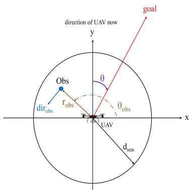  
Fig. 5. The local state representation of a UAV for reinforcement learning.

## 5.1 State Space

Consider a tagged UAV. In Fig. 5, we show the state representation from the viewpoint of the UAV. Specifically, the coordinates of the tagged UAV is always equal to (0,0). The y-axis corresponds to the current flying direction of the tagged UAV. In addition, u is the angle between the direction to the destination point D and the y-axis. Suppose the tagged UAV detects an obstacle, which is a UAV that is at most $d _ { s e n }$ away from the tagged UAV. Let $r _ { o b s }$ be the distance between the tagged UAV and the detected obstacle. Let $\theta _ { o b s }$ be the angle between the x-axis and the vector from the tagged UAV to the detected obstacle. Let $\mathrm { d i r } _ { o b s }$ be the flying direction of the detected UAV. If the detected obstacle is static, dir $\dot { o } b s$ is set to a predetermined constant.

Let $\mathbf { x } _ { t }$ be the state of the tagged UAV at (the beginning of) time slot t. $\mathbf { \boldsymbol { x } } _ { t }$ contains u and information on detected obstacles. The information on a detected obstacle is denoted by $\operatorname { i n f o } _ { o b s }$ and is based on quantizations of $r _ { o b s } , \theta _ { o b s } .$ , and dir . Let $r _ { s c a l e } , \theta _ { s c a l e } ,$ , and $\mathrm { d i r } _ { s c a l e }$ be parameters for quantization. Specifically, in $\begin{array} { r } { \mathrm { f o } _ { o b s } = ( \lfloor \frac { r _ { o b s } } { r _ { s c a l e } } \rfloor + \hat { 1 } , \lfloor \frac { \theta _ { o b s } } { \theta _ { s c a l e } } \rfloor + 1 , \lfloor \frac { \mathrm { d i r } _ { o b s } ^ { \star } } { \mathrm { d i r } _ { s c a l e } } \rfloor + 1 ) } \end{array}$ . For example, if $r _ { o b s } = 3 0 , \quad \theta _ { o b s } = 4 0 , \quad \mathrm { d i r } _ { o b s } = 5 0 , \quad r _ { s c a l e } = 5 ,$ $\theta _ { s c a l e } \overset { \cdot } { = } 1 0 ,$ , and di $\mathrm { r } _ { s c a l e } = 1 0 $ ¼, then $\lfloor r _ { o b s } / r _ { s c a l e } \rfloor + 1 = \lfloor 3 0 / 5 \rfloor +$ $1 = 7 , \lfloor \theta _ { o b s } / \theta _ { s c a l e } \rfloor + 1 = \lfloor 4 0 / 1 0 \rfloor + 1 = 5 ,$ and $\lfloor \operatorname { d i r } _ { o b s } / \operatorname { d i r } _ { s c a l e } \rfloor +$ $1 = \lfloor 5 0 / 1 0 \rfloor + 1 = 6 .$ ¼ b cþ. In this case, in $\mathrm { f o } _ { o b s } = ( 7 , 5 , 6 )$

¼ b c þ ¼ ¼ ð ÞTo reduce the table size of reinforcement learning, we assume that a UAV takes into account at most two obstacles. Thus, $\mathbf { x } _ { t } = [ \theta , \operatorname { i n f o } _ { o b s 1 } , \operatorname { i n f o } _ { o b s 2 } ]$ , which represents a list con-¼ ½taining three elements, $\theta ,$ 	inf $) _ { o b s 1 }$ , and $\operatorname { i n f o } _ { o b s 2 }$ . Note that in $\mathrm { f o } _ { o b s 1 }$ is the information about obstacle $^ { 1 , }$ while $\mathrm { i n f o } _ { o b s 2 }$ is the information about obstacle 2. If the tagged UAV detects three or more adjacent UAVs, the tagged UAV changes its altitude (based on the unique identification number) for collision avoidance.

The proposed state representation only contains relative position and flying direction between two UAVs. It does not contain the absolute positions of UAVs. Thus, the proposed reinforcement learning approach can be implemented in a distributed manner. It does not need any centralized controller that collects/knows the states of all UAVs.

## 5.2 Action Space

Since it is assumed that a UAV can only change the flying direction once in a time slot, the path of a UAV consists of line segments. In addition, the speed of a UAV is constant.

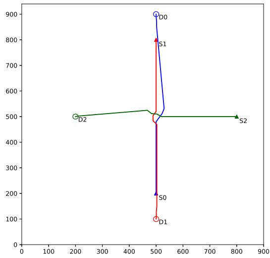  
Fig. 6. An illustration of collision avoidance for 3 UAVs based on the proposed approach of reinforcement learning.

Thus, $a _ { t }$ is the turning angle of the UAV at the beginning of time slot t. Let $\theta _ { m a x }$ be the maximum turning angle of a UAV in degree. To reduce the computational complexity, the action space is composed of a finite number of real numbers in the set $[ - \theta _ { m a x } , \theta _ { m a x } ]$ . For example, $\mathcal { A } = \{ - 4 5 , 4 0 , \dots , 4 0 , 4 5 \}$ ½Note that $a _ { t } \in \mathcal { A } , \forall t$ . Let $\theta _ { t }$ A ¼ f gbe the angle of flying of the tagged 2 A 8UAV in time slot t. Then, $\theta _ { t } = \left( \theta _ { t - 1 } + a _ { t } \right)$ mod 360.

## 5.3 Reward and Value Update

When the tagged UAV takes action $a _ { t }$ at state $\mathbf { \boldsymbol { x } } _ { t }$ in time slot $t ,$ it gains rewards with amount equal to $\Phi _ { t + 1 }$ . Let $( x _ { o l d } , y _ { o l d } , h )$ þbe the location of the UAV in the current time ðslot. Let $( x _ { n e w } , y _ { n e w } , h )$ be the location of the UAV in the next ð Þtime slot after taking action $a _ { t }$ . There are three factors for determining the reward of a state-action pair. The first factor is the distance between the UAV and the obstacles, since it is essential to avoid collisions. Let $\tilde { r } _ { o b s }$ be the distance between the tagged UAV and an adjacent UAV after taking the action $a _ { t }$ at state $\mathbf { x } _ { t } .$ . Recall that $d _ { m i n }$ is the minimum distance for two UAVs to avoid collisions. If $\tilde { r } _ { o b s } < d _ { m i n } ,$ to avoid collisions, the reward $\Phi _ { t + 1 }$ is set to a negative real þnumber such as 0:333. The second factor is the distance between a UAV and its goal, since the ultimate goal of a UAV is to arrive at the goal as soon as possible. Let $d _ { o l d }$ be the distance between the UAV and its destination in the current time slot. Let $d _ { n e w }$ be the distance between the UAV and its destination in the next time slot if the action $a _ { t }$ is taken at state $\mathbf { \boldsymbol { x } } _ { t } .$ . The reward $\Phi _ { t + 1 }$ is linearly proportional to $d _ { o l d } - d _ { n e w }$ þ. The third factor is Du, which is the angle between the flying direction of the UAV after taking the action $a _ { t }$ at state $\mathbf { \boldsymbol { x } } _ { t }$ and the direction towards its goal. Since it is desired to deliver the goods to the destination as early as possible, the smaller the absolute value of $\Delta \theta$ is, the larger the reward is. In Algorithm $^ { 3 , }$ we show the pseudo codes for setting the value of the reward $\Phi _ { t + 1 }$

Let $\alpha \in ( 0 , 1 )$ þbe the learning rate and $\gamma \in ( 0 , 1 )$ be the 2 ð Þreward discount factor. Let $Q ( \mathbf { x } _ { t } , a _ { t } )$ 2 ð Þbe the expected value ð Þof the total discounted reward for state $\mathbf { \boldsymbol { x } } _ { t }$ and action $a _ { t } .$ According to (6.8) in [2], the value of the Q function is updated as follows.

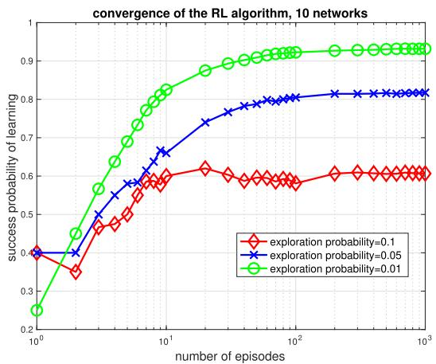  
Fig. 7. An illustration for the success probability of reinforcement learning.

$$
\begin{array} { r l } & { Q ( \mathbf { x } _ { t } , a _ { t } ) \gets Q ( \mathbf { x } _ { t } , a _ { t } ) + \alpha \big [ \Phi _ { t + 1 } } \\ & { \qquad + \gamma \underset { a _ { t + 1 } } { \operatorname* { m a x } } Q ( \mathbf { x } _ { t + 1 } , a _ { t + 1 } ) - Q ( \mathbf { x } _ { t } , a _ { t } ) \big ] . } \end{array}\tag{10}
$$

## 5.4 Validation of Collision Avoidance

To show that the proposed reinforcement learning approach allows the UAVs to successfully avoid collisions, we show UAV trajectories in Fig. 6. Paths of different colors correspond to paths of different UAVs. Three UAVs are indexed by 0, 1, and 2, respectively. The source of UAV k is marked by Sk and the destination of UAV k is marked by $D k ,$ $\forall k \in \{ 0 , 1 , 2 \}$ . In Fig. 6, the three UAVs successfully avoid 8 2 f gcollisions. In particular, UAV 0 successfully escapes collisions from UAV 1 and UAV 2. In addition, for each UAV, the actual trajectory is very close to the shortest path from its source point to its destination point.

## 5.5 Convergence and Computational Complexity

In Fig. 7, we show the convergence of the sequence of success probability of learning for the adopted reinforcement learning algorithm. To evaluate the reinforcement algorithm, we randomly create 10 networks. For each network, the reinforcement learning algorithm is trained for 1000 episodes. In an episode, whenever the reinforcement learning algorithm has to choose an action for a state, it chooses an optimal action up to date with probability 1 d or randomly chooses an action with probability d. The value of d is called the exploration probability. For an episode, the reinforcement learning algorithm is successful if all UAVs are able to deliver goods and collect data from ground IoT devices without collisions. The success probability for n episodes is the number of successful episodes divided by n. When $\delta \in \{ 0 . 0 1 , 0 . 0 5 , 0 . 1 \}$ , the success probability of learning converges within 1000 episodes. As the value of d decreases from 0.1 to 0.01, the sequence of success probability of learning converges more slowly but the corresponding limit increases. When d is smaller, the reinforcement learning algorithm adopts an optimal action in each state with a larger probability. Thus, once the reinforcement learning algorithm obtains a successful strategy, it will stick to the successful strategy with a larger probability. Therefore, the limit for the sequence of success probability is larger. For a network, it is sufficient to have a Jly 05.2026 at 12:38:43 UTC from IEEE Xplore. Restrictions apply

TABLE 2  
Key Parameters in the Simulation
<table><tr><td>Parameter</td><td>Description</td><td>Value</td></tr><tr><td> $P _ { k }$ </td><td>transmit power of device k</td><td>14 or 16 mW</td></tr><tr><td> $P _ { n }$ </td><td>noise power</td><td>-130 dBm</td></tr><tr><td> $\Gamma _ { k }$ </td><td>received SNR threshold of device k</td><td>50 dB</td></tr><tr><td> $h$ </td><td>UAV&#x27;s altitude</td><td>300 or 100 (m)</td></tr><tr><td> $\eta _ { L o S }$ </td><td>average additional loss for LoS</td><td>3 dB</td></tr><tr><td> $f _ { c }$ </td><td>carrier frequency</td><td>2 GHz</td></tr><tr><td> $\bar { V }$ </td><td>the speed of a UAV</td><td>20 m/s</td></tr><tr><td> $\lambda$ </td><td>required communication time</td><td>0.1 s</td></tr><tr><td> $d _ { m i n }$ </td><td>minimum distance between UAVs</td><td>5m</td></tr><tr><td> $d _ { s e n }$ </td><td>radius of UAV&#x27;s sensing area</td><td>45 m</td></tr></table>

successful episode, since the corresponding Q-table will be used after the training phase.

We now analyze the computational complexity of the proposed distributed reinforcement learning approach. There are two phases for the distributed reinforcement learning approach. The first phase is the training phase, while the second phase is the deployment phase. Let be the state space. SRecall that is the action space. We use a table and an array Ato implement the proposed distributed reinforcement learning approach. Specifically, we use a table to store the values of $Q ( s , a ) ^ { \prime }$ s such that each row corresponds to a state in the state ð Þspace and each column corresponds to an action in . In S Aaddition, the states in the table are sorted. Furthermore, we adopt an array where the kth element corresponds to the optimal action for the kth state in the table. Thus, the space complexity for the learning phase of the proposed distributed reinforcement learning approach is $\hat { O } ( | \hat { S } | \cdot | { \cal A } | ) + O ( | S | ) =$ $O ( | S | \cdot | A | )$ ðjSj  jAjÞ þ ðjSjÞ ¼. On the other hand, in the deployment phase, only the array is required. Thus, the space complexity of the deployment phase is O . Typically, the time complexity of ðjSjÞthe learning phase is linearly proportional to the product of the number of episodes and the number of time slots per episode. Since the learning phase is done offline before the deployment phase, we focus on the time complexity of the deployment phase. When binary search is used, it takes $O ( \log _ { 2 } | S | )$ time to find the current state from the table/array. ð jSjÞOnce the location of the current state in the table/array is obtained, it takes O 1 time to obtain the optimal action for ð Þthe state based on the array. Therefore, the time complexity for the deployment phase is $O ( \log _ { 2 } | S | ) \times O ( 1 ) = O ( \log _ { 2 } | S | )$

## 6 SIMULATION SETUP AND RESULTS

In this section, we show simulation results that justify the usage of the proposed approach. We wrote Python programs to obtain simulation results. In addition, we use the Google Optimization tools [39] to solve the traveling salesman problems. Furthermore, we use CVXPY [41], [42] to solve convex optimization problems. The mission area for UAVs to deliver goods and collect data from ground IoT devices is a square of size 1 km 1 km. In Table 2, we show the values of key parameters in the simulation. In addition, we set $\delta = 0 . 1$ 1 in Algorithm 2.

## 6.1 Backward Trajectories

We compare our proposed algorithm with three algorithms of path planning: the devices as waypoints algorithm, the random geometric disk cover (GDC) algorithm [23], and the greedy algorithm.

The devices as waypoints algorithm works as follows. First, it uses the locations of ground IoT devices as waypoints. Second, given the waypoints, it solves the auxiliary TSP to obtain an order for visiting the waypoints. Two waypoints are said to be adjacent, if there exists an integer $k \geq 1$ such that one of them is the kth visited waypoint and the other is the k 1 th visited waypoint. Last, it uses the line ð þ Þsegments connecting adjacent waypoints to form the UAV trajectory for data collection.

The random GDC algorithm works as follows. First, it generates waypoints by solving the GDC problem. Given the waypoints, it solves the auxiliary TSP to obtain the visiting order for the waypoints. Last, it uses the line segments connecting adjacent waypoints to form the UAV trajectory for data collection. We now elaborate on the procedure the random GDC algorithm uses to create the waypoints. Initially, all IoT devices are uncovered. For each uncovered IoT device k, it generates $N _ { g }$ circles with radius $R _ { k } .$ . In addition, for each of the $N _ { g }$ circles that are associated with IoT device $k ,$ the distance between the center and ${ \bf w } _ { k }$ is a random variable that is uniformly distributed over the interval $[ 0 , R _ { k } ]$ . Next, it selects the optimal circle that covers the max-½ 	imum number of uncovered IoT devices. The center of the selected circle becomes a waypoint and the IoT devices covered by the selected circle become covered. It repeats the above process until all IoT devices are covered.

Unlike the other three studied algorithms, the greedy algorithm does not obtain the visiting order of IoT devices based on TSP. Instead, in each iteration, it first identifies the IoT device that is furthest from D among the unvisited IoT devices. Consider an iteration. Let $k _ { 1 }$ be the index of the IoT that is furthest from D in the iteration. There are three cases. First, if there is no IoT device with index $k _ { 2 } \neq k _ { 1 }$ such that $d ( \mathbf { w } _ { k _ { 1 } } , \mathbf { w } _ { k _ { 2 } } ) \leq R _ { k _ { 1 } } + R _ { k _ { 2 } }$ 6¼, the greedy algorithm selects ${ \bf w } _ { k _ { 1 } }$ as ð Þ  þthe next visiting point. Second, if there exists a unique IoT device with index $k _ { 2 } \neq k _ { 1 }$ such that $d ( \mathbf { w } _ { k _ { 1 } } , \mathbf { w } _ { k _ { 2 } } ) \leq R _ { k _ { 1 } } ^ { - } + R _ { k _ { 2 } } ,$ 6¼ ð Þ  þthe greedy algorithm selects the point that is closest to the UAV among the set $C _ { \mathbf { w } _ { k _ { 1 } } } ( R _ { k _ { 1 } } ) \cap C _ { \mathbf { w } _ { k _ { 2 } } } ( R _ { k _ { 2 } } )$ as the next visit-ð Þ \ ð Þing point. In this case, when the projected location of the UAV is in the set $C _ { \mathbf { w } _ { k _ { 1 } } } ( R _ { k _ { 1 } } ) \cap C _ { \mathbf { w } _ { k _ { 2 } } } ( R _ { k _ { 2 } } )$ , the UAV simulta-ð Þ \ ð Þneously covers the two IoT devices with indexes $k _ { 1 }$ and $k _ { 2 }$ Last, if more than two IoT devices can be concurrently covered, the greedy algorithm calculates the closest points for all pairs of the IoT devices as candidates. Then, among the candidates, it chooses the one that is closest to the UAV as the next visiting point.

We first study a network in which h 300 and 10 ground ¼IoT devices are deployed within a 1000 m 1000 m square. In addition, there is a UAV that aims to fly from point S at 200; 200 to point D at 800; 800 . Furthermore, the values ðof $R _ { k } { ' } \mathbf { s }$ Þ ð Þare randomly created. In Fig. 8a, we show the backward path produced by the proposed convex-TSP algorithm in a network. In Fig. 8b, we show the backward path produced by the random GDC algorithm in the same network. As shown in the figures, the visiting order produced by the random GDC algorithm for IoT devices is similar to that produced by the proposed convex-TSP algorithm. However, the features of the turning points produced by the proposed convex-TSP algorithm are very different from those July 05,2026 at 12:38:43 UTC from IEEE Xplore. Restrictions apply.

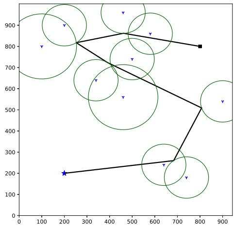  
(a) A trajectory produced by the convex-TSP algorithm.

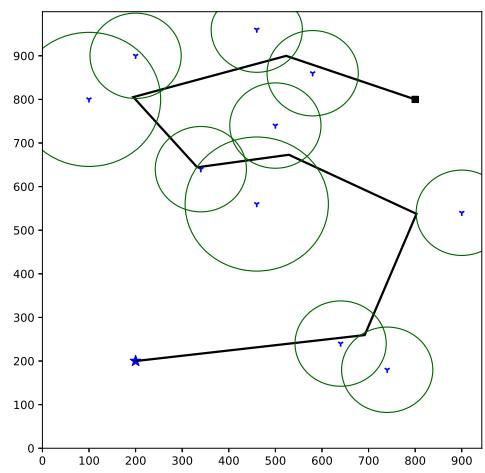  
(b) A trajectory produced by the random GDC algorithm.

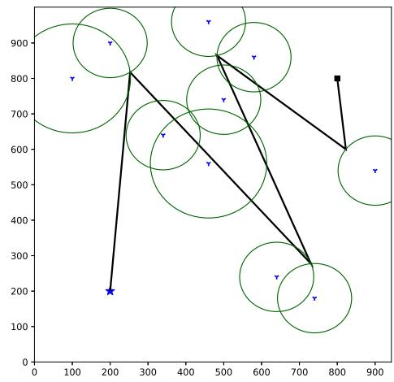  
(c) A trajectory produced by the greedy algorithm.  
Fig. 8. An illustration for the backward paths produced by three studied algorithms.

produced by the random GDC algorithm. Although the turning points for the path produced by the proposed convex-TSP algorithm are on the boundaries of circles, a number of turning points for the path produced by the random GDC algorithm are not on the circumferences of any circles. More important, in this network topology, the proposed convex-TSP algorithm is superior to the random GDC algorithm.

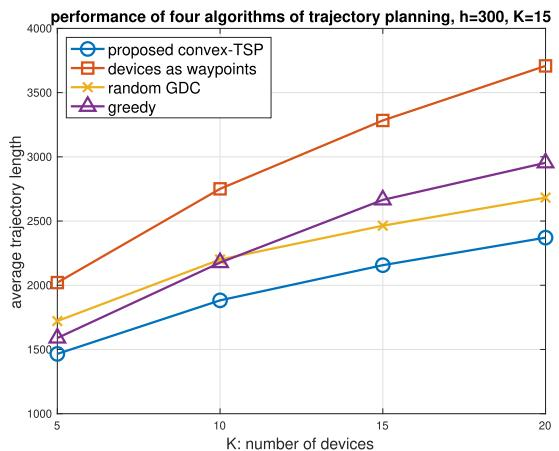  
(a) The average trajectory length as a function of the number of IoT devices.

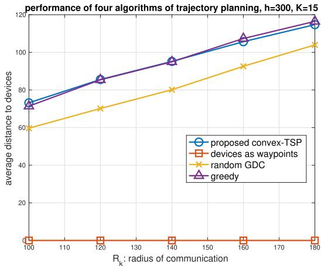  
(b) The average distance between trajectory and devices as a function of radius of communication, when K = 15.  
Fig. 9. Performance of four algorithms for trajectory planning, when h 300.

In Fig. 8c, we show the backward path produced by the greedy algorithm in the same network. The visiting order produced by the greedy algorithm for IoT devices is very different from that produced by the proposed convex-TSP algorithm. The former does not rely on the TSP while the latter is based on the TSP. In this network topology, the proposed convex-TSP algorithm outperforms the greedy algorithm.

In Fig. 9a, we show the trajectory length as a function of number of ground IoT devices for the four studied schemes of path planning. In terms of the average trajectory length, the proposed convex-TSP algorithm outperforms the other three studied algorithms. On the other hand, the greedy algorithm is the worst. When there are 5 ground IoT devices, the greedy algorithm is superior to the random GDC algorithm. In contrast, when there are 15 or 20 ground IoT devices, the random GDC algorithm is better than the greedy algorithm.

In Fig. 9b, we show the average distance between the UAV trajectory to ground IoT devices, when $K = 1 5$ . For ¼the devices as waypoints algorithm, the average distance is always zero. It is due to that the algorithm selects the locations of ground IoT devices as waypoints. The proposed July 05,2026 åt 12:38:43 UTC from IEEE Xplore. Réstrictions apply.

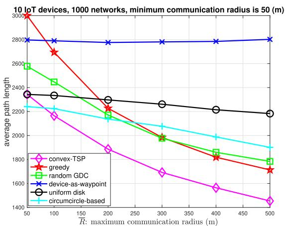  
Fig. 10. The average trajectory length as a function of the maximum communication radius, when h 100.

convex-TSP algorithm reduces the trajectory length at the cost of increasing the average distance between the UAV trajectory and associated ground IoT devices.

In addition to the above four algorithms, we also evaluate the circumcircle-based algorithm and the uniform disk algorithm. The circumcircle-based algorithm is a variant of the CSS algorithm in [3]. The CSS algorithm is designed for wireless sensors with the same communication radius and adopts circumcircles to reduce the path length. Let $R _ { m i n } =$ $\mathrm { m i n } _ { i : 1 \le i \le K } R _ { k }$ ¼. The uniform disk algorithm is identical to the  convex-TSP algorithm except that the former pretends that $R _ { i } = R _ { m i n } , \forall i .$

¼Let $\overline { { R } } > 0$ be the maximum communication radius for ground IoT devices. We study the case in which $h = 1 0 0$ and $R _ { k }$ ¼is a random variable uniformly distributed over the set $\{ 5 0 , 1 0 0 , . . . , \overline { { R } } \}$ , k. In Fig. 10, we show the average path f g 8length as a function of the maximum communication radius. As long as $\overline { { R } } \geq 1 0 0 ,$ , the proposed convex-TSP algorithm is the best among the six studied algorithms in terms of the average trajectory length. Except for the devices as waypoints algorithm, for each of the other studied algorithms, as the maximum communication radius increases, the average trajectory length decreases. As the maximum communication radius increases, the UAV has more freedom to choose its trajectory and therefore is able to select a shorter trajectory. When the ground IoT devices have distinct communication radii, the convex-TSP algorithm is superior to the circumcircle-based algorithm. In this case, the proposed convex-TSP algorithm adopts convex optimization to minimize the UAV path length. On the other hand, when all ground IoT devices have the same communication radius, the circumcircle-based algorithm slightly outperforms the convex-TSP algorithm, since the former uses circumcircles to efficiently reduce the number of turning points of a UAV trajectory. For the uniform disk algorithm, as the value of R increases, the probability that the minimum among realized radii of IoT devices is greater than 50 increases. Thus, as the value of R increases, the average trajectory length decreases slightly.

In Fig. 11, we show the impact of the number of UAVs on the average trajectory length per UAV. We randomly create 100 networks and each network contains $K = 1 0 0$ ground ¼IoT devices. The number of UAVs is between 2 and 10. In addition, the communication radius of a ground IoT device is a random variable uniformly distributed over the set 50; 100; 150; 200; 250; 300 . For each studied algorithm, the f gaverage trajectory length per UAV decreases as the value of M increases. As the value of M increases, a UAV tends to serve fewer ground IoT devices and therefore uses a shorter path. Among the studied algorithms, the proposed convex-TSP algorithm is the best regardless of the value of M. The convex-TSP algorithm adopts both combinatorial optimization and convex optimization to minimize the average trajectory length per UAV. When M is between 2 and 10, in comparison with the random GDC algorithm or the circumcircle-based algorithm, the proposed convex-TSP algorithm could reduce the average trajectory length per UAV by at least 25 percent. The average trajectory length per UAV of the circumcircle-based algorithm is almost identical to that of the random GDC algorithm. We now elaborate on the result. To cover all ground IoT devices by as few turning points as possible, the former adopts circumcircles to deterministically choose turning points, while the latter uses enough random circles to select turning points. When there are 100 IoT devices and no greater than 10 UAVs in the network, the two algorithms choose similar sets of turning points. Therefore, the random GDC algorithm has similar performance to the circumcircle-based algorithm.

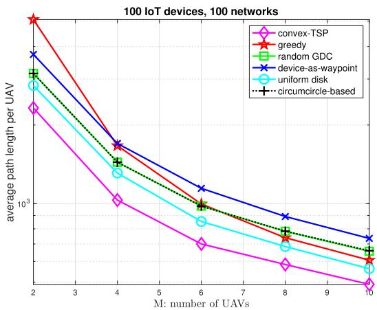  
Fig. 11. The average trajectory length per UAV as a function of number of UAVs.

## 6.2 Complete UAV Trajectories

We also study the forward trajectories and backward trajectories together for UAVs. In the studied network, there are M 4 UAVs and N 30 ground IoT devices. An IoT ¼ ¼device is associated with the UAV whose destination point is closest to it. The common distribution center of UAV 0 and UAV 1 is located at 250; 250 . The common distribution ð Þcenter of UAV2 and UAV3 is located at 750; 750 . The ð Þdelivery points for UAV 0, UAV 1, UAV 2, and UAV 3 are located at 900; 250 , 600; 600 , 750; 100 , and 300; 300 , ð Þ ð Þ ð Þ ð Þrespectively. The simulation is composed of two phases. The first phase is the learning phase in which UAVs fly and build up their own Q-tables based on the observations and the proposed reinforcement learning approach. In the second phase, the UAVs deliver goods and collect data from ground IoT devices. In addition, each UAV avoids collisions based on the Q-tables produced in the first phase.

In Fig. 12a, we show the planned trajectories for the four UAVs. The planned trajectories are ideal and their design July 05,2026 at 12:38:43 UTC from IEEE Xplore. Restrictions apply.

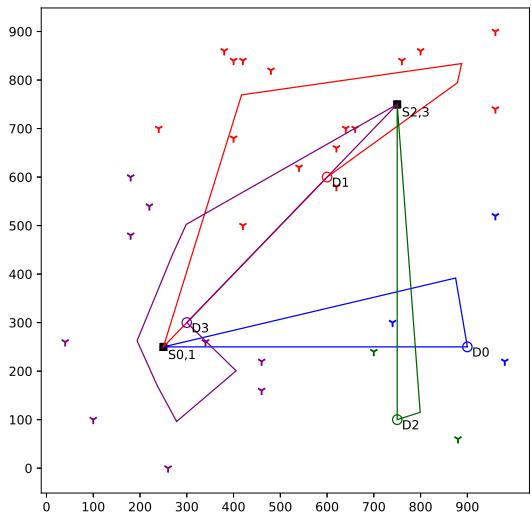  
(a) The planned trajectories for 4 UAVs.

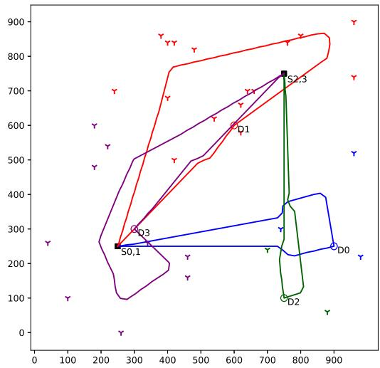  
(b) The actual trajectories for 4 UAVs.  
Fig. 12. Complete trajectories for four UAVs.

does not take into account collision avoidance and the maximum magnitude of the turning angle in a time slot. Since a UAV could use the planned path to collect data from associated ground IoT devices, the planned path serves as the basis for the actual path.

In Fig. 12b, we show the real trajectories for the four UAVs. Each UAV follows the planned trajectory to a large extent but deviates from the planned trajectory when obstacles are detected. In addition, due to the constraint on the turning angle, a real trajectory is smoother than the corresponding planned trajectory. In Table 3, we show the lengths of the planned trajectories and the actual trajectories. A real UAV trajectory is slightly longer than the associated planned UAV trajectory as expected.

## 7 CONCLUSION

We have proposed novel approaches of collision avoidance and trajectory planning for UAV communication networks. Specifically, each UAV is responsible for delivering objects in the forward path and collecting data from heterogeneous ground IoT devices in the backward path. We have adopted reinforcement learning for assisting UAVs to avoid collisions without knowing the trajectories of other UAVs in advance. In addition, for each UAV, we have used combinatorial optimization and convex optimization to obtain an optimal path that assures data collection from all associated IoT devices. In particular, to obtain an optimal visiting order for IoT devices, we have formulated and solved a no-return traveling salesman problem. Given a visiting order, we have formulated and solved convex optimization problems to obtain line segments of an optimal backward path for heterogeneous ground IoT devices. We have demonstrated that the proposed reinforcement learning approach allows UAVs to successfully avoid collisions. In addition, we have used simulation results to show that the proposed approach is superior to a number of alternative approaches in terms of backward trajectory length. Future works include using deep Q-learning to further reduce the table size of reinforcement learning for efficient collision avoidance. An important direction of future research is to jointly optimize the forward path and the backward path for UAV-based goods delivery and IoT data collection, when the forward path does not have to be the shortest. Another important direction of future research is the joint optimization of collision avoidance and trajectory planning.

TABLE 3  
The Planned/Actual Trajectory Length for Each UAV in Terms of Meters
<table><tr><td></td><td>UAV0</td><td>UAV1</td><td>UAV 2</td><td>UAV3</td></tr><tr><td>length of the planned trajectory</td><td>1434.975</td><td>1896.011</td><td>1338.174</td><td>1909.327</td></tr><tr><td>length of the actual trajectory</td><td>1473.536</td><td>1931.823</td><td>1350.598</td><td>1931.844</td></tr></table>

## ACKNOWLEDGMENTS

This work was supported in part by the Ministry of Science and Technology, Taiwan, R.O.C. under Grants MOST 108- 2634-F-009-004 and MOST 109-2634-F-009-023.

## REFERENCES

[1] Y. Zeng, R. Zhang, and T. J. Lim, “Wireless communications with unmanned aerial vehicles: Opportunities and challenges,” IEEE Commun. Magazine, vol. 54, no. 5, pp. 36–42, May 2016.

[2] R. S. Sutton and A. G. Barto, Reinforcement Learning, 2nd ed. Cambridge, MA, USA: MIT Press, 2018.

[3] L. He, J. Pan, and J. Xu, “A progressive approach to reducing data collection latency in wireless sensor networks with mobile elements,” IEEE Trans. Mobile Comput., vol. 12, no. 7, pp. 1308–1320, Jul. 2013.

[4] D. Kim, R. N. Uma, B. H. Abay, W. Wu, W. Wang, and A. O. Tokuta, “Minimum latency multiple data MULE trajectory planning in wireless sensor networks,” IEEE Trans. Mobile Comput., vol. 13, no. 4, pp. 838–851, Apr. 2014.

[5] D. Kim, L. Xue, D. Li, Y. Zhu, W. Wang, and A. O. Tokuta, “On theoretical trajectory planning of multiple drones to minimize latency in search-and-reconnaissance operations,” IEEE Trans. Mobile Comput., vol. 16, no. 11, pp. 3156–3166, Nov. 2017.

[6] Z. Chen, X. Zhu, X. Gao, F. Wu, J. Gu, and G. Chen, "Efficient scheduling strategies for mobile sensors in sweep coverage problem,” in Proc. 13th Annu. IEEE Int. Conf. Sens. Commun. Netw., 2016, pp. 1–4.

[7] Y. Zeng, X. Xu, and R Zhang, “Trajectory design for completion time minimization in UAV-enabled multicasting,” IEEE Trans. Wireless Commun., vol. 17, no. 4, pp. 2233–2246, Apr. 2018.

[8] Y. Lin and S. Saripalli, “Sampling-based path planning for UAV collision avoidance,” IEEE Trans. Intell. Transp. Syst., vol. 18, no. 11, pp. 3179–3192, Nov. 2017.

[9] I. Mahjri, A. Dhraief, A. Belghith, and A. S. AlMogren, “SLIDE: A straight line conflict detection and alerting algorithm for multiple unmanned aerial vehicles,” IEEE Trans. Mobile Comput., vol. 17, no. 5, pp. 1190–1203, May 2018.

[10] C. Wang, J. Wang, Y. Shen, and X. Zhang, “Autonomous navigation of UAVs in large-scale complex environments: A deep reinforcement learning approach,” IEEE Trans. Veh. Technol., vol. 68, no. 3, pp. 2124–2136, Mar. 2019.

[11] P.-Y. Lin, H.-T. Chiu, and R.-H. Gau, “Machine learning-driven optimal proactive edge caching in wireless small cell networks,” in Proc. IEEE 89th Veh. Technol. Conf., 2019, pp. 1–6.

[12] M. Mozaffari, W. Saad, M. Bennis, and M. Debbah, “Mobile unmanned aerial vehicles (UAVs) for energy-efficient internet of things communications,” IEEE Trans. Wireless Commun., vol. 16, no. 11, pp. 7574–7589, Nov. 2017.

[13] D. Yang, Q. Wu, Y. Zeng, and R. Zhang, “Energy tradeoff in ground-to-UAV communication via trajectory design,” IEEE Trans. Veh. Technol., vol. 67, no. 7, pp. 6721–6726, Jul. 2018.

[14] B. Yuan, M. Orlowska, and S. Sadiq, “On the optimal robot routing problem in wireless sensor networks,” IEEE Trans. Knowl. Data Eng., vol. 19, no. 9, pp. 1252–1261, Sep. 2007.

[15] Y. Li, G. Feng, M. Ghasemiahmadi, and L. Cai, “Power allocation and 3-D placement for floating relay supporting indoor communications,” IEEE Trans. Mobile Comput., vol. 18, no. 3, pp. 618–631, Mar. 2019.

[16] Z. Zhou et al., “When mobile crowd sensing meets UAV: Energyefficient task assignment and route planning,” IEEE Trans. Commun., vol. 66, no. 11, pp. 5526–5538, Nov. 2018.

[17] Q. Wu, Y. Zeng, and R. Zhang, “Joint trajectory and communication design for multi-UAV enabled wireless networks,” IEEE Trans. Wireless Commun., vol. 17, no. 3, pp. 2109–2121, Mar. 2018.

[18] F. Cheng et al., “UAV trajectory optimization for data offloading at the Edge of multiple cells,” IEEE Trans. Veh. Technol., vol. 67, no. 7, pp. 6732–6736, Jul. 2018.

[19] S. Zhang, Y. Zeng, and R. Zhang, “Cellular-enabled UAV communication: A connectivity-constrained trajectory optimization perspective,” IEEE Trans. Commun., vol. 67, no. 3, pp. 2580–2604, Mar. 2019.

[20] N. Zhao et al., “Joint trajectory and precoding optimization for UAV-assisted NOMA networks,” IEEE Trans. Commun., vol. 67, no. 5, pp. 3723–3735, May 2019.

[21] D. S. Hochbaum and W. Maass, “Approximation schemes for covering and packing problems in image processing and VLSI,” J. ACM, vol. 32, no. 1, pp. 130–136, Jan. 1985.

[22] T. Erlebach and E. J. van Leeuwen, “Approximating geometric coverage problems,” in Proc. ACM-SIAM Symp. Discrete Algorithms, 2008, pp. 1267–1276.

[23] Random geometric disk cover (GDC), Accessed: Apr. 16, 2019. [Online]. Available: http://jsfiddle.net/nwvao72r/4/

[24] R.-H. Gau and Y.-Y. Peng, “A dual approach for the worst-case-coverage deployment problem in Ad-Hoc wireless sensor networks,” in Proc. IEEE Int. Conf. Mobile Ad Hoc Sensor Syst., 2006, pp. 427–436.

[25] Z. Zhang, J. Willson, Z. Lu, W. Wu, X. Zhu, and D.-Z. Du, “Approximating maximum lifetime k-Coverage through minimizing weighted k-Cover in homogeneous wireless sensor networks,” IEEE/ACM Trans. Netw., vol. 24, no. 6, pp. 3620–3633, Dec. 2016.

[26] J. Lyu, Y. Zeng, R. Zhang, and T. J. Lim, “Placement optimization of UAV-mounted mobile base stations,” IEEE Commun. Lett., vol. 21, no. 3, pp. 604–607, Mar. 2017.

[27] E. Koyuncu, M. Shabanighazikelayeh, and H. Seferoglu, “Deployment and trajectory optimization of UAVs: A quantization theory approach,” IEEE Trans. Wireless Commun., vol. 17, no. 12, pp. 8531–8546, Dec. 2018.

[28] X. Zhang and L. Duan, “Fast deployment of UAV networks for optimal Wireless coverage,” IEEE Trans. Mobile Comput., vol. 18, no. 3, pp. 588–601, Mar. 2019.

[29] Y. Zeng and R. Zhang, “Energy-efficient UAV communication with trajectory optimization,” IEEE Trans. Wireless Commun., vol. 16, no. 6, pp. 3747–3760, Jun. 2017.

[30] K. Li, W. Ni, X. Wang, R. P. Liu, S. S. Kanhere, and S. Jha, “Energyefficient cooperative relaying for unmanned aerial vehicles,” IEEE Trans. Mobile Comput., vol. 15, no. 6, pp. 1377–1386, Jun. 2016.

[31] J. Xu, Y. Zeng, and R. Zhang, “UAV-enabled wireless power transfer: Trajectory design and energy optimization,” IEEE Trans. Wireless Commun., vol. 17, no. 8, pp. 5092–5106, Aug. 2018.

[32] S. Yin, Y. Zhao, and L. Li, “Resource allocation and basestation placement in cellular networks with wireless powered UAVs,” IEEE Trans. Veh. Technol., vol. 68, no. 1, pp. 1050–1055, Jan. 2019.

[33] Y. Sun, D. Xu, D. W. K. Ng, L. Dai, and R. Schober, “Optimal 3Dtrajectory design and resource allocation for solar-powered UAV communication systems,” IEEE Trans. Commun., vol. 67, no. 6, pp. 4281–4298, Jun. 2019.

[34] M. Alzenad, A. El-Keyi, and H. Yanikomeroglu, “3-D placement of an unmanned aerial vehicle base station for maximum coverage of users with different QoS requirements,” IEEE Wireless Commun. Lett., vol. 7, no. 1, pp. 38–41, Feb. 2018.

[35] D. L. Poole and A. K. Mackworth, Artificial Intelligence: Foundations of Computational Agents, 2nd ed. Cambridge, U.K.: Cambridge Univ. Press, 2017.

[36] S. Russell and P. Norvig, Artificial Intelligence: A Modern Approach, 4th ed. London, U.K.: Pearson, 2020.

[37] C. H. Papadimitriou and K. Steiglitz, Combinatorial Optimization: Algorithms and Complexity. Mineola, NY, USA: Dover Publications, 1998.

[38] T. H. Cormen, C. E. Leiserson, R. L. Riverson, and C. Stein, Introduction to Algorithms, 3rd ed. Cambridge, MA, USA: MIT Press, 2009.

[39] Google Optimization Tools, Accessed: Apr. 16, 2019. [Online]. Available: https://developers.google.com/optimization/introduction/ python

[40] S. Boyd and L. Vandenberghe, Convex Optimization. Cambridge, U.K.: Cambridge Univ. Press. 2004.

[41] S. Diamond and S. Boyd, “CVXPY: A python-embedded modeling language for convex optimization,” J. Mach. Learn. Res., vol. 17, no. 83, pp. 1–5, 2016.

[42] A. Agrawal, R. Verschueren, S. Diamond and S. Boyd, “A rewriting system for convex optimization problems,” J. Control Decision, vol. 5, no. 1, pp. 42–60, 2018.

[43] Accessed: Aug. 13, 2019. [Online]. Available: https://en.wikipedia. org/wiki/Ellipse

[44] R. Bellman, “Dynamic programming treatment of the traveling salesman problem,” J. ACM, vol. 9, no. 1, pp. 61–63, Jan. 1962.

[45] M. Held and R. M. Karp, “A dynamic programming approach to sequencing problems,” J. Soc. Ind. Appl. Math., vol. 10, no. 1, pp. 196–210, 1962

[46] V. Traub and J. Vygen, “Approaching 32 for the s-t-path TSP,” J. ACM, vol. 66, no. 2, Apr. 2019, Art. no. 14.

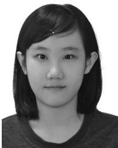  
Yu-Hsin Hsu received the BS degree in electrical engineering and the MS degree in communications engineering from National Chiao Tung University, Hsinchu, Taiwan, in 2017 and 2019, respectively. Her research interests include optimization for UAV wireless communication networks and machine learning for communication networks.

Rung-Hung Gau (Senior Member, IEEE) received the BS degree in electrical engineering from National Taiwan University, Taipei, Taiwan, the MS degree in electrical engineering from the University of California at Los Angeles, Los Angeles, CA, and the PhD degree in electrical and computer engineering from Cornell University, Ithaca, NY, in 1994, 1997, and 2001, respectively. He is currently a professor and the director of the Institute of Communications Engineering, National Chiao Tung University, Hsinchu, Taiwan. His current research

interests include optimal resource allocation in NOMA wireless networks, machine learning and optimization for wireless communications and mobile computing, UAV communication networks, Internet of Things, and software defined networking.

" For more information on this or any other computing topic, please visit our Digital Library at www.computer.org/csdl.