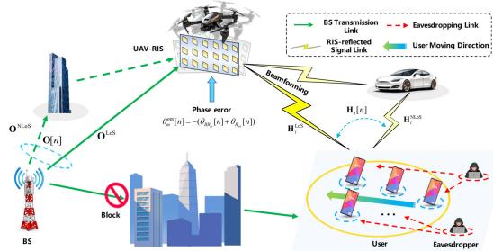
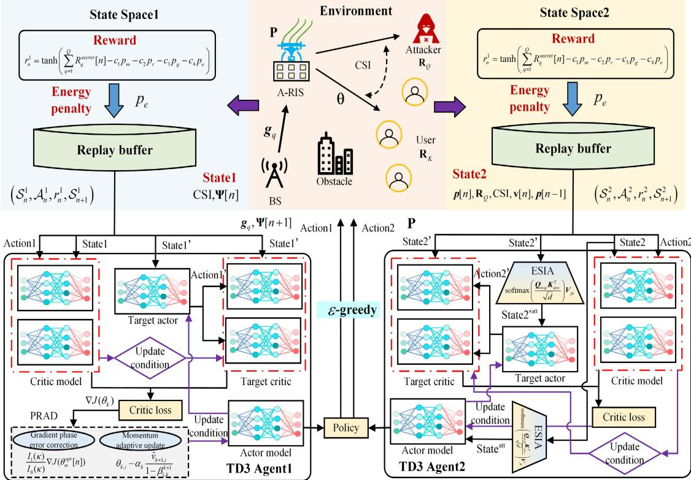
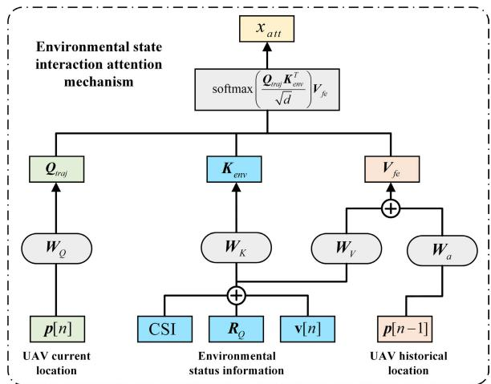
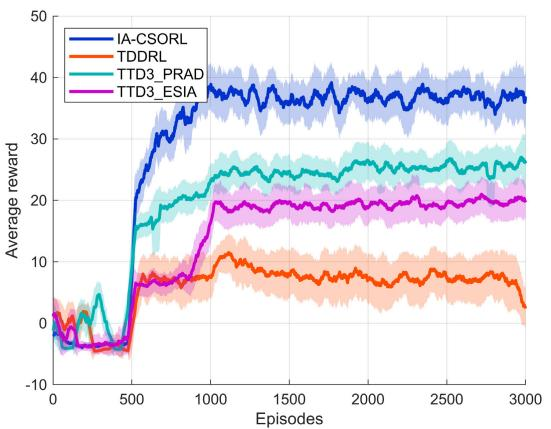
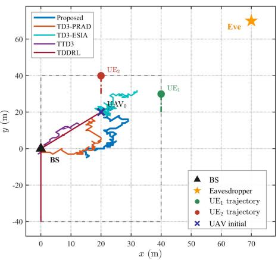
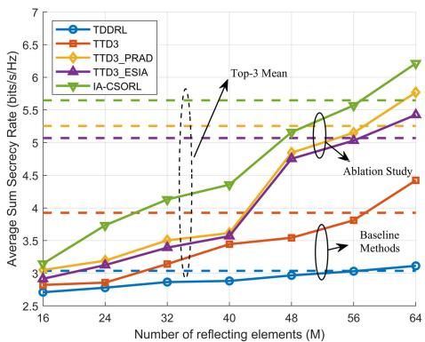
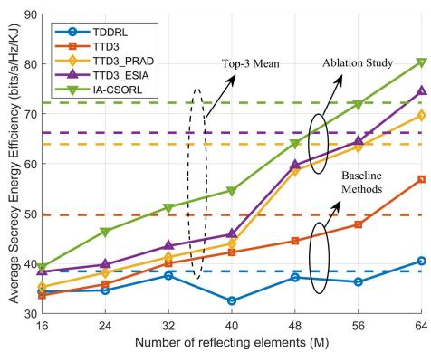
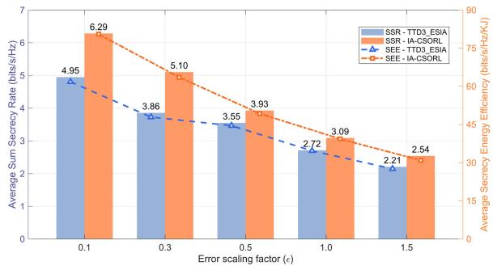
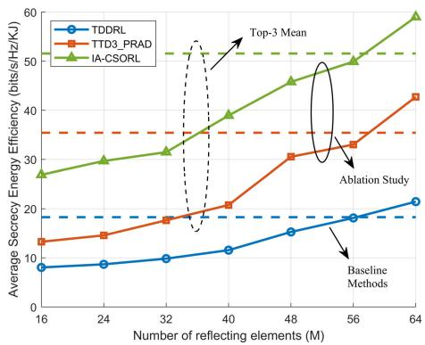

# Reinforcement Learning With Conformal Symplectic Optimization for Aerial RIS-Aided Secure Communication

Zhongming Feng , Graduate Student Member, IEEE, Qiling Gao , Member, IEEE, Haoran Zha , Member, IEEE, Yun Lin , Senior Member, IEEE, Yuanwei Liu , Fellow, IEEE, Dusit Niyato , Fellow, IEEE, and Marco Di Renzo , Fellow, IEEE

Abstract—This article investigates a secure aerial reconfigurable intelligent surface (A-RIS) communication system, where user mobility, imperfect channel state information (CSI), and RIS phase errors induced by uncrewed aerial vehicle (UAV) jitter significantly degrade performance. To address these challenges, we formulate a joint optimization problem for UAV trajectory, base station (BS) we propose abeamforming, and A-RIS beamforming to maximize the minimum secrecy energy efficiency (SEE), subject to constraints on user secrecy rates and UAV energy efficiency. To solve this highly non-convex problem, we propose a novel reinforcement learning framework termed IA-CSORL based on the twin-twin-delayed deep deterministic policy gradient (TTD3) architecture, which incorporates two novel modules. Specifically, we develop the phase-aware relativistic adaptive descent (PRAD) algorithm is proposed, which embeds the learning process into a conformal Hamiltonian system. By

Received 19 December 2025; accepted 22 February 2026. Date of current version 12 March 2026. This work was supported by the National Natural Science Foundation of China under Grant 62501184 and Grant U23A20271. The work of Qiling Gao was supported by the National Natural Science Foundation of China (NSFC) under Grant 62501184. The work of Marco Di Renzo was supported in part by European Union through the Horizon Europe Project COVER under Grant 101086228; in part by the Horizon Europe Project UNITE under Grant 101129618; in part by the Horizon Europe Project INSTINCT under Grant 101139161; in part by the Horizon Europe Project TWIN6G under Grant 101182794; in part by the Agence Nationale de la Recherche (ANR) through the France 2030 Project ANR-PEPR Networks of the Future under Grant NF-YACARI 22-PEFT-0005; in part by the CHIST-ERA Project PASSIONATE under Grant CHIST-ERA-22-WAI-04 and Grant ANR-23-CHR4-0003-01; in part by the Engineering and Physical Sciences Research Council (EPSRC), part of UK Research and Innovation, in part by the UK Department of Science, Innovation and Technology through the CHEDDAR Telecom Hub under Grant EP/X040518/1 and Grant EP/Y037421/1; and in part by the HASC Telecom Hub under Grant EP/X040569/1. The associate editor coordinating the review of this article and approving it for publication was H. Zeng. (Corresponding author: Qiling Gao.)

Marco Di Renzo is with Universite Paris-Saclay, CNRS, CentraleSup´ elec,´ Laboratoire des Signaux et Systemes, 91192 Gif-sur-Yvette, France, and also´ with the King’s College London, Department of Engineering - Centre for Telecommunications Research, WC2R 2LS London, USA (e-mail: marco.direnzo@universite-paris-saclay.fr; marco.di renzo@kcl.ac.uk)

Digital Object Identifier 10.1109/TWC.2026.3670412

integrating gradient-based phase error correction and adaptive momentum adjustment, PRAD effectively counteracts phase noise and stabilizes training. Furthermore, we design an environmentstate interactive attention (ESIA) mechanism to dynamically fuse UAV positioning and environmental features, enhancing state representation and deployment accuracy. Numerical results demonstrate that IA-CSORL significantly outperforms existing RL baselines in terms of both robustness and convergence performance. Moreover, IA-CSORL achieves superior beamforming accuracy under phase errors and CSI imperfections and provides a better trade-off between sum secrecy rate (SSR) and SEE, with performance gains becoming more significant as the number of RIS elements increases.

Index Terms—Conformal Hamiltonian, reconfigurable intelligent surface (RIS), reinforcement learning (RL), secrecy performance, uncrewed aerial vehicle (UAV).

## I. INTRODUCTION

W ITH the commercial deployment of sixth-generation(6G) communications, a variety of wireless technolo- (6G) communications, a variety of wireless technologies have been extensively studied to enhance communication quality [1], [2], [3]. However, the high power consumption in 6G networks has made energy efficiency and hardware cost persistent challenges. Therefore, identifying spectrum and energy efficient technologies with low hardware complexity remains a pressing need for achieving sustainable wireless networks. In this context, reconfigurable intelligent surface (RIS) has emerged, with the potential of improving communication quality and coverage, spectral and energy efficiency, as well as enhancing the security of wireless networks for its capability of phase manipulation [4], [5].

An RIS consists of a flat surface containing multiple adjustable reflecting units capable of generating favorable multipath propagation conditions, therefore enabling precise control and optimization of signal propagation paths [6], [7], [8]. The placement of RISs is a key determinant of coverage, efficiency, and overall system performance, and thus warrants systematic investigation. In practice, ground-deployed RISs suffer from inherent limitations. Physical obstructions in the built environment can hinder the establishment of a base station (BS)–receiver line-of-sight (LoS) link [9]. Moreover, facade-mounted RISs mainly serve users on the illuminated side of a building. As a result, achieving ubiquitous coverage often requires deploying RISs on multiple facades.

Dusit Niyato is with the College of Computing and Data Science, Nanyang Technological University, Singapore 639798 (e-mail: dniyato@ntu.edu.sg).

TABLE I  
COMPARISON OF KEY CONSIDERATIONS AND CONTRIBUTIONS WITH RELATED LITERATURE
<table><tr><td rowspan=1 colspan=1></td><td rowspan=1 colspan=1>[20]</td><td rowspan=1 colspan=1>[21]</td><td rowspan=1 colspan=1>[22]</td><td rowspan=1 colspan=1>[23]</td><td rowspan=1 colspan=1>[24]</td><td rowspan=1 colspan=1>[25]</td><td rowspan=1 colspan=1>[26]</td><td rowspan=1 colspan=1>[27]</td><td rowspan=1 colspan=1>[28]</td><td rowspan=1 colspan=1>[29]</td><td rowspan=1 colspan=1>[30]</td><td rowspan=1 colspan=1>[31]</td><td rowspan=1 colspan=1>[32]</td><td rowspan=1 colspan=1>[33]</td><td rowspan=1 colspan=1>[34]</td><td rowspan=1 colspan=1>[35]</td><td rowspan=1 colspan=1>[36]</td><td rowspan=1 colspan=1>Ours</td></tr><tr><td rowspan=1 colspan=1>Ground-based RIS</td><td rowspan=1 colspan=1>√</td><td rowspan=1 colspan=1>√</td><td rowspan=1 colspan=1>√</td><td rowspan=1 colspan=1>√</td><td rowspan=1 colspan=1>√</td><td rowspan=1 colspan=1>√</td><td rowspan=1 colspan=1>√</td><td rowspan=1 colspan=1></td><td rowspan=1 colspan=1></td><td rowspan=1 colspan=1></td><td rowspan=1 colspan=1></td><td rowspan=1 colspan=1></td><td rowspan=1 colspan=1></td><td rowspan=1 colspan=1></td><td rowspan=1 colspan=1>√</td><td rowspan=1 colspan=1></td><td rowspan=1 colspan=1></td><td rowspan=1 colspan=1></td></tr><tr><td rowspan=1 colspan=1>Aerial RIS Architecture</td><td rowspan=1 colspan=1></td><td rowspan=1 colspan=1></td><td rowspan=1 colspan=1></td><td rowspan=1 colspan=1></td><td rowspan=1 colspan=1></td><td rowspan=1 colspan=1></td><td rowspan=1 colspan=1></td><td rowspan=1 colspan=1>√</td><td rowspan=1 colspan=1>√</td><td rowspan=1 colspan=1>√</td><td rowspan=1 colspan=1>√</td><td rowspan=1 colspan=1>√</td><td rowspan=1 colspan=1>√</td><td rowspan=1 colspan=1>√</td><td rowspan=1 colspan=1></td><td rowspan=1 colspan=1></td><td rowspan=1 colspan=1></td><td rowspan=1 colspan=1>√</td></tr><tr><td rowspan=1 colspan=1>Physical Layer Security</td><td rowspan=1 colspan=1></td><td rowspan=1 colspan=1>√</td><td rowspan=1 colspan=1>√</td><td rowspan=1 colspan=1>√</td><td rowspan=1 colspan=1>√</td><td rowspan=1 colspan=1>√</td><td rowspan=1 colspan=1>√</td><td rowspan=1 colspan=1></td><td rowspan=1 colspan=1>√</td><td rowspan=1 colspan=1></td><td rowspan=1 colspan=1>√</td><td rowspan=1 colspan=1>√</td><td rowspan=1 colspan=1>√</td><td rowspan=1 colspan=1>√</td><td rowspan=1 colspan=1>√</td><td rowspan=1 colspan=1></td><td rowspan=1 colspan=1>√</td><td rowspan=1 colspan=1>√</td></tr><tr><td rowspan=1 colspan=1>UAV Energy Efficiency</td><td rowspan=1 colspan=1></td><td rowspan=1 colspan=1></td><td rowspan=1 colspan=1></td><td rowspan=1 colspan=1></td><td rowspan=1 colspan=1></td><td rowspan=1 colspan=1></td><td rowspan=1 colspan=1></td><td rowspan=1 colspan=1></td><td rowspan=1 colspan=1></td><td rowspan=1 colspan=1></td><td rowspan=1 colspan=1>√</td><td rowspan=1 colspan=1></td><td rowspan=1 colspan=1></td><td rowspan=1 colspan=1></td><td rowspan=1 colspan=1>√</td><td rowspan=1 colspan=1>√</td><td rowspan=1 colspan=1></td><td rowspan=1 colspan=1>V</td></tr><tr><td rowspan=1 colspan=1>Secrecy Energy Efficiency</td><td rowspan=1 colspan=1></td><td rowspan=1 colspan=1></td><td rowspan=1 colspan=1></td><td rowspan=1 colspan=1></td><td rowspan=1 colspan=1></td><td rowspan=1 colspan=1></td><td rowspan=1 colspan=1></td><td rowspan=1 colspan=1></td><td rowspan=1 colspan=1></td><td rowspan=1 colspan=1></td><td rowspan=1 colspan=1></td><td rowspan=1 colspan=1></td><td rowspan=1 colspan=1></td><td rowspan=1 colspan=1></td><td rowspan=1 colspan=1></td><td rowspan=1 colspan=1></td><td rowspan=1 colspan=1></td><td rowspan=1 colspan=1>√</td></tr><tr><td rowspan=1 colspan=1>Conventional Optimization Method</td><td rowspan=1 colspan=1>√</td><td rowspan=1 colspan=1>√</td><td rowspan=1 colspan=1>√</td><td rowspan=1 colspan=1>√</td><td rowspan=1 colspan=1>√</td><td rowspan=1 colspan=1>√</td><td rowspan=1 colspan=1>√</td><td rowspan=1 colspan=1>√</td><td rowspan=1 colspan=1>√</td><td rowspan=1 colspan=1>√</td><td rowspan=1 colspan=1>√</td><td rowspan=1 colspan=1>√</td><td rowspan=1 colspan=1></td><td rowspan=1 colspan=1>√</td><td rowspan=1 colspan=1>√</td><td rowspan=1 colspan=1></td><td rowspan=1 colspan=1></td><td rowspan=1 colspan=1></td></tr><tr><td rowspan=1 colspan=1>Deep Reinforcement Learning</td><td rowspan=1 colspan=1></td><td rowspan=1 colspan=1></td><td rowspan=1 colspan=1></td><td rowspan=1 colspan=1></td><td rowspan=1 colspan=1>√</td><td rowspan=1 colspan=1></td><td rowspan=1 colspan=1></td><td rowspan=1 colspan=1></td><td rowspan=1 colspan=1></td><td rowspan=1 colspan=1></td><td rowspan=1 colspan=1></td><td rowspan=1 colspan=1></td><td rowspan=1 colspan=1>√</td><td rowspan=1 colspan=1></td><td rowspan=1 colspan=1></td><td rowspan=1 colspan=1>√</td><td rowspan=1 colspan=1>√</td><td rowspan=1 colspan=1>√</td></tr><tr><td rowspan=1 colspan=1>Physics-Informed Stability</td><td rowspan=1 colspan=1></td><td rowspan=1 colspan=1></td><td rowspan=1 colspan=1></td><td rowspan=1 colspan=1></td><td rowspan=1 colspan=1></td><td rowspan=1 colspan=1></td><td rowspan=1 colspan=1></td><td rowspan=1 colspan=1></td><td rowspan=1 colspan=1></td><td rowspan=1 colspan=1></td><td rowspan=1 colspan=1></td><td rowspan=1 colspan=1></td><td rowspan=1 colspan=1></td><td rowspan=1 colspan=1></td><td rowspan=1 colspan=1></td><td rowspan=1 colspan=1></td><td rowspan=1 colspan=1></td><td rowspan=1 colspan=1>V</td></tr><tr><td rowspan=1 colspan=1>Active Phase Error Compensation</td><td rowspan=1 colspan=1></td><td rowspan=1 colspan=1></td><td rowspan=1 colspan=1></td><td rowspan=1 colspan=1></td><td rowspan=1 colspan=1></td><td rowspan=1 colspan=1></td><td rowspan=1 colspan=1></td><td rowspan=1 colspan=1></td><td rowspan=1 colspan=1></td><td rowspan=1 colspan=1></td><td rowspan=1 colspan=1></td><td rowspan=1 colspan=1></td><td rowspan=1 colspan=1></td><td rowspan=1 colspan=1></td><td rowspan=1 colspan=1></td><td rowspan=1 colspan=1></td><td rowspan=1 colspan=1></td><td rowspan=1 colspan=1>√</td></tr><tr><td rowspan=1 colspan=1>Imperfect CSI</td><td rowspan=1 colspan=1></td><td rowspan=1 colspan=1>√</td><td rowspan=1 colspan=1></td><td rowspan=1 colspan=1></td><td rowspan=1 colspan=1></td><td rowspan=1 colspan=1></td><td rowspan=1 colspan=1></td><td rowspan=1 colspan=1></td><td rowspan=1 colspan=1></td><td rowspan=1 colspan=1></td><td rowspan=1 colspan=1>√</td><td rowspan=1 colspan=1>√</td><td rowspan=1 colspan=1>√</td><td rowspan=1 colspan=1>√</td><td rowspan=1 colspan=1></td><td rowspan=1 colspan=1></td><td rowspan=1 colspan=1>√</td><td rowspan=1 colspan=1>√</td></tr></table>

However, successive reflections through these surfaces incur significant signal attenuation [10], [11]. Although advanced architectures such as self-powered absorptive RIS [12] have been developed to mitigate energy and security concerns in terrestrial networks, they cannot fully circumvent the limited deployment flexibility caused by fixed installations [13], [14]. In this context, uncrewed aerial vehicles (UAV), have been widely applied across various scenarios for their low cost, high mobility, wide coverage, and on-demand deployment capabilities. A UAV can be used to support areas beyond the coverage of current terrestrial communication equipment [15]. Moreover, a UAV can enhance the quality and capacity of communication since LoS connections can be established [16], [17]. Owing to the flexibility, scalability, and altitude advantage of aerial platforms, deploying RISs on them has attracted considerable research interest. This technology is known as aerial RIS (A-RIS) [18], [19].

## A. Prior Works

Mounting an RIS on a UAV can effectively enhance various performance aspects of wireless communication networks, leading to a growing interest among researchers in integrating RISs in UAV scenarios. Ge et al. examined a communication scenario integrating a UAV with multiple RIS. The UAV’s beamforming, the RIS beamforming, and the UAV’s flight trajectory were jointly optimized to maximize the signal received power at users [20]. Fang et al. proposed a UAV secure communication system assisted by an RIS, where the UAV transmits information to legitimate receivers in the presence of passive eavesdroppers [21]. The UAV’s trajectory, power control, and RIS phase shifts were jointly designed to maximize the secrecy rate. Li et al. investigated a UAV-RIS secure communication system employing time division multiple access, and designed a robust scheme that jointly optimizes UAV flight path, RIS configuration, and transmission power to enhance the secrecy rate under imperfect eavesdropper channel state information (CSI) [22]. Sun et al. investigated secure transmission in a UAV-RIS-assisted millimeter-wave network with an eavesdropper, where UAV-BS and RIS positions and beamforming were jointly optimized under power, height, and rate constraints [23]. Han et al. proposed a UAV-authorized RIS backscatter communication network, where the RIS acted as a backscatter device to reflect the received signals from the UAV [24]. Pang et al. proposed a joint optimization of

UAV trajectory, beamforming, and RIS phase shifts using an alternating algorithm, achieving notable improvements in average secrecy rate and PLS [25]. Wen et al. tackled secrecy rate maximization by simultaneously optimizes the UAV flight trajectory, artificial noise generation, RIS phase shift configuration, and beamforming for information and interference, where a block coordinate descent (BCD) framework was adopted solve the non-convex problem [26].

In recent years, studies have gradually shifted from ground RIS-assisted UAV communications toward UAV-mounted A-RIS [27], [28], [29]. Guo et al. developed a resource allocation scheme for a millimeter-wave network employing multiple RIS-equipped UAVs [27]. The authors jointly optimized UAV deployment, ground BS beamforming, and the UAV-mounted RIS beamforming to maximize the minimum throughput across user clusters. Fang et al. explored a UAV communication network enhanced by RIS, in which the UAV operates as a relay. A secrecy rate maximization problem was proposed by optimizing the UAV’s placement and the RIS’s phase-shift configuration [28]. Liu et al. studied an RIS-assisted UAV relay communication system, where the UAV flight trajectory, RIS beamforming, and power allocation for each time slot was designed to maximize the average downlink throughput, with considering phase errors introduced by UAV jitter [29]. The authors of [30] derived the minimum number of reflecting elements under secrecy and energy efficiency constraints. For the channel uncertainty and imperfect constraints scenarios, the authors of [31] applied the S-process and generalized symbol determinism to transform it into a more manageable form. Yang et al. proposed a robust transmission strategy against eavesdropping by developing a post-decision state deep Q-network integrated with Fourier feature mapping, based upon a joint optimization framework [32]. Furthermore, addressing the issue of unknown exact eavesdropper locations, Wei et al. investigated the joint optimization of the UAV’s hovering position, BS beamforming, and RIS phase shifts to maximize the worst-case secrecy rate [33]. An RIS-aided UAV-MEC framework was studied in [34], where the task offloading rate, user scheduling, RIS phase, and UAV trajectory were jointly optimized under secure offloading constraints. Both the Dinkelbach algorithm and SCA were applied solve the coupled non-convex problem. Beyond conventional optimization, advanced deep reinforcement learning (DRL) frameworks have also been applied to address complex resource management and trajectory design problems.

Li et al. investigated energy-efficient UAV-driven MEC systems and proposed a distributed multi-agent DRL solution to jointly optimize UAV trajectories and computation resources [35]. Addressing security concerns, they also developed a multi-step TD3-based approach with prioritized experience replay to design covertness-aware UAV trajectories against surveillance [36]. To clearly demonstrate the key contributions of this work and its distinctions from existing literature, particularly concerning the UAV-RIS architecture and the application of TD3-based optimization frameworks, we summarize the key elements of our proposed scheme and related works in Table I.

## B. Motivation and Contributions

A-RIS integrates RISs with the mobility of UAVs to establish robust LoS links and enhance signal quality and coverage [37]. However, the open transmission environment and wide service area make A-RIS systems particularly vulnerable to security threats. In addition, UAV mobility induces imperfect CSI, while platform jitter causes RIS phase errors [30], which, together with stringent onboard energy constraints [34], significantly complicate secure system design and render conventional static optimization ineffective. DRL offers a promising real-time solution for dynamic A-RIS systems. Nevertheless, existing DRL-based methods struggle to jointly address CSI uncertainty and hardware-induced phase errors during UAV flight, and their convergence is further challenged by the large number of RIS elements. Moreover, due to the limited energy budget of UAVs, optimizing secrecy rate alone may lead to inefficient energy utilization. Secrecy energy efficiency (SEE), which jointly captures security and energy consumption, is therefore a more practical performance metric. However, SEE optimization for dynamic A-RIS systems under imperfect CSI and hardware impairments remains largely unexplored.

To bridge this gap, we investigate the robust joint optimization of the minimum sum secrecy rate (SSR) and SEE in A-RIS systems. We design a novel RL with interactive attention and conformal symplectic optimization (IA-CSORL) framework with both phase-aware relativistic adaptive descent (PRAD) and environment-state interactive attention (ESIA) modules, which effectively enhance robustness, convergence, and overall secure energy-efficient performance. The main contributions of this paper are summarized as follows:

This paper investigates a millimeter-wave secure communication scenario assisted by an A-RIS mounted on a UAV. Although the UAV enhances system flexibility, its mobility and jitter significantly degrade performance. Accordingly, a robust online control problem is formulated to jointly optimize BS beamforming, UAV trajectory, and RIS reflection for maximizing the worstcase SSR and SEE under imperfect CSI and phase errors.

• To mitigate the policy drift induced by phase errors and imperfect CSI, we propose a novel PRAD algorithm. While leveraging the energy-conserving and long-term stable symplectic structure of RAD, PRAD structurally integrates an analytical gradient correction mechanism.

This design actively eliminates the systematic gradient bias caused by UAV jitter-induced phase errors and, combined with adaptive momentum adjustment, ensures robust convergence in highly dynamic environments.

• Furthermore, we propose an ESIA mechanism that adaptively fuses the UAV’s current and previous positions with key communication features, including CSI, users’ locations, and UAV velocity, to generate an interaction-enhanced state representation. Unlike standard fusion methods, ESIA establishes a cross-domain feature alignment, dynamically weighting environmental features based on their spatial relevance to the UAV’s trajectory. This acts as a robust feature filter, enabling precise autonomous positioning and enhanced secrecy performance even under high-dynamic channel variations.

• Finally, we conduct extensive experiments. The experimental results show that: 1) Compared with existing RL baselines, the proposed method demonstrates significantly faster convergence while maintaining long-term policy stability; 2) The proposed method effectively mitigates the impact of RIS phase errors and imperfect CSI, enabling accurate beamforming; 3) The advantages of the proposed method become more pronounced as the number of RIS elements increases, achieving a balanced and consistent improvement in both SSR and SEE performance.

## C. Organization and Notations

The rest of this paper is organized as follows: Section II describes the system scenario and elaborates on the problem, including channel modeling and optimization problem definition. Section III provides a detailed introduction to the proposed method. Section IV evaluates the performance of the proposed method and compares it with existing RL approaches. Section V concludes the paper and outlines future research directions.

Notations: Scalars, vectors/matrices, and Euclidean subspaces are denoted by regular, boldface, and calligraphic letters, respectively. The set of complex numbers is represented by C. The transpose and conjugate transpose (Hermitian transpose) are represented by $( \check { \cdot } ) ^ { \check { T } }$ and $( \cdot ) ^ { \dot { H } }$ . The Euclidean norm are indicated by k·k. The expectation operator is denoted by E[·]. The identity matrix is denoted by I. Pr{·} denotes the probability of the event enclosed in the braces.

## II. SYSTEM MODEL AND PROBLEM FORMULATION

As illustrated in Fig. 1, we consider an A-RIS-assisted secure communication scenario, where the direct link from the BS to users and eavesdroppers is blocked due to the complexity of the urban environment. The RIS is mounted on a rotorcraft UAV to provide additional links from the BS to $Q$ users in the presence of K potential eavesdroppers. The BS has N antennas, the users and eavesdroppers are equipped with single antennas, and the RIS is modeled as a uniform planar array (UPA) composed of M configurable reflective units. The spacing between neighboring antennas at the BS and adjacent reflective units at the RIS is denoted as $d _ { B } \ \leqslant \ \lambda / c$ and $d _ { R } \leqslant \lambda / c .$ , respectively, with λ indicating the wavelength of the carrier wave. At time instance n the positions of the users and the eavesdroppers are represented as ${ \bf R } _ { i } = ( x _ { i } [ n ] , y _ { i } [ n ] , z _ { i } [ n ] ) ^ { T }$ , where $i \in Q \cup K$

  
Fig. 1. Secure communication scenario with A-RIS.

## A. UAV Energy Consumption Model

The total flight duration of the UAV is denoted by $T ,$ and it includes L small time slots $\delta _ { t }$ [38]. The trajectory point of the UAV at time n is denoted as p[n] and the speed of the UAV is given by

$$
\| \mathbf { v } [ n ] \| = \sqrt { \| \mathbf { p } [ n ] - \mathbf { p } [ n - 1 ] \| ^ { 2 } } / \delta _ { t } .\tag{1}
$$

The initial position of the UAV is assumed to be p[0], and the mobility boundary of the UAV is set as $[ x _ { \mathrm { m i n } } , x _ { \mathrm { m a x } } ] \times$ $[ y _ { \mathrm { m i n } } , y _ { \mathrm { m a x } } ]$ . The maximum maneuvering distance of the UAV at time n is represented as $D _ { m a x }$ . Therefore, the mobility constraint for the UAV is expressed by

$$
\mathbf { p } [ 0 ] \equiv ( 0 , 0 , H _ { U } ) ^ { T } ,\tag{2a}
$$

$$
x _ { \mathrm { m i n } } \leq x _ { U } [ n ] \leq x _ { \mathrm { m a x } } , \quad y _ { \mathrm { m i n } } \leq y _ { U } [ n ] \leq y _ { \mathrm { m a x } } ,\tag{2b}
$$

$$
\sqrt { \| \mathbf { p } [ n ] - \mathbf { p } [ n - 1 ] \| ^ { 2 } } \leq D _ { \operatorname* { m a x } } .\tag{2c}
$$

To account for practical positioning inaccuracies, the UAV’s random noisy position is modeled as $\tilde { { \bf p } } [ n ] = { \bf p } [ n ] + \delta _ { g p s } ,$ where $\delta _ { g p s } ~ \sim ~ \mathcal { N } ( 0 , \sigma _ { g p s } ^ { 2 } { \bf I } )$ represents the Gaussian noise with variance $\sigma _ { g p s } ^ { 2 } [ 3 9 ]$ . Moreover, the propulsion energy consumption of the UAV at a flight speed of $\left\| \mathbf { v } [ n ] \right\|$ can be expressed as [40]

$$
\begin{array} { l } { { \displaystyle E _ { p } [ n ] \approx \delta _ { t } \left( P _ { 0 } + \frac { 3 P _ { 0 } \| { \bf v } [ n ] \| ^ { 2 } } { U _ { \mathrm { i p } } ^ { 2 } } + \frac { 1 } { 2 } d _ { 0 } \rho s A _ { r } \| { \bf v } [ n ] \| ^ { 3 } \right) } } \\ { { \displaystyle ~ + \delta _ { t } P _ { i } \left( \sqrt { 1 + \frac { \| { \bf v } [ n ] \| ^ { 4 } } { 4 v _ { 0 } ^ { 4 } } } - \frac { \| { \bf v } [ n ] \| ^ { 2 } } { 2 v _ { 0 } ^ { 2 } } \right) ^ { \frac { 1 } { 2 } } } , } \end{array}\tag{3}
$$

where $P _ { i }$ and $P _ { 0 }$ represent the induced power and the blade profile power in the hover state, respectively. $U _ { \mathrm { t i p } } ^ { 2 }$ is the tip speed of the rotor blades, and $v _ { 0 }$ is the average rotational speed of the rotor during hover. Additionally, $d _ { 0 }$ and s represent the fuselage drag ratio and the rotor solidity, respectively. $\rho$ represents the air density, and $A _ { r }$ denotes the rotor disk area.

## B. Channel Model

To accurately capture the dynamic characteristics of the communication environment, we explicitly incorporate a mobility model for the legitimate users. Let the threedimensional (3D) coordinate of the q-th use at time slot n be denoted by ${ \bf R } _ { q } [ n ] \ = \ [ x _ { q } [ n ] , y _ { q } [ \bar { n } ] , z _ { q } [ n ] ] ^ { T }$ , where $q \in$ $\{ 1 , . . . . Q \}$ . Unlike static scenarios, the users in our system move continuously within the service area. The trajectory of each user is modeled as a kinematic process governed by a velocity vector $\mathbf { v } _ { q }$ and the time slot duration $\delta _ { t } .$ . The position update rule is give by:

$$
\mathbf { R } _ { q } [ n ] = \mathbf { R } _ { q } [ n - 1 ] + \mathbf { v } _ { q } \cdot \delta _ { t } , \quad \forall q \in \{ 1 , . . . , Q \}\tag{4}
$$

where $\mathbf v _ { q } = [ v _ { q } \cos ( \varpi _ { q } ) , v _ { q } \sin ( \varpi _ { q } ) , 0 ] ^ { T }$ represents the horizontal velocity vector determined by the constant moving speed $v _ { q }$ and the heading angle $\varpi _ { q } .$

The user mobility results in time-varying topological relations between the A-RIS and the ground users, introducing non-stationarity into the CSI. Accordingly, the channel follows the 3D Saleh-Valenzuela (SV) model [41], [42]. We consider a fast fading scenario where the small-scale fading coefficients vary with each time slot $n ,$ reflecting the rapid channel dynamics in UAV-assisted environments. The BS is located at the origin of a 3D coordinate system. The horizontal position of the A-RIS is denoted by $\dot { \mathbf { l } [ n ] } = [ x _ { U } [ n ] , y _ { U } [ n ] ] ^ { T }$ , with a fixed height $H _ { U }$ along the z-axis. Therefore, the 3D position of the A-RIS can be represented by ${ \bf p } [ n ] = [ x _ { U } [ n ] , y _ { U } \bar { [ n ] } , H _ { U } ] ^ { T }$ The distance between the BS and A-RIS can be formulated as $d _ { B U } [ n ] = \sqrt { H _ { U } ^ { 2 } + \| { \bf I } [ n ] \| ^ { 2 } }$ , and the A-RIS distance to the q-th user / k-th eavesdropper is represented by $d _ { U i } [ n ] =$ $\sqrt { \| \mathbf { p } [ n ] - \mathbf { R } _ { i } \| ^ { 2 } } , i \in Q \cup K$ . Additionally, the zenith angle of arrival (AoA) from the BS signal toward the A-RIS (i.e., the angle between the signal propagation direction and the z-axis) is denoted by $\phi ^ { R } [ n ]$ , and the azimuth AoA (i.e., the angle between the projection of the signal in the x-y plane and the x-axis) is denoted by $\vartheta ^ { R } [ n ]$ . Accordingly, the array response vector at the A-RIS can be expressed as

$$
\begin{array} { r } { \mathbf { g } ^ { R } [ n ] = \left[ 1 , . . . , e ^ { j \frac { 2 \pi } { \lambda } ( M _ { x } - 1 ) d _ { R } \sin \phi ^ { U } [ n ] \cos \vartheta ^ { R } [ n ] } \right] ^ { T } } \\ { \otimes \left[ 1 , . . . , e ^ { j \frac { 2 \pi } { \lambda } ( M _ { y } - 1 ) d _ { I } \sin \phi ^ { R } [ n ] \sin \vartheta ^ { R } [ n ] } \right] ^ { T } , } \end{array}\tag{5}
$$

where $M _ { x }$ and $M _ { y }$ refer to the numbers of elements of the RIS along the x and y directions, respectively. Similarly, the array response at the BS can be expressed as

$$
\begin{array} { r } { \mathbf { g } ^ { B } [ n ] = \left[ 1 , . . . , e ^ { j \frac { 2 \pi } { \lambda } ( N - 1 ) d _ { B } \sin \phi ^ { T } [ n ] \cos \vartheta ^ { T } [ n ] } \lbrack n \rbrack \right] ^ { T } , } \end{array}\tag{6}
$$

where $\phi ^ { T }$ and $\vartheta ^ { T }$ represent the zenith angle of departure (AoD) and azimuth AoD of the communication link between the BS and A-RIS, respectively.

The zenith AoD and AoD of the communication link from the A-RIS to the q-th user / k-th eavesdropper are represented by $\phi ^ { D }$ and $\vartheta ^ { D }$ , respectively. Accordingly, the array response of the A-RIS can be formulated as

$$
\begin{array} { r l } & { \mathbf { h } _ { i } ^ { D } [ n ] = \left[ 1 , . . . , e ^ { j \frac { 2 \pi } { \lambda } ( M _ { x } - 1 ) d _ { R } \sin \phi ^ { D } [ n ] \cos \vartheta ^ { D } [ n ] } \right] ^ { T } } \\ & { \qquad \otimes \left[ 1 , . . . , e ^ { j \frac { 2 \pi } { \lambda } ( M _ { y } - 1 ) d _ { R } \sin \phi ^ { D } [ n ] \sin \vartheta ^ { D } [ n ] } \right] ^ { T } . } \end{array}\tag{7}
$$

Based on the considered models, the channel matrices between the BS and the A-RIS, as well as those between the A-RIS and the q-th user, can be formulated as

$$
\begin{array} { l } { { \displaystyle { \bf O } [ n ] = \sqrt { \chi _ { 0 } d _ { B U } [ n ] ^ { - \eta _ { 1 } } } \big ( \sqrt { \frac { \chi _ { 1 } } { 1 + \chi _ { 1 } } } { \bf O } ^ { \mathrm { L o S } } [ n ] } } \\ { { \displaystyle ~ + \sqrt { \frac { 1 } { 1 + \chi _ { 1 } } } { \bf O } ^ { \mathrm { N L o S } } [ n ] \big ) , } } \end{array}\tag{8}
$$

$$
\begin{array} { l } { { \displaystyle { \bf h } _ { i } [ n ] = \sqrt { \chi _ { 0 } d _ { U i } [ n ] ^ { - \eta _ { 2 } } } \big ( \sqrt { \frac { \chi _ { 2 } } { 1 + \chi _ { 2 } } } { \bf h } _ { i } ^ { \mathrm { L o S } } [ n ] } } \\ { { \displaystyle ~ + \sqrt { \frac { 1 } { 1 + \chi _ { 2 } } } { \bf h } _ { i } ^ { \mathrm { N L o S } } [ n ] \big ) , } } \end{array}\tag{9}
$$

where $\mathbf { O } \in \mathbb { C } ^ { M \times N }$ and $\mathbf { h } _ { i } \in \mathbb { C } ^ { 1 \times M }$ , χ denotes the channel gain at a reference distance of 1 meter, $\eta _ { 1 }$ and $\eta _ { 2 }$ represent the path-loss exponents. $\chi _ { 1 }$ and $\chi _ { 2 }$ indicate the Rician factors, respectively. Specifically, the subscript 1 corresponds to the BS-to-A-RIS link, while the subscript 2 refers to the A-RIS to users / eavesdropper link. Moreover, $\mathbf { O } ^ { \mathrm { L o S } }$ and ${ \bf O } ^ { \mathrm { N L o S } }$ are the channel matrices corresponding to the LoS and non-lineof-sight (NLoS) paths from the BS to the A-RIS, respectively. Likewise, $\mathbf { h } _ { i } ^ { \mathrm { L o S } }$ and $\mathbf { h } _ { i } ^ { \mathrm { N L o S } }$ represent the channel matrices for the LoS and NLoS links from the A-RIS to the i-th users / eavesdropper. Furthermore, ${ \bf O } ^ { \mathrm { N L o S } }$ and $\mathbf { h } _ { i } ^ { \mathrm { N L o S } }$ are independent and identically distributed complex Gaussian random variables, $\mathbf { O } ^ { \mathrm { N L o S } } \sim \mathcal { C N } ( \mathbf { 0 } , \mathbf { I } )$ and $\mathbf { h } _ { i } ^ { \bar { \mathrm { N L o S } } } \sim \mathcal { C N } ( \mathbf { 0 } , \mathbf { I } )$ . The deterministic LoS components $\mathbf { O } ^ { \mathrm { L o S } }$ and $\mathbf { h } _ { i } ^ { \mathrm { L o S } }$ are given by

$$
{ \bf O } ^ { \mathrm { L o S } } [ n ] = e ^ { - j \frac { 2 \pi } { \lambda } d _ { B U } [ n ] } { \bf g } ^ { R } [ n ] \left( { \bf g } ^ { B } [ n ] \right) ^ { H } ,\tag{10}
$$

$$
{ \bf h } _ { i } ^ { \mathrm { L o S } } [ n ] = e ^ { - j \frac { 2 \pi } { \lambda } d _ { U i } [ n ] } \left( { \bf h } _ { i } ^ { D } [ n ] \right) ^ { H } .\tag{11}
$$

In practical communication systems, the estimated CSI is typically imperfect due to the UAV movement, users movement, and interference. This is especially true for the CSI from the UAV receiver to the eavesdropper, where only partial or even no information is available. Consequently, the channel matrices that account for imperfect CSI on both the link from the BS to the A-RIS and the link from that A-RIS to the users / eavesdropper are expressed as

$$
{ \bf O } [ n ] = \sqrt { \kappa _ { o } } \hat { { \bf O } } [ n ] + \sqrt { 1 - \kappa _ { o } } \Delta { \bf O } [ n ] ,\tag{12}
$$

$$
\mathbf h _ { i } [ n ] = \sqrt { \kappa _ { i } } \hat { \mathbf h } _ { i } [ n ] + \sqrt { 1 - \kappa _ { i } } \Delta \mathbf h _ { i } [ n ] ,\tag{13}
$$

where $\kappa _ { o }$ and $\kappa _ { i } , i \in Q \cup K$ are the estimation accuracy factors for the BS to A-RIS and for the A-RIS to i-th users / eavesdropper, respectively, following the distribution $0 \leqslant \kappa _ { o } , \kappa _ { i } \leqslant 1$ . The setting $\kappa _ { o } , \kappa _ { i } = 0$ represents perfect estimation, and the setting $\kappa _ { o } , \kappa _ { i } = 1$ represents completely unreliable estimation. ${ \hat { \mathbf { O } } } [ n ]$ and $\hat { \mathbf { h } } _ { i } [ n ]$ are the estimated CSI, while $\Delta { \bf O } [ n ]$ and $\Delta \mathbf { h } _ { i } [ n ]$ represent the CSI estimation errors.

## C. Signal Model With RIS Phase Errors

Building on [24], we incorporate RIS phase estimation errors into the communication model. Under ideal conditions, perfect RIS phase configuration can be expressed as

$$
\theta _ { m } ^ { \mathrm { o p t } } [ n ] = - ( \theta _ { B R _ { m } } [ n ] + \theta _ { R _ { m } i } [ n ] ) ,\tag{14}
$$

where $\theta _ { m } ^ { \mathrm { o p t } } [ n ]$ is the optimal phase setting for the m-th reflecting element of the RIS, and $\theta _ { B R _ { m } } [ n ]$ and $\theta _ { R _ { m } i } [ n ]$ are the phases of O[n] and $\mathbf { h } _ { i } [ n ]$ , respectively. Under perfect phase conditions, the users’ signal to noise ratio (SNR) attains its maximum, resulting in the highest possible received signal quality. However, in real-world scenarios, UAV jitter causes random changes in the $\mathrm { U A V } ^ { \ , } \mathbf { s }$ position and orientation, which affects the geometric relationship between the RIS and the users / eavesdropper in the A-RIS system. This introduces phase errors, causing the RIS phase to become $\theta _ { m } [ n ] ~ =$ $\theta _ { m } ^ { \mathrm { o p t } } [ n ] + \theta _ { m } ^ { \mathrm { e r r } } [ n ]$ . The phase estimation error $\theta _ { m } ^ { \mathrm { e r r } } [ n ]$ is generally modeled by a von Mises distribution with zero mean and a concentration parameter κ [43], where κ is inversely related to the magnitude of the error. The probability density function (PDF) and eigenfunction of this error is given as

$$
f _ { \theta _ { m } ^ { \mathrm { e r r } } } ( x ) = e ^ { \kappa \cos ( x ) } / 2 \pi I _ { 0 } ( \kappa ) ,\tag{15}
$$

$$
\begin{array} { r } { \varphi _ { p } = \mathbb E \bigl ( e ^ { j p \theta _ { m } ^ { \mathrm { e r r } } } \bigr ) = I _ { p } ( \kappa ) / I _ { 0 } ( \kappa ) , } \end{array}\tag{16}
$$

where $I _ { 0 } ( \kappa )$ and $I _ { p } ( \kappa )$ represent the modified Bessel functions of the first kind of order 0 and p, respectively. Under the influence of phase estimation errors, the RIS reflection phase matrix parameters change as $\begin{array} { r l } { \Psi [ n ] } & { { } = } \end{array}$ diag $\left( e ^ { j \left( \theta _ { 1 } ^ { \mathrm { o p t } } [ n ] + \theta _ { 1 } ^ { \mathrm { e r r } } [ n ] \right) } , . . . , \dot { e } ^ { j \left( \theta _ { M } ^ { \mathrm { o p t } } [ n ] + \theta _ { M } ^ { \mathrm { e r r } } [ n ] \right) } \right)$

The received signals corresponding to the users and the eavesdropper can be further represented as

$$
y _ { q } [ n ] = \underbrace { \mathbf { h } _ { q } [ n ] \Psi [ n ] \mathbf { O } [ n ] \mathbf { g } _ { q } \ : s _ { q } [ n ] } _ { \mathrm { C a s c a d e ~ c h a n n e l ~ g a i n } }
$$

$$
+ \sum _ { j = 1 \atop j \neq q } ^ { Q } \underbrace { { \bf h } _ { q } [ n ] \Psi [ n ] { \bf O } [ n ] { \bf g } _ { j } } _ { \mathrm { C a s c a d e ~ c h a n n e l ~ g a i n } } s _ { j } [ n ] + n _ { q } ,\tag{17}
$$

$$
y _ { k } [ n ] = { \bf h } _ { k } [ n ] \Psi [ n ] { \bf O } [ n ] \sum _ { q = 1 } ^ { Q } { \bf g } _ { q } s _ { q } [ n ] + n _ { k } ,\tag{18}
$$

where $s _ { q } [ n ] \sim \mathcal { C N } ( 0 , 1 )$ denotes the data symbol intended for transmission to the q-th user. All users symbols are assumed mutually independent and satisfy the power normalization condition $\mathbb { E } [ s _ { q } [ n ] s _ { q } ^ { * } [ n ] ] = 1$ . The corresponding beamforming vector for the q-th user is denoted by $\mathbf { g } _ { q } \in \mathbb { C } ^ { N \times 1 }$ . The total transmission power at the BS is $\begin{array} { r } { P = \mathbb { E } \left[ \left| \dot { \left. \sum _ { q = 1 } ^ { Q } \mathbf { g } _ { q } s _ { q } [ n ] \right. } \right| ^ { 2 } \right] = } \end{array}$ $\textstyle \sum _ { q = 1 } ^ { Q } \| \mathbf { g } _ { q } \| ^ { 2 }$ , where the symbols are uncorrelated and unitpower. In addition, $n _ { q } , n _ { k } \sim \mathcal { C N } ( 0 , \sigma ^ { 2 } )$ represents the additive white Gaussian noise with zero mean and variance $\sigma ^ { 2 }$ . The achievable rates of the q-th user and the k-th eavesdropper can be expressed as

$$
R _ { q } [ n ] = \log _ { 2 } \left( 1 + \frac { | { \bf h } _ { q } [ n ] \Psi [ n ] { \bf O } [ n ] { \bf g } _ { q } | ^ { 2 } } { \sum _ { \stackrel { \scriptstyle j = 1 } { j \neq q } } ^ { Q } | { \bf h } _ { q } [ n ] \Psi [ n ] { \bf O } [ n ] { \bf g } _ { j } | ^ { 2 } + \sigma ^ { 2 } } \right) ,\tag{19}
$$

$$
R _ { k } [ n ] = \log _ { 2 } \left( 1 + \frac { | \mathbf { h } _ { k } [ n ] \Psi [ n ] \mathbf { O } [ n ] \mathbf { g } _ { q } | ^ { 2 } } { \sum _ { j = 1 \atop j \neq q } ^ { Q } | \mathbf { h } _ { k } [ n ] \Psi [ n ] \mathbf { O } [ n ] \mathbf { g } _ { j } | ^ { 2 } + \sigma ^ { 2 } } \right)\tag{20}
$$

Then the achievable secure rate can be further represented as

$$
R _ { q } ^ { \mathrm { s e c r e t } } [ n ] = \operatorname* { m a x } ( R _ { \mathfrak { q } } [ n ] - \operatorname* { m a x } _ { k } R _ { k } [ n ] , 0 ) .\tag{21}
$$

Eq. (21) means that if the eavesdropper’s rate exceeds the users’ communication rate, the secure rate is set to zero. While the calculation of achievable rates presumes instantaneous node coordinates for tractability, practical deployments involving non-cooperative eavesdroppers inevitably face location uncertainty as investigated in [36]. Physically, such positioning errors translate into deviations in channel angles and pathloss, which are effectively encapsulated by the imperfect CSI model in (12)–(13) and the RIS phase error formulation established above. This design implicitly mitigates locationinduced mismatches, ensuring the reliability of the secure rate calculation essential for the subsequent SEE formulation. By integrating the secure communication rate with the UAV’s energy consumption, we define the SEE as the ratio of the SSR to the total energy cost, as follows:

$$
\mathrm { S E E } [ n ] = \frac { \sum _ { q = 1 } ^ { Q } R _ { q } ^ { \mathrm { s e c r e t } } [ n ] } { E _ { p } [ n ] } = \frac { \mathrm { S S R } [ n ] } { E _ { p } [ n ] } .\tag{22}
$$

## D. Problem Formulation

We jointly optimize the UAV trajectory, the beamforming vector $\mathbf { g } _ { q } .$ , and the RIS phase shift $\Psi [ n ]$ with the objective of maximizing the minimum SEE. The problem can be formulated as

$$
\mathcal { P } _ { 0 } : \quad \operatorname* { m a x } _ { r _ { c , k } , \mathbf { w } } \quad \operatorname* { m a x } _ { \mathbf { G } _ { i } , \psi , \mathbf { p } } \operatorname* { m i n } _ { \left\{ \Delta \mathbf { H } _ { i } \right\} } \sum _ { n = 1 } ^ { T } \mathrm { S E E } [ n ]\tag{23a}
$$

$$
\mathrm { s . t . } \operatorname* { P r } \{ R _ { q } ^ { \mathrm { s e c r e t } } [ n ] \geq R _ { q } ^ { \mathrm { s e c , m i n } } \} \geq 1 - \rho _ { q } , \forall q , n ,\tag{23b}
$$

$$
\theta _ { m } ^ { o p t } [ n ] \in [ 0 , 2 \pi ) , m = 1 , . . . , M , \forall n\tag{23c}
$$

$$
\sum _ { q = 1 } ^ { Q } \vert \vert \mathbf { g } _ { q } \vert \vert ^ { 2 } \leq P _ { \operatorname* { m a x } } ,\tag{23d}
$$

$$
\mathbf { p } [ 0 ] = ( 0 , 0 , H _ { U } ) ^ { T } ,\tag{23e}
$$

$$
x _ { \mathrm { m i n } } \leq x _ { U } [ n ] \leq x _ { \mathrm { m a x } } , \quad y _ { \mathrm { m i n } } \leq y _ { U } [ n ] \leq y _ { \mathrm { m a x } } ,\tag{23f}
$$

$$
\| \mathbf { p } [ n ] - \mathbf { p } [ n - 1 ] \| \leq D _ { \operatorname* { m a x } } ,\tag{23g}
$$

where constraint (23b) ensures the minimal required rate $R _ { q } ^ { \mathrm { s e c , m i n } }$ of the q-th user with a probability of at least $1 - \rho _ { q }$ Constraint (23c) imposes a limitation on the RIS reflection phase, while (23d) is the maximum transmission power constraint of the BS. Constraints (23e), (23f) and (23g) include the UAV initial position, the movement boundaries and the maximum movement distance per time slot of the UAV. Due to the non-convex nature of (23b) and (23c), as well as the time-varying characteristics of CSI, problem (23a) is difficult to solve directly. Moreover, the time-varying nature of the problem makes traditional optimization difficult to solve online. We therefore adopt DRL, which can adaptively select actions under configuration overhead and interact with the dynamic UAV environment to optimize system parameters and enhance SEE against eavesdropping.

## III. PROPOSED IA-CSORL

In this section, we present the IA-CSORL framework, which builds upon a twin-twin-delayed deep deterministic policy gradient (TTD3) architecture and incorporates two key innovations: PRAD and ESIA. These components are designed to address challenges in A-RIS-aided secure communication, including RIS phase errors and user mobility. The first TD3 agent adopts PRAD, leveraging conformal symplectic integration, adaptive momentum adjustment, and gradient correction to suppress the impact of RIS phase errors and imperfect CSI, making it more robust than RAD. Simultaneously, the second TD3 agent incorporates the ESIA mechanism to optimize the UAV trajectory by fusing UAV position information with environmental state features, thereby achieving more reliable and adaptive UAV deployments. The two agents cooperate under the IA-CSORL framework to enhance secure communication performance in dynamic, uncertain environments. The overall design of the proposed approach is illustrated in Fig. 2.

## A. Phase-Aware Relativistic Adaptive Gradient Descent

PRAD casts the parameter-update process as a conformal Hamiltonian system and employs a symplectic integrator that conserves phase-space volume and total energy, thereby mitigating policy drift in rapidly time-varying environments. Built on this structure, PRAD incorporates two enhancement mechanisms: 1) Gradient-based phase errors correction, which scales the RIS-related gradient by a von Mises-based factor to statistically counteract phase noise arising from UAV jitter; 2) Adaptive momentum adjustment, which modulates the first-order momentum coefficient in proportion to the norm of successive gradient variations, enlarging update steps in smooth regions while damping them when gradients fluctuate sharply. The phase errors corrector provides real-time robustness against channel impairments, whereas the adaptive momentum mechanism ensures fast yet stable convergence. Consequently, PRAD yields more reliable policy updates than conventional optimizers [44], [45], enabling precise beamforming and robust learning in highly dynamic A-RIS secure communication scenarios.

To formally define the optimization framework, we adopt the geometric formalism of Conformal Hamiltonian Systems introduced in [46]. A dynamical system is defined as conformal if its flow $\varphi _ { t }$ satisfies the geometric condition $\varphi _ { t } ^ { * } \omega = e ^ { c t } \omega .$ , where $\omega$ represents the symplectic structure and c denotes the dissipation rate. Conformal symplectic optimization corresponds to the structure-preserving discretization of these dissipative dynamics using symplectic integrators to solve non-convex optimization problems. Under this framework, the neural network parameters are identified as the generalized coordinates s, while the loss function is modeled as the potential energy. The total energy can be defined as

$$
H ( p , s ) = T ( p ) + U ( s ) ,\tag{24}
$$

where $T ( p )$ and $U ( s )$ represent the kinetic and potential energy, respectively.

The training of neural networks is essentially a non-convex stochastic optimization problem, with the objective of minimizing the target function J(θ). In the Hamiltonian system framework, the training parameter θ can be regarded as the generalized coordinate s, and the objective function $J ( \theta )$ corresponds to the potential energy $U ( s )$ . Consequently, the total energy representation after mapping is given by

  
Fig. 2. The overview of proposed IA-CSORL method. In IA-CSORL, two TD3-based agents are employed for policy learning. PRAD in TD3 Agent 1 mitigates policy drift caused by RIS phase errors through gradient-based phase-error correction and adaptive momentum adjustment, thereby stabilizing the training process; ESIA mechanism in TD3 Agent 2 fuses UAV position and environmental state information to smooth the UAV trajectory and determine the optimal deployment location; Energy penalty guides the agents to balance the optimization between the SSR and UAV energy efficiency.

$$
H ( p , \theta ) = T ( p ) + J ( \theta ) .\tag{25}
$$

Furthermore, the iterative optimization update of network parameters can be governed by conformal Hamiltonian dynamics, where the choice of the kinetic energy function directly affects the specific update rules of the optimization algorithm. Under the condition of the classical kinetic energy $T ( p ) =$ $\frac { \| p \| ^ { 2 } } { 2 a }$ , the system is discretized using a conformal symplectic integrator, and the parameter update rule can be expressed as

$$
p _ { k + 1 } = e ^ { - r h } p _ { k } - h \nabla J ( \theta _ { k } ) , \quad \theta _ { k + 1 } = \theta _ { k } + \frac { h } { a } p _ { k + 1 } .\tag{26}
$$

Building upon this, we further introduce a variable transformation, incorporating historical information to enhance convergence speed, leading to the classical Heavy-Ball (HB) optimization algorithm

$$
\begin{array} { r } { v _ { k + 1 } = \beta _ { 1 } v _ { k } - ( 1 - \beta _ { 1 } ) \nabla J ( \theta _ { k } ) , \quad \theta _ { k + 1 } = \theta _ { k } - \alpha v _ { k + 1 } , } \end{array}\tag{27}
$$

where $\begin{array} { r } { v _ { k } \ = \ \frac { 1 - e ^ { - r h } } { h } p _ { k } , \ \alpha \ = \ \frac { h ^ { 2 } } { m ( 1 - e ^ { - r h } ) } , \ \beta _ { 1 } \ = \ e ^ { - r h } } \end{array}$ . Note that the learning rate α satisfies $\alpha > { \acute { 0 } }$ and the first-order momentum coefficients $\beta$ saisfies $0 < \beta _ { 1 } < 1$ . Furthermore, to address the unbounded parameter updates and instability gradients, we introduce the constraints $T ( p ) = c \sqrt { \| p \| ^ { 2 } + a ^ { 2 } c ^ { 2 } }$ from special relativity to limit the update speed of parameters in each iteration. This approach ensures that the parameter update speed does not grow indefinitely. Consequently, after discretizing the system, the update rule becomes

$$
\begin{array} { r } { \boldsymbol { v } _ { k + 1 } = \beta _ { 1 } \boldsymbol { v } _ { k } - ( 1 - \beta _ { 1 } ) \nabla J ( \theta _ { k } ) , } \\ { \boldsymbol { \theta } _ { k + 1 } = \boldsymbol { \theta } _ { k } - \displaystyle \frac { \alpha } { \sqrt { \delta ^ { 2 } \| \boldsymbol { v } _ { k + 1 } \| ^ { 2 } + 1 } } \boldsymbol { v } _ { k + 1 } , } \end{array}\tag{28}
$$

where $\begin{array} { r } { \delta = \frac { h } { c a ( 1 - e ^ { - r h } ) } } \end{array}$ is the velocity coefficient.

A multi-particle system modeling approach is further adopted, where each parameter $\theta _ { i }$ corresponds to an independent particle with its own states $q _ { i }$ and $p _ { i }$ . The Hamiltonian of this system can be expressed as

$$
H ( \theta , p ) = \sum _ { i = 1 } ^ { n } c \sqrt { p _ { i } ^ { 2 } + a ^ { 2 } c ^ { 2 } } + J ( \theta ) .\tag{29}
$$

By applying the conformal symplectic integrator for discretization, the parameter update rule can be interpreted as (28) and is carried out independently for each particle i. Similarly, by performing further variable transformations, the original first-order RAD update rule can be given by

$$
\begin{array} { r l } & { v _ { k + 1 , i } = \beta _ { 1 } v _ { k , i } - ( 1 - \beta _ { 1 } ) [ \nabla J ( \theta _ { k } ) ] _ { i } , } \\ & { \theta _ { k + 1 , i } = \theta _ { k , i } - \frac { \alpha } { \sqrt { \delta ^ { 2 } v _ { k + 1 , i } ^ { 2 } + 1 } } v _ { k + 1 , i } . } \end{array}\tag{30}
$$

Each parameter’s update step is independently adjusted, effectively limiting drastic updates caused by abnormal gradients in individual parameters. To estimate gradient information more accurately, the exponential moving averages of first-order and second-order momentum are typically used. The specific iterative update rules are given as

$$
\begin{array} { r l } & { v _ { k + 1 } = \beta _ { 1 } v _ { k } - ( 1 - \beta _ { 1 } ) \nabla J ( \theta _ { k } ) , } \\ & { } \\ & { y _ { k + 1 } = \beta _ { 2 } y _ { k } + ( 1 - \beta _ { 2 } ) ( \nabla J ( \theta _ { k } ) ) ^ { 2 } . } \end{array}\tag{31}
$$

However, initializing these values to zero introduces significant estimation bias. To stabilize training in the initial phase, bias correction is applied by normalizing the moving averages. By combining the exponential moving average and bias correction, the final update rule for the first-order RAD can be expressed as

$$
\theta _ { k + 1 } = \theta _ { k } - \frac { \alpha \sqrt { 1 - \beta _ { 2 } ^ { k + 1 } } } { \sqrt { \delta ^ { 2 } y _ { k + 1 } + \zeta _ { k } } } \frac { v _ { k + 1 } } { 1 - \beta _ { 1 } ^ { k + 1 } } ,\tag{32}
$$

where $\zeta _ { k } ~ = ~ 1 - \beta _ { 2 } ^ { k + 1 }$ denotes the conformal symplectic coefficient with gradual annealing. It is initially set to a smaller value to accelerate early-stage convergence and it is gradually increased to 1 to ensure long-term algorithmic stability. However, in the A-RIS communication scenario considered in this paper, UAV jitter introduces additional phase errors, leading to instability in gradient computation. Therefore, we propose two strategies to mitigate the optimization fluctuations caused by RIS phase errors. Given that the RIS phase errors follow a zero-mean von Mises distribution, the expected gradient of the optimization objective is defined as

$$
\tilde { g } ( \theta _ { m } ) = \mathbb { E } _ { \theta _ { e r r } } \left[ \nabla J ( \theta _ { m } ^ { \mathrm { o p t } } [ n ] + \theta _ { m } ^ { \mathrm { e r r } } [ n ] ) \right] .\tag{33}
$$

Due to the zero symmetry of the von Mises distribution, the first-order term vanishes. Assuming that the RIS phase adjustment gradient is approximated by a trigonometric function, its expected gradient is influenced by the von Mises distribution. The final gradient correction factor is given by

$$
\widetilde { g } ( \theta _ { m } ^ { o p t } [ n ] ) = \frac { I _ { 1 } ( \kappa ) } { I _ { 0 } ( \kappa ) } \nabla J ( \theta _ { m } ^ { o p t } [ n ] ) .\tag{34}
$$

By leveraging the gradient correction factor, the impact of RIS phase errors on optimization stability is effectively mitigated. Additionally, the UAV jitter causes RIS phase variations, leading to fluctuations in gradient information. To further improve robustness, we introduce an adaptive momentum mechanism. Instead of using a fixed momentum coefficient, we dynamically adjust the first-order momentum based on the gradient variation rate, expressed as

$$
\begin{array} { r l } & { \beta _ { 1 , k } = \beta _ { 1 } ^ { b a s e } \exp { ( - \gamma | | \Delta _ { k } | | ) } , \quad \Delta _ { k } = | | \nabla J ( \theta _ { k } ) } \\ & { \quad \quad - \nabla J ( \theta _ { k - 1 } ) | | , } \end{array}\tag{35}
$$

where $0 ~ < ~ \beta _ { 1 } ^ { b a s e } ~ < ~ 1$ is the base momentum coefficient, and $\gamma$ controls the adjustment sensitivity of the momentum to gradient variation. Based on this, the first-order momentum update can be formulated as

$$
\begin{array} { r l } & { v _ { k + 1 , i } = \beta _ { 1 , k } v _ { k , i } - ( 1 - \beta _ { 1 , k } ) \tilde { g } _ { k , i } , } \\ & { y _ { k + 1 , i } = \beta _ { 2 } y _ { k , i } + ( 1 - \beta _ { 2 } ) \tilde { g } _ { k , i } ^ { 2 } . } \end{array}\tag{36}
$$

The second-order momentum remains unchanged, and after applying bias correction, we obtain

$$
\hat { v } _ { k + 1 , i } = \frac { v _ { k + 1 , i } } { 1 - \beta _ { 1 , k } ^ { k + 1 } } , \quad \hat { y } _ { k + 1 , i } = \frac { y _ { k + 1 , i } } { 1 - \beta _ { 2 } ^ { k + 1 } } .\tag{37}
$$

## Algorithm 1 Proposed PRAD Optimization for A-RIS Secure Communication munication

1: Initialization: Initialize TD3 parameters $\theta _ { k , i } .$ momenta   
$v _ { k + 1 , i } , y _ { k + 1 , i }$ , learning rate scaling $\alpha _ { k } .$ , coefficients $\beta _ { 1 } ^ { b a s e }$   
$\beta _ { 2 } ^ { k + 1 }$ , speed coefficient $\delta ,$ decay factor $\gamma ,$ concentration   
parameter $\kappa ,$ annealing sequence $\left\{ \epsilon _ { k } \right\}$ , replay buffer $\mathcal { E } ;$   
2: Inputs: CSI and initial RIS phase matrix $\Psi [ 0 ] =$   
dia $\mathbf { g } ( e ^ { j \theta _ { 1 } [ 0 ] } , . . . , e ^ { j \theta _ { M } [ 0 ] } )$   
3: for episode $i = 1 , . . . , E$ do   
4: Observe initial state $\begin{array} { r } { { \cal S } _ { 0 } ^ { 1 } ; } \end{array}$   
5: for iteration $k = 0 , . . . , N - 1$ do   
6: Compute corrected gradient $\tilde { g } ( \theta _ { m } ^ { o p t } [ n ] )$ via (34);   
7: Evaluate gradient variation $\Delta _ { k }$ and adaptive momen  
tum $\beta _ { 1 , k }$ via (35);   
8: Update momenta $v _ { k + 1 , i }$ and $y _ { k + 1 , i }$ via (36);   
9: Perform bias correction (37) to obtain unbiased   
moment estimates $\hat { v } _ { k + 1 , i } , \hat { y } _ { k + 1 , i } ;$   
10: Calculate symplectic factor $\xi _ { k } = \operatorname* { m i n } \{ \epsilon _ { k } , 1 - \beta _ { 2 } ^ { k + 1 } \}$   
11: Calculate adaptive learning rate $\alpha _ { k }$ using (38);   
12: Update TD3 parameters $\theta _ { k + 1 , i }$ according to (39);   
13: Execute optimized actions: BS power ${ \bf g } _ { q }$ and RIS   
phases control matrix $\Psi [ n ] ;$   
14: Observe reward $r _ { k } ^ { 1 }$ and next state $S _ { k + 1 } ^ { 1 }$   
15: Store transition $( \ddot { S } _ { k } ^ { 1 } , \mathcal { A } _ { k } ^ { 1 } , r _ { k } ^ { 1 } , S _ { k + 1 } ^ { 1 } )$ into replay buffer   
$\mathcal { E } ;$   
16: Sample mini-batch from E, compute critic loss and   
update network parameters;   
17: end for   
18: end for

19: Outputs: Optimized BS transmit power $\mathbf { g } _ { q } ,$ , RIS phase control matrix $\Psi [ n ]$ , and SEE performance.

The adaptive learning rate can be expressed as

$$
\alpha _ { k } = \frac { \sqrt { 1 - \beta _ { 2 } ^ { k + 1 } } \alpha } { \sqrt { \delta ^ { 2 } \hat { y } _ { k + 1 , i } + \xi _ { k } } } ,\tag{38}
$$

where $\xi _ { k } =$ min $\{ \epsilon _ { k } , 1 - \beta _ { 2 } ^ { k + 1 } \} , \epsilon _ { k } > 0$ controls the learning rate annealing. $\alpha _ { k }$ maintains a relatively high value in the early phase to accelerate convergence and gradually approaches 1 in later stages to ensure stable optimization. Finally, the parameter update procedure can be formulated as

$$
\theta _ { k + 1 , i } = \theta _ { k , i } - \alpha _ { k } \hat { v } _ { k + 1 , i } .\tag{39}
$$

The pseudocode of PRAD method is shown in Algorithm 1.

## B. Environmental State Interaction Attention Mechanism

To better optimize the UAV’s position, an ESIA mechanism is designed. In this mechanism, the UAV’s current position state is defined as the Query, while the communication environment state, including CSI, users’ positions, and the UAV’s velocity serves as the Key. Additionally, the Value is obtained by combining the environmental state with the UAV’s previous position. The specific framework is illustrated in Fig. 3. The

  
Fig. 3. The structure of the ESIA mechanism, where the UAV’s current location, historical location, and environmental status information, including CSI, user positions, and UAV velocity, are embedded and interactively fused. The enhanced feature is then obtained through a scaled dot-product attention mechanism, enabling the UAV to focus on the most relevant environmental information and achieve optimal position deployment.

UAV’s previous position at the (n − 1)-th time step is given as

$$
\mathbf { a } _ { p r e } [ n ] = \mathbf { p } [ n - 1 ] = ( x _ { U } [ n - 1 ] , y _ { U } [ n - 1 ] , H _ { U } ) .\tag{40}
$$

Further integrating the users’ positions along with the CSI as environmental state information, we obtain a low-level fused representation, which is expressed as

$$
x _ { f } [ n ] = [ \mathrm { C S I } , \mathbf { R } _ { Q } , \mathbf { v } [ n ] ] .\tag{41}
$$

Further associating the above attributes with corresponding weights, $Q _ { t r a j } , K _ { e n v }$ , and $V _ { f e }$ can be obtained by

$$
\begin{array} { r l } & { Q _ { t r a j } = \mathbf { p } [ n ] W _ { Q } , } \\ & { K _ { e n v } = x _ { f } [ n ] W _ { K } , } \\ & { \quad V _ { f e } = x _ { f } [ n ] W _ { V } + \mathbf { a } _ { p r e } [ n ] W _ { a } , } \end{array}\tag{42}
$$

where $W _ { Q } , W _ { K } , W _ { V }$ and $W _ { a }$ are trainable parameters. The interaction-enhanced state feature can be obtained by

$$
X _ { a t t } = \mathrm { s o f t m a x } \left( \frac { Q _ { t r a j } K _ { e n v } ^ { T } } { \sqrt { d } } \right) V _ { f e } ,\tag{43}
$$

where $d$ is the scaling factor. The proposed ESIA attention enhances modeling of state–UAV position interactions by adaptively weighting state dimensions, so target-specific attributes attend to relevant latent supplementary information from other environmental attributes.

## C. TTD3 Reinforcement Learning Agent

To address the complexity of jointly optimizing multiple interdependent variables, we adopt a decoupld strategy with two dedicated DRL agents [47], [48], [49]. Here, we propose a TTD3 optimization framework to optimize the BS transmit beamforming vector $\mathbf { g } _ { q } .$ , RIS beamforming matrix $\Psi [ n ]$ and UAV trajectory P.

The first TD3 sub-network takes the CSI and the current RIS beamforming matrix $\Psi [ n ]$ as inputs, and produces the optimal BS beamforming vector ${ \bf g } _ { q }$ along with the predicted

TABLE II  
SIMULATION SETTINGS FOR A-RIS SECURE COMMUNICATION
<table><tr><td>Parameter</td><td>Value</td></tr><tr><td>Carrier frequency</td><td>28 GHz</td></tr><tr><td>Number of users</td><td>2</td></tr><tr><td>Number of eavesdroppers</td><td>1</td></tr><tr><td>Noise power</td><td>-90 dBm</td></tr><tr><td>RIS element number</td><td>{16,24,32,40,48,56,64}</td></tr><tr><td>Number of episodes</td><td>3000</td></tr><tr><td>Time step</td><td>100</td></tr><tr><td>Batch size</td><td>64</td></tr><tr><td>Replay memory size</td><td>30000</td></tr><tr><td>Update actor interval</td><td>2</td></tr><tr><td>concentration parameter,  $\kappa _ { n }$ </td><td>6</td></tr><tr><td>Error scaling factor, €</td><td>{0.1,0.3,0.5,1.0,1.5}</td></tr><tr><td>TD3 Agent 1 size (actor and critics)</td><td>59×600×512×256×128×32</td></tr><tr><td>TD3 Agent 2 size (actor and critics)</td><td>36×400×300×256×128×2</td></tr><tr><td>Actor learning rate</td><td>0.0001</td></tr><tr><td>Critic learning rate</td><td>0.002</td></tr></table>

RIS phase shift matrix for the next time slot $\theta _ { m } ^ { o p t } [ n + 1 ]$ . The entire optimization process is modeled as a markov decision process (MDP), with the definitions of states, actions, and reward function as

1) State $S _ { n } ^ { 1 }$ : At each time step n, the current RIS beamforming matrix $\Psi [ n ]$ and the estimated CSI from the BS to users and potential eavesdroppers.

2) Action $\mathcal { A } _ { n } ^ { 1 }$ : The TD3 network generates ${ \bf g } _ { q }$ and $\theta _ { m } ^ { o p t } [ n +$ 1] as actions based on the CSI. However, since neural networks cannot directly handle complex numbers, ${ \bf { g } } _ { q }$ and $\theta _ { m } ^ { o p t } [ n + 1 ]$ are processed as

$$
{ \bf g } _ { q } = R e \{ { \bf g } \} + I m \{ { \bf g } \} , ~ { \pmb \theta } _ { m } ^ { o p t } [ n + 1 ] = R e \{ { \pmb \theta } \} + I m \{ { \pmb \theta } \} .\tag{44}
$$

3) Reward $r _ { n } ^ { 1 }$ : Our objective is to maximize the SEE. However, if we directly use (23a) as the reward function, the network may fail to converge and exhibit poor performance [50], [51]. This is because the network tends to minimize the denominator rather than modifying the numerator to improve SEE, especially in the early training phase. Accordingly, the reward function is reformulated as follows:

$$
r _ { n } ^ { 1 } = \operatorname { t a n h } \left( \sum _ { q = 1 } ^ { Q } R _ { q } ^ { s e c r e t } [ n ] - c _ { 1 } p _ { m } - c _ { 2 } p _ { r } - c _ { 3 } p _ { g } - c _ { 4 } p _ { e } \right) ,\tag{45}
$$

where $c _ { 1 } , . . . , c _ { 4 }$ denote the weighting coefficients. The selec tion of coefficients $c _ { 1 }$ through $c _ { 4 }$ is primarily governed by the principles of magnitude balancing and constraint prioritization. To ensure numerical stability, these coefficients function as normalization scalers, mapping heterogeneous physical quantities into the effective dynamic range of the tanh activation. Furthermore, the parameter hierarchy is designed to enforce safety: larger weights are assigned to $c _ { 1 } , c _ { 2 } , c _ { 3 }$ to act as quasihard constraints for QoS and mobility, while a smaller $c _ { 4 }$ treats energy efficiency as a soft optimization goal, ensuring that energy savings are prioritized only after system feasibility is guaranteed. $p _ { m } , p _ { r } ,$ and $p _ { g }$ represent the penalty terms corresponding to the violations of secrecy QoS (23b), transmit power (23d), and UAV mobility (23e)–(23g), respectively. To quantify the degree of these violations, we employ the function $[ x ] ^ { + } = \operatorname* { m a x } ( 0 , x )$ , and formulate the specific penalties as

$$
\begin{array} { l } { \displaystyle p _ { m } = \sum _ { q = 1 } ^ { Q } \left[ R _ { q } ^ { \mathrm { s e c , m i n } } - R _ { q } ^ { \mathrm { s e c r t } } [ n ] \right] ^ { + } , } \\ { \displaystyle p _ { r } = \left[ \sum _ { q = 1 } ^ { Q } \lVert \mathbf { g } _ { q } \rVert ^ { 2 } - P _ { \operatorname* { m a x } } \right] ^ { + } , } \\ { \displaystyle p _ { g } = \sum _ { \xi \in \{ x , y \} } \left( [ \xi _ { U } [ n ] - \xi _ { \operatorname* { m a x } } ] ^ { + } + [ \xi _ { \operatorname* { m i n } } - \xi _ { U } [ n ] ] ^ { + } \right) } \\ { \displaystyle \qquad + [ \lVert \mathbf { p } [ n ] - \mathbf { p } [ n - 1 ] \rVert - D _ { \operatorname* { m a x } } ] ^ { + } . } \end{array}\tag{46}
$$

Furthermore, $p _ { e }$ represents the energy efficiency penalty, designed to penalize high energy consumption proportional to the secrecy rate, expressed as

$$
p _ { e } = \left\{ \begin{array} { l l } { 0 , } & { \displaystyle \sum _ { q = 1 } ^ { Q } R _ { q } ^ { s e c r e t } [ n ] < 0 } \\ { 0 . 1 \left( \sum _ { q = 1 } ^ { Q } R _ { q } ^ { s e c r e t } [ n ] \right) \tilde { E } _ { p } [ n ] , } & { \displaystyle \sum _ { q = 1 } ^ { Q } R _ { q } ^ { s e c r e t } [ n ] \geq 0 . } \end{array} \right.\tag{47}
$$

For the purpose of generalization, $\tilde { E } _ { p } [ n ]$ is the normalization parameter and we normalize $E _ { p } [ n ]$ to the range $0 \leq E _ { p } [ n ] \leq$ 1. Rather than assigning $p _ { e } = \tilde { E } _ { p } [ n ]$ outright, we scale $p _ { e }$ up to $\begin{array} { r } { 0 . 1 \left( \sum _ { k = 1 } ^ { K } R _ { k } ^ { s e c } [ n ] \right) } \end{array}$ . This approach discourages the agent from indiscriminately lowering $p _ { e }$ without simultaneously maximizing $\Sigma _ { q = 1 } ^ { Q } \bar { R _ { q } ^ { s e c r e t } [ n ] }$ . As a result, the TD3 agent can first fully learn to optimize ${ \bf g } _ { q }$ and $\Psi [ n ]$ along with the second TD3 agent’s P, before penalizing energy consumption. At the same time, the optimizer of the TD3 network is configured with the proposed PRAD algorithm to mitigate the phase errors caused by UAV jitter and generate the optimal $\theta _ { m } ^ { o p t } [ n + 1 ]$

The other TD3 network takes the composite environmental state information and the UAV’s historical trajectory as input to generate the optimal UAV trajectory P. Additionally, the designed ESIA mechanism designed in this paper is incorporated into this network. Similarly, the state, action, and reward functions can be defined as follows:

1) State $S _ { n } ^ { 2 } { \mathrm { : } }$ The proposed ESIA is integrated into the second TD3 network, where the UAV’s current position, communication environment state (including users positions, CSI, and UAV velocity), and UAV historical position information serve as inputs.

2) Action $\mathcal { A } _ { n } ^ { 2 } \dag$ : At each discrete time instant $n ,$ the TD3 agent computes a displacement vector d[n] in the 3D Cartesian coordinate system. Based on this, the UAV’s next position is determined as ${ \bf p } [ n ] = { \bf p } [ n - 1 ] + { \bf d } [ n ]$ Repeating this process over L steps yields the optimal flight trajectory is $\mathbf { P } = \{ \mathbf { p } [ 0 ] , \mathbf { p } [ 1 ] , \dots , \mathbf { p } [ n ] \}$

3) Reward $r _ { n } ^ { 2 } \colon$ The reward function of this agent is set identically to that of the first TD3 agent, as the optimization objective remains consistent.

## D. Complexity and Convergence Analysis

The overall complexity of deploying the proposed IA-CSORL framework is characterized by the computational overhead during the online inference phase and the theoretical convergence guarantees provided by the conformal symplectic optimization mechanism.

1) Time Complexity Analysis: Given the latency-critical nature of UAV communications, the time complexity is evaluated via floating-point operations (FLOPs), with a primary focus on the online inference phase. For the proposed IA-CSORL, the computational overhead is dominated by the forward propagation of the Actor network and the feature extraction within the ESIA module. Specifically, considering an Actor network with L fully connected layers where the l-th layer contains $N _ { l }$ neurons, the operation entails matrix-vector multiplications with a complexity calculated as $\begin{array} { r } { \mathcal { O } \left( \sum _ { l = 0 } ^ { L - 1 } N _ { l } N _ { l + 1 } \right) } \end{array}$ . Furthermore, the ESIA module performs linear projections and dot-product attention on state features of dimension $D _ { a }$ , introducing an additional cost of $\mathcal { O } ( D _ { s } D _ { a } ~ + ~ D _ { a } ^ { 2 } )$ . Consequently, the total inference complexity per time step is derived as $\mathcal { C } _ { \mathrm { I A } }$ -CSORL ≈ $\begin{array} { r } { \mathcal { O } \left( D _ { s } D _ { a } + D _ { a } ^ { 2 } + \sum _ { l = 0 } ^ { L - 1 } N _ { l } N _ { l + 1 } \right) } \end{array}$ This explicitly underscores the essential advantage of the RL-based solution over traditional optimization baselines such as the successive convex approximation or semidefinite relaxation techniques. While traditional iterative solvers typically incur a polynomial complexity of $\mathcal { O } ( I _ { i t e r } \cdot M ^ { 3 . 5 } )$ per time slot where $I _ { i t e r }$ is the iteration count and M is the number of RIS elements, the inference cost of IA-CSORL relies solely on the fixed network architecture [52]. Thus, it remains constant O(1) with respect to the channel coherence time, ensuring ultra-low latency suitable for highly dynamic A-RIS scenarios where traditional iterative optimization would be computationally prohibitive.

2) Convergence Analysis: The convergence stability of the proposed framework is theoretically grounded in the geometric properties of the Conformal Hamiltonian System integrated into the PRAD optimizer. Unlike standard gradient descent approaches that may oscillate in non-convex landscapes, the optimization trajectory in PRAD is modeled as the flow $\varphi _ { t }$ of a dissipative dynamic system. This formulation guarantees the exponential contraction of the phase space volume over time, mathematically expressed as Vo $\mathsf { l } ( \mathcal { M } _ { t } ) = e ^ { - c t } \mathsf { V o l } ( \mathcal { M } _ { 0 } )$ where c represents the dissipation rate. This geometric contraction inherently confines the network parameters and momenta into a shrinking region. Moreover, by defining the Hamiltonian total energy $H ( \theta , p ) = T ( p ) + J ( \theta )$ as a Lyapunov function, it is proven that the energy derivative is strictly non-positive in expectation under the symplectic integrator [47]. Given that the loss function $J ( \theta )$ is bounded from below, the parameter sequence is guaranteed to converge monotonically to a stable local minimum, providing a theoretical explanation for the smooth convergence curves observed in the simulation results.

## IV. SIMULATION RESULTS

This section presents the numerical results to evaluate the effectiveness of the proposed IA-CSORL-based A-RIS secure communication method. The initial 3D coordinates of the BS, A-RIS, two users, and the eavesdropper are set to (0, 0, 0) m, (20, 20, 50) m, (40, 30, 0) m, (20, 40, 0) m and (70, 70, 0) m, respectively. The users move at a constant speed of $v _ { q } = 1$ m/s along a fixed direction determined by the heading angle $\varpi _ { q } = - \pi / 2$ . The time step is set to $\delta _ { t } = 0 . 1 \mathrm { ~ s } .$ and the maximum moving distance is $D _ { m a x } \ = \ 1$ m. The maximal transmit power of the BS is set to $P _ { m a x } = 3 0$ dBm, the number of antennas is $N = 4$ , and the reference path loss constant is $\chi _ { 0 } = 6 1$ dB. The path loss exponents are set to $\eta _ { 1 } = 2 . 2$ and $\eta _ { 2 } = 3 . 5$ for the BS-to-A-RIS and A-RIS-tousers links, respectively. For UAV energy-related parameters, following the settings in [40], we consider $P _ { 0 } = 5 8 0 . 6 5 \mathrm { ~ W ~ }$ $P _ { i } = 7 9 0 . 6 7 1 5$ W, Utip = 200 m/s, $d _ { 0 } = 0 . 3$ , air density $\rho ~ = ~ 1 . 2 2 5 ~ \mathrm { { \ k g / m ^ { 3 } } } .$ , blade solidity $\begin{array} { r l r } { s } & { { } = } & { 0 . 0 5 } \end{array}$ , rotor disk area $A _ { r } ~ = ~ 0 . 7 9 ~ \mathrm { \ m ^ { 2 } }$ , and the estimation accuracy factor $\kappa _ { o } , \kappa _ { i } = 0 . 1$ . The initial exploration rate is set to 0.8, and it is gradually decreased to 0.6 during the first 500 episodes. Between episodes 500 and 1000, it is linearly decreased from 0.1 to 0.08, and after 1000 episodes, it is fixed at 0.002. In PRAD, the learning rate scaling factor is set to $\alpha \ = \ 0 . 8$ The Actor and Critic learning rates for all methods, including IA-CSORL and the baselines, are fixed at 0.0001 and 0.002, respectively. These values are consistent across all methods and are not subject to adaptive tuning or a learning rate search. The final phase error concentration factor is expressed as $\kappa = \kappa _ { n } \times \epsilon .$ The specific parameter settings are detailed in Table II.

  
Fig. 4. Comparison of convergence performance of different methods.

The proposed method is compared against the following baselines: 1) the TDDRL algorithm proposed in [40]; 2) the TTD3 algorithm introduced in [26]; 3) the TTD3 agent network enhanced with the PRAD optimizer; 4) the TTD3 agent network integrated with ESIA. Method 1) applies the conventional TD3 framework to optimize the A-RIS-assisted secure communication problem. Method 2) is an improvement over method 1), employing a twin-agent TD3 algorithm to collaboratively optimize the UAV trajectory and beamforming, but it lacks phase error correction and optimization of UAV deployment. Methods 3) and 4) correspond to the proposed IA-CSORL framework with the ESIA mechanism removed and the PRAD optimizer removed, respectively.

## A. Convergence Performance of the Proposed Framework

Fig. 4 compares the convergence of different strategies using average reward. All methods converge within 1500 episodes, while the proposed method rises sharply after about 500 episodes and stabilizes around 1000 episodes with an average reward of roughly 40. Moreover, the curve exhibits a smooth and rapid ascent before reaching a stable convergence plateau. The narrow shaded region during this phase intuitively illustrates the low variance and high stability of the algorithm. This stability empirically confirms that the trajectory planning and beamforming tasks are non-conflicting. It indicates that under the unified SEE reward, the dual agents effectively coordinate to reach a global equilibrium, avoiding the oscillations typically caused by conflicting objectives. In comparison, the TTD3 PRAD method achieves a stable average reward of approximately 25, outperforming TTD3 ESIA. This indicates that the PRAD optimizer effectively mitigates the gradient noise induced by phase errors, thereby stabilizing the beamforming policy. However, without the ESIA mechanism, it struggles to precisely locate the optimal UAV deployment, limiting its maximum potential. Meanwhile, TTD3 ESIA converges to a reward of around 20. Although the attention mechanism enhances the $\mathrm { U A V } ^ { \ , } \mathbf { s }$ spatial perception for trajectory planning, the lack of phase-aware optimization renders the policy vulnerable to jitter-induced instability, resulting in suboptimal beamforming performance. TDDRL performs worst because its single Q-network is prone to overestimation and its updates are sensitive to disturbances and RIS phase errors, yielding an average reward of only about 8 even after 2000 episodes.

  
Fig. 5. The designed UAV trajectories of different algorithms in the converged training stage.

## B. Comparison of Optimized UAV Trajectories

Fig. 5 illustrates the UAV trajectories during the converged phase optimized by different algorithms, with $M \ = \ 3 2$ RIS elements. The proposed IA-CSORL method generates a smooth and adaptive trajectory that dynamically tracks mobile users while maintaining a sufficient safety distance from the eavesdropper, and positions itself closer to the BS to effectively balance legitimate link quality against the risk of interception. In contrast, the TD3 ESIA variant, which lacks the PRAD mechanism, tends to position the UAV near the geometric center of the users. Since this method cannot mitigate the beamforming performance degradation induced by UAV jitter, it is forced to compensate for the loss of beamforming gain by minimizing the physical propagation distance to the users. Conversely, the TD3 PRAD method leverages phase correction to maintain beamforming precision but is limited by the absence of the ESIA mechanism. Unable to interactively fuse dynamic environmental features such as user velocity, it adopts a conservative trajectory that fails to optimally adapt to user mobility. Furthermore, the baseline TDDRL algorithm violates boundary constraints by linearly crossing the lower limit at y = −40 m, while the TTD3 method gradually gravitates towards the BS due to limited policy robustness. These results confirm that the proposed framework successfully integrates trajectory optimization with precise beamforming, thereby achieving optimal secure communication.

  
(a) Average sum secrecy rate comparison

  
(b) Average secrecy energy efficiency comparison  
Fig. 6. Comparison of (a) SSR and (b) SEE performance with different numbers of RIS reflecting elements.

## C. SSR and SEE Performance Versus Number of RIS Elements

Fig. 6 shows how SSR and SEE vary with the number of RIS elements under an error scaling factor of 0.5. The dashed curves denote the average of the top three points for each method, indicating their near-upper-bound performance. Both metrics increase with more RIS elements, and the proposed method consistently achieves the best SSR and SEE. As shown in Fig. 6(a), the proposed method and its ablated variants outperform conventional TTD3 and TDDRL methods significantly, and the performance gap widens as the number of RIS elements increases. The TDDRL method yields the worst performance, with its SSR curve remaining nearly flat, indicating its limited capability in learning under complex environments and its sensitivity to interference. In contrast, the proposed method achieves an SSR of 4.5 bits/s/Hz with only $M = 4 8$ reflecting elements, while TTD3 requires up to $M \ : = \ : 6 4$ to reach a similar level. This is because the PRAD algorithm and ESIA mechanism effectively mitigate the impact of RIS phase errors and efficiently identify optimal A-RIS deployment positions. Moreover, the SSR performance of TTD3 PRAD is slightly higher than that of TTD3 ESIA, indicating that PRAD exhibits stronger robustness to RIS phase errors, enabling more accurate RIS control in large-scale scenarios. This helps reduce information leakage and ensures secure and reliable transmission.

  
Fig. 7. Performance comparison of different methods with phase errors added to ideal phase settings.

From Fig. 6(b), it can be observed that the proposed method and its ablation variants maintain a steady upward trend in SEE performance, whereas the TDDRL method is significantly affected by error disturbances and fails to determine the optimal A-RIS deployment position. As a result, the energy consumption of the UAV remains high, leading to noticeable performance fluctuations in SEE. The proposed method and its ablation strategies achieve around 60 bits/s/Hz/KJ at $M = 4 8 .$ whereas the TTD3 method requires up to $M ~ = ~ 6 4$ to reach a comparable level. Furthermore, the ESIA mechanism enables thorough learning of environmental information and quickly determines the optimal A-RIS deployment location, thereby reducing energy consumption per step. Consequently, TTD3 ESIA exhibits slightly better SEE performance than TTD3 PRAD. By integrating both mechanisms, the proposed method simultaneously mitigates the impact of phase errors and optimizes deployment, thus achieving superior SSR and SEE performance.

## D. SSR and SEE Performance Versus Phase Error Perturbations

We further compare SSR and SEE with and without PRAD under different phase-error levels. Unlike earlier experiments with random RIS phase initialization, this setting starts from the ideal RIS phase and applies controlled perturbations. The number of RIS elements is fixed at $M \ = \ 3 2$ . As shown in Fig. 7, the results present that both methods experience performance degradation as the error scaling factor  increases. When the error scaling factor is $\epsilon = 0 . 1$ , the phase correction and adaptive momentum adjustment mechanisms in PRAD effectively counteract the negative effects of phase distortion. Compared to the TTD3 ESIA method using the Adam optimizer, PRAD achieves an SSR improvement of 1.34 bits/s/Hz and nearly doubles the SEE. Even at a large error level of $\epsilon \ = \ 1 . 5$ , where both methods suffer significant performance loss, the SSR performance of PRAD still maintains a 12% gain, demonstrating better robustness and energy efficiency under RIS phase errors.

  
Fig. 8. Average secrecy energy efficiency versus the number of reflecting elements M under GPS positioning error $\sigma _ { g p s } = 3$ m.

## E. SEE Performance Versus Number of RIS Elements Under UAV Positioning Errors

To evaluate the robustness against sensor noise, Fig. 8 illustrates the Average SEE performance versus the number of reflecting elements M under a significant GPS positioning error of $\sigma _ { g p s } ~ = ~ 3 ~ \mathrm { ~ m ~ }$ . It can be observed that the SEE of all methods improves as M increases, yet the proposed IA-CSORL consistently outperforms the baselines. Specifically, IA-CSORL achieves approximately 60 bits/s/Hz/KJ at $M ~ = ~ 6 4$ , maintaining a substantial lead. In comparison, the TTD3 PRAD variant, which lacks the ESIA mechanism, exhibits a noticeable performance degradation, reaching only about 42 bits/s/Hz/KJ. This gap highlights the critical role of the ESIA mechanism in noisy environments. While PRAD handles phase errors, it is the ESIA that effectively filters GPS noise via dynamic feature re-weighting, preventing policy divergence due to positioning errors. In contrast, the TDDRL method performs the worst with the slowest growth rate, indicating that its single network architecture is highly sensitive to state perturbations and fails to generate energy-efficient trajectories in the presence of sensor noise.

## V. CONCLUSION

In this paper, we have investigated an A-RIS-assisted secure communication system, where the RIS was mounted on a UAV to enhance coverage and channel quality. Unlike static deployment studies, we have explicitly addressed the endogenous stochasticity introduced by the platform’s mobility, specifically the mechanical jitter and time-varying channel conditions. To cope with dynamic environmental variations and phase shift errors caused by UAV jitter, we have proposed the novel IA-CSORL framework to jointly optimize the UAV trajectory, as well as active and passive beamforming, to maximize the minimal SEE under imperfect CSI. Numerical results have demonstrated that the proposed IA-CSORL framework significantly outperforms existing RL baselines in terms of beamforming accuracy, SSR and SEE performance. Notably, its performance advantage became more pronounced as the number of RIS elements increased. Furthermore, this paper has confirmed the strong robustness and fast convergence of the proposed IA-CSORL framework in near-realistic conditions, highlighting its potential for practical deployment.

Despite these promising results, several challenges remain, including real-time channel estimation in mobile scenarios, precise RIS control under hardware limitations, and improved energy efficiency for UAV operations. Future work may focus on developing lightweight learning models to enable efficient and scalable deployment in A-RIS-assisted communication networks. In future research, to further improve sample efficiency, we plan to integrate the Quantum-inspired Experience Replay (QiER) strategy. This mechanism facilitates a dynamic balance between sampling priority and diversity, which is expected to significantly accelerate the convergence of our framework in highly dynamic environments.

## REFERENCES

[1] Q. Cui et al., “Overview of AI and communication for 6G network: Fundamentals, challenges, and future research opportunities,” Sci. China Inf. Sci., vol. 68, no. 7, Jul. 2025, Art. no. 171301.

[2] W. Jiang et al., “Terahertz communications and sensing for 6G and beyond: A comprehensive review,” IEEE Commun. Surveys Tuts., vol. 26, no. 4, pp. 2326–2381, 2024.

[3] Z. Lin, Z. Feng, K. Guo, A. Nauman, D. Niyato, and J. Wang, “AI-driven seamless and massive access in space-air-ground integrated networks,” IEEE Wireless Commun., vol. 32, no. 3, pp. 72–79, Jun. 2025.

[4] M. H. Khoshafa et al., “RIS-assisted physical layer security in emerging RF and optical wireless communications systems: A comprehensive survey,” IEEE Commun. Surveys Tuts., vol. 27, no. 4, pp. 2156–2203, 2024.

[5] Z. Lin et al., “Wireless endogenous security for SAGINs: Achieving ubiquitous access and secure communication in symbiosis,” IEEE Netw., vol. 39, no. 6, pp. 155–163, Nov. 2025.

[6] Y. Liu et al., “Reconfigurable intelligent surfaces: Principles and opportunities,” IEEE Commun. Surveys Tuts., vol. 23, no. 3, pp. 1546–1577, 3rd Quart., 2021.

[7] C. Pan et al., “An overview of signal processing techniques for RIS/IRSaided wireless systems,” IEEE J. Sel. Topics Signal Process., vol. 16, no. 5, pp. 883–917, Aug. 2022.

[8] X. Pei et al., “RIS-aided wireless communications: Prototyping, adaptive beamforming, and indoor/outdoor field trials,” IEEE Trans. Commun., vol. 69, no. 12, pp. 8627–8640, Dec. 2021.

[9] S. Basharat, S. A. Hassan, H. Pervaiz, A. Mahmood, Z. Ding, and M. Gidlund, “Reconfigurable intelligent surfaces: Potentials, applications, and challenges for 6G wireless networks,” IEEE Wireless Commun., vol. 28, no. 6, pp. 184–191, Dec. 2021.

[10] Q. Gao, Y. Liu, X. Mu, M. Jia, D. Li, and L. Hanzo, “Joint location and beamforming design for STAR-RIS assisted NOMA systems,” IEEE Trans. Commun., vol. 71, no. 4, pp. 2532–2546, Apr. 2023.

[11] S. Zhang and R. Zhang, “Intelligent reflecting surface aided multi-user communication: Capacity region and deployment strategy,” IEEE Trans. Commun., vol. 69, no. 9, pp. 5790–5806, Sep. 2021.

[12] L. Zhi et al., “Self-powered absorptive reconfigurable intelligent surfaces for securing satellite-terrestrial integrated networks,” China Commun., vol. 21, no. 9, pp. 276–291, Sep. 2024.

[13] Y. Ge, J. Fan, G. Y. Li, and L.-C. Wang, “Intelligent reflecting surfaceenhanced UAV communications: Advances, challenges, and prospects,” IEEE Wireless Commun., vol. 30, no. 6, pp. 119–126, Dec. 2023.

[14] Z. Shao, X. Yuan, W. Zhang, and M. D. Renzo, “Joint localization and information transfer for reconfigurable intelligent surface aided full-duplex systems,” IEEE Trans. Wireless Commun., vol. 23, no. 8, pp. 8101–8116, Aug. 2024.

[15] Y. Li, A. H. Aghvami, and D. Dong, “Path planning for cellularconnected UAV: A DRL solution with quantum-inspired experience replay,” IEEE Trans. Wireless Commun., vol. 21, no. 10, pp. 7897–7912, Oct. 2022.

[16] X. Huang, “The small-drone revolution is coming—Scientists need to ensure it will be safe,” Nature, vol. 637, no. 8044, pp. 29–30, Jan. 2025.

[17] Z. Zhang, Y. Zhao, C. Chen, K. Zhu, and D. Niyato, “Energy efficient and low latency federated distillation over UAV-assisted wireless networks,” IEEE Trans. Wireless Commun., vol. 24, no. 8, pp. 7062–7077, Aug. 2025.

[18] S. Arzykulov, A. C¸ elik, G. Nauryzbayev, and A. M. Eltawil, “Aerial RISaided physical layer security: Optimal deployment and partitioning,” IEEE Trans. Cogn. Commun. Netw., vol. 10, no. 5, pp. 1867–1882, Oct. 2024.

[19] K. An et al., “Exploiting multi-layer refracting RIS-assisted receiver for HAP-SWIPT networks,” IEEE Trans. Wireless Commun., vol. 23, no. 10, pp. 12638–12657, Oct. 2024.

[20] L. Ge, P. Dong, H. Zhang, J.-B. Wang, and X. You, “Joint beamforming and trajectory optimization for intelligent reflecting surfaces-assisted UAV communications,” IEEE Access, vol. 8, pp. 78702–78712, 2020.

[21] S. Fang, G. Chen, and Y. Li, “Joint optimization for secure intelligent reflecting surface assisted UAV networks,” IEEE Wireless Commun. Lett., vol. 10, no. 2, pp. 276–280, Feb. 2021.

[22] S. Li, B. Duo, M. D. Renzo, M. Tao, and X. Yuan, “Robust secure UAV communications with the aid of reconfigurable intelligent surfaces,” IEEE Trans. Wireless Commun., vol. 20, no. 10, pp. 6402–6417, Oct. 2021.

[23] G. Sun, X. Tao, N. Li, and J. Xu, “Intelligent reflecting surface and UAV assisted secrecy communication in millimeter-wave networks,” IEEE Trans. Veh. Technol., vol. 70, no. 11, pp. 11949–11961, Nov. 2021.

[24] S. Han, J. Wang, L. Xiao, and C. Li, “Broadcast secrecy rate maximization in UAV-empowered IRS backscatter communications,” IEEE Trans. Wireless Commun., vol. 22, no. 10, pp. 6445–6458, Oct. 2023.

[25] X. Pang, N. Zhao, J. Tang, C. Wu, D. Niyato, and K.-K. Wong, “IRSassisted secure UAV transmission via joint trajectory and beamforming design,” IEEE Trans. Commun., vol. 70, no. 2, pp. 1140–1152, Feb. 2022.

[26] Y. Wen, G. Chen, S. Fang, M. Wen, S. Tomasin, and M. D. Renzo, “RIS-assisted UAV secure communications with artificial noise-aware trajectory design against multiple colluding curious users,” IEEE Trans. Inf. Forensics Security, vol. 19, pp. 3064–3076, 2024.

[27] K. Guo, C. Wang, Z. Li, D. W. K. Ng, and K.-K. Wong, “Multiple UAV-borne IRS-aided millimeter wave multicast communications: A joint optimization framework,” IEEE Commun. Lett., vol. 25, no. 11, pp. 3674–3678, Nov. 2021.

[28] J. Fang, Z. Yang, N. Anjum, Y. Hu, H. Asgari, and M. Shikh-Bahaei, “Secure intelligent reflecting surface assisted UAV communication networks,” in Proc. IEEE Int. Conf. Commun. Workshops (ICC Workshops), Jun. 2021, pp. 1–6.

[29] X. Liu, Y. Yu, F. Li, and T. S. Durrani, “Throughput maximization for RIS-UAV relaying communications,” IEEE Trans. Intell. Transp. Syst., vol. 23, no. 10, pp. 19569–19574, Oct. 2022.

[30] D. Diao et al., “Reflecting elements analysis for secure and energyefficient UAV-RIS system with phase errors,” IEEE Wireless Commun. Lett., vol. 13, no. 2, pp. 293–297, Feb. 2024.

[31] A. B. M. Adam et al., “Secure communication in UAV–RIS-empowered multiuser networks: Joint beamforming, phase shift, and UAV trajectory optimization,” IEEE Syst. J., vol. 18, no. 2, pp. 1009–1019, Jun. 2024.

[32] H. Yang, S. Liu, L. Xiao, Y. Zhang, Z. Xiong, and W. Zhuang, “Learning-based reliable and secure transmission for UAV-RIS-assisted communication systems,” IEEE Trans. Wireless Commun., vol. 23, no. 7, pp. 6954–6967, Jul. 2024.

[33] W. Wei, X. Pang, J. Tang, N. Zhao, X. Wang, and A. Nallanathan, “Secure transmission design for aerial IRS assisted wireless networks,” IEEE Trans. Commun., vol. 71, no. 6, pp. 3528–3540, Jun. 2023.

[34] H. Zhang, Y. Huang, Z. Zhang, K. Guo, Z. Lin, and X. Lu, “RIS-assisted green and secure symbiotic AAV-MEC network,” IEEE Trans. Commun., vol. 73, no. 10, pp. 9767–9780, Oct. 2025.

[35] Y. Li, A. S. Madhukumar, T. Zheng Hui Ernest, G. Zheng, W. Saad, and A. Hamid Aghvami, “Energy-efficient UAV-driven multi-access edge computing: A distributed many-agent perspective,” IEEE Trans. Commun., vol. 73, no. 9, pp. 8405–8420, Sep. 2025.

[36] Y. Li and A. H. Aghvami, “Covertness-aware trajectory design for UAV: A multi-step TD3-PER solution,” in Proc. ICC - IEEE Int. Conf. Commun., May 2022, pp. 7–12.

[37] M. H. Khoshafa, G. A. Ahmed, T. M. N. Ngatched, and M. Di Renzo, “Aerial reconfigurable intelligent surfaces-enabled secured wireless communications: Performance analysis and optimization,” IEEE Trans. Commun., vol. 73, no. 7, pp. 4662–4677, Jul. 2025.

[38] X. Dai, B. Duo, X. Yuan, and M. D. Renzo, “Energy-efficient UAV communications in the presence of wind: 3D modeling and trajectory design,” IEEE Trans. Wireless Commun., vol. 23, no. 3, pp. 1840–1854, Mar. 2024.

[39] Y. Zou, H. Zhang, G. Zhong, H. Liu, and D. Feng, “Collision probability estimation for small unmanned aircraft systems,” Reliab. Eng. Syst. Saf., vol. 213, Sep. 2021, Art. no. 107619.

[40] C. Zhan and H. Lai, “Energy minimization in Internet-of-Things system based on rotary-wing UAV,” IEEE Wireless Commun. Lett., vol. 8, no. 5, pp. 1341–1344, Oct. 2019.

[41] X. Guo, Y. Chen, and Y. Wang, “Learning-based robust and secure transmission for reconfigurable intelligent surface aided millimeter wave UAV communications,” IEEE Wireless Commun. Lett., vol. 10, no. 8, pp. 1795–1799, Aug. 2021.

[42] G. Zhou, C. Pan, H. Ren, K. Wang, M. Elkashlan, and M. D. Renzo, “Stochastic learning-based robust beamforming design for RIS-aided millimeter-wave systems in the presence of random blockages,” IEEE Trans. Veh. Technol., vol. 70, no. 1, pp. 1057–1061, Jan. 2021.

[43] M. Al-Jarrah, A. Al-Dweik, E. Alsusa, Y. Iraqi, and M.-S. Alouini, “On the performance of IRS-assisted multi-layer UAV communications with imperfect phase compensation,” IEEE Trans. Commun., vol. 69, no. 12, pp. 8551–8568, Dec. 2021.

[44] Y. Lyu et al., “Conformal symplectic optimization for stable reinforcement learning,” IEEE Trans. Neural Netw. Learn. Syst., vol. 36, no. 6, pp. 11049–11063, Jun. 2025.

[45] G. Franc¸a, J. Sulam, D. P. Robinson, and R. Vidal, “Conformal symplectic and relativistic optimization,” in Proc. Adv. Neural Inform. Process. Syst. (NeurIPS), 2020, pp. 16916–16926.

[46] R. McLachlan and M. Perlmutter, “Conformal Hamiltonian systems,” J. Geometry Phys., vol. 39, no. 4, pp. 276–300, Oct. 2001.

[47] M.-L. Tham, Y. J. Wong, A. Iqbal, N. B. Ramli, Y. Zhu, and T. Dagiuklas, “Deep reinforcement learning for secrecy energy- efficient UAV communication with reconfigurable intelligent surface,” in Proc. IEEE Wireless Commun. Netw. Conf. (WCNC), Mar. 2023, pp. 1–6.

[48] R. Dong, B. Wang, K. Cao, J. Tian, and T. Cheng, “Secure transmission design of RIS enabled UAV communication networks exploiting deep reinforcement learning,” IEEE Trans. Veh. Technol., vol. 73, no. 6, pp. 8404–8419, Jun. 2024.

[49] Y. Lin, M. Wang, X. Zhou, G. Ding, and S. Mao, “Dynamic spectrum interaction of UAV flight formation communication with priority: A deep reinforcement learning approach,” IEEE Trans. Cognit. Commun. Netw., vol. 6, no. 3, pp. 892–903, Sep. 2020.

[50] S. Miryoosefi, K. Brantley, H. Daume, M. Dudik, and R. E. Schapire,´ “Reinforcement learning with convex constraints,” in Proc. Adv. Neural Inform. Process. Syst. (NeurIPS), vol. 32, Dec. 2019, pp. 14093–14102.

[51] L. Bus¸oniu, T. de Bruin, D. Tolic, J. Kober, and I. Palunko,´ “Reinforcement learning for control: Performance, stability, and deep approximators,” Annu. Rev. Control, vol. 46, pp. 8–28, Oct. 2018.

[52] N. C. Luong et al., “Applications of deep reinforcement learning in communications and networking: A survey,” IEEE Commun. Surveys Tuts., vol. 21, no. 4, pp. 3133–3174, 4th Quart., 2019.

  
Zhongming Feng (Graduate Student Member, IEEE) received the B.S. degree in communication engineering from Harbin University of Science and Technology, Harbin, China, in 2020, and the Ph.D. degree from the College of Information and Communication Engineering, Harbin Engineering University, Harbin. His research interests include reinforcement learning, reconfigurable intelligent surface, and beamforming optimization.

Qiling Gao (Member, IEEE) received the B.S. degree from Harbin Engineering University, China, and the Ph.D. degree from Harbin Institute of Technology, China. During her Ph.D. studies, she was a joint Ph.D. Student with the University of Southampton, U.K. She is currently a Lecturer with Harbin Engineering University. Her research interests include integrated space–air–ground–sea communication networks and multiple access technologies.

  
Haoran Zha (Member, IEEE) received the B.S. degree in information and communication engineering from Harbin Engineering University, Harbin, China, in 2019, where he is currently pursuing the Ph.D. degree with the College of Information and Communication Engineering. His research interests include signal processing, machine learning, and data analysis.

  
Dusit Niyato (Fellow, IEEE) received the B.Eng. degree from the King Mongkut’s Institute of Technology Ladkrabang (KMITL), Thailand, and the Ph.D. degree in electrical and computer engineering from the University of Manitoba, Canada. He is currently a Professor with the College of Computing and Data Science, Nanyang Technological University, Singapore. His research interests include mobile generative AI, edge general intelligence, quantum computing and networking, and incentive mechanism design.

Yun Lin (Senior Member, IEEE) received the B.S. degree in electrical engineering from Dalian Maritime University, Dalian, China, in 2003, the M.S. degree in communication and information systems from Harbin Institute of Technology, Harbin, China, in 2005, and the Ph.D. degree in communication and information systems from Harbin Engineering University, Harbin, in 2010. From 2014 to 2015, he was a Research Scholar with Wright State University, Dayton, OH, USA. He is currently a Full Professor with the College of Information and Com-

munication Engineering, Harbin Engineering University. He has authored or co-authored more than 200 peer-reviewed journals and conference papers, including publications in IEEE TRANSACTIONS ON INDUSTRIAL INFORMAT-ICS, IEEE TRANSACTIONS ON COMMUNICATIONS, IEEE INTERNET OF THINGS JOURNAL, IEEE TRANSACTIONS ON VEHICULAR TECHNOLOGY, IEEE TRANSACTIONS ON COGNITIVE COMMUNICATIONS AND NETWORK-ING, IEEE INFOCOM, GLOBECOM, ICC, VTC, and ICNC. His research interests include machine learning and data analytics over wireless networks, signal processing, cognitive and software-defined radio, artificial intelligence, and pattern recognition.

Yuanwei Liu (Fellow, IEEE) received the Ph.D. degree from QMUL in 2016. He has been a (tenured) Full Professor with the Department of Electrical and Electronic Engineering (EEE), The University of Hong Kong (HKU), and a Visiting Professor with the School of Electronic Engineering and Computer Science, Queen Mary University of London (QMUL), London, U.K., since September 2024. Prior to that, he was a Senior Lecturer (Associate Professor) from August 2021 to August 2024 and a Lecturer (Assistant Professor) from September 2017 to July 2021

at QMUL and a Post-Doctoral Research Fellow with King’s College London (KCL), London, from September 2016 to August 2017. He was listed as one of 35 Innovators Under 35 China in 2022 by MIT Technology Review. He is a fellow of AAIA and AIIA, a Web of Science Highly Cited Researcher, an IEEE Communication Society Distinguished Lecturer, and an IEEE Vehicular Technology Society Distinguished Lecturer. He was a recipient of the 2024 Early Career Researcher Award from Queen Mary Research and Innovation, the 2020 IEEE ComSoc Outstanding Young Researcher Award for the Europe, Middle East, and Africa Region, the 2020 Early Achievement Award of the IEEE ComSoc-Signal Processing and Computing for Communications (SPCC) Technical Committee, and the 2021 IEEE CTTC Early Achievement Awards. He was also a co-recipient of the 2024 IEEE Communications Society Heinrich Hertz Award, the Best Student Paper Award from IEEE VTC2022-Fall, the Best Paper Award from ISWCS 2022, the 2022 IEEE SPCC-TC Best Paper Award, the 2023 IEEE ICCT Best Paper Award, and the 2023 IEEE ISAP Best Emerging Technologies Paper Award. He currently serves as the Co-Editor-in-Chief for IEEE ComSoc TC NewsLetter, an Area Editor for IEEE TRANSACTIONS ON COMMUNICATIONS and IEEE COMMUNICATIONS LETTERS, and an Editor for several IEEE top journals, such as IEEE TRANSACTIONS ON WIRELESS COMMUNICATIONS, IEEE COMMUNICATIONS SURVEYS AND TUTORIALS, and IEEE TRANSACTIONS ON NETWORK SCIENCE AND ENGINEERING. More information can be found in Google Scholar and Linkedin.

Marco Di Renzo (Fellow, IEEE) received the Laurea (cum laude) and Ph.D. degrees in electrical engineering from the University of L’Aquila, Italy, in 2003 and 2007, respectively, and the Habilitation a Diriger des Recherches (Doctor of\` Science) degree from University Paris-Sud (currently Paris-Saclay University), Paris, France, in 2013. Currently, he is a Chair Professor of Telecommunications Engineering, the Director of the Centre for Telecommunications Research, and the Head of the Telecommunications Group, Department of

Engineering, King’s College London, London, U.K. He is also a CNRS Research Director (a Professor) with the Laboratory of Signals and Systems, CNRS-CentraleSupelec, Paris-Saclay University. He was a France-Nokia´ Chair of Excellence in ICT at the University of Oulu (Finland), a Tan Chin Tuan Exchange Fellow in Engineering at Nanyang Technological University (Singapore), a Fulbright Fellow at The City University of New York (USA), a Nokia Foundation Visiting Professor at Aalto University (Finland), and a Royal Academy of Engineering Distinguished Visiting Fellow at Queen’s University Belfast (U.K.). He is a Fellow of IET, EURASIP, and AAIA; an Academician of AIIA; an Ordinary Member of the European Academy of Sciences and Arts, an Ordinary Member of the Academia Europaea, and an Ordinary Member of the Italian Academy of Technology and Engineering; an Ambassador of the European Association on Antennas and Propagation; and a Highly Cited Researcher. He has received several distinctions, including the Michel Monpetit Prize conferred by the French Academy of Sciences, the IEEE Communications Society Heinrich Hertz Award, and the IEEE Communications Society Marconi Prize Paper Award in Wireless Communications. Also, he is a principal investigator of an ERC Synergy grant on metasurface-based information processing. He served as the Editor-in-Chief of IEEE COMMUNICATIONS LETTERS from 2019 to 2023, and as the Director of Journals and Chair of the Publications Misconduct Ad Hoc Committee of the IEEE Communications Society from 2024 to 2025. Currently, he sits on the IEEE-COMSOC Fellow Evaluation Standing Committee and on the Editorial Board of the Proceedings of the IEEE.